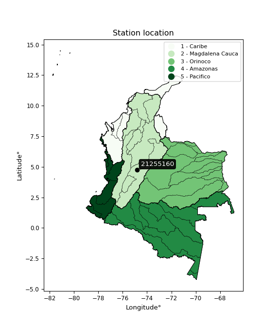

<div align="center">


</div>

# PMax24h Station (Rain, Pmax24h): 21255160

Maximum Precipitation in 24 hours (PMax24h) is the greatest amount of rainfall for a specific duration that is meteorologically possible for a given location, acting as a "worst-case" scenario for extreme storms, crucial for designing safety-critical infrastructure like bridges, river deviations, dams, spillways, and nuclear plants to prevent catastrophic failure. The PMax24h is related with the Probable Maximum Precipitation (PMP) and it is calculated by hydrologists using meteorological data to determine the upper limit of extreme rainfall, often leading to the Probable Maximum Flood (PMF) for flood control design, and is increasingly being studied for climate change impacts. Probable Maximum Precipitation (PMP) is the theoretical upper limit of rainfall, a deterministic estimate for extreme events, while probability distributions (like GEV, Gumbel) describe the likelihood and frequency of various precipitation amounts, including rare ones, showing how often events occur, with PMP representing the extreme end of these distributions, used for critical infrastructure design to ensure safety against the worst conceivable weather, unlike standard statistical forecasts which cover typical probabilities.

The most common probability distributions in hydrology, used for analyzing floods, rainfall, and streamflow, include the Normal, Log-Normal, Gumbel, Gamma (including Log-Pearson Type III), and Generalized Extreme Value (GEV) distributions, often chosen based on the data´s skewness and whether modeling extremes or general conditions, with Gumbel and GEV popular for extreme events like floods, while the Normal distribution serves as a baseline, though often requiring transformations for skewed hydrological data. These distributions help in designing water infrastructure, managing water resources, and forecasting hydrologic events.

> Hydrological data often isn´t perfectly normal (it´s skewed), so different distributions are needed for different applications, such as: **Flood Frequency Analysis**: Using Gumbel, GEV, or Log-Pearson Type III for predicting extreme flood magnitudes and their return periods, **Rainfall Analysis**: Normal for annual totals, but Log-Normal, Weibull, or GEV for intensity or extreme daily rainfall, **Streamflow Modeling**: Gamma and Log-Normal for maximum flows, GEV for minimum flows, and Kappa for daily flows.

<div align="center">

</img>

</div>


## A. General information


### 1. General running parameters

• app_version: _v20260225_. • runtime: _2026-02-27 14:50:08.749431_. • Python version: _3.14.0_. • SciPy version: _1.16.3_. • Pandas version: _2.3.3_. • NumPy version: _2.3.5_. • Stations dataset (station_dataset_file): _dataset/pmax24h_in/automatic_colombia_2003_2025.csv_. • Stations catalog (station_catalog_file): _dataset/CNE.xls_. • Minimum year to eval til year_max (date_min): _1900_. • Maximum year to eval since year_min (date_max): _2025_. • Creates, save and include plots into reports (create_plot): _False_. • Plot only fit distributions with Δo > Δ (plot_only_fit): _True_. • Plot only simple graphs avoiding multiple CDFs and multiple Extreme values plots (plot_only_simple): _False_. • Eval low extreme values, if False, evaluates high extreme values (low_extreme): _False_. • Eval every SciPy distribution as logarithmic (pdist_logarithmic_on): _True_. • Standard deviation normalized (ddof): _1.0_. • Return periods to eval in years (Tr): _[2, 2.33, 5, 10, 15, 20, 25, 50, 75, 100, 200, 250, 500, 750, 1000]_. • Minimum data sample per station, 0 means any (minimum_sample): _5_. • Z-Score maximum threshold to adjust a value, 0 means disable (zscore_max): _3.5_. • Z-Score minimum threshold to adjust a value, 0 means disable (zscore_min): _-2.5_. • Avoid zeros, e.g. rain = 0 (avoid_zeros): _True_. • Avoid null values (avoid_nans): _True_. 

:file_folder:Table: [dataset.csv](../../dataset/pmax24h_in/automatic_colombia_2003_2025.csv)

> Delta Degrees of Freedom (DDOF): is a parameter used in the formulas for calculating variance and standard deviation. When ddof=0, the divisor is $N$ (the total number of observations) and this is used when your data set is the entire population. When ddof=1, the divisor is $N-1$ and this is used when your data set is a sample drawn from a larger population. Using $N-1$ provides an unbiased estimate of the population variance (known as Bessel´s correction).


### 2. Station info and location

|   id |   CODIGO | NOMBRE                        | CATEGORIA         | TECNOLOGIA                | ESTADO           | FECHA_INSTALACION   |   FECHA_SUSPENSION |   ALTITUD |   LATITUD |   LONGITUD | DEPARTAMENTO   | MUNICIPIO   | AREA_OPERATIVA             | ENTIDAD                                                     | AREA_HIDROGRAFICA   | ZONA_HIDROGRAFICA   | SUBZONA_HIDROGRAFICA                        |   CORRIENTE | Catalogo   |   Version |
|-----:|---------:|:------------------------------|:------------------|:--------------------------|:-----------------|:--------------------|-------------------:|----------:|----------:|-----------:|:---------------|:------------|:---------------------------|:------------------------------------------------------------|:--------------------|:--------------------|:--------------------------------------------|------------:|:-----------|----------:|
|    0 | 21255160 | HACIENDA PAJONALES [21255160] | Agrometeorológica | Automática con Telemetría | En Mantenimiento | 18/10/2005          |                nan |       241 |   4.75786 |   -74.8309 | Tolima         | Ambalema    | Area Operativa 10 - Tolima | INSTITUTO DE HIDROLOGIA METEOROLOGIA Y ESTUDIOS AMBIENTALES | Magdalena Cauca     | Alto Magdalena      | Río Lagunilla y Otros Directos al Magdalena |         nan | CNE_IDEAM  |  20251226 |

<div align="center">

Dynamic map: [:earth_americas:Google](http://maps.google.com/maps?q=4.75786,-74.83091) [:earth_americas:OSM](https://www.openstreetmap.org/#map=18/4.75786/-74.83091&layers=P) [:earth_americas:Bing](https://www.bing.com/maps?cp=4.75786~-74.83091&lvl=18) [:earth_americas:Apple](https://maps.apple.com/frame?center=4.75786%2C-74.83091&span=0.003%2C0.006)

</div>


<div align="center">

```geojson
{
  "type": "Feature",
  "geometry": {
    "type": "Point", 
    "coordinates": [-74.83091, 4.75786]
  }, 
  "properties": {
    "Name": "21255160"
  }
}
```

</div>


### 3. Discrete values table and plot

<div align="center">

|               |           0 |         1 |           2 |           3 |             4 |           5 |           6 |          7 |           8 |           9 |          10 |          11 |          12 |          13 |          14 |          15 |          16 |          17 |
|:--------------|------------:|----------:|------------:|------------:|--------------:|------------:|------------:|-----------:|------------:|------------:|------------:|------------:|------------:|------------:|------------:|------------:|------------:|------------:|
| Date          | 2005        | 2006      | 2007        | 2008        | 2009          | 2010        | 2011        | 2012       | 2013        | 2014        | 2015        | 2016        | 2017        | 2018        | 2019        | 2021        | 2022        | 2025        |
| Value         |   64.2      |   54.8    |   73.3      |   48.3      |   99.3        |   84.2      |   25.3      |   98.4167  |  178.8      |   61.9      |   76.3      |   51.8      |   75.1      |   84.9      |    2.4      |  133.1      |   59.4      |   27        |
| Value_initial |   64.2      |   54.8    |   73.3      |   48.3      |   99.3        |   84.2      |   25.3      |  571.4     |  178.8      |   61.9      |   76.3      |   51.8      |   75.1      |   84.9      |    2.4      |  133.1      |   59.4      |   27        |
| count         |   18        |   18      |   18        |   18        |   18          |   18        |   18        |   18       |   18        |   18        |   18        |   18        |   18        |   18        |   18        |   18        |   18        |   18        |
| mean          |   98.4167   |   98.4167 |   98.4167   |   98.4167   |   98.4167     |   98.4167   |   98.4167   |   98.4167  |   98.4167   |   98.4167   |   98.4167   |   98.4167   |   98.4167   |   98.4167   |   98.4167   |   98.4167   |   98.4167   |   98.4167   |
| std           |  124.548    |  124.548  |  124.548    |  124.548    |  124.548      |  124.548    |  124.548    |  124.548   |  124.548    |  124.548    |  124.548    |  124.548    |  124.548    |  124.548    |  124.548    |  124.548    |  124.548    |  124.548    |
| zscore        |   -0.274727 |   -0.3502 |   -0.201663 |   -0.402389 |    0.00709233 |   -0.114146 |   -0.587057 |    3.79761 |    0.645402 |   -0.293194 |   -0.177576 |   -0.374288 |   -0.187211 |   -0.108526 |   -0.770923 |    0.278474 |   -0.313267 |   -0.573408 |


</div>


> The initial value (value_initial) correspond to the initial obtained or null completed value, and value (value) is adjusted only when the initial value is outside the valid range (outlier) definite through the Z-Score value. If Z-Score is active, values out of range or outliers are replaced with the station mean value. A Z-Score (or standard score) measures how many standard deviations a data point is from the mean of a dataset, indicating its relative position; positive scores mean above the mean, negative mean below, and a score of zero is exactly at the mean, allowing for comparison of values from different distributions. It´s calculated using the formula $z=(x–μ)/σ$, where $x$ is the data point, $μ$ is the mean, and $σ$ is the standard deviation, helping identify outliers and understand probability.
>
> <sub>**Note**: In this study, "completing" (filling gaps in) and "extending" (forecasting or lengthening the historical record) rainfall data series are avoided for certain critical analyses because they introduce artificial bias and uncertainty, which can distort the statistics of rare events (extremes), alter day-to-day variability, and compromise the integrity and homogeneity of the original data. Some reasons against Completing/Extending rainfall data are: **Distortion of Extremes and Variability**: The primary issue is that most gap-filling or extension methods rely on averaging or regression with nearby stations, which inherently smooths the data. Rainfall is highly variable in space and time, with a large percentage of zero values and occasional large storms. Infilling methods often underestimate the highest values and overestimate the lowest (zero) values, which severely distorts analyses focused on flood frequency, drought severity, and intensity-duration-frequency (IDF) curves, **Loss of Data Homogeneity**: Infilled or extended data are synthetic estimates, not actual measurements. Combining these estimates with observed data can violate the assumption of data homogeneity, which requires that the data properties do not change over time. Inhomogeneity can lead to incorrect conclusions about long-term trends or changes in climate patterns, **Propagation of Errors**: Errors and biases from the original data (e.g., wind-induced undercatch, instrument errors, site changes) or the data used for imputation can propagate through the analysis, leading to unreliable hydrological models and inaccurate predictions, **Compromised Statistical Integrity**: For statistical analyses, especially those involving the frequency of events, using artificial data can introduce time bias or autocorrelation that doesn´t exist in reality, making it difficult to assess the true probability of events, **Difficulty in Validation**: It is difficult to accurately validate the quality of filled or extended data, especially for past periods where ground-truth measurements are unavailable. The reliability of imputation techniques heavily depends on the density of the surrounding station network and the complexity of the local topography.</sub>


### 4. Active continuous probability distributions from SciPy (80 of 104 available)

A Probability Density Function (PDF) describes the relative likelihood of a continuous random variable falling within a specific range, where the total area under its curve equals 1, and the area over any interval gives the actual probability for that range. Unlike discrete probabilities (like rolling a die), a PDF shows density, not direct probability for a single point (which is zero), with higher points indicating higher likelihood, often visualized as a bell curve for normal distributions.

A log of a probability density function (log-PDF) is simply the logarithm of the PDF´s value, denoted as $log(f(x))$, useful for converting multiplication of probabilities into addition, improving numerical stability with tiny numbers, and connecting to information theory concepts like entropy. Instead of dealing with very small probabilities (e.g., 0.000001), log-PDFs use negative numbers (e.g., $log(0.00001) ≈ -11.51$ that are easier for computers to handle, preventing underflow errors and simplifying complex calculations. In this study, each active probability distribution from SciPy is also evaluated in the $log$ form.

[scipy.stats](https://docs.scipy.org/doc/scipy/reference/stats.html) is a Python´s powerful submodule within the SciPy library for comprehensive statistical analysis, offering over 130 probability distributions (like Normal, Poisson, etc.), functions for descriptive stats (mean, variance), hypothesis testing (t-tests, chi-square), random variable generation, and statistical tests, making it essential for data science, modeling, and research. It provides tools to explore, model, and draw conclusions from data efficiently, working seamlessly with [NumPy](https://numpy.org/).

<div align="center">

|   id | p_dist           |   n_parameter | fit_method   | label                                                                       | active   | ref                                                                                                      |
|-----:|:-----------------|--------------:|:-------------|:----------------------------------------------------------------------------|:---------|:---------------------------------------------------------------------------------------------------------|
|    0 | alpha            |             3 | MLE          | Alpha                                                                       | True     | [:mortar_board:](https://docs.scipy.org/doc/scipy/reference/generated/scipy.stats.alpha.html)            |
|    1 | anglit           |             2 | MM           | Anglit                                                                      | True     | [:mortar_board:](https://docs.scipy.org/doc/scipy/reference/generated/scipy.stats.anglit.html)           |
|    2 | arcsine          |             2 | MM           | Arcsine                                                                     | True     | [:mortar_board:](https://docs.scipy.org/doc/scipy/reference/generated/scipy.stats.arcsine.html)          |
|    3 | argus            |             3 | MLE          | Argus                                                                       | True     | [:mortar_board:](https://docs.scipy.org/doc/scipy/reference/generated/scipy.stats.argus.html)            |
|    4 | beta             |             4 | MLE          | Beta                                                                        | True     | [:mortar_board:](https://docs.scipy.org/doc/scipy/reference/generated/scipy.stats.beta.html)             |
|    5 | betaprime        |             4 | MLE          | Beta prime                                                                  | True     | [:mortar_board:](https://docs.scipy.org/doc/scipy/reference/generated/scipy.stats.betaprime.html)        |
|    6 | bradford         |             3 | MLE          | Bradford                                                                    | True     | [:mortar_board:](https://docs.scipy.org/doc/scipy/reference/generated/scipy.stats.bradford.html)         |
|    7 | burr             |             4 | MLE          | Burr (Type III)                                                             | True     | [:mortar_board:](https://docs.scipy.org/doc/scipy/reference/generated/scipy.stats.burr.html)             |
|    8 | burr12           |             4 | MLE          | Burr (Type III) 12                                                          | True     | [:mortar_board:](https://docs.scipy.org/doc/scipy/reference/generated/scipy.stats.burr12.html)           |
|    9 | cosine           |             2 | MLE          | Cosine                                                                      | True     | [:mortar_board:](https://docs.scipy.org/doc/scipy/reference/generated/scipy.stats.cosine.html)           |
|   10 | crystalball      |             4 | MLE          | Crystalball                                                                 | True     | [:mortar_board:](https://docs.scipy.org/doc/scipy/reference/generated/scipy.stats.crystalball.html)      |
|   11 | dgamma           |             3 | MLE          | Double gamma                                                                | True     | [:mortar_board:](https://docs.scipy.org/doc/scipy/reference/generated/scipy.stats.dgamma.html)           |
|   12 | dweibull         |             3 | MLE          | Double Weibull                                                              | True     | [:mortar_board:](https://docs.scipy.org/doc/scipy/reference/generated/scipy.stats.dweibull.html)         |
|   13 | erlang           |             3 | MLE          | Erlang                                                                      | True     | [:mortar_board:](https://docs.scipy.org/doc/scipy/reference/generated/scipy.stats.erlang.html)           |
|   14 | exponnorm        |             3 | MLE          | Exponentially modified Normal                                               | True     | [:mortar_board:](https://docs.scipy.org/doc/scipy/reference/generated/scipy.stats.exponnorm.html)        |
|   15 | exponpow         |             3 | MLE          | Exponential power                                                           | True     | [:mortar_board:](https://docs.scipy.org/doc/scipy/reference/generated/scipy.stats.exponpow.html)         |
|   16 | exponweib        |             4 | MLE          | Exponentiated Weibull                                                       | True     | [:mortar_board:](https://docs.scipy.org/doc/scipy/reference/generated/scipy.stats.exponweib.html)        |
|   17 | f                |             4 | MLE          | F                                                                           | True     | [:mortar_board:](https://docs.scipy.org/doc/scipy/reference/generated/scipy.stats.f.html)                |
|   18 | fatiguelife      |             3 | MLE          | Fatigue-life (Birnbaum-Saunders)                                            | True     | [:mortar_board:](https://docs.scipy.org/doc/scipy/reference/generated/scipy.stats.fatiguelife.html)      |
|   19 | foldnorm         |             3 | MM           | Fold Normal                                                                 | True     | [:mortar_board:](https://docs.scipy.org/doc/scipy/reference/generated/scipy.stats.foldnorm.html)         |
|   20 | gamma            |             3 | MLE          | Gamma                                                                       | True     | [:mortar_board:](https://docs.scipy.org/doc/scipy/reference/generated/scipy.stats.gamma.html)            |
|   21 | gausshyper       |             6 | MLE          | Gauss hypergeometric                                                        | True     | [:mortar_board:](https://docs.scipy.org/doc/scipy/reference/generated/scipy.stats.gausshyper.html)       |
|   22 | genexpon         |             5 | MLE          | Generalized exponential                                                     | True     | [:mortar_board:](https://docs.scipy.org/doc/scipy/reference/generated/scipy.stats.genexpon.html)         |
|   23 | genextreme       |             3 | MLE          | Generalized exponential                                                     | True     | [:mortar_board:](https://docs.scipy.org/doc/scipy/reference/generated/scipy.stats.genextreme.html)       |
|   24 | gengamma         |             4 | MLE          | Generalized gamma                                                           | True     | [:mortar_board:](https://docs.scipy.org/doc/scipy/reference/generated/scipy.stats.gengamma.html)         |
|   25 | genhalflogistic  |             3 | MLE          | Generalized half-logistic                                                   | True     | [:mortar_board:](https://docs.scipy.org/doc/scipy/reference/generated/scipy.stats.genhalflogistic.html)  |
|   26 | genlogistic      |             3 | MLE          | Generalized logistic                                                        | True     | [:mortar_board:](https://docs.scipy.org/doc/scipy/reference/generated/scipy.stats.genlogistic.html)      |
|   27 | gennorm          |             3 | MLE          | Generalized Normal                                                          | True     | [:mortar_board:](https://docs.scipy.org/doc/scipy/reference/generated/scipy.stats.gennorm.html)          |
|   28 | genpareto        |             3 | MLE          | Generalized Pareto                                                          | True     | [:mortar_board:](https://docs.scipy.org/doc/scipy/reference/generated/scipy.stats.genpareto.html)        |
|   29 | gompertz         |             3 | MLE          | Gompertz (or truncated Gumbel)                                              | True     | [:mortar_board:](https://docs.scipy.org/doc/scipy/reference/generated/scipy.stats.gompertz.html)         |
|   30 | gumbel_l         |             2 | MM           | Gumbel Left Skew                                                            | True     | [:mortar_board:](https://docs.scipy.org/doc/scipy/reference/generated/scipy.stats.gumbel_l.html)         |
|   31 | gumbel_r         |             2 | MM           | Gumbel Right Skew                                                           | True     | [:mortar_board:](https://docs.scipy.org/doc/scipy/reference/generated/scipy.stats.gumbel_r.html)         |
|   32 | halfgennorm      |             3 | MLE          | Upper half of a generalized normal                                          | True     | [:mortar_board:](https://docs.scipy.org/doc/scipy/reference/generated/scipy.stats.halfgennorm.html)      |
|   33 | halflogistic     |             2 | MM           | Half-logistic                                                               | True     | [:mortar_board:](https://docs.scipy.org/doc/scipy/reference/generated/scipy.stats.halflogistic.html)     |
|   34 | halfnorm         |             2 | MM           | Half Normal                                                                 | True     | [:mortar_board:](https://docs.scipy.org/doc/scipy/reference/generated/scipy.stats.halfnorm.html)         |
|   35 | hypsecant        |             2 | MM           | hyperbolic secant                                                           | True     | [:mortar_board:](https://docs.scipy.org/doc/scipy/reference/generated/scipy.stats.hypsecant.html)        |
|   36 | invgamma         |             3 | MLE          | Inverted gamma                                                              | True     | [:mortar_board:](https://docs.scipy.org/doc/scipy/reference/generated/scipy.stats.invgamma.html)         |
|   37 | invgauss         |             3 | MLE          | Inverse Gaussian                                                            | True     | [:mortar_board:](https://docs.scipy.org/doc/scipy/reference/generated/scipy.stats.invgauss.html)         |
|   38 | invweibull       |             3 | MLE          | Inverted Weibull                                                            | True     | [:mortar_board:](https://docs.scipy.org/doc/scipy/reference/generated/scipy.stats.invweibull.html)       |
|   39 | johnsonsb        |             4 | MLE          | Johnson SB                                                                  | True     | [:mortar_board:](https://docs.scipy.org/doc/scipy/reference/generated/scipy.stats.johnsonsb.html)        |
|   40 | johnsonsu        |             4 | MLE          | Johnson Su                                                                  | True     | [:mortar_board:](https://docs.scipy.org/doc/scipy/reference/generated/scipy.stats.johnsonsu.html)        |
|   41 | kappa3           |             3 | MLE          | Kappa 3                                                                     | True     | [:mortar_board:](https://docs.scipy.org/doc/scipy/reference/generated/scipy.stats.kappa3.html)           |
|   42 | kappa4           |             4 | MLE          | Kappa 4                                                                     | True     | [:mortar_board:](https://docs.scipy.org/doc/scipy/reference/generated/scipy.stats.kappa4.html)           |
|   43 | ksone            |             3 | MLE          | Kolmogorov-Smirnov one-sided test statistic distribution                    | True     | [:mortar_board:](https://docs.scipy.org/doc/scipy/reference/generated/scipy.stats.ksone.html)            |
|   44 | kstwobign        |             2 | MLE          | Limiting distribution of scaled Kolmogorov-Smirnov two-sided test statistic | True     | [:mortar_board:](https://docs.scipy.org/doc/scipy/reference/generated/scipy.stats.kstwobign.html)        |
|   45 | laplace          |             2 | MM           | Laplace                                                                     | True     | [:mortar_board:](https://docs.scipy.org/doc/scipy/reference/generated/scipy.stats.laplace.html)          |
|   46 | levy_l           |             2 | MLE          | Left-skewed Levy                                                            | True     | [:mortar_board:](https://docs.scipy.org/doc/scipy/reference/generated/scipy.stats.levy_l.html)           |
|   47 | loggamma         |             3 | MLE          | Log gamma                                                                   | True     | [:mortar_board:](https://docs.scipy.org/doc/scipy/reference/generated/scipy.stats.loggamma.html)         |
|   48 | logistic         |             2 | MM           | Logistic (or Sech-squared)                                                  | True     | [:mortar_board:](https://docs.scipy.org/doc/scipy/reference/generated/scipy.stats.logistic.html)         |
|   49 | loglaplace       |             3 | MLE          | Log-Laplace                                                                 | True     | [:mortar_board:](https://docs.scipy.org/doc/scipy/reference/generated/scipy.stats.loglaplace.html)       |
|   50 | lomax            |             3 | MLE          | Lomax (Pareto of the second kind)                                           | True     | [:mortar_board:](https://docs.scipy.org/doc/scipy/reference/generated/scipy.stats.lomax.html)            |
|   51 | maxwell          |             2 | MM           | Maxwell                                                                     | True     | [:mortar_board:](https://docs.scipy.org/doc/scipy/reference/generated/scipy.stats.maxwell.html)          |
|   52 | mielke           |             4 | MLE          | Mielke Beta-Kappa / Dagum                                                   | True     | [:mortar_board:](https://docs.scipy.org/doc/scipy/reference/generated/scipy.stats.mielke.html)           |
|   53 | moyal            |             2 | MM           | Moyal                                                                       | True     | [:mortar_board:](https://docs.scipy.org/doc/scipy/reference/generated/scipy.stats.moyal.html)            |
|   54 | nakagami         |             3 | MLE          | Nakagami                                                                    | True     | [:mortar_board:](https://docs.scipy.org/doc/scipy/reference/generated/scipy.stats.nakagami.html)         |
|   55 | ncf              |             5 | MLE          | Non-central F distribution                                                  | True     | [:mortar_board:](https://docs.scipy.org/doc/scipy/reference/generated/scipy.stats.ncf.html)              |
|   56 | nct              |             4 | MLE          | Non-central Student’s t                                                     | True     | [:mortar_board:](https://docs.scipy.org/doc/scipy/reference/generated/scipy.stats.nct.html)              |
|   57 | norm             |             2 | MM           | Normal                                                                      | True     | [:mortar_board:](https://docs.scipy.org/doc/scipy/reference/generated/scipy.stats.norm.html)             |
|   58 | pearson3         |             3 | MM           | Pearson type III                                                            | True     | [:mortar_board:](https://docs.scipy.org/doc/scipy/reference/generated/scipy.stats.pearson3.html)         |
|   59 | powerlaw         |             3 | MLE          | Power-function                                                              | True     | [:mortar_board:](https://docs.scipy.org/doc/scipy/reference/generated/scipy.stats.powerlaw.html)         |
|   60 | rayleigh         |             2 | MM           | Rayleigh                                                                    | True     | [:mortar_board:](https://docs.scipy.org/doc/scipy/reference/generated/scipy.stats.rayleigh.html)         |
|   61 | rdist            |             3 | MLE          | R-distributed (symmetric beta)                                              | True     | [:mortar_board:](https://docs.scipy.org/doc/scipy/reference/generated/scipy.stats.rdist.html)            |
|   62 | rice             |             3 | MLE          | Rice                                                                        | True     | [:mortar_board:](https://docs.scipy.org/doc/scipy/reference/generated/scipy.stats.rice.html)             |
|   63 | semicircular     |             2 | MM           | Semicircular                                                                | True     | [:mortar_board:](https://docs.scipy.org/doc/scipy/reference/generated/scipy.stats.semicircular.html)     |
|   64 | skewnorm         |             3 | MLE          | Skew normal                                                                 | True     | [:mortar_board:](https://docs.scipy.org/doc/scipy/reference/generated/scipy.stats.skewnorm.html)         |
|   65 | t                |             3 | MLE          | Student’s t                                                                 | True     | [:mortar_board:](https://docs.scipy.org/doc/scipy/reference/generated/scipy.stats.t.html)                |
|   66 | trapezoid        |             4 | MLE          | Trapezoid                                                                   | True     | [:mortar_board:](https://docs.scipy.org/doc/scipy/reference/generated/scipy.stats.trapezoid.html)        |
|   67 | triang           |             3 | MLE          | Triangular                                                                  | True     | [:mortar_board:](https://docs.scipy.org/doc/scipy/reference/generated/scipy.stats.triang.html)           |
|   68 | truncexpon       |             3 | MLE          | Truncated exponential                                                       | True     | [:mortar_board:](https://docs.scipy.org/doc/scipy/reference/generated/scipy.stats.truncexpon.html)       |
|   69 | truncnorm        |             4 | MLE          | Truncated normal                                                            | True     | [:mortar_board:](https://docs.scipy.org/doc/scipy/reference/generated/scipy.stats.truncnorm.html)        |
|   70 | truncpareto      |             4 | MLE          | Upper truncated Pareto                                                      | True     | [:mortar_board:](https://docs.scipy.org/doc/scipy/reference/generated/scipy.stats.truncpareto.html)      |
|   71 | truncweibull_min |             5 | MLE          | Doubly truncated Weibull minimum                                            | True     | [:mortar_board:](https://docs.scipy.org/doc/scipy/reference/generated/scipy.stats.truncweibull_min.html) |
|   72 | tukeylambda      |             3 | MLE          | Tukey-Lamdba                                                                | True     | [:mortar_board:](https://docs.scipy.org/doc/scipy/reference/generated/scipy.stats.tukeylambda.html)      |
|   73 | uniform          |             2 | MLE          | Uniform                                                                     | True     | [:mortar_board:](https://docs.scipy.org/doc/scipy/reference/generated/scipy.stats.uniform.html)          |
|   74 | vonmises         |             3 | MLE          | Von Mises                                                                   | True     | [:mortar_board:](https://docs.scipy.org/doc/scipy/reference/generated/scipy.stats.vonmises.html)         |
|   75 | vonmises_line    |             3 | MLE          | Von Mises line                                                              | True     | [:mortar_board:](https://docs.scipy.org/doc/scipy/reference/generated/scipy.stats.vonmises_line.html)    |
|   76 | wald             |             2 | MM           | Wald                                                                        | True     | [:mortar_board:](https://docs.scipy.org/doc/scipy/reference/generated/scipy.stats.wald.html)             |
|   77 | weibull_max      |             3 | MLE          | Weibull maximum                                                             | True     | [:mortar_board:](https://docs.scipy.org/doc/scipy/reference/generated/scipy.stats.weibull_max.html)      |
|   78 | weibull_min      |             3 | MLE          | Weibull minimum                                                             | True     | [:mortar_board:](https://docs.scipy.org/doc/scipy/reference/generated/scipy.stats.weibull_min.html)      |
|   79 | wrapcauchy       |             3 | MLE          | Wrapped  Cauchy                                                             | True     | [:mortar_board:](https://docs.scipy.org/doc/scipy/reference/generated/scipy.stats.wrapcauchy.html)       |

</div>

> **n_parameter:** # arguments & localization & scale.
>
> **Fit methods:** (MLE) maximum likelihood, (MM) L-moments.
>
>**Inactive** (With the only purpose of prevent loops, zero divisions, infinite values, over high estimated values or horizontal trending for recurrence intervals estimations, the follow distributions were disabled.)**:** lognorm, norminvgauss, powernorm, powerlognorm, cauchy, halfcauchy, foldcauchy, skewcauchy, chi2, expon, fisk, genhyperbolic, geninvgauss, gibrat, kstwo, laplace_asymmetric, levy, levy_stable, ncx2, pareto, rel_breitwigner, recipinvgauss, studentized_range, loguniform, 


## B. Probability (PDF) vs. Empirical (EDF) distributions functions

A continuous probability distribution (CPD) describes probabilities for variables that can take any value within a range (like rain any time), unlike discrete variables with specific outcomes (like temperature). It uses a Probability Density Function (PDF), a curve where the total area under it equals 1, and the probability of the variable falling within an interval (a to b) is found by calculating the area under the curve between those points. A key feature is that the probability of hitting any single exact value is zero, so probabilities are always expressed for ranges, e.g., $P(a ≤ X ≤ b)$.

<div align="center">

Distributions parameters from station values
|     |   station | p_dist              |   n |               loc |            scale | shape                  | shape1                 | shape2                | shape3             |
|----:|----------:|:--------------------|----:|------------------:|-----------------:|:-----------------------|:-----------------------|:----------------------|:-------------------|
|   0 |  21255160 | alpha               |  18 |      -0.0246328   |     10.1689      | 1.283035004883315e-10  |                        |                       |                    |
|   1 |  21255160 | anglit              |  18 |      72.1398      |    114.478       |                        |                        |                       |                    |
|   2 |  21255160 | arcsine             |  18 |      16.7979      |    110.684       |                        |                        |                       |                    |
|   3 |  21255160 | argus               |  18 |     -36.4985      |    218.884       | 1.3082605271300436e-06 |                        |                       |                    |
|   4 |  21255160 | beta                |  18 |     -51.9692      |      2.29739e+09 | 10.294164974530588     | 190556178.67994618     |                       |                    |
|   5 |  21255160 | betaprime           |  18 |     -52.9876      |   7891.65        | 10.640729192538654     | 672.1107720803334      |                       |                    |
|   6 |  21255160 | bradford            |  18 |       2.4         |    177.189       | 1.7070273625903303     |                        |                       |                    |
|   7 |  21255160 | burr                |  18 |     -22.7213      |    108.647       | 5.7857412704357625     | 0.510698517770103      |                       |                    |
|   8 |  21255160 | burr12              |  18 |      -9.18059     |   1017.2         | 2.17488907705863       | 187.88195679369124     |                       |                    |
|   9 |  21255160 | cosine              |  18 |      79.1699      |     38.0496      |                        |                        |                       |                    |
|  10 |  21255160 | crystalball         |  18 |      72.1398      |     39.1326      | 5220.625466144216      | 2857.4766006326013     |                       |                    |
|  11 |  21255160 | dgamma              |  18 |      68.6827      |     21.5415      | 1.3109480717970312     |                        |                       |                    |
|  12 |  21255160 | dweibull            |  18 |      68.8272      |     29.5483      | 1.1179508783301986     |                        |                       |                    |
|  13 |  21255160 | erlang              |  18 |     -51.9691      |     12.0563      | 10.294140144303963     |                        |                       |                    |
|  14 |  21255160 | exponnorm           |  18 |      42.1305      |     24.5524      | 1.2222580928979387     |                        |                       |                    |
|  15 |  21255160 | exponpow            |  18 |       2.4         |      3.88679     | 0.1208956106040197     |                        |                       |                    |
|  16 |  21255160 | exponweib           |  18 |    -375.88        |    212.611       | 223.09618494969823     | 2.383627359971003      |                       |                    |
|  17 |  21255160 | f                   |  18 |     -52.1079      |    124.226       | 20.67540260605127      | 11503.566558778723     |                       |                    |
|  18 |  21255160 | fatiguelife         |  18 |    -104.68        |    172.728       | 0.21765700084694664    |                        |                       |                    |
|  19 |  21255160 | foldnorm            |  18 |      18.1836      |     53.5129      | 0.7425632391356924     |                        |                       |                    |
|  20 |  21255160 | gamma               |  18 |     -51.9692      |     12.0563      | 10.294160556173116     |                        |                       |                    |
|  21 |  21255160 | gausshyper          |  18 |       2.4         |    273.65        | 0.5087664126721991     | 9.004762293338626      | -5.944937708539548    | 4.371804761468422  |
|  22 |  21255160 | genexpon            |  18 |       2.39997     |      2.48481     | 0.03564129095223138    | 1.4257398273281561e-07 | 2.590839278916714     |                    |
|  23 |  21255160 | genextreme          |  18 |      55.6406      |     33.7104      | 0.0892681005944817     |                        |                       |                    |
|  24 |  21255160 | gengamma            |  18 |     -48.9833      |     13.114       | 9.495977898858698      | 1.0126861913173784     |                       |                    |
|  25 |  21255160 | genhalflogistic     |  18 |       2.4         |     64.2764      | 0.2746099358431913     |                        |                       |                    |
|  26 |  21255160 | genlogistic         |  18 |      39.7244      |     25.7853      | 2.431363804209501      |                        |                       |                    |
|  27 |  21255160 | gennorm             |  18 |      69.3857      |     31.9572      | 1.0987131221825042     |                        |                       |                    |
|  28 |  21255160 | genpareto           |  18 |       2.4         |    105.781       | -0.5539279848276895    |                        |                       |                    |
|  29 |  21255160 | gompertz            |  18 |      51.7999      |      7.85854     | 1.338971311435776e-06  |                        |                       |                    |
|  30 |  21255160 | gumbel_l            |  18 |      89.7516      |     30.5116      |                        |                        |                       |                    |
|  31 |  21255160 | gumbel_r            |  18 |      54.5281      |     30.5116      |                        |                        |                       |                    |
|  32 |  21255160 | halfgennorm         |  18 |       2.4         |      4.15397     | 0.382772369813675      |                        |                       |                    |
|  33 |  21255160 | halflogistic        |  18 |      25.7586      |     33.457       |                        |                        |                       |                    |
|  34 |  21255160 | halfnorm            |  18 |      20.3436      |     64.917       |                        |                        |                       |                    |
|  35 |  21255160 | hypsecant           |  18 |      72.1398      |     24.9126      |                        |                        |                       |                    |
|  36 |  21255160 | invgamma            |  18 |    -153.076       |   7823.17        | 35.73956776138317      |                        |                       |                    |
|  37 |  21255160 | invgauss            |  18 |     -50.5753      |   1068.02        | 0.11622497822722172    |                        |                       |                    |
|  38 |  21255160 | invweibull          |  18 | -475521           | 475575           | 14298.930565098955     |                        |                       |                    |
|  39 |  21255160 | johnsonsb           |  18 |     -95.8371      |   4435.27        | 13.75198043303029      | 4.216921449858457      |                       |                    |
|  40 |  21255160 | johnsonsu           |  18 |      58.865       |     33.9156      | -0.3366624675198635    | 1.2349232322666914     |                       |                    |
|  41 |  21255160 | kappa3              |  18 |       2.4         |     84.3706      | 5.615530445373015      |                        |                       |                    |
|  42 |  21255160 | kappa4              |  18 |     -17.4501      |    170.529       | 1.130477895922249      | 0.8587826009542794     |                       |                    |
|  43 |  21255160 | ksone               |  18 |     -15.24        |    211.68        | 1.0                    |                        |                       |                    |
|  44 |  21255160 | kstwobign           |  18 |     -68.2322      |    161.911       |                        |                        |                       |                    |
|  45 |  21255160 | laplace             |  18 |      72.1398      |     27.6709      |                        |                        |                       |                    |
|  46 |  21255160 | levy_l              |  18 |     190.071       |     76.3311      |                        |                        |                       |                    |
|  47 |  21255160 | loggamma            |  18 |  -16150           |   2055.49        | 2676.6312491060808     |                        |                       |                    |
|  48 |  21255160 | logistic            |  18 |      72.1398      |     21.5749      |                        |                        |                       |                    |
|  49 |  21255160 | loglaplace          |  18 |      -0.183005    |     73.483       | 1.9159544729465376     |                        |                       |                    |
|  50 |  21255160 | lomax               |  18 |       2.4         |      1.73636e+11 | 1908514029.416156      |                        |                       |                    |
|  51 |  21255160 | maxwell             |  18 |     -20.588       |     58.1086      |                        |                        |                       |                    |
|  52 |  21255160 | mielke              |  18 |     -22.7512      |    108.673       | 2.956236582411921      | 5.7865756319840465     |                       |                    |
|  53 |  21255160 | moyal               |  18 |      49.7613      |     17.6159      |                        |                        |                       |                    |
|  54 |  21255160 | nakagami            |  18 |     -15.3896      |     95.8788      | 1.3627035740504165     |                        |                       |                    |
|  55 |  21255160 | ncf                 |  18 |     -25.7885      |      5.51159     | 1.4101132151020055     | 10984.519095306514     | 23.631558154532676    |                    |
|  56 |  21255160 | nct                 |  18 |      -0.16482     |     29.4492      | 8.781610565517317      | 2.23808351358991       |                       |                    |
|  57 |  21255160 | norm                |  18 |      72.1398      |     39.1326      |                        |                        |                       |                    |
|  58 |  21255160 | pearson3            |  18 |      72.1398      |     39.1326      | 0.8504113933159835     |                        |                       |                    |
|  59 |  21255160 | powerlaw            |  18 |       2.4         |    176.4         | 0.31393514082517504    |                        |                       |                    |
|  60 |  21255160 | rayleigh            |  18 |      -2.72315     |     59.732       |                        |                        |                       |                    |
|  61 |  21255160 | rdist               |  18 |     -14.8812      |     99.7812      | 1.0232425480987906     |                        |                       |                    |
|  62 |  21255160 | rice                |  18 |      -6.01563     |     61.8047      | 0.0009963141389950237  |                        |                       |                    |
|  63 |  21255160 | semicircular        |  18 |      72.1398      |     78.2652      |                        |                        |                       |                    |
|  64 |  21255160 | skewnorm            |  18 |      31.9283      |     56.1099      | 2.2374789705806766     |                        |                       |                    |
|  65 |  21255160 | t                   |  18 |      68.0872      |     25.6432      | 2.8536571081944406     |                        |                       |                    |
|  66 |  21255160 | trapezoid           |  18 |     -16.002       |    211.68        | 1.0                    | 1.0                    |                       |                    |
|  67 |  21255160 | triang              |  18 |     -11.4673      |    203.927       | 0.34751349179368296    |                        |                       |                    |
|  68 |  21255160 | truncexpon          |  18 |       2.4         |    244.903       | 0.7202854268413577     |                        |                       |                    |
|  69 |  21255160 | truncnorm           |  18 |      -7.35307     |      2.96593     | 3.2874758808018876     | 62.76380501835138      |                       |                    |
|  70 |  21255160 | truncpareto         |  18 |       2.4         |      9.99246e-07 | 0.05882354794120569    | 176533151.7306924      |                       |                    |
|  71 |  21255160 | truncweibull_min    |  18 |      -5.66597     |    209.838       | 1.319702779113939      | 0.0014733702765797425  | 0.8790872795558728    |                    |
|  72 |  21255160 | tukeylambda         |  18 |      67.9247      |    202.289       | 3.0872159590095922     |                        |                       |                    |
|  73 |  21255160 | uniform             |  18 |       2.4         |    176.4         |                        |                        |                       |                    |
|  74 |  21255160 | vonmises            |  18 |       2.76647     |      1           | 0.26591383071972796    |                        |                       |                    |
|  75 |  21255160 | vonmises_line       |  18 |      -7.85263     |     59.4134      | 0.4098292406936575     |                        |                       |                    |
|  76 |  21255160 | wald                |  18 |      33.0072      |     39.1326      |                        |                        |                       |                    |
|  77 |  21255160 | weibull_max         |  18 |     178.8         |      1.65913     | 0.2152616337497113     |                        |                       |                    |
|  78 |  21255160 | weibull_min         |  18 |      22.5663      |     57.0124      | 1.4307468692073946     |                        |                       |                    |
|  79 |  21255160 | wrapcauchy          |  18 |       2.39996     |     28.5172      | 4.2540571044667565e-06 |                        |                       |                    |
|  80 |  21255160 | logalpha            |  18 |     -26.3283      |    976.635       | 32.22655109698191      |                        |                       |                    |
|  81 |  21255160 | loganglit           |  18 |       4.03833     |      2.62378     |                        |                        |                       |                    |
|  82 |  21255160 | logarcsine          |  18 |       2.76989     |      2.53686     |                        |                        |                       |                    |
|  83 |  21255160 | logargus            |  18 |      -0.368261    |      5.58865     | 2.6930602447558236     |                        |                       |                    |
|  84 |  21255160 | logbeta             |  18 |      -5.70418e+07 |      5.70418e+07 | 122538712.36110537     | 2.8492292594847246     |                       |                    |
|  85 |  21255160 | logbetaprime        |  18 |     -19.4662      |    115.808       | 711.6349968896698      | 3509.487538174899      |                       |                    |
|  86 |  21255160 | logbradford         |  18 |       0.875466    |      4.31081     | 0.6806766800528008     |                        |                       |                    |
|  87 |  21255160 | logburr             |  18 |  -90847.4         |  90852           | 487136.9625629232      | 0.2805963830968815     |                       |                    |
|  88 |  21255160 | logburr12           |  18 |   -2041.35        |   2053.36        | 3704.1497104988575     | 951546.7638136344      |                       |                    |
|  89 |  21255160 | logcosine           |  18 |       3.68263     |      1.02573     |                        |                        |                       |                    |
|  90 |  21255160 | logcrystalball      |  18 |       4.03833     |      0.896906    | 15.536285497090349     | 173.44229176692153     |                       |                    |
|  91 |  21255160 | logdgamma           |  18 |       4.31882     |      0.659803    | 0.7162190729278188     |                        |                       |                    |
|  92 |  21255160 | logdweibull         |  18 |       4.31882     |      0.636262    | 0.9562811489249518     |                        |                       |                    |
|  93 |  21255160 | logerlang           |  18 |      -7.22031     |      0.0991828   | 113.35533877846333     |                        |                       |                    |
|  94 |  21255160 | logexponnorm        |  18 |       4.03782     |      0.896904    | 0.0005617745392811269  |                        |                       |                    |
|  95 |  21255160 | logexponpow         |  18 |      -2.8687e+06  |      2.8687e+06  | 3564669.1244347016     |                        |                       |                    |
|  96 |  21255160 | logexponweib        |  18 |      -2.78991e+07 |      2.78991e+07 | 0.6222050933598631     | 66193321.50449226      |                       |                    |
|  97 |  21255160 | logf                |  18 |   -2691.95        |   2695.98        | 48828984.632091016     | 28433620.33657771      |                       |                    |
|  98 |  21255160 | logfatiguelife      |  18 |    -743.015       |    747.055       | 0.001197951618248403   |                        |                       |                    |
|  99 |  21255160 | logfoldnorm         |  18 |       0.528903    |      0.782633    | 4.503443853278263      |                        |                       |                    |
| 100 |  21255160 | loggamma            |  18 |     -14.3902      |      0.0521078   | 353.4573101596266      |                        |                       |                    |
| 101 |  21255160 | loggausshyper       |  18 |       0.487102    |      4.69917     | 1.2424577411209832     | 0.4921767378923257     | 1.046719328418224     | 1.1473489792803324 |
| 102 |  21255160 | loggenexpon         |  18 |       0.767508    |      0.130998    | 0.0021069698840291504  | 9.425620802027627      | 0.0002989814569631811 |                    |
| 103 |  21255160 | loggenextreme       |  18 |       3.91833     |      0.92012     | 0.7020411464738641     |                        |                       |                    |
| 104 |  21255160 | loggengamma         |  18 |      -6.05589e+07 |      6.05589e+07 | 0.7649388282291436     | 125344428.24418327     |                       |                    |
| 105 |  21255160 | loggenhalflogistic  |  18 |       0.413195    |      5.20791     | 1.0911023282572831     |                        |                       |                    |
| 106 |  21255160 | loggenlogistic      |  18 |       4.62359     |      0.189746    | 0.28628388536104954    |                        |                       |                    |
| 107 |  21255160 | loggennorm          |  18 |       4.31882     |      0.137079    | 0.5720841647692035     |                        |                       |                    |
| 108 |  21255160 | loggenpareto        |  18 |      -0.00834696  |     10.5144      | -2.0241043485047348    |                        |                       |                    |
| 109 |  21255160 | loggompertz         |  18 |       0.515054    |      0.559759    | 0.00099885326858968    |                        |                       |                    |
| 110 |  21255160 | loggumbel_l         |  18 |       4.44198     |      0.699314    |                        |                        |                       |                    |
| 111 |  21255160 | loggumbel_r         |  18 |       3.63467     |      0.699314    |                        |                        |                       |                    |
| 112 |  21255160 | loghalfgennorm      |  18 |       0.875434    |      4.31536     | 4442.204982010483      |                        |                       |                    |
| 113 |  21255160 | loghalflogistic     |  18 |       2.9753      |      0.766811    |                        |                        |                       |                    |
| 114 |  21255160 | loghalfnorm         |  18 |       2.85117     |      1.48788     |                        |                        |                       |                    |
| 115 |  21255160 | loghypsecant        |  18 |       4.03833     |      0.570987    |                        |                        |                       |                    |
| 116 |  21255160 | loginvgamma         |  18 |     -21.5828      |  18341.9         | 717.3233663991984      |                        |                       |                    |
| 117 |  21255160 | loginvgauss         |  18 |      -7.42062     |   1341.15        | 0.008515963263060786   |                        |                       |                    |
| 118 |  21255160 | loginvweibull       |  18 |      -6.66395e+07 |      6.66395e+07 | 50730641.021036476     |                        |                       |                    |
| 119 |  21255160 | logjohnsonsb        |  18 |    -147.991       |    153.673       | -9.9362639899406       | 2.1417447936678355     |                       |                    |
| 120 |  21255160 | logjohnsonsu        |  18 |       4.38627     |      0.278344    | 0.43113765897815426    | 0.8133472939295328     |                       |                    |
| 121 |  21255160 | logkappa3           |  18 |       0.875462    |      4.31078     | 451937.6443304537      |                        |                       |                    |
| 122 |  21255160 | logkappa4           |  18 |       0.262957    |      6.24147     | 1.1080248977493423     | 1.2677384482543281     |                       |                    |
| 123 |  21255160 | logksone            |  18 |       0.444389    |      5.17296     | 1.0                    |                        |                       |                    |
| 124 |  21255160 | logkstwobign        |  18 |      -1.63113     |      6.56205     |                        |                        |                       |                    |
| 125 |  21255160 | loglaplace          |  18 |       4.03833     |      0.634207    |                        |                        |                       |                    |
| 126 |  21255160 | loglevy_l           |  18 |       5.28663     |      0.670133    |                        |                        |                       |                    |
| 127 |  21255160 | logloggamma         |  18 |       4.66497     |      0.407336    | 0.6006330689080188     |                        |                       |                    |
| 128 |  21255160 | loglogistic         |  18 |       4.03833     |      0.49449     |                        |                        |                       |                    |
| 129 |  21255160 | logloglaplace       |  18 |      -3.9798e+07  |      3.9798e+07  | 75327316.16515106      |                        |                       |                    |
| 130 |  21255160 | loglomax            |  18 |       0.875469    |      6.40743e+11 | 190215962407.9654      |                        |                       |                    |
| 131 |  21255160 | logmaxwell          |  18 |       1.91306     |      1.33181     |                        |                        |                       |                    |
| 132 |  21255160 | logmielke           |  18 |      -6.0798e+07  |      6.0798e+07  | 94025548.25128753      | 318768556.3855141      |                       |                    |
| 133 |  21255160 | logmoyal            |  18 |       3.52542     |      0.403749    |                        |                        |                       |                    |
| 134 |  21255160 | lognakagami         |  18 |       2.60888     |      1.67576     | 2.720448520509182      |                        |                       |                    |
| 135 |  21255160 | logncf              |  18 |     -12.3368      |      1.81319     | 137.27164159988166     | 2811.851862194415      | 1102.6852715732862    |                    |
| 136 |  21255160 | lognct              |  18 |      50.0553      |      0.867732    | 23268.876000179414     | -53.02750683019863     |                       |                    |
| 137 |  21255160 | lognorm             |  18 |       4.03833     |      0.896905    |                        |                        |                       |                    |
| 138 |  21255160 | logpearson3         |  18 |       4.03833     |      0.896907    | -2.3031285850454477    |                        |                       |                    |
| 139 |  21255160 | logpowerlaw         |  18 |       0.875469    |      4.3108      | 0.4217951294815919     |                        |                       |                    |
| 140 |  21255160 | lograyleigh         |  18 |       2.32247     |      1.36905     |                        |                        |                       |                    |
| 141 |  21255160 | logrdist            |  18 |       1.61446     |      2.82701     | 0.847595297961917      |                        |                       |                    |
| 142 |  21255160 | logrice             |  18 |    -259.207       |      0.897048    | 293.45627210826694     |                        |                       |                    |
| 143 |  21255160 | logsemicircular     |  18 |       4.03833     |      1.7938      |                        |                        |                       |                    |
| 144 |  21255160 | logskewnorm         |  18 |       5.18627     |      1.45674     | -130419139.73940459    |                        |                       |                    |
| 145 |  21255160 | logt                |  18 |       4.24794     |      0.31191     | 1.5256187684071825     |                        |                       |                    |
| 146 |  21255160 | logtrapezoid        |  18 |       0.444389    |      5.17296     | 1.0                    | 1.0                    |                       |                    |
| 147 |  21255160 | logtriang           |  18 |       0.58181     |      4.84105     | 0.8277961752009257     |                        |                       |                    |
| 148 |  21255160 | logtruncexpon       |  18 |       0.522296    |      6.60512     | 0.7061143980673386     |                        |                       |                    |
| 149 |  21255160 | logtruncnorm        |  18 |      -0.71844     |      4.449       | 0.3581987826033668     | 1.3271990932529485     |                       |                    |
| 150 |  21255160 | logtruncpareto      |  18 |       0.875469    |      5.04535e-08 | 0.05882354664704466    | 85441047.9339017       |                       |                    |
| 151 |  21255160 | logtruncweibull_min |  18 |       0.70628     |      8.796       | 2.329964303464579      | 0.00011956565514942963 | 0.5093211377025009    |                    |
| 152 |  21255160 | logtukeylambda      |  18 |       3.04899     |      2.47299     | 1.1377840876249896     |                        |                       |                    |
| 153 |  21255160 | loguniform          |  18 |       0.875469    |      4.3108      |                        |                        |                       |                    |
| 154 |  21255160 | logvonmises         |  18 |      -2.03825     |      1           | 2.7385065355183613     |                        |                       |                    |
| 155 |  21255160 | logvonmises_line    |  18 |       4.16022     |      1.04557     | 2.795725911222236      |                        |                       |                    |
| 156 |  21255160 | logwald             |  18 |       3.1414      |      0.896926    |                        |                        |                       |                    |
| 157 |  21255160 | logweibull_max      |  18 |       5.22897     |      1.31065     | 1.4244506420793661     |                        |                       |                    |
| 158 |  21255160 | logweibull_min      |  18 |      -5.81277e+07 |      5.81277e+07 | 104384449.9014652      |                        |                       |                    |
| 159 |  21255160 | logwrapcauchy       |  18 |       0.875464    |      0.686086    | 0.14739358187633997    |                        |                       |                    |

</div>

> **loc** (Location parameter): This shifts the distribution along the x-axis. For many common distributions, like the normal (Gaussian) distribution, loc represents the mean $μ$. For others, like the uniform distribution, it might represent the minimum value, or for the beta distribution, the left end of the support interval.
>
> **scale** (Scale parameter): This determines the width or spread of the distribution. For the normal distribution, scale represents the standard deviation $σ$. For a uniform distribution, it defines the length of the interval (from $loc$ to $loc + scale$).
>
> **shape** (Shape parameters): Refers to parameters that define the specific form of a probability distribution, distinct from its location (loc) and scale (scale). These parameters are required arguments for most distribution functions. For example, a normal (Gaussian) distribution is fully defined by its location (mean) and scale (standard deviation), so it has no specific shape parameters beyond loc and scale. However, other distributions have intrinsic properties that need specification, as Gamma distribution that takes a shape parameter, often named $a$ or $alpha$.


### 0. Cumulative distribution values - CDF (160 evaluated)

Cumulative Distribution Function (CDF), denoted as $F$<sub>$X$</sub>$(x)$, is a function that gives the probability that a random variable $X$ will take a value less than or equal to a specific value, $x$ (i.e., $(P(X≥x)$. It essentially "accumulates" probabilities from a given point up to the far right (positive infinity), providing a complete picture of the distribution´s probabilities for both discrete (like rain) and continuous (like temperature) variables, helping to find probabilities over ranges or above certain values. Each station is evaluated separately ordering the $x$ values ascending, calculating the CDF and PDF values for the activated distributions and their logarithmic forms.

<div align="center">

CDF ordered by x ascending and calculating $log(f(x))$ separately
|   id |   Station |   date |        x |   count |    mean |     std |      zscore |   Value_initial |   station |   m |       alpha |   alpha_pdf |    anglit |   anglit_pdf |   arcsine |   arcsine_pdf |     argus |   argus_pdf |      beta |    beta_pdf |   betaprime |   betaprime_pdf |   bradford |   bradford_pdf |      burr |   burr_pdf |    burr12 |   burr12_pdf |    cosine |   cosine_pdf |   crystalball |   crystalball_pdf |   dgamma |   dgamma_pdf |   dweibull |   dweibull_pdf |    erlang |   erlang_pdf |   exponnorm |   exponnorm_pdf |   exponpow |   exponpow_pdf |   exponweib |   exponweib_pdf |         f |       f_pdf |   fatiguelife |   fatiguelife_pdf |   foldnorm |   foldnorm_pdf |     gamma |   gamma_pdf |   gausshyper |   gausshyper_pdf |    genexpon |   genexpon_pdf |   genextreme |   genextreme_pdf |   gengamma |   gengamma_pdf |   genhalflogistic |   genhalflogistic_pdf |   genlogistic |   genlogistic_pdf |   gennorm |   gennorm_pdf |   genpareto |   genpareto_pdf |    gompertz |   gompertz_pdf |   gumbel_l |   gumbel_l_pdf |   gumbel_r |   gumbel_r_pdf |   halfgennorm |   halfgennorm_pdf |   halflogistic |   halflogistic_pdf |   halfnorm |   halfnorm_pdf |   hypsecant |   hypsecant_pdf |   invgamma |   invgamma_pdf |   invgauss |   invgauss_pdf |   invweibull |   invweibull_pdf |   johnsonsb |   johnsonsb_pdf |   johnsonsu |   johnsonsu_pdf |      kappa3 |   kappa3_pdf |     kappa4 |   kappa4_pdf |     ksone |   ksone_pdf |   kstwobign |   kstwobign_pdf |   laplace |   laplace_pdf |   levy_l |   levy_l_pdf |    loggamma |   loggamma_pdf |   logistic |   logistic_pdf |   loglaplace |   loglaplace_pdf |       lomax |   lomax_pdf |   maxwell |   maxwell_pdf |    mielke |   mielke_pdf |       moyal |   moyal_pdf |   nakagami |   nakagami_pdf |       ncf |    ncf_pdf |       nct |    nct_pdf |      norm |    norm_pdf |   pearson3 |   pearson3_pdf |   powerlaw |   powerlaw_pdf |   rayleigh |   rayleigh_pdf |    rdist |      rdist_pdf |       rice |    rice_pdf |   semicircular |   semicircular_pdf |   skewnorm |   skewnorm_pdf |         t |       t_pdf |   trapezoid |   trapezoid_pdf |    triang |   triang_pdf |   truncexpon |   truncexpon_pdf |   truncnorm |   truncnorm_pdf |   truncpareto |   truncpareto_pdf |   truncweibull_min |   truncweibull_min_pdf |   tukeylambda |   tukeylambda_pdf |   uniform |   uniform_pdf |   vonmises |   vonmises_pdf |   vonmises_line |   vonmises_line_pdf |     wald |    wald_pdf |   weibull_max |   weibull_max_pdf |   weibull_min |   weibull_min_pdf |   wrapcauchy |   wrapcauchy_pdf |    logalpha |   logalpha_pdf |   loganglit |   loganglit_pdf |   logarcsine |   logarcsine_pdf |   logargus |   logargus_pdf |    logbeta |   logbeta_pdf |   logbetaprime |   logbetaprime_pdf |   logbradford |   logbradford_pdf |    logburr |   logburr_pdf |   logburr12 |   logburr12_pdf |   logcosine |   logcosine_pdf |   logcrystalball |   logcrystalball_pdf |   logdgamma |   logdgamma_pdf |   logdweibull |   logdweibull_pdf |   logerlang |   logerlang_pdf |   logexponnorm |   logexponnorm_pdf |   logexponpow |   logexponpow_pdf |   logexponweib |   logexponweib_pdf |        logf |    logf_pdf |   logfatiguelife |   logfatiguelife_pdf |   logfoldnorm |   logfoldnorm_pdf |   loggausshyper |   loggausshyper_pdf |   loggenexpon |   loggenexpon_pdf |   loggenextreme |   loggenextreme_pdf |   loggengamma |   loggengamma_pdf |   loggenhalflogistic |   loggenhalflogistic_pdf |   loggenlogistic |   loggenlogistic_pdf |   loggennorm |   loggennorm_pdf |   loggenpareto |   loggenpareto_pdf |   loggompertz |   loggompertz_pdf |   loggumbel_l |   loggumbel_l_pdf |   loggumbel_r |   loggumbel_r_pdf |   loghalfgennorm |   loghalfgennorm_pdf |   loghalflogistic |   loghalflogistic_pdf |   loghalfnorm |   loghalfnorm_pdf |   loghypsecant |   loghypsecant_pdf |   loginvgamma |   loginvgamma_pdf |   loginvgauss |   loginvgauss_pdf |   loginvweibull |   loginvweibull_pdf |   logjohnsonsb |   logjohnsonsb_pdf |   logjohnsonsu |   logjohnsonsu_pdf |   logkappa3 |   logkappa3_pdf |   logkappa4 |   logkappa4_pdf |   logksone |   logksone_pdf |   logkstwobign |   logkstwobign_pdf |   loglevy_l |   loglevy_l_pdf |   logloggamma |   logloggamma_pdf |   loglogistic |   loglogistic_pdf |   logloglaplace |   logloglaplace_pdf |    loglomax |   loglomax_pdf |   logmaxwell |   logmaxwell_pdf |   logmielke |   logmielke_pdf |     logmoyal |   logmoyal_pdf |   lognakagami |   lognakagami_pdf |      logncf |   logncf_pdf |      lognct |   lognct_pdf |     lognorm |   lognorm_pdf |   logpearson3 |   logpearson3_pdf |   logpowerlaw |   logpowerlaw_pdf |   lograyleigh |   lograyleigh_pdf |   logrdist |   logrdist_pdf |     logrice |   logrice_pdf |   logsemicircular |   logsemicircular_pdf |   logskewnorm |   logskewnorm_pdf |      logt |   logt_pdf |   logtrapezoid |   logtrapezoid_pdf |   logtriang |   logtriang_pdf |   logtruncexpon |   logtruncexpon_pdf |   logtruncnorm |   logtruncnorm_pdf |   logtruncpareto |   logtruncpareto_pdf |   logtruncweibull_min |   logtruncweibull_min_pdf |   logtukeylambda |   logtukeylambda_pdf |   loguniform |   loguniform_pdf |   logvonmises |   logvonmises_pdf |   logvonmises_line |   logvonmises_line_pdf |    logwald |   logwald_pdf |   logweibull_max |   logweibull_max_pdf |   logweibull_min |   logweibull_min_pdf |   logwrapcauchy |   logwrapcauchy_pdf |
|-----:|----------:|-------:|---------:|--------:|--------:|--------:|------------:|----------------:|----------:|----:|------------:|------------:|----------:|-------------:|----------:|--------------:|----------:|------------:|----------:|------------:|------------:|----------------:|-----------:|---------------:|----------:|-----------:|----------:|-------------:|----------:|-------------:|--------------:|------------------:|---------:|-------------:|-----------:|---------------:|----------:|-------------:|------------:|----------------:|-----------:|---------------:|------------:|----------------:|----------:|------------:|--------------:|------------------:|-----------:|---------------:|----------:|------------:|-------------:|-----------------:|------------:|---------------:|-------------:|-----------------:|-----------:|---------------:|------------------:|----------------------:|--------------:|------------------:|----------:|--------------:|------------:|----------------:|------------:|---------------:|-----------:|---------------:|-----------:|---------------:|--------------:|------------------:|---------------:|-------------------:|-----------:|---------------:|------------:|----------------:|-----------:|---------------:|-----------:|---------------:|-------------:|-----------------:|------------:|----------------:|------------:|----------------:|------------:|-------------:|-----------:|-------------:|----------:|------------:|------------:|----------------:|----------:|--------------:|---------:|-------------:|------------:|---------------:|-----------:|---------------:|-------------:|-----------------:|------------:|------------:|----------:|--------------:|----------:|-------------:|------------:|------------:|-----------:|---------------:|----------:|-----------:|----------:|-----------:|----------:|------------:|-----------:|---------------:|-----------:|---------------:|-----------:|---------------:|---------:|---------------:|-----------:|------------:|---------------:|-------------------:|-----------:|---------------:|----------:|------------:|------------:|----------------:|----------:|-------------:|-------------:|-----------------:|------------:|----------------:|--------------:|------------------:|-------------------:|-----------------------:|--------------:|------------------:|----------:|--------------:|-----------:|---------------:|----------------:|--------------------:|---------:|------------:|--------------:|------------------:|--------------:|------------------:|-------------:|-----------------:|------------:|---------------:|------------:|----------------:|-------------:|-----------------:|-----------:|---------------:|-----------:|--------------:|---------------:|-------------------:|--------------:|------------------:|-----------:|--------------:|------------:|----------------:|------------:|----------------:|-----------------:|---------------------:|------------:|----------------:|--------------:|------------------:|------------:|----------------:|---------------:|-------------------:|--------------:|------------------:|---------------:|-------------------:|------------:|------------:|-----------------:|---------------------:|--------------:|------------------:|----------------:|--------------------:|--------------:|------------------:|----------------:|--------------------:|--------------:|------------------:|---------------------:|-------------------------:|-----------------:|---------------------:|-------------:|-----------------:|---------------:|-------------------:|--------------:|------------------:|--------------:|------------------:|--------------:|------------------:|-----------------:|---------------------:|------------------:|----------------------:|--------------:|------------------:|---------------:|-------------------:|--------------:|------------------:|--------------:|------------------:|----------------:|--------------------:|---------------:|-------------------:|---------------:|-------------------:|------------:|----------------:|------------:|----------------:|-----------:|---------------:|---------------:|-------------------:|------------:|----------------:|--------------:|------------------:|--------------:|------------------:|----------------:|--------------------:|------------:|---------------:|-------------:|-----------------:|------------:|----------------:|-------------:|---------------:|--------------:|------------------:|------------:|-------------:|------------:|-------------:|------------:|--------------:|--------------:|------------------:|--------------:|------------------:|--------------:|------------------:|-----------:|---------------:|------------:|--------------:|------------------:|----------------------:|--------------:|------------------:|----------:|-----------:|---------------:|-------------------:|------------:|----------------:|----------------:|--------------------:|---------------:|-------------------:|-----------------:|---------------------:|----------------------:|--------------------------:|-----------------:|---------------------:|-------------:|-----------------:|--------------:|------------------:|-------------------:|-----------------------:|-----------:|--------------:|-----------------:|---------------------:|-----------------:|---------------------:|----------------:|--------------------:|
|    0 |  21255160 |   2019 |   2.4    |      18 | 98.4167 | 124.548 | -0.770923   |             2.4 |  21255160 |   1 | 2.74077e-05 | 0.000209112 | 0.0307273 |   0.00301503 |  0        |    0          | 0.0469968 |  0.00239694 | 0.0132488 | 0.0015509   |   0.0131983 |     0.00154428  | 4.9373e-10 |     0.00967406 | 0.0132065 | 0.00155303 | 0.0110707 |  0.00206751  | 0.0353554 |  0.00237539  |     0.0373631 |       0.00208308  | 0.039613 |  0.00169401  |  0.0421453 |    0.00175443  | 0.0132488 |  0.0015509   |   0.0138497 |     0.00129829  |  0.0118211 |    3.21794e+12 |   0.0129928 |     0.00141788  | 0.0132447 | 0.0015501   |     0.013285  |       0.00150549  |  0         |    0           | 0.0132488 | 0.0015509   |  2.62203e-10 | 303591           | 3.62533e-07 |     0.0143437  |    0.0125013 |       0.00142421 |  0.0131142 |    0.00156272  |       9.80993e-13 |           0.00777891  |     0.0177225 |       0.00135295  | 0.0446328 |   0.0016999   | 5.39413e-13 |      0.00945348 | 0           |    0           |  0.0555031 |    0.00176764  | 0.00400384 |    0.000724421 |   4.11815e-12 |       0.0638447   |      0         |        0           |  0         |    0           |   0.0386892 |     0.00154918  |  0.0131139 |    0.00145712  |  0.0072459 |     0.00123187 |   0.00887933 |      0.00126132  |   0.0132137 |     0.00149036  |   0.0273717 |     0.00118203  | 6.14596e-13 |  0.00871684  | 7.7066e-15 |   0.400067   | 0.0833333 |  0.00472411 |  0.00878932 |     0.00148895  | 0.0402166 |   0.00145339  | 0.476365 |   0.00110623 | 0.000331928 |     0.00140708 |  0.0379628 |    0.00169278  |    0.0034127 |       0.00538105 | 1.78418e-11 |  0.0109914  | 0.0157147 |   0.00198719  | 0.0132152 |  0.00155297  | 0.000125349 | 5.55245e-05 |  0.0124131 |    0.00186418  | 0.0128036 | 0.00158931 | 0.0156602 | 0.00131064 | 0.0373631 | 0.00208308  | 0.00541533 |    0.00107637  | 2.9857e-06 |    2.11065e+09 |  0.0036714 |    0.00143062  | 0.556289 |     0.00328975 | 0.00922761 | 0.00218282  |      0.0212224 |         0.0036918  |  0.0161097 |    0.00147955  | 0.0436815 | 0.00143102  |  0.00755737 |     0.000821363 | 0.0133065 |   0.00191912 |  2.01934e-08 |       0.00795356 |  0.00316043 |    1.19394      |      0        |   87504.7         |          0.0233247 |             0.00384268 |    1.7975e-09 |        0.00494342 |  0        |    0.00566893 |   0.425675 |       0.200444 |        0.539612 |          0.00384796 | 0        | 0           |     0.0651821 |       0.000217195 |     0         |       0           |  2.49732e-07 |       0.00558106 | 0.000119308 |    0.000616575 |    0        |        0        |     0        |         0        |  0.0118692 |      0.0205936 | 0.00294724 |    0.00524001 |    0.000303628 |         0.00129508 |   8.89335e-07 |          0.304124 | 0.00353683 |    0.00532146 |    0.001727 |      0.00312968 |  0.00174583 |       0.0125433 |      0.000210616 |           0.00088677 |  0.00127093 |      0.00201644 |    0.00328017 |        0.00457914 | 0.000513704 |      0.00215393 |    0.000210618 |        0.000886781 |    0.00831985 |         0.0103381 |     0.00417212 |         0.00615859 | 0.000219505 | 0.000920265 |      0.000197658 |          0.000841107 |   2.40927e-05 |       0.000136413 |       0.0356218 |         0.111504    |    0.00268978 |         0.0337203 |      0.00397082 |          0.00718305 |    0.00324938 |        0.00514317 |            0.0466469 |                 0.106072 |       0.00349976 |           0.00528034 |   0.00432393 |       0.00407645 |      0.0880217 |        0.104519    |   0.000902401 |        0.00339422 |    0.00607809 |        0.00866503 |   3.50001e-23 |       2.58788e-21 |         0        |             0.231761 |          0        |              0        |      0        |          0        |     0.00250149 |         0.00438095 |    0.00018242 |       0.000866328 |   0.000294334 |        0.00143915 |     0.000593319 |          0.00335585 |     0.00489301 |         0.00652477 |      0.0140628 |         0.00827355 | 1.65504e-06 |         0.23197 |  0.00402391 |        0.29899  |  0.0833333 |       0.193313 |     0.00139646 |         0.00886384 |    0.303291 |       0.0326718 |    0.00418904 |        0.00617654 |    0.00166509 |        0.00336169 |     0.000988614 |          0.00187119 | 3.51738e-13 |      0.296868  |     0        |         0        |  0.00308097 |      0.00476479 | 3.93333e-156 |    3.4567e-153 |     0         |         0         | 0.000366011 |   0.00153332 | 0.000208863 |   0.00087603 | 0.000210613 |   0.000886762 |     0.0123219 |         0.0125644 |   1.00642e-07 |       3.82358e+08 |      0        |          0        |   0.42493  |    0.104396    | 0.000211045 |   0.000888321 |          0        |              0        |    0.00308434 |        0.00687104 | 0.0100284 | 0.00449467 |     0.00694444 |          0.0322188 |  0.00444513 |       0.0302741 |        0.102806 |            0.283379 |    8.88252e-05 |           0.313937 |         0        |          1.77062e+06 |           0.000535752 |                0.00737773 |      7.10543e-15 |             0.399875 |     0        |         0.231976 |      0.999393 |        0.00278979 |        3.93043e-10 |             0.00224369 | 0          |     0         |        0.0039704 |           0.00718258 |        0.0018338 |           0.00329007 |     1.58782e-06 |            0.31218  |
|    1 |  21255160 |   2011 |  25.3    |      18 | 98.4167 | 124.548 | -0.587057   |            25.3 |  21255160 |   2 | 0.688021    | 0.0116712   | 0.135002  |   0.00597013 |  0.178782 |    0.0107994  | 0.117154  |  0.00371222 | 0.09656   | 0.00608776  |   0.0963599 |     0.00608608  | 0.200187   |     0.00792555 | 0.0891911 | 0.00543965 | 0.112552  |  0.00668175  | 0.117425  |  0.00482864  |     0.115663  |       0.00498042  | 0.103966 |  0.00429891  |  0.106982  |    0.00423685  | 0.0965601 |  0.00608777  |   0.0840843 |     0.00541271  |  0.913933  |    0.00194393  |   0.0918154 |     0.00594931  | 0.096533  | 0.00608716  |     0.0949657 |       0.00603317  |  0.0804326 |    0.0112725   | 0.09656   | 0.00608776  |  0.13887     |      0.00593957  | 0.279977    |     0.0103278  |    0.092858  |       0.00605989 |  0.0974963 |    0.00616236  |       0.185299    |           0.00832644  |     0.0854994 |       0.00512996  | 0.105494  |   0.00390205  | 0.205948    |      0.00852938 | 0           |    0           |  0.113923  |    0.00351252  | 0.0738067  |    0.00630459  |   0.397641    |       0.00934108  |      0         |        0           |  0.0608597 |    0.0122551   |   0.0963825 |     0.00380998  |  0.0931275 |    0.00597848  |  0.0945554 |     0.00680974 |   0.0932175  |      0.00665078  |   0.0944335 |     0.00602233  |   0.078382  |     0.00378847  | 0.199611    |  0.00871563  | 0.184041   |   0.00702749 | 0.191515  |  0.00472411 |  0.10761    |     0.00735619  | 0.0920069 |   0.00332504  | 0.503894 |   0.00130721 | 0.209642    |     0.302681   |  0.102382  |    0.00425958  |    0.139956  |       0.220679   | 0.222525    |  0.00854557 | 0.108995  |   0.00626905  | 0.0891841 |  0.00543847  | 0.0452524   | 0.00610867  |  0.10577   |    0.00637152  | 0.0976952 | 0.00614434 | 0.0854511 | 0.00538658 | 0.115663  | 0.00498042  | 0.0890803  |    0.00668138  | 0.526799   |    0.00722187  |  0.104211  |    0.00703572  | 0.633948 |     0.0035337  | 0.120469   | 0.00721058  |      0.143155  |         0.00651659 |  0.0916909 |    0.00558871  | 0.0992196 | 0.00384425  |  0.03807    |     0.00184349  | 0.0935413 |   0.00508829 |  0.17388     |       0.00724356 |  1          |    1.27468e-24  |      0.937926 |       0.00140902  |          0.134714  |             0.00552766 |    0.129236   |        0.00647802 |  0.129819 |    0.00566893 |   4.06586  |       0.124528 |        0.625711 |          0.00363812 | 0        | 0           |     0.0706479 |       0.000262549 |     0.0128744 |       0.00669451  |  0.127806    |       0.00558105 | 0.207958    |    0.320292    |    0.211298 |        0.311177 |     0.280328 |         0.325411 |  0.183766  |      0.175815  | 0.143494   |    0.208925   |    0.207307    |         0.304192   |   0.609023    |          0.221679 | 0.122343   |    0.183967   |    0.116244 |      0.197854   |  0.362033   |       0.295513  |      0.183969    |           0.296579   |  0.0584146  |      0.0992889  |    0.0940887  |        0.138134   | 0.230661    |      0.302352   |    0.183971    |        0.296581    |    0.154662   |         0.190551  |     0.133366   |         0.192965   | 0.185495    | 0.297369    |      0.182913    |          0.296488    |   0.146601    |       0.293383    |       0.374101  |         0.172023    |    0.415453   |         0.245201  |      0.161477   |          0.209892   |    0.131558   |        0.200621   |            0.387561  |                 0.199145 |       0.122263   |           0.184347   |   0.0609424  |       0.0862465  |      0.382873  |        0.155916    |   0.119095    |        0.201128   |    0.162169   |        0.211986   |   0.168366    |       0.42894     |         0        |             0.231761 |          0.165076 |              0.634282 |      0.201394 |          0.51908  |     0.151821   |         0.255925   |    0.205967   |       0.310621    |   0.238533    |        0.315747   |     0.29034     |          0.273345   |     0.134094   |         0.191927   |      0.0964754 |         0.116985   | 0.546369    |         0.23197 |  0.501187   |        0.209803 |  0.53865   |       0.193313 |     0.357526   |         0.256986   |    0.431957 |       0.0941302 |    0.13355    |        0.193312   |    0.163414   |        0.276467   |     0.0853353   |          0.161517   | 0.503029    |      0.147535  |     0.193662 |         0.359491 |  0.117639   |      0.181802   | 0.149783     |    0.504416    |     0.0123581 |         0.0974657 | 0.208482    |   0.295924   | 0.182475    |   0.29558    | 0.183969    |   0.296579    |     0.14293   |         0.153717  |   0.774955    |       0.13878     |      0.197561 |          0.388881 |   0.67415  |    0.125901    | 0.184004    |   0.296568    |          0.223407 |              0.316905 |    0.179481   |        0.222473   | 0.0584071 | 0.0796235  |     0.290144   |          0.208256  |  0.361709   |       0.273092  |        0.664224 |            0.198382 |    0.644844    |           0.225741 |         0.981227 |          0.0134226   |           0.283221    |                0.254327   |      0.54045     |             0.222532 |     0.54638  |         0.231976 |      1.06732  |        0.170814   |        0.0894033   |             0.213981   | 0.00400652 |     0.242366  |        0.161478  |           0.209898   |        0.118461  |           0.1996     |     0.534574    |            0.174019 |
|    2 |  21255160 |   2025 |  27      |      18 | 98.4167 | 124.548 | -0.573408   |            27   |  21255160 |   3 | 0.706706    | 0.0103502   | 0.145311  |   0.00615685 |  0.196377 |    0.00994175 | 0.123544  |  0.00380511 | 0.107237  | 0.00647235  |   0.107035  |     0.00647205  | 0.213571   |     0.00782062 | 0.0987481 | 0.00580521 | 0.124164  |  0.00697743  | 0.12579   |  0.00501258  |     0.124351  |       0.0052413   | 0.111523 |  0.00459445  |  0.114415  |    0.00450996  | 0.107237  |  0.00647235  |   0.0936467 |     0.00583874  |  0.917093  |    0.00177737  |   0.102281  |     0.00636346  | 0.107209  | 0.0064719   |     0.105558  |       0.00642743  |  0.0995761 |    0.0112485   | 0.107237  | 0.00647235  |  0.149108    |      0.00610469  | 0.297322    |     0.010079   |    0.103512  |       0.00647342 |  0.108301  |    0.00654833  |       0.199472    |           0.00834662  |     0.0945642 |       0.00553662  | 0.112332  |   0.00414424  | 0.220388    |      0.00845983 | 0           |    0           |  0.120043  |    0.00368813  | 0.0850035  |    0.00686753  |   0.413101    |       0.00885523  |      0.0185507 |        0.0149394   |  0.0816702 |    0.0122264   |   0.103075  |     0.00406552  |  0.103635  |    0.00638351  |  0.106505  |     0.00724588 |   0.104918   |      0.00711252  |   0.10501   |     0.00642057  |   0.0851116 |     0.0041334   | 0.214428    |  0.00871504  | 0.195928   |   0.00695778 | 0.199546  |  0.00472411 |  0.120459   |     0.00775664  | 0.0978367 |   0.00353572  | 0.50613  |   0.0013245  | 0.229838    |     0.318312   |  0.109854  |    0.00453239  |    0.155069  |       0.244509   | 0.236918    |  0.00838737 | 0.119922  |   0.00658535  | 0.0987391 |  0.00580399  | 0.0563938   | 0.00699971  |  0.116879  |    0.00669609  | 0.108461  | 0.00652046 | 0.0949718 | 0.0058158  | 0.124351  | 0.0052413   | 0.100823   |    0.00713115  | 0.538776   |    0.00687564  |  0.11645   |    0.00736058  | 0.63998  |     0.00356293 | 0.13297    | 0.00749396  |      0.154344  |         0.00664492 |  0.101523  |    0.00597916  | 0.106008  | 0.00414602  |  0.0412684  |     0.00191937  | 0.102391  |   0.00532355 |  0.186152    |       0.00719345 |  1          |    1.96575e-27  |      0.940232 |       0.00130614  |          0.144164  |             0.00559012 |    0.140375   |        0.00662768 |  0.139456 |    0.00566893 |   4.32267  |       0.184516 |        0.631876 |          0.00361509 | 0        | 0           |     0.0710976 |       0.00026654  |     0.0255509 |       0.00813894  |  0.137294    |       0.00558104 | 0.229348    |    0.337381    |    0.231881 |        0.321699 |     0.300954 |         0.309516 |  0.195547  |      0.186623  | 0.157659   |    0.226902   |    0.227619    |         0.320348   |   0.623385    |          0.220032 | 0.13491    |    0.202817   |    0.129794 |      0.219173   |  0.381381   |       0.299423  |      0.203882    |           0.315755   |  0.0652606  |      0.111507   |    0.103528   |        0.152402   | 0.250743    |      0.315096   |    0.203884    |        0.315757    |    0.167554   |         0.206115  |     0.146502   |         0.21126    | 0.205455    | 0.31641     |      0.202824    |          0.315784    |   0.166515    |       0.319057    |       0.38536   |         0.174266    |    0.43138    |         0.244559  |      0.175617   |          0.225089   |    0.145235   |        0.220277   |            0.400653  |                 0.203494 |       0.134857   |           0.203283   |   0.0668799  |       0.0965956  |      0.393099  |        0.158608    |   0.132856    |        0.222377   |    0.176492   |        0.228668   |   0.197226    |       0.457846    |         0        |             0.231761 |          0.206014 |              0.624377 |      0.234953 |          0.512833 |     0.169327   |         0.282762   |    0.226711   |       0.327224    |   0.259476    |        0.328174   |     0.308212    |          0.276155   |     0.147153   |         0.209907   |      0.104527  |         0.130988   | 0.561455    |         0.23197 |  0.51486    |        0.210693 |  0.551222  |       0.193313 |     0.374225   |         0.256486   |    0.438211 |       0.0982555 |    0.146711   |        0.211681   |    0.182198   |        0.301324   |     0.096513    |          0.182674   | 0.512531    |      0.144714  |     0.217611 |         0.37673  |  0.130074   |      0.200963   | 0.183898     |    0.543034    |     0.0200175 |         0.139589  | 0.228216    |   0.310861   | 0.202327    |   0.314905   | 0.203882    |   0.315755    |     0.153302  |         0.165401  |   0.78391     |       0.136611    |      0.223333 |          0.403339 |   0.682433 |    0.128888    | 0.203916    |   0.315737    |          0.24422  |              0.32307  |    0.194387   |        0.235977   | 0.0639753 | 0.092019   |     0.303846   |          0.213117  |  0.379687   |       0.279796  |        0.677062 |            0.196438 |    0.659429    |           0.222807 |         0.982087 |          0.013041    |           0.300016    |                0.262202   |      0.554924    |             0.222606 |     0.561466 |         0.231976 |      1.0793   |        0.198069   |        0.104284    |             0.244055   | 0.0405003  |     0.851033  |        0.175619  |           0.225095   |        0.132123  |           0.220849   |     0.54593     |            0.175267 |
|    3 |  21255160 |   2008 |  48.3    |      18 | 98.4167 | 124.548 | -0.402389   |            48.3 |  21255160 |   4 | 0.833333    | 0.0033983   | 0.297722  |   0.00798851 |  0.358241 |    0.00637336 | 0.216462  |  0.00489518 | 0.289445  | 0.0101785   |   0.289421  |     0.0101933   | 0.367693   |     0.00670786 | 0.273068  | 0.0104662  | 0.304148  |  0.00953814  | 0.255459  |  0.00706292  |     0.271194  |       0.008468    | 0.260583 |  0.00988664  |  0.257013  |    0.00931504  | 0.289445  |  0.0101785   |   0.274472  |     0.0108209   |  0.942096  |    0.000791187 |   0.286793  |     0.0104722   | 0.289431  | 0.0101801   |     0.288364  |       0.0102719   |  0.332778  |    0.0105157   | 0.289445  | 0.0101785   |  0.300943    |      0.00805519  | 0.482309    |     0.00742561 |    0.289186  |       0.0104403  |  0.291866  |    0.0102145   |       0.377754    |           0.00829565  |     0.268622  |       0.0105778   | 0.242908  |   0.00860433  | 0.391213    |      0.00757614 | 0           |    0           |  0.226657  |    0.00651472  | 0.293333   |    0.0117908   |   0.556862    |       0.00519817  |      0.324682  |        0.0133691   |  0.333277  |    0.0112024   |   0.233446  |     0.00855289  |  0.287363  |    0.0103976   |  0.304447  |     0.0106041  |   0.304739   |      0.0108879   |   0.288313  |     0.0103226   |   0.237185  |     0.0107376   | 0.399689    |  0.00865731  | 0.336813   |   0.00632628 | 0.30017   |  0.00472411 |  0.32181    |     0.0103924   | 0.211254  |   0.00763451  | 0.536908 |   0.00157748 | 0.445895    |     0.405656   |  0.248808  |    0.00866296  |    0.387964  |       0.611731   | 0.396197    |  0.00663666 | 0.295736  |   0.00955704  | 0.273032  |  0.0104651   | 0.29725     | 0.0137117   |  0.295364  |    0.00967002  | 0.290388  | 0.0101123  | 0.27533   | 0.0107625  | 0.271194  | 0.008468    | 0.299447   |    0.0108171   | 0.65531    |    0.00448202  |  0.305685  |    0.00992909  | 0.72133  |     0.00416276 | 0.320344   | 0.00966432  |      0.309125  |         0.0077476  |  0.277234  |    0.0101262   | 0.249581  | 0.00990833  |  0.0922761  |     0.00287009  | 0.247177  |   0.00827129 |  0.332898    |       0.00659425 |  1          |    9.31605e-75  |      0.959909 |       0.000674803 |          0.269077  |             0.00605441 |    0.305079   |        0.00895961 |  0.260204 |    0.00566893 |   7.78884  |       0.157194 |        0.705338 |          0.00326682 | 0.261309 | 0.0259554   |     0.0773785 |       0.000326629 |     0.274159  |       0.0129308   |  0.25617     |       0.00558101 | 0.457703    |    0.424633    |    0.43883  |        0.378267 |     0.459515 |         0.252991 |  0.338956  |      0.317696  | 0.345626   |    0.430298   |    0.446077    |         0.411321   |   0.747283    |          0.206324 | 0.322102   |    0.476063   |    0.328791 |      0.484643   |  0.56027    |       0.307535  |      0.428816    |           0.437699   |  0.182847   |      0.341753   |    0.247079   |        0.377336   | 0.457508    |      0.378824   |    0.428819    |        0.4377      |    0.339408   |         0.402773  |     0.331365   |         0.445167   | 0.430231    | 0.436802    |      0.428063    |          0.438606    |   0.411028    |       0.497014    |       0.493972  |         0.202       |    0.569274   |         0.226126  |      0.351782   |          0.387341   |    0.338832   |        0.464      |            0.531986  |                 0.251034 |       0.322601   |           0.477377   |   0.172059   |       0.322464   |      0.493907  |        0.191035    |   0.332843    |        0.483574   |    0.359857   |        0.408321   |   0.493266    |       0.498481    |         0        |             0.231761 |          0.528625 |              0.469839 |      0.509646 |          0.42273  |     0.411469   |         0.53605    |    0.44925    |       0.416847    |   0.471487    |        0.382074   |     0.469574    |          0.270224   |     0.329225   |         0.434614   |      0.248802  |         0.444496   | 0.696367    |         0.23197 |  0.640432   |        0.222399 |  0.663652  |       0.193313 |     0.518526   |         0.235462   |    0.509552 |       0.153911  |    0.332177   |        0.447063   |    0.419366   |        0.492423   |     0.290175    |          0.549226   | 0.589831    |      0.121766  |     0.463211 |         0.43919  |  0.317897   |      0.481535   | 0.51785      |    0.518408    |     0.264666  |         0.706827  | 0.438709    |   0.395247   | 0.427319    |   0.438851   | 0.428816    |   0.437699    |     0.290538  |         0.326992  |   0.858448    |       0.120617    |      0.475344 |          0.435265 |   0.76946  |    0.180786    | 0.428823    |   0.437632    |          0.442974 |              0.35347  |    0.368936   |        0.365819   | 0.193729  | 0.478939   |     0.440434   |          0.256585  |  0.559851   |       0.339754  |        0.786424 |            0.179881 |    0.781325    |           0.196333 |         0.988841 |          0.0103821   |           0.472795    |                0.331507   |      0.684803    |             0.224387 |     0.696382 |         0.231976 |      1.28483  |        0.517661   |        0.335486    |             0.543452   | 0.585754   |     0.586714  |        0.351788  |           0.387349   |        0.33148   |           0.483433   |     0.654405    |            0.202772 |
|    4 |  21255160 |   2016 |  51.8    |      18 | 98.4167 | 124.548 | -0.374288   |            51.8 |  21255160 |   5 | 0.84444     | 0.00296334  | 0.326042  |   0.00818954 |  0.380203 |    0.00618455 | 0.233883  |  0.00505916 | 0.325617  | 0.0104736   |   0.325646  |     0.0104892   | 0.390901   |     0.00655462 | 0.31079   | 0.0110728  | 0.337881  |  0.00972587  | 0.280653  |  0.00732938  |     0.301613  |       0.00890651  | 0.297082 |  0.0109691   |  0.291382  |    0.0103304   | 0.325617  |  0.0104736   |   0.31327   |     0.0113257   |  0.944731  |    0.000716507 |   0.324046  |     0.0107947   | 0.325609  | 0.0104754   |     0.324885  |       0.0105788   |  0.369246  |    0.0103201   | 0.325617  | 0.0104736   |  0.329557    |      0.0082896   | 0.507657    |     0.00706203 |    0.326271  |       0.0107312  |  0.328142  |    0.0104967   |       0.406677    |           0.00822918  |     0.306656  |       0.0111329   | 0.274821  |   0.0096481   | 0.417472    |      0.00742859 | 9.66995e-12 |    1.70385e-07 |  0.250444  |    0.00708183  | 0.335032   |    0.0120075   |   0.574416    |       0.00483922  |      0.370651  |        0.0128914   |  0.372015  |    0.0109294   |   0.264949  |     0.00944893  |  0.324354  |    0.0107207   |  0.341803  |     0.0107232  |   0.343144   |      0.0110353   |   0.325021  |     0.0106344   |   0.276897  |     0.0119344   | 0.429939    |  0.00862718  | 0.358814   |   0.00624677 | 0.316704  |  0.00472411 |  0.358251   |     0.0104148   | 0.239738  |   0.0086639   | 0.542514 |   0.00162663 | 0.474352    |     0.407541   |  0.280345  |    0.0093512   |    0.433209  |       0.683072   | 0.418984    |  0.0063862  | 0.329647  |   0.00980778  | 0.31075   |  0.0110718   | 0.345284    | 0.0136918   |  0.32965   |    0.00990888  | 0.326311  | 0.0103985  | 0.313876  | 0.0112395  | 0.301613  | 0.00890651  | 0.337656   |    0.0109964   | 0.670603   |    0.00426166  |  0.340714  |    0.0100749   | 0.736179 |     0.00432707 | 0.354377   | 0.00977195  |      0.336435  |         0.00785465 |  0.313359  |    0.0104967   | 0.286292  | 0.0110645   |  0.102595   |     0.00302631  | 0.276974  |   0.00875566 |  0.355814    |       0.00650068 |  1          |    1.12275e-84  |      0.96218  |       0.000624288 |          0.290331  |             0.00608892 |    0.337171   |        0.0093756  |  0.280045 |    0.00566893 |   8.26351  |       0.17083  |        0.716659 |          0.00320221 | 0.347347 | 0.0231226   |     0.0785426 |       0.000338692 |     0.319248  |       0.0128124   |  0.275704    |       0.005581   | 0.487431    |    0.424853    |    0.465368 |        0.380215 |     0.477161 |         0.251595 |  0.361894  |      0.338246  | 0.376682   |    0.457523   |    0.474936    |         0.413334   |   0.761664    |          0.204789 | 0.357051   |    0.523513   |    0.363981 |      0.521249   |  0.581707   |       0.305184  |      0.459621    |           0.442518   |  0.20869    |      0.39905    |    0.275046   |        0.423228   | 0.484029    |      0.379089   |    0.459623    |        0.442519    |    0.368648   |         0.433345  |     0.363732   |         0.480256   | 0.459646    | 0.441457    |      0.458932    |          0.443469    |   0.446103    |       0.505085    |       0.508266  |         0.206722    |    0.584972   |         0.222619  |      0.379626   |          0.408676   |    0.372499   |        0.498453   |            0.549792  |                 0.258085 |       0.35764    |           0.524729   |   0.196793   |       0.387422   |      0.507457  |        0.196419    |   0.367923    |        0.519139   |    0.389207   |        0.430592   |   0.527593    |       0.482414    |         0        |             0.231761 |          0.560698 |              0.447057 |      0.538735 |          0.408788 |     0.449518   |         0.550477   |    0.478469   |       0.418107    |   0.498178    |        0.380686   |     0.48835     |          0.266453   |     0.360784   |         0.467665   |      0.282767  |         0.529333   | 0.712595    |         0.23197 |  0.65606    |        0.224409 |  0.677176  |       0.193313 |     0.53486    |         0.231467   |    0.520669 |       0.164077  |    0.364685   |        0.482389   |    0.454154   |        0.501321   |     0.331258    |          0.626986   | 0.598262    |      0.119261  |     0.493813 |         0.435312 |  0.353275   |      0.530298   | 0.553183     |    0.491465    |     0.315767  |         0.751816  | 0.466446    |   0.397371   | 0.458213    |   0.443904   | 0.459621    |   0.442519    |     0.314432  |         0.356628  |   0.86683     |       0.119021    |      0.505573 |          0.428641 |   0.782539 |    0.193592    | 0.459623    |   0.44245     |          0.467739 |              0.354444 |    0.395078   |        0.381509   | 0.231357  | 0.600799   |     0.458567   |          0.261814  |  0.583872   |       0.346967  |        0.798942 |            0.177986 |    0.794949    |           0.193146 |         0.989559 |          0.010132    |           0.496271    |                0.33962    |      0.700514    |             0.224764 |     0.712611 |         0.231976 |      1.32224  |        0.551061   |        0.374391    |             0.567848   | 0.62438    |     0.519168  |        0.379633  |           0.408684   |        0.366562  |           0.519381   |     0.668776    |            0.208133 |
|    5 |  21255160 |   2006 |  54.8    |      18 | 98.4167 | 124.548 | -0.3502     |            54.8 |  21255160 |   6 | 0.852852    | 0.00265334  | 0.350838  |   0.0083375  |  0.398558 |    0.00605667 | 0.249267  |  0.0051958  | 0.357311  | 0.0106431   |   0.357387  |     0.0106587   | 0.410374   |     0.00642873 | 0.34468   | 0.0115056  | 0.36723   |  0.0098319   | 0.302957  |  0.00753667  |     0.328845  |       0.00924137  | 0.331348 |  0.011864    |  0.323703  |    0.0112169   | 0.357311  |  0.0106431   |   0.347748  |     0.0116408   |  0.946796  |    0.000661301 |   0.35672   |     0.0109733   | 0.357309  | 0.0106449   |     0.356905  |       0.010754    |  0.399935  |    0.0101363   | 0.357311  | 0.0106431   |  0.354689    |      0.00846028  | 0.528394    |     0.00676459 |    0.358718  |       0.0108853  |  0.359888  |    0.0106549   |       0.431262    |           0.0081586   |     0.340624  |       0.0114939   | 0.30521   |   0.0106242   | 0.439567    |      0.00730155 | 6.22429e-07 |    2.49588e-07 |  0.27244   |    0.00758424  | 0.371158   |    0.0120566   |   0.588512    |       0.00456252  |      0.408668  |        0.0124487   |  0.404427  |    0.0106759   |   0.294435  |     0.010204    |  0.356813  |    0.0109045   |  0.374012  |     0.0107361  |   0.376307   |      0.011058    |   0.357211  |     0.010812    |   0.314078  |     0.0128268   | 0.455771    |  0.00859246  | 0.377456   |   0.00618171 | 0.330877  |  0.00472411 |  0.389431   |     0.0103606   | 0.267191  |   0.00965602  | 0.54746  |   0.00167079 | 0.497303    |     0.407542   |  0.309234  |    0.00990077  |    0.473425  |       0.746483   | 0.43783     |  0.00617905 | 0.359315  |   0.00996166  | 0.344637  |  0.0115047   | 0.386085    | 0.0134824   |  0.359605  |    0.0100513   | 0.357773  | 0.0105638  | 0.348058  | 0.0115294  | 0.328845  | 0.00924137  | 0.370756   |    0.0110565   | 0.68313    |    0.00409272  |  0.371051  |    0.0101401   | 0.749403 |     0.00449321 | 0.383764   | 0.00981114  |      0.360118  |         0.00793199 |  0.345205  |    0.0107194   | 0.320914  | 0.0120043   |  0.111875   |     0.00316021  | 0.303863  |   0.00917084 |  0.375197    |       0.00642153 |  1          |    1.16674e-93  |      0.963995 |       0.000586509 |          0.308633  |             0.00611147 |    0.365806   |        0.00970978 |  0.297052 |    0.00566893 |   8.82196  |       0.148438 |        0.726181 |          0.00314594 | 0.412857 | 0.0205661   |     0.0795749 |       0.000349642 |     0.357408  |       0.0126139   |  0.292447    |       0.005581   | 0.511314    |    0.423317    |    0.486799 |        0.380997 |     0.491307 |         0.251041 |  0.381422  |      0.355577  | 0.403051   |    0.479123   |    0.498214    |         0.413374   |   0.773159    |          0.203571 | 0.38764    |    0.563307   |    0.394136 |      0.549818   |  0.598823   |       0.302786  |      0.484597    |           0.444467   |  0.232691   |      0.455348   |    0.300028   |        0.464998   | 0.505349    |      0.378089   |    0.4846      |        0.444468    |    0.393755   |         0.45867   |     0.391571   |         0.508667   | 0.473701    | 0.443287    |      0.483963    |          0.445439    |   0.474654    |       0.508715    |       0.520019  |         0.210848    |    0.597423   |         0.219636  |      0.403116   |          0.425768   |    0.401333   |        0.525718   |            0.564488  |                 0.264026 |       0.388292   |           0.564331   |   0.220409   |       0.454072   |      0.518645  |        0.201096    |   0.397935    |        0.546812   |    0.413937   |        0.447796   |   0.554345    |       0.467667    |         0        |             0.231761 |          0.585349 |              0.428636 |      0.561427 |          0.397265 |     0.480703   |         0.556449   |    0.501998   |       0.417484    |   0.51955     |        0.378357   |     0.503257    |          0.263067   |     0.387866   |         0.49438    |      0.314798  |         0.610529   | 0.725655    |         0.23197 |  0.668743   |        0.226156 |  0.688059  |       0.193313 |     0.547797   |         0.228099   |    0.530156 |       0.173084  |    0.392649   |        0.510969   |    0.482496   |        0.504952   |     0.368507    |          0.697488   | 0.60492     |      0.117288  |     0.518195 |         0.430606 |  0.384274   |      0.57107    | 0.580222     |    0.468977    |     0.358869  |         0.777732  | 0.488832    |   0.397671   | 0.483272    |   0.446024   | 0.484597    |   0.444467    |     0.335238  |         0.382856  |   0.873496    |       0.117778    |      0.529524 |          0.422009 |   0.793783 |    0.206275    | 0.484596    |   0.444398    |          0.487707 |              0.354834 |    0.416909   |        0.393962   | 0.268334  | 0.714727   |     0.473425   |          0.266021  |  0.60357    |       0.352771  |        0.80892  |            0.176475 |    0.805751    |           0.190584 |         0.990124 |          0.00993898  |           0.515574    |                0.346102   |      0.713177    |             0.225098 |     0.725671 |         0.231976 |      1.35394  |        0.574142   |        0.406809    |             0.583067   | 0.652241   |     0.471487  |        0.403124  |           0.425776   |        0.396597  |           0.547391   |     0.680623    |            0.212763 |
|    6 |  21255160 |   2022 |  59.4    |      18 | 98.4167 | 124.548 | -0.313267   |            59.4 |  21255160 |   7 | 0.864127    | 0.00226424  | 0.389631  |   0.00851979 |  0.426061 |    0.00591044 | 0.273636  |  0.00539789 | 0.406595  | 0.0107554   |   0.406741  |     0.0107701   | 0.439519   |     0.00624482 | 0.398787  | 0.0119771  | 0.412653  |  0.00989785  | 0.338283  |  0.00781364  |     0.372381  |       0.00966845  | 0.388646 |  0.0129604   |  0.378338  |    0.0125097   | 0.406595  |  0.0107554   |   0.401996  |     0.0118994   |  0.949666  |    0.000589203 |   0.40751   |     0.0110753   | 0.406601  | 0.0107572   |     0.406705  |       0.0108675   |  0.445862  |    0.00982639  | 0.406595  | 0.0107554   |  0.394101    |      0.00866284  | 0.558507    |     0.00633266 |    0.409028  |       0.0109562  |  0.409187  |    0.0107503   |       0.468498    |           0.00802604  |     0.394362  |       0.0118244   | 0.357794  |   0.0122677   | 0.472704    |      0.00710572 | 2.18296e-06 |    4.48165e-07 |  0.309137  |    0.00837356  | 0.426382   |    0.0119121   |   0.608611    |       0.00418499  |      0.464282  |        0.0117231   |  0.452584  |    0.0102561   |   0.343886  |     0.0112709   |  0.407318  |    0.011021    |  0.423177  |     0.0106129  |   0.426942   |      0.0109253   |   0.40728   |     0.0109254   |   0.375553  |     0.0138118   | 0.495138    |  0.00851891  | 0.405671   |   0.0060866  | 0.352608  |  0.00472411 |  0.436686   |     0.0101643   | 0.315514  |   0.0114024   | 0.555308 |   0.00174239 | 0.530077    |     0.405209   |  0.356522  |    0.0106334   |    0.534958  |       0.733265   | 0.465547    |  0.0058744  | 0.40548   |   0.0100882   | 0.398739  |  0.0119763   | 0.446866    | 0.0128989   |  0.40614   |    0.0101591   | 0.406689  | 0.0106759  | 0.40171   | 0.0117531  | 0.372381  | 0.00966845  | 0.421541   |    0.010994    | 0.701416   |    0.00386315  |  0.417737  |    0.0101382   | 0.770765 |     0.00480897 | 0.428866   | 0.00978085  |      0.396832  |         0.00802565 |  0.394985  |    0.0108901   | 0.379082  | 0.0132308   |  0.126884   |     0.00336553  | 0.347513  |   0.00980744 |  0.40446     |       0.00630204 |  1          |    2.6889e-108  |      0.966575 |       0.000536515 |          0.336804  |             0.00613457 |    0.411513   |        0.0101426  |  0.323129 |    0.00566893 |   9.51731  |       0.20382  |        0.740452 |          0.00305854 | 0.499071 | 0.0170149   |     0.0812241 |       0.000367633 |     0.414475  |       0.0121735   |  0.318119    |       0.00558099 | 0.545262    |    0.418532    |    0.517515 |        0.380896 |     0.511538 |         0.251113 |  0.411122  |      0.381592  | 0.442885   |    0.508996   |    0.531457    |         0.410993   |   0.789498    |          0.201851 | 0.435379   |    0.621215   |    0.44002  |      0.588022   |  0.623066   |       0.298579  |      0.520437    |           0.444215   |  0.273364   |      0.55951    |    0.340212   |        0.534132   | 0.535707    |      0.374816   |    0.52044     |        0.444215    |    0.43221    |         0.495568  |     0.434193   |         0.548672   | 0.525149    | 0.44289     |      0.519882    |          0.445198    |   0.51572     |       0.509348    |       0.537271  |         0.217339    |    0.614946   |         0.215134  |      0.43841    |          0.449863   |    0.445226   |        0.56293    |            0.586127  |                 0.272985 |       0.436095   |           0.621723   |   0.261889   |       0.58324    |      0.535144  |        0.208408    |   0.443523    |        0.583686   |    0.450972   |        0.470748   |   0.591117    |       0.444399    |         0        |             0.231761 |          0.618838 |              0.402341 |      0.59277  |          0.380381 |     0.525598   |         0.555671   |    0.535531   |       0.414092    |   0.549854    |        0.373219   |     0.52425     |          0.257731   |     0.42924    |         0.532024   |      0.369369  |         0.747345   | 0.744353    |         0.23197 |  0.68708    |        0.228883 |  0.703641  |       0.193313 |     0.565982   |         0.223068   |    0.544674 |       0.187467  |    0.435464   |        0.551149   |    0.523223   |        0.504481   |     0.429243    |          0.812445   | 0.614262    |      0.114513  |     0.552558 |         0.421584 |  0.432686   |      0.630068   | 0.616709     |    0.436335    |     0.4225    |         0.797714  | 0.520833    |   0.395927   | 0.519246    |   0.445985   | 0.520437    |   0.444215    |     0.367748  |         0.424689  |   0.882919    |       0.116058    |      0.563097 |          0.410683 |   0.81131  |    0.229895    | 0.52043     |   0.444146    |          0.516311 |              0.354784 |    0.449371   |        0.411431   | 0.33294   | 0.888099   |     0.49511    |          0.272046  |  0.632339   |       0.36108   |        0.823058 |            0.174335 |    0.820965    |           0.186923 |         0.990914 |          0.00967483  |           0.543842    |                0.355302   |      0.731342    |             0.225631 |     0.744369 |         0.231976 |      1.40132  |        0.599996   |        0.454438    |             0.597172   | 0.687787   |     0.412144  |        0.438418  |           0.449871   |        0.442253  |           0.584777   |     0.698055    |            0.219867 |
|    7 |  21255160 |   2014 |  61.9    |      18 | 98.4167 | 124.548 | -0.293194   |            61.9 |  21255160 |   8 | 0.869562    | 0.00208753  | 0.411029  |   0.00859586 |  0.440762 |    0.00585276 | 0.287263  |  0.00550375 | 0.43348   | 0.0107442   |   0.433662  |     0.0107581   | 0.455011   |     0.00614922 | 0.428928  | 0.0121222  | 0.437389  |  0.00988607  | 0.357981  |  0.00794216  |     0.396788  |       0.00985151  | 0.421432 |  0.0132022   |  0.410362  |    0.0130843   | 0.43348   |  0.0107442   |   0.431793  |     0.0119248   |  0.951096  |    0.000555247 |   0.435175  |     0.0110473   | 0.433491  | 0.0107461   |     0.433867  |       0.0108534   |  0.470202  |    0.00964424  | 0.43348   | 0.0107442   |  0.41586     |      0.00874115  | 0.574058    |     0.0061096  |    0.436378  |       0.0109155  |  0.436048  |    0.0107306   |       0.48846     |           0.00794174  |     0.424019  |       0.0118881   | 0.389658  |   0.0132311   | 0.490335    |      0.00699874 | 3.50208e-06 |    6.16023e-07 |  0.330612  |    0.00880605  | 0.455955   |    0.0117362   |   0.61884     |       0.00400027  |      0.493077  |        0.0113112   |  0.477923  |    0.0100138   |   0.372701  |     0.0117688   |  0.43486   |    0.0110036   |  0.449554  |     0.0104818  |   0.454081   |      0.0107783   |   0.434584  |     0.0109096   |   0.410484  |     0.0141026   | 0.516372    |  0.0084664   | 0.420825   |   0.00603691 | 0.364418  |  0.00472411 |  0.461909   |     0.0100085   | 0.345348  |   0.0124805   | 0.559715 |   0.00178343 | 0.546738    |     0.402974   |  0.383524  |    0.0109587   |    0.564226  |       0.687116   | 0.480033    |  0.00571518 | 0.430726  |   0.0101024   | 0.428879  |  0.0121215   | 0.478606    | 0.0124841   |  0.43155   |    0.0101629   | 0.433378  | 0.0106674  | 0.431122  | 0.0117641  | 0.396788  | 0.00985151  | 0.448904   |    0.0108891   | 0.710933   |    0.00375104  |  0.443026  |    0.0100881   | 0.783047 |     0.00502242 | 0.45325    | 0.00972111  |      0.416946  |         0.00806422 |  0.422234  |    0.0108991   | 0.412813  | 0.0137303   |  0.135437   |     0.00347711  | 0.371802  |   0.00962317 |  0.420135    |       0.00623804 |  1          |    1.0872e-116  |      0.967886 |       0.000512676 |          0.35215   |             0.00614178 |    0.437099   |        0.0103177  |  0.337302 |    0.00566893 |   9.93235  |       0.124776 |        0.748038 |          0.00301072 | 0.539478 | 0.0153412   |     0.0821561 |       0.000378078 |     0.444548  |       0.0118796   |  0.332072    |       0.00558099 | 0.562445    |    0.414949    |    0.533206 |        0.380289 |     0.521899 |         0.251543 |  0.427138  |      0.395423  | 0.46417    |    0.523538   |    0.548355    |         0.408686   |   0.797801    |          0.200983 | 0.461591   |    0.650308   |    0.464633 |      0.605742   |  0.635324   |       0.296084  |      0.538722    |           0.442702   |  0.297817   |      0.629172   |    0.363057   |        0.574836   | 0.55111     |      0.372327   |    0.538725    |        0.442702    |    0.453031   |         0.514476  |     0.457221   |         0.568368   | 0.540647    | 0.441315    |      0.538208    |          0.443681    |   0.536687    |       0.507587    |       0.546305  |         0.220961    |    0.623766   |         0.212734  |      0.457205   |          0.461902   |    0.468802   |        0.580619   |            0.59748   |                 0.277789 |       0.462321   |           0.650417   |   0.287704   |       0.672467   |      0.543819  |        0.212468    |   0.467942    |        0.600726   |    0.470603   |        0.481479   |   0.609179    |       0.431759    |         0        |             0.231761 |          0.63515  |              0.389004 |      0.608271 |          0.371603 |     0.54842    |         0.551035   |    0.552547   |       0.41125     |   0.565172    |        0.369807   |     0.534816    |          0.254801   |     0.451559   |         0.550626   |      0.401764  |         0.824837   | 0.753916    |         0.23197 |  0.696547   |        0.230393 |  0.71161   |       0.193313 |     0.575123   |         0.220411   |    0.552568 |       0.195594  |    0.458595   |        0.570888   |    0.543969   |        0.501662   |     0.464078    |          0.878379   | 0.618954    |      0.113119  |     0.569825 |         0.416003 |  0.459271   |      0.659485   | 0.634354     |    0.41969     |     0.455453  |         0.800021  | 0.537119    |   0.394062   | 0.537607    |   0.444564   | 0.538722    |   0.442702    |     0.385737  |         0.448321  |   0.887686    |       0.115205    |      0.579895 |          0.404134 |   0.821101 |    0.245629    | 0.538713    |   0.442634    |          0.530932 |              0.354481 |    0.466513   |        0.420166   | 0.371274  | 0.969793   |     0.506389   |          0.275127  |  0.647313   |       0.36533   |        0.830223 |            0.17325  |    0.828633    |           0.185055 |         0.99131  |          0.00954494  |           0.558586    |                0.359969   |      0.74065     |             0.22593  |     0.753932 |         0.231976 |      1.42626  |        0.609524   |        0.479138    |             0.600662   | 0.704218   |     0.38534   |        0.457214  |           0.461909   |        0.466722  |           0.602086   |     0.707198    |            0.223705 |
|    8 |  21255160 |   2005 |  64.2    |      18 | 98.4167 | 124.548 | -0.274727   |            64.2 |  21255160 |   9 | 0.874194    | 0.00194253  | 0.430866  |   0.00865136 |  0.454174 |    0.00581182 | 0.300031  |  0.00559856 | 0.458138  | 0.0106916   |   0.458351  |     0.0107044   | 0.469056   |     0.00606381 | 0.45689   | 0.012181   | 0.460087  |  0.00984675  | 0.37637   |  0.00804609  |     0.419609  |       0.00998693  | 0.451599 |  0.0129148   |  0.44088   |    0.013404    | 0.458139  |  0.0106916   |   0.459179  |     0.0118783   |  0.95234   |    0.000526736 |   0.460508  |     0.0109733   | 0.458154  | 0.0106933   |     0.458772  |       0.0107959   |  0.492183  |    0.0094685   | 0.458138  | 0.0106916   |  0.436028    |      0.0087927   | 0.587881    |     0.00591133 |    0.461397  |       0.0108324  |  0.460667  |    0.0106706   |       0.506629    |           0.00785667  |     0.451361  |       0.0118761   | 0.421144  |   0.0141531   | 0.506319    |      0.00689997 | 5.14807e-06 |    8.25474e-07 |  0.351321  |    0.00920174  | 0.482711   |    0.0115227   |   0.627856    |       0.00384146  |      0.518649  |        0.0109245   |  0.500691  |    0.00978306  |   0.400227  |     0.0121545   |  0.460104  |    0.0109404   |  0.47349   |     0.0103264  |   0.478677   |      0.0106029   |   0.459615  |     0.0108496   |   0.443067  |     0.0142033   | 0.53578     |  0.00840889  | 0.434659   |   0.00599226 | 0.375283  |  0.00472411 |  0.484738   |     0.00983931  | 0.37528   |   0.0135622   | 0.563862 |   0.00182259 | 0.561395    |     0.400421   |  0.409022  |    0.0112039   |    0.588586  |       0.648705   | 0.493013    |  0.00557251 | 0.453945  |   0.0100825   | 0.45684   |  0.0121805   | 0.506838    | 0.0120601   |  0.454897  |    0.0101336   | 0.457865  | 0.0106187  | 0.458128  | 0.0117086  | 0.419609  | 0.00998693  | 0.4738     |    0.010753    | 0.719448   |    0.00365469  |  0.466148  |    0.0100134   | 0.794858 |     0.0052543  | 0.475521   | 0.00964094  |      0.435527  |         0.00809217 |  0.447264  |    0.0108583   | 0.444794  | 0.0140563   |  0.143552   |     0.00357977  | 0.39374   |   0.00945365 |  0.434416    |       0.00617973 |  1          |    1.1015e-124  |      0.969042 |       0.000492496 |          0.366281  |             0.00614534 |    0.460969   |        0.0104309  |  0.35034  |    0.00566893 |  10.2357   |       0.16368  |        0.754912 |          0.00296664 | 0.573146 | 0.01396     |     0.0830372 |       0.000388138 |     0.471534  |       0.0115825   |  0.344908    |       0.00558099 | 0.577517    |    0.411165    |    0.547066 |        0.379438 |     0.531086 |         0.252149 |  0.441791  |      0.407943  | 0.483497   |    0.535842   |    0.563219    |         0.406044   |   0.80512     |          0.20022  | 0.485772   |    0.675098   |    0.486997 |      0.620069   |  0.646083   |       0.293686  |      0.554837    |           0.44059    |  0.322113   |      0.705604   |    0.384744   |        0.614771   | 0.564646    |      0.369681   |    0.55484     |        0.44059     |    0.472104   |         0.531066  |     0.478264   |         0.58509    | 0.556179    | 0.439155    |      0.554358    |          0.441561    |   0.555159    |       0.504864    |       0.554428  |         0.224361    |    0.631488   |         0.210559  |      0.474248   |          0.472331   |    0.490255   |        0.59522    |            0.607694  |                 0.282176 |       0.486498   |           0.674768   |   0.313974   |       0.771421   |      0.551639  |        0.216263    |   0.490113    |        0.614465   |    0.488331   |        0.490278   |   0.624722    |       0.420268    |         0        |             0.231761 |          0.649128 |              0.377298 |      0.621685 |          0.363771 |     0.568413   |         0.544647   |    0.567495   |       0.40813     |   0.578602    |        0.366366   |     0.544063    |          0.252107   |     0.471939   |         0.566496   |      0.433136  |         0.894983   | 0.762379    |         0.23197 |  0.704978   |        0.231801 |  0.718663  |       0.193313 |     0.583121   |         0.218018   |    0.559843 |       0.203277  |    0.479731   |        0.587612   |    0.562203   |        0.497747   |     0.497256    |          0.941177   | 0.623059    |      0.111902  |     0.584904 |         0.41056  |  0.483789   |      0.684376   | 0.649398     |    0.405089    |     0.484609  |         0.797677  | 0.551457    |   0.391875   | 0.553791    |   0.442524   | 0.554837    |   0.44059     |     0.402497  |         0.47067   |   0.891876    |       0.114464    |      0.594527 |          0.397951 |   0.830361 |    0.262591    | 0.554825    |   0.440523    |          0.543857 |              0.354056 |    0.481981   |        0.427764   | 0.407796  | 1.02992    |     0.516477   |          0.277854  |  0.66071    |       0.369092  |        0.836526 |            0.172296 |    0.835354    |           0.183404 |         0.991656 |          0.00943279  |           0.571794    |                0.364076   |      0.748898    |             0.226211 |     0.762396 |         0.231976 |      1.44861  |        0.615706   |        0.501075    |             0.601585   | 0.717871   |     0.36339   |        0.474256  |           0.472338   |        0.488947  |           0.616061   |     0.715423    |            0.227211 |
|    9 |  21255160 |   2007 |  73.3    |      18 | 98.4167 | 124.548 | -0.201663   |            73.3 |  21255160 |  10 | 0.8897      | 0.00149465  | 0.510134  |   0.00873347 |  0.506674 |    0.00575297 | 0.352599  |  0.00594769 | 0.553277  | 0.010131    |   0.553581  |     0.0101382   | 0.522774   |     0.00574795 | 0.566407  | 0.011703   | 0.548148  |  0.00944503  | 0.450992  |  0.00831599  |     0.511826  |       0.0101901   | 0.550141 |  0.012953    |  0.557051  |    0.0134131   | 0.553277  |  0.010131    |   0.564432  |     0.0111111   |  0.956691  |    0.000434247 |   0.557689  |     0.0102907   | 0.553306  | 0.0101322   |     0.554724  |       0.0102024   |  0.574944  |    0.008703    | 0.553277  | 0.010131    |  0.516313    |      0.00879974  | 0.638311    |     0.00518797 |    0.557223  |       0.0101406  |  0.555502  |    0.0100871   |       0.576365    |           0.00745208  |     0.557175  |       0.011233    | 0.560532  |   0.0146727   | 0.567319    |      0.00650574 | 1.93123e-05 |    2.62784e-06 |  0.441901  |    0.0106679   | 0.58245    |    0.0103181   |   0.660255    |       0.00330063  |      0.610981  |        0.00936578  |  0.585361  |    0.0088121   |   0.514818  |     0.0127632   |  0.557193  |    0.0103032   |  0.563768  |     0.00945616 |   0.570989   |      0.00962013  |   0.555984  |     0.0102388   |   0.569162  |     0.0131645   | 0.610923    |  0.00807526  | 0.488413   |   0.00582367 | 0.418273  |  0.00472411 |  0.570586   |     0.00898687  | 0.520531  |   0.0173275   | 0.5812   |   0.00199211 | 0.613646    |     0.386835   |  0.51344   |    0.0115791   |    0.666185  |       0.52635    | 0.54127     |  0.00504211 | 0.544366  |   0.00971753  | 0.566353  |  0.0117029   | 0.608178    | 0.0101806   |  0.545621  |    0.0097342   | 0.552448  | 0.0100842  | 0.561834  | 0.0109544  | 0.511826  | 0.0101901   | 0.568154   |    0.00991301  | 0.751152   |    0.003326    |  0.555111  |    0.00947946  | 0.848681 |     0.00680491 | 0.561092   | 0.0091136   |      0.509437  |         0.00813324 |  0.543969  |    0.0102991   | 0.57373   | 0.0138851   |  0.177977   |     0.00398595  | 0.476716  |   0.00878291 |  0.489619    |       0.00595432 |  1          |    7.10297e-159 |      0.973206 |       0.000425829 |          0.422179  |             0.00613345 |    0.556188   |        0.0103546  |  0.401927 |    0.00566893 |  11.7676   |       0.162816 |        0.781118 |          0.0027932  | 0.679671 | 0.00975334  |     0.0867661 |       0.000432774 |     0.570981  |       0.0102387   |  0.395695    |       0.00558097 | 0.630885    |    0.392915    |    0.597037 |        0.373883 |     0.564747 |         0.25623  |  0.498979  |      0.455345  | 0.5572     |    0.5743     |    0.616184    |         0.391941   |   0.83148     |          0.197499 | 0.580471   |    0.747635   |    0.571968 |      0.65768    |  0.684364   |       0.283522  |      0.612441    |           0.427012   |  0.449302   |      1.46494    |    0.478485   |        0.829553   | 0.612849    |      0.356761   |    0.612444    |        0.427012    |    0.546348   |         0.58786   |     0.559434   |         0.636696   | 0.613413    | 0.425465    |      0.612087    |          0.427919    |   0.620989    |       0.486118    |       0.585074  |         0.238536    |    0.658857   |         0.202289  |      0.539252   |          0.507669   |    0.572124   |        0.636439   |            0.646212  |                 0.299303 |       0.581014   |           0.745064   |   0.456297   |       1.56699    |      0.581311  |        0.231972    |   0.574211    |        0.650224   |    0.55511    |        0.515261   |   0.677588    |       0.377124    |         0        |             0.231761 |          0.696373 |              0.335848 |      0.668002 |          0.334978 |     0.638277   |         0.505694   |    0.620622   |       0.392301    |   0.626185    |        0.350795   |     0.576797    |          0.24162    |     0.550512   |         0.616645   |      0.566626  |         1.09172    | 0.793128    |         0.23197 |  0.736075   |        0.237576 |  0.744288  |       0.193313 |     0.611431   |         0.209043   |    0.588857 |       0.235775  |    0.561217   |        0.638832   |    0.626722   |        0.473097   |     0.608802    |          0.740437   | 0.637604    |      0.107583  |     0.637838 |         0.387237 |  0.579649   |      0.755318   | 0.699663     |    0.353848    |     0.588185  |         0.757107  | 0.602676    |   0.37988    | 0.611664    |   0.429118   | 0.612441    |   0.427013    |     0.470922  |         0.565713  |   0.906875    |       0.111876    |      0.645656 |          0.372831 |   0.871361 |    0.375061    | 0.61242     |   0.426953    |          0.590626 |              0.351261 |    0.540456   |        0.454143   | 0.550736  | 1.07514    |     0.553965   |          0.287761  |  0.710541   |       0.382757  |        0.859137 |            0.168872 |    0.859269    |           0.177428 |         0.992881 |          0.00904602  |           0.621035    |                0.378808   |      0.778958    |             0.227378 |     0.793146 |         0.231976 |      1.53081  |        0.619438   |        0.580203    |             0.587882   | 0.761356   |     0.295575  |        0.539262  |           0.507674   |        0.573311  |           0.652605   |     0.746424    |            0.240708 |
|   10 |  21255160 |   2017 |  75.1    |      18 | 98.4167 | 124.548 | -0.187211   |            75.1 |  21255160 |  11 | 0.892327    | 0.00142453  | 0.525847  |   0.00872359 |  0.517034 |    0.00575995 | 0.363363  |  0.0060115  | 0.571364  | 0.0099632   |   0.57168   |     0.00996911  | 0.533067   |     0.00568933 | 0.58728   | 0.0114831  | 0.565042  |  0.00932357  | 0.465985  |  0.00834176  |     0.530149  |       0.0101655   | 0.573743 |  0.0131988   |  0.581037  |    0.0132031   | 0.571364  |  0.0099632   |   0.584216  |     0.0108672   |  0.957459  |    0.000419053 |   0.576038  |     0.010095    | 0.571395  | 0.00996431  |     0.572932  |       0.0100264   |  0.590463  |    0.00853966  | 0.571364  | 0.0099632   |  0.532122    |      0.00876396  | 0.64753     |     0.00505574 |    0.575305  |       0.0099477  |  0.573507  |    0.00991609  |       0.589696    |           0.00735981  |     0.577199  |       0.0110108   | 0.58628   |   0.0139388   | 0.578958    |      0.00642708 | 2.46279e-05 |    3.30425e-06 |  0.461335  |    0.0109221   | 0.600768   |    0.0100329   |   0.666112    |       0.00320768  |      0.627563  |        0.00905886  |  0.601042  |    0.0086117   |   0.537734  |     0.0126874   |  0.575573  |    0.0101158   |  0.580603  |     0.00924781 |   0.588096   |      0.00938635  |   0.574254  |     0.0100584   |   0.592491  |     0.0127486   | 0.625379    |  0.00798581  | 0.498866   |   0.00579155 | 0.426776  |  0.00472411 |  0.586589   |     0.00879315  | 0.550727  |   0.0162363   | 0.584819 |   0.00202866 | 0.622993    |     0.383659   |  0.534247  |    0.0115332   |    0.678713  |       0.506596   | 0.550256    |  0.00494333 | 0.56175   |   0.00959634  | 0.587226  |  0.011483    | 0.626158    | 0.00979784  |  0.563031  |    0.00960711  | 0.570457  | 0.0099227  | 0.581347  | 0.0107223  | 0.530149  | 0.0101655   | 0.585809   |    0.0097022   | 0.757088   |    0.00326928  |  0.572045  |    0.00933453  | 0.861403 |     0.00735472 | 0.577373   | 0.00897469  |      0.524073  |         0.00812832 |  0.562355  |    0.0101264   | 0.598461  | 0.013581    |  0.185224   |     0.00406629  | 0.492406  |   0.00865024 |  0.500298    |       0.00591072 |  1          |    4.01936e-166 |      0.973962 |       0.000414674 |          0.433213  |             0.00612666 |    0.57473    |        0.0102434  |  0.412132 |    0.00566893 |  12.0092   |       0.119959 |        0.786115 |          0.00275935 | 0.696644 | 0.00911408  |     0.0875539 |       0.000442641 |     0.589154  |       0.00995331  |  0.405741    |       0.00558097 | 0.640368    |    0.388873    |    0.606091 |        0.372452 |     0.570976 |         0.257318 |  0.510134  |      0.464279  | 0.571202   |    0.579965   |    0.625653    |         0.388639   |   0.836265    |          0.197009 | 0.598714   |    0.756016   |    0.587972 |      0.661512   |  0.691217   |       0.281425  |      0.622759    |           0.423571   |  0.5        |   9880.48       |    0.5        |        3.3525     | 0.62147     |      0.353871   |    0.622762    |        0.42357     |    0.560724   |         0.597203  |     0.57497    |         0.643952   | 0.623693    | 0.422013    |      0.622427    |          0.42446     |   0.632724    |       0.481267    |       0.590896  |         0.241498    |    0.663745   |         0.200719  |      0.55164    |          0.513566   |    0.587626   |        0.641383   |            0.653514  |                 0.30266  |       0.599189   |           0.752959   |   0.5        |       2.2711     |      0.586978  |        0.235232    |   0.590031    |        0.653796   |    0.56765    |        0.518414   |   0.68664     |       0.369131    |         0        |             0.231761 |          0.704431 |              0.328488 |      0.676064 |          0.329677 |     0.650433   |         0.496367   |    0.630096   |       0.388695    |   0.634656    |        0.347469   |     0.582635    |          0.239599   |     0.565563   |         0.624039   |      0.593258  |         1.10186    | 0.798756    |         0.23197 |  0.741853   |        0.238762 |  0.748978  |       0.193313 |     0.616482   |         0.20736    |    0.594659 |       0.242633  |    0.576803   |        0.645933   |    0.638126   |        0.466989   |     0.626359    |          0.707206   | 0.640205    |      0.106813  |     0.647175 |         0.382439 |  0.598071   |      0.763029   | 0.708138     |    0.344869    |     0.606406  |         0.744831  | 0.611858    |   0.377034   | 0.622033    |   0.425692   | 0.622759    |   0.423571    |     0.48489   |         0.585967  |   0.909584    |       0.11142     |      0.65464  |          0.367848 |   0.880923 |    0.415112    | 0.622737    |   0.423512    |          0.599139 |              0.350535 |    0.551529   |        0.458733   | 0.576533  | 1.04999    |     0.560968   |          0.289574  |  0.719857   |       0.385258  |        0.863227 |            0.168253 |    0.86356     |           0.176338 |         0.993099 |          0.00897855  |           0.630257    |                0.38147    |      0.784477    |             0.227619 |     0.798773 |         0.231976 |      1.5458   |        0.616903   |        0.594403    |             0.582581   | 0.768396   |     0.284913  |        0.55165   |           0.51357    |        0.58919   |           0.656296   |     0.752294    |            0.243286 |
|   11 |  21255160 |   2015 |  76.3    |      18 | 98.4167 | 124.548 | -0.177576   |            76.3 |  21255160 |  12 | 0.89401     | 0.00138048  | 0.536308  |   0.0087122  |  0.523951 |    0.00576802 | 0.370602  |  0.00605302 | 0.583248  | 0.00984264  |   0.583571  |     0.0098477   | 0.539871   |     0.00565091 | 0.600961  | 0.0113165  | 0.576178  |  0.00923575  | 0.476003  |  0.00835377  |     0.542332  |       0.0101372   | 0.589575 |  0.0131672   |  0.596748  |    0.0129731   | 0.583248  |  0.00984264  |   0.597153  |     0.0106913   |  0.957956  |    0.000409393 |   0.588069  |     0.00995569  | 0.58328   | 0.00984366  |     0.584889  |       0.00990018  |  0.600644  |    0.00842884  | 0.583248  | 0.00984264  |  0.542621    |      0.00873343  | 0.653545    |     0.00496946 |    0.58716   |       0.00981097 |  0.585334  |    0.00979366  |       0.59849     |           0.00729617  |     0.590315  |       0.0108487   | 0.602717  |   0.0134573   | 0.586639    |      0.00637451 | 2.89118e-05 |    3.84935e-06 |  0.474538  |    0.0110818   | 0.612691   |    0.00983739  |   0.669925    |       0.00314793  |      0.638312  |        0.00885552  |  0.611296  |    0.00847702  |   0.55291   |     0.012601    |  0.587632  |    0.00998175  |  0.591615  |     0.00910417 |   0.599264   |      0.00922565  |   0.586247  |     0.00992915  |   0.60761   |     0.0124462   | 0.634924    |  0.00792138  | 0.505803   |   0.00577031 | 0.432445  |  0.00472411 |  0.597061   |     0.00866083  | 0.569794  |   0.0155472   | 0.587268 |   0.00205364 | 0.629057    |     0.381475   |  0.548057  |    0.0114805   |    0.686644  |       0.49409    | 0.556149    |  0.00487856 | 0.573213  |   0.00950757  | 0.600907  |  0.0113165   | 0.637763    | 0.00954402  |  0.574504  |    0.0095146   | 0.582295  | 0.00980646 | 0.594114  | 0.0105558  | 0.542332  | 0.0101372   | 0.597364   |    0.00955547  | 0.760989   |    0.00323276  |  0.583185  |    0.00923173  | 0.870496 |     0.00781508 | 0.588084   | 0.00887664  |      0.533823  |         0.00812264 |  0.574433  |    0.0100021   | 0.614615  | 0.0133362   |  0.190135   |     0.00411985  | 0.502733  |   0.00856179 |  0.507373    |       0.00588182 |  1          |    4.82801e-171 |      0.974456 |       0.000407548 |          0.440562  |             0.00612139 |    0.58697    |        0.0101545  |  0.418934 |    0.00566893 |  12.1639   |       0.144785 |        0.789413 |          0.00273691 | 0.70734  | 0.00871642  |     0.0880891 |       0.000449433 |     0.600983  |       0.00976124  |  0.412438    |       0.00558097 | 0.646511    |    0.386125    |    0.611987 |        0.371447 |     0.575062 |         0.25809  |  0.51754   |      0.470147  | 0.580424   |    0.583386   |    0.631796    |         0.386369   |   0.839385    |          0.19669  | 0.610735   |    0.760353   |    0.598474 |      0.663418   |  0.695667   |       0.280016  |      0.629455    |           0.42117    |  0.537578   |      1.67415    |    0.514427   |        0.857647   | 0.627064    |      0.351901   |    0.629458    |        0.421169    |    0.570237   |         0.603051  |     0.585213   |         0.648223   | 0.630364    | 0.419607    |      0.629137    |          0.422048    |   0.640327    |       0.477874    |       0.59474   |         0.243505    |    0.666919   |         0.199684  |      0.559811   |          0.517301   |    0.597815   |        0.644088   |            0.658329  |                 0.304895 |       0.611159   |           0.756977   |   0.530003   |       1.69789    |      0.590724  |        0.237438    |   0.60041     |        0.655549   |    0.575882   |        0.520202   |   0.692451    |       0.363911    |         0        |             0.231761 |          0.709601 |              0.323722 |      0.681263 |          0.326212 |     0.658251   |         0.489985   |    0.636238   |       0.386228    |   0.640146    |        0.345222   |     0.586422    |          0.238264   |     0.575491   |         0.628487   |      0.610731  |         1.10178    | 0.802433    |         0.23197 |  0.745645   |        0.239562 |  0.752042  |       0.193313 |     0.61976    |         0.206255   |    0.598542 |       0.247289  |    0.587076   |        0.650086   |    0.645495   |        0.462762   |     0.637403    |          0.686302   | 0.641894    |      0.106309  |     0.653212 |         0.379226 |  0.610198   |      0.766868   | 0.713559     |    0.339078    |     0.618145  |         0.736106  | 0.61782     |   0.375072   | 0.628762    |   0.423299   | 0.629455    |   0.42117     |     0.494288  |         0.599779  |   0.911348    |       0.111124    |      0.660446 |          0.364537 |   0.887761 |    0.448829    | 0.629432    |   0.421113    |          0.604692 |              0.350024 |    0.558824   |        0.461688   | 0.593014  | 1.02879    |     0.565568   |          0.290759  |  0.725977   |       0.386893  |        0.865891 |            0.16785  |    0.86635     |           0.175627 |         0.993241 |          0.00893499  |           0.636318    |                0.383203   |      0.788087    |             0.227782 |     0.802451 |         0.231976 |      1.55557  |        0.614719   |        0.603607    |             0.578678   | 0.772859   |     0.278201  |        0.559821  |           0.517305   |        0.599609  |           0.658122   |     0.756164    |            0.244985 |
|   12 |  21255160 |   2010 |  84.2    |      18 | 98.4167 | 124.548 | -0.114146   |            84.2 |  21255160 |  13 | 0.9039      | 0.00113546  | 0.604571  |   0.00854209 |  0.569928 |    0.00589334 | 0.419441  |  0.0063049  | 0.657457  | 0.00890798  |   0.657798  |     0.00890758  | 0.58355    |     0.00541038 | 0.685096  | 0.00990455 | 0.646511  |  0.00853784  | 0.542019  |  0.00832916  |     0.62103   |       0.0097218   | 0.687656 |  0.0113844   |  0.691124  |    0.0108194   | 0.657457  |  0.00890797  |   0.676455  |     0.00933813  |  0.960962  |    0.000353839 |   0.662695  |     0.00890295  | 0.657495  | 0.00890837  |     0.659402  |       0.00892762  |  0.664254  |    0.00766597  | 0.657457  | 0.00890798  |  0.610458    |      0.0084043   | 0.690661    |     0.00443708 |    0.660744  |       0.00878681 |  0.659121  |    0.00885163  |       0.654362    |           0.00683767  |     0.671181  |       0.00957213  | 0.69721   |   0.0105471   | 0.635624    |      0.00602576 | 8.13238e-05 |    1.05184e-05 |  0.565536  |    0.0118705   | 0.685132   |    0.00849115  |   0.693353    |       0.00279388  |      0.703088  |        0.00755697  |  0.674719  |    0.00757655  |   0.648405  |     0.0114134   |  0.662577  |    0.00895543  |  0.659605  |     0.00809338 |   0.667779   |      0.00810688  |   0.660909  |     0.00893619  |   0.697197  |     0.0101852   | 0.695545    |  0.007396    | 0.550845   |   0.00563338 | 0.469766  |  0.00472411 |  0.661911   |     0.0077473   | 0.67664   |   0.0116859   | 0.604178 |   0.00223118 | 0.665908    |     0.366106   |  0.636219  |    0.0107275   |    0.731731  |       0.423      | 0.593064    |  0.00447281 | 0.645613  |   0.008784    | 0.685044  |  0.00990494  | 0.706728    | 0.00793864  |  0.646874  |    0.00877081  | 0.656331  | 0.00890014 | 0.672654  | 0.00928532 | 0.62103   | 0.0097218   | 0.668766   |    0.00849911  | 0.785644   |    0.00301517  |  0.653139  |    0.00845039  | 0.964352 |     0.0260841  | 0.655392   | 0.00813889  |      0.597709  |         0.00803698 |  0.649801  |    0.00904292  | 0.711772  | 0.011121    |  0.224075   |     0.00447246  | 0.568072  |   0.0079795  |  0.553098    |       0.00569512 |  1          |    3.28557e-205 |      0.977505 |       0.000365995 |          0.488745  |             0.00607307 |    0.664239   |        0.00935815 |  0.463719 |    0.00566893 |  13.4496   |       0.202363 |        0.810459 |          0.00259241 | 0.767231 | 0.00657054  |     0.0918295 |       0.000498953 |     0.673057  |       0.00848489  |  0.456527    |       0.00558097 | 0.683649    |    0.367306    |    0.648233 |        0.363996 |     0.600766 |         0.264069 |  0.565668  |      0.506893  | 0.638751   |    0.598887   |    0.6691      |         0.370389   |   0.858667    |          0.194731 | 0.686136   |    0.762658   |    0.664013 |      0.663512   |  0.722801   |       0.270605  |      0.670124    |           0.403715   |  0.645588   |      0.82299    |    0.588074   |        0.667348   | 0.661082    |      0.3383     |    0.670127    |        0.403714    |    0.63124    |         0.633379  |     0.650046   |         0.664822   | 0.670879    | 0.402152    |      0.669888    |          0.404506    |   0.686239    |       0.453135    |       0.619395  |         0.257444    |    0.686271   |         0.193117  |      0.611836   |          0.538049   |    0.661736   |        0.650298   |            0.689079  |                 0.319571 |       0.686135   |           0.757502   |   0.650254   |       0.922087   |      0.614845  |        0.252677    |   0.66514     |        0.655078   |    0.627498   |        0.526016   |   0.726714    |       0.33173     |         0        |             0.231761 |          0.740064 |              0.294926 |      0.712342 |          0.304702 |     0.704427   |         0.446405   |    0.67347    |       0.369089    |   0.673428    |        0.330073   |     0.60948     |          0.229739   |     0.638498   |         0.648028   |      0.714855  |         0.978483   | 0.825287    |         0.23197 |  0.769509   |        0.245028 |  0.771088  |       0.193313 |     0.639739   |         0.199303   |    0.624451 |       0.279723  |    0.652046   |        0.665648   |    0.689661   |        0.432827   |     0.699089    |          0.569547   | 0.652216    |      0.103247  |     0.689547 |         0.35804  |  0.686057   |      0.765243   | 0.745243     |    0.304542    |     0.687609  |         0.671213  | 0.654111    |   0.361169   | 0.669642    |   0.405845   | 0.670124    |   0.403715    |     0.558024  |         0.697926  |   0.922207    |       0.109335    |      0.695316 |          0.343116 |   0.962141 |    1.9391      | 0.670096    |   0.403666    |          0.638998 |              0.346195 |    0.605186   |        0.47921    | 0.685748  | 0.842101   |     0.594577   |          0.298123  |  0.764595   |       0.397049  |        0.882305 |            0.165365 |    0.883436    |           0.171223 |         0.994109 |          0.00867322  |           0.674599    |                0.393867   |      0.810582    |             0.228894 |     0.825305 |         0.231976 |      1.61514  |        0.592173   |        0.659167    |             0.547208   | 0.79836    |     0.240588  |        0.611846  |           0.538051   |        0.664611  |           0.657974   |     0.780828    |            0.255734 |
|   13 |  21255160 |   2018 |  84.9    |      18 | 98.4167 | 124.548 | -0.108526   |            84.9 |  21255160 |  14 | 0.904689    | 0.00111695  | 0.610543  |   0.00851911 |  0.574059 |    0.00591097 | 0.423861  |  0.00632533 | 0.66366   | 0.00881577  |   0.664001  |     0.00881492  | 0.58733    |     0.00539005 | 0.691979  | 0.00975991 | 0.652463  |  0.00846729  | 0.547846  |  0.00831832  |     0.627816  |       0.00966681  | 0.695551 |  0.0111726   |  0.698625  |    0.0106122   | 0.66366   |  0.00881576  |   0.682946  |     0.00920705  |  0.961208  |    0.000349504 |   0.668891  |     0.00880123  | 0.663698  | 0.0088161   |     0.665618  |       0.00883217  |  0.669596  |    0.00759601  | 0.66366   | 0.00881577  |  0.616327    |      0.00836493  | 0.693751    |     0.00439275 |    0.66686   |       0.00868838 |  0.665285  |    0.00875916  |       0.659133    |           0.00679397  |     0.677838  |       0.00944643  | 0.704511  |   0.0103139   | 0.639831    |      0.00599462 | 8.90246e-05 |    1.14982e-05 |  0.573861  |    0.0119133   | 0.691034   |    0.00837004  |   0.695299    |       0.00276547  |      0.708339  |        0.00744621  |  0.679994  |    0.00749618  |   0.656344  |     0.0112666   |  0.668811  |    0.00885529  |  0.665238  |     0.00800038 |   0.673418   |      0.00800507  |   0.66713   |     0.00883896  |   0.704254  |     0.00997719  | 0.700703    |  0.00734079  | 0.554784   |   0.00562144 | 0.473073  |  0.00472411 |  0.667305   |     0.00766421  | 0.684718  |   0.011394    | 0.605746 |   0.0022481  | 0.668934    |     0.364682   |  0.643694  |    0.0106305   |    0.73521   |       0.417513   | 0.596183    |  0.00443853 | 0.651736  |   0.00870982  | 0.691927  |  0.00976033  | 0.712238    | 0.00780396  |  0.652987  |    0.00869522  | 0.662529  | 0.0088103  | 0.67911   | 0.00916258 | 0.627816  | 0.00966681  | 0.674681   |    0.00840024  | 0.787748   |    0.0029976   |  0.659028  |    0.00837383  | 1        | 72700.2        | 0.661064   | 0.00806703  |      0.603331  |         0.0080253  |  0.656098  |    0.00894895  | 0.719478  | 0.0108934   |  0.227217   |     0.00450371  | 0.573639  |   0.00792791 |  0.557079    |       0.00567886 |  1          |    2.19047e-208 |      0.97776  |       0.000362708 |          0.492995  |             0.00606773 |    0.670761   |        0.00927631 |  0.467687 |    0.00566893 |  13.5914   |       0.198636 |        0.81227  |          0.00257992 | 0.771775 | 0.00641369  |     0.0921804 |       0.000503787 |     0.678957  |       0.0083724   |  0.460434    |       0.00558097 | 0.686683    |    0.365599    |    0.651243 |        0.363275 |     0.602955 |         0.264672 |  0.569878  |      0.509981  | 0.643712   |    0.59968    |    0.672161    |         0.368909   |   0.860278    |          0.194568 | 0.692442   |    0.760648   |    0.669502 |      0.662527   |  0.725038   |       0.269765  |      0.67346     |           0.40206    |  0.652291   |      0.796768   |    0.593554   |        0.656461   | 0.663878    |      0.337058   |    0.673463    |        0.40206     |    0.636492   |         0.635345  |     0.655552   |         0.665323   | 0.674201    | 0.4005      |      0.673231    |          0.402844    |   0.689981    |       0.45079     |       0.621532  |         0.258746    |    0.687867   |         0.192555  |      0.616297   |          0.539572   |    0.667119   |        0.649903   |            0.691731  |                 0.320871 |       0.692398   |           0.755379   |   0.657749   |       0.888792   |      0.616943  |        0.254094    |   0.67056     |        0.654079   |    0.631853   |        0.526058   |   0.729449    |       0.32906     |         0        |             0.231761 |          0.742496 |              0.292575 |      0.714857 |          0.3029   |     0.708106   |         0.442515   |    0.676519   |       0.367517    |   0.676155    |        0.328714   |     0.611379    |          0.229007   |     0.643867   |         0.648939   |      0.72288   |         0.960003   | 0.827208    |         0.23197 |  0.771539   |        0.245531 |  0.772688  |       0.193313 |     0.641387   |         0.198713   |    0.626779 |       0.282754  |    0.657559   |        0.666037   |    0.693233   |        0.430061   |     0.703767    |          0.560692   | 0.65307     |      0.102994  |     0.692503 |         0.356175 |  0.692383   |      0.762864   | 0.747753     |    0.301759    |     0.693141  |         0.665051  | 0.657096    |   0.359874   | 0.672996    |   0.404187   | 0.67346     |   0.402061    |     0.563841  |         0.707324  |   0.923112    |       0.109188    |      0.698149 |          0.341259 |   1        |    4.71715e+07 | 0.673431    |   0.402012    |          0.641863 |              0.345821 |    0.60916    |        0.480612   | 0.692646  | 0.8242     |     0.597047   |          0.298741  |  0.767886   |       0.397903  |        0.883673 |            0.165158 |    0.884852    |           0.170854 |         0.99418  |          0.0086519   |           0.677863    |                0.394754   |      0.812477    |             0.228997 |     0.827226 |         0.231976 |      1.62004  |        0.589612   |        0.663685    |             0.544044   | 0.80034    |     0.237721  |        0.616307  |           0.539574   |        0.670054  |           0.65699    |     0.782949    |            0.256647 |
|   14 |  21255160 |   2012 |  98.4167 |      18 | 98.4167 | 124.548 |  3.79761    |           571.4 |  21255160 |  15 | 0.917725    | 0.000832804 | 0.721558  |   0.00783086 |  0.657483 |    0.00653537 | 0.511719  |  0.00665239 | 0.770032  | 0.00689448  |   0.770312  |     0.00688703  | 0.657664   |     0.00502544 | 0.804033  | 0.00681699 | 0.756803  |  0.00692428  | 0.657623  |  0.00784185  |     0.749043  |       0.00813696  | 0.818953 |  0.007203    |  0.816347  |    0.0069496   | 0.770032  |  0.00689447  |   0.789914  |     0.00663617  |  0.965434  |    0.000279937 |   0.774061  |     0.00674903  | 0.770069  | 0.00689394  |     0.771841  |       0.00686058  |  0.762919  |    0.00620283  | 0.770032  | 0.00689448  |  0.722945    |      0.00733011  | 0.747725    |     0.00361856 |    0.770983  |       0.00670831 |  0.770905  |    0.0068426   |       0.744882    |           0.00587127  |     0.788488  |       0.00692291  | 0.817144  |   0.00659084  | 0.716758    |      0.00538536 | 0.000503192 |    6.41854e-05 |  0.735106  |    0.0115331   | 0.788754   |    0.00613447  |   0.72933     |       0.00229216  |      0.795356  |        0.00549076  |  0.770892  |    0.0059635   |   0.786645  |     0.00793714  |  0.7748    |    0.00680871  |  0.761192  |     0.00620891 |   0.768469   |      0.00608431  |   0.773238  |     0.00683891  |   0.813542  |     0.00635767  | 0.791529    |  0.00602568  | 0.629225   |   0.00539389 | 0.536927  |  0.00472411 |  0.760056   |     0.00606943  | 0.806556  |   0.00699088  | 0.63854  |   0.00261931 | 0.720781    |     0.33633    |  0.7717    |    0.00816592  |    0.790234  |       0.330753   | 0.651933    |  0.00382575 | 0.758756  |   0.0070728   | 0.803989  |  0.00681776  | 0.801563    | 0.00551474  |  0.75968   |    0.00704241  | 0.769092  | 0.00692436 | 0.786511  | 0.00673404 | 0.749043  | 0.00813696  | 0.775095   |    0.00645998  | 0.826178   |    0.00270126  |  0.761529  |    0.00675995  | 1        |     0          | 0.760109   | 0.00655854  |      0.709653  |         0.00766198 |  0.764157  |    0.00701859  | 0.83699   | 0.00661857  |  0.292169   |     0.00510702  | 0.674065  |   0.00693163 |  0.631759    |       0.00537393 |  1          |    1.85596e-274 |      0.98228  |       0.000308879 |          0.574176  |             0.00593564 |    0.785206   |        0.0076758  |  0.544312 |    0.00566893 |  15.765    |       0.163505 |        0.845571 |          0.00235191 | 0.841586 | 0.00412233  |     0.0997024 |       0.000615579 |     0.777875  |       0.00630375  |  0.53587     |       0.00558097 | 0.738308    |    0.332512    |    0.703841 |        0.348019 |     0.643006 |         0.278594 |  0.649223  |      0.563439  | 0.732538   |    0.597225   |    0.724552    |         0.339439   |   0.888811    |          0.191707 | 0.798963   |    0.661868   |    0.764652 |      0.616426   |  0.763722   |       0.253564  |      0.73046     |           0.368337   |  0.745771   |      0.508938   |    0.678357   |        0.501847   | 0.711921    |      0.312668   |    0.730462    |        0.368336    |    0.731882   |         0.648232  |     0.753072   |         0.64512    | 0.730977    | 0.366872    |      0.730335    |          0.368962    |   0.753191    |       0.403265    |       0.661695  |         0.286569    |    0.715563   |         0.182312  |      0.697654   |          0.559247   |    0.761236   |        0.615215   |            0.74095   |                 0.346145 |       0.798081   |           0.656455   |   0.757856   |       0.519719   |      0.65658   |        0.284169    |   0.764496    |        0.608798   |    0.708972   |        0.513684   |   0.774614    |       0.28289     |         0.860708 |             0.231761 |          0.782719 |              0.252573 |      0.757246 |          0.271061 |     0.768222   |         0.370993   |    0.728594   |       0.336611    |   0.722832    |        0.302643   |     0.64423     |          0.215643   |     0.739747   |         0.640843   |      0.836764  |         0.582039   | 0.861478    |         0.23197 |  0.808547   |        0.255969 |  0.801248  |       0.193313 |     0.669961   |         0.188087   |    0.673034 |       0.346816  |    0.755008   |        0.643304   |    0.752882   |        0.376248   |     0.776028    |          0.42392    | 0.667957    |      0.0985722 |     0.742578 |         0.321259 |  0.798784   |      0.658573   | 0.788828     |    0.255321    |     0.782644  |         0.543735  | 0.708408    |   0.333916   | 0.730301    |   0.370313   | 0.73046     |   0.368337    |     0.682938  |         0.922769  |   0.939054    |       0.106655    |      0.746063 |          0.307106 |   1        |    0           | 0.730425    |   0.368303    |          0.69239  |              0.33775  |    0.68191    |        0.503593   | 0.791572  | 0.526953   |     0.641998   |          0.309783  |  0.827796   |       0.413133  |        0.907802 |            0.161505 |    0.909609    |           0.164309 |         0.995431 |          0.0082879   |           0.73734     |                0.410344   |      0.846457    |             0.2311   |     0.861497 |         0.231976 |      1.703    |        0.529267   |        0.73933     |             0.477007   | 0.832013   |     0.192962  |        0.697664  |           0.559244   |        0.764422  |           0.611602   |     0.822067    |            0.27286  |
|   15 |  21255160 |   2009 |  99.3    |      18 | 98.4167 | 124.548 |  0.00709233 |            99.3 |  21255160 |  16 | 0.918455    | 0.000818134 | 0.728448  |   0.00777019 |  0.663285 |    0.00660137 | 0.517603  |  0.00666895 | 0.776065  | 0.00676583  |   0.776339  |     0.00675811  | 0.662093   |     0.00500332 | 0.809972  | 0.00663188 | 0.762871  |  0.00681575  | 0.664529  |  0.00779381  |     0.756176  |       0.00801251  | 0.825216 |  0.00697683  |  0.822394  |    0.00674411  | 0.776065  |  0.00676583  |   0.795705  |     0.00647635  |  0.96568   |    0.000276169 |   0.779964  |     0.00661567  | 0.776101  | 0.00676525  |     0.777843  |       0.00672967  |  0.768357  |    0.00611055  | 0.776065  | 0.00676583  |  0.729383    |      0.00724712  | 0.750901    |     0.003573   |    0.776852  |       0.00657966 |  0.776893  |    0.00671477  |       0.75004     |           0.00580672  |     0.794532  |       0.00676225  | 0.822879  |   0.00639523  | 0.721497    |      0.00534498 | 0.000563197 |    7.18169e-05 |  0.745243  |    0.0114175   | 0.794113   |    0.00599991  |   0.731343    |       0.00226554  |      0.800155  |        0.00537632  |  0.776117  |    0.00586616  |   0.793559  |     0.00771779  |  0.780755  |    0.00667429  |  0.766627  |     0.00609598 |   0.773791   |      0.00596588  |   0.77922   |     0.00670665  |   0.81907   |     0.00615991  | 0.796808    |  0.00592643  | 0.633983   |   0.00537909 | 0.5411    |  0.00472411 |  0.765373   |     0.00596845  | 0.812634  |   0.00677124  | 0.640866 |   0.00264689 | 0.723778    |     0.334457   |  0.778833  |    0.00798391  |    0.793169  |       0.326125   | 0.655296    |  0.00378879 | 0.764952  |   0.00695735  | 0.809929  |  0.00663266  | 0.806378    | 0.00538651  |  0.765849  |    0.00692661  | 0.775152  | 0.00679719 | 0.792391  | 0.0065806  | 0.756176  | 0.00801251  | 0.780746   |    0.00633597  | 0.828556   |    0.00268434  |  0.767452  |    0.00664963  | 1        |     0          | 0.765856   | 0.00645554  |      0.716407  |         0.00762864 |  0.7703    |    0.00689078  | 0.84273   | 0.00637752  |  0.296698   |     0.00514644  | 0.680159  |   0.00686652 |  0.636497    |       0.00535458 |  1          |    4.3319e-279  |      0.982552 |       0.000305898 |          0.579414  |             0.00592529 |    0.791944   |        0.00757854 |  0.54932  |    0.00566893 |  15.8941   |       0.131361 |        0.847642 |          0.00233798 | 0.845178 | 0.00401082  |     0.10025   |       0.00062435  |     0.783387  |       0.00617804  |  0.5408      |       0.00558097 | 0.74127     |    0.330376    |    0.706946 |        0.346953 |     0.6455   |         0.279659 |  0.654271  |      0.566485  | 0.737869   |    0.595935   |    0.727576    |         0.337494   |   0.890523    |          0.191536 | 0.804835   |    0.652345   |    0.77014  |      0.611868   |  0.765983   |       0.252516  |      0.733741    |           0.366072   |  0.750267   |      0.497481   |    0.682807   |        0.494201   | 0.714707    |      0.311074   |    0.733744    |        0.36607     |    0.73767    |         0.647362  |     0.758822   |         0.641933   | 0.734245    | 0.364616    |      0.733622    |          0.366687    |   0.75678     |       0.400099    |       0.664265  |         0.288595    |    0.717189   |         0.181681  |      0.702654   |          0.559902   |    0.766716   |        0.611344   |            0.744051  |                 0.347816 |       0.803905   |           0.647055   |   0.762436   |       0.505525   |      0.659129  |        0.286345    |   0.769917    |        0.604358   |    0.713555   |        0.512096   |   0.77713     |       0.280205    |         0.862778 |             0.231761 |          0.784965 |              0.250277 |      0.759659 |          0.269162 |     0.771518   |         0.366665   |    0.731593   |       0.334592    |   0.725528    |        0.300971   |     0.646153    |          0.214821   |     0.745463   |         0.638677   |      0.841872  |         0.561378   | 0.863551    |         0.23197 |  0.810837   |        0.256707 |  0.802975  |       0.193313 |     0.671639   |         0.18744    |    0.676154 |       0.351392  |    0.760741   |        0.639943   |    0.756229   |        0.372802   |     0.779784    |          0.416811   | 0.668836    |      0.0983103 |     0.745439 |         0.31907  |  0.804625   |      0.648859   | 0.791098     |    0.252709    |     0.787468  |         0.535977  | 0.711384    |   0.332192   | 0.7336      |   0.368034   | 0.733741    |   0.366072    |     0.69126   |         0.939983  |   0.940006    |       0.106507    |      0.748798 |          0.304996 |   1        |    0           | 0.733706    |   0.366039    |          0.695405 |              0.337175 |    0.686415   |        0.504852   | 0.796212  | 0.511831   |     0.644769   |          0.310451  |  0.831467   |       0.408706  |        0.909244 |            0.161286 |    0.911076    |           0.163915 |         0.995505 |          0.00826684  |           0.741011    |                0.411272   |      0.848522    |             0.231247 |     0.86357  |         0.231976 |      1.70771  |        0.52486    |        0.743572    |             0.472439   | 0.833727   |     0.190602  |        0.702664  |           0.559899   |        0.769867  |           0.60713    |     0.82451     |            0.273821 |
|   16 |  21255160 |   2021 | 133.1    |      18 | 98.4167 | 124.548 |  0.278474   |           133.1 |  21255160 |  17 | 0.939112    | 0.000456489 | 0.937396  |   0.00423222 |  1        |    0          | 0.747366  |  0.00671347 | 0.929734  | 0.00267167  |   0.92972   |     0.00266536  | 0.818386   |     0.00428216 | 0.94199   | 0.00197257 | 0.92483   |  0.00295334  | 0.882866  |  0.00482209  |     0.940358  |       0.00302985  | 0.957101 |  0.00183092  |  0.953908  |    0.00191126  | 0.929734  |  0.00267167  |   0.932597  |     0.00224256  |  0.973115  |    0.000175588 |   0.92862   |     0.00258035  | 0.929741  | 0.00267089  |     0.929859  |       0.00263161  |  0.918047  |    0.00289335  | 0.929734  | 0.00267167  |  0.913276    |      0.00358704  | 0.846603    |     0.00220029 |    0.926435  |       0.00264186 |  0.929511  |    0.00265997  |       0.902989    |           0.00325193  |     0.937835  |       0.00230378  | 0.949456  |   0.00191798  | 0.875332    |      0.00373451 | 0.0408044   |    0.00508512  |  0.984079  |    0.00216034  | 0.926684   |    0.00231256  |   0.793914    |       0.00151082  |      0.922294  |        0.00223233  |  0.917601  |    0.00271933  |   0.945034  |     0.00219542  |  0.930139  |    0.00256443  |  0.909596  |     0.00268275 |   0.911344   |      0.00254336  |   0.930155  |     0.00260332  |   0.939023  |     0.00182537  | 0.932477    |  0.0023165   | 0.805904   |   0.0047759  | 0.700775  |  0.00472411 |  0.909228   |     0.00278773  | 0.944767  |   0.00199608  | 0.752934 |   0.00414801 | 0.812088    |     0.266841   |  0.944039  |    0.00244865  |    0.869682  |       0.205482   | 0.762261    |  0.0026131  | 0.927949  |   0.00290745  | 0.941971  |  0.00197309  | 0.925183    | 0.00211734  |  0.927987  |    0.00289326  | 0.930046  | 0.00269708 | 0.93331   | 0.00231022 | 0.940358  | 0.00302985  | 0.92529    |    0.00257558  | 0.910161   |    0.00218616  |  0.924623  |    0.00286944  | 1        |     0          | 0.9206     | 0.0028917   |      0.939709  |         0.00510138 |  0.928627  |    0.00279839  | 0.95534   | 0.00147111  |  0.496143   |     0.00665509  | 0.870145  |   0.00437522 |  0.805548    |       0.0046643  |  1          |    0            |      0.991344 |       0.000222834 |          0.77166   |             0.00541909 |    0.998269   |        0.00496132 |  0.74093  |    0.00566893 |  21.2015   |       0.154619 |        0.918882 |          0.00191429 | 0.931443 | 0.0015508   |     0.129812  |       0.00124839  |     0.924116  |       0.00253275  |  0.729437    |       0.00558101 | 0.827312    |    0.256124    |    0.802606 |        0.303404 |     0.734697 |         0.338994 |  0.831583  |      0.626446  | 0.897322   |    0.460754   |    0.816415    |         0.267416   |   0.945833    |          0.186114 | 0.940832   |    0.276532   |    0.917815 |      0.371749   |  0.834553   |       0.214532  |      0.829146    |           0.283048   |  0.856253   |      0.260346   |    0.797449   |        0.305841   | 0.797665    |      0.254027   |    0.829148    |        0.283046    |    0.908835   |         0.470111  |     0.918413   |         0.40879    | 0.82928     | 0.282017    |      0.829158    |          0.283335    |   0.857758    |       0.287475    |       0.762446  |         0.401453    |    0.767336   |         0.160558  |      0.865015   |          0.528821   |    0.91663    |        0.383222   |            0.855257  |                 0.416906 |       0.939369   |           0.278158   |   0.864082   |       0.235872   |      0.757521  |        0.405856    |   0.916293    |        0.371077   |    0.850538   |        0.406234   |   0.847172    |       0.200919    |         0.930674 |             0.231761 |          0.848059 |              0.183093 |      0.829634 |          0.209505 |     0.859359   |         0.238375   |    0.819319   |       0.263026    |   0.805302    |        0.242862   |     0.705098    |          0.187557   |     0.90981    |         0.442959   |      0.937597  |         0.173305   | 0.931508    |         0.23197 |  0.890708   |        0.293942 |  0.859607  |       0.193313 |     0.723438   |         0.166216   |    0.806962 |       0.562754  |    0.919065   |        0.40337    |    0.848714   |        0.259658   |     0.873516    |          0.239402   | 0.69642     |      0.0901219 |     0.828206 |         0.245881 |  0.939746   |      0.276094   | 0.853787     |    0.179029    |     0.907904  |         0.293516  | 0.799731    |   0.269261   | 0.829488    |   0.284324   | 0.829146    |   0.283048    |     1         |         0         |   0.970526    |       0.101942    |      0.827969 |          0.235759 |   1        |    0           | 0.829106    |   0.283046    |          0.790827 |              0.312231 |    0.839431   |        0.53659    | 0.893269  | 0.203784   |     0.738924   |          0.332346  |  0.929934   |       0.263525  |        0.955461 |            0.154289 |    0.957222    |           0.151183 |         0.997831 |          0.00762967  |           0.865847    |                0.440635   |      0.917162    |             0.238193 |     0.931528 |         0.231976 |      1.83766  |        0.357846   |        0.858668    |             0.312273   | 0.879915   |     0.129484  |        0.865022  |           0.528805   |        0.916769  |           0.371587   |     0.908972    |            0.301055 |
|   17 |  21255160 |   2013 | 178.8    |      18 | 98.4167 | 124.548 |  0.645402   |           178.8 |  21255160 |  18 | 0.954653    | 0.000253313 | 1         |   0          |  1        |    0          | 0.994143  |  0.00243009 | 0.989752  | 0.000469189 |   0.989655  |     0.000470332 | 0.997176   |     0.00358375 | 0.98598   | 0.00039422 | 0.99105   |  0.000482253 | 0.996253  |  0.000559483 |     0.996791  |       0.000248426 | 0.994111 |  0.000259255 |  0.99352   |    0.000286292 | 0.989752  |  0.000469189 |   0.985295  |     0.000490027 |  0.979439  |    0.000109165 |   0.9881    |     0.000499848 | 0.989744  | 0.000469223 |     0.989262  |       0.000473797 |  0.987964  |    0.000588091 | 0.989752  | 0.000469189 |  0.993223    |      0.000500671 | 0.92036     |     0.00114234 |    0.98806   |       0.00052248 |  0.989537  |    0.000474073 |       0.9879      |           0.000759497 |     0.989034  |       0.000421995 | 0.991421  |   0.000339422 | 0.990398    |      0.00119008 | 0.999999    |    1.51849e-06 |  1         |    5.52855e-09 | 0.983117   |    0.000548635 |   0.848989    |       0.000958219 |      0.979583  |        0.000604017 |  0.98535   |    0.000624899 |   0.9912    |     0.000353183 |  0.988371  |    0.000478529 |  0.978217  |     0.00070397 |   0.976772   |      0.000690026 |   0.989004  |     0.000473875 |   0.982271  |     0.000432963 | 0.984889    |  0.000457561 | 0.994376   |   0.00282338 | 0.916667  |  0.00472411 |  0.980985   |     0.000716718 | 0.989409  |   0.000382752 | 0.990741 |   0.00311695 | 0.880277    |     0.195743   |  0.992922  |    0.000325729 |    0.918176  |       0.129017   | 0.856136    |  0.00158127 | 0.991801  |   0.000448706 | 0.985974  |  0.000394362 | 0.979523    | 0.00058107  |  0.991703  |    0.000451082 | 0.990258  | 0.00046088 | 0.986091  | 0.00046435 | 0.996791  | 0.000248426 | 0.986355   |    0.000540014 | 1          |    0.00177968  |  0.990124  |    0.000502462 | 1        |     0          | 0.988564   | 0.000553305 |      1         |         0          |  0.991144  |    0.000462464 | 0.987337  | 0.000291691 |  0.84689    |     0.00869488  | 0.993124  |   0.0010068  |  1           |       0.00387031 |  1          |    0            |      1        |       0.000162217 |          1         |             0.00455733 |    1          |        0          |  1        |    0.00566893 |  28.5213   |       0.20372  |        1        |          0.00170569 | 0.974072 | 0.000523093 |     0.998913  |       8.23195e+09 |     0.985454  |       0.000563516 |  0.984491    |       0.00558106 | 0.891881    |    0.182627    |    0.88378  |        0.244295 |     0.860137 |         0.589923 |  0.992739  |      0.312661  | 0.989757   |    0.145262   |    0.884447    |         0.194219   |   0.999999    |          0.180953 | 0.986435   |    0.0705064  |    0.985927 |      0.1086     |  0.891588   |       0.171406  |      0.899708    |           0.196088   |  0.914711   |      0.147913   |    0.86973    |        0.193156   | 0.863714    |      0.193801   |    0.89971     |        0.196086    |    0.992055   |         0.101615  |     0.990097   |         0.0976453  | 0.899616    | 0.19558     |      0.899766    |          0.196135    |   0.926114    |       0.178816    |       1         |         8.58637e+06 |    0.811552   |         0.139091  |      0.992411   |          0.252182   |    0.986713   |        0.109043   |            1         |                 8.25098  |       0.985716   |           0.0728924  |   0.915772   |       0.12836    |      1         |        1.12333e+07 |   0.985056    |        0.112246   |    0.944913   |        0.228351   |   0.896958    |       0.13948     |         0.99908  |             0.229569 |          0.894032 |              0.130871 |      0.883448 |          0.156505 |     0.915243   |         0.146692   |    0.886048   |       0.19002     |   0.868206    |        0.183977   |     0.756465    |          0.160726   |     0.990484   |         0.110719   |      0.969753  |         0.0657818  | 0.999978    |         0.23196 |  1          |      375.165    |  0.916667  |       0.193313 |     0.7694     |         0.14536    |    0.990235 |       0.364494  |    0.989862   |        0.0976569  |    0.910639   |        0.164564   |     0.927655    |          0.13693    | 0.72189     |      0.0825633 |     0.890335 |         0.17657  |  0.98574    |      0.0724528  | 0.898256     |    0.125314    |     0.96742   |         0.125522  | 0.869201    |   0.201729   | 0.9003      |   0.196512   | 0.899708    |   0.196088    |     1         |         0         |   1           |       0.0978462   |      0.88784  |          0.171372 |   1        |    0           | 0.899672    |   0.196109    |          0.877573 |              0.272712 |    1          |        0.547718   | 0.934736  | 0.0949718  |     0.840278   |          0.354407  |  0.98613    |       0.117248  |        1        |            0.147546 |    1           |           0.138745 |         1        |          0.00707766  |           1           |                0.467956   |      0.99        |             0.264499 |     1        |         0.231976 |      1.91914  |        0.201518   |        0.92929     |             0.173821   | 0.911924   |     0.0902136 |        0.992412  |           0.252159   |        0.98536   |           0.111048   |     1           |            0.31218  |


</div>

An Empirical Distribution Function (EDF) is a step-function estimate of a true cumulative distribution function (CDF) based on observed sample data, representing the proportion of data points less than or equal to a given value. It is calculated by ordering your data and jumping up by $1/n$ (where $n$ is sample size) at each unique data point, allowing analysis without assuming an underlying population distribution, and it gets closer to the true CDF as the sample size grows. For the empirical probability calculations, the parameter $m$ correspond to the order number which means the position of the $x$ values in an ascending order list.

The Kolmogorov-Smirnov (K-S) test is a non-parametric statistical test used to determine if a sample data set comes from a specific theoretical distribution (one-sample) or if two different samples come from the same underlying distribution (two-sample), by comparing their cumulative distribution functions (CDFs). It calculates the maximum vertical difference (D statistic) between these functions, with a small p-value indicating a significant difference and rejection of the null hypothesis (that the data/samples match).


### 1. EDF California (1923)

California´s estimates the true probability distribution of water-related data (like rainfall, streamflow) using observed samples, crucial for risk assessment.

<div align="center">


$P=m/n$


</div>


**1.1. Empirical values**

<div align="center">

|                | 0                   | 1                  | 2                   | 3                  | 4                  | 5                  | 6                  | 7                  | 8              | 9                  | 10                 | 11                 | 12                 | 13                 | 14                 | 15                 | 16                 | 17             |
|:---------------|:--------------------|:-------------------|:--------------------|:-------------------|:-------------------|:-------------------|:-------------------|:-------------------|:---------------|:-------------------|:-------------------|:-------------------|:-------------------|:-------------------|:-------------------|:-------------------|:-------------------|:---------------|
| date           | 2019                | 2011               | 2025                | 2008               | 2016               | 2006               | 2022               | 2014               | 2005           | 2007               | 2017               | 2015               | 2010               | 2018               | 2012               | 2009               | 2021               | 2013           |
| x              | 2.4                 | 25.3               | 27.0                | 48.3               | 51.8               | 54.8               | 59.4               | 61.9               | 64.2           | 73.3               | 75.1               | 76.3               | 84.2               | 84.9               | 98.41666666666667  | 99.3               | 133.1              | 178.8          |
| m              | 1                   | 2                  | 3                   | 4                  | 5                  | 6                  | 7                  | 8                  | 9              | 10                 | 11                 | 12                 | 13                 | 14                 | 15                 | 16                 | 17                 | 18             |
| empirical_dist | edf_california      | edf_california     | edf_california      | edf_california     | edf_california     | edf_california     | edf_california     | edf_california     | edf_california | edf_california     | edf_california     | edf_california     | edf_california     | edf_california     | edf_california     | edf_california     | edf_california     | edf_california |
| empirical      | 0.05555555555555555 | 0.1111111111111111 | 0.16666666666666666 | 0.2222222222222222 | 0.2777777777777778 | 0.3333333333333333 | 0.3888888888888889 | 0.4444444444444444 | 0.5            | 0.5555555555555556 | 0.6111111111111112 | 0.6666666666666666 | 0.7222222222222222 | 0.7777777777777778 | 0.8333333333333334 | 0.8888888888888888 | 0.9444444444444444 | 1.0            |
| empirical_tr   | 1.0588235294117647  | 1.125              | 1.2                 | 1.2857142857142856 | 1.3846153846153846 | 1.4999999999999998 | 1.6363636363636362 | 1.7999999999999998 | 2.0            | 2.25               | 2.5714285714285716 | 2.9999999999999996 | 3.5999999999999996 | 4.5                | 6.000000000000002  | 8.999999999999996  | 17.999999999999993 | inf            |

</div>


**1.2. Kolmogorov-Smirnov fit test (sorted by Δ)**


<div align="center">

|                | 0                   | 1                   | 2                   | 3                   | 4                   | 5                   | 6                   | 7                   | 8                   | 9                   | 10                  | 11                  | 12                  | 13                  | 14                  | 15                  | 16                  | 17                  | 18                  | 19                  | 20                  | 21                  | 22                  | 23                  | 24                  | 25                  | 26                  | 27                  | 28                  | 29                  | 30                  | 31                  | 32                  | 33                  | 34                  | 35                  | 36                  | 37                  | 38                  | 39                  | 40                  | 41                  | 42                  | 43                  | 44                  | 45                  | 46                  | 47                  | 48                  | 49                  | 50                  | 51                  | 52                  | 53                  | 54                  | 55                  | 56                  | 57                  | 58                  | 59                  | 60                  | 61                  | 62                  | 63                  | 64                  | 65                  | 66                  | 67                  | 68                  | 69                  | 70                  | 71                  | 72                  | 73                  | 74                  | 75                  | 76                  | 77                  | 78                  | 79                  | 80                  | 81                  | 82                  | 83                  | 84                  | 85                  | 86                  | 87                  | 88                  | 89                  | 90                  | 91                  | 92                  | 93                  | 94                  | 95                  | 96                  | 97                  | 98                  | 99                  | 100                 | 101                 | 102                 | 103                 | 104                 | 105                 | 106                 | 107                 | 108                 | 109                 | 110                 | 111                 | 112                 | 113                 | 114                 | 115                 | 116                 | 117                 | 118                 | 119                 | 120                 | 121                 | 122                 | 123                 | 124                 | 125                 | 126                 | 127                 | 128                 | 129                 | 130                 | 131                 | 132                 | 133                 | 134                 | 135                 | 136                 | 137                 | 138                 | 139                 | 140                 | 141                 | 142                 | 143                 | 144                 | 145                 | 146                 | 147                 | 148                 | 149                 | 150                 | 151                 | 152                 | 153                 | 154                 | 155                 | 156                 | 157                 | 158                 | 159                 |
|:---------------|:--------------------|:--------------------|:--------------------|:--------------------|:--------------------|:--------------------|:--------------------|:--------------------|:--------------------|:--------------------|:--------------------|:--------------------|:--------------------|:--------------------|:--------------------|:--------------------|:--------------------|:--------------------|:--------------------|:--------------------|:--------------------|:--------------------|:--------------------|:--------------------|:--------------------|:--------------------|:--------------------|:--------------------|:--------------------|:--------------------|:--------------------|:--------------------|:--------------------|:--------------------|:--------------------|:--------------------|:--------------------|:--------------------|:--------------------|:--------------------|:--------------------|:--------------------|:--------------------|:--------------------|:--------------------|:--------------------|:--------------------|:--------------------|:--------------------|:--------------------|:--------------------|:--------------------|:--------------------|:--------------------|:--------------------|:--------------------|:--------------------|:--------------------|:--------------------|:--------------------|:--------------------|:--------------------|:--------------------|:--------------------|:--------------------|:--------------------|:--------------------|:--------------------|:--------------------|:--------------------|:--------------------|:--------------------|:--------------------|:--------------------|:--------------------|:--------------------|:--------------------|:--------------------|:--------------------|:--------------------|:--------------------|:--------------------|:--------------------|:--------------------|:--------------------|:--------------------|:--------------------|:--------------------|:--------------------|:--------------------|:--------------------|:--------------------|:--------------------|:--------------------|:--------------------|:--------------------|:--------------------|:--------------------|:--------------------|:--------------------|:--------------------|:--------------------|:--------------------|:--------------------|:--------------------|:--------------------|:--------------------|:--------------------|:--------------------|:--------------------|:--------------------|:--------------------|:--------------------|:--------------------|:--------------------|:--------------------|:--------------------|:--------------------|:--------------------|:--------------------|:--------------------|:--------------------|:--------------------|:--------------------|:--------------------|:--------------------|:--------------------|:--------------------|:--------------------|:--------------------|:--------------------|:--------------------|:--------------------|:--------------------|:--------------------|:--------------------|:--------------------|:--------------------|:--------------------|:--------------------|:--------------------|:--------------------|:--------------------|:--------------------|:--------------------|:--------------------|:--------------------|:--------------------|:--------------------|:--------------------|:--------------------|:--------------------|:--------------------|:--------------------|:--------------------|:--------------------|:--------------------|:--------------------|:--------------------|:--------------------|
| station        | 21255160            | 21255160            | 21255160            | 21255160            | 21255160            | 21255160            | 21255160            | 21255160            | 21255160            | 21255160            | 21255160            | 21255160            | 21255160            | 21255160            | 21255160            | 21255160            | 21255160            | 21255160            | 21255160            | 21255160            | 21255160            | 21255160            | 21255160            | 21255160            | 21255160            | 21255160            | 21255160            | 21255160            | 21255160            | 21255160            | 21255160            | 21255160            | 21255160            | 21255160            | 21255160            | 21255160            | 21255160            | 21255160            | 21255160            | 21255160            | 21255160            | 21255160            | 21255160            | 21255160            | 21255160            | 21255160            | 21255160            | 21255160            | 21255160            | 21255160            | 21255160            | 21255160            | 21255160            | 21255160            | 21255160            | 21255160            | 21255160            | 21255160            | 21255160            | 21255160            | 21255160            | 21255160            | 21255160            | 21255160            | 21255160            | 21255160            | 21255160            | 21255160            | 21255160            | 21255160            | 21255160            | 21255160            | 21255160            | 21255160            | 21255160            | 21255160            | 21255160            | 21255160            | 21255160            | 21255160            | 21255160            | 21255160            | 21255160            | 21255160            | 21255160            | 21255160            | 21255160            | 21255160            | 21255160            | 21255160            | 21255160            | 21255160            | 21255160            | 21255160            | 21255160            | 21255160            | 21255160            | 21255160            | 21255160            | 21255160            | 21255160            | 21255160            | 21255160            | 21255160            | 21255160            | 21255160            | 21255160            | 21255160            | 21255160            | 21255160            | 21255160            | 21255160            | 21255160            | 21255160            | 21255160            | 21255160            | 21255160            | 21255160            | 21255160            | 21255160            | 21255160            | 21255160            | 21255160            | 21255160            | 21255160            | 21255160            | 21255160            | 21255160            | 21255160            | 21255160            | 21255160            | 21255160            | 21255160            | 21255160            | 21255160            | 21255160            | 21255160            | 21255160            | 21255160            | 21255160            | 21255160            | 21255160            | 21255160            | 21255160            | 21255160            | 21255160            | 21255160            | 21255160            | 21255160            | 21255160            | 21255160            | 21255160            | 21255160            | 21255160            | 21255160            | 21255160            | 21255160            | 21255160            | 21255160            | 21255160            |
| empirical_dist | edf_california      | edf_california      | edf_california      | edf_california      | edf_california      | edf_california      | edf_california      | edf_california      | edf_california      | edf_california      | edf_california      | edf_california      | edf_california      | edf_california      | edf_california      | edf_california      | edf_california      | edf_california      | edf_california      | edf_california      | edf_california      | edf_california      | edf_california      | edf_california      | edf_california      | edf_california      | edf_california      | edf_california      | edf_california      | edf_california      | edf_california      | edf_california      | edf_california      | edf_california      | edf_california      | edf_california      | edf_california      | edf_california      | edf_california      | edf_california      | edf_california      | edf_california      | edf_california      | edf_california      | edf_california      | edf_california      | edf_california      | edf_california      | edf_california      | edf_california      | edf_california      | edf_california      | edf_california      | edf_california      | edf_california      | edf_california      | edf_california      | edf_california      | edf_california      | edf_california      | edf_california      | edf_california      | edf_california      | edf_california      | edf_california      | edf_california      | edf_california      | edf_california      | edf_california      | edf_california      | edf_california      | edf_california      | edf_california      | edf_california      | edf_california      | edf_california      | edf_california      | edf_california      | edf_california      | edf_california      | edf_california      | edf_california      | edf_california      | edf_california      | edf_california      | edf_california      | edf_california      | edf_california      | edf_california      | edf_california      | edf_california      | edf_california      | edf_california      | edf_california      | edf_california      | edf_california      | edf_california      | edf_california      | edf_california      | edf_california      | edf_california      | edf_california      | edf_california      | edf_california      | edf_california      | edf_california      | edf_california      | edf_california      | edf_california      | edf_california      | edf_california      | edf_california      | edf_california      | edf_california      | edf_california      | edf_california      | edf_california      | edf_california      | edf_california      | edf_california      | edf_california      | edf_california      | edf_california      | edf_california      | edf_california      | edf_california      | edf_california      | edf_california      | edf_california      | edf_california      | edf_california      | edf_california      | edf_california      | edf_california      | edf_california      | edf_california      | edf_california      | edf_california      | edf_california      | edf_california      | edf_california      | edf_california      | edf_california      | edf_california      | edf_california      | edf_california      | edf_california      | edf_california      | edf_california      | edf_california      | edf_california      | edf_california      | edf_california      | edf_california      | edf_california      | edf_california      | edf_california      | edf_california      | edf_california      | edf_california      |
| p_dist         | t                   | logjohnsonsu        | gennorm             | dweibull            | johnsonsu           | dgamma              | burr                | mielke              | gumbel_r            | exponnorm           | logmielke           | nct                 | logburr             | genlogistic         | loggenlogistic      | logt                | tukeylambda         | pearson3            | exponweib           | invgamma            | logloglaplace       | moyal               | johnsonsb           | genextreme          | fatiguelife         | gengamma            | halfnorm            | betaprime           | f                   | erlang              | gamma               | beta                | invweibull          | ncf                 | logburr12           | loggompertz         | logweibull_min      | foldnorm            | hypsecant           | rayleigh            | skewnorm            | loggengamma         | invgauss            | rice                | kstwobign           | laplace             | nakagami            | burr12              | maxwell             | logloggamma         | logexponweib        | logistic            | weibull_min         | logjohnsonsb        | logvonmises_line    | lognakagami         | halflogistic        | norm                | crystalball         | logbeta             | logexponpow         | genhalflogistic     | gausshyper          | loglaplace          | loglaplace          | wald                | anglit              | genpareto           | semicircular        | loggumbel_l         | kappa3              | logdgamma           | loggennorm          | logweibull_max      | loggenextreme       | logfoldnorm         | loghypsecant        | loglogistic         | logskewnorm         | gumbel_l            | lognct              | logfatiguelife      | logdweibull         | lognorm             | logcrystalball      | logexponnorm        | logrice             | logf                | triang              | logpearson3         | logncf              | loganglit           | logsemicircular     | loggamma            | loggamma            | logbetaprime        | arcsine             | bradford            | loginvgamma         | cosine              | lomax               | logargus            | logerlang           | logalpha            | logmaxwell          | logarcsine          | logtrapezoid        | loginvweibull       | loginvgauss         | logtruncweibull_min | truncexpon          | lograyleigh         | kappa4              | genexpon            | loggumbel_r         | loggausshyper       | loggenpareto        | loghalfnorm         | logmoyal            | logkstwobign        | loghalflogistic     | truncweibull_min    | loggenhalflogistic  | loglevy_l           | halfgennorm         | logtriang           | logcosine           | uniform             | loggenexpon         | ksone               | wrapcauchy          | logwald             | argus               | loglomax            | logkappa4           | levy_l              | logwrapcauchy       | powerlaw            | logksone            | logtukeylambda      | logkappa3           | loguniform          | vonmises_line       | rdist               | logbradford         | logtruncnorm        | logrdist            | logtruncexpon       | trapezoid           | alpha               | logpowerlaw         | loghalfgennorm      | exponpow            | weibull_max         | truncpareto         | logtruncpareto      | truncnorm           | gompertz            | logvonmises         | vonmises            |
| delta          | 0.06065853207444219 | 0.06686378976272589 | 0.07885560397658076 | 0.07915229151702452 | 0.08155510269483232 | 0.08222683907817752 | 0.08579923244670606 | 0.08585127289509542 | 0.09477598354302164 | 0.09483225038886378 | 0.09567448873572582 | 0.09866738833932132 | 0.09987943403449817 | 0.0999399832516159  | 0.10037891070889793 | 0.10269136806781268 | 0.10701642406989642 | 0.10814276818169866 | 0.10892529420484875 | 0.10896648862323455 | 0.10910446120702666 | 0.11027282207193993 | 0.11064785473129335 | 0.11203666636613352 | 0.11216005718508026 | 0.11249327106565654 | 0.1127716764826896  | 0.1137768900365882  | 0.11407946457192397 | 0.11411769580914799 | 0.11411770892184092 | 0.11411774666011165 | 0.11509758071414256 | 0.11524834904559345 | 0.11874907833219839 | 0.11897236224782615 | 0.11902163773654872 | 0.12053195270751194 | 0.12143413361585254 | 0.12143717667836162 | 0.12167961772687352 | 0.12217279678535176 | 0.12226208679745665 | 0.12303241004220689 | 0.12351612683323476 | 0.12472049948180436 | 0.12479048746534349 | 0.12601771078179536 | 0.12604212779906832 | 0.12814795403238755 | 0.1300669524251954  | 0.13408331728984713 | 0.14111573609499078 | 0.14342554841345967 | 0.14531677174167323 | 0.1466491333551296  | 0.14811597182014485 | 0.14996139035761213 | 0.14996139626124128 | 0.15102023105313056 | 0.1512184560427734  | 0.15553179727410993 | 0.16145051153695478 | 0.1657418444579175  | 0.1657418444579175  | 0.16666666666666666 | 0.16723507397525805 | 0.16899117552293758 | 0.17444645990440077 | 0.1753341293461066  | 0.17746646813779327 | 0.17788660843642434 | 0.18602590934391683 | 0.18622489425281719 | 0.18623495914495902 | 0.1888055448310641  | 0.1892468865276099  | 0.19714368116154302 | 0.20247341082249648 | 0.20391669118786238 | 0.20509685482719403 | 0.2058405063069319  | 0.20608201764675127 | 0.2065936291995048  | 0.20659363977428646 | 0.20659647483290583 | 0.20660107655114668 | 0.20800859417127882 | 0.2087297955673585  | 0.2139369787526969  | 0.21648695802670775 | 0.2166080205289872  | 0.22075171644219937 | 0.22367279984549016 | 0.22367279984549016 | 0.22385491168346144 | 0.22560402507613142 | 0.22679585905093225 | 0.227027543850155   | 0.22993196371981983 | 0.2335926098104565  | 0.23461758685548018 | 0.23528614052837926 | 0.2354803802328786  | 0.2409884062344942  | 0.24338903437424297 | 0.24412002802271493 | 0.24735225668059702 | 0.24926525429870794 | 0.2505723998445725  | 0.2523918011612798  | 0.253121333497757   | 0.2549055724786935  | 0.2600869590840127  | 0.2710437271877801  | 0.271749712255755   | 0.2717617863556532  | 0.2874241738041774  | 0.2956276662988766  | 0.2963035840457233  | 0.30640262024886544 | 0.3094744772063138  | 0.309763354608116   | 0.32084614074333323 | 0.3346402620449146  | 0.33762870824735003 | 0.33804819987869283 | 0.3395691609977325  | 0.34705206376967435 | 0.3477891156462585  | 0.3480888941164064  | 0.36353166266961223 | 0.37128623059133403 | 0.3919176818617958  | 0.41821009971394973 | 0.42080953595823156 | 0.4321827843268441  | 0.43308740932284695 | 0.4414294264219568  | 0.46258085403009297 | 0.4741448243435372  | 0.47415975615079264 | 0.5145999522764939  | 0.5228372705237665  | 0.52506098001541    | 0.559103274261023   | 0.5630386095620219  | 0.564201804998977   | 0.5921912929476401  | 0.6111105011159325  | 0.663844234572293   | 0.7777777777777778  | 0.802821992919841   | 0.8146321715256053  | 0.8268148870119139  | 0.8701154198710361  | 0.8888888888888888  | 0.9036400064901771  | 1.06261020655687    | 27.521277216740724  |
| deltao         | 0.32102346734599996 | 0.32102346734599996 | 0.32102346734599996 | 0.32102346734599996 | 0.32102346734599996 | 0.32102346734599996 | 0.32102346734599996 | 0.32102346734599996 | 0.32102346734599996 | 0.32102346734599996 | 0.32102346734599996 | 0.32102346734599996 | 0.32102346734599996 | 0.32102346734599996 | 0.32102346734599996 | 0.32102346734599996 | 0.32102346734599996 | 0.32102346734599996 | 0.32102346734599996 | 0.32102346734599996 | 0.32102346734599996 | 0.32102346734599996 | 0.32102346734599996 | 0.32102346734599996 | 0.32102346734599996 | 0.32102346734599996 | 0.32102346734599996 | 0.32102346734599996 | 0.32102346734599996 | 0.32102346734599996 | 0.32102346734599996 | 0.32102346734599996 | 0.32102346734599996 | 0.32102346734599996 | 0.32102346734599996 | 0.32102346734599996 | 0.32102346734599996 | 0.32102346734599996 | 0.32102346734599996 | 0.32102346734599996 | 0.32102346734599996 | 0.32102346734599996 | 0.32102346734599996 | 0.32102346734599996 | 0.32102346734599996 | 0.32102346734599996 | 0.32102346734599996 | 0.32102346734599996 | 0.32102346734599996 | 0.32102346734599996 | 0.32102346734599996 | 0.32102346734599996 | 0.32102346734599996 | 0.32102346734599996 | 0.32102346734599996 | 0.32102346734599996 | 0.32102346734599996 | 0.32102346734599996 | 0.32102346734599996 | 0.32102346734599996 | 0.32102346734599996 | 0.32102346734599996 | 0.32102346734599996 | 0.32102346734599996 | 0.32102346734599996 | 0.32102346734599996 | 0.32102346734599996 | 0.32102346734599996 | 0.32102346734599996 | 0.32102346734599996 | 0.32102346734599996 | 0.32102346734599996 | 0.32102346734599996 | 0.32102346734599996 | 0.32102346734599996 | 0.32102346734599996 | 0.32102346734599996 | 0.32102346734599996 | 0.32102346734599996 | 0.32102346734599996 | 0.32102346734599996 | 0.32102346734599996 | 0.32102346734599996 | 0.32102346734599996 | 0.32102346734599996 | 0.32102346734599996 | 0.32102346734599996 | 0.32102346734599996 | 0.32102346734599996 | 0.32102346734599996 | 0.32102346734599996 | 0.32102346734599996 | 0.32102346734599996 | 0.32102346734599996 | 0.32102346734599996 | 0.32102346734599996 | 0.32102346734599996 | 0.32102346734599996 | 0.32102346734599996 | 0.32102346734599996 | 0.32102346734599996 | 0.32102346734599996 | 0.32102346734599996 | 0.32102346734599996 | 0.32102346734599996 | 0.32102346734599996 | 0.32102346734599996 | 0.32102346734599996 | 0.32102346734599996 | 0.32102346734599996 | 0.32102346734599996 | 0.32102346734599996 | 0.32102346734599996 | 0.32102346734599996 | 0.32102346734599996 | 0.32102346734599996 | 0.32102346734599996 | 0.32102346734599996 | 0.32102346734599996 | 0.32102346734599996 | 0.32102346734599996 | 0.32102346734599996 | 0.32102346734599996 | 0.32102346734599996 | 0.32102346734599996 | 0.32102346734599996 | 0.32102346734599996 | 0.32102346734599996 | 0.32102346734599996 | 0.32102346734599996 | 0.32102346734599996 | 0.32102346734599996 | 0.32102346734599996 | 0.32102346734599996 | 0.32102346734599996 | 0.32102346734599996 | 0.32102346734599996 | 0.32102346734599996 | 0.32102346734599996 | 0.32102346734599996 | 0.32102346734599996 | 0.32102346734599996 | 0.32102346734599996 | 0.32102346734599996 | 0.32102346734599996 | 0.32102346734599996 | 0.32102346734599996 | 0.32102346734599996 | 0.32102346734599996 | 0.32102346734599996 | 0.32102346734599996 | 0.32102346734599996 | 0.32102346734599996 | 0.32102346734599996 | 0.32102346734599996 | 0.32102346734599996 | 0.32102346734599996 | 0.32102346734599996 | 0.32102346734599996 | 0.32102346734599996 |
| eval           | Δo > Δ              | Δo > Δ              | Δo > Δ              | Δo > Δ              | Δo > Δ              | Δo > Δ              | Δo > Δ              | Δo > Δ              | Δo > Δ              | Δo > Δ              | Δo > Δ              | Δo > Δ              | Δo > Δ              | Δo > Δ              | Δo > Δ              | Δo > Δ              | Δo > Δ              | Δo > Δ              | Δo > Δ              | Δo > Δ              | Δo > Δ              | Δo > Δ              | Δo > Δ              | Δo > Δ              | Δo > Δ              | Δo > Δ              | Δo > Δ              | Δo > Δ              | Δo > Δ              | Δo > Δ              | Δo > Δ              | Δo > Δ              | Δo > Δ              | Δo > Δ              | Δo > Δ              | Δo > Δ              | Δo > Δ              | Δo > Δ              | Δo > Δ              | Δo > Δ              | Δo > Δ              | Δo > Δ              | Δo > Δ              | Δo > Δ              | Δo > Δ              | Δo > Δ              | Δo > Δ              | Δo > Δ              | Δo > Δ              | Δo > Δ              | Δo > Δ              | Δo > Δ              | Δo > Δ              | Δo > Δ              | Δo > Δ              | Δo > Δ              | Δo > Δ              | Δo > Δ              | Δo > Δ              | Δo > Δ              | Δo > Δ              | Δo > Δ              | Δo > Δ              | Δo > Δ              | Δo > Δ              | Δo > Δ              | Δo > Δ              | Δo > Δ              | Δo > Δ              | Δo > Δ              | Δo > Δ              | Δo > Δ              | Δo > Δ              | Δo > Δ              | Δo > Δ              | Δo > Δ              | Δo > Δ              | Δo > Δ              | Δo > Δ              | Δo > Δ              | Δo > Δ              | Δo > Δ              | Δo > Δ              | Δo > Δ              | Δo > Δ              | Δo > Δ              | Δo > Δ              | Δo > Δ              | Δo > Δ              | Δo > Δ              | Δo > Δ              | Δo > Δ              | Δo > Δ              | Δo > Δ              | Δo > Δ              | Δo > Δ              | Δo > Δ              | Δo > Δ              | Δo > Δ              | Δo > Δ              | Δo > Δ              | Δo > Δ              | Δo > Δ              | Δo > Δ              | Δo > Δ              | Δo > Δ              | Δo > Δ              | Δo > Δ              | Δo > Δ              | Δo > Δ              | Δo > Δ              | Δo > Δ              | Δo > Δ              | Δo > Δ              | Δo > Δ              | Δo > Δ              | Δo > Δ              | Δo > Δ              | Δo > Δ              | Δo > Δ              | Δo > Δ              | Δo > Δ              | Δo > Δ              | Δo > Δ              | Δo <= Δ             | Δo <= Δ             | Δo <= Δ             | Δo <= Δ             | Δo <= Δ             | Δo <= Δ             | Δo <= Δ             | Δo <= Δ             | Δo <= Δ             | Δo <= Δ             | Δo <= Δ             | Δo <= Δ             | Δo <= Δ             | Δo <= Δ             | Δo <= Δ             | Δo <= Δ             | Δo <= Δ             | Δo <= Δ             | Δo <= Δ             | Δo <= Δ             | Δo <= Δ             | Δo <= Δ             | Δo <= Δ             | Δo <= Δ             | Δo <= Δ             | Δo <= Δ             | Δo <= Δ             | Δo <= Δ             | Δo <= Δ             | Δo <= Δ             | Δo <= Δ             | Δo <= Δ             | Δo <= Δ             | Δo <= Δ             | Δo <= Δ             | Δo <= Δ             |
| fit            | 1                   | 1                   | 1                   | 1                   | 1                   | 1                   | 1                   | 1                   | 1                   | 1                   | 1                   | 1                   | 1                   | 1                   | 1                   | 1                   | 1                   | 1                   | 1                   | 1                   | 1                   | 1                   | 1                   | 1                   | 1                   | 1                   | 1                   | 1                   | 1                   | 1                   | 1                   | 1                   | 1                   | 1                   | 1                   | 1                   | 1                   | 1                   | 1                   | 1                   | 1                   | 1                   | 1                   | 1                   | 1                   | 1                   | 1                   | 1                   | 1                   | 1                   | 1                   | 1                   | 1                   | 1                   | 1                   | 1                   | 1                   | 1                   | 1                   | 1                   | 1                   | 1                   | 1                   | 1                   | 1                   | 1                   | 1                   | 1                   | 1                   | 1                   | 1                   | 1                   | 1                   | 1                   | 1                   | 1                   | 1                   | 1                   | 1                   | 1                   | 1                   | 1                   | 1                   | 1                   | 1                   | 1                   | 1                   | 1                   | 1                   | 1                   | 1                   | 1                   | 1                   | 1                   | 1                   | 1                   | 1                   | 1                   | 1                   | 1                   | 1                   | 1                   | 1                   | 1                   | 1                   | 1                   | 1                   | 1                   | 1                   | 1                   | 1                   | 1                   | 1                   | 1                   | 1                   | 1                   | 1                   | 1                   | 1                   | 1                   | 1                   | 1                   | 1                   | 1                   | 0                   | 0                   | 0                   | 0                   | 0                   | 0                   | 0                   | 0                   | 0                   | 0                   | 0                   | 0                   | 0                   | 0                   | 0                   | 0                   | 0                   | 0                   | 0                   | 0                   | 0                   | 0                   | 0                   | 0                   | 0                   | 0                   | 0                   | 0                   | 0                   | 0                   | 0                   | 0                   | 0                   | 0                   | 0                   | 0                   |
| n              | 18                  | 18                  | 18                  | 18                  | 18                  | 18                  | 18                  | 18                  | 18                  | 18                  | 18                  | 18                  | 18                  | 18                  | 18                  | 18                  | 18                  | 18                  | 18                  | 18                  | 18                  | 18                  | 18                  | 18                  | 18                  | 18                  | 18                  | 18                  | 18                  | 18                  | 18                  | 18                  | 18                  | 18                  | 18                  | 18                  | 18                  | 18                  | 18                  | 18                  | 18                  | 18                  | 18                  | 18                  | 18                  | 18                  | 18                  | 18                  | 18                  | 18                  | 18                  | 18                  | 18                  | 18                  | 18                  | 18                  | 18                  | 18                  | 18                  | 18                  | 18                  | 18                  | 18                  | 18                  | 18                  | 18                  | 18                  | 18                  | 18                  | 18                  | 18                  | 18                  | 18                  | 18                  | 18                  | 18                  | 18                  | 18                  | 18                  | 18                  | 18                  | 18                  | 18                  | 18                  | 18                  | 18                  | 18                  | 18                  | 18                  | 18                  | 18                  | 18                  | 18                  | 18                  | 18                  | 18                  | 18                  | 18                  | 18                  | 18                  | 18                  | 18                  | 18                  | 18                  | 18                  | 18                  | 18                  | 18                  | 18                  | 18                  | 18                  | 18                  | 18                  | 18                  | 18                  | 18                  | 18                  | 18                  | 18                  | 18                  | 18                  | 18                  | 18                  | 18                  | 18                  | 18                  | 18                  | 18                  | 18                  | 18                  | 18                  | 18                  | 18                  | 18                  | 18                  | 18                  | 18                  | 18                  | 18                  | 18                  | 18                  | 18                  | 18                  | 18                  | 18                  | 18                  | 18                  | 18                  | 18                  | 18                  | 18                  | 18                  | 18                  | 18                  | 18                  | 18                  | 18                  | 18                  | 18                  | 18                  |
| best_fit       | 1                   | 0                   | 0                   | 0                   | 0                   | 0                   | 0                   | 0                   | 0                   | 0                   | 0                   | 0                   | 0                   | 0                   | 0                   | 0                   | 0                   | 0                   | 0                   | 0                   | 0                   | 0                   | 0                   | 0                   | 0                   | 0                   | 0                   | 0                   | 0                   | 0                   | 0                   | 0                   | 0                   | 0                   | 0                   | 0                   | 0                   | 0                   | 0                   | 0                   | 0                   | 0                   | 0                   | 0                   | 0                   | 0                   | 0                   | 0                   | 0                   | 0                   | 0                   | 0                   | 0                   | 0                   | 0                   | 0                   | 0                   | 0                   | 0                   | 0                   | 0                   | 0                   | 0                   | 0                   | 0                   | 0                   | 0                   | 0                   | 0                   | 0                   | 0                   | 0                   | 0                   | 0                   | 0                   | 0                   | 0                   | 0                   | 0                   | 0                   | 0                   | 0                   | 0                   | 0                   | 0                   | 0                   | 0                   | 0                   | 0                   | 0                   | 0                   | 0                   | 0                   | 0                   | 0                   | 0                   | 0                   | 0                   | 0                   | 0                   | 0                   | 0                   | 0                   | 0                   | 0                   | 0                   | 0                   | 0                   | 0                   | 0                   | 0                   | 0                   | 0                   | 0                   | 0                   | 0                   | 0                   | 0                   | 0                   | 0                   | 0                   | 0                   | 0                   | 0                   | 0                   | 0                   | 0                   | 0                   | 0                   | 0                   | 0                   | 0                   | 0                   | 0                   | 0                   | 0                   | 0                   | 0                   | 0                   | 0                   | 0                   | 0                   | 0                   | 0                   | 0                   | 0                   | 0                   | 0                   | 0                   | 0                   | 0                   | 0                   | 0                   | 0                   | 0                   | 0                   | 0                   | 0                   | 0                   | 0                   |
| best_fit_sort  | 1                   | 2                   | 3                   | 4                   | 5                   | 6                   | 7                   | 8                   | 9                   | 10                  | 11                  | 12                  | 13                  | 14                  | 15                  | 16                  | 17                  | 18                  | 19                  | 20                  | 21                  | 22                  | 23                  | 24                  | 25                  | 26                  | 27                  | 28                  | 29                  | 30                  | 31                  | 32                  | 33                  | 34                  | 35                  | 36                  | 37                  | 38                  | 39                  | 40                  | 41                  | 42                  | 43                  | 44                  | 45                  | 46                  | 47                  | 48                  | 49                  | 50                  | 51                  | 52                  | 53                  | 54                  | 55                  | 56                  | 57                  | 58                  | 59                  | 60                  | 61                  | 62                  | 63                  | 64                  | 65                  | 66                  | 67                  | 68                  | 69                  | 70                  | 71                  | 72                  | 73                  | 74                  | 75                  | 76                  | 77                  | 78                  | 79                  | 80                  | 81                  | 82                  | 83                  | 84                  | 85                  | 86                  | 87                  | 88                  | 89                  | 90                  | 91                  | 92                  | 93                  | 94                  | 95                  | 96                  | 97                  | 98                  | 99                  | 100                 | 101                 | 102                 | 103                 | 104                 | 105                 | 106                 | 107                 | 108                 | 109                 | 110                 | 111                 | 112                 | 113                 | 114                 | 115                 | 116                 | 117                 | 118                 | 119                 | 120                 | 121                 | 122                 | 123                 | 124                 | 125                 | 126                 | 127                 | 128                 | 129                 | 130                 | 131                 | 132                 | 133                 | 134                 | 135                 | 136                 | 137                 | 138                 | 139                 | 140                 | 141                 | 142                 | 143                 | 144                 | 145                 | 146                 | 147                 | 148                 | 149                 | 150                 | 151                 | 152                 | 153                 | 154                 | 155                 | 156                 | 157                 | 158                 | 159                 | 160                 |

</div>


**1.3. Best fit**

<div align="center">

|   id |   station | empirical_dist   | p_dist   |     delta |   deltao | eval   |   fit |   n |   best_fit |   best_fit_sort |
|-----:|----------:|:-----------------|:---------|----------:|---------:|:-------|------:|----:|-----------:|----------------:|
|    0 |  21255160 | edf_california   | t        | 0.0606585 | 0.321023 | Δo > Δ |     1 |  18 |          1 |               1 |

</div>


### 2. EDF Hazen (1930)

Hazen method for plotting positions is a formula used to estimate the empirical cumulative probability distribution of flood events or other hydrological data. This formula often results in biased estimations, particularly when extrapolating to extreme events (high return periods).

<div align="center">


$P=(m-0.5)/n$


</div>


**2.1. Empirical values**

<div align="center">

|                | 0                    | 1                   | 2                  | 3                   | 4                  | 5                  | 6                  | 7                  | 8                  | 9                  | 10                 | 11                 | 12                 | 13        | 14                 | 15                 | 16                 | 17                 |
|:---------------|:---------------------|:--------------------|:-------------------|:--------------------|:-------------------|:-------------------|:-------------------|:-------------------|:-------------------|:-------------------|:-------------------|:-------------------|:-------------------|:----------|:-------------------|:-------------------|:-------------------|:-------------------|
| date           | 2019                 | 2011                | 2025               | 2008                | 2016               | 2006               | 2022               | 2014               | 2005               | 2007               | 2017               | 2015               | 2010               | 2018      | 2012               | 2009               | 2021               | 2013               |
| x              | 2.4                  | 25.3                | 27.0               | 48.3                | 51.8               | 54.8               | 59.4               | 61.9               | 64.2               | 73.3               | 75.1               | 76.3               | 84.2               | 84.9      | 98.41666666666667  | 99.3               | 133.1              | 178.8              |
| m              | 1                    | 2                   | 3                  | 4                   | 5                  | 6                  | 7                  | 8                  | 9                  | 10                 | 11                 | 12                 | 13                 | 14        | 15                 | 16                 | 17                 | 18                 |
| empirical_dist | edf_hazen            | edf_hazen           | edf_hazen          | edf_hazen           | edf_hazen          | edf_hazen          | edf_hazen          | edf_hazen          | edf_hazen          | edf_hazen          | edf_hazen          | edf_hazen          | edf_hazen          | edf_hazen | edf_hazen          | edf_hazen          | edf_hazen          | edf_hazen          |
| empirical      | 0.027777777777777776 | 0.08333333333333333 | 0.1388888888888889 | 0.19444444444444445 | 0.25               | 0.3055555555555556 | 0.3611111111111111 | 0.4166666666666667 | 0.4722222222222222 | 0.5277777777777778 | 0.5833333333333334 | 0.6388888888888888 | 0.6944444444444444 | 0.75      | 0.8055555555555556 | 0.8611111111111112 | 0.9166666666666666 | 0.9722222222222222 |
| empirical_tr   | 1.0285714285714287   | 1.090909090909091   | 1.161290322580645  | 1.2413793103448276  | 1.3333333333333333 | 1.44               | 1.565217391304348  | 1.7142857142857144 | 1.894736842105263  | 2.1176470588235294 | 2.4000000000000004 | 2.7692307692307687 | 3.2727272727272725 | 4.0       | 5.142857142857143  | 7.200000000000003  | 11.999999999999995 | 35.999999999999986 |

</div>


**2.2. Kolmogorov-Smirnov fit test (sorted by Δ)**


<div align="center">

|                | 0                   | 1                   | 2                    | 3                    | 4                   | 5                   | 6                   | 7                   | 8                   | 9                   | 10                  | 11                  | 12                  | 13                  | 14                  | 15                  | 16                  | 17                  | 18                  | 19                  | 20                  | 21                  | 22                  | 23                  | 24                  | 25                  | 26                  | 27                  | 28                  | 29                  | 30                  | 31                  | 32                  | 33                  | 34                  | 35                  | 36                  | 37                  | 38                  | 39                  | 40                  | 41                  | 42                  | 43                  | 44                  | 45                  | 46                  | 47                  | 48                  | 49                  | 50                  | 51                  | 52                  | 53                  | 54                  | 55                  | 56                  | 57                  | 58                  | 59                  | 60                  | 61                  | 62                  | 63                  | 64                  | 65                  | 66                  | 67                  | 68                  | 69                  | 70                  | 71                  | 72                  | 73                  | 74                  | 75                  | 76                  | 77                  | 78                  | 79                  | 80                  | 81                  | 82                  | 83                  | 84                  | 85                  | 86                  | 87                  | 88                  | 89                  | 90                  | 91                  | 92                  | 93                  | 94                  | 95                  | 96                  | 97                  | 98                  | 99                  | 100                 | 101                 | 102                 | 103                 | 104                 | 105                 | 106                 | 107                 | 108                 | 109                 | 110                 | 111                 | 112                 | 113                 | 114                 | 115                 | 116                 | 117                 | 118                 | 119                 | 120                 | 121                 | 122                 | 123                 | 124                 | 125                 | 126                 | 127                 | 128                 | 129                 | 130                 | 131                 | 132                 | 133                 | 134                 | 135                 | 136                 | 137                 | 138                 | 139                 | 140                 | 141                 | 142                 | 143                 | 144                 | 145                 | 146                 | 147                 | 148                 | 149                 | 150                 | 151                 | 152                 | 153                 | 154                 | 155                 | 156                 | 157                 | 158                 | 159                 |
|:---------------|:--------------------|:--------------------|:---------------------|:---------------------|:--------------------|:--------------------|:--------------------|:--------------------|:--------------------|:--------------------|:--------------------|:--------------------|:--------------------|:--------------------|:--------------------|:--------------------|:--------------------|:--------------------|:--------------------|:--------------------|:--------------------|:--------------------|:--------------------|:--------------------|:--------------------|:--------------------|:--------------------|:--------------------|:--------------------|:--------------------|:--------------------|:--------------------|:--------------------|:--------------------|:--------------------|:--------------------|:--------------------|:--------------------|:--------------------|:--------------------|:--------------------|:--------------------|:--------------------|:--------------------|:--------------------|:--------------------|:--------------------|:--------------------|:--------------------|:--------------------|:--------------------|:--------------------|:--------------------|:--------------------|:--------------------|:--------------------|:--------------------|:--------------------|:--------------------|:--------------------|:--------------------|:--------------------|:--------------------|:--------------------|:--------------------|:--------------------|:--------------------|:--------------------|:--------------------|:--------------------|:--------------------|:--------------------|:--------------------|:--------------------|:--------------------|:--------------------|:--------------------|:--------------------|:--------------------|:--------------------|:--------------------|:--------------------|:--------------------|:--------------------|:--------------------|:--------------------|:--------------------|:--------------------|:--------------------|:--------------------|:--------------------|:--------------------|:--------------------|:--------------------|:--------------------|:--------------------|:--------------------|:--------------------|:--------------------|:--------------------|:--------------------|:--------------------|:--------------------|:--------------------|:--------------------|:--------------------|:--------------------|:--------------------|:--------------------|:--------------------|:--------------------|:--------------------|:--------------------|:--------------------|:--------------------|:--------------------|:--------------------|:--------------------|:--------------------|:--------------------|:--------------------|:--------------------|:--------------------|:--------------------|:--------------------|:--------------------|:--------------------|:--------------------|:--------------------|:--------------------|:--------------------|:--------------------|:--------------------|:--------------------|:--------------------|:--------------------|:--------------------|:--------------------|:--------------------|:--------------------|:--------------------|:--------------------|:--------------------|:--------------------|:--------------------|:--------------------|:--------------------|:--------------------|:--------------------|:--------------------|:--------------------|:--------------------|:--------------------|:--------------------|:--------------------|:--------------------|:--------------------|:--------------------|:--------------------|:--------------------|
| station        | 21255160            | 21255160            | 21255160             | 21255160             | 21255160            | 21255160            | 21255160            | 21255160            | 21255160            | 21255160            | 21255160            | 21255160            | 21255160            | 21255160            | 21255160            | 21255160            | 21255160            | 21255160            | 21255160            | 21255160            | 21255160            | 21255160            | 21255160            | 21255160            | 21255160            | 21255160            | 21255160            | 21255160            | 21255160            | 21255160            | 21255160            | 21255160            | 21255160            | 21255160            | 21255160            | 21255160            | 21255160            | 21255160            | 21255160            | 21255160            | 21255160            | 21255160            | 21255160            | 21255160            | 21255160            | 21255160            | 21255160            | 21255160            | 21255160            | 21255160            | 21255160            | 21255160            | 21255160            | 21255160            | 21255160            | 21255160            | 21255160            | 21255160            | 21255160            | 21255160            | 21255160            | 21255160            | 21255160            | 21255160            | 21255160            | 21255160            | 21255160            | 21255160            | 21255160            | 21255160            | 21255160            | 21255160            | 21255160            | 21255160            | 21255160            | 21255160            | 21255160            | 21255160            | 21255160            | 21255160            | 21255160            | 21255160            | 21255160            | 21255160            | 21255160            | 21255160            | 21255160            | 21255160            | 21255160            | 21255160            | 21255160            | 21255160            | 21255160            | 21255160            | 21255160            | 21255160            | 21255160            | 21255160            | 21255160            | 21255160            | 21255160            | 21255160            | 21255160            | 21255160            | 21255160            | 21255160            | 21255160            | 21255160            | 21255160            | 21255160            | 21255160            | 21255160            | 21255160            | 21255160            | 21255160            | 21255160            | 21255160            | 21255160            | 21255160            | 21255160            | 21255160            | 21255160            | 21255160            | 21255160            | 21255160            | 21255160            | 21255160            | 21255160            | 21255160            | 21255160            | 21255160            | 21255160            | 21255160            | 21255160            | 21255160            | 21255160            | 21255160            | 21255160            | 21255160            | 21255160            | 21255160            | 21255160            | 21255160            | 21255160            | 21255160            | 21255160            | 21255160            | 21255160            | 21255160            | 21255160            | 21255160            | 21255160            | 21255160            | 21255160            | 21255160            | 21255160            | 21255160            | 21255160            | 21255160            | 21255160            |
| empirical_dist | edf_hazen           | edf_hazen           | edf_hazen            | edf_hazen            | edf_hazen           | edf_hazen           | edf_hazen           | edf_hazen           | edf_hazen           | edf_hazen           | edf_hazen           | edf_hazen           | edf_hazen           | edf_hazen           | edf_hazen           | edf_hazen           | edf_hazen           | edf_hazen           | edf_hazen           | edf_hazen           | edf_hazen           | edf_hazen           | edf_hazen           | edf_hazen           | edf_hazen           | edf_hazen           | edf_hazen           | edf_hazen           | edf_hazen           | edf_hazen           | edf_hazen           | edf_hazen           | edf_hazen           | edf_hazen           | edf_hazen           | edf_hazen           | edf_hazen           | edf_hazen           | edf_hazen           | edf_hazen           | edf_hazen           | edf_hazen           | edf_hazen           | edf_hazen           | edf_hazen           | edf_hazen           | edf_hazen           | edf_hazen           | edf_hazen           | edf_hazen           | edf_hazen           | edf_hazen           | edf_hazen           | edf_hazen           | edf_hazen           | edf_hazen           | edf_hazen           | edf_hazen           | edf_hazen           | edf_hazen           | edf_hazen           | edf_hazen           | edf_hazen           | edf_hazen           | edf_hazen           | edf_hazen           | edf_hazen           | edf_hazen           | edf_hazen           | edf_hazen           | edf_hazen           | edf_hazen           | edf_hazen           | edf_hazen           | edf_hazen           | edf_hazen           | edf_hazen           | edf_hazen           | edf_hazen           | edf_hazen           | edf_hazen           | edf_hazen           | edf_hazen           | edf_hazen           | edf_hazen           | edf_hazen           | edf_hazen           | edf_hazen           | edf_hazen           | edf_hazen           | edf_hazen           | edf_hazen           | edf_hazen           | edf_hazen           | edf_hazen           | edf_hazen           | edf_hazen           | edf_hazen           | edf_hazen           | edf_hazen           | edf_hazen           | edf_hazen           | edf_hazen           | edf_hazen           | edf_hazen           | edf_hazen           | edf_hazen           | edf_hazen           | edf_hazen           | edf_hazen           | edf_hazen           | edf_hazen           | edf_hazen           | edf_hazen           | edf_hazen           | edf_hazen           | edf_hazen           | edf_hazen           | edf_hazen           | edf_hazen           | edf_hazen           | edf_hazen           | edf_hazen           | edf_hazen           | edf_hazen           | edf_hazen           | edf_hazen           | edf_hazen           | edf_hazen           | edf_hazen           | edf_hazen           | edf_hazen           | edf_hazen           | edf_hazen           | edf_hazen           | edf_hazen           | edf_hazen           | edf_hazen           | edf_hazen           | edf_hazen           | edf_hazen           | edf_hazen           | edf_hazen           | edf_hazen           | edf_hazen           | edf_hazen           | edf_hazen           | edf_hazen           | edf_hazen           | edf_hazen           | edf_hazen           | edf_hazen           | edf_hazen           | edf_hazen           | edf_hazen           | edf_hazen           | edf_hazen           | edf_hazen           | edf_hazen           | edf_hazen           |
| p_dist         | gennorm             | johnsonsu           | logjohnsonsu         | t                    | dweibull            | dgamma              | genlogistic         | logt                | mielke              | burr                | exponnorm           | nct                 | exponweib           | invgamma            | hypsecant           | johnsonsb           | skewnorm            | fatiguelife         | genextreme          | betaprime           | f                   | beta                | gamma               | erlang              | logloglaplace       | ncf                 | laplace             | gengamma            | gumbel_r            | nakagami            | maxwell             | moyal               | pearson3            | logistic            | burr12              | invgauss            | invweibull          | tukeylambda         | rayleigh            | weibull_min         | lognakagami         | norm                | crystalball         | logmielke           | rice                | kstwobign           | logburr             | loggenlogistic      | halflogistic        | gausshyper          | logburr12           | logjohnsonsb        | logexponweib        | logweibull_min      | logloggamma         | foldnorm            | loggompertz         | halfnorm            | anglit              | logvonmises_line    | loggengamma         | logexponpow         | semicircular        | logdgamma           | logbeta             | wald                | loggennorm          | logweibull_max      | loggenextreme       | loggumbel_l         | logskewnorm         | gumbel_l            | logdweibull         | triang              | genhalflogistic     | logpearson3         | loglaplace          | loglaplace          | genpareto           | arcsine             | bradford            | cosine              | kappa3              | lomax               | logargus            | logfoldnorm         | loghypsecant        | truncexpon          | loglogistic         | kappa4              | lognct              | logfatiguelife      | lognorm             | logcrystalball      | logexponnorm        | logrice             | logf                | logncf              | loganglit           | logtrapezoid        | logsemicircular     | loggamma            | loggamma            | logbetaprime        | loginvgamma         | logerlang           | logalpha            | logarcsine          | logmaxwell          | loginvweibull       | loginvgauss         | logtruncweibull_min | lograyleigh         | truncweibull_min    | genexpon            | loggumbel_r         | loggausshyper       | loggenpareto        | uniform             | loghalfnorm         | ksone               | wrapcauchy          | logmoyal            | logkstwobign        | loghalflogistic     | loggenhalflogistic  | argus               | loglevy_l           | halfgennorm         | logtriang           | logcosine           | loggenexpon         | logwald             | loglomax            | logkappa4           | levy_l              | logwrapcauchy       | powerlaw            | logksone            | logtukeylambda      | logkappa3           | loguniform          | vonmises_line       | rdist               | logbradford         | trapezoid           | logtruncnorm        | logrdist            | logtruncexpon       | alpha               | logpowerlaw         | loghalfgennorm      | weibull_max         | exponpow            | truncpareto         | gompertz            | logtruncpareto      | truncnorm           | logvonmises         | vonmises            |
| delta          | 0.05107782619880297 | 0.05377732491705456 | 0.054357233031267854 | 0.055136197426116695 | 0.06256881565100667 | 0.06613895791151006 | 0.07417795555017961 | 0.07491359029003491 | 0.07858717074655278 | 0.07862359347096456 | 0.08002741817717121 | 0.0808856230321203  | 0.0923485916436804  | 0.09291850256255871 | 0.09365635583807475 | 0.09386902164345076 | 0.09390183994909573 | 0.09391999495692857 | 0.0947414666746316  | 0.09497638805814676 | 0.09498694250676928 | 0.09500085274011458 | 0.09500090509202977 | 0.09500099234967499 | 0.09573075877939993 | 0.09594402293666873 | 0.09694272170402657 | 0.09742201034769918 | 0.09888854785573639 | 0.10091963380284893 | 0.1012917208297042  | 0.10280576972181185 | 0.10500267552374495 | 0.10630553951206934 | 0.10970392785977076 | 0.11000223705673903 | 0.11029483735677334 | 0.11063437132816586 | 0.11124077779514244 | 0.11333795831721302 | 0.11887135557735183 | 0.12218361257983434 | 0.12218361848346349 | 0.12345226651350358 | 0.12589969705548085 | 0.12736593610625183 | 0.12765721181227593 | 0.1281566884866757  | 0.13023742421236342 | 0.133672733759177   | 0.1343462816953552  | 0.1347807487982894  | 0.13692039361157202 | 0.13703519749344736 | 0.1377322534934374  | 0.13833327420154592 | 0.13839888417077809 | 0.13883210377680197 | 0.13945729619748026 | 0.14104114653752167 | 0.14438706535496018 | 0.14496310350193256 | 0.14666868212662298 | 0.15010883065864655 | 0.15118118824914464 | 0.15189347569346012 | 0.15824813156613904 | 0.1584471164750395  | 0.15845718136718134 | 0.16541301661518185 | 0.1746956330447188  | 0.17613891341008459 | 0.1783042398689736  | 0.1809520177895808  | 0.1833095750518877  | 0.18615920097491911 | 0.19351962223569527 | 0.19351962223569527 | 0.19676895330071534 | 0.19782624729835374 | 0.19901808127315457 | 0.20215418594204204 | 0.20524424591557103 | 0.2058148320326788  | 0.2068398090777025  | 0.21658332260884186 | 0.21702466430538767 | 0.22461402338350211 | 0.22492145893932078 | 0.22712779470091582 | 0.2328746326049718  | 0.23361828408470967 | 0.23437140697728256 | 0.23437141755206423 | 0.2343742526106836  | 0.23437885432892444 | 0.23578637194905658 | 0.24426473580448552 | 0.24438579830676496 | 0.2459890663036924  | 0.24852949421997714 | 0.25145057762326795 | 0.25145057762326795 | 0.2516326894612392  | 0.2548053216279328  | 0.26306391830615705 | 0.26325815801065633 | 0.2650707352495185  | 0.2687661840122719  | 0.2751300344583748  | 0.27704303207648573 | 0.27835017762235026 | 0.2808991112755348  | 0.28169669942853615 | 0.2878647368617905  | 0.2988215049655578  | 0.29952749003353274 | 0.29953956413343097 | 0.3117913832199548  | 0.3152019515819552  | 0.3200113378684808  | 0.32031111633862874 | 0.3234054440766544  | 0.3240813618235011  | 0.33418039802664323 | 0.3375411323858938  | 0.34350845281355635 | 0.348623918521111   | 0.3624180398226924  | 0.3654064860251278  | 0.3658259776564706  | 0.37482984154745214 | 0.39130944044739    | 0.4196954596395736  | 0.4459878774917275  | 0.44858731373600935 | 0.4599605621046219  | 0.46086518710062474 | 0.4692072041997346  | 0.49035863180787076 | 0.501922602121315   | 0.5019375339285704  | 0.5423777300542717  | 0.5506150483015443  | 0.5528387577931878  | 0.5644135151698624  | 0.5868810520388008  | 0.5908163873397997  | 0.5919795827767548  | 0.6388882788937102  | 0.6916220123500708  | 0.75                | 0.7868543937478275  | 0.8305997706976187  | 0.8545926647896916  | 0.8758622287123993  | 0.8978931976488138  | 0.9166666666666666  | 1.0903879843346478  | 27.549054994518503  |
| deltao         | 0.32102346734599996 | 0.32102346734599996 | 0.32102346734599996  | 0.32102346734599996  | 0.32102346734599996 | 0.32102346734599996 | 0.32102346734599996 | 0.32102346734599996 | 0.32102346734599996 | 0.32102346734599996 | 0.32102346734599996 | 0.32102346734599996 | 0.32102346734599996 | 0.32102346734599996 | 0.32102346734599996 | 0.32102346734599996 | 0.32102346734599996 | 0.32102346734599996 | 0.32102346734599996 | 0.32102346734599996 | 0.32102346734599996 | 0.32102346734599996 | 0.32102346734599996 | 0.32102346734599996 | 0.32102346734599996 | 0.32102346734599996 | 0.32102346734599996 | 0.32102346734599996 | 0.32102346734599996 | 0.32102346734599996 | 0.32102346734599996 | 0.32102346734599996 | 0.32102346734599996 | 0.32102346734599996 | 0.32102346734599996 | 0.32102346734599996 | 0.32102346734599996 | 0.32102346734599996 | 0.32102346734599996 | 0.32102346734599996 | 0.32102346734599996 | 0.32102346734599996 | 0.32102346734599996 | 0.32102346734599996 | 0.32102346734599996 | 0.32102346734599996 | 0.32102346734599996 | 0.32102346734599996 | 0.32102346734599996 | 0.32102346734599996 | 0.32102346734599996 | 0.32102346734599996 | 0.32102346734599996 | 0.32102346734599996 | 0.32102346734599996 | 0.32102346734599996 | 0.32102346734599996 | 0.32102346734599996 | 0.32102346734599996 | 0.32102346734599996 | 0.32102346734599996 | 0.32102346734599996 | 0.32102346734599996 | 0.32102346734599996 | 0.32102346734599996 | 0.32102346734599996 | 0.32102346734599996 | 0.32102346734599996 | 0.32102346734599996 | 0.32102346734599996 | 0.32102346734599996 | 0.32102346734599996 | 0.32102346734599996 | 0.32102346734599996 | 0.32102346734599996 | 0.32102346734599996 | 0.32102346734599996 | 0.32102346734599996 | 0.32102346734599996 | 0.32102346734599996 | 0.32102346734599996 | 0.32102346734599996 | 0.32102346734599996 | 0.32102346734599996 | 0.32102346734599996 | 0.32102346734599996 | 0.32102346734599996 | 0.32102346734599996 | 0.32102346734599996 | 0.32102346734599996 | 0.32102346734599996 | 0.32102346734599996 | 0.32102346734599996 | 0.32102346734599996 | 0.32102346734599996 | 0.32102346734599996 | 0.32102346734599996 | 0.32102346734599996 | 0.32102346734599996 | 0.32102346734599996 | 0.32102346734599996 | 0.32102346734599996 | 0.32102346734599996 | 0.32102346734599996 | 0.32102346734599996 | 0.32102346734599996 | 0.32102346734599996 | 0.32102346734599996 | 0.32102346734599996 | 0.32102346734599996 | 0.32102346734599996 | 0.32102346734599996 | 0.32102346734599996 | 0.32102346734599996 | 0.32102346734599996 | 0.32102346734599996 | 0.32102346734599996 | 0.32102346734599996 | 0.32102346734599996 | 0.32102346734599996 | 0.32102346734599996 | 0.32102346734599996 | 0.32102346734599996 | 0.32102346734599996 | 0.32102346734599996 | 0.32102346734599996 | 0.32102346734599996 | 0.32102346734599996 | 0.32102346734599996 | 0.32102346734599996 | 0.32102346734599996 | 0.32102346734599996 | 0.32102346734599996 | 0.32102346734599996 | 0.32102346734599996 | 0.32102346734599996 | 0.32102346734599996 | 0.32102346734599996 | 0.32102346734599996 | 0.32102346734599996 | 0.32102346734599996 | 0.32102346734599996 | 0.32102346734599996 | 0.32102346734599996 | 0.32102346734599996 | 0.32102346734599996 | 0.32102346734599996 | 0.32102346734599996 | 0.32102346734599996 | 0.32102346734599996 | 0.32102346734599996 | 0.32102346734599996 | 0.32102346734599996 | 0.32102346734599996 | 0.32102346734599996 | 0.32102346734599996 | 0.32102346734599996 | 0.32102346734599996 | 0.32102346734599996 | 0.32102346734599996 |
| eval           | Δo > Δ              | Δo > Δ              | Δo > Δ               | Δo > Δ               | Δo > Δ              | Δo > Δ              | Δo > Δ              | Δo > Δ              | Δo > Δ              | Δo > Δ              | Δo > Δ              | Δo > Δ              | Δo > Δ              | Δo > Δ              | Δo > Δ              | Δo > Δ              | Δo > Δ              | Δo > Δ              | Δo > Δ              | Δo > Δ              | Δo > Δ              | Δo > Δ              | Δo > Δ              | Δo > Δ              | Δo > Δ              | Δo > Δ              | Δo > Δ              | Δo > Δ              | Δo > Δ              | Δo > Δ              | Δo > Δ              | Δo > Δ              | Δo > Δ              | Δo > Δ              | Δo > Δ              | Δo > Δ              | Δo > Δ              | Δo > Δ              | Δo > Δ              | Δo > Δ              | Δo > Δ              | Δo > Δ              | Δo > Δ              | Δo > Δ              | Δo > Δ              | Δo > Δ              | Δo > Δ              | Δo > Δ              | Δo > Δ              | Δo > Δ              | Δo > Δ              | Δo > Δ              | Δo > Δ              | Δo > Δ              | Δo > Δ              | Δo > Δ              | Δo > Δ              | Δo > Δ              | Δo > Δ              | Δo > Δ              | Δo > Δ              | Δo > Δ              | Δo > Δ              | Δo > Δ              | Δo > Δ              | Δo > Δ              | Δo > Δ              | Δo > Δ              | Δo > Δ              | Δo > Δ              | Δo > Δ              | Δo > Δ              | Δo > Δ              | Δo > Δ              | Δo > Δ              | Δo > Δ              | Δo > Δ              | Δo > Δ              | Δo > Δ              | Δo > Δ              | Δo > Δ              | Δo > Δ              | Δo > Δ              | Δo > Δ              | Δo > Δ              | Δo > Δ              | Δo > Δ              | Δo > Δ              | Δo > Δ              | Δo > Δ              | Δo > Δ              | Δo > Δ              | Δo > Δ              | Δo > Δ              | Δo > Δ              | Δo > Δ              | Δo > Δ              | Δo > Δ              | Δo > Δ              | Δo > Δ              | Δo > Δ              | Δo > Δ              | Δo > Δ              | Δo > Δ              | Δo > Δ              | Δo > Δ              | Δo > Δ              | Δo > Δ              | Δo > Δ              | Δo > Δ              | Δo > Δ              | Δo > Δ              | Δo > Δ              | Δo > Δ              | Δo > Δ              | Δo > Δ              | Δo > Δ              | Δo > Δ              | Δo > Δ              | Δo > Δ              | Δo > Δ              | Δo > Δ              | Δo <= Δ             | Δo <= Δ             | Δo <= Δ             | Δo <= Δ             | Δo <= Δ             | Δo <= Δ             | Δo <= Δ             | Δo <= Δ             | Δo <= Δ             | Δo <= Δ             | Δo <= Δ             | Δo <= Δ             | Δo <= Δ             | Δo <= Δ             | Δo <= Δ             | Δo <= Δ             | Δo <= Δ             | Δo <= Δ             | Δo <= Δ             | Δo <= Δ             | Δo <= Δ             | Δo <= Δ             | Δo <= Δ             | Δo <= Δ             | Δo <= Δ             | Δo <= Δ             | Δo <= Δ             | Δo <= Δ             | Δo <= Δ             | Δo <= Δ             | Δo <= Δ             | Δo <= Δ             | Δo <= Δ             | Δo <= Δ             | Δo <= Δ             | Δo <= Δ             | Δo <= Δ             | Δo <= Δ             |
| fit            | 1                   | 1                   | 1                    | 1                    | 1                   | 1                   | 1                   | 1                   | 1                   | 1                   | 1                   | 1                   | 1                   | 1                   | 1                   | 1                   | 1                   | 1                   | 1                   | 1                   | 1                   | 1                   | 1                   | 1                   | 1                   | 1                   | 1                   | 1                   | 1                   | 1                   | 1                   | 1                   | 1                   | 1                   | 1                   | 1                   | 1                   | 1                   | 1                   | 1                   | 1                   | 1                   | 1                   | 1                   | 1                   | 1                   | 1                   | 1                   | 1                   | 1                   | 1                   | 1                   | 1                   | 1                   | 1                   | 1                   | 1                   | 1                   | 1                   | 1                   | 1                   | 1                   | 1                   | 1                   | 1                   | 1                   | 1                   | 1                   | 1                   | 1                   | 1                   | 1                   | 1                   | 1                   | 1                   | 1                   | 1                   | 1                   | 1                   | 1                   | 1                   | 1                   | 1                   | 1                   | 1                   | 1                   | 1                   | 1                   | 1                   | 1                   | 1                   | 1                   | 1                   | 1                   | 1                   | 1                   | 1                   | 1                   | 1                   | 1                   | 1                   | 1                   | 1                   | 1                   | 1                   | 1                   | 1                   | 1                   | 1                   | 1                   | 1                   | 1                   | 1                   | 1                   | 1                   | 1                   | 1                   | 1                   | 1                   | 1                   | 1                   | 1                   | 0                   | 0                   | 0                   | 0                   | 0                   | 0                   | 0                   | 0                   | 0                   | 0                   | 0                   | 0                   | 0                   | 0                   | 0                   | 0                   | 0                   | 0                   | 0                   | 0                   | 0                   | 0                   | 0                   | 0                   | 0                   | 0                   | 0                   | 0                   | 0                   | 0                   | 0                   | 0                   | 0                   | 0                   | 0                   | 0                   | 0                   | 0                   |
| n              | 18                  | 18                  | 18                   | 18                   | 18                  | 18                  | 18                  | 18                  | 18                  | 18                  | 18                  | 18                  | 18                  | 18                  | 18                  | 18                  | 18                  | 18                  | 18                  | 18                  | 18                  | 18                  | 18                  | 18                  | 18                  | 18                  | 18                  | 18                  | 18                  | 18                  | 18                  | 18                  | 18                  | 18                  | 18                  | 18                  | 18                  | 18                  | 18                  | 18                  | 18                  | 18                  | 18                  | 18                  | 18                  | 18                  | 18                  | 18                  | 18                  | 18                  | 18                  | 18                  | 18                  | 18                  | 18                  | 18                  | 18                  | 18                  | 18                  | 18                  | 18                  | 18                  | 18                  | 18                  | 18                  | 18                  | 18                  | 18                  | 18                  | 18                  | 18                  | 18                  | 18                  | 18                  | 18                  | 18                  | 18                  | 18                  | 18                  | 18                  | 18                  | 18                  | 18                  | 18                  | 18                  | 18                  | 18                  | 18                  | 18                  | 18                  | 18                  | 18                  | 18                  | 18                  | 18                  | 18                  | 18                  | 18                  | 18                  | 18                  | 18                  | 18                  | 18                  | 18                  | 18                  | 18                  | 18                  | 18                  | 18                  | 18                  | 18                  | 18                  | 18                  | 18                  | 18                  | 18                  | 18                  | 18                  | 18                  | 18                  | 18                  | 18                  | 18                  | 18                  | 18                  | 18                  | 18                  | 18                  | 18                  | 18                  | 18                  | 18                  | 18                  | 18                  | 18                  | 18                  | 18                  | 18                  | 18                  | 18                  | 18                  | 18                  | 18                  | 18                  | 18                  | 18                  | 18                  | 18                  | 18                  | 18                  | 18                  | 18                  | 18                  | 18                  | 18                  | 18                  | 18                  | 18                  | 18                  | 18                  |
| best_fit       | 1                   | 0                   | 0                    | 0                    | 0                   | 0                   | 0                   | 0                   | 0                   | 0                   | 0                   | 0                   | 0                   | 0                   | 0                   | 0                   | 0                   | 0                   | 0                   | 0                   | 0                   | 0                   | 0                   | 0                   | 0                   | 0                   | 0                   | 0                   | 0                   | 0                   | 0                   | 0                   | 0                   | 0                   | 0                   | 0                   | 0                   | 0                   | 0                   | 0                   | 0                   | 0                   | 0                   | 0                   | 0                   | 0                   | 0                   | 0                   | 0                   | 0                   | 0                   | 0                   | 0                   | 0                   | 0                   | 0                   | 0                   | 0                   | 0                   | 0                   | 0                   | 0                   | 0                   | 0                   | 0                   | 0                   | 0                   | 0                   | 0                   | 0                   | 0                   | 0                   | 0                   | 0                   | 0                   | 0                   | 0                   | 0                   | 0                   | 0                   | 0                   | 0                   | 0                   | 0                   | 0                   | 0                   | 0                   | 0                   | 0                   | 0                   | 0                   | 0                   | 0                   | 0                   | 0                   | 0                   | 0                   | 0                   | 0                   | 0                   | 0                   | 0                   | 0                   | 0                   | 0                   | 0                   | 0                   | 0                   | 0                   | 0                   | 0                   | 0                   | 0                   | 0                   | 0                   | 0                   | 0                   | 0                   | 0                   | 0                   | 0                   | 0                   | 0                   | 0                   | 0                   | 0                   | 0                   | 0                   | 0                   | 0                   | 0                   | 0                   | 0                   | 0                   | 0                   | 0                   | 0                   | 0                   | 0                   | 0                   | 0                   | 0                   | 0                   | 0                   | 0                   | 0                   | 0                   | 0                   | 0                   | 0                   | 0                   | 0                   | 0                   | 0                   | 0                   | 0                   | 0                   | 0                   | 0                   | 0                   |
| best_fit_sort  | 1                   | 2                   | 3                    | 4                    | 5                   | 6                   | 7                   | 8                   | 9                   | 10                  | 11                  | 12                  | 13                  | 14                  | 15                  | 16                  | 17                  | 18                  | 19                  | 20                  | 21                  | 22                  | 23                  | 24                  | 25                  | 26                  | 27                  | 28                  | 29                  | 30                  | 31                  | 32                  | 33                  | 34                  | 35                  | 36                  | 37                  | 38                  | 39                  | 40                  | 41                  | 42                  | 43                  | 44                  | 45                  | 46                  | 47                  | 48                  | 49                  | 50                  | 51                  | 52                  | 53                  | 54                  | 55                  | 56                  | 57                  | 58                  | 59                  | 60                  | 61                  | 62                  | 63                  | 64                  | 65                  | 66                  | 67                  | 68                  | 69                  | 70                  | 71                  | 72                  | 73                  | 74                  | 75                  | 76                  | 77                  | 78                  | 79                  | 80                  | 81                  | 82                  | 83                  | 84                  | 85                  | 86                  | 87                  | 88                  | 89                  | 90                  | 91                  | 92                  | 93                  | 94                  | 95                  | 96                  | 97                  | 98                  | 99                  | 100                 | 101                 | 102                 | 103                 | 104                 | 105                 | 106                 | 107                 | 108                 | 109                 | 110                 | 111                 | 112                 | 113                 | 114                 | 115                 | 116                 | 117                 | 118                 | 119                 | 120                 | 121                 | 122                 | 123                 | 124                 | 125                 | 126                 | 127                 | 128                 | 129                 | 130                 | 131                 | 132                 | 133                 | 134                 | 135                 | 136                 | 137                 | 138                 | 139                 | 140                 | 141                 | 142                 | 143                 | 144                 | 145                 | 146                 | 147                 | 148                 | 149                 | 150                 | 151                 | 152                 | 153                 | 154                 | 155                 | 156                 | 157                 | 158                 | 159                 | 160                 |

</div>


**2.3. Best fit**

<div align="center">

|   id |   station | empirical_dist   | p_dist   |     delta |   deltao | eval   |   fit |   n |   best_fit |   best_fit_sort |
|-----:|----------:|:-----------------|:---------|----------:|---------:|:-------|------:|----:|-----------:|----------------:|
|    0 |  21255160 | edf_hazen        | gennorm  | 0.0510778 | 0.321023 | Δo > Δ |     1 |  18 |          1 |               1 |

</div>


### 3. EDF Weibull (1939)

Weibull plotting position formula is an empirical method used to estimate the non-exceedance probability or plotting position for a set of observed data, is often recommended or widely used in practice, particularly in flood frequency analysis.

<div align="center">


$P=m/(n+1)$


</div>


**3.1. Empirical values**

<div align="center">

|                | 0                   | 1                   | 2                   | 3                   | 4                  | 5                  | 6                  | 7                   | 8                   | 9                  | 10                 | 11                | 12                 | 13                 | 14                 | 15                 | 16                 | 17                 |
|:---------------|:--------------------|:--------------------|:--------------------|:--------------------|:-------------------|:-------------------|:-------------------|:--------------------|:--------------------|:-------------------|:-------------------|:------------------|:-------------------|:-------------------|:-------------------|:-------------------|:-------------------|:-------------------|
| date           | 2019                | 2011                | 2025                | 2008                | 2016               | 2006               | 2022               | 2014                | 2005                | 2007               | 2017               | 2015              | 2010               | 2018               | 2012               | 2009               | 2021               | 2013               |
| x              | 2.4                 | 25.3                | 27.0                | 48.3                | 51.8               | 54.8               | 59.4               | 61.9                | 64.2                | 73.3               | 75.1               | 76.3              | 84.2               | 84.9               | 98.41666666666667  | 99.3               | 133.1              | 178.8              |
| m              | 1                   | 2                   | 3                   | 4                   | 5                  | 6                  | 7                  | 8                   | 9                   | 10                 | 11                 | 12                | 13                 | 14                 | 15                 | 16                 | 17                 | 18                 |
| empirical_dist | edf_weibull         | edf_weibull         | edf_weibull         | edf_weibull         | edf_weibull        | edf_weibull        | edf_weibull        | edf_weibull         | edf_weibull         | edf_weibull        | edf_weibull        | edf_weibull       | edf_weibull        | edf_weibull        | edf_weibull        | edf_weibull        | edf_weibull        | edf_weibull        |
| empirical      | 0.05263157894736842 | 0.10526315789473684 | 0.15789473684210525 | 0.21052631578947367 | 0.2631578947368421 | 0.3157894736842105 | 0.3684210526315789 | 0.42105263157894735 | 0.47368421052631576 | 0.5263157894736842 | 0.5789473684210527 | 0.631578947368421 | 0.6842105263157895 | 0.7368421052631579 | 0.7894736842105263 | 0.8421052631578947 | 0.8947368421052632 | 0.9473684210526315 |
| empirical_tr   | 1.0555555555555556  | 1.1176470588235294  | 1.1875              | 1.2666666666666666  | 1.357142857142857  | 1.4615384615384615 | 1.5833333333333335 | 1.7272727272727273  | 1.8999999999999997  | 2.111111111111111  | 2.375              | 2.714285714285714 | 3.166666666666667  | 3.7999999999999994 | 4.75               | 6.333333333333331  | 9.5                | 18.999999999999982 |

</div>


**3.2. Kolmogorov-Smirnov fit test (sorted by Δ)**


<div align="center">

|                | 0                   | 1                   | 2                    | 3                    | 4                   | 5                   | 6                   | 7                   | 8                   | 9                   | 10                  | 11                  | 12                  | 13                  | 14                  | 15                  | 16                  | 17                  | 18                  | 19                  | 20                  | 21                  | 22                  | 23                  | 24                  | 25                  | 26                  | 27                  | 28                  | 29                  | 30                  | 31                  | 32                  | 33                  | 34                  | 35                  | 36                  | 37                  | 38                  | 39                  | 40                  | 41                  | 42                  | 43                  | 44                  | 45                  | 46                  | 47                  | 48                  | 49                  | 50                  | 51                  | 52                  | 53                  | 54                  | 55                  | 56                  | 57                  | 58                  | 59                  | 60                  | 61                  | 62                  | 63                  | 64                  | 65                  | 66                  | 67                  | 68                  | 69                  | 70                  | 71                  | 72                  | 73                  | 74                  | 75                  | 76                  | 77                  | 78                  | 79                  | 80                  | 81                  | 82                  | 83                  | 84                  | 85                  | 86                  | 87                  | 88                  | 89                  | 90                  | 91                  | 92                  | 93                  | 94                  | 95                  | 96                  | 97                  | 98                  | 99                  | 100                 | 101                 | 102                 | 103                 | 104                 | 105                 | 106                 | 107                 | 108                 | 109                 | 110                 | 111                 | 112                 | 113                 | 114                 | 115                 | 116                 | 117                 | 118                 | 119                 | 120                 | 121                 | 122                 | 123                 | 124                 | 125                 | 126                 | 127                 | 128                 | 129                 | 130                 | 131                 | 132                 | 133                 | 134                 | 135                 | 136                 | 137                 | 138                 | 139                 | 140                 | 141                 | 142                 | 143                 | 144                 | 145                 | 146                 | 147                 | 148                 | 149                 | 150                 | 151                 | 152                 | 153                 | 154                 | 155                 | 156                 | 157                 | 158                 | 159                 |
|:---------------|:--------------------|:--------------------|:---------------------|:---------------------|:--------------------|:--------------------|:--------------------|:--------------------|:--------------------|:--------------------|:--------------------|:--------------------|:--------------------|:--------------------|:--------------------|:--------------------|:--------------------|:--------------------|:--------------------|:--------------------|:--------------------|:--------------------|:--------------------|:--------------------|:--------------------|:--------------------|:--------------------|:--------------------|:--------------------|:--------------------|:--------------------|:--------------------|:--------------------|:--------------------|:--------------------|:--------------------|:--------------------|:--------------------|:--------------------|:--------------------|:--------------------|:--------------------|:--------------------|:--------------------|:--------------------|:--------------------|:--------------------|:--------------------|:--------------------|:--------------------|:--------------------|:--------------------|:--------------------|:--------------------|:--------------------|:--------------------|:--------------------|:--------------------|:--------------------|:--------------------|:--------------------|:--------------------|:--------------------|:--------------------|:--------------------|:--------------------|:--------------------|:--------------------|:--------------------|:--------------------|:--------------------|:--------------------|:--------------------|:--------------------|:--------------------|:--------------------|:--------------------|:--------------------|:--------------------|:--------------------|:--------------------|:--------------------|:--------------------|:--------------------|:--------------------|:--------------------|:--------------------|:--------------------|:--------------------|:--------------------|:--------------------|:--------------------|:--------------------|:--------------------|:--------------------|:--------------------|:--------------------|:--------------------|:--------------------|:--------------------|:--------------------|:--------------------|:--------------------|:--------------------|:--------------------|:--------------------|:--------------------|:--------------------|:--------------------|:--------------------|:--------------------|:--------------------|:--------------------|:--------------------|:--------------------|:--------------------|:--------------------|:--------------------|:--------------------|:--------------------|:--------------------|:--------------------|:--------------------|:--------------------|:--------------------|:--------------------|:--------------------|:--------------------|:--------------------|:--------------------|:--------------------|:--------------------|:--------------------|:--------------------|:--------------------|:--------------------|:--------------------|:--------------------|:--------------------|:--------------------|:--------------------|:--------------------|:--------------------|:--------------------|:--------------------|:--------------------|:--------------------|:--------------------|:--------------------|:--------------------|:--------------------|:--------------------|:--------------------|:--------------------|:--------------------|:--------------------|:--------------------|:--------------------|:--------------------|:--------------------|
| station        | 21255160            | 21255160            | 21255160             | 21255160             | 21255160            | 21255160            | 21255160            | 21255160            | 21255160            | 21255160            | 21255160            | 21255160            | 21255160            | 21255160            | 21255160            | 21255160            | 21255160            | 21255160            | 21255160            | 21255160            | 21255160            | 21255160            | 21255160            | 21255160            | 21255160            | 21255160            | 21255160            | 21255160            | 21255160            | 21255160            | 21255160            | 21255160            | 21255160            | 21255160            | 21255160            | 21255160            | 21255160            | 21255160            | 21255160            | 21255160            | 21255160            | 21255160            | 21255160            | 21255160            | 21255160            | 21255160            | 21255160            | 21255160            | 21255160            | 21255160            | 21255160            | 21255160            | 21255160            | 21255160            | 21255160            | 21255160            | 21255160            | 21255160            | 21255160            | 21255160            | 21255160            | 21255160            | 21255160            | 21255160            | 21255160            | 21255160            | 21255160            | 21255160            | 21255160            | 21255160            | 21255160            | 21255160            | 21255160            | 21255160            | 21255160            | 21255160            | 21255160            | 21255160            | 21255160            | 21255160            | 21255160            | 21255160            | 21255160            | 21255160            | 21255160            | 21255160            | 21255160            | 21255160            | 21255160            | 21255160            | 21255160            | 21255160            | 21255160            | 21255160            | 21255160            | 21255160            | 21255160            | 21255160            | 21255160            | 21255160            | 21255160            | 21255160            | 21255160            | 21255160            | 21255160            | 21255160            | 21255160            | 21255160            | 21255160            | 21255160            | 21255160            | 21255160            | 21255160            | 21255160            | 21255160            | 21255160            | 21255160            | 21255160            | 21255160            | 21255160            | 21255160            | 21255160            | 21255160            | 21255160            | 21255160            | 21255160            | 21255160            | 21255160            | 21255160            | 21255160            | 21255160            | 21255160            | 21255160            | 21255160            | 21255160            | 21255160            | 21255160            | 21255160            | 21255160            | 21255160            | 21255160            | 21255160            | 21255160            | 21255160            | 21255160            | 21255160            | 21255160            | 21255160            | 21255160            | 21255160            | 21255160            | 21255160            | 21255160            | 21255160            | 21255160            | 21255160            | 21255160            | 21255160            | 21255160            | 21255160            |
| empirical_dist | edf_weibull         | edf_weibull         | edf_weibull          | edf_weibull          | edf_weibull         | edf_weibull         | edf_weibull         | edf_weibull         | edf_weibull         | edf_weibull         | edf_weibull         | edf_weibull         | edf_weibull         | edf_weibull         | edf_weibull         | edf_weibull         | edf_weibull         | edf_weibull         | edf_weibull         | edf_weibull         | edf_weibull         | edf_weibull         | edf_weibull         | edf_weibull         | edf_weibull         | edf_weibull         | edf_weibull         | edf_weibull         | edf_weibull         | edf_weibull         | edf_weibull         | edf_weibull         | edf_weibull         | edf_weibull         | edf_weibull         | edf_weibull         | edf_weibull         | edf_weibull         | edf_weibull         | edf_weibull         | edf_weibull         | edf_weibull         | edf_weibull         | edf_weibull         | edf_weibull         | edf_weibull         | edf_weibull         | edf_weibull         | edf_weibull         | edf_weibull         | edf_weibull         | edf_weibull         | edf_weibull         | edf_weibull         | edf_weibull         | edf_weibull         | edf_weibull         | edf_weibull         | edf_weibull         | edf_weibull         | edf_weibull         | edf_weibull         | edf_weibull         | edf_weibull         | edf_weibull         | edf_weibull         | edf_weibull         | edf_weibull         | edf_weibull         | edf_weibull         | edf_weibull         | edf_weibull         | edf_weibull         | edf_weibull         | edf_weibull         | edf_weibull         | edf_weibull         | edf_weibull         | edf_weibull         | edf_weibull         | edf_weibull         | edf_weibull         | edf_weibull         | edf_weibull         | edf_weibull         | edf_weibull         | edf_weibull         | edf_weibull         | edf_weibull         | edf_weibull         | edf_weibull         | edf_weibull         | edf_weibull         | edf_weibull         | edf_weibull         | edf_weibull         | edf_weibull         | edf_weibull         | edf_weibull         | edf_weibull         | edf_weibull         | edf_weibull         | edf_weibull         | edf_weibull         | edf_weibull         | edf_weibull         | edf_weibull         | edf_weibull         | edf_weibull         | edf_weibull         | edf_weibull         | edf_weibull         | edf_weibull         | edf_weibull         | edf_weibull         | edf_weibull         | edf_weibull         | edf_weibull         | edf_weibull         | edf_weibull         | edf_weibull         | edf_weibull         | edf_weibull         | edf_weibull         | edf_weibull         | edf_weibull         | edf_weibull         | edf_weibull         | edf_weibull         | edf_weibull         | edf_weibull         | edf_weibull         | edf_weibull         | edf_weibull         | edf_weibull         | edf_weibull         | edf_weibull         | edf_weibull         | edf_weibull         | edf_weibull         | edf_weibull         | edf_weibull         | edf_weibull         | edf_weibull         | edf_weibull         | edf_weibull         | edf_weibull         | edf_weibull         | edf_weibull         | edf_weibull         | edf_weibull         | edf_weibull         | edf_weibull         | edf_weibull         | edf_weibull         | edf_weibull         | edf_weibull         | edf_weibull         | edf_weibull         | edf_weibull         |
| p_dist         | logjohnsonsu        | gennorm             | dweibull             | t                    | dgamma              | mielke              | burr                | genlogistic         | exponnorm           | nct                 | johnsonsu           | exponweib           | invgamma            | johnsonsb           | fatiguelife         | genextreme          | betaprime           | f                   | beta                | gamma               | erlang              | ncf                 | hypsecant           | skewnorm            | gengamma            | logloglaplace       | gumbel_r            | nakagami            | maxwell             | pearson3            | logistic            | burr12              | logt                | invgauss            | invweibull          | rayleigh            | laplace             | moyal               | tukeylambda         | logmielke           | norm                | crystalball         | rice                | kstwobign           | logburr             | loggenlogistic      | logburr12           | logjohnsonsb        | gausshyper          | logexponweib        | logweibull_min      | logloggamma         | foldnorm            | loggompertz         | halfnorm            | logvonmises_line    | anglit              | loggengamma         | logexponpow         | weibull_min         | semicircular        | logbeta             | lognakagami         | halflogistic        | loggenextreme       | logweibull_max      | loggumbel_l         | logdgamma           | wald                | logskewnorm         | logdweibull         | loggennorm          | gumbel_l            | triang              | genhalflogistic     | logpearson3         | loglaplace          | loglaplace          | arcsine             | bradford            | genpareto           | lomax               | logargus            | cosine              | kappa3              | logfoldnorm         | loghypsecant        | truncexpon          | kappa4              | loglogistic         | lognct              | logfatiguelife      | lognorm             | logcrystalball      | logexponnorm        | logrice             | logf                | logncf              | loganglit           | logtrapezoid        | logsemicircular     | loggamma            | loggamma            | logbetaprime        | loginvgamma         | logerlang           | logalpha            | logarcsine          | logmaxwell          | loginvweibull       | loginvgauss         | logtruncweibull_min | truncweibull_min    | lograyleigh         | genexpon            | loggumbel_r         | loggenpareto        | loggausshyper       | uniform             | loghalfnorm         | ksone               | wrapcauchy          | logmoyal            | logkstwobign        | loghalflogistic     | loggenhalflogistic  | argus               | loglevy_l           | halfgennorm         | logtriang           | logcosine           | loggenexpon         | logwald             | loglomax            | levy_l              | logkappa4           | logwrapcauchy       | powerlaw            | logksone            | logtukeylambda      | logkappa3           | loguniform          | vonmises_line       | rdist               | logbradford         | trapezoid           | logrdist            | logtruncnorm        | logtruncexpon       | alpha               | logpowerlaw         | loghalfgennorm      | weibull_max         | exponpow            | truncpareto         | gompertz            | logtruncpareto      | truncnorm           | logvonmises         | vonmises            |
| delta          | 0.05336741029806347 | 0.05471948723920084 | 0.059171583588659815 | 0.060603020342362535 | 0.0623639212133803  | 0.06250529940152355 | 0.06254172212593534 | 0.06333052497037353 | 0.06424805425389013 | 0.06480375168709107 | 0.07278317287027092 | 0.07626672029865117 | 0.07683663121752948 | 0.07778715029842154 | 0.07783812361189935 | 0.07865959532960237 | 0.07889451671311754 | 0.07890507116174006 | 0.07891898139508535 | 0.07891903374700054 | 0.07891912100464576 | 0.07986215159163951 | 0.0804984611012326  | 0.08074394521225359 | 0.08134013900266995 | 0.08248598857128864 | 0.08280667651070717 | 0.08483776245781971 | 0.08520984948467497 | 0.08892080417871573 | 0.09314764477522719 | 0.09362205651474154 | 0.09391943824325127 | 0.09392036571170981 | 0.09421296601174411 | 0.09515890645011321 | 0.09840471000812012 | 0.10150089224737853 | 0.10353237432815787 | 0.10737039516847435 | 0.1090257178429922  | 0.10902572374662134 | 0.10981782571045162 | 0.1112840647612226  | 0.11157534046724671 | 0.11207481714164647 | 0.11826441035032598 | 0.11869887745326019 | 0.12051483902233484 | 0.12083852226654279 | 0.12095332614841814 | 0.12165038214840818 | 0.1222514028565167  | 0.12231701282574886 | 0.12275023243177274 | 0.12495927519249245 | 0.12629940146063812 | 0.12830519400993096 | 0.12888123215690334 | 0.13234380627042938 | 0.13351078738978084 | 0.13509931690411542 | 0.1378772035305682  | 0.13934404199558348 | 0.14125562403781494 | 0.14126213221434825 | 0.14933114527015262 | 0.1515708189627401  | 0.15789473684210525 | 0.15840986016383074 | 0.15929839191575712 | 0.1597101198702326  | 0.16298101867324244 | 0.1632029190447425  | 0.16722770370685847 | 0.17300130623807697 | 0.17743775089066605 | 0.17743775089066605 | 0.17882039934513727 | 0.1800122333199381  | 0.1806870819556861  | 0.18680898407946234 | 0.18783396112448603 | 0.1889962912051999  | 0.1891623745705418  | 0.20050145126381264 | 0.20094279296035844 | 0.20560817543028564 | 0.20812194674769935 | 0.20883958759429155 | 0.21679276125994257 | 0.21753641273968044 | 0.21828953563225334 | 0.218289546207035   | 0.21829238126565437 | 0.21829698298389522 | 0.21970450060402735 | 0.2281828644594563  | 0.22830392696173574 | 0.22990719495866319 | 0.2324476228749479  | 0.2353687062782387  | 0.2353687062782387  | 0.23555081811620998 | 0.23872345028290354 | 0.2469820469611278  | 0.24717628666562713 | 0.24898886390448927 | 0.2526843126672427  | 0.25904816311334555 | 0.2609611607314565  | 0.26226830627732106 | 0.2626908514753197  | 0.26481723993050554 | 0.27178286551676123 | 0.2827396336205286  | 0.28338030634108197 | 0.28344561868850354 | 0.29278553526673834 | 0.29912008023692593 | 0.3010054899152643  | 0.3013052683854123  | 0.30732357273162514 | 0.30799949047847186 | 0.318098526681614   | 0.32145926104086453 | 0.3245026048603399  | 0.3266940939597075  | 0.34633616847766313 | 0.34932461468009857 | 0.34974410631144137 | 0.3587479702024229  | 0.37522756910236077 | 0.3977656350781701  | 0.4237335125664187  | 0.42990600614669827 | 0.44387869075959263 | 0.4447833157555955  | 0.45312533285470535 | 0.4742767604628415  | 0.48584073077628576 | 0.4858556625835412  | 0.5204479054928682  | 0.5286852237401408  | 0.5367568864481586  | 0.5454076672166459  | 0.5688865627783962  | 0.5707991806937716  | 0.5758977114317255  | 0.622806407548681   | 0.6696921877886673  | 0.7368421052631579  | 0.764924569186424   | 0.8086699461362152  | 0.8326628402282882  | 0.8539324041509958  | 0.8759633730874103  | 0.8947368421052632  | 1.0743061129896185  | 27.573908795688094  |
| deltao         | 0.32102346734599996 | 0.32102346734599996 | 0.32102346734599996  | 0.32102346734599996  | 0.32102346734599996 | 0.32102346734599996 | 0.32102346734599996 | 0.32102346734599996 | 0.32102346734599996 | 0.32102346734599996 | 0.32102346734599996 | 0.32102346734599996 | 0.32102346734599996 | 0.32102346734599996 | 0.32102346734599996 | 0.32102346734599996 | 0.32102346734599996 | 0.32102346734599996 | 0.32102346734599996 | 0.32102346734599996 | 0.32102346734599996 | 0.32102346734599996 | 0.32102346734599996 | 0.32102346734599996 | 0.32102346734599996 | 0.32102346734599996 | 0.32102346734599996 | 0.32102346734599996 | 0.32102346734599996 | 0.32102346734599996 | 0.32102346734599996 | 0.32102346734599996 | 0.32102346734599996 | 0.32102346734599996 | 0.32102346734599996 | 0.32102346734599996 | 0.32102346734599996 | 0.32102346734599996 | 0.32102346734599996 | 0.32102346734599996 | 0.32102346734599996 | 0.32102346734599996 | 0.32102346734599996 | 0.32102346734599996 | 0.32102346734599996 | 0.32102346734599996 | 0.32102346734599996 | 0.32102346734599996 | 0.32102346734599996 | 0.32102346734599996 | 0.32102346734599996 | 0.32102346734599996 | 0.32102346734599996 | 0.32102346734599996 | 0.32102346734599996 | 0.32102346734599996 | 0.32102346734599996 | 0.32102346734599996 | 0.32102346734599996 | 0.32102346734599996 | 0.32102346734599996 | 0.32102346734599996 | 0.32102346734599996 | 0.32102346734599996 | 0.32102346734599996 | 0.32102346734599996 | 0.32102346734599996 | 0.32102346734599996 | 0.32102346734599996 | 0.32102346734599996 | 0.32102346734599996 | 0.32102346734599996 | 0.32102346734599996 | 0.32102346734599996 | 0.32102346734599996 | 0.32102346734599996 | 0.32102346734599996 | 0.32102346734599996 | 0.32102346734599996 | 0.32102346734599996 | 0.32102346734599996 | 0.32102346734599996 | 0.32102346734599996 | 0.32102346734599996 | 0.32102346734599996 | 0.32102346734599996 | 0.32102346734599996 | 0.32102346734599996 | 0.32102346734599996 | 0.32102346734599996 | 0.32102346734599996 | 0.32102346734599996 | 0.32102346734599996 | 0.32102346734599996 | 0.32102346734599996 | 0.32102346734599996 | 0.32102346734599996 | 0.32102346734599996 | 0.32102346734599996 | 0.32102346734599996 | 0.32102346734599996 | 0.32102346734599996 | 0.32102346734599996 | 0.32102346734599996 | 0.32102346734599996 | 0.32102346734599996 | 0.32102346734599996 | 0.32102346734599996 | 0.32102346734599996 | 0.32102346734599996 | 0.32102346734599996 | 0.32102346734599996 | 0.32102346734599996 | 0.32102346734599996 | 0.32102346734599996 | 0.32102346734599996 | 0.32102346734599996 | 0.32102346734599996 | 0.32102346734599996 | 0.32102346734599996 | 0.32102346734599996 | 0.32102346734599996 | 0.32102346734599996 | 0.32102346734599996 | 0.32102346734599996 | 0.32102346734599996 | 0.32102346734599996 | 0.32102346734599996 | 0.32102346734599996 | 0.32102346734599996 | 0.32102346734599996 | 0.32102346734599996 | 0.32102346734599996 | 0.32102346734599996 | 0.32102346734599996 | 0.32102346734599996 | 0.32102346734599996 | 0.32102346734599996 | 0.32102346734599996 | 0.32102346734599996 | 0.32102346734599996 | 0.32102346734599996 | 0.32102346734599996 | 0.32102346734599996 | 0.32102346734599996 | 0.32102346734599996 | 0.32102346734599996 | 0.32102346734599996 | 0.32102346734599996 | 0.32102346734599996 | 0.32102346734599996 | 0.32102346734599996 | 0.32102346734599996 | 0.32102346734599996 | 0.32102346734599996 | 0.32102346734599996 | 0.32102346734599996 | 0.32102346734599996 | 0.32102346734599996 | 0.32102346734599996 |
| eval           | Δo > Δ              | Δo > Δ              | Δo > Δ               | Δo > Δ               | Δo > Δ              | Δo > Δ              | Δo > Δ              | Δo > Δ              | Δo > Δ              | Δo > Δ              | Δo > Δ              | Δo > Δ              | Δo > Δ              | Δo > Δ              | Δo > Δ              | Δo > Δ              | Δo > Δ              | Δo > Δ              | Δo > Δ              | Δo > Δ              | Δo > Δ              | Δo > Δ              | Δo > Δ              | Δo > Δ              | Δo > Δ              | Δo > Δ              | Δo > Δ              | Δo > Δ              | Δo > Δ              | Δo > Δ              | Δo > Δ              | Δo > Δ              | Δo > Δ              | Δo > Δ              | Δo > Δ              | Δo > Δ              | Δo > Δ              | Δo > Δ              | Δo > Δ              | Δo > Δ              | Δo > Δ              | Δo > Δ              | Δo > Δ              | Δo > Δ              | Δo > Δ              | Δo > Δ              | Δo > Δ              | Δo > Δ              | Δo > Δ              | Δo > Δ              | Δo > Δ              | Δo > Δ              | Δo > Δ              | Δo > Δ              | Δo > Δ              | Δo > Δ              | Δo > Δ              | Δo > Δ              | Δo > Δ              | Δo > Δ              | Δo > Δ              | Δo > Δ              | Δo > Δ              | Δo > Δ              | Δo > Δ              | Δo > Δ              | Δo > Δ              | Δo > Δ              | Δo > Δ              | Δo > Δ              | Δo > Δ              | Δo > Δ              | Δo > Δ              | Δo > Δ              | Δo > Δ              | Δo > Δ              | Δo > Δ              | Δo > Δ              | Δo > Δ              | Δo > Δ              | Δo > Δ              | Δo > Δ              | Δo > Δ              | Δo > Δ              | Δo > Δ              | Δo > Δ              | Δo > Δ              | Δo > Δ              | Δo > Δ              | Δo > Δ              | Δo > Δ              | Δo > Δ              | Δo > Δ              | Δo > Δ              | Δo > Δ              | Δo > Δ              | Δo > Δ              | Δo > Δ              | Δo > Δ              | Δo > Δ              | Δo > Δ              | Δo > Δ              | Δo > Δ              | Δo > Δ              | Δo > Δ              | Δo > Δ              | Δo > Δ              | Δo > Δ              | Δo > Δ              | Δo > Δ              | Δo > Δ              | Δo > Δ              | Δo > Δ              | Δo > Δ              | Δo > Δ              | Δo > Δ              | Δo > Δ              | Δo > Δ              | Δo > Δ              | Δo > Δ              | Δo > Δ              | Δo > Δ              | Δo > Δ              | Δo > Δ              | Δo > Δ              | Δo <= Δ             | Δo <= Δ             | Δo <= Δ             | Δo <= Δ             | Δo <= Δ             | Δo <= Δ             | Δo <= Δ             | Δo <= Δ             | Δo <= Δ             | Δo <= Δ             | Δo <= Δ             | Δo <= Δ             | Δo <= Δ             | Δo <= Δ             | Δo <= Δ             | Δo <= Δ             | Δo <= Δ             | Δo <= Δ             | Δo <= Δ             | Δo <= Δ             | Δo <= Δ             | Δo <= Δ             | Δo <= Δ             | Δo <= Δ             | Δo <= Δ             | Δo <= Δ             | Δo <= Δ             | Δo <= Δ             | Δo <= Δ             | Δo <= Δ             | Δo <= Δ             | Δo <= Δ             | Δo <= Δ             | Δo <= Δ             | Δo <= Δ             |
| fit            | 1                   | 1                   | 1                    | 1                    | 1                   | 1                   | 1                   | 1                   | 1                   | 1                   | 1                   | 1                   | 1                   | 1                   | 1                   | 1                   | 1                   | 1                   | 1                   | 1                   | 1                   | 1                   | 1                   | 1                   | 1                   | 1                   | 1                   | 1                   | 1                   | 1                   | 1                   | 1                   | 1                   | 1                   | 1                   | 1                   | 1                   | 1                   | 1                   | 1                   | 1                   | 1                   | 1                   | 1                   | 1                   | 1                   | 1                   | 1                   | 1                   | 1                   | 1                   | 1                   | 1                   | 1                   | 1                   | 1                   | 1                   | 1                   | 1                   | 1                   | 1                   | 1                   | 1                   | 1                   | 1                   | 1                   | 1                   | 1                   | 1                   | 1                   | 1                   | 1                   | 1                   | 1                   | 1                   | 1                   | 1                   | 1                   | 1                   | 1                   | 1                   | 1                   | 1                   | 1                   | 1                   | 1                   | 1                   | 1                   | 1                   | 1                   | 1                   | 1                   | 1                   | 1                   | 1                   | 1                   | 1                   | 1                   | 1                   | 1                   | 1                   | 1                   | 1                   | 1                   | 1                   | 1                   | 1                   | 1                   | 1                   | 1                   | 1                   | 1                   | 1                   | 1                   | 1                   | 1                   | 1                   | 1                   | 1                   | 1                   | 1                   | 1                   | 1                   | 1                   | 1                   | 0                   | 0                   | 0                   | 0                   | 0                   | 0                   | 0                   | 0                   | 0                   | 0                   | 0                   | 0                   | 0                   | 0                   | 0                   | 0                   | 0                   | 0                   | 0                   | 0                   | 0                   | 0                   | 0                   | 0                   | 0                   | 0                   | 0                   | 0                   | 0                   | 0                   | 0                   | 0                   | 0                   | 0                   | 0                   |
| n              | 18                  | 18                  | 18                   | 18                   | 18                  | 18                  | 18                  | 18                  | 18                  | 18                  | 18                  | 18                  | 18                  | 18                  | 18                  | 18                  | 18                  | 18                  | 18                  | 18                  | 18                  | 18                  | 18                  | 18                  | 18                  | 18                  | 18                  | 18                  | 18                  | 18                  | 18                  | 18                  | 18                  | 18                  | 18                  | 18                  | 18                  | 18                  | 18                  | 18                  | 18                  | 18                  | 18                  | 18                  | 18                  | 18                  | 18                  | 18                  | 18                  | 18                  | 18                  | 18                  | 18                  | 18                  | 18                  | 18                  | 18                  | 18                  | 18                  | 18                  | 18                  | 18                  | 18                  | 18                  | 18                  | 18                  | 18                  | 18                  | 18                  | 18                  | 18                  | 18                  | 18                  | 18                  | 18                  | 18                  | 18                  | 18                  | 18                  | 18                  | 18                  | 18                  | 18                  | 18                  | 18                  | 18                  | 18                  | 18                  | 18                  | 18                  | 18                  | 18                  | 18                  | 18                  | 18                  | 18                  | 18                  | 18                  | 18                  | 18                  | 18                  | 18                  | 18                  | 18                  | 18                  | 18                  | 18                  | 18                  | 18                  | 18                  | 18                  | 18                  | 18                  | 18                  | 18                  | 18                  | 18                  | 18                  | 18                  | 18                  | 18                  | 18                  | 18                  | 18                  | 18                  | 18                  | 18                  | 18                  | 18                  | 18                  | 18                  | 18                  | 18                  | 18                  | 18                  | 18                  | 18                  | 18                  | 18                  | 18                  | 18                  | 18                  | 18                  | 18                  | 18                  | 18                  | 18                  | 18                  | 18                  | 18                  | 18                  | 18                  | 18                  | 18                  | 18                  | 18                  | 18                  | 18                  | 18                  | 18                  |
| best_fit       | 1                   | 0                   | 0                    | 0                    | 0                   | 0                   | 0                   | 0                   | 0                   | 0                   | 0                   | 0                   | 0                   | 0                   | 0                   | 0                   | 0                   | 0                   | 0                   | 0                   | 0                   | 0                   | 0                   | 0                   | 0                   | 0                   | 0                   | 0                   | 0                   | 0                   | 0                   | 0                   | 0                   | 0                   | 0                   | 0                   | 0                   | 0                   | 0                   | 0                   | 0                   | 0                   | 0                   | 0                   | 0                   | 0                   | 0                   | 0                   | 0                   | 0                   | 0                   | 0                   | 0                   | 0                   | 0                   | 0                   | 0                   | 0                   | 0                   | 0                   | 0                   | 0                   | 0                   | 0                   | 0                   | 0                   | 0                   | 0                   | 0                   | 0                   | 0                   | 0                   | 0                   | 0                   | 0                   | 0                   | 0                   | 0                   | 0                   | 0                   | 0                   | 0                   | 0                   | 0                   | 0                   | 0                   | 0                   | 0                   | 0                   | 0                   | 0                   | 0                   | 0                   | 0                   | 0                   | 0                   | 0                   | 0                   | 0                   | 0                   | 0                   | 0                   | 0                   | 0                   | 0                   | 0                   | 0                   | 0                   | 0                   | 0                   | 0                   | 0                   | 0                   | 0                   | 0                   | 0                   | 0                   | 0                   | 0                   | 0                   | 0                   | 0                   | 0                   | 0                   | 0                   | 0                   | 0                   | 0                   | 0                   | 0                   | 0                   | 0                   | 0                   | 0                   | 0                   | 0                   | 0                   | 0                   | 0                   | 0                   | 0                   | 0                   | 0                   | 0                   | 0                   | 0                   | 0                   | 0                   | 0                   | 0                   | 0                   | 0                   | 0                   | 0                   | 0                   | 0                   | 0                   | 0                   | 0                   | 0                   |
| best_fit_sort  | 1                   | 2                   | 3                    | 4                    | 5                   | 6                   | 7                   | 8                   | 9                   | 10                  | 11                  | 12                  | 13                  | 14                  | 15                  | 16                  | 17                  | 18                  | 19                  | 20                  | 21                  | 22                  | 23                  | 24                  | 25                  | 26                  | 27                  | 28                  | 29                  | 30                  | 31                  | 32                  | 33                  | 34                  | 35                  | 36                  | 37                  | 38                  | 39                  | 40                  | 41                  | 42                  | 43                  | 44                  | 45                  | 46                  | 47                  | 48                  | 49                  | 50                  | 51                  | 52                  | 53                  | 54                  | 55                  | 56                  | 57                  | 58                  | 59                  | 60                  | 61                  | 62                  | 63                  | 64                  | 65                  | 66                  | 67                  | 68                  | 69                  | 70                  | 71                  | 72                  | 73                  | 74                  | 75                  | 76                  | 77                  | 78                  | 79                  | 80                  | 81                  | 82                  | 83                  | 84                  | 85                  | 86                  | 87                  | 88                  | 89                  | 90                  | 91                  | 92                  | 93                  | 94                  | 95                  | 96                  | 97                  | 98                  | 99                  | 100                 | 101                 | 102                 | 103                 | 104                 | 105                 | 106                 | 107                 | 108                 | 109                 | 110                 | 111                 | 112                 | 113                 | 114                 | 115                 | 116                 | 117                 | 118                 | 119                 | 120                 | 121                 | 122                 | 123                 | 124                 | 125                 | 126                 | 127                 | 128                 | 129                 | 130                 | 131                 | 132                 | 133                 | 134                 | 135                 | 136                 | 137                 | 138                 | 139                 | 140                 | 141                 | 142                 | 143                 | 144                 | 145                 | 146                 | 147                 | 148                 | 149                 | 150                 | 151                 | 152                 | 153                 | 154                 | 155                 | 156                 | 157                 | 158                 | 159                 | 160                 |

</div>


**3.3. Best fit**

<div align="center">

|   id |   station | empirical_dist   | p_dist       |     delta |   deltao | eval   |   fit |   n |   best_fit |   best_fit_sort |
|-----:|----------:|:-----------------|:-------------|----------:|---------:|:-------|------:|----:|-----------:|----------------:|
|    0 |  21255160 | edf_weibull      | logjohnsonsu | 0.0533674 | 0.321023 | Δo > Δ |     1 |  18 |          1 |               1 |

</div>


### 4. EDF Beard (1943)

The Beard formula (or Beard´s plotting position formula) in hydrology is used to estimate the empirical non-exceedance probability _(P)_ of a flood event (or other extreme hydrological data point) within a given dataset.

<div align="center">


$P=(m-0.31)/(n+0.38)$


</div>


**4.1. Empirical values**

<div align="center">

|                | 0                   | 1                   | 2                   | 3                   | 4                  | 5                   | 6                  | 7                  | 8                   | 9                  | 10                 | 11                 | 12                | 13                 | 14                 | 15                 | 16                 | 17                 |
|:---------------|:--------------------|:--------------------|:--------------------|:--------------------|:-------------------|:--------------------|:-------------------|:-------------------|:--------------------|:-------------------|:-------------------|:-------------------|:------------------|:-------------------|:-------------------|:-------------------|:-------------------|:-------------------|
| date           | 2019                | 2011                | 2025                | 2008                | 2016               | 2006                | 2022               | 2014               | 2005                | 2007               | 2017               | 2015               | 2010              | 2018               | 2012               | 2009               | 2021               | 2013               |
| x              | 2.4                 | 25.3                | 27.0                | 48.3                | 51.8               | 54.8                | 59.4               | 61.9               | 64.2                | 73.3               | 75.1               | 76.3               | 84.2              | 84.9               | 98.41666666666667  | 99.3               | 133.1              | 178.8              |
| m              | 1                   | 2                   | 3                   | 4                   | 5                  | 6                   | 7                  | 8                  | 9                   | 10                 | 11                 | 12                 | 13                | 14                 | 15                 | 16                 | 17                 | 18                 |
| empirical_dist | edf_beard           | edf_beard           | edf_beard           | edf_beard           | edf_beard          | edf_beard           | edf_beard          | edf_beard          | edf_beard           | edf_beard          | edf_beard          | edf_beard          | edf_beard         | edf_beard          | edf_beard          | edf_beard          | edf_beard          | edf_beard          |
| empirical      | 0.03754080522306855 | 0.09194776931447225 | 0.14635473340587596 | 0.20076169749727965 | 0.2551686615886834 | 0.30957562568008706 | 0.3639825897714908 | 0.4183895538628945 | 0.47279651795429817 | 0.5272034820457019 | 0.5816104461371056 | 0.6360174102285092 | 0.690424374319913 | 0.7448313384113167 | 0.7992383025027203 | 0.8536452665941241 | 0.9080522306855279 | 0.9624591947769315 |
| empirical_tr   | 1.0390050876201244  | 1.1012582384661473  | 1.17144678138942    | 1.2511912865895167  | 1.3425858290723158 | 1.4483845547675334  | 1.572284003421728  | 1.7193638914873717 | 1.896800825593395   | 2.1150747986191027 | 2.390117035110533  | 2.747384155455904  | 3.230228471001758 | 3.9189765458422174 | 4.981029810298102  | 6.832713754646843  | 10.875739644970428 | 26.637681159420353 |

</div>


**4.2. Kolmogorov-Smirnov fit test (sorted by Δ)**


<div align="center">

|                | 0                   | 1                   | 2                    | 3                   | 4                   | 5                   | 6                   | 7                   | 8                   | 9                   | 10                  | 11                  | 12                  | 13                  | 14                  | 15                  | 16                  | 17                  | 18                  | 19                  | 20                  | 21                  | 22                  | 23                  | 24                  | 25                  | 26                  | 27                  | 28                  | 29                  | 30                  | 31                  | 32                  | 33                  | 34                  | 35                  | 36                  | 37                  | 38                  | 39                  | 40                  | 41                  | 42                  | 43                  | 44                  | 45                  | 46                  | 47                  | 48                  | 49                  | 50                  | 51                  | 52                  | 53                  | 54                  | 55                  | 56                  | 57                  | 58                  | 59                  | 60                  | 61                  | 62                  | 63                  | 64                  | 65                  | 66                  | 67                  | 68                  | 69                  | 70                  | 71                  | 72                  | 73                  | 74                  | 75                  | 76                  | 77                  | 78                  | 79                  | 80                  | 81                  | 82                  | 83                  | 84                  | 85                  | 86                  | 87                  | 88                  | 89                  | 90                  | 91                  | 92                  | 93                  | 94                  | 95                  | 96                  | 97                  | 98                  | 99                  | 100                 | 101                 | 102                 | 103                 | 104                 | 105                 | 106                 | 107                 | 108                 | 109                 | 110                 | 111                 | 112                 | 113                 | 114                 | 115                 | 116                 | 117                 | 118                 | 119                 | 120                 | 121                 | 122                 | 123                 | 124                 | 125                 | 126                 | 127                 | 128                 | 129                 | 130                 | 131                 | 132                 | 133                 | 134                 | 135                 | 136                 | 137                 | 138                 | 139                 | 140                 | 141                 | 142                 | 143                 | 144                 | 145                 | 146                 | 147                 | 148                 | 149                 | 150                 | 151                 | 152                 | 153                 | 154                 | 155                 | 156                 | 157                 | 158                 | 159                 |
|:---------------|:--------------------|:--------------------|:---------------------|:--------------------|:--------------------|:--------------------|:--------------------|:--------------------|:--------------------|:--------------------|:--------------------|:--------------------|:--------------------|:--------------------|:--------------------|:--------------------|:--------------------|:--------------------|:--------------------|:--------------------|:--------------------|:--------------------|:--------------------|:--------------------|:--------------------|:--------------------|:--------------------|:--------------------|:--------------------|:--------------------|:--------------------|:--------------------|:--------------------|:--------------------|:--------------------|:--------------------|:--------------------|:--------------------|:--------------------|:--------------------|:--------------------|:--------------------|:--------------------|:--------------------|:--------------------|:--------------------|:--------------------|:--------------------|:--------------------|:--------------------|:--------------------|:--------------------|:--------------------|:--------------------|:--------------------|:--------------------|:--------------------|:--------------------|:--------------------|:--------------------|:--------------------|:--------------------|:--------------------|:--------------------|:--------------------|:--------------------|:--------------------|:--------------------|:--------------------|:--------------------|:--------------------|:--------------------|:--------------------|:--------------------|:--------------------|:--------------------|:--------------------|:--------------------|:--------------------|:--------------------|:--------------------|:--------------------|:--------------------|:--------------------|:--------------------|:--------------------|:--------------------|:--------------------|:--------------------|:--------------------|:--------------------|:--------------------|:--------------------|:--------------------|:--------------------|:--------------------|:--------------------|:--------------------|:--------------------|:--------------------|:--------------------|:--------------------|:--------------------|:--------------------|:--------------------|:--------------------|:--------------------|:--------------------|:--------------------|:--------------------|:--------------------|:--------------------|:--------------------|:--------------------|:--------------------|:--------------------|:--------------------|:--------------------|:--------------------|:--------------------|:--------------------|:--------------------|:--------------------|:--------------------|:--------------------|:--------------------|:--------------------|:--------------------|:--------------------|:--------------------|:--------------------|:--------------------|:--------------------|:--------------------|:--------------------|:--------------------|:--------------------|:--------------------|:--------------------|:--------------------|:--------------------|:--------------------|:--------------------|:--------------------|:--------------------|:--------------------|:--------------------|:--------------------|:--------------------|:--------------------|:--------------------|:--------------------|:--------------------|:--------------------|:--------------------|:--------------------|:--------------------|:--------------------|:--------------------|:--------------------|
| station        | 21255160            | 21255160            | 21255160             | 21255160            | 21255160            | 21255160            | 21255160            | 21255160            | 21255160            | 21255160            | 21255160            | 21255160            | 21255160            | 21255160            | 21255160            | 21255160            | 21255160            | 21255160            | 21255160            | 21255160            | 21255160            | 21255160            | 21255160            | 21255160            | 21255160            | 21255160            | 21255160            | 21255160            | 21255160            | 21255160            | 21255160            | 21255160            | 21255160            | 21255160            | 21255160            | 21255160            | 21255160            | 21255160            | 21255160            | 21255160            | 21255160            | 21255160            | 21255160            | 21255160            | 21255160            | 21255160            | 21255160            | 21255160            | 21255160            | 21255160            | 21255160            | 21255160            | 21255160            | 21255160            | 21255160            | 21255160            | 21255160            | 21255160            | 21255160            | 21255160            | 21255160            | 21255160            | 21255160            | 21255160            | 21255160            | 21255160            | 21255160            | 21255160            | 21255160            | 21255160            | 21255160            | 21255160            | 21255160            | 21255160            | 21255160            | 21255160            | 21255160            | 21255160            | 21255160            | 21255160            | 21255160            | 21255160            | 21255160            | 21255160            | 21255160            | 21255160            | 21255160            | 21255160            | 21255160            | 21255160            | 21255160            | 21255160            | 21255160            | 21255160            | 21255160            | 21255160            | 21255160            | 21255160            | 21255160            | 21255160            | 21255160            | 21255160            | 21255160            | 21255160            | 21255160            | 21255160            | 21255160            | 21255160            | 21255160            | 21255160            | 21255160            | 21255160            | 21255160            | 21255160            | 21255160            | 21255160            | 21255160            | 21255160            | 21255160            | 21255160            | 21255160            | 21255160            | 21255160            | 21255160            | 21255160            | 21255160            | 21255160            | 21255160            | 21255160            | 21255160            | 21255160            | 21255160            | 21255160            | 21255160            | 21255160            | 21255160            | 21255160            | 21255160            | 21255160            | 21255160            | 21255160            | 21255160            | 21255160            | 21255160            | 21255160            | 21255160            | 21255160            | 21255160            | 21255160            | 21255160            | 21255160            | 21255160            | 21255160            | 21255160            | 21255160            | 21255160            | 21255160            | 21255160            | 21255160            | 21255160            |
| empirical_dist | edf_beard           | edf_beard           | edf_beard            | edf_beard           | edf_beard           | edf_beard           | edf_beard           | edf_beard           | edf_beard           | edf_beard           | edf_beard           | edf_beard           | edf_beard           | edf_beard           | edf_beard           | edf_beard           | edf_beard           | edf_beard           | edf_beard           | edf_beard           | edf_beard           | edf_beard           | edf_beard           | edf_beard           | edf_beard           | edf_beard           | edf_beard           | edf_beard           | edf_beard           | edf_beard           | edf_beard           | edf_beard           | edf_beard           | edf_beard           | edf_beard           | edf_beard           | edf_beard           | edf_beard           | edf_beard           | edf_beard           | edf_beard           | edf_beard           | edf_beard           | edf_beard           | edf_beard           | edf_beard           | edf_beard           | edf_beard           | edf_beard           | edf_beard           | edf_beard           | edf_beard           | edf_beard           | edf_beard           | edf_beard           | edf_beard           | edf_beard           | edf_beard           | edf_beard           | edf_beard           | edf_beard           | edf_beard           | edf_beard           | edf_beard           | edf_beard           | edf_beard           | edf_beard           | edf_beard           | edf_beard           | edf_beard           | edf_beard           | edf_beard           | edf_beard           | edf_beard           | edf_beard           | edf_beard           | edf_beard           | edf_beard           | edf_beard           | edf_beard           | edf_beard           | edf_beard           | edf_beard           | edf_beard           | edf_beard           | edf_beard           | edf_beard           | edf_beard           | edf_beard           | edf_beard           | edf_beard           | edf_beard           | edf_beard           | edf_beard           | edf_beard           | edf_beard           | edf_beard           | edf_beard           | edf_beard           | edf_beard           | edf_beard           | edf_beard           | edf_beard           | edf_beard           | edf_beard           | edf_beard           | edf_beard           | edf_beard           | edf_beard           | edf_beard           | edf_beard           | edf_beard           | edf_beard           | edf_beard           | edf_beard           | edf_beard           | edf_beard           | edf_beard           | edf_beard           | edf_beard           | edf_beard           | edf_beard           | edf_beard           | edf_beard           | edf_beard           | edf_beard           | edf_beard           | edf_beard           | edf_beard           | edf_beard           | edf_beard           | edf_beard           | edf_beard           | edf_beard           | edf_beard           | edf_beard           | edf_beard           | edf_beard           | edf_beard           | edf_beard           | edf_beard           | edf_beard           | edf_beard           | edf_beard           | edf_beard           | edf_beard           | edf_beard           | edf_beard           | edf_beard           | edf_beard           | edf_beard           | edf_beard           | edf_beard           | edf_beard           | edf_beard           | edf_beard           | edf_beard           | edf_beard           | edf_beard           | edf_beard           |
| p_dist         | logjohnsonsu        | t                   | gennorm              | dweibull            | dgamma              | johnsonsu           | genlogistic         | mielke              | burr                | exponnorm           | nct                 | logt                | exponweib           | invgamma            | johnsonsb           | fatiguelife         | genextreme          | hypsecant           | betaprime           | f                   | beta                | gamma               | erlang              | skewnorm            | logloglaplace       | ncf                 | gengamma            | gumbel_r            | nakagami            | maxwell             | moyal               | laplace             | pearson3            | logistic            | burr12              | invgauss            | invweibull          | tukeylambda         | rayleigh            | norm                | crystalball         | logmielke           | rice                | weibull_min         | kstwobign           | logburr             | loggenlogistic      | lognakagami         | halflogistic        | logburr12           | logjohnsonsb        | gausshyper          | logexponweib        | logweibull_min      | logloggamma         | foldnorm            | loggompertz         | halfnorm            | anglit              | logvonmises_line    | loggengamma         | logexponpow         | semicircular        | logbeta             | logdgamma           | loggenextreme       | logweibull_max      | wald                | loggennorm          | loggumbel_l         | logskewnorm         | logdweibull         | gumbel_l            | triang              | genhalflogistic     | logpearson3         | loglaplace          | loglaplace          | arcsine             | genpareto           | bradford            | cosine              | lomax               | kappa3              | logargus            | logfoldnorm         | loghypsecant        | truncexpon          | loglogistic         | kappa4              | lognct              | logfatiguelife      | lognorm             | logcrystalball      | logexponnorm        | logrice             | logf                | logncf              | loganglit           | logtrapezoid        | logsemicircular     | loggamma            | loggamma            | logbetaprime        | loginvgamma         | logerlang           | logalpha            | logarcsine          | logmaxwell          | loginvweibull       | loginvgauss         | logtruncweibull_min | truncweibull_min    | lograyleigh         | genexpon            | loggumbel_r         | loggenpareto        | loggausshyper       | uniform             | loghalfnorm         | ksone               | wrapcauchy          | logmoyal            | logkstwobign        | loghalflogistic     | loggenhalflogistic  | argus               | loglevy_l           | halfgennorm         | logtriang           | logcosine           | loggenexpon         | logwald             | loglomax            | levy_l              | logkappa4           | logwrapcauchy       | powerlaw            | logksone            | logtukeylambda      | logkappa3           | loguniform          | vonmises_line       | rdist               | logbradford         | trapezoid           | logtruncnorm        | logrdist            | logtruncexpon       | alpha               | logpowerlaw         | loghalfgennorm      | weibull_max         | exponpow            | truncpareto         | gompertz            | logtruncpareto      | truncnorm           | logvonmises         | vonmises            |
| delta          | 0.04803997997843265 | 0.04881894437328149 | 0.051652121930878925 | 0.05625156259817146 | 0.05982170485867486 | 0.06124316943404162 | 0.06786070249734441 | 0.07226991769371757 | 0.07230634041812936 | 0.07371016512433601 | 0.07456836997928509 | 0.08237943480702198 | 0.08603133859084519 | 0.0866012495097235  | 0.08755176859061556 | 0.08760274190409337 | 0.0884242136217964  | 0.0884876942493914  | 0.08865913500531156 | 0.08866968945393408 | 0.08868359968727937 | 0.08868365203919457 | 0.08868373929683979 | 0.08873317836041239 | 0.08941350572656473 | 0.08962676988383353 | 0.09110475729486398 | 0.09257129480290119 | 0.09460238075001373 | 0.09497446777686899 | 0.09648851666897665 | 0.09751701743610253 | 0.09868542247090975 | 0.10113687792338599 | 0.10338667480693556 | 0.10368498400390383 | 0.10397758430393814 | 0.10431711827533066 | 0.10492352474230723 | 0.117014950991151   | 0.11701495689478014 | 0.11713501346066837 | 0.11958244400264564 | 0.12080380283420009 | 0.12104868305341662 | 0.12133995875944073 | 0.12183943543384049 | 0.1263372000943389  | 0.12780403855935418 | 0.12802902864252    | 0.1284634957454542  | 0.12850407217049364 | 0.1306031405587368  | 0.13071794444061216 | 0.1314150004406022  | 0.13201602114871072 | 0.13208163111794288 | 0.13251485072396677 | 0.13428863460879692 | 0.13472389348468647 | 0.13806981230212498 | 0.13864585044909736 | 0.14150002053793964 | 0.14486393519630944 | 0.1506831263907225  | 0.15102024233000896 | 0.15102675050654227 | 0.15246777142553603 | 0.158822427298215   | 0.15909576356234664 | 0.16817447845602476 | 0.17083839535198653 | 0.17097025182140124 | 0.17348617327259375 | 0.1769923219990525  | 0.18099053938623577 | 0.18720236918286007 | 0.18720236918286007 | 0.19036040278136668 | 0.19045170024788013 | 0.1915522367561675  | 0.1969855243533587  | 0.19834898751569174 | 0.19892699286273582 | 0.19937396456071543 | 0.21026606955600666 | 0.21070741125255246 | 0.21714817886651505 | 0.21860420588648558 | 0.21966195018392876 | 0.2265573795521366  | 0.22730103103187446 | 0.22805415392444736 | 0.22805416449922902 | 0.2280569995578484  | 0.22806160127608924 | 0.22946911889622137 | 0.2379474827516503  | 0.23806854525392976 | 0.2396718132508572  | 0.24221224116714193 | 0.24513332457043271 | 0.24513332457043271 | 0.245315436408404   | 0.24848806857509756 | 0.2567466652533218  | 0.2569409049578212  | 0.25875348219668326 | 0.2624489309594368  | 0.26881278140553955 | 0.27072577902365047 | 0.2720329245695151  | 0.2742308549115491  | 0.27458185822269954 | 0.2815474838089552  | 0.29250425191272267 | 0.293144924633276   | 0.2932102369806976  | 0.30432553870296775 | 0.3088846985291199  | 0.31254549335149373 | 0.3128452718216417  | 0.31708819102381913 | 0.31776410877066585 | 0.327863144973808   | 0.3312238793330585  | 0.3360426082965693  | 0.3400094825399721  | 0.3561007867698571  | 0.35908923297229256 | 0.35950872460363537 | 0.3685125884946169  | 0.38499218739455476 | 0.4110810236584347  | 0.43882428629071857 | 0.43967062443889227 | 0.4536433090517866  | 0.4545479340477895  | 0.46288995114689935 | 0.4840413787550355  | 0.49560534906847975 | 0.4956202808757352  | 0.5337632940731328  | 0.5420006123204054  | 0.5465215047403525  | 0.5569476706528753  | 0.5805637989859656  | 0.5822019513586608  | 0.5856623297239195  | 0.632571025840875   | 0.683007576368932   | 0.7448313384113167  | 0.7782399577666888  | 0.8219853347164798  | 0.8459782288085528  | 0.8672477927312605  | 0.8892787616676749  | 0.9080522306855278  | 1.0840707312818125  | 27.55881802196379   |
| deltao         | 0.32102346734599996 | 0.32102346734599996 | 0.32102346734599996  | 0.32102346734599996 | 0.32102346734599996 | 0.32102346734599996 | 0.32102346734599996 | 0.32102346734599996 | 0.32102346734599996 | 0.32102346734599996 | 0.32102346734599996 | 0.32102346734599996 | 0.32102346734599996 | 0.32102346734599996 | 0.32102346734599996 | 0.32102346734599996 | 0.32102346734599996 | 0.32102346734599996 | 0.32102346734599996 | 0.32102346734599996 | 0.32102346734599996 | 0.32102346734599996 | 0.32102346734599996 | 0.32102346734599996 | 0.32102346734599996 | 0.32102346734599996 | 0.32102346734599996 | 0.32102346734599996 | 0.32102346734599996 | 0.32102346734599996 | 0.32102346734599996 | 0.32102346734599996 | 0.32102346734599996 | 0.32102346734599996 | 0.32102346734599996 | 0.32102346734599996 | 0.32102346734599996 | 0.32102346734599996 | 0.32102346734599996 | 0.32102346734599996 | 0.32102346734599996 | 0.32102346734599996 | 0.32102346734599996 | 0.32102346734599996 | 0.32102346734599996 | 0.32102346734599996 | 0.32102346734599996 | 0.32102346734599996 | 0.32102346734599996 | 0.32102346734599996 | 0.32102346734599996 | 0.32102346734599996 | 0.32102346734599996 | 0.32102346734599996 | 0.32102346734599996 | 0.32102346734599996 | 0.32102346734599996 | 0.32102346734599996 | 0.32102346734599996 | 0.32102346734599996 | 0.32102346734599996 | 0.32102346734599996 | 0.32102346734599996 | 0.32102346734599996 | 0.32102346734599996 | 0.32102346734599996 | 0.32102346734599996 | 0.32102346734599996 | 0.32102346734599996 | 0.32102346734599996 | 0.32102346734599996 | 0.32102346734599996 | 0.32102346734599996 | 0.32102346734599996 | 0.32102346734599996 | 0.32102346734599996 | 0.32102346734599996 | 0.32102346734599996 | 0.32102346734599996 | 0.32102346734599996 | 0.32102346734599996 | 0.32102346734599996 | 0.32102346734599996 | 0.32102346734599996 | 0.32102346734599996 | 0.32102346734599996 | 0.32102346734599996 | 0.32102346734599996 | 0.32102346734599996 | 0.32102346734599996 | 0.32102346734599996 | 0.32102346734599996 | 0.32102346734599996 | 0.32102346734599996 | 0.32102346734599996 | 0.32102346734599996 | 0.32102346734599996 | 0.32102346734599996 | 0.32102346734599996 | 0.32102346734599996 | 0.32102346734599996 | 0.32102346734599996 | 0.32102346734599996 | 0.32102346734599996 | 0.32102346734599996 | 0.32102346734599996 | 0.32102346734599996 | 0.32102346734599996 | 0.32102346734599996 | 0.32102346734599996 | 0.32102346734599996 | 0.32102346734599996 | 0.32102346734599996 | 0.32102346734599996 | 0.32102346734599996 | 0.32102346734599996 | 0.32102346734599996 | 0.32102346734599996 | 0.32102346734599996 | 0.32102346734599996 | 0.32102346734599996 | 0.32102346734599996 | 0.32102346734599996 | 0.32102346734599996 | 0.32102346734599996 | 0.32102346734599996 | 0.32102346734599996 | 0.32102346734599996 | 0.32102346734599996 | 0.32102346734599996 | 0.32102346734599996 | 0.32102346734599996 | 0.32102346734599996 | 0.32102346734599996 | 0.32102346734599996 | 0.32102346734599996 | 0.32102346734599996 | 0.32102346734599996 | 0.32102346734599996 | 0.32102346734599996 | 0.32102346734599996 | 0.32102346734599996 | 0.32102346734599996 | 0.32102346734599996 | 0.32102346734599996 | 0.32102346734599996 | 0.32102346734599996 | 0.32102346734599996 | 0.32102346734599996 | 0.32102346734599996 | 0.32102346734599996 | 0.32102346734599996 | 0.32102346734599996 | 0.32102346734599996 | 0.32102346734599996 | 0.32102346734599996 | 0.32102346734599996 | 0.32102346734599996 | 0.32102346734599996 | 0.32102346734599996 |
| eval           | Δo > Δ              | Δo > Δ              | Δo > Δ               | Δo > Δ              | Δo > Δ              | Δo > Δ              | Δo > Δ              | Δo > Δ              | Δo > Δ              | Δo > Δ              | Δo > Δ              | Δo > Δ              | Δo > Δ              | Δo > Δ              | Δo > Δ              | Δo > Δ              | Δo > Δ              | Δo > Δ              | Δo > Δ              | Δo > Δ              | Δo > Δ              | Δo > Δ              | Δo > Δ              | Δo > Δ              | Δo > Δ              | Δo > Δ              | Δo > Δ              | Δo > Δ              | Δo > Δ              | Δo > Δ              | Δo > Δ              | Δo > Δ              | Δo > Δ              | Δo > Δ              | Δo > Δ              | Δo > Δ              | Δo > Δ              | Δo > Δ              | Δo > Δ              | Δo > Δ              | Δo > Δ              | Δo > Δ              | Δo > Δ              | Δo > Δ              | Δo > Δ              | Δo > Δ              | Δo > Δ              | Δo > Δ              | Δo > Δ              | Δo > Δ              | Δo > Δ              | Δo > Δ              | Δo > Δ              | Δo > Δ              | Δo > Δ              | Δo > Δ              | Δo > Δ              | Δo > Δ              | Δo > Δ              | Δo > Δ              | Δo > Δ              | Δo > Δ              | Δo > Δ              | Δo > Δ              | Δo > Δ              | Δo > Δ              | Δo > Δ              | Δo > Δ              | Δo > Δ              | Δo > Δ              | Δo > Δ              | Δo > Δ              | Δo > Δ              | Δo > Δ              | Δo > Δ              | Δo > Δ              | Δo > Δ              | Δo > Δ              | Δo > Δ              | Δo > Δ              | Δo > Δ              | Δo > Δ              | Δo > Δ              | Δo > Δ              | Δo > Δ              | Δo > Δ              | Δo > Δ              | Δo > Δ              | Δo > Δ              | Δo > Δ              | Δo > Δ              | Δo > Δ              | Δo > Δ              | Δo > Δ              | Δo > Δ              | Δo > Δ              | Δo > Δ              | Δo > Δ              | Δo > Δ              | Δo > Δ              | Δo > Δ              | Δo > Δ              | Δo > Δ              | Δo > Δ              | Δo > Δ              | Δo > Δ              | Δo > Δ              | Δo > Δ              | Δo > Δ              | Δo > Δ              | Δo > Δ              | Δo > Δ              | Δo > Δ              | Δo > Δ              | Δo > Δ              | Δo > Δ              | Δo > Δ              | Δo > Δ              | Δo > Δ              | Δo > Δ              | Δo > Δ              | Δo > Δ              | Δo > Δ              | Δo > Δ              | Δo <= Δ             | Δo <= Δ             | Δo <= Δ             | Δo <= Δ             | Δo <= Δ             | Δo <= Δ             | Δo <= Δ             | Δo <= Δ             | Δo <= Δ             | Δo <= Δ             | Δo <= Δ             | Δo <= Δ             | Δo <= Δ             | Δo <= Δ             | Δo <= Δ             | Δo <= Δ             | Δo <= Δ             | Δo <= Δ             | Δo <= Δ             | Δo <= Δ             | Δo <= Δ             | Δo <= Δ             | Δo <= Δ             | Δo <= Δ             | Δo <= Δ             | Δo <= Δ             | Δo <= Δ             | Δo <= Δ             | Δo <= Δ             | Δo <= Δ             | Δo <= Δ             | Δo <= Δ             | Δo <= Δ             | Δo <= Δ             | Δo <= Δ             | Δo <= Δ             |
| fit            | 1                   | 1                   | 1                    | 1                   | 1                   | 1                   | 1                   | 1                   | 1                   | 1                   | 1                   | 1                   | 1                   | 1                   | 1                   | 1                   | 1                   | 1                   | 1                   | 1                   | 1                   | 1                   | 1                   | 1                   | 1                   | 1                   | 1                   | 1                   | 1                   | 1                   | 1                   | 1                   | 1                   | 1                   | 1                   | 1                   | 1                   | 1                   | 1                   | 1                   | 1                   | 1                   | 1                   | 1                   | 1                   | 1                   | 1                   | 1                   | 1                   | 1                   | 1                   | 1                   | 1                   | 1                   | 1                   | 1                   | 1                   | 1                   | 1                   | 1                   | 1                   | 1                   | 1                   | 1                   | 1                   | 1                   | 1                   | 1                   | 1                   | 1                   | 1                   | 1                   | 1                   | 1                   | 1                   | 1                   | 1                   | 1                   | 1                   | 1                   | 1                   | 1                   | 1                   | 1                   | 1                   | 1                   | 1                   | 1                   | 1                   | 1                   | 1                   | 1                   | 1                   | 1                   | 1                   | 1                   | 1                   | 1                   | 1                   | 1                   | 1                   | 1                   | 1                   | 1                   | 1                   | 1                   | 1                   | 1                   | 1                   | 1                   | 1                   | 1                   | 1                   | 1                   | 1                   | 1                   | 1                   | 1                   | 1                   | 1                   | 1                   | 1                   | 1                   | 1                   | 0                   | 0                   | 0                   | 0                   | 0                   | 0                   | 0                   | 0                   | 0                   | 0                   | 0                   | 0                   | 0                   | 0                   | 0                   | 0                   | 0                   | 0                   | 0                   | 0                   | 0                   | 0                   | 0                   | 0                   | 0                   | 0                   | 0                   | 0                   | 0                   | 0                   | 0                   | 0                   | 0                   | 0                   | 0                   | 0                   |
| n              | 18                  | 18                  | 18                   | 18                  | 18                  | 18                  | 18                  | 18                  | 18                  | 18                  | 18                  | 18                  | 18                  | 18                  | 18                  | 18                  | 18                  | 18                  | 18                  | 18                  | 18                  | 18                  | 18                  | 18                  | 18                  | 18                  | 18                  | 18                  | 18                  | 18                  | 18                  | 18                  | 18                  | 18                  | 18                  | 18                  | 18                  | 18                  | 18                  | 18                  | 18                  | 18                  | 18                  | 18                  | 18                  | 18                  | 18                  | 18                  | 18                  | 18                  | 18                  | 18                  | 18                  | 18                  | 18                  | 18                  | 18                  | 18                  | 18                  | 18                  | 18                  | 18                  | 18                  | 18                  | 18                  | 18                  | 18                  | 18                  | 18                  | 18                  | 18                  | 18                  | 18                  | 18                  | 18                  | 18                  | 18                  | 18                  | 18                  | 18                  | 18                  | 18                  | 18                  | 18                  | 18                  | 18                  | 18                  | 18                  | 18                  | 18                  | 18                  | 18                  | 18                  | 18                  | 18                  | 18                  | 18                  | 18                  | 18                  | 18                  | 18                  | 18                  | 18                  | 18                  | 18                  | 18                  | 18                  | 18                  | 18                  | 18                  | 18                  | 18                  | 18                  | 18                  | 18                  | 18                  | 18                  | 18                  | 18                  | 18                  | 18                  | 18                  | 18                  | 18                  | 18                  | 18                  | 18                  | 18                  | 18                  | 18                  | 18                  | 18                  | 18                  | 18                  | 18                  | 18                  | 18                  | 18                  | 18                  | 18                  | 18                  | 18                  | 18                  | 18                  | 18                  | 18                  | 18                  | 18                  | 18                  | 18                  | 18                  | 18                  | 18                  | 18                  | 18                  | 18                  | 18                  | 18                  | 18                  | 18                  |
| best_fit       | 1                   | 0                   | 0                    | 0                   | 0                   | 0                   | 0                   | 0                   | 0                   | 0                   | 0                   | 0                   | 0                   | 0                   | 0                   | 0                   | 0                   | 0                   | 0                   | 0                   | 0                   | 0                   | 0                   | 0                   | 0                   | 0                   | 0                   | 0                   | 0                   | 0                   | 0                   | 0                   | 0                   | 0                   | 0                   | 0                   | 0                   | 0                   | 0                   | 0                   | 0                   | 0                   | 0                   | 0                   | 0                   | 0                   | 0                   | 0                   | 0                   | 0                   | 0                   | 0                   | 0                   | 0                   | 0                   | 0                   | 0                   | 0                   | 0                   | 0                   | 0                   | 0                   | 0                   | 0                   | 0                   | 0                   | 0                   | 0                   | 0                   | 0                   | 0                   | 0                   | 0                   | 0                   | 0                   | 0                   | 0                   | 0                   | 0                   | 0                   | 0                   | 0                   | 0                   | 0                   | 0                   | 0                   | 0                   | 0                   | 0                   | 0                   | 0                   | 0                   | 0                   | 0                   | 0                   | 0                   | 0                   | 0                   | 0                   | 0                   | 0                   | 0                   | 0                   | 0                   | 0                   | 0                   | 0                   | 0                   | 0                   | 0                   | 0                   | 0                   | 0                   | 0                   | 0                   | 0                   | 0                   | 0                   | 0                   | 0                   | 0                   | 0                   | 0                   | 0                   | 0                   | 0                   | 0                   | 0                   | 0                   | 0                   | 0                   | 0                   | 0                   | 0                   | 0                   | 0                   | 0                   | 0                   | 0                   | 0                   | 0                   | 0                   | 0                   | 0                   | 0                   | 0                   | 0                   | 0                   | 0                   | 0                   | 0                   | 0                   | 0                   | 0                   | 0                   | 0                   | 0                   | 0                   | 0                   | 0                   |
| best_fit_sort  | 1                   | 2                   | 3                    | 4                   | 5                   | 6                   | 7                   | 8                   | 9                   | 10                  | 11                  | 12                  | 13                  | 14                  | 15                  | 16                  | 17                  | 18                  | 19                  | 20                  | 21                  | 22                  | 23                  | 24                  | 25                  | 26                  | 27                  | 28                  | 29                  | 30                  | 31                  | 32                  | 33                  | 34                  | 35                  | 36                  | 37                  | 38                  | 39                  | 40                  | 41                  | 42                  | 43                  | 44                  | 45                  | 46                  | 47                  | 48                  | 49                  | 50                  | 51                  | 52                  | 53                  | 54                  | 55                  | 56                  | 57                  | 58                  | 59                  | 60                  | 61                  | 62                  | 63                  | 64                  | 65                  | 66                  | 67                  | 68                  | 69                  | 70                  | 71                  | 72                  | 73                  | 74                  | 75                  | 76                  | 77                  | 78                  | 79                  | 80                  | 81                  | 82                  | 83                  | 84                  | 85                  | 86                  | 87                  | 88                  | 89                  | 90                  | 91                  | 92                  | 93                  | 94                  | 95                  | 96                  | 97                  | 98                  | 99                  | 100                 | 101                 | 102                 | 103                 | 104                 | 105                 | 106                 | 107                 | 108                 | 109                 | 110                 | 111                 | 112                 | 113                 | 114                 | 115                 | 116                 | 117                 | 118                 | 119                 | 120                 | 121                 | 122                 | 123                 | 124                 | 125                 | 126                 | 127                 | 128                 | 129                 | 130                 | 131                 | 132                 | 133                 | 134                 | 135                 | 136                 | 137                 | 138                 | 139                 | 140                 | 141                 | 142                 | 143                 | 144                 | 145                 | 146                 | 147                 | 148                 | 149                 | 150                 | 151                 | 152                 | 153                 | 154                 | 155                 | 156                 | 157                 | 158                 | 159                 | 160                 |

</div>


**4.3. Best fit**

<div align="center">

|   id |   station | empirical_dist   | p_dist       |   delta |   deltao | eval   |   fit |   n |   best_fit |   best_fit_sort |
|-----:|----------:|:-----------------|:-------------|--------:|---------:|:-------|------:|----:|-----------:|----------------:|
|    0 |  21255160 | edf_beard        | logjohnsonsu | 0.04804 | 0.321023 | Δo > Δ |     1 |  18 |          1 |               1 |

</div>


### 5. EDF Chegodayev (1955)

The Chegodayev formula is an empirical plotting position formula used in hydrological frequency analysis to estimate the exceedance probability or return period of a specific event from a set of observed data. It is primarily used for plotting observed data points on probability paper to fit a theoretical distribution, particularly for analyzing extreme events like maximum flood flows or rainfall intensities. The constant _b_ value in the generalized plotting position formula is 0.3.

<div align="center">


$P=(m-b)/(n+1-2b)$


</div>


**5.1. Empirical values**

<div align="center">

|                | 0                   | 1                  | 2                   | 3                   | 4                  | 5                  | 6                   | 7                   | 8                   | 9                  | 10                 | 11                 | 12                 | 13                 | 14                 | 15                 | 16                | 17                 |
|:---------------|:--------------------|:-------------------|:--------------------|:--------------------|:-------------------|:-------------------|:--------------------|:--------------------|:--------------------|:-------------------|:-------------------|:-------------------|:-------------------|:-------------------|:-------------------|:-------------------|:------------------|:-------------------|
| date           | 2019                | 2011               | 2025                | 2008                | 2016               | 2006               | 2022                | 2014                | 2005                | 2007               | 2017               | 2015               | 2010               | 2018               | 2012               | 2009               | 2021              | 2013               |
| x              | 2.4                 | 25.3               | 27.0                | 48.3                | 51.8               | 54.8               | 59.4                | 61.9                | 64.2                | 73.3               | 75.1               | 76.3               | 84.2               | 84.9               | 98.41666666666667  | 99.3               | 133.1             | 178.8              |
| m              | 1                   | 2                  | 3                   | 4                   | 5                  | 6                  | 7                   | 8                   | 9                   | 10                 | 11                 | 12                 | 13                 | 14                 | 15                 | 16                 | 17                | 18                 |
| empirical_dist | edf_chegodayev      | edf_chegodayev     | edf_chegodayev      | edf_chegodayev      | edf_chegodayev     | edf_chegodayev     | edf_chegodayev      | edf_chegodayev      | edf_chegodayev      | edf_chegodayev     | edf_chegodayev     | edf_chegodayev     | edf_chegodayev     | edf_chegodayev     | edf_chegodayev     | edf_chegodayev     | edf_chegodayev    | edf_chegodayev     |
| empirical      | 0.03804347826086957 | 0.0923913043478261 | 0.14673913043478262 | 0.20108695652173916 | 0.2554347826086957 | 0.3097826086956522 | 0.36413043478260876 | 0.41847826086956524 | 0.47282608695652173 | 0.5271739130434783 | 0.5815217391304348 | 0.6358695652173914 | 0.6902173913043479 | 0.7445652173913043 | 0.7989130434782609 | 0.8532608695652174 | 0.907608695652174 | 0.9619565217391305 |
| empirical_tr   | 1.03954802259887    | 1.1017964071856288 | 1.1719745222929936  | 1.251700680272109   | 1.343065693430657  | 1.4488188976377954 | 1.5726495726495728  | 1.719626168224299   | 1.8969072164948453  | 2.1149425287356323 | 2.38961038961039   | 2.7462686567164183 | 3.228070175438597  | 3.914893617021276  | 4.972972972972973  | 6.814814814814816  | 10.82352941176471 | 26.285714285714324 |

</div>


**5.2. Kolmogorov-Smirnov fit test (sorted by Δ)**


<div align="center">

|                | 0                   | 1                   | 2                    | 3                   | 4                    | 5                    | 6                   | 7                   | 8                   | 9                   | 10                  | 11                  | 12                  | 13                  | 14                  | 15                  | 16                  | 17                  | 18                  | 19                  | 20                  | 21                  | 22                  | 23                  | 24                  | 25                  | 26                  | 27                  | 28                  | 29                  | 30                  | 31                  | 32                  | 33                  | 34                  | 35                  | 36                  | 37                  | 38                  | 39                  | 40                  | 41                  | 42                  | 43                  | 44                  | 45                  | 46                  | 47                  | 48                  | 49                  | 50                  | 51                  | 52                  | 53                  | 54                  | 55                  | 56                  | 57                  | 58                  | 59                  | 60                  | 61                  | 62                  | 63                  | 64                  | 65                  | 66                  | 67                  | 68                  | 69                  | 70                  | 71                  | 72                  | 73                  | 74                  | 75                  | 76                  | 77                  | 78                  | 79                  | 80                  | 81                  | 82                  | 83                  | 84                  | 85                  | 86                  | 87                  | 88                  | 89                  | 90                  | 91                  | 92                  | 93                  | 94                  | 95                  | 96                  | 97                  | 98                  | 99                  | 100                 | 101                 | 102                 | 103                 | 104                 | 105                 | 106                 | 107                 | 108                 | 109                 | 110                 | 111                 | 112                 | 113                 | 114                 | 115                 | 116                 | 117                 | 118                 | 119                 | 120                 | 121                 | 122                 | 123                 | 124                 | 125                 | 126                 | 127                 | 128                 | 129                 | 130                 | 131                 | 132                 | 133                 | 134                 | 135                 | 136                 | 137                 | 138                 | 139                 | 140                 | 141                 | 142                 | 143                 | 144                 | 145                 | 146                 | 147                 | 148                 | 149                 | 150                 | 151                 | 152                 | 153                 | 154                 | 155                 | 156                 | 157                 | 158                 | 159                 |
|:---------------|:--------------------|:--------------------|:---------------------|:--------------------|:---------------------|:---------------------|:--------------------|:--------------------|:--------------------|:--------------------|:--------------------|:--------------------|:--------------------|:--------------------|:--------------------|:--------------------|:--------------------|:--------------------|:--------------------|:--------------------|:--------------------|:--------------------|:--------------------|:--------------------|:--------------------|:--------------------|:--------------------|:--------------------|:--------------------|:--------------------|:--------------------|:--------------------|:--------------------|:--------------------|:--------------------|:--------------------|:--------------------|:--------------------|:--------------------|:--------------------|:--------------------|:--------------------|:--------------------|:--------------------|:--------------------|:--------------------|:--------------------|:--------------------|:--------------------|:--------------------|:--------------------|:--------------------|:--------------------|:--------------------|:--------------------|:--------------------|:--------------------|:--------------------|:--------------------|:--------------------|:--------------------|:--------------------|:--------------------|:--------------------|:--------------------|:--------------------|:--------------------|:--------------------|:--------------------|:--------------------|:--------------------|:--------------------|:--------------------|:--------------------|:--------------------|:--------------------|:--------------------|:--------------------|:--------------------|:--------------------|:--------------------|:--------------------|:--------------------|:--------------------|:--------------------|:--------------------|:--------------------|:--------------------|:--------------------|:--------------------|:--------------------|:--------------------|:--------------------|:--------------------|:--------------------|:--------------------|:--------------------|:--------------------|:--------------------|:--------------------|:--------------------|:--------------------|:--------------------|:--------------------|:--------------------|:--------------------|:--------------------|:--------------------|:--------------------|:--------------------|:--------------------|:--------------------|:--------------------|:--------------------|:--------------------|:--------------------|:--------------------|:--------------------|:--------------------|:--------------------|:--------------------|:--------------------|:--------------------|:--------------------|:--------------------|:--------------------|:--------------------|:--------------------|:--------------------|:--------------------|:--------------------|:--------------------|:--------------------|:--------------------|:--------------------|:--------------------|:--------------------|:--------------------|:--------------------|:--------------------|:--------------------|:--------------------|:--------------------|:--------------------|:--------------------|:--------------------|:--------------------|:--------------------|:--------------------|:--------------------|:--------------------|:--------------------|:--------------------|:--------------------|:--------------------|:--------------------|:--------------------|:--------------------|:--------------------|:--------------------|
| station        | 21255160            | 21255160            | 21255160             | 21255160            | 21255160             | 21255160             | 21255160            | 21255160            | 21255160            | 21255160            | 21255160            | 21255160            | 21255160            | 21255160            | 21255160            | 21255160            | 21255160            | 21255160            | 21255160            | 21255160            | 21255160            | 21255160            | 21255160            | 21255160            | 21255160            | 21255160            | 21255160            | 21255160            | 21255160            | 21255160            | 21255160            | 21255160            | 21255160            | 21255160            | 21255160            | 21255160            | 21255160            | 21255160            | 21255160            | 21255160            | 21255160            | 21255160            | 21255160            | 21255160            | 21255160            | 21255160            | 21255160            | 21255160            | 21255160            | 21255160            | 21255160            | 21255160            | 21255160            | 21255160            | 21255160            | 21255160            | 21255160            | 21255160            | 21255160            | 21255160            | 21255160            | 21255160            | 21255160            | 21255160            | 21255160            | 21255160            | 21255160            | 21255160            | 21255160            | 21255160            | 21255160            | 21255160            | 21255160            | 21255160            | 21255160            | 21255160            | 21255160            | 21255160            | 21255160            | 21255160            | 21255160            | 21255160            | 21255160            | 21255160            | 21255160            | 21255160            | 21255160            | 21255160            | 21255160            | 21255160            | 21255160            | 21255160            | 21255160            | 21255160            | 21255160            | 21255160            | 21255160            | 21255160            | 21255160            | 21255160            | 21255160            | 21255160            | 21255160            | 21255160            | 21255160            | 21255160            | 21255160            | 21255160            | 21255160            | 21255160            | 21255160            | 21255160            | 21255160            | 21255160            | 21255160            | 21255160            | 21255160            | 21255160            | 21255160            | 21255160            | 21255160            | 21255160            | 21255160            | 21255160            | 21255160            | 21255160            | 21255160            | 21255160            | 21255160            | 21255160            | 21255160            | 21255160            | 21255160            | 21255160            | 21255160            | 21255160            | 21255160            | 21255160            | 21255160            | 21255160            | 21255160            | 21255160            | 21255160            | 21255160            | 21255160            | 21255160            | 21255160            | 21255160            | 21255160            | 21255160            | 21255160            | 21255160            | 21255160            | 21255160            | 21255160            | 21255160            | 21255160            | 21255160            | 21255160            | 21255160            |
| empirical_dist | edf_chegodayev      | edf_chegodayev      | edf_chegodayev       | edf_chegodayev      | edf_chegodayev       | edf_chegodayev       | edf_chegodayev      | edf_chegodayev      | edf_chegodayev      | edf_chegodayev      | edf_chegodayev      | edf_chegodayev      | edf_chegodayev      | edf_chegodayev      | edf_chegodayev      | edf_chegodayev      | edf_chegodayev      | edf_chegodayev      | edf_chegodayev      | edf_chegodayev      | edf_chegodayev      | edf_chegodayev      | edf_chegodayev      | edf_chegodayev      | edf_chegodayev      | edf_chegodayev      | edf_chegodayev      | edf_chegodayev      | edf_chegodayev      | edf_chegodayev      | edf_chegodayev      | edf_chegodayev      | edf_chegodayev      | edf_chegodayev      | edf_chegodayev      | edf_chegodayev      | edf_chegodayev      | edf_chegodayev      | edf_chegodayev      | edf_chegodayev      | edf_chegodayev      | edf_chegodayev      | edf_chegodayev      | edf_chegodayev      | edf_chegodayev      | edf_chegodayev      | edf_chegodayev      | edf_chegodayev      | edf_chegodayev      | edf_chegodayev      | edf_chegodayev      | edf_chegodayev      | edf_chegodayev      | edf_chegodayev      | edf_chegodayev      | edf_chegodayev      | edf_chegodayev      | edf_chegodayev      | edf_chegodayev      | edf_chegodayev      | edf_chegodayev      | edf_chegodayev      | edf_chegodayev      | edf_chegodayev      | edf_chegodayev      | edf_chegodayev      | edf_chegodayev      | edf_chegodayev      | edf_chegodayev      | edf_chegodayev      | edf_chegodayev      | edf_chegodayev      | edf_chegodayev      | edf_chegodayev      | edf_chegodayev      | edf_chegodayev      | edf_chegodayev      | edf_chegodayev      | edf_chegodayev      | edf_chegodayev      | edf_chegodayev      | edf_chegodayev      | edf_chegodayev      | edf_chegodayev      | edf_chegodayev      | edf_chegodayev      | edf_chegodayev      | edf_chegodayev      | edf_chegodayev      | edf_chegodayev      | edf_chegodayev      | edf_chegodayev      | edf_chegodayev      | edf_chegodayev      | edf_chegodayev      | edf_chegodayev      | edf_chegodayev      | edf_chegodayev      | edf_chegodayev      | edf_chegodayev      | edf_chegodayev      | edf_chegodayev      | edf_chegodayev      | edf_chegodayev      | edf_chegodayev      | edf_chegodayev      | edf_chegodayev      | edf_chegodayev      | edf_chegodayev      | edf_chegodayev      | edf_chegodayev      | edf_chegodayev      | edf_chegodayev      | edf_chegodayev      | edf_chegodayev      | edf_chegodayev      | edf_chegodayev      | edf_chegodayev      | edf_chegodayev      | edf_chegodayev      | edf_chegodayev      | edf_chegodayev      | edf_chegodayev      | edf_chegodayev      | edf_chegodayev      | edf_chegodayev      | edf_chegodayev      | edf_chegodayev      | edf_chegodayev      | edf_chegodayev      | edf_chegodayev      | edf_chegodayev      | edf_chegodayev      | edf_chegodayev      | edf_chegodayev      | edf_chegodayev      | edf_chegodayev      | edf_chegodayev      | edf_chegodayev      | edf_chegodayev      | edf_chegodayev      | edf_chegodayev      | edf_chegodayev      | edf_chegodayev      | edf_chegodayev      | edf_chegodayev      | edf_chegodayev      | edf_chegodayev      | edf_chegodayev      | edf_chegodayev      | edf_chegodayev      | edf_chegodayev      | edf_chegodayev      | edf_chegodayev      | edf_chegodayev      | edf_chegodayev      | edf_chegodayev      | edf_chegodayev      | edf_chegodayev      | edf_chegodayev      |
| p_dist         | logjohnsonsu        | t                   | gennorm              | dweibull            | dgamma               | johnsonsu            | genlogistic         | mielke              | burr                | exponnorm           | nct                 | logt                | exponweib           | invgamma            | johnsonsb           | fatiguelife         | genextreme          | hypsecant           | betaprime           | f                   | beta                | gamma               | erlang              | skewnorm            | logloglaplace       | ncf                 | gengamma            | gumbel_r            | nakagami            | maxwell             | moyal               | laplace             | pearson3            | logistic            | burr12              | invgauss            | invweibull          | tukeylambda         | rayleigh            | norm                | crystalball         | logmielke           | rice                | kstwobign           | logburr             | weibull_min         | loggenlogistic      | lognakagami         | logburr12           | logjohnsonsb        | halflogistic        | gausshyper          | logexponweib        | logweibull_min      | logloggamma         | foldnorm            | loggompertz         | halfnorm            | anglit              | logvonmises_line    | loggengamma         | logexponpow         | semicircular        | logbeta             | loggenextreme       | logweibull_max      | logdgamma           | wald                | loggumbel_l         | loggennorm          | logskewnorm         | logdweibull         | gumbel_l            | triang              | genhalflogistic     | logpearson3         | loglaplace          | loglaplace          | arcsine             | genpareto           | bradford            | cosine              | lomax               | kappa3              | logargus            | logfoldnorm         | loghypsecant        | truncexpon          | loglogistic         | kappa4              | lognct              | logfatiguelife      | lognorm             | logcrystalball      | logexponnorm        | logrice             | logf                | logncf              | loganglit           | logtrapezoid        | logsemicircular     | loggamma            | loggamma            | logbetaprime        | loginvgamma         | logerlang           | logalpha            | logarcsine          | logmaxwell          | loginvweibull       | loginvgauss         | logtruncweibull_min | truncweibull_min    | lograyleigh         | genexpon            | loggumbel_r         | loggenpareto        | loggausshyper       | uniform             | loghalfnorm         | ksone               | wrapcauchy          | logmoyal            | logkstwobign        | loghalflogistic     | loggenhalflogistic  | argus               | loglevy_l           | halfgennorm         | logtriang           | logcosine           | loggenexpon         | logwald             | loglomax            | levy_l              | logkappa4           | logwrapcauchy       | powerlaw            | logksone            | logtukeylambda      | logkappa3           | loguniform          | vonmises_line       | rdist               | logbradford         | trapezoid           | logtruncnorm        | logrdist            | logtruncexpon       | alpha               | logpowerlaw         | loghalfgennorm      | weibull_max         | exponpow            | truncpareto         | gompertz            | logtruncpareto      | truncnorm           | logvonmises         | vonmises            |
| delta          | 0.04771472095397314 | 0.04849368534882198 | 0.051681690933102487 | 0.05592630357371195 | 0.059496445834215345 | 0.061627566462948286 | 0.0675354434728849  | 0.07194465866925806 | 0.07198108139366985 | 0.0733849060998765  | 0.07424311095482558 | 0.08276383183592864 | 0.08570607956638568 | 0.08627599048526399 | 0.08722650956615605 | 0.08727748287963386 | 0.08809895459733688 | 0.08822157322937907 | 0.08833387598085204 | 0.08834443042947457 | 0.08835834066281986 | 0.08835839301473505 | 0.08835848027238027 | 0.08846705734040006 | 0.08908824670210522 | 0.08930151085937402 | 0.09077949827040446 | 0.09224603577844168 | 0.09427712172555422 | 0.09464920875240948 | 0.09616325764451714 | 0.09754658643832609 | 0.09836016344645024 | 0.10087075690337366 | 0.10306141578247605 | 0.10335972497944432 | 0.10365232527947862 | 0.10399185925087115 | 0.10459826571784772 | 0.11674882997113867 | 0.11674883587476781 | 0.11680975443620886 | 0.11925718497818613 | 0.12072342402895711 | 0.12101469973498122 | 0.12118819986310675 | 0.12151417640938098 | 0.12672159712324557 | 0.1277037696180605  | 0.1281382367209947  | 0.12818843558826082 | 0.1282379511504813  | 0.1302778815342773  | 0.13039268541615265 | 0.13108974141614269 | 0.1316907621242512  | 0.13175637209348337 | 0.13218959169950725 | 0.1340225135887846  | 0.13439863446022696 | 0.13774455327766547 | 0.13832059142463785 | 0.1412338995179273  | 0.14453867617184993 | 0.15069498330554945 | 0.15070149148208276 | 0.15071269539294607 | 0.15249734042775964 | 0.15877050453788713 | 0.15885199630043856 | 0.16784921943156525 | 0.17045399832307984 | 0.1707041308013889  | 0.17310177624368706 | 0.17666706297459298 | 0.18072441836622344 | 0.18687711015840056 | 0.18687711015840056 | 0.18997600575246    | 0.19012644122342062 | 0.1911678397272608  | 0.19671940333334637 | 0.19796459048678505 | 0.1986017338382763  | 0.19898956753180874 | 0.20994081053154715 | 0.21038215222809295 | 0.21676378183760836 | 0.21827894686202606 | 0.21927755315502206 | 0.22623212052767708 | 0.22697577200741495 | 0.22772889489998785 | 0.2277289054747695  | 0.22773174053338888 | 0.22773634225162973 | 0.22914385987176186 | 0.2376222237271908  | 0.23774328622947025 | 0.2393465542263977  | 0.24188698214268242 | 0.2448080655459732  | 0.2448080655459732  | 0.2449901773839445  | 0.24816280955063805 | 0.25642140622886234 | 0.2566156459333616  | 0.2584282231722238  | 0.2621236719349772  | 0.2684875223810801  | 0.270400519999191   | 0.27170766554505554 | 0.2738464578826424  | 0.2742565991982401  | 0.28122222478449577 | 0.2921789928882631  | 0.29281966560881645 | 0.292884977956238   | 0.30394114167406105 | 0.30855943950466047 | 0.31216109632258704 | 0.312460874792735   | 0.3167629319993597  | 0.3174388497462064  | 0.3275378859493485  | 0.33089862030859907 | 0.3356582112676626  | 0.3395659475066182  | 0.35577552774539767 | 0.3587639739478331  | 0.3591834655791759  | 0.3681873294701574  | 0.3846669283700953  | 0.4106374886250808  | 0.4383216132529176  | 0.4393453654144328  | 0.45331805002732717 | 0.45422267502333    | 0.4625646921224399  | 0.48371611973057604 | 0.4952800900440203  | 0.4952950218512757  | 0.533319759039779   | 0.5415570772870516  | 0.5461962457158931  | 0.5565632736239687  | 0.5802385399615061  | 0.581758416325307   | 0.5853370706994601  | 0.6322457668164155  | 0.6825640413355781  | 0.7445652173913043  | 0.7777964227333348  | 0.821541799683126   | 0.845534693775199   | 0.8668042576979066  | 0.8888352266343211  | 0.907608695652174   | 1.083745472257353   | 27.559320695001595  |
| deltao         | 0.32102346734599996 | 0.32102346734599996 | 0.32102346734599996  | 0.32102346734599996 | 0.32102346734599996  | 0.32102346734599996  | 0.32102346734599996 | 0.32102346734599996 | 0.32102346734599996 | 0.32102346734599996 | 0.32102346734599996 | 0.32102346734599996 | 0.32102346734599996 | 0.32102346734599996 | 0.32102346734599996 | 0.32102346734599996 | 0.32102346734599996 | 0.32102346734599996 | 0.32102346734599996 | 0.32102346734599996 | 0.32102346734599996 | 0.32102346734599996 | 0.32102346734599996 | 0.32102346734599996 | 0.32102346734599996 | 0.32102346734599996 | 0.32102346734599996 | 0.32102346734599996 | 0.32102346734599996 | 0.32102346734599996 | 0.32102346734599996 | 0.32102346734599996 | 0.32102346734599996 | 0.32102346734599996 | 0.32102346734599996 | 0.32102346734599996 | 0.32102346734599996 | 0.32102346734599996 | 0.32102346734599996 | 0.32102346734599996 | 0.32102346734599996 | 0.32102346734599996 | 0.32102346734599996 | 0.32102346734599996 | 0.32102346734599996 | 0.32102346734599996 | 0.32102346734599996 | 0.32102346734599996 | 0.32102346734599996 | 0.32102346734599996 | 0.32102346734599996 | 0.32102346734599996 | 0.32102346734599996 | 0.32102346734599996 | 0.32102346734599996 | 0.32102346734599996 | 0.32102346734599996 | 0.32102346734599996 | 0.32102346734599996 | 0.32102346734599996 | 0.32102346734599996 | 0.32102346734599996 | 0.32102346734599996 | 0.32102346734599996 | 0.32102346734599996 | 0.32102346734599996 | 0.32102346734599996 | 0.32102346734599996 | 0.32102346734599996 | 0.32102346734599996 | 0.32102346734599996 | 0.32102346734599996 | 0.32102346734599996 | 0.32102346734599996 | 0.32102346734599996 | 0.32102346734599996 | 0.32102346734599996 | 0.32102346734599996 | 0.32102346734599996 | 0.32102346734599996 | 0.32102346734599996 | 0.32102346734599996 | 0.32102346734599996 | 0.32102346734599996 | 0.32102346734599996 | 0.32102346734599996 | 0.32102346734599996 | 0.32102346734599996 | 0.32102346734599996 | 0.32102346734599996 | 0.32102346734599996 | 0.32102346734599996 | 0.32102346734599996 | 0.32102346734599996 | 0.32102346734599996 | 0.32102346734599996 | 0.32102346734599996 | 0.32102346734599996 | 0.32102346734599996 | 0.32102346734599996 | 0.32102346734599996 | 0.32102346734599996 | 0.32102346734599996 | 0.32102346734599996 | 0.32102346734599996 | 0.32102346734599996 | 0.32102346734599996 | 0.32102346734599996 | 0.32102346734599996 | 0.32102346734599996 | 0.32102346734599996 | 0.32102346734599996 | 0.32102346734599996 | 0.32102346734599996 | 0.32102346734599996 | 0.32102346734599996 | 0.32102346734599996 | 0.32102346734599996 | 0.32102346734599996 | 0.32102346734599996 | 0.32102346734599996 | 0.32102346734599996 | 0.32102346734599996 | 0.32102346734599996 | 0.32102346734599996 | 0.32102346734599996 | 0.32102346734599996 | 0.32102346734599996 | 0.32102346734599996 | 0.32102346734599996 | 0.32102346734599996 | 0.32102346734599996 | 0.32102346734599996 | 0.32102346734599996 | 0.32102346734599996 | 0.32102346734599996 | 0.32102346734599996 | 0.32102346734599996 | 0.32102346734599996 | 0.32102346734599996 | 0.32102346734599996 | 0.32102346734599996 | 0.32102346734599996 | 0.32102346734599996 | 0.32102346734599996 | 0.32102346734599996 | 0.32102346734599996 | 0.32102346734599996 | 0.32102346734599996 | 0.32102346734599996 | 0.32102346734599996 | 0.32102346734599996 | 0.32102346734599996 | 0.32102346734599996 | 0.32102346734599996 | 0.32102346734599996 | 0.32102346734599996 | 0.32102346734599996 | 0.32102346734599996 | 0.32102346734599996 |
| eval           | Δo > Δ              | Δo > Δ              | Δo > Δ               | Δo > Δ              | Δo > Δ               | Δo > Δ               | Δo > Δ              | Δo > Δ              | Δo > Δ              | Δo > Δ              | Δo > Δ              | Δo > Δ              | Δo > Δ              | Δo > Δ              | Δo > Δ              | Δo > Δ              | Δo > Δ              | Δo > Δ              | Δo > Δ              | Δo > Δ              | Δo > Δ              | Δo > Δ              | Δo > Δ              | Δo > Δ              | Δo > Δ              | Δo > Δ              | Δo > Δ              | Δo > Δ              | Δo > Δ              | Δo > Δ              | Δo > Δ              | Δo > Δ              | Δo > Δ              | Δo > Δ              | Δo > Δ              | Δo > Δ              | Δo > Δ              | Δo > Δ              | Δo > Δ              | Δo > Δ              | Δo > Δ              | Δo > Δ              | Δo > Δ              | Δo > Δ              | Δo > Δ              | Δo > Δ              | Δo > Δ              | Δo > Δ              | Δo > Δ              | Δo > Δ              | Δo > Δ              | Δo > Δ              | Δo > Δ              | Δo > Δ              | Δo > Δ              | Δo > Δ              | Δo > Δ              | Δo > Δ              | Δo > Δ              | Δo > Δ              | Δo > Δ              | Δo > Δ              | Δo > Δ              | Δo > Δ              | Δo > Δ              | Δo > Δ              | Δo > Δ              | Δo > Δ              | Δo > Δ              | Δo > Δ              | Δo > Δ              | Δo > Δ              | Δo > Δ              | Δo > Δ              | Δo > Δ              | Δo > Δ              | Δo > Δ              | Δo > Δ              | Δo > Δ              | Δo > Δ              | Δo > Δ              | Δo > Δ              | Δo > Δ              | Δo > Δ              | Δo > Δ              | Δo > Δ              | Δo > Δ              | Δo > Δ              | Δo > Δ              | Δo > Δ              | Δo > Δ              | Δo > Δ              | Δo > Δ              | Δo > Δ              | Δo > Δ              | Δo > Δ              | Δo > Δ              | Δo > Δ              | Δo > Δ              | Δo > Δ              | Δo > Δ              | Δo > Δ              | Δo > Δ              | Δo > Δ              | Δo > Δ              | Δo > Δ              | Δo > Δ              | Δo > Δ              | Δo > Δ              | Δo > Δ              | Δo > Δ              | Δo > Δ              | Δo > Δ              | Δo > Δ              | Δo > Δ              | Δo > Δ              | Δo > Δ              | Δo > Δ              | Δo > Δ              | Δo > Δ              | Δo > Δ              | Δo > Δ              | Δo > Δ              | Δo > Δ              | Δo <= Δ             | Δo <= Δ             | Δo <= Δ             | Δo <= Δ             | Δo <= Δ             | Δo <= Δ             | Δo <= Δ             | Δo <= Δ             | Δo <= Δ             | Δo <= Δ             | Δo <= Δ             | Δo <= Δ             | Δo <= Δ             | Δo <= Δ             | Δo <= Δ             | Δo <= Δ             | Δo <= Δ             | Δo <= Δ             | Δo <= Δ             | Δo <= Δ             | Δo <= Δ             | Δo <= Δ             | Δo <= Δ             | Δo <= Δ             | Δo <= Δ             | Δo <= Δ             | Δo <= Δ             | Δo <= Δ             | Δo <= Δ             | Δo <= Δ             | Δo <= Δ             | Δo <= Δ             | Δo <= Δ             | Δo <= Δ             | Δo <= Δ             | Δo <= Δ             |
| fit            | 1                   | 1                   | 1                    | 1                   | 1                    | 1                    | 1                   | 1                   | 1                   | 1                   | 1                   | 1                   | 1                   | 1                   | 1                   | 1                   | 1                   | 1                   | 1                   | 1                   | 1                   | 1                   | 1                   | 1                   | 1                   | 1                   | 1                   | 1                   | 1                   | 1                   | 1                   | 1                   | 1                   | 1                   | 1                   | 1                   | 1                   | 1                   | 1                   | 1                   | 1                   | 1                   | 1                   | 1                   | 1                   | 1                   | 1                   | 1                   | 1                   | 1                   | 1                   | 1                   | 1                   | 1                   | 1                   | 1                   | 1                   | 1                   | 1                   | 1                   | 1                   | 1                   | 1                   | 1                   | 1                   | 1                   | 1                   | 1                   | 1                   | 1                   | 1                   | 1                   | 1                   | 1                   | 1                   | 1                   | 1                   | 1                   | 1                   | 1                   | 1                   | 1                   | 1                   | 1                   | 1                   | 1                   | 1                   | 1                   | 1                   | 1                   | 1                   | 1                   | 1                   | 1                   | 1                   | 1                   | 1                   | 1                   | 1                   | 1                   | 1                   | 1                   | 1                   | 1                   | 1                   | 1                   | 1                   | 1                   | 1                   | 1                   | 1                   | 1                   | 1                   | 1                   | 1                   | 1                   | 1                   | 1                   | 1                   | 1                   | 1                   | 1                   | 1                   | 1                   | 0                   | 0                   | 0                   | 0                   | 0                   | 0                   | 0                   | 0                   | 0                   | 0                   | 0                   | 0                   | 0                   | 0                   | 0                   | 0                   | 0                   | 0                   | 0                   | 0                   | 0                   | 0                   | 0                   | 0                   | 0                   | 0                   | 0                   | 0                   | 0                   | 0                   | 0                   | 0                   | 0                   | 0                   | 0                   | 0                   |
| n              | 18                  | 18                  | 18                   | 18                  | 18                   | 18                   | 18                  | 18                  | 18                  | 18                  | 18                  | 18                  | 18                  | 18                  | 18                  | 18                  | 18                  | 18                  | 18                  | 18                  | 18                  | 18                  | 18                  | 18                  | 18                  | 18                  | 18                  | 18                  | 18                  | 18                  | 18                  | 18                  | 18                  | 18                  | 18                  | 18                  | 18                  | 18                  | 18                  | 18                  | 18                  | 18                  | 18                  | 18                  | 18                  | 18                  | 18                  | 18                  | 18                  | 18                  | 18                  | 18                  | 18                  | 18                  | 18                  | 18                  | 18                  | 18                  | 18                  | 18                  | 18                  | 18                  | 18                  | 18                  | 18                  | 18                  | 18                  | 18                  | 18                  | 18                  | 18                  | 18                  | 18                  | 18                  | 18                  | 18                  | 18                  | 18                  | 18                  | 18                  | 18                  | 18                  | 18                  | 18                  | 18                  | 18                  | 18                  | 18                  | 18                  | 18                  | 18                  | 18                  | 18                  | 18                  | 18                  | 18                  | 18                  | 18                  | 18                  | 18                  | 18                  | 18                  | 18                  | 18                  | 18                  | 18                  | 18                  | 18                  | 18                  | 18                  | 18                  | 18                  | 18                  | 18                  | 18                  | 18                  | 18                  | 18                  | 18                  | 18                  | 18                  | 18                  | 18                  | 18                  | 18                  | 18                  | 18                  | 18                  | 18                  | 18                  | 18                  | 18                  | 18                  | 18                  | 18                  | 18                  | 18                  | 18                  | 18                  | 18                  | 18                  | 18                  | 18                  | 18                  | 18                  | 18                  | 18                  | 18                  | 18                  | 18                  | 18                  | 18                  | 18                  | 18                  | 18                  | 18                  | 18                  | 18                  | 18                  | 18                  |
| best_fit       | 1                   | 0                   | 0                    | 0                   | 0                    | 0                    | 0                   | 0                   | 0                   | 0                   | 0                   | 0                   | 0                   | 0                   | 0                   | 0                   | 0                   | 0                   | 0                   | 0                   | 0                   | 0                   | 0                   | 0                   | 0                   | 0                   | 0                   | 0                   | 0                   | 0                   | 0                   | 0                   | 0                   | 0                   | 0                   | 0                   | 0                   | 0                   | 0                   | 0                   | 0                   | 0                   | 0                   | 0                   | 0                   | 0                   | 0                   | 0                   | 0                   | 0                   | 0                   | 0                   | 0                   | 0                   | 0                   | 0                   | 0                   | 0                   | 0                   | 0                   | 0                   | 0                   | 0                   | 0                   | 0                   | 0                   | 0                   | 0                   | 0                   | 0                   | 0                   | 0                   | 0                   | 0                   | 0                   | 0                   | 0                   | 0                   | 0                   | 0                   | 0                   | 0                   | 0                   | 0                   | 0                   | 0                   | 0                   | 0                   | 0                   | 0                   | 0                   | 0                   | 0                   | 0                   | 0                   | 0                   | 0                   | 0                   | 0                   | 0                   | 0                   | 0                   | 0                   | 0                   | 0                   | 0                   | 0                   | 0                   | 0                   | 0                   | 0                   | 0                   | 0                   | 0                   | 0                   | 0                   | 0                   | 0                   | 0                   | 0                   | 0                   | 0                   | 0                   | 0                   | 0                   | 0                   | 0                   | 0                   | 0                   | 0                   | 0                   | 0                   | 0                   | 0                   | 0                   | 0                   | 0                   | 0                   | 0                   | 0                   | 0                   | 0                   | 0                   | 0                   | 0                   | 0                   | 0                   | 0                   | 0                   | 0                   | 0                   | 0                   | 0                   | 0                   | 0                   | 0                   | 0                   | 0                   | 0                   | 0                   |
| best_fit_sort  | 1                   | 2                   | 3                    | 4                   | 5                    | 6                    | 7                   | 8                   | 9                   | 10                  | 11                  | 12                  | 13                  | 14                  | 15                  | 16                  | 17                  | 18                  | 19                  | 20                  | 21                  | 22                  | 23                  | 24                  | 25                  | 26                  | 27                  | 28                  | 29                  | 30                  | 31                  | 32                  | 33                  | 34                  | 35                  | 36                  | 37                  | 38                  | 39                  | 40                  | 41                  | 42                  | 43                  | 44                  | 45                  | 46                  | 47                  | 48                  | 49                  | 50                  | 51                  | 52                  | 53                  | 54                  | 55                  | 56                  | 57                  | 58                  | 59                  | 60                  | 61                  | 62                  | 63                  | 64                  | 65                  | 66                  | 67                  | 68                  | 69                  | 70                  | 71                  | 72                  | 73                  | 74                  | 75                  | 76                  | 77                  | 78                  | 79                  | 80                  | 81                  | 82                  | 83                  | 84                  | 85                  | 86                  | 87                  | 88                  | 89                  | 90                  | 91                  | 92                  | 93                  | 94                  | 95                  | 96                  | 97                  | 98                  | 99                  | 100                 | 101                 | 102                 | 103                 | 104                 | 105                 | 106                 | 107                 | 108                 | 109                 | 110                 | 111                 | 112                 | 113                 | 114                 | 115                 | 116                 | 117                 | 118                 | 119                 | 120                 | 121                 | 122                 | 123                 | 124                 | 125                 | 126                 | 127                 | 128                 | 129                 | 130                 | 131                 | 132                 | 133                 | 134                 | 135                 | 136                 | 137                 | 138                 | 139                 | 140                 | 141                 | 142                 | 143                 | 144                 | 145                 | 146                 | 147                 | 148                 | 149                 | 150                 | 151                 | 152                 | 153                 | 154                 | 155                 | 156                 | 157                 | 158                 | 159                 | 160                 |

</div>


**5.3. Best fit**

<div align="center">

|   id |   station | empirical_dist   | p_dist       |     delta |   deltao | eval   |   fit |   n |   best_fit |   best_fit_sort |
|-----:|----------:|:-----------------|:-------------|----------:|---------:|:-------|------:|----:|-----------:|----------------:|
|    0 |  21255160 | edf_chegodayev   | logjohnsonsu | 0.0477147 | 0.321023 | Δo > Δ |     1 |  18 |          1 |               1 |

</div>


### 6. EDF Blom (1958)

The Blom formula is a specific "plotting position" formula used in hydrology and statistical analysis to estimate the empirical cumulative probability (or non-exceedance probability) of a data series. It is particularly recommended for data that are approximately normally distributed. The constant _a_ is set to 0.375 (or 3/8).

<div align="center">


$P=(m-a)/(n+1-2a)$


</div>


**6.1. Empirical values**

<div align="center">

|                | 0                   | 1                   | 2                   | 3                   | 4                  | 5                  | 6                  | 7                  | 8                  | 9                  | 10                 | 11                 | 12                 | 13                 | 14                 | 15                 | 16                 | 17                 |
|:---------------|:--------------------|:--------------------|:--------------------|:--------------------|:-------------------|:-------------------|:-------------------|:-------------------|:-------------------|:-------------------|:-------------------|:-------------------|:-------------------|:-------------------|:-------------------|:-------------------|:-------------------|:-------------------|
| date           | 2019                | 2011                | 2025                | 2008                | 2016               | 2006               | 2022               | 2014               | 2005               | 2007               | 2017               | 2015               | 2010               | 2018               | 2012               | 2009               | 2021               | 2013               |
| x              | 2.4                 | 25.3                | 27.0                | 48.3                | 51.8               | 54.8               | 59.4               | 61.9               | 64.2               | 73.3               | 75.1               | 76.3               | 84.2               | 84.9               | 98.41666666666667  | 99.3               | 133.1              | 178.8              |
| m              | 1                   | 2                   | 3                   | 4                   | 5                  | 6                  | 7                  | 8                  | 9                  | 10                 | 11                 | 12                 | 13                 | 14                 | 15                 | 16                 | 17                 | 18                 |
| empirical_dist | edf_blom            | edf_blom            | edf_blom            | edf_blom            | edf_blom           | edf_blom           | edf_blom           | edf_blom           | edf_blom           | edf_blom           | edf_blom           | edf_blom           | edf_blom           | edf_blom           | edf_blom           | edf_blom           | edf_blom           | edf_blom           |
| empirical      | 0.03424657534246575 | 0.08904109589041095 | 0.14383561643835616 | 0.19863013698630136 | 0.2534246575342466 | 0.3082191780821918 | 0.363013698630137  | 0.4178082191780822 | 0.4726027397260274 | 0.5273972602739726 | 0.5821917808219178 | 0.636986301369863  | 0.6917808219178082 | 0.7465753424657534 | 0.8013698630136986 | 0.8561643835616438 | 0.910958904109589  | 0.9657534246575342 |
| empirical_tr   | 1.0354609929078014  | 1.0977443609022557  | 1.168               | 1.2478632478632479  | 1.3394495412844036 | 1.4455445544554455 | 1.5698924731182795 | 1.7176470588235295 | 1.896103896103896  | 2.1159420289855073 | 2.3934426229508197 | 2.7547169811320753 | 3.2444444444444445 | 3.9459459459459456 | 5.0344827586206895 | 6.952380952380952  | 11.230769230769228 | 29.199999999999978 |

</div>


**6.2. Kolmogorov-Smirnov fit test (sorted by Δ)**


<div align="center">

|                | 0                   | 1                    | 2                    | 3                    | 4                   | 5                   | 6                   | 7                   | 8                   | 9                   | 10                  | 11                  | 12                  | 13                  | 14                  | 15                  | 16                  | 17                  | 18                  | 19                  | 20                  | 21                  | 22                  | 23                  | 24                  | 25                  | 26                  | 27                  | 28                  | 29                  | 30                  | 31                  | 32                  | 33                  | 34                  | 35                  | 36                  | 37                  | 38                  | 39                  | 40                  | 41                  | 42                  | 43                  | 44                  | 45                  | 46                  | 47                  | 48                  | 49                  | 50                  | 51                  | 52                  | 53                  | 54                  | 55                  | 56                  | 57                  | 58                  | 59                  | 60                  | 61                  | 62                  | 63                  | 64                  | 65                  | 66                  | 67                  | 68                  | 69                  | 70                  | 71                  | 72                  | 73                  | 74                  | 75                  | 76                  | 77                  | 78                  | 79                  | 80                  | 81                  | 82                  | 83                  | 84                  | 85                  | 86                  | 87                  | 88                  | 89                  | 90                  | 91                  | 92                  | 93                  | 94                  | 95                  | 96                  | 97                  | 98                  | 99                  | 100                 | 101                 | 102                 | 103                 | 104                 | 105                 | 106                 | 107                 | 108                 | 109                 | 110                 | 111                 | 112                 | 113                 | 114                 | 115                 | 116                 | 117                 | 118                 | 119                 | 120                 | 121                 | 122                 | 123                 | 124                 | 125                 | 126                 | 127                 | 128                 | 129                 | 130                 | 131                 | 132                 | 133                 | 134                 | 135                 | 136                 | 137                 | 138                 | 139                 | 140                 | 141                 | 142                 | 143                 | 144                 | 145                 | 146                 | 147                 | 148                 | 149                 | 150                 | 151                 | 152                 | 153                 | 154                 | 155                 | 156                 | 157                 | 158                 | 159                 |
|:---------------|:--------------------|:---------------------|:---------------------|:---------------------|:--------------------|:--------------------|:--------------------|:--------------------|:--------------------|:--------------------|:--------------------|:--------------------|:--------------------|:--------------------|:--------------------|:--------------------|:--------------------|:--------------------|:--------------------|:--------------------|:--------------------|:--------------------|:--------------------|:--------------------|:--------------------|:--------------------|:--------------------|:--------------------|:--------------------|:--------------------|:--------------------|:--------------------|:--------------------|:--------------------|:--------------------|:--------------------|:--------------------|:--------------------|:--------------------|:--------------------|:--------------------|:--------------------|:--------------------|:--------------------|:--------------------|:--------------------|:--------------------|:--------------------|:--------------------|:--------------------|:--------------------|:--------------------|:--------------------|:--------------------|:--------------------|:--------------------|:--------------------|:--------------------|:--------------------|:--------------------|:--------------------|:--------------------|:--------------------|:--------------------|:--------------------|:--------------------|:--------------------|:--------------------|:--------------------|:--------------------|:--------------------|:--------------------|:--------------------|:--------------------|:--------------------|:--------------------|:--------------------|:--------------------|:--------------------|:--------------------|:--------------------|:--------------------|:--------------------|:--------------------|:--------------------|:--------------------|:--------------------|:--------------------|:--------------------|:--------------------|:--------------------|:--------------------|:--------------------|:--------------------|:--------------------|:--------------------|:--------------------|:--------------------|:--------------------|:--------------------|:--------------------|:--------------------|:--------------------|:--------------------|:--------------------|:--------------------|:--------------------|:--------------------|:--------------------|:--------------------|:--------------------|:--------------------|:--------------------|:--------------------|:--------------------|:--------------------|:--------------------|:--------------------|:--------------------|:--------------------|:--------------------|:--------------------|:--------------------|:--------------------|:--------------------|:--------------------|:--------------------|:--------------------|:--------------------|:--------------------|:--------------------|:--------------------|:--------------------|:--------------------|:--------------------|:--------------------|:--------------------|:--------------------|:--------------------|:--------------------|:--------------------|:--------------------|:--------------------|:--------------------|:--------------------|:--------------------|:--------------------|:--------------------|:--------------------|:--------------------|:--------------------|:--------------------|:--------------------|:--------------------|:--------------------|:--------------------|:--------------------|:--------------------|:--------------------|:--------------------|
| station        | 21255160            | 21255160             | 21255160             | 21255160             | 21255160            | 21255160            | 21255160            | 21255160            | 21255160            | 21255160            | 21255160            | 21255160            | 21255160            | 21255160            | 21255160            | 21255160            | 21255160            | 21255160            | 21255160            | 21255160            | 21255160            | 21255160            | 21255160            | 21255160            | 21255160            | 21255160            | 21255160            | 21255160            | 21255160            | 21255160            | 21255160            | 21255160            | 21255160            | 21255160            | 21255160            | 21255160            | 21255160            | 21255160            | 21255160            | 21255160            | 21255160            | 21255160            | 21255160            | 21255160            | 21255160            | 21255160            | 21255160            | 21255160            | 21255160            | 21255160            | 21255160            | 21255160            | 21255160            | 21255160            | 21255160            | 21255160            | 21255160            | 21255160            | 21255160            | 21255160            | 21255160            | 21255160            | 21255160            | 21255160            | 21255160            | 21255160            | 21255160            | 21255160            | 21255160            | 21255160            | 21255160            | 21255160            | 21255160            | 21255160            | 21255160            | 21255160            | 21255160            | 21255160            | 21255160            | 21255160            | 21255160            | 21255160            | 21255160            | 21255160            | 21255160            | 21255160            | 21255160            | 21255160            | 21255160            | 21255160            | 21255160            | 21255160            | 21255160            | 21255160            | 21255160            | 21255160            | 21255160            | 21255160            | 21255160            | 21255160            | 21255160            | 21255160            | 21255160            | 21255160            | 21255160            | 21255160            | 21255160            | 21255160            | 21255160            | 21255160            | 21255160            | 21255160            | 21255160            | 21255160            | 21255160            | 21255160            | 21255160            | 21255160            | 21255160            | 21255160            | 21255160            | 21255160            | 21255160            | 21255160            | 21255160            | 21255160            | 21255160            | 21255160            | 21255160            | 21255160            | 21255160            | 21255160            | 21255160            | 21255160            | 21255160            | 21255160            | 21255160            | 21255160            | 21255160            | 21255160            | 21255160            | 21255160            | 21255160            | 21255160            | 21255160            | 21255160            | 21255160            | 21255160            | 21255160            | 21255160            | 21255160            | 21255160            | 21255160            | 21255160            | 21255160            | 21255160            | 21255160            | 21255160            | 21255160            | 21255160            |
| empirical_dist | edf_blom            | edf_blom             | edf_blom             | edf_blom             | edf_blom            | edf_blom            | edf_blom            | edf_blom            | edf_blom            | edf_blom            | edf_blom            | edf_blom            | edf_blom            | edf_blom            | edf_blom            | edf_blom            | edf_blom            | edf_blom            | edf_blom            | edf_blom            | edf_blom            | edf_blom            | edf_blom            | edf_blom            | edf_blom            | edf_blom            | edf_blom            | edf_blom            | edf_blom            | edf_blom            | edf_blom            | edf_blom            | edf_blom            | edf_blom            | edf_blom            | edf_blom            | edf_blom            | edf_blom            | edf_blom            | edf_blom            | edf_blom            | edf_blom            | edf_blom            | edf_blom            | edf_blom            | edf_blom            | edf_blom            | edf_blom            | edf_blom            | edf_blom            | edf_blom            | edf_blom            | edf_blom            | edf_blom            | edf_blom            | edf_blom            | edf_blom            | edf_blom            | edf_blom            | edf_blom            | edf_blom            | edf_blom            | edf_blom            | edf_blom            | edf_blom            | edf_blom            | edf_blom            | edf_blom            | edf_blom            | edf_blom            | edf_blom            | edf_blom            | edf_blom            | edf_blom            | edf_blom            | edf_blom            | edf_blom            | edf_blom            | edf_blom            | edf_blom            | edf_blom            | edf_blom            | edf_blom            | edf_blom            | edf_blom            | edf_blom            | edf_blom            | edf_blom            | edf_blom            | edf_blom            | edf_blom            | edf_blom            | edf_blom            | edf_blom            | edf_blom            | edf_blom            | edf_blom            | edf_blom            | edf_blom            | edf_blom            | edf_blom            | edf_blom            | edf_blom            | edf_blom            | edf_blom            | edf_blom            | edf_blom            | edf_blom            | edf_blom            | edf_blom            | edf_blom            | edf_blom            | edf_blom            | edf_blom            | edf_blom            | edf_blom            | edf_blom            | edf_blom            | edf_blom            | edf_blom            | edf_blom            | edf_blom            | edf_blom            | edf_blom            | edf_blom            | edf_blom            | edf_blom            | edf_blom            | edf_blom            | edf_blom            | edf_blom            | edf_blom            | edf_blom            | edf_blom            | edf_blom            | edf_blom            | edf_blom            | edf_blom            | edf_blom            | edf_blom            | edf_blom            | edf_blom            | edf_blom            | edf_blom            | edf_blom            | edf_blom            | edf_blom            | edf_blom            | edf_blom            | edf_blom            | edf_blom            | edf_blom            | edf_blom            | edf_blom            | edf_blom            | edf_blom            | edf_blom            | edf_blom            | edf_blom            | edf_blom            |
| p_dist         | logjohnsonsu        | t                    | gennorm              | dweibull             | johnsonsu           | dgamma              | genlogistic         | mielke              | burr                | exponnorm           | nct                 | logt                | exponweib           | invgamma            | johnsonsb           | fatiguelife         | hypsecant           | skewnorm            | genextreme          | betaprime           | f                   | beta                | gamma               | erlang              | logloglaplace       | ncf                 | gengamma            | gumbel_r            | nakagami            | maxwell             | laplace             | moyal               | pearson3            | logistic            | burr12              | invgauss            | invweibull          | tukeylambda         | rayleigh            | weibull_min         | norm                | crystalball         | logmielke           | rice                | kstwobign           | logburr             | lognakagami         | loggenlogistic      | halflogistic        | logburr12           | gausshyper          | logjohnsonsb        | logexponweib        | logweibull_min      | logloggamma         | foldnorm            | loggompertz         | halfnorm            | anglit              | logvonmises_line    | loggengamma         | logexponpow         | semicircular        | logbeta             | logdgamma           | wald                | logweibull_max      | loggenextreme       | loggennorm          | loggumbel_l         | logskewnorm         | gumbel_l            | logdweibull         | triang              | genhalflogistic     | logpearson3         | loglaplace          | loglaplace          | genpareto           | arcsine             | bradford            | cosine              | lomax               | kappa3              | logargus            | logfoldnorm         | loghypsecant        | truncexpon          | loglogistic         | kappa4              | lognct              | logfatiguelife      | lognorm             | logcrystalball      | logexponnorm        | logrice             | logf                | logncf              | loganglit           | logtrapezoid        | logsemicircular     | loggamma            | loggamma            | logbetaprime        | loginvgamma         | logerlang           | logalpha            | logarcsine          | logmaxwell          | loginvweibull       | loginvgauss         | logtruncweibull_min | lograyleigh         | truncweibull_min    | genexpon            | loggumbel_r         | loggenpareto        | loggausshyper       | uniform             | loghalfnorm         | ksone               | wrapcauchy          | logmoyal            | logkstwobign        | loghalflogistic     | loggenhalflogistic  | argus               | loglevy_l           | halfgennorm         | logtriang           | logcosine           | loggenexpon         | logwald             | loglomax            | logkappa4           | levy_l              | logwrapcauchy       | powerlaw            | logksone            | logtukeylambda      | logkappa3           | loguniform          | vonmises_line       | rdist               | logbradford         | trapezoid           | logtruncnorm        | logrdist            | logtruncexpon       | alpha               | logpowerlaw         | loghalfgennorm      | weibull_max         | exponpow            | truncpareto         | gompertz            | logtruncpareto      | truncnorm           | logvonmises         | vonmises            |
| delta          | 0.05017154048941094 | 0.050950504884259784 | 0.051458343702608156 | 0.058383123109149754 | 0.05872405246652182 | 0.06195326536965315 | 0.0699922630083227  | 0.07440147820469586 | 0.07443790092910765 | 0.0758417256353143  | 0.07669993049026338 | 0.07986031783950218 | 0.08816289910182348 | 0.0887328100207018  | 0.08968332910159385 | 0.08973430241507166 | 0.09023169830382816 | 0.09047718241484914 | 0.09055577413277469 | 0.09079069551628985 | 0.09080124996491237 | 0.09081516019825767 | 0.09081521255017286 | 0.09081529980781808 | 0.09154506623754302 | 0.09175833039481182 | 0.09323631780584227 | 0.09470285531387948 | 0.09673394126099202 | 0.09710602828784728 | 0.09732323920783176 | 0.09862007717995494 | 0.10081698298188804 | 0.10288088197782275 | 0.10551823531791385 | 0.10581654451488212 | 0.10610914481491643 | 0.10644867878630895 | 0.10705508525328553 | 0.11828468586668028 | 0.11875895504558776 | 0.1187589609492169  | 0.11926657397164667 | 0.12171400451362394 | 0.12318024356439491 | 0.12347151927041902 | 0.12381808312681909 | 0.12397099594481878 | 0.1260517316705065  | 0.1301605891534983  | 0.1302480762249304  | 0.1305950562564325  | 0.1327347010697151  | 0.13284950495159045 | 0.1335465609515805  | 0.134147581659689   | 0.13421319162892117 | 0.13464641123494506 | 0.13603263866323367 | 0.13685545399566476 | 0.14020137281310327 | 0.14077741096007565 | 0.1432440245923764  | 0.14699549570728773 | 0.15048934816245174 | 0.1522739931972653  | 0.15350038892557216 | 0.153510453817714   | 0.15862864906994423 | 0.16122732407332493 | 0.17030603896700305 | 0.172714255875838   | 0.17335751231950625 | 0.17600529024011347 | 0.17912388251003078 | 0.18273454344067253 | 0.18933392969383836 | 0.18933392969383836 | 0.19258326075885843 | 0.1928795197488864  | 0.19407135372368722 | 0.19872952840779545 | 0.20086810448321146 | 0.20105855337371412 | 0.20189308152823515 | 0.21239763006698495 | 0.21283897176353075 | 0.21966729583403477 | 0.22073576639746387 | 0.22218106715144847 | 0.22868894006311488 | 0.22943259154285275 | 0.23018571443542565 | 0.23018572501020731 | 0.23018856006882668 | 0.23019316178706753 | 0.23160067940719967 | 0.2400790432626286  | 0.24020010576490805 | 0.2418033737618355  | 0.24434380167812023 | 0.247264885081411   | 0.247264885081411   | 0.2474469969193823  | 0.2506196290860758  | 0.2588782257643001  | 0.2590724654687995  | 0.26088504270766155 | 0.26458049147041507 | 0.27094434191651784 | 0.27285733953462876 | 0.2741644850804934  | 0.27671341873367783 | 0.2767499718790688  | 0.2836790443199335  | 0.29463581242370096 | 0.2952764851442543  | 0.2953417974916759  | 0.30684465567048747 | 0.3110162590400982  | 0.31506461031901345 | 0.3153643887891614  | 0.3192197515347974  | 0.31989566928164415 | 0.32999470548478627 | 0.3333554398440368  | 0.338561725264089   | 0.34291615596403335 | 0.3582323472808354  | 0.36122079348327085 | 0.36164028511461366 | 0.37064414900559517 | 0.38712374790553306 | 0.41398769708249594 | 0.44180218494987056 | 0.44211851617132136 | 0.4557748695627649  | 0.4566794945587678  | 0.46502151165787764 | 0.4861729392660138  | 0.49773690957945804 | 0.49775184138671347 | 0.5366699674971941  | 0.5449072857444667  | 0.5486530652513308  | 0.5594667876203951  | 0.5826953594969438  | 0.5851086247827221  | 0.5877938902348978  | 0.6347025863518533  | 0.6859142497929932  | 0.7465753424657534  | 0.7811466311907499  | 0.8248920081405411  | 0.848884902232614   | 0.8701544661553217  | 0.8921854350917362  | 0.910958904109589   | 1.086202291792791   | 27.55552379208319   |
| deltao         | 0.32102346734599996 | 0.32102346734599996  | 0.32102346734599996  | 0.32102346734599996  | 0.32102346734599996 | 0.32102346734599996 | 0.32102346734599996 | 0.32102346734599996 | 0.32102346734599996 | 0.32102346734599996 | 0.32102346734599996 | 0.32102346734599996 | 0.32102346734599996 | 0.32102346734599996 | 0.32102346734599996 | 0.32102346734599996 | 0.32102346734599996 | 0.32102346734599996 | 0.32102346734599996 | 0.32102346734599996 | 0.32102346734599996 | 0.32102346734599996 | 0.32102346734599996 | 0.32102346734599996 | 0.32102346734599996 | 0.32102346734599996 | 0.32102346734599996 | 0.32102346734599996 | 0.32102346734599996 | 0.32102346734599996 | 0.32102346734599996 | 0.32102346734599996 | 0.32102346734599996 | 0.32102346734599996 | 0.32102346734599996 | 0.32102346734599996 | 0.32102346734599996 | 0.32102346734599996 | 0.32102346734599996 | 0.32102346734599996 | 0.32102346734599996 | 0.32102346734599996 | 0.32102346734599996 | 0.32102346734599996 | 0.32102346734599996 | 0.32102346734599996 | 0.32102346734599996 | 0.32102346734599996 | 0.32102346734599996 | 0.32102346734599996 | 0.32102346734599996 | 0.32102346734599996 | 0.32102346734599996 | 0.32102346734599996 | 0.32102346734599996 | 0.32102346734599996 | 0.32102346734599996 | 0.32102346734599996 | 0.32102346734599996 | 0.32102346734599996 | 0.32102346734599996 | 0.32102346734599996 | 0.32102346734599996 | 0.32102346734599996 | 0.32102346734599996 | 0.32102346734599996 | 0.32102346734599996 | 0.32102346734599996 | 0.32102346734599996 | 0.32102346734599996 | 0.32102346734599996 | 0.32102346734599996 | 0.32102346734599996 | 0.32102346734599996 | 0.32102346734599996 | 0.32102346734599996 | 0.32102346734599996 | 0.32102346734599996 | 0.32102346734599996 | 0.32102346734599996 | 0.32102346734599996 | 0.32102346734599996 | 0.32102346734599996 | 0.32102346734599996 | 0.32102346734599996 | 0.32102346734599996 | 0.32102346734599996 | 0.32102346734599996 | 0.32102346734599996 | 0.32102346734599996 | 0.32102346734599996 | 0.32102346734599996 | 0.32102346734599996 | 0.32102346734599996 | 0.32102346734599996 | 0.32102346734599996 | 0.32102346734599996 | 0.32102346734599996 | 0.32102346734599996 | 0.32102346734599996 | 0.32102346734599996 | 0.32102346734599996 | 0.32102346734599996 | 0.32102346734599996 | 0.32102346734599996 | 0.32102346734599996 | 0.32102346734599996 | 0.32102346734599996 | 0.32102346734599996 | 0.32102346734599996 | 0.32102346734599996 | 0.32102346734599996 | 0.32102346734599996 | 0.32102346734599996 | 0.32102346734599996 | 0.32102346734599996 | 0.32102346734599996 | 0.32102346734599996 | 0.32102346734599996 | 0.32102346734599996 | 0.32102346734599996 | 0.32102346734599996 | 0.32102346734599996 | 0.32102346734599996 | 0.32102346734599996 | 0.32102346734599996 | 0.32102346734599996 | 0.32102346734599996 | 0.32102346734599996 | 0.32102346734599996 | 0.32102346734599996 | 0.32102346734599996 | 0.32102346734599996 | 0.32102346734599996 | 0.32102346734599996 | 0.32102346734599996 | 0.32102346734599996 | 0.32102346734599996 | 0.32102346734599996 | 0.32102346734599996 | 0.32102346734599996 | 0.32102346734599996 | 0.32102346734599996 | 0.32102346734599996 | 0.32102346734599996 | 0.32102346734599996 | 0.32102346734599996 | 0.32102346734599996 | 0.32102346734599996 | 0.32102346734599996 | 0.32102346734599996 | 0.32102346734599996 | 0.32102346734599996 | 0.32102346734599996 | 0.32102346734599996 | 0.32102346734599996 | 0.32102346734599996 | 0.32102346734599996 | 0.32102346734599996 | 0.32102346734599996 |
| eval           | Δo > Δ              | Δo > Δ               | Δo > Δ               | Δo > Δ               | Δo > Δ              | Δo > Δ              | Δo > Δ              | Δo > Δ              | Δo > Δ              | Δo > Δ              | Δo > Δ              | Δo > Δ              | Δo > Δ              | Δo > Δ              | Δo > Δ              | Δo > Δ              | Δo > Δ              | Δo > Δ              | Δo > Δ              | Δo > Δ              | Δo > Δ              | Δo > Δ              | Δo > Δ              | Δo > Δ              | Δo > Δ              | Δo > Δ              | Δo > Δ              | Δo > Δ              | Δo > Δ              | Δo > Δ              | Δo > Δ              | Δo > Δ              | Δo > Δ              | Δo > Δ              | Δo > Δ              | Δo > Δ              | Δo > Δ              | Δo > Δ              | Δo > Δ              | Δo > Δ              | Δo > Δ              | Δo > Δ              | Δo > Δ              | Δo > Δ              | Δo > Δ              | Δo > Δ              | Δo > Δ              | Δo > Δ              | Δo > Δ              | Δo > Δ              | Δo > Δ              | Δo > Δ              | Δo > Δ              | Δo > Δ              | Δo > Δ              | Δo > Δ              | Δo > Δ              | Δo > Δ              | Δo > Δ              | Δo > Δ              | Δo > Δ              | Δo > Δ              | Δo > Δ              | Δo > Δ              | Δo > Δ              | Δo > Δ              | Δo > Δ              | Δo > Δ              | Δo > Δ              | Δo > Δ              | Δo > Δ              | Δo > Δ              | Δo > Δ              | Δo > Δ              | Δo > Δ              | Δo > Δ              | Δo > Δ              | Δo > Δ              | Δo > Δ              | Δo > Δ              | Δo > Δ              | Δo > Δ              | Δo > Δ              | Δo > Δ              | Δo > Δ              | Δo > Δ              | Δo > Δ              | Δo > Δ              | Δo > Δ              | Δo > Δ              | Δo > Δ              | Δo > Δ              | Δo > Δ              | Δo > Δ              | Δo > Δ              | Δo > Δ              | Δo > Δ              | Δo > Δ              | Δo > Δ              | Δo > Δ              | Δo > Δ              | Δo > Δ              | Δo > Δ              | Δo > Δ              | Δo > Δ              | Δo > Δ              | Δo > Δ              | Δo > Δ              | Δo > Δ              | Δo > Δ              | Δo > Δ              | Δo > Δ              | Δo > Δ              | Δo > Δ              | Δo > Δ              | Δo > Δ              | Δo > Δ              | Δo > Δ              | Δo > Δ              | Δo > Δ              | Δo > Δ              | Δo > Δ              | Δo > Δ              | Δo > Δ              | Δo <= Δ             | Δo <= Δ             | Δo <= Δ             | Δo <= Δ             | Δo <= Δ             | Δo <= Δ             | Δo <= Δ             | Δo <= Δ             | Δo <= Δ             | Δo <= Δ             | Δo <= Δ             | Δo <= Δ             | Δo <= Δ             | Δo <= Δ             | Δo <= Δ             | Δo <= Δ             | Δo <= Δ             | Δo <= Δ             | Δo <= Δ             | Δo <= Δ             | Δo <= Δ             | Δo <= Δ             | Δo <= Δ             | Δo <= Δ             | Δo <= Δ             | Δo <= Δ             | Δo <= Δ             | Δo <= Δ             | Δo <= Δ             | Δo <= Δ             | Δo <= Δ             | Δo <= Δ             | Δo <= Δ             | Δo <= Δ             | Δo <= Δ             | Δo <= Δ             |
| fit            | 1                   | 1                    | 1                    | 1                    | 1                   | 1                   | 1                   | 1                   | 1                   | 1                   | 1                   | 1                   | 1                   | 1                   | 1                   | 1                   | 1                   | 1                   | 1                   | 1                   | 1                   | 1                   | 1                   | 1                   | 1                   | 1                   | 1                   | 1                   | 1                   | 1                   | 1                   | 1                   | 1                   | 1                   | 1                   | 1                   | 1                   | 1                   | 1                   | 1                   | 1                   | 1                   | 1                   | 1                   | 1                   | 1                   | 1                   | 1                   | 1                   | 1                   | 1                   | 1                   | 1                   | 1                   | 1                   | 1                   | 1                   | 1                   | 1                   | 1                   | 1                   | 1                   | 1                   | 1                   | 1                   | 1                   | 1                   | 1                   | 1                   | 1                   | 1                   | 1                   | 1                   | 1                   | 1                   | 1                   | 1                   | 1                   | 1                   | 1                   | 1                   | 1                   | 1                   | 1                   | 1                   | 1                   | 1                   | 1                   | 1                   | 1                   | 1                   | 1                   | 1                   | 1                   | 1                   | 1                   | 1                   | 1                   | 1                   | 1                   | 1                   | 1                   | 1                   | 1                   | 1                   | 1                   | 1                   | 1                   | 1                   | 1                   | 1                   | 1                   | 1                   | 1                   | 1                   | 1                   | 1                   | 1                   | 1                   | 1                   | 1                   | 1                   | 1                   | 1                   | 0                   | 0                   | 0                   | 0                   | 0                   | 0                   | 0                   | 0                   | 0                   | 0                   | 0                   | 0                   | 0                   | 0                   | 0                   | 0                   | 0                   | 0                   | 0                   | 0                   | 0                   | 0                   | 0                   | 0                   | 0                   | 0                   | 0                   | 0                   | 0                   | 0                   | 0                   | 0                   | 0                   | 0                   | 0                   | 0                   |
| n              | 18                  | 18                   | 18                   | 18                   | 18                  | 18                  | 18                  | 18                  | 18                  | 18                  | 18                  | 18                  | 18                  | 18                  | 18                  | 18                  | 18                  | 18                  | 18                  | 18                  | 18                  | 18                  | 18                  | 18                  | 18                  | 18                  | 18                  | 18                  | 18                  | 18                  | 18                  | 18                  | 18                  | 18                  | 18                  | 18                  | 18                  | 18                  | 18                  | 18                  | 18                  | 18                  | 18                  | 18                  | 18                  | 18                  | 18                  | 18                  | 18                  | 18                  | 18                  | 18                  | 18                  | 18                  | 18                  | 18                  | 18                  | 18                  | 18                  | 18                  | 18                  | 18                  | 18                  | 18                  | 18                  | 18                  | 18                  | 18                  | 18                  | 18                  | 18                  | 18                  | 18                  | 18                  | 18                  | 18                  | 18                  | 18                  | 18                  | 18                  | 18                  | 18                  | 18                  | 18                  | 18                  | 18                  | 18                  | 18                  | 18                  | 18                  | 18                  | 18                  | 18                  | 18                  | 18                  | 18                  | 18                  | 18                  | 18                  | 18                  | 18                  | 18                  | 18                  | 18                  | 18                  | 18                  | 18                  | 18                  | 18                  | 18                  | 18                  | 18                  | 18                  | 18                  | 18                  | 18                  | 18                  | 18                  | 18                  | 18                  | 18                  | 18                  | 18                  | 18                  | 18                  | 18                  | 18                  | 18                  | 18                  | 18                  | 18                  | 18                  | 18                  | 18                  | 18                  | 18                  | 18                  | 18                  | 18                  | 18                  | 18                  | 18                  | 18                  | 18                  | 18                  | 18                  | 18                  | 18                  | 18                  | 18                  | 18                  | 18                  | 18                  | 18                  | 18                  | 18                  | 18                  | 18                  | 18                  | 18                  |
| best_fit       | 1                   | 0                    | 0                    | 0                    | 0                   | 0                   | 0                   | 0                   | 0                   | 0                   | 0                   | 0                   | 0                   | 0                   | 0                   | 0                   | 0                   | 0                   | 0                   | 0                   | 0                   | 0                   | 0                   | 0                   | 0                   | 0                   | 0                   | 0                   | 0                   | 0                   | 0                   | 0                   | 0                   | 0                   | 0                   | 0                   | 0                   | 0                   | 0                   | 0                   | 0                   | 0                   | 0                   | 0                   | 0                   | 0                   | 0                   | 0                   | 0                   | 0                   | 0                   | 0                   | 0                   | 0                   | 0                   | 0                   | 0                   | 0                   | 0                   | 0                   | 0                   | 0                   | 0                   | 0                   | 0                   | 0                   | 0                   | 0                   | 0                   | 0                   | 0                   | 0                   | 0                   | 0                   | 0                   | 0                   | 0                   | 0                   | 0                   | 0                   | 0                   | 0                   | 0                   | 0                   | 0                   | 0                   | 0                   | 0                   | 0                   | 0                   | 0                   | 0                   | 0                   | 0                   | 0                   | 0                   | 0                   | 0                   | 0                   | 0                   | 0                   | 0                   | 0                   | 0                   | 0                   | 0                   | 0                   | 0                   | 0                   | 0                   | 0                   | 0                   | 0                   | 0                   | 0                   | 0                   | 0                   | 0                   | 0                   | 0                   | 0                   | 0                   | 0                   | 0                   | 0                   | 0                   | 0                   | 0                   | 0                   | 0                   | 0                   | 0                   | 0                   | 0                   | 0                   | 0                   | 0                   | 0                   | 0                   | 0                   | 0                   | 0                   | 0                   | 0                   | 0                   | 0                   | 0                   | 0                   | 0                   | 0                   | 0                   | 0                   | 0                   | 0                   | 0                   | 0                   | 0                   | 0                   | 0                   | 0                   |
| best_fit_sort  | 1                   | 2                    | 3                    | 4                    | 5                   | 6                   | 7                   | 8                   | 9                   | 10                  | 11                  | 12                  | 13                  | 14                  | 15                  | 16                  | 17                  | 18                  | 19                  | 20                  | 21                  | 22                  | 23                  | 24                  | 25                  | 26                  | 27                  | 28                  | 29                  | 30                  | 31                  | 32                  | 33                  | 34                  | 35                  | 36                  | 37                  | 38                  | 39                  | 40                  | 41                  | 42                  | 43                  | 44                  | 45                  | 46                  | 47                  | 48                  | 49                  | 50                  | 51                  | 52                  | 53                  | 54                  | 55                  | 56                  | 57                  | 58                  | 59                  | 60                  | 61                  | 62                  | 63                  | 64                  | 65                  | 66                  | 67                  | 68                  | 69                  | 70                  | 71                  | 72                  | 73                  | 74                  | 75                  | 76                  | 77                  | 78                  | 79                  | 80                  | 81                  | 82                  | 83                  | 84                  | 85                  | 86                  | 87                  | 88                  | 89                  | 90                  | 91                  | 92                  | 93                  | 94                  | 95                  | 96                  | 97                  | 98                  | 99                  | 100                 | 101                 | 102                 | 103                 | 104                 | 105                 | 106                 | 107                 | 108                 | 109                 | 110                 | 111                 | 112                 | 113                 | 114                 | 115                 | 116                 | 117                 | 118                 | 119                 | 120                 | 121                 | 122                 | 123                 | 124                 | 125                 | 126                 | 127                 | 128                 | 129                 | 130                 | 131                 | 132                 | 133                 | 134                 | 135                 | 136                 | 137                 | 138                 | 139                 | 140                 | 141                 | 142                 | 143                 | 144                 | 145                 | 146                 | 147                 | 148                 | 149                 | 150                 | 151                 | 152                 | 153                 | 154                 | 155                 | 156                 | 157                 | 158                 | 159                 | 160                 |

</div>


**6.3. Best fit**

<div align="center">

|   id |   station | empirical_dist   | p_dist       |     delta |   deltao | eval   |   fit |   n |   best_fit |   best_fit_sort |
|-----:|----------:|:-----------------|:-------------|----------:|---------:|:-------|------:|----:|-----------:|----------------:|
|    0 |  21255160 | edf_blom         | logjohnsonsu | 0.0501715 | 0.321023 | Δo > Δ |     1 |  18 |          1 |               1 |

</div>


### 7. EDF Tukey (1962)

In hydrology, the Tukey formula is used as a plotting position formula to estimate the empirical probability or frequency of a flood event (or other hydrological data). The formula parameter is given as _c=0.333_ (or 1/3).

<div align="center">


$P=(m-c)/(n+1-2c)$


</div>


**7.1. Empirical values**

<div align="center">

|                | 0                   | 1                   | 2                   | 3         | 4                  | 5                  | 6                   | 7                   | 8                  | 9                  | 10                 | 11                 | 12                 | 13                 | 14                | 15                 | 16                 | 17                 |
|:---------------|:--------------------|:--------------------|:--------------------|:----------|:-------------------|:-------------------|:--------------------|:--------------------|:-------------------|:-------------------|:-------------------|:-------------------|:-------------------|:-------------------|:------------------|:-------------------|:-------------------|:-------------------|
| date           | 2019                | 2011                | 2025                | 2008      | 2016               | 2006               | 2022                | 2014                | 2005               | 2007               | 2017               | 2015               | 2010               | 2018               | 2012              | 2009               | 2021               | 2013               |
| x              | 2.4                 | 25.3                | 27.0                | 48.3      | 51.8               | 54.8               | 59.4                | 61.9                | 64.2               | 73.3               | 75.1               | 76.3               | 84.2               | 84.9               | 98.41666666666667 | 99.3               | 133.1              | 178.8              |
| m              | 1                   | 2                   | 3                   | 4         | 5                  | 6                  | 7                   | 8                   | 9                  | 10                 | 11                 | 12                 | 13                 | 14                 | 15                | 16                 | 17                 | 18                 |
| empirical_dist | edf_tukey           | edf_tukey           | edf_tukey           | edf_tukey | edf_tukey          | edf_tukey          | edf_tukey           | edf_tukey           | edf_tukey          | edf_tukey          | edf_tukey          | edf_tukey          | edf_tukey          | edf_tukey          | edf_tukey         | edf_tukey          | edf_tukey          | edf_tukey          |
| empirical      | 0.03636363636363636 | 0.09090909090909091 | 0.14545454545454545 | 0.2       | 0.2545454545454545 | 0.3090909090909091 | 0.36363636363636365 | 0.41818181818181815 | 0.4727272727272727 | 0.5272727272727272 | 0.5818181818181818 | 0.6363636363636364 | 0.6909090909090909 | 0.7454545454545455 | 0.8               | 0.8545454545454545 | 0.9090909090909091 | 0.9636363636363636 |
| empirical_tr   | 1.0377358490566038  | 1.1                 | 1.1702127659574468  | 1.25      | 1.3414634146341462 | 1.4473684210526316 | 1.5714285714285714  | 1.71875             | 1.8965517241379308 | 2.115384615384615  | 2.391304347826087  | 2.75               | 3.235294117647059  | 3.928571428571429  | 5.000000000000001 | 6.874999999999997  | 10.999999999999996 | 27.49999999999999  |

</div>


**7.2. Kolmogorov-Smirnov fit test (sorted by Δ)**


<div align="center">

|                | 0                   | 1                   | 2                    | 3                   | 4                   | 5                    | 6                   | 7                   | 8                   | 9                   | 10                  | 11                  | 12                  | 13                  | 14                  | 15                  | 16                  | 17                  | 18                  | 19                  | 20                  | 21                  | 22                  | 23                  | 24                  | 25                  | 26                  | 27                  | 28                  | 29                  | 30                  | 31                  | 32                  | 33                  | 34                  | 35                  | 36                  | 37                  | 38                  | 39                  | 40                  | 41                  | 42                  | 43                  | 44                  | 45                  | 46                  | 47                  | 48                  | 49                  | 50                  | 51                  | 52                  | 53                  | 54                  | 55                  | 56                  | 57                  | 58                  | 59                  | 60                  | 61                  | 62                  | 63                  | 64                  | 65                  | 66                  | 67                  | 68                  | 69                  | 70                  | 71                  | 72                  | 73                  | 74                  | 75                  | 76                  | 77                  | 78                  | 79                  | 80                  | 81                  | 82                  | 83                  | 84                  | 85                  | 86                  | 87                  | 88                  | 89                  | 90                  | 91                  | 92                  | 93                  | 94                  | 95                  | 96                  | 97                  | 98                  | 99                  | 100                 | 101                 | 102                 | 103                 | 104                 | 105                 | 106                 | 107                 | 108                 | 109                 | 110                 | 111                 | 112                 | 113                 | 114                 | 115                 | 116                 | 117                 | 118                 | 119                 | 120                 | 121                 | 122                 | 123                 | 124                 | 125                 | 126                 | 127                 | 128                 | 129                 | 130                 | 131                 | 132                 | 133                 | 134                 | 135                 | 136                 | 137                 | 138                 | 139                 | 140                 | 141                 | 142                 | 143                 | 144                 | 145                 | 146                 | 147                 | 148                 | 149                 | 150                 | 151                 | 152                 | 153                 | 154                 | 155                 | 156                 | 157                 | 158                 | 159                 |
|:---------------|:--------------------|:--------------------|:---------------------|:--------------------|:--------------------|:---------------------|:--------------------|:--------------------|:--------------------|:--------------------|:--------------------|:--------------------|:--------------------|:--------------------|:--------------------|:--------------------|:--------------------|:--------------------|:--------------------|:--------------------|:--------------------|:--------------------|:--------------------|:--------------------|:--------------------|:--------------------|:--------------------|:--------------------|:--------------------|:--------------------|:--------------------|:--------------------|:--------------------|:--------------------|:--------------------|:--------------------|:--------------------|:--------------------|:--------------------|:--------------------|:--------------------|:--------------------|:--------------------|:--------------------|:--------------------|:--------------------|:--------------------|:--------------------|:--------------------|:--------------------|:--------------------|:--------------------|:--------------------|:--------------------|:--------------------|:--------------------|:--------------------|:--------------------|:--------------------|:--------------------|:--------------------|:--------------------|:--------------------|:--------------------|:--------------------|:--------------------|:--------------------|:--------------------|:--------------------|:--------------------|:--------------------|:--------------------|:--------------------|:--------------------|:--------------------|:--------------------|:--------------------|:--------------------|:--------------------|:--------------------|:--------------------|:--------------------|:--------------------|:--------------------|:--------------------|:--------------------|:--------------------|:--------------------|:--------------------|:--------------------|:--------------------|:--------------------|:--------------------|:--------------------|:--------------------|:--------------------|:--------------------|:--------------------|:--------------------|:--------------------|:--------------------|:--------------------|:--------------------|:--------------------|:--------------------|:--------------------|:--------------------|:--------------------|:--------------------|:--------------------|:--------------------|:--------------------|:--------------------|:--------------------|:--------------------|:--------------------|:--------------------|:--------------------|:--------------------|:--------------------|:--------------------|:--------------------|:--------------------|:--------------------|:--------------------|:--------------------|:--------------------|:--------------------|:--------------------|:--------------------|:--------------------|:--------------------|:--------------------|:--------------------|:--------------------|:--------------------|:--------------------|:--------------------|:--------------------|:--------------------|:--------------------|:--------------------|:--------------------|:--------------------|:--------------------|:--------------------|:--------------------|:--------------------|:--------------------|:--------------------|:--------------------|:--------------------|:--------------------|:--------------------|:--------------------|:--------------------|:--------------------|:--------------------|:--------------------|:--------------------|
| station        | 21255160            | 21255160            | 21255160             | 21255160            | 21255160            | 21255160             | 21255160            | 21255160            | 21255160            | 21255160            | 21255160            | 21255160            | 21255160            | 21255160            | 21255160            | 21255160            | 21255160            | 21255160            | 21255160            | 21255160            | 21255160            | 21255160            | 21255160            | 21255160            | 21255160            | 21255160            | 21255160            | 21255160            | 21255160            | 21255160            | 21255160            | 21255160            | 21255160            | 21255160            | 21255160            | 21255160            | 21255160            | 21255160            | 21255160            | 21255160            | 21255160            | 21255160            | 21255160            | 21255160            | 21255160            | 21255160            | 21255160            | 21255160            | 21255160            | 21255160            | 21255160            | 21255160            | 21255160            | 21255160            | 21255160            | 21255160            | 21255160            | 21255160            | 21255160            | 21255160            | 21255160            | 21255160            | 21255160            | 21255160            | 21255160            | 21255160            | 21255160            | 21255160            | 21255160            | 21255160            | 21255160            | 21255160            | 21255160            | 21255160            | 21255160            | 21255160            | 21255160            | 21255160            | 21255160            | 21255160            | 21255160            | 21255160            | 21255160            | 21255160            | 21255160            | 21255160            | 21255160            | 21255160            | 21255160            | 21255160            | 21255160            | 21255160            | 21255160            | 21255160            | 21255160            | 21255160            | 21255160            | 21255160            | 21255160            | 21255160            | 21255160            | 21255160            | 21255160            | 21255160            | 21255160            | 21255160            | 21255160            | 21255160            | 21255160            | 21255160            | 21255160            | 21255160            | 21255160            | 21255160            | 21255160            | 21255160            | 21255160            | 21255160            | 21255160            | 21255160            | 21255160            | 21255160            | 21255160            | 21255160            | 21255160            | 21255160            | 21255160            | 21255160            | 21255160            | 21255160            | 21255160            | 21255160            | 21255160            | 21255160            | 21255160            | 21255160            | 21255160            | 21255160            | 21255160            | 21255160            | 21255160            | 21255160            | 21255160            | 21255160            | 21255160            | 21255160            | 21255160            | 21255160            | 21255160            | 21255160            | 21255160            | 21255160            | 21255160            | 21255160            | 21255160            | 21255160            | 21255160            | 21255160            | 21255160            | 21255160            |
| empirical_dist | edf_tukey           | edf_tukey           | edf_tukey            | edf_tukey           | edf_tukey           | edf_tukey            | edf_tukey           | edf_tukey           | edf_tukey           | edf_tukey           | edf_tukey           | edf_tukey           | edf_tukey           | edf_tukey           | edf_tukey           | edf_tukey           | edf_tukey           | edf_tukey           | edf_tukey           | edf_tukey           | edf_tukey           | edf_tukey           | edf_tukey           | edf_tukey           | edf_tukey           | edf_tukey           | edf_tukey           | edf_tukey           | edf_tukey           | edf_tukey           | edf_tukey           | edf_tukey           | edf_tukey           | edf_tukey           | edf_tukey           | edf_tukey           | edf_tukey           | edf_tukey           | edf_tukey           | edf_tukey           | edf_tukey           | edf_tukey           | edf_tukey           | edf_tukey           | edf_tukey           | edf_tukey           | edf_tukey           | edf_tukey           | edf_tukey           | edf_tukey           | edf_tukey           | edf_tukey           | edf_tukey           | edf_tukey           | edf_tukey           | edf_tukey           | edf_tukey           | edf_tukey           | edf_tukey           | edf_tukey           | edf_tukey           | edf_tukey           | edf_tukey           | edf_tukey           | edf_tukey           | edf_tukey           | edf_tukey           | edf_tukey           | edf_tukey           | edf_tukey           | edf_tukey           | edf_tukey           | edf_tukey           | edf_tukey           | edf_tukey           | edf_tukey           | edf_tukey           | edf_tukey           | edf_tukey           | edf_tukey           | edf_tukey           | edf_tukey           | edf_tukey           | edf_tukey           | edf_tukey           | edf_tukey           | edf_tukey           | edf_tukey           | edf_tukey           | edf_tukey           | edf_tukey           | edf_tukey           | edf_tukey           | edf_tukey           | edf_tukey           | edf_tukey           | edf_tukey           | edf_tukey           | edf_tukey           | edf_tukey           | edf_tukey           | edf_tukey           | edf_tukey           | edf_tukey           | edf_tukey           | edf_tukey           | edf_tukey           | edf_tukey           | edf_tukey           | edf_tukey           | edf_tukey           | edf_tukey           | edf_tukey           | edf_tukey           | edf_tukey           | edf_tukey           | edf_tukey           | edf_tukey           | edf_tukey           | edf_tukey           | edf_tukey           | edf_tukey           | edf_tukey           | edf_tukey           | edf_tukey           | edf_tukey           | edf_tukey           | edf_tukey           | edf_tukey           | edf_tukey           | edf_tukey           | edf_tukey           | edf_tukey           | edf_tukey           | edf_tukey           | edf_tukey           | edf_tukey           | edf_tukey           | edf_tukey           | edf_tukey           | edf_tukey           | edf_tukey           | edf_tukey           | edf_tukey           | edf_tukey           | edf_tukey           | edf_tukey           | edf_tukey           | edf_tukey           | edf_tukey           | edf_tukey           | edf_tukey           | edf_tukey           | edf_tukey           | edf_tukey           | edf_tukey           | edf_tukey           | edf_tukey           | edf_tukey           | edf_tukey           |
| p_dist         | logjohnsonsu        | t                   | gennorm              | dweibull            | johnsonsu           | dgamma               | genlogistic         | mielke              | burr                | exponnorm           | nct                 | logt                | exponweib           | invgamma            | johnsonsb           | fatiguelife         | hypsecant           | genextreme          | skewnorm            | betaprime           | f                   | beta                | gamma               | erlang              | logloglaplace       | ncf                 | gengamma            | gumbel_r            | nakagami            | maxwell             | moyal               | laplace             | pearson3            | logistic            | burr12              | invgauss            | invweibull          | tukeylambda         | rayleigh            | norm                | crystalball         | logmielke           | weibull_min         | rice                | kstwobign           | logburr             | loggenlogistic      | lognakagami         | halflogistic        | logburr12           | gausshyper          | logjohnsonsb        | logexponweib        | logweibull_min      | logloggamma         | foldnorm            | loggompertz         | halfnorm            | anglit              | logvonmises_line    | loggengamma         | logexponpow         | semicircular        | logbeta             | logdgamma           | logweibull_max      | loggenextreme       | wald                | loggennorm          | loggumbel_l         | logskewnorm         | gumbel_l            | logdweibull         | triang              | genhalflogistic     | logpearson3         | loglaplace          | loglaplace          | genpareto           | arcsine             | bradford            | cosine              | lomax               | kappa3              | logargus            | logfoldnorm         | loghypsecant        | truncexpon          | loglogistic         | kappa4              | lognct              | logfatiguelife      | lognorm             | logcrystalball      | logexponnorm        | logrice             | logf                | logncf              | loganglit           | logtrapezoid        | logsemicircular     | loggamma            | loggamma            | logbetaprime        | loginvgamma         | logerlang           | logalpha            | logarcsine          | logmaxwell          | loginvweibull       | loginvgauss         | logtruncweibull_min | truncweibull_min    | lograyleigh         | genexpon            | loggumbel_r         | loggenpareto        | loggausshyper       | uniform             | loghalfnorm         | ksone               | wrapcauchy          | logmoyal            | logkstwobign        | loghalflogistic     | loggenhalflogistic  | argus               | loglevy_l           | halfgennorm         | logtriang           | logcosine           | loggenexpon         | logwald             | loglomax            | levy_l              | logkappa4           | logwrapcauchy       | powerlaw            | logksone            | logtukeylambda      | logkappa3           | loguniform          | vonmises_line       | rdist               | logbradford         | trapezoid           | logtruncnorm        | logrdist            | logtruncexpon       | alpha               | logpowerlaw         | loghalfgennorm      | weibull_max         | exponpow            | truncpareto         | gompertz            | logtruncpareto      | truncnorm           | logvonmises         | vonmises            |
| delta          | 0.04880167747571229 | 0.04958064187056113 | 0.051582876703853475 | 0.0570132600954511  | 0.06034298148271111 | 0.060583402355954497 | 0.06862239999462405 | 0.07303161519099721 | 0.073068037915409   | 0.07447186262161565 | 0.07533006747656473 | 0.08147924685569147 | 0.08679303608812483 | 0.08736294700700314 | 0.0883134660878952  | 0.08836443940137301 | 0.08911090129262023 | 0.08918591111907603 | 0.08935638540364121 | 0.0894208325025912  | 0.08943138695121372 | 0.08944529718455901 | 0.0894453495364742  | 0.08944543679411943 | 0.09017520322384437 | 0.09038846738111317 | 0.09186645479214361 | 0.09333299230018083 | 0.09536407824729337 | 0.09573616527414863 | 0.09725021416625629 | 0.09744777220907708 | 0.09944711996818939 | 0.10176008496661482 | 0.1041483723042152  | 0.10444668150118347 | 0.10473928180121778 | 0.1050788157726103  | 0.10568522223958687 | 0.11763815803437982 | 0.11763816393800897 | 0.11789671095794801 | 0.11990361488286957 | 0.12034414149992528 | 0.12181038055069626 | 0.12210165625672037 | 0.12260113293112013 | 0.1254370121430084  | 0.12690385060802367 | 0.12879072613979964 | 0.12912727921372247 | 0.12922519324273385 | 0.13136483805601645 | 0.1314796419378918  | 0.13217669793788184 | 0.13277771864599036 | 0.13284332861522252 | 0.1332765482212464  | 0.13491184165202574 | 0.1354855909819661  | 0.13883150979940462 | 0.139407547946377   | 0.14212322758116847 | 0.14562563269358908 | 0.15061388116369706 | 0.15188145990938284 | 0.15189152480152468 | 0.1523985261985107  | 0.15875318207118955 | 0.15985746105962628 | 0.1689361759533044  | 0.17159345886463007 | 0.17173858330331693 | 0.17438636122392415 | 0.17775401949633213 | 0.1816137464294646  | 0.1879640666801397  | 0.1879640666801397  | 0.19121339774515977 | 0.19126059073269708 | 0.1924524247074979  | 0.19760873139658752 | 0.19924917546702214 | 0.19968869036001546 | 0.20027415251204583 | 0.2110277670532863  | 0.2114691087498321  | 0.21804836681784545 | 0.21936590338376522 | 0.22056213813525916 | 0.22731907704941623 | 0.2280627285291541  | 0.228815851421727   | 0.22881586199650866 | 0.22881869705512803 | 0.22882329877336888 | 0.23023081639350101 | 0.23870918024892995 | 0.2388302427512094  | 0.24043351074813685 | 0.24297393866442157 | 0.24589502206771235 | 0.24589502206771235 | 0.24607713390568364 | 0.2492497660723772  | 0.25750836275060146 | 0.2577026024551008  | 0.2595151796939629  | 0.2632106284567164  | 0.2695744789028192  | 0.27148747652093014 | 0.2727946220667947  | 0.2751310428628795  | 0.2753435557199792  | 0.2823091813062349  | 0.2932659494100023  | 0.29390662213055563 | 0.2939719344779772  | 0.30522572665429815 | 0.3096463960263996  | 0.31344568130282413 | 0.3137454597729721  | 0.3178498885210988  | 0.3185258062679455  | 0.32862484247108764 | 0.3319855768303382  | 0.3369427962478997  | 0.3410481609453534  | 0.3568624842671368  | 0.3598509304695722  | 0.36027042210091503 | 0.36927428599189654 | 0.38575388489183443 | 0.412119702063816   | 0.44000145515015077 | 0.44043232193617193 | 0.4544050065490663  | 0.45530963154506915 | 0.463651648644179   | 0.48480307625231517 | 0.4963670465657594  | 0.49638197837301484 | 0.5348019724785141  | 0.5430392907257867  | 0.5472832022376322  | 0.5578478586042057  | 0.5813254964832453  | 0.5832406297640421  | 0.5864240272211991  | 0.6333327233381547  | 0.6840462547743132  | 0.7454545454545455  | 0.7792786361720699  | 0.8230240131218611  | 0.8470169072139341  | 0.8682864711366417  | 0.8903174400730562  | 0.9090909090909091  | 1.0848324287790923  | 27.55764085310436   |
| deltao         | 0.32102346734599996 | 0.32102346734599996 | 0.32102346734599996  | 0.32102346734599996 | 0.32102346734599996 | 0.32102346734599996  | 0.32102346734599996 | 0.32102346734599996 | 0.32102346734599996 | 0.32102346734599996 | 0.32102346734599996 | 0.32102346734599996 | 0.32102346734599996 | 0.32102346734599996 | 0.32102346734599996 | 0.32102346734599996 | 0.32102346734599996 | 0.32102346734599996 | 0.32102346734599996 | 0.32102346734599996 | 0.32102346734599996 | 0.32102346734599996 | 0.32102346734599996 | 0.32102346734599996 | 0.32102346734599996 | 0.32102346734599996 | 0.32102346734599996 | 0.32102346734599996 | 0.32102346734599996 | 0.32102346734599996 | 0.32102346734599996 | 0.32102346734599996 | 0.32102346734599996 | 0.32102346734599996 | 0.32102346734599996 | 0.32102346734599996 | 0.32102346734599996 | 0.32102346734599996 | 0.32102346734599996 | 0.32102346734599996 | 0.32102346734599996 | 0.32102346734599996 | 0.32102346734599996 | 0.32102346734599996 | 0.32102346734599996 | 0.32102346734599996 | 0.32102346734599996 | 0.32102346734599996 | 0.32102346734599996 | 0.32102346734599996 | 0.32102346734599996 | 0.32102346734599996 | 0.32102346734599996 | 0.32102346734599996 | 0.32102346734599996 | 0.32102346734599996 | 0.32102346734599996 | 0.32102346734599996 | 0.32102346734599996 | 0.32102346734599996 | 0.32102346734599996 | 0.32102346734599996 | 0.32102346734599996 | 0.32102346734599996 | 0.32102346734599996 | 0.32102346734599996 | 0.32102346734599996 | 0.32102346734599996 | 0.32102346734599996 | 0.32102346734599996 | 0.32102346734599996 | 0.32102346734599996 | 0.32102346734599996 | 0.32102346734599996 | 0.32102346734599996 | 0.32102346734599996 | 0.32102346734599996 | 0.32102346734599996 | 0.32102346734599996 | 0.32102346734599996 | 0.32102346734599996 | 0.32102346734599996 | 0.32102346734599996 | 0.32102346734599996 | 0.32102346734599996 | 0.32102346734599996 | 0.32102346734599996 | 0.32102346734599996 | 0.32102346734599996 | 0.32102346734599996 | 0.32102346734599996 | 0.32102346734599996 | 0.32102346734599996 | 0.32102346734599996 | 0.32102346734599996 | 0.32102346734599996 | 0.32102346734599996 | 0.32102346734599996 | 0.32102346734599996 | 0.32102346734599996 | 0.32102346734599996 | 0.32102346734599996 | 0.32102346734599996 | 0.32102346734599996 | 0.32102346734599996 | 0.32102346734599996 | 0.32102346734599996 | 0.32102346734599996 | 0.32102346734599996 | 0.32102346734599996 | 0.32102346734599996 | 0.32102346734599996 | 0.32102346734599996 | 0.32102346734599996 | 0.32102346734599996 | 0.32102346734599996 | 0.32102346734599996 | 0.32102346734599996 | 0.32102346734599996 | 0.32102346734599996 | 0.32102346734599996 | 0.32102346734599996 | 0.32102346734599996 | 0.32102346734599996 | 0.32102346734599996 | 0.32102346734599996 | 0.32102346734599996 | 0.32102346734599996 | 0.32102346734599996 | 0.32102346734599996 | 0.32102346734599996 | 0.32102346734599996 | 0.32102346734599996 | 0.32102346734599996 | 0.32102346734599996 | 0.32102346734599996 | 0.32102346734599996 | 0.32102346734599996 | 0.32102346734599996 | 0.32102346734599996 | 0.32102346734599996 | 0.32102346734599996 | 0.32102346734599996 | 0.32102346734599996 | 0.32102346734599996 | 0.32102346734599996 | 0.32102346734599996 | 0.32102346734599996 | 0.32102346734599996 | 0.32102346734599996 | 0.32102346734599996 | 0.32102346734599996 | 0.32102346734599996 | 0.32102346734599996 | 0.32102346734599996 | 0.32102346734599996 | 0.32102346734599996 | 0.32102346734599996 | 0.32102346734599996 | 0.32102346734599996 |
| eval           | Δo > Δ              | Δo > Δ              | Δo > Δ               | Δo > Δ              | Δo > Δ              | Δo > Δ               | Δo > Δ              | Δo > Δ              | Δo > Δ              | Δo > Δ              | Δo > Δ              | Δo > Δ              | Δo > Δ              | Δo > Δ              | Δo > Δ              | Δo > Δ              | Δo > Δ              | Δo > Δ              | Δo > Δ              | Δo > Δ              | Δo > Δ              | Δo > Δ              | Δo > Δ              | Δo > Δ              | Δo > Δ              | Δo > Δ              | Δo > Δ              | Δo > Δ              | Δo > Δ              | Δo > Δ              | Δo > Δ              | Δo > Δ              | Δo > Δ              | Δo > Δ              | Δo > Δ              | Δo > Δ              | Δo > Δ              | Δo > Δ              | Δo > Δ              | Δo > Δ              | Δo > Δ              | Δo > Δ              | Δo > Δ              | Δo > Δ              | Δo > Δ              | Δo > Δ              | Δo > Δ              | Δo > Δ              | Δo > Δ              | Δo > Δ              | Δo > Δ              | Δo > Δ              | Δo > Δ              | Δo > Δ              | Δo > Δ              | Δo > Δ              | Δo > Δ              | Δo > Δ              | Δo > Δ              | Δo > Δ              | Δo > Δ              | Δo > Δ              | Δo > Δ              | Δo > Δ              | Δo > Δ              | Δo > Δ              | Δo > Δ              | Δo > Δ              | Δo > Δ              | Δo > Δ              | Δo > Δ              | Δo > Δ              | Δo > Δ              | Δo > Δ              | Δo > Δ              | Δo > Δ              | Δo > Δ              | Δo > Δ              | Δo > Δ              | Δo > Δ              | Δo > Δ              | Δo > Δ              | Δo > Δ              | Δo > Δ              | Δo > Δ              | Δo > Δ              | Δo > Δ              | Δo > Δ              | Δo > Δ              | Δo > Δ              | Δo > Δ              | Δo > Δ              | Δo > Δ              | Δo > Δ              | Δo > Δ              | Δo > Δ              | Δo > Δ              | Δo > Δ              | Δo > Δ              | Δo > Δ              | Δo > Δ              | Δo > Δ              | Δo > Δ              | Δo > Δ              | Δo > Δ              | Δo > Δ              | Δo > Δ              | Δo > Δ              | Δo > Δ              | Δo > Δ              | Δo > Δ              | Δo > Δ              | Δo > Δ              | Δo > Δ              | Δo > Δ              | Δo > Δ              | Δo > Δ              | Δo > Δ              | Δo > Δ              | Δo > Δ              | Δo > Δ              | Δo > Δ              | Δo > Δ              | Δo > Δ              | Δo <= Δ             | Δo <= Δ             | Δo <= Δ             | Δo <= Δ             | Δo <= Δ             | Δo <= Δ             | Δo <= Δ             | Δo <= Δ             | Δo <= Δ             | Δo <= Δ             | Δo <= Δ             | Δo <= Δ             | Δo <= Δ             | Δo <= Δ             | Δo <= Δ             | Δo <= Δ             | Δo <= Δ             | Δo <= Δ             | Δo <= Δ             | Δo <= Δ             | Δo <= Δ             | Δo <= Δ             | Δo <= Δ             | Δo <= Δ             | Δo <= Δ             | Δo <= Δ             | Δo <= Δ             | Δo <= Δ             | Δo <= Δ             | Δo <= Δ             | Δo <= Δ             | Δo <= Δ             | Δo <= Δ             | Δo <= Δ             | Δo <= Δ             | Δo <= Δ             |
| fit            | 1                   | 1                   | 1                    | 1                   | 1                   | 1                    | 1                   | 1                   | 1                   | 1                   | 1                   | 1                   | 1                   | 1                   | 1                   | 1                   | 1                   | 1                   | 1                   | 1                   | 1                   | 1                   | 1                   | 1                   | 1                   | 1                   | 1                   | 1                   | 1                   | 1                   | 1                   | 1                   | 1                   | 1                   | 1                   | 1                   | 1                   | 1                   | 1                   | 1                   | 1                   | 1                   | 1                   | 1                   | 1                   | 1                   | 1                   | 1                   | 1                   | 1                   | 1                   | 1                   | 1                   | 1                   | 1                   | 1                   | 1                   | 1                   | 1                   | 1                   | 1                   | 1                   | 1                   | 1                   | 1                   | 1                   | 1                   | 1                   | 1                   | 1                   | 1                   | 1                   | 1                   | 1                   | 1                   | 1                   | 1                   | 1                   | 1                   | 1                   | 1                   | 1                   | 1                   | 1                   | 1                   | 1                   | 1                   | 1                   | 1                   | 1                   | 1                   | 1                   | 1                   | 1                   | 1                   | 1                   | 1                   | 1                   | 1                   | 1                   | 1                   | 1                   | 1                   | 1                   | 1                   | 1                   | 1                   | 1                   | 1                   | 1                   | 1                   | 1                   | 1                   | 1                   | 1                   | 1                   | 1                   | 1                   | 1                   | 1                   | 1                   | 1                   | 1                   | 1                   | 0                   | 0                   | 0                   | 0                   | 0                   | 0                   | 0                   | 0                   | 0                   | 0                   | 0                   | 0                   | 0                   | 0                   | 0                   | 0                   | 0                   | 0                   | 0                   | 0                   | 0                   | 0                   | 0                   | 0                   | 0                   | 0                   | 0                   | 0                   | 0                   | 0                   | 0                   | 0                   | 0                   | 0                   | 0                   | 0                   |
| n              | 18                  | 18                  | 18                   | 18                  | 18                  | 18                   | 18                  | 18                  | 18                  | 18                  | 18                  | 18                  | 18                  | 18                  | 18                  | 18                  | 18                  | 18                  | 18                  | 18                  | 18                  | 18                  | 18                  | 18                  | 18                  | 18                  | 18                  | 18                  | 18                  | 18                  | 18                  | 18                  | 18                  | 18                  | 18                  | 18                  | 18                  | 18                  | 18                  | 18                  | 18                  | 18                  | 18                  | 18                  | 18                  | 18                  | 18                  | 18                  | 18                  | 18                  | 18                  | 18                  | 18                  | 18                  | 18                  | 18                  | 18                  | 18                  | 18                  | 18                  | 18                  | 18                  | 18                  | 18                  | 18                  | 18                  | 18                  | 18                  | 18                  | 18                  | 18                  | 18                  | 18                  | 18                  | 18                  | 18                  | 18                  | 18                  | 18                  | 18                  | 18                  | 18                  | 18                  | 18                  | 18                  | 18                  | 18                  | 18                  | 18                  | 18                  | 18                  | 18                  | 18                  | 18                  | 18                  | 18                  | 18                  | 18                  | 18                  | 18                  | 18                  | 18                  | 18                  | 18                  | 18                  | 18                  | 18                  | 18                  | 18                  | 18                  | 18                  | 18                  | 18                  | 18                  | 18                  | 18                  | 18                  | 18                  | 18                  | 18                  | 18                  | 18                  | 18                  | 18                  | 18                  | 18                  | 18                  | 18                  | 18                  | 18                  | 18                  | 18                  | 18                  | 18                  | 18                  | 18                  | 18                  | 18                  | 18                  | 18                  | 18                  | 18                  | 18                  | 18                  | 18                  | 18                  | 18                  | 18                  | 18                  | 18                  | 18                  | 18                  | 18                  | 18                  | 18                  | 18                  | 18                  | 18                  | 18                  | 18                  |
| best_fit       | 1                   | 0                   | 0                    | 0                   | 0                   | 0                    | 0                   | 0                   | 0                   | 0                   | 0                   | 0                   | 0                   | 0                   | 0                   | 0                   | 0                   | 0                   | 0                   | 0                   | 0                   | 0                   | 0                   | 0                   | 0                   | 0                   | 0                   | 0                   | 0                   | 0                   | 0                   | 0                   | 0                   | 0                   | 0                   | 0                   | 0                   | 0                   | 0                   | 0                   | 0                   | 0                   | 0                   | 0                   | 0                   | 0                   | 0                   | 0                   | 0                   | 0                   | 0                   | 0                   | 0                   | 0                   | 0                   | 0                   | 0                   | 0                   | 0                   | 0                   | 0                   | 0                   | 0                   | 0                   | 0                   | 0                   | 0                   | 0                   | 0                   | 0                   | 0                   | 0                   | 0                   | 0                   | 0                   | 0                   | 0                   | 0                   | 0                   | 0                   | 0                   | 0                   | 0                   | 0                   | 0                   | 0                   | 0                   | 0                   | 0                   | 0                   | 0                   | 0                   | 0                   | 0                   | 0                   | 0                   | 0                   | 0                   | 0                   | 0                   | 0                   | 0                   | 0                   | 0                   | 0                   | 0                   | 0                   | 0                   | 0                   | 0                   | 0                   | 0                   | 0                   | 0                   | 0                   | 0                   | 0                   | 0                   | 0                   | 0                   | 0                   | 0                   | 0                   | 0                   | 0                   | 0                   | 0                   | 0                   | 0                   | 0                   | 0                   | 0                   | 0                   | 0                   | 0                   | 0                   | 0                   | 0                   | 0                   | 0                   | 0                   | 0                   | 0                   | 0                   | 0                   | 0                   | 0                   | 0                   | 0                   | 0                   | 0                   | 0                   | 0                   | 0                   | 0                   | 0                   | 0                   | 0                   | 0                   | 0                   |
| best_fit_sort  | 1                   | 2                   | 3                    | 4                   | 5                   | 6                    | 7                   | 8                   | 9                   | 10                  | 11                  | 12                  | 13                  | 14                  | 15                  | 16                  | 17                  | 18                  | 19                  | 20                  | 21                  | 22                  | 23                  | 24                  | 25                  | 26                  | 27                  | 28                  | 29                  | 30                  | 31                  | 32                  | 33                  | 34                  | 35                  | 36                  | 37                  | 38                  | 39                  | 40                  | 41                  | 42                  | 43                  | 44                  | 45                  | 46                  | 47                  | 48                  | 49                  | 50                  | 51                  | 52                  | 53                  | 54                  | 55                  | 56                  | 57                  | 58                  | 59                  | 60                  | 61                  | 62                  | 63                  | 64                  | 65                  | 66                  | 67                  | 68                  | 69                  | 70                  | 71                  | 72                  | 73                  | 74                  | 75                  | 76                  | 77                  | 78                  | 79                  | 80                  | 81                  | 82                  | 83                  | 84                  | 85                  | 86                  | 87                  | 88                  | 89                  | 90                  | 91                  | 92                  | 93                  | 94                  | 95                  | 96                  | 97                  | 98                  | 99                  | 100                 | 101                 | 102                 | 103                 | 104                 | 105                 | 106                 | 107                 | 108                 | 109                 | 110                 | 111                 | 112                 | 113                 | 114                 | 115                 | 116                 | 117                 | 118                 | 119                 | 120                 | 121                 | 122                 | 123                 | 124                 | 125                 | 126                 | 127                 | 128                 | 129                 | 130                 | 131                 | 132                 | 133                 | 134                 | 135                 | 136                 | 137                 | 138                 | 139                 | 140                 | 141                 | 142                 | 143                 | 144                 | 145                 | 146                 | 147                 | 148                 | 149                 | 150                 | 151                 | 152                 | 153                 | 154                 | 155                 | 156                 | 157                 | 158                 | 159                 | 160                 |

</div>


**7.3. Best fit**

<div align="center">

|   id |   station | empirical_dist   | p_dist       |     delta |   deltao | eval   |   fit |   n |   best_fit |   best_fit_sort |
|-----:|----------:|:-----------------|:-------------|----------:|---------:|:-------|------:|----:|-----------:|----------------:|
|    0 |  21255160 | edf_tukey        | logjohnsonsu | 0.0488017 | 0.321023 | Δo > Δ |     1 |  18 |          1 |               1 |

</div>


### 8. EDF Gringorten (1963)

Gringorten plotting position formula is essential for estimating the probability and return periods of extreme events like floods and heavy rainfall. The constant _a=0.44_.

<div align="center">


$P=(m-a)/(n+1-2a)$


</div>


**8.1. Empirical values**

<div align="center">

|                | 0                   | 1                   | 2                  | 3                   | 4                  | 5                  | 6                   | 7                  | 8                   | 9                  | 10                 | 11                 | 12                 | 13                 | 14                 | 15                 | 16                 | 17                 |
|:---------------|:--------------------|:--------------------|:-------------------|:--------------------|:-------------------|:-------------------|:--------------------|:-------------------|:--------------------|:-------------------|:-------------------|:-------------------|:-------------------|:-------------------|:-------------------|:-------------------|:-------------------|:-------------------|
| date           | 2019                | 2011                | 2025               | 2008                | 2016               | 2006               | 2022                | 2014               | 2005                | 2007               | 2017               | 2015               | 2010               | 2018               | 2012               | 2009               | 2021               | 2013               |
| x              | 2.4                 | 25.3                | 27.0               | 48.3                | 51.8               | 54.8               | 59.4                | 61.9               | 64.2                | 73.3               | 75.1               | 76.3               | 84.2               | 84.9               | 98.41666666666667  | 99.3               | 133.1              | 178.8              |
| m              | 1                   | 2                   | 3                  | 4                   | 5                  | 6                  | 7                   | 8                  | 9                   | 10                 | 11                 | 12                 | 13                 | 14                 | 15                 | 16                 | 17                 | 18                 |
| empirical_dist | edf_gringorten      | edf_gringorten      | edf_gringorten     | edf_gringorten      | edf_gringorten     | edf_gringorten     | edf_gringorten      | edf_gringorten     | edf_gringorten      | edf_gringorten     | edf_gringorten     | edf_gringorten     | edf_gringorten     | edf_gringorten     | edf_gringorten     | edf_gringorten     | edf_gringorten     | edf_gringorten     |
| empirical      | 0.03090507726269316 | 0.08609271523178808 | 0.141280353200883  | 0.19646799116997793 | 0.2516556291390728 | 0.3068432671081677 | 0.36203090507726265 | 0.4172185430463576 | 0.47240618101545256 | 0.5275938189845475 | 0.5827814569536424 | 0.6379690949227373 | 0.6931567328918322 | 0.7483443708609271 | 0.8035320088300221 | 0.8587196467991169 | 0.9139072847682118 | 0.9690949227373067 |
| empirical_tr   | 1.031890660592255   | 1.0942028985507246  | 1.1645244215938304 | 1.2445054945054945  | 1.3362831858407078 | 1.4426751592356688 | 1.5674740484429064  | 1.7159090909090906 | 1.8953974895397487  | 2.1168224299065423 | 2.3968253968253967 | 2.76219512195122   | 3.2589928057553954 | 3.9736842105263146 | 5.089887640449438  | 7.078124999999997  | 11.6153846153846   | 32.35714285714269  |

</div>


**8.2. Kolmogorov-Smirnov fit test (sorted by Δ)**


<div align="center">

|                | 0                   | 1                   | 2                    | 3                    | 4                    | 5                   | 6                   | 7                   | 8                   | 9                   | 10                  | 11                  | 12                  | 13                  | 14                  | 15                  | 16                  | 17                  | 18                  | 19                  | 20                  | 21                  | 22                  | 23                  | 24                  | 25                  | 26                  | 27                  | 28                  | 29                  | 30                  | 31                  | 32                  | 33                  | 34                  | 35                  | 36                  | 37                  | 38                  | 39                  | 40                  | 41                  | 42                  | 43                  | 44                  | 45                  | 46                  | 47                  | 48                  | 49                  | 50                  | 51                  | 52                  | 53                  | 54                  | 55                  | 56                  | 57                  | 58                  | 59                  | 60                  | 61                  | 62                  | 63                  | 64                  | 65                  | 66                  | 67                  | 68                  | 69                  | 70                  | 71                  | 72                  | 73                  | 74                  | 75                  | 76                  | 77                  | 78                  | 79                  | 80                  | 81                  | 82                  | 83                  | 84                  | 85                  | 86                  | 87                  | 88                  | 89                  | 90                  | 91                  | 92                  | 93                  | 94                  | 95                  | 96                  | 97                  | 98                  | 99                  | 100                 | 101                 | 102                 | 103                 | 104                 | 105                 | 106                 | 107                 | 108                 | 109                 | 110                 | 111                 | 112                 | 113                 | 114                 | 115                 | 116                 | 117                 | 118                 | 119                 | 120                 | 121                 | 122                 | 123                 | 124                 | 125                 | 126                 | 127                 | 128                 | 129                 | 130                 | 131                 | 132                 | 133                 | 134                 | 135                 | 136                 | 137                 | 138                 | 139                 | 140                 | 141                 | 142                 | 143                 | 144                 | 145                 | 146                 | 147                 | 148                 | 149                 | 150                 | 151                 | 152                 | 153                 | 154                 | 155                 | 156                 | 157                 | 158                 | 159                 |
|:---------------|:--------------------|:--------------------|:---------------------|:---------------------|:---------------------|:--------------------|:--------------------|:--------------------|:--------------------|:--------------------|:--------------------|:--------------------|:--------------------|:--------------------|:--------------------|:--------------------|:--------------------|:--------------------|:--------------------|:--------------------|:--------------------|:--------------------|:--------------------|:--------------------|:--------------------|:--------------------|:--------------------|:--------------------|:--------------------|:--------------------|:--------------------|:--------------------|:--------------------|:--------------------|:--------------------|:--------------------|:--------------------|:--------------------|:--------------------|:--------------------|:--------------------|:--------------------|:--------------------|:--------------------|:--------------------|:--------------------|:--------------------|:--------------------|:--------------------|:--------------------|:--------------------|:--------------------|:--------------------|:--------------------|:--------------------|:--------------------|:--------------------|:--------------------|:--------------------|:--------------------|:--------------------|:--------------------|:--------------------|:--------------------|:--------------------|:--------------------|:--------------------|:--------------------|:--------------------|:--------------------|:--------------------|:--------------------|:--------------------|:--------------------|:--------------------|:--------------------|:--------------------|:--------------------|:--------------------|:--------------------|:--------------------|:--------------------|:--------------------|:--------------------|:--------------------|:--------------------|:--------------------|:--------------------|:--------------------|:--------------------|:--------------------|:--------------------|:--------------------|:--------------------|:--------------------|:--------------------|:--------------------|:--------------------|:--------------------|:--------------------|:--------------------|:--------------------|:--------------------|:--------------------|:--------------------|:--------------------|:--------------------|:--------------------|:--------------------|:--------------------|:--------------------|:--------------------|:--------------------|:--------------------|:--------------------|:--------------------|:--------------------|:--------------------|:--------------------|:--------------------|:--------------------|:--------------------|:--------------------|:--------------------|:--------------------|:--------------------|:--------------------|:--------------------|:--------------------|:--------------------|:--------------------|:--------------------|:--------------------|:--------------------|:--------------------|:--------------------|:--------------------|:--------------------|:--------------------|:--------------------|:--------------------|:--------------------|:--------------------|:--------------------|:--------------------|:--------------------|:--------------------|:--------------------|:--------------------|:--------------------|:--------------------|:--------------------|:--------------------|:--------------------|:--------------------|:--------------------|:--------------------|:--------------------|:--------------------|:--------------------|
| station        | 21255160            | 21255160            | 21255160             | 21255160             | 21255160             | 21255160            | 21255160            | 21255160            | 21255160            | 21255160            | 21255160            | 21255160            | 21255160            | 21255160            | 21255160            | 21255160            | 21255160            | 21255160            | 21255160            | 21255160            | 21255160            | 21255160            | 21255160            | 21255160            | 21255160            | 21255160            | 21255160            | 21255160            | 21255160            | 21255160            | 21255160            | 21255160            | 21255160            | 21255160            | 21255160            | 21255160            | 21255160            | 21255160            | 21255160            | 21255160            | 21255160            | 21255160            | 21255160            | 21255160            | 21255160            | 21255160            | 21255160            | 21255160            | 21255160            | 21255160            | 21255160            | 21255160            | 21255160            | 21255160            | 21255160            | 21255160            | 21255160            | 21255160            | 21255160            | 21255160            | 21255160            | 21255160            | 21255160            | 21255160            | 21255160            | 21255160            | 21255160            | 21255160            | 21255160            | 21255160            | 21255160            | 21255160            | 21255160            | 21255160            | 21255160            | 21255160            | 21255160            | 21255160            | 21255160            | 21255160            | 21255160            | 21255160            | 21255160            | 21255160            | 21255160            | 21255160            | 21255160            | 21255160            | 21255160            | 21255160            | 21255160            | 21255160            | 21255160            | 21255160            | 21255160            | 21255160            | 21255160            | 21255160            | 21255160            | 21255160            | 21255160            | 21255160            | 21255160            | 21255160            | 21255160            | 21255160            | 21255160            | 21255160            | 21255160            | 21255160            | 21255160            | 21255160            | 21255160            | 21255160            | 21255160            | 21255160            | 21255160            | 21255160            | 21255160            | 21255160            | 21255160            | 21255160            | 21255160            | 21255160            | 21255160            | 21255160            | 21255160            | 21255160            | 21255160            | 21255160            | 21255160            | 21255160            | 21255160            | 21255160            | 21255160            | 21255160            | 21255160            | 21255160            | 21255160            | 21255160            | 21255160            | 21255160            | 21255160            | 21255160            | 21255160            | 21255160            | 21255160            | 21255160            | 21255160            | 21255160            | 21255160            | 21255160            | 21255160            | 21255160            | 21255160            | 21255160            | 21255160            | 21255160            | 21255160            | 21255160            |
| empirical_dist | edf_gringorten      | edf_gringorten      | edf_gringorten       | edf_gringorten       | edf_gringorten       | edf_gringorten      | edf_gringorten      | edf_gringorten      | edf_gringorten      | edf_gringorten      | edf_gringorten      | edf_gringorten      | edf_gringorten      | edf_gringorten      | edf_gringorten      | edf_gringorten      | edf_gringorten      | edf_gringorten      | edf_gringorten      | edf_gringorten      | edf_gringorten      | edf_gringorten      | edf_gringorten      | edf_gringorten      | edf_gringorten      | edf_gringorten      | edf_gringorten      | edf_gringorten      | edf_gringorten      | edf_gringorten      | edf_gringorten      | edf_gringorten      | edf_gringorten      | edf_gringorten      | edf_gringorten      | edf_gringorten      | edf_gringorten      | edf_gringorten      | edf_gringorten      | edf_gringorten      | edf_gringorten      | edf_gringorten      | edf_gringorten      | edf_gringorten      | edf_gringorten      | edf_gringorten      | edf_gringorten      | edf_gringorten      | edf_gringorten      | edf_gringorten      | edf_gringorten      | edf_gringorten      | edf_gringorten      | edf_gringorten      | edf_gringorten      | edf_gringorten      | edf_gringorten      | edf_gringorten      | edf_gringorten      | edf_gringorten      | edf_gringorten      | edf_gringorten      | edf_gringorten      | edf_gringorten      | edf_gringorten      | edf_gringorten      | edf_gringorten      | edf_gringorten      | edf_gringorten      | edf_gringorten      | edf_gringorten      | edf_gringorten      | edf_gringorten      | edf_gringorten      | edf_gringorten      | edf_gringorten      | edf_gringorten      | edf_gringorten      | edf_gringorten      | edf_gringorten      | edf_gringorten      | edf_gringorten      | edf_gringorten      | edf_gringorten      | edf_gringorten      | edf_gringorten      | edf_gringorten      | edf_gringorten      | edf_gringorten      | edf_gringorten      | edf_gringorten      | edf_gringorten      | edf_gringorten      | edf_gringorten      | edf_gringorten      | edf_gringorten      | edf_gringorten      | edf_gringorten      | edf_gringorten      | edf_gringorten      | edf_gringorten      | edf_gringorten      | edf_gringorten      | edf_gringorten      | edf_gringorten      | edf_gringorten      | edf_gringorten      | edf_gringorten      | edf_gringorten      | edf_gringorten      | edf_gringorten      | edf_gringorten      | edf_gringorten      | edf_gringorten      | edf_gringorten      | edf_gringorten      | edf_gringorten      | edf_gringorten      | edf_gringorten      | edf_gringorten      | edf_gringorten      | edf_gringorten      | edf_gringorten      | edf_gringorten      | edf_gringorten      | edf_gringorten      | edf_gringorten      | edf_gringorten      | edf_gringorten      | edf_gringorten      | edf_gringorten      | edf_gringorten      | edf_gringorten      | edf_gringorten      | edf_gringorten      | edf_gringorten      | edf_gringorten      | edf_gringorten      | edf_gringorten      | edf_gringorten      | edf_gringorten      | edf_gringorten      | edf_gringorten      | edf_gringorten      | edf_gringorten      | edf_gringorten      | edf_gringorten      | edf_gringorten      | edf_gringorten      | edf_gringorten      | edf_gringorten      | edf_gringorten      | edf_gringorten      | edf_gringorten      | edf_gringorten      | edf_gringorten      | edf_gringorten      | edf_gringorten      | edf_gringorten      | edf_gringorten      |
| p_dist         | gennorm             | logjohnsonsu        | t                    | johnsonsu            | dweibull             | dgamma              | genlogistic         | mielke              | burr                | logt                | exponnorm           | nct                 | exponweib           | invgamma            | johnsonsb           | fatiguelife         | hypsecant           | skewnorm            | genextreme          | betaprime           | f                   | beta                | gamma               | erlang              | logloglaplace       | ncf                 | gengamma            | gumbel_r            | laplace             | nakagami            | maxwell             | moyal               | pearson3            | logistic            | burr12              | invgauss            | invweibull          | tukeylambda         | rayleigh            | weibull_min         | norm                | crystalball         | lognakagami         | logmielke           | rice                | kstwobign           | logburr             | loggenlogistic      | halflogistic        | gausshyper          | logburr12           | logjohnsonsb        | logexponweib        | logweibull_min      | logloggamma         | foldnorm            | loggompertz         | halfnorm            | anglit              | logvonmises_line    | loggengamma         | logexponpow         | semicircular        | logbeta             | logdgamma           | wald                | logweibull_max      | loggenextreme       | loggennorm          | loggumbel_l         | logskewnorm         | gumbel_l            | logdweibull         | triang              | genhalflogistic     | logpearson3         | loglaplace          | loglaplace          | genpareto           | arcsine             | bradford            | cosine              | kappa3              | lomax               | logargus            | logfoldnorm         | loghypsecant        | truncexpon          | loglogistic         | kappa4              | lognct              | logfatiguelife      | lognorm             | logcrystalball      | logexponnorm        | logrice             | logf                | logncf              | loganglit           | logtrapezoid        | logsemicircular     | loggamma            | loggamma            | logbetaprime        | loginvgamma         | logerlang           | logalpha            | logarcsine          | logmaxwell          | loginvweibull       | loginvgauss         | logtruncweibull_min | lograyleigh         | truncweibull_min    | genexpon            | loggumbel_r         | loggenpareto        | loggausshyper       | uniform             | loghalfnorm         | ksone               | wrapcauchy          | logmoyal            | logkstwobign        | loghalflogistic     | loggenhalflogistic  | argus               | loglevy_l           | halfgennorm         | logtriang           | logcosine           | loggenexpon         | logwald             | loglomax            | logkappa4           | levy_l              | logwrapcauchy       | powerlaw            | logksone            | logtukeylambda      | logkappa3           | loguniform          | vonmises_line       | rdist               | logbradford         | trapezoid           | logtruncnorm        | logrdist            | logtruncexpon       | alpha               | logpowerlaw         | loghalfgennorm      | weibull_max         | exponpow            | truncpareto         | gompertz            | logtruncpareto      | truncnorm           | logvonmises         | vonmises            |
| delta          | 0.05126178499203332 | 0.05233368630573437 | 0.053112650700583214 | 0.056168789229048666 | 0.060545268925473184 | 0.06411541118597658 | 0.07215440882464613 | 0.0765636240210193  | 0.07660004674543108 | 0.07730505460202902 | 0.07800387145163773 | 0.07886207630658681 | 0.09032504491814691 | 0.09089495583702523 | 0.09184547491791728 | 0.09189644823139509 | 0.09200072669900183 | 0.09224621081002282 | 0.09271791994909812 | 0.09295284133261328 | 0.0929633957812358  | 0.0929773060145811  | 0.09297735836649629 | 0.09297744562414151 | 0.09370721205386645 | 0.09392047621113525 | 0.0953984636221657  | 0.09686500113020291 | 0.09712668049725692 | 0.09889608707731545 | 0.09926817410417071 | 0.10078222299627837 | 0.10297912879821147 | 0.10464991037299642 | 0.10768038113423728 | 0.10797869033120555 | 0.10827129063123986 | 0.10861082460263238 | 0.10921723106960896 | 0.11572942262920713 | 0.12052798344076143 | 0.12052798934439057 | 0.12126281988934594 | 0.1214287197879701  | 0.12387615032994737 | 0.12534238938071834 | 0.12563366508674245 | 0.1261331417611422  | 0.12821387748682994 | 0.13201710462010408 | 0.13232273496982172 | 0.13275720207275593 | 0.13489684688603854 | 0.13501165076791388 | 0.13570870676790392 | 0.13630972747601244 | 0.1363753374452446  | 0.1368085570512685  | 0.13780166705840735 | 0.1390175998119882  | 0.1423635186294267  | 0.14293955677639908 | 0.14501305298755007 | 0.14915764152361116 | 0.1502927894518769  | 0.15207743448669042 | 0.1560556521630453  | 0.15606571705518713 | 0.1584320903593694  | 0.16338946988964836 | 0.17246818478332648 | 0.17448328427101167 | 0.17591277555697937 | 0.1785605534775866  | 0.1812860283263542  | 0.1845035718358462  | 0.1914960755101618  | 0.1914960755101618  | 0.19474540657518186 | 0.19543478298635952 | 0.19662661696116035 | 0.20049855680296913 | 0.20322069919003755 | 0.2034233677206846  | 0.20444834476570828 | 0.21455977588330838 | 0.21500111757985418 | 0.2222225590715079  | 0.2228979122137873  | 0.2247363303889216  | 0.2308510858794383  | 0.23159473735917618 | 0.23234786025174908 | 0.23234787082653074 | 0.2323507058851501  | 0.23235530760339096 | 0.2337628252235231  | 0.24224118907895204 | 0.24236225158123148 | 0.24396551957815893 | 0.24650594749444366 | 0.24942703089773444 | 0.24942703089773444 | 0.24960914273570572 | 0.2527817749023993  | 0.26104037158062354 | 0.2612346112851229  | 0.263047188523985   | 0.26674263728673847 | 0.2731064877328413  | 0.2750194853509522  | 0.2763266308968168  | 0.2788755645500013  | 0.27930523511654193 | 0.285841190136257   | 0.29679795824002436 | 0.2974386309605777  | 0.2975039433079993  | 0.3093999189079606  | 0.3131784048564217  | 0.3176198735564866  | 0.3179196520266345  | 0.3213818973511209  | 0.3220578150979676  | 0.3321568513011097  | 0.3355175856603603  | 0.34111698850156214 | 0.34586453662265626 | 0.3603944930971589  | 0.3633829392995943  | 0.3638024309309371  | 0.3728062948219186  | 0.3892858937218565  | 0.41693607774111885 | 0.443964330766194   | 0.445460014251094   | 0.4579370153790884  | 0.45884164037509123 | 0.4671836574742011  | 0.48833508508233725 | 0.4998990553957815  | 0.4999139872030369  | 0.539618348155817   | 0.5478556664030896  | 0.5508152110676543  | 0.5620220508578682  | 0.5848575053132673  | 0.588057005441345   | 0.5899560360512213  | 0.6368647321681767  | 0.6888626304516161  | 0.7483443708609271  | 0.7840950118493727  | 0.827840388799164   | 0.8518332828912369  | 0.8731028468139445  | 0.8951338157503591  | 0.9139072847682119  | 1.0883644376091142  | 27.55218229400342   |
| deltao         | 0.32102346734599996 | 0.32102346734599996 | 0.32102346734599996  | 0.32102346734599996  | 0.32102346734599996  | 0.32102346734599996 | 0.32102346734599996 | 0.32102346734599996 | 0.32102346734599996 | 0.32102346734599996 | 0.32102346734599996 | 0.32102346734599996 | 0.32102346734599996 | 0.32102346734599996 | 0.32102346734599996 | 0.32102346734599996 | 0.32102346734599996 | 0.32102346734599996 | 0.32102346734599996 | 0.32102346734599996 | 0.32102346734599996 | 0.32102346734599996 | 0.32102346734599996 | 0.32102346734599996 | 0.32102346734599996 | 0.32102346734599996 | 0.32102346734599996 | 0.32102346734599996 | 0.32102346734599996 | 0.32102346734599996 | 0.32102346734599996 | 0.32102346734599996 | 0.32102346734599996 | 0.32102346734599996 | 0.32102346734599996 | 0.32102346734599996 | 0.32102346734599996 | 0.32102346734599996 | 0.32102346734599996 | 0.32102346734599996 | 0.32102346734599996 | 0.32102346734599996 | 0.32102346734599996 | 0.32102346734599996 | 0.32102346734599996 | 0.32102346734599996 | 0.32102346734599996 | 0.32102346734599996 | 0.32102346734599996 | 0.32102346734599996 | 0.32102346734599996 | 0.32102346734599996 | 0.32102346734599996 | 0.32102346734599996 | 0.32102346734599996 | 0.32102346734599996 | 0.32102346734599996 | 0.32102346734599996 | 0.32102346734599996 | 0.32102346734599996 | 0.32102346734599996 | 0.32102346734599996 | 0.32102346734599996 | 0.32102346734599996 | 0.32102346734599996 | 0.32102346734599996 | 0.32102346734599996 | 0.32102346734599996 | 0.32102346734599996 | 0.32102346734599996 | 0.32102346734599996 | 0.32102346734599996 | 0.32102346734599996 | 0.32102346734599996 | 0.32102346734599996 | 0.32102346734599996 | 0.32102346734599996 | 0.32102346734599996 | 0.32102346734599996 | 0.32102346734599996 | 0.32102346734599996 | 0.32102346734599996 | 0.32102346734599996 | 0.32102346734599996 | 0.32102346734599996 | 0.32102346734599996 | 0.32102346734599996 | 0.32102346734599996 | 0.32102346734599996 | 0.32102346734599996 | 0.32102346734599996 | 0.32102346734599996 | 0.32102346734599996 | 0.32102346734599996 | 0.32102346734599996 | 0.32102346734599996 | 0.32102346734599996 | 0.32102346734599996 | 0.32102346734599996 | 0.32102346734599996 | 0.32102346734599996 | 0.32102346734599996 | 0.32102346734599996 | 0.32102346734599996 | 0.32102346734599996 | 0.32102346734599996 | 0.32102346734599996 | 0.32102346734599996 | 0.32102346734599996 | 0.32102346734599996 | 0.32102346734599996 | 0.32102346734599996 | 0.32102346734599996 | 0.32102346734599996 | 0.32102346734599996 | 0.32102346734599996 | 0.32102346734599996 | 0.32102346734599996 | 0.32102346734599996 | 0.32102346734599996 | 0.32102346734599996 | 0.32102346734599996 | 0.32102346734599996 | 0.32102346734599996 | 0.32102346734599996 | 0.32102346734599996 | 0.32102346734599996 | 0.32102346734599996 | 0.32102346734599996 | 0.32102346734599996 | 0.32102346734599996 | 0.32102346734599996 | 0.32102346734599996 | 0.32102346734599996 | 0.32102346734599996 | 0.32102346734599996 | 0.32102346734599996 | 0.32102346734599996 | 0.32102346734599996 | 0.32102346734599996 | 0.32102346734599996 | 0.32102346734599996 | 0.32102346734599996 | 0.32102346734599996 | 0.32102346734599996 | 0.32102346734599996 | 0.32102346734599996 | 0.32102346734599996 | 0.32102346734599996 | 0.32102346734599996 | 0.32102346734599996 | 0.32102346734599996 | 0.32102346734599996 | 0.32102346734599996 | 0.32102346734599996 | 0.32102346734599996 | 0.32102346734599996 | 0.32102346734599996 | 0.32102346734599996 | 0.32102346734599996 |
| eval           | Δo > Δ              | Δo > Δ              | Δo > Δ               | Δo > Δ               | Δo > Δ               | Δo > Δ              | Δo > Δ              | Δo > Δ              | Δo > Δ              | Δo > Δ              | Δo > Δ              | Δo > Δ              | Δo > Δ              | Δo > Δ              | Δo > Δ              | Δo > Δ              | Δo > Δ              | Δo > Δ              | Δo > Δ              | Δo > Δ              | Δo > Δ              | Δo > Δ              | Δo > Δ              | Δo > Δ              | Δo > Δ              | Δo > Δ              | Δo > Δ              | Δo > Δ              | Δo > Δ              | Δo > Δ              | Δo > Δ              | Δo > Δ              | Δo > Δ              | Δo > Δ              | Δo > Δ              | Δo > Δ              | Δo > Δ              | Δo > Δ              | Δo > Δ              | Δo > Δ              | Δo > Δ              | Δo > Δ              | Δo > Δ              | Δo > Δ              | Δo > Δ              | Δo > Δ              | Δo > Δ              | Δo > Δ              | Δo > Δ              | Δo > Δ              | Δo > Δ              | Δo > Δ              | Δo > Δ              | Δo > Δ              | Δo > Δ              | Δo > Δ              | Δo > Δ              | Δo > Δ              | Δo > Δ              | Δo > Δ              | Δo > Δ              | Δo > Δ              | Δo > Δ              | Δo > Δ              | Δo > Δ              | Δo > Δ              | Δo > Δ              | Δo > Δ              | Δo > Δ              | Δo > Δ              | Δo > Δ              | Δo > Δ              | Δo > Δ              | Δo > Δ              | Δo > Δ              | Δo > Δ              | Δo > Δ              | Δo > Δ              | Δo > Δ              | Δo > Δ              | Δo > Δ              | Δo > Δ              | Δo > Δ              | Δo > Δ              | Δo > Δ              | Δo > Δ              | Δo > Δ              | Δo > Δ              | Δo > Δ              | Δo > Δ              | Δo > Δ              | Δo > Δ              | Δo > Δ              | Δo > Δ              | Δo > Δ              | Δo > Δ              | Δo > Δ              | Δo > Δ              | Δo > Δ              | Δo > Δ              | Δo > Δ              | Δo > Δ              | Δo > Δ              | Δo > Δ              | Δo > Δ              | Δo > Δ              | Δo > Δ              | Δo > Δ              | Δo > Δ              | Δo > Δ              | Δo > Δ              | Δo > Δ              | Δo > Δ              | Δo > Δ              | Δo > Δ              | Δo > Δ              | Δo > Δ              | Δo > Δ              | Δo > Δ              | Δo > Δ              | Δo > Δ              | Δo > Δ              | Δo <= Δ             | Δo <= Δ             | Δo <= Δ             | Δo <= Δ             | Δo <= Δ             | Δo <= Δ             | Δo <= Δ             | Δo <= Δ             | Δo <= Δ             | Δo <= Δ             | Δo <= Δ             | Δo <= Δ             | Δo <= Δ             | Δo <= Δ             | Δo <= Δ             | Δo <= Δ             | Δo <= Δ             | Δo <= Δ             | Δo <= Δ             | Δo <= Δ             | Δo <= Δ             | Δo <= Δ             | Δo <= Δ             | Δo <= Δ             | Δo <= Δ             | Δo <= Δ             | Δo <= Δ             | Δo <= Δ             | Δo <= Δ             | Δo <= Δ             | Δo <= Δ             | Δo <= Δ             | Δo <= Δ             | Δo <= Δ             | Δo <= Δ             | Δo <= Δ             | Δo <= Δ             | Δo <= Δ             |
| fit            | 1                   | 1                   | 1                    | 1                    | 1                    | 1                   | 1                   | 1                   | 1                   | 1                   | 1                   | 1                   | 1                   | 1                   | 1                   | 1                   | 1                   | 1                   | 1                   | 1                   | 1                   | 1                   | 1                   | 1                   | 1                   | 1                   | 1                   | 1                   | 1                   | 1                   | 1                   | 1                   | 1                   | 1                   | 1                   | 1                   | 1                   | 1                   | 1                   | 1                   | 1                   | 1                   | 1                   | 1                   | 1                   | 1                   | 1                   | 1                   | 1                   | 1                   | 1                   | 1                   | 1                   | 1                   | 1                   | 1                   | 1                   | 1                   | 1                   | 1                   | 1                   | 1                   | 1                   | 1                   | 1                   | 1                   | 1                   | 1                   | 1                   | 1                   | 1                   | 1                   | 1                   | 1                   | 1                   | 1                   | 1                   | 1                   | 1                   | 1                   | 1                   | 1                   | 1                   | 1                   | 1                   | 1                   | 1                   | 1                   | 1                   | 1                   | 1                   | 1                   | 1                   | 1                   | 1                   | 1                   | 1                   | 1                   | 1                   | 1                   | 1                   | 1                   | 1                   | 1                   | 1                   | 1                   | 1                   | 1                   | 1                   | 1                   | 1                   | 1                   | 1                   | 1                   | 1                   | 1                   | 1                   | 1                   | 1                   | 1                   | 1                   | 1                   | 0                   | 0                   | 0                   | 0                   | 0                   | 0                   | 0                   | 0                   | 0                   | 0                   | 0                   | 0                   | 0                   | 0                   | 0                   | 0                   | 0                   | 0                   | 0                   | 0                   | 0                   | 0                   | 0                   | 0                   | 0                   | 0                   | 0                   | 0                   | 0                   | 0                   | 0                   | 0                   | 0                   | 0                   | 0                   | 0                   | 0                   | 0                   |
| n              | 18                  | 18                  | 18                   | 18                   | 18                   | 18                  | 18                  | 18                  | 18                  | 18                  | 18                  | 18                  | 18                  | 18                  | 18                  | 18                  | 18                  | 18                  | 18                  | 18                  | 18                  | 18                  | 18                  | 18                  | 18                  | 18                  | 18                  | 18                  | 18                  | 18                  | 18                  | 18                  | 18                  | 18                  | 18                  | 18                  | 18                  | 18                  | 18                  | 18                  | 18                  | 18                  | 18                  | 18                  | 18                  | 18                  | 18                  | 18                  | 18                  | 18                  | 18                  | 18                  | 18                  | 18                  | 18                  | 18                  | 18                  | 18                  | 18                  | 18                  | 18                  | 18                  | 18                  | 18                  | 18                  | 18                  | 18                  | 18                  | 18                  | 18                  | 18                  | 18                  | 18                  | 18                  | 18                  | 18                  | 18                  | 18                  | 18                  | 18                  | 18                  | 18                  | 18                  | 18                  | 18                  | 18                  | 18                  | 18                  | 18                  | 18                  | 18                  | 18                  | 18                  | 18                  | 18                  | 18                  | 18                  | 18                  | 18                  | 18                  | 18                  | 18                  | 18                  | 18                  | 18                  | 18                  | 18                  | 18                  | 18                  | 18                  | 18                  | 18                  | 18                  | 18                  | 18                  | 18                  | 18                  | 18                  | 18                  | 18                  | 18                  | 18                  | 18                  | 18                  | 18                  | 18                  | 18                  | 18                  | 18                  | 18                  | 18                  | 18                  | 18                  | 18                  | 18                  | 18                  | 18                  | 18                  | 18                  | 18                  | 18                  | 18                  | 18                  | 18                  | 18                  | 18                  | 18                  | 18                  | 18                  | 18                  | 18                  | 18                  | 18                  | 18                  | 18                  | 18                  | 18                  | 18                  | 18                  | 18                  |
| best_fit       | 1                   | 0                   | 0                    | 0                    | 0                    | 0                   | 0                   | 0                   | 0                   | 0                   | 0                   | 0                   | 0                   | 0                   | 0                   | 0                   | 0                   | 0                   | 0                   | 0                   | 0                   | 0                   | 0                   | 0                   | 0                   | 0                   | 0                   | 0                   | 0                   | 0                   | 0                   | 0                   | 0                   | 0                   | 0                   | 0                   | 0                   | 0                   | 0                   | 0                   | 0                   | 0                   | 0                   | 0                   | 0                   | 0                   | 0                   | 0                   | 0                   | 0                   | 0                   | 0                   | 0                   | 0                   | 0                   | 0                   | 0                   | 0                   | 0                   | 0                   | 0                   | 0                   | 0                   | 0                   | 0                   | 0                   | 0                   | 0                   | 0                   | 0                   | 0                   | 0                   | 0                   | 0                   | 0                   | 0                   | 0                   | 0                   | 0                   | 0                   | 0                   | 0                   | 0                   | 0                   | 0                   | 0                   | 0                   | 0                   | 0                   | 0                   | 0                   | 0                   | 0                   | 0                   | 0                   | 0                   | 0                   | 0                   | 0                   | 0                   | 0                   | 0                   | 0                   | 0                   | 0                   | 0                   | 0                   | 0                   | 0                   | 0                   | 0                   | 0                   | 0                   | 0                   | 0                   | 0                   | 0                   | 0                   | 0                   | 0                   | 0                   | 0                   | 0                   | 0                   | 0                   | 0                   | 0                   | 0                   | 0                   | 0                   | 0                   | 0                   | 0                   | 0                   | 0                   | 0                   | 0                   | 0                   | 0                   | 0                   | 0                   | 0                   | 0                   | 0                   | 0                   | 0                   | 0                   | 0                   | 0                   | 0                   | 0                   | 0                   | 0                   | 0                   | 0                   | 0                   | 0                   | 0                   | 0                   | 0                   |
| best_fit_sort  | 1                   | 2                   | 3                    | 4                    | 5                    | 6                   | 7                   | 8                   | 9                   | 10                  | 11                  | 12                  | 13                  | 14                  | 15                  | 16                  | 17                  | 18                  | 19                  | 20                  | 21                  | 22                  | 23                  | 24                  | 25                  | 26                  | 27                  | 28                  | 29                  | 30                  | 31                  | 32                  | 33                  | 34                  | 35                  | 36                  | 37                  | 38                  | 39                  | 40                  | 41                  | 42                  | 43                  | 44                  | 45                  | 46                  | 47                  | 48                  | 49                  | 50                  | 51                  | 52                  | 53                  | 54                  | 55                  | 56                  | 57                  | 58                  | 59                  | 60                  | 61                  | 62                  | 63                  | 64                  | 65                  | 66                  | 67                  | 68                  | 69                  | 70                  | 71                  | 72                  | 73                  | 74                  | 75                  | 76                  | 77                  | 78                  | 79                  | 80                  | 81                  | 82                  | 83                  | 84                  | 85                  | 86                  | 87                  | 88                  | 89                  | 90                  | 91                  | 92                  | 93                  | 94                  | 95                  | 96                  | 97                  | 98                  | 99                  | 100                 | 101                 | 102                 | 103                 | 104                 | 105                 | 106                 | 107                 | 108                 | 109                 | 110                 | 111                 | 112                 | 113                 | 114                 | 115                 | 116                 | 117                 | 118                 | 119                 | 120                 | 121                 | 122                 | 123                 | 124                 | 125                 | 126                 | 127                 | 128                 | 129                 | 130                 | 131                 | 132                 | 133                 | 134                 | 135                 | 136                 | 137                 | 138                 | 139                 | 140                 | 141                 | 142                 | 143                 | 144                 | 145                 | 146                 | 147                 | 148                 | 149                 | 150                 | 151                 | 152                 | 153                 | 154                 | 155                 | 156                 | 157                 | 158                 | 159                 | 160                 |

</div>


**8.3. Best fit**

<div align="center">

|   id |   station | empirical_dist   | p_dist   |     delta |   deltao | eval   |   fit |   n |   best_fit |   best_fit_sort |
|-----:|----------:|:-----------------|:---------|----------:|---------:|:-------|------:|----:|-----------:|----------------:|
|    0 |  21255160 | edf_gringorten   | gennorm  | 0.0512618 | 0.321023 | Δo > Δ |     1 |  18 |          1 |               1 |

</div>


### 9. EDF Filliben (1975)

The specific values of the constants (0.3175) (often denoted as $alpha$) and (0.365) are derived from a method proposed by James J. Filliben in a 1975 paper. This particular formula is the mean value of the $i$-th order statistic of the normal distribution and is considered a robust and effective plotting position formula for the normal probability plot correlation coefficient test for normality.

<div align="center">


$P=(m-0.3175)/(n+0.365)$


</div>


**9.1. Empirical values**

<div align="center">

|                | 0                  | 1                  | 2                   | 3                   | 4                   | 5                  | 6                   | 7                  | 8                   | 9                  | 10                | 11                 | 12                 | 13                 | 14                 | 15                 | 16                 | 17                 |
|:---------------|:-------------------|:-------------------|:--------------------|:--------------------|:--------------------|:-------------------|:--------------------|:-------------------|:--------------------|:-------------------|:------------------|:-------------------|:-------------------|:-------------------|:-------------------|:-------------------|:-------------------|:-------------------|
| date           | 2019               | 2011               | 2025                | 2008                | 2016                | 2006               | 2022                | 2014               | 2005                | 2007               | 2017              | 2015               | 2010               | 2018               | 2012               | 2009               | 2021               | 2013               |
| x              | 2.4                | 25.3               | 27.0                | 48.3                | 51.8                | 54.8               | 59.4                | 61.9               | 64.2                | 73.3               | 75.1              | 76.3               | 84.2               | 84.9               | 98.41666666666667  | 99.3               | 133.1              | 178.8              |
| m              | 1                  | 2                  | 3                   | 4                   | 5                   | 6                  | 7                   | 8                  | 9                   | 10                 | 11                | 12                 | 13                 | 14                 | 15                 | 16                 | 17                 | 18                 |
| empirical_dist | edf_filliben       | edf_filliben       | edf_filliben        | edf_filliben        | edf_filliben        | edf_filliben       | edf_filliben        | edf_filliben       | edf_filliben        | edf_filliben       | edf_filliben      | edf_filliben       | edf_filliben       | edf_filliben       | edf_filliben       | edf_filliben       | edf_filliben       | edf_filliben       |
| empirical      | 0.0371630819493602 | 0.0916144840729649 | 0.14606588619656957 | 0.20051728832017426 | 0.25496869044377896 | 0.3094200925673836 | 0.36387149469098834 | 0.418322896814593  | 0.47277429893819767 | 0.5272257010618023 | 0.581677103185407 | 0.6361285053090118 | 0.6905799074326164 | 0.7450313095562211 | 0.7994827116798258 | 0.8539341138034304 | 0.9083855159270352 | 0.96283691805064   |
| empirical_tr   | 1.03859748338753   | 1.100854188520905  | 1.1710505340347521  | 1.2508087859696917  | 1.3422254704915038  | 1.4480583481174847 | 1.5720094157928526  | 1.7191668616896794 | 1.8967208882003614  | 2.1151742009789807 | 2.390497884803124 | 2.7482229704451933 | 3.2318521777386717 | 3.9220501868659907 | 4.987101154107265  | 6.846225535880707  | 10.915304606240722 | 26.908424908425033 |

</div>


**9.2. Kolmogorov-Smirnov fit test (sorted by Δ)**


<div align="center">

|                | 0                   | 1                   | 2                    | 3                   | 4                    | 5                    | 6                   | 7                   | 8                   | 9                   | 10                  | 11                  | 12                  | 13                  | 14                  | 15                  | 16                  | 17                  | 18                  | 19                  | 20                  | 21                  | 22                  | 23                  | 24                  | 25                  | 26                  | 27                  | 28                  | 29                  | 30                  | 31                  | 32                  | 33                  | 34                  | 35                  | 36                  | 37                  | 38                  | 39                  | 40                  | 41                  | 42                  | 43                  | 44                  | 45                  | 46                  | 47                  | 48                  | 49                  | 50                  | 51                  | 52                  | 53                  | 54                  | 55                  | 56                  | 57                  | 58                  | 59                  | 60                  | 61                  | 62                  | 63                  | 64                  | 65                  | 66                  | 67                  | 68                  | 69                  | 70                  | 71                  | 72                  | 73                  | 74                  | 75                  | 76                  | 77                  | 78                  | 79                  | 80                  | 81                  | 82                  | 83                  | 84                  | 85                  | 86                  | 87                  | 88                  | 89                  | 90                  | 91                  | 92                  | 93                  | 94                  | 95                  | 96                  | 97                  | 98                  | 99                  | 100                 | 101                 | 102                 | 103                 | 104                 | 105                 | 106                 | 107                 | 108                 | 109                 | 110                 | 111                 | 112                 | 113                 | 114                 | 115                 | 116                 | 117                 | 118                 | 119                 | 120                 | 121                 | 122                 | 123                 | 124                 | 125                 | 126                 | 127                 | 128                 | 129                 | 130                 | 131                 | 132                 | 133                 | 134                 | 135                 | 136                 | 137                 | 138                 | 139                 | 140                 | 141                 | 142                 | 143                 | 144                 | 145                 | 146                 | 147                 | 148                 | 149                 | 150                 | 151                 | 152                 | 153                 | 154                 | 155                 | 156                 | 157                 | 158                 | 159                 |
|:---------------|:--------------------|:--------------------|:---------------------|:--------------------|:---------------------|:---------------------|:--------------------|:--------------------|:--------------------|:--------------------|:--------------------|:--------------------|:--------------------|:--------------------|:--------------------|:--------------------|:--------------------|:--------------------|:--------------------|:--------------------|:--------------------|:--------------------|:--------------------|:--------------------|:--------------------|:--------------------|:--------------------|:--------------------|:--------------------|:--------------------|:--------------------|:--------------------|:--------------------|:--------------------|:--------------------|:--------------------|:--------------------|:--------------------|:--------------------|:--------------------|:--------------------|:--------------------|:--------------------|:--------------------|:--------------------|:--------------------|:--------------------|:--------------------|:--------------------|:--------------------|:--------------------|:--------------------|:--------------------|:--------------------|:--------------------|:--------------------|:--------------------|:--------------------|:--------------------|:--------------------|:--------------------|:--------------------|:--------------------|:--------------------|:--------------------|:--------------------|:--------------------|:--------------------|:--------------------|:--------------------|:--------------------|:--------------------|:--------------------|:--------------------|:--------------------|:--------------------|:--------------------|:--------------------|:--------------------|:--------------------|:--------------------|:--------------------|:--------------------|:--------------------|:--------------------|:--------------------|:--------------------|:--------------------|:--------------------|:--------------------|:--------------------|:--------------------|:--------------------|:--------------------|:--------------------|:--------------------|:--------------------|:--------------------|:--------------------|:--------------------|:--------------------|:--------------------|:--------------------|:--------------------|:--------------------|:--------------------|:--------------------|:--------------------|:--------------------|:--------------------|:--------------------|:--------------------|:--------------------|:--------------------|:--------------------|:--------------------|:--------------------|:--------------------|:--------------------|:--------------------|:--------------------|:--------------------|:--------------------|:--------------------|:--------------------|:--------------------|:--------------------|:--------------------|:--------------------|:--------------------|:--------------------|:--------------------|:--------------------|:--------------------|:--------------------|:--------------------|:--------------------|:--------------------|:--------------------|:--------------------|:--------------------|:--------------------|:--------------------|:--------------------|:--------------------|:--------------------|:--------------------|:--------------------|:--------------------|:--------------------|:--------------------|:--------------------|:--------------------|:--------------------|:--------------------|:--------------------|:--------------------|:--------------------|:--------------------|:--------------------|
| station        | 21255160            | 21255160            | 21255160             | 21255160            | 21255160             | 21255160             | 21255160            | 21255160            | 21255160            | 21255160            | 21255160            | 21255160            | 21255160            | 21255160            | 21255160            | 21255160            | 21255160            | 21255160            | 21255160            | 21255160            | 21255160            | 21255160            | 21255160            | 21255160            | 21255160            | 21255160            | 21255160            | 21255160            | 21255160            | 21255160            | 21255160            | 21255160            | 21255160            | 21255160            | 21255160            | 21255160            | 21255160            | 21255160            | 21255160            | 21255160            | 21255160            | 21255160            | 21255160            | 21255160            | 21255160            | 21255160            | 21255160            | 21255160            | 21255160            | 21255160            | 21255160            | 21255160            | 21255160            | 21255160            | 21255160            | 21255160            | 21255160            | 21255160            | 21255160            | 21255160            | 21255160            | 21255160            | 21255160            | 21255160            | 21255160            | 21255160            | 21255160            | 21255160            | 21255160            | 21255160            | 21255160            | 21255160            | 21255160            | 21255160            | 21255160            | 21255160            | 21255160            | 21255160            | 21255160            | 21255160            | 21255160            | 21255160            | 21255160            | 21255160            | 21255160            | 21255160            | 21255160            | 21255160            | 21255160            | 21255160            | 21255160            | 21255160            | 21255160            | 21255160            | 21255160            | 21255160            | 21255160            | 21255160            | 21255160            | 21255160            | 21255160            | 21255160            | 21255160            | 21255160            | 21255160            | 21255160            | 21255160            | 21255160            | 21255160            | 21255160            | 21255160            | 21255160            | 21255160            | 21255160            | 21255160            | 21255160            | 21255160            | 21255160            | 21255160            | 21255160            | 21255160            | 21255160            | 21255160            | 21255160            | 21255160            | 21255160            | 21255160            | 21255160            | 21255160            | 21255160            | 21255160            | 21255160            | 21255160            | 21255160            | 21255160            | 21255160            | 21255160            | 21255160            | 21255160            | 21255160            | 21255160            | 21255160            | 21255160            | 21255160            | 21255160            | 21255160            | 21255160            | 21255160            | 21255160            | 21255160            | 21255160            | 21255160            | 21255160            | 21255160            | 21255160            | 21255160            | 21255160            | 21255160            | 21255160            | 21255160            |
| empirical_dist | edf_filliben        | edf_filliben        | edf_filliben         | edf_filliben        | edf_filliben         | edf_filliben         | edf_filliben        | edf_filliben        | edf_filliben        | edf_filliben        | edf_filliben        | edf_filliben        | edf_filliben        | edf_filliben        | edf_filliben        | edf_filliben        | edf_filliben        | edf_filliben        | edf_filliben        | edf_filliben        | edf_filliben        | edf_filliben        | edf_filliben        | edf_filliben        | edf_filliben        | edf_filliben        | edf_filliben        | edf_filliben        | edf_filliben        | edf_filliben        | edf_filliben        | edf_filliben        | edf_filliben        | edf_filliben        | edf_filliben        | edf_filliben        | edf_filliben        | edf_filliben        | edf_filliben        | edf_filliben        | edf_filliben        | edf_filliben        | edf_filliben        | edf_filliben        | edf_filliben        | edf_filliben        | edf_filliben        | edf_filliben        | edf_filliben        | edf_filliben        | edf_filliben        | edf_filliben        | edf_filliben        | edf_filliben        | edf_filliben        | edf_filliben        | edf_filliben        | edf_filliben        | edf_filliben        | edf_filliben        | edf_filliben        | edf_filliben        | edf_filliben        | edf_filliben        | edf_filliben        | edf_filliben        | edf_filliben        | edf_filliben        | edf_filliben        | edf_filliben        | edf_filliben        | edf_filliben        | edf_filliben        | edf_filliben        | edf_filliben        | edf_filliben        | edf_filliben        | edf_filliben        | edf_filliben        | edf_filliben        | edf_filliben        | edf_filliben        | edf_filliben        | edf_filliben        | edf_filliben        | edf_filliben        | edf_filliben        | edf_filliben        | edf_filliben        | edf_filliben        | edf_filliben        | edf_filliben        | edf_filliben        | edf_filliben        | edf_filliben        | edf_filliben        | edf_filliben        | edf_filliben        | edf_filliben        | edf_filliben        | edf_filliben        | edf_filliben        | edf_filliben        | edf_filliben        | edf_filliben        | edf_filliben        | edf_filliben        | edf_filliben        | edf_filliben        | edf_filliben        | edf_filliben        | edf_filliben        | edf_filliben        | edf_filliben        | edf_filliben        | edf_filliben        | edf_filliben        | edf_filliben        | edf_filliben        | edf_filliben        | edf_filliben        | edf_filliben        | edf_filliben        | edf_filliben        | edf_filliben        | edf_filliben        | edf_filliben        | edf_filliben        | edf_filliben        | edf_filliben        | edf_filliben        | edf_filliben        | edf_filliben        | edf_filliben        | edf_filliben        | edf_filliben        | edf_filliben        | edf_filliben        | edf_filliben        | edf_filliben        | edf_filliben        | edf_filliben        | edf_filliben        | edf_filliben        | edf_filliben        | edf_filliben        | edf_filliben        | edf_filliben        | edf_filliben        | edf_filliben        | edf_filliben        | edf_filliben        | edf_filliben        | edf_filliben        | edf_filliben        | edf_filliben        | edf_filliben        | edf_filliben        | edf_filliben        | edf_filliben        |
| p_dist         | logjohnsonsu        | t                   | gennorm              | dweibull            | dgamma               | johnsonsu            | genlogistic         | mielke              | burr                | exponnorm           | nct                 | logt                | exponweib           | invgamma            | johnsonsb           | fatiguelife         | genextreme          | hypsecant           | betaprime           | f                   | beta                | gamma               | erlang              | skewnorm            | logloglaplace       | ncf                 | gengamma            | gumbel_r            | nakagami            | maxwell             | moyal               | laplace             | pearson3            | logistic            | burr12              | invgauss            | invweibull          | tukeylambda         | rayleigh            | norm                | crystalball         | logmielke           | rice                | weibull_min         | kstwobign           | logburr             | loggenlogistic      | lognakagami         | halflogistic        | logburr12           | gausshyper          | logjohnsonsb        | logexponweib        | logweibull_min      | logloggamma         | foldnorm            | loggompertz         | halfnorm            | anglit              | logvonmises_line    | loggengamma         | logexponpow         | semicircular        | logbeta             | logdgamma           | logweibull_max      | loggenextreme       | wald                | loggennorm          | loggumbel_l         | logskewnorm         | logdweibull         | gumbel_l            | triang              | genhalflogistic     | logpearson3         | loglaplace          | loglaplace          | arcsine             | genpareto           | bradford            | cosine              | lomax               | kappa3              | logargus            | logfoldnorm         | loghypsecant        | truncexpon          | loglogistic         | kappa4              | lognct              | logfatiguelife      | lognorm             | logcrystalball      | logexponnorm        | logrice             | logf                | logncf              | loganglit           | logtrapezoid        | logsemicircular     | loggamma            | loggamma            | logbetaprime        | loginvgamma         | logerlang           | logalpha            | logarcsine          | logmaxwell          | loginvweibull       | loginvgauss         | logtruncweibull_min | truncweibull_min    | lograyleigh         | genexpon            | loggumbel_r         | loggenpareto        | loggausshyper       | uniform             | loghalfnorm         | ksone               | wrapcauchy          | logmoyal            | logkstwobign        | loghalflogistic     | loggenhalflogistic  | argus               | loglevy_l           | halfgennorm         | logtriang           | logcosine           | loggenexpon         | logwald             | loglomax            | levy_l              | logkappa4           | logwrapcauchy       | powerlaw            | logksone            | logtukeylambda      | logkappa3           | loguniform          | vonmises_line       | rdist               | logbradford         | trapezoid           | logtruncnorm        | logrdist            | logtruncexpon       | alpha               | logpowerlaw         | loghalfgennorm      | weibull_max         | exponpow            | truncpareto         | gompertz            | logtruncpareto      | truncnorm           | logvonmises         | vonmises            |
| delta          | 0.04828438915553804 | 0.04906335355038688 | 0.051629902914778425 | 0.05649597177527685 | 0.060066114035780244 | 0.060954322224735236 | 0.0681051116744498  | 0.07251432687082296 | 0.07255074959523475 | 0.0739545743014414  | 0.07481277915639048 | 0.08209058759771559 | 0.08627574776795058 | 0.08684565868682889 | 0.08779617776772095 | 0.08784715108119875 | 0.08866862279890178 | 0.08868766539429584 | 0.08890354418241694 | 0.08891409863103947 | 0.08892800886438476 | 0.08892806121629995 | 0.08892814847394517 | 0.08893314950531683 | 0.08965791490367012 | 0.08987117906093892 | 0.09134916647196936 | 0.09281570398000658 | 0.09484678992711912 | 0.09521887695397438 | 0.09673292584608204 | 0.09749479842000203 | 0.09892983164801514 | 0.10133684906829044 | 0.10363108398404094 | 0.10392939318100922 | 0.10422199348104352 | 0.10456152745243605 | 0.10516793391941262 | 0.11721492213605544 | 0.11721492803968458 | 0.11737942263777376 | 0.11982685317975103 | 0.1205149556248937  | 0.12129309223052201 | 0.12158436793654612 | 0.12208384461094587 | 0.12604835288503252 | 0.1275151913500478  | 0.12827343781962539 | 0.1287040433153981  | 0.1287079049225596  | 0.1308475497358422  | 0.13096235361771755 | 0.13165940961770758 | 0.1322604303258161  | 0.13232604029504827 | 0.13275925990107215 | 0.13448860575370136 | 0.13496830266179186 | 0.13831422147923036 | 0.13889025962620274 | 0.14169999168284408 | 0.14510834437341483 | 0.150660907374622   | 0.15127115968364765 | 0.1512801840595006  | 0.15244555240943558 | 0.1588002082821145  | 0.15934017273945203 | 0.16841888763313015 | 0.17112724256129286 | 0.17117022296630569 | 0.17377502048190008 | 0.17723673117615787 | 0.18119051053114021 | 0.18744677835996545 | 0.18744677835996545 | 0.190649249990673   | 0.19069610942498552 | 0.19184108396547384 | 0.19718549549826314 | 0.19863783472499807 | 0.1991714020398412  | 0.19966281177002176 | 0.21051047873311204 | 0.21095182042965785 | 0.21743702607582138 | 0.21884861506359096 | 0.2199507973932351  | 0.22680178872924198 | 0.22754544020897985 | 0.22829856310155275 | 0.2282985736763344  | 0.22830140873495378 | 0.22830601045319462 | 0.22971352807332676 | 0.2381918919287557  | 0.23831295443103515 | 0.2399162224279626  | 0.24245665034424732 | 0.2453777337475381  | 0.2453777337475381  | 0.2455598455855094  | 0.24873247775220295 | 0.25699107443042724 | 0.2571853141349265  | 0.2589978913737887  | 0.2626933401365421  | 0.269057190582645   | 0.2709701882007559  | 0.27227733374662044 | 0.2745197021208554  | 0.274826267399805   | 0.28179189298606067 | 0.292748661089828   | 0.29338933381038135 | 0.2934546461578029  | 0.3046143859122741  | 0.30912910770622537 | 0.31283434056080006 | 0.313134119030948   | 0.3173326002009246  | 0.3180085179477713  | 0.3281075541509134  | 0.33146828851016397 | 0.3363314555058756  | 0.3403427677814794  | 0.35634519594696257 | 0.359333642149398   | 0.3597531337807408  | 0.3687569976717223  | 0.3852365965716602  | 0.411414308899942   | 0.43920200956442695 | 0.4399150336159977  | 0.45388771822889207 | 0.4547923432248949  | 0.4631343603240048  | 0.48428578793214094 | 0.4958497582455852  | 0.4958646900528406  | 0.5340965793146402  | 0.5423338975619127  | 0.546765913917458   | 0.5572365178621816  | 0.580808208163071   | 0.5825352366001681  | 0.585906738901025   | 0.6328154350179804  | 0.6833408616104393  | 0.7450313095562211  | 0.7785732430081961  | 0.8223186199579872  | 0.8463115140500601  | 0.8675810779727678  | 0.8896120469091823  | 0.9083855159270351  | 1.084315140458918   | 27.558440298690083  |
| deltao         | 0.32102346734599996 | 0.32102346734599996 | 0.32102346734599996  | 0.32102346734599996 | 0.32102346734599996  | 0.32102346734599996  | 0.32102346734599996 | 0.32102346734599996 | 0.32102346734599996 | 0.32102346734599996 | 0.32102346734599996 | 0.32102346734599996 | 0.32102346734599996 | 0.32102346734599996 | 0.32102346734599996 | 0.32102346734599996 | 0.32102346734599996 | 0.32102346734599996 | 0.32102346734599996 | 0.32102346734599996 | 0.32102346734599996 | 0.32102346734599996 | 0.32102346734599996 | 0.32102346734599996 | 0.32102346734599996 | 0.32102346734599996 | 0.32102346734599996 | 0.32102346734599996 | 0.32102346734599996 | 0.32102346734599996 | 0.32102346734599996 | 0.32102346734599996 | 0.32102346734599996 | 0.32102346734599996 | 0.32102346734599996 | 0.32102346734599996 | 0.32102346734599996 | 0.32102346734599996 | 0.32102346734599996 | 0.32102346734599996 | 0.32102346734599996 | 0.32102346734599996 | 0.32102346734599996 | 0.32102346734599996 | 0.32102346734599996 | 0.32102346734599996 | 0.32102346734599996 | 0.32102346734599996 | 0.32102346734599996 | 0.32102346734599996 | 0.32102346734599996 | 0.32102346734599996 | 0.32102346734599996 | 0.32102346734599996 | 0.32102346734599996 | 0.32102346734599996 | 0.32102346734599996 | 0.32102346734599996 | 0.32102346734599996 | 0.32102346734599996 | 0.32102346734599996 | 0.32102346734599996 | 0.32102346734599996 | 0.32102346734599996 | 0.32102346734599996 | 0.32102346734599996 | 0.32102346734599996 | 0.32102346734599996 | 0.32102346734599996 | 0.32102346734599996 | 0.32102346734599996 | 0.32102346734599996 | 0.32102346734599996 | 0.32102346734599996 | 0.32102346734599996 | 0.32102346734599996 | 0.32102346734599996 | 0.32102346734599996 | 0.32102346734599996 | 0.32102346734599996 | 0.32102346734599996 | 0.32102346734599996 | 0.32102346734599996 | 0.32102346734599996 | 0.32102346734599996 | 0.32102346734599996 | 0.32102346734599996 | 0.32102346734599996 | 0.32102346734599996 | 0.32102346734599996 | 0.32102346734599996 | 0.32102346734599996 | 0.32102346734599996 | 0.32102346734599996 | 0.32102346734599996 | 0.32102346734599996 | 0.32102346734599996 | 0.32102346734599996 | 0.32102346734599996 | 0.32102346734599996 | 0.32102346734599996 | 0.32102346734599996 | 0.32102346734599996 | 0.32102346734599996 | 0.32102346734599996 | 0.32102346734599996 | 0.32102346734599996 | 0.32102346734599996 | 0.32102346734599996 | 0.32102346734599996 | 0.32102346734599996 | 0.32102346734599996 | 0.32102346734599996 | 0.32102346734599996 | 0.32102346734599996 | 0.32102346734599996 | 0.32102346734599996 | 0.32102346734599996 | 0.32102346734599996 | 0.32102346734599996 | 0.32102346734599996 | 0.32102346734599996 | 0.32102346734599996 | 0.32102346734599996 | 0.32102346734599996 | 0.32102346734599996 | 0.32102346734599996 | 0.32102346734599996 | 0.32102346734599996 | 0.32102346734599996 | 0.32102346734599996 | 0.32102346734599996 | 0.32102346734599996 | 0.32102346734599996 | 0.32102346734599996 | 0.32102346734599996 | 0.32102346734599996 | 0.32102346734599996 | 0.32102346734599996 | 0.32102346734599996 | 0.32102346734599996 | 0.32102346734599996 | 0.32102346734599996 | 0.32102346734599996 | 0.32102346734599996 | 0.32102346734599996 | 0.32102346734599996 | 0.32102346734599996 | 0.32102346734599996 | 0.32102346734599996 | 0.32102346734599996 | 0.32102346734599996 | 0.32102346734599996 | 0.32102346734599996 | 0.32102346734599996 | 0.32102346734599996 | 0.32102346734599996 | 0.32102346734599996 | 0.32102346734599996 | 0.32102346734599996 |
| eval           | Δo > Δ              | Δo > Δ              | Δo > Δ               | Δo > Δ              | Δo > Δ               | Δo > Δ               | Δo > Δ              | Δo > Δ              | Δo > Δ              | Δo > Δ              | Δo > Δ              | Δo > Δ              | Δo > Δ              | Δo > Δ              | Δo > Δ              | Δo > Δ              | Δo > Δ              | Δo > Δ              | Δo > Δ              | Δo > Δ              | Δo > Δ              | Δo > Δ              | Δo > Δ              | Δo > Δ              | Δo > Δ              | Δo > Δ              | Δo > Δ              | Δo > Δ              | Δo > Δ              | Δo > Δ              | Δo > Δ              | Δo > Δ              | Δo > Δ              | Δo > Δ              | Δo > Δ              | Δo > Δ              | Δo > Δ              | Δo > Δ              | Δo > Δ              | Δo > Δ              | Δo > Δ              | Δo > Δ              | Δo > Δ              | Δo > Δ              | Δo > Δ              | Δo > Δ              | Δo > Δ              | Δo > Δ              | Δo > Δ              | Δo > Δ              | Δo > Δ              | Δo > Δ              | Δo > Δ              | Δo > Δ              | Δo > Δ              | Δo > Δ              | Δo > Δ              | Δo > Δ              | Δo > Δ              | Δo > Δ              | Δo > Δ              | Δo > Δ              | Δo > Δ              | Δo > Δ              | Δo > Δ              | Δo > Δ              | Δo > Δ              | Δo > Δ              | Δo > Δ              | Δo > Δ              | Δo > Δ              | Δo > Δ              | Δo > Δ              | Δo > Δ              | Δo > Δ              | Δo > Δ              | Δo > Δ              | Δo > Δ              | Δo > Δ              | Δo > Δ              | Δo > Δ              | Δo > Δ              | Δo > Δ              | Δo > Δ              | Δo > Δ              | Δo > Δ              | Δo > Δ              | Δo > Δ              | Δo > Δ              | Δo > Δ              | Δo > Δ              | Δo > Δ              | Δo > Δ              | Δo > Δ              | Δo > Δ              | Δo > Δ              | Δo > Δ              | Δo > Δ              | Δo > Δ              | Δo > Δ              | Δo > Δ              | Δo > Δ              | Δo > Δ              | Δo > Δ              | Δo > Δ              | Δo > Δ              | Δo > Δ              | Δo > Δ              | Δo > Δ              | Δo > Δ              | Δo > Δ              | Δo > Δ              | Δo > Δ              | Δo > Δ              | Δo > Δ              | Δo > Δ              | Δo > Δ              | Δo > Δ              | Δo > Δ              | Δo > Δ              | Δo > Δ              | Δo > Δ              | Δo > Δ              | Δo > Δ              | Δo <= Δ             | Δo <= Δ             | Δo <= Δ             | Δo <= Δ             | Δo <= Δ             | Δo <= Δ             | Δo <= Δ             | Δo <= Δ             | Δo <= Δ             | Δo <= Δ             | Δo <= Δ             | Δo <= Δ             | Δo <= Δ             | Δo <= Δ             | Δo <= Δ             | Δo <= Δ             | Δo <= Δ             | Δo <= Δ             | Δo <= Δ             | Δo <= Δ             | Δo <= Δ             | Δo <= Δ             | Δo <= Δ             | Δo <= Δ             | Δo <= Δ             | Δo <= Δ             | Δo <= Δ             | Δo <= Δ             | Δo <= Δ             | Δo <= Δ             | Δo <= Δ             | Δo <= Δ             | Δo <= Δ             | Δo <= Δ             | Δo <= Δ             | Δo <= Δ             |
| fit            | 1                   | 1                   | 1                    | 1                   | 1                    | 1                    | 1                   | 1                   | 1                   | 1                   | 1                   | 1                   | 1                   | 1                   | 1                   | 1                   | 1                   | 1                   | 1                   | 1                   | 1                   | 1                   | 1                   | 1                   | 1                   | 1                   | 1                   | 1                   | 1                   | 1                   | 1                   | 1                   | 1                   | 1                   | 1                   | 1                   | 1                   | 1                   | 1                   | 1                   | 1                   | 1                   | 1                   | 1                   | 1                   | 1                   | 1                   | 1                   | 1                   | 1                   | 1                   | 1                   | 1                   | 1                   | 1                   | 1                   | 1                   | 1                   | 1                   | 1                   | 1                   | 1                   | 1                   | 1                   | 1                   | 1                   | 1                   | 1                   | 1                   | 1                   | 1                   | 1                   | 1                   | 1                   | 1                   | 1                   | 1                   | 1                   | 1                   | 1                   | 1                   | 1                   | 1                   | 1                   | 1                   | 1                   | 1                   | 1                   | 1                   | 1                   | 1                   | 1                   | 1                   | 1                   | 1                   | 1                   | 1                   | 1                   | 1                   | 1                   | 1                   | 1                   | 1                   | 1                   | 1                   | 1                   | 1                   | 1                   | 1                   | 1                   | 1                   | 1                   | 1                   | 1                   | 1                   | 1                   | 1                   | 1                   | 1                   | 1                   | 1                   | 1                   | 1                   | 1                   | 0                   | 0                   | 0                   | 0                   | 0                   | 0                   | 0                   | 0                   | 0                   | 0                   | 0                   | 0                   | 0                   | 0                   | 0                   | 0                   | 0                   | 0                   | 0                   | 0                   | 0                   | 0                   | 0                   | 0                   | 0                   | 0                   | 0                   | 0                   | 0                   | 0                   | 0                   | 0                   | 0                   | 0                   | 0                   | 0                   |
| n              | 18                  | 18                  | 18                   | 18                  | 18                   | 18                   | 18                  | 18                  | 18                  | 18                  | 18                  | 18                  | 18                  | 18                  | 18                  | 18                  | 18                  | 18                  | 18                  | 18                  | 18                  | 18                  | 18                  | 18                  | 18                  | 18                  | 18                  | 18                  | 18                  | 18                  | 18                  | 18                  | 18                  | 18                  | 18                  | 18                  | 18                  | 18                  | 18                  | 18                  | 18                  | 18                  | 18                  | 18                  | 18                  | 18                  | 18                  | 18                  | 18                  | 18                  | 18                  | 18                  | 18                  | 18                  | 18                  | 18                  | 18                  | 18                  | 18                  | 18                  | 18                  | 18                  | 18                  | 18                  | 18                  | 18                  | 18                  | 18                  | 18                  | 18                  | 18                  | 18                  | 18                  | 18                  | 18                  | 18                  | 18                  | 18                  | 18                  | 18                  | 18                  | 18                  | 18                  | 18                  | 18                  | 18                  | 18                  | 18                  | 18                  | 18                  | 18                  | 18                  | 18                  | 18                  | 18                  | 18                  | 18                  | 18                  | 18                  | 18                  | 18                  | 18                  | 18                  | 18                  | 18                  | 18                  | 18                  | 18                  | 18                  | 18                  | 18                  | 18                  | 18                  | 18                  | 18                  | 18                  | 18                  | 18                  | 18                  | 18                  | 18                  | 18                  | 18                  | 18                  | 18                  | 18                  | 18                  | 18                  | 18                  | 18                  | 18                  | 18                  | 18                  | 18                  | 18                  | 18                  | 18                  | 18                  | 18                  | 18                  | 18                  | 18                  | 18                  | 18                  | 18                  | 18                  | 18                  | 18                  | 18                  | 18                  | 18                  | 18                  | 18                  | 18                  | 18                  | 18                  | 18                  | 18                  | 18                  | 18                  |
| best_fit       | 1                   | 0                   | 0                    | 0                   | 0                    | 0                    | 0                   | 0                   | 0                   | 0                   | 0                   | 0                   | 0                   | 0                   | 0                   | 0                   | 0                   | 0                   | 0                   | 0                   | 0                   | 0                   | 0                   | 0                   | 0                   | 0                   | 0                   | 0                   | 0                   | 0                   | 0                   | 0                   | 0                   | 0                   | 0                   | 0                   | 0                   | 0                   | 0                   | 0                   | 0                   | 0                   | 0                   | 0                   | 0                   | 0                   | 0                   | 0                   | 0                   | 0                   | 0                   | 0                   | 0                   | 0                   | 0                   | 0                   | 0                   | 0                   | 0                   | 0                   | 0                   | 0                   | 0                   | 0                   | 0                   | 0                   | 0                   | 0                   | 0                   | 0                   | 0                   | 0                   | 0                   | 0                   | 0                   | 0                   | 0                   | 0                   | 0                   | 0                   | 0                   | 0                   | 0                   | 0                   | 0                   | 0                   | 0                   | 0                   | 0                   | 0                   | 0                   | 0                   | 0                   | 0                   | 0                   | 0                   | 0                   | 0                   | 0                   | 0                   | 0                   | 0                   | 0                   | 0                   | 0                   | 0                   | 0                   | 0                   | 0                   | 0                   | 0                   | 0                   | 0                   | 0                   | 0                   | 0                   | 0                   | 0                   | 0                   | 0                   | 0                   | 0                   | 0                   | 0                   | 0                   | 0                   | 0                   | 0                   | 0                   | 0                   | 0                   | 0                   | 0                   | 0                   | 0                   | 0                   | 0                   | 0                   | 0                   | 0                   | 0                   | 0                   | 0                   | 0                   | 0                   | 0                   | 0                   | 0                   | 0                   | 0                   | 0                   | 0                   | 0                   | 0                   | 0                   | 0                   | 0                   | 0                   | 0                   | 0                   |
| best_fit_sort  | 1                   | 2                   | 3                    | 4                   | 5                    | 6                    | 7                   | 8                   | 9                   | 10                  | 11                  | 12                  | 13                  | 14                  | 15                  | 16                  | 17                  | 18                  | 19                  | 20                  | 21                  | 22                  | 23                  | 24                  | 25                  | 26                  | 27                  | 28                  | 29                  | 30                  | 31                  | 32                  | 33                  | 34                  | 35                  | 36                  | 37                  | 38                  | 39                  | 40                  | 41                  | 42                  | 43                  | 44                  | 45                  | 46                  | 47                  | 48                  | 49                  | 50                  | 51                  | 52                  | 53                  | 54                  | 55                  | 56                  | 57                  | 58                  | 59                  | 60                  | 61                  | 62                  | 63                  | 64                  | 65                  | 66                  | 67                  | 68                  | 69                  | 70                  | 71                  | 72                  | 73                  | 74                  | 75                  | 76                  | 77                  | 78                  | 79                  | 80                  | 81                  | 82                  | 83                  | 84                  | 85                  | 86                  | 87                  | 88                  | 89                  | 90                  | 91                  | 92                  | 93                  | 94                  | 95                  | 96                  | 97                  | 98                  | 99                  | 100                 | 101                 | 102                 | 103                 | 104                 | 105                 | 106                 | 107                 | 108                 | 109                 | 110                 | 111                 | 112                 | 113                 | 114                 | 115                 | 116                 | 117                 | 118                 | 119                 | 120                 | 121                 | 122                 | 123                 | 124                 | 125                 | 126                 | 127                 | 128                 | 129                 | 130                 | 131                 | 132                 | 133                 | 134                 | 135                 | 136                 | 137                 | 138                 | 139                 | 140                 | 141                 | 142                 | 143                 | 144                 | 145                 | 146                 | 147                 | 148                 | 149                 | 150                 | 151                 | 152                 | 153                 | 154                 | 155                 | 156                 | 157                 | 158                 | 159                 | 160                 |

</div>


**9.3. Best fit**

<div align="center">

|   id |   station | empirical_dist   | p_dist       |     delta |   deltao | eval   |   fit |   n |   best_fit |   best_fit_sort |
|-----:|----------:|:-----------------|:-------------|----------:|---------:|:-------|------:|----:|-----------:|----------------:|
|    0 |  21255160 | edf_filliben     | logjohnsonsu | 0.0482844 | 0.321023 | Δo > Δ |     1 |  18 |          1 |               1 |

</div>


### 10. EDF Jenkinson (1977)

The Jenkinson formula in hydrology is an empirical plotting position formula used to estimate the non-exceedance probability _(P)_ or return period _(T)_ of a given ordered observation within a sample. It is a widely used method in the frequency analysis of extreme events such as floods and rainfall, as it provides a distribution-free way to plot data. _a≈0.31_ and _b≈0.38_ are constants derived to approximate the median of the probability distribution for the given rank.

<div align="center">


$P=(m-a)/(n+b)$


</div>


**10.1. Empirical values**

<div align="center">

|                | 0                   | 1                   | 2                   | 3                   | 4                  | 5                   | 6                  | 7                  | 8                   | 9                  | 10                 | 11                 | 12                | 13                 | 14                 | 15                 | 16                 | 17                 |
|:---------------|:--------------------|:--------------------|:--------------------|:--------------------|:-------------------|:--------------------|:-------------------|:-------------------|:--------------------|:-------------------|:-------------------|:-------------------|:------------------|:-------------------|:-------------------|:-------------------|:-------------------|:-------------------|
| date           | 2019                | 2011                | 2025                | 2008                | 2016               | 2006                | 2022               | 2014               | 2005                | 2007               | 2017               | 2015               | 2010              | 2018               | 2012               | 2009               | 2021               | 2013               |
| x              | 2.4                 | 25.3                | 27.0                | 48.3                | 51.8               | 54.8                | 59.4               | 61.9               | 64.2                | 73.3               | 75.1               | 76.3               | 84.2              | 84.9               | 98.41666666666667  | 99.3               | 133.1              | 178.8              |
| m              | 1                   | 2                   | 3                   | 4                   | 5                  | 6                   | 7                  | 8                  | 9                   | 10                 | 11                 | 12                 | 13                | 14                 | 15                 | 16                 | 17                 | 18                 |
| empirical_dist | edf_jenkinson       | edf_jenkinson       | edf_jenkinson       | edf_jenkinson       | edf_jenkinson      | edf_jenkinson       | edf_jenkinson      | edf_jenkinson      | edf_jenkinson       | edf_jenkinson      | edf_jenkinson      | edf_jenkinson      | edf_jenkinson     | edf_jenkinson      | edf_jenkinson      | edf_jenkinson      | edf_jenkinson      | edf_jenkinson      |
| empirical      | 0.03754080522306855 | 0.09194776931447225 | 0.14635473340587596 | 0.20076169749727965 | 0.2551686615886834 | 0.30957562568008706 | 0.3639825897714908 | 0.4183895538628945 | 0.47279651795429817 | 0.5272034820457019 | 0.5816104461371056 | 0.6360174102285092 | 0.690424374319913 | 0.7448313384113167 | 0.7992383025027203 | 0.8536452665941241 | 0.9080522306855279 | 0.9624591947769315 |
| empirical_tr   | 1.0390050876201244  | 1.1012582384661473  | 1.17144678138942    | 1.2511912865895167  | 1.3425858290723158 | 1.4483845547675334  | 1.572284003421728  | 1.7193638914873717 | 1.896800825593395   | 2.1150747986191027 | 2.390117035110533  | 2.747384155455904  | 3.230228471001758 | 3.9189765458422174 | 4.981029810298102  | 6.832713754646843  | 10.875739644970428 | 26.637681159420353 |

</div>


**10.2. Kolmogorov-Smirnov fit test (sorted by Δ)**


<div align="center">

|                | 0                   | 1                   | 2                    | 3                   | 4                   | 5                   | 6                   | 7                   | 8                   | 9                   | 10                  | 11                  | 12                  | 13                  | 14                  | 15                  | 16                  | 17                  | 18                  | 19                  | 20                  | 21                  | 22                  | 23                  | 24                  | 25                  | 26                  | 27                  | 28                  | 29                  | 30                  | 31                  | 32                  | 33                  | 34                  | 35                  | 36                  | 37                  | 38                  | 39                  | 40                  | 41                  | 42                  | 43                  | 44                  | 45                  | 46                  | 47                  | 48                  | 49                  | 50                  | 51                  | 52                  | 53                  | 54                  | 55                  | 56                  | 57                  | 58                  | 59                  | 60                  | 61                  | 62                  | 63                  | 64                  | 65                  | 66                  | 67                  | 68                  | 69                  | 70                  | 71                  | 72                  | 73                  | 74                  | 75                  | 76                  | 77                  | 78                  | 79                  | 80                  | 81                  | 82                  | 83                  | 84                  | 85                  | 86                  | 87                  | 88                  | 89                  | 90                  | 91                  | 92                  | 93                  | 94                  | 95                  | 96                  | 97                  | 98                  | 99                  | 100                 | 101                 | 102                 | 103                 | 104                 | 105                 | 106                 | 107                 | 108                 | 109                 | 110                 | 111                 | 112                 | 113                 | 114                 | 115                 | 116                 | 117                 | 118                 | 119                 | 120                 | 121                 | 122                 | 123                 | 124                 | 125                 | 126                 | 127                 | 128                 | 129                 | 130                 | 131                 | 132                 | 133                 | 134                 | 135                 | 136                 | 137                 | 138                 | 139                 | 140                 | 141                 | 142                 | 143                 | 144                 | 145                 | 146                 | 147                 | 148                 | 149                 | 150                 | 151                 | 152                 | 153                 | 154                 | 155                 | 156                 | 157                 | 158                 | 159                 |
|:---------------|:--------------------|:--------------------|:---------------------|:--------------------|:--------------------|:--------------------|:--------------------|:--------------------|:--------------------|:--------------------|:--------------------|:--------------------|:--------------------|:--------------------|:--------------------|:--------------------|:--------------------|:--------------------|:--------------------|:--------------------|:--------------------|:--------------------|:--------------------|:--------------------|:--------------------|:--------------------|:--------------------|:--------------------|:--------------------|:--------------------|:--------------------|:--------------------|:--------------------|:--------------------|:--------------------|:--------------------|:--------------------|:--------------------|:--------------------|:--------------------|:--------------------|:--------------------|:--------------------|:--------------------|:--------------------|:--------------------|:--------------------|:--------------------|:--------------------|:--------------------|:--------------------|:--------------------|:--------------------|:--------------------|:--------------------|:--------------------|:--------------------|:--------------------|:--------------------|:--------------------|:--------------------|:--------------------|:--------------------|:--------------------|:--------------------|:--------------------|:--------------------|:--------------------|:--------------------|:--------------------|:--------------------|:--------------------|:--------------------|:--------------------|:--------------------|:--------------------|:--------------------|:--------------------|:--------------------|:--------------------|:--------------------|:--------------------|:--------------------|:--------------------|:--------------------|:--------------------|:--------------------|:--------------------|:--------------------|:--------------------|:--------------------|:--------------------|:--------------------|:--------------------|:--------------------|:--------------------|:--------------------|:--------------------|:--------------------|:--------------------|:--------------------|:--------------------|:--------------------|:--------------------|:--------------------|:--------------------|:--------------------|:--------------------|:--------------------|:--------------------|:--------------------|:--------------------|:--------------------|:--------------------|:--------------------|:--------------------|:--------------------|:--------------------|:--------------------|:--------------------|:--------------------|:--------------------|:--------------------|:--------------------|:--------------------|:--------------------|:--------------------|:--------------------|:--------------------|:--------------------|:--------------------|:--------------------|:--------------------|:--------------------|:--------------------|:--------------------|:--------------------|:--------------------|:--------------------|:--------------------|:--------------------|:--------------------|:--------------------|:--------------------|:--------------------|:--------------------|:--------------------|:--------------------|:--------------------|:--------------------|:--------------------|:--------------------|:--------------------|:--------------------|:--------------------|:--------------------|:--------------------|:--------------------|:--------------------|:--------------------|
| station        | 21255160            | 21255160            | 21255160             | 21255160            | 21255160            | 21255160            | 21255160            | 21255160            | 21255160            | 21255160            | 21255160            | 21255160            | 21255160            | 21255160            | 21255160            | 21255160            | 21255160            | 21255160            | 21255160            | 21255160            | 21255160            | 21255160            | 21255160            | 21255160            | 21255160            | 21255160            | 21255160            | 21255160            | 21255160            | 21255160            | 21255160            | 21255160            | 21255160            | 21255160            | 21255160            | 21255160            | 21255160            | 21255160            | 21255160            | 21255160            | 21255160            | 21255160            | 21255160            | 21255160            | 21255160            | 21255160            | 21255160            | 21255160            | 21255160            | 21255160            | 21255160            | 21255160            | 21255160            | 21255160            | 21255160            | 21255160            | 21255160            | 21255160            | 21255160            | 21255160            | 21255160            | 21255160            | 21255160            | 21255160            | 21255160            | 21255160            | 21255160            | 21255160            | 21255160            | 21255160            | 21255160            | 21255160            | 21255160            | 21255160            | 21255160            | 21255160            | 21255160            | 21255160            | 21255160            | 21255160            | 21255160            | 21255160            | 21255160            | 21255160            | 21255160            | 21255160            | 21255160            | 21255160            | 21255160            | 21255160            | 21255160            | 21255160            | 21255160            | 21255160            | 21255160            | 21255160            | 21255160            | 21255160            | 21255160            | 21255160            | 21255160            | 21255160            | 21255160            | 21255160            | 21255160            | 21255160            | 21255160            | 21255160            | 21255160            | 21255160            | 21255160            | 21255160            | 21255160            | 21255160            | 21255160            | 21255160            | 21255160            | 21255160            | 21255160            | 21255160            | 21255160            | 21255160            | 21255160            | 21255160            | 21255160            | 21255160            | 21255160            | 21255160            | 21255160            | 21255160            | 21255160            | 21255160            | 21255160            | 21255160            | 21255160            | 21255160            | 21255160            | 21255160            | 21255160            | 21255160            | 21255160            | 21255160            | 21255160            | 21255160            | 21255160            | 21255160            | 21255160            | 21255160            | 21255160            | 21255160            | 21255160            | 21255160            | 21255160            | 21255160            | 21255160            | 21255160            | 21255160            | 21255160            | 21255160            | 21255160            |
| empirical_dist | edf_jenkinson       | edf_jenkinson       | edf_jenkinson        | edf_jenkinson       | edf_jenkinson       | edf_jenkinson       | edf_jenkinson       | edf_jenkinson       | edf_jenkinson       | edf_jenkinson       | edf_jenkinson       | edf_jenkinson       | edf_jenkinson       | edf_jenkinson       | edf_jenkinson       | edf_jenkinson       | edf_jenkinson       | edf_jenkinson       | edf_jenkinson       | edf_jenkinson       | edf_jenkinson       | edf_jenkinson       | edf_jenkinson       | edf_jenkinson       | edf_jenkinson       | edf_jenkinson       | edf_jenkinson       | edf_jenkinson       | edf_jenkinson       | edf_jenkinson       | edf_jenkinson       | edf_jenkinson       | edf_jenkinson       | edf_jenkinson       | edf_jenkinson       | edf_jenkinson       | edf_jenkinson       | edf_jenkinson       | edf_jenkinson       | edf_jenkinson       | edf_jenkinson       | edf_jenkinson       | edf_jenkinson       | edf_jenkinson       | edf_jenkinson       | edf_jenkinson       | edf_jenkinson       | edf_jenkinson       | edf_jenkinson       | edf_jenkinson       | edf_jenkinson       | edf_jenkinson       | edf_jenkinson       | edf_jenkinson       | edf_jenkinson       | edf_jenkinson       | edf_jenkinson       | edf_jenkinson       | edf_jenkinson       | edf_jenkinson       | edf_jenkinson       | edf_jenkinson       | edf_jenkinson       | edf_jenkinson       | edf_jenkinson       | edf_jenkinson       | edf_jenkinson       | edf_jenkinson       | edf_jenkinson       | edf_jenkinson       | edf_jenkinson       | edf_jenkinson       | edf_jenkinson       | edf_jenkinson       | edf_jenkinson       | edf_jenkinson       | edf_jenkinson       | edf_jenkinson       | edf_jenkinson       | edf_jenkinson       | edf_jenkinson       | edf_jenkinson       | edf_jenkinson       | edf_jenkinson       | edf_jenkinson       | edf_jenkinson       | edf_jenkinson       | edf_jenkinson       | edf_jenkinson       | edf_jenkinson       | edf_jenkinson       | edf_jenkinson       | edf_jenkinson       | edf_jenkinson       | edf_jenkinson       | edf_jenkinson       | edf_jenkinson       | edf_jenkinson       | edf_jenkinson       | edf_jenkinson       | edf_jenkinson       | edf_jenkinson       | edf_jenkinson       | edf_jenkinson       | edf_jenkinson       | edf_jenkinson       | edf_jenkinson       | edf_jenkinson       | edf_jenkinson       | edf_jenkinson       | edf_jenkinson       | edf_jenkinson       | edf_jenkinson       | edf_jenkinson       | edf_jenkinson       | edf_jenkinson       | edf_jenkinson       | edf_jenkinson       | edf_jenkinson       | edf_jenkinson       | edf_jenkinson       | edf_jenkinson       | edf_jenkinson       | edf_jenkinson       | edf_jenkinson       | edf_jenkinson       | edf_jenkinson       | edf_jenkinson       | edf_jenkinson       | edf_jenkinson       | edf_jenkinson       | edf_jenkinson       | edf_jenkinson       | edf_jenkinson       | edf_jenkinson       | edf_jenkinson       | edf_jenkinson       | edf_jenkinson       | edf_jenkinson       | edf_jenkinson       | edf_jenkinson       | edf_jenkinson       | edf_jenkinson       | edf_jenkinson       | edf_jenkinson       | edf_jenkinson       | edf_jenkinson       | edf_jenkinson       | edf_jenkinson       | edf_jenkinson       | edf_jenkinson       | edf_jenkinson       | edf_jenkinson       | edf_jenkinson       | edf_jenkinson       | edf_jenkinson       | edf_jenkinson       | edf_jenkinson       | edf_jenkinson       | edf_jenkinson       |
| p_dist         | logjohnsonsu        | t                   | gennorm              | dweibull            | dgamma              | johnsonsu           | genlogistic         | mielke              | burr                | exponnorm           | nct                 | logt                | exponweib           | invgamma            | johnsonsb           | fatiguelife         | genextreme          | hypsecant           | betaprime           | f                   | beta                | gamma               | erlang              | skewnorm            | logloglaplace       | ncf                 | gengamma            | gumbel_r            | nakagami            | maxwell             | moyal               | laplace             | pearson3            | logistic            | burr12              | invgauss            | invweibull          | tukeylambda         | rayleigh            | norm                | crystalball         | logmielke           | rice                | weibull_min         | kstwobign           | logburr             | loggenlogistic      | lognakagami         | halflogistic        | logburr12           | logjohnsonsb        | gausshyper          | logexponweib        | logweibull_min      | logloggamma         | foldnorm            | loggompertz         | halfnorm            | anglit              | logvonmises_line    | loggengamma         | logexponpow         | semicircular        | logbeta             | logdgamma           | loggenextreme       | logweibull_max      | wald                | loggennorm          | loggumbel_l         | logskewnorm         | logdweibull         | gumbel_l            | triang              | genhalflogistic     | logpearson3         | loglaplace          | loglaplace          | arcsine             | genpareto           | bradford            | cosine              | lomax               | kappa3              | logargus            | logfoldnorm         | loghypsecant        | truncexpon          | loglogistic         | kappa4              | lognct              | logfatiguelife      | lognorm             | logcrystalball      | logexponnorm        | logrice             | logf                | logncf              | loganglit           | logtrapezoid        | logsemicircular     | loggamma            | loggamma            | logbetaprime        | loginvgamma         | logerlang           | logalpha            | logarcsine          | logmaxwell          | loginvweibull       | loginvgauss         | logtruncweibull_min | truncweibull_min    | lograyleigh         | genexpon            | loggumbel_r         | loggenpareto        | loggausshyper       | uniform             | loghalfnorm         | ksone               | wrapcauchy          | logmoyal            | logkstwobign        | loghalflogistic     | loggenhalflogistic  | argus               | loglevy_l           | halfgennorm         | logtriang           | logcosine           | loggenexpon         | logwald             | loglomax            | levy_l              | logkappa4           | logwrapcauchy       | powerlaw            | logksone            | logtukeylambda      | logkappa3           | loguniform          | vonmises_line       | rdist               | logbradford         | trapezoid           | logtruncnorm        | logrdist            | logtruncexpon       | alpha               | logpowerlaw         | loghalfgennorm      | weibull_max         | exponpow            | truncpareto         | gompertz            | logtruncpareto      | truncnorm           | logvonmises         | vonmises            |
| delta          | 0.04803997997843265 | 0.04881894437328149 | 0.051652121930878925 | 0.05625156259817146 | 0.05982170485867486 | 0.06124316943404162 | 0.06786070249734441 | 0.07226991769371757 | 0.07230634041812936 | 0.07371016512433601 | 0.07456836997928509 | 0.08237943480702198 | 0.08603133859084519 | 0.0866012495097235  | 0.08755176859061556 | 0.08760274190409337 | 0.0884242136217964  | 0.0884876942493914  | 0.08865913500531156 | 0.08866968945393408 | 0.08868359968727937 | 0.08868365203919457 | 0.08868373929683979 | 0.08873317836041239 | 0.08941350572656473 | 0.08962676988383353 | 0.09110475729486398 | 0.09257129480290119 | 0.09460238075001373 | 0.09497446777686899 | 0.09648851666897665 | 0.09751701743610253 | 0.09868542247090975 | 0.10113687792338599 | 0.10338667480693556 | 0.10368498400390383 | 0.10397758430393814 | 0.10431711827533066 | 0.10492352474230723 | 0.117014950991151   | 0.11701495689478014 | 0.11713501346066837 | 0.11958244400264564 | 0.12080380283420009 | 0.12104868305341662 | 0.12133995875944073 | 0.12183943543384049 | 0.1263372000943389  | 0.12780403855935418 | 0.12802902864252    | 0.1284634957454542  | 0.12850407217049364 | 0.1306031405587368  | 0.13071794444061216 | 0.1314150004406022  | 0.13201602114871072 | 0.13208163111794288 | 0.13251485072396677 | 0.13428863460879692 | 0.13472389348468647 | 0.13806981230212498 | 0.13864585044909736 | 0.14150002053793964 | 0.14486393519630944 | 0.1506831263907225  | 0.15102024233000896 | 0.15102675050654227 | 0.15246777142553603 | 0.158822427298215   | 0.15909576356234664 | 0.16817447845602476 | 0.17083839535198653 | 0.17097025182140124 | 0.17348617327259375 | 0.1769923219990525  | 0.18099053938623577 | 0.18720236918286007 | 0.18720236918286007 | 0.19036040278136668 | 0.19045170024788013 | 0.1915522367561675  | 0.1969855243533587  | 0.19834898751569174 | 0.19892699286273582 | 0.19937396456071543 | 0.21026606955600666 | 0.21070741125255246 | 0.21714817886651505 | 0.21860420588648558 | 0.21966195018392876 | 0.2265573795521366  | 0.22730103103187446 | 0.22805415392444736 | 0.22805416449922902 | 0.2280569995578484  | 0.22806160127608924 | 0.22946911889622137 | 0.2379474827516503  | 0.23806854525392976 | 0.2396718132508572  | 0.24221224116714193 | 0.24513332457043271 | 0.24513332457043271 | 0.245315436408404   | 0.24848806857509756 | 0.2567466652533218  | 0.2569409049578212  | 0.25875348219668326 | 0.2624489309594368  | 0.26881278140553955 | 0.27072577902365047 | 0.2720329245695151  | 0.2742308549115491  | 0.27458185822269954 | 0.2815474838089552  | 0.29250425191272267 | 0.293144924633276   | 0.2932102369806976  | 0.30432553870296775 | 0.3088846985291199  | 0.31254549335149373 | 0.3128452718216417  | 0.31708819102381913 | 0.31776410877066585 | 0.327863144973808   | 0.3312238793330585  | 0.3360426082965693  | 0.3400094825399721  | 0.3561007867698571  | 0.35908923297229256 | 0.35950872460363537 | 0.3685125884946169  | 0.38499218739455476 | 0.4110810236584347  | 0.43882428629071857 | 0.43967062443889227 | 0.4536433090517866  | 0.4545479340477895  | 0.46288995114689935 | 0.4840413787550355  | 0.49560534906847975 | 0.4956202808757352  | 0.5337632940731328  | 0.5420006123204054  | 0.5465215047403525  | 0.5569476706528753  | 0.5805637989859656  | 0.5822019513586608  | 0.5856623297239195  | 0.632571025840875   | 0.683007576368932   | 0.7448313384113167  | 0.7782399577666888  | 0.8219853347164798  | 0.8459782288085528  | 0.8672477927312605  | 0.8892787616676749  | 0.9080522306855278  | 1.0840707312818125  | 27.55881802196379   |
| deltao         | 0.32102346734599996 | 0.32102346734599996 | 0.32102346734599996  | 0.32102346734599996 | 0.32102346734599996 | 0.32102346734599996 | 0.32102346734599996 | 0.32102346734599996 | 0.32102346734599996 | 0.32102346734599996 | 0.32102346734599996 | 0.32102346734599996 | 0.32102346734599996 | 0.32102346734599996 | 0.32102346734599996 | 0.32102346734599996 | 0.32102346734599996 | 0.32102346734599996 | 0.32102346734599996 | 0.32102346734599996 | 0.32102346734599996 | 0.32102346734599996 | 0.32102346734599996 | 0.32102346734599996 | 0.32102346734599996 | 0.32102346734599996 | 0.32102346734599996 | 0.32102346734599996 | 0.32102346734599996 | 0.32102346734599996 | 0.32102346734599996 | 0.32102346734599996 | 0.32102346734599996 | 0.32102346734599996 | 0.32102346734599996 | 0.32102346734599996 | 0.32102346734599996 | 0.32102346734599996 | 0.32102346734599996 | 0.32102346734599996 | 0.32102346734599996 | 0.32102346734599996 | 0.32102346734599996 | 0.32102346734599996 | 0.32102346734599996 | 0.32102346734599996 | 0.32102346734599996 | 0.32102346734599996 | 0.32102346734599996 | 0.32102346734599996 | 0.32102346734599996 | 0.32102346734599996 | 0.32102346734599996 | 0.32102346734599996 | 0.32102346734599996 | 0.32102346734599996 | 0.32102346734599996 | 0.32102346734599996 | 0.32102346734599996 | 0.32102346734599996 | 0.32102346734599996 | 0.32102346734599996 | 0.32102346734599996 | 0.32102346734599996 | 0.32102346734599996 | 0.32102346734599996 | 0.32102346734599996 | 0.32102346734599996 | 0.32102346734599996 | 0.32102346734599996 | 0.32102346734599996 | 0.32102346734599996 | 0.32102346734599996 | 0.32102346734599996 | 0.32102346734599996 | 0.32102346734599996 | 0.32102346734599996 | 0.32102346734599996 | 0.32102346734599996 | 0.32102346734599996 | 0.32102346734599996 | 0.32102346734599996 | 0.32102346734599996 | 0.32102346734599996 | 0.32102346734599996 | 0.32102346734599996 | 0.32102346734599996 | 0.32102346734599996 | 0.32102346734599996 | 0.32102346734599996 | 0.32102346734599996 | 0.32102346734599996 | 0.32102346734599996 | 0.32102346734599996 | 0.32102346734599996 | 0.32102346734599996 | 0.32102346734599996 | 0.32102346734599996 | 0.32102346734599996 | 0.32102346734599996 | 0.32102346734599996 | 0.32102346734599996 | 0.32102346734599996 | 0.32102346734599996 | 0.32102346734599996 | 0.32102346734599996 | 0.32102346734599996 | 0.32102346734599996 | 0.32102346734599996 | 0.32102346734599996 | 0.32102346734599996 | 0.32102346734599996 | 0.32102346734599996 | 0.32102346734599996 | 0.32102346734599996 | 0.32102346734599996 | 0.32102346734599996 | 0.32102346734599996 | 0.32102346734599996 | 0.32102346734599996 | 0.32102346734599996 | 0.32102346734599996 | 0.32102346734599996 | 0.32102346734599996 | 0.32102346734599996 | 0.32102346734599996 | 0.32102346734599996 | 0.32102346734599996 | 0.32102346734599996 | 0.32102346734599996 | 0.32102346734599996 | 0.32102346734599996 | 0.32102346734599996 | 0.32102346734599996 | 0.32102346734599996 | 0.32102346734599996 | 0.32102346734599996 | 0.32102346734599996 | 0.32102346734599996 | 0.32102346734599996 | 0.32102346734599996 | 0.32102346734599996 | 0.32102346734599996 | 0.32102346734599996 | 0.32102346734599996 | 0.32102346734599996 | 0.32102346734599996 | 0.32102346734599996 | 0.32102346734599996 | 0.32102346734599996 | 0.32102346734599996 | 0.32102346734599996 | 0.32102346734599996 | 0.32102346734599996 | 0.32102346734599996 | 0.32102346734599996 | 0.32102346734599996 | 0.32102346734599996 | 0.32102346734599996 | 0.32102346734599996 |
| eval           | Δo > Δ              | Δo > Δ              | Δo > Δ               | Δo > Δ              | Δo > Δ              | Δo > Δ              | Δo > Δ              | Δo > Δ              | Δo > Δ              | Δo > Δ              | Δo > Δ              | Δo > Δ              | Δo > Δ              | Δo > Δ              | Δo > Δ              | Δo > Δ              | Δo > Δ              | Δo > Δ              | Δo > Δ              | Δo > Δ              | Δo > Δ              | Δo > Δ              | Δo > Δ              | Δo > Δ              | Δo > Δ              | Δo > Δ              | Δo > Δ              | Δo > Δ              | Δo > Δ              | Δo > Δ              | Δo > Δ              | Δo > Δ              | Δo > Δ              | Δo > Δ              | Δo > Δ              | Δo > Δ              | Δo > Δ              | Δo > Δ              | Δo > Δ              | Δo > Δ              | Δo > Δ              | Δo > Δ              | Δo > Δ              | Δo > Δ              | Δo > Δ              | Δo > Δ              | Δo > Δ              | Δo > Δ              | Δo > Δ              | Δo > Δ              | Δo > Δ              | Δo > Δ              | Δo > Δ              | Δo > Δ              | Δo > Δ              | Δo > Δ              | Δo > Δ              | Δo > Δ              | Δo > Δ              | Δo > Δ              | Δo > Δ              | Δo > Δ              | Δo > Δ              | Δo > Δ              | Δo > Δ              | Δo > Δ              | Δo > Δ              | Δo > Δ              | Δo > Δ              | Δo > Δ              | Δo > Δ              | Δo > Δ              | Δo > Δ              | Δo > Δ              | Δo > Δ              | Δo > Δ              | Δo > Δ              | Δo > Δ              | Δo > Δ              | Δo > Δ              | Δo > Δ              | Δo > Δ              | Δo > Δ              | Δo > Δ              | Δo > Δ              | Δo > Δ              | Δo > Δ              | Δo > Δ              | Δo > Δ              | Δo > Δ              | Δo > Δ              | Δo > Δ              | Δo > Δ              | Δo > Δ              | Δo > Δ              | Δo > Δ              | Δo > Δ              | Δo > Δ              | Δo > Δ              | Δo > Δ              | Δo > Δ              | Δo > Δ              | Δo > Δ              | Δo > Δ              | Δo > Δ              | Δo > Δ              | Δo > Δ              | Δo > Δ              | Δo > Δ              | Δo > Δ              | Δo > Δ              | Δo > Δ              | Δo > Δ              | Δo > Δ              | Δo > Δ              | Δo > Δ              | Δo > Δ              | Δo > Δ              | Δo > Δ              | Δo > Δ              | Δo > Δ              | Δo > Δ              | Δo > Δ              | Δo > Δ              | Δo <= Δ             | Δo <= Δ             | Δo <= Δ             | Δo <= Δ             | Δo <= Δ             | Δo <= Δ             | Δo <= Δ             | Δo <= Δ             | Δo <= Δ             | Δo <= Δ             | Δo <= Δ             | Δo <= Δ             | Δo <= Δ             | Δo <= Δ             | Δo <= Δ             | Δo <= Δ             | Δo <= Δ             | Δo <= Δ             | Δo <= Δ             | Δo <= Δ             | Δo <= Δ             | Δo <= Δ             | Δo <= Δ             | Δo <= Δ             | Δo <= Δ             | Δo <= Δ             | Δo <= Δ             | Δo <= Δ             | Δo <= Δ             | Δo <= Δ             | Δo <= Δ             | Δo <= Δ             | Δo <= Δ             | Δo <= Δ             | Δo <= Δ             | Δo <= Δ             |
| fit            | 1                   | 1                   | 1                    | 1                   | 1                   | 1                   | 1                   | 1                   | 1                   | 1                   | 1                   | 1                   | 1                   | 1                   | 1                   | 1                   | 1                   | 1                   | 1                   | 1                   | 1                   | 1                   | 1                   | 1                   | 1                   | 1                   | 1                   | 1                   | 1                   | 1                   | 1                   | 1                   | 1                   | 1                   | 1                   | 1                   | 1                   | 1                   | 1                   | 1                   | 1                   | 1                   | 1                   | 1                   | 1                   | 1                   | 1                   | 1                   | 1                   | 1                   | 1                   | 1                   | 1                   | 1                   | 1                   | 1                   | 1                   | 1                   | 1                   | 1                   | 1                   | 1                   | 1                   | 1                   | 1                   | 1                   | 1                   | 1                   | 1                   | 1                   | 1                   | 1                   | 1                   | 1                   | 1                   | 1                   | 1                   | 1                   | 1                   | 1                   | 1                   | 1                   | 1                   | 1                   | 1                   | 1                   | 1                   | 1                   | 1                   | 1                   | 1                   | 1                   | 1                   | 1                   | 1                   | 1                   | 1                   | 1                   | 1                   | 1                   | 1                   | 1                   | 1                   | 1                   | 1                   | 1                   | 1                   | 1                   | 1                   | 1                   | 1                   | 1                   | 1                   | 1                   | 1                   | 1                   | 1                   | 1                   | 1                   | 1                   | 1                   | 1                   | 1                   | 1                   | 0                   | 0                   | 0                   | 0                   | 0                   | 0                   | 0                   | 0                   | 0                   | 0                   | 0                   | 0                   | 0                   | 0                   | 0                   | 0                   | 0                   | 0                   | 0                   | 0                   | 0                   | 0                   | 0                   | 0                   | 0                   | 0                   | 0                   | 0                   | 0                   | 0                   | 0                   | 0                   | 0                   | 0                   | 0                   | 0                   |
| n              | 18                  | 18                  | 18                   | 18                  | 18                  | 18                  | 18                  | 18                  | 18                  | 18                  | 18                  | 18                  | 18                  | 18                  | 18                  | 18                  | 18                  | 18                  | 18                  | 18                  | 18                  | 18                  | 18                  | 18                  | 18                  | 18                  | 18                  | 18                  | 18                  | 18                  | 18                  | 18                  | 18                  | 18                  | 18                  | 18                  | 18                  | 18                  | 18                  | 18                  | 18                  | 18                  | 18                  | 18                  | 18                  | 18                  | 18                  | 18                  | 18                  | 18                  | 18                  | 18                  | 18                  | 18                  | 18                  | 18                  | 18                  | 18                  | 18                  | 18                  | 18                  | 18                  | 18                  | 18                  | 18                  | 18                  | 18                  | 18                  | 18                  | 18                  | 18                  | 18                  | 18                  | 18                  | 18                  | 18                  | 18                  | 18                  | 18                  | 18                  | 18                  | 18                  | 18                  | 18                  | 18                  | 18                  | 18                  | 18                  | 18                  | 18                  | 18                  | 18                  | 18                  | 18                  | 18                  | 18                  | 18                  | 18                  | 18                  | 18                  | 18                  | 18                  | 18                  | 18                  | 18                  | 18                  | 18                  | 18                  | 18                  | 18                  | 18                  | 18                  | 18                  | 18                  | 18                  | 18                  | 18                  | 18                  | 18                  | 18                  | 18                  | 18                  | 18                  | 18                  | 18                  | 18                  | 18                  | 18                  | 18                  | 18                  | 18                  | 18                  | 18                  | 18                  | 18                  | 18                  | 18                  | 18                  | 18                  | 18                  | 18                  | 18                  | 18                  | 18                  | 18                  | 18                  | 18                  | 18                  | 18                  | 18                  | 18                  | 18                  | 18                  | 18                  | 18                  | 18                  | 18                  | 18                  | 18                  | 18                  |
| best_fit       | 1                   | 0                   | 0                    | 0                   | 0                   | 0                   | 0                   | 0                   | 0                   | 0                   | 0                   | 0                   | 0                   | 0                   | 0                   | 0                   | 0                   | 0                   | 0                   | 0                   | 0                   | 0                   | 0                   | 0                   | 0                   | 0                   | 0                   | 0                   | 0                   | 0                   | 0                   | 0                   | 0                   | 0                   | 0                   | 0                   | 0                   | 0                   | 0                   | 0                   | 0                   | 0                   | 0                   | 0                   | 0                   | 0                   | 0                   | 0                   | 0                   | 0                   | 0                   | 0                   | 0                   | 0                   | 0                   | 0                   | 0                   | 0                   | 0                   | 0                   | 0                   | 0                   | 0                   | 0                   | 0                   | 0                   | 0                   | 0                   | 0                   | 0                   | 0                   | 0                   | 0                   | 0                   | 0                   | 0                   | 0                   | 0                   | 0                   | 0                   | 0                   | 0                   | 0                   | 0                   | 0                   | 0                   | 0                   | 0                   | 0                   | 0                   | 0                   | 0                   | 0                   | 0                   | 0                   | 0                   | 0                   | 0                   | 0                   | 0                   | 0                   | 0                   | 0                   | 0                   | 0                   | 0                   | 0                   | 0                   | 0                   | 0                   | 0                   | 0                   | 0                   | 0                   | 0                   | 0                   | 0                   | 0                   | 0                   | 0                   | 0                   | 0                   | 0                   | 0                   | 0                   | 0                   | 0                   | 0                   | 0                   | 0                   | 0                   | 0                   | 0                   | 0                   | 0                   | 0                   | 0                   | 0                   | 0                   | 0                   | 0                   | 0                   | 0                   | 0                   | 0                   | 0                   | 0                   | 0                   | 0                   | 0                   | 0                   | 0                   | 0                   | 0                   | 0                   | 0                   | 0                   | 0                   | 0                   | 0                   |
| best_fit_sort  | 1                   | 2                   | 3                    | 4                   | 5                   | 6                   | 7                   | 8                   | 9                   | 10                  | 11                  | 12                  | 13                  | 14                  | 15                  | 16                  | 17                  | 18                  | 19                  | 20                  | 21                  | 22                  | 23                  | 24                  | 25                  | 26                  | 27                  | 28                  | 29                  | 30                  | 31                  | 32                  | 33                  | 34                  | 35                  | 36                  | 37                  | 38                  | 39                  | 40                  | 41                  | 42                  | 43                  | 44                  | 45                  | 46                  | 47                  | 48                  | 49                  | 50                  | 51                  | 52                  | 53                  | 54                  | 55                  | 56                  | 57                  | 58                  | 59                  | 60                  | 61                  | 62                  | 63                  | 64                  | 65                  | 66                  | 67                  | 68                  | 69                  | 70                  | 71                  | 72                  | 73                  | 74                  | 75                  | 76                  | 77                  | 78                  | 79                  | 80                  | 81                  | 82                  | 83                  | 84                  | 85                  | 86                  | 87                  | 88                  | 89                  | 90                  | 91                  | 92                  | 93                  | 94                  | 95                  | 96                  | 97                  | 98                  | 99                  | 100                 | 101                 | 102                 | 103                 | 104                 | 105                 | 106                 | 107                 | 108                 | 109                 | 110                 | 111                 | 112                 | 113                 | 114                 | 115                 | 116                 | 117                 | 118                 | 119                 | 120                 | 121                 | 122                 | 123                 | 124                 | 125                 | 126                 | 127                 | 128                 | 129                 | 130                 | 131                 | 132                 | 133                 | 134                 | 135                 | 136                 | 137                 | 138                 | 139                 | 140                 | 141                 | 142                 | 143                 | 144                 | 145                 | 146                 | 147                 | 148                 | 149                 | 150                 | 151                 | 152                 | 153                 | 154                 | 155                 | 156                 | 157                 | 158                 | 159                 | 160                 |

</div>


**10.3. Best fit**

<div align="center">

|   id |   station | empirical_dist   | p_dist       |   delta |   deltao | eval   |   fit |   n |   best_fit |   best_fit_sort |
|-----:|----------:|:-----------------|:-------------|--------:|---------:|:-------|------:|----:|-----------:|----------------:|
|    0 |  21255160 | edf_jenkinson    | logjohnsonsu | 0.04804 | 0.321023 | Δo > Δ |     1 |  18 |          1 |               1 |

</div>


### 11. EDF Cunnane (1978)

Cunnane´s work in statistical hydrology has focused on the performance and evaluation of different probability distributions (such as GEV, Gumbel, Lognormal) for flood frequency estimation. _b_ is a constant, typically set to 0.4.

<div align="center">


$P=(m-b)/(n+1-2b)$


</div>


**11.1. Empirical values**

<div align="center">

|                | 0                   | 1                   | 2                   | 3                   | 4                   | 5                  | 6                  | 7                  | 8                  | 9                  | 10                 | 11                 | 12                 | 13                 | 14                 | 15                 | 16                 | 17                 |
|:---------------|:--------------------|:--------------------|:--------------------|:--------------------|:--------------------|:-------------------|:-------------------|:-------------------|:-------------------|:-------------------|:-------------------|:-------------------|:-------------------|:-------------------|:-------------------|:-------------------|:-------------------|:-------------------|
| date           | 2019                | 2011                | 2025                | 2008                | 2016                | 2006               | 2022               | 2014               | 2005               | 2007               | 2017               | 2015               | 2010               | 2018               | 2012               | 2009               | 2021               | 2013               |
| x              | 2.4                 | 25.3                | 27.0                | 48.3                | 51.8                | 54.8               | 59.4               | 61.9               | 64.2               | 73.3               | 75.1               | 76.3               | 84.2               | 84.9               | 98.41666666666667  | 99.3               | 133.1              | 178.8              |
| m              | 1                   | 2                   | 3                   | 4                   | 5                   | 6                  | 7                  | 8                  | 9                  | 10                 | 11                 | 12                 | 13                 | 14                 | 15                 | 16                 | 17                 | 18                 |
| empirical_dist | edf_cunnane         | edf_cunnane         | edf_cunnane         | edf_cunnane         | edf_cunnane         | edf_cunnane        | edf_cunnane        | edf_cunnane        | edf_cunnane        | edf_cunnane        | edf_cunnane        | edf_cunnane        | edf_cunnane        | edf_cunnane        | edf_cunnane        | edf_cunnane        | edf_cunnane        | edf_cunnane        |
| empirical      | 0.03296703296703297 | 0.08791208791208792 | 0.14285714285714288 | 0.19780219780219782 | 0.25274725274725274 | 0.3076923076923077 | 0.3626373626373626 | 0.4175824175824176 | 0.4725274725274725 | 0.5274725274725275 | 0.5824175824175825 | 0.6373626373626373 | 0.6923076923076923 | 0.7472527472527473 | 0.8021978021978022 | 0.8571428571428572 | 0.9120879120879122 | 0.9670329670329672 |
| empirical_tr   | 1.0340909090909092  | 1.0963855421686748  | 1.1666666666666667  | 1.2465753424657533  | 1.338235294117647   | 1.4444444444444444 | 1.5689655172413794 | 1.716981132075472  | 1.8958333333333333 | 2.116279069767442  | 2.3947368421052633 | 2.7575757575757573 | 3.25               | 3.956521739130435  | 5.055555555555556  | 7.0000000000000036 | 11.375000000000012 | 30.333333333333442 |

</div>


**11.2. Kolmogorov-Smirnov fit test (sorted by Δ)**


<div align="center">

|                | 0                   | 1                   | 2                   | 3                   | 4                   | 5                   | 6                   | 7                   | 8                   | 9                   | 10                  | 11                  | 12                  | 13                  | 14                  | 15                  | 16                  | 17                  | 18                  | 19                  | 20                  | 21                  | 22                  | 23                  | 24                  | 25                  | 26                  | 27                  | 28                  | 29                  | 30                  | 31                  | 32                  | 33                  | 34                  | 35                  | 36                  | 37                  | 38                  | 39                  | 40                  | 41                  | 42                  | 43                  | 44                  | 45                  | 46                  | 47                  | 48                  | 49                  | 50                  | 51                  | 52                  | 53                  | 54                  | 55                  | 56                  | 57                  | 58                  | 59                  | 60                  | 61                  | 62                  | 63                  | 64                  | 65                  | 66                  | 67                  | 68                  | 69                  | 70                  | 71                  | 72                  | 73                  | 74                  | 75                  | 76                  | 77                  | 78                  | 79                  | 80                  | 81                  | 82                  | 83                  | 84                  | 85                  | 86                  | 87                  | 88                  | 89                  | 90                  | 91                  | 92                  | 93                  | 94                  | 95                  | 96                  | 97                  | 98                  | 99                  | 100                 | 101                 | 102                 | 103                 | 104                 | 105                 | 106                 | 107                 | 108                 | 109                 | 110                 | 111                 | 112                 | 113                 | 114                 | 115                 | 116                 | 117                 | 118                 | 119                 | 120                 | 121                 | 122                 | 123                 | 124                 | 125                 | 126                 | 127                 | 128                 | 129                 | 130                 | 131                 | 132                 | 133                 | 134                 | 135                 | 136                 | 137                 | 138                 | 139                 | 140                 | 141                 | 142                 | 143                 | 144                 | 145                 | 146                 | 147                 | 148                 | 149                 | 150                 | 151                 | 152                 | 153                 | 154                 | 155                 | 156                 | 157                 | 158                 | 159                 |
|:---------------|:--------------------|:--------------------|:--------------------|:--------------------|:--------------------|:--------------------|:--------------------|:--------------------|:--------------------|:--------------------|:--------------------|:--------------------|:--------------------|:--------------------|:--------------------|:--------------------|:--------------------|:--------------------|:--------------------|:--------------------|:--------------------|:--------------------|:--------------------|:--------------------|:--------------------|:--------------------|:--------------------|:--------------------|:--------------------|:--------------------|:--------------------|:--------------------|:--------------------|:--------------------|:--------------------|:--------------------|:--------------------|:--------------------|:--------------------|:--------------------|:--------------------|:--------------------|:--------------------|:--------------------|:--------------------|:--------------------|:--------------------|:--------------------|:--------------------|:--------------------|:--------------------|:--------------------|:--------------------|:--------------------|:--------------------|:--------------------|:--------------------|:--------------------|:--------------------|:--------------------|:--------------------|:--------------------|:--------------------|:--------------------|:--------------------|:--------------------|:--------------------|:--------------------|:--------------------|:--------------------|:--------------------|:--------------------|:--------------------|:--------------------|:--------------------|:--------------------|:--------------------|:--------------------|:--------------------|:--------------------|:--------------------|:--------------------|:--------------------|:--------------------|:--------------------|:--------------------|:--------------------|:--------------------|:--------------------|:--------------------|:--------------------|:--------------------|:--------------------|:--------------------|:--------------------|:--------------------|:--------------------|:--------------------|:--------------------|:--------------------|:--------------------|:--------------------|:--------------------|:--------------------|:--------------------|:--------------------|:--------------------|:--------------------|:--------------------|:--------------------|:--------------------|:--------------------|:--------------------|:--------------------|:--------------------|:--------------------|:--------------------|:--------------------|:--------------------|:--------------------|:--------------------|:--------------------|:--------------------|:--------------------|:--------------------|:--------------------|:--------------------|:--------------------|:--------------------|:--------------------|:--------------------|:--------------------|:--------------------|:--------------------|:--------------------|:--------------------|:--------------------|:--------------------|:--------------------|:--------------------|:--------------------|:--------------------|:--------------------|:--------------------|:--------------------|:--------------------|:--------------------|:--------------------|:--------------------|:--------------------|:--------------------|:--------------------|:--------------------|:--------------------|:--------------------|:--------------------|:--------------------|:--------------------|:--------------------|:--------------------|
| station        | 21255160            | 21255160            | 21255160            | 21255160            | 21255160            | 21255160            | 21255160            | 21255160            | 21255160            | 21255160            | 21255160            | 21255160            | 21255160            | 21255160            | 21255160            | 21255160            | 21255160            | 21255160            | 21255160            | 21255160            | 21255160            | 21255160            | 21255160            | 21255160            | 21255160            | 21255160            | 21255160            | 21255160            | 21255160            | 21255160            | 21255160            | 21255160            | 21255160            | 21255160            | 21255160            | 21255160            | 21255160            | 21255160            | 21255160            | 21255160            | 21255160            | 21255160            | 21255160            | 21255160            | 21255160            | 21255160            | 21255160            | 21255160            | 21255160            | 21255160            | 21255160            | 21255160            | 21255160            | 21255160            | 21255160            | 21255160            | 21255160            | 21255160            | 21255160            | 21255160            | 21255160            | 21255160            | 21255160            | 21255160            | 21255160            | 21255160            | 21255160            | 21255160            | 21255160            | 21255160            | 21255160            | 21255160            | 21255160            | 21255160            | 21255160            | 21255160            | 21255160            | 21255160            | 21255160            | 21255160            | 21255160            | 21255160            | 21255160            | 21255160            | 21255160            | 21255160            | 21255160            | 21255160            | 21255160            | 21255160            | 21255160            | 21255160            | 21255160            | 21255160            | 21255160            | 21255160            | 21255160            | 21255160            | 21255160            | 21255160            | 21255160            | 21255160            | 21255160            | 21255160            | 21255160            | 21255160            | 21255160            | 21255160            | 21255160            | 21255160            | 21255160            | 21255160            | 21255160            | 21255160            | 21255160            | 21255160            | 21255160            | 21255160            | 21255160            | 21255160            | 21255160            | 21255160            | 21255160            | 21255160            | 21255160            | 21255160            | 21255160            | 21255160            | 21255160            | 21255160            | 21255160            | 21255160            | 21255160            | 21255160            | 21255160            | 21255160            | 21255160            | 21255160            | 21255160            | 21255160            | 21255160            | 21255160            | 21255160            | 21255160            | 21255160            | 21255160            | 21255160            | 21255160            | 21255160            | 21255160            | 21255160            | 21255160            | 21255160            | 21255160            | 21255160            | 21255160            | 21255160            | 21255160            | 21255160            | 21255160            |
| empirical_dist | edf_cunnane         | edf_cunnane         | edf_cunnane         | edf_cunnane         | edf_cunnane         | edf_cunnane         | edf_cunnane         | edf_cunnane         | edf_cunnane         | edf_cunnane         | edf_cunnane         | edf_cunnane         | edf_cunnane         | edf_cunnane         | edf_cunnane         | edf_cunnane         | edf_cunnane         | edf_cunnane         | edf_cunnane         | edf_cunnane         | edf_cunnane         | edf_cunnane         | edf_cunnane         | edf_cunnane         | edf_cunnane         | edf_cunnane         | edf_cunnane         | edf_cunnane         | edf_cunnane         | edf_cunnane         | edf_cunnane         | edf_cunnane         | edf_cunnane         | edf_cunnane         | edf_cunnane         | edf_cunnane         | edf_cunnane         | edf_cunnane         | edf_cunnane         | edf_cunnane         | edf_cunnane         | edf_cunnane         | edf_cunnane         | edf_cunnane         | edf_cunnane         | edf_cunnane         | edf_cunnane         | edf_cunnane         | edf_cunnane         | edf_cunnane         | edf_cunnane         | edf_cunnane         | edf_cunnane         | edf_cunnane         | edf_cunnane         | edf_cunnane         | edf_cunnane         | edf_cunnane         | edf_cunnane         | edf_cunnane         | edf_cunnane         | edf_cunnane         | edf_cunnane         | edf_cunnane         | edf_cunnane         | edf_cunnane         | edf_cunnane         | edf_cunnane         | edf_cunnane         | edf_cunnane         | edf_cunnane         | edf_cunnane         | edf_cunnane         | edf_cunnane         | edf_cunnane         | edf_cunnane         | edf_cunnane         | edf_cunnane         | edf_cunnane         | edf_cunnane         | edf_cunnane         | edf_cunnane         | edf_cunnane         | edf_cunnane         | edf_cunnane         | edf_cunnane         | edf_cunnane         | edf_cunnane         | edf_cunnane         | edf_cunnane         | edf_cunnane         | edf_cunnane         | edf_cunnane         | edf_cunnane         | edf_cunnane         | edf_cunnane         | edf_cunnane         | edf_cunnane         | edf_cunnane         | edf_cunnane         | edf_cunnane         | edf_cunnane         | edf_cunnane         | edf_cunnane         | edf_cunnane         | edf_cunnane         | edf_cunnane         | edf_cunnane         | edf_cunnane         | edf_cunnane         | edf_cunnane         | edf_cunnane         | edf_cunnane         | edf_cunnane         | edf_cunnane         | edf_cunnane         | edf_cunnane         | edf_cunnane         | edf_cunnane         | edf_cunnane         | edf_cunnane         | edf_cunnane         | edf_cunnane         | edf_cunnane         | edf_cunnane         | edf_cunnane         | edf_cunnane         | edf_cunnane         | edf_cunnane         | edf_cunnane         | edf_cunnane         | edf_cunnane         | edf_cunnane         | edf_cunnane         | edf_cunnane         | edf_cunnane         | edf_cunnane         | edf_cunnane         | edf_cunnane         | edf_cunnane         | edf_cunnane         | edf_cunnane         | edf_cunnane         | edf_cunnane         | edf_cunnane         | edf_cunnane         | edf_cunnane         | edf_cunnane         | edf_cunnane         | edf_cunnane         | edf_cunnane         | edf_cunnane         | edf_cunnane         | edf_cunnane         | edf_cunnane         | edf_cunnane         | edf_cunnane         | edf_cunnane         | edf_cunnane         | edf_cunnane         |
| p_dist         | logjohnsonsu        | gennorm             | t                   | johnsonsu           | dweibull            | dgamma              | genlogistic         | mielke              | burr                | exponnorm           | nct                 | logt                | exponweib           | invgamma            | johnsonsb           | fatiguelife         | hypsecant           | skewnorm            | genextreme          | betaprime           | f                   | beta                | gamma               | erlang              | logloglaplace       | ncf                 | gengamma            | gumbel_r            | laplace             | nakagami            | maxwell             | moyal               | pearson3            | logistic            | burr12              | invgauss            | invweibull          | tukeylambda         | rayleigh            | weibull_min         | norm                | crystalball         | logmielke           | rice                | lognakagami         | kstwobign           | logburr             | loggenlogistic      | halflogistic        | gausshyper          | logburr12           | logjohnsonsb        | logexponweib        | logweibull_min      | logloggamma         | foldnorm            | loggompertz         | halfnorm            | anglit              | logvonmises_line    | loggengamma         | logexponpow         | semicircular        | logbeta             | logdgamma           | wald                | logweibull_max      | loggenextreme       | loggennorm          | loggumbel_l         | logskewnorm         | gumbel_l            | logdweibull         | triang              | genhalflogistic     | logpearson3         | loglaplace          | loglaplace          | genpareto           | arcsine             | bradford            | cosine              | lomax               | kappa3              | logargus            | logfoldnorm         | loghypsecant        | truncexpon          | loglogistic         | kappa4              | lognct              | logfatiguelife      | lognorm             | logcrystalball      | logexponnorm        | logrice             | logf                | logncf              | loganglit           | logtrapezoid        | logsemicircular     | loggamma            | loggamma            | logbetaprime        | loginvgamma         | logerlang           | logalpha            | logarcsine          | logmaxwell          | loginvweibull       | loginvgauss         | logtruncweibull_min | lograyleigh         | truncweibull_min    | genexpon            | loggumbel_r         | loggenpareto        | loggausshyper       | uniform             | loghalfnorm         | ksone               | wrapcauchy          | logmoyal            | logkstwobign        | loghalflogistic     | loggenhalflogistic  | argus               | loglevy_l           | halfgennorm         | logtriang           | logcosine           | loggenexpon         | logwald             | loglomax            | logkappa4           | levy_l              | logwrapcauchy       | powerlaw            | logksone            | logtukeylambda      | logkappa3           | loguniform          | vonmises_line       | rdist               | logbradford         | trapezoid           | logtruncnorm        | logrdist            | logtruncexpon       | alpha               | logpowerlaw         | loghalfgennorm      | weibull_max         | exponpow            | truncpareto         | gompertz            | logtruncpareto      | truncnorm           | logvonmises         | vonmises            |
| delta          | 0.05099947967351448 | 0.05138307650405327 | 0.05177844406836332 | 0.05774557888530854 | 0.05921106229325329 | 0.06278120455375669 | 0.07082020219242624 | 0.0752294173887994  | 0.07526584011321119 | 0.07666966481941784 | 0.07752786967436692 | 0.0788818442582889  | 0.08899083828592702 | 0.08956074920480533 | 0.09051126828569739 | 0.0905622415991752  | 0.09090910309082201 | 0.091154587201843   | 0.09138371331687822 | 0.09161863470039339 | 0.09162918914901591 | 0.0916430993823612  | 0.0916431517342764  | 0.09164323899192162 | 0.09237300542164656 | 0.09258626957891536 | 0.0940642569899458  | 0.09553079449798302 | 0.09724797200927687 | 0.09756188044509556 | 0.09793396747195082 | 0.09944801636405848 | 0.10164492216599158 | 0.1035582867648166  | 0.10634617450201739 | 0.10664448369898566 | 0.10693708399901997 | 0.10727661797041249 | 0.10788302443738906 | 0.117306212285467   | 0.1194363598325816  | 0.11943636573621075 | 0.1200945131557502  | 0.12254194369772747 | 0.12283960954560581 | 0.12400818274849845 | 0.12429945845452256 | 0.12479893512892232 | 0.12687967085461005 | 0.13092548101192425 | 0.13098852833760183 | 0.13142299544053604 | 0.13356264025381864 | 0.133677444135694   | 0.13437450013568403 | 0.13497552084379255 | 0.1350411308130247  | 0.1354743504190486  | 0.13671004345022753 | 0.1376833931797683  | 0.1410293119972068  | 0.1416053501441792  | 0.14392142937937025 | 0.14782343489139127 | 0.15041408096389686 | 0.15219872599871043 | 0.15447886250678555 | 0.1544889273989274  | 0.15855338187138934 | 0.16205526325742847 | 0.1711339781511066  | 0.17339166066283185 | 0.17433598590071964 | 0.17698376382132686 | 0.17995182169413432 | 0.18341194822766638 | 0.1901618688779419  | 0.1901618688779419  | 0.19341119994296196 | 0.1938579933300998  | 0.1950498273049006  | 0.1994069331947893  | 0.20184657806442485 | 0.20188649255781765 | 0.20287155510944854 | 0.2132255692510885  | 0.2136669109476343  | 0.22064576941524816 | 0.2215637055815674  | 0.22315954073266187 | 0.22951687924721842 | 0.2302605307269563  | 0.2310136536195292  | 0.23101366419431085 | 0.23101649925293022 | 0.23102110097117107 | 0.2324286185913032  | 0.24090698244673214 | 0.2410280449490116  | 0.24263131294593904 | 0.24517174086222376 | 0.24809282426551454 | 0.24809282426551454 | 0.24827493610348583 | 0.2514475682701794  | 0.25970616494840365 | 0.259900404652903   | 0.2617129818917651  | 0.2654084306545186  | 0.2717722811006214  | 0.2736852787187323  | 0.2749924242645969  | 0.2775413579177814  | 0.2777284454602822  | 0.2845069835040371  | 0.29546375160780447 | 0.2961044243283578  | 0.2961697366757794  | 0.30782312925170086 | 0.3118441982242018  | 0.31604308390022684 | 0.3163428623703748  | 0.320047690718901   | 0.3207236084657477  | 0.33082264466888983 | 0.3341833790281404  | 0.3395401988453024  | 0.3440451639423564  | 0.359060286464939   | 0.3620487326673744  | 0.3624682242987172  | 0.37147208818969873 | 0.3879516870896366  | 0.415116705060819   | 0.4426301241339741  | 0.4433980585467542  | 0.4566028087468685  | 0.45750743374287134 | 0.4658494508419812  | 0.48700087845011736 | 0.4985648487635616  | 0.49857978057081703 | 0.5377989754755171  | 0.5460362937227897  | 0.5494810044354344  | 0.5604452612016084  | 0.5835232986810475  | 0.5862376327610451  | 0.5886218294190013  | 0.6355305255359569  | 0.6870432577713163  | 0.7472527472527473  | 0.7822756391690731  | 0.8260210161188641  | 0.8500139102109371  | 0.8712834741336448  | 0.8933144430700592  | 0.9120879120879121  | 1.0870302309768944  | 27.554244249707757  |
| deltao         | 0.32102346734599996 | 0.32102346734599996 | 0.32102346734599996 | 0.32102346734599996 | 0.32102346734599996 | 0.32102346734599996 | 0.32102346734599996 | 0.32102346734599996 | 0.32102346734599996 | 0.32102346734599996 | 0.32102346734599996 | 0.32102346734599996 | 0.32102346734599996 | 0.32102346734599996 | 0.32102346734599996 | 0.32102346734599996 | 0.32102346734599996 | 0.32102346734599996 | 0.32102346734599996 | 0.32102346734599996 | 0.32102346734599996 | 0.32102346734599996 | 0.32102346734599996 | 0.32102346734599996 | 0.32102346734599996 | 0.32102346734599996 | 0.32102346734599996 | 0.32102346734599996 | 0.32102346734599996 | 0.32102346734599996 | 0.32102346734599996 | 0.32102346734599996 | 0.32102346734599996 | 0.32102346734599996 | 0.32102346734599996 | 0.32102346734599996 | 0.32102346734599996 | 0.32102346734599996 | 0.32102346734599996 | 0.32102346734599996 | 0.32102346734599996 | 0.32102346734599996 | 0.32102346734599996 | 0.32102346734599996 | 0.32102346734599996 | 0.32102346734599996 | 0.32102346734599996 | 0.32102346734599996 | 0.32102346734599996 | 0.32102346734599996 | 0.32102346734599996 | 0.32102346734599996 | 0.32102346734599996 | 0.32102346734599996 | 0.32102346734599996 | 0.32102346734599996 | 0.32102346734599996 | 0.32102346734599996 | 0.32102346734599996 | 0.32102346734599996 | 0.32102346734599996 | 0.32102346734599996 | 0.32102346734599996 | 0.32102346734599996 | 0.32102346734599996 | 0.32102346734599996 | 0.32102346734599996 | 0.32102346734599996 | 0.32102346734599996 | 0.32102346734599996 | 0.32102346734599996 | 0.32102346734599996 | 0.32102346734599996 | 0.32102346734599996 | 0.32102346734599996 | 0.32102346734599996 | 0.32102346734599996 | 0.32102346734599996 | 0.32102346734599996 | 0.32102346734599996 | 0.32102346734599996 | 0.32102346734599996 | 0.32102346734599996 | 0.32102346734599996 | 0.32102346734599996 | 0.32102346734599996 | 0.32102346734599996 | 0.32102346734599996 | 0.32102346734599996 | 0.32102346734599996 | 0.32102346734599996 | 0.32102346734599996 | 0.32102346734599996 | 0.32102346734599996 | 0.32102346734599996 | 0.32102346734599996 | 0.32102346734599996 | 0.32102346734599996 | 0.32102346734599996 | 0.32102346734599996 | 0.32102346734599996 | 0.32102346734599996 | 0.32102346734599996 | 0.32102346734599996 | 0.32102346734599996 | 0.32102346734599996 | 0.32102346734599996 | 0.32102346734599996 | 0.32102346734599996 | 0.32102346734599996 | 0.32102346734599996 | 0.32102346734599996 | 0.32102346734599996 | 0.32102346734599996 | 0.32102346734599996 | 0.32102346734599996 | 0.32102346734599996 | 0.32102346734599996 | 0.32102346734599996 | 0.32102346734599996 | 0.32102346734599996 | 0.32102346734599996 | 0.32102346734599996 | 0.32102346734599996 | 0.32102346734599996 | 0.32102346734599996 | 0.32102346734599996 | 0.32102346734599996 | 0.32102346734599996 | 0.32102346734599996 | 0.32102346734599996 | 0.32102346734599996 | 0.32102346734599996 | 0.32102346734599996 | 0.32102346734599996 | 0.32102346734599996 | 0.32102346734599996 | 0.32102346734599996 | 0.32102346734599996 | 0.32102346734599996 | 0.32102346734599996 | 0.32102346734599996 | 0.32102346734599996 | 0.32102346734599996 | 0.32102346734599996 | 0.32102346734599996 | 0.32102346734599996 | 0.32102346734599996 | 0.32102346734599996 | 0.32102346734599996 | 0.32102346734599996 | 0.32102346734599996 | 0.32102346734599996 | 0.32102346734599996 | 0.32102346734599996 | 0.32102346734599996 | 0.32102346734599996 | 0.32102346734599996 | 0.32102346734599996 | 0.32102346734599996 |
| eval           | Δo > Δ              | Δo > Δ              | Δo > Δ              | Δo > Δ              | Δo > Δ              | Δo > Δ              | Δo > Δ              | Δo > Δ              | Δo > Δ              | Δo > Δ              | Δo > Δ              | Δo > Δ              | Δo > Δ              | Δo > Δ              | Δo > Δ              | Δo > Δ              | Δo > Δ              | Δo > Δ              | Δo > Δ              | Δo > Δ              | Δo > Δ              | Δo > Δ              | Δo > Δ              | Δo > Δ              | Δo > Δ              | Δo > Δ              | Δo > Δ              | Δo > Δ              | Δo > Δ              | Δo > Δ              | Δo > Δ              | Δo > Δ              | Δo > Δ              | Δo > Δ              | Δo > Δ              | Δo > Δ              | Δo > Δ              | Δo > Δ              | Δo > Δ              | Δo > Δ              | Δo > Δ              | Δo > Δ              | Δo > Δ              | Δo > Δ              | Δo > Δ              | Δo > Δ              | Δo > Δ              | Δo > Δ              | Δo > Δ              | Δo > Δ              | Δo > Δ              | Δo > Δ              | Δo > Δ              | Δo > Δ              | Δo > Δ              | Δo > Δ              | Δo > Δ              | Δo > Δ              | Δo > Δ              | Δo > Δ              | Δo > Δ              | Δo > Δ              | Δo > Δ              | Δo > Δ              | Δo > Δ              | Δo > Δ              | Δo > Δ              | Δo > Δ              | Δo > Δ              | Δo > Δ              | Δo > Δ              | Δo > Δ              | Δo > Δ              | Δo > Δ              | Δo > Δ              | Δo > Δ              | Δo > Δ              | Δo > Δ              | Δo > Δ              | Δo > Δ              | Δo > Δ              | Δo > Δ              | Δo > Δ              | Δo > Δ              | Δo > Δ              | Δo > Δ              | Δo > Δ              | Δo > Δ              | Δo > Δ              | Δo > Δ              | Δo > Δ              | Δo > Δ              | Δo > Δ              | Δo > Δ              | Δo > Δ              | Δo > Δ              | Δo > Δ              | Δo > Δ              | Δo > Δ              | Δo > Δ              | Δo > Δ              | Δo > Δ              | Δo > Δ              | Δo > Δ              | Δo > Δ              | Δo > Δ              | Δo > Δ              | Δo > Δ              | Δo > Δ              | Δo > Δ              | Δo > Δ              | Δo > Δ              | Δo > Δ              | Δo > Δ              | Δo > Δ              | Δo > Δ              | Δo > Δ              | Δo > Δ              | Δo > Δ              | Δo > Δ              | Δo > Δ              | Δo > Δ              | Δo > Δ              | Δo > Δ              | Δo <= Δ             | Δo <= Δ             | Δo <= Δ             | Δo <= Δ             | Δo <= Δ             | Δo <= Δ             | Δo <= Δ             | Δo <= Δ             | Δo <= Δ             | Δo <= Δ             | Δo <= Δ             | Δo <= Δ             | Δo <= Δ             | Δo <= Δ             | Δo <= Δ             | Δo <= Δ             | Δo <= Δ             | Δo <= Δ             | Δo <= Δ             | Δo <= Δ             | Δo <= Δ             | Δo <= Δ             | Δo <= Δ             | Δo <= Δ             | Δo <= Δ             | Δo <= Δ             | Δo <= Δ             | Δo <= Δ             | Δo <= Δ             | Δo <= Δ             | Δo <= Δ             | Δo <= Δ             | Δo <= Δ             | Δo <= Δ             | Δo <= Δ             | Δo <= Δ             |
| fit            | 1                   | 1                   | 1                   | 1                   | 1                   | 1                   | 1                   | 1                   | 1                   | 1                   | 1                   | 1                   | 1                   | 1                   | 1                   | 1                   | 1                   | 1                   | 1                   | 1                   | 1                   | 1                   | 1                   | 1                   | 1                   | 1                   | 1                   | 1                   | 1                   | 1                   | 1                   | 1                   | 1                   | 1                   | 1                   | 1                   | 1                   | 1                   | 1                   | 1                   | 1                   | 1                   | 1                   | 1                   | 1                   | 1                   | 1                   | 1                   | 1                   | 1                   | 1                   | 1                   | 1                   | 1                   | 1                   | 1                   | 1                   | 1                   | 1                   | 1                   | 1                   | 1                   | 1                   | 1                   | 1                   | 1                   | 1                   | 1                   | 1                   | 1                   | 1                   | 1                   | 1                   | 1                   | 1                   | 1                   | 1                   | 1                   | 1                   | 1                   | 1                   | 1                   | 1                   | 1                   | 1                   | 1                   | 1                   | 1                   | 1                   | 1                   | 1                   | 1                   | 1                   | 1                   | 1                   | 1                   | 1                   | 1                   | 1                   | 1                   | 1                   | 1                   | 1                   | 1                   | 1                   | 1                   | 1                   | 1                   | 1                   | 1                   | 1                   | 1                   | 1                   | 1                   | 1                   | 1                   | 1                   | 1                   | 1                   | 1                   | 1                   | 1                   | 1                   | 1                   | 0                   | 0                   | 0                   | 0                   | 0                   | 0                   | 0                   | 0                   | 0                   | 0                   | 0                   | 0                   | 0                   | 0                   | 0                   | 0                   | 0                   | 0                   | 0                   | 0                   | 0                   | 0                   | 0                   | 0                   | 0                   | 0                   | 0                   | 0                   | 0                   | 0                   | 0                   | 0                   | 0                   | 0                   | 0                   | 0                   |
| n              | 18                  | 18                  | 18                  | 18                  | 18                  | 18                  | 18                  | 18                  | 18                  | 18                  | 18                  | 18                  | 18                  | 18                  | 18                  | 18                  | 18                  | 18                  | 18                  | 18                  | 18                  | 18                  | 18                  | 18                  | 18                  | 18                  | 18                  | 18                  | 18                  | 18                  | 18                  | 18                  | 18                  | 18                  | 18                  | 18                  | 18                  | 18                  | 18                  | 18                  | 18                  | 18                  | 18                  | 18                  | 18                  | 18                  | 18                  | 18                  | 18                  | 18                  | 18                  | 18                  | 18                  | 18                  | 18                  | 18                  | 18                  | 18                  | 18                  | 18                  | 18                  | 18                  | 18                  | 18                  | 18                  | 18                  | 18                  | 18                  | 18                  | 18                  | 18                  | 18                  | 18                  | 18                  | 18                  | 18                  | 18                  | 18                  | 18                  | 18                  | 18                  | 18                  | 18                  | 18                  | 18                  | 18                  | 18                  | 18                  | 18                  | 18                  | 18                  | 18                  | 18                  | 18                  | 18                  | 18                  | 18                  | 18                  | 18                  | 18                  | 18                  | 18                  | 18                  | 18                  | 18                  | 18                  | 18                  | 18                  | 18                  | 18                  | 18                  | 18                  | 18                  | 18                  | 18                  | 18                  | 18                  | 18                  | 18                  | 18                  | 18                  | 18                  | 18                  | 18                  | 18                  | 18                  | 18                  | 18                  | 18                  | 18                  | 18                  | 18                  | 18                  | 18                  | 18                  | 18                  | 18                  | 18                  | 18                  | 18                  | 18                  | 18                  | 18                  | 18                  | 18                  | 18                  | 18                  | 18                  | 18                  | 18                  | 18                  | 18                  | 18                  | 18                  | 18                  | 18                  | 18                  | 18                  | 18                  | 18                  |
| best_fit       | 1                   | 0                   | 0                   | 0                   | 0                   | 0                   | 0                   | 0                   | 0                   | 0                   | 0                   | 0                   | 0                   | 0                   | 0                   | 0                   | 0                   | 0                   | 0                   | 0                   | 0                   | 0                   | 0                   | 0                   | 0                   | 0                   | 0                   | 0                   | 0                   | 0                   | 0                   | 0                   | 0                   | 0                   | 0                   | 0                   | 0                   | 0                   | 0                   | 0                   | 0                   | 0                   | 0                   | 0                   | 0                   | 0                   | 0                   | 0                   | 0                   | 0                   | 0                   | 0                   | 0                   | 0                   | 0                   | 0                   | 0                   | 0                   | 0                   | 0                   | 0                   | 0                   | 0                   | 0                   | 0                   | 0                   | 0                   | 0                   | 0                   | 0                   | 0                   | 0                   | 0                   | 0                   | 0                   | 0                   | 0                   | 0                   | 0                   | 0                   | 0                   | 0                   | 0                   | 0                   | 0                   | 0                   | 0                   | 0                   | 0                   | 0                   | 0                   | 0                   | 0                   | 0                   | 0                   | 0                   | 0                   | 0                   | 0                   | 0                   | 0                   | 0                   | 0                   | 0                   | 0                   | 0                   | 0                   | 0                   | 0                   | 0                   | 0                   | 0                   | 0                   | 0                   | 0                   | 0                   | 0                   | 0                   | 0                   | 0                   | 0                   | 0                   | 0                   | 0                   | 0                   | 0                   | 0                   | 0                   | 0                   | 0                   | 0                   | 0                   | 0                   | 0                   | 0                   | 0                   | 0                   | 0                   | 0                   | 0                   | 0                   | 0                   | 0                   | 0                   | 0                   | 0                   | 0                   | 0                   | 0                   | 0                   | 0                   | 0                   | 0                   | 0                   | 0                   | 0                   | 0                   | 0                   | 0                   | 0                   |
| best_fit_sort  | 1                   | 2                   | 3                   | 4                   | 5                   | 6                   | 7                   | 8                   | 9                   | 10                  | 11                  | 12                  | 13                  | 14                  | 15                  | 16                  | 17                  | 18                  | 19                  | 20                  | 21                  | 22                  | 23                  | 24                  | 25                  | 26                  | 27                  | 28                  | 29                  | 30                  | 31                  | 32                  | 33                  | 34                  | 35                  | 36                  | 37                  | 38                  | 39                  | 40                  | 41                  | 42                  | 43                  | 44                  | 45                  | 46                  | 47                  | 48                  | 49                  | 50                  | 51                  | 52                  | 53                  | 54                  | 55                  | 56                  | 57                  | 58                  | 59                  | 60                  | 61                  | 62                  | 63                  | 64                  | 65                  | 66                  | 67                  | 68                  | 69                  | 70                  | 71                  | 72                  | 73                  | 74                  | 75                  | 76                  | 77                  | 78                  | 79                  | 80                  | 81                  | 82                  | 83                  | 84                  | 85                  | 86                  | 87                  | 88                  | 89                  | 90                  | 91                  | 92                  | 93                  | 94                  | 95                  | 96                  | 97                  | 98                  | 99                  | 100                 | 101                 | 102                 | 103                 | 104                 | 105                 | 106                 | 107                 | 108                 | 109                 | 110                 | 111                 | 112                 | 113                 | 114                 | 115                 | 116                 | 117                 | 118                 | 119                 | 120                 | 121                 | 122                 | 123                 | 124                 | 125                 | 126                 | 127                 | 128                 | 129                 | 130                 | 131                 | 132                 | 133                 | 134                 | 135                 | 136                 | 137                 | 138                 | 139                 | 140                 | 141                 | 142                 | 143                 | 144                 | 145                 | 146                 | 147                 | 148                 | 149                 | 150                 | 151                 | 152                 | 153                 | 154                 | 155                 | 156                 | 157                 | 158                 | 159                 | 160                 |

</div>


**11.3. Best fit**

<div align="center">

|   id |   station | empirical_dist   | p_dist       |     delta |   deltao | eval   |   fit |   n |   best_fit |   best_fit_sort |
|-----:|----------:|:-----------------|:-------------|----------:|---------:|:-------|------:|----:|-----------:|----------------:|
|    0 |  21255160 | edf_cunnane      | logjohnsonsu | 0.0509995 | 0.321023 | Δo > Δ |     1 |  18 |          1 |               1 |

</div>


### 12. EDF Adamowski (1981)

The Adamowski formula in hydrology refers to a specific plotting position formula used for estimating the non-parametric empirical distribution of hydrological events (like flood peaks) to calculate their return periods. This formula provides an alternative to traditional parametric methods (like the Gumbel or Log Pearson Type III distributions). 

<div align="center">


$P=(m-0.25)/(n+0.5)$


</div>


**12.1. Empirical values**

<div align="center">

|                | 0                   | 1                  | 2                   | 3                   | 4                   | 5                  | 6                   | 7                  | 8                   | 9                 | 10                | 11                 | 12                 | 13                 | 14                 | 15                 | 16                 | 17                 |
|:---------------|:--------------------|:-------------------|:--------------------|:--------------------|:--------------------|:-------------------|:--------------------|:-------------------|:--------------------|:------------------|:------------------|:-------------------|:-------------------|:-------------------|:-------------------|:-------------------|:-------------------|:-------------------|
| date           | 2019                | 2011               | 2025                | 2008                | 2016                | 2006               | 2022                | 2014               | 2005                | 2007              | 2017              | 2015               | 2010               | 2018               | 2012               | 2009               | 2021               | 2013               |
| x              | 2.4                 | 25.3               | 27.0                | 48.3                | 51.8                | 54.8               | 59.4                | 61.9               | 64.2                | 73.3              | 75.1              | 76.3               | 84.2               | 84.9               | 98.41666666666667  | 99.3               | 133.1              | 178.8              |
| m              | 1                   | 2                  | 3                   | 4                   | 5                   | 6                  | 7                   | 8                  | 9                   | 10                | 11                | 12                 | 13                 | 14                 | 15                 | 16                 | 17                 | 18                 |
| empirical_dist | edf_adamowski       | edf_adamowski      | edf_adamowski       | edf_adamowski       | edf_adamowski       | edf_adamowski      | edf_adamowski       | edf_adamowski      | edf_adamowski       | edf_adamowski     | edf_adamowski     | edf_adamowski      | edf_adamowski      | edf_adamowski      | edf_adamowski      | edf_adamowski      | edf_adamowski      | edf_adamowski      |
| empirical      | 0.04054054054054054 | 0.0945945945945946 | 0.14864864864864866 | 0.20270270270270271 | 0.25675675675675674 | 0.3108108108108108 | 0.36486486486486486 | 0.4189189189189189 | 0.47297297297297297 | 0.527027027027027 | 0.581081081081081 | 0.6351351351351351 | 0.6891891891891891 | 0.7432432432432432 | 0.7972972972972973 | 0.8513513513513513 | 0.9054054054054054 | 0.9594594594594594 |
| empirical_tr   | 1.0422535211267605  | 1.1044776119402986 | 1.1746031746031746  | 1.2542372881355932  | 1.3454545454545455  | 1.4509803921568627 | 1.574468085106383   | 1.7209302325581393 | 1.8974358974358976  | 2.114285714285714 | 2.387096774193548 | 2.7407407407407405 | 3.2173913043478257 | 3.8947368421052624 | 4.933333333333333  | 6.727272727272726  | 10.571428571428568 | 24.66666666666665  |

</div>


**12.2. Kolmogorov-Smirnov fit test (sorted by Δ)**


<div align="center">

|                | 0                   | 1                    | 2                   | 3                   | 4                    | 5                   | 6                   | 7                   | 8                   | 9                   | 10                  | 11                  | 12                  | 13                  | 14                  | 15                  | 16                  | 17                  | 18                  | 19                  | 20                  | 21                  | 22                  | 23                  | 24                  | 25                  | 26                  | 27                  | 28                  | 29                  | 30                  | 31                  | 32                  | 33                  | 34                  | 35                  | 36                  | 37                  | 38                  | 39                  | 40                  | 41                  | 42                  | 43                  | 44                  | 45                  | 46                  | 47                  | 48                  | 49                  | 50                  | 51                  | 52                  | 53                  | 54                  | 55                  | 56                  | 57                  | 58                  | 59                  | 60                  | 61                  | 62                  | 63                  | 64                  | 65                  | 66                  | 67                  | 68                  | 69                  | 70                  | 71                  | 72                  | 73                  | 74                  | 75                  | 76                  | 77                  | 78                  | 79                  | 80                  | 81                  | 82                  | 83                  | 84                  | 85                  | 86                  | 87                  | 88                  | 89                  | 90                  | 91                  | 92                  | 93                  | 94                  | 95                  | 96                  | 97                  | 98                  | 99                  | 100                 | 101                 | 102                 | 103                 | 104                 | 105                 | 106                 | 107                 | 108                 | 109                 | 110                 | 111                 | 112                 | 113                 | 114                 | 115                 | 116                 | 117                 | 118                 | 119                 | 120                 | 121                 | 122                 | 123                 | 124                 | 125                 | 126                 | 127                 | 128                 | 129                 | 130                 | 131                 | 132                 | 133                 | 134                 | 135                 | 136                 | 137                 | 138                 | 139                 | 140                 | 141                 | 142                 | 143                 | 144                 | 145                 | 146                 | 147                 | 148                 | 149                 | 150                 | 151                 | 152                 | 153                 | 154                 | 155                 | 156                 | 157                 | 158                 | 159                 |
|:---------------|:--------------------|:---------------------|:--------------------|:--------------------|:---------------------|:--------------------|:--------------------|:--------------------|:--------------------|:--------------------|:--------------------|:--------------------|:--------------------|:--------------------|:--------------------|:--------------------|:--------------------|:--------------------|:--------------------|:--------------------|:--------------------|:--------------------|:--------------------|:--------------------|:--------------------|:--------------------|:--------------------|:--------------------|:--------------------|:--------------------|:--------------------|:--------------------|:--------------------|:--------------------|:--------------------|:--------------------|:--------------------|:--------------------|:--------------------|:--------------------|:--------------------|:--------------------|:--------------------|:--------------------|:--------------------|:--------------------|:--------------------|:--------------------|:--------------------|:--------------------|:--------------------|:--------------------|:--------------------|:--------------------|:--------------------|:--------------------|:--------------------|:--------------------|:--------------------|:--------------------|:--------------------|:--------------------|:--------------------|:--------------------|:--------------------|:--------------------|:--------------------|:--------------------|:--------------------|:--------------------|:--------------------|:--------------------|:--------------------|:--------------------|:--------------------|:--------------------|:--------------------|:--------------------|:--------------------|:--------------------|:--------------------|:--------------------|:--------------------|:--------------------|:--------------------|:--------------------|:--------------------|:--------------------|:--------------------|:--------------------|:--------------------|:--------------------|:--------------------|:--------------------|:--------------------|:--------------------|:--------------------|:--------------------|:--------------------|:--------------------|:--------------------|:--------------------|:--------------------|:--------------------|:--------------------|:--------------------|:--------------------|:--------------------|:--------------------|:--------------------|:--------------------|:--------------------|:--------------------|:--------------------|:--------------------|:--------------------|:--------------------|:--------------------|:--------------------|:--------------------|:--------------------|:--------------------|:--------------------|:--------------------|:--------------------|:--------------------|:--------------------|:--------------------|:--------------------|:--------------------|:--------------------|:--------------------|:--------------------|:--------------------|:--------------------|:--------------------|:--------------------|:--------------------|:--------------------|:--------------------|:--------------------|:--------------------|:--------------------|:--------------------|:--------------------|:--------------------|:--------------------|:--------------------|:--------------------|:--------------------|:--------------------|:--------------------|:--------------------|:--------------------|:--------------------|:--------------------|:--------------------|:--------------------|:--------------------|:--------------------|
| station        | 21255160            | 21255160             | 21255160            | 21255160            | 21255160             | 21255160            | 21255160            | 21255160            | 21255160            | 21255160            | 21255160            | 21255160            | 21255160            | 21255160            | 21255160            | 21255160            | 21255160            | 21255160            | 21255160            | 21255160            | 21255160            | 21255160            | 21255160            | 21255160            | 21255160            | 21255160            | 21255160            | 21255160            | 21255160            | 21255160            | 21255160            | 21255160            | 21255160            | 21255160            | 21255160            | 21255160            | 21255160            | 21255160            | 21255160            | 21255160            | 21255160            | 21255160            | 21255160            | 21255160            | 21255160            | 21255160            | 21255160            | 21255160            | 21255160            | 21255160            | 21255160            | 21255160            | 21255160            | 21255160            | 21255160            | 21255160            | 21255160            | 21255160            | 21255160            | 21255160            | 21255160            | 21255160            | 21255160            | 21255160            | 21255160            | 21255160            | 21255160            | 21255160            | 21255160            | 21255160            | 21255160            | 21255160            | 21255160            | 21255160            | 21255160            | 21255160            | 21255160            | 21255160            | 21255160            | 21255160            | 21255160            | 21255160            | 21255160            | 21255160            | 21255160            | 21255160            | 21255160            | 21255160            | 21255160            | 21255160            | 21255160            | 21255160            | 21255160            | 21255160            | 21255160            | 21255160            | 21255160            | 21255160            | 21255160            | 21255160            | 21255160            | 21255160            | 21255160            | 21255160            | 21255160            | 21255160            | 21255160            | 21255160            | 21255160            | 21255160            | 21255160            | 21255160            | 21255160            | 21255160            | 21255160            | 21255160            | 21255160            | 21255160            | 21255160            | 21255160            | 21255160            | 21255160            | 21255160            | 21255160            | 21255160            | 21255160            | 21255160            | 21255160            | 21255160            | 21255160            | 21255160            | 21255160            | 21255160            | 21255160            | 21255160            | 21255160            | 21255160            | 21255160            | 21255160            | 21255160            | 21255160            | 21255160            | 21255160            | 21255160            | 21255160            | 21255160            | 21255160            | 21255160            | 21255160            | 21255160            | 21255160            | 21255160            | 21255160            | 21255160            | 21255160            | 21255160            | 21255160            | 21255160            | 21255160            | 21255160            |
| empirical_dist | edf_adamowski       | edf_adamowski        | edf_adamowski       | edf_adamowski       | edf_adamowski        | edf_adamowski       | edf_adamowski       | edf_adamowski       | edf_adamowski       | edf_adamowski       | edf_adamowski       | edf_adamowski       | edf_adamowski       | edf_adamowski       | edf_adamowski       | edf_adamowski       | edf_adamowski       | edf_adamowski       | edf_adamowski       | edf_adamowski       | edf_adamowski       | edf_adamowski       | edf_adamowski       | edf_adamowski       | edf_adamowski       | edf_adamowski       | edf_adamowski       | edf_adamowski       | edf_adamowski       | edf_adamowski       | edf_adamowski       | edf_adamowski       | edf_adamowski       | edf_adamowski       | edf_adamowski       | edf_adamowski       | edf_adamowski       | edf_adamowski       | edf_adamowski       | edf_adamowski       | edf_adamowski       | edf_adamowski       | edf_adamowski       | edf_adamowski       | edf_adamowski       | edf_adamowski       | edf_adamowski       | edf_adamowski       | edf_adamowski       | edf_adamowski       | edf_adamowski       | edf_adamowski       | edf_adamowski       | edf_adamowski       | edf_adamowski       | edf_adamowski       | edf_adamowski       | edf_adamowski       | edf_adamowski       | edf_adamowski       | edf_adamowski       | edf_adamowski       | edf_adamowski       | edf_adamowski       | edf_adamowski       | edf_adamowski       | edf_adamowski       | edf_adamowski       | edf_adamowski       | edf_adamowski       | edf_adamowski       | edf_adamowski       | edf_adamowski       | edf_adamowski       | edf_adamowski       | edf_adamowski       | edf_adamowski       | edf_adamowski       | edf_adamowski       | edf_adamowski       | edf_adamowski       | edf_adamowski       | edf_adamowski       | edf_adamowski       | edf_adamowski       | edf_adamowski       | edf_adamowski       | edf_adamowski       | edf_adamowski       | edf_adamowski       | edf_adamowski       | edf_adamowski       | edf_adamowski       | edf_adamowski       | edf_adamowski       | edf_adamowski       | edf_adamowski       | edf_adamowski       | edf_adamowski       | edf_adamowski       | edf_adamowski       | edf_adamowski       | edf_adamowski       | edf_adamowski       | edf_adamowski       | edf_adamowski       | edf_adamowski       | edf_adamowski       | edf_adamowski       | edf_adamowski       | edf_adamowski       | edf_adamowski       | edf_adamowski       | edf_adamowski       | edf_adamowski       | edf_adamowski       | edf_adamowski       | edf_adamowski       | edf_adamowski       | edf_adamowski       | edf_adamowski       | edf_adamowski       | edf_adamowski       | edf_adamowski       | edf_adamowski       | edf_adamowski       | edf_adamowski       | edf_adamowski       | edf_adamowski       | edf_adamowski       | edf_adamowski       | edf_adamowski       | edf_adamowski       | edf_adamowski       | edf_adamowski       | edf_adamowski       | edf_adamowski       | edf_adamowski       | edf_adamowski       | edf_adamowski       | edf_adamowski       | edf_adamowski       | edf_adamowski       | edf_adamowski       | edf_adamowski       | edf_adamowski       | edf_adamowski       | edf_adamowski       | edf_adamowski       | edf_adamowski       | edf_adamowski       | edf_adamowski       | edf_adamowski       | edf_adamowski       | edf_adamowski       | edf_adamowski       | edf_adamowski       | edf_adamowski       | edf_adamowski       | edf_adamowski       |
| p_dist         | logjohnsonsu        | t                    | gennorm             | dweibull            | dgamma               | johnsonsu           | genlogistic         | mielke              | burr                | exponnorm           | nct                 | exponweib           | invgamma            | logt                | johnsonsb           | fatiguelife         | genextreme          | betaprime           | f                   | beta                | gamma               | erlang              | hypsecant           | skewnorm            | logloglaplace       | ncf                 | gengamma            | gumbel_r            | nakagami            | maxwell             | moyal               | pearson3            | laplace             | logistic            | burr12              | invgauss            | invweibull          | tukeylambda         | rayleigh            | logmielke           | norm                | crystalball         | rice                | kstwobign           | logburr             | loggenlogistic      | weibull_min         | logburr12           | logjohnsonsb        | gausshyper          | lognakagami         | logexponweib        | logweibull_min      | logloggamma         | foldnorm            | halflogistic        | loggompertz         | halfnorm            | anglit              | logvonmises_line    | loggengamma         | logexponpow         | semicircular        | logbeta             | loggenextreme       | logweibull_max      | logdgamma           | wald                | loggumbel_l         | loggennorm          | logskewnorm         | logdweibull         | gumbel_l            | triang              | genhalflogistic     | logpearson3         | loglaplace          | loglaplace          | arcsine             | genpareto           | bradford            | cosine              | lomax               | kappa3              | logargus            | logfoldnorm         | loghypsecant        | truncexpon          | loglogistic         | kappa4              | lognct              | logfatiguelife      | lognorm             | logcrystalball      | logexponnorm        | logrice             | logf                | logncf              | loganglit           | logtrapezoid        | logsemicircular     | loggamma            | loggamma            | logbetaprime        | loginvgamma         | logerlang           | logalpha            | logarcsine          | logmaxwell          | loginvweibull       | loginvgauss         | logtruncweibull_min | truncweibull_min    | lograyleigh         | genexpon            | loggumbel_r         | loggenpareto        | loggausshyper       | uniform             | loghalfnorm         | ksone               | wrapcauchy          | logmoyal            | logkstwobign        | loghalflogistic     | loggenhalflogistic  | argus               | loglevy_l           | halfgennorm         | logtriang           | logcosine           | loggenexpon         | logwald             | loglomax            | levy_l              | logkappa4           | logwrapcauchy       | powerlaw            | logksone            | logtukeylambda      | logkappa3           | loguniform          | vonmises_line       | rdist               | logbradford         | trapezoid           | logtruncnorm        | logrdist            | logtruncexpon       | alpha               | logpowerlaw         | loghalfgennorm      | weibull_max         | exponpow            | truncpareto         | gompertz            | logtruncpareto      | truncnorm           | logvonmises         | vonmises            |
| delta          | 0.04609897477300959 | 0.049934457042220326 | 0.05182857694955373 | 0.0543105573927484  | 0.057880699653251794 | 0.06353708467681432 | 0.06591969729192135 | 0.07032891248829451 | 0.0703653352127063  | 0.07176915991891294 | 0.07262736477386203 | 0.08409033338542213 | 0.08466024430430044 | 0.08467335004979468 | 0.0856107633851925  | 0.0856617366986703  | 0.08648320841637333 | 0.0867181297998885  | 0.08672868424851102 | 0.08674259448185631 | 0.0867426468337715  | 0.08674273409141672 | 0.08689959908131795 | 0.08714508319233893 | 0.08747250052114167 | 0.08768576467841047 | 0.08916375208944091 | 0.09063028959747813 | 0.09266137554459067 | 0.09303346257144593 | 0.09454751146355359 | 0.09674441726548669 | 0.09769347245477733 | 0.09954878275531254 | 0.1014456696015125  | 0.10174397879848077 | 0.10203657909851507 | 0.1023761130699076  | 0.10298251953688417 | 0.11519400825524531 | 0.11542685582307755 | 0.11542686172670669 | 0.11764143879722258 | 0.11910767784799356 | 0.11939895355401767 | 0.11989843022841742 | 0.12309771807697278 | 0.12608802343709694 | 0.12652249054003115 | 0.1269159770024202  | 0.1286311153371116  | 0.12866213535331375 | 0.1287769392351891  | 0.12947399523517913 | 0.13007501594328766 | 0.13009795380212685 | 0.13014062591251982 | 0.1305738455185437  | 0.13270053944072346 | 0.1327828882792634  | 0.13612880709670191 | 0.1367048452436743  | 0.13991192536986619 | 0.14292292999088638 | 0.1490792371245859  | 0.1490857453011192  | 0.15085958140939731 | 0.15264422644421094 | 0.15715475835692358 | 0.1589988823168898  | 0.1662334732506017  | 0.16854448010921375 | 0.1693821566533278  | 0.17119225802982097 | 0.17505131679362942 | 0.17940244421816232 | 0.185261363977437   | 0.185261363977437   | 0.1880664875385939  | 0.18851069504245707 | 0.18925832151339472 | 0.19539742918528524 | 0.19605507227291896 | 0.19698598765731276 | 0.19708004931794265 | 0.2083250643505836  | 0.2087664060471294  | 0.21485426362374227 | 0.2166632006810625  | 0.21736803494115597 | 0.22461637434671353 | 0.2253600258264514  | 0.2261131487190243  | 0.22611315929380596 | 0.22611599435242533 | 0.22612059607066617 | 0.2275281136907983  | 0.23600647754622725 | 0.2361275400485067  | 0.23773080804543414 | 0.24027123596171887 | 0.24319231936500965 | 0.24319231936500965 | 0.24337443120298094 | 0.2465470633696745  | 0.25480566004789873 | 0.2549998997523981  | 0.2568124769912602  | 0.2605079257540137  | 0.2668717762001165  | 0.2687847738182274  | 0.27009191936409205 | 0.2719369396687763  | 0.2726408530172765  | 0.27960647860353216 | 0.2905632467072996  | 0.29120391942785295 | 0.29126923177527453 | 0.30203162346019496 | 0.30694369332369686 | 0.31025157810872095 | 0.3105513565788689  | 0.31514718581839607 | 0.3158231035652428  | 0.3259221397683849  | 0.32928287412763546 | 0.3337486930537965  | 0.3373626572598497  | 0.35415978156443406 | 0.3571482277668695  | 0.3575677193982123  | 0.3665715832891938  | 0.3830511821891317  | 0.4084341983783123  | 0.43582455097324657 | 0.4377296192334692  | 0.45170230384636356 | 0.4526069288423664  | 0.4609489459414763  | 0.48210037354961244 | 0.4936643438630567  | 0.4936792756703121  | 0.5311164687930104  | 0.539353787040283   | 0.5445804995349295  | 0.5546537554101025  | 0.5786227937805425  | 0.5795551260785384  | 0.5837213245184965  | 0.6306300206354519  | 0.6803607510888096  | 0.7432432432432432  | 0.7755931324865663  | 0.8193385094363574  | 0.8433314035284304  | 0.864600967451138   | 0.8866319363875526  | 0.9054054054054054  | 1.0821297260763896  | 27.561817757281265  |
| deltao         | 0.32102346734599996 | 0.32102346734599996  | 0.32102346734599996 | 0.32102346734599996 | 0.32102346734599996  | 0.32102346734599996 | 0.32102346734599996 | 0.32102346734599996 | 0.32102346734599996 | 0.32102346734599996 | 0.32102346734599996 | 0.32102346734599996 | 0.32102346734599996 | 0.32102346734599996 | 0.32102346734599996 | 0.32102346734599996 | 0.32102346734599996 | 0.32102346734599996 | 0.32102346734599996 | 0.32102346734599996 | 0.32102346734599996 | 0.32102346734599996 | 0.32102346734599996 | 0.32102346734599996 | 0.32102346734599996 | 0.32102346734599996 | 0.32102346734599996 | 0.32102346734599996 | 0.32102346734599996 | 0.32102346734599996 | 0.32102346734599996 | 0.32102346734599996 | 0.32102346734599996 | 0.32102346734599996 | 0.32102346734599996 | 0.32102346734599996 | 0.32102346734599996 | 0.32102346734599996 | 0.32102346734599996 | 0.32102346734599996 | 0.32102346734599996 | 0.32102346734599996 | 0.32102346734599996 | 0.32102346734599996 | 0.32102346734599996 | 0.32102346734599996 | 0.32102346734599996 | 0.32102346734599996 | 0.32102346734599996 | 0.32102346734599996 | 0.32102346734599996 | 0.32102346734599996 | 0.32102346734599996 | 0.32102346734599996 | 0.32102346734599996 | 0.32102346734599996 | 0.32102346734599996 | 0.32102346734599996 | 0.32102346734599996 | 0.32102346734599996 | 0.32102346734599996 | 0.32102346734599996 | 0.32102346734599996 | 0.32102346734599996 | 0.32102346734599996 | 0.32102346734599996 | 0.32102346734599996 | 0.32102346734599996 | 0.32102346734599996 | 0.32102346734599996 | 0.32102346734599996 | 0.32102346734599996 | 0.32102346734599996 | 0.32102346734599996 | 0.32102346734599996 | 0.32102346734599996 | 0.32102346734599996 | 0.32102346734599996 | 0.32102346734599996 | 0.32102346734599996 | 0.32102346734599996 | 0.32102346734599996 | 0.32102346734599996 | 0.32102346734599996 | 0.32102346734599996 | 0.32102346734599996 | 0.32102346734599996 | 0.32102346734599996 | 0.32102346734599996 | 0.32102346734599996 | 0.32102346734599996 | 0.32102346734599996 | 0.32102346734599996 | 0.32102346734599996 | 0.32102346734599996 | 0.32102346734599996 | 0.32102346734599996 | 0.32102346734599996 | 0.32102346734599996 | 0.32102346734599996 | 0.32102346734599996 | 0.32102346734599996 | 0.32102346734599996 | 0.32102346734599996 | 0.32102346734599996 | 0.32102346734599996 | 0.32102346734599996 | 0.32102346734599996 | 0.32102346734599996 | 0.32102346734599996 | 0.32102346734599996 | 0.32102346734599996 | 0.32102346734599996 | 0.32102346734599996 | 0.32102346734599996 | 0.32102346734599996 | 0.32102346734599996 | 0.32102346734599996 | 0.32102346734599996 | 0.32102346734599996 | 0.32102346734599996 | 0.32102346734599996 | 0.32102346734599996 | 0.32102346734599996 | 0.32102346734599996 | 0.32102346734599996 | 0.32102346734599996 | 0.32102346734599996 | 0.32102346734599996 | 0.32102346734599996 | 0.32102346734599996 | 0.32102346734599996 | 0.32102346734599996 | 0.32102346734599996 | 0.32102346734599996 | 0.32102346734599996 | 0.32102346734599996 | 0.32102346734599996 | 0.32102346734599996 | 0.32102346734599996 | 0.32102346734599996 | 0.32102346734599996 | 0.32102346734599996 | 0.32102346734599996 | 0.32102346734599996 | 0.32102346734599996 | 0.32102346734599996 | 0.32102346734599996 | 0.32102346734599996 | 0.32102346734599996 | 0.32102346734599996 | 0.32102346734599996 | 0.32102346734599996 | 0.32102346734599996 | 0.32102346734599996 | 0.32102346734599996 | 0.32102346734599996 | 0.32102346734599996 | 0.32102346734599996 | 0.32102346734599996 |
| eval           | Δo > Δ              | Δo > Δ               | Δo > Δ              | Δo > Δ              | Δo > Δ               | Δo > Δ              | Δo > Δ              | Δo > Δ              | Δo > Δ              | Δo > Δ              | Δo > Δ              | Δo > Δ              | Δo > Δ              | Δo > Δ              | Δo > Δ              | Δo > Δ              | Δo > Δ              | Δo > Δ              | Δo > Δ              | Δo > Δ              | Δo > Δ              | Δo > Δ              | Δo > Δ              | Δo > Δ              | Δo > Δ              | Δo > Δ              | Δo > Δ              | Δo > Δ              | Δo > Δ              | Δo > Δ              | Δo > Δ              | Δo > Δ              | Δo > Δ              | Δo > Δ              | Δo > Δ              | Δo > Δ              | Δo > Δ              | Δo > Δ              | Δo > Δ              | Δo > Δ              | Δo > Δ              | Δo > Δ              | Δo > Δ              | Δo > Δ              | Δo > Δ              | Δo > Δ              | Δo > Δ              | Δo > Δ              | Δo > Δ              | Δo > Δ              | Δo > Δ              | Δo > Δ              | Δo > Δ              | Δo > Δ              | Δo > Δ              | Δo > Δ              | Δo > Δ              | Δo > Δ              | Δo > Δ              | Δo > Δ              | Δo > Δ              | Δo > Δ              | Δo > Δ              | Δo > Δ              | Δo > Δ              | Δo > Δ              | Δo > Δ              | Δo > Δ              | Δo > Δ              | Δo > Δ              | Δo > Δ              | Δo > Δ              | Δo > Δ              | Δo > Δ              | Δo > Δ              | Δo > Δ              | Δo > Δ              | Δo > Δ              | Δo > Δ              | Δo > Δ              | Δo > Δ              | Δo > Δ              | Δo > Δ              | Δo > Δ              | Δo > Δ              | Δo > Δ              | Δo > Δ              | Δo > Δ              | Δo > Δ              | Δo > Δ              | Δo > Δ              | Δo > Δ              | Δo > Δ              | Δo > Δ              | Δo > Δ              | Δo > Δ              | Δo > Δ              | Δo > Δ              | Δo > Δ              | Δo > Δ              | Δo > Δ              | Δo > Δ              | Δo > Δ              | Δo > Δ              | Δo > Δ              | Δo > Δ              | Δo > Δ              | Δo > Δ              | Δo > Δ              | Δo > Δ              | Δo > Δ              | Δo > Δ              | Δo > Δ              | Δo > Δ              | Δo > Δ              | Δo > Δ              | Δo > Δ              | Δo > Δ              | Δo > Δ              | Δo > Δ              | Δo > Δ              | Δo > Δ              | Δo > Δ              | Δo > Δ              | Δo <= Δ             | Δo <= Δ             | Δo <= Δ             | Δo <= Δ             | Δo <= Δ             | Δo <= Δ             | Δo <= Δ             | Δo <= Δ             | Δo <= Δ             | Δo <= Δ             | Δo <= Δ             | Δo <= Δ             | Δo <= Δ             | Δo <= Δ             | Δo <= Δ             | Δo <= Δ             | Δo <= Δ             | Δo <= Δ             | Δo <= Δ             | Δo <= Δ             | Δo <= Δ             | Δo <= Δ             | Δo <= Δ             | Δo <= Δ             | Δo <= Δ             | Δo <= Δ             | Δo <= Δ             | Δo <= Δ             | Δo <= Δ             | Δo <= Δ             | Δo <= Δ             | Δo <= Δ             | Δo <= Δ             | Δo <= Δ             | Δo <= Δ             | Δo <= Δ             |
| fit            | 1                   | 1                    | 1                   | 1                   | 1                    | 1                   | 1                   | 1                   | 1                   | 1                   | 1                   | 1                   | 1                   | 1                   | 1                   | 1                   | 1                   | 1                   | 1                   | 1                   | 1                   | 1                   | 1                   | 1                   | 1                   | 1                   | 1                   | 1                   | 1                   | 1                   | 1                   | 1                   | 1                   | 1                   | 1                   | 1                   | 1                   | 1                   | 1                   | 1                   | 1                   | 1                   | 1                   | 1                   | 1                   | 1                   | 1                   | 1                   | 1                   | 1                   | 1                   | 1                   | 1                   | 1                   | 1                   | 1                   | 1                   | 1                   | 1                   | 1                   | 1                   | 1                   | 1                   | 1                   | 1                   | 1                   | 1                   | 1                   | 1                   | 1                   | 1                   | 1                   | 1                   | 1                   | 1                   | 1                   | 1                   | 1                   | 1                   | 1                   | 1                   | 1                   | 1                   | 1                   | 1                   | 1                   | 1                   | 1                   | 1                   | 1                   | 1                   | 1                   | 1                   | 1                   | 1                   | 1                   | 1                   | 1                   | 1                   | 1                   | 1                   | 1                   | 1                   | 1                   | 1                   | 1                   | 1                   | 1                   | 1                   | 1                   | 1                   | 1                   | 1                   | 1                   | 1                   | 1                   | 1                   | 1                   | 1                   | 1                   | 1                   | 1                   | 1                   | 1                   | 0                   | 0                   | 0                   | 0                   | 0                   | 0                   | 0                   | 0                   | 0                   | 0                   | 0                   | 0                   | 0                   | 0                   | 0                   | 0                   | 0                   | 0                   | 0                   | 0                   | 0                   | 0                   | 0                   | 0                   | 0                   | 0                   | 0                   | 0                   | 0                   | 0                   | 0                   | 0                   | 0                   | 0                   | 0                   | 0                   |
| n              | 18                  | 18                   | 18                  | 18                  | 18                   | 18                  | 18                  | 18                  | 18                  | 18                  | 18                  | 18                  | 18                  | 18                  | 18                  | 18                  | 18                  | 18                  | 18                  | 18                  | 18                  | 18                  | 18                  | 18                  | 18                  | 18                  | 18                  | 18                  | 18                  | 18                  | 18                  | 18                  | 18                  | 18                  | 18                  | 18                  | 18                  | 18                  | 18                  | 18                  | 18                  | 18                  | 18                  | 18                  | 18                  | 18                  | 18                  | 18                  | 18                  | 18                  | 18                  | 18                  | 18                  | 18                  | 18                  | 18                  | 18                  | 18                  | 18                  | 18                  | 18                  | 18                  | 18                  | 18                  | 18                  | 18                  | 18                  | 18                  | 18                  | 18                  | 18                  | 18                  | 18                  | 18                  | 18                  | 18                  | 18                  | 18                  | 18                  | 18                  | 18                  | 18                  | 18                  | 18                  | 18                  | 18                  | 18                  | 18                  | 18                  | 18                  | 18                  | 18                  | 18                  | 18                  | 18                  | 18                  | 18                  | 18                  | 18                  | 18                  | 18                  | 18                  | 18                  | 18                  | 18                  | 18                  | 18                  | 18                  | 18                  | 18                  | 18                  | 18                  | 18                  | 18                  | 18                  | 18                  | 18                  | 18                  | 18                  | 18                  | 18                  | 18                  | 18                  | 18                  | 18                  | 18                  | 18                  | 18                  | 18                  | 18                  | 18                  | 18                  | 18                  | 18                  | 18                  | 18                  | 18                  | 18                  | 18                  | 18                  | 18                  | 18                  | 18                  | 18                  | 18                  | 18                  | 18                  | 18                  | 18                  | 18                  | 18                  | 18                  | 18                  | 18                  | 18                  | 18                  | 18                  | 18                  | 18                  | 18                  |
| best_fit       | 1                   | 0                    | 0                   | 0                   | 0                    | 0                   | 0                   | 0                   | 0                   | 0                   | 0                   | 0                   | 0                   | 0                   | 0                   | 0                   | 0                   | 0                   | 0                   | 0                   | 0                   | 0                   | 0                   | 0                   | 0                   | 0                   | 0                   | 0                   | 0                   | 0                   | 0                   | 0                   | 0                   | 0                   | 0                   | 0                   | 0                   | 0                   | 0                   | 0                   | 0                   | 0                   | 0                   | 0                   | 0                   | 0                   | 0                   | 0                   | 0                   | 0                   | 0                   | 0                   | 0                   | 0                   | 0                   | 0                   | 0                   | 0                   | 0                   | 0                   | 0                   | 0                   | 0                   | 0                   | 0                   | 0                   | 0                   | 0                   | 0                   | 0                   | 0                   | 0                   | 0                   | 0                   | 0                   | 0                   | 0                   | 0                   | 0                   | 0                   | 0                   | 0                   | 0                   | 0                   | 0                   | 0                   | 0                   | 0                   | 0                   | 0                   | 0                   | 0                   | 0                   | 0                   | 0                   | 0                   | 0                   | 0                   | 0                   | 0                   | 0                   | 0                   | 0                   | 0                   | 0                   | 0                   | 0                   | 0                   | 0                   | 0                   | 0                   | 0                   | 0                   | 0                   | 0                   | 0                   | 0                   | 0                   | 0                   | 0                   | 0                   | 0                   | 0                   | 0                   | 0                   | 0                   | 0                   | 0                   | 0                   | 0                   | 0                   | 0                   | 0                   | 0                   | 0                   | 0                   | 0                   | 0                   | 0                   | 0                   | 0                   | 0                   | 0                   | 0                   | 0                   | 0                   | 0                   | 0                   | 0                   | 0                   | 0                   | 0                   | 0                   | 0                   | 0                   | 0                   | 0                   | 0                   | 0                   | 0                   |
| best_fit_sort  | 1                   | 2                    | 3                   | 4                   | 5                    | 6                   | 7                   | 8                   | 9                   | 10                  | 11                  | 12                  | 13                  | 14                  | 15                  | 16                  | 17                  | 18                  | 19                  | 20                  | 21                  | 22                  | 23                  | 24                  | 25                  | 26                  | 27                  | 28                  | 29                  | 30                  | 31                  | 32                  | 33                  | 34                  | 35                  | 36                  | 37                  | 38                  | 39                  | 40                  | 41                  | 42                  | 43                  | 44                  | 45                  | 46                  | 47                  | 48                  | 49                  | 50                  | 51                  | 52                  | 53                  | 54                  | 55                  | 56                  | 57                  | 58                  | 59                  | 60                  | 61                  | 62                  | 63                  | 64                  | 65                  | 66                  | 67                  | 68                  | 69                  | 70                  | 71                  | 72                  | 73                  | 74                  | 75                  | 76                  | 77                  | 78                  | 79                  | 80                  | 81                  | 82                  | 83                  | 84                  | 85                  | 86                  | 87                  | 88                  | 89                  | 90                  | 91                  | 92                  | 93                  | 94                  | 95                  | 96                  | 97                  | 98                  | 99                  | 100                 | 101                 | 102                 | 103                 | 104                 | 105                 | 106                 | 107                 | 108                 | 109                 | 110                 | 111                 | 112                 | 113                 | 114                 | 115                 | 116                 | 117                 | 118                 | 119                 | 120                 | 121                 | 122                 | 123                 | 124                 | 125                 | 126                 | 127                 | 128                 | 129                 | 130                 | 131                 | 132                 | 133                 | 134                 | 135                 | 136                 | 137                 | 138                 | 139                 | 140                 | 141                 | 142                 | 143                 | 144                 | 145                 | 146                 | 147                 | 148                 | 149                 | 150                 | 151                 | 152                 | 153                 | 154                 | 155                 | 156                 | 157                 | 158                 | 159                 | 160                 |

</div>


**12.3. Best fit**

<div align="center">

|   id |   station | empirical_dist   | p_dist       |    delta |   deltao | eval   |   fit |   n |   best_fit |   best_fit_sort |
|-----:|----------:|:-----------------|:-------------|---------:|---------:|:-------|------:|----:|-----------:|----------------:|
|    0 |  21255160 | edf_adamowski    | logjohnsonsu | 0.046099 | 0.321023 | Δo > Δ |     1 |  18 |          1 |               1 |

</div>


## C. Best fit & Estimate extreme values for specific return periods - Tr

Best fit in probability distribution analysis means finding the theoretical distribution (like Normal, Poisson, Exponential, etc.) that most accurately mirrors your real-world data´s patterns (shape, center, spread) for better predictions, using methods like visual checks (Q-Q plots), goodness-of-fit tests (Kolmogorov-Smirnov, Chi-Squared), and information criteria (AIC) to score and select the simplest, most representative model.


### 1. Best fit (ordered by delta Δ)

:file_folder:Table: [bestfit_21255160.csv](table/bestfit_21255160.csv)

<div align="center">

|   id |   station | empirical_dist   | p_dist       |     delta |   deltao | eval   |   fit |   n |   best_fit |   best_fit_sort |
|-----:|----------:|:-----------------|:-------------|----------:|---------:|:-------|------:|----:|-----------:|----------------:|
|    0 |  21255160 | edf_adamowski    | logjohnsonsu | 0.046099  | 0.321023 | Δo > Δ |     1 |  18 |          1 |               1 |
|    1 |  21255160 | edf_chegodayev   | logjohnsonsu | 0.0477147 | 0.321023 | Δo > Δ |     1 |  18 |          1 |               2 |
|    2 |  21255160 | edf_jenkinson    | logjohnsonsu | 0.04804   | 0.321023 | Δo > Δ |     1 |  18 |          1 |               3 |
|    3 |  21255160 | edf_beard        | logjohnsonsu | 0.04804   | 0.321023 | Δo > Δ |     1 |  18 |          1 |               4 |
|    4 |  21255160 | edf_filliben     | logjohnsonsu | 0.0482844 | 0.321023 | Δo > Δ |     1 |  18 |          1 |               5 |
|    5 |  21255160 | edf_tukey        | logjohnsonsu | 0.0488017 | 0.321023 | Δo > Δ |     1 |  18 |          1 |               6 |
|    6 |  21255160 | edf_blom         | logjohnsonsu | 0.0501715 | 0.321023 | Δo > Δ |     1 |  18 |          1 |               7 |
|    7 |  21255160 | edf_cunnane      | logjohnsonsu | 0.0509995 | 0.321023 | Δo > Δ |     1 |  18 |          1 |               8 |
|    8 |  21255160 | edf_hazen        | gennorm      | 0.0510778 | 0.321023 | Δo > Δ |     1 |  18 |          1 |               9 |
|    9 |  21255160 | edf_gringorten   | gennorm      | 0.0512618 | 0.321023 | Δo > Δ |     1 |  18 |          1 |              10 |
|   10 |  21255160 | edf_weibull      | logjohnsonsu | 0.0533674 | 0.321023 | Δo > Δ |     1 |  18 |          1 |              11 |
|   11 |  21255160 | edf_california   | t            | 0.0606585 | 0.321023 | Δo > Δ |     1 |  18 |          1 |              12 |

</div>


### 2. Extreme values and % difference analysis

In hydrology, a return period (or recurrence interval $Tr$) is the statistical average time between extreme events like floods or droughts of a specific magnitude, indicating how rare an event is, with a 100-year flood, for example, having a 1% chance of occurring in any given year, not that it happens exactly every century. It is a key tool for infrastructure design (like bridges or dams) and risk assessment, calculated from historical data to determine the probability of future events, although it is important to remember it is statistical average, and events can cluster or be missed.

The extreme value porcentage difference is evaluated as $pdiff = 1 - (ETrBf / ETr) * 100$, where _ETrBf_ correspond to the bestfit extreme value for a specific recurrence interval and _ETr_ correspond to the extreme value for one of the most used PDFsused in hydrology.

> risk_rate: assuming the return period as the project useful life.

:file_folder:Table: [extreme_21255160.csv](table/extreme_21255160.csv), all PDFs.  
:file_folder:Table: [extremepdiff_21255160.csv](table/extremepdiff_21255160.csv), % difference between bestfit and most used PDFs in Hydrology.

<div align="center">

Extreme values table for only best fit PDFs
|   id |      tr |   prob_l |     prob_g |     alpha |   anglit |   arcsine |    argus |    beta |   betaprime |   bradford |     burr |   burr12 |   cosine |   crystalball |   dgamma |   dweibull |   erlang |   exponnorm |   exponpow |   exponweib |        f |   fatiguelife |   foldnorm |   gamma |   gausshyper |   genexpon |   genextreme |   gengamma |   genhalflogistic |   genlogistic |   gennorm |   genpareto |   gompertz |   gumbel_l |   gumbel_r |   halfgennorm |   halflogistic |   halfnorm |   hypsecant |   invgamma |   invgauss |   invweibull |   johnsonsb |   johnsonsu |   kappa3 |   kappa4 |   ksone |   kstwobign |   laplace |   levy_l |   loggamma |   logistic |   loglaplace |    lomax |   maxwell |   mielke |    moyal |   nakagami |      ncf |      nct |     norm |   pearson3 |   powerlaw |   rayleigh |     rdist |     rice |   semicircular |   skewnorm |        t |   trapezoid |   triang |   truncexpon |   truncnorm |   truncpareto |   truncweibull_min |   tukeylambda |   uniform |   vonmises |   vonmises_line |     wald |   weibull_max |   weibull_min |   wrapcauchy |   logalpha |   loganglit |   logarcsine |   logargus |   logbeta |   logbetaprime |   logbradford |   logburr |   logburr12 |   logcosine |   logcrystalball |   logdgamma |   logdweibull |   logerlang |   logexponnorm |   logexponpow |   logexponweib |     logf |   logfatiguelife |   logfoldnorm |   loggausshyper |   loggenexpon |   loggenextreme |   loggengamma |   loggenhalflogistic |   loggenlogistic |   loggennorm |   loggenpareto |   loggompertz |   loggumbel_l |   loggumbel_r |   loghalfgennorm |   loghalflogistic |   loghalfnorm |   loghypsecant |   loginvgamma |   loginvgauss |   loginvweibull |   logjohnsonsb |   logjohnsonsu |   logkappa3 |   logkappa4 |   logksone |   logkstwobign |   loglevy_l |   logloggamma |   loglogistic |   logloglaplace |         loglomax |   logmaxwell |   logmielke |   logmoyal |   lognakagami |    logncf |   lognct |   lognorm |   logpearson3 |   logpowerlaw |   lograyleigh |   logrdist |   logrice |   logsemicircular |   logskewnorm |            logt |   logtrapezoid |   logtriang |   logtruncexpon |   logtruncnorm |   logtruncpareto |   logtruncweibull_min |   logtukeylambda |   loguniform |   logvonmises |   logvonmises_line |    logwald |   logweibull_max |   logweibull_min |   logwrapcauchy |   station |   n |   risk_rate |
|-----:|--------:|---------:|-----------:|----------:|---------:|----------:|---------:|--------:|------------:|-----------:|---------:|---------:|---------:|--------------:|---------:|-----------:|---------:|------------:|-----------:|------------:|---------:|--------------:|-----------:|--------:|-------------:|-----------:|-------------:|-----------:|------------------:|--------------:|----------:|------------:|-----------:|-----------:|-----------:|--------------:|---------------:|-----------:|------------:|-----------:|-----------:|-------------:|------------:|------------:|---------:|---------:|--------:|------------:|----------:|---------:|-----------:|-----------:|-------------:|---------:|----------:|---------:|---------:|-----------:|---------:|---------:|---------:|-----------:|-----------:|-----------:|----------:|---------:|---------------:|-----------:|---------:|------------:|---------:|-------------:|------------:|--------------:|-------------------:|--------------:|----------:|-----------:|----------------:|---------:|--------------:|--------------:|-------------:|-----------:|------------:|-------------:|-----------:|----------:|---------------:|--------------:|----------:|------------:|------------:|-----------------:|------------:|--------------:|------------:|---------------:|--------------:|---------------:|---------:|-----------------:|--------------:|----------------:|--------------:|----------------:|--------------:|---------------------:|-----------------:|-------------:|---------------:|--------------:|--------------:|--------------:|-----------------:|------------------:|--------------:|---------------:|--------------:|--------------:|----------------:|---------------:|---------------:|------------:|------------:|-----------:|---------------:|------------:|--------------:|--------------:|----------------:|-----------------:|-------------:|------------:|-----------:|--------------:|----------:|---------:|----------:|--------------:|--------------:|--------------:|-----------:|----------:|------------------:|--------------:|----------------:|---------------:|------------:|----------------:|---------------:|-----------------:|----------------------:|-----------------:|-------------:|--------------:|-------------------:|-----------:|-----------------:|-----------------:|----------------:|----------:|----:|------------:|
|    0 |    2    | 0.5      | 0.5        |   15.0518 |  72.1398 |   72.1398 |  96.6505 |  68.145 |     68.1204 |    69.3825 |  67.7425 |  68.2783 |  79.1699 |       72.1398 |  68.6827 |    68.8272 |   68.145 |     67.6608 |    2.41931 |     67.8298 |  68.143  |       68.0486 |    65.0284 |  68.145 |      71.449  |    50.7241 |      67.7959 |    67.914  |           63.358  |       68.3213 |   69.3857 |     63.2868 |    155.196 |    78.5687 |    65.7109 |       38.4957 |        62.5148 |    64.1294 |     72.1398 |    67.8754 |    66.7929 |      66.2282 |     67.9512 |     68.2259 |  59.9711 |  75.2958 |  90.6   |     65.7611 |   72.1398 |   22.287 |    55.1639 |    72.1398 |      56.7314 |  65.4625 |   68.7929 |  67.7469 |  63.6355 |    68.6784 |  68.197  |  67.8041 |  72.1398 |    66.6568 |    21.7913 |    67.6059 | -14.8812  |  66.7538 |        72.1398 |    69.1017 |  68.0872 |     133.678 |  75.9812 |      75.0496 |     2.962   |       2.40106 |            86.0554 |       67.9247 |    90.6   |    2.76647 |        -7.85263 |  59.4547 |       178.498 |       66.6945 |      91.9894 |    53.3564 |     56.7315 |      56.7312 |    73.4644 |   66.1894 |        55.0373 |       15.6843 |   65.5535 |     65.5521 |     39.7508 |          56.7314 |     75.1    |       75.1    |     54.0305 |         56.731 |       67.5872 |        66.5963 |  56.5592 |          56.8078 |       57.5957 |         49.756  |       35.8583 |         67.7399 |       65.2543 |              42.3841 |          65.4854 |      75.1    |        49.8556 |       65.2366 |       65.7378 |       48.9588 |          2.39992 |           45.5008 |       47.2159 |        56.7314 |       54.5384 |       52.0485 |         54.1266 |        67.4015 |        68.8352 |     2.39998 |     25.1572 |    20.7152 |        44.6767 |     45.3133 |       66.4244 |       56.7314 |         64.3869 |     24.7874      |      52.5424 |     65.7217 |    46.6844 |       65.4529 |   56.3613 |  56.8929 |   56.7314 |       77.025  |       5.52289 |       51.1319 |    5.02519 |   56.7318 |           56.7315 |       66.9342 |    69.9615      |        60.4746 |     40.2977 |         11.5988 |        13.8077 |          2.40011 |               52.3709 |          21.094  |      20.7152 |      0.130257 |            64.0853 |    42.4182 |          67.7386 |          65.3562 |         20.7152 |  21255160 |  18 |    0.75     |
|    1 |    2.33 | 0.570815 | 0.429185   |   17.9147 |  80.274  |   84.3506 | 107.204  |  75.045 |     75.0133 |    81.8612 |  73.6774 |  75.7207 |  87.6702 |       79.1231 |  74.8781 |    74.3293 |   75.045 |     73.8764 |    2.4678  |     74.5841 |  75.0419 |       74.8891 |    72.8268 |  75.045 |      79.5474 |    61.3713 |      74.6498 |    74.8289 |           72.5572 |       74.5222 |   74.0079 |     73.8384 |    156.76  |    84.6442 |    72.1817 |       51.0615 |        69.1678 |    71.6661 |     77.7285 |    74.6309 |    74.0486 |      73.2819 |     74.7587 |     73.4257 |  68.3977 |  87.7642 | 105.59  |     73.3256 |   76.3657 |   67.947 |    65.7319 |    78.2925 |      62.5011 |  79.357  |   76.0481 |  73.682  |  69.7609 |    75.9129 |  75.1362 |  74.1237 |  79.1231 |    73.5689 |    31.9697 |    74.9683 |   6.79728 |  74.3717 |        80.8639 |    75.9391 |  73.0904 |     143.927 |  84.5444 |      87.3309 |     3.0828  |       2.40377 |            97.8508 |       74.7183 |   103.092 |    3.11544 |        10.5585  |  64.0336 |       178.687 |       73.2839 |     104.678  |    63.1644 |     68.3582 |      75.053  |    85.0561 |   75.0499 |        65.4147 |       21.3307 |   72.3562 |     73.1717 |     49.9878 |          66.5784 |     78.1018 |       82.1044 |     65.2823 |         66.578 |       76.3732 |        74.6163 |  66.4011 |          66.6458 |       66.2284 |         68.9855 |       48.6306 |         77.9327 |       73.1494 |              56.1225 |          72.3    |      78.3905 |        70.0168 |       72.9179 |       75.5597 |       56.7858 |          2.39992 |           52.9957 |       56.1188 |        64.484  |       64.7249 |       62.8537 |         71.515  |        75.7335 |        73.5815 |     2.39998 |     35.122  |    29.8801 |        60.7053 |     67.6579 |       74.4057 |       65.3231 |         69.7975 |     41.4621      |      62.0476 |     72.4453 |    53.7209 |       71.6488 |   67.4665 |  66.7262 |   66.5784 |       85.7346 |       7.51111 |       60.531  |   10.1008  |   66.5806 |           69.2886 |       78.2972 |    74.6935      |        77.6864 |     49.8764 |         16.0543 |        18.4098 |          2.40037 |               64.0276 |          28.9975 |      28.1104 |      0.146077 |            72.1418 |    47.112  |          77.9313 |          73.0201 |         31.0739 |  21255160 |  18 |    0.729209 |
|    2 |    5    | 0.8      | 0.2        |   40.1136 | 108.973  |  116.912  | 141.055  | 102.983 |    102.944  |   128.845  |  97.8304 | 105.048  | 118.302  |      105.075  |  95.9016 |    96.1529 |  102.983 |     99.9693 |    5.15237 |    102.44   | 102.977  |      102.72   |   104.73   | 102.983 |     109.811  |   114.605  |     102.965  |   102.878  |          108.44   |      100.117  |   95.9241 |    115.063  |    161.816 |   104.272  |   100.294  |      137.219  |        99.2711 |   103.538  |    100.146  |   102.284  |   105.122  |     103.928  |    102.513  |     96.3634 |  99.8414 | 131.867  | 154.104 |    105.458  |   97.4944 |  143.595 |   127.319  |   102.049  |     101.438  | 148.827  |  104.604  |  97.8368 |  98.1343 |   104.486  | 103.109  | 100.474  | 105.075  |   102.447  |    89.0571 |   104.443  |  65.1686  | 104.87   |       110.635  |   103.823  |  93.3831 |     173.33  | 118.792  |     131.913  |     3.66915 |       2.90563 |           138.375  |      100.371  |   143.52  |    4.38935 |        80.2204  |  89.6668 |       178.798 |      102.076  |     145.743  |   120.261  |    131.964  |     158.302  |   126.555  |  110.443  |       125.385  |       62.5812 |   98.5712 |    104.386  |    114.154  |         120.685  |    111.339  |      134.222  |    134.334  |        120.684 |      109.504  |       106.034  | 120.59   |         120.693  |      111.289  |        145.092  |      164.833  |        118.121  |      104.987  |             115.831  |          98.7055 |     107.993  |       146.407  |      104.491  |      118.484  |      108.159  |          2.39992 |          105.653  |      116.509  |       107.794  |      123.974  |      130.251  |        239.892  |       108.368  |        93.017  |     2.39998 |     95.1681 |    97.7835 |       223.253  |    131.447  |      105.73   |      112.599  |        104.482  |    542.868       |     119.388  |     98.5988 |   102.936  |      101.696  |  133.233  | 120.606  |  120.685  |      110.01   |      30.4255  |      118.952  |   56.4458  |  120.7    |          137.089  |      123.619  |   100.047       |       159.369  |     91.9602 |         52.109  |        53.1768 |          2.44079 |              114.331  |          80.3915 |      75.4981 |      0.225494 |           112.948  |    84.7788 |         118.119  |         104.475  |         90.6483 |  21255160 |  18 |    0.67232  |
|    3 |   10    | 0.9      | 0.1        |   80.8985 | 125.217  |  124.773  | 157.378  | 123.572 |    123.557  |   152.955  | 117.438  | 125.61   | 136.809  |      122.29   | 113.005  |   114.055  |  123.572 |    121.221  |   19.3302  |    123.581  | 123.568  |      123.415  |   127.331  | 123.572 |     129.581  |   162.929  |     124.367  |   123.591  |          132.19   |      120.099  |  114.916  |    140.029  |    164.63  |   115.199  |   123.19   |      249.641  |       124.271  |   127.122  |    118.047  |   123.127  |   129.684  |     128.89   |    123.246  |    117.163  | 121.586  | 153.792  | 175.272 |    129.922  |  116.674  |  161.858 |   199.094  |   119.545  |     157.44   | 211.889  |  124.7    | 117.446  | 122.838  |   124.65   | 123.567  | 121.341  | 122.29   |   124.49   |   128.508  |   125.46   |  79.6824  | 126.615  |       125.912  |   124.22   | 110.672  |     184.815 | 140.369  |     154.236  |     4.17835 |       9.74922 |           157.801  |      115.202  |   161.16  |    5.09723 |       123.475   | 116.87   |       178.8   |      124.692  |     163.661  |   187.177  |    191.491  |     189.554  |   148.694  |  133.88   |       194.543  |      104.35   |  118.353  |    127.221  |    188.001  |         179.067  |    163.203  |      213.87   |    220.379  |        179.065 |      130.674  |       127.553  | 179.152  |         179.013  |      157.029  |        169.833  |      393.904  |        142.447  |      127.732  |             147.549  |         118.78   |     160.135  |       170.226  |      127.673  |      152.206  |      182.799  |        116.6     |          187.378  |      200.04   |       162.471  |      193.121  |      216.496  |        642.872  |       130.256  |       113.67   |     2.39998 |    137.327  |   164.03   |       601.74   |    154.306  |      127.303  |      168.146  |        150.691  |   5606.79        |     189.23   |    118.603  |   181.327  |      129.674  |  211.496  | 178.527  |  179.066  |      118.209  |      68.953   |      192.561  |   78.2566  |  179.1    |          194.563  |      148.891  |   137.799       |       211.006  |    120.011  |         93.7917 |        92.8681 |          2.97638 |              143.734  |         123.804  |     116.185  |      0.306265 |           154.851  |   158.149  |         142.445  |         127.535  |        129.178  |  21255160 |  18 |    0.651322 |
|    4 |   15    | 0.933333 | 0.0666667  |  121.538  | 132.154  |  126.272  | 163.584  | 134.478 |    134.487  |   161.54   | 129.036  | 136.119  | 145.239  |      130.881  | 122.706  |   124.122  |  134.478 |    133.43   |   38.7915  |    134.983  | 134.476  |      134.45   |   138.817  | 134.478 |     139.222  |   191.197  |     135.824  |   134.572  |          143.622  |      131.21   |  125.772  |    150.758  |    165.905 |   120.148  |   136.108  |      330.995  |       138.418  |   139.396  |    128.263  |   134.372  |   143.233  |     142.974  |    134.346  |    130.14   | 133.472  | 161.79   | 182.328 |    142.91   |  127.894  |  167.375 |   249.493  |   129.077  |     203.607  | 248.778  |  135.01   | 129.046  | 137.174  |   135.006  | 134.344  | 133.11   | 130.881  |   136.383  |   143.997  |   136.288  |  82.5269  | 137.819  |       131.869  |   134.829  | 121.491  |     188.5   | 149.928  |     162.154  |     4.46707 |      22.2736  |           164.604  |      120.864  |   167.04  |    5.35918 |       140.783   | 134.338  |       178.8   |      136.951  |     169.634  |   234.523  |    224.488  |     196.181  |   157.444  |  144.898  |       242.782  |      124.482  |  129.716  |    139.147  |    235.97   |         218.036  |    206.301  |      282.182  |    283.522  |        218.034 |      140.774  |       138.337  | 218.282  |         217.948  |      186.466  |        174.804  |      617.219  |        152.688  |      139.432  |             158.406  |         130.356  |     209.352  |       174.974  |      139.802  |      170.487  |      245.787  |        134.636   |          259.143  |      265.024  |       205.336  |      241.824  |      281.103  |       1121.14   |       140.927  |       130.003  |     2.39998 |    152.635  |   194.899  |      1018.62   |    161.964  |      138.165  |      209.205  |        186.691  |  21972.5         |     239.675  |    130.173  |   251.866  |      146.801  |  267.214  | 217.093  |  218.036  |      120.461  |      93.2981  |      246.806  |   82.2745  |  218.083  |          223.027  |      158.287  |   176.222       |       230.89   |    134.85   |        115.494  |       114.034  |          4.16751 |              154.749  |         142.399  |     134.14   |      0.360508 |           183.122  |   236.021  |         152.686  |         139.59   |        144.216  |  21255160 |  18 |    0.644736 |
|    5 |   20    | 0.95     | 0.05       |  162.141  | 136.235  |  126.8    | 166.99   | 141.851 |    141.881  |   165.941  | 137.503  | 143.076  | 150.423  |      136.507  | 129.504  |   131.134  |  141.851 |    142.071  |   59.9699  |    142.761  | 141.85   |      141.94   |   146.385  | 141.851 |     145.428  |   211.253  |     143.592  |   141.999  |          150.876  |      138.948  |  133.385  |    157.034  |    166.698 |   123.229  |   145.153  |      395.894  |       148.33   |   147.578  |    135.47   |   142.065  |   152.595  |     152.835  |    141.901  |    139.834  | 141.875  | 166.007  | 185.856 |    151.659  |  135.854  |  170.201 |   289.494  |   135.666  |     244.36   | 274.952  |  141.853  | 137.513  | 147.328  |   141.881  | 141.607  | 141.403  | 136.507  |   144.499  |   152.21   |   143.486  |  83.5453  | 145.267  |       135.173  |   141.902  | 129.718  |     190.318 | 155.626  |     166.21   |     4.66812 |      35.832   |           168.076  |      123.847  |   169.98  |    5.49406 |       149.952   | 147.356  |       178.8   |      145.314  |     172.62   |   272.321  |    246.495  |     198.57   |   162.321  |  151.746  |       280.919  |      136.117  |  137.927  |    147.128  |    271.364  |         248.044  |    244.363  |      344.058  |    334.978  |        248.042 |      147.198  |       145.394  | 248.432  |         247.934  |      208.672  |        176.56   |      831.997  |        158.551  |      147.198  |             163.794  |         138.739  |     257.143  |       176.653  |      147.927  |      182.959  |      302.406  |        144.675   |          325.24   |      319.695  |       242.216  |      280.577  |      334.463  |       1654.92   |       147.767  |       144.587  |     2.39998 |    160.176  |   212.449  |      1452.13   |    166.032  |      145.293  |      243.306  |        217.336  |  57907.5         |     280.374  |    138.563  |   317.86   |      159.371  |  311.803  | 246.746  |  248.043  |      121.463  |     109.144   |      291.07   |   83.5565  |  248.103  |          240.573  |      163.191  |   218.011       |       241.378  |    144.554  |        128.483  |       126.932  |          5.91343 |              160.502  |         152.531  |     144.132  |      0.403309 |           205.476  |   318.074  |         158.55   |         147.663  |        152.248  |  21255160 |  18 |    0.641514 |
|    6 |   25    | 0.96     | 0.04       |  202.731  | 139      |  127.045  | 169.187  | 147.396 |    147.446  |   168.616  | 144.253  | 148.233  | 154.059  |      140.649  | 134.738  |   136.508  |  147.396 |    148.77   |   81.5455  |    148.645  | 147.397  |      147.59   |   151.974  | 147.396 |     149.934  |   226.81   |     149.437  |   147.587  |          156.076  |      144.892  |  139.244  |    161.259  |    167.263 |   125.421  |   152.12   |      450.414  |       155.967  |   153.667  |    141.047  |   147.902  |   159.742  |     160.432  |    147.612  |    147.664  | 148.458  | 168.635  | 187.973 |    158.212  |  142.029  |  171.974 |   323.134  |   140.706  |     281.509  | 295.253  |  146.934  | 144.264  | 155.198  |   146.986  | 147.057  | 147.837  | 140.649  |   150.642  |   157.291  |   148.833  |  84.0235  | 150.8    |       137.317  |   147.164  | 136.492  |     191.401 | 159.514  |     168.677  |     4.822   |      48.4347  |           170.182  |      125.688  |   171.744 |    5.57597 |       155.591   | 157.782  |       178.8   |      151.635  |     174.412  |   304.259  |    262.624  |     199.688  |   165.494  |  156.571  |       312.903  |      143.668  |  144.443  |    153.085  |    299.307  |         272.742  |    279.044  |      401.569  |    379.077  |        272.74  |      151.828  |       150.582  | 273.257  |         272.617  |      226.692  |        177.373  |     1038.71   |        162.423  |      152.962  |             166.99   |         145.399  |     304.172  |       177.43   |      153.995  |      192.386  |      354.763  |        151.054   |          387.452  |      367.568  |       275.246  |      313.237  |      380.655  |       2233.78   |       152.714  |       158.176  |     2.39998 |    164.567  |   223.728  |      1893.88   |    168.637  |      150.543  |      273.101  |        244.531  | 122794           |     314.996  |    145.234  |   380.692  |      169.383  |  349.525  | 271.127  |  272.742  |      122.015  |     120.135   |      329.024  |   84.1035  |  272.811  |          252.688  |      166.203  |   264.274       |       247.852  |    151.574  |        137.082  |       135.575  |          8.1227  |              164.035  |         158.867  |     150.481  |      0.439542 |           224.42   |   403.939  |         162.422  |         153.69   |        157.25   |  21255160 |  18 |    0.639603 |
|    7 |   50    | 0.98     | 0.02       |  405.614  | 145.807  |  127.372  | 174.167  | 163.834 |    163.956  |   174.048  | 166.504  | 163.147  | 163.579  |      152.508  | 150.832  |   152.903  |  163.834 |    169.572  |  184.066   |    166.22   | 163.842  |      164.423  |   168.042  | 163.834 |     162.505  |   275.134  |     166.712  |   164.16   |          170.195  |      163.139  |  157.224  |    171.495  |    168.795 |   131.371  |   173.582  |      643.637  |       179.497  |   171.363  |    158.34   |   165.478  |   181.438  |     183.832  |    164.686  |    173.914  | 169.714  | 174.228  | 192.206 |    177.456  |  161.209  |  175.967 |   443.666  |   156.106  |     436.925  | 358.316  |  161.667  | 166.517  | 179.63   |   161.795  | 163.152  | 168.015  | 152.508  |   169.027  |   167.806  |   164.356  |  84.6736  | 166.861  |       142.214  |   162.46   | 160.282  |     193.551 | 169.164  |     173.686  |     5.28912 |      91.3264  |           174.452  |      129.487  |   175.272 |    5.74141 |       167.106   | 191.826  |       178.8   |      170.484  |     177.995  |   419.792  |    306.965  |     201.191  |   172.768  |  169.254  |       426.955  |      160.184  |  165.844  |    170.5    |    386.877  |         357.933  |    423.917  |      651.519  |    542.484  |        357.93  |      164.611  |       165.387  | 358.95   |         357.776  |      287.372  |        178.45   |     1978.52   |        171.448  |      169.66   |             173.217  |         167.319  |     536.168  |       178.462  |      171.753  |      220.497  |      580.188  |        164.668   |          664.405  |      551.424  |       409.119  |      430.768  |      555.074  |       5627.61   |       166.403  |       219.321  |     2.39998 |    172.737  |   248.114  |      4131.13   |    174.653  |      165.57   |      388.694  |        352.677  |      1.26823e+06 |     441.53   |    167.216  |   666.446  |      202.063  |  486.119  | 355.064  |  357.932  |      122.978  |     146.154   |      469.616  |   84.7441  |  358.039  |          282.701  |      172.388  |   588.902       |       261.218  |    170.503  |        156.349  |       155.261  |         23.1334  |              171.289  |         172.045  |     164.03   |      0.574698 |           295.163  |   881.427  |         171.448  |         171.321  |        167.698  |  21255160 |  18 |    0.63583  |
|    8 |   75    | 0.986667 | 0.0133333  |  608.468  | 148.803  |  127.433  | 176.143  | 172.999 |    173.17   |   175.883  | 180.594  | 171.231  | 168.125  |      158.872  | 160.155  |   162.316  |  172.999 |    181.739  |  274.022   |    176.083  | 173.012  |      173.862  |   176.69   | 172.999 |     169.025  |   303.402  |     176.265  |   173.404  |          177.232  |      173.717  |  167.607  |    175.895  |    169.57  |   134.38   |   186.057  |      773.85   |       193.176  |   180.996  |    168.446  |   175.467  |   193.854  |     197.434  |    174.305  |    190.752  | 182.97   | 176.253  | 193.618 |    188.044  |  172.429  |  177.608 |   526.64   |   165      |     565.048  | 395.205  |  169.678  | 180.607  | 193.917  |   169.847  | 172.086  | 180.067  | 158.872  |   179.384  |   171.417  |   172.801  |  84.7975  | 175.599  |       144.17   |   170.786  | 176.578  |     194.262 | 173.439  |     175.379  |     5.55521 |     113.794   |           175.892  |      130.79   |   176.448 |    5.79689 |       170.992   | 212.774  |       178.8   |      181.039  |     179.19   |   500.271  |    328.782  |     201.471  |   175.683  |  175.312  |       505.055  |      166.142  |  179.393  |    180.048  |    437.32   |         414.136  |    543.141  |      866.691  |    659.242  |        414.133 |      171.181  |       173.293  | 415.53   |         413.977  |      326.375  |        178.646  |     2809.61   |        175.11   |      178.723  |             175.206  |         181.227  |     769.97   |       178.651  |      181.498  |      236.24   |      772.215  |        169.474   |          909.035  |      687.659  |       515.752  |      512.122  |      682.437  |       9628.64   |       173.424  |       276.006  |     2.39998 |    175.147  |   256.82   |      6344.95   |    177.187  |      173.618  |      476.583  |        436.931  |      4.97006e+06 |     530.511  |    181.178  |   924.653  |      222.376  |  581.265  | 410.324  |  414.136  |      123.244  |     156.216   |      569.909  |   84.8401  |  414.268  |          295.665  |      174.5    |  1141.54        |       265.8    |    179.628  |        163.451  |       162.636  |         39.469   |              173.764  |         176.545  |     168.813  |      0.675832 |           348.117  |  1424.66   |         175.109  |         180.993  |        171.322  |  21255160 |  18 |    0.634587 |
|    9 |  100    | 0.99     | 0.01       |  811.316  | 150.584  |  127.454  | 177.245  | 179.336 |    179.546  |   176.805  | 191.144  | 176.728  | 170.975  |      163.176  | 166.739  |   168.927  |  179.336 |    190.373  |  353.544   |    182.919  | 179.353  |      180.411  |   182.548  | 179.336 |     173.336  |   323.458  |     182.819  |   179.796  |          181.757  |      181.196  |  174.92   |    178.468  |    170.077 |   136.348  |   194.886  |      874.139  |       202.857  |   187.559  |    175.614  |   182.457  |   202.567  |     207.061  |    180.998  |    203.42   | 192.843  | 177.318  | 194.323 |    195.298  |  180.389  |  178.567 |   591.707  |   171.279  |     678.145  | 421.378  |  175.134  | 191.157  | 204.053  |   175.333  | 178.247  | 188.771  | 163.176  |   186.586  |   173.242  |   178.555  |  84.8416  | 181.553  |       145.266  |   176.458  | 189.437  |     194.617 | 175.987  |     176.23   |     5.74101 |     127.215   |           176.616  |      131.448  |   177.036 |    5.82466 |       172.941   | 228.048  |       178.8   |      188.348  |     179.787  |   563.889  |    342.483  |     201.569  |   177.317  |  179.101  |       566.105  |      169.212  |  189.554  |    186.581  |    472.237  |         457.072  |    648.289  |     1062.16   |    752.93   |        457.068 |      175.511  |       178.622  | 458.774  |         456.919  |      355.713  |        178.714  |     3568.08   |        177.168  |      184.889  |             176.172  |         191.671  |    1008.46   |       178.717  |      188.17   |      247.141  |      945.411  |        171.929   |         1134.86   |      799.273  |       607.849  |      576.159  |      786.078  |      14081.3    |       178.034  |       331.4    |     2.39998 |    176.255  |   261.287  |      8513.62   |    178.685  |      179.053  |      550.356  |        508.654  |      1.30984e+07 |     601.179  |    191.669  |  1166.47   |      237.36   |  656.423  | 452.484  |  457.071  |      123.362  |     161.542   |      650.242  |   84.8696  |  457.224  |          303.182  |      175.565  |  2052.39        |       268.116  |    185.298  |        167.141  |       166.493  |         54.1235  |              175.012  |         178.8    |     171.256  |      0.761593 |           393.028  |  2021.84   |         177.167  |         187.612  |        173.162  |  21255160 |  18 |    0.633968 |
|   10 |  200    | 0.995    | 0.005      | 1622.69   | 153.949  |  127.475  | 179.161  | 194.124 |    194.439  |   178.194  | 218.674  | 189.276  | 176.768  |      172.939  | 182.514  |   184.652  |  194.124 |    211.173  |  605.806   |    198.897  | 194.152  |      195.768  |   195.85   | 194.124 |     182.803  |   371.782  |     197.899  |   194.721  |          191.27   |      199.161  |  192.379  |    183.218  |    171.179 |   140.626  |   216.112  |     1143.42   |       226.131  |   202.568  |    192.884  |   199.048  |   223.296  |     230.207  |    196.757  |    236.581  | 218.507  | 179.023  | 195.382 |    212.006  |  199.569  |  180.384 |   771.905  |   186.343  |    1052.54   | 484.441  |  187.617  | 218.689  | 228.475  |   187.883  | 192.575  | 210.39   | 172.939  |   203.518  |   176.006  |   191.719  |  84.8849  | 195.174  |       147.175  |   189.431  | 225.742  |     195.148 | 180.812  |     177.512  |     6.17903 |     150.652   |           177.705  |      132.443  |   177.918 |    5.86635 |       175.869   | 266.093  |       178.8   |      205.416  |     180.683  |   742.25   |    369.946  |     201.663  |   180.17   |  186.77   |       734.428  |      173.935  |  216.177  |    201.61   |    552.068  |         571.693  |    996.098  |     1738.55   |   1020.98   |        571.688 |      185.004  |       190.657  | 574.297  |         571.596  |      432.411  |        178.779  |     6165.71   |        180.754  |      198.968  |             177.565  |         219.084  |    2016.99   |       178.78   |      203.53   |      272.601  |     1537.8    |        175.678   |         1934.69   |     1127.44   |       903.015  |      754.539  |     1088.78   |      35116.4    |       188.058  |       555.827  |     2.39998 |    177.738  |   268.133  |     16757.3    |    181.559  |      191.349  |      777.288  |        733.613  |      1.35282e+08 |     800.309  |    219.222  |  2041.56   |      275.528  |  866.734  | 564.832  |  571.692  |      123.515  |     169.922   |      879.254  |   84.8941  |  571.904  |          316.748  |      177.175  | 14541.6         |       271.619  |    196.528  |        172.857  |       172.504  |         93.4608  |              176.898  |         182.164  |     174.987  |      1.03652  |           537.447  |  4835.57   |         180.754  |         202.848  |        175.959  |  21255160 |  18 |    0.633042 |
|   11 |  250    | 0.996    | 0.004      | 2028.37   | 154.806  |  127.477  | 179.61   | 198.759 |    199.111  |   178.472  | 228.231  | 193.132  | 178.357  |      175.922  | 187.57   |   189.66   |  198.759 |    217.87   |  706.991   |    203.905  | 198.79   |      200.601  |   199.919  | 198.759 |     185.605  |   387.339  |     202.551  |   199.399  |          193.962  |      204.933  |  197.955  |    184.398  |    171.503 |   141.885  |   222.935  |     1238.6    |       233.614  |   207.185  |    198.443  |   204.332  |   229.903  |     237.648  |    201.737  |    248.096  | 227.401  | 179.389  | 195.593 |    217.177  |  205.744  |  180.857 |   837.608  |   191.179  |    1212.55   | 504.742  |  191.46   | 228.246  | 236.337  |   191.746  | 197.051  | 217.572  | 175.922  |   208.858  |   176.562  |   195.772  |  84.8903  | 199.367  |       147.623  |   193.422  | 239.295  |     195.254 | 182.041  |     177.769  |     6.31729 |     155.875   |           177.924  |      132.644  |   178.094 |    5.87469 |       176.455   | 278.679  |       178.8   |      210.765  |     180.862  |   808.029  |    377.28   |     201.675  |   180.84   |  188.86   |       795.564  |      174.896  |  225.46   |    206.258  |    576.219  |         612.154  |   1144.71   |     2038.93   |   1121.53   |        612.148 |      187.815  |       194.32   | 615.099  |         612.089  |      458.998  |        178.787  |     7296.7    |        181.592  |      203.294  |             177.832  |         228.658  |    2553.29   |       178.787  |      208.284  |      280.58   |     1798.13   |        176.438   |         2296.63   |     1253.3    |      1025.73   |      819.933  |     1204.44   |      47108.3    |       190.998  |       673.441  |     2.39998 |    177.999  |   269.524  |     20664.2    |    182.314  |      195.096  |      868.398  |        825.406  |      2.86867e+08 |     873.989  |    228.85   |  2444.65   |      288.464  |  944.118  | 604.426  |  612.152  |      123.541  |     171.657   |      964.831  |   84.8965  |  612.385  |          320.017  |      177.499  | 33801.1         |       272.324  |    199.498  |        174.027  |       173.74   |        105.477   |              177.277  |         182.829  |     175.743  |      1.15153  |           598.375  |  6452.57   |         181.592  |         207.561  |        176.524  |  21255160 |  18 |    0.632858 |
|   12 |  500    | 0.998    | 0.002      | 4056.78   | 156.93   |  127.481  | 180.641  | 212.826 |    213.302  |   179.03   | 260.316  | 204.62   | 182.583  |      184.77   | 203.218  |   205.064  |  212.826 |    238.671  | 1089.87    |    219.081  | 212.87   |      215.331  |   211.993  | 212.826 |     193.65   |   435.663  |     216.414  |   213.602  |          201.339  |      222.842  |  215.15   |    187.257  |    172.433 |   145.493  |   244.115  |     1561.39   |       256.838  |   220.952  |    215.712  |   220.621  |   250.263  |     260.744  |    216.971  |    286.67   | 257.262  | 180.165  | 196.017 |    232.673  |  224.924  |  182.078 |  1068.51   |   206.176  |    1881.98   | 567.805  |  202.926  | 260.332  | 260.758  |   203.275  | 210.595  | 240.68   | 184.77   |   225.154  |   177.679  |   207.863  |  84.8975  | 211.877  |       148.655  |   205.321  | 288.476  |     195.466 | 185.093  |     178.284  |     6.73876 |     166.915   |           178.362  |      133.046  |   178.447 |    5.89138 |       177.627   | 318.699  |       178.8   |      226.982  |     181.221  |  1042.1    |    396.098  |     201.69   |   182.384  |  194.385  |      1009.6    |      176.837  |  256.794  |    220.186  |    645.762  |         749.77   |   1766.74   |     3352.12   |   1485.34   |        749.762 |      195.916  |       205.139  | 753.96   |         749.86   |      547.845  |        178.797  |    12062      |        183.508  |      216.181  |             178.345  |         261.022  |    5516.69   |       178.797  |      222.536  |      304.771  |     2921.74   |        177.967   |         3910.73   |     1718.27   |      1523.76   |     1051.13   |     1631.24   |     117247      |       199.37   |      1337.88   |     2.39998 |    178.467  |   272.327  |     38723      |    184.279  |      206.175  |     1224.63   |       1190.45   |      2.96279e+09 |    1136.69   |    261.415  |  4278.58   |      330.784  | 1218.63   | 738.879  |  749.768  |      123.587  |     175.187   |     1272.93   |   84.8993  |  750.077  |          327.674  |      178.148  |     1.19161e+06 |       273.738  |    207.062  |        176.395  |       176.247  |        136.082   |              178.037  |         184.143  |     177.265  |      1.59839  |           841.448  | 16147.3    |         183.508  |         221.69   |        177.658  |  21255160 |  18 |    0.632489 |
|   13 |  750    | 0.998667 | 0.00133333 | 6085.19   | 157.87   |  127.481  | 181.056  | 220.848 |    221.405  |   179.216  | 280.914  | 211.034  | 184.632  |      189.685  | 212.337  |   213.98   |  220.848 |    250.838  | 1365.31    |    227.71   | 220.901  |      223.772  |   218.704  | 220.848 |     197.943  |   463.931  |     224.129  |   221.704  |          205.043  |      233.31   |  225.128  |    188.486  |    172.929 |   147.422  |   256.497  |     1769.66   |       270.415  |   228.643  |    225.813  |   230.09   |   262.075  |     274.247  |    225.742  |    311.314  | 276.452  | 180.446  | 196.158 |    241.378  |  236.143  |  182.657 |  1224.24   |   214.939  |    2433.85   | 604.694  |  209.339  | 280.931  | 275.043  |   209.722  | 218.294  | 254.816  | 189.685  |   234.507  |   178.052  |   214.624  |  84.8989  | 218.873  |       149.07   |   211.969  | 323.081  |     195.537 | 186.445  |     178.456  |     6.97998 |     170.78    |           178.508  |      133.18   |   178.565 |    5.89694 |       178.018   | 342.694  |       178.8   |      236.215  |     181.34   |  1202.33   |    404.727  |     201.693  |   183.006  |  197.039  |      1153.31   |      177.489  |  277.045  |    228.011  |    682.421  |         839.171  |   2280.08   |     4489.61   |   1738.93   |        839.163 |      200.266  |       211.123  | 844.229  |         839.397  |      604.432  |        178.799  |    15978.2    |        184.27   |      223.374  |             178.508  |         281.977  |    8886.16   |       178.799  |      230.548  |      318.544  |     3880.48   |        178.48    |         5338.23   |     2049.5    |      1920.72   |     1208.17   |     1935.55   |     199804      |       203.796  |      2144.41   |   177.792   |    178.601  |   273.267  |     55105.3    |    185.219  |      212.308  |     1497.01   |       1474.85   |      1.16109e+10 |    1316.67   |    282.513  |  5935.99   |      357.103  | 1405.74   | 826.064  |  839.169  |      123.599  |     176.382   |     1486.3    |   84.8997  |  839.53   |          330.807  |      178.365  |     2.32039e+07 |       274.211  |    210.504  |        177.193  |       177.092  |        148.736   |              178.291  |         184.573  |     177.775  |      1.89571  |          1011.23   | 27986.6    |         184.27   |         229.632  |        178.038  |  21255160 |  18 |    0.632366 |
|   14 | 1000    | 0.999    | 0.001      | 8113.59   | 158.43   |  127.481  | 181.288  | 226.459 |    227.075  |   179.309  | 296.421  | 215.463  | 185.924  |      193.069  | 218.793  |   220.266  |  226.459 |    259.472  | 1585.21    |    233.729  | 226.518  |      229.693  |   223.325  | 226.459 |     200.823  |   483.987  |     229.435  |   227.371  |          207.431  |      240.734  |  232.175  |    189.205  |    173.264 |   148.72   |   265.279  |     1926.32   |       280.045  |   233.955  |    232.98   |   236.791  |   270.42   |     283.825  |    231.913  |    329.784  | 290.915  | 180.594  | 196.228 |    247.409  |  244.104  |  183.021 |  1344.9    |   221.153  |    2920.99   | 630.867  |  213.772  | 296.437  | 285.178  |   214.179  | 223.667  | 265.149  | 193.069  |   241.071  |   178.239  |   219.296  |  84.8994  | 223.708  |       149.304  |   216.56   | 350.715  |     195.572 | 187.25   |     178.542  |     7.14886 |     172.748   |           178.581  |      133.247  |   178.624 |    5.89972 |       178.214   | 359.955  |       178.8   |      242.662  |     181.4    |  1327.71   |    409.958  |     201.694  |   183.355  |  198.703  |      1264.37   |      177.816  |  292.357  |    233.434  |    706.61   |         906.847  |   2733.69   |     5526.89   |   1939.51   |        906.838 |      203.202  |       215.232  | 912.589  |         907.193  |      646.754  |        178.799  |    19405.4    |        184.694  |      228.339  |             178.587  |         297.839  |   12605.7    |       178.799  |      236.103  |      328.162  |     4745.78   |        178.738   |         6656.68   |     2314.82   |      2263.62   |     1330.43   |     2179.79   |     291620      |       206.75   |      3103.53   |   178.048   |    178.662  |   273.739  |     70363.1    |    185.812  |      216.521  |     1726.14   |       1716.95   |      3.06e+10    |    1457.46   |    298.489  |  7488.26   |      376.507  | 1551.7    | 891.985  |  906.845  |      123.605  |     176.983   |     1654.3    |   84.8999  |  907.245  |          332.58   |      178.474  |     3.25011e+08 |       274.448  |    212.583  |        177.593  |       177.517  |        155.617   |              178.418  |         184.785  |     178.031  |      2.09869  |          1131.46   | 41568.3    |         184.694  |         235.136  |        178.228  |  21255160 |  18 |    0.632305 |


</div>


<sub>**APP DISCLAIMER**: NO WARRANTY - This software is provided by [github.com/rcfdtools](https://github.com/rcfdtools) "as is", without any express or implied warranty, including warranties of merchantability, fitness for a particular purpose, or non-infringement. There is no guarantee that the software will be error-free or operate without interruption. LIMITATION OF LIABILITY - Neither the authors nor copyright holders will be liable for claims or damages arising from the software or its use. You are responsible for determining if the software is appropriate for your use and assume all associated risks, including errors, legal compliance, and data loss. NO PROFESSIONAL ADVICE - The software provides general information and does not offer professional advice. It should not replace consultation with professional advisors.</sub>