<div align="center">


</div>

# Station (rain, Pmax24h): 21255160

Probable Maximum Precipitation (PMP) is the greatest amount of rainfall for a specific duration that is meteorologically possible for a given location, acting as a "worst-case" scenario for extreme storms, crucial for designing safety-critical infrastructure like bridges, river deviations, dams, spillways, and nuclear plants to prevent catastrophic failure. PMP is calculated by hydrologists using meteorological data to determine the upper limit of extreme rainfall, often leading to the Probable Maximum Flood (PMF) for flood control design, and is increasingly being studied for climate change impacts.

<div align="center">

</img>

</div>


## A. General information


### 1. General running parameters

• app_version: _v20251225_. • runtime: _2025-12-26 14:29:50.888910_. • Python version: _3.14.0_. • SciPy version: _1.16.3_. • Pandas version: _2.3.3_. • NumPy version: _2.3.5_. • Stations dataset (station_dataset_file): _dataset/pmax24h_in/automatic_colombia.csv_. • Stations catalog (station_catalog_file): _dataset/CNE_IDEAM.xls_. • Plot only fit distributions with Δo > Δ (plot_only_fit): _True_. • Eval low extreme values, if False, evaluates high extreme values (low_extreme): _False_. • Eval every SciPy distribution as logarithmic (pdist_logarithmic_on): _True_. • Standard deviation normalized (ddof): _1.0_. • Return periods to eval in years (Tr): _[2, 2.33, 5, 10, 15, 20, 25, 50, 75, 100, 200, 250, 500, 750, 1000]_. • Minimum data sample per station, 0 means any (minimum_sample): _5_. • Z-Score threshold to adjust a value, 0 means disable (zscore): _3.5_. • Avoid zeros, e.g. rain = 0 (avoid_zeros): _True_. • Avoid null values (avoid_nans): _True_. [:file_folder:Dataset file.](../../dataset/pmax24h_in/automatic_colombia.csv)


### 2. Station info and location

|   id |   CODIGO | NOMBRE                        | CATEGORIA         | TECNOLOGIA                | ESTADO           | FECHA_INSTALACION   |   FECHA_SUSPENSION |   ALTITUD |   LATITUD |   LONGITUD | DEPARTAMENTO   | MUNICIPIO   | AREA_OPERATIVA             | ENTIDAD                                                     | AREA_HIDROGRAFICA   | ZONA_HIDROGRAFICA   | SUBZONA_HIDROGRAFICA                        |   CORRIENTE | OBSERVACION                                                                                                                                                                                                                                                                                                                                | SUBRED                                                   | Catalogo   |
|-----:|---------:|:------------------------------|:------------------|:--------------------------|:-----------------|:--------------------|-------------------:|----------:|----------:|-----------:|:---------------|:------------|:---------------------------|:------------------------------------------------------------|:--------------------|:--------------------|:--------------------------------------------|------------:|:-------------------------------------------------------------------------------------------------------------------------------------------------------------------------------------------------------------------------------------------------------------------------------------------------------------------------------------------|:---------------------------------------------------------|:-----------|
|    0 | 21255160 | HACIENDA PAJONALES [21255160] | Agrometeorológica | Automática con Telemetría | En Mantenimiento | 18/10/2005          |                nan |       241 |   4.75786 |   -74.8309 | Tolima         | Ambalema    | Area Operativa 10 - Tolima | INSTITUTO DE HIDROLOGIA METEOROLOGIA Y ESTUDIOS AMBIENTALES | Magdalena Cauca     | Alto Magdalena      | Río Lagunilla y Otros Directos al Magdalena |         nan | |24/09/2024$mvelez$LA ESTACION DEJO DE TRANSMITIR EL 23/03/16 DEBIDO A CORTE DE TRANSMISION INMARSAT  24-09-2024 mediante correo electrónico Ing. Padilla coordinador grupo automatización |30/12/2024$mvelez$Se realiza el cambio de elevación y coordenadas a solicitud del coordinador mediante memorando 20243170190253 del 10/10/2024 | Radiación Visible,Radiación Ultravioleta,Radición Global | CNE_IDEAM  |

<div align="center">

Map location in: [:earth_americas:Google](http://maps.google.com/maps?q=4.75786,-74.83091) [:earth_americas:OSM](https://www.openstreetmap.org/#map=18/4.75786/-74.83091&layers=P) [:earth_americas:Bing](https://www.bing.com/maps?cp=4.75786~-74.83091&lvl=18) [:earth_americas:Apple](https://maps.apple.com/frame?center=4.75786%2C-74.83091&span=0.003%2C0.006)

</div>


<div align="center">

```geojson
{
  "type": "Feature",
  "geometry": {
    "type": "Point", 
    "coordinates": [-74.83091, 4.75786]
  }, 
  "properties": {
    "Name": "21255160"
  }
}
```

</div>


### 3. Discrete values table and plot

|               |           0 |           1 |          2 |           3 |           4 |           5 |           6 |          7 |          8 |           9 |          10 |          11 |          12 |          13 |          14 |          15 |          16 |
|:--------------|------------:|------------:|-----------:|------------:|------------:|------------:|------------:|-----------:|-----------:|------------:|------------:|------------:|------------:|------------:|------------:|------------:|------------:|
| Date          | 2005        | 2006        | 2007       | 2008        | 2009        | 2010        | 2011        | 2012       | 2013       | 2014        | 2015        | 2016        | 2017        | 2018        | 2019        | 2021        | 2022        |
| Value         |   64.2      |   54.8      |   73.3     |   48.3      |   99.3      |   84.2      |   25.3      |  102.618   |  178.8     |   61.9      |   76.3      |   51.8      |   75.1      |   84.9      |    2.4      |  133.1      |   59.4      |
| Value_initial |   64.2      |   54.8      |   73.3     |   48.3      |   99.3      |   84.2      |   25.3      |  571.4     |  178.8     |   61.9      |   76.3      |   51.8      |   75.1      |   84.9      |    2.4      |  133.1      |   59.4      |
| count         |   17        |   17        |   17       |   17        |   17        |   17        |   17        |   17       |   17       |   17        |   17        |   17        |   17        |   17        |   17        |   17        |   17        |
| mean          |  102.618    |  102.618    |  102.618   |  102.618    |  102.618    |  102.618    |  102.618    |  102.618   |  102.618   |  102.618    |  102.618    |  102.618    |  102.618    |  102.618    |  102.618    |  102.618    |  102.618    |
| std           |  127.06     |  127.06     |  127.06    |  127.06     |  127.06     |  127.06     |  127.06     |  127.06    |  127.06    |  127.06     |  127.06     |  127.06     |  127.06     |  127.06     |  127.06     |  127.06     |  127.06     |
| zscore        |   -0.302359 |   -0.376341 |   -0.23074 |   -0.427498 |   -0.026111 |   -0.144953 |   -0.608515 |    3.68947 |    0.59958 |   -0.320461 |   -0.207129 |   -0.399952 |   -0.216573 |   -0.139444 |   -0.788746 |    0.239906 |   -0.340137 |

<div align="center">

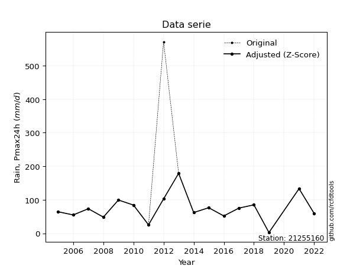</img>

</div>

> If Z-Score is active, values out of range or outliers are replaced with the station mean value.


### 4. Active continuous probability distributions from SciPy (45 of 104 available)

[scipy.stats](https://docs.scipy.org/doc/scipy/reference/stats.html) is a Python´s powerful submodule within the SciPy library for comprehensive statistical analysis, offering over 130 probability distributions (like Normal, Poisson), functions for descriptive stats (mean, variance), hypothesis testing (t-tests, chi-square), random variable generation, and statistical tests, making it essential for data science, modeling, and research. It provides tools to explore, model, and draw conclusions from data efficiently, working seamlessly with NumPy.

<div align="center">

|   id | p_dist             |   n_parameter | fit_method   | label                                                                       | active   | ref                                                                                                        |
|-----:|:-------------------|--------------:|:-------------|:----------------------------------------------------------------------------|:---------|:-----------------------------------------------------------------------------------------------------------|
|    0 | alpha              |             3 | MLE          | Alpha                                                                       | True     | [:mortar_board:](https://docs.scipy.org/doc/scipy/reference/generated/scipy.stats.alpha.html)              |
|    1 | betaprime          |             4 | MLE          | Beta prime                                                                  | True     | [:mortar_board:](https://docs.scipy.org/doc/scipy/reference/generated/scipy.stats.betaprime.html)          |
|    2 | chi2               |             3 | MLE          | Chi²                                                                        | True     | [:mortar_board:](https://docs.scipy.org/doc/scipy/reference/generated/scipy.stats.chi2.html)               |
|    3 | crystalball        |             4 | MLE          | Crystalball                                                                 | True     | [:mortar_board:](https://docs.scipy.org/doc/scipy/reference/generated/scipy.stats.crystalball.html)        |
|    4 | erlang             |             3 | MLE          | Erlang                                                                      | True     | [:mortar_board:](https://docs.scipy.org/doc/scipy/reference/generated/scipy.stats.erlang.html)             |
|    5 | expon              |             2 | MLE          | Exponential                                                                 | True     | [:mortar_board:](https://docs.scipy.org/doc/scipy/reference/generated/scipy.stats.expon.html)              |
|    6 | exponnorm          |             3 | MLE          | Exponentially modified Normal                                               | True     | [:mortar_board:](https://docs.scipy.org/doc/scipy/reference/generated/scipy.stats.exponnorm.html)          |
|    7 | f                  |             4 | MLE          | F                                                                           | True     | [:mortar_board:](https://docs.scipy.org/doc/scipy/reference/generated/scipy.stats.f.html)                  |
|    8 | fatiguelife        |             3 | MLE          | Fatigue-life (Birnbaum-Saunders)                                            | True     | [:mortar_board:](https://docs.scipy.org/doc/scipy/reference/generated/scipy.stats.fatiguelife.html)        |
|    9 | fisk               |             3 | MLE          | Fisk                                                                        | True     | [:mortar_board:](https://docs.scipy.org/doc/scipy/reference/generated/scipy.stats.fisk.html)               |
|   10 | gamma              |             3 | MLE          | Gamma                                                                       | True     | [:mortar_board:](https://docs.scipy.org/doc/scipy/reference/generated/scipy.stats.gamma.html)              |
|   11 | genexpon           |             5 | MLE          | Generalized exponential                                                     | True     | [:mortar_board:](https://docs.scipy.org/doc/scipy/reference/generated/scipy.stats.genexpon.html)           |
|   12 | genlogistic        |             3 | MLE          | Generalized logistic                                                        | True     | [:mortar_board:](https://docs.scipy.org/doc/scipy/reference/generated/scipy.stats.genlogistic.html)        |
|   13 | gibrat             |             2 | MM           | Gibrat                                                                      | True     | [:mortar_board:](https://docs.scipy.org/doc/scipy/reference/generated/scipy.stats.gibrat.html)             |
|   14 | gompertz           |             3 | MLE          | Gompertz (or truncated Gumbel)                                              | True     | [:mortar_board:](https://docs.scipy.org/doc/scipy/reference/generated/scipy.stats.gompertz.html)           |
|   15 | gumbel_l           |             2 | MM           | Gumbel Left Skew                                                            | True     | [:mortar_board:](https://docs.scipy.org/doc/scipy/reference/generated/scipy.stats.gumbel_l.html)           |
|   16 | gumbel_r           |             2 | MM           | Gumbel Right Skew                                                           | True     | [:mortar_board:](https://docs.scipy.org/doc/scipy/reference/generated/scipy.stats.gumbel_r.html)           |
|   17 | halflogistic       |             2 | MM           | Half-logistic                                                               | True     | [:mortar_board:](https://docs.scipy.org/doc/scipy/reference/generated/scipy.stats.halflogistic.html)       |
|   18 | halfnorm           |             2 | MM           | Half Normal                                                                 | True     | [:mortar_board:](https://docs.scipy.org/doc/scipy/reference/generated/scipy.stats.halfnorm.html)           |
|   19 | hypsecant          |             2 | MM           | hyperbolic secant                                                           | True     | [:mortar_board:](https://docs.scipy.org/doc/scipy/reference/generated/scipy.stats.hypsecant.html)          |
|   20 | invgamma           |             3 | MLE          | Inverted gamma                                                              | True     | [:mortar_board:](https://docs.scipy.org/doc/scipy/reference/generated/scipy.stats.invgamma.html)           |
|   21 | invgauss           |             3 | MLE          | Inverse Gaussian                                                            | True     | [:mortar_board:](https://docs.scipy.org/doc/scipy/reference/generated/scipy.stats.invgauss.html)           |
|   22 | invweibull         |             3 | MLE          | Inverted Weibull                                                            | True     | [:mortar_board:](https://docs.scipy.org/doc/scipy/reference/generated/scipy.stats.invweibull.html)         |
|   23 | johnsonsu          |             4 | MLE          | Johnson Su                                                                  | True     | [:mortar_board:](https://docs.scipy.org/doc/scipy/reference/generated/scipy.stats.johnsonsu.html)          |
|   24 | kstwobign          |             2 | MLE          | Limiting distribution of scaled Kolmogorov-Smirnov two-sided test statistic | True     | [:mortar_board:](https://docs.scipy.org/doc/scipy/reference/generated/scipy.stats.kstwobign.html)          |
|   25 | laplace            |             2 | MM           | Laplace                                                                     | True     | [:mortar_board:](https://docs.scipy.org/doc/scipy/reference/generated/scipy.stats.laplace.html)            |
|   26 | laplace_asymmetric |             3 | MLE          | Asymmetric Laplace                                                          | True     | [:mortar_board:](https://docs.scipy.org/doc/scipy/reference/generated/scipy.stats.laplace_asymmetric.html) |
|   27 | loggamma           |             3 | MLE          | Log gamma                                                                   | True     | [:mortar_board:](https://docs.scipy.org/doc/scipy/reference/generated/scipy.stats.loggamma.html)           |
|   28 | logistic           |             2 | MM           | Logistic (or Sech-squared)                                                  | True     | [:mortar_board:](https://docs.scipy.org/doc/scipy/reference/generated/scipy.stats.logistic.html)           |
|   29 | lognorm            |             3 | MLE          | Log Normal                                                                  | True     | [:mortar_board:](https://docs.scipy.org/doc/scipy/reference/generated/scipy.stats.lognorm.html)            |
|   30 | maxwell            |             2 | MM           | Maxwell                                                                     | True     | [:mortar_board:](https://docs.scipy.org/doc/scipy/reference/generated/scipy.stats.maxwell.html)            |
|   31 | mielke             |             4 | MLE          | Mielke Beta-Kappa / Dagum                                                   | True     | [:mortar_board:](https://docs.scipy.org/doc/scipy/reference/generated/scipy.stats.mielke.html)             |
|   32 | moyal              |             2 | MM           | Moyal                                                                       | True     | [:mortar_board:](https://docs.scipy.org/doc/scipy/reference/generated/scipy.stats.moyal.html)              |
|   33 | nakagami           |             3 | MLE          | Nakagami                                                                    | True     | [:mortar_board:](https://docs.scipy.org/doc/scipy/reference/generated/scipy.stats.nakagami.html)           |
|   34 | ncf                |             5 | MLE          | Non-central F distribution                                                  | True     | [:mortar_board:](https://docs.scipy.org/doc/scipy/reference/generated/scipy.stats.ncf.html)                |
|   35 | nct                |             4 | MLE          | Non-central Student’s t                                                     | True     | [:mortar_board:](https://docs.scipy.org/doc/scipy/reference/generated/scipy.stats.nct.html)                |
|   36 | norm               |             2 | MM           | Normal                                                                      | True     | [:mortar_board:](https://docs.scipy.org/doc/scipy/reference/generated/scipy.stats.norm.html)               |
|   37 | pareto             |             3 | MLE          | Pareto                                                                      | True     | [:mortar_board:](https://docs.scipy.org/doc/scipy/reference/generated/scipy.stats.pareto.html)             |
|   38 | pearson3           |             3 | MM           | Pearson type III                                                            | True     | [:mortar_board:](https://docs.scipy.org/doc/scipy/reference/generated/scipy.stats.pearson3.html)           |
|   39 | rayleigh           |             2 | MM           | Rayleigh                                                                    | True     | [:mortar_board:](https://docs.scipy.org/doc/scipy/reference/generated/scipy.stats.rayleigh.html)           |
|   40 | rice               |             3 | MLE          | Rice                                                                        | True     | [:mortar_board:](https://docs.scipy.org/doc/scipy/reference/generated/scipy.stats.rice.html)               |
|   41 | t                  |             3 | MLE          | Student’s t                                                                 | True     | [:mortar_board:](https://docs.scipy.org/doc/scipy/reference/generated/scipy.stats.t.html)                  |
|   42 | truncnorm          |             4 | MLE          | Truncated normal                                                            | True     | [:mortar_board:](https://docs.scipy.org/doc/scipy/reference/generated/scipy.stats.truncnorm.html)          |
|   43 | wald               |             2 | MM           | Wald                                                                        | True     | [:mortar_board:](https://docs.scipy.org/doc/scipy/reference/generated/scipy.stats.wald.html)               |
|   44 | weibull_min        |             3 | MLE          | Weibull minimum                                                             | True     | [:mortar_board:](https://docs.scipy.org/doc/scipy/reference/generated/scipy.stats.weibull_min.html)        |

</div>

> **n_parameter:** # arguments & localization & scale.
>
> **Fit methods:** (MLE) maximum likelihood, (MM) L-moments.
>
>**Inactive:** foldnorm, gennorm, norminvgauss, powernorm, powerlognorm, skewnorm, genextreme, anglit, arcsine, argus, beta, bradford, burr, burr12, cauchy, cosine, halfcauchy, foldcauchy, skewcauchy, wrapcauchy, dgamma, gengamma, exponweib, exponpow, truncexpon, gausshyper, genhalflogistic, genhyperbolic, geninvgauss, halfgennorm, johnsonsb, kappa4, kappa3, ksone, kstwo, loglaplace, levy, levy_l, levy_stable, ncx2, genpareto, truncpareto, lomax, powerlaw, rdist, rel_breitwigner, recipinvgauss, semicircular, studentized_range, trapezoid, triang, truncweibull_min, tukeylambda, uniform, loguniform, vonmises, vonmises_line, weibull_max, dweibull, 


## B. Probability distributions vs. Empirical distributions

A continuous probability distribution (CPD) describes probabilities for variables that can take any value within a range (like rain any time), unlike discrete variables with specific outcomes (like temperature). It uses a Probability Density Function (PDF), a curve where the total area under it equals 1, and the probability of the variable falling within an interval (a to b) is found by calculating the area under the curve between those points. A key feature is that the probability of hitting any single exact value is zero, so probabilities are always expressed for ranges, e.g., $P(a ≤ X ≤ b)$.

<div align="center">

Distributions parameters
|    |   station | p_dist                |   n |               loc |            scale | shape                  | shape1                 | shape2               | shape3   |
|---:|----------:|:----------------------|----:|------------------:|-----------------:|:-----------------------|:-----------------------|:---------------------|:---------|
|  0 |  21255160 | alpha                 |  17 |      -0.0264327   |      9.92675     | 3.5063239411452143e-10 |                        |                      |          |
|  1 |  21255160 | betaprime             |  17 |     -72.0561      |  52601.5         | 14.76832009167694      | 5282.0845491588025     |                      |          |
|  2 |  21255160 | chi2                  |  17 |     -71.8614      |      5.00154     | 29.371651397443223     |                        |                      |          |
|  3 |  21255160 | crystalball           |  17 |      75.0422      |     38.8225      | 541.773053547612       | 14171.909321468711     |                      |          |
|  4 |  21255160 | erlang                |  17 |     -71.8614      |     10.0031      | 14.685835554560379     |                        |                      |          |
|  5 |  21255160 | expon                 |  17 |       2.4         |     72.6422      |                        |                        |                      |          |
|  6 |  21255160 | exponnorm             |  17 |      45.573       |     24.7137      | 1.1924202384040932     |                        |                      |          |
|  7 |  21255160 | f                     |  17 |    -185.004       |    254.6         | 50590.47694164758      | 95.85505554506297      |                      |          |
|  8 |  21255160 | fatiguelife           |  17 |       2.4         |      0.000156364 | 680.7347227382654      |                        |                      |          |
|  9 |  21255160 | fisk                  |  17 |    -114.163       |    185.247       | 9.318704291836438      |                        |                      |          |
| 10 |  21255160 | gamma                 |  17 |     -71.8614      |     10.0031      | 14.685838597855788     |                        |                      |          |
| 11 |  21255160 | genexpon              |  17 |       2.39994     |      2.54961     | 0.03511433741559277    | 1.6967012933268956e-07 | 2.352011211073596    |          |
| 12 |  21255160 | genlogistic           |  17 |      50.6828      |     24.2906      | 1.9716426010961718     |                        |                      |          |
| 13 |  21255160 | gibrat                |  17 |      45.4256      |     17.9634      |                        |                        |                      |          |
| 14 |  21255160 | gompertz              |  17 |      51.8         |      7.85855     | 1.3329268332052922e-06 |                        |                      |          |
| 15 |  21255160 | gumbel_l              |  17 |      92.5144      |     30.2697      |                        |                        |                      |          |
| 16 |  21255160 | gumbel_r              |  17 |      57.57        |     30.2697      |                        |                        |                      |          |
| 17 |  21255160 | halflogistic          |  17 |      29.0286      |     33.1918      |                        |                        |                      |          |
| 18 |  21255160 | halfnorm              |  17 |      23.6565      |     64.4025      |                        |                        |                      |          |
| 19 |  21255160 | hypsecant             |  17 |      75.0422      |     24.7151      |                        |                        |                      |          |
| 20 |  21255160 | invgamma              |  17 |    -185.247       |  12214           | 47.92836886508825      |                        |                      |          |
| 21 |  21255160 | invgauss              |  17 |     -90.2454      |   2874.02        | 0.057386125800994725   |                        |                      |          |
| 22 |  21255160 | invweibull            |  17 |      -5.5208e+08  |      5.5208e+08  | 16285777.027465815     |                        |                      |          |
| 23 |  21255160 | johnsonsu             |  17 |      62.4842      |     24.5862      | -0.3233147228313023    | 1.0218268699925914     |                      |          |
| 24 |  21255160 | kstwobign             |  17 |     -68.9526      |    166.212       |                        |                        |                      |          |
| 25 |  21255160 | laplace               |  17 |      75.0422      |     27.4516      |                        |                        |                      |          |
| 26 |  21255160 | laplace_asymmetric    |  17 |      73.3         |     27.3829      | 0.9686972053000515     |                        |                      |          |
| 27 |  21255160 | loggamma              |  17 |  -13304.9         |   1762.96        | 1977.6361904411933     |                        |                      |          |
| 28 |  21255160 | logistic              |  17 |      75.0422      |     21.4039      |                        |                        |                      |          |
| 29 |  21255160 | lognorm               |  17 |    -126.586       |    198.054       | 0.1886526451332276     |                        |                      |          |
| 30 |  21255160 | maxwell               |  17 |     -16.9507      |     57.648       |                        |                        |                      |          |
| 31 |  21255160 | mielke                |  17 |      -2.15436     |    104.748       | 1.8594288357176447     | 5.660041170343323      |                      |          |
| 32 |  21255160 | moyal                 |  17 |      52.841       |     17.4762      |                        |                        |                      |          |
| 33 |  21255160 | nakagami              |  17 |     -29.5958      |    111.608       | 1.9582629769263655     |                        |                      |          |
| 34 |  21255160 | ncf                   |  17 |      -0.0286511   |      3.27969e-07 | 8.285216658351263e-08  | 9.85037660779845       | 17.203831551698773   |          |
| 35 |  21255160 | nct                   |  17 |      -0.163391    |     29.6212      | 9.636988710027614      | 2.3371370246936705     |                      |          |
| 36 |  21255160 | norm                  |  17 |      75.0422      |     38.8225      |                        |                        |                      |          |
| 37 |  21255160 | pareto                |  17 |       2.4         |      2.89574e-06 | 0.06250004890602738    |                        |                      |          |
| 38 |  21255160 | pearson3              |  17 |      75.0422      |     38.8225      | 0.8001599533041073     |                        |                      |          |
| 39 |  21255160 | rayleigh              |  17 |       0.772587    |     59.2586      |                        |                        |                      |          |
| 40 |  21255160 | rice                  |  17 |     -10.5305      |     44.6461      | 1.5587898439922472     |                        |                      |          |
| 41 |  21255160 | t                     |  17 |      68.1693      |     34.5153      | 5.537290939997633      |                        |                      |          |
| 42 |  21255160 | truncnorm             |  17 |      -5.6585      |      2.82053     | 2.8570876021037854     | 65.39855107518625      |                      |          |
| 43 |  21255160 | wald                  |  17 |      36.2197      |     38.8225      |                        |                        |                      |          |
| 44 |  21255160 | weibull_min           |  17 |      21.6044      |     63.1866      | 1.6642561388940693     |                        |                      |          |
| 45 |  21255160 | logalpha              |  17 |     -30.6007      |   1191.51        | 34.401584123905664     |                        |                      |          |
| 46 |  21255160 | logbetaprime          |  17 |      -5.35842     | 148830           | 71.69803196028039      | 1128064.1024723276     |                      |          |
| 47 |  21255160 | logchi2               |  17 |     -11.5893      |      0.0308852   | 506.622742858013       |                        |                      |          |
| 48 |  21255160 | logcrystalball        |  17 |       4.08446     |      0.905545    | 7.512636196288741      | 154.4500889104617      |                      |          |
| 49 |  21255160 | logerlang             |  17 |      -6.42632     |      0.111591    | 93.87768106396359      |                        |                      |          |
| 50 |  21255160 | logexpon              |  17 |       0.875469    |      3.20899     |                        |                        |                      |          |
| 51 |  21255160 | logexponnorm          |  17 |       4.08394     |      0.905541    | 0.0005731917688406049  |                        |                      |          |
| 52 |  21255160 | logf                  |  17 |   -2131.72        |   2135.8         | 80956577.39798877      | 12806202.60761363      |                      |          |
| 53 |  21255160 | logfatiguelife        |  17 |    -765.318       |    769.405       | 0.0011749718807043796  |                        |                      |          |
| 54 |  21255160 | logfisk               |  17 |      -1.33225e+08 |      1.33225e+08 | 354703293.42907673     |                        |                      |          |
| 55 |  21255160 | loggamma              |  17 |     -12.6845      |      0.0597197   | 280.7499519495466      |                        |                      |          |
| 56 |  21255160 | loggenexpon           |  17 |       0.875464    |      0.294435    | 0.011357681170140965   | 19.68954757087578      | 0.000695825606572267 |          |
| 57 |  21255160 | loggenlogistic        |  17 |       4.64338     |      0.186301    | 0.2927401898408051     |                        |                      |          |
| 58 |  21255160 | loggibrat             |  17 |       3.39363     |      0.419008    |                        |                        |                      |          |
| 59 |  21255160 | loggompertz           |  17 |       0.553023    |      0.538903    | 0.0007636761733560433  |                        |                      |          |
| 60 |  21255160 | loggumbel_l           |  17 |       4.49201     |      0.706051    |                        |                        |                      |          |
| 61 |  21255160 | loggumbel_r           |  17 |       3.67692     |      0.706051    |                        |                        |                      |          |
| 62 |  21255160 | loghalflogistic       |  17 |       3.01118     |      0.774208    |                        |                        |                      |          |
| 63 |  21255160 | loghalfnorm           |  17 |       2.88585     |      1.50223     |                        |                        |                      |          |
| 64 |  21255160 | loghypsecant          |  17 |       4.08446     |      0.576488    |                        |                        |                      |          |
| 65 |  21255160 | loginvgamma           |  17 |     -20.7901      |  16663.5         | 671.3141870263951      |                        |                      |          |
| 66 |  21255160 | loginvgauss           |  17 |      -8.28218     |   1666.73        | 0.007407058550744319   |                        |                      |          |
| 67 |  21255160 | loginvweibull         |  17 |      -2.27886e+08 |      2.27886e+08 | 171211098.923432       |                        |                      |          |
| 68 |  21255160 | logjohnsonsu          |  17 |       4.35983     |      0.247897    | 0.30143880390662914    | 0.7721338551427028     |                      |          |
| 69 |  21255160 | logkstwobign          |  17 |      -1.71634     |      6.71243     |                        |                        |                      |          |
| 70 |  21255160 | loglaplace            |  17 |       4.08446     |      0.640317    |                        |                        |                      |          |
| 71 |  21255160 | loglaplace_asymmetric |  17 |       4.33467     |      0.455784    | 1.3112298989812876     |                        |                      |          |
| 72 |  21255160 | logloggamma           |  17 |       4.70992     |      0.382447    | 0.5748330741014251     |                        |                      |          |
| 73 |  21255160 | loglogistic           |  17 |       4.08446     |      0.499253    |                        |                        |                      |          |
| 74 |  21255160 | loglognorm            |  17 | -131071           | 131075           | 6.908653490837933e-06  |                        |                      |          |
| 75 |  21255160 | logmaxwell            |  17 |       1.93868     |      1.34467     |                        |                        |                      |          |
| 76 |  21255160 | logmielke             |  17 |   -5824.1         |   5828.74        | 9143.46602469833       | 31285.03864842745      |                      |          |
| 77 |  21255160 | logmoyal              |  17 |       3.56661     |      0.407639    |                        |                        |                      |          |
| 78 |  21255160 | lognakagami           |  17 |       2.51842     |      1.8118      | 3.9916629023826173     |                        |                      |          |
| 79 |  21255160 | logncf                |  17 |      -2.04372     |      3.10307e-07 | 7.92986559956441e-06   | 525.2079202009163      | 156.24409448354226   |          |
| 80 |  21255160 | lognct                |  17 |     -50.3616      |      0.783788    | 6038.575581950407      | 69.45442191267271      |                      |          |
| 81 |  21255160 | lognorm               |  17 |       4.08446     |      0.905545    |                        |                        |                      |          |
| 82 |  21255160 | logpareto             |  17 |       0.875469    |      1.39963e-07 | 0.06250004493306661    |                        |                      |          |
| 83 |  21255160 | logpearson3           |  17 |       4.08446     |      0.905543    | -2.486728048075319     |                        |                      |          |
| 84 |  21255160 | lograyleigh           |  17 |       2.35209     |      1.38223     |                        |                        |                      |          |
| 85 |  21255160 | logrice               |  17 |    -364.537       |      0.905547    | 407.06991488111163     |                        |                      |          |
| 86 |  21255160 | logt                  |  17 |       4.26978     |      0.283309    | 1.4906076595028215     |                        |                      |          |
| 87 |  21255160 | logtruncnorm          |  17 |      -0.302708    |      3.92543     | 0.3001393034625188     | 6.296142704039669      |                      |          |
| 88 |  21255160 | logwald               |  17 |       3.17895     |      0.905521    |                        |                        |                      |          |
| 89 |  21255160 | logweibull_min        |  17 |      -2.21644e+06 |      2.21645e+06 | 4076795.514248457      |                        |                      |          |

</div>

> **loc** (Location parameter): This shifts the distribution along the x-axis. For many common distributions, like the normal (Gaussian) distribution, loc represents the mean $μ$. For others, like the uniform distribution, it might represent the minimum value, or for the beta distribution, the left end of the support interval.
>
> **scale** (Scale parameter): This determines the width or spread of the distribution. For the normal distribution, scale represents the standard deviation $σ$. For a uniform distribution, it defines the length of the interval (from $loc$ to $loc + scale$).
>
> **shape** (Shape parameters): Refers to parameters that define the specific form of a probability distribution, distinct from its location (loc) and scale (scale). These parameters are required arguments for most distribution functions. For example, a normal (Gaussian) distribution is fully defined by its location (mean) and scale (standard deviation), so it has no specific shape parameters beyond loc and scale. However, other distributions have intrinsic properties that need specification, as Gamma distribution that takes a shape parameter, often named $a$ or $alpha$.


### 0. Cumulative distribution values - CDF (90 evaluated)

> Ordered by x ascending and calculating $log(f(x))$ separately. 

|   id |   Station |   date |       x |   count |    mean |    std |    zscore |   Value_initial |   station |   m |       alpha |   alpha_pdf |   betaprime |   betaprime_pdf |      chi2 |   chi2_pdf |   crystalball |   crystalball_pdf |    erlang |   erlang_pdf |    expon |   expon_pdf |   exponnorm |   exponnorm_pdf |         f |       f_pdf |   fatiguelife |   fatiguelife_pdf |      fisk |    fisk_pdf |     gamma |   gamma_pdf |   genexpon |   genexpon_pdf |   genlogistic |   genlogistic_pdf |    gibrat |   gibrat_pdf |    gompertz |   gompertz_pdf |   gumbel_l |   gumbel_l_pdf |   gumbel_r |   gumbel_r_pdf |   halflogistic |   halflogistic_pdf |   halfnorm |   halfnorm_pdf |   hypsecant |   hypsecant_pdf |   invgamma |   invgamma_pdf |   invgauss |   invgauss_pdf |   invweibull |   invweibull_pdf |   johnsonsu |   johnsonsu_pdf |   kstwobign |   kstwobign_pdf |   laplace |   laplace_pdf |   laplace_asymmetric |   laplace_asymmetric_pdf |    loggamma |   loggamma_pdf |   logistic |   logistic_pdf |     lognorm |   lognorm_pdf |    maxwell |   maxwell_pdf |     mielke |   mielke_pdf |       moyal |   moyal_pdf |   nakagami |   nakagami_pdf |        ncf |     ncf_pdf |      nct |     nct_pdf |      norm |   norm_pdf |   pareto |      pareto_pdf |   pearson3 |   pearson3_pdf |    rayleigh |   rayleigh_pdf |      rice |    rice_pdf |         t |       t_pdf |   truncnorm |   truncnorm_pdf |     wald |    wald_pdf |   weibull_min |   weibull_min_pdf |    logalpha |   logalpha_pdf |   logbetaprime |   logbetaprime_pdf |     logchi2 |   logchi2_pdf |   logcrystalball |   logcrystalball_pdf |   logerlang |   logerlang_pdf |   logexpon |   logexpon_pdf |   logexponnorm |   logexponnorm_pdf |        logf |    logf_pdf |   logfatiguelife |   logfatiguelife_pdf |     logfisk |   logfisk_pdf |   loggenexpon |   loggenexpon_pdf |   loggenlogistic |   loggenlogistic_pdf |   loggibrat |   loggibrat_pdf |   loggompertz |   loggompertz_pdf |   loggumbel_l |   loggumbel_l_pdf |   loggumbel_r |   loggumbel_r_pdf |   loghalflogistic |   loghalflogistic_pdf |   loghalfnorm |   loghalfnorm_pdf |   loghypsecant |   loghypsecant_pdf |   loginvgamma |   loginvgamma_pdf |   loginvgauss |   loginvgauss_pdf |   loginvweibull |   loginvweibull_pdf |   logjohnsonsu |   logjohnsonsu_pdf |   logkstwobign |   logkstwobign_pdf |   loglaplace |   loglaplace_pdf |   loglaplace_asymmetric |   loglaplace_asymmetric_pdf |   logloggamma |   logloggamma_pdf |   loglogistic |   loglogistic_pdf |   loglognorm |   loglognorm_pdf |   logmaxwell |   logmaxwell_pdf |   logmielke |   logmielke_pdf |     logmoyal |   logmoyal_pdf |   lognakagami |   lognakagami_pdf |      logncf |   logncf_pdf |     lognct |   lognct_pdf |   logpareto |   logpareto_pdf |   logpearson3 |   logpearson3_pdf |   lograyleigh |   lograyleigh_pdf |     logrice |   logrice_pdf |       logt |   logt_pdf |   logtruncnorm |   logtruncnorm_pdf |     logwald |   logwald_pdf |   logweibull_min |   logweibull_min_pdf |
|-----:|----------:|-------:|--------:|--------:|--------:|-------:|----------:|----------------:|----------:|----:|------------:|------------:|------------:|----------------:|----------:|-----------:|--------------:|------------------:|----------:|-------------:|---------:|------------:|------------:|----------------:|----------:|------------:|--------------:|------------------:|----------:|------------:|----------:|------------:|-----------:|---------------:|--------------:|------------------:|----------:|-------------:|------------:|---------------:|-----------:|---------------:|-----------:|---------------:|---------------:|-------------------:|-----------:|---------------:|------------:|----------------:|-----------:|---------------:|-----------:|---------------:|-------------:|-----------------:|------------:|----------------:|------------:|----------------:|----------:|--------------:|---------------------:|-------------------------:|------------:|---------------:|-----------:|---------------:|------------:|--------------:|-----------:|--------------:|-----------:|-------------:|------------:|------------:|-----------:|---------------:|-----------:|------------:|---------:|------------:|----------:|-----------:|---------:|----------------:|-----------:|---------------:|------------:|---------------:|----------:|------------:|----------:|------------:|------------:|----------------:|---------:|------------:|--------------:|------------------:|------------:|---------------:|---------------:|-------------------:|------------:|--------------:|-----------------:|---------------------:|------------:|----------------:|-----------:|---------------:|---------------:|-------------------:|------------:|------------:|-----------------:|---------------------:|------------:|--------------:|--------------:|------------------:|-----------------:|---------------------:|------------:|----------------:|--------------:|------------------:|--------------:|------------------:|--------------:|------------------:|------------------:|----------------------:|--------------:|------------------:|---------------:|-------------------:|--------------:|------------------:|--------------:|------------------:|----------------:|--------------------:|---------------:|-------------------:|---------------:|-------------------:|-------------:|-----------------:|------------------------:|----------------------------:|--------------:|------------------:|--------------:|------------------:|-------------:|-----------------:|-------------:|-----------------:|------------:|----------------:|-------------:|---------------:|--------------:|------------------:|------------:|-------------:|-----------:|-------------:|------------:|----------------:|--------------:|------------------:|--------------:|------------------:|------------:|--------------:|-----------:|-----------:|---------------:|-------------------:|------------:|--------------:|-----------------:|---------------------:|
|    0 |  21255160 |   2019 |   2.4   |      17 | 102.618 | 127.06 | -0.788746 |             2.4 |  21255160 |   1 | 4.29357e-05 | 0.00031219  |   0.0120046 |     0.00129917  | 0.0120169 | 0.0013002  |     0.0306629 |        0.00178468 | 0.0120169 |   0.0013002  | 0        |  0.0137661  |   0.0104227 |     0.00101471  | 0.0113153 | 0.00121508  |      0.020103 |       6.2228e+08  | 0.0131651 | 0.00103863  | 0.0120169 |  0.0013002  | 8.1002e-07 |     0.0137724  |     0.0154179 |       0.00110066  | 0         |  0           | 0           |    0           |  0.0496673 |    0.00159938  | 0.00205391 |    0.000419879 |       0        |        0           |  0         |    0           |   0.0336517 |      0.00135905 |  0.0113152 |    0.00121507  | 0.00962402 |     0.00121902 |   0.00674397 |      0.000994523 |   0.0235739 |     0.000875641 |  0.00722734 |     0.00125488  | 0.0354604 |   0.00129174  |            0.0334292 |              0.00126025  | 0.000319286 |     0.00135097 |  0.0324876 |    0.00146852  | 0.000197267 |   0.000826202 | 0.00972576 |   0.00147406  | 0.00293751 |  0.00119931  | 2.29639e-05 | 1.23761e-05 |  0.0130631 |    0.00151323  | 0.00102663 | 0.000520793 | 0.012149 | 0.00104887  | 0.0306629 | 0.00178468 | 0        | 21583.4         | 0.00384298 |    0.000777263 | 0.000377034 |    0.000463267 | 0.0124989 | 0.00194114  | 0.0547084 | 0.00212615  | 5.63001e-06 |    1.11702      | 0        | 0           |    0          |       0           | 0.000277617 |     0.00123756 |    0.000555031 |         0.00232413 | 0.000264523 |    0.00116599 |      0.000197267 |          0.000826202 | 0.000549909 |      0.00229098 |   0        |      0.311624  |    0.000197255 |        0.000826159 | 0.000201293 | 0.000840911 |      0.000185295 |          0.000783824 | 0.000132083 |   0.000351616 |   1.85071e-07 |         0.0385752 |       0.00268348 |           0.00421664 |    0        |       0         |   0.000625325 |        0.00257621 |    0.00594512 |        0.00839517 |   1.09725e-23 |       8.21581e-22 |          0        |              0        |      0        |          0        |     0.00243444 |         0.00422284 |   0.000148159 |       0.000716596 |   0.000286556 |        0.00136112 |     0.000624598 |           0.0034624 |      0.0114377 |         0.00662226 |     0.00165434 |         0.00992535 |   0.00333023 |        0.0052009 |              0.00193705 |                  0.00324119 |    0.00352503 |        0.00529812 |    0.00161374 |         0.0032271 |   0.00019726 |      0.000826187 |     0        |         0        |   0.0027053 |      0.00424651 | 3.61606e-162 |   3.27068e-159 |    0          |         0         | 0.000112292 |   0.00064739 | 0.00022448 |  0.000939437 |    0        | 446548          |     0.0129297 |         0.0124312 |      0        |          0        | 0.000197266 |   0.000826198 | 0.00921628 | 0.00401761 |    1.23772e-11 |           0.254306 | 0           |     0         |       0.00147286 |           0.00270709 |
|    1 |  21255160 |   2011 |  25.3   |      17 | 102.618 | 127.06 | -0.608515 |            25.3 |  21255160 |   2 | 0.695094    | 0.0114351   |   0.0818735 |     0.00521581  | 0.0819067 | 0.00521599 |     0.100049  |        0.00452214 | 0.0819067 |   0.00521599 | 0.270389 |  0.0100439  |   0.0686781 |     0.00466048  | 0.0788937 | 0.00515711  |      0.713    |       0.00418112  | 0.066269  | 0.00413454  | 0.0819067 |  0.00521599 | 0.270496   |     0.0100471  |     0.0703352 |       0.00422359  | 0         |  0           | 0           |    0           |  0.102869  |    0.00321729  | 0.0548046  |    0.00525778  |       0        |        0           |  0.0203595 |    0.012385    |   0.0845755 |      0.00338189 |  0.0788931 |    0.00515708  | 0.0828954  |     0.00564661 |   0.0785524  |      0.00589497  |   0.060431  |     0.00274594  |  0.0953322  |     0.00674966  | 0.081664  |   0.00297483  |            0.0792604 |              0.00298805  | 0.198963    |     0.288758   |  0.0891568 |    0.00379406  | 0.172917    |   0.282504    | 0.0893439  |   0.00568347  | 0.0829092  |  0.0056124   | 0.0278852   | 0.00447432  |  0.0884744 |    0.0053434   | 0.0913399  | 0.00776714  | 0.070517 | 0.00464332  | 0.100049  | 0.00452214 | 0.62943  |     0.00101138  | 0.0715798  |    0.00574129  | 0.0820924   |    0.00641133  | 0.0978172 | 0.00553226  | 0.132119  | 0.00494905  | 1           |    4.56771e-25  | 0        | 0           |    0.00883381 |       0.00396054  | 0.206907    |     0.297405   |    0.222291    |         0.284293   | 0.201702    |    0.296764   |      0.172917    |          0.282504    | 0.228636    |      0.295479   |   0.520005 |      0.149578  |    0.172916    |        0.282504    | 0.173009    | 0.281866    |      0.17159     |          0.281904    | 0.0653126   |   0.162533    |   0.410457    |         0.241577  |       0.108634   |           0.170612   |    0        |       0         |   0.103369    |        0.18281    |    0.154294   |        0.200731   |   0.152426    |       0.406097    |          0.140895 |              0.633001 |      0.181619 |          0.517312 |     0.142382   |         0.238827   |   0.192788    |       0.298573    |   0.220882    |        0.299977   |     0.284412    |           0.268665  |      0.0787488 |         0.0981282  |     0.350942   |         0.251295   |   0.131819   |        0.205865  |              0.0997082  |                  0.166837   |    0.120598   |        0.178869   |    0.153181   |         0.259821  |   0.172919   |      0.282506    |     0.180216 |         0.345298 |   0.109015  |      0.170965   | 0.131126     |   0.472731     |    0.00377046 |         0.0371437 | 0.210683    |   0.300968   | 0.179305   |  0.284689    |    0.646514 |      0.00937993 |     0.133499  |         0.138954  |      0.182963 |          0.375775 | 0.172917    |   0.282504    | 0.0511594  | 0.0681155  |    0.518322    |           0.177406 | 7.76395e-05 |     0.0137163 |       0.106126   |           0.184457   |
|    2 |  21255160 |   2008 |  48.3   |      17 | 102.618 | 127.06 | -0.427498 |            48.3 |  21255160 |   3 | 0.837252    | 0.00332059  |   0.255717  |     0.009587    | 0.255722  | 0.00958465 |     0.245464  |        0.00810574 | 0.255722  |   0.00958465 | 0.4684   |  0.00731806 |   0.241731  |     0.0102548   | 0.254393  | 0.00978371  |      0.786955 |       0.00251986  | 0.227416  | 0.0100778   | 0.255722  |  0.00958464 | 0.468557   |     0.00731931 |     0.230913  |       0.0098308   | 0.0334392 |  0.0258927   | 0           |    0           |  0.207116  |    0.00607905  | 0.257093   |    0.0115367   |       0.282414 |        0.0138625   |  0.29802   |    0.0115144   |   0.208023  |      0.00783037 |  0.254392  |    0.00978369  | 0.269134   |     0.0100576  |   0.275052   |      0.0104732   |   0.188287  |     0.0097147   |  0.297839   |     0.0100543   | 0.188755  |   0.00687592  |            0.188636  |              0.00711143  | 0.426541    |     0.39509    |  0.222803  |    0.00809018  | 0.40958     |   0.42919     | 0.266387   |   0.00934454  | 0.25576    |  0.00927719  | 0.254813    | 0.0135927   |  0.258692  |    0.00917336  | 0.312745   | 0.0102548   | 0.242558 | 0.0101516   | 0.245464  | 0.00810574 | 0.64519  |     0.00048313  | 0.265122   |    0.0104485   | 0.275033    |    0.00981205  | 0.263779  | 0.00870346  | 0.293725  | 0.00913864  | 1           |    2.23272e-78  | 0.177706 | 0.0276194   |    0.212093   |       0.0117089   | 0.437747    |     0.394991   |    0.435554    |         0.357959   | 0.435134    |    0.403481   |      0.40958     |          0.42919     | 0.449997    |      0.370035   |   0.607604 |      0.12228   |    0.40958     |        0.429192    | 0.408935    | 0.427755    |      0.408217    |          0.42968     | 0.281016    |   0.537934    |   0.562297    |         0.223804  |       0.298699   |           0.461789   |    0.557166 |       0.816116  |   0.305105    |        0.470341   |    0.342143   |        0.390183   |   0.471059    |       0.50223     |          0.507565 |              0.479443 |      0.490792 |          0.427162 |     0.388068   |         0.518366   |   0.430564    |       0.413513    |   0.446886    |        0.378191   |     0.461392    |           0.268132  |      0.213487  |         0.414265   |     0.509039   |         0.232323   |   0.36187    |        0.565141  |              0.294189   |                  0.492253   |    0.308326   |        0.430979   |    0.397791   |         0.479823  |   0.409582   |      0.429188    |     0.443787 |         0.436246 |   0.299296  |      0.461993   | 0.494599     |   0.529374     |    0.19102    |         0.662872  | 0.438879    |   0.382749   | 0.414101   |  0.421072    |    0.651833 |      0.00724874 |     0.266977  |         0.297091  |      0.456049 |          0.434276 | 0.40958     |   0.42919     | 0.168657   | 0.428998   |    0.624475    |           0.150896 | 0.55879     |     0.628649  |       0.308261   |           0.468917   |
|    3 |  21255160 |   2016 |  51.8   |      17 | 102.618 | 127.06 | -0.399952 |            51.8 |  21255160 |   4 | 0.848104    | 0.0028952   |   0.290036  |     0.0100087   | 0.290033  | 0.0100062  |     0.274693  |        0.00859009 | 0.290033  |   0.0100062  | 0.493406 |  0.00697382 |   0.278757  |     0.0108828   | 0.289443  | 0.0102275   |      0.79551  |       0.00237099  | 0.264184  | 0.0109149   | 0.290033  |  0.0100062  | 0.493567   |     0.00697486 |     0.26665   |       0.0105731   | 0.150091  |  0.036592    | 3.61092e-12 |    1.69615e-07 |  0.229354  |    0.00663281  | 0.298197   |    0.0119201   |       0.330178 |        0.0134217   |  0.337885  |    0.0112608   |   0.236991  |      0.00872723 |  0.289441  |    0.0102275   | 0.304963   |     0.0103977  |   0.312181   |      0.0107209   |   0.225288  |     0.0114402   |  0.333209   |     0.0101406   | 0.214422  |   0.00781091  |            0.215243  |              0.00811448  | 0.454299    |     0.398161   |  0.252394  |    0.00881572  | 0.439842    |   0.435536    | 0.29968    |   0.00966711  | 0.289041   |  0.00973346  | 0.302901    | 0.0138332   |  0.291484  |    0.00955287  | 0.34838    | 0.0100925   | 0.279169 | 0.0107484   | 0.274693  | 0.00859009 | 0.646815 |     0.000446843 | 0.302277   |    0.0107628   | 0.30978     |    0.0100297   | 0.294859  | 0.0090485   | 0.326716  | 0.00970222  | 1           |    5.06573e-89  | 0.271941 | 0.0258617   |    0.253695   |       0.0120364   | 0.465453    |     0.396757   |    0.460646    |         0.359121   | 0.46346     |    0.405957   |      0.439842    |          0.435536    | 0.475913    |      0.370611   |   0.616066 |      0.119643  |    0.439842    |        0.435538    | 0.438936    | 0.434102    |      0.438517    |          0.436122    | 0.320132    |   0.579471    |   0.57784     |         0.220491  |       0.332694   |           0.510593   |    0.609818 |       0.692952  |   0.339367    |        0.509135   |    0.370221   |        0.412437   |   0.505726    |       0.488327    |          0.540333 |              0.457268 |      0.520211 |          0.413782 |     0.425019   |         0.536905   |   0.459598    |       0.416159    |   0.473366    |        0.378542   |     0.480033    |           0.264681  |      0.245515  |         0.50499    |     0.525164   |         0.228634   |   0.403647   |        0.630385  |              0.330723   |                  0.553384   |    0.339765   |        0.46799    |    0.43179    |         0.491429  |   0.439844   |      0.435533    |     0.474236 |         0.433867 |   0.333302  |      0.510726   | 0.530759     |   0.504047     |    0.240245   |         0.742444  | 0.465677    |   0.383059   | 0.443762   |  0.426516    |    0.652334 |      0.00707347 |     0.288716  |         0.324935  |      0.486256 |          0.428971 | 0.439842    |   0.435536    | 0.202774   | 0.551585   |    0.634932    |           0.148036 | 0.600168    |     0.556004  |       0.342399   |           0.506991   |
|    4 |  21255160 |   2006 |  54.8   |      17 | 102.618 | 127.06 | -0.376341 |            54.8 |  21255160 |   5 | 0.856322    | 0.00259208  |   0.320509  |     0.0102944   | 0.320498  | 0.0102919  |     0.301042  |        0.00897001 | 0.320498  |   0.0102919  | 0.513901 |  0.00669168 |   0.312082  |     0.0113161   | 0.32059   | 0.0105243   |      0.802446 |       0.00225495  | 0.297884  | 0.011535    | 0.320498  |  0.0102919  | 0.514065   |     0.00669254 |     0.299209  |       0.0111166   | 0.257732  |  0.0344447   | 6.1961e-07  |    2.4846e-07  |  0.249991  |    0.00712774  | 0.334262   |    0.012101    |       0.369824 |        0.0130037   |  0.371314  |    0.011022    |   0.264344  |      0.00950792 |  0.320589  |    0.0105243   | 0.336482   |     0.0106014  |   0.34453    |      0.0108297   |   0.261836  |     0.0129138   |  0.363647   |     0.0101407   | 0.239183  |   0.0087129   |            0.241016  |              0.00908611  | 0.476751    |     0.399212   |  0.279746  |    0.00941359  | 0.464463    |   0.438806    | 0.329018   |   0.00988219  | 0.318782   |  0.0100869   | 0.344406    | 0.0138038   |  0.320554  |    0.00981792  | 0.378364   | 0.00988795  | 0.312049 | 0.0111541   | 0.301042  | 0.00897001 | 0.648114 |     0.000419711 | 0.334847   |    0.0109359   | 0.340069    |    0.0101534   | 0.322395  | 0.00930174  | 0.356474  | 0.0101261   | 1           |    1.11888e-98  | 0.345864 | 0.0233628   |    0.290066   |       0.0121934   | 0.487797    |     0.396771   |    0.480865    |         0.359015   | 0.486336    |    0.406448   |      0.464463    |          0.438806    | 0.496764    |      0.369937   |   0.622743 |      0.117562  |    0.464463    |        0.438808    | 0.462173    | 0.437389    |      0.463172    |          0.439459    | 0.353596    |   0.608541    |   0.590175    |         0.217669  |       0.362597   |           0.551949   |    0.646419 |       0.609384  |   0.368901    |        0.539934   |    0.393934   |        0.429852   |   0.532854    |       0.475087    |          0.56557  |              0.439243 |      0.543196 |          0.402685 |     0.455547   |         0.546778   |   0.483049    |       0.416663    |   0.494656    |        0.377611   |     0.494847    |           0.261549  |      0.276408  |         0.595234   |     0.537949   |         0.225511   |   0.440744   |        0.688322  |              0.363393   |                  0.608049   |    0.366968   |        0.498434   |    0.459642   |         0.497485  |   0.464465   |      0.438802    |     0.49857  |         0.430351 |   0.363211  |      0.552012   | 0.558534     |   0.482489     |    0.283616   |         0.796552  | 0.48722     |   0.38205    | 0.467857   |  0.429164    |    0.652728 |      0.00693828 |     0.307699  |         0.349809  |      0.510254 |          0.423365 | 0.464463    |   0.438806    | 0.237165   | 0.673528   |    0.643202    |           0.14574  | 0.629997    |     0.504643  |       0.371795   |           0.53717    |
|    5 |  21255160 |   2022 |  59.4   |      17 | 102.618 | 127.06 | -0.340137 |            59.4 |  21255160 |   6 | 0.867337    | 0.00221171  |   0.36861   |     0.0105904   | 0.368588  | 0.0105879  |     0.343505  |        0.00947491 | 0.368588  |   0.0105879  | 0.543729 |  0.00628108 |   0.365278  |     0.0117685   | 0.369762  | 0.0108228   |      0.812442 |       0.0020945   | 0.352724  | 0.0122581   | 0.368588  |  0.0105879  | 0.543896   |     0.0062817  |     0.351894  |       0.011746    | 0.400865  |  0.027662    | 2.17308e-06 |    4.46139e-07 |  0.284578  |    0.00791491  | 0.390106   |    0.0121316   |       0.428056 |        0.0123038   |  0.421107  |    0.0106206   |   0.310784  |      0.0106699  |  0.36976   |    0.0108228   | 0.385681   |     0.0107584  |   0.394411   |      0.0108245   |   0.325936  |     0.0148595   |  0.410077   |     0.0100246   | 0.282816  |   0.0103024   |            0.286655  |              0.0108067   | 0.508918    |     0.398509   |  0.325017  |    0.0102496   | 0.499926    |   0.440555    | 0.375029   |   0.0100998   | 0.366276   |  0.0105442   | 0.40716     | 0.0134205   |  0.366444  |    0.0101108   | 0.422958   | 0.00948566  | 0.36441  | 0.0115685   | 0.343505  | 0.00947491 | 0.64996  |     0.000383816 | 0.385457   |    0.011036    | 0.387009    |    0.0102342   | 0.365924  | 0.0096066   | 0.404305  | 0.01064     | 1           |    1.94481e-114 | 0.444188 | 0.0194417   |    0.346343   |       0.0122375   | 0.519709    |     0.394631   |    0.509746    |         0.357272   | 0.51905     |    0.404828   |      0.499926    |          0.440555    | 0.526488    |      0.367244   |   0.632101 |      0.114646  |    0.499926    |        0.440557    | 0.467954    | 0.439191    |      0.498692    |          0.441293    | 0.404038    |   0.64109     |   0.607549    |         0.213402  |       0.40954    |           0.613032   |    0.69138  |       0.509808  |   0.414142    |        0.582095   |    0.429548   |        0.453522   |   0.5703      |       0.453617    |          0.599932 |              0.413378 |      0.574999 |          0.386367 |     0.499907   |         0.552153   |   0.516581    |       0.41488     |   0.52498     |        0.374446   |     0.515732    |           0.25657   |      0.330579  |         0.754972   |     0.555939   |         0.220828   |   0.499869   |        0.780659  |              0.415863   |                  0.695845   |    0.408909   |        0.542185   |    0.499916   |         0.500748  |   0.499928   |      0.440551    |     0.532979 |         0.422983 |   0.410155  |      0.612973   | 0.596148     |   0.450696     |    0.350317   |         0.854305  | 0.517895    |   0.378714   | 0.502513   |  0.430207    |    0.65328  |      0.00675325 |     0.337474  |         0.389957  |      0.543993 |          0.413437 | 0.499926    |   0.440555    | 0.299499   | 0.877143   |    0.654817    |           0.142463 | 0.668025    |     0.440693  |       0.416776   |           0.578407   |
|    6 |  21255160 |   2014 |  61.9   |      17 | 102.618 | 127.06 | -0.320461 |            61.9 |  21255160 |   7 | 0.872646    | 0.00203899  |   0.395207  |     0.0106784   | 0.395179  | 0.010676   |     0.367485  |        0.00970382 | 0.395179  |   0.010676   | 0.559164 |  0.00606859 |   0.394881  |     0.0119005   | 0.396933  | 0.0109049   |      0.817578 |       0.00201496  | 0.383713  | 0.0125163   | 0.395179  |  0.010676   | 0.559333   |     0.00606909 |     0.381559  |       0.0119721   | 0.465523  |  0.0241254   | 3.48625e-06 |    6.13239e-07 |  0.30491   |    0.00835204  | 0.42033    |    0.0120353   |       0.458313 |        0.0118998   |  0.447368  |    0.0103864   |   0.338195  |      0.0112507  |  0.396932  |    0.0109049   | 0.412599   |     0.0107677  |   0.42138    |      0.0107425   |   0.364073  |     0.0156041   |  0.435002   |     0.00991019  | 0.309781  |   0.0112846   |            0.314986  |              0.0118747   | 0.525322    |     0.397155   |  0.351145  |    0.0106449   | 0.518082    |   0.440102    | 0.400363   |   0.0101612   | 0.392892   |  0.0107413   | 0.440301    | 0.0130795   |  0.391855  |    0.010211    | 0.446362   | 0.00923369  | 0.393492 | 0.0116847   | 0.367485  | 0.00970382 | 0.650898 |     0.000366704 | 0.413028   |    0.0110117   | 0.412591    |    0.0102253   | 0.390098  | 0.00972723  | 0.431165  | 0.0108383   | 1           |    1.73466e-123 | 0.490347 | 0.0175159   |    0.376869   |       0.0121731   | 0.535938    |     0.392576   |    0.524443    |         0.355674   | 0.535703    |    0.40296    |      0.518082    |          0.440102    | 0.541585    |      0.3651     |   0.636798 |      0.113183  |    0.518082    |        0.440104    | 0.518016    | 0.438779    |      0.516879    |          0.440876    | 0.430722    |   0.65283     |   0.6163      |         0.211125  |       0.435458   |           0.644268   |    0.71149  |       0.466567  |   0.438558    |        0.602185   |    0.44848    |        0.464835   |   0.588758    |       0.441737    |          0.616702 |              0.400202 |      0.590752 |          0.377858 |     0.522651   |         0.550756   |   0.533646    |       0.412849    |   0.540369    |        0.37202    |     0.526253    |           0.25382   |      0.363632  |         0.849758   |     0.564992   |         0.218347   |   0.531055   |        0.732364  |              0.445562   |                  0.74554    |    0.431717   |        0.564196   |    0.520548   |         0.499902  |   0.518084   |      0.440098    |     0.550321 |         0.418219 |   0.436069  |      0.644136   | 0.61439      |   0.434299     |    0.385961   |         0.87367   | 0.533458    |   0.376179   | 0.520237   |  0.429485    |    0.653557 |      0.00666227 |     0.354018  |         0.412908  |      0.560918 |          0.407566 | 0.518082    |   0.440102    | 0.337881   | 0.984089   |    0.660655    |           0.140793 | 0.68559     |     0.411814  |       0.44103    |           0.598024   |
|    7 |  21255160 |   2005 |  64.2   |      17 | 102.618 | 127.06 | -0.302359 |            64.2 |  21255160 |   8 | 0.877169    | 0.00189728  |   0.419817  |     0.0107145   | 0.419784  | 0.0107123  |     0.390016  |        0.00988304 | 0.419784  |   0.0107123  | 0.572903 |  0.00587945 |   0.422323  |     0.0119503   | 0.422053  | 0.0109315   |      0.822132 |       0.00194598  | 0.412687  | 0.0126631   | 0.419784  |  0.0107123  | 0.573073   |     0.00587986 |     0.409261  |       0.0121039   | 0.517611  |  0.0212286   | 5.1248e-06  |    8.21743e-07 |  0.324585  |    0.00875633  | 0.447849   |    0.011885    |       0.485244 |        0.011517    |  0.471     |    0.010162    |   0.364636  |      0.011732   |  0.422052  |    0.0109315   | 0.437331   |     0.0107317  |   0.445958   |      0.0106233   |   0.400496  |     0.016023    |  0.457648   |     0.00977739  | 0.336854  |   0.0122708   |            0.343517  |              0.0129503   | 0.539781    |     0.395405   |  0.376002  |    0.0109617   | 0.53412     |   0.438942    | 0.423765   |   0.0101829   | 0.41777    |  0.0108856   | 0.469963    | 0.0127045   |  0.41541   |    0.0102664   | 0.467318   | 0.00898697  | 0.420425 | 0.0117244   | 0.390016  | 0.00988304 | 0.651725 |     0.000352221 | 0.438285   |    0.0109441   | 0.436069    |    0.0101859   | 0.41257   | 0.00980903  | 0.456249  | 0.010965    | 1           |    4.0943e-132  | 0.528756 | 0.0159102   |    0.404751   |       0.0120652   | 0.550219    |     0.390228   |    0.537387    |         0.35387    | 0.550365    |    0.400733   |      0.53412     |          0.438942    | 0.554864    |      0.362785   |   0.640903 |      0.111903  |    0.53412     |        0.438944    | 0.533318    | 0.437661    |      0.532945    |          0.439745    | 0.454681    |   0.66014     |   0.623965    |         0.209059  |       0.459459   |           0.671292   |    0.727871 |       0.432007  |   0.460834    |        0.618797   |    0.465613   |        0.47428    |   0.604676    |       0.430833    |          0.631091 |              0.388606 |      0.604399 |          0.370251 |     0.542686   |         0.547196   |   0.548666    |       0.410436    |   0.553895    |        0.369434   |     0.535468    |           0.251281  |      0.39624   |         0.9382     |     0.572917   |         0.216108   |   0.557027   |        0.691803  |              0.473609   |                  0.79247    |    0.452649   |        0.583195   |    0.538751   |         0.49774   |   0.534121   |      0.438938    |     0.565494 |         0.413477 |   0.460063  |      0.671091   | 0.629971     |   0.419829     |    0.418054   |         0.8847    | 0.547134    |   0.373485   | 0.535883   |  0.428141    |    0.653798 |      0.00658372 |     0.369476  |         0.434802  |      0.575687 |          0.401961 | 0.534119    |   0.438943    | 0.375399   | 1.07066    |    0.665765    |           0.139319 | 0.700178    |     0.388173  |       0.463147   |           0.614227   |
|    8 |  21255160 |   2007 |  73.3   |      17 | 102.618 | 127.06 | -0.23074  |            73.3 |  21255160 |   9 | 0.892313    | 0.00145964  |   0.516632  |     0.0104628   | 0.516582  | 0.0104615  |     0.482103  |        0.0102657  | 0.516582  |   0.0104615  | 0.623191 |  0.00518719 |   0.529807  |     0.0115119   | 0.520561  | 0.0106108   |      0.838713 |       0.00170623  | 0.52768   | 0.0123893   | 0.516582  |  0.0104615  | 0.623362   |     0.00518725 |     0.519391  |       0.0119182   | 0.669804  |  0.0129952   | 1.9225e-05  |    2.61597e-06 |  0.411428  |    0.0103065   | 0.551715   |    0.0108398   |       0.582939 |        0.00994496  |  0.559194  |    0.00920476  |   0.47758   |      0.0128472  |  0.52056   |    0.0106108   | 0.533073   |     0.0102195  |   0.539337   |      0.00982298  |   0.54492   |     0.0150805   |  0.543525   |     0.00905004  | 0.469254  |   0.0170938   |            0.484104  |              0.0182503   | 0.591566    |     0.384854   |  0.479662  |    0.0116608   | 0.591736    |   0.428855    | 0.515777   |   0.00996033  | 0.518077   |  0.0110423   | 0.577583    | 0.0108869   |  0.508703  |    0.0101507   | 0.544369   | 0.00793424  | 0.525845 | 0.0112993   | 0.482103  | 0.0102657  | 0.654702 |     0.000304389 | 0.535413   |    0.0103149   | 0.527153    |    0.00976609  | 0.502366  | 0.00985104  | 0.556453  | 0.0109079   | 1           |    4.441e-169   | 0.64958  | 0.0109971   |    0.511306   |       0.0112649   | 0.601185    |     0.377742   |    0.583717    |         0.344391   | 0.602735    |    0.388314   |      0.591736    |          0.428855    | 0.602241    |      0.351238   |   0.655435 |      0.107375  |    0.591737    |        0.428857    | 0.590551    | 0.427778    |      0.590674    |          0.42973     | 0.542684    |   0.660757    |   0.651162    |         0.201189  |       0.554337   |           0.754963   |    0.778025 |       0.330338  |   0.546251    |        0.66599    |    0.530483   |        0.502766   |   0.659053    |       0.389197    |          0.67985  |              0.347325 |      0.651624 |          0.342177 |     0.613521   |         0.51741    |   0.602262    |       0.397041    |   0.602082    |        0.356779   |     0.568129    |           0.241336  |      0.539991  |         1.1956     |     0.60101    |         0.207678   |   0.639861   |        0.562439  |              0.591218   |                  0.989259   |    0.5342     |        0.644767   |    0.603681   |         0.479216  |   0.591737   |      0.428851    |     0.618975 |         0.392514 |   0.554897  |      0.754479   | 0.682192     |   0.368512     |    0.535596   |         0.876275  | 0.595829    |   0.360387   | 0.592046   |  0.417834    |    0.654653 |      0.00631285 |     0.433123  |         0.530099  |      0.627477 |          0.378745 | 0.591736    |   0.428855    | 0.529717   | 1.19397    |    0.683879    |           0.133993 | 0.74659     |     0.315211  |       0.547868   |           0.660127   |
|    9 |  21255160 |   2017 |  75.1   |      17 | 102.618 | 127.06 | -0.216573 |            75.1 |  21255160 |  10 | 0.894878    | 0.00139114  |   0.535362  |     0.0103452   | 0.53531   | 0.0103441  |     0.500594  |        0.0102761  | 0.53531   |   0.0103441  | 0.632413 |  0.00506024 |   0.550359  |     0.0113186   | 0.539542  | 0.0104754   |      0.841746 |       0.00166418  | 0.549805  | 0.012187    | 0.53531   |  0.0103441  | 0.632584   |     0.00506023 |     0.540706  |       0.0117585   | 0.692148  |  0.0118527   | 2.45166e-05 |    3.28931e-06 |  0.430236  |    0.0105885   | 0.570987   |    0.0105708   |       0.600557 |        0.00963086  |  0.575583  |    0.00900505  |   0.500744  |      0.0128791  |  0.539541  |    0.0104754   | 0.551326   |     0.0100587  |   0.556835   |      0.00961722  |   0.571567  |     0.0145137   |  0.559661   |     0.0088773   | 0.501051  |   0.0181756   |            0.51593   |              0.0171244   | 0.600872    |     0.382244   |  0.500675  |    0.0116801   | 0.602107    |   0.426045    | 0.53362    |   0.00986246  | 0.537907   |  0.010986    | 0.59683     | 0.0104986   |  0.526903  |    0.0100682   | 0.558459   | 0.00772054  | 0.546026 | 0.0111193   | 0.500594  | 0.0102761  | 0.655243 |     0.000296387 | 0.553819   |    0.010134    | 0.544619    |    0.00963876  | 0.52006   | 0.00980619  | 0.575987  | 0.0107918   | 1           |    6.31309e-177 | 0.668695 | 0.0102532   |    0.531392   |       0.0110503   | 0.610314    |     0.374824   |    0.592045    |         0.342186   | 0.61212     |    0.385346   |      0.602107    |          0.426045    | 0.610731    |      0.348624   |   0.65803  |      0.106566  |    0.602107    |        0.426047    | 0.600895    | 0.425013    |      0.601065    |          0.426927    | 0.558664    |   0.656445    |   0.656025    |         0.199692  |       0.572789   |           0.765897   |    0.785852 |       0.315088  |   0.56248     |        0.67174    |    0.54273    |        0.50677    |   0.6684      |       0.381385    |          0.688187 |              0.33996  |      0.659862 |          0.33699  |     0.625978   |         0.509471   |   0.611856    |       0.393851    |   0.610704    |        0.353947   |     0.573961    |           0.239409  |      0.569174  |         1.20746    |     0.606029   |         0.206092   |   0.65325    |        0.541528  |              0.615711   |                  1.03024    |    0.549957   |        0.654092   |    0.615246   |         0.474145  |   0.602107   |      0.42604     |     0.628444 |         0.38811  |   0.573336  |      0.765359   | 0.691022     |   0.359445     |    0.556745   |         0.866889  | 0.604537    |   0.357469   | 0.602149   |  0.41506     |    0.654805 |      0.0062656  |     0.446233  |         0.550894  |      0.636609 |          0.374075 | 0.602107    |   0.426045    | 0.558446   | 1.17219    |    0.687118    |           0.133024 | 0.754097    |     0.303753  |       0.563952   |           0.665695   |
|   10 |  21255160 |   2015 |  76.3   |      17 | 102.618 | 127.06 | -0.207129 |            76.3 |  21255160 |  11 | 0.896522    | 0.00134811  |   0.547723  |     0.0102558   | 0.54767   | 0.0102548  |     0.512923  |        0.0102707  | 0.54767   |   0.0102548  | 0.638435 |  0.00497733 |   0.563856  |     0.0111733   | 0.552052  | 0.0103737   |      0.843727 |       0.001637    | 0.564337  | 0.0120291   | 0.54767   |  0.0102548  | 0.638607   |     0.00497729 |     0.554742  |       0.0116325   | 0.70595   |  0.0111588   | 2.87811e-05 |    3.83195e-06 |  0.443051  |    0.0107689   | 0.58356    |    0.0103836   |       0.611989 |        0.00942205  |  0.586309  |    0.00887048  |   0.516192  |      0.0128625  |  0.552051  |    0.0103737   | 0.563327   |     0.0099425  |   0.568291   |      0.0094737   |   0.588735  |     0.0140956   |  0.570242   |     0.00875827  | 0.522392  |   0.0173982   |            0.536049  |              0.0164127   | 0.606917    |     0.380432   |  0.514687  |    0.01167     | 0.608845    |   0.424054    | 0.545411   |   0.00978827  | 0.551059   |  0.0109315   | 0.609273    | 0.0102389   |  0.538947  |    0.010003    | 0.567638   | 0.00757827  | 0.55929  | 0.0109847   | 0.512923  | 0.0102707  | 0.655595 |     0.000291276 | 0.565903   |    0.0100051   | 0.556131    |    0.00954678  | 0.531805  | 0.00976678  | 0.588882  | 0.0106964   | 1           |    2.95451e-182 | 0.680719 | 0.00979118  |    0.544563   |       0.0108992   | 0.61624     |     0.372819   |    0.597458    |         0.340671   | 0.618213    |    0.383297   |      0.608845    |          0.424054    | 0.616243    |      0.346839   |   0.659715 |      0.106041  |    0.608846    |        0.424056    | 0.607617    | 0.423053    |      0.607818    |          0.424941    | 0.569043    |   0.652916    |   0.659183    |         0.198706  |       0.584979   |           0.771979   |    0.790771 |       0.305595  |   0.573154    |        0.674915   |    0.550782   |        0.509149   |   0.674405    |       0.376268    |          0.693538 |              0.335184 |      0.665178 |          0.333596 |     0.634011   |         0.503938   |   0.618082    |       0.391651    |   0.616299    |        0.352016   |     0.577746    |           0.238135  |      0.588312  |         1.20583    |     0.609288   |         0.20505    |   0.661729   |        0.528286  |              0.632262   |                  1.05794    |    0.560371   |        0.659745   |    0.622734   |         0.470575  |   0.608845   |      0.42405     |     0.634573 |         0.385149 |   0.585518  |      0.771406   | 0.696674     |   0.353587     |    0.57043    |         0.859553  | 0.610188    |   0.355481   | 0.608714   |  0.413106    |    0.654904 |      0.0062351  |     0.455078  |         0.565178  |      0.642514 |          0.370962 | 0.608845    |   0.424054    | 0.576866   | 1.15094    |    0.689222    |           0.132392 | 0.758855    |     0.296543  |       0.57453    |           0.668764   |
|   11 |  21255160 |   2010 |  84.2   |      17 | 102.618 | 127.06 | -0.144953 |            84.2 |  21255160 |  12 | 0.90618     | 0.00110875  |   0.625871  |     0.00947771  | 0.625813  | 0.00947762 |     0.593241  |        0.00999411 | 0.625813  |   0.00947762 | 0.675694 |  0.00446443 |   0.647577  |     0.00995597  | 0.630798  | 0.00951109  |      0.855996 |       0.00147339  | 0.654188  | 0.0106276   | 0.625813  |  0.00947762 | 0.675864   |     0.00446417 |     0.642423  |       0.0104829   | 0.779179  |  0.00765263  | 8.09562e-05 |    1.04709e-05 |  0.532248  |    0.0117413   | 0.660416   |    0.00905183  |       0.681066 |        0.00807652  |  0.652824  |    0.00796404  |   0.615335  |      0.0120429  |  0.630797  |    0.00951112  | 0.638423   |     0.00903138 |   0.639131   |      0.00843977  |   0.688086  |     0.011019    |  0.636169   |     0.00791862  | 0.641829  |   0.0130474   |            0.649168  |              0.012411    | 0.643779    |     0.367359   |  0.605361  |    0.0111614   | 0.649921    |   0.409068    | 0.620352   |   0.00914094  | 0.635062   |  0.0102414   | 0.683483    | 0.00856488  |  0.615755  |    0.00939224  | 0.623852   | 0.00666046  | 0.641881 | 0.00986531  | 0.593241  | 0.00999411 | 0.657774 |     0.000261481 | 0.641206   |    0.0090261   | 0.628804    |    0.00881879  | 0.607425  | 0.00932685  | 0.66999   | 0.00975309  | 1           |    2.63412e-219 | 0.747693 | 0.00731275  |    0.626368   |       0.00977978  | 0.652299    |     0.358707   |    0.630513    |         0.33001    | 0.655284    |    0.36874    |      0.649921    |          0.409068    | 0.649822    |      0.334437   |   0.670004 |      0.102835  |    0.649922    |        0.409069    | 0.648605    | 0.408276    |      0.648982    |          0.409968    | 0.631872    |   0.619308    |   0.678452    |         0.192436  |       0.662095   |           0.786009   |    0.818237 |       0.253959  |   0.64022     |        0.682988   |    0.601513   |        0.519283   |   0.709909    |       0.344491    |          0.725125 |              0.306245 |      0.697004 |          0.312477 |     0.681782   |         0.464535   |   0.655926    |       0.376057    |   0.650342    |        0.338694   |     0.600808    |           0.229973  |      0.70081   |         1.03718    |     0.629167   |         0.19848    |   0.709971   |        0.452946  |              0.723022   |                  0.796829   |    0.626776   |        0.685252   |    0.667857   |         0.444311  |   0.649921   |      0.409063    |     0.671564 |         0.365397 |   0.662567  |      0.785238   | 0.729762     |   0.318492     |    0.652186   |         0.79498   | 0.644555    |   0.341802   | 0.648731   |  0.398566    |    0.65551  |      0.0060518  |     0.515648  |         0.669238  |      0.678075 |          0.350662 | 0.649921    |   0.409068    | 0.680507   | 0.934971   |    0.702073    |           0.128484 | 0.786022    |     0.256173  |       0.640966   |           0.676457   |
|   12 |  21255160 |   2018 |  84.9   |      17 | 102.618 | 127.06 | -0.139444 |            84.9 |  21255160 |  13 | 0.90695     | 0.00109067  |   0.632476  |     0.00939526  | 0.632419  | 0.00939525 |     0.600221  |        0.00995008 | 0.632419  |   0.00939525 | 0.678804 |  0.00442162 |   0.654503  |     0.00983151  | 0.637424  | 0.00942127  |      0.857023 |       0.00146006  | 0.661576  | 0.0104811   | 0.632419  |  0.00939525 | 0.678974   |     0.00442134 |     0.649718  |       0.0103599   | 0.784452  |  0.00741297  | 8.86221e-05 |    1.14463e-05 |  0.54049   |    0.0118043   | 0.66671    |    0.00892919  |       0.686679 |        0.00796087  |  0.65837   |    0.00788261  |   0.623722  |      0.0119185  |  0.637424  |    0.0094213   | 0.644713   |     0.00894094 |   0.645005   |      0.00834326  |   0.695704  |     0.0107468   |  0.641685   |     0.00784098  | 0.650847  |   0.0127189   |            0.657749  |              0.0121075   | 0.646815    |     0.366126   |  0.613147  |    0.011082    | 0.653302    |   0.407613    | 0.626727   |   0.00907186  | 0.642201   |  0.010154    | 0.689429    | 0.0084225   |  0.622306  |    0.00932451  | 0.628487   | 0.0065816   | 0.648747 | 0.0097511   | 0.600221  | 0.00995008 | 0.657957 |     0.000259124 | 0.647491   |    0.008931    | 0.634952    |    0.00874551  | 0.613935  | 0.00927369  | 0.67678   | 0.00964717  | 1           |    9.40628e-223 | 0.752749 | 0.00713275  |    0.633176   |       0.00967276  | 0.655263    |     0.3574     |    0.633241    |         0.329022   | 0.658331    |    0.367382   |      0.653302    |          0.407613    | 0.652586    |      0.333298   |   0.670854 |      0.10257   |    0.653303    |        0.407614    | 0.651979    | 0.40684     |      0.652371    |          0.408513    | 0.636984    |   0.615648    |   0.680043    |         0.191899  |       0.668599   |           0.785008   |    0.820324 |       0.250135  |   0.645873    |        0.682664   |    0.605814   |        0.519737   |   0.71275     |       0.341838    |          0.72765  |              0.303875 |      0.699584 |          0.310703 |     0.685613   |         0.460909   |   0.659034    |       0.374605    |   0.653141    |        0.337477   |     0.60271     |           0.22927   |      0.709301  |         1.01383    |     0.630808   |         0.197921   |   0.713696   |        0.447128  |              0.729541   |                  0.778074   |    0.632455   |        0.686507   |    0.671525   |         0.441818  |   0.653302   |      0.407608    |     0.674582 |         0.363642 |   0.669064  |      0.784223   | 0.732387     |   0.315652     |    0.65874    |         0.788246  | 0.64738     |   0.340556   | 0.652025   |  0.397166    |    0.65556  |      0.00603688 |     0.521231  |         0.679448  |      0.68097  |          0.34889  | 0.653302    |   0.407613    | 0.688158   | 0.913358   |    0.703135    |           0.128157 | 0.78813     |     0.253099  |       0.646565   |           0.676125   |
|   13 |  21255160 |   2009 |  99.3   |      17 | 102.618 | 127.06 | -0.026111 |            99.3 |  21255160 |  14 | 0.920391    | 0.000798819 |   0.753998  |     0.00741289  | 0.75395   | 0.00741413 |     0.733962  |        0.00845372 | 0.75395   |   0.00741413 | 0.736561 |  0.00362652 |   0.776432  |     0.00708246  | 0.758355  | 0.00731598  |      0.876245 |       0.00121978  | 0.789375  | 0.00725813  | 0.75395   |  0.00741413 | 0.736725   |     0.00362596 |     0.778873  |       0.00752619  | 0.863967  |  0.00405118  | 0.000560651 |    7.14924e-05 |  0.713863  |    0.0118283   | 0.777299   |    0.00646934  |       0.785114 |        0.00577847  |  0.759823  |    0.00621543  |   0.771739  |      0.00846423 |  0.758355  |    0.00731601  | 0.759155   |     0.00692206 |   0.750709   |      0.00634983  |   0.81489   |     0.00616338  |  0.742929   |     0.0062223   | 0.793365  |   0.00752723  |            0.794359  |              0.00727474  | 0.702161    |     0.339374   |  0.756453  |    0.00860737  | 0.714733    |   0.37508     | 0.745629   |   0.00736793  | 0.772009   |  0.00771256  | 0.79125     | 0.00583422  |  0.74476   |    0.00759248  | 0.712216   | 0.0050927   | 0.771024 | 0.00720029  | 0.733962  | 0.00845371 | 0.661379 |     0.000218409 | 0.761318   |    0.0068592   | 0.748983    |    0.007043    | 0.737522  | 0.00777667  | 0.797694  | 0.00706011  | 1           |    1.33064e-299 | 0.833843 | 0.00439981  |    0.756003   |       0.00737245  | 0.709153    |     0.329642   |    0.683195    |         0.307952   | 0.713691    |    0.338312   |      0.714733    |          0.37508     | 0.702984    |      0.309339   |   0.686538 |      0.0976824 |    0.714734    |        0.375081    | 0.713318    | 0.374689    |      0.713941    |          0.375955    | 0.726994    |   0.528423    |   0.709299    |         0.181489  |       0.786153   |           0.692273   |    0.854503 |       0.189659  |   0.750577    |        0.643048   |    0.687208   |        0.514881   |   0.762435    |       0.292898    |          0.771854 |              0.261068 |      0.745644 |          0.277383 |     0.752172   |         0.387758   |   0.71538     |       0.343651    |   0.704079    |        0.312053   |     0.637567    |           0.215598  |      0.831639  |         0.564691   |     0.660981   |         0.187216   |   0.775837   |        0.350082  |              0.827673   |                  0.495763   |    0.7401     |        0.675979   |    0.736703   |         0.388523  |   0.714732   |      0.375076    |     0.728834 |         0.328309 |   0.786481  |      0.691355   | 0.777815     |   0.265371     |    0.770782   |         0.635349  | 0.698757    |   0.314608   | 0.711923   |  0.366096    |    0.656484 |      0.00576729 |     0.646419  |         0.947665  |      0.732926 |          0.313972 | 0.714733    |   0.37508     | 0.80049    | 0.539857   |    0.722732    |           0.122024 | 0.823651    |     0.202633  |       0.750282   |           0.637265   |
|   14 |  21255160 |   2012 | 102.618 |      17 | 102.618 | 127.06 |  3.68947  |           571.4 |  21255160 |  15 | 0.922956    | 0.000748253 |   0.777772  |     0.00691892  | 0.777729  | 0.00692031 |     0.76124   |        0.00798494 | 0.777729  |   0.00692031 | 0.748322 |  0.00346462 |   0.798903  |     0.0064679   | 0.781778  | 0.00680454  |      0.880212 |       0.00117227  | 0.812278  | 0.00655471  | 0.777729  |  0.00692031 | 0.748484   |     0.00346401 |     0.80275   |       0.00687105  | 0.876584  |  0.00356737  | 0.000855717 |    0.000109013 |  0.752471  |    0.0114176   | 0.797896   |    0.00595138  |       0.803547 |        0.00533735  |  0.779823  |    0.00584276  |   0.798414  |      0.00762199 |  0.781778  |    0.00680456  | 0.781332   |     0.00644842 |   0.771048   |      0.00591383  |   0.834058  |     0.00540919  |  0.762967   |     0.00585865  | 0.816888  |   0.00667035  |            0.817132  |              0.00646914  | 0.713211    |     0.333037   |  0.783865  |    0.00791539  | 0.726931    |   0.367195    | 0.769348   |   0.00692893  | 0.796521   |  0.00706356  | 0.809772    | 0.00533815  |  0.769194  |    0.00713555  | 0.728605   | 0.00479006  | 0.793939 | 0.00661645  | 0.76124   | 0.00798494 | 0.66209  |     0.000210735 | 0.783281   |    0.00638271  | 0.771653    |    0.00662267  | 0.762622  | 0.00735112  | 0.820077  | 0.00643524  | 1           |    6.51791e-319 | 0.847702 | 0.00396427  |    0.779588   |       0.00684739  | 0.719881    |     0.323192   |    0.693235    |         0.303027   | 0.724698    |    0.331512   |      0.726931    |          0.367195    | 0.713059    |      0.303807   |   0.689732 |      0.0966871 |    0.726932    |        0.367196    | 0.725504    | 0.366888    |      0.726167    |          0.36806     | 0.744012    |   0.507082    |   0.715227    |         0.179254  |       0.808323   |           0.65615    |    0.860565 |       0.179383  |   0.771443    |        0.626305   |    0.704058   |        0.510355   |   0.771899    |       0.283047    |          0.780294 |              0.252607 |      0.754647 |          0.270487 |     0.764657   |         0.372046   |   0.726556    |       0.336441    |   0.714239    |        0.306225   |     0.644604    |           0.212662  |      0.848979  |         0.492216   |     0.667097   |         0.184947   |   0.787052   |        0.332567  |              0.843219   |                  0.451038   |    0.762132   |        0.664189   |    0.749272   |         0.376289  |   0.72693    |      0.367191    |     0.739496 |         0.3205   |   0.808622  |      0.655242   | 0.786376     |   0.255673     |    0.791075   |         0.599518  | 0.709       |   0.308682   | 0.723832   |  0.358611    |    0.656673 |      0.00571368 |     0.678946  |         1.03472   |      0.743121 |          0.306406 | 0.726931    |   0.367196    | 0.817223   | 0.479637   |    0.726721    |           0.120751 | 0.830161    |     0.193665  |       0.770964   |           0.620906   |
|   15 |  21255160 |   2021 | 133.1   |      17 | 102.618 | 127.06 |  0.239906 |           133.1 |  21255160 |  16 | 0.94056     | 0.000445668 |   0.924473  |     0.00297561  | 0.924474  | 0.00297671 |     0.932604  |        0.00335887 | 0.924474  |   0.00297671 | 0.834574 |  0.00227728 |   0.927137  |     0.00246576  | 0.924551  | 0.00287367  |      0.910372 |       0.000831786 | 0.936488  | 0.00224157  | 0.924474  |  0.00297671 | 0.834712   |     0.00227643 |     0.936904  |       0.00247275  | 0.94355   |  0.00129513  | 0.0406237   |    0.00506307  |  0.978118  |    0.00276299  | 0.920832   |    0.00250904  |       0.916663 |        0.00240614  |  0.91075   |    0.0029238   |   0.939414  |      0.00243661 |  0.924552  |    0.00287367  | 0.918849   |     0.00285851 |   0.899609   |      0.00280754  |   0.932243  |     0.00178936  |  0.895912   |     0.00304381  | 0.939678  |   0.00219739  |            0.937796  |              0.00220054  | 0.792725    |     0.276956   |  0.937759  |    0.00272693  | 0.813476    |   0.296276    | 0.920573   |   0.00316882  | 0.932922   |  0.00244341  | 0.919838    | 0.00228572  |  0.923637  |    0.00318011  | 0.839753   | 0.00269663  | 0.927301 | 0.00258227  | 0.932604  | 0.00335887 | 0.667653 |     0.000158927 | 0.919186   |    0.00282739  | 0.91736     |    0.00311415  | 0.923994  | 0.00333876  | 0.943479  | 0.00219741  | 1           |    0            | 0.92754  | 0.0016653   |    0.923703   |       0.00293042  | 0.796822    |     0.267325   |    0.766559    |         0.259729   | 0.803381    |    0.272261   |      0.813476    |          0.296276    | 0.785981    |      0.25596    |   0.713887 |      0.0891598 |    0.813477    |        0.296277    | 0.812054    | 0.296611    |      0.812921    |          0.297008    | 0.853134    |   0.333592    |   0.75951     |         0.161174  |       0.933594   |           0.306912   |    0.898605 |       0.118387  |   0.908557    |        0.40602    |    0.827936   |        0.428884   |   0.836003    |       0.212092    |          0.837903 |              0.192402 |      0.818073 |          0.217915 |     0.845968   |         0.256884   |   0.806106    |       0.274072    |   0.78751     |        0.256329   |     0.696857    |           0.189093  |      0.928425  |         0.179887   |     0.712856   |         0.166923   |   0.858137   |        0.221551  |              0.925812   |                  0.213429   |    0.910879   |        0.444553   |    0.8342     |         0.277034  |   0.813474   |      0.296274    |     0.814606 |         0.25681  |   0.933701  |      0.306407   | 0.843833     |   0.189086     |    0.91046    |         0.326481  | 0.782827    |   0.258208   | 0.808627   |  0.291566    |    0.658107 |      0.00532129 |     1         |         0         |      0.814942 |          0.245929 | 0.813476    |   0.296277    | 0.89932    | 0.199622   |    0.756834    |           0.110859 | 0.872705    |     0.137377  |       0.907271   |           0.405604   |
|   16 |  21255160 |   2013 | 178.8   |      17 | 102.618 | 127.06 |  0.59958  |           178.8 |  21255160 |  17 | 0.955732    | 0.000247294 |   0.990092  |     0.000485464 | 0.990106  | 0.00048526 |     0.996237  |        0.00028891 | 0.990106  |   0.00048526 | 0.911817 |  0.00121394 |   0.984536  |     0.000524749 | 0.988731  | 0.000500881 |      0.940653 |       0.00052233  | 0.986229  | 0.000432011 | 0.990106  |  0.00048526 | 0.911917   |     0.00121313 |     0.989979  |       0.000409422 | 0.977509  |  0.000400916 | 0.999999    |    1.61031e-06 |  1         |    1.75714e-08 | 0.981941   |    0.000591197 |       0.978292 |        0.000646923 |  0.984002  |    0.000680619 |   0.990437  |      0.00038689 |  0.988731  |    0.000500877 | 0.985905   |     0.00057677 |   0.972896   |      0.000788614 |   0.976385  |     0.00047886  |  0.976495   |     0.000843178 | 0.988585  |   0.000415831 |            0.987649  |              0.000436932 | 0.864372    |     0.208611   |  0.992214  |    0.000360936 | 0.888147    |   0.210149    | 0.990821   |   0.000500306 | 0.985548   |  0.000438961 | 0.978282    | 0.000621192 |  0.992085  |    0.000455119 | 0.922865   | 0.00116873  | 0.985752 | 0.000500166 | 0.996237  | 0.00028891 | 0.673823 |     0.000115567 | 0.985817   |    0.000578229 | 0.989032    |    0.000556061 | 0.99363   | 0.000412635 | 0.989668  | 0.000358093 | 1           |    0            | 0.972962 | 0.000552117 |    0.989513   |       0.000506019 | 0.865899    |     0.201071   |    0.83537     |         0.206361   | 0.873288    |    0.2018     |      0.888147    |          0.210149    | 0.85305     |      0.198586   |   0.73903  |      0.0813246 |    0.888148    |        0.210148    | 0.88691     | 0.211016    |      0.887781    |          0.210693    | 0.927254    |   0.179591    |   0.804014    |         0.140401  |       0.984652   |           0.079626   |    0.926965 |       0.0773792 |   0.984031    |        0.122615   |    0.930974   |        0.261348   |   0.888766    |       0.148438    |          0.886367 |              0.138434 |      0.874312 |          0.164436 |     0.906523   |         0.159828   |   0.876126    |       0.200966    |   0.854448    |        0.197495   |     0.748757    |           0.162766  |      0.962722  |         0.0728137  |     0.759142   |         0.146818   |   0.910531   |        0.139726  |              0.968264   |                  0.0912997  |    0.989304   |        0.106906   |    0.900868   |         0.178877  |   0.888145   |      0.210148    |     0.879975 |         0.187326 |   0.984674  |      0.0794977  | 0.890907     |   0.132974     |    0.973192   |         0.12127   | 0.850277    |   0.199161   | 0.882607   |  0.210063    |    0.659619 |      0.00493501 |     1         |         0         |      0.877806 |          0.181266 | 0.888147    |   0.210149    | 0.939247   | 0.0898986  |    0.787952    |           0.100078 | 0.906642    |     0.0955892 |       0.983306   |           0.125672   |

An Empirical Distribution Function (EDF) is a step-function estimate of a true cumulative distribution function (CDF) based on observed sample data, representing the proportion of data points less than or equal to a given value. It is calculated by ordering your data and jumping up by $1/n$ (where $n$ is sample size) at each unique data point, allowing analysis without assuming an underlying population distribution, and it gets closer to the true CDF as the sample size grows.


### 1. Empirical - EDF California (1923)

California´s estimates the true probability distribution of water-related data (like rainfall, streamflow) using observed samples, crucial for risk assessment.

<div align="center">


$P=m/n$


</div>


**1.1. Empirical values**

<div align="center">

|                | 0                    | 1                   | 2                   | 3                   | 4                   | 5                   | 6                  | 7                   | 8                  | 9                  | 10                 | 11                 | 12                 | 13                 | 14                 | 15                 | 16             |
|:---------------|:---------------------|:--------------------|:--------------------|:--------------------|:--------------------|:--------------------|:-------------------|:--------------------|:-------------------|:-------------------|:-------------------|:-------------------|:-------------------|:-------------------|:-------------------|:-------------------|:---------------|
| date           | 2019                 | 2011                | 2008                | 2016                | 2006                | 2022                | 2014               | 2005                | 2007               | 2017               | 2015               | 2010               | 2018               | 2009               | 2012               | 2021               | 2013           |
| x              | 2.4                  | 25.3                | 48.3                | 51.8                | 54.8                | 59.4                | 61.9               | 64.2                | 73.3               | 75.1               | 76.3               | 84.2               | 84.9               | 99.3               | 102.61764705882354 | 133.1              | 178.8          |
| m              | 1                    | 2                   | 3                   | 4                   | 5                   | 6                   | 7                  | 8                   | 9                  | 10                 | 11                 | 12                 | 13                 | 14                 | 15                 | 16                 | 17             |
| empirical_dist | edf_california       | edf_california      | edf_california      | edf_california      | edf_california      | edf_california      | edf_california     | edf_california      | edf_california     | edf_california     | edf_california     | edf_california     | edf_california     | edf_california     | edf_california     | edf_california     | edf_california |
| empirical      | 0.058823529411764705 | 0.11764705882352941 | 0.17647058823529413 | 0.23529411764705882 | 0.29411764705882354 | 0.35294117647058826 | 0.4117647058823529 | 0.47058823529411764 | 0.5294117647058824 | 0.5882352941176471 | 0.6470588235294118 | 0.7058823529411765 | 0.7647058823529411 | 0.8235294117647058 | 0.8823529411764706 | 0.9411764705882353 | 1.0            |
| empirical_tr   | 1.0625               | 1.1333333333333333  | 1.2142857142857144  | 1.3076923076923077  | 1.4166666666666667  | 1.5454545454545456  | 1.7                | 1.8888888888888888  | 2.125              | 2.428571428571429  | 2.8333333333333335 | 3.4000000000000004 | 4.249999999999999  | 5.666666666666665  | 8.499999999999998  | 16.999999999999996 | inf            |

</div>


**1.2. Kolmogorov-Smirnov fit test (sorted by Δ)**


<div align="center">

|                | 0                   | 1                   | 2                   | 3                   | 4                   | 5                   | 6                   | 7                   | 8                   | 9                   | 10                  | 11                  | 12                  | 13                    | 14                  | 15                  | 16                  | 17                  | 18                 | 19                  | 20                  | 21                  | 22                  | 23                  | 24                 | 25                 | 26                  | 27                  | 28                 | 29                 | 30                  | 31                  | 32                  | 33                  | 34                 | 35                  | 36                 | 37                  | 38                 | 39                  | 40                 | 41                 | 42                  | 43                  | 44                  | 45                  | 46                  | 47                 | 48                  | 49                  | 50                 | 51                  | 52                  | 53                  | 54                  | 55                  | 56                  | 57                  | 58                 | 59                  | 60                 | 61                 | 62                 | 63                  | 64                 | 65                  | 66                  | 67                  | 68                 | 69                  | 70                 | 71                  | 72                 | 73                 | 74                 | 75                 | 76                 | 77                 | 78                  | 79                 | 80                  | 81                  | 82                  | 83                  | 84                 | 85                 | 86                 | 87                 | 88                 | 89                 |
|:---------------|:--------------------|:--------------------|:--------------------|:--------------------|:--------------------|:--------------------|:--------------------|:--------------------|:--------------------|:--------------------|:--------------------|:--------------------|:--------------------|:----------------------|:--------------------|:--------------------|:--------------------|:--------------------|:-------------------|:--------------------|:--------------------|:--------------------|:--------------------|:--------------------|:-------------------|:-------------------|:--------------------|:--------------------|:-------------------|:-------------------|:--------------------|:--------------------|:--------------------|:--------------------|:-------------------|:--------------------|:-------------------|:--------------------|:-------------------|:--------------------|:-------------------|:-------------------|:--------------------|:--------------------|:--------------------|:--------------------|:--------------------|:-------------------|:--------------------|:--------------------|:-------------------|:--------------------|:--------------------|:--------------------|:--------------------|:--------------------|:--------------------|:--------------------|:-------------------|:--------------------|:-------------------|:-------------------|:-------------------|:--------------------|:-------------------|:--------------------|:--------------------|:--------------------|:-------------------|:--------------------|:-------------------|:--------------------|:-------------------|:-------------------|:-------------------|:-------------------|:-------------------|:-------------------|:--------------------|:-------------------|:--------------------|:--------------------|:--------------------|:--------------------|:-------------------|:-------------------|:-------------------|:-------------------|:-------------------|:-------------------|
| station        | 21255160            | 21255160            | 21255160            | 21255160            | 21255160            | 21255160            | 21255160            | 21255160            | 21255160            | 21255160            | 21255160            | 21255160            | 21255160            | 21255160              | 21255160            | 21255160            | 21255160            | 21255160            | 21255160           | 21255160            | 21255160            | 21255160            | 21255160            | 21255160            | 21255160           | 21255160           | 21255160            | 21255160            | 21255160           | 21255160           | 21255160            | 21255160            | 21255160            | 21255160            | 21255160           | 21255160            | 21255160           | 21255160            | 21255160           | 21255160            | 21255160           | 21255160           | 21255160            | 21255160            | 21255160            | 21255160            | 21255160            | 21255160           | 21255160            | 21255160            | 21255160           | 21255160            | 21255160            | 21255160            | 21255160            | 21255160            | 21255160            | 21255160            | 21255160           | 21255160            | 21255160           | 21255160           | 21255160           | 21255160            | 21255160           | 21255160            | 21255160            | 21255160            | 21255160           | 21255160            | 21255160           | 21255160            | 21255160           | 21255160           | 21255160           | 21255160           | 21255160           | 21255160           | 21255160            | 21255160           | 21255160            | 21255160            | 21255160            | 21255160            | 21255160           | 21255160           | 21255160           | 21255160           | 21255160           | 21255160           |
| empirical_dist | edf_california      | edf_california      | edf_california      | edf_california      | edf_california      | edf_california      | edf_california      | edf_california      | edf_california      | edf_california      | edf_california      | edf_california      | edf_california      | edf_california        | edf_california      | edf_california      | edf_california      | edf_california      | edf_california     | edf_california      | edf_california      | edf_california      | edf_california      | edf_california      | edf_california     | edf_california     | edf_california      | edf_california      | edf_california     | edf_california     | edf_california      | edf_california      | edf_california      | edf_california      | edf_california     | edf_california      | edf_california     | edf_california      | edf_california     | edf_california      | edf_california     | edf_california     | edf_california      | edf_california      | edf_california      | edf_california      | edf_california      | edf_california     | edf_california      | edf_california      | edf_california     | edf_california      | edf_california      | edf_california      | edf_california      | edf_california      | edf_california      | edf_california      | edf_california     | edf_california      | edf_california     | edf_california     | edf_california     | edf_california      | edf_california     | edf_california      | edf_california      | edf_california      | edf_california     | edf_california      | edf_california     | edf_california      | edf_california     | edf_california     | edf_california     | edf_california     | edf_california     | edf_california     | edf_california      | edf_california     | edf_california      | edf_california      | edf_california      | edf_california      | edf_california     | edf_california     | edf_california     | edf_california     | edf_california     | edf_california     |
| p_dist         | johnsonsu           | logjohnsonsu        | moyal               | logt                | gumbel_r            | fisk                | exponnorm           | lognakagami         | genlogistic         | nct                 | pearson3            | t                   | halflogistic        | loglaplace_asymmetric | invweibull          | invgauss            | wald                | halfnorm            | loggenlogistic     | mielke              | logmielke           | kstwobign           | laplace_asymmetric  | f                   | invgamma           | loggompertz        | rayleigh            | weibull_min         | logweibull_min     | betaprime          | logloggamma         | erlang              | chi2                | gamma               | laplace            | maxwell             | logfisk            | hypsecant           | nakagami           | gibrat              | rice               | logistic           | ncf                 | norm                | crystalball         | loggumbel_l         | loglaplace          | loghypsecant       | loglogistic         | gumbel_l            | logfatiguelife     | logf                | logexponnorm        | logrice             | lognorm             | lognorm             | logcrystalball      | loglognorm          | lognct             | logpearson3         | loggamma           | loggamma           | loginvgamma        | logchi2             | logbetaprime       | logalpha            | logncf              | logmaxwell          | loginvgauss        | logerlang           | lograyleigh        | loginvweibull       | expon              | genexpon           | loggumbel_r        | loghalfnorm        | logmoyal           | loghalflogistic    | logkstwobign        | loggibrat          | logwald             | loggenexpon         | logexpon            | logtruncnorm        | pareto             | logpareto          | fatiguelife        | alpha              | truncnorm          | gompertz           |
| delta          | 0.07009192390789348 | 0.07434871484849082 | 0.08976190192357704 | 0.09518938657957543 | 0.09799601221450882 | 0.10312943086027382 | 0.11020333724333597 | 0.11387660374621766 | 0.11498785285547086 | 0.11595894566671439 | 0.11721466315353979 | 0.11725455010113275 | 0.11764705882352941 | 0.11771806901095164   | 0.11970038945227701 | 0.11999282022333724 | 0.12016775267124635 | 0.12154920490208868 | 0.1222285483711679 | 0.12250509383926733 | 0.12282530214104284 | 0.12302066857888572 | 0.12707115072945907 | 0.12728158187814453 | 0.1272822372380823 | 0.1286339708338066 | 0.12975404286431358 | 0.13152971884182418 | 0.1317903117722354 | 0.1322296850156245 | 0.13225136211733424 | 0.13228728624890795 | 0.13228733000837656 | 0.13228734022409228 | 0.1337337798585192 | 0.13797906055521048 | 0.1383413490844706 | 0.14098431775136822 | 0.1424003137680736 | 0.14303136214473486 | 0.1507708395031533 | 0.1515590251969373 | 0.15374792245715097 | 0.16448469205184424 | 0.16448470114450398 | 0.17829453336056122 | 0.18539893748166245 | 0.2115977442707814 | 0.22131997904087672 | 0.22421625190748418 | 0.231746532567533  | 0.23246425014697045 | 0.23310935506832473 | 0.23310948457116368 | 0.23310966213892467 | 0.23310966213892467 | 0.23310966214953413 | 0.23311169777423837 | 0.2376299893157324 | 0.24347527964083504 | 0.2500699176939357 | 0.2500699176939357 | 0.2540930048589706 | 0.25866380734803407 | 0.2590835645372678 | 0.26127649416365795 | 0.26240881673315886 | 0.26731622582861647 | 0.2704151928796079 | 0.27352626987623185 | 0.2795781036435093 | 0.28492164144919374 | 0.2919294354227926 | 0.2920860557678061 | 0.2945883788551059 | 0.3143216689113475 | 0.3181287580412303 | 0.3310945903749908 | 0.33256853430495736 | 0.3806951995350393 | 0.38231905064869953 | 0.38582687194191423 | 0.43113365835218287 | 0.44800481883737575 | 0.5117832278850335 | 0.528867028447892  | 0.6104845277319766 | 0.6607809912519343 | 0.8823529411764706 | 0.9005528150861468 |
| deltao         | 0.3260541228310003  | 0.3260541228310003  | 0.3260541228310003  | 0.3260541228310003  | 0.3260541228310003  | 0.3260541228310003  | 0.3260541228310003  | 0.3260541228310003  | 0.3260541228310003  | 0.3260541228310003  | 0.3260541228310003  | 0.3260541228310003  | 0.3260541228310003  | 0.3260541228310003    | 0.3260541228310003  | 0.3260541228310003  | 0.3260541228310003  | 0.3260541228310003  | 0.3260541228310003 | 0.3260541228310003  | 0.3260541228310003  | 0.3260541228310003  | 0.3260541228310003  | 0.3260541228310003  | 0.3260541228310003 | 0.3260541228310003 | 0.3260541228310003  | 0.3260541228310003  | 0.3260541228310003 | 0.3260541228310003 | 0.3260541228310003  | 0.3260541228310003  | 0.3260541228310003  | 0.3260541228310003  | 0.3260541228310003 | 0.3260541228310003  | 0.3260541228310003 | 0.3260541228310003  | 0.3260541228310003 | 0.3260541228310003  | 0.3260541228310003 | 0.3260541228310003 | 0.3260541228310003  | 0.3260541228310003  | 0.3260541228310003  | 0.3260541228310003  | 0.3260541228310003  | 0.3260541228310003 | 0.3260541228310003  | 0.3260541228310003  | 0.3260541228310003 | 0.3260541228310003  | 0.3260541228310003  | 0.3260541228310003  | 0.3260541228310003  | 0.3260541228310003  | 0.3260541228310003  | 0.3260541228310003  | 0.3260541228310003 | 0.3260541228310003  | 0.3260541228310003 | 0.3260541228310003 | 0.3260541228310003 | 0.3260541228310003  | 0.3260541228310003 | 0.3260541228310003  | 0.3260541228310003  | 0.3260541228310003  | 0.3260541228310003 | 0.3260541228310003  | 0.3260541228310003 | 0.3260541228310003  | 0.3260541228310003 | 0.3260541228310003 | 0.3260541228310003 | 0.3260541228310003 | 0.3260541228310003 | 0.3260541228310003 | 0.3260541228310003  | 0.3260541228310003 | 0.3260541228310003  | 0.3260541228310003  | 0.3260541228310003  | 0.3260541228310003  | 0.3260541228310003 | 0.3260541228310003 | 0.3260541228310003 | 0.3260541228310003 | 0.3260541228310003 | 0.3260541228310003 |
| eval           | Δo > Δ              | Δo > Δ              | Δo > Δ              | Δo > Δ              | Δo > Δ              | Δo > Δ              | Δo > Δ              | Δo > Δ              | Δo > Δ              | Δo > Δ              | Δo > Δ              | Δo > Δ              | Δo > Δ              | Δo > Δ                | Δo > Δ              | Δo > Δ              | Δo > Δ              | Δo > Δ              | Δo > Δ             | Δo > Δ              | Δo > Δ              | Δo > Δ              | Δo > Δ              | Δo > Δ              | Δo > Δ             | Δo > Δ             | Δo > Δ              | Δo > Δ              | Δo > Δ             | Δo > Δ             | Δo > Δ              | Δo > Δ              | Δo > Δ              | Δo > Δ              | Δo > Δ             | Δo > Δ              | Δo > Δ             | Δo > Δ              | Δo > Δ             | Δo > Δ              | Δo > Δ             | Δo > Δ             | Δo > Δ              | Δo > Δ              | Δo > Δ              | Δo > Δ              | Δo > Δ              | Δo > Δ             | Δo > Δ              | Δo > Δ              | Δo > Δ             | Δo > Δ              | Δo > Δ              | Δo > Δ              | Δo > Δ              | Δo > Δ              | Δo > Δ              | Δo > Δ              | Δo > Δ             | Δo > Δ              | Δo > Δ             | Δo > Δ             | Δo > Δ             | Δo > Δ              | Δo > Δ             | Δo > Δ              | Δo > Δ              | Δo > Δ              | Δo > Δ             | Δo > Δ              | Δo > Δ             | Δo > Δ              | Δo > Δ             | Δo > Δ             | Δo > Δ             | Δo > Δ             | Δo > Δ             | Δo <= Δ            | Δo <= Δ             | Δo <= Δ            | Δo <= Δ             | Δo <= Δ             | Δo <= Δ             | Δo <= Δ             | Δo <= Δ            | Δo <= Δ            | Δo <= Δ            | Δo <= Δ            | Δo <= Δ            | Δo <= Δ            |
| fit            | 1                   | 1                   | 1                   | 1                   | 1                   | 1                   | 1                   | 1                   | 1                   | 1                   | 1                   | 1                   | 1                   | 1                     | 1                   | 1                   | 1                   | 1                   | 1                  | 1                   | 1                   | 1                   | 1                   | 1                   | 1                  | 1                  | 1                   | 1                   | 1                  | 1                  | 1                   | 1                   | 1                   | 1                   | 1                  | 1                   | 1                  | 1                   | 1                  | 1                   | 1                  | 1                  | 1                   | 1                   | 1                   | 1                   | 1                   | 1                  | 1                   | 1                   | 1                  | 1                   | 1                   | 1                   | 1                   | 1                   | 1                   | 1                   | 1                  | 1                   | 1                  | 1                  | 1                  | 1                   | 1                  | 1                   | 1                   | 1                   | 1                  | 1                   | 1                  | 1                   | 1                  | 1                  | 1                  | 1                  | 1                  | 0                  | 0                   | 0                  | 0                   | 0                   | 0                   | 0                   | 0                  | 0                  | 0                  | 0                  | 0                  | 0                  |
| n              | 17                  | 17                  | 17                  | 17                  | 17                  | 17                  | 17                  | 17                  | 17                  | 17                  | 17                  | 17                  | 17                  | 17                    | 17                  | 17                  | 17                  | 17                  | 17                 | 17                  | 17                  | 17                  | 17                  | 17                  | 17                 | 17                 | 17                  | 17                  | 17                 | 17                 | 17                  | 17                  | 17                  | 17                  | 17                 | 17                  | 17                 | 17                  | 17                 | 17                  | 17                 | 17                 | 17                  | 17                  | 17                  | 17                  | 17                  | 17                 | 17                  | 17                  | 17                 | 17                  | 17                  | 17                  | 17                  | 17                  | 17                  | 17                  | 17                 | 17                  | 17                 | 17                 | 17                 | 17                  | 17                 | 17                  | 17                  | 17                  | 17                 | 17                  | 17                 | 17                  | 17                 | 17                 | 17                 | 17                 | 17                 | 17                 | 17                  | 17                 | 17                  | 17                  | 17                  | 17                  | 17                 | 17                 | 17                 | 17                 | 17                 | 17                 |
| best_fit       | 1                   | 0                   | 0                   | 0                   | 0                   | 0                   | 0                   | 0                   | 0                   | 0                   | 0                   | 0                   | 0                   | 0                     | 0                   | 0                   | 0                   | 0                   | 0                  | 0                   | 0                   | 0                   | 0                   | 0                   | 0                  | 0                  | 0                   | 0                   | 0                  | 0                  | 0                   | 0                   | 0                   | 0                   | 0                  | 0                   | 0                  | 0                   | 0                  | 0                   | 0                  | 0                  | 0                   | 0                   | 0                   | 0                   | 0                   | 0                  | 0                   | 0                   | 0                  | 0                   | 0                   | 0                   | 0                   | 0                   | 0                   | 0                   | 0                  | 0                   | 0                  | 0                  | 0                  | 0                   | 0                  | 0                   | 0                   | 0                   | 0                  | 0                   | 0                  | 0                   | 0                  | 0                  | 0                  | 0                  | 0                  | 0                  | 0                   | 0                  | 0                   | 0                   | 0                   | 0                   | 0                  | 0                  | 0                  | 0                  | 0                  | 0                  |
| best_fit_sort  | 1                   | 2                   | 3                   | 4                   | 5                   | 6                   | 7                   | 8                   | 9                   | 10                  | 11                  | 12                  | 13                  | 14                    | 15                  | 16                  | 17                  | 18                  | 19                 | 20                  | 21                  | 22                  | 23                  | 24                  | 25                 | 26                 | 27                  | 28                  | 29                 | 30                 | 31                  | 32                  | 33                  | 34                  | 35                 | 36                  | 37                 | 38                  | 39                 | 40                  | 41                 | 42                 | 43                  | 44                  | 45                  | 46                  | 47                  | 48                 | 49                  | 50                  | 51                 | 52                  | 53                  | 54                  | 55                  | 56                  | 57                  | 58                  | 59                 | 60                  | 61                 | 62                 | 63                 | 64                  | 65                 | 66                  | 67                  | 68                  | 69                 | 70                  | 71                 | 72                  | 73                 | 74                 | 75                 | 76                 | 77                 | 78                 | 79                  | 80                 | 81                  | 82                  | 83                  | 84                  | 85                 | 86                 | 87                 | 88                 | 89                 | 90                 |

</div>


<div align="center">

</img>

</div>


**1.3. Best fit**

<div align="center">

|   id |   station | empirical_dist   | p_dist    |     delta |   deltao | eval   |   fit |   n |   best_fit |   best_fit_sort |
|-----:|----------:|:-----------------|:----------|----------:|---------:|:-------|------:|----:|-----------:|----------------:|
|    0 |  21255160 | edf_california   | johnsonsu | 0.0700919 | 0.326054 | Δo > Δ |     1 |  17 |          1 |               1 |

</div>


<div align="center">

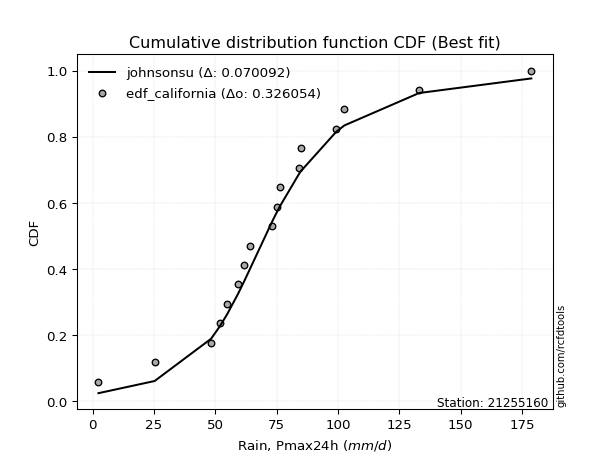</img></img>

</div>


### 2. Empirical - EDF Hazen (1930)

Hazen method for plotting positions is a formula used to estimate the empirical cumulative probability distribution of flood events or other hydrological data. This formula often results in biased estimations, particularly when extrapolating to extreme events (high return periods).

<div align="center">


$P=(m-0.5)/n$


</div>


**2.1. Empirical values**

<div align="center">

|                | 0                    | 1                   | 2                   | 3                   | 4                  | 5                  | 6                   | 7                  | 8         | 9                  | 10                 | 11                 | 12                 | 13                 | 14                 | 15                 | 16                 |
|:---------------|:---------------------|:--------------------|:--------------------|:--------------------|:-------------------|:-------------------|:--------------------|:-------------------|:----------|:-------------------|:-------------------|:-------------------|:-------------------|:-------------------|:-------------------|:-------------------|:-------------------|
| date           | 2019                 | 2011                | 2008                | 2016                | 2006               | 2022               | 2014                | 2005               | 2007      | 2017               | 2015               | 2010               | 2018               | 2009               | 2012               | 2021               | 2013               |
| x              | 2.4                  | 25.3                | 48.3                | 51.8                | 54.8               | 59.4               | 61.9                | 64.2               | 73.3      | 75.1               | 76.3               | 84.2               | 84.9               | 99.3               | 102.61764705882354 | 133.1              | 178.8              |
| m              | 1                    | 2                   | 3                   | 4                   | 5                  | 6                  | 7                   | 8                  | 9         | 10                 | 11                 | 12                 | 13                 | 14                 | 15                 | 16                 | 17                 |
| empirical_dist | edf_hazen            | edf_hazen           | edf_hazen           | edf_hazen           | edf_hazen          | edf_hazen          | edf_hazen           | edf_hazen          | edf_hazen | edf_hazen          | edf_hazen          | edf_hazen          | edf_hazen          | edf_hazen          | edf_hazen          | edf_hazen          | edf_hazen          |
| empirical      | 0.029411764705882353 | 0.08823529411764706 | 0.14705882352941177 | 0.20588235294117646 | 0.2647058823529412 | 0.3235294117647059 | 0.38235294117647056 | 0.4411764705882353 | 0.5       | 0.5588235294117647 | 0.6176470588235294 | 0.6764705882352942 | 0.7352941176470589 | 0.7941176470588235 | 0.8529411764705882 | 0.9117647058823529 | 0.9705882352941176 |
| empirical_tr   | 1.0303030303030303   | 1.096774193548387   | 1.1724137931034484  | 1.259259259259259   | 1.3599999999999999 | 1.4782608695652173 | 1.619047619047619   | 1.7894736842105263 | 2.0       | 2.2666666666666666 | 2.6153846153846154 | 3.0909090909090913 | 3.7777777777777786 | 4.857142857142856  | 6.799999999999999  | 11.33333333333333  | 33.99999999999999  |

</div>


**2.2. Kolmogorov-Smirnov fit test (sorted by Δ)**


<div align="center">

|                | 0                  | 1                   | 2                   | 3                   | 4                   | 5                   | 6                   | 7                   | 8                   | 9                   | 10                  | 11                  | 12                  | 13                  | 14                  | 15                  | 16                 | 17                  | 18                  | 19                  | 20                  | 21                  | 22                 | 23                  | 24                  | 25                  | 26                  | 27                  | 28                 | 29                  | 30                 | 31                  | 32                 | 33                 | 34                    | 35                 | 36                 | 37                  | 38                  | 39                 | 40                  | 41                  | 42                  | 43                 | 44                  | 45                  | 46                  | 47                 | 48                 | 49                  | 50                 | 51                  | 52                  | 53                 | 54                 | 55                  | 56                  | 57                  | 58                 | 59                 | 60                 | 61                 | 62                  | 63                  | 64                  | 65                 | 66                 | 67                  | 68                 | 69                 | 70                 | 71                 | 72                  | 73                  | 74                 | 75                  | 76                  | 77                  | 78                 | 79                  | 80                 | 81                 | 82                  | 83                 | 84                 | 85                 | 86                 | 87                 | 88                 | 89                 |
|:---------------|:-------------------|:--------------------|:--------------------|:--------------------|:--------------------|:--------------------|:--------------------|:--------------------|:--------------------|:--------------------|:--------------------|:--------------------|:--------------------|:--------------------|:--------------------|:--------------------|:-------------------|:--------------------|:--------------------|:--------------------|:--------------------|:--------------------|:-------------------|:--------------------|:--------------------|:--------------------|:--------------------|:--------------------|:-------------------|:--------------------|:-------------------|:--------------------|:-------------------|:-------------------|:----------------------|:-------------------|:-------------------|:--------------------|:--------------------|:-------------------|:--------------------|:--------------------|:--------------------|:-------------------|:--------------------|:--------------------|:--------------------|:-------------------|:-------------------|:--------------------|:-------------------|:--------------------|:--------------------|:-------------------|:-------------------|:--------------------|:--------------------|:--------------------|:-------------------|:-------------------|:-------------------|:-------------------|:--------------------|:--------------------|:--------------------|:-------------------|:-------------------|:--------------------|:-------------------|:-------------------|:-------------------|:-------------------|:--------------------|:--------------------|:-------------------|:--------------------|:--------------------|:--------------------|:-------------------|:--------------------|:-------------------|:-------------------|:--------------------|:-------------------|:-------------------|:-------------------|:-------------------|:-------------------|:-------------------|:-------------------|
| station        | 21255160           | 21255160            | 21255160            | 21255160            | 21255160            | 21255160            | 21255160            | 21255160            | 21255160            | 21255160            | 21255160            | 21255160            | 21255160            | 21255160            | 21255160            | 21255160            | 21255160           | 21255160            | 21255160            | 21255160            | 21255160            | 21255160            | 21255160           | 21255160            | 21255160            | 21255160            | 21255160            | 21255160            | 21255160           | 21255160            | 21255160           | 21255160            | 21255160           | 21255160           | 21255160              | 21255160           | 21255160           | 21255160            | 21255160            | 21255160           | 21255160            | 21255160            | 21255160            | 21255160           | 21255160            | 21255160            | 21255160            | 21255160           | 21255160           | 21255160            | 21255160           | 21255160            | 21255160            | 21255160           | 21255160           | 21255160            | 21255160            | 21255160            | 21255160           | 21255160           | 21255160           | 21255160           | 21255160            | 21255160            | 21255160            | 21255160           | 21255160           | 21255160            | 21255160           | 21255160           | 21255160           | 21255160           | 21255160            | 21255160            | 21255160           | 21255160            | 21255160            | 21255160            | 21255160           | 21255160            | 21255160           | 21255160           | 21255160            | 21255160           | 21255160           | 21255160           | 21255160           | 21255160           | 21255160           | 21255160           |
| empirical_dist | edf_hazen          | edf_hazen           | edf_hazen           | edf_hazen           | edf_hazen           | edf_hazen           | edf_hazen           | edf_hazen           | edf_hazen           | edf_hazen           | edf_hazen           | edf_hazen           | edf_hazen           | edf_hazen           | edf_hazen           | edf_hazen           | edf_hazen          | edf_hazen           | edf_hazen           | edf_hazen           | edf_hazen           | edf_hazen           | edf_hazen          | edf_hazen           | edf_hazen           | edf_hazen           | edf_hazen           | edf_hazen           | edf_hazen          | edf_hazen           | edf_hazen          | edf_hazen           | edf_hazen          | edf_hazen          | edf_hazen             | edf_hazen          | edf_hazen          | edf_hazen           | edf_hazen           | edf_hazen          | edf_hazen           | edf_hazen           | edf_hazen           | edf_hazen          | edf_hazen           | edf_hazen           | edf_hazen           | edf_hazen          | edf_hazen          | edf_hazen           | edf_hazen          | edf_hazen           | edf_hazen           | edf_hazen          | edf_hazen          | edf_hazen           | edf_hazen           | edf_hazen           | edf_hazen          | edf_hazen          | edf_hazen          | edf_hazen          | edf_hazen           | edf_hazen           | edf_hazen           | edf_hazen          | edf_hazen          | edf_hazen           | edf_hazen          | edf_hazen          | edf_hazen          | edf_hazen          | edf_hazen           | edf_hazen           | edf_hazen          | edf_hazen           | edf_hazen           | edf_hazen           | edf_hazen          | edf_hazen           | edf_hazen          | edf_hazen          | edf_hazen           | edf_hazen          | edf_hazen          | edf_hazen          | edf_hazen          | edf_hazen          | edf_hazen          | edf_hazen          |
| p_dist         | johnsonsu          | logt                | logjohnsonsu        | fisk                | lognakagami         | genlogistic         | exponnorm           | nct                 | laplace_asymmetric  | weibull_min         | laplace             | invgamma            | f                   | moyal               | betaprime           | chi2                | gamma              | erlang              | mielke              | gumbel_r            | hypsecant           | nakagami            | pearson3           | maxwell             | rice                | invgauss            | logistic            | rayleigh            | invweibull         | logfisk             | norm               | crystalball         | halflogistic       | t                  | loglaplace_asymmetric | wald               | kstwobign          | halfnorm            | loggenlogistic      | logmielke          | loggompertz         | logweibull_min      | logloggamma         | ncf                | gibrat              | gumbel_l            | loggumbel_l         | logpearson3        | loglaplace         | loghypsecant        | loglogistic        | logfatiguelife      | logf                | logexponnorm       | logrice            | lognorm             | lognorm             | logcrystalball      | loglognorm         | lognct             | loggamma           | loggamma           | loginvgamma         | logchi2             | logbetaprime        | logalpha           | logncf             | logmaxwell          | loginvgauss        | logerlang          | lograyleigh        | loginvweibull      | expon               | genexpon            | loggumbel_r        | loghalfnorm         | logmoyal            | loghalflogistic     | logkstwobign       | loggibrat           | logwald            | loggenexpon        | logexpon            | logtruncnorm       | pareto             | logpareto          | fatiguelife        | alpha              | gompertz           | truncnorm          |
| delta          | 0.0449195354322105 | 0.06577762187369307 | 0.06642768411085301 | 0.08035706640528772 | 0.08446483904033532 | 0.08557608814958861 | 0.09467175849150808 | 0.09549888682955324 | 0.09765938602357671 | 0.10211795413594194 | 0.10432201515263684 | 0.10733320637466312 | 0.10733437875460991 | 0.10775374223921289 | 0.10865780779447334 | 0.10866333707483869 | 0.1086633388877947 | 0.10866336450149008 | 0.10870145923124777 | 0.11003379873257216 | 0.11157255304548597 | 0.11298854906219136 | 0.1180630027424763 | 0.11932842392599283 | 0.12135907479727104 | 0.12207548065247978 | 0.12214726049105507 | 0.12797436179847213 | 0.1279934475854049 | 0.13395736872600564 | 0.135072927345962  | 0.13507293643862173 | 0.1353555855776256 | 0.1466663148070151 | 0.147129833716834     | 0.1495795173771287 | 0.150780162743653  | 0.15096096960797104 | 0.15164031307705025 | 0.1522370668469252 | 0.15804573553968895 | 0.16120207647811777 | 0.16126756666915767 | 0.1656863054552871 | 0.16980425042007985 | 0.19480448720160193 | 0.19508431314493754 | 0.2140635149349528 | 0.2148107021875448 | 0.24100950897666376 | 0.2507317437467591 | 0.26115829727341533 | 0.26187601485285283 | 0.2625211197742071 | 0.262521249277046  | 0.26252142684480706 | 0.26252142684480706 | 0.26252142685541646 | 0.2625234624801207 | 0.2670417540216148 | 0.2794816823998181 | 0.2794816823998181 | 0.28350476956485293 | 0.28807557205391643 | 0.28849532924315013 | 0.2906882588695403 | 0.2918205814390412 | 0.29672799053449883 | 0.2998269575854903 | 0.3029380345821142 | 0.3089898683493917 | 0.3143334061550761 | 0.32134120012867495 | 0.32149782047368847 | 0.3240001435609883 | 0.34373343361722986 | 0.34754052274711267 | 0.36050635508087314 | 0.3619802990108397 | 0.41010696424092163 | 0.4117308153545819 | 0.4152386366477966 | 0.46054542305806523 | 0.4774165835432581 | 0.5411949925909159 | 0.5582787931537744 | 0.639896292437859  | 0.6901927559578167 | 0.8711410503802646 | 0.9117647058823529 |
| deltao         | 0.3260541228310003 | 0.3260541228310003  | 0.3260541228310003  | 0.3260541228310003  | 0.3260541228310003  | 0.3260541228310003  | 0.3260541228310003  | 0.3260541228310003  | 0.3260541228310003  | 0.3260541228310003  | 0.3260541228310003  | 0.3260541228310003  | 0.3260541228310003  | 0.3260541228310003  | 0.3260541228310003  | 0.3260541228310003  | 0.3260541228310003 | 0.3260541228310003  | 0.3260541228310003  | 0.3260541228310003  | 0.3260541228310003  | 0.3260541228310003  | 0.3260541228310003 | 0.3260541228310003  | 0.3260541228310003  | 0.3260541228310003  | 0.3260541228310003  | 0.3260541228310003  | 0.3260541228310003 | 0.3260541228310003  | 0.3260541228310003 | 0.3260541228310003  | 0.3260541228310003 | 0.3260541228310003 | 0.3260541228310003    | 0.3260541228310003 | 0.3260541228310003 | 0.3260541228310003  | 0.3260541228310003  | 0.3260541228310003 | 0.3260541228310003  | 0.3260541228310003  | 0.3260541228310003  | 0.3260541228310003 | 0.3260541228310003  | 0.3260541228310003  | 0.3260541228310003  | 0.3260541228310003 | 0.3260541228310003 | 0.3260541228310003  | 0.3260541228310003 | 0.3260541228310003  | 0.3260541228310003  | 0.3260541228310003 | 0.3260541228310003 | 0.3260541228310003  | 0.3260541228310003  | 0.3260541228310003  | 0.3260541228310003 | 0.3260541228310003 | 0.3260541228310003 | 0.3260541228310003 | 0.3260541228310003  | 0.3260541228310003  | 0.3260541228310003  | 0.3260541228310003 | 0.3260541228310003 | 0.3260541228310003  | 0.3260541228310003 | 0.3260541228310003 | 0.3260541228310003 | 0.3260541228310003 | 0.3260541228310003  | 0.3260541228310003  | 0.3260541228310003 | 0.3260541228310003  | 0.3260541228310003  | 0.3260541228310003  | 0.3260541228310003 | 0.3260541228310003  | 0.3260541228310003 | 0.3260541228310003 | 0.3260541228310003  | 0.3260541228310003 | 0.3260541228310003 | 0.3260541228310003 | 0.3260541228310003 | 0.3260541228310003 | 0.3260541228310003 | 0.3260541228310003 |
| eval           | Δo > Δ             | Δo > Δ              | Δo > Δ              | Δo > Δ              | Δo > Δ              | Δo > Δ              | Δo > Δ              | Δo > Δ              | Δo > Δ              | Δo > Δ              | Δo > Δ              | Δo > Δ              | Δo > Δ              | Δo > Δ              | Δo > Δ              | Δo > Δ              | Δo > Δ             | Δo > Δ              | Δo > Δ              | Δo > Δ              | Δo > Δ              | Δo > Δ              | Δo > Δ             | Δo > Δ              | Δo > Δ              | Δo > Δ              | Δo > Δ              | Δo > Δ              | Δo > Δ             | Δo > Δ              | Δo > Δ             | Δo > Δ              | Δo > Δ             | Δo > Δ             | Δo > Δ                | Δo > Δ             | Δo > Δ             | Δo > Δ              | Δo > Δ              | Δo > Δ             | Δo > Δ              | Δo > Δ              | Δo > Δ              | Δo > Δ             | Δo > Δ              | Δo > Δ              | Δo > Δ              | Δo > Δ             | Δo > Δ             | Δo > Δ              | Δo > Δ             | Δo > Δ              | Δo > Δ              | Δo > Δ             | Δo > Δ             | Δo > Δ              | Δo > Δ              | Δo > Δ              | Δo > Δ             | Δo > Δ             | Δo > Δ             | Δo > Δ             | Δo > Δ              | Δo > Δ              | Δo > Δ              | Δo > Δ             | Δo > Δ             | Δo > Δ              | Δo > Δ             | Δo > Δ             | Δo > Δ             | Δo > Δ             | Δo > Δ              | Δo > Δ              | Δo > Δ             | Δo <= Δ             | Δo <= Δ             | Δo <= Δ             | Δo <= Δ            | Δo <= Δ             | Δo <= Δ            | Δo <= Δ            | Δo <= Δ             | Δo <= Δ            | Δo <= Δ            | Δo <= Δ            | Δo <= Δ            | Δo <= Δ            | Δo <= Δ            | Δo <= Δ            |
| fit            | 1                  | 1                   | 1                   | 1                   | 1                   | 1                   | 1                   | 1                   | 1                   | 1                   | 1                   | 1                   | 1                   | 1                   | 1                   | 1                   | 1                  | 1                   | 1                   | 1                   | 1                   | 1                   | 1                  | 1                   | 1                   | 1                   | 1                   | 1                   | 1                  | 1                   | 1                  | 1                   | 1                  | 1                  | 1                     | 1                  | 1                  | 1                   | 1                   | 1                  | 1                   | 1                   | 1                   | 1                  | 1                   | 1                   | 1                   | 1                  | 1                  | 1                   | 1                  | 1                   | 1                   | 1                  | 1                  | 1                   | 1                   | 1                   | 1                  | 1                  | 1                  | 1                  | 1                   | 1                   | 1                   | 1                  | 1                  | 1                   | 1                  | 1                  | 1                  | 1                  | 1                   | 1                   | 1                  | 0                   | 0                   | 0                   | 0                  | 0                   | 0                  | 0                  | 0                   | 0                  | 0                  | 0                  | 0                  | 0                  | 0                  | 0                  |
| n              | 17                 | 17                  | 17                  | 17                  | 17                  | 17                  | 17                  | 17                  | 17                  | 17                  | 17                  | 17                  | 17                  | 17                  | 17                  | 17                  | 17                 | 17                  | 17                  | 17                  | 17                  | 17                  | 17                 | 17                  | 17                  | 17                  | 17                  | 17                  | 17                 | 17                  | 17                 | 17                  | 17                 | 17                 | 17                    | 17                 | 17                 | 17                  | 17                  | 17                 | 17                  | 17                  | 17                  | 17                 | 17                  | 17                  | 17                  | 17                 | 17                 | 17                  | 17                 | 17                  | 17                  | 17                 | 17                 | 17                  | 17                  | 17                  | 17                 | 17                 | 17                 | 17                 | 17                  | 17                  | 17                  | 17                 | 17                 | 17                  | 17                 | 17                 | 17                 | 17                 | 17                  | 17                  | 17                 | 17                  | 17                  | 17                  | 17                 | 17                  | 17                 | 17                 | 17                  | 17                 | 17                 | 17                 | 17                 | 17                 | 17                 | 17                 |
| best_fit       | 1                  | 0                   | 0                   | 0                   | 0                   | 0                   | 0                   | 0                   | 0                   | 0                   | 0                   | 0                   | 0                   | 0                   | 0                   | 0                   | 0                  | 0                   | 0                   | 0                   | 0                   | 0                   | 0                  | 0                   | 0                   | 0                   | 0                   | 0                   | 0                  | 0                   | 0                  | 0                   | 0                  | 0                  | 0                     | 0                  | 0                  | 0                   | 0                   | 0                  | 0                   | 0                   | 0                   | 0                  | 0                   | 0                   | 0                   | 0                  | 0                  | 0                   | 0                  | 0                   | 0                   | 0                  | 0                  | 0                   | 0                   | 0                   | 0                  | 0                  | 0                  | 0                  | 0                   | 0                   | 0                   | 0                  | 0                  | 0                   | 0                  | 0                  | 0                  | 0                  | 0                   | 0                   | 0                  | 0                   | 0                   | 0                   | 0                  | 0                   | 0                  | 0                  | 0                   | 0                  | 0                  | 0                  | 0                  | 0                  | 0                  | 0                  |
| best_fit_sort  | 1                  | 2                   | 3                   | 4                   | 5                   | 6                   | 7                   | 8                   | 9                   | 10                  | 11                  | 12                  | 13                  | 14                  | 15                  | 16                  | 17                 | 18                  | 19                  | 20                  | 21                  | 22                  | 23                 | 24                  | 25                  | 26                  | 27                  | 28                  | 29                 | 30                  | 31                 | 32                  | 33                 | 34                 | 35                    | 36                 | 37                 | 38                  | 39                  | 40                 | 41                  | 42                  | 43                  | 44                 | 45                  | 46                  | 47                  | 48                 | 49                 | 50                  | 51                 | 52                  | 53                  | 54                 | 55                 | 56                  | 57                  | 58                  | 59                 | 60                 | 61                 | 62                 | 63                  | 64                  | 65                  | 66                 | 67                 | 68                  | 69                 | 70                 | 71                 | 72                 | 73                  | 74                  | 75                 | 76                  | 77                  | 78                  | 79                 | 80                  | 81                 | 82                 | 83                  | 84                 | 85                 | 86                 | 87                 | 88                 | 89                 | 90                 |

</div>


<div align="center">

</img>

</div>


**2.3. Best fit**

<div align="center">

|   id |   station | empirical_dist   | p_dist    |     delta |   deltao | eval   |   fit |   n |   best_fit |   best_fit_sort |
|-----:|----------:|:-----------------|:----------|----------:|---------:|:-------|------:|----:|-----------:|----------------:|
|    0 |  21255160 | edf_hazen        | johnsonsu | 0.0449195 | 0.326054 | Δo > Δ |     1 |  17 |          1 |               1 |

</div>


<div align="center">

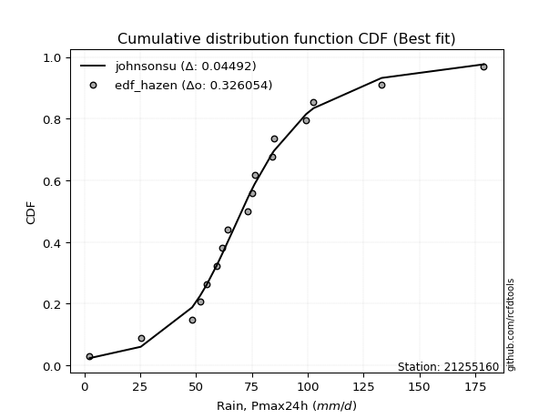</img>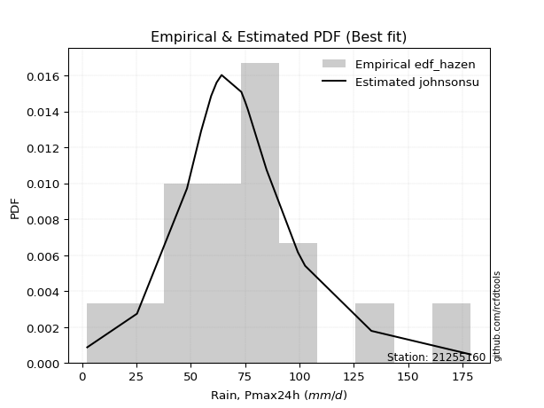</img>

</div>


### 3. Empirical - EDF Weibull (1939)

Weibull plotting position formula is an empirical method used to estimate the non-exceedance probability or plotting position for a set of observed data, is often recommended or widely used in practice, particularly in flood frequency analysis.

<div align="center">


$P=m/(n+1)$


</div>


**3.1. Empirical values**

<div align="center">

|                | 0                   | 1                  | 2                   | 3                  | 4                  | 5                  | 6                  | 7                  | 8           | 9                  | 10                 | 11                 | 12                 | 13                 | 14                 | 15                 | 16                 |
|:---------------|:--------------------|:-------------------|:--------------------|:-------------------|:-------------------|:-------------------|:-------------------|:-------------------|:------------|:-------------------|:-------------------|:-------------------|:-------------------|:-------------------|:-------------------|:-------------------|:-------------------|
| date           | 2019                | 2011               | 2008                | 2016               | 2006               | 2022               | 2014               | 2005               | 2007        | 2017               | 2015               | 2010               | 2018               | 2009               | 2012               | 2021               | 2013               |
| x              | 2.4                 | 25.3               | 48.3                | 51.8               | 54.8               | 59.4               | 61.9               | 64.2               | 73.3        | 75.1               | 76.3               | 84.2               | 84.9               | 99.3               | 102.61764705882354 | 133.1              | 178.8              |
| m              | 1                   | 2                  | 3                   | 4                  | 5                  | 6                  | 7                  | 8                  | 9           | 10                 | 11                 | 12                 | 13                 | 14                 | 15                 | 16                 | 17                 |
| empirical_dist | edf_weibull         | edf_weibull        | edf_weibull         | edf_weibull        | edf_weibull        | edf_weibull        | edf_weibull        | edf_weibull        | edf_weibull | edf_weibull        | edf_weibull        | edf_weibull        | edf_weibull        | edf_weibull        | edf_weibull        | edf_weibull        | edf_weibull        |
| empirical      | 0.05555555555555555 | 0.1111111111111111 | 0.16666666666666666 | 0.2222222222222222 | 0.2777777777777778 | 0.3333333333333333 | 0.3888888888888889 | 0.4444444444444444 | 0.5         | 0.5555555555555556 | 0.6111111111111112 | 0.6666666666666666 | 0.7222222222222222 | 0.7777777777777778 | 0.8333333333333334 | 0.8888888888888888 | 0.9444444444444444 |
| empirical_tr   | 1.0588235294117647  | 1.125              | 1.2                 | 1.2857142857142856 | 1.3846153846153846 | 1.4999999999999998 | 1.6363636363636362 | 1.7999999999999998 | 2.0         | 2.25               | 2.5714285714285716 | 2.9999999999999996 | 3.5999999999999996 | 4.5                | 6.000000000000002  | 8.999999999999996  | 17.999999999999993 |

</div>


**3.2. Kolmogorov-Smirnov fit test (sorted by Δ)**


<div align="center">

|                | 0                   | 1                    | 2                   | 3                   | 4                   | 5                   | 6                   | 7                   | 8                   | 9                  | 10                  | 11                  | 12                  | 13                  | 14                  | 15                  | 16                  | 17                 | 18                  | 19                  | 20                  | 21                  | 22                  | 23                  | 24                  | 25                  | 26                  | 27                  | 28                 | 29                  | 30                 | 31                  | 32                  | 33                  | 34                    | 35                 | 36                  | 37                  | 38                 | 39                  | 40                  | 41                 | 42                 | 43                 | 44                  | 45                  | 46                  | 47                  | 48                  | 49                  | 50                 | 51                  | 52                  | 53                 | 54                  | 55                  | 56                  | 57                 | 58                  | 59                  | 60                  | 61                  | 62                 | 63                 | 64                 | 65                 | 66                 | 67                 | 68                  | 69                 | 70                  | 71                  | 72                 | 73                  | 74                  | 75                 | 76                  | 77                 | 78                 | 79                 | 80                  | 81                  | 82                 | 83                 | 84                 | 85                 | 86                 | 87                 | 88                 | 89                 |
|:---------------|:--------------------|:---------------------|:--------------------|:--------------------|:--------------------|:--------------------|:--------------------|:--------------------|:--------------------|:-------------------|:--------------------|:--------------------|:--------------------|:--------------------|:--------------------|:--------------------|:--------------------|:-------------------|:--------------------|:--------------------|:--------------------|:--------------------|:--------------------|:--------------------|:--------------------|:--------------------|:--------------------|:--------------------|:-------------------|:--------------------|:-------------------|:--------------------|:--------------------|:--------------------|:----------------------|:-------------------|:--------------------|:--------------------|:-------------------|:--------------------|:--------------------|:-------------------|:-------------------|:-------------------|:--------------------|:--------------------|:--------------------|:--------------------|:--------------------|:--------------------|:-------------------|:--------------------|:--------------------|:-------------------|:--------------------|:--------------------|:--------------------|:-------------------|:--------------------|:--------------------|:--------------------|:--------------------|:-------------------|:-------------------|:-------------------|:-------------------|:-------------------|:-------------------|:--------------------|:-------------------|:--------------------|:--------------------|:-------------------|:--------------------|:--------------------|:-------------------|:--------------------|:-------------------|:-------------------|:-------------------|:--------------------|:--------------------|:-------------------|:-------------------|:-------------------|:-------------------|:-------------------|:-------------------|:-------------------|:-------------------|
| station        | 21255160            | 21255160             | 21255160            | 21255160            | 21255160            | 21255160            | 21255160            | 21255160            | 21255160            | 21255160           | 21255160            | 21255160            | 21255160            | 21255160            | 21255160            | 21255160            | 21255160            | 21255160           | 21255160            | 21255160            | 21255160            | 21255160            | 21255160            | 21255160            | 21255160            | 21255160            | 21255160            | 21255160            | 21255160           | 21255160            | 21255160           | 21255160            | 21255160            | 21255160            | 21255160              | 21255160           | 21255160            | 21255160            | 21255160           | 21255160            | 21255160            | 21255160           | 21255160           | 21255160           | 21255160            | 21255160            | 21255160            | 21255160            | 21255160            | 21255160            | 21255160           | 21255160            | 21255160            | 21255160           | 21255160            | 21255160            | 21255160            | 21255160           | 21255160            | 21255160            | 21255160            | 21255160            | 21255160           | 21255160           | 21255160           | 21255160           | 21255160           | 21255160           | 21255160            | 21255160           | 21255160            | 21255160            | 21255160           | 21255160            | 21255160            | 21255160           | 21255160            | 21255160           | 21255160           | 21255160           | 21255160            | 21255160            | 21255160           | 21255160           | 21255160           | 21255160           | 21255160           | 21255160           | 21255160           | 21255160           |
| empirical_dist | edf_weibull         | edf_weibull          | edf_weibull         | edf_weibull         | edf_weibull         | edf_weibull         | edf_weibull         | edf_weibull         | edf_weibull         | edf_weibull        | edf_weibull         | edf_weibull         | edf_weibull         | edf_weibull         | edf_weibull         | edf_weibull         | edf_weibull         | edf_weibull        | edf_weibull         | edf_weibull         | edf_weibull         | edf_weibull         | edf_weibull         | edf_weibull         | edf_weibull         | edf_weibull         | edf_weibull         | edf_weibull         | edf_weibull        | edf_weibull         | edf_weibull        | edf_weibull         | edf_weibull         | edf_weibull         | edf_weibull           | edf_weibull        | edf_weibull         | edf_weibull         | edf_weibull        | edf_weibull         | edf_weibull         | edf_weibull        | edf_weibull        | edf_weibull        | edf_weibull         | edf_weibull         | edf_weibull         | edf_weibull         | edf_weibull         | edf_weibull         | edf_weibull        | edf_weibull         | edf_weibull         | edf_weibull        | edf_weibull         | edf_weibull         | edf_weibull         | edf_weibull        | edf_weibull         | edf_weibull         | edf_weibull         | edf_weibull         | edf_weibull        | edf_weibull        | edf_weibull        | edf_weibull        | edf_weibull        | edf_weibull        | edf_weibull         | edf_weibull        | edf_weibull         | edf_weibull         | edf_weibull        | edf_weibull         | edf_weibull         | edf_weibull        | edf_weibull         | edf_weibull        | edf_weibull        | edf_weibull        | edf_weibull         | edf_weibull         | edf_weibull        | edf_weibull        | edf_weibull        | edf_weibull        | edf_weibull        | edf_weibull        | edf_weibull        | edf_weibull        |
| p_dist         | johnsonsu           | logjohnsonsu         | fisk                | logt                | genlogistic         | exponnorm           | nct                 | invgamma            | f                   | moyal              | mielke              | betaprime           | erlang              | chi2                | gamma               | gumbel_r            | pearson3            | hypsecant          | maxwell             | nakagami            | laplace_asymmetric  | weibull_min         | invgauss            | lognakagami         | laplace             | rice                | rayleigh            | invweibull          | logistic           | logfisk             | halflogistic       | norm                | crystalball         | t                   | loglaplace_asymmetric | kstwobign          | halfnorm            | loggenlogistic      | logmielke          | loggompertz         | logweibull_min      | logloggamma        | ncf                | wald               | gibrat              | loggumbel_l         | gumbel_l            | loglaplace          | logpearson3         | loghypsecant        | loglogistic        | logfatiguelife      | logf                | logexponnorm       | logrice             | lognorm             | lognorm             | logcrystalball     | loglognorm          | lognct              | loggamma            | loggamma            | loginvgamma        | logchi2            | logbetaprime       | logalpha           | logncf             | logmaxwell         | loginvgauss         | logerlang          | lograyleigh         | loginvweibull       | expon              | genexpon            | loggumbel_r         | loghalfnorm        | logmoyal            | loghalflogistic    | logkstwobign       | loggibrat          | logwald             | loggenexpon         | logexpon           | logtruncnorm       | pareto             | logpareto          | fatiguelife        | alpha              | gompertz           | truncnorm          |
| delta          | 0.05068009603192411 | 0.053861169596775116 | 0.06074922326803284 | 0.06904559572990221 | 0.07250419272475195 | 0.07506391535425319 | 0.07589104369229835 | 0.08772536323740823 | 0.08772653561735502 | 0.088145899101958  | 0.08909361609399288 | 0.08974602488490557 | 0.08980362611818904 | 0.08980366987765764 | 0.08980368009337336 | 0.09042595559531727 | 0.09845515960522142 | 0.0985006576206493 | 0.09972058078873794 | 0.09991665363735469 | 0.10092735987978585 | 0.10227730298927533 | 0.10246763751522489 | 0.10734065603379936 | 0.10758998900884598 | 0.10828717937243437 | 0.10836651866121724 | 0.10838560444815001 | 0.1090753650662184 | 0.11434952558875075 | 0.1157477424403707 | 0.12200103192112532 | 0.12200104101378506 | 0.12705847166976023 | 0.1275219905795791    | 0.1311723196063981 | 0.13135312647071615 | 0.13203246993979537 | 0.1326292237096703 | 0.13843789240243407 | 0.14159423334086288 | 0.1416597235319028 | 0.1460784623180322 | 0.1495795173771287 | 0.16980425042007985 | 0.17547647000768266 | 0.18173259177676526 | 0.19520285905028992 | 0.20099161951011613 | 0.22140166583940887 | 0.2311239006095042 | 0.24155045413616047 | 0.24226817171559792 | 0.2429132766369522 | 0.24291340613979115 | 0.24291358370755214 | 0.24291358370755214 | 0.2429135837181616 | 0.24291561934286585 | 0.24743391088435987 | 0.25987383926256313 | 0.25987383926256313 | 0.263896926427598  | 0.2684677289166616 | 0.2688874861058952 | 0.2710804157322855 | 0.2722127383017863 | 0.2771201473972439 | 0.28021911444823544 | 0.2833301914448594 | 0.28938202521213685 | 0.29472556301782127 | 0.3017333569914201 | 0.30188997733643363 | 0.30439230042373344 | 0.324125590479975  | 0.32793267960985784 | 0.3408985119436183 | 0.3423724558735849 | 0.3904991211036668 | 0.39212297221732706 | 0.39563079351054176 | 0.4409375799208104 | 0.4578087404060033 | 0.5183191755974519 | 0.5354029761603103 | 0.6202884493006041 | 0.6705849128205619 | 0.8482652333868004 | 0.8888888888888888 |
| deltao         | 0.3260541228310003  | 0.3260541228310003   | 0.3260541228310003  | 0.3260541228310003  | 0.3260541228310003  | 0.3260541228310003  | 0.3260541228310003  | 0.3260541228310003  | 0.3260541228310003  | 0.3260541228310003 | 0.3260541228310003  | 0.3260541228310003  | 0.3260541228310003  | 0.3260541228310003  | 0.3260541228310003  | 0.3260541228310003  | 0.3260541228310003  | 0.3260541228310003 | 0.3260541228310003  | 0.3260541228310003  | 0.3260541228310003  | 0.3260541228310003  | 0.3260541228310003  | 0.3260541228310003  | 0.3260541228310003  | 0.3260541228310003  | 0.3260541228310003  | 0.3260541228310003  | 0.3260541228310003 | 0.3260541228310003  | 0.3260541228310003 | 0.3260541228310003  | 0.3260541228310003  | 0.3260541228310003  | 0.3260541228310003    | 0.3260541228310003 | 0.3260541228310003  | 0.3260541228310003  | 0.3260541228310003 | 0.3260541228310003  | 0.3260541228310003  | 0.3260541228310003 | 0.3260541228310003 | 0.3260541228310003 | 0.3260541228310003  | 0.3260541228310003  | 0.3260541228310003  | 0.3260541228310003  | 0.3260541228310003  | 0.3260541228310003  | 0.3260541228310003 | 0.3260541228310003  | 0.3260541228310003  | 0.3260541228310003 | 0.3260541228310003  | 0.3260541228310003  | 0.3260541228310003  | 0.3260541228310003 | 0.3260541228310003  | 0.3260541228310003  | 0.3260541228310003  | 0.3260541228310003  | 0.3260541228310003 | 0.3260541228310003 | 0.3260541228310003 | 0.3260541228310003 | 0.3260541228310003 | 0.3260541228310003 | 0.3260541228310003  | 0.3260541228310003 | 0.3260541228310003  | 0.3260541228310003  | 0.3260541228310003 | 0.3260541228310003  | 0.3260541228310003  | 0.3260541228310003 | 0.3260541228310003  | 0.3260541228310003 | 0.3260541228310003 | 0.3260541228310003 | 0.3260541228310003  | 0.3260541228310003  | 0.3260541228310003 | 0.3260541228310003 | 0.3260541228310003 | 0.3260541228310003 | 0.3260541228310003 | 0.3260541228310003 | 0.3260541228310003 | 0.3260541228310003 |
| eval           | Δo > Δ              | Δo > Δ               | Δo > Δ              | Δo > Δ              | Δo > Δ              | Δo > Δ              | Δo > Δ              | Δo > Δ              | Δo > Δ              | Δo > Δ             | Δo > Δ              | Δo > Δ              | Δo > Δ              | Δo > Δ              | Δo > Δ              | Δo > Δ              | Δo > Δ              | Δo > Δ             | Δo > Δ              | Δo > Δ              | Δo > Δ              | Δo > Δ              | Δo > Δ              | Δo > Δ              | Δo > Δ              | Δo > Δ              | Δo > Δ              | Δo > Δ              | Δo > Δ             | Δo > Δ              | Δo > Δ             | Δo > Δ              | Δo > Δ              | Δo > Δ              | Δo > Δ                | Δo > Δ             | Δo > Δ              | Δo > Δ              | Δo > Δ             | Δo > Δ              | Δo > Δ              | Δo > Δ             | Δo > Δ             | Δo > Δ             | Δo > Δ              | Δo > Δ              | Δo > Δ              | Δo > Δ              | Δo > Δ              | Δo > Δ              | Δo > Δ             | Δo > Δ              | Δo > Δ              | Δo > Δ             | Δo > Δ              | Δo > Δ              | Δo > Δ              | Δo > Δ             | Δo > Δ              | Δo > Δ              | Δo > Δ              | Δo > Δ              | Δo > Δ             | Δo > Δ             | Δo > Δ             | Δo > Δ             | Δo > Δ             | Δo > Δ             | Δo > Δ              | Δo > Δ             | Δo > Δ              | Δo > Δ              | Δo > Δ             | Δo > Δ              | Δo > Δ              | Δo > Δ             | Δo <= Δ             | Δo <= Δ            | Δo <= Δ            | Δo <= Δ            | Δo <= Δ             | Δo <= Δ             | Δo <= Δ            | Δo <= Δ            | Δo <= Δ            | Δo <= Δ            | Δo <= Δ            | Δo <= Δ            | Δo <= Δ            | Δo <= Δ            |
| fit            | 1                   | 1                    | 1                   | 1                   | 1                   | 1                   | 1                   | 1                   | 1                   | 1                  | 1                   | 1                   | 1                   | 1                   | 1                   | 1                   | 1                   | 1                  | 1                   | 1                   | 1                   | 1                   | 1                   | 1                   | 1                   | 1                   | 1                   | 1                   | 1                  | 1                   | 1                  | 1                   | 1                   | 1                   | 1                     | 1                  | 1                   | 1                   | 1                  | 1                   | 1                   | 1                  | 1                  | 1                  | 1                   | 1                   | 1                   | 1                   | 1                   | 1                   | 1                  | 1                   | 1                   | 1                  | 1                   | 1                   | 1                   | 1                  | 1                   | 1                   | 1                   | 1                   | 1                  | 1                  | 1                  | 1                  | 1                  | 1                  | 1                   | 1                  | 1                   | 1                   | 1                  | 1                   | 1                   | 1                  | 0                   | 0                  | 0                  | 0                  | 0                   | 0                   | 0                  | 0                  | 0                  | 0                  | 0                  | 0                  | 0                  | 0                  |
| n              | 17                  | 17                   | 17                  | 17                  | 17                  | 17                  | 17                  | 17                  | 17                  | 17                 | 17                  | 17                  | 17                  | 17                  | 17                  | 17                  | 17                  | 17                 | 17                  | 17                  | 17                  | 17                  | 17                  | 17                  | 17                  | 17                  | 17                  | 17                  | 17                 | 17                  | 17                 | 17                  | 17                  | 17                  | 17                    | 17                 | 17                  | 17                  | 17                 | 17                  | 17                  | 17                 | 17                 | 17                 | 17                  | 17                  | 17                  | 17                  | 17                  | 17                  | 17                 | 17                  | 17                  | 17                 | 17                  | 17                  | 17                  | 17                 | 17                  | 17                  | 17                  | 17                  | 17                 | 17                 | 17                 | 17                 | 17                 | 17                 | 17                  | 17                 | 17                  | 17                  | 17                 | 17                  | 17                  | 17                 | 17                  | 17                 | 17                 | 17                 | 17                  | 17                  | 17                 | 17                 | 17                 | 17                 | 17                 | 17                 | 17                 | 17                 |
| best_fit       | 1                   | 0                    | 0                   | 0                   | 0                   | 0                   | 0                   | 0                   | 0                   | 0                  | 0                   | 0                   | 0                   | 0                   | 0                   | 0                   | 0                   | 0                  | 0                   | 0                   | 0                   | 0                   | 0                   | 0                   | 0                   | 0                   | 0                   | 0                   | 0                  | 0                   | 0                  | 0                   | 0                   | 0                   | 0                     | 0                  | 0                   | 0                   | 0                  | 0                   | 0                   | 0                  | 0                  | 0                  | 0                   | 0                   | 0                   | 0                   | 0                   | 0                   | 0                  | 0                   | 0                   | 0                  | 0                   | 0                   | 0                   | 0                  | 0                   | 0                   | 0                   | 0                   | 0                  | 0                  | 0                  | 0                  | 0                  | 0                  | 0                   | 0                  | 0                   | 0                   | 0                  | 0                   | 0                   | 0                  | 0                   | 0                  | 0                  | 0                  | 0                   | 0                   | 0                  | 0                  | 0                  | 0                  | 0                  | 0                  | 0                  | 0                  |
| best_fit_sort  | 1                   | 2                    | 3                   | 4                   | 5                   | 6                   | 7                   | 8                   | 9                   | 10                 | 11                  | 12                  | 13                  | 14                  | 15                  | 16                  | 17                  | 18                 | 19                  | 20                  | 21                  | 22                  | 23                  | 24                  | 25                  | 26                  | 27                  | 28                  | 29                 | 30                  | 31                 | 32                  | 33                  | 34                  | 35                    | 36                 | 37                  | 38                  | 39                 | 40                  | 41                  | 42                 | 43                 | 44                 | 45                  | 46                  | 47                  | 48                  | 49                  | 50                  | 51                 | 52                  | 53                  | 54                 | 55                  | 56                  | 57                  | 58                 | 59                  | 60                  | 61                  | 62                  | 63                 | 64                 | 65                 | 66                 | 67                 | 68                 | 69                  | 70                 | 71                  | 72                  | 73                 | 74                  | 75                  | 76                 | 77                  | 78                 | 79                 | 80                 | 81                  | 82                  | 83                 | 84                 | 85                 | 86                 | 87                 | 88                 | 89                 | 90                 |

</div>


<div align="center">

</img>

</div>


**3.3. Best fit**

<div align="center">

|   id |   station | empirical_dist   | p_dist    |     delta |   deltao | eval   |   fit |   n |   best_fit |   best_fit_sort |
|-----:|----------:|:-----------------|:----------|----------:|---------:|:-------|------:|----:|-----------:|----------------:|
|    0 |  21255160 | edf_weibull      | johnsonsu | 0.0506801 | 0.326054 | Δo > Δ |     1 |  17 |          1 |               1 |

</div>


<div align="center">

</img></img>

</div>


### 4. Empirical - EDF Beard (1943)

The Beard formula (or Beard´s plotting position formula) in hydrology is used to estimate the empirical non-exceedance probability _(P)_ of a flood event (or other extreme hydrological data point) within a given dataset.

<div align="center">


$P=(m-0.31)/(n+0.38)$


</div>


**4.1. Empirical values**

<div align="center">

|                | 0                   | 1                   | 2                   | 3                   | 4                  | 5                   | 6                   | 7                   | 8         | 9                  | 10                 | 11                 | 12                 | 13                 | 14                 | 15                 | 16                 |
|:---------------|:--------------------|:--------------------|:--------------------|:--------------------|:-------------------|:--------------------|:--------------------|:--------------------|:----------|:-------------------|:-------------------|:-------------------|:-------------------|:-------------------|:-------------------|:-------------------|:-------------------|
| date           | 2019                | 2011                | 2008                | 2016                | 2006               | 2022                | 2014                | 2005                | 2007      | 2017               | 2015               | 2010               | 2018               | 2009               | 2012               | 2021               | 2013               |
| x              | 2.4                 | 25.3                | 48.3                | 51.8                | 54.8               | 59.4                | 61.9                | 64.2                | 73.3      | 75.1               | 76.3               | 84.2               | 84.9               | 99.3               | 102.61764705882354 | 133.1              | 178.8              |
| m              | 1                   | 2                   | 3                   | 4                   | 5                  | 6                   | 7                   | 8                   | 9         | 10                 | 11                 | 12                 | 13                 | 14                 | 15                 | 16                 | 17                 |
| empirical_dist | edf_beard           | edf_beard           | edf_beard           | edf_beard           | edf_beard          | edf_beard           | edf_beard           | edf_beard           | edf_beard | edf_beard          | edf_beard          | edf_beard          | edf_beard          | edf_beard          | edf_beard          | edf_beard          | edf_beard          |
| empirical      | 0.03970080552359033 | 0.09723820483314155 | 0.15477560414269276 | 0.21231300345224396 | 0.2698504027617952 | 0.32738780207134643 | 0.38492520138089764 | 0.44246260069044885 | 0.5       | 0.5575373993095513 | 0.6150747986191024 | 0.6726121979286537 | 0.7301495972382048 | 0.7876869965477561 | 0.8452243958573072 | 0.9027617951668585 | 0.9602991944764098 |
| empirical_tr   | 1.0413421210305571  | 1.1077119184193753  | 1.1831177671885638  | 1.2695398100803508  | 1.3695823483057525 | 1.4867408041060737  | 1.6258185219831622  | 1.7936016511867907  | 2.0       | 2.2600780234070226 | 2.5979073243647233 | 3.0544815465729354 | 3.7057569296375266 | 4.710027100271004  | 6.460966542750929  | 10.284023668639058 | 25.188405797101513 |

</div>


**4.2. Kolmogorov-Smirnov fit test (sorted by Δ)**


<div align="center">

|                | 0                  | 1                   | 2                   | 3                   | 4                   | 5                   | 6                   | 7                  | 8                   | 9                   | 10                  | 11                  | 12                 | 13                  | 14                 | 15                  | 16                 | 17                  | 18                  | 19                 | 20                  | 21                  | 22                  | 23                  | 24                  | 25                  | 26                  | 27                  | 28                  | 29                  | 30                 | 31                  | 32                  | 33                  | 34                    | 35                 | 36                  | 37                  | 38                 | 39                 | 40                  | 41                  | 42                 | 43                 | 44                  | 45                  | 46                  | 47                  | 48                  | 49                  | 50                 | 51                  | 52                 | 53                 | 54                  | 55                  | 56                  | 57                 | 58                  | 59                  | 60                  | 61                  | 62                 | 63                  | 64                 | 65                  | 66                 | 67                 | 68                 | 69                  | 70                 | 71                  | 72                 | 73                 | 74                 | 75                 | 76                 | 77                 | 78                  | 79                 | 80                  | 81                  | 82                  | 83                  | 84                 | 85                 | 86                 | 87                 | 88                 | 89                 |
|:---------------|:-------------------|:--------------------|:--------------------|:--------------------|:--------------------|:--------------------|:--------------------|:-------------------|:--------------------|:--------------------|:--------------------|:--------------------|:-------------------|:--------------------|:-------------------|:--------------------|:-------------------|:--------------------|:--------------------|:-------------------|:--------------------|:--------------------|:--------------------|:--------------------|:--------------------|:--------------------|:--------------------|:--------------------|:--------------------|:--------------------|:-------------------|:--------------------|:--------------------|:--------------------|:----------------------|:-------------------|:--------------------|:--------------------|:-------------------|:-------------------|:--------------------|:--------------------|:-------------------|:-------------------|:--------------------|:--------------------|:--------------------|:--------------------|:--------------------|:--------------------|:-------------------|:--------------------|:-------------------|:-------------------|:--------------------|:--------------------|:--------------------|:-------------------|:--------------------|:--------------------|:--------------------|:--------------------|:-------------------|:--------------------|:-------------------|:--------------------|:-------------------|:-------------------|:-------------------|:--------------------|:-------------------|:--------------------|:-------------------|:-------------------|:-------------------|:-------------------|:-------------------|:-------------------|:--------------------|:-------------------|:--------------------|:--------------------|:--------------------|:--------------------|:-------------------|:-------------------|:-------------------|:-------------------|:-------------------|:-------------------|
| station        | 21255160           | 21255160            | 21255160            | 21255160            | 21255160            | 21255160            | 21255160            | 21255160           | 21255160            | 21255160            | 21255160            | 21255160            | 21255160           | 21255160            | 21255160           | 21255160            | 21255160           | 21255160            | 21255160            | 21255160           | 21255160            | 21255160            | 21255160            | 21255160            | 21255160            | 21255160            | 21255160            | 21255160            | 21255160            | 21255160            | 21255160           | 21255160            | 21255160            | 21255160            | 21255160              | 21255160           | 21255160            | 21255160            | 21255160           | 21255160           | 21255160            | 21255160            | 21255160           | 21255160           | 21255160            | 21255160            | 21255160            | 21255160            | 21255160            | 21255160            | 21255160           | 21255160            | 21255160           | 21255160           | 21255160            | 21255160            | 21255160            | 21255160           | 21255160            | 21255160            | 21255160            | 21255160            | 21255160           | 21255160            | 21255160           | 21255160            | 21255160           | 21255160           | 21255160           | 21255160            | 21255160           | 21255160            | 21255160           | 21255160           | 21255160           | 21255160           | 21255160           | 21255160           | 21255160            | 21255160           | 21255160            | 21255160            | 21255160            | 21255160            | 21255160           | 21255160           | 21255160           | 21255160           | 21255160           | 21255160           |
| empirical_dist | edf_beard          | edf_beard           | edf_beard           | edf_beard           | edf_beard           | edf_beard           | edf_beard           | edf_beard          | edf_beard           | edf_beard           | edf_beard           | edf_beard           | edf_beard          | edf_beard           | edf_beard          | edf_beard           | edf_beard          | edf_beard           | edf_beard           | edf_beard          | edf_beard           | edf_beard           | edf_beard           | edf_beard           | edf_beard           | edf_beard           | edf_beard           | edf_beard           | edf_beard           | edf_beard           | edf_beard          | edf_beard           | edf_beard           | edf_beard           | edf_beard             | edf_beard          | edf_beard           | edf_beard           | edf_beard          | edf_beard          | edf_beard           | edf_beard           | edf_beard          | edf_beard          | edf_beard           | edf_beard           | edf_beard           | edf_beard           | edf_beard           | edf_beard           | edf_beard          | edf_beard           | edf_beard          | edf_beard          | edf_beard           | edf_beard           | edf_beard           | edf_beard          | edf_beard           | edf_beard           | edf_beard           | edf_beard           | edf_beard          | edf_beard           | edf_beard          | edf_beard           | edf_beard          | edf_beard          | edf_beard          | edf_beard           | edf_beard          | edf_beard           | edf_beard          | edf_beard          | edf_beard          | edf_beard          | edf_beard          | edf_beard          | edf_beard           | edf_beard          | edf_beard           | edf_beard           | edf_beard           | edf_beard           | edf_beard          | edf_beard          | edf_beard          | edf_beard          | edf_beard          | edf_beard          |
| p_dist         | johnsonsu          | logjohnsonsu        | logt                | fisk                | genlogistic         | exponnorm           | nct                 | lognakagami        | weibull_min         | laplace_asymmetric  | invgamma            | f                   | moyal              | betaprime           | chi2               | gamma               | erlang             | mielke              | gumbel_r            | laplace            | hypsecant           | nakagami            | pearson3            | maxwell             | invgauss            | rice                | logistic            | rayleigh            | invweibull          | logfisk             | halflogistic       | norm                | crystalball         | t                   | loglaplace_asymmetric | kstwobign          | halfnorm            | loggenlogistic      | logmielke          | wald               | loggompertz         | logweibull_min      | logloggamma        | ncf                | gibrat              | loggumbel_l         | gumbel_l            | loglaplace          | logpearson3         | loghypsecant        | loglogistic        | logfatiguelife      | logf               | logexponnorm       | logrice             | lognorm             | lognorm             | logcrystalball     | loglognorm          | lognct              | loggamma            | loggamma            | loginvgamma        | logchi2             | logbetaprime       | logalpha            | logncf             | logmaxwell         | loginvgauss        | logerlang           | lograyleigh        | loginvweibull       | expon              | genexpon           | loggumbel_r        | loghalfnorm        | logmoyal           | loghalflogistic    | logkstwobign        | loggibrat          | logwald             | loggenexpon         | logexpon            | logtruncnorm        | pareto             | logpareto          | fatiguelife        | alpha              | gompertz           | truncnorm          |
| delta          | 0.0449195354322105 | 0.05871090349757202 | 0.06706375197590664 | 0.07264028579200674 | 0.08043156774073457 | 0.08695497787822709 | 0.08778210621627225 | 0.0934677497558298 | 0.09697343372708789 | 0.09894551612579028 | 0.09961642576138213 | 0.09961759814132892 | 0.1000369616259319 | 0.10094102718119236 | 0.1009465564615577 | 0.10094655827451371 | 0.1009465838882091 | 0.10098467861796678 | 0.10231701811929117 | 0.1056081452548504 | 0.10642803263663192 | 0.10784402865333731 | 0.11034622212919531 | 0.11161164331271184 | 0.11435870003919879 | 0.11621455438841699 | 0.11700274008220102 | 0.12025758118519114 | 0.12027666697212391 | 0.12624058811272465 | 0.1276388049643446 | 0.12992840693710794 | 0.12992841602976768 | 0.13894953419373413 | 0.139413053103553     | 0.143063382130372  | 0.14324418899469005 | 0.14392353246376927 | 0.1445202862336442 | 0.1495795173771287 | 0.15032895492640796 | 0.15348529586483678 | 0.1535507860558767 | 0.1579695248420061 | 0.16980425042007985 | 0.18736753253165656 | 0.18965996679274788 | 0.20709392157426382 | 0.20891899452609874 | 0.23329272836338277 | 0.2430149631334781 | 0.25344151666013437 | 0.2541592342395718 | 0.2548043391609261 | 0.25480446866376505 | 0.25480464623152604 | 0.25480464623152604 | 0.2548046462421355 | 0.25480668186683975 | 0.25932497340833377 | 0.27176490178653706 | 0.27176490178653706 | 0.2757879889515719 | 0.28035879144063547 | 0.2807785486298691 | 0.28297147825625935 | 0.2841038008257602 | 0.2890112099212178 | 0.2921101769722093 | 0.29522125396883325 | 0.3012730877361107 | 0.30661662554179514 | 0.313624419515394  | 0.3137810398604075 | 0.3162833629477073 | 0.3360166530039489 | 0.3398237421338317 | 0.3527895744675922 | 0.35426351839755876 | 0.4023901836276407 | 0.40401403474130093 | 0.40752185603451563 | 0.45282864244478427 | 0.46969980292997715 | 0.5321920818754213 | 0.54927588243828   | 0.632179511824578  | 0.6824759753445357 | 0.86213813966477   | 0.9027617951668585 |
| deltao         | 0.3260541228310003 | 0.3260541228310003  | 0.3260541228310003  | 0.3260541228310003  | 0.3260541228310003  | 0.3260541228310003  | 0.3260541228310003  | 0.3260541228310003 | 0.3260541228310003  | 0.3260541228310003  | 0.3260541228310003  | 0.3260541228310003  | 0.3260541228310003 | 0.3260541228310003  | 0.3260541228310003 | 0.3260541228310003  | 0.3260541228310003 | 0.3260541228310003  | 0.3260541228310003  | 0.3260541228310003 | 0.3260541228310003  | 0.3260541228310003  | 0.3260541228310003  | 0.3260541228310003  | 0.3260541228310003  | 0.3260541228310003  | 0.3260541228310003  | 0.3260541228310003  | 0.3260541228310003  | 0.3260541228310003  | 0.3260541228310003 | 0.3260541228310003  | 0.3260541228310003  | 0.3260541228310003  | 0.3260541228310003    | 0.3260541228310003 | 0.3260541228310003  | 0.3260541228310003  | 0.3260541228310003 | 0.3260541228310003 | 0.3260541228310003  | 0.3260541228310003  | 0.3260541228310003 | 0.3260541228310003 | 0.3260541228310003  | 0.3260541228310003  | 0.3260541228310003  | 0.3260541228310003  | 0.3260541228310003  | 0.3260541228310003  | 0.3260541228310003 | 0.3260541228310003  | 0.3260541228310003 | 0.3260541228310003 | 0.3260541228310003  | 0.3260541228310003  | 0.3260541228310003  | 0.3260541228310003 | 0.3260541228310003  | 0.3260541228310003  | 0.3260541228310003  | 0.3260541228310003  | 0.3260541228310003 | 0.3260541228310003  | 0.3260541228310003 | 0.3260541228310003  | 0.3260541228310003 | 0.3260541228310003 | 0.3260541228310003 | 0.3260541228310003  | 0.3260541228310003 | 0.3260541228310003  | 0.3260541228310003 | 0.3260541228310003 | 0.3260541228310003 | 0.3260541228310003 | 0.3260541228310003 | 0.3260541228310003 | 0.3260541228310003  | 0.3260541228310003 | 0.3260541228310003  | 0.3260541228310003  | 0.3260541228310003  | 0.3260541228310003  | 0.3260541228310003 | 0.3260541228310003 | 0.3260541228310003 | 0.3260541228310003 | 0.3260541228310003 | 0.3260541228310003 |
| eval           | Δo > Δ             | Δo > Δ              | Δo > Δ              | Δo > Δ              | Δo > Δ              | Δo > Δ              | Δo > Δ              | Δo > Δ             | Δo > Δ              | Δo > Δ              | Δo > Δ              | Δo > Δ              | Δo > Δ             | Δo > Δ              | Δo > Δ             | Δo > Δ              | Δo > Δ             | Δo > Δ              | Δo > Δ              | Δo > Δ             | Δo > Δ              | Δo > Δ              | Δo > Δ              | Δo > Δ              | Δo > Δ              | Δo > Δ              | Δo > Δ              | Δo > Δ              | Δo > Δ              | Δo > Δ              | Δo > Δ             | Δo > Δ              | Δo > Δ              | Δo > Δ              | Δo > Δ                | Δo > Δ             | Δo > Δ              | Δo > Δ              | Δo > Δ             | Δo > Δ             | Δo > Δ              | Δo > Δ              | Δo > Δ             | Δo > Δ             | Δo > Δ              | Δo > Δ              | Δo > Δ              | Δo > Δ              | Δo > Δ              | Δo > Δ              | Δo > Δ             | Δo > Δ              | Δo > Δ             | Δo > Δ             | Δo > Δ              | Δo > Δ              | Δo > Δ              | Δo > Δ             | Δo > Δ              | Δo > Δ              | Δo > Δ              | Δo > Δ              | Δo > Δ             | Δo > Δ              | Δo > Δ             | Δo > Δ              | Δo > Δ             | Δo > Δ             | Δo > Δ             | Δo > Δ              | Δo > Δ             | Δo > Δ              | Δo > Δ             | Δo > Δ             | Δo > Δ             | Δo <= Δ            | Δo <= Δ            | Δo <= Δ            | Δo <= Δ             | Δo <= Δ            | Δo <= Δ             | Δo <= Δ             | Δo <= Δ             | Δo <= Δ             | Δo <= Δ            | Δo <= Δ            | Δo <= Δ            | Δo <= Δ            | Δo <= Δ            | Δo <= Δ            |
| fit            | 1                  | 1                   | 1                   | 1                   | 1                   | 1                   | 1                   | 1                  | 1                   | 1                   | 1                   | 1                   | 1                  | 1                   | 1                  | 1                   | 1                  | 1                   | 1                   | 1                  | 1                   | 1                   | 1                   | 1                   | 1                   | 1                   | 1                   | 1                   | 1                   | 1                   | 1                  | 1                   | 1                   | 1                   | 1                     | 1                  | 1                   | 1                   | 1                  | 1                  | 1                   | 1                   | 1                  | 1                  | 1                   | 1                   | 1                   | 1                   | 1                   | 1                   | 1                  | 1                   | 1                  | 1                  | 1                   | 1                   | 1                   | 1                  | 1                   | 1                   | 1                   | 1                   | 1                  | 1                   | 1                  | 1                   | 1                  | 1                  | 1                  | 1                   | 1                  | 1                   | 1                  | 1                  | 1                  | 0                  | 0                  | 0                  | 0                   | 0                  | 0                   | 0                   | 0                   | 0                   | 0                  | 0                  | 0                  | 0                  | 0                  | 0                  |
| n              | 17                 | 17                  | 17                  | 17                  | 17                  | 17                  | 17                  | 17                 | 17                  | 17                  | 17                  | 17                  | 17                 | 17                  | 17                 | 17                  | 17                 | 17                  | 17                  | 17                 | 17                  | 17                  | 17                  | 17                  | 17                  | 17                  | 17                  | 17                  | 17                  | 17                  | 17                 | 17                  | 17                  | 17                  | 17                    | 17                 | 17                  | 17                  | 17                 | 17                 | 17                  | 17                  | 17                 | 17                 | 17                  | 17                  | 17                  | 17                  | 17                  | 17                  | 17                 | 17                  | 17                 | 17                 | 17                  | 17                  | 17                  | 17                 | 17                  | 17                  | 17                  | 17                  | 17                 | 17                  | 17                 | 17                  | 17                 | 17                 | 17                 | 17                  | 17                 | 17                  | 17                 | 17                 | 17                 | 17                 | 17                 | 17                 | 17                  | 17                 | 17                  | 17                  | 17                  | 17                  | 17                 | 17                 | 17                 | 17                 | 17                 | 17                 |
| best_fit       | 1                  | 0                   | 0                   | 0                   | 0                   | 0                   | 0                   | 0                  | 0                   | 0                   | 0                   | 0                   | 0                  | 0                   | 0                  | 0                   | 0                  | 0                   | 0                   | 0                  | 0                   | 0                   | 0                   | 0                   | 0                   | 0                   | 0                   | 0                   | 0                   | 0                   | 0                  | 0                   | 0                   | 0                   | 0                     | 0                  | 0                   | 0                   | 0                  | 0                  | 0                   | 0                   | 0                  | 0                  | 0                   | 0                   | 0                   | 0                   | 0                   | 0                   | 0                  | 0                   | 0                  | 0                  | 0                   | 0                   | 0                   | 0                  | 0                   | 0                   | 0                   | 0                   | 0                  | 0                   | 0                  | 0                   | 0                  | 0                  | 0                  | 0                   | 0                  | 0                   | 0                  | 0                  | 0                  | 0                  | 0                  | 0                  | 0                   | 0                  | 0                   | 0                   | 0                   | 0                   | 0                  | 0                  | 0                  | 0                  | 0                  | 0                  |
| best_fit_sort  | 1                  | 2                   | 3                   | 4                   | 5                   | 6                   | 7                   | 8                  | 9                   | 10                  | 11                  | 12                  | 13                 | 14                  | 15                 | 16                  | 17                 | 18                  | 19                  | 20                 | 21                  | 22                  | 23                  | 24                  | 25                  | 26                  | 27                  | 28                  | 29                  | 30                  | 31                 | 32                  | 33                  | 34                  | 35                    | 36                 | 37                  | 38                  | 39                 | 40                 | 41                  | 42                  | 43                 | 44                 | 45                  | 46                  | 47                  | 48                  | 49                  | 50                  | 51                 | 52                  | 53                 | 54                 | 55                  | 56                  | 57                  | 58                 | 59                  | 60                  | 61                  | 62                  | 63                 | 64                  | 65                 | 66                  | 67                 | 68                 | 69                 | 70                  | 71                 | 72                  | 73                 | 74                 | 75                 | 76                 | 77                 | 78                 | 79                  | 80                 | 81                  | 82                  | 83                  | 84                  | 85                 | 86                 | 87                 | 88                 | 89                 | 90                 |

</div>


<div align="center">

</img>

</div>


**4.3. Best fit**

<div align="center">

|   id |   station | empirical_dist   | p_dist    |     delta |   deltao | eval   |   fit |   n |   best_fit |   best_fit_sort |
|-----:|----------:|:-----------------|:----------|----------:|---------:|:-------|------:|----:|-----------:|----------------:|
|    0 |  21255160 | edf_beard        | johnsonsu | 0.0449195 | 0.326054 | Δo > Δ |     1 |  17 |          1 |               1 |

</div>


<div align="center">

</img>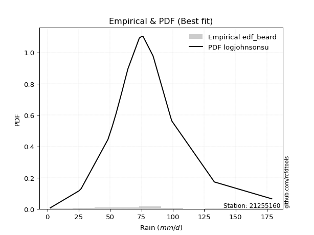</img>

</div>


### 5. Empirical - EDF Chegodayev (1955)

The Chegodayev formula is an empirical plotting position formula used in hydrological frequency analysis to estimate the exceedance probability or return period of a specific event from a set of observed data. It is primarily used for plotting observed data points on probability paper to fit a theoretical distribution, particularly for analyzing extreme events like maximum flood flows or rainfall intensities. The constant _b_ value in the generalized plotting position formula is 0.3.

<div align="center">


$P=(m-b)/(n+1-2b)$


</div>


**5.1. Empirical values**

<div align="center">

|                | 0                    | 1                   | 2                   | 3                   | 4                  | 5                   | 6                   | 7                 | 8              | 9                  | 10                 | 11                 | 12                 | 13                 | 14                 | 15                 | 16                 |
|:---------------|:---------------------|:--------------------|:--------------------|:--------------------|:-------------------|:--------------------|:--------------------|:------------------|:---------------|:-------------------|:-------------------|:-------------------|:-------------------|:-------------------|:-------------------|:-------------------|:-------------------|
| date           | 2019                 | 2011                | 2008                | 2016                | 2006               | 2022                | 2014                | 2005              | 2007           | 2017               | 2015               | 2010               | 2018               | 2009               | 2012               | 2021               | 2013               |
| x              | 2.4                  | 25.3                | 48.3                | 51.8                | 54.8               | 59.4                | 61.9                | 64.2              | 73.3           | 75.1               | 76.3               | 84.2               | 84.9               | 99.3               | 102.61764705882354 | 133.1              | 178.8              |
| m              | 1                    | 2                   | 3                   | 4                   | 5                  | 6                   | 7                   | 8                 | 9              | 10                 | 11                 | 12                 | 13                 | 14                 | 15                 | 16                 | 17                 |
| empirical_dist | edf_chegodayev       | edf_chegodayev      | edf_chegodayev      | edf_chegodayev      | edf_chegodayev     | edf_chegodayev      | edf_chegodayev      | edf_chegodayev    | edf_chegodayev | edf_chegodayev     | edf_chegodayev     | edf_chegodayev     | edf_chegodayev     | edf_chegodayev     | edf_chegodayev     | edf_chegodayev     | edf_chegodayev     |
| empirical      | 0.040229885057471264 | 0.09770114942528736 | 0.15517241379310348 | 0.21264367816091956 | 0.2701149425287357 | 0.32758620689655177 | 0.38505747126436785 | 0.442528735632184 | 0.5            | 0.5574712643678161 | 0.6149425287356322 | 0.6724137931034483 | 0.7298850574712644 | 0.7873563218390804 | 0.8448275862068966 | 0.9022988505747127 | 0.9597701149425287 |
| empirical_tr   | 1.0419161676646707   | 1.10828025477707    | 1.183673469387755   | 1.27007299270073    | 1.3700787401574803 | 1.4871794871794874  | 1.6261682242990656  | 1.793814432989691 | 2.0            | 2.25974025974026   | 2.5970149253731343 | 3.0526315789473686 | 3.7021276595744688 | 4.702702702702703  | 6.4444444444444455 | 10.235294117647065 | 24.857142857142854 |

</div>


**5.2. Kolmogorov-Smirnov fit test (sorted by Δ)**


<div align="center">

|                | 0                  | 1                  | 2                   | 3                   | 4                   | 5                   | 6                   | 7                   | 8                   | 9                   | 10                  | 11                 | 12                  | 13                  | 14                  | 15                  | 16                  | 17                  | 18                  | 19                  | 20                  | 21                 | 22                  | 23                  | 24                  | 25                  | 26                  | 27                  | 28                  | 29                  | 30                  | 31                  | 32                  | 33                 | 34                    | 35                  | 36                  | 37                  | 38                 | 39                 | 40                  | 41                  | 42                  | 43                  | 44                  | 45                  | 46                  | 47                 | 48                  | 49                  | 50                  | 51                  | 52                 | 53                 | 54                 | 55                 | 56                 | 57                 | 58                 | 59                  | 60                  | 61                  | 62                 | 63                  | 64                 | 65                 | 66                 | 67                 | 68                 | 69                  | 70                 | 71                 | 72                  | 73                 | 74                 | 75                  | 76                 | 77                  | 78                  | 79                  | 80                 | 81                 | 82                  | 83                 | 84                 | 85                 | 86                 | 87                 | 88                 | 89                 |
|:---------------|:-------------------|:-------------------|:--------------------|:--------------------|:--------------------|:--------------------|:--------------------|:--------------------|:--------------------|:--------------------|:--------------------|:-------------------|:--------------------|:--------------------|:--------------------|:--------------------|:--------------------|:--------------------|:--------------------|:--------------------|:--------------------|:-------------------|:--------------------|:--------------------|:--------------------|:--------------------|:--------------------|:--------------------|:--------------------|:--------------------|:--------------------|:--------------------|:--------------------|:-------------------|:----------------------|:--------------------|:--------------------|:--------------------|:-------------------|:-------------------|:--------------------|:--------------------|:--------------------|:--------------------|:--------------------|:--------------------|:--------------------|:-------------------|:--------------------|:--------------------|:--------------------|:--------------------|:-------------------|:-------------------|:-------------------|:-------------------|:-------------------|:-------------------|:-------------------|:--------------------|:--------------------|:--------------------|:-------------------|:--------------------|:-------------------|:-------------------|:-------------------|:-------------------|:-------------------|:--------------------|:-------------------|:-------------------|:--------------------|:-------------------|:-------------------|:--------------------|:-------------------|:--------------------|:--------------------|:--------------------|:-------------------|:-------------------|:--------------------|:-------------------|:-------------------|:-------------------|:-------------------|:-------------------|:-------------------|:-------------------|
| station        | 21255160           | 21255160           | 21255160            | 21255160            | 21255160            | 21255160            | 21255160            | 21255160            | 21255160            | 21255160            | 21255160            | 21255160           | 21255160            | 21255160            | 21255160            | 21255160            | 21255160            | 21255160            | 21255160            | 21255160            | 21255160            | 21255160           | 21255160            | 21255160            | 21255160            | 21255160            | 21255160            | 21255160            | 21255160            | 21255160            | 21255160            | 21255160            | 21255160            | 21255160           | 21255160              | 21255160            | 21255160            | 21255160            | 21255160           | 21255160           | 21255160            | 21255160            | 21255160            | 21255160            | 21255160            | 21255160            | 21255160            | 21255160           | 21255160            | 21255160            | 21255160            | 21255160            | 21255160           | 21255160           | 21255160           | 21255160           | 21255160           | 21255160           | 21255160           | 21255160            | 21255160            | 21255160            | 21255160           | 21255160            | 21255160           | 21255160           | 21255160           | 21255160           | 21255160           | 21255160            | 21255160           | 21255160           | 21255160            | 21255160           | 21255160           | 21255160            | 21255160           | 21255160            | 21255160            | 21255160            | 21255160           | 21255160           | 21255160            | 21255160           | 21255160           | 21255160           | 21255160           | 21255160           | 21255160           | 21255160           |
| empirical_dist | edf_chegodayev     | edf_chegodayev     | edf_chegodayev      | edf_chegodayev      | edf_chegodayev      | edf_chegodayev      | edf_chegodayev      | edf_chegodayev      | edf_chegodayev      | edf_chegodayev      | edf_chegodayev      | edf_chegodayev     | edf_chegodayev      | edf_chegodayev      | edf_chegodayev      | edf_chegodayev      | edf_chegodayev      | edf_chegodayev      | edf_chegodayev      | edf_chegodayev      | edf_chegodayev      | edf_chegodayev     | edf_chegodayev      | edf_chegodayev      | edf_chegodayev      | edf_chegodayev      | edf_chegodayev      | edf_chegodayev      | edf_chegodayev      | edf_chegodayev      | edf_chegodayev      | edf_chegodayev      | edf_chegodayev      | edf_chegodayev     | edf_chegodayev        | edf_chegodayev      | edf_chegodayev      | edf_chegodayev      | edf_chegodayev     | edf_chegodayev     | edf_chegodayev      | edf_chegodayev      | edf_chegodayev      | edf_chegodayev      | edf_chegodayev      | edf_chegodayev      | edf_chegodayev      | edf_chegodayev     | edf_chegodayev      | edf_chegodayev      | edf_chegodayev      | edf_chegodayev      | edf_chegodayev     | edf_chegodayev     | edf_chegodayev     | edf_chegodayev     | edf_chegodayev     | edf_chegodayev     | edf_chegodayev     | edf_chegodayev      | edf_chegodayev      | edf_chegodayev      | edf_chegodayev     | edf_chegodayev      | edf_chegodayev     | edf_chegodayev     | edf_chegodayev     | edf_chegodayev     | edf_chegodayev     | edf_chegodayev      | edf_chegodayev     | edf_chegodayev     | edf_chegodayev      | edf_chegodayev     | edf_chegodayev     | edf_chegodayev      | edf_chegodayev     | edf_chegodayev      | edf_chegodayev      | edf_chegodayev      | edf_chegodayev     | edf_chegodayev     | edf_chegodayev      | edf_chegodayev     | edf_chegodayev     | edf_chegodayev     | edf_chegodayev     | edf_chegodayev     | edf_chegodayev     | edf_chegodayev     |
| p_dist         | johnsonsu          | logjohnsonsu       | logt                | fisk                | genlogistic         | exponnorm           | nct                 | lognakagami         | weibull_min         | laplace_asymmetric  | invgamma            | f                  | moyal               | betaprime           | chi2                | gamma               | erlang              | mielke              | gumbel_r            | laplace             | hypsecant           | nakagami           | pearson3            | maxwell             | invgauss            | rice                | logistic            | rayleigh            | invweibull          | logfisk             | halflogistic        | norm                | crystalball         | t                  | loglaplace_asymmetric | kstwobign           | halfnorm            | loggenlogistic      | logmielke          | wald               | loggompertz         | logweibull_min      | logloggamma         | ncf                 | gibrat              | loggumbel_l         | gumbel_l            | loglaplace         | logpearson3         | loghypsecant        | loglogistic         | logfatiguelife      | logf               | logexponnorm       | logrice            | lognorm            | lognorm            | logcrystalball     | loglognorm         | lognct              | loggamma            | loggamma            | loginvgamma        | logchi2             | logbetaprime       | logalpha           | logncf             | logmaxwell         | loginvgauss        | logerlang           | lograyleigh        | loginvweibull      | expon               | genexpon           | loggumbel_r        | loghalfnorm         | logmoyal           | loghalflogistic     | logkstwobign        | loggibrat           | logwald            | loggenexpon        | logexpon            | logtruncnorm       | pareto             | logpareto          | fatiguelife        | alpha              | gompertz           | truncnorm          |
| delta          | 0.0449195354322105 | 0.0583140938471613 | 0.06712988691764177 | 0.07224347614159601 | 0.08016702797379416 | 0.08655816822781637 | 0.08738529656586153 | 0.09393069434797562 | 0.09670889396014748 | 0.09901165106752541 | 0.09921961611097141 | 0.0992207884909182 | 0.09964015197552117 | 0.10054421753078163 | 0.10054974681114698 | 0.10054974862410299 | 0.10054977423779837 | 0.10058786896755606 | 0.10192020846888045 | 0.10567428019658553 | 0.10616349286969151 | 0.1075794888863969 | 0.10994941247878459 | 0.11121483366230112 | 0.11396189038878807 | 0.11595001462147658 | 0.11673820031526061 | 0.11986077153478042 | 0.11987985732171319 | 0.12584377846231393 | 0.12724199531393388 | 0.12966386717016753 | 0.12966387626282727 | 0.1385527245433234 | 0.13901624345314229   | 0.14266657247996128 | 0.14284737934427932 | 0.14352672281335854 | 0.1441234765832335 | 0.1495795173771287 | 0.14993214527599724 | 0.15308848621442606 | 0.15315397640546596 | 0.15757271519159538 | 0.16980425042007985 | 0.18697072288124583 | 0.18939542702580747 | 0.2066971119238531 | 0.20865445475915834 | 0.23289591871297205 | 0.24261815348306737 | 0.25304470700972365 | 0.2537624245891611 | 0.2544075295105154 | 0.2544076590133543 | 0.2544078365811153 | 0.2544078365811153 | 0.2544078365917248 | 0.254409872216429  | 0.25892816375792305 | 0.27136809213612634 | 0.27136809213612634 | 0.2753911793011612 | 0.27996198179022475 | 0.2803817389794584 | 0.2825746686058486 | 0.2837069911753495 | 0.2886144002708071 | 0.2917133673217986 | 0.29482444431842253 | 0.3008762780857    | 0.3062198158913844 | 0.31322760986498327 | 0.3133842302099968 | 0.3158865532972966 | 0.33561984335353817 | 0.339426932483421  | 0.35239276481718146 | 0.35386670874714804 | 0.40199337397722995 | 0.4036172250908902 | 0.4071250463841049 | 0.45243183279437355 | 0.4693029932795664 | 0.5317291372832755 | 0.548812937846134  | 0.6317827021741673 | 0.682079165694125  | 0.8616751950726242 | 0.9022988505747126 |
| deltao         | 0.3260541228310003 | 0.3260541228310003 | 0.3260541228310003  | 0.3260541228310003  | 0.3260541228310003  | 0.3260541228310003  | 0.3260541228310003  | 0.3260541228310003  | 0.3260541228310003  | 0.3260541228310003  | 0.3260541228310003  | 0.3260541228310003 | 0.3260541228310003  | 0.3260541228310003  | 0.3260541228310003  | 0.3260541228310003  | 0.3260541228310003  | 0.3260541228310003  | 0.3260541228310003  | 0.3260541228310003  | 0.3260541228310003  | 0.3260541228310003 | 0.3260541228310003  | 0.3260541228310003  | 0.3260541228310003  | 0.3260541228310003  | 0.3260541228310003  | 0.3260541228310003  | 0.3260541228310003  | 0.3260541228310003  | 0.3260541228310003  | 0.3260541228310003  | 0.3260541228310003  | 0.3260541228310003 | 0.3260541228310003    | 0.3260541228310003  | 0.3260541228310003  | 0.3260541228310003  | 0.3260541228310003 | 0.3260541228310003 | 0.3260541228310003  | 0.3260541228310003  | 0.3260541228310003  | 0.3260541228310003  | 0.3260541228310003  | 0.3260541228310003  | 0.3260541228310003  | 0.3260541228310003 | 0.3260541228310003  | 0.3260541228310003  | 0.3260541228310003  | 0.3260541228310003  | 0.3260541228310003 | 0.3260541228310003 | 0.3260541228310003 | 0.3260541228310003 | 0.3260541228310003 | 0.3260541228310003 | 0.3260541228310003 | 0.3260541228310003  | 0.3260541228310003  | 0.3260541228310003  | 0.3260541228310003 | 0.3260541228310003  | 0.3260541228310003 | 0.3260541228310003 | 0.3260541228310003 | 0.3260541228310003 | 0.3260541228310003 | 0.3260541228310003  | 0.3260541228310003 | 0.3260541228310003 | 0.3260541228310003  | 0.3260541228310003 | 0.3260541228310003 | 0.3260541228310003  | 0.3260541228310003 | 0.3260541228310003  | 0.3260541228310003  | 0.3260541228310003  | 0.3260541228310003 | 0.3260541228310003 | 0.3260541228310003  | 0.3260541228310003 | 0.3260541228310003 | 0.3260541228310003 | 0.3260541228310003 | 0.3260541228310003 | 0.3260541228310003 | 0.3260541228310003 |
| eval           | Δo > Δ             | Δo > Δ             | Δo > Δ              | Δo > Δ              | Δo > Δ              | Δo > Δ              | Δo > Δ              | Δo > Δ              | Δo > Δ              | Δo > Δ              | Δo > Δ              | Δo > Δ             | Δo > Δ              | Δo > Δ              | Δo > Δ              | Δo > Δ              | Δo > Δ              | Δo > Δ              | Δo > Δ              | Δo > Δ              | Δo > Δ              | Δo > Δ             | Δo > Δ              | Δo > Δ              | Δo > Δ              | Δo > Δ              | Δo > Δ              | Δo > Δ              | Δo > Δ              | Δo > Δ              | Δo > Δ              | Δo > Δ              | Δo > Δ              | Δo > Δ             | Δo > Δ                | Δo > Δ              | Δo > Δ              | Δo > Δ              | Δo > Δ             | Δo > Δ             | Δo > Δ              | Δo > Δ              | Δo > Δ              | Δo > Δ              | Δo > Δ              | Δo > Δ              | Δo > Δ              | Δo > Δ             | Δo > Δ              | Δo > Δ              | Δo > Δ              | Δo > Δ              | Δo > Δ             | Δo > Δ             | Δo > Δ             | Δo > Δ             | Δo > Δ             | Δo > Δ             | Δo > Δ             | Δo > Δ              | Δo > Δ              | Δo > Δ              | Δo > Δ             | Δo > Δ              | Δo > Δ             | Δo > Δ             | Δo > Δ             | Δo > Δ             | Δo > Δ             | Δo > Δ              | Δo > Δ             | Δo > Δ             | Δo > Δ              | Δo > Δ             | Δo > Δ             | Δo <= Δ             | Δo <= Δ            | Δo <= Δ             | Δo <= Δ             | Δo <= Δ             | Δo <= Δ            | Δo <= Δ            | Δo <= Δ             | Δo <= Δ            | Δo <= Δ            | Δo <= Δ            | Δo <= Δ            | Δo <= Δ            | Δo <= Δ            | Δo <= Δ            |
| fit            | 1                  | 1                  | 1                   | 1                   | 1                   | 1                   | 1                   | 1                   | 1                   | 1                   | 1                   | 1                  | 1                   | 1                   | 1                   | 1                   | 1                   | 1                   | 1                   | 1                   | 1                   | 1                  | 1                   | 1                   | 1                   | 1                   | 1                   | 1                   | 1                   | 1                   | 1                   | 1                   | 1                   | 1                  | 1                     | 1                   | 1                   | 1                   | 1                  | 1                  | 1                   | 1                   | 1                   | 1                   | 1                   | 1                   | 1                   | 1                  | 1                   | 1                   | 1                   | 1                   | 1                  | 1                  | 1                  | 1                  | 1                  | 1                  | 1                  | 1                   | 1                   | 1                   | 1                  | 1                   | 1                  | 1                  | 1                  | 1                  | 1                  | 1                   | 1                  | 1                  | 1                   | 1                  | 1                  | 0                   | 0                  | 0                   | 0                   | 0                   | 0                  | 0                  | 0                   | 0                  | 0                  | 0                  | 0                  | 0                  | 0                  | 0                  |
| n              | 17                 | 17                 | 17                  | 17                  | 17                  | 17                  | 17                  | 17                  | 17                  | 17                  | 17                  | 17                 | 17                  | 17                  | 17                  | 17                  | 17                  | 17                  | 17                  | 17                  | 17                  | 17                 | 17                  | 17                  | 17                  | 17                  | 17                  | 17                  | 17                  | 17                  | 17                  | 17                  | 17                  | 17                 | 17                    | 17                  | 17                  | 17                  | 17                 | 17                 | 17                  | 17                  | 17                  | 17                  | 17                  | 17                  | 17                  | 17                 | 17                  | 17                  | 17                  | 17                  | 17                 | 17                 | 17                 | 17                 | 17                 | 17                 | 17                 | 17                  | 17                  | 17                  | 17                 | 17                  | 17                 | 17                 | 17                 | 17                 | 17                 | 17                  | 17                 | 17                 | 17                  | 17                 | 17                 | 17                  | 17                 | 17                  | 17                  | 17                  | 17                 | 17                 | 17                  | 17                 | 17                 | 17                 | 17                 | 17                 | 17                 | 17                 |
| best_fit       | 1                  | 0                  | 0                   | 0                   | 0                   | 0                   | 0                   | 0                   | 0                   | 0                   | 0                   | 0                  | 0                   | 0                   | 0                   | 0                   | 0                   | 0                   | 0                   | 0                   | 0                   | 0                  | 0                   | 0                   | 0                   | 0                   | 0                   | 0                   | 0                   | 0                   | 0                   | 0                   | 0                   | 0                  | 0                     | 0                   | 0                   | 0                   | 0                  | 0                  | 0                   | 0                   | 0                   | 0                   | 0                   | 0                   | 0                   | 0                  | 0                   | 0                   | 0                   | 0                   | 0                  | 0                  | 0                  | 0                  | 0                  | 0                  | 0                  | 0                   | 0                   | 0                   | 0                  | 0                   | 0                  | 0                  | 0                  | 0                  | 0                  | 0                   | 0                  | 0                  | 0                   | 0                  | 0                  | 0                   | 0                  | 0                   | 0                   | 0                   | 0                  | 0                  | 0                   | 0                  | 0                  | 0                  | 0                  | 0                  | 0                  | 0                  |
| best_fit_sort  | 1                  | 2                  | 3                   | 4                   | 5                   | 6                   | 7                   | 8                   | 9                   | 10                  | 11                  | 12                 | 13                  | 14                  | 15                  | 16                  | 17                  | 18                  | 19                  | 20                  | 21                  | 22                 | 23                  | 24                  | 25                  | 26                  | 27                  | 28                  | 29                  | 30                  | 31                  | 32                  | 33                  | 34                 | 35                    | 36                  | 37                  | 38                  | 39                 | 40                 | 41                  | 42                  | 43                  | 44                  | 45                  | 46                  | 47                  | 48                 | 49                  | 50                  | 51                  | 52                  | 53                 | 54                 | 55                 | 56                 | 57                 | 58                 | 59                 | 60                  | 61                  | 62                  | 63                 | 64                  | 65                 | 66                 | 67                 | 68                 | 69                 | 70                  | 71                 | 72                 | 73                  | 74                 | 75                 | 76                  | 77                 | 78                  | 79                  | 80                  | 81                 | 82                 | 83                  | 84                 | 85                 | 86                 | 87                 | 88                 | 89                 | 90                 |

</div>


<div align="center">

</img>

</div>


**5.3. Best fit**

<div align="center">

|   id |   station | empirical_dist   | p_dist    |     delta |   deltao | eval   |   fit |   n |   best_fit |   best_fit_sort |
|-----:|----------:|:-----------------|:----------|----------:|---------:|:-------|------:|----:|-----------:|----------------:|
|    0 |  21255160 | edf_chegodayev   | johnsonsu | 0.0449195 | 0.326054 | Δo > Δ |     1 |  17 |          1 |               1 |

</div>


<div align="center">

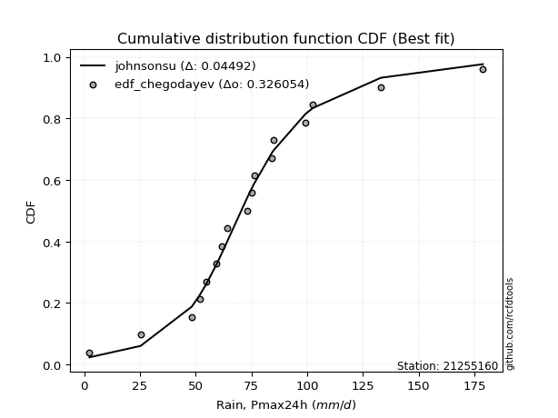</img>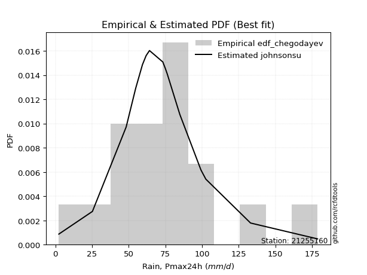</img>

</div>


### 6. Empirical - EDF Blom (1958)

The Blom formula is a specific "plotting position" formula used in hydrology and statistical analysis to estimate the empirical cumulative probability (or non-exceedance probability) of a data series. It is particularly recommended for data that are approximately normally distributed. The constant _a_ is set to 0.375 (or 3/8).

<div align="center">


$P=(m-a)/(n+1-2a)$


</div>


**6.1. Empirical values**

<div align="center">

|                | 0                    | 1                   | 2                   | 3                   | 4                   | 5                   | 6                   | 7                  | 8        | 9                  | 10                 | 11                 | 12                 | 13                 | 14                 | 15                 | 16                 |
|:---------------|:---------------------|:--------------------|:--------------------|:--------------------|:--------------------|:--------------------|:--------------------|:-------------------|:---------|:-------------------|:-------------------|:-------------------|:-------------------|:-------------------|:-------------------|:-------------------|:-------------------|
| date           | 2019                 | 2011                | 2008                | 2016                | 2006                | 2022                | 2014                | 2005               | 2007     | 2017               | 2015               | 2010               | 2018               | 2009               | 2012               | 2021               | 2013               |
| x              | 2.4                  | 25.3                | 48.3                | 51.8                | 54.8                | 59.4                | 61.9                | 64.2               | 73.3     | 75.1               | 76.3               | 84.2               | 84.9               | 99.3               | 102.61764705882354 | 133.1              | 178.8              |
| m              | 1                    | 2                   | 3                   | 4                   | 5                   | 6                   | 7                   | 8                  | 9        | 10                 | 11                 | 12                 | 13                 | 14                 | 15                 | 16                 | 17                 |
| empirical_dist | edf_blom             | edf_blom            | edf_blom            | edf_blom            | edf_blom            | edf_blom            | edf_blom            | edf_blom           | edf_blom | edf_blom           | edf_blom           | edf_blom           | edf_blom           | edf_blom           | edf_blom           | edf_blom           | edf_blom           |
| empirical      | 0.036231884057971016 | 0.09420289855072464 | 0.15217391304347827 | 0.21014492753623187 | 0.26811594202898553 | 0.32608695652173914 | 0.38405797101449274 | 0.4420289855072464 | 0.5      | 0.5579710144927537 | 0.6159420289855072 | 0.6739130434782609 | 0.7318840579710145 | 0.7898550724637681 | 0.8478260869565217 | 0.9057971014492754 | 0.9637681159420289 |
| empirical_tr   | 1.037593984962406    | 1.1039999999999999  | 1.1794871794871795  | 1.2660550458715598  | 1.3663366336633664  | 1.4838709677419355  | 1.6235294117647057  | 1.7922077922077921 | 2.0      | 2.2622950819672134 | 2.6037735849056602 | 3.0666666666666664 | 3.7297297297297303 | 4.758620689655172  | 6.571428571428571  | 10.615384615384619 | 27.599999999999962 |

</div>


**6.2. Kolmogorov-Smirnov fit test (sorted by Δ)**


<div align="center">

|                | 0                  | 1                   | 2                   | 3                   | 4                   | 5                   | 6                   | 7                  | 8                   | 9                   | 10                  | 11                  | 12                  | 13                  | 14                  | 15                 | 16                  | 17                  | 18                  | 19                  | 20                  | 21                 | 22                 | 23                  | 24                  | 25                  | 26                  | 27                  | 28                 | 29                  | 30                  | 31                  | 32                  | 33                 | 34                    | 35                 | 36                  | 37                  | 38                 | 39                 | 40                  | 41                  | 42                  | 43                 | 44                  | 45                  | 46                  | 47                 | 48                  | 49                  | 50                  | 51                  | 52                 | 53                 | 54                  | 55                  | 56                  | 57                 | 58                  | 59                  | 60                  | 61                  | 62                 | 63                  | 64                 | 65                  | 66                 | 67                 | 68                 | 69                  | 70                 | 71                 | 72                 | 73                 | 74                 | 75                 | 76                 | 77                  | 78                  | 79                  | 80                 | 81                 | 82                  | 83                  | 84                 | 85                 | 86                 | 87                 | 88                 | 89                 |
|:---------------|:-------------------|:--------------------|:--------------------|:--------------------|:--------------------|:--------------------|:--------------------|:-------------------|:--------------------|:--------------------|:--------------------|:--------------------|:--------------------|:--------------------|:--------------------|:-------------------|:--------------------|:--------------------|:--------------------|:--------------------|:--------------------|:-------------------|:-------------------|:--------------------|:--------------------|:--------------------|:--------------------|:--------------------|:-------------------|:--------------------|:--------------------|:--------------------|:--------------------|:-------------------|:----------------------|:-------------------|:--------------------|:--------------------|:-------------------|:-------------------|:--------------------|:--------------------|:--------------------|:-------------------|:--------------------|:--------------------|:--------------------|:-------------------|:--------------------|:--------------------|:--------------------|:--------------------|:-------------------|:-------------------|:--------------------|:--------------------|:--------------------|:-------------------|:--------------------|:--------------------|:--------------------|:--------------------|:-------------------|:--------------------|:-------------------|:--------------------|:-------------------|:-------------------|:-------------------|:--------------------|:-------------------|:-------------------|:-------------------|:-------------------|:-------------------|:-------------------|:-------------------|:--------------------|:--------------------|:--------------------|:-------------------|:-------------------|:--------------------|:--------------------|:-------------------|:-------------------|:-------------------|:-------------------|:-------------------|:-------------------|
| station        | 21255160           | 21255160            | 21255160            | 21255160            | 21255160            | 21255160            | 21255160            | 21255160           | 21255160            | 21255160            | 21255160            | 21255160            | 21255160            | 21255160            | 21255160            | 21255160           | 21255160            | 21255160            | 21255160            | 21255160            | 21255160            | 21255160           | 21255160           | 21255160            | 21255160            | 21255160            | 21255160            | 21255160            | 21255160           | 21255160            | 21255160            | 21255160            | 21255160            | 21255160           | 21255160              | 21255160           | 21255160            | 21255160            | 21255160           | 21255160           | 21255160            | 21255160            | 21255160            | 21255160           | 21255160            | 21255160            | 21255160            | 21255160           | 21255160            | 21255160            | 21255160            | 21255160            | 21255160           | 21255160           | 21255160            | 21255160            | 21255160            | 21255160           | 21255160            | 21255160            | 21255160            | 21255160            | 21255160           | 21255160            | 21255160           | 21255160            | 21255160           | 21255160           | 21255160           | 21255160            | 21255160           | 21255160           | 21255160           | 21255160           | 21255160           | 21255160           | 21255160           | 21255160            | 21255160            | 21255160            | 21255160           | 21255160           | 21255160            | 21255160            | 21255160           | 21255160           | 21255160           | 21255160           | 21255160           | 21255160           |
| empirical_dist | edf_blom           | edf_blom            | edf_blom            | edf_blom            | edf_blom            | edf_blom            | edf_blom            | edf_blom           | edf_blom            | edf_blom            | edf_blom            | edf_blom            | edf_blom            | edf_blom            | edf_blom            | edf_blom           | edf_blom            | edf_blom            | edf_blom            | edf_blom            | edf_blom            | edf_blom           | edf_blom           | edf_blom            | edf_blom            | edf_blom            | edf_blom            | edf_blom            | edf_blom           | edf_blom            | edf_blom            | edf_blom            | edf_blom            | edf_blom           | edf_blom              | edf_blom           | edf_blom            | edf_blom            | edf_blom           | edf_blom           | edf_blom            | edf_blom            | edf_blom            | edf_blom           | edf_blom            | edf_blom            | edf_blom            | edf_blom           | edf_blom            | edf_blom            | edf_blom            | edf_blom            | edf_blom           | edf_blom           | edf_blom            | edf_blom            | edf_blom            | edf_blom           | edf_blom            | edf_blom            | edf_blom            | edf_blom            | edf_blom           | edf_blom            | edf_blom           | edf_blom            | edf_blom           | edf_blom           | edf_blom           | edf_blom            | edf_blom           | edf_blom           | edf_blom           | edf_blom           | edf_blom           | edf_blom           | edf_blom           | edf_blom            | edf_blom            | edf_blom            | edf_blom           | edf_blom           | edf_blom            | edf_blom            | edf_blom           | edf_blom           | edf_blom           | edf_blom           | edf_blom           | edf_blom           |
| p_dist         | johnsonsu          | logjohnsonsu        | logt                | fisk                | genlogistic         | exponnorm           | nct                 | lognakagami        | laplace_asymmetric  | weibull_min         | invgamma            | f                   | moyal               | betaprime           | chi2                | gamma              | erlang              | mielke              | gumbel_r            | laplace             | hypsecant           | nakagami           | pearson3           | maxwell             | invgauss            | rice                | logistic            | rayleigh            | invweibull         | logfisk             | halflogistic        | norm                | crystalball         | t                  | loglaplace_asymmetric | kstwobign          | halfnorm            | loggenlogistic      | logmielke          | wald               | loggompertz         | logweibull_min      | logloggamma         | ncf                | gibrat              | loggumbel_l         | gumbel_l            | loglaplace         | logpearson3         | loghypsecant        | loglogistic         | logfatiguelife      | logf               | logexponnorm       | logrice             | lognorm             | lognorm             | logcrystalball     | loglognorm          | lognct              | loggamma            | loggamma            | loginvgamma        | logchi2             | logbetaprime       | logalpha            | logncf             | logmaxwell         | loginvgauss        | logerlang           | lograyleigh        | loginvweibull      | expon              | genexpon           | loggumbel_r        | loghalfnorm        | logmoyal           | loghalflogistic     | logkstwobign        | loggibrat           | logwald            | loggenexpon        | logexpon            | logtruncnorm        | pareto             | logpareto          | fatiguelife        | alpha              | gompertz           | truncnorm          |
| delta          | 0.0449195354322105 | 0.06131259459678651 | 0.06663013679270419 | 0.07524197689122122 | 0.08216602847354426 | 0.08955666897744158 | 0.09038379731548674 | 0.0904324434734129 | 0.09851190094258783 | 0.09870789445989758 | 0.10221811686059662 | 0.10221928924054341 | 0.10263865272514638 | 0.10354271828040684 | 0.10354824756077219 | 0.1035482493737282 | 0.10354827498742358 | 0.10358636971718127 | 0.10491870921850566 | 0.10517453007164795 | 0.10816249336944161 | 0.109578489386147  | 0.1129479132284098 | 0.11421333441192633 | 0.11696039113841328 | 0.11794901512122669 | 0.11873720081501071 | 0.12285927228440563 | 0.1228783580713384 | 0.12884227921193914 | 0.13024049606355909 | 0.13166286766991764 | 0.13166287676257737 | 0.1415512252929486 | 0.1420147442027675    | 0.1456650732295865 | 0.14584588009390453 | 0.14652522356298375 | 0.1471219773328587 | 0.1495795173771287 | 0.15293064602562245 | 0.15608698696405127 | 0.15615247715509117 | 0.1605712159412206 | 0.16980425042007985 | 0.18996922363087104 | 0.19139442752555758 | 0.2096956126734783 | 0.21065345525890844 | 0.23589441946259726 | 0.24561665423269258 | 0.25604320775934886 | 0.2567609253387863 | 0.2574060302601406 | 0.25740615976297954 | 0.25740633733074053 | 0.25740633733074053 | 0.25740633734135   | 0.25740837296605423 | 0.26192666450754826 | 0.27436659288575155 | 0.27436659288575155 | 0.2783896800507864 | 0.28296048253984996 | 0.2833802397290836 | 0.28557316935547383 | 0.2867054919249747 | 0.2916129010204323 | 0.2947118680714238 | 0.29782294506804774 | 0.3038747788353252 | 0.3092183166410096 | 0.3162261106146085 | 0.316382730959622  | 0.3188850540469218 | 0.3386183441031634 | 0.3424254332330462 | 0.35539126556680667 | 0.35686520949677325 | 0.40499187472685516 | 0.4066157258405154 | 0.4101235471337301 | 0.45543033354399876 | 0.47230149402919164 | 0.5352273881578383 | 0.5523111887206968 | 0.6347812029237925 | 0.6850776664437502 | 0.8651734459471869 | 0.9057971014492754 |
| deltao         | 0.3260541228310003 | 0.3260541228310003  | 0.3260541228310003  | 0.3260541228310003  | 0.3260541228310003  | 0.3260541228310003  | 0.3260541228310003  | 0.3260541228310003 | 0.3260541228310003  | 0.3260541228310003  | 0.3260541228310003  | 0.3260541228310003  | 0.3260541228310003  | 0.3260541228310003  | 0.3260541228310003  | 0.3260541228310003 | 0.3260541228310003  | 0.3260541228310003  | 0.3260541228310003  | 0.3260541228310003  | 0.3260541228310003  | 0.3260541228310003 | 0.3260541228310003 | 0.3260541228310003  | 0.3260541228310003  | 0.3260541228310003  | 0.3260541228310003  | 0.3260541228310003  | 0.3260541228310003 | 0.3260541228310003  | 0.3260541228310003  | 0.3260541228310003  | 0.3260541228310003  | 0.3260541228310003 | 0.3260541228310003    | 0.3260541228310003 | 0.3260541228310003  | 0.3260541228310003  | 0.3260541228310003 | 0.3260541228310003 | 0.3260541228310003  | 0.3260541228310003  | 0.3260541228310003  | 0.3260541228310003 | 0.3260541228310003  | 0.3260541228310003  | 0.3260541228310003  | 0.3260541228310003 | 0.3260541228310003  | 0.3260541228310003  | 0.3260541228310003  | 0.3260541228310003  | 0.3260541228310003 | 0.3260541228310003 | 0.3260541228310003  | 0.3260541228310003  | 0.3260541228310003  | 0.3260541228310003 | 0.3260541228310003  | 0.3260541228310003  | 0.3260541228310003  | 0.3260541228310003  | 0.3260541228310003 | 0.3260541228310003  | 0.3260541228310003 | 0.3260541228310003  | 0.3260541228310003 | 0.3260541228310003 | 0.3260541228310003 | 0.3260541228310003  | 0.3260541228310003 | 0.3260541228310003 | 0.3260541228310003 | 0.3260541228310003 | 0.3260541228310003 | 0.3260541228310003 | 0.3260541228310003 | 0.3260541228310003  | 0.3260541228310003  | 0.3260541228310003  | 0.3260541228310003 | 0.3260541228310003 | 0.3260541228310003  | 0.3260541228310003  | 0.3260541228310003 | 0.3260541228310003 | 0.3260541228310003 | 0.3260541228310003 | 0.3260541228310003 | 0.3260541228310003 |
| eval           | Δo > Δ             | Δo > Δ              | Δo > Δ              | Δo > Δ              | Δo > Δ              | Δo > Δ              | Δo > Δ              | Δo > Δ             | Δo > Δ              | Δo > Δ              | Δo > Δ              | Δo > Δ              | Δo > Δ              | Δo > Δ              | Δo > Δ              | Δo > Δ             | Δo > Δ              | Δo > Δ              | Δo > Δ              | Δo > Δ              | Δo > Δ              | Δo > Δ             | Δo > Δ             | Δo > Δ              | Δo > Δ              | Δo > Δ              | Δo > Δ              | Δo > Δ              | Δo > Δ             | Δo > Δ              | Δo > Δ              | Δo > Δ              | Δo > Δ              | Δo > Δ             | Δo > Δ                | Δo > Δ             | Δo > Δ              | Δo > Δ              | Δo > Δ             | Δo > Δ             | Δo > Δ              | Δo > Δ              | Δo > Δ              | Δo > Δ             | Δo > Δ              | Δo > Δ              | Δo > Δ              | Δo > Δ             | Δo > Δ              | Δo > Δ              | Δo > Δ              | Δo > Δ              | Δo > Δ             | Δo > Δ             | Δo > Δ              | Δo > Δ              | Δo > Δ              | Δo > Δ             | Δo > Δ              | Δo > Δ              | Δo > Δ              | Δo > Δ              | Δo > Δ             | Δo > Δ              | Δo > Δ             | Δo > Δ              | Δo > Δ             | Δo > Δ             | Δo > Δ             | Δo > Δ              | Δo > Δ             | Δo > Δ             | Δo > Δ             | Δo > Δ             | Δo > Δ             | Δo <= Δ            | Δo <= Δ            | Δo <= Δ             | Δo <= Δ             | Δo <= Δ             | Δo <= Δ            | Δo <= Δ            | Δo <= Δ             | Δo <= Δ             | Δo <= Δ            | Δo <= Δ            | Δo <= Δ            | Δo <= Δ            | Δo <= Δ            | Δo <= Δ            |
| fit            | 1                  | 1                   | 1                   | 1                   | 1                   | 1                   | 1                   | 1                  | 1                   | 1                   | 1                   | 1                   | 1                   | 1                   | 1                   | 1                  | 1                   | 1                   | 1                   | 1                   | 1                   | 1                  | 1                  | 1                   | 1                   | 1                   | 1                   | 1                   | 1                  | 1                   | 1                   | 1                   | 1                   | 1                  | 1                     | 1                  | 1                   | 1                   | 1                  | 1                  | 1                   | 1                   | 1                   | 1                  | 1                   | 1                   | 1                   | 1                  | 1                   | 1                   | 1                   | 1                   | 1                  | 1                  | 1                   | 1                   | 1                   | 1                  | 1                   | 1                   | 1                   | 1                   | 1                  | 1                   | 1                  | 1                   | 1                  | 1                  | 1                  | 1                   | 1                  | 1                  | 1                  | 1                  | 1                  | 0                  | 0                  | 0                   | 0                   | 0                   | 0                  | 0                  | 0                   | 0                   | 0                  | 0                  | 0                  | 0                  | 0                  | 0                  |
| n              | 17                 | 17                  | 17                  | 17                  | 17                  | 17                  | 17                  | 17                 | 17                  | 17                  | 17                  | 17                  | 17                  | 17                  | 17                  | 17                 | 17                  | 17                  | 17                  | 17                  | 17                  | 17                 | 17                 | 17                  | 17                  | 17                  | 17                  | 17                  | 17                 | 17                  | 17                  | 17                  | 17                  | 17                 | 17                    | 17                 | 17                  | 17                  | 17                 | 17                 | 17                  | 17                  | 17                  | 17                 | 17                  | 17                  | 17                  | 17                 | 17                  | 17                  | 17                  | 17                  | 17                 | 17                 | 17                  | 17                  | 17                  | 17                 | 17                  | 17                  | 17                  | 17                  | 17                 | 17                  | 17                 | 17                  | 17                 | 17                 | 17                 | 17                  | 17                 | 17                 | 17                 | 17                 | 17                 | 17                 | 17                 | 17                  | 17                  | 17                  | 17                 | 17                 | 17                  | 17                  | 17                 | 17                 | 17                 | 17                 | 17                 | 17                 |
| best_fit       | 1                  | 0                   | 0                   | 0                   | 0                   | 0                   | 0                   | 0                  | 0                   | 0                   | 0                   | 0                   | 0                   | 0                   | 0                   | 0                  | 0                   | 0                   | 0                   | 0                   | 0                   | 0                  | 0                  | 0                   | 0                   | 0                   | 0                   | 0                   | 0                  | 0                   | 0                   | 0                   | 0                   | 0                  | 0                     | 0                  | 0                   | 0                   | 0                  | 0                  | 0                   | 0                   | 0                   | 0                  | 0                   | 0                   | 0                   | 0                  | 0                   | 0                   | 0                   | 0                   | 0                  | 0                  | 0                   | 0                   | 0                   | 0                  | 0                   | 0                   | 0                   | 0                   | 0                  | 0                   | 0                  | 0                   | 0                  | 0                  | 0                  | 0                   | 0                  | 0                  | 0                  | 0                  | 0                  | 0                  | 0                  | 0                   | 0                   | 0                   | 0                  | 0                  | 0                   | 0                   | 0                  | 0                  | 0                  | 0                  | 0                  | 0                  |
| best_fit_sort  | 1                  | 2                   | 3                   | 4                   | 5                   | 6                   | 7                   | 8                  | 9                   | 10                  | 11                  | 12                  | 13                  | 14                  | 15                  | 16                 | 17                  | 18                  | 19                  | 20                  | 21                  | 22                 | 23                 | 24                  | 25                  | 26                  | 27                  | 28                  | 29                 | 30                  | 31                  | 32                  | 33                  | 34                 | 35                    | 36                 | 37                  | 38                  | 39                 | 40                 | 41                  | 42                  | 43                  | 44                 | 45                  | 46                  | 47                  | 48                 | 49                  | 50                  | 51                  | 52                  | 53                 | 54                 | 55                  | 56                  | 57                  | 58                 | 59                  | 60                  | 61                  | 62                  | 63                 | 64                  | 65                 | 66                  | 67                 | 68                 | 69                 | 70                  | 71                 | 72                 | 73                 | 74                 | 75                 | 76                 | 77                 | 78                  | 79                  | 80                  | 81                 | 82                 | 83                  | 84                  | 85                 | 86                 | 87                 | 88                 | 89                 | 90                 |

</div>


<div align="center">

</img>

</div>


**6.3. Best fit**

<div align="center">

|   id |   station | empirical_dist   | p_dist    |     delta |   deltao | eval   |   fit |   n |   best_fit |   best_fit_sort |
|-----:|----------:|:-----------------|:----------|----------:|---------:|:-------|------:|----:|-----------:|----------------:|
|    0 |  21255160 | edf_blom         | johnsonsu | 0.0449195 | 0.326054 | Δo > Δ |     1 |  17 |          1 |               1 |

</div>


<div align="center">

</img></img>

</div>


### 7. Empirical - EDF Tukey (1962)

In hydrology, the Tukey formula is used as a plotting position formula to estimate the empirical probability or frequency of a flood event (or other hydrological data). The formula parameter is given as _c=0.333_ (or 1/3).

<div align="center">


$P=(m-c)/(n+1-2c)$


</div>


**7.1. Empirical values**

<div align="center">

|                | 0                    | 1                   | 2                   | 3                   | 4                  | 5                  | 6                   | 7                  | 8         | 9                  | 10                 | 11                 | 12                 | 13                 | 14                 | 15                 | 16                 |
|:---------------|:---------------------|:--------------------|:--------------------|:--------------------|:-------------------|:-------------------|:--------------------|:-------------------|:----------|:-------------------|:-------------------|:-------------------|:-------------------|:-------------------|:-------------------|:-------------------|:-------------------|
| date           | 2019                 | 2011                | 2008                | 2016                | 2006               | 2022               | 2014                | 2005               | 2007      | 2017               | 2015               | 2010               | 2018               | 2009               | 2012               | 2021               | 2013               |
| x              | 2.4                  | 25.3                | 48.3                | 51.8                | 54.8               | 59.4               | 61.9                | 64.2               | 73.3      | 75.1               | 76.3               | 84.2               | 84.9               | 99.3               | 102.61764705882354 | 133.1              | 178.8              |
| m              | 1                    | 2                   | 3                   | 4                   | 5                  | 6                  | 7                   | 8                  | 9         | 10                 | 11                 | 12                 | 13                 | 14                 | 15                 | 16                 | 17                 |
| empirical_dist | edf_tukey            | edf_tukey           | edf_tukey           | edf_tukey           | edf_tukey          | edf_tukey          | edf_tukey           | edf_tukey          | edf_tukey | edf_tukey          | edf_tukey          | edf_tukey          | edf_tukey          | edf_tukey          | edf_tukey          | edf_tukey          | edf_tukey          |
| empirical      | 0.038461538461538464 | 0.09615384615384616 | 0.15384615384615385 | 0.21153846153846154 | 0.2692307692307692 | 0.3269230769230769 | 0.38461538461538464 | 0.4423076923076923 | 0.5       | 0.5576923076923077 | 0.6153846153846154 | 0.6730769230769231 | 0.7307692307692307 | 0.7884615384615384 | 0.8461538461538461 | 0.9038461538461539 | 0.9615384615384616 |
| empirical_tr   | 1.04                 | 1.1063829787234043  | 1.1818181818181819  | 1.2682926829268293  | 1.3684210526315788 | 1.4857142857142855 | 1.625               | 1.793103448275862  | 2.0       | 2.2608695652173916 | 2.6                | 3.0588235294117654 | 3.7142857142857135 | 4.727272727272727  | 6.5                | 10.4               | 26.000000000000018 |

</div>


**7.2. Kolmogorov-Smirnov fit test (sorted by Δ)**


<div align="center">

|                | 0                  | 1                   | 2                   | 3                   | 4                   | 5                  | 6                   | 7                   | 8                   | 9                   | 10                  | 11                  | 12                 | 13                  | 14                 | 15                  | 16                 | 17                  | 18                  | 19                  | 20                  | 21                  | 22                  | 23                  | 24                 | 25                  | 26                  | 27                  | 28                  | 29                  | 30                 | 31                  | 32                  | 33                  | 34                    | 35                 | 36                  | 37                  | 38                  | 39                 | 40                  | 41                  | 42                 | 43                 | 44                  | 45                  | 46                  | 47                  | 48                  | 49                  | 50                 | 51                 | 52                 | 53                 | 54                  | 55                  | 56                  | 57                 | 58                  | 59                 | 60                  | 61                  | 62                 | 63                  | 64                 | 65                  | 66                 | 67                 | 68                 | 69                  | 70                 | 71                  | 72                 | 73                 | 74                 | 75                 | 76                 | 77                 | 78                  | 79                 | 80                  | 81                  | 82                  | 83                  | 84                 | 85                 | 86                 | 87                 | 88                 | 89                 |
|:---------------|:-------------------|:--------------------|:--------------------|:--------------------|:--------------------|:-------------------|:--------------------|:--------------------|:--------------------|:--------------------|:--------------------|:--------------------|:-------------------|:--------------------|:-------------------|:--------------------|:-------------------|:--------------------|:--------------------|:--------------------|:--------------------|:--------------------|:--------------------|:--------------------|:-------------------|:--------------------|:--------------------|:--------------------|:--------------------|:--------------------|:-------------------|:--------------------|:--------------------|:--------------------|:----------------------|:-------------------|:--------------------|:--------------------|:--------------------|:-------------------|:--------------------|:--------------------|:-------------------|:-------------------|:--------------------|:--------------------|:--------------------|:--------------------|:--------------------|:--------------------|:-------------------|:-------------------|:-------------------|:-------------------|:--------------------|:--------------------|:--------------------|:-------------------|:--------------------|:-------------------|:--------------------|:--------------------|:-------------------|:--------------------|:-------------------|:--------------------|:-------------------|:-------------------|:-------------------|:--------------------|:-------------------|:--------------------|:-------------------|:-------------------|:-------------------|:-------------------|:-------------------|:-------------------|:--------------------|:-------------------|:--------------------|:--------------------|:--------------------|:--------------------|:-------------------|:-------------------|:-------------------|:-------------------|:-------------------|:-------------------|
| station        | 21255160           | 21255160            | 21255160            | 21255160            | 21255160            | 21255160           | 21255160            | 21255160            | 21255160            | 21255160            | 21255160            | 21255160            | 21255160           | 21255160            | 21255160           | 21255160            | 21255160           | 21255160            | 21255160            | 21255160            | 21255160            | 21255160            | 21255160            | 21255160            | 21255160           | 21255160            | 21255160            | 21255160            | 21255160            | 21255160            | 21255160           | 21255160            | 21255160            | 21255160            | 21255160              | 21255160           | 21255160            | 21255160            | 21255160            | 21255160           | 21255160            | 21255160            | 21255160           | 21255160           | 21255160            | 21255160            | 21255160            | 21255160            | 21255160            | 21255160            | 21255160           | 21255160           | 21255160           | 21255160           | 21255160            | 21255160            | 21255160            | 21255160           | 21255160            | 21255160           | 21255160            | 21255160            | 21255160           | 21255160            | 21255160           | 21255160            | 21255160           | 21255160           | 21255160           | 21255160            | 21255160           | 21255160            | 21255160           | 21255160           | 21255160           | 21255160           | 21255160           | 21255160           | 21255160            | 21255160           | 21255160            | 21255160            | 21255160            | 21255160            | 21255160           | 21255160           | 21255160           | 21255160           | 21255160           | 21255160           |
| empirical_dist | edf_tukey          | edf_tukey           | edf_tukey           | edf_tukey           | edf_tukey           | edf_tukey          | edf_tukey           | edf_tukey           | edf_tukey           | edf_tukey           | edf_tukey           | edf_tukey           | edf_tukey          | edf_tukey           | edf_tukey          | edf_tukey           | edf_tukey          | edf_tukey           | edf_tukey           | edf_tukey           | edf_tukey           | edf_tukey           | edf_tukey           | edf_tukey           | edf_tukey          | edf_tukey           | edf_tukey           | edf_tukey           | edf_tukey           | edf_tukey           | edf_tukey          | edf_tukey           | edf_tukey           | edf_tukey           | edf_tukey             | edf_tukey          | edf_tukey           | edf_tukey           | edf_tukey           | edf_tukey          | edf_tukey           | edf_tukey           | edf_tukey          | edf_tukey          | edf_tukey           | edf_tukey           | edf_tukey           | edf_tukey           | edf_tukey           | edf_tukey           | edf_tukey          | edf_tukey          | edf_tukey          | edf_tukey          | edf_tukey           | edf_tukey           | edf_tukey           | edf_tukey          | edf_tukey           | edf_tukey          | edf_tukey           | edf_tukey           | edf_tukey          | edf_tukey           | edf_tukey          | edf_tukey           | edf_tukey          | edf_tukey          | edf_tukey          | edf_tukey           | edf_tukey          | edf_tukey           | edf_tukey          | edf_tukey          | edf_tukey          | edf_tukey          | edf_tukey          | edf_tukey          | edf_tukey           | edf_tukey          | edf_tukey           | edf_tukey           | edf_tukey           | edf_tukey           | edf_tukey          | edf_tukey          | edf_tukey          | edf_tukey          | edf_tukey          | edf_tukey          |
| p_dist         | johnsonsu          | logjohnsonsu        | logt                | fisk                | genlogistic         | exponnorm          | nct                 | lognakagami         | weibull_min         | laplace_asymmetric  | invgamma            | f                   | moyal              | betaprime           | chi2               | gamma               | erlang             | mielke              | gumbel_r            | laplace             | hypsecant           | nakagami            | pearson3            | maxwell             | invgauss           | rice                | logistic            | rayleigh            | invweibull          | logfisk             | halflogistic       | norm                | crystalball         | t                   | loglaplace_asymmetric | kstwobign          | halfnorm            | loggenlogistic      | logmielke           | wald               | loggompertz         | logweibull_min      | logloggamma        | ncf                | gibrat              | loggumbel_l         | gumbel_l            | loglaplace          | logpearson3         | loghypsecant        | loglogistic        | logfatiguelife     | logf               | logexponnorm       | logrice             | lognorm             | lognorm             | logcrystalball     | loglognorm          | lognct             | loggamma            | loggamma            | loginvgamma        | logchi2             | logbetaprime       | logalpha            | logncf             | logmaxwell         | loginvgauss        | logerlang           | lograyleigh        | loginvweibull       | expon              | genexpon           | loggumbel_r        | loghalfnorm        | logmoyal           | loghalflogistic    | logkstwobign        | loggibrat          | logwald             | loggenexpon         | logexpon            | logtruncnorm        | pareto             | logpareto          | fatiguelife        | alpha              | gompertz           | truncnorm          |
| delta          | 0.0449195354322105 | 0.05964035379411092 | 0.06690884359315008 | 0.07356973608854564 | 0.08105120127176046 | 0.087884428174766  | 0.08871155651281115 | 0.09238339107653441 | 0.09759306725811379 | 0.09879060774303372 | 0.10054587605792104 | 0.10054704843786783 | 0.1009664119224708 | 0.10187047747773126 | 0.1018760067580966 | 0.10187600857105261 | 0.101876034184748  | 0.10191412891450569 | 0.10324646841583007 | 0.10545323687209385 | 0.10704766616765782 | 0.10846366218436321 | 0.11127567242573422 | 0.11254109360925074 | 0.1152881503357377 | 0.11683418791944289 | 0.11762237361322692 | 0.12118703148173005 | 0.12120611726866282 | 0.12717003840926355 | 0.1285682552608835 | 0.13054804046813384 | 0.13054804956079358 | 0.13987898449027303 | 0.1403425034000919    | 0.1439928324269109 | 0.14417363929122895 | 0.14485298276030817 | 0.14544973653018312 | 0.1495795173771287 | 0.15125840522294687 | 0.15441474616137568 | 0.1544802363524156 | 0.158898975138545  | 0.16980425042007985 | 0.18829698282819546 | 0.19027960032377378 | 0.20802337187080272 | 0.20953862805712464 | 0.23422217865992168 | 0.243944413430017  | 0.2543709669566733 | 0.2550886845361107 | 0.255733789457465  | 0.25573391896030395 | 0.25573409652806495 | 0.25573409652806495 | 0.2557340965386744 | 0.25573613216337865 | 0.2602544237048727 | 0.27269435208307596 | 0.27269435208307596 | 0.2767174392481108 | 0.28128824173717437 | 0.281707998926408  | 0.28390092855279825 | 0.2850332511222991 | 0.2899406602177567 | 0.2930396272687482 | 0.29615070426537216 | 0.3022025380326496 | 0.30754607583833404 | 0.3145538698119329 | 0.3147104901569464 | 0.3172128132442462 | 0.3369461033004878 | 0.3407531924303706 | 0.3537190247641311 | 0.35519296869409767 | 0.4033196339241796 | 0.40494348503783983 | 0.40845130633105453 | 0.45375809274132317 | 0.47062925322651605 | 0.5332764405547168 | 0.5503602411175753 | 0.6331089621211169 | 0.6834054256410746 | 0.8632224983440655 | 0.9038461538461539 |
| deltao         | 0.3260541228310003 | 0.3260541228310003  | 0.3260541228310003  | 0.3260541228310003  | 0.3260541228310003  | 0.3260541228310003 | 0.3260541228310003  | 0.3260541228310003  | 0.3260541228310003  | 0.3260541228310003  | 0.3260541228310003  | 0.3260541228310003  | 0.3260541228310003 | 0.3260541228310003  | 0.3260541228310003 | 0.3260541228310003  | 0.3260541228310003 | 0.3260541228310003  | 0.3260541228310003  | 0.3260541228310003  | 0.3260541228310003  | 0.3260541228310003  | 0.3260541228310003  | 0.3260541228310003  | 0.3260541228310003 | 0.3260541228310003  | 0.3260541228310003  | 0.3260541228310003  | 0.3260541228310003  | 0.3260541228310003  | 0.3260541228310003 | 0.3260541228310003  | 0.3260541228310003  | 0.3260541228310003  | 0.3260541228310003    | 0.3260541228310003 | 0.3260541228310003  | 0.3260541228310003  | 0.3260541228310003  | 0.3260541228310003 | 0.3260541228310003  | 0.3260541228310003  | 0.3260541228310003 | 0.3260541228310003 | 0.3260541228310003  | 0.3260541228310003  | 0.3260541228310003  | 0.3260541228310003  | 0.3260541228310003  | 0.3260541228310003  | 0.3260541228310003 | 0.3260541228310003 | 0.3260541228310003 | 0.3260541228310003 | 0.3260541228310003  | 0.3260541228310003  | 0.3260541228310003  | 0.3260541228310003 | 0.3260541228310003  | 0.3260541228310003 | 0.3260541228310003  | 0.3260541228310003  | 0.3260541228310003 | 0.3260541228310003  | 0.3260541228310003 | 0.3260541228310003  | 0.3260541228310003 | 0.3260541228310003 | 0.3260541228310003 | 0.3260541228310003  | 0.3260541228310003 | 0.3260541228310003  | 0.3260541228310003 | 0.3260541228310003 | 0.3260541228310003 | 0.3260541228310003 | 0.3260541228310003 | 0.3260541228310003 | 0.3260541228310003  | 0.3260541228310003 | 0.3260541228310003  | 0.3260541228310003  | 0.3260541228310003  | 0.3260541228310003  | 0.3260541228310003 | 0.3260541228310003 | 0.3260541228310003 | 0.3260541228310003 | 0.3260541228310003 | 0.3260541228310003 |
| eval           | Δo > Δ             | Δo > Δ              | Δo > Δ              | Δo > Δ              | Δo > Δ              | Δo > Δ             | Δo > Δ              | Δo > Δ              | Δo > Δ              | Δo > Δ              | Δo > Δ              | Δo > Δ              | Δo > Δ             | Δo > Δ              | Δo > Δ             | Δo > Δ              | Δo > Δ             | Δo > Δ              | Δo > Δ              | Δo > Δ              | Δo > Δ              | Δo > Δ              | Δo > Δ              | Δo > Δ              | Δo > Δ             | Δo > Δ              | Δo > Δ              | Δo > Δ              | Δo > Δ              | Δo > Δ              | Δo > Δ             | Δo > Δ              | Δo > Δ              | Δo > Δ              | Δo > Δ                | Δo > Δ             | Δo > Δ              | Δo > Δ              | Δo > Δ              | Δo > Δ             | Δo > Δ              | Δo > Δ              | Δo > Δ             | Δo > Δ             | Δo > Δ              | Δo > Δ              | Δo > Δ              | Δo > Δ              | Δo > Δ              | Δo > Δ              | Δo > Δ             | Δo > Δ             | Δo > Δ             | Δo > Δ             | Δo > Δ              | Δo > Δ              | Δo > Δ              | Δo > Δ             | Δo > Δ              | Δo > Δ             | Δo > Δ              | Δo > Δ              | Δo > Δ             | Δo > Δ              | Δo > Δ             | Δo > Δ              | Δo > Δ             | Δo > Δ             | Δo > Δ             | Δo > Δ              | Δo > Δ             | Δo > Δ              | Δo > Δ             | Δo > Δ             | Δo > Δ             | Δo <= Δ            | Δo <= Δ            | Δo <= Δ            | Δo <= Δ             | Δo <= Δ            | Δo <= Δ             | Δo <= Δ             | Δo <= Δ             | Δo <= Δ             | Δo <= Δ            | Δo <= Δ            | Δo <= Δ            | Δo <= Δ            | Δo <= Δ            | Δo <= Δ            |
| fit            | 1                  | 1                   | 1                   | 1                   | 1                   | 1                  | 1                   | 1                   | 1                   | 1                   | 1                   | 1                   | 1                  | 1                   | 1                  | 1                   | 1                  | 1                   | 1                   | 1                   | 1                   | 1                   | 1                   | 1                   | 1                  | 1                   | 1                   | 1                   | 1                   | 1                   | 1                  | 1                   | 1                   | 1                   | 1                     | 1                  | 1                   | 1                   | 1                   | 1                  | 1                   | 1                   | 1                  | 1                  | 1                   | 1                   | 1                   | 1                   | 1                   | 1                   | 1                  | 1                  | 1                  | 1                  | 1                   | 1                   | 1                   | 1                  | 1                   | 1                  | 1                   | 1                   | 1                  | 1                   | 1                  | 1                   | 1                  | 1                  | 1                  | 1                   | 1                  | 1                   | 1                  | 1                  | 1                  | 0                  | 0                  | 0                  | 0                   | 0                  | 0                   | 0                   | 0                   | 0                   | 0                  | 0                  | 0                  | 0                  | 0                  | 0                  |
| n              | 17                 | 17                  | 17                  | 17                  | 17                  | 17                 | 17                  | 17                  | 17                  | 17                  | 17                  | 17                  | 17                 | 17                  | 17                 | 17                  | 17                 | 17                  | 17                  | 17                  | 17                  | 17                  | 17                  | 17                  | 17                 | 17                  | 17                  | 17                  | 17                  | 17                  | 17                 | 17                  | 17                  | 17                  | 17                    | 17                 | 17                  | 17                  | 17                  | 17                 | 17                  | 17                  | 17                 | 17                 | 17                  | 17                  | 17                  | 17                  | 17                  | 17                  | 17                 | 17                 | 17                 | 17                 | 17                  | 17                  | 17                  | 17                 | 17                  | 17                 | 17                  | 17                  | 17                 | 17                  | 17                 | 17                  | 17                 | 17                 | 17                 | 17                  | 17                 | 17                  | 17                 | 17                 | 17                 | 17                 | 17                 | 17                 | 17                  | 17                 | 17                  | 17                  | 17                  | 17                  | 17                 | 17                 | 17                 | 17                 | 17                 | 17                 |
| best_fit       | 1                  | 0                   | 0                   | 0                   | 0                   | 0                  | 0                   | 0                   | 0                   | 0                   | 0                   | 0                   | 0                  | 0                   | 0                  | 0                   | 0                  | 0                   | 0                   | 0                   | 0                   | 0                   | 0                   | 0                   | 0                  | 0                   | 0                   | 0                   | 0                   | 0                   | 0                  | 0                   | 0                   | 0                   | 0                     | 0                  | 0                   | 0                   | 0                   | 0                  | 0                   | 0                   | 0                  | 0                  | 0                   | 0                   | 0                   | 0                   | 0                   | 0                   | 0                  | 0                  | 0                  | 0                  | 0                   | 0                   | 0                   | 0                  | 0                   | 0                  | 0                   | 0                   | 0                  | 0                   | 0                  | 0                   | 0                  | 0                  | 0                  | 0                   | 0                  | 0                   | 0                  | 0                  | 0                  | 0                  | 0                  | 0                  | 0                   | 0                  | 0                   | 0                   | 0                   | 0                   | 0                  | 0                  | 0                  | 0                  | 0                  | 0                  |
| best_fit_sort  | 1                  | 2                   | 3                   | 4                   | 5                   | 6                  | 7                   | 8                   | 9                   | 10                  | 11                  | 12                  | 13                 | 14                  | 15                 | 16                  | 17                 | 18                  | 19                  | 20                  | 21                  | 22                  | 23                  | 24                  | 25                 | 26                  | 27                  | 28                  | 29                  | 30                  | 31                 | 32                  | 33                  | 34                  | 35                    | 36                 | 37                  | 38                  | 39                  | 40                 | 41                  | 42                  | 43                 | 44                 | 45                  | 46                  | 47                  | 48                  | 49                  | 50                  | 51                 | 52                 | 53                 | 54                 | 55                  | 56                  | 57                  | 58                 | 59                  | 60                 | 61                  | 62                  | 63                 | 64                  | 65                 | 66                  | 67                 | 68                 | 69                 | 70                  | 71                 | 72                  | 73                 | 74                 | 75                 | 76                 | 77                 | 78                 | 79                  | 80                 | 81                  | 82                  | 83                  | 84                  | 85                 | 86                 | 87                 | 88                 | 89                 | 90                 |

</div>


<div align="center">

</img>

</div>


**7.3. Best fit**

<div align="center">

|   id |   station | empirical_dist   | p_dist    |     delta |   deltao | eval   |   fit |   n |   best_fit |   best_fit_sort |
|-----:|----------:|:-----------------|:----------|----------:|---------:|:-------|------:|----:|-----------:|----------------:|
|    0 |  21255160 | edf_tukey        | johnsonsu | 0.0449195 | 0.326054 | Δo > Δ |     1 |  17 |          1 |               1 |

</div>


<div align="center">

</img></img>

</div>


### 8. Empirical - EDF Gringorten (1963)

Gringorten plotting position formula is essential for estimating the probability and return periods of extreme events like floods and heavy rainfall. The constant _a=0.44_.

<div align="center">


$P=(m-a)/(n+1-2a)$


</div>


**8.1. Empirical values**

<div align="center">

|                | 0                   | 1                  | 2                   | 3                   | 4                   | 5                   | 6                  | 7                   | 8              | 9                  | 10                 | 11                 | 12                 | 13                 | 14                 | 15                 | 16                 |
|:---------------|:--------------------|:-------------------|:--------------------|:--------------------|:--------------------|:--------------------|:-------------------|:--------------------|:---------------|:-------------------|:-------------------|:-------------------|:-------------------|:-------------------|:-------------------|:-------------------|:-------------------|
| date           | 2019                | 2011               | 2008                | 2016                | 2006                | 2022                | 2014               | 2005                | 2007           | 2017               | 2015               | 2010               | 2018               | 2009               | 2012               | 2021               | 2013               |
| x              | 2.4                 | 25.3               | 48.3                | 51.8                | 54.8                | 59.4                | 61.9               | 64.2                | 73.3           | 75.1               | 76.3               | 84.2               | 84.9               | 99.3               | 102.61764705882354 | 133.1              | 178.8              |
| m              | 1                   | 2                  | 3                   | 4                   | 5                   | 6                   | 7                  | 8                   | 9              | 10                 | 11                 | 12                 | 13                 | 14                 | 15                 | 16                 | 17                 |
| empirical_dist | edf_gringorten      | edf_gringorten     | edf_gringorten      | edf_gringorten      | edf_gringorten      | edf_gringorten      | edf_gringorten     | edf_gringorten      | edf_gringorten | edf_gringorten     | edf_gringorten     | edf_gringorten     | edf_gringorten     | edf_gringorten     | edf_gringorten     | edf_gringorten     | edf_gringorten     |
| empirical      | 0.03271028037383178 | 0.0911214953271028 | 0.14953271028037382 | 0.20794392523364486 | 0.26635514018691586 | 0.32476635514018687 | 0.3831775700934579 | 0.44158878504672894 | 0.5            | 0.5584112149532711 | 0.616822429906542  | 0.6752336448598131 | 0.7336448598130841 | 0.7920560747663551 | 0.8504672897196262 | 0.9088785046728972 | 0.967289719626168  |
| empirical_tr   | 1.0338164251207729  | 1.1002570694087404 | 1.1758241758241759  | 1.262536873156342   | 1.3630573248407643  | 1.480968858131488   | 1.621212121212121  | 1.7907949790794977  | 2.0            | 2.2645502645502646 | 2.6097560975609753 | 3.079136690647482  | 3.7543859649122813 | 4.808988764044942  | 6.687499999999999  | 10.974358974358976 | 30.571428571428413 |

</div>


**8.2. Kolmogorov-Smirnov fit test (sorted by Δ)**


<div align="center">

|                | 0                  | 1                   | 2                   | 3                   | 4                   | 5                   | 6                   | 7                   | 8                   | 9                  | 10                 | 11                  | 12                  | 13                  | 14                  | 15                  | 16                  | 17                  | 18                  | 19                 | 20                  | 21                  | 22                  | 23                  | 24                  | 25                 | 26                  | 27                  | 28                  | 29                 | 30                  | 31                  | 32                 | 33                  | 34                    | 35                  | 36                  | 37                 | 38                 | 39                  | 40                 | 41                  | 42                  | 43                  | 44                  | 45                 | 46                 | 47                  | 48                  | 49                 | 50                  | 51                 | 52                 | 53                  | 54                  | 55                 | 56                 | 57                 | 58                  | 59                  | 60                 | 61                 | 62                 | 63                 | 64                 | 65                  | 66                  | 67                 | 68                 | 69                  | 70                  | 71                  | 72                 | 73                 | 74                 | 75                 | 76                 | 77                 | 78                 | 79                 | 80                  | 81                  | 82                 | 83                  | 84                 | 85                 | 86                 | 87                 | 88                 | 89                 |
|:---------------|:-------------------|:--------------------|:--------------------|:--------------------|:--------------------|:--------------------|:--------------------|:--------------------|:--------------------|:-------------------|:-------------------|:--------------------|:--------------------|:--------------------|:--------------------|:--------------------|:--------------------|:--------------------|:--------------------|:-------------------|:--------------------|:--------------------|:--------------------|:--------------------|:--------------------|:-------------------|:--------------------|:--------------------|:--------------------|:-------------------|:--------------------|:--------------------|:-------------------|:--------------------|:----------------------|:--------------------|:--------------------|:-------------------|:-------------------|:--------------------|:-------------------|:--------------------|:--------------------|:--------------------|:--------------------|:-------------------|:-------------------|:--------------------|:--------------------|:-------------------|:--------------------|:-------------------|:-------------------|:--------------------|:--------------------|:-------------------|:-------------------|:-------------------|:--------------------|:--------------------|:-------------------|:-------------------|:-------------------|:-------------------|:-------------------|:--------------------|:--------------------|:-------------------|:-------------------|:--------------------|:--------------------|:--------------------|:-------------------|:-------------------|:-------------------|:-------------------|:-------------------|:-------------------|:-------------------|:-------------------|:--------------------|:--------------------|:-------------------|:--------------------|:-------------------|:-------------------|:-------------------|:-------------------|:-------------------|:-------------------|
| station        | 21255160           | 21255160            | 21255160            | 21255160            | 21255160            | 21255160            | 21255160            | 21255160            | 21255160            | 21255160           | 21255160           | 21255160            | 21255160            | 21255160            | 21255160            | 21255160            | 21255160            | 21255160            | 21255160            | 21255160           | 21255160            | 21255160            | 21255160            | 21255160            | 21255160            | 21255160           | 21255160            | 21255160            | 21255160            | 21255160           | 21255160            | 21255160            | 21255160           | 21255160            | 21255160              | 21255160            | 21255160            | 21255160           | 21255160           | 21255160            | 21255160           | 21255160            | 21255160            | 21255160            | 21255160            | 21255160           | 21255160           | 21255160            | 21255160            | 21255160           | 21255160            | 21255160           | 21255160           | 21255160            | 21255160            | 21255160           | 21255160           | 21255160           | 21255160            | 21255160            | 21255160           | 21255160           | 21255160           | 21255160           | 21255160           | 21255160            | 21255160            | 21255160           | 21255160           | 21255160            | 21255160            | 21255160            | 21255160           | 21255160           | 21255160           | 21255160           | 21255160           | 21255160           | 21255160           | 21255160           | 21255160            | 21255160            | 21255160           | 21255160            | 21255160           | 21255160           | 21255160           | 21255160           | 21255160           | 21255160           |
| empirical_dist | edf_gringorten     | edf_gringorten      | edf_gringorten      | edf_gringorten      | edf_gringorten      | edf_gringorten      | edf_gringorten      | edf_gringorten      | edf_gringorten      | edf_gringorten     | edf_gringorten     | edf_gringorten      | edf_gringorten      | edf_gringorten      | edf_gringorten      | edf_gringorten      | edf_gringorten      | edf_gringorten      | edf_gringorten      | edf_gringorten     | edf_gringorten      | edf_gringorten      | edf_gringorten      | edf_gringorten      | edf_gringorten      | edf_gringorten     | edf_gringorten      | edf_gringorten      | edf_gringorten      | edf_gringorten     | edf_gringorten      | edf_gringorten      | edf_gringorten     | edf_gringorten      | edf_gringorten        | edf_gringorten      | edf_gringorten      | edf_gringorten     | edf_gringorten     | edf_gringorten      | edf_gringorten     | edf_gringorten      | edf_gringorten      | edf_gringorten      | edf_gringorten      | edf_gringorten     | edf_gringorten     | edf_gringorten      | edf_gringorten      | edf_gringorten     | edf_gringorten      | edf_gringorten     | edf_gringorten     | edf_gringorten      | edf_gringorten      | edf_gringorten     | edf_gringorten     | edf_gringorten     | edf_gringorten      | edf_gringorten      | edf_gringorten     | edf_gringorten     | edf_gringorten     | edf_gringorten     | edf_gringorten     | edf_gringorten      | edf_gringorten      | edf_gringorten     | edf_gringorten     | edf_gringorten      | edf_gringorten      | edf_gringorten      | edf_gringorten     | edf_gringorten     | edf_gringorten     | edf_gringorten     | edf_gringorten     | edf_gringorten     | edf_gringorten     | edf_gringorten     | edf_gringorten      | edf_gringorten      | edf_gringorten     | edf_gringorten      | edf_gringorten     | edf_gringorten     | edf_gringorten     | edf_gringorten     | edf_gringorten     | edf_gringorten     |
| p_dist         | johnsonsu          | logjohnsonsu        | logt                | fisk                | genlogistic         | lognakagami         | exponnorm           | nct                 | laplace_asymmetric  | weibull_min        | laplace            | invgamma            | f                   | moyal               | betaprime           | chi2                | gamma               | erlang              | mielke              | gumbel_r           | hypsecant           | nakagami            | pearson3            | maxwell             | invgauss            | rice               | logistic            | rayleigh            | invweibull          | logfisk            | halflogistic        | norm                | crystalball        | t                   | loglaplace_asymmetric | kstwobign           | halfnorm            | loggenlogistic     | wald               | logmielke           | loggompertz        | logweibull_min      | logloggamma         | ncf                 | gibrat              | loggumbel_l        | gumbel_l           | loglaplace          | logpearson3         | loghypsecant       | loglogistic         | logfatiguelife     | logf               | logexponnorm        | logrice             | lognorm            | lognorm            | logcrystalball     | loglognorm          | lognct              | loggamma           | loggamma           | loginvgamma        | logchi2            | logbetaprime       | logalpha            | logncf              | logmaxwell         | loginvgauss        | logerlang           | lograyleigh         | loginvweibull       | expon              | genexpon           | loggumbel_r        | loghalfnorm        | logmoyal           | loghalflogistic    | logkstwobign       | loggibrat          | logwald             | loggenexpon         | logexpon           | logtruncnorm        | pareto             | logpareto          | fatiguelife        | alpha              | gompertz           | truncnorm          |
| delta          | 0.0449195354322105 | 0.06395379735989096 | 0.06618993633218673 | 0.07788317965432567 | 0.08392683031561388 | 0.08735104024979105 | 0.09219787174054603 | 0.09302500007859119 | 0.09807170048207037 | 0.1004686963019672 | 0.1047343296111305 | 0.10485931962370107 | 0.10486049200364786 | 0.10527985548825083 | 0.10618392104351129 | 0.10618945032387664 | 0.10618945213683265 | 0.10618947775052803 | 0.10622757248028572 | 0.1075599119816101 | 0.10992329521151123 | 0.11133929122821662 | 0.11558911599151425 | 0.11685453717503078 | 0.11960159390151773 | 0.1197098169632963 | 0.12049800265708033 | 0.12550047504751008 | 0.12551956083444285 | 0.1314834819750436 | 0.13288169882666354 | 0.13342366951198725 | 0.133423678604647  | 0.14419242805605306 | 0.14465594696587195   | 0.14830627599269094 | 0.14848708285700898 | 0.1491664263260882 | 0.1495795173771287 | 0.14976318009596315 | 0.1555718487887269 | 0.15872818972715572 | 0.15879367991819562 | 0.16321241870432504 | 0.16980425042007985 | 0.1926104263939755 | 0.1931552293676272 | 0.21233681543658275 | 0.21241425710097805 | 0.2385356222257017 | 0.24825785699579703 | 0.2586844105224533 | 0.2594021281018908 | 0.26004723302324506 | 0.26004736252608396 | 0.260047540093845  | 0.260047540093845  | 0.2600475401044544 | 0.26004957572915866 | 0.26456786727065273 | 0.277007795648856  | 0.277007795648856  | 0.2810308828138909 | 0.2856016853029544 | 0.2860214424921881 | 0.28821437211857825 | 0.28934669468807916 | 0.2942541037835368 | 0.2973530708345282 | 0.30046414783115216 | 0.30651598159842963 | 0.31185951940411405 | 0.3188673133777129 | 0.3190239337227264 | 0.3215262568100262 | 0.3412595468662678 | 0.3450666359961506 | 0.3580324683299111 | 0.3595064122598777 | 0.4076330774899596 | 0.40925692860361984 | 0.41276474989683454 | 0.4580715363071032 | 0.47494269679229606 | 0.5383087913814601 | 0.5553925919443187 | 0.6374224056868969 | 0.6877188692068547 | 0.8682548491708089 | 0.9088785046728972 |
| deltao         | 0.3260541228310003 | 0.3260541228310003  | 0.3260541228310003  | 0.3260541228310003  | 0.3260541228310003  | 0.3260541228310003  | 0.3260541228310003  | 0.3260541228310003  | 0.3260541228310003  | 0.3260541228310003 | 0.3260541228310003 | 0.3260541228310003  | 0.3260541228310003  | 0.3260541228310003  | 0.3260541228310003  | 0.3260541228310003  | 0.3260541228310003  | 0.3260541228310003  | 0.3260541228310003  | 0.3260541228310003 | 0.3260541228310003  | 0.3260541228310003  | 0.3260541228310003  | 0.3260541228310003  | 0.3260541228310003  | 0.3260541228310003 | 0.3260541228310003  | 0.3260541228310003  | 0.3260541228310003  | 0.3260541228310003 | 0.3260541228310003  | 0.3260541228310003  | 0.3260541228310003 | 0.3260541228310003  | 0.3260541228310003    | 0.3260541228310003  | 0.3260541228310003  | 0.3260541228310003 | 0.3260541228310003 | 0.3260541228310003  | 0.3260541228310003 | 0.3260541228310003  | 0.3260541228310003  | 0.3260541228310003  | 0.3260541228310003  | 0.3260541228310003 | 0.3260541228310003 | 0.3260541228310003  | 0.3260541228310003  | 0.3260541228310003 | 0.3260541228310003  | 0.3260541228310003 | 0.3260541228310003 | 0.3260541228310003  | 0.3260541228310003  | 0.3260541228310003 | 0.3260541228310003 | 0.3260541228310003 | 0.3260541228310003  | 0.3260541228310003  | 0.3260541228310003 | 0.3260541228310003 | 0.3260541228310003 | 0.3260541228310003 | 0.3260541228310003 | 0.3260541228310003  | 0.3260541228310003  | 0.3260541228310003 | 0.3260541228310003 | 0.3260541228310003  | 0.3260541228310003  | 0.3260541228310003  | 0.3260541228310003 | 0.3260541228310003 | 0.3260541228310003 | 0.3260541228310003 | 0.3260541228310003 | 0.3260541228310003 | 0.3260541228310003 | 0.3260541228310003 | 0.3260541228310003  | 0.3260541228310003  | 0.3260541228310003 | 0.3260541228310003  | 0.3260541228310003 | 0.3260541228310003 | 0.3260541228310003 | 0.3260541228310003 | 0.3260541228310003 | 0.3260541228310003 |
| eval           | Δo > Δ             | Δo > Δ              | Δo > Δ              | Δo > Δ              | Δo > Δ              | Δo > Δ              | Δo > Δ              | Δo > Δ              | Δo > Δ              | Δo > Δ             | Δo > Δ             | Δo > Δ              | Δo > Δ              | Δo > Δ              | Δo > Δ              | Δo > Δ              | Δo > Δ              | Δo > Δ              | Δo > Δ              | Δo > Δ             | Δo > Δ              | Δo > Δ              | Δo > Δ              | Δo > Δ              | Δo > Δ              | Δo > Δ             | Δo > Δ              | Δo > Δ              | Δo > Δ              | Δo > Δ             | Δo > Δ              | Δo > Δ              | Δo > Δ             | Δo > Δ              | Δo > Δ                | Δo > Δ              | Δo > Δ              | Δo > Δ             | Δo > Δ             | Δo > Δ              | Δo > Δ             | Δo > Δ              | Δo > Δ              | Δo > Δ              | Δo > Δ              | Δo > Δ             | Δo > Δ             | Δo > Δ              | Δo > Δ              | Δo > Δ             | Δo > Δ              | Δo > Δ             | Δo > Δ             | Δo > Δ              | Δo > Δ              | Δo > Δ             | Δo > Δ             | Δo > Δ             | Δo > Δ              | Δo > Δ              | Δo > Δ             | Δo > Δ             | Δo > Δ             | Δo > Δ             | Δo > Δ             | Δo > Δ              | Δo > Δ              | Δo > Δ             | Δo > Δ             | Δo > Δ              | Δo > Δ              | Δo > Δ              | Δo > Δ             | Δo > Δ             | Δo > Δ             | Δo <= Δ            | Δo <= Δ            | Δo <= Δ            | Δo <= Δ            | Δo <= Δ            | Δo <= Δ             | Δo <= Δ             | Δo <= Δ            | Δo <= Δ             | Δo <= Δ            | Δo <= Δ            | Δo <= Δ            | Δo <= Δ            | Δo <= Δ            | Δo <= Δ            |
| fit            | 1                  | 1                   | 1                   | 1                   | 1                   | 1                   | 1                   | 1                   | 1                   | 1                  | 1                  | 1                   | 1                   | 1                   | 1                   | 1                   | 1                   | 1                   | 1                   | 1                  | 1                   | 1                   | 1                   | 1                   | 1                   | 1                  | 1                   | 1                   | 1                   | 1                  | 1                   | 1                   | 1                  | 1                   | 1                     | 1                   | 1                   | 1                  | 1                  | 1                   | 1                  | 1                   | 1                   | 1                   | 1                   | 1                  | 1                  | 1                   | 1                   | 1                  | 1                   | 1                  | 1                  | 1                   | 1                   | 1                  | 1                  | 1                  | 1                   | 1                   | 1                  | 1                  | 1                  | 1                  | 1                  | 1                   | 1                   | 1                  | 1                  | 1                   | 1                   | 1                   | 1                  | 1                  | 1                  | 0                  | 0                  | 0                  | 0                  | 0                  | 0                   | 0                   | 0                  | 0                   | 0                  | 0                  | 0                  | 0                  | 0                  | 0                  |
| n              | 17                 | 17                  | 17                  | 17                  | 17                  | 17                  | 17                  | 17                  | 17                  | 17                 | 17                 | 17                  | 17                  | 17                  | 17                  | 17                  | 17                  | 17                  | 17                  | 17                 | 17                  | 17                  | 17                  | 17                  | 17                  | 17                 | 17                  | 17                  | 17                  | 17                 | 17                  | 17                  | 17                 | 17                  | 17                    | 17                  | 17                  | 17                 | 17                 | 17                  | 17                 | 17                  | 17                  | 17                  | 17                  | 17                 | 17                 | 17                  | 17                  | 17                 | 17                  | 17                 | 17                 | 17                  | 17                  | 17                 | 17                 | 17                 | 17                  | 17                  | 17                 | 17                 | 17                 | 17                 | 17                 | 17                  | 17                  | 17                 | 17                 | 17                  | 17                  | 17                  | 17                 | 17                 | 17                 | 17                 | 17                 | 17                 | 17                 | 17                 | 17                  | 17                  | 17                 | 17                  | 17                 | 17                 | 17                 | 17                 | 17                 | 17                 |
| best_fit       | 1                  | 0                   | 0                   | 0                   | 0                   | 0                   | 0                   | 0                   | 0                   | 0                  | 0                  | 0                   | 0                   | 0                   | 0                   | 0                   | 0                   | 0                   | 0                   | 0                  | 0                   | 0                   | 0                   | 0                   | 0                   | 0                  | 0                   | 0                   | 0                   | 0                  | 0                   | 0                   | 0                  | 0                   | 0                     | 0                   | 0                   | 0                  | 0                  | 0                   | 0                  | 0                   | 0                   | 0                   | 0                   | 0                  | 0                  | 0                   | 0                   | 0                  | 0                   | 0                  | 0                  | 0                   | 0                   | 0                  | 0                  | 0                  | 0                   | 0                   | 0                  | 0                  | 0                  | 0                  | 0                  | 0                   | 0                   | 0                  | 0                  | 0                   | 0                   | 0                   | 0                  | 0                  | 0                  | 0                  | 0                  | 0                  | 0                  | 0                  | 0                   | 0                   | 0                  | 0                   | 0                  | 0                  | 0                  | 0                  | 0                  | 0                  |
| best_fit_sort  | 1                  | 2                   | 3                   | 4                   | 5                   | 6                   | 7                   | 8                   | 9                   | 10                 | 11                 | 12                  | 13                  | 14                  | 15                  | 16                  | 17                  | 18                  | 19                  | 20                 | 21                  | 22                  | 23                  | 24                  | 25                  | 26                 | 27                  | 28                  | 29                  | 30                 | 31                  | 32                  | 33                 | 34                  | 35                    | 36                  | 37                  | 38                 | 39                 | 40                  | 41                 | 42                  | 43                  | 44                  | 45                  | 46                 | 47                 | 48                  | 49                  | 50                 | 51                  | 52                 | 53                 | 54                  | 55                  | 56                 | 57                 | 58                 | 59                  | 60                  | 61                 | 62                 | 63                 | 64                 | 65                 | 66                  | 67                  | 68                 | 69                 | 70                  | 71                  | 72                  | 73                 | 74                 | 75                 | 76                 | 77                 | 78                 | 79                 | 80                 | 81                  | 82                  | 83                 | 84                  | 85                 | 86                 | 87                 | 88                 | 89                 | 90                 |

</div>


<div align="center">

</img>

</div>


**8.3. Best fit**

<div align="center">

|   id |   station | empirical_dist   | p_dist    |     delta |   deltao | eval   |   fit |   n |   best_fit |   best_fit_sort |
|-----:|----------:|:-----------------|:----------|----------:|---------:|:-------|------:|----:|-----------:|----------------:|
|    0 |  21255160 | edf_gringorten   | johnsonsu | 0.0449195 | 0.326054 | Δo > Δ |     1 |  17 |          1 |               1 |

</div>


<div align="center">

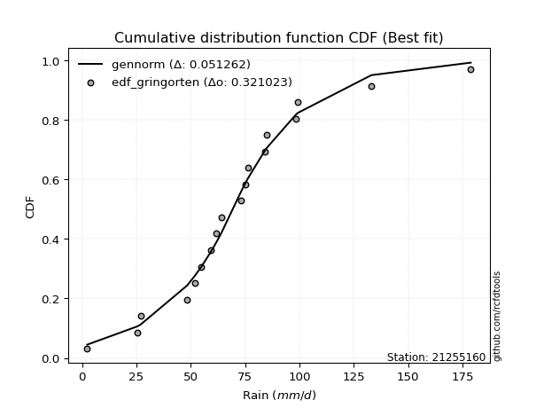</img>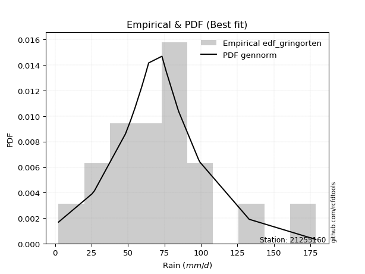</img>

</div>


### 9. Empirical - EDF Filliben (1975)

The specific values of the constants (0.3175) (often denoted as $alpha$) and (0.365) are derived from a method proposed by James J. Filliben in a 1975 paper. This particular formula is the mean value of the $i$-th order statistic of the normal distribution and is considered a robust and effective plotting position formula for the normal probability plot correlation coefficient test for normality.

<div align="center">


$P=(m-0.3175)/(n+0.365)$


</div>


**9.1. Empirical values**

<div align="center">

|                | 0                   | 1                   | 2                  | 3                   | 4                  | 5                 | 6                  | 7                  | 8            | 9                  | 10                 | 11                 | 12                 | 13                 | 14                 | 15                 | 16                 |
|:---------------|:--------------------|:--------------------|:-------------------|:--------------------|:-------------------|:------------------|:-------------------|:-------------------|:-------------|:-------------------|:-------------------|:-------------------|:-------------------|:-------------------|:-------------------|:-------------------|:-------------------|
| date           | 2019                | 2011                | 2008               | 2016                | 2006               | 2022              | 2014               | 2005               | 2007         | 2017               | 2015               | 2010               | 2018               | 2009               | 2012               | 2021               | 2013               |
| x              | 2.4                 | 25.3                | 48.3               | 51.8                | 54.8               | 59.4              | 61.9               | 64.2               | 73.3         | 75.1               | 76.3               | 84.2               | 84.9               | 99.3               | 102.61764705882354 | 133.1              | 178.8              |
| m              | 1                   | 2                   | 3                  | 4                   | 5                  | 6                 | 7                  | 8                  | 9            | 10                 | 11                 | 12                 | 13                 | 14                 | 15                 | 16                 | 17                 |
| empirical_dist | edf_filliben        | edf_filliben        | edf_filliben       | edf_filliben        | edf_filliben       | edf_filliben      | edf_filliben       | edf_filliben       | edf_filliben | edf_filliben       | edf_filliben       | edf_filliben       | edf_filliben       | edf_filliben       | edf_filliben       | edf_filliben       | edf_filliben       |
| empirical      | 0.03930319608407717 | 0.09689029657356754 | 0.1544773970630579 | 0.21206449755254825 | 0.2696515980420386 | 0.327238698531529 | 0.3848257990210193 | 0.4424128995105097 | 0.5          | 0.5575871004894903 | 0.6151742009789807 | 0.6727613014684711 | 0.7303484019579615 | 0.7879355024474518 | 0.8455226029369421 | 0.9031097034264325 | 0.9606968039159229 |
| empirical_tr   | 1.0409111344222988  | 1.1072851904989638  | 1.1827004937851184 | 1.2691394116572265  | 1.369209540705697  | 1.486411298951423 | 1.6255558155862393 | 1.793441776400723  | 2.0          | 2.2603319232020826 | 2.598578376356154  | 3.055873295204576  | 3.708489054991992  | 4.7155465037338775 | 6.473438956197578  | 10.320950965824666 | 25.44322344322351  |

</div>


**9.2. Kolmogorov-Smirnov fit test (sorted by Δ)**


<div align="center">

|                | 0                  | 1                   | 2                  | 3                   | 4                  | 5                   | 6                  | 7                  | 8                   | 9                   | 10                  | 11                  | 12                  | 13                 | 14                  | 15                  | 16                  | 17                  | 18                  | 19                  | 20                  | 21                  | 22                  | 23                  | 24                  | 25                  | 26                  | 27                  | 28                  | 29                 | 30                  | 31                  | 32                  | 33                  | 34                    | 35                  | 36                 | 37                  | 38                  | 39                 | 40                  | 41                  | 42                  | 43                  | 44                  | 45                 | 46                  | 47                  | 48                  | 49                  | 50                  | 51                 | 52                  | 53                  | 54                 | 55                 | 56                 | 57                  | 58                 | 59                 | 60                 | 61                 | 62                  | 63                 | 64                  | 65                 | 66                  | 67                  | 68                  | 69                 | 70                  | 71                 | 72                  | 73                  | 74                  | 75                  | 76                  | 77                  | 78                 | 79                 | 80                 | 81                 | 82                 | 83                 | 84                 | 85                 | 86                 | 87                 | 88                 | 89                 |
|:---------------|:-------------------|:--------------------|:-------------------|:--------------------|:-------------------|:--------------------|:-------------------|:-------------------|:--------------------|:--------------------|:--------------------|:--------------------|:--------------------|:-------------------|:--------------------|:--------------------|:--------------------|:--------------------|:--------------------|:--------------------|:--------------------|:--------------------|:--------------------|:--------------------|:--------------------|:--------------------|:--------------------|:--------------------|:--------------------|:-------------------|:--------------------|:--------------------|:--------------------|:--------------------|:----------------------|:--------------------|:-------------------|:--------------------|:--------------------|:-------------------|:--------------------|:--------------------|:--------------------|:--------------------|:--------------------|:-------------------|:--------------------|:--------------------|:--------------------|:--------------------|:--------------------|:-------------------|:--------------------|:--------------------|:-------------------|:-------------------|:-------------------|:--------------------|:-------------------|:-------------------|:-------------------|:-------------------|:--------------------|:-------------------|:--------------------|:-------------------|:--------------------|:--------------------|:--------------------|:-------------------|:--------------------|:-------------------|:--------------------|:--------------------|:--------------------|:--------------------|:--------------------|:--------------------|:-------------------|:-------------------|:-------------------|:-------------------|:-------------------|:-------------------|:-------------------|:-------------------|:-------------------|:-------------------|:-------------------|:-------------------|
| station        | 21255160           | 21255160            | 21255160           | 21255160            | 21255160           | 21255160            | 21255160           | 21255160           | 21255160            | 21255160            | 21255160            | 21255160            | 21255160            | 21255160           | 21255160            | 21255160            | 21255160            | 21255160            | 21255160            | 21255160            | 21255160            | 21255160            | 21255160            | 21255160            | 21255160            | 21255160            | 21255160            | 21255160            | 21255160            | 21255160           | 21255160            | 21255160            | 21255160            | 21255160            | 21255160              | 21255160            | 21255160           | 21255160            | 21255160            | 21255160           | 21255160            | 21255160            | 21255160            | 21255160            | 21255160            | 21255160           | 21255160            | 21255160            | 21255160            | 21255160            | 21255160            | 21255160           | 21255160            | 21255160            | 21255160           | 21255160           | 21255160           | 21255160            | 21255160           | 21255160           | 21255160           | 21255160           | 21255160            | 21255160           | 21255160            | 21255160           | 21255160            | 21255160            | 21255160            | 21255160           | 21255160            | 21255160           | 21255160            | 21255160            | 21255160            | 21255160            | 21255160            | 21255160            | 21255160           | 21255160           | 21255160           | 21255160           | 21255160           | 21255160           | 21255160           | 21255160           | 21255160           | 21255160           | 21255160           | 21255160           |
| empirical_dist | edf_filliben       | edf_filliben        | edf_filliben       | edf_filliben        | edf_filliben       | edf_filliben        | edf_filliben       | edf_filliben       | edf_filliben        | edf_filliben        | edf_filliben        | edf_filliben        | edf_filliben        | edf_filliben       | edf_filliben        | edf_filliben        | edf_filliben        | edf_filliben        | edf_filliben        | edf_filliben        | edf_filliben        | edf_filliben        | edf_filliben        | edf_filliben        | edf_filliben        | edf_filliben        | edf_filliben        | edf_filliben        | edf_filliben        | edf_filliben       | edf_filliben        | edf_filliben        | edf_filliben        | edf_filliben        | edf_filliben          | edf_filliben        | edf_filliben       | edf_filliben        | edf_filliben        | edf_filliben       | edf_filliben        | edf_filliben        | edf_filliben        | edf_filliben        | edf_filliben        | edf_filliben       | edf_filliben        | edf_filliben        | edf_filliben        | edf_filliben        | edf_filliben        | edf_filliben       | edf_filliben        | edf_filliben        | edf_filliben       | edf_filliben       | edf_filliben       | edf_filliben        | edf_filliben       | edf_filliben       | edf_filliben       | edf_filliben       | edf_filliben        | edf_filliben       | edf_filliben        | edf_filliben       | edf_filliben        | edf_filliben        | edf_filliben        | edf_filliben       | edf_filliben        | edf_filliben       | edf_filliben        | edf_filliben        | edf_filliben        | edf_filliben        | edf_filliben        | edf_filliben        | edf_filliben       | edf_filliben       | edf_filliben       | edf_filliben       | edf_filliben       | edf_filliben       | edf_filliben       | edf_filliben       | edf_filliben       | edf_filliben       | edf_filliben       | edf_filliben       |
| p_dist         | johnsonsu          | logjohnsonsu        | logt               | fisk                | genlogistic        | exponnorm           | nct                | lognakagami        | weibull_min         | laplace_asymmetric  | invgamma            | f                   | moyal               | betaprime          | chi2                | gamma               | erlang              | mielke              | gumbel_r            | laplace             | hypsecant           | nakagami            | pearson3            | maxwell             | invgauss            | rice                | logistic            | rayleigh            | invweibull          | logfisk            | halflogistic        | norm                | crystalball         | t                   | loglaplace_asymmetric | kstwobign           | halfnorm           | loggenlogistic      | logmielke           | wald               | loggompertz         | logweibull_min      | logloggamma         | ncf                 | gibrat              | loggumbel_l        | gumbel_l            | loglaplace          | logpearson3         | loghypsecant        | loglogistic         | logfatiguelife     | logf                | logexponnorm        | logrice            | lognorm            | lognorm            | logcrystalball      | loglognorm         | lognct             | loggamma           | loggamma           | loginvgamma         | logchi2            | logbetaprime        | logalpha           | logncf              | logmaxwell          | loginvgauss         | logerlang          | lograyleigh         | loginvweibull      | expon               | genexpon            | loggumbel_r         | loghalfnorm         | logmoyal            | loghalflogistic     | logkstwobign       | loggibrat          | logwald            | loggenexpon        | logexpon           | logtruncnorm       | pareto             | logpareto          | fatiguelife        | alpha              | gompertz           | truncnorm          |
| delta          | 0.0449195354322105 | 0.05900911057720687 | 0.0670140507959675 | 0.07293849287164159 | 0.0806303724604912 | 0.08725318495786194 | 0.0880803132959071 | 0.0931198414962558 | 0.09717223844684453 | 0.09889581494585115 | 0.09991463284101698 | 0.09991580522096377 | 0.10033516870556675 | 0.1012392342608272 | 0.10124476354119255 | 0.10124476535414856 | 0.10124479096784395 | 0.10128288569760163 | 0.10261522519892602 | 0.10555844407491127 | 0.10662683735638856 | 0.10804283337309395 | 0.11064442920883016 | 0.11190985039234669 | 0.11465690711883364 | 0.11641335910817363 | 0.11720154480195766 | 0.12055578826482599 | 0.12057487405175876 | 0.1265387951923595 | 0.12793701204397945 | 0.13012721165686458 | 0.13012722074952432 | 0.13924774127336897 | 0.13971126018318786   | 0.14336158921000686 | 0.1435423960743249 | 0.14422173954340411 | 0.14481849331327906 | 0.1495795173771287 | 0.15062716200604281 | 0.15378350294447163 | 0.15384899313551154 | 0.15826773192164095 | 0.16980425042007985 | 0.1876657396112914 | 0.18985877151250452 | 0.20739212865389867 | 0.20911779924585538 | 0.23359093544301762 | 0.24331317021311294 | 0.2537397237397692 | 0.25445744131920667 | 0.25510254624056095 | 0.2551026757433999 | 0.2551028533111609 | 0.2551028533111609 | 0.25510285332177035 | 0.2551048889464746 | 0.2596231804879686 | 0.2720631088661719 | 0.2720631088661719 | 0.27608619603120677 | 0.2806569985202703 | 0.28107675570950397 | 0.2832696853358942 | 0.28440200790539505 | 0.28930941700085266 | 0.29240838405184416 | 0.2955194610484681 | 0.30157129481574557 | 0.30691483262143   | 0.31392262659502884 | 0.31407924694004236 | 0.31658157002734216 | 0.33631486008358374 | 0.34012194921346656 | 0.35308778154722703 | 0.3545617254771936 | 0.4026883907072755 | 0.4043122418209358 | 0.4078200631141505 | 0.4531268495244191 | 0.469998010009612  | 0.5325399901349954 | 0.5496237906978539 | 0.6324777189042128 | 0.6827741824241707 | 0.8624860479243441 | 0.9031097034264325 |
| deltao         | 0.3260541228310003 | 0.3260541228310003  | 0.3260541228310003 | 0.3260541228310003  | 0.3260541228310003 | 0.3260541228310003  | 0.3260541228310003 | 0.3260541228310003 | 0.3260541228310003  | 0.3260541228310003  | 0.3260541228310003  | 0.3260541228310003  | 0.3260541228310003  | 0.3260541228310003 | 0.3260541228310003  | 0.3260541228310003  | 0.3260541228310003  | 0.3260541228310003  | 0.3260541228310003  | 0.3260541228310003  | 0.3260541228310003  | 0.3260541228310003  | 0.3260541228310003  | 0.3260541228310003  | 0.3260541228310003  | 0.3260541228310003  | 0.3260541228310003  | 0.3260541228310003  | 0.3260541228310003  | 0.3260541228310003 | 0.3260541228310003  | 0.3260541228310003  | 0.3260541228310003  | 0.3260541228310003  | 0.3260541228310003    | 0.3260541228310003  | 0.3260541228310003 | 0.3260541228310003  | 0.3260541228310003  | 0.3260541228310003 | 0.3260541228310003  | 0.3260541228310003  | 0.3260541228310003  | 0.3260541228310003  | 0.3260541228310003  | 0.3260541228310003 | 0.3260541228310003  | 0.3260541228310003  | 0.3260541228310003  | 0.3260541228310003  | 0.3260541228310003  | 0.3260541228310003 | 0.3260541228310003  | 0.3260541228310003  | 0.3260541228310003 | 0.3260541228310003 | 0.3260541228310003 | 0.3260541228310003  | 0.3260541228310003 | 0.3260541228310003 | 0.3260541228310003 | 0.3260541228310003 | 0.3260541228310003  | 0.3260541228310003 | 0.3260541228310003  | 0.3260541228310003 | 0.3260541228310003  | 0.3260541228310003  | 0.3260541228310003  | 0.3260541228310003 | 0.3260541228310003  | 0.3260541228310003 | 0.3260541228310003  | 0.3260541228310003  | 0.3260541228310003  | 0.3260541228310003  | 0.3260541228310003  | 0.3260541228310003  | 0.3260541228310003 | 0.3260541228310003 | 0.3260541228310003 | 0.3260541228310003 | 0.3260541228310003 | 0.3260541228310003 | 0.3260541228310003 | 0.3260541228310003 | 0.3260541228310003 | 0.3260541228310003 | 0.3260541228310003 | 0.3260541228310003 |
| eval           | Δo > Δ             | Δo > Δ              | Δo > Δ             | Δo > Δ              | Δo > Δ             | Δo > Δ              | Δo > Δ             | Δo > Δ             | Δo > Δ              | Δo > Δ              | Δo > Δ              | Δo > Δ              | Δo > Δ              | Δo > Δ             | Δo > Δ              | Δo > Δ              | Δo > Δ              | Δo > Δ              | Δo > Δ              | Δo > Δ              | Δo > Δ              | Δo > Δ              | Δo > Δ              | Δo > Δ              | Δo > Δ              | Δo > Δ              | Δo > Δ              | Δo > Δ              | Δo > Δ              | Δo > Δ             | Δo > Δ              | Δo > Δ              | Δo > Δ              | Δo > Δ              | Δo > Δ                | Δo > Δ              | Δo > Δ             | Δo > Δ              | Δo > Δ              | Δo > Δ             | Δo > Δ              | Δo > Δ              | Δo > Δ              | Δo > Δ              | Δo > Δ              | Δo > Δ             | Δo > Δ              | Δo > Δ              | Δo > Δ              | Δo > Δ              | Δo > Δ              | Δo > Δ             | Δo > Δ              | Δo > Δ              | Δo > Δ             | Δo > Δ             | Δo > Δ             | Δo > Δ              | Δo > Δ             | Δo > Δ             | Δo > Δ             | Δo > Δ             | Δo > Δ              | Δo > Δ             | Δo > Δ              | Δo > Δ             | Δo > Δ              | Δo > Δ              | Δo > Δ              | Δo > Δ             | Δo > Δ              | Δo > Δ             | Δo > Δ              | Δo > Δ              | Δo > Δ              | Δo <= Δ             | Δo <= Δ             | Δo <= Δ             | Δo <= Δ            | Δo <= Δ            | Δo <= Δ            | Δo <= Δ            | Δo <= Δ            | Δo <= Δ            | Δo <= Δ            | Δo <= Δ            | Δo <= Δ            | Δo <= Δ            | Δo <= Δ            | Δo <= Δ            |
| fit            | 1                  | 1                   | 1                  | 1                   | 1                  | 1                   | 1                  | 1                  | 1                   | 1                   | 1                   | 1                   | 1                   | 1                  | 1                   | 1                   | 1                   | 1                   | 1                   | 1                   | 1                   | 1                   | 1                   | 1                   | 1                   | 1                   | 1                   | 1                   | 1                   | 1                  | 1                   | 1                   | 1                   | 1                   | 1                     | 1                   | 1                  | 1                   | 1                   | 1                  | 1                   | 1                   | 1                   | 1                   | 1                   | 1                  | 1                   | 1                   | 1                   | 1                   | 1                   | 1                  | 1                   | 1                   | 1                  | 1                  | 1                  | 1                   | 1                  | 1                  | 1                  | 1                  | 1                   | 1                  | 1                   | 1                  | 1                   | 1                   | 1                   | 1                  | 1                   | 1                  | 1                   | 1                   | 1                   | 0                   | 0                   | 0                   | 0                  | 0                  | 0                  | 0                  | 0                  | 0                  | 0                  | 0                  | 0                  | 0                  | 0                  | 0                  |
| n              | 17                 | 17                  | 17                 | 17                  | 17                 | 17                  | 17                 | 17                 | 17                  | 17                  | 17                  | 17                  | 17                  | 17                 | 17                  | 17                  | 17                  | 17                  | 17                  | 17                  | 17                  | 17                  | 17                  | 17                  | 17                  | 17                  | 17                  | 17                  | 17                  | 17                 | 17                  | 17                  | 17                  | 17                  | 17                    | 17                  | 17                 | 17                  | 17                  | 17                 | 17                  | 17                  | 17                  | 17                  | 17                  | 17                 | 17                  | 17                  | 17                  | 17                  | 17                  | 17                 | 17                  | 17                  | 17                 | 17                 | 17                 | 17                  | 17                 | 17                 | 17                 | 17                 | 17                  | 17                 | 17                  | 17                 | 17                  | 17                  | 17                  | 17                 | 17                  | 17                 | 17                  | 17                  | 17                  | 17                  | 17                  | 17                  | 17                 | 17                 | 17                 | 17                 | 17                 | 17                 | 17                 | 17                 | 17                 | 17                 | 17                 | 17                 |
| best_fit       | 1                  | 0                   | 0                  | 0                   | 0                  | 0                   | 0                  | 0                  | 0                   | 0                   | 0                   | 0                   | 0                   | 0                  | 0                   | 0                   | 0                   | 0                   | 0                   | 0                   | 0                   | 0                   | 0                   | 0                   | 0                   | 0                   | 0                   | 0                   | 0                   | 0                  | 0                   | 0                   | 0                   | 0                   | 0                     | 0                   | 0                  | 0                   | 0                   | 0                  | 0                   | 0                   | 0                   | 0                   | 0                   | 0                  | 0                   | 0                   | 0                   | 0                   | 0                   | 0                  | 0                   | 0                   | 0                  | 0                  | 0                  | 0                   | 0                  | 0                  | 0                  | 0                  | 0                   | 0                  | 0                   | 0                  | 0                   | 0                   | 0                   | 0                  | 0                   | 0                  | 0                   | 0                   | 0                   | 0                   | 0                   | 0                   | 0                  | 0                  | 0                  | 0                  | 0                  | 0                  | 0                  | 0                  | 0                  | 0                  | 0                  | 0                  |
| best_fit_sort  | 1                  | 2                   | 3                  | 4                   | 5                  | 6                   | 7                  | 8                  | 9                   | 10                  | 11                  | 12                  | 13                  | 14                 | 15                  | 16                  | 17                  | 18                  | 19                  | 20                  | 21                  | 22                  | 23                  | 24                  | 25                  | 26                  | 27                  | 28                  | 29                  | 30                 | 31                  | 32                  | 33                  | 34                  | 35                    | 36                  | 37                 | 38                  | 39                  | 40                 | 41                  | 42                  | 43                  | 44                  | 45                  | 46                 | 47                  | 48                  | 49                  | 50                  | 51                  | 52                 | 53                  | 54                  | 55                 | 56                 | 57                 | 58                  | 59                 | 60                 | 61                 | 62                 | 63                  | 64                 | 65                  | 66                 | 67                  | 68                  | 69                  | 70                 | 71                  | 72                 | 73                  | 74                  | 75                  | 76                  | 77                  | 78                  | 79                 | 80                 | 81                 | 82                 | 83                 | 84                 | 85                 | 86                 | 87                 | 88                 | 89                 | 90                 |

</div>


<div align="center">

</img>

</div>


**9.3. Best fit**

<div align="center">

|   id |   station | empirical_dist   | p_dist    |     delta |   deltao | eval   |   fit |   n |   best_fit |   best_fit_sort |
|-----:|----------:|:-----------------|:----------|----------:|---------:|:-------|------:|----:|-----------:|----------------:|
|    0 |  21255160 | edf_filliben     | johnsonsu | 0.0449195 | 0.326054 | Δo > Δ |     1 |  17 |          1 |               1 |

</div>


<div align="center">

</img></img>

</div>


### 10. Empirical - EDF Jenkinson (1977)

The Jenkinson formula in hydrology is an empirical plotting position formula used to estimate the non-exceedance probability _(P)_ or return period _(T)_ of a given ordered observation within a sample. It is a widely used method in the frequency analysis of extreme events such as floods and rainfall, as it provides a distribution-free way to plot data. _a≈0.31_ and _b≈0.38_ are constants derived to approximate the median of the probability distribution for the given rank.

<div align="center">


$P=(m-a)/(n+b)$


</div>


**10.1. Empirical values**

<div align="center">

|                | 0                   | 1                   | 2                   | 3                   | 4                  | 5                   | 6                   | 7                   | 8             | 9                  | 10                 | 11                 | 12                 | 13                 | 14                 | 15                 | 16                 |
|:---------------|:--------------------|:--------------------|:--------------------|:--------------------|:-------------------|:--------------------|:--------------------|:--------------------|:--------------|:-------------------|:-------------------|:-------------------|:-------------------|:-------------------|:-------------------|:-------------------|:-------------------|
| date           | 2019                | 2011                | 2008                | 2016                | 2006               | 2022                | 2014                | 2005                | 2007          | 2017               | 2015               | 2010               | 2018               | 2009               | 2012               | 2021               | 2013               |
| x              | 2.4                 | 25.3                | 48.3                | 51.8                | 54.8               | 59.4                | 61.9                | 64.2                | 73.3          | 75.1               | 76.3               | 84.2               | 84.9               | 99.3               | 102.61764705882354 | 133.1              | 178.8              |
| m              | 1                   | 2                   | 3                   | 4                   | 5                  | 6                   | 7                   | 8                   | 9             | 10                 | 11                 | 12                 | 13                 | 14                 | 15                 | 16                 | 17                 |
| empirical_dist | edf_jenkinson       | edf_jenkinson       | edf_jenkinson       | edf_jenkinson       | edf_jenkinson      | edf_jenkinson       | edf_jenkinson       | edf_jenkinson       | edf_jenkinson | edf_jenkinson      | edf_jenkinson      | edf_jenkinson      | edf_jenkinson      | edf_jenkinson      | edf_jenkinson      | edf_jenkinson      | edf_jenkinson      |
| empirical      | 0.03970080552359033 | 0.09723820483314155 | 0.15477560414269276 | 0.21231300345224396 | 0.2698504027617952 | 0.32738780207134643 | 0.38492520138089764 | 0.44246260069044885 | 0.5           | 0.5575373993095513 | 0.6150747986191024 | 0.6726121979286537 | 0.7301495972382048 | 0.7876869965477561 | 0.8452243958573072 | 0.9027617951668585 | 0.9602991944764098 |
| empirical_tr   | 1.0413421210305571  | 1.1077119184193753  | 1.1831177671885638  | 1.2695398100803508  | 1.3695823483057525 | 1.4867408041060737  | 1.6258185219831622  | 1.7936016511867907  | 2.0           | 2.2600780234070226 | 2.5979073243647233 | 3.0544815465729354 | 3.7057569296375266 | 4.710027100271004  | 6.460966542750929  | 10.284023668639058 | 25.188405797101513 |

</div>


**10.2. Kolmogorov-Smirnov fit test (sorted by Δ)**


<div align="center">

|                | 0                  | 1                   | 2                   | 3                   | 4                   | 5                   | 6                   | 7                  | 8                   | 9                   | 10                  | 11                  | 12                 | 13                  | 14                 | 15                  | 16                 | 17                  | 18                  | 19                 | 20                  | 21                  | 22                  | 23                  | 24                  | 25                  | 26                  | 27                  | 28                  | 29                  | 30                 | 31                  | 32                  | 33                  | 34                    | 35                 | 36                  | 37                  | 38                 | 39                 | 40                  | 41                  | 42                 | 43                 | 44                  | 45                  | 46                  | 47                  | 48                  | 49                  | 50                 | 51                  | 52                 | 53                 | 54                  | 55                  | 56                  | 57                 | 58                  | 59                  | 60                  | 61                  | 62                 | 63                  | 64                 | 65                  | 66                 | 67                 | 68                 | 69                  | 70                 | 71                  | 72                 | 73                 | 74                 | 75                 | 76                 | 77                 | 78                  | 79                 | 80                  | 81                  | 82                  | 83                  | 84                 | 85                 | 86                 | 87                 | 88                 | 89                 |
|:---------------|:-------------------|:--------------------|:--------------------|:--------------------|:--------------------|:--------------------|:--------------------|:-------------------|:--------------------|:--------------------|:--------------------|:--------------------|:-------------------|:--------------------|:-------------------|:--------------------|:-------------------|:--------------------|:--------------------|:-------------------|:--------------------|:--------------------|:--------------------|:--------------------|:--------------------|:--------------------|:--------------------|:--------------------|:--------------------|:--------------------|:-------------------|:--------------------|:--------------------|:--------------------|:----------------------|:-------------------|:--------------------|:--------------------|:-------------------|:-------------------|:--------------------|:--------------------|:-------------------|:-------------------|:--------------------|:--------------------|:--------------------|:--------------------|:--------------------|:--------------------|:-------------------|:--------------------|:-------------------|:-------------------|:--------------------|:--------------------|:--------------------|:-------------------|:--------------------|:--------------------|:--------------------|:--------------------|:-------------------|:--------------------|:-------------------|:--------------------|:-------------------|:-------------------|:-------------------|:--------------------|:-------------------|:--------------------|:-------------------|:-------------------|:-------------------|:-------------------|:-------------------|:-------------------|:--------------------|:-------------------|:--------------------|:--------------------|:--------------------|:--------------------|:-------------------|:-------------------|:-------------------|:-------------------|:-------------------|:-------------------|
| station        | 21255160           | 21255160            | 21255160            | 21255160            | 21255160            | 21255160            | 21255160            | 21255160           | 21255160            | 21255160            | 21255160            | 21255160            | 21255160           | 21255160            | 21255160           | 21255160            | 21255160           | 21255160            | 21255160            | 21255160           | 21255160            | 21255160            | 21255160            | 21255160            | 21255160            | 21255160            | 21255160            | 21255160            | 21255160            | 21255160            | 21255160           | 21255160            | 21255160            | 21255160            | 21255160              | 21255160           | 21255160            | 21255160            | 21255160           | 21255160           | 21255160            | 21255160            | 21255160           | 21255160           | 21255160            | 21255160            | 21255160            | 21255160            | 21255160            | 21255160            | 21255160           | 21255160            | 21255160           | 21255160           | 21255160            | 21255160            | 21255160            | 21255160           | 21255160            | 21255160            | 21255160            | 21255160            | 21255160           | 21255160            | 21255160           | 21255160            | 21255160           | 21255160           | 21255160           | 21255160            | 21255160           | 21255160            | 21255160           | 21255160           | 21255160           | 21255160           | 21255160           | 21255160           | 21255160            | 21255160           | 21255160            | 21255160            | 21255160            | 21255160            | 21255160           | 21255160           | 21255160           | 21255160           | 21255160           | 21255160           |
| empirical_dist | edf_jenkinson      | edf_jenkinson       | edf_jenkinson       | edf_jenkinson       | edf_jenkinson       | edf_jenkinson       | edf_jenkinson       | edf_jenkinson      | edf_jenkinson       | edf_jenkinson       | edf_jenkinson       | edf_jenkinson       | edf_jenkinson      | edf_jenkinson       | edf_jenkinson      | edf_jenkinson       | edf_jenkinson      | edf_jenkinson       | edf_jenkinson       | edf_jenkinson      | edf_jenkinson       | edf_jenkinson       | edf_jenkinson       | edf_jenkinson       | edf_jenkinson       | edf_jenkinson       | edf_jenkinson       | edf_jenkinson       | edf_jenkinson       | edf_jenkinson       | edf_jenkinson      | edf_jenkinson       | edf_jenkinson       | edf_jenkinson       | edf_jenkinson         | edf_jenkinson      | edf_jenkinson       | edf_jenkinson       | edf_jenkinson      | edf_jenkinson      | edf_jenkinson       | edf_jenkinson       | edf_jenkinson      | edf_jenkinson      | edf_jenkinson       | edf_jenkinson       | edf_jenkinson       | edf_jenkinson       | edf_jenkinson       | edf_jenkinson       | edf_jenkinson      | edf_jenkinson       | edf_jenkinson      | edf_jenkinson      | edf_jenkinson       | edf_jenkinson       | edf_jenkinson       | edf_jenkinson      | edf_jenkinson       | edf_jenkinson       | edf_jenkinson       | edf_jenkinson       | edf_jenkinson      | edf_jenkinson       | edf_jenkinson      | edf_jenkinson       | edf_jenkinson      | edf_jenkinson      | edf_jenkinson      | edf_jenkinson       | edf_jenkinson      | edf_jenkinson       | edf_jenkinson      | edf_jenkinson      | edf_jenkinson      | edf_jenkinson      | edf_jenkinson      | edf_jenkinson      | edf_jenkinson       | edf_jenkinson      | edf_jenkinson       | edf_jenkinson       | edf_jenkinson       | edf_jenkinson       | edf_jenkinson      | edf_jenkinson      | edf_jenkinson      | edf_jenkinson      | edf_jenkinson      | edf_jenkinson      |
| p_dist         | johnsonsu          | logjohnsonsu        | logt                | fisk                | genlogistic         | exponnorm           | nct                 | lognakagami        | weibull_min         | laplace_asymmetric  | invgamma            | f                   | moyal              | betaprime           | chi2               | gamma               | erlang             | mielke              | gumbel_r            | laplace            | hypsecant           | nakagami            | pearson3            | maxwell             | invgauss            | rice                | logistic            | rayleigh            | invweibull          | logfisk             | halflogistic       | norm                | crystalball         | t                   | loglaplace_asymmetric | kstwobign          | halfnorm            | loggenlogistic      | logmielke          | wald               | loggompertz         | logweibull_min      | logloggamma        | ncf                | gibrat              | loggumbel_l         | gumbel_l            | loglaplace          | logpearson3         | loghypsecant        | loglogistic        | logfatiguelife      | logf               | logexponnorm       | logrice             | lognorm             | lognorm             | logcrystalball     | loglognorm          | lognct              | loggamma            | loggamma            | loginvgamma        | logchi2             | logbetaprime       | logalpha            | logncf             | logmaxwell         | loginvgauss        | logerlang           | lograyleigh        | loginvweibull       | expon              | genexpon           | loggumbel_r        | loghalfnorm        | logmoyal           | loghalflogistic    | logkstwobign        | loggibrat          | logwald             | loggenexpon         | logexpon            | logtruncnorm        | pareto             | logpareto          | fatiguelife        | alpha              | gompertz           | truncnorm          |
| delta          | 0.0449195354322105 | 0.05871090349757202 | 0.06706375197590664 | 0.07264028579200674 | 0.08043156774073457 | 0.08695497787822709 | 0.08778210621627225 | 0.0934677497558298 | 0.09697343372708789 | 0.09894551612579028 | 0.09961642576138213 | 0.09961759814132892 | 0.1000369616259319 | 0.10094102718119236 | 0.1009465564615577 | 0.10094655827451371 | 0.1009465838882091 | 0.10098467861796678 | 0.10231701811929117 | 0.1056081452548504 | 0.10642803263663192 | 0.10784402865333731 | 0.11034622212919531 | 0.11161164331271184 | 0.11435870003919879 | 0.11621455438841699 | 0.11700274008220102 | 0.12025758118519114 | 0.12027666697212391 | 0.12624058811272465 | 0.1276388049643446 | 0.12992840693710794 | 0.12992841602976768 | 0.13894953419373413 | 0.139413053103553     | 0.143063382130372  | 0.14324418899469005 | 0.14392353246376927 | 0.1445202862336442 | 0.1495795173771287 | 0.15032895492640796 | 0.15348529586483678 | 0.1535507860558767 | 0.1579695248420061 | 0.16980425042007985 | 0.18736753253165656 | 0.18965996679274788 | 0.20709392157426382 | 0.20891899452609874 | 0.23329272836338277 | 0.2430149631334781 | 0.25344151666013437 | 0.2541592342395718 | 0.2548043391609261 | 0.25480446866376505 | 0.25480464623152604 | 0.25480464623152604 | 0.2548046462421355 | 0.25480668186683975 | 0.25932497340833377 | 0.27176490178653706 | 0.27176490178653706 | 0.2757879889515719 | 0.28035879144063547 | 0.2807785486298691 | 0.28297147825625935 | 0.2841038008257602 | 0.2890112099212178 | 0.2921101769722093 | 0.29522125396883325 | 0.3012730877361107 | 0.30661662554179514 | 0.313624419515394  | 0.3137810398604075 | 0.3162833629477073 | 0.3360166530039489 | 0.3398237421338317 | 0.3527895744675922 | 0.35426351839755876 | 0.4023901836276407 | 0.40401403474130093 | 0.40752185603451563 | 0.45282864244478427 | 0.46969980292997715 | 0.5321920818754213 | 0.54927588243828   | 0.632179511824578  | 0.6824759753445357 | 0.86213813966477   | 0.9027617951668585 |
| deltao         | 0.3260541228310003 | 0.3260541228310003  | 0.3260541228310003  | 0.3260541228310003  | 0.3260541228310003  | 0.3260541228310003  | 0.3260541228310003  | 0.3260541228310003 | 0.3260541228310003  | 0.3260541228310003  | 0.3260541228310003  | 0.3260541228310003  | 0.3260541228310003 | 0.3260541228310003  | 0.3260541228310003 | 0.3260541228310003  | 0.3260541228310003 | 0.3260541228310003  | 0.3260541228310003  | 0.3260541228310003 | 0.3260541228310003  | 0.3260541228310003  | 0.3260541228310003  | 0.3260541228310003  | 0.3260541228310003  | 0.3260541228310003  | 0.3260541228310003  | 0.3260541228310003  | 0.3260541228310003  | 0.3260541228310003  | 0.3260541228310003 | 0.3260541228310003  | 0.3260541228310003  | 0.3260541228310003  | 0.3260541228310003    | 0.3260541228310003 | 0.3260541228310003  | 0.3260541228310003  | 0.3260541228310003 | 0.3260541228310003 | 0.3260541228310003  | 0.3260541228310003  | 0.3260541228310003 | 0.3260541228310003 | 0.3260541228310003  | 0.3260541228310003  | 0.3260541228310003  | 0.3260541228310003  | 0.3260541228310003  | 0.3260541228310003  | 0.3260541228310003 | 0.3260541228310003  | 0.3260541228310003 | 0.3260541228310003 | 0.3260541228310003  | 0.3260541228310003  | 0.3260541228310003  | 0.3260541228310003 | 0.3260541228310003  | 0.3260541228310003  | 0.3260541228310003  | 0.3260541228310003  | 0.3260541228310003 | 0.3260541228310003  | 0.3260541228310003 | 0.3260541228310003  | 0.3260541228310003 | 0.3260541228310003 | 0.3260541228310003 | 0.3260541228310003  | 0.3260541228310003 | 0.3260541228310003  | 0.3260541228310003 | 0.3260541228310003 | 0.3260541228310003 | 0.3260541228310003 | 0.3260541228310003 | 0.3260541228310003 | 0.3260541228310003  | 0.3260541228310003 | 0.3260541228310003  | 0.3260541228310003  | 0.3260541228310003  | 0.3260541228310003  | 0.3260541228310003 | 0.3260541228310003 | 0.3260541228310003 | 0.3260541228310003 | 0.3260541228310003 | 0.3260541228310003 |
| eval           | Δo > Δ             | Δo > Δ              | Δo > Δ              | Δo > Δ              | Δo > Δ              | Δo > Δ              | Δo > Δ              | Δo > Δ             | Δo > Δ              | Δo > Δ              | Δo > Δ              | Δo > Δ              | Δo > Δ             | Δo > Δ              | Δo > Δ             | Δo > Δ              | Δo > Δ             | Δo > Δ              | Δo > Δ              | Δo > Δ             | Δo > Δ              | Δo > Δ              | Δo > Δ              | Δo > Δ              | Δo > Δ              | Δo > Δ              | Δo > Δ              | Δo > Δ              | Δo > Δ              | Δo > Δ              | Δo > Δ             | Δo > Δ              | Δo > Δ              | Δo > Δ              | Δo > Δ                | Δo > Δ             | Δo > Δ              | Δo > Δ              | Δo > Δ             | Δo > Δ             | Δo > Δ              | Δo > Δ              | Δo > Δ             | Δo > Δ             | Δo > Δ              | Δo > Δ              | Δo > Δ              | Δo > Δ              | Δo > Δ              | Δo > Δ              | Δo > Δ             | Δo > Δ              | Δo > Δ             | Δo > Δ             | Δo > Δ              | Δo > Δ              | Δo > Δ              | Δo > Δ             | Δo > Δ              | Δo > Δ              | Δo > Δ              | Δo > Δ              | Δo > Δ             | Δo > Δ              | Δo > Δ             | Δo > Δ              | Δo > Δ             | Δo > Δ             | Δo > Δ             | Δo > Δ              | Δo > Δ             | Δo > Δ              | Δo > Δ             | Δo > Δ             | Δo > Δ             | Δo <= Δ            | Δo <= Δ            | Δo <= Δ            | Δo <= Δ             | Δo <= Δ            | Δo <= Δ             | Δo <= Δ             | Δo <= Δ             | Δo <= Δ             | Δo <= Δ            | Δo <= Δ            | Δo <= Δ            | Δo <= Δ            | Δo <= Δ            | Δo <= Δ            |
| fit            | 1                  | 1                   | 1                   | 1                   | 1                   | 1                   | 1                   | 1                  | 1                   | 1                   | 1                   | 1                   | 1                  | 1                   | 1                  | 1                   | 1                  | 1                   | 1                   | 1                  | 1                   | 1                   | 1                   | 1                   | 1                   | 1                   | 1                   | 1                   | 1                   | 1                   | 1                  | 1                   | 1                   | 1                   | 1                     | 1                  | 1                   | 1                   | 1                  | 1                  | 1                   | 1                   | 1                  | 1                  | 1                   | 1                   | 1                   | 1                   | 1                   | 1                   | 1                  | 1                   | 1                  | 1                  | 1                   | 1                   | 1                   | 1                  | 1                   | 1                   | 1                   | 1                   | 1                  | 1                   | 1                  | 1                   | 1                  | 1                  | 1                  | 1                   | 1                  | 1                   | 1                  | 1                  | 1                  | 0                  | 0                  | 0                  | 0                   | 0                  | 0                   | 0                   | 0                   | 0                   | 0                  | 0                  | 0                  | 0                  | 0                  | 0                  |
| n              | 17                 | 17                  | 17                  | 17                  | 17                  | 17                  | 17                  | 17                 | 17                  | 17                  | 17                  | 17                  | 17                 | 17                  | 17                 | 17                  | 17                 | 17                  | 17                  | 17                 | 17                  | 17                  | 17                  | 17                  | 17                  | 17                  | 17                  | 17                  | 17                  | 17                  | 17                 | 17                  | 17                  | 17                  | 17                    | 17                 | 17                  | 17                  | 17                 | 17                 | 17                  | 17                  | 17                 | 17                 | 17                  | 17                  | 17                  | 17                  | 17                  | 17                  | 17                 | 17                  | 17                 | 17                 | 17                  | 17                  | 17                  | 17                 | 17                  | 17                  | 17                  | 17                  | 17                 | 17                  | 17                 | 17                  | 17                 | 17                 | 17                 | 17                  | 17                 | 17                  | 17                 | 17                 | 17                 | 17                 | 17                 | 17                 | 17                  | 17                 | 17                  | 17                  | 17                  | 17                  | 17                 | 17                 | 17                 | 17                 | 17                 | 17                 |
| best_fit       | 1                  | 0                   | 0                   | 0                   | 0                   | 0                   | 0                   | 0                  | 0                   | 0                   | 0                   | 0                   | 0                  | 0                   | 0                  | 0                   | 0                  | 0                   | 0                   | 0                  | 0                   | 0                   | 0                   | 0                   | 0                   | 0                   | 0                   | 0                   | 0                   | 0                   | 0                  | 0                   | 0                   | 0                   | 0                     | 0                  | 0                   | 0                   | 0                  | 0                  | 0                   | 0                   | 0                  | 0                  | 0                   | 0                   | 0                   | 0                   | 0                   | 0                   | 0                  | 0                   | 0                  | 0                  | 0                   | 0                   | 0                   | 0                  | 0                   | 0                   | 0                   | 0                   | 0                  | 0                   | 0                  | 0                   | 0                  | 0                  | 0                  | 0                   | 0                  | 0                   | 0                  | 0                  | 0                  | 0                  | 0                  | 0                  | 0                   | 0                  | 0                   | 0                   | 0                   | 0                   | 0                  | 0                  | 0                  | 0                  | 0                  | 0                  |
| best_fit_sort  | 1                  | 2                   | 3                   | 4                   | 5                   | 6                   | 7                   | 8                  | 9                   | 10                  | 11                  | 12                  | 13                 | 14                  | 15                 | 16                  | 17                 | 18                  | 19                  | 20                 | 21                  | 22                  | 23                  | 24                  | 25                  | 26                  | 27                  | 28                  | 29                  | 30                  | 31                 | 32                  | 33                  | 34                  | 35                    | 36                 | 37                  | 38                  | 39                 | 40                 | 41                  | 42                  | 43                 | 44                 | 45                  | 46                  | 47                  | 48                  | 49                  | 50                  | 51                 | 52                  | 53                 | 54                 | 55                  | 56                  | 57                  | 58                 | 59                  | 60                  | 61                  | 62                  | 63                 | 64                  | 65                 | 66                  | 67                 | 68                 | 69                 | 70                  | 71                 | 72                  | 73                 | 74                 | 75                 | 76                 | 77                 | 78                 | 79                  | 80                 | 81                  | 82                  | 83                  | 84                  | 85                 | 86                 | 87                 | 88                 | 89                 | 90                 |

</div>


<div align="center">

</img>

</div>


**10.3. Best fit**

<div align="center">

|   id |   station | empirical_dist   | p_dist    |     delta |   deltao | eval   |   fit |   n |   best_fit |   best_fit_sort |
|-----:|----------:|:-----------------|:----------|----------:|---------:|:-------|------:|----:|-----------:|----------------:|
|    0 |  21255160 | edf_jenkinson    | johnsonsu | 0.0449195 | 0.326054 | Δo > Δ |     1 |  17 |          1 |               1 |

</div>


<div align="center">

</img>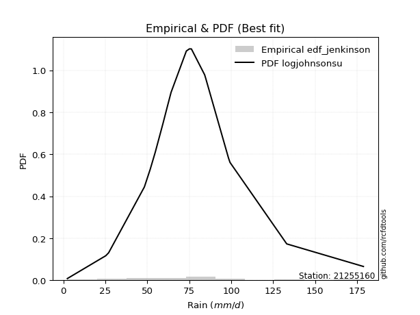</img>

</div>


### 11. Empirical - EDF Cunnane (1978)

Cunnane´s work in statistical hydrology has focused on the performance and evaluation of different probability distributions (such as GEV, Gumbel, Lognormal) for flood frequency estimation. _b_ is a constant, typically set to 0.4.

<div align="center">


$P=(m-b)/(n+1-2b)$


</div>


**11.1. Empirical values**

<div align="center">

|                | 0                   | 1                  | 2                   | 3                   | 4                   | 5                  | 6                   | 7                  | 8           | 9                  | 10                 | 11                 | 12                 | 13                 | 14                 | 15                 | 16                 |
|:---------------|:--------------------|:-------------------|:--------------------|:--------------------|:--------------------|:-------------------|:--------------------|:-------------------|:------------|:-------------------|:-------------------|:-------------------|:-------------------|:-------------------|:-------------------|:-------------------|:-------------------|
| date           | 2019                | 2011               | 2008                | 2016                | 2006                | 2022               | 2014                | 2005               | 2007        | 2017               | 2015               | 2010               | 2018               | 2009               | 2012               | 2021               | 2013               |
| x              | 2.4                 | 25.3               | 48.3                | 51.8                | 54.8                | 59.4               | 61.9                | 64.2               | 73.3        | 75.1               | 76.3               | 84.2               | 84.9               | 99.3               | 102.61764705882354 | 133.1              | 178.8              |
| m              | 1                   | 2                  | 3                   | 4                   | 5                   | 6                  | 7                   | 8                  | 9           | 10                 | 11                 | 12                 | 13                 | 14                 | 15                 | 16                 | 17                 |
| empirical_dist | edf_cunnane         | edf_cunnane        | edf_cunnane         | edf_cunnane         | edf_cunnane         | edf_cunnane        | edf_cunnane         | edf_cunnane        | edf_cunnane | edf_cunnane        | edf_cunnane        | edf_cunnane        | edf_cunnane        | edf_cunnane        | edf_cunnane        | edf_cunnane        | edf_cunnane        |
| empirical      | 0.03488372093023256 | 0.0930232558139535 | 0.15116279069767444 | 0.20930232558139536 | 0.26744186046511625 | 0.3255813953488372 | 0.38372093023255816 | 0.4418604651162791 | 0.5         | 0.5581395348837209 | 0.6162790697674418 | 0.6744186046511628 | 0.7325581395348837 | 0.7906976744186046 | 0.8488372093023256 | 0.9069767441860466 | 0.9651162790697676 |
| empirical_tr   | 1.036144578313253   | 1.1025641025641026 | 1.178082191780822   | 1.2647058823529413  | 1.3650793650793651  | 1.482758620689655  | 1.6226415094339623  | 1.7916666666666667 | 2.0         | 2.263157894736842  | 2.606060606060606  | 3.071428571428571  | 3.7391304347826084 | 4.777777777777777  | 6.6153846153846185 | 10.750000000000007 | 28.6666666666668   |

</div>


**11.2. Kolmogorov-Smirnov fit test (sorted by Δ)**


<div align="center">

|                | 0                  | 1                   | 2                   | 3                   | 4                   | 5                   | 6                   | 7                   | 8                   | 9                   | 10                  | 11                  | 12                  | 13                  | 14                  | 15                  | 16                  | 17                 | 18                  | 19                  | 20                  | 21                  | 22                  | 23                  | 24                  | 25                  | 26                  | 27                  | 28                  | 29                  | 30                  | 31                 | 32                  | 33                  | 34                    | 35                  | 36                  | 37                 | 38                  | 39                 | 40                  | 41                 | 42                 | 43                  | 44                  | 45                  | 46                  | 47                  | 48                 | 49                 | 50                 | 51                  | 52                  | 53                  | 54                  | 55                 | 56                 | 57                 | 58                  | 59                 | 60                 | 61                 | 62                  | 63                  | 64                  | 65                  | 66                  | 67                  | 68                 | 69                  | 70                 | 71                  | 72                 | 73                 | 74                 | 75                 | 76                 | 77                 | 78                  | 79                  | 80                 | 81                 | 82                  | 83                  | 84                 | 85                 | 86                 | 87                 | 88                 | 89                 |
|:---------------|:-------------------|:--------------------|:--------------------|:--------------------|:--------------------|:--------------------|:--------------------|:--------------------|:--------------------|:--------------------|:--------------------|:--------------------|:--------------------|:--------------------|:--------------------|:--------------------|:--------------------|:-------------------|:--------------------|:--------------------|:--------------------|:--------------------|:--------------------|:--------------------|:--------------------|:--------------------|:--------------------|:--------------------|:--------------------|:--------------------|:--------------------|:-------------------|:--------------------|:--------------------|:----------------------|:--------------------|:--------------------|:-------------------|:--------------------|:-------------------|:--------------------|:-------------------|:-------------------|:--------------------|:--------------------|:--------------------|:--------------------|:--------------------|:-------------------|:-------------------|:-------------------|:--------------------|:--------------------|:--------------------|:--------------------|:-------------------|:-------------------|:-------------------|:--------------------|:-------------------|:-------------------|:-------------------|:--------------------|:--------------------|:--------------------|:--------------------|:--------------------|:--------------------|:-------------------|:--------------------|:-------------------|:--------------------|:-------------------|:-------------------|:-------------------|:-------------------|:-------------------|:-------------------|:--------------------|:--------------------|:-------------------|:-------------------|:--------------------|:--------------------|:-------------------|:-------------------|:-------------------|:-------------------|:-------------------|:-------------------|
| station        | 21255160           | 21255160            | 21255160            | 21255160            | 21255160            | 21255160            | 21255160            | 21255160            | 21255160            | 21255160            | 21255160            | 21255160            | 21255160            | 21255160            | 21255160            | 21255160            | 21255160            | 21255160           | 21255160            | 21255160            | 21255160            | 21255160            | 21255160            | 21255160            | 21255160            | 21255160            | 21255160            | 21255160            | 21255160            | 21255160            | 21255160            | 21255160           | 21255160            | 21255160            | 21255160              | 21255160            | 21255160            | 21255160           | 21255160            | 21255160           | 21255160            | 21255160           | 21255160           | 21255160            | 21255160            | 21255160            | 21255160            | 21255160            | 21255160           | 21255160           | 21255160           | 21255160            | 21255160            | 21255160            | 21255160            | 21255160           | 21255160           | 21255160           | 21255160            | 21255160           | 21255160           | 21255160           | 21255160            | 21255160            | 21255160            | 21255160            | 21255160            | 21255160            | 21255160           | 21255160            | 21255160           | 21255160            | 21255160           | 21255160           | 21255160           | 21255160           | 21255160           | 21255160           | 21255160            | 21255160            | 21255160           | 21255160           | 21255160            | 21255160            | 21255160           | 21255160           | 21255160           | 21255160           | 21255160           | 21255160           |
| empirical_dist | edf_cunnane        | edf_cunnane         | edf_cunnane         | edf_cunnane         | edf_cunnane         | edf_cunnane         | edf_cunnane         | edf_cunnane         | edf_cunnane         | edf_cunnane         | edf_cunnane         | edf_cunnane         | edf_cunnane         | edf_cunnane         | edf_cunnane         | edf_cunnane         | edf_cunnane         | edf_cunnane        | edf_cunnane         | edf_cunnane         | edf_cunnane         | edf_cunnane         | edf_cunnane         | edf_cunnane         | edf_cunnane         | edf_cunnane         | edf_cunnane         | edf_cunnane         | edf_cunnane         | edf_cunnane         | edf_cunnane         | edf_cunnane        | edf_cunnane         | edf_cunnane         | edf_cunnane           | edf_cunnane         | edf_cunnane         | edf_cunnane        | edf_cunnane         | edf_cunnane        | edf_cunnane         | edf_cunnane        | edf_cunnane        | edf_cunnane         | edf_cunnane         | edf_cunnane         | edf_cunnane         | edf_cunnane         | edf_cunnane        | edf_cunnane        | edf_cunnane        | edf_cunnane         | edf_cunnane         | edf_cunnane         | edf_cunnane         | edf_cunnane        | edf_cunnane        | edf_cunnane        | edf_cunnane         | edf_cunnane        | edf_cunnane        | edf_cunnane        | edf_cunnane         | edf_cunnane         | edf_cunnane         | edf_cunnane         | edf_cunnane         | edf_cunnane         | edf_cunnane        | edf_cunnane         | edf_cunnane        | edf_cunnane         | edf_cunnane        | edf_cunnane        | edf_cunnane        | edf_cunnane        | edf_cunnane        | edf_cunnane        | edf_cunnane         | edf_cunnane         | edf_cunnane        | edf_cunnane        | edf_cunnane         | edf_cunnane         | edf_cunnane        | edf_cunnane        | edf_cunnane        | edf_cunnane        | edf_cunnane        | edf_cunnane        |
| p_dist         | johnsonsu          | logjohnsonsu        | logt                | fisk                | genlogistic         | lognakagami         | exponnorm           | nct                 | laplace_asymmetric  | weibull_min         | invgamma            | f                   | moyal               | betaprime           | chi2                | gamma               | erlang              | mielke             | laplace             | gumbel_r            | hypsecant           | nakagami            | pearson3            | maxwell             | invgauss            | rice                | logistic            | rayleigh            | invweibull          | logfisk             | halflogistic        | norm               | crystalball         | t                   | loglaplace_asymmetric | kstwobign           | halfnorm            | loggenlogistic     | logmielke           | wald               | loggompertz         | logweibull_min     | logloggamma        | ncf                 | gibrat              | loggumbel_l         | gumbel_l            | loglaplace          | logpearson3        | loghypsecant       | loglogistic        | logfatiguelife      | logf                | logexponnorm        | logrice             | lognorm            | lognorm            | logcrystalball     | loglognorm          | lognct             | loggamma           | loggamma           | loginvgamma         | logchi2             | logbetaprime        | logalpha            | logncf              | logmaxwell          | loginvgauss        | logerlang           | lograyleigh        | loginvweibull       | expon              | genexpon           | loggumbel_r        | loghalfnorm        | logmoyal           | loghalflogistic    | logkstwobign        | loggibrat           | logwald            | loggenexpon        | logexpon            | logtruncnorm        | pareto             | logpareto          | fatiguelife        | alpha              | gompertz           | truncnorm          |
| delta          | 0.0449195354322105 | 0.06232371694259034 | 0.06646161640173687 | 0.07625309923702506 | 0.08284011003741343 | 0.08925280073664175 | 0.09056779132324541 | 0.09139491966129057 | 0.09834338055162051 | 0.09938197602376675 | 0.10322923920640045 | 0.10323041158634724 | 0.10364977507095022 | 0.10455384062621068 | 0.10455936990657602 | 0.10455937171953203 | 0.10455939733322742 | 0.1045974920629851 | 0.10500600968068063 | 0.10592983156430949 | 0.10883657493331078 | 0.11025257095001617 | 0.11395903557421364 | 0.11522445675773016 | 0.11797151348421711 | 0.11862309668509585 | 0.11941128237887988 | 0.12387039463020946 | 0.12388948041714223 | 0.12985340155774297 | 0.13125161840936292 | 0.1323369492337868 | 0.13233695832644654 | 0.14256234763875245 | 0.14302586654857133   | 0.14667619557539033 | 0.14685700243970837 | 0.1475363459087876 | 0.14813309967866253 | 0.1495795173771287 | 0.15394176837142629 | 0.1570981093098551 | 0.157163599500895  | 0.16158233828702442 | 0.16980425042007985 | 0.19098034597667488 | 0.19206850908942674 | 0.21070673501928214 | 0.2113275368227776 | 0.2369055418084011 | 0.2466277765784964 | 0.25705433010515266 | 0.25777204768459017 | 0.25841715260594444 | 0.25841728210878334 | 0.2584174596765444 | 0.2584174596765444 | 0.2584174596871538 | 0.25841949531185804 | 0.2629377868533521 | 0.2753777152315554 | 0.2753777152315554 | 0.27940080239659026 | 0.28397160488565376 | 0.28439136207488747 | 0.28658429170127764 | 0.28771661427077855 | 0.29262402336623616 | 0.2957229904172276 | 0.29883406741385155 | 0.304885901181129  | 0.31022943898681343 | 0.3172372329604123 | 0.3173938533054258 | 0.3198961763927256 | 0.3396294664489672 | 0.34343655557885   | 0.3564023879126105 | 0.35787633184257706 | 0.40600299707265897 | 0.4076268481863192 | 0.4111346694795339 | 0.45644145588980256 | 0.47331261637499544 | 0.5364070308946094 | 0.5534908314574679 | 0.6357923252695963 | 0.686088788789554  | 0.8663530886839581 | 0.9069767441860465 |
| deltao         | 0.3260541228310003 | 0.3260541228310003  | 0.3260541228310003  | 0.3260541228310003  | 0.3260541228310003  | 0.3260541228310003  | 0.3260541228310003  | 0.3260541228310003  | 0.3260541228310003  | 0.3260541228310003  | 0.3260541228310003  | 0.3260541228310003  | 0.3260541228310003  | 0.3260541228310003  | 0.3260541228310003  | 0.3260541228310003  | 0.3260541228310003  | 0.3260541228310003 | 0.3260541228310003  | 0.3260541228310003  | 0.3260541228310003  | 0.3260541228310003  | 0.3260541228310003  | 0.3260541228310003  | 0.3260541228310003  | 0.3260541228310003  | 0.3260541228310003  | 0.3260541228310003  | 0.3260541228310003  | 0.3260541228310003  | 0.3260541228310003  | 0.3260541228310003 | 0.3260541228310003  | 0.3260541228310003  | 0.3260541228310003    | 0.3260541228310003  | 0.3260541228310003  | 0.3260541228310003 | 0.3260541228310003  | 0.3260541228310003 | 0.3260541228310003  | 0.3260541228310003 | 0.3260541228310003 | 0.3260541228310003  | 0.3260541228310003  | 0.3260541228310003  | 0.3260541228310003  | 0.3260541228310003  | 0.3260541228310003 | 0.3260541228310003 | 0.3260541228310003 | 0.3260541228310003  | 0.3260541228310003  | 0.3260541228310003  | 0.3260541228310003  | 0.3260541228310003 | 0.3260541228310003 | 0.3260541228310003 | 0.3260541228310003  | 0.3260541228310003 | 0.3260541228310003 | 0.3260541228310003 | 0.3260541228310003  | 0.3260541228310003  | 0.3260541228310003  | 0.3260541228310003  | 0.3260541228310003  | 0.3260541228310003  | 0.3260541228310003 | 0.3260541228310003  | 0.3260541228310003 | 0.3260541228310003  | 0.3260541228310003 | 0.3260541228310003 | 0.3260541228310003 | 0.3260541228310003 | 0.3260541228310003 | 0.3260541228310003 | 0.3260541228310003  | 0.3260541228310003  | 0.3260541228310003 | 0.3260541228310003 | 0.3260541228310003  | 0.3260541228310003  | 0.3260541228310003 | 0.3260541228310003 | 0.3260541228310003 | 0.3260541228310003 | 0.3260541228310003 | 0.3260541228310003 |
| eval           | Δo > Δ             | Δo > Δ              | Δo > Δ              | Δo > Δ              | Δo > Δ              | Δo > Δ              | Δo > Δ              | Δo > Δ              | Δo > Δ              | Δo > Δ              | Δo > Δ              | Δo > Δ              | Δo > Δ              | Δo > Δ              | Δo > Δ              | Δo > Δ              | Δo > Δ              | Δo > Δ             | Δo > Δ              | Δo > Δ              | Δo > Δ              | Δo > Δ              | Δo > Δ              | Δo > Δ              | Δo > Δ              | Δo > Δ              | Δo > Δ              | Δo > Δ              | Δo > Δ              | Δo > Δ              | Δo > Δ              | Δo > Δ             | Δo > Δ              | Δo > Δ              | Δo > Δ                | Δo > Δ              | Δo > Δ              | Δo > Δ             | Δo > Δ              | Δo > Δ             | Δo > Δ              | Δo > Δ             | Δo > Δ             | Δo > Δ              | Δo > Δ              | Δo > Δ              | Δo > Δ              | Δo > Δ              | Δo > Δ             | Δo > Δ             | Δo > Δ             | Δo > Δ              | Δo > Δ              | Δo > Δ              | Δo > Δ              | Δo > Δ             | Δo > Δ             | Δo > Δ             | Δo > Δ              | Δo > Δ             | Δo > Δ             | Δo > Δ             | Δo > Δ              | Δo > Δ              | Δo > Δ              | Δo > Δ              | Δo > Δ              | Δo > Δ              | Δo > Δ             | Δo > Δ              | Δo > Δ             | Δo > Δ              | Δo > Δ             | Δo > Δ             | Δo > Δ             | Δo <= Δ            | Δo <= Δ            | Δo <= Δ            | Δo <= Δ             | Δo <= Δ             | Δo <= Δ            | Δo <= Δ            | Δo <= Δ             | Δo <= Δ             | Δo <= Δ            | Δo <= Δ            | Δo <= Δ            | Δo <= Δ            | Δo <= Δ            | Δo <= Δ            |
| fit            | 1                  | 1                   | 1                   | 1                   | 1                   | 1                   | 1                   | 1                   | 1                   | 1                   | 1                   | 1                   | 1                   | 1                   | 1                   | 1                   | 1                   | 1                  | 1                   | 1                   | 1                   | 1                   | 1                   | 1                   | 1                   | 1                   | 1                   | 1                   | 1                   | 1                   | 1                   | 1                  | 1                   | 1                   | 1                     | 1                   | 1                   | 1                  | 1                   | 1                  | 1                   | 1                  | 1                  | 1                   | 1                   | 1                   | 1                   | 1                   | 1                  | 1                  | 1                  | 1                   | 1                   | 1                   | 1                   | 1                  | 1                  | 1                  | 1                   | 1                  | 1                  | 1                  | 1                   | 1                   | 1                   | 1                   | 1                   | 1                   | 1                  | 1                   | 1                  | 1                   | 1                  | 1                  | 1                  | 0                  | 0                  | 0                  | 0                   | 0                   | 0                  | 0                  | 0                   | 0                   | 0                  | 0                  | 0                  | 0                  | 0                  | 0                  |
| n              | 17                 | 17                  | 17                  | 17                  | 17                  | 17                  | 17                  | 17                  | 17                  | 17                  | 17                  | 17                  | 17                  | 17                  | 17                  | 17                  | 17                  | 17                 | 17                  | 17                  | 17                  | 17                  | 17                  | 17                  | 17                  | 17                  | 17                  | 17                  | 17                  | 17                  | 17                  | 17                 | 17                  | 17                  | 17                    | 17                  | 17                  | 17                 | 17                  | 17                 | 17                  | 17                 | 17                 | 17                  | 17                  | 17                  | 17                  | 17                  | 17                 | 17                 | 17                 | 17                  | 17                  | 17                  | 17                  | 17                 | 17                 | 17                 | 17                  | 17                 | 17                 | 17                 | 17                  | 17                  | 17                  | 17                  | 17                  | 17                  | 17                 | 17                  | 17                 | 17                  | 17                 | 17                 | 17                 | 17                 | 17                 | 17                 | 17                  | 17                  | 17                 | 17                 | 17                  | 17                  | 17                 | 17                 | 17                 | 17                 | 17                 | 17                 |
| best_fit       | 1                  | 0                   | 0                   | 0                   | 0                   | 0                   | 0                   | 0                   | 0                   | 0                   | 0                   | 0                   | 0                   | 0                   | 0                   | 0                   | 0                   | 0                  | 0                   | 0                   | 0                   | 0                   | 0                   | 0                   | 0                   | 0                   | 0                   | 0                   | 0                   | 0                   | 0                   | 0                  | 0                   | 0                   | 0                     | 0                   | 0                   | 0                  | 0                   | 0                  | 0                   | 0                  | 0                  | 0                   | 0                   | 0                   | 0                   | 0                   | 0                  | 0                  | 0                  | 0                   | 0                   | 0                   | 0                   | 0                  | 0                  | 0                  | 0                   | 0                  | 0                  | 0                  | 0                   | 0                   | 0                   | 0                   | 0                   | 0                   | 0                  | 0                   | 0                  | 0                   | 0                  | 0                  | 0                  | 0                  | 0                  | 0                  | 0                   | 0                   | 0                  | 0                  | 0                   | 0                   | 0                  | 0                  | 0                  | 0                  | 0                  | 0                  |
| best_fit_sort  | 1                  | 2                   | 3                   | 4                   | 5                   | 6                   | 7                   | 8                   | 9                   | 10                  | 11                  | 12                  | 13                  | 14                  | 15                  | 16                  | 17                  | 18                 | 19                  | 20                  | 21                  | 22                  | 23                  | 24                  | 25                  | 26                  | 27                  | 28                  | 29                  | 30                  | 31                  | 32                 | 33                  | 34                  | 35                    | 36                  | 37                  | 38                 | 39                  | 40                 | 41                  | 42                 | 43                 | 44                  | 45                  | 46                  | 47                  | 48                  | 49                 | 50                 | 51                 | 52                  | 53                  | 54                  | 55                  | 56                 | 57                 | 58                 | 59                  | 60                 | 61                 | 62                 | 63                  | 64                  | 65                  | 66                  | 67                  | 68                  | 69                 | 70                  | 71                 | 72                  | 73                 | 74                 | 75                 | 76                 | 77                 | 78                 | 79                  | 80                  | 81                 | 82                 | 83                  | 84                  | 85                 | 86                 | 87                 | 88                 | 89                 | 90                 |

</div>


<div align="center">

</img>

</div>


**11.3. Best fit**

<div align="center">

|   id |   station | empirical_dist   | p_dist    |     delta |   deltao | eval   |   fit |   n |   best_fit |   best_fit_sort |
|-----:|----------:|:-----------------|:----------|----------:|---------:|:-------|------:|----:|-----------:|----------------:|
|    0 |  21255160 | edf_cunnane      | johnsonsu | 0.0449195 | 0.326054 | Δo > Δ |     1 |  17 |          1 |               1 |

</div>


<div align="center">

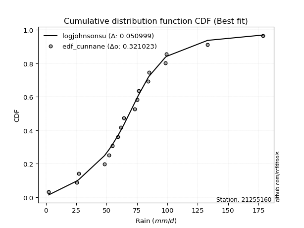</img>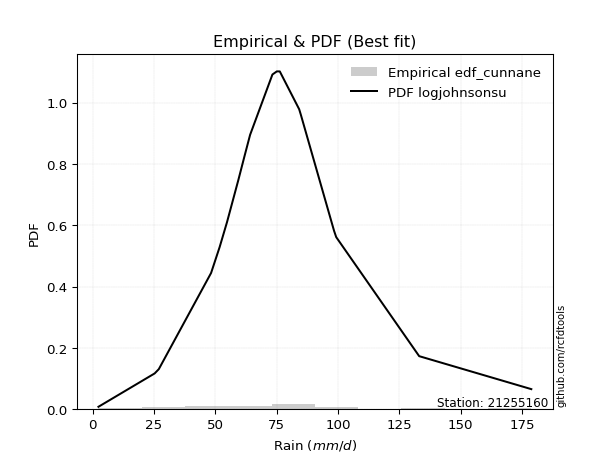</img>

</div>


### 12. Empirical - EDF Adamowski (1981)

The Adamowski formula in hydrology refers to a specific plotting position formula used for estimating the non-parametric empirical distribution of hydrological events (like flood peaks) to calculate their return periods. This formula provides an alternative to traditional parametric methods (like the Gumbel or Log Pearson Type III distributions). 

<div align="center">


$P=(m-0.25)/(n+0.5)$


</div>


**12.1. Empirical values**

<div align="center">

|                | 0                   | 1                  | 2                   | 3                   | 4                  | 5                   | 6                   | 7                   | 8             | 9                  | 10                 | 11                 | 12                 | 13                 | 14                 | 15                 | 16                 |
|:---------------|:--------------------|:-------------------|:--------------------|:--------------------|:-------------------|:--------------------|:--------------------|:--------------------|:--------------|:-------------------|:-------------------|:-------------------|:-------------------|:-------------------|:-------------------|:-------------------|:-------------------|
| date           | 2019                | 2011               | 2008                | 2016                | 2006               | 2022                | 2014                | 2005                | 2007          | 2017               | 2015               | 2010               | 2018               | 2009               | 2012               | 2021               | 2013               |
| x              | 2.4                 | 25.3               | 48.3                | 51.8                | 54.8               | 59.4                | 61.9                | 64.2                | 73.3          | 75.1               | 76.3               | 84.2               | 84.9               | 99.3               | 102.61764705882354 | 133.1              | 178.8              |
| m              | 1                   | 2                  | 3                   | 4                   | 5                  | 6                   | 7                   | 8                   | 9             | 10                 | 11                 | 12                 | 13                 | 14                 | 15                 | 16                 | 17                 |
| empirical_dist | edf_adamowski       | edf_adamowski      | edf_adamowski       | edf_adamowski       | edf_adamowski      | edf_adamowski       | edf_adamowski       | edf_adamowski       | edf_adamowski | edf_adamowski      | edf_adamowski      | edf_adamowski      | edf_adamowski      | edf_adamowski      | edf_adamowski      | edf_adamowski      | edf_adamowski      |
| empirical      | 0.04285714285714286 | 0.1                | 0.15714285714285714 | 0.21428571428571427 | 0.2714285714285714 | 0.32857142857142857 | 0.38571428571428573 | 0.44285714285714284 | 0.5           | 0.5571428571428572 | 0.6142857142857143 | 0.6714285714285714 | 0.7285714285714285 | 0.7857142857142857 | 0.8428571428571429 | 0.9                | 0.9571428571428572 |
| empirical_tr   | 1.044776119402985   | 1.1111111111111112 | 1.1864406779661016  | 1.2727272727272727  | 1.372549019607843  | 1.4893617021276595  | 1.627906976744186   | 1.7948717948717947  | 2.0           | 2.2580645161290325 | 2.592592592592593  | 3.0434782608695645 | 3.684210526315789  | 4.666666666666666  | 6.363636363636364  | 10.000000000000002 | 23.333333333333357 |

</div>


**12.2. Kolmogorov-Smirnov fit test (sorted by Δ)**


<div align="center">

|                | 0                  | 1                   | 2                   | 3                   | 4                   | 5                   | 6                   | 7                  | 8                   | 9                   | 10                  | 11                  | 12                  | 13                  | 14                  | 15                  | 16                 | 17                  | 18                  | 19                  | 20                 | 21                  | 22                  | 23                  | 24                  | 25                 | 26                  | 27                  | 28                  | 29                  | 30                  | 31                  | 32                 | 33                  | 34                    | 35                  | 36                  | 37                  | 38                  | 39                  | 40                 | 41                 | 42                 | 43                  | 44                  | 45                  | 46                 | 47                  | 48                  | 49                 | 50                 | 51                 | 52                  | 53                 | 54                  | 55                  | 56                  | 57                 | 58                  | 59                 | 60                 | 61                 | 62                  | 63                 | 64                  | 65                  | 66                 | 67                  | 68                  | 69                  | 70                  | 71                  | 72                 | 73                 | 74                  | 75                 | 76                 | 77                 | 78                 | 79                 | 80                  | 81                  | 82                 | 83                  | 84                 | 85                 | 86                 | 87                 | 88                 | 89                 |
|:---------------|:-------------------|:--------------------|:--------------------|:--------------------|:--------------------|:--------------------|:--------------------|:-------------------|:--------------------|:--------------------|:--------------------|:--------------------|:--------------------|:--------------------|:--------------------|:--------------------|:-------------------|:--------------------|:--------------------|:--------------------|:-------------------|:--------------------|:--------------------|:--------------------|:--------------------|:-------------------|:--------------------|:--------------------|:--------------------|:--------------------|:--------------------|:--------------------|:-------------------|:--------------------|:----------------------|:--------------------|:--------------------|:--------------------|:--------------------|:--------------------|:-------------------|:-------------------|:-------------------|:--------------------|:--------------------|:--------------------|:-------------------|:--------------------|:--------------------|:-------------------|:-------------------|:-------------------|:--------------------|:-------------------|:--------------------|:--------------------|:--------------------|:-------------------|:--------------------|:-------------------|:-------------------|:-------------------|:--------------------|:-------------------|:--------------------|:--------------------|:-------------------|:--------------------|:--------------------|:--------------------|:--------------------|:--------------------|:-------------------|:-------------------|:--------------------|:-------------------|:-------------------|:-------------------|:-------------------|:-------------------|:--------------------|:--------------------|:-------------------|:--------------------|:-------------------|:-------------------|:-------------------|:-------------------|:-------------------|:-------------------|
| station        | 21255160           | 21255160            | 21255160            | 21255160            | 21255160            | 21255160            | 21255160            | 21255160           | 21255160            | 21255160            | 21255160            | 21255160            | 21255160            | 21255160            | 21255160            | 21255160            | 21255160           | 21255160            | 21255160            | 21255160            | 21255160           | 21255160            | 21255160            | 21255160            | 21255160            | 21255160           | 21255160            | 21255160            | 21255160            | 21255160            | 21255160            | 21255160            | 21255160           | 21255160            | 21255160              | 21255160            | 21255160            | 21255160            | 21255160            | 21255160            | 21255160           | 21255160           | 21255160           | 21255160            | 21255160            | 21255160            | 21255160           | 21255160            | 21255160            | 21255160           | 21255160           | 21255160           | 21255160            | 21255160           | 21255160            | 21255160            | 21255160            | 21255160           | 21255160            | 21255160           | 21255160           | 21255160           | 21255160            | 21255160           | 21255160            | 21255160            | 21255160           | 21255160            | 21255160            | 21255160            | 21255160            | 21255160            | 21255160           | 21255160           | 21255160            | 21255160           | 21255160           | 21255160           | 21255160           | 21255160           | 21255160            | 21255160            | 21255160           | 21255160            | 21255160           | 21255160           | 21255160           | 21255160           | 21255160           | 21255160           |
| empirical_dist | edf_adamowski      | edf_adamowski       | edf_adamowski       | edf_adamowski       | edf_adamowski       | edf_adamowski       | edf_adamowski       | edf_adamowski      | edf_adamowski       | edf_adamowski       | edf_adamowski       | edf_adamowski       | edf_adamowski       | edf_adamowski       | edf_adamowski       | edf_adamowski       | edf_adamowski      | edf_adamowski       | edf_adamowski       | edf_adamowski       | edf_adamowski      | edf_adamowski       | edf_adamowski       | edf_adamowski       | edf_adamowski       | edf_adamowski      | edf_adamowski       | edf_adamowski       | edf_adamowski       | edf_adamowski       | edf_adamowski       | edf_adamowski       | edf_adamowski      | edf_adamowski       | edf_adamowski         | edf_adamowski       | edf_adamowski       | edf_adamowski       | edf_adamowski       | edf_adamowski       | edf_adamowski      | edf_adamowski      | edf_adamowski      | edf_adamowski       | edf_adamowski       | edf_adamowski       | edf_adamowski      | edf_adamowski       | edf_adamowski       | edf_adamowski      | edf_adamowski      | edf_adamowski      | edf_adamowski       | edf_adamowski      | edf_adamowski       | edf_adamowski       | edf_adamowski       | edf_adamowski      | edf_adamowski       | edf_adamowski      | edf_adamowski      | edf_adamowski      | edf_adamowski       | edf_adamowski      | edf_adamowski       | edf_adamowski       | edf_adamowski      | edf_adamowski       | edf_adamowski       | edf_adamowski       | edf_adamowski       | edf_adamowski       | edf_adamowski      | edf_adamowski      | edf_adamowski       | edf_adamowski      | edf_adamowski      | edf_adamowski      | edf_adamowski      | edf_adamowski      | edf_adamowski       | edf_adamowski       | edf_adamowski      | edf_adamowski       | edf_adamowski      | edf_adamowski      | edf_adamowski      | edf_adamowski      | edf_adamowski      | edf_adamowski      |
| p_dist         | johnsonsu          | logjohnsonsu        | logt                | fisk                | genlogistic         | exponnorm           | nct                 | weibull_min        | lognakagami         | invgamma            | f                   | moyal               | betaprime           | chi2                | gamma               | erlang              | mielke             | laplace_asymmetric  | gumbel_r            | hypsecant           | laplace            | nakagami            | pearson3            | maxwell             | invgauss            | rice               | logistic            | rayleigh            | invweibull          | logfisk             | halflogistic        | norm                | crystalball        | t                   | loglaplace_asymmetric | kstwobign           | halfnorm            | loggenlogistic      | logmielke           | loggompertz         | wald               | logweibull_min     | logloggamma        | ncf                 | gibrat              | loggumbel_l         | gumbel_l           | loglaplace          | logpearson3         | loghypsecant       | loglogistic        | logfatiguelife     | logf                | logexponnorm       | logrice             | lognorm             | lognorm             | logcrystalball     | loglognorm          | lognct             | loggamma           | loggamma           | loginvgamma         | logchi2            | logbetaprime        | logalpha            | logncf             | logmaxwell          | loginvgauss         | logerlang           | lograyleigh         | loginvweibull       | expon              | genexpon           | loggumbel_r         | loghalfnorm        | logmoyal           | loghalflogistic    | logkstwobign       | loggibrat          | logwald             | loggenexpon         | logexpon           | logtruncnorm        | pareto             | logpareto          | fatiguelife        | alpha              | gompertz           | truncnorm          |
| delta          | 0.0449195354322105 | 0.05634365049740764 | 0.06745829414260063 | 0.07027303279184235 | 0.07885339907395827 | 0.08458772487806271 | 0.08541485321610787 | 0.0953952650603116 | 0.09622954492268826 | 0.09724917276121775 | 0.09725034514116454 | 0.09766970862576752 | 0.09857377418102797 | 0.09857930346139332 | 0.09857930527434933 | 0.09857933088804471 | 0.0986174256178024 | 0.09934005829248427 | 0.09994976511912679 | 0.10484986396985563 | 0.1060026874215444 | 0.10626585998656102 | 0.10797896912903093 | 0.10924439031254746 | 0.11199144703903441 | 0.1146363857216407 | 0.11542457141542473 | 0.11789032818502676 | 0.11790941397195953 | 0.12387333511256027 | 0.12527155196418022 | 0.12835023827033165 | 0.1283502473629914 | 0.13658228119356974 | 0.13704580010338863   | 0.14069612913020763 | 0.14087693599452566 | 0.14155627946360488 | 0.14215303323347983 | 0.14796170192624358 | 0.1495795173771287 | 0.1511180428646724 | 0.1511835330557123 | 0.15560227184184172 | 0.16980425042007985 | 0.18500027953149217 | 0.1880817981259716 | 0.20472666857409944 | 0.20734082585932245 | 0.2309254753632184 | 0.2406477101333137 | 0.25107426365997   | 0.25179198123940744 | 0.2524370861607617 | 0.25243721566360067 | 0.25243739323136166 | 0.25243739323136166 | 0.2524373932419711 | 0.25243942886667536 | 0.2569577204081694 | 0.2693976487863727 | 0.2693976487863727 | 0.27342073595140753 | 0.2779915384404711 | 0.27841129562970474 | 0.28060422525609496 | 0.2817365478255958 | 0.28664395692105343 | 0.28974292397204493 | 0.29285400096866887 | 0.29890583473594634 | 0.30424937254163076 | 0.3112571665152296 | 0.3114137868602431 | 0.31391610994754293 | 0.3336494000037845 | 0.3374564891336673 | 0.3504223214674278 | 0.3518962653973944 | 0.4000229306274763 | 0.40164678174113655 | 0.40515460303435125 | 0.4504613894446199 | 0.46733254992981277 | 0.529430286708563  | 0.5465140872714215 | 0.6298122588244136 | 0.6801087223443714 | 0.8593763444979117 | 0.9                |
| deltao         | 0.3260541228310003 | 0.3260541228310003  | 0.3260541228310003  | 0.3260541228310003  | 0.3260541228310003  | 0.3260541228310003  | 0.3260541228310003  | 0.3260541228310003 | 0.3260541228310003  | 0.3260541228310003  | 0.3260541228310003  | 0.3260541228310003  | 0.3260541228310003  | 0.3260541228310003  | 0.3260541228310003  | 0.3260541228310003  | 0.3260541228310003 | 0.3260541228310003  | 0.3260541228310003  | 0.3260541228310003  | 0.3260541228310003 | 0.3260541228310003  | 0.3260541228310003  | 0.3260541228310003  | 0.3260541228310003  | 0.3260541228310003 | 0.3260541228310003  | 0.3260541228310003  | 0.3260541228310003  | 0.3260541228310003  | 0.3260541228310003  | 0.3260541228310003  | 0.3260541228310003 | 0.3260541228310003  | 0.3260541228310003    | 0.3260541228310003  | 0.3260541228310003  | 0.3260541228310003  | 0.3260541228310003  | 0.3260541228310003  | 0.3260541228310003 | 0.3260541228310003 | 0.3260541228310003 | 0.3260541228310003  | 0.3260541228310003  | 0.3260541228310003  | 0.3260541228310003 | 0.3260541228310003  | 0.3260541228310003  | 0.3260541228310003 | 0.3260541228310003 | 0.3260541228310003 | 0.3260541228310003  | 0.3260541228310003 | 0.3260541228310003  | 0.3260541228310003  | 0.3260541228310003  | 0.3260541228310003 | 0.3260541228310003  | 0.3260541228310003 | 0.3260541228310003 | 0.3260541228310003 | 0.3260541228310003  | 0.3260541228310003 | 0.3260541228310003  | 0.3260541228310003  | 0.3260541228310003 | 0.3260541228310003  | 0.3260541228310003  | 0.3260541228310003  | 0.3260541228310003  | 0.3260541228310003  | 0.3260541228310003 | 0.3260541228310003 | 0.3260541228310003  | 0.3260541228310003 | 0.3260541228310003 | 0.3260541228310003 | 0.3260541228310003 | 0.3260541228310003 | 0.3260541228310003  | 0.3260541228310003  | 0.3260541228310003 | 0.3260541228310003  | 0.3260541228310003 | 0.3260541228310003 | 0.3260541228310003 | 0.3260541228310003 | 0.3260541228310003 | 0.3260541228310003 |
| eval           | Δo > Δ             | Δo > Δ              | Δo > Δ              | Δo > Δ              | Δo > Δ              | Δo > Δ              | Δo > Δ              | Δo > Δ             | Δo > Δ              | Δo > Δ              | Δo > Δ              | Δo > Δ              | Δo > Δ              | Δo > Δ              | Δo > Δ              | Δo > Δ              | Δo > Δ             | Δo > Δ              | Δo > Δ              | Δo > Δ              | Δo > Δ             | Δo > Δ              | Δo > Δ              | Δo > Δ              | Δo > Δ              | Δo > Δ             | Δo > Δ              | Δo > Δ              | Δo > Δ              | Δo > Δ              | Δo > Δ              | Δo > Δ              | Δo > Δ             | Δo > Δ              | Δo > Δ                | Δo > Δ              | Δo > Δ              | Δo > Δ              | Δo > Δ              | Δo > Δ              | Δo > Δ             | Δo > Δ             | Δo > Δ             | Δo > Δ              | Δo > Δ              | Δo > Δ              | Δo > Δ             | Δo > Δ              | Δo > Δ              | Δo > Δ             | Δo > Δ             | Δo > Δ             | Δo > Δ              | Δo > Δ             | Δo > Δ              | Δo > Δ              | Δo > Δ              | Δo > Δ             | Δo > Δ              | Δo > Δ             | Δo > Δ             | Δo > Δ             | Δo > Δ              | Δo > Δ             | Δo > Δ              | Δo > Δ              | Δo > Δ             | Δo > Δ              | Δo > Δ              | Δo > Δ              | Δo > Δ              | Δo > Δ              | Δo > Δ             | Δo > Δ             | Δo > Δ              | Δo <= Δ            | Δo <= Δ            | Δo <= Δ            | Δo <= Δ            | Δo <= Δ            | Δo <= Δ             | Δo <= Δ             | Δo <= Δ            | Δo <= Δ             | Δo <= Δ            | Δo <= Δ            | Δo <= Δ            | Δo <= Δ            | Δo <= Δ            | Δo <= Δ            |
| fit            | 1                  | 1                   | 1                   | 1                   | 1                   | 1                   | 1                   | 1                  | 1                   | 1                   | 1                   | 1                   | 1                   | 1                   | 1                   | 1                   | 1                  | 1                   | 1                   | 1                   | 1                  | 1                   | 1                   | 1                   | 1                   | 1                  | 1                   | 1                   | 1                   | 1                   | 1                   | 1                   | 1                  | 1                   | 1                     | 1                   | 1                   | 1                   | 1                   | 1                   | 1                  | 1                  | 1                  | 1                   | 1                   | 1                   | 1                  | 1                   | 1                   | 1                  | 1                  | 1                  | 1                   | 1                  | 1                   | 1                   | 1                   | 1                  | 1                   | 1                  | 1                  | 1                  | 1                   | 1                  | 1                   | 1                   | 1                  | 1                   | 1                   | 1                   | 1                   | 1                   | 1                  | 1                  | 1                   | 0                  | 0                  | 0                  | 0                  | 0                  | 0                   | 0                   | 0                  | 0                   | 0                  | 0                  | 0                  | 0                  | 0                  | 0                  |
| n              | 17                 | 17                  | 17                  | 17                  | 17                  | 17                  | 17                  | 17                 | 17                  | 17                  | 17                  | 17                  | 17                  | 17                  | 17                  | 17                  | 17                 | 17                  | 17                  | 17                  | 17                 | 17                  | 17                  | 17                  | 17                  | 17                 | 17                  | 17                  | 17                  | 17                  | 17                  | 17                  | 17                 | 17                  | 17                    | 17                  | 17                  | 17                  | 17                  | 17                  | 17                 | 17                 | 17                 | 17                  | 17                  | 17                  | 17                 | 17                  | 17                  | 17                 | 17                 | 17                 | 17                  | 17                 | 17                  | 17                  | 17                  | 17                 | 17                  | 17                 | 17                 | 17                 | 17                  | 17                 | 17                  | 17                  | 17                 | 17                  | 17                  | 17                  | 17                  | 17                  | 17                 | 17                 | 17                  | 17                 | 17                 | 17                 | 17                 | 17                 | 17                  | 17                  | 17                 | 17                  | 17                 | 17                 | 17                 | 17                 | 17                 | 17                 |
| best_fit       | 1                  | 0                   | 0                   | 0                   | 0                   | 0                   | 0                   | 0                  | 0                   | 0                   | 0                   | 0                   | 0                   | 0                   | 0                   | 0                   | 0                  | 0                   | 0                   | 0                   | 0                  | 0                   | 0                   | 0                   | 0                   | 0                  | 0                   | 0                   | 0                   | 0                   | 0                   | 0                   | 0                  | 0                   | 0                     | 0                   | 0                   | 0                   | 0                   | 0                   | 0                  | 0                  | 0                  | 0                   | 0                   | 0                   | 0                  | 0                   | 0                   | 0                  | 0                  | 0                  | 0                   | 0                  | 0                   | 0                   | 0                   | 0                  | 0                   | 0                  | 0                  | 0                  | 0                   | 0                  | 0                   | 0                   | 0                  | 0                   | 0                   | 0                   | 0                   | 0                   | 0                  | 0                  | 0                   | 0                  | 0                  | 0                  | 0                  | 0                  | 0                   | 0                   | 0                  | 0                   | 0                  | 0                  | 0                  | 0                  | 0                  | 0                  |
| best_fit_sort  | 1                  | 2                   | 3                   | 4                   | 5                   | 6                   | 7                   | 8                  | 9                   | 10                  | 11                  | 12                  | 13                  | 14                  | 15                  | 16                  | 17                 | 18                  | 19                  | 20                  | 21                 | 22                  | 23                  | 24                  | 25                  | 26                 | 27                  | 28                  | 29                  | 30                  | 31                  | 32                  | 33                 | 34                  | 35                    | 36                  | 37                  | 38                  | 39                  | 40                  | 41                 | 42                 | 43                 | 44                  | 45                  | 46                  | 47                 | 48                  | 49                  | 50                 | 51                 | 52                 | 53                  | 54                 | 55                  | 56                  | 57                  | 58                 | 59                  | 60                 | 61                 | 62                 | 63                  | 64                 | 65                  | 66                  | 67                 | 68                  | 69                  | 70                  | 71                  | 72                  | 73                 | 74                 | 75                  | 76                 | 77                 | 78                 | 79                 | 80                 | 81                  | 82                  | 83                 | 84                  | 85                 | 86                 | 87                 | 88                 | 89                 | 90                 |

</div>


<div align="center">

</img>

</div>


**12.3. Best fit**

<div align="center">

|   id |   station | empirical_dist   | p_dist    |     delta |   deltao | eval   |   fit |   n |   best_fit |   best_fit_sort |
|-----:|----------:|:-----------------|:----------|----------:|---------:|:-------|------:|----:|-----------:|----------------:|
|    0 |  21255160 | edf_adamowski    | johnsonsu | 0.0449195 | 0.326054 | Δo > Δ |     1 |  17 |          1 |               1 |

</div>


<div align="center">

</img></img>

</div>


## C. Best fit & Estimate extreme values for specific return periods - Tr


### 1. Best fit (ordered by delta Δ)

<div align="center">

|   id |   station | empirical_dist   | p_dist    |     delta |   deltao | eval   |   fit |   n |   best_fit |   best_fit_sort |
|-----:|----------:|:-----------------|:----------|----------:|---------:|:-------|------:|----:|-----------:|----------------:|
|    0 |  21255160 | edf_adamowski    | johnsonsu | 0.0449195 | 0.326054 | Δo > Δ |     1 |  17 |          1 |               1 |
|    1 |  21255160 | edf_cunnane      | johnsonsu | 0.0449195 | 0.326054 | Δo > Δ |     1 |  17 |          1 |               2 |
|    2 |  21255160 | edf_jenkinson    | johnsonsu | 0.0449195 | 0.326054 | Δo > Δ |     1 |  17 |          1 |               3 |
|    3 |  21255160 | edf_filliben     | johnsonsu | 0.0449195 | 0.326054 | Δo > Δ |     1 |  17 |          1 |               4 |
|    4 |  21255160 | edf_gringorten   | johnsonsu | 0.0449195 | 0.326054 | Δo > Δ |     1 |  17 |          1 |               5 |
|    5 |  21255160 | edf_tukey        | johnsonsu | 0.0449195 | 0.326054 | Δo > Δ |     1 |  17 |          1 |               6 |
|    6 |  21255160 | edf_blom         | johnsonsu | 0.0449195 | 0.326054 | Δo > Δ |     1 |  17 |          1 |               7 |
|    7 |  21255160 | edf_chegodayev   | johnsonsu | 0.0449195 | 0.326054 | Δo > Δ |     1 |  17 |          1 |               8 |
|    8 |  21255160 | edf_beard        | johnsonsu | 0.0449195 | 0.326054 | Δo > Δ |     1 |  17 |          1 |               9 |
|    9 |  21255160 | edf_hazen        | johnsonsu | 0.0449195 | 0.326054 | Δo > Δ |     1 |  17 |          1 |              10 |
|   10 |  21255160 | edf_weibull      | johnsonsu | 0.0506801 | 0.326054 | Δo > Δ |     1 |  17 |          1 |              11 |
|   11 |  21255160 | edf_california   | johnsonsu | 0.0700919 | 0.326054 | Δo > Δ |     1 |  17 |          1 |              12 |

</div>

:file_folder:Tables: [bestfit_21255160.csv](table/bestfit_21255160.csv) | [extreme_21255160.csv](table/extreme_21255160.csv)


### 2. Extreme values

In hydrology, a return period (or recurrence interval $Tr$) is the statistical average time between extreme events like floods or droughts of a specific magnitude, indicating how rare an event is, with a 100-year flood, for example, having a 1% chance of occurring in any given year, not that it happens exactly every century. It is a key tool for infrastructure design (like bridges or dams) and risk assessment, calculated from historical data to determine the probability of future events, although it is important to remember it is statistical average, and events can cluster or be missed.

> risk_rate: assuming the return period as the project useful life.

|   id |      tr |   prob_l |     prob_g |     alpha |   betaprime |     chi2 |   crystalball |   erlang |    expon |   exponnorm |        f |   fatiguelife |     fisk |    gamma |   genexpon |   genlogistic |   gibrat |   gompertz |   gumbel_l |   gumbel_r |   halflogistic |   halfnorm |   hypsecant |   invgamma |   invgauss |   invweibull |   johnsonsu |   kstwobign |   laplace |   laplace_asymmetric |   loggamma |   logistic |   lognorm |   maxwell |   mielke |    moyal |   nakagami |      ncf |      nct |     norm |           pareto |   pearson3 |   rayleigh |     rice |        t |   truncnorm |     wald |   weibull_min |   logalpha |   logbetaprime |   logchi2 |   logcrystalball |   logerlang |         logexpon |   logexponnorm |     logf |   logfatiguelife |   logfisk |   loggenexpon |   loggenlogistic |   loggibrat |   loggompertz |   loggumbel_l |   loggumbel_r |   loghalflogistic |   loghalfnorm |   loghypsecant |   loginvgamma |   loginvgauss |   loginvweibull |   logjohnsonsu |   logkstwobign |   loglaplace |   loglaplace_asymmetric |   logloggamma |   loglogistic |   loglognorm |   logmaxwell |   logmielke |   logmoyal |   lognakagami |    logncf |    lognct |   logpareto |   logpearson3 |   lograyleigh |   logrice |             logt |   logtruncnorm |    logwald |   logweibull_min |   station |   n |   risk_rate |
|-----:|--------:|---------:|-----------:|----------:|------------:|---------:|--------------:|---------:|---------:|------------:|---------:|--------------:|---------:|---------:|-----------:|--------------:|---------:|-----------:|-----------:|-----------:|---------------:|-----------:|------------:|-----------:|-----------:|-------------:|------------:|------------:|----------:|---------------------:|-----------:|-----------:|----------:|----------:|---------:|---------:|-----------:|---------:|---------:|---------:|-----------------:|-----------:|-----------:|---------:|---------:|------------:|---------:|--------------:|-----------:|---------------:|----------:|-----------------:|------------:|-----------------:|---------------:|---------:|-----------------:|----------:|--------------:|-----------------:|------------:|--------------:|--------------:|--------------:|------------------:|--------------:|---------------:|--------------:|--------------:|----------------:|---------------:|---------------:|-------------:|------------------------:|--------------:|--------------:|-------------:|-------------:|------------:|-----------:|--------------:|----------:|----------:|------------:|--------------:|--------------:|----------:|-----------------:|---------------:|-----------:|-----------------:|----------:|----:|------------:|
|    0 |    2    | 0.5      | 0.5        |   14.691  |     71.7171 |  71.7216 |       75.0422 |  71.7216 |  52.7517 |     70.7365 |  71.3736 |       2.40016 |  71.0836 |  71.7216 |    52.7283 |       71.6809 |  63.389  |    155.231 |    81.4201 |    68.6643 |        65.4935 |    67.0953 |     75.0422 |    71.3737 |    70.103  |      69.3777 |     70.3939 |     68.6    |   75.0422 |              74.1847 |    58.0862 |    75.0422 |   59.41   |   71.7219 |  71.6651 |  66.6053 |    72.444  |  67.923  |  71.0321 |  75.0422 |      2.58977     |    69.9169 |    70.5442 |  73.0599 |  68.1693 |     3.00164 |  62.4576 |       72.3013 |    56.5126 |        57.8034 |   56.6743 |          59.41   |     55.2815 |     22.1929      |        59.4099 |  59.5299 |          59.5763 |   68.7363 |       36.8135 |          68.0734 |     45.2696 |       68.3066 |       68.9395 |       51.1977 |           47.5477 |       49.3575 |         59.41  |       57.0766 |       55.5814 |         55.8927 |        70.8509 |        46.4644 |      59.41   |                 66.3146 |       69.4472 |       59.41   |      59.4098 |      54.9824 |     68.0171 |    48.797  |       70.4008 |   56.6667 |   59.054  |     2.42211 |       82.2125 |       53.4926 |   59.41   |     71.5057      |        22.8447 |    44.2978 |          68.0918 |  21255160 |  17 |    0.75     |
|    1 |    2.33 | 0.570815 | 0.429185   |   17.4857 |     78.5723 |  78.5778 |       81.9701 |  78.5778 |  63.8457 |     76.9251 |  78.1235 |       4.70774 |  76.8403 |  78.5778 |    63.8171 |       77.6914 |  66.8984 |    156.796 |    87.4475 |    75.0838 |        72.0937 |    74.5723 |     80.5866 |    78.1236 |    77.0561 |      76.567  |     75.0483 |     76.3654 |   79.2347 |              78.5018 |    69.4776 |    81.1462 |   69.8295 |   78.9195 |  78.1159 |  72.6821 |    79.5187 |  76.7207 |  77.3553 |  81.9701 |      4.58499     |    76.7924 |    77.8483 |  80.3299 |  74.6215 |     3.12947 |  67.0003 |       78.7448 |    67.6985 |        70.617  |   67.5779 |          69.8295 |     67.0989 |     36.2288      |        69.8295 |  70.0113 |          70.0073 |   76.5075 |       50.1813 |          74.9066 |     49.1313 |       76.0359 |       79.346  |       59.4676 |           55.4613 |       58.7621 |         67.612 |       67.7797 |       67.2244 |         74.122  |        75.2022 |        63.5795 |      65.5132 |                 71.7776 |       77.5126 |       68.5003 |      69.8294 |      65.0334 |     74.8529 |    56.2278 |       76.3342 |   68.4347 |   69.6901 |     2.66733 |       90.9042 |       63.4285 |   69.8295 |     75.9013      |        34.3819 |    49.2492 |          75.8771 |  21255160 |  17 |    0.729209 |
|    2 |    5    | 0.8      | 0.2        |   39.156  |    105.95   | 105.956  |      107.716  | 105.956  | 119.313  |    102.788  | 105.381  |      53.7249  | 100.797  | 105.956  |   119.259  |      102.22   |  87.1029 |    161.851 |   106.919  |   102.973  |       101.958  |   106.192  |    102.826  |   105.381  |   105.61   |     107.8    |     96.9925 |    109.351  |  100.196  |             100.086  |   136.683  |   104.714  |  127.305  |  107.249  | 103.114  | 100.831  |   107.135  | 120.096  | 103.545  | 107.716  | 441848           |   105.318  |   107.09   | 107.962  |  99.6281 |     3.74603 |  92.4303 |      105.707  |   134.7    |       152.344  |  131.466  |         127.305  |    140.76   |    419.953       |       127.305  | 127.898  |         127.547  |  115.696  |      173.796  |         101.338  |     78.7108 |      107.516  |      124.961  |      113.972  |          111.307  |      122.859  |        113.583 |      130.196  |      139.881  |        252.662  |        94.4205 |       240.907  |     106.824  |                 94.2905 |      108.772  |      118.697  |     127.306  |     125.926  |    101.291  |   108.417  |      104.179  |  142.513  |  129.271  |   inf       |      113.266  |      125.459  |  127.305  |     99.2101      |       202.215  |    89.125  |         107.646  |  21255160 |  17 |    0.67232  |
|    3 |   10    | 0.9      | 0.1        |   78.9696 |    125.808  | 125.81   |      124.795  | 125.81   | 169.665  |    123.724  | 125.559  |     121.405   | 120.341  | 125.81   |   169.587  |      121.184  | 110.134  |    164.666 |   117.76   |   125.688  |       126.76   |   129.589  |    120.586  |   125.559  |   127.088  |     133.239  |    119.051  |    134.466  |  119.224  |             119.68   |   216.223  |   122.071  |  189.609  |  127.185  | 122.232  | 125.338  |   126.438  | 162.011  | 124.057  | 124.795  |      2.89566e+10 |   126.925  |   127.94   | 126.646  | 118.377  |     4.27672 | 119.418  |      125.901  |   215.863  |       259.303  |  206.503  |         189.609  |    234.378  |   3883.33        |       189.608  | 190.77   |         189.937  |  156.89   |      422.025  |         121.417  |    134.692  |      130.395  |      160.915  |      193.6    |          198.5    |      212.046  |        171.876 |      203.293  |      232.775  |        686.009  |       117.458  |       664.245  |     166.503  |                119.979  |      129.98   |      177.938  |     189.611  |     200.482  |    121.371  |   192.026  |      129.078  |  238.688  |  195.178  |   inf       |      119.72   |      204.039  |  189.609  |    133.556       |       775      |   167.253  |         130.786  |  21255160 |  17 |    0.651322 |
|    4 |   15    | 0.933333 | 0.0666667  |  118.641  |    136.237  | 136.235  |      133.318  | 136.235  | 199.119  |    135.725  | 136.324  |     165.669   | 131.728  | 136.235  |   199.027  |      131.694  | 126.019  |    165.94  |   122.67   |   138.504  |       140.795  |   141.765  |    130.721  |   136.324  |   138.615  |     147.592  |    133.716  |    147.798  |  130.355  |             131.142  |   272.63   |   131.528  |  231.311  |  137.415  | 133.269  | 139.561  |   136.317  | 188.541  | 135.535  | 133.318  |      1.90198e+13 |   138.536  |   138.682  | 136.041  | 128.855  |     4.57589 | 136.748  |      136.577  |   274.43   |       340.355  |  259.483  |         231.311  |    303.968  |  14265.3         |       231.31   | 232.905  |         231.709  |  185.211  |      666.841  |         132.987  |    195.104  |      142.302  |      180.439  |      261.053  |          275.384  |      281.693  |        217.713 |      254.9    |      302.27   |       1205.23   |       136.969  |      1138.07   |     215.862  |                138.139  |      140.572  |      221.854  |     231.315  |     254.507  |    132.941  |   267.573  |      143.953  |  311.538  |  239.882  |   inf       |      121.282  |      262.143  |  231.311  |    168.212       |      1571.43   |   250.567  |         142.843  |  21255160 |  17 |    0.644736 |
|    5 |   20    | 0.95     | 0.05       |  158.278  |    143.256  | 143.252  |      138.899  | 143.252  | 220.017  |    144.213  | 143.641  |     198.441   | 139.92   | 143.252  |   219.915  |      139.004  | 138.481  |    166.734 |   125.726  |   147.477  |       150.629  |   149.883  |    137.87   |   143.641  |   146.467  |     157.641  |    145.059  |    156.78   |  138.252  |             139.274  |   317.66   |   138.065  |  263.473  |  144.203  | 141.252  | 149.634  |   142.868  | 208.463  | 143.583  | 138.899  |      1.89768e+15 |   146.444  |   145.823  | 142.214  | 136.256  |     4.78354 | 149.662  |      143.768  |   321.708  |       407.689  |  301.675  |         263.473  |    361.115  |  35909.3         |       263.471  | 265.425  |         263.932  |  207.721  |      903.933  |         141.359  |    260.915  |      150.256  |      193.771  |      321.831  |          346.38   |      340.418  |        257.224 |      296.021  |      359.606  |       1788.26   |       155.114  |      1635.66   |     259.523  |                152.667  |      147.493  |      258.393  |     263.478  |     298.175  |    141.312  |   338.441  |      154.722  |  372.144  |  274.635  |   inf       |      121.924  |      309.649  |  263.473  |    205.633       |      2523.49   |   338.644  |         150.903  |  21255160 |  17 |    0.641514 |
|    6 |   25    | 0.96     | 0.04       |  197.901  |    148.521  | 148.513  |      143.008  | 148.513  | 236.226  |    150.792  | 149.169  |     224.48    | 146.37   | 148.513  |   236.117  |      144.615  | 148.869  |    167.298 |   127.901  |   154.389  |       158.205  |   155.923  |    143.404  |   149.169  |   152.403  |     165.382  |    154.442  |    163.507  |  144.378  |             145.582  |   355.687  |   143.065  |  289.973  |  149.243  | 147.587  | 157.442  |   147.728  | 224.611  | 149.805  | 143.008  |      6.7419e+16  |   152.421  |   151.128  | 146.768  | 142.024  |     4.94211 | 160.006  |      149.157  |   361.964  |       466.194  |  337.245  |         289.973  |    410.36   |  73483.7         |       289.971  | 292.233  |         290.487  |  226.771  |     1133.24   |         148.008  |    332.457  |      156.186  |      203.853  |      378.133  |          413.335  |      391.922  |        292.661 |      330.713  |      409.197  |       2423.39   |       172.548  |      2146.26   |     299.385  |                164.979  |      152.577  |      290.358  |     289.979  |     335.372  |    147.96   |   406.045  |      163.218  |  424.894  |  303.431  |   inf       |      122.259  |      350.439  |  289.973  |    246.795       |      3593.56   |   431.048  |         156.913  |  21255160 |  17 |    0.639603 |
|    7 |   50    | 0.98     | 0.02       |  395.952  |    164.054  | 164.036  |      154.774  | 164.036  | 286.578  |    171.22   | 165.69   |     308.024   | 167.109  | 164.036  |   286.446  |      161.829  | 185.488  |    168.831 |   133.804  |   175.681  |       181.549  |   173.479  |    160.559  |   165.69   |   170.157  |     189.227  |    187.163  |    183.262  |  163.406  |             165.175  |   492.93   |   158.343  |  381.543  |  163.86   | 168.359  | 181.68   |   161.816  | 279.115  | 169.197  | 154.774  |      4.41833e+21 |   170.276  |   166.528  | 159.847  | 160.358  |     5.42169 | 193.779  |      165.015  |   509.504  |       688.372  |  465.269  |         381.543  |    594.624  | 679507           |       381.54   | 384.951  |         382.279  |  296.495  |     2185.06   |         169.862  |    781.072  |      173.491  |      233.948  |      621.344  |          712.484  |      590.264  |        436.669 |      455.787  |      596.121  |       6180.61   |       256.235  |      4766.08   |     466.643  |                209.927  |      167.068  |      414.663  |     381.553  |     471.626  |    169.812  |   714.675  |      190.514  |  626.132  |  403.935  |   inf       |      122.793  |      501.898  |  381.543  |    530.903       |     10086.8    |   947.64   |         174.465  |  21255160 |  17 |    0.63583  |
|    8 |   75    | 0.986667 | 0.0133333  |  593.976  |    172.671  | 172.646  |      161.087  | 172.646  | 316.032  |    183.169  | 174.999  |     358.338   | 179.832  | 172.646  |   315.886  |      171.801  | 210.22   |    169.606 |   136.789  |   188.056  |       195.119  |   183.036  |    170.585  |   174.999  |   180.155  |     203.087  |    209.054  |    194.131  |  174.536  |             176.637  |   588.166  |   167.166  |  442.075  |  171.807  | 181.469  | 195.854  |   169.471  | 314.41   | 180.693  | 161.087  |      2.90213e+24 |   180.312  |   174.906  | 166.886  | 171.54   |     5.69376 | 214.562  |      173.77   |   613.721  |       851.466  |  553.85   |         442.075  |    727.703  |      2.49614e+06 |       442.071  | 446.301  |         442.981  |  346.149  |     3123.68   |         183.705  |   1390.71   |      182.959  |      250.818  |      829.274  |          977.77   |      737.664  |        551.712 |      542.542  |      732.321  |      10650.4    |       340.228  |      7392.51   |     604.977  |                241.7    |      174.794  |      509.424  |     442.088  |     567.677  |    183.654  |   994.701  |      207.183  |  774.833  |  471.118  |   inf       |      122.923  |      610.22   |  442.075  |   1005.2         |     17734.8    |  1538.75   |         184.074  |  21255160 |  17 |    0.634587 |
|    9 |  100    | 0.99     | 0.01       |  791.993  |    178.612  | 178.582  |      165.357  | 178.582  | 336.93   |    191.646  | 181.48   |     394.54    | 189.159  | 178.582  |   336.774  |      178.851  | 229.379  |    170.113 |   138.742  |   196.815  |       204.723  |   189.546  |    177.697  |   181.48   |   187.107  |     212.896  |    225.932  |    201.578  |  182.434  |             184.769  |   663.214  |   173.396  |  488.371  |  177.22   | 191.277  | 205.91   |   174.684  | 341.158  | 188.959  | 165.357  |      2.89557e+26 |   187.282  |   180.614  | 171.654  | 179.744  |     5.88329 | 229.715  |      179.783  |   696.788  |       984.538  |  623.535  |         488.371  |    835.196  |      6.28344e+06 |       488.366  | 493.252  |         489.421  |  386.135  |     3985.05   |         194.09   |   2174.32   |      189.43   |      262.505  |     1017.25   |         1223.29   |      858.64   |        651.259 |      610.919  |      842.99   |      15654.4    |       427.344  |      9986.27   |     727.343  |                267.12   |      179.998  |      589.097  |     488.387  |     644.074  |    194.038  |  1257.65   |      219.352  |  896.773  |  522.855  |   inf       |      122.976  |      697.121  |  488.371  |   1775.54        |     26070.8    |  2191.08   |         190.644  |  21255160 |  17 |    0.633968 |
|   10 |  200    | 0.995    | 0.005      | 1584.04   |    192.429  | 192.385  |      175.042  | 192.385  | 387.282  |    212.073  | 196.758  |     483.158   | 212.758  | 192.385  |   387.102  |      195.78   | 281.504  |    171.215 |   142.986  |   217.873  |       227.813  |   204.436  |    194.829  |   196.758  |   203.461  |     236.479  |    271.585  |    218.73   |  201.462  |             204.363  |   872.484  |   188.34   |  612.159  |  189.604  | 216.872  | 230.138  |   186.608  | 412.061  | 209.358  | 175.042  |      1.89763e+31 |   203.645  |   193.674  | 182.489  | 200.642  |     6.32873 | 267.458  |      193.687  |   932.322  |      1374.39   |  817.408  |         612.159  |   1145.63   |      5.81033e+07 |       612.152  | 618.892  |         613.642  |  501.911  |     6958.68   |         221.303  |   7334.34   |      204.295  |      289.822  |     1662.42   |         2096.2    |     1215.21   |        971.202 |      801.74   |     1165.49   |      39515.6    |       821.435  |     19963.4    |    1133.69   |                339.894  |      191.732  |      834.775  |     612.182  |     859.782  |    221.249  |  2213.04   |      249.914  | 1257.03   |  662.532  |   inf       |      123.039  |      945.385  |  612.159  |  12043.6         |     63076.5    |  5284.32   |         205.745  |  21255160 |  17 |    0.633042 |
|   11 |  250    | 0.996    | 0.004      | 1980.06   |    196.746  | 196.697  |      178.002  | 196.697  | 403.491  |    218.649  | 201.593  |     512.038   | 220.717  | 196.697  |   403.305  |      201.219  | 300.207  |    171.539 |   144.235  |   224.643  |       235.236  |   209.017  |    200.345  |   201.593  |   208.622  |     244.06   |    287.891  |    224.038  |  207.587  |             210.671  |   949.243  |   193.137  |  655.915  |  193.416  | 225.761  | 237.938  |   190.278  | 437.008  | 216.095  | 178.002  |      6.74171e+32 |   208.798  |   197.694  | 185.806  | 207.761  |     6.46896 | 279.944  |      198.006  |  1020.02   |      1523.66   |  888.385  |         655.915  |   1263.03   |      1.18901e+08 |       655.908  | 663.335  |         657.567  |  545.997  |     8261.77   |         230.792  |  11345.5    |      208.887  |      298.388  |     1946.79   |         2492.47   |     1352.25   |       1104.53  |      871.809  |     1288.46   |      53216.8    |      1049.79   |     24736.2    |    1307.82   |                367.308  |      195.298  |      933.619  |     655.941  |     939.737  |    230.738  |  2654.6    |      260.145  | 1396.1    |  712.327  |   inf       |      123.048  |     1038.33   |  655.915  |  27629.6         |     82826.3    |  7070.9    |         210.412  |  21255160 |  17 |    0.632858 |
|   12 |  500    | 0.998    | 0.002      | 3960.17   |    209.812  | 209.747  |      186.78   | 209.747  | 453.843  |    239.075  | 216.411  |     602.637   | 246.654  | 209.747  |   453.633  |      218.092  | 364.843  |    172.468 |   147.814  |   245.654  |       258.276  |   222.675  |    217.476  |   216.41   |   224.389  |     267.591  |    344.011  |    239.946  |  226.615  |             230.264  |  1220.64   |   208.016  |  804.94   |  204.792  | 255.638  | 262.165  |   201.23   | 521.894  | 237.646  | 186.78   |      4.41821e+37 |   224.509  |   209.689  | 195.653  | 231.296  |     6.8954  | 319.648  |      210.997  |  1335.07   |      2075.33   | 1138.87   |         804.94   |   1691.37   |      1.09948e+09 |       804.93   | 814.807  |         807.227  |  708.897  |    13790      |         262.822  |  51238.5    |      222.631  |      324.372  |     3178.11   |         4266.05   |     1859.58   |       1647.11  |     1119.95   |     1741.18   |     134062      |      2548.29   |     47025.6    |    2038.46   |                467.378  |      205.816  |     1320.98   |     804.977  |    1225.3    |    262.768  |  4671.14   |      293.217  | 1914.99   |  883.382  |   inf       |      123.063  |     1373.55   |  804.94   | 946177           |    186859      | 17850.8    |         224.385  |  21255160 |  17 |    0.632489 |
|   13 |  750    | 0.998667 | 0.00133333 | 5940.27   |    217.242  | 217.166  |      191.656  | 217.166  | 483.297  |    251.024  | 224.964  |     656.166   | 262.727  | 217.166  |   483.073  |      227.954  | 407.589  |    172.965 |   149.727  |   257.938  |       271.746  |   230.305  |    227.497  |   224.963  |   233.449  |     281.348  |    380.963  |    248.882  |  237.746  |             241.726  |  1404.93   |   216.709  |  901.898  |  211.154  | 274.849  | 276.337  |   207.355  | 577.244  | 250.74   | 191.656  |      2.90204e+40 |   233.513  |   216.397  | 201.131  | 246.184  |     7.1388  | 343.453  |      218.328  |  1552.99   |      2469.14   | 1308.62   |         901.898  |   1992.76   |      4.0389e+09  |       901.887  | 913.438  |         904.644  |  825.717  |    18366.3    |         283.523  | 138875      |      230.344  |      339.175  |     4232.53   |         5840.76   |     2221.82   |       2080.83  |     1288.82   |     2063.1    |     230081      |      4721.63   |     67463.6    |    2642.75   |                538.118  |      211.622  |     1617.91   |     901.942  |    1421.33   |    283.468  |  6501.09   |      313.506  | 2289.76   |  995.774  |   inf       |      123.067  |     1606.18   |  901.898  |      1.84284e+07 |    294635      | 31102.7    |         232.229  |  21255160 |  17 |    0.632366 |
|   14 | 1000    | 0.999    | 0.001      | 7920.37   |    222.428  | 222.344  |      195.013  | 222.344  | 504.195  |    259.502  | 230.991  |     694.35    | 274.557  | 222.344  |   503.961  |      234.948  | 440.3    |    173.299 |   151.015  |   266.651  |       281.3    |   235.575  |    234.607  |   230.991  |   239.814  |     291.106  |    409.168  |    255.073  |  245.643  |             249.858  |  1548.32   |   222.874  |  975.361  |  215.552  | 289.327  | 286.392  |   211.588  | 619.321  | 260.271  | 195.013  |      2.89549e+42 |   239.829  |   221.032  | 204.905  | 257.307  |     7.30894 | 360.576  |      223.421  |  1724.58   |      2785.32   | 1440.55   |         975.361  |   2232.56   |      1.01669e+10 |       975.348  | 988.206  |         978.476  |  920.051  |    22389.6    |         299.174  | 297850      |      235.685  |      349.517  |     5186.38   |         7298.85   |     2512.4    |       2456.19  |     1420.45   |     2321.03   |     337500      |      7681.96   |     86627.2    |    3177.29   |                594.711  |      215.604  |     1868.11   |     975.41   |    1574.86   |    299.12   |  8219.51   |      328.342  | 2593.06   | 1081.45   |   inf       |      123.068  |     1789.57   |  975.36   |      2.61808e+08 |    403652      | 46372.2    |         237.662  |  21255160 |  17 |    0.632305 |

<div align="center">

</img>

</div>


<div align="center">

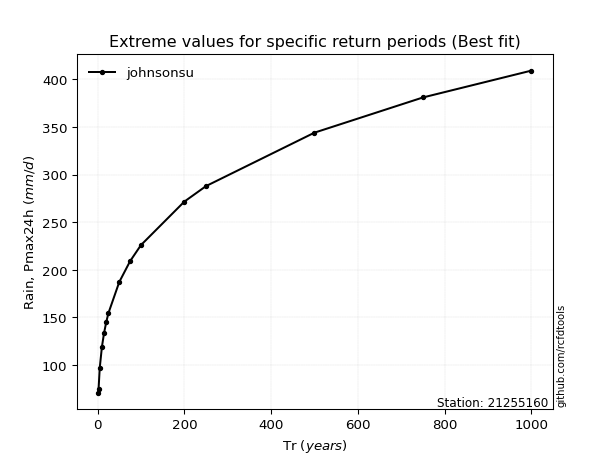</img>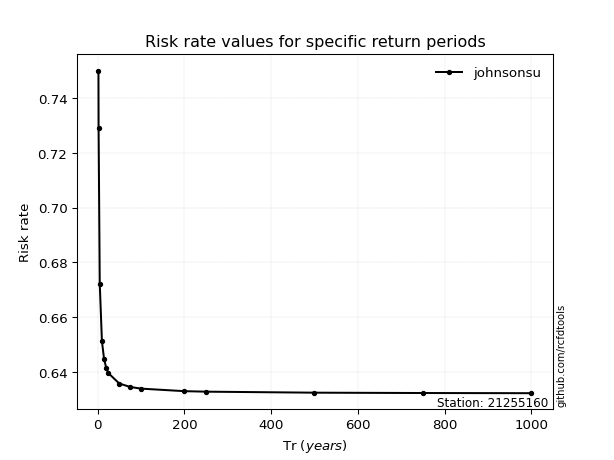</img>

</div>


<sub>**APP DISCLAIMER**: NO WARRANTY - This software is provided by [github.com/rcfdtools](https://github.com/rcfdtools) "as is", without any express or implied warranty, including warranties of merchantability, fitness for a particular purpose, or non-infringement. There is no guarantee that the software will be error-free or operate without interruption. LIMITATION OF LIABILITY - Neither the authors nor copyright holders will be liable for claims or damages arising from the software or its use. You are responsible for determining if the software is appropriate for your use and assume all associated risks, including errors, legal compliance, and data loss. NO PROFESSIONAL ADVICE - The software provides general information and does not offer professional advice. It should not replace consultation with professional advisors.</sub>