<div align="center">


</div>

# Station (rain, Pmax24h): 21255170

Probable Maximum Precipitation (PMP) is the greatest amount of rainfall for a specific duration that is meteorologically possible for a given location, acting as a "worst-case" scenario for extreme storms, crucial for designing safety-critical infrastructure like bridges, river deviations, dams, spillways, and nuclear plants to prevent catastrophic failure. PMP is calculated by hydrologists using meteorological data to determine the upper limit of extreme rainfall, often leading to the Probable Maximum Flood (PMF) for flood control design, and is increasingly being studied for climate change impacts.

<div align="center">

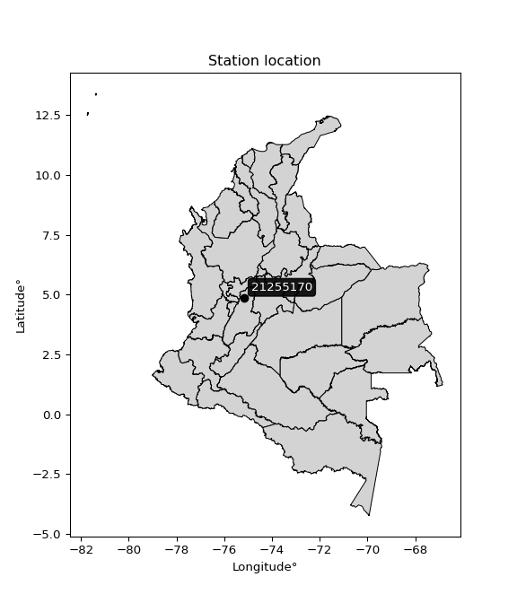</img>

</div>


## A. General information


### 1. General running parameters

• app_version: _v20251225_. • runtime: _2025-12-26 14:29:50.888910_. • Python version: _3.14.0_. • SciPy version: _1.16.3_. • Pandas version: _2.3.3_. • NumPy version: _2.3.5_. • Stations dataset (station_dataset_file): _dataset/pmax24h_in/automatic_colombia.csv_. • Stations catalog (station_catalog_file): _dataset/CNE_IDEAM.xls_. • Plot only fit distributions with Δo > Δ (plot_only_fit): _True_. • Eval low extreme values, if False, evaluates high extreme values (low_extreme): _False_. • Eval every SciPy distribution as logarithmic (pdist_logarithmic_on): _True_. • Standard deviation normalized (ddof): _1.0_. • Return periods to eval in years (Tr): _[2, 2.33, 5, 10, 15, 20, 25, 50, 75, 100, 200, 250, 500, 750, 1000]_. • Minimum data sample per station, 0 means any (minimum_sample): _5_. • Z-Score threshold to adjust a value, 0 means disable (zscore): _3.5_. • Avoid zeros, e.g. rain = 0 (avoid_zeros): _True_. • Avoid null values (avoid_nans): _True_. [:file_folder:Dataset file.](../../dataset/pmax24h_in/automatic_colombia.csv)


### 2. Station info and location

|   id |   CODIGO | NOMBRE                   | CATEGORIA               | TECNOLOGIA                | ESTADO   | FECHA_INSTALACION   |   FECHA_SUSPENSION |   ALTITUD |   LATITUD |   LONGITUD | DEPARTAMENTO   | MUNICIPIO   | AREA_OPERATIVA             | ENTIDAD                                                     | AREA_HIDROGRAFICA   | ZONA_HIDROGRAFICA   | SUBZONA_HIDROGRAFICA                        |   CORRIENTE | OBSERVACION                                                                                                                                                                                                                                                                                                                                                                                                                                                                                                                                                                                                                                              | SUBRED                                                                                                                | Catalogo   |
|-----:|---------:|:-------------------------|:------------------------|:--------------------------|:---------|:--------------------|-------------------:|----------:|----------:|-----------:|:---------------|:------------|:---------------------------|:------------------------------------------------------------|:--------------------|:--------------------|:--------------------------------------------|------------:|:---------------------------------------------------------------------------------------------------------------------------------------------------------------------------------------------------------------------------------------------------------------------------------------------------------------------------------------------------------------------------------------------------------------------------------------------------------------------------------------------------------------------------------------------------------------------------------------------------------------------------------------------------------|:----------------------------------------------------------------------------------------------------------------------|:-----------|
|    0 | 21255170 | MURILLO - AUT [21255170] | Climatológica Principal | Automática con Telemetría | Activa   | 21/10/2005          |                nan |      2978 |   4.87056 |   -75.1733 | Tolima         | Murillo     | Area Operativa 10 - Tolima | INSTITUTO DE HIDROLOGIA METEOROLOGIA Y ESTUDIOS AMBIENTALES | Magdalena Cauca     | Alto Magdalena      | Río Lagunilla y Otros Directos al Magdalena |         nan | 31/01/2022$Migracion$Por solicitud del Coordinador del AO10 REQ 2022-000037, se ajustan coordenadas. Altura. Según información enviada por la Coordinación.|22/08/2022$Migracion$Se Cambia Estado por orden de la Coordinación de Planeacion Operativa Decisión tomada en la Reunión de la RED 19/08/2022|17/10/2024$mvelez$SE ACTIVÓ LA ESTACION EL (20/06/2024) POR INSTALACIÓN DE SIM CARD Y CONFIGURACION GPRS EN MODEN  EXTERNO. Se recibe solicitud mediante correo electrónico Ing. Manuel Padilla|30/12/2024$mvelez$Se realiza el cambio de elevación y coordenadas a solicitud del coordinador mediante memorando 20243170190253 del 10/10/2024 | Radición Global,RED ALERTAS - AREA OPERATIVA 10,Radiación Visible,Alto Magdalena Huila -Tolima,Radiación Ultravioleta | CNE_IDEAM  |

<div align="center">

Map location in: [:earth_americas:Google](http://maps.google.com/maps?q=4.870555556,-75.173277778) [:earth_americas:OSM](https://www.openstreetmap.org/#map=18/4.870555556/-75.173277778&layers=P) [:earth_americas:Bing](https://www.bing.com/maps?cp=4.870555556~-75.173277778&lvl=18) [:earth_americas:Apple](https://maps.apple.com/frame?center=4.870555556%2C-75.173277778&span=0.003%2C0.006)

</div>


<div align="center">

```geojson
{
  "type": "Feature",
  "geometry": {
    "type": "Point", 
    "coordinates": [-75.173277778, 4.870555556]
  }, 
  "properties": {
    "Name": "21255170"
  }
}
```

</div>


### 3. Discrete values table and plot

|               |           0 |           1 |          2 |           3 |           4 |             5 |           6 |            7 |          8 |           9 |         10 |          11 |          12 |          13 |          14 |          15 |          16 |          17 |
|:--------------|------------:|------------:|-----------:|------------:|------------:|--------------:|------------:|-------------:|-----------:|------------:|-----------:|------------:|------------:|------------:|------------:|------------:|------------:|------------:|
| Date          | 2005        | 2006        | 2007       | 2008        | 2009        | 2010          | 2011        | 2012         | 2013       | 2014        | 2015       | 2016        | 2017        | 2018        | 2019        | 2020        | 2024        | 2025        |
| Value         |   33.4      |   37.8      |   29.4     |   26.8      |   92.5      |   51.7        |   65.6      |   49.4       |   51.6389  |   56.6      |   14.1     |   26.7      |   67.5      |   28.8      |   45.6      |   16.6      |   26.4      |   30.6      |
| Value_initial |   33.4      |   37.8      |   29.4     |   26.8      |   92.5      |   51.7        |   65.6      |   49.4       |  230       |   56.6      |   14.1     |   26.7      |   67.5      |   28.8      |   45.6      |   16.6      |   26.4      |   30.6      |
| count         |   18        |   18        |   18       |   18        |   18        |   18          |   18        |   18         |   18       |   18        |   18       |   18        |   18        |   18        |   18        |   18        |   18        |   18        |
| mean          |   51.6389   |   51.6389   |   51.6389  |   51.6389   |   51.6389   |   51.6389     |   51.6389   |   51.6389    |   51.6389  |   51.6389   |   51.6389  |   51.6389   |   51.6389   |   51.6389   |   51.6389   |   51.6389   |   51.6389   |   51.6389   |
| std           |   48.8038   |   48.8038   |   48.8038  |   48.8038   |   48.8038   |   48.8038     |   48.8038   |   48.8038    |   48.8038  |   48.8038   |   48.8038  |   48.8038   |   48.8038   |   48.8038   |   48.8038   |   48.8038   |   48.8038   |   48.8038   |
| zscore        |   -0.373719 |   -0.283562 |   -0.45568 |   -0.508955 |    0.837254 |    0.00125218 |    0.286066 |   -0.0458753 |    3.65466 |    0.101654 |   -0.76918 |   -0.511004 |    0.324998 |   -0.467974 |   -0.123738 |   -0.717955 |   -0.517151 |   -0.431092 |

<div align="center">

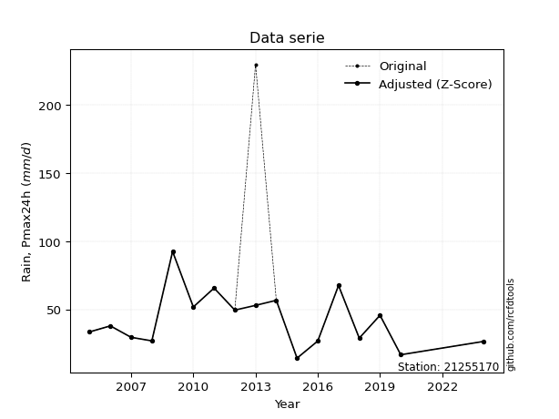</img>

</div>

> If Z-Score is active, values out of range or outliers are replaced with the station mean value.


### 4. Active continuous probability distributions from SciPy (45 of 104 available)

[scipy.stats](https://docs.scipy.org/doc/scipy/reference/stats.html) is a Python´s powerful submodule within the SciPy library for comprehensive statistical analysis, offering over 130 probability distributions (like Normal, Poisson), functions for descriptive stats (mean, variance), hypothesis testing (t-tests, chi-square), random variable generation, and statistical tests, making it essential for data science, modeling, and research. It provides tools to explore, model, and draw conclusions from data efficiently, working seamlessly with NumPy.

<div align="center">

|   id | p_dist             |   n_parameter | fit_method   | label                                                                       | active   | ref                                                                                                        |
|-----:|:-------------------|--------------:|:-------------|:----------------------------------------------------------------------------|:---------|:-----------------------------------------------------------------------------------------------------------|
|    0 | alpha              |             3 | MLE          | Alpha                                                                       | True     | [:mortar_board:](https://docs.scipy.org/doc/scipy/reference/generated/scipy.stats.alpha.html)              |
|    1 | betaprime          |             4 | MLE          | Beta prime                                                                  | True     | [:mortar_board:](https://docs.scipy.org/doc/scipy/reference/generated/scipy.stats.betaprime.html)          |
|    2 | chi2               |             3 | MLE          | Chi²                                                                        | True     | [:mortar_board:](https://docs.scipy.org/doc/scipy/reference/generated/scipy.stats.chi2.html)               |
|    3 | crystalball        |             4 | MLE          | Crystalball                                                                 | True     | [:mortar_board:](https://docs.scipy.org/doc/scipy/reference/generated/scipy.stats.crystalball.html)        |
|    4 | erlang             |             3 | MLE          | Erlang                                                                      | True     | [:mortar_board:](https://docs.scipy.org/doc/scipy/reference/generated/scipy.stats.erlang.html)             |
|    5 | expon              |             2 | MLE          | Exponential                                                                 | True     | [:mortar_board:](https://docs.scipy.org/doc/scipy/reference/generated/scipy.stats.expon.html)              |
|    6 | exponnorm          |             3 | MLE          | Exponentially modified Normal                                               | True     | [:mortar_board:](https://docs.scipy.org/doc/scipy/reference/generated/scipy.stats.exponnorm.html)          |
|    7 | f                  |             4 | MLE          | F                                                                           | True     | [:mortar_board:](https://docs.scipy.org/doc/scipy/reference/generated/scipy.stats.f.html)                  |
|    8 | fatiguelife        |             3 | MLE          | Fatigue-life (Birnbaum-Saunders)                                            | True     | [:mortar_board:](https://docs.scipy.org/doc/scipy/reference/generated/scipy.stats.fatiguelife.html)        |
|    9 | fisk               |             3 | MLE          | Fisk                                                                        | True     | [:mortar_board:](https://docs.scipy.org/doc/scipy/reference/generated/scipy.stats.fisk.html)               |
|   10 | gamma              |             3 | MLE          | Gamma                                                                       | True     | [:mortar_board:](https://docs.scipy.org/doc/scipy/reference/generated/scipy.stats.gamma.html)              |
|   11 | genexpon           |             5 | MLE          | Generalized exponential                                                     | True     | [:mortar_board:](https://docs.scipy.org/doc/scipy/reference/generated/scipy.stats.genexpon.html)           |
|   12 | genlogistic        |             3 | MLE          | Generalized logistic                                                        | True     | [:mortar_board:](https://docs.scipy.org/doc/scipy/reference/generated/scipy.stats.genlogistic.html)        |
|   13 | gibrat             |             2 | MM           | Gibrat                                                                      | True     | [:mortar_board:](https://docs.scipy.org/doc/scipy/reference/generated/scipy.stats.gibrat.html)             |
|   14 | gompertz           |             3 | MLE          | Gompertz (or truncated Gumbel)                                              | True     | [:mortar_board:](https://docs.scipy.org/doc/scipy/reference/generated/scipy.stats.gompertz.html)           |
|   15 | gumbel_l           |             2 | MM           | Gumbel Left Skew                                                            | True     | [:mortar_board:](https://docs.scipy.org/doc/scipy/reference/generated/scipy.stats.gumbel_l.html)           |
|   16 | gumbel_r           |             2 | MM           | Gumbel Right Skew                                                           | True     | [:mortar_board:](https://docs.scipy.org/doc/scipy/reference/generated/scipy.stats.gumbel_r.html)           |
|   17 | halflogistic       |             2 | MM           | Half-logistic                                                               | True     | [:mortar_board:](https://docs.scipy.org/doc/scipy/reference/generated/scipy.stats.halflogistic.html)       |
|   18 | halfnorm           |             2 | MM           | Half Normal                                                                 | True     | [:mortar_board:](https://docs.scipy.org/doc/scipy/reference/generated/scipy.stats.halfnorm.html)           |
|   19 | hypsecant          |             2 | MM           | hyperbolic secant                                                           | True     | [:mortar_board:](https://docs.scipy.org/doc/scipy/reference/generated/scipy.stats.hypsecant.html)          |
|   20 | invgamma           |             3 | MLE          | Inverted gamma                                                              | True     | [:mortar_board:](https://docs.scipy.org/doc/scipy/reference/generated/scipy.stats.invgamma.html)           |
|   21 | invgauss           |             3 | MLE          | Inverse Gaussian                                                            | True     | [:mortar_board:](https://docs.scipy.org/doc/scipy/reference/generated/scipy.stats.invgauss.html)           |
|   22 | invweibull         |             3 | MLE          | Inverted Weibull                                                            | True     | [:mortar_board:](https://docs.scipy.org/doc/scipy/reference/generated/scipy.stats.invweibull.html)         |
|   23 | johnsonsu          |             4 | MLE          | Johnson Su                                                                  | True     | [:mortar_board:](https://docs.scipy.org/doc/scipy/reference/generated/scipy.stats.johnsonsu.html)          |
|   24 | kstwobign          |             2 | MLE          | Limiting distribution of scaled Kolmogorov-Smirnov two-sided test statistic | True     | [:mortar_board:](https://docs.scipy.org/doc/scipy/reference/generated/scipy.stats.kstwobign.html)          |
|   25 | laplace            |             2 | MM           | Laplace                                                                     | True     | [:mortar_board:](https://docs.scipy.org/doc/scipy/reference/generated/scipy.stats.laplace.html)            |
|   26 | laplace_asymmetric |             3 | MLE          | Asymmetric Laplace                                                          | True     | [:mortar_board:](https://docs.scipy.org/doc/scipy/reference/generated/scipy.stats.laplace_asymmetric.html) |
|   27 | loggamma           |             3 | MLE          | Log gamma                                                                   | True     | [:mortar_board:](https://docs.scipy.org/doc/scipy/reference/generated/scipy.stats.loggamma.html)           |
|   28 | logistic           |             2 | MM           | Logistic (or Sech-squared)                                                  | True     | [:mortar_board:](https://docs.scipy.org/doc/scipy/reference/generated/scipy.stats.logistic.html)           |
|   29 | lognorm            |             3 | MLE          | Log Normal                                                                  | True     | [:mortar_board:](https://docs.scipy.org/doc/scipy/reference/generated/scipy.stats.lognorm.html)            |
|   30 | maxwell            |             2 | MM           | Maxwell                                                                     | True     | [:mortar_board:](https://docs.scipy.org/doc/scipy/reference/generated/scipy.stats.maxwell.html)            |
|   31 | mielke             |             4 | MLE          | Mielke Beta-Kappa / Dagum                                                   | True     | [:mortar_board:](https://docs.scipy.org/doc/scipy/reference/generated/scipy.stats.mielke.html)             |
|   32 | moyal              |             2 | MM           | Moyal                                                                       | True     | [:mortar_board:](https://docs.scipy.org/doc/scipy/reference/generated/scipy.stats.moyal.html)              |
|   33 | nakagami           |             3 | MLE          | Nakagami                                                                    | True     | [:mortar_board:](https://docs.scipy.org/doc/scipy/reference/generated/scipy.stats.nakagami.html)           |
|   34 | ncf                |             5 | MLE          | Non-central F distribution                                                  | True     | [:mortar_board:](https://docs.scipy.org/doc/scipy/reference/generated/scipy.stats.ncf.html)                |
|   35 | nct                |             4 | MLE          | Non-central Student’s t                                                     | True     | [:mortar_board:](https://docs.scipy.org/doc/scipy/reference/generated/scipy.stats.nct.html)                |
|   36 | norm               |             2 | MM           | Normal                                                                      | True     | [:mortar_board:](https://docs.scipy.org/doc/scipy/reference/generated/scipy.stats.norm.html)               |
|   37 | pareto             |             3 | MLE          | Pareto                                                                      | True     | [:mortar_board:](https://docs.scipy.org/doc/scipy/reference/generated/scipy.stats.pareto.html)             |
|   38 | pearson3           |             3 | MM           | Pearson type III                                                            | True     | [:mortar_board:](https://docs.scipy.org/doc/scipy/reference/generated/scipy.stats.pearson3.html)           |
|   39 | rayleigh           |             2 | MM           | Rayleigh                                                                    | True     | [:mortar_board:](https://docs.scipy.org/doc/scipy/reference/generated/scipy.stats.rayleigh.html)           |
|   40 | rice               |             3 | MLE          | Rice                                                                        | True     | [:mortar_board:](https://docs.scipy.org/doc/scipy/reference/generated/scipy.stats.rice.html)               |
|   41 | t                  |             3 | MLE          | Student’s t                                                                 | True     | [:mortar_board:](https://docs.scipy.org/doc/scipy/reference/generated/scipy.stats.t.html)                  |
|   42 | truncnorm          |             4 | MLE          | Truncated normal                                                            | True     | [:mortar_board:](https://docs.scipy.org/doc/scipy/reference/generated/scipy.stats.truncnorm.html)          |
|   43 | wald               |             2 | MM           | Wald                                                                        | True     | [:mortar_board:](https://docs.scipy.org/doc/scipy/reference/generated/scipy.stats.wald.html)               |
|   44 | weibull_min        |             3 | MLE          | Weibull minimum                                                             | True     | [:mortar_board:](https://docs.scipy.org/doc/scipy/reference/generated/scipy.stats.weibull_min.html)        |

</div>

> **n_parameter:** # arguments & localization & scale.
>
> **Fit methods:** (MLE) maximum likelihood, (MM) L-moments.
>
>**Inactive:** foldnorm, gennorm, norminvgauss, powernorm, powerlognorm, skewnorm, genextreme, anglit, arcsine, argus, beta, bradford, burr, burr12, cauchy, cosine, halfcauchy, foldcauchy, skewcauchy, wrapcauchy, dgamma, gengamma, exponweib, exponpow, truncexpon, gausshyper, genhalflogistic, genhyperbolic, geninvgauss, halfgennorm, johnsonsb, kappa4, kappa3, ksone, kstwo, loglaplace, levy, levy_l, levy_stable, ncx2, genpareto, truncpareto, lomax, powerlaw, rdist, rel_breitwigner, recipinvgauss, semicircular, studentized_range, trapezoid, triang, truncweibull_min, tukeylambda, uniform, loguniform, vonmises, vonmises_line, weibull_max, dweibull, 


## B. Probability distributions vs. Empirical distributions

A continuous probability distribution (CPD) describes probabilities for variables that can take any value within a range (like rain any time), unlike discrete variables with specific outcomes (like temperature). It uses a Probability Density Function (PDF), a curve where the total area under it equals 1, and the probability of the variable falling within an interval (a to b) is found by calculating the area under the curve between those points. A key feature is that the probability of hitting any single exact value is zero, so probabilities are always expressed for ranges, e.g., $P(a ≤ X ≤ b)$.

<div align="center">

Distributions parameters
|    |   station | p_dist                |   n |              loc |           scale | shape                  | shape1              | shape2                | shape3   |
|---:|----------:|:----------------------|----:|-----------------:|----------------:|:-----------------------|:--------------------|:----------------------|:---------|
|  0 |  21255170 | alpha                 |  18 |    -50.5245      |   452.381       | 5.110099670218341      |                     |                       |          |
|  1 |  21255170 | betaprime             |  18 |     -0.97129     |   104.332       | 6.807031083325018      | 17.646360542826798  |                       |          |
|  2 |  21255170 | chi2                  |  18 |     10.3935      |     6.87911     | 4.555306863080366      |                     |                       |          |
|  3 |  21255170 | crystalball           |  18 |     41.7299      |    19.594       | 2516.344759222483      | 3472.917948746013   |                       |          |
|  4 |  21255170 | erlang                |  18 |     10.3935      |    13.7582      | 2.2776653357143335     |                     |                       |          |
|  5 |  21255170 | expon                 |  18 |     14.1         |    27.6299      |                        |                     |                       |          |
|  6 |  21255170 | exponnorm             |  18 |     20.7978      |     6.68579     | 3.1308404544228807     |                     |                       |          |
|  7 |  21255170 | f                     |  18 |     10.4418      |    31.292       | 4.53225844556729       | 34022.63426404823   |                       |          |
|  8 |  21255170 | fatiguelife           |  18 |     -2.14689     |    39.6976      | 0.4586187420065293     |                     |                       |          |
|  9 |  21255170 | fisk                  |  18 |      2.40467     |    35.0481      | 3.3272562091848616     |                     |                       |          |
| 10 |  21255170 | gamma                 |  18 |     10.3936      |    13.7583      | 2.277634304863794      |                     |                       |          |
| 11 |  21255170 | genexpon              |  18 |     14.1         |     2.52657     | 0.062084726309155236   | 0.03390349263461869 | 0.6691401739519351    |          |
| 12 |  21255170 | genlogistic           |  18 |    -66.6221      |    15.1179      | 715.5801099548273      |                     |                       |          |
| 13 |  21255170 | gibrat                |  18 |     26.7822      |     9.06627     |                        |                     |                       |          |
| 14 |  21255170 | gompertz              |  18 |     14.1         |    47.2242      | 1.0185144619076736     |                     |                       |          |
| 15 |  21255170 | gumbel_l              |  18 |     50.5483      |    15.2774      |                        |                     |                       |          |
| 16 |  21255170 | gumbel_r              |  18 |     32.9116      |    15.2774      |                        |                     |                       |          |
| 17 |  21255170 | halflogistic          |  18 |     18.5065      |    16.7522      |                        |                     |                       |          |
| 18 |  21255170 | halfnorm              |  18 |     15.7951      |    32.5045      |                        |                     |                       |          |
| 19 |  21255170 | hypsecant             |  18 |     41.7299      |    12.4739      |                        |                     |                       |          |
| 20 |  21255170 | invgamma              |  18 |    -17.2686      |   536.413       | 10.075314390460882     |                     |                       |          |
| 21 |  21255170 | invgauss              |  18 |     -3.54095     |   222.151       | 0.2037846225586294     |                     |                       |          |
| 22 |  21255170 | invweibull            |  18 |   -277.855       |   310.238       | 20.89671419362314      |                     |                       |          |
| 23 |  21255170 | johnsonsu             |  18 |     -2.64434     |     2.17828     | -8.179961998211645     | 2.2647145758883145  |                       |          |
| 24 |  21255170 | kstwobign             |  18 |    -21.2605      |    72.4582      |                        |                     |                       |          |
| 25 |  21255170 | laplace               |  18 |     41.7299      |    13.855       |                        |                     |                       |          |
| 26 |  21255170 | laplace_asymmetric    |  18 |     26.7         |    11.0478      | 0.5289807394577833     |                     |                       |          |
| 27 |  21255170 | loggamma              |  18 |  -5221.01        |   732.364       | 1321.2681364755426     |                     |                       |          |
| 28 |  21255170 | logistic              |  18 |     41.7299      |    10.8027      |                        |                     |                       |          |
| 29 |  21255170 | lognorm               |  18 |     -2.65471     |    40.3202      | 0.44301261364959577    |                     |                       |          |
| 30 |  21255170 | maxwell               |  18 |     -4.69961     |    29.0954      |                        |                     |                       |          |
| 31 |  21255170 | mielke                |  18 |     -0.00735528  |    37.9871      | 3.5290271554930897     | 3.6099235811846704  |                       |          |
| 32 |  21255170 | moyal                 |  18 |     30.5248      |     8.8204      |                        |                     |                       |          |
| 33 |  21255170 | nakagami              |  18 |     14.1         |    32.9333      | 0.295257179520878      |                     |                       |          |
| 34 |  21255170 | ncf                   |  18 |     -0.120946    |    40.0051      | 11.837728601206074     | 44.23386890434767   | 0.010424499791283695  |          |
| 35 |  21255170 | nct                   |  18 |     -0.693202    |     0.132936    | 2.5669714580096077     | 230.61472638600407  |                       |          |
| 36 |  21255170 | norm                  |  18 |     41.7299      |    19.594       |                        |                     |                       |          |
| 37 |  21255170 | pareto                |  18 |     14.1         |     3.46999e-07 | 0.05882355365713326    |                     |                       |          |
| 38 |  21255170 | pearson3              |  18 |     41.7299      |    19.594       | 0.8418823213896309     |                     |                       |          |
| 39 |  21255170 | rayleigh              |  18 |      4.24548     |    29.9083      |                        |                     |                       |          |
| 40 |  21255170 | rice                  |  18 |      7.61328     |    27.8197      | 0.0009541345714687024  |                     |                       |          |
| 41 |  21255170 | t                     |  18 |     41.729       |    19.5929      | 19080.47186848543      |                     |                       |          |
| 42 |  21255170 | truncnorm             |  18 |     41.7299      |    19.594       | -128.0012596771134     | 943.7263766343151   |                       |          |
| 43 |  21255170 | wald                  |  18 |     22.1359      |    19.594       |                        |                     |                       |          |
| 44 |  21255170 | weibull_min           |  18 |     12.64        |    31.9958      | 1.4604966070990413     |                     |                       |          |
| 45 |  21255170 | logalpha              |  18 |     -7.48754     |   252.617       | 22.79594408050869      |                     |                       |          |
| 46 |  21255170 | logbetaprime          |  18 |     -6.86107     |    26.3001      | 652.6914632520245      | 1638.7128912016997  |                       |          |
| 47 |  21255170 | logchi2               |  18 |      2.64617     |     0.975751    | 1.0896860295999242     |                     |                       |          |
| 48 |  21255170 | logcrystalball        |  18 |      3.62076     |     0.478331    | 164.68846541086538     | 11.432773907209373  |                       |          |
| 49 |  21255170 | logerlang             |  18 |     -6.74389     |     0.0224759   | 461.0928623920093      |                     |                       |          |
| 50 |  21255170 | logexpon              |  18 |      2.64617     |     0.974589    |                        |                     |                       |          |
| 51 |  21255170 | logexponnorm          |  18 |      3.62031     |     0.478332    | 0.0009410456018388101  |                     |                       |          |
| 52 |  21255170 | logf                  |  18 |   -127.898       |   131.517       | 379099.58369011444     | 252438.80667628878  |                       |          |
| 53 |  21255170 | logfatiguelife        |  18 |   -111.679       |   115.299       | 0.004143173195487961   |                     |                       |          |
| 54 |  21255170 | logfisk               |  18 | -63893.6         | 63897.2         | 228823.46606339957     |                     |                       |          |
| 55 |  21255170 | loggamma              |  18 |     -7.52065     |     0.0208773   | 533.6605891964732      |                     |                       |          |
| 56 |  21255170 | loggenexpon           |  18 |      2.64499     |     0.0100397   | 0.0021013036113836257  | 4.510190810148524   | 3.001859268588138e-05 |          |
| 57 |  21255170 | loggenlogistic        |  18 |      3.63723     |     0.277027    | 0.977170096629578      |                     |                       |          |
| 58 |  21255170 | loggibrat             |  18 |      3.25591     |     0.221301    |                        |                     |                       |          |
| 59 |  21255170 | loggompertz           |  18 |      2.64617     |     0.549131    | 0.13541782324563317    |                     |                       |          |
| 60 |  21255170 | loggumbel_l           |  18 |      3.83604     |     0.372952    |                        |                     |                       |          |
| 61 |  21255170 | loggumbel_r           |  18 |      3.40549     |     0.372952    |                        |                     |                       |          |
| 62 |  21255170 | loghalflogistic       |  18 |      3.05383     |     0.408956    |                        |                     |                       |          |
| 63 |  21255170 | loghalfnorm           |  18 |      2.9876      |     0.793547    |                        |                     |                       |          |
| 64 |  21255170 | loghypsecant          |  18 |      3.62076     |     0.304514    |                        |                     |                       |          |
| 65 |  21255170 | loginvgamma           |  18 |     -5.30431     |  3018.84        | 339.36831428207404     |                     |                       |          |
| 66 |  21255170 | loginvgauss           |  18 |     -0.54605     |   293.507       | 0.014193052485039347   |                     |                       |          |
| 67 |  21255170 | loginvweibull         |  18 |     -1.22241e+08 |     1.22241e+08 | 257835095.6045322      |                     |                       |          |
| 68 |  21255170 | logjohnsonsu          |  18 |     -8.02005e+06 |     4.64854e+07 | -16954369.05229512     | 98753526.26090688   |                       |          |
| 69 |  21255170 | logkstwobign          |  18 |      1.66706     |     2.24018     |                        |                     |                       |          |
| 70 |  21255170 | loglaplace            |  18 |      3.62076     |     0.33823     |                        |                     |                       |          |
| 71 |  21255170 | loglaplace_asymmetric |  18 |      3.381       |     0.362758    | 0.7240900086022456     |                     |                       |          |
| 72 |  21255170 | logloggamma           |  18 |     -2.71964     |     2.12659     | 20.215038270653345     |                     |                       |          |
| 73 |  21255170 | loglogistic           |  18 |      3.62076     |     0.263717    |                        |                     |                       |          |
| 74 |  21255170 | loglognorm            |  18 | -32765.4         | 32769           | 1.4597059034633406e-05 |                     |                       |          |
| 75 |  21255170 | logmaxwell            |  18 |      2.48732     |     0.710279    |                        |                     |                       |          |
| 76 |  21255170 | logmielke             |  18 |      2.5875      |     1.70761     | 1.3938725937993142     | 13.268220438596334  |                       |          |
| 77 |  21255170 | logmoyal              |  18 |      3.34722     |     0.215324    |                        |                     |                       |          |
| 78 |  21255170 | lognakagami           |  18 |    -93.5741      |    97.1971      | 10320.3593208194       |                     |                       |          |
| 79 |  21255170 | logncf                |  18 |     -3.6462      |     7.25314     | 532.5157589935694      | 680.3162605928696   | 0.0005514468972566411 |          |
| 80 |  21255170 | lognct                |  18 |    -18.6556      |     0.461888    | 15906.661740263004     | 48.2268168969633    |                       |          |
| 81 |  21255170 | lognorm               |  18 |      3.62076     |     0.47833     |                        |                     |                       |          |
| 82 |  21255170 | logpareto             |  18 |     -6.71089e+07 |     6.71089e+07 | 68858609.28157616      |                     |                       |          |
| 83 |  21255170 | logpearson3           |  18 |      3.62076     |     0.478328    | -0.16136621396451306   |                     |                       |          |
| 84 |  21255170 | lograyleigh           |  18 |      2.70566     |     0.730145    |                        |                     |                       |          |
| 85 |  21255170 | logrice               |  18 |      2.41717     |     0.518642    | 2.0581661367310122     |                     |                       |          |
| 86 |  21255170 | logt                  |  18 |      3.62077     |     0.478331    | 219449375.91314173     |                     |                       |          |
| 87 |  21255170 | logtruncnorm          |  18 |     -0.397984    |     1.36064     | 2.6982582628828795     | 3.619773071228085   |                       |          |
| 88 |  21255170 | logwald               |  18 |      3.14248     |     0.478289    |                        |                     |                       |          |
| 89 |  21255170 | logweibull_min        |  18 |      1.93072     |     1.86601     | 4.027940159614555      |                     |                       |          |

</div>

> **loc** (Location parameter): This shifts the distribution along the x-axis. For many common distributions, like the normal (Gaussian) distribution, loc represents the mean $μ$. For others, like the uniform distribution, it might represent the minimum value, or for the beta distribution, the left end of the support interval.
>
> **scale** (Scale parameter): This determines the width or spread of the distribution. For the normal distribution, scale represents the standard deviation $σ$. For a uniform distribution, it defines the length of the interval (from $loc$ to $loc + scale$).
>
> **shape** (Shape parameters): Refers to parameters that define the specific form of a probability distribution, distinct from its location (loc) and scale (scale). These parameters are required arguments for most distribution functions. For example, a normal (Gaussian) distribution is fully defined by its location (mean) and scale (standard deviation), so it has no specific shape parameters beyond loc and scale. However, other distributions have intrinsic properties that need specification, as Gamma distribution that takes a shape parameter, often named $a$ or $alpha$.


### 0. Cumulative distribution values - CDF (90 evaluated)

> Ordered by x ascending and calculating $log(f(x))$ separately. 

|   id |   Station |   date |       x |   count |    mean |     std |      zscore |   Value_initial |   station |   m |     alpha |   alpha_pdf |   betaprime |   betaprime_pdf |      chi2 |   chi2_pdf |   crystalball |   crystalball_pdf |    erlang |   erlang_pdf |     expon |   expon_pdf |   exponnorm |   exponnorm_pdf |         f |      f_pdf |   fatiguelife |   fatiguelife_pdf |      fisk |   fisk_pdf |     gamma |   gamma_pdf |    genexpon |   genexpon_pdf |   genlogistic |   genlogistic_pdf |      gibrat |   gibrat_pdf |    gompertz |   gompertz_pdf |   gumbel_l |   gumbel_l_pdf |   gumbel_r |   gumbel_r_pdf |   halflogistic |   halflogistic_pdf |   halfnorm |   halfnorm_pdf |   hypsecant |   hypsecant_pdf |   invgamma |   invgamma_pdf |   invgauss |   invgauss_pdf |   invweibull |   invweibull_pdf |   johnsonsu |   johnsonsu_pdf |   kstwobign |   kstwobign_pdf |   laplace |   laplace_pdf |   laplace_asymmetric |   laplace_asymmetric_pdf |   loggamma |   loggamma_pdf |   logistic |   logistic_pdf |   lognorm |   lognorm_pdf |   maxwell |   maxwell_pdf |    mielke |   mielke_pdf |     moyal |   moyal_pdf |    nakagami |   nakagami_pdf |       ncf |    ncf_pdf |        nct |    nct_pdf |      norm |    norm_pdf |   pareto |       pareto_pdf |   pearson3 |   pearson3_pdf |   rayleigh |   rayleigh_pdf |      rice |   rice_pdf |         t |       t_pdf |   truncnorm |   truncnorm_pdf |      wald |   wald_pdf |   weibull_min |   weibull_min_pdf |   logalpha |   logalpha_pdf |   logbetaprime |   logbetaprime_pdf |     logchi2 |   logchi2_pdf |   logcrystalball |   logcrystalball_pdf |   logerlang |   logerlang_pdf |   logexpon |   logexpon_pdf |   logexponnorm |   logexponnorm_pdf |      logf |   logf_pdf |   logfatiguelife |   logfatiguelife_pdf |   logfisk |   logfisk_pdf |   loggenexpon |   loggenexpon_pdf |   loggenlogistic |   loggenlogistic_pdf |   loggibrat |   loggibrat_pdf |   loggompertz |   loggompertz_pdf |   loggumbel_l |   loggumbel_l_pdf |   loggumbel_r |   loggumbel_r_pdf |   loghalflogistic |   loghalflogistic_pdf |   loghalfnorm |   loghalfnorm_pdf |   loghypsecant |   loghypsecant_pdf |   loginvgamma |   loginvgamma_pdf |   loginvgauss |   loginvgauss_pdf |   loginvweibull |   loginvweibull_pdf |   logjohnsonsu |   logjohnsonsu_pdf |   logkstwobign |   logkstwobign_pdf |   loglaplace |   loglaplace_pdf |   loglaplace_asymmetric |   loglaplace_asymmetric_pdf |   logloggamma |   logloggamma_pdf |   loglogistic |   loglogistic_pdf |   loglognorm |   loglognorm_pdf |   logmaxwell |   logmaxwell_pdf |   logmielke |   logmielke_pdf |    logmoyal |   logmoyal_pdf |   lognakagami |   lognakagami_pdf |    logncf |   logncf_pdf |    lognct |   lognct_pdf |   logpareto |   logpareto_pdf |   logpearson3 |   logpearson3_pdf |   lograyleigh |   lograyleigh_pdf |   logrice |   logrice_pdf |      logt |   logt_pdf |   logtruncnorm |   logtruncnorm_pdf |   logwald |   logwald_pdf |   logweibull_min |   logweibull_min_pdf |
|-----:|----------:|-------:|--------:|--------:|--------:|--------:|------------:|----------------:|----------:|----:|----------:|------------:|------------:|----------------:|----------:|-----------:|--------------:|------------------:|----------:|-------------:|----------:|------------:|------------:|----------------:|----------:|-----------:|--------------:|------------------:|----------:|-----------:|----------:|------------:|------------:|---------------:|--------------:|------------------:|------------:|-------------:|------------:|---------------:|-----------:|---------------:|-----------:|---------------:|---------------:|-------------------:|-----------:|---------------:|------------:|----------------:|-----------:|---------------:|-----------:|---------------:|-------------:|-----------------:|------------:|----------------:|------------:|----------------:|----------:|--------------:|---------------------:|-------------------------:|-----------:|---------------:|-----------:|---------------:|----------:|--------------:|----------:|--------------:|----------:|-------------:|----------:|------------:|------------:|---------------:|----------:|-----------:|-----------:|-----------:|----------:|------------:|---------:|-----------------:|-----------:|---------------:|-----------:|---------------:|----------:|-----------:|----------:|------------:|------------:|----------------:|----------:|-----------:|--------------:|------------------:|-----------:|---------------:|---------------:|-------------------:|------------:|--------------:|-----------------:|---------------------:|------------:|----------------:|-----------:|---------------:|---------------:|-------------------:|----------:|-----------:|-----------------:|---------------------:|----------:|--------------:|--------------:|------------------:|-----------------:|---------------------:|------------:|----------------:|--------------:|------------------:|--------------:|------------------:|--------------:|------------------:|------------------:|----------------------:|--------------:|------------------:|---------------:|-------------------:|--------------:|------------------:|--------------:|------------------:|----------------:|--------------------:|---------------:|-------------------:|---------------:|-------------------:|-------------:|-----------------:|------------------------:|----------------------------:|--------------:|------------------:|--------------:|------------------:|-------------:|-----------------:|-------------:|-----------------:|------------:|----------------:|------------:|---------------:|--------------:|------------------:|----------:|-------------:|----------:|-------------:|------------:|----------------:|--------------:|------------------:|--------------:|------------------:|----------:|--------------:|----------:|-----------:|---------------:|-------------------:|----------:|--------------:|-----------------:|---------------------:|
|    0 |  21255170 |   2015 | 14.1    |      18 | 51.6389 | 48.8038 | -0.76918    |            14.1 |  21255170 |   1 | 0.0293752 |  0.00724274 |   0.0277254 |      0.00777238 | 0.0159756 | 0.00902591 |     0.0792517 |       0.00753358  | 0.0159754 |   0.0090258  | 0         |  0.0361926  |   0.0231336 |      0.00645356 | 0.0158536 | 0.00903947 |     0.0220347 |        0.00776882 | 0.0252891 | 0.00701268 | 0.0159755 |  0.00902597 | 3.18887e-08 |     0.0245727  |     0.032541  |        0.00735521 | 0           |  0           | 1.60059e-12 |     0.0215677  |  0.0879115 |    0.00549367  |  0.0325231 |     0.00729298 |       0        |         0          |  0         |     0          |   0.0692142 |     0.00550509  |  0.0261017 |     0.00735003 |  0.0226271 |     0.00768875 |    0.0284843 |       0.00725475 |   0.0237555 |      0.00750983 |   0.0289015 |      0.00765064 | 0.0680603 |   0.00491231  |            0.0253148 |               0.00433173 |  0.0193061 |       0.103577 |  0.0719123 |    0.00617815  | 0.0208008 |      0.104648 | 0.0633943 |    0.00929196 | 0.0295206 |   0.00718363 | 0.0111735 |  0.00459085 | 1.92154e-10 | 63877.6        | 0.0285875 | 0.00788899 | 0.00761996 | 0.00542582 | 0.0792517 | 0.00753358  | 0        | 169521           |  0.043493  |     0.00873933 |  0.0528354 |     0.0104347  | 0.026818  | 0.0081567  | 0.0792551 | 0.00753357  |   0.0792518 |     0.00753358  | 0         | 0          |     0.0109517 |        0.0108949  |  0.0164863 |       0.101024 |      0.0190841 |           0.104218 | 3.37612e-09 |   4.14208e+06 |        0.020801  |             0.104649 |   0.0193145 |        0.104037 |   0        |       1.02607  |      0.0208013 |           0.104649 | 0.0203651 |   0.103721 |        0.0203319 |             0.103657 | 0.0289558 |      0.100693 |   0.000248173 |          0.210833 |        0.0295192 |             0.101294 |  0          |       0         |   3.17858e-08 |          0.246604 |     0.0403205 |         0.105902  |   0.000471504 |        0.00968361 |          0        |              0        |      0        |          0        |      0.0259235 |          0.0850365 |     0.0167385 |          0.100105 |     0.0144232 |         0.0973119 |      0.00922952 |           0.0912109 |      0.0206616 |           0.104197 |     0.00899096 |           0.109424 |    0.0280271 |         0.082864 |               0.0209686 |                   0.0798288 |     0.0265586 |          0.111226 |     0.0242312 |         0.0896568 |    0.0207998 |         0.104647 |   0.00293092 |        0.0547997 |  0.00910852 |        0.216384 | 3.52197e-07 |    2.19788e-05 |     0.0205686 |          0.103997 | 0.0421001 |     0.17317  | 0.0206064 |     0.104382 |    0        |        1.02607  |     0.0248808 |          0.110006 |     0         |          0        | 0.0123445 |      0.113071 | 0.0208003 |   0.104646 |    0           |           0        |  0        |     0         |        0.0208196 |             0.115984 |
|    1 |  21255170 |   2020 | 16.6    |      18 | 51.6389 | 48.8038 | -0.717955   |            16.6 |  21255170 |   2 | 0.0516205 |  0.0106214  |   0.0516706 |      0.011417   | 0.0457078 | 0.0145418  |     0.099828  |       0.00894548  | 0.0457073 |   0.0145417  | 0.0865088 |  0.0330616  |   0.0441706 |      0.0105519  | 0.0456627 | 0.0145843  |     0.0470107 |        0.0122317  | 0.0471017 | 0.0105202  | 0.045708  |  0.0145419  | 0.06802     |     0.0289571  |     0.0547903 |        0.0105043  | 0           |  0           | 0.0538668   |     0.0215152  |  0.102712  |    0.0063654   |  0.0545482 |     0.0103855  |       0        |         0          |  0.0197552 |     0.0245394  |   0.0844104 |     0.00668792  |  0.0490961 |     0.0111083  |  0.0472329 |     0.0120253  |    0.0509121 |       0.0107586  |   0.0475717 |      0.0115898  |   0.0523061 |      0.011104   | 0.0815188 |   0.00588369  |            0.0388293 |               0.00664425 |  0.043595  |       0.2015   |  0.0889716 |    0.00750325  | 0.0449205 |      0.19788  | 0.0890665 |    0.0112419  | 0.0514044 |   0.0103987  | 0.0276672 |  0.00881769 | 0.169369    |     0.0399534  | 0.0527236 | 0.0114443  | 0.0310161  | 0.0136316  | 0.099828  | 0.00894548  | 0.604987 |      0.00929441  |  0.0687677 |     0.0114854  |  0.0817795 |     0.0126821  | 0.0508378 | 0.0110214  | 0.0998313 | 0.00894552  |   0.099828  |     0.00894548  | 0         | 0          |     0.0461877 |        0.0166349  |  0.0411714 |       0.210183 |      0.0436267 |           0.204104 | 0.28285     |   0.894096    |        0.0449208 |             0.197881 |   0.0437314 |        0.202652 |   0.15421  |       0.867843 |      0.0449211 |           0.197881 | 0.0443634 |   0.197417 |        0.0443232 |             0.197403 | 0.050784  |      0.17263  |   0.0512039   |          0.408058 |        0.0514037 |             0.172622 |  0          |       0         |   0.0457931   |          0.316764 |     0.0617641 |         0.160386  |   0.00712186  |        0.0944213  |          0        |              0        |      0        |          0        |      0.0442615 |          0.144883  |     0.0410275 |          0.205975 |     0.0389382 |         0.212532  |      0.0361302  |           0.253055  |      0.0447011 |           0.197372 |     0.0427669  |           0.317803 |    0.0454115 |         0.134262 |               0.0390345 |                   0.148607  |     0.0510087 |          0.194118 |     0.0440814 |         0.159786  |    0.0449194 |         0.197881 |   0.0233234  |        0.208416  |  0.0581715  |        0.365403 | 0.0004896   |    0.0148183   |     0.0445767 |          0.197191 | 0.0783987 |     0.275512 | 0.0447116 |     0.198023 |    0.15421  |        0.867843 |     0.0493579 |          0.195968 |     0.0100432 |          0.192643 | 0.0394338 |      0.224486 | 0.0449194 |   0.197876 |    0           |           0        |  0        |     0         |        0.0470019 |             0.210316 |
|    2 |  21255170 |   2024 | 26.4    |      18 | 51.6389 | 48.8038 | -0.517151   |            26.4 |  21255170 |   3 | 0.220427  |  0.0226614  |   0.225849  |      0.0226039  | 0.248474  | 0.0239309  |     0.216996  |       0.0149923   | 0.248473  |   0.0239309  | 0.359284  |  0.0231892  |   0.236951  |      0.0268493  | 0.248784  | 0.0239453  |     0.23507   |        0.0237959  | 0.220876  | 0.0238624  | 0.248475  |  0.023931   | 0.342018    |     0.0246579  |     0.218649  |        0.0219645  | 0           |  0           | 0.261427    |     0.0206687  |  0.186037  |    0.0109669   |  0.216219  |     0.0216746  |       0.231332 |         0.0282497  |  0.255772  |     0.0232746  |   0.181215  |     0.0137554   |  0.225413  |     0.0232742  |  0.233297  |     0.0237185  |    0.222624  |       0.02297    |   0.229426  |      0.0235774  |   0.220113  |      0.0217197  | 0.165365  |   0.0119354   |            0.2077    |               0.0355404  |  0.237792  |       0.655    |  0.194806  |    0.0145201   | 0.233835  |      0.640681 | 0.233178  |    0.0176963  | 0.219554  |   0.023119   | 0.206438  |  0.0257248  | 0.430099    |     0.0200012  | 0.224922  | 0.0222315  | 0.279646   | 0.0299941  | 0.216996  | 0.0149923   | 0.640328 |      0.0017201   |  0.228207  |     0.0201343  |  0.239937  |     0.0188247  | 0.203889  | 0.019325   | 0.217002  | 0.0149928   |   0.216996  |     0.0149923   | 0.0801985 | 0.049142   |     0.252923  |        0.0231214  |  0.248413  |       0.690902 |      0.240075  |           0.659596 | 0.543874    |   0.381985    |        0.233835  |             0.640681 |   0.238864  |        0.657161 |   0.474572 |       0.539128 |      0.233835  |           0.640679 | 0.233756  |   0.643083 |        0.233782  |             0.643376 | 0.21985   |      0.614223 |   0.327352    |          0.707986 |        0.21955   |             0.61032  |  0.00554686 |       0.908378  |   0.250923    |          0.578835 |     0.198441  |         0.475402  |   0.240475    |        0.918911   |          0.262147 |              1.1386   |      0.281232 |          0.942342 |      0.196905  |          0.606161  |     0.24438   |          0.682423 |     0.251195  |         0.702068  |      0.287076   |           0.755684  |      0.23353   |           0.641096 |     0.317292   |           0.750409 |    0.17902   |         0.529284 |               0.228327  |                   0.869256  |     0.227981  |          0.599735 |     0.211264  |         0.631858  |    0.233836  |         0.640689 |   0.252916   |        0.745764  |  0.280423   |        0.569898 | 0.23519     |    1.08718     |     0.233281  |          0.640538 | 0.283911  |     0.597041 | 0.234087  |     0.642192 |    0.474572 |        0.539128 |     0.229854  |          0.610889 |     0.260862  |          0.787099 | 0.243521  |      0.663604 | 0.233831  |   0.640674 |    1.00306e-06 |           2.30544  |  0.137551 |     2.22217   |        0.233236  |             0.610904 |
|    3 |  21255170 |   2016 | 26.7    |      18 | 51.6389 | 48.8038 | -0.511004   |            26.7 |  21255170 |   4 | 0.227258  |  0.0228792  |   0.232656  |      0.0227778  | 0.255661  | 0.0239769  |     0.22152   |       0.0151712   | 0.255659  |   0.0239769  | 0.366203  |  0.0229388  |   0.245037  |      0.0270536  | 0.255974  | 0.0239897  |     0.242228  |        0.023918   | 0.228073  | 0.0241109  | 0.255662  |  0.023977   | 0.349378    |     0.0244078  |     0.225272  |        0.0221861  | 0           |  0           | 0.267621    |     0.020626   |  0.189353  |    0.0111389   |  0.222754  |     0.0218956  |       0.239789 |         0.0281307  |  0.262743  |     0.0232037  |   0.185383  |     0.0140356   |  0.232424  |     0.0234609  |  0.240433  |     0.0238515  |    0.229547  |       0.0231786  |   0.236523  |      0.023736   |   0.226654  |      0.0218892  | 0.168985  |   0.0121966   |            0.21864   |               0.0374125  |  0.245253  |       0.665617 |  0.199199  |    0.0147665   | 0.241136  |      0.651586 | 0.238508  |    0.0178407  | 0.22653   |   0.0233791  | 0.214193  |  0.0259751  | 0.436064    |     0.0197646  | 0.231617  | 0.0224015  | 0.288629   | 0.0298898  | 0.22152   | 0.0151712   | 0.640837 |      0.00167676  |  0.234272  |     0.0202968  |  0.245602  |     0.0189375  | 0.209712  | 0.01949    | 0.221526  | 0.0151717   |   0.22152   |     0.0151712   | 0.0952674 | 0.0512181  |     0.259861  |        0.0231353  |  0.256277  |       0.700874 |      0.247587  |           0.670019 | 0.54816     |   0.376705    |        0.241136  |             0.651586 |   0.246349  |        0.667731 |   0.480629 |       0.532913 |      0.241137  |           0.651584 | 0.241084  |   0.654015 |        0.241114  |             0.654312 | 0.226869  |      0.62813  |   0.335361    |          0.709624 |        0.226525  |             0.624202 |  0.020644   |       1.72952   |   0.257502    |          0.58568  |     0.203877  |         0.486703  |   0.250923    |        0.930221   |          0.274965 |              1.13019  |      0.291853 |          0.937428 |      0.203858  |          0.624618  |     0.252149  |          0.692688 |     0.259182  |         0.711503  |      0.295639   |           0.759897  |      0.240836  |           0.652038 |     0.325779   |           0.751643 |    0.185102  |         0.547265 |               0.238363  |                   0.907465  |     0.23482   |          0.610749 |     0.218492  |         0.647487  |    0.241137  |         0.651594 |   0.261389   |        0.753873  |  0.286884   |        0.573577 | 0.247537    |    1.09786     |     0.240581  |          0.651454 | 0.29069   |     0.602806 | 0.241405  |     0.653085 |    0.480629 |        0.532913 |     0.236818  |          0.621835 |     0.26979   |          0.793069 | 0.251074  |      0.67325  | 0.241132  |   0.651579 |    0.0257615   |           2.25428  |  0.162805 |     2.24267   |        0.240195  |             0.620918 |
|    4 |  21255170 |   2008 | 26.8    |      18 | 51.6389 | 48.8038 | -0.508955   |            26.8 |  21255170 |   5 | 0.22955   |  0.0229491  |   0.234937  |      0.0228332  | 0.258059  | 0.0239899  |     0.22304   |       0.0152305   | 0.258058  |   0.0239899  | 0.368493  |  0.0228559  |   0.247745  |      0.027116   | 0.258374  | 0.0240023  |     0.244621  |        0.0239558  | 0.230488  | 0.0241904  | 0.25806   |  0.02399    | 0.351814    |     0.0243244  |     0.227494  |        0.0222576  | 2.30665e-10 |  8.26239e-08 | 0.269683    |     0.0206115  |  0.190469  |    0.0111966   |  0.224948  |     0.0219669  |       0.2426   |         0.0280903  |  0.265063  |     0.0231796  |   0.186792  |     0.0141298   |  0.234773  |     0.0235201  |  0.24282   |     0.0238928  |    0.231868  |       0.0232453  |   0.238899  |      0.0237859  |   0.228846  |      0.0219434  | 0.170209  |   0.012285    |            0.222373  |               0.0372338  |  0.247748  |       0.669082 |  0.20068   |    0.0148488   | 0.243578  |      0.655154 | 0.240295  |    0.017888   | 0.228872  |   0.023463   | 0.216795  |  0.0260539  | 0.438036    |     0.0196872  | 0.23386   | 0.0224558  | 0.291616   | 0.0298502  | 0.22304   | 0.0152305   | 0.641004 |      0.00166279  |  0.236305  |     0.0203493  |  0.247497  |     0.018974   | 0.211663  | 0.0195437  | 0.223047  | 0.015231    |   0.223041  |     0.0152305   | 0.100418  | 0.0517825  |     0.262175  |        0.0231384  |  0.258903  |       0.704105 |      0.250098  |           0.673416 | 0.549565    |   0.374987    |        0.243579  |             0.655154 |   0.248852  |        0.671178 |   0.482617 |       0.530873 |      0.243579  |           0.655152 | 0.243536  |   0.657591 |        0.243567  |             0.657889 | 0.229226  |      0.63272  |   0.338015    |          0.710108 |        0.228867  |             0.628787 |  0.0275293  |       1.94946   |   0.259696    |          0.587938 |     0.205703  |         0.490478  |   0.254407    |        0.933731   |          0.279185 |              1.12733  |      0.295354 |          0.935766 |      0.206205  |          0.63078   |     0.254745  |          0.696022 |     0.261847  |         0.714549  |      0.298482   |           0.761179  |      0.243281  |           0.655618 |     0.328589   |           0.751962 |    0.187159  |         0.553347 |               0.24178   |                   0.920473  |     0.23711   |          0.614373 |     0.220923  |         0.652653  |    0.24358   |         0.655162 |   0.264212   |        0.756465  |  0.28903    |        0.574786 | 0.251647    |    1.10097     |     0.243023  |          0.655026 | 0.292947  |     0.604671 | 0.243853  |     0.656648 |    0.482617 |        0.530873 |     0.23915   |          0.625432 |     0.272758  |          0.794944 | 0.253597  |      0.676392 | 0.243574  |   0.655147 |    0.0341574   |           2.23757  |  0.171191 |     2.24323   |        0.242523  |             0.624205 |
|    5 |  21255170 |   2018 | 28.8    |      18 | 51.6389 | 48.8038 | -0.467974   |            28.8 |  21255170 |   6 | 0.27665   |  0.0240595  |   0.281532  |      0.0236794  | 0.306145  | 0.0240282  |     0.254661  |       0.0163768   | 0.306143  |   0.0240282  | 0.41259   |  0.0212599  |   0.302823  |      0.0277804  | 0.306474  | 0.024031   |     0.293091  |        0.0244258  | 0.280217  | 0.0254246  | 0.306146  |  0.0240283  | 0.398807    |     0.0226758  |     0.273262  |        0.0234285  | 0.0664787   |  0.0639424   | 0.3106      |     0.0202984  |  0.214044  |    0.0123909   |  0.270137  |     0.0231429  |       0.297914 |         0.0271979  |  0.310914  |     0.0226588  |   0.216981  |     0.0160786   |  0.282792  |     0.0244035  |  0.291233  |     0.0244303  |    0.279487  |       0.0242791  |   0.287264  |      0.0244852  |   0.273654  |      0.0227909  | 0.196641  |   0.0141927   |            0.293386  |               0.0338336  |  0.298174  |       0.730324 |  0.232025  |    0.0164948   | 0.293093  |      0.719173 | 0.27695   |    0.0187363  | 0.277259  |   0.0248211  | 0.270151  |  0.0271543  | 0.475953    |     0.0182682  | 0.279688  | 0.0232944  | 0.350227   | 0.0286404  | 0.254661  | 0.0163768   | 0.644079 |      0.00142425  |  0.277937  |     0.0212292  |  0.286102  |     0.0195968  | 0.251734  | 0.020484   | 0.254669  | 0.0163775   |   0.254661  |     0.0163768   | 0.208599  | 0.0541173  |     0.308408  |        0.023049   |  0.311645  |       0.759081 |      0.300783  |           0.73309  | 0.575425    |   0.344351    |        0.293094  |             0.719173 |   0.299415  |        0.732008 |   0.519449 |       0.49308  |      0.293094  |           0.71917  | 0.293229  |   0.721648 |        0.293282  |             0.721956 | 0.277892  |      0.71862  |   0.389325    |          0.713986 |        0.277252  |             0.714827 |  0.226438   |       2.88118   |   0.303557    |          0.630564 |     0.243702  |         0.566424  |   0.32349     |        0.978909   |          0.358178 |              1.06577  |      0.36147  |          0.90043  |      0.25597   |          0.752872  |     0.306986  |          0.753393 |     0.315195  |         0.765281  |      0.353896   |           0.775378  |      0.292837  |           0.719866 |     0.38273    |           0.750052 |    0.23154   |         0.684563 |               0.317995  |                   1.21063   |     0.283777  |          0.68146  |     0.27143   |         0.749878  |    0.293095  |         0.71918  |   0.320233   |        0.797363  |  0.331219   |        0.597335 | 0.332085    |    1.12272     |     0.292531  |          0.719099 | 0.337653  |     0.636192 | 0.29347   |     0.720495 |    0.519449 |        0.49308  |     0.28658   |          0.691441 |     0.331038  |          0.821553 | 0.304326  |      0.731469 | 0.293089  |   0.719166 |    0.184128    |           1.9361   |  0.324635 |     1.95931   |        0.289655  |             0.684469 |
|    6 |  21255170 |   2007 | 29.4    |      18 | 51.6389 | 48.8038 | -0.45568    |            29.4 |  21255170 |   7 | 0.291156  |  0.0242865  |   0.295789  |      0.0238387  | 0.320544  | 0.0239652  |     0.264586  |       0.0167032   | 0.320543  |   0.0239652  | 0.425208  |  0.0208032  |   0.319495  |      0.0277753  | 0.320875  | 0.0239654  |     0.307762  |        0.0244679  | 0.295545  | 0.0256611  | 0.320545  |  0.0239652  | 0.412267    |     0.0221917  |     0.287398  |        0.0236833  | 0.107078    |  0.0704513   | 0.322749    |     0.0201957  |  0.22159   |    0.0127635   |  0.284103  |     0.023402   |       0.314144 |         0.0269014  |  0.324458  |     0.0224882  |   0.226809  |     0.0166826   |  0.297483  |     0.0245599  |  0.305912  |     0.0244906  |    0.294117  |       0.0244795  |   0.301988  |      0.0245895  |   0.287382  |      0.0229602  | 0.205344  |   0.0148208   |            0.313397  |               0.0328754  |  0.313393  |       0.745661 |  0.242069  |    0.0169838   | 0.308093  |      0.735565 | 0.288258  |    0.0189539  | 0.29224   |   0.0251063  | 0.286496  |  0.0273169  | 0.486798    |     0.0178835  | 0.293715  | 0.0234567  | 0.367268   | 0.0281551  | 0.264586  | 0.0167032   | 0.644916 |      0.00136518  |  0.290737  |     0.0214297  |  0.297906  |     0.0197437  | 0.264095  | 0.0207161  | 0.264594  | 0.016704    |   0.264586  |     0.0167032   | 0.240722  | 0.0528764  |     0.322215  |        0.0229712  |  0.327432  |       0.77204  |      0.316053  |           0.747893 | 0.582442    |   0.336346    |        0.308094  |             0.735565 |   0.314667  |        0.747197 |   0.529509 |       0.482758 |      0.308093  |           0.735562 | 0.308279  |   0.73801  |        0.308339  |             0.738317 | 0.29295   |      0.741761 |   0.40404     |          0.71325  |        0.292233  |             0.738105 |  0.284169   |       2.7103    |   0.316681    |          0.642354 |     0.255615  |         0.589191  |   0.343735    |        0.984225   |          0.379952 |              1.04612  |      0.379921 |          0.889206 |      0.271857  |          0.788114  |     0.322665  |          0.767172 |     0.331096  |         0.776833  |      0.369892   |           0.775934  |      0.307852  |           0.736319 |     0.398165   |           0.746921 |    0.246094  |         0.727593 |               0.343963  |                   1.30949   |     0.298015  |          0.699436 |     0.287165  |         0.776216  |    0.308095  |         0.735571 |   0.336764   |        0.805845  |  0.3436     |        0.603554 | 0.355185    |    1.11721     |     0.307529  |          0.735501 | 0.350848  |     0.643593 | 0.308496  |     0.736811 |    0.529509 |        0.482758 |     0.301019  |          0.708917 |     0.348025  |          0.825907 | 0.319551  |      0.745103 | 0.308088  |   0.735558 |    0.223223    |           1.85652  |  0.363818 |     1.84097   |        0.303934  |             0.700431 |
|    7 |  21255170 |   2025 | 30.6    |      18 | 51.6389 | 48.8038 | -0.431092   |            30.6 |  21255170 |   8 | 0.320505  |  0.0245979  |   0.324529  |      0.0240337  | 0.349185  | 0.0237505  |     0.285008  |       0.017327    | 0.349184  |   0.0237505  | 0.449638  |  0.0199191  |   0.352701  |      0.0275171  | 0.349513  | 0.023746   |     0.337116  |        0.0244303  | 0.326537  | 0.0259511  | 0.349186  |  0.0237505  | 0.438326    |     0.0212435  |     0.316062  |        0.0240611  | 0.193552    |  0.0718893   | 0.346855    |     0.0199781  |  0.237362  |    0.0135268   |  0.312436  |     0.0237917  |       0.346053 |         0.0262727  |  0.35123   |     0.0221283  |   0.24756   |     0.0179051   |  0.327076  |     0.0247314  |  0.335314  |     0.024486   |    0.323665  |       0.0247348  |   0.331558  |      0.0246643  |   0.315085  |      0.0231883  | 0.223921  |   0.0161617   |            0.351736  |               0.0310397  |  0.343768  |       0.772139 |  0.263028  |    0.017944    | 0.33811   |      0.764379 | 0.311239  |    0.0193365  | 0.322629  |   0.0255048  | 0.319373  |  0.0274326  | 0.507818    |     0.0171599  | 0.322003  | 0.0236643  | 0.400417   | 0.0270708  | 0.285008  | 0.017327    | 0.646489 |      0.00126029  |  0.316652  |     0.0217441  |  0.321749  |     0.0199831  | 0.289201  | 0.0211115  | 0.285017  | 0.0173278   |   0.285008  |     0.017327    | 0.302161  | 0.0493636  |     0.349659  |        0.0227543  |  0.35876   |       0.793266 |      0.346495  |           0.77325  | 0.595601    |   0.321666    |        0.33811   |             0.764379 |   0.345097  |        0.773356 |   0.548431 |       0.463343 |      0.33811   |           0.764376 | 0.338392  |   0.766715 |        0.338463  |             0.767014 | 0.323478  |      0.783694 |   0.432511    |          0.709602 |        0.322622  |             0.780431 |  0.384758   |       2.31492   |   0.342824    |          0.664464 |     0.280086  |         0.634345  |   0.383174    |        0.985557   |          0.421007 |              1.00592  |      0.415039 |          0.866157 |      0.304729  |          0.854703  |     0.353832  |          0.790122 |     0.362558  |         0.795176  |      0.40089    |           0.772911  |      0.337901  |           0.765244 |     0.427879   |           0.73798  |    0.276993  |         0.818948 |               0.394313  |                   1.20899   |     0.326661  |          0.732199 |     0.319191  |         0.824019  |    0.338112  |         0.764385 |   0.369266   |        0.818132  |  0.367982   |        0.615337 | 0.399476    |    1.09462     |     0.337544  |          0.764328 | 0.376849  |     0.655744 | 0.338559  |     0.765444 |    0.548431 |        0.463343 |     0.330022  |          0.740477 |     0.381172  |          0.830355 | 0.34984   |      0.768435 | 0.338105  |   0.764374 |    0.294532    |           1.7102   |  0.432917 |     1.61591   |        0.332543  |             0.729326 |
|    8 |  21255170 |   2005 | 33.4    |      18 | 51.6389 | 48.8038 | -0.373719   |            33.4 |  21255170 |   9 | 0.389647  |  0.0246368  |   0.391825  |      0.0239079  | 0.414565  | 0.0228716  |     0.335372  |       0.0186012   | 0.414564  |   0.0228716  | 0.502678  |  0.0179994  |   0.42778   |      0.0259171  | 0.414867  | 0.0228582  |     0.404806  |        0.0238075  | 0.399184  | 0.0257457  | 0.414566  |  0.0228715  | 0.494837    |     0.019151   |     0.383964  |        0.0242949  | 0.376459    |  0.0573689   | 0.402016    |     0.0194082  |  0.277817  |    0.0153858   |  0.379638  |     0.0240678  |       0.417387 |         0.0246472  |  0.411916  |     0.0211981  |   0.301674  |     0.0207231   |  0.396166  |     0.0244769  |  0.403246  |     0.0239199  |    0.393004  |       0.024642   |   0.400196  |      0.0242333  |   0.38019   |      0.023202   | 0.274071  |   0.0197813   |            0.433073  |               0.0271452  |  0.413344  |       0.813021 |  0.316242  |    0.0200165   | 0.407266  |      0.811396 | 0.366333  |    0.0199509  | 0.394415  |   0.0255781  | 0.395545  |  0.0267853  | 0.553712    |     0.0156599  | 0.388337  | 0.0235959  | 0.472279   | 0.0242111  | 0.335372  | 0.0186012   | 0.649734 |      0.00106756  |  0.378096  |     0.022047   |  0.378187  |     0.0202667  | 0.349226  | 0.0216831  | 0.335383  | 0.0186022   |   0.335372  |     0.0186012   | 0.427122  | 0.0399171  |     0.412364  |        0.0219788  |  0.429604  |       0.82047  |      0.416052  |           0.81144  | 0.622475    |   0.292925    |        0.407267  |             0.811396 |   0.414745  |        0.813433 |   0.587231 |       0.423532 |      0.407266  |           0.811392 | 0.407735  |   0.813264 |        0.407831  |             0.813522 | 0.395491  |      0.856168 |   0.493966    |          0.692123 |        0.394406  |             0.854304 |  0.552698   |       1.56524   |   0.402964    |          0.708004 |     0.340043  |         0.735389  |   0.468347    |        0.952568   |          0.504976 |              0.910854 |      0.488489 |          0.810555 |      0.385276  |          0.978143  |     0.424579  |          0.821466 |     0.433283  |         0.815841  |      0.467699   |           0.749663  |      0.407142  |           0.812446 |     0.491251   |           0.707319 |    0.358833  |         1.06091  |               0.491434  |                   1.01513   |     0.393504  |          0.791486 |     0.395205  |         0.906342  |    0.407269  |         0.811399 |   0.441432   |        0.82605   |  0.422945   |        0.639884 | 0.491738    |    1.0057      |     0.406696  |          0.811342 | 0.435071  |     0.671726 | 0.407787  |     0.811939 |    0.587231 |        0.423532 |     0.397441  |          0.796167 |     0.453708  |          0.822745 | 0.418825  |      0.803517 | 0.407261  |   0.811392 |    0.431436    |           1.42465  |  0.555372 |     1.20166   |        0.398786  |             0.780911 |
|    9 |  21255170 |   2006 | 37.8    |      18 | 51.6389 | 48.8038 | -0.283562   |            37.8 |  21255170 |  10 | 0.495327  |  0.0231325  |   0.49423   |      0.022422   | 0.510824  | 0.0207735  |     0.420518  |       0.019955    | 0.510823  |   0.0207736  | 0.575891  |  0.0153496  |   0.533533  |      0.0220222  | 0.511047  | 0.0207524  |     0.505446  |        0.0217739  | 0.508201  | 0.0234944  | 0.510825  |  0.0207735  | 0.572511    |     0.0162302  |     0.488892  |        0.0231305  | 0.577285    |  0.0355272   | 0.485141    |     0.018342   |  0.35216   |    0.0184086   |  0.48376   |     0.0229941  |       0.519643 |         0.0217874  |  0.501582  |     0.0195199  |   0.401335  |     0.0243019   |  0.500409  |     0.0226766  |  0.50448   |     0.0219215  |    0.498324  |       0.0229774  |   0.503023  |      0.0223061  |   0.480215  |      0.0220658  | 0.376516  |   0.0271754   |            0.540769  |               0.0219886  |  0.515318  |       0.825962 |  0.410042  |    0.0223932   | 0.509628  |      0.833788 | 0.454863  |    0.0201337  | 0.503577  |   0.0237037  | 0.507936  |  0.0240512  | 0.618111    |     0.0136741  | 0.489656  | 0.0222451  | 0.568631   | 0.0196395  | 0.420518  | 0.019955    | 0.65394  |      0.000858923 |  0.474225  |     0.02145    |  0.46706   |     0.0199916  | 0.444954  | 0.0216491  | 0.420534  | 0.019956    |   0.420518  |     0.019955    | 0.574415  | 0.0277771  |     0.50538   |        0.0202121  |  0.531201  |       0.812538 |      0.517597  |           0.820696 | 0.656537    |   0.258648    |        0.509629  |             0.833787 |   0.516695  |        0.825157 |   0.636453 |       0.373026 |      0.509628  |           0.833785 | 0.510266  |   0.8346   |        0.510388  |             0.834752 | 0.504722  |      0.8952   |   0.577122    |          0.648486 |        0.503569  |             0.896013 |  0.702338   |       0.920446  |   0.493578    |          0.752353 |     0.439604  |         0.870169  |   0.580221    |        0.846866   |          0.60896  |              0.769235 |      0.583459 |          0.722835 |      0.512065  |          1.04455   |     0.52666   |          0.819215 |     0.533787  |         0.799965  |      0.556913   |           0.687584  |      0.509642  |           0.83493  |     0.575138   |           0.645628 |    0.516779  |         1.42867  |               0.602746  |                   0.792947  |     0.494779  |          0.836784 |     0.510943  |         0.947531  |    0.509631  |         0.833787 |   0.542268   |        0.796106  |  0.504134   |        0.67157  | 0.605977    |    0.836645    |     0.509049  |          0.833696 | 0.518331  |     0.668954 | 0.510162  |     0.833434 |    0.636453 |        0.373026 |     0.498902  |          0.834965 |     0.553066  |          0.776855 | 0.519285  |      0.811736 | 0.509622  |   0.833787 |    0.586401    |           1.0927   |  0.677556 |     0.804571  |        0.498257  |             0.819124 |
|   10 |  21255170 |   2019 | 45.6    |      18 | 51.6389 | 48.8038 | -0.123738   |            45.6 |  21255170 |  11 | 0.656855  |  0.0180021  |   0.651867  |      0.0177555  | 0.655364  | 0.0162279  |     0.578287  |       0.0199671   | 0.655363  |   0.016228   | 0.680203  |  0.0115743  |   0.678225  |      0.0153673  | 0.655412  | 0.0162062  |     0.656577  |        0.0168683  | 0.667175  | 0.0171043  | 0.655364  |  0.0162279  | 0.682118    |     0.0120758  |     0.652293  |        0.0184296  | 0.767379    |  0.0162385   | 0.619399    |     0.0159941  |  0.514864  |    0.0229694   |  0.646737  |     0.0184494  |       0.668848 |         0.0164946  |  0.64083   |     0.0161221  |   0.597209  |     0.0243373   |  0.657913  |     0.0175096  |  0.656666  |     0.0169783  |    0.658225  |       0.0177841  |   0.657804  |      0.0172249  |   0.6379    |      0.0181089  | 0.621853  |   0.0272931   |            0.683893  |               0.0151356  |  0.664558  |       0.746868 |  0.588616  |    0.0224154   | 0.661416  |      0.764793 | 0.606627  |    0.0183912  | 0.665439  |   0.0175452  | 0.670495  |  0.0175785  | 0.713222    |     0.0108242  | 0.646868  | 0.01781    | 0.694668   | 0.0130741  | 0.578287  | 0.0199671   | 0.659683 |      0.000635512 |  0.630139  |     0.018183   |  0.615552  |     0.0177737  | 0.60633   | 0.0193223  | 0.578309  | 0.0199678   |   0.578287  |     0.0199671   | 0.736502  | 0.0152859  |     0.648069  |        0.0162856  |  0.675514  |       0.710642 |      0.665491  |           0.738451 | 0.700991    |   0.217038    |        0.661416  |             0.764792 |   0.665641  |        0.744686 |   0.700109 |       0.30771  |      0.661415  |           0.76479  | 0.662037  |   0.763863 |        0.662169  |             0.763814 | 0.666123  |      0.79645  |   0.690227    |          0.552844 |        0.665435  |             0.800089 |  0.825244   |       0.456643  |   0.63673     |          0.759461 |     0.616214  |         0.985489  |   0.719521    |        0.635053   |          0.73367  |              0.56452  |      0.705749 |          0.580084 |      0.69474   |          0.855705  |     0.672798  |          0.72249  |     0.675131  |         0.69324   |      0.674311   |           0.56047   |      0.661625  |           0.765658 |     0.685851   |           0.532704 |    0.722498  |         0.820452 |               0.726824  |                   0.545278  |     0.650358  |          0.799961 |     0.680298  |         0.824719  |    0.661418  |         0.764786 |   0.681811   |        0.680305  |  0.63384    |        0.70754  | 0.73863     |    0.584731    |     0.660818  |          0.76471  | 0.639466  |     0.613126 | 0.661768  |     0.763315 |    0.700109 |        0.30771  |     0.653251  |          0.789376 |     0.687901  |          0.652313 | 0.665813  |      0.733636 | 0.661411  |   0.764796 |    0.754215    |           0.719466 |  0.793123 |     0.46546   |        0.650401  |             0.783372 |
|   11 |  21255170 |   2012 | 49.4    |      18 | 51.6389 | 48.8038 | -0.0458753  |            49.4 |  21255170 |  12 | 0.720008  |  0.015251   |   0.714548  |      0.0152416  | 0.712825  | 0.0140341  |     0.652268  |       0.0188588   | 0.712824  |   0.0140342  | 0.721295  |  0.0100871  |   0.731638  |      0.0128201  | 0.712795  | 0.0140153  |     0.716055  |        0.0144581  | 0.726309  | 0.0140739  | 0.712825  |  0.0140341  | 0.724849    |     0.0104531  |     0.717256  |        0.0157631  | 0.819688    |  0.0116141   | 0.677707    |     0.0146787  |  0.604495  |    0.0240138   |  0.711882  |     0.0158357  |       0.726877 |         0.0140773  |  0.698796  |     0.0143846  |   0.684443  |     0.0213526   |  0.719387  |     0.0148662  |  0.716499  |     0.0145342  |    0.720623  |       0.0150764  |   0.718375  |      0.0146764  |   0.702451  |      0.0158581  | 0.71256   |   0.0207462   |            0.73648   |               0.0126177  |  0.721922  |       0.684228 |  0.670404  |    0.0204543   | 0.720278  |      0.703407 | 0.67366   |    0.0168309  | 0.726196  |   0.0144775  | 0.731585  |  0.0146281  | 0.752071    |     0.00964121 | 0.709904  | 0.0153686  | 0.739703   | 0.0107124  | 0.652268  | 0.0188588   | 0.661956 |      0.000563313 |  0.695278  |     0.0160738  |  0.680084  |     0.0161493  | 0.676347  | 0.0174748  | 0.652292  | 0.018859    |   0.652268  |     0.0188588   | 0.787486  | 0.0117401  |     0.706166  |        0.0142979  |  0.729805  |       0.644356 |      0.722174  |           0.675785 | 0.717758    |   0.202154    |        0.720279  |             0.703406 |   0.722818  |        0.681785 |   0.723755 |       0.283448 |      0.720277  |           0.703406 | 0.720803  |   0.701955 |        0.720927  |             0.701832 | 0.72658   |      0.711427 |   0.732612    |          0.505845 |        0.726194  |             0.715215 |  0.857295   |       0.350104  |   0.696617    |          0.733789 |     0.694843  |         0.971169  |   0.766753    |        0.546027   |          0.775704 |              0.486952 |      0.749736 |          0.519201 |      0.757879  |          0.72062   |     0.728061  |          0.656596 |     0.728056  |         0.627897  |      0.71688    |           0.503288  |      0.720548  |           0.704042 |     0.726497   |           0.482998 |    0.780977  |         0.647555 |               0.767162  |                   0.464762  |     0.712372  |          0.746142 |     0.742434  |         0.725117  |    0.72028   |         0.703399 |   0.733686   |        0.61488   |  0.690721   |        0.711907 | 0.781724    |    0.494016    |     0.719676  |          0.703395 | 0.687038  |     0.574338 | 0.720502  |     0.701713 |    0.723755 |        0.283448 |     0.714333  |          0.733692 |     0.737562  |          0.587921 | 0.722214  |      0.673545 | 0.720273  |   0.703412 |    0.806828    |           0.598495 |  0.826636 |     0.375828  |        0.711242  |             0.73367  |
|   12 |  21255170 |   2013 | 51.6389 |      18 | 51.6389 | 48.8038 |  3.65466    |           230   |  21255170 |  13 | 0.752406  |  0.0137025  |   0.747056  |      0.0138075  | 0.742862  | 0.012808   |     0.693471  |       0.0179165   | 0.742862  |   0.012808   | 0.742988  |  0.00930195 |   0.75886   |      0.01152    | 0.742793  | 0.0127913  |     0.74691   |        0.0131163  | 0.755992  | 0.0124664  | 0.742863  |  0.0128079  | 0.747285    |     0.00960085 |     0.750822  |        0.0142304  | 0.843409    |  0.00965123  | 0.709665    |     0.0138652  |  0.65836   |    0.0240173   |  0.745636  |     0.0143256  |       0.756892 |         0.012748   |  0.729857  |     0.0133642  |   0.729816  |     0.0191511   |  0.751006  |     0.0133924  |  0.747502  |     0.0131729  |    0.752667  |       0.0135629  |   0.749631  |      0.0132575  |   0.73647   |      0.0145352  | 0.75545   |   0.0176506   |            0.763268  |               0.011335   |  0.751381  |       0.644519 |  0.714484  |    0.0188838   | 0.750586  |      0.663519 | 0.710173  |    0.0157727  | 0.756737  |   0.012828   | 0.762551  |  0.0130556  | 0.772925    |     0.00899322 | 0.74273   | 0.0139627  | 0.762348   | 0.00954187 | 0.693471  | 0.0179165   | 0.663176 |      0.000527804 |  0.729825  |     0.0147854  |  0.715072  |     0.0150963  | 0.714127  | 0.016262   | 0.693496  | 0.0179165   |   0.693471  |     0.0179165   | 0.811905  | 0.0101226  |     0.736893  |        0.013156   |  0.757485  |       0.604332 |      0.751265  |           0.636397 | 0.726547    |   0.194514    |        0.750586  |             0.663518 |   0.752167  |        0.642024 |   0.736037 |       0.270845 |      0.750585  |           0.663517 | 0.751041  |   0.661871 |        0.751159  |             0.661715 | 0.756958  |      0.658825 |   0.754442    |          0.479111 |        0.756737  |             0.662447 |  0.871771   |       0.304405  |   0.728668    |          0.711436 |     0.737293  |         0.94158   |   0.789916    |        0.499488   |          0.796397 |              0.447176 |      0.772015 |          0.486148 |      0.788147  |          0.64547   |     0.756279  |          0.616334 |     0.755031  |         0.589033  |      0.738496   |           0.472189  |      0.75088   |           0.66401  |     0.747303   |           0.455871 |    0.807879  |         0.568019 |               0.786877  |                   0.425409  |     0.744622  |          0.708196 |     0.773246  |         0.664865  |    0.750587  |         0.66351  |   0.760096   |        0.576605  |  0.722219   |        0.708466 | 0.802608    |    0.448893    |     0.749984  |          0.663564 | 0.711964  |     0.550083 | 0.750733  |     0.661789 |    0.736037 |        0.270845 |     0.746022  |          0.695377 |     0.762806  |          0.551088 | 0.751236  |      0.635508 | 0.750581  |   0.663524 |    0.832033    |           0.539685 |  0.842375 |     0.335273  |        0.743     |             0.698505 |
|   13 |  21255170 |   2010 | 51.7    |      18 | 51.6389 | 48.8038 |  0.00125218 |            51.7 |  21255170 |  14 | 0.753242  |  0.0136614  |   0.747899  |      0.0137692  | 0.743644  | 0.0127754  |     0.694565  |       0.0178881   | 0.743643  |   0.0127754  | 0.743555  |  0.0092814  |   0.759563  |      0.0114864  | 0.743574  | 0.0127588  |     0.74771   |        0.0130807  | 0.756753  | 0.0124246  | 0.743644  |  0.0127753  | 0.747871    |     0.00957859 |     0.75169   |        0.0141894  | 0.843997    |  0.00960372  | 0.710512    |     0.0138427  |  0.659827  |    0.0240099   |  0.746511  |     0.0142851  |       0.75767  |         0.0127129  |  0.730673  |     0.0133364  |   0.730985  |     0.019089    |  0.751823  |     0.0133534  |  0.748306  |     0.0131367  |    0.753495  |       0.0135228  |   0.75044   |      0.0132198  |   0.737358  |      0.0144994  | 0.756526  |   0.0175729   |            0.763959  |               0.0113019  |  0.752143  |       0.643421 |  0.715637  |    0.0188379   | 0.75137   |      0.662408 | 0.711136  |    0.0157427  | 0.75752   |   0.0127849  | 0.763347  |  0.0130146  | 0.773474    |     0.00897601 | 0.743582  | 0.013925   | 0.76293    | 0.00951199 | 0.694565  | 0.0178881   | 0.663209 |      0.000526895 |  0.730727  |     0.0147502  |  0.715994  |     0.0150669  | 0.715119  | 0.016228   | 0.69459   | 0.0178881   |   0.694565  |     0.0178881   | 0.812523  | 0.0100824  |     0.737696  |        0.0131253  |  0.758199  |       0.603241 |      0.752017  |           0.635311 | 0.726777    |   0.194315    |        0.75137   |             0.662407 |   0.752926  |        0.640926 |   0.736357 |       0.270517 |      0.751369  |           0.662407 | 0.751823  |   0.660756 |        0.751941  |             0.660599 | 0.757736  |      0.65739  |   0.755008    |          0.478393 |        0.757519  |             0.661006 |  0.87213    |       0.303291  |   0.729509    |          0.71076  |     0.738406  |         0.940569  |   0.790506    |        0.498278   |          0.796926 |              0.446147 |      0.772589 |          0.485275 |      0.78891   |          0.6435    |     0.757008  |          0.615233 |     0.755727  |         0.587979  |      0.739054   |           0.471369  |      0.751665  |           0.662896 |     0.747842   |           0.455153 |    0.808549  |         0.566036 |               0.78738   |                   0.424405  |     0.745459  |          0.707114 |     0.774032  |         0.663235  |    0.751371  |         0.662399 |   0.760778   |        0.575572  |  0.723057   |        0.708298 | 0.803138    |    0.447738    |     0.750768  |          0.662455 | 0.712614  |     0.549413 | 0.751515  |     0.660678 |    0.736357 |        0.270517 |     0.746843  |          0.694292 |     0.763458  |          0.5501   | 0.751987  |      0.634456 | 0.751365  |   0.662414 |    0.83267     |           0.53819  |  0.842771 |     0.334266  |        0.743826  |             0.697501 |
|   14 |  21255170 |   2014 | 56.6    |      18 | 51.6389 | 48.8038 |  0.101654   |            56.6 |  21255170 |  15 | 0.812501  |  0.0106105  |   0.808142  |      0.010886   | 0.800103  | 0.0103253  |     0.776047  |       0.0152659   | 0.800103  |   0.0103253  | 0.78523   |  0.0077731  |   0.809744  |      0.00908918 | 0.799964  | 0.0103137  |     0.805136  |        0.010426   | 0.810039  | 0.009447   | 0.800103  |  0.0103252  | 0.790697    |     0.0079517  |     0.813488  |        0.011106   | 0.883084    |  0.00658643  | 0.773845    |     0.0119966  |  0.773736  |    0.022009    |  0.808859  |     0.0112312  |       0.813392 |         0.0101     |  0.790653  |     0.0111632  |   0.812361  |     0.0141863   |  0.809967  |     0.0104596  |  0.805913  |     0.0104457  |    0.812273  |       0.010552   |   0.808189  |      0.0104269  |   0.801543  |      0.0117379  | 0.829054  |   0.0123382   |            0.813322  |               0.00893838 |  0.806467  |       0.555322 |  0.79843   |    0.014898    | 0.807334  |      0.572184 | 0.782186  |    0.0132284  | 0.812312  |   0.00970034 | 0.819594  |  0.0100505  | 0.814201    |     0.00767177 | 0.804676  | 0.0110706  | 0.804198   | 0.0074306  | 0.776047  | 0.0152659   | 0.665627 |      0.0004628   |  0.796157  |     0.0119802  |  0.783925  |     0.0126467  | 0.78782   | 0.01343    | 0.77607   | 0.0152654   |   0.776047  |     0.0152659   | 0.85497   | 0.00741    |     0.79615   |        0.0107709  |  0.808981  |       0.51793  |      0.80566   |           0.548498 | 0.743709    |   0.179903    |        0.807334  |             0.572183 |   0.807027  |        0.552918 |   0.759749 |       0.246515 |      0.807333  |           0.572183 | 0.807628  |   0.570361 |        0.807729  |             0.570158 | 0.812232  |      0.546156 |   0.795837    |          0.423401 |        0.812313  |             0.549056 |  0.896148   |       0.231243  |   0.791162    |          0.647134 |     0.819038  |         0.829458  |   0.831598    |        0.411183   |          0.833911 |              0.372403 |      0.813554 |          0.42009  |      0.840613  |          0.501815  |     0.808822  |          0.528574 |     0.805272  |         0.506075  |      0.778948   |           0.410436  |      0.807659  |           0.572375 |     0.786605   |           0.401459 |    0.853517  |         0.433087 |               0.822537  |                   0.354229  |     0.805468  |          0.615712 |     0.828436  |         0.538947  |    0.807334  |         0.572176 |   0.809286   |        0.495723  |  0.786161   |        0.679915 | 0.839905    |    0.366724    |     0.806743  |          0.572382 | 0.759957  |     0.495441 | 0.807326  |     0.570563 |    0.759749 |        0.246515 |     0.80571   |          0.60363  |     0.809843  |          0.474527 | 0.805662  |      0.549913 | 0.80733   |   0.572191 |    0.876545    |           0.434221 |  0.869854 |     0.266982  |        0.803234  |             0.61203  |
|   15 |  21255170 |   2011 | 65.6    |      18 | 51.6389 | 48.8038 |  0.286066   |            65.6 |  21255170 |  16 | 0.88771   |  0.00640184 |   0.886305  |      0.00673993 | 0.876     | 0.00673832 |     0.888432  |       0.00969439  | 0.876     |   0.00673834 | 0.844936  |  0.00561216 |   0.876232  |      0.00591283 | 0.875795  | 0.00673486 |     0.880871  |        0.00663547 | 0.87669   | 0.00569175 | 0.876     |  0.0067383  | 0.85131     |     0.00564894 |     0.892413  |        0.0067187  | 0.927071    |  0.00356947  | 0.866342    |     0.00857855 |  0.931329  |    0.0120394   |  0.888967  |     0.00684848 |       0.886555 |         0.00638785 |  0.874539  |     0.00758897 |   0.90674   |     0.00736986  |  0.884789  |     0.00644223 |  0.881627  |     0.00661699 |    0.887476  |       0.00644576 |   0.88324   |      0.0065079  |   0.887085  |      0.00746835 | 0.910721  |   0.00644379  |            0.878677  |               0.00580909 |  0.877441  |       0.407375 |  0.901111  |    0.00824883  | 0.880326  |      0.417405 | 0.880232  |    0.00864346 | 0.880457  |   0.00578306 | 0.891088  |  0.00613541 | 0.873743    |     0.00563271 | 0.884449  | 0.00690178 | 0.858458   | 0.00484614 | 0.888432  | 0.00969439  | 0.669383 |      0.000377632 |  0.883362  |     0.00759178 |  0.878053  |     0.00836441 | 0.886086  | 0.00853494 | 0.888447  | 0.00969332  |   0.888432  |     0.00969439  | 0.90677   | 0.00441058 |     0.87601   |        0.007138   |  0.8752    |       0.381338 |      0.875851  |           0.403717 | 0.768697    |   0.159313    |        0.880326  |             0.417404 |   0.877682  |        0.405524 |   0.793506 |       0.211878 |      0.880325  |           0.417406 | 0.880365  |   0.415871 |        0.880434  |             0.415654 | 0.880063  |      0.37799  |   0.851834    |          0.33651  |        0.88046   |             0.379374 |  0.924093   |       0.153997  |   0.876412    |          0.501034 |     0.921072  |         0.537377  |   0.88325     |        0.294014   |          0.881233 |              0.273169 |      0.868221 |          0.32295  |      0.900539  |          0.321332  |     0.876351  |          0.388245 |     0.870242  |         0.376342  |      0.832774   |           0.321431  |      0.880648  |           0.417184 |     0.839782   |           0.320873 |    0.905309  |         0.27996  |               0.867814  |                   0.263852  |     0.884018  |          0.447304 |     0.894178  |         0.358807  |    0.880325  |         0.417399 |   0.873026   |        0.369987  |  0.878      |        0.544545 | 0.885969    |    0.262978    |     0.879785  |          0.417886 | 0.826176  |     0.401561 | 0.880116  |     0.416345 |    0.793506 |        0.211878 |     0.882769  |          0.439692 |     0.871081  |          0.357395 | 0.87622   |      0.406855 | 0.880323  |   0.417412 |    0.930426    |           0.303155 |  0.9031   |     0.188968  |        0.881849  |             0.451175 |
|   16 |  21255170 |   2017 | 67.5    |      18 | 51.6389 | 48.8038 |  0.324998   |            67.5 |  21255170 |  17 | 0.899226  |  0.00573162 |   0.898452  |      0.00605635 | 0.888216  | 0.00612846 |     0.905779  |       0.00857384  | 0.888215  |   0.00612848 | 0.855241  |  0.0052392  |   0.886972  |      0.00539976 | 0.888006  | 0.00612633 |     0.892872  |        0.0060056  | 0.886955  | 0.00512493 | 0.888216  |  0.00612845 | 0.861665    |     0.00525555 |     0.90449   |        0.0060055  | 0.933465    |  0.00317082  | 0.881981    |     0.00788581 |  0.951836  |    0.00956246  |  0.901287  |     0.0061314  |       0.898099 |         0.00577293 |  0.888323  |     0.00692696 |   0.919766  |     0.00636422  |  0.896404  |     0.00579442 |  0.893588  |     0.00598327 |    0.899087  |       0.00578704 |   0.894988  |      0.0058685  |   0.900557  |      0.00672229 | 0.922162  |   0.00561804  |            0.889227  |               0.00530394 |  0.888678  |       0.379914 |  0.915716  |    0.00714452  | 0.891828  |      0.388402 | 0.895817  |    0.00776965 | 0.890872  |   0.00519198 | 0.902149  |  0.00551895 | 0.884085    |     0.00525668 | 0.896892  | 0.00620704 | 0.867281   | 0.00444808 | 0.905779  | 0.00857384  | 0.670087 |      0.00036342  |  0.897047  |     0.00682326 |  0.893169  |     0.0075545  | 0.901431  | 0.0076272  | 0.905792  | 0.00857276  |   0.905779  |     0.00857384  | 0.914731  | 0.00397802 |     0.888957  |        0.00649729 |  0.885733  |       0.356592 |      0.886993  |           0.376917 | 0.773194    |   0.15569     |        0.891828  |             0.388402 |   0.888869  |        0.378205 |   0.799468 |       0.20576  |      0.891827  |           0.388404 | 0.891825  |   0.386983 |        0.891888  |             0.386771 | 0.890443  |      0.349349 |   0.861213    |          0.320507 |        0.890876  |             0.350462 |  0.92833    |       0.142981  |   0.890258    |          0.46865  |     0.93551   |         0.47401   |   0.891368    |        0.274848   |          0.888797 |              0.256801 |      0.877194 |          0.305706 |      0.909315  |          0.293789  |     0.887069  |          0.362681 |     0.880651  |         0.352907  |      0.841728   |           0.305899  |      0.892142  |           0.38812  |     0.848737   |           0.306451 |    0.912974  |         0.257297 |               0.875137  |                   0.249235  |     0.896322  |          0.414632 |     0.903994  |         0.329097  |    0.891827  |         0.388397 |   0.883263   |        0.34725   |  0.892995   |        0.505271 | 0.893239    |    0.246422    |     0.891302  |          0.388934 | 0.837381  |     0.383355 | 0.89159   |     0.387482 |    0.799468 |        0.20576  |     0.894872  |          0.408146 |     0.880983  |          0.336319 | 0.887453  |      0.380099 | 0.891825  |   0.38841  |    0.938782    |           0.282412 |  0.908325 |     0.1772    |        0.894277  |             0.419411 |
|   17 |  21255170 |   2009 | 92.5    |      18 | 51.6389 | 48.8038 |  0.837254   |            92.5 |  21255170 |  18 | 0.974241  |  0.00132531 |   0.977733  |      0.00135576 | 0.97335   | 0.0015837  |     0.995217  |       0.000709416 | 0.97335   |   0.0015837  | 0.941428  |  0.00211987 |   0.965763  |      0.00163561 | 0.973202  | 0.001588   |     0.97469   |        0.00149086 | 0.958569  | 0.00146666 | 0.97335   |  0.0015837  | 0.946489    |     0.00203297 |     0.980974  |        0.00124644 | 0.976194    |  0.000853546 | 0.986951    |     0.00148038 |  1         |    1.74629e-07 |  0.97997   |     0.00129786 |       0.976146 |         0.00140695 |  0.981717  |     0.00151618 |   0.98913   |     0.000871226 |  0.97378   |     0.00139891 |  0.974808  |     0.00147514 |    0.975609  |       0.00135929 |   0.97403   |      0.00143587 |   0.985546  |      0.00125279 | 0.98719   |   0.000924581 |            0.966537  |               0.00160226 |  0.967493  |       0.14312  |  0.990984  |    0.000827044 | 0.970955  |      0.13848  | 0.989111  |    0.00115436 | 0.96217   |   0.00141977 | 0.976225  |  0.00134734 | 0.967185    |     0.00183174 | 0.978099  | 0.00137616 | 0.936412   | 0.00164694 | 0.995217  | 0.000709416 | 0.677456 |      0.000242005 |  0.983326  |     0.00130736 |  0.987141  |     0.00126869 | 0.990489  | 0.00104322 | 0.995216  | 0.000709377 |   0.995217  |     0.000709416 | 0.971151  | 0.00117483 |     0.977703  |        0.00155086 |  0.961668  |       0.145664 |      0.965828  |           0.145405 | 0.816648    |   0.121871    |        0.970955  |             0.13848  |   0.967389  |        0.142853 |   0.854863 |       0.148921 |      0.970954  |           0.138481 | 0.970738  |   0.138475 |        0.970751  |             0.138382 | 0.961713  |      0.131859 |   0.937262    |          0.171299 |        0.962173  |             0.131323 |  0.959792   |       0.0680704 |   0.982171    |          0.13514  |     0.998306  |         0.0289867 |   0.951794    |        0.126088   |          0.94695  |              0.126279 |      0.947639 |          0.153101 |      0.967585  |          0.106264  |     0.963648  |          0.144482 |     0.957211  |         0.151561  |      0.91517    |           0.171114  |      0.971127  |           0.137988 |     0.923242   |           0.174958 |    0.965717  |         0.10136  |               0.933427  |                   0.132884  |     0.977523  |          0.12956  |     0.968847  |         0.114452  |    0.970954  |         0.138481 |   0.958847   |        0.149904  |  0.982382   |        0.109884 | 0.948517    |    0.119382    |     0.970651  |          0.139239 | 0.928626  |     0.204506 | 0.970653  |     0.138845 |    0.854863 |        0.148921 |     0.975809  |          0.132841 |     0.955486  |          0.152096 | 0.96693   |      0.145698 | 0.970954  |   0.138484 |    1           |           0.125456 |  0.948843 |     0.0910585 |        0.977257  |             0.133486 |

An Empirical Distribution Function (EDF) is a step-function estimate of a true cumulative distribution function (CDF) based on observed sample data, representing the proportion of data points less than or equal to a given value. It is calculated by ordering your data and jumping up by $1/n$ (where $n$ is sample size) at each unique data point, allowing analysis without assuming an underlying population distribution, and it gets closer to the true CDF as the sample size grows.


### 1. Empirical - EDF California (1923)

California´s estimates the true probability distribution of water-related data (like rainfall, streamflow) using observed samples, crucial for risk assessment.

<div align="center">


$P=m/n$


</div>


**1.1. Empirical values**

<div align="center">

|                | 0                   | 1                  | 2                   | 3                  | 4                  | 5                  | 6                  | 7                  | 8              | 9                  | 10                 | 11                 | 12                 | 13                 | 14                 | 15                 | 16                 | 17             |
|:---------------|:--------------------|:-------------------|:--------------------|:-------------------|:-------------------|:-------------------|:-------------------|:-------------------|:---------------|:-------------------|:-------------------|:-------------------|:-------------------|:-------------------|:-------------------|:-------------------|:-------------------|:---------------|
| date           | 2015                | 2020               | 2024                | 2016               | 2008               | 2018               | 2007               | 2025               | 2005           | 2006               | 2019               | 2012               | 2013               | 2010               | 2014               | 2011               | 2017               | 2009           |
| x              | 14.1                | 16.6               | 26.4                | 26.7               | 26.8               | 28.8               | 29.4               | 30.6               | 33.4           | 37.8               | 45.6               | 49.4               | 51.638888888888886 | 51.7               | 56.6               | 65.6               | 67.5               | 92.5           |
| m              | 1                   | 2                  | 3                   | 4                  | 5                  | 6                  | 7                  | 8                  | 9              | 10                 | 11                 | 12                 | 13                 | 14                 | 15                 | 16                 | 17                 | 18             |
| empirical_dist | edf_california      | edf_california     | edf_california      | edf_california     | edf_california     | edf_california     | edf_california     | edf_california     | edf_california | edf_california     | edf_california     | edf_california     | edf_california     | edf_california     | edf_california     | edf_california     | edf_california     | edf_california |
| empirical      | 0.05555555555555555 | 0.1111111111111111 | 0.16666666666666666 | 0.2222222222222222 | 0.2777777777777778 | 0.3333333333333333 | 0.3888888888888889 | 0.4444444444444444 | 0.5            | 0.5555555555555556 | 0.6111111111111112 | 0.6666666666666666 | 0.7222222222222222 | 0.7777777777777778 | 0.8333333333333334 | 0.8888888888888888 | 0.9444444444444444 | 1.0            |
| empirical_tr   | 1.0588235294117647  | 1.125              | 1.2                 | 1.2857142857142856 | 1.3846153846153846 | 1.4999999999999998 | 1.6363636363636362 | 1.7999999999999998 | 2.0            | 2.25               | 2.5714285714285716 | 2.9999999999999996 | 3.5999999999999996 | 4.5                | 6.000000000000002  | 8.999999999999996  | 17.999999999999993 | inf            |

</div>


**1.2. Kolmogorov-Smirnov fit test (sorted by Δ)**


<div align="center">

|                | 0                   | 1                   | 2                   | 3                   | 4                   | 5                   | 6                   | 7                   | 8                   | 9                   | 10                  | 11                  | 12                  | 13                  | 14                  | 15                  | 16                  | 17                  | 18                  | 19                  | 20                  | 21                  | 22                  | 23                  | 24                  | 25                  | 26                  | 27                  | 28                  | 29                  | 30                  | 31                  | 32                  | 33                  | 34                  | 35                  | 36                  | 37                  | 38                  | 39                  | 40                  | 41                    | 42                  | 43                  | 44                  | 45                  | 46                  | 47                  | 48                  | 49                  | 50                  | 51                  | 52                  | 53                  | 54                  | 55                  | 56                  | 57                  | 58                  | 59                  | 60                  | 61                  | 62                  | 63                  | 64                  | 65                  | 66                  | 67                  | 68                  | 69                  | 70                  | 71                  | 72                  | 73                  | 74                  | 75                  | 76                  | 77                  | 78                  | 79                  | 80                  | 81                  | 82                  | 83                  | 84                  | 85                  | 86                  | 87                  | 88                  | 89                  |
|:---------------|:--------------------|:--------------------|:--------------------|:--------------------|:--------------------|:--------------------|:--------------------|:--------------------|:--------------------|:--------------------|:--------------------|:--------------------|:--------------------|:--------------------|:--------------------|:--------------------|:--------------------|:--------------------|:--------------------|:--------------------|:--------------------|:--------------------|:--------------------|:--------------------|:--------------------|:--------------------|:--------------------|:--------------------|:--------------------|:--------------------|:--------------------|:--------------------|:--------------------|:--------------------|:--------------------|:--------------------|:--------------------|:--------------------|:--------------------|:--------------------|:--------------------|:----------------------|:--------------------|:--------------------|:--------------------|:--------------------|:--------------------|:--------------------|:--------------------|:--------------------|:--------------------|:--------------------|:--------------------|:--------------------|:--------------------|:--------------------|:--------------------|:--------------------|:--------------------|:--------------------|:--------------------|:--------------------|:--------------------|:--------------------|:--------------------|:--------------------|:--------------------|:--------------------|:--------------------|:--------------------|:--------------------|:--------------------|:--------------------|:--------------------|:--------------------|:--------------------|:--------------------|:--------------------|:--------------------|:--------------------|:--------------------|:--------------------|:--------------------|:--------------------|:--------------------|:--------------------|:--------------------|:--------------------|:--------------------|:--------------------|
| station        | 21255170            | 21255170            | 21255170            | 21255170            | 21255170            | 21255170            | 21255170            | 21255170            | 21255170            | 21255170            | 21255170            | 21255170            | 21255170            | 21255170            | 21255170            | 21255170            | 21255170            | 21255170            | 21255170            | 21255170            | 21255170            | 21255170            | 21255170            | 21255170            | 21255170            | 21255170            | 21255170            | 21255170            | 21255170            | 21255170            | 21255170            | 21255170            | 21255170            | 21255170            | 21255170            | 21255170            | 21255170            | 21255170            | 21255170            | 21255170            | 21255170            | 21255170              | 21255170            | 21255170            | 21255170            | 21255170            | 21255170            | 21255170            | 21255170            | 21255170            | 21255170            | 21255170            | 21255170            | 21255170            | 21255170            | 21255170            | 21255170            | 21255170            | 21255170            | 21255170            | 21255170            | 21255170            | 21255170            | 21255170            | 21255170            | 21255170            | 21255170            | 21255170            | 21255170            | 21255170            | 21255170            | 21255170            | 21255170            | 21255170            | 21255170            | 21255170            | 21255170            | 21255170            | 21255170            | 21255170            | 21255170            | 21255170            | 21255170            | 21255170            | 21255170            | 21255170            | 21255170            | 21255170            | 21255170            | 21255170            |
| empirical_dist | edf_california      | edf_california      | edf_california      | edf_california      | edf_california      | edf_california      | edf_california      | edf_california      | edf_california      | edf_california      | edf_california      | edf_california      | edf_california      | edf_california      | edf_california      | edf_california      | edf_california      | edf_california      | edf_california      | edf_california      | edf_california      | edf_california      | edf_california      | edf_california      | edf_california      | edf_california      | edf_california      | edf_california      | edf_california      | edf_california      | edf_california      | edf_california      | edf_california      | edf_california      | edf_california      | edf_california      | edf_california      | edf_california      | edf_california      | edf_california      | edf_california      | edf_california        | edf_california      | edf_california      | edf_california      | edf_california      | edf_california      | edf_california      | edf_california      | edf_california      | edf_california      | edf_california      | edf_california      | edf_california      | edf_california      | edf_california      | edf_california      | edf_california      | edf_california      | edf_california      | edf_california      | edf_california      | edf_california      | edf_california      | edf_california      | edf_california      | edf_california      | edf_california      | edf_california      | edf_california      | edf_california      | edf_california      | edf_california      | edf_california      | edf_california      | edf_california      | edf_california      | edf_california      | edf_california      | edf_california      | edf_california      | edf_california      | edf_california      | edf_california      | edf_california      | edf_california      | edf_california      | edf_california      | edf_california      | edf_california      |
| p_dist         | loginvgauss         | logalpha            | logmaxwell          | loginvgamma         | exponnorm           | laplace_asymmetric  | halfnorm            | logrice             | weibull_min         | f                   | gamma               | chi2                | erlang              | logbetaprime        | gompertz            | logerlang           | loggamma            | loggamma            | lograyleigh         | loggompertz         | lognct              | logfatiguelife      | logf                | loglognorm          | logcrystalball      | logexponnorm        | lognorm             | lognorm             | logt                | logjohnsonsu        | lognakagami         | fatiguelife         | loggumbel_r         | invgauss            | halflogistic        | logweibull_min      | johnsonsu           | nct                 | logmielke           | logpearson3         | loghalfnorm         | loglaplace_asymmetric | logncf              | invgamma            | logloggamma         | fisk                | betaprime           | loginvweibull       | invweibull          | logfisk             | mielke              | loggenlogistic      | ncf                 | loghalflogistic     | rayleigh            | alpha               | moyal               | loglogistic         | logmoyal            | pearson3            | genlogistic         | kstwobign           | gumbel_r            | maxwell             | loghypsecant        | logkstwobign        | rice                | loggenexpon         | loggumbel_l         | t                   | truncnorm           | norm                | crystalball         | loglaplace          | genexpon            | wald                | logwald             | logistic            | expon               | hypsecant           | gumbel_l            | laplace             | logtruncnorm        | loggibrat           | nakagami            | gibrat              | logexpon            | logpareto           | logchi2             | pareto              |
| delta          | 0.08452836140554312 | 0.08568435423261067 | 0.08778776067348958 | 0.09061266240452287 | 0.09174324174554849 | 0.09270879140005928 | 0.09321403353183993 | 0.09460440549742893 | 0.0947859158438471  | 0.09493154637006906 | 0.09525826861072462 | 0.09525939398785332 | 0.0952607779693293  | 0.09794896851035056 | 0.09798434794758881 | 0.09934707947352628 | 0.10067655590079028 | 0.10067655590079028 | 0.10106786645933875 | 0.10162033744366566 | 0.10588505563781231 | 0.10598109106802855 | 0.1060524110573337  | 0.10633254483046717 | 0.10633423974480549 | 0.10633445548149145 | 0.10633492789598542 | 0.10633492789598542 | 0.10633979164311785 | 0.1065435666541607  | 0.10690080719633605 | 0.10732838866401473 | 0.10840954751605347 | 0.10913053334443357 | 0.1111111111111111  | 0.11190136929130501 | 0.11288656761084193 | 0.11297916589322468 | 0.1137565947418093  | 0.1144227085414804  | 0.11456565777656405 | 0.11571312230082742   | 0.1172443766477729  | 0.11736831742467835 | 0.11778319538508503 | 0.11790759948609975 | 0.11991559790401274 | 0.12040948117639508 | 0.12077954603105401 | 0.12096676873422707 | 0.12181536470705406 | 0.12182253034808738 | 0.12244123397315326 | 0.12255878851599966 | 0.12269557844554252 | 0.1239392393660857  | 0.1250718730951106  | 0.12525376893731205 | 0.12751899329347793 | 0.1277921575196167  | 0.128382177967427   | 0.12935929908244864 | 0.13200839693009786 | 0.13366701578064633 | 0.13971525273784752 | 0.15062519698449525 | 0.15524377425821795 | 0.16068491433491597 | 0.16435892628085275 | 0.16461672720588505 | 0.16462794609167564 | 0.16462796746412567 | 0.16462798066212647 | 0.1674513030443463  | 0.17535128003189313 | 0.17735983972900754 | 0.1820119270476378  | 0.1837577512155707  | 0.19261753318828165 | 0.19832617471766756 | 0.2221825084844969  | 0.22592887069632672 | 0.24362036665305942 | 0.250248496801773   | 0.2634322474141647  | 0.28181066865663795 | 0.30790530731397914 | 0.30790531147533073 | 0.37720726534996774 | 0.49387636512765326 |
| deltao         | 0.32102346734599996 | 0.32102346734599996 | 0.32102346734599996 | 0.32102346734599996 | 0.32102346734599996 | 0.32102346734599996 | 0.32102346734599996 | 0.32102346734599996 | 0.32102346734599996 | 0.32102346734599996 | 0.32102346734599996 | 0.32102346734599996 | 0.32102346734599996 | 0.32102346734599996 | 0.32102346734599996 | 0.32102346734599996 | 0.32102346734599996 | 0.32102346734599996 | 0.32102346734599996 | 0.32102346734599996 | 0.32102346734599996 | 0.32102346734599996 | 0.32102346734599996 | 0.32102346734599996 | 0.32102346734599996 | 0.32102346734599996 | 0.32102346734599996 | 0.32102346734599996 | 0.32102346734599996 | 0.32102346734599996 | 0.32102346734599996 | 0.32102346734599996 | 0.32102346734599996 | 0.32102346734599996 | 0.32102346734599996 | 0.32102346734599996 | 0.32102346734599996 | 0.32102346734599996 | 0.32102346734599996 | 0.32102346734599996 | 0.32102346734599996 | 0.32102346734599996   | 0.32102346734599996 | 0.32102346734599996 | 0.32102346734599996 | 0.32102346734599996 | 0.32102346734599996 | 0.32102346734599996 | 0.32102346734599996 | 0.32102346734599996 | 0.32102346734599996 | 0.32102346734599996 | 0.32102346734599996 | 0.32102346734599996 | 0.32102346734599996 | 0.32102346734599996 | 0.32102346734599996 | 0.32102346734599996 | 0.32102346734599996 | 0.32102346734599996 | 0.32102346734599996 | 0.32102346734599996 | 0.32102346734599996 | 0.32102346734599996 | 0.32102346734599996 | 0.32102346734599996 | 0.32102346734599996 | 0.32102346734599996 | 0.32102346734599996 | 0.32102346734599996 | 0.32102346734599996 | 0.32102346734599996 | 0.32102346734599996 | 0.32102346734599996 | 0.32102346734599996 | 0.32102346734599996 | 0.32102346734599996 | 0.32102346734599996 | 0.32102346734599996 | 0.32102346734599996 | 0.32102346734599996 | 0.32102346734599996 | 0.32102346734599996 | 0.32102346734599996 | 0.32102346734599996 | 0.32102346734599996 | 0.32102346734599996 | 0.32102346734599996 | 0.32102346734599996 | 0.32102346734599996 |
| eval           | Δo > Δ              | Δo > Δ              | Δo > Δ              | Δo > Δ              | Δo > Δ              | Δo > Δ              | Δo > Δ              | Δo > Δ              | Δo > Δ              | Δo > Δ              | Δo > Δ              | Δo > Δ              | Δo > Δ              | Δo > Δ              | Δo > Δ              | Δo > Δ              | Δo > Δ              | Δo > Δ              | Δo > Δ              | Δo > Δ              | Δo > Δ              | Δo > Δ              | Δo > Δ              | Δo > Δ              | Δo > Δ              | Δo > Δ              | Δo > Δ              | Δo > Δ              | Δo > Δ              | Δo > Δ              | Δo > Δ              | Δo > Δ              | Δo > Δ              | Δo > Δ              | Δo > Δ              | Δo > Δ              | Δo > Δ              | Δo > Δ              | Δo > Δ              | Δo > Δ              | Δo > Δ              | Δo > Δ                | Δo > Δ              | Δo > Δ              | Δo > Δ              | Δo > Δ              | Δo > Δ              | Δo > Δ              | Δo > Δ              | Δo > Δ              | Δo > Δ              | Δo > Δ              | Δo > Δ              | Δo > Δ              | Δo > Δ              | Δo > Δ              | Δo > Δ              | Δo > Δ              | Δo > Δ              | Δo > Δ              | Δo > Δ              | Δo > Δ              | Δo > Δ              | Δo > Δ              | Δo > Δ              | Δo > Δ              | Δo > Δ              | Δo > Δ              | Δo > Δ              | Δo > Δ              | Δo > Δ              | Δo > Δ              | Δo > Δ              | Δo > Δ              | Δo > Δ              | Δo > Δ              | Δo > Δ              | Δo > Δ              | Δo > Δ              | Δo > Δ              | Δo > Δ              | Δo > Δ              | Δo > Δ              | Δo > Δ              | Δo > Δ              | Δo > Δ              | Δo > Δ              | Δo > Δ              | Δo <= Δ             | Δo <= Δ             |
| fit            | 1                   | 1                   | 1                   | 1                   | 1                   | 1                   | 1                   | 1                   | 1                   | 1                   | 1                   | 1                   | 1                   | 1                   | 1                   | 1                   | 1                   | 1                   | 1                   | 1                   | 1                   | 1                   | 1                   | 1                   | 1                   | 1                   | 1                   | 1                   | 1                   | 1                   | 1                   | 1                   | 1                   | 1                   | 1                   | 1                   | 1                   | 1                   | 1                   | 1                   | 1                   | 1                     | 1                   | 1                   | 1                   | 1                   | 1                   | 1                   | 1                   | 1                   | 1                   | 1                   | 1                   | 1                   | 1                   | 1                   | 1                   | 1                   | 1                   | 1                   | 1                   | 1                   | 1                   | 1                   | 1                   | 1                   | 1                   | 1                   | 1                   | 1                   | 1                   | 1                   | 1                   | 1                   | 1                   | 1                   | 1                   | 1                   | 1                   | 1                   | 1                   | 1                   | 1                   | 1                   | 1                   | 1                   | 1                   | 1                   | 0                   | 0                   |
| n              | 18                  | 18                  | 18                  | 18                  | 18                  | 18                  | 18                  | 18                  | 18                  | 18                  | 18                  | 18                  | 18                  | 18                  | 18                  | 18                  | 18                  | 18                  | 18                  | 18                  | 18                  | 18                  | 18                  | 18                  | 18                  | 18                  | 18                  | 18                  | 18                  | 18                  | 18                  | 18                  | 18                  | 18                  | 18                  | 18                  | 18                  | 18                  | 18                  | 18                  | 18                  | 18                    | 18                  | 18                  | 18                  | 18                  | 18                  | 18                  | 18                  | 18                  | 18                  | 18                  | 18                  | 18                  | 18                  | 18                  | 18                  | 18                  | 18                  | 18                  | 18                  | 18                  | 18                  | 18                  | 18                  | 18                  | 18                  | 18                  | 18                  | 18                  | 18                  | 18                  | 18                  | 18                  | 18                  | 18                  | 18                  | 18                  | 18                  | 18                  | 18                  | 18                  | 18                  | 18                  | 18                  | 18                  | 18                  | 18                  | 18                  | 18                  |
| best_fit       | 1                   | 0                   | 0                   | 0                   | 0                   | 0                   | 0                   | 0                   | 0                   | 0                   | 0                   | 0                   | 0                   | 0                   | 0                   | 0                   | 0                   | 0                   | 0                   | 0                   | 0                   | 0                   | 0                   | 0                   | 0                   | 0                   | 0                   | 0                   | 0                   | 0                   | 0                   | 0                   | 0                   | 0                   | 0                   | 0                   | 0                   | 0                   | 0                   | 0                   | 0                   | 0                     | 0                   | 0                   | 0                   | 0                   | 0                   | 0                   | 0                   | 0                   | 0                   | 0                   | 0                   | 0                   | 0                   | 0                   | 0                   | 0                   | 0                   | 0                   | 0                   | 0                   | 0                   | 0                   | 0                   | 0                   | 0                   | 0                   | 0                   | 0                   | 0                   | 0                   | 0                   | 0                   | 0                   | 0                   | 0                   | 0                   | 0                   | 0                   | 0                   | 0                   | 0                   | 0                   | 0                   | 0                   | 0                   | 0                   | 0                   | 0                   |
| best_fit_sort  | 1                   | 2                   | 3                   | 4                   | 5                   | 6                   | 7                   | 8                   | 9                   | 10                  | 11                  | 12                  | 13                  | 14                  | 15                  | 16                  | 17                  | 18                  | 19                  | 20                  | 21                  | 22                  | 23                  | 24                  | 25                  | 26                  | 27                  | 28                  | 29                  | 30                  | 31                  | 32                  | 33                  | 34                  | 35                  | 36                  | 37                  | 38                  | 39                  | 40                  | 41                  | 42                    | 43                  | 44                  | 45                  | 46                  | 47                  | 48                  | 49                  | 50                  | 51                  | 52                  | 53                  | 54                  | 55                  | 56                  | 57                  | 58                  | 59                  | 60                  | 61                  | 62                  | 63                  | 64                  | 65                  | 66                  | 67                  | 68                  | 69                  | 70                  | 71                  | 72                  | 73                  | 74                  | 75                  | 76                  | 77                  | 78                  | 79                  | 80                  | 81                  | 82                  | 83                  | 84                  | 85                  | 86                  | 87                  | 88                  | 89                  | 90                  |

</div>


<div align="center">

</img>

</div>


**1.3. Best fit**

<div align="center">

|   id |   station | empirical_dist   | p_dist      |     delta |   deltao | eval   |   fit |   n |   best_fit |   best_fit_sort |
|-----:|----------:|:-----------------|:------------|----------:|---------:|:-------|------:|----:|-----------:|----------------:|
|    0 |  21255170 | edf_california   | loginvgauss | 0.0845284 | 0.321023 | Δo > Δ |     1 |  18 |          1 |               1 |

</div>


<div align="center">

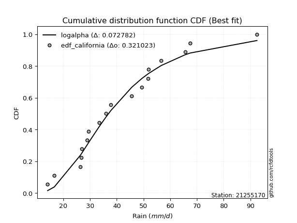</img>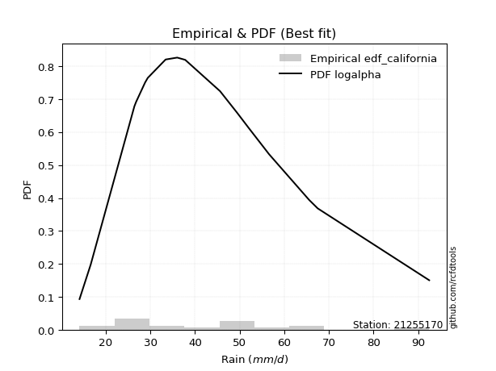</img>

</div>


### 2. Empirical - EDF Hazen (1930)

Hazen method for plotting positions is a formula used to estimate the empirical cumulative probability distribution of flood events or other hydrological data. This formula often results in biased estimations, particularly when extrapolating to extreme events (high return periods).

<div align="center">


$P=(m-0.5)/n$


</div>


**2.1. Empirical values**

<div align="center">

|                | 0                    | 1                   | 2                  | 3                   | 4                  | 5                  | 6                  | 7                  | 8                  | 9                  | 10                 | 11                 | 12                 | 13        | 14                 | 15                 | 16                 | 17                 |
|:---------------|:---------------------|:--------------------|:-------------------|:--------------------|:-------------------|:-------------------|:-------------------|:-------------------|:-------------------|:-------------------|:-------------------|:-------------------|:-------------------|:----------|:-------------------|:-------------------|:-------------------|:-------------------|
| date           | 2015                 | 2020                | 2024               | 2016                | 2008               | 2018               | 2007               | 2025               | 2005               | 2006               | 2019               | 2012               | 2013               | 2010      | 2014               | 2011               | 2017               | 2009               |
| x              | 14.1                 | 16.6                | 26.4               | 26.7                | 26.8               | 28.8               | 29.4               | 30.6               | 33.4               | 37.8               | 45.6               | 49.4               | 51.638888888888886 | 51.7      | 56.6               | 65.6               | 67.5               | 92.5               |
| m              | 1                    | 2                   | 3                  | 4                   | 5                  | 6                  | 7                  | 8                  | 9                  | 10                 | 11                 | 12                 | 13                 | 14        | 15                 | 16                 | 17                 | 18                 |
| empirical_dist | edf_hazen            | edf_hazen           | edf_hazen          | edf_hazen           | edf_hazen          | edf_hazen          | edf_hazen          | edf_hazen          | edf_hazen          | edf_hazen          | edf_hazen          | edf_hazen          | edf_hazen          | edf_hazen | edf_hazen          | edf_hazen          | edf_hazen          | edf_hazen          |
| empirical      | 0.027777777777777776 | 0.08333333333333333 | 0.1388888888888889 | 0.19444444444444445 | 0.25               | 0.3055555555555556 | 0.3611111111111111 | 0.4166666666666667 | 0.4722222222222222 | 0.5277777777777778 | 0.5833333333333334 | 0.6388888888888888 | 0.6944444444444444 | 0.75      | 0.8055555555555556 | 0.8611111111111112 | 0.9166666666666666 | 0.9722222222222222 |
| empirical_tr   | 1.0285714285714287   | 1.090909090909091   | 1.161290322580645  | 1.2413793103448276  | 1.3333333333333333 | 1.44               | 1.565217391304348  | 1.7142857142857144 | 1.894736842105263  | 2.1176470588235294 | 2.4000000000000004 | 2.7692307692307687 | 3.2727272727272725 | 4.0       | 5.142857142857143  | 7.200000000000003  | 11.999999999999995 | 35.999999999999986 |

</div>


**2.2. Kolmogorov-Smirnov fit test (sorted by Δ)**


<div align="center">

|                | 0                   | 1                   | 2                   | 3                   | 4                   | 5                   | 6                   | 7                   | 8                   | 9                   | 10                  | 11                  | 12                  | 13                  | 14                  | 15                  | 16                  | 17                  | 18                  | 19                  | 20                  | 21                  | 22                  | 23                  | 24                  | 25                  | 26                  | 27                  | 28                  | 29                  | 30                  | 31                  | 32                  | 33                  | 34                  | 35                  | 36                  | 37                  | 38                  | 39                  | 40                  | 41                  | 42                  | 43                  | 44                  | 45                  | 46                  | 47                  | 48                  | 49                  | 50                  | 51                  | 52                  | 53                  | 54                  | 55                  | 56                  | 57                  | 58                  | 59                  | 60                  | 61                  | 62                  | 63                  | 64                  | 65                  | 66                  | 67                    | 68                  | 69                  | 70                  | 71                  | 72                  | 73                  | 74                  | 75                  | 76                  | 77                  | 78                  | 79                  | 80                  | 81                  | 82                  | 83                  | 84                  | 85                  | 86                  | 87                  | 88                  | 89                  |
|:---------------|:--------------------|:--------------------|:--------------------|:--------------------|:--------------------|:--------------------|:--------------------|:--------------------|:--------------------|:--------------------|:--------------------|:--------------------|:--------------------|:--------------------|:--------------------|:--------------------|:--------------------|:--------------------|:--------------------|:--------------------|:--------------------|:--------------------|:--------------------|:--------------------|:--------------------|:--------------------|:--------------------|:--------------------|:--------------------|:--------------------|:--------------------|:--------------------|:--------------------|:--------------------|:--------------------|:--------------------|:--------------------|:--------------------|:--------------------|:--------------------|:--------------------|:--------------------|:--------------------|:--------------------|:--------------------|:--------------------|:--------------------|:--------------------|:--------------------|:--------------------|:--------------------|:--------------------|:--------------------|:--------------------|:--------------------|:--------------------|:--------------------|:--------------------|:--------------------|:--------------------|:--------------------|:--------------------|:--------------------|:--------------------|:--------------------|:--------------------|:--------------------|:----------------------|:--------------------|:--------------------|:--------------------|:--------------------|:--------------------|:--------------------|:--------------------|:--------------------|:--------------------|:--------------------|:--------------------|:--------------------|:--------------------|:--------------------|:--------------------|:--------------------|:--------------------|:--------------------|:--------------------|:--------------------|:--------------------|:--------------------|
| station        | 21255170            | 21255170            | 21255170            | 21255170            | 21255170            | 21255170            | 21255170            | 21255170            | 21255170            | 21255170            | 21255170            | 21255170            | 21255170            | 21255170            | 21255170            | 21255170            | 21255170            | 21255170            | 21255170            | 21255170            | 21255170            | 21255170            | 21255170            | 21255170            | 21255170            | 21255170            | 21255170            | 21255170            | 21255170            | 21255170            | 21255170            | 21255170            | 21255170            | 21255170            | 21255170            | 21255170            | 21255170            | 21255170            | 21255170            | 21255170            | 21255170            | 21255170            | 21255170            | 21255170            | 21255170            | 21255170            | 21255170            | 21255170            | 21255170            | 21255170            | 21255170            | 21255170            | 21255170            | 21255170            | 21255170            | 21255170            | 21255170            | 21255170            | 21255170            | 21255170            | 21255170            | 21255170            | 21255170            | 21255170            | 21255170            | 21255170            | 21255170            | 21255170              | 21255170            | 21255170            | 21255170            | 21255170            | 21255170            | 21255170            | 21255170            | 21255170            | 21255170            | 21255170            | 21255170            | 21255170            | 21255170            | 21255170            | 21255170            | 21255170            | 21255170            | 21255170            | 21255170            | 21255170            | 21255170            | 21255170            |
| empirical_dist | edf_hazen           | edf_hazen           | edf_hazen           | edf_hazen           | edf_hazen           | edf_hazen           | edf_hazen           | edf_hazen           | edf_hazen           | edf_hazen           | edf_hazen           | edf_hazen           | edf_hazen           | edf_hazen           | edf_hazen           | edf_hazen           | edf_hazen           | edf_hazen           | edf_hazen           | edf_hazen           | edf_hazen           | edf_hazen           | edf_hazen           | edf_hazen           | edf_hazen           | edf_hazen           | edf_hazen           | edf_hazen           | edf_hazen           | edf_hazen           | edf_hazen           | edf_hazen           | edf_hazen           | edf_hazen           | edf_hazen           | edf_hazen           | edf_hazen           | edf_hazen           | edf_hazen           | edf_hazen           | edf_hazen           | edf_hazen           | edf_hazen           | edf_hazen           | edf_hazen           | edf_hazen           | edf_hazen           | edf_hazen           | edf_hazen           | edf_hazen           | edf_hazen           | edf_hazen           | edf_hazen           | edf_hazen           | edf_hazen           | edf_hazen           | edf_hazen           | edf_hazen           | edf_hazen           | edf_hazen           | edf_hazen           | edf_hazen           | edf_hazen           | edf_hazen           | edf_hazen           | edf_hazen           | edf_hazen           | edf_hazen             | edf_hazen           | edf_hazen           | edf_hazen           | edf_hazen           | edf_hazen           | edf_hazen           | edf_hazen           | edf_hazen           | edf_hazen           | edf_hazen           | edf_hazen           | edf_hazen           | edf_hazen           | edf_hazen           | edf_hazen           | edf_hazen           | edf_hazen           | edf_hazen           | edf_hazen           | edf_hazen           | edf_hazen           | edf_hazen           |
| p_dist         | invgamma            | logloggamma         | fisk                | johnsonsu           | logpearson3         | betaprime           | halflogistic        | invweibull          | logfisk             | mielke              | loggenlogistic      | logweibull_min      | lognakagami         | invgauss            | logjohnsonsu        | ncf                 | logf                | logfatiguelife      | logt                | lognorm             | lognorm             | logcrystalball      | logexponnorm        | loglognorm          | lognct              | alpha               | fatiguelife         | moyal               | exponnorm           | loggamma            | loggamma            | logerlang           | pearson3            | laplace_asymmetric  | genlogistic         | rayleigh            | logbetaprime        | kstwobign           | loglogistic         | gumbel_r            | logrice             | loginvgamma         | maxwell             | logalpha            | erlang              | chi2                | gamma               | f                   | loggompertz         | loginvgauss         | logmaxwell          | weibull_min         | halfnorm            | loghypsecant        | lograyleigh         | gompertz            | rice                | loggumbel_r         | loggumbel_l         | t                   | truncnorm           | norm                | crystalball         | nct                 | logmielke           | loglaplace          | loghalfnorm         | loglaplace_asymmetric | logncf              | loginvweibull       | loghalflogistic     | wald                | logmoyal            | logistic            | hypsecant           | logkstwobign        | loggenexpon         | gumbel_l            | laplace             | genexpon            | logwald             | logtruncnorm        | expon               | loggibrat           | gibrat              | nakagami            | logexpon            | logpareto           | logchi2             | pareto              |
| delta          | 0.08959053964690061 | 0.09000541760730729 | 0.09012982170832201 | 0.09053702590893764 | 0.09096468972457733 | 0.092137820126235   | 0.09244265133880586 | 0.09300176825327627 | 0.09318899095644934 | 0.09403758692927633 | 0.09404475257030964 | 0.09434686407945647 | 0.09439254217120013 | 0.094408462744135   | 0.09464130712935975 | 0.09466345619537553 | 0.09486705971423132 | 0.09489350341443697 | 0.09494173869681549 | 0.09494563007577833 | 0.09494563007577833 | 0.09494630910321356 | 0.09494645812323244 | 0.09494694926511643 | 0.09519778019704433 | 0.09616146158830796 | 0.09618140070564418 | 0.09729409531733285 | 0.09806167366029345 | 0.09890261992151572 | 0.09890261992151572 | 0.09997462172692942 | 0.10001437974183897 | 0.10055996140724266 | 0.10060440018964928 | 0.1010485525679268  | 0.10118573492412206 | 0.10158152130467091 | 0.10354510911598691 | 0.10423061915232013 | 0.10463205284161356 | 0.10549078049908528 | 0.10588923800286854 | 0.10952448508653756 | 0.10958390948763894 | 0.10958522751902003 | 0.10958624902349934 | 0.10989466641489046 | 0.11203368269288483 | 0.11230613918332089 | 0.11402661566954286 | 0.11403365034505603 | 0.11688279583292766 | 0.11899042312463715 | 0.12197269743988476 | 0.12253802541574271 | 0.1274659964804402  | 0.13618732529383126 | 0.136581148503075   | 0.13683894942810726 | 0.13685016831389785 | 0.13685018968634788 | 0.13685020288434868 | 0.14075694367100244 | 0.14153437251958706 | 0.1420883040924481  | 0.1423434355543418  | 0.1434909000786052    | 0.14502215442555066 | 0.14818725895417284 | 0.15033656629377745 | 0.15316871652861175 | 0.15529677107125572 | 0.1559799734377929  | 0.17054839693988977 | 0.17840297476227301 | 0.18846269211269373 | 0.1944047307067191  | 0.19815109291854893 | 0.2031290578096709  | 0.2097897048254156  | 0.21584258887528163 | 0.2203953109660594  | 0.24191019812037418 | 0.25403289087886016 | 0.29121002519194245 | 0.33568308509175687 | 0.33568308925310847 | 0.40498504312774547 | 0.521654142905431   |
| deltao         | 0.32102346734599996 | 0.32102346734599996 | 0.32102346734599996 | 0.32102346734599996 | 0.32102346734599996 | 0.32102346734599996 | 0.32102346734599996 | 0.32102346734599996 | 0.32102346734599996 | 0.32102346734599996 | 0.32102346734599996 | 0.32102346734599996 | 0.32102346734599996 | 0.32102346734599996 | 0.32102346734599996 | 0.32102346734599996 | 0.32102346734599996 | 0.32102346734599996 | 0.32102346734599996 | 0.32102346734599996 | 0.32102346734599996 | 0.32102346734599996 | 0.32102346734599996 | 0.32102346734599996 | 0.32102346734599996 | 0.32102346734599996 | 0.32102346734599996 | 0.32102346734599996 | 0.32102346734599996 | 0.32102346734599996 | 0.32102346734599996 | 0.32102346734599996 | 0.32102346734599996 | 0.32102346734599996 | 0.32102346734599996 | 0.32102346734599996 | 0.32102346734599996 | 0.32102346734599996 | 0.32102346734599996 | 0.32102346734599996 | 0.32102346734599996 | 0.32102346734599996 | 0.32102346734599996 | 0.32102346734599996 | 0.32102346734599996 | 0.32102346734599996 | 0.32102346734599996 | 0.32102346734599996 | 0.32102346734599996 | 0.32102346734599996 | 0.32102346734599996 | 0.32102346734599996 | 0.32102346734599996 | 0.32102346734599996 | 0.32102346734599996 | 0.32102346734599996 | 0.32102346734599996 | 0.32102346734599996 | 0.32102346734599996 | 0.32102346734599996 | 0.32102346734599996 | 0.32102346734599996 | 0.32102346734599996 | 0.32102346734599996 | 0.32102346734599996 | 0.32102346734599996 | 0.32102346734599996 | 0.32102346734599996   | 0.32102346734599996 | 0.32102346734599996 | 0.32102346734599996 | 0.32102346734599996 | 0.32102346734599996 | 0.32102346734599996 | 0.32102346734599996 | 0.32102346734599996 | 0.32102346734599996 | 0.32102346734599996 | 0.32102346734599996 | 0.32102346734599996 | 0.32102346734599996 | 0.32102346734599996 | 0.32102346734599996 | 0.32102346734599996 | 0.32102346734599996 | 0.32102346734599996 | 0.32102346734599996 | 0.32102346734599996 | 0.32102346734599996 | 0.32102346734599996 |
| eval           | Δo > Δ              | Δo > Δ              | Δo > Δ              | Δo > Δ              | Δo > Δ              | Δo > Δ              | Δo > Δ              | Δo > Δ              | Δo > Δ              | Δo > Δ              | Δo > Δ              | Δo > Δ              | Δo > Δ              | Δo > Δ              | Δo > Δ              | Δo > Δ              | Δo > Δ              | Δo > Δ              | Δo > Δ              | Δo > Δ              | Δo > Δ              | Δo > Δ              | Δo > Δ              | Δo > Δ              | Δo > Δ              | Δo > Δ              | Δo > Δ              | Δo > Δ              | Δo > Δ              | Δo > Δ              | Δo > Δ              | Δo > Δ              | Δo > Δ              | Δo > Δ              | Δo > Δ              | Δo > Δ              | Δo > Δ              | Δo > Δ              | Δo > Δ              | Δo > Δ              | Δo > Δ              | Δo > Δ              | Δo > Δ              | Δo > Δ              | Δo > Δ              | Δo > Δ              | Δo > Δ              | Δo > Δ              | Δo > Δ              | Δo > Δ              | Δo > Δ              | Δo > Δ              | Δo > Δ              | Δo > Δ              | Δo > Δ              | Δo > Δ              | Δo > Δ              | Δo > Δ              | Δo > Δ              | Δo > Δ              | Δo > Δ              | Δo > Δ              | Δo > Δ              | Δo > Δ              | Δo > Δ              | Δo > Δ              | Δo > Δ              | Δo > Δ                | Δo > Δ              | Δo > Δ              | Δo > Δ              | Δo > Δ              | Δo > Δ              | Δo > Δ              | Δo > Δ              | Δo > Δ              | Δo > Δ              | Δo > Δ              | Δo > Δ              | Δo > Δ              | Δo > Δ              | Δo > Δ              | Δo > Δ              | Δo > Δ              | Δo > Δ              | Δo > Δ              | Δo <= Δ             | Δo <= Δ             | Δo <= Δ             | Δo <= Δ             |
| fit            | 1                   | 1                   | 1                   | 1                   | 1                   | 1                   | 1                   | 1                   | 1                   | 1                   | 1                   | 1                   | 1                   | 1                   | 1                   | 1                   | 1                   | 1                   | 1                   | 1                   | 1                   | 1                   | 1                   | 1                   | 1                   | 1                   | 1                   | 1                   | 1                   | 1                   | 1                   | 1                   | 1                   | 1                   | 1                   | 1                   | 1                   | 1                   | 1                   | 1                   | 1                   | 1                   | 1                   | 1                   | 1                   | 1                   | 1                   | 1                   | 1                   | 1                   | 1                   | 1                   | 1                   | 1                   | 1                   | 1                   | 1                   | 1                   | 1                   | 1                   | 1                   | 1                   | 1                   | 1                   | 1                   | 1                   | 1                   | 1                     | 1                   | 1                   | 1                   | 1                   | 1                   | 1                   | 1                   | 1                   | 1                   | 1                   | 1                   | 1                   | 1                   | 1                   | 1                   | 1                   | 1                   | 1                   | 0                   | 0                   | 0                   | 0                   |
| n              | 18                  | 18                  | 18                  | 18                  | 18                  | 18                  | 18                  | 18                  | 18                  | 18                  | 18                  | 18                  | 18                  | 18                  | 18                  | 18                  | 18                  | 18                  | 18                  | 18                  | 18                  | 18                  | 18                  | 18                  | 18                  | 18                  | 18                  | 18                  | 18                  | 18                  | 18                  | 18                  | 18                  | 18                  | 18                  | 18                  | 18                  | 18                  | 18                  | 18                  | 18                  | 18                  | 18                  | 18                  | 18                  | 18                  | 18                  | 18                  | 18                  | 18                  | 18                  | 18                  | 18                  | 18                  | 18                  | 18                  | 18                  | 18                  | 18                  | 18                  | 18                  | 18                  | 18                  | 18                  | 18                  | 18                  | 18                  | 18                    | 18                  | 18                  | 18                  | 18                  | 18                  | 18                  | 18                  | 18                  | 18                  | 18                  | 18                  | 18                  | 18                  | 18                  | 18                  | 18                  | 18                  | 18                  | 18                  | 18                  | 18                  | 18                  |
| best_fit       | 1                   | 0                   | 0                   | 0                   | 0                   | 0                   | 0                   | 0                   | 0                   | 0                   | 0                   | 0                   | 0                   | 0                   | 0                   | 0                   | 0                   | 0                   | 0                   | 0                   | 0                   | 0                   | 0                   | 0                   | 0                   | 0                   | 0                   | 0                   | 0                   | 0                   | 0                   | 0                   | 0                   | 0                   | 0                   | 0                   | 0                   | 0                   | 0                   | 0                   | 0                   | 0                   | 0                   | 0                   | 0                   | 0                   | 0                   | 0                   | 0                   | 0                   | 0                   | 0                   | 0                   | 0                   | 0                   | 0                   | 0                   | 0                   | 0                   | 0                   | 0                   | 0                   | 0                   | 0                   | 0                   | 0                   | 0                   | 0                     | 0                   | 0                   | 0                   | 0                   | 0                   | 0                   | 0                   | 0                   | 0                   | 0                   | 0                   | 0                   | 0                   | 0                   | 0                   | 0                   | 0                   | 0                   | 0                   | 0                   | 0                   | 0                   |
| best_fit_sort  | 1                   | 2                   | 3                   | 4                   | 5                   | 6                   | 7                   | 8                   | 9                   | 10                  | 11                  | 12                  | 13                  | 14                  | 15                  | 16                  | 17                  | 18                  | 19                  | 20                  | 21                  | 22                  | 23                  | 24                  | 25                  | 26                  | 27                  | 28                  | 29                  | 30                  | 31                  | 32                  | 33                  | 34                  | 35                  | 36                  | 37                  | 38                  | 39                  | 40                  | 41                  | 42                  | 43                  | 44                  | 45                  | 46                  | 47                  | 48                  | 49                  | 50                  | 51                  | 52                  | 53                  | 54                  | 55                  | 56                  | 57                  | 58                  | 59                  | 60                  | 61                  | 62                  | 63                  | 64                  | 65                  | 66                  | 67                  | 68                    | 69                  | 70                  | 71                  | 72                  | 73                  | 74                  | 75                  | 76                  | 77                  | 78                  | 79                  | 80                  | 81                  | 82                  | 83                  | 84                  | 85                  | 86                  | 87                  | 88                  | 89                  | 90                  |

</div>


<div align="center">

</img>

</div>


**2.3. Best fit**

<div align="center">

|   id |   station | empirical_dist   | p_dist   |     delta |   deltao | eval   |   fit |   n |   best_fit |   best_fit_sort |
|-----:|----------:|:-----------------|:---------|----------:|---------:|:-------|------:|----:|-----------:|----------------:|
|    0 |  21255170 | edf_hazen        | invgamma | 0.0895905 | 0.321023 | Δo > Δ |     1 |  18 |          1 |               1 |

</div>


<div align="center">

</img></img>

</div>


### 3. Empirical - EDF Weibull (1939)

Weibull plotting position formula is an empirical method used to estimate the non-exceedance probability or plotting position for a set of observed data, is often recommended or widely used in practice, particularly in flood frequency analysis.

<div align="center">


$P=m/(n+1)$


</div>


**3.1. Empirical values**

<div align="center">

|                | 0                   | 1                   | 2                   | 3                   | 4                  | 5                  | 6                  | 7                   | 8                   | 9                  | 10                 | 11                | 12                 | 13                 | 14                 | 15                 | 16                 | 17                 |
|:---------------|:--------------------|:--------------------|:--------------------|:--------------------|:-------------------|:-------------------|:-------------------|:--------------------|:--------------------|:-------------------|:-------------------|:------------------|:-------------------|:-------------------|:-------------------|:-------------------|:-------------------|:-------------------|
| date           | 2015                | 2020                | 2024                | 2016                | 2008               | 2018               | 2007               | 2025                | 2005                | 2006               | 2019               | 2012              | 2013               | 2010               | 2014               | 2011               | 2017               | 2009               |
| x              | 14.1                | 16.6                | 26.4                | 26.7                | 26.8               | 28.8               | 29.4               | 30.6                | 33.4                | 37.8               | 45.6               | 49.4              | 51.638888888888886 | 51.7               | 56.6               | 65.6               | 67.5               | 92.5               |
| m              | 1                   | 2                   | 3                   | 4                   | 5                  | 6                  | 7                  | 8                   | 9                   | 10                 | 11                 | 12                | 13                 | 14                 | 15                 | 16                 | 17                 | 18                 |
| empirical_dist | edf_weibull         | edf_weibull         | edf_weibull         | edf_weibull         | edf_weibull        | edf_weibull        | edf_weibull        | edf_weibull         | edf_weibull         | edf_weibull        | edf_weibull        | edf_weibull       | edf_weibull        | edf_weibull        | edf_weibull        | edf_weibull        | edf_weibull        | edf_weibull        |
| empirical      | 0.05263157894736842 | 0.10526315789473684 | 0.15789473684210525 | 0.21052631578947367 | 0.2631578947368421 | 0.3157894736842105 | 0.3684210526315789 | 0.42105263157894735 | 0.47368421052631576 | 0.5263157894736842 | 0.5789473684210527 | 0.631578947368421 | 0.6842105263157895 | 0.7368421052631579 | 0.7894736842105263 | 0.8421052631578947 | 0.8947368421052632 | 0.9473684210526315 |
| empirical_tr   | 1.0555555555555556  | 1.1176470588235294  | 1.1875              | 1.2666666666666666  | 1.357142857142857  | 1.4615384615384615 | 1.5833333333333335 | 1.7272727272727273  | 1.8999999999999997  | 2.111111111111111  | 2.375              | 2.714285714285714 | 3.166666666666667  | 3.7999999999999994 | 4.75               | 6.333333333333331  | 9.5                | 18.999999999999982 |

</div>


**3.2. Kolmogorov-Smirnov fit test (sorted by Δ)**


<div align="center">

|                | 0                   | 1                   | 2                   | 3                   | 4                   | 5                   | 6                   | 7                   | 8                   | 9                   | 10                  | 11                  | 12                  | 13                  | 14                  | 15                  | 16                  | 17                  | 18                  | 19                  | 20                  | 21                  | 22                  | 23                  | 24                  | 25                  | 26                  | 27                  | 28                  | 29                  | 30                  | 31                  | 32                  | 33                  | 34                  | 35                  | 36                  | 37                  | 38                  | 39                  | 40                  | 41                  | 42                  | 43                  | 44                  | 45                  | 46                  | 47                  | 48                  | 49                  | 50                  | 51                  | 52                  | 53                  | 54                  | 55                  | 56                  | 57                  | 58                  | 59                  | 60                  | 61                  | 62                  | 63                  | 64                  | 65                  | 66                  | 67                  | 68                    | 69                  | 70                  | 71                  | 72                  | 73                  | 74                  | 75                  | 76                  | 77                  | 78                  | 79                  | 80                  | 81                  | 82                  | 83                  | 84                  | 85                  | 86                  | 87                  | 88                  | 89                  |
|:---------------|:--------------------|:--------------------|:--------------------|:--------------------|:--------------------|:--------------------|:--------------------|:--------------------|:--------------------|:--------------------|:--------------------|:--------------------|:--------------------|:--------------------|:--------------------|:--------------------|:--------------------|:--------------------|:--------------------|:--------------------|:--------------------|:--------------------|:--------------------|:--------------------|:--------------------|:--------------------|:--------------------|:--------------------|:--------------------|:--------------------|:--------------------|:--------------------|:--------------------|:--------------------|:--------------------|:--------------------|:--------------------|:--------------------|:--------------------|:--------------------|:--------------------|:--------------------|:--------------------|:--------------------|:--------------------|:--------------------|:--------------------|:--------------------|:--------------------|:--------------------|:--------------------|:--------------------|:--------------------|:--------------------|:--------------------|:--------------------|:--------------------|:--------------------|:--------------------|:--------------------|:--------------------|:--------------------|:--------------------|:--------------------|:--------------------|:--------------------|:--------------------|:--------------------|:----------------------|:--------------------|:--------------------|:--------------------|:--------------------|:--------------------|:--------------------|:--------------------|:--------------------|:--------------------|:--------------------|:--------------------|:--------------------|:--------------------|:--------------------|:--------------------|:--------------------|:--------------------|:--------------------|:--------------------|:--------------------|:--------------------|
| station        | 21255170            | 21255170            | 21255170            | 21255170            | 21255170            | 21255170            | 21255170            | 21255170            | 21255170            | 21255170            | 21255170            | 21255170            | 21255170            | 21255170            | 21255170            | 21255170            | 21255170            | 21255170            | 21255170            | 21255170            | 21255170            | 21255170            | 21255170            | 21255170            | 21255170            | 21255170            | 21255170            | 21255170            | 21255170            | 21255170            | 21255170            | 21255170            | 21255170            | 21255170            | 21255170            | 21255170            | 21255170            | 21255170            | 21255170            | 21255170            | 21255170            | 21255170            | 21255170            | 21255170            | 21255170            | 21255170            | 21255170            | 21255170            | 21255170            | 21255170            | 21255170            | 21255170            | 21255170            | 21255170            | 21255170            | 21255170            | 21255170            | 21255170            | 21255170            | 21255170            | 21255170            | 21255170            | 21255170            | 21255170            | 21255170            | 21255170            | 21255170            | 21255170            | 21255170              | 21255170            | 21255170            | 21255170            | 21255170            | 21255170            | 21255170            | 21255170            | 21255170            | 21255170            | 21255170            | 21255170            | 21255170            | 21255170            | 21255170            | 21255170            | 21255170            | 21255170            | 21255170            | 21255170            | 21255170            | 21255170            |
| empirical_dist | edf_weibull         | edf_weibull         | edf_weibull         | edf_weibull         | edf_weibull         | edf_weibull         | edf_weibull         | edf_weibull         | edf_weibull         | edf_weibull         | edf_weibull         | edf_weibull         | edf_weibull         | edf_weibull         | edf_weibull         | edf_weibull         | edf_weibull         | edf_weibull         | edf_weibull         | edf_weibull         | edf_weibull         | edf_weibull         | edf_weibull         | edf_weibull         | edf_weibull         | edf_weibull         | edf_weibull         | edf_weibull         | edf_weibull         | edf_weibull         | edf_weibull         | edf_weibull         | edf_weibull         | edf_weibull         | edf_weibull         | edf_weibull         | edf_weibull         | edf_weibull         | edf_weibull         | edf_weibull         | edf_weibull         | edf_weibull         | edf_weibull         | edf_weibull         | edf_weibull         | edf_weibull         | edf_weibull         | edf_weibull         | edf_weibull         | edf_weibull         | edf_weibull         | edf_weibull         | edf_weibull         | edf_weibull         | edf_weibull         | edf_weibull         | edf_weibull         | edf_weibull         | edf_weibull         | edf_weibull         | edf_weibull         | edf_weibull         | edf_weibull         | edf_weibull         | edf_weibull         | edf_weibull         | edf_weibull         | edf_weibull         | edf_weibull           | edf_weibull         | edf_weibull         | edf_weibull         | edf_weibull         | edf_weibull         | edf_weibull         | edf_weibull         | edf_weibull         | edf_weibull         | edf_weibull         | edf_weibull         | edf_weibull         | edf_weibull         | edf_weibull         | edf_weibull         | edf_weibull         | edf_weibull         | edf_weibull         | edf_weibull         | edf_weibull         | edf_weibull         |
| p_dist         | fatiguelife         | invgauss            | lognakagami         | logweibull_min      | logt                | logexponnorm        | lognorm             | lognorm             | logcrystalball      | loglognorm          | lognct              | logjohnsonsu        | logf                | logfatiguelife      | johnsonsu           | loggamma            | loggamma            | erlang              | chi2                | gamma               | logbetaprime        | logrice             | f                   | logpearson3         | logerlang           | loggompertz         | invgamma            | logloggamma         | fisk                | weibull_min         | loginvgauss         | loginvgamma         | betaprime           | invweibull          | logfisk             | halfnorm            | logalpha            | mielke              | loggenlogistic      | ncf                 | rayleigh            | exponnorm           | alpha               | moyal               | logmaxwell          | gompertz            | pearson3            | laplace_asymmetric  | genlogistic         | halflogistic        | kstwobign           | gumbel_r            | lograyleigh         | maxwell             | loglogistic         | nct                 | logmielke           | logncf              | loghypsecant        | loghalfnorm         | loginvweibull       | rice                | t                   | truncnorm           | norm                | crystalball         | loggumbel_r         | loggumbel_l         | loglaplace_asymmetric | loglaplace          | loghalflogistic     | logistic            | logkstwobign        | logmoyal            | wald                | loggenexpon         | hypsecant           | genexpon            | gumbel_l            | laplace             | expon               | logwald             | logtruncnorm        | loggibrat           | gibrat              | nakagami            | logexpon            | logpareto           | logchi2             | pareto              |
| delta          | 0.08447598435324966 | 0.08573872047893649 | 0.08809696336639727 | 0.08850955642580793 | 0.0886943121867032  | 0.08869834324358727 | 0.08869944760472048 | 0.08869944760472048 | 0.08869971671673227 | 0.08870083527040318 | 0.08892290328551322 | 0.08896873421626295 | 0.0892240250680878  | 0.08934820368641272 | 0.08949475474534485 | 0.09034301367308795 | 0.09034301367308795 | 0.09057806153442258 | 0.09057937956580367 | 0.09058040107028298 | 0.09059501907190959 | 0.09063506252826925 | 0.0908888184616741  | 0.09103089567598333 | 0.09123884047741082 | 0.09302783473966847 | 0.09397650455918127 | 0.09439138251958795 | 0.09473045038334271 | 0.09502780239183967 | 0.09647698600091736 | 0.09648174699637213 | 0.09652378503851566 | 0.09738773316555693 | 0.09757495586873    | 0.0978769478797113  | 0.09822607796654959 | 0.09842355184155699 | 0.0984307174825903  | 0.09904942110765619 | 0.09930376558004544 | 0.1000590849511267  | 0.10054742650058862 | 0.10168006022961351 | 0.10286386531268166 | 0.10353217746252635 | 0.10440034465411963 | 0.10494592631952337 | 0.10499036510192994 | 0.10526315789473684 | 0.10596748621695157 | 0.10861658406460079 | 0.10895345637284404 | 0.10981346428765704 | 0.11085505063645473 | 0.12175109571778608 | 0.1225285245663707  | 0.1260163064723343  | 0.12630036464510497 | 0.1268016661043071  | 0.12918141100095648 | 0.13185196139272087 | 0.1383009377322008  | 0.1383121566179914  | 0.13831217799044143 | 0.13831219118844224 | 0.14057329020611198 | 0.14096711341535567 | 0.14787686499088593   | 0.14939824561291593 | 0.15472253120605817 | 0.1580245001458122  | 0.15939712680905666 | 0.15968273598353644 | 0.16273995668807184 | 0.16945684415947737 | 0.17349265903556607 | 0.18412320985645453 | 0.19586671901081265 | 0.19961308122264249 | 0.20138946301284305 | 0.2141756697376963  | 0.22900048361212372 | 0.2462961630326549  | 0.26315789450617716 | 0.2722041772387261  | 0.3166772371385405  | 0.3166772412998921  | 0.3859791951745291  | 0.49972431834402753 |
| deltao         | 0.32102346734599996 | 0.32102346734599996 | 0.32102346734599996 | 0.32102346734599996 | 0.32102346734599996 | 0.32102346734599996 | 0.32102346734599996 | 0.32102346734599996 | 0.32102346734599996 | 0.32102346734599996 | 0.32102346734599996 | 0.32102346734599996 | 0.32102346734599996 | 0.32102346734599996 | 0.32102346734599996 | 0.32102346734599996 | 0.32102346734599996 | 0.32102346734599996 | 0.32102346734599996 | 0.32102346734599996 | 0.32102346734599996 | 0.32102346734599996 | 0.32102346734599996 | 0.32102346734599996 | 0.32102346734599996 | 0.32102346734599996 | 0.32102346734599996 | 0.32102346734599996 | 0.32102346734599996 | 0.32102346734599996 | 0.32102346734599996 | 0.32102346734599996 | 0.32102346734599996 | 0.32102346734599996 | 0.32102346734599996 | 0.32102346734599996 | 0.32102346734599996 | 0.32102346734599996 | 0.32102346734599996 | 0.32102346734599996 | 0.32102346734599996 | 0.32102346734599996 | 0.32102346734599996 | 0.32102346734599996 | 0.32102346734599996 | 0.32102346734599996 | 0.32102346734599996 | 0.32102346734599996 | 0.32102346734599996 | 0.32102346734599996 | 0.32102346734599996 | 0.32102346734599996 | 0.32102346734599996 | 0.32102346734599996 | 0.32102346734599996 | 0.32102346734599996 | 0.32102346734599996 | 0.32102346734599996 | 0.32102346734599996 | 0.32102346734599996 | 0.32102346734599996 | 0.32102346734599996 | 0.32102346734599996 | 0.32102346734599996 | 0.32102346734599996 | 0.32102346734599996 | 0.32102346734599996 | 0.32102346734599996 | 0.32102346734599996   | 0.32102346734599996 | 0.32102346734599996 | 0.32102346734599996 | 0.32102346734599996 | 0.32102346734599996 | 0.32102346734599996 | 0.32102346734599996 | 0.32102346734599996 | 0.32102346734599996 | 0.32102346734599996 | 0.32102346734599996 | 0.32102346734599996 | 0.32102346734599996 | 0.32102346734599996 | 0.32102346734599996 | 0.32102346734599996 | 0.32102346734599996 | 0.32102346734599996 | 0.32102346734599996 | 0.32102346734599996 | 0.32102346734599996 |
| eval           | Δo > Δ              | Δo > Δ              | Δo > Δ              | Δo > Δ              | Δo > Δ              | Δo > Δ              | Δo > Δ              | Δo > Δ              | Δo > Δ              | Δo > Δ              | Δo > Δ              | Δo > Δ              | Δo > Δ              | Δo > Δ              | Δo > Δ              | Δo > Δ              | Δo > Δ              | Δo > Δ              | Δo > Δ              | Δo > Δ              | Δo > Δ              | Δo > Δ              | Δo > Δ              | Δo > Δ              | Δo > Δ              | Δo > Δ              | Δo > Δ              | Δo > Δ              | Δo > Δ              | Δo > Δ              | Δo > Δ              | Δo > Δ              | Δo > Δ              | Δo > Δ              | Δo > Δ              | Δo > Δ              | Δo > Δ              | Δo > Δ              | Δo > Δ              | Δo > Δ              | Δo > Δ              | Δo > Δ              | Δo > Δ              | Δo > Δ              | Δo > Δ              | Δo > Δ              | Δo > Δ              | Δo > Δ              | Δo > Δ              | Δo > Δ              | Δo > Δ              | Δo > Δ              | Δo > Δ              | Δo > Δ              | Δo > Δ              | Δo > Δ              | Δo > Δ              | Δo > Δ              | Δo > Δ              | Δo > Δ              | Δo > Δ              | Δo > Δ              | Δo > Δ              | Δo > Δ              | Δo > Δ              | Δo > Δ              | Δo > Δ              | Δo > Δ              | Δo > Δ                | Δo > Δ              | Δo > Δ              | Δo > Δ              | Δo > Δ              | Δo > Δ              | Δo > Δ              | Δo > Δ              | Δo > Δ              | Δo > Δ              | Δo > Δ              | Δo > Δ              | Δo > Δ              | Δo > Δ              | Δo > Δ              | Δo > Δ              | Δo > Δ              | Δo > Δ              | Δo > Δ              | Δo > Δ              | Δo <= Δ             | Δo <= Δ             |
| fit            | 1                   | 1                   | 1                   | 1                   | 1                   | 1                   | 1                   | 1                   | 1                   | 1                   | 1                   | 1                   | 1                   | 1                   | 1                   | 1                   | 1                   | 1                   | 1                   | 1                   | 1                   | 1                   | 1                   | 1                   | 1                   | 1                   | 1                   | 1                   | 1                   | 1                   | 1                   | 1                   | 1                   | 1                   | 1                   | 1                   | 1                   | 1                   | 1                   | 1                   | 1                   | 1                   | 1                   | 1                   | 1                   | 1                   | 1                   | 1                   | 1                   | 1                   | 1                   | 1                   | 1                   | 1                   | 1                   | 1                   | 1                   | 1                   | 1                   | 1                   | 1                   | 1                   | 1                   | 1                   | 1                   | 1                   | 1                   | 1                   | 1                     | 1                   | 1                   | 1                   | 1                   | 1                   | 1                   | 1                   | 1                   | 1                   | 1                   | 1                   | 1                   | 1                   | 1                   | 1                   | 1                   | 1                   | 1                   | 1                   | 0                   | 0                   |
| n              | 18                  | 18                  | 18                  | 18                  | 18                  | 18                  | 18                  | 18                  | 18                  | 18                  | 18                  | 18                  | 18                  | 18                  | 18                  | 18                  | 18                  | 18                  | 18                  | 18                  | 18                  | 18                  | 18                  | 18                  | 18                  | 18                  | 18                  | 18                  | 18                  | 18                  | 18                  | 18                  | 18                  | 18                  | 18                  | 18                  | 18                  | 18                  | 18                  | 18                  | 18                  | 18                  | 18                  | 18                  | 18                  | 18                  | 18                  | 18                  | 18                  | 18                  | 18                  | 18                  | 18                  | 18                  | 18                  | 18                  | 18                  | 18                  | 18                  | 18                  | 18                  | 18                  | 18                  | 18                  | 18                  | 18                  | 18                  | 18                  | 18                    | 18                  | 18                  | 18                  | 18                  | 18                  | 18                  | 18                  | 18                  | 18                  | 18                  | 18                  | 18                  | 18                  | 18                  | 18                  | 18                  | 18                  | 18                  | 18                  | 18                  | 18                  |
| best_fit       | 1                   | 0                   | 0                   | 0                   | 0                   | 0                   | 0                   | 0                   | 0                   | 0                   | 0                   | 0                   | 0                   | 0                   | 0                   | 0                   | 0                   | 0                   | 0                   | 0                   | 0                   | 0                   | 0                   | 0                   | 0                   | 0                   | 0                   | 0                   | 0                   | 0                   | 0                   | 0                   | 0                   | 0                   | 0                   | 0                   | 0                   | 0                   | 0                   | 0                   | 0                   | 0                   | 0                   | 0                   | 0                   | 0                   | 0                   | 0                   | 0                   | 0                   | 0                   | 0                   | 0                   | 0                   | 0                   | 0                   | 0                   | 0                   | 0                   | 0                   | 0                   | 0                   | 0                   | 0                   | 0                   | 0                   | 0                   | 0                   | 0                     | 0                   | 0                   | 0                   | 0                   | 0                   | 0                   | 0                   | 0                   | 0                   | 0                   | 0                   | 0                   | 0                   | 0                   | 0                   | 0                   | 0                   | 0                   | 0                   | 0                   | 0                   |
| best_fit_sort  | 1                   | 2                   | 3                   | 4                   | 5                   | 6                   | 7                   | 8                   | 9                   | 10                  | 11                  | 12                  | 13                  | 14                  | 15                  | 16                  | 17                  | 18                  | 19                  | 20                  | 21                  | 22                  | 23                  | 24                  | 25                  | 26                  | 27                  | 28                  | 29                  | 30                  | 31                  | 32                  | 33                  | 34                  | 35                  | 36                  | 37                  | 38                  | 39                  | 40                  | 41                  | 42                  | 43                  | 44                  | 45                  | 46                  | 47                  | 48                  | 49                  | 50                  | 51                  | 52                  | 53                  | 54                  | 55                  | 56                  | 57                  | 58                  | 59                  | 60                  | 61                  | 62                  | 63                  | 64                  | 65                  | 66                  | 67                  | 68                  | 69                    | 70                  | 71                  | 72                  | 73                  | 74                  | 75                  | 76                  | 77                  | 78                  | 79                  | 80                  | 81                  | 82                  | 83                  | 84                  | 85                  | 86                  | 87                  | 88                  | 89                  | 90                  |

</div>


<div align="center">

</img>

</div>


**3.3. Best fit**

<div align="center">

|   id |   station | empirical_dist   | p_dist      |    delta |   deltao | eval   |   fit |   n |   best_fit |   best_fit_sort |
|-----:|----------:|:-----------------|:------------|---------:|---------:|:-------|------:|----:|-----------:|----------------:|
|    0 |  21255170 | edf_weibull      | fatiguelife | 0.084476 | 0.321023 | Δo > Δ |     1 |  18 |          1 |               1 |

</div>


<div align="center">

</img>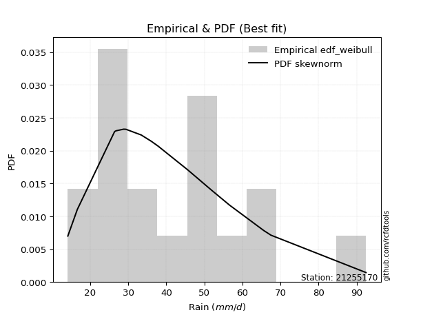</img>

</div>


### 4. Empirical - EDF Beard (1943)

The Beard formula (or Beard´s plotting position formula) in hydrology is used to estimate the empirical non-exceedance probability _(P)_ of a flood event (or other extreme hydrological data point) within a given dataset.

<div align="center">


$P=(m-0.31)/(n+0.38)$


</div>


**4.1. Empirical values**

<div align="center">

|                | 0                   | 1                   | 2                   | 3                   | 4                  | 5                   | 6                  | 7                  | 8                   | 9                  | 10                 | 11                 | 12                 | 13                 | 14                 | 15                 | 16                 | 17                 |
|:---------------|:--------------------|:--------------------|:--------------------|:--------------------|:-------------------|:--------------------|:-------------------|:-------------------|:--------------------|:-------------------|:-------------------|:-------------------|:-------------------|:-------------------|:-------------------|:-------------------|:-------------------|:-------------------|
| date           | 2015                | 2020                | 2024                | 2016                | 2008               | 2018                | 2007               | 2025               | 2005                | 2006               | 2019               | 2012               | 2013               | 2010               | 2014               | 2011               | 2017               | 2009               |
| x              | 14.1                | 16.6                | 26.4                | 26.7                | 26.8               | 28.8                | 29.4               | 30.6               | 33.4                | 37.8               | 45.6               | 49.4               | 51.638888888888886 | 51.7               | 56.6               | 65.6               | 67.5               | 92.5               |
| m              | 1                   | 2                   | 3                   | 4                   | 5                  | 6                   | 7                  | 8                  | 9                   | 10                 | 11                 | 12                 | 13                 | 14                 | 15                 | 16                 | 17                 | 18                 |
| empirical_dist | edf_beard           | edf_beard           | edf_beard           | edf_beard           | edf_beard          | edf_beard           | edf_beard          | edf_beard          | edf_beard           | edf_beard          | edf_beard          | edf_beard          | edf_beard          | edf_beard          | edf_beard          | edf_beard          | edf_beard          | edf_beard          |
| empirical      | 0.03754080522306855 | 0.09194776931447225 | 0.14635473340587596 | 0.20076169749727965 | 0.2551686615886834 | 0.30957562568008706 | 0.3639825897714908 | 0.4183895538628945 | 0.47279651795429817 | 0.5272034820457019 | 0.5816104461371056 | 0.6360174102285092 | 0.690424374319913  | 0.7448313384113167 | 0.7992383025027203 | 0.8536452665941241 | 0.9080522306855279 | 0.9624591947769315 |
| empirical_tr   | 1.0390050876201244  | 1.1012582384661473  | 1.17144678138942    | 1.2511912865895167  | 1.3425858290723158 | 1.4483845547675334  | 1.572284003421728  | 1.7193638914873717 | 1.896800825593395   | 2.1150747986191027 | 2.390117035110533  | 2.747384155455904  | 3.230228471001758  | 3.9189765458422174 | 4.981029810298102  | 6.832713754646843  | 10.875739644970428 | 26.637681159420353 |

</div>


**4.2. Kolmogorov-Smirnov fit test (sorted by Δ)**


<div align="center">

|                | 0                   | 1                   | 2                   | 3                   | 4                   | 5                   | 6                   | 7                   | 8                   | 9                   | 10                  | 11                  | 12                  | 13                  | 14                  | 15                  | 16                  | 17                  | 18                  | 19                  | 20                  | 21                  | 22                  | 23                  | 24                  | 25                  | 26                  | 27                  | 28                  | 29                  | 30                  | 31                  | 32                  | 33                  | 34                  | 35                  | 36                  | 37                  | 38                  | 39                  | 40                  | 41                  | 42                  | 43                  | 44                  | 45                  | 46                  | 47                  | 48                  | 49                  | 50                  | 51                  | 52                  | 53                  | 54                  | 55                  | 56                  | 57                  | 58                  | 59                  | 60                  | 61                  | 62                  | 63                  | 64                  | 65                  | 66                  | 67                  | 68                  | 69                    | 70                  | 71                  | 72                  | 73                  | 74                  | 75                  | 76                  | 77                  | 78                  | 79                  | 80                  | 81                  | 82                  | 83                  | 84                  | 85                  | 86                  | 87                  | 88                  | 89                  |
|:---------------|:--------------------|:--------------------|:--------------------|:--------------------|:--------------------|:--------------------|:--------------------|:--------------------|:--------------------|:--------------------|:--------------------|:--------------------|:--------------------|:--------------------|:--------------------|:--------------------|:--------------------|:--------------------|:--------------------|:--------------------|:--------------------|:--------------------|:--------------------|:--------------------|:--------------------|:--------------------|:--------------------|:--------------------|:--------------------|:--------------------|:--------------------|:--------------------|:--------------------|:--------------------|:--------------------|:--------------------|:--------------------|:--------------------|:--------------------|:--------------------|:--------------------|:--------------------|:--------------------|:--------------------|:--------------------|:--------------------|:--------------------|:--------------------|:--------------------|:--------------------|:--------------------|:--------------------|:--------------------|:--------------------|:--------------------|:--------------------|:--------------------|:--------------------|:--------------------|:--------------------|:--------------------|:--------------------|:--------------------|:--------------------|:--------------------|:--------------------|:--------------------|:--------------------|:--------------------|:----------------------|:--------------------|:--------------------|:--------------------|:--------------------|:--------------------|:--------------------|:--------------------|:--------------------|:--------------------|:--------------------|:--------------------|:--------------------|:--------------------|:--------------------|:--------------------|:--------------------|:--------------------|:--------------------|:--------------------|:--------------------|
| station        | 21255170            | 21255170            | 21255170            | 21255170            | 21255170            | 21255170            | 21255170            | 21255170            | 21255170            | 21255170            | 21255170            | 21255170            | 21255170            | 21255170            | 21255170            | 21255170            | 21255170            | 21255170            | 21255170            | 21255170            | 21255170            | 21255170            | 21255170            | 21255170            | 21255170            | 21255170            | 21255170            | 21255170            | 21255170            | 21255170            | 21255170            | 21255170            | 21255170            | 21255170            | 21255170            | 21255170            | 21255170            | 21255170            | 21255170            | 21255170            | 21255170            | 21255170            | 21255170            | 21255170            | 21255170            | 21255170            | 21255170            | 21255170            | 21255170            | 21255170            | 21255170            | 21255170            | 21255170            | 21255170            | 21255170            | 21255170            | 21255170            | 21255170            | 21255170            | 21255170            | 21255170            | 21255170            | 21255170            | 21255170            | 21255170            | 21255170            | 21255170            | 21255170            | 21255170            | 21255170              | 21255170            | 21255170            | 21255170            | 21255170            | 21255170            | 21255170            | 21255170            | 21255170            | 21255170            | 21255170            | 21255170            | 21255170            | 21255170            | 21255170            | 21255170            | 21255170            | 21255170            | 21255170            | 21255170            | 21255170            |
| empirical_dist | edf_beard           | edf_beard           | edf_beard           | edf_beard           | edf_beard           | edf_beard           | edf_beard           | edf_beard           | edf_beard           | edf_beard           | edf_beard           | edf_beard           | edf_beard           | edf_beard           | edf_beard           | edf_beard           | edf_beard           | edf_beard           | edf_beard           | edf_beard           | edf_beard           | edf_beard           | edf_beard           | edf_beard           | edf_beard           | edf_beard           | edf_beard           | edf_beard           | edf_beard           | edf_beard           | edf_beard           | edf_beard           | edf_beard           | edf_beard           | edf_beard           | edf_beard           | edf_beard           | edf_beard           | edf_beard           | edf_beard           | edf_beard           | edf_beard           | edf_beard           | edf_beard           | edf_beard           | edf_beard           | edf_beard           | edf_beard           | edf_beard           | edf_beard           | edf_beard           | edf_beard           | edf_beard           | edf_beard           | edf_beard           | edf_beard           | edf_beard           | edf_beard           | edf_beard           | edf_beard           | edf_beard           | edf_beard           | edf_beard           | edf_beard           | edf_beard           | edf_beard           | edf_beard           | edf_beard           | edf_beard           | edf_beard             | edf_beard           | edf_beard           | edf_beard           | edf_beard           | edf_beard           | edf_beard           | edf_beard           | edf_beard           | edf_beard           | edf_beard           | edf_beard           | edf_beard           | edf_beard           | edf_beard           | edf_beard           | edf_beard           | edf_beard           | edf_beard           | edf_beard           | edf_beard           |
| p_dist         | johnsonsu           | logweibull_min      | lognakagami         | invgauss            | logjohnsonsu        | logf                | logfatiguelife      | logt                | lognorm             | lognorm             | logcrystalball      | logexponnorm        | loglognorm          | lognct              | logpearson3         | fatiguelife         | invgamma            | loggamma            | loggamma            | logloggamma         | fisk                | halflogistic        | logerlang           | logbetaprime        | betaprime           | invweibull          | logfisk             | mielke              | loggenlogistic      | ncf                 | exponnorm           | rayleigh            | logrice             | alpha               | loginvgamma         | moyal               | pearson3            | logalpha            | erlang              | chi2                | gamma               | laplace_asymmetric  | genlogistic         | f                   | kstwobign           | loggompertz         | loginvgauss         | gumbel_r            | loglogistic         | logmaxwell          | weibull_min         | maxwell             | halfnorm            | lograyleigh         | gompertz            | loghypsecant        | rice                | nct                 | logmielke           | loghalfnorm         | t                   | truncnorm           | norm                | crystalball         | logncf              | loggumbel_r         | loggumbel_l         | loginvweibull       | loglaplace          | loglaplace_asymmetric | loghalflogistic     | wald                | logistic            | logmoyal            | logkstwobign        | hypsecant           | loggenexpon         | gumbel_l            | genexpon            | laplace             | logwald             | expon               | logtruncnorm        | loggibrat           | gibrat              | nakagami            | logexpon            | logpareto           | logchi2             | pareto              |
| delta          | 0.08683167702929201 | 0.08688101956246941 | 0.08692669765421307 | 0.08694261822714794 | 0.08717546261237269 | 0.08740121519724425 | 0.08742765889744991 | 0.08747589417982843 | 0.08747978555879127 | 0.08747978555879127 | 0.08748046458622649 | 0.08748061360624537 | 0.08748110474812937 | 0.08773193568005727 | 0.08836781795993048 | 0.08871555618865712 | 0.09131342684312843 | 0.09143677540452866 | 0.09143677540452866 | 0.09172830480353511 | 0.09185270890454983 | 0.09194776931447225 | 0.09250877720994236 | 0.09371989040713499 | 0.09386070732246282 | 0.09472465544950409 | 0.09491187815267715 | 0.09576047412550415 | 0.09576763976653746 | 0.09638634339160335 | 0.09661481994597232 | 0.0966406878639926  | 0.0971662083246265  | 0.09788434878453578 | 0.09802493598209822 | 0.09901698251356067 | 0.10173726693806678 | 0.1020586405695505  | 0.10211806497065187 | 0.10211938300203297 | 0.10212040450651227 | 0.10228284860347048 | 0.1023272873858771  | 0.1024288218979034  | 0.10330440850089873 | 0.10456783817589776 | 0.10484029466633382 | 0.10595350634854794 | 0.10641658777636653 | 0.1065607711525558  | 0.10656780582806896 | 0.1071503865716042  | 0.10941695131594059 | 0.1145068529228977  | 0.11507218089875565 | 0.12186190178501677 | 0.12918888367666803 | 0.13329109915401538 | 0.1340685280026     | 0.13487759103735475 | 0.13741324516018322 | 0.1374244640459738  | 0.13742448541842384 | 0.13742449861642464 | 0.1375563099085636  | 0.13791021249005908 | 0.13830403569930283 | 0.14072141443718578 | 0.14495978275282773 | 0.14521378727483303   | 0.15205945349000527 | 0.15489160372483957 | 0.15655426916986886 | 0.15701965826748354 | 0.17093713024528595 | 0.17112269267196573 | 0.18099684759570667 | 0.19497902643879506 | 0.19566321329268382 | 0.1987253886506249  | 0.2115125920216434  | 0.21292946644907235 | 0.22101125046396503 | 0.243633085316602   | 0.25690436953923984 | 0.2837441806749554  | 0.3282172405747698  | 0.3282172447361214  | 0.3975191986107584  | 0.5130397069242921  |
| deltao         | 0.32102346734599996 | 0.32102346734599996 | 0.32102346734599996 | 0.32102346734599996 | 0.32102346734599996 | 0.32102346734599996 | 0.32102346734599996 | 0.32102346734599996 | 0.32102346734599996 | 0.32102346734599996 | 0.32102346734599996 | 0.32102346734599996 | 0.32102346734599996 | 0.32102346734599996 | 0.32102346734599996 | 0.32102346734599996 | 0.32102346734599996 | 0.32102346734599996 | 0.32102346734599996 | 0.32102346734599996 | 0.32102346734599996 | 0.32102346734599996 | 0.32102346734599996 | 0.32102346734599996 | 0.32102346734599996 | 0.32102346734599996 | 0.32102346734599996 | 0.32102346734599996 | 0.32102346734599996 | 0.32102346734599996 | 0.32102346734599996 | 0.32102346734599996 | 0.32102346734599996 | 0.32102346734599996 | 0.32102346734599996 | 0.32102346734599996 | 0.32102346734599996 | 0.32102346734599996 | 0.32102346734599996 | 0.32102346734599996 | 0.32102346734599996 | 0.32102346734599996 | 0.32102346734599996 | 0.32102346734599996 | 0.32102346734599996 | 0.32102346734599996 | 0.32102346734599996 | 0.32102346734599996 | 0.32102346734599996 | 0.32102346734599996 | 0.32102346734599996 | 0.32102346734599996 | 0.32102346734599996 | 0.32102346734599996 | 0.32102346734599996 | 0.32102346734599996 | 0.32102346734599996 | 0.32102346734599996 | 0.32102346734599996 | 0.32102346734599996 | 0.32102346734599996 | 0.32102346734599996 | 0.32102346734599996 | 0.32102346734599996 | 0.32102346734599996 | 0.32102346734599996 | 0.32102346734599996 | 0.32102346734599996 | 0.32102346734599996 | 0.32102346734599996   | 0.32102346734599996 | 0.32102346734599996 | 0.32102346734599996 | 0.32102346734599996 | 0.32102346734599996 | 0.32102346734599996 | 0.32102346734599996 | 0.32102346734599996 | 0.32102346734599996 | 0.32102346734599996 | 0.32102346734599996 | 0.32102346734599996 | 0.32102346734599996 | 0.32102346734599996 | 0.32102346734599996 | 0.32102346734599996 | 0.32102346734599996 | 0.32102346734599996 | 0.32102346734599996 | 0.32102346734599996 |
| eval           | Δo > Δ              | Δo > Δ              | Δo > Δ              | Δo > Δ              | Δo > Δ              | Δo > Δ              | Δo > Δ              | Δo > Δ              | Δo > Δ              | Δo > Δ              | Δo > Δ              | Δo > Δ              | Δo > Δ              | Δo > Δ              | Δo > Δ              | Δo > Δ              | Δo > Δ              | Δo > Δ              | Δo > Δ              | Δo > Δ              | Δo > Δ              | Δo > Δ              | Δo > Δ              | Δo > Δ              | Δo > Δ              | Δo > Δ              | Δo > Δ              | Δo > Δ              | Δo > Δ              | Δo > Δ              | Δo > Δ              | Δo > Δ              | Δo > Δ              | Δo > Δ              | Δo > Δ              | Δo > Δ              | Δo > Δ              | Δo > Δ              | Δo > Δ              | Δo > Δ              | Δo > Δ              | Δo > Δ              | Δo > Δ              | Δo > Δ              | Δo > Δ              | Δo > Δ              | Δo > Δ              | Δo > Δ              | Δo > Δ              | Δo > Δ              | Δo > Δ              | Δo > Δ              | Δo > Δ              | Δo > Δ              | Δo > Δ              | Δo > Δ              | Δo > Δ              | Δo > Δ              | Δo > Δ              | Δo > Δ              | Δo > Δ              | Δo > Δ              | Δo > Δ              | Δo > Δ              | Δo > Δ              | Δo > Δ              | Δo > Δ              | Δo > Δ              | Δo > Δ              | Δo > Δ                | Δo > Δ              | Δo > Δ              | Δo > Δ              | Δo > Δ              | Δo > Δ              | Δo > Δ              | Δo > Δ              | Δo > Δ              | Δo > Δ              | Δo > Δ              | Δo > Δ              | Δo > Δ              | Δo > Δ              | Δo > Δ              | Δo > Δ              | Δo > Δ              | Δo <= Δ             | Δo <= Δ             | Δo <= Δ             | Δo <= Δ             |
| fit            | 1                   | 1                   | 1                   | 1                   | 1                   | 1                   | 1                   | 1                   | 1                   | 1                   | 1                   | 1                   | 1                   | 1                   | 1                   | 1                   | 1                   | 1                   | 1                   | 1                   | 1                   | 1                   | 1                   | 1                   | 1                   | 1                   | 1                   | 1                   | 1                   | 1                   | 1                   | 1                   | 1                   | 1                   | 1                   | 1                   | 1                   | 1                   | 1                   | 1                   | 1                   | 1                   | 1                   | 1                   | 1                   | 1                   | 1                   | 1                   | 1                   | 1                   | 1                   | 1                   | 1                   | 1                   | 1                   | 1                   | 1                   | 1                   | 1                   | 1                   | 1                   | 1                   | 1                   | 1                   | 1                   | 1                   | 1                   | 1                   | 1                   | 1                     | 1                   | 1                   | 1                   | 1                   | 1                   | 1                   | 1                   | 1                   | 1                   | 1                   | 1                   | 1                   | 1                   | 1                   | 1                   | 1                   | 0                   | 0                   | 0                   | 0                   |
| n              | 18                  | 18                  | 18                  | 18                  | 18                  | 18                  | 18                  | 18                  | 18                  | 18                  | 18                  | 18                  | 18                  | 18                  | 18                  | 18                  | 18                  | 18                  | 18                  | 18                  | 18                  | 18                  | 18                  | 18                  | 18                  | 18                  | 18                  | 18                  | 18                  | 18                  | 18                  | 18                  | 18                  | 18                  | 18                  | 18                  | 18                  | 18                  | 18                  | 18                  | 18                  | 18                  | 18                  | 18                  | 18                  | 18                  | 18                  | 18                  | 18                  | 18                  | 18                  | 18                  | 18                  | 18                  | 18                  | 18                  | 18                  | 18                  | 18                  | 18                  | 18                  | 18                  | 18                  | 18                  | 18                  | 18                  | 18                  | 18                  | 18                  | 18                    | 18                  | 18                  | 18                  | 18                  | 18                  | 18                  | 18                  | 18                  | 18                  | 18                  | 18                  | 18                  | 18                  | 18                  | 18                  | 18                  | 18                  | 18                  | 18                  | 18                  |
| best_fit       | 1                   | 0                   | 0                   | 0                   | 0                   | 0                   | 0                   | 0                   | 0                   | 0                   | 0                   | 0                   | 0                   | 0                   | 0                   | 0                   | 0                   | 0                   | 0                   | 0                   | 0                   | 0                   | 0                   | 0                   | 0                   | 0                   | 0                   | 0                   | 0                   | 0                   | 0                   | 0                   | 0                   | 0                   | 0                   | 0                   | 0                   | 0                   | 0                   | 0                   | 0                   | 0                   | 0                   | 0                   | 0                   | 0                   | 0                   | 0                   | 0                   | 0                   | 0                   | 0                   | 0                   | 0                   | 0                   | 0                   | 0                   | 0                   | 0                   | 0                   | 0                   | 0                   | 0                   | 0                   | 0                   | 0                   | 0                   | 0                   | 0                   | 0                     | 0                   | 0                   | 0                   | 0                   | 0                   | 0                   | 0                   | 0                   | 0                   | 0                   | 0                   | 0                   | 0                   | 0                   | 0                   | 0                   | 0                   | 0                   | 0                   | 0                   |
| best_fit_sort  | 1                   | 2                   | 3                   | 4                   | 5                   | 6                   | 7                   | 8                   | 9                   | 10                  | 11                  | 12                  | 13                  | 14                  | 15                  | 16                  | 17                  | 18                  | 19                  | 20                  | 21                  | 22                  | 23                  | 24                  | 25                  | 26                  | 27                  | 28                  | 29                  | 30                  | 31                  | 32                  | 33                  | 34                  | 35                  | 36                  | 37                  | 38                  | 39                  | 40                  | 41                  | 42                  | 43                  | 44                  | 45                  | 46                  | 47                  | 48                  | 49                  | 50                  | 51                  | 52                  | 53                  | 54                  | 55                  | 56                  | 57                  | 58                  | 59                  | 60                  | 61                  | 62                  | 63                  | 64                  | 65                  | 66                  | 67                  | 68                  | 69                  | 70                    | 71                  | 72                  | 73                  | 74                  | 75                  | 76                  | 77                  | 78                  | 79                  | 80                  | 81                  | 82                  | 83                  | 84                  | 85                  | 86                  | 87                  | 88                  | 89                  | 90                  |

</div>


<div align="center">

</img>

</div>


**4.3. Best fit**

<div align="center">

|   id |   station | empirical_dist   | p_dist    |     delta |   deltao | eval   |   fit |   n |   best_fit |   best_fit_sort |
|-----:|----------:|:-----------------|:----------|----------:|---------:|:-------|------:|----:|-----------:|----------------:|
|    0 |  21255170 | edf_beard        | johnsonsu | 0.0868317 | 0.321023 | Δo > Δ |     1 |  18 |          1 |               1 |

</div>


<div align="center">

</img>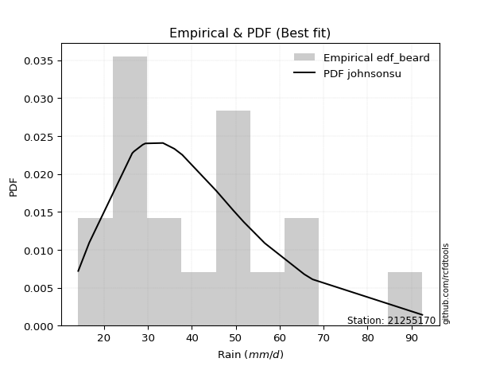</img>

</div>


### 5. Empirical - EDF Chegodayev (1955)

The Chegodayev formula is an empirical plotting position formula used in hydrological frequency analysis to estimate the exceedance probability or return period of a specific event from a set of observed data. It is primarily used for plotting observed data points on probability paper to fit a theoretical distribution, particularly for analyzing extreme events like maximum flood flows or rainfall intensities. The constant _b_ value in the generalized plotting position formula is 0.3.

<div align="center">


$P=(m-b)/(n+1-2b)$


</div>


**5.1. Empirical values**

<div align="center">

|                | 0                   | 1                  | 2                   | 3                   | 4                  | 5                  | 6                   | 7                   | 8                   | 9                  | 10                 | 11                 | 12                 | 13                 | 14                 | 15                 | 16                | 17                 |
|:---------------|:--------------------|:-------------------|:--------------------|:--------------------|:-------------------|:-------------------|:--------------------|:--------------------|:--------------------|:-------------------|:-------------------|:-------------------|:-------------------|:-------------------|:-------------------|:-------------------|:------------------|:-------------------|
| date           | 2015                | 2020               | 2024                | 2016                | 2008               | 2018               | 2007                | 2025                | 2005                | 2006               | 2019               | 2012               | 2013               | 2010               | 2014               | 2011               | 2017              | 2009               |
| x              | 14.1                | 16.6               | 26.4                | 26.7                | 26.8               | 28.8               | 29.4                | 30.6                | 33.4                | 37.8               | 45.6               | 49.4               | 51.638888888888886 | 51.7               | 56.6               | 65.6               | 67.5              | 92.5               |
| m              | 1                   | 2                  | 3                   | 4                   | 5                  | 6                  | 7                   | 8                   | 9                   | 10                 | 11                 | 12                 | 13                 | 14                 | 15                 | 16                 | 17                | 18                 |
| empirical_dist | edf_chegodayev      | edf_chegodayev     | edf_chegodayev      | edf_chegodayev      | edf_chegodayev     | edf_chegodayev     | edf_chegodayev      | edf_chegodayev      | edf_chegodayev      | edf_chegodayev     | edf_chegodayev     | edf_chegodayev     | edf_chegodayev     | edf_chegodayev     | edf_chegodayev     | edf_chegodayev     | edf_chegodayev    | edf_chegodayev     |
| empirical      | 0.03804347826086957 | 0.0923913043478261 | 0.14673913043478262 | 0.20108695652173916 | 0.2554347826086957 | 0.3097826086956522 | 0.36413043478260876 | 0.41847826086956524 | 0.47282608695652173 | 0.5271739130434783 | 0.5815217391304348 | 0.6358695652173914 | 0.6902173913043479 | 0.7445652173913043 | 0.7989130434782609 | 0.8532608695652174 | 0.907608695652174 | 0.9619565217391305 |
| empirical_tr   | 1.03954802259887    | 1.1017964071856288 | 1.1719745222929936  | 1.251700680272109   | 1.343065693430657  | 1.4488188976377954 | 1.5726495726495728  | 1.719626168224299   | 1.8969072164948453  | 2.1149425287356323 | 2.38961038961039   | 2.7462686567164183 | 3.228070175438597  | 3.914893617021276  | 4.972972972972973  | 6.814814814814816  | 10.82352941176471 | 26.285714285714324 |

</div>


**5.2. Kolmogorov-Smirnov fit test (sorted by Δ)**


<div align="center">

|                | 0                   | 1                   | 2                   | 3                   | 4                   | 5                   | 6                   | 7                   | 8                   | 9                   | 10                  | 11                  | 12                  | 13                  | 14                  | 15                  | 16                  | 17                  | 18                  | 19                  | 20                  | 21                  | 22                  | 23                  | 24                  | 25                  | 26                  | 27                  | 28                  | 29                  | 30                  | 31                  | 32                  | 33                  | 34                  | 35                  | 36                  | 37                  | 38                  | 39                  | 40                  | 41                  | 42                  | 43                  | 44                  | 45                  | 46                  | 47                  | 48                  | 49                  | 50                  | 51                  | 52                  | 53                  | 54                  | 55                  | 56                  | 57                  | 58                  | 59                  | 60                  | 61                  | 62                  | 63                  | 64                  | 65                  | 66                  | 67                  | 68                  | 69                    | 70                  | 71                  | 72                  | 73                  | 74                  | 75                  | 76                  | 77                  | 78                  | 79                  | 80                  | 81                  | 82                  | 83                  | 84                  | 85                  | 86                  | 87                  | 88                  | 89                  |
|:---------------|:--------------------|:--------------------|:--------------------|:--------------------|:--------------------|:--------------------|:--------------------|:--------------------|:--------------------|:--------------------|:--------------------|:--------------------|:--------------------|:--------------------|:--------------------|:--------------------|:--------------------|:--------------------|:--------------------|:--------------------|:--------------------|:--------------------|:--------------------|:--------------------|:--------------------|:--------------------|:--------------------|:--------------------|:--------------------|:--------------------|:--------------------|:--------------------|:--------------------|:--------------------|:--------------------|:--------------------|:--------------------|:--------------------|:--------------------|:--------------------|:--------------------|:--------------------|:--------------------|:--------------------|:--------------------|:--------------------|:--------------------|:--------------------|:--------------------|:--------------------|:--------------------|:--------------------|:--------------------|:--------------------|:--------------------|:--------------------|:--------------------|:--------------------|:--------------------|:--------------------|:--------------------|:--------------------|:--------------------|:--------------------|:--------------------|:--------------------|:--------------------|:--------------------|:--------------------|:----------------------|:--------------------|:--------------------|:--------------------|:--------------------|:--------------------|:--------------------|:--------------------|:--------------------|:--------------------|:--------------------|:--------------------|:--------------------|:--------------------|:--------------------|:--------------------|:--------------------|:--------------------|:--------------------|:--------------------|:--------------------|
| station        | 21255170            | 21255170            | 21255170            | 21255170            | 21255170            | 21255170            | 21255170            | 21255170            | 21255170            | 21255170            | 21255170            | 21255170            | 21255170            | 21255170            | 21255170            | 21255170            | 21255170            | 21255170            | 21255170            | 21255170            | 21255170            | 21255170            | 21255170            | 21255170            | 21255170            | 21255170            | 21255170            | 21255170            | 21255170            | 21255170            | 21255170            | 21255170            | 21255170            | 21255170            | 21255170            | 21255170            | 21255170            | 21255170            | 21255170            | 21255170            | 21255170            | 21255170            | 21255170            | 21255170            | 21255170            | 21255170            | 21255170            | 21255170            | 21255170            | 21255170            | 21255170            | 21255170            | 21255170            | 21255170            | 21255170            | 21255170            | 21255170            | 21255170            | 21255170            | 21255170            | 21255170            | 21255170            | 21255170            | 21255170            | 21255170            | 21255170            | 21255170            | 21255170            | 21255170            | 21255170              | 21255170            | 21255170            | 21255170            | 21255170            | 21255170            | 21255170            | 21255170            | 21255170            | 21255170            | 21255170            | 21255170            | 21255170            | 21255170            | 21255170            | 21255170            | 21255170            | 21255170            | 21255170            | 21255170            | 21255170            |
| empirical_dist | edf_chegodayev      | edf_chegodayev      | edf_chegodayev      | edf_chegodayev      | edf_chegodayev      | edf_chegodayev      | edf_chegodayev      | edf_chegodayev      | edf_chegodayev      | edf_chegodayev      | edf_chegodayev      | edf_chegodayev      | edf_chegodayev      | edf_chegodayev      | edf_chegodayev      | edf_chegodayev      | edf_chegodayev      | edf_chegodayev      | edf_chegodayev      | edf_chegodayev      | edf_chegodayev      | edf_chegodayev      | edf_chegodayev      | edf_chegodayev      | edf_chegodayev      | edf_chegodayev      | edf_chegodayev      | edf_chegodayev      | edf_chegodayev      | edf_chegodayev      | edf_chegodayev      | edf_chegodayev      | edf_chegodayev      | edf_chegodayev      | edf_chegodayev      | edf_chegodayev      | edf_chegodayev      | edf_chegodayev      | edf_chegodayev      | edf_chegodayev      | edf_chegodayev      | edf_chegodayev      | edf_chegodayev      | edf_chegodayev      | edf_chegodayev      | edf_chegodayev      | edf_chegodayev      | edf_chegodayev      | edf_chegodayev      | edf_chegodayev      | edf_chegodayev      | edf_chegodayev      | edf_chegodayev      | edf_chegodayev      | edf_chegodayev      | edf_chegodayev      | edf_chegodayev      | edf_chegodayev      | edf_chegodayev      | edf_chegodayev      | edf_chegodayev      | edf_chegodayev      | edf_chegodayev      | edf_chegodayev      | edf_chegodayev      | edf_chegodayev      | edf_chegodayev      | edf_chegodayev      | edf_chegodayev      | edf_chegodayev        | edf_chegodayev      | edf_chegodayev      | edf_chegodayev      | edf_chegodayev      | edf_chegodayev      | edf_chegodayev      | edf_chegodayev      | edf_chegodayev      | edf_chegodayev      | edf_chegodayev      | edf_chegodayev      | edf_chegodayev      | edf_chegodayev      | edf_chegodayev      | edf_chegodayev      | edf_chegodayev      | edf_chegodayev      | edf_chegodayev      | edf_chegodayev      | edf_chegodayev      |
| p_dist         | logweibull_min      | lognakagami         | invgauss            | logjohnsonsu        | johnsonsu           | logf                | logfatiguelife      | logt                | lognorm             | lognorm             | logcrystalball      | logexponnorm        | loglognorm          | lognct              | fatiguelife         | logpearson3         | loggamma            | loggamma            | invgamma            | logloggamma         | fisk                | logerlang           | halflogistic        | logbetaprime        | betaprime           | invweibull          | logfisk             | mielke              | loggenlogistic      | ncf                 | exponnorm           | rayleigh            | logrice             | loginvgamma         | alpha               | moyal               | logalpha            | erlang              | chi2                | gamma               | pearson3            | f                   | laplace_asymmetric  | genlogistic         | kstwobign           | loggompertz         | loginvgauss         | gumbel_r            | logmaxwell          | weibull_min         | loglogistic         | maxwell             | halfnorm            | lograyleigh         | gompertz            | loghypsecant        | rice                | nct                 | logmielke           | loghalfnorm         | logncf              | t                   | truncnorm           | norm                | crystalball         | loggumbel_r         | loggumbel_l         | loginvweibull       | loglaplace          | loglaplace_asymmetric | loghalflogistic     | wald                | logistic            | logmoyal            | logkstwobign        | hypsecant           | loggenexpon         | gumbel_l            | genexpon            | laplace             | logwald             | expon               | logtruncnorm        | loggibrat           | gibrat              | nakagami            | logexpon            | logpareto           | logchi2             | pareto              |
| delta          | 0.08649662253356274 | 0.0865423006253064  | 0.08655822119824128 | 0.08679106558346603 | 0.08692038403596275 | 0.08701681816833759 | 0.08704326186854325 | 0.08709149715092177 | 0.0870953885298846  | 0.0870953885298846  | 0.08709606755731983 | 0.08709621657733871 | 0.0870967077192227  | 0.08734753865115061 | 0.08833115915975046 | 0.08845652496660122 | 0.091052378375622   | 0.091052378375622   | 0.09140213384979917 | 0.09181701181020585 | 0.09194141591122057 | 0.09212438018103569 | 0.0923913043478261  | 0.09333549337822833 | 0.09394941432913356 | 0.09481336245617483 | 0.0950005851593479  | 0.09584918113217489 | 0.0958563467732082  | 0.09647505039827409 | 0.09670352695264306 | 0.09672939487066334 | 0.09678181129571983 | 0.09764053895319155 | 0.09797305579120652 | 0.09910568952023141 | 0.10167424354064383 | 0.10173366794174521 | 0.1017349859731263  | 0.10173600747760561 | 0.10182597394473752 | 0.10204442486899673 | 0.10237155561014122 | 0.10241599439254784 | 0.10339311550756947 | 0.1041834411469911  | 0.10445589763742716 | 0.10604221335521868 | 0.10617637412364914 | 0.1061834087991623  | 0.1065644327874844  | 0.10723909357827494 | 0.10903255428703393 | 0.11412245589399103 | 0.11468778386984899 | 0.12200974679613463 | 0.12927759068333877 | 0.13290670212510872 | 0.13368413097369333 | 0.13449319400844809 | 0.13717191287965694 | 0.13744281416240678 | 0.13745403304819737 | 0.1374540544206474  | 0.1374540676186482  | 0.13799891949672982 | 0.13839274270597357 | 0.1403370174082791  | 0.1451076277639456  | 0.14530249428150377   | 0.152148160496676   | 0.15501684455992543 | 0.15658383817209243 | 0.15710836527415428 | 0.1705527332163793  | 0.1711522616741893  | 0.1806124505668     | 0.19500859544101862 | 0.19527881626377716 | 0.19875495765284845 | 0.21160129902831415 | 0.21254506942016568 | 0.2212773714839773  | 0.24372179232327273 | 0.2570522145503578  | 0.28335978364604875 | 0.3278328435458632  | 0.32783284770721477 | 0.39713480158185177 | 0.5125961718909383  |
| deltao         | 0.32102346734599996 | 0.32102346734599996 | 0.32102346734599996 | 0.32102346734599996 | 0.32102346734599996 | 0.32102346734599996 | 0.32102346734599996 | 0.32102346734599996 | 0.32102346734599996 | 0.32102346734599996 | 0.32102346734599996 | 0.32102346734599996 | 0.32102346734599996 | 0.32102346734599996 | 0.32102346734599996 | 0.32102346734599996 | 0.32102346734599996 | 0.32102346734599996 | 0.32102346734599996 | 0.32102346734599996 | 0.32102346734599996 | 0.32102346734599996 | 0.32102346734599996 | 0.32102346734599996 | 0.32102346734599996 | 0.32102346734599996 | 0.32102346734599996 | 0.32102346734599996 | 0.32102346734599996 | 0.32102346734599996 | 0.32102346734599996 | 0.32102346734599996 | 0.32102346734599996 | 0.32102346734599996 | 0.32102346734599996 | 0.32102346734599996 | 0.32102346734599996 | 0.32102346734599996 | 0.32102346734599996 | 0.32102346734599996 | 0.32102346734599996 | 0.32102346734599996 | 0.32102346734599996 | 0.32102346734599996 | 0.32102346734599996 | 0.32102346734599996 | 0.32102346734599996 | 0.32102346734599996 | 0.32102346734599996 | 0.32102346734599996 | 0.32102346734599996 | 0.32102346734599996 | 0.32102346734599996 | 0.32102346734599996 | 0.32102346734599996 | 0.32102346734599996 | 0.32102346734599996 | 0.32102346734599996 | 0.32102346734599996 | 0.32102346734599996 | 0.32102346734599996 | 0.32102346734599996 | 0.32102346734599996 | 0.32102346734599996 | 0.32102346734599996 | 0.32102346734599996 | 0.32102346734599996 | 0.32102346734599996 | 0.32102346734599996 | 0.32102346734599996   | 0.32102346734599996 | 0.32102346734599996 | 0.32102346734599996 | 0.32102346734599996 | 0.32102346734599996 | 0.32102346734599996 | 0.32102346734599996 | 0.32102346734599996 | 0.32102346734599996 | 0.32102346734599996 | 0.32102346734599996 | 0.32102346734599996 | 0.32102346734599996 | 0.32102346734599996 | 0.32102346734599996 | 0.32102346734599996 | 0.32102346734599996 | 0.32102346734599996 | 0.32102346734599996 | 0.32102346734599996 |
| eval           | Δo > Δ              | Δo > Δ              | Δo > Δ              | Δo > Δ              | Δo > Δ              | Δo > Δ              | Δo > Δ              | Δo > Δ              | Δo > Δ              | Δo > Δ              | Δo > Δ              | Δo > Δ              | Δo > Δ              | Δo > Δ              | Δo > Δ              | Δo > Δ              | Δo > Δ              | Δo > Δ              | Δo > Δ              | Δo > Δ              | Δo > Δ              | Δo > Δ              | Δo > Δ              | Δo > Δ              | Δo > Δ              | Δo > Δ              | Δo > Δ              | Δo > Δ              | Δo > Δ              | Δo > Δ              | Δo > Δ              | Δo > Δ              | Δo > Δ              | Δo > Δ              | Δo > Δ              | Δo > Δ              | Δo > Δ              | Δo > Δ              | Δo > Δ              | Δo > Δ              | Δo > Δ              | Δo > Δ              | Δo > Δ              | Δo > Δ              | Δo > Δ              | Δo > Δ              | Δo > Δ              | Δo > Δ              | Δo > Δ              | Δo > Δ              | Δo > Δ              | Δo > Δ              | Δo > Δ              | Δo > Δ              | Δo > Δ              | Δo > Δ              | Δo > Δ              | Δo > Δ              | Δo > Δ              | Δo > Δ              | Δo > Δ              | Δo > Δ              | Δo > Δ              | Δo > Δ              | Δo > Δ              | Δo > Δ              | Δo > Δ              | Δo > Δ              | Δo > Δ              | Δo > Δ                | Δo > Δ              | Δo > Δ              | Δo > Δ              | Δo > Δ              | Δo > Δ              | Δo > Δ              | Δo > Δ              | Δo > Δ              | Δo > Δ              | Δo > Δ              | Δo > Δ              | Δo > Δ              | Δo > Δ              | Δo > Δ              | Δo > Δ              | Δo > Δ              | Δo <= Δ             | Δo <= Δ             | Δo <= Δ             | Δo <= Δ             |
| fit            | 1                   | 1                   | 1                   | 1                   | 1                   | 1                   | 1                   | 1                   | 1                   | 1                   | 1                   | 1                   | 1                   | 1                   | 1                   | 1                   | 1                   | 1                   | 1                   | 1                   | 1                   | 1                   | 1                   | 1                   | 1                   | 1                   | 1                   | 1                   | 1                   | 1                   | 1                   | 1                   | 1                   | 1                   | 1                   | 1                   | 1                   | 1                   | 1                   | 1                   | 1                   | 1                   | 1                   | 1                   | 1                   | 1                   | 1                   | 1                   | 1                   | 1                   | 1                   | 1                   | 1                   | 1                   | 1                   | 1                   | 1                   | 1                   | 1                   | 1                   | 1                   | 1                   | 1                   | 1                   | 1                   | 1                   | 1                   | 1                   | 1                   | 1                     | 1                   | 1                   | 1                   | 1                   | 1                   | 1                   | 1                   | 1                   | 1                   | 1                   | 1                   | 1                   | 1                   | 1                   | 1                   | 1                   | 0                   | 0                   | 0                   | 0                   |
| n              | 18                  | 18                  | 18                  | 18                  | 18                  | 18                  | 18                  | 18                  | 18                  | 18                  | 18                  | 18                  | 18                  | 18                  | 18                  | 18                  | 18                  | 18                  | 18                  | 18                  | 18                  | 18                  | 18                  | 18                  | 18                  | 18                  | 18                  | 18                  | 18                  | 18                  | 18                  | 18                  | 18                  | 18                  | 18                  | 18                  | 18                  | 18                  | 18                  | 18                  | 18                  | 18                  | 18                  | 18                  | 18                  | 18                  | 18                  | 18                  | 18                  | 18                  | 18                  | 18                  | 18                  | 18                  | 18                  | 18                  | 18                  | 18                  | 18                  | 18                  | 18                  | 18                  | 18                  | 18                  | 18                  | 18                  | 18                  | 18                  | 18                  | 18                    | 18                  | 18                  | 18                  | 18                  | 18                  | 18                  | 18                  | 18                  | 18                  | 18                  | 18                  | 18                  | 18                  | 18                  | 18                  | 18                  | 18                  | 18                  | 18                  | 18                  |
| best_fit       | 1                   | 0                   | 0                   | 0                   | 0                   | 0                   | 0                   | 0                   | 0                   | 0                   | 0                   | 0                   | 0                   | 0                   | 0                   | 0                   | 0                   | 0                   | 0                   | 0                   | 0                   | 0                   | 0                   | 0                   | 0                   | 0                   | 0                   | 0                   | 0                   | 0                   | 0                   | 0                   | 0                   | 0                   | 0                   | 0                   | 0                   | 0                   | 0                   | 0                   | 0                   | 0                   | 0                   | 0                   | 0                   | 0                   | 0                   | 0                   | 0                   | 0                   | 0                   | 0                   | 0                   | 0                   | 0                   | 0                   | 0                   | 0                   | 0                   | 0                   | 0                   | 0                   | 0                   | 0                   | 0                   | 0                   | 0                   | 0                   | 0                   | 0                     | 0                   | 0                   | 0                   | 0                   | 0                   | 0                   | 0                   | 0                   | 0                   | 0                   | 0                   | 0                   | 0                   | 0                   | 0                   | 0                   | 0                   | 0                   | 0                   | 0                   |
| best_fit_sort  | 1                   | 2                   | 3                   | 4                   | 5                   | 6                   | 7                   | 8                   | 9                   | 10                  | 11                  | 12                  | 13                  | 14                  | 15                  | 16                  | 17                  | 18                  | 19                  | 20                  | 21                  | 22                  | 23                  | 24                  | 25                  | 26                  | 27                  | 28                  | 29                  | 30                  | 31                  | 32                  | 33                  | 34                  | 35                  | 36                  | 37                  | 38                  | 39                  | 40                  | 41                  | 42                  | 43                  | 44                  | 45                  | 46                  | 47                  | 48                  | 49                  | 50                  | 51                  | 52                  | 53                  | 54                  | 55                  | 56                  | 57                  | 58                  | 59                  | 60                  | 61                  | 62                  | 63                  | 64                  | 65                  | 66                  | 67                  | 68                  | 69                  | 70                    | 71                  | 72                  | 73                  | 74                  | 75                  | 76                  | 77                  | 78                  | 79                  | 80                  | 81                  | 82                  | 83                  | 84                  | 85                  | 86                  | 87                  | 88                  | 89                  | 90                  |

</div>


<div align="center">

</img>

</div>


**5.3. Best fit**

<div align="center">

|   id |   station | empirical_dist   | p_dist         |     delta |   deltao | eval   |   fit |   n |   best_fit |   best_fit_sort |
|-----:|----------:|:-----------------|:---------------|----------:|---------:|:-------|------:|----:|-----------:|----------------:|
|    0 |  21255170 | edf_chegodayev   | logweibull_min | 0.0864966 | 0.321023 | Δo > Δ |     1 |  18 |          1 |               1 |

</div>


<div align="center">

</img></img>

</div>


### 6. Empirical - EDF Blom (1958)

The Blom formula is a specific "plotting position" formula used in hydrology and statistical analysis to estimate the empirical cumulative probability (or non-exceedance probability) of a data series. It is particularly recommended for data that are approximately normally distributed. The constant _a_ is set to 0.375 (or 3/8).

<div align="center">


$P=(m-a)/(n+1-2a)$


</div>


**6.1. Empirical values**

<div align="center">

|                | 0                   | 1                   | 2                   | 3                   | 4                  | 5                  | 6                  | 7                  | 8                  | 9                  | 10                 | 11                 | 12                 | 13                 | 14                 | 15                 | 16                 | 17                 |
|:---------------|:--------------------|:--------------------|:--------------------|:--------------------|:-------------------|:-------------------|:-------------------|:-------------------|:-------------------|:-------------------|:-------------------|:-------------------|:-------------------|:-------------------|:-------------------|:-------------------|:-------------------|:-------------------|
| date           | 2015                | 2020                | 2024                | 2016                | 2008               | 2018               | 2007               | 2025               | 2005               | 2006               | 2019               | 2012               | 2013               | 2010               | 2014               | 2011               | 2017               | 2009               |
| x              | 14.1                | 16.6                | 26.4                | 26.7                | 26.8               | 28.8               | 29.4               | 30.6               | 33.4               | 37.8               | 45.6               | 49.4               | 51.638888888888886 | 51.7               | 56.6               | 65.6               | 67.5               | 92.5               |
| m              | 1                   | 2                   | 3                   | 4                   | 5                  | 6                  | 7                  | 8                  | 9                  | 10                 | 11                 | 12                 | 13                 | 14                 | 15                 | 16                 | 17                 | 18                 |
| empirical_dist | edf_blom            | edf_blom            | edf_blom            | edf_blom            | edf_blom           | edf_blom           | edf_blom           | edf_blom           | edf_blom           | edf_blom           | edf_blom           | edf_blom           | edf_blom           | edf_blom           | edf_blom           | edf_blom           | edf_blom           | edf_blom           |
| empirical      | 0.03424657534246575 | 0.08904109589041095 | 0.14383561643835616 | 0.19863013698630136 | 0.2534246575342466 | 0.3082191780821918 | 0.363013698630137  | 0.4178082191780822 | 0.4726027397260274 | 0.5273972602739726 | 0.5821917808219178 | 0.636986301369863  | 0.6917808219178082 | 0.7465753424657534 | 0.8013698630136986 | 0.8561643835616438 | 0.910958904109589  | 0.9657534246575342 |
| empirical_tr   | 1.0354609929078014  | 1.0977443609022557  | 1.168               | 1.2478632478632479  | 1.3394495412844036 | 1.4455445544554455 | 1.5698924731182795 | 1.7176470588235295 | 1.896103896103896  | 2.1159420289855073 | 2.3934426229508197 | 2.7547169811320753 | 3.2444444444444445 | 3.9459459459459456 | 5.0344827586206895 | 6.952380952380952  | 11.230769230769228 | 29.199999999999978 |

</div>


**6.2. Kolmogorov-Smirnov fit test (sorted by Δ)**


<div align="center">

|                | 0                   | 1                   | 2                   | 3                   | 4                   | 5                   | 6                   | 7                   | 8                   | 9                   | 10                  | 11                  | 12                  | 13                  | 14                  | 15                  | 16                  | 17                  | 18                  | 19                  | 20                  | 21                  | 22                  | 23                  | 24                  | 25                  | 26                  | 27                  | 28                  | 29                  | 30                  | 31                  | 32                  | 33                  | 34                  | 35                  | 36                  | 37                  | 38                  | 39                  | 40                  | 41                  | 42                  | 43                  | 44                  | 45                  | 46                  | 47                  | 48                  | 49                  | 50                  | 51                  | 52                  | 53                  | 54                  | 55                  | 56                  | 57                  | 58                  | 59                  | 60                  | 61                  | 62                  | 63                  | 64                  | 65                  | 66                  | 67                  | 68                  | 69                    | 70                  | 71                  | 72                  | 73                  | 74                  | 75                  | 76                  | 77                  | 78                  | 79                  | 80                  | 81                  | 82                  | 83                  | 84                  | 85                  | 86                  | 87                  | 88                  | 89                  |
|:---------------|:--------------------|:--------------------|:--------------------|:--------------------|:--------------------|:--------------------|:--------------------|:--------------------|:--------------------|:--------------------|:--------------------|:--------------------|:--------------------|:--------------------|:--------------------|:--------------------|:--------------------|:--------------------|:--------------------|:--------------------|:--------------------|:--------------------|:--------------------|:--------------------|:--------------------|:--------------------|:--------------------|:--------------------|:--------------------|:--------------------|:--------------------|:--------------------|:--------------------|:--------------------|:--------------------|:--------------------|:--------------------|:--------------------|:--------------------|:--------------------|:--------------------|:--------------------|:--------------------|:--------------------|:--------------------|:--------------------|:--------------------|:--------------------|:--------------------|:--------------------|:--------------------|:--------------------|:--------------------|:--------------------|:--------------------|:--------------------|:--------------------|:--------------------|:--------------------|:--------------------|:--------------------|:--------------------|:--------------------|:--------------------|:--------------------|:--------------------|:--------------------|:--------------------|:--------------------|:----------------------|:--------------------|:--------------------|:--------------------|:--------------------|:--------------------|:--------------------|:--------------------|:--------------------|:--------------------|:--------------------|:--------------------|:--------------------|:--------------------|:--------------------|:--------------------|:--------------------|:--------------------|:--------------------|:--------------------|:--------------------|
| station        | 21255170            | 21255170            | 21255170            | 21255170            | 21255170            | 21255170            | 21255170            | 21255170            | 21255170            | 21255170            | 21255170            | 21255170            | 21255170            | 21255170            | 21255170            | 21255170            | 21255170            | 21255170            | 21255170            | 21255170            | 21255170            | 21255170            | 21255170            | 21255170            | 21255170            | 21255170            | 21255170            | 21255170            | 21255170            | 21255170            | 21255170            | 21255170            | 21255170            | 21255170            | 21255170            | 21255170            | 21255170            | 21255170            | 21255170            | 21255170            | 21255170            | 21255170            | 21255170            | 21255170            | 21255170            | 21255170            | 21255170            | 21255170            | 21255170            | 21255170            | 21255170            | 21255170            | 21255170            | 21255170            | 21255170            | 21255170            | 21255170            | 21255170            | 21255170            | 21255170            | 21255170            | 21255170            | 21255170            | 21255170            | 21255170            | 21255170            | 21255170            | 21255170            | 21255170            | 21255170              | 21255170            | 21255170            | 21255170            | 21255170            | 21255170            | 21255170            | 21255170            | 21255170            | 21255170            | 21255170            | 21255170            | 21255170            | 21255170            | 21255170            | 21255170            | 21255170            | 21255170            | 21255170            | 21255170            | 21255170            |
| empirical_dist | edf_blom            | edf_blom            | edf_blom            | edf_blom            | edf_blom            | edf_blom            | edf_blom            | edf_blom            | edf_blom            | edf_blom            | edf_blom            | edf_blom            | edf_blom            | edf_blom            | edf_blom            | edf_blom            | edf_blom            | edf_blom            | edf_blom            | edf_blom            | edf_blom            | edf_blom            | edf_blom            | edf_blom            | edf_blom            | edf_blom            | edf_blom            | edf_blom            | edf_blom            | edf_blom            | edf_blom            | edf_blom            | edf_blom            | edf_blom            | edf_blom            | edf_blom            | edf_blom            | edf_blom            | edf_blom            | edf_blom            | edf_blom            | edf_blom            | edf_blom            | edf_blom            | edf_blom            | edf_blom            | edf_blom            | edf_blom            | edf_blom            | edf_blom            | edf_blom            | edf_blom            | edf_blom            | edf_blom            | edf_blom            | edf_blom            | edf_blom            | edf_blom            | edf_blom            | edf_blom            | edf_blom            | edf_blom            | edf_blom            | edf_blom            | edf_blom            | edf_blom            | edf_blom            | edf_blom            | edf_blom            | edf_blom              | edf_blom            | edf_blom            | edf_blom            | edf_blom            | edf_blom            | edf_blom            | edf_blom            | edf_blom            | edf_blom            | edf_blom            | edf_blom            | edf_blom            | edf_blom            | edf_blom            | edf_blom            | edf_blom            | edf_blom            | edf_blom            | edf_blom            | edf_blom            |
| p_dist         | johnsonsu           | logpearson3         | logweibull_min      | lognakagami         | invgauss            | logjohnsonsu        | halflogistic        | logf                | logfatiguelife      | logt                | lognorm             | lognorm             | logcrystalball      | logexponnorm        | loglognorm          | lognct              | invgamma            | logloggamma         | fatiguelife         | fisk                | betaprime           | loggamma            | loggamma            | invweibull          | logfisk             | logerlang           | mielke              | loggenlogistic      | ncf                 | exponnorm           | rayleigh            | logbetaprime        | alpha               | moyal               | logrice             | loginvgamma         | pearson3            | laplace_asymmetric  | genlogistic         | kstwobign           | logalpha            | erlang              | chi2                | gamma               | f                   | gumbel_r            | loglogistic         | maxwell             | loggompertz         | loginvgauss         | logmaxwell          | weibull_min         | halfnorm            | lograyleigh         | gompertz            | loghypsecant        | rice                | nct                 | logmielke           | t                   | truncnorm           | norm                | crystalball         | loggumbel_r         | loghalfnorm         | loggumbel_l         | logncf              | loginvweibull       | loglaplace          | loglaplace_asymmetric | loghalflogistic     | wald                | logistic            | logmoyal            | hypsecant           | logkstwobign        | loggenexpon         | gumbel_l            | genexpon            | laplace             | logwald             | expon               | logtruncnorm        | loggibrat           | gibrat              | nakagami            | logexpon            | logpareto           | logchi2             | pareto              |
| delta          | 0.0862503423444797  | 0.08778648327511818 | 0.08940013652998921 | 0.08944581462173287 | 0.08946173519466774 | 0.08969457957989249 | 0.08989104449589591 | 0.08992033216476406 | 0.08994677586496971 | 0.08999501114734823 | 0.08999890252631107 | 0.08999890252631107 | 0.0899995815537463  | 0.08999973057376517 | 0.09000022171564917 | 0.09025105264757707 | 0.09073209215831612 | 0.0911469701187228  | 0.09123467315617692 | 0.09127137421973752 | 0.09327937263765052 | 0.09395589237204846 | 0.09395589237204846 | 0.09414332076469178 | 0.09433054346786485 | 0.09502789417746216 | 0.09517913944069184 | 0.09518630508172515 | 0.09580500870679104 | 0.09603348526116007 | 0.09610182501845954 | 0.0962390073746548  | 0.09730301409972347 | 0.09843564782874836 | 0.0996853252921463  | 0.10054405294961802 | 0.10115593225325448 | 0.10170151391865823 | 0.10174595270106479 | 0.10272307381608642 | 0.1045777575370703  | 0.10463718193817168 | 0.10463849996955277 | 0.10463952147403208 | 0.1049479388654232  | 0.10537217166373564 | 0.10544769663501274 | 0.10656905188679189 | 0.10708695514341757 | 0.10735941163385362 | 0.1090798881200756  | 0.10908692279558876 | 0.1119360682834604  | 0.1170259698904175  | 0.11759129786627545 | 0.12089301064366298 | 0.12860754899185572 | 0.13581021612153518 | 0.1365876449701198  | 0.13721946693191245 | 0.13723068581770304 | 0.13723070719015307 | 0.13723072038815387 | 0.13732887780524683 | 0.13739670800487455 | 0.13772270101449052 | 0.1400754268760834  | 0.14324053140470558 | 0.14399089161147394 | 0.14463245259002078   | 0.15147811880519302 | 0.15431026904002731 | 0.1563604909415981  | 0.1564383235826713  | 0.17092891444369496 | 0.17345624721280575 | 0.18351596456322647 | 0.1947852482105243  | 0.19818233026020363 | 0.19853161042235412 | 0.21093125733683116 | 0.21544858341659215 | 0.21926724640952822 | 0.24305175063178974 | 0.25593547839788605 | 0.28626329764247516 | 0.3307363575422896  | 0.3307363617036412  | 0.4000383155782782  | 0.5159463803483534  |
| deltao         | 0.32102346734599996 | 0.32102346734599996 | 0.32102346734599996 | 0.32102346734599996 | 0.32102346734599996 | 0.32102346734599996 | 0.32102346734599996 | 0.32102346734599996 | 0.32102346734599996 | 0.32102346734599996 | 0.32102346734599996 | 0.32102346734599996 | 0.32102346734599996 | 0.32102346734599996 | 0.32102346734599996 | 0.32102346734599996 | 0.32102346734599996 | 0.32102346734599996 | 0.32102346734599996 | 0.32102346734599996 | 0.32102346734599996 | 0.32102346734599996 | 0.32102346734599996 | 0.32102346734599996 | 0.32102346734599996 | 0.32102346734599996 | 0.32102346734599996 | 0.32102346734599996 | 0.32102346734599996 | 0.32102346734599996 | 0.32102346734599996 | 0.32102346734599996 | 0.32102346734599996 | 0.32102346734599996 | 0.32102346734599996 | 0.32102346734599996 | 0.32102346734599996 | 0.32102346734599996 | 0.32102346734599996 | 0.32102346734599996 | 0.32102346734599996 | 0.32102346734599996 | 0.32102346734599996 | 0.32102346734599996 | 0.32102346734599996 | 0.32102346734599996 | 0.32102346734599996 | 0.32102346734599996 | 0.32102346734599996 | 0.32102346734599996 | 0.32102346734599996 | 0.32102346734599996 | 0.32102346734599996 | 0.32102346734599996 | 0.32102346734599996 | 0.32102346734599996 | 0.32102346734599996 | 0.32102346734599996 | 0.32102346734599996 | 0.32102346734599996 | 0.32102346734599996 | 0.32102346734599996 | 0.32102346734599996 | 0.32102346734599996 | 0.32102346734599996 | 0.32102346734599996 | 0.32102346734599996 | 0.32102346734599996 | 0.32102346734599996 | 0.32102346734599996   | 0.32102346734599996 | 0.32102346734599996 | 0.32102346734599996 | 0.32102346734599996 | 0.32102346734599996 | 0.32102346734599996 | 0.32102346734599996 | 0.32102346734599996 | 0.32102346734599996 | 0.32102346734599996 | 0.32102346734599996 | 0.32102346734599996 | 0.32102346734599996 | 0.32102346734599996 | 0.32102346734599996 | 0.32102346734599996 | 0.32102346734599996 | 0.32102346734599996 | 0.32102346734599996 | 0.32102346734599996 |
| eval           | Δo > Δ              | Δo > Δ              | Δo > Δ              | Δo > Δ              | Δo > Δ              | Δo > Δ              | Δo > Δ              | Δo > Δ              | Δo > Δ              | Δo > Δ              | Δo > Δ              | Δo > Δ              | Δo > Δ              | Δo > Δ              | Δo > Δ              | Δo > Δ              | Δo > Δ              | Δo > Δ              | Δo > Δ              | Δo > Δ              | Δo > Δ              | Δo > Δ              | Δo > Δ              | Δo > Δ              | Δo > Δ              | Δo > Δ              | Δo > Δ              | Δo > Δ              | Δo > Δ              | Δo > Δ              | Δo > Δ              | Δo > Δ              | Δo > Δ              | Δo > Δ              | Δo > Δ              | Δo > Δ              | Δo > Δ              | Δo > Δ              | Δo > Δ              | Δo > Δ              | Δo > Δ              | Δo > Δ              | Δo > Δ              | Δo > Δ              | Δo > Δ              | Δo > Δ              | Δo > Δ              | Δo > Δ              | Δo > Δ              | Δo > Δ              | Δo > Δ              | Δo > Δ              | Δo > Δ              | Δo > Δ              | Δo > Δ              | Δo > Δ              | Δo > Δ              | Δo > Δ              | Δo > Δ              | Δo > Δ              | Δo > Δ              | Δo > Δ              | Δo > Δ              | Δo > Δ              | Δo > Δ              | Δo > Δ              | Δo > Δ              | Δo > Δ              | Δo > Δ              | Δo > Δ                | Δo > Δ              | Δo > Δ              | Δo > Δ              | Δo > Δ              | Δo > Δ              | Δo > Δ              | Δo > Δ              | Δo > Δ              | Δo > Δ              | Δo > Δ              | Δo > Δ              | Δo > Δ              | Δo > Δ              | Δo > Δ              | Δo > Δ              | Δo > Δ              | Δo <= Δ             | Δo <= Δ             | Δo <= Δ             | Δo <= Δ             |
| fit            | 1                   | 1                   | 1                   | 1                   | 1                   | 1                   | 1                   | 1                   | 1                   | 1                   | 1                   | 1                   | 1                   | 1                   | 1                   | 1                   | 1                   | 1                   | 1                   | 1                   | 1                   | 1                   | 1                   | 1                   | 1                   | 1                   | 1                   | 1                   | 1                   | 1                   | 1                   | 1                   | 1                   | 1                   | 1                   | 1                   | 1                   | 1                   | 1                   | 1                   | 1                   | 1                   | 1                   | 1                   | 1                   | 1                   | 1                   | 1                   | 1                   | 1                   | 1                   | 1                   | 1                   | 1                   | 1                   | 1                   | 1                   | 1                   | 1                   | 1                   | 1                   | 1                   | 1                   | 1                   | 1                   | 1                   | 1                   | 1                   | 1                   | 1                     | 1                   | 1                   | 1                   | 1                   | 1                   | 1                   | 1                   | 1                   | 1                   | 1                   | 1                   | 1                   | 1                   | 1                   | 1                   | 1                   | 0                   | 0                   | 0                   | 0                   |
| n              | 18                  | 18                  | 18                  | 18                  | 18                  | 18                  | 18                  | 18                  | 18                  | 18                  | 18                  | 18                  | 18                  | 18                  | 18                  | 18                  | 18                  | 18                  | 18                  | 18                  | 18                  | 18                  | 18                  | 18                  | 18                  | 18                  | 18                  | 18                  | 18                  | 18                  | 18                  | 18                  | 18                  | 18                  | 18                  | 18                  | 18                  | 18                  | 18                  | 18                  | 18                  | 18                  | 18                  | 18                  | 18                  | 18                  | 18                  | 18                  | 18                  | 18                  | 18                  | 18                  | 18                  | 18                  | 18                  | 18                  | 18                  | 18                  | 18                  | 18                  | 18                  | 18                  | 18                  | 18                  | 18                  | 18                  | 18                  | 18                  | 18                  | 18                    | 18                  | 18                  | 18                  | 18                  | 18                  | 18                  | 18                  | 18                  | 18                  | 18                  | 18                  | 18                  | 18                  | 18                  | 18                  | 18                  | 18                  | 18                  | 18                  | 18                  |
| best_fit       | 1                   | 0                   | 0                   | 0                   | 0                   | 0                   | 0                   | 0                   | 0                   | 0                   | 0                   | 0                   | 0                   | 0                   | 0                   | 0                   | 0                   | 0                   | 0                   | 0                   | 0                   | 0                   | 0                   | 0                   | 0                   | 0                   | 0                   | 0                   | 0                   | 0                   | 0                   | 0                   | 0                   | 0                   | 0                   | 0                   | 0                   | 0                   | 0                   | 0                   | 0                   | 0                   | 0                   | 0                   | 0                   | 0                   | 0                   | 0                   | 0                   | 0                   | 0                   | 0                   | 0                   | 0                   | 0                   | 0                   | 0                   | 0                   | 0                   | 0                   | 0                   | 0                   | 0                   | 0                   | 0                   | 0                   | 0                   | 0                   | 0                   | 0                     | 0                   | 0                   | 0                   | 0                   | 0                   | 0                   | 0                   | 0                   | 0                   | 0                   | 0                   | 0                   | 0                   | 0                   | 0                   | 0                   | 0                   | 0                   | 0                   | 0                   |
| best_fit_sort  | 1                   | 2                   | 3                   | 4                   | 5                   | 6                   | 7                   | 8                   | 9                   | 10                  | 11                  | 12                  | 13                  | 14                  | 15                  | 16                  | 17                  | 18                  | 19                  | 20                  | 21                  | 22                  | 23                  | 24                  | 25                  | 26                  | 27                  | 28                  | 29                  | 30                  | 31                  | 32                  | 33                  | 34                  | 35                  | 36                  | 37                  | 38                  | 39                  | 40                  | 41                  | 42                  | 43                  | 44                  | 45                  | 46                  | 47                  | 48                  | 49                  | 50                  | 51                  | 52                  | 53                  | 54                  | 55                  | 56                  | 57                  | 58                  | 59                  | 60                  | 61                  | 62                  | 63                  | 64                  | 65                  | 66                  | 67                  | 68                  | 69                  | 70                    | 71                  | 72                  | 73                  | 74                  | 75                  | 76                  | 77                  | 78                  | 79                  | 80                  | 81                  | 82                  | 83                  | 84                  | 85                  | 86                  | 87                  | 88                  | 89                  | 90                  |

</div>


<div align="center">

</img>

</div>


**6.3. Best fit**

<div align="center">

|   id |   station | empirical_dist   | p_dist    |     delta |   deltao | eval   |   fit |   n |   best_fit |   best_fit_sort |
|-----:|----------:|:-----------------|:----------|----------:|---------:|:-------|------:|----:|-----------:|----------------:|
|    0 |  21255170 | edf_blom         | johnsonsu | 0.0862503 | 0.321023 | Δo > Δ |     1 |  18 |          1 |               1 |

</div>


<div align="center">

</img>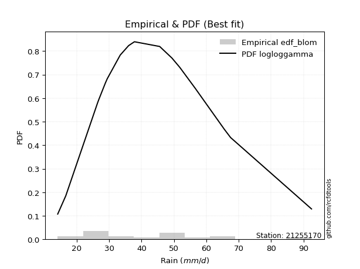</img>

</div>


### 7. Empirical - EDF Tukey (1962)

In hydrology, the Tukey formula is used as a plotting position formula to estimate the empirical probability or frequency of a flood event (or other hydrological data). The formula parameter is given as _c=0.333_ (or 1/3).

<div align="center">


$P=(m-c)/(n+1-2c)$


</div>


**7.1. Empirical values**

<div align="center">

|                | 0                   | 1                   | 2                   | 3         | 4                  | 5                  | 6                   | 7                   | 8                  | 9                  | 10                 | 11                 | 12                 | 13                 | 14                | 15                 | 16                 | 17                 |
|:---------------|:--------------------|:--------------------|:--------------------|:----------|:-------------------|:-------------------|:--------------------|:--------------------|:-------------------|:-------------------|:-------------------|:-------------------|:-------------------|:-------------------|:------------------|:-------------------|:-------------------|:-------------------|
| date           | 2015                | 2020                | 2024                | 2016      | 2008               | 2018               | 2007                | 2025                | 2005               | 2006               | 2019               | 2012               | 2013               | 2010               | 2014              | 2011               | 2017               | 2009               |
| x              | 14.1                | 16.6                | 26.4                | 26.7      | 26.8               | 28.8               | 29.4                | 30.6                | 33.4               | 37.8               | 45.6               | 49.4               | 51.638888888888886 | 51.7               | 56.6              | 65.6               | 67.5               | 92.5               |
| m              | 1                   | 2                   | 3                   | 4         | 5                  | 6                  | 7                   | 8                   | 9                  | 10                 | 11                 | 12                 | 13                 | 14                 | 15                | 16                 | 17                 | 18                 |
| empirical_dist | edf_tukey           | edf_tukey           | edf_tukey           | edf_tukey | edf_tukey          | edf_tukey          | edf_tukey           | edf_tukey           | edf_tukey          | edf_tukey          | edf_tukey          | edf_tukey          | edf_tukey          | edf_tukey          | edf_tukey         | edf_tukey          | edf_tukey          | edf_tukey          |
| empirical      | 0.03636363636363636 | 0.09090909090909091 | 0.14545454545454545 | 0.2       | 0.2545454545454545 | 0.3090909090909091 | 0.36363636363636365 | 0.41818181818181815 | 0.4727272727272727 | 0.5272727272727272 | 0.5818181818181818 | 0.6363636363636364 | 0.6909090909090909 | 0.7454545454545455 | 0.8               | 0.8545454545454545 | 0.9090909090909091 | 0.9636363636363636 |
| empirical_tr   | 1.0377358490566038  | 1.1                 | 1.1702127659574468  | 1.25      | 1.3414634146341462 | 1.4473684210526316 | 1.5714285714285714  | 1.71875             | 1.8965517241379308 | 2.115384615384615  | 2.391304347826087  | 2.75               | 3.235294117647059  | 3.928571428571429  | 5.000000000000001 | 6.874999999999997  | 10.999999999999996 | 27.49999999999999  |

</div>


**7.2. Kolmogorov-Smirnov fit test (sorted by Δ)**


<div align="center">

|                | 0                   | 1                   | 2                   | 3                   | 4                   | 5                   | 6                   | 7                   | 8                   | 9                   | 10                  | 11                  | 12                  | 13                  | 14                  | 15                  | 16                  | 17                  | 18                  | 19                  | 20                  | 21                  | 22                  | 23                  | 24                  | 25                  | 26                  | 27                  | 28                  | 29                  | 30                  | 31                  | 32                  | 33                  | 34                  | 35                  | 36                  | 37                  | 38                  | 39                  | 40                  | 41                  | 42                  | 43                  | 44                  | 45                  | 46                  | 47                  | 48                  | 49                  | 50                  | 51                  | 52                  | 53                  | 54                  | 55                  | 56                  | 57                  | 58                  | 59                  | 60                  | 61                  | 62                  | 63                  | 64                  | 65                  | 66                  | 67                  | 68                  | 69                    | 70                  | 71                  | 72                  | 73                  | 74                  | 75                  | 76                  | 77                  | 78                  | 79                  | 80                  | 81                  | 82                  | 83                  | 84                  | 85                  | 86                  | 87                  | 88                  | 89                  |
|:---------------|:--------------------|:--------------------|:--------------------|:--------------------|:--------------------|:--------------------|:--------------------|:--------------------|:--------------------|:--------------------|:--------------------|:--------------------|:--------------------|:--------------------|:--------------------|:--------------------|:--------------------|:--------------------|:--------------------|:--------------------|:--------------------|:--------------------|:--------------------|:--------------------|:--------------------|:--------------------|:--------------------|:--------------------|:--------------------|:--------------------|:--------------------|:--------------------|:--------------------|:--------------------|:--------------------|:--------------------|:--------------------|:--------------------|:--------------------|:--------------------|:--------------------|:--------------------|:--------------------|:--------------------|:--------------------|:--------------------|:--------------------|:--------------------|:--------------------|:--------------------|:--------------------|:--------------------|:--------------------|:--------------------|:--------------------|:--------------------|:--------------------|:--------------------|:--------------------|:--------------------|:--------------------|:--------------------|:--------------------|:--------------------|:--------------------|:--------------------|:--------------------|:--------------------|:--------------------|:----------------------|:--------------------|:--------------------|:--------------------|:--------------------|:--------------------|:--------------------|:--------------------|:--------------------|:--------------------|:--------------------|:--------------------|:--------------------|:--------------------|:--------------------|:--------------------|:--------------------|:--------------------|:--------------------|:--------------------|:--------------------|
| station        | 21255170            | 21255170            | 21255170            | 21255170            | 21255170            | 21255170            | 21255170            | 21255170            | 21255170            | 21255170            | 21255170            | 21255170            | 21255170            | 21255170            | 21255170            | 21255170            | 21255170            | 21255170            | 21255170            | 21255170            | 21255170            | 21255170            | 21255170            | 21255170            | 21255170            | 21255170            | 21255170            | 21255170            | 21255170            | 21255170            | 21255170            | 21255170            | 21255170            | 21255170            | 21255170            | 21255170            | 21255170            | 21255170            | 21255170            | 21255170            | 21255170            | 21255170            | 21255170            | 21255170            | 21255170            | 21255170            | 21255170            | 21255170            | 21255170            | 21255170            | 21255170            | 21255170            | 21255170            | 21255170            | 21255170            | 21255170            | 21255170            | 21255170            | 21255170            | 21255170            | 21255170            | 21255170            | 21255170            | 21255170            | 21255170            | 21255170            | 21255170            | 21255170            | 21255170            | 21255170              | 21255170            | 21255170            | 21255170            | 21255170            | 21255170            | 21255170            | 21255170            | 21255170            | 21255170            | 21255170            | 21255170            | 21255170            | 21255170            | 21255170            | 21255170            | 21255170            | 21255170            | 21255170            | 21255170            | 21255170            |
| empirical_dist | edf_tukey           | edf_tukey           | edf_tukey           | edf_tukey           | edf_tukey           | edf_tukey           | edf_tukey           | edf_tukey           | edf_tukey           | edf_tukey           | edf_tukey           | edf_tukey           | edf_tukey           | edf_tukey           | edf_tukey           | edf_tukey           | edf_tukey           | edf_tukey           | edf_tukey           | edf_tukey           | edf_tukey           | edf_tukey           | edf_tukey           | edf_tukey           | edf_tukey           | edf_tukey           | edf_tukey           | edf_tukey           | edf_tukey           | edf_tukey           | edf_tukey           | edf_tukey           | edf_tukey           | edf_tukey           | edf_tukey           | edf_tukey           | edf_tukey           | edf_tukey           | edf_tukey           | edf_tukey           | edf_tukey           | edf_tukey           | edf_tukey           | edf_tukey           | edf_tukey           | edf_tukey           | edf_tukey           | edf_tukey           | edf_tukey           | edf_tukey           | edf_tukey           | edf_tukey           | edf_tukey           | edf_tukey           | edf_tukey           | edf_tukey           | edf_tukey           | edf_tukey           | edf_tukey           | edf_tukey           | edf_tukey           | edf_tukey           | edf_tukey           | edf_tukey           | edf_tukey           | edf_tukey           | edf_tukey           | edf_tukey           | edf_tukey           | edf_tukey             | edf_tukey           | edf_tukey           | edf_tukey           | edf_tukey           | edf_tukey           | edf_tukey           | edf_tukey           | edf_tukey           | edf_tukey           | edf_tukey           | edf_tukey           | edf_tukey           | edf_tukey           | edf_tukey           | edf_tukey           | edf_tukey           | edf_tukey           | edf_tukey           | edf_tukey           | edf_tukey           |
| p_dist         | johnsonsu           | logweibull_min      | lognakagami         | invgauss            | logjohnsonsu        | logpearson3         | logf                | logfatiguelife      | logt                | lognorm             | lognorm             | logcrystalball      | logexponnorm        | loglognorm          | lognct              | fatiguelife         | halflogistic        | invgamma            | logloggamma         | fisk                | loggamma            | loggamma            | logerlang           | betaprime           | invweibull          | logbetaprime        | logfisk             | mielke              | loggenlogistic      | ncf                 | exponnorm           | rayleigh            | alpha               | logrice             | moyal               | loginvgamma         | pearson3            | laplace_asymmetric  | genlogistic         | logalpha            | erlang              | chi2                | gamma               | kstwobign           | f                   | loggompertz         | loginvgauss         | gumbel_r            | loglogistic         | maxwell             | logmaxwell          | weibull_min         | halfnorm            | lograyleigh         | gompertz            | loghypsecant        | rice                | nct                 | logmielke           | loghalfnorm         | t                   | truncnorm           | norm                | crystalball         | loggumbel_r         | loggumbel_l         | logncf              | loginvweibull       | loglaplace          | loglaplace_asymmetric | loghalflogistic     | wald                | logistic            | logmoyal            | hypsecant           | logkstwobign        | loggenexpon         | gumbel_l            | genexpon            | laplace             | logwald             | expon               | logtruncnorm        | loggibrat           | gibrat              | nakagami            | logexpon            | logpareto           | logchi2             | pareto              |
| delta          | 0.08662394134821566 | 0.08778120751379992 | 0.08782688560554358 | 0.08784280617847845 | 0.0880756505637032  | 0.08816008227885413 | 0.08830140314857476 | 0.08832784684878042 | 0.08837608213115894 | 0.08837997351012178 | 0.08837997351012178 | 0.088380652537557   | 0.08838080155757588 | 0.08838129269945988 | 0.08863212363138778 | 0.08961574413998763 | 0.09090909090909091 | 0.09110569116205208 | 0.09152056912245876 | 0.09164497322347348 | 0.09233696335585917 | 0.09233696335585917 | 0.09340896516127287 | 0.09365297164138647 | 0.09451691976842774 | 0.0946200783584655  | 0.0947041424716008  | 0.0955527384444278  | 0.09555990408546111 | 0.096178607710527   | 0.09640708426489608 | 0.09643295218291625 | 0.09767661310345943 | 0.09806639627595701 | 0.09880924683248432 | 0.09892512393342873 | 0.10152953125699044 | 0.10207511292239424 | 0.10211955170480075 | 0.10295882852088101 | 0.10301825292198238 | 0.10301957095336348 | 0.10302059245784279 | 0.10309667281982238 | 0.1033290098492339  | 0.10546802612722828 | 0.10574048261766433 | 0.1057457706674716  | 0.1060703616412394  | 0.10694265089052785 | 0.10746095910388631 | 0.10746799377939947 | 0.1103171392672711  | 0.1154070408742282  | 0.11597236885008616 | 0.12151567564988963 | 0.12898114799559168 | 0.1341912871053459  | 0.1349687159539305  | 0.13577777898868526 | 0.13734399993315777 | 0.13735521881894835 | 0.1373552401913984  | 0.1373552533893992  | 0.13770247680898284 | 0.13809630001822648 | 0.1384564978598941  | 0.1416216023885163  | 0.1446135566177006  | 0.1450060515937568    | 0.15185171780892903 | 0.15468386804376333 | 0.15648502394284342 | 0.1568119225864073  | 0.17105344744494028 | 0.17183731819661646 | 0.18189703554703718 | 0.1949097812117696  | 0.19656340124401434 | 0.19865614342359944 | 0.21130485634056717 | 0.21382965440040286 | 0.22038804342073615 | 0.24342534963552576 | 0.2565581434041127  | 0.2846443686262859  | 0.3291174285261003  | 0.3291174326874519  | 0.3984193865620889  | 0.5140783853296734  |
| deltao         | 0.32102346734599996 | 0.32102346734599996 | 0.32102346734599996 | 0.32102346734599996 | 0.32102346734599996 | 0.32102346734599996 | 0.32102346734599996 | 0.32102346734599996 | 0.32102346734599996 | 0.32102346734599996 | 0.32102346734599996 | 0.32102346734599996 | 0.32102346734599996 | 0.32102346734599996 | 0.32102346734599996 | 0.32102346734599996 | 0.32102346734599996 | 0.32102346734599996 | 0.32102346734599996 | 0.32102346734599996 | 0.32102346734599996 | 0.32102346734599996 | 0.32102346734599996 | 0.32102346734599996 | 0.32102346734599996 | 0.32102346734599996 | 0.32102346734599996 | 0.32102346734599996 | 0.32102346734599996 | 0.32102346734599996 | 0.32102346734599996 | 0.32102346734599996 | 0.32102346734599996 | 0.32102346734599996 | 0.32102346734599996 | 0.32102346734599996 | 0.32102346734599996 | 0.32102346734599996 | 0.32102346734599996 | 0.32102346734599996 | 0.32102346734599996 | 0.32102346734599996 | 0.32102346734599996 | 0.32102346734599996 | 0.32102346734599996 | 0.32102346734599996 | 0.32102346734599996 | 0.32102346734599996 | 0.32102346734599996 | 0.32102346734599996 | 0.32102346734599996 | 0.32102346734599996 | 0.32102346734599996 | 0.32102346734599996 | 0.32102346734599996 | 0.32102346734599996 | 0.32102346734599996 | 0.32102346734599996 | 0.32102346734599996 | 0.32102346734599996 | 0.32102346734599996 | 0.32102346734599996 | 0.32102346734599996 | 0.32102346734599996 | 0.32102346734599996 | 0.32102346734599996 | 0.32102346734599996 | 0.32102346734599996 | 0.32102346734599996 | 0.32102346734599996   | 0.32102346734599996 | 0.32102346734599996 | 0.32102346734599996 | 0.32102346734599996 | 0.32102346734599996 | 0.32102346734599996 | 0.32102346734599996 | 0.32102346734599996 | 0.32102346734599996 | 0.32102346734599996 | 0.32102346734599996 | 0.32102346734599996 | 0.32102346734599996 | 0.32102346734599996 | 0.32102346734599996 | 0.32102346734599996 | 0.32102346734599996 | 0.32102346734599996 | 0.32102346734599996 | 0.32102346734599996 |
| eval           | Δo > Δ              | Δo > Δ              | Δo > Δ              | Δo > Δ              | Δo > Δ              | Δo > Δ              | Δo > Δ              | Δo > Δ              | Δo > Δ              | Δo > Δ              | Δo > Δ              | Δo > Δ              | Δo > Δ              | Δo > Δ              | Δo > Δ              | Δo > Δ              | Δo > Δ              | Δo > Δ              | Δo > Δ              | Δo > Δ              | Δo > Δ              | Δo > Δ              | Δo > Δ              | Δo > Δ              | Δo > Δ              | Δo > Δ              | Δo > Δ              | Δo > Δ              | Δo > Δ              | Δo > Δ              | Δo > Δ              | Δo > Δ              | Δo > Δ              | Δo > Δ              | Δo > Δ              | Δo > Δ              | Δo > Δ              | Δo > Δ              | Δo > Δ              | Δo > Δ              | Δo > Δ              | Δo > Δ              | Δo > Δ              | Δo > Δ              | Δo > Δ              | Δo > Δ              | Δo > Δ              | Δo > Δ              | Δo > Δ              | Δo > Δ              | Δo > Δ              | Δo > Δ              | Δo > Δ              | Δo > Δ              | Δo > Δ              | Δo > Δ              | Δo > Δ              | Δo > Δ              | Δo > Δ              | Δo > Δ              | Δo > Δ              | Δo > Δ              | Δo > Δ              | Δo > Δ              | Δo > Δ              | Δo > Δ              | Δo > Δ              | Δo > Δ              | Δo > Δ              | Δo > Δ                | Δo > Δ              | Δo > Δ              | Δo > Δ              | Δo > Δ              | Δo > Δ              | Δo > Δ              | Δo > Δ              | Δo > Δ              | Δo > Δ              | Δo > Δ              | Δo > Δ              | Δo > Δ              | Δo > Δ              | Δo > Δ              | Δo > Δ              | Δo > Δ              | Δo <= Δ             | Δo <= Δ             | Δo <= Δ             | Δo <= Δ             |
| fit            | 1                   | 1                   | 1                   | 1                   | 1                   | 1                   | 1                   | 1                   | 1                   | 1                   | 1                   | 1                   | 1                   | 1                   | 1                   | 1                   | 1                   | 1                   | 1                   | 1                   | 1                   | 1                   | 1                   | 1                   | 1                   | 1                   | 1                   | 1                   | 1                   | 1                   | 1                   | 1                   | 1                   | 1                   | 1                   | 1                   | 1                   | 1                   | 1                   | 1                   | 1                   | 1                   | 1                   | 1                   | 1                   | 1                   | 1                   | 1                   | 1                   | 1                   | 1                   | 1                   | 1                   | 1                   | 1                   | 1                   | 1                   | 1                   | 1                   | 1                   | 1                   | 1                   | 1                   | 1                   | 1                   | 1                   | 1                   | 1                   | 1                   | 1                     | 1                   | 1                   | 1                   | 1                   | 1                   | 1                   | 1                   | 1                   | 1                   | 1                   | 1                   | 1                   | 1                   | 1                   | 1                   | 1                   | 0                   | 0                   | 0                   | 0                   |
| n              | 18                  | 18                  | 18                  | 18                  | 18                  | 18                  | 18                  | 18                  | 18                  | 18                  | 18                  | 18                  | 18                  | 18                  | 18                  | 18                  | 18                  | 18                  | 18                  | 18                  | 18                  | 18                  | 18                  | 18                  | 18                  | 18                  | 18                  | 18                  | 18                  | 18                  | 18                  | 18                  | 18                  | 18                  | 18                  | 18                  | 18                  | 18                  | 18                  | 18                  | 18                  | 18                  | 18                  | 18                  | 18                  | 18                  | 18                  | 18                  | 18                  | 18                  | 18                  | 18                  | 18                  | 18                  | 18                  | 18                  | 18                  | 18                  | 18                  | 18                  | 18                  | 18                  | 18                  | 18                  | 18                  | 18                  | 18                  | 18                  | 18                  | 18                    | 18                  | 18                  | 18                  | 18                  | 18                  | 18                  | 18                  | 18                  | 18                  | 18                  | 18                  | 18                  | 18                  | 18                  | 18                  | 18                  | 18                  | 18                  | 18                  | 18                  |
| best_fit       | 1                   | 0                   | 0                   | 0                   | 0                   | 0                   | 0                   | 0                   | 0                   | 0                   | 0                   | 0                   | 0                   | 0                   | 0                   | 0                   | 0                   | 0                   | 0                   | 0                   | 0                   | 0                   | 0                   | 0                   | 0                   | 0                   | 0                   | 0                   | 0                   | 0                   | 0                   | 0                   | 0                   | 0                   | 0                   | 0                   | 0                   | 0                   | 0                   | 0                   | 0                   | 0                   | 0                   | 0                   | 0                   | 0                   | 0                   | 0                   | 0                   | 0                   | 0                   | 0                   | 0                   | 0                   | 0                   | 0                   | 0                   | 0                   | 0                   | 0                   | 0                   | 0                   | 0                   | 0                   | 0                   | 0                   | 0                   | 0                   | 0                   | 0                     | 0                   | 0                   | 0                   | 0                   | 0                   | 0                   | 0                   | 0                   | 0                   | 0                   | 0                   | 0                   | 0                   | 0                   | 0                   | 0                   | 0                   | 0                   | 0                   | 0                   |
| best_fit_sort  | 1                   | 2                   | 3                   | 4                   | 5                   | 6                   | 7                   | 8                   | 9                   | 10                  | 11                  | 12                  | 13                  | 14                  | 15                  | 16                  | 17                  | 18                  | 19                  | 20                  | 21                  | 22                  | 23                  | 24                  | 25                  | 26                  | 27                  | 28                  | 29                  | 30                  | 31                  | 32                  | 33                  | 34                  | 35                  | 36                  | 37                  | 38                  | 39                  | 40                  | 41                  | 42                  | 43                  | 44                  | 45                  | 46                  | 47                  | 48                  | 49                  | 50                  | 51                  | 52                  | 53                  | 54                  | 55                  | 56                  | 57                  | 58                  | 59                  | 60                  | 61                  | 62                  | 63                  | 64                  | 65                  | 66                  | 67                  | 68                  | 69                  | 70                    | 71                  | 72                  | 73                  | 74                  | 75                  | 76                  | 77                  | 78                  | 79                  | 80                  | 81                  | 82                  | 83                  | 84                  | 85                  | 86                  | 87                  | 88                  | 89                  | 90                  |

</div>


<div align="center">

</img>

</div>


**7.3. Best fit**

<div align="center">

|   id |   station | empirical_dist   | p_dist    |     delta |   deltao | eval   |   fit |   n |   best_fit |   best_fit_sort |
|-----:|----------:|:-----------------|:----------|----------:|---------:|:-------|------:|----:|-----------:|----------------:|
|    0 |  21255170 | edf_tukey        | johnsonsu | 0.0866239 | 0.321023 | Δo > Δ |     1 |  18 |          1 |               1 |

</div>


<div align="center">

</img></img>

</div>


### 8. Empirical - EDF Gringorten (1963)

Gringorten plotting position formula is essential for estimating the probability and return periods of extreme events like floods and heavy rainfall. The constant _a=0.44_.

<div align="center">


$P=(m-a)/(n+1-2a)$


</div>


**8.1. Empirical values**

<div align="center">

|                | 0                   | 1                   | 2                  | 3                   | 4                  | 5                  | 6                   | 7                  | 8                   | 9                  | 10                 | 11                 | 12                 | 13                 | 14                 | 15                 | 16                 | 17                 |
|:---------------|:--------------------|:--------------------|:-------------------|:--------------------|:-------------------|:-------------------|:--------------------|:-------------------|:--------------------|:-------------------|:-------------------|:-------------------|:-------------------|:-------------------|:-------------------|:-------------------|:-------------------|:-------------------|
| date           | 2015                | 2020                | 2024               | 2016                | 2008               | 2018               | 2007                | 2025               | 2005                | 2006               | 2019               | 2012               | 2013               | 2010               | 2014               | 2011               | 2017               | 2009               |
| x              | 14.1                | 16.6                | 26.4               | 26.7                | 26.8               | 28.8               | 29.4                | 30.6               | 33.4                | 37.8               | 45.6               | 49.4               | 51.638888888888886 | 51.7               | 56.6               | 65.6               | 67.5               | 92.5               |
| m              | 1                   | 2                   | 3                  | 4                   | 5                  | 6                  | 7                   | 8                  | 9                   | 10                 | 11                 | 12                 | 13                 | 14                 | 15                 | 16                 | 17                 | 18                 |
| empirical_dist | edf_gringorten      | edf_gringorten      | edf_gringorten     | edf_gringorten      | edf_gringorten     | edf_gringorten     | edf_gringorten      | edf_gringorten     | edf_gringorten      | edf_gringorten     | edf_gringorten     | edf_gringorten     | edf_gringorten     | edf_gringorten     | edf_gringorten     | edf_gringorten     | edf_gringorten     | edf_gringorten     |
| empirical      | 0.03090507726269316 | 0.08609271523178808 | 0.141280353200883  | 0.19646799116997793 | 0.2516556291390728 | 0.3068432671081677 | 0.36203090507726265 | 0.4172185430463576 | 0.47240618101545256 | 0.5275938189845475 | 0.5827814569536424 | 0.6379690949227373 | 0.6931567328918322 | 0.7483443708609271 | 0.8035320088300221 | 0.8587196467991169 | 0.9139072847682118 | 0.9690949227373067 |
| empirical_tr   | 1.031890660592255   | 1.0942028985507246  | 1.1645244215938304 | 1.2445054945054945  | 1.3362831858407078 | 1.4426751592356688 | 1.5674740484429064  | 1.7159090909090906 | 1.8953974895397487  | 2.1168224299065423 | 2.3968253968253967 | 2.76219512195122   | 3.2589928057553954 | 3.9736842105263146 | 5.089887640449438  | 7.078124999999997  | 11.6153846153846   | 32.35714285714269  |

</div>


**8.2. Kolmogorov-Smirnov fit test (sorted by Δ)**


<div align="center">

|                | 0                   | 1                   | 2                   | 3                   | 4                   | 5                   | 6                   | 7                   | 8                   | 9                   | 10                  | 11                  | 12                  | 13                  | 14                  | 15                  | 16                  | 17                  | 18                  | 19                  | 20                  | 21                  | 22                  | 23                  | 24                  | 25                  | 26                  | 27                  | 28                  | 29                  | 30                  | 31                  | 32                  | 33                  | 34                  | 35                  | 36                  | 37                  | 38                  | 39                  | 40                  | 41                  | 42                  | 43                  | 44                  | 45                  | 46                  | 47                  | 48                  | 49                  | 50                  | 51                  | 52                  | 53                  | 54                  | 55                  | 56                  | 57                  | 58                  | 59                  | 60                  | 61                  | 62                  | 63                  | 64                  | 65                  | 66                  | 67                  | 68                    | 69                  | 70                  | 71                  | 72                  | 73                  | 74                  | 75                  | 76                  | 77                  | 78                  | 79                  | 80                  | 81                  | 82                  | 83                  | 84                  | 85                  | 86                  | 87                  | 88                  | 89                  |
|:---------------|:--------------------|:--------------------|:--------------------|:--------------------|:--------------------|:--------------------|:--------------------|:--------------------|:--------------------|:--------------------|:--------------------|:--------------------|:--------------------|:--------------------|:--------------------|:--------------------|:--------------------|:--------------------|:--------------------|:--------------------|:--------------------|:--------------------|:--------------------|:--------------------|:--------------------|:--------------------|:--------------------|:--------------------|:--------------------|:--------------------|:--------------------|:--------------------|:--------------------|:--------------------|:--------------------|:--------------------|:--------------------|:--------------------|:--------------------|:--------------------|:--------------------|:--------------------|:--------------------|:--------------------|:--------------------|:--------------------|:--------------------|:--------------------|:--------------------|:--------------------|:--------------------|:--------------------|:--------------------|:--------------------|:--------------------|:--------------------|:--------------------|:--------------------|:--------------------|:--------------------|:--------------------|:--------------------|:--------------------|:--------------------|:--------------------|:--------------------|:--------------------|:--------------------|:----------------------|:--------------------|:--------------------|:--------------------|:--------------------|:--------------------|:--------------------|:--------------------|:--------------------|:--------------------|:--------------------|:--------------------|:--------------------|:--------------------|:--------------------|:--------------------|:--------------------|:--------------------|:--------------------|:--------------------|:--------------------|:--------------------|
| station        | 21255170            | 21255170            | 21255170            | 21255170            | 21255170            | 21255170            | 21255170            | 21255170            | 21255170            | 21255170            | 21255170            | 21255170            | 21255170            | 21255170            | 21255170            | 21255170            | 21255170            | 21255170            | 21255170            | 21255170            | 21255170            | 21255170            | 21255170            | 21255170            | 21255170            | 21255170            | 21255170            | 21255170            | 21255170            | 21255170            | 21255170            | 21255170            | 21255170            | 21255170            | 21255170            | 21255170            | 21255170            | 21255170            | 21255170            | 21255170            | 21255170            | 21255170            | 21255170            | 21255170            | 21255170            | 21255170            | 21255170            | 21255170            | 21255170            | 21255170            | 21255170            | 21255170            | 21255170            | 21255170            | 21255170            | 21255170            | 21255170            | 21255170            | 21255170            | 21255170            | 21255170            | 21255170            | 21255170            | 21255170            | 21255170            | 21255170            | 21255170            | 21255170            | 21255170              | 21255170            | 21255170            | 21255170            | 21255170            | 21255170            | 21255170            | 21255170            | 21255170            | 21255170            | 21255170            | 21255170            | 21255170            | 21255170            | 21255170            | 21255170            | 21255170            | 21255170            | 21255170            | 21255170            | 21255170            | 21255170            |
| empirical_dist | edf_gringorten      | edf_gringorten      | edf_gringorten      | edf_gringorten      | edf_gringorten      | edf_gringorten      | edf_gringorten      | edf_gringorten      | edf_gringorten      | edf_gringorten      | edf_gringorten      | edf_gringorten      | edf_gringorten      | edf_gringorten      | edf_gringorten      | edf_gringorten      | edf_gringorten      | edf_gringorten      | edf_gringorten      | edf_gringorten      | edf_gringorten      | edf_gringorten      | edf_gringorten      | edf_gringorten      | edf_gringorten      | edf_gringorten      | edf_gringorten      | edf_gringorten      | edf_gringorten      | edf_gringorten      | edf_gringorten      | edf_gringorten      | edf_gringorten      | edf_gringorten      | edf_gringorten      | edf_gringorten      | edf_gringorten      | edf_gringorten      | edf_gringorten      | edf_gringorten      | edf_gringorten      | edf_gringorten      | edf_gringorten      | edf_gringorten      | edf_gringorten      | edf_gringorten      | edf_gringorten      | edf_gringorten      | edf_gringorten      | edf_gringorten      | edf_gringorten      | edf_gringorten      | edf_gringorten      | edf_gringorten      | edf_gringorten      | edf_gringorten      | edf_gringorten      | edf_gringorten      | edf_gringorten      | edf_gringorten      | edf_gringorten      | edf_gringorten      | edf_gringorten      | edf_gringorten      | edf_gringorten      | edf_gringorten      | edf_gringorten      | edf_gringorten      | edf_gringorten        | edf_gringorten      | edf_gringorten      | edf_gringorten      | edf_gringorten      | edf_gringorten      | edf_gringorten      | edf_gringorten      | edf_gringorten      | edf_gringorten      | edf_gringorten      | edf_gringorten      | edf_gringorten      | edf_gringorten      | edf_gringorten      | edf_gringorten      | edf_gringorten      | edf_gringorten      | edf_gringorten      | edf_gringorten      | edf_gringorten      | edf_gringorten      |
| p_dist         | johnsonsu           | logpearson3         | halflogistic        | invgamma            | logloggamma         | fisk                | logweibull_min      | lognakagami         | invgauss            | logjohnsonsu        | logf                | logfatiguelife      | logt                | lognorm             | lognorm             | logcrystalball      | logexponnorm        | loglognorm          | betaprime           | lognct              | invweibull          | logfisk             | fatiguelife         | mielke              | loggenlogistic      | ncf                 | exponnorm           | loggamma            | loggamma            | alpha               | logerlang           | moyal               | rayleigh            | logbetaprime        | pearson3            | laplace_asymmetric  | genlogistic         | kstwobign           | logrice             | loginvgamma         | loglogistic         | gumbel_r            | maxwell             | logalpha            | erlang              | chi2                | gamma               | f                   | loggompertz         | loginvgauss         | logmaxwell          | weibull_min         | halfnorm            | lograyleigh         | loghypsecant        | gompertz            | rice                | loggumbel_r         | t                   | truncnorm           | norm                | crystalball         | loggumbel_l         | nct                 | logmielke           | loghalfnorm         | logncf              | loglaplace          | loglaplace_asymmetric | loginvweibull       | loghalflogistic     | wald                | logmoyal            | logistic            | hypsecant           | logkstwobign        | loggenexpon         | gumbel_l            | laplace             | genexpon            | logwald             | logtruncnorm        | expon               | loggibrat           | gibrat              | nakagami            | logexpon            | logpareto           | logchi2             | pareto              |
| delta          | 0.08814556159694353 | 0.08857322541258322 | 0.09005118702681175 | 0.09014241602659151 | 0.09055729398699819 | 0.09068169808801291 | 0.09195539976746236 | 0.09200107785920603 | 0.0920169984321409  | 0.09224984281736565 | 0.09247559540223721 | 0.09250203910244287 | 0.09255027438482138 | 0.09255416576378422 | 0.09255416576378422 | 0.09255484479121945 | 0.09255499381123833 | 0.09255548495312232 | 0.0926896965059259  | 0.09280631588505023 | 0.09355364463296717 | 0.09374086733614023 | 0.09378993639365008 | 0.09458946330896723 | 0.09459662895000054 | 0.09521533257506642 | 0.09567020934829934 | 0.09651115560952161 | 0.09651115560952161 | 0.09671333796799886 | 0.09758315741493531 | 0.09784597169702375 | 0.0986570882559327  | 0.09879427061212795 | 0.10056625612152986 | 0.10111183778693367 | 0.10115627656934018 | 0.1021333976843618  | 0.10224058852961945 | 0.10309931618709117 | 0.1044649030821384  | 0.10478249553201102 | 0.10607319679609889 | 0.10713302077454345 | 0.10719244517564483 | 0.10719376320702592 | 0.10719478471150523 | 0.10750320210289635 | 0.10964221838089072 | 0.10991467487132678 | 0.11163515135754876 | 0.11164218603306192 | 0.11449133152093355 | 0.11958123312789065 | 0.11991021709078864 | 0.1201465611037486  | 0.1280178728601311  | 0.13673920167352227 | 0.1370229082213376  | 0.1370341271071282  | 0.13703414847957823 | 0.13703416167757904 | 0.1371330248827659  | 0.13836547935900834 | 0.13914290820759295 | 0.1399519712423477  | 0.14263069011355656 | 0.1430080980585996  | 0.14404277645829622   | 0.14579579464217873 | 0.15088844267346846 | 0.15372059290830276 | 0.15584864745094673 | 0.15616393223102326 | 0.17073235573312012 | 0.1760115104502789  | 0.18607122780069962 | 0.19458868949994945 | 0.1983350517117793  | 0.20073759349767678 | 0.2103415812051066  | 0.21749821801435443 | 0.2180038466540653  | 0.24246207450006518 | 0.2549526848450117  | 0.28881856087994834 | 0.33329162077976277 | 0.33329162494111436 | 0.40259357881575136 | 0.5188947610069763  |
| deltao         | 0.32102346734599996 | 0.32102346734599996 | 0.32102346734599996 | 0.32102346734599996 | 0.32102346734599996 | 0.32102346734599996 | 0.32102346734599996 | 0.32102346734599996 | 0.32102346734599996 | 0.32102346734599996 | 0.32102346734599996 | 0.32102346734599996 | 0.32102346734599996 | 0.32102346734599996 | 0.32102346734599996 | 0.32102346734599996 | 0.32102346734599996 | 0.32102346734599996 | 0.32102346734599996 | 0.32102346734599996 | 0.32102346734599996 | 0.32102346734599996 | 0.32102346734599996 | 0.32102346734599996 | 0.32102346734599996 | 0.32102346734599996 | 0.32102346734599996 | 0.32102346734599996 | 0.32102346734599996 | 0.32102346734599996 | 0.32102346734599996 | 0.32102346734599996 | 0.32102346734599996 | 0.32102346734599996 | 0.32102346734599996 | 0.32102346734599996 | 0.32102346734599996 | 0.32102346734599996 | 0.32102346734599996 | 0.32102346734599996 | 0.32102346734599996 | 0.32102346734599996 | 0.32102346734599996 | 0.32102346734599996 | 0.32102346734599996 | 0.32102346734599996 | 0.32102346734599996 | 0.32102346734599996 | 0.32102346734599996 | 0.32102346734599996 | 0.32102346734599996 | 0.32102346734599996 | 0.32102346734599996 | 0.32102346734599996 | 0.32102346734599996 | 0.32102346734599996 | 0.32102346734599996 | 0.32102346734599996 | 0.32102346734599996 | 0.32102346734599996 | 0.32102346734599996 | 0.32102346734599996 | 0.32102346734599996 | 0.32102346734599996 | 0.32102346734599996 | 0.32102346734599996 | 0.32102346734599996 | 0.32102346734599996 | 0.32102346734599996   | 0.32102346734599996 | 0.32102346734599996 | 0.32102346734599996 | 0.32102346734599996 | 0.32102346734599996 | 0.32102346734599996 | 0.32102346734599996 | 0.32102346734599996 | 0.32102346734599996 | 0.32102346734599996 | 0.32102346734599996 | 0.32102346734599996 | 0.32102346734599996 | 0.32102346734599996 | 0.32102346734599996 | 0.32102346734599996 | 0.32102346734599996 | 0.32102346734599996 | 0.32102346734599996 | 0.32102346734599996 | 0.32102346734599996 |
| eval           | Δo > Δ              | Δo > Δ              | Δo > Δ              | Δo > Δ              | Δo > Δ              | Δo > Δ              | Δo > Δ              | Δo > Δ              | Δo > Δ              | Δo > Δ              | Δo > Δ              | Δo > Δ              | Δo > Δ              | Δo > Δ              | Δo > Δ              | Δo > Δ              | Δo > Δ              | Δo > Δ              | Δo > Δ              | Δo > Δ              | Δo > Δ              | Δo > Δ              | Δo > Δ              | Δo > Δ              | Δo > Δ              | Δo > Δ              | Δo > Δ              | Δo > Δ              | Δo > Δ              | Δo > Δ              | Δo > Δ              | Δo > Δ              | Δo > Δ              | Δo > Δ              | Δo > Δ              | Δo > Δ              | Δo > Δ              | Δo > Δ              | Δo > Δ              | Δo > Δ              | Δo > Δ              | Δo > Δ              | Δo > Δ              | Δo > Δ              | Δo > Δ              | Δo > Δ              | Δo > Δ              | Δo > Δ              | Δo > Δ              | Δo > Δ              | Δo > Δ              | Δo > Δ              | Δo > Δ              | Δo > Δ              | Δo > Δ              | Δo > Δ              | Δo > Δ              | Δo > Δ              | Δo > Δ              | Δo > Δ              | Δo > Δ              | Δo > Δ              | Δo > Δ              | Δo > Δ              | Δo > Δ              | Δo > Δ              | Δo > Δ              | Δo > Δ              | Δo > Δ                | Δo > Δ              | Δo > Δ              | Δo > Δ              | Δo > Δ              | Δo > Δ              | Δo > Δ              | Δo > Δ              | Δo > Δ              | Δo > Δ              | Δo > Δ              | Δo > Δ              | Δo > Δ              | Δo > Δ              | Δo > Δ              | Δo > Δ              | Δo > Δ              | Δo > Δ              | Δo <= Δ             | Δo <= Δ             | Δo <= Δ             | Δo <= Δ             |
| fit            | 1                   | 1                   | 1                   | 1                   | 1                   | 1                   | 1                   | 1                   | 1                   | 1                   | 1                   | 1                   | 1                   | 1                   | 1                   | 1                   | 1                   | 1                   | 1                   | 1                   | 1                   | 1                   | 1                   | 1                   | 1                   | 1                   | 1                   | 1                   | 1                   | 1                   | 1                   | 1                   | 1                   | 1                   | 1                   | 1                   | 1                   | 1                   | 1                   | 1                   | 1                   | 1                   | 1                   | 1                   | 1                   | 1                   | 1                   | 1                   | 1                   | 1                   | 1                   | 1                   | 1                   | 1                   | 1                   | 1                   | 1                   | 1                   | 1                   | 1                   | 1                   | 1                   | 1                   | 1                   | 1                   | 1                   | 1                   | 1                   | 1                     | 1                   | 1                   | 1                   | 1                   | 1                   | 1                   | 1                   | 1                   | 1                   | 1                   | 1                   | 1                   | 1                   | 1                   | 1                   | 1                   | 1                   | 0                   | 0                   | 0                   | 0                   |
| n              | 18                  | 18                  | 18                  | 18                  | 18                  | 18                  | 18                  | 18                  | 18                  | 18                  | 18                  | 18                  | 18                  | 18                  | 18                  | 18                  | 18                  | 18                  | 18                  | 18                  | 18                  | 18                  | 18                  | 18                  | 18                  | 18                  | 18                  | 18                  | 18                  | 18                  | 18                  | 18                  | 18                  | 18                  | 18                  | 18                  | 18                  | 18                  | 18                  | 18                  | 18                  | 18                  | 18                  | 18                  | 18                  | 18                  | 18                  | 18                  | 18                  | 18                  | 18                  | 18                  | 18                  | 18                  | 18                  | 18                  | 18                  | 18                  | 18                  | 18                  | 18                  | 18                  | 18                  | 18                  | 18                  | 18                  | 18                  | 18                  | 18                    | 18                  | 18                  | 18                  | 18                  | 18                  | 18                  | 18                  | 18                  | 18                  | 18                  | 18                  | 18                  | 18                  | 18                  | 18                  | 18                  | 18                  | 18                  | 18                  | 18                  | 18                  |
| best_fit       | 1                   | 0                   | 0                   | 0                   | 0                   | 0                   | 0                   | 0                   | 0                   | 0                   | 0                   | 0                   | 0                   | 0                   | 0                   | 0                   | 0                   | 0                   | 0                   | 0                   | 0                   | 0                   | 0                   | 0                   | 0                   | 0                   | 0                   | 0                   | 0                   | 0                   | 0                   | 0                   | 0                   | 0                   | 0                   | 0                   | 0                   | 0                   | 0                   | 0                   | 0                   | 0                   | 0                   | 0                   | 0                   | 0                   | 0                   | 0                   | 0                   | 0                   | 0                   | 0                   | 0                   | 0                   | 0                   | 0                   | 0                   | 0                   | 0                   | 0                   | 0                   | 0                   | 0                   | 0                   | 0                   | 0                   | 0                   | 0                   | 0                     | 0                   | 0                   | 0                   | 0                   | 0                   | 0                   | 0                   | 0                   | 0                   | 0                   | 0                   | 0                   | 0                   | 0                   | 0                   | 0                   | 0                   | 0                   | 0                   | 0                   | 0                   |
| best_fit_sort  | 1                   | 2                   | 3                   | 4                   | 5                   | 6                   | 7                   | 8                   | 9                   | 10                  | 11                  | 12                  | 13                  | 14                  | 15                  | 16                  | 17                  | 18                  | 19                  | 20                  | 21                  | 22                  | 23                  | 24                  | 25                  | 26                  | 27                  | 28                  | 29                  | 30                  | 31                  | 32                  | 33                  | 34                  | 35                  | 36                  | 37                  | 38                  | 39                  | 40                  | 41                  | 42                  | 43                  | 44                  | 45                  | 46                  | 47                  | 48                  | 49                  | 50                  | 51                  | 52                  | 53                  | 54                  | 55                  | 56                  | 57                  | 58                  | 59                  | 60                  | 61                  | 62                  | 63                  | 64                  | 65                  | 66                  | 67                  | 68                  | 69                    | 70                  | 71                  | 72                  | 73                  | 74                  | 75                  | 76                  | 77                  | 78                  | 79                  | 80                  | 81                  | 82                  | 83                  | 84                  | 85                  | 86                  | 87                  | 88                  | 89                  | 90                  |

</div>


<div align="center">

</img>

</div>


**8.3. Best fit**

<div align="center">

|   id |   station | empirical_dist   | p_dist    |     delta |   deltao | eval   |   fit |   n |   best_fit |   best_fit_sort |
|-----:|----------:|:-----------------|:----------|----------:|---------:|:-------|------:|----:|-----------:|----------------:|
|    0 |  21255170 | edf_gringorten   | johnsonsu | 0.0881456 | 0.321023 | Δo > Δ |     1 |  18 |          1 |               1 |

</div>


<div align="center">

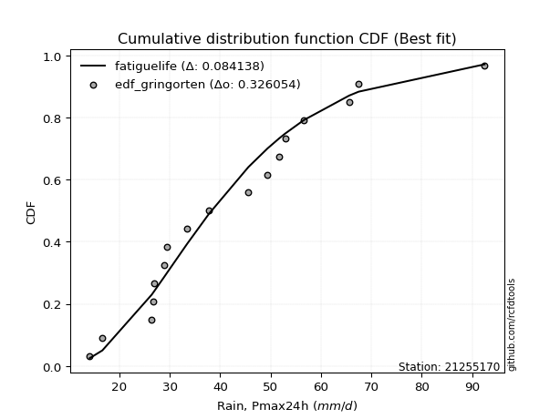</img>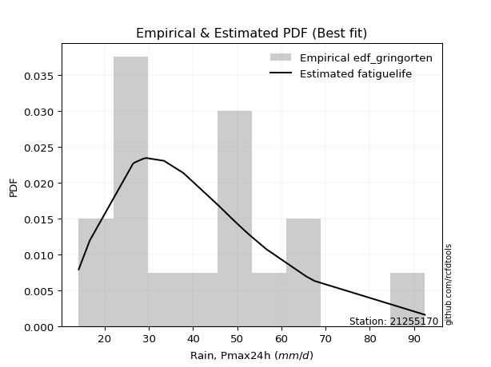</img>

</div>


### 9. Empirical - EDF Filliben (1975)

The specific values of the constants (0.3175) (often denoted as $alpha$) and (0.365) are derived from a method proposed by James J. Filliben in a 1975 paper. This particular formula is the mean value of the $i$-th order statistic of the normal distribution and is considered a robust and effective plotting position formula for the normal probability plot correlation coefficient test for normality.

<div align="center">


$P=(m-0.3175)/(n+0.365)$


</div>


**9.1. Empirical values**

<div align="center">

|                | 0                  | 1                  | 2                   | 3                   | 4                   | 5                  | 6                   | 7                  | 8                   | 9                  | 10                | 11                 | 12                 | 13                 | 14                 | 15                 | 16                 | 17                 |
|:---------------|:-------------------|:-------------------|:--------------------|:--------------------|:--------------------|:-------------------|:--------------------|:-------------------|:--------------------|:-------------------|:------------------|:-------------------|:-------------------|:-------------------|:-------------------|:-------------------|:-------------------|:-------------------|
| date           | 2015               | 2020               | 2024                | 2016                | 2008                | 2018               | 2007                | 2025               | 2005                | 2006               | 2019              | 2012               | 2013               | 2010               | 2014               | 2011               | 2017               | 2009               |
| x              | 14.1               | 16.6               | 26.4                | 26.7                | 26.8                | 28.8               | 29.4                | 30.6               | 33.4                | 37.8               | 45.6              | 49.4               | 51.638888888888886 | 51.7               | 56.6               | 65.6               | 67.5               | 92.5               |
| m              | 1                  | 2                  | 3                   | 4                   | 5                   | 6                  | 7                   | 8                  | 9                   | 10                 | 11                | 12                 | 13                 | 14                 | 15                 | 16                 | 17                 | 18                 |
| empirical_dist | edf_filliben       | edf_filliben       | edf_filliben        | edf_filliben        | edf_filliben        | edf_filliben       | edf_filliben        | edf_filliben       | edf_filliben        | edf_filliben       | edf_filliben      | edf_filliben       | edf_filliben       | edf_filliben       | edf_filliben       | edf_filliben       | edf_filliben       | edf_filliben       |
| empirical      | 0.0371630819493602 | 0.0916144840729649 | 0.14606588619656957 | 0.20051728832017426 | 0.25496869044377896 | 0.3094200925673836 | 0.36387149469098834 | 0.418322896814593  | 0.47277429893819767 | 0.5272257010618023 | 0.581677103185407 | 0.6361285053090118 | 0.6905799074326164 | 0.7450313095562211 | 0.7994827116798258 | 0.8539341138034304 | 0.9083855159270352 | 0.96283691805064   |
| empirical_tr   | 1.03859748338753   | 1.100854188520905  | 1.1710505340347521  | 1.2508087859696917  | 1.3422254704915038  | 1.4480583481174847 | 1.5720094157928526  | 1.7191668616896794 | 1.8967208882003614  | 2.1151742009789807 | 2.390497884803124 | 2.7482229704451933 | 3.2318521777386717 | 3.9220501868659907 | 4.987101154107265  | 6.846225535880707  | 10.915304606240722 | 26.908424908425033 |

</div>


**9.2. Kolmogorov-Smirnov fit test (sorted by Δ)**


<div align="center">

|                | 0                   | 1                   | 2                   | 3                   | 4                   | 5                   | 6                   | 7                   | 8                   | 9                   | 10                  | 11                  | 12                  | 13                  | 14                  | 15                  | 16                  | 17                  | 18                  | 19                  | 20                  | 21                  | 22                  | 23                  | 24                  | 25                  | 26                  | 27                  | 28                  | 29                  | 30                  | 31                  | 32                  | 33                  | 34                  | 35                  | 36                  | 37                  | 38                  | 39                  | 40                  | 41                  | 42                  | 43                  | 44                  | 45                  | 46                  | 47                  | 48                  | 49                  | 50                  | 51                  | 52                  | 53                  | 54                  | 55                  | 56                  | 57                  | 58                  | 59                  | 60                  | 61                  | 62                  | 63                  | 64                  | 65                  | 66                  | 67                  | 68                  | 69                    | 70                  | 71                  | 72                  | 73                  | 74                  | 75                  | 76                  | 77                  | 78                  | 79                  | 80                  | 81                  | 82                  | 83                  | 84                  | 85                  | 86                  | 87                  | 88                  | 89                  |
|:---------------|:--------------------|:--------------------|:--------------------|:--------------------|:--------------------|:--------------------|:--------------------|:--------------------|:--------------------|:--------------------|:--------------------|:--------------------|:--------------------|:--------------------|:--------------------|:--------------------|:--------------------|:--------------------|:--------------------|:--------------------|:--------------------|:--------------------|:--------------------|:--------------------|:--------------------|:--------------------|:--------------------|:--------------------|:--------------------|:--------------------|:--------------------|:--------------------|:--------------------|:--------------------|:--------------------|:--------------------|:--------------------|:--------------------|:--------------------|:--------------------|:--------------------|:--------------------|:--------------------|:--------------------|:--------------------|:--------------------|:--------------------|:--------------------|:--------------------|:--------------------|:--------------------|:--------------------|:--------------------|:--------------------|:--------------------|:--------------------|:--------------------|:--------------------|:--------------------|:--------------------|:--------------------|:--------------------|:--------------------|:--------------------|:--------------------|:--------------------|:--------------------|:--------------------|:--------------------|:----------------------|:--------------------|:--------------------|:--------------------|:--------------------|:--------------------|:--------------------|:--------------------|:--------------------|:--------------------|:--------------------|:--------------------|:--------------------|:--------------------|:--------------------|:--------------------|:--------------------|:--------------------|:--------------------|:--------------------|:--------------------|
| station        | 21255170            | 21255170            | 21255170            | 21255170            | 21255170            | 21255170            | 21255170            | 21255170            | 21255170            | 21255170            | 21255170            | 21255170            | 21255170            | 21255170            | 21255170            | 21255170            | 21255170            | 21255170            | 21255170            | 21255170            | 21255170            | 21255170            | 21255170            | 21255170            | 21255170            | 21255170            | 21255170            | 21255170            | 21255170            | 21255170            | 21255170            | 21255170            | 21255170            | 21255170            | 21255170            | 21255170            | 21255170            | 21255170            | 21255170            | 21255170            | 21255170            | 21255170            | 21255170            | 21255170            | 21255170            | 21255170            | 21255170            | 21255170            | 21255170            | 21255170            | 21255170            | 21255170            | 21255170            | 21255170            | 21255170            | 21255170            | 21255170            | 21255170            | 21255170            | 21255170            | 21255170            | 21255170            | 21255170            | 21255170            | 21255170            | 21255170            | 21255170            | 21255170            | 21255170            | 21255170              | 21255170            | 21255170            | 21255170            | 21255170            | 21255170            | 21255170            | 21255170            | 21255170            | 21255170            | 21255170            | 21255170            | 21255170            | 21255170            | 21255170            | 21255170            | 21255170            | 21255170            | 21255170            | 21255170            | 21255170            |
| empirical_dist | edf_filliben        | edf_filliben        | edf_filliben        | edf_filliben        | edf_filliben        | edf_filliben        | edf_filliben        | edf_filliben        | edf_filliben        | edf_filliben        | edf_filliben        | edf_filliben        | edf_filliben        | edf_filliben        | edf_filliben        | edf_filliben        | edf_filliben        | edf_filliben        | edf_filliben        | edf_filliben        | edf_filliben        | edf_filliben        | edf_filliben        | edf_filliben        | edf_filliben        | edf_filliben        | edf_filliben        | edf_filliben        | edf_filliben        | edf_filliben        | edf_filliben        | edf_filliben        | edf_filliben        | edf_filliben        | edf_filliben        | edf_filliben        | edf_filliben        | edf_filliben        | edf_filliben        | edf_filliben        | edf_filliben        | edf_filliben        | edf_filliben        | edf_filliben        | edf_filliben        | edf_filliben        | edf_filliben        | edf_filliben        | edf_filliben        | edf_filliben        | edf_filliben        | edf_filliben        | edf_filliben        | edf_filliben        | edf_filliben        | edf_filliben        | edf_filliben        | edf_filliben        | edf_filliben        | edf_filliben        | edf_filliben        | edf_filliben        | edf_filliben        | edf_filliben        | edf_filliben        | edf_filliben        | edf_filliben        | edf_filliben        | edf_filliben        | edf_filliben          | edf_filliben        | edf_filliben        | edf_filliben        | edf_filliben        | edf_filliben        | edf_filliben        | edf_filliben        | edf_filliben        | edf_filliben        | edf_filliben        | edf_filliben        | edf_filliben        | edf_filliben        | edf_filliben        | edf_filliben        | edf_filliben        | edf_filliben        | edf_filliben        | edf_filliben        | edf_filliben        |
| p_dist         | johnsonsu           | logweibull_min      | lognakagami         | invgauss            | logjohnsonsu        | logf                | logfatiguelife      | logt                | lognorm             | lognorm             | logcrystalball      | logexponnorm        | loglognorm          | lognct              | logpearson3         | fatiguelife         | invgamma            | halflogistic        | logloggamma         | loggamma            | loggamma            | fisk                | logerlang           | betaprime           | logbetaprime        | invweibull          | logfisk             | mielke              | loggenlogistic      | ncf                 | exponnorm           | rayleigh            | logrice             | alpha               | loginvgamma         | moyal               | pearson3            | laplace_asymmetric  | genlogistic         | logalpha            | erlang              | chi2                | gamma               | f                   | kstwobign           | loggompertz         | loginvgauss         | gumbel_r            | loglogistic         | logmaxwell          | weibull_min         | maxwell             | halfnorm            | lograyleigh         | gompertz            | loghypsecant        | rice                | nct                 | logmielke           | loghalfnorm         | t                   | truncnorm           | norm                | crystalball         | loggumbel_r         | logncf              | loggumbel_l         | loginvweibull       | loglaplace          | loglaplace_asymmetric | loghalflogistic     | wald                | logistic            | logmoyal            | hypsecant           | logkstwobign        | loggenexpon         | gumbel_l            | genexpon            | laplace             | logwald             | expon               | logtruncnorm        | loggibrat           | gibrat              | nakagami            | logexpon            | logpareto           | logchi2             | pareto              |
| delta          | 0.08676501998099051 | 0.0871698667717758  | 0.08721554486351946 | 0.08723146543645433 | 0.08746430982167908 | 0.08769006240655064 | 0.0877165061067563  | 0.08776474138913481 | 0.08776863276809765 | 0.08776863276809765 | 0.08776931179553288 | 0.08776946081555176 | 0.08776995195743575 | 0.08802078288936366 | 0.08830116091162898 | 0.0890044033979635  | 0.09124676979482693 | 0.0916144840729649  | 0.09166164775523361 | 0.09172562261383505 | 0.09172562261383505 | 0.09178605185624833 | 0.09279762441924874 | 0.09379405027416132 | 0.09400873761644138 | 0.09465799840120259 | 0.09484522110437565 | 0.09569381707720265 | 0.09570098271823596 | 0.09631968634330185 | 0.09654816289767088 | 0.0965740308156911  | 0.09745505553393288 | 0.09781769173623428 | 0.0983137831914046  | 0.09895032546525917 | 0.10167060988976528 | 0.10221619155516903 | 0.1022606303375756  | 0.10234748777885688 | 0.10240691217995826 | 0.10240823021133935 | 0.10240925171581866 | 0.10271766910720978 | 0.10323775145259723 | 0.10485668538520415 | 0.10512914187564021 | 0.10588684930024644 | 0.10630549269586398 | 0.10684961836186219 | 0.10685665303737535 | 0.1070837295233027  | 0.10970579852524698 | 0.11479570013220408 | 0.11536102810806204 | 0.12175080670451421 | 0.12912222662836653 | 0.13357994636332177 | 0.13435737521190638 | 0.13516643824666114 | 0.13739102614408272 | 0.1374022450298733  | 0.13740226640232334 | 0.13740227960032414 | 0.13784355544175764 | 0.13784515711787    | 0.13823737865100133 | 0.14101026164649216 | 0.14484868767232517 | 0.14514713022653158   | 0.15199279644170383 | 0.15482494667653812 | 0.15653205015376837 | 0.1569530012191821  | 0.17110047365586523 | 0.17122597745459234 | 0.18128569480501305 | 0.19495680742269456 | 0.1959520605019902  | 0.1987031696345244  | 0.21144593497334196 | 0.21321831365837873 | 0.22081127931906058 | 0.24356642826830055 | 0.2567932744587374  | 0.28403302788426177 | 0.3285060877840762  | 0.3285060919454278  | 0.3978080458200648  | 0.5133729921657995  |
| deltao         | 0.32102346734599996 | 0.32102346734599996 | 0.32102346734599996 | 0.32102346734599996 | 0.32102346734599996 | 0.32102346734599996 | 0.32102346734599996 | 0.32102346734599996 | 0.32102346734599996 | 0.32102346734599996 | 0.32102346734599996 | 0.32102346734599996 | 0.32102346734599996 | 0.32102346734599996 | 0.32102346734599996 | 0.32102346734599996 | 0.32102346734599996 | 0.32102346734599996 | 0.32102346734599996 | 0.32102346734599996 | 0.32102346734599996 | 0.32102346734599996 | 0.32102346734599996 | 0.32102346734599996 | 0.32102346734599996 | 0.32102346734599996 | 0.32102346734599996 | 0.32102346734599996 | 0.32102346734599996 | 0.32102346734599996 | 0.32102346734599996 | 0.32102346734599996 | 0.32102346734599996 | 0.32102346734599996 | 0.32102346734599996 | 0.32102346734599996 | 0.32102346734599996 | 0.32102346734599996 | 0.32102346734599996 | 0.32102346734599996 | 0.32102346734599996 | 0.32102346734599996 | 0.32102346734599996 | 0.32102346734599996 | 0.32102346734599996 | 0.32102346734599996 | 0.32102346734599996 | 0.32102346734599996 | 0.32102346734599996 | 0.32102346734599996 | 0.32102346734599996 | 0.32102346734599996 | 0.32102346734599996 | 0.32102346734599996 | 0.32102346734599996 | 0.32102346734599996 | 0.32102346734599996 | 0.32102346734599996 | 0.32102346734599996 | 0.32102346734599996 | 0.32102346734599996 | 0.32102346734599996 | 0.32102346734599996 | 0.32102346734599996 | 0.32102346734599996 | 0.32102346734599996 | 0.32102346734599996 | 0.32102346734599996 | 0.32102346734599996 | 0.32102346734599996   | 0.32102346734599996 | 0.32102346734599996 | 0.32102346734599996 | 0.32102346734599996 | 0.32102346734599996 | 0.32102346734599996 | 0.32102346734599996 | 0.32102346734599996 | 0.32102346734599996 | 0.32102346734599996 | 0.32102346734599996 | 0.32102346734599996 | 0.32102346734599996 | 0.32102346734599996 | 0.32102346734599996 | 0.32102346734599996 | 0.32102346734599996 | 0.32102346734599996 | 0.32102346734599996 | 0.32102346734599996 |
| eval           | Δo > Δ              | Δo > Δ              | Δo > Δ              | Δo > Δ              | Δo > Δ              | Δo > Δ              | Δo > Δ              | Δo > Δ              | Δo > Δ              | Δo > Δ              | Δo > Δ              | Δo > Δ              | Δo > Δ              | Δo > Δ              | Δo > Δ              | Δo > Δ              | Δo > Δ              | Δo > Δ              | Δo > Δ              | Δo > Δ              | Δo > Δ              | Δo > Δ              | Δo > Δ              | Δo > Δ              | Δo > Δ              | Δo > Δ              | Δo > Δ              | Δo > Δ              | Δo > Δ              | Δo > Δ              | Δo > Δ              | Δo > Δ              | Δo > Δ              | Δo > Δ              | Δo > Δ              | Δo > Δ              | Δo > Δ              | Δo > Δ              | Δo > Δ              | Δo > Δ              | Δo > Δ              | Δo > Δ              | Δo > Δ              | Δo > Δ              | Δo > Δ              | Δo > Δ              | Δo > Δ              | Δo > Δ              | Δo > Δ              | Δo > Δ              | Δo > Δ              | Δo > Δ              | Δo > Δ              | Δo > Δ              | Δo > Δ              | Δo > Δ              | Δo > Δ              | Δo > Δ              | Δo > Δ              | Δo > Δ              | Δo > Δ              | Δo > Δ              | Δo > Δ              | Δo > Δ              | Δo > Δ              | Δo > Δ              | Δo > Δ              | Δo > Δ              | Δo > Δ              | Δo > Δ                | Δo > Δ              | Δo > Δ              | Δo > Δ              | Δo > Δ              | Δo > Δ              | Δo > Δ              | Δo > Δ              | Δo > Δ              | Δo > Δ              | Δo > Δ              | Δo > Δ              | Δo > Δ              | Δo > Δ              | Δo > Δ              | Δo > Δ              | Δo > Δ              | Δo <= Δ             | Δo <= Δ             | Δo <= Δ             | Δo <= Δ             |
| fit            | 1                   | 1                   | 1                   | 1                   | 1                   | 1                   | 1                   | 1                   | 1                   | 1                   | 1                   | 1                   | 1                   | 1                   | 1                   | 1                   | 1                   | 1                   | 1                   | 1                   | 1                   | 1                   | 1                   | 1                   | 1                   | 1                   | 1                   | 1                   | 1                   | 1                   | 1                   | 1                   | 1                   | 1                   | 1                   | 1                   | 1                   | 1                   | 1                   | 1                   | 1                   | 1                   | 1                   | 1                   | 1                   | 1                   | 1                   | 1                   | 1                   | 1                   | 1                   | 1                   | 1                   | 1                   | 1                   | 1                   | 1                   | 1                   | 1                   | 1                   | 1                   | 1                   | 1                   | 1                   | 1                   | 1                   | 1                   | 1                   | 1                   | 1                     | 1                   | 1                   | 1                   | 1                   | 1                   | 1                   | 1                   | 1                   | 1                   | 1                   | 1                   | 1                   | 1                   | 1                   | 1                   | 1                   | 0                   | 0                   | 0                   | 0                   |
| n              | 18                  | 18                  | 18                  | 18                  | 18                  | 18                  | 18                  | 18                  | 18                  | 18                  | 18                  | 18                  | 18                  | 18                  | 18                  | 18                  | 18                  | 18                  | 18                  | 18                  | 18                  | 18                  | 18                  | 18                  | 18                  | 18                  | 18                  | 18                  | 18                  | 18                  | 18                  | 18                  | 18                  | 18                  | 18                  | 18                  | 18                  | 18                  | 18                  | 18                  | 18                  | 18                  | 18                  | 18                  | 18                  | 18                  | 18                  | 18                  | 18                  | 18                  | 18                  | 18                  | 18                  | 18                  | 18                  | 18                  | 18                  | 18                  | 18                  | 18                  | 18                  | 18                  | 18                  | 18                  | 18                  | 18                  | 18                  | 18                  | 18                  | 18                    | 18                  | 18                  | 18                  | 18                  | 18                  | 18                  | 18                  | 18                  | 18                  | 18                  | 18                  | 18                  | 18                  | 18                  | 18                  | 18                  | 18                  | 18                  | 18                  | 18                  |
| best_fit       | 1                   | 0                   | 0                   | 0                   | 0                   | 0                   | 0                   | 0                   | 0                   | 0                   | 0                   | 0                   | 0                   | 0                   | 0                   | 0                   | 0                   | 0                   | 0                   | 0                   | 0                   | 0                   | 0                   | 0                   | 0                   | 0                   | 0                   | 0                   | 0                   | 0                   | 0                   | 0                   | 0                   | 0                   | 0                   | 0                   | 0                   | 0                   | 0                   | 0                   | 0                   | 0                   | 0                   | 0                   | 0                   | 0                   | 0                   | 0                   | 0                   | 0                   | 0                   | 0                   | 0                   | 0                   | 0                   | 0                   | 0                   | 0                   | 0                   | 0                   | 0                   | 0                   | 0                   | 0                   | 0                   | 0                   | 0                   | 0                   | 0                   | 0                     | 0                   | 0                   | 0                   | 0                   | 0                   | 0                   | 0                   | 0                   | 0                   | 0                   | 0                   | 0                   | 0                   | 0                   | 0                   | 0                   | 0                   | 0                   | 0                   | 0                   |
| best_fit_sort  | 1                   | 2                   | 3                   | 4                   | 5                   | 6                   | 7                   | 8                   | 9                   | 10                  | 11                  | 12                  | 13                  | 14                  | 15                  | 16                  | 17                  | 18                  | 19                  | 20                  | 21                  | 22                  | 23                  | 24                  | 25                  | 26                  | 27                  | 28                  | 29                  | 30                  | 31                  | 32                  | 33                  | 34                  | 35                  | 36                  | 37                  | 38                  | 39                  | 40                  | 41                  | 42                  | 43                  | 44                  | 45                  | 46                  | 47                  | 48                  | 49                  | 50                  | 51                  | 52                  | 53                  | 54                  | 55                  | 56                  | 57                  | 58                  | 59                  | 60                  | 61                  | 62                  | 63                  | 64                  | 65                  | 66                  | 67                  | 68                  | 69                  | 70                    | 71                  | 72                  | 73                  | 74                  | 75                  | 76                  | 77                  | 78                  | 79                  | 80                  | 81                  | 82                  | 83                  | 84                  | 85                  | 86                  | 87                  | 88                  | 89                  | 90                  |

</div>


<div align="center">

</img>

</div>


**9.3. Best fit**

<div align="center">

|   id |   station | empirical_dist   | p_dist    |    delta |   deltao | eval   |   fit |   n |   best_fit |   best_fit_sort |
|-----:|----------:|:-----------------|:----------|---------:|---------:|:-------|------:|----:|-----------:|----------------:|
|    0 |  21255170 | edf_filliben     | johnsonsu | 0.086765 | 0.321023 | Δo > Δ |     1 |  18 |          1 |               1 |

</div>


<div align="center">

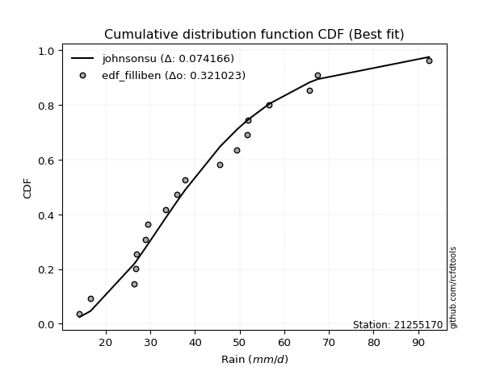</img>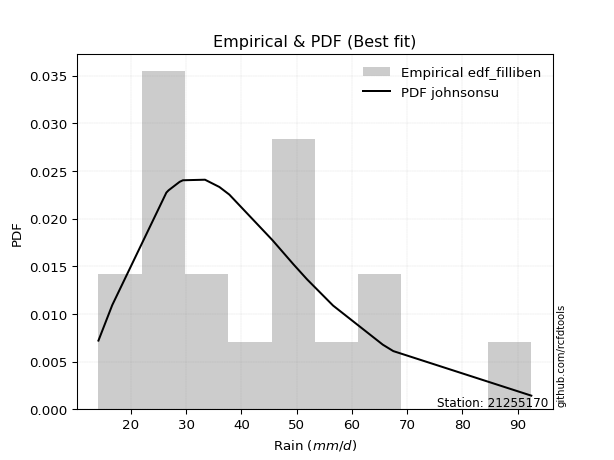</img>

</div>


### 10. Empirical - EDF Jenkinson (1977)

The Jenkinson formula in hydrology is an empirical plotting position formula used to estimate the non-exceedance probability _(P)_ or return period _(T)_ of a given ordered observation within a sample. It is a widely used method in the frequency analysis of extreme events such as floods and rainfall, as it provides a distribution-free way to plot data. _a≈0.31_ and _b≈0.38_ are constants derived to approximate the median of the probability distribution for the given rank.

<div align="center">


$P=(m-a)/(n+b)$


</div>


**10.1. Empirical values**

<div align="center">

|                | 0                   | 1                   | 2                   | 3                   | 4                  | 5                   | 6                  | 7                  | 8                   | 9                  | 10                 | 11                 | 12                 | 13                 | 14                 | 15                 | 16                 | 17                 |
|:---------------|:--------------------|:--------------------|:--------------------|:--------------------|:-------------------|:--------------------|:-------------------|:-------------------|:--------------------|:-------------------|:-------------------|:-------------------|:-------------------|:-------------------|:-------------------|:-------------------|:-------------------|:-------------------|
| date           | 2015                | 2020                | 2024                | 2016                | 2008               | 2018                | 2007               | 2025               | 2005                | 2006               | 2019               | 2012               | 2013               | 2010               | 2014               | 2011               | 2017               | 2009               |
| x              | 14.1                | 16.6                | 26.4                | 26.7                | 26.8               | 28.8                | 29.4               | 30.6               | 33.4                | 37.8               | 45.6               | 49.4               | 51.638888888888886 | 51.7               | 56.6               | 65.6               | 67.5               | 92.5               |
| m              | 1                   | 2                   | 3                   | 4                   | 5                  | 6                   | 7                  | 8                  | 9                   | 10                 | 11                 | 12                 | 13                 | 14                 | 15                 | 16                 | 17                 | 18                 |
| empirical_dist | edf_jenkinson       | edf_jenkinson       | edf_jenkinson       | edf_jenkinson       | edf_jenkinson      | edf_jenkinson       | edf_jenkinson      | edf_jenkinson      | edf_jenkinson       | edf_jenkinson      | edf_jenkinson      | edf_jenkinson      | edf_jenkinson      | edf_jenkinson      | edf_jenkinson      | edf_jenkinson      | edf_jenkinson      | edf_jenkinson      |
| empirical      | 0.03754080522306855 | 0.09194776931447225 | 0.14635473340587596 | 0.20076169749727965 | 0.2551686615886834 | 0.30957562568008706 | 0.3639825897714908 | 0.4183895538628945 | 0.47279651795429817 | 0.5272034820457019 | 0.5816104461371056 | 0.6360174102285092 | 0.690424374319913  | 0.7448313384113167 | 0.7992383025027203 | 0.8536452665941241 | 0.9080522306855279 | 0.9624591947769315 |
| empirical_tr   | 1.0390050876201244  | 1.1012582384661473  | 1.17144678138942    | 1.2511912865895167  | 1.3425858290723158 | 1.4483845547675334  | 1.572284003421728  | 1.7193638914873717 | 1.896800825593395   | 2.1150747986191027 | 2.390117035110533  | 2.747384155455904  | 3.230228471001758  | 3.9189765458422174 | 4.981029810298102  | 6.832713754646843  | 10.875739644970428 | 26.637681159420353 |

</div>


**10.2. Kolmogorov-Smirnov fit test (sorted by Δ)**


<div align="center">

|                | 0                   | 1                   | 2                   | 3                   | 4                   | 5                   | 6                   | 7                   | 8                   | 9                   | 10                  | 11                  | 12                  | 13                  | 14                  | 15                  | 16                  | 17                  | 18                  | 19                  | 20                  | 21                  | 22                  | 23                  | 24                  | 25                  | 26                  | 27                  | 28                  | 29                  | 30                  | 31                  | 32                  | 33                  | 34                  | 35                  | 36                  | 37                  | 38                  | 39                  | 40                  | 41                  | 42                  | 43                  | 44                  | 45                  | 46                  | 47                  | 48                  | 49                  | 50                  | 51                  | 52                  | 53                  | 54                  | 55                  | 56                  | 57                  | 58                  | 59                  | 60                  | 61                  | 62                  | 63                  | 64                  | 65                  | 66                  | 67                  | 68                  | 69                    | 70                  | 71                  | 72                  | 73                  | 74                  | 75                  | 76                  | 77                  | 78                  | 79                  | 80                  | 81                  | 82                  | 83                  | 84                  | 85                  | 86                  | 87                  | 88                  | 89                  |
|:---------------|:--------------------|:--------------------|:--------------------|:--------------------|:--------------------|:--------------------|:--------------------|:--------------------|:--------------------|:--------------------|:--------------------|:--------------------|:--------------------|:--------------------|:--------------------|:--------------------|:--------------------|:--------------------|:--------------------|:--------------------|:--------------------|:--------------------|:--------------------|:--------------------|:--------------------|:--------------------|:--------------------|:--------------------|:--------------------|:--------------------|:--------------------|:--------------------|:--------------------|:--------------------|:--------------------|:--------------------|:--------------------|:--------------------|:--------------------|:--------------------|:--------------------|:--------------------|:--------------------|:--------------------|:--------------------|:--------------------|:--------------------|:--------------------|:--------------------|:--------------------|:--------------------|:--------------------|:--------------------|:--------------------|:--------------------|:--------------------|:--------------------|:--------------------|:--------------------|:--------------------|:--------------------|:--------------------|:--------------------|:--------------------|:--------------------|:--------------------|:--------------------|:--------------------|:--------------------|:----------------------|:--------------------|:--------------------|:--------------------|:--------------------|:--------------------|:--------------------|:--------------------|:--------------------|:--------------------|:--------------------|:--------------------|:--------------------|:--------------------|:--------------------|:--------------------|:--------------------|:--------------------|:--------------------|:--------------------|:--------------------|
| station        | 21255170            | 21255170            | 21255170            | 21255170            | 21255170            | 21255170            | 21255170            | 21255170            | 21255170            | 21255170            | 21255170            | 21255170            | 21255170            | 21255170            | 21255170            | 21255170            | 21255170            | 21255170            | 21255170            | 21255170            | 21255170            | 21255170            | 21255170            | 21255170            | 21255170            | 21255170            | 21255170            | 21255170            | 21255170            | 21255170            | 21255170            | 21255170            | 21255170            | 21255170            | 21255170            | 21255170            | 21255170            | 21255170            | 21255170            | 21255170            | 21255170            | 21255170            | 21255170            | 21255170            | 21255170            | 21255170            | 21255170            | 21255170            | 21255170            | 21255170            | 21255170            | 21255170            | 21255170            | 21255170            | 21255170            | 21255170            | 21255170            | 21255170            | 21255170            | 21255170            | 21255170            | 21255170            | 21255170            | 21255170            | 21255170            | 21255170            | 21255170            | 21255170            | 21255170            | 21255170              | 21255170            | 21255170            | 21255170            | 21255170            | 21255170            | 21255170            | 21255170            | 21255170            | 21255170            | 21255170            | 21255170            | 21255170            | 21255170            | 21255170            | 21255170            | 21255170            | 21255170            | 21255170            | 21255170            | 21255170            |
| empirical_dist | edf_jenkinson       | edf_jenkinson       | edf_jenkinson       | edf_jenkinson       | edf_jenkinson       | edf_jenkinson       | edf_jenkinson       | edf_jenkinson       | edf_jenkinson       | edf_jenkinson       | edf_jenkinson       | edf_jenkinson       | edf_jenkinson       | edf_jenkinson       | edf_jenkinson       | edf_jenkinson       | edf_jenkinson       | edf_jenkinson       | edf_jenkinson       | edf_jenkinson       | edf_jenkinson       | edf_jenkinson       | edf_jenkinson       | edf_jenkinson       | edf_jenkinson       | edf_jenkinson       | edf_jenkinson       | edf_jenkinson       | edf_jenkinson       | edf_jenkinson       | edf_jenkinson       | edf_jenkinson       | edf_jenkinson       | edf_jenkinson       | edf_jenkinson       | edf_jenkinson       | edf_jenkinson       | edf_jenkinson       | edf_jenkinson       | edf_jenkinson       | edf_jenkinson       | edf_jenkinson       | edf_jenkinson       | edf_jenkinson       | edf_jenkinson       | edf_jenkinson       | edf_jenkinson       | edf_jenkinson       | edf_jenkinson       | edf_jenkinson       | edf_jenkinson       | edf_jenkinson       | edf_jenkinson       | edf_jenkinson       | edf_jenkinson       | edf_jenkinson       | edf_jenkinson       | edf_jenkinson       | edf_jenkinson       | edf_jenkinson       | edf_jenkinson       | edf_jenkinson       | edf_jenkinson       | edf_jenkinson       | edf_jenkinson       | edf_jenkinson       | edf_jenkinson       | edf_jenkinson       | edf_jenkinson       | edf_jenkinson         | edf_jenkinson       | edf_jenkinson       | edf_jenkinson       | edf_jenkinson       | edf_jenkinson       | edf_jenkinson       | edf_jenkinson       | edf_jenkinson       | edf_jenkinson       | edf_jenkinson       | edf_jenkinson       | edf_jenkinson       | edf_jenkinson       | edf_jenkinson       | edf_jenkinson       | edf_jenkinson       | edf_jenkinson       | edf_jenkinson       | edf_jenkinson       | edf_jenkinson       |
| p_dist         | johnsonsu           | logweibull_min      | lognakagami         | invgauss            | logjohnsonsu        | logf                | logfatiguelife      | logt                | lognorm             | lognorm             | logcrystalball      | logexponnorm        | loglognorm          | lognct              | logpearson3         | fatiguelife         | invgamma            | loggamma            | loggamma            | logloggamma         | fisk                | halflogistic        | logerlang           | logbetaprime        | betaprime           | invweibull          | logfisk             | mielke              | loggenlogistic      | ncf                 | exponnorm           | rayleigh            | logrice             | alpha               | loginvgamma         | moyal               | pearson3            | logalpha            | erlang              | chi2                | gamma               | laplace_asymmetric  | genlogistic         | f                   | kstwobign           | loggompertz         | loginvgauss         | gumbel_r            | loglogistic         | logmaxwell          | weibull_min         | maxwell             | halfnorm            | lograyleigh         | gompertz            | loghypsecant        | rice                | nct                 | logmielke           | loghalfnorm         | t                   | truncnorm           | norm                | crystalball         | logncf              | loggumbel_r         | loggumbel_l         | loginvweibull       | loglaplace          | loglaplace_asymmetric | loghalflogistic     | wald                | logistic            | logmoyal            | logkstwobign        | hypsecant           | loggenexpon         | gumbel_l            | genexpon            | laplace             | logwald             | expon               | logtruncnorm        | loggibrat           | gibrat              | nakagami            | logexpon            | logpareto           | logchi2             | pareto              |
| delta          | 0.08683167702929201 | 0.08688101956246941 | 0.08692669765421307 | 0.08694261822714794 | 0.08717546261237269 | 0.08740121519724425 | 0.08742765889744991 | 0.08747589417982843 | 0.08747978555879127 | 0.08747978555879127 | 0.08748046458622649 | 0.08748061360624537 | 0.08748110474812937 | 0.08773193568005727 | 0.08836781795993048 | 0.08871555618865712 | 0.09131342684312843 | 0.09143677540452866 | 0.09143677540452866 | 0.09172830480353511 | 0.09185270890454983 | 0.09194776931447225 | 0.09250877720994236 | 0.09371989040713499 | 0.09386070732246282 | 0.09472465544950409 | 0.09491187815267715 | 0.09576047412550415 | 0.09576763976653746 | 0.09638634339160335 | 0.09661481994597232 | 0.0966406878639926  | 0.0971662083246265  | 0.09788434878453578 | 0.09802493598209822 | 0.09901698251356067 | 0.10173726693806678 | 0.1020586405695505  | 0.10211806497065187 | 0.10211938300203297 | 0.10212040450651227 | 0.10228284860347048 | 0.1023272873858771  | 0.1024288218979034  | 0.10330440850089873 | 0.10456783817589776 | 0.10484029466633382 | 0.10595350634854794 | 0.10641658777636653 | 0.1065607711525558  | 0.10656780582806896 | 0.1071503865716042  | 0.10941695131594059 | 0.1145068529228977  | 0.11507218089875565 | 0.12186190178501677 | 0.12918888367666803 | 0.13329109915401538 | 0.1340685280026     | 0.13487759103735475 | 0.13741324516018322 | 0.1374244640459738  | 0.13742448541842384 | 0.13742449861642464 | 0.1375563099085636  | 0.13791021249005908 | 0.13830403569930283 | 0.14072141443718578 | 0.14495978275282773 | 0.14521378727483303   | 0.15205945349000527 | 0.15489160372483957 | 0.15655426916986886 | 0.15701965826748354 | 0.17093713024528595 | 0.17112269267196573 | 0.18099684759570667 | 0.19497902643879506 | 0.19566321329268382 | 0.1987253886506249  | 0.2115125920216434  | 0.21292946644907235 | 0.22101125046396503 | 0.243633085316602   | 0.25690436953923984 | 0.2837441806749554  | 0.3282172405747698  | 0.3282172447361214  | 0.3975191986107584  | 0.5130397069242921  |
| deltao         | 0.32102346734599996 | 0.32102346734599996 | 0.32102346734599996 | 0.32102346734599996 | 0.32102346734599996 | 0.32102346734599996 | 0.32102346734599996 | 0.32102346734599996 | 0.32102346734599996 | 0.32102346734599996 | 0.32102346734599996 | 0.32102346734599996 | 0.32102346734599996 | 0.32102346734599996 | 0.32102346734599996 | 0.32102346734599996 | 0.32102346734599996 | 0.32102346734599996 | 0.32102346734599996 | 0.32102346734599996 | 0.32102346734599996 | 0.32102346734599996 | 0.32102346734599996 | 0.32102346734599996 | 0.32102346734599996 | 0.32102346734599996 | 0.32102346734599996 | 0.32102346734599996 | 0.32102346734599996 | 0.32102346734599996 | 0.32102346734599996 | 0.32102346734599996 | 0.32102346734599996 | 0.32102346734599996 | 0.32102346734599996 | 0.32102346734599996 | 0.32102346734599996 | 0.32102346734599996 | 0.32102346734599996 | 0.32102346734599996 | 0.32102346734599996 | 0.32102346734599996 | 0.32102346734599996 | 0.32102346734599996 | 0.32102346734599996 | 0.32102346734599996 | 0.32102346734599996 | 0.32102346734599996 | 0.32102346734599996 | 0.32102346734599996 | 0.32102346734599996 | 0.32102346734599996 | 0.32102346734599996 | 0.32102346734599996 | 0.32102346734599996 | 0.32102346734599996 | 0.32102346734599996 | 0.32102346734599996 | 0.32102346734599996 | 0.32102346734599996 | 0.32102346734599996 | 0.32102346734599996 | 0.32102346734599996 | 0.32102346734599996 | 0.32102346734599996 | 0.32102346734599996 | 0.32102346734599996 | 0.32102346734599996 | 0.32102346734599996 | 0.32102346734599996   | 0.32102346734599996 | 0.32102346734599996 | 0.32102346734599996 | 0.32102346734599996 | 0.32102346734599996 | 0.32102346734599996 | 0.32102346734599996 | 0.32102346734599996 | 0.32102346734599996 | 0.32102346734599996 | 0.32102346734599996 | 0.32102346734599996 | 0.32102346734599996 | 0.32102346734599996 | 0.32102346734599996 | 0.32102346734599996 | 0.32102346734599996 | 0.32102346734599996 | 0.32102346734599996 | 0.32102346734599996 |
| eval           | Δo > Δ              | Δo > Δ              | Δo > Δ              | Δo > Δ              | Δo > Δ              | Δo > Δ              | Δo > Δ              | Δo > Δ              | Δo > Δ              | Δo > Δ              | Δo > Δ              | Δo > Δ              | Δo > Δ              | Δo > Δ              | Δo > Δ              | Δo > Δ              | Δo > Δ              | Δo > Δ              | Δo > Δ              | Δo > Δ              | Δo > Δ              | Δo > Δ              | Δo > Δ              | Δo > Δ              | Δo > Δ              | Δo > Δ              | Δo > Δ              | Δo > Δ              | Δo > Δ              | Δo > Δ              | Δo > Δ              | Δo > Δ              | Δo > Δ              | Δo > Δ              | Δo > Δ              | Δo > Δ              | Δo > Δ              | Δo > Δ              | Δo > Δ              | Δo > Δ              | Δo > Δ              | Δo > Δ              | Δo > Δ              | Δo > Δ              | Δo > Δ              | Δo > Δ              | Δo > Δ              | Δo > Δ              | Δo > Δ              | Δo > Δ              | Δo > Δ              | Δo > Δ              | Δo > Δ              | Δo > Δ              | Δo > Δ              | Δo > Δ              | Δo > Δ              | Δo > Δ              | Δo > Δ              | Δo > Δ              | Δo > Δ              | Δo > Δ              | Δo > Δ              | Δo > Δ              | Δo > Δ              | Δo > Δ              | Δo > Δ              | Δo > Δ              | Δo > Δ              | Δo > Δ                | Δo > Δ              | Δo > Δ              | Δo > Δ              | Δo > Δ              | Δo > Δ              | Δo > Δ              | Δo > Δ              | Δo > Δ              | Δo > Δ              | Δo > Δ              | Δo > Δ              | Δo > Δ              | Δo > Δ              | Δo > Δ              | Δo > Δ              | Δo > Δ              | Δo <= Δ             | Δo <= Δ             | Δo <= Δ             | Δo <= Δ             |
| fit            | 1                   | 1                   | 1                   | 1                   | 1                   | 1                   | 1                   | 1                   | 1                   | 1                   | 1                   | 1                   | 1                   | 1                   | 1                   | 1                   | 1                   | 1                   | 1                   | 1                   | 1                   | 1                   | 1                   | 1                   | 1                   | 1                   | 1                   | 1                   | 1                   | 1                   | 1                   | 1                   | 1                   | 1                   | 1                   | 1                   | 1                   | 1                   | 1                   | 1                   | 1                   | 1                   | 1                   | 1                   | 1                   | 1                   | 1                   | 1                   | 1                   | 1                   | 1                   | 1                   | 1                   | 1                   | 1                   | 1                   | 1                   | 1                   | 1                   | 1                   | 1                   | 1                   | 1                   | 1                   | 1                   | 1                   | 1                   | 1                   | 1                   | 1                     | 1                   | 1                   | 1                   | 1                   | 1                   | 1                   | 1                   | 1                   | 1                   | 1                   | 1                   | 1                   | 1                   | 1                   | 1                   | 1                   | 0                   | 0                   | 0                   | 0                   |
| n              | 18                  | 18                  | 18                  | 18                  | 18                  | 18                  | 18                  | 18                  | 18                  | 18                  | 18                  | 18                  | 18                  | 18                  | 18                  | 18                  | 18                  | 18                  | 18                  | 18                  | 18                  | 18                  | 18                  | 18                  | 18                  | 18                  | 18                  | 18                  | 18                  | 18                  | 18                  | 18                  | 18                  | 18                  | 18                  | 18                  | 18                  | 18                  | 18                  | 18                  | 18                  | 18                  | 18                  | 18                  | 18                  | 18                  | 18                  | 18                  | 18                  | 18                  | 18                  | 18                  | 18                  | 18                  | 18                  | 18                  | 18                  | 18                  | 18                  | 18                  | 18                  | 18                  | 18                  | 18                  | 18                  | 18                  | 18                  | 18                  | 18                  | 18                    | 18                  | 18                  | 18                  | 18                  | 18                  | 18                  | 18                  | 18                  | 18                  | 18                  | 18                  | 18                  | 18                  | 18                  | 18                  | 18                  | 18                  | 18                  | 18                  | 18                  |
| best_fit       | 1                   | 0                   | 0                   | 0                   | 0                   | 0                   | 0                   | 0                   | 0                   | 0                   | 0                   | 0                   | 0                   | 0                   | 0                   | 0                   | 0                   | 0                   | 0                   | 0                   | 0                   | 0                   | 0                   | 0                   | 0                   | 0                   | 0                   | 0                   | 0                   | 0                   | 0                   | 0                   | 0                   | 0                   | 0                   | 0                   | 0                   | 0                   | 0                   | 0                   | 0                   | 0                   | 0                   | 0                   | 0                   | 0                   | 0                   | 0                   | 0                   | 0                   | 0                   | 0                   | 0                   | 0                   | 0                   | 0                   | 0                   | 0                   | 0                   | 0                   | 0                   | 0                   | 0                   | 0                   | 0                   | 0                   | 0                   | 0                   | 0                   | 0                     | 0                   | 0                   | 0                   | 0                   | 0                   | 0                   | 0                   | 0                   | 0                   | 0                   | 0                   | 0                   | 0                   | 0                   | 0                   | 0                   | 0                   | 0                   | 0                   | 0                   |
| best_fit_sort  | 1                   | 2                   | 3                   | 4                   | 5                   | 6                   | 7                   | 8                   | 9                   | 10                  | 11                  | 12                  | 13                  | 14                  | 15                  | 16                  | 17                  | 18                  | 19                  | 20                  | 21                  | 22                  | 23                  | 24                  | 25                  | 26                  | 27                  | 28                  | 29                  | 30                  | 31                  | 32                  | 33                  | 34                  | 35                  | 36                  | 37                  | 38                  | 39                  | 40                  | 41                  | 42                  | 43                  | 44                  | 45                  | 46                  | 47                  | 48                  | 49                  | 50                  | 51                  | 52                  | 53                  | 54                  | 55                  | 56                  | 57                  | 58                  | 59                  | 60                  | 61                  | 62                  | 63                  | 64                  | 65                  | 66                  | 67                  | 68                  | 69                  | 70                    | 71                  | 72                  | 73                  | 74                  | 75                  | 76                  | 77                  | 78                  | 79                  | 80                  | 81                  | 82                  | 83                  | 84                  | 85                  | 86                  | 87                  | 88                  | 89                  | 90                  |

</div>


<div align="center">

</img>

</div>


**10.3. Best fit**

<div align="center">

|   id |   station | empirical_dist   | p_dist    |     delta |   deltao | eval   |   fit |   n |   best_fit |   best_fit_sort |
|-----:|----------:|:-----------------|:----------|----------:|---------:|:-------|------:|----:|-----------:|----------------:|
|    0 |  21255170 | edf_jenkinson    | johnsonsu | 0.0868317 | 0.321023 | Δo > Δ |     1 |  18 |          1 |               1 |

</div>


<div align="center">

</img></img>

</div>


### 11. Empirical - EDF Cunnane (1978)

Cunnane´s work in statistical hydrology has focused on the performance and evaluation of different probability distributions (such as GEV, Gumbel, Lognormal) for flood frequency estimation. _b_ is a constant, typically set to 0.4.

<div align="center">


$P=(m-b)/(n+1-2b)$


</div>


**11.1. Empirical values**

<div align="center">

|                | 0                   | 1                   | 2                   | 3                   | 4                   | 5                  | 6                  | 7                  | 8                  | 9                  | 10                 | 11                 | 12                 | 13                 | 14                 | 15                 | 16                 | 17                 |
|:---------------|:--------------------|:--------------------|:--------------------|:--------------------|:--------------------|:-------------------|:-------------------|:-------------------|:-------------------|:-------------------|:-------------------|:-------------------|:-------------------|:-------------------|:-------------------|:-------------------|:-------------------|:-------------------|
| date           | 2015                | 2020                | 2024                | 2016                | 2008                | 2018               | 2007               | 2025               | 2005               | 2006               | 2019               | 2012               | 2013               | 2010               | 2014               | 2011               | 2017               | 2009               |
| x              | 14.1                | 16.6                | 26.4                | 26.7                | 26.8                | 28.8               | 29.4               | 30.6               | 33.4               | 37.8               | 45.6               | 49.4               | 51.638888888888886 | 51.7               | 56.6               | 65.6               | 67.5               | 92.5               |
| m              | 1                   | 2                   | 3                   | 4                   | 5                   | 6                  | 7                  | 8                  | 9                  | 10                 | 11                 | 12                 | 13                 | 14                 | 15                 | 16                 | 17                 | 18                 |
| empirical_dist | edf_cunnane         | edf_cunnane         | edf_cunnane         | edf_cunnane         | edf_cunnane         | edf_cunnane        | edf_cunnane        | edf_cunnane        | edf_cunnane        | edf_cunnane        | edf_cunnane        | edf_cunnane        | edf_cunnane        | edf_cunnane        | edf_cunnane        | edf_cunnane        | edf_cunnane        | edf_cunnane        |
| empirical      | 0.03296703296703297 | 0.08791208791208792 | 0.14285714285714288 | 0.19780219780219782 | 0.25274725274725274 | 0.3076923076923077 | 0.3626373626373626 | 0.4175824175824176 | 0.4725274725274725 | 0.5274725274725275 | 0.5824175824175825 | 0.6373626373626373 | 0.6923076923076923 | 0.7472527472527473 | 0.8021978021978022 | 0.8571428571428572 | 0.9120879120879122 | 0.9670329670329672 |
| empirical_tr   | 1.0340909090909092  | 1.0963855421686748  | 1.1666666666666667  | 1.2465753424657533  | 1.338235294117647   | 1.4444444444444444 | 1.5689655172413794 | 1.716981132075472  | 1.8958333333333333 | 2.116279069767442  | 2.3947368421052633 | 2.7575757575757573 | 3.25               | 3.956521739130435  | 5.055555555555556  | 7.0000000000000036 | 11.375000000000012 | 30.333333333333442 |

</div>


**11.2. Kolmogorov-Smirnov fit test (sorted by Δ)**


<div align="center">

|                | 0                   | 1                   | 2                   | 3                   | 4                   | 5                   | 6                   | 7                   | 8                   | 9                   | 10                  | 11                  | 12                  | 13                  | 14                  | 15                  | 16                  | 17                  | 18                  | 19                  | 20                  | 21                  | 22                  | 23                  | 24                  | 25                  | 26                  | 27                  | 28                  | 29                  | 30                  | 31                  | 32                  | 33                  | 34                  | 35                  | 36                  | 37                  | 38                  | 39                  | 40                  | 41                  | 42                  | 43                  | 44                  | 45                  | 46                  | 47                  | 48                  | 49                  | 50                  | 51                  | 52                  | 53                  | 54                  | 55                  | 56                  | 57                  | 58                  | 59                  | 60                  | 61                  | 62                  | 63                  | 64                  | 65                  | 66                  | 67                  | 68                  | 69                    | 70                  | 71                  | 72                  | 73                  | 74                  | 75                  | 76                  | 77                  | 78                  | 79                  | 80                  | 81                  | 82                  | 83                  | 84                  | 85                  | 86                  | 87                  | 88                  | 89                  |
|:---------------|:--------------------|:--------------------|:--------------------|:--------------------|:--------------------|:--------------------|:--------------------|:--------------------|:--------------------|:--------------------|:--------------------|:--------------------|:--------------------|:--------------------|:--------------------|:--------------------|:--------------------|:--------------------|:--------------------|:--------------------|:--------------------|:--------------------|:--------------------|:--------------------|:--------------------|:--------------------|:--------------------|:--------------------|:--------------------|:--------------------|:--------------------|:--------------------|:--------------------|:--------------------|:--------------------|:--------------------|:--------------------|:--------------------|:--------------------|:--------------------|:--------------------|:--------------------|:--------------------|:--------------------|:--------------------|:--------------------|:--------------------|:--------------------|:--------------------|:--------------------|:--------------------|:--------------------|:--------------------|:--------------------|:--------------------|:--------------------|:--------------------|:--------------------|:--------------------|:--------------------|:--------------------|:--------------------|:--------------------|:--------------------|:--------------------|:--------------------|:--------------------|:--------------------|:--------------------|:----------------------|:--------------------|:--------------------|:--------------------|:--------------------|:--------------------|:--------------------|:--------------------|:--------------------|:--------------------|:--------------------|:--------------------|:--------------------|:--------------------|:--------------------|:--------------------|:--------------------|:--------------------|:--------------------|:--------------------|:--------------------|
| station        | 21255170            | 21255170            | 21255170            | 21255170            | 21255170            | 21255170            | 21255170            | 21255170            | 21255170            | 21255170            | 21255170            | 21255170            | 21255170            | 21255170            | 21255170            | 21255170            | 21255170            | 21255170            | 21255170            | 21255170            | 21255170            | 21255170            | 21255170            | 21255170            | 21255170            | 21255170            | 21255170            | 21255170            | 21255170            | 21255170            | 21255170            | 21255170            | 21255170            | 21255170            | 21255170            | 21255170            | 21255170            | 21255170            | 21255170            | 21255170            | 21255170            | 21255170            | 21255170            | 21255170            | 21255170            | 21255170            | 21255170            | 21255170            | 21255170            | 21255170            | 21255170            | 21255170            | 21255170            | 21255170            | 21255170            | 21255170            | 21255170            | 21255170            | 21255170            | 21255170            | 21255170            | 21255170            | 21255170            | 21255170            | 21255170            | 21255170            | 21255170            | 21255170            | 21255170            | 21255170              | 21255170            | 21255170            | 21255170            | 21255170            | 21255170            | 21255170            | 21255170            | 21255170            | 21255170            | 21255170            | 21255170            | 21255170            | 21255170            | 21255170            | 21255170            | 21255170            | 21255170            | 21255170            | 21255170            | 21255170            |
| empirical_dist | edf_cunnane         | edf_cunnane         | edf_cunnane         | edf_cunnane         | edf_cunnane         | edf_cunnane         | edf_cunnane         | edf_cunnane         | edf_cunnane         | edf_cunnane         | edf_cunnane         | edf_cunnane         | edf_cunnane         | edf_cunnane         | edf_cunnane         | edf_cunnane         | edf_cunnane         | edf_cunnane         | edf_cunnane         | edf_cunnane         | edf_cunnane         | edf_cunnane         | edf_cunnane         | edf_cunnane         | edf_cunnane         | edf_cunnane         | edf_cunnane         | edf_cunnane         | edf_cunnane         | edf_cunnane         | edf_cunnane         | edf_cunnane         | edf_cunnane         | edf_cunnane         | edf_cunnane         | edf_cunnane         | edf_cunnane         | edf_cunnane         | edf_cunnane         | edf_cunnane         | edf_cunnane         | edf_cunnane         | edf_cunnane         | edf_cunnane         | edf_cunnane         | edf_cunnane         | edf_cunnane         | edf_cunnane         | edf_cunnane         | edf_cunnane         | edf_cunnane         | edf_cunnane         | edf_cunnane         | edf_cunnane         | edf_cunnane         | edf_cunnane         | edf_cunnane         | edf_cunnane         | edf_cunnane         | edf_cunnane         | edf_cunnane         | edf_cunnane         | edf_cunnane         | edf_cunnane         | edf_cunnane         | edf_cunnane         | edf_cunnane         | edf_cunnane         | edf_cunnane         | edf_cunnane           | edf_cunnane         | edf_cunnane         | edf_cunnane         | edf_cunnane         | edf_cunnane         | edf_cunnane         | edf_cunnane         | edf_cunnane         | edf_cunnane         | edf_cunnane         | edf_cunnane         | edf_cunnane         | edf_cunnane         | edf_cunnane         | edf_cunnane         | edf_cunnane         | edf_cunnane         | edf_cunnane         | edf_cunnane         | edf_cunnane         |
| p_dist         | johnsonsu           | logpearson3         | halflogistic        | logweibull_min      | lognakagami         | invgauss            | invgamma            | logjohnsonsu        | logf                | logloggamma         | logfatiguelife      | logt                | lognorm             | lognorm             | logcrystalball      | logexponnorm        | loglognorm          | fisk                | lognct              | fatiguelife         | betaprime           | invweibull          | logfisk             | loggamma            | loggamma            | mielke              | loggenlogistic      | ncf                 | exponnorm           | logerlang           | alpha               | rayleigh            | logbetaprime        | moyal               | logrice             | pearson3            | laplace_asymmetric  | genlogistic         | loginvgamma         | kstwobign           | loglogistic         | gumbel_r            | logalpha            | erlang              | chi2                | gamma               | f                   | maxwell             | loggompertz         | loginvgauss         | logmaxwell          | weibull_min         | halfnorm            | lograyleigh         | gompertz            | loghypsecant        | rice                | nct                 | loggumbel_r         | t                   | truncnorm           | norm                | crystalball         | loggumbel_l         | logmielke           | loghalfnorm         | logncf              | loglaplace          | loginvweibull       | loglaplace_asymmetric | loghalflogistic     | wald                | logmoyal            | logistic            | hypsecant           | logkstwobign        | loggenexpon         | gumbel_l            | laplace             | genexpon            | logwald             | expon               | logtruncnorm        | loggibrat           | gibrat              | nakagami            | logexpon            | logpareto           | logchi2             | pareto              |
| delta          | 0.08656877194068366 | 0.08756068167945358 | 0.0895147085031216  | 0.09037861011120249 | 0.09042428820294615 | 0.09044020877588102 | 0.09050629056265153 | 0.09067305316110577 | 0.09089880574597733 | 0.0909211685230582  | 0.09092524944618299 | 0.09097348472856151 | 0.09097737610752435 | 0.09097737610752435 | 0.09097805513495957 | 0.09097820415497845 | 0.09097869529686245 | 0.09104557262407292 | 0.09122952622879035 | 0.0922131467373902  | 0.09305357104198592 | 0.09391751916902719 | 0.09410474187220025 | 0.09493436595326174 | 0.09493436595326174 | 0.09495333784502724 | 0.09496050348606055 | 0.09557920711112644 | 0.09580768366549541 | 0.09600636775867544 | 0.09707721250405887 | 0.09708029859967282 | 0.09721748095586807 | 0.09820984623308376 | 0.10066379887335958 | 0.10093013065758988 | 0.10147571232299357 | 0.10152015110540019 | 0.1015225265308313  | 0.10249727222042182 | 0.10507136064223843 | 0.10514637006807104 | 0.10555623111828358 | 0.10561565551938495 | 0.10561697355076605 | 0.10561799505524536 | 0.10592641244663648 | 0.10634325029112729 | 0.10806542872463085 | 0.1083378852150669  | 0.11005836170128888 | 0.11006539637680204 | 0.11291454186467367 | 0.11800444347163078 | 0.11856977144748873 | 0.12051667465088867 | 0.12838174739619113 | 0.13678868970274846 | 0.13710307620958218 | 0.13714419973335756 | 0.13715541861914815 | 0.13715543999159818 | 0.13715545318959899 | 0.13749689941882592 | 0.13756611855133308 | 0.13837518158608783 | 0.14105390045729668 | 0.14361455561869962 | 0.14421900498591886 | 0.14440665099435612   | 0.15125231720952836 | 0.15408446744436266 | 0.15621252198700664 | 0.1562852237430432  | 0.17085364724514007 | 0.17443472079401903 | 0.18449443814443975 | 0.1947099810119694  | 0.19845634322379924 | 0.1991608038414169  | 0.2107054557411665  | 0.21642705699780543 | 0.21858984162253436 | 0.2428259490361251  | 0.2555591424051117  | 0.28724177122368844 | 0.33171483112350286 | 0.33171483528485446 | 0.40101678915949146 | 0.5170753883266764  |
| deltao         | 0.32102346734599996 | 0.32102346734599996 | 0.32102346734599996 | 0.32102346734599996 | 0.32102346734599996 | 0.32102346734599996 | 0.32102346734599996 | 0.32102346734599996 | 0.32102346734599996 | 0.32102346734599996 | 0.32102346734599996 | 0.32102346734599996 | 0.32102346734599996 | 0.32102346734599996 | 0.32102346734599996 | 0.32102346734599996 | 0.32102346734599996 | 0.32102346734599996 | 0.32102346734599996 | 0.32102346734599996 | 0.32102346734599996 | 0.32102346734599996 | 0.32102346734599996 | 0.32102346734599996 | 0.32102346734599996 | 0.32102346734599996 | 0.32102346734599996 | 0.32102346734599996 | 0.32102346734599996 | 0.32102346734599996 | 0.32102346734599996 | 0.32102346734599996 | 0.32102346734599996 | 0.32102346734599996 | 0.32102346734599996 | 0.32102346734599996 | 0.32102346734599996 | 0.32102346734599996 | 0.32102346734599996 | 0.32102346734599996 | 0.32102346734599996 | 0.32102346734599996 | 0.32102346734599996 | 0.32102346734599996 | 0.32102346734599996 | 0.32102346734599996 | 0.32102346734599996 | 0.32102346734599996 | 0.32102346734599996 | 0.32102346734599996 | 0.32102346734599996 | 0.32102346734599996 | 0.32102346734599996 | 0.32102346734599996 | 0.32102346734599996 | 0.32102346734599996 | 0.32102346734599996 | 0.32102346734599996 | 0.32102346734599996 | 0.32102346734599996 | 0.32102346734599996 | 0.32102346734599996 | 0.32102346734599996 | 0.32102346734599996 | 0.32102346734599996 | 0.32102346734599996 | 0.32102346734599996 | 0.32102346734599996 | 0.32102346734599996 | 0.32102346734599996   | 0.32102346734599996 | 0.32102346734599996 | 0.32102346734599996 | 0.32102346734599996 | 0.32102346734599996 | 0.32102346734599996 | 0.32102346734599996 | 0.32102346734599996 | 0.32102346734599996 | 0.32102346734599996 | 0.32102346734599996 | 0.32102346734599996 | 0.32102346734599996 | 0.32102346734599996 | 0.32102346734599996 | 0.32102346734599996 | 0.32102346734599996 | 0.32102346734599996 | 0.32102346734599996 | 0.32102346734599996 |
| eval           | Δo > Δ              | Δo > Δ              | Δo > Δ              | Δo > Δ              | Δo > Δ              | Δo > Δ              | Δo > Δ              | Δo > Δ              | Δo > Δ              | Δo > Δ              | Δo > Δ              | Δo > Δ              | Δo > Δ              | Δo > Δ              | Δo > Δ              | Δo > Δ              | Δo > Δ              | Δo > Δ              | Δo > Δ              | Δo > Δ              | Δo > Δ              | Δo > Δ              | Δo > Δ              | Δo > Δ              | Δo > Δ              | Δo > Δ              | Δo > Δ              | Δo > Δ              | Δo > Δ              | Δo > Δ              | Δo > Δ              | Δo > Δ              | Δo > Δ              | Δo > Δ              | Δo > Δ              | Δo > Δ              | Δo > Δ              | Δo > Δ              | Δo > Δ              | Δo > Δ              | Δo > Δ              | Δo > Δ              | Δo > Δ              | Δo > Δ              | Δo > Δ              | Δo > Δ              | Δo > Δ              | Δo > Δ              | Δo > Δ              | Δo > Δ              | Δo > Δ              | Δo > Δ              | Δo > Δ              | Δo > Δ              | Δo > Δ              | Δo > Δ              | Δo > Δ              | Δo > Δ              | Δo > Δ              | Δo > Δ              | Δo > Δ              | Δo > Δ              | Δo > Δ              | Δo > Δ              | Δo > Δ              | Δo > Δ              | Δo > Δ              | Δo > Δ              | Δo > Δ              | Δo > Δ                | Δo > Δ              | Δo > Δ              | Δo > Δ              | Δo > Δ              | Δo > Δ              | Δo > Δ              | Δo > Δ              | Δo > Δ              | Δo > Δ              | Δo > Δ              | Δo > Δ              | Δo > Δ              | Δo > Δ              | Δo > Δ              | Δo > Δ              | Δo > Δ              | Δo <= Δ             | Δo <= Δ             | Δo <= Δ             | Δo <= Δ             |
| fit            | 1                   | 1                   | 1                   | 1                   | 1                   | 1                   | 1                   | 1                   | 1                   | 1                   | 1                   | 1                   | 1                   | 1                   | 1                   | 1                   | 1                   | 1                   | 1                   | 1                   | 1                   | 1                   | 1                   | 1                   | 1                   | 1                   | 1                   | 1                   | 1                   | 1                   | 1                   | 1                   | 1                   | 1                   | 1                   | 1                   | 1                   | 1                   | 1                   | 1                   | 1                   | 1                   | 1                   | 1                   | 1                   | 1                   | 1                   | 1                   | 1                   | 1                   | 1                   | 1                   | 1                   | 1                   | 1                   | 1                   | 1                   | 1                   | 1                   | 1                   | 1                   | 1                   | 1                   | 1                   | 1                   | 1                   | 1                   | 1                   | 1                   | 1                     | 1                   | 1                   | 1                   | 1                   | 1                   | 1                   | 1                   | 1                   | 1                   | 1                   | 1                   | 1                   | 1                   | 1                   | 1                   | 1                   | 0                   | 0                   | 0                   | 0                   |
| n              | 18                  | 18                  | 18                  | 18                  | 18                  | 18                  | 18                  | 18                  | 18                  | 18                  | 18                  | 18                  | 18                  | 18                  | 18                  | 18                  | 18                  | 18                  | 18                  | 18                  | 18                  | 18                  | 18                  | 18                  | 18                  | 18                  | 18                  | 18                  | 18                  | 18                  | 18                  | 18                  | 18                  | 18                  | 18                  | 18                  | 18                  | 18                  | 18                  | 18                  | 18                  | 18                  | 18                  | 18                  | 18                  | 18                  | 18                  | 18                  | 18                  | 18                  | 18                  | 18                  | 18                  | 18                  | 18                  | 18                  | 18                  | 18                  | 18                  | 18                  | 18                  | 18                  | 18                  | 18                  | 18                  | 18                  | 18                  | 18                  | 18                  | 18                    | 18                  | 18                  | 18                  | 18                  | 18                  | 18                  | 18                  | 18                  | 18                  | 18                  | 18                  | 18                  | 18                  | 18                  | 18                  | 18                  | 18                  | 18                  | 18                  | 18                  |
| best_fit       | 1                   | 0                   | 0                   | 0                   | 0                   | 0                   | 0                   | 0                   | 0                   | 0                   | 0                   | 0                   | 0                   | 0                   | 0                   | 0                   | 0                   | 0                   | 0                   | 0                   | 0                   | 0                   | 0                   | 0                   | 0                   | 0                   | 0                   | 0                   | 0                   | 0                   | 0                   | 0                   | 0                   | 0                   | 0                   | 0                   | 0                   | 0                   | 0                   | 0                   | 0                   | 0                   | 0                   | 0                   | 0                   | 0                   | 0                   | 0                   | 0                   | 0                   | 0                   | 0                   | 0                   | 0                   | 0                   | 0                   | 0                   | 0                   | 0                   | 0                   | 0                   | 0                   | 0                   | 0                   | 0                   | 0                   | 0                   | 0                   | 0                   | 0                     | 0                   | 0                   | 0                   | 0                   | 0                   | 0                   | 0                   | 0                   | 0                   | 0                   | 0                   | 0                   | 0                   | 0                   | 0                   | 0                   | 0                   | 0                   | 0                   | 0                   |
| best_fit_sort  | 1                   | 2                   | 3                   | 4                   | 5                   | 6                   | 7                   | 8                   | 9                   | 10                  | 11                  | 12                  | 13                  | 14                  | 15                  | 16                  | 17                  | 18                  | 19                  | 20                  | 21                  | 22                  | 23                  | 24                  | 25                  | 26                  | 27                  | 28                  | 29                  | 30                  | 31                  | 32                  | 33                  | 34                  | 35                  | 36                  | 37                  | 38                  | 39                  | 40                  | 41                  | 42                  | 43                  | 44                  | 45                  | 46                  | 47                  | 48                  | 49                  | 50                  | 51                  | 52                  | 53                  | 54                  | 55                  | 56                  | 57                  | 58                  | 59                  | 60                  | 61                  | 62                  | 63                  | 64                  | 65                  | 66                  | 67                  | 68                  | 69                  | 70                    | 71                  | 72                  | 73                  | 74                  | 75                  | 76                  | 77                  | 78                  | 79                  | 80                  | 81                  | 82                  | 83                  | 84                  | 85                  | 86                  | 87                  | 88                  | 89                  | 90                  |

</div>


<div align="center">

</img>

</div>


**11.3. Best fit**

<div align="center">

|   id |   station | empirical_dist   | p_dist    |     delta |   deltao | eval   |   fit |   n |   best_fit |   best_fit_sort |
|-----:|----------:|:-----------------|:----------|----------:|---------:|:-------|------:|----:|-----------:|----------------:|
|    0 |  21255170 | edf_cunnane      | johnsonsu | 0.0865688 | 0.321023 | Δo > Δ |     1 |  18 |          1 |               1 |

</div>


<div align="center">

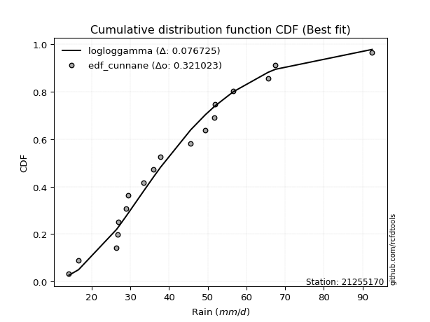</img>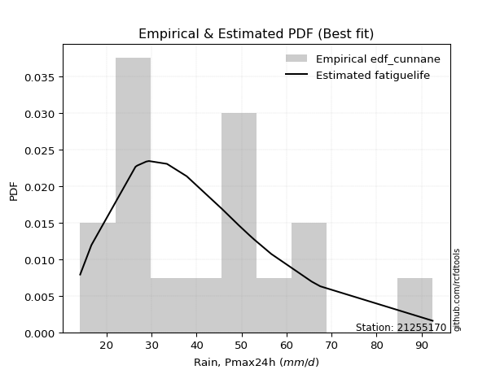</img>

</div>


### 12. Empirical - EDF Adamowski (1981)

The Adamowski formula in hydrology refers to a specific plotting position formula used for estimating the non-parametric empirical distribution of hydrological events (like flood peaks) to calculate their return periods. This formula provides an alternative to traditional parametric methods (like the Gumbel or Log Pearson Type III distributions). 

<div align="center">


$P=(m-0.25)/(n+0.5)$


</div>


**12.1. Empirical values**

<div align="center">

|                | 0                   | 1                  | 2                   | 3                   | 4                   | 5                  | 6                   | 7                  | 8                   | 9                 | 10                | 11                 | 12                 | 13                 | 14                 | 15                 | 16                 | 17                 |
|:---------------|:--------------------|:-------------------|:--------------------|:--------------------|:--------------------|:-------------------|:--------------------|:-------------------|:--------------------|:------------------|:------------------|:-------------------|:-------------------|:-------------------|:-------------------|:-------------------|:-------------------|:-------------------|
| date           | 2015                | 2020               | 2024                | 2016                | 2008                | 2018               | 2007                | 2025               | 2005                | 2006              | 2019              | 2012               | 2013               | 2010               | 2014               | 2011               | 2017               | 2009               |
| x              | 14.1                | 16.6               | 26.4                | 26.7                | 26.8                | 28.8               | 29.4                | 30.6               | 33.4                | 37.8              | 45.6              | 49.4               | 51.638888888888886 | 51.7               | 56.6               | 65.6               | 67.5               | 92.5               |
| m              | 1                   | 2                  | 3                   | 4                   | 5                   | 6                  | 7                   | 8                  | 9                   | 10                | 11                | 12                 | 13                 | 14                 | 15                 | 16                 | 17                 | 18                 |
| empirical_dist | edf_adamowski       | edf_adamowski      | edf_adamowski       | edf_adamowski       | edf_adamowski       | edf_adamowski      | edf_adamowski       | edf_adamowski      | edf_adamowski       | edf_adamowski     | edf_adamowski     | edf_adamowski      | edf_adamowski      | edf_adamowski      | edf_adamowski      | edf_adamowski      | edf_adamowski      | edf_adamowski      |
| empirical      | 0.04054054054054054 | 0.0945945945945946 | 0.14864864864864866 | 0.20270270270270271 | 0.25675675675675674 | 0.3108108108108108 | 0.36486486486486486 | 0.4189189189189189 | 0.47297297297297297 | 0.527027027027027 | 0.581081081081081 | 0.6351351351351351 | 0.6891891891891891 | 0.7432432432432432 | 0.7972972972972973 | 0.8513513513513513 | 0.9054054054054054 | 0.9594594594594594 |
| empirical_tr   | 1.0422535211267605  | 1.1044776119402986 | 1.1746031746031746  | 1.2542372881355932  | 1.3454545454545455  | 1.4509803921568627 | 1.574468085106383   | 1.7209302325581393 | 1.8974358974358976  | 2.114285714285714 | 2.387096774193548 | 2.7407407407407405 | 3.2173913043478257 | 3.8947368421052624 | 4.933333333333333  | 6.727272727272726  | 10.571428571428568 | 24.66666666666665  |

</div>


**12.2. Kolmogorov-Smirnov fit test (sorted by Δ)**


<div align="center">

|                | 0                   | 1                   | 2                   | 3                   | 4                   | 5                   | 6                   | 7                   | 8                   | 9                   | 10                  | 11                  | 12                  | 13                  | 14                  | 15                  | 16                  | 17                  | 18                  | 19                  | 20                  | 21                  | 22                  | 23                  | 24                  | 25                  | 26                  | 27                  | 28                  | 29                  | 30                  | 31                  | 32                  | 33                  | 34                  | 35                  | 36                  | 37                  | 38                  | 39                  | 40                  | 41                  | 42                  | 43                  | 44                  | 45                  | 46                  | 47                  | 48                  | 49                  | 50                  | 51                  | 52                  | 53                  | 54                  | 55                  | 56                  | 57                  | 58                  | 59                  | 60                  | 61                  | 62                  | 63                  | 64                  | 65                  | 66                  | 67                  | 68                    | 69                  | 70                  | 71                  | 72                  | 73                  | 74                  | 75                  | 76                  | 77                  | 78                  | 79                  | 80                  | 81                  | 82                  | 83                  | 84                  | 85                  | 86                  | 87                  | 88                  | 89                  |
|:---------------|:--------------------|:--------------------|:--------------------|:--------------------|:--------------------|:--------------------|:--------------------|:--------------------|:--------------------|:--------------------|:--------------------|:--------------------|:--------------------|:--------------------|:--------------------|:--------------------|:--------------------|:--------------------|:--------------------|:--------------------|:--------------------|:--------------------|:--------------------|:--------------------|:--------------------|:--------------------|:--------------------|:--------------------|:--------------------|:--------------------|:--------------------|:--------------------|:--------------------|:--------------------|:--------------------|:--------------------|:--------------------|:--------------------|:--------------------|:--------------------|:--------------------|:--------------------|:--------------------|:--------------------|:--------------------|:--------------------|:--------------------|:--------------------|:--------------------|:--------------------|:--------------------|:--------------------|:--------------------|:--------------------|:--------------------|:--------------------|:--------------------|:--------------------|:--------------------|:--------------------|:--------------------|:--------------------|:--------------------|:--------------------|:--------------------|:--------------------|:--------------------|:--------------------|:----------------------|:--------------------|:--------------------|:--------------------|:--------------------|:--------------------|:--------------------|:--------------------|:--------------------|:--------------------|:--------------------|:--------------------|:--------------------|:--------------------|:--------------------|:--------------------|:--------------------|:--------------------|:--------------------|:--------------------|:--------------------|:--------------------|
| station        | 21255170            | 21255170            | 21255170            | 21255170            | 21255170            | 21255170            | 21255170            | 21255170            | 21255170            | 21255170            | 21255170            | 21255170            | 21255170            | 21255170            | 21255170            | 21255170            | 21255170            | 21255170            | 21255170            | 21255170            | 21255170            | 21255170            | 21255170            | 21255170            | 21255170            | 21255170            | 21255170            | 21255170            | 21255170            | 21255170            | 21255170            | 21255170            | 21255170            | 21255170            | 21255170            | 21255170            | 21255170            | 21255170            | 21255170            | 21255170            | 21255170            | 21255170            | 21255170            | 21255170            | 21255170            | 21255170            | 21255170            | 21255170            | 21255170            | 21255170            | 21255170            | 21255170            | 21255170            | 21255170            | 21255170            | 21255170            | 21255170            | 21255170            | 21255170            | 21255170            | 21255170            | 21255170            | 21255170            | 21255170            | 21255170            | 21255170            | 21255170            | 21255170            | 21255170              | 21255170            | 21255170            | 21255170            | 21255170            | 21255170            | 21255170            | 21255170            | 21255170            | 21255170            | 21255170            | 21255170            | 21255170            | 21255170            | 21255170            | 21255170            | 21255170            | 21255170            | 21255170            | 21255170            | 21255170            | 21255170            |
| empirical_dist | edf_adamowski       | edf_adamowski       | edf_adamowski       | edf_adamowski       | edf_adamowski       | edf_adamowski       | edf_adamowski       | edf_adamowski       | edf_adamowski       | edf_adamowski       | edf_adamowski       | edf_adamowski       | edf_adamowski       | edf_adamowski       | edf_adamowski       | edf_adamowski       | edf_adamowski       | edf_adamowski       | edf_adamowski       | edf_adamowski       | edf_adamowski       | edf_adamowski       | edf_adamowski       | edf_adamowski       | edf_adamowski       | edf_adamowski       | edf_adamowski       | edf_adamowski       | edf_adamowski       | edf_adamowski       | edf_adamowski       | edf_adamowski       | edf_adamowski       | edf_adamowski       | edf_adamowski       | edf_adamowski       | edf_adamowski       | edf_adamowski       | edf_adamowski       | edf_adamowski       | edf_adamowski       | edf_adamowski       | edf_adamowski       | edf_adamowski       | edf_adamowski       | edf_adamowski       | edf_adamowski       | edf_adamowski       | edf_adamowski       | edf_adamowski       | edf_adamowski       | edf_adamowski       | edf_adamowski       | edf_adamowski       | edf_adamowski       | edf_adamowski       | edf_adamowski       | edf_adamowski       | edf_adamowski       | edf_adamowski       | edf_adamowski       | edf_adamowski       | edf_adamowski       | edf_adamowski       | edf_adamowski       | edf_adamowski       | edf_adamowski       | edf_adamowski       | edf_adamowski         | edf_adamowski       | edf_adamowski       | edf_adamowski       | edf_adamowski       | edf_adamowski       | edf_adamowski       | edf_adamowski       | edf_adamowski       | edf_adamowski       | edf_adamowski       | edf_adamowski       | edf_adamowski       | edf_adamowski       | edf_adamowski       | edf_adamowski       | edf_adamowski       | edf_adamowski       | edf_adamowski       | edf_adamowski       | edf_adamowski       | edf_adamowski       |
| p_dist         | lognakagami         | invgauss            | logt                | lognorm             | lognorm             | logcrystalball      | logexponnorm        | loglognorm          | logjohnsonsu        | lognct              | logf                | logfatiguelife      | logweibull_min      | fatiguelife         | johnsonsu           | logpearson3         | loggamma            | loggamma            | logerlang           | logbetaprime        | invgamma            | logloggamma         | fisk                | betaprime           | halflogistic        | logrice             | invweibull          | logfisk             | loginvgamma         | mielke              | loggenlogistic      | ncf                 | exponnorm           | rayleigh            | alpha               | moyal               | logalpha            | erlang              | chi2                | gamma               | f                   | pearson3            | loggompertz         | loginvgauss         | laplace_asymmetric  | genlogistic         | kstwobign           | logmaxwell          | weibull_min         | gumbel_r            | halfnorm            | loglogistic         | maxwell             | lograyleigh         | gompertz            | loghypsecant        | rice                | nct                 | logmielke           | loghalfnorm         | logncf              | t                   | truncnorm           | norm                | crystalball         | loginvweibull       | loggumbel_r         | loggumbel_l         | loglaplace_asymmetric | loglaplace          | loghalflogistic     | wald                | logistic            | logmoyal            | logkstwobign        | hypsecant           | loggenexpon         | genexpon            | gumbel_l            | laplace             | expon               | logwald             | logtruncnorm        | loggibrat           | gibrat              | nakagami            | logexpon            | logpareto           | logchi2             | pareto              |
| delta          | 0.08463278241144037 | 0.08464870298437524 | 0.08518197893705573 | 0.08518587031601857 | 0.08518587031601857 | 0.0851865493434538  | 0.08518669836347267 | 0.08518718950535667 | 0.08541254644954888 | 0.08543802043728457 | 0.08566783730137373 | 0.08579201591969865 | 0.0863758437657795  | 0.08642164094588442 | 0.08736104208531642 | 0.0888971830159549  | 0.08914286016175596 | 0.08914286016175596 | 0.09021486196716966 | 0.0914259751643623  | 0.09184279189915284 | 0.09225766985955952 | 0.09238207396057424 | 0.09439007237848723 | 0.0945945945945946  | 0.0948722930818538  | 0.0952540205055285  | 0.09544124320870156 | 0.09573102073932552 | 0.09628983918152856 | 0.09629700482256187 | 0.09691570844762776 | 0.09714418500199684 | 0.09717005292001701 | 0.09841371384056019 | 0.09954634756958508 | 0.0997647253267778  | 0.09982414972787917 | 0.09982546775926027 | 0.09982648926373958 | 0.1001349066551307  | 0.1022666319940912  | 0.10227392293312507 | 0.10254637942356112 | 0.102812213659495   | 0.10285665244190151 | 0.10383377355692314 | 0.1042668559097831  | 0.10427389058529626 | 0.10648287140457235 | 0.1071230360731679  | 0.10729886286974066 | 0.1076797516276286  | 0.112212937680125   | 0.11277826565598295 | 0.1227441768783909  | 0.12971824873269244 | 0.13099718391124268 | 0.1317746127598273  | 0.13258367579458205 | 0.1352623946657909  | 0.13758970017885802 | 0.1376009190646486  | 0.13760094043709864 | 0.13760095363509944 | 0.13842749919441308 | 0.1384395775460836  | 0.13883340075532724 | 0.14574315233085755   | 0.14584205784620186 | 0.1525888185460298  | 0.1563388187079865  | 0.15673072418854367 | 0.15754902332350806 | 0.16864321500251325 | 0.17135894637553764 | 0.17870293235293397 | 0.19336929804991113 | 0.19515548145746986 | 0.1989018436692997  | 0.21063555120629965 | 0.21204195707766793 | 0.22259934563203837 | 0.24416245037262652 | 0.2577866446326139  | 0.28145026543218266 | 0.3259233253319971  | 0.3259233294933487  | 0.3952252833679857  | 0.5103928816441697  |
| deltao         | 0.32102346734599996 | 0.32102346734599996 | 0.32102346734599996 | 0.32102346734599996 | 0.32102346734599996 | 0.32102346734599996 | 0.32102346734599996 | 0.32102346734599996 | 0.32102346734599996 | 0.32102346734599996 | 0.32102346734599996 | 0.32102346734599996 | 0.32102346734599996 | 0.32102346734599996 | 0.32102346734599996 | 0.32102346734599996 | 0.32102346734599996 | 0.32102346734599996 | 0.32102346734599996 | 0.32102346734599996 | 0.32102346734599996 | 0.32102346734599996 | 0.32102346734599996 | 0.32102346734599996 | 0.32102346734599996 | 0.32102346734599996 | 0.32102346734599996 | 0.32102346734599996 | 0.32102346734599996 | 0.32102346734599996 | 0.32102346734599996 | 0.32102346734599996 | 0.32102346734599996 | 0.32102346734599996 | 0.32102346734599996 | 0.32102346734599996 | 0.32102346734599996 | 0.32102346734599996 | 0.32102346734599996 | 0.32102346734599996 | 0.32102346734599996 | 0.32102346734599996 | 0.32102346734599996 | 0.32102346734599996 | 0.32102346734599996 | 0.32102346734599996 | 0.32102346734599996 | 0.32102346734599996 | 0.32102346734599996 | 0.32102346734599996 | 0.32102346734599996 | 0.32102346734599996 | 0.32102346734599996 | 0.32102346734599996 | 0.32102346734599996 | 0.32102346734599996 | 0.32102346734599996 | 0.32102346734599996 | 0.32102346734599996 | 0.32102346734599996 | 0.32102346734599996 | 0.32102346734599996 | 0.32102346734599996 | 0.32102346734599996 | 0.32102346734599996 | 0.32102346734599996 | 0.32102346734599996 | 0.32102346734599996 | 0.32102346734599996   | 0.32102346734599996 | 0.32102346734599996 | 0.32102346734599996 | 0.32102346734599996 | 0.32102346734599996 | 0.32102346734599996 | 0.32102346734599996 | 0.32102346734599996 | 0.32102346734599996 | 0.32102346734599996 | 0.32102346734599996 | 0.32102346734599996 | 0.32102346734599996 | 0.32102346734599996 | 0.32102346734599996 | 0.32102346734599996 | 0.32102346734599996 | 0.32102346734599996 | 0.32102346734599996 | 0.32102346734599996 | 0.32102346734599996 |
| eval           | Δo > Δ              | Δo > Δ              | Δo > Δ              | Δo > Δ              | Δo > Δ              | Δo > Δ              | Δo > Δ              | Δo > Δ              | Δo > Δ              | Δo > Δ              | Δo > Δ              | Δo > Δ              | Δo > Δ              | Δo > Δ              | Δo > Δ              | Δo > Δ              | Δo > Δ              | Δo > Δ              | Δo > Δ              | Δo > Δ              | Δo > Δ              | Δo > Δ              | Δo > Δ              | Δo > Δ              | Δo > Δ              | Δo > Δ              | Δo > Δ              | Δo > Δ              | Δo > Δ              | Δo > Δ              | Δo > Δ              | Δo > Δ              | Δo > Δ              | Δo > Δ              | Δo > Δ              | Δo > Δ              | Δo > Δ              | Δo > Δ              | Δo > Δ              | Δo > Δ              | Δo > Δ              | Δo > Δ              | Δo > Δ              | Δo > Δ              | Δo > Δ              | Δo > Δ              | Δo > Δ              | Δo > Δ              | Δo > Δ              | Δo > Δ              | Δo > Δ              | Δo > Δ              | Δo > Δ              | Δo > Δ              | Δo > Δ              | Δo > Δ              | Δo > Δ              | Δo > Δ              | Δo > Δ              | Δo > Δ              | Δo > Δ              | Δo > Δ              | Δo > Δ              | Δo > Δ              | Δo > Δ              | Δo > Δ              | Δo > Δ              | Δo > Δ              | Δo > Δ                | Δo > Δ              | Δo > Δ              | Δo > Δ              | Δo > Δ              | Δo > Δ              | Δo > Δ              | Δo > Δ              | Δo > Δ              | Δo > Δ              | Δo > Δ              | Δo > Δ              | Δo > Δ              | Δo > Δ              | Δo > Δ              | Δo > Δ              | Δo > Δ              | Δo > Δ              | Δo <= Δ             | Δo <= Δ             | Δo <= Δ             | Δo <= Δ             |
| fit            | 1                   | 1                   | 1                   | 1                   | 1                   | 1                   | 1                   | 1                   | 1                   | 1                   | 1                   | 1                   | 1                   | 1                   | 1                   | 1                   | 1                   | 1                   | 1                   | 1                   | 1                   | 1                   | 1                   | 1                   | 1                   | 1                   | 1                   | 1                   | 1                   | 1                   | 1                   | 1                   | 1                   | 1                   | 1                   | 1                   | 1                   | 1                   | 1                   | 1                   | 1                   | 1                   | 1                   | 1                   | 1                   | 1                   | 1                   | 1                   | 1                   | 1                   | 1                   | 1                   | 1                   | 1                   | 1                   | 1                   | 1                   | 1                   | 1                   | 1                   | 1                   | 1                   | 1                   | 1                   | 1                   | 1                   | 1                   | 1                   | 1                     | 1                   | 1                   | 1                   | 1                   | 1                   | 1                   | 1                   | 1                   | 1                   | 1                   | 1                   | 1                   | 1                   | 1                   | 1                   | 1                   | 1                   | 0                   | 0                   | 0                   | 0                   |
| n              | 18                  | 18                  | 18                  | 18                  | 18                  | 18                  | 18                  | 18                  | 18                  | 18                  | 18                  | 18                  | 18                  | 18                  | 18                  | 18                  | 18                  | 18                  | 18                  | 18                  | 18                  | 18                  | 18                  | 18                  | 18                  | 18                  | 18                  | 18                  | 18                  | 18                  | 18                  | 18                  | 18                  | 18                  | 18                  | 18                  | 18                  | 18                  | 18                  | 18                  | 18                  | 18                  | 18                  | 18                  | 18                  | 18                  | 18                  | 18                  | 18                  | 18                  | 18                  | 18                  | 18                  | 18                  | 18                  | 18                  | 18                  | 18                  | 18                  | 18                  | 18                  | 18                  | 18                  | 18                  | 18                  | 18                  | 18                  | 18                  | 18                    | 18                  | 18                  | 18                  | 18                  | 18                  | 18                  | 18                  | 18                  | 18                  | 18                  | 18                  | 18                  | 18                  | 18                  | 18                  | 18                  | 18                  | 18                  | 18                  | 18                  | 18                  |
| best_fit       | 1                   | 0                   | 0                   | 0                   | 0                   | 0                   | 0                   | 0                   | 0                   | 0                   | 0                   | 0                   | 0                   | 0                   | 0                   | 0                   | 0                   | 0                   | 0                   | 0                   | 0                   | 0                   | 0                   | 0                   | 0                   | 0                   | 0                   | 0                   | 0                   | 0                   | 0                   | 0                   | 0                   | 0                   | 0                   | 0                   | 0                   | 0                   | 0                   | 0                   | 0                   | 0                   | 0                   | 0                   | 0                   | 0                   | 0                   | 0                   | 0                   | 0                   | 0                   | 0                   | 0                   | 0                   | 0                   | 0                   | 0                   | 0                   | 0                   | 0                   | 0                   | 0                   | 0                   | 0                   | 0                   | 0                   | 0                   | 0                   | 0                     | 0                   | 0                   | 0                   | 0                   | 0                   | 0                   | 0                   | 0                   | 0                   | 0                   | 0                   | 0                   | 0                   | 0                   | 0                   | 0                   | 0                   | 0                   | 0                   | 0                   | 0                   |
| best_fit_sort  | 1                   | 2                   | 3                   | 4                   | 5                   | 6                   | 7                   | 8                   | 9                   | 10                  | 11                  | 12                  | 13                  | 14                  | 15                  | 16                  | 17                  | 18                  | 19                  | 20                  | 21                  | 22                  | 23                  | 24                  | 25                  | 26                  | 27                  | 28                  | 29                  | 30                  | 31                  | 32                  | 33                  | 34                  | 35                  | 36                  | 37                  | 38                  | 39                  | 40                  | 41                  | 42                  | 43                  | 44                  | 45                  | 46                  | 47                  | 48                  | 49                  | 50                  | 51                  | 52                  | 53                  | 54                  | 55                  | 56                  | 57                  | 58                  | 59                  | 60                  | 61                  | 62                  | 63                  | 64                  | 65                  | 66                  | 67                  | 68                  | 69                    | 70                  | 71                  | 72                  | 73                  | 74                  | 75                  | 76                  | 77                  | 78                  | 79                  | 80                  | 81                  | 82                  | 83                  | 84                  | 85                  | 86                  | 87                  | 88                  | 89                  | 90                  |

</div>


<div align="center">

</img>

</div>


**12.3. Best fit**

<div align="center">

|   id |   station | empirical_dist   | p_dist      |     delta |   deltao | eval   |   fit |   n |   best_fit |   best_fit_sort |
|-----:|----------:|:-----------------|:------------|----------:|---------:|:-------|------:|----:|-----------:|----------------:|
|    0 |  21255170 | edf_adamowski    | lognakagami | 0.0846328 | 0.321023 | Δo > Δ |     1 |  18 |          1 |               1 |

</div>


<div align="center">

</img>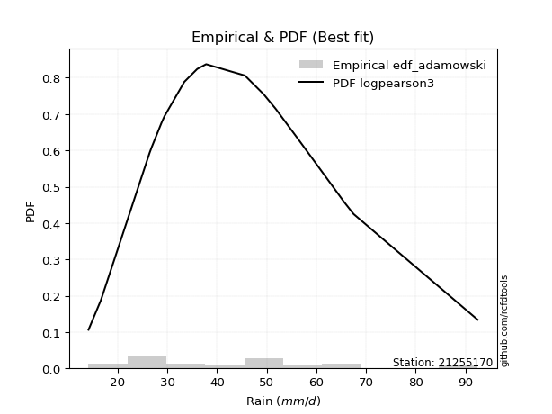</img>

</div>


## C. Best fit & Estimate extreme values for specific return periods - Tr


### 1. Best fit (ordered by delta Δ)

<div align="center">

|   id |   station | empirical_dist   | p_dist         |     delta |   deltao | eval   |   fit |   n |   best_fit |   best_fit_sort |
|-----:|----------:|:-----------------|:---------------|----------:|---------:|:-------|------:|----:|-----------:|----------------:|
|    0 |  21255170 | edf_weibull      | fatiguelife    | 0.084476  | 0.321023 | Δo > Δ |     1 |  18 |          1 |               1 |
|    1 |  21255170 | edf_california   | loginvgauss    | 0.0845284 | 0.321023 | Δo > Δ |     1 |  18 |          1 |               2 |
|    2 |  21255170 | edf_adamowski    | lognakagami    | 0.0846328 | 0.321023 | Δo > Δ |     1 |  18 |          1 |               3 |
|    3 |  21255170 | edf_blom         | johnsonsu      | 0.0862503 | 0.321023 | Δo > Δ |     1 |  18 |          1 |               4 |
|    4 |  21255170 | edf_chegodayev   | logweibull_min | 0.0864966 | 0.321023 | Δo > Δ |     1 |  18 |          1 |               5 |
|    5 |  21255170 | edf_cunnane      | johnsonsu      | 0.0865688 | 0.321023 | Δo > Δ |     1 |  18 |          1 |               6 |
|    6 |  21255170 | edf_tukey        | johnsonsu      | 0.0866239 | 0.321023 | Δo > Δ |     1 |  18 |          1 |               7 |
|    7 |  21255170 | edf_filliben     | johnsonsu      | 0.086765  | 0.321023 | Δo > Δ |     1 |  18 |          1 |               8 |
|    8 |  21255170 | edf_beard        | johnsonsu      | 0.0868317 | 0.321023 | Δo > Δ |     1 |  18 |          1 |               9 |
|    9 |  21255170 | edf_jenkinson    | johnsonsu      | 0.0868317 | 0.321023 | Δo > Δ |     1 |  18 |          1 |              10 |
|   10 |  21255170 | edf_gringorten   | johnsonsu      | 0.0881456 | 0.321023 | Δo > Δ |     1 |  18 |          1 |              11 |
|   11 |  21255170 | edf_hazen        | invgamma       | 0.0895905 | 0.321023 | Δo > Δ |     1 |  18 |          1 |              12 |

</div>

:file_folder:Tables: [bestfit_21255170.csv](table/bestfit_21255170.csv) | [extreme_21255170.csv](table/extreme_21255170.csv)


### 2. Extreme values

In hydrology, a return period (or recurrence interval $Tr$) is the statistical average time between extreme events like floods or droughts of a specific magnitude, indicating how rare an event is, with a 100-year flood, for example, having a 1% chance of occurring in any given year, not that it happens exactly every century. It is a key tool for infrastructure design (like bridges or dams) and risk assessment, calculated from historical data to determine the probability of future events, although it is important to remember it is statistical average, and events can cluster or be missed.

> risk_rate: assuming the return period as the project useful life.

|   id |      tr |   prob_l |     prob_g |    alpha |   betaprime |     chi2 |   crystalball |   erlang |    expon |   exponnorm |        f |   fatiguelife |     fisk |    gamma |   genexpon |   genlogistic |   gibrat |   gompertz |   gumbel_l |   gumbel_r |   halflogistic |   halfnorm |   hypsecant |   invgamma |   invgauss |   invweibull |   johnsonsu |   kstwobign |   laplace |   laplace_asymmetric |   loggamma |   logistic |   lognorm |   maxwell |   mielke |    moyal |   nakagami |      ncf |      nct |     norm |           pareto |   pearson3 |   rayleigh |     rice |        t |   truncnorm |     wald |   weibull_min |   logalpha |   logbetaprime |     logchi2 |   logcrystalball |   logerlang |   logexpon |   logexponnorm |     logf |   logfatiguelife |   logfisk |   loggenexpon |   loggenlogistic |   loggibrat |   loggompertz |   loggumbel_l |   loggumbel_r |   loghalflogistic |   loghalfnorm |   loghypsecant |   loginvgamma |   loginvgauss |   loginvweibull |   logjohnsonsu |   logkstwobign |   loglaplace |   loglaplace_asymmetric |   logloggamma |   loglogistic |   loglognorm |   logmaxwell |   logmielke |   logmoyal |   lognakagami |   logncf |   lognct |   logpareto |   logpearson3 |   lograyleigh |   logrice |     logt |   logtruncnorm |   logwald |   logweibull_min |   station |   n |   risk_rate |
|-----:|--------:|---------:|-----------:|---------:|------------:|---------:|--------------:|---------:|---------:|------------:|---------:|--------------:|---------:|---------:|-----------:|--------------:|---------:|-----------:|-----------:|-----------:|---------------:|-----------:|------------:|-----------:|-----------:|-------------:|------------:|------------:|----------:|---------------------:|-----------:|-----------:|----------:|----------:|---------:|---------:|-----------:|---------:|---------:|---------:|-----------------:|-----------:|-----------:|---------:|---------:|------------:|---------:|--------------:|-----------:|---------------:|------------:|-----------------:|------------:|-----------:|---------------:|---------:|-----------------:|----------:|--------------:|-----------------:|------------:|--------------:|--------------:|--------------:|------------------:|--------------:|---------------:|--------------:|--------------:|----------------:|---------------:|---------------:|-------------:|------------------------:|--------------:|--------------:|-------------:|-------------:|------------:|-----------:|--------------:|---------:|---------:|------------:|--------------:|--------------:|----------:|---------:|---------------:|----------:|-----------------:|----------:|----:|------------:|
|    0 |    2    | 0.5      | 0.5        |  38.0024 |     38.058  |  37.2824 |       41.7299 |  37.2825 |  33.2516 |     36.3237 |  37.2713 |       37.5507 |  37.4527 |  37.2824 |    33.671  |       38.2825 |  35.8484 |    38.615  |    44.9489 |    38.511  |        36.9106 |    37.719  |     41.7299 |    37.782  |    37.5962 |      37.873  |     37.6647 |     38.704  |   41.7299 |              36.0236 |    37.1061 |    41.7299 |   37.3661 |   40.0541 |  37.6494 |  37.4718 |    30.1479 |  38.2672 |  34.5752 |  41.7299 |     14.1455      |    39.0114 |    39.4598 |  40.3685 |  41.729  |     41.7299 |  35.3784 |       37.5346 |    36.3837 |        36.9994 |     23.7178 |          37.3661 |     37.0438 |    27.7077 |        37.3661 |  37.338  |          37.3327 |   37.6011 |       33.693  |          37.6497 |     32.3692 |       38.1236 |       40.4209 |       34.5422 |           33.2186 |       33.8806 |        37.3661 |       36.5943 |       36.2481 |         34.8888 |        37.3661 |        33.8173 |      37.3661 |                 33.6855 |       38.0364 |       37.3661 |      37.366  |      35.8683 |     37.5678 |    33.6769 |       37.392  |  36.7808 |  37.342  |     27.7077 |       37.8497 |       35.3515 |   36.9139 |  37.3664 |        35.1392 |   31.9997 |          37.8805 |  21255170 |  18 |    0.75     |
|    1 |    2.33 | 0.570815 | 0.429185   |  41.2058 |     41.3642 |  40.8098 |       45.2265 |  40.8099 |  37.4713 |     39.5586 |  40.8016 |       40.9352 |  40.5892 |  40.8098 |    37.6958 |       41.49   |  37.6197 |    42.651  |    47.991  |    41.7509 |        40.2418 |    41.4928 |     44.5282 |    41.0429 |    40.9605 |      41.0935 |     40.974  |     42.0892 |   43.8459 |              39.2132 |    40.4488 |    44.8107 |   40.6957 |   43.6868 |  40.7656 |  40.5388 |    34.5115 |  41.6098 |  37.9115 |  45.2265 |     14.7101      |    42.4739 |    43.1462 |  43.7975 |  45.2254 |     45.2265 |  37.6711 |       41.171  |    39.708  |        40.3551 |     28.4199 |          40.6957 |     40.3838 |    32.1544 |        40.6957 |  40.6624 |          40.656  |   40.7179 |       37.4353 |          40.7659 |     33.7993 |       41.8348 |       43.5369 |       37.3852 |           36.0329 |       37.1503 |        40.0079 |       39.9146 |       39.611  |         38.5792 |        40.6909 |        37.5485 |      39.347  |                 36.3639 |       41.3872 |       40.2847 |      40.6956 |      39.1945 |     41.6786 |    36.2952 |       40.7248 |  40.9212 |  40.6715 |     32.1544 |       41.2011 |       38.6805 |   40.298  |  40.696  |        37.2727 |   33.8417 |          41.2965 |  21255170 |  18 |    0.729209 |
|    2 |    5    | 0.8      | 0.2        |  55.4574 |     55.8657 |  56.59   |       58.2207 |  56.5901 |  58.5687 |     55.5545 |  56.6035 |       56.1131 |  55.568  |  56.59   |    57.7968 |       55.4224 |  47.8171 |    58.8619 |    57.8186 |    55.8267 |        55.3148 |    57.4513 |     55.7528 |    55.6697 |    56.0416 |      55.4708 |     55.8296 |     56.469  |   54.4252 |              55.1604 |    55.9513 |    56.7057 |   55.8873 |   57.9848 |  55.3747 |  54.7456 |    54.8026 |  56.1819 |  56.0428 |  58.2207 | 264750           |    56.9232 |    57.9046 |  57.5252 |  58.2191 |     58.2207 |  50.5059 |       56.9602 |    55.6419 |        56.0242 |     81.2264 |          55.8873 |     55.8932 |    67.6749 |        55.8874 |  55.8569 |          55.847  |   55.3761 |       57.1633 |          55.3746 |     43.3519 |       57.3853 |       55.3414 |       52.7148 |           52.0599 |       54.8484 |        52.6198 |       55.677  |       56.0188 |         59.7118 |        55.8565 |        58.5692 |      50.9417 |                 53.3095 |       56.1034 |       53.8582 |      55.8873 |      55.5664 |     57.7736 |    51.3416 |       55.944  |  61.6498 |  55.8861 |     67.6749 |       56.0715 |       55.4582 |   56.0254 |  55.8877 |        48.8468 |   46.2929 |          56.303  |  21255170 |  18 |    0.67232  |
|    3 |   10    | 0.9      | 0.1        |  67.6355 |     67.7575 |  69.5229 |       66.8407 |  69.5229 |  77.7203 |     70.0635 |  69.5614 |       68.7259 |  70.2406 |  69.5229 |    76.0416 |       66.7685 |  59.4409 |    69.9166 |    63.2901 |    67.2913 |        67.8322 |    69.2602 |     64.716  |    68.1317 |    68.6035 |      67.6585 |     68.3747 |     67.4173 |   64.0288 |              69.6368 |    69.6244 |    65.466  |   68.9767 |   68.047  |  69.3512 |  67.1147 |    70.712  |  68.0079 |  76.3642 |  66.8407 |      3.46993e+10 |    67.9382 |    68.4276 |  67.3134 |  66.8391 |     66.8407 |  64.1266 |       69.2771 |    70.4021 |        69.9805 |    237.698  |          68.9767 |     69.5966 |   132.987  |        68.9769 |  68.9829 |          68.9718 |   69.4492 |       77.375  |          69.3505 |     57.5746 |       68.9566 |       63.2498 |       69.7397 |           70.6666 |       73.1763 |        65.4903 |       70.067  |       71.5794 |         85.2264 |        68.9189 |        82.1623 |      64.4007 |                 75.4424 |       68.109  |       66.7003 |      68.9769 |      71.0382 |     68.4619 |    69.4398 |       69.0735 |  81.8937 |  69.0252 |    132.987  |       68.3684 |       71.7026 |   69.8652 |  68.9773 |        59.9717 |   64.5519 |          68.4448 |  21255170 |  18 |    0.651322 |
|    4 |   15    | 0.933333 | 0.0666667  |  74.8231 |     74.4967 |  76.7496 |       71.1422 |  76.7496 |  88.9233 |     78.5508 |  76.8042 |       75.8601 |  79.8741 |  76.7496 |    86.7141 |       73.1696 |  67.4585 |    75.3564 |    65.768  |    73.7595 |        74.916  |    75.4055 |     69.8312 |    75.3994 |    75.7299 |      74.7303 |     75.607  |     73.2295 |   69.6465 |              78.1049 |    77.7298 |    70.239  |   76.6139 |   73.2098 |  78.391  |  74.2933 |    79.1031 |  74.6574 |  90.6899 |  71.1422 |      3.41878e+13 |    73.8768 |    73.8496 |  72.3567 |  71.1408 |     71.1422 |  72.8732 |       75.9295 |    79.4615 |        78.3098 |    459.344  |          76.6139 |     77.7297 |   197.435  |        76.6142 |  76.6553 |          76.6444 |   78.5689 |       90.4539 |          78.3899 |     70.0203 |       75.0353 |       67.194  |       81.6688 |           84.0073 |       85.0211 |        74.2008 |       78.8061 |       81.2745 |        104.172  |        76.5387 |        98.3363 |      73.867  |                 92.4346 |       74.8608 |       74.9431 |      76.6143 |      80.5801 |     74.0462 |    82.74   |       76.7407 |  94.7144 |  76.7035 |    197.435  |       75.3424 |       81.8503 |   78.0384 |  76.6145 |        66.2399 |   79.9158 |          75.2142 |  21255170 |  18 |    0.644736 |
|    5 |   20    | 0.95     | 0.05       |  80.0236 |     79.2334 |  81.7681 |       73.9592 |  81.7682 |  96.8719 |     84.5726 |  81.8345 |       80.8514 |  87.3209 |  81.7682 |    94.2864 |       77.6514 |  73.7477 |    78.8682 |    67.3104 |    78.2884 |        79.8791 |    79.5027 |     73.4398 |    80.5998 |    80.7258 |      79.7678 |     80.7375 |     77.1449 |   73.6324 |              84.1131 |    83.5734 |    73.5379 |   82.0679 |   76.6361 |  85.3166 |  79.3772 |    84.718  |  79.3085 | 102.201  |  73.9592 |      4.54808e+15 |    77.9284 |    77.4534 |  75.7089 |  73.9579 |     73.9592 |  79.3912 |       80.4593 |    86.1342 |        84.3394 |    740.361  |          82.0679 |     83.5975 |   261.33   |        82.0682 |  82.1405 |          82.13   |   85.5629 |      100.354  |          85.3151 |     81.6384 |       79.1133 |       69.7723 |       91.2161 |           94.8279 |       93.9653 |        81.0339 |       85.2005 |       88.4778 |        119.891  |        81.9796 |       110.99   |      81.4157 |                106.764  |       79.5785 |       81.2283 |      82.0685 |      87.6101 |     77.9242 |    93.6733 |       82.2188 | 104.324  |  82.1921 |    261.33   |       80.2383 |       89.3776 |   83.914  |  82.0686 |        70.3837 |   93.698  |          79.9173 |  21255170 |  18 |    0.641514 |
|    6 |   25    | 0.96     | 0.04       |  84.1363 |     82.8947 |  85.609  |       76.0329 |  85.609  | 103.037  |     89.2435 |  85.6848 |       84.6916 |  93.4974 |  85.609  |   100.16   |       81.1035 |  78.9908 |    81.4229 |    68.408  |    81.7768 |        83.7029 |    82.5511 |     76.2325 |    84.6723 |    84.5755 |      83.6969 |     84.7278 |     80.0776 |   76.724  |              88.7735 |    88.1704 |    76.0616 |   86.3294 |   79.1798 |  91.024  |  83.3178 |    88.9019 |  82.8908 | 112.006  |  76.0329 |      2.01975e+17 |    80.994  |    80.1309 |  78.1994 |  76.0318 |     76.0329 |  84.6119 |       83.8788 |    91.466  |        89.0967 |   1077.18   |          86.3294 |     88.216  |   324.815  |        86.3297 |  86.4297 |          86.4197 |   91.3308 |      108.407  |          91.0223 |     92.7843 |       82.1613 |       71.6671 |       99.3244 |          104.106  |      101.225  |        86.7511 |       90.2851 |       94.2689 |        133.599  |        86.2305 |       121.524  |      87.7983 |                119.393  |       83.2077 |       86.39   |      86.3301 |      93.2229 |     80.9389 |   103.132  |       86.5007 | 112.094  |  86.4835 |    324.815  |       84.017  |       95.4151 |   88.5259 |  86.3301 |        73.3589 |  106.433  |          83.5202 |  21255170 |  18 |    0.639603 |
|    7 |   50    | 0.98     | 0.02       |  97.489  |     94.2642 |  97.3046 |       81.9711 |  97.3046 | 122.189  |    103.753  |  97.4108 |       96.4891 | 115.293  |  97.3047 |   118.405  |       91.7376 |  97.4726 |    88.5774 |    71.3875 |    92.523  |        95.4847 |    91.4118 |     84.8911 |    97.616  |    96.4355 |      96.0743 |     97.242  |     88.6895 |   86.3276 |             103.25   |   102.872  |    83.7722 |   99.7966 |   86.5571 | 110.933  |  95.551  |   101.077  |  93.9445 | 148.247  |  81.9711 |      2.64732e+22 |    90.1668 |    87.9034 |  85.4291 |  81.9706 |     81.9711 | 101.658  |       94.0558 |   109      |       104.39   |   3526.41   |          99.7966 |    103      |   638.289  |        99.7971 | 100.004  |          99.9965 |  111.476  |      135.65   |         110.931  |    145.679  |       91.0888 |       77.074  |      129.118  |          138.799  |      125.671  |       107.17   |      106.86   |      113.514  |        186.481  |        99.6625 |       158.597  |     110.995  |                168.962  |       94.3724 |      104.283  |      99.7978 |     111.619  |     90.6365 |   139.024  |      100.041  | 138.166  | 100.062  |    638.289  |       95.7042 |      115.352  |  103.211  |  99.7975 |        80.9734 |  161.354  |          94.5218 |  21255170 |  18 |    0.63583  |
|    8 |   75    | 0.986667 | 0.0133333  | 105.807  |    100.951  | 104.012  |       85.1573 | 104.012  | 133.392  |    112.24   | 104.136  |      103.322  | 130.183  | 104.012  |   129.077  |       97.9186 | 109.955  |    92.3094 |    72.8941 |    98.7691 |       102.333  |    96.2352 |     89.9511 |   105.441  |   103.327  |     103.462  |    104.68   |     93.4277 |   91.9454 |             111.718  |   111.807  |    88.2256 |  107.869  |   90.568  | 124.357  | 102.705  |   107.705  | 100.397  | 174.303  |  85.1573 |      2.60829e+25 |    95.3323 |    92.1319 |  89.3624 |  85.1572 |     85.1573 | 112.147  |       99.7433 |   120.011  |       113.741  |   7142.18   |         107.869  |    111.993  |   947.619  |       107.87   | 108.153  |         108.149  |  125.076  |      153.254  |         124.354  |    197.571  |       95.9917 |       79.9615 |      150.386  |          164.058  |      141.376  |       121.261  |      117.159  |      125.741  |        226.368  |       107.713  |       183.618  |     127.31   |                207.018  |      100.86   |      116.259  |     107.871  |     123.101  |     96.7247 |   165.552  |      108.164  | 154.897  | 108.212  |    947.619  |      102.536  |      127.896  |  112.088  | 107.87   |        84.2294 |  208.438  |         100.859  |  21255170 |  18 |    0.634587 |
|    9 |  100    | 0.99     | 0.01       | 111.983  |    105.726  | 108.721  |       87.3124 | 108.721  | 141.341  |    118.262  | 108.859  |      108.147  | 141.864  | 108.721  |   136.65   |      102.293  | 119.625  |    94.7892 |    73.8796 |   103.19   |       107.181  |    99.5211 |     93.5405 |   111.125  |   108.205  |     108.779  |    110.021  |     96.6742 |   95.9312 |             117.726  |   118.311  |    91.3698 |  113.696  |   93.2999 | 134.8    | 107.78   |   112.219  | 104.983  | 195.399  |  87.3124 |      3.46987e+27 |    98.9235 |    95.0127 |  92.042  |  87.3126 |     87.3124 | 119.794  |      103.677  |   128.193  |       120.573  |  11835.5    |         113.696  |    118.545  |  1254.29   |       113.696  | 114.042  |         114.039  |  135.667  |      166.542  |         134.797  |    250.167  |       99.349  |       81.9086 |      167.524  |          184.668  |      153.185  |       132.365  |      124.763  |      134.891  |        259.655  |       113.523  |       203.004  |     140.321  |                239.111  |      105.454  |      125.534  |     113.698  |     131.59   |    101.304  |   187.389  |      114.029  | 167.489  | 114.1    |   1254.29   |      107.392  |      137.214  |  118.527  | 113.697  |        86.0464 |  251.217  |         105.323  |  21255170 |  18 |    0.633968 |
|   10 |  200    | 0.995    | 0.005      | 127.98   |    117.372  | 119.927  |       92.2007 | 119.927  | 160.492  |    132.771  | 120.098  |      119.715  | 174.425  | 119.927  |   154.894  |      112.81   | 145.933  |   100.278  |    76.0216 |   113.818  |       118.835  |   107.036  |    102.187  |   125.327  |   119.929  |     121.867  |    123.145  |    104.151  |  105.535  |             132.203  |   134.588  |    98.9121 |  128.106  |   99.5503 | 163.568  | 120.008  |   122.533  | 116.094  | 256.927  |  92.2007 |      4.54801e+32 |   107.364  |   101.604  |  98.1733 |  92.2019 |     92.2007 | 138.844  |      112.849  |   149.277  |       137.761  |  40465.8    |         128.106  |    134.954  |  2464.78   |       128.107  | 128.626  |         128.629  |  164.872  |      201.456  |         163.564  |    475.462  |      107.08   |       86.3056 |      217.147  |          245.44   |      184.033  |       163.475  |      144.169  |      158.694  |        361.106  |       127.891  |       255.801  |     177.394  |                338.385  |      116.525  |      150.912  |     128.109  |     153.282  |    113.448  |   252.572  |      128.545  | 200.493  | 128.68   |   2464.78   |      119.145  |      161.171  |  134.557  | 128.108  |        89.0613 |  399.939  |         116.002  |  21255170 |  18 |    0.633042 |
|   11 |  250    | 0.996    | 0.004      | 133.517  |    121.171  | 123.497  |       93.6946 | 123.497  | 166.658  |    137.441  | 123.679  |      123.425  | 186.413  | 123.497  |   160.768  |      116.191  | 155.372  |   101.917  |    76.6519 |   117.234  |       122.581  |   109.348  |    104.971  |   130.064  |   123.699  |     126.168  |    127.452  |    106.466  |  108.626  |             136.863  |   140.02   |   101.334  |  132.864  |  101.474  | 174.047  | 123.945  |   125.704  | 119.697  | 280.504  |  93.6946 |      2.01972e+34 |   110.025  |   103.633  | 100.061  |  93.6961 |     93.6946 | 145.146  |      115.72   |   156.506  |       143.525  |  60305.6    |         132.864  |    140.435  |  3063.56   |       132.865  | 133.447  |         133.453  |  175.521  |      213.614  |         174.043  |    598.661  |      109.473  |       87.6438 |      236.036  |          268.946  |      194.719  |       174.969  |      150.763  |      166.922  |        401.498  |       132.634  |       274.773  |     191.301  |                378.409  |      120.094  |      160.102  |     132.867  |     160.653  |    117.752  |   278.048  |      133.341  | 211.974  | 133.5    |   3063.56   |      122.95   |      169.355  |  139.88   | 132.866  |        89.7119 |  466.447  |         119.423  |  21255170 |  18 |    0.632858 |
|   12 |  500    | 0.998    | 0.002      | 152.159  |    133.157  | 134.49   |       98.1246 | 134.49   | 185.809  |    151.951  | 134.706  |      134.918  | 229.168  | 134.49   |   179.013  |      126.685  | 187.995  |   106.675  |    78.4586 |   127.839  |       134.21   |   116.241  |    113.617  |   145.343  |   135.406  |     139.814  |    141.112  |    113.4    |  118.23   |             151.339  |   157.53   |   108.843  |  148.039  |  107.216  | 211.01   | 136.172  |   135.146  | 130.996  | 368.189  |  98.1246 |      2.64727e+39 |   118.146  |   109.687  | 105.692  |  98.1273 |     98.1246 | 165.184  |      124.414  |   180.448  |       162.194  | 209981      |         148.039  |    158.117  |  6020.14   |       148.04   | 148.844  |         148.859  |  213.126  |      254.439  |         211.006  |   1327.4    |      116.647  |       91.5958 |      305.781  |          357.233  |      230.407  |       216.088  |      172.409  |      194.402  |        557.968  |       147.76   |       340.476  |     241.843  |                535.517  |      131.217  |      192.315  |     148.043  |     184.825  |    132.607  |   374.765  |      148.644  | 250.54   | 148.886  |   6020.14   |      134.851  |      196.329  |  156.953  | 148.04   |        91.0671 |  760.733  |         130.014  |  21255170 |  18 |    0.632489 |
|   13 |  750    | 0.998667 | 0.00133333 | 164.243  |    140.312  | 140.861  |      100.586  | 140.861  | 197.012  |    160.438  | 141.097  |      141.622  | 258.607  | 140.861  |   189.685  |      132.82   | 209.569  |   109.25   |    79.4241 |   134.039  |       141.008  |   120.092  |    118.675  |   154.705  |   142.254  |     148.004  |    149.311  |    117.296  |  123.848  |             159.808  |   168.239  |   113.23   |  157.205  |  110.427  | 236.138  | 143.325  |   140.414  | 137.691  | 431.537  | 100.586  |      2.60825e+42 |   122.805  |   113.073  | 108.841  | 100.589  |    100.586  | 177.199  |      129.358  |   195.572  |       173.677  | 437848      |         157.205  |    168.941  |  8937.64   |       157.206  | 158.158  |         158.18   |  238.721  |      280.586  |         236.133  |   2247.53   |      120.68   |       93.7806 |      355.745  |          421.72   |      253.119  |       244.486  |      185.935  |      211.919  |        676.338  |       156.897  |       384.056  |     277.392  |                656.133  |      137.756  |      214.056  |     157.21   |     199.896  |    142.506  |   446.264  |      157.894  | 275.283  | 158.193  |   8937.65   |      141.877  |      213.245  |  167.332  | 157.207  |        91.5357 | 1020      |         136.195  |  21255170 |  18 |    0.632366 |
|   14 | 1000    | 0.999    | 0.001      | 173.436  |    145.458  | 145.357  |      102.28   | 145.357  | 204.961  |    166.46   | 145.608  |      146.373  | 281.773  | 145.358  |   197.258  |      137.172  | 226.079  |   110.996  |    80.074  |   138.436  |       145.83   |   122.752  |    122.264  |   161.551  |   147.115  |     153.911  |    155.225  |    119.995  |  127.834  |             165.816  |   176.056  |   116.342  |  163.844  |  112.646  | 255.751  | 148.4    |   144.049  | 142.485  | 482.934  | 102.28   |      3.46982e+44 |   126.075  |   115.412  | 111.017  | 102.284  |    102.28   | 185.841  |      132.807  |   206.838  |       182.088  | 738951      |         163.844  |    176.847  | 11830.1    |       163.845  | 164.91   |         164.937  |  258.714  |      300.212  |         255.746  |   3362.97   |      123.475  |       95.2803 |      396.061  |          474.404  |      270.099  |       266.87   |      195.942  |      225.042  |        775.233  |       163.513  |       417.477  |     305.74   |                757.852  |      142.413  |      230.948  |     163.849  |     211.026  |    150.159  |   505.123  |      164.596  | 293.887  | 164.939  |  11830.1    |      146.894  |      225.778  |  174.877  | 163.846  |        91.7734 | 1259.56   |         140.578  |  21255170 |  18 |    0.632305 |

<div align="center">

</img>

</div>


<div align="center">

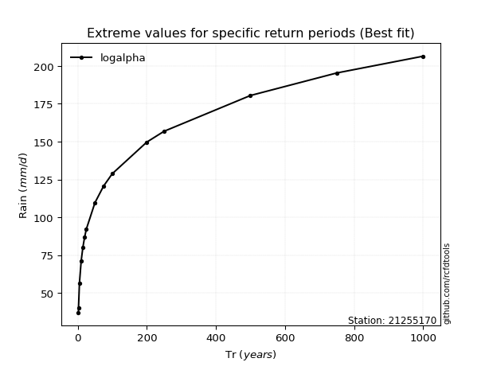</img>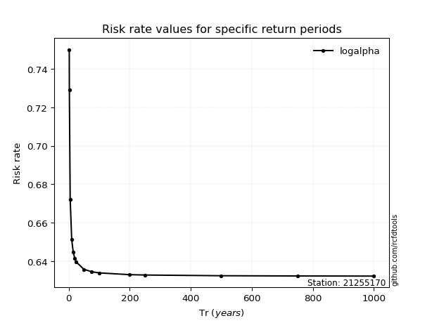</img>

</div>


<sub>**APP DISCLAIMER**: NO WARRANTY - This software is provided by [github.com/rcfdtools](https://github.com/rcfdtools) "as is", without any express or implied warranty, including warranties of merchantability, fitness for a particular purpose, or non-infringement. There is no guarantee that the software will be error-free or operate without interruption. LIMITATION OF LIABILITY - Neither the authors nor copyright holders will be liable for claims or damages arising from the software or its use. You are responsible for determining if the software is appropriate for your use and assume all associated risks, including errors, legal compliance, and data loss. NO PROFESSIONAL ADVICE - The software provides general information and does not offer professional advice. It should not replace consultation with professional advisors.</sub>