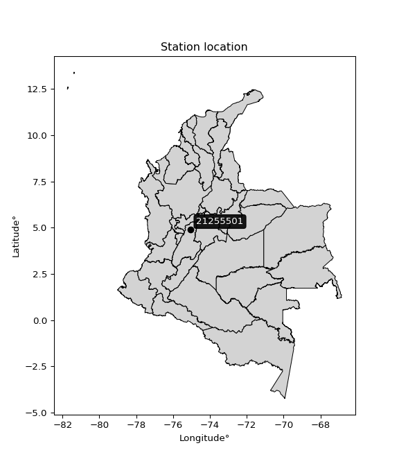

<div align="center">


</div>

# PMax24h Station (Rain, Pmax24h): 21255501

Maximum Precipitation in 24 hours (PMax24h) is the greatest amount of rainfall for a specific duration that is meteorologically possible for a given location, acting as a "worst-case" scenario for extreme storms, crucial for designing safety-critical infrastructure like bridges, river deviations, dams, spillways, and nuclear plants to prevent catastrophic failure. The PMax24h is related with the Probable Maximum Precipitation (PMP) and it is calculated by hydrologists using meteorological data to determine the upper limit of extreme rainfall, often leading to the Probable Maximum Flood (PMF) for flood control design, and is increasingly being studied for climate change impacts. Probable Maximum Precipitation (PMP) is the theoretical upper limit of rainfall, a deterministic estimate for extreme events, while probability distributions (like GEV, Gumbel) describe the likelihood and frequency of various precipitation amounts, including rare ones, showing how often events occur, with PMP representing the extreme end of these distributions, used for critical infrastructure design to ensure safety against the worst conceivable weather, unlike standard statistical forecasts which cover typical probabilities.

The most common probability distributions in hydrology, used for analyzing floods, rainfall, and streamflow, include the Normal, Log-Normal, Gumbel, Gamma (including Log-Pearson Type III), and Generalized Extreme Value (GEV) distributions, often chosen based on the data´s skewness and whether modeling extremes or general conditions, with Gumbel and GEV popular for extreme events like floods, while the Normal distribution serves as a baseline, though often requiring transformations for skewed hydrological data. These distributions help in designing water infrastructure, managing water resources, and forecasting hydrologic events.

> Hydrological data often isn´t perfectly normal (it´s skewed), so different distributions are needed for different applications, such as: **Flood Frequency Analysis**: Using Gumbel, GEV, or Log-Pearson Type III for predicting extreme flood magnitudes and their return periods, **Rainfall Analysis**: Normal for annual totals, but Log-Normal, Weibull, or GEV for intensity or extreme daily rainfall, **Streamflow Modeling**: Gamma and Log-Normal for maximum flows, GEV for minimum flows, and Kappa for daily flows.

<div align="center">

</img>

</div>


## A. General information


### 1. General running parameters

• app_version: _v20260225_. • runtime: _2026-02-27 14:50:08.749431_. • Python version: _3.14.0_. • SciPy version: _1.16.3_. • Pandas version: _2.3.3_. • NumPy version: _2.3.5_. • Stations dataset (station_dataset_file): _dataset/pmax24h_in/automatic_colombia_2003_2025.csv_. • Stations catalog (station_catalog_file): _dataset/CNE.xls_. • Minimum year to eval til year_max (date_min): _1900_. • Maximum year to eval since year_min (date_max): _2025_. • Creates, save and include plots into reports (create_plot): _False_. • Plot only fit distributions with Δo > Δ (plot_only_fit): _True_. • Plot only simple graphs avoiding multiple CDFs and multiple Extreme values plots (plot_only_simple): _False_. • Eval low extreme values, if False, evaluates high extreme values (low_extreme): _False_. • Eval every SciPy distribution as logarithmic (pdist_logarithmic_on): _True_. • Standard deviation normalized (ddof): _1.0_. • Return periods to eval in years (Tr): _[2, 2.33, 5, 10, 15, 20, 25, 50, 75, 100, 200, 250, 500, 750, 1000]_. • Minimum data sample per station, 0 means any (minimum_sample): _5_. • Z-Score maximum threshold to adjust a value, 0 means disable (zscore_max): _3.5_. • Z-Score minimum threshold to adjust a value, 0 means disable (zscore_min): _-2.5_. • Avoid zeros, e.g. rain = 0 (avoid_zeros): _True_. • Avoid null values (avoid_nans): _True_. 

:file_folder:Table: [dataset.csv](../../dataset/pmax24h_in/automatic_colombia_2003_2025.csv)

> Delta Degrees of Freedom (DDOF): is a parameter used in the formulas for calculating variance and standard deviation. When ddof=0, the divisor is $N$ (the total number of observations) and this is used when your data set is the entire population. When ddof=1, the divisor is $N-1$ and this is used when your data set is a sample drawn from a larger population. Using $N-1$ provides an unbiased estimate of the population variance (known as Bessel´s correction).


### 2. Station info and location

|   id |   CODIGO | NOMBRE                         | CATEGORIA               | TECNOLOGIA                | ESTADO   | FECHA_INSTALACION   |   FECHA_SUSPENSION |   ALTITUD |   LATITUD |   LONGITUD | DEPARTAMENTO   | MUNICIPIO   | AREA_OPERATIVA             | ENTIDAD                                    | AREA_HIDROGRAFICA   | ZONA_HIDROGRAFICA   | SUBZONA_HIDROGRAFICA                        |   CORRIENTE | Catalogo   |   Version |
|-----:|---------:|:-------------------------------|:------------------------|:--------------------------|:---------|:--------------------|-------------------:|----------:|----------:|-----------:|:---------------|:------------|:---------------------------|:-------------------------------------------|:--------------------|:--------------------|:--------------------------------------------|------------:|:-----------|----------:|
|    0 | 21255501 | LA TRINIDAD  - AUT  [21255501] | Climatológica Principal | Automática con Telemetría | Activa   | 24/10/2013          |                nan |      1456 |     4.895 |     -75.04 | Tolima         | Líbano      | Area Operativa 10 - Tolima | CENTRO NACIONAL DE INVESTIGACIONES DE CAFE | Magdalena Cauca     | Alto Magdalena      | Río Lagunilla y Otros Directos al Magdalena |         nan | CNE_OE     |  20251226 |

<div align="center">

Dynamic map: [:earth_americas:Google](http://maps.google.com/maps?q=4.895,-75.04) [:earth_americas:OSM](https://www.openstreetmap.org/#map=18/4.895/-75.04&layers=P) [:earth_americas:Bing](https://www.bing.com/maps?cp=4.895~-75.04&lvl=18) [:earth_americas:Apple](https://maps.apple.com/frame?center=4.895%2C-75.04&span=0.003%2C0.006)

</div>


<div align="center">

```geojson
{
  "type": "Feature",
  "geometry": {
    "type": "Point", 
    "coordinates": [-75.04, 4.895]
  }, 
  "properties": {
    "Name": "21255501"
  }
}
```

</div>


### 3. Discrete values table and plot

<div align="center">

|               |          0 |           1 |           2 |           3 |           4 |          5 |          6 |
|:--------------|-----------:|------------:|------------:|------------:|------------:|-----------:|-----------:|
| Date          | 2016       | 2018        | 2019        | 2020        | 2021        | 2022       | 2023       |
| Value         |   39.6     |   57.9      |   53.5      |   82.6      |   59.8      |  102.9     |   98.6     |
| Value_initial |   39.6     |   57.9      |   53.5      |   82.6      |   59.8      |  102.9     |   98.6     |
| count         |    7       |    7        |    7        |    7        |    7        |    7       |    7       |
| mean          |   70.7     |   70.7      |   70.7      |   70.7      |   70.7      |   70.7     |   70.7     |
| std           |   24.1611  |   24.1611   |   24.1611   |   24.1611   |   24.1611   |   24.1611  |   24.1611  |
| zscore        |   -1.28719 |   -0.529777 |   -0.711887 |    0.492527 |   -0.451138 |    1.33272 |    1.15475 |


</div>


> The initial value (value_initial) correspond to the initial obtained or null completed value, and value (value) is adjusted only when the initial value is outside the valid range (outlier) definite through the Z-Score value. If Z-Score is active, values out of range or outliers are replaced with the station mean value. A Z-Score (or standard score) measures how many standard deviations a data point is from the mean of a dataset, indicating its relative position; positive scores mean above the mean, negative mean below, and a score of zero is exactly at the mean, allowing for comparison of values from different distributions. It´s calculated using the formula $z=(x–μ)/σ$, where $x$ is the data point, $μ$ is the mean, and $σ$ is the standard deviation, helping identify outliers and understand probability.
>
> <sub>**Note**: In this study, "completing" (filling gaps in) and "extending" (forecasting or lengthening the historical record) rainfall data series are avoided for certain critical analyses because they introduce artificial bias and uncertainty, which can distort the statistics of rare events (extremes), alter day-to-day variability, and compromise the integrity and homogeneity of the original data. Some reasons against Completing/Extending rainfall data are: **Distortion of Extremes and Variability**: The primary issue is that most gap-filling or extension methods rely on averaging or regression with nearby stations, which inherently smooths the data. Rainfall is highly variable in space and time, with a large percentage of zero values and occasional large storms. Infilling methods often underestimate the highest values and overestimate the lowest (zero) values, which severely distorts analyses focused on flood frequency, drought severity, and intensity-duration-frequency (IDF) curves, **Loss of Data Homogeneity**: Infilled or extended data are synthetic estimates, not actual measurements. Combining these estimates with observed data can violate the assumption of data homogeneity, which requires that the data properties do not change over time. Inhomogeneity can lead to incorrect conclusions about long-term trends or changes in climate patterns, **Propagation of Errors**: Errors and biases from the original data (e.g., wind-induced undercatch, instrument errors, site changes) or the data used for imputation can propagate through the analysis, leading to unreliable hydrological models and inaccurate predictions, **Compromised Statistical Integrity**: For statistical analyses, especially those involving the frequency of events, using artificial data can introduce time bias or autocorrelation that doesn´t exist in reality, making it difficult to assess the true probability of events, **Difficulty in Validation**: It is difficult to accurately validate the quality of filled or extended data, especially for past periods where ground-truth measurements are unavailable. The reliability of imputation techniques heavily depends on the density of the surrounding station network and the complexity of the local topography.</sub>


### 4. Active continuous probability distributions from SciPy (80 of 104 available)

A Probability Density Function (PDF) describes the relative likelihood of a continuous random variable falling within a specific range, where the total area under its curve equals 1, and the area over any interval gives the actual probability for that range. Unlike discrete probabilities (like rolling a die), a PDF shows density, not direct probability for a single point (which is zero), with higher points indicating higher likelihood, often visualized as a bell curve for normal distributions.

A log of a probability density function (log-PDF) is simply the logarithm of the PDF´s value, denoted as $log(f(x))$, useful for converting multiplication of probabilities into addition, improving numerical stability with tiny numbers, and connecting to information theory concepts like entropy. Instead of dealing with very small probabilities (e.g., 0.000001), log-PDFs use negative numbers (e.g., $log(0.00001) ≈ -11.51$ that are easier for computers to handle, preventing underflow errors and simplifying complex calculations. In this study, each active probability distribution from SciPy is also evaluated in the $log$ form.

[scipy.stats](https://docs.scipy.org/doc/scipy/reference/stats.html) is a Python´s powerful submodule within the SciPy library for comprehensive statistical analysis, offering over 130 probability distributions (like Normal, Poisson, etc.), functions for descriptive stats (mean, variance), hypothesis testing (t-tests, chi-square), random variable generation, and statistical tests, making it essential for data science, modeling, and research. It provides tools to explore, model, and draw conclusions from data efficiently, working seamlessly with [NumPy](https://numpy.org/).

<div align="center">

|   id | p_dist           |   n_parameter | fit_method   | label                                                                       | active   | ref                                                                                                      |
|-----:|:-----------------|--------------:|:-------------|:----------------------------------------------------------------------------|:---------|:---------------------------------------------------------------------------------------------------------|
|    0 | alpha            |             3 | MLE          | Alpha                                                                       | True     | [:mortar_board:](https://docs.scipy.org/doc/scipy/reference/generated/scipy.stats.alpha.html)            |
|    1 | anglit           |             2 | MM           | Anglit                                                                      | True     | [:mortar_board:](https://docs.scipy.org/doc/scipy/reference/generated/scipy.stats.anglit.html)           |
|    2 | arcsine          |             2 | MM           | Arcsine                                                                     | True     | [:mortar_board:](https://docs.scipy.org/doc/scipy/reference/generated/scipy.stats.arcsine.html)          |
|    3 | argus            |             3 | MLE          | Argus                                                                       | True     | [:mortar_board:](https://docs.scipy.org/doc/scipy/reference/generated/scipy.stats.argus.html)            |
|    4 | beta             |             4 | MLE          | Beta                                                                        | True     | [:mortar_board:](https://docs.scipy.org/doc/scipy/reference/generated/scipy.stats.beta.html)             |
|    5 | betaprime        |             4 | MLE          | Beta prime                                                                  | True     | [:mortar_board:](https://docs.scipy.org/doc/scipy/reference/generated/scipy.stats.betaprime.html)        |
|    6 | bradford         |             3 | MLE          | Bradford                                                                    | True     | [:mortar_board:](https://docs.scipy.org/doc/scipy/reference/generated/scipy.stats.bradford.html)         |
|    7 | burr             |             4 | MLE          | Burr (Type III)                                                             | True     | [:mortar_board:](https://docs.scipy.org/doc/scipy/reference/generated/scipy.stats.burr.html)             |
|    8 | burr12           |             4 | MLE          | Burr (Type III) 12                                                          | True     | [:mortar_board:](https://docs.scipy.org/doc/scipy/reference/generated/scipy.stats.burr12.html)           |
|    9 | cosine           |             2 | MLE          | Cosine                                                                      | True     | [:mortar_board:](https://docs.scipy.org/doc/scipy/reference/generated/scipy.stats.cosine.html)           |
|   10 | crystalball      |             4 | MLE          | Crystalball                                                                 | True     | [:mortar_board:](https://docs.scipy.org/doc/scipy/reference/generated/scipy.stats.crystalball.html)      |
|   11 | dgamma           |             3 | MLE          | Double gamma                                                                | True     | [:mortar_board:](https://docs.scipy.org/doc/scipy/reference/generated/scipy.stats.dgamma.html)           |
|   12 | dweibull         |             3 | MLE          | Double Weibull                                                              | True     | [:mortar_board:](https://docs.scipy.org/doc/scipy/reference/generated/scipy.stats.dweibull.html)         |
|   13 | erlang           |             3 | MLE          | Erlang                                                                      | True     | [:mortar_board:](https://docs.scipy.org/doc/scipy/reference/generated/scipy.stats.erlang.html)           |
|   14 | exponnorm        |             3 | MLE          | Exponentially modified Normal                                               | True     | [:mortar_board:](https://docs.scipy.org/doc/scipy/reference/generated/scipy.stats.exponnorm.html)        |
|   15 | exponpow         |             3 | MLE          | Exponential power                                                           | True     | [:mortar_board:](https://docs.scipy.org/doc/scipy/reference/generated/scipy.stats.exponpow.html)         |
|   16 | exponweib        |             4 | MLE          | Exponentiated Weibull                                                       | True     | [:mortar_board:](https://docs.scipy.org/doc/scipy/reference/generated/scipy.stats.exponweib.html)        |
|   17 | f                |             4 | MLE          | F                                                                           | True     | [:mortar_board:](https://docs.scipy.org/doc/scipy/reference/generated/scipy.stats.f.html)                |
|   18 | fatiguelife      |             3 | MLE          | Fatigue-life (Birnbaum-Saunders)                                            | True     | [:mortar_board:](https://docs.scipy.org/doc/scipy/reference/generated/scipy.stats.fatiguelife.html)      |
|   19 | foldnorm         |             3 | MM           | Fold Normal                                                                 | True     | [:mortar_board:](https://docs.scipy.org/doc/scipy/reference/generated/scipy.stats.foldnorm.html)         |
|   20 | gamma            |             3 | MLE          | Gamma                                                                       | True     | [:mortar_board:](https://docs.scipy.org/doc/scipy/reference/generated/scipy.stats.gamma.html)            |
|   21 | gausshyper       |             6 | MLE          | Gauss hypergeometric                                                        | True     | [:mortar_board:](https://docs.scipy.org/doc/scipy/reference/generated/scipy.stats.gausshyper.html)       |
|   22 | genexpon         |             5 | MLE          | Generalized exponential                                                     | True     | [:mortar_board:](https://docs.scipy.org/doc/scipy/reference/generated/scipy.stats.genexpon.html)         |
|   23 | genextreme       |             3 | MLE          | Generalized exponential                                                     | True     | [:mortar_board:](https://docs.scipy.org/doc/scipy/reference/generated/scipy.stats.genextreme.html)       |
|   24 | gengamma         |             4 | MLE          | Generalized gamma                                                           | True     | [:mortar_board:](https://docs.scipy.org/doc/scipy/reference/generated/scipy.stats.gengamma.html)         |
|   25 | genhalflogistic  |             3 | MLE          | Generalized half-logistic                                                   | True     | [:mortar_board:](https://docs.scipy.org/doc/scipy/reference/generated/scipy.stats.genhalflogistic.html)  |
|   26 | genlogistic      |             3 | MLE          | Generalized logistic                                                        | True     | [:mortar_board:](https://docs.scipy.org/doc/scipy/reference/generated/scipy.stats.genlogistic.html)      |
|   27 | gennorm          |             3 | MLE          | Generalized Normal                                                          | True     | [:mortar_board:](https://docs.scipy.org/doc/scipy/reference/generated/scipy.stats.gennorm.html)          |
|   28 | genpareto        |             3 | MLE          | Generalized Pareto                                                          | True     | [:mortar_board:](https://docs.scipy.org/doc/scipy/reference/generated/scipy.stats.genpareto.html)        |
|   29 | gompertz         |             3 | MLE          | Gompertz (or truncated Gumbel)                                              | True     | [:mortar_board:](https://docs.scipy.org/doc/scipy/reference/generated/scipy.stats.gompertz.html)         |
|   30 | gumbel_l         |             2 | MM           | Gumbel Left Skew                                                            | True     | [:mortar_board:](https://docs.scipy.org/doc/scipy/reference/generated/scipy.stats.gumbel_l.html)         |
|   31 | gumbel_r         |             2 | MM           | Gumbel Right Skew                                                           | True     | [:mortar_board:](https://docs.scipy.org/doc/scipy/reference/generated/scipy.stats.gumbel_r.html)         |
|   32 | halfgennorm      |             3 | MLE          | Upper half of a generalized normal                                          | True     | [:mortar_board:](https://docs.scipy.org/doc/scipy/reference/generated/scipy.stats.halfgennorm.html)      |
|   33 | halflogistic     |             2 | MM           | Half-logistic                                                               | True     | [:mortar_board:](https://docs.scipy.org/doc/scipy/reference/generated/scipy.stats.halflogistic.html)     |
|   34 | halfnorm         |             2 | MM           | Half Normal                                                                 | True     | [:mortar_board:](https://docs.scipy.org/doc/scipy/reference/generated/scipy.stats.halfnorm.html)         |
|   35 | hypsecant        |             2 | MM           | hyperbolic secant                                                           | True     | [:mortar_board:](https://docs.scipy.org/doc/scipy/reference/generated/scipy.stats.hypsecant.html)        |
|   36 | invgamma         |             3 | MLE          | Inverted gamma                                                              | True     | [:mortar_board:](https://docs.scipy.org/doc/scipy/reference/generated/scipy.stats.invgamma.html)         |
|   37 | invgauss         |             3 | MLE          | Inverse Gaussian                                                            | True     | [:mortar_board:](https://docs.scipy.org/doc/scipy/reference/generated/scipy.stats.invgauss.html)         |
|   38 | invweibull       |             3 | MLE          | Inverted Weibull                                                            | True     | [:mortar_board:](https://docs.scipy.org/doc/scipy/reference/generated/scipy.stats.invweibull.html)       |
|   39 | johnsonsb        |             4 | MLE          | Johnson SB                                                                  | True     | [:mortar_board:](https://docs.scipy.org/doc/scipy/reference/generated/scipy.stats.johnsonsb.html)        |
|   40 | johnsonsu        |             4 | MLE          | Johnson Su                                                                  | True     | [:mortar_board:](https://docs.scipy.org/doc/scipy/reference/generated/scipy.stats.johnsonsu.html)        |
|   41 | kappa3           |             3 | MLE          | Kappa 3                                                                     | True     | [:mortar_board:](https://docs.scipy.org/doc/scipy/reference/generated/scipy.stats.kappa3.html)           |
|   42 | kappa4           |             4 | MLE          | Kappa 4                                                                     | True     | [:mortar_board:](https://docs.scipy.org/doc/scipy/reference/generated/scipy.stats.kappa4.html)           |
|   43 | ksone            |             3 | MLE          | Kolmogorov-Smirnov one-sided test statistic distribution                    | True     | [:mortar_board:](https://docs.scipy.org/doc/scipy/reference/generated/scipy.stats.ksone.html)            |
|   44 | kstwobign        |             2 | MLE          | Limiting distribution of scaled Kolmogorov-Smirnov two-sided test statistic | True     | [:mortar_board:](https://docs.scipy.org/doc/scipy/reference/generated/scipy.stats.kstwobign.html)        |
|   45 | laplace          |             2 | MM           | Laplace                                                                     | True     | [:mortar_board:](https://docs.scipy.org/doc/scipy/reference/generated/scipy.stats.laplace.html)          |
|   46 | levy_l           |             2 | MLE          | Left-skewed Levy                                                            | True     | [:mortar_board:](https://docs.scipy.org/doc/scipy/reference/generated/scipy.stats.levy_l.html)           |
|   47 | loggamma         |             3 | MLE          | Log gamma                                                                   | True     | [:mortar_board:](https://docs.scipy.org/doc/scipy/reference/generated/scipy.stats.loggamma.html)         |
|   48 | logistic         |             2 | MM           | Logistic (or Sech-squared)                                                  | True     | [:mortar_board:](https://docs.scipy.org/doc/scipy/reference/generated/scipy.stats.logistic.html)         |
|   49 | loglaplace       |             3 | MLE          | Log-Laplace                                                                 | True     | [:mortar_board:](https://docs.scipy.org/doc/scipy/reference/generated/scipy.stats.loglaplace.html)       |
|   50 | lomax            |             3 | MLE          | Lomax (Pareto of the second kind)                                           | True     | [:mortar_board:](https://docs.scipy.org/doc/scipy/reference/generated/scipy.stats.lomax.html)            |
|   51 | maxwell          |             2 | MM           | Maxwell                                                                     | True     | [:mortar_board:](https://docs.scipy.org/doc/scipy/reference/generated/scipy.stats.maxwell.html)          |
|   52 | mielke           |             4 | MLE          | Mielke Beta-Kappa / Dagum                                                   | True     | [:mortar_board:](https://docs.scipy.org/doc/scipy/reference/generated/scipy.stats.mielke.html)           |
|   53 | moyal            |             2 | MM           | Moyal                                                                       | True     | [:mortar_board:](https://docs.scipy.org/doc/scipy/reference/generated/scipy.stats.moyal.html)            |
|   54 | nakagami         |             3 | MLE          | Nakagami                                                                    | True     | [:mortar_board:](https://docs.scipy.org/doc/scipy/reference/generated/scipy.stats.nakagami.html)         |
|   55 | ncf              |             5 | MLE          | Non-central F distribution                                                  | True     | [:mortar_board:](https://docs.scipy.org/doc/scipy/reference/generated/scipy.stats.ncf.html)              |
|   56 | nct              |             4 | MLE          | Non-central Student’s t                                                     | True     | [:mortar_board:](https://docs.scipy.org/doc/scipy/reference/generated/scipy.stats.nct.html)              |
|   57 | norm             |             2 | MM           | Normal                                                                      | True     | [:mortar_board:](https://docs.scipy.org/doc/scipy/reference/generated/scipy.stats.norm.html)             |
|   58 | pearson3         |             3 | MM           | Pearson type III                                                            | True     | [:mortar_board:](https://docs.scipy.org/doc/scipy/reference/generated/scipy.stats.pearson3.html)         |
|   59 | powerlaw         |             3 | MLE          | Power-function                                                              | True     | [:mortar_board:](https://docs.scipy.org/doc/scipy/reference/generated/scipy.stats.powerlaw.html)         |
|   60 | rayleigh         |             2 | MM           | Rayleigh                                                                    | True     | [:mortar_board:](https://docs.scipy.org/doc/scipy/reference/generated/scipy.stats.rayleigh.html)         |
|   61 | rdist            |             3 | MLE          | R-distributed (symmetric beta)                                              | True     | [:mortar_board:](https://docs.scipy.org/doc/scipy/reference/generated/scipy.stats.rdist.html)            |
|   62 | rice             |             3 | MLE          | Rice                                                                        | True     | [:mortar_board:](https://docs.scipy.org/doc/scipy/reference/generated/scipy.stats.rice.html)             |
|   63 | semicircular     |             2 | MM           | Semicircular                                                                | True     | [:mortar_board:](https://docs.scipy.org/doc/scipy/reference/generated/scipy.stats.semicircular.html)     |
|   64 | skewnorm         |             3 | MLE          | Skew normal                                                                 | True     | [:mortar_board:](https://docs.scipy.org/doc/scipy/reference/generated/scipy.stats.skewnorm.html)         |
|   65 | t                |             3 | MLE          | Student’s t                                                                 | True     | [:mortar_board:](https://docs.scipy.org/doc/scipy/reference/generated/scipy.stats.t.html)                |
|   66 | trapezoid        |             4 | MLE          | Trapezoid                                                                   | True     | [:mortar_board:](https://docs.scipy.org/doc/scipy/reference/generated/scipy.stats.trapezoid.html)        |
|   67 | triang           |             3 | MLE          | Triangular                                                                  | True     | [:mortar_board:](https://docs.scipy.org/doc/scipy/reference/generated/scipy.stats.triang.html)           |
|   68 | truncexpon       |             3 | MLE          | Truncated exponential                                                       | True     | [:mortar_board:](https://docs.scipy.org/doc/scipy/reference/generated/scipy.stats.truncexpon.html)       |
|   69 | truncnorm        |             4 | MLE          | Truncated normal                                                            | True     | [:mortar_board:](https://docs.scipy.org/doc/scipy/reference/generated/scipy.stats.truncnorm.html)        |
|   70 | truncpareto      |             4 | MLE          | Upper truncated Pareto                                                      | True     | [:mortar_board:](https://docs.scipy.org/doc/scipy/reference/generated/scipy.stats.truncpareto.html)      |
|   71 | truncweibull_min |             5 | MLE          | Doubly truncated Weibull minimum                                            | True     | [:mortar_board:](https://docs.scipy.org/doc/scipy/reference/generated/scipy.stats.truncweibull_min.html) |
|   72 | tukeylambda      |             3 | MLE          | Tukey-Lamdba                                                                | True     | [:mortar_board:](https://docs.scipy.org/doc/scipy/reference/generated/scipy.stats.tukeylambda.html)      |
|   73 | uniform          |             2 | MLE          | Uniform                                                                     | True     | [:mortar_board:](https://docs.scipy.org/doc/scipy/reference/generated/scipy.stats.uniform.html)          |
|   74 | vonmises         |             3 | MLE          | Von Mises                                                                   | True     | [:mortar_board:](https://docs.scipy.org/doc/scipy/reference/generated/scipy.stats.vonmises.html)         |
|   75 | vonmises_line    |             3 | MLE          | Von Mises line                                                              | True     | [:mortar_board:](https://docs.scipy.org/doc/scipy/reference/generated/scipy.stats.vonmises_line.html)    |
|   76 | wald             |             2 | MM           | Wald                                                                        | True     | [:mortar_board:](https://docs.scipy.org/doc/scipy/reference/generated/scipy.stats.wald.html)             |
|   77 | weibull_max      |             3 | MLE          | Weibull maximum                                                             | True     | [:mortar_board:](https://docs.scipy.org/doc/scipy/reference/generated/scipy.stats.weibull_max.html)      |
|   78 | weibull_min      |             3 | MLE          | Weibull minimum                                                             | True     | [:mortar_board:](https://docs.scipy.org/doc/scipy/reference/generated/scipy.stats.weibull_min.html)      |
|   79 | wrapcauchy       |             3 | MLE          | Wrapped  Cauchy                                                             | True     | [:mortar_board:](https://docs.scipy.org/doc/scipy/reference/generated/scipy.stats.wrapcauchy.html)       |

</div>

> **n_parameter:** # arguments & localization & scale.
>
> **Fit methods:** (MLE) maximum likelihood, (MM) L-moments.
>
>**Inactive** (With the only purpose of prevent loops, zero divisions, infinite values, over high estimated values or horizontal trending for recurrence intervals estimations, the follow distributions were disabled.)**:** lognorm, norminvgauss, powernorm, powerlognorm, cauchy, halfcauchy, foldcauchy, skewcauchy, chi2, expon, fisk, genhyperbolic, geninvgauss, gibrat, kstwo, laplace_asymmetric, levy, levy_stable, ncx2, pareto, rel_breitwigner, recipinvgauss, studentized_range, loguniform, 


## B. Probability (PDF) vs. Empirical (EDF) distributions functions

A continuous probability distribution (CPD) describes probabilities for variables that can take any value within a range (like rain any time), unlike discrete variables with specific outcomes (like temperature). It uses a Probability Density Function (PDF), a curve where the total area under it equals 1, and the probability of the variable falling within an interval (a to b) is found by calculating the area under the curve between those points. A key feature is that the probability of hitting any single exact value is zero, so probabilities are always expressed for ranges, e.g., $P(a ≤ X ≤ b)$.

<div align="center">

Distributions parameters from station values
|     |   station | p_dist              |   n |               loc |            scale | shape                  | shape1                | shape2                | shape3              |
|----:|----------:|:--------------------|----:|------------------:|-----------------:|:-----------------------|:----------------------|:----------------------|:--------------------|
|   0 |  21255501 | alpha               |   7 |    -101.873       |   1330.08        | 7.8362953122064845     |                       |                       |                     |
|   1 |  21255501 | anglit              |   7 |      70.7         |     65.4378      |                        |                       |                       |                     |
|   2 |  21255501 | arcsine             |   7 |      39.0656      |     63.2687      |                        |                       |                       |                     |
|   3 |  21255501 | argus               |   7 |      23.5465      |     83.9355      | 1.6247755842287612e-05 |                       |                       |                     |
|   4 |  21255501 | beta                |   7 |      37.5873      |     65.3127      | 0.5065933519984277     | 0.5766022327654825    |                       |                     |
|   5 |  21255501 | betaprime           |   7 |      -1.02171     |    128.562       | 15.531600258000097     | 28.895444399326557    |                       |                     |
|   6 |  21255501 | bradford            |   7 |      39.6         |     63.3002      | 1.0085846162907406     |                       |                       |                     |
|   7 |  21255501 | burr                |   7 |     -35.3853      |     14.5809      | 5.304906784975505      | 18647.998710013115    |                       |                     |
|   8 |  21255501 | burr12              |   7 |      -0.533862    |     39.9187      | 745.5013942517076      | 0.002539307756935296  |                       |                     |
|   9 |  21255501 | cosine              |   7 |      71.3195      |     17.9232      |                        |                       |                       |                     |
|  10 |  21255501 | crystalball         |   7 |      70.7         |     22.3689      | 4590.37824861071       | 5262.654267464855     |                       |                     |
|  11 |  21255501 | dgamma              |   7 |      72.5884      |      3.49826     | 5.957582112880546      |                       |                       |                     |
|  12 |  21255501 | dweibull            |   7 |      73.2436      |     23.6101      | 2.8028582949947882     |                       |                       |                     |
|  13 |  21255501 | erlang              |   7 |      39.6         |     29.3808      | 0.8733981987390498     |                       |                       |                     |
|  14 |  21255501 | exponnorm           |   7 |      66.9532      |     22.0535      | 0.1698944470532299     |                       |                       |                     |
|  15 |  21255501 | exponpow            |   7 |      39.6         |     59.4589      | 0.7678222109051411     |                       |                       |                     |
|  16 |  21255501 | exponweib           |   7 |      39.6         |      1.26116     | 1.265162992807506      | 0.2215075133309078    |                       |                     |
|  17 |  21255501 | f                   |   7 |      -1.62523     |     71.8228      | 22.137639856699078     | 283.3595178959709     |                       |                     |
|  18 |  21255501 | fatiguelife         |   7 |      39.6         |      2.62936e-06 | 3051.1155214823084     |                       |                       |                     |
|  19 |  21255501 | foldnorm            |   7 |      26.3043      |     23.4497      | 1.8693014596693298     |                       |                       |                     |
|  20 |  21255501 | gamma               |   7 |      39.5999      |     31.4032      | 0.80486515524261       |                       |                       |                     |
|  21 |  21255501 | gausshyper          |   7 |      38.7955      |     64.1045      | 0.8993841106299398     | 0.8756258561951461    | 1.086363578375045     | 1.2660897046043649  |
|  22 |  21255501 | genexpon            |   7 |      39.5999      |      1.38163     | 0.04445483429742823    | 8.555528227982998e-07 | 1.4889210720707342    |                     |
|  23 |  21255501 | genextreme          |   7 |      40.0641      |      2.56413     | -5.524530989853151     |                       |                       |                     |
|  24 |  21255501 | gengamma            |   7 |      39.6         |      1.46033     | 1.2743740790360114     | 0.1479783418171997    |                       |                     |
|  25 |  21255501 | genhalflogistic     |   7 |      35.2451      |     71.3165      | 1.054122681281512      |                       |                       |                     |
|  26 |  21255501 | genlogistic         |   7 |     -57.4073      |     18.6668      | 534.7185041465046      |                       |                       |                     |
|  27 |  21255501 | gennorm             |   7 |      59.7954      |      0.0166115   | 0.2310554712748219     |                       |                       |                     |
|  28 |  21255501 | genpareto           |   7 |      -1.25354     |    199.978       | -1.9200264067820898    |                       |                       |                     |
|  29 |  21255501 | gompertz            |   7 |      39.6         |     42.2179      | 0.7114420903503644     |                       |                       |                     |
|  30 |  21255501 | gumbel_l            |   7 |      80.7672      |     17.4409      |                        |                       |                       |                     |
|  31 |  21255501 | gumbel_r            |   7 |      60.6328      |     17.4409      |                        |                       |                       |                     |
|  32 |  21255501 | halfgennorm         |   7 |      39.6         |      1.38707     | 0.3659863635809898     |                       |                       |                     |
|  33 |  21255501 | halflogistic        |   7 |      44.1877      |     19.1246      |                        |                       |                       |                     |
|  34 |  21255501 | halfnorm            |   7 |      41.0924      |     37.1077      |                        |                       |                       |                     |
|  35 |  21255501 | hypsecant           |   7 |      70.7         |     14.2405      |                        |                       |                       |                     |
|  36 |  21255501 | invgamma            |   7 |     -22.6675      |   1539.48        | 17.470041768556776     |                       |                       |                     |
|  37 |  21255501 | invgauss            |   7 |      11.1648      |    358.859       | 0.16590119299349532    |                       |                       |                     |
|  38 |  21255501 | invweibull          |   7 |      39.6         |      1.6138      | 0.04978779438551744    |                       |                       |                     |
|  39 |  21255501 | johnsonsb           |   7 |      38.918       |     63.982       | 0.7064936119109466     | 0.08192258267397325   |                       |                     |
|  40 |  21255501 | johnsonsu           |   7 |       3.92887e+08 |      1.90294e+06 | 105052430.44433704     | 17441081.407082416    |                       |                     |
|  41 |  21255501 | kappa3              |   7 |      37.3766      |     65.4385      | 1491.3809985610055     |                       |                       |                     |
|  42 |  21255501 | kappa4              |   7 |      30.4315      |     72.6497      | 1.1444068862683539     | 0.9979257605075158    |                       |                     |
|  43 |  21255501 | ksone               |   7 |      31.956       |     77.488       | 1.0                    |                       |                       |                     |
|  44 |  21255501 | kstwobign           |   7 |      -5.09091     |     86.6513      |                        |                       |                       |                     |
|  45 |  21255501 | laplace             |   7 |      70.7         |     15.8172      |                        |                       |                       |                     |
|  46 |  21255501 | levy_l              |   7 |     105.212       |      9.9186      |                        |                       |                       |                     |
|  47 |  21255501 | loggamma            |   7 |   -4862.32        |    713.303       | 1008.5764177868498     |                       |                       |                     |
|  48 |  21255501 | logistic            |   7 |      70.7         |     12.3326      |                        |                       |                       |                     |
|  49 |  21255501 | loglaplace          |   7 |      -0.174357    |     59.9743      | 3.6482767528295774     |                       |                       |                     |
|  50 |  21255501 | lomax               |   7 |      39.6         |   1640.51        | 53.059798298725525     |                       |                       |                     |
|  51 |  21255501 | maxwell             |   7 |      17.6952      |     33.2158      |                        |                       |                       |                     |
|  52 |  21255501 | mielke              |   7 |   -4806.53        |   4838.87        | 1527.3455218191298     | 278.76663895971114    |                       |                     |
|  53 |  21255501 | moyal               |   7 |      57.9081      |     10.0695      |                        |                       |                       |                     |
|  54 |  21255501 | nakagami            |   7 |      53.5         |     32.0556      | 0.25891968342967       |                       |                       |                     |
|  55 |  21255501 | ncf                 |   7 |      -3.01242     |     52.6322      | 20.082195442141135     | 1760.3352770719239    | 8.000664765195891     |                     |
|  56 |  21255501 | nct                 |   7 |      -0.0520646   |     11.6301      | 7.783229261188229      | 5.496844399451157     |                       |                     |
|  57 |  21255501 | norm                |   7 |      70.7         |     22.3689      |                        |                       |                       |                     |
|  58 |  21255501 | pearson3            |   7 |      70.7         |     22.3689      | 0.23265514894128025    |                       |                       |                     |
|  59 |  21255501 | powerlaw            |   7 |      39.6         |     63.3         | 0.17039084501460425    |                       |                       |                     |
|  60 |  21255501 | rayleigh            |   7 |      27.9071      |     34.1438      |                        |                       |                       |                     |
|  61 |  21255501 | rdist               |   7 |      39.585       |     20.215       | 1.2134787392378552     |                       |                       |                     |
|  62 |  21255501 | rice                |   7 |      29.813       |     29.3531      | 0.7218125710358245     |                       |                       |                     |
|  63 |  21255501 | semicircular        |   7 |      70.7         |     44.7377      |                        |                       |                       |                     |
|  64 |  21255501 | skewnorm            |   7 |      39.6         |     38.3048      | 13784162.346793585     |                       |                       |                     |
|  65 |  21255501 | t                   |   7 |      70.7001      |     22.3685      | 212361939.61866692     |                       |                       |                     |
|  66 |  21255501 | trapezoid           |   7 |      33.27        |     75.96        | 1.0                    | 1.0                   |                       |                     |
|  67 |  21255501 | triang              |   7 |      18.6412      |     84.2588      | 0.9999999992104768     |                       |                       |                     |
|  68 |  21255501 | truncexpon          |   7 |      39.5877      |     68.5221      | 0.9239684544975745     |                       |                       |                     |
|  69 |  21255501 | truncnorm           |   7 |       3.02716     |     88.4374      | -1943.4656507724067    | 1.1293057608424446    |                       |                     |
|  70 |  21255501 | truncpareto         |   7 |    -246.389       |    285.989       | 2.683949976833671e-07  | 1.2213375222204415    |                       |                     |
|  71 |  21255501 | truncweibull_min    |   7 |      39.5114      |     67.6308      | 0.7891269399628633     | 0.0013087837739003201 | 0.9372747893620106    |                     |
|  72 |  21255501 | tukeylambda         |   7 |      71.2618      |     34.5073      | 1.0898710224548855     |                       |                       |                     |
|  73 |  21255501 | uniform             |   7 |      39.6         |     63.3         |                        |                       |                       |                     |
|  74 |  21255501 | vonmises            |   7 |       2.41428     |      1           | 1.1257134802162203     |                       |                       |                     |
|  75 |  21255501 | vonmises_line       |   7 |      71.2823      |     10.0848      | 2.844740288652485e-06  |                       |                       |                     |
|  76 |  21255501 | wald                |   7 |      48.3312      |     22.3688      |                        |                       |                       |                     |
|  77 |  21255501 | weibull_max         |   7 |     102.9         |      1.43281     | 0.2703550134779178     |                       |                       |                     |
|  78 |  21255501 | weibull_min         |   7 |      37.659       |     35.5981      | 1.3241685932032063     |                       |                       |                     |
|  79 |  21255501 | wrapcauchy          |   7 |      39.5998      |     10.0745      | 0.48674497698897634    |                       |                       |                     |
|  80 |  21255501 | logalpha            |   7 |      -3.90308     |    201.387       | 24.87825014531171      |                       |                       |                     |
|  81 |  21255501 | loganglit           |   7 |       4.20672     |      0.950234    |                        |                       |                       |                     |
|  82 |  21255501 | logarcsine          |   7 |       3.74734     |      0.91877     |                        |                       |                       |                     |
|  83 |  21255501 | logargus            |   7 |       3.45136     |      1.24254     | 1.0407335204542412     |                       |                       |                     |
|  84 |  21255501 | logbeta             |   7 |       3.67243     |      0.961327    | 1.0307396631804067     | 0.924130507772346     |                       |                     |
|  85 |  21255501 | logbetaprime        |   7 |     -11.0581      |      8.7305      | 6036.175174879674      | 3453.099837575446     |                       |                     |
|  86 |  21255501 | logbradford         |   7 |       3.67883     |      0.954942    | 1.0921978784921338     |                       |                       |                     |
|  87 |  21255501 | logburr             |   7 |      -0.116805    |      4.20646     | 19.71959249656193      | 1.401423495517757     |                       |                     |
|  88 |  21255501 | logburr12           |   7 |       2.95083     |      2.25031     | 4.703567655181299      | 10.602996634738009    |                       |                     |
|  89 |  21255501 | logcosine           |   7 |       4.19905     |      0.264794    |                        |                       |                       |                     |
|  90 |  21255501 | logcrystalball      |   7 |       4.20672     |      0.324822    | 8.082318205634333      | 29.009933645869328    |                       |                     |
|  91 |  21255501 | logdgamma           |   7 |       4.25875     |      0.0576331   | 5.178957134147257      |                       |                       |                     |
|  92 |  21255501 | logdweibull         |   7 |       4.2503      |      0.337308    | 2.3201635566598027     |                       |                       |                     |
|  93 |  21255501 | logerlang           |   7 |      -5.75664     |      0.0106398   | 936.3695743235505      |                       |                       |                     |
|  94 |  21255501 | logexponnorm        |   7 |       4.20638     |      0.324822    | 0.0010515792788599872  |                       |                       |                     |
|  95 |  21255501 | logexponpow         |   7 |       3.67883     |      0.621734    | 0.629700413255022      |                       |                       |                     |
|  96 |  21255501 | logexponweib        |   7 |       3.67883     |      0.896755    | 0.3908838876957002     | 1.3409774848563876    |                       |                     |
|  97 |  21255501 | logf                |   7 |     -89.1356      |     93.3416      | 506740.581837832       | 244870.08646431635    |                       |                     |
|  98 |  21255501 | logfatiguelife      |   7 |     -23.6117      |     27.816       | 0.011659341984827092   |                       |                       |                     |
|  99 |  21255501 | logfoldnorm         |   7 |       3.71392     |      0.381148    | 1.1755210479831648     |                       |                       |                     |
| 100 |  21255501 | loggamma            |   7 |      -5.64909     |      0.0107117   | 920.0641746196462      |                       |                       |                     |
| 101 |  21255501 | loggausshyper       |   7 |       3.51894     |      1.11482     | 1.3694656271209893     | 0.46190720242787153   | 1.622726680079731     | 0.43074647519390824 |
| 102 |  21255501 | loggenexpon         |   7 |       3.67544     |      0.00742597  | 0.005982019387523775   | 2.84184917218127      | 5.73058873302664e-05  |                     |
| 103 |  21255501 | loggenextreme       |   7 |       4.25478     |      0.421225    | 1.1114794991671593     |                       |                       |                     |
| 104 |  21255501 | loggengamma         |   7 |       3.67883     |      0.664513    | 0.6827141152271184     | 1.421763766754212     |                       |                     |
| 105 |  21255501 | loggenhalflogistic  |   7 |       3.67873     |      0.965825    | 1.0113065638523082     |                       |                       |                     |
| 106 |  21255501 | loggenlogistic      |   7 |       3.90631     |      0.245065    | 2.4479397839867785     |                       |                       |                     |
| 107 |  21255501 | loggennorm          |   7 |       4.15629     |      0.477471    | 1072185.1055711661     |                       |                       |                     |
| 108 |  21255501 | loggenpareto        |   7 |      -0.00822358  |     11.1228      | -2.396142183027787     |                       |                       |                     |
| 109 |  21255501 | loggompertz         |   7 |       3.67883     |      0.426107    | 0.28430208437003035    |                       |                       |                     |
| 110 |  21255501 | loggumbel_l         |   7 |       4.35291     |      0.253263    |                        |                       |                       |                     |
| 111 |  21255501 | loggumbel_r         |   7 |       4.06054     |      0.253263    |                        |                       |                       |                     |
| 112 |  21255501 | loghalfgennorm      |   7 |       3.67873     |      0.957474    | 2179.992934432963      |                       |                       |                     |
| 113 |  21255501 | loghalflogistic     |   7 |       3.82176     |      0.277698    |                        |                       |                       |                     |
| 114 |  21255501 | loghalfnorm         |   7 |       3.77678     |      0.538851    |                        |                       |                       |                     |
| 115 |  21255501 | loghypsecant        |   7 |       4.20672     |      0.206788    |                        |                       |                       |                     |
| 116 |  21255501 | loginvgamma         |   7 |      -0.726448    |   1108.43        | 225.64998083291923     |                       |                       |                     |
| 117 |  21255501 | loginvgauss         |   7 |       2.02205     |     91.4787      | 0.023905307076660227   |                       |                       |                     |
| 118 |  21255501 | loginvweibull       |   7 |      -2.01848e+07 |      2.01848e+07 | 66956450.14393382      |                       |                       |                     |
| 119 |  21255501 | logjohnsonsb        |   7 |       2.39366     |      2.2401      | -1.068664744878633     | 0.14147228085720137   |                       |                     |
| 120 |  21255501 | logjohnsonsu        |   7 |       6.53932     |      0.0454373   | 32.959807368043926     | 7.13128902176436      |                       |                     |
| 121 |  21255501 | logkappa3           |   7 |       3.67883     |      0.954654    | 6718.28168656257       |                       |                       |                     |
| 122 |  21255501 | logkappa4           |   7 |       3.61696     |      1.06301     | 1.0618799020562955     | 1.043899415387576     |                       |                     |
| 123 |  21255501 | logksone            |   7 |       3.64412     |      1.12522     | 1.0                    |                       |                       |                     |
| 124 |  21255501 | logkstwobign        |   7 |       2.98596     |      1.39535     |                        |                       |                       |                     |
| 125 |  21255501 | loglaplace          |   7 |       4.20672     |      0.229684    |                        |                       |                       |                     |
| 126 |  21255501 | loglevy_l           |   7 |       4.66036     |      0.112894    |                        |                       |                       |                     |
| 127 |  21255501 | logloggamma         |   7 |       0.130371    |      1.39877     | 18.932711241307523     |                       |                       |                     |
| 128 |  21255501 | loglogistic         |   7 |       4.20672     |      0.179084    |                        |                       |                       |                     |
| 129 |  21255501 | logloglaplace       |   7 |      -0.00803504  |      4.09904     | 15.326217082184145     |                       |                       |                     |
| 130 |  21255501 | loglomax            |   7 |       3.67883     |     33.4804      | 63.749667591143236     |                       |                       |                     |
| 131 |  21255501 | logmaxwell          |   7 |       3.43703     |      0.482333    |                        |                       |                       |                     |
| 132 |  21255501 | logmielke           |   7 | -282912           | 282916           | 2193291.666903523      | 1230211.4881506718    |                       |                     |
| 133 |  21255501 | logmoyal            |   7 |       4.02097     |      0.146221    |                        |                       |                       |                     |
| 134 |  21255501 | lognakagami         |   7 |       3.67883     |      0.609649    | 0.30851691306405227    |                       |                       |                     |
| 135 |  21255501 | logncf              |   7 |      -3.45348     |      7.65784     | 814.7903825601957      | 641.8615460903129     | 0.0009098682494250712 |                     |
| 136 |  21255501 | lognct              |   7 |     -11.7189      |      0.280086    | 4651.860533978356      | 56.85100371251292     |                       |                     |
| 137 |  21255501 | lognorm             |   7 |       4.20672     |      0.324822    |                        |                       |                       |                     |
| 138 |  21255501 | logpearson3         |   7 |       4.20672     |      0.324822    | -0.08359026016075852   |                       |                       |                     |
| 139 |  21255501 | logpowerlaw         |   7 |       3.67883     |      0.954929    | 0.1816832212077976     |                       |                       |                     |
| 140 |  21255501 | lograyleigh         |   7 |       3.58532     |      0.495808    |                        |                       |                       |                     |
| 141 |  21255501 | logrdist            |   7 |       4.06757     |      0.566187    | 1.1435218194506045     |                       |                       |                     |
| 142 |  21255501 | logrice             |   7 |       3.51923     |      0.37791     | 1.4311668777851594     |                       |                       |                     |
| 143 |  21255501 | logsemicircular     |   7 |       4.20672     |      0.649644    |                        |                       |                       |                     |
| 144 |  21255501 | logskewnorm         |   7 |       4.31514     |      0.342437    | -0.43218863064031454   |                       |                       |                     |
| 145 |  21255501 | logt                |   7 |       4.20672     |      0.324823    | 3024823315.156197      |                       |                       |                     |
| 146 |  21255501 | logtrapezoid        |   7 |       3.28799     |      1.3781      | 0.9999999999999999     | 1.0                   |                       |                     |
| 147 |  21255501 | logtriang           |   7 |       3.42698     |      1.20678     | 0.999999999633024      |                       |                       |                     |
| 148 |  21255501 | logtruncexpon       |   7 |       3.67882     |      1.15879     | 0.8240862169068179     |                       |                       |                     |
| 149 |  21255501 | logtruncnorm        |   7 |      -0.14287     |      1.23241     | 3.344787957941417      | 3.8759174426560214    |                       |                     |
| 150 |  21255501 | logtruncpareto      |   7 |       3.67829     |      0.000536331 | 0.16790596675593794    | 1781.483785984958     |                       |                     |
| 151 |  21255501 | logtruncweibull_min |   7 |       3.65983     |      1.10834     | 1.168782203070737      | 0.0008456595280835758 | 0.8787218820553958    |                     |
| 152 |  21255501 | logtukeylambda      |   7 |       4.15043     |      0.513357    | 1.062121181525134      |                       |                       |                     |
| 153 |  21255501 | loguniform          |   7 |       3.67883     |      0.954929    |                        |                       |                       |                     |
| 154 |  21255501 | logvonmises         |   7 |      -2.07598     |      1           | 9.899190683621297      |                       |                       |                     |
| 155 |  21255501 | logvonmises_line    |   7 |       4.1563      |      0.151984    | 5.5549251202889225e-05 |                       |                       |                     |
| 156 |  21255501 | logwald             |   7 |       3.88193     |      0.324797    |                        |                       |                       |                     |
| 157 |  21255501 | logweibull_max      |   7 |       4.63376     |      0.0575145   | 0.19726977129862705    |                       |                       |                     |
| 158 |  21255501 | logweibull_min      |   7 |       3.35217     |      0.960466    | 2.953077920514083      |                       |                       |                     |
| 159 |  21255501 | logwrapcauchy       |   7 |       3.67883     |      0.151982    | 0.5                    |                       |                       |                     |

</div>

> **loc** (Location parameter): This shifts the distribution along the x-axis. For many common distributions, like the normal (Gaussian) distribution, loc represents the mean $μ$. For others, like the uniform distribution, it might represent the minimum value, or for the beta distribution, the left end of the support interval.
>
> **scale** (Scale parameter): This determines the width or spread of the distribution. For the normal distribution, scale represents the standard deviation $σ$. For a uniform distribution, it defines the length of the interval (from $loc$ to $loc + scale$).
>
> **shape** (Shape parameters): Refers to parameters that define the specific form of a probability distribution, distinct from its location (loc) and scale (scale). These parameters are required arguments for most distribution functions. For example, a normal (Gaussian) distribution is fully defined by its location (mean) and scale (standard deviation), so it has no specific shape parameters beyond loc and scale. However, other distributions have intrinsic properties that need specification, as Gamma distribution that takes a shape parameter, often named $a$ or $alpha$.


### 0. Cumulative distribution values - CDF (160 evaluated)

Cumulative Distribution Function (CDF), denoted as $F$<sub>$X$</sub>$(x)$, is a function that gives the probability that a random variable $X$ will take a value less than or equal to a specific value, $x$ (i.e., $(P(X≥x)$. It essentially "accumulates" probabilities from a given point up to the far right (positive infinity), providing a complete picture of the distribution´s probabilities for both discrete (like rain) and continuous (like temperature) variables, helping to find probabilities over ranges or above certain values. Each station is evaluated separately ordering the $x$ values ascending, calculating the CDF and PDF values for the activated distributions and their logarithmic forms.

<div align="center">

CDF ordered by x ascending and calculating $log(f(x))$ separately
|   id |   Station |   date |     x |   count |   mean |     std |    zscore |   Value_initial |   station |   m |     alpha |   alpha_pdf |    anglit |   anglit_pdf |   arcsine |   arcsine_pdf |     argus |   argus_pdf |     beta |      beta_pdf |   betaprime |   betaprime_pdf |    bradford |   bradford_pdf |     burr |   burr_pdf |    burr12 |   burr12_pdf |    cosine |   cosine_pdf |   crystalball |   crystalball_pdf |    dgamma |   dgamma_pdf |   dweibull |   dweibull_pdf |      erlang |   erlang_pdf |   exponnorm |   exponnorm_pdf |    exponpow |   exponpow_pdf |   exponweib |   exponweib_pdf |         f |      f_pdf |   fatiguelife |   fatiguelife_pdf |   foldnorm |   foldnorm_pdf |       gamma |   gamma_pdf |   gausshyper |   gausshyper_pdf |    genexpon |   genexpon_pdf |   genextreme |   genextreme_pdf |   gengamma |   gengamma_pdf |   genhalflogistic |   genhalflogistic_pdf |   genlogistic |   genlogistic_pdf |   gennorm |   gennorm_pdf |   genpareto |   genpareto_pdf |    gompertz |   gompertz_pdf |   gumbel_l |   gumbel_l_pdf |   gumbel_r |   gumbel_r_pdf |   halfgennorm |   halfgennorm_pdf |   halflogistic |   halflogistic_pdf |   halfnorm |   halfnorm_pdf |   hypsecant |   hypsecant_pdf |   invgamma |   invgamma_pdf |   invgauss |   invgauss_pdf |   invweibull |   invweibull_pdf |   johnsonsb |   johnsonsb_pdf |   johnsonsu |   johnsonsu_pdf |    kappa3 |   kappa3_pdf |      kappa4 |   kappa4_pdf |     ksone |   ksone_pdf |   kstwobign |   kstwobign_pdf |   laplace |   laplace_pdf |   levy_l |   levy_l_pdf |   loggamma |   loggamma_pdf |   logistic |   logistic_pdf |   loglaplace |   loglaplace_pdf |       lomax |   lomax_pdf |   maxwell |   maxwell_pdf |    mielke |   mielke_pdf |     moyal |   moyal_pdf |    nakagami |    nakagami_pdf |      ncf |    ncf_pdf |       nct |    nct_pdf |     norm |   norm_pdf |   pearson3 |   pearson3_pdf |   powerlaw |   powerlaw_pdf |   rayleigh |   rayleigh_pdf |    rdist |     rdist_pdf |      rice |   rice_pdf |   semicircular |   semicircular_pdf |   skewnorm |   skewnorm_pdf |         t |      t_pdf |   trapezoid |   trapezoid_pdf |    triang |   triang_pdf |   truncexpon |   truncexpon_pdf |   truncnorm |   truncnorm_pdf |   truncpareto |   truncpareto_pdf |   truncweibull_min |   truncweibull_min_pdf |   tukeylambda |   tukeylambda_pdf |   uniform |   uniform_pdf |   vonmises |   vonmises_pdf |   vonmises_line |   vonmises_line_pdf |      wald |   wald_pdf |   weibull_max |   weibull_max_pdf |   weibull_min |   weibull_min_pdf |   wrapcauchy |   wrapcauchy_pdf |   logalpha |   logalpha_pdf |   loganglit |   loganglit_pdf |   logarcsine |   logarcsine_pdf |   logargus |   logargus_pdf |    logbeta |   logbeta_pdf |   logbetaprime |   logbetaprime_pdf |   logbradford |   logbradford_pdf |   logburr |   logburr_pdf |   logburr12 |   logburr12_pdf |   logcosine |   logcosine_pdf |   logcrystalball |   logcrystalball_pdf |   logdgamma |   logdgamma_pdf |   logdweibull |   logdweibull_pdf |   logerlang |   logerlang_pdf |   logexponnorm |   logexponnorm_pdf |   logexponpow |   logexponpow_pdf |   logexponweib |   logexponweib_pdf |      logf |   logf_pdf |   logfatiguelife |   logfatiguelife_pdf |   logfoldnorm |   logfoldnorm_pdf |   loggausshyper |   loggausshyper_pdf |   loggenexpon |   loggenexpon_pdf |   loggenextreme |   loggenextreme_pdf |   loggengamma |   loggengamma_pdf |   loggenhalflogistic |   loggenhalflogistic_pdf |   loggenlogistic |   loggenlogistic_pdf |   loggennorm |   loggennorm_pdf |   loggenpareto |   loggenpareto_pdf |   loggompertz |   loggompertz_pdf |   loggumbel_l |   loggumbel_l_pdf |   loggumbel_r |   loggumbel_r_pdf |   loghalfgennorm |   loghalfgennorm_pdf |   loghalflogistic |   loghalflogistic_pdf |   loghalfnorm |   loghalfnorm_pdf |   loghypsecant |   loghypsecant_pdf |   loginvgamma |   loginvgamma_pdf |   loginvgauss |   loginvgauss_pdf |   loginvweibull |   loginvweibull_pdf |   logjohnsonsb |   logjohnsonsb_pdf |   logjohnsonsu |   logjohnsonsu_pdf |   logkappa3 |   logkappa3_pdf |   logkappa4 |   logkappa4_pdf |   logksone |   logksone_pdf |   logkstwobign |   logkstwobign_pdf |   loglevy_l |   loglevy_l_pdf |   logloggamma |   logloggamma_pdf |   loglogistic |   loglogistic_pdf |   logloglaplace |   logloglaplace_pdf |   loglomax |   loglomax_pdf |   logmaxwell |   logmaxwell_pdf |   logmielke |   logmielke_pdf |   logmoyal |   logmoyal_pdf |   lognakagami |   lognakagami_pdf |   logncf |   logncf_pdf |    lognct |   lognct_pdf |   lognorm |   lognorm_pdf |   logpearson3 |   logpearson3_pdf |   logpowerlaw |   logpowerlaw_pdf |   lograyleigh |   lograyleigh_pdf |   logrdist |   logrdist_pdf |   logrice |   logrice_pdf |   logsemicircular |   logsemicircular_pdf |   logskewnorm |   logskewnorm_pdf |      logt |   logt_pdf |   logtrapezoid |   logtrapezoid_pdf |   logtriang |   logtriang_pdf |   logtruncexpon |   logtruncexpon_pdf |   logtruncnorm |   logtruncnorm_pdf |   logtruncpareto |   logtruncpareto_pdf |   logtruncweibull_min |   logtruncweibull_min_pdf |   logtukeylambda |   logtukeylambda_pdf |   loguniform |   loguniform_pdf |   logvonmises |   logvonmises_pdf |   logvonmises_line |   logvonmises_line_pdf |   logwald |   logwald_pdf |   logweibull_max |   logweibull_max_pdf |   logweibull_min |   logweibull_min_pdf |   logwrapcauchy |   logwrapcauchy_pdf |
|-----:|----------:|-------:|------:|--------:|-------:|--------:|----------:|----------------:|----------:|----:|----------:|------------:|----------:|-------------:|----------:|--------------:|----------:|------------:|---------:|--------------:|------------:|----------------:|------------:|---------------:|---------:|-----------:|----------:|-------------:|----------:|-------------:|--------------:|------------------:|----------:|-------------:|-----------:|---------------:|------------:|-------------:|------------:|----------------:|------------:|---------------:|------------:|----------------:|----------:|-----------:|--------------:|------------------:|-----------:|---------------:|------------:|------------:|-------------:|-----------------:|------------:|---------------:|-------------:|-----------------:|-----------:|---------------:|------------------:|----------------------:|--------------:|------------------:|----------:|--------------:|------------:|----------------:|------------:|---------------:|-----------:|---------------:|-----------:|---------------:|--------------:|------------------:|---------------:|-------------------:|-----------:|---------------:|------------:|----------------:|-----------:|---------------:|-----------:|---------------:|-------------:|-----------------:|------------:|----------------:|------------:|----------------:|----------:|-------------:|------------:|-------------:|----------:|------------:|------------:|----------------:|----------:|--------------:|---------:|-------------:|-----------:|---------------:|-----------:|---------------:|-------------:|-----------------:|------------:|------------:|----------:|--------------:|----------:|-------------:|----------:|------------:|------------:|----------------:|---------:|-----------:|----------:|-----------:|---------:|-----------:|-----------:|---------------:|-----------:|---------------:|-----------:|---------------:|---------:|--------------:|----------:|-----------:|---------------:|-------------------:|-----------:|---------------:|----------:|-----------:|------------:|----------------:|----------:|-------------:|-------------:|-----------------:|------------:|----------------:|--------------:|------------------:|-------------------:|-----------------------:|--------------:|------------------:|----------:|--------------:|-----------:|---------------:|----------------:|--------------------:|----------:|-----------:|--------------:|------------------:|--------------:|------------------:|-------------:|-----------------:|-----------:|---------------:|------------:|----------------:|-------------:|-----------------:|-----------:|---------------:|-----------:|--------------:|---------------:|-------------------:|--------------:|------------------:|----------:|--------------:|------------:|----------------:|------------:|----------------:|-----------------:|---------------------:|------------:|----------------:|--------------:|------------------:|------------:|----------------:|---------------:|-------------------:|--------------:|------------------:|---------------:|-------------------:|----------:|-----------:|-----------------:|---------------------:|--------------:|------------------:|----------------:|--------------------:|--------------:|------------------:|----------------:|--------------------:|--------------:|------------------:|---------------------:|-------------------------:|-----------------:|---------------------:|-------------:|-----------------:|---------------:|-------------------:|--------------:|------------------:|--------------:|------------------:|--------------:|------------------:|-----------------:|---------------------:|------------------:|----------------------:|--------------:|------------------:|---------------:|-------------------:|--------------:|------------------:|--------------:|------------------:|----------------:|--------------------:|---------------:|-------------------:|---------------:|-------------------:|------------:|----------------:|------------:|----------------:|-----------:|---------------:|---------------:|-------------------:|------------:|----------------:|--------------:|------------------:|--------------:|------------------:|----------------:|--------------------:|-----------:|---------------:|-------------:|-----------------:|------------:|----------------:|-----------:|---------------:|--------------:|------------------:|---------:|-------------:|----------:|-------------:|----------:|--------------:|--------------:|------------------:|--------------:|------------------:|--------------:|------------------:|-----------:|---------------:|----------:|--------------:|------------------:|----------------------:|--------------:|------------------:|----------:|-----------:|---------------:|-------------------:|------------:|----------------:|----------------:|--------------------:|---------------:|-------------------:|-----------------:|---------------------:|----------------------:|--------------------------:|-----------------:|---------------------:|-------------:|-----------------:|--------------:|------------------:|-------------------:|-----------------------:|----------:|--------------:|-----------------:|---------------------:|-----------------:|---------------------:|----------------:|--------------------:|
|    0 |  21255501 |   2016 |  39.6 |       7 |   70.7 | 24.1611 | -1.28719  |            39.6 |  21255501 |   1 | 0.0587537 |  0.00778712 | 0.0931409 |   0.00888262 | 0.0585886 |     0.0549773 | 0.0543658 |  0.00670977 | 0.120551 |     0.030611  |   0.0552778 |      0.00812517 | 2.18041e-07 |      0.0228458 | 0.043014 | 0.00957339 | 0.0101702 |   0.0458554  | 0.0623207 |   0.00712483 |      0.082215 |        0.00678452 | 0.0446445 |   0.00696843 |  0.0336591 |     0.00756651 | 2.50681e-07 |   0.284407   |   0.0819716 |      0.00679464 | 5.94639e-13 |    64.2575     | 0.000101525 |     4.00283e+09 | 0.0604102 | 0.00793732 |      0.028653 |       7.96472e+11 |  0.0889857 |     0.00816076 | 2.75337e-05 |  0.356393   |    0.0274246 |        0.0304092 | 2.21048e-06 |     0.0321755  |   0.00193862 |    117.323       | 0.00173248 |    4.58264e+10 |         0.0315485 |            0.00748588 |     0.0522803 |        0.00824252 |  0.147969 |    0.00433708 |    0.228456 |      0.00634819 | 1.28719e-13 |     0.0168517  |  0.0900672 |     0.00492426 |  0.0354398 |     0.00678669 |   1.54788e-12 |        0.166417   |       0        |         0          |   0        |     0          |   0.0713823 |      0.00497074 |  0.0528304 |     0.00813465 |  0.0448802 |     0.00890781 |   0.00559875 |      2.03418e+11 |    0.631315 |     0.0457874   |   0.0836995 |      0.00682825 | 0.0338101 |    0.0152068 | 1.14456e-14 |    1.41864   | 0.0986475 |   0.0129052 |   0.0470361 |      0.00871008 | 0.0699927 |    0.00442511 | 0.302581 |   0.00219197 |   0.050243 |       0.330576 |  0.0743459 |     0.00558022 |    0.0502119 |         0.218613 | 2.98069e-13 |  0.0323435  | 0.0670575 |    0.00840516 | 0.0625321 |   0.00782547 | 0.0130631 |  0.0045182  | 0           |      0          | 0.062566 | 0.0078393  | 0.0493218 | 0.00805507 | 0.082215 | 0.00678452 |  0.0757976 |     0.00717924 | 0.00191557 |    4.59361e+10 |  0.0569536 |     0.00945872 | 0.500269 |     0.0179634 | 0.0419686 | 0.00840102 |      0.0962666 |         0.0102293  |   0        |     0.0208299  | 0.0822113 | 0.00678439 |  0.00694444 |      0.00219414 | 0.0618732 |   0.00590427 |  0.000297482 |       0.0241953  |    0.75854  |      0.00475676 |      0        |         0.0174879 |        7.23609e-06 |             0.0773836  |   7.10543e-15 |         0.0275073 |  0        |     0.0157978 |    6.3212  |      0.31599   |      3.0519e-08 |           0.0157816 | 0         | 0          |     0.0617423 |       0.000734354 |     0.0210114 |        0.0141822  |  8.16237e-06 |       0.0457613  |  0.0461598 |       0.338928 |   0.0519097 |        0.466926 |     0        |         0        |  0.0400922 |       0.352689 | 0.00526576 |      0.848505 |      0.0501607 |           0.329852 |   1.67921e-06 |          1.54932  | 0.0491144 |      0.315957 |   0.0510243 |        0.320314 |   0.0403485 |        0.370409 |        0.0520617 |             0.327892 |   0.0165431 |        0.181866 |     0.0167168 |          0.230634 |   0.0506867 |        0.332078 |      0.0520617 |           0.327892 |    2.9005e-10 |     411279        |    9.49566e-09 |        1.12079e+07 | 0.0517391 |   0.328283 |        0.0509624 |             0.329108 |      0        |          0        |       0.0431605 |         0.368081    |    0.00274094 |          0.813319 |        0.100591 |            0.217666 |   2.05756e-15 |          4.49726  |           5.0816e-05 |                 0.517745 |        0.0456093 |             0.32653  |   6.3642e-06 |          1.04718 |       0.483107 |        0.225901    |   1.04596e-09 |          0.667208 |      0.067454 |          0.257148 |     0.0109556 |          0.195261 |         0        |              1.04469 |          0        |              0        |      0        |          0        |      0.0494679 |           0.238259 |     0.0456771 |          0.339285 |     0.0418474 |          0.353429 |       0.0348219 |            0.387827 |       0.152293 |        0.0608196   |       0.063702 |           0.311146 | 9.09853e-09 |         1.04613 |  9.4438e-16 |         8.02315 |   0.03085  |       0.888718 |      0.0338947 |           0.440615 |    0.265498 |        0.130141 |     0.0584214 |          0.31817  |     0.0498426 |          0.264448 |       0.0985325 |            0.409597 | 7.8115e-08 |       1.90409  |    0.0310901 |         0.36663  |    0.050538 |        0.318356 | 0.00127383 |      0.0489776 |   5.43689e-10 |     377710        | 0.169426 |     0.475366 | 0.0513431 |     0.329243 | 0.0520617 |      0.327892 |     0.0543974 |          0.32497  |    0.00163811 |       6.70172e+11 |     0.0176273 |          0.373678 |   0.239741 |     0.809719   | 0.0320368 |      0.401368 |         0.0473026 |              0.571148 |      0.052514 |          0.327105 | 0.0520622 |   0.327893 |      0.0804331 |           0.411591 |    0.043555 |        0.345876 |     1.36312e-05 |            1.53726  |     0          |           0        |         0        |          437.583     |             0.0144577 |                  0.912971 |        0.0132936 |              1.10443 |     0        |           1.0472 |       1.05256 |          0.321088 |        1.88867e-06 |                1.04712 |  0        |      0        |         0.175409 |          0.0630739   |        0.0405377 |             0.358941 |        0        |            3.1416   |
|    1 |  21255501 |   2019 |  53.5 |       7 |   70.7 | 24.1611 | -0.711887 |            53.5 |  21255501 |   2 | 0.234461  |  0.0169098  | 0.249095  |   0.0132183  | 0.317018  |     0.0119892 | 0.18481   |  0.0119151  | 0.355405 |     0.0122576 |   0.23957   |      0.0175259  | 0.286851    |      0.0187035 | 0.279009 | 0.0212557  | 0.436255  |   0.0197506  | 0.208341  |   0.0137208  |      0.220969 |        0.0132702  | 0.264608  |   0.0245968  |  0.27283   |     0.0234621  | 0.442008    |   0.0213686  |   0.221066  |      0.0133062  | 0.321343    |     0.0170421  | 0.775103    |     0.00593182  | 0.234335  | 0.0164871  |      0.774446 |       0.008141    |  0.237765  |     0.0133997  | 0.460641    |  0.0206943  |    0.334439  |        0.0180539 | 0.360616    |     0.0205729  |   0.582482   |      0.00409952  | 0.655767   |    0.00447187  |         0.148065  |            0.00939128 |     0.245725  |        0.0184517  |  0.255732 |    0.0146706  |    0.321922 |      0.00714901 | 0.242251    |     0.0177483  |  0.188947  |     0.00973874 |  0.221958  |     0.0191564  |   0.478221    |        0.016283   |       0.238766 |         0.0246539  |   0.261899 |     0.0203329  |   0.184873  |      0.0122646  |  0.240923  |     0.0179282  |  0.254321  |     0.0192613  |   0.407246   |      0.0013104   |    0.72792  |     0.00241514  |   0.222563  |      0.0132314  | 0.245185  |    0.0152068 | 0.265093    |    0.0166605 | 0.27803   |   0.0129052 |   0.249548  |      0.0187263  | 0.168542  |    0.0106556  | 0.338581 |   0.00306973 |   0.244438 |       0.981432 |  0.198662  |     0.0129085  |    0.186067  |         0.8101   | 0.360891    |  0.0204973  | 0.237859  |    0.0156124  | 0.241188  |   0.0173287  | 0.213248  |  0.0227273  | 8.73095e-09 | 318153          | 0.232541 | 0.0161203  | 0.244718  | 0.0188683  | 0.220969 | 0.0132702  |  0.225412  |     0.0142848  | 0.772354   |    0.00946778  |  0.244913  |     0.0165765  | 0.769791 |     0.0231237 | 0.222881  | 0.0166243  |      0.261414  |         0.0131363  |   0.283305 |     0.0195026  | 0.220964  | 0.0132703  |  0.0709287  |      0.00701223 | 0.171157  |   0.00982001 |  0.304695    |       0.019753   |    0.822297 |      0.0044027  |      0.237359 |         0.0166773 |        0.403303    |             0.0200519  |   0.224847    |         0.0156488 |  0.219589 |     0.0157978 |    8.76674 |      0.25542   |      0.219365   |           0.0157817 | 0.0934047 | 0.044671   |     0.0739594 |       0.0010541   |     0.289842  |        0.020318   |  0.373866    |       0.0114585  |  0.251575  |       1.03333  |   0.270057  |        0.934483 |     0.33545  |         0.797054 |  0.216314  |       0.816788 | 0.288743   |      0.983579 |      0.243821  |           0.978489 |   0.40059     |          1.15269  | 0.250391  |      1.06032  |   0.2319    |        0.915021 |   0.250868  |        1.00737  |        0.242283  |             0.961996 |   0.250692  |        1.58249  |     0.274446  |          1.41142  |   0.245079  |        0.980623 |      0.242284  |           0.961998 |    0.586658   |          1.03166  |    0.539676    |        0.835761    | 0.24259   |   0.965087 |        0.243455  |             0.973886 |      0.285683 |          1.1148   |       0.18479   |         0.563606    |    0.317266   |          1.16268  |        0.195154 |            0.438622 |   0.450803    |          1.19405  |           0.184987   |                 0.730024 |        0.257261  |             1.09396  |   0.5        |          1.04719 |       0.558618 |        0.281627    |   0.252997    |          1.00976  |      0.204734 |          0.719327 |     0.252561  |          1.37229  |         0        |              1.04469 |          0.276926 |              1.66244  |      0.293482 |          1.37938  |      0.204959  |           0.924072 |     0.251289  |          1.03165  |     0.260547  |          1.07775  |       0.290063  |            1.19086  |       0.17275  |        0.0781031   |       0.232069 |           0.850087 | 0.31473     |         1.04613 |  0.32542    |         1.02725 |   0.298223 |       0.888718 |      0.309102  |           1.20221  |    0.316178 |        0.219694 |     0.235998  |          0.899278 |     0.219634  |          0.957064 |       0.327869  |            1.26012  | 0.434639   |       1.06691  |    0.262716  |         1.11195  |    0.250903 |        1.04948  | 0.249469   |      1.6189    |   0.493359    |          0.955184 | 0.343826 |     0.663783 | 0.243244  |     0.969839 | 0.242283  |      0.961996 |     0.240037  |          0.938915 |    0.810708   |       0.489582    |     0.271175  |          1.1692   |   0.44565  |     0.622728   | 0.258818  |      1.0568   |         0.282125  |              0.918156 |      0.241771 |          0.957498 | 0.242284  |   0.961995 |      0.25192   |           0.728416 |    0.209764 |        0.759043 |     0.40734     |            1.18575  |     0.00131215 |           3.3551   |         0.914976 |            0.268953  |             0.361443  |                  1.17372  |        0.326169  |              1.02065 |     0.315052 |           1.0472 |       1.24047 |          0.959657 |        0.315041    |                1.0472  |  0.166764 |      3.30341  |         0.198806 |          0.0968609   |        0.247615  |             1.00736  |        0.43141  |            0.476736 |
|    2 |  21255501 |   2018 |  57.9 |       7 |   70.7 | 24.1611 | -0.529777 |            57.9 |  21255501 |   3 | 0.312603  |  0.0184486  | 0.309346  |   0.0141271  | 0.367403  |     0.0110031 | 0.240434  |  0.0133472  | 0.407071 |     0.0113044 |   0.319975  |      0.0188481  | 0.366871    |      0.0176883 | 0.372358 | 0.0209183  | 0.513905  |   0.0157478  | 0.2725    |   0.0153848  |      0.283585 |        0.0151413  | 0.373688  |   0.0236032  |  0.370852  |     0.0202425  | 0.527795    |   0.0177671  |   0.283845  |      0.0151783  | 0.392707    |     0.0154522  | 0.797343    |     0.00432877  | 0.310409  | 0.0179507  |      0.806385 |       0.00648524  |  0.300216  |     0.0149429  | 0.543316    |  0.0170488  |    0.410494  |        0.0165738 | 0.445021    |     0.0178571  |   0.597972   |      0.00304141  | 0.672813   |    0.00337598  |         0.191034  |            0.010156   |     0.329851  |        0.0195783  |  0.356238 |    0.0381239  |    0.35408  |      0.00747583 | 0.320246    |     0.0176704  |  0.236252  |     0.0118023  |  0.310481  |     0.0208216  |   0.541503    |        0.0127303  |       0.343892 |         0.0230525  |   0.34941  |     0.0194056  |   0.246091  |      0.0156103  |  0.322939  |     0.0191615  |  0.340728  |     0.0198076  |   0.412251   |      0.000993865 |    0.73754  |     0.00200006  |   0.284935  |      0.0150693  | 0.312095  |    0.0152068 | 0.337078    |    0.0160893 | 0.334813  |   0.0129052 |   0.333967  |      0.019453   | 0.222597  |    0.0140731  | 0.352953 |   0.00347661 |   0.3279   |       1.12296  |  0.261555  |     0.0156613  |    0.26249   |         1.14283  | 0.444901    |  0.0177558  | 0.30965   |    0.0169168  | 0.321252  |   0.018881   | 0.317117  |  0.02403    | 0.278323    |      0.0326294  | 0.30712  | 0.0176496  | 0.330736  | 0.02       | 0.283585 | 0.0151413  |  0.292385  |     0.0160793  | 0.809408   |    0.00753638  |  0.320106  |     0.0174918  | 0.890683 |     0.0353243 | 0.29898   | 0.0178472  |      0.320372  |         0.0136352  |   0.36717  |     0.0185834  | 0.283581  | 0.0151414  |  0.105138   |      0.00853738 | 0.217092  |   0.0110595  |  0.388876    |       0.0185245  |    0.841389 |      0.00427415 |      0.310206 |         0.0164362 |        0.486017    |             0.0176581  |   0.293442    |         0.0155391 |  0.2891   |     0.0157978 |    9.17744 |      0.204907  |      0.288804   |           0.0157817 | 0.29809   | 0.0434738  |     0.0789154 |       0.00120396  |     0.377183  |        0.0192927  |  0.416252    |       0.00818009 |  0.33873   |       1.16239  |   0.346748  |        1.00172  |     0.395583 |         0.731933 |  0.28553   |       0.933995 | 0.36714    |      1.00025  |      0.327033  |           1.11963  |   0.488761    |          1.08005  | 0.340578  |      1.20894  |   0.3105    |        1.06947  |   0.335197  |        1.11965  |        0.324319  |             1.10708  |   0.379397  |        1.55093  |     0.382007  |          1.24523  |   0.32844   |        1.12126  |      0.324319  |           1.10708  |    0.661056   |          0.857722 |    0.600281    |        0.704249    | 0.324851  |   1.10958  |        0.326392  |             1.11756  |      0.374478 |          1.12926  |       0.23131   |         0.614382    |    0.408709   |          1.1446   |        0.233354 |            0.531297 |   0.539193    |          1.04399  |           0.245683   |                 0.807886 |        0.349209  |             1.21861  |   0.5        |          1.04719 |       0.581715 |        0.303572    |   0.335733    |          1.08091  |      0.268735 |          0.90369  |     0.365236  |          1.45252  |         0        |              1.04469 |          0.402522 |              1.50879  |      0.399173 |          1.2913   |      0.289452  |           1.21466  |     0.338199  |          1.15784  |     0.350258  |          1.18088  |       0.385882  |            1.21888  |       0.179243 |        0.0866212   |       0.305581 |           1.00767  | 0.397412    |         1.04613 |  0.406247   |         1.01873 |   0.368463 |       0.888718 |      0.404383  |           1.19664  |    0.335114 |        0.261512 |     0.313355  |          1.05394  |     0.304392  |          1.18234  |       0.442927  |            1.66924  | 0.512891   |       0.917092 |    0.354427  |         1.19755  |    0.340152 |        1.19679  | 0.379451   |      1.62968   |   0.563952    |          0.835403 | 0.397335 |     0.688108 | 0.325842  |     1.11315  | 0.324319  |      1.10708  |     0.320355  |          1.08765  |    0.845804   |       0.404509    |     0.366071  |          1.22078  |   0.494544 |     0.616322   | 0.346376  |      1.15048  |         0.356225  |              0.95418  |      0.323482 |          1.10355  | 0.324319  |   1.10708  |      0.31278   |           0.811648 |    0.274045 |        0.867585 |     0.497932    |            1.10757  |     0.239817   |           2.70176  |         0.933489 |            0.204905  |             0.452839  |                  1.13718  |        0.406715  |              1.01789 |     0.397819 |           1.0472 |       1.32256 |          1.11072  |        0.397808    |                1.04723 |  0.402624 |      2.5275   |         0.207027 |          0.111852    |        0.332264  |             1.12713  |        0.464863 |            0.382956 |
|    3 |  21255501 |   2021 |  59.8 |       7 |   70.7 | 24.1611 | -0.451138 |            59.8 |  21255501 |   4 | 0.348027  |  0.0188093  | 0.336494  |   0.0144415  | 0.388027  |     0.0107185 | 0.266346  |  0.0139234  | 0.428266 |     0.0110159 |   0.356055  |      0.019099   | 0.400091    |      0.0172832 | 0.411606 | 0.0203629  | 0.542476  |   0.0143555  | 0.302316  |   0.0159879  |      0.313028 |        0.0158382  | 0.415795  |   0.0204459  |  0.4068    |     0.017496   | 0.560279    |   0.0164475  |   0.313358  |      0.0158738  | 0.421489    |     0.0148522  | 0.805106    |     0.00385899  | 0.344888  | 0.0183162  |      0.818175 |       0.00593773  |  0.329159  |     0.015511   | 0.574445    |  0.0157415  |    0.44146   |        0.0160298 | 0.477933    |     0.0167981  |   0.603446   |      0.00273129  | 0.678907   |    0.00304995  |         0.21067   |            0.0105169  |     0.367189  |        0.0196892  |  0.501902 |    0.360241   |    0.368431 |      0.00763197 | 0.353734    |     0.0175732  |  0.25958   |     0.0127587  |  0.35032   |     0.0210685  |   0.56457     |        0.0115808  |       0.386921 |         0.0222303  |   0.38584  |     0.0189359  |   0.277165  |      0.0170953  |  0.359555  |     0.0193486  |  0.378281  |     0.0196897  |   0.414047   |      0.000899869 |    0.741226 |     0.00188445  |   0.314228  |      0.015753   | 0.340988  |    0.0152068 | 0.367454    |    0.0158887 | 0.359333  |   0.0129052 |   0.370937  |      0.0194337  | 0.251008  |    0.0158693  | 0.359749 |   0.00368089 |   0.364877 |       1.16581  |  0.292383  |     0.0167763  |    0.30211   |         1.31533  | 0.477614    |  0.0166903  | 0.34216   |    0.0172841  | 0.357467  |   0.019206   | 0.362647  |  0.0238314  | 0.334825    |      0.0273037  | 0.341071 | 0.0180624  | 0.368845  | 0.0200769  | 0.313028 | 0.0158382  |  0.323536  |     0.0166926  | 0.823147   |    0.0069434   |  0.353543  |     0.0176852  | 1        | 19585.5       | 0.333203  | 0.0181554  |      0.346441  |         0.0138012  |   0.402049 |     0.0181259  | 0.313024  | 0.0158383  |  0.121984   |      0.00919597 | 0.238613  |   0.0115948  |  0.423589    |       0.0180179  |    0.849455 |      0.00421658 |      0.341338 |         0.0163342 |        0.518742    |             0.0168035  |   0.322933    |         0.0155056 |  0.319115 |     0.0157978 |    9.77101 |      0.251882  |      0.318789   |           0.0157817 | 0.376043  | 0.0385379  |     0.0812735 |       0.00127958  |     0.413296  |        0.0187104  |  0.43094     |       0.00732146 |  0.376848  |       1.19681  |   0.379421  |        1.02131  |     0.418945 |         0.715992 |  0.316439  |       0.980397 | 0.399548   |      1.00713  |      0.363902  |           1.16243  |   0.523192    |          1.05294  | 0.380233  |      1.24468  |   0.345912  |        1.12284  |   0.371905  |        1.15276  |        0.360825  |             1.15267  |   0.425825  |        1.30138  |     0.419557  |          1.07189  |   0.365358  |        1.16382  |      0.360826  |           1.15267  |    0.687755   |          0.79686  |    0.622294    |        0.660032    | 0.361431  |   1.15471  |        0.363217  |             1.1618   |      0.41095  |          1.12919  |       0.251506  |         0.636835    |    0.445387   |          1.12633  |        0.251208 |            0.575272 |   0.571948    |          0.985233 |           0.272335   |                 0.843371 |        0.389001  |             1.24353  |   0.5        |          1.04719 |       0.591682 |        0.313968    |   0.371019    |          1.10407  |      0.299202 |          0.983796 |     0.412033  |          1.44249  |         0        |              1.04469 |          0.450072 |              1.4358   |      0.440195 |          1.2492   |      0.330503  |           1.32618  |     0.376152  |          1.19111  |     0.388768  |          1.2024   |       0.425068  |            1.20628  |       0.182108 |        0.0909281   |       0.339071 |           1.06595  | 0.431189    |         1.04613 |  0.439099   |         1.0163  |   0.397159 |       0.888718 |      0.442704  |           1.17546  |    0.343891 |        0.282563 |     0.348271  |          1.10771  |     0.343853  |          1.25985  |       0.5       |            1.86949  | 0.541607   |       0.862206 |    0.393373  |         1.21291  |    0.379427 |        1.23344  | 0.431262   |      1.57539   |   0.590228    |          0.7927   | 0.419658 |     0.694231 | 0.362525  |     1.15747  | 0.360825  |      1.15267  |     0.356282  |          1.1363   |    0.858432   |       0.378388    |     0.40555   |          1.22283  |   0.514446 |     0.61671    | 0.38392   |      1.17352  |         0.387204  |              0.96428  |      0.359886 |          1.14983  | 0.360826  |   1.15267  |      0.339536  |           0.84565  |    0.302773 |        0.911927 |     0.5332      |            1.07714  |     0.32326    |           2.47005  |         0.939796 |            0.186308  |             0.489274  |                  1.11946  |        0.43957   |              1.01727 |     0.431631 |           1.0472 |       1.35922 |          1.15857  |        0.431621    |                1.04723 |  0.478092 |      2.15494  |         0.210756 |          0.119273    |        0.369242  |             1.1618   |        0.476894 |            0.363755 |
|    4 |  21255501 |   2020 |  82.6 |       7 |   70.7 | 24.1611 |  0.492527 |            82.6 |  21255501 |   5 | 0.734395  |  0.0128169  | 0.677869  |   0.014282   | 0.62276   |     0.0108598 | 0.641124  |  0.01787    | 0.666031 |     0.0106935 |   0.73878   |      0.0124973  | 0.748241    |      0.0135573 | 0.752656 | 0.00961582 | 0.750616  |   0.00567877 | 0.693855  |   0.0160582  |      0.702633 |        0.0154814  | 0.536686  |   0.0134364  |  0.535986  |     0.0103827  | 0.809053    |   0.00687923 |   0.703095  |      0.0154522  | 0.692976    |     0.00932216 | 0.859918    |     0.00155162  | 0.728895  | 0.0131428  |      0.907482 |       0.00255445  |  0.702421  |     0.0147743  | 0.811585    |  0.00657211 |    0.75473   |        0.012109  | 0.74932     |     0.00806593 |   0.64369    |      0.0011937   | 0.724791   |    0.00138762  |         0.51609   |            0.0171424  |     0.744115  |        0.0117787  |  0.862543 |    0.00374434 |    0.573302 |      0.0109476  | 0.715953    |     0.0132548  |  0.670707  |     0.0209726  |  0.752924  |     0.0122512  |   0.73664     |        0.00495513 |       0.76338  |         0.0109088  |   0.736678 |     0.0115022  |   0.739542  |      0.0163163  |  0.73916   |     0.0121499  |  0.74341   |     0.0113219  |   0.427747   |      0.000420594 |    0.779134 |     0.00175416  |   0.701329  |      0.0154036  | 0.687703  |    0.0152068 | 0.710714    |    0.0144226 | 0.653572  |   0.0129052 |   0.74264   |      0.0119453  | 0.76437   |    0.0148971  | 0.492223 |   0.0093838  |   0.740731 |       0.983084 |  0.724106  |     0.0161991  |    0.797219  |         0.882872 | 0.746618    |  0.00798595 | 0.718229  |    0.0135937  | 0.741449  |   0.0123077  | 0.769184  |  0.0111359  | 0.710362    |      0.0106531  | 0.726647 | 0.0134231  | 0.746153  | 0.0115064  | 0.702633 | 0.0154814  |  0.712256  |     0.0146442  | 0.936236   |    0.00370991  |  0.72278   |     0.0130056  | 1        |     0         | 0.720139  | 0.0137552  |      0.667319  |         0.0137174  |   0.738382 |     0.0110929  | 0.702634  | 0.0154816  |  0.421747   |      0.017099   | 0.576196  |   0.0180177  |  0.77304     |       0.012918   |    0.937127 |      0.00345661 |      0.700543 |         0.0152022 |        0.819772    |             0.010473   |   0.67515     |         0.0155036 |  0.679305 |     0.0157978 |   13.1061  |      0.128971  |      0.678612   |           0.0157817 | 0.817031  | 0.00857567 |     0.129034  |       0.00351888  |     0.743732  |        0.0102807  |  0.568331    |       0.00728284 |  0.746845  |       0.931298 |   0.711286  |        0.953795 |     0.649013 |         0.776441 |  0.695424  |       1.30479  | 0.737832   |      1.09777  |      0.739051  |           0.983134 |   0.826626    |          0.841633 | 0.747214  |      0.85564  |   0.731523  |        1.06735  |   0.744672  |        1.01469  |        0.738312  |             1.00192  |   0.558737  |        1.16984  |     0.585227  |          1.09855  |   0.740494  |        0.981666 |      0.738313  |           1.00192  |    0.869755   |          0.37668  |    0.78321     |        0.371553    | 0.738598  |   0.998689 |        0.740332  |             0.992019 |      0.744483 |          0.852338 |       0.509238  |         1.04368     |    0.753128   |          0.735799 |        0.542036 |            1.35911  |   0.807284    |          0.506985 |           0.620868   |                 1.38261  |        0.747932  |             0.835858 |   0.5        |          1.04719 |       0.720024 |        0.53172     |   0.73069     |          1.00883  |      0.719962 |          1.4074   |     0.780621  |          0.76337  |         0.768143 |              1.04469 |          0.788088 |              0.682248 |      0.763018 |          0.73587  |      0.776078  |           0.995728 |     0.743752  |          0.926557 |     0.744968  |          0.871686 |       0.746009  |            0.725113 |       0.225184 |        0.214182    |       0.72366  |           1.12203  | 0.769092    |         1.04613 |  0.766486   |         1.01974 |   0.684218 |       0.888718 |      0.754278  |           0.716868 |    0.501565 |        0.87178  |     0.730964  |          1.06803  |     0.760874  |          1.01598  |       0.843645  |            0.541904 | 0.749601   |       0.466537 |    0.749419  |         0.872504 |    0.747545 |        0.872643 | 0.794244   |      0.68777   |   0.789778    |          0.466943 | 0.640047 |     0.636165 | 0.738996  |     0.993124 | 0.738312  |      1.00192  |     0.735636  |          1.02543  |    0.953597   |       0.23566     |     0.752605  |          0.833977 |   0.727269 |     0.753348   | 0.742964  |      0.916712 |         0.699628  |              0.928729 |      0.73785  |          1.00648  | 0.738311  |   1.00192  |      0.66762   |           1.1858   |    0.66897  |        1.35552  |     0.836838    |            0.815106 |     0.844559   |           0.969958 |         0.982157 |            0.0948451 |             0.817391  |                  0.906006 |        0.768848  |              1.02696 |     0.76988  |           1.0472 |       1.73919 |          1.00301  |        0.769877    |                1.04717 |  0.836106 |      0.517322 |         0.2718   |          0.317853    |        0.739431  |             0.974597 |        0.614983 |            0.697876 |
|    5 |  21255501 |   2023 |  98.6 |       7 |   70.7 | 24.1611 |  1.15475  |            98.6 |  21255501 |   6 | 0.885242  |  0.00641422 | 0.876536  |   0.0100544  | 0.843771  |     0.0213481 | 0.910262  |  0.0143085  | 0.870397 |     0.0177553 |   0.886061  |      0.00629578 | 0.950236    |      0.0117758 | 0.865256 | 0.00495818 | 0.821287  |   0.0034127  | 0.901213  |   0.00931226 |      0.893851 |        0.00819321 | 0.878416  |   0.0157644  |  0.852594  |     0.0199018  | 0.89231     |   0.00383391 |   0.893764  |      0.00816524 | 0.817719    |     0.00637213 | 0.880184    |     0.00104008  | 0.885941  | 0.00675968 |      0.939733 |       0.00157277  |  0.887572  |     0.00814509 | 0.891562    |  0.00371212 |    0.942537  |        0.0120086 | 0.850191    |     0.00482027 |   0.659666   |      0.000841962 | 0.74349    |    0.000991886 |         0.863554  |            0.0280488  |     0.882102  |        0.00592738 |  0.904743 |    0.00187108 |    0.809862 |      0.02303    | 0.885414    |     0.00781101 |  0.937965  |     0.0098883  |  0.8928    |     0.00580455 |   0.800577    |        0.00321904 |       0.890135 |         0.00542914 |   0.878799 |     0.00647065 |   0.910843  |      0.00617928 |  0.882052  |     0.00613165 |  0.877793  |     0.00588999 |   0.433461   |      0.000305776 |    0.821732 |     0.00532688  |   0.892233  |      0.00822501 | 0.931013  |    0.0152068 | 0.936438    |    0.0138165 | 0.860056  |   0.0129052 |   0.885932  |      0.00629756 | 0.914313  |    0.00541735 | 0.779346 |   0.034906   |   0.880981 |       0.596696 |  0.905706  |     0.00692495 |    0.906193  |         0.408416 | 0.846607    |  0.00478903 | 0.885073  |    0.00733781 | 0.884892  |   0.0060818  | 0.894524  |  0.00520679 | 0.844258    |      0.00639458 | 0.887553 | 0.00691823 | 0.879694  | 0.0056962  | 0.893851 | 0.00819321 |  0.890638  |     0.00764914 | 0.988085   |    0.00285357  |  0.882741  |     0.00711044 | 1        |     0         | 0.887903  | 0.0073221  |      0.869523  |         0.0111239  |   0.876507 |     0.00636086 | 0.893853  | 0.00819319 |  0.7397     |      0.022645   | 0.900538  |   0.022525   |  0.957371    |       0.0102279  |    0.9879   |      0.00288966 |      0.938048 |         0.0144971 |        0.966566    |             0.00803606 |   0.927224    |         0.0162494 |  0.93207  |     0.0157978 |   15.9389  |      0.0791262 |      0.931119   |           0.0157816 | 0.909241  | 0.00374509 |     0.260288  |       0.0220269   |     0.869691  |        0.00577005 |  0.821565    |       0.0343675  |  0.878865  |       0.562069 |   0.861782  |        0.726408 |     0.815493 |         1.26505  |  0.917752  |       1.10894  | 0.942159   |      1.2513   |      0.879554  |           0.599262 |   0.968006    |          0.758222 | 0.865545  |      0.497436 |   0.884693  |        0.646207 |   0.894131  |        0.655268 |        0.881645  |             0.609873 |   0.826728  |        1.3032   |     0.820415  |          1.25203  |   0.880638  |        0.596837 |      0.881646  |           0.609872 |    0.923599   |          0.239802 |    0.840213    |        0.277188    | 0.881418  |   0.607787 |        0.8819    |             0.601544 |      0.869624 |          0.557864 |       0.770938  |         2.48607     |    0.860909   |          0.486828 |        0.869172 |            2.56866  |   0.880775    |          0.332818 |           0.91154    |                 1.95852  |        0.86474   |             0.497875 |   0.5        |          1.04719 |       0.858705 |        1.38142     |   0.881663    |          0.671663 |      0.922766 |          0.780967 |     0.884179  |          0.429745 |         0.953117 |              1.04469 |          0.882103 |              0.399524 |      0.869251 |          0.472712 |      0.901554  |           0.468518 |     0.875585  |          0.564532 |     0.86925   |          0.537933 |       0.84971   |            0.459042 |       0.30464  |        1.18283     |       0.887612 |           0.698755 | 0.954321    |         1.04613 |  0.950399   |         1.07678 |   0.841576 |       0.888718 |      0.858254  |           0.466922 |    0.798207 |        3.25427  |     0.88518   |          0.655285 |     0.895312  |          0.523379 |       0.914337  |            0.285467 | 0.819811   |       0.333996 |    0.874196  |         0.541071 |    0.868794 |        0.510926 | 0.886801   |      0.384473  |   0.860574    |          0.337457 | 0.744152 |     0.534436 | 0.88096   |     0.604442 | 0.881645  |      0.609873 |     0.882849  |          0.626315 |    0.991726   |       0.197513    |     0.872217  |          0.522802 |   0.895941 |     1.40853    | 0.875136  |      0.574329 |         0.85334   |              0.790049 |      0.881895 |          0.612711 | 0.881645  |   0.609874 |      0.894087  |           1.37227  |    0.930507 |        1.59868  |     0.970676    |            0.699608 |     0.977396   |           0.564368 |         0.996936 |            0.0737284 |             0.967067  |                  0.785569 |        0.953205  |              1.06807 |     0.955299 |           1.0472 |       1.88182 |          0.60261  |        0.955286    |                1.04712 |  0.903697 |      0.276278 |         0.389505 |          1.69723     |        0.880051  |             0.606335 |        0.872326 |            2.71591  |
|    6 |  21255501 |   2022 | 102.9 |       7 |   70.7 | 24.1611 |  1.33272  |           102.9 |  21255501 |   7 | 0.910028  |  0.0051498  | 0.916398  |   0.00845962 | 1         |     0         | 0.965392  |  0.0110117  | 1        | 23022.9       |   0.910438  |      0.00507608 | 0.999998    |      0.0113741 | 0.884794 | 0.00415455 | 0.83509   |   0.0030182  | 0.936685  |   0.00719237 |      0.924996 |        0.00632851 | 0.933007  |   0.00984561 |  0.924819  |     0.0134627  | 0.907579    |   0.00328257 |   0.924807  |      0.00630953 | 0.843622    |     0.00568311 | 0.884458    |     0.00095003  | 0.912066  | 0.00542535 |      0.946095 |       0.00139073  |  0.918807  |     0.00641114 | 0.906379    |  0.00319296 |    1         |        0.723422  | 0.869548    |     0.00419743 |   0.663148   |      0.000778926 | 0.747597   |    0.000920058 |         1         |            0.184931   |     0.905163  |        0.00483114 |  0.912215 |    0.00161445 |    1        | 220821          | 0.915836    |     0.00635233 |  0.971486  |     0.00581592 |  0.915197  |     0.00465002 |   0.813725    |        0.00290427 |       0.911276 |         0.00443348 |   0.904213 |     0.00537081 |   0.933884  |      0.00460949 |  0.905863  |     0.00497593 |  0.900831  |     0.00485377 |   0.43473    |      0.000284839 |    0.999899 |     4.61557e+09 |   0.923552  |      0.00637608 | 0.996399  |    0.0151367 | 0.995487    |    0.0136202 | 0.915548  |   0.0129052 |   0.910483  |      0.00514859 | 0.93471   |    0.00412782 | 0.961668 |   0.0418379  |   0.904529 |       0.507536 |  0.931564  |     0.00516943 |    0.922103  |         0.339149 | 0.865855    |  0.00417753 | 0.913447  |    0.00588796 | 0.908448  |   0.00490975 | 0.914716  |  0.0042186  | 0.869849    |      0.00552427 | 0.91424  | 0.00552824 | 0.901858  | 0.00464495 | 0.924996 | 0.00632851 |  0.919909  |     0.00600119 | 1          |    0.0026918   |  0.910369  |     0.00576575 | 1        |     0         | 0.916157  | 0.00584939 |      0.914795  |         0.00987896 |   0.901574 |     0.00531724 | 0.924998  | 0.00632846 |  0.840278   |      0.0241355  | 1         |   0.0237364  |  1           |       0.00960582 |    1        |      0.0027385  |      1        |         0.0143186 |        1           |             0.00752243 |   0.999531    |         0.0192919 |  1        |     0.0157978 |   16.4835  |      0.364922  |      0.99898    |           0.0157816 | 0.923816  | 0.00306101 |     0.999836  |       3.11392e+09 |     0.892514  |        0.00486583 |  1           |       0.0457613  |  0.901106  |       0.481038 |   0.891289  |        0.655158 |     0.879828 |         1.87968  |  0.961427  |       0.919105 | 1          |     16.0626   |      0.903219  |           0.510432 |   0.999991    |          0.740528 | 0.885286  |      0.428844 |   0.910028  |        0.541732 |   0.920037  |        0.558484 |        0.905689  |             0.517557 |   0.876541  |        1.02959  |     0.869924  |          1.05976  |   0.904198  |        0.507933 |      0.90569   |           0.517555 |    0.933271   |          0.213733 |    0.851639    |        0.258404    | 0.905385  |   0.51605  |        0.90562   |             0.510771 |      0.89194  |          0.488202 |       1         |         1.13303e+08 |    0.880531   |          0.4331   |        1        |           94.5592   |   0.894252    |          0.29912  |           1          |                 3.12253  |        0.884559  |             0.431851 |   0.999994   |          1.04718 |       1        |        1.77797e+08 |   0.908283    |          0.575421 |      0.951735 |          0.577633 |     0.901223  |          0.370087 |         0.99771  |              1.04072 |          0.898045 |              0.348427 |      0.888249 |          0.418066 |      0.9197    |           0.384216 |     0.897961  |          0.484844 |     0.890673  |          0.466724 |       0.868179  |            0.407095 |       0.999972 |        3.36752e+10 |       0.914947 |           0.582449 | 0.998977    |         1.04505 |  0.998049   |         1.23729 |   0.879512 |       0.888718 |      0.877081  |           0.415828 |    0.960609 |        3.70113  |     0.910901  |          0.550561 |     0.915641  |          0.431321 |       0.925647  |            0.245499 | 0.83351    |       0.30822  |    0.895735  |         0.468966 |    0.889061 |        0.439925 | 0.902091   |      0.33311   |   0.874395    |          0.31037  | 0.766363 |     0.506116 | 0.904805  |     0.513694 | 0.905689  |      0.517557 |     0.907506  |          0.529783 |    1          |       0.190258    |     0.89309   |          0.455966 |   1        |     1.7195e+06 | 0.897957  |      0.495685 |         0.885996  |              0.738491 |      0.906043 |          0.519595 | 0.905689  |   0.517558 |      0.953624  |           1.41722  |    1        |        1.6573   |     0.999996    |            0.674305 |     0.999949   |           0.493766 |         1        |            0.0698961 |             1         |                  0.757554 |        1         |              1.72058 |     1        |           1.0472 |       1.90555 |          0.51015  |        0.999984    |                1.04712 |  0.914697 |      0.240092 |         0.998116 |          4.18017e+11 |        0.904038  |             0.51826  |        1        |            3.1416   |


</div>

An Empirical Distribution Function (EDF) is a step-function estimate of a true cumulative distribution function (CDF) based on observed sample data, representing the proportion of data points less than or equal to a given value. It is calculated by ordering your data and jumping up by $1/n$ (where $n$ is sample size) at each unique data point, allowing analysis without assuming an underlying population distribution, and it gets closer to the true CDF as the sample size grows. For the empirical probability calculations, the parameter $m$ correspond to the order number which means the position of the $x$ values in an ascending order list.

The Kolmogorov-Smirnov (K-S) test is a non-parametric statistical test used to determine if a sample data set comes from a specific theoretical distribution (one-sample) or if two different samples come from the same underlying distribution (two-sample), by comparing their cumulative distribution functions (CDFs). It calculates the maximum vertical difference (D statistic) between these functions, with a small p-value indicating a significant difference and rejection of the null hypothesis (that the data/samples match).


### 1. EDF California (1923)

California´s estimates the true probability distribution of water-related data (like rainfall, streamflow) using observed samples, crucial for risk assessment.

<div align="center">


$P=m/n$


</div>


**1.1. Empirical values**

<div align="center">

|                | 0                   | 1                  | 2                   | 3                  | 4                  | 5                  | 6              |
|:---------------|:--------------------|:-------------------|:--------------------|:-------------------|:-------------------|:-------------------|:---------------|
| date           | 2016                | 2019               | 2018                | 2021               | 2020               | 2023               | 2022           |
| x              | 39.6                | 53.5               | 57.9                | 59.8               | 82.6               | 98.6               | 102.9          |
| m              | 1                   | 2                  | 3                   | 4                  | 5                  | 6                  | 7              |
| empirical_dist | edf_california      | edf_california     | edf_california      | edf_california     | edf_california     | edf_california     | edf_california |
| empirical      | 0.14285714285714285 | 0.2857142857142857 | 0.42857142857142855 | 0.5714285714285714 | 0.7142857142857143 | 0.8571428571428571 | 1.0            |
| empirical_tr   | 1.1666666666666665  | 1.4                | 1.75                | 2.333333333333333  | 3.5                | 6.999999999999997  | inf            |

</div>


**1.2. Kolmogorov-Smirnov fit test (sorted by Δ)**


<div align="center">

|                | 0                   | 1                   | 2                   | 3                   | 4                   | 5                   | 6                   | 7                   | 8                   | 9                   | 10                  | 11                  | 12                  | 13                  | 14                  | 15                  | 16                  | 17                  | 18                  | 19                  | 20                  | 21                  | 22                  | 23                  | 24                  | 25                  | 26                  | 27                  | 28                  | 29                  | 30                  | 31                  | 32                  | 33                  | 34                  | 35                  | 36                  | 37                  | 38                  | 39                  | 40                  | 41                  | 42                  | 43                  | 44                  | 45                  | 46                  | 47                  | 48                  | 49                  | 50                  | 51                  | 52                  | 53                  | 54                  | 55                  | 56                  | 57                  | 58                  | 59                  | 60                  | 61                  | 62                  | 63                  | 64                  | 65                  | 66                  | 67                  | 68                  | 69                  | 70                  | 71                  | 72                  | 73                  | 74                  | 75                  | 76                  | 77                  | 78                  | 79                  | 80                  | 81                  | 82                  | 83                  | 84                  | 85                  | 86                  | 87                  | 88                  | 89                  | 90                  | 91                  | 92                  | 93                  | 94                  | 95                  | 96                  | 97                  | 98                  | 99                  | 100                 | 101                 | 102                 | 103                 | 104                 | 105                 | 106                 | 107                 | 108                 | 109                 | 110                 | 111                 | 112                 | 113                 | 114                 | 115                 | 116                 | 117                 | 118                 | 119                 | 120                 | 121                 | 122                 | 123                 | 124                 | 125                 | 126                 | 127                 | 128                 | 129                 | 130                 | 131                 | 132                 | 133                 | 134                 | 135                 | 136                 | 137                 | 138                 | 139                 | 140                 | 141                 | 142                 | 143                 | 144                 | 145                 | 146                 | 147                 | 148                 | 149                 | 150                 | 151                 | 152                 | 153                 | 154                 | 155                 | 156                 | 157                 | 158                 | 159                 |
|:---------------|:--------------------|:--------------------|:--------------------|:--------------------|:--------------------|:--------------------|:--------------------|:--------------------|:--------------------|:--------------------|:--------------------|:--------------------|:--------------------|:--------------------|:--------------------|:--------------------|:--------------------|:--------------------|:--------------------|:--------------------|:--------------------|:--------------------|:--------------------|:--------------------|:--------------------|:--------------------|:--------------------|:--------------------|:--------------------|:--------------------|:--------------------|:--------------------|:--------------------|:--------------------|:--------------------|:--------------------|:--------------------|:--------------------|:--------------------|:--------------------|:--------------------|:--------------------|:--------------------|:--------------------|:--------------------|:--------------------|:--------------------|:--------------------|:--------------------|:--------------------|:--------------------|:--------------------|:--------------------|:--------------------|:--------------------|:--------------------|:--------------------|:--------------------|:--------------------|:--------------------|:--------------------|:--------------------|:--------------------|:--------------------|:--------------------|:--------------------|:--------------------|:--------------------|:--------------------|:--------------------|:--------------------|:--------------------|:--------------------|:--------------------|:--------------------|:--------------------|:--------------------|:--------------------|:--------------------|:--------------------|:--------------------|:--------------------|:--------------------|:--------------------|:--------------------|:--------------------|:--------------------|:--------------------|:--------------------|:--------------------|:--------------------|:--------------------|:--------------------|:--------------------|:--------------------|:--------------------|:--------------------|:--------------------|:--------------------|:--------------------|:--------------------|:--------------------|:--------------------|:--------------------|:--------------------|:--------------------|:--------------------|:--------------------|:--------------------|:--------------------|:--------------------|:--------------------|:--------------------|:--------------------|:--------------------|:--------------------|:--------------------|:--------------------|:--------------------|:--------------------|:--------------------|:--------------------|:--------------------|:--------------------|:--------------------|:--------------------|:--------------------|:--------------------|:--------------------|:--------------------|:--------------------|:--------------------|:--------------------|:--------------------|:--------------------|:--------------------|:--------------------|:--------------------|:--------------------|:--------------------|:--------------------|:--------------------|:--------------------|:--------------------|:--------------------|:--------------------|:--------------------|:--------------------|:--------------------|:--------------------|:--------------------|:--------------------|:--------------------|:--------------------|:--------------------|:--------------------|:--------------------|:--------------------|:--------------------|:--------------------|
| station        | 21255501            | 21255501            | 21255501            | 21255501            | 21255501            | 21255501            | 21255501            | 21255501            | 21255501            | 21255501            | 21255501            | 21255501            | 21255501            | 21255501            | 21255501            | 21255501            | 21255501            | 21255501            | 21255501            | 21255501            | 21255501            | 21255501            | 21255501            | 21255501            | 21255501            | 21255501            | 21255501            | 21255501            | 21255501            | 21255501            | 21255501            | 21255501            | 21255501            | 21255501            | 21255501            | 21255501            | 21255501            | 21255501            | 21255501            | 21255501            | 21255501            | 21255501            | 21255501            | 21255501            | 21255501            | 21255501            | 21255501            | 21255501            | 21255501            | 21255501            | 21255501            | 21255501            | 21255501            | 21255501            | 21255501            | 21255501            | 21255501            | 21255501            | 21255501            | 21255501            | 21255501            | 21255501            | 21255501            | 21255501            | 21255501            | 21255501            | 21255501            | 21255501            | 21255501            | 21255501            | 21255501            | 21255501            | 21255501            | 21255501            | 21255501            | 21255501            | 21255501            | 21255501            | 21255501            | 21255501            | 21255501            | 21255501            | 21255501            | 21255501            | 21255501            | 21255501            | 21255501            | 21255501            | 21255501            | 21255501            | 21255501            | 21255501            | 21255501            | 21255501            | 21255501            | 21255501            | 21255501            | 21255501            | 21255501            | 21255501            | 21255501            | 21255501            | 21255501            | 21255501            | 21255501            | 21255501            | 21255501            | 21255501            | 21255501            | 21255501            | 21255501            | 21255501            | 21255501            | 21255501            | 21255501            | 21255501            | 21255501            | 21255501            | 21255501            | 21255501            | 21255501            | 21255501            | 21255501            | 21255501            | 21255501            | 21255501            | 21255501            | 21255501            | 21255501            | 21255501            | 21255501            | 21255501            | 21255501            | 21255501            | 21255501            | 21255501            | 21255501            | 21255501            | 21255501            | 21255501            | 21255501            | 21255501            | 21255501            | 21255501            | 21255501            | 21255501            | 21255501            | 21255501            | 21255501            | 21255501            | 21255501            | 21255501            | 21255501            | 21255501            | 21255501            | 21255501            | 21255501            | 21255501            | 21255501            | 21255501            |
| empirical_dist | edf_california      | edf_california      | edf_california      | edf_california      | edf_california      | edf_california      | edf_california      | edf_california      | edf_california      | edf_california      | edf_california      | edf_california      | edf_california      | edf_california      | edf_california      | edf_california      | edf_california      | edf_california      | edf_california      | edf_california      | edf_california      | edf_california      | edf_california      | edf_california      | edf_california      | edf_california      | edf_california      | edf_california      | edf_california      | edf_california      | edf_california      | edf_california      | edf_california      | edf_california      | edf_california      | edf_california      | edf_california      | edf_california      | edf_california      | edf_california      | edf_california      | edf_california      | edf_california      | edf_california      | edf_california      | edf_california      | edf_california      | edf_california      | edf_california      | edf_california      | edf_california      | edf_california      | edf_california      | edf_california      | edf_california      | edf_california      | edf_california      | edf_california      | edf_california      | edf_california      | edf_california      | edf_california      | edf_california      | edf_california      | edf_california      | edf_california      | edf_california      | edf_california      | edf_california      | edf_california      | edf_california      | edf_california      | edf_california      | edf_california      | edf_california      | edf_california      | edf_california      | edf_california      | edf_california      | edf_california      | edf_california      | edf_california      | edf_california      | edf_california      | edf_california      | edf_california      | edf_california      | edf_california      | edf_california      | edf_california      | edf_california      | edf_california      | edf_california      | edf_california      | edf_california      | edf_california      | edf_california      | edf_california      | edf_california      | edf_california      | edf_california      | edf_california      | edf_california      | edf_california      | edf_california      | edf_california      | edf_california      | edf_california      | edf_california      | edf_california      | edf_california      | edf_california      | edf_california      | edf_california      | edf_california      | edf_california      | edf_california      | edf_california      | edf_california      | edf_california      | edf_california      | edf_california      | edf_california      | edf_california      | edf_california      | edf_california      | edf_california      | edf_california      | edf_california      | edf_california      | edf_california      | edf_california      | edf_california      | edf_california      | edf_california      | edf_california      | edf_california      | edf_california      | edf_california      | edf_california      | edf_california      | edf_california      | edf_california      | edf_california      | edf_california      | edf_california      | edf_california      | edf_california      | edf_california      | edf_california      | edf_california      | edf_california      | edf_california      | edf_california      | edf_california      | edf_california      | edf_california      | edf_california      | edf_california      | edf_california      |
| p_dist         | logtruncweibull_min | logkstwobign        | logloglaplace       | gausshyper          | logtukeylambda      | loggenexpon         | logmoyal            | logtruncexpon       | truncweibull_min    | genexpon            | logvonmises_line    | logbradford         | logkappa3           | lomax               | logkappa4           | loghalfnorm         | logwald             | loguniform          | loghalflogistic     | beta                | logwrapcauchy       | wrapcauchy          | loginvweibull       | truncexpon          | gennorm             | logdweibull         | logarcsine          | logdgamma           | erlang              | exponpow            | weibull_min         | loggumbel_r         | burr                | logrdist            | logfoldnorm         | burr12              | loggengamma         | lograyleigh         | loglomax            | skewnorm            | bradford            | logbeta             | logksone            | gamma               | dgamma              | logmaxwell          | dweibull            | loggenlogistic      | loginvgauss         | arcsine             | logsemicircular     | halflogistic        | halfnorm            | logrice             | logburr             | logmielke           | loganglit           | halfgennorm         | invgauss            | logalpha            | loginvgamma         | wald                | logcosine           | loggompertz         | kstwobign           | logweibull_min      | nct                 | genpareto           | kappa4              | genlogistic         | logerlang           | loggamma            | loggamma            | logbetaprime        | lognakagami         | logfatiguelife      | moyal               | lognct              | logf                | logexponnorm        | logt                | logcrystalball      | lognorm             | logskewnorm         | invgamma            | ksone               | mielke              | logpearson3         | betaprime           | gompertz            | rayleigh            | gumbel_r            | levy_l              | logloggamma         | alpha               | semicircular        | logburr12           | f                   | loglevy_l           | loglogistic         | maxwell             | truncpareto         | ncf                 | kappa3              | logtrapezoid        | logjohnsonsu        | logncf              | anglit              | rice                | loghypsecant        | foldnorm            | pearson3            | tukeylambda         | uniform             | vonmises_line       | logexponweib        | logargus            | johnsonsu           | exponnorm           | crystalball         | norm                | t                   | logtriang           | cosine              | loglaplace          | loglaplace          | loggumbel_l         | logistic            | logtruncnorm        | nakagami            | hypsecant           | loggenhalflogistic  | logexponpow         | argus               | gumbel_l            | loggausshyper       | loggenextreme       | laplace             | triang              | genextreme          | loggenpareto        | loggennorm          | genhalflogistic     | gengamma            | trapezoid           | logweibull_max      | rdist               | powerlaw            | johnsonsb           | fatiguelife         | exponweib           | logpowerlaw         | logjohnsonsb        | invweibull          | loghalfgennorm      | weibull_max         | truncnorm           | logtruncpareto      | logvonmises         | vonmises            |
| delta          | 0.12839939391079636 | 0.12872492651818385 | 0.12935969953334525 | 0.12996866468268337 | 0.13185820259801972 | 0.1401162036674097  | 0.14158330978721217 | 0.14284351161591766 | 0.14284990676285728 | 0.14285493237644514 | 0.14285525418449654 | 0.14285546364616686 | 0.14285713375861062 | 0.14285714285684478 | 0.1428571428571419  | 0.14285714285714285 | 0.14285714285714285 | 0.14285714285714285 | 0.14285714285714285 | 0.1431628511855142  | 0.1456955839533629  | 0.145954298794719   | 0.14636049372028892 | 0.14783920231983644 | 0.1482568680202263  | 0.15187184292521183 | 0.15248324301415017 | 0.15554920844939657 | 0.15629408170135284 | 0.15637805340497646 | 0.1581326613118872  | 0.15939553919577337 | 0.15982297260246275 | 0.1599353801269     | 0.1604782198048339  | 0.16490977915100857 | 0.16508827293326117 | 0.16587897129495743 | 0.16648988960885092 | 0.16937986854474946 | 0.17133780140731086 | 0.1718810288954733  | 0.17427005755889846 | 0.174927169118809   | 0.17759943152286084 | 0.17805603048582513 | 0.17829930795890436 | 0.18242760725085733 | 0.18266106154794826 | 0.18340114437174992 | 0.18422497562726814 | 0.1845074678393938  | 0.18558820614428045 | 0.18750824607025413 | 0.19119543993511923 | 0.19200144853861473 | 0.19200752891243944 | 0.192506704546062   | 0.19314782127907343 | 0.19458036979500393 | 0.19527641635382337 | 0.1953858850891006  | 0.1995235563451362  | 0.20040975716214532 | 0.20049111003247094 | 0.20218703203990618 | 0.20258307264807152 | 0.20299799216989173 | 0.20397466456530688 | 0.2042397129646903  | 0.20607080666182076 | 0.20655175460885716 | 0.20655175460885716 | 0.20752678061002428 | 0.2076446519324338  | 0.20821200986713312 | 0.20878191433720295 | 0.20890364249800625 | 0.20999748069741786 | 0.2106026744815126  | 0.2106027169592064  | 0.21060315279163355 | 0.21060315363479287 | 0.21154284040515814 | 0.21187347308474863 | 0.21209553182727753 | 0.21396109811091674 | 0.2151468446857166  | 0.2153736411931188  | 0.21769506199621785 | 0.21788517294586646 | 0.22110905128348118 | 0.22206288681221553 | 0.22315709452512544 | 0.22340141521931817 | 0.2249875574237281  | 0.22551607846564248 | 0.22654060579327934 | 0.22753794142879857 | 0.22757591118194204 | 0.22926822703070088 | 0.23009085385524636 | 0.23035806274066778 | 0.23044066377433464 | 0.23189284187504794 | 0.23235759813909906 | 0.2336365139080263  | 0.23493486449373885 | 0.23822508534594378 | 0.24092596287557932 | 0.24226991725243746 | 0.24789274309794884 | 0.24849547456167387 | 0.25231324757391116 | 0.2526392004056234  | 0.2539614770378191  | 0.25498971678295057 | 0.2572002713273097  | 0.25807078752553625 | 0.25840025713656717 | 0.25840025748406503 | 0.2584042988181655  | 0.268655199579006   | 0.26911234654393296 | 0.2693190009870541  | 0.2693190009870541  | 0.2722261817095325  | 0.27904519458199134 | 0.28440213230587963 | 0.28571427698333296 | 0.29426362189863037 | 0.2990932193837555  | 0.30094331660932083 | 0.3050830351195435  | 0.3118486564482222  | 0.3199225408159303  | 0.3202209105793798  | 0.3204208892049678  | 0.33281509690265626 | 0.3368521975237869  | 0.3402497192939708  | 0.3571428571428571  | 0.36075816863405963 | 0.3700525734359408  | 0.44944408900510147 | 0.46763796889298587 | 0.48407645753075945 | 0.48663999390413337 | 0.4884577711486843  | 0.4887318298151725  | 0.489388579573395   | 0.524993927951831   | 0.5525025605810314  | 0.5652698234452176  | 0.5714285714285714  | 0.5968551928350678  | 0.6156824152822189  | 0.6292613444335778  | 1.0249044332198332  | 15.483476592294846  |
| deltao         | 0.48442053926100004 | 0.48442053926100004 | 0.48442053926100004 | 0.48442053926100004 | 0.48442053926100004 | 0.48442053926100004 | 0.48442053926100004 | 0.48442053926100004 | 0.48442053926100004 | 0.48442053926100004 | 0.48442053926100004 | 0.48442053926100004 | 0.48442053926100004 | 0.48442053926100004 | 0.48442053926100004 | 0.48442053926100004 | 0.48442053926100004 | 0.48442053926100004 | 0.48442053926100004 | 0.48442053926100004 | 0.48442053926100004 | 0.48442053926100004 | 0.48442053926100004 | 0.48442053926100004 | 0.48442053926100004 | 0.48442053926100004 | 0.48442053926100004 | 0.48442053926100004 | 0.48442053926100004 | 0.48442053926100004 | 0.48442053926100004 | 0.48442053926100004 | 0.48442053926100004 | 0.48442053926100004 | 0.48442053926100004 | 0.48442053926100004 | 0.48442053926100004 | 0.48442053926100004 | 0.48442053926100004 | 0.48442053926100004 | 0.48442053926100004 | 0.48442053926100004 | 0.48442053926100004 | 0.48442053926100004 | 0.48442053926100004 | 0.48442053926100004 | 0.48442053926100004 | 0.48442053926100004 | 0.48442053926100004 | 0.48442053926100004 | 0.48442053926100004 | 0.48442053926100004 | 0.48442053926100004 | 0.48442053926100004 | 0.48442053926100004 | 0.48442053926100004 | 0.48442053926100004 | 0.48442053926100004 | 0.48442053926100004 | 0.48442053926100004 | 0.48442053926100004 | 0.48442053926100004 | 0.48442053926100004 | 0.48442053926100004 | 0.48442053926100004 | 0.48442053926100004 | 0.48442053926100004 | 0.48442053926100004 | 0.48442053926100004 | 0.48442053926100004 | 0.48442053926100004 | 0.48442053926100004 | 0.48442053926100004 | 0.48442053926100004 | 0.48442053926100004 | 0.48442053926100004 | 0.48442053926100004 | 0.48442053926100004 | 0.48442053926100004 | 0.48442053926100004 | 0.48442053926100004 | 0.48442053926100004 | 0.48442053926100004 | 0.48442053926100004 | 0.48442053926100004 | 0.48442053926100004 | 0.48442053926100004 | 0.48442053926100004 | 0.48442053926100004 | 0.48442053926100004 | 0.48442053926100004 | 0.48442053926100004 | 0.48442053926100004 | 0.48442053926100004 | 0.48442053926100004 | 0.48442053926100004 | 0.48442053926100004 | 0.48442053926100004 | 0.48442053926100004 | 0.48442053926100004 | 0.48442053926100004 | 0.48442053926100004 | 0.48442053926100004 | 0.48442053926100004 | 0.48442053926100004 | 0.48442053926100004 | 0.48442053926100004 | 0.48442053926100004 | 0.48442053926100004 | 0.48442053926100004 | 0.48442053926100004 | 0.48442053926100004 | 0.48442053926100004 | 0.48442053926100004 | 0.48442053926100004 | 0.48442053926100004 | 0.48442053926100004 | 0.48442053926100004 | 0.48442053926100004 | 0.48442053926100004 | 0.48442053926100004 | 0.48442053926100004 | 0.48442053926100004 | 0.48442053926100004 | 0.48442053926100004 | 0.48442053926100004 | 0.48442053926100004 | 0.48442053926100004 | 0.48442053926100004 | 0.48442053926100004 | 0.48442053926100004 | 0.48442053926100004 | 0.48442053926100004 | 0.48442053926100004 | 0.48442053926100004 | 0.48442053926100004 | 0.48442053926100004 | 0.48442053926100004 | 0.48442053926100004 | 0.48442053926100004 | 0.48442053926100004 | 0.48442053926100004 | 0.48442053926100004 | 0.48442053926100004 | 0.48442053926100004 | 0.48442053926100004 | 0.48442053926100004 | 0.48442053926100004 | 0.48442053926100004 | 0.48442053926100004 | 0.48442053926100004 | 0.48442053926100004 | 0.48442053926100004 | 0.48442053926100004 | 0.48442053926100004 | 0.48442053926100004 | 0.48442053926100004 | 0.48442053926100004 | 0.48442053926100004 | 0.48442053926100004 |
| eval           | Δo > Δ              | Δo > Δ              | Δo > Δ              | Δo > Δ              | Δo > Δ              | Δo > Δ              | Δo > Δ              | Δo > Δ              | Δo > Δ              | Δo > Δ              | Δo > Δ              | Δo > Δ              | Δo > Δ              | Δo > Δ              | Δo > Δ              | Δo > Δ              | Δo > Δ              | Δo > Δ              | Δo > Δ              | Δo > Δ              | Δo > Δ              | Δo > Δ              | Δo > Δ              | Δo > Δ              | Δo > Δ              | Δo > Δ              | Δo > Δ              | Δo > Δ              | Δo > Δ              | Δo > Δ              | Δo > Δ              | Δo > Δ              | Δo > Δ              | Δo > Δ              | Δo > Δ              | Δo > Δ              | Δo > Δ              | Δo > Δ              | Δo > Δ              | Δo > Δ              | Δo > Δ              | Δo > Δ              | Δo > Δ              | Δo > Δ              | Δo > Δ              | Δo > Δ              | Δo > Δ              | Δo > Δ              | Δo > Δ              | Δo > Δ              | Δo > Δ              | Δo > Δ              | Δo > Δ              | Δo > Δ              | Δo > Δ              | Δo > Δ              | Δo > Δ              | Δo > Δ              | Δo > Δ              | Δo > Δ              | Δo > Δ              | Δo > Δ              | Δo > Δ              | Δo > Δ              | Δo > Δ              | Δo > Δ              | Δo > Δ              | Δo > Δ              | Δo > Δ              | Δo > Δ              | Δo > Δ              | Δo > Δ              | Δo > Δ              | Δo > Δ              | Δo > Δ              | Δo > Δ              | Δo > Δ              | Δo > Δ              | Δo > Δ              | Δo > Δ              | Δo > Δ              | Δo > Δ              | Δo > Δ              | Δo > Δ              | Δo > Δ              | Δo > Δ              | Δo > Δ              | Δo > Δ              | Δo > Δ              | Δo > Δ              | Δo > Δ              | Δo > Δ              | Δo > Δ              | Δo > Δ              | Δo > Δ              | Δo > Δ              | Δo > Δ              | Δo > Δ              | Δo > Δ              | Δo > Δ              | Δo > Δ              | Δo > Δ              | Δo > Δ              | Δo > Δ              | Δo > Δ              | Δo > Δ              | Δo > Δ              | Δo > Δ              | Δo > Δ              | Δo > Δ              | Δo > Δ              | Δo > Δ              | Δo > Δ              | Δo > Δ              | Δo > Δ              | Δo > Δ              | Δo > Δ              | Δo > Δ              | Δo > Δ              | Δo > Δ              | Δo > Δ              | Δo > Δ              | Δo > Δ              | Δo > Δ              | Δo > Δ              | Δo > Δ              | Δo > Δ              | Δo > Δ              | Δo > Δ              | Δo > Δ              | Δo > Δ              | Δo > Δ              | Δo > Δ              | Δo > Δ              | Δo > Δ              | Δo > Δ              | Δo > Δ              | Δo > Δ              | Δo > Δ              | Δo > Δ              | Δo > Δ              | Δo > Δ              | Δo > Δ              | Δo > Δ              | Δo > Δ              | Δo > Δ              | Δo > Δ              | Δo <= Δ             | Δo <= Δ             | Δo <= Δ             | Δo <= Δ             | Δo <= Δ             | Δo <= Δ             | Δo <= Δ             | Δo <= Δ             | Δo <= Δ             | Δo <= Δ             | Δo <= Δ             | Δo <= Δ             | Δo <= Δ             |
| fit            | 1                   | 1                   | 1                   | 1                   | 1                   | 1                   | 1                   | 1                   | 1                   | 1                   | 1                   | 1                   | 1                   | 1                   | 1                   | 1                   | 1                   | 1                   | 1                   | 1                   | 1                   | 1                   | 1                   | 1                   | 1                   | 1                   | 1                   | 1                   | 1                   | 1                   | 1                   | 1                   | 1                   | 1                   | 1                   | 1                   | 1                   | 1                   | 1                   | 1                   | 1                   | 1                   | 1                   | 1                   | 1                   | 1                   | 1                   | 1                   | 1                   | 1                   | 1                   | 1                   | 1                   | 1                   | 1                   | 1                   | 1                   | 1                   | 1                   | 1                   | 1                   | 1                   | 1                   | 1                   | 1                   | 1                   | 1                   | 1                   | 1                   | 1                   | 1                   | 1                   | 1                   | 1                   | 1                   | 1                   | 1                   | 1                   | 1                   | 1                   | 1                   | 1                   | 1                   | 1                   | 1                   | 1                   | 1                   | 1                   | 1                   | 1                   | 1                   | 1                   | 1                   | 1                   | 1                   | 1                   | 1                   | 1                   | 1                   | 1                   | 1                   | 1                   | 1                   | 1                   | 1                   | 1                   | 1                   | 1                   | 1                   | 1                   | 1                   | 1                   | 1                   | 1                   | 1                   | 1                   | 1                   | 1                   | 1                   | 1                   | 1                   | 1                   | 1                   | 1                   | 1                   | 1                   | 1                   | 1                   | 1                   | 1                   | 1                   | 1                   | 1                   | 1                   | 1                   | 1                   | 1                   | 1                   | 1                   | 1                   | 1                   | 1                   | 1                   | 1                   | 1                   | 1                   | 1                   | 0                   | 0                   | 0                   | 0                   | 0                   | 0                   | 0                   | 0                   | 0                   | 0                   | 0                   | 0                   | 0                   |
| n              | 7                   | 7                   | 7                   | 7                   | 7                   | 7                   | 7                   | 7                   | 7                   | 7                   | 7                   | 7                   | 7                   | 7                   | 7                   | 7                   | 7                   | 7                   | 7                   | 7                   | 7                   | 7                   | 7                   | 7                   | 7                   | 7                   | 7                   | 7                   | 7                   | 7                   | 7                   | 7                   | 7                   | 7                   | 7                   | 7                   | 7                   | 7                   | 7                   | 7                   | 7                   | 7                   | 7                   | 7                   | 7                   | 7                   | 7                   | 7                   | 7                   | 7                   | 7                   | 7                   | 7                   | 7                   | 7                   | 7                   | 7                   | 7                   | 7                   | 7                   | 7                   | 7                   | 7                   | 7                   | 7                   | 7                   | 7                   | 7                   | 7                   | 7                   | 7                   | 7                   | 7                   | 7                   | 7                   | 7                   | 7                   | 7                   | 7                   | 7                   | 7                   | 7                   | 7                   | 7                   | 7                   | 7                   | 7                   | 7                   | 7                   | 7                   | 7                   | 7                   | 7                   | 7                   | 7                   | 7                   | 7                   | 7                   | 7                   | 7                   | 7                   | 7                   | 7                   | 7                   | 7                   | 7                   | 7                   | 7                   | 7                   | 7                   | 7                   | 7                   | 7                   | 7                   | 7                   | 7                   | 7                   | 7                   | 7                   | 7                   | 7                   | 7                   | 7                   | 7                   | 7                   | 7                   | 7                   | 7                   | 7                   | 7                   | 7                   | 7                   | 7                   | 7                   | 7                   | 7                   | 7                   | 7                   | 7                   | 7                   | 7                   | 7                   | 7                   | 7                   | 7                   | 7                   | 7                   | 7                   | 7                   | 7                   | 7                   | 7                   | 7                   | 7                   | 7                   | 7                   | 7                   | 7                   | 7                   | 7                   |
| best_fit       | 1                   | 0                   | 0                   | 0                   | 0                   | 0                   | 0                   | 0                   | 0                   | 0                   | 0                   | 0                   | 0                   | 0                   | 0                   | 0                   | 0                   | 0                   | 0                   | 0                   | 0                   | 0                   | 0                   | 0                   | 0                   | 0                   | 0                   | 0                   | 0                   | 0                   | 0                   | 0                   | 0                   | 0                   | 0                   | 0                   | 0                   | 0                   | 0                   | 0                   | 0                   | 0                   | 0                   | 0                   | 0                   | 0                   | 0                   | 0                   | 0                   | 0                   | 0                   | 0                   | 0                   | 0                   | 0                   | 0                   | 0                   | 0                   | 0                   | 0                   | 0                   | 0                   | 0                   | 0                   | 0                   | 0                   | 0                   | 0                   | 0                   | 0                   | 0                   | 0                   | 0                   | 0                   | 0                   | 0                   | 0                   | 0                   | 0                   | 0                   | 0                   | 0                   | 0                   | 0                   | 0                   | 0                   | 0                   | 0                   | 0                   | 0                   | 0                   | 0                   | 0                   | 0                   | 0                   | 0                   | 0                   | 0                   | 0                   | 0                   | 0                   | 0                   | 0                   | 0                   | 0                   | 0                   | 0                   | 0                   | 0                   | 0                   | 0                   | 0                   | 0                   | 0                   | 0                   | 0                   | 0                   | 0                   | 0                   | 0                   | 0                   | 0                   | 0                   | 0                   | 0                   | 0                   | 0                   | 0                   | 0                   | 0                   | 0                   | 0                   | 0                   | 0                   | 0                   | 0                   | 0                   | 0                   | 0                   | 0                   | 0                   | 0                   | 0                   | 0                   | 0                   | 0                   | 0                   | 0                   | 0                   | 0                   | 0                   | 0                   | 0                   | 0                   | 0                   | 0                   | 0                   | 0                   | 0                   | 0                   |
| best_fit_sort  | 1                   | 2                   | 3                   | 4                   | 5                   | 6                   | 7                   | 8                   | 9                   | 10                  | 11                  | 12                  | 13                  | 14                  | 15                  | 16                  | 17                  | 18                  | 19                  | 20                  | 21                  | 22                  | 23                  | 24                  | 25                  | 26                  | 27                  | 28                  | 29                  | 30                  | 31                  | 32                  | 33                  | 34                  | 35                  | 36                  | 37                  | 38                  | 39                  | 40                  | 41                  | 42                  | 43                  | 44                  | 45                  | 46                  | 47                  | 48                  | 49                  | 50                  | 51                  | 52                  | 53                  | 54                  | 55                  | 56                  | 57                  | 58                  | 59                  | 60                  | 61                  | 62                  | 63                  | 64                  | 65                  | 66                  | 67                  | 68                  | 69                  | 70                  | 71                  | 72                  | 73                  | 74                  | 75                  | 76                  | 77                  | 78                  | 79                  | 80                  | 81                  | 82                  | 83                  | 84                  | 85                  | 86                  | 87                  | 88                  | 89                  | 90                  | 91                  | 92                  | 93                  | 94                  | 95                  | 96                  | 97                  | 98                  | 99                  | 100                 | 101                 | 102                 | 103                 | 104                 | 105                 | 106                 | 107                 | 108                 | 109                 | 110                 | 111                 | 112                 | 113                 | 114                 | 115                 | 116                 | 117                 | 118                 | 119                 | 120                 | 121                 | 122                 | 123                 | 124                 | 125                 | 126                 | 127                 | 128                 | 129                 | 130                 | 131                 | 132                 | 133                 | 134                 | 135                 | 136                 | 137                 | 138                 | 139                 | 140                 | 141                 | 142                 | 143                 | 144                 | 145                 | 146                 | 147                 | 148                 | 149                 | 150                 | 151                 | 152                 | 153                 | 154                 | 155                 | 156                 | 157                 | 158                 | 159                 | 160                 |

</div>


**1.3. Best fit**

<div align="center">

|   id |   station | empirical_dist   | p_dist              |    delta |   deltao | eval   |   fit |   n |   best_fit |   best_fit_sort |
|-----:|----------:|:-----------------|:--------------------|---------:|---------:|:-------|------:|----:|-----------:|----------------:|
|    0 |  21255501 | edf_california   | logtruncweibull_min | 0.128399 | 0.484421 | Δo > Δ |     1 |   7 |          1 |               1 |

</div>


### 2. EDF Hazen (1930)

Hazen method for plotting positions is a formula used to estimate the empirical cumulative probability distribution of flood events or other hydrological data. This formula often results in biased estimations, particularly when extrapolating to extreme events (high return periods).

<div align="center">


$P=(m-0.5)/n$


</div>


**2.1. Empirical values**

<div align="center">

|                | 0                   | 1                   | 2                   | 3         | 4                  | 5                  | 6                  |
|:---------------|:--------------------|:--------------------|:--------------------|:----------|:-------------------|:-------------------|:-------------------|
| date           | 2016                | 2019                | 2018                | 2021      | 2020               | 2023               | 2022               |
| x              | 39.6                | 53.5                | 57.9                | 59.8      | 82.6               | 98.6               | 102.9              |
| m              | 1                   | 2                   | 3                   | 4         | 5                  | 6                  | 7                  |
| empirical_dist | edf_hazen           | edf_hazen           | edf_hazen           | edf_hazen | edf_hazen          | edf_hazen          | edf_hazen          |
| empirical      | 0.07142857142857142 | 0.21428571428571427 | 0.35714285714285715 | 0.5       | 0.6428571428571429 | 0.7857142857142857 | 0.9285714285714286 |
| empirical_tr   | 1.0769230769230769  | 1.2727272727272727  | 1.5555555555555558  | 2.0       | 2.8000000000000003 | 4.666666666666666  | 14.000000000000007 |

</div>


**2.2. Kolmogorov-Smirnov fit test (sorted by Δ)**


<div align="center">

|                | 0                   | 1                   | 2                   | 3                   | 4                   | 5                   | 6                   | 7                   | 8                   | 9                   | 10                  | 11                  | 12                  | 13                  | 14                  | 15                  | 16                  | 17                  | 18                  | 19                  | 20                  | 21                  | 22                  | 23                  | 24                  | 25                  | 26                  | 27                  | 28                  | 29                  | 30                  | 31                  | 32                  | 33                  | 34                  | 35                  | 36                  | 37                  | 38                  | 39                  | 40                  | 41                  | 42                  | 43                  | 44                  | 45                  | 46                  | 47                  | 48                  | 49                  | 50                  | 51                  | 52                  | 53                  | 54                  | 55                  | 56                  | 57                  | 58                  | 59                  | 60                  | 61                  | 62                  | 63                  | 64                  | 65                  | 66                  | 67                  | 68                  | 69                  | 70                  | 71                  | 72                  | 73                  | 74                  | 75                  | 76                  | 77                  | 78                  | 79                  | 80                  | 81                  | 82                  | 83                  | 84                  | 85                  | 86                  | 87                  | 88                  | 89                  | 90                  | 91                  | 92                  | 93                  | 94                  | 95                  | 96                  | 97                  | 98                  | 99                  | 100                 | 101                 | 102                 | 103                 | 104                 | 105                 | 106                 | 107                 | 108                 | 109                 | 110                 | 111                 | 112                 | 113                 | 114                 | 115                 | 116                 | 117                 | 118                 | 119                 | 120                 | 121                 | 122                 | 123                 | 124                 | 125                 | 126                 | 127                 | 128                 | 129                 | 130                 | 131                 | 132                 | 133                 | 134                 | 135                 | 136                 | 137                 | 138                 | 139                 | 140                 | 141                 | 142                 | 143                 | 144                 | 145                 | 146                 | 147                 | 148                 | 149                 | 150                 | 151                 | 152                 | 153                 | 154                 | 155                 | 156                 | 157                 | 158                 | 159                 |
|:---------------|:--------------------|:--------------------|:--------------------|:--------------------|:--------------------|:--------------------|:--------------------|:--------------------|:--------------------|:--------------------|:--------------------|:--------------------|:--------------------|:--------------------|:--------------------|:--------------------|:--------------------|:--------------------|:--------------------|:--------------------|:--------------------|:--------------------|:--------------------|:--------------------|:--------------------|:--------------------|:--------------------|:--------------------|:--------------------|:--------------------|:--------------------|:--------------------|:--------------------|:--------------------|:--------------------|:--------------------|:--------------------|:--------------------|:--------------------|:--------------------|:--------------------|:--------------------|:--------------------|:--------------------|:--------------------|:--------------------|:--------------------|:--------------------|:--------------------|:--------------------|:--------------------|:--------------------|:--------------------|:--------------------|:--------------------|:--------------------|:--------------------|:--------------------|:--------------------|:--------------------|:--------------------|:--------------------|:--------------------|:--------------------|:--------------------|:--------------------|:--------------------|:--------------------|:--------------------|:--------------------|:--------------------|:--------------------|:--------------------|:--------------------|:--------------------|:--------------------|:--------------------|:--------------------|:--------------------|:--------------------|:--------------------|:--------------------|:--------------------|:--------------------|:--------------------|:--------------------|:--------------------|:--------------------|:--------------------|:--------------------|:--------------------|:--------------------|:--------------------|:--------------------|:--------------------|:--------------------|:--------------------|:--------------------|:--------------------|:--------------------|:--------------------|:--------------------|:--------------------|:--------------------|:--------------------|:--------------------|:--------------------|:--------------------|:--------------------|:--------------------|:--------------------|:--------------------|:--------------------|:--------------------|:--------------------|:--------------------|:--------------------|:--------------------|:--------------------|:--------------------|:--------------------|:--------------------|:--------------------|:--------------------|:--------------------|:--------------------|:--------------------|:--------------------|:--------------------|:--------------------|:--------------------|:--------------------|:--------------------|:--------------------|:--------------------|:--------------------|:--------------------|:--------------------|:--------------------|:--------------------|:--------------------|:--------------------|:--------------------|:--------------------|:--------------------|:--------------------|:--------------------|:--------------------|:--------------------|:--------------------|:--------------------|:--------------------|:--------------------|:--------------------|:--------------------|:--------------------|:--------------------|:--------------------|:--------------------|:--------------------|
| station        | 21255501            | 21255501            | 21255501            | 21255501            | 21255501            | 21255501            | 21255501            | 21255501            | 21255501            | 21255501            | 21255501            | 21255501            | 21255501            | 21255501            | 21255501            | 21255501            | 21255501            | 21255501            | 21255501            | 21255501            | 21255501            | 21255501            | 21255501            | 21255501            | 21255501            | 21255501            | 21255501            | 21255501            | 21255501            | 21255501            | 21255501            | 21255501            | 21255501            | 21255501            | 21255501            | 21255501            | 21255501            | 21255501            | 21255501            | 21255501            | 21255501            | 21255501            | 21255501            | 21255501            | 21255501            | 21255501            | 21255501            | 21255501            | 21255501            | 21255501            | 21255501            | 21255501            | 21255501            | 21255501            | 21255501            | 21255501            | 21255501            | 21255501            | 21255501            | 21255501            | 21255501            | 21255501            | 21255501            | 21255501            | 21255501            | 21255501            | 21255501            | 21255501            | 21255501            | 21255501            | 21255501            | 21255501            | 21255501            | 21255501            | 21255501            | 21255501            | 21255501            | 21255501            | 21255501            | 21255501            | 21255501            | 21255501            | 21255501            | 21255501            | 21255501            | 21255501            | 21255501            | 21255501            | 21255501            | 21255501            | 21255501            | 21255501            | 21255501            | 21255501            | 21255501            | 21255501            | 21255501            | 21255501            | 21255501            | 21255501            | 21255501            | 21255501            | 21255501            | 21255501            | 21255501            | 21255501            | 21255501            | 21255501            | 21255501            | 21255501            | 21255501            | 21255501            | 21255501            | 21255501            | 21255501            | 21255501            | 21255501            | 21255501            | 21255501            | 21255501            | 21255501            | 21255501            | 21255501            | 21255501            | 21255501            | 21255501            | 21255501            | 21255501            | 21255501            | 21255501            | 21255501            | 21255501            | 21255501            | 21255501            | 21255501            | 21255501            | 21255501            | 21255501            | 21255501            | 21255501            | 21255501            | 21255501            | 21255501            | 21255501            | 21255501            | 21255501            | 21255501            | 21255501            | 21255501            | 21255501            | 21255501            | 21255501            | 21255501            | 21255501            | 21255501            | 21255501            | 21255501            | 21255501            | 21255501            | 21255501            |
| empirical_dist | edf_hazen           | edf_hazen           | edf_hazen           | edf_hazen           | edf_hazen           | edf_hazen           | edf_hazen           | edf_hazen           | edf_hazen           | edf_hazen           | edf_hazen           | edf_hazen           | edf_hazen           | edf_hazen           | edf_hazen           | edf_hazen           | edf_hazen           | edf_hazen           | edf_hazen           | edf_hazen           | edf_hazen           | edf_hazen           | edf_hazen           | edf_hazen           | edf_hazen           | edf_hazen           | edf_hazen           | edf_hazen           | edf_hazen           | edf_hazen           | edf_hazen           | edf_hazen           | edf_hazen           | edf_hazen           | edf_hazen           | edf_hazen           | edf_hazen           | edf_hazen           | edf_hazen           | edf_hazen           | edf_hazen           | edf_hazen           | edf_hazen           | edf_hazen           | edf_hazen           | edf_hazen           | edf_hazen           | edf_hazen           | edf_hazen           | edf_hazen           | edf_hazen           | edf_hazen           | edf_hazen           | edf_hazen           | edf_hazen           | edf_hazen           | edf_hazen           | edf_hazen           | edf_hazen           | edf_hazen           | edf_hazen           | edf_hazen           | edf_hazen           | edf_hazen           | edf_hazen           | edf_hazen           | edf_hazen           | edf_hazen           | edf_hazen           | edf_hazen           | edf_hazen           | edf_hazen           | edf_hazen           | edf_hazen           | edf_hazen           | edf_hazen           | edf_hazen           | edf_hazen           | edf_hazen           | edf_hazen           | edf_hazen           | edf_hazen           | edf_hazen           | edf_hazen           | edf_hazen           | edf_hazen           | edf_hazen           | edf_hazen           | edf_hazen           | edf_hazen           | edf_hazen           | edf_hazen           | edf_hazen           | edf_hazen           | edf_hazen           | edf_hazen           | edf_hazen           | edf_hazen           | edf_hazen           | edf_hazen           | edf_hazen           | edf_hazen           | edf_hazen           | edf_hazen           | edf_hazen           | edf_hazen           | edf_hazen           | edf_hazen           | edf_hazen           | edf_hazen           | edf_hazen           | edf_hazen           | edf_hazen           | edf_hazen           | edf_hazen           | edf_hazen           | edf_hazen           | edf_hazen           | edf_hazen           | edf_hazen           | edf_hazen           | edf_hazen           | edf_hazen           | edf_hazen           | edf_hazen           | edf_hazen           | edf_hazen           | edf_hazen           | edf_hazen           | edf_hazen           | edf_hazen           | edf_hazen           | edf_hazen           | edf_hazen           | edf_hazen           | edf_hazen           | edf_hazen           | edf_hazen           | edf_hazen           | edf_hazen           | edf_hazen           | edf_hazen           | edf_hazen           | edf_hazen           | edf_hazen           | edf_hazen           | edf_hazen           | edf_hazen           | edf_hazen           | edf_hazen           | edf_hazen           | edf_hazen           | edf_hazen           | edf_hazen           | edf_hazen           | edf_hazen           | edf_hazen           | edf_hazen           | edf_hazen           | edf_hazen           |
| p_dist         | logdweibull         | logdgamma           | skewnorm            | weibull_min         | logfoldnorm         | logksone            | loginvweibull       | dgamma              | logmaxwell          | dweibull            | exponpow            | lograyleigh         | burr                | loggenexpon         | loggenlogistic      | loginvgauss         | logkstwobign        | arcsine             | logsemicircular     | halfnorm            | logrice             | logburr             | loghalfnorm         | halflogistic        | logmielke           | loganglit           | logarcsine          | invgauss            | logalpha            | loginvgamma         | logcosine           | loggompertz         | kstwobign           | logweibull_min      | nct                 | genlogistic         | logerlang           | loggamma            | loggamma            | logbetaprime        | logfatiguelife      | moyal               | lognct              | loggumbel_r         | logf                | logexponnorm        | logt                | logcrystalball      | lognorm             | logskewnorm         | invgamma            | ksone               | beta                | mielke              | logpearson3         | betaprime           | loghalflogistic     | gompertz            | genexpon            | rayleigh            | lomax               | gumbel_r            | kappa4              | logmoyal            | logloggamma         | alpha               | semicircular        | logburr12           | f                   | loglogistic         | logbeta             | gausshyper          | genpareto           | maxwell             | truncpareto         | ncf                 | kappa3              | wrapcauchy          | logtrapezoid        | logjohnsonsu        | logncf              | anglit              | bradford            | logkappa4           | rice                | logtukeylambda      | logkappa3           | loghypsecant        | logvonmises_line    | loguniform          | foldnorm            | truncexpon          | wald                | pearson3            | tukeylambda         | uniform             | vonmises_line       | logtruncweibull_min | logargus            | johnsonsu           | logbradford         | exponnorm           | crystalball         | norm                | t                   | truncweibull_min    | logwald             | logtruncexpon       | loglevy_l           | logtriang           | cosine              | loglaplace          | loglaplace          | logloglaplace       | loggumbel_l         | logistic            | logtruncnorm        | nakagami            | logwrapcauchy       | gennorm             | loglomax            | burr12              | hypsecant           | loggenhalflogistic  | erlang              | levy_l              | logrdist            | argus               | loggengamma         | gumbel_l            | gamma               | loggausshyper       | loggenextreme       | laplace             | triang              | halfgennorm         | lognakagami         | loggennorm          | genhalflogistic     | logexponweib        | genextreme          | logexponpow         | trapezoid           | logweibull_max      | loggenpareto        | gengamma            | logjohnsonsb        | invweibull          | loghalfgennorm      | weibull_max         | rdist               | powerlaw            | johnsonsb           | fatiguelife         | exponweib           | logpowerlaw         | truncnorm           | logtruncpareto      | logvonmises         | vonmises            |
| delta          | 0.08044327149664043 | 0.08412063702082517 | 0.09795129711617806 | 0.10087468079774309 | 0.10162561566245021 | 0.10284148613032706 | 0.10315188244469764 | 0.10617086009428944 | 0.10662745905725374 | 0.10687073653033297 | 0.10705710653569014 | 0.1097482675466821  | 0.10979894661683565 | 0.11027108420197573 | 0.11099903582228593 | 0.11123249011937686 | 0.11142090807670957 | 0.11197257294317853 | 0.11279640419869674 | 0.11415963471570906 | 0.11607967464168273 | 0.11976686850654783 | 0.1201604915187221  | 0.12052240713456286 | 0.12057287711004333 | 0.12057895748386804 | 0.12116421644275935 | 0.12171924985050203 | 0.12315179836643253 | 0.12384784492525197 | 0.1280949849165648  | 0.12898118573357392 | 0.12906253860389955 | 0.13075846061133478 | 0.13115450121950012 | 0.1328111415361189  | 0.13464223523324936 | 0.13512318318028577 | 0.13512318318028577 | 0.13609820918145288 | 0.13678343843856172 | 0.13735334290863155 | 0.13747507106943485 | 0.1377634683802036  | 0.13856890926884646 | 0.1391741030529412  | 0.139174145530635   | 0.13917458136306216 | 0.13917458220622148 | 0.14011426897658674 | 0.14044490165617723 | 0.14066696039870613 | 0.14111961883217236 | 0.14253252668234534 | 0.1437182732571452  | 0.1439450697645474  | 0.14523059298628305 | 0.14626649056764646 | 0.14633044540418813 | 0.14645660151729506 | 0.14660563437578725 | 0.1496804798549098  | 0.1507241123227142  | 0.15138674534368113 | 0.15172852309655405 | 0.15197284379074677 | 0.15355898599515672 | 0.15408750703707108 | 0.15511203436470794 | 0.15614733975337064 | 0.156444781519253   | 0.15682282489165156 | 0.1570273320738719  | 0.15783965560212948 | 0.15866228242667496 | 0.15892949131209638 | 0.15901209234576325 | 0.1595806294752192  | 0.16046427044647654 | 0.16092902671052767 | 0.16220794247945491 | 0.16350629306516745 | 0.16452181162136303 | 0.16468453395374583 | 0.16679651391737238 | 0.16749118826446263 | 0.16860716090601602 | 0.16949739144700793 | 0.16957198980807264 | 0.16958458730848014 | 0.17084134582386606 | 0.17165705515717644 | 0.17417373745306453 | 0.17646417166937745 | 0.17706690313310247 | 0.18088467614533976 | 0.18121062897705198 | 0.18135232419140934 | 0.18356114535437917 | 0.18577169989873832 | 0.18630440510885674 | 0.18664221609696485 | 0.18697168570799577 | 0.18697168605549364 | 0.18697572738959412 | 0.189017491053136   | 0.1932490392771664  | 0.19398040143259143 | 0.19406962186493756 | 0.19722662815043462 | 0.19768377511536156 | 0.19789042955848268 | 0.19789042955848268 | 0.20078827096191665 | 0.2007976102809611  | 0.20761662315341994 | 0.2129735608773082  | 0.21428570555476154 | 0.21712415538193433 | 0.2196854394487977  | 0.22035360764825332 | 0.2219696389396482  | 0.22283505047005897 | 0.2276646479551841  | 0.22772265312992426 | 0.2311524068569417  | 0.23136395155547143 | 0.2336544636909721  | 0.2365168443618326  | 0.2404200850196508  | 0.24635574054738044 | 0.2484939693873589  | 0.2487923391508084  | 0.2489923177763964  | 0.26138652547408486 | 0.2639352759746334  | 0.27907322336100526 | 0.2857142857142857  | 0.28932959720548823 | 0.3253900484663905  | 0.36819651447805657 | 0.37237188803789223 | 0.37801551757653007 | 0.39620939746441447 | 0.41167829072254225 | 0.4414811448645122  | 0.48107398915246    | 0.49384125201664625 | 0.5                 | 0.5254266214064964  | 0.5555050289593308  | 0.5580685653327048  | 0.5598863425772558  | 0.5601604012437439  | 0.5608171510019664  | 0.5964224993804024  | 0.6871109867107903  | 0.7006899158621492  | 1.0963330046484048  | 15.554905163723417  |
| deltao         | 0.48442053926100004 | 0.48442053926100004 | 0.48442053926100004 | 0.48442053926100004 | 0.48442053926100004 | 0.48442053926100004 | 0.48442053926100004 | 0.48442053926100004 | 0.48442053926100004 | 0.48442053926100004 | 0.48442053926100004 | 0.48442053926100004 | 0.48442053926100004 | 0.48442053926100004 | 0.48442053926100004 | 0.48442053926100004 | 0.48442053926100004 | 0.48442053926100004 | 0.48442053926100004 | 0.48442053926100004 | 0.48442053926100004 | 0.48442053926100004 | 0.48442053926100004 | 0.48442053926100004 | 0.48442053926100004 | 0.48442053926100004 | 0.48442053926100004 | 0.48442053926100004 | 0.48442053926100004 | 0.48442053926100004 | 0.48442053926100004 | 0.48442053926100004 | 0.48442053926100004 | 0.48442053926100004 | 0.48442053926100004 | 0.48442053926100004 | 0.48442053926100004 | 0.48442053926100004 | 0.48442053926100004 | 0.48442053926100004 | 0.48442053926100004 | 0.48442053926100004 | 0.48442053926100004 | 0.48442053926100004 | 0.48442053926100004 | 0.48442053926100004 | 0.48442053926100004 | 0.48442053926100004 | 0.48442053926100004 | 0.48442053926100004 | 0.48442053926100004 | 0.48442053926100004 | 0.48442053926100004 | 0.48442053926100004 | 0.48442053926100004 | 0.48442053926100004 | 0.48442053926100004 | 0.48442053926100004 | 0.48442053926100004 | 0.48442053926100004 | 0.48442053926100004 | 0.48442053926100004 | 0.48442053926100004 | 0.48442053926100004 | 0.48442053926100004 | 0.48442053926100004 | 0.48442053926100004 | 0.48442053926100004 | 0.48442053926100004 | 0.48442053926100004 | 0.48442053926100004 | 0.48442053926100004 | 0.48442053926100004 | 0.48442053926100004 | 0.48442053926100004 | 0.48442053926100004 | 0.48442053926100004 | 0.48442053926100004 | 0.48442053926100004 | 0.48442053926100004 | 0.48442053926100004 | 0.48442053926100004 | 0.48442053926100004 | 0.48442053926100004 | 0.48442053926100004 | 0.48442053926100004 | 0.48442053926100004 | 0.48442053926100004 | 0.48442053926100004 | 0.48442053926100004 | 0.48442053926100004 | 0.48442053926100004 | 0.48442053926100004 | 0.48442053926100004 | 0.48442053926100004 | 0.48442053926100004 | 0.48442053926100004 | 0.48442053926100004 | 0.48442053926100004 | 0.48442053926100004 | 0.48442053926100004 | 0.48442053926100004 | 0.48442053926100004 | 0.48442053926100004 | 0.48442053926100004 | 0.48442053926100004 | 0.48442053926100004 | 0.48442053926100004 | 0.48442053926100004 | 0.48442053926100004 | 0.48442053926100004 | 0.48442053926100004 | 0.48442053926100004 | 0.48442053926100004 | 0.48442053926100004 | 0.48442053926100004 | 0.48442053926100004 | 0.48442053926100004 | 0.48442053926100004 | 0.48442053926100004 | 0.48442053926100004 | 0.48442053926100004 | 0.48442053926100004 | 0.48442053926100004 | 0.48442053926100004 | 0.48442053926100004 | 0.48442053926100004 | 0.48442053926100004 | 0.48442053926100004 | 0.48442053926100004 | 0.48442053926100004 | 0.48442053926100004 | 0.48442053926100004 | 0.48442053926100004 | 0.48442053926100004 | 0.48442053926100004 | 0.48442053926100004 | 0.48442053926100004 | 0.48442053926100004 | 0.48442053926100004 | 0.48442053926100004 | 0.48442053926100004 | 0.48442053926100004 | 0.48442053926100004 | 0.48442053926100004 | 0.48442053926100004 | 0.48442053926100004 | 0.48442053926100004 | 0.48442053926100004 | 0.48442053926100004 | 0.48442053926100004 | 0.48442053926100004 | 0.48442053926100004 | 0.48442053926100004 | 0.48442053926100004 | 0.48442053926100004 | 0.48442053926100004 | 0.48442053926100004 | 0.48442053926100004 | 0.48442053926100004 |
| eval           | Δo > Δ              | Δo > Δ              | Δo > Δ              | Δo > Δ              | Δo > Δ              | Δo > Δ              | Δo > Δ              | Δo > Δ              | Δo > Δ              | Δo > Δ              | Δo > Δ              | Δo > Δ              | Δo > Δ              | Δo > Δ              | Δo > Δ              | Δo > Δ              | Δo > Δ              | Δo > Δ              | Δo > Δ              | Δo > Δ              | Δo > Δ              | Δo > Δ              | Δo > Δ              | Δo > Δ              | Δo > Δ              | Δo > Δ              | Δo > Δ              | Δo > Δ              | Δo > Δ              | Δo > Δ              | Δo > Δ              | Δo > Δ              | Δo > Δ              | Δo > Δ              | Δo > Δ              | Δo > Δ              | Δo > Δ              | Δo > Δ              | Δo > Δ              | Δo > Δ              | Δo > Δ              | Δo > Δ              | Δo > Δ              | Δo > Δ              | Δo > Δ              | Δo > Δ              | Δo > Δ              | Δo > Δ              | Δo > Δ              | Δo > Δ              | Δo > Δ              | Δo > Δ              | Δo > Δ              | Δo > Δ              | Δo > Δ              | Δo > Δ              | Δo > Δ              | Δo > Δ              | Δo > Δ              | Δo > Δ              | Δo > Δ              | Δo > Δ              | Δo > Δ              | Δo > Δ              | Δo > Δ              | Δo > Δ              | Δo > Δ              | Δo > Δ              | Δo > Δ              | Δo > Δ              | Δo > Δ              | Δo > Δ              | Δo > Δ              | Δo > Δ              | Δo > Δ              | Δo > Δ              | Δo > Δ              | Δo > Δ              | Δo > Δ              | Δo > Δ              | Δo > Δ              | Δo > Δ              | Δo > Δ              | Δo > Δ              | Δo > Δ              | Δo > Δ              | Δo > Δ              | Δo > Δ              | Δo > Δ              | Δo > Δ              | Δo > Δ              | Δo > Δ              | Δo > Δ              | Δo > Δ              | Δo > Δ              | Δo > Δ              | Δo > Δ              | Δo > Δ              | Δo > Δ              | Δo > Δ              | Δo > Δ              | Δo > Δ              | Δo > Δ              | Δo > Δ              | Δo > Δ              | Δo > Δ              | Δo > Δ              | Δo > Δ              | Δo > Δ              | Δo > Δ              | Δo > Δ              | Δo > Δ              | Δo > Δ              | Δo > Δ              | Δo > Δ              | Δo > Δ              | Δo > Δ              | Δo > Δ              | Δo > Δ              | Δo > Δ              | Δo > Δ              | Δo > Δ              | Δo > Δ              | Δo > Δ              | Δo > Δ              | Δo > Δ              | Δo > Δ              | Δo > Δ              | Δo > Δ              | Δo > Δ              | Δo > Δ              | Δo > Δ              | Δo > Δ              | Δo > Δ              | Δo > Δ              | Δo > Δ              | Δo > Δ              | Δo > Δ              | Δo > Δ              | Δo > Δ              | Δo > Δ              | Δo > Δ              | Δo > Δ              | Δo > Δ              | Δo > Δ              | Δo > Δ              | Δo > Δ              | Δo <= Δ             | Δo <= Δ             | Δo <= Δ             | Δo <= Δ             | Δo <= Δ             | Δo <= Δ             | Δo <= Δ             | Δo <= Δ             | Δo <= Δ             | Δo <= Δ             | Δo <= Δ             | Δo <= Δ             | Δo <= Δ             |
| fit            | 1                   | 1                   | 1                   | 1                   | 1                   | 1                   | 1                   | 1                   | 1                   | 1                   | 1                   | 1                   | 1                   | 1                   | 1                   | 1                   | 1                   | 1                   | 1                   | 1                   | 1                   | 1                   | 1                   | 1                   | 1                   | 1                   | 1                   | 1                   | 1                   | 1                   | 1                   | 1                   | 1                   | 1                   | 1                   | 1                   | 1                   | 1                   | 1                   | 1                   | 1                   | 1                   | 1                   | 1                   | 1                   | 1                   | 1                   | 1                   | 1                   | 1                   | 1                   | 1                   | 1                   | 1                   | 1                   | 1                   | 1                   | 1                   | 1                   | 1                   | 1                   | 1                   | 1                   | 1                   | 1                   | 1                   | 1                   | 1                   | 1                   | 1                   | 1                   | 1                   | 1                   | 1                   | 1                   | 1                   | 1                   | 1                   | 1                   | 1                   | 1                   | 1                   | 1                   | 1                   | 1                   | 1                   | 1                   | 1                   | 1                   | 1                   | 1                   | 1                   | 1                   | 1                   | 1                   | 1                   | 1                   | 1                   | 1                   | 1                   | 1                   | 1                   | 1                   | 1                   | 1                   | 1                   | 1                   | 1                   | 1                   | 1                   | 1                   | 1                   | 1                   | 1                   | 1                   | 1                   | 1                   | 1                   | 1                   | 1                   | 1                   | 1                   | 1                   | 1                   | 1                   | 1                   | 1                   | 1                   | 1                   | 1                   | 1                   | 1                   | 1                   | 1                   | 1                   | 1                   | 1                   | 1                   | 1                   | 1                   | 1                   | 1                   | 1                   | 1                   | 1                   | 1                   | 1                   | 0                   | 0                   | 0                   | 0                   | 0                   | 0                   | 0                   | 0                   | 0                   | 0                   | 0                   | 0                   | 0                   |
| n              | 7                   | 7                   | 7                   | 7                   | 7                   | 7                   | 7                   | 7                   | 7                   | 7                   | 7                   | 7                   | 7                   | 7                   | 7                   | 7                   | 7                   | 7                   | 7                   | 7                   | 7                   | 7                   | 7                   | 7                   | 7                   | 7                   | 7                   | 7                   | 7                   | 7                   | 7                   | 7                   | 7                   | 7                   | 7                   | 7                   | 7                   | 7                   | 7                   | 7                   | 7                   | 7                   | 7                   | 7                   | 7                   | 7                   | 7                   | 7                   | 7                   | 7                   | 7                   | 7                   | 7                   | 7                   | 7                   | 7                   | 7                   | 7                   | 7                   | 7                   | 7                   | 7                   | 7                   | 7                   | 7                   | 7                   | 7                   | 7                   | 7                   | 7                   | 7                   | 7                   | 7                   | 7                   | 7                   | 7                   | 7                   | 7                   | 7                   | 7                   | 7                   | 7                   | 7                   | 7                   | 7                   | 7                   | 7                   | 7                   | 7                   | 7                   | 7                   | 7                   | 7                   | 7                   | 7                   | 7                   | 7                   | 7                   | 7                   | 7                   | 7                   | 7                   | 7                   | 7                   | 7                   | 7                   | 7                   | 7                   | 7                   | 7                   | 7                   | 7                   | 7                   | 7                   | 7                   | 7                   | 7                   | 7                   | 7                   | 7                   | 7                   | 7                   | 7                   | 7                   | 7                   | 7                   | 7                   | 7                   | 7                   | 7                   | 7                   | 7                   | 7                   | 7                   | 7                   | 7                   | 7                   | 7                   | 7                   | 7                   | 7                   | 7                   | 7                   | 7                   | 7                   | 7                   | 7                   | 7                   | 7                   | 7                   | 7                   | 7                   | 7                   | 7                   | 7                   | 7                   | 7                   | 7                   | 7                   | 7                   |
| best_fit       | 1                   | 0                   | 0                   | 0                   | 0                   | 0                   | 0                   | 0                   | 0                   | 0                   | 0                   | 0                   | 0                   | 0                   | 0                   | 0                   | 0                   | 0                   | 0                   | 0                   | 0                   | 0                   | 0                   | 0                   | 0                   | 0                   | 0                   | 0                   | 0                   | 0                   | 0                   | 0                   | 0                   | 0                   | 0                   | 0                   | 0                   | 0                   | 0                   | 0                   | 0                   | 0                   | 0                   | 0                   | 0                   | 0                   | 0                   | 0                   | 0                   | 0                   | 0                   | 0                   | 0                   | 0                   | 0                   | 0                   | 0                   | 0                   | 0                   | 0                   | 0                   | 0                   | 0                   | 0                   | 0                   | 0                   | 0                   | 0                   | 0                   | 0                   | 0                   | 0                   | 0                   | 0                   | 0                   | 0                   | 0                   | 0                   | 0                   | 0                   | 0                   | 0                   | 0                   | 0                   | 0                   | 0                   | 0                   | 0                   | 0                   | 0                   | 0                   | 0                   | 0                   | 0                   | 0                   | 0                   | 0                   | 0                   | 0                   | 0                   | 0                   | 0                   | 0                   | 0                   | 0                   | 0                   | 0                   | 0                   | 0                   | 0                   | 0                   | 0                   | 0                   | 0                   | 0                   | 0                   | 0                   | 0                   | 0                   | 0                   | 0                   | 0                   | 0                   | 0                   | 0                   | 0                   | 0                   | 0                   | 0                   | 0                   | 0                   | 0                   | 0                   | 0                   | 0                   | 0                   | 0                   | 0                   | 0                   | 0                   | 0                   | 0                   | 0                   | 0                   | 0                   | 0                   | 0                   | 0                   | 0                   | 0                   | 0                   | 0                   | 0                   | 0                   | 0                   | 0                   | 0                   | 0                   | 0                   | 0                   |
| best_fit_sort  | 1                   | 2                   | 3                   | 4                   | 5                   | 6                   | 7                   | 8                   | 9                   | 10                  | 11                  | 12                  | 13                  | 14                  | 15                  | 16                  | 17                  | 18                  | 19                  | 20                  | 21                  | 22                  | 23                  | 24                  | 25                  | 26                  | 27                  | 28                  | 29                  | 30                  | 31                  | 32                  | 33                  | 34                  | 35                  | 36                  | 37                  | 38                  | 39                  | 40                  | 41                  | 42                  | 43                  | 44                  | 45                  | 46                  | 47                  | 48                  | 49                  | 50                  | 51                  | 52                  | 53                  | 54                  | 55                  | 56                  | 57                  | 58                  | 59                  | 60                  | 61                  | 62                  | 63                  | 64                  | 65                  | 66                  | 67                  | 68                  | 69                  | 70                  | 71                  | 72                  | 73                  | 74                  | 75                  | 76                  | 77                  | 78                  | 79                  | 80                  | 81                  | 82                  | 83                  | 84                  | 85                  | 86                  | 87                  | 88                  | 89                  | 90                  | 91                  | 92                  | 93                  | 94                  | 95                  | 96                  | 97                  | 98                  | 99                  | 100                 | 101                 | 102                 | 103                 | 104                 | 105                 | 106                 | 107                 | 108                 | 109                 | 110                 | 111                 | 112                 | 113                 | 114                 | 115                 | 116                 | 117                 | 118                 | 119                 | 120                 | 121                 | 122                 | 123                 | 124                 | 125                 | 126                 | 127                 | 128                 | 129                 | 130                 | 131                 | 132                 | 133                 | 134                 | 135                 | 136                 | 137                 | 138                 | 139                 | 140                 | 141                 | 142                 | 143                 | 144                 | 145                 | 146                 | 147                 | 148                 | 149                 | 150                 | 151                 | 152                 | 153                 | 154                 | 155                 | 156                 | 157                 | 158                 | 159                 | 160                 |

</div>


**2.3. Best fit**

<div align="center">

|   id |   station | empirical_dist   | p_dist      |     delta |   deltao | eval   |   fit |   n |   best_fit |   best_fit_sort |
|-----:|----------:|:-----------------|:------------|----------:|---------:|:-------|------:|----:|-----------:|----------------:|
|    0 |  21255501 | edf_hazen        | logdweibull | 0.0804433 | 0.484421 | Δo > Δ |     1 |   7 |          1 |               1 |

</div>


### 3. EDF Weibull (1939)

Weibull plotting position formula is an empirical method used to estimate the non-exceedance probability or plotting position for a set of observed data, is often recommended or widely used in practice, particularly in flood frequency analysis.

<div align="center">


$P=m/(n+1)$


</div>


**3.1. Empirical values**

<div align="center">

|                | 0                  | 1                  | 2           | 3           | 4                  | 5           | 6           |
|:---------------|:-------------------|:-------------------|:------------|:------------|:-------------------|:------------|:------------|
| date           | 2016               | 2019               | 2018        | 2021        | 2020               | 2023        | 2022        |
| x              | 39.6               | 53.5               | 57.9        | 59.8        | 82.6               | 98.6        | 102.9       |
| m              | 1                  | 2                  | 3           | 4           | 5                  | 6           | 7           |
| empirical_dist | edf_weibull        | edf_weibull        | edf_weibull | edf_weibull | edf_weibull        | edf_weibull | edf_weibull |
| empirical      | 0.125              | 0.25               | 0.375       | 0.5         | 0.625              | 0.75        | 0.875       |
| empirical_tr   | 1.1428571428571428 | 1.3333333333333333 | 1.6         | 2.0         | 2.6666666666666665 | 4.0         | 8.0         |

</div>


**3.2. Kolmogorov-Smirnov fit test (sorted by Δ)**


<div align="center">

|                | 0                   | 1                   | 2                   | 3                   | 4                   | 5                   | 6                   | 7                   | 8                   | 9                   | 10                  | 11                  | 12                  | 13                  | 14                  | 15                  | 16                  | 17                  | 18                  | 19                  | 20                  | 21                  | 22                  | 23                  | 24                  | 25                  | 26                  | 27                  | 28                  | 29                  | 30                  | 31                  | 32                  | 33                  | 34                  | 35                  | 36                  | 37                  | 38                  | 39                  | 40                  | 41                  | 42                  | 43                  | 44                  | 45                  | 46                  | 47                  | 48                  | 49                  | 50                  | 51                  | 52                  | 53                  | 54                  | 55                  | 56                  | 57                  | 58                  | 59                  | 60                  | 61                  | 62                  | 63                  | 64                  | 65                  | 66                  | 67                  | 68                  | 69                  | 70                  | 71                  | 72                  | 73                  | 74                  | 75                  | 76                  | 77                  | 78                  | 79                  | 80                  | 81                  | 82                  | 83                  | 84                  | 85                  | 86                  | 87                  | 88                  | 89                  | 90                  | 91                  | 92                  | 93                  | 94                  | 95                  | 96                  | 97                  | 98                  | 99                  | 100                 | 101                 | 102                 | 103                 | 104                 | 105                 | 106                 | 107                 | 108                 | 109                 | 110                 | 111                 | 112                 | 113                 | 114                 | 115                 | 116                 | 117                 | 118                 | 119                 | 120                 | 121                 | 122                 | 123                 | 124                 | 125                 | 126                 | 127                 | 128                 | 129                 | 130                 | 131                 | 132                 | 133                 | 134                 | 135                 | 136                 | 137                 | 138                 | 139                 | 140                 | 141                 | 142                 | 143                 | 144                 | 145                 | 146                 | 147                 | 148                 | 149                 | 150                 | 151                 | 152                 | 153                 | 154                 | 155                 | 156                 | 157                 | 158                 | 159                 |
|:---------------|:--------------------|:--------------------|:--------------------|:--------------------|:--------------------|:--------------------|:--------------------|:--------------------|:--------------------|:--------------------|:--------------------|:--------------------|:--------------------|:--------------------|:--------------------|:--------------------|:--------------------|:--------------------|:--------------------|:--------------------|:--------------------|:--------------------|:--------------------|:--------------------|:--------------------|:--------------------|:--------------------|:--------------------|:--------------------|:--------------------|:--------------------|:--------------------|:--------------------|:--------------------|:--------------------|:--------------------|:--------------------|:--------------------|:--------------------|:--------------------|:--------------------|:--------------------|:--------------------|:--------------------|:--------------------|:--------------------|:--------------------|:--------------------|:--------------------|:--------------------|:--------------------|:--------------------|:--------------------|:--------------------|:--------------------|:--------------------|:--------------------|:--------------------|:--------------------|:--------------------|:--------------------|:--------------------|:--------------------|:--------------------|:--------------------|:--------------------|:--------------------|:--------------------|:--------------------|:--------------------|:--------------------|:--------------------|:--------------------|:--------------------|:--------------------|:--------------------|:--------------------|:--------------------|:--------------------|:--------------------|:--------------------|:--------------------|:--------------------|:--------------------|:--------------------|:--------------------|:--------------------|:--------------------|:--------------------|:--------------------|:--------------------|:--------------------|:--------------------|:--------------------|:--------------------|:--------------------|:--------------------|:--------------------|:--------------------|:--------------------|:--------------------|:--------------------|:--------------------|:--------------------|:--------------------|:--------------------|:--------------------|:--------------------|:--------------------|:--------------------|:--------------------|:--------------------|:--------------------|:--------------------|:--------------------|:--------------------|:--------------------|:--------------------|:--------------------|:--------------------|:--------------------|:--------------------|:--------------------|:--------------------|:--------------------|:--------------------|:--------------------|:--------------------|:--------------------|:--------------------|:--------------------|:--------------------|:--------------------|:--------------------|:--------------------|:--------------------|:--------------------|:--------------------|:--------------------|:--------------------|:--------------------|:--------------------|:--------------------|:--------------------|:--------------------|:--------------------|:--------------------|:--------------------|:--------------------|:--------------------|:--------------------|:--------------------|:--------------------|:--------------------|:--------------------|:--------------------|:--------------------|:--------------------|:--------------------|:--------------------|
| station        | 21255501            | 21255501            | 21255501            | 21255501            | 21255501            | 21255501            | 21255501            | 21255501            | 21255501            | 21255501            | 21255501            | 21255501            | 21255501            | 21255501            | 21255501            | 21255501            | 21255501            | 21255501            | 21255501            | 21255501            | 21255501            | 21255501            | 21255501            | 21255501            | 21255501            | 21255501            | 21255501            | 21255501            | 21255501            | 21255501            | 21255501            | 21255501            | 21255501            | 21255501            | 21255501            | 21255501            | 21255501            | 21255501            | 21255501            | 21255501            | 21255501            | 21255501            | 21255501            | 21255501            | 21255501            | 21255501            | 21255501            | 21255501            | 21255501            | 21255501            | 21255501            | 21255501            | 21255501            | 21255501            | 21255501            | 21255501            | 21255501            | 21255501            | 21255501            | 21255501            | 21255501            | 21255501            | 21255501            | 21255501            | 21255501            | 21255501            | 21255501            | 21255501            | 21255501            | 21255501            | 21255501            | 21255501            | 21255501            | 21255501            | 21255501            | 21255501            | 21255501            | 21255501            | 21255501            | 21255501            | 21255501            | 21255501            | 21255501            | 21255501            | 21255501            | 21255501            | 21255501            | 21255501            | 21255501            | 21255501            | 21255501            | 21255501            | 21255501            | 21255501            | 21255501            | 21255501            | 21255501            | 21255501            | 21255501            | 21255501            | 21255501            | 21255501            | 21255501            | 21255501            | 21255501            | 21255501            | 21255501            | 21255501            | 21255501            | 21255501            | 21255501            | 21255501            | 21255501            | 21255501            | 21255501            | 21255501            | 21255501            | 21255501            | 21255501            | 21255501            | 21255501            | 21255501            | 21255501            | 21255501            | 21255501            | 21255501            | 21255501            | 21255501            | 21255501            | 21255501            | 21255501            | 21255501            | 21255501            | 21255501            | 21255501            | 21255501            | 21255501            | 21255501            | 21255501            | 21255501            | 21255501            | 21255501            | 21255501            | 21255501            | 21255501            | 21255501            | 21255501            | 21255501            | 21255501            | 21255501            | 21255501            | 21255501            | 21255501            | 21255501            | 21255501            | 21255501            | 21255501            | 21255501            | 21255501            | 21255501            |
| empirical_dist | edf_weibull         | edf_weibull         | edf_weibull         | edf_weibull         | edf_weibull         | edf_weibull         | edf_weibull         | edf_weibull         | edf_weibull         | edf_weibull         | edf_weibull         | edf_weibull         | edf_weibull         | edf_weibull         | edf_weibull         | edf_weibull         | edf_weibull         | edf_weibull         | edf_weibull         | edf_weibull         | edf_weibull         | edf_weibull         | edf_weibull         | edf_weibull         | edf_weibull         | edf_weibull         | edf_weibull         | edf_weibull         | edf_weibull         | edf_weibull         | edf_weibull         | edf_weibull         | edf_weibull         | edf_weibull         | edf_weibull         | edf_weibull         | edf_weibull         | edf_weibull         | edf_weibull         | edf_weibull         | edf_weibull         | edf_weibull         | edf_weibull         | edf_weibull         | edf_weibull         | edf_weibull         | edf_weibull         | edf_weibull         | edf_weibull         | edf_weibull         | edf_weibull         | edf_weibull         | edf_weibull         | edf_weibull         | edf_weibull         | edf_weibull         | edf_weibull         | edf_weibull         | edf_weibull         | edf_weibull         | edf_weibull         | edf_weibull         | edf_weibull         | edf_weibull         | edf_weibull         | edf_weibull         | edf_weibull         | edf_weibull         | edf_weibull         | edf_weibull         | edf_weibull         | edf_weibull         | edf_weibull         | edf_weibull         | edf_weibull         | edf_weibull         | edf_weibull         | edf_weibull         | edf_weibull         | edf_weibull         | edf_weibull         | edf_weibull         | edf_weibull         | edf_weibull         | edf_weibull         | edf_weibull         | edf_weibull         | edf_weibull         | edf_weibull         | edf_weibull         | edf_weibull         | edf_weibull         | edf_weibull         | edf_weibull         | edf_weibull         | edf_weibull         | edf_weibull         | edf_weibull         | edf_weibull         | edf_weibull         | edf_weibull         | edf_weibull         | edf_weibull         | edf_weibull         | edf_weibull         | edf_weibull         | edf_weibull         | edf_weibull         | edf_weibull         | edf_weibull         | edf_weibull         | edf_weibull         | edf_weibull         | edf_weibull         | edf_weibull         | edf_weibull         | edf_weibull         | edf_weibull         | edf_weibull         | edf_weibull         | edf_weibull         | edf_weibull         | edf_weibull         | edf_weibull         | edf_weibull         | edf_weibull         | edf_weibull         | edf_weibull         | edf_weibull         | edf_weibull         | edf_weibull         | edf_weibull         | edf_weibull         | edf_weibull         | edf_weibull         | edf_weibull         | edf_weibull         | edf_weibull         | edf_weibull         | edf_weibull         | edf_weibull         | edf_weibull         | edf_weibull         | edf_weibull         | edf_weibull         | edf_weibull         | edf_weibull         | edf_weibull         | edf_weibull         | edf_weibull         | edf_weibull         | edf_weibull         | edf_weibull         | edf_weibull         | edf_weibull         | edf_weibull         | edf_weibull         | edf_weibull         | edf_weibull         | edf_weibull         |
| p_dist         | dweibull            | logksone            | logdweibull         | logdgamma           | logncf              | logsemicircular     | weibull_min         | loginvgauss         | loganglit           | loginvweibull       | logburr             | logmielke           | loggenlogistic      | logmaxwell          | genexpon            | wrapcauchy          | beta                | exponpow            | lomax               | arcsine             | logfoldnorm         | logarcsine          | logrice             | loginvgamma         | skewnorm            | lograyleigh         | burr                | invgauss            | loggenexpon         | dgamma              | halfnorm            | logalpha            | logkstwobign        | logweibull_min      | nct                 | genpareto           | loggompertz         | genlogistic         | logerlang           | loggamma            | loggamma            | kstwobign           | logbetaprime        | logfatiguelife      | lognct              | loghalfnorm         | logf                | logexponnorm        | logt                | logcrystalball      | lognorm             | logskewnorm         | halflogistic        | invgamma            | ksone               | mielke              | logpearson3         | betaprime           | logcosine           | moyal               | gompertz            | rayleigh            | gumbel_r            | logloggamma         | alpha               | semicircular        | logburr12           | f                   | loggumbel_r         | loglevy_l           | loglogistic         | maxwell             | ncf                 | logtrapezoid        | logjohnsonsu        | loghalflogistic     | anglit              | rice                | logmoyal            | loghypsecant        | foldnorm            | pearson3            | tukeylambda         | levy_l              | kappa3              | vonmises_line       | logwrapcauchy       | uniform             | logargus            | loglomax            | johnsonsu           | burr12              | kappa4              | exponnorm           | crystalball         | norm                | t                   | truncpareto         | erlang              | wald                | logbeta             | gausshyper          | logrdist            | logtriang           | cosine              | loglaplace          | loglaplace          | bradford            | logkappa4           | loggumbel_l         | loggengamma         | logtukeylambda      | logkappa3           | logvonmises_line    | loguniform          | truncexpon          | logistic            | gamma               | logwald             | truncweibull_min    | logtruncweibull_min | logbradford         | logloglaplace       | logtruncexpon       | hypsecant           | loggenhalflogistic  | halfgennorm         | argus               | gennorm             | gumbel_l            | lognakagami         | loggausshyper       | logtruncnorm        | loggenextreme       | laplace             | nakagami            | loggennorm          | triang              | genhalflogistic     | logexponweib        | genextreme          | logexponpow         | loggenpareto        | logweibull_max      | trapezoid           | gengamma            | invweibull          | logjohnsonsb        | weibull_max         | loghalfgennorm      | johnsonsb           | rdist               | powerlaw            | fatiguelife         | exponweib           | logpowerlaw         | truncnorm           | logtruncpareto      | logvonmises         | vonmises            |
| delta          | 0.10259373972101493 | 0.10284148613032706 | 0.1082832275322013  | 0.10845691229307965 | 0.10863651390802631 | 0.11279640419869674 | 0.11969063921619116 | 0.11996799026143601 | 0.12057895748386804 | 0.12100902530184054 | 0.12221425728919855 | 0.1225454807230455  | 0.12293200578683805 | 0.12441923100824148 | 0.1249977895193023  | 0.12499980706899982 | 0.12499999942094253 | 0.12499999999940536 | 0.12499999999970193 | 0.125               | 0.125               | 0.125               | 0.12513558363611377 | 0.12558468109255727 | 0.1265068674720221  | 0.127605410403825   | 0.12765608947397855 | 0.12779294927880103 | 0.12812822705911864 | 0.12841556929181341 | 0.12879865538044188 | 0.12886454256241975 | 0.12927805093385247 | 0.13075846061133478 | 0.13115450121950012 | 0.13156942074132033 | 0.13166298418424027 | 0.1328111415361189  | 0.13464223523324936 | 0.13512318318028577 | 0.13512318318028577 | 0.13593215278514892 | 0.13609820918145288 | 0.13678343843856172 | 0.13747507106943485 | 0.138017634375865   | 0.13856890926884646 | 0.1391741030529412  | 0.139174145530635   | 0.13917458136306216 | 0.13917458220622148 | 0.14011426897658674 | 0.14013478522389466 | 0.14044490165617723 | 0.14066696039870613 | 0.14253252668234534 | 0.1437182732571452  | 0.1439450697645474  | 0.14413072128945215 | 0.14452354631046516 | 0.14626649056764646 | 0.14645660151729506 | 0.1496804798549098  | 0.15172852309655405 | 0.15197284379074677 | 0.15355898599515672 | 0.15408750703707108 | 0.15511203436470794 | 0.1556206112373465  | 0.15610937000022718 | 0.15614733975337064 | 0.15783965560212948 | 0.15892949131209638 | 0.16046427044647654 | 0.16092902671052767 | 0.16308773584342595 | 0.16350629306516745 | 0.16679651391737238 | 0.16924388820082403 | 0.16949739144700793 | 0.17084134582386606 | 0.17646417166937745 | 0.17722384671822766 | 0.1775809782855131  | 0.18101258796185615 | 0.18121062897705198 | 0.1814098696676486  | 0.18206951026856222 | 0.18356114535437917 | 0.1846393219339676  | 0.18577169989873832 | 0.18625535322536246 | 0.1864383980369999  | 0.18664221609696485 | 0.18697168570799577 | 0.18697168605549364 | 0.18697572738959412 | 0.18804774432998206 | 0.19200836741563854 | 0.19203088031020743 | 0.1921590672335387  | 0.19253711060593726 | 0.1956496658411857  | 0.19722662815043462 | 0.19768377511536156 | 0.19789042955848268 | 0.19789042955848268 | 0.20023609733564873 | 0.20039881966803152 | 0.2007976102809611  | 0.20080255864754687 | 0.20320547397874833 | 0.20432144662030172 | 0.20528627552235834 | 0.20529887302276584 | 0.20737134087146214 | 0.20761662315341994 | 0.2106414548330947  | 0.21110618213430932 | 0.2165664099961645  | 0.21706660990569504 | 0.2180058262244048  | 0.21864541381905955 | 0.22067604460478352 | 0.22283505047005897 | 0.2276646479551841  | 0.2282209902603477  | 0.2336544636909721  | 0.2375425823059406  | 0.2404200850196508  | 0.2433589376467195  | 0.2484939693873589  | 0.24868784659159393 | 0.2487923391508084  | 0.2489923177763964  | 0.24999999126904726 | 0.25                | 0.26138652547408486 | 0.28932959720548823 | 0.2896757627521048  | 0.33248222876377087 | 0.33665760232360653 | 0.35810686215111365 | 0.36049511175012877 | 0.37801551757653007 | 0.4057668591502265  | 0.44026982344521765 | 0.4453597034381743  | 0.4959656811781181  | 0.5                 | 0.5063149140058272  | 0.5197907432450452  | 0.5223542796184191  | 0.5244461155294582  | 0.5251028652876807  | 0.5607082136661167  | 0.6335395581393617  | 0.6649756301478635  | 1.1318184729917466  | 15.608476592294846  |
| deltao         | 0.48442053926100004 | 0.48442053926100004 | 0.48442053926100004 | 0.48442053926100004 | 0.48442053926100004 | 0.48442053926100004 | 0.48442053926100004 | 0.48442053926100004 | 0.48442053926100004 | 0.48442053926100004 | 0.48442053926100004 | 0.48442053926100004 | 0.48442053926100004 | 0.48442053926100004 | 0.48442053926100004 | 0.48442053926100004 | 0.48442053926100004 | 0.48442053926100004 | 0.48442053926100004 | 0.48442053926100004 | 0.48442053926100004 | 0.48442053926100004 | 0.48442053926100004 | 0.48442053926100004 | 0.48442053926100004 | 0.48442053926100004 | 0.48442053926100004 | 0.48442053926100004 | 0.48442053926100004 | 0.48442053926100004 | 0.48442053926100004 | 0.48442053926100004 | 0.48442053926100004 | 0.48442053926100004 | 0.48442053926100004 | 0.48442053926100004 | 0.48442053926100004 | 0.48442053926100004 | 0.48442053926100004 | 0.48442053926100004 | 0.48442053926100004 | 0.48442053926100004 | 0.48442053926100004 | 0.48442053926100004 | 0.48442053926100004 | 0.48442053926100004 | 0.48442053926100004 | 0.48442053926100004 | 0.48442053926100004 | 0.48442053926100004 | 0.48442053926100004 | 0.48442053926100004 | 0.48442053926100004 | 0.48442053926100004 | 0.48442053926100004 | 0.48442053926100004 | 0.48442053926100004 | 0.48442053926100004 | 0.48442053926100004 | 0.48442053926100004 | 0.48442053926100004 | 0.48442053926100004 | 0.48442053926100004 | 0.48442053926100004 | 0.48442053926100004 | 0.48442053926100004 | 0.48442053926100004 | 0.48442053926100004 | 0.48442053926100004 | 0.48442053926100004 | 0.48442053926100004 | 0.48442053926100004 | 0.48442053926100004 | 0.48442053926100004 | 0.48442053926100004 | 0.48442053926100004 | 0.48442053926100004 | 0.48442053926100004 | 0.48442053926100004 | 0.48442053926100004 | 0.48442053926100004 | 0.48442053926100004 | 0.48442053926100004 | 0.48442053926100004 | 0.48442053926100004 | 0.48442053926100004 | 0.48442053926100004 | 0.48442053926100004 | 0.48442053926100004 | 0.48442053926100004 | 0.48442053926100004 | 0.48442053926100004 | 0.48442053926100004 | 0.48442053926100004 | 0.48442053926100004 | 0.48442053926100004 | 0.48442053926100004 | 0.48442053926100004 | 0.48442053926100004 | 0.48442053926100004 | 0.48442053926100004 | 0.48442053926100004 | 0.48442053926100004 | 0.48442053926100004 | 0.48442053926100004 | 0.48442053926100004 | 0.48442053926100004 | 0.48442053926100004 | 0.48442053926100004 | 0.48442053926100004 | 0.48442053926100004 | 0.48442053926100004 | 0.48442053926100004 | 0.48442053926100004 | 0.48442053926100004 | 0.48442053926100004 | 0.48442053926100004 | 0.48442053926100004 | 0.48442053926100004 | 0.48442053926100004 | 0.48442053926100004 | 0.48442053926100004 | 0.48442053926100004 | 0.48442053926100004 | 0.48442053926100004 | 0.48442053926100004 | 0.48442053926100004 | 0.48442053926100004 | 0.48442053926100004 | 0.48442053926100004 | 0.48442053926100004 | 0.48442053926100004 | 0.48442053926100004 | 0.48442053926100004 | 0.48442053926100004 | 0.48442053926100004 | 0.48442053926100004 | 0.48442053926100004 | 0.48442053926100004 | 0.48442053926100004 | 0.48442053926100004 | 0.48442053926100004 | 0.48442053926100004 | 0.48442053926100004 | 0.48442053926100004 | 0.48442053926100004 | 0.48442053926100004 | 0.48442053926100004 | 0.48442053926100004 | 0.48442053926100004 | 0.48442053926100004 | 0.48442053926100004 | 0.48442053926100004 | 0.48442053926100004 | 0.48442053926100004 | 0.48442053926100004 | 0.48442053926100004 | 0.48442053926100004 | 0.48442053926100004 | 0.48442053926100004 |
| eval           | Δo > Δ              | Δo > Δ              | Δo > Δ              | Δo > Δ              | Δo > Δ              | Δo > Δ              | Δo > Δ              | Δo > Δ              | Δo > Δ              | Δo > Δ              | Δo > Δ              | Δo > Δ              | Δo > Δ              | Δo > Δ              | Δo > Δ              | Δo > Δ              | Δo > Δ              | Δo > Δ              | Δo > Δ              | Δo > Δ              | Δo > Δ              | Δo > Δ              | Δo > Δ              | Δo > Δ              | Δo > Δ              | Δo > Δ              | Δo > Δ              | Δo > Δ              | Δo > Δ              | Δo > Δ              | Δo > Δ              | Δo > Δ              | Δo > Δ              | Δo > Δ              | Δo > Δ              | Δo > Δ              | Δo > Δ              | Δo > Δ              | Δo > Δ              | Δo > Δ              | Δo > Δ              | Δo > Δ              | Δo > Δ              | Δo > Δ              | Δo > Δ              | Δo > Δ              | Δo > Δ              | Δo > Δ              | Δo > Δ              | Δo > Δ              | Δo > Δ              | Δo > Δ              | Δo > Δ              | Δo > Δ              | Δo > Δ              | Δo > Δ              | Δo > Δ              | Δo > Δ              | Δo > Δ              | Δo > Δ              | Δo > Δ              | Δo > Δ              | Δo > Δ              | Δo > Δ              | Δo > Δ              | Δo > Δ              | Δo > Δ              | Δo > Δ              | Δo > Δ              | Δo > Δ              | Δo > Δ              | Δo > Δ              | Δo > Δ              | Δo > Δ              | Δo > Δ              | Δo > Δ              | Δo > Δ              | Δo > Δ              | Δo > Δ              | Δo > Δ              | Δo > Δ              | Δo > Δ              | Δo > Δ              | Δo > Δ              | Δo > Δ              | Δo > Δ              | Δo > Δ              | Δo > Δ              | Δo > Δ              | Δo > Δ              | Δo > Δ              | Δo > Δ              | Δo > Δ              | Δo > Δ              | Δo > Δ              | Δo > Δ              | Δo > Δ              | Δo > Δ              | Δo > Δ              | Δo > Δ              | Δo > Δ              | Δo > Δ              | Δo > Δ              | Δo > Δ              | Δo > Δ              | Δo > Δ              | Δo > Δ              | Δo > Δ              | Δo > Δ              | Δo > Δ              | Δo > Δ              | Δo > Δ              | Δo > Δ              | Δo > Δ              | Δo > Δ              | Δo > Δ              | Δo > Δ              | Δo > Δ              | Δo > Δ              | Δo > Δ              | Δo > Δ              | Δo > Δ              | Δo > Δ              | Δo > Δ              | Δo > Δ              | Δo > Δ              | Δo > Δ              | Δo > Δ              | Δo > Δ              | Δo > Δ              | Δo > Δ              | Δo > Δ              | Δo > Δ              | Δo > Δ              | Δo > Δ              | Δo > Δ              | Δo > Δ              | Δo > Δ              | Δo > Δ              | Δo > Δ              | Δo > Δ              | Δo > Δ              | Δo > Δ              | Δo > Δ              | Δo > Δ              | Δo > Δ              | Δo > Δ              | Δo > Δ              | Δo <= Δ             | Δo <= Δ             | Δo <= Δ             | Δo <= Δ             | Δo <= Δ             | Δo <= Δ             | Δo <= Δ             | Δo <= Δ             | Δo <= Δ             | Δo <= Δ             | Δo <= Δ             | Δo <= Δ             |
| fit            | 1                   | 1                   | 1                   | 1                   | 1                   | 1                   | 1                   | 1                   | 1                   | 1                   | 1                   | 1                   | 1                   | 1                   | 1                   | 1                   | 1                   | 1                   | 1                   | 1                   | 1                   | 1                   | 1                   | 1                   | 1                   | 1                   | 1                   | 1                   | 1                   | 1                   | 1                   | 1                   | 1                   | 1                   | 1                   | 1                   | 1                   | 1                   | 1                   | 1                   | 1                   | 1                   | 1                   | 1                   | 1                   | 1                   | 1                   | 1                   | 1                   | 1                   | 1                   | 1                   | 1                   | 1                   | 1                   | 1                   | 1                   | 1                   | 1                   | 1                   | 1                   | 1                   | 1                   | 1                   | 1                   | 1                   | 1                   | 1                   | 1                   | 1                   | 1                   | 1                   | 1                   | 1                   | 1                   | 1                   | 1                   | 1                   | 1                   | 1                   | 1                   | 1                   | 1                   | 1                   | 1                   | 1                   | 1                   | 1                   | 1                   | 1                   | 1                   | 1                   | 1                   | 1                   | 1                   | 1                   | 1                   | 1                   | 1                   | 1                   | 1                   | 1                   | 1                   | 1                   | 1                   | 1                   | 1                   | 1                   | 1                   | 1                   | 1                   | 1                   | 1                   | 1                   | 1                   | 1                   | 1                   | 1                   | 1                   | 1                   | 1                   | 1                   | 1                   | 1                   | 1                   | 1                   | 1                   | 1                   | 1                   | 1                   | 1                   | 1                   | 1                   | 1                   | 1                   | 1                   | 1                   | 1                   | 1                   | 1                   | 1                   | 1                   | 1                   | 1                   | 1                   | 1                   | 1                   | 1                   | 0                   | 0                   | 0                   | 0                   | 0                   | 0                   | 0                   | 0                   | 0                   | 0                   | 0                   | 0                   |
| n              | 7                   | 7                   | 7                   | 7                   | 7                   | 7                   | 7                   | 7                   | 7                   | 7                   | 7                   | 7                   | 7                   | 7                   | 7                   | 7                   | 7                   | 7                   | 7                   | 7                   | 7                   | 7                   | 7                   | 7                   | 7                   | 7                   | 7                   | 7                   | 7                   | 7                   | 7                   | 7                   | 7                   | 7                   | 7                   | 7                   | 7                   | 7                   | 7                   | 7                   | 7                   | 7                   | 7                   | 7                   | 7                   | 7                   | 7                   | 7                   | 7                   | 7                   | 7                   | 7                   | 7                   | 7                   | 7                   | 7                   | 7                   | 7                   | 7                   | 7                   | 7                   | 7                   | 7                   | 7                   | 7                   | 7                   | 7                   | 7                   | 7                   | 7                   | 7                   | 7                   | 7                   | 7                   | 7                   | 7                   | 7                   | 7                   | 7                   | 7                   | 7                   | 7                   | 7                   | 7                   | 7                   | 7                   | 7                   | 7                   | 7                   | 7                   | 7                   | 7                   | 7                   | 7                   | 7                   | 7                   | 7                   | 7                   | 7                   | 7                   | 7                   | 7                   | 7                   | 7                   | 7                   | 7                   | 7                   | 7                   | 7                   | 7                   | 7                   | 7                   | 7                   | 7                   | 7                   | 7                   | 7                   | 7                   | 7                   | 7                   | 7                   | 7                   | 7                   | 7                   | 7                   | 7                   | 7                   | 7                   | 7                   | 7                   | 7                   | 7                   | 7                   | 7                   | 7                   | 7                   | 7                   | 7                   | 7                   | 7                   | 7                   | 7                   | 7                   | 7                   | 7                   | 7                   | 7                   | 7                   | 7                   | 7                   | 7                   | 7                   | 7                   | 7                   | 7                   | 7                   | 7                   | 7                   | 7                   | 7                   |
| best_fit       | 1                   | 0                   | 0                   | 0                   | 0                   | 0                   | 0                   | 0                   | 0                   | 0                   | 0                   | 0                   | 0                   | 0                   | 0                   | 0                   | 0                   | 0                   | 0                   | 0                   | 0                   | 0                   | 0                   | 0                   | 0                   | 0                   | 0                   | 0                   | 0                   | 0                   | 0                   | 0                   | 0                   | 0                   | 0                   | 0                   | 0                   | 0                   | 0                   | 0                   | 0                   | 0                   | 0                   | 0                   | 0                   | 0                   | 0                   | 0                   | 0                   | 0                   | 0                   | 0                   | 0                   | 0                   | 0                   | 0                   | 0                   | 0                   | 0                   | 0                   | 0                   | 0                   | 0                   | 0                   | 0                   | 0                   | 0                   | 0                   | 0                   | 0                   | 0                   | 0                   | 0                   | 0                   | 0                   | 0                   | 0                   | 0                   | 0                   | 0                   | 0                   | 0                   | 0                   | 0                   | 0                   | 0                   | 0                   | 0                   | 0                   | 0                   | 0                   | 0                   | 0                   | 0                   | 0                   | 0                   | 0                   | 0                   | 0                   | 0                   | 0                   | 0                   | 0                   | 0                   | 0                   | 0                   | 0                   | 0                   | 0                   | 0                   | 0                   | 0                   | 0                   | 0                   | 0                   | 0                   | 0                   | 0                   | 0                   | 0                   | 0                   | 0                   | 0                   | 0                   | 0                   | 0                   | 0                   | 0                   | 0                   | 0                   | 0                   | 0                   | 0                   | 0                   | 0                   | 0                   | 0                   | 0                   | 0                   | 0                   | 0                   | 0                   | 0                   | 0                   | 0                   | 0                   | 0                   | 0                   | 0                   | 0                   | 0                   | 0                   | 0                   | 0                   | 0                   | 0                   | 0                   | 0                   | 0                   | 0                   |
| best_fit_sort  | 1                   | 2                   | 3                   | 4                   | 5                   | 6                   | 7                   | 8                   | 9                   | 10                  | 11                  | 12                  | 13                  | 14                  | 15                  | 16                  | 17                  | 18                  | 19                  | 20                  | 21                  | 22                  | 23                  | 24                  | 25                  | 26                  | 27                  | 28                  | 29                  | 30                  | 31                  | 32                  | 33                  | 34                  | 35                  | 36                  | 37                  | 38                  | 39                  | 40                  | 41                  | 42                  | 43                  | 44                  | 45                  | 46                  | 47                  | 48                  | 49                  | 50                  | 51                  | 52                  | 53                  | 54                  | 55                  | 56                  | 57                  | 58                  | 59                  | 60                  | 61                  | 62                  | 63                  | 64                  | 65                  | 66                  | 67                  | 68                  | 69                  | 70                  | 71                  | 72                  | 73                  | 74                  | 75                  | 76                  | 77                  | 78                  | 79                  | 80                  | 81                  | 82                  | 83                  | 84                  | 85                  | 86                  | 87                  | 88                  | 89                  | 90                  | 91                  | 92                  | 93                  | 94                  | 95                  | 96                  | 97                  | 98                  | 99                  | 100                 | 101                 | 102                 | 103                 | 104                 | 105                 | 106                 | 107                 | 108                 | 109                 | 110                 | 111                 | 112                 | 113                 | 114                 | 115                 | 116                 | 117                 | 118                 | 119                 | 120                 | 121                 | 122                 | 123                 | 124                 | 125                 | 126                 | 127                 | 128                 | 129                 | 130                 | 131                 | 132                 | 133                 | 134                 | 135                 | 136                 | 137                 | 138                 | 139                 | 140                 | 141                 | 142                 | 143                 | 144                 | 145                 | 146                 | 147                 | 148                 | 149                 | 150                 | 151                 | 152                 | 153                 | 154                 | 155                 | 156                 | 157                 | 158                 | 159                 | 160                 |

</div>


**3.3. Best fit**

<div align="center">

|   id |   station | empirical_dist   | p_dist   |    delta |   deltao | eval   |   fit |   n |   best_fit |   best_fit_sort |
|-----:|----------:|:-----------------|:---------|---------:|---------:|:-------|------:|----:|-----------:|----------------:|
|    0 |  21255501 | edf_weibull      | dweibull | 0.102594 | 0.484421 | Δo > Δ |     1 |   7 |          1 |               1 |

</div>


### 4. EDF Beard (1943)

The Beard formula (or Beard´s plotting position formula) in hydrology is used to estimate the empirical non-exceedance probability _(P)_ of a flood event (or other extreme hydrological data point) within a given dataset.

<div align="center">


$P=(m-0.31)/(n+0.38)$


</div>


**4.1. Empirical values**

<div align="center">

|                | 0                   | 1                   | 2                   | 3         | 4                  | 5                  | 6                  |
|:---------------|:--------------------|:--------------------|:--------------------|:----------|:-------------------|:-------------------|:-------------------|
| date           | 2016                | 2019                | 2018                | 2021      | 2020               | 2023               | 2022               |
| x              | 39.6                | 53.5                | 57.9                | 59.8      | 82.6               | 98.6               | 102.9              |
| m              | 1                   | 2                   | 3                   | 4         | 5                  | 6                  | 7                  |
| empirical_dist | edf_beard           | edf_beard           | edf_beard           | edf_beard | edf_beard          | edf_beard          | edf_beard          |
| empirical      | 0.09349593495934959 | 0.22899728997289973 | 0.36449864498644985 | 0.5       | 0.6355013550135502 | 0.7710027100271003 | 0.9065040650406505 |
| empirical_tr   | 1.1031390134529149  | 1.29701230228471    | 1.5735607675906182  | 2.0       | 2.743494423791822  | 4.366863905325444  | 10.695652173913055 |

</div>


**4.2. Kolmogorov-Smirnov fit test (sorted by Δ)**


<div align="center">

|                | 0                   | 1                   | 2                   | 3                   | 4                   | 5                   | 6                   | 7                   | 8                   | 9                   | 10                  | 11                  | 12                  | 13                  | 14                  | 15                  | 16                  | 17                  | 18                  | 19                  | 20                  | 21                  | 22                  | 23                  | 24                  | 25                  | 26                  | 27                  | 28                  | 29                  | 30                  | 31                  | 32                  | 33                  | 34                  | 35                  | 36                  | 37                  | 38                  | 39                  | 40                  | 41                  | 42                  | 43                  | 44                  | 45                  | 46                  | 47                  | 48                  | 49                  | 50                  | 51                  | 52                  | 53                  | 54                  | 55                  | 56                  | 57                  | 58                  | 59                  | 60                  | 61                  | 62                  | 63                  | 64                  | 65                  | 66                  | 67                  | 68                  | 69                  | 70                  | 71                  | 72                  | 73                  | 74                  | 75                  | 76                  | 77                  | 78                  | 79                  | 80                  | 81                  | 82                  | 83                  | 84                  | 85                  | 86                  | 87                  | 88                  | 89                  | 90                  | 91                  | 92                  | 93                  | 94                  | 95                  | 96                  | 97                  | 98                  | 99                  | 100                 | 101                 | 102                 | 103                 | 104                 | 105                 | 106                 | 107                 | 108                 | 109                 | 110                 | 111                 | 112                 | 113                 | 114                 | 115                 | 116                 | 117                 | 118                 | 119                 | 120                 | 121                 | 122                 | 123                 | 124                 | 125                 | 126                 | 127                 | 128                 | 129                 | 130                 | 131                 | 132                 | 133                 | 134                 | 135                 | 136                 | 137                 | 138                 | 139                 | 140                 | 141                 | 142                 | 143                 | 144                 | 145                 | 146                 | 147                 | 148                 | 149                 | 150                 | 151                 | 152                 | 153                 | 154                 | 155                 | 156                 | 157                 | 158                 | 159                 |
|:---------------|:--------------------|:--------------------|:--------------------|:--------------------|:--------------------|:--------------------|:--------------------|:--------------------|:--------------------|:--------------------|:--------------------|:--------------------|:--------------------|:--------------------|:--------------------|:--------------------|:--------------------|:--------------------|:--------------------|:--------------------|:--------------------|:--------------------|:--------------------|:--------------------|:--------------------|:--------------------|:--------------------|:--------------------|:--------------------|:--------------------|:--------------------|:--------------------|:--------------------|:--------------------|:--------------------|:--------------------|:--------------------|:--------------------|:--------------------|:--------------------|:--------------------|:--------------------|:--------------------|:--------------------|:--------------------|:--------------------|:--------------------|:--------------------|:--------------------|:--------------------|:--------------------|:--------------------|:--------------------|:--------------------|:--------------------|:--------------------|:--------------------|:--------------------|:--------------------|:--------------------|:--------------------|:--------------------|:--------------------|:--------------------|:--------------------|:--------------------|:--------------------|:--------------------|:--------------------|:--------------------|:--------------------|:--------------------|:--------------------|:--------------------|:--------------------|:--------------------|:--------------------|:--------------------|:--------------------|:--------------------|:--------------------|:--------------------|:--------------------|:--------------------|:--------------------|:--------------------|:--------------------|:--------------------|:--------------------|:--------------------|:--------------------|:--------------------|:--------------------|:--------------------|:--------------------|:--------------------|:--------------------|:--------------------|:--------------------|:--------------------|:--------------------|:--------------------|:--------------------|:--------------------|:--------------------|:--------------------|:--------------------|:--------------------|:--------------------|:--------------------|:--------------------|:--------------------|:--------------------|:--------------------|:--------------------|:--------------------|:--------------------|:--------------------|:--------------------|:--------------------|:--------------------|:--------------------|:--------------------|:--------------------|:--------------------|:--------------------|:--------------------|:--------------------|:--------------------|:--------------------|:--------------------|:--------------------|:--------------------|:--------------------|:--------------------|:--------------------|:--------------------|:--------------------|:--------------------|:--------------------|:--------------------|:--------------------|:--------------------|:--------------------|:--------------------|:--------------------|:--------------------|:--------------------|:--------------------|:--------------------|:--------------------|:--------------------|:--------------------|:--------------------|:--------------------|:--------------------|:--------------------|:--------------------|:--------------------|:--------------------|
| station        | 21255501            | 21255501            | 21255501            | 21255501            | 21255501            | 21255501            | 21255501            | 21255501            | 21255501            | 21255501            | 21255501            | 21255501            | 21255501            | 21255501            | 21255501            | 21255501            | 21255501            | 21255501            | 21255501            | 21255501            | 21255501            | 21255501            | 21255501            | 21255501            | 21255501            | 21255501            | 21255501            | 21255501            | 21255501            | 21255501            | 21255501            | 21255501            | 21255501            | 21255501            | 21255501            | 21255501            | 21255501            | 21255501            | 21255501            | 21255501            | 21255501            | 21255501            | 21255501            | 21255501            | 21255501            | 21255501            | 21255501            | 21255501            | 21255501            | 21255501            | 21255501            | 21255501            | 21255501            | 21255501            | 21255501            | 21255501            | 21255501            | 21255501            | 21255501            | 21255501            | 21255501            | 21255501            | 21255501            | 21255501            | 21255501            | 21255501            | 21255501            | 21255501            | 21255501            | 21255501            | 21255501            | 21255501            | 21255501            | 21255501            | 21255501            | 21255501            | 21255501            | 21255501            | 21255501            | 21255501            | 21255501            | 21255501            | 21255501            | 21255501            | 21255501            | 21255501            | 21255501            | 21255501            | 21255501            | 21255501            | 21255501            | 21255501            | 21255501            | 21255501            | 21255501            | 21255501            | 21255501            | 21255501            | 21255501            | 21255501            | 21255501            | 21255501            | 21255501            | 21255501            | 21255501            | 21255501            | 21255501            | 21255501            | 21255501            | 21255501            | 21255501            | 21255501            | 21255501            | 21255501            | 21255501            | 21255501            | 21255501            | 21255501            | 21255501            | 21255501            | 21255501            | 21255501            | 21255501            | 21255501            | 21255501            | 21255501            | 21255501            | 21255501            | 21255501            | 21255501            | 21255501            | 21255501            | 21255501            | 21255501            | 21255501            | 21255501            | 21255501            | 21255501            | 21255501            | 21255501            | 21255501            | 21255501            | 21255501            | 21255501            | 21255501            | 21255501            | 21255501            | 21255501            | 21255501            | 21255501            | 21255501            | 21255501            | 21255501            | 21255501            | 21255501            | 21255501            | 21255501            | 21255501            | 21255501            | 21255501            |
| empirical_dist | edf_beard           | edf_beard           | edf_beard           | edf_beard           | edf_beard           | edf_beard           | edf_beard           | edf_beard           | edf_beard           | edf_beard           | edf_beard           | edf_beard           | edf_beard           | edf_beard           | edf_beard           | edf_beard           | edf_beard           | edf_beard           | edf_beard           | edf_beard           | edf_beard           | edf_beard           | edf_beard           | edf_beard           | edf_beard           | edf_beard           | edf_beard           | edf_beard           | edf_beard           | edf_beard           | edf_beard           | edf_beard           | edf_beard           | edf_beard           | edf_beard           | edf_beard           | edf_beard           | edf_beard           | edf_beard           | edf_beard           | edf_beard           | edf_beard           | edf_beard           | edf_beard           | edf_beard           | edf_beard           | edf_beard           | edf_beard           | edf_beard           | edf_beard           | edf_beard           | edf_beard           | edf_beard           | edf_beard           | edf_beard           | edf_beard           | edf_beard           | edf_beard           | edf_beard           | edf_beard           | edf_beard           | edf_beard           | edf_beard           | edf_beard           | edf_beard           | edf_beard           | edf_beard           | edf_beard           | edf_beard           | edf_beard           | edf_beard           | edf_beard           | edf_beard           | edf_beard           | edf_beard           | edf_beard           | edf_beard           | edf_beard           | edf_beard           | edf_beard           | edf_beard           | edf_beard           | edf_beard           | edf_beard           | edf_beard           | edf_beard           | edf_beard           | edf_beard           | edf_beard           | edf_beard           | edf_beard           | edf_beard           | edf_beard           | edf_beard           | edf_beard           | edf_beard           | edf_beard           | edf_beard           | edf_beard           | edf_beard           | edf_beard           | edf_beard           | edf_beard           | edf_beard           | edf_beard           | edf_beard           | edf_beard           | edf_beard           | edf_beard           | edf_beard           | edf_beard           | edf_beard           | edf_beard           | edf_beard           | edf_beard           | edf_beard           | edf_beard           | edf_beard           | edf_beard           | edf_beard           | edf_beard           | edf_beard           | edf_beard           | edf_beard           | edf_beard           | edf_beard           | edf_beard           | edf_beard           | edf_beard           | edf_beard           | edf_beard           | edf_beard           | edf_beard           | edf_beard           | edf_beard           | edf_beard           | edf_beard           | edf_beard           | edf_beard           | edf_beard           | edf_beard           | edf_beard           | edf_beard           | edf_beard           | edf_beard           | edf_beard           | edf_beard           | edf_beard           | edf_beard           | edf_beard           | edf_beard           | edf_beard           | edf_beard           | edf_beard           | edf_beard           | edf_beard           | edf_beard           | edf_beard           | edf_beard           | edf_beard           |
| p_dist         | logdgamma           | logdweibull         | exponpow            | dweibull            | logksone            | skewnorm            | logarcsine          | dgamma              | weibull_min         | logfoldnorm         | loginvweibull       | loginvgauss         | arcsine             | loggenlogistic      | logsemicircular     | logmaxwell          | halfnorm            | logrice             | lograyleigh         | burr                | loggenexpon         | logkstwobign        | logburr             | logmielke           | loganglit           | invgauss            | logalpha            | loginvgamma         | beta                | loghalfnorm         | halflogistic        | logcosine           | loggompertz         | kstwobign           | logweibull_min      | nct                 | genexpon            | lomax               | genlogistic         | logerlang           | genpareto           | loggamma            | loggamma            | logbetaprime        | logfatiguelife      | moyal               | lognct              | logf                | logexponnorm        | logt                | logcrystalball      | lognorm             | logskewnorm         | logncf              | invgamma            | ksone               | mielke              | logpearson3         | betaprime           | wrapcauchy          | loggumbel_r         | gompertz            | rayleigh            | gumbel_r            | logloggamma         | alpha               | loghalflogistic     | semicircular        | logburr12           | f                   | loglogistic         | maxwell             | logmoyal            | ncf                 | kappa3              | logtrapezoid        | logjohnsonsu        | anglit              | kappa4              | rice                | truncpareto         | loghypsecant        | foldnorm            | logbeta             | gausshyper          | loglevy_l           | pearson3            | tukeylambda         | bradford            | logkappa4           | uniform             | vonmises_line       | wald                | logtukeylambda      | logkappa3           | logargus            | logvonmises_line    | loguniform          | johnsonsu           | truncexpon          | exponnorm           | crystalball         | norm                | t                   | truncweibull_min    | logtruncweibull_min | logbradford         | logtriang           | cosine              | loglaplace          | loglaplace          | logwald             | loggumbel_l         | logtruncexpon       | logwrapcauchy       | loglomax            | burr12              | logistic            | logloglaplace       | levy_l              | erlang              | logrdist            | loggengamma         | hypsecant           | gennorm             | loggenhalflogistic  | logtruncnorm        | nakagami            | gamma               | argus               | gumbel_l            | loggausshyper       | loggenextreme       | laplace             | halfgennorm         | triang              | lognakagami         | loggennorm          | genhalflogistic     | logexponweib        | genextreme          | logexponpow         | trapezoid           | logweibull_max      | loggenpareto        | gengamma            | logjohnsonsb        | invweibull          | loghalfgennorm      | weibull_max         | johnsonsb           | rdist               | powerlaw            | fatiguelife         | exponweib           | logpowerlaw         | truncnorm           | logtruncpareto      | logvonmises         | vonmises            |
| delta          | 0.07695284725242924 | 0.08044327149664043 | 0.09349593495875495 | 0.09951494868674027 | 0.10284148613032706 | 0.10550415744492181 | 0.1064526407555739  | 0.10741285926471311 | 0.10823046864133579 | 0.1089814035060429  | 0.11050767028829034 | 0.11123249011937686 | 0.11197257294317853 | 0.11243065077328784 | 0.11279640419869674 | 0.11391787599469128 | 0.11415963471570906 | 0.11607967464168273 | 0.1171040553902748  | 0.11715473446042834 | 0.11762687204556843 | 0.11877669592030227 | 0.11976686850654783 | 0.12057287711004333 | 0.12057895748386804 | 0.12171924985050203 | 0.12315179836643253 | 0.12384784492525197 | 0.1264080431449869  | 0.1275162793623148  | 0.12787819497815556 | 0.1280949849165648  | 0.12898118573357392 | 0.12906253860389955 | 0.13075846061133478 | 0.13115450121950012 | 0.13161886971700268 | 0.1318940586886018  | 0.1328111415361189  | 0.13464223523324936 | 0.13495996854309372 | 0.13512318318028577 | 0.13512318318028577 | 0.13609820918145288 | 0.13678343843856172 | 0.13735334290863155 | 0.13747507106943485 | 0.13856890926884646 | 0.1391741030529412  | 0.139174145530635   | 0.13917458136306216 | 0.13917458220622148 | 0.14011426897658674 | 0.14014057894867682 | 0.14044490165617723 | 0.14066696039870613 | 0.14253252668234534 | 0.1437182732571452  | 0.1439450697645474  | 0.14486905378803375 | 0.1451192562237963  | 0.14626649056764646 | 0.14645660151729506 | 0.1496804798549098  | 0.15172852309655405 | 0.15197284379074677 | 0.15258638082987575 | 0.15355898599515672 | 0.15408750703707108 | 0.15511203436470794 | 0.15614733975337064 | 0.15783965560212948 | 0.15874253318727383 | 0.15892949131209638 | 0.16000987793475585 | 0.16046427044647654 | 0.16092902671052767 | 0.16350629306516745 | 0.1654356880098996  | 0.16679651391737238 | 0.16704503430288176 | 0.16949739144700793 | 0.17084134582386606 | 0.1711563572064384  | 0.17153440057883695 | 0.17200225833415939 | 0.17646417166937745 | 0.17706690313310247 | 0.17923338730854843 | 0.17939610964093122 | 0.18088467614533976 | 0.18121062897705198 | 0.18152952529665722 | 0.18220276395164803 | 0.18331873659320141 | 0.18356114535437917 | 0.18428356549525804 | 0.18429616299566554 | 0.18577169989873832 | 0.18636863084436184 | 0.18664221609696485 | 0.18697168570799577 | 0.18697168605549364 | 0.18697572738959412 | 0.1955636999690642  | 0.19606389987859474 | 0.19700311619730448 | 0.19722662815043462 | 0.19768377511536156 | 0.19789042955848268 | 0.19789042955848268 | 0.2006048271207591  | 0.2007976102809611  | 0.20133618927618413 | 0.20241257969474888 | 0.20564203196106787 | 0.20725806325246274 | 0.20761662315341994 | 0.20814405880550935 | 0.2090850433261635  | 0.2130110774427388  | 0.21665237586828598 | 0.22180526867464714 | 0.22283505047005897 | 0.2270412272923904  | 0.2276646479551841  | 0.22768513656449366 | 0.228997281241947   | 0.23164416486019498 | 0.2336544636909721  | 0.2404200850196508  | 0.2484939693873589  | 0.2487923391508084  | 0.2489923177763964  | 0.24922370028744797 | 0.26138652547408486 | 0.26436164767381976 | 0.2710027100271003  | 0.28932959720548823 | 0.31067847277920513 | 0.3534849387908712  | 0.35766031235070683 | 0.37801551757653007 | 0.3814978217772291  | 0.38961092719176404 | 0.4267695691773268  | 0.46636241346527463 | 0.47177388848586815 | 0.5                 | 0.510715045719311   | 0.5378189790464776  | 0.5407934532721455  | 0.5433569896455194  | 0.5454488255565585  | 0.546105575314781   | 0.581710923693217   | 0.6650436231800121  | 0.6859783401749638  | 1.1108157629646462  | 15.576972527254195  |
| deltao         | 0.48442053926100004 | 0.48442053926100004 | 0.48442053926100004 | 0.48442053926100004 | 0.48442053926100004 | 0.48442053926100004 | 0.48442053926100004 | 0.48442053926100004 | 0.48442053926100004 | 0.48442053926100004 | 0.48442053926100004 | 0.48442053926100004 | 0.48442053926100004 | 0.48442053926100004 | 0.48442053926100004 | 0.48442053926100004 | 0.48442053926100004 | 0.48442053926100004 | 0.48442053926100004 | 0.48442053926100004 | 0.48442053926100004 | 0.48442053926100004 | 0.48442053926100004 | 0.48442053926100004 | 0.48442053926100004 | 0.48442053926100004 | 0.48442053926100004 | 0.48442053926100004 | 0.48442053926100004 | 0.48442053926100004 | 0.48442053926100004 | 0.48442053926100004 | 0.48442053926100004 | 0.48442053926100004 | 0.48442053926100004 | 0.48442053926100004 | 0.48442053926100004 | 0.48442053926100004 | 0.48442053926100004 | 0.48442053926100004 | 0.48442053926100004 | 0.48442053926100004 | 0.48442053926100004 | 0.48442053926100004 | 0.48442053926100004 | 0.48442053926100004 | 0.48442053926100004 | 0.48442053926100004 | 0.48442053926100004 | 0.48442053926100004 | 0.48442053926100004 | 0.48442053926100004 | 0.48442053926100004 | 0.48442053926100004 | 0.48442053926100004 | 0.48442053926100004 | 0.48442053926100004 | 0.48442053926100004 | 0.48442053926100004 | 0.48442053926100004 | 0.48442053926100004 | 0.48442053926100004 | 0.48442053926100004 | 0.48442053926100004 | 0.48442053926100004 | 0.48442053926100004 | 0.48442053926100004 | 0.48442053926100004 | 0.48442053926100004 | 0.48442053926100004 | 0.48442053926100004 | 0.48442053926100004 | 0.48442053926100004 | 0.48442053926100004 | 0.48442053926100004 | 0.48442053926100004 | 0.48442053926100004 | 0.48442053926100004 | 0.48442053926100004 | 0.48442053926100004 | 0.48442053926100004 | 0.48442053926100004 | 0.48442053926100004 | 0.48442053926100004 | 0.48442053926100004 | 0.48442053926100004 | 0.48442053926100004 | 0.48442053926100004 | 0.48442053926100004 | 0.48442053926100004 | 0.48442053926100004 | 0.48442053926100004 | 0.48442053926100004 | 0.48442053926100004 | 0.48442053926100004 | 0.48442053926100004 | 0.48442053926100004 | 0.48442053926100004 | 0.48442053926100004 | 0.48442053926100004 | 0.48442053926100004 | 0.48442053926100004 | 0.48442053926100004 | 0.48442053926100004 | 0.48442053926100004 | 0.48442053926100004 | 0.48442053926100004 | 0.48442053926100004 | 0.48442053926100004 | 0.48442053926100004 | 0.48442053926100004 | 0.48442053926100004 | 0.48442053926100004 | 0.48442053926100004 | 0.48442053926100004 | 0.48442053926100004 | 0.48442053926100004 | 0.48442053926100004 | 0.48442053926100004 | 0.48442053926100004 | 0.48442053926100004 | 0.48442053926100004 | 0.48442053926100004 | 0.48442053926100004 | 0.48442053926100004 | 0.48442053926100004 | 0.48442053926100004 | 0.48442053926100004 | 0.48442053926100004 | 0.48442053926100004 | 0.48442053926100004 | 0.48442053926100004 | 0.48442053926100004 | 0.48442053926100004 | 0.48442053926100004 | 0.48442053926100004 | 0.48442053926100004 | 0.48442053926100004 | 0.48442053926100004 | 0.48442053926100004 | 0.48442053926100004 | 0.48442053926100004 | 0.48442053926100004 | 0.48442053926100004 | 0.48442053926100004 | 0.48442053926100004 | 0.48442053926100004 | 0.48442053926100004 | 0.48442053926100004 | 0.48442053926100004 | 0.48442053926100004 | 0.48442053926100004 | 0.48442053926100004 | 0.48442053926100004 | 0.48442053926100004 | 0.48442053926100004 | 0.48442053926100004 | 0.48442053926100004 | 0.48442053926100004 | 0.48442053926100004 |
| eval           | Δo > Δ              | Δo > Δ              | Δo > Δ              | Δo > Δ              | Δo > Δ              | Δo > Δ              | Δo > Δ              | Δo > Δ              | Δo > Δ              | Δo > Δ              | Δo > Δ              | Δo > Δ              | Δo > Δ              | Δo > Δ              | Δo > Δ              | Δo > Δ              | Δo > Δ              | Δo > Δ              | Δo > Δ              | Δo > Δ              | Δo > Δ              | Δo > Δ              | Δo > Δ              | Δo > Δ              | Δo > Δ              | Δo > Δ              | Δo > Δ              | Δo > Δ              | Δo > Δ              | Δo > Δ              | Δo > Δ              | Δo > Δ              | Δo > Δ              | Δo > Δ              | Δo > Δ              | Δo > Δ              | Δo > Δ              | Δo > Δ              | Δo > Δ              | Δo > Δ              | Δo > Δ              | Δo > Δ              | Δo > Δ              | Δo > Δ              | Δo > Δ              | Δo > Δ              | Δo > Δ              | Δo > Δ              | Δo > Δ              | Δo > Δ              | Δo > Δ              | Δo > Δ              | Δo > Δ              | Δo > Δ              | Δo > Δ              | Δo > Δ              | Δo > Δ              | Δo > Δ              | Δo > Δ              | Δo > Δ              | Δo > Δ              | Δo > Δ              | Δo > Δ              | Δo > Δ              | Δo > Δ              | Δo > Δ              | Δo > Δ              | Δo > Δ              | Δo > Δ              | Δo > Δ              | Δo > Δ              | Δo > Δ              | Δo > Δ              | Δo > Δ              | Δo > Δ              | Δo > Δ              | Δo > Δ              | Δo > Δ              | Δo > Δ              | Δo > Δ              | Δo > Δ              | Δo > Δ              | Δo > Δ              | Δo > Δ              | Δo > Δ              | Δo > Δ              | Δo > Δ              | Δo > Δ              | Δo > Δ              | Δo > Δ              | Δo > Δ              | Δo > Δ              | Δo > Δ              | Δo > Δ              | Δo > Δ              | Δo > Δ              | Δo > Δ              | Δo > Δ              | Δo > Δ              | Δo > Δ              | Δo > Δ              | Δo > Δ              | Δo > Δ              | Δo > Δ              | Δo > Δ              | Δo > Δ              | Δo > Δ              | Δo > Δ              | Δo > Δ              | Δo > Δ              | Δo > Δ              | Δo > Δ              | Δo > Δ              | Δo > Δ              | Δo > Δ              | Δo > Δ              | Δo > Δ              | Δo > Δ              | Δo > Δ              | Δo > Δ              | Δo > Δ              | Δo > Δ              | Δo > Δ              | Δo > Δ              | Δo > Δ              | Δo > Δ              | Δo > Δ              | Δo > Δ              | Δo > Δ              | Δo > Δ              | Δo > Δ              | Δo > Δ              | Δo > Δ              | Δo > Δ              | Δo > Δ              | Δo > Δ              | Δo > Δ              | Δo > Δ              | Δo > Δ              | Δo > Δ              | Δo > Δ              | Δo > Δ              | Δo > Δ              | Δo > Δ              | Δo > Δ              | Δo > Δ              | Δo > Δ              | Δo > Δ              | Δo <= Δ             | Δo <= Δ             | Δo <= Δ             | Δo <= Δ             | Δo <= Δ             | Δo <= Δ             | Δo <= Δ             | Δo <= Δ             | Δo <= Δ             | Δo <= Δ             | Δo <= Δ             | Δo <= Δ             |
| fit            | 1                   | 1                   | 1                   | 1                   | 1                   | 1                   | 1                   | 1                   | 1                   | 1                   | 1                   | 1                   | 1                   | 1                   | 1                   | 1                   | 1                   | 1                   | 1                   | 1                   | 1                   | 1                   | 1                   | 1                   | 1                   | 1                   | 1                   | 1                   | 1                   | 1                   | 1                   | 1                   | 1                   | 1                   | 1                   | 1                   | 1                   | 1                   | 1                   | 1                   | 1                   | 1                   | 1                   | 1                   | 1                   | 1                   | 1                   | 1                   | 1                   | 1                   | 1                   | 1                   | 1                   | 1                   | 1                   | 1                   | 1                   | 1                   | 1                   | 1                   | 1                   | 1                   | 1                   | 1                   | 1                   | 1                   | 1                   | 1                   | 1                   | 1                   | 1                   | 1                   | 1                   | 1                   | 1                   | 1                   | 1                   | 1                   | 1                   | 1                   | 1                   | 1                   | 1                   | 1                   | 1                   | 1                   | 1                   | 1                   | 1                   | 1                   | 1                   | 1                   | 1                   | 1                   | 1                   | 1                   | 1                   | 1                   | 1                   | 1                   | 1                   | 1                   | 1                   | 1                   | 1                   | 1                   | 1                   | 1                   | 1                   | 1                   | 1                   | 1                   | 1                   | 1                   | 1                   | 1                   | 1                   | 1                   | 1                   | 1                   | 1                   | 1                   | 1                   | 1                   | 1                   | 1                   | 1                   | 1                   | 1                   | 1                   | 1                   | 1                   | 1                   | 1                   | 1                   | 1                   | 1                   | 1                   | 1                   | 1                   | 1                   | 1                   | 1                   | 1                   | 1                   | 1                   | 1                   | 1                   | 0                   | 0                   | 0                   | 0                   | 0                   | 0                   | 0                   | 0                   | 0                   | 0                   | 0                   | 0                   |
| n              | 7                   | 7                   | 7                   | 7                   | 7                   | 7                   | 7                   | 7                   | 7                   | 7                   | 7                   | 7                   | 7                   | 7                   | 7                   | 7                   | 7                   | 7                   | 7                   | 7                   | 7                   | 7                   | 7                   | 7                   | 7                   | 7                   | 7                   | 7                   | 7                   | 7                   | 7                   | 7                   | 7                   | 7                   | 7                   | 7                   | 7                   | 7                   | 7                   | 7                   | 7                   | 7                   | 7                   | 7                   | 7                   | 7                   | 7                   | 7                   | 7                   | 7                   | 7                   | 7                   | 7                   | 7                   | 7                   | 7                   | 7                   | 7                   | 7                   | 7                   | 7                   | 7                   | 7                   | 7                   | 7                   | 7                   | 7                   | 7                   | 7                   | 7                   | 7                   | 7                   | 7                   | 7                   | 7                   | 7                   | 7                   | 7                   | 7                   | 7                   | 7                   | 7                   | 7                   | 7                   | 7                   | 7                   | 7                   | 7                   | 7                   | 7                   | 7                   | 7                   | 7                   | 7                   | 7                   | 7                   | 7                   | 7                   | 7                   | 7                   | 7                   | 7                   | 7                   | 7                   | 7                   | 7                   | 7                   | 7                   | 7                   | 7                   | 7                   | 7                   | 7                   | 7                   | 7                   | 7                   | 7                   | 7                   | 7                   | 7                   | 7                   | 7                   | 7                   | 7                   | 7                   | 7                   | 7                   | 7                   | 7                   | 7                   | 7                   | 7                   | 7                   | 7                   | 7                   | 7                   | 7                   | 7                   | 7                   | 7                   | 7                   | 7                   | 7                   | 7                   | 7                   | 7                   | 7                   | 7                   | 7                   | 7                   | 7                   | 7                   | 7                   | 7                   | 7                   | 7                   | 7                   | 7                   | 7                   | 7                   |
| best_fit       | 1                   | 0                   | 0                   | 0                   | 0                   | 0                   | 0                   | 0                   | 0                   | 0                   | 0                   | 0                   | 0                   | 0                   | 0                   | 0                   | 0                   | 0                   | 0                   | 0                   | 0                   | 0                   | 0                   | 0                   | 0                   | 0                   | 0                   | 0                   | 0                   | 0                   | 0                   | 0                   | 0                   | 0                   | 0                   | 0                   | 0                   | 0                   | 0                   | 0                   | 0                   | 0                   | 0                   | 0                   | 0                   | 0                   | 0                   | 0                   | 0                   | 0                   | 0                   | 0                   | 0                   | 0                   | 0                   | 0                   | 0                   | 0                   | 0                   | 0                   | 0                   | 0                   | 0                   | 0                   | 0                   | 0                   | 0                   | 0                   | 0                   | 0                   | 0                   | 0                   | 0                   | 0                   | 0                   | 0                   | 0                   | 0                   | 0                   | 0                   | 0                   | 0                   | 0                   | 0                   | 0                   | 0                   | 0                   | 0                   | 0                   | 0                   | 0                   | 0                   | 0                   | 0                   | 0                   | 0                   | 0                   | 0                   | 0                   | 0                   | 0                   | 0                   | 0                   | 0                   | 0                   | 0                   | 0                   | 0                   | 0                   | 0                   | 0                   | 0                   | 0                   | 0                   | 0                   | 0                   | 0                   | 0                   | 0                   | 0                   | 0                   | 0                   | 0                   | 0                   | 0                   | 0                   | 0                   | 0                   | 0                   | 0                   | 0                   | 0                   | 0                   | 0                   | 0                   | 0                   | 0                   | 0                   | 0                   | 0                   | 0                   | 0                   | 0                   | 0                   | 0                   | 0                   | 0                   | 0                   | 0                   | 0                   | 0                   | 0                   | 0                   | 0                   | 0                   | 0                   | 0                   | 0                   | 0                   | 0                   |
| best_fit_sort  | 1                   | 2                   | 3                   | 4                   | 5                   | 6                   | 7                   | 8                   | 9                   | 10                  | 11                  | 12                  | 13                  | 14                  | 15                  | 16                  | 17                  | 18                  | 19                  | 20                  | 21                  | 22                  | 23                  | 24                  | 25                  | 26                  | 27                  | 28                  | 29                  | 30                  | 31                  | 32                  | 33                  | 34                  | 35                  | 36                  | 37                  | 38                  | 39                  | 40                  | 41                  | 42                  | 43                  | 44                  | 45                  | 46                  | 47                  | 48                  | 49                  | 50                  | 51                  | 52                  | 53                  | 54                  | 55                  | 56                  | 57                  | 58                  | 59                  | 60                  | 61                  | 62                  | 63                  | 64                  | 65                  | 66                  | 67                  | 68                  | 69                  | 70                  | 71                  | 72                  | 73                  | 74                  | 75                  | 76                  | 77                  | 78                  | 79                  | 80                  | 81                  | 82                  | 83                  | 84                  | 85                  | 86                  | 87                  | 88                  | 89                  | 90                  | 91                  | 92                  | 93                  | 94                  | 95                  | 96                  | 97                  | 98                  | 99                  | 100                 | 101                 | 102                 | 103                 | 104                 | 105                 | 106                 | 107                 | 108                 | 109                 | 110                 | 111                 | 112                 | 113                 | 114                 | 115                 | 116                 | 117                 | 118                 | 119                 | 120                 | 121                 | 122                 | 123                 | 124                 | 125                 | 126                 | 127                 | 128                 | 129                 | 130                 | 131                 | 132                 | 133                 | 134                 | 135                 | 136                 | 137                 | 138                 | 139                 | 140                 | 141                 | 142                 | 143                 | 144                 | 145                 | 146                 | 147                 | 148                 | 149                 | 150                 | 151                 | 152                 | 153                 | 154                 | 155                 | 156                 | 157                 | 158                 | 159                 | 160                 |

</div>


**4.3. Best fit**

<div align="center">

|   id |   station | empirical_dist   | p_dist    |     delta |   deltao | eval   |   fit |   n |   best_fit |   best_fit_sort |
|-----:|----------:|:-----------------|:----------|----------:|---------:|:-------|------:|----:|-----------:|----------------:|
|    0 |  21255501 | edf_beard        | logdgamma | 0.0769528 | 0.484421 | Δo > Δ |     1 |   7 |          1 |               1 |

</div>


### 5. EDF Chegodayev (1955)

The Chegodayev formula is an empirical plotting position formula used in hydrological frequency analysis to estimate the exceedance probability or return period of a specific event from a set of observed data. It is primarily used for plotting observed data points on probability paper to fit a theoretical distribution, particularly for analyzing extreme events like maximum flood flows or rainfall intensities. The constant _b_ value in the generalized plotting position formula is 0.3.

<div align="center">


$P=(m-b)/(n+1-2b)$


</div>


**5.1. Empirical values**

<div align="center">

|                | 0                   | 1                   | 2                   | 3              | 4                  | 5                  | 6                  |
|:---------------|:--------------------|:--------------------|:--------------------|:---------------|:-------------------|:-------------------|:-------------------|
| date           | 2016                | 2019                | 2018                | 2021           | 2020               | 2023               | 2022               |
| x              | 39.6                | 53.5                | 57.9                | 59.8           | 82.6               | 98.6               | 102.9              |
| m              | 1                   | 2                   | 3                   | 4              | 5                  | 6                  | 7                  |
| empirical_dist | edf_chegodayev      | edf_chegodayev      | edf_chegodayev      | edf_chegodayev | edf_chegodayev     | edf_chegodayev     | edf_chegodayev     |
| empirical      | 0.09459459459459459 | 0.22972972972972971 | 0.36486486486486486 | 0.5            | 0.6351351351351351 | 0.7702702702702703 | 0.9054054054054054 |
| empirical_tr   | 1.1044776119402986  | 1.2982456140350878  | 1.574468085106383   | 2.0            | 2.7407407407407405 | 4.352941176470589  | 10.571428571428568 |

</div>


**5.2. Kolmogorov-Smirnov fit test (sorted by Δ)**


<div align="center">

|                | 0                   | 1                   | 2                   | 3                   | 4                   | 5                   | 6                   | 7                   | 8                   | 9                   | 10                  | 11                  | 12                  | 13                  | 14                  | 15                  | 16                  | 17                  | 18                  | 19                  | 20                  | 21                  | 22                  | 23                  | 24                  | 25                  | 26                  | 27                  | 28                  | 29                  | 30                  | 31                  | 32                  | 33                  | 34                  | 35                  | 36                  | 37                  | 38                  | 39                  | 40                  | 41                  | 42                  | 43                  | 44                  | 45                  | 46                  | 47                  | 48                  | 49                  | 50                  | 51                  | 52                  | 53                  | 54                  | 55                  | 56                  | 57                  | 58                  | 59                  | 60                  | 61                  | 62                  | 63                  | 64                  | 65                  | 66                  | 67                  | 68                  | 69                  | 70                  | 71                  | 72                  | 73                  | 74                  | 75                  | 76                  | 77                  | 78                  | 79                  | 80                  | 81                  | 82                  | 83                  | 84                  | 85                  | 86                  | 87                  | 88                  | 89                  | 90                  | 91                  | 92                  | 93                  | 94                  | 95                  | 96                  | 97                  | 98                  | 99                  | 100                 | 101                 | 102                 | 103                 | 104                 | 105                 | 106                 | 107                 | 108                 | 109                 | 110                 | 111                 | 112                 | 113                 | 114                 | 115                 | 116                 | 117                 | 118                 | 119                 | 120                 | 121                 | 122                 | 123                 | 124                 | 125                 | 126                 | 127                 | 128                 | 129                 | 130                 | 131                 | 132                 | 133                 | 134                 | 135                 | 136                 | 137                 | 138                 | 139                 | 140                 | 141                 | 142                 | 143                 | 144                 | 145                 | 146                 | 147                 | 148                 | 149                 | 150                 | 151                 | 152                 | 153                 | 154                 | 155                 | 156                 | 157                 | 158                 | 159                 |
|:---------------|:--------------------|:--------------------|:--------------------|:--------------------|:--------------------|:--------------------|:--------------------|:--------------------|:--------------------|:--------------------|:--------------------|:--------------------|:--------------------|:--------------------|:--------------------|:--------------------|:--------------------|:--------------------|:--------------------|:--------------------|:--------------------|:--------------------|:--------------------|:--------------------|:--------------------|:--------------------|:--------------------|:--------------------|:--------------------|:--------------------|:--------------------|:--------------------|:--------------------|:--------------------|:--------------------|:--------------------|:--------------------|:--------------------|:--------------------|:--------------------|:--------------------|:--------------------|:--------------------|:--------------------|:--------------------|:--------------------|:--------------------|:--------------------|:--------------------|:--------------------|:--------------------|:--------------------|:--------------------|:--------------------|:--------------------|:--------------------|:--------------------|:--------------------|:--------------------|:--------------------|:--------------------|:--------------------|:--------------------|:--------------------|:--------------------|:--------------------|:--------------------|:--------------------|:--------------------|:--------------------|:--------------------|:--------------------|:--------------------|:--------------------|:--------------------|:--------------------|:--------------------|:--------------------|:--------------------|:--------------------|:--------------------|:--------------------|:--------------------|:--------------------|:--------------------|:--------------------|:--------------------|:--------------------|:--------------------|:--------------------|:--------------------|:--------------------|:--------------------|:--------------------|:--------------------|:--------------------|:--------------------|:--------------------|:--------------------|:--------------------|:--------------------|:--------------------|:--------------------|:--------------------|:--------------------|:--------------------|:--------------------|:--------------------|:--------------------|:--------------------|:--------------------|:--------------------|:--------------------|:--------------------|:--------------------|:--------------------|:--------------------|:--------------------|:--------------------|:--------------------|:--------------------|:--------------------|:--------------------|:--------------------|:--------------------|:--------------------|:--------------------|:--------------------|:--------------------|:--------------------|:--------------------|:--------------------|:--------------------|:--------------------|:--------------------|:--------------------|:--------------------|:--------------------|:--------------------|:--------------------|:--------------------|:--------------------|:--------------------|:--------------------|:--------------------|:--------------------|:--------------------|:--------------------|:--------------------|:--------------------|:--------------------|:--------------------|:--------------------|:--------------------|:--------------------|:--------------------|:--------------------|:--------------------|:--------------------|:--------------------|
| station        | 21255501            | 21255501            | 21255501            | 21255501            | 21255501            | 21255501            | 21255501            | 21255501            | 21255501            | 21255501            | 21255501            | 21255501            | 21255501            | 21255501            | 21255501            | 21255501            | 21255501            | 21255501            | 21255501            | 21255501            | 21255501            | 21255501            | 21255501            | 21255501            | 21255501            | 21255501            | 21255501            | 21255501            | 21255501            | 21255501            | 21255501            | 21255501            | 21255501            | 21255501            | 21255501            | 21255501            | 21255501            | 21255501            | 21255501            | 21255501            | 21255501            | 21255501            | 21255501            | 21255501            | 21255501            | 21255501            | 21255501            | 21255501            | 21255501            | 21255501            | 21255501            | 21255501            | 21255501            | 21255501            | 21255501            | 21255501            | 21255501            | 21255501            | 21255501            | 21255501            | 21255501            | 21255501            | 21255501            | 21255501            | 21255501            | 21255501            | 21255501            | 21255501            | 21255501            | 21255501            | 21255501            | 21255501            | 21255501            | 21255501            | 21255501            | 21255501            | 21255501            | 21255501            | 21255501            | 21255501            | 21255501            | 21255501            | 21255501            | 21255501            | 21255501            | 21255501            | 21255501            | 21255501            | 21255501            | 21255501            | 21255501            | 21255501            | 21255501            | 21255501            | 21255501            | 21255501            | 21255501            | 21255501            | 21255501            | 21255501            | 21255501            | 21255501            | 21255501            | 21255501            | 21255501            | 21255501            | 21255501            | 21255501            | 21255501            | 21255501            | 21255501            | 21255501            | 21255501            | 21255501            | 21255501            | 21255501            | 21255501            | 21255501            | 21255501            | 21255501            | 21255501            | 21255501            | 21255501            | 21255501            | 21255501            | 21255501            | 21255501            | 21255501            | 21255501            | 21255501            | 21255501            | 21255501            | 21255501            | 21255501            | 21255501            | 21255501            | 21255501            | 21255501            | 21255501            | 21255501            | 21255501            | 21255501            | 21255501            | 21255501            | 21255501            | 21255501            | 21255501            | 21255501            | 21255501            | 21255501            | 21255501            | 21255501            | 21255501            | 21255501            | 21255501            | 21255501            | 21255501            | 21255501            | 21255501            | 21255501            |
| empirical_dist | edf_chegodayev      | edf_chegodayev      | edf_chegodayev      | edf_chegodayev      | edf_chegodayev      | edf_chegodayev      | edf_chegodayev      | edf_chegodayev      | edf_chegodayev      | edf_chegodayev      | edf_chegodayev      | edf_chegodayev      | edf_chegodayev      | edf_chegodayev      | edf_chegodayev      | edf_chegodayev      | edf_chegodayev      | edf_chegodayev      | edf_chegodayev      | edf_chegodayev      | edf_chegodayev      | edf_chegodayev      | edf_chegodayev      | edf_chegodayev      | edf_chegodayev      | edf_chegodayev      | edf_chegodayev      | edf_chegodayev      | edf_chegodayev      | edf_chegodayev      | edf_chegodayev      | edf_chegodayev      | edf_chegodayev      | edf_chegodayev      | edf_chegodayev      | edf_chegodayev      | edf_chegodayev      | edf_chegodayev      | edf_chegodayev      | edf_chegodayev      | edf_chegodayev      | edf_chegodayev      | edf_chegodayev      | edf_chegodayev      | edf_chegodayev      | edf_chegodayev      | edf_chegodayev      | edf_chegodayev      | edf_chegodayev      | edf_chegodayev      | edf_chegodayev      | edf_chegodayev      | edf_chegodayev      | edf_chegodayev      | edf_chegodayev      | edf_chegodayev      | edf_chegodayev      | edf_chegodayev      | edf_chegodayev      | edf_chegodayev      | edf_chegodayev      | edf_chegodayev      | edf_chegodayev      | edf_chegodayev      | edf_chegodayev      | edf_chegodayev      | edf_chegodayev      | edf_chegodayev      | edf_chegodayev      | edf_chegodayev      | edf_chegodayev      | edf_chegodayev      | edf_chegodayev      | edf_chegodayev      | edf_chegodayev      | edf_chegodayev      | edf_chegodayev      | edf_chegodayev      | edf_chegodayev      | edf_chegodayev      | edf_chegodayev      | edf_chegodayev      | edf_chegodayev      | edf_chegodayev      | edf_chegodayev      | edf_chegodayev      | edf_chegodayev      | edf_chegodayev      | edf_chegodayev      | edf_chegodayev      | edf_chegodayev      | edf_chegodayev      | edf_chegodayev      | edf_chegodayev      | edf_chegodayev      | edf_chegodayev      | edf_chegodayev      | edf_chegodayev      | edf_chegodayev      | edf_chegodayev      | edf_chegodayev      | edf_chegodayev      | edf_chegodayev      | edf_chegodayev      | edf_chegodayev      | edf_chegodayev      | edf_chegodayev      | edf_chegodayev      | edf_chegodayev      | edf_chegodayev      | edf_chegodayev      | edf_chegodayev      | edf_chegodayev      | edf_chegodayev      | edf_chegodayev      | edf_chegodayev      | edf_chegodayev      | edf_chegodayev      | edf_chegodayev      | edf_chegodayev      | edf_chegodayev      | edf_chegodayev      | edf_chegodayev      | edf_chegodayev      | edf_chegodayev      | edf_chegodayev      | edf_chegodayev      | edf_chegodayev      | edf_chegodayev      | edf_chegodayev      | edf_chegodayev      | edf_chegodayev      | edf_chegodayev      | edf_chegodayev      | edf_chegodayev      | edf_chegodayev      | edf_chegodayev      | edf_chegodayev      | edf_chegodayev      | edf_chegodayev      | edf_chegodayev      | edf_chegodayev      | edf_chegodayev      | edf_chegodayev      | edf_chegodayev      | edf_chegodayev      | edf_chegodayev      | edf_chegodayev      | edf_chegodayev      | edf_chegodayev      | edf_chegodayev      | edf_chegodayev      | edf_chegodayev      | edf_chegodayev      | edf_chegodayev      | edf_chegodayev      | edf_chegodayev      | edf_chegodayev      | edf_chegodayev      | edf_chegodayev      |
| p_dist         | logdgamma           | logdweibull         | exponpow            | dweibull            | logksone            | logarcsine          | skewnorm            | dgamma              | weibull_min         | logfoldnorm         | loginvweibull       | loginvgauss         | arcsine             | logsemicircular     | loggenlogistic      | halfnorm            | logmaxwell          | logrice             | lograyleigh         | burr                | loggenexpon         | logkstwobign        | logburr             | logmielke           | loganglit           | invgauss            | logalpha            | loginvgamma         | beta                | loghalfnorm         | logcosine           | halflogistic        | loggompertz         | kstwobign           | logweibull_min      | genexpon            | nct                 | lomax               | genlogistic         | genpareto           | logerlang           | loggamma            | loggamma            | logbetaprime        | logfatiguelife      | moyal               | lognct              | logf                | logncf              | logexponnorm        | logt                | logcrystalball      | lognorm             | logskewnorm         | invgamma            | ksone               | mielke              | logpearson3         | betaprime           | wrapcauchy          | loggumbel_r         | gompertz            | rayleigh            | gumbel_r            | logloggamma         | alpha               | loghalflogistic     | semicircular        | logburr12           | f                   | loglogistic         | maxwell             | ncf                 | logmoyal            | logtrapezoid        | kappa3              | logjohnsonsu        | anglit              | kappa4              | rice                | truncpareto         | loghypsecant        | foldnorm            | loglevy_l           | logbeta             | gausshyper          | pearson3            | tukeylambda         | bradford            | logkappa4           | uniform             | vonmises_line       | wald                | logtukeylambda      | logargus            | logkappa3           | logvonmises_line    | loguniform          | johnsonsu           | exponnorm           | crystalball         | norm                | t                   | truncexpon          | truncweibull_min    | logtruncweibull_min | logtriang           | cosine              | logbradford         | loglaplace          | loglaplace          | loggumbel_l         | logwald             | logwrapcauchy       | logtruncexpon       | loglomax            | burr12              | logistic            | levy_l              | logloglaplace       | erlang              | logrdist            | loggengamma         | hypsecant           | gennorm             | loggenhalflogistic  | logtruncnorm        | nakagami            | gamma               | argus               | gumbel_l            | halfgennorm         | loggausshyper       | loggenextreme       | laplace             | triang              | lognakagami         | loggennorm          | genhalflogistic     | logexponweib        | genextreme          | logexponpow         | trapezoid           | logweibull_max      | loggenpareto        | gengamma            | logjohnsonsb        | invweibull          | loghalfgennorm      | weibull_max         | johnsonsb           | rdist               | powerlaw            | fatiguelife         | exponweib           | logpowerlaw         | truncnorm           | logtruncpareto      | logvonmises         | vonmises            |
| delta          | 0.07805150688767423 | 0.08044327149664043 | 0.09459459459399995 | 0.09914872880832515 | 0.10284148613032706 | 0.10572020099874391 | 0.10623659720175183 | 0.10814529902154313 | 0.1085966885197509  | 0.10934762338445803 | 0.11087389016670546 | 0.11123249011937686 | 0.11197257294317853 | 0.11279640419869674 | 0.11279687065170296 | 0.11415963471570906 | 0.1142840958731064  | 0.11607967464168273 | 0.11747027526868992 | 0.11752095433884346 | 0.11799309192398355 | 0.11914291579871739 | 0.11976686850654783 | 0.12057287711004333 | 0.12057895748386804 | 0.12171924985050203 | 0.12315179836643253 | 0.12384784492525197 | 0.12567560338815692 | 0.12788249924072992 | 0.1280949849165648  | 0.12824441485657068 | 0.12898118573357392 | 0.12906253860389955 | 0.13075846061133478 | 0.1308864299601727  | 0.13115450121950012 | 0.1311616189317718  | 0.1328111415361189  | 0.13386130890784875 | 0.13464223523324936 | 0.13512318318028577 | 0.13512318318028577 | 0.13609820918145288 | 0.13678343843856172 | 0.13735334290863155 | 0.13747507106943485 | 0.13856890926884646 | 0.13904191931343168 | 0.1391741030529412  | 0.139174145530635   | 0.13917458136306216 | 0.13917458220622148 | 0.14011426897658674 | 0.14044490165617723 | 0.14066696039870613 | 0.14253252668234534 | 0.1437182732571452  | 0.1439450697645474  | 0.14413661403120376 | 0.1454854761022114  | 0.14626649056764646 | 0.14645660151729506 | 0.1496804798549098  | 0.15172852309655405 | 0.15197284379074677 | 0.15295260070829086 | 0.15355898599515672 | 0.15408750703707108 | 0.15511203436470794 | 0.15614733975337064 | 0.15783965560212948 | 0.15892949131209638 | 0.15910875306568895 | 0.16046427044647654 | 0.16074231769158587 | 0.16092902671052767 | 0.16350629306516745 | 0.16616812776672962 | 0.16679651391737238 | 0.16777747405971177 | 0.16949739144700793 | 0.17084134582386606 | 0.17090359869891442 | 0.17188879696326842 | 0.17226684033566697 | 0.17646417166937745 | 0.17706690313310247 | 0.17996582706537845 | 0.18012854939776124 | 0.18088467614533976 | 0.18121062897705198 | 0.18189574517507234 | 0.18293520370847804 | 0.18356114535437917 | 0.18405117635003143 | 0.18501600525208806 | 0.18502860275249555 | 0.18577169989873832 | 0.18664221609696485 | 0.18697168570799577 | 0.18697168605549364 | 0.18697572738959412 | 0.18710107060119185 | 0.19629613972589421 | 0.19679633963542476 | 0.19722662815043462 | 0.19768377511536156 | 0.1977355559541345  | 0.19789042955848268 | 0.19789042955848268 | 0.2007976102809611  | 0.20097104699917423 | 0.2016801399379189  | 0.20170240915459925 | 0.20490959220423788 | 0.20652562349563275 | 0.20761662315341994 | 0.20798638369091854 | 0.20851027868392447 | 0.21227863768590882 | 0.215919936111456   | 0.22107282891781715 | 0.22283505047005897 | 0.22740744717080552 | 0.2276646479551841  | 0.22841757632132365 | 0.22972972099877698 | 0.230911725103365   | 0.2336544636909721  | 0.2404200850196508  | 0.24849126053061799 | 0.2484939693873589  | 0.2487923391508084  | 0.2489923177763964  | 0.26138652547408486 | 0.2636292079169898  | 0.2702702702702703  | 0.28932959720548823 | 0.3099460330223751  | 0.35275249903404116 | 0.3569278725938768  | 0.37801551757653007 | 0.38076538202039906 | 0.3885122675565191  | 0.42603712942049676 | 0.4656299737084446  | 0.470675228850623   | 0.5                 | 0.509982605962481   | 0.5367203194112325  | 0.5400610135153154  | 0.5426245498886894  | 0.5447163857997285  | 0.545373135557951   | 0.580978483936387   | 0.6639449635447671  | 0.6852459004181338  | 1.1115482027214765  | 15.57807118688944   |
| deltao         | 0.48442053926100004 | 0.48442053926100004 | 0.48442053926100004 | 0.48442053926100004 | 0.48442053926100004 | 0.48442053926100004 | 0.48442053926100004 | 0.48442053926100004 | 0.48442053926100004 | 0.48442053926100004 | 0.48442053926100004 | 0.48442053926100004 | 0.48442053926100004 | 0.48442053926100004 | 0.48442053926100004 | 0.48442053926100004 | 0.48442053926100004 | 0.48442053926100004 | 0.48442053926100004 | 0.48442053926100004 | 0.48442053926100004 | 0.48442053926100004 | 0.48442053926100004 | 0.48442053926100004 | 0.48442053926100004 | 0.48442053926100004 | 0.48442053926100004 | 0.48442053926100004 | 0.48442053926100004 | 0.48442053926100004 | 0.48442053926100004 | 0.48442053926100004 | 0.48442053926100004 | 0.48442053926100004 | 0.48442053926100004 | 0.48442053926100004 | 0.48442053926100004 | 0.48442053926100004 | 0.48442053926100004 | 0.48442053926100004 | 0.48442053926100004 | 0.48442053926100004 | 0.48442053926100004 | 0.48442053926100004 | 0.48442053926100004 | 0.48442053926100004 | 0.48442053926100004 | 0.48442053926100004 | 0.48442053926100004 | 0.48442053926100004 | 0.48442053926100004 | 0.48442053926100004 | 0.48442053926100004 | 0.48442053926100004 | 0.48442053926100004 | 0.48442053926100004 | 0.48442053926100004 | 0.48442053926100004 | 0.48442053926100004 | 0.48442053926100004 | 0.48442053926100004 | 0.48442053926100004 | 0.48442053926100004 | 0.48442053926100004 | 0.48442053926100004 | 0.48442053926100004 | 0.48442053926100004 | 0.48442053926100004 | 0.48442053926100004 | 0.48442053926100004 | 0.48442053926100004 | 0.48442053926100004 | 0.48442053926100004 | 0.48442053926100004 | 0.48442053926100004 | 0.48442053926100004 | 0.48442053926100004 | 0.48442053926100004 | 0.48442053926100004 | 0.48442053926100004 | 0.48442053926100004 | 0.48442053926100004 | 0.48442053926100004 | 0.48442053926100004 | 0.48442053926100004 | 0.48442053926100004 | 0.48442053926100004 | 0.48442053926100004 | 0.48442053926100004 | 0.48442053926100004 | 0.48442053926100004 | 0.48442053926100004 | 0.48442053926100004 | 0.48442053926100004 | 0.48442053926100004 | 0.48442053926100004 | 0.48442053926100004 | 0.48442053926100004 | 0.48442053926100004 | 0.48442053926100004 | 0.48442053926100004 | 0.48442053926100004 | 0.48442053926100004 | 0.48442053926100004 | 0.48442053926100004 | 0.48442053926100004 | 0.48442053926100004 | 0.48442053926100004 | 0.48442053926100004 | 0.48442053926100004 | 0.48442053926100004 | 0.48442053926100004 | 0.48442053926100004 | 0.48442053926100004 | 0.48442053926100004 | 0.48442053926100004 | 0.48442053926100004 | 0.48442053926100004 | 0.48442053926100004 | 0.48442053926100004 | 0.48442053926100004 | 0.48442053926100004 | 0.48442053926100004 | 0.48442053926100004 | 0.48442053926100004 | 0.48442053926100004 | 0.48442053926100004 | 0.48442053926100004 | 0.48442053926100004 | 0.48442053926100004 | 0.48442053926100004 | 0.48442053926100004 | 0.48442053926100004 | 0.48442053926100004 | 0.48442053926100004 | 0.48442053926100004 | 0.48442053926100004 | 0.48442053926100004 | 0.48442053926100004 | 0.48442053926100004 | 0.48442053926100004 | 0.48442053926100004 | 0.48442053926100004 | 0.48442053926100004 | 0.48442053926100004 | 0.48442053926100004 | 0.48442053926100004 | 0.48442053926100004 | 0.48442053926100004 | 0.48442053926100004 | 0.48442053926100004 | 0.48442053926100004 | 0.48442053926100004 | 0.48442053926100004 | 0.48442053926100004 | 0.48442053926100004 | 0.48442053926100004 | 0.48442053926100004 | 0.48442053926100004 | 0.48442053926100004 |
| eval           | Δo > Δ              | Δo > Δ              | Δo > Δ              | Δo > Δ              | Δo > Δ              | Δo > Δ              | Δo > Δ              | Δo > Δ              | Δo > Δ              | Δo > Δ              | Δo > Δ              | Δo > Δ              | Δo > Δ              | Δo > Δ              | Δo > Δ              | Δo > Δ              | Δo > Δ              | Δo > Δ              | Δo > Δ              | Δo > Δ              | Δo > Δ              | Δo > Δ              | Δo > Δ              | Δo > Δ              | Δo > Δ              | Δo > Δ              | Δo > Δ              | Δo > Δ              | Δo > Δ              | Δo > Δ              | Δo > Δ              | Δo > Δ              | Δo > Δ              | Δo > Δ              | Δo > Δ              | Δo > Δ              | Δo > Δ              | Δo > Δ              | Δo > Δ              | Δo > Δ              | Δo > Δ              | Δo > Δ              | Δo > Δ              | Δo > Δ              | Δo > Δ              | Δo > Δ              | Δo > Δ              | Δo > Δ              | Δo > Δ              | Δo > Δ              | Δo > Δ              | Δo > Δ              | Δo > Δ              | Δo > Δ              | Δo > Δ              | Δo > Δ              | Δo > Δ              | Δo > Δ              | Δo > Δ              | Δo > Δ              | Δo > Δ              | Δo > Δ              | Δo > Δ              | Δo > Δ              | Δo > Δ              | Δo > Δ              | Δo > Δ              | Δo > Δ              | Δo > Δ              | Δo > Δ              | Δo > Δ              | Δo > Δ              | Δo > Δ              | Δo > Δ              | Δo > Δ              | Δo > Δ              | Δo > Δ              | Δo > Δ              | Δo > Δ              | Δo > Δ              | Δo > Δ              | Δo > Δ              | Δo > Δ              | Δo > Δ              | Δo > Δ              | Δo > Δ              | Δo > Δ              | Δo > Δ              | Δo > Δ              | Δo > Δ              | Δo > Δ              | Δo > Δ              | Δo > Δ              | Δo > Δ              | Δo > Δ              | Δo > Δ              | Δo > Δ              | Δo > Δ              | Δo > Δ              | Δo > Δ              | Δo > Δ              | Δo > Δ              | Δo > Δ              | Δo > Δ              | Δo > Δ              | Δo > Δ              | Δo > Δ              | Δo > Δ              | Δo > Δ              | Δo > Δ              | Δo > Δ              | Δo > Δ              | Δo > Δ              | Δo > Δ              | Δo > Δ              | Δo > Δ              | Δo > Δ              | Δo > Δ              | Δo > Δ              | Δo > Δ              | Δo > Δ              | Δo > Δ              | Δo > Δ              | Δo > Δ              | Δo > Δ              | Δo > Δ              | Δo > Δ              | Δo > Δ              | Δo > Δ              | Δo > Δ              | Δo > Δ              | Δo > Δ              | Δo > Δ              | Δo > Δ              | Δo > Δ              | Δo > Δ              | Δo > Δ              | Δo > Δ              | Δo > Δ              | Δo > Δ              | Δo > Δ              | Δo > Δ              | Δo > Δ              | Δo > Δ              | Δo > Δ              | Δo > Δ              | Δo > Δ              | Δo > Δ              | Δo <= Δ             | Δo <= Δ             | Δo <= Δ             | Δo <= Δ             | Δo <= Δ             | Δo <= Δ             | Δo <= Δ             | Δo <= Δ             | Δo <= Δ             | Δo <= Δ             | Δo <= Δ             | Δo <= Δ             |
| fit            | 1                   | 1                   | 1                   | 1                   | 1                   | 1                   | 1                   | 1                   | 1                   | 1                   | 1                   | 1                   | 1                   | 1                   | 1                   | 1                   | 1                   | 1                   | 1                   | 1                   | 1                   | 1                   | 1                   | 1                   | 1                   | 1                   | 1                   | 1                   | 1                   | 1                   | 1                   | 1                   | 1                   | 1                   | 1                   | 1                   | 1                   | 1                   | 1                   | 1                   | 1                   | 1                   | 1                   | 1                   | 1                   | 1                   | 1                   | 1                   | 1                   | 1                   | 1                   | 1                   | 1                   | 1                   | 1                   | 1                   | 1                   | 1                   | 1                   | 1                   | 1                   | 1                   | 1                   | 1                   | 1                   | 1                   | 1                   | 1                   | 1                   | 1                   | 1                   | 1                   | 1                   | 1                   | 1                   | 1                   | 1                   | 1                   | 1                   | 1                   | 1                   | 1                   | 1                   | 1                   | 1                   | 1                   | 1                   | 1                   | 1                   | 1                   | 1                   | 1                   | 1                   | 1                   | 1                   | 1                   | 1                   | 1                   | 1                   | 1                   | 1                   | 1                   | 1                   | 1                   | 1                   | 1                   | 1                   | 1                   | 1                   | 1                   | 1                   | 1                   | 1                   | 1                   | 1                   | 1                   | 1                   | 1                   | 1                   | 1                   | 1                   | 1                   | 1                   | 1                   | 1                   | 1                   | 1                   | 1                   | 1                   | 1                   | 1                   | 1                   | 1                   | 1                   | 1                   | 1                   | 1                   | 1                   | 1                   | 1                   | 1                   | 1                   | 1                   | 1                   | 1                   | 1                   | 1                   | 1                   | 0                   | 0                   | 0                   | 0                   | 0                   | 0                   | 0                   | 0                   | 0                   | 0                   | 0                   | 0                   |
| n              | 7                   | 7                   | 7                   | 7                   | 7                   | 7                   | 7                   | 7                   | 7                   | 7                   | 7                   | 7                   | 7                   | 7                   | 7                   | 7                   | 7                   | 7                   | 7                   | 7                   | 7                   | 7                   | 7                   | 7                   | 7                   | 7                   | 7                   | 7                   | 7                   | 7                   | 7                   | 7                   | 7                   | 7                   | 7                   | 7                   | 7                   | 7                   | 7                   | 7                   | 7                   | 7                   | 7                   | 7                   | 7                   | 7                   | 7                   | 7                   | 7                   | 7                   | 7                   | 7                   | 7                   | 7                   | 7                   | 7                   | 7                   | 7                   | 7                   | 7                   | 7                   | 7                   | 7                   | 7                   | 7                   | 7                   | 7                   | 7                   | 7                   | 7                   | 7                   | 7                   | 7                   | 7                   | 7                   | 7                   | 7                   | 7                   | 7                   | 7                   | 7                   | 7                   | 7                   | 7                   | 7                   | 7                   | 7                   | 7                   | 7                   | 7                   | 7                   | 7                   | 7                   | 7                   | 7                   | 7                   | 7                   | 7                   | 7                   | 7                   | 7                   | 7                   | 7                   | 7                   | 7                   | 7                   | 7                   | 7                   | 7                   | 7                   | 7                   | 7                   | 7                   | 7                   | 7                   | 7                   | 7                   | 7                   | 7                   | 7                   | 7                   | 7                   | 7                   | 7                   | 7                   | 7                   | 7                   | 7                   | 7                   | 7                   | 7                   | 7                   | 7                   | 7                   | 7                   | 7                   | 7                   | 7                   | 7                   | 7                   | 7                   | 7                   | 7                   | 7                   | 7                   | 7                   | 7                   | 7                   | 7                   | 7                   | 7                   | 7                   | 7                   | 7                   | 7                   | 7                   | 7                   | 7                   | 7                   | 7                   |
| best_fit       | 1                   | 0                   | 0                   | 0                   | 0                   | 0                   | 0                   | 0                   | 0                   | 0                   | 0                   | 0                   | 0                   | 0                   | 0                   | 0                   | 0                   | 0                   | 0                   | 0                   | 0                   | 0                   | 0                   | 0                   | 0                   | 0                   | 0                   | 0                   | 0                   | 0                   | 0                   | 0                   | 0                   | 0                   | 0                   | 0                   | 0                   | 0                   | 0                   | 0                   | 0                   | 0                   | 0                   | 0                   | 0                   | 0                   | 0                   | 0                   | 0                   | 0                   | 0                   | 0                   | 0                   | 0                   | 0                   | 0                   | 0                   | 0                   | 0                   | 0                   | 0                   | 0                   | 0                   | 0                   | 0                   | 0                   | 0                   | 0                   | 0                   | 0                   | 0                   | 0                   | 0                   | 0                   | 0                   | 0                   | 0                   | 0                   | 0                   | 0                   | 0                   | 0                   | 0                   | 0                   | 0                   | 0                   | 0                   | 0                   | 0                   | 0                   | 0                   | 0                   | 0                   | 0                   | 0                   | 0                   | 0                   | 0                   | 0                   | 0                   | 0                   | 0                   | 0                   | 0                   | 0                   | 0                   | 0                   | 0                   | 0                   | 0                   | 0                   | 0                   | 0                   | 0                   | 0                   | 0                   | 0                   | 0                   | 0                   | 0                   | 0                   | 0                   | 0                   | 0                   | 0                   | 0                   | 0                   | 0                   | 0                   | 0                   | 0                   | 0                   | 0                   | 0                   | 0                   | 0                   | 0                   | 0                   | 0                   | 0                   | 0                   | 0                   | 0                   | 0                   | 0                   | 0                   | 0                   | 0                   | 0                   | 0                   | 0                   | 0                   | 0                   | 0                   | 0                   | 0                   | 0                   | 0                   | 0                   | 0                   |
| best_fit_sort  | 1                   | 2                   | 3                   | 4                   | 5                   | 6                   | 7                   | 8                   | 9                   | 10                  | 11                  | 12                  | 13                  | 14                  | 15                  | 16                  | 17                  | 18                  | 19                  | 20                  | 21                  | 22                  | 23                  | 24                  | 25                  | 26                  | 27                  | 28                  | 29                  | 30                  | 31                  | 32                  | 33                  | 34                  | 35                  | 36                  | 37                  | 38                  | 39                  | 40                  | 41                  | 42                  | 43                  | 44                  | 45                  | 46                  | 47                  | 48                  | 49                  | 50                  | 51                  | 52                  | 53                  | 54                  | 55                  | 56                  | 57                  | 58                  | 59                  | 60                  | 61                  | 62                  | 63                  | 64                  | 65                  | 66                  | 67                  | 68                  | 69                  | 70                  | 71                  | 72                  | 73                  | 74                  | 75                  | 76                  | 77                  | 78                  | 79                  | 80                  | 81                  | 82                  | 83                  | 84                  | 85                  | 86                  | 87                  | 88                  | 89                  | 90                  | 91                  | 92                  | 93                  | 94                  | 95                  | 96                  | 97                  | 98                  | 99                  | 100                 | 101                 | 102                 | 103                 | 104                 | 105                 | 106                 | 107                 | 108                 | 109                 | 110                 | 111                 | 112                 | 113                 | 114                 | 115                 | 116                 | 117                 | 118                 | 119                 | 120                 | 121                 | 122                 | 123                 | 124                 | 125                 | 126                 | 127                 | 128                 | 129                 | 130                 | 131                 | 132                 | 133                 | 134                 | 135                 | 136                 | 137                 | 138                 | 139                 | 140                 | 141                 | 142                 | 143                 | 144                 | 145                 | 146                 | 147                 | 148                 | 149                 | 150                 | 151                 | 152                 | 153                 | 154                 | 155                 | 156                 | 157                 | 158                 | 159                 | 160                 |

</div>


**5.3. Best fit**

<div align="center">

|   id |   station | empirical_dist   | p_dist    |     delta |   deltao | eval   |   fit |   n |   best_fit |   best_fit_sort |
|-----:|----------:|:-----------------|:----------|----------:|---------:|:-------|------:|----:|-----------:|----------------:|
|    0 |  21255501 | edf_chegodayev   | logdgamma | 0.0780515 | 0.484421 | Δo > Δ |     1 |   7 |          1 |               1 |

</div>


### 6. EDF Blom (1958)

The Blom formula is a specific "plotting position" formula used in hydrology and statistical analysis to estimate the empirical cumulative probability (or non-exceedance probability) of a data series. It is particularly recommended for data that are approximately normally distributed. The constant _a_ is set to 0.375 (or 3/8).

<div align="center">


$P=(m-a)/(n+1-2a)$


</div>


**6.1. Empirical values**

<div align="center">

|                | 0                   | 1                   | 2                  | 3        | 4                  | 5                  | 6                  |
|:---------------|:--------------------|:--------------------|:-------------------|:---------|:-------------------|:-------------------|:-------------------|
| date           | 2016                | 2019                | 2018               | 2021     | 2020               | 2023               | 2022               |
| x              | 39.6                | 53.5                | 57.9               | 59.8     | 82.6               | 98.6               | 102.9              |
| m              | 1                   | 2                   | 3                  | 4        | 5                  | 6                  | 7                  |
| empirical_dist | edf_blom            | edf_blom            | edf_blom           | edf_blom | edf_blom           | edf_blom           | edf_blom           |
| empirical      | 0.08620689655172414 | 0.22413793103448276 | 0.3620689655172414 | 0.5      | 0.6379310344827587 | 0.7758620689655172 | 0.9137931034482759 |
| empirical_tr   | 1.0943396226415094  | 1.288888888888889   | 1.5675675675675675 | 2.0      | 2.7619047619047623 | 4.461538461538462  | 11.600000000000007 |

</div>


**6.2. Kolmogorov-Smirnov fit test (sorted by Δ)**


<div align="center">

|                | 0                   | 1                   | 2                   | 3                   | 4                   | 5                   | 6                   | 7                   | 8                   | 9                   | 10                  | 11                  | 12                  | 13                  | 14                  | 15                  | 16                  | 17                  | 18                  | 19                  | 20                  | 21                  | 22                  | 23                  | 24                  | 25                  | 26                  | 27                  | 28                  | 29                  | 30                  | 31                  | 32                  | 33                  | 34                  | 35                  | 36                  | 37                  | 38                  | 39                  | 40                  | 41                  | 42                  | 43                  | 44                  | 45                  | 46                  | 47                  | 48                  | 49                  | 50                  | 51                  | 52                  | 53                  | 54                  | 55                  | 56                  | 57                  | 58                  | 59                  | 60                  | 61                  | 62                  | 63                  | 64                  | 65                  | 66                  | 67                  | 68                  | 69                  | 70                  | 71                  | 72                  | 73                  | 74                  | 75                  | 76                  | 77                  | 78                  | 79                  | 80                  | 81                  | 82                  | 83                  | 84                  | 85                  | 86                  | 87                  | 88                  | 89                  | 90                  | 91                  | 92                  | 93                  | 94                  | 95                  | 96                  | 97                  | 98                  | 99                  | 100                 | 101                 | 102                 | 103                 | 104                 | 105                 | 106                 | 107                 | 108                 | 109                 | 110                 | 111                 | 112                 | 113                 | 114                 | 115                 | 116                 | 117                 | 118                 | 119                 | 120                 | 121                 | 122                 | 123                 | 124                 | 125                 | 126                 | 127                 | 128                 | 129                 | 130                 | 131                 | 132                 | 133                 | 134                 | 135                 | 136                 | 137                 | 138                 | 139                 | 140                 | 141                 | 142                 | 143                 | 144                 | 145                 | 146                 | 147                 | 148                 | 149                 | 150                 | 151                 | 152                 | 153                 | 154                 | 155                 | 156                 | 157                 | 158                 | 159                 |
|:---------------|:--------------------|:--------------------|:--------------------|:--------------------|:--------------------|:--------------------|:--------------------|:--------------------|:--------------------|:--------------------|:--------------------|:--------------------|:--------------------|:--------------------|:--------------------|:--------------------|:--------------------|:--------------------|:--------------------|:--------------------|:--------------------|:--------------------|:--------------------|:--------------------|:--------------------|:--------------------|:--------------------|:--------------------|:--------------------|:--------------------|:--------------------|:--------------------|:--------------------|:--------------------|:--------------------|:--------------------|:--------------------|:--------------------|:--------------------|:--------------------|:--------------------|:--------------------|:--------------------|:--------------------|:--------------------|:--------------------|:--------------------|:--------------------|:--------------------|:--------------------|:--------------------|:--------------------|:--------------------|:--------------------|:--------------------|:--------------------|:--------------------|:--------------------|:--------------------|:--------------------|:--------------------|:--------------------|:--------------------|:--------------------|:--------------------|:--------------------|:--------------------|:--------------------|:--------------------|:--------------------|:--------------------|:--------------------|:--------------------|:--------------------|:--------------------|:--------------------|:--------------------|:--------------------|:--------------------|:--------------------|:--------------------|:--------------------|:--------------------|:--------------------|:--------------------|:--------------------|:--------------------|:--------------------|:--------------------|:--------------------|:--------------------|:--------------------|:--------------------|:--------------------|:--------------------|:--------------------|:--------------------|:--------------------|:--------------------|:--------------------|:--------------------|:--------------------|:--------------------|:--------------------|:--------------------|:--------------------|:--------------------|:--------------------|:--------------------|:--------------------|:--------------------|:--------------------|:--------------------|:--------------------|:--------------------|:--------------------|:--------------------|:--------------------|:--------------------|:--------------------|:--------------------|:--------------------|:--------------------|:--------------------|:--------------------|:--------------------|:--------------------|:--------------------|:--------------------|:--------------------|:--------------------|:--------------------|:--------------------|:--------------------|:--------------------|:--------------------|:--------------------|:--------------------|:--------------------|:--------------------|:--------------------|:--------------------|:--------------------|:--------------------|:--------------------|:--------------------|:--------------------|:--------------------|:--------------------|:--------------------|:--------------------|:--------------------|:--------------------|:--------------------|:--------------------|:--------------------|:--------------------|:--------------------|:--------------------|:--------------------|
| station        | 21255501            | 21255501            | 21255501            | 21255501            | 21255501            | 21255501            | 21255501            | 21255501            | 21255501            | 21255501            | 21255501            | 21255501            | 21255501            | 21255501            | 21255501            | 21255501            | 21255501            | 21255501            | 21255501            | 21255501            | 21255501            | 21255501            | 21255501            | 21255501            | 21255501            | 21255501            | 21255501            | 21255501            | 21255501            | 21255501            | 21255501            | 21255501            | 21255501            | 21255501            | 21255501            | 21255501            | 21255501            | 21255501            | 21255501            | 21255501            | 21255501            | 21255501            | 21255501            | 21255501            | 21255501            | 21255501            | 21255501            | 21255501            | 21255501            | 21255501            | 21255501            | 21255501            | 21255501            | 21255501            | 21255501            | 21255501            | 21255501            | 21255501            | 21255501            | 21255501            | 21255501            | 21255501            | 21255501            | 21255501            | 21255501            | 21255501            | 21255501            | 21255501            | 21255501            | 21255501            | 21255501            | 21255501            | 21255501            | 21255501            | 21255501            | 21255501            | 21255501            | 21255501            | 21255501            | 21255501            | 21255501            | 21255501            | 21255501            | 21255501            | 21255501            | 21255501            | 21255501            | 21255501            | 21255501            | 21255501            | 21255501            | 21255501            | 21255501            | 21255501            | 21255501            | 21255501            | 21255501            | 21255501            | 21255501            | 21255501            | 21255501            | 21255501            | 21255501            | 21255501            | 21255501            | 21255501            | 21255501            | 21255501            | 21255501            | 21255501            | 21255501            | 21255501            | 21255501            | 21255501            | 21255501            | 21255501            | 21255501            | 21255501            | 21255501            | 21255501            | 21255501            | 21255501            | 21255501            | 21255501            | 21255501            | 21255501            | 21255501            | 21255501            | 21255501            | 21255501            | 21255501            | 21255501            | 21255501            | 21255501            | 21255501            | 21255501            | 21255501            | 21255501            | 21255501            | 21255501            | 21255501            | 21255501            | 21255501            | 21255501            | 21255501            | 21255501            | 21255501            | 21255501            | 21255501            | 21255501            | 21255501            | 21255501            | 21255501            | 21255501            | 21255501            | 21255501            | 21255501            | 21255501            | 21255501            | 21255501            |
| empirical_dist | edf_blom            | edf_blom            | edf_blom            | edf_blom            | edf_blom            | edf_blom            | edf_blom            | edf_blom            | edf_blom            | edf_blom            | edf_blom            | edf_blom            | edf_blom            | edf_blom            | edf_blom            | edf_blom            | edf_blom            | edf_blom            | edf_blom            | edf_blom            | edf_blom            | edf_blom            | edf_blom            | edf_blom            | edf_blom            | edf_blom            | edf_blom            | edf_blom            | edf_blom            | edf_blom            | edf_blom            | edf_blom            | edf_blom            | edf_blom            | edf_blom            | edf_blom            | edf_blom            | edf_blom            | edf_blom            | edf_blom            | edf_blom            | edf_blom            | edf_blom            | edf_blom            | edf_blom            | edf_blom            | edf_blom            | edf_blom            | edf_blom            | edf_blom            | edf_blom            | edf_blom            | edf_blom            | edf_blom            | edf_blom            | edf_blom            | edf_blom            | edf_blom            | edf_blom            | edf_blom            | edf_blom            | edf_blom            | edf_blom            | edf_blom            | edf_blom            | edf_blom            | edf_blom            | edf_blom            | edf_blom            | edf_blom            | edf_blom            | edf_blom            | edf_blom            | edf_blom            | edf_blom            | edf_blom            | edf_blom            | edf_blom            | edf_blom            | edf_blom            | edf_blom            | edf_blom            | edf_blom            | edf_blom            | edf_blom            | edf_blom            | edf_blom            | edf_blom            | edf_blom            | edf_blom            | edf_blom            | edf_blom            | edf_blom            | edf_blom            | edf_blom            | edf_blom            | edf_blom            | edf_blom            | edf_blom            | edf_blom            | edf_blom            | edf_blom            | edf_blom            | edf_blom            | edf_blom            | edf_blom            | edf_blom            | edf_blom            | edf_blom            | edf_blom            | edf_blom            | edf_blom            | edf_blom            | edf_blom            | edf_blom            | edf_blom            | edf_blom            | edf_blom            | edf_blom            | edf_blom            | edf_blom            | edf_blom            | edf_blom            | edf_blom            | edf_blom            | edf_blom            | edf_blom            | edf_blom            | edf_blom            | edf_blom            | edf_blom            | edf_blom            | edf_blom            | edf_blom            | edf_blom            | edf_blom            | edf_blom            | edf_blom            | edf_blom            | edf_blom            | edf_blom            | edf_blom            | edf_blom            | edf_blom            | edf_blom            | edf_blom            | edf_blom            | edf_blom            | edf_blom            | edf_blom            | edf_blom            | edf_blom            | edf_blom            | edf_blom            | edf_blom            | edf_blom            | edf_blom            | edf_blom            | edf_blom            | edf_blom            |
| p_dist         | logdgamma           | logdweibull         | exponpow            | skewnorm            | dweibull            | dgamma              | logksone            | weibull_min         | logfoldnorm         | loginvweibull       | loggenlogistic      | loginvgauss         | logarcsine          | logmaxwell          | arcsine             | logsemicircular     | halfnorm            | lograyleigh         | burr                | loggenexpon         | logrice             | logkstwobign        | logburr             | logmielke           | loganglit           | invgauss            | logalpha            | loginvgamma         | loghalfnorm         | halflogistic        | logcosine           | loggompertz         | kstwobign           | logweibull_min      | nct                 | beta                | genlogistic         | logerlang           | loggamma            | loggamma            | logbetaprime        | genexpon            | lomax               | logfatiguelife      | moyal               | lognct              | logf                | logexponnorm        | logt                | logcrystalball      | lognorm             | logskewnorm         | invgamma            | ksone               | genpareto           | mielke              | loggumbel_r         | logpearson3         | betaprime           | gompertz            | rayleigh            | logncf              | gumbel_r            | wrapcauchy          | loghalflogistic     | logloggamma         | alpha               | semicircular        | logburr12           | f                   | loglogistic         | logmoyal            | maxwell             | ncf                 | kappa3              | logtrapezoid        | kappa4              | logjohnsonsu        | truncpareto         | anglit              | logbeta             | gausshyper          | rice                | loghypsecant        | foldnorm            | bradford            | logkappa4           | pearson3            | tukeylambda         | logtukeylambda      | logkappa3           | wald                | loglevy_l           | logvonmises_line    | loguniform          | uniform             | vonmises_line       | truncexpon          | logargus            | johnsonsu           | exponnorm           | crystalball         | norm                | t                   | truncweibull_min    | logtruncweibull_min | logbradford         | logtriang           | cosine              | loglaplace          | loglaplace          | logwald             | logtruncexpon       | loggumbel_l         | logloglaplace       | logwrapcauchy       | logistic            | loglomax            | burr12              | levy_l              | erlang              | logrdist            | logtruncnorm        | hypsecant           | nakagami            | gennorm             | loggengamma         | loggenhalflogistic  | argus               | gamma               | gumbel_l            | loggausshyper       | loggenextreme       | laplace             | halfgennorm         | triang              | lognakagami         | loggennorm          | genhalflogistic     | logexponweib        | genextreme          | logexponpow         | trapezoid           | logweibull_max      | loggenpareto        | gengamma            | logjohnsonsb        | invweibull          | loghalfgennorm      | weibull_max         | johnsonsb           | rdist               | powerlaw            | fatiguelife         | exponweib           | logpowerlaw         | truncnorm           | logtruncpareto      | logvonmises         | vonmises            |
| delta          | 0.07919452864644094 | 0.08044327149664043 | 0.09720488978692166 | 0.10064479850650487 | 0.10194462815594874 | 0.10255350032629618 | 0.10284148613032706 | 0.10580078917212732 | 0.10655172403683444 | 0.10807799081908187 | 0.11099903582228593 | 0.11123249011937686 | 0.11131199969399086 | 0.11148819652548281 | 0.11197257294317853 | 0.11279640419869674 | 0.11415963471570906 | 0.11467437592106633 | 0.11472505499121988 | 0.11519719257635996 | 0.11607967464168273 | 0.1163470164510938  | 0.11976686850654783 | 0.12057287711004333 | 0.12057895748386804 | 0.12171924985050203 | 0.12315179836643253 | 0.12384784492525197 | 0.12508659989310633 | 0.1254485155089471  | 0.1280949849165648  | 0.12898118573357392 | 0.12906253860389955 | 0.13075846061133478 | 0.13115450121950012 | 0.13126740208340387 | 0.1328111415361189  | 0.13464223523324936 | 0.13512318318028577 | 0.13512318318028577 | 0.13609820918145288 | 0.13647822865541964 | 0.13675341762701876 | 0.13678343843856172 | 0.13735334290863155 | 0.13747507106943485 | 0.13856890926884646 | 0.1391741030529412  | 0.139174145530635   | 0.13917458136306216 | 0.13917458220622148 | 0.14011426897658674 | 0.14044490165617723 | 0.14066696039870613 | 0.14224900695071918 | 0.14253252668234534 | 0.14268957675458782 | 0.1437182732571452  | 0.1439450697645474  | 0.14626649056764646 | 0.14645660151729506 | 0.14742961735630222 | 0.1496804798549098  | 0.1497284127264507  | 0.15015670136066728 | 0.15172852309655405 | 0.15197284379074677 | 0.15355898599515672 | 0.15408750703707108 | 0.15511203436470794 | 0.15614733975337064 | 0.15631285371806536 | 0.15783965560212948 | 0.15892949131209638 | 0.15901209234576325 | 0.16046427044647654 | 0.16057632907148267 | 0.16092902671052767 | 0.16218567536446482 | 0.16350629306516745 | 0.16629699826802147 | 0.16667504164042002 | 0.16679651391737238 | 0.16949739144700793 | 0.17084134582386606 | 0.1743740283701315  | 0.1745367507025143  | 0.17646417166937745 | 0.17706690313310247 | 0.1773434050132311  | 0.17845937765478448 | 0.17909984582744876 | 0.17929129674178484 | 0.1794242065568411  | 0.1794368040572486  | 0.18088467614533976 | 0.18121062897705198 | 0.1815092719059449  | 0.18356114535437917 | 0.18577169989873832 | 0.18664221609696485 | 0.18697168570799577 | 0.18697168605549364 | 0.18697572738959412 | 0.19070434103064726 | 0.1912045409401778  | 0.19214375725888755 | 0.19722662815043462 | 0.19768377511536156 | 0.19789042955848268 | 0.19789042955848268 | 0.19817514765155064 | 0.19890650980697566 | 0.2007976102809611  | 0.20571437933630088 | 0.20727193863316584 | 0.20761662315341994 | 0.21050139089948483 | 0.2121174221908797  | 0.21637408173378897 | 0.21787043638115577 | 0.22151173480670294 | 0.2228257776260767  | 0.22283505047005897 | 0.22413792230353002 | 0.22461154782318193 | 0.2266646276130641  | 0.2276646479551841  | 0.2336544636909721  | 0.23650352379861195 | 0.2404200850196508  | 0.2484939693873589  | 0.2487923391508084  | 0.2489923177763964  | 0.25408305922586494 | 0.26138652547408486 | 0.26922100661223675 | 0.27586206896551724 | 0.28932959720548823 | 0.31553783171762206 | 0.3583442977292881  | 0.36251967128912377 | 0.37801551757653007 | 0.386357180715646   | 0.3968999655993895  | 0.4316289281157437  | 0.47122177240369156 | 0.47906292689349356 | 0.5                 | 0.515574404657728   | 0.545108017454103   | 0.5456528122105624  | 0.5482163485839363  | 0.5503081844949754  | 0.5509649342531979  | 0.5865702826316339  | 0.6723326615876375  | 0.6908376991133808  | 1.1059564040262293  | 15.56968348884657   |
| deltao         | 0.48442053926100004 | 0.48442053926100004 | 0.48442053926100004 | 0.48442053926100004 | 0.48442053926100004 | 0.48442053926100004 | 0.48442053926100004 | 0.48442053926100004 | 0.48442053926100004 | 0.48442053926100004 | 0.48442053926100004 | 0.48442053926100004 | 0.48442053926100004 | 0.48442053926100004 | 0.48442053926100004 | 0.48442053926100004 | 0.48442053926100004 | 0.48442053926100004 | 0.48442053926100004 | 0.48442053926100004 | 0.48442053926100004 | 0.48442053926100004 | 0.48442053926100004 | 0.48442053926100004 | 0.48442053926100004 | 0.48442053926100004 | 0.48442053926100004 | 0.48442053926100004 | 0.48442053926100004 | 0.48442053926100004 | 0.48442053926100004 | 0.48442053926100004 | 0.48442053926100004 | 0.48442053926100004 | 0.48442053926100004 | 0.48442053926100004 | 0.48442053926100004 | 0.48442053926100004 | 0.48442053926100004 | 0.48442053926100004 | 0.48442053926100004 | 0.48442053926100004 | 0.48442053926100004 | 0.48442053926100004 | 0.48442053926100004 | 0.48442053926100004 | 0.48442053926100004 | 0.48442053926100004 | 0.48442053926100004 | 0.48442053926100004 | 0.48442053926100004 | 0.48442053926100004 | 0.48442053926100004 | 0.48442053926100004 | 0.48442053926100004 | 0.48442053926100004 | 0.48442053926100004 | 0.48442053926100004 | 0.48442053926100004 | 0.48442053926100004 | 0.48442053926100004 | 0.48442053926100004 | 0.48442053926100004 | 0.48442053926100004 | 0.48442053926100004 | 0.48442053926100004 | 0.48442053926100004 | 0.48442053926100004 | 0.48442053926100004 | 0.48442053926100004 | 0.48442053926100004 | 0.48442053926100004 | 0.48442053926100004 | 0.48442053926100004 | 0.48442053926100004 | 0.48442053926100004 | 0.48442053926100004 | 0.48442053926100004 | 0.48442053926100004 | 0.48442053926100004 | 0.48442053926100004 | 0.48442053926100004 | 0.48442053926100004 | 0.48442053926100004 | 0.48442053926100004 | 0.48442053926100004 | 0.48442053926100004 | 0.48442053926100004 | 0.48442053926100004 | 0.48442053926100004 | 0.48442053926100004 | 0.48442053926100004 | 0.48442053926100004 | 0.48442053926100004 | 0.48442053926100004 | 0.48442053926100004 | 0.48442053926100004 | 0.48442053926100004 | 0.48442053926100004 | 0.48442053926100004 | 0.48442053926100004 | 0.48442053926100004 | 0.48442053926100004 | 0.48442053926100004 | 0.48442053926100004 | 0.48442053926100004 | 0.48442053926100004 | 0.48442053926100004 | 0.48442053926100004 | 0.48442053926100004 | 0.48442053926100004 | 0.48442053926100004 | 0.48442053926100004 | 0.48442053926100004 | 0.48442053926100004 | 0.48442053926100004 | 0.48442053926100004 | 0.48442053926100004 | 0.48442053926100004 | 0.48442053926100004 | 0.48442053926100004 | 0.48442053926100004 | 0.48442053926100004 | 0.48442053926100004 | 0.48442053926100004 | 0.48442053926100004 | 0.48442053926100004 | 0.48442053926100004 | 0.48442053926100004 | 0.48442053926100004 | 0.48442053926100004 | 0.48442053926100004 | 0.48442053926100004 | 0.48442053926100004 | 0.48442053926100004 | 0.48442053926100004 | 0.48442053926100004 | 0.48442053926100004 | 0.48442053926100004 | 0.48442053926100004 | 0.48442053926100004 | 0.48442053926100004 | 0.48442053926100004 | 0.48442053926100004 | 0.48442053926100004 | 0.48442053926100004 | 0.48442053926100004 | 0.48442053926100004 | 0.48442053926100004 | 0.48442053926100004 | 0.48442053926100004 | 0.48442053926100004 | 0.48442053926100004 | 0.48442053926100004 | 0.48442053926100004 | 0.48442053926100004 | 0.48442053926100004 | 0.48442053926100004 | 0.48442053926100004 | 0.48442053926100004 |
| eval           | Δo > Δ              | Δo > Δ              | Δo > Δ              | Δo > Δ              | Δo > Δ              | Δo > Δ              | Δo > Δ              | Δo > Δ              | Δo > Δ              | Δo > Δ              | Δo > Δ              | Δo > Δ              | Δo > Δ              | Δo > Δ              | Δo > Δ              | Δo > Δ              | Δo > Δ              | Δo > Δ              | Δo > Δ              | Δo > Δ              | Δo > Δ              | Δo > Δ              | Δo > Δ              | Δo > Δ              | Δo > Δ              | Δo > Δ              | Δo > Δ              | Δo > Δ              | Δo > Δ              | Δo > Δ              | Δo > Δ              | Δo > Δ              | Δo > Δ              | Δo > Δ              | Δo > Δ              | Δo > Δ              | Δo > Δ              | Δo > Δ              | Δo > Δ              | Δo > Δ              | Δo > Δ              | Δo > Δ              | Δo > Δ              | Δo > Δ              | Δo > Δ              | Δo > Δ              | Δo > Δ              | Δo > Δ              | Δo > Δ              | Δo > Δ              | Δo > Δ              | Δo > Δ              | Δo > Δ              | Δo > Δ              | Δo > Δ              | Δo > Δ              | Δo > Δ              | Δo > Δ              | Δo > Δ              | Δo > Δ              | Δo > Δ              | Δo > Δ              | Δo > Δ              | Δo > Δ              | Δo > Δ              | Δo > Δ              | Δo > Δ              | Δo > Δ              | Δo > Δ              | Δo > Δ              | Δo > Δ              | Δo > Δ              | Δo > Δ              | Δo > Δ              | Δo > Δ              | Δo > Δ              | Δo > Δ              | Δo > Δ              | Δo > Δ              | Δo > Δ              | Δo > Δ              | Δo > Δ              | Δo > Δ              | Δo > Δ              | Δo > Δ              | Δo > Δ              | Δo > Δ              | Δo > Δ              | Δo > Δ              | Δo > Δ              | Δo > Δ              | Δo > Δ              | Δo > Δ              | Δo > Δ              | Δo > Δ              | Δo > Δ              | Δo > Δ              | Δo > Δ              | Δo > Δ              | Δo > Δ              | Δo > Δ              | Δo > Δ              | Δo > Δ              | Δo > Δ              | Δo > Δ              | Δo > Δ              | Δo > Δ              | Δo > Δ              | Δo > Δ              | Δo > Δ              | Δo > Δ              | Δo > Δ              | Δo > Δ              | Δo > Δ              | Δo > Δ              | Δo > Δ              | Δo > Δ              | Δo > Δ              | Δo > Δ              | Δo > Δ              | Δo > Δ              | Δo > Δ              | Δo > Δ              | Δo > Δ              | Δo > Δ              | Δo > Δ              | Δo > Δ              | Δo > Δ              | Δo > Δ              | Δo > Δ              | Δo > Δ              | Δo > Δ              | Δo > Δ              | Δo > Δ              | Δo > Δ              | Δo > Δ              | Δo > Δ              | Δo > Δ              | Δo > Δ              | Δo > Δ              | Δo > Δ              | Δo > Δ              | Δo > Δ              | Δo > Δ              | Δo > Δ              | Δo > Δ              | Δo > Δ              | Δo > Δ              | Δo <= Δ             | Δo <= Δ             | Δo <= Δ             | Δo <= Δ             | Δo <= Δ             | Δo <= Δ             | Δo <= Δ             | Δo <= Δ             | Δo <= Δ             | Δo <= Δ             | Δo <= Δ             | Δo <= Δ             |
| fit            | 1                   | 1                   | 1                   | 1                   | 1                   | 1                   | 1                   | 1                   | 1                   | 1                   | 1                   | 1                   | 1                   | 1                   | 1                   | 1                   | 1                   | 1                   | 1                   | 1                   | 1                   | 1                   | 1                   | 1                   | 1                   | 1                   | 1                   | 1                   | 1                   | 1                   | 1                   | 1                   | 1                   | 1                   | 1                   | 1                   | 1                   | 1                   | 1                   | 1                   | 1                   | 1                   | 1                   | 1                   | 1                   | 1                   | 1                   | 1                   | 1                   | 1                   | 1                   | 1                   | 1                   | 1                   | 1                   | 1                   | 1                   | 1                   | 1                   | 1                   | 1                   | 1                   | 1                   | 1                   | 1                   | 1                   | 1                   | 1                   | 1                   | 1                   | 1                   | 1                   | 1                   | 1                   | 1                   | 1                   | 1                   | 1                   | 1                   | 1                   | 1                   | 1                   | 1                   | 1                   | 1                   | 1                   | 1                   | 1                   | 1                   | 1                   | 1                   | 1                   | 1                   | 1                   | 1                   | 1                   | 1                   | 1                   | 1                   | 1                   | 1                   | 1                   | 1                   | 1                   | 1                   | 1                   | 1                   | 1                   | 1                   | 1                   | 1                   | 1                   | 1                   | 1                   | 1                   | 1                   | 1                   | 1                   | 1                   | 1                   | 1                   | 1                   | 1                   | 1                   | 1                   | 1                   | 1                   | 1                   | 1                   | 1                   | 1                   | 1                   | 1                   | 1                   | 1                   | 1                   | 1                   | 1                   | 1                   | 1                   | 1                   | 1                   | 1                   | 1                   | 1                   | 1                   | 1                   | 1                   | 0                   | 0                   | 0                   | 0                   | 0                   | 0                   | 0                   | 0                   | 0                   | 0                   | 0                   | 0                   |
| n              | 7                   | 7                   | 7                   | 7                   | 7                   | 7                   | 7                   | 7                   | 7                   | 7                   | 7                   | 7                   | 7                   | 7                   | 7                   | 7                   | 7                   | 7                   | 7                   | 7                   | 7                   | 7                   | 7                   | 7                   | 7                   | 7                   | 7                   | 7                   | 7                   | 7                   | 7                   | 7                   | 7                   | 7                   | 7                   | 7                   | 7                   | 7                   | 7                   | 7                   | 7                   | 7                   | 7                   | 7                   | 7                   | 7                   | 7                   | 7                   | 7                   | 7                   | 7                   | 7                   | 7                   | 7                   | 7                   | 7                   | 7                   | 7                   | 7                   | 7                   | 7                   | 7                   | 7                   | 7                   | 7                   | 7                   | 7                   | 7                   | 7                   | 7                   | 7                   | 7                   | 7                   | 7                   | 7                   | 7                   | 7                   | 7                   | 7                   | 7                   | 7                   | 7                   | 7                   | 7                   | 7                   | 7                   | 7                   | 7                   | 7                   | 7                   | 7                   | 7                   | 7                   | 7                   | 7                   | 7                   | 7                   | 7                   | 7                   | 7                   | 7                   | 7                   | 7                   | 7                   | 7                   | 7                   | 7                   | 7                   | 7                   | 7                   | 7                   | 7                   | 7                   | 7                   | 7                   | 7                   | 7                   | 7                   | 7                   | 7                   | 7                   | 7                   | 7                   | 7                   | 7                   | 7                   | 7                   | 7                   | 7                   | 7                   | 7                   | 7                   | 7                   | 7                   | 7                   | 7                   | 7                   | 7                   | 7                   | 7                   | 7                   | 7                   | 7                   | 7                   | 7                   | 7                   | 7                   | 7                   | 7                   | 7                   | 7                   | 7                   | 7                   | 7                   | 7                   | 7                   | 7                   | 7                   | 7                   | 7                   |
| best_fit       | 1                   | 0                   | 0                   | 0                   | 0                   | 0                   | 0                   | 0                   | 0                   | 0                   | 0                   | 0                   | 0                   | 0                   | 0                   | 0                   | 0                   | 0                   | 0                   | 0                   | 0                   | 0                   | 0                   | 0                   | 0                   | 0                   | 0                   | 0                   | 0                   | 0                   | 0                   | 0                   | 0                   | 0                   | 0                   | 0                   | 0                   | 0                   | 0                   | 0                   | 0                   | 0                   | 0                   | 0                   | 0                   | 0                   | 0                   | 0                   | 0                   | 0                   | 0                   | 0                   | 0                   | 0                   | 0                   | 0                   | 0                   | 0                   | 0                   | 0                   | 0                   | 0                   | 0                   | 0                   | 0                   | 0                   | 0                   | 0                   | 0                   | 0                   | 0                   | 0                   | 0                   | 0                   | 0                   | 0                   | 0                   | 0                   | 0                   | 0                   | 0                   | 0                   | 0                   | 0                   | 0                   | 0                   | 0                   | 0                   | 0                   | 0                   | 0                   | 0                   | 0                   | 0                   | 0                   | 0                   | 0                   | 0                   | 0                   | 0                   | 0                   | 0                   | 0                   | 0                   | 0                   | 0                   | 0                   | 0                   | 0                   | 0                   | 0                   | 0                   | 0                   | 0                   | 0                   | 0                   | 0                   | 0                   | 0                   | 0                   | 0                   | 0                   | 0                   | 0                   | 0                   | 0                   | 0                   | 0                   | 0                   | 0                   | 0                   | 0                   | 0                   | 0                   | 0                   | 0                   | 0                   | 0                   | 0                   | 0                   | 0                   | 0                   | 0                   | 0                   | 0                   | 0                   | 0                   | 0                   | 0                   | 0                   | 0                   | 0                   | 0                   | 0                   | 0                   | 0                   | 0                   | 0                   | 0                   | 0                   |
| best_fit_sort  | 1                   | 2                   | 3                   | 4                   | 5                   | 6                   | 7                   | 8                   | 9                   | 10                  | 11                  | 12                  | 13                  | 14                  | 15                  | 16                  | 17                  | 18                  | 19                  | 20                  | 21                  | 22                  | 23                  | 24                  | 25                  | 26                  | 27                  | 28                  | 29                  | 30                  | 31                  | 32                  | 33                  | 34                  | 35                  | 36                  | 37                  | 38                  | 39                  | 40                  | 41                  | 42                  | 43                  | 44                  | 45                  | 46                  | 47                  | 48                  | 49                  | 50                  | 51                  | 52                  | 53                  | 54                  | 55                  | 56                  | 57                  | 58                  | 59                  | 60                  | 61                  | 62                  | 63                  | 64                  | 65                  | 66                  | 67                  | 68                  | 69                  | 70                  | 71                  | 72                  | 73                  | 74                  | 75                  | 76                  | 77                  | 78                  | 79                  | 80                  | 81                  | 82                  | 83                  | 84                  | 85                  | 86                  | 87                  | 88                  | 89                  | 90                  | 91                  | 92                  | 93                  | 94                  | 95                  | 96                  | 97                  | 98                  | 99                  | 100                 | 101                 | 102                 | 103                 | 104                 | 105                 | 106                 | 107                 | 108                 | 109                 | 110                 | 111                 | 112                 | 113                 | 114                 | 115                 | 116                 | 117                 | 118                 | 119                 | 120                 | 121                 | 122                 | 123                 | 124                 | 125                 | 126                 | 127                 | 128                 | 129                 | 130                 | 131                 | 132                 | 133                 | 134                 | 135                 | 136                 | 137                 | 138                 | 139                 | 140                 | 141                 | 142                 | 143                 | 144                 | 145                 | 146                 | 147                 | 148                 | 149                 | 150                 | 151                 | 152                 | 153                 | 154                 | 155                 | 156                 | 157                 | 158                 | 159                 | 160                 |

</div>


**6.3. Best fit**

<div align="center">

|   id |   station | empirical_dist   | p_dist    |     delta |   deltao | eval   |   fit |   n |   best_fit |   best_fit_sort |
|-----:|----------:|:-----------------|:----------|----------:|---------:|:-------|------:|----:|-----------:|----------------:|
|    0 |  21255501 | edf_blom         | logdgamma | 0.0791945 | 0.484421 | Δo > Δ |     1 |   7 |          1 |               1 |

</div>


### 7. EDF Tukey (1962)

In hydrology, the Tukey formula is used as a plotting position formula to estimate the empirical probability or frequency of a flood event (or other hydrological data). The formula parameter is given as _c=0.333_ (or 1/3).

<div align="center">


$P=(m-c)/(n+1-2c)$


</div>


**7.1. Empirical values**

<div align="center">

|                | 0                   | 1                   | 2                   | 3         | 4                  | 5                  | 6                  |
|:---------------|:--------------------|:--------------------|:--------------------|:----------|:-------------------|:-------------------|:-------------------|
| date           | 2016                | 2019                | 2018                | 2021      | 2020               | 2023               | 2022               |
| x              | 39.6                | 53.5                | 57.9                | 59.8      | 82.6               | 98.6               | 102.9              |
| m              | 1                   | 2                   | 3                   | 4         | 5                  | 6                  | 7                  |
| empirical_dist | edf_tukey           | edf_tukey           | edf_tukey           | edf_tukey | edf_tukey          | edf_tukey          | edf_tukey          |
| empirical      | 0.09090909090909091 | 0.22727272727272727 | 0.36363636363636365 | 0.5       | 0.6363636363636364 | 0.7727272727272727 | 0.9090909090909091 |
| empirical_tr   | 1.1                 | 1.2941176470588236  | 1.5714285714285714  | 2.0       | 2.75               | 4.3999999999999995 | 10.999999999999996 |

</div>


**7.2. Kolmogorov-Smirnov fit test (sorted by Δ)**


<div align="center">

|                | 0                   | 1                   | 2                   | 3                   | 4                   | 5                   | 6                   | 7                   | 8                   | 9                   | 10                  | 11                  | 12                  | 13                  | 14                  | 15                  | 16                  | 17                  | 18                  | 19                  | 20                  | 21                  | 22                  | 23                  | 24                  | 25                  | 26                  | 27                  | 28                  | 29                  | 30                  | 31                  | 32                  | 33                  | 34                  | 35                  | 36                  | 37                  | 38                  | 39                  | 40                  | 41                  | 42                  | 43                  | 44                  | 45                  | 46                  | 47                  | 48                  | 49                  | 50                  | 51                  | 52                  | 53                  | 54                  | 55                  | 56                  | 57                  | 58                  | 59                  | 60                  | 61                  | 62                  | 63                  | 64                  | 65                  | 66                  | 67                  | 68                  | 69                  | 70                  | 71                  | 72                  | 73                  | 74                  | 75                  | 76                  | 77                  | 78                  | 79                  | 80                  | 81                  | 82                  | 83                  | 84                  | 85                  | 86                  | 87                  | 88                  | 89                  | 90                  | 91                  | 92                  | 93                  | 94                  | 95                  | 96                  | 97                  | 98                  | 99                  | 100                 | 101                 | 102                 | 103                 | 104                 | 105                 | 106                 | 107                 | 108                 | 109                 | 110                 | 111                 | 112                 | 113                 | 114                 | 115                 | 116                 | 117                 | 118                 | 119                 | 120                 | 121                 | 122                 | 123                 | 124                 | 125                 | 126                 | 127                 | 128                 | 129                 | 130                 | 131                 | 132                 | 133                 | 134                 | 135                 | 136                 | 137                 | 138                 | 139                 | 140                 | 141                 | 142                 | 143                 | 144                 | 145                 | 146                 | 147                 | 148                 | 149                 | 150                 | 151                 | 152                 | 153                 | 154                 | 155                 | 156                 | 157                 | 158                 | 159                 |
|:---------------|:--------------------|:--------------------|:--------------------|:--------------------|:--------------------|:--------------------|:--------------------|:--------------------|:--------------------|:--------------------|:--------------------|:--------------------|:--------------------|:--------------------|:--------------------|:--------------------|:--------------------|:--------------------|:--------------------|:--------------------|:--------------------|:--------------------|:--------------------|:--------------------|:--------------------|:--------------------|:--------------------|:--------------------|:--------------------|:--------------------|:--------------------|:--------------------|:--------------------|:--------------------|:--------------------|:--------------------|:--------------------|:--------------------|:--------------------|:--------------------|:--------------------|:--------------------|:--------------------|:--------------------|:--------------------|:--------------------|:--------------------|:--------------------|:--------------------|:--------------------|:--------------------|:--------------------|:--------------------|:--------------------|:--------------------|:--------------------|:--------------------|:--------------------|:--------------------|:--------------------|:--------------------|:--------------------|:--------------------|:--------------------|:--------------------|:--------------------|:--------------------|:--------------------|:--------------------|:--------------------|:--------------------|:--------------------|:--------------------|:--------------------|:--------------------|:--------------------|:--------------------|:--------------------|:--------------------|:--------------------|:--------------------|:--------------------|:--------------------|:--------------------|:--------------------|:--------------------|:--------------------|:--------------------|:--------------------|:--------------------|:--------------------|:--------------------|:--------------------|:--------------------|:--------------------|:--------------------|:--------------------|:--------------------|:--------------------|:--------------------|:--------------------|:--------------------|:--------------------|:--------------------|:--------------------|:--------------------|:--------------------|:--------------------|:--------------------|:--------------------|:--------------------|:--------------------|:--------------------|:--------------------|:--------------------|:--------------------|:--------------------|:--------------------|:--------------------|:--------------------|:--------------------|:--------------------|:--------------------|:--------------------|:--------------------|:--------------------|:--------------------|:--------------------|:--------------------|:--------------------|:--------------------|:--------------------|:--------------------|:--------------------|:--------------------|:--------------------|:--------------------|:--------------------|:--------------------|:--------------------|:--------------------|:--------------------|:--------------------|:--------------------|:--------------------|:--------------------|:--------------------|:--------------------|:--------------------|:--------------------|:--------------------|:--------------------|:--------------------|:--------------------|:--------------------|:--------------------|:--------------------|:--------------------|:--------------------|:--------------------|
| station        | 21255501            | 21255501            | 21255501            | 21255501            | 21255501            | 21255501            | 21255501            | 21255501            | 21255501            | 21255501            | 21255501            | 21255501            | 21255501            | 21255501            | 21255501            | 21255501            | 21255501            | 21255501            | 21255501            | 21255501            | 21255501            | 21255501            | 21255501            | 21255501            | 21255501            | 21255501            | 21255501            | 21255501            | 21255501            | 21255501            | 21255501            | 21255501            | 21255501            | 21255501            | 21255501            | 21255501            | 21255501            | 21255501            | 21255501            | 21255501            | 21255501            | 21255501            | 21255501            | 21255501            | 21255501            | 21255501            | 21255501            | 21255501            | 21255501            | 21255501            | 21255501            | 21255501            | 21255501            | 21255501            | 21255501            | 21255501            | 21255501            | 21255501            | 21255501            | 21255501            | 21255501            | 21255501            | 21255501            | 21255501            | 21255501            | 21255501            | 21255501            | 21255501            | 21255501            | 21255501            | 21255501            | 21255501            | 21255501            | 21255501            | 21255501            | 21255501            | 21255501            | 21255501            | 21255501            | 21255501            | 21255501            | 21255501            | 21255501            | 21255501            | 21255501            | 21255501            | 21255501            | 21255501            | 21255501            | 21255501            | 21255501            | 21255501            | 21255501            | 21255501            | 21255501            | 21255501            | 21255501            | 21255501            | 21255501            | 21255501            | 21255501            | 21255501            | 21255501            | 21255501            | 21255501            | 21255501            | 21255501            | 21255501            | 21255501            | 21255501            | 21255501            | 21255501            | 21255501            | 21255501            | 21255501            | 21255501            | 21255501            | 21255501            | 21255501            | 21255501            | 21255501            | 21255501            | 21255501            | 21255501            | 21255501            | 21255501            | 21255501            | 21255501            | 21255501            | 21255501            | 21255501            | 21255501            | 21255501            | 21255501            | 21255501            | 21255501            | 21255501            | 21255501            | 21255501            | 21255501            | 21255501            | 21255501            | 21255501            | 21255501            | 21255501            | 21255501            | 21255501            | 21255501            | 21255501            | 21255501            | 21255501            | 21255501            | 21255501            | 21255501            | 21255501            | 21255501            | 21255501            | 21255501            | 21255501            | 21255501            |
| empirical_dist | edf_tukey           | edf_tukey           | edf_tukey           | edf_tukey           | edf_tukey           | edf_tukey           | edf_tukey           | edf_tukey           | edf_tukey           | edf_tukey           | edf_tukey           | edf_tukey           | edf_tukey           | edf_tukey           | edf_tukey           | edf_tukey           | edf_tukey           | edf_tukey           | edf_tukey           | edf_tukey           | edf_tukey           | edf_tukey           | edf_tukey           | edf_tukey           | edf_tukey           | edf_tukey           | edf_tukey           | edf_tukey           | edf_tukey           | edf_tukey           | edf_tukey           | edf_tukey           | edf_tukey           | edf_tukey           | edf_tukey           | edf_tukey           | edf_tukey           | edf_tukey           | edf_tukey           | edf_tukey           | edf_tukey           | edf_tukey           | edf_tukey           | edf_tukey           | edf_tukey           | edf_tukey           | edf_tukey           | edf_tukey           | edf_tukey           | edf_tukey           | edf_tukey           | edf_tukey           | edf_tukey           | edf_tukey           | edf_tukey           | edf_tukey           | edf_tukey           | edf_tukey           | edf_tukey           | edf_tukey           | edf_tukey           | edf_tukey           | edf_tukey           | edf_tukey           | edf_tukey           | edf_tukey           | edf_tukey           | edf_tukey           | edf_tukey           | edf_tukey           | edf_tukey           | edf_tukey           | edf_tukey           | edf_tukey           | edf_tukey           | edf_tukey           | edf_tukey           | edf_tukey           | edf_tukey           | edf_tukey           | edf_tukey           | edf_tukey           | edf_tukey           | edf_tukey           | edf_tukey           | edf_tukey           | edf_tukey           | edf_tukey           | edf_tukey           | edf_tukey           | edf_tukey           | edf_tukey           | edf_tukey           | edf_tukey           | edf_tukey           | edf_tukey           | edf_tukey           | edf_tukey           | edf_tukey           | edf_tukey           | edf_tukey           | edf_tukey           | edf_tukey           | edf_tukey           | edf_tukey           | edf_tukey           | edf_tukey           | edf_tukey           | edf_tukey           | edf_tukey           | edf_tukey           | edf_tukey           | edf_tukey           | edf_tukey           | edf_tukey           | edf_tukey           | edf_tukey           | edf_tukey           | edf_tukey           | edf_tukey           | edf_tukey           | edf_tukey           | edf_tukey           | edf_tukey           | edf_tukey           | edf_tukey           | edf_tukey           | edf_tukey           | edf_tukey           | edf_tukey           | edf_tukey           | edf_tukey           | edf_tukey           | edf_tukey           | edf_tukey           | edf_tukey           | edf_tukey           | edf_tukey           | edf_tukey           | edf_tukey           | edf_tukey           | edf_tukey           | edf_tukey           | edf_tukey           | edf_tukey           | edf_tukey           | edf_tukey           | edf_tukey           | edf_tukey           | edf_tukey           | edf_tukey           | edf_tukey           | edf_tukey           | edf_tukey           | edf_tukey           | edf_tukey           | edf_tukey           | edf_tukey           | edf_tukey           | edf_tukey           |
| p_dist         | logdgamma           | logdweibull         | exponpow            | dweibull            | logksone            | skewnorm            | dgamma              | weibull_min         | logfoldnorm         | logarcsine          | loginvweibull       | loginvgauss         | loggenlogistic      | arcsine             | logsemicircular     | logmaxwell          | halfnorm            | logrice             | lograyleigh         | burr                | loggenexpon         | logkstwobign        | logburr             | logmielke           | loganglit           | invgauss            | logalpha            | loginvgamma         | loghalfnorm         | halflogistic        | logcosine           | beta                | loggompertz         | kstwobign           | logweibull_min      | nct                 | genlogistic         | genexpon            | lomax               | logerlang           | loggamma            | loggamma            | logbetaprime        | logfatiguelife      | moyal               | lognct              | genpareto           | logf                | logexponnorm        | logt                | logcrystalball      | lognorm             | logskewnorm         | invgamma            | ksone               | mielke              | logncf              | logpearson3         | betaprime           | loggumbel_r         | gompertz            | rayleigh            | wrapcauchy          | gumbel_r            | loghalflogistic     | logloggamma         | alpha               | semicircular        | logburr12           | f                   | loglogistic         | maxwell             | logmoyal            | ncf                 | kappa3              | logtrapezoid        | logjohnsonsu        | anglit              | kappa4              | truncpareto         | rice                | logbeta             | loghypsecant        | gausshyper          | foldnorm            | loglevy_l           | pearson3            | tukeylambda         | bradford            | logkappa4           | logtukeylambda      | wald                | uniform             | vonmises_line       | logkappa3           | logvonmises_line    | loguniform          | logargus            | truncexpon          | johnsonsu           | exponnorm           | crystalball         | norm                | t                   | truncweibull_min    | logtruncweibull_min | logbradford         | logtriang           | cosine              | loglaplace          | loglaplace          | logwald             | logtruncexpon       | loggumbel_l         | logwrapcauchy       | logloglaplace       | loglomax            | logistic            | burr12              | levy_l              | erlang              | logrdist            | hypsecant           | loggengamma         | logtruncnorm        | gennorm             | nakagami            | loggenhalflogistic  | gamma               | argus               | gumbel_l            | loggausshyper       | loggenextreme       | laplace             | halfgennorm         | triang              | lognakagami         | loggennorm          | genhalflogistic     | logexponweib        | genextreme          | logexponpow         | trapezoid           | logweibull_max      | loggenpareto        | gengamma            | logjohnsonsb        | invweibull          | loghalfgennorm      | weibull_max         | johnsonsb           | rdist               | powerlaw            | fatiguelife         | exponweib           | logpowerlaw         | truncnorm           | logtruncpareto      | logvonmises         | vonmises            |
| delta          | 0.07762713052731862 | 0.08044327149664043 | 0.09407009354867715 | 0.10037723003682641 | 0.10284148613032706 | 0.1037795947447494  | 0.1056882965645407  | 0.10736818729124964 | 0.10811912215595676 | 0.10817720345574636 | 0.10964538893820419 | 0.11123249011937686 | 0.1115683694232017  | 0.11197257294317853 | 0.11279640419869674 | 0.11305559464460513 | 0.11415963471570906 | 0.11607967464168273 | 0.11624177404018865 | 0.1162924531103422  | 0.11676459069548228 | 0.11791441457021612 | 0.11976686850654783 | 0.12057287711004333 | 0.12057895748386804 | 0.12171924985050203 | 0.12315179836643253 | 0.12384784492525197 | 0.12665399801222865 | 0.1270159136280694  | 0.1280949849165648  | 0.12813260584515937 | 0.12898118573357392 | 0.12906253860389955 | 0.13075846061133478 | 0.13115450121950012 | 0.1328111415361189  | 0.13334343241717514 | 0.13361862138877426 | 0.13464223523324936 | 0.13512318318028577 | 0.13512318318028577 | 0.13609820918145288 | 0.13678343843856172 | 0.13735334290863155 | 0.13747507106943485 | 0.1375468125933524  | 0.13856890926884646 | 0.1391741030529412  | 0.139174145530635   | 0.13917458136306216 | 0.13917458220622148 | 0.14011426897658674 | 0.14044490165617723 | 0.14066696039870613 | 0.14253252668234534 | 0.14272742299893537 | 0.1437182732571452  | 0.1439450697645474  | 0.14425697487371014 | 0.14626649056764646 | 0.14645660151729506 | 0.1465936164882062  | 0.1496804798549098  | 0.1517240994797896  | 0.15172852309655405 | 0.15197284379074677 | 0.15355898599515672 | 0.15408750703707108 | 0.15511203436470794 | 0.15614733975337064 | 0.15783965560212948 | 0.15788025183718768 | 0.15892949131209638 | 0.15901209234576325 | 0.16046427044647654 | 0.16092902671052767 | 0.16350629306516745 | 0.1637111253097272  | 0.16532047160270935 | 0.16679651391737238 | 0.169431794506266   | 0.16949739144700793 | 0.16980983787866455 | 0.17084134582386606 | 0.17458910238441808 | 0.17646417166937745 | 0.17706690313310247 | 0.17750882460837603 | 0.17767154694075882 | 0.18047820125147562 | 0.18066724394657108 | 0.18088467614533976 | 0.18121062897705198 | 0.181594173893029   | 0.18255900279508563 | 0.18257160029549313 | 0.18356114535437917 | 0.18464406814418943 | 0.18577169989873832 | 0.18664221609696485 | 0.18697168570799577 | 0.18697168605549364 | 0.18697572738959412 | 0.1938391372688918  | 0.19433933717842233 | 0.19527855349713208 | 0.19722662815043462 | 0.19768377511536156 | 0.19789042955848268 | 0.19789042955848268 | 0.19974254577067296 | 0.20047390792609798 | 0.2007976102809611  | 0.20413714239492134 | 0.2072817774554232  | 0.20736659466124033 | 0.20761662315341994 | 0.2089826259526352  | 0.2116718873764222  | 0.21473564014291127 | 0.21837693856845844 | 0.22283505047005897 | 0.2235298313748196  | 0.2259605738643212  | 0.22617894594230425 | 0.22727271854177453 | 0.2276646479551841  | 0.23336872756036744 | 0.2336544636909721  | 0.2404200850196508  | 0.2484939693873589  | 0.2487923391508084  | 0.2489923177763964  | 0.2509482629876204  | 0.26138652547408486 | 0.26608621037399227 | 0.2727272727272727  | 0.28932959720548823 | 0.31240303547937753 | 0.3552095014910436  | 0.35938487505087924 | 0.37801551757653007 | 0.3832223844774015  | 0.3921977712420227  | 0.4284941318774992  | 0.46808697616544703 | 0.4743607325361267  | 0.5                 | 0.5124396084194834  | 0.5404058230967362  | 0.5425180159723179  | 0.5450815523456918  | 0.5471733882567309  | 0.5478301380149534  | 0.5834354863933894  | 0.6676304672302708  | 0.6877029028751362  | 1.109091200264474   | 15.574385683203937  |
| deltao         | 0.48442053926100004 | 0.48442053926100004 | 0.48442053926100004 | 0.48442053926100004 | 0.48442053926100004 | 0.48442053926100004 | 0.48442053926100004 | 0.48442053926100004 | 0.48442053926100004 | 0.48442053926100004 | 0.48442053926100004 | 0.48442053926100004 | 0.48442053926100004 | 0.48442053926100004 | 0.48442053926100004 | 0.48442053926100004 | 0.48442053926100004 | 0.48442053926100004 | 0.48442053926100004 | 0.48442053926100004 | 0.48442053926100004 | 0.48442053926100004 | 0.48442053926100004 | 0.48442053926100004 | 0.48442053926100004 | 0.48442053926100004 | 0.48442053926100004 | 0.48442053926100004 | 0.48442053926100004 | 0.48442053926100004 | 0.48442053926100004 | 0.48442053926100004 | 0.48442053926100004 | 0.48442053926100004 | 0.48442053926100004 | 0.48442053926100004 | 0.48442053926100004 | 0.48442053926100004 | 0.48442053926100004 | 0.48442053926100004 | 0.48442053926100004 | 0.48442053926100004 | 0.48442053926100004 | 0.48442053926100004 | 0.48442053926100004 | 0.48442053926100004 | 0.48442053926100004 | 0.48442053926100004 | 0.48442053926100004 | 0.48442053926100004 | 0.48442053926100004 | 0.48442053926100004 | 0.48442053926100004 | 0.48442053926100004 | 0.48442053926100004 | 0.48442053926100004 | 0.48442053926100004 | 0.48442053926100004 | 0.48442053926100004 | 0.48442053926100004 | 0.48442053926100004 | 0.48442053926100004 | 0.48442053926100004 | 0.48442053926100004 | 0.48442053926100004 | 0.48442053926100004 | 0.48442053926100004 | 0.48442053926100004 | 0.48442053926100004 | 0.48442053926100004 | 0.48442053926100004 | 0.48442053926100004 | 0.48442053926100004 | 0.48442053926100004 | 0.48442053926100004 | 0.48442053926100004 | 0.48442053926100004 | 0.48442053926100004 | 0.48442053926100004 | 0.48442053926100004 | 0.48442053926100004 | 0.48442053926100004 | 0.48442053926100004 | 0.48442053926100004 | 0.48442053926100004 | 0.48442053926100004 | 0.48442053926100004 | 0.48442053926100004 | 0.48442053926100004 | 0.48442053926100004 | 0.48442053926100004 | 0.48442053926100004 | 0.48442053926100004 | 0.48442053926100004 | 0.48442053926100004 | 0.48442053926100004 | 0.48442053926100004 | 0.48442053926100004 | 0.48442053926100004 | 0.48442053926100004 | 0.48442053926100004 | 0.48442053926100004 | 0.48442053926100004 | 0.48442053926100004 | 0.48442053926100004 | 0.48442053926100004 | 0.48442053926100004 | 0.48442053926100004 | 0.48442053926100004 | 0.48442053926100004 | 0.48442053926100004 | 0.48442053926100004 | 0.48442053926100004 | 0.48442053926100004 | 0.48442053926100004 | 0.48442053926100004 | 0.48442053926100004 | 0.48442053926100004 | 0.48442053926100004 | 0.48442053926100004 | 0.48442053926100004 | 0.48442053926100004 | 0.48442053926100004 | 0.48442053926100004 | 0.48442053926100004 | 0.48442053926100004 | 0.48442053926100004 | 0.48442053926100004 | 0.48442053926100004 | 0.48442053926100004 | 0.48442053926100004 | 0.48442053926100004 | 0.48442053926100004 | 0.48442053926100004 | 0.48442053926100004 | 0.48442053926100004 | 0.48442053926100004 | 0.48442053926100004 | 0.48442053926100004 | 0.48442053926100004 | 0.48442053926100004 | 0.48442053926100004 | 0.48442053926100004 | 0.48442053926100004 | 0.48442053926100004 | 0.48442053926100004 | 0.48442053926100004 | 0.48442053926100004 | 0.48442053926100004 | 0.48442053926100004 | 0.48442053926100004 | 0.48442053926100004 | 0.48442053926100004 | 0.48442053926100004 | 0.48442053926100004 | 0.48442053926100004 | 0.48442053926100004 | 0.48442053926100004 | 0.48442053926100004 | 0.48442053926100004 |
| eval           | Δo > Δ              | Δo > Δ              | Δo > Δ              | Δo > Δ              | Δo > Δ              | Δo > Δ              | Δo > Δ              | Δo > Δ              | Δo > Δ              | Δo > Δ              | Δo > Δ              | Δo > Δ              | Δo > Δ              | Δo > Δ              | Δo > Δ              | Δo > Δ              | Δo > Δ              | Δo > Δ              | Δo > Δ              | Δo > Δ              | Δo > Δ              | Δo > Δ              | Δo > Δ              | Δo > Δ              | Δo > Δ              | Δo > Δ              | Δo > Δ              | Δo > Δ              | Δo > Δ              | Δo > Δ              | Δo > Δ              | Δo > Δ              | Δo > Δ              | Δo > Δ              | Δo > Δ              | Δo > Δ              | Δo > Δ              | Δo > Δ              | Δo > Δ              | Δo > Δ              | Δo > Δ              | Δo > Δ              | Δo > Δ              | Δo > Δ              | Δo > Δ              | Δo > Δ              | Δo > Δ              | Δo > Δ              | Δo > Δ              | Δo > Δ              | Δo > Δ              | Δo > Δ              | Δo > Δ              | Δo > Δ              | Δo > Δ              | Δo > Δ              | Δo > Δ              | Δo > Δ              | Δo > Δ              | Δo > Δ              | Δo > Δ              | Δo > Δ              | Δo > Δ              | Δo > Δ              | Δo > Δ              | Δo > Δ              | Δo > Δ              | Δo > Δ              | Δo > Δ              | Δo > Δ              | Δo > Δ              | Δo > Δ              | Δo > Δ              | Δo > Δ              | Δo > Δ              | Δo > Δ              | Δo > Δ              | Δo > Δ              | Δo > Δ              | Δo > Δ              | Δo > Δ              | Δo > Δ              | Δo > Δ              | Δo > Δ              | Δo > Δ              | Δo > Δ              | Δo > Δ              | Δo > Δ              | Δo > Δ              | Δo > Δ              | Δo > Δ              | Δo > Δ              | Δo > Δ              | Δo > Δ              | Δo > Δ              | Δo > Δ              | Δo > Δ              | Δo > Δ              | Δo > Δ              | Δo > Δ              | Δo > Δ              | Δo > Δ              | Δo > Δ              | Δo > Δ              | Δo > Δ              | Δo > Δ              | Δo > Δ              | Δo > Δ              | Δo > Δ              | Δo > Δ              | Δo > Δ              | Δo > Δ              | Δo > Δ              | Δo > Δ              | Δo > Δ              | Δo > Δ              | Δo > Δ              | Δo > Δ              | Δo > Δ              | Δo > Δ              | Δo > Δ              | Δo > Δ              | Δo > Δ              | Δo > Δ              | Δo > Δ              | Δo > Δ              | Δo > Δ              | Δo > Δ              | Δo > Δ              | Δo > Δ              | Δo > Δ              | Δo > Δ              | Δo > Δ              | Δo > Δ              | Δo > Δ              | Δo > Δ              | Δo > Δ              | Δo > Δ              | Δo > Δ              | Δo > Δ              | Δo > Δ              | Δo > Δ              | Δo > Δ              | Δo > Δ              | Δo > Δ              | Δo > Δ              | Δo > Δ              | Δo > Δ              | Δo <= Δ             | Δo <= Δ             | Δo <= Δ             | Δo <= Δ             | Δo <= Δ             | Δo <= Δ             | Δo <= Δ             | Δo <= Δ             | Δo <= Δ             | Δo <= Δ             | Δo <= Δ             | Δo <= Δ             |
| fit            | 1                   | 1                   | 1                   | 1                   | 1                   | 1                   | 1                   | 1                   | 1                   | 1                   | 1                   | 1                   | 1                   | 1                   | 1                   | 1                   | 1                   | 1                   | 1                   | 1                   | 1                   | 1                   | 1                   | 1                   | 1                   | 1                   | 1                   | 1                   | 1                   | 1                   | 1                   | 1                   | 1                   | 1                   | 1                   | 1                   | 1                   | 1                   | 1                   | 1                   | 1                   | 1                   | 1                   | 1                   | 1                   | 1                   | 1                   | 1                   | 1                   | 1                   | 1                   | 1                   | 1                   | 1                   | 1                   | 1                   | 1                   | 1                   | 1                   | 1                   | 1                   | 1                   | 1                   | 1                   | 1                   | 1                   | 1                   | 1                   | 1                   | 1                   | 1                   | 1                   | 1                   | 1                   | 1                   | 1                   | 1                   | 1                   | 1                   | 1                   | 1                   | 1                   | 1                   | 1                   | 1                   | 1                   | 1                   | 1                   | 1                   | 1                   | 1                   | 1                   | 1                   | 1                   | 1                   | 1                   | 1                   | 1                   | 1                   | 1                   | 1                   | 1                   | 1                   | 1                   | 1                   | 1                   | 1                   | 1                   | 1                   | 1                   | 1                   | 1                   | 1                   | 1                   | 1                   | 1                   | 1                   | 1                   | 1                   | 1                   | 1                   | 1                   | 1                   | 1                   | 1                   | 1                   | 1                   | 1                   | 1                   | 1                   | 1                   | 1                   | 1                   | 1                   | 1                   | 1                   | 1                   | 1                   | 1                   | 1                   | 1                   | 1                   | 1                   | 1                   | 1                   | 1                   | 1                   | 1                   | 0                   | 0                   | 0                   | 0                   | 0                   | 0                   | 0                   | 0                   | 0                   | 0                   | 0                   | 0                   |
| n              | 7                   | 7                   | 7                   | 7                   | 7                   | 7                   | 7                   | 7                   | 7                   | 7                   | 7                   | 7                   | 7                   | 7                   | 7                   | 7                   | 7                   | 7                   | 7                   | 7                   | 7                   | 7                   | 7                   | 7                   | 7                   | 7                   | 7                   | 7                   | 7                   | 7                   | 7                   | 7                   | 7                   | 7                   | 7                   | 7                   | 7                   | 7                   | 7                   | 7                   | 7                   | 7                   | 7                   | 7                   | 7                   | 7                   | 7                   | 7                   | 7                   | 7                   | 7                   | 7                   | 7                   | 7                   | 7                   | 7                   | 7                   | 7                   | 7                   | 7                   | 7                   | 7                   | 7                   | 7                   | 7                   | 7                   | 7                   | 7                   | 7                   | 7                   | 7                   | 7                   | 7                   | 7                   | 7                   | 7                   | 7                   | 7                   | 7                   | 7                   | 7                   | 7                   | 7                   | 7                   | 7                   | 7                   | 7                   | 7                   | 7                   | 7                   | 7                   | 7                   | 7                   | 7                   | 7                   | 7                   | 7                   | 7                   | 7                   | 7                   | 7                   | 7                   | 7                   | 7                   | 7                   | 7                   | 7                   | 7                   | 7                   | 7                   | 7                   | 7                   | 7                   | 7                   | 7                   | 7                   | 7                   | 7                   | 7                   | 7                   | 7                   | 7                   | 7                   | 7                   | 7                   | 7                   | 7                   | 7                   | 7                   | 7                   | 7                   | 7                   | 7                   | 7                   | 7                   | 7                   | 7                   | 7                   | 7                   | 7                   | 7                   | 7                   | 7                   | 7                   | 7                   | 7                   | 7                   | 7                   | 7                   | 7                   | 7                   | 7                   | 7                   | 7                   | 7                   | 7                   | 7                   | 7                   | 7                   | 7                   |
| best_fit       | 1                   | 0                   | 0                   | 0                   | 0                   | 0                   | 0                   | 0                   | 0                   | 0                   | 0                   | 0                   | 0                   | 0                   | 0                   | 0                   | 0                   | 0                   | 0                   | 0                   | 0                   | 0                   | 0                   | 0                   | 0                   | 0                   | 0                   | 0                   | 0                   | 0                   | 0                   | 0                   | 0                   | 0                   | 0                   | 0                   | 0                   | 0                   | 0                   | 0                   | 0                   | 0                   | 0                   | 0                   | 0                   | 0                   | 0                   | 0                   | 0                   | 0                   | 0                   | 0                   | 0                   | 0                   | 0                   | 0                   | 0                   | 0                   | 0                   | 0                   | 0                   | 0                   | 0                   | 0                   | 0                   | 0                   | 0                   | 0                   | 0                   | 0                   | 0                   | 0                   | 0                   | 0                   | 0                   | 0                   | 0                   | 0                   | 0                   | 0                   | 0                   | 0                   | 0                   | 0                   | 0                   | 0                   | 0                   | 0                   | 0                   | 0                   | 0                   | 0                   | 0                   | 0                   | 0                   | 0                   | 0                   | 0                   | 0                   | 0                   | 0                   | 0                   | 0                   | 0                   | 0                   | 0                   | 0                   | 0                   | 0                   | 0                   | 0                   | 0                   | 0                   | 0                   | 0                   | 0                   | 0                   | 0                   | 0                   | 0                   | 0                   | 0                   | 0                   | 0                   | 0                   | 0                   | 0                   | 0                   | 0                   | 0                   | 0                   | 0                   | 0                   | 0                   | 0                   | 0                   | 0                   | 0                   | 0                   | 0                   | 0                   | 0                   | 0                   | 0                   | 0                   | 0                   | 0                   | 0                   | 0                   | 0                   | 0                   | 0                   | 0                   | 0                   | 0                   | 0                   | 0                   | 0                   | 0                   | 0                   |
| best_fit_sort  | 1                   | 2                   | 3                   | 4                   | 5                   | 6                   | 7                   | 8                   | 9                   | 10                  | 11                  | 12                  | 13                  | 14                  | 15                  | 16                  | 17                  | 18                  | 19                  | 20                  | 21                  | 22                  | 23                  | 24                  | 25                  | 26                  | 27                  | 28                  | 29                  | 30                  | 31                  | 32                  | 33                  | 34                  | 35                  | 36                  | 37                  | 38                  | 39                  | 40                  | 41                  | 42                  | 43                  | 44                  | 45                  | 46                  | 47                  | 48                  | 49                  | 50                  | 51                  | 52                  | 53                  | 54                  | 55                  | 56                  | 57                  | 58                  | 59                  | 60                  | 61                  | 62                  | 63                  | 64                  | 65                  | 66                  | 67                  | 68                  | 69                  | 70                  | 71                  | 72                  | 73                  | 74                  | 75                  | 76                  | 77                  | 78                  | 79                  | 80                  | 81                  | 82                  | 83                  | 84                  | 85                  | 86                  | 87                  | 88                  | 89                  | 90                  | 91                  | 92                  | 93                  | 94                  | 95                  | 96                  | 97                  | 98                  | 99                  | 100                 | 101                 | 102                 | 103                 | 104                 | 105                 | 106                 | 107                 | 108                 | 109                 | 110                 | 111                 | 112                 | 113                 | 114                 | 115                 | 116                 | 117                 | 118                 | 119                 | 120                 | 121                 | 122                 | 123                 | 124                 | 125                 | 126                 | 127                 | 128                 | 129                 | 130                 | 131                 | 132                 | 133                 | 134                 | 135                 | 136                 | 137                 | 138                 | 139                 | 140                 | 141                 | 142                 | 143                 | 144                 | 145                 | 146                 | 147                 | 148                 | 149                 | 150                 | 151                 | 152                 | 153                 | 154                 | 155                 | 156                 | 157                 | 158                 | 159                 | 160                 |

</div>


**7.3. Best fit**

<div align="center">

|   id |   station | empirical_dist   | p_dist    |     delta |   deltao | eval   |   fit |   n |   best_fit |   best_fit_sort |
|-----:|----------:|:-----------------|:----------|----------:|---------:|:-------|------:|----:|-----------:|----------------:|
|    0 |  21255501 | edf_tukey        | logdgamma | 0.0776271 | 0.484421 | Δo > Δ |     1 |   7 |          1 |               1 |

</div>


### 8. EDF Gringorten (1963)

Gringorten plotting position formula is essential for estimating the probability and return periods of extreme events like floods and heavy rainfall. The constant _a=0.44_.

<div align="center">


$P=(m-a)/(n+1-2a)$


</div>


**8.1. Empirical values**

<div align="center">

|                | 0                   | 1                   | 2                  | 3              | 4                  | 5                  | 6                  |
|:---------------|:--------------------|:--------------------|:-------------------|:---------------|:-------------------|:-------------------|:-------------------|
| date           | 2016                | 2019                | 2018               | 2021           | 2020               | 2023               | 2022               |
| x              | 39.6                | 53.5                | 57.9               | 59.8           | 82.6               | 98.6               | 102.9              |
| m              | 1                   | 2                   | 3                  | 4              | 5                  | 6                  | 7                  |
| empirical_dist | edf_gringorten      | edf_gringorten      | edf_gringorten     | edf_gringorten | edf_gringorten     | edf_gringorten     | edf_gringorten     |
| empirical      | 0.07865168539325844 | 0.21910112359550563 | 0.3595505617977528 | 0.5            | 0.6404494382022471 | 0.7808988764044943 | 0.9213483146067415 |
| empirical_tr   | 1.0853658536585364  | 1.2805755395683454  | 1.5614035087719298 | 2.0            | 2.781249999999999  | 4.564102564102562  | 12.714285714285701 |

</div>


**8.2. Kolmogorov-Smirnov fit test (sorted by Δ)**


<div align="center">

|                | 0                   | 1                   | 2                   | 3                   | 4                   | 5                   | 6                   | 7                   | 8                   | 9                   | 10                  | 11                  | 12                  | 13                  | 14                  | 15                  | 16                  | 17                  | 18                  | 19                  | 20                  | 21                  | 22                  | 23                  | 24                  | 25                  | 26                  | 27                  | 28                  | 29                  | 30                  | 31                  | 32                  | 33                  | 34                  | 35                  | 36                  | 37                  | 38                  | 39                  | 40                  | 41                  | 42                  | 43                  | 44                  | 45                  | 46                  | 47                  | 48                  | 49                  | 50                  | 51                  | 52                  | 53                  | 54                  | 55                  | 56                  | 57                  | 58                  | 59                  | 60                  | 61                  | 62                  | 63                  | 64                  | 65                  | 66                  | 67                  | 68                  | 69                  | 70                  | 71                  | 72                  | 73                  | 74                  | 75                  | 76                  | 77                  | 78                  | 79                  | 80                  | 81                  | 82                  | 83                  | 84                  | 85                  | 86                  | 87                  | 88                  | 89                  | 90                  | 91                  | 92                  | 93                  | 94                  | 95                  | 96                  | 97                  | 98                  | 99                  | 100                 | 101                 | 102                 | 103                 | 104                 | 105                 | 106                 | 107                 | 108                 | 109                 | 110                 | 111                 | 112                 | 113                 | 114                 | 115                 | 116                 | 117                 | 118                 | 119                 | 120                 | 121                 | 122                 | 123                 | 124                 | 125                 | 126                 | 127                 | 128                 | 129                 | 130                 | 131                 | 132                 | 133                 | 134                 | 135                 | 136                 | 137                 | 138                 | 139                 | 140                 | 141                 | 142                 | 143                 | 144                 | 145                 | 146                 | 147                 | 148                 | 149                 | 150                 | 151                 | 152                 | 153                 | 154                 | 155                 | 156                 | 157                 | 158                 | 159                 |
|:---------------|:--------------------|:--------------------|:--------------------|:--------------------|:--------------------|:--------------------|:--------------------|:--------------------|:--------------------|:--------------------|:--------------------|:--------------------|:--------------------|:--------------------|:--------------------|:--------------------|:--------------------|:--------------------|:--------------------|:--------------------|:--------------------|:--------------------|:--------------------|:--------------------|:--------------------|:--------------------|:--------------------|:--------------------|:--------------------|:--------------------|:--------------------|:--------------------|:--------------------|:--------------------|:--------------------|:--------------------|:--------------------|:--------------------|:--------------------|:--------------------|:--------------------|:--------------------|:--------------------|:--------------------|:--------------------|:--------------------|:--------------------|:--------------------|:--------------------|:--------------------|:--------------------|:--------------------|:--------------------|:--------------------|:--------------------|:--------------------|:--------------------|:--------------------|:--------------------|:--------------------|:--------------------|:--------------------|:--------------------|:--------------------|:--------------------|:--------------------|:--------------------|:--------------------|:--------------------|:--------------------|:--------------------|:--------------------|:--------------------|:--------------------|:--------------------|:--------------------|:--------------------|:--------------------|:--------------------|:--------------------|:--------------------|:--------------------|:--------------------|:--------------------|:--------------------|:--------------------|:--------------------|:--------------------|:--------------------|:--------------------|:--------------------|:--------------------|:--------------------|:--------------------|:--------------------|:--------------------|:--------------------|:--------------------|:--------------------|:--------------------|:--------------------|:--------------------|:--------------------|:--------------------|:--------------------|:--------------------|:--------------------|:--------------------|:--------------------|:--------------------|:--------------------|:--------------------|:--------------------|:--------------------|:--------------------|:--------------------|:--------------------|:--------------------|:--------------------|:--------------------|:--------------------|:--------------------|:--------------------|:--------------------|:--------------------|:--------------------|:--------------------|:--------------------|:--------------------|:--------------------|:--------------------|:--------------------|:--------------------|:--------------------|:--------------------|:--------------------|:--------------------|:--------------------|:--------------------|:--------------------|:--------------------|:--------------------|:--------------------|:--------------------|:--------------------|:--------------------|:--------------------|:--------------------|:--------------------|:--------------------|:--------------------|:--------------------|:--------------------|:--------------------|:--------------------|:--------------------|:--------------------|:--------------------|:--------------------|:--------------------|
| station        | 21255501            | 21255501            | 21255501            | 21255501            | 21255501            | 21255501            | 21255501            | 21255501            | 21255501            | 21255501            | 21255501            | 21255501            | 21255501            | 21255501            | 21255501            | 21255501            | 21255501            | 21255501            | 21255501            | 21255501            | 21255501            | 21255501            | 21255501            | 21255501            | 21255501            | 21255501            | 21255501            | 21255501            | 21255501            | 21255501            | 21255501            | 21255501            | 21255501            | 21255501            | 21255501            | 21255501            | 21255501            | 21255501            | 21255501            | 21255501            | 21255501            | 21255501            | 21255501            | 21255501            | 21255501            | 21255501            | 21255501            | 21255501            | 21255501            | 21255501            | 21255501            | 21255501            | 21255501            | 21255501            | 21255501            | 21255501            | 21255501            | 21255501            | 21255501            | 21255501            | 21255501            | 21255501            | 21255501            | 21255501            | 21255501            | 21255501            | 21255501            | 21255501            | 21255501            | 21255501            | 21255501            | 21255501            | 21255501            | 21255501            | 21255501            | 21255501            | 21255501            | 21255501            | 21255501            | 21255501            | 21255501            | 21255501            | 21255501            | 21255501            | 21255501            | 21255501            | 21255501            | 21255501            | 21255501            | 21255501            | 21255501            | 21255501            | 21255501            | 21255501            | 21255501            | 21255501            | 21255501            | 21255501            | 21255501            | 21255501            | 21255501            | 21255501            | 21255501            | 21255501            | 21255501            | 21255501            | 21255501            | 21255501            | 21255501            | 21255501            | 21255501            | 21255501            | 21255501            | 21255501            | 21255501            | 21255501            | 21255501            | 21255501            | 21255501            | 21255501            | 21255501            | 21255501            | 21255501            | 21255501            | 21255501            | 21255501            | 21255501            | 21255501            | 21255501            | 21255501            | 21255501            | 21255501            | 21255501            | 21255501            | 21255501            | 21255501            | 21255501            | 21255501            | 21255501            | 21255501            | 21255501            | 21255501            | 21255501            | 21255501            | 21255501            | 21255501            | 21255501            | 21255501            | 21255501            | 21255501            | 21255501            | 21255501            | 21255501            | 21255501            | 21255501            | 21255501            | 21255501            | 21255501            | 21255501            | 21255501            |
| empirical_dist | edf_gringorten      | edf_gringorten      | edf_gringorten      | edf_gringorten      | edf_gringorten      | edf_gringorten      | edf_gringorten      | edf_gringorten      | edf_gringorten      | edf_gringorten      | edf_gringorten      | edf_gringorten      | edf_gringorten      | edf_gringorten      | edf_gringorten      | edf_gringorten      | edf_gringorten      | edf_gringorten      | edf_gringorten      | edf_gringorten      | edf_gringorten      | edf_gringorten      | edf_gringorten      | edf_gringorten      | edf_gringorten      | edf_gringorten      | edf_gringorten      | edf_gringorten      | edf_gringorten      | edf_gringorten      | edf_gringorten      | edf_gringorten      | edf_gringorten      | edf_gringorten      | edf_gringorten      | edf_gringorten      | edf_gringorten      | edf_gringorten      | edf_gringorten      | edf_gringorten      | edf_gringorten      | edf_gringorten      | edf_gringorten      | edf_gringorten      | edf_gringorten      | edf_gringorten      | edf_gringorten      | edf_gringorten      | edf_gringorten      | edf_gringorten      | edf_gringorten      | edf_gringorten      | edf_gringorten      | edf_gringorten      | edf_gringorten      | edf_gringorten      | edf_gringorten      | edf_gringorten      | edf_gringorten      | edf_gringorten      | edf_gringorten      | edf_gringorten      | edf_gringorten      | edf_gringorten      | edf_gringorten      | edf_gringorten      | edf_gringorten      | edf_gringorten      | edf_gringorten      | edf_gringorten      | edf_gringorten      | edf_gringorten      | edf_gringorten      | edf_gringorten      | edf_gringorten      | edf_gringorten      | edf_gringorten      | edf_gringorten      | edf_gringorten      | edf_gringorten      | edf_gringorten      | edf_gringorten      | edf_gringorten      | edf_gringorten      | edf_gringorten      | edf_gringorten      | edf_gringorten      | edf_gringorten      | edf_gringorten      | edf_gringorten      | edf_gringorten      | edf_gringorten      | edf_gringorten      | edf_gringorten      | edf_gringorten      | edf_gringorten      | edf_gringorten      | edf_gringorten      | edf_gringorten      | edf_gringorten      | edf_gringorten      | edf_gringorten      | edf_gringorten      | edf_gringorten      | edf_gringorten      | edf_gringorten      | edf_gringorten      | edf_gringorten      | edf_gringorten      | edf_gringorten      | edf_gringorten      | edf_gringorten      | edf_gringorten      | edf_gringorten      | edf_gringorten      | edf_gringorten      | edf_gringorten      | edf_gringorten      | edf_gringorten      | edf_gringorten      | edf_gringorten      | edf_gringorten      | edf_gringorten      | edf_gringorten      | edf_gringorten      | edf_gringorten      | edf_gringorten      | edf_gringorten      | edf_gringorten      | edf_gringorten      | edf_gringorten      | edf_gringorten      | edf_gringorten      | edf_gringorten      | edf_gringorten      | edf_gringorten      | edf_gringorten      | edf_gringorten      | edf_gringorten      | edf_gringorten      | edf_gringorten      | edf_gringorten      | edf_gringorten      | edf_gringorten      | edf_gringorten      | edf_gringorten      | edf_gringorten      | edf_gringorten      | edf_gringorten      | edf_gringorten      | edf_gringorten      | edf_gringorten      | edf_gringorten      | edf_gringorten      | edf_gringorten      | edf_gringorten      | edf_gringorten      | edf_gringorten      | edf_gringorten      | edf_gringorten      |
| p_dist         | logdweibull         | logdgamma           | skewnorm            | exponpow            | logksone            | weibull_min         | dgamma              | logfoldnorm         | dweibull            | loginvweibull       | logmaxwell          | loggenlogistic      | loginvgauss         | arcsine             | lograyleigh         | burr                | loggenexpon         | logsemicircular     | logkstwobign        | halfnorm            | logrice             | logarcsine          | logburr             | logmielke           | loganglit           | invgauss            | loghalfnorm         | halflogistic        | logalpha            | loginvgamma         | logcosine           | loggompertz         | kstwobign           | logweibull_min      | nct                 | genlogistic         | logerlang           | loggamma            | loggamma            | logbetaprime        | beta                | logfatiguelife      | moyal               | lognct              | logf                | logexponnorm        | logt                | logcrystalball      | lognorm             | logskewnorm         | loggumbel_r         | invgamma            | ksone               | genexpon            | lomax               | mielke              | logpearson3         | betaprime           | gompertz            | rayleigh            | loghalflogistic     | gumbel_r            | genpareto           | logloggamma         | alpha               | semicircular        | logmoyal            | logburr12           | wrapcauchy          | logncf              | f                   | kappa4              | loglogistic         | maxwell             | truncpareto         | ncf                 | kappa3              | logtrapezoid        | logjohnsonsu        | logbeta             | gausshyper          | anglit              | rice                | bradford            | loghypsecant        | logkappa4           | foldnorm            | logtukeylambda      | logkappa3           | logvonmises_line    | loguniform          | pearson3            | truncexpon          | wald                | tukeylambda         | uniform             | vonmises_line       | logargus            | truncweibull_min    | johnsonsu           | logtruncweibull_min | exponnorm           | loglevy_l           | crystalball         | norm                | t                   | logbradford         | logwald             | logtruncexpon       | logtriang           | cosine              | loglaplace          | loglaplace          | loggumbel_l         | logloglaplace       | logistic            | logwrapcauchy       | loglomax            | burr12              | logtruncnorm        | nakagami            | gennorm             | hypsecant           | erlang              | levy_l              | logrdist            | loggenhalflogistic  | loggengamma         | argus               | gumbel_l            | gamma               | loggausshyper       | loggenextreme       | laplace             | halfgennorm         | triang              | lognakagami         | loggennorm          | genhalflogistic     | logexponweib        | genextreme          | logexponpow         | trapezoid           | logweibull_max      | loggenpareto        | gengamma            | logjohnsonsb        | invweibull          | loghalfgennorm      | weibull_max         | rdist               | johnsonsb           | powerlaw            | fatiguelife         | exponweib           | logpowerlaw         | truncnorm           | logtruncpareto      | logvonmises         | vonmises            |
| delta          | 0.08044327149664043 | 0.08171293236592936 | 0.09795129711617806 | 0.10224169722589879 | 0.10284148613032706 | 0.1032823854526389  | 0.10376315543939363 | 0.10403332031734602 | 0.10446303187543715 | 0.10555958709959345 | 0.10896979280599439 | 0.11099903582228593 | 0.11123249011937686 | 0.11197257294317853 | 0.11215597220157791 | 0.11220665127173146 | 0.11267878885687155 | 0.11279640419869674 | 0.11382861273160538 | 0.11415963471570906 | 0.11607967464168273 | 0.116348807132968   | 0.11976686850654783 | 0.12057287711004333 | 0.12057895748386804 | 0.12171924985050203 | 0.12256819617361792 | 0.12293011178945867 | 0.12315179836643253 | 0.12384784492525197 | 0.1280949849165648  | 0.12898118573357392 | 0.12906253860389955 | 0.13075846061133478 | 0.13115450121950012 | 0.1328111415361189  | 0.13464223523324936 | 0.13512318318028577 | 0.13512318318028577 | 0.13609820918145288 | 0.136304209522381   | 0.13678343843856172 | 0.13735334290863155 | 0.13747507106943485 | 0.13856890926884646 | 0.1391741030529412  | 0.139174145530635   | 0.13917458136306216 | 0.13917458220622148 | 0.14011426897658674 | 0.1401711730350994  | 0.14044490165617723 | 0.14066696039870613 | 0.14151503609439678 | 0.1417902250659959  | 0.14253252668234534 | 0.1437182732571452  | 0.1439450697645474  | 0.14626649056764646 | 0.14645660151729506 | 0.14763829764117886 | 0.1496804798549098  | 0.14980421810918487 | 0.15172852309655405 | 0.15197284379074677 | 0.15355898599515672 | 0.15379444999857694 | 0.15408750703707108 | 0.15476522016542785 | 0.1549848285147678  | 0.15511203436470794 | 0.15553952163250562 | 0.15614733975337064 | 0.15783965560212948 | 0.15866228242667496 | 0.15892949131209638 | 0.15901209234576325 | 0.16046427044647654 | 0.16092902671052767 | 0.16126019082904441 | 0.16163823420144297 | 0.16350629306516745 | 0.16679651391737238 | 0.16933722093115444 | 0.16949739144700793 | 0.16949994326353723 | 0.17084134582386606 | 0.17230659757425404 | 0.17342257021580743 | 0.17438739911786405 | 0.17439999661827155 | 0.17646417166937745 | 0.17647246446696785 | 0.17658144210796034 | 0.17706690313310247 | 0.18088467614533976 | 0.18121062897705198 | 0.18356114535437917 | 0.1856675335916702  | 0.18577169989873832 | 0.18616773350120075 | 0.18664221609696485 | 0.18684650790025054 | 0.18697168570799577 | 0.18697168605549364 | 0.18697572738959412 | 0.1871069498199105  | 0.19565674393206223 | 0.19638810608748725 | 0.19722662815043462 | 0.19768377511536156 | 0.19789042955848268 | 0.19789042955848268 | 0.2007976102809611  | 0.20319597561681246 | 0.20761662315341994 | 0.21230874607214298 | 0.21553819833846197 | 0.21715422962985684 | 0.21778897018709956 | 0.2191011148645529  | 0.22209314410369352 | 0.22283505047005897 | 0.2229072438201329  | 0.22392929289225466 | 0.22654854224568008 | 0.2276646479551841  | 0.23170143505204124 | 0.2336544636909721  | 0.2404200850196508  | 0.24154033123758908 | 0.2484939693873589  | 0.2487923391508084  | 0.2489923177763964  | 0.2591198666648421  | 0.26138652547408486 | 0.27425781405121386 | 0.2808988764044944  | 0.28932959720548823 | 0.32057463915659923 | 0.3633811051682653  | 0.36755647872810093 | 0.37801551757653007 | 0.39139398815462306 | 0.4044551767578552  | 0.4366657355547209  | 0.4762585798426686  | 0.48661813805195914 | 0.5                 | 0.520611212096705   | 0.5506896196495396  | 0.5526632286125688  | 0.5532531560229135  | 0.5553449919339526  | 0.5560017416921751  | 0.5916070900706111  | 0.6798878727461033  | 0.6958745065523579  | 1.1009195965872522  | 15.562128277688105  |
| deltao         | 0.48442053926100004 | 0.48442053926100004 | 0.48442053926100004 | 0.48442053926100004 | 0.48442053926100004 | 0.48442053926100004 | 0.48442053926100004 | 0.48442053926100004 | 0.48442053926100004 | 0.48442053926100004 | 0.48442053926100004 | 0.48442053926100004 | 0.48442053926100004 | 0.48442053926100004 | 0.48442053926100004 | 0.48442053926100004 | 0.48442053926100004 | 0.48442053926100004 | 0.48442053926100004 | 0.48442053926100004 | 0.48442053926100004 | 0.48442053926100004 | 0.48442053926100004 | 0.48442053926100004 | 0.48442053926100004 | 0.48442053926100004 | 0.48442053926100004 | 0.48442053926100004 | 0.48442053926100004 | 0.48442053926100004 | 0.48442053926100004 | 0.48442053926100004 | 0.48442053926100004 | 0.48442053926100004 | 0.48442053926100004 | 0.48442053926100004 | 0.48442053926100004 | 0.48442053926100004 | 0.48442053926100004 | 0.48442053926100004 | 0.48442053926100004 | 0.48442053926100004 | 0.48442053926100004 | 0.48442053926100004 | 0.48442053926100004 | 0.48442053926100004 | 0.48442053926100004 | 0.48442053926100004 | 0.48442053926100004 | 0.48442053926100004 | 0.48442053926100004 | 0.48442053926100004 | 0.48442053926100004 | 0.48442053926100004 | 0.48442053926100004 | 0.48442053926100004 | 0.48442053926100004 | 0.48442053926100004 | 0.48442053926100004 | 0.48442053926100004 | 0.48442053926100004 | 0.48442053926100004 | 0.48442053926100004 | 0.48442053926100004 | 0.48442053926100004 | 0.48442053926100004 | 0.48442053926100004 | 0.48442053926100004 | 0.48442053926100004 | 0.48442053926100004 | 0.48442053926100004 | 0.48442053926100004 | 0.48442053926100004 | 0.48442053926100004 | 0.48442053926100004 | 0.48442053926100004 | 0.48442053926100004 | 0.48442053926100004 | 0.48442053926100004 | 0.48442053926100004 | 0.48442053926100004 | 0.48442053926100004 | 0.48442053926100004 | 0.48442053926100004 | 0.48442053926100004 | 0.48442053926100004 | 0.48442053926100004 | 0.48442053926100004 | 0.48442053926100004 | 0.48442053926100004 | 0.48442053926100004 | 0.48442053926100004 | 0.48442053926100004 | 0.48442053926100004 | 0.48442053926100004 | 0.48442053926100004 | 0.48442053926100004 | 0.48442053926100004 | 0.48442053926100004 | 0.48442053926100004 | 0.48442053926100004 | 0.48442053926100004 | 0.48442053926100004 | 0.48442053926100004 | 0.48442053926100004 | 0.48442053926100004 | 0.48442053926100004 | 0.48442053926100004 | 0.48442053926100004 | 0.48442053926100004 | 0.48442053926100004 | 0.48442053926100004 | 0.48442053926100004 | 0.48442053926100004 | 0.48442053926100004 | 0.48442053926100004 | 0.48442053926100004 | 0.48442053926100004 | 0.48442053926100004 | 0.48442053926100004 | 0.48442053926100004 | 0.48442053926100004 | 0.48442053926100004 | 0.48442053926100004 | 0.48442053926100004 | 0.48442053926100004 | 0.48442053926100004 | 0.48442053926100004 | 0.48442053926100004 | 0.48442053926100004 | 0.48442053926100004 | 0.48442053926100004 | 0.48442053926100004 | 0.48442053926100004 | 0.48442053926100004 | 0.48442053926100004 | 0.48442053926100004 | 0.48442053926100004 | 0.48442053926100004 | 0.48442053926100004 | 0.48442053926100004 | 0.48442053926100004 | 0.48442053926100004 | 0.48442053926100004 | 0.48442053926100004 | 0.48442053926100004 | 0.48442053926100004 | 0.48442053926100004 | 0.48442053926100004 | 0.48442053926100004 | 0.48442053926100004 | 0.48442053926100004 | 0.48442053926100004 | 0.48442053926100004 | 0.48442053926100004 | 0.48442053926100004 | 0.48442053926100004 | 0.48442053926100004 | 0.48442053926100004 | 0.48442053926100004 |
| eval           | Δo > Δ              | Δo > Δ              | Δo > Δ              | Δo > Δ              | Δo > Δ              | Δo > Δ              | Δo > Δ              | Δo > Δ              | Δo > Δ              | Δo > Δ              | Δo > Δ              | Δo > Δ              | Δo > Δ              | Δo > Δ              | Δo > Δ              | Δo > Δ              | Δo > Δ              | Δo > Δ              | Δo > Δ              | Δo > Δ              | Δo > Δ              | Δo > Δ              | Δo > Δ              | Δo > Δ              | Δo > Δ              | Δo > Δ              | Δo > Δ              | Δo > Δ              | Δo > Δ              | Δo > Δ              | Δo > Δ              | Δo > Δ              | Δo > Δ              | Δo > Δ              | Δo > Δ              | Δo > Δ              | Δo > Δ              | Δo > Δ              | Δo > Δ              | Δo > Δ              | Δo > Δ              | Δo > Δ              | Δo > Δ              | Δo > Δ              | Δo > Δ              | Δo > Δ              | Δo > Δ              | Δo > Δ              | Δo > Δ              | Δo > Δ              | Δo > Δ              | Δo > Δ              | Δo > Δ              | Δo > Δ              | Δo > Δ              | Δo > Δ              | Δo > Δ              | Δo > Δ              | Δo > Δ              | Δo > Δ              | Δo > Δ              | Δo > Δ              | Δo > Δ              | Δo > Δ              | Δo > Δ              | Δo > Δ              | Δo > Δ              | Δo > Δ              | Δo > Δ              | Δo > Δ              | Δo > Δ              | Δo > Δ              | Δo > Δ              | Δo > Δ              | Δo > Δ              | Δo > Δ              | Δo > Δ              | Δo > Δ              | Δo > Δ              | Δo > Δ              | Δo > Δ              | Δo > Δ              | Δo > Δ              | Δo > Δ              | Δo > Δ              | Δo > Δ              | Δo > Δ              | Δo > Δ              | Δo > Δ              | Δo > Δ              | Δo > Δ              | Δo > Δ              | Δo > Δ              | Δo > Δ              | Δo > Δ              | Δo > Δ              | Δo > Δ              | Δo > Δ              | Δo > Δ              | Δo > Δ              | Δo > Δ              | Δo > Δ              | Δo > Δ              | Δo > Δ              | Δo > Δ              | Δo > Δ              | Δo > Δ              | Δo > Δ              | Δo > Δ              | Δo > Δ              | Δo > Δ              | Δo > Δ              | Δo > Δ              | Δo > Δ              | Δo > Δ              | Δo > Δ              | Δo > Δ              | Δo > Δ              | Δo > Δ              | Δo > Δ              | Δo > Δ              | Δo > Δ              | Δo > Δ              | Δo > Δ              | Δo > Δ              | Δo > Δ              | Δo > Δ              | Δo > Δ              | Δo > Δ              | Δo > Δ              | Δo > Δ              | Δo > Δ              | Δo > Δ              | Δo > Δ              | Δo > Δ              | Δo > Δ              | Δo > Δ              | Δo > Δ              | Δo > Δ              | Δo > Δ              | Δo > Δ              | Δo > Δ              | Δo > Δ              | Δo > Δ              | Δo > Δ              | Δo > Δ              | Δo > Δ              | Δo <= Δ             | Δo <= Δ             | Δo <= Δ             | Δo <= Δ             | Δo <= Δ             | Δo <= Δ             | Δo <= Δ             | Δo <= Δ             | Δo <= Δ             | Δo <= Δ             | Δo <= Δ             | Δo <= Δ             | Δo <= Δ             |
| fit            | 1                   | 1                   | 1                   | 1                   | 1                   | 1                   | 1                   | 1                   | 1                   | 1                   | 1                   | 1                   | 1                   | 1                   | 1                   | 1                   | 1                   | 1                   | 1                   | 1                   | 1                   | 1                   | 1                   | 1                   | 1                   | 1                   | 1                   | 1                   | 1                   | 1                   | 1                   | 1                   | 1                   | 1                   | 1                   | 1                   | 1                   | 1                   | 1                   | 1                   | 1                   | 1                   | 1                   | 1                   | 1                   | 1                   | 1                   | 1                   | 1                   | 1                   | 1                   | 1                   | 1                   | 1                   | 1                   | 1                   | 1                   | 1                   | 1                   | 1                   | 1                   | 1                   | 1                   | 1                   | 1                   | 1                   | 1                   | 1                   | 1                   | 1                   | 1                   | 1                   | 1                   | 1                   | 1                   | 1                   | 1                   | 1                   | 1                   | 1                   | 1                   | 1                   | 1                   | 1                   | 1                   | 1                   | 1                   | 1                   | 1                   | 1                   | 1                   | 1                   | 1                   | 1                   | 1                   | 1                   | 1                   | 1                   | 1                   | 1                   | 1                   | 1                   | 1                   | 1                   | 1                   | 1                   | 1                   | 1                   | 1                   | 1                   | 1                   | 1                   | 1                   | 1                   | 1                   | 1                   | 1                   | 1                   | 1                   | 1                   | 1                   | 1                   | 1                   | 1                   | 1                   | 1                   | 1                   | 1                   | 1                   | 1                   | 1                   | 1                   | 1                   | 1                   | 1                   | 1                   | 1                   | 1                   | 1                   | 1                   | 1                   | 1                   | 1                   | 1                   | 1                   | 1                   | 1                   | 0                   | 0                   | 0                   | 0                   | 0                   | 0                   | 0                   | 0                   | 0                   | 0                   | 0                   | 0                   | 0                   |
| n              | 7                   | 7                   | 7                   | 7                   | 7                   | 7                   | 7                   | 7                   | 7                   | 7                   | 7                   | 7                   | 7                   | 7                   | 7                   | 7                   | 7                   | 7                   | 7                   | 7                   | 7                   | 7                   | 7                   | 7                   | 7                   | 7                   | 7                   | 7                   | 7                   | 7                   | 7                   | 7                   | 7                   | 7                   | 7                   | 7                   | 7                   | 7                   | 7                   | 7                   | 7                   | 7                   | 7                   | 7                   | 7                   | 7                   | 7                   | 7                   | 7                   | 7                   | 7                   | 7                   | 7                   | 7                   | 7                   | 7                   | 7                   | 7                   | 7                   | 7                   | 7                   | 7                   | 7                   | 7                   | 7                   | 7                   | 7                   | 7                   | 7                   | 7                   | 7                   | 7                   | 7                   | 7                   | 7                   | 7                   | 7                   | 7                   | 7                   | 7                   | 7                   | 7                   | 7                   | 7                   | 7                   | 7                   | 7                   | 7                   | 7                   | 7                   | 7                   | 7                   | 7                   | 7                   | 7                   | 7                   | 7                   | 7                   | 7                   | 7                   | 7                   | 7                   | 7                   | 7                   | 7                   | 7                   | 7                   | 7                   | 7                   | 7                   | 7                   | 7                   | 7                   | 7                   | 7                   | 7                   | 7                   | 7                   | 7                   | 7                   | 7                   | 7                   | 7                   | 7                   | 7                   | 7                   | 7                   | 7                   | 7                   | 7                   | 7                   | 7                   | 7                   | 7                   | 7                   | 7                   | 7                   | 7                   | 7                   | 7                   | 7                   | 7                   | 7                   | 7                   | 7                   | 7                   | 7                   | 7                   | 7                   | 7                   | 7                   | 7                   | 7                   | 7                   | 7                   | 7                   | 7                   | 7                   | 7                   | 7                   |
| best_fit       | 1                   | 0                   | 0                   | 0                   | 0                   | 0                   | 0                   | 0                   | 0                   | 0                   | 0                   | 0                   | 0                   | 0                   | 0                   | 0                   | 0                   | 0                   | 0                   | 0                   | 0                   | 0                   | 0                   | 0                   | 0                   | 0                   | 0                   | 0                   | 0                   | 0                   | 0                   | 0                   | 0                   | 0                   | 0                   | 0                   | 0                   | 0                   | 0                   | 0                   | 0                   | 0                   | 0                   | 0                   | 0                   | 0                   | 0                   | 0                   | 0                   | 0                   | 0                   | 0                   | 0                   | 0                   | 0                   | 0                   | 0                   | 0                   | 0                   | 0                   | 0                   | 0                   | 0                   | 0                   | 0                   | 0                   | 0                   | 0                   | 0                   | 0                   | 0                   | 0                   | 0                   | 0                   | 0                   | 0                   | 0                   | 0                   | 0                   | 0                   | 0                   | 0                   | 0                   | 0                   | 0                   | 0                   | 0                   | 0                   | 0                   | 0                   | 0                   | 0                   | 0                   | 0                   | 0                   | 0                   | 0                   | 0                   | 0                   | 0                   | 0                   | 0                   | 0                   | 0                   | 0                   | 0                   | 0                   | 0                   | 0                   | 0                   | 0                   | 0                   | 0                   | 0                   | 0                   | 0                   | 0                   | 0                   | 0                   | 0                   | 0                   | 0                   | 0                   | 0                   | 0                   | 0                   | 0                   | 0                   | 0                   | 0                   | 0                   | 0                   | 0                   | 0                   | 0                   | 0                   | 0                   | 0                   | 0                   | 0                   | 0                   | 0                   | 0                   | 0                   | 0                   | 0                   | 0                   | 0                   | 0                   | 0                   | 0                   | 0                   | 0                   | 0                   | 0                   | 0                   | 0                   | 0                   | 0                   | 0                   |
| best_fit_sort  | 1                   | 2                   | 3                   | 4                   | 5                   | 6                   | 7                   | 8                   | 9                   | 10                  | 11                  | 12                  | 13                  | 14                  | 15                  | 16                  | 17                  | 18                  | 19                  | 20                  | 21                  | 22                  | 23                  | 24                  | 25                  | 26                  | 27                  | 28                  | 29                  | 30                  | 31                  | 32                  | 33                  | 34                  | 35                  | 36                  | 37                  | 38                  | 39                  | 40                  | 41                  | 42                  | 43                  | 44                  | 45                  | 46                  | 47                  | 48                  | 49                  | 50                  | 51                  | 52                  | 53                  | 54                  | 55                  | 56                  | 57                  | 58                  | 59                  | 60                  | 61                  | 62                  | 63                  | 64                  | 65                  | 66                  | 67                  | 68                  | 69                  | 70                  | 71                  | 72                  | 73                  | 74                  | 75                  | 76                  | 77                  | 78                  | 79                  | 80                  | 81                  | 82                  | 83                  | 84                  | 85                  | 86                  | 87                  | 88                  | 89                  | 90                  | 91                  | 92                  | 93                  | 94                  | 95                  | 96                  | 97                  | 98                  | 99                  | 100                 | 101                 | 102                 | 103                 | 104                 | 105                 | 106                 | 107                 | 108                 | 109                 | 110                 | 111                 | 112                 | 113                 | 114                 | 115                 | 116                 | 117                 | 118                 | 119                 | 120                 | 121                 | 122                 | 123                 | 124                 | 125                 | 126                 | 127                 | 128                 | 129                 | 130                 | 131                 | 132                 | 133                 | 134                 | 135                 | 136                 | 137                 | 138                 | 139                 | 140                 | 141                 | 142                 | 143                 | 144                 | 145                 | 146                 | 147                 | 148                 | 149                 | 150                 | 151                 | 152                 | 153                 | 154                 | 155                 | 156                 | 157                 | 158                 | 159                 | 160                 |

</div>


**8.3. Best fit**

<div align="center">

|   id |   station | empirical_dist   | p_dist      |     delta |   deltao | eval   |   fit |   n |   best_fit |   best_fit_sort |
|-----:|----------:|:-----------------|:------------|----------:|---------:|:-------|------:|----:|-----------:|----------------:|
|    0 |  21255501 | edf_gringorten   | logdweibull | 0.0804433 | 0.484421 | Δo > Δ |     1 |   7 |          1 |               1 |

</div>


### 9. EDF Filliben (1975)

The specific values of the constants (0.3175) (often denoted as $alpha$) and (0.365) are derived from a method proposed by James J. Filliben in a 1975 paper. This particular formula is the mean value of the $i$-th order statistic of the normal distribution and is considered a robust and effective plotting position formula for the normal probability plot correlation coefficient test for normality.

<div align="center">


$P=(m-0.3175)/(n+0.365)$


</div>


**9.1. Empirical values**

<div align="center">

|                | 0                   | 1                   | 2                   | 3            | 4                  | 5                  | 6                  |
|:---------------|:--------------------|:--------------------|:--------------------|:-------------|:-------------------|:-------------------|:-------------------|
| date           | 2016                | 2019                | 2018                | 2021         | 2020               | 2023               | 2022               |
| x              | 39.6                | 53.5                | 57.9                | 59.8         | 82.6               | 98.6               | 102.9              |
| m              | 1                   | 2                   | 3                   | 4            | 5                  | 6                  | 7                  |
| empirical_dist | edf_filliben        | edf_filliben        | edf_filliben        | edf_filliben | edf_filliben       | edf_filliben       | edf_filliben       |
| empirical      | 0.09266802443991853 | 0.22844534962661237 | 0.36422267481330617 | 0.5          | 0.6357773251866938 | 0.7715546503733877 | 0.9073319755600815 |
| empirical_tr   | 1.1021324354657687  | 1.2960844698636163  | 1.5728777362520021  | 2.0          | 2.7455731593662627 | 4.377414561664191  | 10.791208791208794 |

</div>


**9.2. Kolmogorov-Smirnov fit test (sorted by Δ)**


<div align="center">

|                | 0                   | 1                   | 2                   | 3                   | 4                   | 5                   | 6                   | 7                   | 8                   | 9                   | 10                  | 11                  | 12                  | 13                  | 14                  | 15                  | 16                  | 17                  | 18                  | 19                  | 20                  | 21                  | 22                  | 23                  | 24                  | 25                  | 26                  | 27                  | 28                  | 29                  | 30                  | 31                  | 32                  | 33                  | 34                  | 35                  | 36                  | 37                  | 38                  | 39                  | 40                  | 41                  | 42                  | 43                  | 44                  | 45                  | 46                  | 47                  | 48                  | 49                  | 50                  | 51                  | 52                  | 53                  | 54                  | 55                  | 56                  | 57                  | 58                  | 59                  | 60                  | 61                  | 62                  | 63                  | 64                  | 65                  | 66                  | 67                  | 68                  | 69                  | 70                  | 71                  | 72                  | 73                  | 74                  | 75                  | 76                  | 77                  | 78                  | 79                  | 80                  | 81                  | 82                  | 83                  | 84                  | 85                  | 86                  | 87                  | 88                  | 89                  | 90                  | 91                  | 92                  | 93                  | 94                  | 95                  | 96                  | 97                  | 98                  | 99                  | 100                 | 101                 | 102                 | 103                 | 104                 | 105                 | 106                 | 107                 | 108                 | 109                 | 110                 | 111                 | 112                 | 113                 | 114                 | 115                 | 116                 | 117                 | 118                 | 119                 | 120                 | 121                 | 122                 | 123                 | 124                 | 125                 | 126                 | 127                 | 128                 | 129                 | 130                 | 131                 | 132                 | 133                 | 134                 | 135                 | 136                 | 137                 | 138                 | 139                 | 140                 | 141                 | 142                 | 143                 | 144                 | 145                 | 146                 | 147                 | 148                 | 149                 | 150                 | 151                 | 152                 | 153                 | 154                 | 155                 | 156                 | 157                 | 158                 | 159                 |
|:---------------|:--------------------|:--------------------|:--------------------|:--------------------|:--------------------|:--------------------|:--------------------|:--------------------|:--------------------|:--------------------|:--------------------|:--------------------|:--------------------|:--------------------|:--------------------|:--------------------|:--------------------|:--------------------|:--------------------|:--------------------|:--------------------|:--------------------|:--------------------|:--------------------|:--------------------|:--------------------|:--------------------|:--------------------|:--------------------|:--------------------|:--------------------|:--------------------|:--------------------|:--------------------|:--------------------|:--------------------|:--------------------|:--------------------|:--------------------|:--------------------|:--------------------|:--------------------|:--------------------|:--------------------|:--------------------|:--------------------|:--------------------|:--------------------|:--------------------|:--------------------|:--------------------|:--------------------|:--------------------|:--------------------|:--------------------|:--------------------|:--------------------|:--------------------|:--------------------|:--------------------|:--------------------|:--------------------|:--------------------|:--------------------|:--------------------|:--------------------|:--------------------|:--------------------|:--------------------|:--------------------|:--------------------|:--------------------|:--------------------|:--------------------|:--------------------|:--------------------|:--------------------|:--------------------|:--------------------|:--------------------|:--------------------|:--------------------|:--------------------|:--------------------|:--------------------|:--------------------|:--------------------|:--------------------|:--------------------|:--------------------|:--------------------|:--------------------|:--------------------|:--------------------|:--------------------|:--------------------|:--------------------|:--------------------|:--------------------|:--------------------|:--------------------|:--------------------|:--------------------|:--------------------|:--------------------|:--------------------|:--------------------|:--------------------|:--------------------|:--------------------|:--------------------|:--------------------|:--------------------|:--------------------|:--------------------|:--------------------|:--------------------|:--------------------|:--------------------|:--------------------|:--------------------|:--------------------|:--------------------|:--------------------|:--------------------|:--------------------|:--------------------|:--------------------|:--------------------|:--------------------|:--------------------|:--------------------|:--------------------|:--------------------|:--------------------|:--------------------|:--------------------|:--------------------|:--------------------|:--------------------|:--------------------|:--------------------|:--------------------|:--------------------|:--------------------|:--------------------|:--------------------|:--------------------|:--------------------|:--------------------|:--------------------|:--------------------|:--------------------|:--------------------|:--------------------|:--------------------|:--------------------|:--------------------|:--------------------|:--------------------|
| station        | 21255501            | 21255501            | 21255501            | 21255501            | 21255501            | 21255501            | 21255501            | 21255501            | 21255501            | 21255501            | 21255501            | 21255501            | 21255501            | 21255501            | 21255501            | 21255501            | 21255501            | 21255501            | 21255501            | 21255501            | 21255501            | 21255501            | 21255501            | 21255501            | 21255501            | 21255501            | 21255501            | 21255501            | 21255501            | 21255501            | 21255501            | 21255501            | 21255501            | 21255501            | 21255501            | 21255501            | 21255501            | 21255501            | 21255501            | 21255501            | 21255501            | 21255501            | 21255501            | 21255501            | 21255501            | 21255501            | 21255501            | 21255501            | 21255501            | 21255501            | 21255501            | 21255501            | 21255501            | 21255501            | 21255501            | 21255501            | 21255501            | 21255501            | 21255501            | 21255501            | 21255501            | 21255501            | 21255501            | 21255501            | 21255501            | 21255501            | 21255501            | 21255501            | 21255501            | 21255501            | 21255501            | 21255501            | 21255501            | 21255501            | 21255501            | 21255501            | 21255501            | 21255501            | 21255501            | 21255501            | 21255501            | 21255501            | 21255501            | 21255501            | 21255501            | 21255501            | 21255501            | 21255501            | 21255501            | 21255501            | 21255501            | 21255501            | 21255501            | 21255501            | 21255501            | 21255501            | 21255501            | 21255501            | 21255501            | 21255501            | 21255501            | 21255501            | 21255501            | 21255501            | 21255501            | 21255501            | 21255501            | 21255501            | 21255501            | 21255501            | 21255501            | 21255501            | 21255501            | 21255501            | 21255501            | 21255501            | 21255501            | 21255501            | 21255501            | 21255501            | 21255501            | 21255501            | 21255501            | 21255501            | 21255501            | 21255501            | 21255501            | 21255501            | 21255501            | 21255501            | 21255501            | 21255501            | 21255501            | 21255501            | 21255501            | 21255501            | 21255501            | 21255501            | 21255501            | 21255501            | 21255501            | 21255501            | 21255501            | 21255501            | 21255501            | 21255501            | 21255501            | 21255501            | 21255501            | 21255501            | 21255501            | 21255501            | 21255501            | 21255501            | 21255501            | 21255501            | 21255501            | 21255501            | 21255501            | 21255501            |
| empirical_dist | edf_filliben        | edf_filliben        | edf_filliben        | edf_filliben        | edf_filliben        | edf_filliben        | edf_filliben        | edf_filliben        | edf_filliben        | edf_filliben        | edf_filliben        | edf_filliben        | edf_filliben        | edf_filliben        | edf_filliben        | edf_filliben        | edf_filliben        | edf_filliben        | edf_filliben        | edf_filliben        | edf_filliben        | edf_filliben        | edf_filliben        | edf_filliben        | edf_filliben        | edf_filliben        | edf_filliben        | edf_filliben        | edf_filliben        | edf_filliben        | edf_filliben        | edf_filliben        | edf_filliben        | edf_filliben        | edf_filliben        | edf_filliben        | edf_filliben        | edf_filliben        | edf_filliben        | edf_filliben        | edf_filliben        | edf_filliben        | edf_filliben        | edf_filliben        | edf_filliben        | edf_filliben        | edf_filliben        | edf_filliben        | edf_filliben        | edf_filliben        | edf_filliben        | edf_filliben        | edf_filliben        | edf_filliben        | edf_filliben        | edf_filliben        | edf_filliben        | edf_filliben        | edf_filliben        | edf_filliben        | edf_filliben        | edf_filliben        | edf_filliben        | edf_filliben        | edf_filliben        | edf_filliben        | edf_filliben        | edf_filliben        | edf_filliben        | edf_filliben        | edf_filliben        | edf_filliben        | edf_filliben        | edf_filliben        | edf_filliben        | edf_filliben        | edf_filliben        | edf_filliben        | edf_filliben        | edf_filliben        | edf_filliben        | edf_filliben        | edf_filliben        | edf_filliben        | edf_filliben        | edf_filliben        | edf_filliben        | edf_filliben        | edf_filliben        | edf_filliben        | edf_filliben        | edf_filliben        | edf_filliben        | edf_filliben        | edf_filliben        | edf_filliben        | edf_filliben        | edf_filliben        | edf_filliben        | edf_filliben        | edf_filliben        | edf_filliben        | edf_filliben        | edf_filliben        | edf_filliben        | edf_filliben        | edf_filliben        | edf_filliben        | edf_filliben        | edf_filliben        | edf_filliben        | edf_filliben        | edf_filliben        | edf_filliben        | edf_filliben        | edf_filliben        | edf_filliben        | edf_filliben        | edf_filliben        | edf_filliben        | edf_filliben        | edf_filliben        | edf_filliben        | edf_filliben        | edf_filliben        | edf_filliben        | edf_filliben        | edf_filliben        | edf_filliben        | edf_filliben        | edf_filliben        | edf_filliben        | edf_filliben        | edf_filliben        | edf_filliben        | edf_filliben        | edf_filliben        | edf_filliben        | edf_filliben        | edf_filliben        | edf_filliben        | edf_filliben        | edf_filliben        | edf_filliben        | edf_filliben        | edf_filliben        | edf_filliben        | edf_filliben        | edf_filliben        | edf_filliben        | edf_filliben        | edf_filliben        | edf_filliben        | edf_filliben        | edf_filliben        | edf_filliben        | edf_filliben        | edf_filliben        | edf_filliben        | edf_filliben        |
| p_dist         | logdgamma           | logdweibull         | exponpow            | dweibull            | logksone            | skewnorm            | dgamma              | logarcsine          | weibull_min         | logfoldnorm         | loginvweibull       | loginvgauss         | arcsine             | loggenlogistic      | logsemicircular     | logmaxwell          | halfnorm            | logrice             | lograyleigh         | burr                | loggenexpon         | logkstwobign        | logburr             | logmielke           | loganglit           | invgauss            | logalpha            | loginvgamma         | beta                | loghalfnorm         | halflogistic        | logcosine           | loggompertz         | kstwobign           | logweibull_min      | nct                 | genexpon            | lomax               | genlogistic         | logerlang           | loggamma            | loggamma            | genpareto           | logbetaprime        | logfatiguelife      | moyal               | lognct              | logf                | logexponnorm        | logt                | logcrystalball      | lognorm             | logskewnorm         | invgamma            | ksone               | logncf              | mielke              | logpearson3         | betaprime           | loggumbel_r         | wrapcauchy          | gompertz            | rayleigh            | gumbel_r            | logloggamma         | alpha               | loghalflogistic     | semicircular        | logburr12           | f                   | loglogistic         | maxwell             | logmoyal            | ncf                 | kappa3              | logtrapezoid        | logjohnsonsu        | anglit              | kappa4              | truncpareto         | rice                | loghypsecant        | logbeta             | foldnorm            | gausshyper          | loglevy_l           | pearson3            | tukeylambda         | bradford            | logkappa4           | uniform             | vonmises_line       | wald                | logtukeylambda      | logkappa3           | logargus            | logvonmises_line    | loguniform          | johnsonsu           | truncexpon          | exponnorm           | crystalball         | norm                | t                   | truncweibull_min    | logtruncweibull_min | logbradford         | logtriang           | cosine              | loglaplace          | loglaplace          | logwald             | loggumbel_l         | logtruncexpon       | logwrapcauchy       | loglomax            | logistic            | burr12              | logloglaplace       | levy_l              | erlang              | logrdist            | loggengamma         | hypsecant           | gennorm             | logtruncnorm        | loggenhalflogistic  | nakagami            | gamma               | argus               | gumbel_l            | loggausshyper       | loggenextreme       | laplace             | halfgennorm         | triang              | lognakagami         | loggennorm          | genhalflogistic     | logexponweib        | genextreme          | logexponpow         | trapezoid           | logweibull_max      | loggenpareto        | gengamma            | logjohnsonsb        | invweibull          | loghalfgennorm      | weibull_max         | johnsonsb           | rdist               | powerlaw            | fatiguelife         | exponweib           | logpowerlaw         | truncnorm           | logtruncpareto      | logvonmises         | vonmises            |
| delta          | 0.0770408193503761  | 0.08044327149664043 | 0.09289747119479205 | 0.09979091885988389 | 0.10284148613032706 | 0.10495221709863445 | 0.10686091891842575 | 0.10700458110186126 | 0.10795449846819216 | 0.10870543333289928 | 0.11023170011514671 | 0.11123249011937686 | 0.11197257294317853 | 0.11215468060014422 | 0.11279640419869674 | 0.11364190582154765 | 0.11415963471570906 | 0.11607967464168273 | 0.11682808521713117 | 0.11687876428728472 | 0.1173509018724248  | 0.11850072574715864 | 0.11976686850654783 | 0.12057287711004333 | 0.12057895748386804 | 0.12171924985050203 | 0.12315179836643253 | 0.12384784492525197 | 0.12695998349127427 | 0.12724030918917117 | 0.12760222480501193 | 0.1280949849165648  | 0.12898118573357392 | 0.12906253860389955 | 0.13075846061133478 | 0.13115450121950012 | 0.13217081006329004 | 0.13244599903488916 | 0.1328111415361189  | 0.13464223523324936 | 0.13512318318028577 | 0.13512318318028577 | 0.1357878790625248  | 0.13609820918145288 | 0.13678343843856172 | 0.13735334290863155 | 0.13747507106943485 | 0.13856890926884646 | 0.1391741030529412  | 0.139174145530635   | 0.13917458136306216 | 0.13917458220622148 | 0.14011426897658674 | 0.14044490165617723 | 0.14066696039870613 | 0.1409684894681078  | 0.14253252668234534 | 0.1437182732571452  | 0.1439450697645474  | 0.14484328605065266 | 0.1454209941343211  | 0.14626649056764646 | 0.14645660151729506 | 0.1496804798549098  | 0.15172852309655405 | 0.15197284379074677 | 0.15231041065673212 | 0.15355898599515672 | 0.15408750703707108 | 0.15511203436470794 | 0.15614733975337064 | 0.15783965560212948 | 0.1584665630141302  | 0.15892949131209638 | 0.1594579375884685  | 0.16046427044647654 | 0.16092902671052767 | 0.16350629306516745 | 0.16488374766361225 | 0.1664930939565944  | 0.16679651391737238 | 0.16949739144700793 | 0.17060441686015104 | 0.17084134582386606 | 0.1709824602325496  | 0.17283016885359045 | 0.17646417166937745 | 0.17706690313310247 | 0.17868144696226107 | 0.17884416929464386 | 0.18088467614533976 | 0.18121062897705198 | 0.1812535551235136  | 0.18165082360536067 | 0.18276679624691405 | 0.18356114535437917 | 0.18373162514897068 | 0.18374422264937817 | 0.18577169989873832 | 0.18581669049807448 | 0.18664221609696485 | 0.18697168570799577 | 0.18697168605549364 | 0.18697572738959412 | 0.19501175962277684 | 0.19551195953230738 | 0.19645117585101712 | 0.19722662815043462 | 0.19768377511536156 | 0.19789042955848268 | 0.19789042955848268 | 0.20032885694761549 | 0.2007976102809611  | 0.2010602191030405  | 0.20296452004103624 | 0.20619397230735523 | 0.20761662315341994 | 0.2078100035987501  | 0.20786808863236572 | 0.20991295384559458 | 0.21356301778902617 | 0.21720431621457334 | 0.2223572090209345  | 0.22283505047005897 | 0.22676525711924678 | 0.2271331962182063  | 0.2276646479551841  | 0.22844534089565963 | 0.23219610520648234 | 0.2336544636909721  | 0.2404200850196508  | 0.2484939693873589  | 0.2487923391508084  | 0.2489923177763964  | 0.24977564063373534 | 0.26138652547408486 | 0.2649135880201071  | 0.27155465037338766 | 0.28932959720548823 | 0.3112304131254925  | 0.35403687913715853 | 0.3582122526969942  | 0.37801551757653007 | 0.38204976212351643 | 0.39043883771119514 | 0.42732150952361414 | 0.466914353811562   | 0.47260179900529914 | 0.5                 | 0.5112669860655984  | 0.5386468895659087  | 0.5413453936184328  | 0.5439089299918067  | 0.5460007659028459  | 0.5466575156610683  | 0.5822628640395043  | 0.6658715336994432  | 0.6865302805212512  | 1.110263822618359   | 15.576144616734764  |
| deltao         | 0.48442053926100004 | 0.48442053926100004 | 0.48442053926100004 | 0.48442053926100004 | 0.48442053926100004 | 0.48442053926100004 | 0.48442053926100004 | 0.48442053926100004 | 0.48442053926100004 | 0.48442053926100004 | 0.48442053926100004 | 0.48442053926100004 | 0.48442053926100004 | 0.48442053926100004 | 0.48442053926100004 | 0.48442053926100004 | 0.48442053926100004 | 0.48442053926100004 | 0.48442053926100004 | 0.48442053926100004 | 0.48442053926100004 | 0.48442053926100004 | 0.48442053926100004 | 0.48442053926100004 | 0.48442053926100004 | 0.48442053926100004 | 0.48442053926100004 | 0.48442053926100004 | 0.48442053926100004 | 0.48442053926100004 | 0.48442053926100004 | 0.48442053926100004 | 0.48442053926100004 | 0.48442053926100004 | 0.48442053926100004 | 0.48442053926100004 | 0.48442053926100004 | 0.48442053926100004 | 0.48442053926100004 | 0.48442053926100004 | 0.48442053926100004 | 0.48442053926100004 | 0.48442053926100004 | 0.48442053926100004 | 0.48442053926100004 | 0.48442053926100004 | 0.48442053926100004 | 0.48442053926100004 | 0.48442053926100004 | 0.48442053926100004 | 0.48442053926100004 | 0.48442053926100004 | 0.48442053926100004 | 0.48442053926100004 | 0.48442053926100004 | 0.48442053926100004 | 0.48442053926100004 | 0.48442053926100004 | 0.48442053926100004 | 0.48442053926100004 | 0.48442053926100004 | 0.48442053926100004 | 0.48442053926100004 | 0.48442053926100004 | 0.48442053926100004 | 0.48442053926100004 | 0.48442053926100004 | 0.48442053926100004 | 0.48442053926100004 | 0.48442053926100004 | 0.48442053926100004 | 0.48442053926100004 | 0.48442053926100004 | 0.48442053926100004 | 0.48442053926100004 | 0.48442053926100004 | 0.48442053926100004 | 0.48442053926100004 | 0.48442053926100004 | 0.48442053926100004 | 0.48442053926100004 | 0.48442053926100004 | 0.48442053926100004 | 0.48442053926100004 | 0.48442053926100004 | 0.48442053926100004 | 0.48442053926100004 | 0.48442053926100004 | 0.48442053926100004 | 0.48442053926100004 | 0.48442053926100004 | 0.48442053926100004 | 0.48442053926100004 | 0.48442053926100004 | 0.48442053926100004 | 0.48442053926100004 | 0.48442053926100004 | 0.48442053926100004 | 0.48442053926100004 | 0.48442053926100004 | 0.48442053926100004 | 0.48442053926100004 | 0.48442053926100004 | 0.48442053926100004 | 0.48442053926100004 | 0.48442053926100004 | 0.48442053926100004 | 0.48442053926100004 | 0.48442053926100004 | 0.48442053926100004 | 0.48442053926100004 | 0.48442053926100004 | 0.48442053926100004 | 0.48442053926100004 | 0.48442053926100004 | 0.48442053926100004 | 0.48442053926100004 | 0.48442053926100004 | 0.48442053926100004 | 0.48442053926100004 | 0.48442053926100004 | 0.48442053926100004 | 0.48442053926100004 | 0.48442053926100004 | 0.48442053926100004 | 0.48442053926100004 | 0.48442053926100004 | 0.48442053926100004 | 0.48442053926100004 | 0.48442053926100004 | 0.48442053926100004 | 0.48442053926100004 | 0.48442053926100004 | 0.48442053926100004 | 0.48442053926100004 | 0.48442053926100004 | 0.48442053926100004 | 0.48442053926100004 | 0.48442053926100004 | 0.48442053926100004 | 0.48442053926100004 | 0.48442053926100004 | 0.48442053926100004 | 0.48442053926100004 | 0.48442053926100004 | 0.48442053926100004 | 0.48442053926100004 | 0.48442053926100004 | 0.48442053926100004 | 0.48442053926100004 | 0.48442053926100004 | 0.48442053926100004 | 0.48442053926100004 | 0.48442053926100004 | 0.48442053926100004 | 0.48442053926100004 | 0.48442053926100004 | 0.48442053926100004 | 0.48442053926100004 | 0.48442053926100004 |
| eval           | Δo > Δ              | Δo > Δ              | Δo > Δ              | Δo > Δ              | Δo > Δ              | Δo > Δ              | Δo > Δ              | Δo > Δ              | Δo > Δ              | Δo > Δ              | Δo > Δ              | Δo > Δ              | Δo > Δ              | Δo > Δ              | Δo > Δ              | Δo > Δ              | Δo > Δ              | Δo > Δ              | Δo > Δ              | Δo > Δ              | Δo > Δ              | Δo > Δ              | Δo > Δ              | Δo > Δ              | Δo > Δ              | Δo > Δ              | Δo > Δ              | Δo > Δ              | Δo > Δ              | Δo > Δ              | Δo > Δ              | Δo > Δ              | Δo > Δ              | Δo > Δ              | Δo > Δ              | Δo > Δ              | Δo > Δ              | Δo > Δ              | Δo > Δ              | Δo > Δ              | Δo > Δ              | Δo > Δ              | Δo > Δ              | Δo > Δ              | Δo > Δ              | Δo > Δ              | Δo > Δ              | Δo > Δ              | Δo > Δ              | Δo > Δ              | Δo > Δ              | Δo > Δ              | Δo > Δ              | Δo > Δ              | Δo > Δ              | Δo > Δ              | Δo > Δ              | Δo > Δ              | Δo > Δ              | Δo > Δ              | Δo > Δ              | Δo > Δ              | Δo > Δ              | Δo > Δ              | Δo > Δ              | Δo > Δ              | Δo > Δ              | Δo > Δ              | Δo > Δ              | Δo > Δ              | Δo > Δ              | Δo > Δ              | Δo > Δ              | Δo > Δ              | Δo > Δ              | Δo > Δ              | Δo > Δ              | Δo > Δ              | Δo > Δ              | Δo > Δ              | Δo > Δ              | Δo > Δ              | Δo > Δ              | Δo > Δ              | Δo > Δ              | Δo > Δ              | Δo > Δ              | Δo > Δ              | Δo > Δ              | Δo > Δ              | Δo > Δ              | Δo > Δ              | Δo > Δ              | Δo > Δ              | Δo > Δ              | Δo > Δ              | Δo > Δ              | Δo > Δ              | Δo > Δ              | Δo > Δ              | Δo > Δ              | Δo > Δ              | Δo > Δ              | Δo > Δ              | Δo > Δ              | Δo > Δ              | Δo > Δ              | Δo > Δ              | Δo > Δ              | Δo > Δ              | Δo > Δ              | Δo > Δ              | Δo > Δ              | Δo > Δ              | Δo > Δ              | Δo > Δ              | Δo > Δ              | Δo > Δ              | Δo > Δ              | Δo > Δ              | Δo > Δ              | Δo > Δ              | Δo > Δ              | Δo > Δ              | Δo > Δ              | Δo > Δ              | Δo > Δ              | Δo > Δ              | Δo > Δ              | Δo > Δ              | Δo > Δ              | Δo > Δ              | Δo > Δ              | Δo > Δ              | Δo > Δ              | Δo > Δ              | Δo > Δ              | Δo > Δ              | Δo > Δ              | Δo > Δ              | Δo > Δ              | Δo > Δ              | Δo > Δ              | Δo > Δ              | Δo > Δ              | Δo > Δ              | Δo > Δ              | Δo > Δ              | Δo <= Δ             | Δo <= Δ             | Δo <= Δ             | Δo <= Δ             | Δo <= Δ             | Δo <= Δ             | Δo <= Δ             | Δo <= Δ             | Δo <= Δ             | Δo <= Δ             | Δo <= Δ             | Δo <= Δ             |
| fit            | 1                   | 1                   | 1                   | 1                   | 1                   | 1                   | 1                   | 1                   | 1                   | 1                   | 1                   | 1                   | 1                   | 1                   | 1                   | 1                   | 1                   | 1                   | 1                   | 1                   | 1                   | 1                   | 1                   | 1                   | 1                   | 1                   | 1                   | 1                   | 1                   | 1                   | 1                   | 1                   | 1                   | 1                   | 1                   | 1                   | 1                   | 1                   | 1                   | 1                   | 1                   | 1                   | 1                   | 1                   | 1                   | 1                   | 1                   | 1                   | 1                   | 1                   | 1                   | 1                   | 1                   | 1                   | 1                   | 1                   | 1                   | 1                   | 1                   | 1                   | 1                   | 1                   | 1                   | 1                   | 1                   | 1                   | 1                   | 1                   | 1                   | 1                   | 1                   | 1                   | 1                   | 1                   | 1                   | 1                   | 1                   | 1                   | 1                   | 1                   | 1                   | 1                   | 1                   | 1                   | 1                   | 1                   | 1                   | 1                   | 1                   | 1                   | 1                   | 1                   | 1                   | 1                   | 1                   | 1                   | 1                   | 1                   | 1                   | 1                   | 1                   | 1                   | 1                   | 1                   | 1                   | 1                   | 1                   | 1                   | 1                   | 1                   | 1                   | 1                   | 1                   | 1                   | 1                   | 1                   | 1                   | 1                   | 1                   | 1                   | 1                   | 1                   | 1                   | 1                   | 1                   | 1                   | 1                   | 1                   | 1                   | 1                   | 1                   | 1                   | 1                   | 1                   | 1                   | 1                   | 1                   | 1                   | 1                   | 1                   | 1                   | 1                   | 1                   | 1                   | 1                   | 1                   | 1                   | 1                   | 0                   | 0                   | 0                   | 0                   | 0                   | 0                   | 0                   | 0                   | 0                   | 0                   | 0                   | 0                   |
| n              | 7                   | 7                   | 7                   | 7                   | 7                   | 7                   | 7                   | 7                   | 7                   | 7                   | 7                   | 7                   | 7                   | 7                   | 7                   | 7                   | 7                   | 7                   | 7                   | 7                   | 7                   | 7                   | 7                   | 7                   | 7                   | 7                   | 7                   | 7                   | 7                   | 7                   | 7                   | 7                   | 7                   | 7                   | 7                   | 7                   | 7                   | 7                   | 7                   | 7                   | 7                   | 7                   | 7                   | 7                   | 7                   | 7                   | 7                   | 7                   | 7                   | 7                   | 7                   | 7                   | 7                   | 7                   | 7                   | 7                   | 7                   | 7                   | 7                   | 7                   | 7                   | 7                   | 7                   | 7                   | 7                   | 7                   | 7                   | 7                   | 7                   | 7                   | 7                   | 7                   | 7                   | 7                   | 7                   | 7                   | 7                   | 7                   | 7                   | 7                   | 7                   | 7                   | 7                   | 7                   | 7                   | 7                   | 7                   | 7                   | 7                   | 7                   | 7                   | 7                   | 7                   | 7                   | 7                   | 7                   | 7                   | 7                   | 7                   | 7                   | 7                   | 7                   | 7                   | 7                   | 7                   | 7                   | 7                   | 7                   | 7                   | 7                   | 7                   | 7                   | 7                   | 7                   | 7                   | 7                   | 7                   | 7                   | 7                   | 7                   | 7                   | 7                   | 7                   | 7                   | 7                   | 7                   | 7                   | 7                   | 7                   | 7                   | 7                   | 7                   | 7                   | 7                   | 7                   | 7                   | 7                   | 7                   | 7                   | 7                   | 7                   | 7                   | 7                   | 7                   | 7                   | 7                   | 7                   | 7                   | 7                   | 7                   | 7                   | 7                   | 7                   | 7                   | 7                   | 7                   | 7                   | 7                   | 7                   | 7                   |
| best_fit       | 1                   | 0                   | 0                   | 0                   | 0                   | 0                   | 0                   | 0                   | 0                   | 0                   | 0                   | 0                   | 0                   | 0                   | 0                   | 0                   | 0                   | 0                   | 0                   | 0                   | 0                   | 0                   | 0                   | 0                   | 0                   | 0                   | 0                   | 0                   | 0                   | 0                   | 0                   | 0                   | 0                   | 0                   | 0                   | 0                   | 0                   | 0                   | 0                   | 0                   | 0                   | 0                   | 0                   | 0                   | 0                   | 0                   | 0                   | 0                   | 0                   | 0                   | 0                   | 0                   | 0                   | 0                   | 0                   | 0                   | 0                   | 0                   | 0                   | 0                   | 0                   | 0                   | 0                   | 0                   | 0                   | 0                   | 0                   | 0                   | 0                   | 0                   | 0                   | 0                   | 0                   | 0                   | 0                   | 0                   | 0                   | 0                   | 0                   | 0                   | 0                   | 0                   | 0                   | 0                   | 0                   | 0                   | 0                   | 0                   | 0                   | 0                   | 0                   | 0                   | 0                   | 0                   | 0                   | 0                   | 0                   | 0                   | 0                   | 0                   | 0                   | 0                   | 0                   | 0                   | 0                   | 0                   | 0                   | 0                   | 0                   | 0                   | 0                   | 0                   | 0                   | 0                   | 0                   | 0                   | 0                   | 0                   | 0                   | 0                   | 0                   | 0                   | 0                   | 0                   | 0                   | 0                   | 0                   | 0                   | 0                   | 0                   | 0                   | 0                   | 0                   | 0                   | 0                   | 0                   | 0                   | 0                   | 0                   | 0                   | 0                   | 0                   | 0                   | 0                   | 0                   | 0                   | 0                   | 0                   | 0                   | 0                   | 0                   | 0                   | 0                   | 0                   | 0                   | 0                   | 0                   | 0                   | 0                   | 0                   |
| best_fit_sort  | 1                   | 2                   | 3                   | 4                   | 5                   | 6                   | 7                   | 8                   | 9                   | 10                  | 11                  | 12                  | 13                  | 14                  | 15                  | 16                  | 17                  | 18                  | 19                  | 20                  | 21                  | 22                  | 23                  | 24                  | 25                  | 26                  | 27                  | 28                  | 29                  | 30                  | 31                  | 32                  | 33                  | 34                  | 35                  | 36                  | 37                  | 38                  | 39                  | 40                  | 41                  | 42                  | 43                  | 44                  | 45                  | 46                  | 47                  | 48                  | 49                  | 50                  | 51                  | 52                  | 53                  | 54                  | 55                  | 56                  | 57                  | 58                  | 59                  | 60                  | 61                  | 62                  | 63                  | 64                  | 65                  | 66                  | 67                  | 68                  | 69                  | 70                  | 71                  | 72                  | 73                  | 74                  | 75                  | 76                  | 77                  | 78                  | 79                  | 80                  | 81                  | 82                  | 83                  | 84                  | 85                  | 86                  | 87                  | 88                  | 89                  | 90                  | 91                  | 92                  | 93                  | 94                  | 95                  | 96                  | 97                  | 98                  | 99                  | 100                 | 101                 | 102                 | 103                 | 104                 | 105                 | 106                 | 107                 | 108                 | 109                 | 110                 | 111                 | 112                 | 113                 | 114                 | 115                 | 116                 | 117                 | 118                 | 119                 | 120                 | 121                 | 122                 | 123                 | 124                 | 125                 | 126                 | 127                 | 128                 | 129                 | 130                 | 131                 | 132                 | 133                 | 134                 | 135                 | 136                 | 137                 | 138                 | 139                 | 140                 | 141                 | 142                 | 143                 | 144                 | 145                 | 146                 | 147                 | 148                 | 149                 | 150                 | 151                 | 152                 | 153                 | 154                 | 155                 | 156                 | 157                 | 158                 | 159                 | 160                 |

</div>


**9.3. Best fit**

<div align="center">

|   id |   station | empirical_dist   | p_dist    |     delta |   deltao | eval   |   fit |   n |   best_fit |   best_fit_sort |
|-----:|----------:|:-----------------|:----------|----------:|---------:|:-------|------:|----:|-----------:|----------------:|
|    0 |  21255501 | edf_filliben     | logdgamma | 0.0770408 | 0.484421 | Δo > Δ |     1 |   7 |          1 |               1 |

</div>


### 10. EDF Jenkinson (1977)

The Jenkinson formula in hydrology is an empirical plotting position formula used to estimate the non-exceedance probability _(P)_ or return period _(T)_ of a given ordered observation within a sample. It is a widely used method in the frequency analysis of extreme events such as floods and rainfall, as it provides a distribution-free way to plot data. _a≈0.31_ and _b≈0.38_ are constants derived to approximate the median of the probability distribution for the given rank.

<div align="center">


$P=(m-a)/(n+b)$


</div>


**10.1. Empirical values**

<div align="center">

|                | 0                   | 1                   | 2                   | 3             | 4                  | 5                  | 6                  |
|:---------------|:--------------------|:--------------------|:--------------------|:--------------|:-------------------|:-------------------|:-------------------|
| date           | 2016                | 2019                | 2018                | 2021          | 2020               | 2023               | 2022               |
| x              | 39.6                | 53.5                | 57.9                | 59.8          | 82.6               | 98.6               | 102.9              |
| m              | 1                   | 2                   | 3                   | 4             | 5                  | 6                  | 7                  |
| empirical_dist | edf_jenkinson       | edf_jenkinson       | edf_jenkinson       | edf_jenkinson | edf_jenkinson      | edf_jenkinson      | edf_jenkinson      |
| empirical      | 0.09349593495934959 | 0.22899728997289973 | 0.36449864498644985 | 0.5           | 0.6355013550135502 | 0.7710027100271003 | 0.9065040650406505 |
| empirical_tr   | 1.1031390134529149  | 1.29701230228471    | 1.5735607675906182  | 2.0           | 2.743494423791822  | 4.366863905325444  | 10.695652173913055 |

</div>


**10.2. Kolmogorov-Smirnov fit test (sorted by Δ)**


<div align="center">

|                | 0                   | 1                   | 2                   | 3                   | 4                   | 5                   | 6                   | 7                   | 8                   | 9                   | 10                  | 11                  | 12                  | 13                  | 14                  | 15                  | 16                  | 17                  | 18                  | 19                  | 20                  | 21                  | 22                  | 23                  | 24                  | 25                  | 26                  | 27                  | 28                  | 29                  | 30                  | 31                  | 32                  | 33                  | 34                  | 35                  | 36                  | 37                  | 38                  | 39                  | 40                  | 41                  | 42                  | 43                  | 44                  | 45                  | 46                  | 47                  | 48                  | 49                  | 50                  | 51                  | 52                  | 53                  | 54                  | 55                  | 56                  | 57                  | 58                  | 59                  | 60                  | 61                  | 62                  | 63                  | 64                  | 65                  | 66                  | 67                  | 68                  | 69                  | 70                  | 71                  | 72                  | 73                  | 74                  | 75                  | 76                  | 77                  | 78                  | 79                  | 80                  | 81                  | 82                  | 83                  | 84                  | 85                  | 86                  | 87                  | 88                  | 89                  | 90                  | 91                  | 92                  | 93                  | 94                  | 95                  | 96                  | 97                  | 98                  | 99                  | 100                 | 101                 | 102                 | 103                 | 104                 | 105                 | 106                 | 107                 | 108                 | 109                 | 110                 | 111                 | 112                 | 113                 | 114                 | 115                 | 116                 | 117                 | 118                 | 119                 | 120                 | 121                 | 122                 | 123                 | 124                 | 125                 | 126                 | 127                 | 128                 | 129                 | 130                 | 131                 | 132                 | 133                 | 134                 | 135                 | 136                 | 137                 | 138                 | 139                 | 140                 | 141                 | 142                 | 143                 | 144                 | 145                 | 146                 | 147                 | 148                 | 149                 | 150                 | 151                 | 152                 | 153                 | 154                 | 155                 | 156                 | 157                 | 158                 | 159                 |
|:---------------|:--------------------|:--------------------|:--------------------|:--------------------|:--------------------|:--------------------|:--------------------|:--------------------|:--------------------|:--------------------|:--------------------|:--------------------|:--------------------|:--------------------|:--------------------|:--------------------|:--------------------|:--------------------|:--------------------|:--------------------|:--------------------|:--------------------|:--------------------|:--------------------|:--------------------|:--------------------|:--------------------|:--------------------|:--------------------|:--------------------|:--------------------|:--------------------|:--------------------|:--------------------|:--------------------|:--------------------|:--------------------|:--------------------|:--------------------|:--------------------|:--------------------|:--------------------|:--------------------|:--------------------|:--------------------|:--------------------|:--------------------|:--------------------|:--------------------|:--------------------|:--------------------|:--------------------|:--------------------|:--------------------|:--------------------|:--------------------|:--------------------|:--------------------|:--------------------|:--------------------|:--------------------|:--------------------|:--------------------|:--------------------|:--------------------|:--------------------|:--------------------|:--------------------|:--------------------|:--------------------|:--------------------|:--------------------|:--------------------|:--------------------|:--------------------|:--------------------|:--------------------|:--------------------|:--------------------|:--------------------|:--------------------|:--------------------|:--------------------|:--------------------|:--------------------|:--------------------|:--------------------|:--------------------|:--------------------|:--------------------|:--------------------|:--------------------|:--------------------|:--------------------|:--------------------|:--------------------|:--------------------|:--------------------|:--------------------|:--------------------|:--------------------|:--------------------|:--------------------|:--------------------|:--------------------|:--------------------|:--------------------|:--------------------|:--------------------|:--------------------|:--------------------|:--------------------|:--------------------|:--------------------|:--------------------|:--------------------|:--------------------|:--------------------|:--------------------|:--------------------|:--------------------|:--------------------|:--------------------|:--------------------|:--------------------|:--------------------|:--------------------|:--------------------|:--------------------|:--------------------|:--------------------|:--------------------|:--------------------|:--------------------|:--------------------|:--------------------|:--------------------|:--------------------|:--------------------|:--------------------|:--------------------|:--------------------|:--------------------|:--------------------|:--------------------|:--------------------|:--------------------|:--------------------|:--------------------|:--------------------|:--------------------|:--------------------|:--------------------|:--------------------|:--------------------|:--------------------|:--------------------|:--------------------|:--------------------|:--------------------|
| station        | 21255501            | 21255501            | 21255501            | 21255501            | 21255501            | 21255501            | 21255501            | 21255501            | 21255501            | 21255501            | 21255501            | 21255501            | 21255501            | 21255501            | 21255501            | 21255501            | 21255501            | 21255501            | 21255501            | 21255501            | 21255501            | 21255501            | 21255501            | 21255501            | 21255501            | 21255501            | 21255501            | 21255501            | 21255501            | 21255501            | 21255501            | 21255501            | 21255501            | 21255501            | 21255501            | 21255501            | 21255501            | 21255501            | 21255501            | 21255501            | 21255501            | 21255501            | 21255501            | 21255501            | 21255501            | 21255501            | 21255501            | 21255501            | 21255501            | 21255501            | 21255501            | 21255501            | 21255501            | 21255501            | 21255501            | 21255501            | 21255501            | 21255501            | 21255501            | 21255501            | 21255501            | 21255501            | 21255501            | 21255501            | 21255501            | 21255501            | 21255501            | 21255501            | 21255501            | 21255501            | 21255501            | 21255501            | 21255501            | 21255501            | 21255501            | 21255501            | 21255501            | 21255501            | 21255501            | 21255501            | 21255501            | 21255501            | 21255501            | 21255501            | 21255501            | 21255501            | 21255501            | 21255501            | 21255501            | 21255501            | 21255501            | 21255501            | 21255501            | 21255501            | 21255501            | 21255501            | 21255501            | 21255501            | 21255501            | 21255501            | 21255501            | 21255501            | 21255501            | 21255501            | 21255501            | 21255501            | 21255501            | 21255501            | 21255501            | 21255501            | 21255501            | 21255501            | 21255501            | 21255501            | 21255501            | 21255501            | 21255501            | 21255501            | 21255501            | 21255501            | 21255501            | 21255501            | 21255501            | 21255501            | 21255501            | 21255501            | 21255501            | 21255501            | 21255501            | 21255501            | 21255501            | 21255501            | 21255501            | 21255501            | 21255501            | 21255501            | 21255501            | 21255501            | 21255501            | 21255501            | 21255501            | 21255501            | 21255501            | 21255501            | 21255501            | 21255501            | 21255501            | 21255501            | 21255501            | 21255501            | 21255501            | 21255501            | 21255501            | 21255501            | 21255501            | 21255501            | 21255501            | 21255501            | 21255501            | 21255501            |
| empirical_dist | edf_jenkinson       | edf_jenkinson       | edf_jenkinson       | edf_jenkinson       | edf_jenkinson       | edf_jenkinson       | edf_jenkinson       | edf_jenkinson       | edf_jenkinson       | edf_jenkinson       | edf_jenkinson       | edf_jenkinson       | edf_jenkinson       | edf_jenkinson       | edf_jenkinson       | edf_jenkinson       | edf_jenkinson       | edf_jenkinson       | edf_jenkinson       | edf_jenkinson       | edf_jenkinson       | edf_jenkinson       | edf_jenkinson       | edf_jenkinson       | edf_jenkinson       | edf_jenkinson       | edf_jenkinson       | edf_jenkinson       | edf_jenkinson       | edf_jenkinson       | edf_jenkinson       | edf_jenkinson       | edf_jenkinson       | edf_jenkinson       | edf_jenkinson       | edf_jenkinson       | edf_jenkinson       | edf_jenkinson       | edf_jenkinson       | edf_jenkinson       | edf_jenkinson       | edf_jenkinson       | edf_jenkinson       | edf_jenkinson       | edf_jenkinson       | edf_jenkinson       | edf_jenkinson       | edf_jenkinson       | edf_jenkinson       | edf_jenkinson       | edf_jenkinson       | edf_jenkinson       | edf_jenkinson       | edf_jenkinson       | edf_jenkinson       | edf_jenkinson       | edf_jenkinson       | edf_jenkinson       | edf_jenkinson       | edf_jenkinson       | edf_jenkinson       | edf_jenkinson       | edf_jenkinson       | edf_jenkinson       | edf_jenkinson       | edf_jenkinson       | edf_jenkinson       | edf_jenkinson       | edf_jenkinson       | edf_jenkinson       | edf_jenkinson       | edf_jenkinson       | edf_jenkinson       | edf_jenkinson       | edf_jenkinson       | edf_jenkinson       | edf_jenkinson       | edf_jenkinson       | edf_jenkinson       | edf_jenkinson       | edf_jenkinson       | edf_jenkinson       | edf_jenkinson       | edf_jenkinson       | edf_jenkinson       | edf_jenkinson       | edf_jenkinson       | edf_jenkinson       | edf_jenkinson       | edf_jenkinson       | edf_jenkinson       | edf_jenkinson       | edf_jenkinson       | edf_jenkinson       | edf_jenkinson       | edf_jenkinson       | edf_jenkinson       | edf_jenkinson       | edf_jenkinson       | edf_jenkinson       | edf_jenkinson       | edf_jenkinson       | edf_jenkinson       | edf_jenkinson       | edf_jenkinson       | edf_jenkinson       | edf_jenkinson       | edf_jenkinson       | edf_jenkinson       | edf_jenkinson       | edf_jenkinson       | edf_jenkinson       | edf_jenkinson       | edf_jenkinson       | edf_jenkinson       | edf_jenkinson       | edf_jenkinson       | edf_jenkinson       | edf_jenkinson       | edf_jenkinson       | edf_jenkinson       | edf_jenkinson       | edf_jenkinson       | edf_jenkinson       | edf_jenkinson       | edf_jenkinson       | edf_jenkinson       | edf_jenkinson       | edf_jenkinson       | edf_jenkinson       | edf_jenkinson       | edf_jenkinson       | edf_jenkinson       | edf_jenkinson       | edf_jenkinson       | edf_jenkinson       | edf_jenkinson       | edf_jenkinson       | edf_jenkinson       | edf_jenkinson       | edf_jenkinson       | edf_jenkinson       | edf_jenkinson       | edf_jenkinson       | edf_jenkinson       | edf_jenkinson       | edf_jenkinson       | edf_jenkinson       | edf_jenkinson       | edf_jenkinson       | edf_jenkinson       | edf_jenkinson       | edf_jenkinson       | edf_jenkinson       | edf_jenkinson       | edf_jenkinson       | edf_jenkinson       | edf_jenkinson       | edf_jenkinson       | edf_jenkinson       |
| p_dist         | logdgamma           | logdweibull         | exponpow            | dweibull            | logksone            | skewnorm            | logarcsine          | dgamma              | weibull_min         | logfoldnorm         | loginvweibull       | loginvgauss         | arcsine             | loggenlogistic      | logsemicircular     | logmaxwell          | halfnorm            | logrice             | lograyleigh         | burr                | loggenexpon         | logkstwobign        | logburr             | logmielke           | loganglit           | invgauss            | logalpha            | loginvgamma         | beta                | loghalfnorm         | halflogistic        | logcosine           | loggompertz         | kstwobign           | logweibull_min      | nct                 | genexpon            | lomax               | genlogistic         | logerlang           | genpareto           | loggamma            | loggamma            | logbetaprime        | logfatiguelife      | moyal               | lognct              | logf                | logexponnorm        | logt                | logcrystalball      | lognorm             | logskewnorm         | logncf              | invgamma            | ksone               | mielke              | logpearson3         | betaprime           | wrapcauchy          | loggumbel_r         | gompertz            | rayleigh            | gumbel_r            | logloggamma         | alpha               | loghalflogistic     | semicircular        | logburr12           | f                   | loglogistic         | maxwell             | logmoyal            | ncf                 | kappa3              | logtrapezoid        | logjohnsonsu        | anglit              | kappa4              | rice                | truncpareto         | loghypsecant        | foldnorm            | logbeta             | gausshyper          | loglevy_l           | pearson3            | tukeylambda         | bradford            | logkappa4           | uniform             | vonmises_line       | wald                | logtukeylambda      | logkappa3           | logargus            | logvonmises_line    | loguniform          | johnsonsu           | truncexpon          | exponnorm           | crystalball         | norm                | t                   | truncweibull_min    | logtruncweibull_min | logbradford         | logtriang           | cosine              | loglaplace          | loglaplace          | logwald             | loggumbel_l         | logtruncexpon       | logwrapcauchy       | loglomax            | burr12              | logistic            | logloglaplace       | levy_l              | erlang              | logrdist            | loggengamma         | hypsecant           | gennorm             | loggenhalflogistic  | logtruncnorm        | nakagami            | gamma               | argus               | gumbel_l            | loggausshyper       | loggenextreme       | laplace             | halfgennorm         | triang              | lognakagami         | loggennorm          | genhalflogistic     | logexponweib        | genextreme          | logexponpow         | trapezoid           | logweibull_max      | loggenpareto        | gengamma            | logjohnsonsb        | invweibull          | loghalfgennorm      | weibull_max         | johnsonsb           | rdist               | powerlaw            | fatiguelife         | exponweib           | logpowerlaw         | truncnorm           | logtruncpareto      | logvonmises         | vonmises            |
| delta          | 0.07695284725242924 | 0.08044327149664043 | 0.09349593495875495 | 0.09951494868674027 | 0.10284148613032706 | 0.10550415744492181 | 0.1064526407555739  | 0.10741285926471311 | 0.10823046864133579 | 0.1089814035060429  | 0.11050767028829034 | 0.11123249011937686 | 0.11197257294317853 | 0.11243065077328784 | 0.11279640419869674 | 0.11391787599469128 | 0.11415963471570906 | 0.11607967464168273 | 0.1171040553902748  | 0.11715473446042834 | 0.11762687204556843 | 0.11877669592030227 | 0.11976686850654783 | 0.12057287711004333 | 0.12057895748386804 | 0.12171924985050203 | 0.12315179836643253 | 0.12384784492525197 | 0.1264080431449869  | 0.1275162793623148  | 0.12787819497815556 | 0.1280949849165648  | 0.12898118573357392 | 0.12906253860389955 | 0.13075846061133478 | 0.13115450121950012 | 0.13161886971700268 | 0.1318940586886018  | 0.1328111415361189  | 0.13464223523324936 | 0.13495996854309372 | 0.13512318318028577 | 0.13512318318028577 | 0.13609820918145288 | 0.13678343843856172 | 0.13735334290863155 | 0.13747507106943485 | 0.13856890926884646 | 0.1391741030529412  | 0.139174145530635   | 0.13917458136306216 | 0.13917458220622148 | 0.14011426897658674 | 0.14014057894867682 | 0.14044490165617723 | 0.14066696039870613 | 0.14253252668234534 | 0.1437182732571452  | 0.1439450697645474  | 0.14486905378803375 | 0.1451192562237963  | 0.14626649056764646 | 0.14645660151729506 | 0.1496804798549098  | 0.15172852309655405 | 0.15197284379074677 | 0.15258638082987575 | 0.15355898599515672 | 0.15408750703707108 | 0.15511203436470794 | 0.15614733975337064 | 0.15783965560212948 | 0.15874253318727383 | 0.15892949131209638 | 0.16000987793475585 | 0.16046427044647654 | 0.16092902671052767 | 0.16350629306516745 | 0.1654356880098996  | 0.16679651391737238 | 0.16704503430288176 | 0.16949739144700793 | 0.17084134582386606 | 0.1711563572064384  | 0.17153440057883695 | 0.17200225833415939 | 0.17646417166937745 | 0.17706690313310247 | 0.17923338730854843 | 0.17939610964093122 | 0.18088467614533976 | 0.18121062897705198 | 0.18152952529665722 | 0.18220276395164803 | 0.18331873659320141 | 0.18356114535437917 | 0.18428356549525804 | 0.18429616299566554 | 0.18577169989873832 | 0.18636863084436184 | 0.18664221609696485 | 0.18697168570799577 | 0.18697168605549364 | 0.18697572738959412 | 0.1955636999690642  | 0.19606389987859474 | 0.19700311619730448 | 0.19722662815043462 | 0.19768377511536156 | 0.19789042955848268 | 0.19789042955848268 | 0.2006048271207591  | 0.2007976102809611  | 0.20133618927618413 | 0.20241257969474888 | 0.20564203196106787 | 0.20725806325246274 | 0.20761662315341994 | 0.20814405880550935 | 0.2090850433261635  | 0.2130110774427388  | 0.21665237586828598 | 0.22180526867464714 | 0.22283505047005897 | 0.2270412272923904  | 0.2276646479551841  | 0.22768513656449366 | 0.228997281241947   | 0.23164416486019498 | 0.2336544636909721  | 0.2404200850196508  | 0.2484939693873589  | 0.2487923391508084  | 0.2489923177763964  | 0.24922370028744797 | 0.26138652547408486 | 0.26436164767381976 | 0.2710027100271003  | 0.28932959720548823 | 0.31067847277920513 | 0.3534849387908712  | 0.35766031235070683 | 0.37801551757653007 | 0.3814978217772291  | 0.38961092719176404 | 0.4267695691773268  | 0.46636241346527463 | 0.47177388848586815 | 0.5                 | 0.510715045719311   | 0.5378189790464776  | 0.5407934532721455  | 0.5433569896455194  | 0.5454488255565585  | 0.546105575314781   | 0.581710923693217   | 0.6650436231800121  | 0.6859783401749638  | 1.1108157629646462  | 15.576972527254195  |
| deltao         | 0.48442053926100004 | 0.48442053926100004 | 0.48442053926100004 | 0.48442053926100004 | 0.48442053926100004 | 0.48442053926100004 | 0.48442053926100004 | 0.48442053926100004 | 0.48442053926100004 | 0.48442053926100004 | 0.48442053926100004 | 0.48442053926100004 | 0.48442053926100004 | 0.48442053926100004 | 0.48442053926100004 | 0.48442053926100004 | 0.48442053926100004 | 0.48442053926100004 | 0.48442053926100004 | 0.48442053926100004 | 0.48442053926100004 | 0.48442053926100004 | 0.48442053926100004 | 0.48442053926100004 | 0.48442053926100004 | 0.48442053926100004 | 0.48442053926100004 | 0.48442053926100004 | 0.48442053926100004 | 0.48442053926100004 | 0.48442053926100004 | 0.48442053926100004 | 0.48442053926100004 | 0.48442053926100004 | 0.48442053926100004 | 0.48442053926100004 | 0.48442053926100004 | 0.48442053926100004 | 0.48442053926100004 | 0.48442053926100004 | 0.48442053926100004 | 0.48442053926100004 | 0.48442053926100004 | 0.48442053926100004 | 0.48442053926100004 | 0.48442053926100004 | 0.48442053926100004 | 0.48442053926100004 | 0.48442053926100004 | 0.48442053926100004 | 0.48442053926100004 | 0.48442053926100004 | 0.48442053926100004 | 0.48442053926100004 | 0.48442053926100004 | 0.48442053926100004 | 0.48442053926100004 | 0.48442053926100004 | 0.48442053926100004 | 0.48442053926100004 | 0.48442053926100004 | 0.48442053926100004 | 0.48442053926100004 | 0.48442053926100004 | 0.48442053926100004 | 0.48442053926100004 | 0.48442053926100004 | 0.48442053926100004 | 0.48442053926100004 | 0.48442053926100004 | 0.48442053926100004 | 0.48442053926100004 | 0.48442053926100004 | 0.48442053926100004 | 0.48442053926100004 | 0.48442053926100004 | 0.48442053926100004 | 0.48442053926100004 | 0.48442053926100004 | 0.48442053926100004 | 0.48442053926100004 | 0.48442053926100004 | 0.48442053926100004 | 0.48442053926100004 | 0.48442053926100004 | 0.48442053926100004 | 0.48442053926100004 | 0.48442053926100004 | 0.48442053926100004 | 0.48442053926100004 | 0.48442053926100004 | 0.48442053926100004 | 0.48442053926100004 | 0.48442053926100004 | 0.48442053926100004 | 0.48442053926100004 | 0.48442053926100004 | 0.48442053926100004 | 0.48442053926100004 | 0.48442053926100004 | 0.48442053926100004 | 0.48442053926100004 | 0.48442053926100004 | 0.48442053926100004 | 0.48442053926100004 | 0.48442053926100004 | 0.48442053926100004 | 0.48442053926100004 | 0.48442053926100004 | 0.48442053926100004 | 0.48442053926100004 | 0.48442053926100004 | 0.48442053926100004 | 0.48442053926100004 | 0.48442053926100004 | 0.48442053926100004 | 0.48442053926100004 | 0.48442053926100004 | 0.48442053926100004 | 0.48442053926100004 | 0.48442053926100004 | 0.48442053926100004 | 0.48442053926100004 | 0.48442053926100004 | 0.48442053926100004 | 0.48442053926100004 | 0.48442053926100004 | 0.48442053926100004 | 0.48442053926100004 | 0.48442053926100004 | 0.48442053926100004 | 0.48442053926100004 | 0.48442053926100004 | 0.48442053926100004 | 0.48442053926100004 | 0.48442053926100004 | 0.48442053926100004 | 0.48442053926100004 | 0.48442053926100004 | 0.48442053926100004 | 0.48442053926100004 | 0.48442053926100004 | 0.48442053926100004 | 0.48442053926100004 | 0.48442053926100004 | 0.48442053926100004 | 0.48442053926100004 | 0.48442053926100004 | 0.48442053926100004 | 0.48442053926100004 | 0.48442053926100004 | 0.48442053926100004 | 0.48442053926100004 | 0.48442053926100004 | 0.48442053926100004 | 0.48442053926100004 | 0.48442053926100004 | 0.48442053926100004 | 0.48442053926100004 | 0.48442053926100004 |
| eval           | Δo > Δ              | Δo > Δ              | Δo > Δ              | Δo > Δ              | Δo > Δ              | Δo > Δ              | Δo > Δ              | Δo > Δ              | Δo > Δ              | Δo > Δ              | Δo > Δ              | Δo > Δ              | Δo > Δ              | Δo > Δ              | Δo > Δ              | Δo > Δ              | Δo > Δ              | Δo > Δ              | Δo > Δ              | Δo > Δ              | Δo > Δ              | Δo > Δ              | Δo > Δ              | Δo > Δ              | Δo > Δ              | Δo > Δ              | Δo > Δ              | Δo > Δ              | Δo > Δ              | Δo > Δ              | Δo > Δ              | Δo > Δ              | Δo > Δ              | Δo > Δ              | Δo > Δ              | Δo > Δ              | Δo > Δ              | Δo > Δ              | Δo > Δ              | Δo > Δ              | Δo > Δ              | Δo > Δ              | Δo > Δ              | Δo > Δ              | Δo > Δ              | Δo > Δ              | Δo > Δ              | Δo > Δ              | Δo > Δ              | Δo > Δ              | Δo > Δ              | Δo > Δ              | Δo > Δ              | Δo > Δ              | Δo > Δ              | Δo > Δ              | Δo > Δ              | Δo > Δ              | Δo > Δ              | Δo > Δ              | Δo > Δ              | Δo > Δ              | Δo > Δ              | Δo > Δ              | Δo > Δ              | Δo > Δ              | Δo > Δ              | Δo > Δ              | Δo > Δ              | Δo > Δ              | Δo > Δ              | Δo > Δ              | Δo > Δ              | Δo > Δ              | Δo > Δ              | Δo > Δ              | Δo > Δ              | Δo > Δ              | Δo > Δ              | Δo > Δ              | Δo > Δ              | Δo > Δ              | Δo > Δ              | Δo > Δ              | Δo > Δ              | Δo > Δ              | Δo > Δ              | Δo > Δ              | Δo > Δ              | Δo > Δ              | Δo > Δ              | Δo > Δ              | Δo > Δ              | Δo > Δ              | Δo > Δ              | Δo > Δ              | Δo > Δ              | Δo > Δ              | Δo > Δ              | Δo > Δ              | Δo > Δ              | Δo > Δ              | Δo > Δ              | Δo > Δ              | Δo > Δ              | Δo > Δ              | Δo > Δ              | Δo > Δ              | Δo > Δ              | Δo > Δ              | Δo > Δ              | Δo > Δ              | Δo > Δ              | Δo > Δ              | Δo > Δ              | Δo > Δ              | Δo > Δ              | Δo > Δ              | Δo > Δ              | Δo > Δ              | Δo > Δ              | Δo > Δ              | Δo > Δ              | Δo > Δ              | Δo > Δ              | Δo > Δ              | Δo > Δ              | Δo > Δ              | Δo > Δ              | Δo > Δ              | Δo > Δ              | Δo > Δ              | Δo > Δ              | Δo > Δ              | Δo > Δ              | Δo > Δ              | Δo > Δ              | Δo > Δ              | Δo > Δ              | Δo > Δ              | Δo > Δ              | Δo > Δ              | Δo > Δ              | Δo > Δ              | Δo > Δ              | Δo > Δ              | Δo > Δ              | Δo > Δ              | Δo <= Δ             | Δo <= Δ             | Δo <= Δ             | Δo <= Δ             | Δo <= Δ             | Δo <= Δ             | Δo <= Δ             | Δo <= Δ             | Δo <= Δ             | Δo <= Δ             | Δo <= Δ             | Δo <= Δ             |
| fit            | 1                   | 1                   | 1                   | 1                   | 1                   | 1                   | 1                   | 1                   | 1                   | 1                   | 1                   | 1                   | 1                   | 1                   | 1                   | 1                   | 1                   | 1                   | 1                   | 1                   | 1                   | 1                   | 1                   | 1                   | 1                   | 1                   | 1                   | 1                   | 1                   | 1                   | 1                   | 1                   | 1                   | 1                   | 1                   | 1                   | 1                   | 1                   | 1                   | 1                   | 1                   | 1                   | 1                   | 1                   | 1                   | 1                   | 1                   | 1                   | 1                   | 1                   | 1                   | 1                   | 1                   | 1                   | 1                   | 1                   | 1                   | 1                   | 1                   | 1                   | 1                   | 1                   | 1                   | 1                   | 1                   | 1                   | 1                   | 1                   | 1                   | 1                   | 1                   | 1                   | 1                   | 1                   | 1                   | 1                   | 1                   | 1                   | 1                   | 1                   | 1                   | 1                   | 1                   | 1                   | 1                   | 1                   | 1                   | 1                   | 1                   | 1                   | 1                   | 1                   | 1                   | 1                   | 1                   | 1                   | 1                   | 1                   | 1                   | 1                   | 1                   | 1                   | 1                   | 1                   | 1                   | 1                   | 1                   | 1                   | 1                   | 1                   | 1                   | 1                   | 1                   | 1                   | 1                   | 1                   | 1                   | 1                   | 1                   | 1                   | 1                   | 1                   | 1                   | 1                   | 1                   | 1                   | 1                   | 1                   | 1                   | 1                   | 1                   | 1                   | 1                   | 1                   | 1                   | 1                   | 1                   | 1                   | 1                   | 1                   | 1                   | 1                   | 1                   | 1                   | 1                   | 1                   | 1                   | 1                   | 0                   | 0                   | 0                   | 0                   | 0                   | 0                   | 0                   | 0                   | 0                   | 0                   | 0                   | 0                   |
| n              | 7                   | 7                   | 7                   | 7                   | 7                   | 7                   | 7                   | 7                   | 7                   | 7                   | 7                   | 7                   | 7                   | 7                   | 7                   | 7                   | 7                   | 7                   | 7                   | 7                   | 7                   | 7                   | 7                   | 7                   | 7                   | 7                   | 7                   | 7                   | 7                   | 7                   | 7                   | 7                   | 7                   | 7                   | 7                   | 7                   | 7                   | 7                   | 7                   | 7                   | 7                   | 7                   | 7                   | 7                   | 7                   | 7                   | 7                   | 7                   | 7                   | 7                   | 7                   | 7                   | 7                   | 7                   | 7                   | 7                   | 7                   | 7                   | 7                   | 7                   | 7                   | 7                   | 7                   | 7                   | 7                   | 7                   | 7                   | 7                   | 7                   | 7                   | 7                   | 7                   | 7                   | 7                   | 7                   | 7                   | 7                   | 7                   | 7                   | 7                   | 7                   | 7                   | 7                   | 7                   | 7                   | 7                   | 7                   | 7                   | 7                   | 7                   | 7                   | 7                   | 7                   | 7                   | 7                   | 7                   | 7                   | 7                   | 7                   | 7                   | 7                   | 7                   | 7                   | 7                   | 7                   | 7                   | 7                   | 7                   | 7                   | 7                   | 7                   | 7                   | 7                   | 7                   | 7                   | 7                   | 7                   | 7                   | 7                   | 7                   | 7                   | 7                   | 7                   | 7                   | 7                   | 7                   | 7                   | 7                   | 7                   | 7                   | 7                   | 7                   | 7                   | 7                   | 7                   | 7                   | 7                   | 7                   | 7                   | 7                   | 7                   | 7                   | 7                   | 7                   | 7                   | 7                   | 7                   | 7                   | 7                   | 7                   | 7                   | 7                   | 7                   | 7                   | 7                   | 7                   | 7                   | 7                   | 7                   | 7                   |
| best_fit       | 1                   | 0                   | 0                   | 0                   | 0                   | 0                   | 0                   | 0                   | 0                   | 0                   | 0                   | 0                   | 0                   | 0                   | 0                   | 0                   | 0                   | 0                   | 0                   | 0                   | 0                   | 0                   | 0                   | 0                   | 0                   | 0                   | 0                   | 0                   | 0                   | 0                   | 0                   | 0                   | 0                   | 0                   | 0                   | 0                   | 0                   | 0                   | 0                   | 0                   | 0                   | 0                   | 0                   | 0                   | 0                   | 0                   | 0                   | 0                   | 0                   | 0                   | 0                   | 0                   | 0                   | 0                   | 0                   | 0                   | 0                   | 0                   | 0                   | 0                   | 0                   | 0                   | 0                   | 0                   | 0                   | 0                   | 0                   | 0                   | 0                   | 0                   | 0                   | 0                   | 0                   | 0                   | 0                   | 0                   | 0                   | 0                   | 0                   | 0                   | 0                   | 0                   | 0                   | 0                   | 0                   | 0                   | 0                   | 0                   | 0                   | 0                   | 0                   | 0                   | 0                   | 0                   | 0                   | 0                   | 0                   | 0                   | 0                   | 0                   | 0                   | 0                   | 0                   | 0                   | 0                   | 0                   | 0                   | 0                   | 0                   | 0                   | 0                   | 0                   | 0                   | 0                   | 0                   | 0                   | 0                   | 0                   | 0                   | 0                   | 0                   | 0                   | 0                   | 0                   | 0                   | 0                   | 0                   | 0                   | 0                   | 0                   | 0                   | 0                   | 0                   | 0                   | 0                   | 0                   | 0                   | 0                   | 0                   | 0                   | 0                   | 0                   | 0                   | 0                   | 0                   | 0                   | 0                   | 0                   | 0                   | 0                   | 0                   | 0                   | 0                   | 0                   | 0                   | 0                   | 0                   | 0                   | 0                   | 0                   |
| best_fit_sort  | 1                   | 2                   | 3                   | 4                   | 5                   | 6                   | 7                   | 8                   | 9                   | 10                  | 11                  | 12                  | 13                  | 14                  | 15                  | 16                  | 17                  | 18                  | 19                  | 20                  | 21                  | 22                  | 23                  | 24                  | 25                  | 26                  | 27                  | 28                  | 29                  | 30                  | 31                  | 32                  | 33                  | 34                  | 35                  | 36                  | 37                  | 38                  | 39                  | 40                  | 41                  | 42                  | 43                  | 44                  | 45                  | 46                  | 47                  | 48                  | 49                  | 50                  | 51                  | 52                  | 53                  | 54                  | 55                  | 56                  | 57                  | 58                  | 59                  | 60                  | 61                  | 62                  | 63                  | 64                  | 65                  | 66                  | 67                  | 68                  | 69                  | 70                  | 71                  | 72                  | 73                  | 74                  | 75                  | 76                  | 77                  | 78                  | 79                  | 80                  | 81                  | 82                  | 83                  | 84                  | 85                  | 86                  | 87                  | 88                  | 89                  | 90                  | 91                  | 92                  | 93                  | 94                  | 95                  | 96                  | 97                  | 98                  | 99                  | 100                 | 101                 | 102                 | 103                 | 104                 | 105                 | 106                 | 107                 | 108                 | 109                 | 110                 | 111                 | 112                 | 113                 | 114                 | 115                 | 116                 | 117                 | 118                 | 119                 | 120                 | 121                 | 122                 | 123                 | 124                 | 125                 | 126                 | 127                 | 128                 | 129                 | 130                 | 131                 | 132                 | 133                 | 134                 | 135                 | 136                 | 137                 | 138                 | 139                 | 140                 | 141                 | 142                 | 143                 | 144                 | 145                 | 146                 | 147                 | 148                 | 149                 | 150                 | 151                 | 152                 | 153                 | 154                 | 155                 | 156                 | 157                 | 158                 | 159                 | 160                 |

</div>


**10.3. Best fit**

<div align="center">

|   id |   station | empirical_dist   | p_dist    |     delta |   deltao | eval   |   fit |   n |   best_fit |   best_fit_sort |
|-----:|----------:|:-----------------|:----------|----------:|---------:|:-------|------:|----:|-----------:|----------------:|
|    0 |  21255501 | edf_jenkinson    | logdgamma | 0.0769528 | 0.484421 | Δo > Δ |     1 |   7 |          1 |               1 |

</div>


### 11. EDF Cunnane (1978)

Cunnane´s work in statistical hydrology has focused on the performance and evaluation of different probability distributions (such as GEV, Gumbel, Lognormal) for flood frequency estimation. _b_ is a constant, typically set to 0.4.

<div align="center">


$P=(m-b)/(n+1-2b)$


</div>


**11.1. Empirical values**

<div align="center">

|                | 0                   | 1                   | 2                  | 3           | 4                  | 5                  | 6                  |
|:---------------|:--------------------|:--------------------|:-------------------|:------------|:-------------------|:-------------------|:-------------------|
| date           | 2016                | 2019                | 2018               | 2021        | 2020               | 2023               | 2022               |
| x              | 39.6                | 53.5                | 57.9               | 59.8        | 82.6               | 98.6               | 102.9              |
| m              | 1                   | 2                   | 3                  | 4           | 5                  | 6                  | 7                  |
| empirical_dist | edf_cunnane         | edf_cunnane         | edf_cunnane        | edf_cunnane | edf_cunnane        | edf_cunnane        | edf_cunnane        |
| empirical      | 0.08333333333333333 | 0.22222222222222224 | 0.3611111111111111 | 0.5         | 0.6388888888888888 | 0.7777777777777777 | 0.9166666666666666 |
| empirical_tr   | 1.090909090909091   | 1.2857142857142856  | 1.565217391304348  | 2.0         | 2.7692307692307687 | 4.499999999999998  | 11.999999999999995 |

</div>


**11.2. Kolmogorov-Smirnov fit test (sorted by Δ)**


<div align="center">

|                | 0                   | 1                   | 2                   | 3                   | 4                   | 5                   | 6                   | 7                   | 8                   | 9                   | 10                  | 11                  | 12                  | 13                  | 14                  | 15                  | 16                  | 17                  | 18                  | 19                  | 20                  | 21                  | 22                  | 23                  | 24                  | 25                  | 26                  | 27                  | 28                  | 29                  | 30                  | 31                  | 32                  | 33                  | 34                  | 35                  | 36                  | 37                  | 38                  | 39                  | 40                  | 41                  | 42                  | 43                  | 44                  | 45                  | 46                  | 47                  | 48                  | 49                  | 50                  | 51                  | 52                  | 53                  | 54                  | 55                  | 56                  | 57                  | 58                  | 59                  | 60                  | 61                  | 62                  | 63                  | 64                  | 65                  | 66                  | 67                  | 68                  | 69                  | 70                  | 71                  | 72                  | 73                  | 74                  | 75                  | 76                  | 77                  | 78                  | 79                  | 80                  | 81                  | 82                  | 83                  | 84                  | 85                  | 86                  | 87                  | 88                  | 89                  | 90                  | 91                  | 92                  | 93                  | 94                  | 95                  | 96                  | 97                  | 98                  | 99                  | 100                 | 101                 | 102                 | 103                 | 104                 | 105                 | 106                 | 107                 | 108                 | 109                 | 110                 | 111                 | 112                 | 113                 | 114                 | 115                 | 116                 | 117                 | 118                 | 119                 | 120                 | 121                 | 122                 | 123                 | 124                 | 125                 | 126                 | 127                 | 128                 | 129                 | 130                 | 131                 | 132                 | 133                 | 134                 | 135                 | 136                 | 137                 | 138                 | 139                 | 140                 | 141                 | 142                 | 143                 | 144                 | 145                 | 146                 | 147                 | 148                 | 149                 | 150                 | 151                 | 152                 | 153                 | 154                 | 155                 | 156                 | 157                 | 158                 | 159                 |
|:---------------|:--------------------|:--------------------|:--------------------|:--------------------|:--------------------|:--------------------|:--------------------|:--------------------|:--------------------|:--------------------|:--------------------|:--------------------|:--------------------|:--------------------|:--------------------|:--------------------|:--------------------|:--------------------|:--------------------|:--------------------|:--------------------|:--------------------|:--------------------|:--------------------|:--------------------|:--------------------|:--------------------|:--------------------|:--------------------|:--------------------|:--------------------|:--------------------|:--------------------|:--------------------|:--------------------|:--------------------|:--------------------|:--------------------|:--------------------|:--------------------|:--------------------|:--------------------|:--------------------|:--------------------|:--------------------|:--------------------|:--------------------|:--------------------|:--------------------|:--------------------|:--------------------|:--------------------|:--------------------|:--------------------|:--------------------|:--------------------|:--------------------|:--------------------|:--------------------|:--------------------|:--------------------|:--------------------|:--------------------|:--------------------|:--------------------|:--------------------|:--------------------|:--------------------|:--------------------|:--------------------|:--------------------|:--------------------|:--------------------|:--------------------|:--------------------|:--------------------|:--------------------|:--------------------|:--------------------|:--------------------|:--------------------|:--------------------|:--------------------|:--------------------|:--------------------|:--------------------|:--------------------|:--------------------|:--------------------|:--------------------|:--------------------|:--------------------|:--------------------|:--------------------|:--------------------|:--------------------|:--------------------|:--------------------|:--------------------|:--------------------|:--------------------|:--------------------|:--------------------|:--------------------|:--------------------|:--------------------|:--------------------|:--------------------|:--------------------|:--------------------|:--------------------|:--------------------|:--------------------|:--------------------|:--------------------|:--------------------|:--------------------|:--------------------|:--------------------|:--------------------|:--------------------|:--------------------|:--------------------|:--------------------|:--------------------|:--------------------|:--------------------|:--------------------|:--------------------|:--------------------|:--------------------|:--------------------|:--------------------|:--------------------|:--------------------|:--------------------|:--------------------|:--------------------|:--------------------|:--------------------|:--------------------|:--------------------|:--------------------|:--------------------|:--------------------|:--------------------|:--------------------|:--------------------|:--------------------|:--------------------|:--------------------|:--------------------|:--------------------|:--------------------|:--------------------|:--------------------|:--------------------|:--------------------|:--------------------|:--------------------|
| station        | 21255501            | 21255501            | 21255501            | 21255501            | 21255501            | 21255501            | 21255501            | 21255501            | 21255501            | 21255501            | 21255501            | 21255501            | 21255501            | 21255501            | 21255501            | 21255501            | 21255501            | 21255501            | 21255501            | 21255501            | 21255501            | 21255501            | 21255501            | 21255501            | 21255501            | 21255501            | 21255501            | 21255501            | 21255501            | 21255501            | 21255501            | 21255501            | 21255501            | 21255501            | 21255501            | 21255501            | 21255501            | 21255501            | 21255501            | 21255501            | 21255501            | 21255501            | 21255501            | 21255501            | 21255501            | 21255501            | 21255501            | 21255501            | 21255501            | 21255501            | 21255501            | 21255501            | 21255501            | 21255501            | 21255501            | 21255501            | 21255501            | 21255501            | 21255501            | 21255501            | 21255501            | 21255501            | 21255501            | 21255501            | 21255501            | 21255501            | 21255501            | 21255501            | 21255501            | 21255501            | 21255501            | 21255501            | 21255501            | 21255501            | 21255501            | 21255501            | 21255501            | 21255501            | 21255501            | 21255501            | 21255501            | 21255501            | 21255501            | 21255501            | 21255501            | 21255501            | 21255501            | 21255501            | 21255501            | 21255501            | 21255501            | 21255501            | 21255501            | 21255501            | 21255501            | 21255501            | 21255501            | 21255501            | 21255501            | 21255501            | 21255501            | 21255501            | 21255501            | 21255501            | 21255501            | 21255501            | 21255501            | 21255501            | 21255501            | 21255501            | 21255501            | 21255501            | 21255501            | 21255501            | 21255501            | 21255501            | 21255501            | 21255501            | 21255501            | 21255501            | 21255501            | 21255501            | 21255501            | 21255501            | 21255501            | 21255501            | 21255501            | 21255501            | 21255501            | 21255501            | 21255501            | 21255501            | 21255501            | 21255501            | 21255501            | 21255501            | 21255501            | 21255501            | 21255501            | 21255501            | 21255501            | 21255501            | 21255501            | 21255501            | 21255501            | 21255501            | 21255501            | 21255501            | 21255501            | 21255501            | 21255501            | 21255501            | 21255501            | 21255501            | 21255501            | 21255501            | 21255501            | 21255501            | 21255501            | 21255501            |
| empirical_dist | edf_cunnane         | edf_cunnane         | edf_cunnane         | edf_cunnane         | edf_cunnane         | edf_cunnane         | edf_cunnane         | edf_cunnane         | edf_cunnane         | edf_cunnane         | edf_cunnane         | edf_cunnane         | edf_cunnane         | edf_cunnane         | edf_cunnane         | edf_cunnane         | edf_cunnane         | edf_cunnane         | edf_cunnane         | edf_cunnane         | edf_cunnane         | edf_cunnane         | edf_cunnane         | edf_cunnane         | edf_cunnane         | edf_cunnane         | edf_cunnane         | edf_cunnane         | edf_cunnane         | edf_cunnane         | edf_cunnane         | edf_cunnane         | edf_cunnane         | edf_cunnane         | edf_cunnane         | edf_cunnane         | edf_cunnane         | edf_cunnane         | edf_cunnane         | edf_cunnane         | edf_cunnane         | edf_cunnane         | edf_cunnane         | edf_cunnane         | edf_cunnane         | edf_cunnane         | edf_cunnane         | edf_cunnane         | edf_cunnane         | edf_cunnane         | edf_cunnane         | edf_cunnane         | edf_cunnane         | edf_cunnane         | edf_cunnane         | edf_cunnane         | edf_cunnane         | edf_cunnane         | edf_cunnane         | edf_cunnane         | edf_cunnane         | edf_cunnane         | edf_cunnane         | edf_cunnane         | edf_cunnane         | edf_cunnane         | edf_cunnane         | edf_cunnane         | edf_cunnane         | edf_cunnane         | edf_cunnane         | edf_cunnane         | edf_cunnane         | edf_cunnane         | edf_cunnane         | edf_cunnane         | edf_cunnane         | edf_cunnane         | edf_cunnane         | edf_cunnane         | edf_cunnane         | edf_cunnane         | edf_cunnane         | edf_cunnane         | edf_cunnane         | edf_cunnane         | edf_cunnane         | edf_cunnane         | edf_cunnane         | edf_cunnane         | edf_cunnane         | edf_cunnane         | edf_cunnane         | edf_cunnane         | edf_cunnane         | edf_cunnane         | edf_cunnane         | edf_cunnane         | edf_cunnane         | edf_cunnane         | edf_cunnane         | edf_cunnane         | edf_cunnane         | edf_cunnane         | edf_cunnane         | edf_cunnane         | edf_cunnane         | edf_cunnane         | edf_cunnane         | edf_cunnane         | edf_cunnane         | edf_cunnane         | edf_cunnane         | edf_cunnane         | edf_cunnane         | edf_cunnane         | edf_cunnane         | edf_cunnane         | edf_cunnane         | edf_cunnane         | edf_cunnane         | edf_cunnane         | edf_cunnane         | edf_cunnane         | edf_cunnane         | edf_cunnane         | edf_cunnane         | edf_cunnane         | edf_cunnane         | edf_cunnane         | edf_cunnane         | edf_cunnane         | edf_cunnane         | edf_cunnane         | edf_cunnane         | edf_cunnane         | edf_cunnane         | edf_cunnane         | edf_cunnane         | edf_cunnane         | edf_cunnane         | edf_cunnane         | edf_cunnane         | edf_cunnane         | edf_cunnane         | edf_cunnane         | edf_cunnane         | edf_cunnane         | edf_cunnane         | edf_cunnane         | edf_cunnane         | edf_cunnane         | edf_cunnane         | edf_cunnane         | edf_cunnane         | edf_cunnane         | edf_cunnane         | edf_cunnane         | edf_cunnane         | edf_cunnane         |
| p_dist         | logdgamma           | logdweibull         | exponpow            | skewnorm            | dgamma              | logksone            | dweibull            | weibull_min         | logfoldnorm         | loginvweibull       | logmaxwell          | loggenlogistic      | loginvgauss         | arcsine             | logsemicircular     | logarcsine          | lograyleigh         | burr                | halfnorm            | loggenexpon         | logkstwobign        | logrice             | logburr             | logmielke           | loganglit           | invgauss            | logalpha            | loginvgamma         | loghalfnorm         | halflogistic        | logcosine           | loggompertz         | kstwobign           | logweibull_min      | nct                 | genlogistic         | beta                | logerlang           | loggamma            | loggamma            | logbetaprime        | logfatiguelife      | moyal               | lognct              | genexpon            | logf                | lomax               | logexponnorm        | logt                | logcrystalball      | lognorm             | logskewnorm         | invgamma            | ksone               | loggumbel_r         | mielke              | logpearson3         | betaprime           | genpareto           | gompertz            | rayleigh            | loghalflogistic     | gumbel_r            | logncf              | wrapcauchy          | logloggamma         | alpha               | semicircular        | logburr12           | f                   | logmoyal            | loglogistic         | maxwell             | kappa4              | ncf                 | kappa3              | truncpareto         | logtrapezoid        | logjohnsonsu        | anglit              | logbeta             | gausshyper          | rice                | loghypsecant        | foldnorm            | bradford            | logkappa4           | logtukeylambda      | pearson3            | logkappa3           | tukeylambda         | logvonmises_line    | loguniform          | wald                | truncexpon          | uniform             | vonmises_line       | loglevy_l           | logargus            | johnsonsu           | exponnorm           | crystalball         | norm                | t                   | truncweibull_min    | logtruncweibull_min | logbradford         | logwald             | logtriang           | cosine              | loglaplace          | loglaplace          | logtruncexpon       | loggumbel_l         | logloglaplace       | logistic            | logwrapcauchy       | loglomax            | burr12              | levy_l              | erlang              | logtruncnorm        | nakagami            | hypsecant           | logrdist            | gennorm             | loggenhalflogistic  | loggengamma         | argus               | gamma               | gumbel_l            | loggausshyper       | loggenextreme       | laplace             | halfgennorm         | triang              | lognakagami         | loggennorm          | genhalflogistic     | logexponweib        | genextreme          | logexponpow         | trapezoid           | logweibull_max      | loggenpareto        | gengamma            | logjohnsonsb        | invweibull          | loghalfgennorm      | weibull_max         | rdist               | johnsonsb           | powerlaw            | fatiguelife         | exponweib           | logpowerlaw         | truncnorm           | logtruncpareto      | logvonmises         | vonmises            |
| delta          | 0.08015238305257111 | 0.08044327149664043 | 0.09912059859918218 | 0.09949265611564428 | 0.10220260612603538 | 0.10284148613032706 | 0.1029024825620789  | 0.10484293476599715 | 0.10559386963070427 | 0.1071201364129517  | 0.11053034211935264 | 0.11099903582228593 | 0.11123249011937686 | 0.11197257294317853 | 0.11279640419869674 | 0.11322770850625138 | 0.11371652151493616 | 0.11376720058508971 | 0.11415963471570906 | 0.1142393381702298  | 0.11538916204496363 | 0.11607967464168273 | 0.11976686850654783 | 0.12057287711004333 | 0.12057895748386804 | 0.12171924985050203 | 0.12315179836643253 | 0.12384784492525197 | 0.12412874548697617 | 0.12449066110281692 | 0.1280949849165648  | 0.12898118573357392 | 0.12906253860389955 | 0.13075846061133478 | 0.13115450121950012 | 0.1328111415361189  | 0.1331831108956644  | 0.13464223523324936 | 0.13512318318028577 | 0.13512318318028577 | 0.13609820918145288 | 0.13678343843856172 | 0.13735334290863155 | 0.13747507106943485 | 0.13839393746768017 | 0.13856890926884646 | 0.13866912643927928 | 0.1391741030529412  | 0.139174145530635   | 0.13917458136306216 | 0.13917458220622148 | 0.14011426897658674 | 0.14044490165617723 | 0.14066696039870613 | 0.14173172234845766 | 0.14253252668234534 | 0.1437182732571452  | 0.1439450697645474  | 0.14512257016911    | 0.14626649056764646 | 0.14645660151729506 | 0.1491988469545371  | 0.1496804798549098  | 0.15030318057469294 | 0.15164412153871124 | 0.15172852309655405 | 0.15197284379074677 | 0.15355898599515672 | 0.15408750703707108 | 0.15511203436470794 | 0.1553549993119352  | 0.15614733975337064 | 0.15783965560212948 | 0.15866062025922223 | 0.15892949131209638 | 0.15901209234576325 | 0.16026996655220438 | 0.16046427044647654 | 0.16092902671052767 | 0.16350629306516745 | 0.16438128945576103 | 0.16475933282815958 | 0.16679651391737238 | 0.16949739144700793 | 0.17084134582386606 | 0.17245831955787105 | 0.17262104189025385 | 0.17542769620097065 | 0.17646417166937745 | 0.17654366884252404 | 0.17706690313310247 | 0.17750849774458066 | 0.17752109524498816 | 0.1781419914213186  | 0.17959356309368446 | 0.18088467614533976 | 0.18121062897705198 | 0.18216485996017567 | 0.18356114535437917 | 0.18577169989873832 | 0.18664221609696485 | 0.18697168570799577 | 0.18697168605549364 | 0.18697572738959412 | 0.18878863221838682 | 0.18928883212791736 | 0.1902280484466271  | 0.19721729324542048 | 0.19722662815043462 | 0.19768377511536156 | 0.19789042955848268 | 0.19789042955848268 | 0.1979486554008455  | 0.2007976102809611  | 0.2047565249301707  | 0.20761662315341994 | 0.20918764744542637 | 0.21241709971174536 | 0.21403313100314023 | 0.2192476449521798  | 0.2197861451934163  | 0.22091006881381617 | 0.2222222134912695  | 0.22283505047005897 | 0.22342744361896347 | 0.22365369341705177 | 0.2276646479551841  | 0.22858033642532463 | 0.2336544636909721  | 0.23841923261087247 | 0.2404200850196508  | 0.2484939693873589  | 0.2487923391508084  | 0.2489923177763964  | 0.2559987680381255  | 0.26138652547408486 | 0.27113671542449724 | 0.2777777777777778  | 0.28932959720548823 | 0.3174535405298826  | 0.36026000654154866 | 0.3644353801013843  | 0.37801551757653007 | 0.38827288952790645 | 0.39977352881778033 | 0.43354463692800427 | 0.473137481215952   | 0.4819364901118843  | 0.5                 | 0.5174901134699884  | 0.5475685210228229  | 0.5479815806724938  | 0.5501320573961969  | 0.552223893307236   | 0.5528806430654585  | 0.5884859914438945  | 0.6752062248060283  | 0.6927534079256413  | 1.104040695213969   | 15.56680992562818   |
| deltao         | 0.48442053926100004 | 0.48442053926100004 | 0.48442053926100004 | 0.48442053926100004 | 0.48442053926100004 | 0.48442053926100004 | 0.48442053926100004 | 0.48442053926100004 | 0.48442053926100004 | 0.48442053926100004 | 0.48442053926100004 | 0.48442053926100004 | 0.48442053926100004 | 0.48442053926100004 | 0.48442053926100004 | 0.48442053926100004 | 0.48442053926100004 | 0.48442053926100004 | 0.48442053926100004 | 0.48442053926100004 | 0.48442053926100004 | 0.48442053926100004 | 0.48442053926100004 | 0.48442053926100004 | 0.48442053926100004 | 0.48442053926100004 | 0.48442053926100004 | 0.48442053926100004 | 0.48442053926100004 | 0.48442053926100004 | 0.48442053926100004 | 0.48442053926100004 | 0.48442053926100004 | 0.48442053926100004 | 0.48442053926100004 | 0.48442053926100004 | 0.48442053926100004 | 0.48442053926100004 | 0.48442053926100004 | 0.48442053926100004 | 0.48442053926100004 | 0.48442053926100004 | 0.48442053926100004 | 0.48442053926100004 | 0.48442053926100004 | 0.48442053926100004 | 0.48442053926100004 | 0.48442053926100004 | 0.48442053926100004 | 0.48442053926100004 | 0.48442053926100004 | 0.48442053926100004 | 0.48442053926100004 | 0.48442053926100004 | 0.48442053926100004 | 0.48442053926100004 | 0.48442053926100004 | 0.48442053926100004 | 0.48442053926100004 | 0.48442053926100004 | 0.48442053926100004 | 0.48442053926100004 | 0.48442053926100004 | 0.48442053926100004 | 0.48442053926100004 | 0.48442053926100004 | 0.48442053926100004 | 0.48442053926100004 | 0.48442053926100004 | 0.48442053926100004 | 0.48442053926100004 | 0.48442053926100004 | 0.48442053926100004 | 0.48442053926100004 | 0.48442053926100004 | 0.48442053926100004 | 0.48442053926100004 | 0.48442053926100004 | 0.48442053926100004 | 0.48442053926100004 | 0.48442053926100004 | 0.48442053926100004 | 0.48442053926100004 | 0.48442053926100004 | 0.48442053926100004 | 0.48442053926100004 | 0.48442053926100004 | 0.48442053926100004 | 0.48442053926100004 | 0.48442053926100004 | 0.48442053926100004 | 0.48442053926100004 | 0.48442053926100004 | 0.48442053926100004 | 0.48442053926100004 | 0.48442053926100004 | 0.48442053926100004 | 0.48442053926100004 | 0.48442053926100004 | 0.48442053926100004 | 0.48442053926100004 | 0.48442053926100004 | 0.48442053926100004 | 0.48442053926100004 | 0.48442053926100004 | 0.48442053926100004 | 0.48442053926100004 | 0.48442053926100004 | 0.48442053926100004 | 0.48442053926100004 | 0.48442053926100004 | 0.48442053926100004 | 0.48442053926100004 | 0.48442053926100004 | 0.48442053926100004 | 0.48442053926100004 | 0.48442053926100004 | 0.48442053926100004 | 0.48442053926100004 | 0.48442053926100004 | 0.48442053926100004 | 0.48442053926100004 | 0.48442053926100004 | 0.48442053926100004 | 0.48442053926100004 | 0.48442053926100004 | 0.48442053926100004 | 0.48442053926100004 | 0.48442053926100004 | 0.48442053926100004 | 0.48442053926100004 | 0.48442053926100004 | 0.48442053926100004 | 0.48442053926100004 | 0.48442053926100004 | 0.48442053926100004 | 0.48442053926100004 | 0.48442053926100004 | 0.48442053926100004 | 0.48442053926100004 | 0.48442053926100004 | 0.48442053926100004 | 0.48442053926100004 | 0.48442053926100004 | 0.48442053926100004 | 0.48442053926100004 | 0.48442053926100004 | 0.48442053926100004 | 0.48442053926100004 | 0.48442053926100004 | 0.48442053926100004 | 0.48442053926100004 | 0.48442053926100004 | 0.48442053926100004 | 0.48442053926100004 | 0.48442053926100004 | 0.48442053926100004 | 0.48442053926100004 | 0.48442053926100004 | 0.48442053926100004 |
| eval           | Δo > Δ              | Δo > Δ              | Δo > Δ              | Δo > Δ              | Δo > Δ              | Δo > Δ              | Δo > Δ              | Δo > Δ              | Δo > Δ              | Δo > Δ              | Δo > Δ              | Δo > Δ              | Δo > Δ              | Δo > Δ              | Δo > Δ              | Δo > Δ              | Δo > Δ              | Δo > Δ              | Δo > Δ              | Δo > Δ              | Δo > Δ              | Δo > Δ              | Δo > Δ              | Δo > Δ              | Δo > Δ              | Δo > Δ              | Δo > Δ              | Δo > Δ              | Δo > Δ              | Δo > Δ              | Δo > Δ              | Δo > Δ              | Δo > Δ              | Δo > Δ              | Δo > Δ              | Δo > Δ              | Δo > Δ              | Δo > Δ              | Δo > Δ              | Δo > Δ              | Δo > Δ              | Δo > Δ              | Δo > Δ              | Δo > Δ              | Δo > Δ              | Δo > Δ              | Δo > Δ              | Δo > Δ              | Δo > Δ              | Δo > Δ              | Δo > Δ              | Δo > Δ              | Δo > Δ              | Δo > Δ              | Δo > Δ              | Δo > Δ              | Δo > Δ              | Δo > Δ              | Δo > Δ              | Δo > Δ              | Δo > Δ              | Δo > Δ              | Δo > Δ              | Δo > Δ              | Δo > Δ              | Δo > Δ              | Δo > Δ              | Δo > Δ              | Δo > Δ              | Δo > Δ              | Δo > Δ              | Δo > Δ              | Δo > Δ              | Δo > Δ              | Δo > Δ              | Δo > Δ              | Δo > Δ              | Δo > Δ              | Δo > Δ              | Δo > Δ              | Δo > Δ              | Δo > Δ              | Δo > Δ              | Δo > Δ              | Δo > Δ              | Δo > Δ              | Δo > Δ              | Δo > Δ              | Δo > Δ              | Δo > Δ              | Δo > Δ              | Δo > Δ              | Δo > Δ              | Δo > Δ              | Δo > Δ              | Δo > Δ              | Δo > Δ              | Δo > Δ              | Δo > Δ              | Δo > Δ              | Δo > Δ              | Δo > Δ              | Δo > Δ              | Δo > Δ              | Δo > Δ              | Δo > Δ              | Δo > Δ              | Δo > Δ              | Δo > Δ              | Δo > Δ              | Δo > Δ              | Δo > Δ              | Δo > Δ              | Δo > Δ              | Δo > Δ              | Δo > Δ              | Δo > Δ              | Δo > Δ              | Δo > Δ              | Δo > Δ              | Δo > Δ              | Δo > Δ              | Δo > Δ              | Δo > Δ              | Δo > Δ              | Δo > Δ              | Δo > Δ              | Δo > Δ              | Δo > Δ              | Δo > Δ              | Δo > Δ              | Δo > Δ              | Δo > Δ              | Δo > Δ              | Δo > Δ              | Δo > Δ              | Δo > Δ              | Δo > Δ              | Δo > Δ              | Δo > Δ              | Δo > Δ              | Δo > Δ              | Δo > Δ              | Δo > Δ              | Δo > Δ              | Δo > Δ              | Δo > Δ              | Δo > Δ              | Δo <= Δ             | Δo <= Δ             | Δo <= Δ             | Δo <= Δ             | Δo <= Δ             | Δo <= Δ             | Δo <= Δ             | Δo <= Δ             | Δo <= Δ             | Δo <= Δ             | Δo <= Δ             | Δo <= Δ             |
| fit            | 1                   | 1                   | 1                   | 1                   | 1                   | 1                   | 1                   | 1                   | 1                   | 1                   | 1                   | 1                   | 1                   | 1                   | 1                   | 1                   | 1                   | 1                   | 1                   | 1                   | 1                   | 1                   | 1                   | 1                   | 1                   | 1                   | 1                   | 1                   | 1                   | 1                   | 1                   | 1                   | 1                   | 1                   | 1                   | 1                   | 1                   | 1                   | 1                   | 1                   | 1                   | 1                   | 1                   | 1                   | 1                   | 1                   | 1                   | 1                   | 1                   | 1                   | 1                   | 1                   | 1                   | 1                   | 1                   | 1                   | 1                   | 1                   | 1                   | 1                   | 1                   | 1                   | 1                   | 1                   | 1                   | 1                   | 1                   | 1                   | 1                   | 1                   | 1                   | 1                   | 1                   | 1                   | 1                   | 1                   | 1                   | 1                   | 1                   | 1                   | 1                   | 1                   | 1                   | 1                   | 1                   | 1                   | 1                   | 1                   | 1                   | 1                   | 1                   | 1                   | 1                   | 1                   | 1                   | 1                   | 1                   | 1                   | 1                   | 1                   | 1                   | 1                   | 1                   | 1                   | 1                   | 1                   | 1                   | 1                   | 1                   | 1                   | 1                   | 1                   | 1                   | 1                   | 1                   | 1                   | 1                   | 1                   | 1                   | 1                   | 1                   | 1                   | 1                   | 1                   | 1                   | 1                   | 1                   | 1                   | 1                   | 1                   | 1                   | 1                   | 1                   | 1                   | 1                   | 1                   | 1                   | 1                   | 1                   | 1                   | 1                   | 1                   | 1                   | 1                   | 1                   | 1                   | 1                   | 1                   | 0                   | 0                   | 0                   | 0                   | 0                   | 0                   | 0                   | 0                   | 0                   | 0                   | 0                   | 0                   |
| n              | 7                   | 7                   | 7                   | 7                   | 7                   | 7                   | 7                   | 7                   | 7                   | 7                   | 7                   | 7                   | 7                   | 7                   | 7                   | 7                   | 7                   | 7                   | 7                   | 7                   | 7                   | 7                   | 7                   | 7                   | 7                   | 7                   | 7                   | 7                   | 7                   | 7                   | 7                   | 7                   | 7                   | 7                   | 7                   | 7                   | 7                   | 7                   | 7                   | 7                   | 7                   | 7                   | 7                   | 7                   | 7                   | 7                   | 7                   | 7                   | 7                   | 7                   | 7                   | 7                   | 7                   | 7                   | 7                   | 7                   | 7                   | 7                   | 7                   | 7                   | 7                   | 7                   | 7                   | 7                   | 7                   | 7                   | 7                   | 7                   | 7                   | 7                   | 7                   | 7                   | 7                   | 7                   | 7                   | 7                   | 7                   | 7                   | 7                   | 7                   | 7                   | 7                   | 7                   | 7                   | 7                   | 7                   | 7                   | 7                   | 7                   | 7                   | 7                   | 7                   | 7                   | 7                   | 7                   | 7                   | 7                   | 7                   | 7                   | 7                   | 7                   | 7                   | 7                   | 7                   | 7                   | 7                   | 7                   | 7                   | 7                   | 7                   | 7                   | 7                   | 7                   | 7                   | 7                   | 7                   | 7                   | 7                   | 7                   | 7                   | 7                   | 7                   | 7                   | 7                   | 7                   | 7                   | 7                   | 7                   | 7                   | 7                   | 7                   | 7                   | 7                   | 7                   | 7                   | 7                   | 7                   | 7                   | 7                   | 7                   | 7                   | 7                   | 7                   | 7                   | 7                   | 7                   | 7                   | 7                   | 7                   | 7                   | 7                   | 7                   | 7                   | 7                   | 7                   | 7                   | 7                   | 7                   | 7                   | 7                   |
| best_fit       | 1                   | 0                   | 0                   | 0                   | 0                   | 0                   | 0                   | 0                   | 0                   | 0                   | 0                   | 0                   | 0                   | 0                   | 0                   | 0                   | 0                   | 0                   | 0                   | 0                   | 0                   | 0                   | 0                   | 0                   | 0                   | 0                   | 0                   | 0                   | 0                   | 0                   | 0                   | 0                   | 0                   | 0                   | 0                   | 0                   | 0                   | 0                   | 0                   | 0                   | 0                   | 0                   | 0                   | 0                   | 0                   | 0                   | 0                   | 0                   | 0                   | 0                   | 0                   | 0                   | 0                   | 0                   | 0                   | 0                   | 0                   | 0                   | 0                   | 0                   | 0                   | 0                   | 0                   | 0                   | 0                   | 0                   | 0                   | 0                   | 0                   | 0                   | 0                   | 0                   | 0                   | 0                   | 0                   | 0                   | 0                   | 0                   | 0                   | 0                   | 0                   | 0                   | 0                   | 0                   | 0                   | 0                   | 0                   | 0                   | 0                   | 0                   | 0                   | 0                   | 0                   | 0                   | 0                   | 0                   | 0                   | 0                   | 0                   | 0                   | 0                   | 0                   | 0                   | 0                   | 0                   | 0                   | 0                   | 0                   | 0                   | 0                   | 0                   | 0                   | 0                   | 0                   | 0                   | 0                   | 0                   | 0                   | 0                   | 0                   | 0                   | 0                   | 0                   | 0                   | 0                   | 0                   | 0                   | 0                   | 0                   | 0                   | 0                   | 0                   | 0                   | 0                   | 0                   | 0                   | 0                   | 0                   | 0                   | 0                   | 0                   | 0                   | 0                   | 0                   | 0                   | 0                   | 0                   | 0                   | 0                   | 0                   | 0                   | 0                   | 0                   | 0                   | 0                   | 0                   | 0                   | 0                   | 0                   | 0                   |
| best_fit_sort  | 1                   | 2                   | 3                   | 4                   | 5                   | 6                   | 7                   | 8                   | 9                   | 10                  | 11                  | 12                  | 13                  | 14                  | 15                  | 16                  | 17                  | 18                  | 19                  | 20                  | 21                  | 22                  | 23                  | 24                  | 25                  | 26                  | 27                  | 28                  | 29                  | 30                  | 31                  | 32                  | 33                  | 34                  | 35                  | 36                  | 37                  | 38                  | 39                  | 40                  | 41                  | 42                  | 43                  | 44                  | 45                  | 46                  | 47                  | 48                  | 49                  | 50                  | 51                  | 52                  | 53                  | 54                  | 55                  | 56                  | 57                  | 58                  | 59                  | 60                  | 61                  | 62                  | 63                  | 64                  | 65                  | 66                  | 67                  | 68                  | 69                  | 70                  | 71                  | 72                  | 73                  | 74                  | 75                  | 76                  | 77                  | 78                  | 79                  | 80                  | 81                  | 82                  | 83                  | 84                  | 85                  | 86                  | 87                  | 88                  | 89                  | 90                  | 91                  | 92                  | 93                  | 94                  | 95                  | 96                  | 97                  | 98                  | 99                  | 100                 | 101                 | 102                 | 103                 | 104                 | 105                 | 106                 | 107                 | 108                 | 109                 | 110                 | 111                 | 112                 | 113                 | 114                 | 115                 | 116                 | 117                 | 118                 | 119                 | 120                 | 121                 | 122                 | 123                 | 124                 | 125                 | 126                 | 127                 | 128                 | 129                 | 130                 | 131                 | 132                 | 133                 | 134                 | 135                 | 136                 | 137                 | 138                 | 139                 | 140                 | 141                 | 142                 | 143                 | 144                 | 145                 | 146                 | 147                 | 148                 | 149                 | 150                 | 151                 | 152                 | 153                 | 154                 | 155                 | 156                 | 157                 | 158                 | 159                 | 160                 |

</div>


**11.3. Best fit**

<div align="center">

|   id |   station | empirical_dist   | p_dist    |     delta |   deltao | eval   |   fit |   n |   best_fit |   best_fit_sort |
|-----:|----------:|:-----------------|:----------|----------:|---------:|:-------|------:|----:|-----------:|----------------:|
|    0 |  21255501 | edf_cunnane      | logdgamma | 0.0801524 | 0.484421 | Δo > Δ |     1 |   7 |          1 |               1 |

</div>


### 12. EDF Adamowski (1981)

The Adamowski formula in hydrology refers to a specific plotting position formula used for estimating the non-parametric empirical distribution of hydrological events (like flood peaks) to calculate their return periods. This formula provides an alternative to traditional parametric methods (like the Gumbel or Log Pearson Type III distributions). 

<div align="center">


$P=(m-0.25)/(n+0.5)$


</div>


**12.1. Empirical values**

<div align="center">

|                | 0                  | 1                   | 2                   | 3             | 4                  | 5                  | 6                  |
|:---------------|:-------------------|:--------------------|:--------------------|:--------------|:-------------------|:-------------------|:-------------------|
| date           | 2016               | 2019                | 2018                | 2021          | 2020               | 2023               | 2022               |
| x              | 39.6               | 53.5                | 57.9                | 59.8          | 82.6               | 98.6               | 102.9              |
| m              | 1                  | 2                   | 3                   | 4             | 5                  | 6                  | 7                  |
| empirical_dist | edf_adamowski      | edf_adamowski       | edf_adamowski       | edf_adamowski | edf_adamowski      | edf_adamowski      | edf_adamowski      |
| empirical      | 0.1                | 0.23333333333333334 | 0.36666666666666664 | 0.5           | 0.6333333333333333 | 0.7666666666666667 | 0.9                |
| empirical_tr   | 1.1111111111111112 | 1.3043478260869565  | 1.5789473684210527  | 2.0           | 2.727272727272727  | 4.2857142857142865 | 10.000000000000002 |

</div>


**12.2. Kolmogorov-Smirnov fit test (sorted by Δ)**


<div align="center">

|                | 0                   | 1                   | 2                   | 3                   | 4                   | 5                   | 6                   | 7                   | 8                   | 9                   | 10                  | 11                  | 12                  | 13                  | 14                  | 15                  | 16                  | 17                  | 18                  | 19                  | 20                  | 21                  | 22                  | 23                  | 24                  | 25                  | 26                  | 27                  | 28                  | 29                  | 30                  | 31                  | 32                  | 33                  | 34                  | 35                  | 36                  | 37                  | 38                  | 39                  | 40                  | 41                  | 42                  | 43                  | 44                  | 45                  | 46                  | 47                  | 48                  | 49                  | 50                  | 51                  | 52                  | 53                  | 54                  | 55                  | 56                  | 57                  | 58                  | 59                  | 60                  | 61                  | 62                  | 63                  | 64                  | 65                  | 66                  | 67                  | 68                  | 69                  | 70                  | 71                  | 72                  | 73                  | 74                  | 75                  | 76                  | 77                  | 78                  | 79                  | 80                  | 81                  | 82                  | 83                  | 84                  | 85                  | 86                  | 87                  | 88                  | 89                  | 90                  | 91                  | 92                  | 93                  | 94                  | 95                  | 96                  | 97                  | 98                  | 99                  | 100                 | 101                 | 102                 | 103                 | 104                 | 105                 | 106                 | 107                 | 108                 | 109                 | 110                 | 111                 | 112                 | 113                 | 114                 | 115                 | 116                 | 117                 | 118                 | 119                 | 120                 | 121                 | 122                 | 123                 | 124                 | 125                 | 126                 | 127                 | 128                 | 129                 | 130                 | 131                 | 132                 | 133                 | 134                 | 135                 | 136                 | 137                 | 138                 | 139                 | 140                 | 141                 | 142                 | 143                 | 144                 | 145                 | 146                 | 147                 | 148                 | 149                 | 150                 | 151                 | 152                 | 153                 | 154                 | 155                 | 156                 | 157                 | 158                 | 159                 |
|:---------------|:--------------------|:--------------------|:--------------------|:--------------------|:--------------------|:--------------------|:--------------------|:--------------------|:--------------------|:--------------------|:--------------------|:--------------------|:--------------------|:--------------------|:--------------------|:--------------------|:--------------------|:--------------------|:--------------------|:--------------------|:--------------------|:--------------------|:--------------------|:--------------------|:--------------------|:--------------------|:--------------------|:--------------------|:--------------------|:--------------------|:--------------------|:--------------------|:--------------------|:--------------------|:--------------------|:--------------------|:--------------------|:--------------------|:--------------------|:--------------------|:--------------------|:--------------------|:--------------------|:--------------------|:--------------------|:--------------------|:--------------------|:--------------------|:--------------------|:--------------------|:--------------------|:--------------------|:--------------------|:--------------------|:--------------------|:--------------------|:--------------------|:--------------------|:--------------------|:--------------------|:--------------------|:--------------------|:--------------------|:--------------------|:--------------------|:--------------------|:--------------------|:--------------------|:--------------------|:--------------------|:--------------------|:--------------------|:--------------------|:--------------------|:--------------------|:--------------------|:--------------------|:--------------------|:--------------------|:--------------------|:--------------------|:--------------------|:--------------------|:--------------------|:--------------------|:--------------------|:--------------------|:--------------------|:--------------------|:--------------------|:--------------------|:--------------------|:--------------------|:--------------------|:--------------------|:--------------------|:--------------------|:--------------------|:--------------------|:--------------------|:--------------------|:--------------------|:--------------------|:--------------------|:--------------------|:--------------------|:--------------------|:--------------------|:--------------------|:--------------------|:--------------------|:--------------------|:--------------------|:--------------------|:--------------------|:--------------------|:--------------------|:--------------------|:--------------------|:--------------------|:--------------------|:--------------------|:--------------------|:--------------------|:--------------------|:--------------------|:--------------------|:--------------------|:--------------------|:--------------------|:--------------------|:--------------------|:--------------------|:--------------------|:--------------------|:--------------------|:--------------------|:--------------------|:--------------------|:--------------------|:--------------------|:--------------------|:--------------------|:--------------------|:--------------------|:--------------------|:--------------------|:--------------------|:--------------------|:--------------------|:--------------------|:--------------------|:--------------------|:--------------------|:--------------------|:--------------------|:--------------------|:--------------------|:--------------------|:--------------------|
| station        | 21255501            | 21255501            | 21255501            | 21255501            | 21255501            | 21255501            | 21255501            | 21255501            | 21255501            | 21255501            | 21255501            | 21255501            | 21255501            | 21255501            | 21255501            | 21255501            | 21255501            | 21255501            | 21255501            | 21255501            | 21255501            | 21255501            | 21255501            | 21255501            | 21255501            | 21255501            | 21255501            | 21255501            | 21255501            | 21255501            | 21255501            | 21255501            | 21255501            | 21255501            | 21255501            | 21255501            | 21255501            | 21255501            | 21255501            | 21255501            | 21255501            | 21255501            | 21255501            | 21255501            | 21255501            | 21255501            | 21255501            | 21255501            | 21255501            | 21255501            | 21255501            | 21255501            | 21255501            | 21255501            | 21255501            | 21255501            | 21255501            | 21255501            | 21255501            | 21255501            | 21255501            | 21255501            | 21255501            | 21255501            | 21255501            | 21255501            | 21255501            | 21255501            | 21255501            | 21255501            | 21255501            | 21255501            | 21255501            | 21255501            | 21255501            | 21255501            | 21255501            | 21255501            | 21255501            | 21255501            | 21255501            | 21255501            | 21255501            | 21255501            | 21255501            | 21255501            | 21255501            | 21255501            | 21255501            | 21255501            | 21255501            | 21255501            | 21255501            | 21255501            | 21255501            | 21255501            | 21255501            | 21255501            | 21255501            | 21255501            | 21255501            | 21255501            | 21255501            | 21255501            | 21255501            | 21255501            | 21255501            | 21255501            | 21255501            | 21255501            | 21255501            | 21255501            | 21255501            | 21255501            | 21255501            | 21255501            | 21255501            | 21255501            | 21255501            | 21255501            | 21255501            | 21255501            | 21255501            | 21255501            | 21255501            | 21255501            | 21255501            | 21255501            | 21255501            | 21255501            | 21255501            | 21255501            | 21255501            | 21255501            | 21255501            | 21255501            | 21255501            | 21255501            | 21255501            | 21255501            | 21255501            | 21255501            | 21255501            | 21255501            | 21255501            | 21255501            | 21255501            | 21255501            | 21255501            | 21255501            | 21255501            | 21255501            | 21255501            | 21255501            | 21255501            | 21255501            | 21255501            | 21255501            | 21255501            | 21255501            |
| empirical_dist | edf_adamowski       | edf_adamowski       | edf_adamowski       | edf_adamowski       | edf_adamowski       | edf_adamowski       | edf_adamowski       | edf_adamowski       | edf_adamowski       | edf_adamowski       | edf_adamowski       | edf_adamowski       | edf_adamowski       | edf_adamowski       | edf_adamowski       | edf_adamowski       | edf_adamowski       | edf_adamowski       | edf_adamowski       | edf_adamowski       | edf_adamowski       | edf_adamowski       | edf_adamowski       | edf_adamowski       | edf_adamowski       | edf_adamowski       | edf_adamowski       | edf_adamowski       | edf_adamowski       | edf_adamowski       | edf_adamowski       | edf_adamowski       | edf_adamowski       | edf_adamowski       | edf_adamowski       | edf_adamowski       | edf_adamowski       | edf_adamowski       | edf_adamowski       | edf_adamowski       | edf_adamowski       | edf_adamowski       | edf_adamowski       | edf_adamowski       | edf_adamowski       | edf_adamowski       | edf_adamowski       | edf_adamowski       | edf_adamowski       | edf_adamowski       | edf_adamowski       | edf_adamowski       | edf_adamowski       | edf_adamowski       | edf_adamowski       | edf_adamowski       | edf_adamowski       | edf_adamowski       | edf_adamowski       | edf_adamowski       | edf_adamowski       | edf_adamowski       | edf_adamowski       | edf_adamowski       | edf_adamowski       | edf_adamowski       | edf_adamowski       | edf_adamowski       | edf_adamowski       | edf_adamowski       | edf_adamowski       | edf_adamowski       | edf_adamowski       | edf_adamowski       | edf_adamowski       | edf_adamowski       | edf_adamowski       | edf_adamowski       | edf_adamowski       | edf_adamowski       | edf_adamowski       | edf_adamowski       | edf_adamowski       | edf_adamowski       | edf_adamowski       | edf_adamowski       | edf_adamowski       | edf_adamowski       | edf_adamowski       | edf_adamowski       | edf_adamowski       | edf_adamowski       | edf_adamowski       | edf_adamowski       | edf_adamowski       | edf_adamowski       | edf_adamowski       | edf_adamowski       | edf_adamowski       | edf_adamowski       | edf_adamowski       | edf_adamowski       | edf_adamowski       | edf_adamowski       | edf_adamowski       | edf_adamowski       | edf_adamowski       | edf_adamowski       | edf_adamowski       | edf_adamowski       | edf_adamowski       | edf_adamowski       | edf_adamowski       | edf_adamowski       | edf_adamowski       | edf_adamowski       | edf_adamowski       | edf_adamowski       | edf_adamowski       | edf_adamowski       | edf_adamowski       | edf_adamowski       | edf_adamowski       | edf_adamowski       | edf_adamowski       | edf_adamowski       | edf_adamowski       | edf_adamowski       | edf_adamowski       | edf_adamowski       | edf_adamowski       | edf_adamowski       | edf_adamowski       | edf_adamowski       | edf_adamowski       | edf_adamowski       | edf_adamowski       | edf_adamowski       | edf_adamowski       | edf_adamowski       | edf_adamowski       | edf_adamowski       | edf_adamowski       | edf_adamowski       | edf_adamowski       | edf_adamowski       | edf_adamowski       | edf_adamowski       | edf_adamowski       | edf_adamowski       | edf_adamowski       | edf_adamowski       | edf_adamowski       | edf_adamowski       | edf_adamowski       | edf_adamowski       | edf_adamowski       | edf_adamowski       | edf_adamowski       | edf_adamowski       |
| p_dist         | logdweibull         | logdgamma           | dweibull            | exponpow            | logarcsine          | logksone            | skewnorm            | weibull_min         | logfoldnorm         | loginvgauss         | dgamma              | arcsine             | loginvweibull       | logsemicircular     | halfnorm            | loggenlogistic      | logrice             | logmaxwell          | lograyleigh         | burr                | logburr             | loggenexpon         | logmielke           | loganglit           | logkstwobign        | invgauss            | beta                | logalpha            | loginvgamma         | genexpon            | lomax               | logcosine           | loggompertz         | kstwobign           | loghalfnorm         | halflogistic        | logweibull_min      | nct                 | genpareto           | genlogistic         | logncf              | logerlang           | loggamma            | loggamma            | logbetaprime        | logfatiguelife      | moyal               | lognct              | logf                | logexponnorm        | logt                | logcrystalball      | lognorm             | logskewnorm         | invgamma            | wrapcauchy          | ksone               | mielke              | logpearson3         | betaprime           | gompertz            | rayleigh            | loggumbel_r         | gumbel_r            | logloggamma         | alpha               | semicircular        | logburr12           | loghalflogistic     | f                   | loglogistic         | maxwell             | ncf                 | logtrapezoid        | logmoyal            | logjohnsonsu        | anglit              | kappa3              | loglevy_l           | rice                | loghypsecant        | kappa4              | foldnorm            | truncpareto         | logbeta             | gausshyper          | pearson3            | tukeylambda         | uniform             | vonmises_line       | logargus            | bradford            | wald                | logkappa4           | johnsonsu           | logtukeylambda      | exponnorm           | crystalball         | norm                | t                   | logkappa3           | logvonmises_line    | loguniform          | truncexpon          | logtriang           | cosine              | loglaplace          | loglaplace          | logwrapcauchy       | truncweibull_min    | logtruncweibull_min | loggumbel_l         | loglomax            | logbradford         | levy_l              | logwald             | burr12              | logtruncexpon       | logistic            | erlang              | logloglaplace       | logrdist            | loggengamma         | hypsecant           | gamma               | loggenhalflogistic  | gennorm             | logtruncnorm        | nakagami            | argus               | gumbel_l            | halfgennorm         | loggausshyper       | loggenextreme       | laplace             | lognakagami         | triang              | loggennorm          | genhalflogistic     | logexponweib        | genextreme          | logexponpow         | logweibull_max      | trapezoid           | loggenpareto        | gengamma            | logjohnsonsb        | invweibull          | loghalfgennorm      | weibull_max         | johnsonsb           | rdist               | powerlaw            | fatiguelife         | exponweib           | logpowerlaw         | truncnorm           | logtruncpareto      | logvonmises         | vonmises            |
| delta          | 0.08328322753220131 | 0.08345691229307965 | 0.09734692700652336 | 0.09999999999940537 | 0.10211659739514028 | 0.10284148613032706 | 0.10984020080535539 | 0.11039849032155269 | 0.11114942518625981 | 0.1116346569281027  | 0.1117489026251467  | 0.11197257294317853 | 0.11267569196850724 | 0.11279640419869674 | 0.11415963471570906 | 0.11459867245350475 | 0.11607967464168273 | 0.11608589767490818 | 0.1192720770704917  | 0.11932275614064525 | 0.11976686850654783 | 0.11979489372578533 | 0.12057287711004333 | 0.12057895748386804 | 0.12094471760051917 | 0.12171924985050203 | 0.1220719997845533  | 0.12315179836643253 | 0.12384784492525197 | 0.12728282635656907 | 0.12755801532816818 | 0.1280949849165648  | 0.12898118573357392 | 0.12906253860389955 | 0.1296843010425317  | 0.13004621665837246 | 0.13075846061133478 | 0.13115450121950012 | 0.13156942074132033 | 0.1328111415361189  | 0.13363651390802633 | 0.13464223523324936 | 0.13512318318028577 | 0.13512318318028577 | 0.13609820918145288 | 0.13678343843856172 | 0.13735334290863155 | 0.13747507106943485 | 0.13856890926884646 | 0.1391741030529412  | 0.139174145530635   | 0.13917458136306216 | 0.13917458220622148 | 0.14011426897658674 | 0.14044490165617723 | 0.14053301042760014 | 0.14066696039870613 | 0.14253252668234534 | 0.1437182732571452  | 0.1439450697645474  | 0.14626649056764646 | 0.14645660151729506 | 0.1472872779040132  | 0.1496804798549098  | 0.15172852309655405 | 0.15197284379074677 | 0.15355898599515672 | 0.15408750703707108 | 0.15475440251009265 | 0.15511203436470794 | 0.15614733975337064 | 0.15783965560212948 | 0.15892949131209638 | 0.16046427044647654 | 0.16091055486749073 | 0.16092902671052767 | 0.16350629306516745 | 0.16434592129518943 | 0.16549819329350898 | 0.16679651391737238 | 0.16949739144700793 | 0.1697717313703332  | 0.17084134582386606 | 0.17138107766331534 | 0.175492400566872   | 0.17587044393927054 | 0.17646417166937745 | 0.17706690313310247 | 0.18088467614533976 | 0.18121062897705198 | 0.18356114535437917 | 0.18356943066898201 | 0.18369754697687413 | 0.1837321530013648  | 0.18577169989873832 | 0.1865388073120816  | 0.18664221609696485 | 0.18697168570799577 | 0.18697168605549364 | 0.18697572738959412 | 0.187654779953635   | 0.18861960885569162 | 0.18863220635609912 | 0.19070467420479542 | 0.19722662815043462 | 0.19768377511536156 | 0.19789042955848268 | 0.19789042955848268 | 0.19807653633431527 | 0.19989974332949778 | 0.20039994323902832 | 0.2007976102809611  | 0.20130598860063426 | 0.20133915955773807 | 0.2025809782855131  | 0.202772848800976   | 0.20292201989202913 | 0.2040093779381168  | 0.20761662315341994 | 0.2086750340823052  | 0.21031208048572625 | 0.21231633250785237 | 0.21746922531421353 | 0.22283505047005897 | 0.22730812149976137 | 0.2276646479551841  | 0.2292092489726073  | 0.23202117992492727 | 0.2333333246023806  | 0.2336544636909721  | 0.2404200850196508  | 0.24488765692701436 | 0.2484939693873589  | 0.2487923391508084  | 0.2489923177763964  | 0.26002560431338617 | 0.26138652547408486 | 0.2666666666666667  | 0.28932959720548823 | 0.3063424294187715  | 0.34914889543043753 | 0.3533242689902732  | 0.3771617784167955  | 0.37801551757653007 | 0.38310686215111367 | 0.42243352581689314 | 0.46202637010484104 | 0.46526982344521767 | 0.5                 | 0.5063790023588775  | 0.5313149140058272  | 0.5364574099117119  | 0.5390209462850857  | 0.5411127821961248  | 0.5417695319543474  | 0.5773748803327834  | 0.6585395581393617  | 0.6816422968145301  | 1.11515180632508    | 15.583476592294845  |
| deltao         | 0.48442053926100004 | 0.48442053926100004 | 0.48442053926100004 | 0.48442053926100004 | 0.48442053926100004 | 0.48442053926100004 | 0.48442053926100004 | 0.48442053926100004 | 0.48442053926100004 | 0.48442053926100004 | 0.48442053926100004 | 0.48442053926100004 | 0.48442053926100004 | 0.48442053926100004 | 0.48442053926100004 | 0.48442053926100004 | 0.48442053926100004 | 0.48442053926100004 | 0.48442053926100004 | 0.48442053926100004 | 0.48442053926100004 | 0.48442053926100004 | 0.48442053926100004 | 0.48442053926100004 | 0.48442053926100004 | 0.48442053926100004 | 0.48442053926100004 | 0.48442053926100004 | 0.48442053926100004 | 0.48442053926100004 | 0.48442053926100004 | 0.48442053926100004 | 0.48442053926100004 | 0.48442053926100004 | 0.48442053926100004 | 0.48442053926100004 | 0.48442053926100004 | 0.48442053926100004 | 0.48442053926100004 | 0.48442053926100004 | 0.48442053926100004 | 0.48442053926100004 | 0.48442053926100004 | 0.48442053926100004 | 0.48442053926100004 | 0.48442053926100004 | 0.48442053926100004 | 0.48442053926100004 | 0.48442053926100004 | 0.48442053926100004 | 0.48442053926100004 | 0.48442053926100004 | 0.48442053926100004 | 0.48442053926100004 | 0.48442053926100004 | 0.48442053926100004 | 0.48442053926100004 | 0.48442053926100004 | 0.48442053926100004 | 0.48442053926100004 | 0.48442053926100004 | 0.48442053926100004 | 0.48442053926100004 | 0.48442053926100004 | 0.48442053926100004 | 0.48442053926100004 | 0.48442053926100004 | 0.48442053926100004 | 0.48442053926100004 | 0.48442053926100004 | 0.48442053926100004 | 0.48442053926100004 | 0.48442053926100004 | 0.48442053926100004 | 0.48442053926100004 | 0.48442053926100004 | 0.48442053926100004 | 0.48442053926100004 | 0.48442053926100004 | 0.48442053926100004 | 0.48442053926100004 | 0.48442053926100004 | 0.48442053926100004 | 0.48442053926100004 | 0.48442053926100004 | 0.48442053926100004 | 0.48442053926100004 | 0.48442053926100004 | 0.48442053926100004 | 0.48442053926100004 | 0.48442053926100004 | 0.48442053926100004 | 0.48442053926100004 | 0.48442053926100004 | 0.48442053926100004 | 0.48442053926100004 | 0.48442053926100004 | 0.48442053926100004 | 0.48442053926100004 | 0.48442053926100004 | 0.48442053926100004 | 0.48442053926100004 | 0.48442053926100004 | 0.48442053926100004 | 0.48442053926100004 | 0.48442053926100004 | 0.48442053926100004 | 0.48442053926100004 | 0.48442053926100004 | 0.48442053926100004 | 0.48442053926100004 | 0.48442053926100004 | 0.48442053926100004 | 0.48442053926100004 | 0.48442053926100004 | 0.48442053926100004 | 0.48442053926100004 | 0.48442053926100004 | 0.48442053926100004 | 0.48442053926100004 | 0.48442053926100004 | 0.48442053926100004 | 0.48442053926100004 | 0.48442053926100004 | 0.48442053926100004 | 0.48442053926100004 | 0.48442053926100004 | 0.48442053926100004 | 0.48442053926100004 | 0.48442053926100004 | 0.48442053926100004 | 0.48442053926100004 | 0.48442053926100004 | 0.48442053926100004 | 0.48442053926100004 | 0.48442053926100004 | 0.48442053926100004 | 0.48442053926100004 | 0.48442053926100004 | 0.48442053926100004 | 0.48442053926100004 | 0.48442053926100004 | 0.48442053926100004 | 0.48442053926100004 | 0.48442053926100004 | 0.48442053926100004 | 0.48442053926100004 | 0.48442053926100004 | 0.48442053926100004 | 0.48442053926100004 | 0.48442053926100004 | 0.48442053926100004 | 0.48442053926100004 | 0.48442053926100004 | 0.48442053926100004 | 0.48442053926100004 | 0.48442053926100004 | 0.48442053926100004 | 0.48442053926100004 | 0.48442053926100004 |
| eval           | Δo > Δ              | Δo > Δ              | Δo > Δ              | Δo > Δ              | Δo > Δ              | Δo > Δ              | Δo > Δ              | Δo > Δ              | Δo > Δ              | Δo > Δ              | Δo > Δ              | Δo > Δ              | Δo > Δ              | Δo > Δ              | Δo > Δ              | Δo > Δ              | Δo > Δ              | Δo > Δ              | Δo > Δ              | Δo > Δ              | Δo > Δ              | Δo > Δ              | Δo > Δ              | Δo > Δ              | Δo > Δ              | Δo > Δ              | Δo > Δ              | Δo > Δ              | Δo > Δ              | Δo > Δ              | Δo > Δ              | Δo > Δ              | Δo > Δ              | Δo > Δ              | Δo > Δ              | Δo > Δ              | Δo > Δ              | Δo > Δ              | Δo > Δ              | Δo > Δ              | Δo > Δ              | Δo > Δ              | Δo > Δ              | Δo > Δ              | Δo > Δ              | Δo > Δ              | Δo > Δ              | Δo > Δ              | Δo > Δ              | Δo > Δ              | Δo > Δ              | Δo > Δ              | Δo > Δ              | Δo > Δ              | Δo > Δ              | Δo > Δ              | Δo > Δ              | Δo > Δ              | Δo > Δ              | Δo > Δ              | Δo > Δ              | Δo > Δ              | Δo > Δ              | Δo > Δ              | Δo > Δ              | Δo > Δ              | Δo > Δ              | Δo > Δ              | Δo > Δ              | Δo > Δ              | Δo > Δ              | Δo > Δ              | Δo > Δ              | Δo > Δ              | Δo > Δ              | Δo > Δ              | Δo > Δ              | Δo > Δ              | Δo > Δ              | Δo > Δ              | Δo > Δ              | Δo > Δ              | Δo > Δ              | Δo > Δ              | Δo > Δ              | Δo > Δ              | Δo > Δ              | Δo > Δ              | Δo > Δ              | Δo > Δ              | Δo > Δ              | Δo > Δ              | Δo > Δ              | Δo > Δ              | Δo > Δ              | Δo > Δ              | Δo > Δ              | Δo > Δ              | Δo > Δ              | Δo > Δ              | Δo > Δ              | Δo > Δ              | Δo > Δ              | Δo > Δ              | Δo > Δ              | Δo > Δ              | Δo > Δ              | Δo > Δ              | Δo > Δ              | Δo > Δ              | Δo > Δ              | Δo > Δ              | Δo > Δ              | Δo > Δ              | Δo > Δ              | Δo > Δ              | Δo > Δ              | Δo > Δ              | Δo > Δ              | Δo > Δ              | Δo > Δ              | Δo > Δ              | Δo > Δ              | Δo > Δ              | Δo > Δ              | Δo > Δ              | Δo > Δ              | Δo > Δ              | Δo > Δ              | Δo > Δ              | Δo > Δ              | Δo > Δ              | Δo > Δ              | Δo > Δ              | Δo > Δ              | Δo > Δ              | Δo > Δ              | Δo > Δ              | Δo > Δ              | Δo > Δ              | Δo > Δ              | Δo > Δ              | Δo > Δ              | Δo > Δ              | Δo > Δ              | Δo > Δ              | Δo > Δ              | Δo > Δ              | Δo <= Δ             | Δo <= Δ             | Δo <= Δ             | Δo <= Δ             | Δo <= Δ             | Δo <= Δ             | Δo <= Δ             | Δo <= Δ             | Δo <= Δ             | Δo <= Δ             | Δo <= Δ             | Δo <= Δ             |
| fit            | 1                   | 1                   | 1                   | 1                   | 1                   | 1                   | 1                   | 1                   | 1                   | 1                   | 1                   | 1                   | 1                   | 1                   | 1                   | 1                   | 1                   | 1                   | 1                   | 1                   | 1                   | 1                   | 1                   | 1                   | 1                   | 1                   | 1                   | 1                   | 1                   | 1                   | 1                   | 1                   | 1                   | 1                   | 1                   | 1                   | 1                   | 1                   | 1                   | 1                   | 1                   | 1                   | 1                   | 1                   | 1                   | 1                   | 1                   | 1                   | 1                   | 1                   | 1                   | 1                   | 1                   | 1                   | 1                   | 1                   | 1                   | 1                   | 1                   | 1                   | 1                   | 1                   | 1                   | 1                   | 1                   | 1                   | 1                   | 1                   | 1                   | 1                   | 1                   | 1                   | 1                   | 1                   | 1                   | 1                   | 1                   | 1                   | 1                   | 1                   | 1                   | 1                   | 1                   | 1                   | 1                   | 1                   | 1                   | 1                   | 1                   | 1                   | 1                   | 1                   | 1                   | 1                   | 1                   | 1                   | 1                   | 1                   | 1                   | 1                   | 1                   | 1                   | 1                   | 1                   | 1                   | 1                   | 1                   | 1                   | 1                   | 1                   | 1                   | 1                   | 1                   | 1                   | 1                   | 1                   | 1                   | 1                   | 1                   | 1                   | 1                   | 1                   | 1                   | 1                   | 1                   | 1                   | 1                   | 1                   | 1                   | 1                   | 1                   | 1                   | 1                   | 1                   | 1                   | 1                   | 1                   | 1                   | 1                   | 1                   | 1                   | 1                   | 1                   | 1                   | 1                   | 1                   | 1                   | 1                   | 0                   | 0                   | 0                   | 0                   | 0                   | 0                   | 0                   | 0                   | 0                   | 0                   | 0                   | 0                   |
| n              | 7                   | 7                   | 7                   | 7                   | 7                   | 7                   | 7                   | 7                   | 7                   | 7                   | 7                   | 7                   | 7                   | 7                   | 7                   | 7                   | 7                   | 7                   | 7                   | 7                   | 7                   | 7                   | 7                   | 7                   | 7                   | 7                   | 7                   | 7                   | 7                   | 7                   | 7                   | 7                   | 7                   | 7                   | 7                   | 7                   | 7                   | 7                   | 7                   | 7                   | 7                   | 7                   | 7                   | 7                   | 7                   | 7                   | 7                   | 7                   | 7                   | 7                   | 7                   | 7                   | 7                   | 7                   | 7                   | 7                   | 7                   | 7                   | 7                   | 7                   | 7                   | 7                   | 7                   | 7                   | 7                   | 7                   | 7                   | 7                   | 7                   | 7                   | 7                   | 7                   | 7                   | 7                   | 7                   | 7                   | 7                   | 7                   | 7                   | 7                   | 7                   | 7                   | 7                   | 7                   | 7                   | 7                   | 7                   | 7                   | 7                   | 7                   | 7                   | 7                   | 7                   | 7                   | 7                   | 7                   | 7                   | 7                   | 7                   | 7                   | 7                   | 7                   | 7                   | 7                   | 7                   | 7                   | 7                   | 7                   | 7                   | 7                   | 7                   | 7                   | 7                   | 7                   | 7                   | 7                   | 7                   | 7                   | 7                   | 7                   | 7                   | 7                   | 7                   | 7                   | 7                   | 7                   | 7                   | 7                   | 7                   | 7                   | 7                   | 7                   | 7                   | 7                   | 7                   | 7                   | 7                   | 7                   | 7                   | 7                   | 7                   | 7                   | 7                   | 7                   | 7                   | 7                   | 7                   | 7                   | 7                   | 7                   | 7                   | 7                   | 7                   | 7                   | 7                   | 7                   | 7                   | 7                   | 7                   | 7                   |
| best_fit       | 1                   | 0                   | 0                   | 0                   | 0                   | 0                   | 0                   | 0                   | 0                   | 0                   | 0                   | 0                   | 0                   | 0                   | 0                   | 0                   | 0                   | 0                   | 0                   | 0                   | 0                   | 0                   | 0                   | 0                   | 0                   | 0                   | 0                   | 0                   | 0                   | 0                   | 0                   | 0                   | 0                   | 0                   | 0                   | 0                   | 0                   | 0                   | 0                   | 0                   | 0                   | 0                   | 0                   | 0                   | 0                   | 0                   | 0                   | 0                   | 0                   | 0                   | 0                   | 0                   | 0                   | 0                   | 0                   | 0                   | 0                   | 0                   | 0                   | 0                   | 0                   | 0                   | 0                   | 0                   | 0                   | 0                   | 0                   | 0                   | 0                   | 0                   | 0                   | 0                   | 0                   | 0                   | 0                   | 0                   | 0                   | 0                   | 0                   | 0                   | 0                   | 0                   | 0                   | 0                   | 0                   | 0                   | 0                   | 0                   | 0                   | 0                   | 0                   | 0                   | 0                   | 0                   | 0                   | 0                   | 0                   | 0                   | 0                   | 0                   | 0                   | 0                   | 0                   | 0                   | 0                   | 0                   | 0                   | 0                   | 0                   | 0                   | 0                   | 0                   | 0                   | 0                   | 0                   | 0                   | 0                   | 0                   | 0                   | 0                   | 0                   | 0                   | 0                   | 0                   | 0                   | 0                   | 0                   | 0                   | 0                   | 0                   | 0                   | 0                   | 0                   | 0                   | 0                   | 0                   | 0                   | 0                   | 0                   | 0                   | 0                   | 0                   | 0                   | 0                   | 0                   | 0                   | 0                   | 0                   | 0                   | 0                   | 0                   | 0                   | 0                   | 0                   | 0                   | 0                   | 0                   | 0                   | 0                   | 0                   |
| best_fit_sort  | 1                   | 2                   | 3                   | 4                   | 5                   | 6                   | 7                   | 8                   | 9                   | 10                  | 11                  | 12                  | 13                  | 14                  | 15                  | 16                  | 17                  | 18                  | 19                  | 20                  | 21                  | 22                  | 23                  | 24                  | 25                  | 26                  | 27                  | 28                  | 29                  | 30                  | 31                  | 32                  | 33                  | 34                  | 35                  | 36                  | 37                  | 38                  | 39                  | 40                  | 41                  | 42                  | 43                  | 44                  | 45                  | 46                  | 47                  | 48                  | 49                  | 50                  | 51                  | 52                  | 53                  | 54                  | 55                  | 56                  | 57                  | 58                  | 59                  | 60                  | 61                  | 62                  | 63                  | 64                  | 65                  | 66                  | 67                  | 68                  | 69                  | 70                  | 71                  | 72                  | 73                  | 74                  | 75                  | 76                  | 77                  | 78                  | 79                  | 80                  | 81                  | 82                  | 83                  | 84                  | 85                  | 86                  | 87                  | 88                  | 89                  | 90                  | 91                  | 92                  | 93                  | 94                  | 95                  | 96                  | 97                  | 98                  | 99                  | 100                 | 101                 | 102                 | 103                 | 104                 | 105                 | 106                 | 107                 | 108                 | 109                 | 110                 | 111                 | 112                 | 113                 | 114                 | 115                 | 116                 | 117                 | 118                 | 119                 | 120                 | 121                 | 122                 | 123                 | 124                 | 125                 | 126                 | 127                 | 128                 | 129                 | 130                 | 131                 | 132                 | 133                 | 134                 | 135                 | 136                 | 137                 | 138                 | 139                 | 140                 | 141                 | 142                 | 143                 | 144                 | 145                 | 146                 | 147                 | 148                 | 149                 | 150                 | 151                 | 152                 | 153                 | 154                 | 155                 | 156                 | 157                 | 158                 | 159                 | 160                 |

</div>


**12.3. Best fit**

<div align="center">

|   id |   station | empirical_dist   | p_dist      |     delta |   deltao | eval   |   fit |   n |   best_fit |   best_fit_sort |
|-----:|----------:|:-----------------|:------------|----------:|---------:|:-------|------:|----:|-----------:|----------------:|
|    0 |  21255501 | edf_adamowski    | logdweibull | 0.0832832 | 0.484421 | Δo > Δ |     1 |   7 |          1 |               1 |

</div>


## C. Best fit & Estimate extreme values for specific return periods - Tr

Best fit in probability distribution analysis means finding the theoretical distribution (like Normal, Poisson, Exponential, etc.) that most accurately mirrors your real-world data´s patterns (shape, center, spread) for better predictions, using methods like visual checks (Q-Q plots), goodness-of-fit tests (Kolmogorov-Smirnov, Chi-Squared), and information criteria (AIC) to score and select the simplest, most representative model.


### 1. Best fit (ordered by delta Δ)

:file_folder:Table: [bestfit_21255501.csv](table/bestfit_21255501.csv)

<div align="center">

|   id |   station | empirical_dist   | p_dist              |     delta |   deltao | eval   |   fit |   n |   best_fit |   best_fit_sort |
|-----:|----------:|:-----------------|:--------------------|----------:|---------:|:-------|------:|----:|-----------:|----------------:|
|    0 |  21255501 | edf_jenkinson    | logdgamma           | 0.0769528 | 0.484421 | Δo > Δ |     1 |   7 |          1 |               1 |
|    1 |  21255501 | edf_beard        | logdgamma           | 0.0769528 | 0.484421 | Δo > Δ |     1 |   7 |          1 |               2 |
|    2 |  21255501 | edf_filliben     | logdgamma           | 0.0770408 | 0.484421 | Δo > Δ |     1 |   7 |          1 |               3 |
|    3 |  21255501 | edf_tukey        | logdgamma           | 0.0776271 | 0.484421 | Δo > Δ |     1 |   7 |          1 |               4 |
|    4 |  21255501 | edf_chegodayev   | logdgamma           | 0.0780515 | 0.484421 | Δo > Δ |     1 |   7 |          1 |               5 |
|    5 |  21255501 | edf_blom         | logdgamma           | 0.0791945 | 0.484421 | Δo > Δ |     1 |   7 |          1 |               6 |
|    6 |  21255501 | edf_cunnane      | logdgamma           | 0.0801524 | 0.484421 | Δo > Δ |     1 |   7 |          1 |               7 |
|    7 |  21255501 | edf_gringorten   | logdweibull         | 0.0804433 | 0.484421 | Δo > Δ |     1 |   7 |          1 |               8 |
|    8 |  21255501 | edf_hazen        | logdweibull         | 0.0804433 | 0.484421 | Δo > Δ |     1 |   7 |          1 |               9 |
|    9 |  21255501 | edf_adamowski    | logdweibull         | 0.0832832 | 0.484421 | Δo > Δ |     1 |   7 |          1 |              10 |
|   10 |  21255501 | edf_weibull      | dweibull            | 0.102594  | 0.484421 | Δo > Δ |     1 |   7 |          1 |              11 |
|   11 |  21255501 | edf_california   | logtruncweibull_min | 0.128399  | 0.484421 | Δo > Δ |     1 |   7 |          1 |              12 |

</div>


### 2. Extreme values and % difference analysis

In hydrology, a return period (or recurrence interval $Tr$) is the statistical average time between extreme events like floods or droughts of a specific magnitude, indicating how rare an event is, with a 100-year flood, for example, having a 1% chance of occurring in any given year, not that it happens exactly every century. It is a key tool for infrastructure design (like bridges or dams) and risk assessment, calculated from historical data to determine the probability of future events, although it is important to remember it is statistical average, and events can cluster or be missed.

The extreme value porcentage difference is evaluated as $pdiff = 1 - (ETrBf / ETr) * 100$, where _ETrBf_ correspond to the bestfit extreme value for a specific recurrence interval and _ETr_ correspond to the extreme value for one of the most used PDFsused in hydrology.

> risk_rate: assuming the return period as the project useful life.

:file_folder:Table: [extreme_21255501.csv](table/extreme_21255501.csv), all PDFs.  
:file_folder:Table: [extremepdiff_21255501.csv](table/extremepdiff_21255501.csv), % difference between bestfit and most used PDFs in Hydrology.

<div align="center">

Extreme values table for only best fit PDFs
|   id |      tr |   prob_l |     prob_g |    alpha |   anglit |   arcsine |    argus |     beta |   betaprime |   bradford |     burr |   burr12 |   cosine |   crystalball |   dgamma |   dweibull |   erlang |   exponnorm |   exponpow |   exponweib |        f |   fatiguelife |   foldnorm |    gamma |   gausshyper |   genexpon |       genextreme |         gengamma |   genhalflogistic |   genlogistic |   gennorm |   genpareto |   gompertz |   gumbel_l |   gumbel_r |   halfgennorm |   halflogistic |   halfnorm |   hypsecant |   invgamma |   invgauss |       invweibull |   johnsonsb |   johnsonsu |   kappa3 |   kappa4 |    ksone |   kstwobign |   laplace |   levy_l |   loggamma |   logistic |   loglaplace |    lomax |   maxwell |   mielke |    moyal |   nakagami |      ncf |      nct |     norm |   pearson3 |   powerlaw |   rayleigh |   rdist |     rice |   semicircular |   skewnorm |        t |   trapezoid |   triang |   truncexpon |   truncnorm |   truncpareto |   truncweibull_min |   tukeylambda |   uniform |   vonmises |   vonmises_line |     wald |   weibull_max |   weibull_min |   wrapcauchy |   logalpha |   loganglit |   logarcsine |   logargus |   logbeta |   logbetaprime |   logbradford |   logburr |   logburr12 |   logcosine |   logcrystalball |   logdgamma |   logdweibull |   logerlang |   logexponnorm |   logexponpow |   logexponweib |     logf |   logfatiguelife |   logfoldnorm |   loggausshyper |   loggenexpon |   loggenextreme |   loggengamma |   loggenhalflogistic |   loggenlogistic |   loggennorm |   loggenpareto |   loggompertz |   loggumbel_l |   loggumbel_r |   loghalfgennorm |   loghalflogistic |   loghalfnorm |   loghypsecant |   loginvgamma |   loginvgauss |   loginvweibull |   logjohnsonsb |   logjohnsonsu |   logkappa3 |   logkappa4 |   logksone |   logkstwobign |   loglevy_l |   logloggamma |   loglogistic |   logloglaplace |   loglomax |   logmaxwell |   logmielke |   logmoyal |   lognakagami |   logncf |   lognct |   lognorm |   logpearson3 |   logpowerlaw |   lograyleigh |   logrdist |   logrice |   logsemicircular |   logskewnorm |     logt |   logtrapezoid |   logtriang |   logtruncexpon |   logtruncnorm |   logtruncpareto |   logtruncweibull_min |   logtukeylambda |   loguniform |   logvonmises |   logvonmises_line |   logwald |   logweibull_max |   logweibull_min |   logwrapcauchy |   station |   n |   risk_rate |
|-----:|--------:|---------:|-----------:|---------:|---------:|----------:|---------:|---------:|------------:|-----------:|---------:|---------:|---------:|--------------:|---------:|-----------:|---------:|------------:|-----------:|------------:|---------:|--------------:|-----------:|---------:|-------------:|-----------:|-----------------:|-----------------:|------------------:|--------------:|----------:|------------:|-----------:|-----------:|-----------:|--------------:|---------------:|-----------:|------------:|-----------:|-----------:|-----------------:|------------:|------------:|---------:|---------:|---------:|------------:|----------:|---------:|-----------:|-----------:|-------------:|---------:|----------:|---------:|---------:|-----------:|---------:|---------:|---------:|-----------:|-----------:|-----------:|--------:|---------:|---------------:|-----------:|---------:|------------:|---------:|-------------:|------------:|--------------:|-------------------:|--------------:|----------:|-----------:|----------------:|---------:|--------------:|--------------:|-------------:|-----------:|------------:|-------------:|-----------:|----------:|---------------:|--------------:|----------:|------------:|------------:|-----------------:|------------:|--------------:|------------:|---------------:|--------------:|---------------:|---------:|-----------------:|--------------:|----------------:|--------------:|----------------:|--------------:|---------------------:|-----------------:|-------------:|---------------:|--------------:|--------------:|--------------:|-----------------:|------------------:|--------------:|---------------:|--------------:|--------------:|----------------:|---------------:|---------------:|------------:|------------:|-----------:|---------------:|------------:|--------------:|--------------:|----------------:|-----------:|-------------:|------------:|-----------:|--------------:|---------:|---------:|----------:|--------------:|--------------:|--------------:|-----------:|----------:|------------------:|--------------:|---------:|---------------:|------------:|----------------:|---------------:|-----------------:|----------------------:|-----------------:|-------------:|--------------:|-------------------:|----------:|-----------------:|-----------------:|----------------:|----------:|----:|------------:|
|    0 |    2    | 0.5      | 0.5        |  67.8597 |  70.7    |   70.7    |  74.6052 |  66.5311 |     67.3924 |    65.7869 |  64.3439 |  57.0359 |  71.3195 |       70.7    |  72.5884 |    73.2436 |  56.3839 |     70.6665 |    65.3909 |     40.2491 |  68.2113 |       39.6    |    70.1442 |  55.4888 |      63.5663 |    61.1422 |     43.1157      |     40.7148      |           81.6502 |       66.682  |   59.7954 |     75.3775 |    68.3169 |    74.3749 |    67.0251 |       54.8942 |        65.1982 |    66.1211 |     70.7    |    67.1614 |    66.1887 |   2580.05        |     38.9295 |     70.7007 |  37.3766 |  68.3421 |  70.7    |     66.6194 |   70.7    |  83.4097 |    66.8732 |    70.7    |      67.1363 |  61.1714 |   68.7869 |  67.2465 |  65.8388 |    67.3745 |  68.4801 |  66.4899 |  70.7    |    69.8333 |    40.6832 |    68.1083 | 39.585  |  68.9326 |        70.7    |    65.4362 |  70.7001 |     86.9818 |  78.2212 |      64.1777 |   -11.3772  |       69.6692 |            58.7003 |       71.2618 |   71.25   |    2.41428 |         71.2823 |  63.4489 |       102.531 |       64.65   |      71.2499 |    66.1436 |     67.1363 |      67.1362 |    70.7414 |   66.0017 |        66.9463 |       58.5082 |   65.7589 |     68.0141 |     66.6231 |          67.1363 |     70.7214 |       70.1267 |     66.8612 |        67.1362 |       49.569  |        51.1472 |  67.0972 |          66.97   |       64.7411 |         81.8644 |       62.821  |         79.9649 |       55.8325 |              75.1394 |          65.3666 |      63.8345 |        42.6024 |       67.0228 |       70.8162 |       63.6476 |          39.596  |           61.9816 |       62.8175 |        67.1363 |       66.2207 |       65.5682 |         63.7168 |        102.779 |        68.6789 |     39.6    |     63.4995 |    67.1363 |        62.8478 |     82.4512 |       67.9807 |       67.1363 |         59.8    |    57.1024 |      65.2968 |     65.8414 |    62.5605 |       53.8756 |  67.0915 |  67.0314 |   67.1363 |       67.4408 |       40.4421 |       64.6566 |    58.4149 |   65.9459 |           67.1363 |       67.1956 |  67.1363 |        70.9841 |     72.2621 |         58.0083 |        64.7719 |          39.8764 |               60.3771 |          63.461  |      63.8345 |      0.125433 |            63.8349 |   60.4272 |          101.981 |          66.7218 |         63.8345 |  21255501 |   7 |    0.75     |
|    1 |    2.33 | 0.570815 | 0.429185   |  71.815  |  75.3496 |   77.6799 |  78.652  |  73.428  |     71.3601 |    70.2902 |  68.4117 |  61.8727 |  75.3235 |       74.6917 |  84.6974 |    85.3198 |  60.449  |     74.6573 |    71.0313 |     41.0236 |  72.2259 |       40.3795 |    74.326  |  59.5705 |      68.4305 |    65.8886 |     50.9458      |     43.1595      |           85.6686 |       70.6431 |   60.3312 |     82.3723 |    72.6744 |    77.8477 |    70.7239 |       60.3464 |        69.0011 |    70.4292 |     73.8946 |    71.1407 |    70.252  | 179854           |     39.0194 |     74.7206 |  37.3766 |  73.0504 |  76.1873 |     70.6677 |   73.1156 |  89.3429 |    70.8724 |    74.217  |      69.5331 |  65.9622 |   72.934  |  71.1712 |  69.3402 |    71.6609 |  72.4917 |  70.4144 |  74.6917 |    73.8422 |    41.9567 |    72.3168 | 43.5076 |  72.9741 |        75.6868 |    69.8833 |  74.6918 |     90.6595 |  82.3007 |      68.5009 |     2.35343 |       74.1762 |            63.0243 |       75.8527 |   75.7326 |    2.6095  |         75.7695 |  66.0664 |       102.731 |       69.0298 |      82.938  |    70.1273 |     71.8257 |      74.298  |    74.9547 |   70.6634 |        70.9606 |       62.6171 |   69.6673 |     71.9981 |     70.6831 |          71.1428 |     83.4195 |       81.481  |     70.8681 |        71.1428 |       52.6994 |        55.6233 |  71.1036 |          70.9644 |       69.0838 |         87.2574 |       67.1837 |         84.3135 |       59.7314 |              79.5687 |          69.3313 |      63.8345 |        55.8215 |       71.2998 |       74.479  |       67.1596 |          39.596  |           65.5005 |       66.8729 |        70.324  |       70.2413 |       69.6418 |         67.9234 |        102.866 |        72.7142 |     39.6    |     68.1014 |    72.7048 |        67.0813 |     88.2115 |       71.9966 |       70.6541 |         62.3059 |    61.9314 |      69.3499 |     69.7602 |    65.8236 |       58.3809 |  74.3527 |  71.0394 |   71.1428 |       71.4538 |       41.3656 |       68.7312 |    65.4841 |   70.0634 |           72.1783 |       71.202  |  71.1428 |        75.8819 |     76.61   |         61.9585 |        67.2715 |          40.0654 |               64.4125 |          68.0373 |      68.3005 |      0.132856 |            68.3008 |   62.768  |          102.585 |          70.7893 |         76.5185 |  21255501 |   7 |    0.729209 |
|    2 |    5    | 0.8      | 0.2        |  88.2825 |  91.7547 |   96.2927 |  91.6329 |  93.9903 |     88.0117 |    86.4876 |  88.0994 |  92.8785 |  89.7526 |       89.5261 |  94.4429 |    96.1286 |  81.3151 |     89.5083 |    95.9141 |     58.5259 |  88.599  |       56.9381 |    89.8747 |  80.8916 |      86.3886 |    89.6195 |   1882.11        |    200.803       |           96.2256 |       87.8477 |   71.2123 |     98.1616 |    89.5188 |    89.0671 |    86.7932 |       98.4212 |        86.2087 |    88.6478 |     86.7088 |    88.1577 |    88.1371 |      1.95746e+13 |     92.5872 |     89.6598 |  89.9846 |  88.8471 |  93.9464 |     87.8642 |   85.1931 |  99.1727 |    88.1227 |    87.7966 |      82.8624 |  90.1231 |   89.2568 |  87.8664 |  85.5589 |    92.3644 |  88.6519 |  87.7913 |  89.5261 |    89.229  |    56.6865 |    89.1653 | 54.7611 |  89.0182 |        92.7048 |    88.6896 |  89.5259 |    101.211  |  94.0046 |      84.7194 |    48.5139  |       89.2078 |            80.7432 |       90.6088 |   90.24   |    3.37258 |         90.2917 |  80.7187 |       102.894 |       88.6513 |      97.9484 |    87.8178 |     91.146  |      97.356  |    89.5093 |   87.3548 |        88.294  |       80.0525 |   88.3757 |     88.4869 |     87.4773 |          88.2437 |     96.6849 |       97.0415 |     88.1549 |        88.2436 |       70.8597 |        86.5734 |  88.2362 |          88.1058 |       88.5621 |         99.6747 |       88.4425 |         95.7952 |       81.4404 |              92.7815 |          88.4144 |      63.8345 |        93.2806 |       88.8407 |       87.6574 |       84.8102 |          85.1576 |           84.0927 |       87.1255 |        84.7064 |       88.1829 |       88.4395 |         89.6697 |        102.9   |        88.8216 |     39.6    |     85.3543 |    94.0936 |        88.484  |     98.6542 |       88.5201 |       86.0551 |         76.9799 |    93.2089 |      87.8993 |     88.1921 |    83.3037 |       84.4645 | 110.331  |  88.2327 |   88.2437 |       88.3528 |       52.3761 |       87.7825 |    90.2784 |   88.3052 |           92.4123 |       88.2602 |  88.2437 |        91.8909 |     90.591  |         79.018  |        79.1199 |          43.0662 |               81.0408 |          85.1402 |      85.0103 |      0.164636 |            85.0106 |   77.6489 |          102.897 |          88.2862 |         95.7302 |  21255501 |   7 |    0.67232  |
|    3 |   10    | 0.9      | 0.1        | 101.045  | 101.04   |  100.786  |  97.8925 | 100.136  |    100.944  |    94.4078 | 106.863  | inf      |  98.4702 |       99.3668 | 100.071  |   101.223  | 100.682  |     99.3807 |   114.562  |    122.447  | 100.796  |       79.8013 |   100.191  | 100.969  |      94.9839 |   111.162  | 116423           |   1446           |           99.8638 |      101.858  |   96.1754 |    101.648  |   100.552  |    95.3135 |    99.8813 |      149.123  |       100.499  |   102.129  |     96.9413 |   101.755  |   102.729  |      6.88024e+19 |    102.843  |     99.57   |  96.5606 |  95.9715 | 101.695  |    100.957  |   96.1568 | 101.546  |   102.002  |    97.7975 |      97.1627 | 112.359  |  100.744  | 101.25   |  99.6798 |   108.963  | 100.487  | 102.504  |  99.3668 |    99.8661 |    73.7082 |   101.179  | 58.1568 | 100.325  |       101.437  |   102.606  |  99.3665 |    105.332  |  98.5761 |      93.2085 |    72.3844  |       95.9855 |            90.8173 |       96.9146 |   96.57   |    3.95857 |         96.6282 |  96.2683 |       102.9   |      104.489  |     100.649  |   102.665  |    104.303  |     103.92   |    97.0674 |   95.2513 |       102.261  |       90.3413 |  106.735  |    101.084  |     99.5014 |         101.799  |    105.467  |      106.102  |    102.067  |       101.799  |       90.3359 |       128.701  | 101.853  |         101.798  |      104.662  |        102.171  |      107.974  |         99.7521 |      104.947  |              98.0168 |         106.901  |      63.8345 |       100.999  |      101.468  |       95.9801 |      102.562  |          93.712  |          103.484  |      105.966  |        98.276  |      103.337  |      105.053  |        112.433  |        102.9   |       100.43   |     93.6107 |     94.0226 |   105.3    |       109.252  |    101.355  |      100.963  |       99.5054 |         94.148  |   135.669  |     103.855  |    105.616  |   102.263  |      112.62   | 145.016  | 101.959  |  101.799  |      101.493  |       67.5953 |      104.513  |    98.8806 |  103.328  |          104.906  |      101.737  | 101.799  |        99.025  |     96.7209 |         89.4976 |        87.9476 |          50.8839 |               90.794  |          93.756  |      93.5284 |      0.190126 |            93.5292 |   97.3175 |          102.9   |         102.113  |         99.5803 |  21255501 |   7 |    0.651322 |
|    4 |   15    | 0.933333 | 0.0666667  | 108.077  | 105.005  |  101.643  | 100.272  | 101.523  |    108.042  |    97.173  | 118.682  | inf      | 102.441  |      104.278  | 102.933  |   103.558  | 112.117  |    104.315  |   124.161  |    202.728  | 107.304  |       94.7543 |   105.339  | 112.894  |      97.8289 |   123.763  |      1.20704e+06 |   3829.49        |          100.956  |      109.762  |  119.553  |    102.325  |   105.88   |    98.1423 |   107.266  |      186.258  |       108.586  |   109.145  |    102.781  |   109.365  |   110.917  |      3.39431e+23 |    102.896  |    104.515  |  98.7526 |  98.3753 | 104.278  |    107.908  |  102.57   | 102.263  |   109.782  |   103.246  |     106.646  | 125.501  |  106.638  | 108.768  | 107.875  |   117.761  | 106.733  | 111.102  | 104.278  |   105.304  |    81.8235 |   107.368  | 58.9535 | 106.109  |       104.842  |   109.848  | 104.277  |    106.654  | 100.043  |      96.2892 |    81.5086  |       98.275  |            94.5933 |       98.9754 |   98.68   |    4.28431 |         98.7403 | 106.254  |       102.9   |      113.197  |     101.424  |   111.232  |    110.485  |     105.222  |   100.028  |   97.9028 |       110.099  |       94.2474 |  118.807  |    107.95   |    105.513  |         109.323  |    110.269  |      110.665  |    109.866  |       109.323  |      102.93   |       160.964  | 109.426  |         109.437  |      113.781  |        102.596  |      119.747  |        100.922  |      120.671  |              99.6891 |         118.806  |      63.8345 |       102.176  |      107.963  |      100.005  |      114.171  |          96.7503 |          116.378  |      117.33   |       106.973  |      112.116  |      114.966  |        127.739  |        102.9   |       106.483  |     96.6415 |     97.04   |   109.324  |       122.191  |    102.186  |      107.642  |      107.699  |        106.37   |   169.304  |     113.135  |    116.692  |   115.186  |      131.044  | 166.807  | 109.615  |  109.323  |      108.693  |       76.0991 |      114.342  |   100.892  |  111.835  |          110.224  |      109.202  | 109.324  |       101.429  |     98.7744 |         93.5866 |        91.9418 |          57.8561 |               94.5269 |          96.7735 |      96.5534 |      0.204453 |            96.5544 |  112.501  |          102.9   |         109.728  |        100.711  |  21255501 |   7 |    0.644736 |
|    5 |   20    | 0.95     | 0.05       | 112.952  | 107.338  |  101.945  | 101.578  | 102.062  |    112.942  |    98.58   | 127.536  | inf      | 104.883  |      107.493  | 104.845  |   105.036  | 120.265  |    107.549  |   130.493  |    289.003  | 111.723  |      105.825  |   108.71   | 121.413  |      99.2178 |   132.704  |      6.20808e+06 |   7086.67        |          101.477  |      115.296  |  140.841  |    102.569  |   109.29   |    99.9032 |   112.436  |      216.083  |       114.252  |   113.822  |    106.901  |   114.682  |   116.625  |      1.30797e+26 |    102.899  |    107.754  |  99.8486 |  99.5828 | 105.57   |    112.59   |  107.12   | 102.63   |   115.218  |   107.013  |     113.931  | 134.887  |  110.55   | 114.026  | 113.679  |   123.655  | 110.947  | 117.275  | 107.493  |   108.912  |    86.4454 |   111.482  | 59.2721 | 109.939  |       106.731  |   114.676  | 107.493  |    107.307  | 100.767  |      97.8831 |    86.3978  |       99.4254 |            96.571  |       99.9928 |   99.735  |    4.50364 |         99.7964 | 113.695  |       102.9   |      119.181  |     101.799  |   117.322  |    114.291  |     105.684  |   101.673  |   99.2161 |       115.579  |       96.3012 |  128.154  |    112.681  |    109.39   |         114.55   |    113.61   |      113.695  |    115.316  |       114.55   |      112.391  |       187.895  | 114.691  |         114.759  |      120.184  |        102.737  |      128.299  |        101.474  |      132.812  |             100.511  |         127.871  |      63.8345 |       102.536  |      112.27   |      102.595  |      123.073  |          98.3062 |          126.358  |      125.576  |       113.568  |      118.372  |      122.151  |        139.681  |        102.9   |       110.536  |     98.1935 |     98.5635 |   111.394  |       131.76   |    102.614  |      112.192  |      113.753  |        116.222  |   198.283  |     119.748  |    125.069  |   125.315  |      145.021  | 183.065  | 114.948  |  114.55   |      113.656  |       81.3592 |      121.381  |   101.679  |  117.806  |          113.288  |      114.382  | 114.55   |       102.637  |     99.8033 |         95.7641 |        94.2413 |          63.452  |               96.4999 |          98.3043 |      98.1023 |      0.214494 |            98.1035 |  125.337  |          102.9   |         114.986  |        101.263  |  21255501 |   7 |    0.641514 |
|    6 |   25    | 0.96     | 0.04       | 116.688  | 108.918  |  102.085  | 102.421  | 102.33   |    116.683  |    99.432  | 134.702  | inf      | 106.596  |      109.861  | 106.276  |   106.103  | 126.601  |    109.931  |   135.164  |    377.404  | 115.057  |      114.621  |   111.192  | 128.049  |     100.032  |   139.639  |      2.19181e+07 |  11013.3         |          101.782  |      119.558  |  160.347  |    102.684  |   111.758  |   101.156  |   116.418  |      241.254  |       118.617  |   117.302  |    110.089  |   118.776  |   121.007  |      1.28345e+28 |    102.9    |    110.138  | 100.506  | 100.309  | 106.344  |    116.097  |  110.65   | 102.86   |   119.402  |   109.894  |     119.922  | 142.202  |  113.453  | 118.075  | 118.177  |   128.05   | 114.113  | 122.123  | 109.861  |   111.593  |    89.4145 |   114.539  | 59.4342 | 112.777  |       107.956  |   118.269  | 109.86   |    107.695  | 101.198  |      98.8575 |    89.4575  |      100.118  |            97.788  |      100.598  |  100.368  |    4.66239 |        100.43   | 119.655  |       102.9   |      123.727  |     102.022  |   122.069  |    116.945  |     105.899  |   102.741  |   99.9955 |       119.798  |       97.5674 |  135.921  |    116.29   |    112.193  |         118.556  |    116.18   |      115.952  |    119.511  |       118.556  |      120.027  |       211.373  | 118.73   |         118.848  |      125.127  |        102.799  |      135.058  |        101.792  |      142.834  |             100.999  |         135.302  |      63.8345 |       102.687  |      115.463  |      104.479  |      130.4    |          99.2517 |          134.627  |      132.085  |       118.949  |      123.255  |      127.829  |        149.634  |        102.9   |       113.564  |     99.1367 |     99.4794 |   112.654  |       139.416  |    102.883  |      115.633  |      118.613  |        124.632  |   224.246  |     124.905  |    131.901  |   133.774  |      156.395  | 196.17   | 119.044  |  118.556  |      117.441  |       84.9101 |      126.89   |   102.071  |  122.415  |          115.322  |      118.349  | 118.556  |       103.363  |    100.421  |         97.1165 |        95.7401 |          67.9143 |               97.7203 |          99.228  |      99.0436 |      0.222246 |            99.0449 |  136.667  |          102.9   |         118.998  |        101.592  |  21255501 |   7 |    0.639603 |
|    7 |   50    | 0.98     | 0.02       | 128.143  | 112.809  |  102.272  | 104.331  | 102.728  |    128.064  |   101.154  | 158.818  | inf      | 111.08   |      116.64   | 110.491  |   109.073  | 146.355  |    116.761  |   148.521  |    813.438  | 124.995  |      142.844  |   118.298  | 148.785  |     101.588  |   161.181  |      1.06773e+09 |  36782.8         |          102.367  |      132.689  |  239.999  |    102.843  |   118.615  |   104.558  |   128.686  |      331.161  |       132.067  |   127.418  |    119.974  |   131.417  |   134.431  |      1.75434e+34 |    102.9    |    116.965  | 101.821  | 101.766  | 107.894  |    126.396  |  121.614  | 103.379  |   132.303  |   118.696  |     140.618  | 165.123  |  121.875  | 130.55   | 132.143  |   140.843  | 123.478  | 137.634  | 116.64   |   119.38   |    95.8226 |   123.412  | 59.6831 | 120.981  |       110.756  |   128.71   | 116.639  |    108.467  | 102.053  |     100.849  |    95.9104  |      101.506  |           100.294  |      101.789  |  101.634  |    5.05938 |        101.697  | 139.114  |       102.9   |      137.384  |     102.462  |   137.031  |    123.742  |     106.187  |   105.184  |  101.518  |       132.819  |      100.179  |  163.472  |    127.278  |    119.877  |         130.821  |    124.123  |      122.557  |    132.447  |       130.821  |      145.401  |       301.118  | 131.11   |         131.411  |      140.442  |        102.878  |      156.818  |        102.391  |      177.645  |             101.962  |         160.923  |      63.8345 |       102.859  |      124.696  |      109.769  |      155.828  |         101.17   |          163.663  |      152.985  |       137.309  |      138.687  |      146.156  |        184.979  |        102.9   |       122.434  |    101.05   |    101.304  |   115.218  |       164.565  |    103.492  |      125.921  |      134.786  |        155.864  |   329.546  |     141.154  |    155.268  |   163.85   |      194.819  | 239.9    | 131.628  |  130.821  |      128.918  |       93.0617 |      144.34   |   102.652  |  136.69   |          120.106  |      130.476  | 130.821  |       104.82   |    101.66   |         99.9306 |        99.0593 |          80.7751 |              100.248  |         101.08   |     100.953  |      0.24631  |           100.955  |  181.291  |          102.9   |         131.174  |        102.246  |  21255501 |   7 |    0.63583  |
|    8 |   75    | 0.986667 | 0.0133333  | 134.798  | 114.522  |  102.307  | 105.088  | 102.815  |    134.605  |   101.733  | 174.377  | inf      | 113.222  |      120.277  | 112.832  |   110.622  | 157.952  |    120.431  |   155.643  |   1219.73   | 130.571  |      159.84   |   122.112  | 160.987  |     102.072  |   173.783  |      1.02187e+10 |  67967.8         |          102.554  |      140.321  |  301.873  |    102.874  |   122.164  |   106.278  |   135.817  |      392.253  |       139.886  |   132.924  |    125.75   |   138.809  |   142.186  |      6.46301e+37 |    102.9    |    120.628  | 102.26   | 102.254  | 108.411  |    132.062  |  128.027  | 103.592  |   139.829  |   123.78   |     154.343  | 178.67   |  126.454  | 137.808  | 140.31   |   147.809  | 128.687  | 147.097  | 120.277  |   123.628  |    98.1047 |   128.24   | 59.7401 | 125.425  |       111.874  |   134.394  | 120.277  |    108.722  | 102.336  |     101.526  |    98.1743  |      101.97   |           101.151  |      102.177  |  102.056  |    5.21655 |        102.12   | 151.089  |       102.9   |      145.094  |     102.608  |   145.988  |    126.858  |     106.241  |   106.161  |  102.007  |       140.422  |      101.074  |  182.457  |    133.611  |    123.731  |         137.916  |    128.783  |      126.2    |    139.994  |       137.916  |      161.405  |       367.546  | 138.284  |         138.711  |      149.42   |        102.891  |      170.128  |        102.577  |      200.85   |             102.279  |         177.942  |      63.8345 |       102.885  |      129.694  |      112.545  |      172.828  |         101.818  |          183.34   |      165.72   |       149.324  |      147.953  |      157.429  |        209.243  |        102.9   |       127.311  |    101.696  |    101.905  |   116.086  |       180.287  |    103.744  |      131.715  |      145.113  |        178.494  |   413.583  |     150.859  |    170.65   |   184.48   |      219.57   | 267.794  | 138.939  |  137.916  |      135.487  |       96.1346 |      154.821  |   102.778  |  145.053  |          122.073  |      137.481  | 137.917  |       105.306  |    102.073  |        100.903  |       100.277  |          86.7821 |              101.118  |         101.696  |     101.598  |      0.260485 |           101.6    |  215.719  |          102.9   |         138.144  |        102.464  |  21255501 |   7 |    0.634587 |
|    9 |  100    | 0.99     | 0.01       | 139.522  | 115.54   |  102.319  | 105.511  | 102.848  |    139.213  |   102.024  | 186.137  | inf      | 114.564  |      122.738  | 114.45   |   111.654  | 166.196  |    122.915  |   160.431  |   1596.43   | 134.441  |      172.07   |   124.691  | 169.67   |     102.303  |   182.724  |      5.05428e+10 | 101697           |          102.645  |      145.722  |  353.555  |    102.885  |   124.513  |   107.403  |   140.864  |      439.533  |       145.42   |   136.675  |    129.848  |   144.072  |   147.656  |      2.16043e+40 |    102.9    |    123.106  | 102.479  | 102.498  | 108.669  |    135.945  |  132.577  | 103.717  |   145.176  |   127.37   |     164.886  | 188.345  |  129.573  | 142.948  | 146.104  |   152.552  | 132.285  | 154.015  | 122.738  |   126.529  |    99.2743 |   131.529  | 59.7627 | 128.445  |       112.5    |   138.267  | 122.737  |    108.849  | 102.478  |     101.867  |    99.33    |      102.202  |           101.584  |      102.369  |  102.267  |    5.29901 |        102.331  | 159.82   |       102.9   |      150.458  |     102.681  |   152.454  |    128.748  |     106.259  |   106.708  |  102.245  |       145.828  |      101.526  |  197.46   |    138.085  |    126.209  |         142.933  |    132.11   |      128.707  |    145.356  |       142.932  |      173.283  |       422.075  | 143.36   |         143.885  |      155.815  |        102.895  |      179.849  |        102.666  |      218.717  |             102.436  |         191.051  |      63.8345 |       102.892  |      133.089  |      114.399  |      185.97   |         102.143  |          198.68   |      174.998  |       158.479  |      154.654  |      165.702  |        228.315  |        102.9   |       130.653  |    102.021  |    102.202  |   116.522  |       191.918  |    103.891  |      135.745  |      152.877  |        196.949  |   486.335  |     157.848  |    182.432  |   200.674  |      238.203  | 288.711  | 144.12   |  142.933  |      140.1    |       97.7455 |      162.394  |   102.826  |  151.008  |          123.188  |      142.429  | 142.933  |       105.55   |    102.279  |        101.395  |       100.909  |          90.2342 |              101.558  |         102.002  |     101.922  |      0.270629 |           101.924  |  244.875  |          102.9   |         143.037  |        102.573  |  21255501 |   7 |    0.633968 |
|   10 |  200    | 0.995    | 0.005      | 150.971  | 117.464  |  102.33   | 106.246  | 102.884  |    150.244  |   102.461  | 217.177  | inf      | 117.293  |      128.318  | 118.225  |   113.956  | 186.102  |    128.559  |   171.183  |   2889.82   | 143.522  |      202.006  |   130.541  | 190.664  |     102.629  |   204.266  |      2.35909e+12 | 245015           |          102.777  |      158.708  |  508.006  |    102.896  |   129.687  |   109.848  |   152.997  |      567.311  |       158.724  |   145.255  |    139.719  |   156.86   |   160.756  |      2.52782e+46 |    102.9    |    128.726  | 102.808  | 102.864  | 109.057  |    144.887  |  143.541  | 103.953  |   158.127  |   135.98   |     193.342  | 211.872  |  136.709  | 155.323  | 160.064  |   163.386  | 140.666  | 171.472  | 128.318  |   133.191  |   101.065  |   139.054  | 59.7881 | 135.332  |       113.592  |   147.123  | 128.318  |    109.04   | 102.689  |     102.381  |   101.095   |      102.551  |           102.239  |      102.653  |  102.584  |    5.42625 |        102.648  | 181.567  |       102.9   |      163.057  |     102.791  |   168.469  |    132.395  |     106.277  |   107.663  |  102.59   |       158.93   |      102.21   |  239.854  |    148.859  |    131.401  |         154.998  |    140.229  |      134.527  |    158.345  |       154.998  |      203.692  |       583.431  | 155.584  |         156.376  |      171.357  |        102.899  |      204.268  |        102.792  |      267.04   |             102.67   |         226.62   |      63.8345 |       102.899  |      140.824  |      118.534  |      221.799  |         102.633  |          241.019  |      198.216  |       182.905  |      171.292  |      186.665  |        281.587  |        102.9   |       138.362  |    102.51   |    102.641  |   117.179  |       221.641  |    104.171  |      145.224  |      173.239  |        251.572  |   720.78   |     175.081  |    214.152  |   245.769  |      286.938  | 343.263  | 156.624  |  154.998  |      151.094  |      100.26   |      181.145  |   102.878  |  165.471  |          125.156  |      154.314  | 154.998  |       105.916  |    102.59   |        102.143  |       101.89   |          96.0865 |              102.225  |         102.458  |     102.41   |      0.295481 |           102.411  |  335.8    |          102.9   |         154.691  |        102.736  |  21255501 |   7 |    0.633042 |
|   11 |  250    | 0.996    | 0.004      | 154.689  | 117.953  |  102.332  | 106.418  | 102.889  |    153.783  |   102.549  | 228.052  | inf      | 118.041  |      130.024  | 119.409  |   114.649  | 192.521  |    130.286  |   174.434  |   3447.07   | 146.382  |      211.762  |   132.329  | 197.442  |     102.69   |   211.201  |      8.11581e+12 | 317636           |          102.803  |      162.883  |  567.653  |    102.897  |   131.226  |   110.567  |   156.897  |      612.728  |       163.001  |   147.894  |    142.897  |   161.02   |   164.954  |      2.25728e+48 |    102.9    |    130.443  | 102.874  | 102.938  | 109.134  |    147.654  |  147.07   | 104.015  |   162.325  |   138.745  |     203.509  | 219.512  |  138.905  | 159.307  | 164.558  |   166.716  | 143.289  | 177.352  | 130.024  |   135.25   |   101.428  |   141.37   | 59.7918 | 137.446  |       113.848  |   149.848  | 130.023  |    109.078  | 102.731  |     102.485  |   101.453   |      102.621  |           102.37   |      102.709  |  102.647  |    5.45206 |        102.711  | 188.761  |       102.9   |      167.025  |     102.813  |   173.769  |    133.34   |     106.28   |   107.887  |  102.657  |       163.181  |      102.348  |  255.691  |    152.339  |    132.862  |         158.884  |    142.881  |      136.345  |    162.556  |       158.884  |      214.024  |       645.82   | 159.527  |         160.413  |      176.41   |        102.899  |      212.442  |        102.816  |      284.319  |             102.717  |         239.399  |      63.8345 |       102.899  |      143.196  |      119.779  |      234.724  |         102.732  |          256.462  |      205.96   |       191.543  |      176.81   |      193.745  |        301.227  |        102.9   |       140.751  |    102.608  |    102.727  |   117.311  |       231.741  |    104.244  |      148.216  |      180.334  |        272.849  |   818.853  |     180.756  |    225.47   |   262.342  |      303.834  | 362.158  | 160.664  |  158.884  |      154.606  |      100.778  |      187.342  |   102.885  |  170.17   |          125.622  |      158.138  | 158.885  |       105.989  |    102.652  |        102.293  |       102.09   |          97.3662 |              102.359  |         102.548  |     102.508  |      0.303632 |           102.509  |  372.777  |          102.9   |         158.411  |        102.769  |  21255501 |   7 |    0.632858 |
|   12 |  500    | 0.998    | 0.002      | 166.388  | 119.167  |  102.334  | 106.813  | 102.897  |    164.774  |   102.724  | 264.88   | inf      | 120.032  |      135.081  | 123.006  |   116.679  | 212.492  |    135.413  |   183.97   |   5733.65   | 155.105  |      242.368  |   137.631  | 218.545  |     102.805  |   232.743  |      3.75653e+14 | 669926           |          102.853  |      175.84   |  787.789  |    102.899  |   135.677  |   112.63   |   169.004  |      767.572  |       176.277  |   155.764  |    152.768  |   174.11   |   177.952  |      2.56207e+54 |    102.9    |    135.537  | 103.007  | 103.085  | 109.289  |    155.947  |  158.034  | 104.173  |   175.487  |   147.318  |     238.63   | 243.449  |  145.46   | 171.691  | 178.517  |   176.628  | 151.24   | 196.515  | 135.081  |   141.42   |   102.161  |   148.281  | 59.7974 | 143.739  |       114.437  |   157.971  | 135.08   |    109.154  | 102.816  |     102.692  |   102.173   |      102.76   |           102.635  |      102.818  |  102.773  |    5.50389 |        102.838  | 211.637  |       102.9   |      179.11   |     102.856  |   190.727  |    135.711  |     106.282  |   108.403  |  102.785  |       176.515  |      102.624  |  313.249  |    163.229  |    136.828  |         170.992  |    151.264  |      141.849  |    175.757  |       170.991  |      247.819  |       879.057  | 171.822  |         173.031  |      192.285  |        102.9    |      238.854  |        102.861  |      343.966  |             102.809  |         283.821  |      63.8345 |       102.9    |      150.245  |      123.421  |      279.839  |         102.929  |          310.985  |      230.894  |       221.063  |      194.499  |      216.859  |        371.341  |        102.9   |       147.925  |    102.804  |    102.896  |   117.576  |       264.851  |    104.432  |      157.359  |      204.241  |        353.818  |  1220.53   |     198.805  |    264.529  |   321.294  |      360.291  | 425.354  | 173.29   |  170.992  |      165.458  |      101.829  |      207.12   |   102.896  |  184.925  |          126.703  |      170.039  | 170.992  |       106.135  |    102.776  |        102.596  |       102.497  |         100.047  |              102.629  |         102.727  |     102.704  |      0.329526 |           102.705  |  519.644  |          102.9   |         169.896  |        102.835  |  21255501 |   7 |    0.632489 |
|   13 |  750    | 0.998667 | 0.00133333 | 173.361  | 119.705  |  102.334  | 106.972  | 102.898  |    171.215  |   102.783  | 288.75   | inf      | 120.997  |      137.891  | 125.061  |   117.791  | 224.192  |    138.267  |   189.194  |   7538.2    | 160.109  |      260.45   |   140.576  | 230.921  |     102.84   |   245.345  |      3.53516e+15 | 999499           |          102.87   |      183.415  |  943.439  |    102.9    |   138.079  |   113.732  |   176.081  |      868.071  |       184.037  |   160.16   |    158.542  |   181.904  |   185.534  |      8.87849e+57 |    102.9    |    138.366  | 103.055  | 103.134  | 109.341  |    160.606  |  164.447  | 104.249  |   183.283  |   152.326  |     261.921  | 257.597  |  149.126  | 178.944  | 186.683  |   182.156  | 155.768  | 208.407  | 137.891  |   144.888  |   102.406  |   152.146  | 59.7987 | 147.248  |       114.675  |   162.509  | 137.89   |    109.179  | 102.844  |     102.761  |   102.415   |      102.807  |           102.723  |      102.854  |  102.816  |    5.5212  |        102.88   | 225.353  |       102.9   |      186.025  |     102.871  |   201.02   |    136.774  |     106.283  |   108.611  |  102.826  |       184.422  |      102.716  |  353.891  |    169.678  |    138.792  |         178.112  |    156.281  |      144.982  |    183.578  |       178.112  |      268.791  |      1047.94   | 179.062  |         180.48   |      201.714  |        102.9    |      255.047  |        102.875  |      383.438  |             102.84   |         313.508  |      63.8345 |       102.9    |      154.17   |      125.412  |      310.128  |         102.996  |          348.081  |      246.115  |       240.398  |      205.261  |      231.218  |        419.664  |        102.9   |       151.964  |    102.869  |    102.951  |   117.664  |       285.484  |    104.522  |      162.614  |      219.65   |        414.193  |  1544.62   |     209.675  |    290.417  |   361.742  |      396.238  | 465.701  | 180.743  |  178.112  |      171.779  |      102.184  |      219.076  |   102.898  |  193.682  |          127.14   |      177.029  | 178.112  |       106.184  |    102.817  |        102.697  |       102.634  |         100.978  |              102.719  |         102.786  |     102.769  |      0.34513  |           102.771  |  634.16   |          102.9   |         176.578  |        102.856  |  21255501 |   7 |    0.632366 |
|   14 | 1000    | 0.999    | 0.001      | 178.375  | 120.025  |  102.334  | 107.061  | 102.899  |    175.796  |   102.812  | 306.824  | inf      | 121.606  |      139.825  | 126.5    |   118.551  | 232.5    |    140.233  |   192.759  |   9067.57   | 163.621  |      273.349  |   142.604  | 239.713  |     102.857  |   254.285  |      1.73395e+16 |      1.30898e+06 |          102.878  |      188.789  | 1067.09   |    102.9    |   139.704  |   114.474  |   181.102  |      943.94   |       189.542  |   163.196  |    162.639  |   187.502  |   190.905  |      2.87885e+60 |    102.9    |    140.314  | 103.082  | 103.158  | 109.367  |    163.834  |  168.998  | 104.296  |   188.864  |   155.878  |     279.813  | 267.701  |  151.659  | 184.095  | 192.476  |   185.969  | 158.933  | 217.175  | 139.825  |   147.294  |   102.529  |   154.817  | 59.7992 | 149.669  |       114.808  |   165.643  | 139.824  |    109.192  | 102.858  |     102.796  |   102.536   |      102.83   |           102.767  |      102.872  |  102.837  |    5.52987 |        102.901  | 235.22   |       102.9   |      190.869  |     102.878  |   208.501  |    137.412  |     106.283  |   108.727  |  102.846  |       190.084  |      102.762  |  386.465  |    174.299  |    140.046  |         183.186  |    159.896  |      147.172  |    189.176  |       183.185  |      284.214  |      1184.85   | 184.226  |         185.801  |      208.473  |        102.9    |      266.881  |        102.882  |      413.691  |             102.855  |         336.428  |      63.8345 |       102.9    |      156.875  |      126.771  |      333.582  |         103.03   |          377.047  |      257.209  |       255.133  |      213.094  |      241.806  |        457.707  |        102.9   |       154.767  |    102.902  |    102.978  |   117.708  |       300.715  |    104.578  |      166.307  |      231.276  |        464.365  |  1827.19   |     217.533  |    310.299  |   393.492  |      423.116  | 495.948  | 186.065  |  183.186  |      176.257  |      102.362  |      227.739  |   102.899  |  199.956  |          127.387  |      182.006  | 183.186  |       106.208  |    102.838  |        102.748  |       102.703  |         101.451  |              102.764  |         102.815  |     102.802  |      0.356432 |           102.803  |  731.84   |          102.9   |         181.307  |        102.867  |  21255501 |   7 |    0.632305 |


</div>


<sub>**APP DISCLAIMER**: NO WARRANTY - This software is provided by [github.com/rcfdtools](https://github.com/rcfdtools) "as is", without any express or implied warranty, including warranties of merchantability, fitness for a particular purpose, or non-infringement. There is no guarantee that the software will be error-free or operate without interruption. LIMITATION OF LIABILITY - Neither the authors nor copyright holders will be liable for claims or damages arising from the software or its use. You are responsible for determining if the software is appropriate for your use and assume all associated risks, including errors, legal compliance, and data loss. NO PROFESSIONAL ADVICE - The software provides general information and does not offer professional advice. It should not replace consultation with professional advisors.</sub>