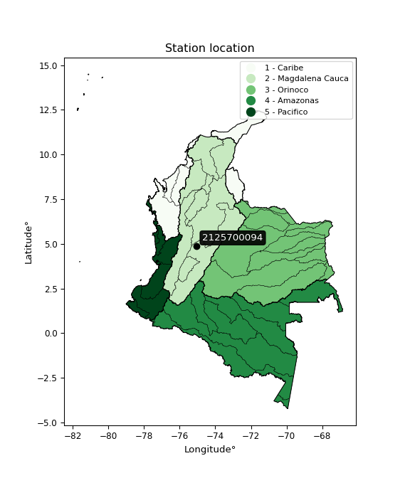

<div align="center">


</div>

# PMP Station (Rain, Pmax24h): 2125700094

Probable Maximum Precipitation (PMP) is the greatest amount of rainfall for a specific duration that is meteorologically possible for a given location, acting as a "worst-case" scenario for extreme storms, crucial for designing safety-critical infrastructure like bridges, river deviations, dams, spillways, and nuclear plants to prevent catastrophic failure. PMP is calculated by hydrologists using meteorological data to determine the upper limit of extreme rainfall, often leading to the Probable Maximum Flood (PMF) for flood control design, and is increasingly being studied for climate change impacts. Probable Maximum Precipitation (PMP) is the theoretical upper limit of rainfall, a deterministic estimate for extreme events, while probability distributions (like GEV, Gumbel) describe the likelihood and frequency of various precipitation amounts, including rare ones, showing how often events occur, with PMP representing the extreme end of these distributions, used for critical infrastructure design to ensure safety against the worst conceivable weather, unlike standard statistical forecasts which cover typical probabilities.

The most common probability distributions in hydrology, used for analyzing floods, rainfall, and streamflow, include the Normal, Log-Normal, Gumbel, Gamma (including Log-Pearson Type III), and Generalized Extreme Value (GEV) distributions, often chosen based on the data´s skewness and whether modeling extremes or general conditions, with Gumbel and GEV popular for extreme events like floods, while the Normal distribution serves as a baseline, though often requiring transformations for skewed hydrological data. These distributions help in designing water infrastructure, managing water resources, and forecasting hydrologic events.

> Hydrological data often isn´t perfectly normal (it´s skewed), so different distributions are needed for different applications, such as: **Flood Frequency Analysis**: Using Gumbel, GEV, or Log-Pearson Type III for predicting extreme flood magnitudes and their return periods, **Rainfall Analysis**: Normal for annual totals, but Log-Normal, Weibull, or GEV for intensity or extreme daily rainfall, **Streamflow Modeling**: Gamma and Log-Normal for maximum flows, GEV for minimum flows, and Kappa for daily flows.

<div align="center">

</img>

</div>


## A. General information


### 1. General running parameters

• app_version: _v20260113_. • runtime: _2026-01-17 18:24:04.630693_. • Python version: _3.14.0_. • SciPy version: _1.16.3_. • Pandas version: _2.3.3_. • NumPy version: _2.3.5_. • Stations dataset (station_dataset_file): _dataset/pmax24h_in/automatic_colombia_2003_2025.csv_. • Stations catalog (station_catalog_file): _dataset/CNE.xls_. • Minimum year to eval til year_max (date_min): _1900_. • Maximum year to eval since year_min (date_max): _2025_. • Creates, save and include plots into reports (create_plot): _False_. • Plot only fit distributions with Δo > Δ (plot_only_fit): _True_. • Plot only simple graphs avoiding multiple CDFs and multiple Extreme values plots (plot_only_simple): _True_. • Eval low extreme values, if False, evaluates high extreme values (low_extreme): _False_. • Eval every SciPy distribution as logarithmic (pdist_logarithmic_on): _True_. • Standard deviation normalized (ddof): _1.0_. • Return periods to eval in years (Tr): _[2, 2.33, 5, 10, 15, 20, 25, 50, 75, 100, 200, 250, 500, 750, 1000]_. • Minimum data sample per station, 0 means any (minimum_sample): _5_. • Z-Score maximum threshold to adjust a value, 0 means disable (zscore_max): _3.5_. • Z-Score minimum threshold to adjust a value, 0 means disable (zscore_min): _-2.5_. • Avoid zeros, e.g. rain = 0 (avoid_zeros): _True_. • Avoid null values (avoid_nans): _True_. 

:file_folder:Table: [dataset.csv](../../dataset/pmax24h_in/automatic_colombia_2003_2025.csv)

> Delta Degrees of Freedom (DDOF): is a parameter used in the formulas for calculating variance and standard deviation. When ddof=0, the divisor is $N$ (the total number of observations) and this is used when your data set is the entire population. When ddof=1, the divisor is $N-1$ and this is used when your data set is a sample drawn from a larger population. Using $N-1$ provides an unbiased estimate of the population variance (known as Bessel´s correction).


### 2. Station info and location

|   id |     CODIGO | NOMBRE                       | CATEGORIA    | TECNOLOGIA                              | ESTADO           | FECHA_INSTALACION   |   FECHA_SUSPENSION |   ALTITUD |   LATITUD |   LONGITUD | DEPARTAMENTO   | MUNICIPIO   | AREA_OPERATIVA             | ENTIDAD                                                     | AREA_HIDROGRAFICA   | ZONA_HIDROGRAFICA   | SUBZONA_HIDROGRAFICA                        | CORRIENTE   | Catalogo   |   Version |
|-----:|-----------:|:-----------------------------|:-------------|:----------------------------------------|:-----------------|:--------------------|-------------------:|----------:|----------:|-----------:|:---------------|:------------|:---------------------------|:------------------------------------------------------------|:--------------------|:--------------------|:--------------------------------------------|:------------|:-----------|----------:|
|    0 | 2125700094 | RECIO 1 - AUT   [2125700094] | Limnigráfica | Automática con Telemetría, Convencional | En Mantenimiento | 19/12/2017          |                nan |       956 |   4.87593 |   -75.0444 | Tolima         | Líbano      | Area Operativa 10 - Tolima | INSTITUTO DE HIDROLOGIA METEOROLOGIA Y ESTUDIOS AMBIENTALES | Magdalena Cauca     | Alto Magdalena      | Río Lagunilla y Otros Directos al Magdalena | Recio       | CNE_IDEAM  |  20251226 |

<div align="center">

Dynamic map: [:earth_americas:Google](http://maps.google.com/maps?q=4.875934,-75.0444499) [:earth_americas:OSM](https://www.openstreetmap.org/#map=18/4.875934/-75.0444499&layers=P) [:earth_americas:Bing](https://www.bing.com/maps?cp=4.875934~-75.0444499&lvl=18) [:earth_americas:Apple](https://maps.apple.com/frame?center=4.875934%2C-75.0444499&span=0.003%2C0.006)

</div>


<div align="center">

```geojson
{
  "type": "Feature",
  "geometry": {
    "type": "Point", 
    "coordinates": [-75.0444499, 4.875934]
  }, 
  "properties": {
    "Name": "2125700094"
  }
}
```

</div>


### 3. Discrete values table and plot

<div align="center">

|               |            0 |           1 |           2 |         3 |          4 |
|:--------------|-------------:|------------:|------------:|----------:|-----------:|
| Date          | 2019         | 2020        | 2021        | 2022      | 2025       |
| Value         |   63         |   80.4      |   50.4      |   13.6    |   92.4     |
| Value_initial |   63         |   80.4      |   50.4      |   13.6    |   92.4     |
| count         |    5         |    5        |    5        |    5      |    5       |
| mean          |   59.96      |   59.96     |   59.96     |   59.96   |   59.96    |
| std           |   30.496     |   30.496    |   30.496    |   30.496  |   30.496   |
| zscore        |    0.0996851 |    0.670251 |   -0.313483 |   -1.5202 |    1.06374 |


</div>


> The initial value (value_initial) correspond to the initial obtained or null completed value, and value (value) is adjusted only when the initial value is outside the valid range (outlier) definite through the Z-Score value. If Z-Score is active, values out of range or outliers are replaced with the station mean value. A Z-Score (or standard score) measures how many standard deviations a data point is from the mean of a dataset, indicating its relative position; positive scores mean above the mean, negative mean below, and a score of zero is exactly at the mean, allowing for comparison of values from different distributions. It´s calculated using the formula $z=(x–μ)/σ$, where $x$ is the data point, $μ$ is the mean, and $σ$ is the standard deviation, helping identify outliers and understand probability.
>
> <sub>**Note**: In this study, "completing" (filling gaps in) and "extending" (forecasting or lengthening the historical record) rainfall data series are avoided for certain critical analyses because they introduce artificial bias and uncertainty, which can distort the statistics of rare events (extremes), alter day-to-day variability, and compromise the integrity and homogeneity of the original data. Some reasons against Completing/Extending rainfall data are: **Distortion of Extremes and Variability**: The primary issue is that most gap-filling or extension methods rely on averaging or regression with nearby stations, which inherently smooths the data. Rainfall is highly variable in space and time, with a large percentage of zero values and occasional large storms. Infilling methods often underestimate the highest values and overestimate the lowest (zero) values, which severely distorts analyses focused on flood frequency, drought severity, and intensity-duration-frequency (IDF) curves, **Loss of Data Homogeneity**: Infilled or extended data are synthetic estimates, not actual measurements. Combining these estimates with observed data can violate the assumption of data homogeneity, which requires that the data properties do not change over time. Inhomogeneity can lead to incorrect conclusions about long-term trends or changes in climate patterns, **Propagation of Errors**: Errors and biases from the original data (e.g., wind-induced undercatch, instrument errors, site changes) or the data used for imputation can propagate through the analysis, leading to unreliable hydrological models and inaccurate predictions, **Compromised Statistical Integrity**: For statistical analyses, especially those involving the frequency of events, using artificial data can introduce time bias or autocorrelation that doesn´t exist in reality, making it difficult to assess the true probability of events, **Difficulty in Validation**: It is difficult to accurately validate the quality of filled or extended data, especially for past periods where ground-truth measurements are unavailable. The reliability of imputation techniques heavily depends on the density of the surrounding station network and the complexity of the local topography.</sub>


### 4. Active continuous probability distributions from SciPy (80 of 104 available)

A Probability Density Function (PDF) describes the relative likelihood of a continuous random variable falling within a specific range, where the total area under its curve equals 1, and the area over any interval gives the actual probability for that range. Unlike discrete probabilities (like rolling a die), a PDF shows density, not direct probability for a single point (which is zero), with higher points indicating higher likelihood, often visualized as a bell curve for normal distributions.

A log of a probability density function (log-PDF) is simply the logarithm of the PDF´s value, denoted as $log(f(x))$, useful for converting multiplication of probabilities into addition, improving numerical stability with tiny numbers, and connecting to information theory concepts like entropy. Instead of dealing with very small probabilities (e.g., 0.000001), log-PDFs use negative numbers (e.g., $log(0.00001) ≈ -11.51$ that are easier for computers to handle, preventing underflow errors and simplifying complex calculations. In this study, each active probability distribution from SciPy is also evaluated in the $log$ form.

[scipy.stats](https://docs.scipy.org/doc/scipy/reference/stats.html) is a Python´s powerful submodule within the SciPy library for comprehensive statistical analysis, offering over 130 probability distributions (like Normal, Poisson), functions for descriptive stats (mean, variance), hypothesis testing (t-tests, chi-square), random variable generation, and statistical tests, making it essential for data science, modeling, and research. It provides tools to explore, model, and draw conclusions from data efficiently, working seamlessly with NumPy.

<div align="center">

|   id | p_dist           |   n_parameter | fit_method   | label                                                                       | active   | ref                                                                                                      |
|-----:|:-----------------|--------------:|:-------------|:----------------------------------------------------------------------------|:---------|:---------------------------------------------------------------------------------------------------------|
|    0 | alpha            |             3 | MLE          | Alpha                                                                       | True     | [:mortar_board:](https://docs.scipy.org/doc/scipy/reference/generated/scipy.stats.alpha.html)            |
|    1 | anglit           |             2 | MM           | Anglit                                                                      | True     | [:mortar_board:](https://docs.scipy.org/doc/scipy/reference/generated/scipy.stats.anglit.html)           |
|    2 | arcsine          |             2 | MM           | Arcsine                                                                     | True     | [:mortar_board:](https://docs.scipy.org/doc/scipy/reference/generated/scipy.stats.arcsine.html)          |
|    3 | argus            |             3 | MLE          | Argus                                                                       | True     | [:mortar_board:](https://docs.scipy.org/doc/scipy/reference/generated/scipy.stats.argus.html)            |
|    4 | beta             |             4 | MLE          | Beta                                                                        | True     | [:mortar_board:](https://docs.scipy.org/doc/scipy/reference/generated/scipy.stats.beta.html)             |
|    5 | betaprime        |             4 | MLE          | Beta prime                                                                  | True     | [:mortar_board:](https://docs.scipy.org/doc/scipy/reference/generated/scipy.stats.betaprime.html)        |
|    6 | bradford         |             3 | MLE          | Bradford                                                                    | True     | [:mortar_board:](https://docs.scipy.org/doc/scipy/reference/generated/scipy.stats.bradford.html)         |
|    7 | burr             |             4 | MLE          | Burr (Type III)                                                             | True     | [:mortar_board:](https://docs.scipy.org/doc/scipy/reference/generated/scipy.stats.burr.html)             |
|    8 | burr12           |             4 | MLE          | Burr (Type III) 12                                                          | True     | [:mortar_board:](https://docs.scipy.org/doc/scipy/reference/generated/scipy.stats.burr12.html)           |
|    9 | cosine           |             2 | MLE          | Cosine                                                                      | True     | [:mortar_board:](https://docs.scipy.org/doc/scipy/reference/generated/scipy.stats.cosine.html)           |
|   10 | crystalball      |             4 | MLE          | Crystalball                                                                 | True     | [:mortar_board:](https://docs.scipy.org/doc/scipy/reference/generated/scipy.stats.crystalball.html)      |
|   11 | dgamma           |             3 | MLE          | Double gamma                                                                | True     | [:mortar_board:](https://docs.scipy.org/doc/scipy/reference/generated/scipy.stats.dgamma.html)           |
|   12 | dweibull         |             3 | MLE          | Double Weibull                                                              | True     | [:mortar_board:](https://docs.scipy.org/doc/scipy/reference/generated/scipy.stats.dweibull.html)         |
|   13 | erlang           |             3 | MLE          | Erlang                                                                      | True     | [:mortar_board:](https://docs.scipy.org/doc/scipy/reference/generated/scipy.stats.erlang.html)           |
|   14 | exponnorm        |             3 | MLE          | Exponentially modified Normal                                               | True     | [:mortar_board:](https://docs.scipy.org/doc/scipy/reference/generated/scipy.stats.exponnorm.html)        |
|   15 | exponpow         |             3 | MLE          | Exponential power                                                           | True     | [:mortar_board:](https://docs.scipy.org/doc/scipy/reference/generated/scipy.stats.exponpow.html)         |
|   16 | exponweib        |             4 | MLE          | Exponentiated Weibull                                                       | True     | [:mortar_board:](https://docs.scipy.org/doc/scipy/reference/generated/scipy.stats.exponweib.html)        |
|   17 | f                |             4 | MLE          | F                                                                           | True     | [:mortar_board:](https://docs.scipy.org/doc/scipy/reference/generated/scipy.stats.f.html)                |
|   18 | fatiguelife      |             3 | MLE          | Fatigue-life (Birnbaum-Saunders)                                            | True     | [:mortar_board:](https://docs.scipy.org/doc/scipy/reference/generated/scipy.stats.fatiguelife.html)      |
|   19 | foldnorm         |             3 | MM           | Fold Normal                                                                 | True     | [:mortar_board:](https://docs.scipy.org/doc/scipy/reference/generated/scipy.stats.foldnorm.html)         |
|   20 | gamma            |             3 | MLE          | Gamma                                                                       | True     | [:mortar_board:](https://docs.scipy.org/doc/scipy/reference/generated/scipy.stats.gamma.html)            |
|   21 | gausshyper       |             6 | MLE          | Gauss hypergeometric                                                        | True     | [:mortar_board:](https://docs.scipy.org/doc/scipy/reference/generated/scipy.stats.gausshyper.html)       |
|   22 | genexpon         |             5 | MLE          | Generalized exponential                                                     | True     | [:mortar_board:](https://docs.scipy.org/doc/scipy/reference/generated/scipy.stats.genexpon.html)         |
|   23 | genextreme       |             3 | MLE          | Generalized exponential                                                     | True     | [:mortar_board:](https://docs.scipy.org/doc/scipy/reference/generated/scipy.stats.genextreme.html)       |
|   24 | gengamma         |             4 | MLE          | Generalized gamma                                                           | True     | [:mortar_board:](https://docs.scipy.org/doc/scipy/reference/generated/scipy.stats.gengamma.html)         |
|   25 | genhalflogistic  |             3 | MLE          | Generalized half-logistic                                                   | True     | [:mortar_board:](https://docs.scipy.org/doc/scipy/reference/generated/scipy.stats.genhalflogistic.html)  |
|   26 | genlogistic      |             3 | MLE          | Generalized logistic                                                        | True     | [:mortar_board:](https://docs.scipy.org/doc/scipy/reference/generated/scipy.stats.genlogistic.html)      |
|   27 | gennorm          |             3 | MLE          | Generalized Normal                                                          | True     | [:mortar_board:](https://docs.scipy.org/doc/scipy/reference/generated/scipy.stats.gennorm.html)          |
|   28 | genpareto        |             3 | MLE          | Generalized Pareto                                                          | True     | [:mortar_board:](https://docs.scipy.org/doc/scipy/reference/generated/scipy.stats.genpareto.html)        |
|   29 | gompertz         |             3 | MLE          | Gompertz (or truncated Gumbel)                                              | True     | [:mortar_board:](https://docs.scipy.org/doc/scipy/reference/generated/scipy.stats.gompertz.html)         |
|   30 | gumbel_l         |             2 | MM           | Gumbel Left Skew                                                            | True     | [:mortar_board:](https://docs.scipy.org/doc/scipy/reference/generated/scipy.stats.gumbel_l.html)         |
|   31 | gumbel_r         |             2 | MM           | Gumbel Right Skew                                                           | True     | [:mortar_board:](https://docs.scipy.org/doc/scipy/reference/generated/scipy.stats.gumbel_r.html)         |
|   32 | halfgennorm      |             3 | MLE          | Upper half of a generalized normal                                          | True     | [:mortar_board:](https://docs.scipy.org/doc/scipy/reference/generated/scipy.stats.halfgennorm.html)      |
|   33 | halflogistic     |             2 | MM           | Half-logistic                                                               | True     | [:mortar_board:](https://docs.scipy.org/doc/scipy/reference/generated/scipy.stats.halflogistic.html)     |
|   34 | halfnorm         |             2 | MM           | Half Normal                                                                 | True     | [:mortar_board:](https://docs.scipy.org/doc/scipy/reference/generated/scipy.stats.halfnorm.html)         |
|   35 | hypsecant        |             2 | MM           | hyperbolic secant                                                           | True     | [:mortar_board:](https://docs.scipy.org/doc/scipy/reference/generated/scipy.stats.hypsecant.html)        |
|   36 | invgamma         |             3 | MLE          | Inverted gamma                                                              | True     | [:mortar_board:](https://docs.scipy.org/doc/scipy/reference/generated/scipy.stats.invgamma.html)         |
|   37 | invgauss         |             3 | MLE          | Inverse Gaussian                                                            | True     | [:mortar_board:](https://docs.scipy.org/doc/scipy/reference/generated/scipy.stats.invgauss.html)         |
|   38 | invweibull       |             3 | MLE          | Inverted Weibull                                                            | True     | [:mortar_board:](https://docs.scipy.org/doc/scipy/reference/generated/scipy.stats.invweibull.html)       |
|   39 | johnsonsb        |             4 | MLE          | Johnson SB                                                                  | True     | [:mortar_board:](https://docs.scipy.org/doc/scipy/reference/generated/scipy.stats.johnsonsb.html)        |
|   40 | johnsonsu        |             4 | MLE          | Johnson Su                                                                  | True     | [:mortar_board:](https://docs.scipy.org/doc/scipy/reference/generated/scipy.stats.johnsonsu.html)        |
|   41 | kappa3           |             3 | MLE          | Kappa 3                                                                     | True     | [:mortar_board:](https://docs.scipy.org/doc/scipy/reference/generated/scipy.stats.kappa3.html)           |
|   42 | kappa4           |             4 | MLE          | Kappa 4                                                                     | True     | [:mortar_board:](https://docs.scipy.org/doc/scipy/reference/generated/scipy.stats.kappa4.html)           |
|   43 | ksone            |             3 | MLE          | Kolmogorov-Smirnov one-sided test statistic distribution                    | True     | [:mortar_board:](https://docs.scipy.org/doc/scipy/reference/generated/scipy.stats.ksone.html)            |
|   44 | kstwobign        |             2 | MLE          | Limiting distribution of scaled Kolmogorov-Smirnov two-sided test statistic | True     | [:mortar_board:](https://docs.scipy.org/doc/scipy/reference/generated/scipy.stats.kstwobign.html)        |
|   45 | laplace          |             2 | MM           | Laplace                                                                     | True     | [:mortar_board:](https://docs.scipy.org/doc/scipy/reference/generated/scipy.stats.laplace.html)          |
|   46 | levy_l           |             2 | MLE          | Left-skewed Levy                                                            | True     | [:mortar_board:](https://docs.scipy.org/doc/scipy/reference/generated/scipy.stats.levy_l.html)           |
|   47 | loggamma         |             3 | MLE          | Log gamma                                                                   | True     | [:mortar_board:](https://docs.scipy.org/doc/scipy/reference/generated/scipy.stats.loggamma.html)         |
|   48 | logistic         |             2 | MM           | Logistic (or Sech-squared)                                                  | True     | [:mortar_board:](https://docs.scipy.org/doc/scipy/reference/generated/scipy.stats.logistic.html)         |
|   49 | loglaplace       |             3 | MLE          | Log-Laplace                                                                 | True     | [:mortar_board:](https://docs.scipy.org/doc/scipy/reference/generated/scipy.stats.loglaplace.html)       |
|   50 | lomax            |             3 | MLE          | Lomax (Pareto of the second kind)                                           | True     | [:mortar_board:](https://docs.scipy.org/doc/scipy/reference/generated/scipy.stats.lomax.html)            |
|   51 | maxwell          |             2 | MM           | Maxwell                                                                     | True     | [:mortar_board:](https://docs.scipy.org/doc/scipy/reference/generated/scipy.stats.maxwell.html)          |
|   52 | mielke           |             4 | MLE          | Mielke Beta-Kappa / Dagum                                                   | True     | [:mortar_board:](https://docs.scipy.org/doc/scipy/reference/generated/scipy.stats.mielke.html)           |
|   53 | moyal            |             2 | MM           | Moyal                                                                       | True     | [:mortar_board:](https://docs.scipy.org/doc/scipy/reference/generated/scipy.stats.moyal.html)            |
|   54 | nakagami         |             3 | MLE          | Nakagami                                                                    | True     | [:mortar_board:](https://docs.scipy.org/doc/scipy/reference/generated/scipy.stats.nakagami.html)         |
|   55 | ncf              |             5 | MLE          | Non-central F distribution                                                  | True     | [:mortar_board:](https://docs.scipy.org/doc/scipy/reference/generated/scipy.stats.ncf.html)              |
|   56 | nct              |             4 | MLE          | Non-central Student’s t                                                     | True     | [:mortar_board:](https://docs.scipy.org/doc/scipy/reference/generated/scipy.stats.nct.html)              |
|   57 | norm             |             2 | MM           | Normal                                                                      | True     | [:mortar_board:](https://docs.scipy.org/doc/scipy/reference/generated/scipy.stats.norm.html)             |
|   58 | pearson3         |             3 | MM           | Pearson type III                                                            | True     | [:mortar_board:](https://docs.scipy.org/doc/scipy/reference/generated/scipy.stats.pearson3.html)         |
|   59 | powerlaw         |             3 | MLE          | Power-function                                                              | True     | [:mortar_board:](https://docs.scipy.org/doc/scipy/reference/generated/scipy.stats.powerlaw.html)         |
|   60 | rayleigh         |             2 | MM           | Rayleigh                                                                    | True     | [:mortar_board:](https://docs.scipy.org/doc/scipy/reference/generated/scipy.stats.rayleigh.html)         |
|   61 | rdist            |             3 | MLE          | R-distributed (symmetric beta)                                              | True     | [:mortar_board:](https://docs.scipy.org/doc/scipy/reference/generated/scipy.stats.rdist.html)            |
|   62 | rice             |             3 | MLE          | Rice                                                                        | True     | [:mortar_board:](https://docs.scipy.org/doc/scipy/reference/generated/scipy.stats.rice.html)             |
|   63 | semicircular     |             2 | MM           | Semicircular                                                                | True     | [:mortar_board:](https://docs.scipy.org/doc/scipy/reference/generated/scipy.stats.semicircular.html)     |
|   64 | skewnorm         |             3 | MLE          | Skew normal                                                                 | True     | [:mortar_board:](https://docs.scipy.org/doc/scipy/reference/generated/scipy.stats.skewnorm.html)         |
|   65 | t                |             3 | MLE          | Student’s t                                                                 | True     | [:mortar_board:](https://docs.scipy.org/doc/scipy/reference/generated/scipy.stats.t.html)                |
|   66 | trapezoid        |             4 | MLE          | Trapezoid                                                                   | True     | [:mortar_board:](https://docs.scipy.org/doc/scipy/reference/generated/scipy.stats.trapezoid.html)        |
|   67 | triang           |             3 | MLE          | Triangular                                                                  | True     | [:mortar_board:](https://docs.scipy.org/doc/scipy/reference/generated/scipy.stats.triang.html)           |
|   68 | truncexpon       |             3 | MLE          | Truncated exponential                                                       | True     | [:mortar_board:](https://docs.scipy.org/doc/scipy/reference/generated/scipy.stats.truncexpon.html)       |
|   69 | truncnorm        |             4 | MLE          | Truncated normal                                                            | True     | [:mortar_board:](https://docs.scipy.org/doc/scipy/reference/generated/scipy.stats.truncnorm.html)        |
|   70 | truncpareto      |             4 | MLE          | Upper truncated Pareto                                                      | True     | [:mortar_board:](https://docs.scipy.org/doc/scipy/reference/generated/scipy.stats.truncpareto.html)      |
|   71 | truncweibull_min |             5 | MLE          | Doubly truncated Weibull minimum                                            | True     | [:mortar_board:](https://docs.scipy.org/doc/scipy/reference/generated/scipy.stats.truncweibull_min.html) |
|   72 | tukeylambda      |             3 | MLE          | Tukey-Lamdba                                                                | True     | [:mortar_board:](https://docs.scipy.org/doc/scipy/reference/generated/scipy.stats.tukeylambda.html)      |
|   73 | uniform          |             2 | MLE          | Uniform                                                                     | True     | [:mortar_board:](https://docs.scipy.org/doc/scipy/reference/generated/scipy.stats.uniform.html)          |
|   74 | vonmises         |             3 | MLE          | Von Mises                                                                   | True     | [:mortar_board:](https://docs.scipy.org/doc/scipy/reference/generated/scipy.stats.vonmises.html)         |
|   75 | vonmises_line    |             3 | MLE          | Von Mises line                                                              | True     | [:mortar_board:](https://docs.scipy.org/doc/scipy/reference/generated/scipy.stats.vonmises_line.html)    |
|   76 | wald             |             2 | MM           | Wald                                                                        | True     | [:mortar_board:](https://docs.scipy.org/doc/scipy/reference/generated/scipy.stats.wald.html)             |
|   77 | weibull_max      |             3 | MLE          | Weibull maximum                                                             | True     | [:mortar_board:](https://docs.scipy.org/doc/scipy/reference/generated/scipy.stats.weibull_max.html)      |
|   78 | weibull_min      |             3 | MLE          | Weibull minimum                                                             | True     | [:mortar_board:](https://docs.scipy.org/doc/scipy/reference/generated/scipy.stats.weibull_min.html)      |
|   79 | wrapcauchy       |             3 | MLE          | Wrapped  Cauchy                                                             | True     | [:mortar_board:](https://docs.scipy.org/doc/scipy/reference/generated/scipy.stats.wrapcauchy.html)       |

</div>

> **n_parameter:** # arguments & localization & scale.
>
> **Fit methods:** (MLE) maximum likelihood, (MM) L-moments.
>
>**Inactive** (With the only purpose of prevent loops, zero divisions, infinite values, over high estimated values or horizontal trending for recurrence intervals estimations, the follow distributions were disabled.)**:** lognorm, norminvgauss, powernorm, powerlognorm, cauchy, halfcauchy, foldcauchy, skewcauchy, chi2, expon, fisk, genhyperbolic, geninvgauss, gibrat, kstwo, laplace_asymmetric, levy, levy_stable, ncx2, pareto, rel_breitwigner, recipinvgauss, studentized_range, loguniform, 


## B. Probability (PDF) vs. Empirical (EDF) distributions functions

A continuous probability distribution (CPD) describes probabilities for variables that can take any value within a range (like rain any time), unlike discrete variables with specific outcomes (like temperature). It uses a Probability Density Function (PDF), a curve where the total area under it equals 1, and the probability of the variable falling within an interval (a to b) is found by calculating the area under the curve between those points. A key feature is that the probability of hitting any single exact value is zero, so probabilities are always expressed for ranges, e.g., $P(a ≤ X ≤ b)$.

<div align="center">

Distributions parameters from station values
|     |    station | p_dist              |   n |             loc |           scale | shape                  | shape1                | shape2                 | shape3             |
|----:|-----------:|:--------------------|----:|----------------:|----------------:|:-----------------------|:----------------------|:-----------------------|:-------------------|
|   0 | 2125700094 | alpha               |   5 |    -0.0737909   |    28.3818      | 5.0570716890110143e-08 |                       |                        |                    |
|   1 | 2125700094 | anglit              |   5 |    59.96        |    79.7946      |                        |                       |                        |                    |
|   2 | 2125700094 | arcsine             |   5 |    21.3852      |    77.1496      |                        |                       |                        |                    |
|   3 | 2125700094 | argus               |   5 |   -12.6781      |   108.914       | 1.737316556912767      |                       |                        |                    |
|   4 | 2125700094 | beta                |   5 |    -2.94974     |    95.3497      | 1.2102980145687576     | 0.6043103499970202    |                        |                    |
|   5 | 2125700094 | betaprime           |   5 |  -192.761       | 55069.4         | 80.88612909475626      | 17603.267684361108    |                        |                    |
|   6 | 2125700094 | bradford            |   5 |    13.6         |    78.8001      | 0.9720586778909024     |                       |                        |                    |
|   7 | 2125700094 | burr                |   5 |    -0.838147    |    94.1798      | 378.4838575412363      | 0.004358684947175106  |                        |                    |
|   8 | 2125700094 | burr12              |   5 |    -3.00766     |    16.422       | 403.39198982453826     | 0.0020774450262967164 |                        |                    |
|   9 | 2125700094 | cosine              |   5 |    57.6561      |    22.5906      |                        |                       |                        |                    |
|  10 | 2125700094 | crystalball         |   5 |    59.96        |    27.2765      | 49109.16705841012      | 2491.1232014036163    |                        |                    |
|  11 | 2125700094 | dgamma              |   5 |    63           |    30.5739      | 0.3119592354055749     |                       |                        |                    |
|  12 | 2125700094 | dweibull            |   5 |    63           |    25.2243      | 0.831360597702411      |                       |                        |                    |
|  13 | 2125700094 | erlang              |   5 |  -381.37        |     1.74187     | 253.3596479012699      |                       |                        |                    |
|  14 | 2125700094 | exponnorm           |   5 |    59.9444      |    27.2765      | 0.0005818235998257254  |                       |                        |                    |
|  15 | 2125700094 | exponpow            |   5 |    13.6         |    10.1012      | 0.23248652349246973    |                       |                        |                    |
|  16 | 2125700094 | exponweib           |   5 |    -1.02965e+09 |     1.02965e+09 | 14.20788323049213      | 13447598.072044438    |                        |                    |
|  17 | 2125700094 | f                   |   5 | -6728.11        |  6787.9         | 136237.34887929622     | 1225114.0540993358    |                        |                    |
|  18 | 2125700094 | fatiguelife         |   5 |    13.6         |     6.94298e-05 | 710.5820703330874      |                       |                        |                    |
|  19 | 2125700094 | foldnorm            |   5 |    67.4071      |     0.104103    | 0.1219839231162384     |                       |                        |                    |
|  20 | 2125700094 | gamma               |   5 |  -394.79        |     1.70972     | 265.83688091480474     |                       |                        |                    |
|  21 | 2125700094 | gausshyper          |   5 |     6.53471     |    85.8653      | 1.2331221825068415     | 0.5729730779706748    | 1.1793126556899165     | 1.0411441598338942 |
|  22 | 2125700094 | genexpon            |   5 |     9.77086     |     2.2123      | 6.270121165175603e-11  | 0.04577754547655702   | 1.1217408495326548     |                    |
|  23 | 2125700094 | genextreme          |   5 |    63.9522      |    31.507       | 1.1075407715495933     |                       |                        |                    |
|  24 | 2125700094 | gengamma            |   5 |  -560.762       |    19.9998      | 210.1288905507074      | 1.5564691565634288    |                        |                    |
|  25 | 2125700094 | genhalflogistic     |   5 |     0.0636784   |   128.226       | 1.3886826054180605     |                       |                        |                    |
|  26 | 2125700094 | genlogistic         |   5 |    92.4008      |     2.7194e-05  | 8.386267892837082e-07  |                       |                        |                    |
|  27 | 2125700094 | gennorm             |   5 |    52.8437      |    40.0991      | 398.52243895884345     |                       |                        |                    |
|  28 | 2125700094 | genpareto           |   5 |    -0.0903802   |   193.564       | -2.0927977061715772    |                       |                        |                    |
|  29 | 2125700094 | gompertz            |   5 |   -61.6938      |    21.4012      | 0.0018790541992070673  |                       |                        |                    |
|  30 | 2125700094 | gumbel_l            |   5 |    72.2359      |    21.2674      |                        |                       |                        |                    |
|  31 | 2125700094 | gumbel_r            |   5 |    47.6841      |    21.2674      |                        |                       |                        |                    |
|  32 | 2125700094 | halfgennorm         |   5 |    13.6         |     0.00658004  | 0.1889424796199044     |                       |                        |                    |
|  33 | 2125700094 | halflogistic        |   5 |    27.631       |    23.3205      |                        |                       |                        |                    |
|  34 | 2125700094 | halfnorm            |   5 |    23.8566      |    45.2489      |                        |                       |                        |                    |
|  35 | 2125700094 | hypsecant           |   5 |    59.96        |    17.3647      |                        |                       |                        |                    |
|  36 | 2125700094 | invgamma            |   5 |  -259.228       | 40308.1         | 127.3923172494363      |                       |                        |                    |
|  37 | 2125700094 | invgauss            |   5 |   -99.0258      |  4333.48        | 0.03651725345101717    |                       |                        |                    |
|  38 | 2125700094 | invweibull          |   5 |    13.6         |     2.45841     | 0.051270979891928706   |                       |                        |                    |
|  39 | 2125700094 | johnsonsb           |   5 |    13.5307      |    78.8693      | -0.37950867130250554   | 0.09972560522778726   |                        |                    |
|  40 | 2125700094 | johnsonsu           |   5 |   104.422       |     0.464468    | 7.260424927589338      | 1.441232901126357     |                        |                    |
|  41 | 2125700094 | kappa3              |   5 |    13.6         |    78.7916      | 15106.381304067254     |                       |                        |                    |
|  42 | 2125700094 | kappa4              |   5 |    13.2061      |    87.5004      | 0.9809977444396899     | 1.1048876482444983    |                        |                    |
|  43 | 2125700094 | ksone               |   5 |    12.7157      |    94.4885      | 1.0                    |                       |                        |                    |
|  44 | 2125700094 | kstwobign           |   5 |   -51.97        |   127.65        |                        |                       |                        |                    |
|  45 | 2125700094 | laplace             |   5 |    59.96        |    19.2874      |                        |                       |                        |                    |
|  46 | 2125700094 | levy_l              |   5 |    94.6951      |     8.73941     |                        |                       |                        |                    |
|  47 | 2125700094 | loggamma            |   5 |    92.4002      |     1.06992e-05 | 3.295623642048977e-07  |                       |                        |                    |
|  48 | 2125700094 | logistic            |   5 |    59.96        |    15.0383      |                        |                       |                        |                    |
|  49 | 2125700094 | loglaplace          |   5 |    -0.173885    |    63.1739      | 2.1110162054782604     |                       |                        |                    |
|  50 | 2125700094 | lomax               |   5 |    13.6         |   742.839       | 16.205077495688244     |                       |                        |                    |
|  51 | 2125700094 | maxwell             |   5 |    -4.67381     |    40.5032      |                        |                       |                        |                    |
|  52 | 2125700094 | mielke              |   5 |    13.6         |    78.8186      | 0.8693789937440464     | 7316.382441738866     |                        |                    |
|  53 | 2125700094 | moyal               |   5 |    44.3616      |    12.2787      |                        |                       |                        |                    |
|  54 | 2125700094 | nakagami            |   5 |    50.4         |    20.3708      | 0.19702249718531784    |                       |                        |                    |
|  55 | 2125700094 | ncf                 |   5 |    -0.0528032   |     3.58626e-06 | 5.573388613343432e-07  | 32.198587738444395    | 8.674542022804463      |                    |
|  56 | 2125700094 | nct                 |   5 | -1312.2         |    27.2404      | 295020.5032116788      | 50.371801205031836    |                        |                    |
|  57 | 2125700094 | norm                |   5 |    59.96        |    27.2765      |                        |                       |                        |                    |
|  58 | 2125700094 | pearson3            |   5 |    59.96        |    27.2765      | -0.5697045923909042    |                       |                        |                    |
|  59 | 2125700094 | powerlaw            |   5 |    13.6         |    78.8         | 0.12586623507697756    |                       |                        |                    |
|  60 | 2125700094 | rayleigh            |   5 |     7.7785      |    41.6348      |                        |                       |                        |                    |
|  61 | 2125700094 | rdist               |   5 |     7.05463     |    43.3454      | 1.068183697345292      |                       |                        |                    |
|  62 | 2125700094 | rice                |   5 |    -4.18637     |    30.1624      | 1.8277492886913551     |                       |                        |                    |
|  63 | 2125700094 | semicircular        |   5 |    59.96        |    54.553       |                        |                       |                        |                    |
|  64 | 2125700094 | skewnorm            |   5 |    92.4         |    42.3819      | -11417182.084776066    |                       |                        |                    |
|  65 | 2125700094 | t                   |   5 |    59.9603      |    27.2763      | 103449990.10597605     |                       |                        |                    |
|  66 | 2125700094 | trapezoid           |   5 |   -18.049       |   115.724       | 1.0                    | 1.0                   |                        |                    |
|  67 | 2125700094 | triang              |   5 |   -19.6858      |   112.086       | 0.9999998106620018     |                       |                        |                    |
|  68 | 2125700094 | truncexpon          |   5 |     7.80807     |   120.236       | 0.703550251202542      |                       |                        |                    |
|  69 | 2125700094 | truncnorm           |   5 |    59.96        |    27.2765      | -235.02704584205344    | 280.6171277687269     |                        |                    |
|  70 | 2125700094 | truncpareto         |   5 |    13.1339      |     0.466081    | 0.2609266855516186     | 170.06917386329107    |                        |                    |
|  71 | 2125700094 | truncweibull_min    |   5 |     7.72467     |   130.56        | 1.4283528140645627     | 0.0002578408323780265 | 0.6485544464169448     |                    |
|  72 | 2125700094 | tukeylambda         |   5 |    53.0629      |    44.1082      | 1.1177130282963619     |                       |                        |                    |
|  73 | 2125700094 | uniform             |   5 |    13.6         |    78.8         |                        |                       |                        |                    |
|  74 | 2125700094 | vonmises            |   5 |    -0.29495     |     1           | 1.2322775499080438     |                       |                        |                    |
|  75 | 2125700094 | vonmises_line       |   5 |    53.0345      |    12.5524      | 0.0005856690771358315  |                       |                        |                    |
|  76 | 2125700094 | wald                |   5 |    32.6835      |    27.2765      |                        |                       |                        |                    |
|  77 | 2125700094 | weibull_max         |   5 |    92.4         |     1.49062     | 0.2604529596694881     |                       |                        |                    |
|  78 | 2125700094 | weibull_min         |   5 |    -9.82497e+08 |     9.82497e+08 | 45604535.13294897      |                       |                        |                    |
|  79 | 2125700094 | wrapcauchy          |   5 |    13.5987      |    12.5416      | 0.35374493809997165    |                       |                        |                    |
|  80 | 2125700094 | logalpha            |   5 |   -16.0313      |   549.633       | 27.62324329821238      |                       |                        |                    |
|  81 | 2125700094 | loganglit           |   5 |     3.91727     |     2.00605     |                        |                       |                        |                    |
|  82 | 2125700094 | logarcsine          |   5 |     2.9475      |     1.93954     |                        |                       |                        |                    |
|  83 | 2125700094 | logargus            |   5 |     1.67286     |     2.91479     | 2.698136003379508      |                       |                        |                    |
|  84 | 2125700094 | logbeta             |   5 |     2.41242     |     2.11371     | 0.45058108882158965    | 0.1466755305715603    |                        |                    |
|  85 | 2125700094 | logbetaprime        |   5 |   -11.1622      |    32.8834      | 647.5109091386132      | 1413.5088273993297    |                        |                    |
|  86 | 2125700094 | logbradford         |   5 |     2.53497     |     1.99781     | 3.478717706542828e-05  |                       |                        |                    |
|  87 | 2125700094 | logburr             |   5 |    -0.410892    |     4.94985     | 1437.4406525989993     | 0.004672092466404429  |                        |                    |
|  88 | 2125700094 | logburr12           |   5 | -1560.5         |  1570.89        | 3515.4800948683614     | 1059088.2245890638    |                        |                    |
|  89 | 2125700094 | logcosine           |   5 |     3.806       |     0.58272     |                        |                       |                        |                    |
|  90 | 2125700094 | logcrystalball      |   5 |     3.91727     |     0.685735    | 306.515532137626       | 54.08026997766824     |                        |                    |
|  91 | 2125700094 | logdgamma           |   5 |     4.14313     |     0.523675    | 0.913612775314764      |                       |                        |                    |
|  92 | 2125700094 | logdweibull         |   5 |     4.14313     |     1.32006     | 0.14100120521984844    |                       |                        |                    |
|  93 | 2125700094 | logerlang           |   5 |    -7.04032     |     0.0469772   | 233.3114205320535      |                       |                        |                    |
|  94 | 2125700094 | logexponnorm        |   5 |     3.91678     |     0.685738    | 0.0007132348740592816  |                       |                        |                    |
|  95 | 2125700094 | logexponpow         |   5 |     2.61007     |     1.43087     | 0.5917029778757184     |                       |                        |                    |
|  96 | 2125700094 | logexponweib        |   5 |     2.61007     |     1.14069     | 0.4989029592636417     | 1.0406949820551046    |                        |                    |
|  97 | 2125700094 | logf                |   5 |  -667.111       |   671.026       | 68085597.38165131      | 1966131.645034396     |                        |                    |
|  98 | 2125700094 | logfatiguelife      |   5 |  -418.545       |   422.462       | 0.001617125658945218   |                       |                        |                    |
|  99 | 2125700094 | logfoldnorm         |   5 |     0.0230477   |     0.65192     | 5.979175935327451      |                       |                        |                    |
| 100 | 2125700094 | loggamma            |   5 |    -8.00676     |     0.0422721   | 281.765955116956       |                       |                        |                    |
| 101 | 2125700094 | loggausshyper       |   5 |     2.5933      |     1.93283     | 1.1082988326871095     | 0.6462499246267525    | 1.0044636130750724     | 1.1623115980405871 |
| 102 | 2125700094 | loggenexpon         |   5 |     2.59798     |     0.00989902  | 0.0030161131382400166  | 3.728916056944715     | 1.4234180303999547e-05 |                    |
| 103 | 2125700094 | loggenextreme       |   5 |     3.89472     |     0.80814     | 1.2799034544517385     |                       |                        |                    |
| 104 | 2125700094 | loggengamma         |   5 |     2.61007     |     1.03403     | 1.0051048252132726     | 0.9566029822682784    |                        |                    |
| 105 | 2125700094 | loggenhalflogistic  |   5 |     2.59999     |     2.23128     | 1.1584256561776476     |                       |                        |                    |
| 106 | 2125700094 | loggenlogistic      |   5 |     4.52616     |     4.84844e-07 | 7.980716625816761e-07  |                       |                        |                    |
| 107 | 2125700094 | loggennorm          |   5 |     4.14313     |     0.0152894   | 0.36615289282030505    |                       |                        |                    |
| 108 | 2125700094 | loggenpareto        |   5 |    -0.00666245  |    13.8426      | -3.053890624087025     |                       |                        |                    |
| 109 | 2125700094 | loggompertz         |   5 |     2.61007     |     0.481981    | 0.038935031931393305   |                       |                        |                    |
| 110 | 2125700094 | loggumbel_l         |   5 |     4.22588     |     0.534665    |                        |                       |                        |                    |
| 111 | 2125700094 | loggumbel_r         |   5 |     3.60865     |     0.534665    |                        |                       |                        |                    |
| 112 | 2125700094 | loghalfgennorm      |   5 |     2.61001     |     1.91641     | 60851.55872430978      |                       |                        |                    |
| 113 | 2125700094 | loghalflogistic     |   5 |     3.10452     |     0.586272    |                        |                       |                        |                    |
| 114 | 2125700094 | loghalfnorm         |   5 |     3.00963     |     1.13755     |                        |                       |                        |                    |
| 115 | 2125700094 | loghypsecant        |   5 |     3.91727     |     0.436552    |                        |                       |                        |                    |
| 116 | 2125700094 | loginvgamma         |   5 |   -13.4547      | 10327.5         | 595.070756169798       |                       |                        |                    |
| 117 | 2125700094 | loginvgauss         |   5 |    -3.83375     |   860.227       | 0.008983910483456772   |                       |                        |                    |
| 118 | 2125700094 | loginvweibull       |   5 |    -5.83424e+07 |     5.83424e+07 | 74955865.94999045      |                       |                        |                    |
| 119 | 2125700094 | logjohnsonsb        |   5 |     2.61007     |     1.91606     | 0.14576040274545735    | 0.12825566662717064   |                        |                    |
| 120 | 2125700094 | logjohnsonsu        |   5 |     4.52613     |     3.61209e-12 | 3.96005808042786       | 0.19957267175690185   |                        |                    |
| 121 | 2125700094 | logkappa3           |   5 |     2.61007     |     1.91605     | 249958.87652469787     |                       |                        |                    |
| 122 | 2125700094 | logkappa4           |   5 |     2.44488     |     2.19033     | 1.059744483080637      | 1.052411428600414     |                        |                    |
| 123 | 2125700094 | logksone            |   5 |     2.41846     |     2.29927     | 1.0                    |                       |                        |                    |
| 124 | 2125700094 | logkstwobign        |   5 |     0.81725     |     3.5333      |                        |                       |                        |                    |
| 125 | 2125700094 | loglaplace          |   5 |     3.91727     |     0.484888    |                        |                       |                        |                    |
| 126 | 2125700094 | loglevy_l           |   5 |     4.55658     |     0.115651    |                        |                       |                        |                    |
| 127 | 2125700094 | logloggamma         |   5 |     4.52615     |     1.92319e-06 | 3.161490465707977e-06  |                       |                        |                    |
| 128 | 2125700094 | loglogistic         |   5 |     3.91727     |     0.378065    |                        |                       |                        |                    |
| 129 | 2125700094 | logloglaplace       |   5 |    -0.0814573   |     4.22459     | 7.727085408734123      |                       |                        |                    |
| 130 | 2125700094 | loglomax            |   5 |     2.60739     |   146.176       | 111.39408979458722     |                       |                        |                    |
| 131 | 2125700094 | logmaxwell          |   5 |     2.29236     |     1.01826     |                        |                       |                        |                    |
| 132 | 2125700094 | logmielke           |   5 |    -3.26021e+07 |     3.26021e+07 | 53371742.95890714      | 140126314787.72946    |                        |                    |
| 133 | 2125700094 | logmoyal            |   5 |     3.52512     |     0.308689    |                        |                       |                        |                    |
| 134 | 2125700094 | lognakagami         |   5 |     3.91999     |     0.298625    | 0.16313126856069038    |                       |                        |                    |
| 135 | 2125700094 | logncf              |   5 |    -6.04921     |     9.95723     | 408.30456818107245     | 1785.0908963008023    | 8.233461803137635e-07  |                    |
| 136 | 2125700094 | lognct              |   5 |   -35.5608      |     0.635591    | 10462.683892985297     | 62.10806271015437     |                        |                    |
| 137 | 2125700094 | lognorm             |   5 |     3.91727     |     0.685735    |                        |                       |                        |                    |
| 138 | 2125700094 | logpearson3         |   5 |     3.91727     |     0.685734    | -1.173978746694217     |                       |                        |                    |
| 139 | 2125700094 | logpowerlaw         |   5 |     2.61007     |     1.91606     | 0.13631610052724166    |                       |                        |                    |
| 140 | 2125700094 | lograyleigh         |   5 |     2.60542     |     1.04671     |                        |                       |                        |                    |
| 141 | 2125700094 | logrdist            |   5 |     3.57126     |     0.961188    | 1.1273392987319275     |                       |                        |                    |
| 142 | 2125700094 | logrice             |   5 |     2.07795     |     0.738784    | 2.2494290522331006     |                       |                        |                    |
| 143 | 2125700094 | logsemicircular     |   5 |     3.91727     |     1.37147     |                        |                       |                        |                    |
| 144 | 2125700094 | logskewnorm         |   5 |     4.52613     |     0.91701     | -3128095.51014594      |                       |                        |                    |
| 145 | 2125700094 | logt                |   5 |     4.21306     |     0.292901    | 1.463150784437409      |                       |                        |                    |
| 146 | 2125700094 | logtrapezoid        |   5 |     1.97772     |     2.90933     | 1.0                    | 1.0                   |                        |                    |
| 147 | 2125700094 | logtriang           |   5 |     2.1736      |     2.35258     | 0.999979941966094      |                       |                        |                    |
| 148 | 2125700094 | logtruncexpon       |   5 |     2.61007     |     2.24027     | 0.8553134623915939     |                       |                        |                    |
| 149 | 2125700094 | logtruncnorm        |   5 |    -0.188835    |     1.4389      | 2.8555281685395046     | 3.27678104386643      |                        |                    |
| 150 | 2125700094 | logtruncpareto      |   5 |     2.59663     |     0.0134402   | 0.2604997719998986     | 143.5613601155079     |                        |                    |
| 151 | 2125700094 | logtruncweibull_min |   5 |     2.61007     |     2.5627      | 0.7551296463043253     | 3.240502260776681e-17 | 0.7724001034050513     |                    |
| 152 | 2125700094 | logtukeylambda      |   5 |     3.56787     |     1.03052     | 1.0754175230689316     |                       |                        |                    |
| 153 | 2125700094 | loguniform          |   5 |     2.61007     |     1.91606     |                        |                       |                        |                    |
| 154 | 2125700094 | logvonmises         |   5 |    -2.29363     |     1           | 2.7707144763736395     |                       |                        |                    |
| 155 | 2125700094 | logvonmises_line    |   5 |     4.09728     |     0.473394    | 1.0775750351211912     |                       |                        |                    |
| 156 | 2125700094 | logwald             |   5 |     3.23159     |     0.685683    |                        |                       |                        |                    |
| 157 | 2125700094 | logweibull_max      |   5 |     4.52613     |     0.768901    | 0.5357081382939133     |                       |                        |                    |
| 158 | 2125700094 | logweibull_min      |   5 |     2.61007     |     1.4165      | 0.7817147134111808     |                       |                        |                    |
| 159 | 2125700094 | logwrapcauchy       |   5 |     2.61005     |     0.304953    | 0.47701776549799185    |                       |                        |                    |

</div>

> **loc** (Location parameter): This shifts the distribution along the x-axis. For many common distributions, like the normal (Gaussian) distribution, loc represents the mean $μ$. For others, like the uniform distribution, it might represent the minimum value, or for the beta distribution, the left end of the support interval.
>
> **scale** (Scale parameter): This determines the width or spread of the distribution. For the normal distribution, scale represents the standard deviation $σ$. For a uniform distribution, it defines the length of the interval (from $loc$ to $loc + scale$).
>
> **shape** (Shape parameters): Refers to parameters that define the specific form of a probability distribution, distinct from its location (loc) and scale (scale). These parameters are required arguments for most distribution functions. For example, a normal (Gaussian) distribution is fully defined by its location (mean) and scale (standard deviation), so it has no specific shape parameters beyond loc and scale. However, other distributions have intrinsic properties that need specification, as Gamma distribution that takes a shape parameter, often named $a$ or $alpha$.


### 0. Cumulative distribution values - CDF (160 evaluated)

Cumulative Distribution Function (CDF), denoted as $F$<sub>$X$</sub>$(x)$, is a function that gives the probability that a random variable $X$ will take a value less than or equal to a specific value, $x$ (i.e., $(P(X≥x)$. It essentially "accumulates" probabilities from a given point up to the far right (positive infinity), providing a complete picture of the distribution´s probabilities for both discrete (like rain) and continuous (like temperature) variables, helping to find probabilities over ranges or above certain values. Each station is evaluated separately ordering the $x$ values ascending, calculating the CDF and PDF values for the activated distributions and their logarithmic forms.

<div align="center">

CDF ordered by x ascending and calculating $log(f(x))$ separately
|   id |    Station |   date |    x |   count |   mean |    std |     zscore |   Value_initial |    station |   m |     alpha |   alpha_pdf |    anglit |   anglit_pdf |   arcsine |   arcsine_pdf |     argus |   argus_pdf |      beta |       beta_pdf |   betaprime |   betaprime_pdf |   bradford |   bradford_pdf |     burr |    burr_pdf |     burr12 |   burr12_pdf |    cosine |   cosine_pdf |   crystalball |   crystalball_pdf |   dgamma |   dgamma_pdf |   dweibull |   dweibull_pdf |    erlang |   erlang_pdf |   exponnorm |   exponnorm_pdf |    exponpow |   exponpow_pdf |   exponweib |   exponweib_pdf |         f |      f_pdf |   fatiguelife |   fatiguelife_pdf |   foldnorm |   foldnorm_pdf |     gamma |   gamma_pdf |   gausshyper |   gausshyper_pdf |   genexpon |   genexpon_pdf |   genextreme |   genextreme_pdf |   gengamma |   gengamma_pdf |   genhalflogistic |   genhalflogistic_pdf |   genlogistic |   genlogistic_pdf |    gennorm |   gennorm_pdf |   genpareto |   genpareto_pdf |   gompertz |   gompertz_pdf |   gumbel_l |   gumbel_l_pdf |   gumbel_r |   gumbel_r_pdf |   halfgennorm |   halfgennorm_pdf |   halflogistic |   halflogistic_pdf |   halfnorm |   halfnorm_pdf |   hypsecant |   hypsecant_pdf |   invgamma |   invgamma_pdf |   invgauss |   invgauss_pdf |   invweibull |   invweibull_pdf |   johnsonsb |   johnsonsb_pdf |   johnsonsu |   johnsonsu_pdf |      kappa3 |   kappa3_pdf |   kappa4 |   kappa4_pdf |      ksone |   ksone_pdf |   kstwobign |   kstwobign_pdf |   laplace |   laplace_pdf |   levy_l |   levy_l_pdf |   loggamma |   loggamma_pdf |   logistic |   logistic_pdf |   loglaplace |   loglaplace_pdf |       lomax |   lomax_pdf |   maxwell |   maxwell_pdf |      mielke |   mielke_pdf |       moyal |   moyal_pdf |    nakagami |   nakagami_pdf |      ncf |    ncf_pdf |       nct |    nct_pdf |     norm |   norm_pdf |   pearson3 |   pearson3_pdf |   powerlaw |   powerlaw_pdf |   rayleigh |   rayleigh_pdf |    rdist |    rdist_pdf |      rice |   rice_pdf |   semicircular |   semicircular_pdf |   skewnorm |   skewnorm_pdf |         t |      t_pdf |   trapezoid |   trapezoid_pdf |    triang |   triang_pdf |   truncexpon |   truncexpon_pdf |   truncnorm |   truncnorm_pdf |   truncpareto |   truncpareto_pdf |   truncweibull_min |   truncweibull_min_pdf |   tukeylambda |   tukeylambda_pdf |   uniform |   uniform_pdf |   vonmises |   vonmises_pdf |   vonmises_line |   vonmises_line_pdf |     wald |   wald_pdf |   weibull_max |   weibull_max_pdf |   weibull_min |   weibull_min_pdf |   wrapcauchy |   wrapcauchy_pdf |   logalpha |   logalpha_pdf |   loganglit |   loganglit_pdf |   logarcsine |   logarcsine_pdf |   logargus |   logargus_pdf |   logbeta |   logbeta_pdf |   logbetaprime |   logbetaprime_pdf |   logbradford |   logbradford_pdf |   logburr |   logburr_pdf |   logburr12 |   logburr12_pdf |   logcosine |   logcosine_pdf |   logcrystalball |   logcrystalball_pdf |   logdgamma |   logdgamma_pdf |   logdweibull |   logdweibull_pdf |   logerlang |   logerlang_pdf |   logexponnorm |   logexponnorm_pdf |   logexponpow |   logexponpow_pdf |   logexponweib |   logexponweib_pdf |      logf |   logf_pdf |   logfatiguelife |   logfatiguelife_pdf |   logfoldnorm |   logfoldnorm_pdf |   loggausshyper |   loggausshyper_pdf |   loggenexpon |   loggenexpon_pdf |   loggenextreme |   loggenextreme_pdf |   loggengamma |   loggengamma_pdf |   loggenhalflogistic |   loggenhalflogistic_pdf |   loggenlogistic |   loggenlogistic_pdf |   loggennorm |   loggennorm_pdf |   loggenpareto |   loggenpareto_pdf |   loggompertz |   loggompertz_pdf |   loggumbel_l |   loggumbel_l_pdf |   loggumbel_r |   loggumbel_r_pdf |   loghalfgennorm |   loghalfgennorm_pdf |   loghalflogistic |   loghalflogistic_pdf |   loghalfnorm |   loghalfnorm_pdf |   loghypsecant |   loghypsecant_pdf |   loginvgamma |   loginvgamma_pdf |   loginvgauss |   loginvgauss_pdf |   loginvweibull |   loginvweibull_pdf |   logjohnsonsb |   logjohnsonsb_pdf |   logjohnsonsu |   logjohnsonsu_pdf |   logkappa3 |   logkappa3_pdf |   logkappa4 |   logkappa4_pdf |   logksone |   logksone_pdf |   logkstwobign |   logkstwobign_pdf |   loglevy_l |   loglevy_l_pdf |   logloggamma |   logloggamma_pdf |   loglogistic |   loglogistic_pdf |   logloglaplace |   logloglaplace_pdf |   loglomax |   loglomax_pdf |   logmaxwell |   logmaxwell_pdf |   logmielke |   logmielke_pdf |    logmoyal |   logmoyal_pdf |   lognakagami |   lognakagami_pdf |    logncf |   logncf_pdf |    lognct |   lognct_pdf |   lognorm |   lognorm_pdf |   logpearson3 |   logpearson3_pdf |   logpowerlaw |   logpowerlaw_pdf |   lograyleigh |   lograyleigh_pdf |    logrdist |   logrdist_pdf |   logrice |   logrice_pdf |   logsemicircular |   logsemicircular_pdf |   logskewnorm |   logskewnorm_pdf |      logt |   logt_pdf |   logtrapezoid |   logtrapezoid_pdf |   logtriang |   logtriang_pdf |   logtruncexpon |   logtruncexpon_pdf |   logtruncnorm |   logtruncnorm_pdf |   logtruncpareto |   logtruncpareto_pdf |   logtruncweibull_min |   logtruncweibull_min_pdf |   logtukeylambda |   logtukeylambda_pdf |   loguniform |   loguniform_pdf |   logvonmises |   logvonmises_pdf |   logvonmises_line |   logvonmises_line_pdf |   logwald |   logwald_pdf |   logweibull_max |   logweibull_max_pdf |   logweibull_min |   logweibull_min_pdf |   logwrapcauchy |   logwrapcauchy_pdf |
|-----:|-----------:|-------:|-----:|--------:|-------:|-------:|-----------:|----------------:|-----------:|----:|----------:|------------:|----------:|-------------:|----------:|--------------:|----------:|------------:|----------:|---------------:|------------:|----------------:|-----------:|---------------:|---------:|------------:|-----------:|-------------:|----------:|-------------:|--------------:|------------------:|---------:|-------------:|-----------:|---------------:|----------:|-------------:|------------:|----------------:|------------:|---------------:|------------:|----------------:|----------:|-----------:|--------------:|------------------:|-----------:|---------------:|----------:|------------:|-------------:|-----------------:|-----------:|---------------:|-------------:|-----------------:|-----------:|---------------:|------------------:|----------------------:|--------------:|------------------:|-----------:|--------------:|------------:|----------------:|-----------:|---------------:|-----------:|---------------:|-----------:|---------------:|--------------:|------------------:|---------------:|-------------------:|-----------:|---------------:|------------:|----------------:|-----------:|---------------:|-----------:|---------------:|-------------:|-----------------:|------------:|----------------:|------------:|----------------:|------------:|-------------:|---------:|-------------:|-----------:|------------:|------------:|----------------:|----------:|--------------:|---------:|-------------:|-----------:|---------------:|-----------:|---------------:|-------------:|-----------------:|------------:|------------:|----------:|--------------:|------------:|-------------:|------------:|------------:|------------:|---------------:|---------:|-----------:|----------:|-----------:|---------:|-----------:|-----------:|---------------:|-----------:|---------------:|-----------:|---------------:|---------:|-------------:|----------:|-----------:|---------------:|-------------------:|-----------:|---------------:|----------:|-----------:|------------:|----------------:|----------:|-------------:|-------------:|-----------------:|------------:|----------------:|--------------:|------------------:|-------------------:|-----------------------:|--------------:|------------------:|----------:|--------------:|-----------:|---------------:|----------------:|--------------------:|---------:|-----------:|--------------:|------------------:|--------------:|------------------:|-------------:|-----------------:|-----------:|---------------:|------------:|----------------:|-------------:|-----------------:|-----------:|---------------:|----------:|--------------:|---------------:|-------------------:|--------------:|------------------:|----------:|--------------:|------------:|----------------:|------------:|----------------:|-----------------:|---------------------:|------------:|----------------:|--------------:|------------------:|------------:|----------------:|---------------:|-------------------:|--------------:|------------------:|---------------:|-------------------:|----------:|-----------:|-----------------:|---------------------:|--------------:|------------------:|----------------:|--------------------:|--------------:|------------------:|----------------:|--------------------:|--------------:|------------------:|---------------------:|-------------------------:|-----------------:|---------------------:|-------------:|-----------------:|---------------:|-------------------:|--------------:|------------------:|--------------:|------------------:|--------------:|------------------:|-----------------:|---------------------:|------------------:|----------------------:|--------------:|------------------:|---------------:|-------------------:|--------------:|------------------:|--------------:|------------------:|----------------:|--------------------:|---------------:|-------------------:|---------------:|-------------------:|------------:|----------------:|------------:|----------------:|-----------:|---------------:|---------------:|-------------------:|------------:|----------------:|--------------:|------------------:|--------------:|------------------:|----------------:|--------------------:|-----------:|---------------:|-------------:|-----------------:|------------:|----------------:|------------:|---------------:|--------------:|------------------:|----------:|-------------:|----------:|-------------:|----------:|--------------:|--------------:|------------------:|--------------:|------------------:|--------------:|------------------:|------------:|---------------:|----------:|--------------:|------------------:|----------------------:|--------------:|------------------:|----------:|-----------:|---------------:|-------------------:|------------:|----------------:|----------------:|--------------------:|---------------:|-------------------:|-----------------:|---------------------:|----------------------:|--------------------------:|-----------------:|---------------------:|-------------:|-----------------:|--------------:|------------------:|-------------------:|-----------------------:|----------:|--------------:|-----------------:|---------------------:|-----------------:|---------------------:|----------------:|--------------------:|
|    0 | 2125700094 |   2022 | 13.6 |       5 |  59.96 | 30.496 | -1.5202    |            13.6 | 2125700094 |   1 | 0.0379274 |  0.0140499  | 0.0412033 |   0.00498179 |  0        |    0          | 0.0453604 |  0.00355265 | 0.0713466 |     0.00540423 |   0.0415694 |      0.0036168  | 1.6263e-07 |     0.0181655  | 0.045333 | nan         | 0.00939813 |   0.0494552  | 0.0417797 |   0.00443591 |      0.0446   |        0.00345015 | 0.01901  |  0.000813682 |  0.0870122 |     0.00256049 | 0.0433581 |   0.00357337 |   0.0445995 |      0.00345011 | 0.000217376 |    2.84498e+10 |   0.0504621 |      0.00364258 | 0.0456983 | 0.00351805 |     0.0952748 |        1.3813e+09 |          0 |              0 | 0.0452068 |  0.00366596 |    0.0428251 |       0.00728125 |  0.0433135 |     0.0169556  |    0.0813432 |       0.00233857 |  0.0438648 |     0.00350342 |         0.0570154 |            0.00455435 |      0        |        0.00271464 | 0.00996051 |     0.0124848 |   0.0736881 |     0.00561699  |  0.0596381 |     0.00278444 |  0.0615042 |     0.00280113 | 0.00696982 |     0.00162753 |   1.35036e-15 |        0.759676   |       0        |         0          |   0        |     0          |   0.0440268 |      0.00252734 |  0.0405663 |     0.00378999 |  0.0443957 |     0.00444084 |   0.00254282 |      4.38488e+11 |    0.139805 |     0.320266    |   0.0897699 |      0.00257201 | 1.05123e-11 |    0.0126836 | 0.021777 |    0.010632  | 0.00935829 |   0.0105833 |   0.0454766 |      0.00579214 |  0.045194 |    0.00234319 | 0.2573   |   0.00153023 |  0.0304553 |       0.104862 |  0.0438226 |     0.00278636 |    0.0337416 |        0.0695864 | 1.12379e-15 |  0.021815   | 0.0229864 |    0.00362183 | 1.36468e-14 |   1.3358     | 0.000466035 |  0.00024911 | 0           |    0           | 0.108489 | 0.00916979 | 0.0447239 | 0.00345599 | 0.0446   | 0.00345014 |  0.0575747 |     0.00325621 | 0.00802981 |    5.68963e+11 |  0.0097276 |     0.00332565 | 0.550481 |     0.007768 | 0.0344739 | 0.00405722 |      0.0341353 |         0.00615088 |  0.0629869 |     0.00334268 | 0.0445976 | 0.00345002 |   0.0747948 |      0.00472651 | 0.0881895 |   0.00529892 |    0.0930957 |       0.0156893  |    0.0446   |      0.00345014 |   1.50396e-16 |        0.758373   |          0.0284335 |             0.00687569 |   7.10543e-15 |         0.0221921 |  0        |     0.0126904 |    2.88153 |       0.150921 |     5.47562e-08 |           0.0126718 | 0        | 0          |     0.0601678 |       0.000558945 |     0.0625531 |        0.00281076 |  3.40692e-05 |       0.0265827  |  0.0313521 |       0.111621 |   0.0177879 |        0.131781 |     0        |         0        |  0.0268035 |      0.0668597 | 0.0935322 |   0.225952    |      0.0306276 |           0.10469  |     0.0375937 |          0.500557 | 0.0362915 |    nan        |   0.0274095 |       0.0607922 |    0.032305 |        0.14663  |        0.0283074 |            0.0945513 |   0.0225359 |       0.0440317 |      0.18006  |       0.0169138   |   0.0299343 |        0.103069 |      0.0283082 |           0.094553 |    6.6649e-10 |     888028        |    9.98152e-09 |        1.16699e+07 | 0.0284285 |  0.0950272 |        0.0276159 |            0.0932594 |      0.02217  |         0.0810338 |      0.00540625 |            0.356111 |    0.00371675 |          0.310081 |       0.0925042 |           0.0897934 |   1.67433e-15 |          3.62504  |           0.00226357 |                 0.225264 |         0        |            0.0702577 |     0.035877 |         0.034003 |       0.245694 |         0.12891    |   4.88969e-09 |         0.0807813 |     0.0475318 |         0.0867531 |    0.00154424 |         0.0186962 |         0        |             0.521815 |          0        |              0        |      0        |          0        |      0.0318479 |          0.0728316 |     0.0272584 |          0.097905 |     0.0303881 |          0.113195 |       0.0366805 |            0.155774 |    1.10897e-05 |        2.37889e+09 |      0.058658  |        0.0121895   | 4.38325e-07 |        0.521881 |   0.0253378 |        0.571012 |  0.0833333 |       0.434921 |      0.0409908 |           0.196254 |    0.192576 |        0.048495 |      0.042861 |         0.0704583 |     0.0305431 |         0.0783204 |       0.0153502 |           0.0440688 | 0.00204223 |       0.760486 |   0.00784647 |        0.0726573 |   0.0433221 |        0.070921 | 1.07048e-05 |    0.000351947 |   0           |       0           | 0.0394419 |     0.123069 | 0.0289308 |    0.0963937 | 0.0283074 |     0.0945514 |     0.0499748 |         0.0916895 |    0.00739105 |       2.26873e+12 |   9.88118e-06 |        0.00424709 | 6.80334e-10 |     1.7968e+06 | 0.0245603 |      0.106183 |        0.00604618 |              0.140436 |      0.036666 |          0.098069 | 0.0300753 |  0.0265377 |      0.0472427 |           0.149419 |   0.0344221 |        0.157728 |     2.06797e-06 |            0.776505 |    0           |           0        |      1.52969e-16 |           26.705     |           1.60532e-12 |               3801.59     |      0.000289598 |             0.629739 |     0        |         0.521905 |       1.02537 |         0.0663592 |        2.46639e-09 |              0.0872292 |  0        |      0        |         0.195752 |          0.0892597   |       7.5944e-13 |          1336.82     |     2.73689e-05 |            1.47396  |
|    1 | 2125700094 |   2021 | 50.4 |       5 |  59.96 | 30.496 | -0.313483  |            50.4 | 2125700094 |   2 | 0.573906  |  0.00758907 | 0.381336  |   0.0121741  |  0.420283 |    0.00851748 | 0.298388  |  0.0108847  | 0.331263  |     0.00886686 |   0.375207  |      0.0138082  | 0.551171   |     0.0124938  | 0.366337 |   0.0117948 | 0.627794   |   0.00584031 | 0.398634  |   0.0137301  |      0.362988 |        0.0137546  | 0.113719 |  0.00694133  |  0.285163  |     0.0105657  | 0.372223  |   0.0138434  |   0.362984  |      0.0137545  | 0.942723    |    0.00188643  |   0.368005  |      0.0133856  | 0.366276  | 0.0137402  |     0.847214  |        0.00328569 |          0 |              0 | 0.37599   |  0.0138021  |    0.364433  |       0.00971464 |  0.550626  |     0.00929857 |    0.241332  |       0.00737526 |  0.366882  |     0.0137824  |         0.276269  |            0.00791839 |      0        |        0.00844454 | 0.5        |     0.0124871 |   0.314231  |     0.00780191  |  0.296611  |     0.0116258  |  0.30105   |     0.0117714  | 0.414735   |     0.0171631  |   0.525451    |        0.00462311 |       0.452769 |         0.0170451  |   0.442533 |     0.014846   |   0.332993  |      0.0158651  |  0.391702  |     0.014102   |  0.418117  |     0.0137443  |   0.418761   |      0.000507851 |    0.347344 |     0.00187611  |   0.276439  |      0.00892448 | 0.466757    |    0.0126836 | 0.440532 |    0.0119501 | 0.398824   |   0.0105833 |   0.459036  |      0.0127193  |  0.304584 |    0.0157919  | 0.343091 |   0.00362472 |  0.516868  |       0.56117  |  0.346217  |     0.0150516  |    0.502801  |        1.02539   | 0.543215    |  0.00949444 | 0.395646  |    0.0144504  | 0.515734    |   0.0121839  | 0.43421     |  0.0187143  | 6.40896e-07 |    3.55421e+07 | 0.504536 | 0.0100534  | 0.36315   | 0.0137462  | 0.362987 | 0.0137546  |  0.332207  |     0.0124691  | 0.908613   |    0.00310771  |  0.407841  |     0.0145598  | 1        | 79114.9      | 0.378159  | 0.0137945  |      0.389011  |         0.0114892  |  0.321691  |     0.0115215  | 0.362982  | 0.0137546  |   0.349853  |      0.0102223  | 0.390984  |   0.0111573  |    0.590471  |       0.0115527  |    0.362987 |      0.0137546  |   0.922809    |        0.00302361 |          0.440016  |             0.0132874  |   0.467246    |         0.0123022 |  0.467005 |     0.0126904 |    8.65938 |       0.344315 |     0.466578    |           0.0126865 | 0.482131 | 0.0254197  |     0.0920193 |       0.0013614   |     0.299865  |        0.011585   |  0.484209    |       0.00610853 |  0.529713  |       0.549329 |   0.501358  |        0.498491 |     0.500893 |         0.328233 |  0.358166  |      0.643956  | 0.306239  |   0.197579    |      0.512794  |           0.557139 |     0.693277  |          0.500546 | 0.407732  |      0.632266 |   0.410367  |       0.699935  |    0.562069 |        0.54104  |        0.501585  |            0.581769  |   0.30488   |       0.634475  |      0.229594 |       0.112913    |   0.5087    |        0.555776 |      0.501585  |           0.581766 |    0.794713   |          0.227357 |    0.827927    |        0.174359    | 0.502469  |  0.581123  |        0.501326  |            0.583947  |      0.499388 |         0.611949  |      0.58669    |            0.481367 |    0.583488   |          0.424882 |       0.379618  |           0.473958  |   0.71269     |          0.262398 |           0.461349   |                 0.560523 |         0        |            0.606892  |     0.217162 |         0.524344 |       0.482543 |         0.279545   |   0.423514    |         0.705373  |     0.431257  |         0.600295  |    0.572006   |         0.597619  |         0        |             0.521815 |          0.601484 |              0.544301 |      0.576451 |          0.509212 |      0.501986  |          0.729131  |     0.505557  |          0.559824 |     0.532737  |          0.54161  |       0.541042  |            0.426976 |    0.596616    |        0.119836    |      0.0907016 |        0.053777    | 0.683624    |        0.521881 |   0.687044  |        0.496491 |  0.653046  |       0.434921 |      0.576393  |           0.40865  |    0.33006  |        0.243918 |      0.369191 |         0.606904  |     0.501801  |         0.661253  |       0.328747  |           0.634834  | 0.630577   |       0.279015 |   0.534571   |        0.558035  |   0.369846  |        0.605462 | 0.597842    |    0.593189    |   1.16386e-05 |       8.55064e+09 | 0.512652  |     0.515539 | 0.502541  |    0.57671   | 0.501585  |     0.581769  |     0.423452  |         0.566686  |    0.949479   |       0.098807    |   0.545548    |        0.545286   | 0.627925    |     0.382358   | 0.510351  |      0.565732 |        0.501264   |              0.464187 |      0.508617 |          0.699346 | 0.226822  |  0.609959  |      0.445694  |           0.45894  |   0.551069  |        0.631093 |     0.770177    |            0.432719 |    5.74111e-06 |           2.89639  |      0.961003    |            0.0820492 |           0.806917    |                  0.33903  |      0.680296    |             0.513713 |     0.683655 |         0.521905 |       1.45657 |         0.621567  |        0.369816    |              0.698546  |  0.669679 |      0.578371 |         0.414633 |          0.322614    |       0.60964    |             0.219136 |     0.572097    |            0.249809 |
|    2 | 2125700094 |   2019 | 63   |       5 |  59.96 | 30.496 |  0.0996851 |            63   | 2125700094 |   3 | 0.652726  |  0.00514416 | 0.538061  |   0.0124958  |  0.525111 |    0.0082775  | 0.457212  |  0.01439    | 0.453616  |     0.0106765  |   0.552863  |      0.0139176  | 0.700734   |     0.0112872  | 0.526507 |   0.0136059 | 0.688332   |   0.0039569  | 0.574948  |   0.0138942  |      0.544371 |        0.0145353  | 0.499991 |  2.01876e+08 |  0.5       |     6.14548    | 0.55199   |   0.0141996  |   0.544367  |      0.0145353  | 0.961128    |    0.00112385  |   0.543569  |      0.0140178  | 0.54697   | 0.0144456  |     0.8824    |        0.00236941 |          0 |              0 | 0.55486   |  0.0141064  |    0.492569  |       0.0107262  |  0.653759  |     0.0071645  |    0.356945  |       0.0112929  |  0.547292  |     0.0143584  |         0.390221  |            0.0103819  |      0        |        0.0124546  | 0.626823   |     0.0124871 |   0.42169   |     0.0093991   |  0.470297  |     0.0157744  |  0.47677   |     0.0159359  | 0.614666   |     0.0140658  |   0.575672    |        0.00345197 |       0.64009  |         0.0126559  |   0.612999 |     0.0121292  |   0.555443  |      0.0180534  |  0.569651  |     0.0136742  |  0.586633  |     0.0126369  |   0.424258   |      0.000377542 |    0.371601 |     0.00204472  |   0.416557  |      0.0135752  | 0.626571    |    0.0126836 | 0.593984 |    0.0124321 | 0.532173   |   0.0105833 |   0.608184  |      0.0108011  |  0.572911 |    0.0221434  | 0.400489 |   0.00575822 |  0.638526  |       0.520989 |  0.550366  |     0.0164555  |    0.686188  |        0.647185  | 0.647725    |  0.0072057  | 0.575125  |    0.013618   | 0.666195    |   0.0117242  | 0.639679    |  0.0136317  | 0.645923    |    0.0189641   | 0.621016 | 0.0083947  | 0.544396  | 0.014523   | 0.544371 | 0.0145353  |  0.50689   |     0.0149088  | 0.942919   |    0.00240246  |  0.585041  |     0.013219   | 1        |     0        | 0.555925  | 0.0139779  |      0.535458  |         0.0116516  |  0.487875  |     0.0148002  | 0.544366  | 0.0145355  |   0.490508  |      0.012104   | 0.544203  |   0.0131631  |    0.728667  |       0.0104033  |    0.544371 |      0.0145353  |   0.954411    |        0.00209426 |          0.609693  |             0.01356    |   0.62235     |         0.0123389 |  0.626904 |     0.0126904 |   10.6709  |       0.338212 |     0.626422    |           0.0126845 | 0.709087 | 0.0124125  |     0.113709  |       0.00219008  |     0.472596  |        0.0156623  |  0.56317     |       0.00685586 |  0.647752  |       0.501355 |   0.611644  |        0.485907 |     0.574824 |         0.337514 |  0.532169  |      0.926174  | 0.357273  |   0.270982    |      0.633773  |           0.519057 |     0.80497   |          0.500544 | 0.571359  |      0.842587 |   0.581955  |       0.819205  |    0.679107 |        0.501799 |        0.629066  |            0.551056  |   0.5       |      17.0394    |      0.496385 |       5.71818e+11 |   0.629551  |        0.519314 |      0.629066  |           0.551052 |    0.840215   |          0.182052 |    0.862489    |        0.137144    | 0.629741  |  0.549885  |        0.629248  |            0.552737  |      0.633355 |         0.577434  |      0.699332   |            0.535694 |    0.672716   |          0.373338 |       0.508318  |           0.701667  |   0.765502    |          0.212766 |           0.602573   |                 0.717773 |         0        |            0.876251  |     0.5      |         7.55482  |       0.554767 |         0.380666   |   0.592631    |         0.791925  |     0.575402  |         0.680269  |    0.692115   |         0.476374  |         0        |             0.521815 |          0.709301 |              0.423773 |      0.680964 |          0.426939 |      0.657799  |          0.641368  |     0.627197  |          0.522215 |     0.648709  |          0.491155 |       0.630556  |            0.373585 |    0.626899    |        0.158452    |      0.106598  |        0.0957926   | 0.800079    |        0.521881 |   0.798496  |        0.503431 |  0.750095  |       0.434921 |      0.661711  |           0.355155 |    0.403117 |        0.443724 |      0.532793 |         0.875846  |     0.645068  |         0.605597  |       0.5       |           0.914536  | 0.687834   |       0.235415 |   0.652861   |        0.49625   |   0.532929  |        0.872438 | 0.713246    |    0.443935    |   0.719242    |       0.972185    | 0.624645  |     0.481896 | 0.6288    |    0.545459  | 0.629066  |     0.551055  |     0.560868  |         0.658455  |    0.970059   |       0.0862551   |   0.66011     |        0.477053   | 0.71824     |     0.435033   | 0.633561  |      0.53007  |        0.604369   |              0.45785  |      0.676199 |          0.797421 | 0.420217  |  1.10584   |      0.553986  |           0.511666 |   0.70089   |        0.71173  |     0.862082    |            0.391694 |    0.520332    |           1.83787  |      0.977583    |            0.0674175 |           0.878346    |                  0.302351 |      0.79543     |             0.518895 |     0.800114 |         0.521905 |       1.59507 |         0.605667  |        0.534458    |              0.748924  |  0.772607 |      0.364403 |         0.502371 |          0.483742    |       0.654847   |             0.187217 |     0.644442    |            0.432525 |
|    3 | 2125700094 |   2020 | 80.4 |       5 |  59.96 | 30.496 |  0.670251  |            80.4 | 2125700094 |   4 | 0.724325  |  0.00328595 | 0.745098  |   0.0109232  |  0.677763 |    0.00973002 | 0.748258  |  0.0185676  | 0.676768  |     0.0159883  |   0.767882  |      0.0102802  | 0.885094   |     0.00995897 | 0.783599 |   0.0159124 | 0.743823   |   0.00257389 | 0.79474   |   0.0108114  |      0.773182 |        0.0110454  | 0.913847 |  0.00475129  |  0.760101  |     0.00841774 | 0.772575  |   0.0105585  |   0.773178  |      0.0110455  | 0.975723    |    0.000618483 |   0.764698  |      0.0107622  | 0.773935  | 0.0109444  |     0.916266  |        0.00158979 |          1 |              0 | 0.773792  |  0.0104754  |    0.704832  |       0.0145678  |  0.758447  |     0.00499827 |    0.632102  |       0.0218162  |  0.77197   |     0.0108098  |         0.625932  |            0.018249   |      0        |        0.0212994  | 0.844099   |     0.0124871 |   0.623118  |     0.0150071   |  0.761913  |     0.0159866  |  0.769607  |     0.0159027  | 0.806748   |     0.00814599 |   0.626823    |        0.0025149  |       0.811494 |         0.00732141 |   0.788557 |     0.00807704 |   0.809691  |      0.0103182  |  0.776447  |     0.00969809 |  0.775015  |     0.00880162 |   0.42988    |      0.000278556 |    0.417538 |     0.00382652  |   0.717169  |      0.0202909  | 0.847266    |    0.0126836 | 0.819079 |    0.0136188 | 0.716323   |   0.0105833 |   0.767544  |      0.00751765 |  0.826731 |    0.00898356 | 0.565723 |   0.0160737  |  0.755351  |       0.431091 |  0.795629  |     0.0108126  |    0.810226  |        0.391377  | 0.752267    |  0.00495842 | 0.779703  |    0.00957327 | 0.86603     |   0.0112711  | 0.817705    |  0.00729266 | 0.862466    |    0.00788488  | 0.746409 | 0.00605942 | 0.773027  | 0.0110391  | 0.773181 | 0.0110455  |  0.762255  |     0.013299   | 0.97942    |    0.00184545  |  0.781551  |     0.0091517  | 1        |     0        | 0.773329  | 0.0104532  |      0.732825  |         0.0108197  |  0.777069  |     0.0180864  | 0.773179  | 0.0110456  |   0.723725  |      0.0147025  | 0.79734   |   0.0159331  |    0.897196  |       0.00900163 |    0.773181 |      0.0110455  |   0.98448     |        0.00143589 |          0.843899  |             0.0132529  |   0.839373    |         0.0126945 |  0.847716 |     0.0126904 |   13.1817  |       0.221621 |     0.847051    |           0.012675  | 0.853576 | 0.00538391 |     0.178787  |       0.00668046  |     0.761841  |        0.0158613  |  0.736838    |       0.0154727  |  0.75949   |       0.410315 |   0.725699  |        0.444816 |     0.660958 |         0.375185 |  0.796128  |      1.20147   | 0.450937  |   0.598132    |      0.750458  |           0.431867 |     0.927042  |          0.500542 | 0.811082  |      1.13531  |   0.778766  |       0.749739  |    0.792361 |        0.421367 |        0.753337  |            0.460103  |   0.70797   |       0.605179  |      0.772648 |       0.103594    |   0.746516  |        0.433839 |      0.753336  |           0.460101 |    0.879561   |          0.142083 |    0.892012    |        0.106415    | 0.753701  |  0.458813  |        0.753817  |            0.460833  |      0.762648 |         0.473971  |      0.847211   |            0.723535 |    0.756148   |          0.310302 |       0.735865  |           1.26759   |   0.81192     |          0.169599 |           0.812483   |                 1.05451  |         0        |            1.30909   |     0.79324  |         0.480053 |       0.680429 |         0.752223   |   0.780226    |         0.708635  |     0.741201  |         0.654278  |    0.791984   |         0.345454  |         0        |             0.521815 |          0.798249 |              0.309411 |      0.77404  |          0.336983 |      0.790817  |          0.445418  |     0.744684  |          0.435279 |     0.758038  |          0.401369 |       0.713832  |            0.309162 |    0.681706    |        0.354715    |      0.148541  |        0.332316    | 0.927355    |        0.521881 |   0.923338  |        0.524897 |  0.856164  |       0.434921 |      0.740899  |           0.294402 |    0.591112 |        1.38155  |      0.795556 |         1.3078    |     0.775999  |         0.459774  |       0.675938  |           0.560383  | 0.740238   |       0.195573 |   0.762486   |        0.399671  |   0.794437  |        1.30054  | 0.804466    |    0.310299    |   0.880007    |       0.434434    | 0.733898  |     0.409264 | 0.751842  |    0.455935  | 0.753337  |     0.460103  |     0.726735  |         0.682718  |    0.989778   |       0.0759296   |   0.765095    |        0.381991   | 0.84181     |     0.626815   | 0.75292   |      0.442118 |        0.713709   |              0.436111 |      0.87942  |          0.860139 | 0.684404  |  0.888393  |      0.685798  |           0.569293 |   0.885212  |        0.79986  |     0.952593    |            0.351293 |    0.869932    |           1.0876   |      0.992563    |            0.0560546 |           0.947914    |                  0.269194 |      0.923434    |             0.533811 |     0.927396 |         0.521905 |       1.73182 |         0.504191  |        0.7045      |              0.618989  |  0.84376  |      0.231409 |         0.670212 |          1.03278     |       0.696961   |             0.159162 |     0.815288    |            1.08644  |
|    4 | 2125700094 |   2025 | 92.4 |       5 |  59.96 | 30.496 |  1.06374   |            92.4 | 2125700094 |   5 | 0.758906  |  0.00252632 | 0.863206  |   0.00861285 |  0.818011 |    0.0152502  | 0.96097   |  0.0143698  | 1         | 14892.8        |   0.87083   |      0.00689409 | 1          |     0.00921142 | 0.983465 |   0.0170212 | 0.771115   |   0.00201044 | 0.903847  |   0.00727632 |      0.88284  |        0.00721072 | 0.953273 |  0.00223676  |  0.83942   |     0.00515753 | 0.877726  |   0.00697327 |   0.882838  |      0.00721081 | 0.981934    |    0.000430827 |   0.872892  |      0.00724752 | 0.882646  | 0.00715731 |     0.933096  |        0.00123349 |          1 |              0 | 0.878155  |  0.00692559 |    1         |   38801.3        |  0.81156   |     0.00389926 |    1         |       1.12399    |  0.879545  |     0.00711192 |         1         |          455.652      |      0.999975 |        0.0308379  | 0.993939   |     0.0124326 |   1         |     1.10712e+06 |  0.919189  |     0.00950622 |  0.924292  |     0.00918747 | 0.885021   |     0.00508289 |   0.65437     |        0.00209809 |       0.882879 |         0.00472814 |   0.870179 |     0.0055983  |   0.902471  |      0.00552905 |  0.873026  |     0.00644991 |  0.863625  |     0.00602882 |   0.432952   |      0.000235818 |    0.999348 |     1.29399e+10 |   0.941993  |      0.0138971  | 0.999469    |    0.0126794 | 1        |    0.373739  | 0.843322   |   0.0105833 |   0.845188  |      0.00547887 |  0.906993 |    0.00482219 | 0.948987 |   0.050534   |  0.811013  |       0.368449 |  0.896336  |     0.00617875 |    0.857558  |        0.293763  | 0.804818    |  0.00384954 | 0.875256  |    0.00640253 | 0.999775    |   0.00937062 | 0.887554    |  0.00454845 | 0.933566    |    0.00426671  | 0.810583 | 0.00467617 | 0.882654  | 0.00721141 | 0.88284  | 0.00721074 |  0.896256  |     0.00873008 | 1          |    0.00159729  |  0.873241  |     0.00618795 | 1        |     0        | 0.877897  | 0.00697043 |      0.854891  |         0.00938229 |  1         |     0.0188261  | 0.882839  | 0.00721081 |   0.910908  |      0.0164946  | 1         |   0.0178435  |    1         |       0.00814661 |    0.88284  |      0.00721074 |   1           |        0.00116742 |          1         |             0.0127308  |   0.998006    |         0.0153108 |  1        |     0.0126904 |   15.0888  |       0.114815 |     0.999127    |           0.0126718 | 0.90423  | 0.00326867 |     0.999777  |       4.08571e+09 |     0.918274  |        0.00950032 |  1           |       0.0265827  |  0.812413  |       0.350161 |   0.785213  |        0.409436 |     0.71606  |         0.421705 |  0.956506  |      0.986567  | 0.99588   |   1.28755e+12 |      0.806326  |           0.370592 |     0.996674  |          0.500541 | 0.98261   |      1.30537  |   0.87279   |       0.58919   |    0.846992 |        0.362918 |        0.812701  |            0.392252  |   0.780437  |       0.446254  |      0.784122 |       0.0667523   |   0.802712  |        0.373308 |      0.8127    |           0.392251 |    0.897967   |          0.122933 |    0.905812    |        0.092348    | 0.812894  |  0.391106  |        0.813245  |            0.392449  |      0.823358 |         0.397756  |      1          |       121737        |    0.796775   |          0.273876 |       1         |        3816.28      |   0.83406     |          0.149162 |           1          |               136.275    |         0.999946 |            1.64595   |     0.845288 |         0.292512 |       0.999994 |         3.8817e+09 |   0.869339    |         0.562268  |     0.826815  |         0.567948  |    0.835448   |         0.280928  |         0.999856 |             0.52177  |          0.837401 |              0.254796 |      0.817508 |          0.288438 |      0.845296  |          0.340589  |     0.801038  |          0.37418  |     0.809851  |          0.343272 |       0.754322  |            0.273229 |    0.998945    |        1.95261e+06 |      0.99992   |        1.21301e+07 | 0.999955    |        0.521875 |   1         |        2.84478  |  0.916667  |       0.434921 |      0.77951   |           0.260958 |    0.948668 |        3.82292  |      0.99997  |         1.64375   |     0.833475  |         0.367117  |       0.74429   |           0.428835  | 0.766056   |       0.175968 |   0.813937   |        0.339976  |   0.997617  |        1.63005  | 0.843338    |    0.250467    |   0.928802    |       0.277352    | 0.78733   |     0.358233 | 0.810725  |    0.389541  | 0.812701  |     0.392252  |     0.818867  |         0.632188  |    1          |       0.0711441   |   0.8143      |        0.325555   | 0.973312    |     2.38328    | 0.810081  |      0.378775 |        0.773046   |              0.415937 |      0.999999 |          0.870094 | 0.784973  |  0.569465  |      0.76728   |           0.602164 |   0.99998   |        0.850131 |     0.999976    |            0.330142 |    0.999997    |           0.796006 |      1           |            0.0510091 |           0.984202    |                  0.252789 |      1           |             0.893788 |     1        |         0.521905 |       1.79647 |         0.423926  |        0.782338    |              0.498176  |  0.872351 |      0.182018 |         1        |          6.00284e+06 |       0.718142   |             0.145621 |     1           |            1.47396  |


</div>

An Empirical Distribution Function (EDF) is a step-function estimate of a true cumulative distribution function (CDF) based on observed sample data, representing the proportion of data points less than or equal to a given value. It is calculated by ordering your data and jumping up by $1/n$ (where $n$ is sample size) at each unique data point, allowing analysis without assuming an underlying population distribution, and it gets closer to the true CDF as the sample size grows. For the empirical probability calculations, the parameter $m$ correspond to the order number which means the position of the $x$ values in an ascending order list.

The Kolmogorov-Smirnov (K-S) test is a non-parametric statistical test used to determine if a sample data set comes from a specific theoretical distribution (one-sample) or if two different samples come from the same underlying distribution (two-sample), by comparing their cumulative distribution functions (CDFs). It calculates the maximum vertical difference (D statistic) between these functions, with a small p-value indicating a significant difference and rejection of the null hypothesis (that the data/samples match).


### 1. EDF California (1923)

California´s estimates the true probability distribution of water-related data (like rainfall, streamflow) using observed samples, crucial for risk assessment.

<div align="center">


$P=m/n$


</div>


**1.1. Empirical values**

<div align="center">

|                | 0              | 1                  | 2              | 3                 | 4              |
|:---------------|:---------------|:-------------------|:---------------|:------------------|:---------------|
| date           | 2022           | 2021               | 2019           | 2020              | 2025           |
| x              | 13.6           | 50.4               | 63.0           | 80.4              | 92.4           |
| m              | 1              | 2                  | 3              | 4                 | 5              |
| empirical_dist | edf_california | edf_california     | edf_california | edf_california    | edf_california |
| empirical      | 0.2            | 0.4                | 0.6            | 0.8               | 1.0            |
| empirical_tr   | 1.25           | 1.6666666666666667 | 2.5            | 5.000000000000001 | inf            |

</div>


**1.2. Kolmogorov-Smirnov fit test (sorted by Δ)**


<div align="center">

|                | 0                  | 1                  | 2                   | 3                  | 4                   | 5                   | 6                   | 7                   | 8                   | 9                  | 10                  | 11                 | 12                  | 13                  | 14                  | 15                  | 16                  | 17                  | 18                  | 19                 | 20                  | 21                  | 22                  | 23                  | 24                  | 25                 | 26                  | 27                  | 28                  | 29                  | 30                  | 31                  | 32                  | 33                  | 34                  | 35                  | 36                  | 37                 | 38                 | 39                 | 40                  | 41                  | 42                 | 43                 | 44                  | 45                  | 46                  | 47                  | 48                  | 49                  | 50                  | 51                 | 52                  | 53                  | 54                  | 55                 | 56                  | 57                 | 58                  | 59                  | 60                 | 61                  | 62                 | 63                  | 64                  | 65                 | 66                 | 67                  | 68                  | 69                  | 70                  | 71                  | 72                  | 73                  | 74                  | 75                  | 76                  | 77                  | 78                  | 79                  | 80                  | 81                  | 82                  | 83                  | 84                  | 85                  | 86                  | 87                 | 88                  | 89                  | 90                 | 91                  | 92                 | 93                  | 94                 | 95                 | 96                 | 97                 | 98                 | 99                 | 100                | 101                | 102                | 103                 | 104                 | 105                 | 106                | 107                | 108                 | 109                 | 110                 | 111                 | 112                | 113                 | 114                | 115                | 116                 | 117                 | 118                 | 119                 | 120                 | 121                 | 122                 | 123                | 124                | 125                | 126                 | 127                | 128                | 129                | 130                | 131                | 132                | 133                | 134                 | 135                | 136                | 137                 | 138                | 139                 | 140                 | 141                | 142                 | 143                | 144                | 145                | 146                | 147                | 148                | 149                | 150                | 151                | 152                | 153                | 154                | 155                | 156                | 157                | 158                | 159                |
|:---------------|:-------------------|:-------------------|:--------------------|:-------------------|:--------------------|:--------------------|:--------------------|:--------------------|:--------------------|:-------------------|:--------------------|:-------------------|:--------------------|:--------------------|:--------------------|:--------------------|:--------------------|:--------------------|:--------------------|:-------------------|:--------------------|:--------------------|:--------------------|:--------------------|:--------------------|:-------------------|:--------------------|:--------------------|:--------------------|:--------------------|:--------------------|:--------------------|:--------------------|:--------------------|:--------------------|:--------------------|:--------------------|:-------------------|:-------------------|:-------------------|:--------------------|:--------------------|:-------------------|:-------------------|:--------------------|:--------------------|:--------------------|:--------------------|:--------------------|:--------------------|:--------------------|:-------------------|:--------------------|:--------------------|:--------------------|:-------------------|:--------------------|:-------------------|:--------------------|:--------------------|:-------------------|:--------------------|:-------------------|:--------------------|:--------------------|:-------------------|:-------------------|:--------------------|:--------------------|:--------------------|:--------------------|:--------------------|:--------------------|:--------------------|:--------------------|:--------------------|:--------------------|:--------------------|:--------------------|:--------------------|:--------------------|:--------------------|:--------------------|:--------------------|:--------------------|:--------------------|:--------------------|:-------------------|:--------------------|:--------------------|:-------------------|:--------------------|:-------------------|:--------------------|:-------------------|:-------------------|:-------------------|:-------------------|:-------------------|:-------------------|:-------------------|:-------------------|:-------------------|:--------------------|:--------------------|:--------------------|:-------------------|:-------------------|:--------------------|:--------------------|:--------------------|:--------------------|:-------------------|:--------------------|:-------------------|:-------------------|:--------------------|:--------------------|:--------------------|:--------------------|:--------------------|:--------------------|:--------------------|:-------------------|:-------------------|:-------------------|:--------------------|:-------------------|:-------------------|:-------------------|:-------------------|:-------------------|:-------------------|:-------------------|:--------------------|:-------------------|:-------------------|:--------------------|:-------------------|:--------------------|:--------------------|:-------------------|:--------------------|:-------------------|:-------------------|:-------------------|:-------------------|:-------------------|:-------------------|:-------------------|:-------------------|:-------------------|:-------------------|:-------------------|:-------------------|:-------------------|:-------------------|:-------------------|:-------------------|:-------------------|
| station        | 2125700094         | 2125700094         | 2125700094          | 2125700094         | 2125700094          | 2125700094          | 2125700094          | 2125700094          | 2125700094          | 2125700094         | 2125700094          | 2125700094         | 2125700094          | 2125700094          | 2125700094          | 2125700094          | 2125700094          | 2125700094          | 2125700094          | 2125700094         | 2125700094          | 2125700094          | 2125700094          | 2125700094          | 2125700094          | 2125700094         | 2125700094          | 2125700094          | 2125700094          | 2125700094          | 2125700094          | 2125700094          | 2125700094          | 2125700094          | 2125700094          | 2125700094          | 2125700094          | 2125700094         | 2125700094         | 2125700094         | 2125700094          | 2125700094          | 2125700094         | 2125700094         | 2125700094          | 2125700094          | 2125700094          | 2125700094          | 2125700094          | 2125700094          | 2125700094          | 2125700094         | 2125700094          | 2125700094          | 2125700094          | 2125700094         | 2125700094          | 2125700094         | 2125700094          | 2125700094          | 2125700094         | 2125700094          | 2125700094         | 2125700094          | 2125700094          | 2125700094         | 2125700094         | 2125700094          | 2125700094          | 2125700094          | 2125700094          | 2125700094          | 2125700094          | 2125700094          | 2125700094          | 2125700094          | 2125700094          | 2125700094          | 2125700094          | 2125700094          | 2125700094          | 2125700094          | 2125700094          | 2125700094          | 2125700094          | 2125700094          | 2125700094          | 2125700094         | 2125700094          | 2125700094          | 2125700094         | 2125700094          | 2125700094         | 2125700094          | 2125700094         | 2125700094         | 2125700094         | 2125700094         | 2125700094         | 2125700094         | 2125700094         | 2125700094         | 2125700094         | 2125700094          | 2125700094          | 2125700094          | 2125700094         | 2125700094         | 2125700094          | 2125700094          | 2125700094          | 2125700094          | 2125700094         | 2125700094          | 2125700094         | 2125700094         | 2125700094          | 2125700094          | 2125700094          | 2125700094          | 2125700094          | 2125700094          | 2125700094          | 2125700094         | 2125700094         | 2125700094         | 2125700094          | 2125700094         | 2125700094         | 2125700094         | 2125700094         | 2125700094         | 2125700094         | 2125700094         | 2125700094          | 2125700094         | 2125700094         | 2125700094          | 2125700094         | 2125700094          | 2125700094          | 2125700094         | 2125700094          | 2125700094         | 2125700094         | 2125700094         | 2125700094         | 2125700094         | 2125700094         | 2125700094         | 2125700094         | 2125700094         | 2125700094         | 2125700094         | 2125700094         | 2125700094         | 2125700094         | 2125700094         | 2125700094         | 2125700094         |
| empirical_dist | edf_california     | edf_california     | edf_california      | edf_california     | edf_california      | edf_california      | edf_california      | edf_california      | edf_california      | edf_california     | edf_california      | edf_california     | edf_california      | edf_california      | edf_california      | edf_california      | edf_california      | edf_california      | edf_california      | edf_california     | edf_california      | edf_california      | edf_california      | edf_california      | edf_california      | edf_california     | edf_california      | edf_california      | edf_california      | edf_california      | edf_california      | edf_california      | edf_california      | edf_california      | edf_california      | edf_california      | edf_california      | edf_california     | edf_california     | edf_california     | edf_california      | edf_california      | edf_california     | edf_california     | edf_california      | edf_california      | edf_california      | edf_california      | edf_california      | edf_california      | edf_california      | edf_california     | edf_california      | edf_california      | edf_california      | edf_california     | edf_california      | edf_california     | edf_california      | edf_california      | edf_california     | edf_california      | edf_california     | edf_california      | edf_california      | edf_california     | edf_california     | edf_california      | edf_california      | edf_california      | edf_california      | edf_california      | edf_california      | edf_california      | edf_california      | edf_california      | edf_california      | edf_california      | edf_california      | edf_california      | edf_california      | edf_california      | edf_california      | edf_california      | edf_california      | edf_california      | edf_california      | edf_california     | edf_california      | edf_california      | edf_california     | edf_california      | edf_california     | edf_california      | edf_california     | edf_california     | edf_california     | edf_california     | edf_california     | edf_california     | edf_california     | edf_california     | edf_california     | edf_california      | edf_california      | edf_california      | edf_california     | edf_california     | edf_california      | edf_california      | edf_california      | edf_california      | edf_california     | edf_california      | edf_california     | edf_california     | edf_california      | edf_california      | edf_california      | edf_california      | edf_california      | edf_california      | edf_california      | edf_california     | edf_california     | edf_california     | edf_california      | edf_california     | edf_california     | edf_california     | edf_california     | edf_california     | edf_california     | edf_california     | edf_california      | edf_california     | edf_california     | edf_california      | edf_california     | edf_california      | edf_california      | edf_california     | edf_california      | edf_california     | edf_california     | edf_california     | edf_california     | edf_california     | edf_california     | edf_california     | edf_california     | edf_california     | edf_california     | edf_california     | edf_california     | edf_california     | edf_california     | edf_california     | edf_california     | edf_california     |
| p_dist         | loggenextreme      | triang             | loggenpareto        | trapezoid          | logweibull_max      | skewnorm            | weibull_min         | gumbel_l            | gompertz            | pearson3           | beta                | exponweib          | f                   | argus               | burr                | gamma               | laplace             | kstwobign           | nct                 | crystalball        | truncnorm           | norm                | exponnorm           | t                   | invgauss            | hypsecant          | gengamma            | logistic            | erlang              | logmielke           | logloggamma         | gausshyper          | cosine              | betaprime           | anglit              | invgamma            | dweibull            | logskewnorm        | logburr            | rice               | logtriang           | semicircular        | loglaplace         | loglaplace         | logcosine           | loghypsecant        | loglogistic         | truncweibull_min    | logburr12           | loggumbel_l         | logargus            | maxwell            | logfoldnorm         | kappa4              | genpareto           | logpearson3        | loggennorm          | johnsonsu          | logfatiguelife      | logf                | logcrystalball     | lognorm             | logexponnorm       | logalpha            | genexpon            | loggamma           | loggamma           | lognct              | ncf                 | logrice             | gennorm             | loginvgauss         | rayleigh            | truncexpon          | ksone               | logmaxwell          | gumbel_r            | logbetaprime        | loggausshyper       | logerlang           | loggenhalflogistic  | loggumbel_r         | loginvgamma         | moyal               | wrapcauchy          | logwrapcauchy       | logjohnsonsb        | logmoyal           | lograyleigh         | bradford            | vonmises_line      | loggompertz         | kappa3             | mielke              | tukeylambda        | lomax              | uniform            | halfnorm           | loghalfnorm        | arcsine            | halflogistic       | wald               | loghalflogistic    | loggenexpon         | loglevy_l           | genhalflogistic     | logncf             | loganglit          | logt                | logdweibull         | logvonmises_line    | logdgamma           | logkstwobign       | logsemicircular     | logrdist           | burr12             | logtrapezoid        | loglomax            | levy_l              | alpha               | genextreme          | loginvweibull       | logksone            | logloglaplace      | logwald            | logtukeylambda     | logweibull_min      | logkappa3          | loguniform         | logarcsine         | dgamma             | logkappa4          | logbradford        | loggengamma        | halfgennorm         | logbeta            | logtruncexpon      | johnsonsb           | logexponpow        | lognakagami         | logtruncnorm        | nakagami           | logtruncweibull_min | logexponweib       | fatiguelife        | powerlaw           | truncpareto        | exponpow           | logpowerlaw        | logtruncpareto     | invweibull         | rdist              | foldnorm           | weibull_max        | logjohnsonsu       | genlogistic        | loggenlogistic     | loghalfgennorm     | logvonmises        | vonmises           |
| delta          | 0.1074957546493934 | 0.1118105159639124 | 0.11957067347230588 | 0.1252052328315879 | 0.12978789560851922 | 0.13701313722105385 | 0.13744685927901762 | 0.13849580691928245 | 0.14036191685185062 | 0.1424252661080175 | 0.14638372725209214 | 0.1495379399245518 | 0.15430172449415988 | 0.15463964303422634 | 0.15466696286991638 | 0.15479315243410158 | 0.15480599667358183 | 0.15481189129232553 | 0.15527606796472587 | 0.1553999566706232 | 0.15539998516735176 | 0.15539998720397946 | 0.15540048323529856 | 0.15540243553114347 | 0.15560430844145579 | 0.1559731503553745 | 0.15613516978561515 | 0.15617735859780638 | 0.15664188089310033 | 0.15667790623988345 | 0.15713896009553496 | 0.15717487551295128 | 0.15822030341693194 | 0.15843058408859603 | 0.15879669503355182 | 0.15943372756417673 | 0.16057970794016396 | 0.1633340129033666 | 0.1637084542248623 | 0.1655261106892197 | 0.16557791946134973 | 0.16586468262020865 | 0.1662584070418495 | 0.1662584070418495 | 0.16769501747566268 | 0.16815209519533214 | 0.16945687416360555 | 0.17156651686199192 | 0.17259054341342903 | 0.17318548458169547 | 0.17319647615888306 | 0.1770136036333569 | 0.17783001534867537 | 0.17822304743727496 | 0.17831019279764765 | 0.1811329401629972 | 0.18283781498700563 | 0.1834425273254049 | 0.18675532494021962 | 0.18710553213468073 | 0.1872989332404651 | 0.18729896657106482 | 0.1872999239917924 | 0.18758747042877832 | 0.18844048195311813 | 0.1889873835515452 | 0.1889873835515452 | 0.18927539710256402 | 0.18941715830965433 | 0.18991931329067335 | 0.19003948663748838 | 0.19014880918974741 | 0.19027240154832753 | 0.19047135007263383 | 0.19064171369500038 | 0.19215353338398874 | 0.19303017806347358 | 0.19367441198349888 | 0.19459375237717522 | 0.19728826654031995 | 0.19773642614343376 | 0.19845575965417067 | 0.19896249905740349 | 0.19953396515742414 | 0.19996593082500785 | 0.19997263114812133 | 0.19998891031206917 | 0.199989295184959  | 0.19999011882289386 | 0.19999983737022844 | 0.1999999452437633 | 0.19999999511030622 | 0.1999999999894877 | 0.19999999999998636 | 0.1999999999999929 | 0.1999999999999989 | 0.2                | 0.2                | 0.2                | 0.2                | 0.2                | 0.2                | 0.2014835680099265 | 0.20322473344444558 | 0.20888767775666905 | 0.20977904901618366 | 0.2126702623262322 | 0.2147871853374681 | 0.21502739273151517 | 0.21587774480682942 | 0.21766180620450348 | 0.21956295117870095 | 0.2204896920385111 | 0.22695423843243534 | 0.227925015620436  | 0.2288852332597684 | 0.23271997318580617 | 0.23394362959325365 | 0.23427741134348046 | 0.24109396225767954 | 0.24305540803745623 | 0.24567751559033524 | 0.25304553189182655 | 0.2557099649846095 | 0.2696785438885406 | 0.2802956089639522 | 0.28185776419076836 | 0.2836240400493567 | 0.2836546382701919 | 0.2839404355234125 | 0.2862808448735202 | 0.2870435573420633 | 0.2932767805383666 | 0.3126904484990577 | 0.34563001439192864 | 0.3490632821120935 | 0.3701771945347926 | 0.38246230780369694 | 0.3947129197294281 | 0.39998836137588906 | 0.39999425889356527 | 0.3999993591044737 | 0.40691723585939976 | 0.427927053878722  | 0.4472137375764984 | 0.5086125998099994 | 0.5228086473358519 | 0.5427225107695746 | 0.5494794986541512 | 0.5610026093593795 | 0.567048287778311  | 0.5999999971486197 | 0.6                | 0.6212128445646368 | 0.6514592189408077 | 0.8                | 0.8                | 0.8                | 1.0565704940387475 | 14.088841692927046 |
| deltao         | 0.5865427407550001 | 0.5865427407550001 | 0.5865427407550001  | 0.5865427407550001 | 0.5865427407550001  | 0.5865427407550001  | 0.5865427407550001  | 0.5865427407550001  | 0.5865427407550001  | 0.5865427407550001 | 0.5865427407550001  | 0.5865427407550001 | 0.5865427407550001  | 0.5865427407550001  | 0.5865427407550001  | 0.5865427407550001  | 0.5865427407550001  | 0.5865427407550001  | 0.5865427407550001  | 0.5865427407550001 | 0.5865427407550001  | 0.5865427407550001  | 0.5865427407550001  | 0.5865427407550001  | 0.5865427407550001  | 0.5865427407550001 | 0.5865427407550001  | 0.5865427407550001  | 0.5865427407550001  | 0.5865427407550001  | 0.5865427407550001  | 0.5865427407550001  | 0.5865427407550001  | 0.5865427407550001  | 0.5865427407550001  | 0.5865427407550001  | 0.5865427407550001  | 0.5865427407550001 | 0.5865427407550001 | 0.5865427407550001 | 0.5865427407550001  | 0.5865427407550001  | 0.5865427407550001 | 0.5865427407550001 | 0.5865427407550001  | 0.5865427407550001  | 0.5865427407550001  | 0.5865427407550001  | 0.5865427407550001  | 0.5865427407550001  | 0.5865427407550001  | 0.5865427407550001 | 0.5865427407550001  | 0.5865427407550001  | 0.5865427407550001  | 0.5865427407550001 | 0.5865427407550001  | 0.5865427407550001 | 0.5865427407550001  | 0.5865427407550001  | 0.5865427407550001 | 0.5865427407550001  | 0.5865427407550001 | 0.5865427407550001  | 0.5865427407550001  | 0.5865427407550001 | 0.5865427407550001 | 0.5865427407550001  | 0.5865427407550001  | 0.5865427407550001  | 0.5865427407550001  | 0.5865427407550001  | 0.5865427407550001  | 0.5865427407550001  | 0.5865427407550001  | 0.5865427407550001  | 0.5865427407550001  | 0.5865427407550001  | 0.5865427407550001  | 0.5865427407550001  | 0.5865427407550001  | 0.5865427407550001  | 0.5865427407550001  | 0.5865427407550001  | 0.5865427407550001  | 0.5865427407550001  | 0.5865427407550001  | 0.5865427407550001 | 0.5865427407550001  | 0.5865427407550001  | 0.5865427407550001 | 0.5865427407550001  | 0.5865427407550001 | 0.5865427407550001  | 0.5865427407550001 | 0.5865427407550001 | 0.5865427407550001 | 0.5865427407550001 | 0.5865427407550001 | 0.5865427407550001 | 0.5865427407550001 | 0.5865427407550001 | 0.5865427407550001 | 0.5865427407550001  | 0.5865427407550001  | 0.5865427407550001  | 0.5865427407550001 | 0.5865427407550001 | 0.5865427407550001  | 0.5865427407550001  | 0.5865427407550001  | 0.5865427407550001  | 0.5865427407550001 | 0.5865427407550001  | 0.5865427407550001 | 0.5865427407550001 | 0.5865427407550001  | 0.5865427407550001  | 0.5865427407550001  | 0.5865427407550001  | 0.5865427407550001  | 0.5865427407550001  | 0.5865427407550001  | 0.5865427407550001 | 0.5865427407550001 | 0.5865427407550001 | 0.5865427407550001  | 0.5865427407550001 | 0.5865427407550001 | 0.5865427407550001 | 0.5865427407550001 | 0.5865427407550001 | 0.5865427407550001 | 0.5865427407550001 | 0.5865427407550001  | 0.5865427407550001 | 0.5865427407550001 | 0.5865427407550001  | 0.5865427407550001 | 0.5865427407550001  | 0.5865427407550001  | 0.5865427407550001 | 0.5865427407550001  | 0.5865427407550001 | 0.5865427407550001 | 0.5865427407550001 | 0.5865427407550001 | 0.5865427407550001 | 0.5865427407550001 | 0.5865427407550001 | 0.5865427407550001 | 0.5865427407550001 | 0.5865427407550001 | 0.5865427407550001 | 0.5865427407550001 | 0.5865427407550001 | 0.5865427407550001 | 0.5865427407550001 | 0.5865427407550001 | 0.5865427407550001 |
| eval           | Δo > Δ             | Δo > Δ             | Δo > Δ              | Δo > Δ             | Δo > Δ              | Δo > Δ              | Δo > Δ              | Δo > Δ              | Δo > Δ              | Δo > Δ             | Δo > Δ              | Δo > Δ             | Δo > Δ              | Δo > Δ              | Δo > Δ              | Δo > Δ              | Δo > Δ              | Δo > Δ              | Δo > Δ              | Δo > Δ             | Δo > Δ              | Δo > Δ              | Δo > Δ              | Δo > Δ              | Δo > Δ              | Δo > Δ             | Δo > Δ              | Δo > Δ              | Δo > Δ              | Δo > Δ              | Δo > Δ              | Δo > Δ              | Δo > Δ              | Δo > Δ              | Δo > Δ              | Δo > Δ              | Δo > Δ              | Δo > Δ             | Δo > Δ             | Δo > Δ             | Δo > Δ              | Δo > Δ              | Δo > Δ             | Δo > Δ             | Δo > Δ              | Δo > Δ              | Δo > Δ              | Δo > Δ              | Δo > Δ              | Δo > Δ              | Δo > Δ              | Δo > Δ             | Δo > Δ              | Δo > Δ              | Δo > Δ              | Δo > Δ             | Δo > Δ              | Δo > Δ             | Δo > Δ              | Δo > Δ              | Δo > Δ             | Δo > Δ              | Δo > Δ             | Δo > Δ              | Δo > Δ              | Δo > Δ             | Δo > Δ             | Δo > Δ              | Δo > Δ              | Δo > Δ              | Δo > Δ              | Δo > Δ              | Δo > Δ              | Δo > Δ              | Δo > Δ              | Δo > Δ              | Δo > Δ              | Δo > Δ              | Δo > Δ              | Δo > Δ              | Δo > Δ              | Δo > Δ              | Δo > Δ              | Δo > Δ              | Δo > Δ              | Δo > Δ              | Δo > Δ              | Δo > Δ             | Δo > Δ              | Δo > Δ              | Δo > Δ             | Δo > Δ              | Δo > Δ             | Δo > Δ              | Δo > Δ             | Δo > Δ             | Δo > Δ             | Δo > Δ             | Δo > Δ             | Δo > Δ             | Δo > Δ             | Δo > Δ             | Δo > Δ             | Δo > Δ              | Δo > Δ              | Δo > Δ              | Δo > Δ             | Δo > Δ             | Δo > Δ              | Δo > Δ              | Δo > Δ              | Δo > Δ              | Δo > Δ             | Δo > Δ              | Δo > Δ             | Δo > Δ             | Δo > Δ              | Δo > Δ              | Δo > Δ              | Δo > Δ              | Δo > Δ              | Δo > Δ              | Δo > Δ              | Δo > Δ             | Δo > Δ             | Δo > Δ             | Δo > Δ              | Δo > Δ             | Δo > Δ             | Δo > Δ             | Δo > Δ             | Δo > Δ             | Δo > Δ             | Δo > Δ             | Δo > Δ              | Δo > Δ             | Δo > Δ             | Δo > Δ              | Δo > Δ             | Δo > Δ              | Δo > Δ              | Δo > Δ             | Δo > Δ              | Δo > Δ             | Δo > Δ             | Δo > Δ             | Δo > Δ             | Δo > Δ             | Δo > Δ             | Δo > Δ             | Δo > Δ             | Δo <= Δ            | Δo <= Δ            | Δo <= Δ            | Δo <= Δ            | Δo <= Δ            | Δo <= Δ            | Δo <= Δ            | Δo <= Δ            | Δo <= Δ            |
| fit            | 1                  | 1                  | 1                   | 1                  | 1                   | 1                   | 1                   | 1                   | 1                   | 1                  | 1                   | 1                  | 1                   | 1                   | 1                   | 1                   | 1                   | 1                   | 1                   | 1                  | 1                   | 1                   | 1                   | 1                   | 1                   | 1                  | 1                   | 1                   | 1                   | 1                   | 1                   | 1                   | 1                   | 1                   | 1                   | 1                   | 1                   | 1                  | 1                  | 1                  | 1                   | 1                   | 1                  | 1                  | 1                   | 1                   | 1                   | 1                   | 1                   | 1                   | 1                   | 1                  | 1                   | 1                   | 1                   | 1                  | 1                   | 1                  | 1                   | 1                   | 1                  | 1                   | 1                  | 1                   | 1                   | 1                  | 1                  | 1                   | 1                   | 1                   | 1                   | 1                   | 1                   | 1                   | 1                   | 1                   | 1                   | 1                   | 1                   | 1                   | 1                   | 1                   | 1                   | 1                   | 1                   | 1                   | 1                   | 1                  | 1                   | 1                   | 1                  | 1                   | 1                  | 1                   | 1                  | 1                  | 1                  | 1                  | 1                  | 1                  | 1                  | 1                  | 1                  | 1                   | 1                   | 1                   | 1                  | 1                  | 1                   | 1                   | 1                   | 1                   | 1                  | 1                   | 1                  | 1                  | 1                   | 1                   | 1                   | 1                   | 1                   | 1                   | 1                   | 1                  | 1                  | 1                  | 1                   | 1                  | 1                  | 1                  | 1                  | 1                  | 1                  | 1                  | 1                   | 1                  | 1                  | 1                   | 1                  | 1                   | 1                   | 1                  | 1                   | 1                  | 1                  | 1                  | 1                  | 1                  | 1                  | 1                  | 1                  | 0                  | 0                  | 0                  | 0                  | 0                  | 0                  | 0                  | 0                  | 0                  |
| n              | 5                  | 5                  | 5                   | 5                  | 5                   | 5                   | 5                   | 5                   | 5                   | 5                  | 5                   | 5                  | 5                   | 5                   | 5                   | 5                   | 5                   | 5                   | 5                   | 5                  | 5                   | 5                   | 5                   | 5                   | 5                   | 5                  | 5                   | 5                   | 5                   | 5                   | 5                   | 5                   | 5                   | 5                   | 5                   | 5                   | 5                   | 5                  | 5                  | 5                  | 5                   | 5                   | 5                  | 5                  | 5                   | 5                   | 5                   | 5                   | 5                   | 5                   | 5                   | 5                  | 5                   | 5                   | 5                   | 5                  | 5                   | 5                  | 5                   | 5                   | 5                  | 5                   | 5                  | 5                   | 5                   | 5                  | 5                  | 5                   | 5                   | 5                   | 5                   | 5                   | 5                   | 5                   | 5                   | 5                   | 5                   | 5                   | 5                   | 5                   | 5                   | 5                   | 5                   | 5                   | 5                   | 5                   | 5                   | 5                  | 5                   | 5                   | 5                  | 5                   | 5                  | 5                   | 5                  | 5                  | 5                  | 5                  | 5                  | 5                  | 5                  | 5                  | 5                  | 5                   | 5                   | 5                   | 5                  | 5                  | 5                   | 5                   | 5                   | 5                   | 5                  | 5                   | 5                  | 5                  | 5                   | 5                   | 5                   | 5                   | 5                   | 5                   | 5                   | 5                  | 5                  | 5                  | 5                   | 5                  | 5                  | 5                  | 5                  | 5                  | 5                  | 5                  | 5                   | 5                  | 5                  | 5                   | 5                  | 5                   | 5                   | 5                  | 5                   | 5                  | 5                  | 5                  | 5                  | 5                  | 5                  | 5                  | 5                  | 5                  | 5                  | 5                  | 5                  | 5                  | 5                  | 5                  | 5                  | 5                  |
| best_fit       | 1                  | 0                  | 0                   | 0                  | 0                   | 0                   | 0                   | 0                   | 0                   | 0                  | 0                   | 0                  | 0                   | 0                   | 0                   | 0                   | 0                   | 0                   | 0                   | 0                  | 0                   | 0                   | 0                   | 0                   | 0                   | 0                  | 0                   | 0                   | 0                   | 0                   | 0                   | 0                   | 0                   | 0                   | 0                   | 0                   | 0                   | 0                  | 0                  | 0                  | 0                   | 0                   | 0                  | 0                  | 0                   | 0                   | 0                   | 0                   | 0                   | 0                   | 0                   | 0                  | 0                   | 0                   | 0                   | 0                  | 0                   | 0                  | 0                   | 0                   | 0                  | 0                   | 0                  | 0                   | 0                   | 0                  | 0                  | 0                   | 0                   | 0                   | 0                   | 0                   | 0                   | 0                   | 0                   | 0                   | 0                   | 0                   | 0                   | 0                   | 0                   | 0                   | 0                   | 0                   | 0                   | 0                   | 0                   | 0                  | 0                   | 0                   | 0                  | 0                   | 0                  | 0                   | 0                  | 0                  | 0                  | 0                  | 0                  | 0                  | 0                  | 0                  | 0                  | 0                   | 0                   | 0                   | 0                  | 0                  | 0                   | 0                   | 0                   | 0                   | 0                  | 0                   | 0                  | 0                  | 0                   | 0                   | 0                   | 0                   | 0                   | 0                   | 0                   | 0                  | 0                  | 0                  | 0                   | 0                  | 0                  | 0                  | 0                  | 0                  | 0                  | 0                  | 0                   | 0                  | 0                  | 0                   | 0                  | 0                   | 0                   | 0                  | 0                   | 0                  | 0                  | 0                  | 0                  | 0                  | 0                  | 0                  | 0                  | 0                  | 0                  | 0                  | 0                  | 0                  | 0                  | 0                  | 0                  | 0                  |
| best_fit_sort  | 1                  | 2                  | 3                   | 4                  | 5                   | 6                   | 7                   | 8                   | 9                   | 10                 | 11                  | 12                 | 13                  | 14                  | 15                  | 16                  | 17                  | 18                  | 19                  | 20                 | 21                  | 22                  | 23                  | 24                  | 25                  | 26                 | 27                  | 28                  | 29                  | 30                  | 31                  | 32                  | 33                  | 34                  | 35                  | 36                  | 37                  | 38                 | 39                 | 40                 | 41                  | 42                  | 43                 | 44                 | 45                  | 46                  | 47                  | 48                  | 49                  | 50                  | 51                  | 52                 | 53                  | 54                  | 55                  | 56                 | 57                  | 58                 | 59                  | 60                  | 61                 | 62                  | 63                 | 64                  | 65                  | 66                 | 67                 | 68                  | 69                  | 70                  | 71                  | 72                  | 73                  | 74                  | 75                  | 76                  | 77                  | 78                  | 79                  | 80                  | 81                  | 82                  | 83                  | 84                  | 85                  | 86                  | 87                  | 88                 | 89                  | 90                  | 91                 | 92                  | 93                 | 94                  | 95                 | 96                 | 97                 | 98                 | 99                 | 100                | 101                | 102                | 103                | 104                 | 105                 | 106                 | 107                | 108                | 109                 | 110                 | 111                 | 112                 | 113                | 114                 | 115                | 116                | 117                 | 118                 | 119                 | 120                 | 121                 | 122                 | 123                 | 124                | 125                | 126                | 127                 | 128                | 129                | 130                | 131                | 132                | 133                | 134                | 135                 | 136                | 137                | 138                 | 139                | 140                 | 141                 | 142                | 143                 | 144                | 145                | 146                | 147                | 148                | 149                | 150                | 151                | 152                | 153                | 154                | 155                | 156                | 157                | 158                | 159                | 160                |

</div>


**1.3. Best fit**

<div align="center">

|   id |    station | empirical_dist   | p_dist        |    delta |   deltao | eval   |   fit |   n |   best_fit |   best_fit_sort |
|-----:|-----------:|:-----------------|:--------------|---------:|---------:|:-------|------:|----:|-----------:|----------------:|
|    0 | 2125700094 | edf_california   | loggenextreme | 0.107496 | 0.586543 | Δo > Δ |     1 |   5 |          1 |               1 |

</div>


### 2. EDF Hazen (1930)

Hazen method for plotting positions is a formula used to estimate the empirical cumulative probability distribution of flood events or other hydrological data. This formula often results in biased estimations, particularly when extrapolating to extreme events (high return periods).

<div align="center">


$P=(m-0.5)/n$


</div>


**2.1. Empirical values**

<div align="center">

|                | 0                  | 1                  | 2         | 3                 | 4                  |
|:---------------|:-------------------|:-------------------|:----------|:------------------|:-------------------|
| date           | 2022               | 2021               | 2019      | 2020              | 2025               |
| x              | 13.6               | 50.4               | 63.0      | 80.4              | 92.4               |
| m              | 1                  | 2                  | 3         | 4                 | 5                  |
| empirical_dist | edf_hazen          | edf_hazen          | edf_hazen | edf_hazen         | edf_hazen          |
| empirical      | 0.1                | 0.3                | 0.5       | 0.7               | 0.9                |
| empirical_tr   | 1.1111111111111112 | 1.4285714285714286 | 2.0       | 3.333333333333333 | 10.000000000000002 |

</div>


**2.2. Kolmogorov-Smirnov fit test (sorted by Δ)**


<div align="center">

|                | 0                    | 1                    | 2                  | 3                   | 4                   | 5                    | 6                   | 7                   | 8                   | 9                   | 10                  | 11                  | 12                  | 13                  | 14                  | 15                  | 16                  | 17                  | 18                  | 19                  | 20                  | 21                  | 22                  | 23                 | 24                  | 25                  | 26                  | 27                  | 28                  | 29                  | 30                 | 31                  | 32                  | 33                  | 34                  | 35                  | 36                  | 37                  | 38                  | 39                  | 40                  | 41                 | 42                  | 43                  | 44                  | 45                 | 46                  | 47                  | 48                  | 49                 | 50                  | 51                  | 52                 | 53                  | 54                 | 55                  | 56                  | 57                  | 58                  | 59                  | 60                  | 61                  | 62                 | 63                 | 64                  | 65                  | 66                  | 67                  | 68                  | 69                  | 70                 | 71                  | 72                  | 73                  | 74                  | 75                 | 76                 | 77                 | 78                  | 79                 | 80                  | 81                  | 82                 | 83                  | 84                 | 85                  | 86                  | 87                  | 88                  | 89                 | 90                  | 91                  | 92                  | 93                  | 94                  | 95                  | 96                 | 97                  | 98                  | 99                  | 100                 | 101                | 102                 | 103                 | 104                 | 105                | 106                 | 107                 | 108                | 109                | 110                | 111                | 112                 | 113                | 114                | 115                 | 116                | 117                | 118                 | 119                | 120                | 121                 | 122                | 123                 | 124                | 125                 | 126                | 127                 | 128                 | 129                | 130                | 131                | 132                | 133                 | 134                 | 135                 | 136                | 137                 | 138                | 139                | 140                | 141                | 142                 | 143                | 144                 | 145                | 146                | 147                | 148                | 149                | 150                | 151                | 152                | 153                | 154                | 155                | 156                | 157                | 158                | 159                |
|:---------------|:---------------------|:---------------------|:-------------------|:--------------------|:--------------------|:---------------------|:--------------------|:--------------------|:--------------------|:--------------------|:--------------------|:--------------------|:--------------------|:--------------------|:--------------------|:--------------------|:--------------------|:--------------------|:--------------------|:--------------------|:--------------------|:--------------------|:--------------------|:-------------------|:--------------------|:--------------------|:--------------------|:--------------------|:--------------------|:--------------------|:-------------------|:--------------------|:--------------------|:--------------------|:--------------------|:--------------------|:--------------------|:--------------------|:--------------------|:--------------------|:--------------------|:-------------------|:--------------------|:--------------------|:--------------------|:-------------------|:--------------------|:--------------------|:--------------------|:-------------------|:--------------------|:--------------------|:-------------------|:--------------------|:-------------------|:--------------------|:--------------------|:--------------------|:--------------------|:--------------------|:--------------------|:--------------------|:-------------------|:-------------------|:--------------------|:--------------------|:--------------------|:--------------------|:--------------------|:--------------------|:-------------------|:--------------------|:--------------------|:--------------------|:--------------------|:-------------------|:-------------------|:-------------------|:--------------------|:-------------------|:--------------------|:--------------------|:-------------------|:--------------------|:-------------------|:--------------------|:--------------------|:--------------------|:--------------------|:-------------------|:--------------------|:--------------------|:--------------------|:--------------------|:--------------------|:--------------------|:-------------------|:--------------------|:--------------------|:--------------------|:--------------------|:-------------------|:--------------------|:--------------------|:--------------------|:-------------------|:--------------------|:--------------------|:-------------------|:-------------------|:-------------------|:-------------------|:--------------------|:-------------------|:-------------------|:--------------------|:-------------------|:-------------------|:--------------------|:-------------------|:-------------------|:--------------------|:-------------------|:--------------------|:-------------------|:--------------------|:-------------------|:--------------------|:--------------------|:-------------------|:-------------------|:-------------------|:-------------------|:--------------------|:--------------------|:--------------------|:-------------------|:--------------------|:-------------------|:-------------------|:-------------------|:-------------------|:--------------------|:-------------------|:--------------------|:-------------------|:-------------------|:-------------------|:-------------------|:-------------------|:-------------------|:-------------------|:-------------------|:-------------------|:-------------------|:-------------------|:-------------------|:-------------------|:-------------------|:-------------------|
| station        | 2125700094           | 2125700094           | 2125700094         | 2125700094          | 2125700094          | 2125700094           | 2125700094          | 2125700094          | 2125700094          | 2125700094          | 2125700094          | 2125700094          | 2125700094          | 2125700094          | 2125700094          | 2125700094          | 2125700094          | 2125700094          | 2125700094          | 2125700094          | 2125700094          | 2125700094          | 2125700094          | 2125700094         | 2125700094          | 2125700094          | 2125700094          | 2125700094          | 2125700094          | 2125700094          | 2125700094         | 2125700094          | 2125700094          | 2125700094          | 2125700094          | 2125700094          | 2125700094          | 2125700094          | 2125700094          | 2125700094          | 2125700094          | 2125700094         | 2125700094          | 2125700094          | 2125700094          | 2125700094         | 2125700094          | 2125700094          | 2125700094          | 2125700094         | 2125700094          | 2125700094          | 2125700094         | 2125700094          | 2125700094         | 2125700094          | 2125700094          | 2125700094          | 2125700094          | 2125700094          | 2125700094          | 2125700094          | 2125700094         | 2125700094         | 2125700094          | 2125700094          | 2125700094          | 2125700094          | 2125700094          | 2125700094          | 2125700094         | 2125700094          | 2125700094          | 2125700094          | 2125700094          | 2125700094         | 2125700094         | 2125700094         | 2125700094          | 2125700094         | 2125700094          | 2125700094          | 2125700094         | 2125700094          | 2125700094         | 2125700094          | 2125700094          | 2125700094          | 2125700094          | 2125700094         | 2125700094          | 2125700094          | 2125700094          | 2125700094          | 2125700094          | 2125700094          | 2125700094         | 2125700094          | 2125700094          | 2125700094          | 2125700094          | 2125700094         | 2125700094          | 2125700094          | 2125700094          | 2125700094         | 2125700094          | 2125700094          | 2125700094         | 2125700094         | 2125700094         | 2125700094         | 2125700094          | 2125700094         | 2125700094         | 2125700094          | 2125700094         | 2125700094         | 2125700094          | 2125700094         | 2125700094         | 2125700094          | 2125700094         | 2125700094          | 2125700094         | 2125700094          | 2125700094         | 2125700094          | 2125700094          | 2125700094         | 2125700094         | 2125700094         | 2125700094         | 2125700094          | 2125700094          | 2125700094          | 2125700094         | 2125700094          | 2125700094         | 2125700094         | 2125700094         | 2125700094         | 2125700094          | 2125700094         | 2125700094          | 2125700094         | 2125700094         | 2125700094         | 2125700094         | 2125700094         | 2125700094         | 2125700094         | 2125700094         | 2125700094         | 2125700094         | 2125700094         | 2125700094         | 2125700094         | 2125700094         | 2125700094         |
| empirical_dist | edf_hazen            | edf_hazen            | edf_hazen          | edf_hazen           | edf_hazen           | edf_hazen            | edf_hazen           | edf_hazen           | edf_hazen           | edf_hazen           | edf_hazen           | edf_hazen           | edf_hazen           | edf_hazen           | edf_hazen           | edf_hazen           | edf_hazen           | edf_hazen           | edf_hazen           | edf_hazen           | edf_hazen           | edf_hazen           | edf_hazen           | edf_hazen          | edf_hazen           | edf_hazen           | edf_hazen           | edf_hazen           | edf_hazen           | edf_hazen           | edf_hazen          | edf_hazen           | edf_hazen           | edf_hazen           | edf_hazen           | edf_hazen           | edf_hazen           | edf_hazen           | edf_hazen           | edf_hazen           | edf_hazen           | edf_hazen          | edf_hazen           | edf_hazen           | edf_hazen           | edf_hazen          | edf_hazen           | edf_hazen           | edf_hazen           | edf_hazen          | edf_hazen           | edf_hazen           | edf_hazen          | edf_hazen           | edf_hazen          | edf_hazen           | edf_hazen           | edf_hazen           | edf_hazen           | edf_hazen           | edf_hazen           | edf_hazen           | edf_hazen          | edf_hazen          | edf_hazen           | edf_hazen           | edf_hazen           | edf_hazen           | edf_hazen           | edf_hazen           | edf_hazen          | edf_hazen           | edf_hazen           | edf_hazen           | edf_hazen           | edf_hazen          | edf_hazen          | edf_hazen          | edf_hazen           | edf_hazen          | edf_hazen           | edf_hazen           | edf_hazen          | edf_hazen           | edf_hazen          | edf_hazen           | edf_hazen           | edf_hazen           | edf_hazen           | edf_hazen          | edf_hazen           | edf_hazen           | edf_hazen           | edf_hazen           | edf_hazen           | edf_hazen           | edf_hazen          | edf_hazen           | edf_hazen           | edf_hazen           | edf_hazen           | edf_hazen          | edf_hazen           | edf_hazen           | edf_hazen           | edf_hazen          | edf_hazen           | edf_hazen           | edf_hazen          | edf_hazen          | edf_hazen          | edf_hazen          | edf_hazen           | edf_hazen          | edf_hazen          | edf_hazen           | edf_hazen          | edf_hazen          | edf_hazen           | edf_hazen          | edf_hazen          | edf_hazen           | edf_hazen          | edf_hazen           | edf_hazen          | edf_hazen           | edf_hazen          | edf_hazen           | edf_hazen           | edf_hazen          | edf_hazen          | edf_hazen          | edf_hazen          | edf_hazen           | edf_hazen           | edf_hazen           | edf_hazen          | edf_hazen           | edf_hazen          | edf_hazen          | edf_hazen          | edf_hazen          | edf_hazen           | edf_hazen          | edf_hazen           | edf_hazen          | edf_hazen          | edf_hazen          | edf_hazen          | edf_hazen          | edf_hazen          | edf_hazen          | edf_hazen          | edf_hazen          | edf_hazen          | edf_hazen          | edf_hazen          | edf_hazen          | edf_hazen          | edf_hazen          |
| p_dist         | trapezoid            | dweibull             | argus              | weibull_min         | gompertz            | pearson3             | exponweib           | gumbel_l            | gengamma            | erlang              | nct                 | exponnorm           | t                   | truncnorm           | norm                | crystalball         | f                   | betaprime           | gamma               | rice                | anglit              | johnsonsu           | burr                | semicircular       | invgamma            | loggennorm          | logistic            | maxwell             | logargus            | logmielke           | cosine             | ksone               | logloggamma         | skewnorm            | triang              | genpareto           | beta                | gausshyper          | loggenextreme       | rayleigh            | loglevy_l           | hypsecant          | genhalflogistic     | logburr12           | logburr             | logweibull_max     | gumbel_r            | logt                | logdweibull         | logvonmises_line   | invgauss            | logdgamma           | arcsine            | logpearson3         | loggompertz        | laplace             | loggumbel_l         | moyal               | kappa4              | halfnorm            | genextreme          | truncweibull_min    | logtrapezoid       | halflogistic       | logloglaplace       | levy_l              | kstwobign           | loggenhalflogistic  | vonmises_line       | kappa3              | uniform            | tukeylambda         | loggenpareto        | wrapcauchy          | logfoldnorm         | gennorm            | logarcsine         | logsemicircular    | logfatiguelife      | loganglit          | logcrystalball      | lognorm             | logexponnorm       | loglogistic         | loghypsecant       | logf                | lognct              | loglaplace          | loglaplace          | ncf                | loginvgamma         | logskewnorm         | logerlang           | wald                | logrice             | logncf              | logbetaprime       | dgamma              | mielke              | loggamma            | loggamma            | logalpha           | loginvgauss         | logmaxwell          | loginvweibull       | lomax              | lograyleigh         | halfgennorm         | logbeta            | genexpon           | logtriang          | bradford           | logcosine           | loggumbel_r        | logwrapcauchy      | alpha               | logkstwobign       | loghalfnorm        | johnsonsb           | loggenexpon        | loggausshyper      | truncexpon          | logjohnsonsb       | logmoyal            | lognakagami        | logtruncnorm        | nakagami           | loghalflogistic     | logweibull_min      | burr12             | logrdist           | loglomax           | logksone           | logwald             | logtukeylambda      | logkappa3           | loguniform         | logkappa4           | logbradford        | loggengamma        | invweibull         | logtruncexpon      | logexponpow         | foldnorm           | logtruncweibull_min | weibull_max        | logexponweib       | fatiguelife        | logjohnsonsu       | powerlaw           | truncpareto        | exponpow           | logpowerlaw        | logtruncpareto     | rdist              | genlogistic        | loggenlogistic     | loghalfgennorm     | logvonmises        | vonmises           |
| delta          | 0.049852697511019006 | 0.060579707940163985 | 0.0609695803165502 | 0.06184131774944035 | 0.06191251813219312 | 0.062255464095743784 | 0.06800528468299316 | 0.06960726334015632 | 0.07196953523661631 | 0.07257509499318426 | 0.07302744487378665 | 0.07317796776344798 | 0.07317930879812762 | 0.07318093093058098 | 0.07318093835662576 | 0.07318151436808729 | 0.07393475496046642 | 0.07520738260656323 | 0.07598970573323938 | 0.07815850667082458 | 0.08133556554553367 | 0.08344252732540491 | 0.08359881102410072 | 0.0890108032394093 | 0.09170241604690915 | 0.09324029715597715 | 0.09562884969177199 | 0.09564563435446105 | 0.09612766745963641 | 0.09761747642980734 | 0.0986337619403636 | 0.09882366732260128 | 0.09997024659412801 | 0.09999961319695427 | 0.09999973475215551 | 0.09999997620805112 | 0.09999999973911644 | 0.09999999999927989 | 0.09999999999965759 | 0.10784059314822753 | 0.10888767775666897 | 0.1096907952284294 | 0.10977904901618368 | 0.11036659133326782 | 0.11108208355258242 | 0.1146330560459013 | 0.11473461739826879 | 0.11502739273151519 | 0.11587774480682944 | 0.1176618062045035 | 0.11811730747686988 | 0.11956295117870097 | 0.120282509009291  | 0.12345208786363876 | 0.1235140993548825 | 0.12673052795583406 | 0.13125726817063227 | 0.13967940151641944 | 0.14053152026143245 | 0.14253342461358692 | 0.14305540803745626 | 0.14389864777367767 | 0.1456936306904803 | 0.152768564188776  | 0.15570996498460954 | 0.15729967766097283 | 0.15903604907495594 | 0.16134947906578057 | 0.16657759561173757 | 0.16675728539283796 | 0.1670050761421319 | 0.16724556237061422 | 0.18254257498063603 | 0.18420926992464182 | 0.19938817242479023 | 0.2                | 0.2008934705823197 | 0.2012643569734926 | 0.20132582250651382 | 0.2013577949909387 | 0.20158458572046517 | 0.20158463334428883 | 0.2015851784108244 | 0.20180113904895575 | 0.2019860357094712 | 0.20246892836622793 | 0.20254139879762806 | 0.20280082283175954 | 0.20280082283175954 | 0.2045355214643771 | 0.20555741982744474 | 0.20861659757112166 | 0.20870022280711492 | 0.20908729205361576 | 0.21035114978002972 | 0.21265151215923733 | 0.2127943334903995 | 0.21384679304601972 | 0.21573406426488756 | 0.21686823700348173 | 0.21686823700348173 | 0.2297133830106282 | 0.23273678612773047 | 0.23457088104444196 | 0.24104222092088584 | 0.243214785164734  | 0.24554801079682803 | 0.24563001439192866 | 0.2490632821120934 | 0.2506255634863365 | 0.2510685765440976 | 0.2511711189844302 | 0.26206864064636665 | 0.2720056267096714 | 0.2720974822366398 | 0.27390586055205807 | 0.2763934883459937 | 0.2764510114694237 | 0.28246230780369685 | 0.2834880872245889 | 0.2866895744151741 | 0.29047135007263386 | 0.2966155906302736 | 0.29784161888161403 | 0.299988361375889  | 0.29999425889356524 | 0.2999993591044737 | 0.30148356800992654 | 0.30963959947468805 | 0.3277943390988099 | 0.327925015620436  | 0.3305774913631306 | 0.3530455318918266 | 0.36967854388854066 | 0.38029560896395226 | 0.38362404004935674 | 0.3836546382701919 | 0.38704355734206336 | 0.3932767805383666 | 0.4126904484990577 | 0.4670482877783109 | 0.4701771945347926 | 0.49471291972942816 | 0.5                | 0.5069172358593999  | 0.5212128445646367 | 0.527927053878722  | 0.5472137375764985 | 0.5514592189408076 | 0.6086125998099994 | 0.6228086473358518 | 0.6427225107695747 | 0.6494794986541512 | 0.6610026093593795 | 0.6999999971486197 | 0.7                | 0.7                | 0.7                | 1.1565704940387473 | 14.188841692927046 |
| deltao         | 0.5865427407550001   | 0.5865427407550001   | 0.5865427407550001 | 0.5865427407550001  | 0.5865427407550001  | 0.5865427407550001   | 0.5865427407550001  | 0.5865427407550001  | 0.5865427407550001  | 0.5865427407550001  | 0.5865427407550001  | 0.5865427407550001  | 0.5865427407550001  | 0.5865427407550001  | 0.5865427407550001  | 0.5865427407550001  | 0.5865427407550001  | 0.5865427407550001  | 0.5865427407550001  | 0.5865427407550001  | 0.5865427407550001  | 0.5865427407550001  | 0.5865427407550001  | 0.5865427407550001 | 0.5865427407550001  | 0.5865427407550001  | 0.5865427407550001  | 0.5865427407550001  | 0.5865427407550001  | 0.5865427407550001  | 0.5865427407550001 | 0.5865427407550001  | 0.5865427407550001  | 0.5865427407550001  | 0.5865427407550001  | 0.5865427407550001  | 0.5865427407550001  | 0.5865427407550001  | 0.5865427407550001  | 0.5865427407550001  | 0.5865427407550001  | 0.5865427407550001 | 0.5865427407550001  | 0.5865427407550001  | 0.5865427407550001  | 0.5865427407550001 | 0.5865427407550001  | 0.5865427407550001  | 0.5865427407550001  | 0.5865427407550001 | 0.5865427407550001  | 0.5865427407550001  | 0.5865427407550001 | 0.5865427407550001  | 0.5865427407550001 | 0.5865427407550001  | 0.5865427407550001  | 0.5865427407550001  | 0.5865427407550001  | 0.5865427407550001  | 0.5865427407550001  | 0.5865427407550001  | 0.5865427407550001 | 0.5865427407550001 | 0.5865427407550001  | 0.5865427407550001  | 0.5865427407550001  | 0.5865427407550001  | 0.5865427407550001  | 0.5865427407550001  | 0.5865427407550001 | 0.5865427407550001  | 0.5865427407550001  | 0.5865427407550001  | 0.5865427407550001  | 0.5865427407550001 | 0.5865427407550001 | 0.5865427407550001 | 0.5865427407550001  | 0.5865427407550001 | 0.5865427407550001  | 0.5865427407550001  | 0.5865427407550001 | 0.5865427407550001  | 0.5865427407550001 | 0.5865427407550001  | 0.5865427407550001  | 0.5865427407550001  | 0.5865427407550001  | 0.5865427407550001 | 0.5865427407550001  | 0.5865427407550001  | 0.5865427407550001  | 0.5865427407550001  | 0.5865427407550001  | 0.5865427407550001  | 0.5865427407550001 | 0.5865427407550001  | 0.5865427407550001  | 0.5865427407550001  | 0.5865427407550001  | 0.5865427407550001 | 0.5865427407550001  | 0.5865427407550001  | 0.5865427407550001  | 0.5865427407550001 | 0.5865427407550001  | 0.5865427407550001  | 0.5865427407550001 | 0.5865427407550001 | 0.5865427407550001 | 0.5865427407550001 | 0.5865427407550001  | 0.5865427407550001 | 0.5865427407550001 | 0.5865427407550001  | 0.5865427407550001 | 0.5865427407550001 | 0.5865427407550001  | 0.5865427407550001 | 0.5865427407550001 | 0.5865427407550001  | 0.5865427407550001 | 0.5865427407550001  | 0.5865427407550001 | 0.5865427407550001  | 0.5865427407550001 | 0.5865427407550001  | 0.5865427407550001  | 0.5865427407550001 | 0.5865427407550001 | 0.5865427407550001 | 0.5865427407550001 | 0.5865427407550001  | 0.5865427407550001  | 0.5865427407550001  | 0.5865427407550001 | 0.5865427407550001  | 0.5865427407550001 | 0.5865427407550001 | 0.5865427407550001 | 0.5865427407550001 | 0.5865427407550001  | 0.5865427407550001 | 0.5865427407550001  | 0.5865427407550001 | 0.5865427407550001 | 0.5865427407550001 | 0.5865427407550001 | 0.5865427407550001 | 0.5865427407550001 | 0.5865427407550001 | 0.5865427407550001 | 0.5865427407550001 | 0.5865427407550001 | 0.5865427407550001 | 0.5865427407550001 | 0.5865427407550001 | 0.5865427407550001 | 0.5865427407550001 |
| eval           | Δo > Δ               | Δo > Δ               | Δo > Δ             | Δo > Δ              | Δo > Δ              | Δo > Δ               | Δo > Δ              | Δo > Δ              | Δo > Δ              | Δo > Δ              | Δo > Δ              | Δo > Δ              | Δo > Δ              | Δo > Δ              | Δo > Δ              | Δo > Δ              | Δo > Δ              | Δo > Δ              | Δo > Δ              | Δo > Δ              | Δo > Δ              | Δo > Δ              | Δo > Δ              | Δo > Δ             | Δo > Δ              | Δo > Δ              | Δo > Δ              | Δo > Δ              | Δo > Δ              | Δo > Δ              | Δo > Δ             | Δo > Δ              | Δo > Δ              | Δo > Δ              | Δo > Δ              | Δo > Δ              | Δo > Δ              | Δo > Δ              | Δo > Δ              | Δo > Δ              | Δo > Δ              | Δo > Δ             | Δo > Δ              | Δo > Δ              | Δo > Δ              | Δo > Δ             | Δo > Δ              | Δo > Δ              | Δo > Δ              | Δo > Δ             | Δo > Δ              | Δo > Δ              | Δo > Δ             | Δo > Δ              | Δo > Δ             | Δo > Δ              | Δo > Δ              | Δo > Δ              | Δo > Δ              | Δo > Δ              | Δo > Δ              | Δo > Δ              | Δo > Δ             | Δo > Δ             | Δo > Δ              | Δo > Δ              | Δo > Δ              | Δo > Δ              | Δo > Δ              | Δo > Δ              | Δo > Δ             | Δo > Δ              | Δo > Δ              | Δo > Δ              | Δo > Δ              | Δo > Δ             | Δo > Δ             | Δo > Δ             | Δo > Δ              | Δo > Δ             | Δo > Δ              | Δo > Δ              | Δo > Δ             | Δo > Δ              | Δo > Δ             | Δo > Δ              | Δo > Δ              | Δo > Δ              | Δo > Δ              | Δo > Δ             | Δo > Δ              | Δo > Δ              | Δo > Δ              | Δo > Δ              | Δo > Δ              | Δo > Δ              | Δo > Δ             | Δo > Δ              | Δo > Δ              | Δo > Δ              | Δo > Δ              | Δo > Δ             | Δo > Δ              | Δo > Δ              | Δo > Δ              | Δo > Δ             | Δo > Δ              | Δo > Δ              | Δo > Δ             | Δo > Δ             | Δo > Δ             | Δo > Δ             | Δo > Δ              | Δo > Δ             | Δo > Δ             | Δo > Δ              | Δo > Δ             | Δo > Δ             | Δo > Δ              | Δo > Δ             | Δo > Δ             | Δo > Δ              | Δo > Δ             | Δo > Δ              | Δo > Δ             | Δo > Δ              | Δo > Δ             | Δo > Δ              | Δo > Δ              | Δo > Δ             | Δo > Δ             | Δo > Δ             | Δo > Δ             | Δo > Δ              | Δo > Δ              | Δo > Δ              | Δo > Δ             | Δo > Δ              | Δo > Δ             | Δo > Δ             | Δo > Δ             | Δo > Δ             | Δo > Δ              | Δo > Δ             | Δo > Δ              | Δo > Δ             | Δo > Δ             | Δo > Δ             | Δo > Δ             | Δo <= Δ            | Δo <= Δ            | Δo <= Δ            | Δo <= Δ            | Δo <= Δ            | Δo <= Δ            | Δo <= Δ            | Δo <= Δ            | Δo <= Δ            | Δo <= Δ            | Δo <= Δ            |
| fit            | 1                    | 1                    | 1                  | 1                   | 1                   | 1                    | 1                   | 1                   | 1                   | 1                   | 1                   | 1                   | 1                   | 1                   | 1                   | 1                   | 1                   | 1                   | 1                   | 1                   | 1                   | 1                   | 1                   | 1                  | 1                   | 1                   | 1                   | 1                   | 1                   | 1                   | 1                  | 1                   | 1                   | 1                   | 1                   | 1                   | 1                   | 1                   | 1                   | 1                   | 1                   | 1                  | 1                   | 1                   | 1                   | 1                  | 1                   | 1                   | 1                   | 1                  | 1                   | 1                   | 1                  | 1                   | 1                  | 1                   | 1                   | 1                   | 1                   | 1                   | 1                   | 1                   | 1                  | 1                  | 1                   | 1                   | 1                   | 1                   | 1                   | 1                   | 1                  | 1                   | 1                   | 1                   | 1                   | 1                  | 1                  | 1                  | 1                   | 1                  | 1                   | 1                   | 1                  | 1                   | 1                  | 1                   | 1                   | 1                   | 1                   | 1                  | 1                   | 1                   | 1                   | 1                   | 1                   | 1                   | 1                  | 1                   | 1                   | 1                   | 1                   | 1                  | 1                   | 1                   | 1                   | 1                  | 1                   | 1                   | 1                  | 1                  | 1                  | 1                  | 1                   | 1                  | 1                  | 1                   | 1                  | 1                  | 1                   | 1                  | 1                  | 1                   | 1                  | 1                   | 1                  | 1                   | 1                  | 1                   | 1                   | 1                  | 1                  | 1                  | 1                  | 1                   | 1                   | 1                   | 1                  | 1                   | 1                  | 1                  | 1                  | 1                  | 1                   | 1                  | 1                   | 1                  | 1                  | 1                  | 1                  | 0                  | 0                  | 0                  | 0                  | 0                  | 0                  | 0                  | 0                  | 0                  | 0                  | 0                  |
| n              | 5                    | 5                    | 5                  | 5                   | 5                   | 5                    | 5                   | 5                   | 5                   | 5                   | 5                   | 5                   | 5                   | 5                   | 5                   | 5                   | 5                   | 5                   | 5                   | 5                   | 5                   | 5                   | 5                   | 5                  | 5                   | 5                   | 5                   | 5                   | 5                   | 5                   | 5                  | 5                   | 5                   | 5                   | 5                   | 5                   | 5                   | 5                   | 5                   | 5                   | 5                   | 5                  | 5                   | 5                   | 5                   | 5                  | 5                   | 5                   | 5                   | 5                  | 5                   | 5                   | 5                  | 5                   | 5                  | 5                   | 5                   | 5                   | 5                   | 5                   | 5                   | 5                   | 5                  | 5                  | 5                   | 5                   | 5                   | 5                   | 5                   | 5                   | 5                  | 5                   | 5                   | 5                   | 5                   | 5                  | 5                  | 5                  | 5                   | 5                  | 5                   | 5                   | 5                  | 5                   | 5                  | 5                   | 5                   | 5                   | 5                   | 5                  | 5                   | 5                   | 5                   | 5                   | 5                   | 5                   | 5                  | 5                   | 5                   | 5                   | 5                   | 5                  | 5                   | 5                   | 5                   | 5                  | 5                   | 5                   | 5                  | 5                  | 5                  | 5                  | 5                   | 5                  | 5                  | 5                   | 5                  | 5                  | 5                   | 5                  | 5                  | 5                   | 5                  | 5                   | 5                  | 5                   | 5                  | 5                   | 5                   | 5                  | 5                  | 5                  | 5                  | 5                   | 5                   | 5                   | 5                  | 5                   | 5                  | 5                  | 5                  | 5                  | 5                   | 5                  | 5                   | 5                  | 5                  | 5                  | 5                  | 5                  | 5                  | 5                  | 5                  | 5                  | 5                  | 5                  | 5                  | 5                  | 5                  | 5                  |
| best_fit       | 1                    | 0                    | 0                  | 0                   | 0                   | 0                    | 0                   | 0                   | 0                   | 0                   | 0                   | 0                   | 0                   | 0                   | 0                   | 0                   | 0                   | 0                   | 0                   | 0                   | 0                   | 0                   | 0                   | 0                  | 0                   | 0                   | 0                   | 0                   | 0                   | 0                   | 0                  | 0                   | 0                   | 0                   | 0                   | 0                   | 0                   | 0                   | 0                   | 0                   | 0                   | 0                  | 0                   | 0                   | 0                   | 0                  | 0                   | 0                   | 0                   | 0                  | 0                   | 0                   | 0                  | 0                   | 0                  | 0                   | 0                   | 0                   | 0                   | 0                   | 0                   | 0                   | 0                  | 0                  | 0                   | 0                   | 0                   | 0                   | 0                   | 0                   | 0                  | 0                   | 0                   | 0                   | 0                   | 0                  | 0                  | 0                  | 0                   | 0                  | 0                   | 0                   | 0                  | 0                   | 0                  | 0                   | 0                   | 0                   | 0                   | 0                  | 0                   | 0                   | 0                   | 0                   | 0                   | 0                   | 0                  | 0                   | 0                   | 0                   | 0                   | 0                  | 0                   | 0                   | 0                   | 0                  | 0                   | 0                   | 0                  | 0                  | 0                  | 0                  | 0                   | 0                  | 0                  | 0                   | 0                  | 0                  | 0                   | 0                  | 0                  | 0                   | 0                  | 0                   | 0                  | 0                   | 0                  | 0                   | 0                   | 0                  | 0                  | 0                  | 0                  | 0                   | 0                   | 0                   | 0                  | 0                   | 0                  | 0                  | 0                  | 0                  | 0                   | 0                  | 0                   | 0                  | 0                  | 0                  | 0                  | 0                  | 0                  | 0                  | 0                  | 0                  | 0                  | 0                  | 0                  | 0                  | 0                  | 0                  |
| best_fit_sort  | 1                    | 2                    | 3                  | 4                   | 5                   | 6                    | 7                   | 8                   | 9                   | 10                  | 11                  | 12                  | 13                  | 14                  | 15                  | 16                  | 17                  | 18                  | 19                  | 20                  | 21                  | 22                  | 23                  | 24                 | 25                  | 26                  | 27                  | 28                  | 29                  | 30                  | 31                 | 32                  | 33                  | 34                  | 35                  | 36                  | 37                  | 38                  | 39                  | 40                  | 41                  | 42                 | 43                  | 44                  | 45                  | 46                 | 47                  | 48                  | 49                  | 50                 | 51                  | 52                  | 53                 | 54                  | 55                 | 56                  | 57                  | 58                  | 59                  | 60                  | 61                  | 62                  | 63                 | 64                 | 65                  | 66                  | 67                  | 68                  | 69                  | 70                  | 71                 | 72                  | 73                  | 74                  | 75                  | 76                 | 77                 | 78                 | 79                  | 80                 | 81                  | 82                  | 83                 | 84                  | 85                 | 86                  | 87                  | 88                  | 89                  | 90                 | 91                  | 92                  | 93                  | 94                  | 95                  | 96                  | 97                 | 98                  | 99                  | 100                 | 101                 | 102                | 103                 | 104                 | 105                 | 106                | 107                 | 108                 | 109                | 110                | 111                | 112                | 113                 | 114                | 115                | 116                 | 117                | 118                | 119                 | 120                | 121                | 122                 | 123                | 124                 | 125                | 126                 | 127                | 128                 | 129                 | 130                | 131                | 132                | 133                | 134                 | 135                 | 136                 | 137                | 138                 | 139                | 140                | 141                | 142                | 143                 | 144                | 145                 | 146                | 147                | 148                | 149                | 150                | 151                | 152                | 153                | 154                | 155                | 156                | 157                | 158                | 159                | 160                |

</div>


**2.3. Best fit**

<div align="center">

|   id |    station | empirical_dist   | p_dist    |     delta |   deltao | eval   |   fit |   n |   best_fit |   best_fit_sort |
|-----:|-----------:|:-----------------|:----------|----------:|---------:|:-------|------:|----:|-----------:|----------------:|
|    0 | 2125700094 | edf_hazen        | trapezoid | 0.0498527 | 0.586543 | Δo > Δ |     1 |   5 |          1 |               1 |

</div>


### 3. EDF Weibull (1939)

Weibull plotting position formula is an empirical method used to estimate the non-exceedance probability or plotting position for a set of observed data, is often recommended or widely used in practice, particularly in flood frequency analysis.

<div align="center">


$P=m/(n+1)$


</div>


**3.1. Empirical values**

<div align="center">

|                | 0                   | 1                  | 2           | 3                  | 4                  |
|:---------------|:--------------------|:-------------------|:------------|:-------------------|:-------------------|
| date           | 2022                | 2021               | 2019        | 2020               | 2025               |
| x              | 13.6                | 50.4               | 63.0        | 80.4               | 92.4               |
| m              | 1                   | 2                  | 3           | 4                  | 5                  |
| empirical_dist | edf_weibull         | edf_weibull        | edf_weibull | edf_weibull        | edf_weibull        |
| empirical      | 0.16666666666666666 | 0.3333333333333333 | 0.5         | 0.6666666666666666 | 0.8333333333333334 |
| empirical_tr   | 1.2                 | 1.4999999999999998 | 2.0         | 2.9999999999999996 | 6.000000000000002  |

</div>


**3.2. Kolmogorov-Smirnov fit test (sorted by Δ)**


<div align="center">

|                | 0                   | 1                  | 2                   | 3                  | 4                   | 5                   | 6                   | 7                   | 8                   | 9                   | 10                  | 11                  | 12                  | 13                  | 14                  | 15                  | 16                  | 17                  | 18                 | 19                  | 20                  | 21                  | 22                  | 23                  | 24                  | 25                  | 26                  | 27                  | 28                  | 29                  | 30                 | 31                  | 32                 | 33                  | 34                 | 35                  | 36                  | 37                 | 38                  | 39                  | 40                 | 41                 | 42                  | 43                  | 44                  | 45                  | 46                  | 47                 | 48                 | 49                 | 50                  | 51                  | 52                  | 53                  | 54                  | 55                  | 56                  | 57                  | 58                  | 59                  | 60                 | 61                  | 62                  | 63                  | 64                  | 65                  | 66                  | 67                  | 68                  | 69                  | 70                  | 71                  | 72                 | 73                  | 74                  | 75                 | 76                  | 77                  | 78                 | 79                 | 80                  | 81                  | 82                  | 83                  | 84                 | 85                 | 86                 | 87                  | 88                 | 89                  | 90                  | 91                  | 92                 | 93                 | 94                 | 95                  | 96                  | 97                  | 98                 | 99                  | 100                 | 101                 | 102                 | 103                 | 104                 | 105                | 106                 | 107                 | 108                | 109                 | 110                 | 111                 | 112                 | 113                | 114                 | 115                 | 116                 | 117                 | 118                 | 119                | 120                | 121                 | 122                 | 123                | 124                | 125                 | 126                 | 127                | 128                 | 129                 | 130                 | 131                 | 132                | 133                 | 134                 | 135                | 136                | 137                 | 138                | 139                | 140                 | 141                | 142                 | 143                 | 144                 | 145                | 146                | 147                | 148                | 149                | 150                | 151                | 152                | 153                | 154                | 155                | 156                | 157                | 158                | 159                |
|:---------------|:--------------------|:-------------------|:--------------------|:-------------------|:--------------------|:--------------------|:--------------------|:--------------------|:--------------------|:--------------------|:--------------------|:--------------------|:--------------------|:--------------------|:--------------------|:--------------------|:--------------------|:--------------------|:-------------------|:--------------------|:--------------------|:--------------------|:--------------------|:--------------------|:--------------------|:--------------------|:--------------------|:--------------------|:--------------------|:--------------------|:-------------------|:--------------------|:-------------------|:--------------------|:-------------------|:--------------------|:--------------------|:-------------------|:--------------------|:--------------------|:-------------------|:-------------------|:--------------------|:--------------------|:--------------------|:--------------------|:--------------------|:-------------------|:-------------------|:-------------------|:--------------------|:--------------------|:--------------------|:--------------------|:--------------------|:--------------------|:--------------------|:--------------------|:--------------------|:--------------------|:-------------------|:--------------------|:--------------------|:--------------------|:--------------------|:--------------------|:--------------------|:--------------------|:--------------------|:--------------------|:--------------------|:--------------------|:-------------------|:--------------------|:--------------------|:-------------------|:--------------------|:--------------------|:-------------------|:-------------------|:--------------------|:--------------------|:--------------------|:--------------------|:-------------------|:-------------------|:-------------------|:--------------------|:-------------------|:--------------------|:--------------------|:--------------------|:-------------------|:-------------------|:-------------------|:--------------------|:--------------------|:--------------------|:-------------------|:--------------------|:--------------------|:--------------------|:--------------------|:--------------------|:--------------------|:-------------------|:--------------------|:--------------------|:-------------------|:--------------------|:--------------------|:--------------------|:--------------------|:-------------------|:--------------------|:--------------------|:--------------------|:--------------------|:--------------------|:-------------------|:-------------------|:--------------------|:--------------------|:-------------------|:-------------------|:--------------------|:--------------------|:-------------------|:--------------------|:--------------------|:--------------------|:--------------------|:-------------------|:--------------------|:--------------------|:-------------------|:-------------------|:--------------------|:-------------------|:-------------------|:--------------------|:-------------------|:--------------------|:--------------------|:--------------------|:-------------------|:-------------------|:-------------------|:-------------------|:-------------------|:-------------------|:-------------------|:-------------------|:-------------------|:-------------------|:-------------------|:-------------------|:-------------------|:-------------------|:-------------------|
| station        | 2125700094          | 2125700094         | 2125700094          | 2125700094         | 2125700094          | 2125700094          | 2125700094          | 2125700094          | 2125700094          | 2125700094          | 2125700094          | 2125700094          | 2125700094          | 2125700094          | 2125700094          | 2125700094          | 2125700094          | 2125700094          | 2125700094         | 2125700094          | 2125700094          | 2125700094          | 2125700094          | 2125700094          | 2125700094          | 2125700094          | 2125700094          | 2125700094          | 2125700094          | 2125700094          | 2125700094         | 2125700094          | 2125700094         | 2125700094          | 2125700094         | 2125700094          | 2125700094          | 2125700094         | 2125700094          | 2125700094          | 2125700094         | 2125700094         | 2125700094          | 2125700094          | 2125700094          | 2125700094          | 2125700094          | 2125700094         | 2125700094         | 2125700094         | 2125700094          | 2125700094          | 2125700094          | 2125700094          | 2125700094          | 2125700094          | 2125700094          | 2125700094          | 2125700094          | 2125700094          | 2125700094         | 2125700094          | 2125700094          | 2125700094          | 2125700094          | 2125700094          | 2125700094          | 2125700094          | 2125700094          | 2125700094          | 2125700094          | 2125700094          | 2125700094         | 2125700094          | 2125700094          | 2125700094         | 2125700094          | 2125700094          | 2125700094         | 2125700094         | 2125700094          | 2125700094          | 2125700094          | 2125700094          | 2125700094         | 2125700094         | 2125700094         | 2125700094          | 2125700094         | 2125700094          | 2125700094          | 2125700094          | 2125700094         | 2125700094         | 2125700094         | 2125700094          | 2125700094          | 2125700094          | 2125700094         | 2125700094          | 2125700094          | 2125700094          | 2125700094          | 2125700094          | 2125700094          | 2125700094         | 2125700094          | 2125700094          | 2125700094         | 2125700094          | 2125700094          | 2125700094          | 2125700094          | 2125700094         | 2125700094          | 2125700094          | 2125700094          | 2125700094          | 2125700094          | 2125700094         | 2125700094         | 2125700094          | 2125700094          | 2125700094         | 2125700094         | 2125700094          | 2125700094          | 2125700094         | 2125700094          | 2125700094          | 2125700094          | 2125700094          | 2125700094         | 2125700094          | 2125700094          | 2125700094         | 2125700094         | 2125700094          | 2125700094         | 2125700094         | 2125700094          | 2125700094         | 2125700094          | 2125700094          | 2125700094          | 2125700094         | 2125700094         | 2125700094         | 2125700094         | 2125700094         | 2125700094         | 2125700094         | 2125700094         | 2125700094         | 2125700094         | 2125700094         | 2125700094         | 2125700094         | 2125700094         | 2125700094         |
| empirical_dist | edf_weibull         | edf_weibull        | edf_weibull         | edf_weibull        | edf_weibull         | edf_weibull         | edf_weibull         | edf_weibull         | edf_weibull         | edf_weibull         | edf_weibull         | edf_weibull         | edf_weibull         | edf_weibull         | edf_weibull         | edf_weibull         | edf_weibull         | edf_weibull         | edf_weibull        | edf_weibull         | edf_weibull         | edf_weibull         | edf_weibull         | edf_weibull         | edf_weibull         | edf_weibull         | edf_weibull         | edf_weibull         | edf_weibull         | edf_weibull         | edf_weibull        | edf_weibull         | edf_weibull        | edf_weibull         | edf_weibull        | edf_weibull         | edf_weibull         | edf_weibull        | edf_weibull         | edf_weibull         | edf_weibull        | edf_weibull        | edf_weibull         | edf_weibull         | edf_weibull         | edf_weibull         | edf_weibull         | edf_weibull        | edf_weibull        | edf_weibull        | edf_weibull         | edf_weibull         | edf_weibull         | edf_weibull         | edf_weibull         | edf_weibull         | edf_weibull         | edf_weibull         | edf_weibull         | edf_weibull         | edf_weibull        | edf_weibull         | edf_weibull         | edf_weibull         | edf_weibull         | edf_weibull         | edf_weibull         | edf_weibull         | edf_weibull         | edf_weibull         | edf_weibull         | edf_weibull         | edf_weibull        | edf_weibull         | edf_weibull         | edf_weibull        | edf_weibull         | edf_weibull         | edf_weibull        | edf_weibull        | edf_weibull         | edf_weibull         | edf_weibull         | edf_weibull         | edf_weibull        | edf_weibull        | edf_weibull        | edf_weibull         | edf_weibull        | edf_weibull         | edf_weibull         | edf_weibull         | edf_weibull        | edf_weibull        | edf_weibull        | edf_weibull         | edf_weibull         | edf_weibull         | edf_weibull        | edf_weibull         | edf_weibull         | edf_weibull         | edf_weibull         | edf_weibull         | edf_weibull         | edf_weibull        | edf_weibull         | edf_weibull         | edf_weibull        | edf_weibull         | edf_weibull         | edf_weibull         | edf_weibull         | edf_weibull        | edf_weibull         | edf_weibull         | edf_weibull         | edf_weibull         | edf_weibull         | edf_weibull        | edf_weibull        | edf_weibull         | edf_weibull         | edf_weibull        | edf_weibull        | edf_weibull         | edf_weibull         | edf_weibull        | edf_weibull         | edf_weibull         | edf_weibull         | edf_weibull         | edf_weibull        | edf_weibull         | edf_weibull         | edf_weibull        | edf_weibull        | edf_weibull         | edf_weibull        | edf_weibull        | edf_weibull         | edf_weibull        | edf_weibull         | edf_weibull         | edf_weibull         | edf_weibull        | edf_weibull        | edf_weibull        | edf_weibull        | edf_weibull        | edf_weibull        | edf_weibull        | edf_weibull        | edf_weibull        | edf_weibull        | edf_weibull        | edf_weibull        | edf_weibull        | edf_weibull        | edf_weibull        |
| p_dist         | trapezoid           | dweibull           | weibull_min         | gumbel_l           | logdweibull         | gompertz            | johnsonsu           | pearson3            | loglevy_l           | levy_l              | exponweib           | logpearson3         | loggumbel_l         | logtrapezoid        | f                   | gamma               | nct                 | crystalball         | truncnorm          | norm                | exponnorm           | t                   | invgauss            | gengamma            | erlang              | betaprime           | anglit              | kstwobign           | invgamma            | argus               | cosine             | logistic            | loggennorm         | rice                | semicircular       | logt                | logburr12           | logargus           | hypsecant           | maxwell             | logdgamma          | logburr            | burr                | logloglaplace       | rayleigh            | ksone               | gumbel_r            | laplace            | logmielke          | logfoldnorm        | moyal               | logloggamma         | loggenpareto        | skewnorm            | triang              | genpareto           | logweibull_max      | loggompertz         | logvonmises_line    | wrapcauchy          | beta               | genhalflogistic     | gausshyper          | loggenextreme       | loggenhalflogistic  | genextreme          | kappa4              | arcsine             | halflogistic        | halfnorm            | logarcsine          | logsemicircular     | logfatiguelife     | loganglit           | logcrystalball      | lognorm            | logexponnorm        | loglogistic         | loghypsecant       | logf               | lognct              | ncf                 | loginvgamma         | tukeylambda         | logerlang          | logrice            | truncweibull_min   | gennorm             | logncf             | logbetaprime        | vonmises_line       | kappa3              | uniform            | loggamma           | loggamma           | loglaplace          | loglaplace          | halfgennorm         | logalpha           | mielke              | loginvgauss         | logmaxwell          | loginvweibull       | wald                | lomax               | lograyleigh        | logskewnorm         | logbeta             | genexpon           | bradford            | logtriang           | logcosine           | loggumbel_r         | logwrapcauchy      | alpha               | logkstwobign        | loghalfnorm         | dgamma              | johnsonsb           | loggenexpon        | loggausshyper      | truncexpon          | logjohnsonsb        | logmoyal           | loghalflogistic    | logweibull_min      | burr12              | logrdist           | loglomax            | logksone            | lognakagami         | logtruncnorm        | nakagami           | logwald             | logtukeylambda      | logkappa3          | loguniform         | logkappa4           | logbradford        | loggengamma        | invweibull          | logtruncexpon      | logexponpow         | logtruncweibull_min | weibull_max         | logexponweib       | foldnorm           | fatiguelife        | logjohnsonsu       | powerlaw           | truncpareto        | exponpow           | logpowerlaw        | logtruncpareto     | rdist              | genlogistic        | loggenlogistic     | loghalfgennorm     | logvonmises        | vonmises           |
| delta          | 0.09187189949825456 | 0.0934341118150731 | 0.10411352594568427 | 0.1051624735859491 | 0.10598176040545393 | 0.10702858351851727 | 0.10866013400253349 | 0.10909193277468415 | 0.11533429220851377 | 0.11565344374337772 | 0.11620460659121845 | 0.11669188779841815 | 0.11913484973343628 | 0.11942396401231073 | 0.12096839116082653 | 0.12145981910076821 | 0.12194273463139253 | 0.12206662333728985 | 0.1220666518340184 | 0.12206665387064611 | 0.12206714990196521 | 0.12206910219781011 | 0.12227097510812245 | 0.12280183645228178 | 0.12330854755976697 | 0.12509725075526268 | 0.12546336170021846 | 0.12570271574162262 | 0.12610039423084338 | 0.12763624698321685 | 0.1280735507852806 | 0.12896218302510531 | 0.1307896424854328 | 0.13219277735588636 | 0.1325313492868753 | 0.13659136844653125 | 0.13925721008009567 | 0.1398631428255497 | 0.14302412856176272 | 0.14368027030002353 | 0.1441307389612178 | 0.1492762392400936 | 0.15013202013333393 | 0.15131644242635187 | 0.15693906821499418 | 0.15730838036166703 | 0.15969684473014023 | 0.1600638612891674 | 0.164284143096474  | 0.1660548390914569 | 0.16620063182409078 | 0.16663691326079466 | 0.16666070110670317 | 0.16666627986362093 | 0.16666640141882216 | 0.16666664287471777 | 0.16666665671423742 | 0.16666666177697287 | 0.16666666420027346 | 0.16666666523951246 | 0.1666666664057831 | 0.16666666666017993 | 0.16666666666594654 | 0.16666666666632424 | 0.16666666666663288 | 0.16666666666666274 | 0.16666666666666297 | 0.16666666666666666 | 0.16666666666666666 | 0.16666666666666666 | 0.16756013724898638 | 0.16793102364015927 | 0.1679924891731805 | 0.16802446165760537 | 0.16825125238713184 | 0.1682513000109555 | 0.16825184507749108 | 0.16846780571562242 | 0.1686527023761379 | 0.1691355950328946 | 0.16920806546429473 | 0.17120218813104376 | 0.17222408649411142 | 0.17270608516491615 | 0.1753668894737816 | 0.1770178164466964 | 0.177231981107011  | 0.17743210457308445 | 0.179318178825904  | 0.17946100015706618 | 0.18038474226335732 | 0.18059927528784991 | 0.1810490693739425 | 0.1835349036701484 | 0.1835349036701484 | 0.18618790710998945 | 0.18618790710998945 | 0.19211730600722282 | 0.1963800496772949 | 0.19936334276487022 | 0.19940345279439714 | 0.20123754771110863 | 0.20770888758755252 | 0.20908729205361576 | 0.20988145183140067 | 0.2122146774634947 | 0.21275351447492374 | 0.21572994877876006 | 0.2172922301530032 | 0.21842714776888306 | 0.21854582402068756 | 0.22873530731303332 | 0.23867229337633805 | 0.2387641489033065 | 0.24057252721872474 | 0.24306015501266037 | 0.24311767813609036 | 0.24718012637935305 | 0.24912897447036353 | 0.2501547538912556 | 0.2533562410818408 | 0.25713801673930053 | 0.26328225729694027 | 0.2645082855482807 | 0.2681502346765932 | 0.27630626614135473 | 0.29446100576547657 | 0.2945916822871027 | 0.29724415802979726 | 0.31971219855849325 | 0.33332169470922235 | 0.33332759222689856 | 0.333332692437807  | 0.33634521055520733 | 0.34696227563061893 | 0.3502907067160234 | 0.3503213049368586 | 0.35371022400873003 | 0.3599434472050333 | 0.3793571151657244 | 0.40038162111164427 | 0.4368438612014593 | 0.46137958639609483 | 0.47358390252606647 | 0.48787951123130335 | 0.4945937205453887 | 0.5                | 0.5138804042431651 | 0.5181258856074742 | 0.5752792664766662 | 0.5894753140025186 | 0.6093891774362412 | 0.616146165320818  | 0.6276692760260463 | 0.6666666638152865 | 0.6666666666666666 | 0.6666666666666666 | 0.6666666666666666 | 1.1232371607054141 | 14.255508359593712 |
| deltao         | 0.5865427407550001  | 0.5865427407550001 | 0.5865427407550001  | 0.5865427407550001 | 0.5865427407550001  | 0.5865427407550001  | 0.5865427407550001  | 0.5865427407550001  | 0.5865427407550001  | 0.5865427407550001  | 0.5865427407550001  | 0.5865427407550001  | 0.5865427407550001  | 0.5865427407550001  | 0.5865427407550001  | 0.5865427407550001  | 0.5865427407550001  | 0.5865427407550001  | 0.5865427407550001 | 0.5865427407550001  | 0.5865427407550001  | 0.5865427407550001  | 0.5865427407550001  | 0.5865427407550001  | 0.5865427407550001  | 0.5865427407550001  | 0.5865427407550001  | 0.5865427407550001  | 0.5865427407550001  | 0.5865427407550001  | 0.5865427407550001 | 0.5865427407550001  | 0.5865427407550001 | 0.5865427407550001  | 0.5865427407550001 | 0.5865427407550001  | 0.5865427407550001  | 0.5865427407550001 | 0.5865427407550001  | 0.5865427407550001  | 0.5865427407550001 | 0.5865427407550001 | 0.5865427407550001  | 0.5865427407550001  | 0.5865427407550001  | 0.5865427407550001  | 0.5865427407550001  | 0.5865427407550001 | 0.5865427407550001 | 0.5865427407550001 | 0.5865427407550001  | 0.5865427407550001  | 0.5865427407550001  | 0.5865427407550001  | 0.5865427407550001  | 0.5865427407550001  | 0.5865427407550001  | 0.5865427407550001  | 0.5865427407550001  | 0.5865427407550001  | 0.5865427407550001 | 0.5865427407550001  | 0.5865427407550001  | 0.5865427407550001  | 0.5865427407550001  | 0.5865427407550001  | 0.5865427407550001  | 0.5865427407550001  | 0.5865427407550001  | 0.5865427407550001  | 0.5865427407550001  | 0.5865427407550001  | 0.5865427407550001 | 0.5865427407550001  | 0.5865427407550001  | 0.5865427407550001 | 0.5865427407550001  | 0.5865427407550001  | 0.5865427407550001 | 0.5865427407550001 | 0.5865427407550001  | 0.5865427407550001  | 0.5865427407550001  | 0.5865427407550001  | 0.5865427407550001 | 0.5865427407550001 | 0.5865427407550001 | 0.5865427407550001  | 0.5865427407550001 | 0.5865427407550001  | 0.5865427407550001  | 0.5865427407550001  | 0.5865427407550001 | 0.5865427407550001 | 0.5865427407550001 | 0.5865427407550001  | 0.5865427407550001  | 0.5865427407550001  | 0.5865427407550001 | 0.5865427407550001  | 0.5865427407550001  | 0.5865427407550001  | 0.5865427407550001  | 0.5865427407550001  | 0.5865427407550001  | 0.5865427407550001 | 0.5865427407550001  | 0.5865427407550001  | 0.5865427407550001 | 0.5865427407550001  | 0.5865427407550001  | 0.5865427407550001  | 0.5865427407550001  | 0.5865427407550001 | 0.5865427407550001  | 0.5865427407550001  | 0.5865427407550001  | 0.5865427407550001  | 0.5865427407550001  | 0.5865427407550001 | 0.5865427407550001 | 0.5865427407550001  | 0.5865427407550001  | 0.5865427407550001 | 0.5865427407550001 | 0.5865427407550001  | 0.5865427407550001  | 0.5865427407550001 | 0.5865427407550001  | 0.5865427407550001  | 0.5865427407550001  | 0.5865427407550001  | 0.5865427407550001 | 0.5865427407550001  | 0.5865427407550001  | 0.5865427407550001 | 0.5865427407550001 | 0.5865427407550001  | 0.5865427407550001 | 0.5865427407550001 | 0.5865427407550001  | 0.5865427407550001 | 0.5865427407550001  | 0.5865427407550001  | 0.5865427407550001  | 0.5865427407550001 | 0.5865427407550001 | 0.5865427407550001 | 0.5865427407550001 | 0.5865427407550001 | 0.5865427407550001 | 0.5865427407550001 | 0.5865427407550001 | 0.5865427407550001 | 0.5865427407550001 | 0.5865427407550001 | 0.5865427407550001 | 0.5865427407550001 | 0.5865427407550001 | 0.5865427407550001 |
| eval           | Δo > Δ              | Δo > Δ             | Δo > Δ              | Δo > Δ             | Δo > Δ              | Δo > Δ              | Δo > Δ              | Δo > Δ              | Δo > Δ              | Δo > Δ              | Δo > Δ              | Δo > Δ              | Δo > Δ              | Δo > Δ              | Δo > Δ              | Δo > Δ              | Δo > Δ              | Δo > Δ              | Δo > Δ             | Δo > Δ              | Δo > Δ              | Δo > Δ              | Δo > Δ              | Δo > Δ              | Δo > Δ              | Δo > Δ              | Δo > Δ              | Δo > Δ              | Δo > Δ              | Δo > Δ              | Δo > Δ             | Δo > Δ              | Δo > Δ             | Δo > Δ              | Δo > Δ             | Δo > Δ              | Δo > Δ              | Δo > Δ             | Δo > Δ              | Δo > Δ              | Δo > Δ             | Δo > Δ             | Δo > Δ              | Δo > Δ              | Δo > Δ              | Δo > Δ              | Δo > Δ              | Δo > Δ             | Δo > Δ             | Δo > Δ             | Δo > Δ              | Δo > Δ              | Δo > Δ              | Δo > Δ              | Δo > Δ              | Δo > Δ              | Δo > Δ              | Δo > Δ              | Δo > Δ              | Δo > Δ              | Δo > Δ             | Δo > Δ              | Δo > Δ              | Δo > Δ              | Δo > Δ              | Δo > Δ              | Δo > Δ              | Δo > Δ              | Δo > Δ              | Δo > Δ              | Δo > Δ              | Δo > Δ              | Δo > Δ             | Δo > Δ              | Δo > Δ              | Δo > Δ             | Δo > Δ              | Δo > Δ              | Δo > Δ             | Δo > Δ             | Δo > Δ              | Δo > Δ              | Δo > Δ              | Δo > Δ              | Δo > Δ             | Δo > Δ             | Δo > Δ             | Δo > Δ              | Δo > Δ             | Δo > Δ              | Δo > Δ              | Δo > Δ              | Δo > Δ             | Δo > Δ             | Δo > Δ             | Δo > Δ              | Δo > Δ              | Δo > Δ              | Δo > Δ             | Δo > Δ              | Δo > Δ              | Δo > Δ              | Δo > Δ              | Δo > Δ              | Δo > Δ              | Δo > Δ             | Δo > Δ              | Δo > Δ              | Δo > Δ             | Δo > Δ              | Δo > Δ              | Δo > Δ              | Δo > Δ              | Δo > Δ             | Δo > Δ              | Δo > Δ              | Δo > Δ              | Δo > Δ              | Δo > Δ              | Δo > Δ             | Δo > Δ             | Δo > Δ              | Δo > Δ              | Δo > Δ             | Δo > Δ             | Δo > Δ              | Δo > Δ              | Δo > Δ             | Δo > Δ              | Δo > Δ              | Δo > Δ              | Δo > Δ              | Δo > Δ             | Δo > Δ              | Δo > Δ              | Δo > Δ             | Δo > Δ             | Δo > Δ              | Δo > Δ             | Δo > Δ             | Δo > Δ              | Δo > Δ             | Δo > Δ              | Δo > Δ              | Δo > Δ              | Δo > Δ             | Δo > Δ             | Δo > Δ             | Δo > Δ             | Δo > Δ             | Δo <= Δ            | Δo <= Δ            | Δo <= Δ            | Δo <= Δ            | Δo <= Δ            | Δo <= Δ            | Δo <= Δ            | Δo <= Δ            | Δo <= Δ            | Δo <= Δ            |
| fit            | 1                   | 1                  | 1                   | 1                  | 1                   | 1                   | 1                   | 1                   | 1                   | 1                   | 1                   | 1                   | 1                   | 1                   | 1                   | 1                   | 1                   | 1                   | 1                  | 1                   | 1                   | 1                   | 1                   | 1                   | 1                   | 1                   | 1                   | 1                   | 1                   | 1                   | 1                  | 1                   | 1                  | 1                   | 1                  | 1                   | 1                   | 1                  | 1                   | 1                   | 1                  | 1                  | 1                   | 1                   | 1                   | 1                   | 1                   | 1                  | 1                  | 1                  | 1                   | 1                   | 1                   | 1                   | 1                   | 1                   | 1                   | 1                   | 1                   | 1                   | 1                  | 1                   | 1                   | 1                   | 1                   | 1                   | 1                   | 1                   | 1                   | 1                   | 1                   | 1                   | 1                  | 1                   | 1                   | 1                  | 1                   | 1                   | 1                  | 1                  | 1                   | 1                   | 1                   | 1                   | 1                  | 1                  | 1                  | 1                   | 1                  | 1                   | 1                   | 1                   | 1                  | 1                  | 1                  | 1                   | 1                   | 1                   | 1                  | 1                   | 1                   | 1                   | 1                   | 1                   | 1                   | 1                  | 1                   | 1                   | 1                  | 1                   | 1                   | 1                   | 1                   | 1                  | 1                   | 1                   | 1                   | 1                   | 1                   | 1                  | 1                  | 1                   | 1                   | 1                  | 1                  | 1                   | 1                   | 1                  | 1                   | 1                   | 1                   | 1                   | 1                  | 1                   | 1                   | 1                  | 1                  | 1                   | 1                  | 1                  | 1                   | 1                  | 1                   | 1                   | 1                   | 1                  | 1                  | 1                  | 1                  | 1                  | 0                  | 0                  | 0                  | 0                  | 0                  | 0                  | 0                  | 0                  | 0                  | 0                  |
| n              | 5                   | 5                  | 5                   | 5                  | 5                   | 5                   | 5                   | 5                   | 5                   | 5                   | 5                   | 5                   | 5                   | 5                   | 5                   | 5                   | 5                   | 5                   | 5                  | 5                   | 5                   | 5                   | 5                   | 5                   | 5                   | 5                   | 5                   | 5                   | 5                   | 5                   | 5                  | 5                   | 5                  | 5                   | 5                  | 5                   | 5                   | 5                  | 5                   | 5                   | 5                  | 5                  | 5                   | 5                   | 5                   | 5                   | 5                   | 5                  | 5                  | 5                  | 5                   | 5                   | 5                   | 5                   | 5                   | 5                   | 5                   | 5                   | 5                   | 5                   | 5                  | 5                   | 5                   | 5                   | 5                   | 5                   | 5                   | 5                   | 5                   | 5                   | 5                   | 5                   | 5                  | 5                   | 5                   | 5                  | 5                   | 5                   | 5                  | 5                  | 5                   | 5                   | 5                   | 5                   | 5                  | 5                  | 5                  | 5                   | 5                  | 5                   | 5                   | 5                   | 5                  | 5                  | 5                  | 5                   | 5                   | 5                   | 5                  | 5                   | 5                   | 5                   | 5                   | 5                   | 5                   | 5                  | 5                   | 5                   | 5                  | 5                   | 5                   | 5                   | 5                   | 5                  | 5                   | 5                   | 5                   | 5                   | 5                   | 5                  | 5                  | 5                   | 5                   | 5                  | 5                  | 5                   | 5                   | 5                  | 5                   | 5                   | 5                   | 5                   | 5                  | 5                   | 5                   | 5                  | 5                  | 5                   | 5                  | 5                  | 5                   | 5                  | 5                   | 5                   | 5                   | 5                  | 5                  | 5                  | 5                  | 5                  | 5                  | 5                  | 5                  | 5                  | 5                  | 5                  | 5                  | 5                  | 5                  | 5                  |
| best_fit       | 1                   | 0                  | 0                   | 0                  | 0                   | 0                   | 0                   | 0                   | 0                   | 0                   | 0                   | 0                   | 0                   | 0                   | 0                   | 0                   | 0                   | 0                   | 0                  | 0                   | 0                   | 0                   | 0                   | 0                   | 0                   | 0                   | 0                   | 0                   | 0                   | 0                   | 0                  | 0                   | 0                  | 0                   | 0                  | 0                   | 0                   | 0                  | 0                   | 0                   | 0                  | 0                  | 0                   | 0                   | 0                   | 0                   | 0                   | 0                  | 0                  | 0                  | 0                   | 0                   | 0                   | 0                   | 0                   | 0                   | 0                   | 0                   | 0                   | 0                   | 0                  | 0                   | 0                   | 0                   | 0                   | 0                   | 0                   | 0                   | 0                   | 0                   | 0                   | 0                   | 0                  | 0                   | 0                   | 0                  | 0                   | 0                   | 0                  | 0                  | 0                   | 0                   | 0                   | 0                   | 0                  | 0                  | 0                  | 0                   | 0                  | 0                   | 0                   | 0                   | 0                  | 0                  | 0                  | 0                   | 0                   | 0                   | 0                  | 0                   | 0                   | 0                   | 0                   | 0                   | 0                   | 0                  | 0                   | 0                   | 0                  | 0                   | 0                   | 0                   | 0                   | 0                  | 0                   | 0                   | 0                   | 0                   | 0                   | 0                  | 0                  | 0                   | 0                   | 0                  | 0                  | 0                   | 0                   | 0                  | 0                   | 0                   | 0                   | 0                   | 0                  | 0                   | 0                   | 0                  | 0                  | 0                   | 0                  | 0                  | 0                   | 0                  | 0                   | 0                   | 0                   | 0                  | 0                  | 0                  | 0                  | 0                  | 0                  | 0                  | 0                  | 0                  | 0                  | 0                  | 0                  | 0                  | 0                  | 0                  |
| best_fit_sort  | 1                   | 2                  | 3                   | 4                  | 5                   | 6                   | 7                   | 8                   | 9                   | 10                  | 11                  | 12                  | 13                  | 14                  | 15                  | 16                  | 17                  | 18                  | 19                 | 20                  | 21                  | 22                  | 23                  | 24                  | 25                  | 26                  | 27                  | 28                  | 29                  | 30                  | 31                 | 32                  | 33                 | 34                  | 35                 | 36                  | 37                  | 38                 | 39                  | 40                  | 41                 | 42                 | 43                  | 44                  | 45                  | 46                  | 47                  | 48                 | 49                 | 50                 | 51                  | 52                  | 53                  | 54                  | 55                  | 56                  | 57                  | 58                  | 59                  | 60                  | 61                 | 62                  | 63                  | 64                  | 65                  | 66                  | 67                  | 68                  | 69                  | 70                  | 71                  | 72                  | 73                 | 74                  | 75                  | 76                 | 77                  | 78                  | 79                 | 80                 | 81                  | 82                  | 83                  | 84                  | 85                 | 86                 | 87                 | 88                  | 89                 | 90                  | 91                  | 92                  | 93                 | 94                 | 95                 | 96                  | 97                  | 98                  | 99                 | 100                 | 101                 | 102                 | 103                 | 104                 | 105                 | 106                | 107                 | 108                 | 109                | 110                 | 111                 | 112                 | 113                 | 114                | 115                 | 116                 | 117                 | 118                 | 119                 | 120                | 121                | 122                 | 123                 | 124                | 125                | 126                 | 127                 | 128                | 129                 | 130                 | 131                 | 132                 | 133                | 134                 | 135                 | 136                | 137                | 138                 | 139                | 140                | 141                 | 142                | 143                 | 144                 | 145                 | 146                | 147                | 148                | 149                | 150                | 151                | 152                | 153                | 154                | 155                | 156                | 157                | 158                | 159                | 160                |

</div>


**3.3. Best fit**

<div align="center">

|   id |    station | empirical_dist   | p_dist    |     delta |   deltao | eval   |   fit |   n |   best_fit |   best_fit_sort |
|-----:|-----------:|:-----------------|:----------|----------:|---------:|:-------|------:|----:|-----------:|----------------:|
|    0 | 2125700094 | edf_weibull      | trapezoid | 0.0918719 | 0.586543 | Δo > Δ |     1 |   5 |          1 |               1 |

</div>


### 4. EDF Beard (1943)

The Beard formula (or Beard´s plotting position formula) in hydrology is used to estimate the empirical non-exceedance probability _(P)_ of a flood event (or other extreme hydrological data point) within a given dataset.

<div align="center">


$P=(m-0.31)/(n+0.38)$


</div>


**4.1. Empirical values**

<div align="center">

|                | 0                   | 1                  | 2         | 3                  | 4                  |
|:---------------|:--------------------|:-------------------|:----------|:-------------------|:-------------------|
| date           | 2022                | 2021               | 2019      | 2020               | 2025               |
| x              | 13.6                | 50.4               | 63.0      | 80.4               | 92.4               |
| m              | 1                   | 2                  | 3         | 4                  | 5                  |
| empirical_dist | edf_beard           | edf_beard          | edf_beard | edf_beard          | edf_beard          |
| empirical      | 0.12825278810408922 | 0.3141263940520446 | 0.5       | 0.6858736059479554 | 0.8717472118959109 |
| empirical_tr   | 1.1471215351812367  | 1.4579945799457996 | 2.0       | 3.183431952662722  | 7.797101449275368  |

</div>


**4.2. Kolmogorov-Smirnov fit test (sorted by Δ)**


<div align="center">

|                | 0                    | 1                  | 2                   | 3                   | 4                  | 5                  | 6                   | 7                   | 8                   | 9                   | 10                  | 11                  | 12                  | 13                 | 14                  | 15                 | 16                  | 17                  | 18                  | 19                 | 20                  | 21                  | 22                 | 23                  | 24                  | 25                  | 26                  | 27                  | 28                  | 29                  | 30                  | 31                  | 32                 | 33                  | 34                  | 35                  | 36                  | 37                  | 38                  | 39                  | 40                 | 41                  | 42                  | 43                 | 44                  | 45                  | 46                  | 47                  | 48                  | 49                  | 50                  | 51                  | 52                 | 53                  | 54                  | 55                  | 56                  | 57                 | 58                  | 59                  | 60                  | 61                  | 62                  | 63                  | 64                  | 65                 | 66                  | 67                  | 68                 | 69                  | 70                 | 71                 | 72                 | 73                  | 74                 | 75                  | 76                  | 77                  | 78                  | 79                  | 80                  | 81                 | 82                  | 83                 | 84                  | 85                 | 86                  | 87                 | 88                 | 89                  | 90                 | 91                  | 92                 | 93                 | 94                 | 95                  | 96                  | 97                 | 98                 | 99                  | 100                 | 101                | 102                 | 103                 | 104                | 105                 | 106                 | 107                | 108                 | 109                | 110                 | 111                 | 112                | 113                 | 114                | 115                 | 116                 | 117                 | 118                 | 119                 | 120                | 121                | 122                 | 123                | 124                | 125                | 126                 | 127                | 128                 | 129                 | 130                | 131                 | 132                 | 133                | 134                | 135                | 136                | 137                | 138                | 139                | 140                 | 141                | 142                | 143                 | 144                | 145                | 146                | 147                | 148                | 149                | 150                | 151                | 152                | 153                | 154                | 155                | 156                | 157                | 158                | 159                |
|:---------------|:---------------------|:-------------------|:--------------------|:--------------------|:-------------------|:-------------------|:--------------------|:--------------------|:--------------------|:--------------------|:--------------------|:--------------------|:--------------------|:-------------------|:--------------------|:-------------------|:--------------------|:--------------------|:--------------------|:-------------------|:--------------------|:--------------------|:-------------------|:--------------------|:--------------------|:--------------------|:--------------------|:--------------------|:--------------------|:--------------------|:--------------------|:--------------------|:-------------------|:--------------------|:--------------------|:--------------------|:--------------------|:--------------------|:--------------------|:--------------------|:-------------------|:--------------------|:--------------------|:-------------------|:--------------------|:--------------------|:--------------------|:--------------------|:--------------------|:--------------------|:--------------------|:--------------------|:-------------------|:--------------------|:--------------------|:--------------------|:--------------------|:-------------------|:--------------------|:--------------------|:--------------------|:--------------------|:--------------------|:--------------------|:--------------------|:-------------------|:--------------------|:--------------------|:-------------------|:--------------------|:-------------------|:-------------------|:-------------------|:--------------------|:-------------------|:--------------------|:--------------------|:--------------------|:--------------------|:--------------------|:--------------------|:-------------------|:--------------------|:-------------------|:--------------------|:-------------------|:--------------------|:-------------------|:-------------------|:--------------------|:-------------------|:--------------------|:-------------------|:-------------------|:-------------------|:--------------------|:--------------------|:-------------------|:-------------------|:--------------------|:--------------------|:-------------------|:--------------------|:--------------------|:-------------------|:--------------------|:--------------------|:-------------------|:--------------------|:-------------------|:--------------------|:--------------------|:-------------------|:--------------------|:-------------------|:--------------------|:--------------------|:--------------------|:--------------------|:--------------------|:-------------------|:-------------------|:--------------------|:-------------------|:-------------------|:-------------------|:--------------------|:-------------------|:--------------------|:--------------------|:-------------------|:--------------------|:--------------------|:-------------------|:-------------------|:-------------------|:-------------------|:-------------------|:-------------------|:-------------------|:--------------------|:-------------------|:-------------------|:--------------------|:-------------------|:-------------------|:-------------------|:-------------------|:-------------------|:-------------------|:-------------------|:-------------------|:-------------------|:-------------------|:-------------------|:-------------------|:-------------------|:-------------------|:-------------------|:-------------------|
| station        | 2125700094           | 2125700094         | 2125700094          | 2125700094          | 2125700094         | 2125700094         | 2125700094          | 2125700094          | 2125700094          | 2125700094          | 2125700094          | 2125700094          | 2125700094          | 2125700094         | 2125700094          | 2125700094         | 2125700094          | 2125700094          | 2125700094          | 2125700094         | 2125700094          | 2125700094          | 2125700094         | 2125700094          | 2125700094          | 2125700094          | 2125700094          | 2125700094          | 2125700094          | 2125700094          | 2125700094          | 2125700094          | 2125700094         | 2125700094          | 2125700094          | 2125700094          | 2125700094          | 2125700094          | 2125700094          | 2125700094          | 2125700094         | 2125700094          | 2125700094          | 2125700094         | 2125700094          | 2125700094          | 2125700094          | 2125700094          | 2125700094          | 2125700094          | 2125700094          | 2125700094          | 2125700094         | 2125700094          | 2125700094          | 2125700094          | 2125700094          | 2125700094         | 2125700094          | 2125700094          | 2125700094          | 2125700094          | 2125700094          | 2125700094          | 2125700094          | 2125700094         | 2125700094          | 2125700094          | 2125700094         | 2125700094          | 2125700094         | 2125700094         | 2125700094         | 2125700094          | 2125700094         | 2125700094          | 2125700094          | 2125700094          | 2125700094          | 2125700094          | 2125700094          | 2125700094         | 2125700094          | 2125700094         | 2125700094          | 2125700094         | 2125700094          | 2125700094         | 2125700094         | 2125700094          | 2125700094         | 2125700094          | 2125700094         | 2125700094         | 2125700094         | 2125700094          | 2125700094          | 2125700094         | 2125700094         | 2125700094          | 2125700094          | 2125700094         | 2125700094          | 2125700094          | 2125700094         | 2125700094          | 2125700094          | 2125700094         | 2125700094          | 2125700094         | 2125700094          | 2125700094          | 2125700094         | 2125700094          | 2125700094         | 2125700094          | 2125700094          | 2125700094          | 2125700094          | 2125700094          | 2125700094         | 2125700094         | 2125700094          | 2125700094         | 2125700094         | 2125700094         | 2125700094          | 2125700094         | 2125700094          | 2125700094          | 2125700094         | 2125700094          | 2125700094          | 2125700094         | 2125700094         | 2125700094         | 2125700094         | 2125700094         | 2125700094         | 2125700094         | 2125700094          | 2125700094         | 2125700094         | 2125700094          | 2125700094         | 2125700094         | 2125700094         | 2125700094         | 2125700094         | 2125700094         | 2125700094         | 2125700094         | 2125700094         | 2125700094         | 2125700094         | 2125700094         | 2125700094         | 2125700094         | 2125700094         | 2125700094         |
| empirical_dist | edf_beard            | edf_beard          | edf_beard           | edf_beard           | edf_beard          | edf_beard          | edf_beard           | edf_beard           | edf_beard           | edf_beard           | edf_beard           | edf_beard           | edf_beard           | edf_beard          | edf_beard           | edf_beard          | edf_beard           | edf_beard           | edf_beard           | edf_beard          | edf_beard           | edf_beard           | edf_beard          | edf_beard           | edf_beard           | edf_beard           | edf_beard           | edf_beard           | edf_beard           | edf_beard           | edf_beard           | edf_beard           | edf_beard          | edf_beard           | edf_beard           | edf_beard           | edf_beard           | edf_beard           | edf_beard           | edf_beard           | edf_beard          | edf_beard           | edf_beard           | edf_beard          | edf_beard           | edf_beard           | edf_beard           | edf_beard           | edf_beard           | edf_beard           | edf_beard           | edf_beard           | edf_beard          | edf_beard           | edf_beard           | edf_beard           | edf_beard           | edf_beard          | edf_beard           | edf_beard           | edf_beard           | edf_beard           | edf_beard           | edf_beard           | edf_beard           | edf_beard          | edf_beard           | edf_beard           | edf_beard          | edf_beard           | edf_beard          | edf_beard          | edf_beard          | edf_beard           | edf_beard          | edf_beard           | edf_beard           | edf_beard           | edf_beard           | edf_beard           | edf_beard           | edf_beard          | edf_beard           | edf_beard          | edf_beard           | edf_beard          | edf_beard           | edf_beard          | edf_beard          | edf_beard           | edf_beard          | edf_beard           | edf_beard          | edf_beard          | edf_beard          | edf_beard           | edf_beard           | edf_beard          | edf_beard          | edf_beard           | edf_beard           | edf_beard          | edf_beard           | edf_beard           | edf_beard          | edf_beard           | edf_beard           | edf_beard          | edf_beard           | edf_beard          | edf_beard           | edf_beard           | edf_beard          | edf_beard           | edf_beard          | edf_beard           | edf_beard           | edf_beard           | edf_beard           | edf_beard           | edf_beard          | edf_beard          | edf_beard           | edf_beard          | edf_beard          | edf_beard          | edf_beard           | edf_beard          | edf_beard           | edf_beard           | edf_beard          | edf_beard           | edf_beard           | edf_beard          | edf_beard          | edf_beard          | edf_beard          | edf_beard          | edf_beard          | edf_beard          | edf_beard           | edf_beard          | edf_beard          | edf_beard           | edf_beard          | edf_beard          | edf_beard          | edf_beard          | edf_beard          | edf_beard          | edf_beard          | edf_beard          | edf_beard          | edf_beard          | edf_beard          | edf_beard          | edf_beard          | edf_beard          | edf_beard          | edf_beard          |
| p_dist         | trapezoid            | dweibull           | weibull_min         | gompertz            | pearson3           | exponweib          | johnsonsu           | gumbel_l            | gengamma            | betaprime           | erlang              | anglit              | nct                 | exponnorm          | t                   | truncnorm          | norm                | crystalball         | logdweibull         | gamma              | f                   | argus               | invgamma           | rice                | semicircular        | loglevy_l           | logt                | logburr12           | invgauss            | maxwell             | logdgamma           | loggennorm          | cosine             | logpearson3         | logistic            | logargus            | burr                | loggumbel_l         | rayleigh            | ksone               | gumbel_r           | hypsecant           | logburr             | logmielke          | logloglaplace       | logloggamma         | skewnorm            | triang              | genpareto           | logweibull_max      | loggompertz         | logvonmises_line    | beta               | genhalflogistic     | gausshyper          | loggenextreme       | arcsine             | halfnorm           | levy_l              | logtrapezoid        | kappa4              | moyal               | halflogistic        | laplace             | genextreme          | kstwobign          | loggenhalflogistic  | tukeylambda         | truncweibull_min   | vonmises_line       | kappa3             | uniform            | loggenpareto       | wrapcauchy          | logfoldnorm        | gennorm             | logarcsine          | logsemicircular     | logfatiguelife      | loganglit           | logcrystalball      | lognorm            | logexponnorm        | loglogistic        | loghypsecant        | logf               | lognct              | loglaplace         | loglaplace         | ncf                 | loginvgamma        | logskewnorm         | logerlang          | logrice            | logncf             | logbetaprime        | mielke              | loggamma           | loggamma           | wald                | logalpha            | halfgennorm        | loginvgauss         | logmaxwell          | loginvweibull      | dgamma              | lomax               | lograyleigh        | logbeta             | genexpon           | logtriang           | bradford            | logcosine          | loggumbel_r         | logwrapcauchy      | alpha               | logkstwobign        | loghalfnorm         | johnsonsb           | loggenexpon         | loggausshyper      | truncexpon         | logjohnsonsb        | logmoyal           | loghalflogistic    | logweibull_min     | burr12              | logrdist           | lognakagami         | logtruncnorm        | nakagami           | loglomax            | logksone            | logwald            | logtukeylambda     | logkappa3          | loguniform         | logkappa4          | logbradford        | loggengamma        | invweibull          | logtruncexpon      | logexponpow        | logtruncweibull_min | foldnorm           | weibull_max        | logexponweib       | fatiguelife        | logjohnsonsu       | powerlaw           | truncpareto        | exponpow           | logpowerlaw        | logtruncpareto     | rdist              | genlogistic        | loggenlogistic     | loghalfgennorm     | logvonmises        | vonmises           |
| delta          | 0.053458020935677114 | 0.0742271725337843 | 0.07596771180148487 | 0.07603891218423764 | 0.0763818581477883 | 0.0788239638346383 | 0.08344252732540491 | 0.08373365739220084 | 0.08609592928866083 | 0.08668337219268524 | 0.08670148904522879 | 0.08704948313764102 | 0.08715383892583117 | 0.0873043618154925 | 0.08730570285017214 | 0.0873073249826255 | 0.08730733240867028 | 0.08730790842013181 | 0.08762495670274029 | 0.0879184948499635 | 0.08806114901251094 | 0.08922236842063935 | 0.0905738806724673 | 0.09377889879330892 | 0.09411747072429785 | 0.09688250061602832 | 0.09817748988395379 | 0.10084333151751824 | 0.10399091342482525 | 0.10526639173744608 | 0.10571686039864035 | 0.10736669120802167 | 0.1088666115039918 | 0.10932569381159413 | 0.10975524374381651 | 0.11025406151168093 | 0.11171814157075644 | 0.11713087411858764 | 0.11852518965241673 | 0.11889450179908959 | 0.1212829661675628 | 0.12381718928047392 | 0.12520847760462694 | 0.1258702645338965 | 0.12745717688052038 | 0.12822303469821716 | 0.12825240130104343 | 0.12825252285624467 | 0.12825276431214028 | 0.12825277815165992 | 0.12825278321439543 | 0.12825278563769602 | 0.1282527878432056 | 0.12825278809760243 | 0.12825278810336904 | 0.12825278810374674 | 0.12825278810408922 | 0.1284070305615423 | 0.12904688955688362 | 0.13156723663843567 | 0.13320509564517213 | 0.13967940151641944 | 0.14009011998787135 | 0.14085692200787858 | 0.14305540803745626 | 0.1449096550229113 | 0.14722308501373593 | 0.15349914588362734 | 0.1580250418257222 | 0.16117780298206852 | 0.1613923360065611 | 0.1618421300926537 | 0.1684161809285914 | 0.17008287587259718 | 0.1852617783727456 | 0.18587360594795538 | 0.18676707653027508 | 0.18713796292144796 | 0.18719942845446919 | 0.18723140093889407 | 0.18745819166842054 | 0.1874582392922442 | 0.18745878435877977 | 0.1876747449969111 | 0.18785964165742658 | 0.1883425343141833 | 0.18841500474558343 | 0.1886744287797149 | 0.1886744287797149 | 0.19040912741233246 | 0.1914310257754001 | 0.19449020351907703 | 0.1945738287550703 | 0.1962247557279851 | 0.1985251181071927 | 0.19866793943835487 | 0.20160767021284293 | 0.2027418429514371 | 0.2027418429514371 | 0.20908729205361576 | 0.21558698895858358 | 0.2173772262878395 | 0.21861039207568583 | 0.22044448699239733 | 0.2269158268688412 | 0.22797318709806424 | 0.22908839111268936 | 0.2314216167447834 | 0.23493688806004887 | 0.2364991694342919 | 0.23694218249205296 | 0.23704472493238554 | 0.247942246594322  | 0.25787923265762674 | 0.2579710881845952 | 0.25977946650001343 | 0.26226709429394907 | 0.26232461741737906 | 0.26833591375165233 | 0.26936169317254427 | 0.2725631803631295 | 0.2763449560205892 | 0.28248919657822896 | 0.2837152248295694 | 0.2873571739578819 | 0.2955132054226434 | 0.31366794504676526 | 0.3137986215683914 | 0.31411475542793366 | 0.31412065294560987 | 0.3141257531565183 | 0.31645109731108595 | 0.33891913783978195 | 0.355552149836496  | 0.3661692149119076 | 0.3694976459973121 | 0.3695282442181473 | 0.3729171632900187 | 0.379150386486322  | 0.3985640544470131 | 0.43879549967422177 | 0.456050800482748  | 0.4805865256773835 | 0.49279084180735516 | 0.5                | 0.5070864505125922 | 0.5138006598266773 | 0.5330873435244539 | 0.537332824888763  | 0.5944862057579547 | 0.6086822532838072 | 0.62859611671753   | 0.6353531046021066 | 0.6468762153073349 | 0.6858736030965751 | 0.6858736059479554 | 0.6858736059479554 | 0.6858736059479554 | 1.1424440999867027 | 14.217094481031134 |
| deltao         | 0.5865427407550001   | 0.5865427407550001 | 0.5865427407550001  | 0.5865427407550001  | 0.5865427407550001 | 0.5865427407550001 | 0.5865427407550001  | 0.5865427407550001  | 0.5865427407550001  | 0.5865427407550001  | 0.5865427407550001  | 0.5865427407550001  | 0.5865427407550001  | 0.5865427407550001 | 0.5865427407550001  | 0.5865427407550001 | 0.5865427407550001  | 0.5865427407550001  | 0.5865427407550001  | 0.5865427407550001 | 0.5865427407550001  | 0.5865427407550001  | 0.5865427407550001 | 0.5865427407550001  | 0.5865427407550001  | 0.5865427407550001  | 0.5865427407550001  | 0.5865427407550001  | 0.5865427407550001  | 0.5865427407550001  | 0.5865427407550001  | 0.5865427407550001  | 0.5865427407550001 | 0.5865427407550001  | 0.5865427407550001  | 0.5865427407550001  | 0.5865427407550001  | 0.5865427407550001  | 0.5865427407550001  | 0.5865427407550001  | 0.5865427407550001 | 0.5865427407550001  | 0.5865427407550001  | 0.5865427407550001 | 0.5865427407550001  | 0.5865427407550001  | 0.5865427407550001  | 0.5865427407550001  | 0.5865427407550001  | 0.5865427407550001  | 0.5865427407550001  | 0.5865427407550001  | 0.5865427407550001 | 0.5865427407550001  | 0.5865427407550001  | 0.5865427407550001  | 0.5865427407550001  | 0.5865427407550001 | 0.5865427407550001  | 0.5865427407550001  | 0.5865427407550001  | 0.5865427407550001  | 0.5865427407550001  | 0.5865427407550001  | 0.5865427407550001  | 0.5865427407550001 | 0.5865427407550001  | 0.5865427407550001  | 0.5865427407550001 | 0.5865427407550001  | 0.5865427407550001 | 0.5865427407550001 | 0.5865427407550001 | 0.5865427407550001  | 0.5865427407550001 | 0.5865427407550001  | 0.5865427407550001  | 0.5865427407550001  | 0.5865427407550001  | 0.5865427407550001  | 0.5865427407550001  | 0.5865427407550001 | 0.5865427407550001  | 0.5865427407550001 | 0.5865427407550001  | 0.5865427407550001 | 0.5865427407550001  | 0.5865427407550001 | 0.5865427407550001 | 0.5865427407550001  | 0.5865427407550001 | 0.5865427407550001  | 0.5865427407550001 | 0.5865427407550001 | 0.5865427407550001 | 0.5865427407550001  | 0.5865427407550001  | 0.5865427407550001 | 0.5865427407550001 | 0.5865427407550001  | 0.5865427407550001  | 0.5865427407550001 | 0.5865427407550001  | 0.5865427407550001  | 0.5865427407550001 | 0.5865427407550001  | 0.5865427407550001  | 0.5865427407550001 | 0.5865427407550001  | 0.5865427407550001 | 0.5865427407550001  | 0.5865427407550001  | 0.5865427407550001 | 0.5865427407550001  | 0.5865427407550001 | 0.5865427407550001  | 0.5865427407550001  | 0.5865427407550001  | 0.5865427407550001  | 0.5865427407550001  | 0.5865427407550001 | 0.5865427407550001 | 0.5865427407550001  | 0.5865427407550001 | 0.5865427407550001 | 0.5865427407550001 | 0.5865427407550001  | 0.5865427407550001 | 0.5865427407550001  | 0.5865427407550001  | 0.5865427407550001 | 0.5865427407550001  | 0.5865427407550001  | 0.5865427407550001 | 0.5865427407550001 | 0.5865427407550001 | 0.5865427407550001 | 0.5865427407550001 | 0.5865427407550001 | 0.5865427407550001 | 0.5865427407550001  | 0.5865427407550001 | 0.5865427407550001 | 0.5865427407550001  | 0.5865427407550001 | 0.5865427407550001 | 0.5865427407550001 | 0.5865427407550001 | 0.5865427407550001 | 0.5865427407550001 | 0.5865427407550001 | 0.5865427407550001 | 0.5865427407550001 | 0.5865427407550001 | 0.5865427407550001 | 0.5865427407550001 | 0.5865427407550001 | 0.5865427407550001 | 0.5865427407550001 | 0.5865427407550001 |
| eval           | Δo > Δ               | Δo > Δ             | Δo > Δ              | Δo > Δ              | Δo > Δ             | Δo > Δ             | Δo > Δ              | Δo > Δ              | Δo > Δ              | Δo > Δ              | Δo > Δ              | Δo > Δ              | Δo > Δ              | Δo > Δ             | Δo > Δ              | Δo > Δ             | Δo > Δ              | Δo > Δ              | Δo > Δ              | Δo > Δ             | Δo > Δ              | Δo > Δ              | Δo > Δ             | Δo > Δ              | Δo > Δ              | Δo > Δ              | Δo > Δ              | Δo > Δ              | Δo > Δ              | Δo > Δ              | Δo > Δ              | Δo > Δ              | Δo > Δ             | Δo > Δ              | Δo > Δ              | Δo > Δ              | Δo > Δ              | Δo > Δ              | Δo > Δ              | Δo > Δ              | Δo > Δ             | Δo > Δ              | Δo > Δ              | Δo > Δ             | Δo > Δ              | Δo > Δ              | Δo > Δ              | Δo > Δ              | Δo > Δ              | Δo > Δ              | Δo > Δ              | Δo > Δ              | Δo > Δ             | Δo > Δ              | Δo > Δ              | Δo > Δ              | Δo > Δ              | Δo > Δ             | Δo > Δ              | Δo > Δ              | Δo > Δ              | Δo > Δ              | Δo > Δ              | Δo > Δ              | Δo > Δ              | Δo > Δ             | Δo > Δ              | Δo > Δ              | Δo > Δ             | Δo > Δ              | Δo > Δ             | Δo > Δ             | Δo > Δ             | Δo > Δ              | Δo > Δ             | Δo > Δ              | Δo > Δ              | Δo > Δ              | Δo > Δ              | Δo > Δ              | Δo > Δ              | Δo > Δ             | Δo > Δ              | Δo > Δ             | Δo > Δ              | Δo > Δ             | Δo > Δ              | Δo > Δ             | Δo > Δ             | Δo > Δ              | Δo > Δ             | Δo > Δ              | Δo > Δ             | Δo > Δ             | Δo > Δ             | Δo > Δ              | Δo > Δ              | Δo > Δ             | Δo > Δ             | Δo > Δ              | Δo > Δ              | Δo > Δ             | Δo > Δ              | Δo > Δ              | Δo > Δ             | Δo > Δ              | Δo > Δ              | Δo > Δ             | Δo > Δ              | Δo > Δ             | Δo > Δ              | Δo > Δ              | Δo > Δ             | Δo > Δ              | Δo > Δ             | Δo > Δ              | Δo > Δ              | Δo > Δ              | Δo > Δ              | Δo > Δ              | Δo > Δ             | Δo > Δ             | Δo > Δ              | Δo > Δ             | Δo > Δ             | Δo > Δ             | Δo > Δ              | Δo > Δ             | Δo > Δ              | Δo > Δ              | Δo > Δ             | Δo > Δ              | Δo > Δ              | Δo > Δ             | Δo > Δ             | Δo > Δ             | Δo > Δ             | Δo > Δ             | Δo > Δ             | Δo > Δ             | Δo > Δ              | Δo > Δ             | Δo > Δ             | Δo > Δ              | Δo > Δ             | Δo > Δ             | Δo > Δ             | Δo > Δ             | Δo > Δ             | Δo <= Δ            | Δo <= Δ            | Δo <= Δ            | Δo <= Δ            | Δo <= Δ            | Δo <= Δ            | Δo <= Δ            | Δo <= Δ            | Δo <= Δ            | Δo <= Δ            | Δo <= Δ            |
| fit            | 1                    | 1                  | 1                   | 1                   | 1                  | 1                  | 1                   | 1                   | 1                   | 1                   | 1                   | 1                   | 1                   | 1                  | 1                   | 1                  | 1                   | 1                   | 1                   | 1                  | 1                   | 1                   | 1                  | 1                   | 1                   | 1                   | 1                   | 1                   | 1                   | 1                   | 1                   | 1                   | 1                  | 1                   | 1                   | 1                   | 1                   | 1                   | 1                   | 1                   | 1                  | 1                   | 1                   | 1                  | 1                   | 1                   | 1                   | 1                   | 1                   | 1                   | 1                   | 1                   | 1                  | 1                   | 1                   | 1                   | 1                   | 1                  | 1                   | 1                   | 1                   | 1                   | 1                   | 1                   | 1                   | 1                  | 1                   | 1                   | 1                  | 1                   | 1                  | 1                  | 1                  | 1                   | 1                  | 1                   | 1                   | 1                   | 1                   | 1                   | 1                   | 1                  | 1                   | 1                  | 1                   | 1                  | 1                   | 1                  | 1                  | 1                   | 1                  | 1                   | 1                  | 1                  | 1                  | 1                   | 1                   | 1                  | 1                  | 1                   | 1                   | 1                  | 1                   | 1                   | 1                  | 1                   | 1                   | 1                  | 1                   | 1                  | 1                   | 1                   | 1                  | 1                   | 1                  | 1                   | 1                   | 1                   | 1                   | 1                   | 1                  | 1                  | 1                   | 1                  | 1                  | 1                  | 1                   | 1                  | 1                   | 1                   | 1                  | 1                   | 1                   | 1                  | 1                  | 1                  | 1                  | 1                  | 1                  | 1                  | 1                   | 1                  | 1                  | 1                   | 1                  | 1                  | 1                  | 1                  | 1                  | 0                  | 0                  | 0                  | 0                  | 0                  | 0                  | 0                  | 0                  | 0                  | 0                  | 0                  |
| n              | 5                    | 5                  | 5                   | 5                   | 5                  | 5                  | 5                   | 5                   | 5                   | 5                   | 5                   | 5                   | 5                   | 5                  | 5                   | 5                  | 5                   | 5                   | 5                   | 5                  | 5                   | 5                   | 5                  | 5                   | 5                   | 5                   | 5                   | 5                   | 5                   | 5                   | 5                   | 5                   | 5                  | 5                   | 5                   | 5                   | 5                   | 5                   | 5                   | 5                   | 5                  | 5                   | 5                   | 5                  | 5                   | 5                   | 5                   | 5                   | 5                   | 5                   | 5                   | 5                   | 5                  | 5                   | 5                   | 5                   | 5                   | 5                  | 5                   | 5                   | 5                   | 5                   | 5                   | 5                   | 5                   | 5                  | 5                   | 5                   | 5                  | 5                   | 5                  | 5                  | 5                  | 5                   | 5                  | 5                   | 5                   | 5                   | 5                   | 5                   | 5                   | 5                  | 5                   | 5                  | 5                   | 5                  | 5                   | 5                  | 5                  | 5                   | 5                  | 5                   | 5                  | 5                  | 5                  | 5                   | 5                   | 5                  | 5                  | 5                   | 5                   | 5                  | 5                   | 5                   | 5                  | 5                   | 5                   | 5                  | 5                   | 5                  | 5                   | 5                   | 5                  | 5                   | 5                  | 5                   | 5                   | 5                   | 5                   | 5                   | 5                  | 5                  | 5                   | 5                  | 5                  | 5                  | 5                   | 5                  | 5                   | 5                   | 5                  | 5                   | 5                   | 5                  | 5                  | 5                  | 5                  | 5                  | 5                  | 5                  | 5                   | 5                  | 5                  | 5                   | 5                  | 5                  | 5                  | 5                  | 5                  | 5                  | 5                  | 5                  | 5                  | 5                  | 5                  | 5                  | 5                  | 5                  | 5                  | 5                  |
| best_fit       | 1                    | 0                  | 0                   | 0                   | 0                  | 0                  | 0                   | 0                   | 0                   | 0                   | 0                   | 0                   | 0                   | 0                  | 0                   | 0                  | 0                   | 0                   | 0                   | 0                  | 0                   | 0                   | 0                  | 0                   | 0                   | 0                   | 0                   | 0                   | 0                   | 0                   | 0                   | 0                   | 0                  | 0                   | 0                   | 0                   | 0                   | 0                   | 0                   | 0                   | 0                  | 0                   | 0                   | 0                  | 0                   | 0                   | 0                   | 0                   | 0                   | 0                   | 0                   | 0                   | 0                  | 0                   | 0                   | 0                   | 0                   | 0                  | 0                   | 0                   | 0                   | 0                   | 0                   | 0                   | 0                   | 0                  | 0                   | 0                   | 0                  | 0                   | 0                  | 0                  | 0                  | 0                   | 0                  | 0                   | 0                   | 0                   | 0                   | 0                   | 0                   | 0                  | 0                   | 0                  | 0                   | 0                  | 0                   | 0                  | 0                  | 0                   | 0                  | 0                   | 0                  | 0                  | 0                  | 0                   | 0                   | 0                  | 0                  | 0                   | 0                   | 0                  | 0                   | 0                   | 0                  | 0                   | 0                   | 0                  | 0                   | 0                  | 0                   | 0                   | 0                  | 0                   | 0                  | 0                   | 0                   | 0                   | 0                   | 0                   | 0                  | 0                  | 0                   | 0                  | 0                  | 0                  | 0                   | 0                  | 0                   | 0                   | 0                  | 0                   | 0                   | 0                  | 0                  | 0                  | 0                  | 0                  | 0                  | 0                  | 0                   | 0                  | 0                  | 0                   | 0                  | 0                  | 0                  | 0                  | 0                  | 0                  | 0                  | 0                  | 0                  | 0                  | 0                  | 0                  | 0                  | 0                  | 0                  | 0                  |
| best_fit_sort  | 1                    | 2                  | 3                   | 4                   | 5                  | 6                  | 7                   | 8                   | 9                   | 10                  | 11                  | 12                  | 13                  | 14                 | 15                  | 16                 | 17                  | 18                  | 19                  | 20                 | 21                  | 22                  | 23                 | 24                  | 25                  | 26                  | 27                  | 28                  | 29                  | 30                  | 31                  | 32                  | 33                 | 34                  | 35                  | 36                  | 37                  | 38                  | 39                  | 40                  | 41                 | 42                  | 43                  | 44                 | 45                  | 46                  | 47                  | 48                  | 49                  | 50                  | 51                  | 52                  | 53                 | 54                  | 55                  | 56                  | 57                  | 58                 | 59                  | 60                  | 61                  | 62                  | 63                  | 64                  | 65                  | 66                 | 67                  | 68                  | 69                 | 70                  | 71                 | 72                 | 73                 | 74                  | 75                 | 76                  | 77                  | 78                  | 79                  | 80                  | 81                  | 82                 | 83                  | 84                 | 85                  | 86                 | 87                  | 88                 | 89                 | 90                  | 91                 | 92                  | 93                 | 94                 | 95                 | 96                  | 97                  | 98                 | 99                 | 100                 | 101                 | 102                | 103                 | 104                 | 105                | 106                 | 107                 | 108                | 109                 | 110                | 111                 | 112                 | 113                | 114                 | 115                | 116                 | 117                 | 118                 | 119                 | 120                 | 121                | 122                | 123                 | 124                | 125                | 126                | 127                 | 128                | 129                 | 130                 | 131                | 132                 | 133                 | 134                | 135                | 136                | 137                | 138                | 139                | 140                | 141                 | 142                | 143                | 144                 | 145                | 146                | 147                | 148                | 149                | 150                | 151                | 152                | 153                | 154                | 155                | 156                | 157                | 158                | 159                | 160                |

</div>


**4.3. Best fit**

<div align="center">

|   id |    station | empirical_dist   | p_dist    |    delta |   deltao | eval   |   fit |   n |   best_fit |   best_fit_sort |
|-----:|-----------:|:-----------------|:----------|---------:|---------:|:-------|------:|----:|-----------:|----------------:|
|    0 | 2125700094 | edf_beard        | trapezoid | 0.053458 | 0.586543 | Δo > Δ |     1 |   5 |          1 |               1 |

</div>


### 5. EDF Chegodayev (1955)

The Chegodayev formula is an empirical plotting position formula used in hydrological frequency analysis to estimate the exceedance probability or return period of a specific event from a set of observed data. It is primarily used for plotting observed data points on probability paper to fit a theoretical distribution, particularly for analyzing extreme events like maximum flood flows or rainfall intensities. The constant _b_ value in the generalized plotting position formula is 0.3.

<div align="center">


$P=(m-b)/(n+1-2b)$


</div>


**5.1. Empirical values**

<div align="center">

|                | 0                   | 1                   | 2              | 3                  | 4                  |
|:---------------|:--------------------|:--------------------|:---------------|:-------------------|:-------------------|
| date           | 2022                | 2021                | 2019           | 2020               | 2025               |
| x              | 13.6                | 50.4                | 63.0           | 80.4               | 92.4               |
| m              | 1                   | 2                   | 3              | 4                  | 5                  |
| empirical_dist | edf_chegodayev      | edf_chegodayev      | edf_chegodayev | edf_chegodayev     | edf_chegodayev     |
| empirical      | 0.12962962962962962 | 0.31481481481481477 | 0.5            | 0.6851851851851851 | 0.8703703703703703 |
| empirical_tr   | 1.148936170212766   | 1.4594594594594594  | 2.0            | 3.1764705882352935 | 7.714285714285713  |

</div>


**5.2. Kolmogorov-Smirnov fit test (sorted by Δ)**


<div align="center">

|                | 0                   | 1                   | 2                   | 3                   | 4                   | 5                   | 6                   | 7                   | 8                   | 9                  | 10                  | 11                  | 12                  | 13                  | 14                  | 15                 | 16                  | 17                  | 18                  | 19                  | 20                  | 21                  | 22                  | 23                  | 24                  | 25                  | 26                 | 27                  | 28                 | 29                  | 30                  | 31                  | 32                  | 33                  | 34                  | 35                  | 36                  | 37                  | 38                  | 39                  | 40                  | 41                  | 42                  | 43                  | 44                 | 45                  | 46                  | 47                  | 48                  | 49                 | 50                  | 51                  | 52                  | 53                 | 54                  | 55                  | 56                  | 57                  | 58                  | 59                  | 60                  | 61                  | 62                  | 63                 | 64                  | 65                  | 66                  | 67                  | 68                 | 69                  | 70                  | 71                 | 72                  | 73                  | 74                  | 75                  | 76                  | 77                  | 78                  | 79                  | 80                 | 81                  | 82                  | 83                  | 84                  | 85                  | 86                  | 87                  | 88                  | 89                 | 90                  | 91                  | 92                  | 93                  | 94                  | 95                  | 96                  | 97                  | 98                  | 99                  | 100                 | 101                | 102                 | 103                 | 104                 | 105                | 106                 | 107                 | 108                 | 109                 | 110                | 111                | 112                 | 113                | 114                 | 115                | 116                | 117                | 118                | 119                | 120                 | 121                | 122                | 123                 | 124                 | 125                | 126                | 127                 | 128                | 129                | 130                 | 131                | 132                | 133                | 134                | 135                 | 136                 | 137                | 138                 | 139                 | 140                 | 141                 | 142                | 143                 | 144                | 145                | 146                | 147                | 148                | 149                | 150                | 151                | 152                | 153                | 154                | 155                | 156                | 157                | 158                | 159                |
|:---------------|:--------------------|:--------------------|:--------------------|:--------------------|:--------------------|:--------------------|:--------------------|:--------------------|:--------------------|:-------------------|:--------------------|:--------------------|:--------------------|:--------------------|:--------------------|:-------------------|:--------------------|:--------------------|:--------------------|:--------------------|:--------------------|:--------------------|:--------------------|:--------------------|:--------------------|:--------------------|:-------------------|:--------------------|:-------------------|:--------------------|:--------------------|:--------------------|:--------------------|:--------------------|:--------------------|:--------------------|:--------------------|:--------------------|:--------------------|:--------------------|:--------------------|:--------------------|:--------------------|:--------------------|:-------------------|:--------------------|:--------------------|:--------------------|:--------------------|:-------------------|:--------------------|:--------------------|:--------------------|:-------------------|:--------------------|:--------------------|:--------------------|:--------------------|:--------------------|:--------------------|:--------------------|:--------------------|:--------------------|:-------------------|:--------------------|:--------------------|:--------------------|:--------------------|:-------------------|:--------------------|:--------------------|:-------------------|:--------------------|:--------------------|:--------------------|:--------------------|:--------------------|:--------------------|:--------------------|:--------------------|:-------------------|:--------------------|:--------------------|:--------------------|:--------------------|:--------------------|:--------------------|:--------------------|:--------------------|:-------------------|:--------------------|:--------------------|:--------------------|:--------------------|:--------------------|:--------------------|:--------------------|:--------------------|:--------------------|:--------------------|:--------------------|:-------------------|:--------------------|:--------------------|:--------------------|:-------------------|:--------------------|:--------------------|:--------------------|:--------------------|:-------------------|:-------------------|:--------------------|:-------------------|:--------------------|:-------------------|:-------------------|:-------------------|:-------------------|:-------------------|:--------------------|:-------------------|:-------------------|:--------------------|:--------------------|:-------------------|:-------------------|:--------------------|:-------------------|:-------------------|:--------------------|:-------------------|:-------------------|:-------------------|:-------------------|:--------------------|:--------------------|:-------------------|:--------------------|:--------------------|:--------------------|:--------------------|:-------------------|:--------------------|:-------------------|:-------------------|:-------------------|:-------------------|:-------------------|:-------------------|:-------------------|:-------------------|:-------------------|:-------------------|:-------------------|:-------------------|:-------------------|:-------------------|:-------------------|:-------------------|
| station        | 2125700094          | 2125700094          | 2125700094          | 2125700094          | 2125700094          | 2125700094          | 2125700094          | 2125700094          | 2125700094          | 2125700094         | 2125700094          | 2125700094          | 2125700094          | 2125700094          | 2125700094          | 2125700094         | 2125700094          | 2125700094          | 2125700094          | 2125700094          | 2125700094          | 2125700094          | 2125700094          | 2125700094          | 2125700094          | 2125700094          | 2125700094         | 2125700094          | 2125700094         | 2125700094          | 2125700094          | 2125700094          | 2125700094          | 2125700094          | 2125700094          | 2125700094          | 2125700094          | 2125700094          | 2125700094          | 2125700094          | 2125700094          | 2125700094          | 2125700094          | 2125700094          | 2125700094         | 2125700094          | 2125700094          | 2125700094          | 2125700094          | 2125700094         | 2125700094          | 2125700094          | 2125700094          | 2125700094         | 2125700094          | 2125700094          | 2125700094          | 2125700094          | 2125700094          | 2125700094          | 2125700094          | 2125700094          | 2125700094          | 2125700094         | 2125700094          | 2125700094          | 2125700094          | 2125700094          | 2125700094         | 2125700094          | 2125700094          | 2125700094         | 2125700094          | 2125700094          | 2125700094          | 2125700094          | 2125700094          | 2125700094          | 2125700094          | 2125700094          | 2125700094         | 2125700094          | 2125700094          | 2125700094          | 2125700094          | 2125700094          | 2125700094          | 2125700094          | 2125700094          | 2125700094         | 2125700094          | 2125700094          | 2125700094          | 2125700094          | 2125700094          | 2125700094          | 2125700094          | 2125700094          | 2125700094          | 2125700094          | 2125700094          | 2125700094         | 2125700094          | 2125700094          | 2125700094          | 2125700094         | 2125700094          | 2125700094          | 2125700094          | 2125700094          | 2125700094         | 2125700094         | 2125700094          | 2125700094         | 2125700094          | 2125700094         | 2125700094         | 2125700094         | 2125700094         | 2125700094         | 2125700094          | 2125700094         | 2125700094         | 2125700094          | 2125700094          | 2125700094         | 2125700094         | 2125700094          | 2125700094         | 2125700094         | 2125700094          | 2125700094         | 2125700094         | 2125700094         | 2125700094         | 2125700094          | 2125700094          | 2125700094         | 2125700094          | 2125700094          | 2125700094          | 2125700094          | 2125700094         | 2125700094          | 2125700094         | 2125700094         | 2125700094         | 2125700094         | 2125700094         | 2125700094         | 2125700094         | 2125700094         | 2125700094         | 2125700094         | 2125700094         | 2125700094         | 2125700094         | 2125700094         | 2125700094         | 2125700094         |
| empirical_dist | edf_chegodayev      | edf_chegodayev      | edf_chegodayev      | edf_chegodayev      | edf_chegodayev      | edf_chegodayev      | edf_chegodayev      | edf_chegodayev      | edf_chegodayev      | edf_chegodayev     | edf_chegodayev      | edf_chegodayev      | edf_chegodayev      | edf_chegodayev      | edf_chegodayev      | edf_chegodayev     | edf_chegodayev      | edf_chegodayev      | edf_chegodayev      | edf_chegodayev      | edf_chegodayev      | edf_chegodayev      | edf_chegodayev      | edf_chegodayev      | edf_chegodayev      | edf_chegodayev      | edf_chegodayev     | edf_chegodayev      | edf_chegodayev     | edf_chegodayev      | edf_chegodayev      | edf_chegodayev      | edf_chegodayev      | edf_chegodayev      | edf_chegodayev      | edf_chegodayev      | edf_chegodayev      | edf_chegodayev      | edf_chegodayev      | edf_chegodayev      | edf_chegodayev      | edf_chegodayev      | edf_chegodayev      | edf_chegodayev      | edf_chegodayev     | edf_chegodayev      | edf_chegodayev      | edf_chegodayev      | edf_chegodayev      | edf_chegodayev     | edf_chegodayev      | edf_chegodayev      | edf_chegodayev      | edf_chegodayev     | edf_chegodayev      | edf_chegodayev      | edf_chegodayev      | edf_chegodayev      | edf_chegodayev      | edf_chegodayev      | edf_chegodayev      | edf_chegodayev      | edf_chegodayev      | edf_chegodayev     | edf_chegodayev      | edf_chegodayev      | edf_chegodayev      | edf_chegodayev      | edf_chegodayev     | edf_chegodayev      | edf_chegodayev      | edf_chegodayev     | edf_chegodayev      | edf_chegodayev      | edf_chegodayev      | edf_chegodayev      | edf_chegodayev      | edf_chegodayev      | edf_chegodayev      | edf_chegodayev      | edf_chegodayev     | edf_chegodayev      | edf_chegodayev      | edf_chegodayev      | edf_chegodayev      | edf_chegodayev      | edf_chegodayev      | edf_chegodayev      | edf_chegodayev      | edf_chegodayev     | edf_chegodayev      | edf_chegodayev      | edf_chegodayev      | edf_chegodayev      | edf_chegodayev      | edf_chegodayev      | edf_chegodayev      | edf_chegodayev      | edf_chegodayev      | edf_chegodayev      | edf_chegodayev      | edf_chegodayev     | edf_chegodayev      | edf_chegodayev      | edf_chegodayev      | edf_chegodayev     | edf_chegodayev      | edf_chegodayev      | edf_chegodayev      | edf_chegodayev      | edf_chegodayev     | edf_chegodayev     | edf_chegodayev      | edf_chegodayev     | edf_chegodayev      | edf_chegodayev     | edf_chegodayev     | edf_chegodayev     | edf_chegodayev     | edf_chegodayev     | edf_chegodayev      | edf_chegodayev     | edf_chegodayev     | edf_chegodayev      | edf_chegodayev      | edf_chegodayev     | edf_chegodayev     | edf_chegodayev      | edf_chegodayev     | edf_chegodayev     | edf_chegodayev      | edf_chegodayev     | edf_chegodayev     | edf_chegodayev     | edf_chegodayev     | edf_chegodayev      | edf_chegodayev      | edf_chegodayev     | edf_chegodayev      | edf_chegodayev      | edf_chegodayev      | edf_chegodayev      | edf_chegodayev     | edf_chegodayev      | edf_chegodayev     | edf_chegodayev     | edf_chegodayev     | edf_chegodayev     | edf_chegodayev     | edf_chegodayev     | edf_chegodayev     | edf_chegodayev     | edf_chegodayev     | edf_chegodayev     | edf_chegodayev     | edf_chegodayev     | edf_chegodayev     | edf_chegodayev     | edf_chegodayev     | edf_chegodayev     |
| p_dist         | trapezoid           | dweibull            | weibull_min         | gompertz            | pearson3            | exponweib           | johnsonsu           | gumbel_l            | gengamma            | erlang             | logdweibull         | nct                 | exponnorm           | t                   | truncnorm           | norm               | crystalball         | betaprime           | anglit              | gamma               | f                   | argus               | invgamma            | rice                | semicircular        | loglevy_l           | logt               | logburr12           | invgauss           | maxwell             | logdgamma           | loggennorm          | logpearson3         | cosine              | logistic            | logargus            | burr                | loggumbel_l         | rayleigh            | ksone               | gumbel_r            | hypsecant           | logburr             | logloglaplace       | logmielke          | levy_l              | logloggamma         | skewnorm            | triang              | genpareto          | logweibull_max      | loggompertz         | logvonmises_line    | beta               | genhalflogistic     | gausshyper          | loggenextreme       | halfnorm            | arcsine             | logtrapezoid        | kappa4              | moyal               | halflogistic        | laplace            | genextreme          | kstwobign           | loggenhalflogistic  | tukeylambda         | truncweibull_min   | vonmises_line       | kappa3              | uniform            | loggenpareto        | wrapcauchy          | logfoldnorm         | gennorm             | logarcsine          | logsemicircular     | logfatiguelife      | loganglit           | logcrystalball     | lognorm             | logexponnorm        | loglogistic         | loghypsecant        | logf                | lognct              | loglaplace          | loglaplace          | ncf                | loginvgamma         | logerlang           | logskewnorm         | logrice             | logncf              | logbetaprime        | mielke              | loggamma            | loggamma            | wald                | logalpha            | halfgennorm        | loginvgauss         | logmaxwell          | loginvweibull       | lomax              | dgamma              | lograyleigh         | logbeta             | genexpon            | logtriang          | bradford           | logcosine           | loggumbel_r        | logwrapcauchy       | alpha              | logkstwobign       | loghalfnorm        | johnsonsb          | loggenexpon        | loggausshyper       | truncexpon         | logjohnsonsb       | logmoyal            | loghalflogistic     | logweibull_min     | burr12             | logrdist            | lognakagami        | logtruncnorm       | nakagami            | loglomax           | logksone           | logwald            | logtukeylambda     | logkappa3           | loguniform          | logkappa4          | logbradford         | loggengamma         | invweibull          | logtruncexpon       | logexponpow        | logtruncweibull_min | foldnorm           | weibull_max        | logexponweib       | fatiguelife        | logjohnsonsu       | powerlaw           | truncpareto        | exponpow           | logpowerlaw        | logtruncpareto     | rdist              | genlogistic        | loggenlogistic     | loghalfgennorm     | logvonmises        | vonmises           |
| delta          | 0.05483486246121752 | 0.07491559329655462 | 0.07665613256425519 | 0.07672733294700795 | 0.07707027891055862 | 0.07951238459740861 | 0.08344252732540491 | 0.08442207815497116 | 0.08678435005143115 | 0.0873899098079991 | 0.08746324188693544 | 0.08784225968860149 | 0.08799278257826282 | 0.08799412361294245 | 0.08799574574539581 | 0.0879957531714406 | 0.08799632918290212 | 0.08806021371822564 | 0.08842632466318143 | 0.08860691561273382 | 0.08874956977528126 | 0.09059920994617987 | 0.09126230143523761 | 0.09515574031884932 | 0.09549431224983826 | 0.09688250061602832 | 0.0995543314094942 | 0.10222017304305865 | 0.1033024926620551 | 0.10664323326298648 | 0.10709370192418076 | 0.10805511197079198 | 0.10863727304882398 | 0.10955503226676211 | 0.11044366450658682 | 0.11094248227445125 | 0.11309498309629695 | 0.11644245335581749 | 0.11990203117795714 | 0.12027134332462999 | 0.12265980769310321 | 0.12450561004324423 | 0.12589689836739726 | 0.12608033535497987 | 0.127247106059437  | 0.12767004803134321 | 0.12959987622375768 | 0.12962924282658395 | 0.12962936438178518 | 0.1296296058376808 | 0.12962961967720044 | 0.12962962473993583 | 0.12962962716323642 | 0.1296296293687461 | 0.12962962962314295 | 0.12962962962890956 | 0.12962962962928726 | 0.12962962962962962 | 0.12962962962962962 | 0.13087881587566552 | 0.13389351640794245 | 0.13967940151641944 | 0.14009011998787135 | 0.1415453427706489 | 0.14305540803745626 | 0.14422123426014116 | 0.14653466425096578 | 0.15418756664639766 | 0.1587134625884925 | 0.16186622374483883 | 0.16208075676933142 | 0.162530550855424  | 0.16772776016582125 | 0.16939445510982704 | 0.18457335760997545 | 0.18518518518518523 | 0.18607865576750493 | 0.18644954215867782 | 0.18651100769169904 | 0.18654298017612392 | 0.1867697709056504 | 0.18676981852947405 | 0.18677036359600963 | 0.18698632423414097 | 0.18717122089465643 | 0.18765411355141315 | 0.18772658398281328 | 0.18798600801694476 | 0.18798600801694476 | 0.1897207066495623 | 0.19074260501262996 | 0.19388540799230014 | 0.19423499595640525 | 0.19553633496521494 | 0.19783669734442255 | 0.19797951867558472 | 0.20091924945007278 | 0.20205342218866695 | 0.20205342218866695 | 0.20908729205361576 | 0.21489856819581343 | 0.216000384762299  | 0.21792197131291569 | 0.21975606622962718 | 0.22622740610607106 | 0.2283999703499192 | 0.22866160786083456 | 0.23073319598201325 | 0.23424846729727855 | 0.23581074867152174 | 0.2362537617292828 | 0.2363563041696154 | 0.24725382583155187 | 0.2571908118948566 | 0.25728266742182504 | 0.2590910457372433 | 0.2615786735311789 | 0.2616361966546089 | 0.267647492988882  | 0.2686732724097741 | 0.27187475960035934 | 0.2756565352578191 | 0.2818007758154588 | 0.28302680406679925 | 0.28666875319511176 | 0.2948247846598733 | 0.3129795242839951 | 0.31311020080562124 | 0.3148031761907038 | 0.31480907370838   | 0.31481417391928845 | 0.3157626765483158 | 0.3382307170770118 | 0.3548637290737259 | 0.3654807941491375 | 0.36880922523454196 | 0.36883982345537714 | 0.3722287425272486 | 0.37846196572355184 | 0.39787563368424295 | 0.43741865814868125 | 0.45536237971997784 | 0.4798981049146134 | 0.492102421044585   | 0.5                | 0.5063980297498218 | 0.5131122390639072 | 0.5323989227616837 | 0.5366444041259928 | 0.5937977849951847 | 0.6079938325210371 | 0.6279076959547598 | 0.6346646838393365 | 0.6461877945445648 | 0.685185182333805  | 0.6851851851851851 | 0.6851851851851851 | 0.6851851851851851 | 1.1417556792239325 | 14.218471322556676 |
| deltao         | 0.5865427407550001  | 0.5865427407550001  | 0.5865427407550001  | 0.5865427407550001  | 0.5865427407550001  | 0.5865427407550001  | 0.5865427407550001  | 0.5865427407550001  | 0.5865427407550001  | 0.5865427407550001 | 0.5865427407550001  | 0.5865427407550001  | 0.5865427407550001  | 0.5865427407550001  | 0.5865427407550001  | 0.5865427407550001 | 0.5865427407550001  | 0.5865427407550001  | 0.5865427407550001  | 0.5865427407550001  | 0.5865427407550001  | 0.5865427407550001  | 0.5865427407550001  | 0.5865427407550001  | 0.5865427407550001  | 0.5865427407550001  | 0.5865427407550001 | 0.5865427407550001  | 0.5865427407550001 | 0.5865427407550001  | 0.5865427407550001  | 0.5865427407550001  | 0.5865427407550001  | 0.5865427407550001  | 0.5865427407550001  | 0.5865427407550001  | 0.5865427407550001  | 0.5865427407550001  | 0.5865427407550001  | 0.5865427407550001  | 0.5865427407550001  | 0.5865427407550001  | 0.5865427407550001  | 0.5865427407550001  | 0.5865427407550001 | 0.5865427407550001  | 0.5865427407550001  | 0.5865427407550001  | 0.5865427407550001  | 0.5865427407550001 | 0.5865427407550001  | 0.5865427407550001  | 0.5865427407550001  | 0.5865427407550001 | 0.5865427407550001  | 0.5865427407550001  | 0.5865427407550001  | 0.5865427407550001  | 0.5865427407550001  | 0.5865427407550001  | 0.5865427407550001  | 0.5865427407550001  | 0.5865427407550001  | 0.5865427407550001 | 0.5865427407550001  | 0.5865427407550001  | 0.5865427407550001  | 0.5865427407550001  | 0.5865427407550001 | 0.5865427407550001  | 0.5865427407550001  | 0.5865427407550001 | 0.5865427407550001  | 0.5865427407550001  | 0.5865427407550001  | 0.5865427407550001  | 0.5865427407550001  | 0.5865427407550001  | 0.5865427407550001  | 0.5865427407550001  | 0.5865427407550001 | 0.5865427407550001  | 0.5865427407550001  | 0.5865427407550001  | 0.5865427407550001  | 0.5865427407550001  | 0.5865427407550001  | 0.5865427407550001  | 0.5865427407550001  | 0.5865427407550001 | 0.5865427407550001  | 0.5865427407550001  | 0.5865427407550001  | 0.5865427407550001  | 0.5865427407550001  | 0.5865427407550001  | 0.5865427407550001  | 0.5865427407550001  | 0.5865427407550001  | 0.5865427407550001  | 0.5865427407550001  | 0.5865427407550001 | 0.5865427407550001  | 0.5865427407550001  | 0.5865427407550001  | 0.5865427407550001 | 0.5865427407550001  | 0.5865427407550001  | 0.5865427407550001  | 0.5865427407550001  | 0.5865427407550001 | 0.5865427407550001 | 0.5865427407550001  | 0.5865427407550001 | 0.5865427407550001  | 0.5865427407550001 | 0.5865427407550001 | 0.5865427407550001 | 0.5865427407550001 | 0.5865427407550001 | 0.5865427407550001  | 0.5865427407550001 | 0.5865427407550001 | 0.5865427407550001  | 0.5865427407550001  | 0.5865427407550001 | 0.5865427407550001 | 0.5865427407550001  | 0.5865427407550001 | 0.5865427407550001 | 0.5865427407550001  | 0.5865427407550001 | 0.5865427407550001 | 0.5865427407550001 | 0.5865427407550001 | 0.5865427407550001  | 0.5865427407550001  | 0.5865427407550001 | 0.5865427407550001  | 0.5865427407550001  | 0.5865427407550001  | 0.5865427407550001  | 0.5865427407550001 | 0.5865427407550001  | 0.5865427407550001 | 0.5865427407550001 | 0.5865427407550001 | 0.5865427407550001 | 0.5865427407550001 | 0.5865427407550001 | 0.5865427407550001 | 0.5865427407550001 | 0.5865427407550001 | 0.5865427407550001 | 0.5865427407550001 | 0.5865427407550001 | 0.5865427407550001 | 0.5865427407550001 | 0.5865427407550001 | 0.5865427407550001 |
| eval           | Δo > Δ              | Δo > Δ              | Δo > Δ              | Δo > Δ              | Δo > Δ              | Δo > Δ              | Δo > Δ              | Δo > Δ              | Δo > Δ              | Δo > Δ             | Δo > Δ              | Δo > Δ              | Δo > Δ              | Δo > Δ              | Δo > Δ              | Δo > Δ             | Δo > Δ              | Δo > Δ              | Δo > Δ              | Δo > Δ              | Δo > Δ              | Δo > Δ              | Δo > Δ              | Δo > Δ              | Δo > Δ              | Δo > Δ              | Δo > Δ             | Δo > Δ              | Δo > Δ             | Δo > Δ              | Δo > Δ              | Δo > Δ              | Δo > Δ              | Δo > Δ              | Δo > Δ              | Δo > Δ              | Δo > Δ              | Δo > Δ              | Δo > Δ              | Δo > Δ              | Δo > Δ              | Δo > Δ              | Δo > Δ              | Δo > Δ              | Δo > Δ             | Δo > Δ              | Δo > Δ              | Δo > Δ              | Δo > Δ              | Δo > Δ             | Δo > Δ              | Δo > Δ              | Δo > Δ              | Δo > Δ             | Δo > Δ              | Δo > Δ              | Δo > Δ              | Δo > Δ              | Δo > Δ              | Δo > Δ              | Δo > Δ              | Δo > Δ              | Δo > Δ              | Δo > Δ             | Δo > Δ              | Δo > Δ              | Δo > Δ              | Δo > Δ              | Δo > Δ             | Δo > Δ              | Δo > Δ              | Δo > Δ             | Δo > Δ              | Δo > Δ              | Δo > Δ              | Δo > Δ              | Δo > Δ              | Δo > Δ              | Δo > Δ              | Δo > Δ              | Δo > Δ             | Δo > Δ              | Δo > Δ              | Δo > Δ              | Δo > Δ              | Δo > Δ              | Δo > Δ              | Δo > Δ              | Δo > Δ              | Δo > Δ             | Δo > Δ              | Δo > Δ              | Δo > Δ              | Δo > Δ              | Δo > Δ              | Δo > Δ              | Δo > Δ              | Δo > Δ              | Δo > Δ              | Δo > Δ              | Δo > Δ              | Δo > Δ             | Δo > Δ              | Δo > Δ              | Δo > Δ              | Δo > Δ             | Δo > Δ              | Δo > Δ              | Δo > Δ              | Δo > Δ              | Δo > Δ             | Δo > Δ             | Δo > Δ              | Δo > Δ             | Δo > Δ              | Δo > Δ             | Δo > Δ             | Δo > Δ             | Δo > Δ             | Δo > Δ             | Δo > Δ              | Δo > Δ             | Δo > Δ             | Δo > Δ              | Δo > Δ              | Δo > Δ             | Δo > Δ             | Δo > Δ              | Δo > Δ             | Δo > Δ             | Δo > Δ              | Δo > Δ             | Δo > Δ             | Δo > Δ             | Δo > Δ             | Δo > Δ              | Δo > Δ              | Δo > Δ             | Δo > Δ              | Δo > Δ              | Δo > Δ              | Δo > Δ              | Δo > Δ             | Δo > Δ              | Δo > Δ             | Δo > Δ             | Δo > Δ             | Δo > Δ             | Δo > Δ             | Δo <= Δ            | Δo <= Δ            | Δo <= Δ            | Δo <= Δ            | Δo <= Δ            | Δo <= Δ            | Δo <= Δ            | Δo <= Δ            | Δo <= Δ            | Δo <= Δ            | Δo <= Δ            |
| fit            | 1                   | 1                   | 1                   | 1                   | 1                   | 1                   | 1                   | 1                   | 1                   | 1                  | 1                   | 1                   | 1                   | 1                   | 1                   | 1                  | 1                   | 1                   | 1                   | 1                   | 1                   | 1                   | 1                   | 1                   | 1                   | 1                   | 1                  | 1                   | 1                  | 1                   | 1                   | 1                   | 1                   | 1                   | 1                   | 1                   | 1                   | 1                   | 1                   | 1                   | 1                   | 1                   | 1                   | 1                   | 1                  | 1                   | 1                   | 1                   | 1                   | 1                  | 1                   | 1                   | 1                   | 1                  | 1                   | 1                   | 1                   | 1                   | 1                   | 1                   | 1                   | 1                   | 1                   | 1                  | 1                   | 1                   | 1                   | 1                   | 1                  | 1                   | 1                   | 1                  | 1                   | 1                   | 1                   | 1                   | 1                   | 1                   | 1                   | 1                   | 1                  | 1                   | 1                   | 1                   | 1                   | 1                   | 1                   | 1                   | 1                   | 1                  | 1                   | 1                   | 1                   | 1                   | 1                   | 1                   | 1                   | 1                   | 1                   | 1                   | 1                   | 1                  | 1                   | 1                   | 1                   | 1                  | 1                   | 1                   | 1                   | 1                   | 1                  | 1                  | 1                   | 1                  | 1                   | 1                  | 1                  | 1                  | 1                  | 1                  | 1                   | 1                  | 1                  | 1                   | 1                   | 1                  | 1                  | 1                   | 1                  | 1                  | 1                   | 1                  | 1                  | 1                  | 1                  | 1                   | 1                   | 1                  | 1                   | 1                   | 1                   | 1                   | 1                  | 1                   | 1                  | 1                  | 1                  | 1                  | 1                  | 0                  | 0                  | 0                  | 0                  | 0                  | 0                  | 0                  | 0                  | 0                  | 0                  | 0                  |
| n              | 5                   | 5                   | 5                   | 5                   | 5                   | 5                   | 5                   | 5                   | 5                   | 5                  | 5                   | 5                   | 5                   | 5                   | 5                   | 5                  | 5                   | 5                   | 5                   | 5                   | 5                   | 5                   | 5                   | 5                   | 5                   | 5                   | 5                  | 5                   | 5                  | 5                   | 5                   | 5                   | 5                   | 5                   | 5                   | 5                   | 5                   | 5                   | 5                   | 5                   | 5                   | 5                   | 5                   | 5                   | 5                  | 5                   | 5                   | 5                   | 5                   | 5                  | 5                   | 5                   | 5                   | 5                  | 5                   | 5                   | 5                   | 5                   | 5                   | 5                   | 5                   | 5                   | 5                   | 5                  | 5                   | 5                   | 5                   | 5                   | 5                  | 5                   | 5                   | 5                  | 5                   | 5                   | 5                   | 5                   | 5                   | 5                   | 5                   | 5                   | 5                  | 5                   | 5                   | 5                   | 5                   | 5                   | 5                   | 5                   | 5                   | 5                  | 5                   | 5                   | 5                   | 5                   | 5                   | 5                   | 5                   | 5                   | 5                   | 5                   | 5                   | 5                  | 5                   | 5                   | 5                   | 5                  | 5                   | 5                   | 5                   | 5                   | 5                  | 5                  | 5                   | 5                  | 5                   | 5                  | 5                  | 5                  | 5                  | 5                  | 5                   | 5                  | 5                  | 5                   | 5                   | 5                  | 5                  | 5                   | 5                  | 5                  | 5                   | 5                  | 5                  | 5                  | 5                  | 5                   | 5                   | 5                  | 5                   | 5                   | 5                   | 5                   | 5                  | 5                   | 5                  | 5                  | 5                  | 5                  | 5                  | 5                  | 5                  | 5                  | 5                  | 5                  | 5                  | 5                  | 5                  | 5                  | 5                  | 5                  |
| best_fit       | 1                   | 0                   | 0                   | 0                   | 0                   | 0                   | 0                   | 0                   | 0                   | 0                  | 0                   | 0                   | 0                   | 0                   | 0                   | 0                  | 0                   | 0                   | 0                   | 0                   | 0                   | 0                   | 0                   | 0                   | 0                   | 0                   | 0                  | 0                   | 0                  | 0                   | 0                   | 0                   | 0                   | 0                   | 0                   | 0                   | 0                   | 0                   | 0                   | 0                   | 0                   | 0                   | 0                   | 0                   | 0                  | 0                   | 0                   | 0                   | 0                   | 0                  | 0                   | 0                   | 0                   | 0                  | 0                   | 0                   | 0                   | 0                   | 0                   | 0                   | 0                   | 0                   | 0                   | 0                  | 0                   | 0                   | 0                   | 0                   | 0                  | 0                   | 0                   | 0                  | 0                   | 0                   | 0                   | 0                   | 0                   | 0                   | 0                   | 0                   | 0                  | 0                   | 0                   | 0                   | 0                   | 0                   | 0                   | 0                   | 0                   | 0                  | 0                   | 0                   | 0                   | 0                   | 0                   | 0                   | 0                   | 0                   | 0                   | 0                   | 0                   | 0                  | 0                   | 0                   | 0                   | 0                  | 0                   | 0                   | 0                   | 0                   | 0                  | 0                  | 0                   | 0                  | 0                   | 0                  | 0                  | 0                  | 0                  | 0                  | 0                   | 0                  | 0                  | 0                   | 0                   | 0                  | 0                  | 0                   | 0                  | 0                  | 0                   | 0                  | 0                  | 0                  | 0                  | 0                   | 0                   | 0                  | 0                   | 0                   | 0                   | 0                   | 0                  | 0                   | 0                  | 0                  | 0                  | 0                  | 0                  | 0                  | 0                  | 0                  | 0                  | 0                  | 0                  | 0                  | 0                  | 0                  | 0                  | 0                  |
| best_fit_sort  | 1                   | 2                   | 3                   | 4                   | 5                   | 6                   | 7                   | 8                   | 9                   | 10                 | 11                  | 12                  | 13                  | 14                  | 15                  | 16                 | 17                  | 18                  | 19                  | 20                  | 21                  | 22                  | 23                  | 24                  | 25                  | 26                  | 27                 | 28                  | 29                 | 30                  | 31                  | 32                  | 33                  | 34                  | 35                  | 36                  | 37                  | 38                  | 39                  | 40                  | 41                  | 42                  | 43                  | 44                  | 45                 | 46                  | 47                  | 48                  | 49                  | 50                 | 51                  | 52                  | 53                  | 54                 | 55                  | 56                  | 57                  | 58                  | 59                  | 60                  | 61                  | 62                  | 63                  | 64                 | 65                  | 66                  | 67                  | 68                  | 69                 | 70                  | 71                  | 72                 | 73                  | 74                  | 75                  | 76                  | 77                  | 78                  | 79                  | 80                  | 81                 | 82                  | 83                  | 84                  | 85                  | 86                  | 87                  | 88                  | 89                  | 90                 | 91                  | 92                  | 93                  | 94                  | 95                  | 96                  | 97                  | 98                  | 99                  | 100                 | 101                 | 102                | 103                 | 104                 | 105                 | 106                | 107                 | 108                 | 109                 | 110                 | 111                | 112                | 113                 | 114                | 115                 | 116                | 117                | 118                | 119                | 120                | 121                 | 122                | 123                | 124                 | 125                 | 126                | 127                | 128                 | 129                | 130                | 131                 | 132                | 133                | 134                | 135                | 136                 | 137                 | 138                | 139                 | 140                 | 141                 | 142                 | 143                | 144                 | 145                | 146                | 147                | 148                | 149                | 150                | 151                | 152                | 153                | 154                | 155                | 156                | 157                | 158                | 159                | 160                |

</div>


**5.3. Best fit**

<div align="center">

|   id |    station | empirical_dist   | p_dist    |     delta |   deltao | eval   |   fit |   n |   best_fit |   best_fit_sort |
|-----:|-----------:|:-----------------|:----------|----------:|---------:|:-------|------:|----:|-----------:|----------------:|
|    0 | 2125700094 | edf_chegodayev   | trapezoid | 0.0548349 | 0.586543 | Δo > Δ |     1 |   5 |          1 |               1 |

</div>


### 6. EDF Blom (1958)

The Blom formula is a specific "plotting position" formula used in hydrology and statistical analysis to estimate the empirical cumulative probability (or non-exceedance probability) of a data series. It is particularly recommended for data that are approximately normally distributed. The constant _a_ is set to 0.375 (or 3/8).

<div align="center">


$P=(m-a)/(n+1-2a)$


</div>


**6.1. Empirical values**

<div align="center">

|                | 0                   | 1                   | 2        | 3                  | 4                  |
|:---------------|:--------------------|:--------------------|:---------|:-------------------|:-------------------|
| date           | 2022                | 2021                | 2019     | 2020               | 2025               |
| x              | 13.6                | 50.4                | 63.0     | 80.4               | 92.4               |
| m              | 1                   | 2                   | 3        | 4                  | 5                  |
| empirical_dist | edf_blom            | edf_blom            | edf_blom | edf_blom           | edf_blom           |
| empirical      | 0.11904761904761904 | 0.30952380952380953 | 0.5      | 0.6904761904761905 | 0.8809523809523809 |
| empirical_tr   | 1.135135135135135   | 1.4482758620689655  | 2.0      | 3.230769230769231  | 8.399999999999999  |

</div>


**6.2. Kolmogorov-Smirnov fit test (sorted by Δ)**


<div align="center">

|                | 0                   | 1                   | 2                   | 3                   | 4                   | 5                   | 6                   | 7                   | 8                   | 9                   | 10                 | 11                  | 12                  | 13                  | 14                  | 15                  | 16                  | 17                  | 18                  | 19                  | 20                  | 21                  | 22                  | 23                  | 24                 | 25                 | 26                  | 27                  | 28                  | 29                  | 30                  | 31                  | 32                  | 33                  | 34                 | 35                  | 36                  | 37                  | 38                  | 39                  | 40                  | 41                 | 42                  | 43                 | 44                  | 45                  | 46                  | 47                  | 48                  | 49                  | 50                  | 51                  | 52                  | 53                  | 54                  | 55                  | 56                 | 57                  | 58                  | 59                  | 60                  | 61                 | 62                  | 63                  | 64                  | 65                 | 66                  | 67                  | 68                  | 69                  | 70                  | 71                  | 72                  | 73                  | 74                 | 75                  | 76                  | 77                  | 78                  | 79                  | 80                  | 81                 | 82                  | 83                 | 84                  | 85                  | 86                 | 87                 | 88                 | 89                  | 90                 | 91                  | 92                  | 93                  | 94                 | 95                  | 96                  | 97                 | 98                 | 99                  | 100                 | 101                 | 102                | 103                | 104                 | 105                | 106                 | 107                 | 108                | 109                 | 110                 | 111                 | 112                | 113                 | 114                | 115                | 116                 | 117                 | 118                 | 119                 | 120                | 121                | 122                 | 123                | 124                | 125                | 126                 | 127                | 128                | 129                 | 130                | 131                 | 132                 | 133                | 134                | 135                | 136                 | 137                | 138                | 139                | 140                 | 141                | 142                | 143                 | 144                | 145                | 146                | 147                | 148                | 149                | 150                | 151                | 152                | 153                | 154                | 155                | 156                | 157                | 158                | 159                |
|:---------------|:--------------------|:--------------------|:--------------------|:--------------------|:--------------------|:--------------------|:--------------------|:--------------------|:--------------------|:--------------------|:-------------------|:--------------------|:--------------------|:--------------------|:--------------------|:--------------------|:--------------------|:--------------------|:--------------------|:--------------------|:--------------------|:--------------------|:--------------------|:--------------------|:-------------------|:-------------------|:--------------------|:--------------------|:--------------------|:--------------------|:--------------------|:--------------------|:--------------------|:--------------------|:-------------------|:--------------------|:--------------------|:--------------------|:--------------------|:--------------------|:--------------------|:-------------------|:--------------------|:-------------------|:--------------------|:--------------------|:--------------------|:--------------------|:--------------------|:--------------------|:--------------------|:--------------------|:--------------------|:--------------------|:--------------------|:--------------------|:-------------------|:--------------------|:--------------------|:--------------------|:--------------------|:-------------------|:--------------------|:--------------------|:--------------------|:-------------------|:--------------------|:--------------------|:--------------------|:--------------------|:--------------------|:--------------------|:--------------------|:--------------------|:-------------------|:--------------------|:--------------------|:--------------------|:--------------------|:--------------------|:--------------------|:-------------------|:--------------------|:-------------------|:--------------------|:--------------------|:-------------------|:-------------------|:-------------------|:--------------------|:-------------------|:--------------------|:--------------------|:--------------------|:-------------------|:--------------------|:--------------------|:-------------------|:-------------------|:--------------------|:--------------------|:--------------------|:-------------------|:-------------------|:--------------------|:-------------------|:--------------------|:--------------------|:-------------------|:--------------------|:--------------------|:--------------------|:-------------------|:--------------------|:-------------------|:-------------------|:--------------------|:--------------------|:--------------------|:--------------------|:-------------------|:-------------------|:--------------------|:-------------------|:-------------------|:-------------------|:--------------------|:-------------------|:-------------------|:--------------------|:-------------------|:--------------------|:--------------------|:-------------------|:-------------------|:-------------------|:--------------------|:-------------------|:-------------------|:-------------------|:--------------------|:-------------------|:-------------------|:--------------------|:-------------------|:-------------------|:-------------------|:-------------------|:-------------------|:-------------------|:-------------------|:-------------------|:-------------------|:-------------------|:-------------------|:-------------------|:-------------------|:-------------------|:-------------------|:-------------------|
| station        | 2125700094          | 2125700094          | 2125700094          | 2125700094          | 2125700094          | 2125700094          | 2125700094          | 2125700094          | 2125700094          | 2125700094          | 2125700094         | 2125700094          | 2125700094          | 2125700094          | 2125700094          | 2125700094          | 2125700094          | 2125700094          | 2125700094          | 2125700094          | 2125700094          | 2125700094          | 2125700094          | 2125700094          | 2125700094         | 2125700094         | 2125700094          | 2125700094          | 2125700094          | 2125700094          | 2125700094          | 2125700094          | 2125700094          | 2125700094          | 2125700094         | 2125700094          | 2125700094          | 2125700094          | 2125700094          | 2125700094          | 2125700094          | 2125700094         | 2125700094          | 2125700094         | 2125700094          | 2125700094          | 2125700094          | 2125700094          | 2125700094          | 2125700094          | 2125700094          | 2125700094          | 2125700094          | 2125700094          | 2125700094          | 2125700094          | 2125700094         | 2125700094          | 2125700094          | 2125700094          | 2125700094          | 2125700094         | 2125700094          | 2125700094          | 2125700094          | 2125700094         | 2125700094          | 2125700094          | 2125700094          | 2125700094          | 2125700094          | 2125700094          | 2125700094          | 2125700094          | 2125700094         | 2125700094          | 2125700094          | 2125700094          | 2125700094          | 2125700094          | 2125700094          | 2125700094         | 2125700094          | 2125700094         | 2125700094          | 2125700094          | 2125700094         | 2125700094         | 2125700094         | 2125700094          | 2125700094         | 2125700094          | 2125700094          | 2125700094          | 2125700094         | 2125700094          | 2125700094          | 2125700094         | 2125700094         | 2125700094          | 2125700094          | 2125700094          | 2125700094         | 2125700094         | 2125700094          | 2125700094         | 2125700094          | 2125700094          | 2125700094         | 2125700094          | 2125700094          | 2125700094          | 2125700094         | 2125700094          | 2125700094         | 2125700094         | 2125700094          | 2125700094          | 2125700094          | 2125700094          | 2125700094         | 2125700094         | 2125700094          | 2125700094         | 2125700094         | 2125700094         | 2125700094          | 2125700094         | 2125700094         | 2125700094          | 2125700094         | 2125700094          | 2125700094          | 2125700094         | 2125700094         | 2125700094         | 2125700094          | 2125700094         | 2125700094         | 2125700094         | 2125700094          | 2125700094         | 2125700094         | 2125700094          | 2125700094         | 2125700094         | 2125700094         | 2125700094         | 2125700094         | 2125700094         | 2125700094         | 2125700094         | 2125700094         | 2125700094         | 2125700094         | 2125700094         | 2125700094         | 2125700094         | 2125700094         | 2125700094         |
| empirical_dist | edf_blom            | edf_blom            | edf_blom            | edf_blom            | edf_blom            | edf_blom            | edf_blom            | edf_blom            | edf_blom            | edf_blom            | edf_blom           | edf_blom            | edf_blom            | edf_blom            | edf_blom            | edf_blom            | edf_blom            | edf_blom            | edf_blom            | edf_blom            | edf_blom            | edf_blom            | edf_blom            | edf_blom            | edf_blom           | edf_blom           | edf_blom            | edf_blom            | edf_blom            | edf_blom            | edf_blom            | edf_blom            | edf_blom            | edf_blom            | edf_blom           | edf_blom            | edf_blom            | edf_blom            | edf_blom            | edf_blom            | edf_blom            | edf_blom           | edf_blom            | edf_blom           | edf_blom            | edf_blom            | edf_blom            | edf_blom            | edf_blom            | edf_blom            | edf_blom            | edf_blom            | edf_blom            | edf_blom            | edf_blom            | edf_blom            | edf_blom           | edf_blom            | edf_blom            | edf_blom            | edf_blom            | edf_blom           | edf_blom            | edf_blom            | edf_blom            | edf_blom           | edf_blom            | edf_blom            | edf_blom            | edf_blom            | edf_blom            | edf_blom            | edf_blom            | edf_blom            | edf_blom           | edf_blom            | edf_blom            | edf_blom            | edf_blom            | edf_blom            | edf_blom            | edf_blom           | edf_blom            | edf_blom           | edf_blom            | edf_blom            | edf_blom           | edf_blom           | edf_blom           | edf_blom            | edf_blom           | edf_blom            | edf_blom            | edf_blom            | edf_blom           | edf_blom            | edf_blom            | edf_blom           | edf_blom           | edf_blom            | edf_blom            | edf_blom            | edf_blom           | edf_blom           | edf_blom            | edf_blom           | edf_blom            | edf_blom            | edf_blom           | edf_blom            | edf_blom            | edf_blom            | edf_blom           | edf_blom            | edf_blom           | edf_blom           | edf_blom            | edf_blom            | edf_blom            | edf_blom            | edf_blom           | edf_blom           | edf_blom            | edf_blom           | edf_blom           | edf_blom           | edf_blom            | edf_blom           | edf_blom           | edf_blom            | edf_blom           | edf_blom            | edf_blom            | edf_blom           | edf_blom           | edf_blom           | edf_blom            | edf_blom           | edf_blom           | edf_blom           | edf_blom            | edf_blom           | edf_blom           | edf_blom            | edf_blom           | edf_blom           | edf_blom           | edf_blom           | edf_blom           | edf_blom           | edf_blom           | edf_blom           | edf_blom           | edf_blom           | edf_blom           | edf_blom           | edf_blom           | edf_blom           | edf_blom           | edf_blom           |
| p_dist         | trapezoid           | dweibull            | weibull_min         | gompertz            | pearson3            | exponweib           | betaprime           | anglit              | gumbel_l            | argus               | gengamma           | erlang              | nct                 | exponnorm           | t                   | truncnorm           | norm                | crystalball         | gamma               | johnsonsu           | f                   | rice                | semicircular        | invgamma            | logt               | maxwell            | logdweibull         | loglevy_l           | logdgamma           | logburr12           | burr                | loggennorm          | cosine              | logistic            | logargus           | invgauss            | rayleigh            | ksone               | logpearson3         | gumbel_r            | logmielke           | logloggamma        | skewnorm            | triang             | genpareto           | logweibull_max      | loggompertz         | logvonmises_line    | beta                | genhalflogistic     | gausshyper          | loggenextreme       | arcsine             | hypsecant           | logburr             | loggumbel_l         | kappa4             | halfnorm            | logtrapezoid        | laplace             | logloglaplace       | levy_l             | moyal               | genextreme          | halflogistic        | kstwobign          | loggenhalflogistic  | truncweibull_min    | vonmises_line       | kappa3              | uniform             | tukeylambda         | loggenpareto        | wrapcauchy          | logfoldnorm        | gennorm             | logarcsine          | logsemicircular     | logfatiguelife      | loganglit           | logcrystalball      | lognorm            | logexponnorm        | loglogistic        | loghypsecant        | logf                | lognct             | loglaplace         | loglaplace         | ncf                 | loginvgamma        | logskewnorm         | logerlang           | logrice             | logncf             | logbetaprime        | mielke              | loggamma           | loggamma           | wald                | logalpha            | loginvgauss         | dgamma             | logmaxwell         | halfgennorm         | loginvweibull      | lomax               | lograyleigh         | logbeta            | genexpon            | logtriang           | bradford            | logcosine          | loggumbel_r         | logwrapcauchy      | alpha              | logkstwobign        | loghalfnorm         | johnsonsb           | loggenexpon         | loggausshyper      | truncexpon         | logjohnsonsb        | logmoyal           | loghalflogistic    | logweibull_min     | lognakagami         | logtruncnorm       | nakagami           | burr12              | logrdist           | loglomax            | logksone            | logwald            | logtukeylambda     | logkappa3          | loguniform          | logkappa4          | logbradford        | loggengamma        | invweibull          | logtruncexpon      | logexponpow        | logtruncweibull_min | foldnorm           | weibull_max        | logexponweib       | fatiguelife        | logjohnsonsu       | powerlaw           | truncpareto        | exponpow           | logpowerlaw        | logtruncpareto     | rdist              | genlogistic        | loggenlogistic     | loghalfgennorm     | logvonmises        | vonmises           |
| delta          | 0.04425285187920694 | 0.06962458800554927 | 0.07136512727324984 | 0.07143632765600261 | 0.07177927361955327 | 0.07422137930640327 | 0.07747820313621506 | 0.07784431408117085 | 0.07913107286396581 | 0.08001719936416929 | 0.0814933447604258 | 0.08209890451699375 | 0.08255125439759614 | 0.08270177728725747 | 0.08270311832193711 | 0.08270474045439047 | 0.08270474788043525 | 0.08270532389189678 | 0.08331591032172847 | 0.08344252732540491 | 0.08345856448427591 | 0.08457372973683874 | 0.08491230166782768 | 0.08597129614423227 | 0.0959797736838961 | 0.0960612226809759 | 0.09683012575921035 | 0.09936386823285948 | 0.10051533213108188 | 0.10084278180945827 | 0.10251297251428637 | 0.10276410667978664 | 0.10426402697575676 | 0.10515265921558148 | 0.1056514769834459 | 0.10859349795306034 | 0.10932002059594656 | 0.10968933274261941 | 0.11392827833982921 | 0.11627228452039273 | 0.11666509547742643 | 0.1190178656417471 | 0.11904723224457336 | 0.1190473537997746 | 0.11904759525567021 | 0.11904760909518985 | 0.11904761415792525 | 0.11904761658122584 | 0.11904761878673553 | 0.11904761904113237 | 0.11904761904689898 | 0.11904761904727668 | 0.11904761904761904 | 0.11921460475223888 | 0.12060589307639191 | 0.12173345864682272 | 0.1310077107376229 | 0.13300961508977738 | 0.13616982116667076 | 0.13625433747964355 | 0.13666234593699045 | 0.1382520586133538 | 0.13967940151641944 | 0.14305540803745626 | 0.14324475466496644 | 0.1495122395511464 | 0.15182566954197102 | 0.15342245729748716 | 0.15705378608792803 | 0.15723347586902842 | 0.15748126661832235 | 0.15772175284680467 | 0.17301876545682648 | 0.17468546040083227 | 0.1898643629009807 | 0.19047619047619047 | 0.19136966105851017 | 0.19174054744968305 | 0.19180201298270427 | 0.19183398546712915 | 0.19206077619665562 | 0.1920608238204793 | 0.19206136888701486 | 0.1922773295251462 | 0.19246222618566167 | 0.19294511884241838 | 0.1930175892738185 | 0.19327701330795   | 0.19327701330795   | 0.19501171194056754 | 0.1960336103036352 | 0.19909278804731212 | 0.19917641328330538 | 0.20082734025622018 | 0.2031277026354278 | 0.20327052396658996 | 0.20621025474107801 | 0.2073444274796722 | 0.2073444274796722 | 0.20908729205361576 | 0.22018957348681867 | 0.22321297660392092 | 0.2233706025698292 | 0.2250470715206324 | 0.22658239534430957 | 0.2315184113970763 | 0.23369097564092445 | 0.23602420127301849 | 0.2395394725882839 | 0.24110175396252698 | 0.24154476702028804 | 0.24164730946062063 | 0.2525448311225571 | 0.26248181718586183 | 0.2625736727128303 | 0.2643820510282485 | 0.26686967882218415 | 0.26692720194561415 | 0.27293849827988736 | 0.27396427770077936 | 0.2771657648913646 | 0.2809475405488243 | 0.28709178110646405 | 0.2883178093578045 | 0.291959758486117  | 0.3001157899508785 | 0.30951217089969857 | 0.3095180684173748 | 0.3095231686282832 | 0.31827052957500035 | 0.3184012060966265 | 0.32105368183932104 | 0.34352172236801704 | 0.3601547343647311 | 0.3707717994401427 | 0.3741002305255472 | 0.37413082874638237 | 0.3775197478182538 | 0.3837529710145571 | 0.4031666389752482 | 0.44800066873069183 | 0.4606533850109831 | 0.4851891102056186 | 0.49739342633559025 | 0.5                | 0.5116890350408272 | 0.5184032443549125 | 0.5376899280526889 | 0.5419354094169981 | 0.5990887902861899 | 0.6132848378120423 | 0.633198701245765  | 0.6399556891303417 | 0.65147879983557   | 0.6904761876248102 | 0.6904761904761905 | 0.6904761904761905 | 0.6904761904761905 | 1.1470466845149379 | 14.207889311974665 |
| deltao         | 0.5865427407550001  | 0.5865427407550001  | 0.5865427407550001  | 0.5865427407550001  | 0.5865427407550001  | 0.5865427407550001  | 0.5865427407550001  | 0.5865427407550001  | 0.5865427407550001  | 0.5865427407550001  | 0.5865427407550001 | 0.5865427407550001  | 0.5865427407550001  | 0.5865427407550001  | 0.5865427407550001  | 0.5865427407550001  | 0.5865427407550001  | 0.5865427407550001  | 0.5865427407550001  | 0.5865427407550001  | 0.5865427407550001  | 0.5865427407550001  | 0.5865427407550001  | 0.5865427407550001  | 0.5865427407550001 | 0.5865427407550001 | 0.5865427407550001  | 0.5865427407550001  | 0.5865427407550001  | 0.5865427407550001  | 0.5865427407550001  | 0.5865427407550001  | 0.5865427407550001  | 0.5865427407550001  | 0.5865427407550001 | 0.5865427407550001  | 0.5865427407550001  | 0.5865427407550001  | 0.5865427407550001  | 0.5865427407550001  | 0.5865427407550001  | 0.5865427407550001 | 0.5865427407550001  | 0.5865427407550001 | 0.5865427407550001  | 0.5865427407550001  | 0.5865427407550001  | 0.5865427407550001  | 0.5865427407550001  | 0.5865427407550001  | 0.5865427407550001  | 0.5865427407550001  | 0.5865427407550001  | 0.5865427407550001  | 0.5865427407550001  | 0.5865427407550001  | 0.5865427407550001 | 0.5865427407550001  | 0.5865427407550001  | 0.5865427407550001  | 0.5865427407550001  | 0.5865427407550001 | 0.5865427407550001  | 0.5865427407550001  | 0.5865427407550001  | 0.5865427407550001 | 0.5865427407550001  | 0.5865427407550001  | 0.5865427407550001  | 0.5865427407550001  | 0.5865427407550001  | 0.5865427407550001  | 0.5865427407550001  | 0.5865427407550001  | 0.5865427407550001 | 0.5865427407550001  | 0.5865427407550001  | 0.5865427407550001  | 0.5865427407550001  | 0.5865427407550001  | 0.5865427407550001  | 0.5865427407550001 | 0.5865427407550001  | 0.5865427407550001 | 0.5865427407550001  | 0.5865427407550001  | 0.5865427407550001 | 0.5865427407550001 | 0.5865427407550001 | 0.5865427407550001  | 0.5865427407550001 | 0.5865427407550001  | 0.5865427407550001  | 0.5865427407550001  | 0.5865427407550001 | 0.5865427407550001  | 0.5865427407550001  | 0.5865427407550001 | 0.5865427407550001 | 0.5865427407550001  | 0.5865427407550001  | 0.5865427407550001  | 0.5865427407550001 | 0.5865427407550001 | 0.5865427407550001  | 0.5865427407550001 | 0.5865427407550001  | 0.5865427407550001  | 0.5865427407550001 | 0.5865427407550001  | 0.5865427407550001  | 0.5865427407550001  | 0.5865427407550001 | 0.5865427407550001  | 0.5865427407550001 | 0.5865427407550001 | 0.5865427407550001  | 0.5865427407550001  | 0.5865427407550001  | 0.5865427407550001  | 0.5865427407550001 | 0.5865427407550001 | 0.5865427407550001  | 0.5865427407550001 | 0.5865427407550001 | 0.5865427407550001 | 0.5865427407550001  | 0.5865427407550001 | 0.5865427407550001 | 0.5865427407550001  | 0.5865427407550001 | 0.5865427407550001  | 0.5865427407550001  | 0.5865427407550001 | 0.5865427407550001 | 0.5865427407550001 | 0.5865427407550001  | 0.5865427407550001 | 0.5865427407550001 | 0.5865427407550001 | 0.5865427407550001  | 0.5865427407550001 | 0.5865427407550001 | 0.5865427407550001  | 0.5865427407550001 | 0.5865427407550001 | 0.5865427407550001 | 0.5865427407550001 | 0.5865427407550001 | 0.5865427407550001 | 0.5865427407550001 | 0.5865427407550001 | 0.5865427407550001 | 0.5865427407550001 | 0.5865427407550001 | 0.5865427407550001 | 0.5865427407550001 | 0.5865427407550001 | 0.5865427407550001 | 0.5865427407550001 |
| eval           | Δo > Δ              | Δo > Δ              | Δo > Δ              | Δo > Δ              | Δo > Δ              | Δo > Δ              | Δo > Δ              | Δo > Δ              | Δo > Δ              | Δo > Δ              | Δo > Δ             | Δo > Δ              | Δo > Δ              | Δo > Δ              | Δo > Δ              | Δo > Δ              | Δo > Δ              | Δo > Δ              | Δo > Δ              | Δo > Δ              | Δo > Δ              | Δo > Δ              | Δo > Δ              | Δo > Δ              | Δo > Δ             | Δo > Δ             | Δo > Δ              | Δo > Δ              | Δo > Δ              | Δo > Δ              | Δo > Δ              | Δo > Δ              | Δo > Δ              | Δo > Δ              | Δo > Δ             | Δo > Δ              | Δo > Δ              | Δo > Δ              | Δo > Δ              | Δo > Δ              | Δo > Δ              | Δo > Δ             | Δo > Δ              | Δo > Δ             | Δo > Δ              | Δo > Δ              | Δo > Δ              | Δo > Δ              | Δo > Δ              | Δo > Δ              | Δo > Δ              | Δo > Δ              | Δo > Δ              | Δo > Δ              | Δo > Δ              | Δo > Δ              | Δo > Δ             | Δo > Δ              | Δo > Δ              | Δo > Δ              | Δo > Δ              | Δo > Δ             | Δo > Δ              | Δo > Δ              | Δo > Δ              | Δo > Δ             | Δo > Δ              | Δo > Δ              | Δo > Δ              | Δo > Δ              | Δo > Δ              | Δo > Δ              | Δo > Δ              | Δo > Δ              | Δo > Δ             | Δo > Δ              | Δo > Δ              | Δo > Δ              | Δo > Δ              | Δo > Δ              | Δo > Δ              | Δo > Δ             | Δo > Δ              | Δo > Δ             | Δo > Δ              | Δo > Δ              | Δo > Δ             | Δo > Δ             | Δo > Δ             | Δo > Δ              | Δo > Δ             | Δo > Δ              | Δo > Δ              | Δo > Δ              | Δo > Δ             | Δo > Δ              | Δo > Δ              | Δo > Δ             | Δo > Δ             | Δo > Δ              | Δo > Δ              | Δo > Δ              | Δo > Δ             | Δo > Δ             | Δo > Δ              | Δo > Δ             | Δo > Δ              | Δo > Δ              | Δo > Δ             | Δo > Δ              | Δo > Δ              | Δo > Δ              | Δo > Δ             | Δo > Δ              | Δo > Δ             | Δo > Δ             | Δo > Δ              | Δo > Δ              | Δo > Δ              | Δo > Δ              | Δo > Δ             | Δo > Δ             | Δo > Δ              | Δo > Δ             | Δo > Δ             | Δo > Δ             | Δo > Δ              | Δo > Δ             | Δo > Δ             | Δo > Δ              | Δo > Δ             | Δo > Δ              | Δo > Δ              | Δo > Δ             | Δo > Δ             | Δo > Δ             | Δo > Δ              | Δo > Δ             | Δo > Δ             | Δo > Δ             | Δo > Δ              | Δo > Δ             | Δo > Δ             | Δo > Δ              | Δo > Δ             | Δo > Δ             | Δo > Δ             | Δo > Δ             | Δo > Δ             | Δo <= Δ            | Δo <= Δ            | Δo <= Δ            | Δo <= Δ            | Δo <= Δ            | Δo <= Δ            | Δo <= Δ            | Δo <= Δ            | Δo <= Δ            | Δo <= Δ            | Δo <= Δ            |
| fit            | 1                   | 1                   | 1                   | 1                   | 1                   | 1                   | 1                   | 1                   | 1                   | 1                   | 1                  | 1                   | 1                   | 1                   | 1                   | 1                   | 1                   | 1                   | 1                   | 1                   | 1                   | 1                   | 1                   | 1                   | 1                  | 1                  | 1                   | 1                   | 1                   | 1                   | 1                   | 1                   | 1                   | 1                   | 1                  | 1                   | 1                   | 1                   | 1                   | 1                   | 1                   | 1                  | 1                   | 1                  | 1                   | 1                   | 1                   | 1                   | 1                   | 1                   | 1                   | 1                   | 1                   | 1                   | 1                   | 1                   | 1                  | 1                   | 1                   | 1                   | 1                   | 1                  | 1                   | 1                   | 1                   | 1                  | 1                   | 1                   | 1                   | 1                   | 1                   | 1                   | 1                   | 1                   | 1                  | 1                   | 1                   | 1                   | 1                   | 1                   | 1                   | 1                  | 1                   | 1                  | 1                   | 1                   | 1                  | 1                  | 1                  | 1                   | 1                  | 1                   | 1                   | 1                   | 1                  | 1                   | 1                   | 1                  | 1                  | 1                   | 1                   | 1                   | 1                  | 1                  | 1                   | 1                  | 1                   | 1                   | 1                  | 1                   | 1                   | 1                   | 1                  | 1                   | 1                  | 1                  | 1                   | 1                   | 1                   | 1                   | 1                  | 1                  | 1                   | 1                  | 1                  | 1                  | 1                   | 1                  | 1                  | 1                   | 1                  | 1                   | 1                   | 1                  | 1                  | 1                  | 1                   | 1                  | 1                  | 1                  | 1                   | 1                  | 1                  | 1                   | 1                  | 1                  | 1                  | 1                  | 1                  | 0                  | 0                  | 0                  | 0                  | 0                  | 0                  | 0                  | 0                  | 0                  | 0                  | 0                  |
| n              | 5                   | 5                   | 5                   | 5                   | 5                   | 5                   | 5                   | 5                   | 5                   | 5                   | 5                  | 5                   | 5                   | 5                   | 5                   | 5                   | 5                   | 5                   | 5                   | 5                   | 5                   | 5                   | 5                   | 5                   | 5                  | 5                  | 5                   | 5                   | 5                   | 5                   | 5                   | 5                   | 5                   | 5                   | 5                  | 5                   | 5                   | 5                   | 5                   | 5                   | 5                   | 5                  | 5                   | 5                  | 5                   | 5                   | 5                   | 5                   | 5                   | 5                   | 5                   | 5                   | 5                   | 5                   | 5                   | 5                   | 5                  | 5                   | 5                   | 5                   | 5                   | 5                  | 5                   | 5                   | 5                   | 5                  | 5                   | 5                   | 5                   | 5                   | 5                   | 5                   | 5                   | 5                   | 5                  | 5                   | 5                   | 5                   | 5                   | 5                   | 5                   | 5                  | 5                   | 5                  | 5                   | 5                   | 5                  | 5                  | 5                  | 5                   | 5                  | 5                   | 5                   | 5                   | 5                  | 5                   | 5                   | 5                  | 5                  | 5                   | 5                   | 5                   | 5                  | 5                  | 5                   | 5                  | 5                   | 5                   | 5                  | 5                   | 5                   | 5                   | 5                  | 5                   | 5                  | 5                  | 5                   | 5                   | 5                   | 5                   | 5                  | 5                  | 5                   | 5                  | 5                  | 5                  | 5                   | 5                  | 5                  | 5                   | 5                  | 5                   | 5                   | 5                  | 5                  | 5                  | 5                   | 5                  | 5                  | 5                  | 5                   | 5                  | 5                  | 5                   | 5                  | 5                  | 5                  | 5                  | 5                  | 5                  | 5                  | 5                  | 5                  | 5                  | 5                  | 5                  | 5                  | 5                  | 5                  | 5                  |
| best_fit       | 1                   | 0                   | 0                   | 0                   | 0                   | 0                   | 0                   | 0                   | 0                   | 0                   | 0                  | 0                   | 0                   | 0                   | 0                   | 0                   | 0                   | 0                   | 0                   | 0                   | 0                   | 0                   | 0                   | 0                   | 0                  | 0                  | 0                   | 0                   | 0                   | 0                   | 0                   | 0                   | 0                   | 0                   | 0                  | 0                   | 0                   | 0                   | 0                   | 0                   | 0                   | 0                  | 0                   | 0                  | 0                   | 0                   | 0                   | 0                   | 0                   | 0                   | 0                   | 0                   | 0                   | 0                   | 0                   | 0                   | 0                  | 0                   | 0                   | 0                   | 0                   | 0                  | 0                   | 0                   | 0                   | 0                  | 0                   | 0                   | 0                   | 0                   | 0                   | 0                   | 0                   | 0                   | 0                  | 0                   | 0                   | 0                   | 0                   | 0                   | 0                   | 0                  | 0                   | 0                  | 0                   | 0                   | 0                  | 0                  | 0                  | 0                   | 0                  | 0                   | 0                   | 0                   | 0                  | 0                   | 0                   | 0                  | 0                  | 0                   | 0                   | 0                   | 0                  | 0                  | 0                   | 0                  | 0                   | 0                   | 0                  | 0                   | 0                   | 0                   | 0                  | 0                   | 0                  | 0                  | 0                   | 0                   | 0                   | 0                   | 0                  | 0                  | 0                   | 0                  | 0                  | 0                  | 0                   | 0                  | 0                  | 0                   | 0                  | 0                   | 0                   | 0                  | 0                  | 0                  | 0                   | 0                  | 0                  | 0                  | 0                   | 0                  | 0                  | 0                   | 0                  | 0                  | 0                  | 0                  | 0                  | 0                  | 0                  | 0                  | 0                  | 0                  | 0                  | 0                  | 0                  | 0                  | 0                  | 0                  |
| best_fit_sort  | 1                   | 2                   | 3                   | 4                   | 5                   | 6                   | 7                   | 8                   | 9                   | 10                  | 11                 | 12                  | 13                  | 14                  | 15                  | 16                  | 17                  | 18                  | 19                  | 20                  | 21                  | 22                  | 23                  | 24                  | 25                 | 26                 | 27                  | 28                  | 29                  | 30                  | 31                  | 32                  | 33                  | 34                  | 35                 | 36                  | 37                  | 38                  | 39                  | 40                  | 41                  | 42                 | 43                  | 44                 | 45                  | 46                  | 47                  | 48                  | 49                  | 50                  | 51                  | 52                  | 53                  | 54                  | 55                  | 56                  | 57                 | 58                  | 59                  | 60                  | 61                  | 62                 | 63                  | 64                  | 65                  | 66                 | 67                  | 68                  | 69                  | 70                  | 71                  | 72                  | 73                  | 74                  | 75                 | 76                  | 77                  | 78                  | 79                  | 80                  | 81                  | 82                 | 83                  | 84                 | 85                  | 86                  | 87                 | 88                 | 89                 | 90                  | 91                 | 92                  | 93                  | 94                  | 95                 | 96                  | 97                  | 98                 | 99                 | 100                 | 101                 | 102                 | 103                | 104                | 105                 | 106                | 107                 | 108                 | 109                | 110                 | 111                 | 112                 | 113                | 114                 | 115                | 116                | 117                 | 118                 | 119                 | 120                 | 121                | 122                | 123                 | 124                | 125                | 126                | 127                 | 128                | 129                | 130                 | 131                | 132                 | 133                 | 134                | 135                | 136                | 137                 | 138                | 139                | 140                | 141                 | 142                | 143                | 144                 | 145                | 146                | 147                | 148                | 149                | 150                | 151                | 152                | 153                | 154                | 155                | 156                | 157                | 158                | 159                | 160                |

</div>


**6.3. Best fit**

<div align="center">

|   id |    station | empirical_dist   | p_dist    |     delta |   deltao | eval   |   fit |   n |   best_fit |   best_fit_sort |
|-----:|-----------:|:-----------------|:----------|----------:|---------:|:-------|------:|----:|-----------:|----------------:|
|    0 | 2125700094 | edf_blom         | trapezoid | 0.0442529 | 0.586543 | Δo > Δ |     1 |   5 |          1 |               1 |

</div>


### 7. EDF Tukey (1962)

In hydrology, the Tukey formula is used as a plotting position formula to estimate the empirical probability or frequency of a flood event (or other hydrological data). The formula parameter is given as _c=0.333_ (or 1/3).

<div align="center">


$P=(m-c)/(n+1-2c)$


</div>


**7.1. Empirical values**

<div align="center">

|                | 0                  | 1                  | 2         | 3         | 4         |
|:---------------|:-------------------|:-------------------|:----------|:----------|:----------|
| date           | 2022               | 2021               | 2019      | 2020      | 2025      |
| x              | 13.6               | 50.4               | 63.0      | 80.4      | 92.4      |
| m              | 1                  | 2                  | 3         | 4         | 5         |
| empirical_dist | edf_tukey          | edf_tukey          | edf_tukey | edf_tukey | edf_tukey |
| empirical      | 0.125              | 0.3125             | 0.5       | 0.6875    | 0.875     |
| empirical_tr   | 1.1428571428571428 | 1.4545454545454546 | 2.0       | 3.2       | 8.0       |

</div>


**7.2. Kolmogorov-Smirnov fit test (sorted by Δ)**


<div align="center">

|                | 0                  | 1                   | 2                  | 3                   | 4                   | 5                   | 6                   | 7                   | 8                   | 9                  | 10                  | 11                  | 12                 | 13                  | 14                  | 15                  | 16                  | 17                  | 18                  | 19                  | 20                  | 21                  | 22                 | 23                  | 24                  | 25                  | 26                  | 27                 | 28                  | 29                  | 30                  | 31                 | 32                  | 33                  | 34                 | 35                  | 36                  | 37                  | 38                  | 39                  | 40                 | 41                  | 42                  | 43                  | 44                  | 45                 | 46                  | 47                  | 48                  | 49                  | 50                 | 51                  | 52                 | 53                  | 54                  | 55                 | 56                 | 57                  | 58                  | 59                  | 60                 | 61                  | 62                  | 63                  | 64                  | 65                  | 66                  | 67                 | 68                  | 69                  | 70                  | 71                  | 72                  | 73                 | 74                  | 75                 | 76                 | 77                 | 78                 | 79                 | 80                  | 81                  | 82                 | 83                  | 84                 | 85                  | 86                  | 87                  | 88                  | 89                  | 90                  | 91                  | 92                 | 93                 | 94                  | 95                 | 96                  | 97                  | 98                  | 99                  | 100                | 101                 | 102                 | 103                 | 104                 | 105                 | 106                 | 107                 | 108                 | 109                | 110                 | 111                 | 112                 | 113                 | 114                | 115                 | 116                | 117                | 118                | 119                | 120                | 121                 | 122                | 123                | 124                 | 125                 | 126                 | 127                 | 128                | 129                | 130                | 131                 | 132                 | 133                 | 134                 | 135                 | 136                | 137                 | 138                | 139                | 140                | 141                | 142                 | 143                 | 144                | 145                | 146                | 147                | 148                | 149                | 150                | 151                | 152                | 153                | 154                | 155                | 156                | 157                | 158                | 159                |
|:---------------|:-------------------|:--------------------|:-------------------|:--------------------|:--------------------|:--------------------|:--------------------|:--------------------|:--------------------|:-------------------|:--------------------|:--------------------|:-------------------|:--------------------|:--------------------|:--------------------|:--------------------|:--------------------|:--------------------|:--------------------|:--------------------|:--------------------|:-------------------|:--------------------|:--------------------|:--------------------|:--------------------|:-------------------|:--------------------|:--------------------|:--------------------|:-------------------|:--------------------|:--------------------|:-------------------|:--------------------|:--------------------|:--------------------|:--------------------|:--------------------|:-------------------|:--------------------|:--------------------|:--------------------|:--------------------|:-------------------|:--------------------|:--------------------|:--------------------|:--------------------|:-------------------|:--------------------|:-------------------|:--------------------|:--------------------|:-------------------|:-------------------|:--------------------|:--------------------|:--------------------|:-------------------|:--------------------|:--------------------|:--------------------|:--------------------|:--------------------|:--------------------|:-------------------|:--------------------|:--------------------|:--------------------|:--------------------|:--------------------|:-------------------|:--------------------|:-------------------|:-------------------|:-------------------|:-------------------|:-------------------|:--------------------|:--------------------|:-------------------|:--------------------|:-------------------|:--------------------|:--------------------|:--------------------|:--------------------|:--------------------|:--------------------|:--------------------|:-------------------|:-------------------|:--------------------|:-------------------|:--------------------|:--------------------|:--------------------|:--------------------|:-------------------|:--------------------|:--------------------|:--------------------|:--------------------|:--------------------|:--------------------|:--------------------|:--------------------|:-------------------|:--------------------|:--------------------|:--------------------|:--------------------|:-------------------|:--------------------|:-------------------|:-------------------|:-------------------|:-------------------|:-------------------|:--------------------|:-------------------|:-------------------|:--------------------|:--------------------|:--------------------|:--------------------|:-------------------|:-------------------|:-------------------|:--------------------|:--------------------|:--------------------|:--------------------|:--------------------|:-------------------|:--------------------|:-------------------|:-------------------|:-------------------|:-------------------|:--------------------|:--------------------|:-------------------|:-------------------|:-------------------|:-------------------|:-------------------|:-------------------|:-------------------|:-------------------|:-------------------|:-------------------|:-------------------|:-------------------|:-------------------|:-------------------|:-------------------|:-------------------|
| station        | 2125700094         | 2125700094          | 2125700094         | 2125700094          | 2125700094          | 2125700094          | 2125700094          | 2125700094          | 2125700094          | 2125700094         | 2125700094          | 2125700094          | 2125700094         | 2125700094          | 2125700094          | 2125700094          | 2125700094          | 2125700094          | 2125700094          | 2125700094          | 2125700094          | 2125700094          | 2125700094         | 2125700094          | 2125700094          | 2125700094          | 2125700094          | 2125700094         | 2125700094          | 2125700094          | 2125700094          | 2125700094         | 2125700094          | 2125700094          | 2125700094         | 2125700094          | 2125700094          | 2125700094          | 2125700094          | 2125700094          | 2125700094         | 2125700094          | 2125700094          | 2125700094          | 2125700094          | 2125700094         | 2125700094          | 2125700094          | 2125700094          | 2125700094          | 2125700094         | 2125700094          | 2125700094         | 2125700094          | 2125700094          | 2125700094         | 2125700094         | 2125700094          | 2125700094          | 2125700094          | 2125700094         | 2125700094          | 2125700094          | 2125700094          | 2125700094          | 2125700094          | 2125700094          | 2125700094         | 2125700094          | 2125700094          | 2125700094          | 2125700094          | 2125700094          | 2125700094         | 2125700094          | 2125700094         | 2125700094         | 2125700094         | 2125700094         | 2125700094         | 2125700094          | 2125700094          | 2125700094         | 2125700094          | 2125700094         | 2125700094          | 2125700094          | 2125700094          | 2125700094          | 2125700094          | 2125700094          | 2125700094          | 2125700094         | 2125700094         | 2125700094          | 2125700094         | 2125700094          | 2125700094          | 2125700094          | 2125700094          | 2125700094         | 2125700094          | 2125700094          | 2125700094          | 2125700094          | 2125700094          | 2125700094          | 2125700094          | 2125700094          | 2125700094         | 2125700094          | 2125700094          | 2125700094          | 2125700094          | 2125700094         | 2125700094          | 2125700094         | 2125700094         | 2125700094         | 2125700094         | 2125700094         | 2125700094          | 2125700094         | 2125700094         | 2125700094          | 2125700094          | 2125700094          | 2125700094          | 2125700094         | 2125700094         | 2125700094         | 2125700094          | 2125700094          | 2125700094          | 2125700094          | 2125700094          | 2125700094         | 2125700094          | 2125700094         | 2125700094         | 2125700094         | 2125700094         | 2125700094          | 2125700094          | 2125700094         | 2125700094         | 2125700094         | 2125700094         | 2125700094         | 2125700094         | 2125700094         | 2125700094         | 2125700094         | 2125700094         | 2125700094         | 2125700094         | 2125700094         | 2125700094         | 2125700094         | 2125700094         |
| empirical_dist | edf_tukey          | edf_tukey           | edf_tukey          | edf_tukey           | edf_tukey           | edf_tukey           | edf_tukey           | edf_tukey           | edf_tukey           | edf_tukey          | edf_tukey           | edf_tukey           | edf_tukey          | edf_tukey           | edf_tukey           | edf_tukey           | edf_tukey           | edf_tukey           | edf_tukey           | edf_tukey           | edf_tukey           | edf_tukey           | edf_tukey          | edf_tukey           | edf_tukey           | edf_tukey           | edf_tukey           | edf_tukey          | edf_tukey           | edf_tukey           | edf_tukey           | edf_tukey          | edf_tukey           | edf_tukey           | edf_tukey          | edf_tukey           | edf_tukey           | edf_tukey           | edf_tukey           | edf_tukey           | edf_tukey          | edf_tukey           | edf_tukey           | edf_tukey           | edf_tukey           | edf_tukey          | edf_tukey           | edf_tukey           | edf_tukey           | edf_tukey           | edf_tukey          | edf_tukey           | edf_tukey          | edf_tukey           | edf_tukey           | edf_tukey          | edf_tukey          | edf_tukey           | edf_tukey           | edf_tukey           | edf_tukey          | edf_tukey           | edf_tukey           | edf_tukey           | edf_tukey           | edf_tukey           | edf_tukey           | edf_tukey          | edf_tukey           | edf_tukey           | edf_tukey           | edf_tukey           | edf_tukey           | edf_tukey          | edf_tukey           | edf_tukey          | edf_tukey          | edf_tukey          | edf_tukey          | edf_tukey          | edf_tukey           | edf_tukey           | edf_tukey          | edf_tukey           | edf_tukey          | edf_tukey           | edf_tukey           | edf_tukey           | edf_tukey           | edf_tukey           | edf_tukey           | edf_tukey           | edf_tukey          | edf_tukey          | edf_tukey           | edf_tukey          | edf_tukey           | edf_tukey           | edf_tukey           | edf_tukey           | edf_tukey          | edf_tukey           | edf_tukey           | edf_tukey           | edf_tukey           | edf_tukey           | edf_tukey           | edf_tukey           | edf_tukey           | edf_tukey          | edf_tukey           | edf_tukey           | edf_tukey           | edf_tukey           | edf_tukey          | edf_tukey           | edf_tukey          | edf_tukey          | edf_tukey          | edf_tukey          | edf_tukey          | edf_tukey           | edf_tukey          | edf_tukey          | edf_tukey           | edf_tukey           | edf_tukey           | edf_tukey           | edf_tukey          | edf_tukey          | edf_tukey          | edf_tukey           | edf_tukey           | edf_tukey           | edf_tukey           | edf_tukey           | edf_tukey          | edf_tukey           | edf_tukey          | edf_tukey          | edf_tukey          | edf_tukey          | edf_tukey           | edf_tukey           | edf_tukey          | edf_tukey          | edf_tukey          | edf_tukey          | edf_tukey          | edf_tukey          | edf_tukey          | edf_tukey          | edf_tukey          | edf_tukey          | edf_tukey          | edf_tukey          | edf_tukey          | edf_tukey          | edf_tukey          | edf_tukey          |
| p_dist         | trapezoid          | dweibull            | weibull_min        | gompertz            | pearson3            | exponweib           | gumbel_l            | betaprime           | johnsonsu           | anglit             | gengamma            | erlang              | nct                | exponnorm           | t                   | truncnorm           | norm                | crystalball         | argus               | gamma               | f                   | invgamma            | rice               | semicircular        | logdweibull         | logt                | loglevy_l           | logburr12          | maxwell             | logdgamma           | invgauss            | loggennorm         | cosine              | logistic            | burr               | logargus            | logpearson3         | rayleigh            | ksone               | loggumbel_l         | gumbel_r           | hypsecant           | logmielke           | logburr             | logloggamma         | skewnorm           | triang              | genpareto           | logweibull_max      | loggompertz         | logvonmises_line   | beta                | genhalflogistic    | gausshyper          | loggenextreme       | arcsine            | halfnorm           | logloglaplace       | kappa4              | levy_l              | logtrapezoid       | laplace             | moyal               | halflogistic        | genextreme          | kstwobign           | loggenhalflogistic  | tukeylambda        | truncweibull_min    | vonmises_line       | kappa3              | uniform             | loggenpareto        | wrapcauchy         | logfoldnorm         | gennorm            | logarcsine         | logsemicircular    | logfatiguelife     | loganglit          | logcrystalball      | lognorm             | logexponnorm       | loglogistic         | loghypsecant       | logf                | lognct              | loglaplace          | loglaplace          | ncf                 | loginvgamma         | logskewnorm         | logerlang          | logrice            | logncf              | logbetaprime       | mielke              | loggamma            | loggamma            | wald                | logalpha           | loginvgauss         | halfgennorm         | logmaxwell          | dgamma              | loginvweibull       | lomax               | lograyleigh         | logbeta             | genexpon           | logtriang           | bradford            | logcosine           | loggumbel_r         | logwrapcauchy      | alpha               | logkstwobign       | loghalfnorm        | johnsonsb          | loggenexpon        | loggausshyper      | truncexpon          | logjohnsonsb       | logmoyal           | loghalflogistic     | logweibull_min      | lognakagami         | logtruncnorm        | nakagami           | burr12             | logrdist           | loglomax            | logksone            | logwald             | logtukeylambda      | logkappa3           | loguniform         | logkappa4           | logbradford        | loggengamma        | invweibull         | logtruncexpon      | logexponpow         | logtruncweibull_min | foldnorm           | weibull_max        | logexponweib       | fatiguelife        | logjohnsonsu       | powerlaw           | truncpareto        | exponpow           | logpowerlaw        | logtruncpareto     | rdist              | genlogistic        | loggenlogistic     | loghalfgennorm     | logvonmises        | vonmises           |
| delta          | 0.0502052328315879 | 0.07260077848173974 | 0.0743413177494403 | 0.07441251813219307 | 0.07475546409574374 | 0.07719756978259373 | 0.08210726334015628 | 0.08343058408859602 | 0.08344252732540491 | 0.0837966950335518 | 0.08446953523661627 | 0.08507509499318422 | 0.0855274448737866 | 0.08567796776344794 | 0.08567930879812757 | 0.08568093093058093 | 0.08568093835662571 | 0.08568151436808724 | 0.08596958031655022 | 0.08629210079791894 | 0.08643475496046638 | 0.08894748662042273 | 0.0905261106892197 | 0.09086468262020864 | 0.09087774480682942 | 0.09492470177986458 | 0.09688250061602832 | 0.0978665913332678 | 0.10201360363335686 | 0.10246407229455114 | 0.10561730747686987 | 0.1057402971559771 | 0.10724021745194723 | 0.10812884969177194 | 0.1084653534666673 | 0.10862766745963637 | 0.11095208786363875 | 0.11527240154832752 | 0.11564171369500037 | 0.11875726817063226 | 0.1192484749965832 | 0.12219079522842935 | 0.12261747642980736 | 0.12358208355258238 | 0.12497024659412803 | 0.1249996131969543 | 0.12499973475215553 | 0.12499997620805114 | 0.12499999004757079 | 0.12499999511030621 | 0.1249999975336068 | 0.12499999973911646 | 0.1249999999935133 | 0.12499999999927991 | 0.12499999999965761 | 0.125              | 0.1300334246135869 | 0.13070996498460952 | 0.13157870159312757 | 0.13229967766097284 | 0.1331936306904803 | 0.13923052795583402 | 0.13967940151641944 | 0.14026856418877598 | 0.14305540803745626 | 0.14653604907495593 | 0.14884947906578055 | 0.1547455623706142 | 0.15639864777367762 | 0.15955140893002395 | 0.15976594195451654 | 0.16021573604060912 | 0.17004257498063602 | 0.1717092699246418 | 0.18688817242479022 | 0.1875             | 0.1883934705823197 | 0.1887643569734926 | 0.1888258225065138 | 0.1888577949909387 | 0.18908458572046516 | 0.18908463334428882 | 0.1890851784108244 | 0.18930113904895574 | 0.1894860357094712 | 0.18996892836622792 | 0.19004139879762805 | 0.19030082283175953 | 0.19030082283175953 | 0.19203552146437708 | 0.19305741982744473 | 0.19611659757112165 | 0.1962002228071149 | 0.1978511497800297 | 0.20015151215923732 | 0.2002943334903995 | 0.20323406426488755 | 0.20436823700348172 | 0.20436823700348172 | 0.20908729205361576 | 0.2172133830106282 | 0.22023678612773046 | 0.22063001439192864 | 0.22207088104444195 | 0.22634679304601968 | 0.22854222092088583 | 0.23071478516473398 | 0.23304801079682802 | 0.23656328211209343 | 0.2381255634863365 | 0.23856857654409758 | 0.23867111898443016 | 0.24956864064636664 | 0.25950562670967137 | 0.2595974822366398 | 0.26140586055205806 | 0.2638934883459937 | 0.2639510114694237 | 0.2699623078036969 | 0.2709880872245889 | 0.2741895744151741 | 0.27797135007263385 | 0.2841155906302736 | 0.285341618881614  | 0.28898356800992653 | 0.29713959947468804 | 0.31248836137588903 | 0.31249425889356525 | 0.3124993591044737 | 0.3152943390988099 | 0.315425015620436  | 0.31807749136313057 | 0.34054553189182657 | 0.35717854388854064 | 0.36779560896395225 | 0.37112404004935673 | 0.3711546382701919 | 0.37454355734206335 | 0.3807767805383666 | 0.4001904484990577 | 0.4420482877783109 | 0.4576771945347926 | 0.48221291972942815 | 0.4944172358593998  | 0.5                | 0.5087128445646367 | 0.515427053878722  | 0.5347137375764984 | 0.5389592189408077 | 0.5961125998099994 | 0.6103086473358519 | 0.6302225107695746 | 0.6369794986541513 | 0.6485026093593795 | 0.6874999971486198 | 0.6875             | 0.6875             | 0.6875             | 1.1440704940387474 | 14.213841692927046 |
| deltao         | 0.5865427407550001 | 0.5865427407550001  | 0.5865427407550001 | 0.5865427407550001  | 0.5865427407550001  | 0.5865427407550001  | 0.5865427407550001  | 0.5865427407550001  | 0.5865427407550001  | 0.5865427407550001 | 0.5865427407550001  | 0.5865427407550001  | 0.5865427407550001 | 0.5865427407550001  | 0.5865427407550001  | 0.5865427407550001  | 0.5865427407550001  | 0.5865427407550001  | 0.5865427407550001  | 0.5865427407550001  | 0.5865427407550001  | 0.5865427407550001  | 0.5865427407550001 | 0.5865427407550001  | 0.5865427407550001  | 0.5865427407550001  | 0.5865427407550001  | 0.5865427407550001 | 0.5865427407550001  | 0.5865427407550001  | 0.5865427407550001  | 0.5865427407550001 | 0.5865427407550001  | 0.5865427407550001  | 0.5865427407550001 | 0.5865427407550001  | 0.5865427407550001  | 0.5865427407550001  | 0.5865427407550001  | 0.5865427407550001  | 0.5865427407550001 | 0.5865427407550001  | 0.5865427407550001  | 0.5865427407550001  | 0.5865427407550001  | 0.5865427407550001 | 0.5865427407550001  | 0.5865427407550001  | 0.5865427407550001  | 0.5865427407550001  | 0.5865427407550001 | 0.5865427407550001  | 0.5865427407550001 | 0.5865427407550001  | 0.5865427407550001  | 0.5865427407550001 | 0.5865427407550001 | 0.5865427407550001  | 0.5865427407550001  | 0.5865427407550001  | 0.5865427407550001 | 0.5865427407550001  | 0.5865427407550001  | 0.5865427407550001  | 0.5865427407550001  | 0.5865427407550001  | 0.5865427407550001  | 0.5865427407550001 | 0.5865427407550001  | 0.5865427407550001  | 0.5865427407550001  | 0.5865427407550001  | 0.5865427407550001  | 0.5865427407550001 | 0.5865427407550001  | 0.5865427407550001 | 0.5865427407550001 | 0.5865427407550001 | 0.5865427407550001 | 0.5865427407550001 | 0.5865427407550001  | 0.5865427407550001  | 0.5865427407550001 | 0.5865427407550001  | 0.5865427407550001 | 0.5865427407550001  | 0.5865427407550001  | 0.5865427407550001  | 0.5865427407550001  | 0.5865427407550001  | 0.5865427407550001  | 0.5865427407550001  | 0.5865427407550001 | 0.5865427407550001 | 0.5865427407550001  | 0.5865427407550001 | 0.5865427407550001  | 0.5865427407550001  | 0.5865427407550001  | 0.5865427407550001  | 0.5865427407550001 | 0.5865427407550001  | 0.5865427407550001  | 0.5865427407550001  | 0.5865427407550001  | 0.5865427407550001  | 0.5865427407550001  | 0.5865427407550001  | 0.5865427407550001  | 0.5865427407550001 | 0.5865427407550001  | 0.5865427407550001  | 0.5865427407550001  | 0.5865427407550001  | 0.5865427407550001 | 0.5865427407550001  | 0.5865427407550001 | 0.5865427407550001 | 0.5865427407550001 | 0.5865427407550001 | 0.5865427407550001 | 0.5865427407550001  | 0.5865427407550001 | 0.5865427407550001 | 0.5865427407550001  | 0.5865427407550001  | 0.5865427407550001  | 0.5865427407550001  | 0.5865427407550001 | 0.5865427407550001 | 0.5865427407550001 | 0.5865427407550001  | 0.5865427407550001  | 0.5865427407550001  | 0.5865427407550001  | 0.5865427407550001  | 0.5865427407550001 | 0.5865427407550001  | 0.5865427407550001 | 0.5865427407550001 | 0.5865427407550001 | 0.5865427407550001 | 0.5865427407550001  | 0.5865427407550001  | 0.5865427407550001 | 0.5865427407550001 | 0.5865427407550001 | 0.5865427407550001 | 0.5865427407550001 | 0.5865427407550001 | 0.5865427407550001 | 0.5865427407550001 | 0.5865427407550001 | 0.5865427407550001 | 0.5865427407550001 | 0.5865427407550001 | 0.5865427407550001 | 0.5865427407550001 | 0.5865427407550001 | 0.5865427407550001 |
| eval           | Δo > Δ             | Δo > Δ              | Δo > Δ             | Δo > Δ              | Δo > Δ              | Δo > Δ              | Δo > Δ              | Δo > Δ              | Δo > Δ              | Δo > Δ             | Δo > Δ              | Δo > Δ              | Δo > Δ             | Δo > Δ              | Δo > Δ              | Δo > Δ              | Δo > Δ              | Δo > Δ              | Δo > Δ              | Δo > Δ              | Δo > Δ              | Δo > Δ              | Δo > Δ             | Δo > Δ              | Δo > Δ              | Δo > Δ              | Δo > Δ              | Δo > Δ             | Δo > Δ              | Δo > Δ              | Δo > Δ              | Δo > Δ             | Δo > Δ              | Δo > Δ              | Δo > Δ             | Δo > Δ              | Δo > Δ              | Δo > Δ              | Δo > Δ              | Δo > Δ              | Δo > Δ             | Δo > Δ              | Δo > Δ              | Δo > Δ              | Δo > Δ              | Δo > Δ             | Δo > Δ              | Δo > Δ              | Δo > Δ              | Δo > Δ              | Δo > Δ             | Δo > Δ              | Δo > Δ             | Δo > Δ              | Δo > Δ              | Δo > Δ             | Δo > Δ             | Δo > Δ              | Δo > Δ              | Δo > Δ              | Δo > Δ             | Δo > Δ              | Δo > Δ              | Δo > Δ              | Δo > Δ              | Δo > Δ              | Δo > Δ              | Δo > Δ             | Δo > Δ              | Δo > Δ              | Δo > Δ              | Δo > Δ              | Δo > Δ              | Δo > Δ             | Δo > Δ              | Δo > Δ             | Δo > Δ             | Δo > Δ             | Δo > Δ             | Δo > Δ             | Δo > Δ              | Δo > Δ              | Δo > Δ             | Δo > Δ              | Δo > Δ             | Δo > Δ              | Δo > Δ              | Δo > Δ              | Δo > Δ              | Δo > Δ              | Δo > Δ              | Δo > Δ              | Δo > Δ             | Δo > Δ             | Δo > Δ              | Δo > Δ             | Δo > Δ              | Δo > Δ              | Δo > Δ              | Δo > Δ              | Δo > Δ             | Δo > Δ              | Δo > Δ              | Δo > Δ              | Δo > Δ              | Δo > Δ              | Δo > Δ              | Δo > Δ              | Δo > Δ              | Δo > Δ             | Δo > Δ              | Δo > Δ              | Δo > Δ              | Δo > Δ              | Δo > Δ             | Δo > Δ              | Δo > Δ             | Δo > Δ             | Δo > Δ             | Δo > Δ             | Δo > Δ             | Δo > Δ              | Δo > Δ             | Δo > Δ             | Δo > Δ              | Δo > Δ              | Δo > Δ              | Δo > Δ              | Δo > Δ             | Δo > Δ             | Δo > Δ             | Δo > Δ              | Δo > Δ              | Δo > Δ              | Δo > Δ              | Δo > Δ              | Δo > Δ             | Δo > Δ              | Δo > Δ             | Δo > Δ             | Δo > Δ             | Δo > Δ             | Δo > Δ              | Δo > Δ              | Δo > Δ             | Δo > Δ             | Δo > Δ             | Δo > Δ             | Δo > Δ             | Δo <= Δ            | Δo <= Δ            | Δo <= Δ            | Δo <= Δ            | Δo <= Δ            | Δo <= Δ            | Δo <= Δ            | Δo <= Δ            | Δo <= Δ            | Δo <= Δ            | Δo <= Δ            |
| fit            | 1                  | 1                   | 1                  | 1                   | 1                   | 1                   | 1                   | 1                   | 1                   | 1                  | 1                   | 1                   | 1                  | 1                   | 1                   | 1                   | 1                   | 1                   | 1                   | 1                   | 1                   | 1                   | 1                  | 1                   | 1                   | 1                   | 1                   | 1                  | 1                   | 1                   | 1                   | 1                  | 1                   | 1                   | 1                  | 1                   | 1                   | 1                   | 1                   | 1                   | 1                  | 1                   | 1                   | 1                   | 1                   | 1                  | 1                   | 1                   | 1                   | 1                   | 1                  | 1                   | 1                  | 1                   | 1                   | 1                  | 1                  | 1                   | 1                   | 1                   | 1                  | 1                   | 1                   | 1                   | 1                   | 1                   | 1                   | 1                  | 1                   | 1                   | 1                   | 1                   | 1                   | 1                  | 1                   | 1                  | 1                  | 1                  | 1                  | 1                  | 1                   | 1                   | 1                  | 1                   | 1                  | 1                   | 1                   | 1                   | 1                   | 1                   | 1                   | 1                   | 1                  | 1                  | 1                   | 1                  | 1                   | 1                   | 1                   | 1                   | 1                  | 1                   | 1                   | 1                   | 1                   | 1                   | 1                   | 1                   | 1                   | 1                  | 1                   | 1                   | 1                   | 1                   | 1                  | 1                   | 1                  | 1                  | 1                  | 1                  | 1                  | 1                   | 1                  | 1                  | 1                   | 1                   | 1                   | 1                   | 1                  | 1                  | 1                  | 1                   | 1                   | 1                   | 1                   | 1                   | 1                  | 1                   | 1                  | 1                  | 1                  | 1                  | 1                   | 1                   | 1                  | 1                  | 1                  | 1                  | 1                  | 0                  | 0                  | 0                  | 0                  | 0                  | 0                  | 0                  | 0                  | 0                  | 0                  | 0                  |
| n              | 5                  | 5                   | 5                  | 5                   | 5                   | 5                   | 5                   | 5                   | 5                   | 5                  | 5                   | 5                   | 5                  | 5                   | 5                   | 5                   | 5                   | 5                   | 5                   | 5                   | 5                   | 5                   | 5                  | 5                   | 5                   | 5                   | 5                   | 5                  | 5                   | 5                   | 5                   | 5                  | 5                   | 5                   | 5                  | 5                   | 5                   | 5                   | 5                   | 5                   | 5                  | 5                   | 5                   | 5                   | 5                   | 5                  | 5                   | 5                   | 5                   | 5                   | 5                  | 5                   | 5                  | 5                   | 5                   | 5                  | 5                  | 5                   | 5                   | 5                   | 5                  | 5                   | 5                   | 5                   | 5                   | 5                   | 5                   | 5                  | 5                   | 5                   | 5                   | 5                   | 5                   | 5                  | 5                   | 5                  | 5                  | 5                  | 5                  | 5                  | 5                   | 5                   | 5                  | 5                   | 5                  | 5                   | 5                   | 5                   | 5                   | 5                   | 5                   | 5                   | 5                  | 5                  | 5                   | 5                  | 5                   | 5                   | 5                   | 5                   | 5                  | 5                   | 5                   | 5                   | 5                   | 5                   | 5                   | 5                   | 5                   | 5                  | 5                   | 5                   | 5                   | 5                   | 5                  | 5                   | 5                  | 5                  | 5                  | 5                  | 5                  | 5                   | 5                  | 5                  | 5                   | 5                   | 5                   | 5                   | 5                  | 5                  | 5                  | 5                   | 5                   | 5                   | 5                   | 5                   | 5                  | 5                   | 5                  | 5                  | 5                  | 5                  | 5                   | 5                   | 5                  | 5                  | 5                  | 5                  | 5                  | 5                  | 5                  | 5                  | 5                  | 5                  | 5                  | 5                  | 5                  | 5                  | 5                  | 5                  |
| best_fit       | 1                  | 0                   | 0                  | 0                   | 0                   | 0                   | 0                   | 0                   | 0                   | 0                  | 0                   | 0                   | 0                  | 0                   | 0                   | 0                   | 0                   | 0                   | 0                   | 0                   | 0                   | 0                   | 0                  | 0                   | 0                   | 0                   | 0                   | 0                  | 0                   | 0                   | 0                   | 0                  | 0                   | 0                   | 0                  | 0                   | 0                   | 0                   | 0                   | 0                   | 0                  | 0                   | 0                   | 0                   | 0                   | 0                  | 0                   | 0                   | 0                   | 0                   | 0                  | 0                   | 0                  | 0                   | 0                   | 0                  | 0                  | 0                   | 0                   | 0                   | 0                  | 0                   | 0                   | 0                   | 0                   | 0                   | 0                   | 0                  | 0                   | 0                   | 0                   | 0                   | 0                   | 0                  | 0                   | 0                  | 0                  | 0                  | 0                  | 0                  | 0                   | 0                   | 0                  | 0                   | 0                  | 0                   | 0                   | 0                   | 0                   | 0                   | 0                   | 0                   | 0                  | 0                  | 0                   | 0                  | 0                   | 0                   | 0                   | 0                   | 0                  | 0                   | 0                   | 0                   | 0                   | 0                   | 0                   | 0                   | 0                   | 0                  | 0                   | 0                   | 0                   | 0                   | 0                  | 0                   | 0                  | 0                  | 0                  | 0                  | 0                  | 0                   | 0                  | 0                  | 0                   | 0                   | 0                   | 0                   | 0                  | 0                  | 0                  | 0                   | 0                   | 0                   | 0                   | 0                   | 0                  | 0                   | 0                  | 0                  | 0                  | 0                  | 0                   | 0                   | 0                  | 0                  | 0                  | 0                  | 0                  | 0                  | 0                  | 0                  | 0                  | 0                  | 0                  | 0                  | 0                  | 0                  | 0                  | 0                  |
| best_fit_sort  | 1                  | 2                   | 3                  | 4                   | 5                   | 6                   | 7                   | 8                   | 9                   | 10                 | 11                  | 12                  | 13                 | 14                  | 15                  | 16                  | 17                  | 18                  | 19                  | 20                  | 21                  | 22                  | 23                 | 24                  | 25                  | 26                  | 27                  | 28                 | 29                  | 30                  | 31                  | 32                 | 33                  | 34                  | 35                 | 36                  | 37                  | 38                  | 39                  | 40                  | 41                 | 42                  | 43                  | 44                  | 45                  | 46                 | 47                  | 48                  | 49                  | 50                  | 51                 | 52                  | 53                 | 54                  | 55                  | 56                 | 57                 | 58                  | 59                  | 60                  | 61                 | 62                  | 63                  | 64                  | 65                  | 66                  | 67                  | 68                 | 69                  | 70                  | 71                  | 72                  | 73                  | 74                 | 75                  | 76                 | 77                 | 78                 | 79                 | 80                 | 81                  | 82                  | 83                 | 84                  | 85                 | 86                  | 87                  | 88                  | 89                  | 90                  | 91                  | 92                  | 93                 | 94                 | 95                  | 96                 | 97                  | 98                  | 99                  | 100                 | 101                | 102                 | 103                 | 104                 | 105                 | 106                 | 107                 | 108                 | 109                 | 110                | 111                 | 112                 | 113                 | 114                 | 115                | 116                 | 117                | 118                | 119                | 120                | 121                | 122                 | 123                | 124                | 125                 | 126                 | 127                 | 128                 | 129                | 130                | 131                | 132                 | 133                 | 134                 | 135                 | 136                 | 137                | 138                 | 139                | 140                | 141                | 142                | 143                 | 144                 | 145                | 146                | 147                | 148                | 149                | 150                | 151                | 152                | 153                | 154                | 155                | 156                | 157                | 158                | 159                | 160                |

</div>


**7.3. Best fit**

<div align="center">

|   id |    station | empirical_dist   | p_dist    |     delta |   deltao | eval   |   fit |   n |   best_fit |   best_fit_sort |
|-----:|-----------:|:-----------------|:----------|----------:|---------:|:-------|------:|----:|-----------:|----------------:|
|    0 | 2125700094 | edf_tukey        | trapezoid | 0.0502052 | 0.586543 | Δo > Δ |     1 |   5 |          1 |               1 |

</div>


### 8. EDF Gringorten (1963)

Gringorten plotting position formula is essential for estimating the probability and return periods of extreme events like floods and heavy rainfall. The constant _a=0.44_.

<div align="center">


$P=(m-a)/(n+1-2a)$


</div>


**8.1. Empirical values**

<div align="center">

|                | 0                   | 1                  | 2              | 3                 | 4                  |
|:---------------|:--------------------|:-------------------|:---------------|:------------------|:-------------------|
| date           | 2022                | 2021               | 2019           | 2020              | 2025               |
| x              | 13.6                | 50.4               | 63.0           | 80.4              | 92.4               |
| m              | 1                   | 2                  | 3              | 4                 | 5                  |
| empirical_dist | edf_gringorten      | edf_gringorten     | edf_gringorten | edf_gringorten    | edf_gringorten     |
| empirical      | 0.10937500000000001 | 0.3046875          | 0.5            | 0.6953125         | 0.8906249999999999 |
| empirical_tr   | 1.1228070175438596  | 1.4382022471910112 | 2.0            | 3.282051282051282 | 9.142857142857133  |

</div>


**8.2. Kolmogorov-Smirnov fit test (sorted by Δ)**


<div align="center">

|                | 0                    | 1                   | 2                  | 3                   | 4                   | 5                   | 6                   | 7                   | 8                   | 9                   | 10                  | 11                  | 12                 | 13                  | 14                  | 15                  | 16                  | 17                  | 18                  | 19                  | 20                  | 21                  | 22                  | 23                  | 24                  | 25                  | 26                 | 27                  | 28                  | 29                  | 30                  | 31                  | 32                  | 33                  | 34                 | 35                  | 36                  | 37                  | 38                 | 39                  | 40                  | 41                  | 42                  | 43                  | 44                  | 45                  | 46                  | 47                  | 48                  | 49                  | 50                 | 51                  | 52                  | 53                  | 54                  | 55                  | 56                  | 57                  | 58                 | 59                  | 60                 | 61                  | 62                 | 63                  | 64                  | 65                  | 66                  | 67                  | 68                  | 69                  | 70                  | 71                 | 72                  | 73                 | 74                  | 75                 | 76                 | 77                 | 78                 | 79                 | 80                  | 81                  | 82                 | 83                  | 84                 | 85                  | 86                  | 87                  | 88                  | 89                  | 90                  | 91                  | 92                 | 93                 | 94                  | 95                 | 96                  | 97                  | 98                  | 99                  | 100                 | 101                | 102                 | 103                 | 104                 | 105                 | 106                 | 107                 | 108                 | 109                | 110                 | 111                 | 112                 | 113                 | 114                | 115                 | 116                | 117                | 118                | 119                | 120                | 121                 | 122                | 123                | 124                 | 125                 | 126                 | 127                | 128                 | 129                | 130                | 131                 | 132                 | 133                 | 134                 | 135                 | 136                | 137                 | 138                | 139                | 140                | 141                | 142                 | 143                | 144                 | 145                | 146                | 147                | 148                | 149                | 150                | 151                | 152                | 153                | 154                | 155                | 156                | 157                | 158                | 159                |
|:---------------|:---------------------|:--------------------|:-------------------|:--------------------|:--------------------|:--------------------|:--------------------|:--------------------|:--------------------|:--------------------|:--------------------|:--------------------|:-------------------|:--------------------|:--------------------|:--------------------|:--------------------|:--------------------|:--------------------|:--------------------|:--------------------|:--------------------|:--------------------|:--------------------|:--------------------|:--------------------|:-------------------|:--------------------|:--------------------|:--------------------|:--------------------|:--------------------|:--------------------|:--------------------|:-------------------|:--------------------|:--------------------|:--------------------|:-------------------|:--------------------|:--------------------|:--------------------|:--------------------|:--------------------|:--------------------|:--------------------|:--------------------|:--------------------|:--------------------|:--------------------|:-------------------|:--------------------|:--------------------|:--------------------|:--------------------|:--------------------|:--------------------|:--------------------|:-------------------|:--------------------|:-------------------|:--------------------|:-------------------|:--------------------|:--------------------|:--------------------|:--------------------|:--------------------|:--------------------|:--------------------|:--------------------|:-------------------|:--------------------|:-------------------|:--------------------|:-------------------|:-------------------|:-------------------|:-------------------|:-------------------|:--------------------|:--------------------|:-------------------|:--------------------|:-------------------|:--------------------|:--------------------|:--------------------|:--------------------|:--------------------|:--------------------|:--------------------|:-------------------|:-------------------|:--------------------|:-------------------|:--------------------|:--------------------|:--------------------|:--------------------|:--------------------|:-------------------|:--------------------|:--------------------|:--------------------|:--------------------|:--------------------|:--------------------|:--------------------|:-------------------|:--------------------|:--------------------|:--------------------|:--------------------|:-------------------|:--------------------|:-------------------|:-------------------|:-------------------|:-------------------|:-------------------|:--------------------|:-------------------|:-------------------|:--------------------|:--------------------|:--------------------|:-------------------|:--------------------|:-------------------|:-------------------|:--------------------|:--------------------|:--------------------|:--------------------|:--------------------|:-------------------|:--------------------|:-------------------|:-------------------|:-------------------|:-------------------|:--------------------|:-------------------|:--------------------|:-------------------|:-------------------|:-------------------|:-------------------|:-------------------|:-------------------|:-------------------|:-------------------|:-------------------|:-------------------|:-------------------|:-------------------|:-------------------|:-------------------|:-------------------|
| station        | 2125700094           | 2125700094          | 2125700094         | 2125700094          | 2125700094          | 2125700094          | 2125700094          | 2125700094          | 2125700094          | 2125700094          | 2125700094          | 2125700094          | 2125700094         | 2125700094          | 2125700094          | 2125700094          | 2125700094          | 2125700094          | 2125700094          | 2125700094          | 2125700094          | 2125700094          | 2125700094          | 2125700094          | 2125700094          | 2125700094          | 2125700094         | 2125700094          | 2125700094          | 2125700094          | 2125700094          | 2125700094          | 2125700094          | 2125700094          | 2125700094         | 2125700094          | 2125700094          | 2125700094          | 2125700094         | 2125700094          | 2125700094          | 2125700094          | 2125700094          | 2125700094          | 2125700094          | 2125700094          | 2125700094          | 2125700094          | 2125700094          | 2125700094          | 2125700094         | 2125700094          | 2125700094          | 2125700094          | 2125700094          | 2125700094          | 2125700094          | 2125700094          | 2125700094         | 2125700094          | 2125700094         | 2125700094          | 2125700094         | 2125700094          | 2125700094          | 2125700094          | 2125700094          | 2125700094          | 2125700094          | 2125700094          | 2125700094          | 2125700094         | 2125700094          | 2125700094         | 2125700094          | 2125700094         | 2125700094         | 2125700094         | 2125700094         | 2125700094         | 2125700094          | 2125700094          | 2125700094         | 2125700094          | 2125700094         | 2125700094          | 2125700094          | 2125700094          | 2125700094          | 2125700094          | 2125700094          | 2125700094          | 2125700094         | 2125700094         | 2125700094          | 2125700094         | 2125700094          | 2125700094          | 2125700094          | 2125700094          | 2125700094          | 2125700094         | 2125700094          | 2125700094          | 2125700094          | 2125700094          | 2125700094          | 2125700094          | 2125700094          | 2125700094         | 2125700094          | 2125700094          | 2125700094          | 2125700094          | 2125700094         | 2125700094          | 2125700094         | 2125700094         | 2125700094         | 2125700094         | 2125700094         | 2125700094          | 2125700094         | 2125700094         | 2125700094          | 2125700094          | 2125700094          | 2125700094         | 2125700094          | 2125700094         | 2125700094         | 2125700094          | 2125700094          | 2125700094          | 2125700094          | 2125700094          | 2125700094         | 2125700094          | 2125700094         | 2125700094         | 2125700094         | 2125700094         | 2125700094          | 2125700094         | 2125700094          | 2125700094         | 2125700094         | 2125700094         | 2125700094         | 2125700094         | 2125700094         | 2125700094         | 2125700094         | 2125700094         | 2125700094         | 2125700094         | 2125700094         | 2125700094         | 2125700094         | 2125700094         |
| empirical_dist | edf_gringorten       | edf_gringorten      | edf_gringorten     | edf_gringorten      | edf_gringorten      | edf_gringorten      | edf_gringorten      | edf_gringorten      | edf_gringorten      | edf_gringorten      | edf_gringorten      | edf_gringorten      | edf_gringorten     | edf_gringorten      | edf_gringorten      | edf_gringorten      | edf_gringorten      | edf_gringorten      | edf_gringorten      | edf_gringorten      | edf_gringorten      | edf_gringorten      | edf_gringorten      | edf_gringorten      | edf_gringorten      | edf_gringorten      | edf_gringorten     | edf_gringorten      | edf_gringorten      | edf_gringorten      | edf_gringorten      | edf_gringorten      | edf_gringorten      | edf_gringorten      | edf_gringorten     | edf_gringorten      | edf_gringorten      | edf_gringorten      | edf_gringorten     | edf_gringorten      | edf_gringorten      | edf_gringorten      | edf_gringorten      | edf_gringorten      | edf_gringorten      | edf_gringorten      | edf_gringorten      | edf_gringorten      | edf_gringorten      | edf_gringorten      | edf_gringorten     | edf_gringorten      | edf_gringorten      | edf_gringorten      | edf_gringorten      | edf_gringorten      | edf_gringorten      | edf_gringorten      | edf_gringorten     | edf_gringorten      | edf_gringorten     | edf_gringorten      | edf_gringorten     | edf_gringorten      | edf_gringorten      | edf_gringorten      | edf_gringorten      | edf_gringorten      | edf_gringorten      | edf_gringorten      | edf_gringorten      | edf_gringorten     | edf_gringorten      | edf_gringorten     | edf_gringorten      | edf_gringorten     | edf_gringorten     | edf_gringorten     | edf_gringorten     | edf_gringorten     | edf_gringorten      | edf_gringorten      | edf_gringorten     | edf_gringorten      | edf_gringorten     | edf_gringorten      | edf_gringorten      | edf_gringorten      | edf_gringorten      | edf_gringorten      | edf_gringorten      | edf_gringorten      | edf_gringorten     | edf_gringorten     | edf_gringorten      | edf_gringorten     | edf_gringorten      | edf_gringorten      | edf_gringorten      | edf_gringorten      | edf_gringorten      | edf_gringorten     | edf_gringorten      | edf_gringorten      | edf_gringorten      | edf_gringorten      | edf_gringorten      | edf_gringorten      | edf_gringorten      | edf_gringorten     | edf_gringorten      | edf_gringorten      | edf_gringorten      | edf_gringorten      | edf_gringorten     | edf_gringorten      | edf_gringorten     | edf_gringorten     | edf_gringorten     | edf_gringorten     | edf_gringorten     | edf_gringorten      | edf_gringorten     | edf_gringorten     | edf_gringorten      | edf_gringorten      | edf_gringorten      | edf_gringorten     | edf_gringorten      | edf_gringorten     | edf_gringorten     | edf_gringorten      | edf_gringorten      | edf_gringorten      | edf_gringorten      | edf_gringorten      | edf_gringorten     | edf_gringorten      | edf_gringorten     | edf_gringorten     | edf_gringorten     | edf_gringorten     | edf_gringorten      | edf_gringorten     | edf_gringorten      | edf_gringorten     | edf_gringorten     | edf_gringorten     | edf_gringorten     | edf_gringorten     | edf_gringorten     | edf_gringorten     | edf_gringorten     | edf_gringorten     | edf_gringorten     | edf_gringorten     | edf_gringorten     | edf_gringorten     | edf_gringorten     | edf_gringorten     |
| p_dist         | trapezoid            | dweibull            | weibull_min        | gompertz            | pearson3            | exponweib           | argus               | betaprime           | gumbel_l            | anglit              | gengamma            | erlang              | nct                | exponnorm           | t                   | truncnorm           | norm                | crystalball         | rice                | gamma               | f                   | johnsonsu           | semicircular        | invgamma            | maxwell             | burr                | loggennorm         | cosine              | ksone               | logistic            | logargus            | rayleigh            | loglevy_l           | logt                | logburr12          | logdweibull         | logmielke           | logloggamma         | skewnorm           | triang              | genpareto           | logvonmises_line    | beta                | gausshyper          | loggenextreme       | genhalflogistic     | logweibull_max      | logdgamma           | invgauss            | hypsecant           | gumbel_r           | arcsine             | logburr             | logpearson3         | loggompertz         | loggumbel_l         | laplace             | kappa4              | halfnorm           | moyal               | logtrapezoid       | genextreme          | logloglaplace      | levy_l              | halflogistic        | truncweibull_min    | kstwobign           | loggenhalflogistic  | vonmises_line       | kappa3              | uniform             | tukeylambda        | loggenpareto        | wrapcauchy         | logfoldnorm         | gennorm            | logarcsine         | logsemicircular    | logfatiguelife     | loganglit          | logcrystalball      | lognorm             | logexponnorm       | loglogistic         | loghypsecant       | logf                | lognct              | loglaplace          | loglaplace          | ncf                 | loginvgamma         | logskewnorm         | logerlang          | logrice            | logncf              | logbetaprime       | wald                | mielke              | loggamma            | loggamma            | dgamma              | logalpha           | loginvgauss         | logmaxwell          | halfgennorm         | loginvweibull       | lomax               | lograyleigh         | logbeta             | genexpon           | logtriang           | bradford            | logcosine           | loggumbel_r         | logwrapcauchy      | alpha               | logkstwobign       | loghalfnorm        | johnsonsb          | loggenexpon        | loggausshyper      | truncexpon          | logjohnsonsb       | logmoyal           | loghalflogistic     | lognakagami         | logtruncnorm        | nakagami           | logweibull_min      | burr12             | logrdist           | loglomax            | logksone            | logwald             | logtukeylambda      | logkappa3           | loguniform         | logkappa4           | logbradford        | loggengamma        | invweibull         | logtruncexpon      | logexponpow         | foldnorm           | logtruncweibull_min | weibull_max        | logexponweib       | fatiguelife        | logjohnsonsu       | powerlaw           | truncpareto        | exponpow           | logpowerlaw        | logtruncpareto     | rdist              | genlogistic        | loggenlogistic     | loghalfgennorm     | logvonmises        | vonmises           |
| delta          | 0.045165197511018995 | 0.06478827848173974 | 0.0665288177494403 | 0.06660001813219307 | 0.06694296409574374 | 0.06938506978259373 | 0.07034458031655033 | 0.07256981896581083 | 0.07429476334015628 | 0.07664806554553366 | 0.07665703523661627 | 0.07726259499318422 | 0.0777149448737866 | 0.07786546776344794 | 0.07786680879812757 | 0.07786843093058093 | 0.07786843835662571 | 0.07786901436808724 | 0.07801652572849915 | 0.07847960079791894 | 0.07862225496046638 | 0.08344252732540491 | 0.08432330323940929 | 0.08701491604690914 | 0.09095813435446104 | 0.09284035346666741 | 0.0979277971559771 | 0.09942771745194723 | 0.10001671369500038 | 0.10031634969177194 | 0.10081516745963637 | 0.10315309314822751 | 0.10420017775666901 | 0.10565239273151505 | 0.1056790913332678 | 0.10650274480682931 | 0.10699247642980747 | 0.10934524659412814 | 0.1093746131969544 | 0.10937473475215564 | 0.10937497620805126 | 0.10937499753360681 | 0.10937499973911657 | 0.10937499999928002 | 0.10937499999965772 | 0.10977904901618368 | 0.10994555604590128 | 0.11018795117870084 | 0.11342980747686987 | 0.11437829522842935 | 0.1146664132887627 | 0.11559500900929098 | 0.11576958355258238 | 0.11876458786363875 | 0.11882659935488249 | 0.12656976817063226 | 0.13141802795583402 | 0.13584402026143244 | 0.1378459246135869 | 0.13967940151641944 | 0.1410061306904803 | 0.14305540803745626 | 0.1463349649846094 | 0.14792467766097284 | 0.14808106418877598 | 0.14858614777367762 | 0.15434854907495593 | 0.15666197906578055 | 0.16189009561173756 | 0.16206978539283795 | 0.16231757614213188 | 0.1625580623706142 | 0.17785507498063602 | 0.1795217699246418 | 0.19470067242479022 | 0.1953125          | 0.1962059705823197 | 0.1965768569734926 | 0.1966383225065138 | 0.1966702949909387 | 0.19689708572046516 | 0.19689713334428882 | 0.1968976784108244 | 0.19711363904895574 | 0.1972985357094712 | 0.19778142836622792 | 0.19785389879762805 | 0.19811332283175953 | 0.19811332283175953 | 0.19984802146437708 | 0.20086991982744473 | 0.20392909757112165 | 0.2040127228071149 | 0.2056636497800297 | 0.20796401215923732 | 0.2081068334903995 | 0.20908729205361576 | 0.21104656426488755 | 0.21218073700348172 | 0.21218073700348172 | 0.21853429304601968 | 0.2250258830106282 | 0.22804928612773046 | 0.22988338104444195 | 0.23625501439192853 | 0.23635472092088583 | 0.23852728516473398 | 0.24086051079682802 | 0.24437578211209343 | 0.2459380634863365 | 0.24638107654409758 | 0.24648361898443016 | 0.25738114064636664 | 0.26731812670967137 | 0.2674099822366398 | 0.26921836055205806 | 0.2717059883459937 | 0.2717635114694237 | 0.2777748078036969 | 0.2788005872245889 | 0.2820020744151741 | 0.28578385007263385 | 0.2919280906302736 | 0.293154118881614  | 0.29679606800992653 | 0.30467586137588903 | 0.30468175889356525 | 0.3046868591044737 | 0.30495209947468804 | 0.3231068390988099 | 0.323237515620436  | 0.32588999136313057 | 0.34835803189182657 | 0.36499104388854064 | 0.37560810896395225 | 0.37893654004935673 | 0.3789671382701919 | 0.38235605734206335 | 0.3885892805383666 | 0.4080029484990577 | 0.4576732877783108 | 0.4654896945347926 | 0.49002541972942815 | 0.5                | 0.5022297358593998  | 0.5165253445646367 | 0.523239553878722  | 0.5425262375764984 | 0.5467717189408077 | 0.6039250998099994 | 0.6181211473358519 | 0.6380350107695746 | 0.6447919986541513 | 0.6563151093593795 | 0.6953124971486198 | 0.6953125          | 0.6953125          | 0.6953125          | 1.1518829940387474 | 14.198216692927046 |
| deltao         | 0.5865427407550001   | 0.5865427407550001  | 0.5865427407550001 | 0.5865427407550001  | 0.5865427407550001  | 0.5865427407550001  | 0.5865427407550001  | 0.5865427407550001  | 0.5865427407550001  | 0.5865427407550001  | 0.5865427407550001  | 0.5865427407550001  | 0.5865427407550001 | 0.5865427407550001  | 0.5865427407550001  | 0.5865427407550001  | 0.5865427407550001  | 0.5865427407550001  | 0.5865427407550001  | 0.5865427407550001  | 0.5865427407550001  | 0.5865427407550001  | 0.5865427407550001  | 0.5865427407550001  | 0.5865427407550001  | 0.5865427407550001  | 0.5865427407550001 | 0.5865427407550001  | 0.5865427407550001  | 0.5865427407550001  | 0.5865427407550001  | 0.5865427407550001  | 0.5865427407550001  | 0.5865427407550001  | 0.5865427407550001 | 0.5865427407550001  | 0.5865427407550001  | 0.5865427407550001  | 0.5865427407550001 | 0.5865427407550001  | 0.5865427407550001  | 0.5865427407550001  | 0.5865427407550001  | 0.5865427407550001  | 0.5865427407550001  | 0.5865427407550001  | 0.5865427407550001  | 0.5865427407550001  | 0.5865427407550001  | 0.5865427407550001  | 0.5865427407550001 | 0.5865427407550001  | 0.5865427407550001  | 0.5865427407550001  | 0.5865427407550001  | 0.5865427407550001  | 0.5865427407550001  | 0.5865427407550001  | 0.5865427407550001 | 0.5865427407550001  | 0.5865427407550001 | 0.5865427407550001  | 0.5865427407550001 | 0.5865427407550001  | 0.5865427407550001  | 0.5865427407550001  | 0.5865427407550001  | 0.5865427407550001  | 0.5865427407550001  | 0.5865427407550001  | 0.5865427407550001  | 0.5865427407550001 | 0.5865427407550001  | 0.5865427407550001 | 0.5865427407550001  | 0.5865427407550001 | 0.5865427407550001 | 0.5865427407550001 | 0.5865427407550001 | 0.5865427407550001 | 0.5865427407550001  | 0.5865427407550001  | 0.5865427407550001 | 0.5865427407550001  | 0.5865427407550001 | 0.5865427407550001  | 0.5865427407550001  | 0.5865427407550001  | 0.5865427407550001  | 0.5865427407550001  | 0.5865427407550001  | 0.5865427407550001  | 0.5865427407550001 | 0.5865427407550001 | 0.5865427407550001  | 0.5865427407550001 | 0.5865427407550001  | 0.5865427407550001  | 0.5865427407550001  | 0.5865427407550001  | 0.5865427407550001  | 0.5865427407550001 | 0.5865427407550001  | 0.5865427407550001  | 0.5865427407550001  | 0.5865427407550001  | 0.5865427407550001  | 0.5865427407550001  | 0.5865427407550001  | 0.5865427407550001 | 0.5865427407550001  | 0.5865427407550001  | 0.5865427407550001  | 0.5865427407550001  | 0.5865427407550001 | 0.5865427407550001  | 0.5865427407550001 | 0.5865427407550001 | 0.5865427407550001 | 0.5865427407550001 | 0.5865427407550001 | 0.5865427407550001  | 0.5865427407550001 | 0.5865427407550001 | 0.5865427407550001  | 0.5865427407550001  | 0.5865427407550001  | 0.5865427407550001 | 0.5865427407550001  | 0.5865427407550001 | 0.5865427407550001 | 0.5865427407550001  | 0.5865427407550001  | 0.5865427407550001  | 0.5865427407550001  | 0.5865427407550001  | 0.5865427407550001 | 0.5865427407550001  | 0.5865427407550001 | 0.5865427407550001 | 0.5865427407550001 | 0.5865427407550001 | 0.5865427407550001  | 0.5865427407550001 | 0.5865427407550001  | 0.5865427407550001 | 0.5865427407550001 | 0.5865427407550001 | 0.5865427407550001 | 0.5865427407550001 | 0.5865427407550001 | 0.5865427407550001 | 0.5865427407550001 | 0.5865427407550001 | 0.5865427407550001 | 0.5865427407550001 | 0.5865427407550001 | 0.5865427407550001 | 0.5865427407550001 | 0.5865427407550001 |
| eval           | Δo > Δ               | Δo > Δ              | Δo > Δ             | Δo > Δ              | Δo > Δ              | Δo > Δ              | Δo > Δ              | Δo > Δ              | Δo > Δ              | Δo > Δ              | Δo > Δ              | Δo > Δ              | Δo > Δ             | Δo > Δ              | Δo > Δ              | Δo > Δ              | Δo > Δ              | Δo > Δ              | Δo > Δ              | Δo > Δ              | Δo > Δ              | Δo > Δ              | Δo > Δ              | Δo > Δ              | Δo > Δ              | Δo > Δ              | Δo > Δ             | Δo > Δ              | Δo > Δ              | Δo > Δ              | Δo > Δ              | Δo > Δ              | Δo > Δ              | Δo > Δ              | Δo > Δ             | Δo > Δ              | Δo > Δ              | Δo > Δ              | Δo > Δ             | Δo > Δ              | Δo > Δ              | Δo > Δ              | Δo > Δ              | Δo > Δ              | Δo > Δ              | Δo > Δ              | Δo > Δ              | Δo > Δ              | Δo > Δ              | Δo > Δ              | Δo > Δ             | Δo > Δ              | Δo > Δ              | Δo > Δ              | Δo > Δ              | Δo > Δ              | Δo > Δ              | Δo > Δ              | Δo > Δ             | Δo > Δ              | Δo > Δ             | Δo > Δ              | Δo > Δ             | Δo > Δ              | Δo > Δ              | Δo > Δ              | Δo > Δ              | Δo > Δ              | Δo > Δ              | Δo > Δ              | Δo > Δ              | Δo > Δ             | Δo > Δ              | Δo > Δ             | Δo > Δ              | Δo > Δ             | Δo > Δ             | Δo > Δ             | Δo > Δ             | Δo > Δ             | Δo > Δ              | Δo > Δ              | Δo > Δ             | Δo > Δ              | Δo > Δ             | Δo > Δ              | Δo > Δ              | Δo > Δ              | Δo > Δ              | Δo > Δ              | Δo > Δ              | Δo > Δ              | Δo > Δ             | Δo > Δ             | Δo > Δ              | Δo > Δ             | Δo > Δ              | Δo > Δ              | Δo > Δ              | Δo > Δ              | Δo > Δ              | Δo > Δ             | Δo > Δ              | Δo > Δ              | Δo > Δ              | Δo > Δ              | Δo > Δ              | Δo > Δ              | Δo > Δ              | Δo > Δ             | Δo > Δ              | Δo > Δ              | Δo > Δ              | Δo > Δ              | Δo > Δ             | Δo > Δ              | Δo > Δ             | Δo > Δ             | Δo > Δ             | Δo > Δ             | Δo > Δ             | Δo > Δ              | Δo > Δ             | Δo > Δ             | Δo > Δ              | Δo > Δ              | Δo > Δ              | Δo > Δ             | Δo > Δ              | Δo > Δ             | Δo > Δ             | Δo > Δ              | Δo > Δ              | Δo > Δ              | Δo > Δ              | Δo > Δ              | Δo > Δ             | Δo > Δ              | Δo > Δ             | Δo > Δ             | Δo > Δ             | Δo > Δ             | Δo > Δ              | Δo > Δ             | Δo > Δ              | Δo > Δ             | Δo > Δ             | Δo > Δ             | Δo > Δ             | Δo <= Δ            | Δo <= Δ            | Δo <= Δ            | Δo <= Δ            | Δo <= Δ            | Δo <= Δ            | Δo <= Δ            | Δo <= Δ            | Δo <= Δ            | Δo <= Δ            | Δo <= Δ            |
| fit            | 1                    | 1                   | 1                  | 1                   | 1                   | 1                   | 1                   | 1                   | 1                   | 1                   | 1                   | 1                   | 1                  | 1                   | 1                   | 1                   | 1                   | 1                   | 1                   | 1                   | 1                   | 1                   | 1                   | 1                   | 1                   | 1                   | 1                  | 1                   | 1                   | 1                   | 1                   | 1                   | 1                   | 1                   | 1                  | 1                   | 1                   | 1                   | 1                  | 1                   | 1                   | 1                   | 1                   | 1                   | 1                   | 1                   | 1                   | 1                   | 1                   | 1                   | 1                  | 1                   | 1                   | 1                   | 1                   | 1                   | 1                   | 1                   | 1                  | 1                   | 1                  | 1                   | 1                  | 1                   | 1                   | 1                   | 1                   | 1                   | 1                   | 1                   | 1                   | 1                  | 1                   | 1                  | 1                   | 1                  | 1                  | 1                  | 1                  | 1                  | 1                   | 1                   | 1                  | 1                   | 1                  | 1                   | 1                   | 1                   | 1                   | 1                   | 1                   | 1                   | 1                  | 1                  | 1                   | 1                  | 1                   | 1                   | 1                   | 1                   | 1                   | 1                  | 1                   | 1                   | 1                   | 1                   | 1                   | 1                   | 1                   | 1                  | 1                   | 1                   | 1                   | 1                   | 1                  | 1                   | 1                  | 1                  | 1                  | 1                  | 1                  | 1                   | 1                  | 1                  | 1                   | 1                   | 1                   | 1                  | 1                   | 1                  | 1                  | 1                   | 1                   | 1                   | 1                   | 1                   | 1                  | 1                   | 1                  | 1                  | 1                  | 1                  | 1                   | 1                  | 1                   | 1                  | 1                  | 1                  | 1                  | 0                  | 0                  | 0                  | 0                  | 0                  | 0                  | 0                  | 0                  | 0                  | 0                  | 0                  |
| n              | 5                    | 5                   | 5                  | 5                   | 5                   | 5                   | 5                   | 5                   | 5                   | 5                   | 5                   | 5                   | 5                  | 5                   | 5                   | 5                   | 5                   | 5                   | 5                   | 5                   | 5                   | 5                   | 5                   | 5                   | 5                   | 5                   | 5                  | 5                   | 5                   | 5                   | 5                   | 5                   | 5                   | 5                   | 5                  | 5                   | 5                   | 5                   | 5                  | 5                   | 5                   | 5                   | 5                   | 5                   | 5                   | 5                   | 5                   | 5                   | 5                   | 5                   | 5                  | 5                   | 5                   | 5                   | 5                   | 5                   | 5                   | 5                   | 5                  | 5                   | 5                  | 5                   | 5                  | 5                   | 5                   | 5                   | 5                   | 5                   | 5                   | 5                   | 5                   | 5                  | 5                   | 5                  | 5                   | 5                  | 5                  | 5                  | 5                  | 5                  | 5                   | 5                   | 5                  | 5                   | 5                  | 5                   | 5                   | 5                   | 5                   | 5                   | 5                   | 5                   | 5                  | 5                  | 5                   | 5                  | 5                   | 5                   | 5                   | 5                   | 5                   | 5                  | 5                   | 5                   | 5                   | 5                   | 5                   | 5                   | 5                   | 5                  | 5                   | 5                   | 5                   | 5                   | 5                  | 5                   | 5                  | 5                  | 5                  | 5                  | 5                  | 5                   | 5                  | 5                  | 5                   | 5                   | 5                   | 5                  | 5                   | 5                  | 5                  | 5                   | 5                   | 5                   | 5                   | 5                   | 5                  | 5                   | 5                  | 5                  | 5                  | 5                  | 5                   | 5                  | 5                   | 5                  | 5                  | 5                  | 5                  | 5                  | 5                  | 5                  | 5                  | 5                  | 5                  | 5                  | 5                  | 5                  | 5                  | 5                  |
| best_fit       | 1                    | 0                   | 0                  | 0                   | 0                   | 0                   | 0                   | 0                   | 0                   | 0                   | 0                   | 0                   | 0                  | 0                   | 0                   | 0                   | 0                   | 0                   | 0                   | 0                   | 0                   | 0                   | 0                   | 0                   | 0                   | 0                   | 0                  | 0                   | 0                   | 0                   | 0                   | 0                   | 0                   | 0                   | 0                  | 0                   | 0                   | 0                   | 0                  | 0                   | 0                   | 0                   | 0                   | 0                   | 0                   | 0                   | 0                   | 0                   | 0                   | 0                   | 0                  | 0                   | 0                   | 0                   | 0                   | 0                   | 0                   | 0                   | 0                  | 0                   | 0                  | 0                   | 0                  | 0                   | 0                   | 0                   | 0                   | 0                   | 0                   | 0                   | 0                   | 0                  | 0                   | 0                  | 0                   | 0                  | 0                  | 0                  | 0                  | 0                  | 0                   | 0                   | 0                  | 0                   | 0                  | 0                   | 0                   | 0                   | 0                   | 0                   | 0                   | 0                   | 0                  | 0                  | 0                   | 0                  | 0                   | 0                   | 0                   | 0                   | 0                   | 0                  | 0                   | 0                   | 0                   | 0                   | 0                   | 0                   | 0                   | 0                  | 0                   | 0                   | 0                   | 0                   | 0                  | 0                   | 0                  | 0                  | 0                  | 0                  | 0                  | 0                   | 0                  | 0                  | 0                   | 0                   | 0                   | 0                  | 0                   | 0                  | 0                  | 0                   | 0                   | 0                   | 0                   | 0                   | 0                  | 0                   | 0                  | 0                  | 0                  | 0                  | 0                   | 0                  | 0                   | 0                  | 0                  | 0                  | 0                  | 0                  | 0                  | 0                  | 0                  | 0                  | 0                  | 0                  | 0                  | 0                  | 0                  | 0                  |
| best_fit_sort  | 1                    | 2                   | 3                  | 4                   | 5                   | 6                   | 7                   | 8                   | 9                   | 10                  | 11                  | 12                  | 13                 | 14                  | 15                  | 16                  | 17                  | 18                  | 19                  | 20                  | 21                  | 22                  | 23                  | 24                  | 25                  | 26                  | 27                 | 28                  | 29                  | 30                  | 31                  | 32                  | 33                  | 34                  | 35                 | 36                  | 37                  | 38                  | 39                 | 40                  | 41                  | 42                  | 43                  | 44                  | 45                  | 46                  | 47                  | 48                  | 49                  | 50                  | 51                 | 52                  | 53                  | 54                  | 55                  | 56                  | 57                  | 58                  | 59                 | 60                  | 61                 | 62                  | 63                 | 64                  | 65                  | 66                  | 67                  | 68                  | 69                  | 70                  | 71                  | 72                 | 73                  | 74                 | 75                  | 76                 | 77                 | 78                 | 79                 | 80                 | 81                  | 82                  | 83                 | 84                  | 85                 | 86                  | 87                  | 88                  | 89                  | 90                  | 91                  | 92                  | 93                 | 94                 | 95                  | 96                 | 97                  | 98                  | 99                  | 100                 | 101                 | 102                | 103                 | 104                 | 105                 | 106                 | 107                 | 108                 | 109                 | 110                | 111                 | 112                 | 113                 | 114                 | 115                | 116                 | 117                | 118                | 119                | 120                | 121                | 122                 | 123                | 124                | 125                 | 126                 | 127                 | 128                | 129                 | 130                | 131                | 132                 | 133                 | 134                 | 135                 | 136                 | 137                | 138                 | 139                | 140                | 141                | 142                | 143                 | 144                | 145                 | 146                | 147                | 148                | 149                | 150                | 151                | 152                | 153                | 154                | 155                | 156                | 157                | 158                | 159                | 160                |

</div>


**8.3. Best fit**

<div align="center">

|   id |    station | empirical_dist   | p_dist    |     delta |   deltao | eval   |   fit |   n |   best_fit |   best_fit_sort |
|-----:|-----------:|:-----------------|:----------|----------:|---------:|:-------|------:|----:|-----------:|----------------:|
|    0 | 2125700094 | edf_gringorten   | trapezoid | 0.0451652 | 0.586543 | Δo > Δ |     1 |   5 |          1 |               1 |

</div>


### 9. EDF Filliben (1975)

The specific values of the constants (0.3175) (often denoted as $alpha$) and (0.365) are derived from a method proposed by James J. Filliben in a 1975 paper. This particular formula is the mean value of the $i$-th order statistic of the normal distribution and is considered a robust and effective plotting position formula for the normal probability plot correlation coefficient test for normality.

<div align="center">


$P=(m-0.3175)/(n+0.365)$


</div>


**9.1. Empirical values**

<div align="center">

|                | 0                   | 1                  | 2            | 3                  | 4                  |
|:---------------|:--------------------|:-------------------|:-------------|:-------------------|:-------------------|
| date           | 2022                | 2021               | 2019         | 2020               | 2025               |
| x              | 13.6                | 50.4               | 63.0         | 80.4               | 92.4               |
| m              | 1                   | 2                  | 3            | 4                  | 5                  |
| empirical_dist | edf_filliben        | edf_filliben       | edf_filliben | edf_filliben       | edf_filliben       |
| empirical      | 0.12721342031686858 | 0.3136067101584343 | 0.5          | 0.6863932898415657 | 0.8727865796831314 |
| empirical_tr   | 1.1457554725040042  | 1.456890699253225  | 2.0          | 3.188707280832095  | 7.860805860805863  |

</div>


**9.2. Kolmogorov-Smirnov fit test (sorted by Δ)**


<div align="center">

|                | 0                   | 1                   | 2                   | 3                  | 4                   | 5                   | 6                   | 7                   | 8                  | 9                  | 10                  | 11                  | 12                  | 13                  | 14                 | 15                  | 16                  | 17                  | 18                  | 19                  | 20                  | 21                  | 22                  | 23                  | 24                  | 25                  | 26                  | 27                  | 28                  | 29                 | 30                  | 31                  | 32                  | 33                  | 34                 | 35                  | 36                  | 37                 | 38                  | 39                  | 40                  | 41                  | 42                  | 43                  | 44                  | 45                  | 46                 | 47                 | 48                  | 49                 | 50                  | 51                  | 52                  | 53                  | 54                  | 55                  | 56                  | 57                  | 58                  | 59                  | 60                 | 61                  | 62                  | 63                  | 64                  | 65                  | 66                  | 67                  | 68                  | 69                  | 70                  | 71                  | 72                  | 73                  | 74                  | 75                  | 76                  | 77                 | 78                  | 79                 | 80                  | 81                  | 82                  | 83                  | 84                  | 85                  | 86                  | 87                  | 88                  | 89                 | 90                  | 91                  | 92                  | 93                  | 94                  | 95                 | 96                  | 97                  | 98                  | 99                  | 100                 | 101                | 102                 | 103                 | 104                 | 105                | 106                | 107                 | 108                | 109                 | 110                | 111                | 112                 | 113                | 114                 | 115                | 116                | 117                | 118                 | 119                | 120                 | 121                | 122                | 123                 | 124                 | 125                 | 126                | 127                | 128                 | 129                | 130                 | 131                | 132                | 133                 | 134                 | 135                 | 136                 | 137                | 138                 | 139                 | 140                 | 141                 | 142                 | 143                 | 144                | 145                | 146                | 147                | 148                | 149                | 150                | 151                | 152                | 153                | 154                | 155                | 156                | 157                | 158                | 159                |
|:---------------|:--------------------|:--------------------|:--------------------|:-------------------|:--------------------|:--------------------|:--------------------|:--------------------|:-------------------|:-------------------|:--------------------|:--------------------|:--------------------|:--------------------|:-------------------|:--------------------|:--------------------|:--------------------|:--------------------|:--------------------|:--------------------|:--------------------|:--------------------|:--------------------|:--------------------|:--------------------|:--------------------|:--------------------|:--------------------|:-------------------|:--------------------|:--------------------|:--------------------|:--------------------|:-------------------|:--------------------|:--------------------|:-------------------|:--------------------|:--------------------|:--------------------|:--------------------|:--------------------|:--------------------|:--------------------|:--------------------|:-------------------|:-------------------|:--------------------|:-------------------|:--------------------|:--------------------|:--------------------|:--------------------|:--------------------|:--------------------|:--------------------|:--------------------|:--------------------|:--------------------|:-------------------|:--------------------|:--------------------|:--------------------|:--------------------|:--------------------|:--------------------|:--------------------|:--------------------|:--------------------|:--------------------|:--------------------|:--------------------|:--------------------|:--------------------|:--------------------|:--------------------|:-------------------|:--------------------|:-------------------|:--------------------|:--------------------|:--------------------|:--------------------|:--------------------|:--------------------|:--------------------|:--------------------|:--------------------|:-------------------|:--------------------|:--------------------|:--------------------|:--------------------|:--------------------|:-------------------|:--------------------|:--------------------|:--------------------|:--------------------|:--------------------|:-------------------|:--------------------|:--------------------|:--------------------|:-------------------|:-------------------|:--------------------|:-------------------|:--------------------|:-------------------|:-------------------|:--------------------|:-------------------|:--------------------|:-------------------|:-------------------|:-------------------|:--------------------|:-------------------|:--------------------|:-------------------|:-------------------|:--------------------|:--------------------|:--------------------|:-------------------|:-------------------|:--------------------|:-------------------|:--------------------|:-------------------|:-------------------|:--------------------|:--------------------|:--------------------|:--------------------|:-------------------|:--------------------|:--------------------|:--------------------|:--------------------|:--------------------|:--------------------|:-------------------|:-------------------|:-------------------|:-------------------|:-------------------|:-------------------|:-------------------|:-------------------|:-------------------|:-------------------|:-------------------|:-------------------|:-------------------|:-------------------|:-------------------|:-------------------|
| station        | 2125700094          | 2125700094          | 2125700094          | 2125700094         | 2125700094          | 2125700094          | 2125700094          | 2125700094          | 2125700094         | 2125700094         | 2125700094          | 2125700094          | 2125700094          | 2125700094          | 2125700094         | 2125700094          | 2125700094          | 2125700094          | 2125700094          | 2125700094          | 2125700094          | 2125700094          | 2125700094          | 2125700094          | 2125700094          | 2125700094          | 2125700094          | 2125700094          | 2125700094          | 2125700094         | 2125700094          | 2125700094          | 2125700094          | 2125700094          | 2125700094         | 2125700094          | 2125700094          | 2125700094         | 2125700094          | 2125700094          | 2125700094          | 2125700094          | 2125700094          | 2125700094          | 2125700094          | 2125700094          | 2125700094         | 2125700094         | 2125700094          | 2125700094         | 2125700094          | 2125700094          | 2125700094          | 2125700094          | 2125700094          | 2125700094          | 2125700094          | 2125700094          | 2125700094          | 2125700094          | 2125700094         | 2125700094          | 2125700094          | 2125700094          | 2125700094          | 2125700094          | 2125700094          | 2125700094          | 2125700094          | 2125700094          | 2125700094          | 2125700094          | 2125700094          | 2125700094          | 2125700094          | 2125700094          | 2125700094          | 2125700094         | 2125700094          | 2125700094         | 2125700094          | 2125700094          | 2125700094          | 2125700094          | 2125700094          | 2125700094          | 2125700094          | 2125700094          | 2125700094          | 2125700094         | 2125700094          | 2125700094          | 2125700094          | 2125700094          | 2125700094          | 2125700094         | 2125700094          | 2125700094          | 2125700094          | 2125700094          | 2125700094          | 2125700094         | 2125700094          | 2125700094          | 2125700094          | 2125700094         | 2125700094         | 2125700094          | 2125700094         | 2125700094          | 2125700094         | 2125700094         | 2125700094          | 2125700094         | 2125700094          | 2125700094         | 2125700094         | 2125700094         | 2125700094          | 2125700094         | 2125700094          | 2125700094         | 2125700094         | 2125700094          | 2125700094          | 2125700094          | 2125700094         | 2125700094         | 2125700094          | 2125700094         | 2125700094          | 2125700094         | 2125700094         | 2125700094          | 2125700094          | 2125700094          | 2125700094          | 2125700094         | 2125700094          | 2125700094          | 2125700094          | 2125700094          | 2125700094          | 2125700094          | 2125700094         | 2125700094         | 2125700094         | 2125700094         | 2125700094         | 2125700094         | 2125700094         | 2125700094         | 2125700094         | 2125700094         | 2125700094         | 2125700094         | 2125700094         | 2125700094         | 2125700094         | 2125700094         |
| empirical_dist | edf_filliben        | edf_filliben        | edf_filliben        | edf_filliben       | edf_filliben        | edf_filliben        | edf_filliben        | edf_filliben        | edf_filliben       | edf_filliben       | edf_filliben        | edf_filliben        | edf_filliben        | edf_filliben        | edf_filliben       | edf_filliben        | edf_filliben        | edf_filliben        | edf_filliben        | edf_filliben        | edf_filliben        | edf_filliben        | edf_filliben        | edf_filliben        | edf_filliben        | edf_filliben        | edf_filliben        | edf_filliben        | edf_filliben        | edf_filliben       | edf_filliben        | edf_filliben        | edf_filliben        | edf_filliben        | edf_filliben       | edf_filliben        | edf_filliben        | edf_filliben       | edf_filliben        | edf_filliben        | edf_filliben        | edf_filliben        | edf_filliben        | edf_filliben        | edf_filliben        | edf_filliben        | edf_filliben       | edf_filliben       | edf_filliben        | edf_filliben       | edf_filliben        | edf_filliben        | edf_filliben        | edf_filliben        | edf_filliben        | edf_filliben        | edf_filliben        | edf_filliben        | edf_filliben        | edf_filliben        | edf_filliben       | edf_filliben        | edf_filliben        | edf_filliben        | edf_filliben        | edf_filliben        | edf_filliben        | edf_filliben        | edf_filliben        | edf_filliben        | edf_filliben        | edf_filliben        | edf_filliben        | edf_filliben        | edf_filliben        | edf_filliben        | edf_filliben        | edf_filliben       | edf_filliben        | edf_filliben       | edf_filliben        | edf_filliben        | edf_filliben        | edf_filliben        | edf_filliben        | edf_filliben        | edf_filliben        | edf_filliben        | edf_filliben        | edf_filliben       | edf_filliben        | edf_filliben        | edf_filliben        | edf_filliben        | edf_filliben        | edf_filliben       | edf_filliben        | edf_filliben        | edf_filliben        | edf_filliben        | edf_filliben        | edf_filliben       | edf_filliben        | edf_filliben        | edf_filliben        | edf_filliben       | edf_filliben       | edf_filliben        | edf_filliben       | edf_filliben        | edf_filliben       | edf_filliben       | edf_filliben        | edf_filliben       | edf_filliben        | edf_filliben       | edf_filliben       | edf_filliben       | edf_filliben        | edf_filliben       | edf_filliben        | edf_filliben       | edf_filliben       | edf_filliben        | edf_filliben        | edf_filliben        | edf_filliben       | edf_filliben       | edf_filliben        | edf_filliben       | edf_filliben        | edf_filliben       | edf_filliben       | edf_filliben        | edf_filliben        | edf_filliben        | edf_filliben        | edf_filliben       | edf_filliben        | edf_filliben        | edf_filliben        | edf_filliben        | edf_filliben        | edf_filliben        | edf_filliben       | edf_filliben       | edf_filliben       | edf_filliben       | edf_filliben       | edf_filliben       | edf_filliben       | edf_filliben       | edf_filliben       | edf_filliben       | edf_filliben       | edf_filliben       | edf_filliben       | edf_filliben       | edf_filliben       | edf_filliben       |
| p_dist         | trapezoid           | dweibull            | weibull_min         | gompertz           | pearson3            | exponweib           | gumbel_l            | johnsonsu           | gengamma           | betaprime          | anglit              | erlang              | nct                 | exponnorm           | t                  | truncnorm           | norm                | crystalball         | gamma               | f                   | argus               | logdweibull         | invgamma            | rice                | semicircular        | loglevy_l           | logt                | logburr12           | maxwell             | invgauss           | logdgamma           | loggennorm          | cosine              | logistic            | logargus           | logpearson3         | burr                | rayleigh           | loggumbel_l         | ksone               | gumbel_r            | hypsecant           | logburr             | logmielke           | logloggamma         | skewnorm            | triang             | genpareto          | logweibull_max      | loggompertz        | logvonmises_line    | beta                | genhalflogistic     | gausshyper          | loggenextreme       | arcsine             | logloglaplace       | halfnorm            | levy_l              | logtrapezoid        | kappa4             | moyal               | halflogistic        | laplace             | genextreme          | kstwobign           | loggenhalflogistic  | tukeylambda         | truncweibull_min    | vonmises_line       | kappa3              | uniform             | loggenpareto        | wrapcauchy          | logfoldnorm         | gennorm             | logarcsine          | logsemicircular    | logfatiguelife      | loganglit          | logcrystalball      | lognorm             | logexponnorm        | loglogistic         | loghypsecant        | logf                | lognct              | loglaplace          | loglaplace          | ncf                | loginvgamma         | logskewnorm         | logerlang           | logrice             | logncf              | logbetaprime       | mielke              | loggamma            | loggamma            | wald                | logalpha            | halfgennorm        | loginvgauss         | logmaxwell          | loginvweibull       | dgamma             | lomax              | lograyleigh         | logbeta            | genexpon            | logtriang          | bradford           | logcosine           | loggumbel_r        | logwrapcauchy       | alpha              | logkstwobign       | loghalfnorm        | johnsonsb           | loggenexpon        | loggausshyper       | truncexpon         | logjohnsonsb       | logmoyal            | loghalflogistic     | logweibull_min      | lognakagami        | logtruncnorm       | nakagami            | burr12             | logrdist            | loglomax           | logksone           | logwald             | logtukeylambda      | logkappa3           | loguniform          | logkappa4          | logbradford         | loggengamma         | invweibull          | logtruncexpon       | logexponpow         | logtruncweibull_min | foldnorm           | weibull_max        | logexponweib       | fatiguelife        | logjohnsonsu       | powerlaw           | truncpareto        | exponpow           | logpowerlaw        | logtruncpareto     | rdist              | genlogistic        | loggenlogistic     | loghalfgennorm     | logvonmises        | vonmises           |
| delta          | 0.05241865314845648 | 0.07370748864017407 | 0.07544802790787464 | 0.0755192282906274 | 0.07586217425417807 | 0.07830427994102807 | 0.08321397349859061 | 0.08344252732540491 | 0.0855762453950506 | 0.0856440044054646 | 0.08601011535042039 | 0.08618180515161855 | 0.08663415503222094 | 0.08678467792188227 | 0.0867860189565619 | 0.08678764108901527 | 0.08678764851506005 | 0.08678822452652157 | 0.08739881095635327 | 0.08754146511890071 | 0.08818300063341877 | 0.08866432448996087 | 0.09005419677885707 | 0.09273953100608828 | 0.09307810293707722 | 0.09688250061602832 | 0.09713812209673316 | 0.09980396373029761 | 0.10422702395022544 | 0.1045105973184356 | 0.10467749261141972 | 0.10684700731441144 | 0.10834692761038156 | 0.10923555985020628 | 0.1097343776180707 | 0.10984537770520447 | 0.11067877378353586 | 0.1174858218651961 | 0.11765055801219798 | 0.11785513401186895 | 0.12035518515501753 | 0.12329750538686368 | 0.12468879371101671 | 0.12483089674667591 | 0.12718366691099658 | 0.12721303351382285 | 0.1272131550690241 | 0.1272133965249197 | 0.12721341036443934 | 0.1272134154271748 | 0.12721341785047538 | 0.12721342005598502 | 0.12721342031038185 | 0.12721342031614846 | 0.12721342031652616 | 0.12721342031686858 | 0.12849654466774096 | 0.12892671445515264 | 0.13008625734410426 | 0.13208692053204601 | 0.1326854117515619 | 0.13967940151641944 | 0.14009011998787135 | 0.14033723811426835 | 0.14305540803745626 | 0.14542933891652166 | 0.14774276890734628 | 0.15363885221217993 | 0.15750535793211196 | 0.16065811908845828 | 0.16087265211295088 | 0.16132244619904346 | 0.16893586482220174 | 0.17060255976620753 | 0.18578146226635595 | 0.18639328984156572 | 0.18728676042388542 | 0.1876576468150583 | 0.18771911234807953 | 0.1877510848325044 | 0.18797787556203088 | 0.18797792318585455 | 0.18797846825239012 | 0.18819442889052146 | 0.18837932555103692 | 0.18886221820779364 | 0.18893468863919377 | 0.18919411267332525 | 0.18919411267332525 | 0.1909288113059428 | 0.19195070966901046 | 0.19500988741268738 | 0.19509351264868063 | 0.19674443962159543 | 0.19904480200080304 | 0.1991876233319652 | 0.20212735410645327 | 0.20326152684504745 | 0.20326152684504745 | 0.20908729205361576 | 0.21610667285219393 | 0.2184165940750601 | 0.21913007596929618 | 0.22096417088600767 | 0.22743551076245155 | 0.227453503204454  | 0.2296080750062997 | 0.23194130063839374 | 0.2354565719536591 | 0.23701885332790223 | 0.2374618663856633 | 0.2375644088259959 | 0.24846193048793236 | 0.2583989165512371 | 0.25849077207820553 | 0.2602991503936238 | 0.2627867781875594 | 0.2628443013109894 | 0.26885559764526257 | 0.2698813770661546 | 0.27308286425673983 | 0.2768646399141996 | 0.2830088804718393 | 0.28423490872317975 | 0.28787685785149225 | 0.29603288931625377 | 0.3135950715343233 | 0.3136009690519995 | 0.31360606926290796 | 0.3141876289403756 | 0.31431830546200173 | 0.3169707812046963 | 0.3394388217333923 | 0.35607183373010637 | 0.36668889880551797 | 0.37001732989092245 | 0.37004792811175763 | 0.3734368471836291 | 0.37967007037993233 | 0.39908373834062344 | 0.43983486746144235 | 0.45657048437635833 | 0.48110620957099387 | 0.4933105257009655  | 0.5                | 0.5076061344062024 | 0.5143203437202877 | 0.5336070274180642 | 0.5378525087823733 | 0.5950058896515651 | 0.6092019371774176 | 0.6291158006111404 | 0.6358727884957169 | 0.6473958992009452 | 0.6863932869901854 | 0.6863932898415657 | 0.6863932898415657 | 0.6863932898415657 | 1.142963783880313  | 14.216055113243915 |
| deltao         | 0.5865427407550001  | 0.5865427407550001  | 0.5865427407550001  | 0.5865427407550001 | 0.5865427407550001  | 0.5865427407550001  | 0.5865427407550001  | 0.5865427407550001  | 0.5865427407550001 | 0.5865427407550001 | 0.5865427407550001  | 0.5865427407550001  | 0.5865427407550001  | 0.5865427407550001  | 0.5865427407550001 | 0.5865427407550001  | 0.5865427407550001  | 0.5865427407550001  | 0.5865427407550001  | 0.5865427407550001  | 0.5865427407550001  | 0.5865427407550001  | 0.5865427407550001  | 0.5865427407550001  | 0.5865427407550001  | 0.5865427407550001  | 0.5865427407550001  | 0.5865427407550001  | 0.5865427407550001  | 0.5865427407550001 | 0.5865427407550001  | 0.5865427407550001  | 0.5865427407550001  | 0.5865427407550001  | 0.5865427407550001 | 0.5865427407550001  | 0.5865427407550001  | 0.5865427407550001 | 0.5865427407550001  | 0.5865427407550001  | 0.5865427407550001  | 0.5865427407550001  | 0.5865427407550001  | 0.5865427407550001  | 0.5865427407550001  | 0.5865427407550001  | 0.5865427407550001 | 0.5865427407550001 | 0.5865427407550001  | 0.5865427407550001 | 0.5865427407550001  | 0.5865427407550001  | 0.5865427407550001  | 0.5865427407550001  | 0.5865427407550001  | 0.5865427407550001  | 0.5865427407550001  | 0.5865427407550001  | 0.5865427407550001  | 0.5865427407550001  | 0.5865427407550001 | 0.5865427407550001  | 0.5865427407550001  | 0.5865427407550001  | 0.5865427407550001  | 0.5865427407550001  | 0.5865427407550001  | 0.5865427407550001  | 0.5865427407550001  | 0.5865427407550001  | 0.5865427407550001  | 0.5865427407550001  | 0.5865427407550001  | 0.5865427407550001  | 0.5865427407550001  | 0.5865427407550001  | 0.5865427407550001  | 0.5865427407550001 | 0.5865427407550001  | 0.5865427407550001 | 0.5865427407550001  | 0.5865427407550001  | 0.5865427407550001  | 0.5865427407550001  | 0.5865427407550001  | 0.5865427407550001  | 0.5865427407550001  | 0.5865427407550001  | 0.5865427407550001  | 0.5865427407550001 | 0.5865427407550001  | 0.5865427407550001  | 0.5865427407550001  | 0.5865427407550001  | 0.5865427407550001  | 0.5865427407550001 | 0.5865427407550001  | 0.5865427407550001  | 0.5865427407550001  | 0.5865427407550001  | 0.5865427407550001  | 0.5865427407550001 | 0.5865427407550001  | 0.5865427407550001  | 0.5865427407550001  | 0.5865427407550001 | 0.5865427407550001 | 0.5865427407550001  | 0.5865427407550001 | 0.5865427407550001  | 0.5865427407550001 | 0.5865427407550001 | 0.5865427407550001  | 0.5865427407550001 | 0.5865427407550001  | 0.5865427407550001 | 0.5865427407550001 | 0.5865427407550001 | 0.5865427407550001  | 0.5865427407550001 | 0.5865427407550001  | 0.5865427407550001 | 0.5865427407550001 | 0.5865427407550001  | 0.5865427407550001  | 0.5865427407550001  | 0.5865427407550001 | 0.5865427407550001 | 0.5865427407550001  | 0.5865427407550001 | 0.5865427407550001  | 0.5865427407550001 | 0.5865427407550001 | 0.5865427407550001  | 0.5865427407550001  | 0.5865427407550001  | 0.5865427407550001  | 0.5865427407550001 | 0.5865427407550001  | 0.5865427407550001  | 0.5865427407550001  | 0.5865427407550001  | 0.5865427407550001  | 0.5865427407550001  | 0.5865427407550001 | 0.5865427407550001 | 0.5865427407550001 | 0.5865427407550001 | 0.5865427407550001 | 0.5865427407550001 | 0.5865427407550001 | 0.5865427407550001 | 0.5865427407550001 | 0.5865427407550001 | 0.5865427407550001 | 0.5865427407550001 | 0.5865427407550001 | 0.5865427407550001 | 0.5865427407550001 | 0.5865427407550001 |
| eval           | Δo > Δ              | Δo > Δ              | Δo > Δ              | Δo > Δ             | Δo > Δ              | Δo > Δ              | Δo > Δ              | Δo > Δ              | Δo > Δ             | Δo > Δ             | Δo > Δ              | Δo > Δ              | Δo > Δ              | Δo > Δ              | Δo > Δ             | Δo > Δ              | Δo > Δ              | Δo > Δ              | Δo > Δ              | Δo > Δ              | Δo > Δ              | Δo > Δ              | Δo > Δ              | Δo > Δ              | Δo > Δ              | Δo > Δ              | Δo > Δ              | Δo > Δ              | Δo > Δ              | Δo > Δ             | Δo > Δ              | Δo > Δ              | Δo > Δ              | Δo > Δ              | Δo > Δ             | Δo > Δ              | Δo > Δ              | Δo > Δ             | Δo > Δ              | Δo > Δ              | Δo > Δ              | Δo > Δ              | Δo > Δ              | Δo > Δ              | Δo > Δ              | Δo > Δ              | Δo > Δ             | Δo > Δ             | Δo > Δ              | Δo > Δ             | Δo > Δ              | Δo > Δ              | Δo > Δ              | Δo > Δ              | Δo > Δ              | Δo > Δ              | Δo > Δ              | Δo > Δ              | Δo > Δ              | Δo > Δ              | Δo > Δ             | Δo > Δ              | Δo > Δ              | Δo > Δ              | Δo > Δ              | Δo > Δ              | Δo > Δ              | Δo > Δ              | Δo > Δ              | Δo > Δ              | Δo > Δ              | Δo > Δ              | Δo > Δ              | Δo > Δ              | Δo > Δ              | Δo > Δ              | Δo > Δ              | Δo > Δ             | Δo > Δ              | Δo > Δ             | Δo > Δ              | Δo > Δ              | Δo > Δ              | Δo > Δ              | Δo > Δ              | Δo > Δ              | Δo > Δ              | Δo > Δ              | Δo > Δ              | Δo > Δ             | Δo > Δ              | Δo > Δ              | Δo > Δ              | Δo > Δ              | Δo > Δ              | Δo > Δ             | Δo > Δ              | Δo > Δ              | Δo > Δ              | Δo > Δ              | Δo > Δ              | Δo > Δ             | Δo > Δ              | Δo > Δ              | Δo > Δ              | Δo > Δ             | Δo > Δ             | Δo > Δ              | Δo > Δ             | Δo > Δ              | Δo > Δ             | Δo > Δ             | Δo > Δ              | Δo > Δ             | Δo > Δ              | Δo > Δ             | Δo > Δ             | Δo > Δ             | Δo > Δ              | Δo > Δ             | Δo > Δ              | Δo > Δ             | Δo > Δ             | Δo > Δ              | Δo > Δ              | Δo > Δ              | Δo > Δ             | Δo > Δ             | Δo > Δ              | Δo > Δ             | Δo > Δ              | Δo > Δ             | Δo > Δ             | Δo > Δ              | Δo > Δ              | Δo > Δ              | Δo > Δ              | Δo > Δ             | Δo > Δ              | Δo > Δ              | Δo > Δ              | Δo > Δ              | Δo > Δ              | Δo > Δ              | Δo > Δ             | Δo > Δ             | Δo > Δ             | Δo > Δ             | Δo > Δ             | Δo <= Δ            | Δo <= Δ            | Δo <= Δ            | Δo <= Δ            | Δo <= Δ            | Δo <= Δ            | Δo <= Δ            | Δo <= Δ            | Δo <= Δ            | Δo <= Δ            | Δo <= Δ            |
| fit            | 1                   | 1                   | 1                   | 1                  | 1                   | 1                   | 1                   | 1                   | 1                  | 1                  | 1                   | 1                   | 1                   | 1                   | 1                  | 1                   | 1                   | 1                   | 1                   | 1                   | 1                   | 1                   | 1                   | 1                   | 1                   | 1                   | 1                   | 1                   | 1                   | 1                  | 1                   | 1                   | 1                   | 1                   | 1                  | 1                   | 1                   | 1                  | 1                   | 1                   | 1                   | 1                   | 1                   | 1                   | 1                   | 1                   | 1                  | 1                  | 1                   | 1                  | 1                   | 1                   | 1                   | 1                   | 1                   | 1                   | 1                   | 1                   | 1                   | 1                   | 1                  | 1                   | 1                   | 1                   | 1                   | 1                   | 1                   | 1                   | 1                   | 1                   | 1                   | 1                   | 1                   | 1                   | 1                   | 1                   | 1                   | 1                  | 1                   | 1                  | 1                   | 1                   | 1                   | 1                   | 1                   | 1                   | 1                   | 1                   | 1                   | 1                  | 1                   | 1                   | 1                   | 1                   | 1                   | 1                  | 1                   | 1                   | 1                   | 1                   | 1                   | 1                  | 1                   | 1                   | 1                   | 1                  | 1                  | 1                   | 1                  | 1                   | 1                  | 1                  | 1                   | 1                  | 1                   | 1                  | 1                  | 1                  | 1                   | 1                  | 1                   | 1                  | 1                  | 1                   | 1                   | 1                   | 1                  | 1                  | 1                   | 1                  | 1                   | 1                  | 1                  | 1                   | 1                   | 1                   | 1                   | 1                  | 1                   | 1                   | 1                   | 1                   | 1                   | 1                   | 1                  | 1                  | 1                  | 1                  | 1                  | 0                  | 0                  | 0                  | 0                  | 0                  | 0                  | 0                  | 0                  | 0                  | 0                  | 0                  |
| n              | 5                   | 5                   | 5                   | 5                  | 5                   | 5                   | 5                   | 5                   | 5                  | 5                  | 5                   | 5                   | 5                   | 5                   | 5                  | 5                   | 5                   | 5                   | 5                   | 5                   | 5                   | 5                   | 5                   | 5                   | 5                   | 5                   | 5                   | 5                   | 5                   | 5                  | 5                   | 5                   | 5                   | 5                   | 5                  | 5                   | 5                   | 5                  | 5                   | 5                   | 5                   | 5                   | 5                   | 5                   | 5                   | 5                   | 5                  | 5                  | 5                   | 5                  | 5                   | 5                   | 5                   | 5                   | 5                   | 5                   | 5                   | 5                   | 5                   | 5                   | 5                  | 5                   | 5                   | 5                   | 5                   | 5                   | 5                   | 5                   | 5                   | 5                   | 5                   | 5                   | 5                   | 5                   | 5                   | 5                   | 5                   | 5                  | 5                   | 5                  | 5                   | 5                   | 5                   | 5                   | 5                   | 5                   | 5                   | 5                   | 5                   | 5                  | 5                   | 5                   | 5                   | 5                   | 5                   | 5                  | 5                   | 5                   | 5                   | 5                   | 5                   | 5                  | 5                   | 5                   | 5                   | 5                  | 5                  | 5                   | 5                  | 5                   | 5                  | 5                  | 5                   | 5                  | 5                   | 5                  | 5                  | 5                  | 5                   | 5                  | 5                   | 5                  | 5                  | 5                   | 5                   | 5                   | 5                  | 5                  | 5                   | 5                  | 5                   | 5                  | 5                  | 5                   | 5                   | 5                   | 5                   | 5                  | 5                   | 5                   | 5                   | 5                   | 5                   | 5                   | 5                  | 5                  | 5                  | 5                  | 5                  | 5                  | 5                  | 5                  | 5                  | 5                  | 5                  | 5                  | 5                  | 5                  | 5                  | 5                  |
| best_fit       | 1                   | 0                   | 0                   | 0                  | 0                   | 0                   | 0                   | 0                   | 0                  | 0                  | 0                   | 0                   | 0                   | 0                   | 0                  | 0                   | 0                   | 0                   | 0                   | 0                   | 0                   | 0                   | 0                   | 0                   | 0                   | 0                   | 0                   | 0                   | 0                   | 0                  | 0                   | 0                   | 0                   | 0                   | 0                  | 0                   | 0                   | 0                  | 0                   | 0                   | 0                   | 0                   | 0                   | 0                   | 0                   | 0                   | 0                  | 0                  | 0                   | 0                  | 0                   | 0                   | 0                   | 0                   | 0                   | 0                   | 0                   | 0                   | 0                   | 0                   | 0                  | 0                   | 0                   | 0                   | 0                   | 0                   | 0                   | 0                   | 0                   | 0                   | 0                   | 0                   | 0                   | 0                   | 0                   | 0                   | 0                   | 0                  | 0                   | 0                  | 0                   | 0                   | 0                   | 0                   | 0                   | 0                   | 0                   | 0                   | 0                   | 0                  | 0                   | 0                   | 0                   | 0                   | 0                   | 0                  | 0                   | 0                   | 0                   | 0                   | 0                   | 0                  | 0                   | 0                   | 0                   | 0                  | 0                  | 0                   | 0                  | 0                   | 0                  | 0                  | 0                   | 0                  | 0                   | 0                  | 0                  | 0                  | 0                   | 0                  | 0                   | 0                  | 0                  | 0                   | 0                   | 0                   | 0                  | 0                  | 0                   | 0                  | 0                   | 0                  | 0                  | 0                   | 0                   | 0                   | 0                   | 0                  | 0                   | 0                   | 0                   | 0                   | 0                   | 0                   | 0                  | 0                  | 0                  | 0                  | 0                  | 0                  | 0                  | 0                  | 0                  | 0                  | 0                  | 0                  | 0                  | 0                  | 0                  | 0                  |
| best_fit_sort  | 1                   | 2                   | 3                   | 4                  | 5                   | 6                   | 7                   | 8                   | 9                  | 10                 | 11                  | 12                  | 13                  | 14                  | 15                 | 16                  | 17                  | 18                  | 19                  | 20                  | 21                  | 22                  | 23                  | 24                  | 25                  | 26                  | 27                  | 28                  | 29                  | 30                 | 31                  | 32                  | 33                  | 34                  | 35                 | 36                  | 37                  | 38                 | 39                  | 40                  | 41                  | 42                  | 43                  | 44                  | 45                  | 46                  | 47                 | 48                 | 49                  | 50                 | 51                  | 52                  | 53                  | 54                  | 55                  | 56                  | 57                  | 58                  | 59                  | 60                  | 61                 | 62                  | 63                  | 64                  | 65                  | 66                  | 67                  | 68                  | 69                  | 70                  | 71                  | 72                  | 73                  | 74                  | 75                  | 76                  | 77                  | 78                 | 79                  | 80                 | 81                  | 82                  | 83                  | 84                  | 85                  | 86                  | 87                  | 88                  | 89                  | 90                 | 91                  | 92                  | 93                  | 94                  | 95                  | 96                 | 97                  | 98                  | 99                  | 100                 | 101                 | 102                | 103                 | 104                 | 105                 | 106                | 107                | 108                 | 109                | 110                 | 111                | 112                | 113                 | 114                | 115                 | 116                | 117                | 118                | 119                 | 120                | 121                 | 122                | 123                | 124                 | 125                 | 126                 | 127                | 128                | 129                 | 130                | 131                 | 132                | 133                | 134                 | 135                 | 136                 | 137                 | 138                | 139                 | 140                 | 141                 | 142                 | 143                 | 144                 | 145                | 146                | 147                | 148                | 149                | 150                | 151                | 152                | 153                | 154                | 155                | 156                | 157                | 158                | 159                | 160                |

</div>


**9.3. Best fit**

<div align="center">

|   id |    station | empirical_dist   | p_dist    |     delta |   deltao | eval   |   fit |   n |   best_fit |   best_fit_sort |
|-----:|-----------:|:-----------------|:----------|----------:|---------:|:-------|------:|----:|-----------:|----------------:|
|    0 | 2125700094 | edf_filliben     | trapezoid | 0.0524187 | 0.586543 | Δo > Δ |     1 |   5 |          1 |               1 |

</div>


### 10. EDF Jenkinson (1977)

The Jenkinson formula in hydrology is an empirical plotting position formula used to estimate the non-exceedance probability _(P)_ or return period _(T)_ of a given ordered observation within a sample. It is a widely used method in the frequency analysis of extreme events such as floods and rainfall, as it provides a distribution-free way to plot data. _a≈0.31_ and _b≈0.38_ are constants derived to approximate the median of the probability distribution for the given rank.

<div align="center">


$P=(m-a)/(n+b)$


</div>


**10.1. Empirical values**

<div align="center">

|                | 0                   | 1                  | 2             | 3                  | 4                  |
|:---------------|:--------------------|:-------------------|:--------------|:-------------------|:-------------------|
| date           | 2022                | 2021               | 2019          | 2020               | 2025               |
| x              | 13.6                | 50.4               | 63.0          | 80.4               | 92.4               |
| m              | 1                   | 2                  | 3             | 4                  | 5                  |
| empirical_dist | edf_jenkinson       | edf_jenkinson      | edf_jenkinson | edf_jenkinson      | edf_jenkinson      |
| empirical      | 0.12825278810408922 | 0.3141263940520446 | 0.5           | 0.6858736059479554 | 0.8717472118959109 |
| empirical_tr   | 1.1471215351812367  | 1.4579945799457996 | 2.0           | 3.183431952662722  | 7.797101449275368  |

</div>


**10.2. Kolmogorov-Smirnov fit test (sorted by Δ)**


<div align="center">

|                | 0                    | 1                  | 2                   | 3                   | 4                  | 5                  | 6                   | 7                   | 8                   | 9                   | 10                  | 11                  | 12                  | 13                 | 14                  | 15                 | 16                  | 17                  | 18                  | 19                 | 20                  | 21                  | 22                 | 23                  | 24                  | 25                  | 26                  | 27                  | 28                  | 29                  | 30                  | 31                  | 32                 | 33                  | 34                  | 35                  | 36                  | 37                  | 38                  | 39                  | 40                 | 41                  | 42                  | 43                 | 44                  | 45                  | 46                  | 47                  | 48                  | 49                  | 50                  | 51                  | 52                 | 53                  | 54                  | 55                  | 56                  | 57                 | 58                  | 59                  | 60                  | 61                  | 62                  | 63                  | 64                  | 65                 | 66                  | 67                  | 68                 | 69                  | 70                 | 71                 | 72                 | 73                  | 74                 | 75                  | 76                  | 77                  | 78                  | 79                  | 80                  | 81                 | 82                  | 83                 | 84                  | 85                 | 86                  | 87                 | 88                 | 89                  | 90                 | 91                  | 92                 | 93                 | 94                 | 95                  | 96                  | 97                 | 98                 | 99                  | 100                 | 101                | 102                 | 103                 | 104                | 105                 | 106                 | 107                | 108                 | 109                | 110                 | 111                 | 112                | 113                 | 114                | 115                 | 116                 | 117                 | 118                 | 119                 | 120                | 121                | 122                 | 123                | 124                | 125                | 126                 | 127                | 128                 | 129                 | 130                | 131                 | 132                 | 133                | 134                | 135                | 136                | 137                | 138                | 139                | 140                 | 141                | 142                | 143                 | 144                | 145                | 146                | 147                | 148                | 149                | 150                | 151                | 152                | 153                | 154                | 155                | 156                | 157                | 158                | 159                |
|:---------------|:---------------------|:-------------------|:--------------------|:--------------------|:-------------------|:-------------------|:--------------------|:--------------------|:--------------------|:--------------------|:--------------------|:--------------------|:--------------------|:-------------------|:--------------------|:-------------------|:--------------------|:--------------------|:--------------------|:-------------------|:--------------------|:--------------------|:-------------------|:--------------------|:--------------------|:--------------------|:--------------------|:--------------------|:--------------------|:--------------------|:--------------------|:--------------------|:-------------------|:--------------------|:--------------------|:--------------------|:--------------------|:--------------------|:--------------------|:--------------------|:-------------------|:--------------------|:--------------------|:-------------------|:--------------------|:--------------------|:--------------------|:--------------------|:--------------------|:--------------------|:--------------------|:--------------------|:-------------------|:--------------------|:--------------------|:--------------------|:--------------------|:-------------------|:--------------------|:--------------------|:--------------------|:--------------------|:--------------------|:--------------------|:--------------------|:-------------------|:--------------------|:--------------------|:-------------------|:--------------------|:-------------------|:-------------------|:-------------------|:--------------------|:-------------------|:--------------------|:--------------------|:--------------------|:--------------------|:--------------------|:--------------------|:-------------------|:--------------------|:-------------------|:--------------------|:-------------------|:--------------------|:-------------------|:-------------------|:--------------------|:-------------------|:--------------------|:-------------------|:-------------------|:-------------------|:--------------------|:--------------------|:-------------------|:-------------------|:--------------------|:--------------------|:-------------------|:--------------------|:--------------------|:-------------------|:--------------------|:--------------------|:-------------------|:--------------------|:-------------------|:--------------------|:--------------------|:-------------------|:--------------------|:-------------------|:--------------------|:--------------------|:--------------------|:--------------------|:--------------------|:-------------------|:-------------------|:--------------------|:-------------------|:-------------------|:-------------------|:--------------------|:-------------------|:--------------------|:--------------------|:-------------------|:--------------------|:--------------------|:-------------------|:-------------------|:-------------------|:-------------------|:-------------------|:-------------------|:-------------------|:--------------------|:-------------------|:-------------------|:--------------------|:-------------------|:-------------------|:-------------------|:-------------------|:-------------------|:-------------------|:-------------------|:-------------------|:-------------------|:-------------------|:-------------------|:-------------------|:-------------------|:-------------------|:-------------------|:-------------------|
| station        | 2125700094           | 2125700094         | 2125700094          | 2125700094          | 2125700094         | 2125700094         | 2125700094          | 2125700094          | 2125700094          | 2125700094          | 2125700094          | 2125700094          | 2125700094          | 2125700094         | 2125700094          | 2125700094         | 2125700094          | 2125700094          | 2125700094          | 2125700094         | 2125700094          | 2125700094          | 2125700094         | 2125700094          | 2125700094          | 2125700094          | 2125700094          | 2125700094          | 2125700094          | 2125700094          | 2125700094          | 2125700094          | 2125700094         | 2125700094          | 2125700094          | 2125700094          | 2125700094          | 2125700094          | 2125700094          | 2125700094          | 2125700094         | 2125700094          | 2125700094          | 2125700094         | 2125700094          | 2125700094          | 2125700094          | 2125700094          | 2125700094          | 2125700094          | 2125700094          | 2125700094          | 2125700094         | 2125700094          | 2125700094          | 2125700094          | 2125700094          | 2125700094         | 2125700094          | 2125700094          | 2125700094          | 2125700094          | 2125700094          | 2125700094          | 2125700094          | 2125700094         | 2125700094          | 2125700094          | 2125700094         | 2125700094          | 2125700094         | 2125700094         | 2125700094         | 2125700094          | 2125700094         | 2125700094          | 2125700094          | 2125700094          | 2125700094          | 2125700094          | 2125700094          | 2125700094         | 2125700094          | 2125700094         | 2125700094          | 2125700094         | 2125700094          | 2125700094         | 2125700094         | 2125700094          | 2125700094         | 2125700094          | 2125700094         | 2125700094         | 2125700094         | 2125700094          | 2125700094          | 2125700094         | 2125700094         | 2125700094          | 2125700094          | 2125700094         | 2125700094          | 2125700094          | 2125700094         | 2125700094          | 2125700094          | 2125700094         | 2125700094          | 2125700094         | 2125700094          | 2125700094          | 2125700094         | 2125700094          | 2125700094         | 2125700094          | 2125700094          | 2125700094          | 2125700094          | 2125700094          | 2125700094         | 2125700094         | 2125700094          | 2125700094         | 2125700094         | 2125700094         | 2125700094          | 2125700094         | 2125700094          | 2125700094          | 2125700094         | 2125700094          | 2125700094          | 2125700094         | 2125700094         | 2125700094         | 2125700094         | 2125700094         | 2125700094         | 2125700094         | 2125700094          | 2125700094         | 2125700094         | 2125700094          | 2125700094         | 2125700094         | 2125700094         | 2125700094         | 2125700094         | 2125700094         | 2125700094         | 2125700094         | 2125700094         | 2125700094         | 2125700094         | 2125700094         | 2125700094         | 2125700094         | 2125700094         | 2125700094         |
| empirical_dist | edf_jenkinson        | edf_jenkinson      | edf_jenkinson       | edf_jenkinson       | edf_jenkinson      | edf_jenkinson      | edf_jenkinson       | edf_jenkinson       | edf_jenkinson       | edf_jenkinson       | edf_jenkinson       | edf_jenkinson       | edf_jenkinson       | edf_jenkinson      | edf_jenkinson       | edf_jenkinson      | edf_jenkinson       | edf_jenkinson       | edf_jenkinson       | edf_jenkinson      | edf_jenkinson       | edf_jenkinson       | edf_jenkinson      | edf_jenkinson       | edf_jenkinson       | edf_jenkinson       | edf_jenkinson       | edf_jenkinson       | edf_jenkinson       | edf_jenkinson       | edf_jenkinson       | edf_jenkinson       | edf_jenkinson      | edf_jenkinson       | edf_jenkinson       | edf_jenkinson       | edf_jenkinson       | edf_jenkinson       | edf_jenkinson       | edf_jenkinson       | edf_jenkinson      | edf_jenkinson       | edf_jenkinson       | edf_jenkinson      | edf_jenkinson       | edf_jenkinson       | edf_jenkinson       | edf_jenkinson       | edf_jenkinson       | edf_jenkinson       | edf_jenkinson       | edf_jenkinson       | edf_jenkinson      | edf_jenkinson       | edf_jenkinson       | edf_jenkinson       | edf_jenkinson       | edf_jenkinson      | edf_jenkinson       | edf_jenkinson       | edf_jenkinson       | edf_jenkinson       | edf_jenkinson       | edf_jenkinson       | edf_jenkinson       | edf_jenkinson      | edf_jenkinson       | edf_jenkinson       | edf_jenkinson      | edf_jenkinson       | edf_jenkinson      | edf_jenkinson      | edf_jenkinson      | edf_jenkinson       | edf_jenkinson      | edf_jenkinson       | edf_jenkinson       | edf_jenkinson       | edf_jenkinson       | edf_jenkinson       | edf_jenkinson       | edf_jenkinson      | edf_jenkinson       | edf_jenkinson      | edf_jenkinson       | edf_jenkinson      | edf_jenkinson       | edf_jenkinson      | edf_jenkinson      | edf_jenkinson       | edf_jenkinson      | edf_jenkinson       | edf_jenkinson      | edf_jenkinson      | edf_jenkinson      | edf_jenkinson       | edf_jenkinson       | edf_jenkinson      | edf_jenkinson      | edf_jenkinson       | edf_jenkinson       | edf_jenkinson      | edf_jenkinson       | edf_jenkinson       | edf_jenkinson      | edf_jenkinson       | edf_jenkinson       | edf_jenkinson      | edf_jenkinson       | edf_jenkinson      | edf_jenkinson       | edf_jenkinson       | edf_jenkinson      | edf_jenkinson       | edf_jenkinson      | edf_jenkinson       | edf_jenkinson       | edf_jenkinson       | edf_jenkinson       | edf_jenkinson       | edf_jenkinson      | edf_jenkinson      | edf_jenkinson       | edf_jenkinson      | edf_jenkinson      | edf_jenkinson      | edf_jenkinson       | edf_jenkinson      | edf_jenkinson       | edf_jenkinson       | edf_jenkinson      | edf_jenkinson       | edf_jenkinson       | edf_jenkinson      | edf_jenkinson      | edf_jenkinson      | edf_jenkinson      | edf_jenkinson      | edf_jenkinson      | edf_jenkinson      | edf_jenkinson       | edf_jenkinson      | edf_jenkinson      | edf_jenkinson       | edf_jenkinson      | edf_jenkinson      | edf_jenkinson      | edf_jenkinson      | edf_jenkinson      | edf_jenkinson      | edf_jenkinson      | edf_jenkinson      | edf_jenkinson      | edf_jenkinson      | edf_jenkinson      | edf_jenkinson      | edf_jenkinson      | edf_jenkinson      | edf_jenkinson      | edf_jenkinson      |
| p_dist         | trapezoid            | dweibull           | weibull_min         | gompertz            | pearson3           | exponweib          | johnsonsu           | gumbel_l            | gengamma            | betaprime           | erlang              | anglit              | nct                 | exponnorm          | t                   | truncnorm          | norm                | crystalball         | logdweibull         | gamma              | f                   | argus               | invgamma           | rice                | semicircular        | loglevy_l           | logt                | logburr12           | invgauss            | maxwell             | logdgamma           | loggennorm          | cosine             | logpearson3         | logistic            | logargus            | burr                | loggumbel_l         | rayleigh            | ksone               | gumbel_r           | hypsecant           | logburr             | logmielke          | logloglaplace       | logloggamma         | skewnorm            | triang              | genpareto           | logweibull_max      | loggompertz         | logvonmises_line    | beta               | genhalflogistic     | gausshyper          | loggenextreme       | arcsine             | halfnorm           | levy_l              | logtrapezoid        | kappa4              | moyal               | halflogistic        | laplace             | genextreme          | kstwobign          | loggenhalflogistic  | tukeylambda         | truncweibull_min   | vonmises_line       | kappa3             | uniform            | loggenpareto       | wrapcauchy          | logfoldnorm        | gennorm             | logarcsine          | logsemicircular     | logfatiguelife      | loganglit           | logcrystalball      | lognorm            | logexponnorm        | loglogistic        | loghypsecant        | logf               | lognct              | loglaplace         | loglaplace         | ncf                 | loginvgamma        | logskewnorm         | logerlang          | logrice            | logncf             | logbetaprime        | mielke              | loggamma           | loggamma           | wald                | logalpha            | halfgennorm        | loginvgauss         | logmaxwell          | loginvweibull      | dgamma              | lomax               | lograyleigh        | logbeta             | genexpon           | logtriang           | bradford            | logcosine          | loggumbel_r         | logwrapcauchy      | alpha               | logkstwobign        | loghalfnorm         | johnsonsb           | loggenexpon         | loggausshyper      | truncexpon         | logjohnsonsb        | logmoyal           | loghalflogistic    | logweibull_min     | burr12              | logrdist           | lognakagami         | logtruncnorm        | nakagami           | loglomax            | logksone            | logwald            | logtukeylambda     | logkappa3          | loguniform         | logkappa4          | logbradford        | loggengamma        | invweibull          | logtruncexpon      | logexponpow        | logtruncweibull_min | foldnorm           | weibull_max        | logexponweib       | fatiguelife        | logjohnsonsu       | powerlaw           | truncpareto        | exponpow           | logpowerlaw        | logtruncpareto     | rdist              | genlogistic        | loggenlogistic     | loghalfgennorm     | logvonmises        | vonmises           |
| delta          | 0.053458020935677114 | 0.0742271725337843 | 0.07596771180148487 | 0.07603891218423764 | 0.0763818581477883 | 0.0788239638346383 | 0.08344252732540491 | 0.08373365739220084 | 0.08609592928866083 | 0.08668337219268524 | 0.08670148904522879 | 0.08704948313764102 | 0.08715383892583117 | 0.0873043618154925 | 0.08730570285017214 | 0.0873073249826255 | 0.08730733240867028 | 0.08730790842013181 | 0.08762495670274029 | 0.0879184948499635 | 0.08806114901251094 | 0.08922236842063935 | 0.0905738806724673 | 0.09377889879330892 | 0.09411747072429785 | 0.09688250061602832 | 0.09817748988395379 | 0.10084333151751824 | 0.10399091342482525 | 0.10526639173744608 | 0.10571686039864035 | 0.10736669120802167 | 0.1088666115039918 | 0.10932569381159413 | 0.10975524374381651 | 0.11025406151168093 | 0.11171814157075644 | 0.11713087411858764 | 0.11852518965241673 | 0.11889450179908959 | 0.1212829661675628 | 0.12381718928047392 | 0.12520847760462694 | 0.1258702645338965 | 0.12745717688052038 | 0.12822303469821716 | 0.12825240130104343 | 0.12825252285624467 | 0.12825276431214028 | 0.12825277815165992 | 0.12825278321439543 | 0.12825278563769602 | 0.1282527878432056 | 0.12825278809760243 | 0.12825278810336904 | 0.12825278810374674 | 0.12825278810408922 | 0.1284070305615423 | 0.12904688955688362 | 0.13156723663843567 | 0.13320509564517213 | 0.13967940151641944 | 0.14009011998787135 | 0.14085692200787858 | 0.14305540803745626 | 0.1449096550229113 | 0.14722308501373593 | 0.15349914588362734 | 0.1580250418257222 | 0.16117780298206852 | 0.1613923360065611 | 0.1618421300926537 | 0.1684161809285914 | 0.17008287587259718 | 0.1852617783727456 | 0.18587360594795538 | 0.18676707653027508 | 0.18713796292144796 | 0.18719942845446919 | 0.18723140093889407 | 0.18745819166842054 | 0.1874582392922442 | 0.18745878435877977 | 0.1876747449969111 | 0.18785964165742658 | 0.1883425343141833 | 0.18841500474558343 | 0.1886744287797149 | 0.1886744287797149 | 0.19040912741233246 | 0.1914310257754001 | 0.19449020351907703 | 0.1945738287550703 | 0.1962247557279851 | 0.1985251181071927 | 0.19866793943835487 | 0.20160767021284293 | 0.2027418429514371 | 0.2027418429514371 | 0.20908729205361576 | 0.21558698895858358 | 0.2173772262878395 | 0.21861039207568583 | 0.22044448699239733 | 0.2269158268688412 | 0.22797318709806424 | 0.22908839111268936 | 0.2314216167447834 | 0.23493688806004887 | 0.2364991694342919 | 0.23694218249205296 | 0.23704472493238554 | 0.247942246594322  | 0.25787923265762674 | 0.2579710881845952 | 0.25977946650001343 | 0.26226709429394907 | 0.26232461741737906 | 0.26833591375165233 | 0.26936169317254427 | 0.2725631803631295 | 0.2763449560205892 | 0.28248919657822896 | 0.2837152248295694 | 0.2873571739578819 | 0.2955132054226434 | 0.31366794504676526 | 0.3137986215683914 | 0.31411475542793366 | 0.31412065294560987 | 0.3141257531565183 | 0.31645109731108595 | 0.33891913783978195 | 0.355552149836496  | 0.3661692149119076 | 0.3694976459973121 | 0.3695282442181473 | 0.3729171632900187 | 0.379150386486322  | 0.3985640544470131 | 0.43879549967422177 | 0.456050800482748  | 0.4805865256773835 | 0.49279084180735516 | 0.5                | 0.5070864505125922 | 0.5138006598266773 | 0.5330873435244539 | 0.537332824888763  | 0.5944862057579547 | 0.6086822532838072 | 0.62859611671753   | 0.6353531046021066 | 0.6468762153073349 | 0.6858736030965751 | 0.6858736059479554 | 0.6858736059479554 | 0.6858736059479554 | 1.1424440999867027 | 14.217094481031134 |
| deltao         | 0.5865427407550001   | 0.5865427407550001 | 0.5865427407550001  | 0.5865427407550001  | 0.5865427407550001 | 0.5865427407550001 | 0.5865427407550001  | 0.5865427407550001  | 0.5865427407550001  | 0.5865427407550001  | 0.5865427407550001  | 0.5865427407550001  | 0.5865427407550001  | 0.5865427407550001 | 0.5865427407550001  | 0.5865427407550001 | 0.5865427407550001  | 0.5865427407550001  | 0.5865427407550001  | 0.5865427407550001 | 0.5865427407550001  | 0.5865427407550001  | 0.5865427407550001 | 0.5865427407550001  | 0.5865427407550001  | 0.5865427407550001  | 0.5865427407550001  | 0.5865427407550001  | 0.5865427407550001  | 0.5865427407550001  | 0.5865427407550001  | 0.5865427407550001  | 0.5865427407550001 | 0.5865427407550001  | 0.5865427407550001  | 0.5865427407550001  | 0.5865427407550001  | 0.5865427407550001  | 0.5865427407550001  | 0.5865427407550001  | 0.5865427407550001 | 0.5865427407550001  | 0.5865427407550001  | 0.5865427407550001 | 0.5865427407550001  | 0.5865427407550001  | 0.5865427407550001  | 0.5865427407550001  | 0.5865427407550001  | 0.5865427407550001  | 0.5865427407550001  | 0.5865427407550001  | 0.5865427407550001 | 0.5865427407550001  | 0.5865427407550001  | 0.5865427407550001  | 0.5865427407550001  | 0.5865427407550001 | 0.5865427407550001  | 0.5865427407550001  | 0.5865427407550001  | 0.5865427407550001  | 0.5865427407550001  | 0.5865427407550001  | 0.5865427407550001  | 0.5865427407550001 | 0.5865427407550001  | 0.5865427407550001  | 0.5865427407550001 | 0.5865427407550001  | 0.5865427407550001 | 0.5865427407550001 | 0.5865427407550001 | 0.5865427407550001  | 0.5865427407550001 | 0.5865427407550001  | 0.5865427407550001  | 0.5865427407550001  | 0.5865427407550001  | 0.5865427407550001  | 0.5865427407550001  | 0.5865427407550001 | 0.5865427407550001  | 0.5865427407550001 | 0.5865427407550001  | 0.5865427407550001 | 0.5865427407550001  | 0.5865427407550001 | 0.5865427407550001 | 0.5865427407550001  | 0.5865427407550001 | 0.5865427407550001  | 0.5865427407550001 | 0.5865427407550001 | 0.5865427407550001 | 0.5865427407550001  | 0.5865427407550001  | 0.5865427407550001 | 0.5865427407550001 | 0.5865427407550001  | 0.5865427407550001  | 0.5865427407550001 | 0.5865427407550001  | 0.5865427407550001  | 0.5865427407550001 | 0.5865427407550001  | 0.5865427407550001  | 0.5865427407550001 | 0.5865427407550001  | 0.5865427407550001 | 0.5865427407550001  | 0.5865427407550001  | 0.5865427407550001 | 0.5865427407550001  | 0.5865427407550001 | 0.5865427407550001  | 0.5865427407550001  | 0.5865427407550001  | 0.5865427407550001  | 0.5865427407550001  | 0.5865427407550001 | 0.5865427407550001 | 0.5865427407550001  | 0.5865427407550001 | 0.5865427407550001 | 0.5865427407550001 | 0.5865427407550001  | 0.5865427407550001 | 0.5865427407550001  | 0.5865427407550001  | 0.5865427407550001 | 0.5865427407550001  | 0.5865427407550001  | 0.5865427407550001 | 0.5865427407550001 | 0.5865427407550001 | 0.5865427407550001 | 0.5865427407550001 | 0.5865427407550001 | 0.5865427407550001 | 0.5865427407550001  | 0.5865427407550001 | 0.5865427407550001 | 0.5865427407550001  | 0.5865427407550001 | 0.5865427407550001 | 0.5865427407550001 | 0.5865427407550001 | 0.5865427407550001 | 0.5865427407550001 | 0.5865427407550001 | 0.5865427407550001 | 0.5865427407550001 | 0.5865427407550001 | 0.5865427407550001 | 0.5865427407550001 | 0.5865427407550001 | 0.5865427407550001 | 0.5865427407550001 | 0.5865427407550001 |
| eval           | Δo > Δ               | Δo > Δ             | Δo > Δ              | Δo > Δ              | Δo > Δ             | Δo > Δ             | Δo > Δ              | Δo > Δ              | Δo > Δ              | Δo > Δ              | Δo > Δ              | Δo > Δ              | Δo > Δ              | Δo > Δ             | Δo > Δ              | Δo > Δ             | Δo > Δ              | Δo > Δ              | Δo > Δ              | Δo > Δ             | Δo > Δ              | Δo > Δ              | Δo > Δ             | Δo > Δ              | Δo > Δ              | Δo > Δ              | Δo > Δ              | Δo > Δ              | Δo > Δ              | Δo > Δ              | Δo > Δ              | Δo > Δ              | Δo > Δ             | Δo > Δ              | Δo > Δ              | Δo > Δ              | Δo > Δ              | Δo > Δ              | Δo > Δ              | Δo > Δ              | Δo > Δ             | Δo > Δ              | Δo > Δ              | Δo > Δ             | Δo > Δ              | Δo > Δ              | Δo > Δ              | Δo > Δ              | Δo > Δ              | Δo > Δ              | Δo > Δ              | Δo > Δ              | Δo > Δ             | Δo > Δ              | Δo > Δ              | Δo > Δ              | Δo > Δ              | Δo > Δ             | Δo > Δ              | Δo > Δ              | Δo > Δ              | Δo > Δ              | Δo > Δ              | Δo > Δ              | Δo > Δ              | Δo > Δ             | Δo > Δ              | Δo > Δ              | Δo > Δ             | Δo > Δ              | Δo > Δ             | Δo > Δ             | Δo > Δ             | Δo > Δ              | Δo > Δ             | Δo > Δ              | Δo > Δ              | Δo > Δ              | Δo > Δ              | Δo > Δ              | Δo > Δ              | Δo > Δ             | Δo > Δ              | Δo > Δ             | Δo > Δ              | Δo > Δ             | Δo > Δ              | Δo > Δ             | Δo > Δ             | Δo > Δ              | Δo > Δ             | Δo > Δ              | Δo > Δ             | Δo > Δ             | Δo > Δ             | Δo > Δ              | Δo > Δ              | Δo > Δ             | Δo > Δ             | Δo > Δ              | Δo > Δ              | Δo > Δ             | Δo > Δ              | Δo > Δ              | Δo > Δ             | Δo > Δ              | Δo > Δ              | Δo > Δ             | Δo > Δ              | Δo > Δ             | Δo > Δ              | Δo > Δ              | Δo > Δ             | Δo > Δ              | Δo > Δ             | Δo > Δ              | Δo > Δ              | Δo > Δ              | Δo > Δ              | Δo > Δ              | Δo > Δ             | Δo > Δ             | Δo > Δ              | Δo > Δ             | Δo > Δ             | Δo > Δ             | Δo > Δ              | Δo > Δ             | Δo > Δ              | Δo > Δ              | Δo > Δ             | Δo > Δ              | Δo > Δ              | Δo > Δ             | Δo > Δ             | Δo > Δ             | Δo > Δ             | Δo > Δ             | Δo > Δ             | Δo > Δ             | Δo > Δ              | Δo > Δ             | Δo > Δ             | Δo > Δ              | Δo > Δ             | Δo > Δ             | Δo > Δ             | Δo > Δ             | Δo > Δ             | Δo <= Δ            | Δo <= Δ            | Δo <= Δ            | Δo <= Δ            | Δo <= Δ            | Δo <= Δ            | Δo <= Δ            | Δo <= Δ            | Δo <= Δ            | Δo <= Δ            | Δo <= Δ            |
| fit            | 1                    | 1                  | 1                   | 1                   | 1                  | 1                  | 1                   | 1                   | 1                   | 1                   | 1                   | 1                   | 1                   | 1                  | 1                   | 1                  | 1                   | 1                   | 1                   | 1                  | 1                   | 1                   | 1                  | 1                   | 1                   | 1                   | 1                   | 1                   | 1                   | 1                   | 1                   | 1                   | 1                  | 1                   | 1                   | 1                   | 1                   | 1                   | 1                   | 1                   | 1                  | 1                   | 1                   | 1                  | 1                   | 1                   | 1                   | 1                   | 1                   | 1                   | 1                   | 1                   | 1                  | 1                   | 1                   | 1                   | 1                   | 1                  | 1                   | 1                   | 1                   | 1                   | 1                   | 1                   | 1                   | 1                  | 1                   | 1                   | 1                  | 1                   | 1                  | 1                  | 1                  | 1                   | 1                  | 1                   | 1                   | 1                   | 1                   | 1                   | 1                   | 1                  | 1                   | 1                  | 1                   | 1                  | 1                   | 1                  | 1                  | 1                   | 1                  | 1                   | 1                  | 1                  | 1                  | 1                   | 1                   | 1                  | 1                  | 1                   | 1                   | 1                  | 1                   | 1                   | 1                  | 1                   | 1                   | 1                  | 1                   | 1                  | 1                   | 1                   | 1                  | 1                   | 1                  | 1                   | 1                   | 1                   | 1                   | 1                   | 1                  | 1                  | 1                   | 1                  | 1                  | 1                  | 1                   | 1                  | 1                   | 1                   | 1                  | 1                   | 1                   | 1                  | 1                  | 1                  | 1                  | 1                  | 1                  | 1                  | 1                   | 1                  | 1                  | 1                   | 1                  | 1                  | 1                  | 1                  | 1                  | 0                  | 0                  | 0                  | 0                  | 0                  | 0                  | 0                  | 0                  | 0                  | 0                  | 0                  |
| n              | 5                    | 5                  | 5                   | 5                   | 5                  | 5                  | 5                   | 5                   | 5                   | 5                   | 5                   | 5                   | 5                   | 5                  | 5                   | 5                  | 5                   | 5                   | 5                   | 5                  | 5                   | 5                   | 5                  | 5                   | 5                   | 5                   | 5                   | 5                   | 5                   | 5                   | 5                   | 5                   | 5                  | 5                   | 5                   | 5                   | 5                   | 5                   | 5                   | 5                   | 5                  | 5                   | 5                   | 5                  | 5                   | 5                   | 5                   | 5                   | 5                   | 5                   | 5                   | 5                   | 5                  | 5                   | 5                   | 5                   | 5                   | 5                  | 5                   | 5                   | 5                   | 5                   | 5                   | 5                   | 5                   | 5                  | 5                   | 5                   | 5                  | 5                   | 5                  | 5                  | 5                  | 5                   | 5                  | 5                   | 5                   | 5                   | 5                   | 5                   | 5                   | 5                  | 5                   | 5                  | 5                   | 5                  | 5                   | 5                  | 5                  | 5                   | 5                  | 5                   | 5                  | 5                  | 5                  | 5                   | 5                   | 5                  | 5                  | 5                   | 5                   | 5                  | 5                   | 5                   | 5                  | 5                   | 5                   | 5                  | 5                   | 5                  | 5                   | 5                   | 5                  | 5                   | 5                  | 5                   | 5                   | 5                   | 5                   | 5                   | 5                  | 5                  | 5                   | 5                  | 5                  | 5                  | 5                   | 5                  | 5                   | 5                   | 5                  | 5                   | 5                   | 5                  | 5                  | 5                  | 5                  | 5                  | 5                  | 5                  | 5                   | 5                  | 5                  | 5                   | 5                  | 5                  | 5                  | 5                  | 5                  | 5                  | 5                  | 5                  | 5                  | 5                  | 5                  | 5                  | 5                  | 5                  | 5                  | 5                  |
| best_fit       | 1                    | 0                  | 0                   | 0                   | 0                  | 0                  | 0                   | 0                   | 0                   | 0                   | 0                   | 0                   | 0                   | 0                  | 0                   | 0                  | 0                   | 0                   | 0                   | 0                  | 0                   | 0                   | 0                  | 0                   | 0                   | 0                   | 0                   | 0                   | 0                   | 0                   | 0                   | 0                   | 0                  | 0                   | 0                   | 0                   | 0                   | 0                   | 0                   | 0                   | 0                  | 0                   | 0                   | 0                  | 0                   | 0                   | 0                   | 0                   | 0                   | 0                   | 0                   | 0                   | 0                  | 0                   | 0                   | 0                   | 0                   | 0                  | 0                   | 0                   | 0                   | 0                   | 0                   | 0                   | 0                   | 0                  | 0                   | 0                   | 0                  | 0                   | 0                  | 0                  | 0                  | 0                   | 0                  | 0                   | 0                   | 0                   | 0                   | 0                   | 0                   | 0                  | 0                   | 0                  | 0                   | 0                  | 0                   | 0                  | 0                  | 0                   | 0                  | 0                   | 0                  | 0                  | 0                  | 0                   | 0                   | 0                  | 0                  | 0                   | 0                   | 0                  | 0                   | 0                   | 0                  | 0                   | 0                   | 0                  | 0                   | 0                  | 0                   | 0                   | 0                  | 0                   | 0                  | 0                   | 0                   | 0                   | 0                   | 0                   | 0                  | 0                  | 0                   | 0                  | 0                  | 0                  | 0                   | 0                  | 0                   | 0                   | 0                  | 0                   | 0                   | 0                  | 0                  | 0                  | 0                  | 0                  | 0                  | 0                  | 0                   | 0                  | 0                  | 0                   | 0                  | 0                  | 0                  | 0                  | 0                  | 0                  | 0                  | 0                  | 0                  | 0                  | 0                  | 0                  | 0                  | 0                  | 0                  | 0                  |
| best_fit_sort  | 1                    | 2                  | 3                   | 4                   | 5                  | 6                  | 7                   | 8                   | 9                   | 10                  | 11                  | 12                  | 13                  | 14                 | 15                  | 16                 | 17                  | 18                  | 19                  | 20                 | 21                  | 22                  | 23                 | 24                  | 25                  | 26                  | 27                  | 28                  | 29                  | 30                  | 31                  | 32                  | 33                 | 34                  | 35                  | 36                  | 37                  | 38                  | 39                  | 40                  | 41                 | 42                  | 43                  | 44                 | 45                  | 46                  | 47                  | 48                  | 49                  | 50                  | 51                  | 52                  | 53                 | 54                  | 55                  | 56                  | 57                  | 58                 | 59                  | 60                  | 61                  | 62                  | 63                  | 64                  | 65                  | 66                 | 67                  | 68                  | 69                 | 70                  | 71                 | 72                 | 73                 | 74                  | 75                 | 76                  | 77                  | 78                  | 79                  | 80                  | 81                  | 82                 | 83                  | 84                 | 85                  | 86                 | 87                  | 88                 | 89                 | 90                  | 91                 | 92                  | 93                 | 94                 | 95                 | 96                  | 97                  | 98                 | 99                 | 100                 | 101                 | 102                | 103                 | 104                 | 105                | 106                 | 107                 | 108                | 109                 | 110                | 111                 | 112                 | 113                | 114                 | 115                | 116                 | 117                 | 118                 | 119                 | 120                 | 121                | 122                | 123                 | 124                | 125                | 126                | 127                 | 128                | 129                 | 130                 | 131                | 132                 | 133                 | 134                | 135                | 136                | 137                | 138                | 139                | 140                | 141                 | 142                | 143                | 144                 | 145                | 146                | 147                | 148                | 149                | 150                | 151                | 152                | 153                | 154                | 155                | 156                | 157                | 158                | 159                | 160                |

</div>


**10.3. Best fit**

<div align="center">

|   id |    station | empirical_dist   | p_dist    |    delta |   deltao | eval   |   fit |   n |   best_fit |   best_fit_sort |
|-----:|-----------:|:-----------------|:----------|---------:|---------:|:-------|------:|----:|-----------:|----------------:|
|    0 | 2125700094 | edf_jenkinson    | trapezoid | 0.053458 | 0.586543 | Δo > Δ |     1 |   5 |          1 |               1 |

</div>


### 11. EDF Cunnane (1978)

Cunnane´s work in statistical hydrology has focused on the performance and evaluation of different probability distributions (such as GEV, Gumbel, Lognormal) for flood frequency estimation. _b_ is a constant, typically set to 0.4.

<div align="center">


$P=(m-b)/(n+1-2b)$


</div>


**11.1. Empirical values**

<div align="center">

|                | 0                   | 1                  | 2           | 3                  | 4                  |
|:---------------|:--------------------|:-------------------|:------------|:-------------------|:-------------------|
| date           | 2022                | 2021               | 2019        | 2020               | 2025               |
| x              | 13.6                | 50.4               | 63.0        | 80.4               | 92.4               |
| m              | 1                   | 2                  | 3           | 4                  | 5                  |
| empirical_dist | edf_cunnane         | edf_cunnane        | edf_cunnane | edf_cunnane        | edf_cunnane        |
| empirical      | 0.11538461538461538 | 0.3076923076923077 | 0.5         | 0.6923076923076923 | 0.8846153846153845 |
| empirical_tr   | 1.1304347826086958  | 1.4444444444444444 | 2.0         | 3.25               | 8.666666666666655  |

</div>


**11.2. Kolmogorov-Smirnov fit test (sorted by Δ)**


<div align="center">

|                | 0                    | 1                   | 2                   | 3                   | 4                   | 5                   | 6                  | 7                   | 8                   | 9                   | 10                  | 11                  | 12                  | 13                  | 14                  | 15                  | 16                  | 17                  | 18                  | 19                  | 20                  | 21                  | 22                  | 23                  | 24                  | 25                  | 26                  | 27                  | 28                  | 29                 | 30                  | 31                 | 32                  | 33                  | 34                  | 35                 | 36                  | 37                  | 38                  | 39                 | 40                  | 41                  | 42                  | 43                  | 44                  | 45                  | 46                  | 47                  | 48                  | 49                  | 50                  | 51                  | 52                  | 53                  | 54                  | 55                  | 56                  | 57                  | 58                 | 59                  | 60                  | 61                 | 62                  | 63                  | 64                  | 65                  | 66                  | 67                  | 68                  | 69                  | 70                  | 71                 | 72                 | 73                 | 74                 | 75                 | 76                 | 77                  | 78                 | 79                  | 80                  | 81                 | 82                  | 83                  | 84                 | 85                 | 86                  | 87                  | 88                  | 89                  | 90                  | 91                  | 92                 | 93                 | 94                 | 95                  | 96                  | 97                  | 98                 | 99                 | 100                | 101                | 102                 | 103                 | 104                | 105                 | 106                 | 107                | 108                 | 109                | 110                 | 111                 | 112                | 113                 | 114                | 115                 | 116                | 117                 | 118                | 119                | 120                | 121                 | 122                | 123                | 124                | 125                 | 126                 | 127                 | 128                | 129                | 130                | 131                 | 132                 | 133                 | 134                 | 135                | 136                | 137                 | 138                | 139                | 140                 | 141                | 142                 | 143                 | 144                | 145                | 146                | 147                | 148                | 149                | 150                | 151                | 152                | 153                | 154                | 155                | 156                | 157                | 158                | 159                |
|:---------------|:---------------------|:--------------------|:--------------------|:--------------------|:--------------------|:--------------------|:-------------------|:--------------------|:--------------------|:--------------------|:--------------------|:--------------------|:--------------------|:--------------------|:--------------------|:--------------------|:--------------------|:--------------------|:--------------------|:--------------------|:--------------------|:--------------------|:--------------------|:--------------------|:--------------------|:--------------------|:--------------------|:--------------------|:--------------------|:-------------------|:--------------------|:-------------------|:--------------------|:--------------------|:--------------------|:-------------------|:--------------------|:--------------------|:--------------------|:-------------------|:--------------------|:--------------------|:--------------------|:--------------------|:--------------------|:--------------------|:--------------------|:--------------------|:--------------------|:--------------------|:--------------------|:--------------------|:--------------------|:--------------------|:--------------------|:--------------------|:--------------------|:--------------------|:-------------------|:--------------------|:--------------------|:-------------------|:--------------------|:--------------------|:--------------------|:--------------------|:--------------------|:--------------------|:--------------------|:--------------------|:--------------------|:-------------------|:-------------------|:-------------------|:-------------------|:-------------------|:-------------------|:--------------------|:-------------------|:--------------------|:--------------------|:-------------------|:--------------------|:--------------------|:-------------------|:-------------------|:--------------------|:--------------------|:--------------------|:--------------------|:--------------------|:--------------------|:-------------------|:-------------------|:-------------------|:--------------------|:--------------------|:--------------------|:-------------------|:-------------------|:-------------------|:-------------------|:--------------------|:--------------------|:-------------------|:--------------------|:--------------------|:-------------------|:--------------------|:-------------------|:--------------------|:--------------------|:-------------------|:--------------------|:-------------------|:--------------------|:-------------------|:--------------------|:-------------------|:-------------------|:-------------------|:--------------------|:-------------------|:-------------------|:-------------------|:--------------------|:--------------------|:--------------------|:-------------------|:-------------------|:-------------------|:--------------------|:--------------------|:--------------------|:--------------------|:-------------------|:-------------------|:--------------------|:-------------------|:-------------------|:--------------------|:-------------------|:--------------------|:--------------------|:-------------------|:-------------------|:-------------------|:-------------------|:-------------------|:-------------------|:-------------------|:-------------------|:-------------------|:-------------------|:-------------------|:-------------------|:-------------------|:-------------------|:-------------------|:-------------------|
| station        | 2125700094           | 2125700094          | 2125700094          | 2125700094          | 2125700094          | 2125700094          | 2125700094         | 2125700094          | 2125700094          | 2125700094          | 2125700094          | 2125700094          | 2125700094          | 2125700094          | 2125700094          | 2125700094          | 2125700094          | 2125700094          | 2125700094          | 2125700094          | 2125700094          | 2125700094          | 2125700094          | 2125700094          | 2125700094          | 2125700094          | 2125700094          | 2125700094          | 2125700094          | 2125700094         | 2125700094          | 2125700094         | 2125700094          | 2125700094          | 2125700094          | 2125700094         | 2125700094          | 2125700094          | 2125700094          | 2125700094         | 2125700094          | 2125700094          | 2125700094          | 2125700094          | 2125700094          | 2125700094          | 2125700094          | 2125700094          | 2125700094          | 2125700094          | 2125700094          | 2125700094          | 2125700094          | 2125700094          | 2125700094          | 2125700094          | 2125700094          | 2125700094          | 2125700094         | 2125700094          | 2125700094          | 2125700094         | 2125700094          | 2125700094          | 2125700094          | 2125700094          | 2125700094          | 2125700094          | 2125700094          | 2125700094          | 2125700094          | 2125700094         | 2125700094         | 2125700094         | 2125700094         | 2125700094         | 2125700094         | 2125700094          | 2125700094         | 2125700094          | 2125700094          | 2125700094         | 2125700094          | 2125700094          | 2125700094         | 2125700094         | 2125700094          | 2125700094          | 2125700094          | 2125700094          | 2125700094          | 2125700094          | 2125700094         | 2125700094         | 2125700094         | 2125700094          | 2125700094          | 2125700094          | 2125700094         | 2125700094         | 2125700094         | 2125700094         | 2125700094          | 2125700094          | 2125700094         | 2125700094          | 2125700094          | 2125700094         | 2125700094          | 2125700094         | 2125700094          | 2125700094          | 2125700094         | 2125700094          | 2125700094         | 2125700094          | 2125700094         | 2125700094          | 2125700094         | 2125700094         | 2125700094         | 2125700094          | 2125700094         | 2125700094         | 2125700094         | 2125700094          | 2125700094          | 2125700094          | 2125700094         | 2125700094         | 2125700094         | 2125700094          | 2125700094          | 2125700094          | 2125700094          | 2125700094         | 2125700094         | 2125700094          | 2125700094         | 2125700094         | 2125700094          | 2125700094         | 2125700094          | 2125700094          | 2125700094         | 2125700094         | 2125700094         | 2125700094         | 2125700094         | 2125700094         | 2125700094         | 2125700094         | 2125700094         | 2125700094         | 2125700094         | 2125700094         | 2125700094         | 2125700094         | 2125700094         | 2125700094         |
| empirical_dist | edf_cunnane          | edf_cunnane         | edf_cunnane         | edf_cunnane         | edf_cunnane         | edf_cunnane         | edf_cunnane        | edf_cunnane         | edf_cunnane         | edf_cunnane         | edf_cunnane         | edf_cunnane         | edf_cunnane         | edf_cunnane         | edf_cunnane         | edf_cunnane         | edf_cunnane         | edf_cunnane         | edf_cunnane         | edf_cunnane         | edf_cunnane         | edf_cunnane         | edf_cunnane         | edf_cunnane         | edf_cunnane         | edf_cunnane         | edf_cunnane         | edf_cunnane         | edf_cunnane         | edf_cunnane        | edf_cunnane         | edf_cunnane        | edf_cunnane         | edf_cunnane         | edf_cunnane         | edf_cunnane        | edf_cunnane         | edf_cunnane         | edf_cunnane         | edf_cunnane        | edf_cunnane         | edf_cunnane         | edf_cunnane         | edf_cunnane         | edf_cunnane         | edf_cunnane         | edf_cunnane         | edf_cunnane         | edf_cunnane         | edf_cunnane         | edf_cunnane         | edf_cunnane         | edf_cunnane         | edf_cunnane         | edf_cunnane         | edf_cunnane         | edf_cunnane         | edf_cunnane         | edf_cunnane        | edf_cunnane         | edf_cunnane         | edf_cunnane        | edf_cunnane         | edf_cunnane         | edf_cunnane         | edf_cunnane         | edf_cunnane         | edf_cunnane         | edf_cunnane         | edf_cunnane         | edf_cunnane         | edf_cunnane        | edf_cunnane        | edf_cunnane        | edf_cunnane        | edf_cunnane        | edf_cunnane        | edf_cunnane         | edf_cunnane        | edf_cunnane         | edf_cunnane         | edf_cunnane        | edf_cunnane         | edf_cunnane         | edf_cunnane        | edf_cunnane        | edf_cunnane         | edf_cunnane         | edf_cunnane         | edf_cunnane         | edf_cunnane         | edf_cunnane         | edf_cunnane        | edf_cunnane        | edf_cunnane        | edf_cunnane         | edf_cunnane         | edf_cunnane         | edf_cunnane        | edf_cunnane        | edf_cunnane        | edf_cunnane        | edf_cunnane         | edf_cunnane         | edf_cunnane        | edf_cunnane         | edf_cunnane         | edf_cunnane        | edf_cunnane         | edf_cunnane        | edf_cunnane         | edf_cunnane         | edf_cunnane        | edf_cunnane         | edf_cunnane        | edf_cunnane         | edf_cunnane        | edf_cunnane         | edf_cunnane        | edf_cunnane        | edf_cunnane        | edf_cunnane         | edf_cunnane        | edf_cunnane        | edf_cunnane        | edf_cunnane         | edf_cunnane         | edf_cunnane         | edf_cunnane        | edf_cunnane        | edf_cunnane        | edf_cunnane         | edf_cunnane         | edf_cunnane         | edf_cunnane         | edf_cunnane        | edf_cunnane        | edf_cunnane         | edf_cunnane        | edf_cunnane        | edf_cunnane         | edf_cunnane        | edf_cunnane         | edf_cunnane         | edf_cunnane        | edf_cunnane        | edf_cunnane        | edf_cunnane        | edf_cunnane        | edf_cunnane        | edf_cunnane        | edf_cunnane        | edf_cunnane        | edf_cunnane        | edf_cunnane        | edf_cunnane        | edf_cunnane        | edf_cunnane        | edf_cunnane        | edf_cunnane        |
| p_dist         | trapezoid            | dweibull            | weibull_min         | gompertz            | pearson3            | exponweib           | anglit             | betaprime           | argus               | gumbel_l            | gengamma            | erlang              | nct                 | exponnorm           | t                   | truncnorm           | norm                | crystalball         | rice                | semicircular        | gamma               | f                   | johnsonsu           | invgamma            | maxwell             | burr                | logt                | logdweibull         | loggennorm          | loglevy_l          | cosine              | logburr12          | logistic            | logargus            | logdgamma           | rayleigh           | ksone               | invgauss            | logmielke           | gumbel_r           | logloggamma         | skewnorm            | triang              | genpareto           | logweibull_max      | logvonmises_line    | beta                | genhalflogistic     | gausshyper          | loggenextreme       | arcsine             | logpearson3         | loggompertz         | hypsecant           | logburr             | loggumbel_l         | kappa4              | laplace             | halfnorm           | logtrapezoid        | moyal               | logloglaplace      | levy_l              | genextreme          | halflogistic        | kstwobign           | truncweibull_min    | loggenhalflogistic  | vonmises_line       | kappa3              | uniform             | tukeylambda        | loggenpareto       | wrapcauchy         | logfoldnorm        | gennorm            | logarcsine         | logsemicircular     | logfatiguelife     | loganglit           | logcrystalball      | lognorm            | logexponnorm        | loglogistic         | loghypsecant       | logf               | lognct              | loglaplace          | loglaplace          | ncf                 | loginvgamma         | logskewnorm         | logerlang          | logrice            | logncf             | logbetaprime        | mielke              | wald                | loggamma           | loggamma           | dgamma             | logalpha           | loginvgauss         | logmaxwell          | halfgennorm        | loginvweibull       | lomax               | lograyleigh        | logbeta             | genexpon           | logtriang           | bradford            | logcosine          | loggumbel_r         | logwrapcauchy      | alpha               | logkstwobign       | loghalfnorm         | johnsonsb          | loggenexpon        | loggausshyper      | truncexpon          | logjohnsonsb       | logmoyal           | loghalflogistic    | logweibull_min      | lognakagami         | logtruncnorm        | nakagami           | burr12             | logrdist           | loglomax            | logksone            | logwald             | logtukeylambda      | logkappa3          | loguniform         | logkappa4           | logbradford        | loggengamma        | invweibull          | logtruncexpon      | logexponpow         | logtruncweibull_min | foldnorm           | weibull_max        | logexponweib       | fatiguelife        | logjohnsonsu       | powerlaw           | truncpareto        | exponpow           | logpowerlaw        | logtruncpareto     | rdist              | genlogistic        | loggenlogistic     | loghalfgennorm     | logvonmises        | vonmises           |
| delta          | 0.042160389818711286 | 0.06779308617404745 | 0.06953362544174801 | 0.06960482582450078 | 0.06994777178805145 | 0.07238987747490144 | 0.0741813104181672 | 0.07557462665811854 | 0.07635419570116575 | 0.07729957103246399 | 0.07966184292892398 | 0.08026740268549193 | 0.08071975256609432 | 0.08087027545575565 | 0.08087161649043528 | 0.08087323862288864 | 0.08087324604893342 | 0.08087382206039495 | 0.08102133342080686 | 0.08131849554710158 | 0.08148440849022665 | 0.08162706265277409 | 0.08344252732540491 | 0.08413979431273044 | 0.09239821901797224 | 0.09884996885128283 | 0.09964277734689964 | 0.10049312942221389 | 0.10093260484828481 | 0.1011953700643613 | 0.10243252514425494 | 0.1026742836409601 | 0.10332115738407965 | 0.10381997515194408 | 0.10417833579408542 | 0.1056570169329429 | 0.10602632907961575 | 0.11042499978456216 | 0.11300209181442289 | 0.1146664132887627 | 0.11535486197874356 | 0.11538422858156983 | 0.11538435013677106 | 0.11538459159266667 | 0.11538460543218632 | 0.11538461291822218 | 0.11538461512373199 | 0.11538461537812883 | 0.11538461538389544 | 0.11538461538427314 | 0.11538461538461538 | 0.11575978017133104 | 0.11582179166257478 | 0.11738310292073706 | 0.11877439124489009 | 0.12356496047832455 | 0.13283921256912473 | 0.13442283564814173 | 0.1348411169212792 | 0.13800132299817258 | 0.13967940151641944 | 0.140325349599994  | 0.14191506227635747 | 0.14305540803745626 | 0.14507625649646827 | 0.15134374138264822 | 0.15159095546598533 | 0.15365717137347285 | 0.15888528791942985 | 0.15906497770053024 | 0.15931276844982417 | 0.1595532546783065 | 0.1748502672883283 | 0.1765169622323341 | 0.1916958647324825 | 0.1923076923076923 | 0.193201162890012  | 0.19357204928118488 | 0.1936335148142061 | 0.19366548729863098 | 0.19389227802815745 | 0.1938923256519811 | 0.19389287071851669 | 0.19410883135664803 | 0.1942937280171635 | 0.1947766206739202 | 0.19484909110532034 | 0.19510851513945182 | 0.19510851513945182 | 0.19684321377206937 | 0.19786511213513702 | 0.20092428987881394 | 0.2010079151148072 | 0.202658842087722  | 0.2049592044669296 | 0.20510202579809178 | 0.20804175657257984 | 0.20908729205361576 | 0.209175929311174  | 0.209175929311174  | 0.2215391007383274 | 0.2220210753183205 | 0.22504447843542275 | 0.22687857335213424 | 0.2302453990073131 | 0.23334991322857812 | 0.23552247747242627 | 0.2378557031045203 | 0.24137097441978572 | 0.2429332557940288 | 0.24337626885178987 | 0.24347881129212245 | 0.2543763329540589 | 0.26431331901736366 | 0.2644051745443321 | 0.26621355285975035 | 0.268701180653686  | 0.26875870377711597 | 0.2747700001113892 | 0.2757957795322812 | 0.2789972667228664 | 0.28277904238032614 | 0.2889232829379659 | 0.2901493111893063 | 0.2937912603176188 | 0.30194729178238033 | 0.30768066906819674 | 0.30768656658587296 | 0.3076916667967814 | 0.3201020314065022 | 0.3202327079281283 | 0.32288518367082286 | 0.34535322419951886 | 0.36198623619623294 | 0.37260330127164454 | 0.375931732357049  | 0.3759623305778842 | 0.37935124964975564 | 0.3855844728460589 | 0.40499814080675   | 0.45166367239369537 | 0.4624848868424849 | 0.48702061203712044 | 0.4992249281670921  | 0.5                | 0.513520536872329  | 0.5202347461864143 | 0.5395214298841907 | 0.5437669112485    | 0.6009202921176917 | 0.6151163396435442 | 0.6350302030772669 | 0.6417871909618436 | 0.6533103016670718 | 0.692307689456312  | 0.6923076923076923 | 0.6923076923076923 | 0.6923076923076923 | 1.1488781863464397 | 14.20422630831166  |
| deltao         | 0.5865427407550001   | 0.5865427407550001  | 0.5865427407550001  | 0.5865427407550001  | 0.5865427407550001  | 0.5865427407550001  | 0.5865427407550001 | 0.5865427407550001  | 0.5865427407550001  | 0.5865427407550001  | 0.5865427407550001  | 0.5865427407550001  | 0.5865427407550001  | 0.5865427407550001  | 0.5865427407550001  | 0.5865427407550001  | 0.5865427407550001  | 0.5865427407550001  | 0.5865427407550001  | 0.5865427407550001  | 0.5865427407550001  | 0.5865427407550001  | 0.5865427407550001  | 0.5865427407550001  | 0.5865427407550001  | 0.5865427407550001  | 0.5865427407550001  | 0.5865427407550001  | 0.5865427407550001  | 0.5865427407550001 | 0.5865427407550001  | 0.5865427407550001 | 0.5865427407550001  | 0.5865427407550001  | 0.5865427407550001  | 0.5865427407550001 | 0.5865427407550001  | 0.5865427407550001  | 0.5865427407550001  | 0.5865427407550001 | 0.5865427407550001  | 0.5865427407550001  | 0.5865427407550001  | 0.5865427407550001  | 0.5865427407550001  | 0.5865427407550001  | 0.5865427407550001  | 0.5865427407550001  | 0.5865427407550001  | 0.5865427407550001  | 0.5865427407550001  | 0.5865427407550001  | 0.5865427407550001  | 0.5865427407550001  | 0.5865427407550001  | 0.5865427407550001  | 0.5865427407550001  | 0.5865427407550001  | 0.5865427407550001 | 0.5865427407550001  | 0.5865427407550001  | 0.5865427407550001 | 0.5865427407550001  | 0.5865427407550001  | 0.5865427407550001  | 0.5865427407550001  | 0.5865427407550001  | 0.5865427407550001  | 0.5865427407550001  | 0.5865427407550001  | 0.5865427407550001  | 0.5865427407550001 | 0.5865427407550001 | 0.5865427407550001 | 0.5865427407550001 | 0.5865427407550001 | 0.5865427407550001 | 0.5865427407550001  | 0.5865427407550001 | 0.5865427407550001  | 0.5865427407550001  | 0.5865427407550001 | 0.5865427407550001  | 0.5865427407550001  | 0.5865427407550001 | 0.5865427407550001 | 0.5865427407550001  | 0.5865427407550001  | 0.5865427407550001  | 0.5865427407550001  | 0.5865427407550001  | 0.5865427407550001  | 0.5865427407550001 | 0.5865427407550001 | 0.5865427407550001 | 0.5865427407550001  | 0.5865427407550001  | 0.5865427407550001  | 0.5865427407550001 | 0.5865427407550001 | 0.5865427407550001 | 0.5865427407550001 | 0.5865427407550001  | 0.5865427407550001  | 0.5865427407550001 | 0.5865427407550001  | 0.5865427407550001  | 0.5865427407550001 | 0.5865427407550001  | 0.5865427407550001 | 0.5865427407550001  | 0.5865427407550001  | 0.5865427407550001 | 0.5865427407550001  | 0.5865427407550001 | 0.5865427407550001  | 0.5865427407550001 | 0.5865427407550001  | 0.5865427407550001 | 0.5865427407550001 | 0.5865427407550001 | 0.5865427407550001  | 0.5865427407550001 | 0.5865427407550001 | 0.5865427407550001 | 0.5865427407550001  | 0.5865427407550001  | 0.5865427407550001  | 0.5865427407550001 | 0.5865427407550001 | 0.5865427407550001 | 0.5865427407550001  | 0.5865427407550001  | 0.5865427407550001  | 0.5865427407550001  | 0.5865427407550001 | 0.5865427407550001 | 0.5865427407550001  | 0.5865427407550001 | 0.5865427407550001 | 0.5865427407550001  | 0.5865427407550001 | 0.5865427407550001  | 0.5865427407550001  | 0.5865427407550001 | 0.5865427407550001 | 0.5865427407550001 | 0.5865427407550001 | 0.5865427407550001 | 0.5865427407550001 | 0.5865427407550001 | 0.5865427407550001 | 0.5865427407550001 | 0.5865427407550001 | 0.5865427407550001 | 0.5865427407550001 | 0.5865427407550001 | 0.5865427407550001 | 0.5865427407550001 | 0.5865427407550001 |
| eval           | Δo > Δ               | Δo > Δ              | Δo > Δ              | Δo > Δ              | Δo > Δ              | Δo > Δ              | Δo > Δ             | Δo > Δ              | Δo > Δ              | Δo > Δ              | Δo > Δ              | Δo > Δ              | Δo > Δ              | Δo > Δ              | Δo > Δ              | Δo > Δ              | Δo > Δ              | Δo > Δ              | Δo > Δ              | Δo > Δ              | Δo > Δ              | Δo > Δ              | Δo > Δ              | Δo > Δ              | Δo > Δ              | Δo > Δ              | Δo > Δ              | Δo > Δ              | Δo > Δ              | Δo > Δ             | Δo > Δ              | Δo > Δ             | Δo > Δ              | Δo > Δ              | Δo > Δ              | Δo > Δ             | Δo > Δ              | Δo > Δ              | Δo > Δ              | Δo > Δ             | Δo > Δ              | Δo > Δ              | Δo > Δ              | Δo > Δ              | Δo > Δ              | Δo > Δ              | Δo > Δ              | Δo > Δ              | Δo > Δ              | Δo > Δ              | Δo > Δ              | Δo > Δ              | Δo > Δ              | Δo > Δ              | Δo > Δ              | Δo > Δ              | Δo > Δ              | Δo > Δ              | Δo > Δ             | Δo > Δ              | Δo > Δ              | Δo > Δ             | Δo > Δ              | Δo > Δ              | Δo > Δ              | Δo > Δ              | Δo > Δ              | Δo > Δ              | Δo > Δ              | Δo > Δ              | Δo > Δ              | Δo > Δ             | Δo > Δ             | Δo > Δ             | Δo > Δ             | Δo > Δ             | Δo > Δ             | Δo > Δ              | Δo > Δ             | Δo > Δ              | Δo > Δ              | Δo > Δ             | Δo > Δ              | Δo > Δ              | Δo > Δ             | Δo > Δ             | Δo > Δ              | Δo > Δ              | Δo > Δ              | Δo > Δ              | Δo > Δ              | Δo > Δ              | Δo > Δ             | Δo > Δ             | Δo > Δ             | Δo > Δ              | Δo > Δ              | Δo > Δ              | Δo > Δ             | Δo > Δ             | Δo > Δ             | Δo > Δ             | Δo > Δ              | Δo > Δ              | Δo > Δ             | Δo > Δ              | Δo > Δ              | Δo > Δ             | Δo > Δ              | Δo > Δ             | Δo > Δ              | Δo > Δ              | Δo > Δ             | Δo > Δ              | Δo > Δ             | Δo > Δ              | Δo > Δ             | Δo > Δ              | Δo > Δ             | Δo > Δ             | Δo > Δ             | Δo > Δ              | Δo > Δ             | Δo > Δ             | Δo > Δ             | Δo > Δ              | Δo > Δ              | Δo > Δ              | Δo > Δ             | Δo > Δ             | Δo > Δ             | Δo > Δ              | Δo > Δ              | Δo > Δ              | Δo > Δ              | Δo > Δ             | Δo > Δ             | Δo > Δ              | Δo > Δ             | Δo > Δ             | Δo > Δ              | Δo > Δ             | Δo > Δ              | Δo > Δ              | Δo > Δ             | Δo > Δ             | Δo > Δ             | Δo > Δ             | Δo > Δ             | Δo <= Δ            | Δo <= Δ            | Δo <= Δ            | Δo <= Δ            | Δo <= Δ            | Δo <= Δ            | Δo <= Δ            | Δo <= Δ            | Δo <= Δ            | Δo <= Δ            | Δo <= Δ            |
| fit            | 1                    | 1                   | 1                   | 1                   | 1                   | 1                   | 1                  | 1                   | 1                   | 1                   | 1                   | 1                   | 1                   | 1                   | 1                   | 1                   | 1                   | 1                   | 1                   | 1                   | 1                   | 1                   | 1                   | 1                   | 1                   | 1                   | 1                   | 1                   | 1                   | 1                  | 1                   | 1                  | 1                   | 1                   | 1                   | 1                  | 1                   | 1                   | 1                   | 1                  | 1                   | 1                   | 1                   | 1                   | 1                   | 1                   | 1                   | 1                   | 1                   | 1                   | 1                   | 1                   | 1                   | 1                   | 1                   | 1                   | 1                   | 1                   | 1                  | 1                   | 1                   | 1                  | 1                   | 1                   | 1                   | 1                   | 1                   | 1                   | 1                   | 1                   | 1                   | 1                  | 1                  | 1                  | 1                  | 1                  | 1                  | 1                   | 1                  | 1                   | 1                   | 1                  | 1                   | 1                   | 1                  | 1                  | 1                   | 1                   | 1                   | 1                   | 1                   | 1                   | 1                  | 1                  | 1                  | 1                   | 1                   | 1                   | 1                  | 1                  | 1                  | 1                  | 1                   | 1                   | 1                  | 1                   | 1                   | 1                  | 1                   | 1                  | 1                   | 1                   | 1                  | 1                   | 1                  | 1                   | 1                  | 1                   | 1                  | 1                  | 1                  | 1                   | 1                  | 1                  | 1                  | 1                   | 1                   | 1                   | 1                  | 1                  | 1                  | 1                   | 1                   | 1                   | 1                   | 1                  | 1                  | 1                   | 1                  | 1                  | 1                   | 1                  | 1                   | 1                   | 1                  | 1                  | 1                  | 1                  | 1                  | 0                  | 0                  | 0                  | 0                  | 0                  | 0                  | 0                  | 0                  | 0                  | 0                  | 0                  |
| n              | 5                    | 5                   | 5                   | 5                   | 5                   | 5                   | 5                  | 5                   | 5                   | 5                   | 5                   | 5                   | 5                   | 5                   | 5                   | 5                   | 5                   | 5                   | 5                   | 5                   | 5                   | 5                   | 5                   | 5                   | 5                   | 5                   | 5                   | 5                   | 5                   | 5                  | 5                   | 5                  | 5                   | 5                   | 5                   | 5                  | 5                   | 5                   | 5                   | 5                  | 5                   | 5                   | 5                   | 5                   | 5                   | 5                   | 5                   | 5                   | 5                   | 5                   | 5                   | 5                   | 5                   | 5                   | 5                   | 5                   | 5                   | 5                   | 5                  | 5                   | 5                   | 5                  | 5                   | 5                   | 5                   | 5                   | 5                   | 5                   | 5                   | 5                   | 5                   | 5                  | 5                  | 5                  | 5                  | 5                  | 5                  | 5                   | 5                  | 5                   | 5                   | 5                  | 5                   | 5                   | 5                  | 5                  | 5                   | 5                   | 5                   | 5                   | 5                   | 5                   | 5                  | 5                  | 5                  | 5                   | 5                   | 5                   | 5                  | 5                  | 5                  | 5                  | 5                   | 5                   | 5                  | 5                   | 5                   | 5                  | 5                   | 5                  | 5                   | 5                   | 5                  | 5                   | 5                  | 5                   | 5                  | 5                   | 5                  | 5                  | 5                  | 5                   | 5                  | 5                  | 5                  | 5                   | 5                   | 5                   | 5                  | 5                  | 5                  | 5                   | 5                   | 5                   | 5                   | 5                  | 5                  | 5                   | 5                  | 5                  | 5                   | 5                  | 5                   | 5                   | 5                  | 5                  | 5                  | 5                  | 5                  | 5                  | 5                  | 5                  | 5                  | 5                  | 5                  | 5                  | 5                  | 5                  | 5                  | 5                  |
| best_fit       | 1                    | 0                   | 0                   | 0                   | 0                   | 0                   | 0                  | 0                   | 0                   | 0                   | 0                   | 0                   | 0                   | 0                   | 0                   | 0                   | 0                   | 0                   | 0                   | 0                   | 0                   | 0                   | 0                   | 0                   | 0                   | 0                   | 0                   | 0                   | 0                   | 0                  | 0                   | 0                  | 0                   | 0                   | 0                   | 0                  | 0                   | 0                   | 0                   | 0                  | 0                   | 0                   | 0                   | 0                   | 0                   | 0                   | 0                   | 0                   | 0                   | 0                   | 0                   | 0                   | 0                   | 0                   | 0                   | 0                   | 0                   | 0                   | 0                  | 0                   | 0                   | 0                  | 0                   | 0                   | 0                   | 0                   | 0                   | 0                   | 0                   | 0                   | 0                   | 0                  | 0                  | 0                  | 0                  | 0                  | 0                  | 0                   | 0                  | 0                   | 0                   | 0                  | 0                   | 0                   | 0                  | 0                  | 0                   | 0                   | 0                   | 0                   | 0                   | 0                   | 0                  | 0                  | 0                  | 0                   | 0                   | 0                   | 0                  | 0                  | 0                  | 0                  | 0                   | 0                   | 0                  | 0                   | 0                   | 0                  | 0                   | 0                  | 0                   | 0                   | 0                  | 0                   | 0                  | 0                   | 0                  | 0                   | 0                  | 0                  | 0                  | 0                   | 0                  | 0                  | 0                  | 0                   | 0                   | 0                   | 0                  | 0                  | 0                  | 0                   | 0                   | 0                   | 0                   | 0                  | 0                  | 0                   | 0                  | 0                  | 0                   | 0                  | 0                   | 0                   | 0                  | 0                  | 0                  | 0                  | 0                  | 0                  | 0                  | 0                  | 0                  | 0                  | 0                  | 0                  | 0                  | 0                  | 0                  | 0                  |
| best_fit_sort  | 1                    | 2                   | 3                   | 4                   | 5                   | 6                   | 7                  | 8                   | 9                   | 10                  | 11                  | 12                  | 13                  | 14                  | 15                  | 16                  | 17                  | 18                  | 19                  | 20                  | 21                  | 22                  | 23                  | 24                  | 25                  | 26                  | 27                  | 28                  | 29                  | 30                 | 31                  | 32                 | 33                  | 34                  | 35                  | 36                 | 37                  | 38                  | 39                  | 40                 | 41                  | 42                  | 43                  | 44                  | 45                  | 46                  | 47                  | 48                  | 49                  | 50                  | 51                  | 52                  | 53                  | 54                  | 55                  | 56                  | 57                  | 58                  | 59                 | 60                  | 61                  | 62                 | 63                  | 64                  | 65                  | 66                  | 67                  | 68                  | 69                  | 70                  | 71                  | 72                 | 73                 | 74                 | 75                 | 76                 | 77                 | 78                  | 79                 | 80                  | 81                  | 82                 | 83                  | 84                  | 85                 | 86                 | 87                  | 88                  | 89                  | 90                  | 91                  | 92                  | 93                 | 94                 | 95                 | 96                  | 97                  | 98                  | 99                 | 100                | 101                | 102                | 103                 | 104                 | 105                | 106                 | 107                 | 108                | 109                 | 110                | 111                 | 112                 | 113                | 114                 | 115                | 116                 | 117                | 118                 | 119                | 120                | 121                | 122                 | 123                | 124                | 125                | 126                 | 127                 | 128                 | 129                | 130                | 131                | 132                 | 133                 | 134                 | 135                 | 136                | 137                | 138                 | 139                | 140                | 141                 | 142                | 143                 | 144                 | 145                | 146                | 147                | 148                | 149                | 150                | 151                | 152                | 153                | 154                | 155                | 156                | 157                | 158                | 159                | 160                |

</div>


**11.3. Best fit**

<div align="center">

|   id |    station | empirical_dist   | p_dist    |     delta |   deltao | eval   |   fit |   n |   best_fit |   best_fit_sort |
|-----:|-----------:|:-----------------|:----------|----------:|---------:|:-------|------:|----:|-----------:|----------------:|
|    0 | 2125700094 | edf_cunnane      | trapezoid | 0.0421604 | 0.586543 | Δo > Δ |     1 |   5 |          1 |               1 |

</div>


### 12. EDF Adamowski (1981)

The Adamowski formula in hydrology refers to a specific plotting position formula used for estimating the non-parametric empirical distribution of hydrological events (like flood peaks) to calculate their return periods. This formula provides an alternative to traditional parametric methods (like the Gumbel or Log Pearson Type III distributions). 

<div align="center">


$P=(m-0.25)/(n+0.5)$


</div>


**12.1. Empirical values**

<div align="center">

|                | 0                   | 1                  | 2             | 3                  | 4                  |
|:---------------|:--------------------|:-------------------|:--------------|:-------------------|:-------------------|
| date           | 2022                | 2021               | 2019          | 2020               | 2025               |
| x              | 13.6                | 50.4               | 63.0          | 80.4               | 92.4               |
| m              | 1                   | 2                  | 3             | 4                  | 5                  |
| empirical_dist | edf_adamowski       | edf_adamowski      | edf_adamowski | edf_adamowski      | edf_adamowski      |
| empirical      | 0.13636363636363635 | 0.3181818181818182 | 0.5           | 0.6818181818181818 | 0.8636363636363636 |
| empirical_tr   | 1.1578947368421053  | 1.4666666666666666 | 2.0           | 3.1428571428571423 | 7.333333333333334  |

</div>


**12.2. Kolmogorov-Smirnov fit test (sorted by Δ)**


<div align="center">

|                | 0                   | 1                   | 2                   | 3                  | 4                   | 5                   | 6                   | 7                   | 8                   | 9                   | 10                  | 11                  | 12                 | 13                 | 14                  | 15                  | 16                  | 17                  | 18                  | 19                  | 20                  | 21                  | 22                  | 23                  | 24                 | 25                  | 26                  | 27                  | 28                  | 29                  | 30                  | 31                  | 32                  | 33                  | 34                  | 35                  | 36                 | 37                  | 38                  | 39                  | 40                  | 41                  | 42                  | 43                  | 44                 | 45                  | 46                 | 47                  | 48                  | 49                 | 50                 | 51                  | 52                  | 53                  | 54                  | 55                  | 56                  | 57                  | 58                  | 59                  | 60                 | 61                  | 62                  | 63                  | 64                  | 65                  | 66                  | 67                 | 68                  | 69                  | 70                  | 71                  | 72                  | 73                  | 74                  | 75                  | 76                  | 77                 | 78                  | 79                 | 80                  | 81                  | 82                  | 83                  | 84                  | 85                  | 86                  | 87                  | 88                  | 89                 | 90                  | 91                  | 92                  | 93                  | 94                 | 95                  | 96                 | 97                  | 98                  | 99                  | 100                | 101                 | 102                 | 103                 | 104                 | 105                | 106                 | 107                | 108                | 109                 | 110                | 111                | 112                 | 113                | 114                 | 115                | 116                | 117                | 118                 | 119                | 120                 | 121                | 122                | 123                 | 124                 | 125                 | 126                | 127                 | 128                | 129                | 130                | 131                 | 132                | 133                 | 134                 | 135                 | 136                 | 137                | 138                 | 139                 | 140                 | 141                 | 142                 | 143                 | 144                | 145                | 146                | 147                | 148                | 149                | 150                | 151                | 152                | 153                | 154                | 155                | 156                | 157                | 158                | 159                |
|:---------------|:--------------------|:--------------------|:--------------------|:-------------------|:--------------------|:--------------------|:--------------------|:--------------------|:--------------------|:--------------------|:--------------------|:--------------------|:-------------------|:-------------------|:--------------------|:--------------------|:--------------------|:--------------------|:--------------------|:--------------------|:--------------------|:--------------------|:--------------------|:--------------------|:-------------------|:--------------------|:--------------------|:--------------------|:--------------------|:--------------------|:--------------------|:--------------------|:--------------------|:--------------------|:--------------------|:--------------------|:-------------------|:--------------------|:--------------------|:--------------------|:--------------------|:--------------------|:--------------------|:--------------------|:-------------------|:--------------------|:-------------------|:--------------------|:--------------------|:-------------------|:-------------------|:--------------------|:--------------------|:--------------------|:--------------------|:--------------------|:--------------------|:--------------------|:--------------------|:--------------------|:-------------------|:--------------------|:--------------------|:--------------------|:--------------------|:--------------------|:--------------------|:-------------------|:--------------------|:--------------------|:--------------------|:--------------------|:--------------------|:--------------------|:--------------------|:--------------------|:--------------------|:-------------------|:--------------------|:-------------------|:--------------------|:--------------------|:--------------------|:--------------------|:--------------------|:--------------------|:--------------------|:--------------------|:--------------------|:-------------------|:--------------------|:--------------------|:--------------------|:--------------------|:-------------------|:--------------------|:-------------------|:--------------------|:--------------------|:--------------------|:-------------------|:--------------------|:--------------------|:--------------------|:--------------------|:-------------------|:--------------------|:-------------------|:-------------------|:--------------------|:-------------------|:-------------------|:--------------------|:-------------------|:--------------------|:-------------------|:-------------------|:-------------------|:--------------------|:-------------------|:--------------------|:-------------------|:-------------------|:--------------------|:--------------------|:--------------------|:-------------------|:--------------------|:-------------------|:-------------------|:-------------------|:--------------------|:-------------------|:--------------------|:--------------------|:--------------------|:--------------------|:-------------------|:--------------------|:--------------------|:--------------------|:--------------------|:--------------------|:--------------------|:-------------------|:-------------------|:-------------------|:-------------------|:-------------------|:-------------------|:-------------------|:-------------------|:-------------------|:-------------------|:-------------------|:-------------------|:-------------------|:-------------------|:-------------------|:-------------------|
| station        | 2125700094          | 2125700094          | 2125700094          | 2125700094         | 2125700094          | 2125700094          | 2125700094          | 2125700094          | 2125700094          | 2125700094          | 2125700094          | 2125700094          | 2125700094         | 2125700094         | 2125700094          | 2125700094          | 2125700094          | 2125700094          | 2125700094          | 2125700094          | 2125700094          | 2125700094          | 2125700094          | 2125700094          | 2125700094         | 2125700094          | 2125700094          | 2125700094          | 2125700094          | 2125700094          | 2125700094          | 2125700094          | 2125700094          | 2125700094          | 2125700094          | 2125700094          | 2125700094         | 2125700094          | 2125700094          | 2125700094          | 2125700094          | 2125700094          | 2125700094          | 2125700094          | 2125700094         | 2125700094          | 2125700094         | 2125700094          | 2125700094          | 2125700094         | 2125700094         | 2125700094          | 2125700094          | 2125700094          | 2125700094          | 2125700094          | 2125700094          | 2125700094          | 2125700094          | 2125700094          | 2125700094         | 2125700094          | 2125700094          | 2125700094          | 2125700094          | 2125700094          | 2125700094          | 2125700094         | 2125700094          | 2125700094          | 2125700094          | 2125700094          | 2125700094          | 2125700094          | 2125700094          | 2125700094          | 2125700094          | 2125700094         | 2125700094          | 2125700094         | 2125700094          | 2125700094          | 2125700094          | 2125700094          | 2125700094          | 2125700094          | 2125700094          | 2125700094          | 2125700094          | 2125700094         | 2125700094          | 2125700094          | 2125700094          | 2125700094          | 2125700094         | 2125700094          | 2125700094         | 2125700094          | 2125700094          | 2125700094          | 2125700094         | 2125700094          | 2125700094          | 2125700094          | 2125700094          | 2125700094         | 2125700094          | 2125700094         | 2125700094         | 2125700094          | 2125700094         | 2125700094         | 2125700094          | 2125700094         | 2125700094          | 2125700094         | 2125700094         | 2125700094         | 2125700094          | 2125700094         | 2125700094          | 2125700094         | 2125700094         | 2125700094          | 2125700094          | 2125700094          | 2125700094         | 2125700094          | 2125700094         | 2125700094         | 2125700094         | 2125700094          | 2125700094         | 2125700094          | 2125700094          | 2125700094          | 2125700094          | 2125700094         | 2125700094          | 2125700094          | 2125700094          | 2125700094          | 2125700094          | 2125700094          | 2125700094         | 2125700094         | 2125700094         | 2125700094         | 2125700094         | 2125700094         | 2125700094         | 2125700094         | 2125700094         | 2125700094         | 2125700094         | 2125700094         | 2125700094         | 2125700094         | 2125700094         | 2125700094         |
| empirical_dist | edf_adamowski       | edf_adamowski       | edf_adamowski       | edf_adamowski      | edf_adamowski       | edf_adamowski       | edf_adamowski       | edf_adamowski       | edf_adamowski       | edf_adamowski       | edf_adamowski       | edf_adamowski       | edf_adamowski      | edf_adamowski      | edf_adamowski       | edf_adamowski       | edf_adamowski       | edf_adamowski       | edf_adamowski       | edf_adamowski       | edf_adamowski       | edf_adamowski       | edf_adamowski       | edf_adamowski       | edf_adamowski      | edf_adamowski       | edf_adamowski       | edf_adamowski       | edf_adamowski       | edf_adamowski       | edf_adamowski       | edf_adamowski       | edf_adamowski       | edf_adamowski       | edf_adamowski       | edf_adamowski       | edf_adamowski      | edf_adamowski       | edf_adamowski       | edf_adamowski       | edf_adamowski       | edf_adamowski       | edf_adamowski       | edf_adamowski       | edf_adamowski      | edf_adamowski       | edf_adamowski      | edf_adamowski       | edf_adamowski       | edf_adamowski      | edf_adamowski      | edf_adamowski       | edf_adamowski       | edf_adamowski       | edf_adamowski       | edf_adamowski       | edf_adamowski       | edf_adamowski       | edf_adamowski       | edf_adamowski       | edf_adamowski      | edf_adamowski       | edf_adamowski       | edf_adamowski       | edf_adamowski       | edf_adamowski       | edf_adamowski       | edf_adamowski      | edf_adamowski       | edf_adamowski       | edf_adamowski       | edf_adamowski       | edf_adamowski       | edf_adamowski       | edf_adamowski       | edf_adamowski       | edf_adamowski       | edf_adamowski      | edf_adamowski       | edf_adamowski      | edf_adamowski       | edf_adamowski       | edf_adamowski       | edf_adamowski       | edf_adamowski       | edf_adamowski       | edf_adamowski       | edf_adamowski       | edf_adamowski       | edf_adamowski      | edf_adamowski       | edf_adamowski       | edf_adamowski       | edf_adamowski       | edf_adamowski      | edf_adamowski       | edf_adamowski      | edf_adamowski       | edf_adamowski       | edf_adamowski       | edf_adamowski      | edf_adamowski       | edf_adamowski       | edf_adamowski       | edf_adamowski       | edf_adamowski      | edf_adamowski       | edf_adamowski      | edf_adamowski      | edf_adamowski       | edf_adamowski      | edf_adamowski      | edf_adamowski       | edf_adamowski      | edf_adamowski       | edf_adamowski      | edf_adamowski      | edf_adamowski      | edf_adamowski       | edf_adamowski      | edf_adamowski       | edf_adamowski      | edf_adamowski      | edf_adamowski       | edf_adamowski       | edf_adamowski       | edf_adamowski      | edf_adamowski       | edf_adamowski      | edf_adamowski      | edf_adamowski      | edf_adamowski       | edf_adamowski      | edf_adamowski       | edf_adamowski       | edf_adamowski       | edf_adamowski       | edf_adamowski      | edf_adamowski       | edf_adamowski       | edf_adamowski       | edf_adamowski       | edf_adamowski       | edf_adamowski       | edf_adamowski      | edf_adamowski      | edf_adamowski      | edf_adamowski      | edf_adamowski      | edf_adamowski      | edf_adamowski      | edf_adamowski      | edf_adamowski      | edf_adamowski      | edf_adamowski      | edf_adamowski      | edf_adamowski      | edf_adamowski      | edf_adamowski      | edf_adamowski      |
| p_dist         | trapezoid           | dweibull            | weibull_min         | gompertz           | pearson3            | johnsonsu           | exponweib           | gumbel_l            | logdweibull         | nct                 | crystalball         | truncnorm           | norm               | exponnorm          | t                   | gamma               | f                   | gengamma            | erlang              | betaprime           | anglit              | invgamma            | loglevy_l           | argus               | invgauss           | rice                | semicircular        | logpearson3         | logt                | logburr12           | loggennorm          | cosine              | loggumbel_l         | maxwell             | logistic            | logdgamma           | logargus           | burr                | levy_l              | logloglaplace       | rayleigh            | ksone               | logtrapezoid        | hypsecant           | logburr            | gumbel_r            | logmielke          | logloggamma         | skewnorm            | triang             | genpareto          | logweibull_max      | loggompertz         | logvonmises_line    | beta                | genhalflogistic     | gausshyper          | loggenextreme       | arcsine             | halfnorm            | kappa4             | moyal               | halflogistic        | kstwobign           | genextreme          | loggenhalflogistic  | laplace             | tukeylambda        | truncweibull_min    | loggenpareto        | vonmises_line       | kappa3              | uniform             | wrapcauchy          | logfoldnorm         | gennorm             | logarcsine          | logsemicircular    | logfatiguelife      | loganglit          | logcrystalball      | lognorm             | logexponnorm        | loglogistic         | loghypsecant        | logf                | lognct              | loglaplace          | loglaplace          | ncf                | loginvgamma         | logerlang           | logrice             | logncf              | logbetaprime       | mielke              | logskewnorm        | loggamma            | loggamma            | wald                | halfgennorm        | logalpha            | loginvgauss         | logmaxwell          | loginvweibull       | lomax              | lograyleigh         | logbeta            | dgamma             | genexpon            | logtriang          | bradford           | logcosine           | loggumbel_r        | logwrapcauchy       | alpha              | logkstwobign       | loghalfnorm        | johnsonsb           | loggenexpon        | loggausshyper       | truncexpon         | logjohnsonsb       | logmoyal            | loghalflogistic     | logweibull_min      | burr12             | logrdist            | loglomax           | lognakagami        | logtruncnorm       | nakagami            | logksone           | logwald             | logtukeylambda      | logkappa3           | loguniform          | logkappa4          | logbradford         | loggengamma         | invweibull          | logtruncexpon       | logexponpow         | logtruncweibull_min | foldnorm           | weibull_max        | logexponweib       | fatiguelife        | logjohnsonsu       | powerlaw           | truncpareto        | exponpow           | logpowerlaw        | logtruncpareto     | rdist              | genlogistic        | loggenlogistic     | loghalfgennorm     | logvonmises        | vonmises           |
| delta          | 0.06156886919522425 | 0.07828259666355797 | 0.08002313593125854 | 0.0800943363140113 | 0.08043728227756197 | 0.08344252732540491 | 0.08590157628818815 | 0.08778908152197451 | 0.09083024525393879 | 0.09163970432836223 | 0.09176359303425954 | 0.09176362153098809 | 0.0917636235676158 | 0.0917641195989349 | 0.09176607189477981 | 0.09197391897973717 | 0.09211657314228461 | 0.09249880614925148 | 0.09300551725673667 | 0.09479422045223238 | 0.09516033139718816 | 0.09579736392781307 | 0.09688250061602832 | 0.09733321668018657 | 0.0999354892950517 | 0.10188974705285606 | 0.10222831898384499 | 0.10527026968182057 | 0.10628833814350093 | 0.10895417977706538 | 0.11142211533779534 | 0.11292203563376546 | 0.11307544998881408 | 0.11337723999699321 | 0.11381066787359018 | 0.11382770865818749 | 0.1143094856414546 | 0.11982898983030366 | 0.12093604129733648 | 0.12101341212332156 | 0.12663603791196387 | 0.12700535005863672 | 0.12751181250866211 | 0.12787261341024758 | 0.1292639017344006 | 0.12939381442710993 | 0.1339811127934437 | 0.13633388295776439 | 0.13636324956059065 | 0.1363633711157919 | 0.1363636125716875 | 0.13636362641120714 | 0.13636363147394256 | 0.13636363389724315 | 0.13636363610275282 | 0.13636363635714965 | 0.13636363636291626 | 0.13636363636329396 | 0.13636363636363635 | 0.13636363636363635 | 0.1372605197749458 | 0.13967940151641944 | 0.14009011998787135 | 0.14085423089313776 | 0.14305540803745626 | 0.14316766088396238 | 0.14491234613765225 | 0.157554570013401  | 0.16208046595549586 | 0.16436075679881784 | 0.16523322711184218 | 0.16544776013633478 | 0.16589755422242736 | 0.16602745174282363 | 0.18120635424297205 | 0.18181818181818182 | 0.18271165240050152 | 0.1830825387916744 | 0.18314400432469563 | 0.1831759768091205 | 0.18340276753864698 | 0.18340281516247064 | 0.18340336022900622 | 0.18361932086713756 | 0.18380421752765302 | 0.18428711018440974 | 0.18435958061580987 | 0.18618790710998945 | 0.18618790710998945 | 0.1863537032825589 | 0.18737560164562655 | 0.19051840462529673 | 0.19216933159821153 | 0.19446969397741914 | 0.1946125153085813 | 0.19755224608306937 | 0.1976019993234086 | 0.19868641882166355 | 0.19868641882166355 | 0.20908729205361576 | 0.2092663780282923 | 0.21153156482881003 | 0.21455496794591228 | 0.21638906286262377 | 0.22286040273906765 | 0.2250329669829158 | 0.22736619261500984 | 0.2308814639302752 | 0.2320286112278379 | 0.23244374530451833 | 0.2328867583622794 | 0.232989300802612  | 0.24388682246454846 | 0.2538238085278532 | 0.25391566405482163 | 0.2557240423702399 | 0.2582116701641755 | 0.2582691932876055 | 0.26428048962187867 | 0.2653062690427707 | 0.26850775623335593 | 0.2722895318908157 | 0.2784337724484554 | 0.27965980069979585 | 0.28330174982810835 | 0.29145778129286987 | 0.3096125209169917 | 0.30974319743861783 | 0.3123956731813124 | 0.3181701795577072 | 0.3181760770753834 | 0.31818117728629186 | 0.3348637137100084 | 0.35149672570672247 | 0.36211379078213407 | 0.36544222186753855 | 0.36547282008837373 | 0.3688617391602452 | 0.37509496235654843 | 0.39450863031723954 | 0.43068465141467455 | 0.45199537635297443 | 0.47653110154760997 | 0.4887354176775816  | 0.5                | 0.5030310263828185 | 0.5097452356969039 | 0.5290319193946802 | 0.5332774007589893 | 0.5904307816281813 | 0.6046268291540338 | 0.6245406925877564 | 0.6312976804723331 | 0.6428207911775614 | 0.6818181789668016 | 0.6818181818181818 | 0.6818181818181818 | 0.6818181818181818 | 1.1383886758569293 | 14.225205329290683 |
| deltao         | 0.5865427407550001  | 0.5865427407550001  | 0.5865427407550001  | 0.5865427407550001 | 0.5865427407550001  | 0.5865427407550001  | 0.5865427407550001  | 0.5865427407550001  | 0.5865427407550001  | 0.5865427407550001  | 0.5865427407550001  | 0.5865427407550001  | 0.5865427407550001 | 0.5865427407550001 | 0.5865427407550001  | 0.5865427407550001  | 0.5865427407550001  | 0.5865427407550001  | 0.5865427407550001  | 0.5865427407550001  | 0.5865427407550001  | 0.5865427407550001  | 0.5865427407550001  | 0.5865427407550001  | 0.5865427407550001 | 0.5865427407550001  | 0.5865427407550001  | 0.5865427407550001  | 0.5865427407550001  | 0.5865427407550001  | 0.5865427407550001  | 0.5865427407550001  | 0.5865427407550001  | 0.5865427407550001  | 0.5865427407550001  | 0.5865427407550001  | 0.5865427407550001 | 0.5865427407550001  | 0.5865427407550001  | 0.5865427407550001  | 0.5865427407550001  | 0.5865427407550001  | 0.5865427407550001  | 0.5865427407550001  | 0.5865427407550001 | 0.5865427407550001  | 0.5865427407550001 | 0.5865427407550001  | 0.5865427407550001  | 0.5865427407550001 | 0.5865427407550001 | 0.5865427407550001  | 0.5865427407550001  | 0.5865427407550001  | 0.5865427407550001  | 0.5865427407550001  | 0.5865427407550001  | 0.5865427407550001  | 0.5865427407550001  | 0.5865427407550001  | 0.5865427407550001 | 0.5865427407550001  | 0.5865427407550001  | 0.5865427407550001  | 0.5865427407550001  | 0.5865427407550001  | 0.5865427407550001  | 0.5865427407550001 | 0.5865427407550001  | 0.5865427407550001  | 0.5865427407550001  | 0.5865427407550001  | 0.5865427407550001  | 0.5865427407550001  | 0.5865427407550001  | 0.5865427407550001  | 0.5865427407550001  | 0.5865427407550001 | 0.5865427407550001  | 0.5865427407550001 | 0.5865427407550001  | 0.5865427407550001  | 0.5865427407550001  | 0.5865427407550001  | 0.5865427407550001  | 0.5865427407550001  | 0.5865427407550001  | 0.5865427407550001  | 0.5865427407550001  | 0.5865427407550001 | 0.5865427407550001  | 0.5865427407550001  | 0.5865427407550001  | 0.5865427407550001  | 0.5865427407550001 | 0.5865427407550001  | 0.5865427407550001 | 0.5865427407550001  | 0.5865427407550001  | 0.5865427407550001  | 0.5865427407550001 | 0.5865427407550001  | 0.5865427407550001  | 0.5865427407550001  | 0.5865427407550001  | 0.5865427407550001 | 0.5865427407550001  | 0.5865427407550001 | 0.5865427407550001 | 0.5865427407550001  | 0.5865427407550001 | 0.5865427407550001 | 0.5865427407550001  | 0.5865427407550001 | 0.5865427407550001  | 0.5865427407550001 | 0.5865427407550001 | 0.5865427407550001 | 0.5865427407550001  | 0.5865427407550001 | 0.5865427407550001  | 0.5865427407550001 | 0.5865427407550001 | 0.5865427407550001  | 0.5865427407550001  | 0.5865427407550001  | 0.5865427407550001 | 0.5865427407550001  | 0.5865427407550001 | 0.5865427407550001 | 0.5865427407550001 | 0.5865427407550001  | 0.5865427407550001 | 0.5865427407550001  | 0.5865427407550001  | 0.5865427407550001  | 0.5865427407550001  | 0.5865427407550001 | 0.5865427407550001  | 0.5865427407550001  | 0.5865427407550001  | 0.5865427407550001  | 0.5865427407550001  | 0.5865427407550001  | 0.5865427407550001 | 0.5865427407550001 | 0.5865427407550001 | 0.5865427407550001 | 0.5865427407550001 | 0.5865427407550001 | 0.5865427407550001 | 0.5865427407550001 | 0.5865427407550001 | 0.5865427407550001 | 0.5865427407550001 | 0.5865427407550001 | 0.5865427407550001 | 0.5865427407550001 | 0.5865427407550001 | 0.5865427407550001 |
| eval           | Δo > Δ              | Δo > Δ              | Δo > Δ              | Δo > Δ             | Δo > Δ              | Δo > Δ              | Δo > Δ              | Δo > Δ              | Δo > Δ              | Δo > Δ              | Δo > Δ              | Δo > Δ              | Δo > Δ             | Δo > Δ             | Δo > Δ              | Δo > Δ              | Δo > Δ              | Δo > Δ              | Δo > Δ              | Δo > Δ              | Δo > Δ              | Δo > Δ              | Δo > Δ              | Δo > Δ              | Δo > Δ             | Δo > Δ              | Δo > Δ              | Δo > Δ              | Δo > Δ              | Δo > Δ              | Δo > Δ              | Δo > Δ              | Δo > Δ              | Δo > Δ              | Δo > Δ              | Δo > Δ              | Δo > Δ             | Δo > Δ              | Δo > Δ              | Δo > Δ              | Δo > Δ              | Δo > Δ              | Δo > Δ              | Δo > Δ              | Δo > Δ             | Δo > Δ              | Δo > Δ             | Δo > Δ              | Δo > Δ              | Δo > Δ             | Δo > Δ             | Δo > Δ              | Δo > Δ              | Δo > Δ              | Δo > Δ              | Δo > Δ              | Δo > Δ              | Δo > Δ              | Δo > Δ              | Δo > Δ              | Δo > Δ             | Δo > Δ              | Δo > Δ              | Δo > Δ              | Δo > Δ              | Δo > Δ              | Δo > Δ              | Δo > Δ             | Δo > Δ              | Δo > Δ              | Δo > Δ              | Δo > Δ              | Δo > Δ              | Δo > Δ              | Δo > Δ              | Δo > Δ              | Δo > Δ              | Δo > Δ             | Δo > Δ              | Δo > Δ             | Δo > Δ              | Δo > Δ              | Δo > Δ              | Δo > Δ              | Δo > Δ              | Δo > Δ              | Δo > Δ              | Δo > Δ              | Δo > Δ              | Δo > Δ             | Δo > Δ              | Δo > Δ              | Δo > Δ              | Δo > Δ              | Δo > Δ             | Δo > Δ              | Δo > Δ             | Δo > Δ              | Δo > Δ              | Δo > Δ              | Δo > Δ             | Δo > Δ              | Δo > Δ              | Δo > Δ              | Δo > Δ              | Δo > Δ             | Δo > Δ              | Δo > Δ             | Δo > Δ             | Δo > Δ              | Δo > Δ             | Δo > Δ             | Δo > Δ              | Δo > Δ             | Δo > Δ              | Δo > Δ             | Δo > Δ             | Δo > Δ             | Δo > Δ              | Δo > Δ             | Δo > Δ              | Δo > Δ             | Δo > Δ             | Δo > Δ              | Δo > Δ              | Δo > Δ              | Δo > Δ             | Δo > Δ              | Δo > Δ             | Δo > Δ             | Δo > Δ             | Δo > Δ              | Δo > Δ             | Δo > Δ              | Δo > Δ              | Δo > Δ              | Δo > Δ              | Δo > Δ             | Δo > Δ              | Δo > Δ              | Δo > Δ              | Δo > Δ              | Δo > Δ              | Δo > Δ              | Δo > Δ             | Δo > Δ             | Δo > Δ             | Δo > Δ             | Δo > Δ             | Δo <= Δ            | Δo <= Δ            | Δo <= Δ            | Δo <= Δ            | Δo <= Δ            | Δo <= Δ            | Δo <= Δ            | Δo <= Δ            | Δo <= Δ            | Δo <= Δ            | Δo <= Δ            |
| fit            | 1                   | 1                   | 1                   | 1                  | 1                   | 1                   | 1                   | 1                   | 1                   | 1                   | 1                   | 1                   | 1                  | 1                  | 1                   | 1                   | 1                   | 1                   | 1                   | 1                   | 1                   | 1                   | 1                   | 1                   | 1                  | 1                   | 1                   | 1                   | 1                   | 1                   | 1                   | 1                   | 1                   | 1                   | 1                   | 1                   | 1                  | 1                   | 1                   | 1                   | 1                   | 1                   | 1                   | 1                   | 1                  | 1                   | 1                  | 1                   | 1                   | 1                  | 1                  | 1                   | 1                   | 1                   | 1                   | 1                   | 1                   | 1                   | 1                   | 1                   | 1                  | 1                   | 1                   | 1                   | 1                   | 1                   | 1                   | 1                  | 1                   | 1                   | 1                   | 1                   | 1                   | 1                   | 1                   | 1                   | 1                   | 1                  | 1                   | 1                  | 1                   | 1                   | 1                   | 1                   | 1                   | 1                   | 1                   | 1                   | 1                   | 1                  | 1                   | 1                   | 1                   | 1                   | 1                  | 1                   | 1                  | 1                   | 1                   | 1                   | 1                  | 1                   | 1                   | 1                   | 1                   | 1                  | 1                   | 1                  | 1                  | 1                   | 1                  | 1                  | 1                   | 1                  | 1                   | 1                  | 1                  | 1                  | 1                   | 1                  | 1                   | 1                  | 1                  | 1                   | 1                   | 1                   | 1                  | 1                   | 1                  | 1                  | 1                  | 1                   | 1                  | 1                   | 1                   | 1                   | 1                   | 1                  | 1                   | 1                   | 1                   | 1                   | 1                   | 1                   | 1                  | 1                  | 1                  | 1                  | 1                  | 0                  | 0                  | 0                  | 0                  | 0                  | 0                  | 0                  | 0                  | 0                  | 0                  | 0                  |
| n              | 5                   | 5                   | 5                   | 5                  | 5                   | 5                   | 5                   | 5                   | 5                   | 5                   | 5                   | 5                   | 5                  | 5                  | 5                   | 5                   | 5                   | 5                   | 5                   | 5                   | 5                   | 5                   | 5                   | 5                   | 5                  | 5                   | 5                   | 5                   | 5                   | 5                   | 5                   | 5                   | 5                   | 5                   | 5                   | 5                   | 5                  | 5                   | 5                   | 5                   | 5                   | 5                   | 5                   | 5                   | 5                  | 5                   | 5                  | 5                   | 5                   | 5                  | 5                  | 5                   | 5                   | 5                   | 5                   | 5                   | 5                   | 5                   | 5                   | 5                   | 5                  | 5                   | 5                   | 5                   | 5                   | 5                   | 5                   | 5                  | 5                   | 5                   | 5                   | 5                   | 5                   | 5                   | 5                   | 5                   | 5                   | 5                  | 5                   | 5                  | 5                   | 5                   | 5                   | 5                   | 5                   | 5                   | 5                   | 5                   | 5                   | 5                  | 5                   | 5                   | 5                   | 5                   | 5                  | 5                   | 5                  | 5                   | 5                   | 5                   | 5                  | 5                   | 5                   | 5                   | 5                   | 5                  | 5                   | 5                  | 5                  | 5                   | 5                  | 5                  | 5                   | 5                  | 5                   | 5                  | 5                  | 5                  | 5                   | 5                  | 5                   | 5                  | 5                  | 5                   | 5                   | 5                   | 5                  | 5                   | 5                  | 5                  | 5                  | 5                   | 5                  | 5                   | 5                   | 5                   | 5                   | 5                  | 5                   | 5                   | 5                   | 5                   | 5                   | 5                   | 5                  | 5                  | 5                  | 5                  | 5                  | 5                  | 5                  | 5                  | 5                  | 5                  | 5                  | 5                  | 5                  | 5                  | 5                  | 5                  |
| best_fit       | 1                   | 0                   | 0                   | 0                  | 0                   | 0                   | 0                   | 0                   | 0                   | 0                   | 0                   | 0                   | 0                  | 0                  | 0                   | 0                   | 0                   | 0                   | 0                   | 0                   | 0                   | 0                   | 0                   | 0                   | 0                  | 0                   | 0                   | 0                   | 0                   | 0                   | 0                   | 0                   | 0                   | 0                   | 0                   | 0                   | 0                  | 0                   | 0                   | 0                   | 0                   | 0                   | 0                   | 0                   | 0                  | 0                   | 0                  | 0                   | 0                   | 0                  | 0                  | 0                   | 0                   | 0                   | 0                   | 0                   | 0                   | 0                   | 0                   | 0                   | 0                  | 0                   | 0                   | 0                   | 0                   | 0                   | 0                   | 0                  | 0                   | 0                   | 0                   | 0                   | 0                   | 0                   | 0                   | 0                   | 0                   | 0                  | 0                   | 0                  | 0                   | 0                   | 0                   | 0                   | 0                   | 0                   | 0                   | 0                   | 0                   | 0                  | 0                   | 0                   | 0                   | 0                   | 0                  | 0                   | 0                  | 0                   | 0                   | 0                   | 0                  | 0                   | 0                   | 0                   | 0                   | 0                  | 0                   | 0                  | 0                  | 0                   | 0                  | 0                  | 0                   | 0                  | 0                   | 0                  | 0                  | 0                  | 0                   | 0                  | 0                   | 0                  | 0                  | 0                   | 0                   | 0                   | 0                  | 0                   | 0                  | 0                  | 0                  | 0                   | 0                  | 0                   | 0                   | 0                   | 0                   | 0                  | 0                   | 0                   | 0                   | 0                   | 0                   | 0                   | 0                  | 0                  | 0                  | 0                  | 0                  | 0                  | 0                  | 0                  | 0                  | 0                  | 0                  | 0                  | 0                  | 0                  | 0                  | 0                  |
| best_fit_sort  | 1                   | 2                   | 3                   | 4                  | 5                   | 6                   | 7                   | 8                   | 9                   | 10                  | 11                  | 12                  | 13                 | 14                 | 15                  | 16                  | 17                  | 18                  | 19                  | 20                  | 21                  | 22                  | 23                  | 24                  | 25                 | 26                  | 27                  | 28                  | 29                  | 30                  | 31                  | 32                  | 33                  | 34                  | 35                  | 36                  | 37                 | 38                  | 39                  | 40                  | 41                  | 42                  | 43                  | 44                  | 45                 | 46                  | 47                 | 48                  | 49                  | 50                 | 51                 | 52                  | 53                  | 54                  | 55                  | 56                  | 57                  | 58                  | 59                  | 60                  | 61                 | 62                  | 63                  | 64                  | 65                  | 66                  | 67                  | 68                 | 69                  | 70                  | 71                  | 72                  | 73                  | 74                  | 75                  | 76                  | 77                  | 78                 | 79                  | 80                 | 81                  | 82                  | 83                  | 84                  | 85                  | 86                  | 87                  | 88                  | 89                  | 90                 | 91                  | 92                  | 93                  | 94                  | 95                 | 96                  | 97                 | 98                  | 99                  | 100                 | 101                | 102                 | 103                 | 104                 | 105                 | 106                | 107                 | 108                | 109                | 110                 | 111                | 112                | 113                 | 114                | 115                 | 116                | 117                | 118                | 119                 | 120                | 121                 | 122                | 123                | 124                 | 125                 | 126                 | 127                | 128                 | 129                | 130                | 131                | 132                 | 133                | 134                 | 135                 | 136                 | 137                 | 138                | 139                 | 140                 | 141                 | 142                 | 143                 | 144                 | 145                | 146                | 147                | 148                | 149                | 150                | 151                | 152                | 153                | 154                | 155                | 156                | 157                | 158                | 159                | 160                |

</div>


**12.3. Best fit**

<div align="center">

|   id |    station | empirical_dist   | p_dist    |     delta |   deltao | eval   |   fit |   n |   best_fit |   best_fit_sort |
|-----:|-----------:|:-----------------|:----------|----------:|---------:|:-------|------:|----:|-----------:|----------------:|
|    0 | 2125700094 | edf_adamowski    | trapezoid | 0.0615689 | 0.586543 | Δo > Δ |     1 |   5 |          1 |               1 |

</div>


## C. Best fit & Estimate extreme values for specific return periods - Tr

Best fit in probability distribution analysis means finding the theoretical distribution (like Normal, Poisson, Exponential) that most accurately mirrors your real-world data´s patterns (shape, center, spread) for better predictions, using methods like visual checks (Q-Q plots), goodness-of-fit tests (Kolmogorov-Smirnov, Chi-Squared), and information criteria (AIC) to score and select the simplest, most representative model.


### 1. Best fit (ordered by delta Δ)

:file_folder:Table: [bestfit_2125700094.csv](table/bestfit_2125700094.csv)

<div align="center">

|   id |    station | empirical_dist   | p_dist        |     delta |   deltao | eval   |   fit |   n |   best_fit |   best_fit_sort |
|-----:|-----------:|:-----------------|:--------------|----------:|---------:|:-------|------:|----:|-----------:|----------------:|
|    0 | 2125700094 | edf_cunnane      | trapezoid     | 0.0421604 | 0.586543 | Δo > Δ |     1 |   5 |          1 |               1 |
|    1 | 2125700094 | edf_blom         | trapezoid     | 0.0442529 | 0.586543 | Δo > Δ |     1 |   5 |          1 |               2 |
|    2 | 2125700094 | edf_gringorten   | trapezoid     | 0.0451652 | 0.586543 | Δo > Δ |     1 |   5 |          1 |               3 |
|    3 | 2125700094 | edf_hazen        | trapezoid     | 0.0498527 | 0.586543 | Δo > Δ |     1 |   5 |          1 |               4 |
|    4 | 2125700094 | edf_tukey        | trapezoid     | 0.0502052 | 0.586543 | Δo > Δ |     1 |   5 |          1 |               5 |
|    5 | 2125700094 | edf_filliben     | trapezoid     | 0.0524187 | 0.586543 | Δo > Δ |     1 |   5 |          1 |               6 |
|    6 | 2125700094 | edf_beard        | trapezoid     | 0.053458  | 0.586543 | Δo > Δ |     1 |   5 |          1 |               7 |
|    7 | 2125700094 | edf_jenkinson    | trapezoid     | 0.053458  | 0.586543 | Δo > Δ |     1 |   5 |          1 |               8 |
|    8 | 2125700094 | edf_chegodayev   | trapezoid     | 0.0548349 | 0.586543 | Δo > Δ |     1 |   5 |          1 |               9 |
|    9 | 2125700094 | edf_adamowski    | trapezoid     | 0.0615689 | 0.586543 | Δo > Δ |     1 |   5 |          1 |              10 |
|   10 | 2125700094 | edf_weibull      | trapezoid     | 0.0918719 | 0.586543 | Δo > Δ |     1 |   5 |          1 |              11 |
|   11 | 2125700094 | edf_california   | loggenextreme | 0.107496  | 0.586543 | Δo > Δ |     1 |   5 |          1 |              12 |

</div>


### 2. Extreme values and % difference analysis

In hydrology, a return period (or recurrence interval $Tr$) is the statistical average time between extreme events like floods or droughts of a specific magnitude, indicating how rare an event is, with a 100-year flood, for example, having a 1% chance of occurring in any given year, not that it happens exactly every century. It is a key tool for infrastructure design (like bridges or dams) and risk assessment, calculated from historical data to determine the probability of future events, although it is important to remember it is statistical average, and events can cluster or be missed.

The extreme value porcentage difference is evaluated as $pdiff = 1 - (ETrBf / ETr) * 100$, where _ETrBf_ correspond to the bestfit extreme value for a specific recurrence interval and _ETr_ correspond to the extreme value for one of the most used PDFsused in hydrology.

> risk_rate: assuming the return period as the project useful life.

:file_folder:Table: [extreme_2125700094.csv](table/extreme_2125700094.csv), all PDFs.  
:file_folder:Table: [extremepdiff_2125700094.csv](table/extremepdiff_2125700094.csv), % difference between bestfit and most used PDFs in Hydrology.

<div align="center">

Extreme values table for only best fit PDFs
|   id |      tr |   prob_l |     prob_g |      alpha |   anglit |   arcsine |   argus |    beta |   betaprime |   bradford |    burr |   burr12 |   cosine |   crystalball |   dgamma |   dweibull |   erlang |   exponnorm |   exponpow |   exponweib |        f |   fatiguelife |   foldnorm |    gamma |   gausshyper |   genexpon |   genextreme |   gengamma |   genhalflogistic |   genlogistic |   gennorm |   genpareto |   gompertz |   gumbel_l |   gumbel_r |   halfgennorm |   halflogistic |   halfnorm |   hypsecant |   invgamma |   invgauss |       invweibull |   johnsonsb |   johnsonsu |   kappa3 |   kappa4 |    ksone |   kstwobign |   laplace |   levy_l |   loggamma |   logistic |   loglaplace |    lomax |   maxwell |   mielke |    moyal |   nakagami |      ncf |      nct |     norm |   pearson3 |   powerlaw |   rayleigh |    rdist |     rice |   semicircular |   skewnorm |        t |   trapezoid |   triang |   truncexpon |   truncnorm |   truncpareto |   truncweibull_min |   tukeylambda |   uniform |   vonmises |   vonmises_line |     wald |   weibull_max |   weibull_min |   wrapcauchy |   logalpha |   loganglit |   logarcsine |   logargus |   logbeta |   logbetaprime |   logbradford |   logburr |   logburr12 |   logcosine |   logcrystalball |   logdgamma |    logdweibull |   logerlang |   logexponnorm |   logexponpow |   logexponweib |     logf |   logfatiguelife |   logfoldnorm |   loggausshyper |   loggenexpon |   loggenextreme |   loggengamma |   loggenhalflogistic |   loggenlogistic |   loggennorm |   loggenpareto |   loggompertz |   loggumbel_l |   loggumbel_r |   loghalfgennorm |   loghalflogistic |   loghalfnorm |   loghypsecant |   loginvgamma |   loginvgauss |   loginvweibull |   logjohnsonsb |   logjohnsonsu |   logkappa3 |   logkappa4 |   logksone |   logkstwobign |   loglevy_l |   logloggamma |   loglogistic |   logloglaplace |    loglomax |   logmaxwell |   logmielke |   logmoyal |   lognakagami |   logncf |   lognct |   lognorm |   logpearson3 |   logpowerlaw |   lograyleigh |   logrdist |   logrice |   logsemicircular |   logskewnorm |            logt |   logtrapezoid |   logtriang |   logtruncexpon |   logtruncnorm |   logtruncpareto |   logtruncweibull_min |   logtukeylambda |   loguniform |   logvonmises |   logvonmises_line |   logwald |   logweibull_max |   logweibull_min |   logwrapcauchy |    station |   n |   risk_rate |
|-----:|--------:|---------:|-----------:|-----------:|---------:|----------:|--------:|--------:|------------:|-----------:|--------:|---------:|---------:|--------------:|---------:|-----------:|---------:|------------:|-----------:|------------:|---------:|--------------:|-----------:|---------:|-------------:|-----------:|-------------:|-----------:|------------------:|--------------:|----------:|------------:|-----------:|-----------:|-----------:|--------------:|---------------:|-----------:|------------:|-----------:|-----------:|-----------------:|------------:|------------:|---------:|---------:|---------:|------------:|----------:|---------:|-----------:|-----------:|-------------:|---------:|----------:|---------:|---------:|-----------:|---------:|---------:|---------:|-----------:|-----------:|-----------:|---------:|---------:|---------------:|-----------:|---------:|------------:|---------:|-------------:|------------:|--------------:|-------------------:|--------------:|----------:|-----------:|----------------:|---------:|--------------:|--------------:|-------------:|-----------:|------------:|-------------:|-----------:|----------:|---------------:|--------------:|----------:|------------:|------------:|-----------------:|------------:|---------------:|------------:|---------------:|--------------:|---------------:|---------:|-----------------:|--------------:|----------------:|--------------:|----------------:|--------------:|---------------------:|-----------------:|-------------:|---------------:|--------------:|--------------:|--------------:|-----------------:|------------------:|--------------:|---------------:|--------------:|--------------:|----------------:|---------------:|---------------:|------------:|------------:|-----------:|---------------:|------------:|--------------:|--------------:|----------------:|------------:|-------------:|------------:|-----------:|--------------:|---------:|---------:|----------:|--------------:|--------------:|--------------:|-----------:|----------:|------------------:|--------------:|----------------:|---------------:|------------:|----------------:|---------------:|-----------------:|----------------------:|-----------------:|-------------:|--------------:|-------------------:|----------:|-----------------:|-----------------:|----------------:|-----------:|----:|------------:|
|    0 |    2    | 0.5      | 0.5        |    42.0052 |  59.96   |   59.96   | 65.8895 | 67.1892 |     59.2426 |    46.3746 | 61.032  |  34.545  |  57.6561 |       59.96   |  63      |    63      |  59.3693 |     59.9602 |    14.2402 |     59.9066 |  59.7641 |       13.6001 |    67.4778 |  59.1464 |      63.6903 |    45.241  |      73.4436 |    59.7259 |           72.3182 |           inf |   52.8437 |     70.7179 |    64.855  |    64.4411 |    55.4789 |       45.2711 |        53.2511 |    54.3765 |     59.96   |    58.0105 |    56.3916 |   3141.32        |     90.6835 |     68.6344 |  13.6    |  55.3414 |  59.96   |     53.6701 |   59.96   |  75.4849 |    48.9097 |    59.96   |      50.2629 |  46.0631 |   57.6271 |  13.6    |  54.0323 |    56.83   |  49.95   |  59.9557 |  59.96   |    62.5371 |    13.9198 |    56.7997 |  7.05463 |  59.0378 |        59.96   |    63.8139 |  59.9603 |     63.7804 |  59.5708 |      42.8133 |     59.96   |       15.8573 |            54.8858 |       53.0629 |   53      |   -0.29495 |         53.0345 |  51.1181 |       92.0351 |       64.7258 |      52.9994 |    47.758  |     50.2629 |      50.263  |    60.792  |   85.7567 |        49.2569 |       34.256  |   57.6023 |     56.8769 |     44.9703 |          50.2629 |     63      |  63            |     49.6177 |        50.2629 |       22.0675 |        19.1718 |  50.1863 |          50.2857 |       50.4504 |         41.9003 |       41.7408 |         62.2489 |       27.667  |              53.8739 |              inf |      63      |        53.5332 |       55.9356 |       56.2566 |       44.9078 |          13.5992 |           42.462  |       43.6804 |        50.2629 |       49.9024 |       47.4614 |         45.8761 |        21.663  |        92.3308 |     13.6    |     34.5267 |    35.4491 |        42.1535 |     73.8746 |       60.6119 |       50.2629 |          63     |     33.7776 |      47.3998 |      0      |    43.3039 |       54.0939 |  49.1798 |  50.1784 |   50.2629 |       57.303  |       13.7623 |       46.4241 |    35.5613 |   49.4867 |           50.2629 |       49.7801 |    67.5626      |        56.5384 |     46.3909 |         29.0561 |        62.3147 |          14.4759 |               24.4876 |          35.4412 |      35.4491 |      0.100899 |            60.1764 |   40.2457 |          62.6904 |     32.9964      |         35.4488 | 2125700094 |   5 |    0.75     |
|    1 |    2.33 | 0.570815 | 0.429185   |    49.9955 |  65.6298 |   68.4712 | 70.3545 | 72.9993 |     64.2964 |    51.9829 | 66.2046 |  42.0518 |  62.7028 |       64.8275 |  63.0409 |    65.6313 |  64.3317 |     64.8277 |    14.8303 |     64.9536 |  64.6577 |       14.7165 |    67.49   |  64.1355 |      70.0057 |    52.6216 |      77.4119 |    64.6461 |           77.1638 |           inf |   52.8437 |     76.6495 |    69.106  |    68.6759 |    59.9892 |       61.6132 |        57.8884 |    59.6298 |     63.8555 |    63.0852 |    61.7583 | 195730           |     92.108  |     72.8025 |  13.6    |  61.1302 |  66.6512 |     59.634  |   62.9056 |  80.7127 |    55.5321 |    64.2486 |      54.1263 |  53.4043 |   62.6841 |  13.6    |  58.3018 |    59.4716 |  57.2873 |  64.8273 |  64.8275 |    67.2455 |    14.516  |    61.9316 | 16.2048  |  64.0692 |        66.0409 |    68.3758 |  64.8278 |     69.3834 |  64.9976 |      48.7105 |     64.8275 |       16.9277 |            60.1313 |       58.8185 |   58.5803 |   -0.10976 |         58.6164 |  54.3098 |       92.2383 |       69.0156 |      64.0993 |    54.3543 |     57.9631 |      62.2552 |    65.6041 |   89.9715 |        55.9842 |       39.4619 |   62.9593 |     62.1474 |     51.2226 |          56.8057 |     67.1115 |  63.0001       |     56.418  |        56.8057 |       25.425  |        21.6527 |  56.7277 |          56.8065 |       56.6746 |         48.7566 |       48.9293 |         68.3769 |       32.5898 |              60.1982 |              inf |      64.313  |        65.6116 |       61.2843 |       62.5763 |       50.2998 |          13.5992 |           47.7123 |       49.8474 |        55.4344 |       56.6986 |       54.1094 |         54.1098 |        40.0262 |        92.3717 |     13.6    |     39.8505 |    41.7176 |        49.7192 |     79.1662 |       65.6979 |       55.985  |          68.543 |     41.3302 |      53.8258 |      0      |    48.2107 |       56.074  |  56.486  |  56.7741 |   56.8057 |       63.9557 |       14.033  |       52.817  |    43.2513 |   56.1317 |           58.5653 |       54.9443 |    71.8735      |        65.0906 |     51.9876 |         33.149  |        64.8078 |          14.9005 |               28.1106 |          40.7054 |      40.6007 |      0.113066 |            66.1573 |   43.6078 |          71.1666 |     42.6713      |         50.1408 | 2125700094 |   5 |    0.729209 |
|    2 |    5    | 0.8      | 0.2        |   111.954  |  85.634  |   91.1677 | 83.1735 | 87.0296 |     83.6707 |    72.0977 | 81.4265 | inf      |  80.8894 |       82.9164 |  67.6809 |    85.7066 |  83.0991 |     82.9167 |    22.0417 |     83.8358 |  82.8665 |       38.4319 |    67.5415 |  82.9958 |      86.217  |    89.5228 |      86.9977 |    83.094  |           88.0325 |           inf |   76.8685 |     89.2136 |    82.8504 |    82.3567 |    79.5839 |      219.546  |        78.8712 |    81.8454 |     79.4811 |    82.9195 |    83.3591 |      1.24739e+13 |     92.3996 |     84.4655 |  13.6    |  78.9912 |  88.3066 |     84.9669 |   77.6329 |  89.3739 |    89.7275 |    80.8075 |      78.3797 |  91.1645 |   82.5881 |  13.6    |  78.0788 |    73.6911 |  90.1923 |  82.9328 |  82.9165 |    83.3378 |    26.9839 |    82.4765 | 41.2741  |  83.0467 |        86.7925 |    81.6627 |  82.9166 |     85.458  |  80.5668 |      70.06   |     82.9165 |       27.4143 |            77.1011 |       77.2843 |   76.64   |    0.61233 |         76.6881 |  72.1768 |       92.3953 |       82.8742 |      84.0258 |    89.2491 |     95.8433 |     110.149  |    80.6594 |   92.3864 |        90.8521 |       62.3775 |   79.6145 |     82.751  |     81.8838 |          89.5141 |     96.7514 | 128.156        |     91.7341 |        89.5143 |       51.5998 |        43.4916 |  89.4635 |          89.3969 |       87.3271 |         74.976  |       93.5006 |         84.2289 |       75.1079 |              79.4419 |              inf |      81.5745 |        89.3782 |       82.7151 |       88.2632 |       82.3202 |          13.5992 |           80.858  |       87.1353 |        82.1075 |       92.1446 |       89.8298 |        110.848  |        91.6272 |        92.399  |     13.6    |     63.1884 |    70.66   |       100.243  |     88.7804 |       80.6729 |       84.8918 |         107.233 |    113.827  |      88.7783 |     80.7434 |    79.2635 |       69.5333 |  95.7927 |  89.9326 |   89.5141 |       89.7169 |       19.7446 |       88.5294 |    74.7728 |   90.0116 |           98.6759 |       73.2448 |    94.9926      |        97.5044 |     72.0806 |         54.0545 |        75.7073 |          19.5767 |               49.3876 |          63.5571 |      62.9862 |      0.174002 |            95.8496 |   68.3323 |          88.1788 |    183.798       |         79.2459 | 2125700094 |   5 |    0.67232  |
|    3 |   10    | 0.9      | 0.1        |   225.786  |  96.9566 |   96.6468 | 88.6353 | 90.7032 |     97.0448 |    81.9044 | 87.5147 | inf      |  91.8772 |       94.9162 |  77.7625 |   107.711  |  95.834  |     94.9165 |    35.3118 |     96.4652 |  94.9654 |       71.1768 |    67.5796 |  95.7869 |      90.5337 |   123.021  |      90.047  |    95.4728 |           90.8526 |           inf |   84.8767 |     91.653  |    90.5076 |    89.9736 |    95.5436 |      517.354  |        96.2966 |    98.2844 |     91.9585 |    96.9803 |    99.2145 |      2.83498e+19 |     92.4    |     89.7168 |  13.6    |  86.173  |  97.7554 |    104.255  |   91.0018 |  91.4649 |   124.212  |    93.0025 |     109.691  | 127.017  |   96.5955 |  13.6    |  95.2978 |    85.8247 | 117.727  |  94.9446 |  94.9162 |    92.8335 |    47.7182 |    97.1254 | 47.8463  |  95.8027 |        97.4405 |    87.0743 |  94.9162 |     91.7367 |  86.6481 |      80.7119 |     94.9162 |       43.7286 |            84.6584 |       85.1323 |   84.52   |    1.16608 |         84.5777 |  91.138  |       92.3997 |       90.5901 |      88.5401 |   125.735  |    127.404  |     126.416  |    87.7114 |   92.3999 |       126.199  |       76.1716 |   86.6529 |     97.0546 |    108.715  |         121.034  |    136.795  |   3.5824e+18   |    127.62   |       121.035  |       93.9546 |        86.931  | 121.058  |         120.802  |      116.333  |         85.9072 |      149.331  |         89.1831 |      162.838  |              86.7078 |              inf |     120.265  |        92.0308 |       97.9623 |      106.891  |      122.958  |          13.5992 |          125.307  |      131.728  |       112.361  |      128.438  |      127.979  |        198.791  |        92.3748 |        92.3999 |     13.6    |     76.8812 |    88.9261 |       170.967  |     91.2713 |       86.6652 |      115.349  |         167.57  |    287.256  |     126.253  |     86.7668 |   122.201  |       84.4999 | 137.624  | 122.133  |  121.034  |      106.257  |       32.9387 |      127.946  |    87.1123 |  123.437  |          128.964  |       82.3432 |   129.899       |       114.177  |     81.894  |         69.5532 |        82.7267 |          29.3708 |               67.7647 |          76.9324 |      76.2884 |      0.235741 |           127.391  |  110.061  |          91.3415 |    834.667       |         86.1652 | 2125700094 |   5 |    0.651322 |
|    4 |   15    | 0.933333 | 0.0666667  |   339.212  | 101.792  |   97.6918 | 90.6036 | 91.5336 |    103.876  |    85.324  | 89.4841 | inf      |  96.8822 |      100.904  |  85.2228 |   121.586  | 102.275  |    100.905  |    45.9233 |    102.783  | 101.009  |       92.5926 |    67.5994 | 102.254  |      91.4779 |   142.616  |      90.9278 |   101.692  |           91.5399 |           inf |   87.5461 |     92.0803 |    93.9762 |    93.4231 |   104.548  |      785.649  |       106.158  |   106.839  |     99.0793 |   104.284  |   107.608  |      1.09361e+23 |     92.4    |     91.7956 |  13.6    |  88.423  | 100.905  |    114.494  |   98.8222 |  92.0966 |   146.401  |    99.647  |     133.522  | 148.712  |  103.783  |  86.4054 | 105.291  |    92.3456 | 133.477  | 100.939  | 100.904  |    97.234  |    59.1481 |   104.673  | 49.199   | 102.203  |       101.593  |    88.8547 | 100.904  |     93.7513 |  88.5994 |      84.4831 |    100.904  |       54.0959 |            87.2154 |       87.6842 |   87.1467 |    1.47836 |         87.208  | 103.314  |       92.3999 |       94.0845 |      89.8635 |   149.835  |    143.871  |     129.781  |    90.3577 |   92.4    |       149.024  |       81.4169 |   88.9762 |    104.322  |    123.697  |         140.698  |    167.91   |   1.77535e+84  |    150.826  |       140.698  |      130.308  |       131.669  | 140.788  |         140.396  |      134.233  |         88.8582 |      190.304  |         90.5151 |      257.352  |              88.8694 |              inf |     163.123  |        92.2928 |      105.801  |      116.575  |      154.194  |          13.5992 |          160.561  |      163.335  |       134.388  |      152.051  |      153.534  |        276.387  |        92.3954 |        92.4    |     13.6    |     81.9406 |    96.0096 |       226.988  |     92.0375 |       88.6039 |      136.32   |         221.783 |    494.992  |     151.256  |     88.7159 |   157.102  |       93.9653 | 165.503  | 142.325  |  140.698  |      113.93   |       43.169  |      154.681  |    90.0628 |  144.585  |          143.155  |       85.5772 |   165.942       |       120.108  |     85.3175 |         76.161  |        85.5791 |          37.7372 |               76.2119 |          81.9017 |      81.3198 |      0.277071 |           148.994  |  149.473  |          91.9183 |   2156.7         |         88.2621 | 2125700094 |   5 |    0.644736 |
|    5 |   20    | 0.95     | 0.05       |   452.538  | 104.636  |   98.0599 | 91.6601 | 91.862  |    108.407  |    87.0631 | 90.4584 | inf      |  99.9602 |      104.826  |  90.9941 |   131.788  | 106.523  |    104.826  |    54.6298 |    106.918  | 104.969  |      108.448  |    67.6126 | 106.52   |      91.8413 |   156.519  |      91.3398 |   105.78   |           91.83   |           inf |   88.8808 |     92.2249 |    96.1354 |    95.5702 |   110.852  |     1027.99   |       113.067  |   112.543  |    104.103  |   109.175  |   113.284  |      3.54735e+25 |     92.4    |     92.9952 |  13.6    |  89.5064 | 102.48   |    121.392  |  104.371  |  92.4201 |   163.162  |   104.239  |     153.51   | 164.437  |  108.552  |  87.9029 | 112.368  |    96.7303 | 144.598  | 104.865  | 104.826  |    99.997  |    66.0254 |   109.69   | 49.6979  | 106.405  |       103.896  |    89.7424 | 104.826  |     94.7451 |  89.5619 |      86.414  |    104.826  |       60.9487 |            88.5022 |       88.9402 |   88.46   |    1.69383 |         88.5232 | 112.387  |       92.4    |       96.2595 |      90.5071 |   168.339  |    154.535  |     130.987  |    91.8023 |   92.4    |       166.303  |       84.1735 |   90.134  |    109.118  |    133.918  |         155.275  |    194.321  |   1.78536e+214 |    168.405  |       155.276  |      162.702  |       177.143  | 155.424  |         154.925  |      147.423  |         90.1105 |      223.66   |         91.106  |      356.755  |              89.8809 |              inf |     209.94   |        92.3555 |      111.003  |      123.04   |      180.677  |          13.5992 |          191.018  |      188.517  |       152.478  |      170.011  |      173.32   |        348.117  |        92.3985 |        92.4    |     13.6    |     84.5487 |    99.7602 |       274.739  |     92.4323 |       89.563  |      153.003  |         273.059 |    729.121  |     170.526  |     89.6803 |   187.695  |      100.944  | 187.003  | 157.34   |  155.275  |      118.671  |       50.6667 |      175.473  |    91.2167 |  160.389  |          151.688  |       87.2368 |   205.601       |       123.147  |     87.0587 |         79.8097 |        87.1304 |          44.4354 |               81.0266 |          84.4767 |      83.9586 |      0.309607 |           165.335  |  187.768  |          92.1227 |   4336.33        |         89.2962 | 2125700094 |   5 |    0.641514 |
|    6 |   25    | 0.96     | 0.04       |   565.825  | 106.563  |   98.2306 | 92.3327 | 92.0282 |    111.772  |    88.1161 | 91.0397 | inf      | 102.119  |      107.712  |  95.6892 |   139.883  | 109.667  |    107.713  |    62.0151 |    109.96   | 107.885  |      121.046  |    67.6225 | 109.675  |      92.0214 |   167.303  |      91.5767 |   108.796  |           91.9848 |           inf |   89.6817 |     92.2902 |    97.672  |    97.0981 |   115.709  |     1249.76   |       118.39   |   116.786  |    107.99   |   112.832  |   117.554  |      3.04835e+27 |     92.4    |     93.8049 |  89.2882 |  90.139  | 103.425  |    126.559  |  108.675  |  92.6231 |   176.781  |   107.753  |     171.051  | 176.828  |  112.093  |  88.8032 | 117.854  |   100.004  | 153.22   | 107.755  | 107.713  |   101.972  |    70.5734 |   113.417  | 49.9373  | 109.502  |       105.39   |    90.2744 | 107.712  |     95.3372 |  90.1354 |      87.5876 |    107.713  |       65.7613 |            89.2772 |       89.685  |   89.248  |    1.85395 |         89.3123 | 119.655  |       92.4    |       97.8073 |      90.8891 |   183.557  |    162.208  |     131.551  |    92.731  |   92.4    |       180.365  |       85.8721 |   90.8276 |    112.665  |    141.586  |         166.963  |    217.701  | inf            |    182.72   |       166.964  |      192.228  |       223.127  | 167.164  |         166.574  |      157.953  |         90.7714 |      252.213  |         91.4322 |      460.056  |              90.46   |              inf |     260.779  |        92.3775 |      114.865  |      127.859  |      204.138  |          13.5992 |          218.37   |      209.741  |       168.134  |      184.68   |      189.689  |        415.827  |        92.3993 |        92.4    |     13.6    |     86.1328 |   102.081  |       316.978  |     92.681  |       90.1353 |      167.131  |         322.607 |    985.294  |     186.402  |     90.2558 |   215.45   |      106.498  | 204.734  | 169.404  |  166.963  |      122.001  |       56.2766 |      192.711  |    91.7902 |  173.129  |          157.494  |       88.2468 |   249.966       |       124.994  |     88.1129 |         82.1215 |        88.1063 |          49.7914 |               84.1314 |          86.0476 |      85.5828 |      0.337099 |           178.095  |  225.406  |          92.2188 |   7552.99        |         89.9149 | 2125700094 |   5 |    0.639603 |
|    7 |   50    | 0.98     | 0.02       |  1132.08   | 111.308  |   98.4587 | 93.833  | 92.282  |    121.543  |    90.2435 | 92.1977 | inf      | 107.771  |      115.979  | 111.217  |   165.922  | 118.742  |    115.979  |    88.1806 |    118.64   | 116.24   |      161.466  |    67.6511 | 118.783  |      92.287  |   200.801  |      92.0222 |   117.471  |           92.2437 |           inf |   91.2833 |     92.3743 |   101.844  |   101.246  |   130.668  |     2159.56   |       134.791  |   129.121  |    120.044  |   123.572  |   130.225  |      2.76887e+33 |     92.4    |     95.8205 |  90.865  |  91.349  | 105.314  |    141.73   |  122.044  |  93.0803 |   222.801  |   118.486  |     239.382  | 216.424  |  122.363  |  90.6082 | 134.883  |   109.544  | 180.121  | 116.031  | 115.979  |   107.355  |    80.7147 |   124.237  | 50.2735  | 118.393  |       108.804  |    91.3376 | 115.979  |     96.5122 |  91.2735 |      89.9697 |    115.979  |       77.3693 |            90.8339 |       91.1466 |   90.824  |    2.27585 |         90.8906 | 143.384  |       92.4    |      102.009  |      91.6469 |   236.115  |    182.758  |     132.307  |    94.8279 |   92.4    |       228.016  |       89.3727 |   92.2163 |    122.886  |    163.809  |         205.53   |    310.232  | inf            |    231.265  |       205.532  |      313.797  |       457.6    | 205.935  |         205.023  |      192.457  |         91.8387 |      357.688  |         92.0054 |     1018.47   |              91.536  |              inf |     577.672  |        92.3973 |      126.057  |      141.911  |      297.341  |          13.5992 |          329.809  |      285.994  |       227.645  |      234.709  |      246.821  |        718.933  |        92.3999 |        92.4    |     13.6    |     89.3213 |   106.884  |       482.401  |     93.2433 |       91.273  |      218.903  |         559.026 |   2520.22   |     241.312  |     91.3998 |   330.582  |      124.511  | 266.223  | 209.369  |  205.531  |      130.718  |       70.9658 |      252.954  |    92.634  |  215.563  |          171.606  |       90.3002 |   570.836       |       128.741  |     90.243  |         87.0448 |        90.17   |          65.3341 |               90.8822 |          89.2341 |      88.9261 |      0.439239 |           213.579  |  409.285  |          92.3512 |  45270.8         |         91.1533 | 2125700094 |   5 |    0.63583  |
|    8 |   75    | 0.986667 | 0.0133333  |  1698.25   | 113.396  |   98.5009 | 94.4187 | 92.3397 |    126.871  |    90.9591 | 92.59   | inf      | 110.47   |      120.414  | 120.81   |   181.71   | 123.657  |    120.415  |   105.532  |    123.269  | 120.727  |      185.809  |    67.6666 | 123.715  |      92.3443 |   220.396  |      92.1598 |   122.147  |           92.3114 |           inf |   91.8172 |     92.389  |   103.953  |   103.343  |   139.363  |     2874      |       144.325  |   135.836  |    127.088  |   129.504  |   137.299  |      8.04372e+36 |     92.4    |     96.7396 |  91.3906 |  91.7285 | 105.944  |    150.078  |  129.864  |  93.2681 |   252.528  |   124.686  |     291.391  | 240.384  |  127.947  |  91.211  | 144.842  |   114.74   | 196.025  | 120.472  | 120.415  |   110.081  |    84.429  |   130.124  | 50.3408  | 123.174  |       110.167  |    91.6917 | 120.414  |     96.9012 |  91.6503 |      90.7744 |    120.415  |       81.9451 |            91.3549 |       91.6216 |   91.3493 |    2.45237 |         91.4167 | 157.986  |       92.4    |      104.133  |      91.8982 |   270.94   |    192.608  |     132.448  |    95.6562 |   92.4    |       258.897  |       90.571  |   92.6914 |    128.402  |    175.621  |         229.776  |    381.923  | inf            |    262.752  |       229.778  |      410.59   |       696.452  | 230.33   |         229.201  |      213.98   |         92.0997 |      432.713  |         92.166  |     1626.06   |              91.861  |              inf |    1004.96   |        92.3992 |      132.135  |      149.594  |      369.99   |          13.5992 |          419.137  |      338.584  |       271.748  |      267.378  |      285.121  |        988.31   |        92.4    |        92.4    |     13.6    |     90.3785 |   108.535  |       607.789  |     93.4754 |       91.6502 |      255.823  |         789.504 |   4377.3    |     277.678  |     91.7791 |   424.629  |      135.574  | 307.119  | 234.603  |  229.776  |      134.866  |       77.2035 |      293.3    |    92.8142 |  242.514  |          177.59   |       90.9949 |  1141.64        |       130.006  |     90.9595 |         88.781  |        90.8938 |          72.6467 |               93.3071 |          90.3027 |      90.0693 |      0.515277 |           229.15   |  590.798  |          92.3773 | 134718           |         91.5675 | 2125700094 |   5 |    0.634587 |
|    9 |  100    | 0.99     | 0.01       |  2264.41   | 114.638  |   98.5157 | 94.7433 | 92.3625 |    130.507  |    91.3181 | 92.7956 | inf      | 112.162  |      123.415  | 127.795  |   193.133  | 126.999  |    123.415  |   118.665  |    126.384  | 123.762  |      203.325  |    67.6772 | 127.068  |      92.3663 |   234.298  |      92.2257 |   125.318  |           92.3407 |           inf |   92.0842 |     92.394  |   105.333  |   104.715  |   145.517  |     3476.33   |       151.073  |   140.41   |    132.085  |   133.585  |   142.195  |      2.27271e+39 |     92.4    |     97.3051 |  91.6534 |  91.9114 | 106.259  |    155.797  |  135.413  |  93.3779 |   274.971  |   129.063  |     335.01   | 257.751  |  131.75   |  91.5127 | 151.907  |   118.276  | 207.415  | 123.476  | 123.415  |   111.862  |    86.3525 |   134.134  | 50.3654  | 126.412  |       110.931  |    91.8688 | 123.414  |     97.0952 |  91.8382 |      91.1787 |    123.415  |       84.3872 |            91.6157 |       91.8555 |   91.612  |    2.5469  |         91.6798 | 168.632  |       92.4    |      105.523  |      92.0237 |   297.661  |    198.715  |     132.497  |    96.1179 |   92.4    |       282.259  |       91.1762 |   92.9426 |    132.144  |    183.455  |         247.776  |    442.735  | inf            |    286.583  |       247.778  |      493.314  |       937.878  | 248.451  |         247.155  |      229.886  |         92.2075 |      492.706  |         92.2383 |     2268.93   |              92.0142 |              inf |    1550.93   |        92.3997 |      136.271  |      154.843  |      431.898  |          90.6712 |          496.628  |      379.846  |       308.12   |      292.211  |      314.718  |       1237.97   |        92.4    |        92.4    |     13.6    |     90.9021 |   109.37   |       712.04   |     93.6113 |       91.8385 |      285.58   |        1020     |   6484.19   |     305.537  |     91.9683 |   507.165  |      143.66   | 338.554  | 253.387  |  247.776  |      137.458  |       80.6357 |      324.412  |    92.8826 |  262.645  |          181.033  |       91.3442 |  2123.32        |       130.642  |     91.3189 |         89.6679 |        91.2629 |          76.8625 |               94.5547 |          90.8359 |      90.6464 |      0.579538 |           237.704  |  772.088  |          92.3868 | 297268           |         91.7751 | 2125700094 |   5 |    0.633968 |
|   10 |  200    | 0.995    | 0.005      |  4528.98   | 116.983  |   98.53   | 95.3039 | 92.3881 |    138.857  |    91.8582 | 93.1504 | inf      | 115.602  |      130.219  | 145.11   |   221.344  | 134.634  |    130.22   |   152.828  |    133.394  | 130.652  |      246.2    |    67.7014 | 134.728  |      92.3899 |   267.796  |      92.3193 |   132.536  |           92.3774 |           inf |   92.4856 |     92.3986 |   108.333  |   107.697  |   160.312  |     5305      |       167.296  |   150.872  |    144.122  |   143.055  |   153.64   |      1.77503e+45 |     92.4    |     98.4389 |  92.0476 |  92.1728 | 106.732  |    168.97   |  148.782  |  93.586  |   333.989  |   139.562  |     468.838  | 300.884  |  140.451  |  91.9655 | 168.93   |   126.35   | 235.303  | 130.289  | 130.22   |   115.717  |    89.3235 |   143.31   | 50.3906  | 133.766  |       112.262  |    92.1344 | 130.219  |     97.3856 |  92.1194 |      91.7878 |    130.22   |       88.2591 |            92.0076 |       92.1995 |   92.006  |    2.69469 |         92.0743 | 195.15   |       92.4    |      108.544  |      92.2119 |   369.579  |    210.787  |     132.545  |    96.9188 |   92.4    |       343.871  |       92.0915 |   93.3827 |    140.657  |    200.477  |         294.007  |    632.485  | inf            |    349.471  |       294.009  |      750.832  |      1917.79   | 295.03   |         293.281  |      270.487  |         92.3341 |      663.348  |         92.3336 |     5082.07   |              92.2274 |              inf |    5099.64   |        92.4    |      145.721  |      166.897  |      626.493  |          91.5442 |          746.716  |      494.118  |       417.011  |      358.163  |      395.171  |       2127.49   |        92.4    |        92.4    |     13.6    |     91.6746 |   110.635  |      1025.31   |     93.8694 |       92.1203 |      371.847  |        1969.14  |  16781.7    |     380.246  |     92.2518 |   778.044  |      163.967  | 423.318  | 301.814  |  294.007  |      142.696  |       86.2242 |      408.586  |    92.9555 |  314.777  |          187.194  |       91.8707 | 17372.9         |       131.599  |     91.8596 |         91.0224 |        91.8258 |          84.0292 |               96.4717 |          91.6303 |      91.519  |      0.784792 |           251.469  | 1503.75   |          92.3964 |      2.1168e+06  |         92.0871 | 2125700094 |   5 |    0.633042 |
|   11 |  250    | 0.996    | 0.004      |  5661.26   | 117.581  |   98.5317 | 95.4343 | 92.3918 |    141.436  |    91.9664 | 93.2394 | inf      | 116.545  |      132.299  | 150.807  |   230.618  | 136.983  |    132.299  |   164.517  |    135.518  | 132.758  |      260.172  |    67.7089 | 137.083  |      92.3932 |   278.58   |      92.337  |   134.749  |           92.3835 |           inf |   92.567  |     92.3991 |   109.215  |   108.574  |   165.069  |     6021.8    |       172.512  |   154.09   |    147.997  |   146.009  |   157.233  |      1.39191e+47 |     92.4    |     98.7482 |  92.1265 |  92.2225 | 106.826  |    173.046  |  153.086  |  93.6401 |   354.565  |   142.933  |     522.412  | 315.167  |  143.129  |  92.0561 | 174.41   |   128.829  | 244.433  | 132.371  | 132.299  |   116.845  |    89.9303 |   146.135  | 50.3938  | 136.016  |       112.574  |    92.1875 | 132.299  |     97.4436 |  92.1756 |      91.91   |    132.299  |       89.065  |            92.086  |       92.267  |   92.0848 |    2.72488 |         92.1533 | 203.923  |       92.4    |      109.433  |      92.2495 |   395.189  |    213.974  |     132.55   |    97.106  |   92.4    |       365.407  |       92.2757 |   93.4947 |    143.265  |    205.413  |         309.787  |    709.57   | inf            |    371.464  |       309.79   |      854.286  |      2412.93   | 310.94   |         309.03   |      284.271  |         92.3533 |      726.994  |         92.3501 |     6595.31   |              92.2668 |              inf |    7824.02   |        92.4    |      148.626  |      170.62   |      706.069  |          91.7198 |          851.331  |      535.759  |       459.679  |      381.364  |      424.069  |       2532.03   |        92.4    |        92.4    |     13.6    |     91.8259 |   110.89   |      1147.79   |     93.9367 |       92.1767 |      404.732  |        2465.08  |  22820.9    |     406.731  |     92.3084 |   892.966  |      170.756  | 453.535  | 318.4    |  309.787  |      144.123  |       87.4101 |      438.655  |    92.9653 |  332.701  |          188.669  |       91.9763 | 43453.4         |       131.791  |     91.968  |         91.2969 |        91.9398 |          85.5993 |               96.8618 |          91.7877 |      91.6945 |      0.870662 |           254.35   | 1874.8    |          92.3976 |      4.04614e+06 |         92.1496 | 2125700094 |   5 |    0.632858 |
|   12 |  500    | 0.998    | 0.002      | 11322.6    | 119.061  |   98.534  | 95.7333 | 92.3974 |    149.163  |    92.1831 | 93.476  | inf      | 119.054  |      138.466  | 168.81   |   259.969  | 143.988  |    138.467  |   202.725  |    141.759  | 139.008  |      304.006  |    67.7311 | 144.108  |      92.398  |   312.078  |      92.3708 |   141.331  |           92.3937 |           inf |   92.7373 |     92.3998 |   111.745  |   111.089  |   179.831  |     8711.93   |       188.7    |   163.686  |    160.033  |   154.938  |   168.153  |      1.05549e+53 |     92.4    |     99.5749 |  92.2841 |  92.3175 | 107.015  |    185.263  |  166.455  |  93.7799 |   423.765  |   153.387  |     731.104  | 360.809  |  151.122  |  92.2374 | 191.432  |   136.205  | 273.331  | 138.546  | 138.466  |   120.056  |    91.1565 |   154.562  | 50.3983  | 142.696  |       113.293  |    92.2938 | 138.466  |     97.5595 |  92.2879 |      92.1547 |    138.466  |       90.7099 |            92.243  |       92.3996 |   92.2424 |    2.78562 |         92.3111 | 231.819  |       92.4    |      111.98   |      92.3248 |   483.22   |    222.087  |     132.558  |    97.5361 |   92.4    |       438.033  |       92.6451 |   93.7952 |    151.012  |    219.15   |         361.739  |   1014.68   | inf            |    445.66   |       361.743  |     1254.08   |      4914.94   | 363.357  |         360.896  |      329.416  |         92.384  |      955.722  |         92.3795 |    14863.5    |              92.3404 |              inf |   34166.9    |        92.4    |      157.284  |      181.756  |     1023.36   |          92.072  |         1278.91   |      681.929  |       622.117  |      460.118  |      524.267  |       4346.27   |        92.4    |        92.4    |     92.0545 |     92.1227 |   111.401  |      1609.62   |     94.1107 |       92.2892 |      526.388  |        5169.82  |  59528.3    |     497.246  |     92.4217 |  1369.89   |      192.649  | 557.469  | 373.189  |  361.739  |      147.897  |       89.8546 |      542.174  |    92.9797 |  392.126  |          192.111  |       92.188  |     2.20172e+06 |       132.176  |     92.1849 |         91.8494 |        92.1691 |          88.8914 |               97.6488 |          92.0992 |      92.0466 |      1.20754  |           260.231  | 3780.06   |          92.3993 |      3.16961e+07 |         92.2747 | 2125700094 |   5 |    0.632489 |
|   13 |  750    | 0.998667 | 0.00133333 | 16984      | 119.716  |   98.5344 | 95.8531 | 92.3987 |    153.505  |    92.2554 | 93.5975 | inf      | 120.27   |      141.892  | 179.524  |   277.494  | 147.906  |    141.892  |   226.284  |    145.185  | 142.481  |      329.904  |    67.7436 | 148.037  |      92.399  |   331.673  |      92.3814 |   145      |           92.3964 |           inf |   92.8012 |     92.3999 |   113.097  |   112.433  |   188.462  |    10651.7    |       198.163  |   169.047  |    167.074  |   160.011  |   174.394  |      2.88938e+56 |     92.4    |     99.9813 |  92.3367 |  92.3473 | 107.078  |    192.127  |  174.275  |  93.8463 |   468.187  |   159.495  |     889.946  | 388.427  |  155.592  |  92.2978 | 201.389  |   140.315  | 290.646  | 141.977  | 141.892  |   121.755  |    91.5691 |   159.275  | 50.3992  | 146.41   |       113.583  |    92.3292 | 141.892  |     97.5981 |  92.3253 |      92.2364 |    141.892  |       91.2682 |            92.2953 |       92.4428 |   92.2949 |    2.80594 |         92.3637 | 248.544  |       92.4    |      113.342  |      92.3498 |   541.198  |    225.777  |     132.559  |    97.7088 |   92.4    |       484.8    |       92.7686 |   93.9509 |    155.322  |    226.133  |         394.275  |   1251.15   | inf            |    493.459  |       394.279  |     1552.67   |      7441.38   | 396.211  |         393.391  |      357.523  |         92.3915 |     1113.81   |         92.3878 |    23953.8    |              92.3627 |              inf |   89820.7    |        92.4    |      162.12   |      188.003  |     1271.33   |          92.1897 |         1622.41   |      780.314  |       742.584  |      511.225  |      590.908  |       5960.61   |        92.4    |        92.4    |     92.1722 |     92.2189 |   111.572  |      1946.37   |     94.1933 |       92.3267 |      613.748  |        8230.8   | 104592      |     556.388  |     92.46   |  1759.54   |      206.034  | 625.929  | 407.636  |  394.275  |      149.712  |       90.6916 |      610.37   |    92.9827 |  429.64   |          193.514  |       92.2587 |     6.09433e+07 |       132.304  |     92.2573 |         92.0347 |        92.246  |          90.036  |               97.9132 |          92.2016 |      92.1642 |      1.43657  |           262.226  | 5755.66   |          92.3997 |      1.08948e+08 |         92.3165 | 2125700094 |   5 |    0.632366 |
|   14 | 1000    | 0.999    | 0.001      | 22645.4    | 120.107  |   98.5346 | 95.9203 | 92.3992 |    156.516  |    92.2915 | 93.6793 | inf      | 121.037  |      144.251  | 187.195  |   290.078  | 150.615  |    144.251  |   243.488  |    147.525  | 144.873  |      348.378  |    67.7521 | 150.753  |      92.3994 |   345.576  |      92.3865 |   147.531  |           92.3976 |           inf |   92.837  |     92.4    |   114.008  |   113.338  |   194.583  |    12212.4    |       204.876  |   172.749  |    172.07   |   163.552  |   178.764  |      7.9259e+58  |     92.4    |    100.241  |  92.363  |  92.3616 | 107.11   |    196.881  |  179.824  |  93.888  |   501.585  |   163.826  |    1023.16   | 408.446  |  158.681  |  92.328  | 208.454  |   143.149  | 303.129  | 144.339  | 144.251  |   122.889  |    91.7761 |   162.532  | 50.3995  | 148.969  |       113.745  |    92.3469 | 144.25   |     97.6174 |  92.344  |      92.2773 |    144.251  |       91.5492 |            92.3215 |       92.4642 |   92.3212 |    2.81611 |         92.39   | 260.575  |       92.4    |      114.258  |      92.3624 |   585.506  |    228.005  |     132.56   |    97.8057 |   92.4    |       520.031  |       92.8304 |   94.0562 |    158.293  |    230.652  |         418.362  |   1451.8    | inf            |    529.476  |       418.367  |     1798.59   |      9981.57   | 420.546  |         417.453  |      378.257  |         92.3945 |     1238.15   |         92.3916 |    33633.4    |              92.3733 |              inf |  187103      |        92.4    |      165.458  |      192.328  |     1482.85   |          92.2486 |         1920.67   |      856.428  |       841.953  |      549.915  |      642.144  |       7457.52   |        92.4    |        92.4    |     92.2311 |     92.2662 |   111.657  |      2220.15   |     94.2453 |       92.3455 |      684.352  |       11622.6   | 156212      |     601.328  |     92.4798 |  2101.53   |      215.797  | 678.233  | 433.2    |  418.362  |      150.85   |       91.1144 |      662.446  |    92.9839 |  457.547  |          194.306  |       92.294  |     1.20069e+09 |       132.368  |     92.2935 |         92.1275 |        92.2845 |          90.6175 |               98.0458 |          92.2523 |      92.2231 |      1.59561  |           263.23   | 7788.29   |          92.3998 |      2.65034e+08 |         92.3373 | 2125700094 |   5 |    0.632305 |


</div>


<sub>**APP DISCLAIMER**: NO WARRANTY - This software is provided by [github.com/rcfdtools](https://github.com/rcfdtools) "as is", without any express or implied warranty, including warranties of merchantability, fitness for a particular purpose, or non-infringement. There is no guarantee that the software will be error-free or operate without interruption. LIMITATION OF LIABILITY - Neither the authors nor copyright holders will be liable for claims or damages arising from the software or its use. You are responsible for determining if the software is appropriate for your use and assume all associated risks, including errors, legal compliance, and data loss. NO PROFESSIONAL ADVICE - The software provides general information and does not offer professional advice. It should not replace consultation with professional advisors.</sub>