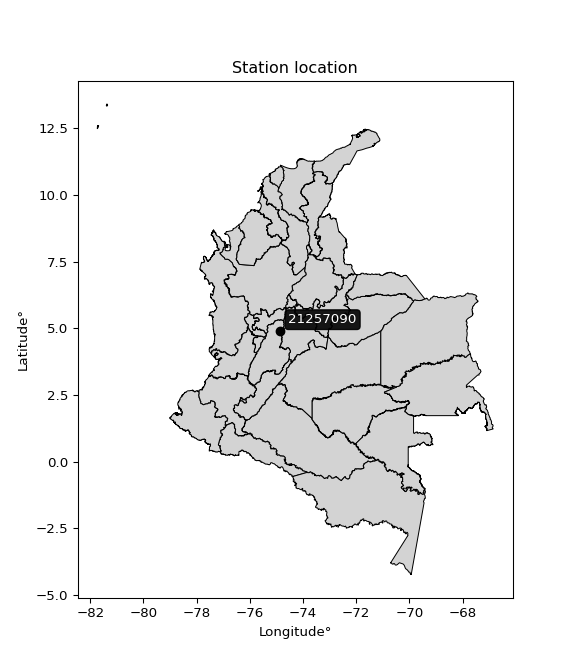

<div align="center">


</div>

# PMP Station (Rain, Pmax24h): 21257090

Probable Maximum Precipitation (PMP) is the greatest amount of rainfall for a specific duration that is meteorologically possible for a given location, acting as a "worst-case" scenario for extreme storms, crucial for designing safety-critical infrastructure like bridges, river deviations, dams, spillways, and nuclear plants to prevent catastrophic failure. PMP is calculated by hydrologists using meteorological data to determine the upper limit of extreme rainfall, often leading to the Probable Maximum Flood (PMF) for flood control design, and is increasingly being studied for climate change impacts. Probable Maximum Precipitation (PMP) is the theoretical upper limit of rainfall, a deterministic estimate for extreme events, while probability distributions (like GEV, Gumbel) describe the likelihood and frequency of various precipitation amounts, including rare ones, showing how often events occur, with PMP representing the extreme end of these distributions, used for critical infrastructure design to ensure safety against the worst conceivable weather, unlike standard statistical forecasts which cover typical probabilities.

The most common probability distributions in hydrology, used for analyzing floods, rainfall, and streamflow, include the Normal, Log-Normal, Gumbel, Gamma (including Log-Pearson Type III), and Generalized Extreme Value (GEV) distributions, often chosen based on the data´s skewness and whether modeling extremes or general conditions, with Gumbel and GEV popular for extreme events like floods, while the Normal distribution serves as a baseline, though often requiring transformations for skewed hydrological data. These distributions help in designing water infrastructure, managing water resources, and forecasting hydrologic events.

> Hydrological data often isn´t perfectly normal (it´s skewed), so different distributions are needed for different applications, such as: **Flood Frequency Analysis**: Using Gumbel, GEV, or Log-Pearson Type III for predicting extreme flood magnitudes and their return periods, **Rainfall Analysis**: Normal for annual totals, but Log-Normal, Weibull, or GEV for intensity or extreme daily rainfall, **Streamflow Modeling**: Gamma and Log-Normal for maximum flows, GEV for minimum flows, and Kappa for daily flows.

<div align="center">

</img>

</div>


## A. General information


### 1. General running parameters

• app_version: _v20260113_. • runtime: _2026-01-17 18:24:04.630693_. • Python version: _3.14.0_. • SciPy version: _1.16.3_. • Pandas version: _2.3.3_. • NumPy version: _2.3.5_. • Stations dataset (station_dataset_file): _dataset/pmax24h_in/automatic_colombia_2003_2025.csv_. • Stations catalog (station_catalog_file): _dataset/CNE.xls_. • Minimum year to eval til year_max (date_min): _1900_. • Maximum year to eval since year_min (date_max): _2025_. • Creates, save and include plots into reports (create_plot): _False_. • Plot only fit distributions with Δo > Δ (plot_only_fit): _True_. • Plot only simple graphs avoiding multiple CDFs and multiple Extreme values plots (plot_only_simple): _True_. • Eval low extreme values, if False, evaluates high extreme values (low_extreme): _False_. • Eval every SciPy distribution as logarithmic (pdist_logarithmic_on): _True_. • Standard deviation normalized (ddof): _1.0_. • Return periods to eval in years (Tr): _[2, 2.33, 5, 10, 15, 20, 25, 50, 75, 100, 200, 250, 500, 750, 1000]_. • Minimum data sample per station, 0 means any (minimum_sample): _5_. • Z-Score maximum threshold to adjust a value, 0 means disable (zscore_max): _3.5_. • Z-Score minimum threshold to adjust a value, 0 means disable (zscore_min): _-2.5_. • Avoid zeros, e.g. rain = 0 (avoid_zeros): _True_. • Avoid null values (avoid_nans): _True_. 

:file_folder:Table: [dataset.csv](../../dataset/pmax24h_in/automatic_colombia_2003_2025.csv)

> Delta Degrees of Freedom (DDOF): is a parameter used in the formulas for calculating variance and standard deviation. When ddof=0, the divisor is $N$ (the total number of observations) and this is used when your data set is the entire population. When ddof=1, the divisor is $N-1$ and this is used when your data set is a sample drawn from a larger population. Using $N-1$ provides an unbiased estimate of the population variance (known as Bessel´s correction).


### 2. Station info and location

|   id |   CODIGO | NOMBRE                        | CATEGORIA    | TECNOLOGIA                              | ESTADO           | FECHA_INSTALACION   |   FECHA_SUSPENSION |   ALTITUD |   LATITUD |   LONGITUD | DEPARTAMENTO   | MUNICIPIO   | AREA_OPERATIVA             | ENTIDAD                                                     | AREA_HIDROGRAFICA   | ZONA_HIDROGRAFICA   | SUBZONA_HIDROGRAFICA                        | CORRIENTE   | Catalogo   |   Version |
|-----:|---------:|:------------------------------|:-------------|:----------------------------------------|:-----------------|:--------------------|-------------------:|----------:|----------:|-----------:|:---------------|:------------|:---------------------------|:------------------------------------------------------------|:--------------------|:--------------------|:--------------------------------------------|:------------|:-----------|----------:|
|    0 | 21257090 | LA ESMERALDA - AUT [21257090] | Limnigráfica | Automática con Telemetría, Convencional | En Mantenimiento | 15/10/1986          |                nan |       260 |   4.89078 |   -74.8531 | Tolima         | Lérida      | Area Operativa 10 - Tolima | INSTITUTO DE HIDROLOGIA METEOROLOGIA Y ESTUDIOS AMBIENTALES | Magdalena Cauca     | Alto Magdalena      | Río Lagunilla y Otros Directos al Magdalena | Lagunilla   | CNE_IDEAM  |  20251226 |

<div align="center">

Dynamic map: [:earth_americas:Google](http://maps.google.com/maps?q=4.890777778,-74.85313889) [:earth_americas:OSM](https://www.openstreetmap.org/#map=18/4.890777778/-74.85313889&layers=P) [:earth_americas:Bing](https://www.bing.com/maps?cp=4.890777778~-74.85313889&lvl=18) [:earth_americas:Apple](https://maps.apple.com/frame?center=4.890777778%2C-74.85313889&span=0.003%2C0.006)

</div>


<div align="center">

```geojson
{
  "type": "Feature",
  "geometry": {
    "type": "Point", 
    "coordinates": [-74.85313889, 4.890777778]
  }, 
  "properties": {
    "Name": "21257090"
  }
}
```

</div>


### 3. Discrete values table and plot

<div align="center">

|               |          0 |           1 |           2 |           3 |          4 |            5 |
|:--------------|-----------:|------------:|------------:|------------:|-----------:|-------------:|
| Date          | 2019       | 2020        | 2021        | 2022        | 2023       | 2025         |
| Value         |  117.6     |   87.2      |   45.4      |   56.6      |    6.6     |   59.8       |
| Value_initial |  117.6     |   87.2      |   45.4      |   56.6      |    6.6     |   59.8       |
| count         |    6       |    6        |    6        |    6        |    6       |    6         |
| mean          |   62.2     |   62.2      |   62.2      |   62.2      |   62.2     |   62.2       |
| std           |   37.6958  |   37.6958   |   37.6958   |   37.6958   |   37.6958  |   37.6958    |
| zscore        |    1.46966 |    0.663203 |   -0.445673 |   -0.148558 |   -1.47496 |   -0.0636675 |


</div>


> The initial value (value_initial) correspond to the initial obtained or null completed value, and value (value) is adjusted only when the initial value is outside the valid range (outlier) definite through the Z-Score value. If Z-Score is active, values out of range or outliers are replaced with the station mean value. A Z-Score (or standard score) measures how many standard deviations a data point is from the mean of a dataset, indicating its relative position; positive scores mean above the mean, negative mean below, and a score of zero is exactly at the mean, allowing for comparison of values from different distributions. It´s calculated using the formula $z=(x–μ)/σ$, where $x$ is the data point, $μ$ is the mean, and $σ$ is the standard deviation, helping identify outliers and understand probability.
>
> <sub>**Note**: In this study, "completing" (filling gaps in) and "extending" (forecasting or lengthening the historical record) rainfall data series are avoided for certain critical analyses because they introduce artificial bias and uncertainty, which can distort the statistics of rare events (extremes), alter day-to-day variability, and compromise the integrity and homogeneity of the original data. Some reasons against Completing/Extending rainfall data are: **Distortion of Extremes and Variability**: The primary issue is that most gap-filling or extension methods rely on averaging or regression with nearby stations, which inherently smooths the data. Rainfall is highly variable in space and time, with a large percentage of zero values and occasional large storms. Infilling methods often underestimate the highest values and overestimate the lowest (zero) values, which severely distorts analyses focused on flood frequency, drought severity, and intensity-duration-frequency (IDF) curves, **Loss of Data Homogeneity**: Infilled or extended data are synthetic estimates, not actual measurements. Combining these estimates with observed data can violate the assumption of data homogeneity, which requires that the data properties do not change over time. Inhomogeneity can lead to incorrect conclusions about long-term trends or changes in climate patterns, **Propagation of Errors**: Errors and biases from the original data (e.g., wind-induced undercatch, instrument errors, site changes) or the data used for imputation can propagate through the analysis, leading to unreliable hydrological models and inaccurate predictions, **Compromised Statistical Integrity**: For statistical analyses, especially those involving the frequency of events, using artificial data can introduce time bias or autocorrelation that doesn´t exist in reality, making it difficult to assess the true probability of events, **Difficulty in Validation**: It is difficult to accurately validate the quality of filled or extended data, especially for past periods where ground-truth measurements are unavailable. The reliability of imputation techniques heavily depends on the density of the surrounding station network and the complexity of the local topography.</sub>


### 4. Active continuous probability distributions from SciPy (80 of 104 available)

A Probability Density Function (PDF) describes the relative likelihood of a continuous random variable falling within a specific range, where the total area under its curve equals 1, and the area over any interval gives the actual probability for that range. Unlike discrete probabilities (like rolling a die), a PDF shows density, not direct probability for a single point (which is zero), with higher points indicating higher likelihood, often visualized as a bell curve for normal distributions.

A log of a probability density function (log-PDF) is simply the logarithm of the PDF´s value, denoted as $log(f(x))$, useful for converting multiplication of probabilities into addition, improving numerical stability with tiny numbers, and connecting to information theory concepts like entropy. Instead of dealing with very small probabilities (e.g., 0.000001), log-PDFs use negative numbers (e.g., $log(0.00001) ≈ -11.51$ that are easier for computers to handle, preventing underflow errors and simplifying complex calculations. In this study, each active probability distribution from SciPy is also evaluated in the $log$ form.

[scipy.stats](https://docs.scipy.org/doc/scipy/reference/stats.html) is a Python´s powerful submodule within the SciPy library for comprehensive statistical analysis, offering over 130 probability distributions (like Normal, Poisson), functions for descriptive stats (mean, variance), hypothesis testing (t-tests, chi-square), random variable generation, and statistical tests, making it essential for data science, modeling, and research. It provides tools to explore, model, and draw conclusions from data efficiently, working seamlessly with NumPy.

<div align="center">

|   id | p_dist           |   n_parameter | fit_method   | label                                                                       | active   | ref                                                                                                      |
|-----:|:-----------------|--------------:|:-------------|:----------------------------------------------------------------------------|:---------|:---------------------------------------------------------------------------------------------------------|
|    0 | alpha            |             3 | MLE          | Alpha                                                                       | True     | [:mortar_board:](https://docs.scipy.org/doc/scipy/reference/generated/scipy.stats.alpha.html)            |
|    1 | anglit           |             2 | MM           | Anglit                                                                      | True     | [:mortar_board:](https://docs.scipy.org/doc/scipy/reference/generated/scipy.stats.anglit.html)           |
|    2 | arcsine          |             2 | MM           | Arcsine                                                                     | True     | [:mortar_board:](https://docs.scipy.org/doc/scipy/reference/generated/scipy.stats.arcsine.html)          |
|    3 | argus            |             3 | MLE          | Argus                                                                       | True     | [:mortar_board:](https://docs.scipy.org/doc/scipy/reference/generated/scipy.stats.argus.html)            |
|    4 | beta             |             4 | MLE          | Beta                                                                        | True     | [:mortar_board:](https://docs.scipy.org/doc/scipy/reference/generated/scipy.stats.beta.html)             |
|    5 | betaprime        |             4 | MLE          | Beta prime                                                                  | True     | [:mortar_board:](https://docs.scipy.org/doc/scipy/reference/generated/scipy.stats.betaprime.html)        |
|    6 | bradford         |             3 | MLE          | Bradford                                                                    | True     | [:mortar_board:](https://docs.scipy.org/doc/scipy/reference/generated/scipy.stats.bradford.html)         |
|    7 | burr             |             4 | MLE          | Burr (Type III)                                                             | True     | [:mortar_board:](https://docs.scipy.org/doc/scipy/reference/generated/scipy.stats.burr.html)             |
|    8 | burr12           |             4 | MLE          | Burr (Type III) 12                                                          | True     | [:mortar_board:](https://docs.scipy.org/doc/scipy/reference/generated/scipy.stats.burr12.html)           |
|    9 | cosine           |             2 | MLE          | Cosine                                                                      | True     | [:mortar_board:](https://docs.scipy.org/doc/scipy/reference/generated/scipy.stats.cosine.html)           |
|   10 | crystalball      |             4 | MLE          | Crystalball                                                                 | True     | [:mortar_board:](https://docs.scipy.org/doc/scipy/reference/generated/scipy.stats.crystalball.html)      |
|   11 | dgamma           |             3 | MLE          | Double gamma                                                                | True     | [:mortar_board:](https://docs.scipy.org/doc/scipy/reference/generated/scipy.stats.dgamma.html)           |
|   12 | dweibull         |             3 | MLE          | Double Weibull                                                              | True     | [:mortar_board:](https://docs.scipy.org/doc/scipy/reference/generated/scipy.stats.dweibull.html)         |
|   13 | erlang           |             3 | MLE          | Erlang                                                                      | True     | [:mortar_board:](https://docs.scipy.org/doc/scipy/reference/generated/scipy.stats.erlang.html)           |
|   14 | exponnorm        |             3 | MLE          | Exponentially modified Normal                                               | True     | [:mortar_board:](https://docs.scipy.org/doc/scipy/reference/generated/scipy.stats.exponnorm.html)        |
|   15 | exponpow         |             3 | MLE          | Exponential power                                                           | True     | [:mortar_board:](https://docs.scipy.org/doc/scipy/reference/generated/scipy.stats.exponpow.html)         |
|   16 | exponweib        |             4 | MLE          | Exponentiated Weibull                                                       | True     | [:mortar_board:](https://docs.scipy.org/doc/scipy/reference/generated/scipy.stats.exponweib.html)        |
|   17 | f                |             4 | MLE          | F                                                                           | True     | [:mortar_board:](https://docs.scipy.org/doc/scipy/reference/generated/scipy.stats.f.html)                |
|   18 | fatiguelife      |             3 | MLE          | Fatigue-life (Birnbaum-Saunders)                                            | True     | [:mortar_board:](https://docs.scipy.org/doc/scipy/reference/generated/scipy.stats.fatiguelife.html)      |
|   19 | foldnorm         |             3 | MM           | Fold Normal                                                                 | True     | [:mortar_board:](https://docs.scipy.org/doc/scipy/reference/generated/scipy.stats.foldnorm.html)         |
|   20 | gamma            |             3 | MLE          | Gamma                                                                       | True     | [:mortar_board:](https://docs.scipy.org/doc/scipy/reference/generated/scipy.stats.gamma.html)            |
|   21 | gausshyper       |             6 | MLE          | Gauss hypergeometric                                                        | True     | [:mortar_board:](https://docs.scipy.org/doc/scipy/reference/generated/scipy.stats.gausshyper.html)       |
|   22 | genexpon         |             5 | MLE          | Generalized exponential                                                     | True     | [:mortar_board:](https://docs.scipy.org/doc/scipy/reference/generated/scipy.stats.genexpon.html)         |
|   23 | genextreme       |             3 | MLE          | Generalized exponential                                                     | True     | [:mortar_board:](https://docs.scipy.org/doc/scipy/reference/generated/scipy.stats.genextreme.html)       |
|   24 | gengamma         |             4 | MLE          | Generalized gamma                                                           | True     | [:mortar_board:](https://docs.scipy.org/doc/scipy/reference/generated/scipy.stats.gengamma.html)         |
|   25 | genhalflogistic  |             3 | MLE          | Generalized half-logistic                                                   | True     | [:mortar_board:](https://docs.scipy.org/doc/scipy/reference/generated/scipy.stats.genhalflogistic.html)  |
|   26 | genlogistic      |             3 | MLE          | Generalized logistic                                                        | True     | [:mortar_board:](https://docs.scipy.org/doc/scipy/reference/generated/scipy.stats.genlogistic.html)      |
|   27 | gennorm          |             3 | MLE          | Generalized Normal                                                          | True     | [:mortar_board:](https://docs.scipy.org/doc/scipy/reference/generated/scipy.stats.gennorm.html)          |
|   28 | genpareto        |             3 | MLE          | Generalized Pareto                                                          | True     | [:mortar_board:](https://docs.scipy.org/doc/scipy/reference/generated/scipy.stats.genpareto.html)        |
|   29 | gompertz         |             3 | MLE          | Gompertz (or truncated Gumbel)                                              | True     | [:mortar_board:](https://docs.scipy.org/doc/scipy/reference/generated/scipy.stats.gompertz.html)         |
|   30 | gumbel_l         |             2 | MM           | Gumbel Left Skew                                                            | True     | [:mortar_board:](https://docs.scipy.org/doc/scipy/reference/generated/scipy.stats.gumbel_l.html)         |
|   31 | gumbel_r         |             2 | MM           | Gumbel Right Skew                                                           | True     | [:mortar_board:](https://docs.scipy.org/doc/scipy/reference/generated/scipy.stats.gumbel_r.html)         |
|   32 | halfgennorm      |             3 | MLE          | Upper half of a generalized normal                                          | True     | [:mortar_board:](https://docs.scipy.org/doc/scipy/reference/generated/scipy.stats.halfgennorm.html)      |
|   33 | halflogistic     |             2 | MM           | Half-logistic                                                               | True     | [:mortar_board:](https://docs.scipy.org/doc/scipy/reference/generated/scipy.stats.halflogistic.html)     |
|   34 | halfnorm         |             2 | MM           | Half Normal                                                                 | True     | [:mortar_board:](https://docs.scipy.org/doc/scipy/reference/generated/scipy.stats.halfnorm.html)         |
|   35 | hypsecant        |             2 | MM           | hyperbolic secant                                                           | True     | [:mortar_board:](https://docs.scipy.org/doc/scipy/reference/generated/scipy.stats.hypsecant.html)        |
|   36 | invgamma         |             3 | MLE          | Inverted gamma                                                              | True     | [:mortar_board:](https://docs.scipy.org/doc/scipy/reference/generated/scipy.stats.invgamma.html)         |
|   37 | invgauss         |             3 | MLE          | Inverse Gaussian                                                            | True     | [:mortar_board:](https://docs.scipy.org/doc/scipy/reference/generated/scipy.stats.invgauss.html)         |
|   38 | invweibull       |             3 | MLE          | Inverted Weibull                                                            | True     | [:mortar_board:](https://docs.scipy.org/doc/scipy/reference/generated/scipy.stats.invweibull.html)       |
|   39 | johnsonsb        |             4 | MLE          | Johnson SB                                                                  | True     | [:mortar_board:](https://docs.scipy.org/doc/scipy/reference/generated/scipy.stats.johnsonsb.html)        |
|   40 | johnsonsu        |             4 | MLE          | Johnson Su                                                                  | True     | [:mortar_board:](https://docs.scipy.org/doc/scipy/reference/generated/scipy.stats.johnsonsu.html)        |
|   41 | kappa3           |             3 | MLE          | Kappa 3                                                                     | True     | [:mortar_board:](https://docs.scipy.org/doc/scipy/reference/generated/scipy.stats.kappa3.html)           |
|   42 | kappa4           |             4 | MLE          | Kappa 4                                                                     | True     | [:mortar_board:](https://docs.scipy.org/doc/scipy/reference/generated/scipy.stats.kappa4.html)           |
|   43 | ksone            |             3 | MLE          | Kolmogorov-Smirnov one-sided test statistic distribution                    | True     | [:mortar_board:](https://docs.scipy.org/doc/scipy/reference/generated/scipy.stats.ksone.html)            |
|   44 | kstwobign        |             2 | MLE          | Limiting distribution of scaled Kolmogorov-Smirnov two-sided test statistic | True     | [:mortar_board:](https://docs.scipy.org/doc/scipy/reference/generated/scipy.stats.kstwobign.html)        |
|   45 | laplace          |             2 | MM           | Laplace                                                                     | True     | [:mortar_board:](https://docs.scipy.org/doc/scipy/reference/generated/scipy.stats.laplace.html)          |
|   46 | levy_l           |             2 | MLE          | Left-skewed Levy                                                            | True     | [:mortar_board:](https://docs.scipy.org/doc/scipy/reference/generated/scipy.stats.levy_l.html)           |
|   47 | loggamma         |             3 | MLE          | Log gamma                                                                   | True     | [:mortar_board:](https://docs.scipy.org/doc/scipy/reference/generated/scipy.stats.loggamma.html)         |
|   48 | logistic         |             2 | MM           | Logistic (or Sech-squared)                                                  | True     | [:mortar_board:](https://docs.scipy.org/doc/scipy/reference/generated/scipy.stats.logistic.html)         |
|   49 | loglaplace       |             3 | MLE          | Log-Laplace                                                                 | True     | [:mortar_board:](https://docs.scipy.org/doc/scipy/reference/generated/scipy.stats.loglaplace.html)       |
|   50 | lomax            |             3 | MLE          | Lomax (Pareto of the second kind)                                           | True     | [:mortar_board:](https://docs.scipy.org/doc/scipy/reference/generated/scipy.stats.lomax.html)            |
|   51 | maxwell          |             2 | MM           | Maxwell                                                                     | True     | [:mortar_board:](https://docs.scipy.org/doc/scipy/reference/generated/scipy.stats.maxwell.html)          |
|   52 | mielke           |             4 | MLE          | Mielke Beta-Kappa / Dagum                                                   | True     | [:mortar_board:](https://docs.scipy.org/doc/scipy/reference/generated/scipy.stats.mielke.html)           |
|   53 | moyal            |             2 | MM           | Moyal                                                                       | True     | [:mortar_board:](https://docs.scipy.org/doc/scipy/reference/generated/scipy.stats.moyal.html)            |
|   54 | nakagami         |             3 | MLE          | Nakagami                                                                    | True     | [:mortar_board:](https://docs.scipy.org/doc/scipy/reference/generated/scipy.stats.nakagami.html)         |
|   55 | ncf              |             5 | MLE          | Non-central F distribution                                                  | True     | [:mortar_board:](https://docs.scipy.org/doc/scipy/reference/generated/scipy.stats.ncf.html)              |
|   56 | nct              |             4 | MLE          | Non-central Student’s t                                                     | True     | [:mortar_board:](https://docs.scipy.org/doc/scipy/reference/generated/scipy.stats.nct.html)              |
|   57 | norm             |             2 | MM           | Normal                                                                      | True     | [:mortar_board:](https://docs.scipy.org/doc/scipy/reference/generated/scipy.stats.norm.html)             |
|   58 | pearson3         |             3 | MM           | Pearson type III                                                            | True     | [:mortar_board:](https://docs.scipy.org/doc/scipy/reference/generated/scipy.stats.pearson3.html)         |
|   59 | powerlaw         |             3 | MLE          | Power-function                                                              | True     | [:mortar_board:](https://docs.scipy.org/doc/scipy/reference/generated/scipy.stats.powerlaw.html)         |
|   60 | rayleigh         |             2 | MM           | Rayleigh                                                                    | True     | [:mortar_board:](https://docs.scipy.org/doc/scipy/reference/generated/scipy.stats.rayleigh.html)         |
|   61 | rdist            |             3 | MLE          | R-distributed (symmetric beta)                                              | True     | [:mortar_board:](https://docs.scipy.org/doc/scipy/reference/generated/scipy.stats.rdist.html)            |
|   62 | rice             |             3 | MLE          | Rice                                                                        | True     | [:mortar_board:](https://docs.scipy.org/doc/scipy/reference/generated/scipy.stats.rice.html)             |
|   63 | semicircular     |             2 | MM           | Semicircular                                                                | True     | [:mortar_board:](https://docs.scipy.org/doc/scipy/reference/generated/scipy.stats.semicircular.html)     |
|   64 | skewnorm         |             3 | MLE          | Skew normal                                                                 | True     | [:mortar_board:](https://docs.scipy.org/doc/scipy/reference/generated/scipy.stats.skewnorm.html)         |
|   65 | t                |             3 | MLE          | Student’s t                                                                 | True     | [:mortar_board:](https://docs.scipy.org/doc/scipy/reference/generated/scipy.stats.t.html)                |
|   66 | trapezoid        |             4 | MLE          | Trapezoid                                                                   | True     | [:mortar_board:](https://docs.scipy.org/doc/scipy/reference/generated/scipy.stats.trapezoid.html)        |
|   67 | triang           |             3 | MLE          | Triangular                                                                  | True     | [:mortar_board:](https://docs.scipy.org/doc/scipy/reference/generated/scipy.stats.triang.html)           |
|   68 | truncexpon       |             3 | MLE          | Truncated exponential                                                       | True     | [:mortar_board:](https://docs.scipy.org/doc/scipy/reference/generated/scipy.stats.truncexpon.html)       |
|   69 | truncnorm        |             4 | MLE          | Truncated normal                                                            | True     | [:mortar_board:](https://docs.scipy.org/doc/scipy/reference/generated/scipy.stats.truncnorm.html)        |
|   70 | truncpareto      |             4 | MLE          | Upper truncated Pareto                                                      | True     | [:mortar_board:](https://docs.scipy.org/doc/scipy/reference/generated/scipy.stats.truncpareto.html)      |
|   71 | truncweibull_min |             5 | MLE          | Doubly truncated Weibull minimum                                            | True     | [:mortar_board:](https://docs.scipy.org/doc/scipy/reference/generated/scipy.stats.truncweibull_min.html) |
|   72 | tukeylambda      |             3 | MLE          | Tukey-Lamdba                                                                | True     | [:mortar_board:](https://docs.scipy.org/doc/scipy/reference/generated/scipy.stats.tukeylambda.html)      |
|   73 | uniform          |             2 | MLE          | Uniform                                                                     | True     | [:mortar_board:](https://docs.scipy.org/doc/scipy/reference/generated/scipy.stats.uniform.html)          |
|   74 | vonmises         |             3 | MLE          | Von Mises                                                                   | True     | [:mortar_board:](https://docs.scipy.org/doc/scipy/reference/generated/scipy.stats.vonmises.html)         |
|   75 | vonmises_line    |             3 | MLE          | Von Mises line                                                              | True     | [:mortar_board:](https://docs.scipy.org/doc/scipy/reference/generated/scipy.stats.vonmises_line.html)    |
|   76 | wald             |             2 | MM           | Wald                                                                        | True     | [:mortar_board:](https://docs.scipy.org/doc/scipy/reference/generated/scipy.stats.wald.html)             |
|   77 | weibull_max      |             3 | MLE          | Weibull maximum                                                             | True     | [:mortar_board:](https://docs.scipy.org/doc/scipy/reference/generated/scipy.stats.weibull_max.html)      |
|   78 | weibull_min      |             3 | MLE          | Weibull minimum                                                             | True     | [:mortar_board:](https://docs.scipy.org/doc/scipy/reference/generated/scipy.stats.weibull_min.html)      |
|   79 | wrapcauchy       |             3 | MLE          | Wrapped  Cauchy                                                             | True     | [:mortar_board:](https://docs.scipy.org/doc/scipy/reference/generated/scipy.stats.wrapcauchy.html)       |

</div>

> **n_parameter:** # arguments & localization & scale.
>
> **Fit methods:** (MLE) maximum likelihood, (MM) L-moments.
>
>**Inactive** (With the only purpose of prevent loops, zero divisions, infinite values, over high estimated values or horizontal trending for recurrence intervals estimations, the follow distributions were disabled.)**:** lognorm, norminvgauss, powernorm, powerlognorm, cauchy, halfcauchy, foldcauchy, skewcauchy, chi2, expon, fisk, genhyperbolic, geninvgauss, gibrat, kstwo, laplace_asymmetric, levy, levy_stable, ncx2, pareto, rel_breitwigner, recipinvgauss, studentized_range, loguniform, 


## B. Probability (PDF) vs. Empirical (EDF) distributions functions

A continuous probability distribution (CPD) describes probabilities for variables that can take any value within a range (like rain any time), unlike discrete variables with specific outcomes (like temperature). It uses a Probability Density Function (PDF), a curve where the total area under it equals 1, and the probability of the variable falling within an interval (a to b) is found by calculating the area under the curve between those points. A key feature is that the probability of hitting any single exact value is zero, so probabilities are always expressed for ranges, e.g., $P(a ≤ X ≤ b)$.

<div align="center">

Distributions parameters from station values
|     |   station | p_dist              |   n |             loc |           scale | shape                  | shape1                 | shape2                 | shape3             |
|----:|----------:|:--------------------|----:|----------------:|----------------:|:-----------------------|:-----------------------|:-----------------------|:-------------------|
|   0 |  21257090 | alpha               |   6 |   -19.1021      |    57.0994      | 0.17889587135641694    |                        |                        |                    |
|   1 |  21257090 | anglit              |   6 |    62.2         |   100.667       |                        |                        |                        |                    |
|   2 |  21257090 | arcsine             |   6 |    13.5349      |    97.3302      |                        |                        |                        |                    |
|   3 |  21257090 | argus               |   6 |   -18.474       |   142.914       | 8.878219304032215e-07  |                        |                        |                    |
|   4 |  21257090 | beta                |   6 |   -36.2083      |   153.808       | 1.885773729759307      | 0.6159935864049009     |                        |                    |
|   5 |  21257090 | betaprime           |   6 |  -597.388       | 48368.4         | 371.32729938614875     | 27232.396151545996     |                        |                    |
|   6 |  21257090 | bradford            |   6 |    -6.02225     |   123.622       | 3.80215209289651e-06   |                        |                        |                    |
|   7 |  21257090 | burr                |   6 |    -2.41983     |   121.64        | 272.8204126287547      | 0.004190553634914426   |                        |                    |
|   8 |  21257090 | burr12              |   6 |   -90.7035      |    93.3717      | 44.403996371236474     | 0.04946236806171114    |                        |                    |
|   9 |  21257090 | cosine              |   6 |    62.274       |    29.0369      |                        |                        |                        |                    |
|  10 |  21257090 | crystalball         |   6 |    62.2         |    34.4114      | 1991.8815393728978     | 15053.71541058383      |                        |                    |
|  11 |  21257090 | dgamma              |   6 |    59.8         |    29.0775      | 0.8226629995266858     |                        |                        |                    |
|  12 |  21257090 | dweibull            |   6 |    56.6         |    31.9449      | 0.7491845116115197     |                        |                        |                    |
|  13 |  21257090 | erlang              |   6 | -1708.5         |     0.66855     | 2648.5719161729635     |                        |                        |                    |
|  14 |  21257090 | exponnorm           |   6 |    60.4287      |    34.3658      | 0.05154383061147926    |                        |                        |                    |
|  15 |  21257090 | exponpow            |   6 |     6.6         |     6.07239     | 0.17032352090082103    |                        |                        |                    |
|  16 |  21257090 | exponweib           |   6 |  -876.637       |   855.431       | 10.758209591215085     | 11.02503070276247      |                        |                    |
|  17 |  21257090 | f                   |   6 |  -561.33        |   623.552       | 656.3450952904248      | 449468.81345136417     |                        |                    |
|  18 |  21257090 | fatiguelife         |   6 |     6.6         |     0.000182418 | 589.5894632625087      |                        |                        |                    |
|  19 |  21257090 | foldnorm            |   6 |    21.1212      |    44.3906      | 0.6280079723091683     |                        |                        |                    |
|  20 |  21257090 | gamma               |   6 | -1715.18        |     0.666062    | 2668.463969545608      |                        |                        |                    |
|  21 |  21257090 | gausshyper          |   6 |    -4.11116     |   121.711       | 1.2971618133169012     | 0.7502761148340636     | 0.9665180590672955     | 1.0043130716860027 |
|  22 |  21257090 | genexpon            |   6 |     6.59999     |     3.22433     | 0.05796309099935612    | 1.8418930742358269e-07 | 3.263712117633262      |                    |
|  23 |  21257090 | genextreme          |   6 |     8.91487     |    13.8184      | -5.9693633158339345    |                        |                        |                    |
|  24 |  21257090 | gengamma            |   6 |  -390.814       |    16.0151      | 93.82038983601723      | 1.3583246397609092     |                        |                    |
|  25 |  21257090 | genhalflogistic     |   6 |    -4.59379     |   138.079       | 1.1299994614208577     |                        |                        |                    |
|  26 |  21257090 | genlogistic         |   6 |    52.4408      |    21.855       | 1.3462473060588436     |                        |                        |                    |
|  27 |  21257090 | gennorm             |   6 |    56.6         |     0.000953436 | 0.18303068578822462    |                        |                        |                    |
|  28 |  21257090 | genpareto           |   6 |    -0.139088    |   203.927       | -1.7320227695564698    |                        |                        |                    |
|  29 |  21257090 | gompertz            |   6 |    45.4         |    23.7026      | 0.1917174323845875     |                        |                        |                    |
|  30 |  21257090 | gumbel_l            |   6 |    77.687       |    26.8305      |                        |                        |                        |                    |
|  31 |  21257090 | gumbel_r            |   6 |    46.713       |    26.8305      |                        |                        |                        |                    |
|  32 |  21257090 | halfgennorm         |   6 |     6.6         |     6.63231     | 0.4424392129786554     |                        |                        |                    |
|  33 |  21257090 | halflogistic        |   6 |    21.4144      |    29.4206      |                        |                        |                        |                    |
|  34 |  21257090 | halfnorm            |   6 |    16.6528      |    57.085       |                        |                        |                        |                    |
|  35 |  21257090 | hypsecant           |   6 |    62.2         |    21.907       |                        |                        |                        |                    |
|  36 |  21257090 | invgamma            |   6 |  -274.294       | 31355.4         | 94.24180810517316      |                        |                        |                    |
|  37 |  21257090 | invgauss            |   6 |   -91.9664      |  2733.06        | 0.05629925680187342    |                        |                        |                    |
|  38 |  21257090 | invweibull          |   6 |     6.6         |     5.90875     | 0.04137012877269773    |                        |                        |                    |
|  39 |  21257090 | johnsonsb           |   6 |     6.5961      |   111.004       | -0.35152215338713433   | 0.27813417765869186    |                        |                    |
|  40 |  21257090 | johnsonsu           |   6 |  -740.513       |  1267.24        | -26.051374894702604    | 43.627820935786545     |                        |                    |
|  41 |  21257090 | kappa3              |   6 |     6.59616     |   110.732       | 677.9722512343407      |                        |                        |                    |
|  42 |  21257090 | kappa4              |   6 |     2.69367     |   113.783       | 1.0355442979638785     | 0.9878275007213018     |                        |                    |
|  43 |  21257090 | ksone               |   6 |     2.59765     |   119.205       | 1.0                    |                        |                        |                    |
|  44 |  21257090 | kstwobign           |   6 |   -68.8087      |   149.986       |                        |                        |                        |                    |
|  45 |  21257090 | laplace             |   6 |    62.2         |    24.3326      |                        |                        |                        |                    |
|  46 |  21257090 | levy_l              |   6 |   123.18        |    23.1457      |                        |                        |                        |                    |
|  47 |  21257090 | loggamma            |   6 | -7155.63        |  1055.22        | 935.1117268265493      |                        |                        |                    |
|  48 |  21257090 | logistic            |   6 |    62.2         |    18.972       |                        |                        |                        |                    |
|  49 |  21257090 | loglaplace          |   6 |    -0.166513    |    59.9665      | 1.6842480437641085     |                        |                        |                    |
|  50 |  21257090 | lomax               |   6 |     6.6         |     3.47786e+10 | 534615770.5968581      |                        |                        |                    |
|  51 |  21257090 | maxwell             |   6 |   -19.3406      |    51.098       |                        |                        |                        |                    |
|  52 |  21257090 | mielke              |   6 |     6.6         |   111.133       | 0.6864727034832443     | 862.2113951364788      |                        |                    |
|  53 |  21257090 | moyal               |   6 |    42.5213      |    15.4906      |                        |                        |                        |                    |
|  54 |  21257090 | nakagami            |   6 |     6.6         |    67.8446      | 0.3650656706898838     |                        |                        |                    |
|  55 |  21257090 | ncf                 |   6 |    -0.0419011   |     4.93223e-08 | 8.614423113198839e-09  | 28.167813121816042     | 10.404225878556543     |                    |
|  56 |  21257090 | nct                 |   6 | -1585.77        |    34.3602      | 376291.0124940118      | 47.96141695103803      |                        |                    |
|  57 |  21257090 | norm                |   6 |    62.2         |    34.4114      |                        |                        |                        |                    |
|  58 |  21257090 | pearson3            |   6 |    62.2         |    34.4115      | 0.03616861780587219    |                        |                        |                    |
|  59 |  21257090 | powerlaw            |   6 |     6.6         |   111           | 0.1419412509277978     |                        |                        |                    |
|  60 |  21257090 | rayleigh            |   6 |    -3.63108     |    52.5256      |                        |                        |                        |                    |
|  61 |  21257090 | rdist               |   6 |    -3.91657     |    63.7166      | 0.9847193717282086     |                        |                        |                    |
|  62 |  21257090 | rice                |   6 |   -11.9761      |    39.4076      | 1.5183778197472542     |                        |                        |                    |
|  63 |  21257090 | semicircular        |   6 |    62.2         |    68.8229      |                        |                        |                        |                    |
|  64 |  21257090 | skewnorm            |   6 |    53.9706      |    35.3818      | 0.30473304168962556    |                        |                        |                    |
|  65 |  21257090 | t                   |   6 |    62.1999      |    34.4116      | 315437966.7332108      |                        |                        |                    |
|  66 |  21257090 | trapezoid           |   6 |    -4.725       |   133.2         | 1.0                    | 1.0                    |                        |                    |
|  67 |  21257090 | triang              |   6 |    -4.94945     |   122.55        | 0.999999609016286      |                        |                        |                    |
|  68 |  21257090 | truncexpon          |   6 |    -3.72601     |   166.593       | 0.7282790815177598     |                        |                        |                    |
|  69 |  21257090 | truncnorm           |   6 |    62.2         |    34.4114      | -324.651475699614      | 143.3140537956231      |                        |                    |
|  70 |  21257090 | truncpareto         |   6 |     6.42867     |     0.171331    | 0.2035344749385553     | 648.8697125440169      |                        |                    |
|  71 |  21257090 | truncweibull_min    |   6 |    -2.49529     |   179.151       | 1.3482229480154793     | 0.0016103317264184477  | 0.6703574821336602     |                    |
|  72 |  21257090 | tukeylambda         |   6 |    62.1162      |    60.3506      | 1.0870808752476027     |                        |                        |                    |
|  73 |  21257090 | uniform             |   6 |     6.6         |   111           |                        |                        |                        |                    |
|  74 |  21257090 | vonmises            |   6 |    -0.258561    |     1           | 0.5822319798544424     |                        |                        |                    |
|  75 |  21257090 | vonmises_line       |   6 |    62.1         |    17.6662      | 0.2271345024452256     |                        |                        |                    |
|  76 |  21257090 | wald                |   6 |    27.7886      |    34.4114      |                        |                        |                        |                    |
|  77 |  21257090 | weibull_max         |   6 |   117.6         |     1.7466      | 0.2817121325919658     |                        |                        |                    |
|  78 |  21257090 | weibull_min         |   6 |   -23.6348      |    96.5669      | 2.7344788408884746     |                        |                        |                    |
|  79 |  21257090 | wrapcauchy          |   6 |     5.75376     |    17.8009      | 9.938292091512288e-06  |                        |                        |                    |
|  80 |  21257090 | logalpha            |   6 |   -26.5686      |   937.765       | 30.894735692626625     |                        |                        |                    |
|  81 |  21257090 | loganglit           |   6 |     3.84418     |     2.71563     |                        |                        |                        |                    |
|  82 |  21257090 | logarcsine          |   6 |     2.53141     |     2.62555     |                        |                        |                        |                    |
|  83 |  21257090 | logargus            |   6 |     0.609833    |     4.23336     | 2.592424813537977      |                        |                        |                    |
|  84 |  21257090 | logbeta             |   6 |     1.63464     |     3.13265     | 0.757199149754063      | 0.20562754232444336    |                        |                    |
|  85 |  21257090 | logbetaprime        |   6 |   -31.0831      |   218.967       | 1560.3375065731323     | 9778.304065726144      |                        |                    |
|  86 |  21257090 | logbradford         |   6 |     1.88229     |     3.08123     | 1.689698674838371e-05  |                        |                        |                    |
|  87 |  21257090 | logburr             |   6 |    -1.2458      |     6.03258     | 1083.2635718326742     | 0.0048429332054346595  |                        |                    |
|  88 |  21257090 | logburr12           |   6 | -2512.24        |  2524.6         | 4309.426298942018      | 1079966.5674893335     |                        |                    |
|  89 |  21257090 | logcosine           |   6 |     3.66824     |     0.818273    |                        |                        |                        |                    |
|  90 |  21257090 | logcrystalball      |   6 |     3.84418     |     0.928292    | 26.236372195086762     | 273.71838390201685     |                        |                    |
|  91 |  21257090 | logdgamma           |   6 |     4.09101     |     0.761435    | 0.6943257028349514     |                        |                        |                    |
|  92 |  21257090 | logdweibull         |   6 |     4.09101     |     0.786475    | 0.31684934486058214    |                        |                        |                    |
|  93 |  21257090 | logerlang           |   6 |   -13.4379      |     0.0542542   | 318.2527468145771      |                        |                        |                    |
|  94 |  21257090 | logexponnorm        |   6 |     3.8434      |     0.928291    | 0.0008407629706948354  |                        |                        |                    |
|  95 |  21257090 | logexponpow         |   6 |     1.88707     |     1.36474     | 0.4236109022467276     |                        |                        |                    |
|  96 |  21257090 | logexponweib        |   6 |     1.88707     |     1.09439     | 1.1913243180981268     | 0.7363895964171081     |                        |                    |
|  97 |  21257090 | logf                |   6 |  -792.124       |   795.964       | 1655227.776524894      | 12545282.090004794     |                        |                    |
|  98 |  21257090 | logfatiguelife      |   6 |  -632.558       |   636.399       | 0.0014581774553053405  |                        |                        |                    |
|  99 |  21257090 | logfoldnorm         |   6 |    -2.00816     |     0.855545    | 6.852898320426631      |                        |                        |                    |
| 100 |  21257090 | loggamma            |   6 |   -13.2358      |     0.0556384   | 307.09058016997824     |                        |                        |                    |
| 101 |  21257090 | loggausshyper       |   6 |     1.87008     |     2.89721     | 1.0840099672913235     | 0.6553979594102264     | 1.0489179607986752     | 1.1234263301642218 |
| 102 |  21257090 | loggenexpon         |   6 |     1.79778     |     0.136909    | 0.018553249122412727   | 12.589454973141684     | 0.00042276890235291354 |                    |
| 103 |  21257090 | loggenextreme       |   6 |     3.80557     |     1.15371     | 1.1996330701156874     |                        |                        |                    |
| 104 |  21257090 | loggengamma         |   6 |     1.88707     |     1.09673     | 1.1868574356167425     | 0.7347989363913962     |                        |                    |
| 105 |  21257090 | loggenhalflogistic  |   6 |     1.87461     |     3.04706     | 1.0533714049497878     |                        |                        |                    |
| 106 |  21257090 | loggenlogistic      |   6 |     4.76732     |     1.5054e-06  | 1.6246194703221768e-06 |                        |                        |                    |
| 107 |  21257090 | loggennorm          |   6 |     4.09101     |     0.0139926   | 0.35718640451228667    |                        |                        |                    |
| 108 |  21257090 | loggenpareto        |   6 |    -0.0757168   |     6.75199     | -1.3941740552940982    |                        |                        |                    |
| 109 |  21257090 | loggompertz         |   6 |     1.86922     |     0.632651    | 0.025070643106399657   |                        |                        |                    |
| 110 |  21257090 | loggumbel_l         |   6 |     4.26196     |     0.723787    |                        |                        |                        |                    |
| 111 |  21257090 | loggumbel_r         |   6 |     3.4264      |     0.723787    |                        |                        |                        |                    |
| 112 |  21257090 | loghalfgennorm      |   6 |     1.88707     |     2.88119     | 22294.195009095834     |                        |                        |                    |
| 113 |  21257090 | loghalflogistic     |   6 |     2.74398     |     0.79363     |                        |                        |                        |                    |
| 114 |  21257090 | loghalfnorm         |   6 |     2.6155      |     1.53993     |                        |                        |                        |                    |
| 115 |  21257090 | loghypsecant        |   6 |     3.84418     |     0.590969    |                        |                        |                        |                    |
| 116 |  21257090 | loginvgamma         |   6 |   -15.8572      |  8078.46        | 411.286710441834       |                        |                        |                    |
| 117 |  21257090 | loginvgauss         |   6 |    -6.28468     |  1009.43        | 0.010035969731611565   |                        |                        |                    |
| 118 |  21257090 | loginvweibull       |   6 |    -6.67224e+07 |     6.67224e+07 | 60871658.4682332       |                        |                        |                    |
| 119 |  21257090 | logjohnsonsb        |   6 |     1.88707     |     2.88136     | 0.12639225169281942    | 0.13606611744564948    |                        |                    |
| 120 |  21257090 | logjohnsonsu        |   6 |     4.94193     |     0.00710628  | 6.208029846063051      | 1.1526426971588821     |                        |                    |
| 121 |  21257090 | logkappa3           |   6 |     1.88707     |     2.86831     | 420.676254943373       |                        |                        |                    |
| 122 |  21257090 | logkappa4           |   6 |     1.74219     |     3.11309     | 1.048846765677176      | 1.0289427652843584     |                        |                    |
| 123 |  21257090 | logksone            |   6 |     1.59905     |     3.45626     | 1.0                    |                        |                        |                    |
| 124 |  21257090 | logkstwobign        |   6 |    -0.580659    |     5.05418     |                        |                        |                        |                    |
| 125 |  21257090 | loglaplace          |   6 |     3.84418     |     0.656402    |                        |                        |                        |                    |
| 126 |  21257090 | loglevy_l           |   6 |     4.83551     |     0.281745    |                        |                        |                        |                    |
| 127 |  21257090 | logloggamma         |   6 |     4.76734     |     3.51024e-06 | 3.8103742847338256e-06 |                        |                        |                    |
| 128 |  21257090 | loglogistic         |   6 |     3.84418     |     0.511794    |                        |                        |                        |                    |
| 129 |  21257090 | logloglaplace       |   6 |    -0.0507342   |     4.14174     | 5.563393539660401      |                        |                        |                    |
| 130 |  21257090 | loglomax            |   6 |     1.88707     |     1.44742e+12 | 383391049732.0951      |                        |                        |                    |
| 131 |  21257090 | logmaxwell          |   6 |     1.64452     |     1.37843     |                        |                        |                        |                    |
| 132 |  21257090 | logmielke           |   6 |    -6.51977e+06 |     6.51978e+06 | 7066396.1871001385     | 982680447209.1448      |                        |                    |
| 133 |  21257090 | logmoyal            |   6 |     3.31332     |     0.417878    |                        |                        |                        |                    |
| 134 |  21257090 | lognakagami         |   6 |     3.81551     |     0.50636     | 0.22169126793663593    |                        |                        |                    |
| 135 |  21257090 | logncf              |   6 |    -1.09898     |     2.40486e-06 | 4.92894160902372e-05   | 217.13068747300412     | 100.59442446938581     |                    |
| 136 |  21257090 | lognct              |   6 |   -57.5681      |     0.885149    | 22089.163527833814     | 69.37713881385636      |                        |                    |
| 137 |  21257090 | lognorm             |   6 |     3.84418     |     0.928292    |                        |                        |                        |                    |
| 138 |  21257090 | logpearson3         |   6 |     3.84418     |     0.928291    | -1.342746123243022     |                        |                        |                    |
| 139 |  21257090 | logpowerlaw         |   6 |     1.88707     |     2.88022     | 0.15717987978277836    |                        |                        |                    |
| 140 |  21257090 | lograyleigh         |   6 |     2.06828     |     1.41696     |                        |                        |                        |                    |
| 141 |  21257090 | logrdist            |   6 |     2.98904     |     1.10197     | 1.121461560531845      |                        |                        |                    |
| 142 |  21257090 | logrice             |   6 |  -302.285       |     0.928306    | 329.770649968331       |                        |                        |                    |
| 143 |  21257090 | logsemicircular     |   6 |     3.84419     |     1.85653     |                        |                        |                        |                    |
| 144 |  21257090 | logskewnorm         |   6 |     4.76729     |     1.30905     | -4649631.593473837     |                        |                        |                    |
| 145 |  21257090 | logt                |   6 |     4.12038     |     0.337132    | 1.318819568348321      |                        |                        |                    |
| 146 |  21257090 | logtrapezoid        |   6 |     1.21857     |     3.93841     | 1.0                    | 1.0                    |                        |                    |
| 147 |  21257090 | logtriang           |   6 |     1.31215     |     3.45514     | 0.9999999997485862     |                        |                        |                    |
| 148 |  21257090 | logtruncexpon       |   6 |     1.88707     |     3.94711     | 0.7297043436362438     |                        |                        |                    |
| 149 |  21257090 | logtruncnorm        |   6 |    -0.267548    |     1.64844     | 2.4769156909241747     | 3.054298054871159      |                        |                    |
| 150 |  21257090 | logtruncpareto      |   6 |     1.8807      |     0.00637368  | 0.20332268658908356    | 452.89244402168447     |                        |                    |
| 151 |  21257090 | logtruncweibull_min |   6 |     1.85179     |     4.91082     | 1.1068931491694185     | 0.0009769067660717005  | 0.5936875008450266     |                    |
| 152 |  21257090 | logtukeylambda      |   6 |     2.98897     |     1.23282     | 1.1186742409785744     |                        |                        |                    |
| 153 |  21257090 | loguniform          |   6 |     1.88707     |     2.88022     |                        |                        |                        |                    |
| 154 |  21257090 | logvonmises         |   6 |    -2.22623     |     1           | 1.897366182521537      |                        |                        |                    |
| 155 |  21257090 | logvonmises_line    |   6 |     4.06706     |     0.693913    | 1.3266650634515011     |                        |                        |                    |
| 156 |  21257090 | logwald             |   6 |     2.91594     |     0.928253    |                        |                        |                        |                    |
| 157 |  21257090 | logweibull_max      |   6 |     4.76729     |     1.26027     | 0.535307446261704      |                        |                        |                    |
| 158 |  21257090 | logweibull_min      |   6 |     1.88707     |     1.23694     | 0.6639994791763288     |                        |                        |                    |
| 159 |  21257090 | logwrapcauchy       |   6 |     1.88707     |     0.458401    | 0.40222518342685065    |                        |                        |                    |

</div>

> **loc** (Location parameter): This shifts the distribution along the x-axis. For many common distributions, like the normal (Gaussian) distribution, loc represents the mean $μ$. For others, like the uniform distribution, it might represent the minimum value, or for the beta distribution, the left end of the support interval.
>
> **scale** (Scale parameter): This determines the width or spread of the distribution. For the normal distribution, scale represents the standard deviation $σ$. For a uniform distribution, it defines the length of the interval (from $loc$ to $loc + scale$).
>
> **shape** (Shape parameters): Refers to parameters that define the specific form of a probability distribution, distinct from its location (loc) and scale (scale). These parameters are required arguments for most distribution functions. For example, a normal (Gaussian) distribution is fully defined by its location (mean) and scale (standard deviation), so it has no specific shape parameters beyond loc and scale. However, other distributions have intrinsic properties that need specification, as Gamma distribution that takes a shape parameter, often named $a$ or $alpha$.


### 0. Cumulative distribution values - CDF (160 evaluated)

Cumulative Distribution Function (CDF), denoted as $F$<sub>$X$</sub>$(x)$, is a function that gives the probability that a random variable $X$ will take a value less than or equal to a specific value, $x$ (i.e., $(P(X≥x)$. It essentially "accumulates" probabilities from a given point up to the far right (positive infinity), providing a complete picture of the distribution´s probabilities for both discrete (like rain) and continuous (like temperature) variables, helping to find probabilities over ranges or above certain values. Each station is evaluated separately ordering the $x$ values ascending, calculating the CDF and PDF values for the activated distributions and their logarithmic forms.

<div align="center">

CDF ordered by x ascending and calculating $log(f(x))$ separately
|   id |   Station |   date |     x |   count |   mean |     std |     zscore |   Value_initial |   station |   m |     alpha |   alpha_pdf |   anglit |   anglit_pdf |   arcsine |   arcsine_pdf |     argus |   argus_pdf |      beta |      beta_pdf |   betaprime |   betaprime_pdf |   bradford |   bradford_pdf |      burr |     burr_pdf |    burr12 |   burr12_pdf |    cosine |   cosine_pdf |   crystalball |   crystalball_pdf |    dgamma |   dgamma_pdf |   dweibull |   dweibull_pdf |    erlang |   erlang_pdf |   exponnorm |   exponnorm_pdf |   exponpow |   exponpow_pdf |   exponweib |   exponweib_pdf |         f |      f_pdf |   fatiguelife |   fatiguelife_pdf |   foldnorm |   foldnorm_pdf |     gamma |   gamma_pdf |   gausshyper |   gausshyper_pdf |    genexpon |   genexpon_pdf |   genextreme |   genextreme_pdf |   gengamma |   gengamma_pdf |   genhalflogistic |   genhalflogistic_pdf |   genlogistic |   genlogistic_pdf |   gennorm |   gennorm_pdf |   genpareto |   genpareto_pdf |    gompertz |   gompertz_pdf |   gumbel_l |   gumbel_l_pdf |   gumbel_r |   gumbel_r_pdf |   halfgennorm |   halfgennorm_pdf |   halflogistic |   halflogistic_pdf |   halfnorm |   halfnorm_pdf |   hypsecant |   hypsecant_pdf |   invgamma |   invgamma_pdf |   invgauss |   invgauss_pdf |   invweibull |   invweibull_pdf |   johnsonsb |   johnsonsb_pdf |   johnsonsu |   johnsonsu_pdf |      kappa3 |   kappa3_pdf |      kappa4 |   kappa4_pdf |     ksone |   ksone_pdf |   kstwobign |   kstwobign_pdf |   laplace |   laplace_pdf |   levy_l |   levy_l_pdf |   loggamma |   loggamma_pdf |   logistic |   logistic_pdf |   loglaplace |   loglaplace_pdf |       lomax |   lomax_pdf |   maxwell |   maxwell_pdf |     mielke |   mielke_pdf |      moyal |   moyal_pdf |    nakagami |   nakagami_pdf |       ncf |    ncf_pdf |       nct |    nct_pdf |     norm |   norm_pdf |   pearson3 |   pearson3_pdf |   powerlaw |   powerlaw_pdf |   rayleigh |   rayleigh_pdf |    rdist |       rdist_pdf |      rice |   rice_pdf |   semicircular |   semicircular_pdf |   skewnorm |   skewnorm_pdf |         t |      t_pdf |   trapezoid |   trapezoid_pdf |     triang |   triang_pdf |   truncexpon |   truncexpon_pdf |   truncnorm |   truncnorm_pdf |   truncpareto |   truncpareto_pdf |   truncweibull_min |   truncweibull_min_pdf |   tukeylambda |   tukeylambda_pdf |   uniform |   uniform_pdf |   vonmises |   vonmises_pdf |   vonmises_line |   vonmises_line_pdf |     wald |   wald_pdf |   weibull_max |   weibull_max_pdf |   weibull_min |   weibull_min_pdf |   wrapcauchy |   wrapcauchy_pdf |   logalpha |   logalpha_pdf |   loganglit |   loganglit_pdf |   logarcsine |   logarcsine_pdf |   logargus |   logargus_pdf |   logbeta |   logbeta_pdf |   logbetaprime |   logbetaprime_pdf |   logbradford |   logbradford_pdf |   logburr |   logburr_pdf |   logburr12 |   logburr12_pdf |   logcosine |   logcosine_pdf |   logcrystalball |   logcrystalball_pdf |   logdgamma |   logdgamma_pdf |   logdweibull |   logdweibull_pdf |   logerlang |   logerlang_pdf |   logexponnorm |   logexponnorm_pdf |   logexponpow |   logexponpow_pdf |   logexponweib |   logexponweib_pdf |      logf |   logf_pdf |   logfatiguelife |   logfatiguelife_pdf |   logfoldnorm |   logfoldnorm_pdf |   loggausshyper |   loggausshyper_pdf |   loggenexpon |   loggenexpon_pdf |   loggenextreme |   loggenextreme_pdf |   loggengamma |   loggengamma_pdf |   loggenhalflogistic |   loggenhalflogistic_pdf |   loggenlogistic |   loggenlogistic_pdf |   loggennorm |   loggennorm_pdf |   loggenpareto |   loggenpareto_pdf |   loggompertz |   loggompertz_pdf |   loggumbel_l |   loggumbel_l_pdf |   loggumbel_r |   loggumbel_r_pdf |   loghalfgennorm |   loghalfgennorm_pdf |   loghalflogistic |   loghalflogistic_pdf |   loghalfnorm |   loghalfnorm_pdf |   loghypsecant |   loghypsecant_pdf |   loginvgamma |   loginvgamma_pdf |   loginvgauss |   loginvgauss_pdf |   loginvweibull |   loginvweibull_pdf |   logjohnsonsb |   logjohnsonsb_pdf |   logjohnsonsu |   logjohnsonsu_pdf |   logkappa3 |   logkappa3_pdf |   logkappa4 |   logkappa4_pdf |   logksone |   logksone_pdf |   logkstwobign |   logkstwobign_pdf |   loglevy_l |   loglevy_l_pdf |   logloggamma |   logloggamma_pdf |   loglogistic |   loglogistic_pdf |   logloglaplace |   logloglaplace_pdf |    loglomax |   loglomax_pdf |   logmaxwell |   logmaxwell_pdf |   logmielke |   logmielke_pdf |    logmoyal |   logmoyal_pdf |   lognakagami |   lognakagami_pdf |    logncf |   logncf_pdf |    lognct |   lognct_pdf |   lognorm |   lognorm_pdf |   logpearson3 |   logpearson3_pdf |   logpowerlaw |   logpowerlaw_pdf |   lograyleigh |   lograyleigh_pdf |    logrdist |   logrdist_pdf |   logrice |   logrice_pdf |   logsemicircular |   logsemicircular_pdf |   logskewnorm |   logskewnorm_pdf |      logt |   logt_pdf |   logtrapezoid |   logtrapezoid_pdf |   logtriang |   logtriang_pdf |   logtruncexpon |   logtruncexpon_pdf |   logtruncnorm |   logtruncnorm_pdf |   logtruncpareto |   logtruncpareto_pdf |   logtruncweibull_min |   logtruncweibull_min_pdf |   logtukeylambda |   logtukeylambda_pdf |   loguniform |   loguniform_pdf |   logvonmises |   logvonmises_pdf |   logvonmises_line |   logvonmises_line_pdf |   logwald |   logwald_pdf |   logweibull_max |   logweibull_max_pdf |   logweibull_min |   logweibull_min_pdf |   logwrapcauchy |   logwrapcauchy_pdf |
|-----:|----------:|-------:|------:|--------:|-------:|--------:|-----------:|----------------:|----------:|----:|----------:|------------:|---------:|-------------:|----------:|--------------:|----------:|------------:|----------:|--------------:|------------:|----------------:|-----------:|---------------:|----------:|-------------:|----------:|-------------:|----------:|-------------:|--------------:|------------------:|----------:|-------------:|-----------:|---------------:|----------:|-------------:|------------:|----------------:|-----------:|---------------:|------------:|----------------:|----------:|-----------:|--------------:|------------------:|-----------:|---------------:|----------:|------------:|-------------:|-----------------:|------------:|---------------:|-------------:|-----------------:|-----------:|---------------:|------------------:|----------------------:|--------------:|------------------:|----------:|--------------:|------------:|----------------:|------------:|---------------:|-----------:|---------------:|-----------:|---------------:|--------------:|------------------:|---------------:|-------------------:|-----------:|---------------:|------------:|----------------:|-----------:|---------------:|-----------:|---------------:|-------------:|-----------------:|------------:|----------------:|------------:|----------------:|------------:|-------------:|------------:|-------------:|----------:|------------:|------------:|----------------:|----------:|--------------:|---------:|-------------:|-----------:|---------------:|-----------:|---------------:|-------------:|-----------------:|------------:|------------:|----------:|--------------:|-----------:|-------------:|-----------:|------------:|------------:|---------------:|----------:|-----------:|----------:|-----------:|---------:|-----------:|-----------:|---------------:|-----------:|---------------:|-----------:|---------------:|---------:|----------------:|----------:|-----------:|---------------:|-------------------:|-----------:|---------------:|----------:|-----------:|------------:|----------------:|-----------:|-------------:|-------------:|-----------------:|------------:|----------------:|--------------:|------------------:|-------------------:|-----------------------:|--------------:|------------------:|----------:|--------------:|-----------:|---------------:|----------------:|--------------------:|---------:|-----------:|--------------:|------------------:|--------------:|------------------:|-------------:|-----------------:|-----------:|---------------:|------------:|----------------:|-------------:|-----------------:|-----------:|---------------:|----------:|--------------:|---------------:|-------------------:|--------------:|------------------:|----------:|--------------:|------------:|----------------:|------------:|----------------:|-----------------:|---------------------:|------------:|----------------:|--------------:|------------------:|------------:|----------------:|---------------:|-------------------:|--------------:|------------------:|---------------:|-------------------:|----------:|-----------:|-----------------:|---------------------:|--------------:|------------------:|----------------:|--------------------:|--------------:|------------------:|----------------:|--------------------:|--------------:|------------------:|---------------------:|-------------------------:|-----------------:|---------------------:|-------------:|-----------------:|---------------:|-------------------:|--------------:|------------------:|--------------:|------------------:|--------------:|------------------:|-----------------:|---------------------:|------------------:|----------------------:|--------------:|------------------:|---------------:|-------------------:|--------------:|------------------:|--------------:|------------------:|----------------:|--------------------:|---------------:|-------------------:|---------------:|-------------------:|------------:|----------------:|------------:|----------------:|-----------:|---------------:|---------------:|-------------------:|------------:|----------------:|--------------:|------------------:|--------------:|------------------:|----------------:|--------------------:|------------:|---------------:|-------------:|-----------------:|------------:|----------------:|------------:|---------------:|--------------:|------------------:|----------:|-------------:|----------:|-------------:|----------:|--------------:|--------------:|------------------:|--------------:|------------------:|--------------:|------------------:|------------:|---------------:|----------:|--------------:|------------------:|----------------------:|--------------:|------------------:|----------:|-----------:|---------------:|-------------------:|------------:|----------------:|----------------:|--------------------:|---------------:|-------------------:|-----------------:|---------------------:|----------------------:|--------------------------:|-----------------:|---------------------:|-------------:|-----------------:|--------------:|------------------:|-------------------:|-----------------------:|----------:|--------------:|-----------------:|---------------------:|-----------------:|---------------------:|----------------:|--------------------:|
|    0 |  21257090 |   2023 |   6.6 |       6 |   62.2 | 37.6958 | -1.47496   |             6.6 |  21257090 |   1 | 0.0359754 |  0.00749741 | 0.053351 |   0.00446486 |  0        |    0          | 0.0458159 |  0.00362581 | 0.0492174 |    0.00227112 |   0.0501987 |      0.0031867  |   0.102104 |     0.00808917 | 0.0510794 | nan          | 0.0932965 |   0.0176405  | 0.0451508 |   0.00361939 |      0.053075 |        0.00314281 | 0.0591411 |   0.00217527 |   0.123442 |     0.00258731 | 0.0519039 |   0.00315452 |    0.053067 |      0.00314287 | 0.00200886 |    3.85234e+11 |   0.0514606 |      0.00312256 | 0.0497786 | 0.00317607 |     0.0453468 |       4.39991e+08 |   0        |     0          | 0.0519518 |  0.00315652 |    0.0461311 |       0.00544886 | 9.47803e-08 |     0.0179768  |  0.000871291 |     51.183       |  0.0494273 |     0.00318894 |         0.0424868 |            0.00397909 |      0.050811 |        0.00278769 | 0.0982225 |   0.001302    |   0.0334576 |      0.00502741 | 0           |     0          |  0.0682471 |     0.0024548  |  0.0115672 |     0.00192263 |   1.20897e-11 |        0.0585329  |       0        |         0          |   0        |     0          |    0.050204 |      0.0022822  |  0.0422564 |     0.00329613 |  0.0368094 |     0.003555   |    0.0109502 |      2.30256e+12 | 0.000677908 |      0.167768   |   0.0519375 |      0.00315267 | 3.43786e-05 |   0.00894441 | 3.91778e-16 |   0.0310005  | 0.0335754 |  0.00838893 |   0.0378552 |      0.00439807 | 0.0508868 |    0.00209131 | 0.344097 |   0.00138069 |  0.0188994 |      0.0513567 |  0.0506599 |     0.00253497 |    0.0253564 |        0.0386294 | 5.65918e-11 |  0.015372   | 0.0322269 |    0.00353774 | 6.3522e-11 | 280.549      | 0.00143161 | 0.000509527 | 3.66572e-13 |   301.342      | 0.0305637 | 0.00505031 | 0.0530756 | 0.00314335 | 0.053075 | 0.00314281 |  0.0520062 |     0.00315425 | 0.00374331 |    5.98224e+11 |  0.0187914 |     0.00363865 | 0.552222 |      0.00501239 | 0.0353352 | 0.00382692 |       0.049064 |         0.00545164 |  0.0529026 |     0.00314408 | 0.0530762 | 0.00314285 |  0.00722883 |      0.00127661 | 0.00888177 |   0.00153804 |     0.116192 |       0.0109072  |   0.0530751 |      0.00314281 |      0        |       1.62221     |          0.0399584 |             0.0059271  |   7.10543e-15 |        0.0156525  |  0        |    0.00900901 |    1.64623 |      0.238733  |     8.99229e-10 |           0.0070868 | 0        | 0          |     0.0399232 |       0.000326341 |     0.0409171 |        0.00362383 |   0.00756626 |       0.00894101 |  0.0196715 |      0.0552918 |  0.00418189 |       0.0475266 |     0        |         0        |  0.0272966 |      0.0484793 | 0.0380827 |   0.118687    |      0.0175141 |          0.0474421 |    0.00155076 |          0.324548 | 0.0321472 |    nan        |   0.0177838 |       0.0302103 |   0.0227408 |       0.0837243 |        0.0175028 |            0.0465616 |   0.0141147 |       0.0200856 |      0.125024 |       0.024914    |   0.0193343 |       0.0526476 |      0.0175027 |          0.0465612 |   2.05009e-07 |        3.9111e+08 |     1.7104e-14 |         67.5763    | 0.0178638 |  0.0473348 |        0.0175173 |            0.0467535 |     0.0107247 |         0.0331115 |      0.00406098 |            0.258533 |     0.0131455 |          0.158752 |       0.0824806 |           0.0595637 |   1.88155e-14 |        73.8997    |           0.00204874 |                 0.164801 |          0       |             0.048213 |    0.0232135 |        0.0171966 |       0.311158 |           0.171545 |    0.00071712 |         0.0407326 |     0.0368854 |         0.0500101 |   0.000227634 |          0.002638 |         0        |             0.347088 |          0        |              0        |      0        |          0        |      0.0231972 |          0.0392181 |     0.0173315 |         0.0506852 |     0.0177858 |         0.0539058 |       0.0242954 |           0.0823976 |    1.56183e-05 |        1.60088e+08 |      0.0570554 |          0.0432054 | 3.63232e-14 |        0.343666 | 6.14392e-16 |        1.7801   |  0.0833333 |        0.28933 |      0.0290361 |           0.110017 |    0.242773 |        0.039875 |     0.0438695 |         0.0476204 |     0.0213731 |         0.0408684 |       0.0073073 |           0.0209791 | 2.38658e-12 |       0.264878 |   0.00143562 |        0.0176468 |    0.044079 |       0.0477747 | 3.59078e-08 |    1.34486e-06 |   0           |       0           | 0.0216267 |    0.0652723 | 0.0177173 |     0.047138 | 0.0175028 |     0.0465616 |     0.0404069 |         0.0524713 |    0.00293334 |       2.07644e+12 |      0        |          0        | 7.56087e-10 |    1.73268e+06 |  0.017505 |     0.0465658 |          0        |              0        |     0.0277901 |         0.0541707 | 0.0284605 |  0.0164628 |      0.0288108 |          0.0861958 |   0.0276872 |       0.0963173 |     1.37207e-06 |            0.489141 |    0           |           0        |         0        |           44.8282    |            0.00876893 |                  0.308547 |      8.92022e-05 |             0.609576 |     0        |         0.347196 |       1.015   |         0.0257056 |        1.04196e-10 |              0.0408243 |  0        |      0        |         0.210869 |          0.0610021   |      3.50529e-11 |       104822         |     2.08797e-07 |            0.814431 |
|    1 |  21257090 |   2021 |  45.4 |       6 |   62.2 | 37.6958 | -0.445673  |            45.4 |  21257090 |   2 | 0.420303  |  0.00747184 | 0.336195 |   0.00938551 |  0.387806 |    0.00696927 | 0.284129  |  0.00839278 | 0.182632  |    0.00474425 |   0.318099  |      0.0105328  |   0.415963 |     0.00808916 | 0.343906  |   0.00822206 | 0.562919  |   0.00705326 | 0.320141  |   0.0100625  |      0.312701 |        0.0102908  | 0.258214  |   0.0104152  |   0.316901 |     0.00966669 | 0.314439  |   0.0103826  |    0.312712 |      0.0102915  | 0.947197   |    0.0012529   |   0.315402  |      0.0104997  | 0.3176    | 0.010539   |     0.782958  |       0.00296153  |   0.347684 |     0.0134642  | 0.31457   |  0.010384   |    0.306078  |       0.00745219 | 0.502173    |     0.00894937 |  0.536014    |      0.00144317  |  0.318803  |     0.0105794  |         0.228701  |            0.00580796 |      0.311177 |        0.0111147  | 0.213667  |   0.00749819  |   0.245988  |      0.00602959 | 7.98247e-10 |     0.00808844 |  0.259316  |     0.00828682 |  0.349884  |     0.0136946  |   0.56886     |        0.00658468 |       0.386461 |         0.0144567  |   0.385448 |     0.0123126  |    0.276811 |      0.0111023  |  0.33568   |     0.011217   |  0.357756  |     0.0115535  |    0.396493  |      0.000391091 | 0.300062    |      0.00383191 |   0.314407  |      0.010385   | 0.347078    |   0.00894441 | 0.364951    |   0.00905742 | 0.359066  |  0.00838893 |   0.392092  |      0.0111763  | 0.250679  |    0.0103022  | 0.414595 |   0.00241114 |  0.493367  |      0.40963   |  0.292036  |     0.0108977  |    0.478632  |        0.729175  | 0.449227    |  0.00846647 | 0.341803  |    0.0112332  | 0.485594   |   0.00859142 | 0.362153   | 0.0154941   | 0.501387    |     0.00863976 | 0.402163  | 0.0109431  | 0.31274   | 0.0102917  | 0.312701 | 0.0102908  |  0.314328  |     0.0103749  | 0.8614     |    0.00315124  |  0.353177  |     0.0114951  | 0.77936  |      0.00786062 | 0.331748  | 0.010711   |       0.346155 |         0.00897029 |  0.312949  |     0.0103051  | 0.312702  | 0.0102908  |  0.141612   |      0.00565036 | 0.168798   |   0.00670504 |     0.493724 |       0.00864105 |   0.312701  |      0.0102908  |      0.913067 |       0.00236311  |          0.351385  |             0.0090896  |   0.352717    |        0.00883216 |  0.34955  |    0.00900901 |    7.85352 |      0.137768  |     0.319458    |           0.0101589 | 0.375245 | 0.0250865  |     0.0576552 |       0.000641875 |     0.329286  |        0.0106112  |   0.354473   |       0.00894073 |  0.512387  |      0.405044  |  0.489444   |       0.368157  |     0.493047 |         0.242529 |  0.360581  |      0.421617  | 0.271572  |   0.169444    |      0.484919  |          0.4189    |    0.62742    |          0.324545 | 0.398135  |      0.412677 |   0.386501  |       0.513389  |   0.557134  |       0.385861  |        0.487681  |            0.429554  |   0.26414   |       0.477362  |      0.244054 |       0.201316    |   0.502041  |       0.412352  |      0.48768   |          0.429555  |   0.887264    |        0.091249   |     0.744672   |          0.144355  | 0.489449  |  0.428427  |        0.489382  |            0.429767  |     0.481684  |         0.46581   |      0.586828   |            0.314867 |     0.572695  |          0.301966 |       0.371065  |           0.322185  |   0.719105    |         0.148803  |           0.483577   |                 0.382093 |          0       |             0.386367 |    0.198936  |        0.419365  |       0.688691 |           0.234606 |    0.404569   |         0.511563  |     0.41705   |         0.434647  |   0.557582    |          0.450007 |         0        |             0.347088 |          0.588314 |              0.411959 |      0.564176 |          0.382452 |      0.484564  |          0.53799   |     0.50613   |         0.410969  |     0.50797   |         0.394691  |       0.527296  |           0.307874  |    0.587964    |        0.0830354   |      0.333595  |          0.372174  | 0.662741    |        0.343666 | 0.67192     |        0.33835  |  0.641289  |        0.28933 |      0.564265  |           0.290254 |    0.400812 |        0.179045 |     0.355863  |         0.38629   |     0.485999  |         0.488094  |       0.340927  |           0.490583  | 0.399986    |       0.158934 |   0.52118    |        0.415392  |    0.35642  |       0.386302  | 0.583465    |    0.450416    |   1.65434e-07 |       1.65171e+08 | 0.515919  |    0.365235  | 0.488781  |     0.427855 | 0.487681  |     0.429554  |     0.398981  |         0.405416  |    0.938893   |       0.0765256   |      0.53245  |          0.406878 | 0.787483    |    0.449293    |  0.48769  |     0.429549  |          0.490167 |              0.342867 |     0.46718   |         0.467941  | 0.250226  |  0.566543  |      0.434791  |          0.334849  |   0.524948  |       0.419395  |     0.746209    |            0.300089 |    6.00418e-06 |           2.04828  |         0.965658 |            0.046196  |            0.707478   |                  0.331361 |      0.86814     |             0.458367 |     0.669547 |         0.347196 |       1.38154 |         0.472928  |        0.358265    |              0.531864  |  0.655486 |      0.45027  |         0.422968 |          0.204694    |      0.738923    |            0.120722  |     0.578368    |            0.187596 |
|    2 |  21257090 |   2022 |  56.6 |       6 |   62.2 | 37.6958 | -0.148558  |            56.6 |  21257090 |   3 | 0.494791  |  0.00589944 | 0.444486 |   0.00987231 |  0.46329  |    0.00658456 | 0.383896  |  0.00938306 | 0.240828  |    0.00567221 |   0.442652  |      0.0115222  |   0.506562 |     0.00808916 | 0.437445  |   0.00847372 | 0.632606  |   0.00547792 | 0.437997  |   0.0108579  |      0.435363 |        0.0114408  | 0.417365  |   0.0199888  |   0.5      |    98.8838     | 0.437855  |   0.0114781  |    0.43538  |      0.0114411  | 0.958711   |    0.00084335  |   0.440098  |      0.0115784  | 0.442226  | 0.0115286  |     0.812723  |       0.00238832  |   0.491226 |     0.0121018  | 0.437997  |  0.0114785  |    0.391299  |       0.0077662  | 0.592959    |     0.00731731 |  0.550099    |      0.00110153  |  0.443736  |     0.011541   |         0.298074  |            0.00660926 |      0.444355 |        0.0123876  | 0.5       |   1.9266      |   0.315913  |      0.00647482 | 0.10935     |     0.0115554  |  0.365992  |     0.0107681  |  0.500688  |     0.0129093  |   0.63362     |        0.00508001 |       0.535608 |         0.0121195  |   0.515939 |     0.0109416  |    0.419504 |      0.0140679  |  0.465114  |     0.0116773  |  0.487417  |     0.0113922  |    0.40034   |      0.000303233 | 0.342074    |      0.00371733 |   0.437874  |      0.0114846  | 0.447255    |   0.00894441 | 0.465836    |   0.00896063 | 0.453022  |  0.00838893 |   0.513381  |      0.0103541  | 0.397209  |    0.0163242  | 0.444546 |   0.00296919 |  0.582713  |      0.397432  |  0.426738  |     0.0128944  |    0.626706  |        0.568698  | 0.536338    |  0.00712741 | 0.469767  |    0.0114303  | 0.577937   |   0.00793475 | 0.525551   | 0.0133653   | 0.591381    |     0.00745626 | 0.519198  | 0.00985486 | 0.435408  | 0.0114408  | 0.435363 | 0.0114408  |  0.437675  |     0.0114739  | 0.892973   |    0.00253499  |  0.481834  |     0.0113122  | 0.896407 |      0.0160777  | 0.455722  | 0.0112645  |       0.448257 |         0.00921945 |  0.435734  |     0.0114474  | 0.435364  | 0.0114407  |  0.211966   |      0.00691288 | 0.252247   |   0.00819655 |     0.587322 |       0.00807921 |   0.435363  |      0.0114408  |      0.935743 |       0.00174359  |          0.454269  |             0.00925344 |   0.451449    |        0.00880371 |  0.45045  |    0.00900901 |    9.58051 |      0.255024  |     0.438833    |           0.0110406 | 0.594399 | 0.0148952  |     0.0658124 |       0.000826996 |     0.452567  |        0.0112412  |   0.454609   |       0.00894066 |  0.600027  |      0.386799  |  0.570404   |       0.36457   |     0.546679 |         0.245102 |  0.465492  |      0.533072  | 0.312437  |   0.204074    |      0.576649  |          0.409478  |    0.698981   |          0.324544 | 0.497952  |      0.494592 |   0.50971   |       0.59849   |   0.640678  |       0.369686  |        0.581857  |            0.420681  |   0.413721  |       1.04355   |      0.325106 |       0.806251    |   0.591756  |       0.398019  |      0.581856  |          0.420681  |   0.905618    |        0.0757789  |     0.774241   |          0.124467  | 0.583322  |  0.419108  |        0.58354   |            0.420313  |     0.583868  |         0.455959  |      0.657867   |            0.330984 |     0.636848  |          0.279218 |       0.451195  |           0.409323  |   0.749722    |         0.129466  |           0.573507   |                 0.435597 |          0       |             0.490167 |    0.366458  |        1.4913    |       0.742309 |           0.252754 |    0.52532    |         0.577872  |     0.518981  |         0.486377  |   0.650027    |          0.386845 |         0        |             0.347088 |          0.671792 |              0.345687 |      0.643707 |          0.338583 |      0.601555  |          0.511442  |     0.595166  |         0.393379  |     0.593216  |         0.375754  |       0.592518  |           0.282916  |    0.607516    |        0.0957428   |      0.429002  |          0.499519  | 0.738518    |        0.343666 | 0.746594    |        0.339116 |  0.705086  |        0.28933 |      0.625551  |           0.265224 |    0.447244 |        0.248365 |     0.452097  |         0.490752  |     0.592622  |         0.471715  |       0.464165  |           0.63188   | 0.434026    |       0.149918 |   0.609913   |        0.386819  |    0.452638 |       0.490587  | 0.673627    |    0.367962    |   0.538588    |       1.04632     | 0.594417  |    0.344728  | 0.582527  |     0.418542 | 0.581857  |     0.420681  |     0.495551  |         0.469517  |    0.955007   |       0.0698521   |      0.618727 |          0.373668 | 0.915325    |    0.869493    |  0.581865 |     0.420674  |          0.56566  |              0.341073 |     0.576411  |         0.521456  | 0.417862  |  0.939298  |      0.511759  |          0.36328   |   0.621495  |       0.456335  |     0.810563    |            0.283785 |    0.383399    |           1.45753  |         0.975199 |            0.0405699 |            0.779326   |                  0.320301 |      0.971829    |             0.491217 |     0.746103 |         0.347196 |       1.48954 |         0.499476  |        0.482004    |              0.578987  |  0.73922  |      0.318559 |         0.473669 |          0.259095    |      0.76379     |            0.105322  |     0.625483    |            0.246322 |
|    3 |  21257090 |   2025 |  59.8 |       6 |   62.2 | 37.6958 | -0.0636675 |            59.8 |  21257090 |   4 | 0.513061  |  0.00552446 | 0.476168 |   0.00992243 |  0.484296 |    0.00654879 | 0.414306  |  0.00961933 | 0.259447  |    0.00596732 |   0.479657  |      0.0115893  |   0.532447 |     0.00808916 | 0.464665  |   0.00853806 | 0.649545  |   0.00511426 | 0.472895  |   0.0109424  |      0.472199 |        0.0115651  | 0.5       |   8.8552     |   0.581693 |     0.0174707  | 0.474778  |   0.0115821  |    0.472216 |      0.0115653  | 0.961278   |    0.000762762 |   0.477317  |      0.0116659  | 0.479251  | 0.0115951  |     0.820153  |       0.00225769  |   0.529228 |     0.0116455  | 0.47492   |  0.0115822  |    0.416298  |       0.0078589  | 0.615714    |     0.00690825 |  0.553509    |      0.00103092  |  0.480785  |     0.0115982  |         0.319641  |            0.00687318 |      0.484092 |        0.012423   | 0.684705  |   0.0234187   |   0.336868  |      0.00662397 | 0.148073    |     0.0126507  |  0.401553  |     0.0114516  |  0.541183  |     0.0123846  |   0.649332    |        0.00474596 |       0.573256 |         0.01141    |   0.550256 |     0.0105042  |    0.465197 |      0.0144433  |  0.50234   |     0.0115725  |  0.523484  |     0.0111363  |    0.401281  |      0.000284931 | 0.353991    |      0.00373391 |   0.474819  |      0.0115894  | 0.475877    |   0.00894441 | 0.494469    |   0.00893575 | 0.479867  |  0.00838893 |   0.54596   |      0.010001   | 0.453037  |    0.0186186  | 0.454361 |   0.00316894 |  0.604409  |      0.391373  |  0.468417  |     0.0131247  |    0.656708  |        0.522991  | 0.558594    |  0.00678529 | 0.506139  |    0.0112885  | 0.60308    |   0.00778192 | 0.566973   | 0.0125157   | 0.614737    |     0.00714291 | 0.550101  | 0.00945511 | 0.472243  | 0.0115649  | 0.472199 | 0.0115651  |  0.474587  |     0.0115794  | 0.90087    |    0.00240358  |  0.517694  |     0.0110888  | 1        | 307269          | 0.491751  | 0.0112402  |       0.477804 |         0.00924449 |  0.472586  |     0.0115688  | 0.4722    | 0.0115651  |  0.234665   |      0.0072736  | 0.279157   |   0.00862269 |     0.612929 |       0.0079255  |   0.472199  |      0.0115651  |      0.941118 |       0.00161855  |          0.483911  |             0.00927052 |   0.479616    |        0.00880098 |  0.479279 |    0.00900901 |   10.0305  |      0.0850869 |     0.474344    |           0.0111404 | 0.638758 | 0.0128875  |     0.0685662 |       0.000895603 |     0.488558  |        0.0112392  |   0.483219   |       0.00894066 |  0.621104  |      0.379508  |  0.590391   |       0.362172  |     0.560205 |         0.246874 |  0.495642  |      0.563465  | 0.32398   |   0.21596     |      0.599019  |          0.403805  |    0.71683    |          0.324544 | 0.525761  |      0.516832 |   0.543037  |       0.612886  |   0.660846  |       0.363615  |        0.604838  |            0.414833  |   0.5       |   14916.8       |      0.499991 |       3.27574e+09 |   0.613469  |       0.39141   |      0.604837  |          0.414834  |   0.909692    |        0.0723978  |     0.780964   |          0.120049  | 0.606215  |  0.413189  |        0.606497  |            0.414329  |     0.608757  |         0.448865  |      0.676222   |            0.336646 |     0.652033  |          0.27294  |       0.47443   |           0.436038  |   0.756722    |         0.125144  |           0.597882   |                 0.45098  |          0       |             0.52014  |    0.5       |        7.61166   |       0.756363 |           0.258403 |    0.557389   |         0.587769  |     0.545985  |         0.495314  |   0.670841    |          0.37002  |         0        |             0.347088 |          0.690363 |              0.329749 |      0.66202  |          0.327402 |      0.629241  |          0.494833  |     0.616606  |         0.38611   |     0.613688  |         0.368598  |       0.60789   |           0.276051  |    0.612909    |        0.100536    |      0.457502  |          0.537313  | 0.757419    |        0.343666 | 0.765253    |        0.339453 |  0.720998  |        0.28933 |      0.639957  |           0.258662 |    0.461558 |        0.272813 |     0.479908  |         0.520941  |     0.618284  |         0.46114   |       0.5       |           0.671625  | 0.442211    |       0.147752 |   0.630932   |        0.377441  |    0.480439 |       0.520719  | 0.693321    |    0.348317    |   0.591989    |       0.902798    | 0.613189  |    0.337845  | 0.60539   |     0.412642 | 0.604838  |     0.414833  |     0.521778  |         0.484119  |    0.958808   |       0.0683801   |      0.639006 |          0.363683 | 0.999998    | 3055.66        |  0.604846 |     0.414826  |          0.584386 |              0.339864 |     0.60542   |         0.533369  | 0.470951  |  0.984633  |      0.531933  |          0.370372  |   0.646846  |       0.465549  |     0.826062    |            0.279858 |    0.460153    |           1.3352   |         0.977396 |            0.0393583 |            0.796865   |                  0.317518 |      1           |             0.794511 |     0.765197 |         0.347196 |       1.51701 |         0.499135  |        0.513877    |              0.579299  |  0.756037 |      0.293441 |         0.488402 |          0.277038    |      0.769488    |            0.101912  |     0.639615    |            0.268204 |
|    4 |  21257090 |   2020 |  87.2 |       6 |   62.2 | 37.6958 |  0.663203  |            87.2 |  21257090 |   5 | 0.630622  |  0.00331101 | 0.738257 |   0.0087334  |  0.671731 |    0.00762368 | 0.69485   |  0.0104498  | 0.466293  |    0.00953935 |   0.768839  |      0.00861653 |   0.75409  |     0.00808915 | 0.705212  |   0.0089963  | 0.757285  |   0.00299646 | 0.757073  |   0.00906376 |      0.766235 |        0.00890422 | 0.844773  |   0.00594232 |   0.810134 |     0.00450111 | 0.767222  |   0.0088019  |    0.766242 |      0.00890349 | 0.975942   |    0.000373322 |   0.769364  |      0.00870426 | 0.768514  | 0.00861761 |     0.870216  |       0.00147782  |   0.788115 |     0.00716268 | 0.767331  |  0.00879977 |    0.645021  |       0.00897733 | 0.765179    |     0.00422133 |  0.575962    |      0.000660457 |  0.769282  |     0.00857317 |         0.548029  |            0.0101837  |      0.779    |        0.00812499 | 0.867354  |   0.00244027  |   0.542401  |      0.00869077 | 0.604084    |     0.018679   |  0.759625  |     0.0127716  |  0.80161   |     0.00660675 |   0.75035     |        0.00285865 |       0.806879 |         0.00593031 |   0.783477 |     0.00651292 |    0.803161 |      0.00842341 |  0.776339  |     0.00780709 |  0.777485  |     0.0070765  |    0.407573  |      0.000187762 | 0.467994    |      0.00501037 |   0.767461  |      0.00880601 | 0.720954    |   0.00894441 | 0.736612    |   0.00874103 | 0.709723  |  0.00838893 |   0.770583  |      0.00633504 | 0.821037  |    0.00735487 | 0.577477 |   0.00644704 |  0.740626  |      0.324471  |  0.788804  |     0.00878095 |    0.806759  |        0.294394  | 0.710321    |  0.00445294 | 0.773681  |    0.00772232 | 0.802104   |   0.00683154 | 0.813103   | 0.00592104  | 0.776802    |     0.00477425 | 0.758458  | 0.00579657 | 0.76625   | 0.00890274 | 0.766235 | 0.00890422 |  0.767111  |     0.00880863 | 0.955591   |    0.00168285  |  0.775794  |     0.0073814  | 1        |      0          | 0.768187  | 0.0082354  |       0.726062 |         0.00861826 |  0.766398  |     0.00888856 | 0.766234  | 0.00890418 |  0.476276   |      0.0103623  | 0.565409   |   0.0122716  |     0.813169 |       0.00672353 |   0.766235  |      0.00890421 |      0.975443 |       0.000982995 |          0.736041  |             0.00903403 |   0.721357    |        0.00887677 |  0.726126 |    0.00900901 |   14.3705  |      0.243745  |     0.761918    |           0.009201  | 0.850173 | 0.00438604 |     0.106862  |       0.00221446  |     0.767217  |        0.00837149 |   0.728194   |       0.00894081 |  0.751781  |      0.308184  |  0.721786   |       0.33003   |     0.657676 |         0.275598 |  0.747385  |      0.758925  | 0.431557  |   0.398826    |      0.739957  |          0.336107  |    0.839247   |          0.324544 | 0.75229   |      0.690697 |   0.775545  |       0.574236  |   0.78756   |       0.303226  |        0.74928   |            0.342846  |   0.779131  |       0.379426  |      0.773599 |       0.150678    |   0.749027  |       0.321103  |      0.749279  |          0.342847  |   0.933184    |        0.0532305  |     0.821176   |          0.0944172 | 0.750007  |  0.341169  |        0.750604  |            0.341661  |     0.763303  |         0.360615  |      0.81518    |            0.417387 |     0.74629   |          0.225972 |       0.685428  |           0.721572  |   0.798935    |         0.0998525 |           0.792128   |                 0.591234 |          0       |             0.781463 |    0.836939  |        0.297199  |       0.864297 |           0.325446 |    0.776865   |         0.537882  |     0.735442  |         0.486029  |   0.788932    |          0.258413 |         0        |             0.347088 |          0.79552  |              0.231309 |      0.771067 |          0.251261 |      0.786876  |          0.334287  |     0.749629  |         0.31371   |     0.740833  |         0.301116  |       0.702694  |           0.226194  |    0.66244     |        0.184864    |      0.715094  |          0.825838  | 0.887049    |        0.343666 | 0.894071    |        0.344696 |  0.830133  |        0.28933 |      0.728871  |           0.212734 |    0.618875 |        0.648244 |     0.722737  |         0.784532  |     0.771938  |         0.343986  |       0.692124  |           0.379034  | 0.495247    |       0.133699 |   0.758962   |        0.297997  |    0.723082 |       0.783706  | 0.801724    |    0.232296    |   0.824823    |       0.412682    | 0.729895  |    0.277978  | 0.749025  |     0.34094  | 0.74928   |     0.342846  |     0.718372  |         0.542267  |    0.982915   |       0.0598552   |      0.761726 |          0.284813 | 1           |    0           |  0.749285 |     0.342838  |          0.70988  |              0.322957 |     0.819276  |         0.593811  | 0.77264   |  0.499126  |      0.68081   |          0.419008  |   0.834368  |       0.528742  |     0.926738    |            0.254352 |    0.835234    |           0.710272 |         0.990886 |            0.0325608 |            0.913021   |                  0.298369 |      1           |             0        |     0.896159 |         0.347196 |       1.6951  |         0.42657   |        0.716709    |              0.467332  |  0.84171  |      0.173624 |         0.629374 |          0.521587    |      0.804022    |            0.0821649 |     0.78647     |            0.55691  |
|    5 |  21257090 |   2019 | 117.6 |       6 |   62.2 | 37.6958 |  1.46966   |           117.6 |  21257090 |   6 | 0.7104    |  0.00207482 | 0.945753 |   0.00450008 |  1        |    0          | 0.97144   |  0.0061094  | 1         | 6381.4        |   0.943256  |      0.00313333 |   1        |     0.00808914 | 0.984681  |   0.00914407 | 0.828359  |   0.00180976 | 0.953579  |   0.00368133 |      0.946293 |        0.00317241 | 0.950047  |   0.00182987 |   0.901402 |     0.00196605 | 0.94522   |   0.00315747 |    0.946286 |      0.00317228 | 0.984347   |    0.000203189 |   0.944859  |      0.00312696 | 0.943012  | 0.00313813 |     0.907091  |       0.000990891 |   0.936331 |     0.00290041 | 0.945263  |  0.00315569 |    1         |      58.601      | 0.864045    |     0.00244405 |  0.592791    |      0.000467822 |  0.942839  |     0.0031265  |         1         |            0.991699   |      0.935563 |        0.00278189 | 0.914278  |   0.000993015 |   1         |  27138.1        | 0.978519    |     0.00365432 |  0.988043  |     0.00197261 |  0.93126   |     0.00247186 |   0.819559    |        0.00180596 |       0.926723 |         0.00239941 |   0.923    |     0.00292666 |    0.949337 |      0.00230287 |  0.934773  |     0.00298351 |  0.924068  |     0.00292547 |    0.412413  |      0.000136144 | 0.999434    |      2.14102    |   0.945415  |      0.0031522  | 0.992853    |   0.00887519 | 0.997755    |   0.00816047 | 0.964747  |  0.00838893 |   0.908941  |      0.00301733 | 0.948693  |    0.00210857 | 0.958311 |   0.0183014  |  0.827202  |      0.253275  |  0.948831  |     0.00255909 |    0.877478  |        0.186658  | 0.818462    |  0.0027906  | 0.933688  |    0.00309173 | 0.998934   |   0.00455858 | 0.929382   | 0.00227344  | 0.889631    |     0.0027591  | 0.886268  | 0.00287791 | 0.946281  | 0.00317222 | 0.946293 | 0.00317241 |  0.945265  |     0.00315941 | 1          |    0.00127875  |  0.930298  |     0.00306281 | 1        |      0          | 0.938715  | 0.00320153 |       0.949842 |         0.0054883  |  0.946127  |     0.00316965 | 0.946293  | 0.00317242 |  0.843377   |      0.0137891  | 0.999999   |   0.0163199  |     1        |       0.00560205 |   0.946293  |      0.00317241 |      1        |       0.000669234 |          1         |             0.00827228 |   0.999633    |        0.0110308  |  1        |    0.00900901 |   19.1687  |      0.150699  |     0.999999    |           0.0070868 | 0.934526 | 0.00167347 |     0.999893  |       2.12782e+09 |     0.940877  |        0.00323737 |   0.999999   |       0.00894101 |  0.8336    |      0.238365  |  0.814338   |       0.286368  |     0.748233 |         0.341019 |  0.968529  |      0.587285  | 0.999519  |   2.84273e+11 |      0.82948   |          0.26104   |    0.936313   |          0.324543 | 0.983022  |      0.83266  |   0.917364  |       0.352761  |   0.868814  |       0.238401  |        0.839989  |            0.262118  |   0.864834  |       0.214306  |      0.807266 |       0.0860817   |   0.834317  |       0.248239  |      0.839989  |          0.262119  |   0.947341    |        0.0419135  |     0.846978   |          0.0786983 | 0.840271  |  0.260864  |        0.840932  |            0.260814  |     0.856913  |         0.264031  |      1          |        57157.4      |     0.808054  |          0.18712  |       1         |         391.685     |   0.826367    |         0.0841263 |           1          |                 4.22205  |          0.99997 |             1.07916  |    0.897971  |        0.140092  |       1        |        4801.76     |    0.911231   |         0.343317  |     0.866021  |         0.372081  |   0.854851    |          0.185227 |         0.999691 |             0.346891 |          0.855072 |              0.169381 |      0.837686 |          0.195188 |      0.868401  |          0.216394  |     0.832851  |         0.242165  |     0.821289  |         0.236439  |       0.764466  |           0.187315  |    0.883409    |       23.367       |      0.957116  |          0.601287  | 0.989803    |        0.339046 | 0.999823    |        0.412515 |  0.916667  |        0.28933 |      0.787181  |           0.177572 |    0.957875 |        1.50713  |     0.999947  |         1.08544   |     0.858595  |         0.237224  |       0.784458  |           0.248888  | 0.533691    |       0.123512 |   0.837635   |        0.228248  |    0.999928 |       1.08372   | 0.860629    |    0.165054    |   0.917178    |       0.220919    | 0.804904  |    0.223397  | 0.839279  |     0.261027 | 0.839989  |     0.262118  |     0.8743    |         0.475725  |    1          |       0.0545722   |      0.837017 |          0.219095 | 1           |    0           |  0.839992 |     0.262112  |          0.802964 |              0.297516 |     0.999999  |         0.609514  | 0.871907  |  0.211363  |      0.811895  |          0.457572  |   1         |       0.578849  |     1           |            0.235791 |    0.999999    |           0.414865 |         1        |            0.0285452 |            1          |                  0.283299 |      1           |             0        |     1        |         0.347196 |       1.80661 |         0.315792  |        0.833331    |              0.311861  |  0.884864 |      0.11908  |         1        |          4.66814e+06 |      0.826716    |            0.0700227 |     1           |            0.814431 |


</div>

An Empirical Distribution Function (EDF) is a step-function estimate of a true cumulative distribution function (CDF) based on observed sample data, representing the proportion of data points less than or equal to a given value. It is calculated by ordering your data and jumping up by $1/n$ (where $n$ is sample size) at each unique data point, allowing analysis without assuming an underlying population distribution, and it gets closer to the true CDF as the sample size grows. For the empirical probability calculations, the parameter $m$ correspond to the order number which means the position of the $x$ values in an ascending order list.

The Kolmogorov-Smirnov (K-S) test is a non-parametric statistical test used to determine if a sample data set comes from a specific theoretical distribution (one-sample) or if two different samples come from the same underlying distribution (two-sample), by comparing their cumulative distribution functions (CDFs). It calculates the maximum vertical difference (D statistic) between these functions, with a small p-value indicating a significant difference and rejection of the null hypothesis (that the data/samples match).


### 1. EDF California (1923)

California´s estimates the true probability distribution of water-related data (like rainfall, streamflow) using observed samples, crucial for risk assessment.

<div align="center">


$P=m/n$


</div>


**1.1. Empirical values**

<div align="center">

|                | 0                   | 1                  | 2              | 3                  | 4                  | 5              |
|:---------------|:--------------------|:-------------------|:---------------|:-------------------|:-------------------|:---------------|
| date           | 2023                | 2021               | 2022           | 2025               | 2020               | 2019           |
| x              | 6.6                 | 45.4               | 56.6           | 59.8               | 87.2               | 117.6          |
| m              | 1                   | 2                  | 3              | 4                  | 5                  | 6              |
| empirical_dist | edf_california      | edf_california     | edf_california | edf_california     | edf_california     | edf_california |
| empirical      | 0.16666666666666666 | 0.3333333333333333 | 0.5            | 0.6666666666666666 | 0.8333333333333334 | 1.0            |
| empirical_tr   | 1.2                 | 1.4999999999999998 | 2.0            | 2.9999999999999996 | 6.000000000000002  | inf            |

</div>


**1.2. Kolmogorov-Smirnov fit test (sorted by Δ)**


<div align="center">

|                | 0                   | 1                   | 2                   | 3                   | 4                   | 5                   | 6                   | 7                   | 8                   | 9                  | 10                  | 11                  | 12                | 13                  | 14                 | 15                  | 16                 | 17                  | 18                  | 19                  | 20                  | 21                 | 22                  | 23                  | 24                  | 25                  | 26                 | 27                  | 28                 | 29                  | 30                  | 31                  | 32                  | 33                  | 34                  | 35                  | 36                  | 37                 | 38                 | 39                  | 40                  | 41                  | 42                 | 43                  | 44                  | 45                  | 46                 | 47                  | 48                  | 49                  | 50                  | 51                  | 52                  | 53                  | 54                 | 55                  | 56                 | 57                 | 58                 | 59                  | 60                  | 61                  | 62                  | 63                 | 64                  | 65                  | 66                  | 67                 | 68                  | 69                  | 70                  | 71                 | 72                  | 73                  | 74                  | 75                  | 76                  | 77                 | 78                  | 79                  | 80                 | 81                  | 82                | 83                  | 84                  | 85                  | 86                  | 87                  | 88                  | 89                  | 90                  | 91                  | 92                  | 93                 | 94                  | 95                  | 96                  | 97                  | 98                 | 99                  | 100                 | 101                 | 102                 | 103                 | 104                 | 105                 | 106                 | 107                 | 108                 | 109                 | 110                | 111                | 112               | 113                 | 114                | 115                 | 116                | 117                 | 118                | 119                 | 120                | 121                 | 122                 | 123                 | 124                | 125               | 126                 | 127                | 128                | 129               | 130                | 131                | 132                 | 133                 | 134                 | 135                | 136                | 137                | 138                 | 139                 | 140                | 141                | 142                 | 143                | 144                | 145                 | 146                | 147                | 148                | 149               | 150                | 151                | 152               | 153                | 154                | 155                | 156                | 157                | 158               | 159               |
|:---------------|:--------------------|:--------------------|:--------------------|:--------------------|:--------------------|:--------------------|:--------------------|:--------------------|:--------------------|:-------------------|:--------------------|:--------------------|:------------------|:--------------------|:-------------------|:--------------------|:-------------------|:--------------------|:--------------------|:--------------------|:--------------------|:-------------------|:--------------------|:--------------------|:--------------------|:--------------------|:-------------------|:--------------------|:-------------------|:--------------------|:--------------------|:--------------------|:--------------------|:--------------------|:--------------------|:--------------------|:--------------------|:-------------------|:-------------------|:--------------------|:--------------------|:--------------------|:-------------------|:--------------------|:--------------------|:--------------------|:-------------------|:--------------------|:--------------------|:--------------------|:--------------------|:--------------------|:--------------------|:--------------------|:-------------------|:--------------------|:-------------------|:-------------------|:-------------------|:--------------------|:--------------------|:--------------------|:--------------------|:-------------------|:--------------------|:--------------------|:--------------------|:-------------------|:--------------------|:--------------------|:--------------------|:-------------------|:--------------------|:--------------------|:--------------------|:--------------------|:--------------------|:-------------------|:--------------------|:--------------------|:-------------------|:--------------------|:------------------|:--------------------|:--------------------|:--------------------|:--------------------|:--------------------|:--------------------|:--------------------|:--------------------|:--------------------|:--------------------|:-------------------|:--------------------|:--------------------|:--------------------|:--------------------|:-------------------|:--------------------|:--------------------|:--------------------|:--------------------|:--------------------|:--------------------|:--------------------|:--------------------|:--------------------|:--------------------|:--------------------|:-------------------|:-------------------|:------------------|:--------------------|:-------------------|:--------------------|:-------------------|:--------------------|:-------------------|:--------------------|:-------------------|:--------------------|:--------------------|:--------------------|:-------------------|:------------------|:--------------------|:-------------------|:-------------------|:------------------|:-------------------|:-------------------|:--------------------|:--------------------|:--------------------|:-------------------|:-------------------|:-------------------|:--------------------|:--------------------|:-------------------|:-------------------|:--------------------|:-------------------|:-------------------|:--------------------|:-------------------|:-------------------|:-------------------|:------------------|:-------------------|:-------------------|:------------------|:-------------------|:-------------------|:-------------------|:-------------------|:-------------------|:------------------|:------------------|
| station        | 21257090            | 21257090            | 21257090            | 21257090            | 21257090            | 21257090            | 21257090            | 21257090            | 21257090            | 21257090           | 21257090            | 21257090            | 21257090          | 21257090            | 21257090           | 21257090            | 21257090           | 21257090            | 21257090            | 21257090            | 21257090            | 21257090           | 21257090            | 21257090            | 21257090            | 21257090            | 21257090           | 21257090            | 21257090           | 21257090            | 21257090            | 21257090            | 21257090            | 21257090            | 21257090            | 21257090            | 21257090            | 21257090           | 21257090           | 21257090            | 21257090            | 21257090            | 21257090           | 21257090            | 21257090            | 21257090            | 21257090           | 21257090            | 21257090            | 21257090            | 21257090            | 21257090            | 21257090            | 21257090            | 21257090           | 21257090            | 21257090           | 21257090           | 21257090           | 21257090            | 21257090            | 21257090            | 21257090            | 21257090           | 21257090            | 21257090            | 21257090            | 21257090           | 21257090            | 21257090            | 21257090            | 21257090           | 21257090            | 21257090            | 21257090            | 21257090            | 21257090            | 21257090           | 21257090            | 21257090            | 21257090           | 21257090            | 21257090          | 21257090            | 21257090            | 21257090            | 21257090            | 21257090            | 21257090            | 21257090            | 21257090            | 21257090            | 21257090            | 21257090           | 21257090            | 21257090            | 21257090            | 21257090            | 21257090           | 21257090            | 21257090            | 21257090            | 21257090            | 21257090            | 21257090            | 21257090            | 21257090            | 21257090            | 21257090            | 21257090            | 21257090           | 21257090           | 21257090          | 21257090            | 21257090           | 21257090            | 21257090           | 21257090            | 21257090           | 21257090            | 21257090           | 21257090            | 21257090            | 21257090            | 21257090           | 21257090          | 21257090            | 21257090           | 21257090           | 21257090          | 21257090           | 21257090           | 21257090            | 21257090            | 21257090            | 21257090           | 21257090           | 21257090           | 21257090            | 21257090            | 21257090           | 21257090           | 21257090            | 21257090           | 21257090           | 21257090            | 21257090           | 21257090           | 21257090           | 21257090          | 21257090           | 21257090           | 21257090          | 21257090           | 21257090           | 21257090           | 21257090           | 21257090           | 21257090          | 21257090          |
| empirical_dist | edf_california      | edf_california      | edf_california      | edf_california      | edf_california      | edf_california      | edf_california      | edf_california      | edf_california      | edf_california     | edf_california      | edf_california      | edf_california    | edf_california      | edf_california     | edf_california      | edf_california     | edf_california      | edf_california      | edf_california      | edf_california      | edf_california     | edf_california      | edf_california      | edf_california      | edf_california      | edf_california     | edf_california      | edf_california     | edf_california      | edf_california      | edf_california      | edf_california      | edf_california      | edf_california      | edf_california      | edf_california      | edf_california     | edf_california     | edf_california      | edf_california      | edf_california      | edf_california     | edf_california      | edf_california      | edf_california      | edf_california     | edf_california      | edf_california      | edf_california      | edf_california      | edf_california      | edf_california      | edf_california      | edf_california     | edf_california      | edf_california     | edf_california     | edf_california     | edf_california      | edf_california      | edf_california      | edf_california      | edf_california     | edf_california      | edf_california      | edf_california      | edf_california     | edf_california      | edf_california      | edf_california      | edf_california     | edf_california      | edf_california      | edf_california      | edf_california      | edf_california      | edf_california     | edf_california      | edf_california      | edf_california     | edf_california      | edf_california    | edf_california      | edf_california      | edf_california      | edf_california      | edf_california      | edf_california      | edf_california      | edf_california      | edf_california      | edf_california      | edf_california     | edf_california      | edf_california      | edf_california      | edf_california      | edf_california     | edf_california      | edf_california      | edf_california      | edf_california      | edf_california      | edf_california      | edf_california      | edf_california      | edf_california      | edf_california      | edf_california      | edf_california     | edf_california     | edf_california    | edf_california      | edf_california     | edf_california      | edf_california     | edf_california      | edf_california     | edf_california      | edf_california     | edf_california      | edf_california      | edf_california      | edf_california     | edf_california    | edf_california      | edf_california     | edf_california     | edf_california    | edf_california     | edf_california     | edf_california      | edf_california      | edf_california      | edf_california     | edf_california     | edf_california     | edf_california      | edf_california      | edf_california     | edf_california     | edf_california      | edf_california     | edf_california     | edf_california      | edf_california     | edf_california     | edf_california     | edf_california    | edf_california     | edf_california     | edf_california    | edf_california     | edf_california     | edf_california     | edf_california     | edf_california     | edf_california    | edf_california    |
| p_dist         | dweibull            | gennorm             | kstwobign           | loggumbel_l         | bradford            | ncf                 | logskewnorm         | logburr             | invgauss            | logpearson3        | loglaplace          | loglaplace          | logburr12         | rayleigh            | loghypsecant       | loglogistic         | gumbel_r           | logfoldnorm         | logfatiguelife      | logf                | logrice             | lognorm            | logcrystalball      | logexponnorm        | truncexpon          | maxwell             | lognct             | invgamma            | loggenhalflogistic | moyal               | loggompertz         | mielke              | halflogistic        | halfnorm            | wald                | foldnorm            | dgamma              | logdgamma          | loggennorm         | logvonmises_line    | nakagami            | logerlang           | genexpon           | logbetaprime        | logargus            | kappa4              | loginvgamma        | loggamma            | loggamma            | rice                | weibull_min         | loginvgauss         | logalpha            | lomax               | arcsine            | genlogistic         | truncweibull_min   | wrapcauchy         | loganglit          | gengamma            | logmielke           | logloggamma         | ksone               | betaprime          | tukeylambda         | uniform             | f                   | logmaxwell         | logtrapezoid        | semicircular        | exponweib           | anglit             | kappa3              | logtriang           | gamma               | johnsonsu           | erlang              | pearson3           | loggenextreme       | vonmises_line       | logdweibull        | cosine              | skewnorm          | nct                 | exponnorm           | t                   | truncnorm           | crystalball         | norm                | logncf              | logt                | logsemicircular     | logistic            | lograyleigh        | hypsecant           | burr                | logweibull_max      | logjohnsonsu        | laplace            | loglevy_l           | logloglaplace       | logcosine           | loggumbel_r         | burr12              | loghalfnorm         | logkstwobign        | halfgennorm         | loginvweibull       | loggenexpon         | logwrapcauchy       | logmoyal           | gausshyper         | logarcsine        | argus               | loggausshyper      | logjohnsonsb        | loghalflogistic    | levy_l              | gumbel_l           | alpha               | logbradford        | logksone            | logwald             | logkappa3           | genpareto          | logtruncnorm      | lognakagami         | loguniform         | logkappa4          | genhalflogistic   | loggenpareto       | johnsonsb          | logtruncweibull_min | loggengamma         | triang              | logbeta            | logweibull_min     | genextreme         | beta                | logexponweib        | logtruncexpon      | trapezoid          | rdist               | fatiguelife        | logrdist           | loglomax            | gompertz           | powerlaw           | logtukeylambda     | logexponpow       | truncpareto        | invweibull         | logpowerlaw       | exponpow           | logtruncpareto     | weibull_max        | loggenlogistic     | loghalfgennorm     | logvonmises       | vonmises          |
| delta          | 0.09859802548796259 | 0.11966634983285052 | 0.12881148328663133 | 0.13397904997940235 | 0.13421962664917264 | 0.13610300416276844 | 0.13887658856843016 | 0.14090574554106128 | 0.14318301681996182 | 0.1448886940237194 | 0.14529832122210046 | 0.14529832122210046 | 0.148882862336961 | 0.14897310240106865 | 0.1512306447053734 | 0.15266591427391946 | 0.1550994208637649 | 0.15594196318186446 | 0.15906798276739798 | 0.15972927577912976 | 0.16000796572274634 | 0.1600105602542976 | 0.16001057548096265 | 0.16001107938181303 | 0.16039067746857993 | 0.16052783442890628 | 0.1607212565535766 | 0.16432676762720155 | 0.1646179302797647 | 0.16523505730454643 | 0.16594954635791181 | 0.16666666660314464 | 0.16666666666666666 | 0.16666666666666666 | 0.16666666666666666 | 0.16666666666666666 | 0.16666666666674312 | 0.1666666667048296 | 0.1666666667237191 | 0.16666932003310242 | 0.16805341038080207 | 0.16870752404265227 | 0.1688391784514663 | 0.17052021840930598 | 0.17102512014420113 | 0.17219720200299554 | 0.1727967652666395 | 0.17279801500676417 | 0.17279801500676417 | 0.17491541047309722 | 0.17810880900702286 | 0.17871110976021354 | 0.17905341367051725 | 0.18153819477362054 | 0.1823709708969955 | 0.18257432067575302 | 0.1827559572851249 | 0.1834478447216326 | 0.1856622941356154 | 0.18588145921573812 | 0.18622788865654283 | 0.18675818429251861 | 0.18680010135842784 | 0.1870097769248143 | 0.18705053655307557 | 0.18738738738738742 | 0.18741601017187415 | 0.1878470235828547 | 0.18810455832272888 | 0.18886245496373444 | 0.18935008398061048 | 0.1904985730659176 | 0.19078953375258573 | 0.19161420387378086 | 0.19174631742605103 | 0.19184747934221857 | 0.19188858330989395 | 0.1920795823966524 | 0.19223634149925756 | 0.19232304765852626 | 0.1927338720908114 | 0.19377134788918066 | 0.194080924243753 | 0.19442354555088526 | 0.19445028636432843 | 0.19446695660078495 | 0.19446801949396264 | 0.19446805124236505 | 0.19446806154126917 | 0.19509626801016766 | 0.19571602966086543 | 0.19703631824878942 | 0.19825008461066113 | 0.1991163877574122 | 0.20146925067372723 | 0.20200190147021707 | 0.20395958374702072 | 0.20916442574527594 | 0.2136292068150875 | 0.21445873199858723 | 0.21554222056592753 | 0.22380064369897706 | 0.22424878504434692 | 0.22958527703541848 | 0.23084286640669555 | 0.23093123622259654 | 0.23552636921857878 | 0.23553398918708368 | 0.23936158590306594 | 0.24503445754814596 | 0.2501319126822667 | 0.2503687652436997 | 0.251766981334277 | 0.25236074198934166 | 0.2534948308789648 | 0.25463056622483154 | 0.2549811385073207 | 0.25585585676562095 | 0.2651136263491455 | 0.28959955573984963 | 0.2940866140005663 | 0.30795589307630505 | 0.32215273285830287 | 0.32940767574270075 | 0.3297987187101771 | 0.333327329154611 | 0.33333316789956885 | 0.3362137383582327 | 0.3385866548735655 | 0.347025223705322 | 0.3553580784463301 | 0.3653398272440781 | 0.3741442792679202  | 0.38577197085451026 | 0.38750934302448775 | 0.4017767712710986 | 0.4055899068177174 | 0.4072091745922769 | 0.40721968362555433 | 0.41133830335712734 | 0.4128756143848687 | 0.4320020682281379 | 0.44602674294495986 | 0.4496249369375626 | 0.4541496025086989 | 0.46630890378851786 | 0.5185940759895288 | 0.5280670495863977 | 0.5348070977878929 | 0.553930387639378 | 0.5797332244886872 | 0.5875872116341732 | 0.605560089192994 | 0.6138641460533496 | 0.6323242270266354 | 0.7264716880706116 | 0.8333333333333334 | 0.8333333333333334 | 1.048204283776475 | 18.16871690952134 |
| deltao         | 0.530385761606      | 0.530385761606      | 0.530385761606      | 0.530385761606      | 0.530385761606      | 0.530385761606      | 0.530385761606      | 0.530385761606      | 0.530385761606      | 0.530385761606     | 0.530385761606      | 0.530385761606      | 0.530385761606    | 0.530385761606      | 0.530385761606     | 0.530385761606      | 0.530385761606     | 0.530385761606      | 0.530385761606      | 0.530385761606      | 0.530385761606      | 0.530385761606     | 0.530385761606      | 0.530385761606      | 0.530385761606      | 0.530385761606      | 0.530385761606     | 0.530385761606      | 0.530385761606     | 0.530385761606      | 0.530385761606      | 0.530385761606      | 0.530385761606      | 0.530385761606      | 0.530385761606      | 0.530385761606      | 0.530385761606      | 0.530385761606     | 0.530385761606     | 0.530385761606      | 0.530385761606      | 0.530385761606      | 0.530385761606     | 0.530385761606      | 0.530385761606      | 0.530385761606      | 0.530385761606     | 0.530385761606      | 0.530385761606      | 0.530385761606      | 0.530385761606      | 0.530385761606      | 0.530385761606      | 0.530385761606      | 0.530385761606     | 0.530385761606      | 0.530385761606     | 0.530385761606     | 0.530385761606     | 0.530385761606      | 0.530385761606      | 0.530385761606      | 0.530385761606      | 0.530385761606     | 0.530385761606      | 0.530385761606      | 0.530385761606      | 0.530385761606     | 0.530385761606      | 0.530385761606      | 0.530385761606      | 0.530385761606     | 0.530385761606      | 0.530385761606      | 0.530385761606      | 0.530385761606      | 0.530385761606      | 0.530385761606     | 0.530385761606      | 0.530385761606      | 0.530385761606     | 0.530385761606      | 0.530385761606    | 0.530385761606      | 0.530385761606      | 0.530385761606      | 0.530385761606      | 0.530385761606      | 0.530385761606      | 0.530385761606      | 0.530385761606      | 0.530385761606      | 0.530385761606      | 0.530385761606     | 0.530385761606      | 0.530385761606      | 0.530385761606      | 0.530385761606      | 0.530385761606     | 0.530385761606      | 0.530385761606      | 0.530385761606      | 0.530385761606      | 0.530385761606      | 0.530385761606      | 0.530385761606      | 0.530385761606      | 0.530385761606      | 0.530385761606      | 0.530385761606      | 0.530385761606     | 0.530385761606     | 0.530385761606    | 0.530385761606      | 0.530385761606     | 0.530385761606      | 0.530385761606     | 0.530385761606      | 0.530385761606     | 0.530385761606      | 0.530385761606     | 0.530385761606      | 0.530385761606      | 0.530385761606      | 0.530385761606     | 0.530385761606    | 0.530385761606      | 0.530385761606     | 0.530385761606     | 0.530385761606    | 0.530385761606     | 0.530385761606     | 0.530385761606      | 0.530385761606      | 0.530385761606      | 0.530385761606     | 0.530385761606     | 0.530385761606     | 0.530385761606      | 0.530385761606      | 0.530385761606     | 0.530385761606     | 0.530385761606      | 0.530385761606     | 0.530385761606     | 0.530385761606      | 0.530385761606     | 0.530385761606     | 0.530385761606     | 0.530385761606    | 0.530385761606     | 0.530385761606     | 0.530385761606    | 0.530385761606     | 0.530385761606     | 0.530385761606     | 0.530385761606     | 0.530385761606     | 0.530385761606    | 0.530385761606    |
| eval           | Δo > Δ              | Δo > Δ              | Δo > Δ              | Δo > Δ              | Δo > Δ              | Δo > Δ              | Δo > Δ              | Δo > Δ              | Δo > Δ              | Δo > Δ             | Δo > Δ              | Δo > Δ              | Δo > Δ            | Δo > Δ              | Δo > Δ             | Δo > Δ              | Δo > Δ             | Δo > Δ              | Δo > Δ              | Δo > Δ              | Δo > Δ              | Δo > Δ             | Δo > Δ              | Δo > Δ              | Δo > Δ              | Δo > Δ              | Δo > Δ             | Δo > Δ              | Δo > Δ             | Δo > Δ              | Δo > Δ              | Δo > Δ              | Δo > Δ              | Δo > Δ              | Δo > Δ              | Δo > Δ              | Δo > Δ              | Δo > Δ             | Δo > Δ             | Δo > Δ              | Δo > Δ              | Δo > Δ              | Δo > Δ             | Δo > Δ              | Δo > Δ              | Δo > Δ              | Δo > Δ             | Δo > Δ              | Δo > Δ              | Δo > Δ              | Δo > Δ              | Δo > Δ              | Δo > Δ              | Δo > Δ              | Δo > Δ             | Δo > Δ              | Δo > Δ             | Δo > Δ             | Δo > Δ             | Δo > Δ              | Δo > Δ              | Δo > Δ              | Δo > Δ              | Δo > Δ             | Δo > Δ              | Δo > Δ              | Δo > Δ              | Δo > Δ             | Δo > Δ              | Δo > Δ              | Δo > Δ              | Δo > Δ             | Δo > Δ              | Δo > Δ              | Δo > Δ              | Δo > Δ              | Δo > Δ              | Δo > Δ             | Δo > Δ              | Δo > Δ              | Δo > Δ             | Δo > Δ              | Δo > Δ            | Δo > Δ              | Δo > Δ              | Δo > Δ              | Δo > Δ              | Δo > Δ              | Δo > Δ              | Δo > Δ              | Δo > Δ              | Δo > Δ              | Δo > Δ              | Δo > Δ             | Δo > Δ              | Δo > Δ              | Δo > Δ              | Δo > Δ              | Δo > Δ             | Δo > Δ              | Δo > Δ              | Δo > Δ              | Δo > Δ              | Δo > Δ              | Δo > Δ              | Δo > Δ              | Δo > Δ              | Δo > Δ              | Δo > Δ              | Δo > Δ              | Δo > Δ             | Δo > Δ             | Δo > Δ            | Δo > Δ              | Δo > Δ             | Δo > Δ              | Δo > Δ             | Δo > Δ              | Δo > Δ             | Δo > Δ              | Δo > Δ             | Δo > Δ              | Δo > Δ              | Δo > Δ              | Δo > Δ             | Δo > Δ            | Δo > Δ              | Δo > Δ             | Δo > Δ             | Δo > Δ            | Δo > Δ             | Δo > Δ             | Δo > Δ              | Δo > Δ              | Δo > Δ              | Δo > Δ             | Δo > Δ             | Δo > Δ             | Δo > Δ              | Δo > Δ              | Δo > Δ             | Δo > Δ             | Δo > Δ              | Δo > Δ             | Δo > Δ             | Δo > Δ              | Δo > Δ             | Δo > Δ             | Δo <= Δ            | Δo <= Δ           | Δo <= Δ            | Δo <= Δ            | Δo <= Δ           | Δo <= Δ            | Δo <= Δ            | Δo <= Δ            | Δo <= Δ            | Δo <= Δ            | Δo <= Δ           | Δo <= Δ           |
| fit            | 1                   | 1                   | 1                   | 1                   | 1                   | 1                   | 1                   | 1                   | 1                   | 1                  | 1                   | 1                   | 1                 | 1                   | 1                  | 1                   | 1                  | 1                   | 1                   | 1                   | 1                   | 1                  | 1                   | 1                   | 1                   | 1                   | 1                  | 1                   | 1                  | 1                   | 1                   | 1                   | 1                   | 1                   | 1                   | 1                   | 1                   | 1                  | 1                  | 1                   | 1                   | 1                   | 1                  | 1                   | 1                   | 1                   | 1                  | 1                   | 1                   | 1                   | 1                   | 1                   | 1                   | 1                   | 1                  | 1                   | 1                  | 1                  | 1                  | 1                   | 1                   | 1                   | 1                   | 1                  | 1                   | 1                   | 1                   | 1                  | 1                   | 1                   | 1                   | 1                  | 1                   | 1                   | 1                   | 1                   | 1                   | 1                  | 1                   | 1                   | 1                  | 1                   | 1                 | 1                   | 1                   | 1                   | 1                   | 1                   | 1                   | 1                   | 1                   | 1                   | 1                   | 1                  | 1                   | 1                   | 1                   | 1                   | 1                  | 1                   | 1                   | 1                   | 1                   | 1                   | 1                   | 1                   | 1                   | 1                   | 1                   | 1                   | 1                  | 1                  | 1                 | 1                   | 1                  | 1                   | 1                  | 1                   | 1                  | 1                   | 1                  | 1                   | 1                   | 1                   | 1                  | 1                 | 1                   | 1                  | 1                  | 1                 | 1                  | 1                  | 1                   | 1                   | 1                   | 1                  | 1                  | 1                  | 1                   | 1                   | 1                  | 1                  | 1                   | 1                  | 1                  | 1                   | 1                  | 1                  | 0                  | 0                 | 0                  | 0                  | 0                 | 0                  | 0                  | 0                  | 0                  | 0                  | 0                 | 0                 |
| n              | 6                   | 6                   | 6                   | 6                   | 6                   | 6                   | 6                   | 6                   | 6                   | 6                  | 6                   | 6                   | 6                 | 6                   | 6                  | 6                   | 6                  | 6                   | 6                   | 6                   | 6                   | 6                  | 6                   | 6                   | 6                   | 6                   | 6                  | 6                   | 6                  | 6                   | 6                   | 6                   | 6                   | 6                   | 6                   | 6                   | 6                   | 6                  | 6                  | 6                   | 6                   | 6                   | 6                  | 6                   | 6                   | 6                   | 6                  | 6                   | 6                   | 6                   | 6                   | 6                   | 6                   | 6                   | 6                  | 6                   | 6                  | 6                  | 6                  | 6                   | 6                   | 6                   | 6                   | 6                  | 6                   | 6                   | 6                   | 6                  | 6                   | 6                   | 6                   | 6                  | 6                   | 6                   | 6                   | 6                   | 6                   | 6                  | 6                   | 6                   | 6                  | 6                   | 6                 | 6                   | 6                   | 6                   | 6                   | 6                   | 6                   | 6                   | 6                   | 6                   | 6                   | 6                  | 6                   | 6                   | 6                   | 6                   | 6                  | 6                   | 6                   | 6                   | 6                   | 6                   | 6                   | 6                   | 6                   | 6                   | 6                   | 6                   | 6                  | 6                  | 6                 | 6                   | 6                  | 6                   | 6                  | 6                   | 6                  | 6                   | 6                  | 6                   | 6                   | 6                   | 6                  | 6                 | 6                   | 6                  | 6                  | 6                 | 6                  | 6                  | 6                   | 6                   | 6                   | 6                  | 6                  | 6                  | 6                   | 6                   | 6                  | 6                  | 6                   | 6                  | 6                  | 6                   | 6                  | 6                  | 6                  | 6                 | 6                  | 6                  | 6                 | 6                  | 6                  | 6                  | 6                  | 6                  | 6                 | 6                 |
| best_fit       | 1                   | 0                   | 0                   | 0                   | 0                   | 0                   | 0                   | 0                   | 0                   | 0                  | 0                   | 0                   | 0                 | 0                   | 0                  | 0                   | 0                  | 0                   | 0                   | 0                   | 0                   | 0                  | 0                   | 0                   | 0                   | 0                   | 0                  | 0                   | 0                  | 0                   | 0                   | 0                   | 0                   | 0                   | 0                   | 0                   | 0                   | 0                  | 0                  | 0                   | 0                   | 0                   | 0                  | 0                   | 0                   | 0                   | 0                  | 0                   | 0                   | 0                   | 0                   | 0                   | 0                   | 0                   | 0                  | 0                   | 0                  | 0                  | 0                  | 0                   | 0                   | 0                   | 0                   | 0                  | 0                   | 0                   | 0                   | 0                  | 0                   | 0                   | 0                   | 0                  | 0                   | 0                   | 0                   | 0                   | 0                   | 0                  | 0                   | 0                   | 0                  | 0                   | 0                 | 0                   | 0                   | 0                   | 0                   | 0                   | 0                   | 0                   | 0                   | 0                   | 0                   | 0                  | 0                   | 0                   | 0                   | 0                   | 0                  | 0                   | 0                   | 0                   | 0                   | 0                   | 0                   | 0                   | 0                   | 0                   | 0                   | 0                   | 0                  | 0                  | 0                 | 0                   | 0                  | 0                   | 0                  | 0                   | 0                  | 0                   | 0                  | 0                   | 0                   | 0                   | 0                  | 0                 | 0                   | 0                  | 0                  | 0                 | 0                  | 0                  | 0                   | 0                   | 0                   | 0                  | 0                  | 0                  | 0                   | 0                   | 0                  | 0                  | 0                   | 0                  | 0                  | 0                   | 0                  | 0                  | 0                  | 0                 | 0                  | 0                  | 0                 | 0                  | 0                  | 0                  | 0                  | 0                  | 0                 | 0                 |
| best_fit_sort  | 1                   | 2                   | 3                   | 4                   | 5                   | 6                   | 7                   | 8                   | 9                   | 10                 | 11                  | 12                  | 13                | 14                  | 15                 | 16                  | 17                 | 18                  | 19                  | 20                  | 21                  | 22                 | 23                  | 24                  | 25                  | 26                  | 27                 | 28                  | 29                 | 30                  | 31                  | 32                  | 33                  | 34                  | 35                  | 36                  | 37                  | 38                 | 39                 | 40                  | 41                  | 42                  | 43                 | 44                  | 45                  | 46                  | 47                 | 48                  | 49                  | 50                  | 51                  | 52                  | 53                  | 54                  | 55                 | 56                  | 57                 | 58                 | 59                 | 60                  | 61                  | 62                  | 63                  | 64                 | 65                  | 66                  | 67                  | 68                 | 69                  | 70                  | 71                  | 72                 | 73                  | 74                  | 75                  | 76                  | 77                  | 78                 | 79                  | 80                  | 81                 | 82                  | 83                | 84                  | 85                  | 86                  | 87                  | 88                  | 89                  | 90                  | 91                  | 92                  | 93                  | 94                 | 95                  | 96                  | 97                  | 98                  | 99                 | 100                 | 101                 | 102                 | 103                 | 104                 | 105                 | 106                 | 107                 | 108                 | 109                 | 110                 | 111                | 112                | 113               | 114                 | 115                | 116                 | 117                | 118                 | 119                | 120                 | 121                | 122                 | 123                 | 124                 | 125                | 126               | 127                 | 128                | 129                | 130               | 131                | 132                | 133                 | 134                 | 135                 | 136                | 137                | 138                | 139                 | 140                 | 141                | 142                | 143                 | 144                | 145                | 146                 | 147                | 148                | 149                | 150               | 151                | 152                | 153               | 154                | 155                | 156                | 157                | 158                | 159               | 160               |

</div>


**1.3. Best fit**

<div align="center">

|   id |   station | empirical_dist   | p_dist   |    delta |   deltao | eval   |   fit |   n |   best_fit |   best_fit_sort |
|-----:|----------:|:-----------------|:---------|---------:|---------:|:-------|------:|----:|-----------:|----------------:|
|    0 |  21257090 | edf_california   | dweibull | 0.098598 | 0.530386 | Δo > Δ |     1 |   6 |          1 |               1 |

</div>


### 2. EDF Hazen (1930)

Hazen method for plotting positions is a formula used to estimate the empirical cumulative probability distribution of flood events or other hydrological data. This formula often results in biased estimations, particularly when extrapolating to extreme events (high return periods).

<div align="center">


$P=(m-0.5)/n$


</div>


**2.1. Empirical values**

<div align="center">

|                | 0                   | 1                  | 2                  | 3                  | 4         | 5                  |
|:---------------|:--------------------|:-------------------|:-------------------|:-------------------|:----------|:-------------------|
| date           | 2023                | 2021               | 2022               | 2025               | 2020      | 2019               |
| x              | 6.6                 | 45.4               | 56.6               | 59.8               | 87.2      | 117.6              |
| m              | 1                   | 2                  | 3                  | 4                  | 5         | 6                  |
| empirical_dist | edf_hazen           | edf_hazen          | edf_hazen          | edf_hazen          | edf_hazen | edf_hazen          |
| empirical      | 0.08333333333333333 | 0.25               | 0.4166666666666667 | 0.5833333333333334 | 0.75      | 0.9166666666666666 |
| empirical_tr   | 1.090909090909091   | 1.3333333333333333 | 1.7142857142857144 | 2.4000000000000004 | 4.0       | 11.999999999999995 |

</div>


**2.2. Kolmogorov-Smirnov fit test (sorted by Δ)**


<div align="center">

|                | 0                   | 1                   | 2                   | 3                   | 4                   | 5                   | 6                   | 7                  | 8                   | 9                   | 10                  | 11                  | 12                  | 13                  | 14                  | 15                  | 16                  | 17                  | 18                  | 19                  | 20                 | 21                  | 22                 | 23                  | 24                  | 25                  | 26                  | 27                  | 28                  | 29                  | 30                  | 31                | 32                  | 33                  | 34                 | 35                  | 36                  | 37                | 38                  | 39                  | 40                  | 41                  | 42                 | 43                  | 44                  | 45                  | 46                  | 47                  | 48                  | 49                  | 50                 | 51                  | 52                  | 53                  | 54                  | 55                  | 56                 | 57                 | 58                 | 59                  | 60                  | 61                  | 62                  | 63                  | 64                  | 65                  | 66                 | 67                 | 68                 | 69                 | 70                  | 71                  | 72                  | 73                  | 74                  | 75                  | 76                  | 77                  | 78                 | 79                 | 80                  | 81                 | 82                  | 83                 | 84                 | 85                  | 86                  | 87                  | 88                  | 89                  | 90                  | 91                  | 92                 | 93                  | 94                  | 95                  | 96                  | 97                  | 98                  | 99                 | 100                | 101                | 102                | 103                 | 104                | 105                 | 106                 | 107                 | 108               | 109                | 110                | 111                | 112                | 113                | 114                | 115                 | 116                | 117                 | 118                 | 119                 | 120                | 121                 | 122                 | 123                 | 124                 | 125             | 126                | 127                 | 128               | 129                 | 130                | 131                | 132                 | 133                | 134                 | 135               | 136                | 137                | 138                | 139                 | 140                | 141                | 142                 | 143               | 144                | 145                | 146                | 147                | 148               | 149                | 150                | 151                | 152                | 153                | 154                | 155                | 156            | 157            | 158                | 159                |
|:---------------|:--------------------|:--------------------|:--------------------|:--------------------|:--------------------|:--------------------|:--------------------|:-------------------|:--------------------|:--------------------|:--------------------|:--------------------|:--------------------|:--------------------|:--------------------|:--------------------|:--------------------|:--------------------|:--------------------|:--------------------|:-------------------|:--------------------|:-------------------|:--------------------|:--------------------|:--------------------|:--------------------|:--------------------|:--------------------|:--------------------|:--------------------|:------------------|:--------------------|:--------------------|:-------------------|:--------------------|:--------------------|:------------------|:--------------------|:--------------------|:--------------------|:--------------------|:-------------------|:--------------------|:--------------------|:--------------------|:--------------------|:--------------------|:--------------------|:--------------------|:-------------------|:--------------------|:--------------------|:--------------------|:--------------------|:--------------------|:-------------------|:-------------------|:-------------------|:--------------------|:--------------------|:--------------------|:--------------------|:--------------------|:--------------------|:--------------------|:-------------------|:-------------------|:-------------------|:-------------------|:--------------------|:--------------------|:--------------------|:--------------------|:--------------------|:--------------------|:--------------------|:--------------------|:-------------------|:-------------------|:--------------------|:-------------------|:--------------------|:-------------------|:-------------------|:--------------------|:--------------------|:--------------------|:--------------------|:--------------------|:--------------------|:--------------------|:-------------------|:--------------------|:--------------------|:--------------------|:--------------------|:--------------------|:--------------------|:-------------------|:-------------------|:-------------------|:-------------------|:--------------------|:-------------------|:--------------------|:--------------------|:--------------------|:------------------|:-------------------|:-------------------|:-------------------|:-------------------|:-------------------|:-------------------|:--------------------|:-------------------|:--------------------|:--------------------|:--------------------|:-------------------|:--------------------|:--------------------|:--------------------|:--------------------|:----------------|:-------------------|:--------------------|:------------------|:--------------------|:-------------------|:-------------------|:--------------------|:-------------------|:--------------------|:------------------|:-------------------|:-------------------|:-------------------|:--------------------|:-------------------|:-------------------|:--------------------|:------------------|:-------------------|:-------------------|:-------------------|:-------------------|:------------------|:-------------------|:-------------------|:-------------------|:-------------------|:-------------------|:-------------------|:-------------------|:---------------|:---------------|:-------------------|:-------------------|
| station        | 21257090            | 21257090            | 21257090            | 21257090            | 21257090            | 21257090            | 21257090            | 21257090           | 21257090            | 21257090            | 21257090            | 21257090            | 21257090            | 21257090            | 21257090            | 21257090            | 21257090            | 21257090            | 21257090            | 21257090            | 21257090           | 21257090            | 21257090           | 21257090            | 21257090            | 21257090            | 21257090            | 21257090            | 21257090            | 21257090            | 21257090            | 21257090          | 21257090            | 21257090            | 21257090           | 21257090            | 21257090            | 21257090          | 21257090            | 21257090            | 21257090            | 21257090            | 21257090           | 21257090            | 21257090            | 21257090            | 21257090            | 21257090            | 21257090            | 21257090            | 21257090           | 21257090            | 21257090            | 21257090            | 21257090            | 21257090            | 21257090           | 21257090           | 21257090           | 21257090            | 21257090            | 21257090            | 21257090            | 21257090            | 21257090            | 21257090            | 21257090           | 21257090           | 21257090           | 21257090           | 21257090            | 21257090            | 21257090            | 21257090            | 21257090            | 21257090            | 21257090            | 21257090            | 21257090           | 21257090           | 21257090            | 21257090           | 21257090            | 21257090           | 21257090           | 21257090            | 21257090            | 21257090            | 21257090            | 21257090            | 21257090            | 21257090            | 21257090           | 21257090            | 21257090            | 21257090            | 21257090            | 21257090            | 21257090            | 21257090           | 21257090           | 21257090           | 21257090           | 21257090            | 21257090           | 21257090            | 21257090            | 21257090            | 21257090          | 21257090           | 21257090           | 21257090           | 21257090           | 21257090           | 21257090           | 21257090            | 21257090           | 21257090            | 21257090            | 21257090            | 21257090           | 21257090            | 21257090            | 21257090            | 21257090            | 21257090        | 21257090           | 21257090            | 21257090          | 21257090            | 21257090           | 21257090           | 21257090            | 21257090           | 21257090            | 21257090          | 21257090           | 21257090           | 21257090           | 21257090            | 21257090           | 21257090           | 21257090            | 21257090          | 21257090           | 21257090           | 21257090           | 21257090           | 21257090          | 21257090           | 21257090           | 21257090           | 21257090           | 21257090           | 21257090           | 21257090           | 21257090       | 21257090       | 21257090           | 21257090           |
| empirical_dist | edf_hazen           | edf_hazen           | edf_hazen           | edf_hazen           | edf_hazen           | edf_hazen           | edf_hazen           | edf_hazen          | edf_hazen           | edf_hazen           | edf_hazen           | edf_hazen           | edf_hazen           | edf_hazen           | edf_hazen           | edf_hazen           | edf_hazen           | edf_hazen           | edf_hazen           | edf_hazen           | edf_hazen          | edf_hazen           | edf_hazen          | edf_hazen           | edf_hazen           | edf_hazen           | edf_hazen           | edf_hazen           | edf_hazen           | edf_hazen           | edf_hazen           | edf_hazen         | edf_hazen           | edf_hazen           | edf_hazen          | edf_hazen           | edf_hazen           | edf_hazen         | edf_hazen           | edf_hazen           | edf_hazen           | edf_hazen           | edf_hazen          | edf_hazen           | edf_hazen           | edf_hazen           | edf_hazen           | edf_hazen           | edf_hazen           | edf_hazen           | edf_hazen          | edf_hazen           | edf_hazen           | edf_hazen           | edf_hazen           | edf_hazen           | edf_hazen          | edf_hazen          | edf_hazen          | edf_hazen           | edf_hazen           | edf_hazen           | edf_hazen           | edf_hazen           | edf_hazen           | edf_hazen           | edf_hazen          | edf_hazen          | edf_hazen          | edf_hazen          | edf_hazen           | edf_hazen           | edf_hazen           | edf_hazen           | edf_hazen           | edf_hazen           | edf_hazen           | edf_hazen           | edf_hazen          | edf_hazen          | edf_hazen           | edf_hazen          | edf_hazen           | edf_hazen          | edf_hazen          | edf_hazen           | edf_hazen           | edf_hazen           | edf_hazen           | edf_hazen           | edf_hazen           | edf_hazen           | edf_hazen          | edf_hazen           | edf_hazen           | edf_hazen           | edf_hazen           | edf_hazen           | edf_hazen           | edf_hazen          | edf_hazen          | edf_hazen          | edf_hazen          | edf_hazen           | edf_hazen          | edf_hazen           | edf_hazen           | edf_hazen           | edf_hazen         | edf_hazen          | edf_hazen          | edf_hazen          | edf_hazen          | edf_hazen          | edf_hazen          | edf_hazen           | edf_hazen          | edf_hazen           | edf_hazen           | edf_hazen           | edf_hazen          | edf_hazen           | edf_hazen           | edf_hazen           | edf_hazen           | edf_hazen       | edf_hazen          | edf_hazen           | edf_hazen         | edf_hazen           | edf_hazen          | edf_hazen          | edf_hazen           | edf_hazen          | edf_hazen           | edf_hazen         | edf_hazen          | edf_hazen          | edf_hazen          | edf_hazen           | edf_hazen          | edf_hazen          | edf_hazen           | edf_hazen         | edf_hazen          | edf_hazen          | edf_hazen          | edf_hazen          | edf_hazen         | edf_hazen          | edf_hazen          | edf_hazen          | edf_hazen          | edf_hazen          | edf_hazen          | edf_hazen          | edf_hazen      | edf_hazen      | edf_hazen          | edf_hazen          |
| p_dist         | dweibull            | logdgamma           | invgamma            | loggennorm          | rice                | maxwell             | dgamma              | weibull_min        | foldnorm            | genlogistic         | gumbel_r            | truncweibull_min    | gengamma            | rayleigh            | betaprime           | tukeylambda         | uniform             | f                   | wrapcauchy          | semicircular        | logloggamma        | exponweib           | logmielke          | anglit              | kappa3              | invgauss            | logvonmises_line    | gamma               | johnsonsu           | erlang              | pearson3            | vonmises_line     | ksone               | logdweibull         | cosine             | logargus            | skewnorm            | nct               | exponnorm           | t                   | truncnorm           | crystalball         | norm               | moyal               | logt                | logistic            | kappa4              | gennorm             | hypsecant           | burr                | loggenextreme      | logjohnsonsu        | laplace             | logloglaplace       | halfnorm            | halflogistic        | logburr12          | arcsine            | kstwobign          | logburr             | logpearson3         | ncf                 | loggompertz         | loglevy_l           | bradford            | gausshyper          | loggumbel_l        | argus              | logweibull_max     | wald               | gumbel_l            | logtrapezoid        | lomax               | alpha               | logskewnorm         | loglaplace          | loglaplace          | logfoldnorm         | loggenhalflogistic | loghypsecant       | logbetaprime        | mielke             | loglogistic         | logexponnorm       | logcrystalball     | lognorm             | logrice             | lognct              | logfatiguelife      | loganglit           | logf                | logsemicircular     | logarcsine         | loggamma            | loggamma            | truncexpon          | genpareto           | logtruncnorm        | lognakagami         | nakagami           | logerlang          | genexpon           | loginvgamma        | loginvgauss         | levy_l             | logalpha            | genhalflogistic     | logncf              | logmaxwell        | logtriang          | loginvweibull      | johnsonsb          | lograyleigh        | triang             | logcosine          | loggumbel_r         | burr12             | loghalfnorm         | logkstwobign        | logbeta             | halfgennorm        | loggenexpon         | genextreme          | beta                | logwrapcauchy       | logmoyal        | loggausshyper      | logjohnsonsb        | loghalflogistic   | trapezoid           | logbradford        | loglomax           | logksone            | logwald            | logkappa3           | loguniform        | logkappa4          | gompertz           | loggenpareto       | logtruncweibull_min | loggengamma        | logweibull_min     | logexponweib        | logtruncexpon     | invweibull         | rdist              | fatiguelife        | logrdist           | powerlaw          | logtukeylambda     | logexponpow        | weibull_max        | truncpareto        | logpowerlaw        | exponpow           | logtruncpareto     | loggenlogistic | loghalfgennorm | logvonmises        | vonmises           |
| delta          | 0.08333333333427123 | 0.08333333337149634 | 0.08567979270392106 | 0.08693898879846851 | 0.09158207713976396 | 0.09180267278352966 | 0.09477302848802849 | 0.0947754756736896 | 0.09768375950156294 | 0.09924098734241976 | 0.09988350667085111 | 0.10138477310924882 | 0.10254812588240486 | 0.10317740668196845 | 0.10367644359148104 | 0.10371720321974232 | 0.10405405405405416 | 0.10408267683854089 | 0.10447298386534132 | 0.10552912163040118 | 0.1058633243850135 | 0.10601675064727722 | 0.1064196241299939 | 0.10716523973258435 | 0.10745620041925247 | 0.10775616423585582 | 0.10826469303483344 | 0.10841298409271777 | 0.10851414600888531 | 0.10855524997656069 | 0.10874624906331914 | 0.108989714325193 | 0.10906595715767098 | 0.10940053875747802 | 0.1104380145558474 | 0.11058121981288127 | 0.11074759091041975 | 0.111090212217552 | 0.11111695303099517 | 0.11113362326745169 | 0.11113468616062938 | 0.11113471790903179 | 0.1111347282079359 | 0.11215340598159529 | 0.11238269632753217 | 0.11491675127732787 | 0.11495100153855459 | 0.11735399680100267 | 0.11813591734039397 | 0.11866856813688381 | 0.1210649282673395 | 0.12583109241194268 | 0.13029587348175425 | 0.13220888723259416 | 0.13544802655429056 | 0.13646082116022734 | 0.1365012007087858 | 0.1378055468712352 | 0.1420916758927867 | 0.14813507081157845 | 0.14898090099885208 | 0.15216326098796917 | 0.15456869215013946 | 0.15943925102275908 | 0.16596315399927802 | 0.16703543191036646 | 0.1670503832161464 | 0.1690274086560084 | 0.1729679492212255 | 0.1777319806492525 | 0.18178029301581222 | 0.18479148276878526 | 0.19922705052735312 | 0.20626622240651626 | 0.21717969254746072 | 0.22863165455543377 | 0.22863165455543377 | 0.23168390451470416 | 0.2335770093862587 | 0.2345639780387067 | 0.23491922233416385 | 0.2355940134925436 | 0.23599924760725277 | 0.2376798535737264 | 0.2376809175875309 | 0.23768096477364242 | 0.23769025106236003 | 0.23878135134606926 | 0.23938164312573967 | 0.23944354096173703 | 0.23944852825711177 | 0.24016731211801334 | 0.2430469592255442 | 0.24336724450579145 | 0.24336724450579145 | 0.24372401080191325 | 0.24646538537684382 | 0.24999399582127768 | 0.24999983456623556 | 0.2513867437141354 | 0.2520408573759856 | 0.2521725117847996 | 0.2561300985999728 | 0.25797044395164404 | 0.2607636711849441 | 0.26238674700385056 | 0.26369189037198876 | 0.26591944334254347 | 0.271180356916188 | 0.2749475372071142 | 0.2772959975895717 | 0.2820064939107447 | 0.2824497210907455 | 0.3041760096911545 | 0.3071339770323104 | 0.30758211837768024 | 0.3129186103687518 | 0.31417619974002886 | 0.31426456955592985 | 0.31844343793776525 | 0.3188597025519121 | 0.32269491923639926 | 0.32387584125894353 | 0.32388635029222107 | 0.32836779088147927 | 0.3334652460156 | 0.3368281642122981 | 0.33796389955816486 | 0.338314471840654 | 0.34866873489480465 | 0.3774199473338996 | 0.3829755704551845 | 0.39128922640963837 | 0.4054860661916362 | 0.41274100907603406 | 0.419547071691566 | 0.4219199882068988 | 0.4352607426561955 | 0.4386914117796634 | 0.4574776126012535  | 0.4691053041878436 | 0.4889232401510507 | 0.49467163669046066 | 0.496208947718202 | 0.5042538783008397 | 0.5293600762782932 | 0.5329582702708959 | 0.5374829358420322 | 0.611400382919731 | 0.6181404311212262 | 0.6372637209727112 | 0.6431383547372782 | 0.6630665578220205 | 0.6888934225263272 | 0.6971974793866829 | 0.7156575603599687 | 0.75           | 0.75           | 1.1315376171098082 | 18.252050242854672 |
| deltao         | 0.530385761606      | 0.530385761606      | 0.530385761606      | 0.530385761606      | 0.530385761606      | 0.530385761606      | 0.530385761606      | 0.530385761606     | 0.530385761606      | 0.530385761606      | 0.530385761606      | 0.530385761606      | 0.530385761606      | 0.530385761606      | 0.530385761606      | 0.530385761606      | 0.530385761606      | 0.530385761606      | 0.530385761606      | 0.530385761606      | 0.530385761606     | 0.530385761606      | 0.530385761606     | 0.530385761606      | 0.530385761606      | 0.530385761606      | 0.530385761606      | 0.530385761606      | 0.530385761606      | 0.530385761606      | 0.530385761606      | 0.530385761606    | 0.530385761606      | 0.530385761606      | 0.530385761606     | 0.530385761606      | 0.530385761606      | 0.530385761606    | 0.530385761606      | 0.530385761606      | 0.530385761606      | 0.530385761606      | 0.530385761606     | 0.530385761606      | 0.530385761606      | 0.530385761606      | 0.530385761606      | 0.530385761606      | 0.530385761606      | 0.530385761606      | 0.530385761606     | 0.530385761606      | 0.530385761606      | 0.530385761606      | 0.530385761606      | 0.530385761606      | 0.530385761606     | 0.530385761606     | 0.530385761606     | 0.530385761606      | 0.530385761606      | 0.530385761606      | 0.530385761606      | 0.530385761606      | 0.530385761606      | 0.530385761606      | 0.530385761606     | 0.530385761606     | 0.530385761606     | 0.530385761606     | 0.530385761606      | 0.530385761606      | 0.530385761606      | 0.530385761606      | 0.530385761606      | 0.530385761606      | 0.530385761606      | 0.530385761606      | 0.530385761606     | 0.530385761606     | 0.530385761606      | 0.530385761606     | 0.530385761606      | 0.530385761606     | 0.530385761606     | 0.530385761606      | 0.530385761606      | 0.530385761606      | 0.530385761606      | 0.530385761606      | 0.530385761606      | 0.530385761606      | 0.530385761606     | 0.530385761606      | 0.530385761606      | 0.530385761606      | 0.530385761606      | 0.530385761606      | 0.530385761606      | 0.530385761606     | 0.530385761606     | 0.530385761606     | 0.530385761606     | 0.530385761606      | 0.530385761606     | 0.530385761606      | 0.530385761606      | 0.530385761606      | 0.530385761606    | 0.530385761606     | 0.530385761606     | 0.530385761606     | 0.530385761606     | 0.530385761606     | 0.530385761606     | 0.530385761606      | 0.530385761606     | 0.530385761606      | 0.530385761606      | 0.530385761606      | 0.530385761606     | 0.530385761606      | 0.530385761606      | 0.530385761606      | 0.530385761606      | 0.530385761606  | 0.530385761606     | 0.530385761606      | 0.530385761606    | 0.530385761606      | 0.530385761606     | 0.530385761606     | 0.530385761606      | 0.530385761606     | 0.530385761606      | 0.530385761606    | 0.530385761606     | 0.530385761606     | 0.530385761606     | 0.530385761606      | 0.530385761606     | 0.530385761606     | 0.530385761606      | 0.530385761606    | 0.530385761606     | 0.530385761606     | 0.530385761606     | 0.530385761606     | 0.530385761606    | 0.530385761606     | 0.530385761606     | 0.530385761606     | 0.530385761606     | 0.530385761606     | 0.530385761606     | 0.530385761606     | 0.530385761606 | 0.530385761606 | 0.530385761606     | 0.530385761606     |
| eval           | Δo > Δ              | Δo > Δ              | Δo > Δ              | Δo > Δ              | Δo > Δ              | Δo > Δ              | Δo > Δ              | Δo > Δ             | Δo > Δ              | Δo > Δ              | Δo > Δ              | Δo > Δ              | Δo > Δ              | Δo > Δ              | Δo > Δ              | Δo > Δ              | Δo > Δ              | Δo > Δ              | Δo > Δ              | Δo > Δ              | Δo > Δ             | Δo > Δ              | Δo > Δ             | Δo > Δ              | Δo > Δ              | Δo > Δ              | Δo > Δ              | Δo > Δ              | Δo > Δ              | Δo > Δ              | Δo > Δ              | Δo > Δ            | Δo > Δ              | Δo > Δ              | Δo > Δ             | Δo > Δ              | Δo > Δ              | Δo > Δ            | Δo > Δ              | Δo > Δ              | Δo > Δ              | Δo > Δ              | Δo > Δ             | Δo > Δ              | Δo > Δ              | Δo > Δ              | Δo > Δ              | Δo > Δ              | Δo > Δ              | Δo > Δ              | Δo > Δ             | Δo > Δ              | Δo > Δ              | Δo > Δ              | Δo > Δ              | Δo > Δ              | Δo > Δ             | Δo > Δ             | Δo > Δ             | Δo > Δ              | Δo > Δ              | Δo > Δ              | Δo > Δ              | Δo > Δ              | Δo > Δ              | Δo > Δ              | Δo > Δ             | Δo > Δ             | Δo > Δ             | Δo > Δ             | Δo > Δ              | Δo > Δ              | Δo > Δ              | Δo > Δ              | Δo > Δ              | Δo > Δ              | Δo > Δ              | Δo > Δ              | Δo > Δ             | Δo > Δ             | Δo > Δ              | Δo > Δ             | Δo > Δ              | Δo > Δ             | Δo > Δ             | Δo > Δ              | Δo > Δ              | Δo > Δ              | Δo > Δ              | Δo > Δ              | Δo > Δ              | Δo > Δ              | Δo > Δ             | Δo > Δ              | Δo > Δ              | Δo > Δ              | Δo > Δ              | Δo > Δ              | Δo > Δ              | Δo > Δ             | Δo > Δ             | Δo > Δ             | Δo > Δ             | Δo > Δ              | Δo > Δ             | Δo > Δ              | Δo > Δ              | Δo > Δ              | Δo > Δ            | Δo > Δ             | Δo > Δ             | Δo > Δ             | Δo > Δ             | Δo > Δ             | Δo > Δ             | Δo > Δ              | Δo > Δ             | Δo > Δ              | Δo > Δ              | Δo > Δ              | Δo > Δ             | Δo > Δ              | Δo > Δ              | Δo > Δ              | Δo > Δ              | Δo > Δ          | Δo > Δ             | Δo > Δ              | Δo > Δ            | Δo > Δ              | Δo > Δ             | Δo > Δ             | Δo > Δ              | Δo > Δ             | Δo > Δ              | Δo > Δ            | Δo > Δ             | Δo > Δ             | Δo > Δ             | Δo > Δ              | Δo > Δ             | Δo > Δ             | Δo > Δ              | Δo > Δ            | Δo > Δ             | Δo > Δ             | Δo <= Δ            | Δo <= Δ            | Δo <= Δ           | Δo <= Δ            | Δo <= Δ            | Δo <= Δ            | Δo <= Δ            | Δo <= Δ            | Δo <= Δ            | Δo <= Δ            | Δo <= Δ        | Δo <= Δ        | Δo <= Δ            | Δo <= Δ            |
| fit            | 1                   | 1                   | 1                   | 1                   | 1                   | 1                   | 1                   | 1                  | 1                   | 1                   | 1                   | 1                   | 1                   | 1                   | 1                   | 1                   | 1                   | 1                   | 1                   | 1                   | 1                  | 1                   | 1                  | 1                   | 1                   | 1                   | 1                   | 1                   | 1                   | 1                   | 1                   | 1                 | 1                   | 1                   | 1                  | 1                   | 1                   | 1                 | 1                   | 1                   | 1                   | 1                   | 1                  | 1                   | 1                   | 1                   | 1                   | 1                   | 1                   | 1                   | 1                  | 1                   | 1                   | 1                   | 1                   | 1                   | 1                  | 1                  | 1                  | 1                   | 1                   | 1                   | 1                   | 1                   | 1                   | 1                   | 1                  | 1                  | 1                  | 1                  | 1                   | 1                   | 1                   | 1                   | 1                   | 1                   | 1                   | 1                   | 1                  | 1                  | 1                   | 1                  | 1                   | 1                  | 1                  | 1                   | 1                   | 1                   | 1                   | 1                   | 1                   | 1                   | 1                  | 1                   | 1                   | 1                   | 1                   | 1                   | 1                   | 1                  | 1                  | 1                  | 1                  | 1                   | 1                  | 1                   | 1                   | 1                   | 1                 | 1                  | 1                  | 1                  | 1                  | 1                  | 1                  | 1                   | 1                  | 1                   | 1                   | 1                   | 1                  | 1                   | 1                   | 1                   | 1                   | 1               | 1                  | 1                   | 1                 | 1                   | 1                  | 1                  | 1                   | 1                  | 1                   | 1                 | 1                  | 1                  | 1                  | 1                   | 1                  | 1                  | 1                   | 1                 | 1                  | 1                  | 0                  | 0                  | 0                 | 0                  | 0                  | 0                  | 0                  | 0                  | 0                  | 0                  | 0              | 0              | 0                  | 0                  |
| n              | 6                   | 6                   | 6                   | 6                   | 6                   | 6                   | 6                   | 6                  | 6                   | 6                   | 6                   | 6                   | 6                   | 6                   | 6                   | 6                   | 6                   | 6                   | 6                   | 6                   | 6                  | 6                   | 6                  | 6                   | 6                   | 6                   | 6                   | 6                   | 6                   | 6                   | 6                   | 6                 | 6                   | 6                   | 6                  | 6                   | 6                   | 6                 | 6                   | 6                   | 6                   | 6                   | 6                  | 6                   | 6                   | 6                   | 6                   | 6                   | 6                   | 6                   | 6                  | 6                   | 6                   | 6                   | 6                   | 6                   | 6                  | 6                  | 6                  | 6                   | 6                   | 6                   | 6                   | 6                   | 6                   | 6                   | 6                  | 6                  | 6                  | 6                  | 6                   | 6                   | 6                   | 6                   | 6                   | 6                   | 6                   | 6                   | 6                  | 6                  | 6                   | 6                  | 6                   | 6                  | 6                  | 6                   | 6                   | 6                   | 6                   | 6                   | 6                   | 6                   | 6                  | 6                   | 6                   | 6                   | 6                   | 6                   | 6                   | 6                  | 6                  | 6                  | 6                  | 6                   | 6                  | 6                   | 6                   | 6                   | 6                 | 6                  | 6                  | 6                  | 6                  | 6                  | 6                  | 6                   | 6                  | 6                   | 6                   | 6                   | 6                  | 6                   | 6                   | 6                   | 6                   | 6               | 6                  | 6                   | 6                 | 6                   | 6                  | 6                  | 6                   | 6                  | 6                   | 6                 | 6                  | 6                  | 6                  | 6                   | 6                  | 6                  | 6                   | 6                 | 6                  | 6                  | 6                  | 6                  | 6                 | 6                  | 6                  | 6                  | 6                  | 6                  | 6                  | 6                  | 6              | 6              | 6                  | 6                  |
| best_fit       | 1                   | 0                   | 0                   | 0                   | 0                   | 0                   | 0                   | 0                  | 0                   | 0                   | 0                   | 0                   | 0                   | 0                   | 0                   | 0                   | 0                   | 0                   | 0                   | 0                   | 0                  | 0                   | 0                  | 0                   | 0                   | 0                   | 0                   | 0                   | 0                   | 0                   | 0                   | 0                 | 0                   | 0                   | 0                  | 0                   | 0                   | 0                 | 0                   | 0                   | 0                   | 0                   | 0                  | 0                   | 0                   | 0                   | 0                   | 0                   | 0                   | 0                   | 0                  | 0                   | 0                   | 0                   | 0                   | 0                   | 0                  | 0                  | 0                  | 0                   | 0                   | 0                   | 0                   | 0                   | 0                   | 0                   | 0                  | 0                  | 0                  | 0                  | 0                   | 0                   | 0                   | 0                   | 0                   | 0                   | 0                   | 0                   | 0                  | 0                  | 0                   | 0                  | 0                   | 0                  | 0                  | 0                   | 0                   | 0                   | 0                   | 0                   | 0                   | 0                   | 0                  | 0                   | 0                   | 0                   | 0                   | 0                   | 0                   | 0                  | 0                  | 0                  | 0                  | 0                   | 0                  | 0                   | 0                   | 0                   | 0                 | 0                  | 0                  | 0                  | 0                  | 0                  | 0                  | 0                   | 0                  | 0                   | 0                   | 0                   | 0                  | 0                   | 0                   | 0                   | 0                   | 0               | 0                  | 0                   | 0                 | 0                   | 0                  | 0                  | 0                   | 0                  | 0                   | 0                 | 0                  | 0                  | 0                  | 0                   | 0                  | 0                  | 0                   | 0                 | 0                  | 0                  | 0                  | 0                  | 0                 | 0                  | 0                  | 0                  | 0                  | 0                  | 0                  | 0                  | 0              | 0              | 0                  | 0                  |
| best_fit_sort  | 1                   | 2                   | 3                   | 4                   | 5                   | 6                   | 7                   | 8                  | 9                   | 10                  | 11                  | 12                  | 13                  | 14                  | 15                  | 16                  | 17                  | 18                  | 19                  | 20                  | 21                 | 22                  | 23                 | 24                  | 25                  | 26                  | 27                  | 28                  | 29                  | 30                  | 31                  | 32                | 33                  | 34                  | 35                 | 36                  | 37                  | 38                | 39                  | 40                  | 41                  | 42                  | 43                 | 44                  | 45                  | 46                  | 47                  | 48                  | 49                  | 50                  | 51                 | 52                  | 53                  | 54                  | 55                  | 56                  | 57                 | 58                 | 59                 | 60                  | 61                  | 62                  | 63                  | 64                  | 65                  | 66                  | 67                 | 68                 | 69                 | 70                 | 71                  | 72                  | 73                  | 74                  | 75                  | 76                  | 77                  | 78                  | 79                 | 80                 | 81                  | 82                 | 83                  | 84                 | 85                 | 86                  | 87                  | 88                  | 89                  | 90                  | 91                  | 92                  | 93                 | 94                  | 95                  | 96                  | 97                  | 98                  | 99                  | 100                | 101                | 102                | 103                | 104                 | 105                | 106                 | 107                 | 108                 | 109               | 110                | 111                | 112                | 113                | 114                | 115                | 116                 | 117                | 118                 | 119                 | 120                 | 121                | 122                 | 123                 | 124                 | 125                 | 126             | 127                | 128                 | 129               | 130                 | 131                | 132                | 133                 | 134                | 135                 | 136               | 137                | 138                | 139                | 140                 | 141                | 142                | 143                 | 144               | 145                | 146                | 147                | 148                | 149               | 150                | 151                | 152                | 153                | 154                | 155                | 156                | 157            | 158            | 159                | 160                |

</div>


**2.3. Best fit**

<div align="center">

|   id |   station | empirical_dist   | p_dist   |     delta |   deltao | eval   |   fit |   n |   best_fit |   best_fit_sort |
|-----:|----------:|:-----------------|:---------|----------:|---------:|:-------|------:|----:|-----------:|----------------:|
|    0 |  21257090 | edf_hazen        | dweibull | 0.0833333 | 0.530386 | Δo > Δ |     1 |   6 |          1 |               1 |

</div>


### 3. EDF Weibull (1939)

Weibull plotting position formula is an empirical method used to estimate the non-exceedance probability or plotting position for a set of observed data, is often recommended or widely used in practice, particularly in flood frequency analysis.

<div align="center">


$P=m/(n+1)$


</div>


**3.1. Empirical values**

<div align="center">

|                | 0                   | 1                  | 2                   | 3                  | 4                  | 5                  |
|:---------------|:--------------------|:-------------------|:--------------------|:-------------------|:-------------------|:-------------------|
| date           | 2023                | 2021               | 2022                | 2025               | 2020               | 2019               |
| x              | 6.6                 | 45.4               | 56.6                | 59.8               | 87.2               | 117.6              |
| m              | 1                   | 2                  | 3                   | 4                  | 5                  | 6                  |
| empirical_dist | edf_weibull         | edf_weibull        | edf_weibull         | edf_weibull        | edf_weibull        | edf_weibull        |
| empirical      | 0.14285714285714285 | 0.2857142857142857 | 0.42857142857142855 | 0.5714285714285714 | 0.7142857142857143 | 0.8571428571428571 |
| empirical_tr   | 1.1666666666666665  | 1.4                | 1.75                | 2.333333333333333  | 3.5                | 6.999999999999997  |

</div>


**3.2. Kolmogorov-Smirnov fit test (sorted by Δ)**


<div align="center">

|                | 0                   | 1                   | 2                   | 3                   | 4                   | 5                   | 6                   | 7                   | 8                  | 9                   | 10                  | 11                  | 12                  | 13                  | 14                  | 15                 | 16                  | 17                  | 18                  | 19                  | 20                 | 21                  | 22                  | 23                 | 24                  | 25                | 26                  | 27                  | 28                  | 29                  | 30                  | 31                 | 32                  | 33                 | 34                  | 35                  | 36                  | 37                 | 38                  | 39                  | 40                  | 41                  | 42                  | 43                 | 44                 | 45                 | 46                  | 47                  | 48                | 49                  | 50                  | 51                  | 52                  | 53                  | 54                  | 55                  | 56                  | 57                  | 58                  | 59                  | 60                  | 61                  | 62                  | 63                  | 64                 | 65                 | 66                  | 67                  | 68                  | 69                 | 70                  | 71                  | 72                  | 73                  | 74                  | 75                  | 76                 | 77                  | 78                  | 79                | 80                  | 81                 | 82                  | 83                  | 84                 | 85                 | 86                  | 87                  | 88                  | 89                  | 90                  | 91                  | 92                  | 93                 | 94                  | 95                  | 96                  | 97                 | 98                  | 99                 | 100                 | 101                 | 102                 | 103                 | 104                 | 105                 | 106                 | 107               | 108                 | 109                | 110                | 111               | 112                | 113                 | 114                | 115                 | 116                 | 117                 | 118                | 119                | 120                 | 121                 | 122                | 123                | 124                | 125                | 126                 | 127                | 128                | 129                 | 130                | 131                | 132                 | 133                | 134                 | 135                | 136                | 137                | 138                 | 139                 | 140                | 141                | 142               | 143                 | 144                | 145                | 146                 | 147                | 148                | 149                | 150                | 151                | 152                | 153                | 154                | 155               | 156                | 157                | 158                | 159                |
|:---------------|:--------------------|:--------------------|:--------------------|:--------------------|:--------------------|:--------------------|:--------------------|:--------------------|:-------------------|:--------------------|:--------------------|:--------------------|:--------------------|:--------------------|:--------------------|:-------------------|:--------------------|:--------------------|:--------------------|:--------------------|:-------------------|:--------------------|:--------------------|:-------------------|:--------------------|:------------------|:--------------------|:--------------------|:--------------------|:--------------------|:--------------------|:-------------------|:--------------------|:-------------------|:--------------------|:--------------------|:--------------------|:-------------------|:--------------------|:--------------------|:--------------------|:--------------------|:--------------------|:-------------------|:-------------------|:-------------------|:--------------------|:--------------------|:------------------|:--------------------|:--------------------|:--------------------|:--------------------|:--------------------|:--------------------|:--------------------|:--------------------|:--------------------|:--------------------|:--------------------|:--------------------|:--------------------|:--------------------|:--------------------|:-------------------|:-------------------|:--------------------|:--------------------|:--------------------|:-------------------|:--------------------|:--------------------|:--------------------|:--------------------|:--------------------|:--------------------|:-------------------|:--------------------|:--------------------|:------------------|:--------------------|:-------------------|:--------------------|:--------------------|:-------------------|:-------------------|:--------------------|:--------------------|:--------------------|:--------------------|:--------------------|:--------------------|:--------------------|:-------------------|:--------------------|:--------------------|:--------------------|:-------------------|:--------------------|:-------------------|:--------------------|:--------------------|:--------------------|:--------------------|:--------------------|:--------------------|:--------------------|:------------------|:--------------------|:-------------------|:-------------------|:------------------|:-------------------|:--------------------|:-------------------|:--------------------|:--------------------|:--------------------|:-------------------|:-------------------|:--------------------|:--------------------|:-------------------|:-------------------|:-------------------|:-------------------|:--------------------|:-------------------|:-------------------|:--------------------|:-------------------|:-------------------|:--------------------|:-------------------|:--------------------|:-------------------|:-------------------|:-------------------|:--------------------|:--------------------|:-------------------|:-------------------|:------------------|:--------------------|:-------------------|:-------------------|:--------------------|:-------------------|:-------------------|:-------------------|:-------------------|:-------------------|:-------------------|:-------------------|:-------------------|:------------------|:-------------------|:-------------------|:-------------------|:-------------------|
| station        | 21257090            | 21257090            | 21257090            | 21257090            | 21257090            | 21257090            | 21257090            | 21257090            | 21257090           | 21257090            | 21257090            | 21257090            | 21257090            | 21257090            | 21257090            | 21257090           | 21257090            | 21257090            | 21257090            | 21257090            | 21257090           | 21257090            | 21257090            | 21257090           | 21257090            | 21257090          | 21257090            | 21257090            | 21257090            | 21257090            | 21257090            | 21257090           | 21257090            | 21257090           | 21257090            | 21257090            | 21257090            | 21257090           | 21257090            | 21257090            | 21257090            | 21257090            | 21257090            | 21257090           | 21257090           | 21257090           | 21257090            | 21257090            | 21257090          | 21257090            | 21257090            | 21257090            | 21257090            | 21257090            | 21257090            | 21257090            | 21257090            | 21257090            | 21257090            | 21257090            | 21257090            | 21257090            | 21257090            | 21257090            | 21257090           | 21257090           | 21257090            | 21257090            | 21257090            | 21257090           | 21257090            | 21257090            | 21257090            | 21257090            | 21257090            | 21257090            | 21257090           | 21257090            | 21257090            | 21257090          | 21257090            | 21257090           | 21257090            | 21257090            | 21257090           | 21257090           | 21257090            | 21257090            | 21257090            | 21257090            | 21257090            | 21257090            | 21257090            | 21257090           | 21257090            | 21257090            | 21257090            | 21257090           | 21257090            | 21257090           | 21257090            | 21257090            | 21257090            | 21257090            | 21257090            | 21257090            | 21257090            | 21257090          | 21257090            | 21257090           | 21257090           | 21257090          | 21257090           | 21257090            | 21257090           | 21257090            | 21257090            | 21257090            | 21257090           | 21257090           | 21257090            | 21257090            | 21257090           | 21257090           | 21257090           | 21257090           | 21257090            | 21257090           | 21257090           | 21257090            | 21257090           | 21257090           | 21257090            | 21257090           | 21257090            | 21257090           | 21257090           | 21257090           | 21257090            | 21257090            | 21257090           | 21257090           | 21257090          | 21257090            | 21257090           | 21257090           | 21257090            | 21257090           | 21257090           | 21257090           | 21257090           | 21257090           | 21257090           | 21257090           | 21257090           | 21257090          | 21257090           | 21257090           | 21257090           | 21257090           |
| empirical_dist | edf_weibull         | edf_weibull         | edf_weibull         | edf_weibull         | edf_weibull         | edf_weibull         | edf_weibull         | edf_weibull         | edf_weibull        | edf_weibull         | edf_weibull         | edf_weibull         | edf_weibull         | edf_weibull         | edf_weibull         | edf_weibull        | edf_weibull         | edf_weibull         | edf_weibull         | edf_weibull         | edf_weibull        | edf_weibull         | edf_weibull         | edf_weibull        | edf_weibull         | edf_weibull       | edf_weibull         | edf_weibull         | edf_weibull         | edf_weibull         | edf_weibull         | edf_weibull        | edf_weibull         | edf_weibull        | edf_weibull         | edf_weibull         | edf_weibull         | edf_weibull        | edf_weibull         | edf_weibull         | edf_weibull         | edf_weibull         | edf_weibull         | edf_weibull        | edf_weibull        | edf_weibull        | edf_weibull         | edf_weibull         | edf_weibull       | edf_weibull         | edf_weibull         | edf_weibull         | edf_weibull         | edf_weibull         | edf_weibull         | edf_weibull         | edf_weibull         | edf_weibull         | edf_weibull         | edf_weibull         | edf_weibull         | edf_weibull         | edf_weibull         | edf_weibull         | edf_weibull        | edf_weibull        | edf_weibull         | edf_weibull         | edf_weibull         | edf_weibull        | edf_weibull         | edf_weibull         | edf_weibull         | edf_weibull         | edf_weibull         | edf_weibull         | edf_weibull        | edf_weibull         | edf_weibull         | edf_weibull       | edf_weibull         | edf_weibull        | edf_weibull         | edf_weibull         | edf_weibull        | edf_weibull        | edf_weibull         | edf_weibull         | edf_weibull         | edf_weibull         | edf_weibull         | edf_weibull         | edf_weibull         | edf_weibull        | edf_weibull         | edf_weibull         | edf_weibull         | edf_weibull        | edf_weibull         | edf_weibull        | edf_weibull         | edf_weibull         | edf_weibull         | edf_weibull         | edf_weibull         | edf_weibull         | edf_weibull         | edf_weibull       | edf_weibull         | edf_weibull        | edf_weibull        | edf_weibull       | edf_weibull        | edf_weibull         | edf_weibull        | edf_weibull         | edf_weibull         | edf_weibull         | edf_weibull        | edf_weibull        | edf_weibull         | edf_weibull         | edf_weibull        | edf_weibull        | edf_weibull        | edf_weibull        | edf_weibull         | edf_weibull        | edf_weibull        | edf_weibull         | edf_weibull        | edf_weibull        | edf_weibull         | edf_weibull        | edf_weibull         | edf_weibull        | edf_weibull        | edf_weibull        | edf_weibull         | edf_weibull         | edf_weibull        | edf_weibull        | edf_weibull       | edf_weibull         | edf_weibull        | edf_weibull        | edf_weibull         | edf_weibull        | edf_weibull        | edf_weibull        | edf_weibull        | edf_weibull        | edf_weibull        | edf_weibull        | edf_weibull        | edf_weibull       | edf_weibull        | edf_weibull        | edf_weibull        | edf_weibull        |
| p_dist         | genlogistic         | betaprime           | f                   | gengamma            | semicircular        | exponweib           | anglit              | dweibull            | gamma              | johnsonsu           | erlang              | pearson3            | cosine              | skewnorm            | nct                 | exponnorm          | t                   | truncnorm           | crystalball         | norm                | invgamma           | weibull_min         | logistic            | logdweibull        | invgauss            | hypsecant         | kstwobign           | rice                | ksone               | maxwell             | logpearson3         | logjohnsonsu       | logt                | loglevy_l          | logargus            | ncf                 | laplace             | loggennorm         | rayleigh            | logburr12           | logburr             | burr                | logdgamma           | dgamma             | gumbel_r           | loggumbel_l        | logloglaplace       | moyal               | loggompertz       | logmielke           | logloggamma         | kappa3              | wrapcauchy          | bradford            | logweibull_max      | vonmises_line       | logvonmises_line    | truncweibull_min    | loggenextreme       | tukeylambda         | kappa4              | foldnorm            | halfnorm            | halflogistic        | arcsine            | uniform            | alpha               | logtrapezoid        | gennorm             | gausshyper         | argus               | lomax               | wald                | gumbel_l            | logskewnorm         | logfoldnorm         | loggenhalflogistic | loglaplace          | loglaplace          | loghypsecant      | logbetaprime        | mielke             | loglogistic         | levy_l              | logexponnorm       | logcrystalball     | lognorm             | logrice             | lognct              | logfatiguelife      | loganglit           | logf                | logsemicircular     | logarcsine         | loggamma            | loggamma            | truncexpon          | nakagami           | logerlang           | genexpon           | loginvgamma         | loginvgauss         | logalpha            | logncf              | genpareto           | logmaxwell          | logtriang           | loginvweibull     | johnsonsb           | lograyleigh        | genhalflogistic    | genextreme        | logcosine          | loggumbel_r         | burr12             | loghalfnorm         | logkstwobign        | logbeta             | halfgennorm        | logtruncnorm       | lognakagami         | loggenexpon         | triang             | logwrapcauchy      | logmoyal           | loggausshyper      | logjohnsonsb        | loghalflogistic    | beta               | loglomax            | trapezoid          | logbradford        | logksone            | logwald            | logkappa3           | loguniform         | logkappa4          | loggenpareto       | logtruncweibull_min | gompertz            | loggengamma        | invweibull         | logweibull_min    | logexponweib        | logtruncexpon      | rdist              | fatiguelife         | logrdist           | powerlaw           | logtukeylambda     | logexponpow        | weibull_max        | truncpareto        | logpowerlaw        | exponpow           | logtruncpareto    | loggenlogistic     | loghalfgennorm     | logvonmises        | vonmises           |
| delta          | 0.09204615239432898 | 0.09265847636430631 | 0.09307857838143413 | 0.09342984203628883 | 0.09379310797899243 | 0.09411198874251525 | 0.09526047782782238 | 0.09584840631139768 | 0.0965082221879558 | 0.09660938410412334 | 0.09665048807179871 | 0.09684148715855717 | 0.09853325265108542 | 0.09884282900565777 | 0.09918545031279002 | 0.0992121911262332 | 0.09922886136268971 | 0.09922992425586741 | 0.09922995600426981 | 0.09922996630317393 | 0.1006007402877607 | 0.10194008339378877 | 0.10301198937256589 | 0.1034651120991596 | 0.10604771480826397 | 0.106231155435632 | 0.10637739017850101 | 0.10752194196090892 | 0.10928171321627947 | 0.11063022654111371 | 0.11326661528456639 | 0.1139263305071807 | 0.11439667246075415 | 0.1150978328875204 | 0.11556053471404287 | 0.11644897527368347 | 0.11839111157699228 | 0.1226532745127542 | 0.12406579250206368 | 0.12507333852743718 | 0.12587905290455537 | 0.12753828002339684 | 0.12874245273515852 | 0.1304873142023142 | 0.1312898970542411 | 0.1313360975018607 | 0.13554984389377867 | 0.14142553349502263 | 0.142140022548388 | 0.14278487447797217 | 0.14280395327357276 | 0.14282276429135224 | 0.14285584339853474 | 0.14285703957527085 | 0.14285713511180287 | 0.14285714195791432 | 0.14285714275294714 | 0.14285714285632878 | 0.14285714285709272 | 0.14285714285713574 | 0.14285714285714246 | 0.14285714285714285 | 0.14285714285714285 | 0.14285714285714285 | 0.1428571428571429 | 0.1428571428571429 | 0.14674241288270673 | 0.14907719705449957 | 0.15306828251528837 | 0.1551306700056045 | 0.15712264675124643 | 0.16351276481306742 | 0.16582721874449063 | 0.16987553111105025 | 0.18146540683317502 | 0.19596961880041847 | 0.197862723671973  | 0.19813417798965877 | 0.19813417798965877 | 0.198849692324421 | 0.19920493661987815 | 0.1998797277782579 | 0.20028496189296707 | 0.20123986166113456 | 0.2019655678594407 | 0.2019666318732452 | 0.20196667905935672 | 0.20197596534807433 | 0.20306706563178356 | 0.20366735741145398 | 0.20372925524745134 | 0.20373424254282607 | 0.20445302640372764 | 0.2073326735112585 | 0.20765295879150575 | 0.20765295879150575 | 0.20800972508762755 | 0.2156724579998497 | 0.21632657166169988 | 0.2164582260705139 | 0.22041581288568712 | 0.22225615823735834 | 0.22667246128956486 | 0.23020515762825777 | 0.23456062347208184 | 0.23546607120190233 | 0.23923325149282848 | 0.241581711875286 | 0.24629220819645903 | 0.2467354353764598 | 0.2517871284672268 | 0.264352031735134 | 0.2714196913180247 | 0.27186783266339454 | 0.2772043246544661 | 0.27846191402574316 | 0.27855028384164415 | 0.28272915222347955 | 0.2831454168376264 | 0.2857082815355634 | 0.28571412028052123 | 0.28698063352211356 | 0.2922712477863925 | 0.2926535051671936 | 0.2977509603013143 | 0.3011138784980124 | 0.30224961384387916 | 0.3026001861263683 | 0.3119815883874591 | 0.32345176093137495 | 0.3367639729900427 | 0.3417056616196139 | 0.35557494069535267 | 0.3697717804773505 | 0.37702672336174836 | 0.3838327859772803 | 0.3862057024926131 | 0.4029771260653777 | 0.4217633268869678  | 0.42335598075143355 | 0.4333910184735579 | 0.4447300687770302 | 0.453208954436765 | 0.45895735097617496 | 0.4604946620039163 | 0.4936457905640075 | 0.49724398455661023 | 0.5017686501277465 | 0.5756860972054453 | 0.5824261454069405 | 0.6015494352584255 | 0.6074240690229925 | 0.6273522721077348 | 0.6531791368120415 | 0.6614831936723972 | 0.679943274645683 | 0.7142857142857143 | 0.7142857142857143 | 1.0958233313955223 | 18.311574052378482 |
| deltao         | 0.530385761606      | 0.530385761606      | 0.530385761606      | 0.530385761606      | 0.530385761606      | 0.530385761606      | 0.530385761606      | 0.530385761606      | 0.530385761606     | 0.530385761606      | 0.530385761606      | 0.530385761606      | 0.530385761606      | 0.530385761606      | 0.530385761606      | 0.530385761606     | 0.530385761606      | 0.530385761606      | 0.530385761606      | 0.530385761606      | 0.530385761606     | 0.530385761606      | 0.530385761606      | 0.530385761606     | 0.530385761606      | 0.530385761606    | 0.530385761606      | 0.530385761606      | 0.530385761606      | 0.530385761606      | 0.530385761606      | 0.530385761606     | 0.530385761606      | 0.530385761606     | 0.530385761606      | 0.530385761606      | 0.530385761606      | 0.530385761606     | 0.530385761606      | 0.530385761606      | 0.530385761606      | 0.530385761606      | 0.530385761606      | 0.530385761606     | 0.530385761606     | 0.530385761606     | 0.530385761606      | 0.530385761606      | 0.530385761606    | 0.530385761606      | 0.530385761606      | 0.530385761606      | 0.530385761606      | 0.530385761606      | 0.530385761606      | 0.530385761606      | 0.530385761606      | 0.530385761606      | 0.530385761606      | 0.530385761606      | 0.530385761606      | 0.530385761606      | 0.530385761606      | 0.530385761606      | 0.530385761606     | 0.530385761606     | 0.530385761606      | 0.530385761606      | 0.530385761606      | 0.530385761606     | 0.530385761606      | 0.530385761606      | 0.530385761606      | 0.530385761606      | 0.530385761606      | 0.530385761606      | 0.530385761606     | 0.530385761606      | 0.530385761606      | 0.530385761606    | 0.530385761606      | 0.530385761606     | 0.530385761606      | 0.530385761606      | 0.530385761606     | 0.530385761606     | 0.530385761606      | 0.530385761606      | 0.530385761606      | 0.530385761606      | 0.530385761606      | 0.530385761606      | 0.530385761606      | 0.530385761606     | 0.530385761606      | 0.530385761606      | 0.530385761606      | 0.530385761606     | 0.530385761606      | 0.530385761606     | 0.530385761606      | 0.530385761606      | 0.530385761606      | 0.530385761606      | 0.530385761606      | 0.530385761606      | 0.530385761606      | 0.530385761606    | 0.530385761606      | 0.530385761606     | 0.530385761606     | 0.530385761606    | 0.530385761606     | 0.530385761606      | 0.530385761606     | 0.530385761606      | 0.530385761606      | 0.530385761606      | 0.530385761606     | 0.530385761606     | 0.530385761606      | 0.530385761606      | 0.530385761606     | 0.530385761606     | 0.530385761606     | 0.530385761606     | 0.530385761606      | 0.530385761606     | 0.530385761606     | 0.530385761606      | 0.530385761606     | 0.530385761606     | 0.530385761606      | 0.530385761606     | 0.530385761606      | 0.530385761606     | 0.530385761606     | 0.530385761606     | 0.530385761606      | 0.530385761606      | 0.530385761606     | 0.530385761606     | 0.530385761606    | 0.530385761606      | 0.530385761606     | 0.530385761606     | 0.530385761606      | 0.530385761606     | 0.530385761606     | 0.530385761606     | 0.530385761606     | 0.530385761606     | 0.530385761606     | 0.530385761606     | 0.530385761606     | 0.530385761606    | 0.530385761606     | 0.530385761606     | 0.530385761606     | 0.530385761606     |
| eval           | Δo > Δ              | Δo > Δ              | Δo > Δ              | Δo > Δ              | Δo > Δ              | Δo > Δ              | Δo > Δ              | Δo > Δ              | Δo > Δ             | Δo > Δ              | Δo > Δ              | Δo > Δ              | Δo > Δ              | Δo > Δ              | Δo > Δ              | Δo > Δ             | Δo > Δ              | Δo > Δ              | Δo > Δ              | Δo > Δ              | Δo > Δ             | Δo > Δ              | Δo > Δ              | Δo > Δ             | Δo > Δ              | Δo > Δ            | Δo > Δ              | Δo > Δ              | Δo > Δ              | Δo > Δ              | Δo > Δ              | Δo > Δ             | Δo > Δ              | Δo > Δ             | Δo > Δ              | Δo > Δ              | Δo > Δ              | Δo > Δ             | Δo > Δ              | Δo > Δ              | Δo > Δ              | Δo > Δ              | Δo > Δ              | Δo > Δ             | Δo > Δ             | Δo > Δ             | Δo > Δ              | Δo > Δ              | Δo > Δ            | Δo > Δ              | Δo > Δ              | Δo > Δ              | Δo > Δ              | Δo > Δ              | Δo > Δ              | Δo > Δ              | Δo > Δ              | Δo > Δ              | Δo > Δ              | Δo > Δ              | Δo > Δ              | Δo > Δ              | Δo > Δ              | Δo > Δ              | Δo > Δ             | Δo > Δ             | Δo > Δ              | Δo > Δ              | Δo > Δ              | Δo > Δ             | Δo > Δ              | Δo > Δ              | Δo > Δ              | Δo > Δ              | Δo > Δ              | Δo > Δ              | Δo > Δ             | Δo > Δ              | Δo > Δ              | Δo > Δ            | Δo > Δ              | Δo > Δ             | Δo > Δ              | Δo > Δ              | Δo > Δ             | Δo > Δ             | Δo > Δ              | Δo > Δ              | Δo > Δ              | Δo > Δ              | Δo > Δ              | Δo > Δ              | Δo > Δ              | Δo > Δ             | Δo > Δ              | Δo > Δ              | Δo > Δ              | Δo > Δ             | Δo > Δ              | Δo > Δ             | Δo > Δ              | Δo > Δ              | Δo > Δ              | Δo > Δ              | Δo > Δ              | Δo > Δ              | Δo > Δ              | Δo > Δ            | Δo > Δ              | Δo > Δ             | Δo > Δ             | Δo > Δ            | Δo > Δ             | Δo > Δ              | Δo > Δ             | Δo > Δ              | Δo > Δ              | Δo > Δ              | Δo > Δ             | Δo > Δ             | Δo > Δ              | Δo > Δ              | Δo > Δ             | Δo > Δ             | Δo > Δ             | Δo > Δ             | Δo > Δ              | Δo > Δ             | Δo > Δ             | Δo > Δ              | Δo > Δ             | Δo > Δ             | Δo > Δ              | Δo > Δ             | Δo > Δ              | Δo > Δ             | Δo > Δ             | Δo > Δ             | Δo > Δ              | Δo > Δ              | Δo > Δ             | Δo > Δ             | Δo > Δ            | Δo > Δ              | Δo > Δ             | Δo > Δ             | Δo > Δ              | Δo > Δ             | Δo <= Δ            | Δo <= Δ            | Δo <= Δ            | Δo <= Δ            | Δo <= Δ            | Δo <= Δ            | Δo <= Δ            | Δo <= Δ           | Δo <= Δ            | Δo <= Δ            | Δo <= Δ            | Δo <= Δ            |
| fit            | 1                   | 1                   | 1                   | 1                   | 1                   | 1                   | 1                   | 1                   | 1                  | 1                   | 1                   | 1                   | 1                   | 1                   | 1                   | 1                  | 1                   | 1                   | 1                   | 1                   | 1                  | 1                   | 1                   | 1                  | 1                   | 1                 | 1                   | 1                   | 1                   | 1                   | 1                   | 1                  | 1                   | 1                  | 1                   | 1                   | 1                   | 1                  | 1                   | 1                   | 1                   | 1                   | 1                   | 1                  | 1                  | 1                  | 1                   | 1                   | 1                 | 1                   | 1                   | 1                   | 1                   | 1                   | 1                   | 1                   | 1                   | 1                   | 1                   | 1                   | 1                   | 1                   | 1                   | 1                   | 1                  | 1                  | 1                   | 1                   | 1                   | 1                  | 1                   | 1                   | 1                   | 1                   | 1                   | 1                   | 1                  | 1                   | 1                   | 1                 | 1                   | 1                  | 1                   | 1                   | 1                  | 1                  | 1                   | 1                   | 1                   | 1                   | 1                   | 1                   | 1                   | 1                  | 1                   | 1                   | 1                   | 1                  | 1                   | 1                  | 1                   | 1                   | 1                   | 1                   | 1                   | 1                   | 1                   | 1                 | 1                   | 1                  | 1                  | 1                 | 1                  | 1                   | 1                  | 1                   | 1                   | 1                   | 1                  | 1                  | 1                   | 1                   | 1                  | 1                  | 1                  | 1                  | 1                   | 1                  | 1                  | 1                   | 1                  | 1                  | 1                   | 1                  | 1                   | 1                  | 1                  | 1                  | 1                   | 1                   | 1                  | 1                  | 1                 | 1                   | 1                  | 1                  | 1                   | 1                  | 0                  | 0                  | 0                  | 0                  | 0                  | 0                  | 0                  | 0                 | 0                  | 0                  | 0                  | 0                  |
| n              | 6                   | 6                   | 6                   | 6                   | 6                   | 6                   | 6                   | 6                   | 6                  | 6                   | 6                   | 6                   | 6                   | 6                   | 6                   | 6                  | 6                   | 6                   | 6                   | 6                   | 6                  | 6                   | 6                   | 6                  | 6                   | 6                 | 6                   | 6                   | 6                   | 6                   | 6                   | 6                  | 6                   | 6                  | 6                   | 6                   | 6                   | 6                  | 6                   | 6                   | 6                   | 6                   | 6                   | 6                  | 6                  | 6                  | 6                   | 6                   | 6                 | 6                   | 6                   | 6                   | 6                   | 6                   | 6                   | 6                   | 6                   | 6                   | 6                   | 6                   | 6                   | 6                   | 6                   | 6                   | 6                  | 6                  | 6                   | 6                   | 6                   | 6                  | 6                   | 6                   | 6                   | 6                   | 6                   | 6                   | 6                  | 6                   | 6                   | 6                 | 6                   | 6                  | 6                   | 6                   | 6                  | 6                  | 6                   | 6                   | 6                   | 6                   | 6                   | 6                   | 6                   | 6                  | 6                   | 6                   | 6                   | 6                  | 6                   | 6                  | 6                   | 6                   | 6                   | 6                   | 6                   | 6                   | 6                   | 6                 | 6                   | 6                  | 6                  | 6                 | 6                  | 6                   | 6                  | 6                   | 6                   | 6                   | 6                  | 6                  | 6                   | 6                   | 6                  | 6                  | 6                  | 6                  | 6                   | 6                  | 6                  | 6                   | 6                  | 6                  | 6                   | 6                  | 6                   | 6                  | 6                  | 6                  | 6                   | 6                   | 6                  | 6                  | 6                 | 6                   | 6                  | 6                  | 6                   | 6                  | 6                  | 6                  | 6                  | 6                  | 6                  | 6                  | 6                  | 6                 | 6                  | 6                  | 6                  | 6                  |
| best_fit       | 1                   | 0                   | 0                   | 0                   | 0                   | 0                   | 0                   | 0                   | 0                  | 0                   | 0                   | 0                   | 0                   | 0                   | 0                   | 0                  | 0                   | 0                   | 0                   | 0                   | 0                  | 0                   | 0                   | 0                  | 0                   | 0                 | 0                   | 0                   | 0                   | 0                   | 0                   | 0                  | 0                   | 0                  | 0                   | 0                   | 0                   | 0                  | 0                   | 0                   | 0                   | 0                   | 0                   | 0                  | 0                  | 0                  | 0                   | 0                   | 0                 | 0                   | 0                   | 0                   | 0                   | 0                   | 0                   | 0                   | 0                   | 0                   | 0                   | 0                   | 0                   | 0                   | 0                   | 0                   | 0                  | 0                  | 0                   | 0                   | 0                   | 0                  | 0                   | 0                   | 0                   | 0                   | 0                   | 0                   | 0                  | 0                   | 0                   | 0                 | 0                   | 0                  | 0                   | 0                   | 0                  | 0                  | 0                   | 0                   | 0                   | 0                   | 0                   | 0                   | 0                   | 0                  | 0                   | 0                   | 0                   | 0                  | 0                   | 0                  | 0                   | 0                   | 0                   | 0                   | 0                   | 0                   | 0                   | 0                 | 0                   | 0                  | 0                  | 0                 | 0                  | 0                   | 0                  | 0                   | 0                   | 0                   | 0                  | 0                  | 0                   | 0                   | 0                  | 0                  | 0                  | 0                  | 0                   | 0                  | 0                  | 0                   | 0                  | 0                  | 0                   | 0                  | 0                   | 0                  | 0                  | 0                  | 0                   | 0                   | 0                  | 0                  | 0                 | 0                   | 0                  | 0                  | 0                   | 0                  | 0                  | 0                  | 0                  | 0                  | 0                  | 0                  | 0                  | 0                 | 0                  | 0                  | 0                  | 0                  |
| best_fit_sort  | 1                   | 2                   | 3                   | 4                   | 5                   | 6                   | 7                   | 8                   | 9                  | 10                  | 11                  | 12                  | 13                  | 14                  | 15                  | 16                 | 17                  | 18                  | 19                  | 20                  | 21                 | 22                  | 23                  | 24                 | 25                  | 26                | 27                  | 28                  | 29                  | 30                  | 31                  | 32                 | 33                  | 34                 | 35                  | 36                  | 37                  | 38                 | 39                  | 40                  | 41                  | 42                  | 43                  | 44                 | 45                 | 46                 | 47                  | 48                  | 49                | 50                  | 51                  | 52                  | 53                  | 54                  | 55                  | 56                  | 57                  | 58                  | 59                  | 60                  | 61                  | 62                  | 63                  | 64                  | 65                 | 66                 | 67                  | 68                  | 69                  | 70                 | 71                  | 72                  | 73                  | 74                  | 75                  | 76                  | 77                 | 78                  | 79                  | 80                | 81                  | 82                 | 83                  | 84                  | 85                 | 86                 | 87                  | 88                  | 89                  | 90                  | 91                  | 92                  | 93                  | 94                 | 95                  | 96                  | 97                  | 98                 | 99                  | 100                | 101                 | 102                 | 103                 | 104                 | 105                 | 106                 | 107                 | 108               | 109                 | 110                | 111                | 112               | 113                | 114                 | 115                | 116                 | 117                 | 118                 | 119                | 120                | 121                 | 122                 | 123                | 124                | 125                | 126                | 127                 | 128                | 129                | 130                 | 131                | 132                | 133                 | 134                | 135                 | 136                | 137                | 138                | 139                 | 140                 | 141                | 142                | 143               | 144                 | 145                | 146                | 147                 | 148                | 149                | 150                | 151                | 152                | 153                | 154                | 155                | 156               | 157                | 158                | 159                | 160                |

</div>


**3.3. Best fit**

<div align="center">

|   id |   station | empirical_dist   | p_dist      |     delta |   deltao | eval   |   fit |   n |   best_fit |   best_fit_sort |
|-----:|----------:|:-----------------|:------------|----------:|---------:|:-------|------:|----:|-----------:|----------------:|
|    0 |  21257090 | edf_weibull      | genlogistic | 0.0920462 | 0.530386 | Δo > Δ |     1 |   6 |          1 |               1 |

</div>


### 4. EDF Beard (1943)

The Beard formula (or Beard´s plotting position formula) in hydrology is used to estimate the empirical non-exceedance probability _(P)_ of a flood event (or other extreme hydrological data point) within a given dataset.

<div align="center">


$P=(m-0.31)/(n+0.38)$


</div>


**4.1. Empirical values**

<div align="center">

|                | 0                   | 1                   | 2                  | 3                  | 4                  | 5                  |
|:---------------|:--------------------|:--------------------|:-------------------|:-------------------|:-------------------|:-------------------|
| date           | 2023                | 2021                | 2022               | 2025               | 2020               | 2019               |
| x              | 6.6                 | 45.4                | 56.6               | 59.8               | 87.2               | 117.6              |
| m              | 1                   | 2                   | 3                  | 4                  | 5                  | 6                  |
| empirical_dist | edf_beard           | edf_beard           | edf_beard          | edf_beard          | edf_beard          | edf_beard          |
| empirical      | 0.10815047021943573 | 0.26489028213166144 | 0.4216300940438871 | 0.5783699059561128 | 0.7351097178683387 | 0.8918495297805643 |
| empirical_tr   | 1.1212653778558874  | 1.3603411513859276  | 1.7289972899728996 | 2.3717472118959106 | 3.7751479289940844 | 9.246376811594207  |

</div>


**4.2. Kolmogorov-Smirnov fit test (sorted by Δ)**


<div align="center">

|                | 0                   | 1                   | 2                   | 3                   | 4                   | 5                   | 6                   | 7                   | 8                   | 9                   | 10                  | 11                  | 12                  | 13                  | 14                  | 15                  | 16                  | 17                  | 18                  | 19                 | 20                  | 21                  | 22                  | 23                  | 24                  | 25                 | 26                  | 27                  | 28                  | 29                  | 30                  | 31                  | 32                 | 33                  | 34                  | 35                  | 36                  | 37                  | 38                  | 39                  | 40                  | 41                  | 42                  | 43                  | 44                  | 45                  | 46                  | 47                  | 48                  | 49                  | 50                  | 51                  | 52                  | 53                 | 54                  | 55                  | 56                 | 57                  | 58                | 59                  | 60                  | 61                  | 62                  | 63                  | 64                 | 65                  | 66                  | 67                 | 68                  | 69                  | 70                  | 71                  | 72                  | 73                  | 74                 | 75                  | 76                  | 77                  | 78                  | 79                  | 80                 | 81                  | 82                  | 83                  | 84                  | 85                  | 86                 | 87                  | 88                  | 89                 | 90                  | 91                 | 92                  | 93               | 94               | 95                 | 96                  | 97                  | 98                  | 99                  | 100                 | 101                 | 102                | 103                 | 104                 | 105                | 106                | 107                 | 108                 | 109                | 110                 | 111                | 112                | 113                 | 114                | 115                 | 116                | 117                 | 118                | 119                | 120                | 121                 | 122                | 123                 | 124                | 125                | 126                | 127                | 128                 | 129                | 130                 | 131                 | 132                 | 133                 | 134                | 135                | 136                 | 137               | 138                 | 139                 | 140                 | 141                 | 142                | 143                | 144                | 145                | 146                | 147                | 148                | 149                | 150                | 151                | 152                | 153                | 154                | 155                | 156                | 157                | 158                | 159                |
|:---------------|:--------------------|:--------------------|:--------------------|:--------------------|:--------------------|:--------------------|:--------------------|:--------------------|:--------------------|:--------------------|:--------------------|:--------------------|:--------------------|:--------------------|:--------------------|:--------------------|:--------------------|:--------------------|:--------------------|:-------------------|:--------------------|:--------------------|:--------------------|:--------------------|:--------------------|:-------------------|:--------------------|:--------------------|:--------------------|:--------------------|:--------------------|:--------------------|:-------------------|:--------------------|:--------------------|:--------------------|:--------------------|:--------------------|:--------------------|:--------------------|:--------------------|:--------------------|:--------------------|:--------------------|:--------------------|:--------------------|:--------------------|:--------------------|:--------------------|:--------------------|:--------------------|:--------------------|:--------------------|:-------------------|:--------------------|:--------------------|:-------------------|:--------------------|:------------------|:--------------------|:--------------------|:--------------------|:--------------------|:--------------------|:-------------------|:--------------------|:--------------------|:-------------------|:--------------------|:--------------------|:--------------------|:--------------------|:--------------------|:--------------------|:-------------------|:--------------------|:--------------------|:--------------------|:--------------------|:--------------------|:-------------------|:--------------------|:--------------------|:--------------------|:--------------------|:--------------------|:-------------------|:--------------------|:--------------------|:-------------------|:--------------------|:-------------------|:--------------------|:-----------------|:-----------------|:-------------------|:--------------------|:--------------------|:--------------------|:--------------------|:--------------------|:--------------------|:-------------------|:--------------------|:--------------------|:-------------------|:-------------------|:--------------------|:--------------------|:-------------------|:--------------------|:-------------------|:-------------------|:--------------------|:-------------------|:--------------------|:-------------------|:--------------------|:-------------------|:-------------------|:-------------------|:--------------------|:-------------------|:--------------------|:-------------------|:-------------------|:-------------------|:-------------------|:--------------------|:-------------------|:--------------------|:--------------------|:--------------------|:--------------------|:-------------------|:-------------------|:--------------------|:------------------|:--------------------|:--------------------|:--------------------|:--------------------|:-------------------|:-------------------|:-------------------|:-------------------|:-------------------|:-------------------|:-------------------|:-------------------|:-------------------|:-------------------|:-------------------|:-------------------|:-------------------|:-------------------|:-------------------|:-------------------|:-------------------|:-------------------|
| station        | 21257090            | 21257090            | 21257090            | 21257090            | 21257090            | 21257090            | 21257090            | 21257090            | 21257090            | 21257090            | 21257090            | 21257090            | 21257090            | 21257090            | 21257090            | 21257090            | 21257090            | 21257090            | 21257090            | 21257090           | 21257090            | 21257090            | 21257090            | 21257090            | 21257090            | 21257090           | 21257090            | 21257090            | 21257090            | 21257090            | 21257090            | 21257090            | 21257090           | 21257090            | 21257090            | 21257090            | 21257090            | 21257090            | 21257090            | 21257090            | 21257090            | 21257090            | 21257090            | 21257090            | 21257090            | 21257090            | 21257090            | 21257090            | 21257090            | 21257090            | 21257090            | 21257090            | 21257090            | 21257090           | 21257090            | 21257090            | 21257090           | 21257090            | 21257090          | 21257090            | 21257090            | 21257090            | 21257090            | 21257090            | 21257090           | 21257090            | 21257090            | 21257090           | 21257090            | 21257090            | 21257090            | 21257090            | 21257090            | 21257090            | 21257090           | 21257090            | 21257090            | 21257090            | 21257090            | 21257090            | 21257090           | 21257090            | 21257090            | 21257090            | 21257090            | 21257090            | 21257090           | 21257090            | 21257090            | 21257090           | 21257090            | 21257090           | 21257090            | 21257090         | 21257090         | 21257090           | 21257090            | 21257090            | 21257090            | 21257090            | 21257090            | 21257090            | 21257090           | 21257090            | 21257090            | 21257090           | 21257090           | 21257090            | 21257090            | 21257090           | 21257090            | 21257090           | 21257090           | 21257090            | 21257090           | 21257090            | 21257090           | 21257090            | 21257090           | 21257090           | 21257090           | 21257090            | 21257090           | 21257090            | 21257090           | 21257090           | 21257090           | 21257090           | 21257090            | 21257090           | 21257090            | 21257090            | 21257090            | 21257090            | 21257090           | 21257090           | 21257090            | 21257090          | 21257090            | 21257090            | 21257090            | 21257090            | 21257090           | 21257090           | 21257090           | 21257090           | 21257090           | 21257090           | 21257090           | 21257090           | 21257090           | 21257090           | 21257090           | 21257090           | 21257090           | 21257090           | 21257090           | 21257090           | 21257090           | 21257090           |
| empirical_dist | edf_beard           | edf_beard           | edf_beard           | edf_beard           | edf_beard           | edf_beard           | edf_beard           | edf_beard           | edf_beard           | edf_beard           | edf_beard           | edf_beard           | edf_beard           | edf_beard           | edf_beard           | edf_beard           | edf_beard           | edf_beard           | edf_beard           | edf_beard          | edf_beard           | edf_beard           | edf_beard           | edf_beard           | edf_beard           | edf_beard          | edf_beard           | edf_beard           | edf_beard           | edf_beard           | edf_beard           | edf_beard           | edf_beard          | edf_beard           | edf_beard           | edf_beard           | edf_beard           | edf_beard           | edf_beard           | edf_beard           | edf_beard           | edf_beard           | edf_beard           | edf_beard           | edf_beard           | edf_beard           | edf_beard           | edf_beard           | edf_beard           | edf_beard           | edf_beard           | edf_beard           | edf_beard           | edf_beard          | edf_beard           | edf_beard           | edf_beard          | edf_beard           | edf_beard         | edf_beard           | edf_beard           | edf_beard           | edf_beard           | edf_beard           | edf_beard          | edf_beard           | edf_beard           | edf_beard          | edf_beard           | edf_beard           | edf_beard           | edf_beard           | edf_beard           | edf_beard           | edf_beard          | edf_beard           | edf_beard           | edf_beard           | edf_beard           | edf_beard           | edf_beard          | edf_beard           | edf_beard           | edf_beard           | edf_beard           | edf_beard           | edf_beard          | edf_beard           | edf_beard           | edf_beard          | edf_beard           | edf_beard          | edf_beard           | edf_beard        | edf_beard        | edf_beard          | edf_beard           | edf_beard           | edf_beard           | edf_beard           | edf_beard           | edf_beard           | edf_beard          | edf_beard           | edf_beard           | edf_beard          | edf_beard          | edf_beard           | edf_beard           | edf_beard          | edf_beard           | edf_beard          | edf_beard          | edf_beard           | edf_beard          | edf_beard           | edf_beard          | edf_beard           | edf_beard          | edf_beard          | edf_beard          | edf_beard           | edf_beard          | edf_beard           | edf_beard          | edf_beard          | edf_beard          | edf_beard          | edf_beard           | edf_beard          | edf_beard           | edf_beard           | edf_beard           | edf_beard           | edf_beard          | edf_beard          | edf_beard           | edf_beard         | edf_beard           | edf_beard           | edf_beard           | edf_beard           | edf_beard          | edf_beard          | edf_beard          | edf_beard          | edf_beard          | edf_beard          | edf_beard          | edf_beard          | edf_beard          | edf_beard          | edf_beard          | edf_beard          | edf_beard          | edf_beard          | edf_beard          | edf_beard          | edf_beard          | edf_beard          |
| p_dist         | invgamma            | maxwell             | dweibull            | rice                | rayleigh            | weibull_min         | invgauss            | logdgamma           | genlogistic         | logargus            | logdweibull         | gumbel_r            | gengamma            | ksone               | betaprime           | f                   | semicircular        | exponweib           | loggennorm          | anglit             | gamma               | johnsonsu           | erlang              | pearson3            | cosine              | skewnorm           | nct                 | exponnorm           | t                   | truncnorm           | crystalball         | norm                | moyal              | logloglaplace       | logt                | logmielke           | logloggamma         | kappa3              | wrapcauchy          | vonmises_line       | logvonmises_line    | truncweibull_min    | loggenextreme       | tukeylambda         | kappa4              | uniform             | foldnorm            | dgamma              | logistic            | hypsecant           | burr                | halfnorm            | logjohnsonsu        | halflogistic       | logburr12           | arcsine             | laplace            | kstwobign           | gennorm           | logburr             | logpearson3         | loglevy_l           | ncf                 | loggompertz         | bradford           | loggumbel_l         | logweibull_max      | gausshyper         | argus               | logtrapezoid        | wald                | gumbel_l            | alpha               | lomax               | logskewnorm        | loglaplace          | loglaplace          | logfoldnorm         | loggenhalflogistic  | loghypsecant        | logbetaprime       | mielke              | loglogistic         | logexponnorm        | logcrystalball      | lognorm             | logrice            | lognct              | logfatiguelife      | loganglit          | logf                | logsemicircular    | logarcsine          | loggamma         | loggamma         | truncexpon         | levy_l              | nakagami            | logerlang           | genexpon            | loginvgamma         | genpareto           | loginvgauss        | logalpha            | logncf              | logmaxwell         | genhalflogistic    | logtriang           | loginvweibull       | logtruncnorm       | lognakagami         | johnsonsb          | lograyleigh        | logcosine           | loggumbel_r        | burr12              | genextreme         | triang              | loghalfnorm        | logkstwobign       | logbeta            | halfgennorm         | loggenexpon        | logwrapcauchy       | logmoyal           | beta               | loggausshyper      | logjohnsonsb       | loghalflogistic     | trapezoid          | loglomax            | logbradford         | logksone            | logwald             | logkappa3          | loguniform         | logkappa4           | loggenpareto      | gompertz            | logtruncweibull_min | loggengamma         | logweibull_min      | invweibull         | logexponweib       | logtruncexpon      | rdist              | fatiguelife        | logrdist           | powerlaw           | logtukeylambda     | logexponpow        | weibull_max        | truncpareto        | logpowerlaw        | exponpow           | logtruncpareto     | loggenlogistic     | loghalfgennorm     | logvonmises        | vonmises           |
| delta          | 0.07603000691664774 | 0.07691239065186822 | 0.07836990595705079 | 0.08661864976254341 | 0.08935911986435656 | 0.08981204829646905 | 0.09286588210419439 | 0.09403578009745142 | 0.09427755996519921 | 0.09569093768121983 | 0.09652377757161817 | 0.09658322441653398 | 0.09758469850518431 | 0.09850334064787403 | 0.09871301621426049 | 0.09911924946132034 | 0.10056569425318063 | 0.10105332327005667 | 0.10182927093012983 | 0.1022018123553638 | 0.10344955671549722 | 0.10355071863166476 | 0.10359182259934013 | 0.10378282168609859 | 0.10547458717862684 | 0.1057841635331992 | 0.10612678484033145 | 0.10615352565377462 | 0.10617019589023113 | 0.10617125878340883 | 0.10617129053181124 | 0.10617130083071535 | 0.1067188608573155 | 0.10739175034649184 | 0.10741926895031162 | 0.10807820184026495 | 0.10809728063586554 | 0.10811609165364512 | 0.10814917076082753 | 0.10815046932020721 | 0.10815047011524002 | 0.10815047021862156 | 0.10815047021938551 | 0.10815047021942863 | 0.10815047021943534 | 0.10815047021943573 | 0.10815047021943573 | 0.10966331061968981 | 0.10995332390010731 | 0.11317248996317342 | 0.11370514075966326 | 0.12055774442262912 | 0.12086766503472213 | 0.1215705390285659 | 0.12161091857712436 | 0.12291526473957376 | 0.1253324461045337 | 0.12720139376112527 | 0.132244278932664 | 0.13324478867991701 | 0.13409061886719065 | 0.13592183647014466 | 0.13727297885630774 | 0.13967841001847803 | 0.1510728718676166 | 0.15216010108448497 | 0.15807766708956406 | 0.1620720045331459 | 0.16406398127878785 | 0.16990120063712383 | 0.17276855327203205 | 0.17681686563859167 | 0.18144908552041394 | 0.18433676839569169 | 0.2022894104157993 | 0.21374137242377234 | 0.21374137242377234 | 0.21679362238304273 | 0.21868672725459726 | 0.21967369590704527 | 0.2200289402025024 | 0.22070373136088217 | 0.22110896547559133 | 0.22278957144206496 | 0.22279063545586947 | 0.22279068264198099 | 0.2227999689306986 | 0.22389106921440782 | 0.22449136099407824 | 0.2245532588300756 | 0.22455824612545033 | 0.2252770299863519 | 0.22815667709388276 | 0.22847696237413 | 0.22847696237413 | 0.2288337286702518 | 0.23594653429884166 | 0.23649646158247395 | 0.23715057524432415 | 0.23728222965313817 | 0.24123981646831139 | 0.24150195799962326 | 0.2430801618199826 | 0.24749646487218913 | 0.25102916121088203 | 0.2562900747845266 | 0.2587284629947682 | 0.26005725507545274 | 0.26240571545791025 | 0.2648842779529391 | 0.26489011669789697 | 0.2671162117790834 | 0.2675594389590841 | 0.29224369490064894 | 0.2926918362460188 | 0.29802832823709036 | 0.2990587043728412 | 0.29921258231393394 | 0.2992859176083674 | 0.2993742874242684 | 0.3035531558061039 | 0.30396942042025066 | 0.3078046371047378 | 0.31347750874981783 | 0.3185749638839386 | 0.3189229229150005 | 0.3219378820806367 | 0.3230736174265034 | 0.32342418970899256 | 0.3437053075175841 | 0.35815843356908217 | 0.36252966520223817 | 0.37639894427797693 | 0.39059578405997475 | 0.3978507269443726 | 0.4046567895599046 | 0.40702970607523736 | 0.423801129648002 | 0.43029731527897497 | 0.4425873304695921  | 0.45421502205618214 | 0.47403295801938927 | 0.4794367414147374 | 0.4797813545587992 | 0.4813186655865406 | 0.5144697941466317 | 0.5180679881392345 | 0.5225926537103708 | 0.5965101007880695 | 0.6032501489895647 | 0.6223734388410498 | 0.6282480726056169 | 0.6481762756903591 | 0.6740031403946658 | 0.6823071972550214 | 0.7007672782283073 | 0.7351097178683387 | 0.7351097178683387 | 1.1166473349781467 | 18.276867379740775 |
| deltao         | 0.530385761606      | 0.530385761606      | 0.530385761606      | 0.530385761606      | 0.530385761606      | 0.530385761606      | 0.530385761606      | 0.530385761606      | 0.530385761606      | 0.530385761606      | 0.530385761606      | 0.530385761606      | 0.530385761606      | 0.530385761606      | 0.530385761606      | 0.530385761606      | 0.530385761606      | 0.530385761606      | 0.530385761606      | 0.530385761606     | 0.530385761606      | 0.530385761606      | 0.530385761606      | 0.530385761606      | 0.530385761606      | 0.530385761606     | 0.530385761606      | 0.530385761606      | 0.530385761606      | 0.530385761606      | 0.530385761606      | 0.530385761606      | 0.530385761606     | 0.530385761606      | 0.530385761606      | 0.530385761606      | 0.530385761606      | 0.530385761606      | 0.530385761606      | 0.530385761606      | 0.530385761606      | 0.530385761606      | 0.530385761606      | 0.530385761606      | 0.530385761606      | 0.530385761606      | 0.530385761606      | 0.530385761606      | 0.530385761606      | 0.530385761606      | 0.530385761606      | 0.530385761606      | 0.530385761606      | 0.530385761606     | 0.530385761606      | 0.530385761606      | 0.530385761606     | 0.530385761606      | 0.530385761606    | 0.530385761606      | 0.530385761606      | 0.530385761606      | 0.530385761606      | 0.530385761606      | 0.530385761606     | 0.530385761606      | 0.530385761606      | 0.530385761606     | 0.530385761606      | 0.530385761606      | 0.530385761606      | 0.530385761606      | 0.530385761606      | 0.530385761606      | 0.530385761606     | 0.530385761606      | 0.530385761606      | 0.530385761606      | 0.530385761606      | 0.530385761606      | 0.530385761606     | 0.530385761606      | 0.530385761606      | 0.530385761606      | 0.530385761606      | 0.530385761606      | 0.530385761606     | 0.530385761606      | 0.530385761606      | 0.530385761606     | 0.530385761606      | 0.530385761606     | 0.530385761606      | 0.530385761606   | 0.530385761606   | 0.530385761606     | 0.530385761606      | 0.530385761606      | 0.530385761606      | 0.530385761606      | 0.530385761606      | 0.530385761606      | 0.530385761606     | 0.530385761606      | 0.530385761606      | 0.530385761606     | 0.530385761606     | 0.530385761606      | 0.530385761606      | 0.530385761606     | 0.530385761606      | 0.530385761606     | 0.530385761606     | 0.530385761606      | 0.530385761606     | 0.530385761606      | 0.530385761606     | 0.530385761606      | 0.530385761606     | 0.530385761606     | 0.530385761606     | 0.530385761606      | 0.530385761606     | 0.530385761606      | 0.530385761606     | 0.530385761606     | 0.530385761606     | 0.530385761606     | 0.530385761606      | 0.530385761606     | 0.530385761606      | 0.530385761606      | 0.530385761606      | 0.530385761606      | 0.530385761606     | 0.530385761606     | 0.530385761606      | 0.530385761606    | 0.530385761606      | 0.530385761606      | 0.530385761606      | 0.530385761606      | 0.530385761606     | 0.530385761606     | 0.530385761606     | 0.530385761606     | 0.530385761606     | 0.530385761606     | 0.530385761606     | 0.530385761606     | 0.530385761606     | 0.530385761606     | 0.530385761606     | 0.530385761606     | 0.530385761606     | 0.530385761606     | 0.530385761606     | 0.530385761606     | 0.530385761606     | 0.530385761606     |
| eval           | Δo > Δ              | Δo > Δ              | Δo > Δ              | Δo > Δ              | Δo > Δ              | Δo > Δ              | Δo > Δ              | Δo > Δ              | Δo > Δ              | Δo > Δ              | Δo > Δ              | Δo > Δ              | Δo > Δ              | Δo > Δ              | Δo > Δ              | Δo > Δ              | Δo > Δ              | Δo > Δ              | Δo > Δ              | Δo > Δ             | Δo > Δ              | Δo > Δ              | Δo > Δ              | Δo > Δ              | Δo > Δ              | Δo > Δ             | Δo > Δ              | Δo > Δ              | Δo > Δ              | Δo > Δ              | Δo > Δ              | Δo > Δ              | Δo > Δ             | Δo > Δ              | Δo > Δ              | Δo > Δ              | Δo > Δ              | Δo > Δ              | Δo > Δ              | Δo > Δ              | Δo > Δ              | Δo > Δ              | Δo > Δ              | Δo > Δ              | Δo > Δ              | Δo > Δ              | Δo > Δ              | Δo > Δ              | Δo > Δ              | Δo > Δ              | Δo > Δ              | Δo > Δ              | Δo > Δ              | Δo > Δ             | Δo > Δ              | Δo > Δ              | Δo > Δ             | Δo > Δ              | Δo > Δ            | Δo > Δ              | Δo > Δ              | Δo > Δ              | Δo > Δ              | Δo > Δ              | Δo > Δ             | Δo > Δ              | Δo > Δ              | Δo > Δ             | Δo > Δ              | Δo > Δ              | Δo > Δ              | Δo > Δ              | Δo > Δ              | Δo > Δ              | Δo > Δ             | Δo > Δ              | Δo > Δ              | Δo > Δ              | Δo > Δ              | Δo > Δ              | Δo > Δ             | Δo > Δ              | Δo > Δ              | Δo > Δ              | Δo > Δ              | Δo > Δ              | Δo > Δ             | Δo > Δ              | Δo > Δ              | Δo > Δ             | Δo > Δ              | Δo > Δ             | Δo > Δ              | Δo > Δ           | Δo > Δ           | Δo > Δ             | Δo > Δ              | Δo > Δ              | Δo > Δ              | Δo > Δ              | Δo > Δ              | Δo > Δ              | Δo > Δ             | Δo > Δ              | Δo > Δ              | Δo > Δ             | Δo > Δ             | Δo > Δ              | Δo > Δ              | Δo > Δ             | Δo > Δ              | Δo > Δ             | Δo > Δ             | Δo > Δ              | Δo > Δ             | Δo > Δ              | Δo > Δ             | Δo > Δ              | Δo > Δ             | Δo > Δ             | Δo > Δ             | Δo > Δ              | Δo > Δ             | Δo > Δ              | Δo > Δ             | Δo > Δ             | Δo > Δ             | Δo > Δ             | Δo > Δ              | Δo > Δ             | Δo > Δ              | Δo > Δ              | Δo > Δ              | Δo > Δ              | Δo > Δ             | Δo > Δ             | Δo > Δ              | Δo > Δ            | Δo > Δ              | Δo > Δ              | Δo > Δ              | Δo > Δ              | Δo > Δ             | Δo > Δ             | Δo > Δ             | Δo > Δ             | Δo > Δ             | Δo > Δ             | Δo <= Δ            | Δo <= Δ            | Δo <= Δ            | Δo <= Δ            | Δo <= Δ            | Δo <= Δ            | Δo <= Δ            | Δo <= Δ            | Δo <= Δ            | Δo <= Δ            | Δo <= Δ            | Δo <= Δ            |
| fit            | 1                   | 1                   | 1                   | 1                   | 1                   | 1                   | 1                   | 1                   | 1                   | 1                   | 1                   | 1                   | 1                   | 1                   | 1                   | 1                   | 1                   | 1                   | 1                   | 1                  | 1                   | 1                   | 1                   | 1                   | 1                   | 1                  | 1                   | 1                   | 1                   | 1                   | 1                   | 1                   | 1                  | 1                   | 1                   | 1                   | 1                   | 1                   | 1                   | 1                   | 1                   | 1                   | 1                   | 1                   | 1                   | 1                   | 1                   | 1                   | 1                   | 1                   | 1                   | 1                   | 1                   | 1                  | 1                   | 1                   | 1                  | 1                   | 1                 | 1                   | 1                   | 1                   | 1                   | 1                   | 1                  | 1                   | 1                   | 1                  | 1                   | 1                   | 1                   | 1                   | 1                   | 1                   | 1                  | 1                   | 1                   | 1                   | 1                   | 1                   | 1                  | 1                   | 1                   | 1                   | 1                   | 1                   | 1                  | 1                   | 1                   | 1                  | 1                   | 1                  | 1                   | 1                | 1                | 1                  | 1                   | 1                   | 1                   | 1                   | 1                   | 1                   | 1                  | 1                   | 1                   | 1                  | 1                  | 1                   | 1                   | 1                  | 1                   | 1                  | 1                  | 1                   | 1                  | 1                   | 1                  | 1                   | 1                  | 1                  | 1                  | 1                   | 1                  | 1                   | 1                  | 1                  | 1                  | 1                  | 1                   | 1                  | 1                   | 1                   | 1                   | 1                   | 1                  | 1                  | 1                   | 1                 | 1                   | 1                   | 1                   | 1                   | 1                  | 1                  | 1                  | 1                  | 1                  | 1                  | 0                  | 0                  | 0                  | 0                  | 0                  | 0                  | 0                  | 0                  | 0                  | 0                  | 0                  | 0                  |
| n              | 6                   | 6                   | 6                   | 6                   | 6                   | 6                   | 6                   | 6                   | 6                   | 6                   | 6                   | 6                   | 6                   | 6                   | 6                   | 6                   | 6                   | 6                   | 6                   | 6                  | 6                   | 6                   | 6                   | 6                   | 6                   | 6                  | 6                   | 6                   | 6                   | 6                   | 6                   | 6                   | 6                  | 6                   | 6                   | 6                   | 6                   | 6                   | 6                   | 6                   | 6                   | 6                   | 6                   | 6                   | 6                   | 6                   | 6                   | 6                   | 6                   | 6                   | 6                   | 6                   | 6                   | 6                  | 6                   | 6                   | 6                  | 6                   | 6                 | 6                   | 6                   | 6                   | 6                   | 6                   | 6                  | 6                   | 6                   | 6                  | 6                   | 6                   | 6                   | 6                   | 6                   | 6                   | 6                  | 6                   | 6                   | 6                   | 6                   | 6                   | 6                  | 6                   | 6                   | 6                   | 6                   | 6                   | 6                  | 6                   | 6                   | 6                  | 6                   | 6                  | 6                   | 6                | 6                | 6                  | 6                   | 6                   | 6                   | 6                   | 6                   | 6                   | 6                  | 6                   | 6                   | 6                  | 6                  | 6                   | 6                   | 6                  | 6                   | 6                  | 6                  | 6                   | 6                  | 6                   | 6                  | 6                   | 6                  | 6                  | 6                  | 6                   | 6                  | 6                   | 6                  | 6                  | 6                  | 6                  | 6                   | 6                  | 6                   | 6                   | 6                   | 6                   | 6                  | 6                  | 6                   | 6                 | 6                   | 6                   | 6                   | 6                   | 6                  | 6                  | 6                  | 6                  | 6                  | 6                  | 6                  | 6                  | 6                  | 6                  | 6                  | 6                  | 6                  | 6                  | 6                  | 6                  | 6                  | 6                  |
| best_fit       | 1                   | 0                   | 0                   | 0                   | 0                   | 0                   | 0                   | 0                   | 0                   | 0                   | 0                   | 0                   | 0                   | 0                   | 0                   | 0                   | 0                   | 0                   | 0                   | 0                  | 0                   | 0                   | 0                   | 0                   | 0                   | 0                  | 0                   | 0                   | 0                   | 0                   | 0                   | 0                   | 0                  | 0                   | 0                   | 0                   | 0                   | 0                   | 0                   | 0                   | 0                   | 0                   | 0                   | 0                   | 0                   | 0                   | 0                   | 0                   | 0                   | 0                   | 0                   | 0                   | 0                   | 0                  | 0                   | 0                   | 0                  | 0                   | 0                 | 0                   | 0                   | 0                   | 0                   | 0                   | 0                  | 0                   | 0                   | 0                  | 0                   | 0                   | 0                   | 0                   | 0                   | 0                   | 0                  | 0                   | 0                   | 0                   | 0                   | 0                   | 0                  | 0                   | 0                   | 0                   | 0                   | 0                   | 0                  | 0                   | 0                   | 0                  | 0                   | 0                  | 0                   | 0                | 0                | 0                  | 0                   | 0                   | 0                   | 0                   | 0                   | 0                   | 0                  | 0                   | 0                   | 0                  | 0                  | 0                   | 0                   | 0                  | 0                   | 0                  | 0                  | 0                   | 0                  | 0                   | 0                  | 0                   | 0                  | 0                  | 0                  | 0                   | 0                  | 0                   | 0                  | 0                  | 0                  | 0                  | 0                   | 0                  | 0                   | 0                   | 0                   | 0                   | 0                  | 0                  | 0                   | 0                 | 0                   | 0                   | 0                   | 0                   | 0                  | 0                  | 0                  | 0                  | 0                  | 0                  | 0                  | 0                  | 0                  | 0                  | 0                  | 0                  | 0                  | 0                  | 0                  | 0                  | 0                  | 0                  |
| best_fit_sort  | 1                   | 2                   | 3                   | 4                   | 5                   | 6                   | 7                   | 8                   | 9                   | 10                  | 11                  | 12                  | 13                  | 14                  | 15                  | 16                  | 17                  | 18                  | 19                  | 20                 | 21                  | 22                  | 23                  | 24                  | 25                  | 26                 | 27                  | 28                  | 29                  | 30                  | 31                  | 32                  | 33                 | 34                  | 35                  | 36                  | 37                  | 38                  | 39                  | 40                  | 41                  | 42                  | 43                  | 44                  | 45                  | 46                  | 47                  | 48                  | 49                  | 50                  | 51                  | 52                  | 53                  | 54                 | 55                  | 56                  | 57                 | 58                  | 59                | 60                  | 61                  | 62                  | 63                  | 64                  | 65                 | 66                  | 67                  | 68                 | 69                  | 70                  | 71                  | 72                  | 73                  | 74                  | 75                 | 76                  | 77                  | 78                  | 79                  | 80                  | 81                 | 82                  | 83                  | 84                  | 85                  | 86                  | 87                 | 88                  | 89                  | 90                 | 91                  | 92                 | 93                  | 94               | 95               | 96                 | 97                  | 98                  | 99                  | 100                 | 101                 | 102                 | 103                | 104                 | 105                 | 106                | 107                | 108                 | 109                 | 110                | 111                 | 112                | 113                | 114                 | 115                | 116                 | 117                | 118                 | 119                | 120                | 121                | 122                 | 123                | 124                 | 125                | 126                | 127                | 128                | 129                 | 130                | 131                 | 132                 | 133                 | 134                 | 135                | 136                | 137                 | 138               | 139                 | 140                 | 141                 | 142                 | 143                | 144                | 145                | 146                | 147                | 148                | 149                | 150                | 151                | 152                | 153                | 154                | 155                | 156                | 157                | 158                | 159                | 160                |

</div>


**4.3. Best fit**

<div align="center">

|   id |   station | empirical_dist   | p_dist   |   delta |   deltao | eval   |   fit |   n |   best_fit |   best_fit_sort |
|-----:|----------:|:-----------------|:---------|--------:|---------:|:-------|------:|----:|-----------:|----------------:|
|    0 |  21257090 | edf_beard        | invgamma | 0.07603 | 0.530386 | Δo > Δ |     1 |   6 |          1 |               1 |

</div>


### 5. EDF Chegodayev (1955)

The Chegodayev formula is an empirical plotting position formula used in hydrological frequency analysis to estimate the exceedance probability or return period of a specific event from a set of observed data. It is primarily used for plotting observed data points on probability paper to fit a theoretical distribution, particularly for analyzing extreme events like maximum flood flows or rainfall intensities. The constant _b_ value in the generalized plotting position formula is 0.3.

<div align="center">


$P=(m-b)/(n+1-2b)$


</div>


**5.1. Empirical values**

<div align="center">

|                | 0                   | 1                  | 2                  | 3                  | 4                 | 5                 |
|:---------------|:--------------------|:-------------------|:-------------------|:-------------------|:------------------|:------------------|
| date           | 2023                | 2021               | 2022               | 2025               | 2020              | 2019              |
| x              | 6.6                 | 45.4               | 56.6               | 59.8               | 87.2              | 117.6             |
| m              | 1                   | 2                  | 3                  | 4                  | 5                 | 6                 |
| empirical_dist | edf_chegodayev      | edf_chegodayev     | edf_chegodayev     | edf_chegodayev     | edf_chegodayev    | edf_chegodayev    |
| empirical      | 0.10937499999999999 | 0.265625           | 0.421875           | 0.578125           | 0.734375          | 0.890625          |
| empirical_tr   | 1.1228070175438596  | 1.3617021276595744 | 1.7297297297297298 | 2.3703703703703702 | 3.764705882352941 | 9.142857142857142 |

</div>


**5.2. Kolmogorov-Smirnov fit test (sorted by Δ)**


<div align="center">

|                | 0                   | 1                   | 2                   | 3                   | 4                   | 5                   | 6                   | 7                   | 8                   | 9                   | 10                  | 11                  | 12                  | 13                  | 14                  | 15                  | 16                  | 17                  | 18                  | 19                  | 20                 | 21                  | 22                  | 23                  | 24                  | 25                  | 26                  | 27                 | 28                  | 29                  | 30                  | 31                  | 32                  | 33                 | 34                  | 35                  | 36                  | 37                  | 38                  | 39                  | 40                  | 41                  | 42                  | 43                  | 44                 | 45                  | 46             | 47                 | 48                  | 49                 | 50                  | 51                  | 52                  | 53                  | 54                 | 55                 | 56                  | 57                 | 58                  | 59                  | 60                  | 61                 | 62                  | 63                  | 64                  | 65                 | 66                 | 67                 | 68                  | 69                  | 70                  | 71                  | 72                  | 73                  | 74                  | 75                  | 76                  | 77                  | 78                 | 79                 | 80                  | 81                 | 82                  | 83                 | 84                 | 85                  | 86                  | 87                  | 88                  | 89                  | 90                  | 91                  | 92                 | 93                  | 94                  | 95                  | 96                 | 97                  | 98                  | 99                 | 100                 | 101                 | 102                 | 103                 | 104                 | 105               | 106                | 107                | 108                | 109                | 110                 | 111                | 112                | 113                | 114                 | 115                | 116                | 117                 | 118                 | 119                | 120                 | 121                | 122                 | 123                 | 124             | 125                | 126                | 127                 | 128               | 129                | 130                 | 131                | 132                 | 133                | 134                 | 135               | 136                | 137                | 138                 | 139                 | 140                | 141                | 142                | 143                 | 144               | 145                | 146                | 147                | 148               | 149                | 150                | 151                | 152                | 153                | 154                | 155                | 156            | 157            | 158                | 159               |
|:---------------|:--------------------|:--------------------|:--------------------|:--------------------|:--------------------|:--------------------|:--------------------|:--------------------|:--------------------|:--------------------|:--------------------|:--------------------|:--------------------|:--------------------|:--------------------|:--------------------|:--------------------|:--------------------|:--------------------|:--------------------|:-------------------|:--------------------|:--------------------|:--------------------|:--------------------|:--------------------|:--------------------|:-------------------|:--------------------|:--------------------|:--------------------|:--------------------|:--------------------|:-------------------|:--------------------|:--------------------|:--------------------|:--------------------|:--------------------|:--------------------|:--------------------|:--------------------|:--------------------|:--------------------|:-------------------|:--------------------|:---------------|:-------------------|:--------------------|:-------------------|:--------------------|:--------------------|:--------------------|:--------------------|:-------------------|:-------------------|:--------------------|:-------------------|:--------------------|:--------------------|:--------------------|:-------------------|:--------------------|:--------------------|:--------------------|:-------------------|:-------------------|:-------------------|:--------------------|:--------------------|:--------------------|:--------------------|:--------------------|:--------------------|:--------------------|:--------------------|:--------------------|:--------------------|:-------------------|:-------------------|:--------------------|:-------------------|:--------------------|:-------------------|:-------------------|:--------------------|:--------------------|:--------------------|:--------------------|:--------------------|:--------------------|:--------------------|:-------------------|:--------------------|:--------------------|:--------------------|:-------------------|:--------------------|:--------------------|:-------------------|:--------------------|:--------------------|:--------------------|:--------------------|:--------------------|:------------------|:-------------------|:-------------------|:-------------------|:-------------------|:--------------------|:-------------------|:-------------------|:-------------------|:--------------------|:-------------------|:-------------------|:--------------------|:--------------------|:-------------------|:--------------------|:-------------------|:--------------------|:--------------------|:----------------|:-------------------|:-------------------|:--------------------|:------------------|:-------------------|:--------------------|:-------------------|:--------------------|:-------------------|:--------------------|:------------------|:-------------------|:-------------------|:--------------------|:--------------------|:-------------------|:-------------------|:-------------------|:--------------------|:------------------|:-------------------|:-------------------|:-------------------|:------------------|:-------------------|:-------------------|:-------------------|:-------------------|:-------------------|:-------------------|:-------------------|:---------------|:---------------|:-------------------|:------------------|
| station        | 21257090            | 21257090            | 21257090            | 21257090            | 21257090            | 21257090            | 21257090            | 21257090            | 21257090            | 21257090            | 21257090            | 21257090            | 21257090            | 21257090            | 21257090            | 21257090            | 21257090            | 21257090            | 21257090            | 21257090            | 21257090           | 21257090            | 21257090            | 21257090            | 21257090            | 21257090            | 21257090            | 21257090           | 21257090            | 21257090            | 21257090            | 21257090            | 21257090            | 21257090           | 21257090            | 21257090            | 21257090            | 21257090            | 21257090            | 21257090            | 21257090            | 21257090            | 21257090            | 21257090            | 21257090           | 21257090            | 21257090       | 21257090           | 21257090            | 21257090           | 21257090            | 21257090            | 21257090            | 21257090            | 21257090           | 21257090           | 21257090            | 21257090           | 21257090            | 21257090            | 21257090            | 21257090           | 21257090            | 21257090            | 21257090            | 21257090           | 21257090           | 21257090           | 21257090            | 21257090            | 21257090            | 21257090            | 21257090            | 21257090            | 21257090            | 21257090            | 21257090            | 21257090            | 21257090           | 21257090           | 21257090            | 21257090           | 21257090            | 21257090           | 21257090           | 21257090            | 21257090            | 21257090            | 21257090            | 21257090            | 21257090            | 21257090            | 21257090           | 21257090            | 21257090            | 21257090            | 21257090           | 21257090            | 21257090            | 21257090           | 21257090            | 21257090            | 21257090            | 21257090            | 21257090            | 21257090          | 21257090           | 21257090           | 21257090           | 21257090           | 21257090            | 21257090           | 21257090           | 21257090           | 21257090            | 21257090           | 21257090           | 21257090            | 21257090            | 21257090           | 21257090            | 21257090           | 21257090            | 21257090            | 21257090        | 21257090           | 21257090           | 21257090            | 21257090          | 21257090           | 21257090            | 21257090           | 21257090            | 21257090           | 21257090            | 21257090          | 21257090           | 21257090           | 21257090            | 21257090            | 21257090           | 21257090           | 21257090           | 21257090            | 21257090          | 21257090           | 21257090           | 21257090           | 21257090          | 21257090           | 21257090           | 21257090           | 21257090           | 21257090           | 21257090           | 21257090           | 21257090       | 21257090       | 21257090           | 21257090          |
| empirical_dist | edf_chegodayev      | edf_chegodayev      | edf_chegodayev      | edf_chegodayev      | edf_chegodayev      | edf_chegodayev      | edf_chegodayev      | edf_chegodayev      | edf_chegodayev      | edf_chegodayev      | edf_chegodayev      | edf_chegodayev      | edf_chegodayev      | edf_chegodayev      | edf_chegodayev      | edf_chegodayev      | edf_chegodayev      | edf_chegodayev      | edf_chegodayev      | edf_chegodayev      | edf_chegodayev     | edf_chegodayev      | edf_chegodayev      | edf_chegodayev      | edf_chegodayev      | edf_chegodayev      | edf_chegodayev      | edf_chegodayev     | edf_chegodayev      | edf_chegodayev      | edf_chegodayev      | edf_chegodayev      | edf_chegodayev      | edf_chegodayev     | edf_chegodayev      | edf_chegodayev      | edf_chegodayev      | edf_chegodayev      | edf_chegodayev      | edf_chegodayev      | edf_chegodayev      | edf_chegodayev      | edf_chegodayev      | edf_chegodayev      | edf_chegodayev     | edf_chegodayev      | edf_chegodayev | edf_chegodayev     | edf_chegodayev      | edf_chegodayev     | edf_chegodayev      | edf_chegodayev      | edf_chegodayev      | edf_chegodayev      | edf_chegodayev     | edf_chegodayev     | edf_chegodayev      | edf_chegodayev     | edf_chegodayev      | edf_chegodayev      | edf_chegodayev      | edf_chegodayev     | edf_chegodayev      | edf_chegodayev      | edf_chegodayev      | edf_chegodayev     | edf_chegodayev     | edf_chegodayev     | edf_chegodayev      | edf_chegodayev      | edf_chegodayev      | edf_chegodayev      | edf_chegodayev      | edf_chegodayev      | edf_chegodayev      | edf_chegodayev      | edf_chegodayev      | edf_chegodayev      | edf_chegodayev     | edf_chegodayev     | edf_chegodayev      | edf_chegodayev     | edf_chegodayev      | edf_chegodayev     | edf_chegodayev     | edf_chegodayev      | edf_chegodayev      | edf_chegodayev      | edf_chegodayev      | edf_chegodayev      | edf_chegodayev      | edf_chegodayev      | edf_chegodayev     | edf_chegodayev      | edf_chegodayev      | edf_chegodayev      | edf_chegodayev     | edf_chegodayev      | edf_chegodayev      | edf_chegodayev     | edf_chegodayev      | edf_chegodayev      | edf_chegodayev      | edf_chegodayev      | edf_chegodayev      | edf_chegodayev    | edf_chegodayev     | edf_chegodayev     | edf_chegodayev     | edf_chegodayev     | edf_chegodayev      | edf_chegodayev     | edf_chegodayev     | edf_chegodayev     | edf_chegodayev      | edf_chegodayev     | edf_chegodayev     | edf_chegodayev      | edf_chegodayev      | edf_chegodayev     | edf_chegodayev      | edf_chegodayev     | edf_chegodayev      | edf_chegodayev      | edf_chegodayev  | edf_chegodayev     | edf_chegodayev     | edf_chegodayev      | edf_chegodayev    | edf_chegodayev     | edf_chegodayev      | edf_chegodayev     | edf_chegodayev      | edf_chegodayev     | edf_chegodayev      | edf_chegodayev    | edf_chegodayev     | edf_chegodayev     | edf_chegodayev      | edf_chegodayev      | edf_chegodayev     | edf_chegodayev     | edf_chegodayev     | edf_chegodayev      | edf_chegodayev    | edf_chegodayev     | edf_chegodayev     | edf_chegodayev     | edf_chegodayev    | edf_chegodayev     | edf_chegodayev     | edf_chegodayev     | edf_chegodayev     | edf_chegodayev     | edf_chegodayev     | edf_chegodayev     | edf_chegodayev | edf_chegodayev | edf_chegodayev     | edf_chegodayev    |
| p_dist         | invgamma            | maxwell             | dweibull            | rice                | weibull_min         | rayleigh            | invgauss            | genlogistic         | logargus            | logdgamma           | logdweibull         | gengamma            | gumbel_r            | ksone               | betaprime           | f                   | semicircular        | exponweib           | anglit              | loggennorm          | gamma              | johnsonsu           | erlang              | pearson3            | cosine              | skewnorm            | nct                 | exponnorm          | t                   | truncnorm           | crystalball         | norm                | logloglaplace       | logt               | moyal               | logmielke           | logloggamma         | kappa3              | wrapcauchy          | vonmises_line       | logvonmises_line    | truncweibull_min    | loggenextreme       | tukeylambda         | kappa4             | foldnorm            | uniform        | logistic           | dgamma              | hypsecant          | burr                | halfnorm            | logjohnsonsu        | halflogistic        | logburr12          | arcsine            | laplace             | kstwobign          | logburr             | gennorm             | logpearson3         | loglevy_l          | ncf                 | loggompertz         | bradford            | loggumbel_l        | logweibull_max     | gausshyper         | argus               | logtrapezoid        | wald                | gumbel_l            | alpha               | lomax               | logskewnorm         | loglaplace          | loglaplace          | logfoldnorm         | loggenhalflogistic | loghypsecant       | logbetaprime        | mielke             | loglogistic         | logexponnorm       | logcrystalball     | lognorm             | logrice             | lognct              | logfatiguelife      | loganglit           | logf                | logsemicircular     | logarcsine         | loggamma            | loggamma            | truncexpon          | levy_l             | nakagami            | logerlang           | genexpon           | loginvgamma         | genpareto           | loginvgauss         | logalpha            | logncf              | logmaxwell        | genhalflogistic    | logtriang          | loginvweibull      | logtruncnorm       | lognakagami         | johnsonsb          | lograyleigh        | logcosine          | loggumbel_r         | burr12             | genextreme         | loghalfnorm         | logkstwobign        | triang             | logbeta             | halfgennorm        | loggenexpon         | logwrapcauchy       | logmoyal        | beta               | loggausshyper      | logjohnsonsb        | loghalflogistic   | trapezoid          | loglomax            | logbradford        | logksone            | logwald            | logkappa3           | loguniform        | logkappa4          | loggenpareto       | gompertz            | logtruncweibull_min | loggengamma        | logweibull_min     | invweibull         | logexponweib        | logtruncexpon     | rdist              | fatiguelife        | logrdist           | powerlaw          | logtukeylambda     | logexponpow        | weibull_max        | truncpareto        | logpowerlaw        | exponpow           | logtruncpareto     | loggenlogistic | loghalfgennorm | logvonmises        | vonmises          |
| delta          | 0.07578510096053492 | 0.07714808368397083 | 0.07812500000093792 | 0.08637374380643059 | 0.08956714234035623 | 0.09058364964492081 | 0.09213116423585582 | 0.09403265400908639 | 0.09495621981288127 | 0.09526030987801568 | 0.09676868352773105 | 0.09733979254907149 | 0.09780775419709824 | 0.09825843469176121 | 0.09846811025814767 | 0.09887434350520752 | 0.10032078829706781 | 0.10080841731394385 | 0.10195690639925098 | 0.10256398879846851 | 0.1032046507593844 | 0.10330581267555194 | 0.10334691664322732 | 0.10353791572998577 | 0.10522968122251403 | 0.10553925757708638 | 0.10588187888421863 | 0.1059086196976618 | 0.10592528993411832 | 0.10592635282729601 | 0.10592638457569842 | 0.10592639487460254 | 0.10616722056592753 | 0.1071743629941988 | 0.10794339063787975 | 0.10930273162082926 | 0.10932181041642985 | 0.10934062143420938 | 0.10937370054139184 | 0.10937499910077146 | 0.10937499989580428 | 0.10937499999918587 | 0.10937499999994982 | 0.10937499999999288 | 0.1093749999999996 | 0.10937499999999999 | 0.109375       | 0.1097084179439945 | 0.11039802848802849 | 0.1129275840070606 | 0.11346023480355044 | 0.11982302655429056 | 0.12062275907860931 | 0.12083582116022734 | 0.1208762007087858 | 0.1221805468712352 | 0.12508754014842088 | 0.1264666758927867 | 0.13251007081157845 | 0.13297899680100267 | 0.13335590099885208 | 0.1351871186018061 | 0.13653826098796917 | 0.13894369215013946 | 0.15033815399927802 | 0.1514253832161464 | 0.1573429492212255 | 0.1618270985770331 | 0.16381907532267503 | 0.16916648276878526 | 0.17252364731591918 | 0.17657195968247885 | 0.18022455573984963 | 0.18360205052735312 | 0.20155469254746072 | 0.21300665455543377 | 0.21300665455543377 | 0.21605890451470416 | 0.2179520093862587 | 0.2189389780387067 | 0.21929422233416385 | 0.2199690134925436 | 0.22037424760725277 | 0.2220548535737264 | 0.2220559175875309 | 0.22205596477364242 | 0.22206525106236003 | 0.22315635134606926 | 0.22375664312573967 | 0.22381854096173703 | 0.22382352825711177 | 0.22454231211801334 | 0.2274219592255442 | 0.22774224450579145 | 0.22774224450579145 | 0.22809901080191325 | 0.2347220045182774 | 0.23576174371413539 | 0.23641585737598558 | 0.2365475117847996 | 0.24050509859997282 | 0.24125705204351044 | 0.24234544395164404 | 0.24676174700385056 | 0.25029444334254347 | 0.255555356916188 | 0.2584835570386554 | 0.2593225372071142 | 0.2616709975895717 | 0.2656189958212777 | 0.26562483456623553 | 0.2663814939107447 | 0.2668247210907455 | 0.2915089770323104 | 0.29195711837768024 | 0.2972936103687518 | 0.2978341745922769 | 0.29855119974002886 | 0.29863956955592985 | 0.2989676763578211 | 0.30281843793776525 | 0.3032347025519121 | 0.30706991923639926 | 0.31274279088147927 | 0.3178402460156 | 0.3186780169588877 | 0.3212031642122981 | 0.32233889955816486 | 0.322689471840654 | 0.3434604015614713 | 0.35693390378851786 | 0.3617949473338996 | 0.37566422640963837 | 0.3898610661916362 | 0.39711600907603406 | 0.403922071691566 | 0.4062949882068988 | 0.4230664117796634 | 0.43005240932286215 | 0.4418526126012535  | 0.4534803041878436 | 0.4732982401510507 | 0.4782122116341731 | 0.47904663669046066 | 0.480583947718202 | 0.5137350762782932 | 0.5173332702708959 | 0.5218579358420322 | 0.595775382919731 | 0.6025154311212262 | 0.6216387209727112 | 0.6275133547372782 | 0.6474415578220205 | 0.6732684225263272 | 0.6815724793866829 | 0.7000325603599687 | 0.734375       | 0.734375       | 1.1159126171098082 | 18.27809190952134 |
| deltao         | 0.530385761606      | 0.530385761606      | 0.530385761606      | 0.530385761606      | 0.530385761606      | 0.530385761606      | 0.530385761606      | 0.530385761606      | 0.530385761606      | 0.530385761606      | 0.530385761606      | 0.530385761606      | 0.530385761606      | 0.530385761606      | 0.530385761606      | 0.530385761606      | 0.530385761606      | 0.530385761606      | 0.530385761606      | 0.530385761606      | 0.530385761606     | 0.530385761606      | 0.530385761606      | 0.530385761606      | 0.530385761606      | 0.530385761606      | 0.530385761606      | 0.530385761606     | 0.530385761606      | 0.530385761606      | 0.530385761606      | 0.530385761606      | 0.530385761606      | 0.530385761606     | 0.530385761606      | 0.530385761606      | 0.530385761606      | 0.530385761606      | 0.530385761606      | 0.530385761606      | 0.530385761606      | 0.530385761606      | 0.530385761606      | 0.530385761606      | 0.530385761606     | 0.530385761606      | 0.530385761606 | 0.530385761606     | 0.530385761606      | 0.530385761606     | 0.530385761606      | 0.530385761606      | 0.530385761606      | 0.530385761606      | 0.530385761606     | 0.530385761606     | 0.530385761606      | 0.530385761606     | 0.530385761606      | 0.530385761606      | 0.530385761606      | 0.530385761606     | 0.530385761606      | 0.530385761606      | 0.530385761606      | 0.530385761606     | 0.530385761606     | 0.530385761606     | 0.530385761606      | 0.530385761606      | 0.530385761606      | 0.530385761606      | 0.530385761606      | 0.530385761606      | 0.530385761606      | 0.530385761606      | 0.530385761606      | 0.530385761606      | 0.530385761606     | 0.530385761606     | 0.530385761606      | 0.530385761606     | 0.530385761606      | 0.530385761606     | 0.530385761606     | 0.530385761606      | 0.530385761606      | 0.530385761606      | 0.530385761606      | 0.530385761606      | 0.530385761606      | 0.530385761606      | 0.530385761606     | 0.530385761606      | 0.530385761606      | 0.530385761606      | 0.530385761606     | 0.530385761606      | 0.530385761606      | 0.530385761606     | 0.530385761606      | 0.530385761606      | 0.530385761606      | 0.530385761606      | 0.530385761606      | 0.530385761606    | 0.530385761606     | 0.530385761606     | 0.530385761606     | 0.530385761606     | 0.530385761606      | 0.530385761606     | 0.530385761606     | 0.530385761606     | 0.530385761606      | 0.530385761606     | 0.530385761606     | 0.530385761606      | 0.530385761606      | 0.530385761606     | 0.530385761606      | 0.530385761606     | 0.530385761606      | 0.530385761606      | 0.530385761606  | 0.530385761606     | 0.530385761606     | 0.530385761606      | 0.530385761606    | 0.530385761606     | 0.530385761606      | 0.530385761606     | 0.530385761606      | 0.530385761606     | 0.530385761606      | 0.530385761606    | 0.530385761606     | 0.530385761606     | 0.530385761606      | 0.530385761606      | 0.530385761606     | 0.530385761606     | 0.530385761606     | 0.530385761606      | 0.530385761606    | 0.530385761606     | 0.530385761606     | 0.530385761606     | 0.530385761606    | 0.530385761606     | 0.530385761606     | 0.530385761606     | 0.530385761606     | 0.530385761606     | 0.530385761606     | 0.530385761606     | 0.530385761606 | 0.530385761606 | 0.530385761606     | 0.530385761606    |
| eval           | Δo > Δ              | Δo > Δ              | Δo > Δ              | Δo > Δ              | Δo > Δ              | Δo > Δ              | Δo > Δ              | Δo > Δ              | Δo > Δ              | Δo > Δ              | Δo > Δ              | Δo > Δ              | Δo > Δ              | Δo > Δ              | Δo > Δ              | Δo > Δ              | Δo > Δ              | Δo > Δ              | Δo > Δ              | Δo > Δ              | Δo > Δ             | Δo > Δ              | Δo > Δ              | Δo > Δ              | Δo > Δ              | Δo > Δ              | Δo > Δ              | Δo > Δ             | Δo > Δ              | Δo > Δ              | Δo > Δ              | Δo > Δ              | Δo > Δ              | Δo > Δ             | Δo > Δ              | Δo > Δ              | Δo > Δ              | Δo > Δ              | Δo > Δ              | Δo > Δ              | Δo > Δ              | Δo > Δ              | Δo > Δ              | Δo > Δ              | Δo > Δ             | Δo > Δ              | Δo > Δ         | Δo > Δ             | Δo > Δ              | Δo > Δ             | Δo > Δ              | Δo > Δ              | Δo > Δ              | Δo > Δ              | Δo > Δ             | Δo > Δ             | Δo > Δ              | Δo > Δ             | Δo > Δ              | Δo > Δ              | Δo > Δ              | Δo > Δ             | Δo > Δ              | Δo > Δ              | Δo > Δ              | Δo > Δ             | Δo > Δ             | Δo > Δ             | Δo > Δ              | Δo > Δ              | Δo > Δ              | Δo > Δ              | Δo > Δ              | Δo > Δ              | Δo > Δ              | Δo > Δ              | Δo > Δ              | Δo > Δ              | Δo > Δ             | Δo > Δ             | Δo > Δ              | Δo > Δ             | Δo > Δ              | Δo > Δ             | Δo > Δ             | Δo > Δ              | Δo > Δ              | Δo > Δ              | Δo > Δ              | Δo > Δ              | Δo > Δ              | Δo > Δ              | Δo > Δ             | Δo > Δ              | Δo > Δ              | Δo > Δ              | Δo > Δ             | Δo > Δ              | Δo > Δ              | Δo > Δ             | Δo > Δ              | Δo > Δ              | Δo > Δ              | Δo > Δ              | Δo > Δ              | Δo > Δ            | Δo > Δ             | Δo > Δ             | Δo > Δ             | Δo > Δ             | Δo > Δ              | Δo > Δ             | Δo > Δ             | Δo > Δ             | Δo > Δ              | Δo > Δ             | Δo > Δ             | Δo > Δ              | Δo > Δ              | Δo > Δ             | Δo > Δ              | Δo > Δ             | Δo > Δ              | Δo > Δ              | Δo > Δ          | Δo > Δ             | Δo > Δ             | Δo > Δ              | Δo > Δ            | Δo > Δ             | Δo > Δ              | Δo > Δ             | Δo > Δ              | Δo > Δ             | Δo > Δ              | Δo > Δ            | Δo > Δ             | Δo > Δ             | Δo > Δ              | Δo > Δ              | Δo > Δ             | Δo > Δ             | Δo > Δ             | Δo > Δ              | Δo > Δ            | Δo > Δ             | Δo > Δ             | Δo > Δ             | Δo <= Δ           | Δo <= Δ            | Δo <= Δ            | Δo <= Δ            | Δo <= Δ            | Δo <= Δ            | Δo <= Δ            | Δo <= Δ            | Δo <= Δ        | Δo <= Δ        | Δo <= Δ            | Δo <= Δ           |
| fit            | 1                   | 1                   | 1                   | 1                   | 1                   | 1                   | 1                   | 1                   | 1                   | 1                   | 1                   | 1                   | 1                   | 1                   | 1                   | 1                   | 1                   | 1                   | 1                   | 1                   | 1                  | 1                   | 1                   | 1                   | 1                   | 1                   | 1                   | 1                  | 1                   | 1                   | 1                   | 1                   | 1                   | 1                  | 1                   | 1                   | 1                   | 1                   | 1                   | 1                   | 1                   | 1                   | 1                   | 1                   | 1                  | 1                   | 1              | 1                  | 1                   | 1                  | 1                   | 1                   | 1                   | 1                   | 1                  | 1                  | 1                   | 1                  | 1                   | 1                   | 1                   | 1                  | 1                   | 1                   | 1                   | 1                  | 1                  | 1                  | 1                   | 1                   | 1                   | 1                   | 1                   | 1                   | 1                   | 1                   | 1                   | 1                   | 1                  | 1                  | 1                   | 1                  | 1                   | 1                  | 1                  | 1                   | 1                   | 1                   | 1                   | 1                   | 1                   | 1                   | 1                  | 1                   | 1                   | 1                   | 1                  | 1                   | 1                   | 1                  | 1                   | 1                   | 1                   | 1                   | 1                   | 1                 | 1                  | 1                  | 1                  | 1                  | 1                   | 1                  | 1                  | 1                  | 1                   | 1                  | 1                  | 1                   | 1                   | 1                  | 1                   | 1                  | 1                   | 1                   | 1               | 1                  | 1                  | 1                   | 1                 | 1                  | 1                   | 1                  | 1                   | 1                  | 1                   | 1                 | 1                  | 1                  | 1                   | 1                   | 1                  | 1                  | 1                  | 1                   | 1                 | 1                  | 1                  | 1                  | 0                 | 0                  | 0                  | 0                  | 0                  | 0                  | 0                  | 0                  | 0              | 0              | 0                  | 0                 |
| n              | 6                   | 6                   | 6                   | 6                   | 6                   | 6                   | 6                   | 6                   | 6                   | 6                   | 6                   | 6                   | 6                   | 6                   | 6                   | 6                   | 6                   | 6                   | 6                   | 6                   | 6                  | 6                   | 6                   | 6                   | 6                   | 6                   | 6                   | 6                  | 6                   | 6                   | 6                   | 6                   | 6                   | 6                  | 6                   | 6                   | 6                   | 6                   | 6                   | 6                   | 6                   | 6                   | 6                   | 6                   | 6                  | 6                   | 6              | 6                  | 6                   | 6                  | 6                   | 6                   | 6                   | 6                   | 6                  | 6                  | 6                   | 6                  | 6                   | 6                   | 6                   | 6                  | 6                   | 6                   | 6                   | 6                  | 6                  | 6                  | 6                   | 6                   | 6                   | 6                   | 6                   | 6                   | 6                   | 6                   | 6                   | 6                   | 6                  | 6                  | 6                   | 6                  | 6                   | 6                  | 6                  | 6                   | 6                   | 6                   | 6                   | 6                   | 6                   | 6                   | 6                  | 6                   | 6                   | 6                   | 6                  | 6                   | 6                   | 6                  | 6                   | 6                   | 6                   | 6                   | 6                   | 6                 | 6                  | 6                  | 6                  | 6                  | 6                   | 6                  | 6                  | 6                  | 6                   | 6                  | 6                  | 6                   | 6                   | 6                  | 6                   | 6                  | 6                   | 6                   | 6               | 6                  | 6                  | 6                   | 6                 | 6                  | 6                   | 6                  | 6                   | 6                  | 6                   | 6                 | 6                  | 6                  | 6                   | 6                   | 6                  | 6                  | 6                  | 6                   | 6                 | 6                  | 6                  | 6                  | 6                 | 6                  | 6                  | 6                  | 6                  | 6                  | 6                  | 6                  | 6              | 6              | 6                  | 6                 |
| best_fit       | 1                   | 0                   | 0                   | 0                   | 0                   | 0                   | 0                   | 0                   | 0                   | 0                   | 0                   | 0                   | 0                   | 0                   | 0                   | 0                   | 0                   | 0                   | 0                   | 0                   | 0                  | 0                   | 0                   | 0                   | 0                   | 0                   | 0                   | 0                  | 0                   | 0                   | 0                   | 0                   | 0                   | 0                  | 0                   | 0                   | 0                   | 0                   | 0                   | 0                   | 0                   | 0                   | 0                   | 0                   | 0                  | 0                   | 0              | 0                  | 0                   | 0                  | 0                   | 0                   | 0                   | 0                   | 0                  | 0                  | 0                   | 0                  | 0                   | 0                   | 0                   | 0                  | 0                   | 0                   | 0                   | 0                  | 0                  | 0                  | 0                   | 0                   | 0                   | 0                   | 0                   | 0                   | 0                   | 0                   | 0                   | 0                   | 0                  | 0                  | 0                   | 0                  | 0                   | 0                  | 0                  | 0                   | 0                   | 0                   | 0                   | 0                   | 0                   | 0                   | 0                  | 0                   | 0                   | 0                   | 0                  | 0                   | 0                   | 0                  | 0                   | 0                   | 0                   | 0                   | 0                   | 0                 | 0                  | 0                  | 0                  | 0                  | 0                   | 0                  | 0                  | 0                  | 0                   | 0                  | 0                  | 0                   | 0                   | 0                  | 0                   | 0                  | 0                   | 0                   | 0               | 0                  | 0                  | 0                   | 0                 | 0                  | 0                   | 0                  | 0                   | 0                  | 0                   | 0                 | 0                  | 0                  | 0                   | 0                   | 0                  | 0                  | 0                  | 0                   | 0                 | 0                  | 0                  | 0                  | 0                 | 0                  | 0                  | 0                  | 0                  | 0                  | 0                  | 0                  | 0              | 0              | 0                  | 0                 |
| best_fit_sort  | 1                   | 2                   | 3                   | 4                   | 5                   | 6                   | 7                   | 8                   | 9                   | 10                  | 11                  | 12                  | 13                  | 14                  | 15                  | 16                  | 17                  | 18                  | 19                  | 20                  | 21                 | 22                  | 23                  | 24                  | 25                  | 26                  | 27                  | 28                 | 29                  | 30                  | 31                  | 32                  | 33                  | 34                 | 35                  | 36                  | 37                  | 38                  | 39                  | 40                  | 41                  | 42                  | 43                  | 44                  | 45                 | 46                  | 47             | 48                 | 49                  | 50                 | 51                  | 52                  | 53                  | 54                  | 55                 | 56                 | 57                  | 58                 | 59                  | 60                  | 61                  | 62                 | 63                  | 64                  | 65                  | 66                 | 67                 | 68                 | 69                  | 70                  | 71                  | 72                  | 73                  | 74                  | 75                  | 76                  | 77                  | 78                  | 79                 | 80                 | 81                  | 82                 | 83                  | 84                 | 85                 | 86                  | 87                  | 88                  | 89                  | 90                  | 91                  | 92                  | 93                 | 94                  | 95                  | 96                  | 97                 | 98                  | 99                  | 100                | 101                 | 102                 | 103                 | 104                 | 105                 | 106               | 107                | 108                | 109                | 110                | 111                 | 112                | 113                | 114                | 115                 | 116                | 117                | 118                 | 119                 | 120                | 121                 | 122                | 123                 | 124                 | 125             | 126                | 127                | 128                 | 129               | 130                | 131                 | 132                | 133                 | 134                | 135                 | 136               | 137                | 138                | 139                 | 140                 | 141                | 142                | 143                | 144                 | 145               | 146                | 147                | 148                | 149               | 150                | 151                | 152                | 153                | 154                | 155                | 156                | 157            | 158            | 159                | 160               |

</div>


**5.3. Best fit**

<div align="center">

|   id |   station | empirical_dist   | p_dist   |     delta |   deltao | eval   |   fit |   n |   best_fit |   best_fit_sort |
|-----:|----------:|:-----------------|:---------|----------:|---------:|:-------|------:|----:|-----------:|----------------:|
|    0 |  21257090 | edf_chegodayev   | invgamma | 0.0757851 | 0.530386 | Δo > Δ |     1 |   6 |          1 |               1 |

</div>


### 6. EDF Blom (1958)

The Blom formula is a specific "plotting position" formula used in hydrology and statistical analysis to estimate the empirical cumulative probability (or non-exceedance probability) of a data series. It is particularly recommended for data that are approximately normally distributed. The constant _a_ is set to 0.375 (or 3/8).

<div align="center">


$P=(m-a)/(n+1-2a)$


</div>


**6.1. Empirical values**

<div align="center">

|                | 0                  | 1                  | 2                  | 3                 | 4                 | 5                  |
|:---------------|:-------------------|:-------------------|:-------------------|:------------------|:------------------|:-------------------|
| date           | 2023               | 2021               | 2022               | 2025              | 2020              | 2019               |
| x              | 6.6                | 45.4               | 56.6               | 59.8              | 87.2              | 117.6              |
| m              | 1                  | 2                  | 3                  | 4                 | 5                 | 6                  |
| empirical_dist | edf_blom           | edf_blom           | edf_blom           | edf_blom          | edf_blom          | edf_blom           |
| empirical      | 0.1                | 0.26               | 0.42               | 0.58              | 0.74              | 0.9                |
| empirical_tr   | 1.1111111111111112 | 1.3513513513513513 | 1.7241379310344827 | 2.380952380952381 | 3.846153846153846 | 10.000000000000002 |

</div>


**6.2. Kolmogorov-Smirnov fit test (sorted by Δ)**


<div align="center">

|                | 0                   | 1                   | 2                   | 3                  | 4                   | 5                  | 6                   | 7                   | 8                   | 9                   | 10                  | 11                  | 12                  | 13                  | 14                  | 15                 | 16                  | 17             | 18                  | 19                  | 20                  | 21                 | 22                  | 23                  | 24                  | 25                  | 26                  | 27                  | 28                  | 29                 | 30                  | 31                  | 32                 | 33                  | 34                  | 35                  | 36                  | 37                  | 38                  | 39                  | 40                  | 41                  | 42                  | 43                  | 44                 | 45                  | 46                  | 47                  | 48                  | 49                 | 50                  | 51                  | 52                  | 53                  | 54                 | 55                  | 56                  | 57                 | 58                 | 59                  | 60                  | 61                  | 62                  | 63                  | 64                  | 65                 | 66                  | 67                  | 68                | 69                 | 70                  | 71                 | 72                 | 73                  | 74                  | 75                  | 76                  | 77                  | 78                  | 79                 | 80                  | 81                 | 82                  | 83                 | 84                 | 85                 | 86                  | 87                  | 88                  | 89                  | 90                  | 91                  | 92                 | 93                  | 94                  | 95                  | 96                  | 97                  | 98                 | 99                 | 100                | 101                | 102                 | 103                 | 104                 | 105                | 106                 | 107                 | 108               | 109                 | 110                | 111                | 112                | 113                 | 114                | 115                | 116                | 117                 | 118                 | 119                | 120                 | 121                | 122                 | 123                 | 124                 | 125             | 126                | 127                 | 128               | 129                 | 130                | 131                | 132                 | 133                | 134                 | 135               | 136                | 137                | 138                | 139                 | 140                 | 141                | 142                 | 143               | 144                | 145                | 146                | 147                | 148               | 149                | 150                | 151                | 152                | 153                | 154                | 155                | 156            | 157            | 158                | 159               |
|:---------------|:--------------------|:--------------------|:--------------------|:-------------------|:--------------------|:-------------------|:--------------------|:--------------------|:--------------------|:--------------------|:--------------------|:--------------------|:--------------------|:--------------------|:--------------------|:-------------------|:--------------------|:---------------|:--------------------|:--------------------|:--------------------|:-------------------|:--------------------|:--------------------|:--------------------|:--------------------|:--------------------|:--------------------|:--------------------|:-------------------|:--------------------|:--------------------|:-------------------|:--------------------|:--------------------|:--------------------|:--------------------|:--------------------|:--------------------|:--------------------|:--------------------|:--------------------|:--------------------|:--------------------|:-------------------|:--------------------|:--------------------|:--------------------|:--------------------|:-------------------|:--------------------|:--------------------|:--------------------|:--------------------|:-------------------|:--------------------|:--------------------|:-------------------|:-------------------|:--------------------|:--------------------|:--------------------|:--------------------|:--------------------|:--------------------|:-------------------|:--------------------|:--------------------|:------------------|:-------------------|:--------------------|:-------------------|:-------------------|:--------------------|:--------------------|:--------------------|:--------------------|:--------------------|:--------------------|:-------------------|:--------------------|:-------------------|:--------------------|:-------------------|:-------------------|:-------------------|:--------------------|:--------------------|:--------------------|:--------------------|:--------------------|:--------------------|:-------------------|:--------------------|:--------------------|:--------------------|:--------------------|:--------------------|:-------------------|:-------------------|:-------------------|:-------------------|:--------------------|:--------------------|:--------------------|:-------------------|:--------------------|:--------------------|:------------------|:--------------------|:-------------------|:-------------------|:-------------------|:--------------------|:-------------------|:-------------------|:-------------------|:--------------------|:--------------------|:-------------------|:--------------------|:-------------------|:--------------------|:--------------------|:--------------------|:----------------|:-------------------|:--------------------|:------------------|:--------------------|:-------------------|:-------------------|:--------------------|:-------------------|:--------------------|:------------------|:-------------------|:-------------------|:-------------------|:--------------------|:--------------------|:-------------------|:--------------------|:------------------|:-------------------|:-------------------|:-------------------|:-------------------|:------------------|:-------------------|:-------------------|:-------------------|:-------------------|:-------------------|:-------------------|:-------------------|:---------------|:---------------|:-------------------|:------------------|
| station        | 21257090            | 21257090            | 21257090            | 21257090           | 21257090            | 21257090           | 21257090            | 21257090            | 21257090            | 21257090            | 21257090            | 21257090            | 21257090            | 21257090            | 21257090            | 21257090           | 21257090            | 21257090       | 21257090            | 21257090            | 21257090            | 21257090           | 21257090            | 21257090            | 21257090            | 21257090            | 21257090            | 21257090            | 21257090            | 21257090           | 21257090            | 21257090            | 21257090           | 21257090            | 21257090            | 21257090            | 21257090            | 21257090            | 21257090            | 21257090            | 21257090            | 21257090            | 21257090            | 21257090            | 21257090           | 21257090            | 21257090            | 21257090            | 21257090            | 21257090           | 21257090            | 21257090            | 21257090            | 21257090            | 21257090           | 21257090            | 21257090            | 21257090           | 21257090           | 21257090            | 21257090            | 21257090            | 21257090            | 21257090            | 21257090            | 21257090           | 21257090            | 21257090            | 21257090          | 21257090           | 21257090            | 21257090           | 21257090           | 21257090            | 21257090            | 21257090            | 21257090            | 21257090            | 21257090            | 21257090           | 21257090            | 21257090           | 21257090            | 21257090           | 21257090           | 21257090           | 21257090            | 21257090            | 21257090            | 21257090            | 21257090            | 21257090            | 21257090           | 21257090            | 21257090            | 21257090            | 21257090            | 21257090            | 21257090           | 21257090           | 21257090           | 21257090           | 21257090            | 21257090            | 21257090            | 21257090           | 21257090            | 21257090            | 21257090          | 21257090            | 21257090           | 21257090           | 21257090           | 21257090            | 21257090           | 21257090           | 21257090           | 21257090            | 21257090            | 21257090           | 21257090            | 21257090           | 21257090            | 21257090            | 21257090            | 21257090        | 21257090           | 21257090            | 21257090          | 21257090            | 21257090           | 21257090           | 21257090            | 21257090           | 21257090            | 21257090          | 21257090           | 21257090           | 21257090           | 21257090            | 21257090            | 21257090           | 21257090            | 21257090          | 21257090           | 21257090           | 21257090           | 21257090           | 21257090          | 21257090           | 21257090           | 21257090           | 21257090           | 21257090           | 21257090           | 21257090           | 21257090       | 21257090       | 21257090           | 21257090          |
| empirical_dist | edf_blom            | edf_blom            | edf_blom            | edf_blom           | edf_blom            | edf_blom           | edf_blom            | edf_blom            | edf_blom            | edf_blom            | edf_blom            | edf_blom            | edf_blom            | edf_blom            | edf_blom            | edf_blom           | edf_blom            | edf_blom       | edf_blom            | edf_blom            | edf_blom            | edf_blom           | edf_blom            | edf_blom            | edf_blom            | edf_blom            | edf_blom            | edf_blom            | edf_blom            | edf_blom           | edf_blom            | edf_blom            | edf_blom           | edf_blom            | edf_blom            | edf_blom            | edf_blom            | edf_blom            | edf_blom            | edf_blom            | edf_blom            | edf_blom            | edf_blom            | edf_blom            | edf_blom           | edf_blom            | edf_blom            | edf_blom            | edf_blom            | edf_blom           | edf_blom            | edf_blom            | edf_blom            | edf_blom            | edf_blom           | edf_blom            | edf_blom            | edf_blom           | edf_blom           | edf_blom            | edf_blom            | edf_blom            | edf_blom            | edf_blom            | edf_blom            | edf_blom           | edf_blom            | edf_blom            | edf_blom          | edf_blom           | edf_blom            | edf_blom           | edf_blom           | edf_blom            | edf_blom            | edf_blom            | edf_blom            | edf_blom            | edf_blom            | edf_blom           | edf_blom            | edf_blom           | edf_blom            | edf_blom           | edf_blom           | edf_blom           | edf_blom            | edf_blom            | edf_blom            | edf_blom            | edf_blom            | edf_blom            | edf_blom           | edf_blom            | edf_blom            | edf_blom            | edf_blom            | edf_blom            | edf_blom           | edf_blom           | edf_blom           | edf_blom           | edf_blom            | edf_blom            | edf_blom            | edf_blom           | edf_blom            | edf_blom            | edf_blom          | edf_blom            | edf_blom           | edf_blom           | edf_blom           | edf_blom            | edf_blom           | edf_blom           | edf_blom           | edf_blom            | edf_blom            | edf_blom           | edf_blom            | edf_blom           | edf_blom            | edf_blom            | edf_blom            | edf_blom        | edf_blom           | edf_blom            | edf_blom          | edf_blom            | edf_blom           | edf_blom           | edf_blom            | edf_blom           | edf_blom            | edf_blom          | edf_blom           | edf_blom           | edf_blom           | edf_blom            | edf_blom            | edf_blom           | edf_blom            | edf_blom          | edf_blom           | edf_blom           | edf_blom           | edf_blom           | edf_blom          | edf_blom           | edf_blom           | edf_blom           | edf_blom           | edf_blom           | edf_blom           | edf_blom           | edf_blom       | edf_blom       | edf_blom           | edf_blom          |
| p_dist         | invgamma            | dweibull            | maxwell             | logdgamma          | rice                | gumbel_r           | weibull_min         | rayleigh            | logdweibull         | genlogistic         | loggennorm          | invgauss            | gengamma            | logmielke           | wrapcauchy          | logvonmises_line   | truncweibull_min    | foldnorm       | logloggamma         | ksone               | betaprime           | tukeylambda        | logargus            | uniform             | f                   | semicircular        | exponweib           | anglit              | kappa3              | dgamma             | kappa4              | gamma               | johnsonsu          | erlang              | pearson3            | moyal               | vonmises_line       | cosine              | skewnorm            | nct                 | exponnorm           | t                   | truncnorm           | crystalball         | norm               | logt                | loggenextreme       | logistic            | hypsecant           | burr               | logloglaplace       | logjohnsonsu        | halfnorm            | halflogistic        | logburr12          | laplace             | gennorm             | arcsine            | kstwobign          | logburr             | logpearson3         | ncf                 | loglevy_l           | loggompertz         | bradford            | loggumbel_l        | logweibull_max      | gausshyper          | argus             | wald               | logtrapezoid        | gumbel_l           | lomax              | alpha               | logskewnorm         | loglaplace          | loglaplace          | logfoldnorm         | loggenhalflogistic  | loghypsecant       | logbetaprime        | mielke             | loglogistic         | logexponnorm       | logcrystalball     | lognorm            | logrice             | lognct              | logfatiguelife      | loganglit           | logf                | logsemicircular     | logarcsine         | loggamma            | loggamma            | truncexpon          | nakagami            | logerlang           | genexpon           | genpareto          | levy_l             | loginvgamma        | loginvgauss         | logalpha            | logncf              | logtruncnorm       | lognakagami         | genhalflogistic     | logmaxwell        | logtriang           | loginvweibull      | johnsonsb          | lograyleigh        | logcosine           | loggumbel_r        | triang             | burr12             | loghalfnorm         | logkstwobign        | genextreme         | logbeta             | halfgennorm        | loggenexpon         | logwrapcauchy       | beta                | logmoyal        | loggausshyper      | logjohnsonsb        | loghalflogistic   | trapezoid           | loglomax           | logbradford        | logksone            | logwald            | logkappa3           | loguniform        | logkappa4          | loggenpareto       | gompertz           | logtruncweibull_min | loggengamma         | logweibull_min     | logexponweib        | logtruncexpon     | invweibull         | rdist              | fatiguelife        | logrdist           | powerlaw          | logtukeylambda     | logexponpow        | weibull_max        | truncpareto        | logpowerlaw        | exponpow           | logtruncpareto     | loggenlogistic | loghalfgennorm | logvonmises        | vonmises          |
| delta          | 0.07766010096053488 | 0.08000000000093793 | 0.08180267278352965 | 0.0858853098780157 | 0.08824874380643055 | 0.0898835066708511 | 0.09144214234035619 | 0.09317740668196844 | 0.09489368352773103 | 0.09590765400908635 | 0.09693898879846852 | 0.09775616423585581 | 0.09921479254907145 | 0.09992773162082924 | 0.09999870054139182 | 0.0999999998958043 | 0.09999999999918585 | 0.1            | 0.10009151762585194 | 0.10013343469176117 | 0.10034311025814763 | 0.1003838698864089 | 0.10058121981288126 | 0.10072072072072075 | 0.10074934350520748 | 0.10219578829706777 | 0.10268341731394381 | 0.10383190639925094 | 0.10412286708591906 | 0.1047730284880285 | 0.10495100153855458 | 0.10507965075938436 | 0.1051808126755519 | 0.10522191664322728 | 0.10541291572998573 | 0.10555107862857643 | 0.10565638099185959 | 0.10710468122251399 | 0.10741425757708634 | 0.10775687888421859 | 0.10778361969766176 | 0.10780028993411828 | 0.10780135282729597 | 0.10780138457569838 | 0.1078013948746025 | 0.10904936299419876 | 0.11106492826733949 | 0.11158341794399446 | 0.11480258400706056 | 0.1153352348035504 | 0.11554222056592756 | 0.12249775907860927 | 0.12544802655429055 | 0.12646082116022733 | 0.1265012007087858 | 0.12696254014842084 | 0.12735399680100268 | 0.1278055468712352 | 0.1320916758927867 | 0.13813507081157844 | 0.13898090099885207 | 0.14216326098796916 | 0.14277258435609239 | 0.14456869215013946 | 0.15596315399927801 | 0.1570503832161464 | 0.16296794922122548 | 0.16370209857703305 | 0.165694075322675 | 0.1743986473159192 | 0.17479148276878526 | 0.1784469596824788 | 0.1892270505273531 | 0.18959955573984966 | 0.20717969254746071 | 0.21863165455543376 | 0.21863165455543376 | 0.22168390451470416 | 0.22357700938625868 | 0.2245639780387067 | 0.22491922233416384 | 0.2255940134925436 | 0.22599924760725276 | 0.2276798535737264 | 0.2276809175875309 | 0.2276809647736424 | 0.22769025106236002 | 0.22878135134606925 | 0.22938164312573966 | 0.22944354096173702 | 0.22944852825711176 | 0.23016731211801333 | 0.2330469592255442 | 0.23336724450579144 | 0.23336724450579144 | 0.23372401080191324 | 0.24138674371413538 | 0.24204085737598557 | 0.2421725117847996 | 0.2431320520435104 | 0.2440970045182774 | 0.2461300985999728 | 0.24797044395164403 | 0.25238674700385055 | 0.25591944334254346 | 0.2599939958212777 | 0.25999983456623554 | 0.26035855703865535 | 0.261180356916188 | 0.26494753720711417 | 0.2672959975895717 | 0.2720064939107447 | 0.2724497210907455 | 0.29713397703231037 | 0.2975821183776802 | 0.3008426763578211 | 0.3029186103687518 | 0.30417619974002885 | 0.30426456955592984 | 0.3072091745922769 | 0.30844343793776524 | 0.3088597025519121 | 0.31269491923639925 | 0.31836779088147926 | 0.32055301695888766 | 0.3234652460156 | 0.3268281642122981 | 0.32796389955816485 | 0.328314471840654 | 0.34533540156147124 | 0.3663089037885179 | 0.3674199473338996 | 0.38128922640963836 | 0.3954860661916362 | 0.40274100907603405 | 0.409547071691566 | 0.4119199882068988 | 0.4286914117796634 | 0.4319274093228621 | 0.4474776126012535  | 0.45910530418784357 | 0.4789232401510507 | 0.48467163669046065 | 0.486208947718202 | 0.4875872116341731 | 0.5193600762782932 | 0.5229582702708959 | 0.5274829358420322 | 0.601400382919731 | 0.6081404311212262 | 0.6272637209727112 | 0.6331383547372782 | 0.6530665578220205 | 0.6788934225263272 | 0.6871974793866829 | 0.7056575603599687 | 0.74           | 0.74           | 1.1215376171098081 | 18.26871690952134 |
| deltao         | 0.530385761606      | 0.530385761606      | 0.530385761606      | 0.530385761606     | 0.530385761606      | 0.530385761606     | 0.530385761606      | 0.530385761606      | 0.530385761606      | 0.530385761606      | 0.530385761606      | 0.530385761606      | 0.530385761606      | 0.530385761606      | 0.530385761606      | 0.530385761606     | 0.530385761606      | 0.530385761606 | 0.530385761606      | 0.530385761606      | 0.530385761606      | 0.530385761606     | 0.530385761606      | 0.530385761606      | 0.530385761606      | 0.530385761606      | 0.530385761606      | 0.530385761606      | 0.530385761606      | 0.530385761606     | 0.530385761606      | 0.530385761606      | 0.530385761606     | 0.530385761606      | 0.530385761606      | 0.530385761606      | 0.530385761606      | 0.530385761606      | 0.530385761606      | 0.530385761606      | 0.530385761606      | 0.530385761606      | 0.530385761606      | 0.530385761606      | 0.530385761606     | 0.530385761606      | 0.530385761606      | 0.530385761606      | 0.530385761606      | 0.530385761606     | 0.530385761606      | 0.530385761606      | 0.530385761606      | 0.530385761606      | 0.530385761606     | 0.530385761606      | 0.530385761606      | 0.530385761606     | 0.530385761606     | 0.530385761606      | 0.530385761606      | 0.530385761606      | 0.530385761606      | 0.530385761606      | 0.530385761606      | 0.530385761606     | 0.530385761606      | 0.530385761606      | 0.530385761606    | 0.530385761606     | 0.530385761606      | 0.530385761606     | 0.530385761606     | 0.530385761606      | 0.530385761606      | 0.530385761606      | 0.530385761606      | 0.530385761606      | 0.530385761606      | 0.530385761606     | 0.530385761606      | 0.530385761606     | 0.530385761606      | 0.530385761606     | 0.530385761606     | 0.530385761606     | 0.530385761606      | 0.530385761606      | 0.530385761606      | 0.530385761606      | 0.530385761606      | 0.530385761606      | 0.530385761606     | 0.530385761606      | 0.530385761606      | 0.530385761606      | 0.530385761606      | 0.530385761606      | 0.530385761606     | 0.530385761606     | 0.530385761606     | 0.530385761606     | 0.530385761606      | 0.530385761606      | 0.530385761606      | 0.530385761606     | 0.530385761606      | 0.530385761606      | 0.530385761606    | 0.530385761606      | 0.530385761606     | 0.530385761606     | 0.530385761606     | 0.530385761606      | 0.530385761606     | 0.530385761606     | 0.530385761606     | 0.530385761606      | 0.530385761606      | 0.530385761606     | 0.530385761606      | 0.530385761606     | 0.530385761606      | 0.530385761606      | 0.530385761606      | 0.530385761606  | 0.530385761606     | 0.530385761606      | 0.530385761606    | 0.530385761606      | 0.530385761606     | 0.530385761606     | 0.530385761606      | 0.530385761606     | 0.530385761606      | 0.530385761606    | 0.530385761606     | 0.530385761606     | 0.530385761606     | 0.530385761606      | 0.530385761606      | 0.530385761606     | 0.530385761606      | 0.530385761606    | 0.530385761606     | 0.530385761606     | 0.530385761606     | 0.530385761606     | 0.530385761606    | 0.530385761606     | 0.530385761606     | 0.530385761606     | 0.530385761606     | 0.530385761606     | 0.530385761606     | 0.530385761606     | 0.530385761606 | 0.530385761606 | 0.530385761606     | 0.530385761606    |
| eval           | Δo > Δ              | Δo > Δ              | Δo > Δ              | Δo > Δ             | Δo > Δ              | Δo > Δ             | Δo > Δ              | Δo > Δ              | Δo > Δ              | Δo > Δ              | Δo > Δ              | Δo > Δ              | Δo > Δ              | Δo > Δ              | Δo > Δ              | Δo > Δ             | Δo > Δ              | Δo > Δ         | Δo > Δ              | Δo > Δ              | Δo > Δ              | Δo > Δ             | Δo > Δ              | Δo > Δ              | Δo > Δ              | Δo > Δ              | Δo > Δ              | Δo > Δ              | Δo > Δ              | Δo > Δ             | Δo > Δ              | Δo > Δ              | Δo > Δ             | Δo > Δ              | Δo > Δ              | Δo > Δ              | Δo > Δ              | Δo > Δ              | Δo > Δ              | Δo > Δ              | Δo > Δ              | Δo > Δ              | Δo > Δ              | Δo > Δ              | Δo > Δ             | Δo > Δ              | Δo > Δ              | Δo > Δ              | Δo > Δ              | Δo > Δ             | Δo > Δ              | Δo > Δ              | Δo > Δ              | Δo > Δ              | Δo > Δ             | Δo > Δ              | Δo > Δ              | Δo > Δ             | Δo > Δ             | Δo > Δ              | Δo > Δ              | Δo > Δ              | Δo > Δ              | Δo > Δ              | Δo > Δ              | Δo > Δ             | Δo > Δ              | Δo > Δ              | Δo > Δ            | Δo > Δ             | Δo > Δ              | Δo > Δ             | Δo > Δ             | Δo > Δ              | Δo > Δ              | Δo > Δ              | Δo > Δ              | Δo > Δ              | Δo > Δ              | Δo > Δ             | Δo > Δ              | Δo > Δ             | Δo > Δ              | Δo > Δ             | Δo > Δ             | Δo > Δ             | Δo > Δ              | Δo > Δ              | Δo > Δ              | Δo > Δ              | Δo > Δ              | Δo > Δ              | Δo > Δ             | Δo > Δ              | Δo > Δ              | Δo > Δ              | Δo > Δ              | Δo > Δ              | Δo > Δ             | Δo > Δ             | Δo > Δ             | Δo > Δ             | Δo > Δ              | Δo > Δ              | Δo > Δ              | Δo > Δ             | Δo > Δ              | Δo > Δ              | Δo > Δ            | Δo > Δ              | Δo > Δ             | Δo > Δ             | Δo > Δ             | Δo > Δ              | Δo > Δ             | Δo > Δ             | Δo > Δ             | Δo > Δ              | Δo > Δ              | Δo > Δ             | Δo > Δ              | Δo > Δ             | Δo > Δ              | Δo > Δ              | Δo > Δ              | Δo > Δ          | Δo > Δ             | Δo > Δ              | Δo > Δ            | Δo > Δ              | Δo > Δ             | Δo > Δ             | Δo > Δ              | Δo > Δ             | Δo > Δ              | Δo > Δ            | Δo > Δ             | Δo > Δ             | Δo > Δ             | Δo > Δ              | Δo > Δ              | Δo > Δ             | Δo > Δ              | Δo > Δ            | Δo > Δ             | Δo > Δ             | Δo > Δ             | Δo > Δ             | Δo <= Δ           | Δo <= Δ            | Δo <= Δ            | Δo <= Δ            | Δo <= Δ            | Δo <= Δ            | Δo <= Δ            | Δo <= Δ            | Δo <= Δ        | Δo <= Δ        | Δo <= Δ            | Δo <= Δ           |
| fit            | 1                   | 1                   | 1                   | 1                  | 1                   | 1                  | 1                   | 1                   | 1                   | 1                   | 1                   | 1                   | 1                   | 1                   | 1                   | 1                  | 1                   | 1              | 1                   | 1                   | 1                   | 1                  | 1                   | 1                   | 1                   | 1                   | 1                   | 1                   | 1                   | 1                  | 1                   | 1                   | 1                  | 1                   | 1                   | 1                   | 1                   | 1                   | 1                   | 1                   | 1                   | 1                   | 1                   | 1                   | 1                  | 1                   | 1                   | 1                   | 1                   | 1                  | 1                   | 1                   | 1                   | 1                   | 1                  | 1                   | 1                   | 1                  | 1                  | 1                   | 1                   | 1                   | 1                   | 1                   | 1                   | 1                  | 1                   | 1                   | 1                 | 1                  | 1                   | 1                  | 1                  | 1                   | 1                   | 1                   | 1                   | 1                   | 1                   | 1                  | 1                   | 1                  | 1                   | 1                  | 1                  | 1                  | 1                   | 1                   | 1                   | 1                   | 1                   | 1                   | 1                  | 1                   | 1                   | 1                   | 1                   | 1                   | 1                  | 1                  | 1                  | 1                  | 1                   | 1                   | 1                   | 1                  | 1                   | 1                   | 1                 | 1                   | 1                  | 1                  | 1                  | 1                   | 1                  | 1                  | 1                  | 1                   | 1                   | 1                  | 1                   | 1                  | 1                   | 1                   | 1                   | 1               | 1                  | 1                   | 1                 | 1                   | 1                  | 1                  | 1                   | 1                  | 1                   | 1                 | 1                  | 1                  | 1                  | 1                   | 1                   | 1                  | 1                   | 1                 | 1                  | 1                  | 1                  | 1                  | 0                 | 0                  | 0                  | 0                  | 0                  | 0                  | 0                  | 0                  | 0              | 0              | 0                  | 0                 |
| n              | 6                   | 6                   | 6                   | 6                  | 6                   | 6                  | 6                   | 6                   | 6                   | 6                   | 6                   | 6                   | 6                   | 6                   | 6                   | 6                  | 6                   | 6              | 6                   | 6                   | 6                   | 6                  | 6                   | 6                   | 6                   | 6                   | 6                   | 6                   | 6                   | 6                  | 6                   | 6                   | 6                  | 6                   | 6                   | 6                   | 6                   | 6                   | 6                   | 6                   | 6                   | 6                   | 6                   | 6                   | 6                  | 6                   | 6                   | 6                   | 6                   | 6                  | 6                   | 6                   | 6                   | 6                   | 6                  | 6                   | 6                   | 6                  | 6                  | 6                   | 6                   | 6                   | 6                   | 6                   | 6                   | 6                  | 6                   | 6                   | 6                 | 6                  | 6                   | 6                  | 6                  | 6                   | 6                   | 6                   | 6                   | 6                   | 6                   | 6                  | 6                   | 6                  | 6                   | 6                  | 6                  | 6                  | 6                   | 6                   | 6                   | 6                   | 6                   | 6                   | 6                  | 6                   | 6                   | 6                   | 6                   | 6                   | 6                  | 6                  | 6                  | 6                  | 6                   | 6                   | 6                   | 6                  | 6                   | 6                   | 6                 | 6                   | 6                  | 6                  | 6                  | 6                   | 6                  | 6                  | 6                  | 6                   | 6                   | 6                  | 6                   | 6                  | 6                   | 6                   | 6                   | 6               | 6                  | 6                   | 6                 | 6                   | 6                  | 6                  | 6                   | 6                  | 6                   | 6                 | 6                  | 6                  | 6                  | 6                   | 6                   | 6                  | 6                   | 6                 | 6                  | 6                  | 6                  | 6                  | 6                 | 6                  | 6                  | 6                  | 6                  | 6                  | 6                  | 6                  | 6              | 6              | 6                  | 6                 |
| best_fit       | 1                   | 0                   | 0                   | 0                  | 0                   | 0                  | 0                   | 0                   | 0                   | 0                   | 0                   | 0                   | 0                   | 0                   | 0                   | 0                  | 0                   | 0              | 0                   | 0                   | 0                   | 0                  | 0                   | 0                   | 0                   | 0                   | 0                   | 0                   | 0                   | 0                  | 0                   | 0                   | 0                  | 0                   | 0                   | 0                   | 0                   | 0                   | 0                   | 0                   | 0                   | 0                   | 0                   | 0                   | 0                  | 0                   | 0                   | 0                   | 0                   | 0                  | 0                   | 0                   | 0                   | 0                   | 0                  | 0                   | 0                   | 0                  | 0                  | 0                   | 0                   | 0                   | 0                   | 0                   | 0                   | 0                  | 0                   | 0                   | 0                 | 0                  | 0                   | 0                  | 0                  | 0                   | 0                   | 0                   | 0                   | 0                   | 0                   | 0                  | 0                   | 0                  | 0                   | 0                  | 0                  | 0                  | 0                   | 0                   | 0                   | 0                   | 0                   | 0                   | 0                  | 0                   | 0                   | 0                   | 0                   | 0                   | 0                  | 0                  | 0                  | 0                  | 0                   | 0                   | 0                   | 0                  | 0                   | 0                   | 0                 | 0                   | 0                  | 0                  | 0                  | 0                   | 0                  | 0                  | 0                  | 0                   | 0                   | 0                  | 0                   | 0                  | 0                   | 0                   | 0                   | 0               | 0                  | 0                   | 0                 | 0                   | 0                  | 0                  | 0                   | 0                  | 0                   | 0                 | 0                  | 0                  | 0                  | 0                   | 0                   | 0                  | 0                   | 0                 | 0                  | 0                  | 0                  | 0                  | 0                 | 0                  | 0                  | 0                  | 0                  | 0                  | 0                  | 0                  | 0              | 0              | 0                  | 0                 |
| best_fit_sort  | 1                   | 2                   | 3                   | 4                  | 5                   | 6                  | 7                   | 8                   | 9                   | 10                  | 11                  | 12                  | 13                  | 14                  | 15                  | 16                 | 17                  | 18             | 19                  | 20                  | 21                  | 22                 | 23                  | 24                  | 25                  | 26                  | 27                  | 28                  | 29                  | 30                 | 31                  | 32                  | 33                 | 34                  | 35                  | 36                  | 37                  | 38                  | 39                  | 40                  | 41                  | 42                  | 43                  | 44                  | 45                 | 46                  | 47                  | 48                  | 49                  | 50                 | 51                  | 52                  | 53                  | 54                  | 55                 | 56                  | 57                  | 58                 | 59                 | 60                  | 61                  | 62                  | 63                  | 64                  | 65                  | 66                 | 67                  | 68                  | 69                | 70                 | 71                  | 72                 | 73                 | 74                  | 75                  | 76                  | 77                  | 78                  | 79                  | 80                 | 81                  | 82                 | 83                  | 84                 | 85                 | 86                 | 87                  | 88                  | 89                  | 90                  | 91                  | 92                  | 93                 | 94                  | 95                  | 96                  | 97                  | 98                  | 99                 | 100                | 101                | 102                | 103                 | 104                 | 105                 | 106                | 107                 | 108                 | 109               | 110                 | 111                | 112                | 113                | 114                 | 115                | 116                | 117                | 118                 | 119                 | 120                | 121                 | 122                | 123                 | 124                 | 125                 | 126             | 127                | 128                 | 129               | 130                 | 131                | 132                | 133                 | 134                | 135                 | 136               | 137                | 138                | 139                | 140                 | 141                 | 142                | 143                 | 144               | 145                | 146                | 147                | 148                | 149               | 150                | 151                | 152                | 153                | 154                | 155                | 156                | 157            | 158            | 159                | 160               |

</div>


**6.3. Best fit**

<div align="center">

|   id |   station | empirical_dist   | p_dist   |     delta |   deltao | eval   |   fit |   n |   best_fit |   best_fit_sort |
|-----:|----------:|:-----------------|:---------|----------:|---------:|:-------|------:|----:|-----------:|----------------:|
|    0 |  21257090 | edf_blom         | invgamma | 0.0776601 | 0.530386 | Δo > Δ |     1 |   6 |          1 |               1 |

</div>


### 7. EDF Tukey (1962)

In hydrology, the Tukey formula is used as a plotting position formula to estimate the empirical probability or frequency of a flood event (or other hydrological data). The formula parameter is given as _c=0.333_ (or 1/3).

<div align="center">


$P=(m-c)/(n+1-2c)$


</div>


**7.1. Empirical values**

<div align="center">

|                | 0                   | 1                  | 2                   | 3                  | 4                  | 5                  |
|:---------------|:--------------------|:-------------------|:--------------------|:-------------------|:-------------------|:-------------------|
| date           | 2023                | 2021               | 2022                | 2025               | 2020               | 2019               |
| x              | 6.6                 | 45.4               | 56.6                | 59.8               | 87.2               | 117.6              |
| m              | 1                   | 2                  | 3                   | 4                  | 5                  | 6                  |
| empirical_dist | edf_tukey           | edf_tukey          | edf_tukey           | edf_tukey          | edf_tukey          | edf_tukey          |
| empirical      | 0.10526315789473684 | 0.2631578947368421 | 0.42105263157894735 | 0.5789473684210527 | 0.7368421052631579 | 0.8947368421052632 |
| empirical_tr   | 1.1176470588235294  | 1.357142857142857  | 1.7272727272727273  | 2.375              | 3.7999999999999994 | 9.5                |

</div>


**7.2. Kolmogorov-Smirnov fit test (sorted by Δ)**


<div align="center">

|                | 0                   | 1                   | 2                   | 3                   | 4                   | 5                   | 6                   | 7                   | 8                   | 9                   | 10                  | 11                  | 12                  | 13                  | 14                  | 15                  | 16                  | 17                  | 18                  | 19                  | 20                  | 21                 | 22                  | 23                  | 24                  | 25                 | 26                  | 27                  | 28                  | 29                  | 30                  | 31                  | 32                  | 33                  | 34                  | 35                  | 36                  | 37                  | 38                  | 39                  | 40                  | 41                  | 42                  | 43                  | 44                  | 45                  | 46                  | 47                 | 48                  | 49                  | 50                 | 51                  | 52                  | 53                  | 54                 | 55                 | 56                  | 57                  | 58                  | 59                  | 60               | 61                | 62                  | 63                  | 64                  | 65                 | 66                 | 67                  | 68                 | 69                  | 70                  | 71                 | 72                 | 73                  | 74                  | 75                  | 76                  | 77                  | 78                 | 79                  | 80                  | 81                  | 82                  | 83                 | 84                 | 85                  | 86                  | 87                  | 88                  | 89                  | 90                  | 91                  | 92                 | 93                  | 94                  | 95                  | 96                 | 97                  | 98                 | 99                 | 100                | 101                 | 102                 | 103                 | 104                | 105                 | 106                 | 107                | 108                 | 109                | 110                | 111                | 112                | 113                | 114                 | 115                | 116                | 117                 | 118                 | 119                 | 120                | 121              | 122                 | 123                | 124                 | 125                | 126               | 127                 | 128                | 129                 | 130               | 131                | 132                | 133                | 134                 | 135                 | 136                | 137                 | 138                | 139                 | 140                | 141                | 142                 | 143                 | 144                | 145               | 146                | 147                | 148                | 149                | 150                | 151                | 152                | 153                | 154                | 155                | 156                | 157                | 158                | 159                |
|:---------------|:--------------------|:--------------------|:--------------------|:--------------------|:--------------------|:--------------------|:--------------------|:--------------------|:--------------------|:--------------------|:--------------------|:--------------------|:--------------------|:--------------------|:--------------------|:--------------------|:--------------------|:--------------------|:--------------------|:--------------------|:--------------------|:-------------------|:--------------------|:--------------------|:--------------------|:-------------------|:--------------------|:--------------------|:--------------------|:--------------------|:--------------------|:--------------------|:--------------------|:--------------------|:--------------------|:--------------------|:--------------------|:--------------------|:--------------------|:--------------------|:--------------------|:--------------------|:--------------------|:--------------------|:--------------------|:--------------------|:--------------------|:-------------------|:--------------------|:--------------------|:-------------------|:--------------------|:--------------------|:--------------------|:-------------------|:-------------------|:--------------------|:--------------------|:--------------------|:--------------------|:-----------------|:------------------|:--------------------|:--------------------|:--------------------|:-------------------|:-------------------|:--------------------|:-------------------|:--------------------|:--------------------|:-------------------|:-------------------|:--------------------|:--------------------|:--------------------|:--------------------|:--------------------|:-------------------|:--------------------|:--------------------|:--------------------|:--------------------|:-------------------|:-------------------|:--------------------|:--------------------|:--------------------|:--------------------|:--------------------|:--------------------|:--------------------|:-------------------|:--------------------|:--------------------|:--------------------|:-------------------|:--------------------|:-------------------|:-------------------|:-------------------|:--------------------|:--------------------|:--------------------|:-------------------|:--------------------|:--------------------|:-------------------|:--------------------|:-------------------|:-------------------|:-------------------|:-------------------|:-------------------|:--------------------|:-------------------|:-------------------|:--------------------|:--------------------|:--------------------|:-------------------|:-----------------|:--------------------|:-------------------|:--------------------|:-------------------|:------------------|:--------------------|:-------------------|:--------------------|:------------------|:-------------------|:-------------------|:-------------------|:--------------------|:--------------------|:-------------------|:--------------------|:-------------------|:--------------------|:-------------------|:-------------------|:--------------------|:--------------------|:-------------------|:------------------|:-------------------|:-------------------|:-------------------|:-------------------|:-------------------|:-------------------|:-------------------|:-------------------|:-------------------|:-------------------|:-------------------|:-------------------|:-------------------|:-------------------|
| station        | 21257090            | 21257090            | 21257090            | 21257090            | 21257090            | 21257090            | 21257090            | 21257090            | 21257090            | 21257090            | 21257090            | 21257090            | 21257090            | 21257090            | 21257090            | 21257090            | 21257090            | 21257090            | 21257090            | 21257090            | 21257090            | 21257090           | 21257090            | 21257090            | 21257090            | 21257090           | 21257090            | 21257090            | 21257090            | 21257090            | 21257090            | 21257090            | 21257090            | 21257090            | 21257090            | 21257090            | 21257090            | 21257090            | 21257090            | 21257090            | 21257090            | 21257090            | 21257090            | 21257090            | 21257090            | 21257090            | 21257090            | 21257090           | 21257090            | 21257090            | 21257090           | 21257090            | 21257090            | 21257090            | 21257090           | 21257090           | 21257090            | 21257090            | 21257090            | 21257090            | 21257090         | 21257090          | 21257090            | 21257090            | 21257090            | 21257090           | 21257090           | 21257090            | 21257090           | 21257090            | 21257090            | 21257090           | 21257090           | 21257090            | 21257090            | 21257090            | 21257090            | 21257090            | 21257090           | 21257090            | 21257090            | 21257090            | 21257090            | 21257090           | 21257090           | 21257090            | 21257090            | 21257090            | 21257090            | 21257090            | 21257090            | 21257090            | 21257090           | 21257090            | 21257090            | 21257090            | 21257090           | 21257090            | 21257090           | 21257090           | 21257090           | 21257090            | 21257090            | 21257090            | 21257090           | 21257090            | 21257090            | 21257090           | 21257090            | 21257090           | 21257090           | 21257090           | 21257090           | 21257090           | 21257090            | 21257090           | 21257090           | 21257090            | 21257090            | 21257090            | 21257090           | 21257090         | 21257090            | 21257090           | 21257090            | 21257090           | 21257090          | 21257090            | 21257090           | 21257090            | 21257090          | 21257090           | 21257090           | 21257090           | 21257090            | 21257090            | 21257090           | 21257090            | 21257090           | 21257090            | 21257090           | 21257090           | 21257090            | 21257090            | 21257090           | 21257090          | 21257090           | 21257090           | 21257090           | 21257090           | 21257090           | 21257090           | 21257090           | 21257090           | 21257090           | 21257090           | 21257090           | 21257090           | 21257090           | 21257090           |
| empirical_dist | edf_tukey           | edf_tukey           | edf_tukey           | edf_tukey           | edf_tukey           | edf_tukey           | edf_tukey           | edf_tukey           | edf_tukey           | edf_tukey           | edf_tukey           | edf_tukey           | edf_tukey           | edf_tukey           | edf_tukey           | edf_tukey           | edf_tukey           | edf_tukey           | edf_tukey           | edf_tukey           | edf_tukey           | edf_tukey          | edf_tukey           | edf_tukey           | edf_tukey           | edf_tukey          | edf_tukey           | edf_tukey           | edf_tukey           | edf_tukey           | edf_tukey           | edf_tukey           | edf_tukey           | edf_tukey           | edf_tukey           | edf_tukey           | edf_tukey           | edf_tukey           | edf_tukey           | edf_tukey           | edf_tukey           | edf_tukey           | edf_tukey           | edf_tukey           | edf_tukey           | edf_tukey           | edf_tukey           | edf_tukey          | edf_tukey           | edf_tukey           | edf_tukey          | edf_tukey           | edf_tukey           | edf_tukey           | edf_tukey          | edf_tukey          | edf_tukey           | edf_tukey           | edf_tukey           | edf_tukey           | edf_tukey        | edf_tukey         | edf_tukey           | edf_tukey           | edf_tukey           | edf_tukey          | edf_tukey          | edf_tukey           | edf_tukey          | edf_tukey           | edf_tukey           | edf_tukey          | edf_tukey          | edf_tukey           | edf_tukey           | edf_tukey           | edf_tukey           | edf_tukey           | edf_tukey          | edf_tukey           | edf_tukey           | edf_tukey           | edf_tukey           | edf_tukey          | edf_tukey          | edf_tukey           | edf_tukey           | edf_tukey           | edf_tukey           | edf_tukey           | edf_tukey           | edf_tukey           | edf_tukey          | edf_tukey           | edf_tukey           | edf_tukey           | edf_tukey          | edf_tukey           | edf_tukey          | edf_tukey          | edf_tukey          | edf_tukey           | edf_tukey           | edf_tukey           | edf_tukey          | edf_tukey           | edf_tukey           | edf_tukey          | edf_tukey           | edf_tukey          | edf_tukey          | edf_tukey          | edf_tukey          | edf_tukey          | edf_tukey           | edf_tukey          | edf_tukey          | edf_tukey           | edf_tukey           | edf_tukey           | edf_tukey          | edf_tukey        | edf_tukey           | edf_tukey          | edf_tukey           | edf_tukey          | edf_tukey         | edf_tukey           | edf_tukey          | edf_tukey           | edf_tukey         | edf_tukey          | edf_tukey          | edf_tukey          | edf_tukey           | edf_tukey           | edf_tukey          | edf_tukey           | edf_tukey          | edf_tukey           | edf_tukey          | edf_tukey          | edf_tukey           | edf_tukey           | edf_tukey          | edf_tukey         | edf_tukey          | edf_tukey          | edf_tukey          | edf_tukey          | edf_tukey          | edf_tukey          | edf_tukey          | edf_tukey          | edf_tukey          | edf_tukey          | edf_tukey          | edf_tukey          | edf_tukey          | edf_tukey          |
| p_dist         | invgamma            | maxwell             | dweibull            | rice                | rayleigh            | weibull_min         | logdgamma           | gumbel_r            | invgauss            | genlogistic         | logdweibull         | logargus            | gengamma            | ksone               | betaprime           | f                   | loggennorm          | semicircular        | exponweib           | anglit              | gamma               | johnsonsu          | erlang              | pearson3            | moyal               | logmielke          | logloggamma         | kappa3              | wrapcauchy          | vonmises_line       | logvonmises_line    | truncweibull_min    | tukeylambda         | kappa4              | foldnorm            | uniform             | cosine              | skewnorm            | nct                 | exponnorm           | t                   | truncnorm           | crystalball         | norm                | loggenextreme       | dgamma              | logt                | logloglaplace      | logistic            | hypsecant           | burr               | logjohnsonsu        | halfnorm            | halflogistic        | logburr12          | arcsine            | laplace             | kstwobign           | gennorm             | logburr             | logpearson3      | loglevy_l         | ncf                 | loggompertz         | bradford            | loggumbel_l        | logweibull_max     | gausshyper          | argus              | logtrapezoid        | wald                | gumbel_l           | alpha              | lomax               | logskewnorm         | loglaplace          | loglaplace          | logfoldnorm         | loggenhalflogistic | loghypsecant        | logbetaprime        | mielke              | loglogistic         | logexponnorm       | logcrystalball     | lognorm             | logrice             | lognct              | logfatiguelife      | loganglit           | logf                | logsemicircular     | logarcsine         | loggamma            | loggamma            | truncexpon          | nakagami           | levy_l              | logerlang          | genexpon           | genpareto          | loginvgamma         | loginvgauss         | logalpha            | logncf             | logmaxwell          | genhalflogistic     | logtriang          | logtruncnorm        | lognakagami        | loginvweibull      | johnsonsb          | lograyleigh        | logcosine          | loggumbel_r         | burr12             | triang             | loghalfnorm         | logkstwobign        | genextreme          | logbeta            | halfgennorm      | loggenexpon         | logwrapcauchy      | beta                | logmoyal           | loggausshyper     | logjohnsonsb        | loghalflogistic    | trapezoid           | loglomax          | logbradford        | logksone           | logwald            | logkappa3           | loguniform          | logkappa4          | loggenpareto        | gompertz           | logtruncweibull_min | loggengamma        | logweibull_min     | logexponweib        | invweibull          | logtruncexpon      | rdist             | fatiguelife        | logrdist           | powerlaw           | logtukeylambda     | logexponpow        | weibull_max        | truncpareto        | logpowerlaw        | exponpow           | logtruncpareto     | loggenlogistic     | loghalfgennorm     | logvonmises        | vonmises           |
| delta          | 0.07660746938158758 | 0.07864477804668757 | 0.07894736842199057 | 0.08719611222748325 | 0.09001951194512636 | 0.09038951076140889 | 0.09114846777275253 | 0.09369591209183509 | 0.09459826949901373 | 0.09485502243013905 | 0.09594631510667839 | 0.09742332507603918 | 0.09816216097012415 | 0.09908080311281386 | 0.09929047867920032 | 0.09969671192626017 | 0.10009688353531065 | 0.10114315671812046 | 0.10163078573499651 | 0.10277927482030363 | 0.10402701918043705 | 0.1041281810966046 | 0.10416928506427997 | 0.10436028415103843 | 0.10449844704962907 | 0.1051908895155661 | 0.10520996831116669 | 0.10522877932894623 | 0.10526185843612867 | 0.10526315699550831 | 0.10526315779054113 | 0.10526315789392271 | 0.10526315789472973 | 0.10526315789473645 | 0.10526315789473684 | 0.10526315789473684 | 0.10605204964356668 | 0.10636162599813903 | 0.10670424730527128 | 0.10673098811871445 | 0.10674765835517097 | 0.10674872124834867 | 0.10674875299675107 | 0.10674876329565519 | 0.10790703353049741 | 0.10793092322487063 | 0.10799673141525146 | 0.1102790626711907 | 0.11053078636504715 | 0.11374995242811325 | 0.1142826032246031 | 0.12144512749966196 | 0.12229013181744847 | 0.12330292642338525 | 0.1233433059719437 | 0.1246476521343931 | 0.12590990856947354 | 0.12893378115594462 | 0.13051189153784482 | 0.13497717607473636 | 0.13582300626201 | 0.137654223864964 | 0.13900536625112708 | 0.14141079741329737 | 0.15280525926243593 | 0.1538924884793043 | 0.1598100544843834 | 0.16264946699808575 | 0.1646414437437277 | 0.17163358803194317 | 0.17334601573697184 | 0.1773943281035315 | 0.1843363978451128 | 0.18606915579051103 | 0.20402179781061863 | 0.21547375981859168 | 0.21547375981859168 | 0.21852600977786207 | 0.2204191146494166 | 0.22140608330186462 | 0.22176132759732176 | 0.22243611875570152 | 0.22284135287041068 | 0.2245219588368843 | 0.2245230228506888 | 0.22452307003680033 | 0.22453235632551793 | 0.22562345660922717 | 0.22622374838889758 | 0.22628564622489494 | 0.22629063352026968 | 0.22700941738117125 | 0.2298890644887021 | 0.23020934976894936 | 0.23020934976894936 | 0.23056611606507116 | 0.2382288489772933 | 0.23883384662354057 | 0.2388829626391435 | 0.2390146170479575 | 0.2420794204645631 | 0.24297220386313073 | 0.24481254921480194 | 0.24922885226700847 | 0.2527615486057014 | 0.25802246217934593 | 0.25930592545970804 | 0.2617896424702721 | 0.26315189055811977 | 0.2631577293030776 | 0.2641381028527296 | 0.2688485991739026 | 0.2692918263539034 | 0.2939760822954683 | 0.29442422364083815 | 0.2997607156319097 | 0.2997900447788738 | 0.30101830500318677 | 0.30110667481908776 | 0.30194601669754007 | 0.3052855432009231 | 0.30570180781507 | 0.30953702449955717 | 0.3152098961446372 | 0.31950038537994035 | 0.3203073512787579 | 0.323670269475456 | 0.32480600482132277 | 0.3251565771038119 | 0.34428276998252394 | 0.361045745893781 | 0.3642620525970575 | 0.3781313316727963 | 0.3923281714547941 | 0.39958311433919197 | 0.40638917695472393 | 0.4087620934700567 | 0.42553351704282133 | 0.4308747777439148 | 0.44431971786441143 | 0.4559474094510015 | 0.4757653454142086 | 0.48151374195361857 | 0.48232405373943626 | 0.4830510529813599 | 0.516202181541451 | 0.5198003755340539 | 0.5243250411051901 | 0.5982424881828889 | 0.6049825363843842 | 0.6241058262358692 | 0.6299804600004361 | 0.6499086630851785 | 0.6757355277894852 | 0.6840395846498408 | 0.7024996656231266 | 0.7368421052631579 | 0.7368421052631579 | 1.1183797223729661 | 18.273980067416076 |
| deltao         | 0.530385761606      | 0.530385761606      | 0.530385761606      | 0.530385761606      | 0.530385761606      | 0.530385761606      | 0.530385761606      | 0.530385761606      | 0.530385761606      | 0.530385761606      | 0.530385761606      | 0.530385761606      | 0.530385761606      | 0.530385761606      | 0.530385761606      | 0.530385761606      | 0.530385761606      | 0.530385761606      | 0.530385761606      | 0.530385761606      | 0.530385761606      | 0.530385761606     | 0.530385761606      | 0.530385761606      | 0.530385761606      | 0.530385761606     | 0.530385761606      | 0.530385761606      | 0.530385761606      | 0.530385761606      | 0.530385761606      | 0.530385761606      | 0.530385761606      | 0.530385761606      | 0.530385761606      | 0.530385761606      | 0.530385761606      | 0.530385761606      | 0.530385761606      | 0.530385761606      | 0.530385761606      | 0.530385761606      | 0.530385761606      | 0.530385761606      | 0.530385761606      | 0.530385761606      | 0.530385761606      | 0.530385761606     | 0.530385761606      | 0.530385761606      | 0.530385761606     | 0.530385761606      | 0.530385761606      | 0.530385761606      | 0.530385761606     | 0.530385761606     | 0.530385761606      | 0.530385761606      | 0.530385761606      | 0.530385761606      | 0.530385761606   | 0.530385761606    | 0.530385761606      | 0.530385761606      | 0.530385761606      | 0.530385761606     | 0.530385761606     | 0.530385761606      | 0.530385761606     | 0.530385761606      | 0.530385761606      | 0.530385761606     | 0.530385761606     | 0.530385761606      | 0.530385761606      | 0.530385761606      | 0.530385761606      | 0.530385761606      | 0.530385761606     | 0.530385761606      | 0.530385761606      | 0.530385761606      | 0.530385761606      | 0.530385761606     | 0.530385761606     | 0.530385761606      | 0.530385761606      | 0.530385761606      | 0.530385761606      | 0.530385761606      | 0.530385761606      | 0.530385761606      | 0.530385761606     | 0.530385761606      | 0.530385761606      | 0.530385761606      | 0.530385761606     | 0.530385761606      | 0.530385761606     | 0.530385761606     | 0.530385761606     | 0.530385761606      | 0.530385761606      | 0.530385761606      | 0.530385761606     | 0.530385761606      | 0.530385761606      | 0.530385761606     | 0.530385761606      | 0.530385761606     | 0.530385761606     | 0.530385761606     | 0.530385761606     | 0.530385761606     | 0.530385761606      | 0.530385761606     | 0.530385761606     | 0.530385761606      | 0.530385761606      | 0.530385761606      | 0.530385761606     | 0.530385761606   | 0.530385761606      | 0.530385761606     | 0.530385761606      | 0.530385761606     | 0.530385761606    | 0.530385761606      | 0.530385761606     | 0.530385761606      | 0.530385761606    | 0.530385761606     | 0.530385761606     | 0.530385761606     | 0.530385761606      | 0.530385761606      | 0.530385761606     | 0.530385761606      | 0.530385761606     | 0.530385761606      | 0.530385761606     | 0.530385761606     | 0.530385761606      | 0.530385761606      | 0.530385761606     | 0.530385761606    | 0.530385761606     | 0.530385761606     | 0.530385761606     | 0.530385761606     | 0.530385761606     | 0.530385761606     | 0.530385761606     | 0.530385761606     | 0.530385761606     | 0.530385761606     | 0.530385761606     | 0.530385761606     | 0.530385761606     | 0.530385761606     |
| eval           | Δo > Δ              | Δo > Δ              | Δo > Δ              | Δo > Δ              | Δo > Δ              | Δo > Δ              | Δo > Δ              | Δo > Δ              | Δo > Δ              | Δo > Δ              | Δo > Δ              | Δo > Δ              | Δo > Δ              | Δo > Δ              | Δo > Δ              | Δo > Δ              | Δo > Δ              | Δo > Δ              | Δo > Δ              | Δo > Δ              | Δo > Δ              | Δo > Δ             | Δo > Δ              | Δo > Δ              | Δo > Δ              | Δo > Δ             | Δo > Δ              | Δo > Δ              | Δo > Δ              | Δo > Δ              | Δo > Δ              | Δo > Δ              | Δo > Δ              | Δo > Δ              | Δo > Δ              | Δo > Δ              | Δo > Δ              | Δo > Δ              | Δo > Δ              | Δo > Δ              | Δo > Δ              | Δo > Δ              | Δo > Δ              | Δo > Δ              | Δo > Δ              | Δo > Δ              | Δo > Δ              | Δo > Δ             | Δo > Δ              | Δo > Δ              | Δo > Δ             | Δo > Δ              | Δo > Δ              | Δo > Δ              | Δo > Δ             | Δo > Δ             | Δo > Δ              | Δo > Δ              | Δo > Δ              | Δo > Δ              | Δo > Δ           | Δo > Δ            | Δo > Δ              | Δo > Δ              | Δo > Δ              | Δo > Δ             | Δo > Δ             | Δo > Δ              | Δo > Δ             | Δo > Δ              | Δo > Δ              | Δo > Δ             | Δo > Δ             | Δo > Δ              | Δo > Δ              | Δo > Δ              | Δo > Δ              | Δo > Δ              | Δo > Δ             | Δo > Δ              | Δo > Δ              | Δo > Δ              | Δo > Δ              | Δo > Δ             | Δo > Δ             | Δo > Δ              | Δo > Δ              | Δo > Δ              | Δo > Δ              | Δo > Δ              | Δo > Δ              | Δo > Δ              | Δo > Δ             | Δo > Δ              | Δo > Δ              | Δo > Δ              | Δo > Δ             | Δo > Δ              | Δo > Δ             | Δo > Δ             | Δo > Δ             | Δo > Δ              | Δo > Δ              | Δo > Δ              | Δo > Δ             | Δo > Δ              | Δo > Δ              | Δo > Δ             | Δo > Δ              | Δo > Δ             | Δo > Δ             | Δo > Δ             | Δo > Δ             | Δo > Δ             | Δo > Δ              | Δo > Δ             | Δo > Δ             | Δo > Δ              | Δo > Δ              | Δo > Δ              | Δo > Δ             | Δo > Δ           | Δo > Δ              | Δo > Δ             | Δo > Δ              | Δo > Δ             | Δo > Δ            | Δo > Δ              | Δo > Δ             | Δo > Δ              | Δo > Δ            | Δo > Δ             | Δo > Δ             | Δo > Δ             | Δo > Δ              | Δo > Δ              | Δo > Δ             | Δo > Δ              | Δo > Δ             | Δo > Δ              | Δo > Δ             | Δo > Δ             | Δo > Δ              | Δo > Δ              | Δo > Δ             | Δo > Δ            | Δo > Δ             | Δo > Δ             | Δo <= Δ            | Δo <= Δ            | Δo <= Δ            | Δo <= Δ            | Δo <= Δ            | Δo <= Δ            | Δo <= Δ            | Δo <= Δ            | Δo <= Δ            | Δo <= Δ            | Δo <= Δ            | Δo <= Δ            |
| fit            | 1                   | 1                   | 1                   | 1                   | 1                   | 1                   | 1                   | 1                   | 1                   | 1                   | 1                   | 1                   | 1                   | 1                   | 1                   | 1                   | 1                   | 1                   | 1                   | 1                   | 1                   | 1                  | 1                   | 1                   | 1                   | 1                  | 1                   | 1                   | 1                   | 1                   | 1                   | 1                   | 1                   | 1                   | 1                   | 1                   | 1                   | 1                   | 1                   | 1                   | 1                   | 1                   | 1                   | 1                   | 1                   | 1                   | 1                   | 1                  | 1                   | 1                   | 1                  | 1                   | 1                   | 1                   | 1                  | 1                  | 1                   | 1                   | 1                   | 1                   | 1                | 1                 | 1                   | 1                   | 1                   | 1                  | 1                  | 1                   | 1                  | 1                   | 1                   | 1                  | 1                  | 1                   | 1                   | 1                   | 1                   | 1                   | 1                  | 1                   | 1                   | 1                   | 1                   | 1                  | 1                  | 1                   | 1                   | 1                   | 1                   | 1                   | 1                   | 1                   | 1                  | 1                   | 1                   | 1                   | 1                  | 1                   | 1                  | 1                  | 1                  | 1                   | 1                   | 1                   | 1                  | 1                   | 1                   | 1                  | 1                   | 1                  | 1                  | 1                  | 1                  | 1                  | 1                   | 1                  | 1                  | 1                   | 1                   | 1                   | 1                  | 1                | 1                   | 1                  | 1                   | 1                  | 1                 | 1                   | 1                  | 1                   | 1                 | 1                  | 1                  | 1                  | 1                   | 1                   | 1                  | 1                   | 1                  | 1                   | 1                  | 1                  | 1                   | 1                   | 1                  | 1                 | 1                  | 1                  | 0                  | 0                  | 0                  | 0                  | 0                  | 0                  | 0                  | 0                  | 0                  | 0                  | 0                  | 0                  |
| n              | 6                   | 6                   | 6                   | 6                   | 6                   | 6                   | 6                   | 6                   | 6                   | 6                   | 6                   | 6                   | 6                   | 6                   | 6                   | 6                   | 6                   | 6                   | 6                   | 6                   | 6                   | 6                  | 6                   | 6                   | 6                   | 6                  | 6                   | 6                   | 6                   | 6                   | 6                   | 6                   | 6                   | 6                   | 6                   | 6                   | 6                   | 6                   | 6                   | 6                   | 6                   | 6                   | 6                   | 6                   | 6                   | 6                   | 6                   | 6                  | 6                   | 6                   | 6                  | 6                   | 6                   | 6                   | 6                  | 6                  | 6                   | 6                   | 6                   | 6                   | 6                | 6                 | 6                   | 6                   | 6                   | 6                  | 6                  | 6                   | 6                  | 6                   | 6                   | 6                  | 6                  | 6                   | 6                   | 6                   | 6                   | 6                   | 6                  | 6                   | 6                   | 6                   | 6                   | 6                  | 6                  | 6                   | 6                   | 6                   | 6                   | 6                   | 6                   | 6                   | 6                  | 6                   | 6                   | 6                   | 6                  | 6                   | 6                  | 6                  | 6                  | 6                   | 6                   | 6                   | 6                  | 6                   | 6                   | 6                  | 6                   | 6                  | 6                  | 6                  | 6                  | 6                  | 6                   | 6                  | 6                  | 6                   | 6                   | 6                   | 6                  | 6                | 6                   | 6                  | 6                   | 6                  | 6                 | 6                   | 6                  | 6                   | 6                 | 6                  | 6                  | 6                  | 6                   | 6                   | 6                  | 6                   | 6                  | 6                   | 6                  | 6                  | 6                   | 6                   | 6                  | 6                 | 6                  | 6                  | 6                  | 6                  | 6                  | 6                  | 6                  | 6                  | 6                  | 6                  | 6                  | 6                  | 6                  | 6                  |
| best_fit       | 1                   | 0                   | 0                   | 0                   | 0                   | 0                   | 0                   | 0                   | 0                   | 0                   | 0                   | 0                   | 0                   | 0                   | 0                   | 0                   | 0                   | 0                   | 0                   | 0                   | 0                   | 0                  | 0                   | 0                   | 0                   | 0                  | 0                   | 0                   | 0                   | 0                   | 0                   | 0                   | 0                   | 0                   | 0                   | 0                   | 0                   | 0                   | 0                   | 0                   | 0                   | 0                   | 0                   | 0                   | 0                   | 0                   | 0                   | 0                  | 0                   | 0                   | 0                  | 0                   | 0                   | 0                   | 0                  | 0                  | 0                   | 0                   | 0                   | 0                   | 0                | 0                 | 0                   | 0                   | 0                   | 0                  | 0                  | 0                   | 0                  | 0                   | 0                   | 0                  | 0                  | 0                   | 0                   | 0                   | 0                   | 0                   | 0                  | 0                   | 0                   | 0                   | 0                   | 0                  | 0                  | 0                   | 0                   | 0                   | 0                   | 0                   | 0                   | 0                   | 0                  | 0                   | 0                   | 0                   | 0                  | 0                   | 0                  | 0                  | 0                  | 0                   | 0                   | 0                   | 0                  | 0                   | 0                   | 0                  | 0                   | 0                  | 0                  | 0                  | 0                  | 0                  | 0                   | 0                  | 0                  | 0                   | 0                   | 0                   | 0                  | 0                | 0                   | 0                  | 0                   | 0                  | 0                 | 0                   | 0                  | 0                   | 0                 | 0                  | 0                  | 0                  | 0                   | 0                   | 0                  | 0                   | 0                  | 0                   | 0                  | 0                  | 0                   | 0                   | 0                  | 0                 | 0                  | 0                  | 0                  | 0                  | 0                  | 0                  | 0                  | 0                  | 0                  | 0                  | 0                  | 0                  | 0                  | 0                  |
| best_fit_sort  | 1                   | 2                   | 3                   | 4                   | 5                   | 6                   | 7                   | 8                   | 9                   | 10                  | 11                  | 12                  | 13                  | 14                  | 15                  | 16                  | 17                  | 18                  | 19                  | 20                  | 21                  | 22                 | 23                  | 24                  | 25                  | 26                 | 27                  | 28                  | 29                  | 30                  | 31                  | 32                  | 33                  | 34                  | 35                  | 36                  | 37                  | 38                  | 39                  | 40                  | 41                  | 42                  | 43                  | 44                  | 45                  | 46                  | 47                  | 48                 | 49                  | 50                  | 51                 | 52                  | 53                  | 54                  | 55                 | 56                 | 57                  | 58                  | 59                  | 60                  | 61               | 62                | 63                  | 64                  | 65                  | 66                 | 67                 | 68                  | 69                 | 70                  | 71                  | 72                 | 73                 | 74                  | 75                  | 76                  | 77                  | 78                  | 79                 | 80                  | 81                  | 82                  | 83                  | 84                 | 85                 | 86                  | 87                  | 88                  | 89                  | 90                  | 91                  | 92                  | 93                 | 94                  | 95                  | 96                  | 97                 | 98                  | 99                 | 100                | 101                | 102                 | 103                 | 104                 | 105                | 106                 | 107                 | 108                | 109                 | 110                | 111                | 112                | 113                | 114                | 115                 | 116                | 117                | 118                 | 119                 | 120                 | 121                | 122              | 123                 | 124                | 125                 | 126                | 127               | 128                 | 129                | 130                 | 131               | 132                | 133                | 134                | 135                 | 136                 | 137                | 138                 | 139                | 140                 | 141                | 142                | 143                 | 144                 | 145                | 146               | 147                | 148                | 149                | 150                | 151                | 152                | 153                | 154                | 155                | 156                | 157                | 158                | 159                | 160                |

</div>


**7.3. Best fit**

<div align="center">

|   id |   station | empirical_dist   | p_dist   |     delta |   deltao | eval   |   fit |   n |   best_fit |   best_fit_sort |
|-----:|----------:|:-----------------|:---------|----------:|---------:|:-------|------:|----:|-----------:|----------------:|
|    0 |  21257090 | edf_tukey        | invgamma | 0.0766075 | 0.530386 | Δo > Δ |     1 |   6 |          1 |               1 |

</div>


### 8. EDF Gringorten (1963)

Gringorten plotting position formula is essential for estimating the probability and return periods of extreme events like floods and heavy rainfall. The constant _a=0.44_.

<div align="center">


$P=(m-a)/(n+1-2a)$


</div>


**8.1. Empirical values**

<div align="center">

|                | 0                   | 1                  | 2                   | 3                  | 4                  | 5                  |
|:---------------|:--------------------|:-------------------|:--------------------|:-------------------|:-------------------|:-------------------|
| date           | 2023                | 2021               | 2022                | 2025               | 2020               | 2019               |
| x              | 6.6                 | 45.4               | 56.6                | 59.8               | 87.2               | 117.6              |
| m              | 1                   | 2                  | 3                   | 4                  | 5                  | 6                  |
| empirical_dist | edf_gringorten      | edf_gringorten     | edf_gringorten      | edf_gringorten     | edf_gringorten     | edf_gringorten     |
| empirical      | 0.09150326797385622 | 0.2549019607843137 | 0.41830065359477125 | 0.5816993464052288 | 0.7450980392156862 | 0.9084967320261437 |
| empirical_tr   | 1.1007194244604317  | 1.3421052631578947 | 1.7191011235955058  | 2.3906250000000004 | 3.9230769230769216 | 10.928571428571415 |

</div>


**8.2. Kolmogorov-Smirnov fit test (sorted by Δ)**


<div align="center">

|                | 0                   | 1                   | 2                   | 3                   | 4                   | 5                   | 6                   | 7                   | 8                  | 9                   | 10                  | 11                  | 12                  | 13                  | 14                  | 15                  | 16                  | 17                  | 18                  | 19                  | 20                  | 21                  | 22                  | 23                  | 24                  | 25                  | 26                  | 27                  | 28                  | 29                 | 30                 | 31                  | 32                  | 33                  | 34                  | 35                  | 36                  | 37                  | 38                  | 39                 | 40                  | 41                  | 42                  | 43                  | 44                  | 45                 | 46                 | 47                  | 48                 | 49                  | 50                  | 51                 | 52                  | 53                  | 54                  | 55                  | 56                 | 57                 | 58                | 59                  | 60                  | 61                  | 62                  | 63                  | 64                  | 65                 | 66                 | 67                  | 68                  | 69                  | 70                  | 71                  | 72                  | 73                 | 74                  | 75                  | 76                  | 77                  | 78                  | 79                | 80                  | 81                 | 82                  | 83                 | 84                 | 85                  | 86                  | 87                  | 88                  | 89                  | 90                  | 91                  | 92                 | 93                  | 94                  | 95                  | 96                  | 97                  | 98                  | 99                 | 100                | 101                | 102                | 103                | 104                 | 105                 | 106                 | 107                | 108                | 109                 | 110               | 111                | 112                | 113                 | 114                | 115                 | 116                | 117                 | 118                 | 119                 | 120                | 121                | 122                 | 123                | 124                 | 125                | 126                | 127                 | 128                | 129                | 130                | 131                 | 132                 | 133                | 134                 | 135                | 136                | 137                 | 138                | 139                 | 140                 | 141               | 142                 | 143                | 144                | 145                | 146                | 147                | 148                | 149                | 150                | 151                | 152                | 153                | 154                | 155               | 156                | 157                | 158                | 159                |
|:---------------|:--------------------|:--------------------|:--------------------|:--------------------|:--------------------|:--------------------|:--------------------|:--------------------|:-------------------|:--------------------|:--------------------|:--------------------|:--------------------|:--------------------|:--------------------|:--------------------|:--------------------|:--------------------|:--------------------|:--------------------|:--------------------|:--------------------|:--------------------|:--------------------|:--------------------|:--------------------|:--------------------|:--------------------|:--------------------|:-------------------|:-------------------|:--------------------|:--------------------|:--------------------|:--------------------|:--------------------|:--------------------|:--------------------|:--------------------|:-------------------|:--------------------|:--------------------|:--------------------|:--------------------|:--------------------|:-------------------|:-------------------|:--------------------|:-------------------|:--------------------|:--------------------|:-------------------|:--------------------|:--------------------|:--------------------|:--------------------|:-------------------|:-------------------|:------------------|:--------------------|:--------------------|:--------------------|:--------------------|:--------------------|:--------------------|:-------------------|:-------------------|:--------------------|:--------------------|:--------------------|:--------------------|:--------------------|:--------------------|:-------------------|:--------------------|:--------------------|:--------------------|:--------------------|:--------------------|:------------------|:--------------------|:-------------------|:--------------------|:-------------------|:-------------------|:--------------------|:--------------------|:--------------------|:--------------------|:--------------------|:--------------------|:--------------------|:-------------------|:--------------------|:--------------------|:--------------------|:--------------------|:--------------------|:--------------------|:-------------------|:-------------------|:-------------------|:-------------------|:-------------------|:--------------------|:--------------------|:--------------------|:-------------------|:-------------------|:--------------------|:------------------|:-------------------|:-------------------|:--------------------|:-------------------|:--------------------|:-------------------|:--------------------|:--------------------|:--------------------|:-------------------|:-------------------|:--------------------|:-------------------|:--------------------|:-------------------|:-------------------|:--------------------|:-------------------|:-------------------|:-------------------|:--------------------|:--------------------|:-------------------|:--------------------|:-------------------|:-------------------|:--------------------|:-------------------|:--------------------|:--------------------|:------------------|:--------------------|:-------------------|:-------------------|:-------------------|:-------------------|:-------------------|:-------------------|:-------------------|:-------------------|:-------------------|:-------------------|:-------------------|:-------------------|:------------------|:-------------------|:-------------------|:-------------------|:-------------------|
| station        | 21257090            | 21257090            | 21257090            | 21257090            | 21257090            | 21257090            | 21257090            | 21257090            | 21257090           | 21257090            | 21257090            | 21257090            | 21257090            | 21257090            | 21257090            | 21257090            | 21257090            | 21257090            | 21257090            | 21257090            | 21257090            | 21257090            | 21257090            | 21257090            | 21257090            | 21257090            | 21257090            | 21257090            | 21257090            | 21257090           | 21257090           | 21257090            | 21257090            | 21257090            | 21257090            | 21257090            | 21257090            | 21257090            | 21257090            | 21257090           | 21257090            | 21257090            | 21257090            | 21257090            | 21257090            | 21257090           | 21257090           | 21257090            | 21257090           | 21257090            | 21257090            | 21257090           | 21257090            | 21257090            | 21257090            | 21257090            | 21257090           | 21257090           | 21257090          | 21257090            | 21257090            | 21257090            | 21257090            | 21257090            | 21257090            | 21257090           | 21257090           | 21257090            | 21257090            | 21257090            | 21257090            | 21257090            | 21257090            | 21257090           | 21257090            | 21257090            | 21257090            | 21257090            | 21257090            | 21257090          | 21257090            | 21257090           | 21257090            | 21257090           | 21257090           | 21257090            | 21257090            | 21257090            | 21257090            | 21257090            | 21257090            | 21257090            | 21257090           | 21257090            | 21257090            | 21257090            | 21257090            | 21257090            | 21257090            | 21257090           | 21257090           | 21257090           | 21257090           | 21257090           | 21257090            | 21257090            | 21257090            | 21257090           | 21257090           | 21257090            | 21257090          | 21257090           | 21257090           | 21257090            | 21257090           | 21257090            | 21257090           | 21257090            | 21257090            | 21257090            | 21257090           | 21257090           | 21257090            | 21257090           | 21257090            | 21257090           | 21257090           | 21257090            | 21257090           | 21257090           | 21257090           | 21257090            | 21257090            | 21257090           | 21257090            | 21257090           | 21257090           | 21257090            | 21257090           | 21257090            | 21257090            | 21257090          | 21257090            | 21257090           | 21257090           | 21257090           | 21257090           | 21257090           | 21257090           | 21257090           | 21257090           | 21257090           | 21257090           | 21257090           | 21257090           | 21257090          | 21257090           | 21257090           | 21257090           | 21257090           |
| empirical_dist | edf_gringorten      | edf_gringorten      | edf_gringorten      | edf_gringorten      | edf_gringorten      | edf_gringorten      | edf_gringorten      | edf_gringorten      | edf_gringorten     | edf_gringorten      | edf_gringorten      | edf_gringorten      | edf_gringorten      | edf_gringorten      | edf_gringorten      | edf_gringorten      | edf_gringorten      | edf_gringorten      | edf_gringorten      | edf_gringorten      | edf_gringorten      | edf_gringorten      | edf_gringorten      | edf_gringorten      | edf_gringorten      | edf_gringorten      | edf_gringorten      | edf_gringorten      | edf_gringorten      | edf_gringorten     | edf_gringorten     | edf_gringorten      | edf_gringorten      | edf_gringorten      | edf_gringorten      | edf_gringorten      | edf_gringorten      | edf_gringorten      | edf_gringorten      | edf_gringorten     | edf_gringorten      | edf_gringorten      | edf_gringorten      | edf_gringorten      | edf_gringorten      | edf_gringorten     | edf_gringorten     | edf_gringorten      | edf_gringorten     | edf_gringorten      | edf_gringorten      | edf_gringorten     | edf_gringorten      | edf_gringorten      | edf_gringorten      | edf_gringorten      | edf_gringorten     | edf_gringorten     | edf_gringorten    | edf_gringorten      | edf_gringorten      | edf_gringorten      | edf_gringorten      | edf_gringorten      | edf_gringorten      | edf_gringorten     | edf_gringorten     | edf_gringorten      | edf_gringorten      | edf_gringorten      | edf_gringorten      | edf_gringorten      | edf_gringorten      | edf_gringorten     | edf_gringorten      | edf_gringorten      | edf_gringorten      | edf_gringorten      | edf_gringorten      | edf_gringorten    | edf_gringorten      | edf_gringorten     | edf_gringorten      | edf_gringorten     | edf_gringorten     | edf_gringorten      | edf_gringorten      | edf_gringorten      | edf_gringorten      | edf_gringorten      | edf_gringorten      | edf_gringorten      | edf_gringorten     | edf_gringorten      | edf_gringorten      | edf_gringorten      | edf_gringorten      | edf_gringorten      | edf_gringorten      | edf_gringorten     | edf_gringorten     | edf_gringorten     | edf_gringorten     | edf_gringorten     | edf_gringorten      | edf_gringorten      | edf_gringorten      | edf_gringorten     | edf_gringorten     | edf_gringorten      | edf_gringorten    | edf_gringorten     | edf_gringorten     | edf_gringorten      | edf_gringorten     | edf_gringorten      | edf_gringorten     | edf_gringorten      | edf_gringorten      | edf_gringorten      | edf_gringorten     | edf_gringorten     | edf_gringorten      | edf_gringorten     | edf_gringorten      | edf_gringorten     | edf_gringorten     | edf_gringorten      | edf_gringorten     | edf_gringorten     | edf_gringorten     | edf_gringorten      | edf_gringorten      | edf_gringorten     | edf_gringorten      | edf_gringorten     | edf_gringorten     | edf_gringorten      | edf_gringorten     | edf_gringorten      | edf_gringorten      | edf_gringorten    | edf_gringorten      | edf_gringorten     | edf_gringorten     | edf_gringorten     | edf_gringorten     | edf_gringorten     | edf_gringorten     | edf_gringorten     | edf_gringorten     | edf_gringorten     | edf_gringorten     | edf_gringorten     | edf_gringorten     | edf_gringorten    | edf_gringorten     | edf_gringorten     | edf_gringorten     | edf_gringorten     |
| p_dist         | invgamma            | dweibull            | logdgamma           | maxwell             | rice                | loggennorm          | foldnorm            | weibull_min         | gumbel_r           | genlogistic         | truncweibull_min    | rayleigh            | wrapcauchy          | dgamma              | gengamma            | logdweibull         | logmielke           | logloggamma         | betaprime           | tukeylambda         | uniform             | f                   | invgauss            | logvonmises_line    | semicircular        | ksone               | exponweib           | anglit              | logargus            | kappa3             | gamma              | johnsonsu           | erlang              | pearson3            | moyal               | vonmises_line       | cosine              | skewnorm            | nct                 | exponnorm          | t                   | truncnorm           | crystalball         | norm                | kappa4              | logt               | logistic           | loggenextreme       | hypsecant          | burr                | gennorm             | logloglaplace      | logjohnsonsu        | laplace             | halfnorm            | halflogistic        | logburr12          | arcsine            | kstwobign         | logburr             | logpearson3         | ncf                 | loggompertz         | loglevy_l           | bradford            | loggumbel_l        | gausshyper         | argus               | logweibull_max      | wald                | logtrapezoid        | gumbel_l            | lomax               | alpha              | logskewnorm         | loglaplace          | loglaplace          | logfoldnorm         | loggenhalflogistic  | loghypsecant      | logbetaprime        | mielke             | loglogistic         | logexponnorm       | logcrystalball     | lognorm             | logrice             | lognct              | logfatiguelife      | loganglit           | logf                | logsemicircular     | logarcsine         | loggamma            | loggamma            | truncexpon          | genpareto           | nakagami            | logerlang           | genexpon           | loginvgamma        | levy_l             | loginvgauss        | logtruncnorm       | lognakagami         | logalpha            | logncf              | genhalflogistic    | logmaxwell         | logtriang           | loginvweibull     | johnsonsb          | lograyleigh        | logcosine           | triang             | loggumbel_r         | burr12             | loghalfnorm         | logkstwobign        | logbeta             | halfgennorm        | genextreme         | loggenexpon         | beta               | logwrapcauchy       | logmoyal           | loggausshyper      | logjohnsonsb        | loghalflogistic    | trapezoid          | logbradford        | loglomax            | logksone            | logwald            | logkappa3           | loguniform         | logkappa4          | gompertz            | loggenpareto       | logtruncweibull_min | loggengamma         | logweibull_min    | logexponweib        | logtruncexpon      | invweibull         | rdist              | fatiguelife        | logrdist           | powerlaw           | logtukeylambda     | logexponpow        | weibull_max        | truncpareto        | logpowerlaw        | exponpow           | logtruncpareto    | loggenlogistic     | loghalfgennorm     | logvonmises        | vonmises           |
| delta          | 0.08077783191960736 | 0.08169934640616666 | 0.08169934644339177 | 0.08690071199921595 | 0.08994809021165939 | 0.09184094958278233 | 0.09278179871724923 | 0.09314148874558503 | 0.0949815458865374 | 0.09760700041431519 | 0.09778863702368706 | 0.09827544589765475 | 0.09957102308102761 | 0.09967498927234231 | 0.10091413895430029 | 0.10123060411695506 | 0.10151766334568019 | 0.10179086403108079 | 0.10204245666337647 | 0.10208321629163775 | 0.10242006712594959 | 0.10244868991043632 | 0.10285420345154211 | 0.10336273225051973 | 0.10389513470229661 | 0.10416399637335727 | 0.10438276371917266 | 0.10553125280447978 | 0.10567925902856756 | 0.1058222134911479 | 0.1067789971646132 | 0.10688015908078075 | 0.10692126304845612 | 0.10711226213521458 | 0.10725144519728158 | 0.10735572739708843 | 0.10880402762774283 | 0.10911360398231518 | 0.10945622528944743 | 0.1094829661028906 | 0.10949963633934712 | 0.10950069923252481 | 0.10950073098092722 | 0.10950074127983134 | 0.11004904075424088 | 0.1107487093994276 | 0.1132827643492233 | 0.11616296748302579 | 0.1165019304122894 | 0.11703458120877924 | 0.12225595758531649 | 0.1240389525920712 | 0.12419710548383811 | 0.12866188655364968 | 0.13054606576997685 | 0.13155886037591363 | 0.1315992399244721 | 0.1329035860869215 | 0.137189715108473 | 0.14323311002726474 | 0.14407894021453838 | 0.14726130020365547 | 0.14966673136582576 | 0.15126931638223617 | 0.16106119321496432 | 0.1621484224318327 | 0.1654014449822619 | 0.16739342172790384 | 0.16806598843691178 | 0.17609799372114793 | 0.17988952198447156 | 0.18014630608770765 | 0.19432508974303941 | 0.1980962877659933 | 0.21227773176314702 | 0.22372969377112006 | 0.22372969377112006 | 0.22678194373039046 | 0.22867504860194499 | 0.229662017254393 | 0.23001726154985014 | 0.2306920527082299 | 0.23109728682293906 | 0.2327778927894127 | 0.2327789568032172 | 0.23277900398932871 | 0.23278829027804632 | 0.23387939056175555 | 0.23447968234142597 | 0.23454158017742333 | 0.23454656747279806 | 0.23526535133369963 | 0.2381449984412305 | 0.23846528372147774 | 0.23846528372147774 | 0.23882205001759954 | 0.24483139844873925 | 0.24648478292982168 | 0.24713889659167187 | 0.2472705510004859 | 0.2512281378156591 | 0.2525937365444212 | 0.2530684831673303 | 0.2548959566055914 | 0.25490179535054924 | 0.25748478621953685 | 0.26101748255822976 | 0.2620579034438842 | 0.2662783961318743 | 0.27004557642280047 | 0.272394036805258 | 0.2771045331264309 | 0.2775477603064318 | 0.30223201624799667 | 0.3025420227630499 | 0.30268015759336653 | 0.3080166495844381 | 0.30927423895571515 | 0.30936260877161614 | 0.31354147715345143 | 0.3139577417675984 | 0.3157059066184206 | 0.31779295845208555 | 0.3222523633641165 | 0.32346583009716556 | 0.3285632852312863 | 0.3319262034279844 | 0.33306193877385115 | 0.3334125110563403 | 0.3470347479667001 | 0.3725179865495859 | 0.37480563581466153 | 0.38638726562532466 | 0.4005841054073225 | 0.40783904829172035 | 0.4146451109072523 | 0.4170180274225851 | 0.43362675572809095 | 0.4337894509953497 | 0.4525756518169398  | 0.46420334340352987 | 0.484021279366737 | 0.48976967590614695 | 0.4913069869338883 | 0.4960839436603168 | 0.5244581154939795 | 0.5280563094865822 | 0.5325809750577185 | 0.6064984221354173 | 0.6132384703369125 | 0.6323617601883975 | 0.6382363939529644 | 0.6581645970377068 | 0.6839914617420135 | 0.6922955186023692 | 0.710755599575655 | 0.7450980392156862 | 0.7450980392156862 | 1.1266356563254945 | 18.260220177495196 |
| deltao         | 0.530385761606      | 0.530385761606      | 0.530385761606      | 0.530385761606      | 0.530385761606      | 0.530385761606      | 0.530385761606      | 0.530385761606      | 0.530385761606     | 0.530385761606      | 0.530385761606      | 0.530385761606      | 0.530385761606      | 0.530385761606      | 0.530385761606      | 0.530385761606      | 0.530385761606      | 0.530385761606      | 0.530385761606      | 0.530385761606      | 0.530385761606      | 0.530385761606      | 0.530385761606      | 0.530385761606      | 0.530385761606      | 0.530385761606      | 0.530385761606      | 0.530385761606      | 0.530385761606      | 0.530385761606     | 0.530385761606     | 0.530385761606      | 0.530385761606      | 0.530385761606      | 0.530385761606      | 0.530385761606      | 0.530385761606      | 0.530385761606      | 0.530385761606      | 0.530385761606     | 0.530385761606      | 0.530385761606      | 0.530385761606      | 0.530385761606      | 0.530385761606      | 0.530385761606     | 0.530385761606     | 0.530385761606      | 0.530385761606     | 0.530385761606      | 0.530385761606      | 0.530385761606     | 0.530385761606      | 0.530385761606      | 0.530385761606      | 0.530385761606      | 0.530385761606     | 0.530385761606     | 0.530385761606    | 0.530385761606      | 0.530385761606      | 0.530385761606      | 0.530385761606      | 0.530385761606      | 0.530385761606      | 0.530385761606     | 0.530385761606     | 0.530385761606      | 0.530385761606      | 0.530385761606      | 0.530385761606      | 0.530385761606      | 0.530385761606      | 0.530385761606     | 0.530385761606      | 0.530385761606      | 0.530385761606      | 0.530385761606      | 0.530385761606      | 0.530385761606    | 0.530385761606      | 0.530385761606     | 0.530385761606      | 0.530385761606     | 0.530385761606     | 0.530385761606      | 0.530385761606      | 0.530385761606      | 0.530385761606      | 0.530385761606      | 0.530385761606      | 0.530385761606      | 0.530385761606     | 0.530385761606      | 0.530385761606      | 0.530385761606      | 0.530385761606      | 0.530385761606      | 0.530385761606      | 0.530385761606     | 0.530385761606     | 0.530385761606     | 0.530385761606     | 0.530385761606     | 0.530385761606      | 0.530385761606      | 0.530385761606      | 0.530385761606     | 0.530385761606     | 0.530385761606      | 0.530385761606    | 0.530385761606     | 0.530385761606     | 0.530385761606      | 0.530385761606     | 0.530385761606      | 0.530385761606     | 0.530385761606      | 0.530385761606      | 0.530385761606      | 0.530385761606     | 0.530385761606     | 0.530385761606      | 0.530385761606     | 0.530385761606      | 0.530385761606     | 0.530385761606     | 0.530385761606      | 0.530385761606     | 0.530385761606     | 0.530385761606     | 0.530385761606      | 0.530385761606      | 0.530385761606     | 0.530385761606      | 0.530385761606     | 0.530385761606     | 0.530385761606      | 0.530385761606     | 0.530385761606      | 0.530385761606      | 0.530385761606    | 0.530385761606      | 0.530385761606     | 0.530385761606     | 0.530385761606     | 0.530385761606     | 0.530385761606     | 0.530385761606     | 0.530385761606     | 0.530385761606     | 0.530385761606     | 0.530385761606     | 0.530385761606     | 0.530385761606     | 0.530385761606    | 0.530385761606     | 0.530385761606     | 0.530385761606     | 0.530385761606     |
| eval           | Δo > Δ              | Δo > Δ              | Δo > Δ              | Δo > Δ              | Δo > Δ              | Δo > Δ              | Δo > Δ              | Δo > Δ              | Δo > Δ             | Δo > Δ              | Δo > Δ              | Δo > Δ              | Δo > Δ              | Δo > Δ              | Δo > Δ              | Δo > Δ              | Δo > Δ              | Δo > Δ              | Δo > Δ              | Δo > Δ              | Δo > Δ              | Δo > Δ              | Δo > Δ              | Δo > Δ              | Δo > Δ              | Δo > Δ              | Δo > Δ              | Δo > Δ              | Δo > Δ              | Δo > Δ             | Δo > Δ             | Δo > Δ              | Δo > Δ              | Δo > Δ              | Δo > Δ              | Δo > Δ              | Δo > Δ              | Δo > Δ              | Δo > Δ              | Δo > Δ             | Δo > Δ              | Δo > Δ              | Δo > Δ              | Δo > Δ              | Δo > Δ              | Δo > Δ             | Δo > Δ             | Δo > Δ              | Δo > Δ             | Δo > Δ              | Δo > Δ              | Δo > Δ             | Δo > Δ              | Δo > Δ              | Δo > Δ              | Δo > Δ              | Δo > Δ             | Δo > Δ             | Δo > Δ            | Δo > Δ              | Δo > Δ              | Δo > Δ              | Δo > Δ              | Δo > Δ              | Δo > Δ              | Δo > Δ             | Δo > Δ             | Δo > Δ              | Δo > Δ              | Δo > Δ              | Δo > Δ              | Δo > Δ              | Δo > Δ              | Δo > Δ             | Δo > Δ              | Δo > Δ              | Δo > Δ              | Δo > Δ              | Δo > Δ              | Δo > Δ            | Δo > Δ              | Δo > Δ             | Δo > Δ              | Δo > Δ             | Δo > Δ             | Δo > Δ              | Δo > Δ              | Δo > Δ              | Δo > Δ              | Δo > Δ              | Δo > Δ              | Δo > Δ              | Δo > Δ             | Δo > Δ              | Δo > Δ              | Δo > Δ              | Δo > Δ              | Δo > Δ              | Δo > Δ              | Δo > Δ             | Δo > Δ             | Δo > Δ             | Δo > Δ             | Δo > Δ             | Δo > Δ              | Δo > Δ              | Δo > Δ              | Δo > Δ             | Δo > Δ             | Δo > Δ              | Δo > Δ            | Δo > Δ             | Δo > Δ             | Δo > Δ              | Δo > Δ             | Δo > Δ              | Δo > Δ             | Δo > Δ              | Δo > Δ              | Δo > Δ              | Δo > Δ             | Δo > Δ             | Δo > Δ              | Δo > Δ             | Δo > Δ              | Δo > Δ             | Δo > Δ             | Δo > Δ              | Δo > Δ             | Δo > Δ             | Δo > Δ             | Δo > Δ              | Δo > Δ              | Δo > Δ             | Δo > Δ              | Δo > Δ             | Δo > Δ             | Δo > Δ              | Δo > Δ             | Δo > Δ              | Δo > Δ              | Δo > Δ            | Δo > Δ              | Δo > Δ             | Δo > Δ             | Δo > Δ             | Δo > Δ             | Δo <= Δ            | Δo <= Δ            | Δo <= Δ            | Δo <= Δ            | Δo <= Δ            | Δo <= Δ            | Δo <= Δ            | Δo <= Δ            | Δo <= Δ           | Δo <= Δ            | Δo <= Δ            | Δo <= Δ            | Δo <= Δ            |
| fit            | 1                   | 1                   | 1                   | 1                   | 1                   | 1                   | 1                   | 1                   | 1                  | 1                   | 1                   | 1                   | 1                   | 1                   | 1                   | 1                   | 1                   | 1                   | 1                   | 1                   | 1                   | 1                   | 1                   | 1                   | 1                   | 1                   | 1                   | 1                   | 1                   | 1                  | 1                  | 1                   | 1                   | 1                   | 1                   | 1                   | 1                   | 1                   | 1                   | 1                  | 1                   | 1                   | 1                   | 1                   | 1                   | 1                  | 1                  | 1                   | 1                  | 1                   | 1                   | 1                  | 1                   | 1                   | 1                   | 1                   | 1                  | 1                  | 1                 | 1                   | 1                   | 1                   | 1                   | 1                   | 1                   | 1                  | 1                  | 1                   | 1                   | 1                   | 1                   | 1                   | 1                   | 1                  | 1                   | 1                   | 1                   | 1                   | 1                   | 1                 | 1                   | 1                  | 1                   | 1                  | 1                  | 1                   | 1                   | 1                   | 1                   | 1                   | 1                   | 1                   | 1                  | 1                   | 1                   | 1                   | 1                   | 1                   | 1                   | 1                  | 1                  | 1                  | 1                  | 1                  | 1                   | 1                   | 1                   | 1                  | 1                  | 1                   | 1                 | 1                  | 1                  | 1                   | 1                  | 1                   | 1                  | 1                   | 1                   | 1                   | 1                  | 1                  | 1                   | 1                  | 1                   | 1                  | 1                  | 1                   | 1                  | 1                  | 1                  | 1                   | 1                   | 1                  | 1                   | 1                  | 1                  | 1                   | 1                  | 1                   | 1                   | 1                 | 1                   | 1                  | 1                  | 1                  | 1                  | 0                  | 0                  | 0                  | 0                  | 0                  | 0                  | 0                  | 0                  | 0                 | 0                  | 0                  | 0                  | 0                  |
| n              | 6                   | 6                   | 6                   | 6                   | 6                   | 6                   | 6                   | 6                   | 6                  | 6                   | 6                   | 6                   | 6                   | 6                   | 6                   | 6                   | 6                   | 6                   | 6                   | 6                   | 6                   | 6                   | 6                   | 6                   | 6                   | 6                   | 6                   | 6                   | 6                   | 6                  | 6                  | 6                   | 6                   | 6                   | 6                   | 6                   | 6                   | 6                   | 6                   | 6                  | 6                   | 6                   | 6                   | 6                   | 6                   | 6                  | 6                  | 6                   | 6                  | 6                   | 6                   | 6                  | 6                   | 6                   | 6                   | 6                   | 6                  | 6                  | 6                 | 6                   | 6                   | 6                   | 6                   | 6                   | 6                   | 6                  | 6                  | 6                   | 6                   | 6                   | 6                   | 6                   | 6                   | 6                  | 6                   | 6                   | 6                   | 6                   | 6                   | 6                 | 6                   | 6                  | 6                   | 6                  | 6                  | 6                   | 6                   | 6                   | 6                   | 6                   | 6                   | 6                   | 6                  | 6                   | 6                   | 6                   | 6                   | 6                   | 6                   | 6                  | 6                  | 6                  | 6                  | 6                  | 6                   | 6                   | 6                   | 6                  | 6                  | 6                   | 6                 | 6                  | 6                  | 6                   | 6                  | 6                   | 6                  | 6                   | 6                   | 6                   | 6                  | 6                  | 6                   | 6                  | 6                   | 6                  | 6                  | 6                   | 6                  | 6                  | 6                  | 6                   | 6                   | 6                  | 6                   | 6                  | 6                  | 6                   | 6                  | 6                   | 6                   | 6                 | 6                   | 6                  | 6                  | 6                  | 6                  | 6                  | 6                  | 6                  | 6                  | 6                  | 6                  | 6                  | 6                  | 6                 | 6                  | 6                  | 6                  | 6                  |
| best_fit       | 1                   | 0                   | 0                   | 0                   | 0                   | 0                   | 0                   | 0                   | 0                  | 0                   | 0                   | 0                   | 0                   | 0                   | 0                   | 0                   | 0                   | 0                   | 0                   | 0                   | 0                   | 0                   | 0                   | 0                   | 0                   | 0                   | 0                   | 0                   | 0                   | 0                  | 0                  | 0                   | 0                   | 0                   | 0                   | 0                   | 0                   | 0                   | 0                   | 0                  | 0                   | 0                   | 0                   | 0                   | 0                   | 0                  | 0                  | 0                   | 0                  | 0                   | 0                   | 0                  | 0                   | 0                   | 0                   | 0                   | 0                  | 0                  | 0                 | 0                   | 0                   | 0                   | 0                   | 0                   | 0                   | 0                  | 0                  | 0                   | 0                   | 0                   | 0                   | 0                   | 0                   | 0                  | 0                   | 0                   | 0                   | 0                   | 0                   | 0                 | 0                   | 0                  | 0                   | 0                  | 0                  | 0                   | 0                   | 0                   | 0                   | 0                   | 0                   | 0                   | 0                  | 0                   | 0                   | 0                   | 0                   | 0                   | 0                   | 0                  | 0                  | 0                  | 0                  | 0                  | 0                   | 0                   | 0                   | 0                  | 0                  | 0                   | 0                 | 0                  | 0                  | 0                   | 0                  | 0                   | 0                  | 0                   | 0                   | 0                   | 0                  | 0                  | 0                   | 0                  | 0                   | 0                  | 0                  | 0                   | 0                  | 0                  | 0                  | 0                   | 0                   | 0                  | 0                   | 0                  | 0                  | 0                   | 0                  | 0                   | 0                   | 0                 | 0                   | 0                  | 0                  | 0                  | 0                  | 0                  | 0                  | 0                  | 0                  | 0                  | 0                  | 0                  | 0                  | 0                 | 0                  | 0                  | 0                  | 0                  |
| best_fit_sort  | 1                   | 2                   | 3                   | 4                   | 5                   | 6                   | 7                   | 8                   | 9                  | 10                  | 11                  | 12                  | 13                  | 14                  | 15                  | 16                  | 17                  | 18                  | 19                  | 20                  | 21                  | 22                  | 23                  | 24                  | 25                  | 26                  | 27                  | 28                  | 29                  | 30                 | 31                 | 32                  | 33                  | 34                  | 35                  | 36                  | 37                  | 38                  | 39                  | 40                 | 41                  | 42                  | 43                  | 44                  | 45                  | 46                 | 47                 | 48                  | 49                 | 50                  | 51                  | 52                 | 53                  | 54                  | 55                  | 56                  | 57                 | 58                 | 59                | 60                  | 61                  | 62                  | 63                  | 64                  | 65                  | 66                 | 67                 | 68                  | 69                  | 70                  | 71                  | 72                  | 73                  | 74                 | 75                  | 76                  | 77                  | 78                  | 79                  | 80                | 81                  | 82                 | 83                  | 84                 | 85                 | 86                  | 87                  | 88                  | 89                  | 90                  | 91                  | 92                  | 93                 | 94                  | 95                  | 96                  | 97                  | 98                  | 99                  | 100                | 101                | 102                | 103                | 104                | 105                 | 106                 | 107                 | 108                | 109                | 110                 | 111               | 112                | 113                | 114                 | 115                | 116                 | 117                | 118                 | 119                 | 120                 | 121                | 122                | 123                 | 124                | 125                 | 126                | 127                | 128                 | 129                | 130                | 131                | 132                 | 133                 | 134                | 135                 | 136                | 137                | 138                 | 139                | 140                 | 141                 | 142               | 143                 | 144                | 145                | 146                | 147                | 148                | 149                | 150                | 151                | 152                | 153                | 154                | 155                | 156               | 157                | 158                | 159                | 160                |

</div>


**8.3. Best fit**

<div align="center">

|   id |   station | empirical_dist   | p_dist   |     delta |   deltao | eval   |   fit |   n |   best_fit |   best_fit_sort |
|-----:|----------:|:-----------------|:---------|----------:|---------:|:-------|------:|----:|-----------:|----------------:|
|    0 |  21257090 | edf_gringorten   | invgamma | 0.0807778 | 0.530386 | Δo > Δ |     1 |   6 |          1 |               1 |

</div>


### 9. EDF Filliben (1975)

The specific values of the constants (0.3175) (often denoted as $alpha$) and (0.365) are derived from a method proposed by James J. Filliben in a 1975 paper. This particular formula is the mean value of the $i$-th order statistic of the normal distribution and is considered a robust and effective plotting position formula for the normal probability plot correlation coefficient test for normality.

<div align="center">


$P=(m-0.3175)/(n+0.365)$


</div>


**9.1. Empirical values**

<div align="center">

|                | 0                   | 1                   | 2                  | 3                  | 4                  | 5                  |
|:---------------|:--------------------|:--------------------|:-------------------|:-------------------|:-------------------|:-------------------|
| date           | 2023                | 2021                | 2022               | 2025               | 2020               | 2019               |
| x              | 6.6                 | 45.4                | 56.6               | 59.8               | 87.2               | 117.6              |
| m              | 1                   | 2                   | 3                  | 4                  | 5                  | 6                  |
| empirical_dist | edf_filliben        | edf_filliben        | edf_filliben       | edf_filliben       | edf_filliben       | edf_filliben       |
| empirical      | 0.10722702278083267 | 0.26433621366849963 | 0.4214454045561665 | 0.5785545954438335 | 0.7356637863315004 | 0.8927729772191673 |
| empirical_tr   | 1.1201055873295205  | 1.3593166043780034  | 1.7284453496266123 | 2.3727865796831313 | 3.783060921248143  | 9.326007326007321  |

</div>


**9.2. Kolmogorov-Smirnov fit test (sorted by Δ)**


<div align="center">

|                | 0                  | 1                   | 2                   | 3                   | 4                   | 5                  | 6                   | 7                   | 8                   | 9                   | 10                  | 11                  | 12                  | 13                  | 14                  | 15                  | 16                  | 17                  | 18                  | 19                  | 20                  | 21                  | 22                  | 23                  | 24                 | 25                  | 26                  | 27                 | 28                  | 29                  | 30                  | 31                  | 32                  | 33                | 34                  | 35                  | 36                  | 37                  | 38                  | 39                  | 40                  | 41                  | 42                  | 43                  | 44                  | 45                  | 46                 | 47                  | 48                  | 49                  | 50                  | 51                  | 52                  | 53                  | 54                  | 55                  | 56                  | 57                  | 58                  | 59                  | 60                  | 61                  | 62                  | 63                  | 64                 | 65                  | 66                  | 67                  | 68                 | 69                  | 70                  | 71                  | 72                 | 73                 | 74                 | 75                  | 76                  | 77                  | 78                  | 79                  | 80                  | 81                  | 82                  | 83                  | 84                  | 85                 | 86                 | 87                  | 88                  | 89                 | 90                  | 91                 | 92                  | 93                  | 94                  | 95                  | 96                  | 97                  | 98                  | 99                  | 100                 | 101                | 102                | 103                 | 104                 | 105                | 106                 | 107                 | 108                 | 109                | 110                 | 111                 | 112                | 113                 | 114                | 115                 | 116                | 117                 | 118                | 119                 | 120                | 121                 | 122                | 123                 | 124                | 125                | 126                | 127                 | 128                 | 129                 | 130                | 131             | 132                 | 133                 | 134                 | 135                | 136                 | 137                | 138                | 139                 | 140                 | 141                | 142               | 143                 | 144                | 145                | 146                | 147                | 148                | 149                | 150                | 151                | 152                | 153                | 154                | 155                | 156                | 157                | 158                | 159                |
|:---------------|:-------------------|:--------------------|:--------------------|:--------------------|:--------------------|:-------------------|:--------------------|:--------------------|:--------------------|:--------------------|:--------------------|:--------------------|:--------------------|:--------------------|:--------------------|:--------------------|:--------------------|:--------------------|:--------------------|:--------------------|:--------------------|:--------------------|:--------------------|:--------------------|:-------------------|:--------------------|:--------------------|:-------------------|:--------------------|:--------------------|:--------------------|:--------------------|:--------------------|:------------------|:--------------------|:--------------------|:--------------------|:--------------------|:--------------------|:--------------------|:--------------------|:--------------------|:--------------------|:--------------------|:--------------------|:--------------------|:-------------------|:--------------------|:--------------------|:--------------------|:--------------------|:--------------------|:--------------------|:--------------------|:--------------------|:--------------------|:--------------------|:--------------------|:--------------------|:--------------------|:--------------------|:--------------------|:--------------------|:--------------------|:-------------------|:--------------------|:--------------------|:--------------------|:-------------------|:--------------------|:--------------------|:--------------------|:-------------------|:-------------------|:-------------------|:--------------------|:--------------------|:--------------------|:--------------------|:--------------------|:--------------------|:--------------------|:--------------------|:--------------------|:--------------------|:-------------------|:-------------------|:--------------------|:--------------------|:-------------------|:--------------------|:-------------------|:--------------------|:--------------------|:--------------------|:--------------------|:--------------------|:--------------------|:--------------------|:--------------------|:--------------------|:-------------------|:-------------------|:--------------------|:--------------------|:-------------------|:--------------------|:--------------------|:--------------------|:-------------------|:--------------------|:--------------------|:-------------------|:--------------------|:-------------------|:--------------------|:-------------------|:--------------------|:-------------------|:--------------------|:-------------------|:--------------------|:-------------------|:--------------------|:-------------------|:-------------------|:-------------------|:--------------------|:--------------------|:--------------------|:-------------------|:----------------|:--------------------|:--------------------|:--------------------|:-------------------|:--------------------|:-------------------|:-------------------|:--------------------|:--------------------|:-------------------|:------------------|:--------------------|:-------------------|:-------------------|:-------------------|:-------------------|:-------------------|:-------------------|:-------------------|:-------------------|:-------------------|:-------------------|:-------------------|:-------------------|:-------------------|:-------------------|:-------------------|:-------------------|
| station        | 21257090           | 21257090            | 21257090            | 21257090            | 21257090            | 21257090           | 21257090            | 21257090            | 21257090            | 21257090            | 21257090            | 21257090            | 21257090            | 21257090            | 21257090            | 21257090            | 21257090            | 21257090            | 21257090            | 21257090            | 21257090            | 21257090            | 21257090            | 21257090            | 21257090           | 21257090            | 21257090            | 21257090           | 21257090            | 21257090            | 21257090            | 21257090            | 21257090            | 21257090          | 21257090            | 21257090            | 21257090            | 21257090            | 21257090            | 21257090            | 21257090            | 21257090            | 21257090            | 21257090            | 21257090            | 21257090            | 21257090           | 21257090            | 21257090            | 21257090            | 21257090            | 21257090            | 21257090            | 21257090            | 21257090            | 21257090            | 21257090            | 21257090            | 21257090            | 21257090            | 21257090            | 21257090            | 21257090            | 21257090            | 21257090           | 21257090            | 21257090            | 21257090            | 21257090           | 21257090            | 21257090            | 21257090            | 21257090           | 21257090           | 21257090           | 21257090            | 21257090            | 21257090            | 21257090            | 21257090            | 21257090            | 21257090            | 21257090            | 21257090            | 21257090            | 21257090           | 21257090           | 21257090            | 21257090            | 21257090           | 21257090            | 21257090           | 21257090            | 21257090            | 21257090            | 21257090            | 21257090            | 21257090            | 21257090            | 21257090            | 21257090            | 21257090           | 21257090           | 21257090            | 21257090            | 21257090           | 21257090            | 21257090            | 21257090            | 21257090           | 21257090            | 21257090            | 21257090           | 21257090            | 21257090           | 21257090            | 21257090           | 21257090            | 21257090           | 21257090            | 21257090           | 21257090            | 21257090           | 21257090            | 21257090           | 21257090           | 21257090           | 21257090            | 21257090            | 21257090            | 21257090           | 21257090        | 21257090            | 21257090            | 21257090            | 21257090           | 21257090            | 21257090           | 21257090           | 21257090            | 21257090            | 21257090           | 21257090          | 21257090            | 21257090           | 21257090           | 21257090           | 21257090           | 21257090           | 21257090           | 21257090           | 21257090           | 21257090           | 21257090           | 21257090           | 21257090           | 21257090           | 21257090           | 21257090           | 21257090           |
| empirical_dist | edf_filliben       | edf_filliben        | edf_filliben        | edf_filliben        | edf_filliben        | edf_filliben       | edf_filliben        | edf_filliben        | edf_filliben        | edf_filliben        | edf_filliben        | edf_filliben        | edf_filliben        | edf_filliben        | edf_filliben        | edf_filliben        | edf_filliben        | edf_filliben        | edf_filliben        | edf_filliben        | edf_filliben        | edf_filliben        | edf_filliben        | edf_filliben        | edf_filliben       | edf_filliben        | edf_filliben        | edf_filliben       | edf_filliben        | edf_filliben        | edf_filliben        | edf_filliben        | edf_filliben        | edf_filliben      | edf_filliben        | edf_filliben        | edf_filliben        | edf_filliben        | edf_filliben        | edf_filliben        | edf_filliben        | edf_filliben        | edf_filliben        | edf_filliben        | edf_filliben        | edf_filliben        | edf_filliben       | edf_filliben        | edf_filliben        | edf_filliben        | edf_filliben        | edf_filliben        | edf_filliben        | edf_filliben        | edf_filliben        | edf_filliben        | edf_filliben        | edf_filliben        | edf_filliben        | edf_filliben        | edf_filliben        | edf_filliben        | edf_filliben        | edf_filliben        | edf_filliben       | edf_filliben        | edf_filliben        | edf_filliben        | edf_filliben       | edf_filliben        | edf_filliben        | edf_filliben        | edf_filliben       | edf_filliben       | edf_filliben       | edf_filliben        | edf_filliben        | edf_filliben        | edf_filliben        | edf_filliben        | edf_filliben        | edf_filliben        | edf_filliben        | edf_filliben        | edf_filliben        | edf_filliben       | edf_filliben       | edf_filliben        | edf_filliben        | edf_filliben       | edf_filliben        | edf_filliben       | edf_filliben        | edf_filliben        | edf_filliben        | edf_filliben        | edf_filliben        | edf_filliben        | edf_filliben        | edf_filliben        | edf_filliben        | edf_filliben       | edf_filliben       | edf_filliben        | edf_filliben        | edf_filliben       | edf_filliben        | edf_filliben        | edf_filliben        | edf_filliben       | edf_filliben        | edf_filliben        | edf_filliben       | edf_filliben        | edf_filliben       | edf_filliben        | edf_filliben       | edf_filliben        | edf_filliben       | edf_filliben        | edf_filliben       | edf_filliben        | edf_filliben       | edf_filliben        | edf_filliben       | edf_filliben       | edf_filliben       | edf_filliben        | edf_filliben        | edf_filliben        | edf_filliben       | edf_filliben    | edf_filliben        | edf_filliben        | edf_filliben        | edf_filliben       | edf_filliben        | edf_filliben       | edf_filliben       | edf_filliben        | edf_filliben        | edf_filliben       | edf_filliben      | edf_filliben        | edf_filliben       | edf_filliben       | edf_filliben       | edf_filliben       | edf_filliben       | edf_filliben       | edf_filliben       | edf_filliben       | edf_filliben       | edf_filliben       | edf_filliben       | edf_filliben       | edf_filliben       | edf_filliben       | edf_filliben       | edf_filliben       |
| p_dist         | invgamma           | maxwell             | dweibull            | rice                | rayleigh            | weibull_min        | logdgamma           | invgauss            | genlogistic         | gumbel_r            | logargus            | logdweibull         | gengamma            | ksone               | betaprime           | f                   | semicircular        | exponweib           | loggennorm          | anglit              | gamma               | johnsonsu           | erlang              | pearson3            | cosine             | moyal               | skewnorm            | nct                | exponnorm           | t                   | truncnorm           | crystalball         | norm                | logmielke         | logloggamma         | kappa3              | wrapcauchy          | vonmises_line       | logvonmises_line    | truncweibull_min    | loggenextreme       | tukeylambda         | kappa4              | foldnorm            | uniform             | logt                | logloglaplace      | dgamma              | logistic            | hypsecant           | burr                | logjohnsonsu        | halfnorm            | halflogistic        | logburr12           | arcsine             | laplace             | kstwobign           | gennorm             | logburr             | logpearson3         | loglevy_l           | ncf                 | loggompertz         | bradford           | loggumbel_l         | logweibull_max      | gausshyper          | argus              | logtrapezoid        | wald                | gumbel_l            | alpha              | lomax              | logskewnorm        | loglaplace          | loglaplace          | logfoldnorm         | loggenhalflogistic  | loghypsecant        | logbetaprime        | mielke              | loglogistic         | logexponnorm        | logcrystalball      | lognorm            | logrice            | lognct              | logfatiguelife      | loganglit          | logf                | logsemicircular    | logarcsine          | loggamma            | loggamma            | truncexpon          | levy_l              | nakagami            | logerlang           | genexpon            | genpareto           | loginvgamma        | loginvgauss        | logalpha            | logncf              | logmaxwell         | genhalflogistic     | logtriang           | loginvweibull       | logtruncnorm       | lognakagami         | johnsonsb           | lograyleigh        | logcosine           | loggumbel_r        | burr12              | triang             | loghalfnorm         | logkstwobign       | genextreme          | logbeta            | halfgennorm         | loggenexpon        | logwrapcauchy       | beta               | logmoyal           | loggausshyper      | logjohnsonsb        | loghalflogistic     | trapezoid           | loglomax           | logbradford     | logksone            | logwald             | logkappa3           | loguniform         | logkappa4           | loggenpareto       | gompertz           | logtruncweibull_min | loggengamma         | logweibull_min     | logexponweib      | invweibull          | logtruncexpon      | rdist              | fatiguelife        | logrdist           | powerlaw           | logtukeylambda     | logexponpow        | weibull_max        | truncpareto        | logpowerlaw        | exponpow           | logtruncpareto     | loggenlogistic     | loghalfgennorm     | logvonmises        | vonmises           |
| delta          | 0.0762146964043684 | 0.07746645911503003 | 0.07855459544477139 | 0.08680333925026407 | 0.08884119301346882 | 0.0899967377841897 | 0.09311233265884836 | 0.09341995056735619 | 0.09446224945291987 | 0.09565977697793092 | 0.09624500614438164 | 0.09633908808389757 | 0.09776938799290497 | 0.09868803013559468 | 0.09889770570198114 | 0.09930393894904099 | 0.10075038374090128 | 0.10123801275777733 | 0.10127520246696808 | 0.10238650184308445 | 0.10363424620321787 | 0.10373540811938542 | 0.10377651208706079 | 0.10396751117381925 | 0.1056592766663475 | 0.10579541341871243 | 0.10596885302091985 | 0.1063114743280521 | 0.10633821514149527 | 0.10635488537795179 | 0.10635594827112949 | 0.10635598001953189 | 0.10635599031843601 | 0.107154754401662 | 0.10717383319726259 | 0.10719264421504206 | 0.10722572332222458 | 0.10722702188160414 | 0.10722702267663696 | 0.10722702278001861 | 0.10722702278078255 | 0.10722702278082556 | 0.10722702278083228 | 0.10722702278083267 | 0.10722702278083274 | 0.10760395843803228 | 0.1083151977850948 | 0.10910924215652806 | 0.11013801338782797 | 0.11335717945089407 | 0.11388983024738392 | 0.12105235452244278 | 0.12111181288579093 | 0.12212460749172771 | 0.12216498704028617 | 0.12346933320273557 | 0.12551713559225436 | 0.12775546222428708 | 0.13169021046950224 | 0.13379885714307882 | 0.13464468733035245 | 0.13647590493330647 | 0.13782704731946954 | 0.14023247848163983 | 0.1516269403307784 | 0.15271416954764677 | 0.15863173555272586 | 0.16225669402086657 | 0.1642486707665085 | 0.17045526910028563 | 0.17295324275975266 | 0.17700155512631233 | 0.1823725329590169 | 0.1848908368588535 | 0.2028434788789611 | 0.21429544088693414 | 0.21429544088693414 | 0.21734769084620453 | 0.21924079571775906 | 0.22022776437020708 | 0.22058300866566422 | 0.22125779982404398 | 0.22166303393875314 | 0.22334363990522677 | 0.22334470391903127 | 0.2233447511051428 | 0.2233540373938604 | 0.22444513767756963 | 0.22504542945724004 | 0.2251073272932374 | 0.22511231458861214 | 0.2258310984495137 | 0.22871074555704457 | 0.22903103083729182 | 0.22903103083729182 | 0.22938779713341362 | 0.23686998173744472 | 0.23705053004563575 | 0.23770464370748595 | 0.23783629811629997 | 0.24168664748734392 | 0.2417938849314732 | 0.2436342302831444 | 0.24805053333535093 | 0.25158322967404384 | 0.2568441432476884 | 0.25891315248248886 | 0.26061132353861455 | 0.26295978392107205 | 0.2643302094897773 | 0.26433604823473517 | 0.26767028024224515 | 0.2681135074222459 | 0.29279776336381075 | 0.2932459047091806 | 0.29858239670025216 | 0.2993972718016546 | 0.29983998607152923 | 0.2999283558874302 | 0.29998215181144416 | 0.3041072242692657 | 0.30452348888341246 | 0.3083587055678996 | 0.31403157721297964 | 0.3191076124027212 | 0.3191290323471004 | 0.3224919505437985 | 0.32362768588966523 | 0.32397825817215437 | 0.34388999700530476 | 0.3590818810076851 | 0.3630837336654 | 0.37695301274113874 | 0.39114985252313655 | 0.39840479540753443 | 0.4052108580230664 | 0.40758377453839917 | 0.4243551981111638 | 0.4304820047666956 | 0.4431413989327539  | 0.45476909051934394 | 0.4745870264825511 | 0.480335423021961 | 0.48036018885334036 | 0.4818727340497024 | 0.5150238626097936 | 0.5186220566023962 | 0.5231467221735326 | 0.5970641692512313 | 0.6038042174527265 | 0.6229275073042115 | 0.6288021410687786 | 0.6487303441535208 | 0.6745572088578276 | 0.6828612657181832 | 0.7013213466914692 | 0.7356637863315004 | 0.7356637863315004 | 1.1172014034413085 | 18.275943932302173 |
| deltao         | 0.530385761606     | 0.530385761606      | 0.530385761606      | 0.530385761606      | 0.530385761606      | 0.530385761606     | 0.530385761606      | 0.530385761606      | 0.530385761606      | 0.530385761606      | 0.530385761606      | 0.530385761606      | 0.530385761606      | 0.530385761606      | 0.530385761606      | 0.530385761606      | 0.530385761606      | 0.530385761606      | 0.530385761606      | 0.530385761606      | 0.530385761606      | 0.530385761606      | 0.530385761606      | 0.530385761606      | 0.530385761606     | 0.530385761606      | 0.530385761606      | 0.530385761606     | 0.530385761606      | 0.530385761606      | 0.530385761606      | 0.530385761606      | 0.530385761606      | 0.530385761606    | 0.530385761606      | 0.530385761606      | 0.530385761606      | 0.530385761606      | 0.530385761606      | 0.530385761606      | 0.530385761606      | 0.530385761606      | 0.530385761606      | 0.530385761606      | 0.530385761606      | 0.530385761606      | 0.530385761606     | 0.530385761606      | 0.530385761606      | 0.530385761606      | 0.530385761606      | 0.530385761606      | 0.530385761606      | 0.530385761606      | 0.530385761606      | 0.530385761606      | 0.530385761606      | 0.530385761606      | 0.530385761606      | 0.530385761606      | 0.530385761606      | 0.530385761606      | 0.530385761606      | 0.530385761606      | 0.530385761606     | 0.530385761606      | 0.530385761606      | 0.530385761606      | 0.530385761606     | 0.530385761606      | 0.530385761606      | 0.530385761606      | 0.530385761606     | 0.530385761606     | 0.530385761606     | 0.530385761606      | 0.530385761606      | 0.530385761606      | 0.530385761606      | 0.530385761606      | 0.530385761606      | 0.530385761606      | 0.530385761606      | 0.530385761606      | 0.530385761606      | 0.530385761606     | 0.530385761606     | 0.530385761606      | 0.530385761606      | 0.530385761606     | 0.530385761606      | 0.530385761606     | 0.530385761606      | 0.530385761606      | 0.530385761606      | 0.530385761606      | 0.530385761606      | 0.530385761606      | 0.530385761606      | 0.530385761606      | 0.530385761606      | 0.530385761606     | 0.530385761606     | 0.530385761606      | 0.530385761606      | 0.530385761606     | 0.530385761606      | 0.530385761606      | 0.530385761606      | 0.530385761606     | 0.530385761606      | 0.530385761606      | 0.530385761606     | 0.530385761606      | 0.530385761606     | 0.530385761606      | 0.530385761606     | 0.530385761606      | 0.530385761606     | 0.530385761606      | 0.530385761606     | 0.530385761606      | 0.530385761606     | 0.530385761606      | 0.530385761606     | 0.530385761606     | 0.530385761606     | 0.530385761606      | 0.530385761606      | 0.530385761606      | 0.530385761606     | 0.530385761606  | 0.530385761606      | 0.530385761606      | 0.530385761606      | 0.530385761606     | 0.530385761606      | 0.530385761606     | 0.530385761606     | 0.530385761606      | 0.530385761606      | 0.530385761606     | 0.530385761606    | 0.530385761606      | 0.530385761606     | 0.530385761606     | 0.530385761606     | 0.530385761606     | 0.530385761606     | 0.530385761606     | 0.530385761606     | 0.530385761606     | 0.530385761606     | 0.530385761606     | 0.530385761606     | 0.530385761606     | 0.530385761606     | 0.530385761606     | 0.530385761606     | 0.530385761606     |
| eval           | Δo > Δ             | Δo > Δ              | Δo > Δ              | Δo > Δ              | Δo > Δ              | Δo > Δ             | Δo > Δ              | Δo > Δ              | Δo > Δ              | Δo > Δ              | Δo > Δ              | Δo > Δ              | Δo > Δ              | Δo > Δ              | Δo > Δ              | Δo > Δ              | Δo > Δ              | Δo > Δ              | Δo > Δ              | Δo > Δ              | Δo > Δ              | Δo > Δ              | Δo > Δ              | Δo > Δ              | Δo > Δ             | Δo > Δ              | Δo > Δ              | Δo > Δ             | Δo > Δ              | Δo > Δ              | Δo > Δ              | Δo > Δ              | Δo > Δ              | Δo > Δ            | Δo > Δ              | Δo > Δ              | Δo > Δ              | Δo > Δ              | Δo > Δ              | Δo > Δ              | Δo > Δ              | Δo > Δ              | Δo > Δ              | Δo > Δ              | Δo > Δ              | Δo > Δ              | Δo > Δ             | Δo > Δ              | Δo > Δ              | Δo > Δ              | Δo > Δ              | Δo > Δ              | Δo > Δ              | Δo > Δ              | Δo > Δ              | Δo > Δ              | Δo > Δ              | Δo > Δ              | Δo > Δ              | Δo > Δ              | Δo > Δ              | Δo > Δ              | Δo > Δ              | Δo > Δ              | Δo > Δ             | Δo > Δ              | Δo > Δ              | Δo > Δ              | Δo > Δ             | Δo > Δ              | Δo > Δ              | Δo > Δ              | Δo > Δ             | Δo > Δ             | Δo > Δ             | Δo > Δ              | Δo > Δ              | Δo > Δ              | Δo > Δ              | Δo > Δ              | Δo > Δ              | Δo > Δ              | Δo > Δ              | Δo > Δ              | Δo > Δ              | Δo > Δ             | Δo > Δ             | Δo > Δ              | Δo > Δ              | Δo > Δ             | Δo > Δ              | Δo > Δ             | Δo > Δ              | Δo > Δ              | Δo > Δ              | Δo > Δ              | Δo > Δ              | Δo > Δ              | Δo > Δ              | Δo > Δ              | Δo > Δ              | Δo > Δ             | Δo > Δ             | Δo > Δ              | Δo > Δ              | Δo > Δ             | Δo > Δ              | Δo > Δ              | Δo > Δ              | Δo > Δ             | Δo > Δ              | Δo > Δ              | Δo > Δ             | Δo > Δ              | Δo > Δ             | Δo > Δ              | Δo > Δ             | Δo > Δ              | Δo > Δ             | Δo > Δ              | Δo > Δ             | Δo > Δ              | Δo > Δ             | Δo > Δ              | Δo > Δ             | Δo > Δ             | Δo > Δ             | Δo > Δ              | Δo > Δ              | Δo > Δ              | Δo > Δ             | Δo > Δ          | Δo > Δ              | Δo > Δ              | Δo > Δ              | Δo > Δ             | Δo > Δ              | Δo > Δ             | Δo > Δ             | Δo > Δ              | Δo > Δ              | Δo > Δ             | Δo > Δ            | Δo > Δ              | Δo > Δ             | Δo > Δ             | Δo > Δ             | Δo > Δ             | Δo <= Δ            | Δo <= Δ            | Δo <= Δ            | Δo <= Δ            | Δo <= Δ            | Δo <= Δ            | Δo <= Δ            | Δo <= Δ            | Δo <= Δ            | Δo <= Δ            | Δo <= Δ            | Δo <= Δ            |
| fit            | 1                  | 1                   | 1                   | 1                   | 1                   | 1                  | 1                   | 1                   | 1                   | 1                   | 1                   | 1                   | 1                   | 1                   | 1                   | 1                   | 1                   | 1                   | 1                   | 1                   | 1                   | 1                   | 1                   | 1                   | 1                  | 1                   | 1                   | 1                  | 1                   | 1                   | 1                   | 1                   | 1                   | 1                 | 1                   | 1                   | 1                   | 1                   | 1                   | 1                   | 1                   | 1                   | 1                   | 1                   | 1                   | 1                   | 1                  | 1                   | 1                   | 1                   | 1                   | 1                   | 1                   | 1                   | 1                   | 1                   | 1                   | 1                   | 1                   | 1                   | 1                   | 1                   | 1                   | 1                   | 1                  | 1                   | 1                   | 1                   | 1                  | 1                   | 1                   | 1                   | 1                  | 1                  | 1                  | 1                   | 1                   | 1                   | 1                   | 1                   | 1                   | 1                   | 1                   | 1                   | 1                   | 1                  | 1                  | 1                   | 1                   | 1                  | 1                   | 1                  | 1                   | 1                   | 1                   | 1                   | 1                   | 1                   | 1                   | 1                   | 1                   | 1                  | 1                  | 1                   | 1                   | 1                  | 1                   | 1                   | 1                   | 1                  | 1                   | 1                   | 1                  | 1                   | 1                  | 1                   | 1                  | 1                   | 1                  | 1                   | 1                  | 1                   | 1                  | 1                   | 1                  | 1                  | 1                  | 1                   | 1                   | 1                   | 1                  | 1               | 1                   | 1                   | 1                   | 1                  | 1                   | 1                  | 1                  | 1                   | 1                   | 1                  | 1                 | 1                   | 1                  | 1                  | 1                  | 1                  | 0                  | 0                  | 0                  | 0                  | 0                  | 0                  | 0                  | 0                  | 0                  | 0                  | 0                  | 0                  |
| n              | 6                  | 6                   | 6                   | 6                   | 6                   | 6                  | 6                   | 6                   | 6                   | 6                   | 6                   | 6                   | 6                   | 6                   | 6                   | 6                   | 6                   | 6                   | 6                   | 6                   | 6                   | 6                   | 6                   | 6                   | 6                  | 6                   | 6                   | 6                  | 6                   | 6                   | 6                   | 6                   | 6                   | 6                 | 6                   | 6                   | 6                   | 6                   | 6                   | 6                   | 6                   | 6                   | 6                   | 6                   | 6                   | 6                   | 6                  | 6                   | 6                   | 6                   | 6                   | 6                   | 6                   | 6                   | 6                   | 6                   | 6                   | 6                   | 6                   | 6                   | 6                   | 6                   | 6                   | 6                   | 6                  | 6                   | 6                   | 6                   | 6                  | 6                   | 6                   | 6                   | 6                  | 6                  | 6                  | 6                   | 6                   | 6                   | 6                   | 6                   | 6                   | 6                   | 6                   | 6                   | 6                   | 6                  | 6                  | 6                   | 6                   | 6                  | 6                   | 6                  | 6                   | 6                   | 6                   | 6                   | 6                   | 6                   | 6                   | 6                   | 6                   | 6                  | 6                  | 6                   | 6                   | 6                  | 6                   | 6                   | 6                   | 6                  | 6                   | 6                   | 6                  | 6                   | 6                  | 6                   | 6                  | 6                   | 6                  | 6                   | 6                  | 6                   | 6                  | 6                   | 6                  | 6                  | 6                  | 6                   | 6                   | 6                   | 6                  | 6               | 6                   | 6                   | 6                   | 6                  | 6                   | 6                  | 6                  | 6                   | 6                   | 6                  | 6                 | 6                   | 6                  | 6                  | 6                  | 6                  | 6                  | 6                  | 6                  | 6                  | 6                  | 6                  | 6                  | 6                  | 6                  | 6                  | 6                  | 6                  |
| best_fit       | 1                  | 0                   | 0                   | 0                   | 0                   | 0                  | 0                   | 0                   | 0                   | 0                   | 0                   | 0                   | 0                   | 0                   | 0                   | 0                   | 0                   | 0                   | 0                   | 0                   | 0                   | 0                   | 0                   | 0                   | 0                  | 0                   | 0                   | 0                  | 0                   | 0                   | 0                   | 0                   | 0                   | 0                 | 0                   | 0                   | 0                   | 0                   | 0                   | 0                   | 0                   | 0                   | 0                   | 0                   | 0                   | 0                   | 0                  | 0                   | 0                   | 0                   | 0                   | 0                   | 0                   | 0                   | 0                   | 0                   | 0                   | 0                   | 0                   | 0                   | 0                   | 0                   | 0                   | 0                   | 0                  | 0                   | 0                   | 0                   | 0                  | 0                   | 0                   | 0                   | 0                  | 0                  | 0                  | 0                   | 0                   | 0                   | 0                   | 0                   | 0                   | 0                   | 0                   | 0                   | 0                   | 0                  | 0                  | 0                   | 0                   | 0                  | 0                   | 0                  | 0                   | 0                   | 0                   | 0                   | 0                   | 0                   | 0                   | 0                   | 0                   | 0                  | 0                  | 0                   | 0                   | 0                  | 0                   | 0                   | 0                   | 0                  | 0                   | 0                   | 0                  | 0                   | 0                  | 0                   | 0                  | 0                   | 0                  | 0                   | 0                  | 0                   | 0                  | 0                   | 0                  | 0                  | 0                  | 0                   | 0                   | 0                   | 0                  | 0               | 0                   | 0                   | 0                   | 0                  | 0                   | 0                  | 0                  | 0                   | 0                   | 0                  | 0                 | 0                   | 0                  | 0                  | 0                  | 0                  | 0                  | 0                  | 0                  | 0                  | 0                  | 0                  | 0                  | 0                  | 0                  | 0                  | 0                  | 0                  |
| best_fit_sort  | 1                  | 2                   | 3                   | 4                   | 5                   | 6                  | 7                   | 8                   | 9                   | 10                  | 11                  | 12                  | 13                  | 14                  | 15                  | 16                  | 17                  | 18                  | 19                  | 20                  | 21                  | 22                  | 23                  | 24                  | 25                 | 26                  | 27                  | 28                 | 29                  | 30                  | 31                  | 32                  | 33                  | 34                | 35                  | 36                  | 37                  | 38                  | 39                  | 40                  | 41                  | 42                  | 43                  | 44                  | 45                  | 46                  | 47                 | 48                  | 49                  | 50                  | 51                  | 52                  | 53                  | 54                  | 55                  | 56                  | 57                  | 58                  | 59                  | 60                  | 61                  | 62                  | 63                  | 64                  | 65                 | 66                  | 67                  | 68                  | 69                 | 70                  | 71                  | 72                  | 73                 | 74                 | 75                 | 76                  | 77                  | 78                  | 79                  | 80                  | 81                  | 82                  | 83                  | 84                  | 85                  | 86                 | 87                 | 88                  | 89                  | 90                 | 91                  | 92                 | 93                  | 94                  | 95                  | 96                  | 97                  | 98                  | 99                  | 100                 | 101                 | 102                | 103                | 104                 | 105                 | 106                | 107                 | 108                 | 109                 | 110                | 111                 | 112                 | 113                | 114                 | 115                | 116                 | 117                | 118                 | 119                | 120                 | 121                | 122                 | 123                | 124                 | 125                | 126                | 127                | 128                 | 129                 | 130                 | 131                | 132             | 133                 | 134                 | 135                 | 136                | 137                 | 138                | 139                | 140                 | 141                 | 142                | 143               | 144                 | 145                | 146                | 147                | 148                | 149                | 150                | 151                | 152                | 153                | 154                | 155                | 156                | 157                | 158                | 159                | 160                |

</div>


**9.3. Best fit**

<div align="center">

|   id |   station | empirical_dist   | p_dist   |     delta |   deltao | eval   |   fit |   n |   best_fit |   best_fit_sort |
|-----:|----------:|:-----------------|:---------|----------:|---------:|:-------|------:|----:|-----------:|----------------:|
|    0 |  21257090 | edf_filliben     | invgamma | 0.0762147 | 0.530386 | Δo > Δ |     1 |   6 |          1 |               1 |

</div>


### 10. EDF Jenkinson (1977)

The Jenkinson formula in hydrology is an empirical plotting position formula used to estimate the non-exceedance probability _(P)_ or return period _(T)_ of a given ordered observation within a sample. It is a widely used method in the frequency analysis of extreme events such as floods and rainfall, as it provides a distribution-free way to plot data. _a≈0.31_ and _b≈0.38_ are constants derived to approximate the median of the probability distribution for the given rank.

<div align="center">


$P=(m-a)/(n+b)$


</div>


**10.1. Empirical values**

<div align="center">

|                | 0                   | 1                   | 2                  | 3                  | 4                  | 5                  |
|:---------------|:--------------------|:--------------------|:-------------------|:-------------------|:-------------------|:-------------------|
| date           | 2023                | 2021                | 2022               | 2025               | 2020               | 2019               |
| x              | 6.6                 | 45.4                | 56.6               | 59.8               | 87.2               | 117.6              |
| m              | 1                   | 2                   | 3                  | 4                  | 5                  | 6                  |
| empirical_dist | edf_jenkinson       | edf_jenkinson       | edf_jenkinson      | edf_jenkinson      | edf_jenkinson      | edf_jenkinson      |
| empirical      | 0.10815047021943573 | 0.26489028213166144 | 0.4216300940438871 | 0.5783699059561128 | 0.7351097178683387 | 0.8918495297805643 |
| empirical_tr   | 1.1212653778558874  | 1.3603411513859276  | 1.7289972899728996 | 2.3717472118959106 | 3.7751479289940844 | 9.246376811594207  |

</div>


**10.2. Kolmogorov-Smirnov fit test (sorted by Δ)**


<div align="center">

|                | 0                   | 1                   | 2                   | 3                   | 4                   | 5                   | 6                   | 7                   | 8                   | 9                   | 10                  | 11                  | 12                  | 13                  | 14                  | 15                  | 16                  | 17                  | 18                  | 19                 | 20                  | 21                  | 22                  | 23                  | 24                  | 25                 | 26                  | 27                  | 28                  | 29                  | 30                  | 31                  | 32                 | 33                  | 34                  | 35                  | 36                  | 37                  | 38                  | 39                  | 40                  | 41                  | 42                  | 43                  | 44                  | 45                  | 46                  | 47                  | 48                  | 49                  | 50                  | 51                  | 52                  | 53                 | 54                  | 55                  | 56                 | 57                  | 58                | 59                  | 60                  | 61                  | 62                  | 63                  | 64                 | 65                  | 66                  | 67                 | 68                  | 69                  | 70                  | 71                  | 72                  | 73                  | 74                 | 75                  | 76                  | 77                  | 78                  | 79                  | 80                 | 81                  | 82                  | 83                  | 84                  | 85                  | 86                 | 87                  | 88                  | 89                 | 90                  | 91                 | 92                  | 93               | 94               | 95                 | 96                  | 97                  | 98                  | 99                  | 100                 | 101                 | 102                | 103                 | 104                 | 105                | 106                | 107                 | 108                 | 109                | 110                 | 111                | 112                | 113                 | 114                | 115                 | 116                | 117                 | 118                | 119                | 120                | 121                 | 122                | 123                 | 124                | 125                | 126                | 127                | 128                 | 129                | 130                 | 131                 | 132                 | 133                 | 134                | 135                | 136                 | 137               | 138                 | 139                 | 140                 | 141                 | 142                | 143                | 144                | 145                | 146                | 147                | 148                | 149                | 150                | 151                | 152                | 153                | 154                | 155                | 156                | 157                | 158                | 159                |
|:---------------|:--------------------|:--------------------|:--------------------|:--------------------|:--------------------|:--------------------|:--------------------|:--------------------|:--------------------|:--------------------|:--------------------|:--------------------|:--------------------|:--------------------|:--------------------|:--------------------|:--------------------|:--------------------|:--------------------|:-------------------|:--------------------|:--------------------|:--------------------|:--------------------|:--------------------|:-------------------|:--------------------|:--------------------|:--------------------|:--------------------|:--------------------|:--------------------|:-------------------|:--------------------|:--------------------|:--------------------|:--------------------|:--------------------|:--------------------|:--------------------|:--------------------|:--------------------|:--------------------|:--------------------|:--------------------|:--------------------|:--------------------|:--------------------|:--------------------|:--------------------|:--------------------|:--------------------|:--------------------|:-------------------|:--------------------|:--------------------|:-------------------|:--------------------|:------------------|:--------------------|:--------------------|:--------------------|:--------------------|:--------------------|:-------------------|:--------------------|:--------------------|:-------------------|:--------------------|:--------------------|:--------------------|:--------------------|:--------------------|:--------------------|:-------------------|:--------------------|:--------------------|:--------------------|:--------------------|:--------------------|:-------------------|:--------------------|:--------------------|:--------------------|:--------------------|:--------------------|:-------------------|:--------------------|:--------------------|:-------------------|:--------------------|:-------------------|:--------------------|:-----------------|:-----------------|:-------------------|:--------------------|:--------------------|:--------------------|:--------------------|:--------------------|:--------------------|:-------------------|:--------------------|:--------------------|:-------------------|:-------------------|:--------------------|:--------------------|:-------------------|:--------------------|:-------------------|:-------------------|:--------------------|:-------------------|:--------------------|:-------------------|:--------------------|:-------------------|:-------------------|:-------------------|:--------------------|:-------------------|:--------------------|:-------------------|:-------------------|:-------------------|:-------------------|:--------------------|:-------------------|:--------------------|:--------------------|:--------------------|:--------------------|:-------------------|:-------------------|:--------------------|:------------------|:--------------------|:--------------------|:--------------------|:--------------------|:-------------------|:-------------------|:-------------------|:-------------------|:-------------------|:-------------------|:-------------------|:-------------------|:-------------------|:-------------------|:-------------------|:-------------------|:-------------------|:-------------------|:-------------------|:-------------------|:-------------------|:-------------------|
| station        | 21257090            | 21257090            | 21257090            | 21257090            | 21257090            | 21257090            | 21257090            | 21257090            | 21257090            | 21257090            | 21257090            | 21257090            | 21257090            | 21257090            | 21257090            | 21257090            | 21257090            | 21257090            | 21257090            | 21257090           | 21257090            | 21257090            | 21257090            | 21257090            | 21257090            | 21257090           | 21257090            | 21257090            | 21257090            | 21257090            | 21257090            | 21257090            | 21257090           | 21257090            | 21257090            | 21257090            | 21257090            | 21257090            | 21257090            | 21257090            | 21257090            | 21257090            | 21257090            | 21257090            | 21257090            | 21257090            | 21257090            | 21257090            | 21257090            | 21257090            | 21257090            | 21257090            | 21257090            | 21257090           | 21257090            | 21257090            | 21257090           | 21257090            | 21257090          | 21257090            | 21257090            | 21257090            | 21257090            | 21257090            | 21257090           | 21257090            | 21257090            | 21257090           | 21257090            | 21257090            | 21257090            | 21257090            | 21257090            | 21257090            | 21257090           | 21257090            | 21257090            | 21257090            | 21257090            | 21257090            | 21257090           | 21257090            | 21257090            | 21257090            | 21257090            | 21257090            | 21257090           | 21257090            | 21257090            | 21257090           | 21257090            | 21257090           | 21257090            | 21257090         | 21257090         | 21257090           | 21257090            | 21257090            | 21257090            | 21257090            | 21257090            | 21257090            | 21257090           | 21257090            | 21257090            | 21257090           | 21257090           | 21257090            | 21257090            | 21257090           | 21257090            | 21257090           | 21257090           | 21257090            | 21257090           | 21257090            | 21257090           | 21257090            | 21257090           | 21257090           | 21257090           | 21257090            | 21257090           | 21257090            | 21257090           | 21257090           | 21257090           | 21257090           | 21257090            | 21257090           | 21257090            | 21257090            | 21257090            | 21257090            | 21257090           | 21257090           | 21257090            | 21257090          | 21257090            | 21257090            | 21257090            | 21257090            | 21257090           | 21257090           | 21257090           | 21257090           | 21257090           | 21257090           | 21257090           | 21257090           | 21257090           | 21257090           | 21257090           | 21257090           | 21257090           | 21257090           | 21257090           | 21257090           | 21257090           | 21257090           |
| empirical_dist | edf_jenkinson       | edf_jenkinson       | edf_jenkinson       | edf_jenkinson       | edf_jenkinson       | edf_jenkinson       | edf_jenkinson       | edf_jenkinson       | edf_jenkinson       | edf_jenkinson       | edf_jenkinson       | edf_jenkinson       | edf_jenkinson       | edf_jenkinson       | edf_jenkinson       | edf_jenkinson       | edf_jenkinson       | edf_jenkinson       | edf_jenkinson       | edf_jenkinson      | edf_jenkinson       | edf_jenkinson       | edf_jenkinson       | edf_jenkinson       | edf_jenkinson       | edf_jenkinson      | edf_jenkinson       | edf_jenkinson       | edf_jenkinson       | edf_jenkinson       | edf_jenkinson       | edf_jenkinson       | edf_jenkinson      | edf_jenkinson       | edf_jenkinson       | edf_jenkinson       | edf_jenkinson       | edf_jenkinson       | edf_jenkinson       | edf_jenkinson       | edf_jenkinson       | edf_jenkinson       | edf_jenkinson       | edf_jenkinson       | edf_jenkinson       | edf_jenkinson       | edf_jenkinson       | edf_jenkinson       | edf_jenkinson       | edf_jenkinson       | edf_jenkinson       | edf_jenkinson       | edf_jenkinson       | edf_jenkinson      | edf_jenkinson       | edf_jenkinson       | edf_jenkinson      | edf_jenkinson       | edf_jenkinson     | edf_jenkinson       | edf_jenkinson       | edf_jenkinson       | edf_jenkinson       | edf_jenkinson       | edf_jenkinson      | edf_jenkinson       | edf_jenkinson       | edf_jenkinson      | edf_jenkinson       | edf_jenkinson       | edf_jenkinson       | edf_jenkinson       | edf_jenkinson       | edf_jenkinson       | edf_jenkinson      | edf_jenkinson       | edf_jenkinson       | edf_jenkinson       | edf_jenkinson       | edf_jenkinson       | edf_jenkinson      | edf_jenkinson       | edf_jenkinson       | edf_jenkinson       | edf_jenkinson       | edf_jenkinson       | edf_jenkinson      | edf_jenkinson       | edf_jenkinson       | edf_jenkinson      | edf_jenkinson       | edf_jenkinson      | edf_jenkinson       | edf_jenkinson    | edf_jenkinson    | edf_jenkinson      | edf_jenkinson       | edf_jenkinson       | edf_jenkinson       | edf_jenkinson       | edf_jenkinson       | edf_jenkinson       | edf_jenkinson      | edf_jenkinson       | edf_jenkinson       | edf_jenkinson      | edf_jenkinson      | edf_jenkinson       | edf_jenkinson       | edf_jenkinson      | edf_jenkinson       | edf_jenkinson      | edf_jenkinson      | edf_jenkinson       | edf_jenkinson      | edf_jenkinson       | edf_jenkinson      | edf_jenkinson       | edf_jenkinson      | edf_jenkinson      | edf_jenkinson      | edf_jenkinson       | edf_jenkinson      | edf_jenkinson       | edf_jenkinson      | edf_jenkinson      | edf_jenkinson      | edf_jenkinson      | edf_jenkinson       | edf_jenkinson      | edf_jenkinson       | edf_jenkinson       | edf_jenkinson       | edf_jenkinson       | edf_jenkinson      | edf_jenkinson      | edf_jenkinson       | edf_jenkinson     | edf_jenkinson       | edf_jenkinson       | edf_jenkinson       | edf_jenkinson       | edf_jenkinson      | edf_jenkinson      | edf_jenkinson      | edf_jenkinson      | edf_jenkinson      | edf_jenkinson      | edf_jenkinson      | edf_jenkinson      | edf_jenkinson      | edf_jenkinson      | edf_jenkinson      | edf_jenkinson      | edf_jenkinson      | edf_jenkinson      | edf_jenkinson      | edf_jenkinson      | edf_jenkinson      | edf_jenkinson      |
| p_dist         | invgamma            | maxwell             | dweibull            | rice                | rayleigh            | weibull_min         | invgauss            | logdgamma           | genlogistic         | logargus            | logdweibull         | gumbel_r            | gengamma            | ksone               | betaprime           | f                   | semicircular        | exponweib           | loggennorm          | anglit             | gamma               | johnsonsu           | erlang              | pearson3            | cosine              | skewnorm           | nct                 | exponnorm           | t                   | truncnorm           | crystalball         | norm                | moyal              | logloglaplace       | logt                | logmielke           | logloggamma         | kappa3              | wrapcauchy          | vonmises_line       | logvonmises_line    | truncweibull_min    | loggenextreme       | tukeylambda         | kappa4              | uniform             | foldnorm            | dgamma              | logistic            | hypsecant           | burr                | halfnorm            | logjohnsonsu        | halflogistic       | logburr12           | arcsine             | laplace            | kstwobign           | gennorm           | logburr             | logpearson3         | loglevy_l           | ncf                 | loggompertz         | bradford           | loggumbel_l         | logweibull_max      | gausshyper         | argus               | logtrapezoid        | wald                | gumbel_l            | alpha               | lomax               | logskewnorm        | loglaplace          | loglaplace          | logfoldnorm         | loggenhalflogistic  | loghypsecant        | logbetaprime       | mielke              | loglogistic         | logexponnorm        | logcrystalball      | lognorm             | logrice            | lognct              | logfatiguelife      | loganglit          | logf                | logsemicircular    | logarcsine          | loggamma         | loggamma         | truncexpon         | levy_l              | nakagami            | logerlang           | genexpon            | loginvgamma         | genpareto           | loginvgauss        | logalpha            | logncf              | logmaxwell         | genhalflogistic    | logtriang           | loginvweibull       | logtruncnorm       | lognakagami         | johnsonsb          | lograyleigh        | logcosine           | loggumbel_r        | burr12              | genextreme         | triang              | loghalfnorm        | logkstwobign       | logbeta            | halfgennorm         | loggenexpon        | logwrapcauchy       | logmoyal           | beta               | loggausshyper      | logjohnsonsb       | loghalflogistic     | trapezoid          | loglomax            | logbradford         | logksone            | logwald             | logkappa3          | loguniform         | logkappa4           | loggenpareto      | gompertz            | logtruncweibull_min | loggengamma         | logweibull_min      | invweibull         | logexponweib       | logtruncexpon      | rdist              | fatiguelife        | logrdist           | powerlaw           | logtukeylambda     | logexponpow        | weibull_max        | truncpareto        | logpowerlaw        | exponpow           | logtruncpareto     | loggenlogistic     | loghalfgennorm     | logvonmises        | vonmises           |
| delta          | 0.07603000691664774 | 0.07691239065186822 | 0.07836990595705079 | 0.08661864976254341 | 0.08935911986435656 | 0.08981204829646905 | 0.09286588210419439 | 0.09403578009745142 | 0.09427755996519921 | 0.09569093768121983 | 0.09652377757161817 | 0.09658322441653398 | 0.09758469850518431 | 0.09850334064787403 | 0.09871301621426049 | 0.09911924946132034 | 0.10056569425318063 | 0.10105332327005667 | 0.10182927093012983 | 0.1022018123553638 | 0.10344955671549722 | 0.10355071863166476 | 0.10359182259934013 | 0.10378282168609859 | 0.10547458717862684 | 0.1057841635331992 | 0.10612678484033145 | 0.10615352565377462 | 0.10617019589023113 | 0.10617125878340883 | 0.10617129053181124 | 0.10617130083071535 | 0.1067188608573155 | 0.10739175034649184 | 0.10741926895031162 | 0.10807820184026495 | 0.10809728063586554 | 0.10811609165364512 | 0.10814917076082753 | 0.10815046932020721 | 0.10815047011524002 | 0.10815047021862156 | 0.10815047021938551 | 0.10815047021942863 | 0.10815047021943534 | 0.10815047021943573 | 0.10815047021943573 | 0.10966331061968981 | 0.10995332390010731 | 0.11317248996317342 | 0.11370514075966326 | 0.12055774442262912 | 0.12086766503472213 | 0.1215705390285659 | 0.12161091857712436 | 0.12291526473957376 | 0.1253324461045337 | 0.12720139376112527 | 0.132244278932664 | 0.13324478867991701 | 0.13409061886719065 | 0.13592183647014466 | 0.13727297885630774 | 0.13967841001847803 | 0.1510728718676166 | 0.15216010108448497 | 0.15807766708956406 | 0.1620720045331459 | 0.16406398127878785 | 0.16990120063712383 | 0.17276855327203205 | 0.17681686563859167 | 0.18144908552041394 | 0.18433676839569169 | 0.2022894104157993 | 0.21374137242377234 | 0.21374137242377234 | 0.21679362238304273 | 0.21868672725459726 | 0.21967369590704527 | 0.2200289402025024 | 0.22070373136088217 | 0.22110896547559133 | 0.22278957144206496 | 0.22279063545586947 | 0.22279068264198099 | 0.2227999689306986 | 0.22389106921440782 | 0.22449136099407824 | 0.2245532588300756 | 0.22455824612545033 | 0.2252770299863519 | 0.22815667709388276 | 0.22847696237413 | 0.22847696237413 | 0.2288337286702518 | 0.23594653429884166 | 0.23649646158247395 | 0.23715057524432415 | 0.23728222965313817 | 0.24123981646831139 | 0.24150195799962326 | 0.2430801618199826 | 0.24749646487218913 | 0.25102916121088203 | 0.2562900747845266 | 0.2587284629947682 | 0.26005725507545274 | 0.26240571545791025 | 0.2648842779529391 | 0.26489011669789697 | 0.2671162117790834 | 0.2675594389590841 | 0.29224369490064894 | 0.2926918362460188 | 0.29802832823709036 | 0.2990587043728412 | 0.29921258231393394 | 0.2992859176083674 | 0.2993742874242684 | 0.3035531558061039 | 0.30396942042025066 | 0.3078046371047378 | 0.31347750874981783 | 0.3185749638839386 | 0.3189229229150005 | 0.3219378820806367 | 0.3230736174265034 | 0.32342418970899256 | 0.3437053075175841 | 0.35815843356908217 | 0.36252966520223817 | 0.37639894427797693 | 0.39059578405997475 | 0.3978507269443726 | 0.4046567895599046 | 0.40702970607523736 | 0.423801129648002 | 0.43029731527897497 | 0.4425873304695921  | 0.45421502205618214 | 0.47403295801938927 | 0.4794367414147374 | 0.4797813545587992 | 0.4813186655865406 | 0.5144697941466317 | 0.5180679881392345 | 0.5225926537103708 | 0.5965101007880695 | 0.6032501489895647 | 0.6223734388410498 | 0.6282480726056169 | 0.6481762756903591 | 0.6740031403946658 | 0.6823071972550214 | 0.7007672782283073 | 0.7351097178683387 | 0.7351097178683387 | 1.1166473349781467 | 18.276867379740775 |
| deltao         | 0.530385761606      | 0.530385761606      | 0.530385761606      | 0.530385761606      | 0.530385761606      | 0.530385761606      | 0.530385761606      | 0.530385761606      | 0.530385761606      | 0.530385761606      | 0.530385761606      | 0.530385761606      | 0.530385761606      | 0.530385761606      | 0.530385761606      | 0.530385761606      | 0.530385761606      | 0.530385761606      | 0.530385761606      | 0.530385761606     | 0.530385761606      | 0.530385761606      | 0.530385761606      | 0.530385761606      | 0.530385761606      | 0.530385761606     | 0.530385761606      | 0.530385761606      | 0.530385761606      | 0.530385761606      | 0.530385761606      | 0.530385761606      | 0.530385761606     | 0.530385761606      | 0.530385761606      | 0.530385761606      | 0.530385761606      | 0.530385761606      | 0.530385761606      | 0.530385761606      | 0.530385761606      | 0.530385761606      | 0.530385761606      | 0.530385761606      | 0.530385761606      | 0.530385761606      | 0.530385761606      | 0.530385761606      | 0.530385761606      | 0.530385761606      | 0.530385761606      | 0.530385761606      | 0.530385761606      | 0.530385761606     | 0.530385761606      | 0.530385761606      | 0.530385761606     | 0.530385761606      | 0.530385761606    | 0.530385761606      | 0.530385761606      | 0.530385761606      | 0.530385761606      | 0.530385761606      | 0.530385761606     | 0.530385761606      | 0.530385761606      | 0.530385761606     | 0.530385761606      | 0.530385761606      | 0.530385761606      | 0.530385761606      | 0.530385761606      | 0.530385761606      | 0.530385761606     | 0.530385761606      | 0.530385761606      | 0.530385761606      | 0.530385761606      | 0.530385761606      | 0.530385761606     | 0.530385761606      | 0.530385761606      | 0.530385761606      | 0.530385761606      | 0.530385761606      | 0.530385761606     | 0.530385761606      | 0.530385761606      | 0.530385761606     | 0.530385761606      | 0.530385761606     | 0.530385761606      | 0.530385761606   | 0.530385761606   | 0.530385761606     | 0.530385761606      | 0.530385761606      | 0.530385761606      | 0.530385761606      | 0.530385761606      | 0.530385761606      | 0.530385761606     | 0.530385761606      | 0.530385761606      | 0.530385761606     | 0.530385761606     | 0.530385761606      | 0.530385761606      | 0.530385761606     | 0.530385761606      | 0.530385761606     | 0.530385761606     | 0.530385761606      | 0.530385761606     | 0.530385761606      | 0.530385761606     | 0.530385761606      | 0.530385761606     | 0.530385761606     | 0.530385761606     | 0.530385761606      | 0.530385761606     | 0.530385761606      | 0.530385761606     | 0.530385761606     | 0.530385761606     | 0.530385761606     | 0.530385761606      | 0.530385761606     | 0.530385761606      | 0.530385761606      | 0.530385761606      | 0.530385761606      | 0.530385761606     | 0.530385761606     | 0.530385761606      | 0.530385761606    | 0.530385761606      | 0.530385761606      | 0.530385761606      | 0.530385761606      | 0.530385761606     | 0.530385761606     | 0.530385761606     | 0.530385761606     | 0.530385761606     | 0.530385761606     | 0.530385761606     | 0.530385761606     | 0.530385761606     | 0.530385761606     | 0.530385761606     | 0.530385761606     | 0.530385761606     | 0.530385761606     | 0.530385761606     | 0.530385761606     | 0.530385761606     | 0.530385761606     |
| eval           | Δo > Δ              | Δo > Δ              | Δo > Δ              | Δo > Δ              | Δo > Δ              | Δo > Δ              | Δo > Δ              | Δo > Δ              | Δo > Δ              | Δo > Δ              | Δo > Δ              | Δo > Δ              | Δo > Δ              | Δo > Δ              | Δo > Δ              | Δo > Δ              | Δo > Δ              | Δo > Δ              | Δo > Δ              | Δo > Δ             | Δo > Δ              | Δo > Δ              | Δo > Δ              | Δo > Δ              | Δo > Δ              | Δo > Δ             | Δo > Δ              | Δo > Δ              | Δo > Δ              | Δo > Δ              | Δo > Δ              | Δo > Δ              | Δo > Δ             | Δo > Δ              | Δo > Δ              | Δo > Δ              | Δo > Δ              | Δo > Δ              | Δo > Δ              | Δo > Δ              | Δo > Δ              | Δo > Δ              | Δo > Δ              | Δo > Δ              | Δo > Δ              | Δo > Δ              | Δo > Δ              | Δo > Δ              | Δo > Δ              | Δo > Δ              | Δo > Δ              | Δo > Δ              | Δo > Δ              | Δo > Δ             | Δo > Δ              | Δo > Δ              | Δo > Δ             | Δo > Δ              | Δo > Δ            | Δo > Δ              | Δo > Δ              | Δo > Δ              | Δo > Δ              | Δo > Δ              | Δo > Δ             | Δo > Δ              | Δo > Δ              | Δo > Δ             | Δo > Δ              | Δo > Δ              | Δo > Δ              | Δo > Δ              | Δo > Δ              | Δo > Δ              | Δo > Δ             | Δo > Δ              | Δo > Δ              | Δo > Δ              | Δo > Δ              | Δo > Δ              | Δo > Δ             | Δo > Δ              | Δo > Δ              | Δo > Δ              | Δo > Δ              | Δo > Δ              | Δo > Δ             | Δo > Δ              | Δo > Δ              | Δo > Δ             | Δo > Δ              | Δo > Δ             | Δo > Δ              | Δo > Δ           | Δo > Δ           | Δo > Δ             | Δo > Δ              | Δo > Δ              | Δo > Δ              | Δo > Δ              | Δo > Δ              | Δo > Δ              | Δo > Δ             | Δo > Δ              | Δo > Δ              | Δo > Δ             | Δo > Δ             | Δo > Δ              | Δo > Δ              | Δo > Δ             | Δo > Δ              | Δo > Δ             | Δo > Δ             | Δo > Δ              | Δo > Δ             | Δo > Δ              | Δo > Δ             | Δo > Δ              | Δo > Δ             | Δo > Δ             | Δo > Δ             | Δo > Δ              | Δo > Δ             | Δo > Δ              | Δo > Δ             | Δo > Δ             | Δo > Δ             | Δo > Δ             | Δo > Δ              | Δo > Δ             | Δo > Δ              | Δo > Δ              | Δo > Δ              | Δo > Δ              | Δo > Δ             | Δo > Δ             | Δo > Δ              | Δo > Δ            | Δo > Δ              | Δo > Δ              | Δo > Δ              | Δo > Δ              | Δo > Δ             | Δo > Δ             | Δo > Δ             | Δo > Δ             | Δo > Δ             | Δo > Δ             | Δo <= Δ            | Δo <= Δ            | Δo <= Δ            | Δo <= Δ            | Δo <= Δ            | Δo <= Δ            | Δo <= Δ            | Δo <= Δ            | Δo <= Δ            | Δo <= Δ            | Δo <= Δ            | Δo <= Δ            |
| fit            | 1                   | 1                   | 1                   | 1                   | 1                   | 1                   | 1                   | 1                   | 1                   | 1                   | 1                   | 1                   | 1                   | 1                   | 1                   | 1                   | 1                   | 1                   | 1                   | 1                  | 1                   | 1                   | 1                   | 1                   | 1                   | 1                  | 1                   | 1                   | 1                   | 1                   | 1                   | 1                   | 1                  | 1                   | 1                   | 1                   | 1                   | 1                   | 1                   | 1                   | 1                   | 1                   | 1                   | 1                   | 1                   | 1                   | 1                   | 1                   | 1                   | 1                   | 1                   | 1                   | 1                   | 1                  | 1                   | 1                   | 1                  | 1                   | 1                 | 1                   | 1                   | 1                   | 1                   | 1                   | 1                  | 1                   | 1                   | 1                  | 1                   | 1                   | 1                   | 1                   | 1                   | 1                   | 1                  | 1                   | 1                   | 1                   | 1                   | 1                   | 1                  | 1                   | 1                   | 1                   | 1                   | 1                   | 1                  | 1                   | 1                   | 1                  | 1                   | 1                  | 1                   | 1                | 1                | 1                  | 1                   | 1                   | 1                   | 1                   | 1                   | 1                   | 1                  | 1                   | 1                   | 1                  | 1                  | 1                   | 1                   | 1                  | 1                   | 1                  | 1                  | 1                   | 1                  | 1                   | 1                  | 1                   | 1                  | 1                  | 1                  | 1                   | 1                  | 1                   | 1                  | 1                  | 1                  | 1                  | 1                   | 1                  | 1                   | 1                   | 1                   | 1                   | 1                  | 1                  | 1                   | 1                 | 1                   | 1                   | 1                   | 1                   | 1                  | 1                  | 1                  | 1                  | 1                  | 1                  | 0                  | 0                  | 0                  | 0                  | 0                  | 0                  | 0                  | 0                  | 0                  | 0                  | 0                  | 0                  |
| n              | 6                   | 6                   | 6                   | 6                   | 6                   | 6                   | 6                   | 6                   | 6                   | 6                   | 6                   | 6                   | 6                   | 6                   | 6                   | 6                   | 6                   | 6                   | 6                   | 6                  | 6                   | 6                   | 6                   | 6                   | 6                   | 6                  | 6                   | 6                   | 6                   | 6                   | 6                   | 6                   | 6                  | 6                   | 6                   | 6                   | 6                   | 6                   | 6                   | 6                   | 6                   | 6                   | 6                   | 6                   | 6                   | 6                   | 6                   | 6                   | 6                   | 6                   | 6                   | 6                   | 6                   | 6                  | 6                   | 6                   | 6                  | 6                   | 6                 | 6                   | 6                   | 6                   | 6                   | 6                   | 6                  | 6                   | 6                   | 6                  | 6                   | 6                   | 6                   | 6                   | 6                   | 6                   | 6                  | 6                   | 6                   | 6                   | 6                   | 6                   | 6                  | 6                   | 6                   | 6                   | 6                   | 6                   | 6                  | 6                   | 6                   | 6                  | 6                   | 6                  | 6                   | 6                | 6                | 6                  | 6                   | 6                   | 6                   | 6                   | 6                   | 6                   | 6                  | 6                   | 6                   | 6                  | 6                  | 6                   | 6                   | 6                  | 6                   | 6                  | 6                  | 6                   | 6                  | 6                   | 6                  | 6                   | 6                  | 6                  | 6                  | 6                   | 6                  | 6                   | 6                  | 6                  | 6                  | 6                  | 6                   | 6                  | 6                   | 6                   | 6                   | 6                   | 6                  | 6                  | 6                   | 6                 | 6                   | 6                   | 6                   | 6                   | 6                  | 6                  | 6                  | 6                  | 6                  | 6                  | 6                  | 6                  | 6                  | 6                  | 6                  | 6                  | 6                  | 6                  | 6                  | 6                  | 6                  | 6                  |
| best_fit       | 1                   | 0                   | 0                   | 0                   | 0                   | 0                   | 0                   | 0                   | 0                   | 0                   | 0                   | 0                   | 0                   | 0                   | 0                   | 0                   | 0                   | 0                   | 0                   | 0                  | 0                   | 0                   | 0                   | 0                   | 0                   | 0                  | 0                   | 0                   | 0                   | 0                   | 0                   | 0                   | 0                  | 0                   | 0                   | 0                   | 0                   | 0                   | 0                   | 0                   | 0                   | 0                   | 0                   | 0                   | 0                   | 0                   | 0                   | 0                   | 0                   | 0                   | 0                   | 0                   | 0                   | 0                  | 0                   | 0                   | 0                  | 0                   | 0                 | 0                   | 0                   | 0                   | 0                   | 0                   | 0                  | 0                   | 0                   | 0                  | 0                   | 0                   | 0                   | 0                   | 0                   | 0                   | 0                  | 0                   | 0                   | 0                   | 0                   | 0                   | 0                  | 0                   | 0                   | 0                   | 0                   | 0                   | 0                  | 0                   | 0                   | 0                  | 0                   | 0                  | 0                   | 0                | 0                | 0                  | 0                   | 0                   | 0                   | 0                   | 0                   | 0                   | 0                  | 0                   | 0                   | 0                  | 0                  | 0                   | 0                   | 0                  | 0                   | 0                  | 0                  | 0                   | 0                  | 0                   | 0                  | 0                   | 0                  | 0                  | 0                  | 0                   | 0                  | 0                   | 0                  | 0                  | 0                  | 0                  | 0                   | 0                  | 0                   | 0                   | 0                   | 0                   | 0                  | 0                  | 0                   | 0                 | 0                   | 0                   | 0                   | 0                   | 0                  | 0                  | 0                  | 0                  | 0                  | 0                  | 0                  | 0                  | 0                  | 0                  | 0                  | 0                  | 0                  | 0                  | 0                  | 0                  | 0                  | 0                  |
| best_fit_sort  | 1                   | 2                   | 3                   | 4                   | 5                   | 6                   | 7                   | 8                   | 9                   | 10                  | 11                  | 12                  | 13                  | 14                  | 15                  | 16                  | 17                  | 18                  | 19                  | 20                 | 21                  | 22                  | 23                  | 24                  | 25                  | 26                 | 27                  | 28                  | 29                  | 30                  | 31                  | 32                  | 33                 | 34                  | 35                  | 36                  | 37                  | 38                  | 39                  | 40                  | 41                  | 42                  | 43                  | 44                  | 45                  | 46                  | 47                  | 48                  | 49                  | 50                  | 51                  | 52                  | 53                  | 54                 | 55                  | 56                  | 57                 | 58                  | 59                | 60                  | 61                  | 62                  | 63                  | 64                  | 65                 | 66                  | 67                  | 68                 | 69                  | 70                  | 71                  | 72                  | 73                  | 74                  | 75                 | 76                  | 77                  | 78                  | 79                  | 80                  | 81                 | 82                  | 83                  | 84                  | 85                  | 86                  | 87                 | 88                  | 89                  | 90                 | 91                  | 92                 | 93                  | 94               | 95               | 96                 | 97                  | 98                  | 99                  | 100                 | 101                 | 102                 | 103                | 104                 | 105                 | 106                | 107                | 108                 | 109                 | 110                | 111                 | 112                | 113                | 114                 | 115                | 116                 | 117                | 118                 | 119                | 120                | 121                | 122                 | 123                | 124                 | 125                | 126                | 127                | 128                | 129                 | 130                | 131                 | 132                 | 133                 | 134                 | 135                | 136                | 137                 | 138               | 139                 | 140                 | 141                 | 142                 | 143                | 144                | 145                | 146                | 147                | 148                | 149                | 150                | 151                | 152                | 153                | 154                | 155                | 156                | 157                | 158                | 159                | 160                |

</div>


**10.3. Best fit**

<div align="center">

|   id |   station | empirical_dist   | p_dist   |   delta |   deltao | eval   |   fit |   n |   best_fit |   best_fit_sort |
|-----:|----------:|:-----------------|:---------|--------:|---------:|:-------|------:|----:|-----------:|----------------:|
|    0 |  21257090 | edf_jenkinson    | invgamma | 0.07603 | 0.530386 | Δo > Δ |     1 |   6 |          1 |               1 |

</div>


### 11. EDF Cunnane (1978)

Cunnane´s work in statistical hydrology has focused on the performance and evaluation of different probability distributions (such as GEV, Gumbel, Lognormal) for flood frequency estimation. _b_ is a constant, typically set to 0.4.

<div align="center">


$P=(m-b)/(n+1-2b)$


</div>


**11.1. Empirical values**

<div align="center">

|                | 0                  | 1                   | 2                   | 3                  | 4                  | 5                  |
|:---------------|:-------------------|:--------------------|:--------------------|:-------------------|:-------------------|:-------------------|
| date           | 2023               | 2021                | 2022                | 2025               | 2020               | 2019               |
| x              | 6.6                | 45.4                | 56.6                | 59.8               | 87.2               | 117.6              |
| m              | 1                  | 2                   | 3                   | 4                  | 5                  | 6                  |
| empirical_dist | edf_cunnane        | edf_cunnane         | edf_cunnane         | edf_cunnane        | edf_cunnane        | edf_cunnane        |
| empirical      | 0.0967741935483871 | 0.25806451612903225 | 0.41935483870967744 | 0.5806451612903226 | 0.7419354838709676 | 0.9032258064516128 |
| empirical_tr   | 1.1071428571428572 | 1.3478260869565217  | 1.7222222222222225  | 2.384615384615385  | 3.8749999999999982 | 10.333333333333318 |

</div>


**11.2. Kolmogorov-Smirnov fit test (sorted by Δ)**


<div align="center">

|                | 0                   | 1                   | 2                   | 3                   | 4                   | 5                   | 6                   | 7                   | 8                  | 9                   | 10                  | 11                 | 12                 | 13                 | 14                  | 15                  | 16                  | 17                  | 18                 | 19                  | 20                  | 21                  | 22                 | 23                  | 24                  | 25                  | 26                  | 27                  | 28                 | 29                  | 30                  | 31                  | 32                  | 33                 | 34                  | 35                  | 36                  | 37                  | 38                | 39                  | 40                  | 41                  | 42                  | 43                  | 44                  | 45                  | 46                  | 47                  | 48                  | 49                  | 50                 | 51                  | 52                  | 53                 | 54                 | 55                 | 56                  | 57                  | 58                  | 59                 | 60                  | 61                  | 62                 | 63                 | 64                  | 65                  | 66                 | 67                  | 68                  | 69                  | 70                | 71                  | 72                  | 73                 | 74                  | 75                  | 76                  | 77                 | 78                  | 79                  | 80                 | 81                  | 82                  | 83                  | 84                  | 85                  | 86                  | 87                | 88                  | 89                  | 90                  | 91                 | 92                  | 93                 | 94                 | 95                | 96                  | 97                  | 98                  | 99                  | 100                | 101                 | 102                 | 103                | 104                | 105                 | 106                | 107               | 108                | 109                 | 110                 | 111                 | 112                 | 113                 | 114               | 115                 | 116                 | 117                | 118                | 119                | 120                 | 121                 | 122               | 123               | 124                | 125                 | 126                 | 127                | 128                 | 129                | 130                 | 131                | 132                | 133                 | 134                | 135                 | 136                 | 137                 | 138                 | 139                 | 140                | 141                 | 142                | 143                 | 144                 | 145                | 146                | 147            | 148                | 149                | 150               | 151                | 152                | 153               | 154                | 155                | 156                | 157                | 158               | 159                |
|:---------------|:--------------------|:--------------------|:--------------------|:--------------------|:--------------------|:--------------------|:--------------------|:--------------------|:-------------------|:--------------------|:--------------------|:-------------------|:-------------------|:-------------------|:--------------------|:--------------------|:--------------------|:--------------------|:-------------------|:--------------------|:--------------------|:--------------------|:-------------------|:--------------------|:--------------------|:--------------------|:--------------------|:--------------------|:-------------------|:--------------------|:--------------------|:--------------------|:--------------------|:-------------------|:--------------------|:--------------------|:--------------------|:--------------------|:------------------|:--------------------|:--------------------|:--------------------|:--------------------|:--------------------|:--------------------|:--------------------|:--------------------|:--------------------|:--------------------|:--------------------|:-------------------|:--------------------|:--------------------|:-------------------|:-------------------|:-------------------|:--------------------|:--------------------|:--------------------|:-------------------|:--------------------|:--------------------|:-------------------|:-------------------|:--------------------|:--------------------|:-------------------|:--------------------|:--------------------|:--------------------|:------------------|:--------------------|:--------------------|:-------------------|:--------------------|:--------------------|:--------------------|:-------------------|:--------------------|:--------------------|:-------------------|:--------------------|:--------------------|:--------------------|:--------------------|:--------------------|:--------------------|:------------------|:--------------------|:--------------------|:--------------------|:-------------------|:--------------------|:-------------------|:-------------------|:------------------|:--------------------|:--------------------|:--------------------|:--------------------|:-------------------|:--------------------|:--------------------|:-------------------|:-------------------|:--------------------|:-------------------|:------------------|:-------------------|:--------------------|:--------------------|:--------------------|:--------------------|:--------------------|:------------------|:--------------------|:--------------------|:-------------------|:-------------------|:-------------------|:--------------------|:--------------------|:------------------|:------------------|:-------------------|:--------------------|:--------------------|:-------------------|:--------------------|:-------------------|:--------------------|:-------------------|:-------------------|:--------------------|:-------------------|:--------------------|:--------------------|:--------------------|:--------------------|:--------------------|:-------------------|:--------------------|:-------------------|:--------------------|:--------------------|:-------------------|:-------------------|:---------------|:-------------------|:-------------------|:------------------|:-------------------|:-------------------|:------------------|:-------------------|:-------------------|:-------------------|:-------------------|:------------------|:-------------------|
| station        | 21257090            | 21257090            | 21257090            | 21257090            | 21257090            | 21257090            | 21257090            | 21257090            | 21257090           | 21257090            | 21257090            | 21257090           | 21257090           | 21257090           | 21257090            | 21257090            | 21257090            | 21257090            | 21257090           | 21257090            | 21257090            | 21257090            | 21257090           | 21257090            | 21257090            | 21257090            | 21257090            | 21257090            | 21257090           | 21257090            | 21257090            | 21257090            | 21257090            | 21257090           | 21257090            | 21257090            | 21257090            | 21257090            | 21257090          | 21257090            | 21257090            | 21257090            | 21257090            | 21257090            | 21257090            | 21257090            | 21257090            | 21257090            | 21257090            | 21257090            | 21257090           | 21257090            | 21257090            | 21257090           | 21257090           | 21257090           | 21257090            | 21257090            | 21257090            | 21257090           | 21257090            | 21257090            | 21257090           | 21257090           | 21257090            | 21257090            | 21257090           | 21257090            | 21257090            | 21257090            | 21257090          | 21257090            | 21257090            | 21257090           | 21257090            | 21257090            | 21257090            | 21257090           | 21257090            | 21257090            | 21257090           | 21257090            | 21257090            | 21257090            | 21257090            | 21257090            | 21257090            | 21257090          | 21257090            | 21257090            | 21257090            | 21257090           | 21257090            | 21257090           | 21257090           | 21257090          | 21257090            | 21257090            | 21257090            | 21257090            | 21257090           | 21257090            | 21257090            | 21257090           | 21257090           | 21257090            | 21257090           | 21257090          | 21257090           | 21257090            | 21257090            | 21257090            | 21257090            | 21257090            | 21257090          | 21257090            | 21257090            | 21257090           | 21257090           | 21257090           | 21257090            | 21257090            | 21257090          | 21257090          | 21257090           | 21257090            | 21257090            | 21257090           | 21257090            | 21257090           | 21257090            | 21257090           | 21257090           | 21257090            | 21257090           | 21257090            | 21257090            | 21257090            | 21257090            | 21257090            | 21257090           | 21257090            | 21257090           | 21257090            | 21257090            | 21257090           | 21257090           | 21257090       | 21257090           | 21257090           | 21257090          | 21257090           | 21257090           | 21257090          | 21257090           | 21257090           | 21257090           | 21257090           | 21257090          | 21257090           |
| empirical_dist | edf_cunnane         | edf_cunnane         | edf_cunnane         | edf_cunnane         | edf_cunnane         | edf_cunnane         | edf_cunnane         | edf_cunnane         | edf_cunnane        | edf_cunnane         | edf_cunnane         | edf_cunnane        | edf_cunnane        | edf_cunnane        | edf_cunnane         | edf_cunnane         | edf_cunnane         | edf_cunnane         | edf_cunnane        | edf_cunnane         | edf_cunnane         | edf_cunnane         | edf_cunnane        | edf_cunnane         | edf_cunnane         | edf_cunnane         | edf_cunnane         | edf_cunnane         | edf_cunnane        | edf_cunnane         | edf_cunnane         | edf_cunnane         | edf_cunnane         | edf_cunnane        | edf_cunnane         | edf_cunnane         | edf_cunnane         | edf_cunnane         | edf_cunnane       | edf_cunnane         | edf_cunnane         | edf_cunnane         | edf_cunnane         | edf_cunnane         | edf_cunnane         | edf_cunnane         | edf_cunnane         | edf_cunnane         | edf_cunnane         | edf_cunnane         | edf_cunnane        | edf_cunnane         | edf_cunnane         | edf_cunnane        | edf_cunnane        | edf_cunnane        | edf_cunnane         | edf_cunnane         | edf_cunnane         | edf_cunnane        | edf_cunnane         | edf_cunnane         | edf_cunnane        | edf_cunnane        | edf_cunnane         | edf_cunnane         | edf_cunnane        | edf_cunnane         | edf_cunnane         | edf_cunnane         | edf_cunnane       | edf_cunnane         | edf_cunnane         | edf_cunnane        | edf_cunnane         | edf_cunnane         | edf_cunnane         | edf_cunnane        | edf_cunnane         | edf_cunnane         | edf_cunnane        | edf_cunnane         | edf_cunnane         | edf_cunnane         | edf_cunnane         | edf_cunnane         | edf_cunnane         | edf_cunnane       | edf_cunnane         | edf_cunnane         | edf_cunnane         | edf_cunnane        | edf_cunnane         | edf_cunnane        | edf_cunnane        | edf_cunnane       | edf_cunnane         | edf_cunnane         | edf_cunnane         | edf_cunnane         | edf_cunnane        | edf_cunnane         | edf_cunnane         | edf_cunnane        | edf_cunnane        | edf_cunnane         | edf_cunnane        | edf_cunnane       | edf_cunnane        | edf_cunnane         | edf_cunnane         | edf_cunnane         | edf_cunnane         | edf_cunnane         | edf_cunnane       | edf_cunnane         | edf_cunnane         | edf_cunnane        | edf_cunnane        | edf_cunnane        | edf_cunnane         | edf_cunnane         | edf_cunnane       | edf_cunnane       | edf_cunnane        | edf_cunnane         | edf_cunnane         | edf_cunnane        | edf_cunnane         | edf_cunnane        | edf_cunnane         | edf_cunnane        | edf_cunnane        | edf_cunnane         | edf_cunnane        | edf_cunnane         | edf_cunnane         | edf_cunnane         | edf_cunnane         | edf_cunnane         | edf_cunnane        | edf_cunnane         | edf_cunnane        | edf_cunnane         | edf_cunnane         | edf_cunnane        | edf_cunnane        | edf_cunnane    | edf_cunnane        | edf_cunnane        | edf_cunnane       | edf_cunnane        | edf_cunnane        | edf_cunnane       | edf_cunnane        | edf_cunnane        | edf_cunnane        | edf_cunnane        | edf_cunnane       | edf_cunnane        |
| p_dist         | invgamma            | dweibull            | logdgamma           | maxwell             | rice                | gumbel_r            | weibull_min         | loggennorm          | rayleigh           | logdweibull         | genlogistic         | truncweibull_min   | foldnorm           | wrapcauchy         | invgauss            | gengamma            | logvonmises_line    | logmielke           | logloggamma        | betaprime           | ksone               | tukeylambda         | uniform            | f                   | logargus            | dgamma              | semicircular        | exponweib           | anglit             | kappa3              | gamma               | johnsonsu           | erlang              | pearson3           | moyal               | vonmises_line       | kappa4              | cosine              | skewnorm          | nct                 | exponnorm           | t                   | truncnorm           | crystalball         | norm                | logt                | logistic            | loggenextreme       | hypsecant           | burr                | logloglaplace      | logjohnsonsu        | gennorm             | halfnorm           | laplace            | halflogistic       | logburr12           | arcsine             | kstwobign           | logburr            | logpearson3         | ncf                 | loglevy_l          | loggompertz        | bradford            | loggumbel_l         | gausshyper         | logweibull_max      | argus               | wald                | logtrapezoid      | gumbel_l            | lomax               | alpha              | logskewnorm         | loglaplace          | loglaplace          | logfoldnorm        | loggenhalflogistic  | loghypsecant        | logbetaprime       | mielke              | loglogistic         | logexponnorm        | logcrystalball      | lognorm             | logrice             | lognct            | logfatiguelife      | loganglit           | logf                | logsemicircular    | logarcsine          | loggamma           | loggamma           | truncexpon        | nakagami            | genpareto           | logerlang           | genexpon            | levy_l             | loginvgamma         | loginvgauss         | logalpha           | logncf             | logtruncnorm        | lognakagami        | genhalflogistic   | logmaxwell         | logtriang           | loginvweibull       | johnsonsb           | lograyleigh         | logcosine           | loggumbel_r       | triang              | burr12              | loghalfnorm        | logkstwobign       | logbeta            | genextreme          | halfgennorm         | loggenexpon       | logwrapcauchy     | beta               | logmoyal            | loggausshyper       | logjohnsonsb       | loghalflogistic     | trapezoid          | logbradford         | loglomax           | logksone           | logwald             | logkappa3          | loguniform          | logkappa4           | loggenpareto        | gompertz            | logtruncweibull_min | loggengamma        | logweibull_min      | logexponweib       | logtruncexpon       | invweibull          | rdist              | fatiguelife        | logrdist       | powerlaw           | logtukeylambda     | logexponpow       | weibull_max        | truncpareto        | logpowerlaw       | exponpow           | logtruncpareto     | loggenlogistic     | loghalfgennorm     | logvonmises       | vonmises           |
| delta          | 0.07830526225085754 | 0.08064516129126048 | 0.08265950342640278 | 0.08373815665449741 | 0.08889390509675321 | 0.09181899054181886 | 0.09208730363067885 | 0.09500350492750087 | 0.0951128905529362 | 0.09595967854242415 | 0.09655281529940901 | 0.0967741935475731 | 0.0967741935483871 | 0.0974263393452886 | 0.09969164810682357 | 0.09985995383939411 | 0.10020017690580119 | 0.10020638328019882 | 0.1007366789161746 | 0.10098827154847029 | 0.10100144102863873 | 0.10102903117673157 | 0.1013658820110434 | 0.10139450479553014 | 0.10251670368384902 | 0.10283754461706085 | 0.10284094958739043 | 0.10332857860426647 | 0.1044770676895736 | 0.10476802837624172 | 0.10572481204970702 | 0.10582597396587456 | 0.10586707793354994 | 0.1060580770203084 | 0.10619623991889898 | 0.10630154228218225 | 0.10688648540952234 | 0.10774984251283665 | 0.108059418867409 | 0.10840204017454125 | 0.10842878098798442 | 0.10844545122444094 | 0.10844651411761863 | 0.10844654586602104 | 0.10844655616492516 | 0.10969452428452142 | 0.11222857923431712 | 0.11300041213830725 | 0.11544774529738322 | 0.11598039609387306 | 0.1187680270175403 | 0.12314292036893193 | 0.12541851293003503 | 0.1273835104252583 | 0.1276077014387435 | 0.1283963050311951 | 0.12843668457975355 | 0.12974103074220295 | 0.13402715976375446 | 0.1400705546825462 | 0.14091638486981983 | 0.14409874485893692 | 0.1459983908077053 | 0.1465041760211072 | 0.15789863787024577 | 0.15898586708711415 | 0.1643472598673557 | 0.16490343309219324 | 0.16633923661299765 | 0.17504380860624175 | 0.176726966639753 | 0.17909212097280147 | 0.19116253439832087 | 0.1928253621914624 | 0.20911517641842847 | 0.22056713842640152 | 0.22056713842640152 | 0.2236193883856719 | 0.22551249325722644 | 0.22649946190967446 | 0.2268547062051316 | 0.22752949736351136 | 0.22793473147822052 | 0.22961533744469415 | 0.22961640145849865 | 0.22961644864461017 | 0.22962573493332777 | 0.230716835217037 | 0.23131712699670742 | 0.23137902483270478 | 0.23138401212807952 | 0.2321027959889811 | 0.23498244309651195 | 0.2353027283767592 | 0.2353027283767592 | 0.235659494672881 | 0.24332222758510313 | 0.24377721333383306 | 0.24397634124695333 | 0.24410799565576735 | 0.2473228109698903 | 0.24806558247094057 | 0.24990592782261178 | 0.2543222308748183 | 0.2578549272135112 | 0.25805851195030993 | 0.2580643506952678 | 0.261003718328978 | 0.2631158407871558 | 0.26688302107808193 | 0.26923148146053943 | 0.27394197778171236 | 0.27438520496171326 | 0.29906946090327813 | 0.299517602248648 | 0.30148783764814374 | 0.30485409423971954 | 0.3061116836109966 | 0.3062000534268976 | 0.3103789218087329 | 0.31043498104388967 | 0.31079518642287984 | 0.314630403107367 | 0.320303274752447 | 0.3211981782492103 | 0.32540072988656776 | 0.32876364808326586 | 0.3298993834291326 | 0.33024995571162175 | 0.3459805628517939 | 0.36935543120486736 | 0.3695347102401306 | 0.3832247102806061 | 0.39742155006260393 | 0.4046764929470018 | 0.41148255556253377 | 0.41385547207786655 | 0.43062689565063117 | 0.43257257061318477 | 0.4494130964722213  | 0.4610407880588113 | 0.48085872402201846 | 0.4866071205614284 | 0.48814443158916976 | 0.49081301808578587 | 0.5212955601492609 | 0.5248937541418637 | 0.529418419713 | 0.6033358667906987 | 0.6100759149921939 | 0.629199204843679 | 0.6350738386082458 | 0.6550020416929883 | 0.680828906397295 | 0.6891329632576506 | 0.7075930442309365 | 0.7419354838709676 | 0.7419354838709676 | 1.123473100980776 | 18.265491103069728 |
| deltao         | 0.530385761606      | 0.530385761606      | 0.530385761606      | 0.530385761606      | 0.530385761606      | 0.530385761606      | 0.530385761606      | 0.530385761606      | 0.530385761606     | 0.530385761606      | 0.530385761606      | 0.530385761606     | 0.530385761606     | 0.530385761606     | 0.530385761606      | 0.530385761606      | 0.530385761606      | 0.530385761606      | 0.530385761606     | 0.530385761606      | 0.530385761606      | 0.530385761606      | 0.530385761606     | 0.530385761606      | 0.530385761606      | 0.530385761606      | 0.530385761606      | 0.530385761606      | 0.530385761606     | 0.530385761606      | 0.530385761606      | 0.530385761606      | 0.530385761606      | 0.530385761606     | 0.530385761606      | 0.530385761606      | 0.530385761606      | 0.530385761606      | 0.530385761606    | 0.530385761606      | 0.530385761606      | 0.530385761606      | 0.530385761606      | 0.530385761606      | 0.530385761606      | 0.530385761606      | 0.530385761606      | 0.530385761606      | 0.530385761606      | 0.530385761606      | 0.530385761606     | 0.530385761606      | 0.530385761606      | 0.530385761606     | 0.530385761606     | 0.530385761606     | 0.530385761606      | 0.530385761606      | 0.530385761606      | 0.530385761606     | 0.530385761606      | 0.530385761606      | 0.530385761606     | 0.530385761606     | 0.530385761606      | 0.530385761606      | 0.530385761606     | 0.530385761606      | 0.530385761606      | 0.530385761606      | 0.530385761606    | 0.530385761606      | 0.530385761606      | 0.530385761606     | 0.530385761606      | 0.530385761606      | 0.530385761606      | 0.530385761606     | 0.530385761606      | 0.530385761606      | 0.530385761606     | 0.530385761606      | 0.530385761606      | 0.530385761606      | 0.530385761606      | 0.530385761606      | 0.530385761606      | 0.530385761606    | 0.530385761606      | 0.530385761606      | 0.530385761606      | 0.530385761606     | 0.530385761606      | 0.530385761606     | 0.530385761606     | 0.530385761606    | 0.530385761606      | 0.530385761606      | 0.530385761606      | 0.530385761606      | 0.530385761606     | 0.530385761606      | 0.530385761606      | 0.530385761606     | 0.530385761606     | 0.530385761606      | 0.530385761606     | 0.530385761606    | 0.530385761606     | 0.530385761606      | 0.530385761606      | 0.530385761606      | 0.530385761606      | 0.530385761606      | 0.530385761606    | 0.530385761606      | 0.530385761606      | 0.530385761606     | 0.530385761606     | 0.530385761606     | 0.530385761606      | 0.530385761606      | 0.530385761606    | 0.530385761606    | 0.530385761606     | 0.530385761606      | 0.530385761606      | 0.530385761606     | 0.530385761606      | 0.530385761606     | 0.530385761606      | 0.530385761606     | 0.530385761606     | 0.530385761606      | 0.530385761606     | 0.530385761606      | 0.530385761606      | 0.530385761606      | 0.530385761606      | 0.530385761606      | 0.530385761606     | 0.530385761606      | 0.530385761606     | 0.530385761606      | 0.530385761606      | 0.530385761606     | 0.530385761606     | 0.530385761606 | 0.530385761606     | 0.530385761606     | 0.530385761606    | 0.530385761606     | 0.530385761606     | 0.530385761606    | 0.530385761606     | 0.530385761606     | 0.530385761606     | 0.530385761606     | 0.530385761606    | 0.530385761606     |
| eval           | Δo > Δ              | Δo > Δ              | Δo > Δ              | Δo > Δ              | Δo > Δ              | Δo > Δ              | Δo > Δ              | Δo > Δ              | Δo > Δ             | Δo > Δ              | Δo > Δ              | Δo > Δ             | Δo > Δ             | Δo > Δ             | Δo > Δ              | Δo > Δ              | Δo > Δ              | Δo > Δ              | Δo > Δ             | Δo > Δ              | Δo > Δ              | Δo > Δ              | Δo > Δ             | Δo > Δ              | Δo > Δ              | Δo > Δ              | Δo > Δ              | Δo > Δ              | Δo > Δ             | Δo > Δ              | Δo > Δ              | Δo > Δ              | Δo > Δ              | Δo > Δ             | Δo > Δ              | Δo > Δ              | Δo > Δ              | Δo > Δ              | Δo > Δ            | Δo > Δ              | Δo > Δ              | Δo > Δ              | Δo > Δ              | Δo > Δ              | Δo > Δ              | Δo > Δ              | Δo > Δ              | Δo > Δ              | Δo > Δ              | Δo > Δ              | Δo > Δ             | Δo > Δ              | Δo > Δ              | Δo > Δ             | Δo > Δ             | Δo > Δ             | Δo > Δ              | Δo > Δ              | Δo > Δ              | Δo > Δ             | Δo > Δ              | Δo > Δ              | Δo > Δ             | Δo > Δ             | Δo > Δ              | Δo > Δ              | Δo > Δ             | Δo > Δ              | Δo > Δ              | Δo > Δ              | Δo > Δ            | Δo > Δ              | Δo > Δ              | Δo > Δ             | Δo > Δ              | Δo > Δ              | Δo > Δ              | Δo > Δ             | Δo > Δ              | Δo > Δ              | Δo > Δ             | Δo > Δ              | Δo > Δ              | Δo > Δ              | Δo > Δ              | Δo > Δ              | Δo > Δ              | Δo > Δ            | Δo > Δ              | Δo > Δ              | Δo > Δ              | Δo > Δ             | Δo > Δ              | Δo > Δ             | Δo > Δ             | Δo > Δ            | Δo > Δ              | Δo > Δ              | Δo > Δ              | Δo > Δ              | Δo > Δ             | Δo > Δ              | Δo > Δ              | Δo > Δ             | Δo > Δ             | Δo > Δ              | Δo > Δ             | Δo > Δ            | Δo > Δ             | Δo > Δ              | Δo > Δ              | Δo > Δ              | Δo > Δ              | Δo > Δ              | Δo > Δ            | Δo > Δ              | Δo > Δ              | Δo > Δ             | Δo > Δ             | Δo > Δ             | Δo > Δ              | Δo > Δ              | Δo > Δ            | Δo > Δ            | Δo > Δ             | Δo > Δ              | Δo > Δ              | Δo > Δ             | Δo > Δ              | Δo > Δ             | Δo > Δ              | Δo > Δ             | Δo > Δ             | Δo > Δ              | Δo > Δ             | Δo > Δ              | Δo > Δ              | Δo > Δ              | Δo > Δ              | Δo > Δ              | Δo > Δ             | Δo > Δ              | Δo > Δ             | Δo > Δ              | Δo > Δ              | Δo > Δ             | Δo > Δ             | Δo > Δ         | Δo <= Δ            | Δo <= Δ            | Δo <= Δ           | Δo <= Δ            | Δo <= Δ            | Δo <= Δ           | Δo <= Δ            | Δo <= Δ            | Δo <= Δ            | Δo <= Δ            | Δo <= Δ           | Δo <= Δ            |
| fit            | 1                   | 1                   | 1                   | 1                   | 1                   | 1                   | 1                   | 1                   | 1                  | 1                   | 1                   | 1                  | 1                  | 1                  | 1                   | 1                   | 1                   | 1                   | 1                  | 1                   | 1                   | 1                   | 1                  | 1                   | 1                   | 1                   | 1                   | 1                   | 1                  | 1                   | 1                   | 1                   | 1                   | 1                  | 1                   | 1                   | 1                   | 1                   | 1                 | 1                   | 1                   | 1                   | 1                   | 1                   | 1                   | 1                   | 1                   | 1                   | 1                   | 1                   | 1                  | 1                   | 1                   | 1                  | 1                  | 1                  | 1                   | 1                   | 1                   | 1                  | 1                   | 1                   | 1                  | 1                  | 1                   | 1                   | 1                  | 1                   | 1                   | 1                   | 1                 | 1                   | 1                   | 1                  | 1                   | 1                   | 1                   | 1                  | 1                   | 1                   | 1                  | 1                   | 1                   | 1                   | 1                   | 1                   | 1                   | 1                 | 1                   | 1                   | 1                   | 1                  | 1                   | 1                  | 1                  | 1                 | 1                   | 1                   | 1                   | 1                   | 1                  | 1                   | 1                   | 1                  | 1                  | 1                   | 1                  | 1                 | 1                  | 1                   | 1                   | 1                   | 1                   | 1                   | 1                 | 1                   | 1                   | 1                  | 1                  | 1                  | 1                   | 1                   | 1                 | 1                 | 1                  | 1                   | 1                   | 1                  | 1                   | 1                  | 1                   | 1                  | 1                  | 1                   | 1                  | 1                   | 1                   | 1                   | 1                   | 1                   | 1                  | 1                   | 1                  | 1                   | 1                   | 1                  | 1                  | 1              | 0                  | 0                  | 0                 | 0                  | 0                  | 0                 | 0                  | 0                  | 0                  | 0                  | 0                 | 0                  |
| n              | 6                   | 6                   | 6                   | 6                   | 6                   | 6                   | 6                   | 6                   | 6                  | 6                   | 6                   | 6                  | 6                  | 6                  | 6                   | 6                   | 6                   | 6                   | 6                  | 6                   | 6                   | 6                   | 6                  | 6                   | 6                   | 6                   | 6                   | 6                   | 6                  | 6                   | 6                   | 6                   | 6                   | 6                  | 6                   | 6                   | 6                   | 6                   | 6                 | 6                   | 6                   | 6                   | 6                   | 6                   | 6                   | 6                   | 6                   | 6                   | 6                   | 6                   | 6                  | 6                   | 6                   | 6                  | 6                  | 6                  | 6                   | 6                   | 6                   | 6                  | 6                   | 6                   | 6                  | 6                  | 6                   | 6                   | 6                  | 6                   | 6                   | 6                   | 6                 | 6                   | 6                   | 6                  | 6                   | 6                   | 6                   | 6                  | 6                   | 6                   | 6                  | 6                   | 6                   | 6                   | 6                   | 6                   | 6                   | 6                 | 6                   | 6                   | 6                   | 6                  | 6                   | 6                  | 6                  | 6                 | 6                   | 6                   | 6                   | 6                   | 6                  | 6                   | 6                   | 6                  | 6                  | 6                   | 6                  | 6                 | 6                  | 6                   | 6                   | 6                   | 6                   | 6                   | 6                 | 6                   | 6                   | 6                  | 6                  | 6                  | 6                   | 6                   | 6                 | 6                 | 6                  | 6                   | 6                   | 6                  | 6                   | 6                  | 6                   | 6                  | 6                  | 6                   | 6                  | 6                   | 6                   | 6                   | 6                   | 6                   | 6                  | 6                   | 6                  | 6                   | 6                   | 6                  | 6                  | 6              | 6                  | 6                  | 6                 | 6                  | 6                  | 6                 | 6                  | 6                  | 6                  | 6                  | 6                 | 6                  |
| best_fit       | 1                   | 0                   | 0                   | 0                   | 0                   | 0                   | 0                   | 0                   | 0                  | 0                   | 0                   | 0                  | 0                  | 0                  | 0                   | 0                   | 0                   | 0                   | 0                  | 0                   | 0                   | 0                   | 0                  | 0                   | 0                   | 0                   | 0                   | 0                   | 0                  | 0                   | 0                   | 0                   | 0                   | 0                  | 0                   | 0                   | 0                   | 0                   | 0                 | 0                   | 0                   | 0                   | 0                   | 0                   | 0                   | 0                   | 0                   | 0                   | 0                   | 0                   | 0                  | 0                   | 0                   | 0                  | 0                  | 0                  | 0                   | 0                   | 0                   | 0                  | 0                   | 0                   | 0                  | 0                  | 0                   | 0                   | 0                  | 0                   | 0                   | 0                   | 0                 | 0                   | 0                   | 0                  | 0                   | 0                   | 0                   | 0                  | 0                   | 0                   | 0                  | 0                   | 0                   | 0                   | 0                   | 0                   | 0                   | 0                 | 0                   | 0                   | 0                   | 0                  | 0                   | 0                  | 0                  | 0                 | 0                   | 0                   | 0                   | 0                   | 0                  | 0                   | 0                   | 0                  | 0                  | 0                   | 0                  | 0                 | 0                  | 0                   | 0                   | 0                   | 0                   | 0                   | 0                 | 0                   | 0                   | 0                  | 0                  | 0                  | 0                   | 0                   | 0                 | 0                 | 0                  | 0                   | 0                   | 0                  | 0                   | 0                  | 0                   | 0                  | 0                  | 0                   | 0                  | 0                   | 0                   | 0                   | 0                   | 0                   | 0                  | 0                   | 0                  | 0                   | 0                   | 0                  | 0                  | 0              | 0                  | 0                  | 0                 | 0                  | 0                  | 0                 | 0                  | 0                  | 0                  | 0                  | 0                 | 0                  |
| best_fit_sort  | 1                   | 2                   | 3                   | 4                   | 5                   | 6                   | 7                   | 8                   | 9                  | 10                  | 11                  | 12                 | 13                 | 14                 | 15                  | 16                  | 17                  | 18                  | 19                 | 20                  | 21                  | 22                  | 23                 | 24                  | 25                  | 26                  | 27                  | 28                  | 29                 | 30                  | 31                  | 32                  | 33                  | 34                 | 35                  | 36                  | 37                  | 38                  | 39                | 40                  | 41                  | 42                  | 43                  | 44                  | 45                  | 46                  | 47                  | 48                  | 49                  | 50                  | 51                 | 52                  | 53                  | 54                 | 55                 | 56                 | 57                  | 58                  | 59                  | 60                 | 61                  | 62                  | 63                 | 64                 | 65                  | 66                  | 67                 | 68                  | 69                  | 70                  | 71                | 72                  | 73                  | 74                 | 75                  | 76                  | 77                  | 78                 | 79                  | 80                  | 81                 | 82                  | 83                  | 84                  | 85                  | 86                  | 87                  | 88                | 89                  | 90                  | 91                  | 92                 | 93                  | 94                 | 95                 | 96                | 97                  | 98                  | 99                  | 100                 | 101                | 102                 | 103                 | 104                | 105                | 106                 | 107                | 108               | 109                | 110                 | 111                 | 112                 | 113                 | 114                 | 115               | 116                 | 117                 | 118                | 119                | 120                | 121                 | 122                 | 123               | 124               | 125                | 126                 | 127                 | 128                | 129                 | 130                | 131                 | 132                | 133                | 134                 | 135                | 136                 | 137                 | 138                 | 139                 | 140                 | 141                | 142                 | 143                | 144                 | 145                 | 146                | 147                | 148            | 149                | 150                | 151               | 152                | 153                | 154               | 155                | 156                | 157                | 158                | 159               | 160                |

</div>


**11.3. Best fit**

<div align="center">

|   id |   station | empirical_dist   | p_dist   |     delta |   deltao | eval   |   fit |   n |   best_fit |   best_fit_sort |
|-----:|----------:|:-----------------|:---------|----------:|---------:|:-------|------:|----:|-----------:|----------------:|
|    0 |  21257090 | edf_cunnane      | invgamma | 0.0783053 | 0.530386 | Δo > Δ |     1 |   6 |          1 |               1 |

</div>


### 12. EDF Adamowski (1981)

The Adamowski formula in hydrology refers to a specific plotting position formula used for estimating the non-parametric empirical distribution of hydrological events (like flood peaks) to calculate their return periods. This formula provides an alternative to traditional parametric methods (like the Gumbel or Log Pearson Type III distributions). 

<div align="center">


$P=(m-0.25)/(n+0.5)$


</div>


**12.1. Empirical values**

<div align="center">

|                | 0                   | 1                  | 2                  | 3                  | 4                  | 5                  |
|:---------------|:--------------------|:-------------------|:-------------------|:-------------------|:-------------------|:-------------------|
| date           | 2023                | 2021               | 2022               | 2025               | 2020               | 2019               |
| x              | 6.6                 | 45.4               | 56.6               | 59.8               | 87.2               | 117.6              |
| m              | 1                   | 2                  | 3                  | 4                  | 5                  | 6                  |
| empirical_dist | edf_adamowski       | edf_adamowski      | edf_adamowski      | edf_adamowski      | edf_adamowski      | edf_adamowski      |
| empirical      | 0.11538461538461539 | 0.2692307692307692 | 0.4230769230769231 | 0.5769230769230769 | 0.7307692307692307 | 0.8846153846153846 |
| empirical_tr   | 1.1304347826086958  | 1.3684210526315788 | 1.7333333333333334 | 2.3636363636363633 | 3.7142857142857135 | 8.666666666666664  |

</div>


**12.2. Kolmogorov-Smirnov fit test (sorted by Δ)**


<div align="center">

|                | 0                  | 1                   | 2                   | 3                   | 4                  | 5                  | 6                   | 7                   | 8                   | 9                   | 10                  | 11                  | 12                  | 13                  | 14                  | 15                  | 16                  | 17                  | 18                  | 19                  | 20                  | 21                  | 22                  | 23                 | 24                  | 25                 | 26                  | 27                  | 28                  | 29                  | 30                  | 31                  | 32                  | 33                 | 34                  | 35                  | 36                  | 37                  | 38                  | 39                  | 40                  | 41                  | 42                  | 43                  | 44                  | 45                  | 46                  | 47                  | 48                | 49                  | 50                  | 51                  | 52                  | 53                  | 54                  | 55                  | 56                  | 57                  | 58                  | 59                  | 60                  | 61                  | 62                  | 63                  | 64                 | 65                  | 66                  | 67                  | 68                 | 69                  | 70                 | 71                  | 72                  | 73                 | 74                 | 75                  | 76                  | 77                  | 78                  | 79                 | 80                  | 81                 | 82                  | 83                  | 84                 | 85                 | 86                 | 87                  | 88                  | 89                  | 90                  | 91                  | 92                  | 93                  | 94                  | 95                  | 96                  | 97                  | 98                  | 99                  | 100                | 101                 | 102                 | 103                 | 104                 | 105                | 106                 | 107                 | 108                 | 109                 | 110                | 111                | 112                 | 113                 | 114               | 115                | 116                | 117                 | 118                 | 119               | 120               | 121                | 122                 | 123                 | 124                | 125                 | 126                | 127                 | 128                | 129                 | 130                 | 131                | 132                 | 133                 | 134                 | 135                | 136                | 137                | 138               | 139                 | 140                 | 141                | 142                | 143                 | 144                | 145                | 146                | 147                | 148                | 149               | 150                | 151                | 152                | 153                | 154                | 155                | 156                | 157                | 158               | 159                |
|:---------------|:-------------------|:--------------------|:--------------------|:--------------------|:-------------------|:-------------------|:--------------------|:--------------------|:--------------------|:--------------------|:--------------------|:--------------------|:--------------------|:--------------------|:--------------------|:--------------------|:--------------------|:--------------------|:--------------------|:--------------------|:--------------------|:--------------------|:--------------------|:-------------------|:--------------------|:-------------------|:--------------------|:--------------------|:--------------------|:--------------------|:--------------------|:--------------------|:--------------------|:-------------------|:--------------------|:--------------------|:--------------------|:--------------------|:--------------------|:--------------------|:--------------------|:--------------------|:--------------------|:--------------------|:--------------------|:--------------------|:--------------------|:--------------------|:------------------|:--------------------|:--------------------|:--------------------|:--------------------|:--------------------|:--------------------|:--------------------|:--------------------|:--------------------|:--------------------|:--------------------|:--------------------|:--------------------|:--------------------|:--------------------|:-------------------|:--------------------|:--------------------|:--------------------|:-------------------|:--------------------|:-------------------|:--------------------|:--------------------|:-------------------|:-------------------|:--------------------|:--------------------|:--------------------|:--------------------|:-------------------|:--------------------|:-------------------|:--------------------|:--------------------|:-------------------|:-------------------|:-------------------|:--------------------|:--------------------|:--------------------|:--------------------|:--------------------|:--------------------|:--------------------|:--------------------|:--------------------|:--------------------|:--------------------|:--------------------|:--------------------|:-------------------|:--------------------|:--------------------|:--------------------|:--------------------|:-------------------|:--------------------|:--------------------|:--------------------|:--------------------|:-------------------|:-------------------|:--------------------|:--------------------|:------------------|:-------------------|:-------------------|:--------------------|:--------------------|:------------------|:------------------|:-------------------|:--------------------|:--------------------|:-------------------|:--------------------|:-------------------|:--------------------|:-------------------|:--------------------|:--------------------|:-------------------|:--------------------|:--------------------|:--------------------|:-------------------|:-------------------|:-------------------|:------------------|:--------------------|:--------------------|:-------------------|:-------------------|:--------------------|:-------------------|:-------------------|:-------------------|:-------------------|:-------------------|:------------------|:-------------------|:-------------------|:-------------------|:-------------------|:-------------------|:-------------------|:-------------------|:-------------------|:------------------|:-------------------|
| station        | 21257090           | 21257090            | 21257090            | 21257090            | 21257090           | 21257090           | 21257090            | 21257090            | 21257090            | 21257090            | 21257090            | 21257090            | 21257090            | 21257090            | 21257090            | 21257090            | 21257090            | 21257090            | 21257090            | 21257090            | 21257090            | 21257090            | 21257090            | 21257090           | 21257090            | 21257090           | 21257090            | 21257090            | 21257090            | 21257090            | 21257090            | 21257090            | 21257090            | 21257090           | 21257090            | 21257090            | 21257090            | 21257090            | 21257090            | 21257090            | 21257090            | 21257090            | 21257090            | 21257090            | 21257090            | 21257090            | 21257090            | 21257090            | 21257090          | 21257090            | 21257090            | 21257090            | 21257090            | 21257090            | 21257090            | 21257090            | 21257090            | 21257090            | 21257090            | 21257090            | 21257090            | 21257090            | 21257090            | 21257090            | 21257090           | 21257090            | 21257090            | 21257090            | 21257090           | 21257090            | 21257090           | 21257090            | 21257090            | 21257090           | 21257090           | 21257090            | 21257090            | 21257090            | 21257090            | 21257090           | 21257090            | 21257090           | 21257090            | 21257090            | 21257090           | 21257090           | 21257090           | 21257090            | 21257090            | 21257090            | 21257090            | 21257090            | 21257090            | 21257090            | 21257090            | 21257090            | 21257090            | 21257090            | 21257090            | 21257090            | 21257090           | 21257090            | 21257090            | 21257090            | 21257090            | 21257090           | 21257090            | 21257090            | 21257090            | 21257090            | 21257090           | 21257090           | 21257090            | 21257090            | 21257090          | 21257090           | 21257090           | 21257090            | 21257090            | 21257090          | 21257090          | 21257090           | 21257090            | 21257090            | 21257090           | 21257090            | 21257090           | 21257090            | 21257090           | 21257090            | 21257090            | 21257090           | 21257090            | 21257090            | 21257090            | 21257090           | 21257090           | 21257090           | 21257090          | 21257090            | 21257090            | 21257090           | 21257090           | 21257090            | 21257090           | 21257090           | 21257090           | 21257090           | 21257090           | 21257090          | 21257090           | 21257090           | 21257090           | 21257090           | 21257090           | 21257090           | 21257090           | 21257090           | 21257090          | 21257090           |
| empirical_dist | edf_adamowski      | edf_adamowski       | edf_adamowski       | edf_adamowski       | edf_adamowski      | edf_adamowski      | edf_adamowski       | edf_adamowski       | edf_adamowski       | edf_adamowski       | edf_adamowski       | edf_adamowski       | edf_adamowski       | edf_adamowski       | edf_adamowski       | edf_adamowski       | edf_adamowski       | edf_adamowski       | edf_adamowski       | edf_adamowski       | edf_adamowski       | edf_adamowski       | edf_adamowski       | edf_adamowski      | edf_adamowski       | edf_adamowski      | edf_adamowski       | edf_adamowski       | edf_adamowski       | edf_adamowski       | edf_adamowski       | edf_adamowski       | edf_adamowski       | edf_adamowski      | edf_adamowski       | edf_adamowski       | edf_adamowski       | edf_adamowski       | edf_adamowski       | edf_adamowski       | edf_adamowski       | edf_adamowski       | edf_adamowski       | edf_adamowski       | edf_adamowski       | edf_adamowski       | edf_adamowski       | edf_adamowski       | edf_adamowski     | edf_adamowski       | edf_adamowski       | edf_adamowski       | edf_adamowski       | edf_adamowski       | edf_adamowski       | edf_adamowski       | edf_adamowski       | edf_adamowski       | edf_adamowski       | edf_adamowski       | edf_adamowski       | edf_adamowski       | edf_adamowski       | edf_adamowski       | edf_adamowski      | edf_adamowski       | edf_adamowski       | edf_adamowski       | edf_adamowski      | edf_adamowski       | edf_adamowski      | edf_adamowski       | edf_adamowski       | edf_adamowski      | edf_adamowski      | edf_adamowski       | edf_adamowski       | edf_adamowski       | edf_adamowski       | edf_adamowski      | edf_adamowski       | edf_adamowski      | edf_adamowski       | edf_adamowski       | edf_adamowski      | edf_adamowski      | edf_adamowski      | edf_adamowski       | edf_adamowski       | edf_adamowski       | edf_adamowski       | edf_adamowski       | edf_adamowski       | edf_adamowski       | edf_adamowski       | edf_adamowski       | edf_adamowski       | edf_adamowski       | edf_adamowski       | edf_adamowski       | edf_adamowski      | edf_adamowski       | edf_adamowski       | edf_adamowski       | edf_adamowski       | edf_adamowski      | edf_adamowski       | edf_adamowski       | edf_adamowski       | edf_adamowski       | edf_adamowski      | edf_adamowski      | edf_adamowski       | edf_adamowski       | edf_adamowski     | edf_adamowski      | edf_adamowski      | edf_adamowski       | edf_adamowski       | edf_adamowski     | edf_adamowski     | edf_adamowski      | edf_adamowski       | edf_adamowski       | edf_adamowski      | edf_adamowski       | edf_adamowski      | edf_adamowski       | edf_adamowski      | edf_adamowski       | edf_adamowski       | edf_adamowski      | edf_adamowski       | edf_adamowski       | edf_adamowski       | edf_adamowski      | edf_adamowski      | edf_adamowski      | edf_adamowski     | edf_adamowski       | edf_adamowski       | edf_adamowski      | edf_adamowski      | edf_adamowski       | edf_adamowski      | edf_adamowski      | edf_adamowski      | edf_adamowski      | edf_adamowski      | edf_adamowski     | edf_adamowski      | edf_adamowski      | edf_adamowski      | edf_adamowski      | edf_adamowski      | edf_adamowski      | edf_adamowski      | edf_adamowski      | edf_adamowski     | edf_adamowski      |
| p_dist         | invgamma           | dweibull            | maxwell             | rice                | weibull_min        | invgauss           | logargus            | genlogistic         | gengamma            | rayleigh            | ksone               | betaprime           | f                   | logdweibull         | semicircular        | exponweib           | anglit              | logdgamma           | gamma               | johnsonsu           | erlang              | pearson3            | gumbel_r            | cosine             | skewnorm            | nct                | exponnorm           | t                   | truncnorm           | crystalball         | norm                | logt                | loggennorm          | logloglaplace      | logistic            | hypsecant           | burr                | moyal               | dgamma              | logmielke           | logloggamma         | kappa3              | wrapcauchy          | vonmises_line       | logvonmises_line    | truncweibull_min    | loggenextreme       | tukeylambda         | kappa4            | foldnorm            | uniform             | halfnorm            | halflogistic        | logburr12           | arcsine             | logjohnsonsu        | kstwobign           | laplace             | logburr             | logpearson3         | loglevy_l           | ncf                 | loggompertz         | gennorm             | bradford           | loggumbel_l         | logweibull_max      | gausshyper          | argus              | logtrapezoid        | wald               | alpha               | gumbel_l            | lomax              | logskewnorm        | loglaplace          | loglaplace          | logfoldnorm         | loggenhalflogistic  | loghypsecant       | logbetaprime        | mielke             | loglogistic         | logexponnorm        | logcrystalball     | lognorm            | logrice            | lognct              | logfatiguelife      | loganglit           | logf                | logsemicircular     | logarcsine          | loggamma            | loggamma            | truncexpon          | levy_l              | nakagami            | logerlang           | genexpon            | loginvgamma        | loginvgauss         | genpareto           | logalpha            | logncf              | logmaxwell         | logtriang           | genhalflogistic     | loginvweibull       | johnsonsb           | lograyleigh        | logtruncnorm       | lognakagami         | logcosine           | loggumbel_r       | genextreme         | burr12             | loghalfnorm         | logkstwobign        | triang            | logbeta           | halfgennorm        | loggenexpon         | logwrapcauchy       | logmoyal           | beta                | loggausshyper      | logjohnsonsb        | loghalflogistic    | trapezoid           | loglomax            | logbradford        | logksone            | logwald             | logkappa3           | loguniform         | logkappa4          | loggenpareto       | gompertz          | logtruncweibull_min | loggengamma         | logweibull_min     | invweibull         | logexponweib        | logtruncexpon      | rdist              | fatiguelife        | logrdist           | powerlaw           | logtukeylambda    | logexponpow        | weibull_max        | truncpareto        | logpowerlaw        | exponpow           | logtruncpareto     | loggenlogistic     | loghalfgennorm     | logvonmises       | vonmises           |
| delta          | 0.0745831778836118 | 0.07936488982788126 | 0.08315769906858625 | 0.08517182072950746 | 0.0883652192634331 | 0.0885253950050866 | 0.09135045058211205 | 0.09283073093216326 | 0.09613786947214836 | 0.09659326502953622 | 0.09705651161483808 | 0.09726618718122454 | 0.09767242042828439 | 0.09797060660465412 | 0.09911886522014468 | 0.09960649423702073 | 0.10075498332232785 | 0.10126992526263108 | 0.10200272768246127 | 0.10210388959862882 | 0.10214499356630419 | 0.10233599265306265 | 0.10381736958171364 | 0.1040277581455909 | 0.10433733450016325 | 0.1046799558072955 | 0.10470669662073867 | 0.10472336685719519 | 0.10472442975037288 | 0.10472446149877529 | 0.10472447179767941 | 0.10597243991727567 | 0.10616975802923778 | 0.1080773164212512 | 0.10850649486707137 | 0.11172566093013747 | 0.11225831172662731 | 0.11395300602249515 | 0.11400379771879776 | 0.11531234700544468 | 0.11533142580104527 | 0.11535023681882478 | 0.11538331592600726 | 0.11538461448538687 | 0.11538461528041968 | 0.11538461538380129 | 0.11538461538456524 | 0.11538461538460829 | 0.115384615384615 | 0.11538461538461539 | 0.11538461538461542 | 0.11621725732352134 | 0.11723005192945812 | 0.11727043147801658 | 0.11857477764046598 | 0.11942083600168618 | 0.12286090666201749 | 0.12388561707149776 | 0.12890430158080923 | 0.12975013176808287 | 0.13158134937103688 | 0.13293249175719996 | 0.13533792291937025 | 0.13658476603177194 | 0.1467323847685088 | 0.14781961398537719 | 0.15373717999045627 | 0.16062517550010996 | 0.1626171522457519 | 0.16556071353801605 | 0.1713217242389961 | 0.17421494035523422 | 0.17537003660555572 | 0.1799962812965839 | 0.1979489233166915 | 0.20940088532466455 | 0.20940088532466455 | 0.21245313528393495 | 0.21434624015548948 | 0.2153332088079375 | 0.21568845310339463 | 0.2163632442617744 | 0.21676847837648355 | 0.21844908434295718 | 0.2184501483567617 | 0.2184501955428732 | 0.2184594818315908 | 0.21955058211530004 | 0.22015087389497046 | 0.22021277173096782 | 0.22021775902634255 | 0.22093654288724413 | 0.22381618999477498 | 0.22413647527502223 | 0.22413647527502223 | 0.22449324157114403 | 0.22871238913366201 | 0.23215597448336617 | 0.23281008814521637 | 0.23294174255403038 | 0.2368993293692036 | 0.23873967472087482 | 0.24005512896658732 | 0.24315597777308134 | 0.24668867411177425 | 0.2519495876854188 | 0.25571676797634496 | 0.25728163396173226 | 0.25806522835880247 | 0.26277572467997545 | 0.2632189518599763 | 0.2692247650520469 | 0.26923060379700475 | 0.28790320780154116 | 0.288351349146911 | 0.2918245592076615 | 0.2936878411379826 | 0.29494543050925964 | 0.29503380032516063 | 0.297765753280898 | 0.299212668706996 | 0.2996289333211429 | 0.30346415000563004 | 0.30913702165071005 | 0.3142344767848308 | 0.31747609388196457 | 0.3175973949815289 | 0.31873313032739564 | 0.3190837026098848 | 0.34225847848454816 | 0.35092428840390244 | 0.3581891781031304 | 0.37205845717886915 | 0.38625529696086697 | 0.39351023984526484 | 0.4003163024607968 | 0.4026892189761296 | 0.4194606425488942 | 0.428850486245939 | 0.4382468433704843  | 0.44987453495707436 | 0.4696924709202815 | 0.4722025962495577 | 0.47544086745969144 | 0.4769781784874328 | 0.5101293070475239 | 0.5137275010401268 | 0.5182521666112629 | 0.5921696136889618 | 0.598909661890457 | 0.6180329517419421 | 0.6239075855065089 | 0.6438357885912513 | 0.6696626532955581 | 0.6779667101559137 | 0.6964267911291995 | 0.7307692307692307 | 0.7307692307692307 | 1.112306847879039 | 18.284101524905957 |
| deltao         | 0.530385761606     | 0.530385761606      | 0.530385761606      | 0.530385761606      | 0.530385761606     | 0.530385761606     | 0.530385761606      | 0.530385761606      | 0.530385761606      | 0.530385761606      | 0.530385761606      | 0.530385761606      | 0.530385761606      | 0.530385761606      | 0.530385761606      | 0.530385761606      | 0.530385761606      | 0.530385761606      | 0.530385761606      | 0.530385761606      | 0.530385761606      | 0.530385761606      | 0.530385761606      | 0.530385761606     | 0.530385761606      | 0.530385761606     | 0.530385761606      | 0.530385761606      | 0.530385761606      | 0.530385761606      | 0.530385761606      | 0.530385761606      | 0.530385761606      | 0.530385761606     | 0.530385761606      | 0.530385761606      | 0.530385761606      | 0.530385761606      | 0.530385761606      | 0.530385761606      | 0.530385761606      | 0.530385761606      | 0.530385761606      | 0.530385761606      | 0.530385761606      | 0.530385761606      | 0.530385761606      | 0.530385761606      | 0.530385761606    | 0.530385761606      | 0.530385761606      | 0.530385761606      | 0.530385761606      | 0.530385761606      | 0.530385761606      | 0.530385761606      | 0.530385761606      | 0.530385761606      | 0.530385761606      | 0.530385761606      | 0.530385761606      | 0.530385761606      | 0.530385761606      | 0.530385761606      | 0.530385761606     | 0.530385761606      | 0.530385761606      | 0.530385761606      | 0.530385761606     | 0.530385761606      | 0.530385761606     | 0.530385761606      | 0.530385761606      | 0.530385761606     | 0.530385761606     | 0.530385761606      | 0.530385761606      | 0.530385761606      | 0.530385761606      | 0.530385761606     | 0.530385761606      | 0.530385761606     | 0.530385761606      | 0.530385761606      | 0.530385761606     | 0.530385761606     | 0.530385761606     | 0.530385761606      | 0.530385761606      | 0.530385761606      | 0.530385761606      | 0.530385761606      | 0.530385761606      | 0.530385761606      | 0.530385761606      | 0.530385761606      | 0.530385761606      | 0.530385761606      | 0.530385761606      | 0.530385761606      | 0.530385761606     | 0.530385761606      | 0.530385761606      | 0.530385761606      | 0.530385761606      | 0.530385761606     | 0.530385761606      | 0.530385761606      | 0.530385761606      | 0.530385761606      | 0.530385761606     | 0.530385761606     | 0.530385761606      | 0.530385761606      | 0.530385761606    | 0.530385761606     | 0.530385761606     | 0.530385761606      | 0.530385761606      | 0.530385761606    | 0.530385761606    | 0.530385761606     | 0.530385761606      | 0.530385761606      | 0.530385761606     | 0.530385761606      | 0.530385761606     | 0.530385761606      | 0.530385761606     | 0.530385761606      | 0.530385761606      | 0.530385761606     | 0.530385761606      | 0.530385761606      | 0.530385761606      | 0.530385761606     | 0.530385761606     | 0.530385761606     | 0.530385761606    | 0.530385761606      | 0.530385761606      | 0.530385761606     | 0.530385761606     | 0.530385761606      | 0.530385761606     | 0.530385761606     | 0.530385761606     | 0.530385761606     | 0.530385761606     | 0.530385761606    | 0.530385761606     | 0.530385761606     | 0.530385761606     | 0.530385761606     | 0.530385761606     | 0.530385761606     | 0.530385761606     | 0.530385761606     | 0.530385761606    | 0.530385761606     |
| eval           | Δo > Δ             | Δo > Δ              | Δo > Δ              | Δo > Δ              | Δo > Δ             | Δo > Δ             | Δo > Δ              | Δo > Δ              | Δo > Δ              | Δo > Δ              | Δo > Δ              | Δo > Δ              | Δo > Δ              | Δo > Δ              | Δo > Δ              | Δo > Δ              | Δo > Δ              | Δo > Δ              | Δo > Δ              | Δo > Δ              | Δo > Δ              | Δo > Δ              | Δo > Δ              | Δo > Δ             | Δo > Δ              | Δo > Δ             | Δo > Δ              | Δo > Δ              | Δo > Δ              | Δo > Δ              | Δo > Δ              | Δo > Δ              | Δo > Δ              | Δo > Δ             | Δo > Δ              | Δo > Δ              | Δo > Δ              | Δo > Δ              | Δo > Δ              | Δo > Δ              | Δo > Δ              | Δo > Δ              | Δo > Δ              | Δo > Δ              | Δo > Δ              | Δo > Δ              | Δo > Δ              | Δo > Δ              | Δo > Δ            | Δo > Δ              | Δo > Δ              | Δo > Δ              | Δo > Δ              | Δo > Δ              | Δo > Δ              | Δo > Δ              | Δo > Δ              | Δo > Δ              | Δo > Δ              | Δo > Δ              | Δo > Δ              | Δo > Δ              | Δo > Δ              | Δo > Δ              | Δo > Δ             | Δo > Δ              | Δo > Δ              | Δo > Δ              | Δo > Δ             | Δo > Δ              | Δo > Δ             | Δo > Δ              | Δo > Δ              | Δo > Δ             | Δo > Δ             | Δo > Δ              | Δo > Δ              | Δo > Δ              | Δo > Δ              | Δo > Δ             | Δo > Δ              | Δo > Δ             | Δo > Δ              | Δo > Δ              | Δo > Δ             | Δo > Δ             | Δo > Δ             | Δo > Δ              | Δo > Δ              | Δo > Δ              | Δo > Δ              | Δo > Δ              | Δo > Δ              | Δo > Δ              | Δo > Δ              | Δo > Δ              | Δo > Δ              | Δo > Δ              | Δo > Δ              | Δo > Δ              | Δo > Δ             | Δo > Δ              | Δo > Δ              | Δo > Δ              | Δo > Δ              | Δo > Δ             | Δo > Δ              | Δo > Δ              | Δo > Δ              | Δo > Δ              | Δo > Δ             | Δo > Δ             | Δo > Δ              | Δo > Δ              | Δo > Δ            | Δo > Δ             | Δo > Δ             | Δo > Δ              | Δo > Δ              | Δo > Δ            | Δo > Δ            | Δo > Δ             | Δo > Δ              | Δo > Δ              | Δo > Δ             | Δo > Δ              | Δo > Δ             | Δo > Δ              | Δo > Δ             | Δo > Δ              | Δo > Δ              | Δo > Δ             | Δo > Δ              | Δo > Δ              | Δo > Δ              | Δo > Δ             | Δo > Δ             | Δo > Δ             | Δo > Δ            | Δo > Δ              | Δo > Δ              | Δo > Δ             | Δo > Δ             | Δo > Δ              | Δo > Δ             | Δo > Δ             | Δo > Δ             | Δo > Δ             | Δo <= Δ            | Δo <= Δ           | Δo <= Δ            | Δo <= Δ            | Δo <= Δ            | Δo <= Δ            | Δo <= Δ            | Δo <= Δ            | Δo <= Δ            | Δo <= Δ            | Δo <= Δ           | Δo <= Δ            |
| fit            | 1                  | 1                   | 1                   | 1                   | 1                  | 1                  | 1                   | 1                   | 1                   | 1                   | 1                   | 1                   | 1                   | 1                   | 1                   | 1                   | 1                   | 1                   | 1                   | 1                   | 1                   | 1                   | 1                   | 1                  | 1                   | 1                  | 1                   | 1                   | 1                   | 1                   | 1                   | 1                   | 1                   | 1                  | 1                   | 1                   | 1                   | 1                   | 1                   | 1                   | 1                   | 1                   | 1                   | 1                   | 1                   | 1                   | 1                   | 1                   | 1                 | 1                   | 1                   | 1                   | 1                   | 1                   | 1                   | 1                   | 1                   | 1                   | 1                   | 1                   | 1                   | 1                   | 1                   | 1                   | 1                  | 1                   | 1                   | 1                   | 1                  | 1                   | 1                  | 1                   | 1                   | 1                  | 1                  | 1                   | 1                   | 1                   | 1                   | 1                  | 1                   | 1                  | 1                   | 1                   | 1                  | 1                  | 1                  | 1                   | 1                   | 1                   | 1                   | 1                   | 1                   | 1                   | 1                   | 1                   | 1                   | 1                   | 1                   | 1                   | 1                  | 1                   | 1                   | 1                   | 1                   | 1                  | 1                   | 1                   | 1                   | 1                   | 1                  | 1                  | 1                   | 1                   | 1                 | 1                  | 1                  | 1                   | 1                   | 1                 | 1                 | 1                  | 1                   | 1                   | 1                  | 1                   | 1                  | 1                   | 1                  | 1                   | 1                   | 1                  | 1                   | 1                   | 1                   | 1                  | 1                  | 1                  | 1                 | 1                   | 1                   | 1                  | 1                  | 1                   | 1                  | 1                  | 1                  | 1                  | 0                  | 0                 | 0                  | 0                  | 0                  | 0                  | 0                  | 0                  | 0                  | 0                  | 0                 | 0                  |
| n              | 6                  | 6                   | 6                   | 6                   | 6                  | 6                  | 6                   | 6                   | 6                   | 6                   | 6                   | 6                   | 6                   | 6                   | 6                   | 6                   | 6                   | 6                   | 6                   | 6                   | 6                   | 6                   | 6                   | 6                  | 6                   | 6                  | 6                   | 6                   | 6                   | 6                   | 6                   | 6                   | 6                   | 6                  | 6                   | 6                   | 6                   | 6                   | 6                   | 6                   | 6                   | 6                   | 6                   | 6                   | 6                   | 6                   | 6                   | 6                   | 6                 | 6                   | 6                   | 6                   | 6                   | 6                   | 6                   | 6                   | 6                   | 6                   | 6                   | 6                   | 6                   | 6                   | 6                   | 6                   | 6                  | 6                   | 6                   | 6                   | 6                  | 6                   | 6                  | 6                   | 6                   | 6                  | 6                  | 6                   | 6                   | 6                   | 6                   | 6                  | 6                   | 6                  | 6                   | 6                   | 6                  | 6                  | 6                  | 6                   | 6                   | 6                   | 6                   | 6                   | 6                   | 6                   | 6                   | 6                   | 6                   | 6                   | 6                   | 6                   | 6                  | 6                   | 6                   | 6                   | 6                   | 6                  | 6                   | 6                   | 6                   | 6                   | 6                  | 6                  | 6                   | 6                   | 6                 | 6                  | 6                  | 6                   | 6                   | 6                 | 6                 | 6                  | 6                   | 6                   | 6                  | 6                   | 6                  | 6                   | 6                  | 6                   | 6                   | 6                  | 6                   | 6                   | 6                   | 6                  | 6                  | 6                  | 6                 | 6                   | 6                   | 6                  | 6                  | 6                   | 6                  | 6                  | 6                  | 6                  | 6                  | 6                 | 6                  | 6                  | 6                  | 6                  | 6                  | 6                  | 6                  | 6                  | 6                 | 6                  |
| best_fit       | 1                  | 0                   | 0                   | 0                   | 0                  | 0                  | 0                   | 0                   | 0                   | 0                   | 0                   | 0                   | 0                   | 0                   | 0                   | 0                   | 0                   | 0                   | 0                   | 0                   | 0                   | 0                   | 0                   | 0                  | 0                   | 0                  | 0                   | 0                   | 0                   | 0                   | 0                   | 0                   | 0                   | 0                  | 0                   | 0                   | 0                   | 0                   | 0                   | 0                   | 0                   | 0                   | 0                   | 0                   | 0                   | 0                   | 0                   | 0                   | 0                 | 0                   | 0                   | 0                   | 0                   | 0                   | 0                   | 0                   | 0                   | 0                   | 0                   | 0                   | 0                   | 0                   | 0                   | 0                   | 0                  | 0                   | 0                   | 0                   | 0                  | 0                   | 0                  | 0                   | 0                   | 0                  | 0                  | 0                   | 0                   | 0                   | 0                   | 0                  | 0                   | 0                  | 0                   | 0                   | 0                  | 0                  | 0                  | 0                   | 0                   | 0                   | 0                   | 0                   | 0                   | 0                   | 0                   | 0                   | 0                   | 0                   | 0                   | 0                   | 0                  | 0                   | 0                   | 0                   | 0                   | 0                  | 0                   | 0                   | 0                   | 0                   | 0                  | 0                  | 0                   | 0                   | 0                 | 0                  | 0                  | 0                   | 0                   | 0                 | 0                 | 0                  | 0                   | 0                   | 0                  | 0                   | 0                  | 0                   | 0                  | 0                   | 0                   | 0                  | 0                   | 0                   | 0                   | 0                  | 0                  | 0                  | 0                 | 0                   | 0                   | 0                  | 0                  | 0                   | 0                  | 0                  | 0                  | 0                  | 0                  | 0                 | 0                  | 0                  | 0                  | 0                  | 0                  | 0                  | 0                  | 0                  | 0                 | 0                  |
| best_fit_sort  | 1                  | 2                   | 3                   | 4                   | 5                  | 6                  | 7                   | 8                   | 9                   | 10                  | 11                  | 12                  | 13                  | 14                  | 15                  | 16                  | 17                  | 18                  | 19                  | 20                  | 21                  | 22                  | 23                  | 24                 | 25                  | 26                 | 27                  | 28                  | 29                  | 30                  | 31                  | 32                  | 33                  | 34                 | 35                  | 36                  | 37                  | 38                  | 39                  | 40                  | 41                  | 42                  | 43                  | 44                  | 45                  | 46                  | 47                  | 48                  | 49                | 50                  | 51                  | 52                  | 53                  | 54                  | 55                  | 56                  | 57                  | 58                  | 59                  | 60                  | 61                  | 62                  | 63                  | 64                  | 65                 | 66                  | 67                  | 68                  | 69                 | 70                  | 71                 | 72                  | 73                  | 74                 | 75                 | 76                  | 77                  | 78                  | 79                  | 80                 | 81                  | 82                 | 83                  | 84                  | 85                 | 86                 | 87                 | 88                  | 89                  | 90                  | 91                  | 92                  | 93                  | 94                  | 95                  | 96                  | 97                  | 98                  | 99                  | 100                 | 101                | 102                 | 103                 | 104                 | 105                 | 106                | 107                 | 108                 | 109                 | 110                 | 111                | 112                | 113                 | 114                 | 115               | 116                | 117                | 118                 | 119                 | 120               | 121               | 122                | 123                 | 124                 | 125                | 126                 | 127                | 128                 | 129                | 130                 | 131                 | 132                | 133                 | 134                 | 135                 | 136                | 137                | 138                | 139               | 140                 | 141                 | 142                | 143                | 144                 | 145                | 146                | 147                | 148                | 149                | 150               | 151                | 152                | 153                | 154                | 155                | 156                | 157                | 158                | 159               | 160                |

</div>


**12.3. Best fit**

<div align="center">

|   id |   station | empirical_dist   | p_dist   |     delta |   deltao | eval   |   fit |   n |   best_fit |   best_fit_sort |
|-----:|----------:|:-----------------|:---------|----------:|---------:|:-------|------:|----:|-----------:|----------------:|
|    0 |  21257090 | edf_adamowski    | invgamma | 0.0745832 | 0.530386 | Δo > Δ |     1 |   6 |          1 |               1 |

</div>


## C. Best fit & Estimate extreme values for specific return periods - Tr

Best fit in probability distribution analysis means finding the theoretical distribution (like Normal, Poisson, Exponential) that most accurately mirrors your real-world data´s patterns (shape, center, spread) for better predictions, using methods like visual checks (Q-Q plots), goodness-of-fit tests (Kolmogorov-Smirnov, Chi-Squared), and information criteria (AIC) to score and select the simplest, most representative model.


### 1. Best fit (ordered by delta Δ)

:file_folder:Table: [bestfit_21257090.csv](table/bestfit_21257090.csv)

<div align="center">

|   id |   station | empirical_dist   | p_dist      |     delta |   deltao | eval   |   fit |   n |   best_fit |   best_fit_sort |
|-----:|----------:|:-----------------|:------------|----------:|---------:|:-------|------:|----:|-----------:|----------------:|
|    0 |  21257090 | edf_adamowski    | invgamma    | 0.0745832 | 0.530386 | Δo > Δ |     1 |   6 |          1 |               1 |
|    1 |  21257090 | edf_chegodayev   | invgamma    | 0.0757851 | 0.530386 | Δo > Δ |     1 |   6 |          1 |               2 |
|    2 |  21257090 | edf_jenkinson    | invgamma    | 0.07603   | 0.530386 | Δo > Δ |     1 |   6 |          1 |               3 |
|    3 |  21257090 | edf_beard        | invgamma    | 0.07603   | 0.530386 | Δo > Δ |     1 |   6 |          1 |               4 |
|    4 |  21257090 | edf_filliben     | invgamma    | 0.0762147 | 0.530386 | Δo > Δ |     1 |   6 |          1 |               5 |
|    5 |  21257090 | edf_tukey        | invgamma    | 0.0766075 | 0.530386 | Δo > Δ |     1 |   6 |          1 |               6 |
|    6 |  21257090 | edf_blom         | invgamma    | 0.0776601 | 0.530386 | Δo > Δ |     1 |   6 |          1 |               7 |
|    7 |  21257090 | edf_cunnane      | invgamma    | 0.0783053 | 0.530386 | Δo > Δ |     1 |   6 |          1 |               8 |
|    8 |  21257090 | edf_gringorten   | invgamma    | 0.0807778 | 0.530386 | Δo > Δ |     1 |   6 |          1 |               9 |
|    9 |  21257090 | edf_hazen        | dweibull    | 0.0833333 | 0.530386 | Δo > Δ |     1 |   6 |          1 |              10 |
|   10 |  21257090 | edf_weibull      | genlogistic | 0.0920462 | 0.530386 | Δo > Δ |     1 |   6 |          1 |              11 |
|   11 |  21257090 | edf_california   | dweibull    | 0.098598  | 0.530386 | Δo > Δ |     1 |   6 |          1 |              12 |

</div>


### 2. Extreme values and % difference analysis

In hydrology, a return period (or recurrence interval $Tr$) is the statistical average time between extreme events like floods or droughts of a specific magnitude, indicating how rare an event is, with a 100-year flood, for example, having a 1% chance of occurring in any given year, not that it happens exactly every century. It is a key tool for infrastructure design (like bridges or dams) and risk assessment, calculated from historical data to determine the probability of future events, although it is important to remember it is statistical average, and events can cluster or be missed.

The extreme value porcentage difference is evaluated as $pdiff = 1 - (ETrBf / ETr) * 100$, where _ETrBf_ correspond to the bestfit extreme value for a specific recurrence interval and _ETr_ correspond to the extreme value for one of the most used PDFsused in hydrology.

> risk_rate: assuming the return period as the project useful life.

:file_folder:Table: [extreme_21257090.csv](table/extreme_21257090.csv), all PDFs.  
:file_folder:Table: [extremepdiff_21257090.csv](table/extremepdiff_21257090.csv), % difference between bestfit and most used PDFs in Hydrology.

<div align="center">

Extreme values table for only best fit PDFs
|   id |      tr |   prob_l |     prob_g |      alpha |   anglit |   arcsine |    argus |     beta |   betaprime |   bradford |     burr |    burr12 |   cosine |   crystalball |   dgamma |   dweibull |   erlang |   exponnorm |   exponpow |   exponweib |        f |   fatiguelife |   foldnorm |    gamma |   gausshyper |   genexpon |      genextreme |   gengamma |   genhalflogistic |   genlogistic |   gennorm |   genpareto |   gompertz |   gumbel_l |   gumbel_r |   halfgennorm |   halflogistic |   halfnorm |   hypsecant |   invgamma |   invgauss |      invweibull |   johnsonsb |   johnsonsu |   kappa3 |   kappa4 |    ksone |   kstwobign |   laplace |   levy_l |   loggamma |   logistic |   loglaplace |    lomax |   maxwell |   mielke |    moyal |   nakagami |      ncf |      nct |     norm |   pearson3 |   powerlaw |   rayleigh |    rdist |     rice |   semicircular |   skewnorm |        t |   trapezoid |   triang |   truncexpon |   truncnorm |   truncpareto |   truncweibull_min |   tukeylambda |   uniform |   vonmises |   vonmises_line |     wald |   weibull_max |   weibull_min |   wrapcauchy |   logalpha |   loganglit |   logarcsine |   logargus |   logbeta |   logbetaprime |   logbradford |   logburr |   logburr12 |   logcosine |   logcrystalball |   logdgamma |      logdweibull |   logerlang |   logexponnorm |   logexponpow |     logexponweib |     logf |   logfatiguelife |   logfoldnorm |   loggausshyper |   loggenexpon |   loggenextreme |      loggengamma |   loggenhalflogistic |   loggenlogistic |   loggennorm |   loggenpareto |   loggompertz |   loggumbel_l |   loggumbel_r |   loghalfgennorm |   loghalflogistic |   loghalfnorm |   loghypsecant |   loginvgamma |   loginvgauss |   loginvweibull |   logjohnsonsb |   logjohnsonsu |   logkappa3 |   logkappa4 |   logksone |   logkstwobign |   loglevy_l |   logloggamma |   loglogistic |   logloglaplace |         loglomax |   logmaxwell |   logmielke |   logmoyal |   lognakagami |    logncf |   lognct |   lognorm |   logpearson3 |   logpowerlaw |   lograyleigh |   logrdist |   logrice |   logsemicircular |   logskewnorm |             logt |   logtrapezoid |   logtriang |   logtruncexpon |   logtruncnorm |   logtruncpareto |   logtruncweibull_min |   logtukeylambda |   loguniform |   logvonmises |   logvonmises_line |    logwald |   logweibull_max |   logweibull_min |   logwrapcauchy |   station |   n |   risk_rate |
|-----:|--------:|---------:|-----------:|-----------:|---------:|----------:|---------:|---------:|------------:|-----------:|---------:|----------:|---------:|--------------:|---------:|-----------:|---------:|------------:|-----------:|------------:|---------:|--------------:|-----------:|---------:|-------------:|-----------:|----------------:|-----------:|------------------:|--------------:|----------:|------------:|-----------:|-----------:|-----------:|--------------:|---------------:|-----------:|------------:|-----------:|-----------:|----------------:|------------:|------------:|---------:|---------:|---------:|------------:|----------:|---------:|-----------:|-----------:|-------------:|---------:|----------:|---------:|---------:|-----------:|---------:|---------:|---------:|-----------:|-----------:|-----------:|---------:|---------:|---------------:|-----------:|---------:|------------:|---------:|-------------:|------------:|--------------:|-------------------:|--------------:|----------:|-----------:|----------------:|---------:|--------------:|--------------:|-------------:|-----------:|------------:|-------------:|-----------:|----------:|---------------:|--------------:|----------:|------------:|------------:|-----------------:|------------:|-----------------:|------------:|---------------:|--------------:|-----------------:|---------:|-----------------:|--------------:|----------------:|--------------:|----------------:|-----------------:|---------------------:|-----------------:|-------------:|---------------:|--------------:|--------------:|--------------:|-----------------:|------------------:|--------------:|---------------:|--------------:|--------------:|----------------:|---------------:|---------------:|------------:|------------:|-----------:|---------------:|------------:|--------------:|--------------:|----------------:|-----------------:|-------------:|------------:|-----------:|--------------:|----------:|---------:|----------:|--------------:|--------------:|--------------:|-----------:|----------:|------------------:|--------------:|-----------------:|---------------:|------------:|----------------:|---------------:|-----------------:|----------------------:|-----------------:|-------------:|--------------:|-------------------:|-----------:|-----------------:|-----------------:|----------------:|----------:|----:|------------:|
|    0 |    2    | 0.5      | 0.5        |    57.4911 |  62.2    |   62.2    |  68.462  |  90.6128 |     61.5554 |    55.7888 |  63.9194 |   37.3159 |  62.274  |       62.2    |  59.8    |    56.6    |  61.9756 |     62.1984 |    6.74063 |     61.7437 |  61.5896 |       6.60018 |    57.3281 |  61.9634 |      70.2355 |    45.1578 |    27.2395      |    61.4571 |           82.2896 |       61.0818 |   56.6    |     82.1571 |    81.6511 |    67.8533 |    56.5467 |       36.156  |        53.7362 |    55.156  |     62.2    |    59.5979 |    57.7083 | 41604.1         |     93.1449 |     61.9707 |  62.497  |  60.4191 |  62.2    |     55.3158 |   62.2    |  72.3035 |    46.1413 |    62.2    |      46.7204 |  51.6916 |   59.2569 |   6.6    |  54.7217 |    45.2397 |  54.6743 |  62.1962 |  62.2    |    61.9925 |    7.44046 |    58.2131 | -3.91657 |  60.5344 |        62.2    |    62.1661 |  62.1999 |     89.4616 |  81.7061 |      46.1279 |     62.2    |       8.03831 |            61.5351 |       62.1162 |   62.1    | -0.258561  |         62.1    |  51.0452 |       117.124 |       60.8188 |      61.677  |    44.0344 |     46.7204 |      46.7206 |    60.2626 |   100.036 |        47.0641 |       30.6582 |   56.8345 |     55.6854 |     39.183  |          46.7204 |     59.8    |    59.8          |     45.1759 |        46.7206 |       8.91165 |     15.1918      |  46.5318 |          46.5354 |       47.2194 |         34.2711 |       35.9572 |         63.289  |     16.472       |              47.3693 |          inf     |      59.8    |        18.6288 |       54.153  |       54.4175 |       40.1121 |          6.59998 |           37.1836 |       38.6353 |        46.7204 |       44.7282 |       44.4934 |         41.5983 |        14.9232 |        64.4739 |     28.2747 |     27.3199 |    27.8596 |        36.6732 |     67.7754 |       62.1026 |       46.7204 |         59.8    |     90.371       |      43.1546 |       0     |    38.1851 |       54.6555 |   43.4704 |  46.6059 |   46.7204 |       57.1374 |       6.83518 |       41.9561 |    19.8666 |   46.7194 |           46.7207 |       48.6353 |     61.5825      |        54.7869 |     42.7472 |         21.5439 |        61.6571 |          6.93181 |               24.9149 |          19.8651 |      27.8596 |      0.107934 |            58.3852 |    34.5804 |          62.2895 |     13.4545      |         27.8596 |  21257090 |   6 |    0.75     |
|    1 |    2.33 | 0.570815 | 0.429185   |    71.521  |  69.3528 |   72.9376 |  75.3523 |  97.0482 |     67.7207 |    64.5432 |  72.0683 |   46.5345 |  68.7609 |       68.3407 |  62.4244 |    59.2007 |  68.1221 |     68.3392 |    6.943   |     67.8594 |  67.7531 |       8.61967 |    63.4567 |  68.11   |      78.7113 |    53.6532 |    79.7977      |    67.6233 |           89.3957 |       66.875  |   57.0464 |     90.3948 |    85.425  |    73.1958 |    62.2368 |       45.6981 |        59.5865 |    61.7835 |     67.1144 |    65.8208 |    64.1363 |     7.00469e+06 |    103.226  |     68.1127 |  70.4143 |  68.3745 |  70.6415 |     62.3231 |   65.9161 |  86.1489 |    54.9366 |    67.6104 |      51.6468 |  61.6266 |   65.6367 |  55.7051 |  60.1081 |    53.8912 |  62.0249 |  68.3373 |  68.3407 |    68.1395 |    8.73695 |    64.6873 | 10.2888  |  66.9215 |        69.8715 |    68.3072 |  68.3407 |     95.9107 |  87.6396 |      54.5693 |     68.3407 |       8.87697 |            69.173  |       70.1609 |   69.9605 |  0.0134589 |         68.4756 |  55.0718 |       117.376 |       67.198  |      69.5976 |    52.5263 |     56.664  |      62.4171 |    67.7965 |   108.842 |        55.8005 |       38.1338 |   65.0596 |     62.5513 |     47.0422 |          55.1378 |     62.2989 |    59.9251       |     53.7182 |        55.138  |      10.1435  |     19.1346      |  54.9411 |          54.9176 |       55.008  |         43.1395 |       45.1186 |         72.7396 |     21.2083      |              56.2507 |          inf     |      61.0844 |        26.5247 |       61.178  |       62.8535 |       46.7669 |          6.59998 |           43.5401 |       46.1986 |        53.3436 |       53.2319 |       53.3532 |         52.4845 |        36.5996 |        72.0615 |     34.7447 |     33.6716 |    35.5854 |        46.4407 |     80.2169 |       70.1624 |       54.0622 |         67.1061 |    160.854       |      51.259  |       0     |    44.1569 |       58.4531 |   52.8949 |  55.0428 |   55.1378 |       66.011  |       7.15917 |       49.9626 |    24.8848 |   55.1368 |           57.4624 |       55.9945 |     66.2065      |        66.2964 |     50.5311 |         26.3236 |        65.3647 |          7.12373 |               30.4134 |          23.3297 |      34.163  |      0.124481 |            66.0266 |    38.548  |          76.6823 |     17.2599      |         43.5737 |  21257090 |   6 |    0.729209 |
|    2 |    5    | 0.8      | 0.2        |   179.564  |  94.5897 |  101.571  |  97.4544 | 111.969  |     90.9739 |    92.8755 |  97.6518 |  103.591  |  92.1372 |       91.1614 |  80.6433 |    85.0265 |  91.0888 |     91.1608 |   11.353   |     90.8698 |  91.0146 |      51.5162  |    88.8924 |  91.0763 |     103.258  |    96.1284 | 17915.4         |    90.9381 |          107.396  |       89.8836 |   69.7842 |    110.351  |    98.4977 |    90.4552 |    86.9571 |      107.522  |        86.058  |    89.8101 |     86.8273 |    90.3474 |    90.5096 |     3.29257e+16 |    116.099  |     91.0575 |  96.0375 |  94.4741 |  97.9614 |     92.0887 |   84.4957 | 109.087  |   106.162  |    88.5008 |      85.2541 | 111.299  |   90.7472 |  86.8922 |  85.0583 |    92.2627 |  94.9821 |  91.1602 |  91.1614 |    91.0993 |   29.6449  |    90.6063 | 47.9179  |  91.2345 |        96.0513 |    91.1489 |  91.1615 |    114.413  | 104.662  |      85.2527 |     91.1614 |      19.4544  |            94.3351 |       96.0232 |   95.4    |  1.06735   |         91.4526 |  77.6125 |       117.591 |       91.2888 |      95.2312 |   103.029  |    111.937  |     135.131  |    93.3822 |   117.377 |       105.646  |       77.2675 |   93.2768 |     91.071  |     90.9034 |         102.049  |     92.446  |   108.619        |    103.287  |       102.049  |      22.7326  |     70.6926      | 101.887  |         101.667  |       97.0135 |         84.0322 |      112.715  |        100.305  |     88.1376      |              88.3623 |          inf     |      78.5688 |        70.3642 |       91.1091 |      100.123  |       91.1072 |          6.59998 |           88.9222 |       98.3957 |        90.7888 |      103.521  |      107.847  |        144.088  |       115.988  |        96.3719 |     67.6879 |     66.2376 |    78.5754 |       126.622  |    106.055  |       95.7529 |       94.9812 |        125.529  |   2873.3         |     100.915  |       0     |    86.558  |       82.382  |  115.069  | 102.228  |  102.049  |      101.506  |      13.2433  |      100.532  |    46.6575 |  102.048  |          116.436  |       84.4067 |     92.5796      |       114.571  |     81.6564 |         54.5414 |        83.1478 |          9.79718 |               60.3939 |          39.0745 |      66.1051 |      0.21512  |           106.535  |    70.8059 |         108.941  |     83.0881      |         89.2928 |  21257090 |   6 |    0.67232  |
|    3 |   10    | 0.9      | 0.1        |   377.233  | 108.874  |  108.483  | 108.113  | 115.797  |    106.698  |   105.238  | 108.511  |  175.688  | 106.26   |      106.3    |  98.8309 |   116.893  | 106.433  |    106.301  |   23.8573  |    106.384  | 106.757  |     110.745   |   107.209  | 106.42   |     111.864  |   134.686  |     1.57951e+06 |   106.751  |          113.214  |      107.26   |  105.259  |    115.418  |   106.215  |   100.064  |   107.091  |      183.245  |       108.041  |   110.549  |    102.569  |   107.928  |   110.324  |     2.48517e+24 |    117.288  |    106.384  | 107.218  | 106.054  | 109.882  |    114.751  |  101.362  | 114.625  |   165.849  |   103.886  |     134.373  | 156.391  |  108.419  | 101.921  | 106.781  |   121.509  | 122.675  | 106.302  | 106.3    |   106.431  |   59.4389  |   109.087  | 56.8196  | 107.694  |       109.485  |   106.319  | 106.3    |    121.64   | 111.311  |     100.642  |    106.3    |      40.313   |           105.758  |      107.081  |  106.5    |  1.79199   |        103.805  | 101.533  |       117.599 |      107.371  |     106.416  |   163.786  |    164.56   |     162.83   |   106.356  |   117.592 |       162.124  |      105.151  |  106.361  |    112.259  |    135.341  |         153.521  |    142.632  |  2043.76         |    160.784  |       153.521  |      52.6714  |    276.451       | 153.51   |         153.022  |      141.349  |        104.374  |      217.392  |        110.237  |    385.386       |             103.253  |          inf     |     119.342  |        96.7259 |      113.945  |      129.752  |      156.834  |          6.59998 |          160.898  |      172.165  |       138.82   |      163.606  |      176.536  |        327.99   |       117.665  |       108.507  |     90.5487 |     88.7119 |   111.017  |       271.751  |    113.451  |      106.727  |      143.841  |        239.961  |  39342.8         |     162.55   |       0     |   155.527  |      109.456  |  201.429  | 154.249  |  153.521  |      124.347  |      28.8017  |      165.509  |    55.5451 |  153.52   |          167.288  |       99.7626 |    138.301       |       141.865  |     98.4928 |         78.6069 |        96.3098 |         17.3982  |               83.4898 |          48.6486 |      88.17   |      0.321604 |           153.539  |   134.992  |         115.407  |    508.126       |        103.658  |  21257090 |   6 |    0.651322 |
|    4 |   15    | 0.933333 | 0.0666667  |   573.996  | 114.974  |  109.802  | 112.164  | 116.67   |    114.634  |   109.359  | 112.097  |  229.699  | 112.694  |      113.855  | 109.749  |   137.979  | 114.122  |    113.856  |   36.3075  |    114.185  | 114.706  |     149.482   |   116.585  | 114.109  |     114.252  |   157.241  |     1.97756e+07 |   114.744  |          114.88   |      116.811  |  142.059  |    116.519  |   109.785  |   104.416  |   118.451  |      236.03   |       120.482  |   121.342  |    111.552  |   117.122  |   120.951  |     6.9176e+28  |    117.458  |    114.065  | 110.944  | 109.952  | 113.855  |    126.783  |  111.228  | 116.298  |   207.77   |   112.268  |     175.347  | 182.768  |  117.486  | 107.107  | 119.389  |   136.835  | 138.589  | 113.858  | 113.855  |   114.112  |   74.8695  |   118.609  | 58.486   | 115.974  |       114.723  |   113.895  | 113.855  |    123.958  | 113.445  |     106.105  |    113.855  |      55.2406  |           109.653  |      110.697  |  110.2    |  2.11347   |        108.29   | 116.894  |       117.6   |      115.377  |     110.144  |   207.489  |    193.993  |     168.725  |   111.38   |   117.599 |       201.045  |      116.525  |  110.827  |    123.414  |    162.241  |         188.223  |    186.293  | 78264.5          |    201.053  |       188.223  |      87.4458  |    655.038       | 188.363  |         187.677  |      170.554  |        110.241  |      305.195  |        113.112  |    975.188       |             108.197  |          inf     |     166.185  |       105.242  |      126.129  |      145.914  |      213.071  |          6.59998 |          225.06   |      230.349  |       176.888  |      206.633  |      227.564  |        521.684  |       117.72   |       113.417  |     99.7714 |     97.6635 |   124.573  |       407.609  |    115.785  |      110.364  |      180.339  |        364.544  | 181831           |     207.593  |       0     |   218.528  |      127.386  |  270.135  | 189.437  |  188.223  |      134.707  |      42.2667  |      213.984  |    57.6859 |  188.222  |          192.679  |      105.402  |    192.325       |       151.933  |    104.599  |         89.4985 |       102.153  |         25.6757  |               93.3803 |          52.2413 |      97.0547 |      0.402366 |           188.938  |   204.298  |         116.6    |   1690.17        |        108.25   |  21257090 |   6 |    0.644736 |
|    5 |   20    | 0.95     | 0.05       |   770.532  | 118.562  |  110.266  | 114.389  | 117.017  |    119.864  |   111.419  | 113.883  |  274.539  | 116.65   |      118.802  | 117.574  |   153.848  | 119.17   |    118.804  |   47.7391  |    119.309  | 119.946  |     178.162   |   122.783  | 119.156  |     115.316  |   173.244  |     1.1605e+08  |   120.016  |          115.654  |      123.435  |  177.507  |    116.943  |   112.027  |   107.125  |   126.405  |      277.267  |       129.198  |   128.537  |    117.89   |   123.302  |   128.188  |     8.95262e+31 |    117.516  |    119.106  | 112.808  | 111.911  | 115.842  |    134.887  |  118.228  | 117.155  |   241.048  |   118.062  |     211.792  | 201.483  |  123.503  | 109.732  | 128.317  |   147.073  | 149.862  | 118.806  | 118.802  |   119.153  |   83.9361  |   124.938  | 59.0663  | 121.416  |       117.629  |   118.858  | 118.802  |    125.102  | 114.497  |     108.906  |    118.802  |      65.6443  |           111.62   |      112.483  |  112.05   |  2.29226   |        110.586  | 128.341  |       117.6   |      120.605  |     112.008  |   242.715  |    213.71   |     170.852  |   114.157  |   117.6   |       231.589  |      122.665  |  113.079  |    130.911  |    181.377  |         215.097  |    226.023  |     3.359e+06    |    232.968  |       215.097  |     125.511   |   1240.08        | 215.376  |         214.528  |      192.877  |        112.791  |      382.482  |        114.437  |   1934.08        |             110.641  |          inf     |     218.869  |       109.174  |      134.373  |      156.976  |      264.063  |          6.59998 |          284.716  |      279.696  |       209.868  |      241.224  |      269.52   |        721.98   |       117.73   |       116.258  |    104.729  |    102.429  |   131.96   |       535.615  |    116.999  |      112.178  |      210.846  |        499.887  | 538705           |     244.181  |       0     |   278.042  |      141.042  |  329.113  | 216.739  |  215.096  |      140.98   |      52.7377  |      253.823  |    58.5229 |  215.096  |          208.389  |      108.332  |    258.919       |       157.16   |    107.749  |         95.6541 |       105.471  |         33.4335  |               98.8371 |          54.1054 |     101.827  |      0.471808 |           218.503  |   278.206  |         117.024  |   4201.7         |        110.551  |  21257090 |   6 |    0.641514 |
|    6 |   25    | 0.96     | 0.04       |   966.977  | 120.994  |  110.481  | 115.823  | 117.195  |    123.73   |   112.655  | 114.954  |  313.598  | 119.424  |      122.444  | 123.68   |   166.627  | 122.891  |    122.447  |   58.1668  |    123.085  | 123.82   |     200.95    |   127.369  | 122.877  |     115.903  |   185.657  |     4.53531e+08 |   123.916  |          116.096  |      128.51   |  211.249  |    117.154  |   113.631  |   109.053  |   132.531  |      311.417  |       135.914  |   133.891  |    122.794  |   127.935  |   133.659  |     2.23359e+34 |    117.542  |    122.823  | 113.926  | 113.09   | 117.034  |    140.958  |  123.657  | 117.693  |   269.041  |   122.494  |     245.2    | 215.999  |  127.97   | 111.317  | 135.238  |   154.697  | 158.622  | 122.449  | 122.444  |   122.87   |   89.857   |   129.641  | 59.3334  | 125.43   |       119.514  |   122.513  | 122.444  |    125.784  | 115.124  |     110.609  |    122.444  |      73.1729  |           112.806  |      113.545  |  113.16   |  2.4049    |        111.977  | 137.51   |       117.6   |      124.445  |     113.126  |   272.684  |    228.199  |     171.847  |   115.956  |   117.6   |       257.069  |      126.504  |  114.437  |    136.521  |    196.127  |         237.301  |    263.044  |     1.36875e+08  |    259.782  |       237.302  |     166.079   |   2063.36        | 237.709  |         236.724  |      211.156  |        114.154  |      452.374  |        115.187  |   3335.87        |             112.093  |          inf     |     277.515  |       111.366  |      140.57   |      165.355  |      311.518  |          6.59998 |          341.26   |      323.153  |       239.556  |      270.596  |      305.73   |        927.307  |       117.732  |       118.173  |    107.821  |    105.379  |   136.6    |       657.196  |    117.767  |      113.265  |      237.625  |        645.987  |      1.25088e+06 |     275.454  |       0     |   335.112  |      152.175  |  381.65   | 239.331  |  237.301  |      145.314  |      60.8554  |      288.153  |    58.9384 |  237.301  |          219.26   |      110.127  |    341.549       |       160.359  |    109.671  |         99.6031 |       107.613  |         40.3492  |              102.291  |          55.2421 |     104.803  |      0.534632 |           243.941  |   356.27   |         117.224  |   8786.6         |        111.94   |  21257090 |   6 |    0.639603 |
|    7 |   50    | 0.98     | 0.02       |  1948.78   | 126.979  |  110.769  | 119.075  | 117.469  |    134.879  |   115.128  | 117.093  |  463.623  | 126.689  |      132.872  | 142.801  |   208.682  | 133.576  |    132.878  |   99.6037  |    133.902  | 134.996  |     274.062   |   140.584  | 133.561  |     116.926  |   224.215  |     3.02103e+10 |   135.17   |          116.921  |      144.051  |  358.25   |    117.466  |   118.016  |   114.285  |   151.404  |      429.578  |       156.605  |   149.452  |    138.001  |   141.601  |   150.012  |     5.40987e+41 |    117.581  |    133.496  | 116.162  | 115.463  | 119.418  |    158.784  |  140.523  | 118.903  |   369.382  |   136.036  |     386.471  | 261.091  |  140.926  | 114.51   | 156.722  |   176.869  | 186.079  | 132.881  | 132.872  |   133.538  |  102.874   |   143.291  | 59.6857  | 136.962  |       123.82   |   132.984  | 132.873  |    127.136  | 116.368  |     114.068  |    132.872  |      92       |           115.193  |      115.637  |  115.38   |  2.64001   |        114.781  | 167.446  |       117.6   |      135.392  |     115.363  |   382.385  |    268.188  |     173.186  |   120.053  |   117.6   |       347.063  |      134.545  |  117.177  |    152.993  |    240.686  |         314.398  |    424.517  |     2.80778e+15  |    355.709  |       314.399  |     393.702   |  10796.5         | 315.333  |         313.849  |      273.658  |        116.389  |      736.682  |        116.556  |  19496.2         |             114.942  |          inf     |     665.868  |       115.188  |      158.891  |      190.423  |      518.309  |        111.114   |          596.336  |      491.719  |       361.044  |      377.75   |      441.778  |       2004.8    |       117.734  |       122.909  |    114.282  |    111.464  |   146.377  |      1198.34   |    119.515  |      115.437  |      342.405  |       1534.69   |      1.71278e+07 |     390.696  |       0     |   598.263  |      189.867  |  590.992  | 317.969  |  314.398  |      156.294  |      83.0873  |      416.434  |    59.5481 |  314.399  |          246.267  |      113.804  |   1154.29        |       166.901  |    113.586  |        108.134  |       112.293  |         63.9669  |              109.632  |          57.5425 |     111.017  |      0.798141 |           330.497  |   798.887  |         117.499  | 102430           |        114.744  |  21257090 |   6 |    0.63583  |
|    8 |   75    | 0.986667 | 0.0133333  |  2930.41   | 129.614  |  110.822  | 120.364  | 117.532  |    140.908  |   115.952  | 117.819  |  576.013  | 130.159  |      138.468  | 154.07   |   234.777  | 139.326  |    138.475  |  130.336   |    139.696  | 141.041  |     318.093   |   147.713  | 139.311  |     117.207  |   246.769  |     3.46794e+11 |   141.263  |          117.172  |      153.042  |  480.101  |    117.533  |   120.249  |   116.931  |   162.373  |      507.198  |       168.633  |   157.923  |    146.887  |   149.188  |   159.218  |     1.05963e+46 |    117.589  |    139.24   | 116.907  | 116.26   | 120.213  |    168.592  |  150.389  | 119.401  |   438.495  |   143.857  |     504.317  | 287.467  |  147.97   | 115.581  | 169.285  |   188.941  | 202.398  | 138.478  | 138.468  |   139.278  |  107.584   |   150.717  | 59.7498  | 143.168  |       125.54   |   138.605  | 138.469  |    127.584  | 116.78   |     115.237  |    138.468  |      99.657   |           115.993  |      116.32   |  116.12   |  2.72051   |        115.719  | 185.868  |       117.6   |      141.232  |     116.109  |   459.803  |    287.941  |     173.436  |   121.686  |   117.6   |       408.027  |      137.337  |  118.123  |    162.066  |    265.407  |         365.627  |    563.961  |     4.54639e+21  |    421.639  |       365.628  |     647.387   |  29822.6         | 366.971  |         365.142  |      314.506  |        116.946  |      960.757  |        116.96   |  57402.2         |             115.865  |          inf     |    1228.64   |       116.223  |      169.057  |      204.512  |      696.793  |        113.269   |          824.899  |      617.958  |       458.851  |      453.084  |      540.623  |       3138.31   |       117.734  |       125.041  |    116.524  |    113.535  |   149.789  |      1667.69   |    120.241  |      116.16   |      422.833  |       2682.61   |      7.91596e+07 |     472.459  |       0     |   839.62   |      214.181  |  753.505  | 370.37   |  365.627  |      161.292  |      92.9007  |      508.804  |    59.6776 |  365.629  |          257.964  |      115.055  |   3351.98        |       169.126  |    114.913  |        111.179  |       113.986  |         76.8942  |              112.215  |          58.3103 |     113.169  |      1.01189  |           377.985  |  1313.09   |         117.553  | 480252           |        115.689  |  21257090 |   6 |    0.634587 |
|    9 |  100    | 0.99     | 0.01       |  3911.98   | 131.18   |  110.841  | 121.084  | 117.557  |    145.005  |   116.364  | 118.198  |  669.319  | 132.333  |      142.253  | 162.095  |   253.901  | 143.222  |    142.26   |  155.075   |    143.607  | 145.15   |     349.775   |   152.546  | 143.206  |     117.332  |   262.772  |     1.95092e+12 |   145.404  |          117.291  |      159.393  |  585.837  |    117.56   |   121.715  |   118.662  |   170.137  |      566.094  |       177.146  |   163.694  |    153.191  |   154.423  |   165.618  |     1.15571e+49 |    117.593  |    143.132  | 117.28   | 116.66   | 120.61   |    175.312  |  157.39   | 119.692  |   492.715  |   149.379  |     609.136  | 306.182  |  152.768  | 116.118  | 178.199  |   197.162  | 214.126  | 142.264  | 142.253  |   143.167  |  110.012   |   155.776  | 59.772   | 147.373  |       126.503  |   142.408  | 142.253  |    127.807  | 116.986  |     115.824  |    142.253  |     103.794   |           116.394  |      116.657  |  116.49   |  2.761     |        116.189  | 199.298  |       117.6   |      145.167  |     116.482  |   521.488  |    300.369  |     173.523  |   122.599  |   117.6   |       455.361  |      138.755  |  118.627  |    168.289  |    282.179  |         404.929  |    690.854  |     1.19499e+27  |    473.291  |       404.93   |     917.488   |  62568.4         | 406.616  |         404.515  |      345.537  |        117.178  |     1151.41   |        117.147  | 125958           |             116.318  |          inf     |    1988.61   |       116.676  |      176.058  |      214.287  |      859.136  |        114.362   |         1037.85   |      722.048  |       543.906  |      512.968  |      620.829  |       4309.67   |       117.734  |       126.339  |    117.668  |    114.575  |   151.525  |      2091.51   |    120.668  |      116.522  |      490.752  |       4089.6    |      2.34524e+08 |     537.743  |       0     |  1067.85   |      232.491  |  891.072  | 410.643  |  404.929  |      164.323  |      98.3849  |      583.209  |    59.7267 |  404.932  |          264.756  |      115.686  |   8931.44        |       170.246  |    115.581  |        112.742  |       114.859  |         84.8733  |              113.534  |          58.6921 |     114.261  |      1.18875  |           406.853  |  1886.42   |         117.573  |      1.50486e+06 |        116.164  |  21257090 |   6 |    0.633968 |
|   10 |  200    | 0.995    | 0.005      |  7838.17   | 134.14   |  110.859  | 122.335  | 117.586  |    154.354  |   116.982  | 118.848  |  951.344  | 136.755  |      150.838  | 181.511  |   301.896  | 152.079  |    150.847  |  224.644   |    152.438  | 154.528  |     427.327   |   163.534  | 152.062  |     117.494  |   301.33   |     1.24085e+14 |   154.862  |          117.459  |      174.638  |  918.665  |    117.588  |   124.914  |   122.424  |   188.802  |      721.101  |       197.613  |   176.892  |    168.377  |   166.617  |   180.669  |     2.32147e+56 |    117.597  |    151.981  | 117.844  | 117.264  | 121.206  |    190.79   |  174.256  | 120.243  |   642.965  |   162.625  |     960.087  | 351.274  |  163.745  | 116.925  | 199.674  |   215.957  | 242.982  | 150.852  | 150.838  |   152.007  |  113.749   |   167.353  | 59.7932  | 156.929  |       128.183  |   151.039  | 150.838  |    128.142  | 117.293  |     116.71   |    150.838  |     110.422   |           116.996  |      117.156  |  117.045  |  2.82195   |        116.895  | 232.753  |       117.6   |      154.048  |     117.041  |   696.36   |    325.332  |     173.607  |   124.189  |   117.6   |       584.625  |      140.909  |  119.518  |    182.653  |    319.623  |         510.456  |   1130.97   |     1.29974e+44  |    616.167  |       510.457  |    2092.55    | 397902           | 513.166  |         510.316  |      427.752  |        117.453  |     1742.73   |        117.403  | 891205           |             116.982  |          inf     |    7491.89   |       117.248  |      192.303  |      237.175  |     1421.46   |        116.021   |         1802.62   |     1030.84   |       819.292  |      682.157  |      854.206  |       9238.6    |       117.734  |       128.903  |    119.487  |    116.132  |   154.166  |      3523.49   |    121.48   |      117.064  |      701.531  |      12411.4    |      3.21124e+09 |     723.066  |     117.065 |  1905.91   |      280.394  | 1317.1    | 519.047  |  510.456  |      170.196  |     107.435   |      796.983  |    59.7787 |  510.46   |          277.026  |      116.639  | 282143           |       171.937  |    116.587  |        115.139  |       116.207  |         99.3198  |              115.546  |          59.2583 |     115.919  |      1.64036  |           457.333  |  4651.22   |         117.593  |      2.73653e+07 |        116.88   |  21257090 |   6 |    0.633042 |
|   11 |  250    | 0.996    | 0.004      |  9801.25   | 134.893  |  110.861  | 122.628  | 117.59   |    157.227  |   117.106  | 119.01   | 1062.78   | 137.967  |      153.462  | 187.783  |   317.889  | 154.791  |    153.472  |  250.007   |    155.123  | 157.41   |     452.602   |   166.898  | 154.774  |     117.521  |   313.743  |     4.71532e+14 |   157.77   |          117.491  |      179.534  | 1052.79   |    117.592  |   125.859  |   123.531  |   194.803  |      774.963  |       204.193  |   180.953  |    173.266  |   170.435  |   185.418  |     5.17063e+58 |    117.598  |    154.691  | 117.962  | 117.386  | 121.326  |    195.58   |  179.685  | 120.386  |   697.78   |   166.877  |    1111.53   | 365.79   |  167.124  | 117.087  | 206.587  |   221.736  | 252.472  | 153.477  | 153.462  |   154.713  |  114.51    |   170.916  | 59.7956  | 159.854  |       128.577  |   153.678  | 153.462  |    128.208  | 117.355  |     116.888  |    153.462  |     111.812   |           117.117  |      117.254  |  117.156  |  2.83416   |        117.036  | 243.821  |       117.6   |      156.749  |     117.153  |   761.476  |    332.009  |     173.618  |   124.562  |   117.6   |       631.177  |      141.344  |  119.746  |    187.108  |    330.729  |         547.892  |   1326.78   |     8.56858e+50  |    668.208  |       547.892  |    2715.3     | 735285           | 550.999  |         547.877  |      456.583  |        117.496  |     1980.02   |        117.449  |      1.7037e+06  |             117.112  |          inf     |   12090.6    |       117.342  |      197.364  |      244.363  |     1671.22   |        116.356   |         2152.73   |     1150.17   |       934.785  |      744.968  |      943.111  |      11805.1    |       117.734  |       129.591  |    119.898  |    116.442  |   154.7    |      4140.7    |    121.692  |      117.172  |      786.807  |      18291.9    |      7.45657e+09 |     792.073  |     117.174 |  2296.66   |      297      | 1488.53   | 557.589  |  547.892  |      171.728  |     109.374   |      877.4    |    59.7857 |  547.897  |          279.986  |      116.831  |      1.33757e+06 |       172.276  |    116.789  |        115.626  |       116.482  |        102.633   |              115.953  |          59.3698 |     116.253  |      1.7727   |           468.485  |  6269.42   |         117.595  |      7.26749e+07 |        117.024  |  21257090 |   6 |    0.632858 |
|   12 |  500    | 0.998    | 0.002      | 19616.6    | 136.76   |  110.864  | 123.301  | 117.597  |    165.789  |   117.353  | 119.439  | 1490.81   | 141.192  |      161.242  | 207.316  |   369.124  | 162.85   |    161.254  |  337.82    |    163.038  | 166.003  |     531.887   |   176.886  | 162.832  |     117.569  |   352.301  |     2.97213e+16 |   166.44   |          117.55   |      194.721  | 1569.12   |    117.598  |   128.573  |   126.704  |   213.427  |      954.662  |       224.615  |   193.059  |    188.451  |   182.016  |   199.921  |     1.00132e+66 |    117.599  |    162.743  | 118.223  | 117.63   | 121.564  |    209.935  |  196.551  | 120.757  |   890.548  |   180.066  |    1751.94   | 410.882  |  177.208  | 117.421  | 228.062  |   238.957  | 282.646  | 161.26   | 161.242  |   162.754  |  116.045   |   181.548  | 59.7989  | 168.54   |       129.484  |   161.506  | 161.242  |    128.342  | 117.477  |     117.243  |    161.242  |     114.659   |           117.358  |      117.447  |  117.378  |  2.85859   |        117.318  | 279.013  |       117.6   |      164.721  |     117.376  |   995.467  |    349.164  |     173.631  |   125.42   |   117.6   |       792.74   |      142.218  |  120.363  |    200.492  |    362.2    |         675.841  |   2184.28   |     6.97062e+76  |    850.931  |       675.841  |    6005.19    |      5.22824e+06 | 680.415  |         676.347  |      554.021  |        117.564  |     2898.44   |        117.535  |      1.34445e+07 |             117.365  |          inf     |   63189.5    |       117.502  |      212.629  |      266.201  |     2762.04   |        117.029   |         3734.57   |     1594.37   |      1408.04   |      969.97   |     1270.23   |      25264.5    |       117.734  |       131.402  |    120.897  |    117.056  |   155.773  |      6716.6    |    122.242  |      117.389  |     1123      |      67720.4    |      1.021e+11   |    1039.67   |     117.391 |  4099.08   |      352.474  | 2157.56   | 689.616  |  675.841  |      175.613  |     113.39    |     1168.86   |    59.7958 |  675.849  |          286.922  |      117.215  |      1.34125e+09 |       172.957  |    117.194  |        116.608  |       117.037  |        109.753   |              116.773  |          59.5899 |     116.925  |      2.0941   |           491.823  | 16199.7    |         117.599  |      1.71466e+09 |        117.312  |  21257090 |   6 |    0.632489 |
|   13 |  750    | 0.998667 | 0.00133333 | 29431.9    | 137.587  |  110.865  | 123.572  | 117.598  |    170.574  |   117.435  | 119.658  | 1811.46   | 142.756  |      165.564  | 218.774  |   400.128  | 167.337  |    165.577  |  395.386   |    167.4    | 170.805  |     578.733   |   182.44   | 167.319  |     117.582  |   374.856  |     3.35031e+17 |   171.288  |          117.568  |      203.595  | 1951.17   |    117.599  |   130.028  |   128.399  |   224.315  |     1068.52   |       236.554  |   199.822  |    197.333  |   188.621  |   208.253  |     1.82205e+70 |    117.6    |    167.227  | 118.334  | 117.712  | 121.643  |    217.999  |  206.417  | 120.932  |  1020.65   |   187.771  |    2286.16   | 437.259  |  182.847  | 117.544  | 240.624  |   248.571  | 300.823  | 165.584  | 165.564  |   167.23   |  116.562   |   187.494  | 59.7995  | 173.372  |       129.849  |   165.856  | 165.564  |    128.386  | 117.518  |     117.362  |    165.564  |     115.629   |           117.439  |      117.51   |  117.452  |  2.86674   |        117.412  | 300.113  |       117.6   |      169.126  |     117.451  |  1157.41   |    357.04   |     173.634  |   125.765  |   117.6   |       900.144  |      142.51   |  120.685  |    208.033  |    378.511  |         759.415  |   2928.32   |     4.54367e+95  |    974.034  |       759.415  |    9450.47    |      1.70784e+07 | 765.032  |         760.335  |      616.869  |        117.58   |     3587.21   |        117.56   |      4.66405e+07 |             117.446  |          inf     |  187622      |       117.544  |      221.269  |      278.661  |     3705      |        117.254   |         5153.56   |     1913.48   |      1789.28   |     1125.13   |     1502.79   |      39417.2    |       117.734  |       132.274  |    121.369  |    117.258  |   156.132  |      8813.83   |    122.504  |      117.461  |     1382.45   |     157616      |      4.71873e+11 |    1210.5    |     117.463 |  5752.49   |      387.779  | 2666.29   | 776.078  |  759.415  |      177.382  |     114.772   |     1372.2    |    59.798  |  759.425  |          289.762  |      117.343  |      5.88379e+11 |       173.185  |    117.329  |        116.937  |       117.224  |        112.284   |              117.048  |          59.6618 |     117.149  |      2.21939  |           499.902  | 28622.1    |         117.599  |      1.18713e+10 |        117.408  |  21257090 |   6 |    0.632366 |
|   14 | 1000    | 0.999    | 0.001      | 39247.2    | 138.08   |  110.865  | 123.724  | 117.599  |    173.88   |   117.476  | 119.806  | 2077.66   | 143.742  |      168.539  | 226.916  |   422.563  | 170.43   |    168.554  |  438.936   |    170.387  | 174.124  |     612.148   |   186.267  | 170.412  |     117.588  |   390.858  |     1.86777e+18 |   174.638  |          117.577  |      209.888  | 2263.13   |    117.599  |   131.008  |   129.541  |   232.038  |     1153.24   |       245.023  |   204.492  |    203.635  |   193.242  |   214.106  |     1.91573e+73 |    117.6    |    170.318  | 118.403  | 117.753  | 121.683  |    223.585  |  213.417  | 121.043  |  1121.51   |   193.235  |    2761.31   | 455.973  |  186.745  | 117.615  | 249.536  |   255.207  | 313.973  | 168.561  | 168.539  |   170.315  |  116.82    |   191.602  | 59.7997  | 176.701  |       130.054  |   168.852  | 168.54   |    128.408  | 117.539  |     117.422  |    168.539  |     116.118   |           117.479  |      117.542  |  117.489  |  2.87081   |        117.459  | 315.292  |       117.6   |      172.148  |     117.488  |  1284.99   |    361.817  |     173.634  |   125.959  |   117.6   |       982.622  |      142.657  |  120.903  |    213.268  |    389.176  |         822.889  |   3607.45   |     6.39185e+110 |   1069.36   |       822.889  |   12974.6     |      4.01742e+07 | 829.337  |         824.158  |      664.237  |        117.587  |     4156.85   |        117.572  |      1.14461e+08 |             117.487  |          117.494 |  429445      |       117.563  |      227.282  |      287.374  |     4563.2    |        117.366   |         6476.19   |     2170.41   |      2120.87   |     1247.09   |     1689.11   |      54039.7    |       117.734  |       132.825  |    121.675  |    117.358  |   156.312  |     10639.6    |    122.668  |      117.497  |     1602.02   |     298268      |      1.39801e+12 |    1344.72   |     117.499 |  7316.01   |      414.168  | 3091.91   | 841.852  |  822.889  |      178.456  |     115.47    |     1533.04   |    59.7988 |  822.9    |          291.369  |      117.407  |      1.59525e+14 |       173.299  |    117.397  |        117.103  |       117.318  |        113.58    |              117.186  |          59.6973 |     117.262  |      2.28552  |           503.996  | 43103.6    |         117.6    |      4.86192e+10 |        117.456  |  21257090 |   6 |    0.632305 |


</div>


<sub>**APP DISCLAIMER**: NO WARRANTY - This software is provided by [github.com/rcfdtools](https://github.com/rcfdtools) "as is", without any express or implied warranty, including warranties of merchantability, fitness for a particular purpose, or non-infringement. There is no guarantee that the software will be error-free or operate without interruption. LIMITATION OF LIABILITY - Neither the authors nor copyright holders will be liable for claims or damages arising from the software or its use. You are responsible for determining if the software is appropriate for your use and assume all associated risks, including errors, legal compliance, and data loss. NO PROFESSIONAL ADVICE - The software provides general information and does not offer professional advice. It should not replace consultation with professional advisors.</sub>