<div align="center">


</div>

# PMP Station (Rain, Pmax24h): 21257090

Probable Maximum Precipitation (PMP) is the greatest amount of rainfall for a specific duration that is meteorologically possible for a given location, acting as a "worst-case" scenario for extreme storms, crucial for designing safety-critical infrastructure like bridges, river deviations, dams, spillways, and nuclear plants to prevent catastrophic failure. PMP is calculated by hydrologists using meteorological data to determine the upper limit of extreme rainfall, often leading to the Probable Maximum Flood (PMF) for flood control design, and is increasingly being studied for climate change impacts. Probable Maximum Precipitation (PMP) is the theoretical upper limit of rainfall, a deterministic estimate for extreme events, while probability distributions (like GEV, Gumbel) describe the likelihood and frequency of various precipitation amounts, including rare ones, showing how often events occur, with PMP representing the extreme end of these distributions, used for critical infrastructure design to ensure safety against the worst conceivable weather, unlike standard statistical forecasts which cover typical probabilities.

The most common probability distributions in hydrology, used for analyzing floods, rainfall, and streamflow, include the Normal, Log-Normal, Gumbel, Gamma (including Log-Pearson Type III), and Generalized Extreme Value (GEV) distributions, often chosen based on the data´s skewness and whether modeling extremes or general conditions, with Gumbel and GEV popular for extreme events like floods, while the Normal distribution serves as a baseline, though often requiring transformations for skewed hydrological data. These distributions help in designing water infrastructure, managing water resources, and forecasting hydrologic events.

> Hydrological data often isn´t perfectly normal (it´s skewed), so different distributions are needed for different applications, such as: **Flood Frequency Analysis**: Using Gumbel, GEV, or Log-Pearson Type III for predicting extreme flood magnitudes and their return periods, **Rainfall Analysis**: Normal for annual totals, but Log-Normal, Weibull, or GEV for intensity or extreme daily rainfall, **Streamflow Modeling**: Gamma and Log-Normal for maximum flows, GEV for minimum flows, and Kappa for daily flows.

<div align="center">

</img>

</div>


## A. General information


### 1. General running parameters

• app_version: _v20260103_. • runtime: _2026-01-05 16:20:51.132608_. • Python version: _3.14.0_. • SciPy version: _1.16.3_. • Pandas version: _2.3.3_. • NumPy version: _2.3.5_. • Stations dataset (station_dataset_file): _dataset/pmax24h_in/automatic_colombia_2003_2024.csv_. • Stations catalog (station_catalog_file): _dataset/CNE.xls_. • Minimum year to eval til year_max (date_min): _1900_. • Maximum year to eval since year_min (date_max): _2024_. • Creates, save and include plots into reports (create_plot): _True_. • Plot only fit distributions with Δo > Δ (plot_only_fit): _True_. • Plot only simple graphs avoiding multiple CDFs and multiple Extreme values plots (plot_only_simple): _True_. • Eval low extreme values, if False, evaluates high extreme values (low_extreme): _False_. • Eval every SciPy distribution as logarithmic (pdist_logarithmic_on): _True_. • Standard deviation normalized (ddof): _1.0_. • Return periods to eval in years (Tr): _[2, 2.33, 5, 10, 15, 20, 25, 50, 75, 100, 200, 250, 500, 750, 1000]_. • Minimum data sample per station, 0 means any (minimum_sample): _5_. • Z-Score maximum threshold to adjust a value, 0 means disable (zscore_max): _3.5_. • Z-Score minimum threshold to adjust a value, 0 means disable (zscore_min): _-2.5_. • Avoid zeros, e.g. rain = 0 (avoid_zeros): _True_. • Avoid null values (avoid_nans): _True_. 

[:file_folder:Dataset file](../../dataset/pmax24h_in/automatic_colombia_2003_2024.csv)

> Delta Degrees of Freedom (DDOF): is a parameter used in the formulas for calculating variance and standard deviation. When ddof=0, the divisor is $N$ (the total number of observations) and this is used when your data set is the entire population. When ddof=1, the divisor is $N-1$ and this is used when your data set is a sample drawn from a larger population. Using $N-1$ provides an unbiased estimate of the population variance (known as Bessel´s correction).


### 2. Station info and location

|   id |   CODIGO | NOMBRE                        | CATEGORIA    | TECNOLOGIA                              | ESTADO           | FECHA_INSTALACION   |   FECHA_SUSPENSION |   ALTITUD |   LATITUD |   LONGITUD | DEPARTAMENTO   | MUNICIPIO   | AREA_OPERATIVA             | ENTIDAD                                                     | AREA_HIDROGRAFICA   | ZONA_HIDROGRAFICA   | SUBZONA_HIDROGRAFICA                        | CORRIENTE   | Catalogo   |   Version |
|-----:|---------:|:------------------------------|:-------------|:----------------------------------------|:-----------------|:--------------------|-------------------:|----------:|----------:|-----------:|:---------------|:------------|:---------------------------|:------------------------------------------------------------|:--------------------|:--------------------|:--------------------------------------------|:------------|:-----------|----------:|
|    0 | 21257090 | LA ESMERALDA - AUT [21257090] | Limnigráfica | Automática con Telemetría, Convencional | En Mantenimiento | 15/10/1986          |                nan |       260 |   4.89078 |   -74.8531 | Tolima         | Lérida      | Area Operativa 10 - Tolima | INSTITUTO DE HIDROLOGIA METEOROLOGIA Y ESTUDIOS AMBIENTALES | Magdalena Cauca     | Alto Magdalena      | Río Lagunilla y Otros Directos al Magdalena | Lagunilla   | CNE_IDEAM  |  20251226 |

<div align="center">

Dynamic map: [:earth_americas:Google](http://maps.google.com/maps?q=4.890777778,-74.85313889) [:earth_americas:OSM](https://www.openstreetmap.org/#map=18/4.890777778/-74.85313889&layers=P) [:earth_americas:Bing](https://www.bing.com/maps?cp=4.890777778~-74.85313889&lvl=18) [:earth_americas:Apple](https://maps.apple.com/frame?center=4.890777778%2C-74.85313889&span=0.003%2C0.006)

</div>


<div align="center">

```geojson
{
  "type": "Feature",
  "geometry": {
    "type": "Point", 
    "coordinates": [-74.85313889, 4.890777778]
  }, 
  "properties": {
    "Name": "21257090"
  }
}
```

</div>


### 3. Discrete values table and plot

<div align="center">

|               |          0 |           1 |          2 |           3 |          4 |
|:--------------|-----------:|------------:|-----------:|------------:|-----------:|
| Date          | 2019       | 2020        | 2021       | 2022        | 2023       |
| Value         |  117.6     |   87.2      |   45.4     |   56.6      |    6.6     |
| Value_initial |  117.6     |   87.2      |   45.4     |   56.6      |    6.6     |
| count         |    5       |    5        |    5       |    5        |    5       |
| mean          |   62.68    |   62.68     |   62.68    |   62.68     |   62.68    |
| std           |   42.1247  |   42.1247   |   42.1247  |   42.1247   |   42.1247  |
| zscore        |    1.30375 |    0.582081 |   -0.41021 |   -0.144333 |   -1.33128 |


</div>


<div align="center">

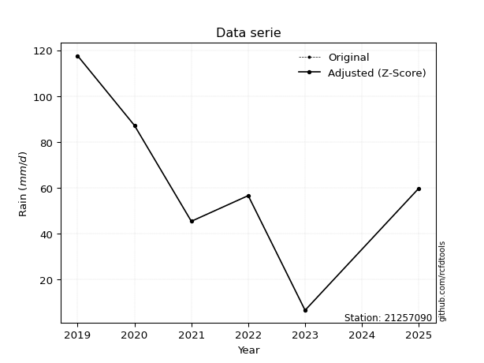</img>

</div>


> The initial value (value_initial) correspond to the initial obtained or null completed value, and value (value) is adjusted only when the initial value is outside the valid range (outlier) definite through the Z-Score value. If Z-Score is active, values out of range or outliers are replaced with the station mean value. A Z-Score (or standard score) measures how many standard deviations a data point is from the mean of a dataset, indicating its relative position; positive scores mean above the mean, negative mean below, and a score of zero is exactly at the mean, allowing for comparison of values from different distributions. It´s calculated using the formula $z=(x–μ)/σ$, where $x$ is the data point, $μ$ is the mean, and $σ$ is the standard deviation, helping identify outliers and understand probability.
>
> <sub>**Note**: In this study, "completing" (filling gaps in) and "extending" (forecasting or lengthening the historical record) rainfall data series are avoided for certain critical analyses because they introduce artificial bias and uncertainty, which can distort the statistics of rare events (extremes), alter day-to-day variability, and compromise the integrity and homogeneity of the original data. Some reasons against Completing/Extending rainfall data are: **Distortion of Extremes and Variability**: The primary issue is that most gap-filling or extension methods rely on averaging or regression with nearby stations, which inherently smooths the data. Rainfall is highly variable in space and time, with a large percentage of zero values and occasional large storms. Infilling methods often underestimate the highest values and overestimate the lowest (zero) values, which severely distorts analyses focused on flood frequency, drought severity, and intensity-duration-frequency (IDF) curves, **Loss of Data Homogeneity**: Infilled or extended data are synthetic estimates, not actual measurements. Combining these estimates with observed data can violate the assumption of data homogeneity, which requires that the data properties do not change over time. Inhomogeneity can lead to incorrect conclusions about long-term trends or changes in climate patterns, **Propagation of Errors**: Errors and biases from the original data (e.g., wind-induced undercatch, instrument errors, site changes) or the data used for imputation can propagate through the analysis, leading to unreliable hydrological models and inaccurate predictions, **Compromised Statistical Integrity**: For statistical analyses, especially those involving the frequency of events, using artificial data can introduce time bias or autocorrelation that doesn´t exist in reality, making it difficult to assess the true probability of events, **Difficulty in Validation**: It is difficult to accurately validate the quality of filled or extended data, especially for past periods where ground-truth measurements are unavailable. The reliability of imputation techniques heavily depends on the density of the surrounding station network and the complexity of the local topography.</sub>


### 4. Active continuous probability distributions from SciPy (44 of 104 available)

A Probability Density Function (PDF) describes the relative likelihood of a continuous random variable falling within a specific range, where the total area under its curve equals 1, and the area over any interval gives the actual probability for that range. Unlike discrete probabilities (like rolling a die), a PDF shows density, not direct probability for a single point (which is zero), with higher points indicating higher likelihood, often visualized as a bell curve for normal distributions.

A log of a probability density function (log-PDF) is simply the logarithm of the PDF´s value, denoted as $log(f(x))$, useful for converting multiplication of probabilities into addition, improving numerical stability with tiny numbers, and connecting to information theory concepts like entropy. Instead of dealing with very small probabilities (e.g., 0.000001), log-PDFs use negative numbers (e.g., $log(0.00001) ≈ -11.51$ that are easier for computers to handle, preventing underflow errors and simplifying complex calculations. In this study, each active probability distribution from SciPy is also evaluated in the $log$ form.

[scipy.stats](https://docs.scipy.org/doc/scipy/reference/stats.html) is a Python´s powerful submodule within the SciPy library for comprehensive statistical analysis, offering over 130 probability distributions (like Normal, Poisson), functions for descriptive stats (mean, variance), hypothesis testing (t-tests, chi-square), random variable generation, and statistical tests, making it essential for data science, modeling, and research. It provides tools to explore, model, and draw conclusions from data efficiently, working seamlessly with NumPy.

<div align="center">

|   id | p_dist             |   n_parameter | fit_method   | label                                                                       | active   | ref                                                                                                        |
|-----:|:-------------------|--------------:|:-------------|:----------------------------------------------------------------------------|:---------|:-----------------------------------------------------------------------------------------------------------|
|    0 | alpha              |             3 | MLE          | Alpha                                                                       | True     | [:mortar_board:](https://docs.scipy.org/doc/scipy/reference/generated/scipy.stats.alpha.html)              |
|    1 | betaprime          |             4 | MLE          | Beta prime                                                                  | True     | [:mortar_board:](https://docs.scipy.org/doc/scipy/reference/generated/scipy.stats.betaprime.html)          |
|    2 | chi2               |             3 | MLE          | Chi²                                                                        | True     | [:mortar_board:](https://docs.scipy.org/doc/scipy/reference/generated/scipy.stats.chi2.html)               |
|    3 | crystalball        |             4 | MLE          | Crystalball                                                                 | True     | [:mortar_board:](https://docs.scipy.org/doc/scipy/reference/generated/scipy.stats.crystalball.html)        |
|    4 | erlang             |             3 | MLE          | Erlang                                                                      | True     | [:mortar_board:](https://docs.scipy.org/doc/scipy/reference/generated/scipy.stats.erlang.html)             |
|    5 | expon              |             2 | MLE          | Exponential                                                                 | True     | [:mortar_board:](https://docs.scipy.org/doc/scipy/reference/generated/scipy.stats.expon.html)              |
|    6 | exponnorm          |             3 | MLE          | Exponentially modified Normal                                               | True     | [:mortar_board:](https://docs.scipy.org/doc/scipy/reference/generated/scipy.stats.exponnorm.html)          |
|    7 | f                  |             4 | MLE          | F                                                                           | True     | [:mortar_board:](https://docs.scipy.org/doc/scipy/reference/generated/scipy.stats.f.html)                  |
|    8 | fatiguelife        |             3 | MLE          | Fatigue-life (Birnbaum-Saunders)                                            | True     | [:mortar_board:](https://docs.scipy.org/doc/scipy/reference/generated/scipy.stats.fatiguelife.html)        |
|    9 | fisk               |             3 | MLE          | Fisk                                                                        | True     | [:mortar_board:](https://docs.scipy.org/doc/scipy/reference/generated/scipy.stats.fisk.html)               |
|   10 | gamma              |             3 | MLE          | Gamma                                                                       | True     | [:mortar_board:](https://docs.scipy.org/doc/scipy/reference/generated/scipy.stats.gamma.html)              |
|   11 | genexpon           |             5 | MLE          | Generalized exponential                                                     | True     | [:mortar_board:](https://docs.scipy.org/doc/scipy/reference/generated/scipy.stats.genexpon.html)           |
|   12 | genlogistic        |             3 | MLE          | Generalized logistic                                                        | True     | [:mortar_board:](https://docs.scipy.org/doc/scipy/reference/generated/scipy.stats.genlogistic.html)        |
|   13 | gibrat             |             2 | MM           | Gibrat                                                                      | True     | [:mortar_board:](https://docs.scipy.org/doc/scipy/reference/generated/scipy.stats.gibrat.html)             |
|   14 | gompertz           |             3 | MLE          | Gompertz (or truncated Gumbel)                                              | True     | [:mortar_board:](https://docs.scipy.org/doc/scipy/reference/generated/scipy.stats.gompertz.html)           |
|   15 | gumbel_l           |             2 | MM           | Gumbel Left Skew                                                            | True     | [:mortar_board:](https://docs.scipy.org/doc/scipy/reference/generated/scipy.stats.gumbel_l.html)           |
|   16 | gumbel_r           |             2 | MM           | Gumbel Right Skew                                                           | True     | [:mortar_board:](https://docs.scipy.org/doc/scipy/reference/generated/scipy.stats.gumbel_r.html)           |
|   17 | halflogistic       |             2 | MM           | Half-logistic                                                               | True     | [:mortar_board:](https://docs.scipy.org/doc/scipy/reference/generated/scipy.stats.halflogistic.html)       |
|   18 | halfnorm           |             2 | MM           | Half Normal                                                                 | True     | [:mortar_board:](https://docs.scipy.org/doc/scipy/reference/generated/scipy.stats.halfnorm.html)           |
|   19 | hypsecant          |             2 | MM           | hyperbolic secant                                                           | True     | [:mortar_board:](https://docs.scipy.org/doc/scipy/reference/generated/scipy.stats.hypsecant.html)          |
|   20 | invgamma           |             3 | MLE          | Inverted gamma                                                              | True     | [:mortar_board:](https://docs.scipy.org/doc/scipy/reference/generated/scipy.stats.invgamma.html)           |
|   21 | invgauss           |             3 | MLE          | Inverse Gaussian                                                            | True     | [:mortar_board:](https://docs.scipy.org/doc/scipy/reference/generated/scipy.stats.invgauss.html)           |
|   22 | invweibull         |             3 | MLE          | Inverted Weibull                                                            | True     | [:mortar_board:](https://docs.scipy.org/doc/scipy/reference/generated/scipy.stats.invweibull.html)         |
|   23 | johnsonsu          |             4 | MLE          | Johnson Su                                                                  | True     | [:mortar_board:](https://docs.scipy.org/doc/scipy/reference/generated/scipy.stats.johnsonsu.html)          |
|   24 | kstwobign          |             2 | MLE          | Limiting distribution of scaled Kolmogorov-Smirnov two-sided test statistic | True     | [:mortar_board:](https://docs.scipy.org/doc/scipy/reference/generated/scipy.stats.kstwobign.html)          |
|   25 | laplace            |             2 | MM           | Laplace                                                                     | True     | [:mortar_board:](https://docs.scipy.org/doc/scipy/reference/generated/scipy.stats.laplace.html)            |
|   26 | laplace_asymmetric |             3 | MLE          | Asymmetric Laplace                                                          | True     | [:mortar_board:](https://docs.scipy.org/doc/scipy/reference/generated/scipy.stats.laplace_asymmetric.html) |
|   27 | loggamma           |             3 | MLE          | Log gamma                                                                   | True     | [:mortar_board:](https://docs.scipy.org/doc/scipy/reference/generated/scipy.stats.loggamma.html)           |
|   28 | logistic           |             2 | MM           | Logistic (or Sech-squared)                                                  | True     | [:mortar_board:](https://docs.scipy.org/doc/scipy/reference/generated/scipy.stats.logistic.html)           |
|   29 | lognorm            |             3 | MLE          | Log Normal                                                                  | True     | [:mortar_board:](https://docs.scipy.org/doc/scipy/reference/generated/scipy.stats.lognorm.html)            |
|   30 | maxwell            |             2 | MM           | Maxwell                                                                     | True     | [:mortar_board:](https://docs.scipy.org/doc/scipy/reference/generated/scipy.stats.maxwell.html)            |
|   31 | mielke             |             4 | MLE          | Mielke Beta-Kappa / Dagum                                                   | True     | [:mortar_board:](https://docs.scipy.org/doc/scipy/reference/generated/scipy.stats.mielke.html)             |
|   32 | moyal              |             2 | MM           | Moyal                                                                       | True     | [:mortar_board:](https://docs.scipy.org/doc/scipy/reference/generated/scipy.stats.moyal.html)              |
|   33 | nakagami           |             3 | MLE          | Nakagami                                                                    | True     | [:mortar_board:](https://docs.scipy.org/doc/scipy/reference/generated/scipy.stats.nakagami.html)           |
|   34 | ncf                |             5 | MLE          | Non-central F distribution                                                  | True     | [:mortar_board:](https://docs.scipy.org/doc/scipy/reference/generated/scipy.stats.ncf.html)                |
|   35 | nct                |             4 | MLE          | Non-central Student’s t                                                     | True     | [:mortar_board:](https://docs.scipy.org/doc/scipy/reference/generated/scipy.stats.nct.html)                |
|   36 | norm               |             2 | MM           | Normal                                                                      | True     | [:mortar_board:](https://docs.scipy.org/doc/scipy/reference/generated/scipy.stats.norm.html)               |
|   37 | pearson3           |             3 | MM           | Pearson type III                                                            | True     | [:mortar_board:](https://docs.scipy.org/doc/scipy/reference/generated/scipy.stats.pearson3.html)           |
|   38 | rayleigh           |             2 | MM           | Rayleigh                                                                    | True     | [:mortar_board:](https://docs.scipy.org/doc/scipy/reference/generated/scipy.stats.rayleigh.html)           |
|   39 | rice               |             3 | MLE          | Rice                                                                        | True     | [:mortar_board:](https://docs.scipy.org/doc/scipy/reference/generated/scipy.stats.rice.html)               |
|   40 | t                  |             3 | MLE          | Student’s t                                                                 | True     | [:mortar_board:](https://docs.scipy.org/doc/scipy/reference/generated/scipy.stats.t.html)                  |
|   41 | truncnorm          |             4 | MLE          | Truncated normal                                                            | True     | [:mortar_board:](https://docs.scipy.org/doc/scipy/reference/generated/scipy.stats.truncnorm.html)          |
|   42 | wald               |             2 | MM           | Wald                                                                        | True     | [:mortar_board:](https://docs.scipy.org/doc/scipy/reference/generated/scipy.stats.wald.html)               |
|   43 | weibull_min        |             3 | MLE          | Weibull minimum                                                             | True     | [:mortar_board:](https://docs.scipy.org/doc/scipy/reference/generated/scipy.stats.weibull_min.html)        |

</div>

> **n_parameter:** # arguments & localization & scale.
>
> **Fit methods:** (MLE) maximum likelihood, (MM) L-moments.
>
>**Inactive** (With the only purpose of prevent loops, zero divisions, infinite values, over high estimated values or horizontal trending for recurrence intervals estimations, the follow distributions were disabled.)**:** foldnorm, gennorm, norminvgauss, powernorm, powerlognorm, skewnorm, genextreme, anglit, arcsine, argus, beta, bradford, burr, burr12, cauchy, cosine, halfcauchy, foldcauchy, skewcauchy, wrapcauchy, dgamma, gengamma, exponweib, exponpow, truncexpon, gausshyper, genhalflogistic, genhyperbolic, geninvgauss, halfgennorm, johnsonsb, kappa4, kappa3, ksone, kstwo, loglaplace, levy, levy_l, levy_stable, ncx2, pareto, genpareto, truncpareto, lomax, powerlaw, rdist, rel_breitwigner, recipinvgauss, semicircular, studentized_range, trapezoid, triang, truncweibull_min, tukeylambda, uniform, loguniform, vonmises, vonmises_line, weibull_max, dweibull, 


## B. Probability (PDF) vs. Empirical (EDF) distributions functions

A continuous probability distribution (CPD) describes probabilities for variables that can take any value within a range (like rain any time), unlike discrete variables with specific outcomes (like temperature). It uses a Probability Density Function (PDF), a curve where the total area under it equals 1, and the probability of the variable falling within an interval (a to b) is found by calculating the area under the curve between those points. A key feature is that the probability of hitting any single exact value is zero, so probabilities are always expressed for ranges, e.g., $P(a ≤ X ≤ b)$.

<div align="center">

Distributions parameters from station values
|    |   station | p_dist                |   n |               loc |            scale | shape                  | shape1                | shape2                | shape3   |
|---:|----------:|:----------------------|----:|------------------:|-----------------:|:-----------------------|:----------------------|:----------------------|:---------|
|  0 |  21257090 | alpha                 |   5 |      -0.0348065   |     14.5341      | 2.0504945090536082e-10 |                       |                       |          |
|  1 |  21257090 | betaprime             |   5 |    -750.875       |  55093.4         | 472.1274812727502      | 31977.19776254194     |                       |          |
|  2 |  21257090 | chi2                  |   5 |       6.6         |      4.86105     | 1.449750277909267      |                       |                       |          |
|  3 |  21257090 | crystalball           |   5 |      62.68        |     37.6775      | 3415.090010175623      | 8183.882460664908     |                       |          |
|  4 |  21257090 | erlang                |   5 |  -14732.2         |      0.0959534   | 154187.8080935335      |                       |                       |          |
|  5 |  21257090 | expon                 |   5 |       6.6         |     56.08        |                        |                       |                       |          |
|  6 |  21257090 | exponnorm             |   5 |      62.6122      |     37.6775      | 0.001797743986321505   |                       |                       |          |
|  7 |  21257090 | f                     |   5 |   -1805.08        |   1867.73        | 4958.214812101367      | 488717.3631381504     |                       |          |
|  8 |  21257090 | fatiguelife           |   5 |       6.6         |      9.26866e-05 | 646.7567894959323      |                       |                       |          |
|  9 |  21257090 | fisk                  |   5 |   -1887.95        |   1950.27        | 86.47283061732126      |                       |                       |          |
| 10 |  21257090 | gamma                 |   5 |  -14729.9         |      0.0959702   | 154137.12659531998     |                       |                       |          |
| 11 |  21257090 | genexpon              |   5 |       6.6         |      2.89993     | 0.05170817174270778    | 1.416570298038411e-08 | 3.824091448138022     |          |
| 12 |  21257090 | genlogistic           |   5 |      33.7571      |     27.5109      | 2.127873910129579      |                       |                       |          |
| 13 |  21257090 | gibrat                |   5 |      33.9368      |     17.4336      |                        |                       |                       |          |
| 14 |  21257090 | gompertz              |   5 |      45.4         |     24.4682      | 0.17393681123115867    |                       |                       |          |
| 15 |  21257090 | gumbel_l              |   5 |      79.6369      |     29.377       |                        |                       |                       |          |
| 16 |  21257090 | gumbel_r              |   5 |      45.7231      |     29.377       |                        |                       |                       |          |
| 17 |  21257090 | halflogistic          |   5 |      18.0234      |     32.2129      |                        |                       |                       |          |
| 18 |  21257090 | halfnorm              |   5 |      12.8097      |     62.5031      |                        |                       |                       |          |
| 19 |  21257090 | hypsecant             |   5 |      62.68        |     23.9862      |                        |                       |                       |          |
| 20 |  21257090 | invgamma              |   5 |    -245.187       |  19357.2         | 63.956201066196684     |                       |                       |          |
| 21 |  21257090 | invgauss              |   5 |     -69.0583      |   1226.89        | 0.10722382651333978    |                       |                       |          |
| 22 |  21257090 | invweibull            |   5 |       6.6         |      6.839       | 0.058508144538678766   |                       |                       |          |
| 23 |  21257090 | johnsonsu             |   5 |      -2.74766e+07 |      2.72644e+08 | -731604.8135608746     | 7271770.040528819     |                       |          |
| 24 |  21257090 | kstwobign             |   5 |     -76.3692      |    158.876       |                        |                       |                       |          |
| 25 |  21257090 | laplace               |   5 |      62.68        |     26.642       |                        |                       |                       |          |
| 26 |  21257090 | laplace_asymmetric    |   5 |      56.6         |     30.1014      | 0.9041022983959245     |                       |                       |          |
| 27 |  21257090 | loggamma              |   5 |   -6294.75        |    976.758       | 671.4492043309024      |                       |                       |          |
| 28 |  21257090 | logistic              |   5 |      62.68        |     20.7727      |                        |                       |                       |          |
| 29 |  21257090 | lognorm               |   5 |       6.6         |      0.02739     | 15.53418845898588      |                       |                       |          |
| 30 |  21257090 | maxwell               |   5 |     -26.5998      |     55.9478      |                        |                       |                       |          |
| 31 |  21257090 | mielke                |   5 |       6.59997     |    113.961       | 0.8646264838394975     | 391.83974522611254    |                       |          |
| 32 |  21257090 | moyal                 |   5 |      41.1336      |     16.9608      |                        |                       |                       |          |
| 33 |  21257090 | nakagami              |   5 |       6.6         |     67.3131      | 0.4621554665933701     |                       |                       |          |
| 34 |  21257090 | ncf                   |   5 |      -0.439159    |     14.1924      | 1.7641194239841855     | 152.05689942622908    | 5.939669437181621     |          |
| 35 |  21257090 | nct                   |   5 |   -2259.96        |     37.6022      | 460032.29675907036     | 61.768463856549715    |                       |          |
| 36 |  21257090 | norm                  |   5 |      62.68        |     37.6775      |                        |                       |                       |          |
| 37 |  21257090 | pearson3              |   5 |      62.68        |     37.6776      | -0.005107540022593376  |                       |                       |          |
| 38 |  21257090 | rayleigh              |   5 |      -9.39925     |     57.5109      |                        |                       |                       |          |
| 39 |  21257090 | rice                  |   5 |     -13.8781      |     44.6249      | 1.286906335448184      |                       |                       |          |
| 40 |  21257090 | t                     |   5 |      62.6801      |     37.6777      | 135883175.2244137      |                       |                       |          |
| 41 |  21257090 | truncnorm             |   5 |      62.68        |     37.6775      | -423.93612141734445    | 62.807794108935354    |                       |          |
| 42 |  21257090 | wald                  |   5 |      25.0025      |     37.6775      |                        |                       |                       |          |
| 43 |  21257090 | weibull_min           |   5 |     -19.1257      |     92.4052      | 2.3408291539619537     |                       |                       |          |
| 44 |  21257090 | logalpha              |   5 |     -22.168       |    625.699       | 24.17014241741273      |                       |                       |          |
| 45 |  21257090 | logbetaprime          |   5 |     -18.4399      |    372.719       | 478.8888332078543      | 8025.919636357892     |                       |          |
| 46 |  21257090 | logchi2               |   5 |       1.88707     |      0.996531    | 1.1960761471274979     |                       |                       |          |
| 47 |  21257090 | logcrystalball        |   5 |       3.79482     |      1.00968     | 45.332408717736485     | 1.204661570560427     |                       |          |
| 48 |  21257090 | logerlang             |   5 |     -13.4111      |      0.06478     | 265.30567593947393     |                       |                       |          |
| 49 |  21257090 | logexpon              |   5 |       1.88707     |      1.90775     |                        |                       |                       |          |
| 50 |  21257090 | logexponnorm          |   5 |       3.79406     |      1.00968     | 0.0007462511617044427  |                       |                       |          |
| 51 |  21257090 | logf                  |   5 |    -235.87        |    239.656       | 116348.92726253904     | 2458747.177410912     |                       |          |
| 52 |  21257090 | logfatiguelife        |   5 |    -804.642       |    808.436       | 0.0012449733758702428  |                       |                       |          |
| 53 |  21257090 | logfisk               |   5 | -158105           | 158109           | 289695.07837144565     |                       |                       |          |
| 54 |  21257090 | loggamma              |   5 |     -12.1087      |      0.0697827   | 227.51327784851503     |                       |                       |          |
| 55 |  21257090 | loggenexpon           |   5 |       1.88687     |      0.00193973  | 0.0004294859611090803  | 0.11876244984572203   | 7.837371760648075e-06 |          |
| 56 |  21257090 | loggenlogistic        |   5 |       4.76734     |      2.77695e-06 | 2.861301437525357e-06  |                       |                       |          |
| 57 |  21257090 | loggibrat             |   5 |       3.02456     |      0.467186    |                        |                       |                       |          |
| 58 |  21257090 | loggompertz           |   5 |       1.88707     |      0.751552    | 0.048031032993890735   |                       |                       |          |
| 59 |  21257090 | loggumbel_l           |   5 |       4.24923     |      0.787243    |                        |                       |                       |          |
| 60 |  21257090 | loggumbel_r           |   5 |       3.34041     |      0.787243    |                        |                       |                       |          |
| 61 |  21257090 | loghalflogistic       |   5 |       2.59813     |      0.863231    |                        |                       |                       |          |
| 62 |  21257090 | loghalfnorm           |   5 |       2.45842     |      1.67493     |                        |                       |                       |          |
| 63 |  21257090 | loghypsecant          |   5 |       3.79482     |      0.642781    |                        |                       |                       |          |
| 64 |  21257090 | loginvgamma           |   5 |     -18.7625      |  10167.5         | 451.8551340686315      |                       |                       |          |
| 65 |  21257090 | loginvgauss           |   5 |      -6.76153     |    995.156       | 0.010612024387203843   |                       |                       |          |
| 66 |  21257090 | loginvweibull         |   5 |  -46271.5         |  46274.8         | 40524.240647706756     |                       |                       |          |
| 67 |  21257090 | logjohnsonsu          |   5 |       4.76729     |      3.0511e-14  | 2.861275535404473      | 0.12535839985224825   |                       |          |
| 68 |  21257090 | logkstwobign          |   5 |      -0.734173    |      5.16268     |                        |                       |                       |          |
| 69 |  21257090 | loglaplace            |   5 |       3.79482     |      0.713951    |                        |                       |                       |          |
| 70 |  21257090 | loglaplace_asymmetric |   5 |       4.03601     |      0.675399    | 1.190349983660654      |                       |                       |          |
| 71 |  21257090 | logloggamma           |   5 |       4.76742     |      6.6347e-06  | 6.759709077148473e-06  |                       |                       |          |
| 72 |  21257090 | loglogistic           |   5 |       3.79482     |      0.556665    |                        |                       |                       |          |
| 73 |  21257090 | loglognorm            |   5 |       1.88707     |      0.001469    | 14.760898493015508     |                       |                       |          |
| 74 |  21257090 | logmaxwell            |   5 |       1.4023      |      1.49929     |                        |                       |                       |          |
| 75 |  21257090 | logmielke             |   5 |      -2.03592e+07 |      2.03592e+07 | 20862187.63679241      | 7070993935.004815     |                       |          |
| 76 |  21257090 | logmoyal              |   5 |       3.21742     |      0.454515    |                        |                       |                       |          |
| 77 |  21257090 | lognakagami           |   5 |       3.81551     |      0.860654    | 0.22847438049589963    |                       |                       |          |
| 78 |  21257090 | logncf                |   5 |      -9.89671     |      0.189842    | 10.639053009119223     | 2145.7095791119064    | 756.2872125969259     |          |
| 79 |  21257090 | lognct                |   5 |     -81.0227      |      1.00577     | 359419.316014822       | 84.33048264476699     |                       |          |
| 80 |  21257090 | lognorm               |   5 |       3.79482     |      1.00968     |                        |                       |                       |          |
| 81 |  21257090 | logpearson3           |   5 |       3.79482     |      1.00968     | -1.108370832790073     |                       |                       |          |
| 82 |  21257090 | lograyleigh           |   5 |       1.86324     |      1.54117     |                        |                       |                       |          |
| 83 |  21257090 | logrice               |   5 |       1.1201      |      1.09        | 2.2089472364488483     |                       |                       |          |
| 84 |  21257090 | logt                  |   5 |       3.79481     |      1.00968     | 187962364.34892413     |                       |                       |          |
| 85 |  21257090 | logtruncnorm          |   5 |      -0.268853    |      1.65059     | 2.4744824243013053     | 3.051129016620198     |                       |          |
| 86 |  21257090 | logwald               |   5 |       2.78518     |      1.00964     |                        |                       |                       |          |
| 87 |  21257090 | logweibull_min        |   5 |      -5.84485e+07 |      5.84485e+07 | 89316041.08497187      |                       |                       |          |

</div>

> **loc** (Location parameter): This shifts the distribution along the x-axis. For many common distributions, like the normal (Gaussian) distribution, loc represents the mean $μ$. For others, like the uniform distribution, it might represent the minimum value, or for the beta distribution, the left end of the support interval.
>
> **scale** (Scale parameter): This determines the width or spread of the distribution. For the normal distribution, scale represents the standard deviation $σ$. For a uniform distribution, it defines the length of the interval (from $loc$ to $loc + scale$).
>
> **shape** (Shape parameters): Refers to parameters that define the specific form of a probability distribution, distinct from its location (loc) and scale (scale). These parameters are required arguments for most distribution functions. For example, a normal (Gaussian) distribution is fully defined by its location (mean) and scale (standard deviation), so it has no specific shape parameters beyond loc and scale. However, other distributions have intrinsic properties that need specification, as Gamma distribution that takes a shape parameter, often named $a$ or $alpha$.


### 0. Cumulative distribution values - CDF (88 evaluated)

Cumulative Distribution Function (CDF), denoted as $F$<sub>$X$</sub>$(x)$, is a function that gives the probability that a random variable $X$ will take a value less than or equal to a specific value, $x$ (i.e., $(P(X≥x)$. It essentially "accumulates" probabilities from a given point up to the far right (positive infinity), providing a complete picture of the distribution´s probabilities for both discrete (like rain) and continuous (like temperature) variables, helping to find probabilities over ranges or above certain values. Each station is evaluated separately ordering the $x$ values ascending, calculating the CDF and PDF values for the activated distributions and their logarithmic forms.

<div align="center">

CDF ordered by x ascending and calculating $log(f(x))$ separately
|   id |   Station |   date |     x |   count |   mean |     std |    zscore |   Value_initial |   station |   m |     alpha |   alpha_pdf |   betaprime |   betaprime_pdf |        chi2 |       chi2_pdf |   crystalball |   crystalball_pdf |   erlang |   erlang_pdf |    expon |   expon_pdf |   exponnorm |   exponnorm_pdf |        f |      f_pdf |   fatiguelife |   fatiguelife_pdf |      fisk |   fisk_pdf |     gamma |   gamma_pdf |    genexpon |   genexpon_pdf |   genlogistic |   genlogistic_pdf |   gibrat |   gibrat_pdf |   gompertz |   gompertz_pdf |   gumbel_l |   gumbel_l_pdf |   gumbel_r |   gumbel_r_pdf |   halflogistic |   halflogistic_pdf |   halfnorm |   halfnorm_pdf |   hypsecant |   hypsecant_pdf |   invgamma |   invgamma_pdf |   invgauss |   invgauss_pdf |   invweibull |   invweibull_pdf |   johnsonsu |   johnsonsu_pdf |   kstwobign |   kstwobign_pdf |   laplace |   laplace_pdf |   laplace_asymmetric |   laplace_asymmetric_pdf |   loggamma |   loggamma_pdf |   logistic |   logistic_pdf |   lognorm |   lognorm_pdf |   maxwell |   maxwell_pdf |      mielke |   mielke_pdf |      moyal |   moyal_pdf |    nakagami |   nakagami_pdf |       ncf |    ncf_pdf |      nct |    nct_pdf |      norm |   norm_pdf |   pearson3 |   pearson3_pdf |   rayleigh |   rayleigh_pdf |      rice |   rice_pdf |         t |      t_pdf |   truncnorm |   truncnorm_pdf |     wald |   wald_pdf |   weibull_min |   weibull_min_pdf |   logalpha |   logalpha_pdf |   logbetaprime |   logbetaprime_pdf |     logchi2 |    logchi2_pdf |   logcrystalball |   logcrystalball_pdf |   logerlang |   logerlang_pdf |   logexpon |   logexpon_pdf |   logexponnorm |   logexponnorm_pdf |     logf |   logf_pdf |   logfatiguelife |   logfatiguelife_pdf |   logfisk |   logfisk_pdf |   loggenexpon |   loggenexpon_pdf |   loggenlogistic |   loggenlogistic_pdf |   loggibrat |   loggibrat_pdf |   loggompertz |   loggompertz_pdf |   loggumbel_l |   loggumbel_l_pdf |   loggumbel_r |   loggumbel_r_pdf |   loghalflogistic |   loghalflogistic_pdf |   loghalfnorm |   loghalfnorm_pdf |   loghypsecant |   loghypsecant_pdf |   loginvgamma |   loginvgamma_pdf |   loginvgauss |   loginvgauss_pdf |   loginvweibull |   loginvweibull_pdf |   logjohnsonsu |   logjohnsonsu_pdf |   logkstwobign |   logkstwobign_pdf |   loglaplace |   loglaplace_pdf |   loglaplace_asymmetric |   loglaplace_asymmetric_pdf |   logloggamma |   logloggamma_pdf |   loglogistic |   loglogistic_pdf |   loglognorm |   loglognorm_pdf |   logmaxwell |   logmaxwell_pdf |   logmielke |   logmielke_pdf |    logmoyal |   logmoyal_pdf |   lognakagami |   lognakagami_pdf |    logncf |   logncf_pdf |    lognct |   lognct_pdf |   logpearson3 |   logpearson3_pdf |   lograyleigh |   lograyleigh_pdf |   logrice |   logrice_pdf |      logt |   logt_pdf |   logtruncnorm |   logtruncnorm_pdf |   logwald |   logwald_pdf |   logweibull_min |   logweibull_min_pdf |
|-----:|----------:|-------:|------:|--------:|-------:|--------:|----------:|----------------:|----------:|----:|----------:|------------:|------------:|----------------:|------------:|---------------:|--------------:|------------------:|---------:|-------------:|---------:|------------:|------------:|----------------:|---------:|-----------:|--------------:|------------------:|----------:|-----------:|----------:|------------:|------------:|---------------:|--------------:|------------------:|---------:|-------------:|-----------:|---------------:|-----------:|---------------:|-----------:|---------------:|---------------:|-------------------:|-----------:|---------------:|------------:|----------------:|-----------:|---------------:|-----------:|---------------:|-------------:|-----------------:|------------:|----------------:|------------:|----------------:|----------:|--------------:|---------------------:|-------------------------:|-----------:|---------------:|-----------:|---------------:|----------:|--------------:|----------:|--------------:|------------:|-------------:|-----------:|------------:|------------:|---------------:|----------:|-----------:|---------:|-----------:|----------:|-----------:|-----------:|---------------:|-----------:|---------------:|----------:|-----------:|----------:|-----------:|------------:|----------------:|---------:|-----------:|--------------:|------------------:|-----------:|---------------:|---------------:|-------------------:|------------:|---------------:|-----------------:|---------------------:|------------:|----------------:|-----------:|---------------:|---------------:|-------------------:|---------:|-----------:|-----------------:|---------------------:|----------:|--------------:|--------------:|------------------:|-----------------:|---------------------:|------------:|----------------:|--------------:|------------------:|--------------:|------------------:|--------------:|------------------:|------------------:|----------------------:|--------------:|------------------:|---------------:|-------------------:|--------------:|------------------:|--------------:|------------------:|----------------:|--------------------:|---------------:|-------------------:|---------------:|-------------------:|-------------:|-----------------:|------------------------:|----------------------------:|--------------:|------------------:|--------------:|------------------:|-------------:|-----------------:|-------------:|-----------------:|------------:|----------------:|------------:|---------------:|--------------:|------------------:|----------:|-------------:|----------:|-------------:|--------------:|------------------:|--------------:|------------------:|----------:|--------------:|----------:|-----------:|---------------:|-------------------:|----------:|--------------:|-----------------:|---------------------:|
|    0 |  21257090 |   2023 |   6.6 |       5 |  62.68 | 42.1247 | -1.33128  |             6.6 |  21257090 |   1 | 0.0284824 |  0.0239145  |   0.0662224 |      0.00357979 | 2.58696e-12 | 2111.31        |     0.0683199 |        0.00349752 | 0.068186 |   0.00350106 | 0        |  0.0178317  |   0.0683203 |      0.00349753 | 0.067413 | 0.00353116 |     0.0728115 |       9.62219e+08 | 0.0754044 | 0.00318216 | 0.0681863 |  0.00350103 | 2.42378e-08 |     0.0178308  |     0.0623816 |        0.00351513 | 0        |   0          | 0          |     0          |  0.0798572 |     0.00260681 |  0.0226476 |     0.00292005 |       0        |         0          |   0        |     0          |   0.0612566 |      0.00253809 |  0.0594534 |     0.00399621 |  0.0577583 |     0.00491301 |  0.000203189 |      1.1379e+11  |   0.0683495 |      0.00349814 |   0.0520744 |      0.0050508  | 0.0609261 |    0.00228684 |            0.0716279 |               0.00263195 |  0.0328597 |       0.075834 |  0.0629912 |     0.00284139 | 0.0294151 |     0.0662977 | 0.0500567 |    0.00421112 | 2.32575e-06 |   0.0578218  | 0.00564425 |  0.00141297 | 1.97625e-16 |     0.205665   | 0.0381405 | 0.00644604 | 0.068335 | 0.00349856 | 0.0683199 | 0.00349752 |  0.0684564 |     0.00349406 |  0.0379571 |     0.00465365 | 0.0455598 | 0.00440408 | 0.0683205 | 0.00349753 |   0.0683199 |      0.00349752 | 0        | 0          |      0.048891 |        0.00433812 |  0.0328132 |      0.0792349 |      0.0305878 |          0.0704155 | 3.22445e-10 | 868448         |         0.029415 |            0.0662976 |   0.0329546 |       0.0753365 |   0        |       0.524178 |      0.0294159 |          0.0662988 | 0.030683 |  0.0685525 |        0.0288879 |            0.0656715 | 0.0215325 |      0.038604 |   4.52188e-05 |          0.221456 |         0        |             0.05298  |    0        |       0         |    3.0913e-10 |         0.0639091 |     0.0485423 |         0.0601398 |    0.00177291 |          0.014267 |          0        |              0        |      0        |          0        |      0.0326987 |          0.0507813 |     0.0308847 |         0.0738448 |     0.0291546 |         0.0750573 |       0.0350692 |            0.102899 |       0.103931 |        0.00785571  |      0.0412145 |           0.134771 |    0.0345535 |        0.0483976 |               0.0404802 |                   0.0503509 |     0.0531512 |         0.0541527 |     0.0314591 |         0.0547357 |     0.022755 |      1.64758e+13 |   0.00871334 |        0.0528021 |   0.0516236 |       0.0528989 | 1.55342e-05 |    0.000334678 |   0           |       0           | 0.0322513 |    0.0742684 | 0.0295442 |    0.0664984 |     0.0503787 |         0.0641054 |   0.000119502 |         0.0100303 |  0.025228 |     0.0747633 | 0.0294155 |  0.0662985 |    0           |           0        |  0        |      0        |        0.0274076 |            0.0413028 |
|    1 |  21257090 |   2021 |  45.4 |       5 |  62.68 | 42.1247 | -0.41021  |            45.4 |  21257090 |   2 | 0.749053  |  0.00533739 |   0.328865  |      0.00972862 | 0.990522    |    0.00103075  |     0.32325   |        0.00953132 | 0.323495 |   0.00954166 | 0.49936  |  0.00892724 |   0.323251  |      0.00953131 | 0.325507 | 0.00961231 |     0.841437  |       0.00311819  | 0.320073  | 0.00973376 | 0.323492  |  0.00954151 | 0.499344    |     0.00892711 |     0.342341  |        0.010479   | 0.337513 |   0.0318738  | 4.3912e-09 |     0.0071087  |  0.267864  |     0.00777041 |  0.363833  |     0.0125219  |       0.401077 |         0.0130249  |   0.397925 |     0.011143   |   0.288281  |      0.0104417  |  0.355916  |     0.0103913  |  0.393308  |     0.0104242  |  0.405178    |      0.000551981 |   0.323273  |      0.00953011 |   0.40043   |      0.010524   | 0.261389  |    0.00981115 |            0.298026  |               0.0109509  |  0.526863  |       0.377356 |  0.303252  |     0.0101715  | 0.508177  |     0.395035  | 0.353271  |    0.0103188  | 0.393931    |   0.00877841 | 0.377877   |  0.0140601  | 0.452949    |     0.00970471 | 0.414582  | 0.0104182  | 0.323313 | 0.00953201 | 0.32325   | 0.00953132 |  0.32301   |     0.00952094 |  0.364893  |     0.0105226  | 0.345579  | 0.0100933  | 0.32325   | 0.00953127 |   0.32325   |      0.00953132 | 0.400209 | 0.0218885  |      0.350423 |        0.0101668  |  0.535668  |      0.368247  |      0.511679  |          0.38096   | 0.795372    |      0.129346  |         0.508177 |            0.395036  |   0.523314  |       0.376819  |   0.63609  |       0.190754 |      0.508178  |          0.395034  | 0.512282 |  0.392107  |        0.508325  |            0.396277  | 0.429718  |      0.449013 |   0.58767     |          0.28726  |         0        |             0.386425 |    0.700733 |       0.4391    |    0.438417   |         0.467039  |     0.438091  |         0.411427  |    0.578746   |          0.40205  |          0.607615 |              0.365374 |      0.582197 |          0.343075 |      0.510247  |          0.494951  |     0.522437  |         0.374559  |     0.526508  |         0.365814  |       0.538506  |            0.291888 |       0.131216 |        0.0280426   |      0.580886  |           0.277971 |    0.514285  |        0.68032   |               0.445629  |                   0.554292  |     0.379146  |         0.386289  |     0.509293  |         0.448948  |     0.686663 |      0.0124513   |   0.540882   |        0.377492  |   0.372435  |       0.381636  | 0.604519    |    0.397532    |   8.09846e-08 |       8.33297e+07 | 0.515554  |    0.371957  | 0.508312  |    0.394618  |     0.434283  |         0.389507  |   0.551711    |         0.368464  |  0.517094 |     0.383688  | 0.50818   |  0.395036  |    1.70011e-06 |           2.04558  |  0.676151 |      0.383214 |        0.410987  |            0.476418  |
|    2 |  21257090 |   2022 |  56.6 |       5 |  62.68 | 42.1247 | -0.144333 |            56.6 |  21257090 |   3 | 0.797466  |  0.00349832 |   0.443072  |      0.0105224  | 0.997177    |    0.000303766 |     0.435901  |        0.0104514  | 0.43623  |   0.0104556  | 0.589994 |  0.00731109 |   0.435902  |      0.0104514  | 0.438792 | 0.0104796  |     0.871943  |       0.00237741  | 0.436854  | 0.01094    | 0.436225  |  0.0104554  | 0.589977    |     0.00731105 |     0.463078  |        0.0108734  | 0.603471 |   0.0170076  | 0.0960393  |     0.0101562  |  0.366499  |     0.00984406 |  0.501295  |     0.0117839  |       0.536177 |         0.0110594  |   0.516453 |     0.00998737 |   0.420166  |      0.0128553  |  0.474138  |     0.0105552  |  0.507384  |     0.00982361 |  0.410605    |      0.000427682 |   0.435908  |      0.0104498  |   0.514627  |      0.0097629  | 0.397978  |    0.014938   |            0.449764  |               0.0165265  |  0.608523  |       0.360812 |  0.427345  |     0.0117809  | 0.594401  |     0.384004  | 0.470305  |    0.0104381  | 0.49051     |   0.00848216 | 0.52618    |  0.0121957  | 0.555518    |     0.00860183 | 0.526253  | 0.0094459  | 0.435967 | 0.0104512  | 0.435901  | 0.0104514  |  0.435575  |     0.0104471  |  0.482366  |     0.0103291  | 0.46082   | 0.0103603  | 0.4359    | 0.0104513  |   0.435901  |      0.0104514  | 0.595099 | 0.0135747  |      0.466086 |        0.0103568  |  0.614916  |      0.348342  |      0.594524  |          0.367813  | 0.821792    |      0.110868  |         0.594401 |            0.384004  |   0.604963  |       0.361249  |   0.675811 |       0.169933 |      0.594402  |          0.384002  | 0.597756 |  0.380212  |        0.5948    |            0.385014  | 0.530214  |      0.45639  |   0.648488    |          0.263906 |         0        |             0.484992 |    0.780065 |       0.292692  |    0.546204   |         0.506078  |     0.533613  |         0.45187   |    0.661466   |          0.347264 |          0.682003 |              0.309808 |      0.653748 |          0.305705 |      0.616732  |          0.462279  |     0.603447  |         0.357803  |     0.605284  |         0.346574  |       0.600333  |            0.26826  |       0.138381 |        0.0378539   |      0.639507  |           0.25343  |    0.643341  |        0.499557  |               0.586252  |                   0.729204  |     0.474647  |         0.483591  |     0.606657  |         0.428668  |     0.689258 |      0.0111336   |   0.621413   |        0.351036  |   0.466849  |       0.478383  | 0.684477    |    0.328411    |   0.419259    |       0.858307    | 0.596256  |    0.357616  | 0.594442  |    0.383572  |     0.524874  |         0.430241  |   0.629828    |         0.338621  |  0.600465 |     0.369856  | 0.594404  |  0.384004  |    0.383029    |           1.45674  |  0.74854  |      0.280025 |        0.523544  |            0.539784  |
|    3 |  21257090 |   2020 |  87.2 |       5 |  62.68 | 42.1247 |  0.582081 |            87.2 |  21257090 |   4 | 0.867678  |  0.00150286 |   0.746015  |      0.00832697 | 0.999892    |    1.14435e-05 |     0.742408  |        0.00856764 | 0.742567 |   0.00855538 | 0.762416 |  0.00423653 |   0.742408  |      0.00856763 | 0.743738 | 0.00846433 |     0.925326  |       0.00126193  | 0.749553  | 0.00821861 | 0.74256   |  0.0085554  | 0.7624      |     0.00423661 |     0.752001  |        0.00729162 | 0.86797  |   0.00401445 | 0.544409   |     0.0178768  |  0.725726  |     0.0120778  |  0.783735  |     0.00650113 |       0.790866 |         0.00581336 |   0.766026 |     0.00628696 |   0.780135  |      0.00845463 |  0.756678  |     0.00730261 |  0.7559    |     0.00622895 |  0.420799    |      0.000264407 |   0.742372  |      0.00856691 |   0.760331  |      0.00618009 | 0.80081   |    0.00747652 |            0.780518  |               0.00659219 |  0.751086  |       0.292642 |  0.765019  |     0.00865391 | 0.747592  |     0.31633   | 0.752985  |    0.0074554  | 0.74121     |   0.00795123 | 0.797049   |  0.00585221 | 0.771185    |     0.00551911 | 0.760347  | 0.00582154 | 0.742435 | 0.00856582 | 0.742408  | 0.00856764 |  0.742249  |     0.00857987 |  0.756013  |     0.00712589 | 0.748387  | 0.00777115 | 0.742406  | 0.00856763 |   0.742408  |      0.00856764 | 0.838205 | 0.00439117 |      0.750637 |        0.00762461 |  0.75162   |      0.279281  |      0.741018  |          0.303021  | 0.86333     |      0.0829161 |         0.747593 |            0.31633   |   0.748059  |       0.294521  |   0.74153  |       0.135484 |      0.747593  |          0.316328  | 0.749207 |  0.312413  |        0.748278  |            0.316616  | 0.713592  |      0.374472 |   0.751642    |          0.212762 |         0        |             0.75707  |    0.870382 |       0.146237  |    0.76344    |         0.468864  |     0.73305   |         0.44784   |    0.787659   |          0.238816 |          0.794377 |              0.213712 |      0.76983  |          0.231895 |      0.785228  |          0.309348  |     0.744885  |         0.290779  |     0.741707  |         0.279932  |       0.705051  |            0.215779 |       0.164645 |        0.103899    |      0.738151  |           0.203049 |    0.805307  |        0.272698  |               0.806836  |                   0.340439  |     0.737238  |         0.751129  |     0.770243  |         0.317909  |     0.693628 |      0.00921199  |   0.757494   |        0.275023  |   0.726966  |       0.744925  | 0.800579    |    0.214751    |   0.674047    |       0.423785    | 0.738518  |    0.294452  | 0.747469  |    0.316031  |     0.719423  |         0.453122  |   0.760324    |         0.26286   |  0.747524 |     0.303512  | 0.747595  |  0.316328  |    0.834944    |           0.71107  |  0.840853 |      0.160663 |        0.761897  |            0.522142  |
|    4 |  21257090 |   2019 | 117.6 |       5 |  62.68 | 42.1247 |  1.30375  |           117.6 |  21257090 |   5 | 0.90167   |  0.00083165 |   0.92542   |      0.00357579 | 0.999996    |    4.59543e-07 |     0.927529  |        0.00365979 | 0.927398 |   0.00365581 | 0.861836 |  0.00246369 |   0.927529  |      0.00365979 | 0.926457 | 0.00362731 |     0.954681  |       0.000726564 | 0.918115  | 0.0032415  | 0.927393  |  0.00365594 | 0.861823    |     0.0024638  |     0.906024  |        0.00317594 | 0.941606 |   0.00139387 | 0.957228   |     0.00581377 |  0.973775  |     0.00325035 |  0.917064  |     0.00270272 |       0.913057 |         0.00258169 |   0.906372 |     0.0031309  |   0.935728  |      0.00266136 |  0.913764  |     0.00326587 |  0.893839  |     0.0030782  |  0.42761     |      0.000191482 |   0.927497  |      0.00366048 |   0.898542  |      0.00311741 | 0.936363  |    0.00238861 |            0.911924  |               0.00264538 |  0.829538  |       0.231224 |  0.933631  |     0.00298295 | 0.832264  |     0.248478  | 0.915809  |    0.00341991 | 0.977493    |   0.00761386 | 0.91641    |  0.00245517 | 0.898208    |     0.00297397 | 0.890685  | 0.00296956 | 0.927517 | 0.00365927 | 0.927529  | 0.00365979 |  0.927661  |     0.00366377 |  0.912683  |     0.00335273 | 0.91898   | 0.00355199 | 0.927528  | 0.00365983 |   0.927529  |      0.00365979 | 0.925046 | 0.0017837  |      0.918085 |        0.00350899 |  0.826502  |      0.221098  |      0.822564  |          0.24121   | 0.885861    |      0.0682855 |         0.832265 |            0.248478  |   0.827144  |       0.23349   |   0.779035 |       0.115825 |      0.832264  |          0.248477  | 0.832831 |  0.245485  |        0.832962  |            0.2483    | 0.811669  |      0.280082 |   0.80987     |          0.176792 |         0.999946 |             1.03032  |    0.905993 |       0.0962361 |    0.885781   |         0.337037  |     0.855007  |         0.355661  |    0.849383   |          0.17613  |          0.850074 |              0.16066  |      0.831947 |          0.18421  |      0.861977  |          0.208061  |     0.823024  |         0.231068  |     0.817077  |         0.223683  |       0.764176  |            0.179984 |       0.997586 |        2.91614e+10 |      0.793828  |           0.16966  |    0.871939  |        0.17937   |               0.885975  |                   0.200963  |     0.999875  |         1.01872   |     0.851569  |         0.227065  |     0.69623  |      0.0082242   |   0.830914   |        0.215982  |   0.987631  |       0.997133  | 0.855757    |    0.156937    |   0.780648    |       0.297781    | 0.817971  |    0.235955  | 0.832075  |    0.248343  |     0.847686  |         0.391555  |   0.830569    |         0.207154  |  0.829018 |     0.240338  | 0.832266  |  0.248476  |    0.999987    |           0.415853 |  0.881345 |      0.11342  |        0.896326  |            0.359073  |


</div>

An Empirical Distribution Function (EDF) is a step-function estimate of a true cumulative distribution function (CDF) based on observed sample data, representing the proportion of data points less than or equal to a given value. It is calculated by ordering your data and jumping up by $1/n$ (where $n$ is sample size) at each unique data point, allowing analysis without assuming an underlying population distribution, and it gets closer to the true CDF as the sample size grows. For the empirical probability calculations, the parameter $m$ correspond to the order number which means the position of the $x$ values in an ascending order list.

The Kolmogorov-Smirnov (K-S) test is a non-parametric statistical test used to determine if a sample data set comes from a specific theoretical distribution (one-sample) or if two different samples come from the same underlying distribution (two-sample), by comparing their cumulative distribution functions (CDFs). It calculates the maximum vertical difference (D statistic) between these functions, with a small p-value indicating a significant difference and rejection of the null hypothesis (that the data/samples match).


### 1. EDF California (1923)

California´s estimates the true probability distribution of water-related data (like rainfall, streamflow) using observed samples, crucial for risk assessment.

<div align="center">


$P=m/n$


</div>


**1.1. Empirical values**

<div align="center">

|                | 0              | 1                  | 2              | 3                 | 4              |
|:---------------|:---------------|:-------------------|:---------------|:------------------|:---------------|
| date           | 2023           | 2021               | 2022           | 2020              | 2019           |
| x              | 6.6            | 45.4               | 56.6           | 87.2              | 117.6          |
| m              | 1              | 2                  | 3              | 4                 | 5              |
| empirical_dist | edf_california | edf_california     | edf_california | edf_california    | edf_california |
| empirical      | 0.2            | 0.4                | 0.6            | 0.8               | 1.0            |
| empirical_tr   | 1.25           | 1.6666666666666667 | 2.5            | 5.000000000000001 | inf            |

</div>


**1.2. Kolmogorov-Smirnov fit test (sorted by Δ)**


<div align="center">

|                | 0                  | 1                  | 2                   | 3                   | 4                  | 5                   | 6                   | 7                  | 8                  | 9                  | 10                 | 11                  | 12                  | 13                    | 14                  | 15                  | 16                  | 17                  | 18                  | 19                  | 20                  | 21                  | 22                  | 23                  | 24                  | 25                  | 26                  | 27                  | 28                 | 29                  | 30                 | 31                  | 32                  | 33                  | 34                  | 35                  | 36                  | 37                  | 38                  | 39                  | 40                 | 41                  | 42                  | 43                  | 44                  | 45                 | 46                 | 47                  | 48                  | 49                  | 50                 | 51                 | 52                  | 53                  | 54                  | 55                  | 56                  | 57                  | 58                  | 59                  | 60                  | 61                  | 62                 | 63                 | 64                 | 65                 | 66                 | 67                 | 68                  | 69                  | 70                  | 71                 | 72                  | 73                 | 74                  | 75                  | 76                 | 77                  | 78                 | 79                  | 80                 | 81                 | 82                  | 83                 | 84                 | 85                 | 86                 | 87                 |
|:---------------|:-------------------|:-------------------|:--------------------|:--------------------|:-------------------|:--------------------|:--------------------|:-------------------|:-------------------|:-------------------|:-------------------|:--------------------|:--------------------|:----------------------|:--------------------|:--------------------|:--------------------|:--------------------|:--------------------|:--------------------|:--------------------|:--------------------|:--------------------|:--------------------|:--------------------|:--------------------|:--------------------|:--------------------|:-------------------|:--------------------|:-------------------|:--------------------|:--------------------|:--------------------|:--------------------|:--------------------|:--------------------|:--------------------|:--------------------|:--------------------|:-------------------|:--------------------|:--------------------|:--------------------|:--------------------|:-------------------|:-------------------|:--------------------|:--------------------|:--------------------|:-------------------|:-------------------|:--------------------|:--------------------|:--------------------|:--------------------|:--------------------|:--------------------|:--------------------|:--------------------|:--------------------|:--------------------|:-------------------|:-------------------|:-------------------|:-------------------|:-------------------|:-------------------|:--------------------|:--------------------|:--------------------|:-------------------|:--------------------|:-------------------|:--------------------|:--------------------|:-------------------|:--------------------|:-------------------|:--------------------|:-------------------|:-------------------|:--------------------|:-------------------|:-------------------|:-------------------|:-------------------|:-------------------|
| station        | 21257090           | 21257090           | 21257090            | 21257090            | 21257090           | 21257090            | 21257090            | 21257090           | 21257090           | 21257090           | 21257090           | 21257090            | 21257090            | 21257090              | 21257090            | 21257090            | 21257090            | 21257090            | 21257090            | 21257090            | 21257090            | 21257090            | 21257090            | 21257090            | 21257090            | 21257090            | 21257090            | 21257090            | 21257090           | 21257090            | 21257090           | 21257090            | 21257090            | 21257090            | 21257090            | 21257090            | 21257090            | 21257090            | 21257090            | 21257090            | 21257090           | 21257090            | 21257090            | 21257090            | 21257090            | 21257090           | 21257090           | 21257090            | 21257090            | 21257090            | 21257090           | 21257090           | 21257090            | 21257090            | 21257090            | 21257090            | 21257090            | 21257090            | 21257090            | 21257090            | 21257090            | 21257090            | 21257090           | 21257090           | 21257090           | 21257090           | 21257090           | 21257090           | 21257090            | 21257090            | 21257090            | 21257090           | 21257090            | 21257090           | 21257090            | 21257090            | 21257090           | 21257090            | 21257090           | 21257090            | 21257090           | 21257090           | 21257090            | 21257090           | 21257090           | 21257090           | 21257090           | 21257090           |
| empirical_dist | edf_california     | edf_california     | edf_california      | edf_california      | edf_california     | edf_california      | edf_california      | edf_california     | edf_california     | edf_california     | edf_california     | edf_california      | edf_california      | edf_california        | edf_california      | edf_california      | edf_california      | edf_california      | edf_california      | edf_california      | edf_california      | edf_california      | edf_california      | edf_california      | edf_california      | edf_california      | edf_california      | edf_california      | edf_california     | edf_california      | edf_california     | edf_california      | edf_california      | edf_california      | edf_california      | edf_california      | edf_california      | edf_california      | edf_california      | edf_california      | edf_california     | edf_california      | edf_california      | edf_california      | edf_california      | edf_california     | edf_california     | edf_california      | edf_california      | edf_california      | edf_california     | edf_california     | edf_california      | edf_california      | edf_california      | edf_california      | edf_california      | edf_california      | edf_california      | edf_california      | edf_california      | edf_california      | edf_california     | edf_california     | edf_california     | edf_california     | edf_california     | edf_california     | edf_california      | edf_california      | edf_california      | edf_california     | edf_california      | edf_california     | edf_california      | edf_california      | edf_california     | edf_california      | edf_california     | edf_california      | edf_california     | edf_california     | edf_california      | edf_california     | edf_california     | edf_california     | edf_california     | edf_california     |
| p_dist         | genlogistic        | invgamma           | invgauss            | logloggamma         | kstwobign          | logmielke           | maxwell             | laplace_asymmetric | weibull_min        | loggumbel_l        | logpearson3        | rice                | betaprime           | loglaplace_asymmetric | f                   | ncf                 | rayleigh            | fisk                | erlang              | gamma               | nct                 | johnsonsu           | exponnorm           | truncnorm           | norm                | crystalball         | t                   | pearson3            | loglaplace         | loghypsecant        | loglogistic        | logf                | lognct              | loggamma            | loggamma            | logexponnorm        | logt                | lognorm             | lognorm             | logcrystalball      | logfatiguelife     | logweibull_min      | logistic            | logerlang           | logalpha            | logrice            | loginvgamma        | gumbel_r            | logbetaprime        | hypsecant           | logncf             | loginvgauss        | logfisk             | logmaxwell          | moyal               | loggumbel_r         | lograyleigh         | loggenexpon         | mielke              | genexpon            | loggompertz         | nakagami            | halflogistic       | gibrat             | halfnorm           | loghalfnorm        | wald               | expon              | laplace             | logmoyal            | logkstwobign        | loghalflogistic    | gumbel_l            | loginvweibull      | logexpon            | logwald             | loggibrat          | loglognorm          | alpha              | logchi2             | logtruncnorm       | lognakagami        | fatiguelife         | gompertz           | invweibull         | chi2               | logjohnsonsu       | loggenlogistic     |
| delta          | 0.1376183869222576 | 0.1405466034053407 | 0.14224172415678343 | 0.14684876463663835 | 0.1479256444344179 | 0.14837638158623118 | 0.14994332078978623 | 0.1502363093136948 | 0.1511090395283648 | 0.1514576658708423 | 0.1523142300118293 | 0.15444023917117508 | 0.15692758568895893 | 0.15951981031184218   | 0.16120771781389415 | 0.16185953981057977 | 0.16204291979670524 | 0.16314569324671302 | 0.16376959506172034 | 0.16377458598131744 | 0.16403282612634562 | 0.16409198281202997 | 0.16409841608017822 | 0.16409879079980183 | 0.16409882238082618 | 0.16409883372349315 | 0.16409972753522162 | 0.16442470241517565 | 0.1654465187338587 | 0.16730127782164753 | 0.168540860786041  | 0.16931700849368775 | 0.17045580813943556 | 0.17046239227988902 | 0.17046239227988902 | 0.17058414133945574 | 0.17058451703656477 | 0.17058488335207708 | 0.17058488335207708 | 0.17058500296423207 | 0.1711120813005173 | 0.17259237026757215 | 0.17265504373893825 | 0.17285567270847324 | 0.17349823346457816 | 0.1747719744459335 | 0.1769757712174196 | 0.17735239755632115 | 0.17743571014549409 | 0.17983437627312476 | 0.1820286244107141 | 0.1829231289560722 | 0.18833135893610675 | 0.19128665770045009 | 0.19435575116219408 | 0.19822708974916672 | 0.19988049772982455 | 0.19995478116466653 | 0.19999767424666443 | 0.19999997576219508 | 0.19999999969087026 | 0.19999999999999982 | 0.2                | 0.2                | 0.2                | 0.2                | 0.2                | 0.2                | 0.20202184955374825 | 0.20451888225338855 | 0.20617168255761742 | 0.2076154051005743 | 0.23350093167626157 | 0.2358240529059158 | 0.23608975532884113 | 0.27615139129843425 | 0.3007330353063512 | 0.30376955503434355 | 0.3490530470339426 | 0.39537153368945277 | 0.3999982998913771 | 0.3999999190153946 | 0.44143690651590084 | 0.5039607196861408 | 0.5723900670542119 | 0.5905220646045222 | 0.635354999476728  | 0.8                |
| deltao         | 0.5865427407550001 | 0.5865427407550001 | 0.5865427407550001  | 0.5865427407550001  | 0.5865427407550001 | 0.5865427407550001  | 0.5865427407550001  | 0.5865427407550001 | 0.5865427407550001 | 0.5865427407550001 | 0.5865427407550001 | 0.5865427407550001  | 0.5865427407550001  | 0.5865427407550001    | 0.5865427407550001  | 0.5865427407550001  | 0.5865427407550001  | 0.5865427407550001  | 0.5865427407550001  | 0.5865427407550001  | 0.5865427407550001  | 0.5865427407550001  | 0.5865427407550001  | 0.5865427407550001  | 0.5865427407550001  | 0.5865427407550001  | 0.5865427407550001  | 0.5865427407550001  | 0.5865427407550001 | 0.5865427407550001  | 0.5865427407550001 | 0.5865427407550001  | 0.5865427407550001  | 0.5865427407550001  | 0.5865427407550001  | 0.5865427407550001  | 0.5865427407550001  | 0.5865427407550001  | 0.5865427407550001  | 0.5865427407550001  | 0.5865427407550001 | 0.5865427407550001  | 0.5865427407550001  | 0.5865427407550001  | 0.5865427407550001  | 0.5865427407550001 | 0.5865427407550001 | 0.5865427407550001  | 0.5865427407550001  | 0.5865427407550001  | 0.5865427407550001 | 0.5865427407550001 | 0.5865427407550001  | 0.5865427407550001  | 0.5865427407550001  | 0.5865427407550001  | 0.5865427407550001  | 0.5865427407550001  | 0.5865427407550001  | 0.5865427407550001  | 0.5865427407550001  | 0.5865427407550001  | 0.5865427407550001 | 0.5865427407550001 | 0.5865427407550001 | 0.5865427407550001 | 0.5865427407550001 | 0.5865427407550001 | 0.5865427407550001  | 0.5865427407550001  | 0.5865427407550001  | 0.5865427407550001 | 0.5865427407550001  | 0.5865427407550001 | 0.5865427407550001  | 0.5865427407550001  | 0.5865427407550001 | 0.5865427407550001  | 0.5865427407550001 | 0.5865427407550001  | 0.5865427407550001 | 0.5865427407550001 | 0.5865427407550001  | 0.5865427407550001 | 0.5865427407550001 | 0.5865427407550001 | 0.5865427407550001 | 0.5865427407550001 |
| eval           | Δo > Δ             | Δo > Δ             | Δo > Δ              | Δo > Δ              | Δo > Δ             | Δo > Δ              | Δo > Δ              | Δo > Δ             | Δo > Δ             | Δo > Δ             | Δo > Δ             | Δo > Δ              | Δo > Δ              | Δo > Δ                | Δo > Δ              | Δo > Δ              | Δo > Δ              | Δo > Δ              | Δo > Δ              | Δo > Δ              | Δo > Δ              | Δo > Δ              | Δo > Δ              | Δo > Δ              | Δo > Δ              | Δo > Δ              | Δo > Δ              | Δo > Δ              | Δo > Δ             | Δo > Δ              | Δo > Δ             | Δo > Δ              | Δo > Δ              | Δo > Δ              | Δo > Δ              | Δo > Δ              | Δo > Δ              | Δo > Δ              | Δo > Δ              | Δo > Δ              | Δo > Δ             | Δo > Δ              | Δo > Δ              | Δo > Δ              | Δo > Δ              | Δo > Δ             | Δo > Δ             | Δo > Δ              | Δo > Δ              | Δo > Δ              | Δo > Δ             | Δo > Δ             | Δo > Δ              | Δo > Δ              | Δo > Δ              | Δo > Δ              | Δo > Δ              | Δo > Δ              | Δo > Δ              | Δo > Δ              | Δo > Δ              | Δo > Δ              | Δo > Δ             | Δo > Δ             | Δo > Δ             | Δo > Δ             | Δo > Δ             | Δo > Δ             | Δo > Δ              | Δo > Δ              | Δo > Δ              | Δo > Δ             | Δo > Δ              | Δo > Δ             | Δo > Δ              | Δo > Δ              | Δo > Δ             | Δo > Δ              | Δo > Δ             | Δo > Δ              | Δo > Δ             | Δo > Δ             | Δo > Δ              | Δo > Δ             | Δo > Δ             | Δo <= Δ            | Δo <= Δ            | Δo <= Δ            |
| fit            | 1                  | 1                  | 1                   | 1                   | 1                  | 1                   | 1                   | 1                  | 1                  | 1                  | 1                  | 1                   | 1                   | 1                     | 1                   | 1                   | 1                   | 1                   | 1                   | 1                   | 1                   | 1                   | 1                   | 1                   | 1                   | 1                   | 1                   | 1                   | 1                  | 1                   | 1                  | 1                   | 1                   | 1                   | 1                   | 1                   | 1                   | 1                   | 1                   | 1                   | 1                  | 1                   | 1                   | 1                   | 1                   | 1                  | 1                  | 1                   | 1                   | 1                   | 1                  | 1                  | 1                   | 1                   | 1                   | 1                   | 1                   | 1                   | 1                   | 1                   | 1                   | 1                   | 1                  | 1                  | 1                  | 1                  | 1                  | 1                  | 1                   | 1                   | 1                   | 1                  | 1                   | 1                  | 1                   | 1                   | 1                  | 1                   | 1                  | 1                   | 1                  | 1                  | 1                   | 1                  | 1                  | 0                  | 0                  | 0                  |
| n              | 5                  | 5                  | 5                   | 5                   | 5                  | 5                   | 5                   | 5                  | 5                  | 5                  | 5                  | 5                   | 5                   | 5                     | 5                   | 5                   | 5                   | 5                   | 5                   | 5                   | 5                   | 5                   | 5                   | 5                   | 5                   | 5                   | 5                   | 5                   | 5                  | 5                   | 5                  | 5                   | 5                   | 5                   | 5                   | 5                   | 5                   | 5                   | 5                   | 5                   | 5                  | 5                   | 5                   | 5                   | 5                   | 5                  | 5                  | 5                   | 5                   | 5                   | 5                  | 5                  | 5                   | 5                   | 5                   | 5                   | 5                   | 5                   | 5                   | 5                   | 5                   | 5                   | 5                  | 5                  | 5                  | 5                  | 5                  | 5                  | 5                   | 5                   | 5                   | 5                  | 5                   | 5                  | 5                   | 5                   | 5                  | 5                   | 5                  | 5                   | 5                  | 5                  | 5                   | 5                  | 5                  | 5                  | 5                  | 5                  |
| best_fit       | 1                  | 0                  | 0                   | 0                   | 0                  | 0                   | 0                   | 0                  | 0                  | 0                  | 0                  | 0                   | 0                   | 0                     | 0                   | 0                   | 0                   | 0                   | 0                   | 0                   | 0                   | 0                   | 0                   | 0                   | 0                   | 0                   | 0                   | 0                   | 0                  | 0                   | 0                  | 0                   | 0                   | 0                   | 0                   | 0                   | 0                   | 0                   | 0                   | 0                   | 0                  | 0                   | 0                   | 0                   | 0                   | 0                  | 0                  | 0                   | 0                   | 0                   | 0                  | 0                  | 0                   | 0                   | 0                   | 0                   | 0                   | 0                   | 0                   | 0                   | 0                   | 0                   | 0                  | 0                  | 0                  | 0                  | 0                  | 0                  | 0                   | 0                   | 0                   | 0                  | 0                   | 0                  | 0                   | 0                   | 0                  | 0                   | 0                  | 0                   | 0                  | 0                  | 0                   | 0                  | 0                  | 0                  | 0                  | 0                  |
| best_fit_sort  | 1                  | 2                  | 3                   | 4                   | 5                  | 6                   | 7                   | 8                  | 9                  | 10                 | 11                 | 12                  | 13                  | 14                    | 15                  | 16                  | 17                  | 18                  | 19                  | 20                  | 21                  | 22                  | 23                  | 24                  | 25                  | 26                  | 27                  | 28                  | 29                 | 30                  | 31                 | 32                  | 33                  | 34                  | 35                  | 36                  | 37                  | 38                  | 39                  | 40                  | 41                 | 42                  | 43                  | 44                  | 45                  | 46                 | 47                 | 48                  | 49                  | 50                  | 51                 | 52                 | 53                  | 54                  | 55                  | 56                  | 57                  | 58                  | 59                  | 60                  | 61                  | 62                  | 63                 | 64                 | 65                 | 66                 | 67                 | 68                 | 69                  | 70                  | 71                  | 72                 | 73                  | 74                 | 75                  | 76                  | 77                 | 78                  | 79                 | 80                  | 81                 | 82                 | 83                  | 84                 | 85                 | 86                 | 87                 | 88                 |

</div>


**1.3. Best fit**

<div align="center">

|   id |   station | empirical_dist   | p_dist      |    delta |   deltao | eval   |   fit |   n |   best_fit |   best_fit_sort |
|-----:|----------:|:-----------------|:------------|---------:|---------:|:-------|------:|----:|-----------:|----------------:|
|    0 |  21257090 | edf_california   | genlogistic | 0.137618 | 0.586543 | Δo > Δ |     1 |   5 |          1 |               1 |

</div>


<div align="center">

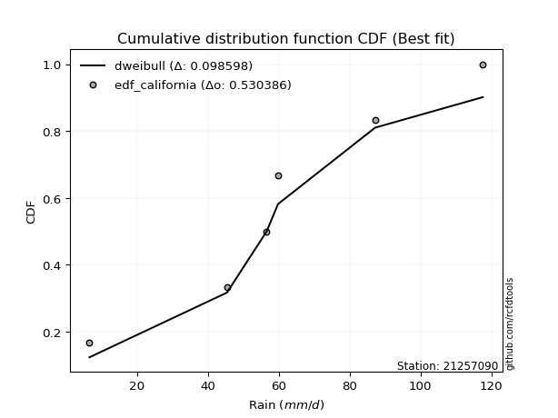</img>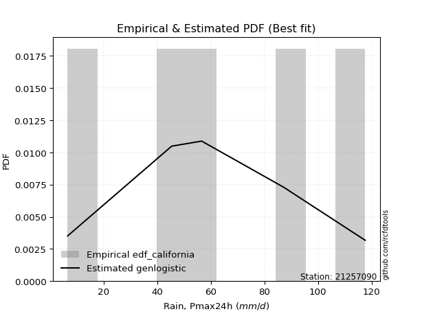</img>

</div>


### 2. EDF Hazen (1930)

Hazen method for plotting positions is a formula used to estimate the empirical cumulative probability distribution of flood events or other hydrological data. This formula often results in biased estimations, particularly when extrapolating to extreme events (high return periods).

<div align="center">


$P=(m-0.5)/n$


</div>


**2.1. Empirical values**

<div align="center">

|                | 0                  | 1                  | 2         | 3                 | 4                  |
|:---------------|:-------------------|:-------------------|:----------|:------------------|:-------------------|
| date           | 2023               | 2021               | 2022      | 2020              | 2019               |
| x              | 6.6                | 45.4               | 56.6      | 87.2              | 117.6              |
| m              | 1                  | 2                  | 3         | 4                 | 5                  |
| empirical_dist | edf_hazen          | edf_hazen          | edf_hazen | edf_hazen         | edf_hazen          |
| empirical      | 0.1                | 0.3                | 0.5       | 0.7               | 0.9                |
| empirical_tr   | 1.1111111111111112 | 1.4285714285714286 | 2.0       | 3.333333333333333 | 10.000000000000002 |

</div>


**2.2. Kolmogorov-Smirnov fit test (sorted by Δ)**


<div align="center">

|                | 0                   | 1                    | 2                   | 3                   | 4                    | 5                   | 6                   | 7                   | 8                   | 9                   | 10                  | 11                  | 12                  | 13                  | 14                 | 15                  | 16                  | 17                  | 18                  | 19                  | 20                 | 21                  | 22                  | 23                  | 24                  | 25                 | 26                  | 27                  | 28                 | 29                  | 30                  | 31                  | 32                  | 33                  | 34                  | 35                 | 36                  | 37                  | 38                  | 39                  | 40                    | 41                 | 42                 | 43                 | 44                 | 45                  | 46                  | 47                  | 48                  | 49                  | 50                  | 51                  | 52                 | 53                  | 54                 | 55                  | 56                  | 57                  | 58                  | 59                  | 60                  | 61                  | 62                 | 63                 | 64                  | 65                  | 66                 | 67                  | 68                  | 69                  | 70                 | 71                 | 72                  | 73                 | 74                 | 75                  | 76                  | 77                 | 78                 | 79                  | 80                 | 81                 | 82                  | 83                 | 84                 | 85                 | 86                 | 87                 |
|:---------------|:--------------------|:---------------------|:--------------------|:--------------------|:---------------------|:--------------------|:--------------------|:--------------------|:--------------------|:--------------------|:--------------------|:--------------------|:--------------------|:--------------------|:-------------------|:--------------------|:--------------------|:--------------------|:--------------------|:--------------------|:-------------------|:--------------------|:--------------------|:--------------------|:--------------------|:-------------------|:--------------------|:--------------------|:-------------------|:--------------------|:--------------------|:--------------------|:--------------------|:--------------------|:--------------------|:-------------------|:--------------------|:--------------------|:--------------------|:--------------------|:----------------------|:-------------------|:-------------------|:-------------------|:-------------------|:--------------------|:--------------------|:--------------------|:--------------------|:--------------------|:--------------------|:--------------------|:-------------------|:--------------------|:-------------------|:--------------------|:--------------------|:--------------------|:--------------------|:--------------------|:--------------------|:--------------------|:-------------------|:-------------------|:--------------------|:--------------------|:-------------------|:--------------------|:--------------------|:--------------------|:-------------------|:-------------------|:--------------------|:-------------------|:-------------------|:--------------------|:--------------------|:-------------------|:-------------------|:--------------------|:-------------------|:-------------------|:--------------------|:-------------------|:-------------------|:-------------------|:-------------------|:-------------------|
| station        | 21257090            | 21257090             | 21257090            | 21257090            | 21257090             | 21257090            | 21257090            | 21257090            | 21257090            | 21257090            | 21257090            | 21257090            | 21257090            | 21257090            | 21257090           | 21257090            | 21257090            | 21257090            | 21257090            | 21257090            | 21257090           | 21257090            | 21257090            | 21257090            | 21257090            | 21257090           | 21257090            | 21257090            | 21257090           | 21257090            | 21257090            | 21257090            | 21257090            | 21257090            | 21257090            | 21257090           | 21257090            | 21257090            | 21257090            | 21257090            | 21257090              | 21257090           | 21257090           | 21257090           | 21257090           | 21257090            | 21257090            | 21257090            | 21257090            | 21257090            | 21257090            | 21257090            | 21257090           | 21257090            | 21257090           | 21257090            | 21257090            | 21257090            | 21257090            | 21257090            | 21257090            | 21257090            | 21257090           | 21257090           | 21257090            | 21257090            | 21257090           | 21257090            | 21257090            | 21257090            | 21257090           | 21257090           | 21257090            | 21257090           | 21257090           | 21257090            | 21257090            | 21257090           | 21257090           | 21257090            | 21257090           | 21257090           | 21257090            | 21257090           | 21257090           | 21257090           | 21257090           | 21257090           |
| empirical_dist | edf_hazen           | edf_hazen            | edf_hazen           | edf_hazen           | edf_hazen            | edf_hazen           | edf_hazen           | edf_hazen           | edf_hazen           | edf_hazen           | edf_hazen           | edf_hazen           | edf_hazen           | edf_hazen           | edf_hazen          | edf_hazen           | edf_hazen           | edf_hazen           | edf_hazen           | edf_hazen           | edf_hazen          | edf_hazen           | edf_hazen           | edf_hazen           | edf_hazen           | edf_hazen          | edf_hazen           | edf_hazen           | edf_hazen          | edf_hazen           | edf_hazen           | edf_hazen           | edf_hazen           | edf_hazen           | edf_hazen           | edf_hazen          | edf_hazen           | edf_hazen           | edf_hazen           | edf_hazen           | edf_hazen             | edf_hazen          | edf_hazen          | edf_hazen          | edf_hazen          | edf_hazen           | edf_hazen           | edf_hazen           | edf_hazen           | edf_hazen           | edf_hazen           | edf_hazen           | edf_hazen          | edf_hazen           | edf_hazen          | edf_hazen           | edf_hazen           | edf_hazen           | edf_hazen           | edf_hazen           | edf_hazen           | edf_hazen           | edf_hazen          | edf_hazen          | edf_hazen           | edf_hazen           | edf_hazen          | edf_hazen           | edf_hazen           | edf_hazen           | edf_hazen          | edf_hazen          | edf_hazen           | edf_hazen          | edf_hazen          | edf_hazen           | edf_hazen           | edf_hazen          | edf_hazen          | edf_hazen           | edf_hazen          | edf_hazen          | edf_hazen           | edf_hazen          | edf_hazen          | edf_hazen          | edf_hazen          | edf_hazen          |
| p_dist         | weibull_min         | genlogistic          | maxwell             | rice                | invgamma             | betaprime           | f                   | fisk                | erlang              | gamma               | nct                 | johnsonsu           | exponnorm           | truncnorm           | norm               | crystalball         | t                   | pearson3            | rayleigh            | logistic            | hypsecant          | laplace_asymmetric  | gumbel_r            | logmielke           | invgauss            | moyal              | logloggamma         | mielke              | halfnorm           | kstwobign           | halflogistic        | laplace             | logweibull_min      | ncf                 | logfisk             | gumbel_l           | logpearson3         | loggumbel_l         | wald                | loggompertz         | loglaplace_asymmetric | nakagami           | gibrat             | genexpon           | expon              | lognorm             | lognorm             | logcrystalball      | logexponnorm        | logt                | lognct              | logfatiguelife      | loglogistic        | loghypsecant        | logbetaprime       | logf                | loglaplace          | logncf              | logrice             | loginvgamma         | logerlang           | loginvgauss         | loggamma           | loggamma           | logalpha            | loginvweibull       | logmaxwell         | lograyleigh         | loggumbel_r         | logkstwobign        | loghalfnorm        | loggenexpon        | logtruncnorm        | lognakagami        | logmoyal           | loghalflogistic     | logexpon            | logwald            | loglognorm         | loggibrat           | gompertz           | alpha              | invweibull          | logchi2            | logjohnsonsu       | fatiguelife        | chi2               | loggenlogistic     |
| delta          | 0.05110903952836478 | 0.052001176367566626 | 0.05327094089528628 | 0.05444023917117507 | 0.056678104239972105 | 0.05692758568895895 | 0.06120771781389417 | 0.06314569324671304 | 0.06376959506172036 | 0.06377458598131747 | 0.06403282612634564 | 0.06409198281202999 | 0.06409841608017824 | 0.06409879079980185 | 0.0640988223808262 | 0.06409883372349318 | 0.06409972753522164 | 0.06442470241517567 | 0.06489252217678076 | 0.07265504373893827 | 0.0801345133479211 | 0.08051793907571692 | 0.08373499574219234 | 0.08763065811672421 | 0.09330843431293029 | 0.097048614853252  | 0.09987535607727283 | 0.09999767424666442 | 0.1                | 0.10043040836980732 | 0.10107718365686713 | 0.10202184955374827 | 0.11098658008766965 | 0.11458154150997257 | 0.12971765056016904 | 0.1335009316762616 | 0.13428286266544315 | 0.13809080399058332 | 0.13820522811932445 | 0.13841699997761087 | 0.14562921558584968   | 0.1529488482271092 | 0.1679696277324172 | 0.1993441786930114 | 0.199360380413297  | 0.20817650869690646 | 0.20817650869690646 | 0.20817687063287854 | 0.20817799818513855 | 0.20817964280266993 | 0.20831223061256515 | 0.20832475641976161 | 0.2092932470444579 | 0.21024668134761387 | 0.2116792202252436 | 0.21228168444635204 | 0.21428545264918414 | 0.21555353622904155 | 0.21709444071626288 | 0.22243710110199594 | 0.22331409040503186 | 0.22650796913474208 | 0.2268632765992072 | 0.2268632765992072 | 0.23566783640851102 | 0.23850643343123373 | 0.2408818919209587 | 0.25171144555803365 | 0.27874576862607287 | 0.28088629501717804 | 0.2821969867183047 | 0.2876703198741602 | 0.29999829989137705 | 0.2999999190153946 | 0.3045188822533886 | 0.30761540510057434 | 0.33608975532884117 | 0.3761513912984343 | 0.386662665772689  | 0.40073303530635124 | 0.4039607196861407 | 0.4490530470339426 | 0.47239006705421194 | 0.4953715336894528 | 0.5353549994767279 | 0.5414369065159008 | 0.6905220646045223 | 0.7                |
| deltao         | 0.5865427407550001  | 0.5865427407550001   | 0.5865427407550001  | 0.5865427407550001  | 0.5865427407550001   | 0.5865427407550001  | 0.5865427407550001  | 0.5865427407550001  | 0.5865427407550001  | 0.5865427407550001  | 0.5865427407550001  | 0.5865427407550001  | 0.5865427407550001  | 0.5865427407550001  | 0.5865427407550001 | 0.5865427407550001  | 0.5865427407550001  | 0.5865427407550001  | 0.5865427407550001  | 0.5865427407550001  | 0.5865427407550001 | 0.5865427407550001  | 0.5865427407550001  | 0.5865427407550001  | 0.5865427407550001  | 0.5865427407550001 | 0.5865427407550001  | 0.5865427407550001  | 0.5865427407550001 | 0.5865427407550001  | 0.5865427407550001  | 0.5865427407550001  | 0.5865427407550001  | 0.5865427407550001  | 0.5865427407550001  | 0.5865427407550001 | 0.5865427407550001  | 0.5865427407550001  | 0.5865427407550001  | 0.5865427407550001  | 0.5865427407550001    | 0.5865427407550001 | 0.5865427407550001 | 0.5865427407550001 | 0.5865427407550001 | 0.5865427407550001  | 0.5865427407550001  | 0.5865427407550001  | 0.5865427407550001  | 0.5865427407550001  | 0.5865427407550001  | 0.5865427407550001  | 0.5865427407550001 | 0.5865427407550001  | 0.5865427407550001 | 0.5865427407550001  | 0.5865427407550001  | 0.5865427407550001  | 0.5865427407550001  | 0.5865427407550001  | 0.5865427407550001  | 0.5865427407550001  | 0.5865427407550001 | 0.5865427407550001 | 0.5865427407550001  | 0.5865427407550001  | 0.5865427407550001 | 0.5865427407550001  | 0.5865427407550001  | 0.5865427407550001  | 0.5865427407550001 | 0.5865427407550001 | 0.5865427407550001  | 0.5865427407550001 | 0.5865427407550001 | 0.5865427407550001  | 0.5865427407550001  | 0.5865427407550001 | 0.5865427407550001 | 0.5865427407550001  | 0.5865427407550001 | 0.5865427407550001 | 0.5865427407550001  | 0.5865427407550001 | 0.5865427407550001 | 0.5865427407550001 | 0.5865427407550001 | 0.5865427407550001 |
| eval           | Δo > Δ              | Δo > Δ               | Δo > Δ              | Δo > Δ              | Δo > Δ               | Δo > Δ              | Δo > Δ              | Δo > Δ              | Δo > Δ              | Δo > Δ              | Δo > Δ              | Δo > Δ              | Δo > Δ              | Δo > Δ              | Δo > Δ             | Δo > Δ              | Δo > Δ              | Δo > Δ              | Δo > Δ              | Δo > Δ              | Δo > Δ             | Δo > Δ              | Δo > Δ              | Δo > Δ              | Δo > Δ              | Δo > Δ             | Δo > Δ              | Δo > Δ              | Δo > Δ             | Δo > Δ              | Δo > Δ              | Δo > Δ              | Δo > Δ              | Δo > Δ              | Δo > Δ              | Δo > Δ             | Δo > Δ              | Δo > Δ              | Δo > Δ              | Δo > Δ              | Δo > Δ                | Δo > Δ             | Δo > Δ             | Δo > Δ             | Δo > Δ             | Δo > Δ              | Δo > Δ              | Δo > Δ              | Δo > Δ              | Δo > Δ              | Δo > Δ              | Δo > Δ              | Δo > Δ             | Δo > Δ              | Δo > Δ             | Δo > Δ              | Δo > Δ              | Δo > Δ              | Δo > Δ              | Δo > Δ              | Δo > Δ              | Δo > Δ              | Δo > Δ             | Δo > Δ             | Δo > Δ              | Δo > Δ              | Δo > Δ             | Δo > Δ              | Δo > Δ              | Δo > Δ              | Δo > Δ             | Δo > Δ             | Δo > Δ              | Δo > Δ             | Δo > Δ             | Δo > Δ              | Δo > Δ              | Δo > Δ             | Δo > Δ             | Δo > Δ              | Δo > Δ             | Δo > Δ             | Δo > Δ              | Δo > Δ             | Δo > Δ             | Δo > Δ             | Δo <= Δ            | Δo <= Δ            |
| fit            | 1                   | 1                    | 1                   | 1                   | 1                    | 1                   | 1                   | 1                   | 1                   | 1                   | 1                   | 1                   | 1                   | 1                   | 1                  | 1                   | 1                   | 1                   | 1                   | 1                   | 1                  | 1                   | 1                   | 1                   | 1                   | 1                  | 1                   | 1                   | 1                  | 1                   | 1                   | 1                   | 1                   | 1                   | 1                   | 1                  | 1                   | 1                   | 1                   | 1                   | 1                     | 1                  | 1                  | 1                  | 1                  | 1                   | 1                   | 1                   | 1                   | 1                   | 1                   | 1                   | 1                  | 1                   | 1                  | 1                   | 1                   | 1                   | 1                   | 1                   | 1                   | 1                   | 1                  | 1                  | 1                   | 1                   | 1                  | 1                   | 1                   | 1                   | 1                  | 1                  | 1                   | 1                  | 1                  | 1                   | 1                   | 1                  | 1                  | 1                   | 1                  | 1                  | 1                   | 1                  | 1                  | 1                  | 0                  | 0                  |
| n              | 5                   | 5                    | 5                   | 5                   | 5                    | 5                   | 5                   | 5                   | 5                   | 5                   | 5                   | 5                   | 5                   | 5                   | 5                  | 5                   | 5                   | 5                   | 5                   | 5                   | 5                  | 5                   | 5                   | 5                   | 5                   | 5                  | 5                   | 5                   | 5                  | 5                   | 5                   | 5                   | 5                   | 5                   | 5                   | 5                  | 5                   | 5                   | 5                   | 5                   | 5                     | 5                  | 5                  | 5                  | 5                  | 5                   | 5                   | 5                   | 5                   | 5                   | 5                   | 5                   | 5                  | 5                   | 5                  | 5                   | 5                   | 5                   | 5                   | 5                   | 5                   | 5                   | 5                  | 5                  | 5                   | 5                   | 5                  | 5                   | 5                   | 5                   | 5                  | 5                  | 5                   | 5                  | 5                  | 5                   | 5                   | 5                  | 5                  | 5                   | 5                  | 5                  | 5                   | 5                  | 5                  | 5                  | 5                  | 5                  |
| best_fit       | 1                   | 0                    | 0                   | 0                   | 0                    | 0                   | 0                   | 0                   | 0                   | 0                   | 0                   | 0                   | 0                   | 0                   | 0                  | 0                   | 0                   | 0                   | 0                   | 0                   | 0                  | 0                   | 0                   | 0                   | 0                   | 0                  | 0                   | 0                   | 0                  | 0                   | 0                   | 0                   | 0                   | 0                   | 0                   | 0                  | 0                   | 0                   | 0                   | 0                   | 0                     | 0                  | 0                  | 0                  | 0                  | 0                   | 0                   | 0                   | 0                   | 0                   | 0                   | 0                   | 0                  | 0                   | 0                  | 0                   | 0                   | 0                   | 0                   | 0                   | 0                   | 0                   | 0                  | 0                  | 0                   | 0                   | 0                  | 0                   | 0                   | 0                   | 0                  | 0                  | 0                   | 0                  | 0                  | 0                   | 0                   | 0                  | 0                  | 0                   | 0                  | 0                  | 0                   | 0                  | 0                  | 0                  | 0                  | 0                  |
| best_fit_sort  | 1                   | 2                    | 3                   | 4                   | 5                    | 6                   | 7                   | 8                   | 9                   | 10                  | 11                  | 12                  | 13                  | 14                  | 15                 | 16                  | 17                  | 18                  | 19                  | 20                  | 21                 | 22                  | 23                  | 24                  | 25                  | 26                 | 27                  | 28                  | 29                 | 30                  | 31                  | 32                  | 33                  | 34                  | 35                  | 36                 | 37                  | 38                  | 39                  | 40                  | 41                    | 42                 | 43                 | 44                 | 45                 | 46                  | 47                  | 48                  | 49                  | 50                  | 51                  | 52                  | 53                 | 54                  | 55                 | 56                  | 57                  | 58                  | 59                  | 60                  | 61                  | 62                  | 63                 | 64                 | 65                  | 66                  | 67                 | 68                  | 69                  | 70                  | 71                 | 72                 | 73                  | 74                 | 75                 | 76                  | 77                  | 78                 | 79                 | 80                  | 81                 | 82                 | 83                  | 84                 | 85                 | 86                 | 87                 | 88                 |

</div>


**2.3. Best fit**

<div align="center">

|   id |   station | empirical_dist   | p_dist      |    delta |   deltao | eval   |   fit |   n |   best_fit |   best_fit_sort |
|-----:|----------:|:-----------------|:------------|---------:|---------:|:-------|------:|----:|-----------:|----------------:|
|    0 |  21257090 | edf_hazen        | weibull_min | 0.051109 | 0.586543 | Δo > Δ |     1 |   5 |          1 |               1 |

</div>


<div align="center">

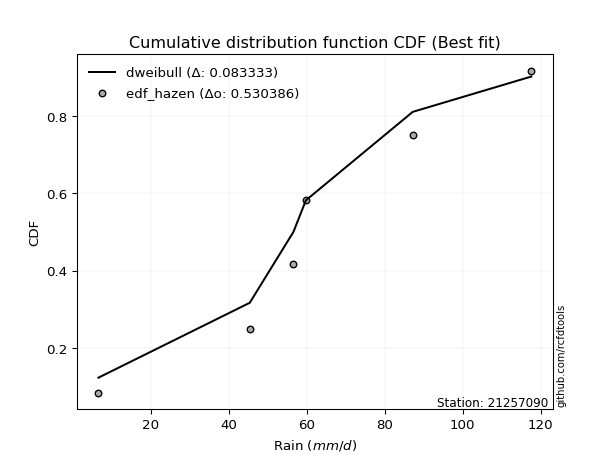</img>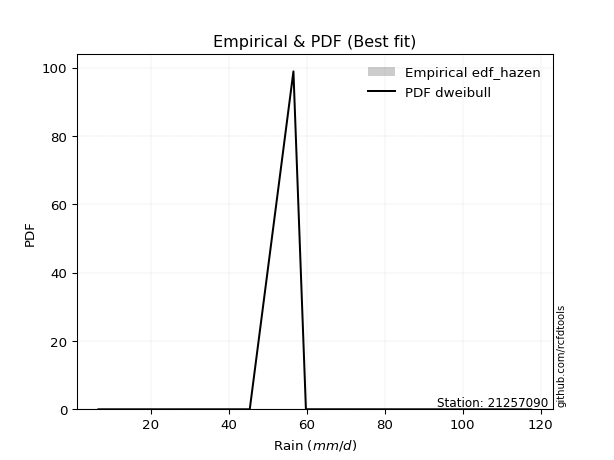</img>

</div>


### 3. EDF Weibull (1939)

Weibull plotting position formula is an empirical method used to estimate the non-exceedance probability or plotting position for a set of observed data, is often recommended or widely used in practice, particularly in flood frequency analysis.

<div align="center">


$P=m/(n+1)$


</div>


**3.1. Empirical values**

<div align="center">

|                | 0                   | 1                  | 2           | 3                  | 4                  |
|:---------------|:--------------------|:-------------------|:------------|:-------------------|:-------------------|
| date           | 2023                | 2021               | 2022        | 2020               | 2019               |
| x              | 6.6                 | 45.4               | 56.6        | 87.2               | 117.6              |
| m              | 1                   | 2                  | 3           | 4                  | 5                  |
| empirical_dist | edf_weibull         | edf_weibull        | edf_weibull | edf_weibull        | edf_weibull        |
| empirical      | 0.16666666666666666 | 0.3333333333333333 | 0.5         | 0.6666666666666666 | 0.8333333333333334 |
| empirical_tr   | 1.2                 | 1.4999999999999998 | 2.0         | 2.9999999999999996 | 6.000000000000002  |

</div>


**3.2. Kolmogorov-Smirnov fit test (sorted by Δ)**


<div align="center">

|                | 0                   | 1                  | 2                   | 3                   | 4                   | 5                   | 6                   | 7                   | 8                   | 9                   | 10                  | 11                  | 12                  | 13                  | 14                  | 15                  | 16                 | 17                  | 18                  | 19                  | 20                  | 21                  | 22                  | 23                  | 24                  | 25                 | 26                  | 27                 | 28                 | 29                    | 30                  | 31                 | 32                  | 33                  | 34                  | 35                  | 36                  | 37                  | 38                 | 39                  | 40                  | 41                  | 42                  | 43                  | 44                  | 45                  | 46                  | 47                  | 48                 | 49                  | 50                 | 51                  | 52                  | 53                  | 54                 | 55                 | 56                  | 57                  | 58                 | 59                  | 60                  | 61                  | 62                  | 63                  | 64                 | 65                 | 66                 | 67                  | 68                  | 69                  | 70                  | 71                  | 72                  | 73                 | 74                  | 75                 | 76                 | 77                  | 78                  | 79                 | 80                 | 81                 | 82                 | 83                 | 84                 | 85                 | 86                 | 87                 |
|:---------------|:--------------------|:-------------------|:--------------------|:--------------------|:--------------------|:--------------------|:--------------------|:--------------------|:--------------------|:--------------------|:--------------------|:--------------------|:--------------------|:--------------------|:--------------------|:--------------------|:-------------------|:--------------------|:--------------------|:--------------------|:--------------------|:--------------------|:--------------------|:--------------------|:--------------------|:-------------------|:--------------------|:-------------------|:-------------------|:----------------------|:--------------------|:-------------------|:--------------------|:--------------------|:--------------------|:--------------------|:--------------------|:--------------------|:-------------------|:--------------------|:--------------------|:--------------------|:--------------------|:--------------------|:--------------------|:--------------------|:--------------------|:--------------------|:-------------------|:--------------------|:-------------------|:--------------------|:--------------------|:--------------------|:-------------------|:-------------------|:--------------------|:--------------------|:-------------------|:--------------------|:--------------------|:--------------------|:--------------------|:--------------------|:-------------------|:-------------------|:-------------------|:--------------------|:--------------------|:--------------------|:--------------------|:--------------------|:--------------------|:-------------------|:--------------------|:-------------------|:-------------------|:--------------------|:--------------------|:-------------------|:-------------------|:-------------------|:-------------------|:-------------------|:-------------------|:-------------------|:-------------------|:-------------------|
| station        | 21257090            | 21257090           | 21257090            | 21257090            | 21257090            | 21257090            | 21257090            | 21257090            | 21257090            | 21257090            | 21257090            | 21257090            | 21257090            | 21257090            | 21257090            | 21257090            | 21257090           | 21257090            | 21257090            | 21257090            | 21257090            | 21257090            | 21257090            | 21257090            | 21257090            | 21257090           | 21257090            | 21257090           | 21257090           | 21257090              | 21257090            | 21257090           | 21257090            | 21257090            | 21257090            | 21257090            | 21257090            | 21257090            | 21257090           | 21257090            | 21257090            | 21257090            | 21257090            | 21257090            | 21257090            | 21257090            | 21257090            | 21257090            | 21257090           | 21257090            | 21257090           | 21257090            | 21257090            | 21257090            | 21257090           | 21257090           | 21257090            | 21257090            | 21257090           | 21257090            | 21257090            | 21257090            | 21257090            | 21257090            | 21257090           | 21257090           | 21257090           | 21257090            | 21257090            | 21257090            | 21257090            | 21257090            | 21257090            | 21257090           | 21257090            | 21257090           | 21257090           | 21257090            | 21257090            | 21257090           | 21257090           | 21257090           | 21257090           | 21257090           | 21257090           | 21257090           | 21257090           | 21257090           |
| empirical_dist | edf_weibull         | edf_weibull        | edf_weibull         | edf_weibull         | edf_weibull         | edf_weibull         | edf_weibull         | edf_weibull         | edf_weibull         | edf_weibull         | edf_weibull         | edf_weibull         | edf_weibull         | edf_weibull         | edf_weibull         | edf_weibull         | edf_weibull        | edf_weibull         | edf_weibull         | edf_weibull         | edf_weibull         | edf_weibull         | edf_weibull         | edf_weibull         | edf_weibull         | edf_weibull        | edf_weibull         | edf_weibull        | edf_weibull        | edf_weibull           | edf_weibull         | edf_weibull        | edf_weibull         | edf_weibull         | edf_weibull         | edf_weibull         | edf_weibull         | edf_weibull         | edf_weibull        | edf_weibull         | edf_weibull         | edf_weibull         | edf_weibull         | edf_weibull         | edf_weibull         | edf_weibull         | edf_weibull         | edf_weibull         | edf_weibull        | edf_weibull         | edf_weibull        | edf_weibull         | edf_weibull         | edf_weibull         | edf_weibull        | edf_weibull        | edf_weibull         | edf_weibull         | edf_weibull        | edf_weibull         | edf_weibull         | edf_weibull         | edf_weibull         | edf_weibull         | edf_weibull        | edf_weibull        | edf_weibull        | edf_weibull         | edf_weibull         | edf_weibull         | edf_weibull         | edf_weibull         | edf_weibull         | edf_weibull        | edf_weibull         | edf_weibull        | edf_weibull        | edf_weibull         | edf_weibull         | edf_weibull        | edf_weibull        | edf_weibull        | edf_weibull        | edf_weibull        | edf_weibull        | edf_weibull        | edf_weibull        | edf_weibull        |
| p_dist         | fisk                | pearson3           | johnsonsu           | nct                 | t                   | exponnorm           | truncnorm           | norm                | crystalball         | gamma               | erlang              | f                   | betaprime           | logistic            | genlogistic         | invgamma            | invgauss           | hypsecant           | laplace_asymmetric  | kstwobign           | logpearson3         | maxwell             | weibull_min         | loggumbel_l         | rice                | ncf                | rayleigh            | laplace            | logweibull_min     | loglaplace_asymmetric | gumbel_l            | gumbel_r           | logfisk             | logmielke           | moyal               | logloggamma         | mielke              | genexpon            | loggompertz        | nakagami            | halflogistic        | halfnorm            | expon               | wald                | lognorm             | lognorm             | logcrystalball      | logexponnorm        | logt               | lognct              | logfatiguelife     | loglogistic         | loghypsecant        | logbetaprime        | logf               | loglaplace         | logncf              | logrice             | loginvgamma        | logerlang           | loginvgauss         | loggamma            | loggamma            | gibrat              | logalpha           | loginvweibull      | logmaxwell         | lograyleigh         | loggumbel_r         | logkstwobign        | loghalfnorm         | loggenexpon         | logmoyal            | loghalflogistic    | logexpon            | logtruncnorm       | lognakagami        | logwald             | loglognorm          | loggibrat          | gompertz           | invweibull         | alpha              | logchi2            | logjohnsonsu       | fatiguelife        | chi2               | loggenlogistic     |
| delta          | 0.09126226646675753 | 0.0982102921174948 | 0.09831711872152185 | 0.09833164877590914 | 0.09834619809951133 | 0.09834633554961847 | 0.09834679545030148 | 0.09834680597089313 | 0.09834681071699168 | 0.09848036151822531 | 0.09848061745180096 | 0.09925361685088897 | 0.10044427272910426 | 0.10367550595254003 | 0.10428505358892426 | 0.10721327007200734 | 0.1089083908234501 | 0.11346784668125443 | 0.11385127240905024 | 0.11459231110108456 | 0.11628792800861473 | 0.11660998745645287 | 0.11777570619503143 | 0.11812433253750895 | 0.12110690583784173 | 0.1285262064772464 | 0.12870958646337188 | 0.1341437232092919 | 0.1392590369342388 | 0.14016949366853626   | 0.14044192750338902 | 0.1440190642229878 | 0.14513412970180273 | 0.15429732478339087 | 0.16102241782886073 | 0.16654202274393948 | 0.16666434091333107 | 0.16666664242886173 | 0.1666666663575369 | 0.16666666666666646 | 0.16666666666666666 | 0.16666666666666666 | 0.16666666666666666 | 0.17153856145265778 | 0.17484317536357313 | 0.17484317536357313 | 0.17484353729954522 | 0.17484466485180522 | 0.1748463094693366 | 0.17497889727923183 | 0.1749914230864283 | 0.17595991371112457 | 0.17691334801428055 | 0.17834588689191028 | 0.1789483511130187 | 0.1809521193158508 | 0.18222020289570823 | 0.18376110738292956 | 0.1891037677686626 | 0.18998075707169854 | 0.19317463580140876 | 0.19352994326587386 | 0.19352994326587386 | 0.20130296106575052 | 0.2023345030751777 | 0.2051731000979004 | 0.2075485585876254 | 0.21837811222470033 | 0.24541243529273954 | 0.24755296168384472 | 0.24886365338497135 | 0.25433698654082687 | 0.27118554892005525 | 0.274282071767241  | 0.30275642199550784 | 0.3333316332247104 | 0.3333332523487279 | 0.34281805796510095 | 0.35332933243935566 | 0.3673997019730179 | 0.4039607196861407 | 0.4057234003875453 | 0.4157197137006093 | 0.4620382003561195 | 0.5020216661433947 | 0.5081035731825676 | 0.6571887312711888 | 0.6666666666666666 |
| deltao         | 0.5865427407550001  | 0.5865427407550001 | 0.5865427407550001  | 0.5865427407550001  | 0.5865427407550001  | 0.5865427407550001  | 0.5865427407550001  | 0.5865427407550001  | 0.5865427407550001  | 0.5865427407550001  | 0.5865427407550001  | 0.5865427407550001  | 0.5865427407550001  | 0.5865427407550001  | 0.5865427407550001  | 0.5865427407550001  | 0.5865427407550001 | 0.5865427407550001  | 0.5865427407550001  | 0.5865427407550001  | 0.5865427407550001  | 0.5865427407550001  | 0.5865427407550001  | 0.5865427407550001  | 0.5865427407550001  | 0.5865427407550001 | 0.5865427407550001  | 0.5865427407550001 | 0.5865427407550001 | 0.5865427407550001    | 0.5865427407550001  | 0.5865427407550001 | 0.5865427407550001  | 0.5865427407550001  | 0.5865427407550001  | 0.5865427407550001  | 0.5865427407550001  | 0.5865427407550001  | 0.5865427407550001 | 0.5865427407550001  | 0.5865427407550001  | 0.5865427407550001  | 0.5865427407550001  | 0.5865427407550001  | 0.5865427407550001  | 0.5865427407550001  | 0.5865427407550001  | 0.5865427407550001  | 0.5865427407550001 | 0.5865427407550001  | 0.5865427407550001 | 0.5865427407550001  | 0.5865427407550001  | 0.5865427407550001  | 0.5865427407550001 | 0.5865427407550001 | 0.5865427407550001  | 0.5865427407550001  | 0.5865427407550001 | 0.5865427407550001  | 0.5865427407550001  | 0.5865427407550001  | 0.5865427407550001  | 0.5865427407550001  | 0.5865427407550001 | 0.5865427407550001 | 0.5865427407550001 | 0.5865427407550001  | 0.5865427407550001  | 0.5865427407550001  | 0.5865427407550001  | 0.5865427407550001  | 0.5865427407550001  | 0.5865427407550001 | 0.5865427407550001  | 0.5865427407550001 | 0.5865427407550001 | 0.5865427407550001  | 0.5865427407550001  | 0.5865427407550001 | 0.5865427407550001 | 0.5865427407550001 | 0.5865427407550001 | 0.5865427407550001 | 0.5865427407550001 | 0.5865427407550001 | 0.5865427407550001 | 0.5865427407550001 |
| eval           | Δo > Δ              | Δo > Δ             | Δo > Δ              | Δo > Δ              | Δo > Δ              | Δo > Δ              | Δo > Δ              | Δo > Δ              | Δo > Δ              | Δo > Δ              | Δo > Δ              | Δo > Δ              | Δo > Δ              | Δo > Δ              | Δo > Δ              | Δo > Δ              | Δo > Δ             | Δo > Δ              | Δo > Δ              | Δo > Δ              | Δo > Δ              | Δo > Δ              | Δo > Δ              | Δo > Δ              | Δo > Δ              | Δo > Δ             | Δo > Δ              | Δo > Δ             | Δo > Δ             | Δo > Δ                | Δo > Δ              | Δo > Δ             | Δo > Δ              | Δo > Δ              | Δo > Δ              | Δo > Δ              | Δo > Δ              | Δo > Δ              | Δo > Δ             | Δo > Δ              | Δo > Δ              | Δo > Δ              | Δo > Δ              | Δo > Δ              | Δo > Δ              | Δo > Δ              | Δo > Δ              | Δo > Δ              | Δo > Δ             | Δo > Δ              | Δo > Δ             | Δo > Δ              | Δo > Δ              | Δo > Δ              | Δo > Δ             | Δo > Δ             | Δo > Δ              | Δo > Δ              | Δo > Δ             | Δo > Δ              | Δo > Δ              | Δo > Δ              | Δo > Δ              | Δo > Δ              | Δo > Δ             | Δo > Δ             | Δo > Δ             | Δo > Δ              | Δo > Δ              | Δo > Δ              | Δo > Δ              | Δo > Δ              | Δo > Δ              | Δo > Δ             | Δo > Δ              | Δo > Δ             | Δo > Δ             | Δo > Δ              | Δo > Δ              | Δo > Δ             | Δo > Δ             | Δo > Δ             | Δo > Δ             | Δo > Δ             | Δo > Δ             | Δo > Δ             | Δo <= Δ            | Δo <= Δ            |
| fit            | 1                   | 1                  | 1                   | 1                   | 1                   | 1                   | 1                   | 1                   | 1                   | 1                   | 1                   | 1                   | 1                   | 1                   | 1                   | 1                   | 1                  | 1                   | 1                   | 1                   | 1                   | 1                   | 1                   | 1                   | 1                   | 1                  | 1                   | 1                  | 1                  | 1                     | 1                   | 1                  | 1                   | 1                   | 1                   | 1                   | 1                   | 1                   | 1                  | 1                   | 1                   | 1                   | 1                   | 1                   | 1                   | 1                   | 1                   | 1                   | 1                  | 1                   | 1                  | 1                   | 1                   | 1                   | 1                  | 1                  | 1                   | 1                   | 1                  | 1                   | 1                   | 1                   | 1                   | 1                   | 1                  | 1                  | 1                  | 1                   | 1                   | 1                   | 1                   | 1                   | 1                   | 1                  | 1                   | 1                  | 1                  | 1                   | 1                   | 1                  | 1                  | 1                  | 1                  | 1                  | 1                  | 1                  | 0                  | 0                  |
| n              | 5                   | 5                  | 5                   | 5                   | 5                   | 5                   | 5                   | 5                   | 5                   | 5                   | 5                   | 5                   | 5                   | 5                   | 5                   | 5                   | 5                  | 5                   | 5                   | 5                   | 5                   | 5                   | 5                   | 5                   | 5                   | 5                  | 5                   | 5                  | 5                  | 5                     | 5                   | 5                  | 5                   | 5                   | 5                   | 5                   | 5                   | 5                   | 5                  | 5                   | 5                   | 5                   | 5                   | 5                   | 5                   | 5                   | 5                   | 5                   | 5                  | 5                   | 5                  | 5                   | 5                   | 5                   | 5                  | 5                  | 5                   | 5                   | 5                  | 5                   | 5                   | 5                   | 5                   | 5                   | 5                  | 5                  | 5                  | 5                   | 5                   | 5                   | 5                   | 5                   | 5                   | 5                  | 5                   | 5                  | 5                  | 5                   | 5                   | 5                  | 5                  | 5                  | 5                  | 5                  | 5                  | 5                  | 5                  | 5                  |
| best_fit       | 1                   | 0                  | 0                   | 0                   | 0                   | 0                   | 0                   | 0                   | 0                   | 0                   | 0                   | 0                   | 0                   | 0                   | 0                   | 0                   | 0                  | 0                   | 0                   | 0                   | 0                   | 0                   | 0                   | 0                   | 0                   | 0                  | 0                   | 0                  | 0                  | 0                     | 0                   | 0                  | 0                   | 0                   | 0                   | 0                   | 0                   | 0                   | 0                  | 0                   | 0                   | 0                   | 0                   | 0                   | 0                   | 0                   | 0                   | 0                   | 0                  | 0                   | 0                  | 0                   | 0                   | 0                   | 0                  | 0                  | 0                   | 0                   | 0                  | 0                   | 0                   | 0                   | 0                   | 0                   | 0                  | 0                  | 0                  | 0                   | 0                   | 0                   | 0                   | 0                   | 0                   | 0                  | 0                   | 0                  | 0                  | 0                   | 0                   | 0                  | 0                  | 0                  | 0                  | 0                  | 0                  | 0                  | 0                  | 0                  |
| best_fit_sort  | 1                   | 2                  | 3                   | 4                   | 5                   | 6                   | 7                   | 8                   | 9                   | 10                  | 11                  | 12                  | 13                  | 14                  | 15                  | 16                  | 17                 | 18                  | 19                  | 20                  | 21                  | 22                  | 23                  | 24                  | 25                  | 26                 | 27                  | 28                 | 29                 | 30                    | 31                  | 32                 | 33                  | 34                  | 35                  | 36                  | 37                  | 38                  | 39                 | 40                  | 41                  | 42                  | 43                  | 44                  | 45                  | 46                  | 47                  | 48                  | 49                 | 50                  | 51                 | 52                  | 53                  | 54                  | 55                 | 56                 | 57                  | 58                  | 59                 | 60                  | 61                  | 62                  | 63                  | 64                  | 65                 | 66                 | 67                 | 68                  | 69                  | 70                  | 71                  | 72                  | 73                  | 74                 | 75                  | 76                 | 77                 | 78                  | 79                  | 80                 | 81                 | 82                 | 83                 | 84                 | 85                 | 86                 | 87                 | 88                 |

</div>


**3.3. Best fit**

<div align="center">

|   id |   station | empirical_dist   | p_dist   |     delta |   deltao | eval   |   fit |   n |   best_fit |   best_fit_sort |
|-----:|----------:|:-----------------|:---------|----------:|---------:|:-------|------:|----:|-----------:|----------------:|
|    0 |  21257090 | edf_weibull      | fisk     | 0.0912623 | 0.586543 | Δo > Δ |     1 |   5 |          1 |               1 |

</div>


<div align="center">

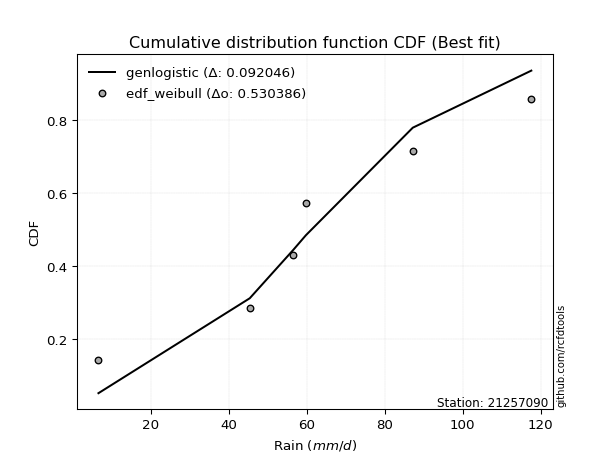</img></img>

</div>


### 4. EDF Beard (1943)

The Beard formula (or Beard´s plotting position formula) in hydrology is used to estimate the empirical non-exceedance probability _(P)_ of a flood event (or other extreme hydrological data point) within a given dataset.

<div align="center">


$P=(m-0.31)/(n+0.38)$


</div>


**4.1. Empirical values**

<div align="center">

|                | 0                   | 1                  | 2         | 3                  | 4                  |
|:---------------|:--------------------|:-------------------|:----------|:-------------------|:-------------------|
| date           | 2023                | 2021               | 2022      | 2020               | 2019               |
| x              | 6.6                 | 45.4               | 56.6      | 87.2               | 117.6              |
| m              | 1                   | 2                  | 3         | 4                  | 5                  |
| empirical_dist | edf_beard           | edf_beard          | edf_beard | edf_beard          | edf_beard          |
| empirical      | 0.12825278810408922 | 0.3141263940520446 | 0.5       | 0.6858736059479554 | 0.8717472118959109 |
| empirical_tr   | 1.1471215351812367  | 1.4579945799457996 | 2.0       | 3.183431952662722  | 7.797101449275368  |

</div>


**4.2. Kolmogorov-Smirnov fit test (sorted by Δ)**


<div align="center">

|                | 0                   | 1                   | 2                   | 3                   | 4                   | 5                   | 6                   | 7                   | 8                   | 9                  | 10                  | 11                  | 12                  | 13                  | 14                  | 15                  | 16                  | 17                  | 18                  | 19                  | 20                  | 21                  | 22                  | 23                  | 24                  | 25                  | 26                  | 27                 | 28                  | 29                  | 30                  | 31                  | 32                  | 33                  | 34                  | 35                  | 36                  | 37                  | 38                    | 39                 | 40                  | 41                  | 42                  | 43                  | 44                  | 45                  | 46                  | 47                 | 48                 | 49                 | 50                  | 51                  | 52                  | 53                  | 54                  | 55                 | 56                 | 57                  | 58                  | 59                 | 60                  | 61                  | 62                  | 63                  | 64                 | 65                 | 66                  | 67                  | 68                  | 69                 | 70                  | 71                  | 72                  | 73                 | 74                 | 75                 | 76                  | 77                  | 78                  | 79                 | 80                 | 81                 | 82                 | 83                  | 84                 | 85                 | 86                 | 87                 |
|:---------------|:--------------------|:--------------------|:--------------------|:--------------------|:--------------------|:--------------------|:--------------------|:--------------------|:--------------------|:-------------------|:--------------------|:--------------------|:--------------------|:--------------------|:--------------------|:--------------------|:--------------------|:--------------------|:--------------------|:--------------------|:--------------------|:--------------------|:--------------------|:--------------------|:--------------------|:--------------------|:--------------------|:-------------------|:--------------------|:--------------------|:--------------------|:--------------------|:--------------------|:--------------------|:--------------------|:--------------------|:--------------------|:--------------------|:----------------------|:-------------------|:--------------------|:--------------------|:--------------------|:--------------------|:--------------------|:--------------------|:--------------------|:-------------------|:-------------------|:-------------------|:--------------------|:--------------------|:--------------------|:--------------------|:--------------------|:-------------------|:-------------------|:--------------------|:--------------------|:-------------------|:--------------------|:--------------------|:--------------------|:--------------------|:-------------------|:-------------------|:--------------------|:--------------------|:--------------------|:-------------------|:--------------------|:--------------------|:--------------------|:-------------------|:-------------------|:-------------------|:--------------------|:--------------------|:--------------------|:-------------------|:-------------------|:-------------------|:-------------------|:--------------------|:-------------------|:-------------------|:-------------------|:-------------------|
| station        | 21257090            | 21257090            | 21257090            | 21257090            | 21257090            | 21257090            | 21257090            | 21257090            | 21257090            | 21257090           | 21257090            | 21257090            | 21257090            | 21257090            | 21257090            | 21257090            | 21257090            | 21257090            | 21257090            | 21257090            | 21257090            | 21257090            | 21257090            | 21257090            | 21257090            | 21257090            | 21257090            | 21257090           | 21257090            | 21257090            | 21257090            | 21257090            | 21257090            | 21257090            | 21257090            | 21257090            | 21257090            | 21257090            | 21257090              | 21257090           | 21257090            | 21257090            | 21257090            | 21257090            | 21257090            | 21257090            | 21257090            | 21257090           | 21257090           | 21257090           | 21257090            | 21257090            | 21257090            | 21257090            | 21257090            | 21257090           | 21257090           | 21257090            | 21257090            | 21257090           | 21257090            | 21257090            | 21257090            | 21257090            | 21257090           | 21257090           | 21257090            | 21257090            | 21257090            | 21257090           | 21257090            | 21257090            | 21257090            | 21257090           | 21257090           | 21257090           | 21257090            | 21257090            | 21257090            | 21257090           | 21257090           | 21257090           | 21257090           | 21257090            | 21257090           | 21257090           | 21257090           | 21257090           |
| empirical_dist | edf_beard           | edf_beard           | edf_beard           | edf_beard           | edf_beard           | edf_beard           | edf_beard           | edf_beard           | edf_beard           | edf_beard          | edf_beard           | edf_beard           | edf_beard           | edf_beard           | edf_beard           | edf_beard           | edf_beard           | edf_beard           | edf_beard           | edf_beard           | edf_beard           | edf_beard           | edf_beard           | edf_beard           | edf_beard           | edf_beard           | edf_beard           | edf_beard          | edf_beard           | edf_beard           | edf_beard           | edf_beard           | edf_beard           | edf_beard           | edf_beard           | edf_beard           | edf_beard           | edf_beard           | edf_beard             | edf_beard          | edf_beard           | edf_beard           | edf_beard           | edf_beard           | edf_beard           | edf_beard           | edf_beard           | edf_beard          | edf_beard          | edf_beard          | edf_beard           | edf_beard           | edf_beard           | edf_beard           | edf_beard           | edf_beard          | edf_beard          | edf_beard           | edf_beard           | edf_beard          | edf_beard           | edf_beard           | edf_beard           | edf_beard           | edf_beard          | edf_beard          | edf_beard           | edf_beard           | edf_beard           | edf_beard          | edf_beard           | edf_beard           | edf_beard           | edf_beard          | edf_beard          | edf_beard          | edf_beard           | edf_beard           | edf_beard           | edf_beard          | edf_beard          | edf_beard          | edf_beard          | edf_beard           | edf_beard          | edf_beard          | edf_beard          | edf_beard          |
| p_dist         | f                   | betaprime           | fisk                | erlang              | gamma               | nct                 | johnsonsu           | exponnorm           | truncnorm           | norm               | crystalball         | t                   | pearson3            | genlogistic         | invgamma            | maxwell             | logistic            | invgauss            | weibull_min         | rice                | kstwobign           | rayleigh            | hypsecant           | laplace_asymmetric  | ncf                 | logweibull_min      | gumbel_r            | laplace            | logfisk             | logmielke           | logpearson3         | moyal               | loggumbel_l         | logloggamma         | mielke              | loggompertz         | halflogistic        | halfnorm            | loglaplace_asymmetric | gumbel_l           | nakagami            | wald                | gibrat              | genexpon            | expon               | lognorm             | lognorm             | logcrystalball     | logexponnorm       | logt               | lognct              | logfatiguelife      | loglogistic         | loghypsecant        | logbetaprime        | logf               | loglaplace         | logncf              | logrice             | loginvgamma        | logerlang           | loginvgauss         | loggamma            | loggamma            | logalpha           | loginvweibull      | logmaxwell          | lograyleigh         | loggumbel_r         | logkstwobign       | loghalfnorm         | loggenexpon         | logmoyal            | loghalflogistic    | logtruncnorm       | lognakagami        | logexpon            | logwald             | loglognorm          | loggibrat          | gompertz           | alpha              | invweibull         | logchi2             | logjohnsonsu       | fatiguelife        | chi2               | loggenlogistic     |
| delta          | 0.06120771781389417 | 0.06203039416652682 | 0.06367894228262205 | 0.06376959506172036 | 0.06377458598131747 | 0.06403282612634564 | 0.06409198281202999 | 0.06409841608017824 | 0.06409879079980185 | 0.0640988223808262 | 0.06409883372349318 | 0.06409972753522164 | 0.06442470241517567 | 0.06612757041961115 | 0.07080449829201663 | 0.07819610889387543 | 0.07914537542712496 | 0.07918204026088566 | 0.07936182763245399 | 0.08269302727526429 | 0.08630401431776269 | 0.09029570790079444 | 0.09426090739996562 | 0.09464433312776144 | 0.10045514745792794 | 0.10084515837166137 | 0.10560518566041036 | 0.1149367839280031 | 0.11559125650812441 | 0.11588344622081337 | 0.12015646861339851 | 0.12260853926628328 | 0.12396440993853869 | 0.12812814418136198 | 0.12825046235075363 | 0.12825278779495947 | 0.12825278810408922 | 0.12825278810408922 | 0.13150282153380505   | 0.1335009316762616 | 0.13882245417506456 | 0.15233162217136897 | 0.18209602178446171 | 0.18521778464096678 | 0.18523398636125238 | 0.19405011464486183 | 0.19405011464486183 | 0.1940504765808339 | 0.1940516041330939 | 0.1940532487506253 | 0.19418583656052052 | 0.19419836236771698 | 0.19516685299241326 | 0.19612028729556924 | 0.19755282617319897 | 0.1981552903943074 | 0.2001590585971395 | 0.20142714217699692 | 0.20296804666421825 | 0.2083107070499513 | 0.20918769635298723 | 0.21238157508269745 | 0.21273688254716255 | 0.21273688254716255 | 0.2215414423564664 | 0.2243800393791891 | 0.22675549786891408 | 0.23758505150598902 | 0.26461937457402823 | 0.2667599009651334 | 0.26807059266626004 | 0.27354392582211556 | 0.29039248820134395 | 0.2934890110485297 | 0.3141246939434217 | 0.3141263130674392 | 0.32196336127679653 | 0.36202499724638965 | 0.37253627172064435 | 0.3866066412543066 | 0.4039607196861407 | 0.434926652981898  | 0.4441372789501228 | 0.48124513963740817 | 0.5212286054246835 | 0.5273105124638562 | 0.6763956705524776 | 0.6858736059479554 |
| deltao         | 0.5865427407550001  | 0.5865427407550001  | 0.5865427407550001  | 0.5865427407550001  | 0.5865427407550001  | 0.5865427407550001  | 0.5865427407550001  | 0.5865427407550001  | 0.5865427407550001  | 0.5865427407550001 | 0.5865427407550001  | 0.5865427407550001  | 0.5865427407550001  | 0.5865427407550001  | 0.5865427407550001  | 0.5865427407550001  | 0.5865427407550001  | 0.5865427407550001  | 0.5865427407550001  | 0.5865427407550001  | 0.5865427407550001  | 0.5865427407550001  | 0.5865427407550001  | 0.5865427407550001  | 0.5865427407550001  | 0.5865427407550001  | 0.5865427407550001  | 0.5865427407550001 | 0.5865427407550001  | 0.5865427407550001  | 0.5865427407550001  | 0.5865427407550001  | 0.5865427407550001  | 0.5865427407550001  | 0.5865427407550001  | 0.5865427407550001  | 0.5865427407550001  | 0.5865427407550001  | 0.5865427407550001    | 0.5865427407550001 | 0.5865427407550001  | 0.5865427407550001  | 0.5865427407550001  | 0.5865427407550001  | 0.5865427407550001  | 0.5865427407550001  | 0.5865427407550001  | 0.5865427407550001 | 0.5865427407550001 | 0.5865427407550001 | 0.5865427407550001  | 0.5865427407550001  | 0.5865427407550001  | 0.5865427407550001  | 0.5865427407550001  | 0.5865427407550001 | 0.5865427407550001 | 0.5865427407550001  | 0.5865427407550001  | 0.5865427407550001 | 0.5865427407550001  | 0.5865427407550001  | 0.5865427407550001  | 0.5865427407550001  | 0.5865427407550001 | 0.5865427407550001 | 0.5865427407550001  | 0.5865427407550001  | 0.5865427407550001  | 0.5865427407550001 | 0.5865427407550001  | 0.5865427407550001  | 0.5865427407550001  | 0.5865427407550001 | 0.5865427407550001 | 0.5865427407550001 | 0.5865427407550001  | 0.5865427407550001  | 0.5865427407550001  | 0.5865427407550001 | 0.5865427407550001 | 0.5865427407550001 | 0.5865427407550001 | 0.5865427407550001  | 0.5865427407550001 | 0.5865427407550001 | 0.5865427407550001 | 0.5865427407550001 |
| eval           | Δo > Δ              | Δo > Δ              | Δo > Δ              | Δo > Δ              | Δo > Δ              | Δo > Δ              | Δo > Δ              | Δo > Δ              | Δo > Δ              | Δo > Δ             | Δo > Δ              | Δo > Δ              | Δo > Δ              | Δo > Δ              | Δo > Δ              | Δo > Δ              | Δo > Δ              | Δo > Δ              | Δo > Δ              | Δo > Δ              | Δo > Δ              | Δo > Δ              | Δo > Δ              | Δo > Δ              | Δo > Δ              | Δo > Δ              | Δo > Δ              | Δo > Δ             | Δo > Δ              | Δo > Δ              | Δo > Δ              | Δo > Δ              | Δo > Δ              | Δo > Δ              | Δo > Δ              | Δo > Δ              | Δo > Δ              | Δo > Δ              | Δo > Δ                | Δo > Δ             | Δo > Δ              | Δo > Δ              | Δo > Δ              | Δo > Δ              | Δo > Δ              | Δo > Δ              | Δo > Δ              | Δo > Δ             | Δo > Δ             | Δo > Δ             | Δo > Δ              | Δo > Δ              | Δo > Δ              | Δo > Δ              | Δo > Δ              | Δo > Δ             | Δo > Δ             | Δo > Δ              | Δo > Δ              | Δo > Δ             | Δo > Δ              | Δo > Δ              | Δo > Δ              | Δo > Δ              | Δo > Δ             | Δo > Δ             | Δo > Δ              | Δo > Δ              | Δo > Δ              | Δo > Δ             | Δo > Δ              | Δo > Δ              | Δo > Δ              | Δo > Δ             | Δo > Δ             | Δo > Δ             | Δo > Δ              | Δo > Δ              | Δo > Δ              | Δo > Δ             | Δo > Δ             | Δo > Δ             | Δo > Δ             | Δo > Δ              | Δo > Δ             | Δo > Δ             | Δo <= Δ            | Δo <= Δ            |
| fit            | 1                   | 1                   | 1                   | 1                   | 1                   | 1                   | 1                   | 1                   | 1                   | 1                  | 1                   | 1                   | 1                   | 1                   | 1                   | 1                   | 1                   | 1                   | 1                   | 1                   | 1                   | 1                   | 1                   | 1                   | 1                   | 1                   | 1                   | 1                  | 1                   | 1                   | 1                   | 1                   | 1                   | 1                   | 1                   | 1                   | 1                   | 1                   | 1                     | 1                  | 1                   | 1                   | 1                   | 1                   | 1                   | 1                   | 1                   | 1                  | 1                  | 1                  | 1                   | 1                   | 1                   | 1                   | 1                   | 1                  | 1                  | 1                   | 1                   | 1                  | 1                   | 1                   | 1                   | 1                   | 1                  | 1                  | 1                   | 1                   | 1                   | 1                  | 1                   | 1                   | 1                   | 1                  | 1                  | 1                  | 1                   | 1                   | 1                   | 1                  | 1                  | 1                  | 1                  | 1                   | 1                  | 1                  | 0                  | 0                  |
| n              | 5                   | 5                   | 5                   | 5                   | 5                   | 5                   | 5                   | 5                   | 5                   | 5                  | 5                   | 5                   | 5                   | 5                   | 5                   | 5                   | 5                   | 5                   | 5                   | 5                   | 5                   | 5                   | 5                   | 5                   | 5                   | 5                   | 5                   | 5                  | 5                   | 5                   | 5                   | 5                   | 5                   | 5                   | 5                   | 5                   | 5                   | 5                   | 5                     | 5                  | 5                   | 5                   | 5                   | 5                   | 5                   | 5                   | 5                   | 5                  | 5                  | 5                  | 5                   | 5                   | 5                   | 5                   | 5                   | 5                  | 5                  | 5                   | 5                   | 5                  | 5                   | 5                   | 5                   | 5                   | 5                  | 5                  | 5                   | 5                   | 5                   | 5                  | 5                   | 5                   | 5                   | 5                  | 5                  | 5                  | 5                   | 5                   | 5                   | 5                  | 5                  | 5                  | 5                  | 5                   | 5                  | 5                  | 5                  | 5                  |
| best_fit       | 1                   | 0                   | 0                   | 0                   | 0                   | 0                   | 0                   | 0                   | 0                   | 0                  | 0                   | 0                   | 0                   | 0                   | 0                   | 0                   | 0                   | 0                   | 0                   | 0                   | 0                   | 0                   | 0                   | 0                   | 0                   | 0                   | 0                   | 0                  | 0                   | 0                   | 0                   | 0                   | 0                   | 0                   | 0                   | 0                   | 0                   | 0                   | 0                     | 0                  | 0                   | 0                   | 0                   | 0                   | 0                   | 0                   | 0                   | 0                  | 0                  | 0                  | 0                   | 0                   | 0                   | 0                   | 0                   | 0                  | 0                  | 0                   | 0                   | 0                  | 0                   | 0                   | 0                   | 0                   | 0                  | 0                  | 0                   | 0                   | 0                   | 0                  | 0                   | 0                   | 0                   | 0                  | 0                  | 0                  | 0                   | 0                   | 0                   | 0                  | 0                  | 0                  | 0                  | 0                   | 0                  | 0                  | 0                  | 0                  |
| best_fit_sort  | 1                   | 2                   | 3                   | 4                   | 5                   | 6                   | 7                   | 8                   | 9                   | 10                 | 11                  | 12                  | 13                  | 14                  | 15                  | 16                  | 17                  | 18                  | 19                  | 20                  | 21                  | 22                  | 23                  | 24                  | 25                  | 26                  | 27                  | 28                 | 29                  | 30                  | 31                  | 32                  | 33                  | 34                  | 35                  | 36                  | 37                  | 38                  | 39                    | 40                 | 41                  | 42                  | 43                  | 44                  | 45                  | 46                  | 47                  | 48                 | 49                 | 50                 | 51                  | 52                  | 53                  | 54                  | 55                  | 56                 | 57                 | 58                  | 59                  | 60                 | 61                  | 62                  | 63                  | 64                  | 65                 | 66                 | 67                  | 68                  | 69                  | 70                 | 71                  | 72                  | 73                  | 74                 | 75                 | 76                 | 77                  | 78                  | 79                  | 80                 | 81                 | 82                 | 83                 | 84                  | 85                 | 86                 | 87                 | 88                 |

</div>


**4.3. Best fit**

<div align="center">

|   id |   station | empirical_dist   | p_dist   |     delta |   deltao | eval   |   fit |   n |   best_fit |   best_fit_sort |
|-----:|----------:|:-----------------|:---------|----------:|---------:|:-------|------:|----:|-----------:|----------------:|
|    0 |  21257090 | edf_beard        | f        | 0.0612077 | 0.586543 | Δo > Δ |     1 |   5 |          1 |               1 |

</div>


<div align="center">

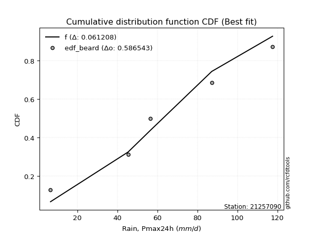</img>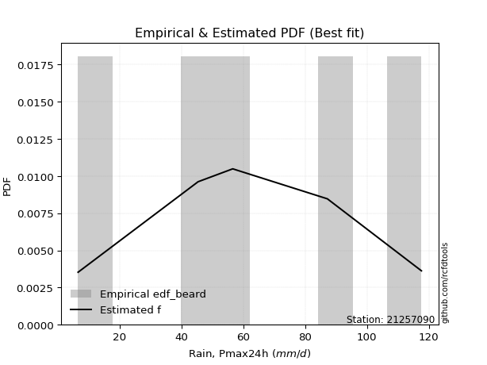</img>

</div>


### 5. EDF Chegodayev (1955)

The Chegodayev formula is an empirical plotting position formula used in hydrological frequency analysis to estimate the exceedance probability or return period of a specific event from a set of observed data. It is primarily used for plotting observed data points on probability paper to fit a theoretical distribution, particularly for analyzing extreme events like maximum flood flows or rainfall intensities. The constant _b_ value in the generalized plotting position formula is 0.3.

<div align="center">


$P=(m-b)/(n+1-2b)$


</div>


**5.1. Empirical values**

<div align="center">

|                | 0                   | 1                   | 2              | 3                  | 4                  |
|:---------------|:--------------------|:--------------------|:---------------|:-------------------|:-------------------|
| date           | 2023                | 2021                | 2022           | 2020               | 2019               |
| x              | 6.6                 | 45.4                | 56.6           | 87.2               | 117.6              |
| m              | 1                   | 2                   | 3              | 4                  | 5                  |
| empirical_dist | edf_chegodayev      | edf_chegodayev      | edf_chegodayev | edf_chegodayev     | edf_chegodayev     |
| empirical      | 0.12962962962962962 | 0.31481481481481477 | 0.5            | 0.6851851851851851 | 0.8703703703703703 |
| empirical_tr   | 1.148936170212766   | 1.4594594594594594  | 2.0            | 3.1764705882352935 | 7.714285714285713  |

</div>


**5.2. Kolmogorov-Smirnov fit test (sorted by Δ)**


<div align="center">

|                | 0                   | 1                   | 2                   | 3                   | 4                   | 5                   | 6                   | 7                   | 8                  | 9                   | 10                  | 11                  | 12                  | 13                  | 14                  | 15                  | 16                  | 17                  | 18                 | 19                  | 20                  | 21                  | 22                  | 23                  | 24                  | 25                  | 26                  | 27                  | 28                  | 29                  | 30                  | 31                  | 32                  | 33                 | 34                  | 35                  | 36                  | 37                  | 38                    | 39                 | 40                 | 41                 | 42                  | 43                  | 44                  | 45                  | 46                  | 47                  | 48                  | 49                  | 50                  | 51                  | 52                  | 53                 | 54                  | 55                  | 56                  | 57                  | 58                 | 59                  | 60                  | 61                 | 62                 | 63                 | 64                  | 65                  | 66                  | 67                  | 68                 | 69                  | 70                 | 71                 | 72                 | 73                  | 74                  | 75                  | 76                 | 77                 | 78                 | 79                  | 80                 | 81                  | 82                  | 83                 | 84                 | 85                 | 86                 | 87                 |
|:---------------|:--------------------|:--------------------|:--------------------|:--------------------|:--------------------|:--------------------|:--------------------|:--------------------|:-------------------|:--------------------|:--------------------|:--------------------|:--------------------|:--------------------|:--------------------|:--------------------|:--------------------|:--------------------|:-------------------|:--------------------|:--------------------|:--------------------|:--------------------|:--------------------|:--------------------|:--------------------|:--------------------|:--------------------|:--------------------|:--------------------|:--------------------|:--------------------|:--------------------|:-------------------|:--------------------|:--------------------|:--------------------|:--------------------|:----------------------|:-------------------|:-------------------|:-------------------|:--------------------|:--------------------|:--------------------|:--------------------|:--------------------|:--------------------|:--------------------|:--------------------|:--------------------|:--------------------|:--------------------|:-------------------|:--------------------|:--------------------|:--------------------|:--------------------|:-------------------|:--------------------|:--------------------|:-------------------|:-------------------|:-------------------|:--------------------|:--------------------|:--------------------|:--------------------|:-------------------|:--------------------|:-------------------|:-------------------|:-------------------|:--------------------|:--------------------|:--------------------|:-------------------|:-------------------|:-------------------|:--------------------|:-------------------|:--------------------|:--------------------|:-------------------|:-------------------|:-------------------|:-------------------|:-------------------|
| station        | 21257090            | 21257090            | 21257090            | 21257090            | 21257090            | 21257090            | 21257090            | 21257090            | 21257090           | 21257090            | 21257090            | 21257090            | 21257090            | 21257090            | 21257090            | 21257090            | 21257090            | 21257090            | 21257090           | 21257090            | 21257090            | 21257090            | 21257090            | 21257090            | 21257090            | 21257090            | 21257090            | 21257090            | 21257090            | 21257090            | 21257090            | 21257090            | 21257090            | 21257090           | 21257090            | 21257090            | 21257090            | 21257090            | 21257090              | 21257090           | 21257090           | 21257090           | 21257090            | 21257090            | 21257090            | 21257090            | 21257090            | 21257090            | 21257090            | 21257090            | 21257090            | 21257090            | 21257090            | 21257090           | 21257090            | 21257090            | 21257090            | 21257090            | 21257090           | 21257090            | 21257090            | 21257090           | 21257090           | 21257090           | 21257090            | 21257090            | 21257090            | 21257090            | 21257090           | 21257090            | 21257090           | 21257090           | 21257090           | 21257090            | 21257090            | 21257090            | 21257090           | 21257090           | 21257090           | 21257090            | 21257090           | 21257090            | 21257090            | 21257090           | 21257090           | 21257090           | 21257090           | 21257090           |
| empirical_dist | edf_chegodayev      | edf_chegodayev      | edf_chegodayev      | edf_chegodayev      | edf_chegodayev      | edf_chegodayev      | edf_chegodayev      | edf_chegodayev      | edf_chegodayev     | edf_chegodayev      | edf_chegodayev      | edf_chegodayev      | edf_chegodayev      | edf_chegodayev      | edf_chegodayev      | edf_chegodayev      | edf_chegodayev      | edf_chegodayev      | edf_chegodayev     | edf_chegodayev      | edf_chegodayev      | edf_chegodayev      | edf_chegodayev      | edf_chegodayev      | edf_chegodayev      | edf_chegodayev      | edf_chegodayev      | edf_chegodayev      | edf_chegodayev      | edf_chegodayev      | edf_chegodayev      | edf_chegodayev      | edf_chegodayev      | edf_chegodayev     | edf_chegodayev      | edf_chegodayev      | edf_chegodayev      | edf_chegodayev      | edf_chegodayev        | edf_chegodayev     | edf_chegodayev     | edf_chegodayev     | edf_chegodayev      | edf_chegodayev      | edf_chegodayev      | edf_chegodayev      | edf_chegodayev      | edf_chegodayev      | edf_chegodayev      | edf_chegodayev      | edf_chegodayev      | edf_chegodayev      | edf_chegodayev      | edf_chegodayev     | edf_chegodayev      | edf_chegodayev      | edf_chegodayev      | edf_chegodayev      | edf_chegodayev     | edf_chegodayev      | edf_chegodayev      | edf_chegodayev     | edf_chegodayev     | edf_chegodayev     | edf_chegodayev      | edf_chegodayev      | edf_chegodayev      | edf_chegodayev      | edf_chegodayev     | edf_chegodayev      | edf_chegodayev     | edf_chegodayev     | edf_chegodayev     | edf_chegodayev      | edf_chegodayev      | edf_chegodayev      | edf_chegodayev     | edf_chegodayev     | edf_chegodayev     | edf_chegodayev      | edf_chegodayev     | edf_chegodayev      | edf_chegodayev      | edf_chegodayev     | edf_chegodayev     | edf_chegodayev     | edf_chegodayev     | edf_chegodayev     |
| p_dist         | f                   | betaprime           | erlang              | gamma               | nct                 | johnsonsu           | exponnorm           | truncnorm           | norm               | crystalball         | t                   | fisk                | pearson3            | genlogistic         | invgamma            | invgauss            | maxwell             | logistic            | weibull_min        | rice                | kstwobign           | rayleigh            | hypsecant           | laplace_asymmetric  | ncf                 | logweibull_min      | gumbel_r            | logfisk             | laplace             | logmielke           | logpearson3         | loggumbel_l         | moyal               | logloggamma        | mielke              | loggompertz         | halflogistic        | halfnorm            | loglaplace_asymmetric | gumbel_l           | nakagami           | wald               | gibrat              | genexpon            | expon               | lognorm             | lognorm             | logcrystalball      | logexponnorm        | logt                | lognct              | logfatiguelife      | loglogistic         | loghypsecant       | logbetaprime        | logf                | loglaplace          | logncf              | logrice            | loginvgamma         | logerlang           | loginvgauss        | loggamma           | loggamma           | logalpha            | loginvweibull       | logmaxwell          | lograyleigh         | loggumbel_r        | logkstwobign        | loghalfnorm        | loggenexpon        | logmoyal           | loghalflogistic     | logtruncnorm        | lognakagami         | logexpon           | logwald            | loglognorm         | loggibrat           | gompertz           | alpha               | invweibull          | logchi2            | logjohnsonsu       | fatiguelife        | chi2               | loggenlogistic     |
| delta          | 0.06221657981385194 | 0.06340723569206723 | 0.06376959506172036 | 0.06377458598131747 | 0.06403282612634564 | 0.06409198281202999 | 0.06409841608017824 | 0.06409879079980185 | 0.0640988223808262 | 0.06409883372349318 | 0.06409972753522164 | 0.06436736304539237 | 0.06442470241517567 | 0.06724801655188722 | 0.07149291905478694 | 0.07849361949811551 | 0.07957295041941584 | 0.07983379618989528 | 0.0807386691579944 | 0.08406986880080469 | 0.08561559355499254 | 0.09167254942633485 | 0.09494932816273594 | 0.09533275389053175 | 0.09976672669515779 | 0.10222199989720178 | 0.10698202718595076 | 0.11490283574535426 | 0.11562520469077342 | 0.11726028774635389 | 0.11946804785062837 | 0.12327598917576854 | 0.12398538079182368 | 0.1295049857069025 | 0.12962730387629404 | 0.12962962932049987 | 0.12962962962962962 | 0.12962962962962962 | 0.1308144007710349    | 0.1335009316762616 | 0.1381340334122944 | 0.1530200429341393 | 0.18278444254723203 | 0.18452936387819663 | 0.18454556559848223 | 0.19336169388209168 | 0.19336169388209168 | 0.19336205581806376 | 0.19336318337032377 | 0.19336482798785515 | 0.19349741579775037 | 0.19350994160494683 | 0.19447843222964312 | 0.1954318665327991 | 0.19686440541042882 | 0.19746686963153726 | 0.19947063783436936 | 0.20073872141422677 | 0.2022796259014481 | 0.20762228628718116 | 0.20849927559021708 | 0.2116931543199273 | 0.2120484617843924 | 0.2120484617843924 | 0.22085302159369624 | 0.22369161861641895 | 0.22606707710614393 | 0.23689663074321887 | 0.2639309538112581 | 0.26607148020236326 | 0.2673821719034899 | 0.2728555050593454 | 0.2897040674385738 | 0.29280059028575955 | 0.31481311470619183 | 0.31481473383020936 | 0.3212749405140264 | 0.3613365764836195 | 0.3718478509578742 | 0.38591822049153646 | 0.4039607196861407 | 0.43423823221912783 | 0.44276043742458226 | 0.480556718874638  | 0.5205401846619131 | 0.5266220917010861 | 0.6757072497897074 | 0.6851851851851851 |
| deltao         | 0.5865427407550001  | 0.5865427407550001  | 0.5865427407550001  | 0.5865427407550001  | 0.5865427407550001  | 0.5865427407550001  | 0.5865427407550001  | 0.5865427407550001  | 0.5865427407550001 | 0.5865427407550001  | 0.5865427407550001  | 0.5865427407550001  | 0.5865427407550001  | 0.5865427407550001  | 0.5865427407550001  | 0.5865427407550001  | 0.5865427407550001  | 0.5865427407550001  | 0.5865427407550001 | 0.5865427407550001  | 0.5865427407550001  | 0.5865427407550001  | 0.5865427407550001  | 0.5865427407550001  | 0.5865427407550001  | 0.5865427407550001  | 0.5865427407550001  | 0.5865427407550001  | 0.5865427407550001  | 0.5865427407550001  | 0.5865427407550001  | 0.5865427407550001  | 0.5865427407550001  | 0.5865427407550001 | 0.5865427407550001  | 0.5865427407550001  | 0.5865427407550001  | 0.5865427407550001  | 0.5865427407550001    | 0.5865427407550001 | 0.5865427407550001 | 0.5865427407550001 | 0.5865427407550001  | 0.5865427407550001  | 0.5865427407550001  | 0.5865427407550001  | 0.5865427407550001  | 0.5865427407550001  | 0.5865427407550001  | 0.5865427407550001  | 0.5865427407550001  | 0.5865427407550001  | 0.5865427407550001  | 0.5865427407550001 | 0.5865427407550001  | 0.5865427407550001  | 0.5865427407550001  | 0.5865427407550001  | 0.5865427407550001 | 0.5865427407550001  | 0.5865427407550001  | 0.5865427407550001 | 0.5865427407550001 | 0.5865427407550001 | 0.5865427407550001  | 0.5865427407550001  | 0.5865427407550001  | 0.5865427407550001  | 0.5865427407550001 | 0.5865427407550001  | 0.5865427407550001 | 0.5865427407550001 | 0.5865427407550001 | 0.5865427407550001  | 0.5865427407550001  | 0.5865427407550001  | 0.5865427407550001 | 0.5865427407550001 | 0.5865427407550001 | 0.5865427407550001  | 0.5865427407550001 | 0.5865427407550001  | 0.5865427407550001  | 0.5865427407550001 | 0.5865427407550001 | 0.5865427407550001 | 0.5865427407550001 | 0.5865427407550001 |
| eval           | Δo > Δ              | Δo > Δ              | Δo > Δ              | Δo > Δ              | Δo > Δ              | Δo > Δ              | Δo > Δ              | Δo > Δ              | Δo > Δ             | Δo > Δ              | Δo > Δ              | Δo > Δ              | Δo > Δ              | Δo > Δ              | Δo > Δ              | Δo > Δ              | Δo > Δ              | Δo > Δ              | Δo > Δ             | Δo > Δ              | Δo > Δ              | Δo > Δ              | Δo > Δ              | Δo > Δ              | Δo > Δ              | Δo > Δ              | Δo > Δ              | Δo > Δ              | Δo > Δ              | Δo > Δ              | Δo > Δ              | Δo > Δ              | Δo > Δ              | Δo > Δ             | Δo > Δ              | Δo > Δ              | Δo > Δ              | Δo > Δ              | Δo > Δ                | Δo > Δ             | Δo > Δ             | Δo > Δ             | Δo > Δ              | Δo > Δ              | Δo > Δ              | Δo > Δ              | Δo > Δ              | Δo > Δ              | Δo > Δ              | Δo > Δ              | Δo > Δ              | Δo > Δ              | Δo > Δ              | Δo > Δ             | Δo > Δ              | Δo > Δ              | Δo > Δ              | Δo > Δ              | Δo > Δ             | Δo > Δ              | Δo > Δ              | Δo > Δ             | Δo > Δ             | Δo > Δ             | Δo > Δ              | Δo > Δ              | Δo > Δ              | Δo > Δ              | Δo > Δ             | Δo > Δ              | Δo > Δ             | Δo > Δ             | Δo > Δ             | Δo > Δ              | Δo > Δ              | Δo > Δ              | Δo > Δ             | Δo > Δ             | Δo > Δ             | Δo > Δ              | Δo > Δ             | Δo > Δ              | Δo > Δ              | Δo > Δ             | Δo > Δ             | Δo > Δ             | Δo <= Δ            | Δo <= Δ            |
| fit            | 1                   | 1                   | 1                   | 1                   | 1                   | 1                   | 1                   | 1                   | 1                  | 1                   | 1                   | 1                   | 1                   | 1                   | 1                   | 1                   | 1                   | 1                   | 1                  | 1                   | 1                   | 1                   | 1                   | 1                   | 1                   | 1                   | 1                   | 1                   | 1                   | 1                   | 1                   | 1                   | 1                   | 1                  | 1                   | 1                   | 1                   | 1                   | 1                     | 1                  | 1                  | 1                  | 1                   | 1                   | 1                   | 1                   | 1                   | 1                   | 1                   | 1                   | 1                   | 1                   | 1                   | 1                  | 1                   | 1                   | 1                   | 1                   | 1                  | 1                   | 1                   | 1                  | 1                  | 1                  | 1                   | 1                   | 1                   | 1                   | 1                  | 1                   | 1                  | 1                  | 1                  | 1                   | 1                   | 1                   | 1                  | 1                  | 1                  | 1                   | 1                  | 1                   | 1                   | 1                  | 1                  | 1                  | 0                  | 0                  |
| n              | 5                   | 5                   | 5                   | 5                   | 5                   | 5                   | 5                   | 5                   | 5                  | 5                   | 5                   | 5                   | 5                   | 5                   | 5                   | 5                   | 5                   | 5                   | 5                  | 5                   | 5                   | 5                   | 5                   | 5                   | 5                   | 5                   | 5                   | 5                   | 5                   | 5                   | 5                   | 5                   | 5                   | 5                  | 5                   | 5                   | 5                   | 5                   | 5                     | 5                  | 5                  | 5                  | 5                   | 5                   | 5                   | 5                   | 5                   | 5                   | 5                   | 5                   | 5                   | 5                   | 5                   | 5                  | 5                   | 5                   | 5                   | 5                   | 5                  | 5                   | 5                   | 5                  | 5                  | 5                  | 5                   | 5                   | 5                   | 5                   | 5                  | 5                   | 5                  | 5                  | 5                  | 5                   | 5                   | 5                   | 5                  | 5                  | 5                  | 5                   | 5                  | 5                   | 5                   | 5                  | 5                  | 5                  | 5                  | 5                  |
| best_fit       | 1                   | 0                   | 0                   | 0                   | 0                   | 0                   | 0                   | 0                   | 0                  | 0                   | 0                   | 0                   | 0                   | 0                   | 0                   | 0                   | 0                   | 0                   | 0                  | 0                   | 0                   | 0                   | 0                   | 0                   | 0                   | 0                   | 0                   | 0                   | 0                   | 0                   | 0                   | 0                   | 0                   | 0                  | 0                   | 0                   | 0                   | 0                   | 0                     | 0                  | 0                  | 0                  | 0                   | 0                   | 0                   | 0                   | 0                   | 0                   | 0                   | 0                   | 0                   | 0                   | 0                   | 0                  | 0                   | 0                   | 0                   | 0                   | 0                  | 0                   | 0                   | 0                  | 0                  | 0                  | 0                   | 0                   | 0                   | 0                   | 0                  | 0                   | 0                  | 0                  | 0                  | 0                   | 0                   | 0                   | 0                  | 0                  | 0                  | 0                   | 0                  | 0                   | 0                   | 0                  | 0                  | 0                  | 0                  | 0                  |
| best_fit_sort  | 1                   | 2                   | 3                   | 4                   | 5                   | 6                   | 7                   | 8                   | 9                  | 10                  | 11                  | 12                  | 13                  | 14                  | 15                  | 16                  | 17                  | 18                  | 19                 | 20                  | 21                  | 22                  | 23                  | 24                  | 25                  | 26                  | 27                  | 28                  | 29                  | 30                  | 31                  | 32                  | 33                  | 34                 | 35                  | 36                  | 37                  | 38                  | 39                    | 40                 | 41                 | 42                 | 43                  | 44                  | 45                  | 46                  | 47                  | 48                  | 49                  | 50                  | 51                  | 52                  | 53                  | 54                 | 55                  | 56                  | 57                  | 58                  | 59                 | 60                  | 61                  | 62                 | 63                 | 64                 | 65                  | 66                  | 67                  | 68                  | 69                 | 70                  | 71                 | 72                 | 73                 | 74                  | 75                  | 76                  | 77                 | 78                 | 79                 | 80                  | 81                 | 82                  | 83                  | 84                 | 85                 | 86                 | 87                 | 88                 |

</div>


**5.3. Best fit**

<div align="center">

|   id |   station | empirical_dist   | p_dist   |     delta |   deltao | eval   |   fit |   n |   best_fit |   best_fit_sort |
|-----:|----------:|:-----------------|:---------|----------:|---------:|:-------|------:|----:|-----------:|----------------:|
|    0 |  21257090 | edf_chegodayev   | f        | 0.0622166 | 0.586543 | Δo > Δ |     1 |   5 |          1 |               1 |

</div>


<div align="center">

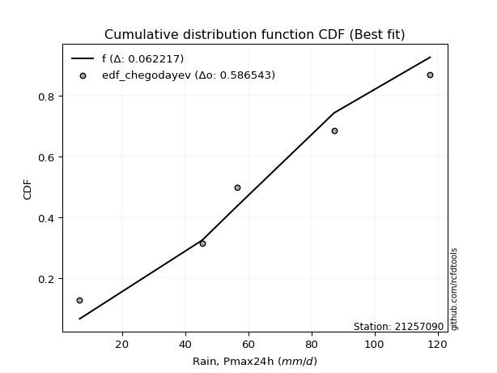</img>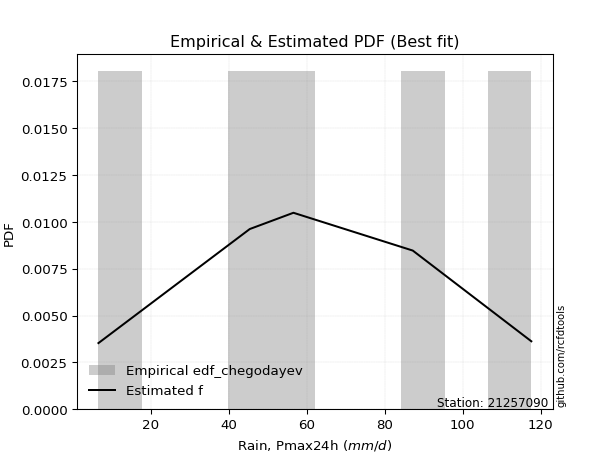</img>

</div>


### 6. EDF Blom (1958)

The Blom formula is a specific "plotting position" formula used in hydrology and statistical analysis to estimate the empirical cumulative probability (or non-exceedance probability) of a data series. It is particularly recommended for data that are approximately normally distributed. The constant _a_ is set to 0.375 (or 3/8).

<div align="center">


$P=(m-a)/(n+1-2a)$


</div>


**6.1. Empirical values**

<div align="center">

|                | 0                   | 1                   | 2        | 3                  | 4                  |
|:---------------|:--------------------|:--------------------|:---------|:-------------------|:-------------------|
| date           | 2023                | 2021                | 2022     | 2020               | 2019               |
| x              | 6.6                 | 45.4                | 56.6     | 87.2               | 117.6              |
| m              | 1                   | 2                   | 3        | 4                  | 5                  |
| empirical_dist | edf_blom            | edf_blom            | edf_blom | edf_blom           | edf_blom           |
| empirical      | 0.11904761904761904 | 0.30952380952380953 | 0.5      | 0.6904761904761905 | 0.8809523809523809 |
| empirical_tr   | 1.135135135135135   | 1.4482758620689655  | 2.0      | 3.230769230769231  | 8.399999999999999  |

</div>


**6.2. Kolmogorov-Smirnov fit test (sorted by Δ)**


<div align="center">

|                | 0                   | 1                   | 2                    | 3                   | 4                   | 5                   | 6                   | 7                   | 8                   | 9                   | 10                 | 11                  | 12                  | 13                  | 14                 | 15                  | 16                  | 17                  | 18                  | 19                  | 20                  | 21                  | 22                 | 23                  | 24                  | 25                 | 26                  | 27                 | 28                  | 29                 | 30                  | 31                  | 32                  | 33                  | 34                 | 35                 | 36                  | 37                  | 38                 | 39                    | 40                  | 41                  | 42                  | 43                  | 44                  | 45                 | 46                 | 47                 | 48                 | 49                  | 50                 | 51                  | 52                  | 53                  | 54                  | 55                 | 56                 | 57                 | 58                  | 59                 | 60                  | 61                  | 62                  | 63                  | 64                  | 65                 | 66                  | 67                 | 68                 | 69                 | 70                  | 71                  | 72                  | 73                 | 74                 | 75                 | 76                 | 77                  | 78                  | 79                 | 80                 | 81                  | 82                  | 83                  | 84                 | 85                 | 86                 | 87                 |
|:---------------|:--------------------|:--------------------|:---------------------|:--------------------|:--------------------|:--------------------|:--------------------|:--------------------|:--------------------|:--------------------|:-------------------|:--------------------|:--------------------|:--------------------|:-------------------|:--------------------|:--------------------|:--------------------|:--------------------|:--------------------|:--------------------|:--------------------|:-------------------|:--------------------|:--------------------|:-------------------|:--------------------|:-------------------|:--------------------|:-------------------|:--------------------|:--------------------|:--------------------|:--------------------|:-------------------|:-------------------|:--------------------|:--------------------|:-------------------|:----------------------|:--------------------|:--------------------|:--------------------|:--------------------|:--------------------|:-------------------|:-------------------|:-------------------|:-------------------|:--------------------|:-------------------|:--------------------|:--------------------|:--------------------|:--------------------|:-------------------|:-------------------|:-------------------|:--------------------|:-------------------|:--------------------|:--------------------|:--------------------|:--------------------|:--------------------|:-------------------|:--------------------|:-------------------|:-------------------|:-------------------|:--------------------|:--------------------|:--------------------|:-------------------|:-------------------|:-------------------|:-------------------|:--------------------|:--------------------|:-------------------|:-------------------|:--------------------|:--------------------|:--------------------|:-------------------|:-------------------|:-------------------|:-------------------|
| station        | 21257090            | 21257090            | 21257090             | 21257090            | 21257090            | 21257090            | 21257090            | 21257090            | 21257090            | 21257090            | 21257090           | 21257090            | 21257090            | 21257090            | 21257090           | 21257090            | 21257090            | 21257090            | 21257090            | 21257090            | 21257090            | 21257090            | 21257090           | 21257090            | 21257090            | 21257090           | 21257090            | 21257090           | 21257090            | 21257090           | 21257090            | 21257090            | 21257090            | 21257090            | 21257090           | 21257090           | 21257090            | 21257090            | 21257090           | 21257090              | 21257090            | 21257090            | 21257090            | 21257090            | 21257090            | 21257090           | 21257090           | 21257090           | 21257090           | 21257090            | 21257090           | 21257090            | 21257090            | 21257090            | 21257090            | 21257090           | 21257090           | 21257090           | 21257090            | 21257090           | 21257090            | 21257090            | 21257090            | 21257090            | 21257090            | 21257090           | 21257090            | 21257090           | 21257090           | 21257090           | 21257090            | 21257090            | 21257090            | 21257090           | 21257090           | 21257090           | 21257090           | 21257090            | 21257090            | 21257090           | 21257090           | 21257090            | 21257090            | 21257090            | 21257090           | 21257090           | 21257090           | 21257090           |
| empirical_dist | edf_blom            | edf_blom            | edf_blom             | edf_blom            | edf_blom            | edf_blom            | edf_blom            | edf_blom            | edf_blom            | edf_blom            | edf_blom           | edf_blom            | edf_blom            | edf_blom            | edf_blom           | edf_blom            | edf_blom            | edf_blom            | edf_blom            | edf_blom            | edf_blom            | edf_blom            | edf_blom           | edf_blom            | edf_blom            | edf_blom           | edf_blom            | edf_blom           | edf_blom            | edf_blom           | edf_blom            | edf_blom            | edf_blom            | edf_blom            | edf_blom           | edf_blom           | edf_blom            | edf_blom            | edf_blom           | edf_blom              | edf_blom            | edf_blom            | edf_blom            | edf_blom            | edf_blom            | edf_blom           | edf_blom           | edf_blom           | edf_blom           | edf_blom            | edf_blom           | edf_blom            | edf_blom            | edf_blom            | edf_blom            | edf_blom           | edf_blom           | edf_blom           | edf_blom            | edf_blom           | edf_blom            | edf_blom            | edf_blom            | edf_blom            | edf_blom            | edf_blom           | edf_blom            | edf_blom           | edf_blom           | edf_blom           | edf_blom            | edf_blom            | edf_blom            | edf_blom           | edf_blom           | edf_blom           | edf_blom           | edf_blom            | edf_blom            | edf_blom           | edf_blom           | edf_blom            | edf_blom            | edf_blom            | edf_blom           | edf_blom           | edf_blom           | edf_blom           |
| p_dist         | betaprime           | f                   | genlogistic          | fisk                | erlang              | gamma               | nct                 | johnsonsu           | exponnorm           | truncnorm           | norm               | crystalball         | t                   | pearson3            | invgamma           | maxwell             | weibull_min         | rice                | logistic            | rayleigh            | invgauss            | hypsecant           | laplace_asymmetric | kstwobign           | gumbel_r            | logweibull_min     | ncf                 | logmielke          | laplace             | moyal              | logloggamma         | mielke              | halfnorm            | halflogistic        | logfisk            | logpearson3        | loggumbel_l         | loggompertz         | gumbel_l           | loglaplace_asymmetric | nakagami            | wald                | gibrat              | genexpon            | expon               | lognorm            | lognorm            | logcrystalball     | logexponnorm       | logt                | lognct             | logfatiguelife      | loglogistic         | loghypsecant        | logbetaprime        | logf               | loglaplace         | logncf             | logrice             | loginvgamma        | logerlang           | loginvgauss         | loggamma            | loggamma            | logalpha            | loginvweibull      | logmaxwell          | lograyleigh        | loggumbel_r        | logkstwobign       | loghalfnorm         | loggenexpon         | logmoyal            | loghalflogistic    | logtruncnorm       | lognakagami        | logexpon           | logwald             | loglognorm          | loggibrat          | gompertz           | alpha               | invweibull          | logchi2             | logjohnsonsu       | fatiguelife        | chi2               | loggenlogistic     |
| delta          | 0.05692758568895895 | 0.06120771781389417 | 0.061524985891376116 | 0.06314569324671304 | 0.06376959506172036 | 0.06377458598131747 | 0.06403282612634564 | 0.06409198281202999 | 0.06409841608017824 | 0.06409879079980185 | 0.0640988223808262 | 0.06409883372349318 | 0.06409972753522164 | 0.06442470241517567 | 0.0662019137637816 | 0.06899093983740526 | 0.07015665857598381 | 0.07348785821879411 | 0.07454279089888993 | 0.08109053884432427 | 0.08378462478912074 | 0.08965832287173059 | 0.0900417485995264 | 0.09090659884599778 | 0.09640001660394018 | 0.1014627705638601 | 0.10505773198616303 | 0.1066782771643433 | 0.11033419939976807 | 0.1134033702098131 | 0.11892297512489192 | 0.11904529329428346 | 0.11904761904761904 | 0.11904761904761904 | 0.1201938410363595 | 0.1247590531416336 | 0.12856699446677378 | 0.12889319045380132 | 0.1335009316762616 | 0.13610540606204014   | 0.14342503870329965 | 0.14772903764313394 | 0.17749343725622668 | 0.18982036916920186 | 0.18983657088948747 | 0.1986526991730969 | 0.1986526991730969 | 0.198653061109069  | 0.198654188661329  | 0.19865583327886038 | 0.1987884210887556 | 0.19880094689595207 | 0.19976943752064835 | 0.20072287182380433 | 0.20215541070143406 | 0.2027578749225425 | 0.2047616431253746 | 0.206029726705232  | 0.20757063119245334 | 0.2129132915781864 | 0.21379028088122232 | 0.21698415961093254 | 0.21733946707539764 | 0.21733946707539764 | 0.22614402688470148 | 0.2289826239074242 | 0.23135808239714917 | 0.2421876360342241 | 0.2692219591022633 | 0.2713624854933685 | 0.27267317719449513 | 0.27814651035035065 | 0.29499507272957903 | 0.2980915955767648 | 0.3095221094151866 | 0.3095237285392041 | 0.3265659458050316 | 0.36662758177462473 | 0.37713885624887944 | 0.3912092257825417 | 0.4039607196861407 | 0.43952923751013306 | 0.45334244800659285 | 0.48584772416564326 | 0.5258311899529184 | 0.5319130969920913 | 0.6809982550807127 | 0.6904761904761905 |
| deltao         | 0.5865427407550001  | 0.5865427407550001  | 0.5865427407550001   | 0.5865427407550001  | 0.5865427407550001  | 0.5865427407550001  | 0.5865427407550001  | 0.5865427407550001  | 0.5865427407550001  | 0.5865427407550001  | 0.5865427407550001 | 0.5865427407550001  | 0.5865427407550001  | 0.5865427407550001  | 0.5865427407550001 | 0.5865427407550001  | 0.5865427407550001  | 0.5865427407550001  | 0.5865427407550001  | 0.5865427407550001  | 0.5865427407550001  | 0.5865427407550001  | 0.5865427407550001 | 0.5865427407550001  | 0.5865427407550001  | 0.5865427407550001 | 0.5865427407550001  | 0.5865427407550001 | 0.5865427407550001  | 0.5865427407550001 | 0.5865427407550001  | 0.5865427407550001  | 0.5865427407550001  | 0.5865427407550001  | 0.5865427407550001 | 0.5865427407550001 | 0.5865427407550001  | 0.5865427407550001  | 0.5865427407550001 | 0.5865427407550001    | 0.5865427407550001  | 0.5865427407550001  | 0.5865427407550001  | 0.5865427407550001  | 0.5865427407550001  | 0.5865427407550001 | 0.5865427407550001 | 0.5865427407550001 | 0.5865427407550001 | 0.5865427407550001  | 0.5865427407550001 | 0.5865427407550001  | 0.5865427407550001  | 0.5865427407550001  | 0.5865427407550001  | 0.5865427407550001 | 0.5865427407550001 | 0.5865427407550001 | 0.5865427407550001  | 0.5865427407550001 | 0.5865427407550001  | 0.5865427407550001  | 0.5865427407550001  | 0.5865427407550001  | 0.5865427407550001  | 0.5865427407550001 | 0.5865427407550001  | 0.5865427407550001 | 0.5865427407550001 | 0.5865427407550001 | 0.5865427407550001  | 0.5865427407550001  | 0.5865427407550001  | 0.5865427407550001 | 0.5865427407550001 | 0.5865427407550001 | 0.5865427407550001 | 0.5865427407550001  | 0.5865427407550001  | 0.5865427407550001 | 0.5865427407550001 | 0.5865427407550001  | 0.5865427407550001  | 0.5865427407550001  | 0.5865427407550001 | 0.5865427407550001 | 0.5865427407550001 | 0.5865427407550001 |
| eval           | Δo > Δ              | Δo > Δ              | Δo > Δ               | Δo > Δ              | Δo > Δ              | Δo > Δ              | Δo > Δ              | Δo > Δ              | Δo > Δ              | Δo > Δ              | Δo > Δ             | Δo > Δ              | Δo > Δ              | Δo > Δ              | Δo > Δ             | Δo > Δ              | Δo > Δ              | Δo > Δ              | Δo > Δ              | Δo > Δ              | Δo > Δ              | Δo > Δ              | Δo > Δ             | Δo > Δ              | Δo > Δ              | Δo > Δ             | Δo > Δ              | Δo > Δ             | Δo > Δ              | Δo > Δ             | Δo > Δ              | Δo > Δ              | Δo > Δ              | Δo > Δ              | Δo > Δ             | Δo > Δ             | Δo > Δ              | Δo > Δ              | Δo > Δ             | Δo > Δ                | Δo > Δ              | Δo > Δ              | Δo > Δ              | Δo > Δ              | Δo > Δ              | Δo > Δ             | Δo > Δ             | Δo > Δ             | Δo > Δ             | Δo > Δ              | Δo > Δ             | Δo > Δ              | Δo > Δ              | Δo > Δ              | Δo > Δ              | Δo > Δ             | Δo > Δ             | Δo > Δ             | Δo > Δ              | Δo > Δ             | Δo > Δ              | Δo > Δ              | Δo > Δ              | Δo > Δ              | Δo > Δ              | Δo > Δ             | Δo > Δ              | Δo > Δ             | Δo > Δ             | Δo > Δ             | Δo > Δ              | Δo > Δ              | Δo > Δ              | Δo > Δ             | Δo > Δ             | Δo > Δ             | Δo > Δ             | Δo > Δ              | Δo > Δ              | Δo > Δ             | Δo > Δ             | Δo > Δ              | Δo > Δ              | Δo > Δ              | Δo > Δ             | Δo > Δ             | Δo <= Δ            | Δo <= Δ            |
| fit            | 1                   | 1                   | 1                    | 1                   | 1                   | 1                   | 1                   | 1                   | 1                   | 1                   | 1                  | 1                   | 1                   | 1                   | 1                  | 1                   | 1                   | 1                   | 1                   | 1                   | 1                   | 1                   | 1                  | 1                   | 1                   | 1                  | 1                   | 1                  | 1                   | 1                  | 1                   | 1                   | 1                   | 1                   | 1                  | 1                  | 1                   | 1                   | 1                  | 1                     | 1                   | 1                   | 1                   | 1                   | 1                   | 1                  | 1                  | 1                  | 1                  | 1                   | 1                  | 1                   | 1                   | 1                   | 1                   | 1                  | 1                  | 1                  | 1                   | 1                  | 1                   | 1                   | 1                   | 1                   | 1                   | 1                  | 1                   | 1                  | 1                  | 1                  | 1                   | 1                   | 1                   | 1                  | 1                  | 1                  | 1                  | 1                   | 1                   | 1                  | 1                  | 1                   | 1                   | 1                   | 1                  | 1                  | 0                  | 0                  |
| n              | 5                   | 5                   | 5                    | 5                   | 5                   | 5                   | 5                   | 5                   | 5                   | 5                   | 5                  | 5                   | 5                   | 5                   | 5                  | 5                   | 5                   | 5                   | 5                   | 5                   | 5                   | 5                   | 5                  | 5                   | 5                   | 5                  | 5                   | 5                  | 5                   | 5                  | 5                   | 5                   | 5                   | 5                   | 5                  | 5                  | 5                   | 5                   | 5                  | 5                     | 5                   | 5                   | 5                   | 5                   | 5                   | 5                  | 5                  | 5                  | 5                  | 5                   | 5                  | 5                   | 5                   | 5                   | 5                   | 5                  | 5                  | 5                  | 5                   | 5                  | 5                   | 5                   | 5                   | 5                   | 5                   | 5                  | 5                   | 5                  | 5                  | 5                  | 5                   | 5                   | 5                   | 5                  | 5                  | 5                  | 5                  | 5                   | 5                   | 5                  | 5                  | 5                   | 5                   | 5                   | 5                  | 5                  | 5                  | 5                  |
| best_fit       | 1                   | 0                   | 0                    | 0                   | 0                   | 0                   | 0                   | 0                   | 0                   | 0                   | 0                  | 0                   | 0                   | 0                   | 0                  | 0                   | 0                   | 0                   | 0                   | 0                   | 0                   | 0                   | 0                  | 0                   | 0                   | 0                  | 0                   | 0                  | 0                   | 0                  | 0                   | 0                   | 0                   | 0                   | 0                  | 0                  | 0                   | 0                   | 0                  | 0                     | 0                   | 0                   | 0                   | 0                   | 0                   | 0                  | 0                  | 0                  | 0                  | 0                   | 0                  | 0                   | 0                   | 0                   | 0                   | 0                  | 0                  | 0                  | 0                   | 0                  | 0                   | 0                   | 0                   | 0                   | 0                   | 0                  | 0                   | 0                  | 0                  | 0                  | 0                   | 0                   | 0                   | 0                  | 0                  | 0                  | 0                  | 0                   | 0                   | 0                  | 0                  | 0                   | 0                   | 0                   | 0                  | 0                  | 0                  | 0                  |
| best_fit_sort  | 1                   | 2                   | 3                    | 4                   | 5                   | 6                   | 7                   | 8                   | 9                   | 10                  | 11                 | 12                  | 13                  | 14                  | 15                 | 16                  | 17                  | 18                  | 19                  | 20                  | 21                  | 22                  | 23                 | 24                  | 25                  | 26                 | 27                  | 28                 | 29                  | 30                 | 31                  | 32                  | 33                  | 34                  | 35                 | 36                 | 37                  | 38                  | 39                 | 40                    | 41                  | 42                  | 43                  | 44                  | 45                  | 46                 | 47                 | 48                 | 49                 | 50                  | 51                 | 52                  | 53                  | 54                  | 55                  | 56                 | 57                 | 58                 | 59                  | 60                 | 61                  | 62                  | 63                  | 64                  | 65                  | 66                 | 67                  | 68                 | 69                 | 70                 | 71                  | 72                  | 73                  | 74                 | 75                 | 76                 | 77                 | 78                  | 79                  | 80                 | 81                 | 82                  | 83                  | 84                  | 85                 | 86                 | 87                 | 88                 |

</div>


**6.3. Best fit**

<div align="center">

|   id |   station | empirical_dist   | p_dist    |     delta |   deltao | eval   |   fit |   n |   best_fit |   best_fit_sort |
|-----:|----------:|:-----------------|:----------|----------:|---------:|:-------|------:|----:|-----------:|----------------:|
|    0 |  21257090 | edf_blom         | betaprime | 0.0569276 | 0.586543 | Δo > Δ |     1 |   5 |          1 |               1 |

</div>


<div align="center">

</img></img>

</div>


### 7. EDF Tukey (1962)

In hydrology, the Tukey formula is used as a plotting position formula to estimate the empirical probability or frequency of a flood event (or other hydrological data). The formula parameter is given as _c=0.333_ (or 1/3).

<div align="center">


$P=(m-c)/(n+1-2c)$


</div>


**7.1. Empirical values**

<div align="center">

|                | 0                  | 1                  | 2         | 3         | 4         |
|:---------------|:-------------------|:-------------------|:----------|:----------|:----------|
| date           | 2023               | 2021               | 2022      | 2020      | 2019      |
| x              | 6.6                | 45.4               | 56.6      | 87.2      | 117.6     |
| m              | 1                  | 2                  | 3         | 4         | 5         |
| empirical_dist | edf_tukey          | edf_tukey          | edf_tukey | edf_tukey | edf_tukey |
| empirical      | 0.125              | 0.3125             | 0.5       | 0.6875    | 0.875     |
| empirical_tr   | 1.1428571428571428 | 1.4545454545454546 | 2.0       | 3.2       | 8.0       |

</div>


**7.2. Kolmogorov-Smirnov fit test (sorted by Δ)**


<div align="center">

|                | 0                   | 1                   | 2                   | 3                   | 4                   | 5                   | 6                   | 7                   | 8                   | 9                  | 10                  | 11                  | 12                  | 13                  | 14                  | 15                  | 16                  | 17                 | 18                  | 19                  | 20                  | 21                  | 22                  | 23                  | 24                  | 25                  | 26                  | 27                  | 28                  | 29                  | 30                  | 31                  | 32                  | 33                  | 34                 | 35                 | 36                 | 37                  | 38                    | 39                 | 40                  | 41                 | 42                  | 43                 | 44                 | 45                  | 46                  | 47                  | 48                  | 49                  | 50                  | 51                 | 52                 | 53                  | 54                 | 55                  | 56                  | 57                  | 58                  | 59                  | 60                  | 61                  | 62                  | 63                  | 64                 | 65                  | 66                 | 67                  | 68                  | 69                  | 70                  | 71                 | 72                  | 73                 | 74                  | 75                 | 76                  | 77                  | 78                 | 79                 | 80                 | 81                 | 82                 | 83                 | 84                 | 85                 | 86                 | 87                 |
|:---------------|:--------------------|:--------------------|:--------------------|:--------------------|:--------------------|:--------------------|:--------------------|:--------------------|:--------------------|:-------------------|:--------------------|:--------------------|:--------------------|:--------------------|:--------------------|:--------------------|:--------------------|:-------------------|:--------------------|:--------------------|:--------------------|:--------------------|:--------------------|:--------------------|:--------------------|:--------------------|:--------------------|:--------------------|:--------------------|:--------------------|:--------------------|:--------------------|:--------------------|:--------------------|:-------------------|:-------------------|:-------------------|:--------------------|:----------------------|:-------------------|:--------------------|:-------------------|:--------------------|:-------------------|:-------------------|:--------------------|:--------------------|:--------------------|:--------------------|:--------------------|:--------------------|:-------------------|:-------------------|:--------------------|:-------------------|:--------------------|:--------------------|:--------------------|:--------------------|:--------------------|:--------------------|:--------------------|:--------------------|:--------------------|:-------------------|:--------------------|:-------------------|:--------------------|:--------------------|:--------------------|:--------------------|:-------------------|:--------------------|:-------------------|:--------------------|:-------------------|:--------------------|:--------------------|:-------------------|:-------------------|:-------------------|:-------------------|:-------------------|:-------------------|:-------------------|:-------------------|:-------------------|:-------------------|
| station        | 21257090            | 21257090            | 21257090            | 21257090            | 21257090            | 21257090            | 21257090            | 21257090            | 21257090            | 21257090           | 21257090            | 21257090            | 21257090            | 21257090            | 21257090            | 21257090            | 21257090            | 21257090           | 21257090            | 21257090            | 21257090            | 21257090            | 21257090            | 21257090            | 21257090            | 21257090            | 21257090            | 21257090            | 21257090            | 21257090            | 21257090            | 21257090            | 21257090            | 21257090            | 21257090           | 21257090           | 21257090           | 21257090            | 21257090              | 21257090           | 21257090            | 21257090           | 21257090            | 21257090           | 21257090           | 21257090            | 21257090            | 21257090            | 21257090            | 21257090            | 21257090            | 21257090           | 21257090           | 21257090            | 21257090           | 21257090            | 21257090            | 21257090            | 21257090            | 21257090            | 21257090            | 21257090            | 21257090            | 21257090            | 21257090           | 21257090            | 21257090           | 21257090            | 21257090            | 21257090            | 21257090            | 21257090           | 21257090            | 21257090           | 21257090            | 21257090           | 21257090            | 21257090            | 21257090           | 21257090           | 21257090           | 21257090           | 21257090           | 21257090           | 21257090           | 21257090           | 21257090           | 21257090           |
| empirical_dist | edf_tukey           | edf_tukey           | edf_tukey           | edf_tukey           | edf_tukey           | edf_tukey           | edf_tukey           | edf_tukey           | edf_tukey           | edf_tukey          | edf_tukey           | edf_tukey           | edf_tukey           | edf_tukey           | edf_tukey           | edf_tukey           | edf_tukey           | edf_tukey          | edf_tukey           | edf_tukey           | edf_tukey           | edf_tukey           | edf_tukey           | edf_tukey           | edf_tukey           | edf_tukey           | edf_tukey           | edf_tukey           | edf_tukey           | edf_tukey           | edf_tukey           | edf_tukey           | edf_tukey           | edf_tukey           | edf_tukey          | edf_tukey          | edf_tukey          | edf_tukey           | edf_tukey             | edf_tukey          | edf_tukey           | edf_tukey          | edf_tukey           | edf_tukey          | edf_tukey          | edf_tukey           | edf_tukey           | edf_tukey           | edf_tukey           | edf_tukey           | edf_tukey           | edf_tukey          | edf_tukey          | edf_tukey           | edf_tukey          | edf_tukey           | edf_tukey           | edf_tukey           | edf_tukey           | edf_tukey           | edf_tukey           | edf_tukey           | edf_tukey           | edf_tukey           | edf_tukey          | edf_tukey           | edf_tukey          | edf_tukey           | edf_tukey           | edf_tukey           | edf_tukey           | edf_tukey          | edf_tukey           | edf_tukey          | edf_tukey           | edf_tukey          | edf_tukey           | edf_tukey           | edf_tukey          | edf_tukey          | edf_tukey          | edf_tukey          | edf_tukey          | edf_tukey          | edf_tukey          | edf_tukey          | edf_tukey          | edf_tukey          |
| p_dist         | betaprime           | f                   | fisk                | erlang              | gamma               | nct                 | johnsonsu           | exponnorm           | truncnorm           | norm               | crystalball         | t                   | pearson3            | genlogistic         | invgamma            | maxwell             | weibull_min         | logistic           | rice                | invgauss            | rayleigh            | kstwobign           | hypsecant           | laplace_asymmetric  | logweibull_min      | ncf                 | gumbel_r            | logmielke           | laplace             | logfisk             | moyal               | logpearson3         | logloggamma         | mielke              | halfnorm           | halflogistic       | loggumbel_l        | loggompertz         | loglaplace_asymmetric | gumbel_l           | nakagami            | wald               | gibrat              | genexpon           | expon              | lognorm             | lognorm             | logcrystalball      | logexponnorm        | logt                | lognct              | logfatiguelife     | loglogistic        | loghypsecant        | logbetaprime       | logf                | loglaplace          | logncf              | logrice             | loginvgamma         | logerlang           | loginvgauss         | loggamma            | loggamma            | logalpha           | loginvweibull       | logmaxwell         | lograyleigh         | loggumbel_r         | logkstwobign        | loghalfnorm         | loggenexpon        | logmoyal            | loghalflogistic    | logtruncnorm        | lognakagami        | logexpon            | logwald             | loglognorm         | loggibrat          | gompertz           | alpha              | invweibull         | logchi2            | logjohnsonsu       | fatiguelife        | chi2               | loggenlogistic     |
| delta          | 0.05877760606243761 | 0.06120771781389417 | 0.06314569324671304 | 0.06376959506172036 | 0.06377458598131747 | 0.06403282612634564 | 0.06409198281202999 | 0.06409841608017824 | 0.06409879079980185 | 0.0640988223808262 | 0.06409883372349318 | 0.06409972753522164 | 0.06442470241517567 | 0.06450117636756658 | 0.06917810423997206 | 0.07494332078978622 | 0.07610903952836477 | 0.0775189813750804 | 0.07944023917117507 | 0.08080843431293028 | 0.08704291979670523 | 0.08793040836980731 | 0.09263451334792105 | 0.09301793907571687 | 0.09848658008766964 | 0.10208154150997256 | 0.10235239755632114 | 0.11263065811672424 | 0.11331038987595854 | 0.11721765056016903 | 0.11935575116219406 | 0.12178286266544314 | 0.12487535607727285 | 0.12499767424666441 | 0.125              | 0.125              | 0.1255908039905833 | 0.12591699997761086 | 0.13312921558584967   | 0.1335009316762616 | 0.14044884822710918 | 0.1507052281193244 | 0.18046962773241715 | 0.1868441786930114 | 0.186860380413297  | 0.19567650869690645 | 0.19567650869690645 | 0.19567687063287853 | 0.19567799818513854 | 0.19567964280266992 | 0.19581223061256514 | 0.1958247564197616 | 0.1967932470444579 | 0.19774668134761386 | 0.1991792202252436 | 0.19978168444635203 | 0.20178545264918413 | 0.20305353622904154 | 0.20459444071626287 | 0.20993710110199593 | 0.21081409040503185 | 0.21400796913474207 | 0.21436327659920718 | 0.21436327659920718 | 0.223167836408511  | 0.22600643343123372 | 0.2283818919209587 | 0.23921144555803364 | 0.26624576862607285 | 0.26838629501717803 | 0.26969698671830467 | 0.2751703198741602 | 0.29201888225338857 | 0.2951154051005743 | 0.31249829989137706 | 0.3124999190153946 | 0.32358975532884116 | 0.36365139129843427 | 0.374162665772689  | 0.3882330353063512 | 0.4039607196861407 | 0.4365530470339426 | 0.4473900670542119 | 0.4828715336894528 | 0.522854999476728  | 0.5289369065159009 | 0.6780220646045222 | 0.6875             |
| deltao         | 0.5865427407550001  | 0.5865427407550001  | 0.5865427407550001  | 0.5865427407550001  | 0.5865427407550001  | 0.5865427407550001  | 0.5865427407550001  | 0.5865427407550001  | 0.5865427407550001  | 0.5865427407550001 | 0.5865427407550001  | 0.5865427407550001  | 0.5865427407550001  | 0.5865427407550001  | 0.5865427407550001  | 0.5865427407550001  | 0.5865427407550001  | 0.5865427407550001 | 0.5865427407550001  | 0.5865427407550001  | 0.5865427407550001  | 0.5865427407550001  | 0.5865427407550001  | 0.5865427407550001  | 0.5865427407550001  | 0.5865427407550001  | 0.5865427407550001  | 0.5865427407550001  | 0.5865427407550001  | 0.5865427407550001  | 0.5865427407550001  | 0.5865427407550001  | 0.5865427407550001  | 0.5865427407550001  | 0.5865427407550001 | 0.5865427407550001 | 0.5865427407550001 | 0.5865427407550001  | 0.5865427407550001    | 0.5865427407550001 | 0.5865427407550001  | 0.5865427407550001 | 0.5865427407550001  | 0.5865427407550001 | 0.5865427407550001 | 0.5865427407550001  | 0.5865427407550001  | 0.5865427407550001  | 0.5865427407550001  | 0.5865427407550001  | 0.5865427407550001  | 0.5865427407550001 | 0.5865427407550001 | 0.5865427407550001  | 0.5865427407550001 | 0.5865427407550001  | 0.5865427407550001  | 0.5865427407550001  | 0.5865427407550001  | 0.5865427407550001  | 0.5865427407550001  | 0.5865427407550001  | 0.5865427407550001  | 0.5865427407550001  | 0.5865427407550001 | 0.5865427407550001  | 0.5865427407550001 | 0.5865427407550001  | 0.5865427407550001  | 0.5865427407550001  | 0.5865427407550001  | 0.5865427407550001 | 0.5865427407550001  | 0.5865427407550001 | 0.5865427407550001  | 0.5865427407550001 | 0.5865427407550001  | 0.5865427407550001  | 0.5865427407550001 | 0.5865427407550001 | 0.5865427407550001 | 0.5865427407550001 | 0.5865427407550001 | 0.5865427407550001 | 0.5865427407550001 | 0.5865427407550001 | 0.5865427407550001 | 0.5865427407550001 |
| eval           | Δo > Δ              | Δo > Δ              | Δo > Δ              | Δo > Δ              | Δo > Δ              | Δo > Δ              | Δo > Δ              | Δo > Δ              | Δo > Δ              | Δo > Δ             | Δo > Δ              | Δo > Δ              | Δo > Δ              | Δo > Δ              | Δo > Δ              | Δo > Δ              | Δo > Δ              | Δo > Δ             | Δo > Δ              | Δo > Δ              | Δo > Δ              | Δo > Δ              | Δo > Δ              | Δo > Δ              | Δo > Δ              | Δo > Δ              | Δo > Δ              | Δo > Δ              | Δo > Δ              | Δo > Δ              | Δo > Δ              | Δo > Δ              | Δo > Δ              | Δo > Δ              | Δo > Δ             | Δo > Δ             | Δo > Δ             | Δo > Δ              | Δo > Δ                | Δo > Δ             | Δo > Δ              | Δo > Δ             | Δo > Δ              | Δo > Δ             | Δo > Δ             | Δo > Δ              | Δo > Δ              | Δo > Δ              | Δo > Δ              | Δo > Δ              | Δo > Δ              | Δo > Δ             | Δo > Δ             | Δo > Δ              | Δo > Δ             | Δo > Δ              | Δo > Δ              | Δo > Δ              | Δo > Δ              | Δo > Δ              | Δo > Δ              | Δo > Δ              | Δo > Δ              | Δo > Δ              | Δo > Δ             | Δo > Δ              | Δo > Δ             | Δo > Δ              | Δo > Δ              | Δo > Δ              | Δo > Δ              | Δo > Δ             | Δo > Δ              | Δo > Δ             | Δo > Δ              | Δo > Δ             | Δo > Δ              | Δo > Δ              | Δo > Δ             | Δo > Δ             | Δo > Δ             | Δo > Δ             | Δo > Δ             | Δo > Δ             | Δo > Δ             | Δo > Δ             | Δo <= Δ            | Δo <= Δ            |
| fit            | 1                   | 1                   | 1                   | 1                   | 1                   | 1                   | 1                   | 1                   | 1                   | 1                  | 1                   | 1                   | 1                   | 1                   | 1                   | 1                   | 1                   | 1                  | 1                   | 1                   | 1                   | 1                   | 1                   | 1                   | 1                   | 1                   | 1                   | 1                   | 1                   | 1                   | 1                   | 1                   | 1                   | 1                   | 1                  | 1                  | 1                  | 1                   | 1                     | 1                  | 1                   | 1                  | 1                   | 1                  | 1                  | 1                   | 1                   | 1                   | 1                   | 1                   | 1                   | 1                  | 1                  | 1                   | 1                  | 1                   | 1                   | 1                   | 1                   | 1                   | 1                   | 1                   | 1                   | 1                   | 1                  | 1                   | 1                  | 1                   | 1                   | 1                   | 1                   | 1                  | 1                   | 1                  | 1                   | 1                  | 1                   | 1                   | 1                  | 1                  | 1                  | 1                  | 1                  | 1                  | 1                  | 1                  | 0                  | 0                  |
| n              | 5                   | 5                   | 5                   | 5                   | 5                   | 5                   | 5                   | 5                   | 5                   | 5                  | 5                   | 5                   | 5                   | 5                   | 5                   | 5                   | 5                   | 5                  | 5                   | 5                   | 5                   | 5                   | 5                   | 5                   | 5                   | 5                   | 5                   | 5                   | 5                   | 5                   | 5                   | 5                   | 5                   | 5                   | 5                  | 5                  | 5                  | 5                   | 5                     | 5                  | 5                   | 5                  | 5                   | 5                  | 5                  | 5                   | 5                   | 5                   | 5                   | 5                   | 5                   | 5                  | 5                  | 5                   | 5                  | 5                   | 5                   | 5                   | 5                   | 5                   | 5                   | 5                   | 5                   | 5                   | 5                  | 5                   | 5                  | 5                   | 5                   | 5                   | 5                   | 5                  | 5                   | 5                  | 5                   | 5                  | 5                   | 5                   | 5                  | 5                  | 5                  | 5                  | 5                  | 5                  | 5                  | 5                  | 5                  | 5                  |
| best_fit       | 1                   | 0                   | 0                   | 0                   | 0                   | 0                   | 0                   | 0                   | 0                   | 0                  | 0                   | 0                   | 0                   | 0                   | 0                   | 0                   | 0                   | 0                  | 0                   | 0                   | 0                   | 0                   | 0                   | 0                   | 0                   | 0                   | 0                   | 0                   | 0                   | 0                   | 0                   | 0                   | 0                   | 0                   | 0                  | 0                  | 0                  | 0                   | 0                     | 0                  | 0                   | 0                  | 0                   | 0                  | 0                  | 0                   | 0                   | 0                   | 0                   | 0                   | 0                   | 0                  | 0                  | 0                   | 0                  | 0                   | 0                   | 0                   | 0                   | 0                   | 0                   | 0                   | 0                   | 0                   | 0                  | 0                   | 0                  | 0                   | 0                   | 0                   | 0                   | 0                  | 0                   | 0                  | 0                   | 0                  | 0                   | 0                   | 0                  | 0                  | 0                  | 0                  | 0                  | 0                  | 0                  | 0                  | 0                  | 0                  |
| best_fit_sort  | 1                   | 2                   | 3                   | 4                   | 5                   | 6                   | 7                   | 8                   | 9                   | 10                 | 11                  | 12                  | 13                  | 14                  | 15                  | 16                  | 17                  | 18                 | 19                  | 20                  | 21                  | 22                  | 23                  | 24                  | 25                  | 26                  | 27                  | 28                  | 29                  | 30                  | 31                  | 32                  | 33                  | 34                  | 35                 | 36                 | 37                 | 38                  | 39                    | 40                 | 41                  | 42                 | 43                  | 44                 | 45                 | 46                  | 47                  | 48                  | 49                  | 50                  | 51                  | 52                 | 53                 | 54                  | 55                 | 56                  | 57                  | 58                  | 59                  | 60                  | 61                  | 62                  | 63                  | 64                  | 65                 | 66                  | 67                 | 68                  | 69                  | 70                  | 71                  | 72                 | 73                  | 74                 | 75                  | 76                 | 77                  | 78                  | 79                 | 80                 | 81                 | 82                 | 83                 | 84                 | 85                 | 86                 | 87                 | 88                 |

</div>


**7.3. Best fit**

<div align="center">

|   id |   station | empirical_dist   | p_dist    |     delta |   deltao | eval   |   fit |   n |   best_fit |   best_fit_sort |
|-----:|----------:|:-----------------|:----------|----------:|---------:|:-------|------:|----:|-----------:|----------------:|
|    0 |  21257090 | edf_tukey        | betaprime | 0.0587776 | 0.586543 | Δo > Δ |     1 |   5 |          1 |               1 |

</div>


<div align="center">

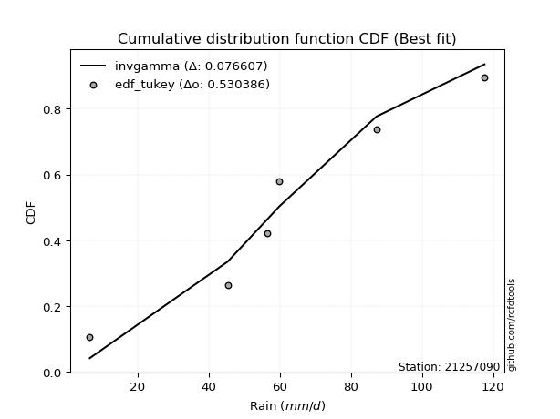</img>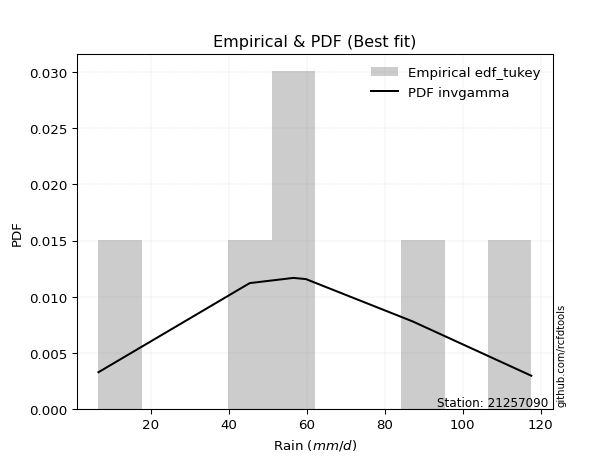</img>

</div>


### 8. EDF Gringorten (1963)

Gringorten plotting position formula is essential for estimating the probability and return periods of extreme events like floods and heavy rainfall. The constant _a=0.44_.

<div align="center">


$P=(m-a)/(n+1-2a)$


</div>


**8.1. Empirical values**

<div align="center">

|                | 0                   | 1                  | 2              | 3                 | 4                  |
|:---------------|:--------------------|:-------------------|:---------------|:------------------|:-------------------|
| date           | 2023                | 2021               | 2022           | 2020              | 2019               |
| x              | 6.6                 | 45.4               | 56.6           | 87.2              | 117.6              |
| m              | 1                   | 2                  | 3              | 4                 | 5                  |
| empirical_dist | edf_gringorten      | edf_gringorten     | edf_gringorten | edf_gringorten    | edf_gringorten     |
| empirical      | 0.10937500000000001 | 0.3046875          | 0.5            | 0.6953125         | 0.8906249999999999 |
| empirical_tr   | 1.1228070175438596  | 1.4382022471910112 | 2.0            | 3.282051282051282 | 9.142857142857133  |

</div>


**8.2. Kolmogorov-Smirnov fit test (sorted by Δ)**


<div align="center">

|                | 0                   | 1                   | 2                   | 3                    | 4                   | 5                   | 6                   | 7                   | 8                   | 9                   | 10                  | 11                  | 12                  | 13                  | 14                 | 15                  | 16                  | 17                  | 18                  | 19                  | 20                  | 21                  | 22                 | 23                  | 24                  | 25                  | 26                  | 27                  | 28                  | 29                  | 30                  | 31                  | 32                  | 33                  | 34                  | 35                  | 36                 | 37                 | 38                  | 39                    | 40                 | 41                  | 42                  | 43                 | 44                 | 45                  | 46                  | 47                  | 48                  | 49                  | 50                  | 51                 | 52                 | 53                  | 54                 | 55                  | 56                  | 57                  | 58                  | 59                  | 60                  | 61                  | 62                  | 63                  | 64                 | 65                  | 66                 | 67                  | 68                  | 69                  | 70                  | 71                 | 72                  | 73                 | 74                  | 75                 | 76                  | 77                  | 78                 | 79                 | 80                 | 81                 | 82                 | 83                 | 84                 | 85                 | 86                 | 87                 |
|:---------------|:--------------------|:--------------------|:--------------------|:---------------------|:--------------------|:--------------------|:--------------------|:--------------------|:--------------------|:--------------------|:--------------------|:--------------------|:--------------------|:--------------------|:-------------------|:--------------------|:--------------------|:--------------------|:--------------------|:--------------------|:--------------------|:--------------------|:-------------------|:--------------------|:--------------------|:--------------------|:--------------------|:--------------------|:--------------------|:--------------------|:--------------------|:--------------------|:--------------------|:--------------------|:--------------------|:--------------------|:-------------------|:-------------------|:--------------------|:----------------------|:-------------------|:--------------------|:--------------------|:-------------------|:-------------------|:--------------------|:--------------------|:--------------------|:--------------------|:--------------------|:--------------------|:-------------------|:-------------------|:--------------------|:-------------------|:--------------------|:--------------------|:--------------------|:--------------------|:--------------------|:--------------------|:--------------------|:--------------------|:--------------------|:-------------------|:--------------------|:-------------------|:--------------------|:--------------------|:--------------------|:--------------------|:-------------------|:--------------------|:-------------------|:--------------------|:-------------------|:--------------------|:--------------------|:-------------------|:-------------------|:-------------------|:-------------------|:-------------------|:-------------------|:-------------------|:-------------------|:-------------------|:-------------------|
| station        | 21257090            | 21257090            | 21257090            | 21257090             | 21257090            | 21257090            | 21257090            | 21257090            | 21257090            | 21257090            | 21257090            | 21257090            | 21257090            | 21257090            | 21257090           | 21257090            | 21257090            | 21257090            | 21257090            | 21257090            | 21257090            | 21257090            | 21257090           | 21257090            | 21257090            | 21257090            | 21257090            | 21257090            | 21257090            | 21257090            | 21257090            | 21257090            | 21257090            | 21257090            | 21257090            | 21257090            | 21257090           | 21257090           | 21257090            | 21257090              | 21257090           | 21257090            | 21257090            | 21257090           | 21257090           | 21257090            | 21257090            | 21257090            | 21257090            | 21257090            | 21257090            | 21257090           | 21257090           | 21257090            | 21257090           | 21257090            | 21257090            | 21257090            | 21257090            | 21257090            | 21257090            | 21257090            | 21257090            | 21257090            | 21257090           | 21257090            | 21257090           | 21257090            | 21257090            | 21257090            | 21257090            | 21257090           | 21257090            | 21257090           | 21257090            | 21257090           | 21257090            | 21257090            | 21257090           | 21257090           | 21257090           | 21257090           | 21257090           | 21257090           | 21257090           | 21257090           | 21257090           | 21257090           |
| empirical_dist | edf_gringorten      | edf_gringorten      | edf_gringorten      | edf_gringorten       | edf_gringorten      | edf_gringorten      | edf_gringorten      | edf_gringorten      | edf_gringorten      | edf_gringorten      | edf_gringorten      | edf_gringorten      | edf_gringorten      | edf_gringorten      | edf_gringorten     | edf_gringorten      | edf_gringorten      | edf_gringorten      | edf_gringorten      | edf_gringorten      | edf_gringorten      | edf_gringorten      | edf_gringorten     | edf_gringorten      | edf_gringorten      | edf_gringorten      | edf_gringorten      | edf_gringorten      | edf_gringorten      | edf_gringorten      | edf_gringorten      | edf_gringorten      | edf_gringorten      | edf_gringorten      | edf_gringorten      | edf_gringorten      | edf_gringorten     | edf_gringorten     | edf_gringorten      | edf_gringorten        | edf_gringorten     | edf_gringorten      | edf_gringorten      | edf_gringorten     | edf_gringorten     | edf_gringorten      | edf_gringorten      | edf_gringorten      | edf_gringorten      | edf_gringorten      | edf_gringorten      | edf_gringorten     | edf_gringorten     | edf_gringorten      | edf_gringorten     | edf_gringorten      | edf_gringorten      | edf_gringorten      | edf_gringorten      | edf_gringorten      | edf_gringorten      | edf_gringorten      | edf_gringorten      | edf_gringorten      | edf_gringorten     | edf_gringorten      | edf_gringorten     | edf_gringorten      | edf_gringorten      | edf_gringorten      | edf_gringorten      | edf_gringorten     | edf_gringorten      | edf_gringorten     | edf_gringorten      | edf_gringorten     | edf_gringorten      | edf_gringorten      | edf_gringorten     | edf_gringorten     | edf_gringorten     | edf_gringorten     | edf_gringorten     | edf_gringorten     | edf_gringorten     | edf_gringorten     | edf_gringorten     | edf_gringorten     |
| p_dist         | genlogistic         | betaprime           | maxwell             | weibull_min          | f                   | invgamma            | fisk                | erlang              | gamma               | rice                | nct                 | johnsonsu           | exponnorm           | truncnorm           | norm               | crystalball         | t                   | pearson3            | rayleigh            | logistic            | hypsecant           | laplace_asymmetric  | gumbel_r           | invgauss            | kstwobign           | logmielke           | moyal               | laplace             | logweibull_min      | logloggamma         | mielke              | halfnorm            | halflogistic        | ncf                 | logfisk             | logpearson3         | loggumbel_l        | gumbel_l           | loggompertz         | loglaplace_asymmetric | wald               | nakagami            | gibrat              | genexpon           | expon              | lognorm             | lognorm             | logcrystalball      | logexponnorm        | logt                | lognct              | logfatiguelife     | loglogistic        | loghypsecant        | logbetaprime       | logf                | loglaplace          | logncf              | logrice             | loginvgamma         | logerlang           | loginvgauss         | loggamma            | loggamma            | logalpha           | loginvweibull       | logmaxwell         | lograyleigh         | loggumbel_r         | logkstwobign        | loghalfnorm         | loggenexpon        | logmoyal            | loghalflogistic    | logtruncnorm        | lognakagami        | logexpon            | logwald             | loglognorm         | loggibrat          | gompertz           | alpha              | invweibull         | logchi2            | logjohnsonsu       | fatiguelife        | chi2               | loggenlogistic     |
| delta          | 0.05668867636756658 | 0.05692758568895895 | 0.05931832078978622 | 0.060484039528364786 | 0.06120771781389417 | 0.06136560423997206 | 0.06314569324671304 | 0.06376959506172036 | 0.06377458598131747 | 0.06381523917117507 | 0.06403282612634564 | 0.06409198281202999 | 0.06409841608017824 | 0.06409879079980185 | 0.0640988223808262 | 0.06409883372349318 | 0.06409972753522164 | 0.06442470241517567 | 0.07141791979670523 | 0.07265504373893827 | 0.08482201334792105 | 0.08520543907571687 | 0.0884224957421923 | 0.08862093431293028 | 0.09574290836980731 | 0.09700565811672435 | 0.10373075116219407 | 0.10549788987595854 | 0.10629908008766964 | 0.10925035607727296 | 0.10937267424666443 | 0.10937500000000001 | 0.10937500000000001 | 0.10989404150997256 | 0.12503015056016903 | 0.12959536266544314 | 0.1334033039905833 | 0.1335009316762616 | 0.13372949997761086 | 0.14094171558584967   | 0.1428927281193244 | 0.14826134822710918 | 0.17265712773241715 | 0.1946566786930114 | 0.194672880413297  | 0.20348900869690645 | 0.20348900869690645 | 0.20348937063287853 | 0.20349049818513854 | 0.20349214280266992 | 0.20362473061256514 | 0.2036372564197616 | 0.2046057470444579 | 0.20555918134761386 | 0.2069917202252436 | 0.20759418444635203 | 0.20959795264918413 | 0.21086603622904154 | 0.21240694071626287 | 0.21774960110199593 | 0.21862659040503185 | 0.22182046913474207 | 0.22217577659920718 | 0.22217577659920718 | 0.230980336408511  | 0.23381893343123372 | 0.2361943919209587 | 0.24702394555803364 | 0.27405826862607285 | 0.27619879501717803 | 0.27750948671830467 | 0.2829828198741602 | 0.29983138225338857 | 0.3029279051005743 | 0.30468579989137706 | 0.3046874190153946 | 0.33140225532884116 | 0.37146389129843427 | 0.381975165772689  | 0.3960455353063512 | 0.4039607196861407 | 0.4443655470339426 | 0.4630150670542118 | 0.4906840336894528 | 0.530667499476728  | 0.5367494065159009 | 0.6858345646045222 | 0.6953125          |
| deltao         | 0.5865427407550001  | 0.5865427407550001  | 0.5865427407550001  | 0.5865427407550001   | 0.5865427407550001  | 0.5865427407550001  | 0.5865427407550001  | 0.5865427407550001  | 0.5865427407550001  | 0.5865427407550001  | 0.5865427407550001  | 0.5865427407550001  | 0.5865427407550001  | 0.5865427407550001  | 0.5865427407550001 | 0.5865427407550001  | 0.5865427407550001  | 0.5865427407550001  | 0.5865427407550001  | 0.5865427407550001  | 0.5865427407550001  | 0.5865427407550001  | 0.5865427407550001 | 0.5865427407550001  | 0.5865427407550001  | 0.5865427407550001  | 0.5865427407550001  | 0.5865427407550001  | 0.5865427407550001  | 0.5865427407550001  | 0.5865427407550001  | 0.5865427407550001  | 0.5865427407550001  | 0.5865427407550001  | 0.5865427407550001  | 0.5865427407550001  | 0.5865427407550001 | 0.5865427407550001 | 0.5865427407550001  | 0.5865427407550001    | 0.5865427407550001 | 0.5865427407550001  | 0.5865427407550001  | 0.5865427407550001 | 0.5865427407550001 | 0.5865427407550001  | 0.5865427407550001  | 0.5865427407550001  | 0.5865427407550001  | 0.5865427407550001  | 0.5865427407550001  | 0.5865427407550001 | 0.5865427407550001 | 0.5865427407550001  | 0.5865427407550001 | 0.5865427407550001  | 0.5865427407550001  | 0.5865427407550001  | 0.5865427407550001  | 0.5865427407550001  | 0.5865427407550001  | 0.5865427407550001  | 0.5865427407550001  | 0.5865427407550001  | 0.5865427407550001 | 0.5865427407550001  | 0.5865427407550001 | 0.5865427407550001  | 0.5865427407550001  | 0.5865427407550001  | 0.5865427407550001  | 0.5865427407550001 | 0.5865427407550001  | 0.5865427407550001 | 0.5865427407550001  | 0.5865427407550001 | 0.5865427407550001  | 0.5865427407550001  | 0.5865427407550001 | 0.5865427407550001 | 0.5865427407550001 | 0.5865427407550001 | 0.5865427407550001 | 0.5865427407550001 | 0.5865427407550001 | 0.5865427407550001 | 0.5865427407550001 | 0.5865427407550001 |
| eval           | Δo > Δ              | Δo > Δ              | Δo > Δ              | Δo > Δ               | Δo > Δ              | Δo > Δ              | Δo > Δ              | Δo > Δ              | Δo > Δ              | Δo > Δ              | Δo > Δ              | Δo > Δ              | Δo > Δ              | Δo > Δ              | Δo > Δ             | Δo > Δ              | Δo > Δ              | Δo > Δ              | Δo > Δ              | Δo > Δ              | Δo > Δ              | Δo > Δ              | Δo > Δ             | Δo > Δ              | Δo > Δ              | Δo > Δ              | Δo > Δ              | Δo > Δ              | Δo > Δ              | Δo > Δ              | Δo > Δ              | Δo > Δ              | Δo > Δ              | Δo > Δ              | Δo > Δ              | Δo > Δ              | Δo > Δ             | Δo > Δ             | Δo > Δ              | Δo > Δ                | Δo > Δ             | Δo > Δ              | Δo > Δ              | Δo > Δ             | Δo > Δ             | Δo > Δ              | Δo > Δ              | Δo > Δ              | Δo > Δ              | Δo > Δ              | Δo > Δ              | Δo > Δ             | Δo > Δ             | Δo > Δ              | Δo > Δ             | Δo > Δ              | Δo > Δ              | Δo > Δ              | Δo > Δ              | Δo > Δ              | Δo > Δ              | Δo > Δ              | Δo > Δ              | Δo > Δ              | Δo > Δ             | Δo > Δ              | Δo > Δ             | Δo > Δ              | Δo > Δ              | Δo > Δ              | Δo > Δ              | Δo > Δ             | Δo > Δ              | Δo > Δ             | Δo > Δ              | Δo > Δ             | Δo > Δ              | Δo > Δ              | Δo > Δ             | Δo > Δ             | Δo > Δ             | Δo > Δ             | Δo > Δ             | Δo > Δ             | Δo > Δ             | Δo > Δ             | Δo <= Δ            | Δo <= Δ            |
| fit            | 1                   | 1                   | 1                   | 1                    | 1                   | 1                   | 1                   | 1                   | 1                   | 1                   | 1                   | 1                   | 1                   | 1                   | 1                  | 1                   | 1                   | 1                   | 1                   | 1                   | 1                   | 1                   | 1                  | 1                   | 1                   | 1                   | 1                   | 1                   | 1                   | 1                   | 1                   | 1                   | 1                   | 1                   | 1                   | 1                   | 1                  | 1                  | 1                   | 1                     | 1                  | 1                   | 1                   | 1                  | 1                  | 1                   | 1                   | 1                   | 1                   | 1                   | 1                   | 1                  | 1                  | 1                   | 1                  | 1                   | 1                   | 1                   | 1                   | 1                   | 1                   | 1                   | 1                   | 1                   | 1                  | 1                   | 1                  | 1                   | 1                   | 1                   | 1                   | 1                  | 1                   | 1                  | 1                   | 1                  | 1                   | 1                   | 1                  | 1                  | 1                  | 1                  | 1                  | 1                  | 1                  | 1                  | 0                  | 0                  |
| n              | 5                   | 5                   | 5                   | 5                    | 5                   | 5                   | 5                   | 5                   | 5                   | 5                   | 5                   | 5                   | 5                   | 5                   | 5                  | 5                   | 5                   | 5                   | 5                   | 5                   | 5                   | 5                   | 5                  | 5                   | 5                   | 5                   | 5                   | 5                   | 5                   | 5                   | 5                   | 5                   | 5                   | 5                   | 5                   | 5                   | 5                  | 5                  | 5                   | 5                     | 5                  | 5                   | 5                   | 5                  | 5                  | 5                   | 5                   | 5                   | 5                   | 5                   | 5                   | 5                  | 5                  | 5                   | 5                  | 5                   | 5                   | 5                   | 5                   | 5                   | 5                   | 5                   | 5                   | 5                   | 5                  | 5                   | 5                  | 5                   | 5                   | 5                   | 5                   | 5                  | 5                   | 5                  | 5                   | 5                  | 5                   | 5                   | 5                  | 5                  | 5                  | 5                  | 5                  | 5                  | 5                  | 5                  | 5                  | 5                  |
| best_fit       | 1                   | 0                   | 0                   | 0                    | 0                   | 0                   | 0                   | 0                   | 0                   | 0                   | 0                   | 0                   | 0                   | 0                   | 0                  | 0                   | 0                   | 0                   | 0                   | 0                   | 0                   | 0                   | 0                  | 0                   | 0                   | 0                   | 0                   | 0                   | 0                   | 0                   | 0                   | 0                   | 0                   | 0                   | 0                   | 0                   | 0                  | 0                  | 0                   | 0                     | 0                  | 0                   | 0                   | 0                  | 0                  | 0                   | 0                   | 0                   | 0                   | 0                   | 0                   | 0                  | 0                  | 0                   | 0                  | 0                   | 0                   | 0                   | 0                   | 0                   | 0                   | 0                   | 0                   | 0                   | 0                  | 0                   | 0                  | 0                   | 0                   | 0                   | 0                   | 0                  | 0                   | 0                  | 0                   | 0                  | 0                   | 0                   | 0                  | 0                  | 0                  | 0                  | 0                  | 0                  | 0                  | 0                  | 0                  | 0                  |
| best_fit_sort  | 1                   | 2                   | 3                   | 4                    | 5                   | 6                   | 7                   | 8                   | 9                   | 10                  | 11                  | 12                  | 13                  | 14                  | 15                 | 16                  | 17                  | 18                  | 19                  | 20                  | 21                  | 22                  | 23                 | 24                  | 25                  | 26                  | 27                  | 28                  | 29                  | 30                  | 31                  | 32                  | 33                  | 34                  | 35                  | 36                  | 37                 | 38                 | 39                  | 40                    | 41                 | 42                  | 43                  | 44                 | 45                 | 46                  | 47                  | 48                  | 49                  | 50                  | 51                  | 52                 | 53                 | 54                  | 55                 | 56                  | 57                  | 58                  | 59                  | 60                  | 61                  | 62                  | 63                  | 64                  | 65                 | 66                  | 67                 | 68                  | 69                  | 70                  | 71                  | 72                 | 73                  | 74                 | 75                  | 76                 | 77                  | 78                  | 79                 | 80                 | 81                 | 82                 | 83                 | 84                 | 85                 | 86                 | 87                 | 88                 |

</div>


**8.3. Best fit**

<div align="center">

|   id |   station | empirical_dist   | p_dist      |     delta |   deltao | eval   |   fit |   n |   best_fit |   best_fit_sort |
|-----:|----------:|:-----------------|:------------|----------:|---------:|:-------|------:|----:|-----------:|----------------:|
|    0 |  21257090 | edf_gringorten   | genlogistic | 0.0566887 | 0.586543 | Δo > Δ |     1 |   5 |          1 |               1 |

</div>


<div align="center">

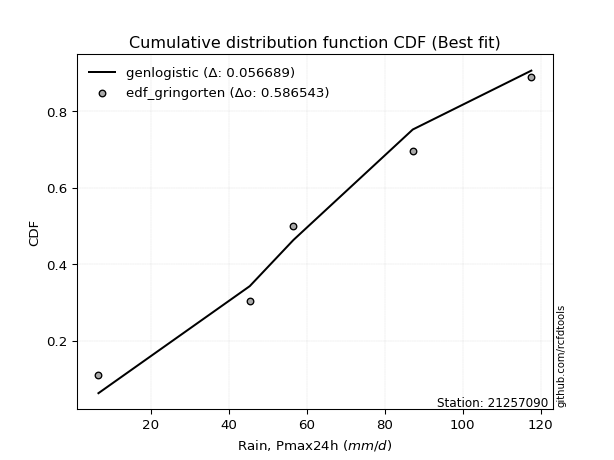</img>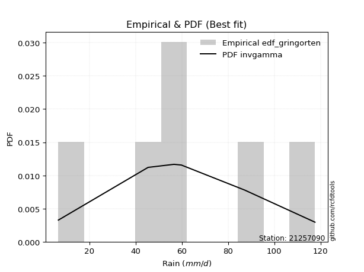</img>

</div>


### 9. EDF Filliben (1975)

The specific values of the constants (0.3175) (often denoted as $alpha$) and (0.365) are derived from a method proposed by James J. Filliben in a 1975 paper. This particular formula is the mean value of the $i$-th order statistic of the normal distribution and is considered a robust and effective plotting position formula for the normal probability plot correlation coefficient test for normality.

<div align="center">


$P=(m-0.3175)/(n+0.365)$


</div>


**9.1. Empirical values**

<div align="center">

|                | 0                   | 1                  | 2            | 3                  | 4                  |
|:---------------|:--------------------|:-------------------|:-------------|:-------------------|:-------------------|
| date           | 2023                | 2021               | 2022         | 2020               | 2019               |
| x              | 6.6                 | 45.4               | 56.6         | 87.2               | 117.6              |
| m              | 1                   | 2                  | 3            | 4                  | 5                  |
| empirical_dist | edf_filliben        | edf_filliben       | edf_filliben | edf_filliben       | edf_filliben       |
| empirical      | 0.12721342031686858 | 0.3136067101584343 | 0.5          | 0.6863932898415657 | 0.8727865796831314 |
| empirical_tr   | 1.1457554725040042  | 1.456890699253225  | 2.0          | 3.188707280832095  | 7.860805860805863  |

</div>


**9.2. Kolmogorov-Smirnov fit test (sorted by Δ)**


<div align="center">

|                | 0                   | 1                   | 2                   | 3                   | 4                   | 5                   | 6                   | 7                   | 8                   | 9                  | 10                  | 11                  | 12                  | 13                  | 14                  | 15                 | 16                  | 17                  | 18                 | 19                  | 20                  | 21                 | 22                  | 23                 | 24                  | 25                  | 26                  | 27                  | 28                  | 29                  | 30                  | 31                  | 32                  | 33                 | 34                 | 35                  | 36                  | 37                  | 38                    | 39                 | 40                 | 41                  | 42                  | 43                  | 44                  | 45                  | 46                  | 47                  | 48                  | 49                  | 50                  | 51                  | 52                 | 53                  | 54                  | 55                  | 56                  | 57                  | 58                 | 59                  | 60                  | 61                 | 62                 | 63                 | 64                  | 65                  | 66                  | 67                  | 68                 | 69                  | 70                 | 71                 | 72                 | 73                  | 74                  | 75                  | 76                 | 77                 | 78                 | 79                  | 80                 | 81                 | 82                  | 83                 | 84                 | 85                 | 86                 | 87                 |
|:---------------|:--------------------|:--------------------|:--------------------|:--------------------|:--------------------|:--------------------|:--------------------|:--------------------|:--------------------|:-------------------|:--------------------|:--------------------|:--------------------|:--------------------|:--------------------|:-------------------|:--------------------|:--------------------|:-------------------|:--------------------|:--------------------|:-------------------|:--------------------|:-------------------|:--------------------|:--------------------|:--------------------|:--------------------|:--------------------|:--------------------|:--------------------|:--------------------|:--------------------|:-------------------|:-------------------|:--------------------|:--------------------|:--------------------|:----------------------|:-------------------|:-------------------|:--------------------|:--------------------|:--------------------|:--------------------|:--------------------|:--------------------|:--------------------|:--------------------|:--------------------|:--------------------|:--------------------|:-------------------|:--------------------|:--------------------|:--------------------|:--------------------|:--------------------|:-------------------|:--------------------|:--------------------|:-------------------|:-------------------|:-------------------|:--------------------|:--------------------|:--------------------|:--------------------|:-------------------|:--------------------|:-------------------|:-------------------|:-------------------|:--------------------|:--------------------|:--------------------|:-------------------|:-------------------|:-------------------|:--------------------|:-------------------|:-------------------|:--------------------|:-------------------|:-------------------|:-------------------|:-------------------|:-------------------|
| station        | 21257090            | 21257090            | 21257090            | 21257090            | 21257090            | 21257090            | 21257090            | 21257090            | 21257090            | 21257090           | 21257090            | 21257090            | 21257090            | 21257090            | 21257090            | 21257090           | 21257090            | 21257090            | 21257090           | 21257090            | 21257090            | 21257090           | 21257090            | 21257090           | 21257090            | 21257090            | 21257090            | 21257090            | 21257090            | 21257090            | 21257090            | 21257090            | 21257090            | 21257090           | 21257090           | 21257090            | 21257090            | 21257090            | 21257090              | 21257090           | 21257090           | 21257090            | 21257090            | 21257090            | 21257090            | 21257090            | 21257090            | 21257090            | 21257090            | 21257090            | 21257090            | 21257090            | 21257090           | 21257090            | 21257090            | 21257090            | 21257090            | 21257090            | 21257090           | 21257090            | 21257090            | 21257090           | 21257090           | 21257090           | 21257090            | 21257090            | 21257090            | 21257090            | 21257090           | 21257090            | 21257090           | 21257090           | 21257090           | 21257090            | 21257090            | 21257090            | 21257090           | 21257090           | 21257090           | 21257090            | 21257090           | 21257090           | 21257090            | 21257090           | 21257090           | 21257090           | 21257090           | 21257090           |
| empirical_dist | edf_filliben        | edf_filliben        | edf_filliben        | edf_filliben        | edf_filliben        | edf_filliben        | edf_filliben        | edf_filliben        | edf_filliben        | edf_filliben       | edf_filliben        | edf_filliben        | edf_filliben        | edf_filliben        | edf_filliben        | edf_filliben       | edf_filliben        | edf_filliben        | edf_filliben       | edf_filliben        | edf_filliben        | edf_filliben       | edf_filliben        | edf_filliben       | edf_filliben        | edf_filliben        | edf_filliben        | edf_filliben        | edf_filliben        | edf_filliben        | edf_filliben        | edf_filliben        | edf_filliben        | edf_filliben       | edf_filliben       | edf_filliben        | edf_filliben        | edf_filliben        | edf_filliben          | edf_filliben       | edf_filliben       | edf_filliben        | edf_filliben        | edf_filliben        | edf_filliben        | edf_filliben        | edf_filliben        | edf_filliben        | edf_filliben        | edf_filliben        | edf_filliben        | edf_filliben        | edf_filliben       | edf_filliben        | edf_filliben        | edf_filliben        | edf_filliben        | edf_filliben        | edf_filliben       | edf_filliben        | edf_filliben        | edf_filliben       | edf_filliben       | edf_filliben       | edf_filliben        | edf_filliben        | edf_filliben        | edf_filliben        | edf_filliben       | edf_filliben        | edf_filliben       | edf_filliben       | edf_filliben       | edf_filliben        | edf_filliben        | edf_filliben        | edf_filliben       | edf_filliben       | edf_filliben       | edf_filliben        | edf_filliben       | edf_filliben       | edf_filliben        | edf_filliben       | edf_filliben       | edf_filliben       | edf_filliben       | edf_filliben       |
| p_dist         | betaprime           | f                   | fisk                | erlang              | gamma               | nct                 | johnsonsu           | exponnorm           | truncnorm           | norm               | crystalball         | t                   | pearson3            | genlogistic         | invgamma            | maxwell            | weibull_min         | logistic            | invgauss           | rice                | kstwobign           | rayleigh           | hypsecant           | laplace_asymmetric | logweibull_min      | ncf                 | gumbel_r            | laplace             | logmielke           | logfisk             | logpearson3         | moyal               | loggumbel_l         | logloggamma        | mielke             | loggompertz         | halflogistic        | halfnorm            | loglaplace_asymmetric | gumbel_l           | nakagami           | wald                | gibrat              | genexpon            | expon               | lognorm             | lognorm             | logcrystalball      | logexponnorm        | logt                | lognct              | logfatiguelife      | loglogistic        | loghypsecant        | logbetaprime        | logf                | loglaplace          | logncf              | logrice            | loginvgamma         | logerlang           | loginvgauss        | loggamma           | loggamma           | logalpha            | loginvweibull       | logmaxwell          | lograyleigh         | loggumbel_r        | logkstwobign        | loghalfnorm        | loggenexpon        | logmoyal           | loghalflogistic     | logtruncnorm        | lognakagami         | logexpon           | logwald            | loglognorm         | loggibrat           | gompertz           | alpha              | invweibull          | logchi2            | logjohnsonsu       | fatiguelife        | chi2               | loggenlogistic     |
| delta          | 0.06099102637930619 | 0.06120771781389417 | 0.06315925838901182 | 0.06376959506172036 | 0.06377458598131747 | 0.06403282612634564 | 0.06409198281202999 | 0.06409841608017824 | 0.06409879079980185 | 0.0640988223808262 | 0.06409883372349318 | 0.06409972753522164 | 0.06442470241517567 | 0.06560788652600091 | 0.07028481439840639 | 0.0771567411066548 | 0.07832245984523335 | 0.07862569153351473 | 0.079701724154496  | 0.08165365948804365 | 0.08682369821137303 | 0.0892563401135738 | 0.09374122350635539 | 0.0941246492341512 | 0.09980579058444074 | 0.10097483135153829 | 0.10456581787318972 | 0.11441710003439287 | 0.11484407843359279 | 0.11611094040173475 | 0.12067615250700886 | 0.12156917147906264 | 0.12448409383214903 | 0.1270887763941414 | 0.127211094563533  | 0.12721342000773883 | 0.12721342031686858 | 0.12721342031686858 | 0.1320225054274154    | 0.1335009316762616 | 0.1393421380686749 | 0.15181193827775874 | 0.18157633789085148 | 0.18573746853457712 | 0.18575367025486272 | 0.19456979853847217 | 0.19456979853847217 | 0.19457016047444425 | 0.19457128802670426 | 0.19457293264423564 | 0.19470552045413086 | 0.19471804626132733 | 0.1956865368860236 | 0.19663997118917959 | 0.19807251006680932 | 0.19867497428791775 | 0.20067874249074985 | 0.20194682607060727 | 0.2034877305578286 | 0.20883039094356165 | 0.20970738024659757 | 0.2129012589763078 | 0.2132565664407729 | 0.2132565664407729 | 0.22206112625007673 | 0.22489972327279945 | 0.22727518176252443 | 0.23810473539959937 | 0.2651390584676386 | 0.26727958485874376 | 0.2685902765598704 | 0.2740636097157259 | 0.2909121720949543 | 0.29400869494214005 | 0.31360501004981134 | 0.31360662917382887 | 0.3224830451704069 | 0.36254468114      | 0.3730559556142547 | 0.38712632514791695 | 0.4039607196861407 | 0.4354463368755083 | 0.44517664673734336 | 0.4817648235310185 | 0.5217482893182936 | 0.5278301963574665 | 0.676915354446088  | 0.6863932898415657 |
| deltao         | 0.5865427407550001  | 0.5865427407550001  | 0.5865427407550001  | 0.5865427407550001  | 0.5865427407550001  | 0.5865427407550001  | 0.5865427407550001  | 0.5865427407550001  | 0.5865427407550001  | 0.5865427407550001 | 0.5865427407550001  | 0.5865427407550001  | 0.5865427407550001  | 0.5865427407550001  | 0.5865427407550001  | 0.5865427407550001 | 0.5865427407550001  | 0.5865427407550001  | 0.5865427407550001 | 0.5865427407550001  | 0.5865427407550001  | 0.5865427407550001 | 0.5865427407550001  | 0.5865427407550001 | 0.5865427407550001  | 0.5865427407550001  | 0.5865427407550001  | 0.5865427407550001  | 0.5865427407550001  | 0.5865427407550001  | 0.5865427407550001  | 0.5865427407550001  | 0.5865427407550001  | 0.5865427407550001 | 0.5865427407550001 | 0.5865427407550001  | 0.5865427407550001  | 0.5865427407550001  | 0.5865427407550001    | 0.5865427407550001 | 0.5865427407550001 | 0.5865427407550001  | 0.5865427407550001  | 0.5865427407550001  | 0.5865427407550001  | 0.5865427407550001  | 0.5865427407550001  | 0.5865427407550001  | 0.5865427407550001  | 0.5865427407550001  | 0.5865427407550001  | 0.5865427407550001  | 0.5865427407550001 | 0.5865427407550001  | 0.5865427407550001  | 0.5865427407550001  | 0.5865427407550001  | 0.5865427407550001  | 0.5865427407550001 | 0.5865427407550001  | 0.5865427407550001  | 0.5865427407550001 | 0.5865427407550001 | 0.5865427407550001 | 0.5865427407550001  | 0.5865427407550001  | 0.5865427407550001  | 0.5865427407550001  | 0.5865427407550001 | 0.5865427407550001  | 0.5865427407550001 | 0.5865427407550001 | 0.5865427407550001 | 0.5865427407550001  | 0.5865427407550001  | 0.5865427407550001  | 0.5865427407550001 | 0.5865427407550001 | 0.5865427407550001 | 0.5865427407550001  | 0.5865427407550001 | 0.5865427407550001 | 0.5865427407550001  | 0.5865427407550001 | 0.5865427407550001 | 0.5865427407550001 | 0.5865427407550001 | 0.5865427407550001 |
| eval           | Δo > Δ              | Δo > Δ              | Δo > Δ              | Δo > Δ              | Δo > Δ              | Δo > Δ              | Δo > Δ              | Δo > Δ              | Δo > Δ              | Δo > Δ             | Δo > Δ              | Δo > Δ              | Δo > Δ              | Δo > Δ              | Δo > Δ              | Δo > Δ             | Δo > Δ              | Δo > Δ              | Δo > Δ             | Δo > Δ              | Δo > Δ              | Δo > Δ             | Δo > Δ              | Δo > Δ             | Δo > Δ              | Δo > Δ              | Δo > Δ              | Δo > Δ              | Δo > Δ              | Δo > Δ              | Δo > Δ              | Δo > Δ              | Δo > Δ              | Δo > Δ             | Δo > Δ             | Δo > Δ              | Δo > Δ              | Δo > Δ              | Δo > Δ                | Δo > Δ             | Δo > Δ             | Δo > Δ              | Δo > Δ              | Δo > Δ              | Δo > Δ              | Δo > Δ              | Δo > Δ              | Δo > Δ              | Δo > Δ              | Δo > Δ              | Δo > Δ              | Δo > Δ              | Δo > Δ             | Δo > Δ              | Δo > Δ              | Δo > Δ              | Δo > Δ              | Δo > Δ              | Δo > Δ             | Δo > Δ              | Δo > Δ              | Δo > Δ             | Δo > Δ             | Δo > Δ             | Δo > Δ              | Δo > Δ              | Δo > Δ              | Δo > Δ              | Δo > Δ             | Δo > Δ              | Δo > Δ             | Δo > Δ             | Δo > Δ             | Δo > Δ              | Δo > Δ              | Δo > Δ              | Δo > Δ             | Δo > Δ             | Δo > Δ             | Δo > Δ              | Δo > Δ             | Δo > Δ             | Δo > Δ              | Δo > Δ             | Δo > Δ             | Δo > Δ             | Δo <= Δ            | Δo <= Δ            |
| fit            | 1                   | 1                   | 1                   | 1                   | 1                   | 1                   | 1                   | 1                   | 1                   | 1                  | 1                   | 1                   | 1                   | 1                   | 1                   | 1                  | 1                   | 1                   | 1                  | 1                   | 1                   | 1                  | 1                   | 1                  | 1                   | 1                   | 1                   | 1                   | 1                   | 1                   | 1                   | 1                   | 1                   | 1                  | 1                  | 1                   | 1                   | 1                   | 1                     | 1                  | 1                  | 1                   | 1                   | 1                   | 1                   | 1                   | 1                   | 1                   | 1                   | 1                   | 1                   | 1                   | 1                  | 1                   | 1                   | 1                   | 1                   | 1                   | 1                  | 1                   | 1                   | 1                  | 1                  | 1                  | 1                   | 1                   | 1                   | 1                   | 1                  | 1                   | 1                  | 1                  | 1                  | 1                   | 1                   | 1                   | 1                  | 1                  | 1                  | 1                   | 1                  | 1                  | 1                   | 1                  | 1                  | 1                  | 0                  | 0                  |
| n              | 5                   | 5                   | 5                   | 5                   | 5                   | 5                   | 5                   | 5                   | 5                   | 5                  | 5                   | 5                   | 5                   | 5                   | 5                   | 5                  | 5                   | 5                   | 5                  | 5                   | 5                   | 5                  | 5                   | 5                  | 5                   | 5                   | 5                   | 5                   | 5                   | 5                   | 5                   | 5                   | 5                   | 5                  | 5                  | 5                   | 5                   | 5                   | 5                     | 5                  | 5                  | 5                   | 5                   | 5                   | 5                   | 5                   | 5                   | 5                   | 5                   | 5                   | 5                   | 5                   | 5                  | 5                   | 5                   | 5                   | 5                   | 5                   | 5                  | 5                   | 5                   | 5                  | 5                  | 5                  | 5                   | 5                   | 5                   | 5                   | 5                  | 5                   | 5                  | 5                  | 5                  | 5                   | 5                   | 5                   | 5                  | 5                  | 5                  | 5                   | 5                  | 5                  | 5                   | 5                  | 5                  | 5                  | 5                  | 5                  |
| best_fit       | 1                   | 0                   | 0                   | 0                   | 0                   | 0                   | 0                   | 0                   | 0                   | 0                  | 0                   | 0                   | 0                   | 0                   | 0                   | 0                  | 0                   | 0                   | 0                  | 0                   | 0                   | 0                  | 0                   | 0                  | 0                   | 0                   | 0                   | 0                   | 0                   | 0                   | 0                   | 0                   | 0                   | 0                  | 0                  | 0                   | 0                   | 0                   | 0                     | 0                  | 0                  | 0                   | 0                   | 0                   | 0                   | 0                   | 0                   | 0                   | 0                   | 0                   | 0                   | 0                   | 0                  | 0                   | 0                   | 0                   | 0                   | 0                   | 0                  | 0                   | 0                   | 0                  | 0                  | 0                  | 0                   | 0                   | 0                   | 0                   | 0                  | 0                   | 0                  | 0                  | 0                  | 0                   | 0                   | 0                   | 0                  | 0                  | 0                  | 0                   | 0                  | 0                  | 0                   | 0                  | 0                  | 0                  | 0                  | 0                  |
| best_fit_sort  | 1                   | 2                   | 3                   | 4                   | 5                   | 6                   | 7                   | 8                   | 9                   | 10                 | 11                  | 12                  | 13                  | 14                  | 15                  | 16                 | 17                  | 18                  | 19                 | 20                  | 21                  | 22                 | 23                  | 24                 | 25                  | 26                  | 27                  | 28                  | 29                  | 30                  | 31                  | 32                  | 33                  | 34                 | 35                 | 36                  | 37                  | 38                  | 39                    | 40                 | 41                 | 42                  | 43                  | 44                  | 45                  | 46                  | 47                  | 48                  | 49                  | 50                  | 51                  | 52                  | 53                 | 54                  | 55                  | 56                  | 57                  | 58                  | 59                 | 60                  | 61                  | 62                 | 63                 | 64                 | 65                  | 66                  | 67                  | 68                  | 69                 | 70                  | 71                 | 72                 | 73                 | 74                  | 75                  | 76                  | 77                 | 78                 | 79                 | 80                  | 81                 | 82                 | 83                  | 84                 | 85                 | 86                 | 87                 | 88                 |

</div>


**9.3. Best fit**

<div align="center">

|   id |   station | empirical_dist   | p_dist    |    delta |   deltao | eval   |   fit |   n |   best_fit |   best_fit_sort |
|-----:|----------:|:-----------------|:----------|---------:|---------:|:-------|------:|----:|-----------:|----------------:|
|    0 |  21257090 | edf_filliben     | betaprime | 0.060991 | 0.586543 | Δo > Δ |     1 |   5 |          1 |               1 |

</div>


<div align="center">

</img>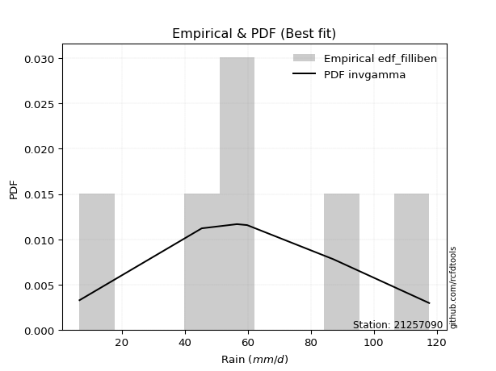</img>

</div>


### 10. EDF Jenkinson (1977)

The Jenkinson formula in hydrology is an empirical plotting position formula used to estimate the non-exceedance probability _(P)_ or return period _(T)_ of a given ordered observation within a sample. It is a widely used method in the frequency analysis of extreme events such as floods and rainfall, as it provides a distribution-free way to plot data. _a≈0.31_ and _b≈0.38_ are constants derived to approximate the median of the probability distribution for the given rank.

<div align="center">


$P=(m-a)/(n+b)$


</div>


**10.1. Empirical values**

<div align="center">

|                | 0                   | 1                  | 2             | 3                  | 4                  |
|:---------------|:--------------------|:-------------------|:--------------|:-------------------|:-------------------|
| date           | 2023                | 2021               | 2022          | 2020               | 2019               |
| x              | 6.6                 | 45.4               | 56.6          | 87.2               | 117.6              |
| m              | 1                   | 2                  | 3             | 4                  | 5                  |
| empirical_dist | edf_jenkinson       | edf_jenkinson      | edf_jenkinson | edf_jenkinson      | edf_jenkinson      |
| empirical      | 0.12825278810408922 | 0.3141263940520446 | 0.5           | 0.6858736059479554 | 0.8717472118959109 |
| empirical_tr   | 1.1471215351812367  | 1.4579945799457996 | 2.0           | 3.183431952662722  | 7.797101449275368  |

</div>


**10.2. Kolmogorov-Smirnov fit test (sorted by Δ)**


<div align="center">

|                | 0                   | 1                   | 2                   | 3                   | 4                   | 5                   | 6                   | 7                   | 8                   | 9                  | 10                  | 11                  | 12                  | 13                  | 14                  | 15                  | 16                  | 17                  | 18                  | 19                  | 20                  | 21                  | 22                  | 23                  | 24                  | 25                  | 26                  | 27                 | 28                  | 29                  | 30                  | 31                  | 32                  | 33                  | 34                  | 35                  | 36                  | 37                  | 38                    | 39                 | 40                  | 41                  | 42                  | 43                  | 44                  | 45                  | 46                  | 47                 | 48                 | 49                 | 50                  | 51                  | 52                  | 53                  | 54                  | 55                 | 56                 | 57                  | 58                  | 59                 | 60                  | 61                  | 62                  | 63                  | 64                 | 65                 | 66                  | 67                  | 68                  | 69                 | 70                  | 71                  | 72                  | 73                 | 74                 | 75                 | 76                  | 77                  | 78                  | 79                 | 80                 | 81                 | 82                 | 83                  | 84                 | 85                 | 86                 | 87                 |
|:---------------|:--------------------|:--------------------|:--------------------|:--------------------|:--------------------|:--------------------|:--------------------|:--------------------|:--------------------|:-------------------|:--------------------|:--------------------|:--------------------|:--------------------|:--------------------|:--------------------|:--------------------|:--------------------|:--------------------|:--------------------|:--------------------|:--------------------|:--------------------|:--------------------|:--------------------|:--------------------|:--------------------|:-------------------|:--------------------|:--------------------|:--------------------|:--------------------|:--------------------|:--------------------|:--------------------|:--------------------|:--------------------|:--------------------|:----------------------|:-------------------|:--------------------|:--------------------|:--------------------|:--------------------|:--------------------|:--------------------|:--------------------|:-------------------|:-------------------|:-------------------|:--------------------|:--------------------|:--------------------|:--------------------|:--------------------|:-------------------|:-------------------|:--------------------|:--------------------|:-------------------|:--------------------|:--------------------|:--------------------|:--------------------|:-------------------|:-------------------|:--------------------|:--------------------|:--------------------|:-------------------|:--------------------|:--------------------|:--------------------|:-------------------|:-------------------|:-------------------|:--------------------|:--------------------|:--------------------|:-------------------|:-------------------|:-------------------|:-------------------|:--------------------|:-------------------|:-------------------|:-------------------|:-------------------|
| station        | 21257090            | 21257090            | 21257090            | 21257090            | 21257090            | 21257090            | 21257090            | 21257090            | 21257090            | 21257090           | 21257090            | 21257090            | 21257090            | 21257090            | 21257090            | 21257090            | 21257090            | 21257090            | 21257090            | 21257090            | 21257090            | 21257090            | 21257090            | 21257090            | 21257090            | 21257090            | 21257090            | 21257090           | 21257090            | 21257090            | 21257090            | 21257090            | 21257090            | 21257090            | 21257090            | 21257090            | 21257090            | 21257090            | 21257090              | 21257090           | 21257090            | 21257090            | 21257090            | 21257090            | 21257090            | 21257090            | 21257090            | 21257090           | 21257090           | 21257090           | 21257090            | 21257090            | 21257090            | 21257090            | 21257090            | 21257090           | 21257090           | 21257090            | 21257090            | 21257090           | 21257090            | 21257090            | 21257090            | 21257090            | 21257090           | 21257090           | 21257090            | 21257090            | 21257090            | 21257090           | 21257090            | 21257090            | 21257090            | 21257090           | 21257090           | 21257090           | 21257090            | 21257090            | 21257090            | 21257090           | 21257090           | 21257090           | 21257090           | 21257090            | 21257090           | 21257090           | 21257090           | 21257090           |
| empirical_dist | edf_jenkinson       | edf_jenkinson       | edf_jenkinson       | edf_jenkinson       | edf_jenkinson       | edf_jenkinson       | edf_jenkinson       | edf_jenkinson       | edf_jenkinson       | edf_jenkinson      | edf_jenkinson       | edf_jenkinson       | edf_jenkinson       | edf_jenkinson       | edf_jenkinson       | edf_jenkinson       | edf_jenkinson       | edf_jenkinson       | edf_jenkinson       | edf_jenkinson       | edf_jenkinson       | edf_jenkinson       | edf_jenkinson       | edf_jenkinson       | edf_jenkinson       | edf_jenkinson       | edf_jenkinson       | edf_jenkinson      | edf_jenkinson       | edf_jenkinson       | edf_jenkinson       | edf_jenkinson       | edf_jenkinson       | edf_jenkinson       | edf_jenkinson       | edf_jenkinson       | edf_jenkinson       | edf_jenkinson       | edf_jenkinson         | edf_jenkinson      | edf_jenkinson       | edf_jenkinson       | edf_jenkinson       | edf_jenkinson       | edf_jenkinson       | edf_jenkinson       | edf_jenkinson       | edf_jenkinson      | edf_jenkinson      | edf_jenkinson      | edf_jenkinson       | edf_jenkinson       | edf_jenkinson       | edf_jenkinson       | edf_jenkinson       | edf_jenkinson      | edf_jenkinson      | edf_jenkinson       | edf_jenkinson       | edf_jenkinson      | edf_jenkinson       | edf_jenkinson       | edf_jenkinson       | edf_jenkinson       | edf_jenkinson      | edf_jenkinson      | edf_jenkinson       | edf_jenkinson       | edf_jenkinson       | edf_jenkinson      | edf_jenkinson       | edf_jenkinson       | edf_jenkinson       | edf_jenkinson      | edf_jenkinson      | edf_jenkinson      | edf_jenkinson       | edf_jenkinson       | edf_jenkinson       | edf_jenkinson      | edf_jenkinson      | edf_jenkinson      | edf_jenkinson      | edf_jenkinson       | edf_jenkinson      | edf_jenkinson      | edf_jenkinson      | edf_jenkinson      |
| p_dist         | f                   | betaprime           | fisk                | erlang              | gamma               | nct                 | johnsonsu           | exponnorm           | truncnorm           | norm               | crystalball         | t                   | pearson3            | genlogistic         | invgamma            | maxwell             | logistic            | invgauss            | weibull_min         | rice                | kstwobign           | rayleigh            | hypsecant           | laplace_asymmetric  | ncf                 | logweibull_min      | gumbel_r            | laplace            | logfisk             | logmielke           | logpearson3         | moyal               | loggumbel_l         | logloggamma         | mielke              | loggompertz         | halflogistic        | halfnorm            | loglaplace_asymmetric | gumbel_l           | nakagami            | wald                | gibrat              | genexpon            | expon               | lognorm             | lognorm             | logcrystalball     | logexponnorm       | logt               | lognct              | logfatiguelife      | loglogistic         | loghypsecant        | logbetaprime        | logf               | loglaplace         | logncf              | logrice             | loginvgamma        | logerlang           | loginvgauss         | loggamma            | loggamma            | logalpha           | loginvweibull      | logmaxwell          | lograyleigh         | loggumbel_r         | logkstwobign       | loghalfnorm         | loggenexpon         | logmoyal            | loghalflogistic    | logtruncnorm       | lognakagami        | logexpon            | logwald             | loglognorm          | loggibrat          | gompertz           | alpha              | invweibull         | logchi2             | logjohnsonsu       | fatiguelife        | chi2               | loggenlogistic     |
| delta          | 0.06120771781389417 | 0.06203039416652682 | 0.06367894228262205 | 0.06376959506172036 | 0.06377458598131747 | 0.06403282612634564 | 0.06409198281202999 | 0.06409841608017824 | 0.06409879079980185 | 0.0640988223808262 | 0.06409883372349318 | 0.06409972753522164 | 0.06442470241517567 | 0.06612757041961115 | 0.07080449829201663 | 0.07819610889387543 | 0.07914537542712496 | 0.07918204026088566 | 0.07936182763245399 | 0.08269302727526429 | 0.08630401431776269 | 0.09029570790079444 | 0.09426090739996562 | 0.09464433312776144 | 0.10045514745792794 | 0.10084515837166137 | 0.10560518566041036 | 0.1149367839280031 | 0.11559125650812441 | 0.11588344622081337 | 0.12015646861339851 | 0.12260853926628328 | 0.12396440993853869 | 0.12812814418136198 | 0.12825046235075363 | 0.12825278779495947 | 0.12825278810408922 | 0.12825278810408922 | 0.13150282153380505   | 0.1335009316762616 | 0.13882245417506456 | 0.15233162217136897 | 0.18209602178446171 | 0.18521778464096678 | 0.18523398636125238 | 0.19405011464486183 | 0.19405011464486183 | 0.1940504765808339 | 0.1940516041330939 | 0.1940532487506253 | 0.19418583656052052 | 0.19419836236771698 | 0.19516685299241326 | 0.19612028729556924 | 0.19755282617319897 | 0.1981552903943074 | 0.2001590585971395 | 0.20142714217699692 | 0.20296804666421825 | 0.2083107070499513 | 0.20918769635298723 | 0.21238157508269745 | 0.21273688254716255 | 0.21273688254716255 | 0.2215414423564664 | 0.2243800393791891 | 0.22675549786891408 | 0.23758505150598902 | 0.26461937457402823 | 0.2667599009651334 | 0.26807059266626004 | 0.27354392582211556 | 0.29039248820134395 | 0.2934890110485297 | 0.3141246939434217 | 0.3141263130674392 | 0.32196336127679653 | 0.36202499724638965 | 0.37253627172064435 | 0.3866066412543066 | 0.4039607196861407 | 0.434926652981898  | 0.4441372789501228 | 0.48124513963740817 | 0.5212286054246835 | 0.5273105124638562 | 0.6763956705524776 | 0.6858736059479554 |
| deltao         | 0.5865427407550001  | 0.5865427407550001  | 0.5865427407550001  | 0.5865427407550001  | 0.5865427407550001  | 0.5865427407550001  | 0.5865427407550001  | 0.5865427407550001  | 0.5865427407550001  | 0.5865427407550001 | 0.5865427407550001  | 0.5865427407550001  | 0.5865427407550001  | 0.5865427407550001  | 0.5865427407550001  | 0.5865427407550001  | 0.5865427407550001  | 0.5865427407550001  | 0.5865427407550001  | 0.5865427407550001  | 0.5865427407550001  | 0.5865427407550001  | 0.5865427407550001  | 0.5865427407550001  | 0.5865427407550001  | 0.5865427407550001  | 0.5865427407550001  | 0.5865427407550001 | 0.5865427407550001  | 0.5865427407550001  | 0.5865427407550001  | 0.5865427407550001  | 0.5865427407550001  | 0.5865427407550001  | 0.5865427407550001  | 0.5865427407550001  | 0.5865427407550001  | 0.5865427407550001  | 0.5865427407550001    | 0.5865427407550001 | 0.5865427407550001  | 0.5865427407550001  | 0.5865427407550001  | 0.5865427407550001  | 0.5865427407550001  | 0.5865427407550001  | 0.5865427407550001  | 0.5865427407550001 | 0.5865427407550001 | 0.5865427407550001 | 0.5865427407550001  | 0.5865427407550001  | 0.5865427407550001  | 0.5865427407550001  | 0.5865427407550001  | 0.5865427407550001 | 0.5865427407550001 | 0.5865427407550001  | 0.5865427407550001  | 0.5865427407550001 | 0.5865427407550001  | 0.5865427407550001  | 0.5865427407550001  | 0.5865427407550001  | 0.5865427407550001 | 0.5865427407550001 | 0.5865427407550001  | 0.5865427407550001  | 0.5865427407550001  | 0.5865427407550001 | 0.5865427407550001  | 0.5865427407550001  | 0.5865427407550001  | 0.5865427407550001 | 0.5865427407550001 | 0.5865427407550001 | 0.5865427407550001  | 0.5865427407550001  | 0.5865427407550001  | 0.5865427407550001 | 0.5865427407550001 | 0.5865427407550001 | 0.5865427407550001 | 0.5865427407550001  | 0.5865427407550001 | 0.5865427407550001 | 0.5865427407550001 | 0.5865427407550001 |
| eval           | Δo > Δ              | Δo > Δ              | Δo > Δ              | Δo > Δ              | Δo > Δ              | Δo > Δ              | Δo > Δ              | Δo > Δ              | Δo > Δ              | Δo > Δ             | Δo > Δ              | Δo > Δ              | Δo > Δ              | Δo > Δ              | Δo > Δ              | Δo > Δ              | Δo > Δ              | Δo > Δ              | Δo > Δ              | Δo > Δ              | Δo > Δ              | Δo > Δ              | Δo > Δ              | Δo > Δ              | Δo > Δ              | Δo > Δ              | Δo > Δ              | Δo > Δ             | Δo > Δ              | Δo > Δ              | Δo > Δ              | Δo > Δ              | Δo > Δ              | Δo > Δ              | Δo > Δ              | Δo > Δ              | Δo > Δ              | Δo > Δ              | Δo > Δ                | Δo > Δ             | Δo > Δ              | Δo > Δ              | Δo > Δ              | Δo > Δ              | Δo > Δ              | Δo > Δ              | Δo > Δ              | Δo > Δ             | Δo > Δ             | Δo > Δ             | Δo > Δ              | Δo > Δ              | Δo > Δ              | Δo > Δ              | Δo > Δ              | Δo > Δ             | Δo > Δ             | Δo > Δ              | Δo > Δ              | Δo > Δ             | Δo > Δ              | Δo > Δ              | Δo > Δ              | Δo > Δ              | Δo > Δ             | Δo > Δ             | Δo > Δ              | Δo > Δ              | Δo > Δ              | Δo > Δ             | Δo > Δ              | Δo > Δ              | Δo > Δ              | Δo > Δ             | Δo > Δ             | Δo > Δ             | Δo > Δ              | Δo > Δ              | Δo > Δ              | Δo > Δ             | Δo > Δ             | Δo > Δ             | Δo > Δ             | Δo > Δ              | Δo > Δ             | Δo > Δ             | Δo <= Δ            | Δo <= Δ            |
| fit            | 1                   | 1                   | 1                   | 1                   | 1                   | 1                   | 1                   | 1                   | 1                   | 1                  | 1                   | 1                   | 1                   | 1                   | 1                   | 1                   | 1                   | 1                   | 1                   | 1                   | 1                   | 1                   | 1                   | 1                   | 1                   | 1                   | 1                   | 1                  | 1                   | 1                   | 1                   | 1                   | 1                   | 1                   | 1                   | 1                   | 1                   | 1                   | 1                     | 1                  | 1                   | 1                   | 1                   | 1                   | 1                   | 1                   | 1                   | 1                  | 1                  | 1                  | 1                   | 1                   | 1                   | 1                   | 1                   | 1                  | 1                  | 1                   | 1                   | 1                  | 1                   | 1                   | 1                   | 1                   | 1                  | 1                  | 1                   | 1                   | 1                   | 1                  | 1                   | 1                   | 1                   | 1                  | 1                  | 1                  | 1                   | 1                   | 1                   | 1                  | 1                  | 1                  | 1                  | 1                   | 1                  | 1                  | 0                  | 0                  |
| n              | 5                   | 5                   | 5                   | 5                   | 5                   | 5                   | 5                   | 5                   | 5                   | 5                  | 5                   | 5                   | 5                   | 5                   | 5                   | 5                   | 5                   | 5                   | 5                   | 5                   | 5                   | 5                   | 5                   | 5                   | 5                   | 5                   | 5                   | 5                  | 5                   | 5                   | 5                   | 5                   | 5                   | 5                   | 5                   | 5                   | 5                   | 5                   | 5                     | 5                  | 5                   | 5                   | 5                   | 5                   | 5                   | 5                   | 5                   | 5                  | 5                  | 5                  | 5                   | 5                   | 5                   | 5                   | 5                   | 5                  | 5                  | 5                   | 5                   | 5                  | 5                   | 5                   | 5                   | 5                   | 5                  | 5                  | 5                   | 5                   | 5                   | 5                  | 5                   | 5                   | 5                   | 5                  | 5                  | 5                  | 5                   | 5                   | 5                   | 5                  | 5                  | 5                  | 5                  | 5                   | 5                  | 5                  | 5                  | 5                  |
| best_fit       | 1                   | 0                   | 0                   | 0                   | 0                   | 0                   | 0                   | 0                   | 0                   | 0                  | 0                   | 0                   | 0                   | 0                   | 0                   | 0                   | 0                   | 0                   | 0                   | 0                   | 0                   | 0                   | 0                   | 0                   | 0                   | 0                   | 0                   | 0                  | 0                   | 0                   | 0                   | 0                   | 0                   | 0                   | 0                   | 0                   | 0                   | 0                   | 0                     | 0                  | 0                   | 0                   | 0                   | 0                   | 0                   | 0                   | 0                   | 0                  | 0                  | 0                  | 0                   | 0                   | 0                   | 0                   | 0                   | 0                  | 0                  | 0                   | 0                   | 0                  | 0                   | 0                   | 0                   | 0                   | 0                  | 0                  | 0                   | 0                   | 0                   | 0                  | 0                   | 0                   | 0                   | 0                  | 0                  | 0                  | 0                   | 0                   | 0                   | 0                  | 0                  | 0                  | 0                  | 0                   | 0                  | 0                  | 0                  | 0                  |
| best_fit_sort  | 1                   | 2                   | 3                   | 4                   | 5                   | 6                   | 7                   | 8                   | 9                   | 10                 | 11                  | 12                  | 13                  | 14                  | 15                  | 16                  | 17                  | 18                  | 19                  | 20                  | 21                  | 22                  | 23                  | 24                  | 25                  | 26                  | 27                  | 28                 | 29                  | 30                  | 31                  | 32                  | 33                  | 34                  | 35                  | 36                  | 37                  | 38                  | 39                    | 40                 | 41                  | 42                  | 43                  | 44                  | 45                  | 46                  | 47                  | 48                 | 49                 | 50                 | 51                  | 52                  | 53                  | 54                  | 55                  | 56                 | 57                 | 58                  | 59                  | 60                 | 61                  | 62                  | 63                  | 64                  | 65                 | 66                 | 67                  | 68                  | 69                  | 70                 | 71                  | 72                  | 73                  | 74                 | 75                 | 76                 | 77                  | 78                  | 79                  | 80                 | 81                 | 82                 | 83                 | 84                  | 85                 | 86                 | 87                 | 88                 |

</div>


**10.3. Best fit**

<div align="center">

|   id |   station | empirical_dist   | p_dist   |     delta |   deltao | eval   |   fit |   n |   best_fit |   best_fit_sort |
|-----:|----------:|:-----------------|:---------|----------:|---------:|:-------|------:|----:|-----------:|----------------:|
|    0 |  21257090 | edf_jenkinson    | f        | 0.0612077 | 0.586543 | Δo > Δ |     1 |   5 |          1 |               1 |

</div>


<div align="center">

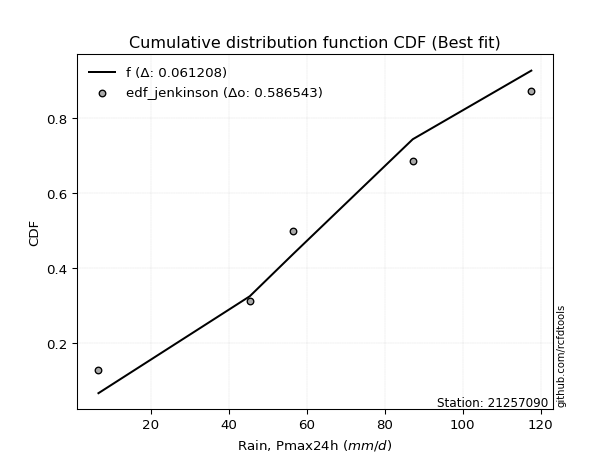</img>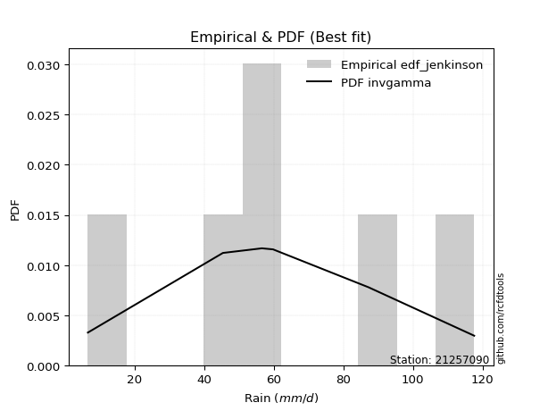</img>

</div>


### 11. EDF Cunnane (1978)

Cunnane´s work in statistical hydrology has focused on the performance and evaluation of different probability distributions (such as GEV, Gumbel, Lognormal) for flood frequency estimation. _b_ is a constant, typically set to 0.4.

<div align="center">


$P=(m-b)/(n+1-2b)$


</div>


**11.1. Empirical values**

<div align="center">

|                | 0                   | 1                  | 2           | 3                  | 4                  |
|:---------------|:--------------------|:-------------------|:------------|:-------------------|:-------------------|
| date           | 2023                | 2021               | 2022        | 2020               | 2019               |
| x              | 6.6                 | 45.4               | 56.6        | 87.2               | 117.6              |
| m              | 1                   | 2                  | 3           | 4                  | 5                  |
| empirical_dist | edf_cunnane         | edf_cunnane        | edf_cunnane | edf_cunnane        | edf_cunnane        |
| empirical      | 0.11538461538461538 | 0.3076923076923077 | 0.5         | 0.6923076923076923 | 0.8846153846153845 |
| empirical_tr   | 1.1304347826086958  | 1.4444444444444444 | 2.0         | 3.25               | 8.666666666666655  |

</div>


**11.2. Kolmogorov-Smirnov fit test (sorted by Δ)**


<div align="center">

|                | 0                   | 1                   | 2                   | 3                   | 4                   | 5                   | 6                   | 7                   | 8                   | 9                   | 10                 | 11                  | 12                  | 13                  | 14                  | 15                  | 16                  | 17                  | 18                  | 19                  | 20                  | 21                  | 22                  | 23                  | 24                 | 25                  | 26                  | 27                  | 28                  | 29                  | 30                  | 31                  | 32                  | 33                  | 34                  | 35                  | 36                 | 37                  | 38                 | 39                    | 40                  | 41                  | 42                  | 43                 | 44                 | 45                  | 46                  | 47                  | 48                  | 49                 | 50                  | 51                 | 52                  | 53                  | 54                  | 55                  | 56                  | 57                  | 58                  | 59                  | 60                  | 61                  | 62                  | 63                  | 64                 | 65                 | 66                 | 67                  | 68                  | 69                 | 70                  | 71                 | 72                  | 73                 | 74                  | 75                 | 76                  | 77                  | 78                  | 79                 | 80                 | 81                 | 82                 | 83                 | 84                 | 85                 | 86                 | 87                 |
|:---------------|:--------------------|:--------------------|:--------------------|:--------------------|:--------------------|:--------------------|:--------------------|:--------------------|:--------------------|:--------------------|:-------------------|:--------------------|:--------------------|:--------------------|:--------------------|:--------------------|:--------------------|:--------------------|:--------------------|:--------------------|:--------------------|:--------------------|:--------------------|:--------------------|:-------------------|:--------------------|:--------------------|:--------------------|:--------------------|:--------------------|:--------------------|:--------------------|:--------------------|:--------------------|:--------------------|:--------------------|:-------------------|:--------------------|:-------------------|:----------------------|:--------------------|:--------------------|:--------------------|:-------------------|:-------------------|:--------------------|:--------------------|:--------------------|:--------------------|:-------------------|:--------------------|:-------------------|:--------------------|:--------------------|:--------------------|:--------------------|:--------------------|:--------------------|:--------------------|:--------------------|:--------------------|:--------------------|:--------------------|:--------------------|:-------------------|:-------------------|:-------------------|:--------------------|:--------------------|:-------------------|:--------------------|:-------------------|:--------------------|:-------------------|:--------------------|:-------------------|:--------------------|:--------------------|:--------------------|:-------------------|:-------------------|:-------------------|:-------------------|:-------------------|:-------------------|:-------------------|:-------------------|:-------------------|
| station        | 21257090            | 21257090            | 21257090            | 21257090            | 21257090            | 21257090            | 21257090            | 21257090            | 21257090            | 21257090            | 21257090           | 21257090            | 21257090            | 21257090            | 21257090            | 21257090            | 21257090            | 21257090            | 21257090            | 21257090            | 21257090            | 21257090            | 21257090            | 21257090            | 21257090           | 21257090            | 21257090            | 21257090            | 21257090            | 21257090            | 21257090            | 21257090            | 21257090            | 21257090            | 21257090            | 21257090            | 21257090           | 21257090            | 21257090           | 21257090              | 21257090            | 21257090            | 21257090            | 21257090           | 21257090           | 21257090            | 21257090            | 21257090            | 21257090            | 21257090           | 21257090            | 21257090           | 21257090            | 21257090            | 21257090            | 21257090            | 21257090            | 21257090            | 21257090            | 21257090            | 21257090            | 21257090            | 21257090            | 21257090            | 21257090           | 21257090           | 21257090           | 21257090            | 21257090            | 21257090           | 21257090            | 21257090           | 21257090            | 21257090           | 21257090            | 21257090           | 21257090            | 21257090            | 21257090            | 21257090           | 21257090           | 21257090           | 21257090           | 21257090           | 21257090           | 21257090           | 21257090           | 21257090           |
| empirical_dist | edf_cunnane         | edf_cunnane         | edf_cunnane         | edf_cunnane         | edf_cunnane         | edf_cunnane         | edf_cunnane         | edf_cunnane         | edf_cunnane         | edf_cunnane         | edf_cunnane        | edf_cunnane         | edf_cunnane         | edf_cunnane         | edf_cunnane         | edf_cunnane         | edf_cunnane         | edf_cunnane         | edf_cunnane         | edf_cunnane         | edf_cunnane         | edf_cunnane         | edf_cunnane         | edf_cunnane         | edf_cunnane        | edf_cunnane         | edf_cunnane         | edf_cunnane         | edf_cunnane         | edf_cunnane         | edf_cunnane         | edf_cunnane         | edf_cunnane         | edf_cunnane         | edf_cunnane         | edf_cunnane         | edf_cunnane        | edf_cunnane         | edf_cunnane        | edf_cunnane           | edf_cunnane         | edf_cunnane         | edf_cunnane         | edf_cunnane        | edf_cunnane        | edf_cunnane         | edf_cunnane         | edf_cunnane         | edf_cunnane         | edf_cunnane        | edf_cunnane         | edf_cunnane        | edf_cunnane         | edf_cunnane         | edf_cunnane         | edf_cunnane         | edf_cunnane         | edf_cunnane         | edf_cunnane         | edf_cunnane         | edf_cunnane         | edf_cunnane         | edf_cunnane         | edf_cunnane         | edf_cunnane        | edf_cunnane        | edf_cunnane        | edf_cunnane         | edf_cunnane         | edf_cunnane        | edf_cunnane         | edf_cunnane        | edf_cunnane         | edf_cunnane        | edf_cunnane         | edf_cunnane        | edf_cunnane         | edf_cunnane         | edf_cunnane         | edf_cunnane        | edf_cunnane        | edf_cunnane        | edf_cunnane        | edf_cunnane        | edf_cunnane        | edf_cunnane        | edf_cunnane        | edf_cunnane        |
| p_dist         | betaprime           | genlogistic         | f                   | fisk                | erlang              | gamma               | nct                 | johnsonsu           | exponnorm           | truncnorm           | norm               | crystalball         | t                   | invgamma            | pearson3            | maxwell             | weibull_min         | rice                | logistic            | rayleigh            | invgauss            | hypsecant           | laplace_asymmetric  | gumbel_r            | kstwobign          | logmielke           | logweibull_min      | ncf                 | laplace             | moyal               | logloggamma         | mielke              | halfnorm            | halflogistic        | logfisk             | logpearson3         | loggumbel_l        | loggompertz         | gumbel_l           | loglaplace_asymmetric | nakagami            | wald                | gibrat              | genexpon           | expon              | lognorm             | lognorm             | logcrystalball      | logexponnorm        | logt               | lognct              | logfatiguelife     | loglogistic         | loghypsecant        | logbetaprime        | logf                | loglaplace          | logncf              | logrice             | loginvgamma         | logerlang           | loginvgauss         | loggamma            | loggamma            | logalpha           | loginvweibull      | logmaxwell         | lograyleigh         | loggumbel_r         | logkstwobign       | loghalfnorm         | loggenexpon        | logmoyal            | loghalflogistic    | logtruncnorm        | lognakagami        | logexpon            | logwald             | loglognorm          | loggibrat          | gompertz           | alpha              | invweibull         | logchi2            | logjohnsonsu       | fatiguelife        | chi2               | loggenlogistic     |
| delta          | 0.05692758568895895 | 0.05969348405987429 | 0.06120771781389417 | 0.06314569324671304 | 0.06376959506172036 | 0.06377458598131747 | 0.06403282612634564 | 0.06409198281202999 | 0.06409841608017824 | 0.06409879079980185 | 0.0640988223808262 | 0.06409883372349318 | 0.06409972753522164 | 0.06437041193227977 | 0.06442470241517567 | 0.06532793617440158 | 0.06649365491298015 | 0.06982485455579043 | 0.07271128906738811 | 0.07742753518132059 | 0.08561612662062257 | 0.08782682104022876 | 0.08821024676802458 | 0.09273701294093652 | 0.0927381006774996 | 0.10301527350133977 | 0.10329427239536193 | 0.10688923381766485 | 0.10850269756826625 | 0.10974036654680944 | 0.11525997146188838 | 0.11538228963127979 | 0.11538461538461538 | 0.11538461538461538 | 0.12202534286786132 | 0.12659055497313543 | 0.1303984962982756 | 0.13072469228530315 | 0.1335009316762616 | 0.13793690789354196   | 0.14525654053480147 | 0.14589753581163212 | 0.17566193542472486 | 0.1916518710007037 | 0.1916680727209893 | 0.20048420100459874 | 0.20048420100459874 | 0.20048456294057082 | 0.20048569049283083 | 0.2004873351103622 | 0.20061992292025743 | 0.2006324487274539 | 0.20160093935215018 | 0.20255437365530615 | 0.20398691253293588 | 0.20458937675404432 | 0.20659314495687642 | 0.20786122853673383 | 0.20940213302395516 | 0.21474479340968822 | 0.21562178271272414 | 0.21881566144243436 | 0.21917096890689947 | 0.21917096890689947 | 0.2279755287162033 | 0.230814125738926  | 0.233189584228651  | 0.24401913786572593 | 0.27105346093376514 | 0.2731939873248703 | 0.27450467902599696 | 0.2799780121818525 | 0.29682657456108086 | 0.2999230974082666 | 0.30769060758368477 | 0.3076922267077023 | 0.32839744763653345 | 0.36845908360612656 | 0.37897035808038126 | 0.3930407276140435 | 0.4039607196861407 | 0.4413607393416349 | 0.4570054516695964 | 0.4876792259971451 | 0.5276626917844203 | 0.5337445988235932 | 0.6828297569122145 | 0.6923076923076923 |
| deltao         | 0.5865427407550001  | 0.5865427407550001  | 0.5865427407550001  | 0.5865427407550001  | 0.5865427407550001  | 0.5865427407550001  | 0.5865427407550001  | 0.5865427407550001  | 0.5865427407550001  | 0.5865427407550001  | 0.5865427407550001 | 0.5865427407550001  | 0.5865427407550001  | 0.5865427407550001  | 0.5865427407550001  | 0.5865427407550001  | 0.5865427407550001  | 0.5865427407550001  | 0.5865427407550001  | 0.5865427407550001  | 0.5865427407550001  | 0.5865427407550001  | 0.5865427407550001  | 0.5865427407550001  | 0.5865427407550001 | 0.5865427407550001  | 0.5865427407550001  | 0.5865427407550001  | 0.5865427407550001  | 0.5865427407550001  | 0.5865427407550001  | 0.5865427407550001  | 0.5865427407550001  | 0.5865427407550001  | 0.5865427407550001  | 0.5865427407550001  | 0.5865427407550001 | 0.5865427407550001  | 0.5865427407550001 | 0.5865427407550001    | 0.5865427407550001  | 0.5865427407550001  | 0.5865427407550001  | 0.5865427407550001 | 0.5865427407550001 | 0.5865427407550001  | 0.5865427407550001  | 0.5865427407550001  | 0.5865427407550001  | 0.5865427407550001 | 0.5865427407550001  | 0.5865427407550001 | 0.5865427407550001  | 0.5865427407550001  | 0.5865427407550001  | 0.5865427407550001  | 0.5865427407550001  | 0.5865427407550001  | 0.5865427407550001  | 0.5865427407550001  | 0.5865427407550001  | 0.5865427407550001  | 0.5865427407550001  | 0.5865427407550001  | 0.5865427407550001 | 0.5865427407550001 | 0.5865427407550001 | 0.5865427407550001  | 0.5865427407550001  | 0.5865427407550001 | 0.5865427407550001  | 0.5865427407550001 | 0.5865427407550001  | 0.5865427407550001 | 0.5865427407550001  | 0.5865427407550001 | 0.5865427407550001  | 0.5865427407550001  | 0.5865427407550001  | 0.5865427407550001 | 0.5865427407550001 | 0.5865427407550001 | 0.5865427407550001 | 0.5865427407550001 | 0.5865427407550001 | 0.5865427407550001 | 0.5865427407550001 | 0.5865427407550001 |
| eval           | Δo > Δ              | Δo > Δ              | Δo > Δ              | Δo > Δ              | Δo > Δ              | Δo > Δ              | Δo > Δ              | Δo > Δ              | Δo > Δ              | Δo > Δ              | Δo > Δ             | Δo > Δ              | Δo > Δ              | Δo > Δ              | Δo > Δ              | Δo > Δ              | Δo > Δ              | Δo > Δ              | Δo > Δ              | Δo > Δ              | Δo > Δ              | Δo > Δ              | Δo > Δ              | Δo > Δ              | Δo > Δ             | Δo > Δ              | Δo > Δ              | Δo > Δ              | Δo > Δ              | Δo > Δ              | Δo > Δ              | Δo > Δ              | Δo > Δ              | Δo > Δ              | Δo > Δ              | Δo > Δ              | Δo > Δ             | Δo > Δ              | Δo > Δ             | Δo > Δ                | Δo > Δ              | Δo > Δ              | Δo > Δ              | Δo > Δ             | Δo > Δ             | Δo > Δ              | Δo > Δ              | Δo > Δ              | Δo > Δ              | Δo > Δ             | Δo > Δ              | Δo > Δ             | Δo > Δ              | Δo > Δ              | Δo > Δ              | Δo > Δ              | Δo > Δ              | Δo > Δ              | Δo > Δ              | Δo > Δ              | Δo > Δ              | Δo > Δ              | Δo > Δ              | Δo > Δ              | Δo > Δ             | Δo > Δ             | Δo > Δ             | Δo > Δ              | Δo > Δ              | Δo > Δ             | Δo > Δ              | Δo > Δ             | Δo > Δ              | Δo > Δ             | Δo > Δ              | Δo > Δ             | Δo > Δ              | Δo > Δ              | Δo > Δ              | Δo > Δ             | Δo > Δ             | Δo > Δ             | Δo > Δ             | Δo > Δ             | Δo > Δ             | Δo > Δ             | Δo <= Δ            | Δo <= Δ            |
| fit            | 1                   | 1                   | 1                   | 1                   | 1                   | 1                   | 1                   | 1                   | 1                   | 1                   | 1                  | 1                   | 1                   | 1                   | 1                   | 1                   | 1                   | 1                   | 1                   | 1                   | 1                   | 1                   | 1                   | 1                   | 1                  | 1                   | 1                   | 1                   | 1                   | 1                   | 1                   | 1                   | 1                   | 1                   | 1                   | 1                   | 1                  | 1                   | 1                  | 1                     | 1                   | 1                   | 1                   | 1                  | 1                  | 1                   | 1                   | 1                   | 1                   | 1                  | 1                   | 1                  | 1                   | 1                   | 1                   | 1                   | 1                   | 1                   | 1                   | 1                   | 1                   | 1                   | 1                   | 1                   | 1                  | 1                  | 1                  | 1                   | 1                   | 1                  | 1                   | 1                  | 1                   | 1                  | 1                   | 1                  | 1                   | 1                   | 1                   | 1                  | 1                  | 1                  | 1                  | 1                  | 1                  | 1                  | 0                  | 0                  |
| n              | 5                   | 5                   | 5                   | 5                   | 5                   | 5                   | 5                   | 5                   | 5                   | 5                   | 5                  | 5                   | 5                   | 5                   | 5                   | 5                   | 5                   | 5                   | 5                   | 5                   | 5                   | 5                   | 5                   | 5                   | 5                  | 5                   | 5                   | 5                   | 5                   | 5                   | 5                   | 5                   | 5                   | 5                   | 5                   | 5                   | 5                  | 5                   | 5                  | 5                     | 5                   | 5                   | 5                   | 5                  | 5                  | 5                   | 5                   | 5                   | 5                   | 5                  | 5                   | 5                  | 5                   | 5                   | 5                   | 5                   | 5                   | 5                   | 5                   | 5                   | 5                   | 5                   | 5                   | 5                   | 5                  | 5                  | 5                  | 5                   | 5                   | 5                  | 5                   | 5                  | 5                   | 5                  | 5                   | 5                  | 5                   | 5                   | 5                   | 5                  | 5                  | 5                  | 5                  | 5                  | 5                  | 5                  | 5                  | 5                  |
| best_fit       | 1                   | 0                   | 0                   | 0                   | 0                   | 0                   | 0                   | 0                   | 0                   | 0                   | 0                  | 0                   | 0                   | 0                   | 0                   | 0                   | 0                   | 0                   | 0                   | 0                   | 0                   | 0                   | 0                   | 0                   | 0                  | 0                   | 0                   | 0                   | 0                   | 0                   | 0                   | 0                   | 0                   | 0                   | 0                   | 0                   | 0                  | 0                   | 0                  | 0                     | 0                   | 0                   | 0                   | 0                  | 0                  | 0                   | 0                   | 0                   | 0                   | 0                  | 0                   | 0                  | 0                   | 0                   | 0                   | 0                   | 0                   | 0                   | 0                   | 0                   | 0                   | 0                   | 0                   | 0                   | 0                  | 0                  | 0                  | 0                   | 0                   | 0                  | 0                   | 0                  | 0                   | 0                  | 0                   | 0                  | 0                   | 0                   | 0                   | 0                  | 0                  | 0                  | 0                  | 0                  | 0                  | 0                  | 0                  | 0                  |
| best_fit_sort  | 1                   | 2                   | 3                   | 4                   | 5                   | 6                   | 7                   | 8                   | 9                   | 10                  | 11                 | 12                  | 13                  | 14                  | 15                  | 16                  | 17                  | 18                  | 19                  | 20                  | 21                  | 22                  | 23                  | 24                  | 25                 | 26                  | 27                  | 28                  | 29                  | 30                  | 31                  | 32                  | 33                  | 34                  | 35                  | 36                  | 37                 | 38                  | 39                 | 40                    | 41                  | 42                  | 43                  | 44                 | 45                 | 46                  | 47                  | 48                  | 49                  | 50                 | 51                  | 52                 | 53                  | 54                  | 55                  | 56                  | 57                  | 58                  | 59                  | 60                  | 61                  | 62                  | 63                  | 64                  | 65                 | 66                 | 67                 | 68                  | 69                  | 70                 | 71                  | 72                 | 73                  | 74                 | 75                  | 76                 | 77                  | 78                  | 79                  | 80                 | 81                 | 82                 | 83                 | 84                 | 85                 | 86                 | 87                 | 88                 |

</div>


**11.3. Best fit**

<div align="center">

|   id |   station | empirical_dist   | p_dist    |     delta |   deltao | eval   |   fit |   n |   best_fit |   best_fit_sort |
|-----:|----------:|:-----------------|:----------|----------:|---------:|:-------|------:|----:|-----------:|----------------:|
|    0 |  21257090 | edf_cunnane      | betaprime | 0.0569276 | 0.586543 | Δo > Δ |     1 |   5 |          1 |               1 |

</div>


<div align="center">

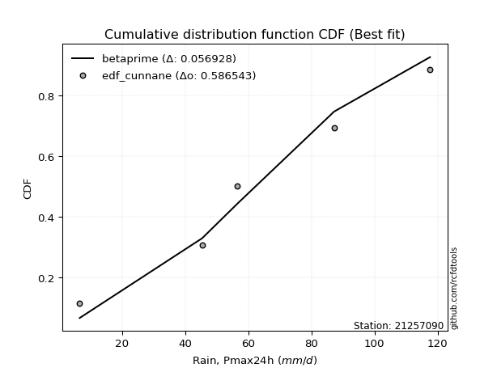</img>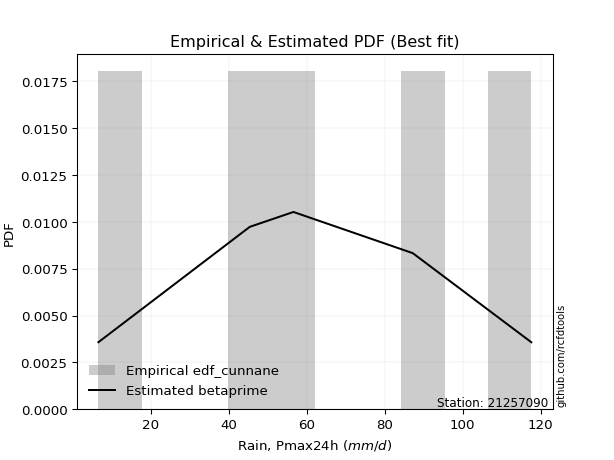</img>

</div>


### 12. EDF Adamowski (1981)

The Adamowski formula in hydrology refers to a specific plotting position formula used for estimating the non-parametric empirical distribution of hydrological events (like flood peaks) to calculate their return periods. This formula provides an alternative to traditional parametric methods (like the Gumbel or Log Pearson Type III distributions). 

<div align="center">


$P=(m-0.25)/(n+0.5)$


</div>


**12.1. Empirical values**

<div align="center">

|                | 0                   | 1                  | 2             | 3                  | 4                  |
|:---------------|:--------------------|:-------------------|:--------------|:-------------------|:-------------------|
| date           | 2023                | 2021               | 2022          | 2020               | 2019               |
| x              | 6.6                 | 45.4               | 56.6          | 87.2               | 117.6              |
| m              | 1                   | 2                  | 3             | 4                  | 5                  |
| empirical_dist | edf_adamowski       | edf_adamowski      | edf_adamowski | edf_adamowski      | edf_adamowski      |
| empirical      | 0.13636363636363635 | 0.3181818181818182 | 0.5           | 0.6818181818181818 | 0.8636363636363636 |
| empirical_tr   | 1.1578947368421053  | 1.4666666666666666 | 2.0           | 3.1428571428571423 | 7.333333333333334  |

</div>


**12.2. Kolmogorov-Smirnov fit test (sorted by Δ)**


<div align="center">

|                | 0                   | 1                   | 2                   | 3                   | 4                   | 5                   | 6                   | 7                   | 8                   | 9                   | 10                  | 11                  | 12                  | 13                  | 14                  | 15                  | 16                  | 17                  | 18                  | 19                  | 20                  | 21                  | 22                  | 23                  | 24                 | 25                  | 26                 | 27                  | 28                  | 29                  | 30                  | 31                  | 32                    | 33                  | 34                 | 35                 | 36                  | 37                 | 38                  | 39                  | 40                  | 41                  | 42                  | 43                  | 44                  | 45                  | 46                  | 47                  | 48                  | 49                  | 50                  | 51                  | 52                 | 53                  | 54                  | 55                  | 56                  | 57                  | 58                 | 59                  | 60                  | 61                 | 62                 | 63                 | 64                  | 65                  | 66                  | 67                  | 68                 | 69                  | 70                 | 71                 | 72                 | 73                  | 74                 | 75                  | 76                  | 77                 | 78                 | 79                  | 80                 | 81                 | 82                  | 83                 | 84                 | 85                 | 86                 | 87                 |
|:---------------|:--------------------|:--------------------|:--------------------|:--------------------|:--------------------|:--------------------|:--------------------|:--------------------|:--------------------|:--------------------|:--------------------|:--------------------|:--------------------|:--------------------|:--------------------|:--------------------|:--------------------|:--------------------|:--------------------|:--------------------|:--------------------|:--------------------|:--------------------|:--------------------|:-------------------|:--------------------|:-------------------|:--------------------|:--------------------|:--------------------|:--------------------|:--------------------|:----------------------|:--------------------|:-------------------|:-------------------|:--------------------|:-------------------|:--------------------|:--------------------|:--------------------|:--------------------|:--------------------|:--------------------|:--------------------|:--------------------|:--------------------|:--------------------|:--------------------|:--------------------|:--------------------|:--------------------|:-------------------|:--------------------|:--------------------|:--------------------|:--------------------|:--------------------|:-------------------|:--------------------|:--------------------|:-------------------|:-------------------|:-------------------|:--------------------|:--------------------|:--------------------|:--------------------|:-------------------|:--------------------|:-------------------|:-------------------|:-------------------|:--------------------|:-------------------|:--------------------|:--------------------|:-------------------|:-------------------|:--------------------|:-------------------|:-------------------|:--------------------|:-------------------|:-------------------|:-------------------|:-------------------|:-------------------|
| station        | 21257090            | 21257090            | 21257090            | 21257090            | 21257090            | 21257090            | 21257090            | 21257090            | 21257090            | 21257090            | 21257090            | 21257090            | 21257090            | 21257090            | 21257090            | 21257090            | 21257090            | 21257090            | 21257090            | 21257090            | 21257090            | 21257090            | 21257090            | 21257090            | 21257090           | 21257090            | 21257090           | 21257090            | 21257090            | 21257090            | 21257090            | 21257090            | 21257090              | 21257090            | 21257090           | 21257090           | 21257090            | 21257090           | 21257090            | 21257090            | 21257090            | 21257090            | 21257090            | 21257090            | 21257090            | 21257090            | 21257090            | 21257090            | 21257090            | 21257090            | 21257090            | 21257090            | 21257090           | 21257090            | 21257090            | 21257090            | 21257090            | 21257090            | 21257090           | 21257090            | 21257090            | 21257090           | 21257090           | 21257090           | 21257090            | 21257090            | 21257090            | 21257090            | 21257090           | 21257090            | 21257090           | 21257090           | 21257090           | 21257090            | 21257090           | 21257090            | 21257090            | 21257090           | 21257090           | 21257090            | 21257090           | 21257090           | 21257090            | 21257090           | 21257090           | 21257090           | 21257090           | 21257090           |
| empirical_dist | edf_adamowski       | edf_adamowski       | edf_adamowski       | edf_adamowski       | edf_adamowski       | edf_adamowski       | edf_adamowski       | edf_adamowski       | edf_adamowski       | edf_adamowski       | edf_adamowski       | edf_adamowski       | edf_adamowski       | edf_adamowski       | edf_adamowski       | edf_adamowski       | edf_adamowski       | edf_adamowski       | edf_adamowski       | edf_adamowski       | edf_adamowski       | edf_adamowski       | edf_adamowski       | edf_adamowski       | edf_adamowski      | edf_adamowski       | edf_adamowski      | edf_adamowski       | edf_adamowski       | edf_adamowski       | edf_adamowski       | edf_adamowski       | edf_adamowski         | edf_adamowski       | edf_adamowski      | edf_adamowski      | edf_adamowski       | edf_adamowski      | edf_adamowski       | edf_adamowski       | edf_adamowski       | edf_adamowski       | edf_adamowski       | edf_adamowski       | edf_adamowski       | edf_adamowski       | edf_adamowski       | edf_adamowski       | edf_adamowski       | edf_adamowski       | edf_adamowski       | edf_adamowski       | edf_adamowski      | edf_adamowski       | edf_adamowski       | edf_adamowski       | edf_adamowski       | edf_adamowski       | edf_adamowski      | edf_adamowski       | edf_adamowski       | edf_adamowski      | edf_adamowski      | edf_adamowski      | edf_adamowski       | edf_adamowski       | edf_adamowski       | edf_adamowski       | edf_adamowski      | edf_adamowski       | edf_adamowski      | edf_adamowski      | edf_adamowski      | edf_adamowski       | edf_adamowski      | edf_adamowski       | edf_adamowski       | edf_adamowski      | edf_adamowski      | edf_adamowski       | edf_adamowski      | edf_adamowski      | edf_adamowski       | edf_adamowski      | edf_adamowski      | edf_adamowski      | edf_adamowski      | edf_adamowski      |
| p_dist         | fisk                | pearson3            | johnsonsu           | nct                 | t                   | exponnorm           | truncnorm           | norm                | crystalball         | gamma               | erlang              | f                   | betaprime           | genlogistic         | invgamma            | invgauss            | logistic            | kstwobign           | maxwell             | weibull_min         | rice                | ncf                 | hypsecant           | rayleigh            | laplace_asymmetric | logweibull_min      | gumbel_r           | logfisk             | logpearson3         | laplace             | loggumbel_l         | logmielke           | loglaplace_asymmetric | moyal               | gumbel_l           | logloggamma        | mielke              | loggompertz        | nakagami            | halflogistic        | halfnorm            | wald                | genexpon            | expon               | gibrat              | lognorm             | lognorm             | logcrystalball      | logexponnorm        | logt                | lognct              | logfatiguelife      | loglogistic        | loghypsecant        | logbetaprime        | logf                | loglaplace          | logncf              | logrice            | loginvgamma         | logerlang           | loginvgauss        | loggamma           | loggamma           | logalpha            | loginvweibull       | logmaxwell          | lograyleigh         | loggumbel_r        | logkstwobign        | loghalfnorm        | loggenexpon        | logmoyal           | loghalflogistic     | logexpon           | logtruncnorm        | lognakagami         | logwald            | loglognorm         | loggibrat           | gompertz           | alpha              | invweibull          | logchi2            | logjohnsonsu       | fatiguelife        | chi2               | loggenlogistic     |
| delta          | 0.06773436641239572 | 0.06790726181446449 | 0.06801408841849155 | 0.06802861847287883 | 0.06804316779648102 | 0.06804330524658816 | 0.06804376514727117 | 0.06804377566786282 | 0.06804378041396138 | 0.06817733121519501 | 0.06817758714877066 | 0.06895058654785867 | 0.07014124242607396 | 0.07398202328589396 | 0.07691023976897704 | 0.07860536052041979 | 0.08320079955689863 | 0.08428928079805426 | 0.08630695715342257 | 0.08747267589200113 | 0.09080387553481142 | 0.09822317617421611 | 0.09831633152973929 | 0.09840655616034158 | 0.0986997572575351 | 0.10895600663120851 | 0.1137160339199575 | 0.11483109939877242 | 0.11610104448362496 | 0.11899220805777677 | 0.11990898580876513 | 0.12399429448036059 | 0.1274473974040315    | 0.13071938752583043 | 0.1335009316762616 | 0.1362389924409092 | 0.13636131061030077 | 0.1363636360545066 | 0.13636363636363616 | 0.13636363636363635 | 0.13636363636363635 | 0.15638704630114264 | 0.18116236051119322 | 0.18117856223147882 | 0.18615144591423538 | 0.18999469051508827 | 0.18999469051508827 | 0.18999505245106035 | 0.18999618000332036 | 0.18999782462085174 | 0.19013041243074696 | 0.19014293823794343 | 0.1911114288626397 | 0.19206486316579569 | 0.19349740204342541 | 0.19409986626453385 | 0.19610363446736595 | 0.19737171804722337 | 0.1989126225344447 | 0.20425528292017775 | 0.20513227222321367 | 0.2083261509529239 | 0.208681458417389  | 0.208681458417389  | 0.21748601822669283 | 0.22032461524941555 | 0.22270007373914052 | 0.23352962737621547 | 0.2605639504442547 | 0.26270447683535986 | 0.2640151685364865 | 0.269488501692342  | 0.2863370640715704 | 0.28943358691875615 | 0.317907937147023  | 0.31818011807319524 | 0.31818173719721277 | 0.3579695731166161 | 0.3684808475908708 | 0.38255121712453305 | 0.4039607196861407 | 0.4308712288521244 | 0.43602643069057556 | 0.4771897155076346 | 0.5171731812949099 | 0.5232550883340827 | 0.672340246422704  | 0.6818181818181818 |
| deltao         | 0.5865427407550001  | 0.5865427407550001  | 0.5865427407550001  | 0.5865427407550001  | 0.5865427407550001  | 0.5865427407550001  | 0.5865427407550001  | 0.5865427407550001  | 0.5865427407550001  | 0.5865427407550001  | 0.5865427407550001  | 0.5865427407550001  | 0.5865427407550001  | 0.5865427407550001  | 0.5865427407550001  | 0.5865427407550001  | 0.5865427407550001  | 0.5865427407550001  | 0.5865427407550001  | 0.5865427407550001  | 0.5865427407550001  | 0.5865427407550001  | 0.5865427407550001  | 0.5865427407550001  | 0.5865427407550001 | 0.5865427407550001  | 0.5865427407550001 | 0.5865427407550001  | 0.5865427407550001  | 0.5865427407550001  | 0.5865427407550001  | 0.5865427407550001  | 0.5865427407550001    | 0.5865427407550001  | 0.5865427407550001 | 0.5865427407550001 | 0.5865427407550001  | 0.5865427407550001 | 0.5865427407550001  | 0.5865427407550001  | 0.5865427407550001  | 0.5865427407550001  | 0.5865427407550001  | 0.5865427407550001  | 0.5865427407550001  | 0.5865427407550001  | 0.5865427407550001  | 0.5865427407550001  | 0.5865427407550001  | 0.5865427407550001  | 0.5865427407550001  | 0.5865427407550001  | 0.5865427407550001 | 0.5865427407550001  | 0.5865427407550001  | 0.5865427407550001  | 0.5865427407550001  | 0.5865427407550001  | 0.5865427407550001 | 0.5865427407550001  | 0.5865427407550001  | 0.5865427407550001 | 0.5865427407550001 | 0.5865427407550001 | 0.5865427407550001  | 0.5865427407550001  | 0.5865427407550001  | 0.5865427407550001  | 0.5865427407550001 | 0.5865427407550001  | 0.5865427407550001 | 0.5865427407550001 | 0.5865427407550001 | 0.5865427407550001  | 0.5865427407550001 | 0.5865427407550001  | 0.5865427407550001  | 0.5865427407550001 | 0.5865427407550001 | 0.5865427407550001  | 0.5865427407550001 | 0.5865427407550001 | 0.5865427407550001  | 0.5865427407550001 | 0.5865427407550001 | 0.5865427407550001 | 0.5865427407550001 | 0.5865427407550001 |
| eval           | Δo > Δ              | Δo > Δ              | Δo > Δ              | Δo > Δ              | Δo > Δ              | Δo > Δ              | Δo > Δ              | Δo > Δ              | Δo > Δ              | Δo > Δ              | Δo > Δ              | Δo > Δ              | Δo > Δ              | Δo > Δ              | Δo > Δ              | Δo > Δ              | Δo > Δ              | Δo > Δ              | Δo > Δ              | Δo > Δ              | Δo > Δ              | Δo > Δ              | Δo > Δ              | Δo > Δ              | Δo > Δ             | Δo > Δ              | Δo > Δ             | Δo > Δ              | Δo > Δ              | Δo > Δ              | Δo > Δ              | Δo > Δ              | Δo > Δ                | Δo > Δ              | Δo > Δ             | Δo > Δ             | Δo > Δ              | Δo > Δ             | Δo > Δ              | Δo > Δ              | Δo > Δ              | Δo > Δ              | Δo > Δ              | Δo > Δ              | Δo > Δ              | Δo > Δ              | Δo > Δ              | Δo > Δ              | Δo > Δ              | Δo > Δ              | Δo > Δ              | Δo > Δ              | Δo > Δ             | Δo > Δ              | Δo > Δ              | Δo > Δ              | Δo > Δ              | Δo > Δ              | Δo > Δ             | Δo > Δ              | Δo > Δ              | Δo > Δ             | Δo > Δ             | Δo > Δ             | Δo > Δ              | Δo > Δ              | Δo > Δ              | Δo > Δ              | Δo > Δ             | Δo > Δ              | Δo > Δ             | Δo > Δ             | Δo > Δ             | Δo > Δ              | Δo > Δ             | Δo > Δ              | Δo > Δ              | Δo > Δ             | Δo > Δ             | Δo > Δ              | Δo > Δ             | Δo > Δ             | Δo > Δ              | Δo > Δ             | Δo > Δ             | Δo > Δ             | Δo <= Δ            | Δo <= Δ            |
| fit            | 1                   | 1                   | 1                   | 1                   | 1                   | 1                   | 1                   | 1                   | 1                   | 1                   | 1                   | 1                   | 1                   | 1                   | 1                   | 1                   | 1                   | 1                   | 1                   | 1                   | 1                   | 1                   | 1                   | 1                   | 1                  | 1                   | 1                  | 1                   | 1                   | 1                   | 1                   | 1                   | 1                     | 1                   | 1                  | 1                  | 1                   | 1                  | 1                   | 1                   | 1                   | 1                   | 1                   | 1                   | 1                   | 1                   | 1                   | 1                   | 1                   | 1                   | 1                   | 1                   | 1                  | 1                   | 1                   | 1                   | 1                   | 1                   | 1                  | 1                   | 1                   | 1                  | 1                  | 1                  | 1                   | 1                   | 1                   | 1                   | 1                  | 1                   | 1                  | 1                  | 1                  | 1                   | 1                  | 1                   | 1                   | 1                  | 1                  | 1                   | 1                  | 1                  | 1                   | 1                  | 1                  | 1                  | 0                  | 0                  |
| n              | 5                   | 5                   | 5                   | 5                   | 5                   | 5                   | 5                   | 5                   | 5                   | 5                   | 5                   | 5                   | 5                   | 5                   | 5                   | 5                   | 5                   | 5                   | 5                   | 5                   | 5                   | 5                   | 5                   | 5                   | 5                  | 5                   | 5                  | 5                   | 5                   | 5                   | 5                   | 5                   | 5                     | 5                   | 5                  | 5                  | 5                   | 5                  | 5                   | 5                   | 5                   | 5                   | 5                   | 5                   | 5                   | 5                   | 5                   | 5                   | 5                   | 5                   | 5                   | 5                   | 5                  | 5                   | 5                   | 5                   | 5                   | 5                   | 5                  | 5                   | 5                   | 5                  | 5                  | 5                  | 5                   | 5                   | 5                   | 5                   | 5                  | 5                   | 5                  | 5                  | 5                  | 5                   | 5                  | 5                   | 5                   | 5                  | 5                  | 5                   | 5                  | 5                  | 5                   | 5                  | 5                  | 5                  | 5                  | 5                  |
| best_fit       | 1                   | 0                   | 0                   | 0                   | 0                   | 0                   | 0                   | 0                   | 0                   | 0                   | 0                   | 0                   | 0                   | 0                   | 0                   | 0                   | 0                   | 0                   | 0                   | 0                   | 0                   | 0                   | 0                   | 0                   | 0                  | 0                   | 0                  | 0                   | 0                   | 0                   | 0                   | 0                   | 0                     | 0                   | 0                  | 0                  | 0                   | 0                  | 0                   | 0                   | 0                   | 0                   | 0                   | 0                   | 0                   | 0                   | 0                   | 0                   | 0                   | 0                   | 0                   | 0                   | 0                  | 0                   | 0                   | 0                   | 0                   | 0                   | 0                  | 0                   | 0                   | 0                  | 0                  | 0                  | 0                   | 0                   | 0                   | 0                   | 0                  | 0                   | 0                  | 0                  | 0                  | 0                   | 0                  | 0                   | 0                   | 0                  | 0                  | 0                   | 0                  | 0                  | 0                   | 0                  | 0                  | 0                  | 0                  | 0                  |
| best_fit_sort  | 1                   | 2                   | 3                   | 4                   | 5                   | 6                   | 7                   | 8                   | 9                   | 10                  | 11                  | 12                  | 13                  | 14                  | 15                  | 16                  | 17                  | 18                  | 19                  | 20                  | 21                  | 22                  | 23                  | 24                  | 25                 | 26                  | 27                 | 28                  | 29                  | 30                  | 31                  | 32                  | 33                    | 34                  | 35                 | 36                 | 37                  | 38                 | 39                  | 40                  | 41                  | 42                  | 43                  | 44                  | 45                  | 46                  | 47                  | 48                  | 49                  | 50                  | 51                  | 52                  | 53                 | 54                  | 55                  | 56                  | 57                  | 58                  | 59                 | 60                  | 61                  | 62                 | 63                 | 64                 | 65                  | 66                  | 67                  | 68                  | 69                 | 70                  | 71                 | 72                 | 73                 | 74                  | 75                 | 76                  | 77                  | 78                 | 79                 | 80                  | 81                 | 82                 | 83                  | 84                 | 85                 | 86                 | 87                 | 88                 |

</div>


**12.3. Best fit**

<div align="center">

|   id |   station | empirical_dist   | p_dist   |     delta |   deltao | eval   |   fit |   n |   best_fit |   best_fit_sort |
|-----:|----------:|:-----------------|:---------|----------:|---------:|:-------|------:|----:|-----------:|----------------:|
|    0 |  21257090 | edf_adamowski    | fisk     | 0.0677344 | 0.586543 | Δo > Δ |     1 |   5 |          1 |               1 |

</div>


<div align="center">

</img></img>

</div>


## C. Best fit & Estimate extreme values for specific return periods - Tr

Best fit in probability distribution analysis means finding the theoretical distribution (like Normal, Poisson, Exponential) that most accurately mirrors your real-world data´s patterns (shape, center, spread) for better predictions, using methods like visual checks (Q-Q plots), goodness-of-fit tests (Kolmogorov-Smirnov, Chi-Squared), and information criteria (AIC) to score and select the simplest, most representative model.


### 1. Best fit (ordered by delta Δ)

<div align="center">

|   id |   station | empirical_dist   | p_dist      |     delta |   deltao | eval   |   fit |   n |   best_fit |   best_fit_sort |
|-----:|----------:|:-----------------|:------------|----------:|---------:|:-------|------:|----:|-----------:|----------------:|
|    0 |  21257090 | edf_hazen        | weibull_min | 0.051109  | 0.586543 | Δo > Δ |     1 |   5 |          1 |               1 |
|    1 |  21257090 | edf_gringorten   | genlogistic | 0.0566887 | 0.586543 | Δo > Δ |     1 |   5 |          1 |               2 |
|    2 |  21257090 | edf_blom         | betaprime   | 0.0569276 | 0.586543 | Δo > Δ |     1 |   5 |          1 |               3 |
|    3 |  21257090 | edf_cunnane      | betaprime   | 0.0569276 | 0.586543 | Δo > Δ |     1 |   5 |          1 |               4 |
|    4 |  21257090 | edf_tukey        | betaprime   | 0.0587776 | 0.586543 | Δo > Δ |     1 |   5 |          1 |               5 |
|    5 |  21257090 | edf_filliben     | betaprime   | 0.060991  | 0.586543 | Δo > Δ |     1 |   5 |          1 |               6 |
|    6 |  21257090 | edf_beard        | f           | 0.0612077 | 0.586543 | Δo > Δ |     1 |   5 |          1 |               7 |
|    7 |  21257090 | edf_jenkinson    | f           | 0.0612077 | 0.586543 | Δo > Δ |     1 |   5 |          1 |               8 |
|    8 |  21257090 | edf_chegodayev   | f           | 0.0622166 | 0.586543 | Δo > Δ |     1 |   5 |          1 |               9 |
|    9 |  21257090 | edf_adamowski    | fisk        | 0.0677344 | 0.586543 | Δo > Δ |     1 |   5 |          1 |              10 |
|   10 |  21257090 | edf_weibull      | fisk        | 0.0912623 | 0.586543 | Δo > Δ |     1 |   5 |          1 |              11 |
|   11 |  21257090 | edf_california   | genlogistic | 0.137618  | 0.586543 | Δo > Δ |     1 |   5 |          1 |              12 |

</div>

:file_folder:Tables: [bestfit_21257090.csv](table/bestfit_21257090.csv) | [extreme_21257090.csv](table/extreme_21257090.csv)


### 2. Extreme values

In hydrology, a return period (or recurrence interval $Tr$) is the statistical average time between extreme events like floods or droughts of a specific magnitude, indicating how rare an event is, with a 100-year flood, for example, having a 1% chance of occurring in any given year, not that it happens exactly every century. It is a key tool for infrastructure design (like bridges or dams) and risk assessment, calculated from historical data to determine the probability of future events, although it is important to remember it is statistical average, and events can cluster or be missed.

> risk_rate: assuming the return period as the project useful life.

|   id |      tr |   prob_l |     prob_g |      alpha |   betaprime |    chi2 |   crystalball |   erlang |    expon |   exponnorm |        f |   fatiguelife |     fisk |    gamma |   genexpon |   genlogistic |   gibrat |   gompertz |   gumbel_l |   gumbel_r |   halflogistic |   halfnorm |   hypsecant |   invgamma |   invgauss |       invweibull |   johnsonsu |   kstwobign |   laplace |   laplace_asymmetric |   loggamma |   logistic |   lognorm |   maxwell |   mielke |    moyal |   nakagami |      ncf |      nct |     norm |   pearson3 |   rayleigh |     rice |        t |   truncnorm |     wald |   weibull_min |   logalpha |   logbetaprime |     logchi2 |   logcrystalball |   logerlang |         logexpon |   logexponnorm |      logf |   logfatiguelife |   logfisk |   loggenexpon |   loggenlogistic |   loggibrat |   loggompertz |   loggumbel_l |   loggumbel_r |   loghalflogistic |   loghalfnorm |   loghypsecant |   loginvgamma |   loginvgauss |   loginvweibull |   logjohnsonsu |   logkstwobign |   loglaplace |   loglaplace_asymmetric |   logloggamma |   loglogistic |     loglognorm |   logmaxwell |   logmielke |   logmoyal |   lognakagami |    logncf |    lognct |   logpearson3 |   lograyleigh |   logrice |      logt |   logtruncnorm |    logwald |   logweibull_min |   station |   n |   risk_rate |
|-----:|--------:|---------:|-----------:|-----------:|------------:|--------:|--------------:|---------:|---------:|------------:|---------:|--------------:|---------:|---------:|-----------:|--------------:|---------:|-----------:|-----------:|-----------:|---------------:|-----------:|------------:|-----------:|-----------:|-----------------:|------------:|------------:|----------:|---------------------:|-----------:|-----------:|----------:|----------:|---------:|---------:|-----------:|---------:|---------:|---------:|-----------:|-----------:|---------:|---------:|------------:|---------:|--------------:|-----------:|---------------:|------------:|-----------------:|------------:|-----------------:|---------------:|----------:|-----------------:|----------:|--------------:|-----------------:|------------:|--------------:|--------------:|--------------:|------------------:|--------------:|---------------:|--------------:|--------------:|----------------:|---------------:|---------------:|-------------:|------------------------:|--------------:|--------------:|---------------:|-------------:|------------:|-----------:|--------------:|----------:|----------:|--------------:|--------------:|----------:|----------:|---------------:|-----------:|-----------------:|----------:|----:|------------:|
|    0 |    2    | 0.5      | 0.5        |    21.5134 |     61.9853 | 10.7865 |       62.68   |  62.6477 |  45.4717 |     62.68   |  62.4007 |       6.60009 |  62.3188 |  62.6483 |    45.4735 |       60.012  |  51.3704 |    84.7067 |    68.8698 |    56.4902 |        53.4129 |    54.9674 |     62.68   |    59.06   |    55.8507 |   3600.34        |     62.6803 |     55.1122 |   62.68   |              59.7876 |    42.2894 |    62.68   |   44.4701 |   59.4576 |  57.7205 |  54.4919 |    50.3713 |  53.8615 |  62.674  |  62.68   |    62.712  |    58.3147 |  60.3936 |  62.6801 |     62.68   |  50.4665 |       59.8871 |    41.2343 |        44.0303 |     12.3389 |          44.4701 |     42.6824 |     24.7647      |        44.4699 |   44.0005 |          44.4564 |   52.9829 |       33.9128 |          inf     |     32.8432 |       51.6046 |       52.4936 |       37.673  |           34.6911 |       36.1668 |        44.4701 |       42.7675 |       42.2415 |         39.8945 |        117.585 |        34.4094 |      44.4701 |                 49.8025 |       59.5659 |       44.4701 |   6.6097       |      40.791  |     60.5189 |    35.7086 |       62.9313 |   43.5435 |   44.4538 |       53.3863 |       39.5607 |   43.424  |   44.4697 |        61.6773 |    32.0579 |          54.1624 |  21257090 |   5 |    0.75     |
|    1 |    2.33 | 0.570815 | 0.429185   |    25.6052 |     68.731  | 11.9487 |       69.4036 |  69.3723 |  54.0363 |     69.4036 |  69.1362 |       7.83481 |  68.7612 |  69.373  |    54.0385 |       66.7446 |  54.7763 |    88.6762 |    74.7194 |    62.7203 |        59.8185 |    62.2239 |     68.0609 |    65.9664 |    63.2668 | 134822           |     69.4049 |     62.5348 |   66.7488 |              64.8723 |    51.0574 |    68.6039 |   53.2498 |   66.4429 |  66.1837 |  60.3895 |    58.3973 |  61.4532 |  69.3982 |  69.4036 |    69.4346 |    65.4033 |  67.3869 |  69.4037 |     69.4036 |  54.8752 |       66.9024 |    49.9898 |        53.0929 |     15.0962 |          53.2498 |     51.5539 |     33.141       |        53.2497 |   52.7576 |          53.2041 |   61.9057 |       42.8373 |          inf     |     35.9819 |       59.4073 |       61.4023 |       44.5182 |           41.1876 |       43.93   |        51.3679 |       51.7249 |       51.318  |         50.8261 |        117.596 |        43.7954 |      49.5931 |                 55.3987 |       67.8359 |       52.1209 |   6.73645      |      49.1883 |     68.87   |    41.8226 |       70.57   |   52.7466 |   53.2406 |       62.8635 |       47.8369 |   52.2798 |   53.2494 |        65.3887 |    36.078  |          61.7005 |  21257090 |   5 |    0.729209 |
|    2 |    5    | 0.8      | 0.2        |    57.3334 |     94.1314 | 18.1698 |       94.3902 |  94.3808 |  96.8573 |     94.3902 |  94.3103 |      34.0622  |  93.8366 |  94.3817 |    96.8615 |       94.3408 |  74.385  |   102.351  |    93.617  |    89.7869 |        88.8024 |    92.9107 |     89.6448 |    93.5394 |    94.8511 |      9.30578e+11 |     94.3954 |     94.0646 |   87.0918 |              90.2948 |   104.188  |    91.4771 |  104.02   |   93.9366 |  94.6387 |  87.7079 |    92.6785 |  94.5238 |  94.3882 |  94.3902 |    94.3995 |    93.7824 |  94.298  |  94.3905 |     94.3902 |  79.5553 |       94.1111 |   104.92   |       107.483  |     47.0757 |         104.02   |    105.27   |    142.234       |       104.02   |  103.656  |         103.755  |  112.908  |      111.326  |          inf     |     60.8548 |       94.4873 |      101.887  |       91.9482 |           89.5539 |       99.9757 |        91.5987 |      106.877  |      109.21   |        145.552  |        117.6   |       122.009  |      85.5416 |                 85.4961 |       94.4806 |       96.2086 |   2.18405e+159 |     102.763  |     95.7393 |    86.9655 |      125.82   |  109.23   |  104.083  |      104.666  |      102.34   |  104.85   |  104.019  |        83.183  |    69.8977 |          93.9961 |  21257090 |   5 |    0.67232  |
|    3 |   10    | 0.9      | 0.1        |   115.626  |    111.271  | 24.1449 |      110.966  | 110.986  | 135.729  |    110.966  | 111.135  |      70.2755  | 112.509  | 110.987  |   135.735  |      115.757  |  96.7366 |   110.385  |   104.138  |   111.832  |       112.872  |   115.618  |    106.88   |   113.643  |   119.655  |      3.45962e+17 |    110.974  |    118.071  |  105.559  |             113.373  |   169.148  |   108.322  |  162.191  |  113.285  | 107.487  | 111.493  |   118.207  | 120.864  | 110.967  | 110.966  |   110.945  |   114.017  | 112.677  | 110.966  |    110.966  | 105.747  |      112.832  |   175.69   |       173.074  |    146.843  |         162.19   |    170.838  |    533.693       |       162.191  |  162.362  |         161.644  |  175.768  |      222.492  |          inf     |    110.772  |      122.86   |      135.073  |      166.001  |          170.692  |      183.724  |       145.371  |      175.955  |      185.472  |        342.917  |        117.6   |       266.179  |     140.313  |                126.692  |      106.059  |      151.099  | inf            |     172.593  |    107.401  |   164.498  |      202.434  |  179.465  |  162.382  |      135.78   |      176.011  |  167.012  |  162.189  |        96.3428 |   141.017  |         118.822  |  21257090 |   5 |    0.651322 |
|    4 |   15    | 0.933333 | 0.0666667  |   173.71   |    119.911  | 27.7223 |      119.237  | 119.277  | 158.467  |    119.237  | 119.568  |      93.9596  | 122.756  | 119.279  |   158.475  |      127.641  | 112.154  |   114.095  |   108.903  |   124.27   |       126.494  |   127.435  |    116.716  |   124.268  |   133.289  |      4.8054e+20  |    119.246  |    130.815  |  116.361  |             126.872  |   216.161  |   117.5    |  202.437  |  123.213  | 111.821  | 125.296  |   131.512  | 135.384  | 119.241  | 119.237  |   119.197  |   124.443  | 121.952  | 119.238  |    119.237  | 122.566  |      122.3    |   228.939  |       220.085  |    293.376  |         202.437  |    218.222  |   1156.72        |       202.438  |  203.158  |         201.691  |  223.701  |      318.597  |          inf     |    167.439  |      138.468  |      153.469  |      231.667  |          245.889  |      252.168  |       189.214  |      226.851  |      243.72   |        556.119  |        117.6   |       402.741  |     187.421  |                159.464  |      109.914  |      193.231  | inf            |     225.196  |    111.282  |   238.127  |      260.844  |  230.88   |  202.739  |      151.405  |      232.744  |  210.867  |  202.436  |       102.181  |   221.313  |         132.127  |  21257090 |   5 |    0.644736 |
|    5 |   20    | 0.95     | 0.05       |   231.743  |    125.601  | 30.2871 |      124.654  | 124.709  | 174.601  |    124.654  | 125.105  |     111.495   | 129.87   | 124.71   |   174.609  |      135.912  | 124.247  |   116.423  |   111.869  |   132.979  |       136.037  |   135.314  |    123.655  |   131.452  |   142.693  |      7.62376e+22 |    124.664  |    139.4    |  124.025  |             136.45   |   254.137  |   123.844  |  234.063  |  129.801  | 113.997  | 135.072  |   140.387  | 145.405  | 124.659  | 124.654  |   124.599  |   131.373  | 128.055  | 124.654  |    124.654  | 135.099  |      128.533  |   273.041  |       257.831  |    483.527  |         234.062  |    256.462  |   2002.54        |       234.064  |  235.298  |         233.158  |  264.273  |      404.732  |          inf     |    231.528  |      149.196  |      166.165  |      292.561  |          317.548  |      311.444  |       227.881  |      268.439  |      292.399  |        780.172  |        117.6   |       532.329  |     230.154  |                187.738  |      111.84   |      229.037  | inf            |     268.683  |    113.22   |   309.445  |      309.21   |  272.703  |  234.46   |      161.463  |      280.239  |  245.716  |  234.061  |       105.495  |   309.648  |         141.152  |  21257090 |   5 |    0.641514 |
|    6 |   25    | 0.96     | 0.04       |   289.756  |    129.805  | 32.289  |      128.641  | 128.708  | 187.115  |    128.642  | 129.187  |     125.427   | 135.329  | 128.709  |   187.123  |      142.261  | 134.329  |   118.088  |   113.98   |   139.687  |       143.39   |   141.175  |    129.025  |   136.859  |   149.863  |      3.77646e+24 |    128.652  |    145.83   |  129.97   |             143.88   |   286.474  |   128.697  |  260.459  |  134.693  | 115.306  | 142.65   |   146.991  | 153.046  | 128.648  | 128.641  |   128.575  |   136.522  | 132.561  | 128.642  |    128.641  | 145.138  |      133.135  |   311.297  |       289.832  |    715.337  |         260.459  |    289      |   3065.21        |       260.46   |  262.175  |         259.424  |  300.211  |      483.628  |          inf     |    303.347  |      157.344  |      175.834  |      350.175  |          386.707  |      364.419  |       263.153  |      304.154  |      334.898  |       1012.6    |        117.6   |       656.039  |     269.903  |                213.078  |      112.995  |      260.845  | inf            |     306.314  |    114.383  |   379.115  |      351.045  |  308.495  |  260.941  |      168.72   |      321.7    |  275.032  |  260.457  |       107.635  |   405.228  |         147.946  |  21257090 |   5 |    0.639603 |
|    7 |   50    | 0.98     | 0.02       |   579.73   |    141.919  | 38.5646 |      140.06   | 140.163  | 225.986  |    140.06   | 140.909  |     170.129   | 152.098  | 140.165  |   225.997  |      161.746  | 169.868  |   122.637  |   119.709  |   160.35   |       166.046  |   158.214  |    145.675  |   152.921  |   171.587  |      6.28518e+29 |    140.073  |    164.713  |  148.437  |             166.958  |   404.884  |   143.524  |  353.698  |  148.879  | 117.929  | 166.173  |   166.19   | 176.194  | 140.07   | 140.06   |   139.957  |   151.467  | 145.518  | 140.061  |    140.06   | 177.915  |      146.364  |   456.316  |       406.079  |   2459.54   |         353.697  |    407.981  |  11501.4         |       353.699  |  357.423  |         352.205  |  443.211  |      812.022  |          inf     |    786.229  |      181.824  |      205.012  |      609.222  |          709.654  |      575.297  |       411.131  |      437.015  |      497.851  |       2261.01   |        117.6   |      1211.75   |     442.719  |                315.749  |      115.305  |      388.098  | inf            |     447.985  |    116.709  |   712.1    |      507.99   |  440.757  |  354.514  |      188.527  |      480.167  |  379.991  |  353.694  |       112.307  |   975.338  |         168.085  |  21257090 |   5 |    0.63583  |
|    8 |   75    | 0.986667 | 0.0133333  |   869.662  |    148.466  | 42.2678 |      146.187  | 146.312  | 248.725  |    146.187  | 147.218  |     197.05    | 161.847  | 146.314  |   248.736  |      173.038  | 193.871  |   124.952  |   122.606  |   172.361  |       179.215  |   167.489  |    155.405  |   161.907  |   183.995  |      6.80922e+32 |    146.2    |    175.102  |  159.24   |             180.457  |   488.356  |   152.087  |  416.81   |  156.591  | 118.806  | 179.929  |   176.641  | 189.408  | 146.199  | 146.187  |   146.062  |   159.598  | 152.499  | 146.188  |    146.187  | 198.085  |      153.485  |   562.696  |       487.291  |   5118.32   |         416.808  |    491.72   |  24928           |       416.812  |  422.132  |         415.015  |  555.041  |     1077.21   |          inf     |   1495.9    |      195.645  |      221.563  |      840.539  |         1009.98   |      737.623  |       533.604  |      532.39   |      618.876  |       3606.44   |        117.6   |      1698.37   |     591.355  |                397.425  |      116.075  |      488.207  | inf            |     550.838  |    117.487  |  1029.52   |      621.219  |  534.951  |  417.879  |      198.403  |      597.068  |  452.088  |  416.806  |       113.997  |  1674.5    |         179.291  |  21257090 |   5 |    0.634587 |
|    9 |  100    | 0.99     | 0.01       |  1159.59   |    152.911  | 44.9071 |      150.331  | 150.472  | 264.858  |    150.331  | 151.493  |     216.421   | 168.758  | 150.474  |   264.87   |      181.02   | 212.465  |   126.471  |   124.501  |   180.862  |       188.536  |   173.807  |    162.307  |   168.136  |   192.692  |      9.5719e+34  |    150.345  |    182.221  |  166.904  |             190.035  |   554.766  |   158.133  |  465.765  |  161.844  | 119.247  | 189.689  |   183.761  | 198.669  | 150.345  | 150.331  |   150.19   |   165.138  | 157.231  | 150.332  |    150.331  | 212.791  |      158.307  |   649.526  |       551.539  |   8641.61   |         465.763  |    558.272  |  43155.7         |       465.767  |  472.44   |         463.741  |  650.6    |     1306.23   |          inf     |   2462.1    |      205.257  |      233.105  |     1055.58   |         1296.56   |      873.712  |       642.016  |      609.159  |      718.407  |       5018.77   |        117.6   |      2140.37   |     726.187  |                467.892  |      116.46   |      574.074  | inf            |     634.108  |    117.882  |  1337.26   |      712.425  |  610.371  |  467.041  |      204.736  |      692.618  |  508.506  |  465.76   |       114.869  |  2483.28   |         187.021  |  21257090 |   5 |    0.633968 |
|   10 |  200    | 0.995    | 0.005      |  2319.25   |    163.051  | 51.2997 |      159.731  | 159.911  | 303.73   |    159.731  | 161.214  |     263.837   | 185.431  | 159.913  |   303.744  |      200.191  | 263.053  |   129.785  |   128.62   |   201.298  |       210.945  |   188.258  |    178.934  |   182.739  |   213.354  |      1.39562e+40 |    159.746  |    198.616  |  185.371  |             213.113  |   742.428  |   172.636  |  599.189  |  173.863  | 119.934  | 213.202  |   200.042  | 220.664  | 159.749  | 159.731  |   159.55   |   177.813  | 167.991  | 159.731  |    159.731  | 249.421  |      169.26   |   904.311  |       731.624  |  30856      |         599.186  |    746.044  | 161930           |       599.192  |  609.988  |         596.567  |  952.371  |     2031.71   |          inf     |   9551.21   |      227.836  |      260.308  |     1825.3    |         2363.7    |     1286.91   |      1002.44   |      829.821  |     1013.56   |      11108      |        117.6   |      3646.4    |    1191.16   |                693.343  |      117.037  |      846.757  | inf            |     875.067  |    118.52   |  2511.14   |      974.135  |  825.454  |  601.077  |      217.967  |      972.765  |  664.15   |  599.182  |       116.213  |  6627.03   |         204.993  |  21257090 |   5 |    0.633042 |
|   11 |  250    | 0.996    | 0.004      |  2899.08   |    166.164  | 53.3664 |      162.603  | 162.797  | 316.244  |    162.604  | 164.191  |     279.29    | 190.813  | 162.799  |   316.258  |      206.351  | 281.204  |   130.763  |   129.832  |   207.868  |       218.15   |   192.704  |    184.287  |   187.337  |   219.932  |      6.38034e+41 |    162.619  |    203.69   |  191.316  |             220.543  |   812.058  |   177.292  |  647.135  |  177.563  | 120.086  | 220.771  |   205.051  | 227.665  | 162.622  | 162.603  |   162.41   |   181.715  | 171.285  | 162.604  |    162.603  | 261.539  |      172.609  |  1002.08   |       797.964  |  46611.9    |         647.132  |    815.616  | 247860           |       647.139  |  659.555  |         644.308  | 1076.31   |     2328.02   |          inf     |  15534.8    |      234.946  |      268.901  |     2176.7    |         2867.06   |     1449.73   |      1157.05   |      912.952  |     1127.83   |      14340.3    |        117.6   |      4300.01   |    1396.88   |                786.927  |      117.153  |      959.286  | inf            |     966.272  |    118.669  |  3075.85   |     1072.4    |  905.904  |  649.258  |      221.682  |     1079.98   |  720.67   |  647.128  |       116.488  |  9169.55   |         210.602  |  21257090 |   5 |    0.632858 |
|   12 |  500    | 0.998    | 0.002      |  5798.21   |    175.44   | 59.8086 |      171.122  | 171.355  | 355.115  |    171.122  | 173.037  |     327.766   | 207.591  | 171.357  |   355.132  |      225.46   | 343.934  |   133.573  |   133.306  |   228.26   |       240.51   |   205.959  |    200.913  |   201.358  |   240.18   |      9.06527e+46 |    171.139  |    218.895  |  209.783  |             243.621  |  1061.11   |   191.733  |  813.085  |  188.603  | 120.448  | 244.284  |   219.981  | 249.219  | 171.145  | 171.122  |   170.889  |   193.356  | 181.073  | 171.123  |    171.122  | 300.072  |      182.545  |  1364.58   |      1033.5    | 169104      |         813.08   |   1064.1    | 930029           |       813.09   |  831.601  |         809.583  | 1572.93   |     3496.14   |          117.378 |  83438.2    |      256.598  |      295.138  |     3759.45   |         5220      |     2068      |      1806.56   |     1215.14   |     1555.35   |      31685      |        117.6   |      7047.83   |    2291.28   |               1166.11   |      117.384  |     1412.56   | inf            |    1298.93   |    119.042  |  5775.8    |     1427.52   | 1196.09   |  816.07   |      231.768  |     1475.37   |  918.335  |  813.075  |       117.042  | 25750      |         227.548  |  21257090 |   5 |    0.632489 |
|   13 |  750    | 0.998667 | 0.00133333 |  8697.34   |    180.619  | 63.5908 |      175.854  | 176.111  | 377.854  |    175.854  | 177.962  |     356.408   | 217.456  | 176.113  |   377.871  |      236.628  | 385.419  |   135.078  |   135.163  |   240.182  |       253.582  |   213.364  |    210.639  |   209.405  |   251.914  |      9.3228e+49  |    175.872  |    227.437  |  220.585  |             257.12   |  1232.43   |   200.169  |  923.017  |  194.778  | 120.615  | 258.038  |   228.321  | 261.714  | 175.879  | 175.854  |   175.597  |   199.866  | 186.52   | 175.855  |    175.854  | 323.175  |      188.064  |  1624.53   |      1194.15   | 360954      |         923.012  |   1234.73   |      2.01574e+06 |       923.024  |  945.941  |         919.098  | 1963.26   |     4389.92   |          117.454 | 253619      |      268.986  |      310.194  |     5174.46   |         7409.74   |     2521.92   |      2344.45   |     1426.93   |     1864.95   |      50365.2    |        117.6   |      9302.6    |    3060.55   |               1467.75   |      117.46   |     1770.89   | inf            |    1532.67   |    119.224  |  8349.96   |     1674.31   | 1397.62   |  926.612  |      236.769  |     1756.56   | 1050.81   |  923.006  |       117.228  | 47823.8    |         237.157  |  21257090 |   5 |    0.632366 |
|   14 | 1000    | 0.999    | 0.001      | 11596.5    |    184.197  | 66.2798 |      179.112  | 179.386  | 393.987  |    179.112  | 181.359  |     376.838   | 224.48   | 179.388  |   394.005  |      244.55   | 417.166  |   136.093  |   136.412  |   248.638  |       262.855  |   218.478  |    217.539  |   215.056  |   260.199  |      1.277e+52   |    179.131  |    233.355  |  228.25   |             266.698  |  1366.82   |   206.152  | 1007.23   |  199.046  | 120.723  | 267.797  |   234.08   | 270.54   | 179.139  | 179.112  |   178.838  |   204.364  | 190.275  | 179.113  |    179.112  | 339.793  |      191.864  |  1833.97   |      1319.49   | 619214      |        1007.22   |   1368.43   |      3.48968e+06 |      1007.24   | 1033.71   |        1003.01   | 2297.45   |     5138.34   |          117.492 | 593824      |      277.661  |      320.758  |     6490.51   |         9499.84   |     2892.33   |      2820.65   |     1595.07   |     2115.9    |      69969      |        117.6   |     11275.1    |    3758.37   |               1727.99   |      117.499  |     2078.84   | inf            |    1718.38   |    119.343  | 10845.7    |     1868.97   | 1556.68   | 1011.31   |      239.967  |     1981.61   | 1153.01   | 1007.22   |       117.322  | 74653.1    |         243.851  |  21257090 |   5 |    0.632305 |

<div align="center">

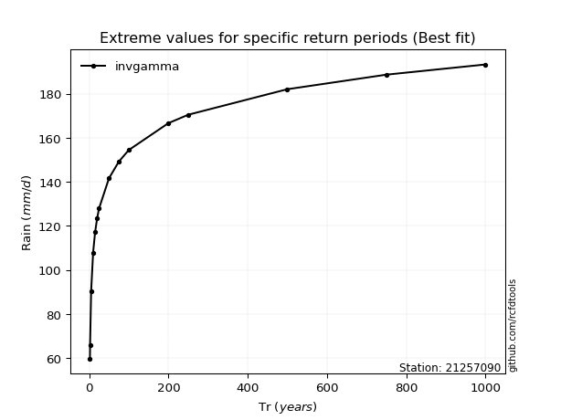</img>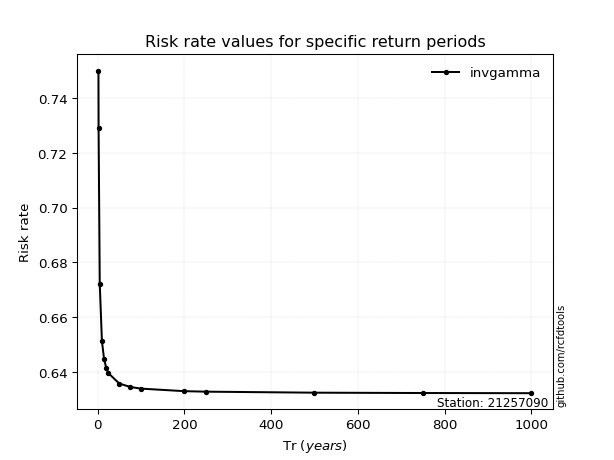</img>

</div>


<sub>**APP DISCLAIMER**: NO WARRANTY - This software is provided by [github.com/rcfdtools](https://github.com/rcfdtools) "as is", without any express or implied warranty, including warranties of merchantability, fitness for a particular purpose, or non-infringement. There is no guarantee that the software will be error-free or operate without interruption. LIMITATION OF LIABILITY - Neither the authors nor copyright holders will be liable for claims or damages arising from the software or its use. You are responsible for determining if the software is appropriate for your use and assume all associated risks, including errors, legal compliance, and data loss. NO PROFESSIONAL ADVICE - The software provides general information and does not offer professional advice. It should not replace consultation with professional advisors.</sub>