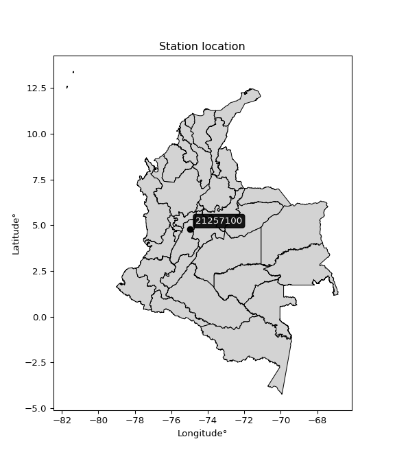

<div align="center">


</div>

# PMax24h Station (Rain, Pmax24h): 21257100

Maximum Precipitation in 24 hours (PMax24h) is the greatest amount of rainfall for a specific duration that is meteorologically possible for a given location, acting as a "worst-case" scenario for extreme storms, crucial for designing safety-critical infrastructure like bridges, river deviations, dams, spillways, and nuclear plants to prevent catastrophic failure. The PMax24h is related with the Probable Maximum Precipitation (PMP) and it is calculated by hydrologists using meteorological data to determine the upper limit of extreme rainfall, often leading to the Probable Maximum Flood (PMF) for flood control design, and is increasingly being studied for climate change impacts. Probable Maximum Precipitation (PMP) is the theoretical upper limit of rainfall, a deterministic estimate for extreme events, while probability distributions (like GEV, Gumbel) describe the likelihood and frequency of various precipitation amounts, including rare ones, showing how often events occur, with PMP representing the extreme end of these distributions, used for critical infrastructure design to ensure safety against the worst conceivable weather, unlike standard statistical forecasts which cover typical probabilities.

The most common probability distributions in hydrology, used for analyzing floods, rainfall, and streamflow, include the Normal, Log-Normal, Gumbel, Gamma (including Log-Pearson Type III), and Generalized Extreme Value (GEV) distributions, often chosen based on the data´s skewness and whether modeling extremes or general conditions, with Gumbel and GEV popular for extreme events like floods, while the Normal distribution serves as a baseline, though often requiring transformations for skewed hydrological data. These distributions help in designing water infrastructure, managing water resources, and forecasting hydrologic events.

> Hydrological data often isn´t perfectly normal (it´s skewed), so different distributions are needed for different applications, such as: **Flood Frequency Analysis**: Using Gumbel, GEV, or Log-Pearson Type III for predicting extreme flood magnitudes and their return periods, **Rainfall Analysis**: Normal for annual totals, but Log-Normal, Weibull, or GEV for intensity or extreme daily rainfall, **Streamflow Modeling**: Gamma and Log-Normal for maximum flows, GEV for minimum flows, and Kappa for daily flows.

<div align="center">

</img>

</div>


## A. General information


### 1. General running parameters

• app_version: _v20260225_. • runtime: _2026-02-27 14:50:08.749431_. • Python version: _3.14.0_. • SciPy version: _1.16.3_. • Pandas version: _2.3.3_. • NumPy version: _2.3.5_. • Stations dataset (station_dataset_file): _dataset/pmax24h_in/automatic_colombia_2003_2025.csv_. • Stations catalog (station_catalog_file): _dataset/CNE.xls_. • Minimum year to eval til year_max (date_min): _1900_. • Maximum year to eval since year_min (date_max): _2025_. • Creates, save and include plots into reports (create_plot): _False_. • Plot only fit distributions with Δo > Δ (plot_only_fit): _True_. • Plot only simple graphs avoiding multiple CDFs and multiple Extreme values plots (plot_only_simple): _False_. • Eval low extreme values, if False, evaluates high extreme values (low_extreme): _False_. • Eval every SciPy distribution as logarithmic (pdist_logarithmic_on): _True_. • Standard deviation normalized (ddof): _1.0_. • Return periods to eval in years (Tr): _[2, 2.33, 5, 10, 15, 20, 25, 50, 75, 100, 200, 250, 500, 750, 1000]_. • Minimum data sample per station, 0 means any (minimum_sample): _5_. • Z-Score maximum threshold to adjust a value, 0 means disable (zscore_max): _3.5_. • Z-Score minimum threshold to adjust a value, 0 means disable (zscore_min): _-2.5_. • Avoid zeros, e.g. rain = 0 (avoid_zeros): _True_. • Avoid null values (avoid_nans): _True_. 

:file_folder:Table: [dataset.csv](../../dataset/pmax24h_in/automatic_colombia_2003_2025.csv)

> Delta Degrees of Freedom (DDOF): is a parameter used in the formulas for calculating variance and standard deviation. When ddof=0, the divisor is $N$ (the total number of observations) and this is used when your data set is the entire population. When ddof=1, the divisor is $N-1$ and this is used when your data set is a sample drawn from a larger population. Using $N-1$ provides an unbiased estimate of the population variance (known as Bessel´s correction).


### 2. Station info and location

|   id |   CODIGO | NOMBRE                    | CATEGORIA    | TECNOLOGIA                              | ESTADO   | FECHA_INSTALACION   |   FECHA_SUSPENSION |   ALTITUD |   LATITUD |   LONGITUD | DEPARTAMENTO   | MUNICIPIO   | AREA_OPERATIVA             | ENTIDAD                                                     | AREA_HIDROGRAFICA   | ZONA_HIDROGRAFICA   | SUBZONA_HIDROGRAFICA                        | CORRIENTE   | Catalogo   |   Version |
|-----:|---------:|:--------------------------|:-------------|:----------------------------------------|:---------|:--------------------|-------------------:|----------:|----------:|-----------:|:---------------|:------------|:---------------------------|:------------------------------------------------------------|:--------------------|:--------------------|:--------------------------------------------|:------------|:-----------|----------:|
|    0 | 21257100 | LA NUEVA - AUT [21257100] | Limnigráfica | Automática con Telemetría, Convencional | Activa   | 15/01/1977          |                nan |       570 |   4.79508 |   -74.9719 | Tolima         | Venadillo   | Area Operativa 10 - Tolima | INSTITUTO DE HIDROLOGIA METEOROLOGIA Y ESTUDIOS AMBIENTALES | Magdalena Cauca     | Alto Magdalena      | Río Lagunilla y Otros Directos al Magdalena | Recio       | CNE_IDEAM  |  20251226 |

<div align="center">

Dynamic map: [:earth_americas:Google](http://maps.google.com/maps?q=4.795083333,-74.97194444) [:earth_americas:OSM](https://www.openstreetmap.org/#map=18/4.795083333/-74.97194444&layers=P) [:earth_americas:Bing](https://www.bing.com/maps?cp=4.795083333~-74.97194444&lvl=18) [:earth_americas:Apple](https://maps.apple.com/frame?center=4.795083333%2C-74.97194444&span=0.003%2C0.006)

</div>


<div align="center">

```geojson
{
  "type": "Feature",
  "geometry": {
    "type": "Point", 
    "coordinates": [-74.97194444, 4.795083333]
  }, 
  "properties": {
    "Name": "21257100"
  }
}
```

</div>


### 3. Discrete values table and plot

<div align="center">

|               |           0 |           1 |         2 |           3 |           4 |           5 |
|:--------------|------------:|------------:|----------:|------------:|------------:|------------:|
| Date          | 2019        | 2020        | 2021      | 2022        | 2024        | 2025        |
| Value         |   95.4      |  103.4      |    0.4    |   41.4      |   69.2      |   81.6      |
| Value_initial |   95.4      |  103.4      |    0.4    |   41.4      |   69.2      |   81.6      |
| count         |    6        |    6        |    6      |    6        |    6        |    6        |
| mean          |   65.2333   |   65.2333   |   65.2333 |   65.2333   |   65.2333   |   65.2333   |
| std           |   38.5272   |   38.5272   |   38.5272 |   38.5272   |   38.5272   |   38.5272   |
| zscore        |    0.782997 |    0.990643 |   -1.6828 |   -0.618611 |    0.102958 |    0.424808 |


</div>


> The initial value (value_initial) correspond to the initial obtained or null completed value, and value (value) is adjusted only when the initial value is outside the valid range (outlier) definite through the Z-Score value. If Z-Score is active, values out of range or outliers are replaced with the station mean value. A Z-Score (or standard score) measures how many standard deviations a data point is from the mean of a dataset, indicating its relative position; positive scores mean above the mean, negative mean below, and a score of zero is exactly at the mean, allowing for comparison of values from different distributions. It´s calculated using the formula $z=(x–μ)/σ$, where $x$ is the data point, $μ$ is the mean, and $σ$ is the standard deviation, helping identify outliers and understand probability.
>
> <sub>**Note**: In this study, "completing" (filling gaps in) and "extending" (forecasting or lengthening the historical record) rainfall data series are avoided for certain critical analyses because they introduce artificial bias and uncertainty, which can distort the statistics of rare events (extremes), alter day-to-day variability, and compromise the integrity and homogeneity of the original data. Some reasons against Completing/Extending rainfall data are: **Distortion of Extremes and Variability**: The primary issue is that most gap-filling or extension methods rely on averaging or regression with nearby stations, which inherently smooths the data. Rainfall is highly variable in space and time, with a large percentage of zero values and occasional large storms. Infilling methods often underestimate the highest values and overestimate the lowest (zero) values, which severely distorts analyses focused on flood frequency, drought severity, and intensity-duration-frequency (IDF) curves, **Loss of Data Homogeneity**: Infilled or extended data are synthetic estimates, not actual measurements. Combining these estimates with observed data can violate the assumption of data homogeneity, which requires that the data properties do not change over time. Inhomogeneity can lead to incorrect conclusions about long-term trends or changes in climate patterns, **Propagation of Errors**: Errors and biases from the original data (e.g., wind-induced undercatch, instrument errors, site changes) or the data used for imputation can propagate through the analysis, leading to unreliable hydrological models and inaccurate predictions, **Compromised Statistical Integrity**: For statistical analyses, especially those involving the frequency of events, using artificial data can introduce time bias or autocorrelation that doesn´t exist in reality, making it difficult to assess the true probability of events, **Difficulty in Validation**: It is difficult to accurately validate the quality of filled or extended data, especially for past periods where ground-truth measurements are unavailable. The reliability of imputation techniques heavily depends on the density of the surrounding station network and the complexity of the local topography.</sub>


### 4. Active continuous probability distributions from SciPy (80 of 104 available)

A Probability Density Function (PDF) describes the relative likelihood of a continuous random variable falling within a specific range, where the total area under its curve equals 1, and the area over any interval gives the actual probability for that range. Unlike discrete probabilities (like rolling a die), a PDF shows density, not direct probability for a single point (which is zero), with higher points indicating higher likelihood, often visualized as a bell curve for normal distributions.

A log of a probability density function (log-PDF) is simply the logarithm of the PDF´s value, denoted as $log(f(x))$, useful for converting multiplication of probabilities into addition, improving numerical stability with tiny numbers, and connecting to information theory concepts like entropy. Instead of dealing with very small probabilities (e.g., 0.000001), log-PDFs use negative numbers (e.g., $log(0.00001) ≈ -11.51$ that are easier for computers to handle, preventing underflow errors and simplifying complex calculations. In this study, each active probability distribution from SciPy is also evaluated in the $log$ form.

[scipy.stats](https://docs.scipy.org/doc/scipy/reference/stats.html) is a Python´s powerful submodule within the SciPy library for comprehensive statistical analysis, offering over 130 probability distributions (like Normal, Poisson, etc.), functions for descriptive stats (mean, variance), hypothesis testing (t-tests, chi-square), random variable generation, and statistical tests, making it essential for data science, modeling, and research. It provides tools to explore, model, and draw conclusions from data efficiently, working seamlessly with [NumPy](https://numpy.org/).

<div align="center">

|   id | p_dist           |   n_parameter | fit_method   | label                                                                       | active   | ref                                                                                                      |
|-----:|:-----------------|--------------:|:-------------|:----------------------------------------------------------------------------|:---------|:---------------------------------------------------------------------------------------------------------|
|    0 | alpha            |             3 | MLE          | Alpha                                                                       | True     | [:mortar_board:](https://docs.scipy.org/doc/scipy/reference/generated/scipy.stats.alpha.html)            |
|    1 | anglit           |             2 | MM           | Anglit                                                                      | True     | [:mortar_board:](https://docs.scipy.org/doc/scipy/reference/generated/scipy.stats.anglit.html)           |
|    2 | arcsine          |             2 | MM           | Arcsine                                                                     | True     | [:mortar_board:](https://docs.scipy.org/doc/scipy/reference/generated/scipy.stats.arcsine.html)          |
|    3 | argus            |             3 | MLE          | Argus                                                                       | True     | [:mortar_board:](https://docs.scipy.org/doc/scipy/reference/generated/scipy.stats.argus.html)            |
|    4 | beta             |             4 | MLE          | Beta                                                                        | True     | [:mortar_board:](https://docs.scipy.org/doc/scipy/reference/generated/scipy.stats.beta.html)             |
|    5 | betaprime        |             4 | MLE          | Beta prime                                                                  | True     | [:mortar_board:](https://docs.scipy.org/doc/scipy/reference/generated/scipy.stats.betaprime.html)        |
|    6 | bradford         |             3 | MLE          | Bradford                                                                    | True     | [:mortar_board:](https://docs.scipy.org/doc/scipy/reference/generated/scipy.stats.bradford.html)         |
|    7 | burr             |             4 | MLE          | Burr (Type III)                                                             | True     | [:mortar_board:](https://docs.scipy.org/doc/scipy/reference/generated/scipy.stats.burr.html)             |
|    8 | burr12           |             4 | MLE          | Burr (Type III) 12                                                          | True     | [:mortar_board:](https://docs.scipy.org/doc/scipy/reference/generated/scipy.stats.burr12.html)           |
|    9 | cosine           |             2 | MLE          | Cosine                                                                      | True     | [:mortar_board:](https://docs.scipy.org/doc/scipy/reference/generated/scipy.stats.cosine.html)           |
|   10 | crystalball      |             4 | MLE          | Crystalball                                                                 | True     | [:mortar_board:](https://docs.scipy.org/doc/scipy/reference/generated/scipy.stats.crystalball.html)      |
|   11 | dgamma           |             3 | MLE          | Double gamma                                                                | True     | [:mortar_board:](https://docs.scipy.org/doc/scipy/reference/generated/scipy.stats.dgamma.html)           |
|   12 | dweibull         |             3 | MLE          | Double Weibull                                                              | True     | [:mortar_board:](https://docs.scipy.org/doc/scipy/reference/generated/scipy.stats.dweibull.html)         |
|   13 | erlang           |             3 | MLE          | Erlang                                                                      | True     | [:mortar_board:](https://docs.scipy.org/doc/scipy/reference/generated/scipy.stats.erlang.html)           |
|   14 | exponnorm        |             3 | MLE          | Exponentially modified Normal                                               | True     | [:mortar_board:](https://docs.scipy.org/doc/scipy/reference/generated/scipy.stats.exponnorm.html)        |
|   15 | exponpow         |             3 | MLE          | Exponential power                                                           | True     | [:mortar_board:](https://docs.scipy.org/doc/scipy/reference/generated/scipy.stats.exponpow.html)         |
|   16 | exponweib        |             4 | MLE          | Exponentiated Weibull                                                       | True     | [:mortar_board:](https://docs.scipy.org/doc/scipy/reference/generated/scipy.stats.exponweib.html)        |
|   17 | f                |             4 | MLE          | F                                                                           | True     | [:mortar_board:](https://docs.scipy.org/doc/scipy/reference/generated/scipy.stats.f.html)                |
|   18 | fatiguelife      |             3 | MLE          | Fatigue-life (Birnbaum-Saunders)                                            | True     | [:mortar_board:](https://docs.scipy.org/doc/scipy/reference/generated/scipy.stats.fatiguelife.html)      |
|   19 | foldnorm         |             3 | MM           | Fold Normal                                                                 | True     | [:mortar_board:](https://docs.scipy.org/doc/scipy/reference/generated/scipy.stats.foldnorm.html)         |
|   20 | gamma            |             3 | MLE          | Gamma                                                                       | True     | [:mortar_board:](https://docs.scipy.org/doc/scipy/reference/generated/scipy.stats.gamma.html)            |
|   21 | gausshyper       |             6 | MLE          | Gauss hypergeometric                                                        | True     | [:mortar_board:](https://docs.scipy.org/doc/scipy/reference/generated/scipy.stats.gausshyper.html)       |
|   22 | genexpon         |             5 | MLE          | Generalized exponential                                                     | True     | [:mortar_board:](https://docs.scipy.org/doc/scipy/reference/generated/scipy.stats.genexpon.html)         |
|   23 | genextreme       |             3 | MLE          | Generalized exponential                                                     | True     | [:mortar_board:](https://docs.scipy.org/doc/scipy/reference/generated/scipy.stats.genextreme.html)       |
|   24 | gengamma         |             4 | MLE          | Generalized gamma                                                           | True     | [:mortar_board:](https://docs.scipy.org/doc/scipy/reference/generated/scipy.stats.gengamma.html)         |
|   25 | genhalflogistic  |             3 | MLE          | Generalized half-logistic                                                   | True     | [:mortar_board:](https://docs.scipy.org/doc/scipy/reference/generated/scipy.stats.genhalflogistic.html)  |
|   26 | genlogistic      |             3 | MLE          | Generalized logistic                                                        | True     | [:mortar_board:](https://docs.scipy.org/doc/scipy/reference/generated/scipy.stats.genlogistic.html)      |
|   27 | gennorm          |             3 | MLE          | Generalized Normal                                                          | True     | [:mortar_board:](https://docs.scipy.org/doc/scipy/reference/generated/scipy.stats.gennorm.html)          |
|   28 | genpareto        |             3 | MLE          | Generalized Pareto                                                          | True     | [:mortar_board:](https://docs.scipy.org/doc/scipy/reference/generated/scipy.stats.genpareto.html)        |
|   29 | gompertz         |             3 | MLE          | Gompertz (or truncated Gumbel)                                              | True     | [:mortar_board:](https://docs.scipy.org/doc/scipy/reference/generated/scipy.stats.gompertz.html)         |
|   30 | gumbel_l         |             2 | MM           | Gumbel Left Skew                                                            | True     | [:mortar_board:](https://docs.scipy.org/doc/scipy/reference/generated/scipy.stats.gumbel_l.html)         |
|   31 | gumbel_r         |             2 | MM           | Gumbel Right Skew                                                           | True     | [:mortar_board:](https://docs.scipy.org/doc/scipy/reference/generated/scipy.stats.gumbel_r.html)         |
|   32 | halfgennorm      |             3 | MLE          | Upper half of a generalized normal                                          | True     | [:mortar_board:](https://docs.scipy.org/doc/scipy/reference/generated/scipy.stats.halfgennorm.html)      |
|   33 | halflogistic     |             2 | MM           | Half-logistic                                                               | True     | [:mortar_board:](https://docs.scipy.org/doc/scipy/reference/generated/scipy.stats.halflogistic.html)     |
|   34 | halfnorm         |             2 | MM           | Half Normal                                                                 | True     | [:mortar_board:](https://docs.scipy.org/doc/scipy/reference/generated/scipy.stats.halfnorm.html)         |
|   35 | hypsecant        |             2 | MM           | hyperbolic secant                                                           | True     | [:mortar_board:](https://docs.scipy.org/doc/scipy/reference/generated/scipy.stats.hypsecant.html)        |
|   36 | invgamma         |             3 | MLE          | Inverted gamma                                                              | True     | [:mortar_board:](https://docs.scipy.org/doc/scipy/reference/generated/scipy.stats.invgamma.html)         |
|   37 | invgauss         |             3 | MLE          | Inverse Gaussian                                                            | True     | [:mortar_board:](https://docs.scipy.org/doc/scipy/reference/generated/scipy.stats.invgauss.html)         |
|   38 | invweibull       |             3 | MLE          | Inverted Weibull                                                            | True     | [:mortar_board:](https://docs.scipy.org/doc/scipy/reference/generated/scipy.stats.invweibull.html)       |
|   39 | johnsonsb        |             4 | MLE          | Johnson SB                                                                  | True     | [:mortar_board:](https://docs.scipy.org/doc/scipy/reference/generated/scipy.stats.johnsonsb.html)        |
|   40 | johnsonsu        |             4 | MLE          | Johnson Su                                                                  | True     | [:mortar_board:](https://docs.scipy.org/doc/scipy/reference/generated/scipy.stats.johnsonsu.html)        |
|   41 | kappa3           |             3 | MLE          | Kappa 3                                                                     | True     | [:mortar_board:](https://docs.scipy.org/doc/scipy/reference/generated/scipy.stats.kappa3.html)           |
|   42 | kappa4           |             4 | MLE          | Kappa 4                                                                     | True     | [:mortar_board:](https://docs.scipy.org/doc/scipy/reference/generated/scipy.stats.kappa4.html)           |
|   43 | ksone            |             3 | MLE          | Kolmogorov-Smirnov one-sided test statistic distribution                    | True     | [:mortar_board:](https://docs.scipy.org/doc/scipy/reference/generated/scipy.stats.ksone.html)            |
|   44 | kstwobign        |             2 | MLE          | Limiting distribution of scaled Kolmogorov-Smirnov two-sided test statistic | True     | [:mortar_board:](https://docs.scipy.org/doc/scipy/reference/generated/scipy.stats.kstwobign.html)        |
|   45 | laplace          |             2 | MM           | Laplace                                                                     | True     | [:mortar_board:](https://docs.scipy.org/doc/scipy/reference/generated/scipy.stats.laplace.html)          |
|   46 | levy_l           |             2 | MLE          | Left-skewed Levy                                                            | True     | [:mortar_board:](https://docs.scipy.org/doc/scipy/reference/generated/scipy.stats.levy_l.html)           |
|   47 | loggamma         |             3 | MLE          | Log gamma                                                                   | True     | [:mortar_board:](https://docs.scipy.org/doc/scipy/reference/generated/scipy.stats.loggamma.html)         |
|   48 | logistic         |             2 | MM           | Logistic (or Sech-squared)                                                  | True     | [:mortar_board:](https://docs.scipy.org/doc/scipy/reference/generated/scipy.stats.logistic.html)         |
|   49 | loglaplace       |             3 | MLE          | Log-Laplace                                                                 | True     | [:mortar_board:](https://docs.scipy.org/doc/scipy/reference/generated/scipy.stats.loglaplace.html)       |
|   50 | lomax            |             3 | MLE          | Lomax (Pareto of the second kind)                                           | True     | [:mortar_board:](https://docs.scipy.org/doc/scipy/reference/generated/scipy.stats.lomax.html)            |
|   51 | maxwell          |             2 | MM           | Maxwell                                                                     | True     | [:mortar_board:](https://docs.scipy.org/doc/scipy/reference/generated/scipy.stats.maxwell.html)          |
|   52 | mielke           |             4 | MLE          | Mielke Beta-Kappa / Dagum                                                   | True     | [:mortar_board:](https://docs.scipy.org/doc/scipy/reference/generated/scipy.stats.mielke.html)           |
|   53 | moyal            |             2 | MM           | Moyal                                                                       | True     | [:mortar_board:](https://docs.scipy.org/doc/scipy/reference/generated/scipy.stats.moyal.html)            |
|   54 | nakagami         |             3 | MLE          | Nakagami                                                                    | True     | [:mortar_board:](https://docs.scipy.org/doc/scipy/reference/generated/scipy.stats.nakagami.html)         |
|   55 | ncf              |             5 | MLE          | Non-central F distribution                                                  | True     | [:mortar_board:](https://docs.scipy.org/doc/scipy/reference/generated/scipy.stats.ncf.html)              |
|   56 | nct              |             4 | MLE          | Non-central Student’s t                                                     | True     | [:mortar_board:](https://docs.scipy.org/doc/scipy/reference/generated/scipy.stats.nct.html)              |
|   57 | norm             |             2 | MM           | Normal                                                                      | True     | [:mortar_board:](https://docs.scipy.org/doc/scipy/reference/generated/scipy.stats.norm.html)             |
|   58 | pearson3         |             3 | MM           | Pearson type III                                                            | True     | [:mortar_board:](https://docs.scipy.org/doc/scipy/reference/generated/scipy.stats.pearson3.html)         |
|   59 | powerlaw         |             3 | MLE          | Power-function                                                              | True     | [:mortar_board:](https://docs.scipy.org/doc/scipy/reference/generated/scipy.stats.powerlaw.html)         |
|   60 | rayleigh         |             2 | MM           | Rayleigh                                                                    | True     | [:mortar_board:](https://docs.scipy.org/doc/scipy/reference/generated/scipy.stats.rayleigh.html)         |
|   61 | rdist            |             3 | MLE          | R-distributed (symmetric beta)                                              | True     | [:mortar_board:](https://docs.scipy.org/doc/scipy/reference/generated/scipy.stats.rdist.html)            |
|   62 | rice             |             3 | MLE          | Rice                                                                        | True     | [:mortar_board:](https://docs.scipy.org/doc/scipy/reference/generated/scipy.stats.rice.html)             |
|   63 | semicircular     |             2 | MM           | Semicircular                                                                | True     | [:mortar_board:](https://docs.scipy.org/doc/scipy/reference/generated/scipy.stats.semicircular.html)     |
|   64 | skewnorm         |             3 | MLE          | Skew normal                                                                 | True     | [:mortar_board:](https://docs.scipy.org/doc/scipy/reference/generated/scipy.stats.skewnorm.html)         |
|   65 | t                |             3 | MLE          | Student’s t                                                                 | True     | [:mortar_board:](https://docs.scipy.org/doc/scipy/reference/generated/scipy.stats.t.html)                |
|   66 | trapezoid        |             4 | MLE          | Trapezoid                                                                   | True     | [:mortar_board:](https://docs.scipy.org/doc/scipy/reference/generated/scipy.stats.trapezoid.html)        |
|   67 | triang           |             3 | MLE          | Triangular                                                                  | True     | [:mortar_board:](https://docs.scipy.org/doc/scipy/reference/generated/scipy.stats.triang.html)           |
|   68 | truncexpon       |             3 | MLE          | Truncated exponential                                                       | True     | [:mortar_board:](https://docs.scipy.org/doc/scipy/reference/generated/scipy.stats.truncexpon.html)       |
|   69 | truncnorm        |             4 | MLE          | Truncated normal                                                            | True     | [:mortar_board:](https://docs.scipy.org/doc/scipy/reference/generated/scipy.stats.truncnorm.html)        |
|   70 | truncpareto      |             4 | MLE          | Upper truncated Pareto                                                      | True     | [:mortar_board:](https://docs.scipy.org/doc/scipy/reference/generated/scipy.stats.truncpareto.html)      |
|   71 | truncweibull_min |             5 | MLE          | Doubly truncated Weibull minimum                                            | True     | [:mortar_board:](https://docs.scipy.org/doc/scipy/reference/generated/scipy.stats.truncweibull_min.html) |
|   72 | tukeylambda      |             3 | MLE          | Tukey-Lamdba                                                                | True     | [:mortar_board:](https://docs.scipy.org/doc/scipy/reference/generated/scipy.stats.tukeylambda.html)      |
|   73 | uniform          |             2 | MLE          | Uniform                                                                     | True     | [:mortar_board:](https://docs.scipy.org/doc/scipy/reference/generated/scipy.stats.uniform.html)          |
|   74 | vonmises         |             3 | MLE          | Von Mises                                                                   | True     | [:mortar_board:](https://docs.scipy.org/doc/scipy/reference/generated/scipy.stats.vonmises.html)         |
|   75 | vonmises_line    |             3 | MLE          | Von Mises line                                                              | True     | [:mortar_board:](https://docs.scipy.org/doc/scipy/reference/generated/scipy.stats.vonmises_line.html)    |
|   76 | wald             |             2 | MM           | Wald                                                                        | True     | [:mortar_board:](https://docs.scipy.org/doc/scipy/reference/generated/scipy.stats.wald.html)             |
|   77 | weibull_max      |             3 | MLE          | Weibull maximum                                                             | True     | [:mortar_board:](https://docs.scipy.org/doc/scipy/reference/generated/scipy.stats.weibull_max.html)      |
|   78 | weibull_min      |             3 | MLE          | Weibull minimum                                                             | True     | [:mortar_board:](https://docs.scipy.org/doc/scipy/reference/generated/scipy.stats.weibull_min.html)      |
|   79 | wrapcauchy       |             3 | MLE          | Wrapped  Cauchy                                                             | True     | [:mortar_board:](https://docs.scipy.org/doc/scipy/reference/generated/scipy.stats.wrapcauchy.html)       |

</div>

> **n_parameter:** # arguments & localization & scale.
>
> **Fit methods:** (MLE) maximum likelihood, (MM) L-moments.
>
>**Inactive** (With the only purpose of prevent loops, zero divisions, infinite values, over high estimated values or horizontal trending for recurrence intervals estimations, the follow distributions were disabled.)**:** lognorm, norminvgauss, powernorm, powerlognorm, cauchy, halfcauchy, foldcauchy, skewcauchy, chi2, expon, fisk, genhyperbolic, geninvgauss, gibrat, kstwo, laplace_asymmetric, levy, levy_stable, ncx2, pareto, rel_breitwigner, recipinvgauss, studentized_range, loguniform, 


## B. Probability (PDF) vs. Empirical (EDF) distributions functions

A continuous probability distribution (CPD) describes probabilities for variables that can take any value within a range (like rain any time), unlike discrete variables with specific outcomes (like temperature). It uses a Probability Density Function (PDF), a curve where the total area under it equals 1, and the probability of the variable falling within an interval (a to b) is found by calculating the area under the curve between those points. A key feature is that the probability of hitting any single exact value is zero, so probabilities are always expressed for ranges, e.g., $P(a ≤ X ≤ b)$.

<div align="center">

Distributions parameters from station values
|     |   station | p_dist              |   n |             loc |            scale | shape                  | shape1                 | shape2                | shape3             |
|----:|----------:|:--------------------|----:|----------------:|-----------------:|:-----------------------|:-----------------------|:----------------------|:-------------------|
|   0 |  21257100 | alpha               |   6 |  -777.386       |  19514.5         | 23.221160863527018     |                        |                       |                    |
|   1 |  21257100 | anglit              |   6 |    65.2333      |    102.887       |                        |                        |                       |                    |
|   2 |  21257100 | arcsine             |   6 |    15.4949      |     99.4768      |                        |                        |                       |                    |
|   3 |  21257100 | argus               |   6 |   -37.0803      |    144.271       | 2.1387575272848935     |                        |                       |                    |
|   4 |  21257100 | beta                |   6 |   -10.2329      |    113.633       | 0.9419438949127066     | 0.4556623804650908     |                       |                    |
|   5 |  21257100 | betaprime           |   6 | -1640.86        | 101959           | 2336.0648163128985     | 139624.90602281573     |                       |                    |
|   6 |  21257100 | bradford            |   6 |   -13.4717      |    116.872       | 2.4398925637651777e-06 |                        |                       |                    |
|   7 |  21257100 | burr                |   6 |    -0.0572472   |    106.032       | 130.32446391262152     | 0.006394273685445647   |                       |                    |
|   8 |  21257100 | burr12              |   6 |  -789.841       |   1281.56        | 32.488876761361425     | 293758.5194648282      |                       |                    |
|   9 |  21257100 | cosine              |   6 |    61.2003      |     29.4287      |                        |                        |                       |                    |
|  10 |  21257100 | crystalball         |   6 |    65.2333      |     35.1703      | 4848.038073932097      | 1727.6233256545988     |                       |                    |
|  11 |  21257100 | dgamma              |   6 |    74.6528      |     18.7608      | 1.5049129269854535     |                        |                       |                    |
|  12 |  21257100 | dweibull            |   6 |    69.2         |     26.3628      | 0.9745355580021533     |                        |                       |                    |
|  13 |  21257100 | erlang              |   6 |  -473.562       |      2.43494     | 221.05752549299143     |                        |                       |                    |
|  14 |  21257100 | exponnorm           |   6 |    65.2055      |     35.1704      | 0.0007922532241735797  |                        |                       |                    |
|  15 |  21257100 | exponpow            |   6 |     0.4         |      3.67002     | 0.11245108763554927    |                        |                       |                    |
|  16 |  21257100 | exponweib           |   6 |     0.4         |      3.01985     | 3.1369500685886216     | 0.2798396002106625     |                       |                    |
|  17 |  21257100 | f                   |   6 |     0.4         |     58.5288      | 1.5577156008043838     | 16.928939723328977     |                       |                    |
|  18 |  21257100 | fatiguelife         |   6 | -5699.2         |   5764           | 0.0060757291444811425  |                        |                       |                    |
|  19 |  21257100 | foldnorm            |   6 |   -38.5179      |     31.9853      | 3.269782241734223      |                        |                       |                    |
|  20 |  21257100 | gamma               |   6 |  -544.018       |      2.14515     | 283.6966704865828      |                        |                       |                    |
|  21 |  21257100 | gausshyper          |   6 |    -9.45898     |    112.859       | 1.2080510734327359     | 0.6442178395270707     | 1.1246736854246189    | 1.0470982110892662 |
|  22 |  21257100 | genexpon            |   6 |     0.399967    |      2.44812     | 0.037450611910003914   | 9.632376123914952e-08  | 2.329380494462103     |                    |
|  23 |  21257100 | genextreme          |   6 |    75.5423      |     35.2003      | 1.2635751109205655     |                        |                       |                    |
|  24 |  21257100 | gengamma            |   6 |  -358.499       |      2.8565      | 134.78670289797844     | 0.9808226320660365     |                       |                    |
|  25 |  21257100 | genhalflogistic     |   6 |   -11.9052      |    123.049       | 1.067161036878118      |                        |                       |                    |
|  26 |  21257100 | genlogistic         |   6 |   103.4         |      1.07869e-05 | 2.8241041630055177e-07 |                        |                       |                    |
|  27 |  21257100 | gennorm             |   6 |    51.9         |     51.5001      | 10478061.905063618     |                        |                       |                    |
|  28 |  21257100 | genpareto           |   6 |    -0.539875    |    217.63        | -2.0938056259305133    |                        |                       |                    |
|  29 |  21257100 | gompertz            |   6 |    41.4         |     17.0623      | 0.06831692249585561    |                        |                       |                    |
|  30 |  21257100 | gumbel_l            |   6 |    81.0619      |     27.4222      |                        |                        |                       |                    |
|  31 |  21257100 | gumbel_r            |   6 |    49.4048      |     27.4222      |                        |                        |                       |                    |
|  32 |  21257100 | halfgennorm         |   6 |     0.4         |      3.76949     | 0.4338572118019971     |                        |                       |                    |
|  33 |  21257100 | halflogistic        |   6 |    23.5484      |     30.0694      |                        |                        |                       |                    |
|  34 |  21257100 | halfnorm            |   6 |    18.6817      |     58.3439      |                        |                        |                       |                    |
|  35 |  21257100 | hypsecant           |   6 |    65.2333      |     22.3901      |                        |                        |                       |                    |
|  36 |  21257100 | invgamma            |   6 |  -341.503       |  47412.6         | 117.80860445076047     |                        |                       |                    |
|  37 |  21257100 | invgauss            |   6 |  -215.372       |  14219.6         | 0.019729368453320684   |                        |                       |                    |
|  38 |  21257100 | invweibull          |   6 |     0.4         |      3.14264     | 0.058568951684955496   |                        |                       |                    |
|  39 |  21257100 | johnsonsb           |   6 |   -13.8308      |    117.231       | 0.054766500619727765   | 0.12462930475178238    |                       |                    |
|  40 |  21257100 | johnsonsu           |   6 |   107.326       |      0.114234    | 5.600551461207283      | 0.9138501205840768     |                       |                    |
|  41 |  21257100 | kappa3              |   6 |     0.397498    |    103.002       | 450203.78686030675     |                        |                       |                    |
|  42 |  21257100 | kappa4              |   6 |    -9.16315     |    119.053       | 1.0875452053027033     | 1.0515117774016607     |                       |                    |
|  43 |  21257100 | ksone               |   6 |    -9.9         |    123.6         | 1.0                    |                        |                       |                    |
|  44 |  21257100 | kstwobign           |   6 |   -84.7944      |    171.154       |                        |                        |                       |                    |
|  45 |  21257100 | laplace             |   6 |    65.2333      |     24.8692      |                        |                        |                       |                    |
|  46 |  21257100 | levy_l              |   6 |   105.853       |     10.0535      |                        |                        |                       |                    |
|  47 |  21257100 | loggamma            |   6 |   103.4         |      1.57497e-05 | 4.1197453798141255e-07 |                        |                       |                    |
|  48 |  21257100 | logistic            |   6 |    65.2333      |     19.3904      |                        |                        |                       |                    |
|  49 |  21257100 | loglaplace          |   6 |    -0.177748    |     69.3778      | 0.969910937849711      |                        |                       |                    |
|  50 |  21257100 | lomax               |   6 |     0.4         |      1.32877e+12 | 19657166430.421707     |                        |                       |                    |
|  51 |  21257100 | maxwell             |   6 |   -18.1056      |     52.2249      |                        |                        |                       |                    |
|  52 |  21257100 | mielke              |   6 |   -69.3316      |    172.789       | 3.4155272459370316     | 20938.12734393729      |                       |                    |
|  53 |  21257100 | moyal               |   6 |    45.1207      |     15.8322      |                        |                        |                       |                    |
|  54 |  21257100 | nakagami            |   6 |     0.4         |     72.9656      | 0.309678571820148      |                        |                       |                    |
|  55 |  21257100 | ncf                 |   6 |     0.190093    |     13.1734      | 0.6660910063540983     | 380.45839594177454     | 2.1908889432234204    |                    |
|  56 |  21257100 | nct                 |   6 |    -0.0834049   |      0.0216337   | 0.24003819570724466    | 54.73616092496498      |                       |                    |
|  57 |  21257100 | norm                |   6 |    65.2333      |     35.1703      |                        |                        |                       |                    |
|  58 |  21257100 | pearson3            |   6 |    65.2333      |     35.1704      | -0.7606993965410336    |                        |                       |                    |
|  59 |  21257100 | powerlaw            |   6 |     0.4         |    103           | 0.1372745630935682     |                        |                       |                    |
|  60 |  21257100 | rayleigh            |   6 |    -2.04956     |     53.684       |                        |                        |                       |                    |
|  61 |  21257100 | rdist               |   6 |    -9.4628      |     50.8628      | 1.1347773449659542     |                        |                       |                    |
|  62 |  21257100 | rice                |   6 |   -23.0496      |     38.2914      | 2.039414403115973      |                        |                       |                    |
|  63 |  21257100 | semicircular        |   6 |    65.2333      |     70.3407      |                        |                        |                       |                    |
|  64 |  21257100 | skewnorm            |   6 |   103.4         |     51.9059      | -10895494.625504889    |                        |                       |                    |
|  65 |  21257100 | t                   |   6 |    65.2316      |     35.1698      | 14935639.818070792     |                        |                       |                    |
|  66 |  21257100 | trapezoid           |   6 |   -35.9556      |    149.215       | 0.9999999999999999     | 1.0                    |                       |                    |
|  67 |  21257100 | triang              |   6 |   -23.7581      |    127.158       | 0.9999997595812666     |                        |                       |                    |
|  68 |  21257100 | truncexpon          |   6 |    -7.90901     |    174.5         | 0.6378741523351243     |                        |                       |                    |
|  69 |  21257100 | truncnorm           |   6 |   131.711       |     59.0693      | -11.477647977478831    | -0.47927912589198796   |                       |                    |
|  70 |  21257100 | truncpareto         |   6 |     0.25929     |      0.14071     | 2.3062599710445616e-08 | 759.5958451349925      |                       |                    |
|  71 |  21257100 | truncweibull_min    |   6 |   -46.116       |    199.297       | 3.0500761299875485     | 0.0007077459765758595  | 0.7502166638540033    |                    |
|  72 |  21257100 | tukeylambda         |   6 |    -9.39893     |     52.5455      | 1.0343820590144013     |                        |                       |                    |
|  73 |  21257100 | uniform             |   6 |     0.4         |    103           |                        |                        |                       |                    |
|  74 |  21257100 | vonmises            |   6 |     0.605512    |      1           | 0.6432530472628056     |                        |                       |                    |
|  75 |  21257100 | vonmises_line       |   6 |    48.373       |     17.5157      | 8.122340481523866e-07  |                        |                       |                    |
|  76 |  21257100 | wald                |   6 |    30.063       |     35.1703      |                        |                        |                       |                    |
|  77 |  21257100 | weibull_max         |   6 |   103.4         |      1.61381     | 0.29453394729738164    |                        |                       |                    |
|  78 |  21257100 | weibull_min         |   6 |    -2.43122e+09 |      2.43122e+09 | 94825148.49216747      |                        |                       |                    |
|  79 |  21257100 | wrapcauchy          |   6 |     0.399998    |     16.393       | 0.42684058203575015    |                        |                       |                    |
|  80 |  21257100 | logalpha            |   6 |   -60.2777      |   1890.62        | 29.704144955143533     |                        |                       |                    |
|  81 |  21257100 | loganglit           |   6 |     3.44042     |      5.76541     |                        |                        |                       |                    |
|  82 |  21257100 | logarcsine          |   6 |     0.653242    |      5.57434     |                        |                        |                       |                    |
|  83 |  21257100 | logargus            |   6 |    -2.84106     |      7.61352     | 3.39021368076276       |                        |                       |                    |
|  84 |  21257100 | logbeta             |   6 |    -1.56904     |      6.20764     | 0.104990522166217      | 0.02265954641926054    |                       |                    |
|  85 |  21257100 | logbetaprime        |   6 |   -11.0461      |      3.65893e+10 | 38.366397596419844     | 96715082599.54782      |                       |                    |
|  86 |  21257100 | logbradford         |   6 |    -0.961308    |      5.59996     | 2.011076461289528e-06  |                        |                       |                    |
|  87 |  21257100 | logburr             |   6 |    -0.916291    |      1.58005     | 0.1084452804787429     | 1.623663200500688      |                       |                    |
|  88 |  21257100 | logburr12           |   6 |    -0.916291    |      1.63092     | 0.7619999707393232     | 0.817390637160204      |                       |                    |
|  89 |  21257100 | logcosine           |   6 |     2.98462     |      1.76413     |                        |                        |                       |                    |
|  90 |  21257100 | logcrystalball      |   6 |     3.44042     |      1.97081     | 52.52278266715204      | 265.2842902953081      |                       |                    |
|  91 |  21257100 | logdgamma           |   6 |     4.55808     |      1.5416      | 0.6399273387919542     |                        |                       |                    |
|  92 |  21257100 | logdweibull         |   6 |     4.55808     |      1.49494     | 0.655089113671565      |                        |                       |                    |
|  93 |  21257100 | logerlang           |   6 |    -0.916291    |      2.43743     | 0.16718955685820175    |                        |                       |                    |
|  94 |  21257100 | logexponnorm        |   6 |     3.43915     |      1.97081     | 0.0006350654823201332  |                        |                       |                    |
|  95 |  21257100 | logexponpow         |   6 |    -0.916291    |      2.66672     | 0.3745520505817894     |                        |                       |                    |
|  96 |  21257100 | logexponweib        |   6 |    -0.916291    |      6.71913     | 0.12823904641275394    | 1.10562918919632       |                       |                    |
|  97 |  21257100 | logf                |   6 |    -0.916291    |      1.12649     | 1.1130836700676403     | 1.1128832412156104     |                       |                    |
|  98 |  21257100 | logfatiguelife      |   6 |    -0.916291    |      1.95773e-07 | 4573.56905307329       |                        |                       |                    |
|  99 |  21257100 | logfoldnorm         |   6 |    -7.97991     |      1.51061     | 7.634937258334737      |                        |                       |                    |
| 100 |  21257100 | loggamma            |   6 |    -0.916291    |      2.38475     | 0.404650213228431      |                        |                       |                    |
| 101 |  21257100 | loggausshyper       |   6 |    -1.36209     |      6.0007      | 1.3763952376804092     | 0.3023386415561774     | 1.1125333494204663    | 1.0003428493558508 |
| 102 |  21257100 | loggenexpon         |   6 |    -1.92216     |      0.699788    | 3.65451819099207e-10   | 4.178693605690995      | 0.0072914194554230625 |                    |
| 103 |  21257100 | loggenextreme       |   6 |     3.49826     |      1.53727     | 1.348076595894646      |                        |                       |                    |
| 104 |  21257100 | loggengamma         |   6 |    -1.28214e+08 |      1.28214e+08 | 2.1998328009575783     | 58561856.99282227      |                       |                    |
| 105 |  21257100 | loggenhalflogistic  |   6 |    -1.14405     |      7.48489     | 1.2943680711764594     |                        |                       |                    |
| 106 |  21257100 | loggenlogistic      |   6 |     4.63865     |      1.77675e-06 | 1.4823877422414554e-06 |                        |                       |                    |
| 107 |  21257100 | loggennorm          |   6 |     4.40183     |      1.91929e-05 | 0.18387768798806292    |                        |                       |                    |
| 108 |  21257100 | loggenpareto        |   6 |    -1.27135     |     14.0612      | -2.379237573838801     |                        |                       |                    |
| 109 |  21257100 | loggompertz         |   6 |    -0.916291    |      0.982274    | 0.005557796635552987   |                        |                       |                    |
| 110 |  21257100 | loggumbel_l         |   6 |     4.32739     |      1.53664     |                        |                        |                       |                    |
| 111 |  21257100 | loggumbel_r         |   6 |     2.55345     |      1.53664     |                        |                        |                       |                    |
| 112 |  21257100 | loghalfgennorm      |   6 |    -0.916291    |      5.55915     | 9279.333509809416      |                        |                       |                    |
| 113 |  21257100 | loghalflogistic     |   6 |     1.10451     |      1.68499     |                        |                        |                       |                    |
| 114 |  21257100 | loghalfnorm         |   6 |     0.8319      |      3.26932     |                        |                        |                       |                    |
| 115 |  21257100 | loghypsecant        |   6 |     3.44042     |      1.25466     |                        |                        |                       |                    |
| 116 |  21257100 | loginvgamma         |   6 |   -48.2646      |  32153           | 623.1430263774114      |                        |                       |                    |
| 117 |  21257100 | loginvgauss         |   6 |   -13.3836      |    857.945       | 0.019501169878407866   |                        |                       |                    |
| 118 |  21257100 | loginvweibull       |   6 |    -1.95975e+08 |      1.95975e+08 | 80556284.39986947      |                        |                       |                    |
| 119 |  21257100 | logjohnsonsb        |   6 |    -3.40784     |      8.04644     | -1.280265018194042     | 0.13919872753143564    |                       |                    |
| 120 |  21257100 | logjohnsonsu        |   6 |     4.6386      |      5.80846e-17 | 1.8482068168113686     | 0.101890220622291      |                       |                    |
| 121 |  21257100 | logkappa3           |   6 |    -0.916291    |      0.537539    | 0.12264401122280594    |                        |                       |                    |
| 122 |  21257100 | logkappa4           |   6 |    -1.33336     |      6.66522     | 1.0670018094892524     | 1.1096569066280033     |                       |                    |
| 123 |  21257100 | logksone            |   6 |    -1.47178     |      6.66587     | 1.0                    |                        |                       |                    |
| 124 |  21257100 | logkstwobign        |   6 |    -6.36148     |     11.1943      |                        |                        |                       |                    |
| 125 |  21257100 | loglaplace          |   6 |     3.44042     |      1.39357     |                        |                        |                       |                    |
| 126 |  21257100 | loglevy_l           |   6 |     4.66739     |      0.117158    |                        |                        |                       |                    |
| 127 |  21257100 | logloggamma         |   6 |     4.63865     |      3.46838e-06 | 2.905842897345056e-06  |                        |                       |                    |
| 128 |  21257100 | loglogistic         |   6 |     3.44042     |      1.08657     |                        |                        |                       |                    |
| 129 |  21257100 | logloglaplace       |   6 |    -0.916291    |      1.56249     | 0.5571250896262387     |                        |                       |                    |
| 130 |  21257100 | loglomax            |   6 |    -0.916291    |      2.63791e+08 | 75460781.16936055      |                        |                       |                    |
| 131 |  21257100 | logmaxwell          |   6 |    -1.22958     |      2.92649     |                        |                        |                       |                    |
| 132 |  21257100 | logmielke           |   6 |    -0.916291    |      2.51911     | 0.14546322882497176    | 0.8323140637382362     |                       |                    |
| 133 |  21257100 | logmoyal            |   6 |     2.31338     |      0.887177    |                        |                        |                       |                    |
| 134 |  21257100 | lognakagami         |   6 | -1195.96        |   1199.4         | 92638.69422752029      |                        |                       |                    |
| 135 |  21257100 | logncf              |   6 |    -0.916291    |      1.02002     | 1.1126505942676215     | 1.1696717332092346     | 1.1099792632274075    |                    |
| 136 |  21257100 | lognct              |   6 |  -118.938       |      1.92805     | 38943.79736763419      | 63.470902463273134     |                       |                    |
| 137 |  21257100 | lognorm             |   6 |     3.44042     |      1.97081     |                        |                        |                       |                    |
| 138 |  21257100 | logpearson3         |   6 |     3.44042     |      1.9708      | -1.7017885445393306    |                        |                       |                    |
| 139 |  21257100 | logpowerlaw         |   6 |    -0.916291    |      5.5549      | 0.15477981675070082    |                        |                       |                    |
| 140 |  21257100 | lograyleigh         |   6 |    -0.329837    |      3.00823     |                        |                        |                       |                    |
| 141 |  21257100 | logrdist            |   6 |    -0.916291    |      3.81747e-17 | 0.36909085259929064    |                        |                       |                    |
| 142 |  21257100 | logrice             |   6 | -2012.57        |      1.98146     | 1017.4330098623395     |                        |                       |                    |
| 143 |  21257100 | logsemicircular     |   6 |     3.44041     |      3.94162     |                        |                        |                       |                    |
| 144 |  21257100 | logskewnorm         |   6 |     4.63861     |      2.3065      | -12196230.351668067    |                        |                       |                    |
| 145 |  21257100 | logt                |   6 |     4.43903     |      0.202479    | 0.742192698483033      |                        |                       |                    |
| 146 |  21257100 | logtrapezoid        |   6 |    -2.24057     |      8.36145     | 1.0                    | 1.0                    |                       |                    |
| 147 |  21257100 | logtriang           |   6 |    -2.40292     |      7.04163     | 0.9999872377073931     |                        |                       |                    |
| 148 |  21257100 | logtruncexpon       |   6 |    -0.917416    |      9.43109     | 0.5891176597506467     |                        |                       |                    |
| 149 |  21257100 | logtruncnorm        |   6 |     2.87641     |      8.48515     | -0.4469873460613953    | 0.20768233407457345    |                       |                    |
| 150 |  21257100 | logtruncpareto      |   6 |    -0.930483    |      0.0141922   | 1.0563701788282942e-08 | 392.86564686054567     |                       |                    |
| 151 |  21257100 | logtruncweibull_min |   6 |    -1.3244      |      6.36993     | 1.8385826306661928     | 2.2323679103244365e-05 | 0.9361175934532453    |                    |
| 152 |  21257100 | logtukeylambda      |   6 |    -0.916291    |      5.59563e-15 | 2.047350705708088      |                        |                       |                    |
| 153 |  21257100 | loguniform          |   6 |    -0.916291    |      5.5549      |                        |                        |                       |                    |
| 154 |  21257100 | logvonmises         |   6 |    -1.80209     |      1           | 4.670947882961418      |                        |                       |                    |
| 155 |  21257100 | logvonmises_line    |   6 |     3.98509     |      1.56016     | 1.6484704126292573     |                        |                       |                    |
| 156 |  21257100 | logwald             |   6 |     1.46964     |      1.9708      |                        |                        |                       |                    |
| 157 |  21257100 | logweibull_max      |   6 |     4.6386      |      2.91357     | 0.3645532552680467     |                        |                       |                    |
| 158 |  21257100 | logweibull_min      |   6 |    -1.79836e+08 |      1.79836e+08 | 187493179.18533075     |                        |                       |                    |
| 159 |  21257100 | logwrapcauchy       |   6 |    -0.928905    |      0.886097    | 0.8664408315598253     |                        |                       |                    |

</div>

> **loc** (Location parameter): This shifts the distribution along the x-axis. For many common distributions, like the normal (Gaussian) distribution, loc represents the mean $μ$. For others, like the uniform distribution, it might represent the minimum value, or for the beta distribution, the left end of the support interval.
>
> **scale** (Scale parameter): This determines the width or spread of the distribution. For the normal distribution, scale represents the standard deviation $σ$. For a uniform distribution, it defines the length of the interval (from $loc$ to $loc + scale$).
>
> **shape** (Shape parameters): Refers to parameters that define the specific form of a probability distribution, distinct from its location (loc) and scale (scale). These parameters are required arguments for most distribution functions. For example, a normal (Gaussian) distribution is fully defined by its location (mean) and scale (standard deviation), so it has no specific shape parameters beyond loc and scale. However, other distributions have intrinsic properties that need specification, as Gamma distribution that takes a shape parameter, often named $a$ or $alpha$.


### 0. Cumulative distribution values - CDF (160 evaluated)

Cumulative Distribution Function (CDF), denoted as $F$<sub>$X$</sub>$(x)$, is a function that gives the probability that a random variable $X$ will take a value less than or equal to a specific value, $x$ (i.e., $(P(X≥x)$. It essentially "accumulates" probabilities from a given point up to the far right (positive infinity), providing a complete picture of the distribution´s probabilities for both discrete (like rain) and continuous (like temperature) variables, helping to find probabilities over ranges or above certain values. Each station is evaluated separately ordering the $x$ values ascending, calculating the CDF and PDF values for the activated distributions and their logarithmic forms.

<div align="center">

CDF ordered by x ascending and calculating $log(f(x))$ separately
|   id |   Station |   date |     x |   count |    mean |     std |    zscore |   Value_initial |   station |   m |     alpha |   alpha_pdf |    anglit |   anglit_pdf |   arcsine |   arcsine_pdf |    argus |   argus_pdf |      beta |    beta_pdf |   betaprime |   betaprime_pdf |   bradford |   bradford_pdf |      burr |     burr_pdf |    burr12 |   burr12_pdf |    cosine |   cosine_pdf |   crystalball |   crystalball_pdf |    dgamma |   dgamma_pdf |   dweibull |   dweibull_pdf |    erlang |   erlang_pdf |   exponnorm |   exponnorm_pdf |   exponpow |   exponpow_pdf |   exponweib |   exponweib_pdf |           f |       f_pdf |   fatiguelife |   fatiguelife_pdf |   foldnorm |   foldnorm_pdf |     gamma |   gamma_pdf |   gausshyper |   gausshyper_pdf |    genexpon |   genexpon_pdf |   genextreme |   genextreme_pdf |   gengamma |   gengamma_pdf |   genhalflogistic |   genhalflogistic_pdf |   genlogistic |   genlogistic_pdf |    gennorm |   gennorm_pdf |   genpareto |   genpareto_pdf |    gompertz |   gompertz_pdf |   gumbel_l |   gumbel_l_pdf |   gumbel_r |   gumbel_r_pdf |   halfgennorm |   halfgennorm_pdf |   halflogistic |   halflogistic_pdf |   halfnorm |   halfnorm_pdf |   hypsecant |   hypsecant_pdf |   invgamma |   invgamma_pdf |   invgauss |   invgauss_pdf |   invweibull |   invweibull_pdf |   johnsonsb |   johnsonsb_pdf |   johnsonsu |   johnsonsu_pdf |      kappa3 |   kappa3_pdf |     kappa4 |   kappa4_pdf |     ksone |   ksone_pdf |   kstwobign |   kstwobign_pdf |   laplace |   laplace_pdf |   levy_l |   levy_l_pdf |    loggamma |   loggamma_pdf |   logistic |   logistic_pdf |   loglaplace |   loglaplace_pdf |       lomax |   lomax_pdf |   maxwell |   maxwell_pdf |    mielke |   mielke_pdf |       moyal |   moyal_pdf |    nakagami |   nakagami_pdf |       ncf |    ncf_pdf |       nct |     nct_pdf |      norm |   norm_pdf |   pearson3 |   pearson3_pdf |   powerlaw |   powerlaw_pdf |   rayleigh |   rayleigh_pdf |    rdist |      rdist_pdf |      rice |   rice_pdf |   semicircular |   semicircular_pdf |   skewnorm |   skewnorm_pdf |         t |      t_pdf |   trapezoid |   trapezoid_pdf |    triang |   triang_pdf |   truncexpon |   truncexpon_pdf |   truncnorm |   truncnorm_pdf |   truncpareto |   truncpareto_pdf |   truncweibull_min |   truncweibull_min_pdf |   tukeylambda |   tukeylambda_pdf |   uniform |   uniform_pdf |   vonmises |   vonmises_pdf |   vonmises_line |   vonmises_line_pdf |     wald |   wald_pdf |   weibull_max |   weibull_max_pdf |   weibull_min |   weibull_min_pdf |   wrapcauchy |   wrapcauchy_pdf |   logalpha |   logalpha_pdf |   loganglit |   loganglit_pdf |   logarcsine |   logarcsine_pdf |   logargus |   logargus_pdf |   logbeta |   logbeta_pdf |   logbetaprime |   logbetaprime_pdf |   logbradford |   logbradford_pdf |    logburr |   logburr_pdf |   logburr12 |   logburr12_pdf |   logcosine |   logcosine_pdf |   logcrystalball |   logcrystalball_pdf |   logdgamma |   logdgamma_pdf |   logdweibull |   logdweibull_pdf |   logerlang |   logerlang_pdf |   logexponnorm |   logexponnorm_pdf |   logexponpow |   logexponpow_pdf |   logexponweib |   logexponweib_pdf |        logf |    logf_pdf |   logfatiguelife |   logfatiguelife_pdf |   logfoldnorm |   logfoldnorm_pdf |   loggausshyper |   loggausshyper_pdf |   loggenexpon |   loggenexpon_pdf |   loggenextreme |   loggenextreme_pdf |   loggengamma |   loggengamma_pdf |   loggenhalflogistic |   loggenhalflogistic_pdf |   loggenlogistic |   loggenlogistic_pdf |   loggennorm |   loggennorm_pdf |   loggenpareto |   loggenpareto_pdf |   loggompertz |   loggompertz_pdf |   loggumbel_l |   loggumbel_l_pdf |   loggumbel_r |   loggumbel_r_pdf |   loghalfgennorm |   loghalfgennorm_pdf |   loghalflogistic |   loghalflogistic_pdf |   loghalfnorm |   loghalfnorm_pdf |   loghypsecant |   loghypsecant_pdf |   loginvgamma |   loginvgamma_pdf |   loginvgauss |   loginvgauss_pdf |   loginvweibull |   loginvweibull_pdf |   logjohnsonsb |   logjohnsonsb_pdf |   logjohnsonsu |   logjohnsonsu_pdf |   logkappa3 |   logkappa3_pdf |   logkappa4 |   logkappa4_pdf |   logksone |   logksone_pdf |   logkstwobign |   logkstwobign_pdf |   loglevy_l |   loglevy_l_pdf |   logloggamma |   logloggamma_pdf |   loglogistic |   loglogistic_pdf |   logloglaplace |   logloglaplace_pdf |    loglomax |   loglomax_pdf |   logmaxwell |   logmaxwell_pdf |   logmielke |   logmielke_pdf |    logmoyal |   logmoyal_pdf |   lognakagami |   lognakagami_pdf |      logncf |   logncf_pdf |    lognct |   lognct_pdf |   lognorm |   lognorm_pdf |   logpearson3 |   logpearson3_pdf |   logpowerlaw |   logpowerlaw_pdf |   lograyleigh |   lograyleigh_pdf |   logrdist |   logrdist_pdf |   logrice |   logrice_pdf |   logsemicircular |   logsemicircular_pdf |   logskewnorm |   logskewnorm_pdf |      logt |   logt_pdf |   logtrapezoid |   logtrapezoid_pdf |   logtriang |   logtriang_pdf |   logtruncexpon |   logtruncexpon_pdf |   logtruncnorm |   logtruncnorm_pdf |   logtruncpareto |   logtruncpareto_pdf |   logtruncweibull_min |   logtruncweibull_min_pdf |   logtukeylambda |   logtukeylambda_pdf |   loguniform |   loguniform_pdf |   logvonmises |   logvonmises_pdf |   logvonmises_line |   logvonmises_line_pdf |   logwald |   logwald_pdf |   logweibull_max |   logweibull_max_pdf |   logweibull_min |   logweibull_min_pdf |   logwrapcauchy |   logwrapcauchy_pdf |
|-----:|----------:|-------:|------:|--------:|--------:|--------:|----------:|----------------:|----------:|----:|----------:|------------:|----------:|-------------:|----------:|--------------:|---------:|------------:|----------:|------------:|------------:|----------------:|-----------:|---------------:|----------:|-------------:|----------:|-------------:|----------:|-------------:|--------------:|------------------:|----------:|-------------:|-----------:|---------------:|----------:|-------------:|------------:|----------------:|-----------:|---------------:|------------:|----------------:|------------:|------------:|--------------:|------------------:|-----------:|---------------:|----------:|------------:|-------------:|-----------------:|------------:|---------------:|-------------:|-----------------:|-----------:|---------------:|------------------:|----------------------:|--------------:|------------------:|-----------:|--------------:|------------:|----------------:|------------:|---------------:|-----------:|---------------:|-----------:|---------------:|--------------:|------------------:|---------------:|-------------------:|-----------:|---------------:|------------:|----------------:|-----------:|---------------:|-----------:|---------------:|-------------:|-----------------:|------------:|----------------:|------------:|----------------:|------------:|-------------:|-----------:|-------------:|----------:|------------:|------------:|----------------:|----------:|--------------:|---------:|-------------:|------------:|---------------:|-----------:|---------------:|-------------:|-----------------:|------------:|------------:|----------:|--------------:|----------:|-------------:|------------:|------------:|------------:|---------------:|----------:|-----------:|----------:|------------:|----------:|-----------:|-----------:|---------------:|-----------:|---------------:|-----------:|---------------:|---------:|---------------:|----------:|-----------:|---------------:|-------------------:|-----------:|---------------:|----------:|-----------:|------------:|----------------:|----------:|-------------:|-------------:|-----------------:|------------:|----------------:|--------------:|------------------:|-------------------:|-----------------------:|--------------:|------------------:|----------:|--------------:|-----------:|---------------:|----------------:|--------------------:|---------:|-----------:|--------------:|------------------:|--------------:|------------------:|-------------:|-----------------:|-----------:|---------------:|------------:|----------------:|-------------:|-----------------:|-----------:|---------------:|----------:|--------------:|---------------:|-------------------:|--------------:|------------------:|-----------:|--------------:|------------:|----------------:|------------:|----------------:|-----------------:|---------------------:|------------:|----------------:|--------------:|------------------:|------------:|----------------:|---------------:|-------------------:|--------------:|------------------:|---------------:|-------------------:|------------:|------------:|-----------------:|---------------------:|--------------:|------------------:|----------------:|--------------------:|--------------:|------------------:|----------------:|--------------------:|--------------:|------------------:|---------------------:|-------------------------:|-----------------:|---------------------:|-------------:|-----------------:|---------------:|-------------------:|--------------:|------------------:|--------------:|------------------:|--------------:|------------------:|-----------------:|---------------------:|------------------:|----------------------:|--------------:|------------------:|---------------:|-------------------:|--------------:|------------------:|--------------:|------------------:|----------------:|--------------------:|---------------:|-------------------:|---------------:|-------------------:|------------:|----------------:|------------:|----------------:|-----------:|---------------:|---------------:|-------------------:|------------:|----------------:|--------------:|------------------:|--------------:|------------------:|----------------:|--------------------:|------------:|---------------:|-------------:|-----------------:|------------:|----------------:|------------:|---------------:|--------------:|------------------:|------------:|-------------:|----------:|-------------:|----------:|--------------:|--------------:|------------------:|--------------:|------------------:|--------------:|------------------:|-----------:|---------------:|----------:|--------------:|------------------:|----------------------:|--------------:|------------------:|----------:|-----------:|---------------:|-------------------:|------------:|----------------:|----------------:|--------------------:|---------------:|-------------------:|-----------------:|---------------------:|----------------------:|--------------------------:|-----------------:|---------------------:|-------------:|-----------------:|--------------:|------------------:|-------------------:|-----------------------:|----------:|--------------:|-----------------:|---------------------:|-----------------:|---------------------:|----------------:|--------------------:|
|    0 |  21257100 |   2021 |   0.4 |       6 | 65.2333 | 38.5272 | -1.6828   |             0.4 |  21257100 |   1 | 0.0308352 |  0.00224541 | 0.0239122 |   0.00296977 |  0        |    0          | 0.035783 |  0.0020253  | 0.0514879 | 0.00469001  |   0.0334138 |      0.00214545 |   0.118692 |     0.00855639 | 0.0106889 | nan          | 0.0432938 |   0.00174082 | 0.0311484 |   0.00283805 |     0.0326346 |        0.00207411 | 0.0240768 |   0.00115047 |  0.0391675 |     0.00141294 | 0.0336573 |   0.00225052 |    0.032635 |      0.00207413 |  0.0128389 |    2.60069e+13 | 2.03589e-15 |     32.1949     | 2.93931e-13 | 40.8321     |     0.0322091 |        0.00208387 |  0.0200309 |     0.00151651 | 0.0342191 |  0.00226172 |    0.0534165 |       0.006358   | 5.00076e-07 |     0.0152977  |    0.0599226 |       0.00129594 |  0.0349453 |     0.00232028 |         0.0528264 |            0.00453617 |      0        |        0.00176543 | 6.7057e-07 |    0.00970872 |  0.00432893 |      0.00461681 | 0           |     0          |  0.0514184 |     0.00182601 | 0.00254963 |    0.000555241 |   1.24403e-10 |        0.0983525  |       0        |         0          |   0        |     0          |   0.0351468 |      0.00156656 |  0.0321913 |     0.00241889 |  0.0352214 |     0.00259157 |  6.93486e-05 |      7.0069e+11  |    0.423904 |     0.00390399  |   0.0993746 |      0.00149305 | 2.42904e-05 |   0.00970826 | 2.1366e-15 |   0.162349   | 0.0833333 |  0.00809061 |   0.0346428 |      0.0036428  | 0.0368787 |    0.00148291 | 0.2425   |   0.00111372 | 2.77528e-07 |    1.01152e+09 |  0.0341062 |     0.00169893 |    0.0219403 |        0.0157439 | 6.74322e-12 |  0.0147935  | 0.0113971 |    0.00180155 | 0.0450805 |   0.00220809 | 4.03409e-05 | 2.26286e-05 | 4.65633e-12 | 51952.3        | 0.0655729 | 0.104984   | 0.0470066 | 0.246203    | 0.0326346 | 0.00207411 |  0.0491207 |     0.00203652 | 0.00310603 |    7.68096e+12 | 0.00104048 |    0.000849077 | 0.567679 |     0.00693853 | 0.0256727 | 0.00236902 |      0.0129939 |         0.00351062 |  0.0472158 |     0.00214618 | 0.0326361 | 0.00207423 |    0.059363 |      0.00326569 | 0.0360942 |   0.00298817 |     0.098604 |       0.0115868  |   0.0414984 |      0.00180702 |   7.25782e-10 |        1.07147    |          0.0345172 |             0.00224996 |      0.595511 |        0.00975107 |  0        |    0.00970874 |   0.443993 |      0.270078  |       0.0640962 |          0.00908643 | 0        | 0          |     0.0333339 |       0.000324201 |     0.0417951 |        0.00159559 |  4.58989e-08 |       0.0241692  |   0.015973 |       0.021445 | 0.000883918 |       0.0103089 |     0        |         0        | 0.00380314 |     0.00464815 |  0.142087 |   0.0252144   |      0.0203453 |          0.0267229 |    0.00803887 |          0.178573 | 0.00139116 |   2.16794e+12 | 3.91885e-13 |    2689.7       |   0.0204548 |       0.0363077 |        0.0135312 |            0.0175835 |  0.00597698 |      0.00419913 |      0.048147 |         0.0134839 |  0.00199769 |     3.00833e+12 |      0.0135313 |          0.0175836 |   7.32192e-07 |       2.47017e+09 |     0.00417427 |         5.3309e+12 | 8.22484e-10 | 4.12301e+06 |        0.0992786 |          1.98196e+13 |     0.0015435 |        0.00331561 |        0.013004 |         0.0397469   |     0.0308789 |         0.0603343 |       0.0392969 |           0.0169847 |     0.0146087 |          0.013617 |            0.0155213 |                0.0695235 |         0        |           0.00810114 |    0.0213013 |       0.00450535 |      0.0257053 |        0.0737185   |   1.87869e-09 |         0.0056581 |     0.0324234 |         0.0207544 |   7.02091e-05 |       0.000436982 |         0        |             0.179895 |          0        |              0        |      0        |          0        |      0.0197553 |          0.0157355 |     0.0142595 |         0.0196736 |     0.0201937 |         0.0284154 |        0.022881 |           0.0355281 |      0.0819807 |        0.0122553   |      0.0136831 |        0.000641784 |    0        |     5.01736e+07 | 1.11499e-15 |        1.51752  |  0.0833333 |       0.150018 |      0.0280302 |          0.0485335 |    0.115173 |       0.0102414 |    0.00952364 |        0.00797899 |     0.0178172 |         0.0161056 |     5.03834e-10 |         2.52831e+06 | 7.46531e-10 |      0.286063  |  0.000325177 |       0.00310671 |  0.00417664 |      5.4723e+12 | 6.69785e-10 |    1.47444e-08 |     0.0134802 |         0.0175519 | 5.07103e-10 |  2.54106e+06 | 0.0136927 |    0.0177662 | 0.0135312 |     0.0175835 |     0.0386528 |         0.0212489 |     0.0026019 |       3.62739e+12 |      0        |          0        |        0.5 |     3.9125e+15 |  0.013952 |     0.0179571 |          0        |              0        |     0.0160239 |         0.0190318 | 0.0273013 | 0.00378113 |      0.0250841 |          0.0378833 |   0.0445721 |       0.0599641 |     0.000268012 |            0.238148 |     9.6861e-06 |           0.166968 |      1.75941e-09 |           11.7957    |             0.0108509 |                  0.048728 |         0.234102 |          1.83324e+14 |     0        |         0.180021 |      0.963199 |          0.150357 |        3.94283e-11 |              0.0108776 |  0        |     0         |         0.282177 |           0.02343    |       0.00487784 |           0.00507312 |       0.0315589 |           2.48557   |
|    1 |  21257100 |   2022 |  41.4 |       6 | 65.2333 | 38.5272 | -0.618611 |            41.4 |  21257100 |   2 | 0.270167  |  0.00962752 | 0.276553  |   0.00869483 |  0.340936 |    0.00729126 | 0.192731 |  0.00621332 | 0.257843  | 0.00564064  |   0.254597  |      0.00910093 |   0.469504 |     0.00855639 | 0.457232  |   0.00919081 | 0.204613  |   0.00711676 | 0.293732  |   0.00963767 |     0.248995  |        0.00901605 | 0.158251  |   0.00682072 |  0.174429  |     0.00643928 | 0.264141  |   0.00930233 |    0.248996 |      0.00901603 |  0.933648  |    0.000886327 | 0.656448    |      0.00418775 | 0.524112    |  0.00711259 |     0.251578  |        0.00914143 |  0.220295  |     0.0092643  | 0.26459   |  0.009295   |    0.348108  |       0.00765507 | 0.465919    |     0.00817023 |    0.152054  |       0.00365574 |  0.266012  |     0.00916837 |         0.282779  |            0.00695269 |      0        |        0.00516451 | 0.5        |    0.00970873 |  0.218676   |      0.00601871 | 5.67456e-11 |     0.00400397 |  0.209769  |     0.00678444 | 0.262112   |    0.0127985   |   0.702821    |        0.00588403 |       0.288419 |         0.015245   |   0.30301  |     0.0126771  |   0.211445  |      0.00876433 |  0.282425  |     0.00974068 |  0.287001  |     0.00947756 |  0.423021    |      0.000519891 |    0.516096 |     0.00170077  |   0.199563  |      0.00387565 | 0.398063    |   0.00970826 | 0.411218   |   0.00934614 | 0.415049  |  0.00809061 |   0.351451  |      0.00985534 | 0.191763  |    0.00771087 | 0.307116 |   0.00226116 | 0.964293    |    0.0183949   |  0.226334  |     0.00903059 |    0.591851  |        0.292879  | 0.454762    |  0.00806598 | 0.270452  |    0.0103636  | 0.218761  |   0.00674771 | 0.260722    | 0.0150566   | 0.530991    |     0.0074415  | 0.534323  | 0.00664856 | 0.650085  | 0.00202456  | 0.248995  | 0.00901605 |  0.226153  |     0.0073211  | 0.881217   |    0.00295046  | 0.279298   |    0.0108655   | 1        | 22157.3        | 0.260317  | 0.00929131 |      0.288497  |         0.00851517 |  0.232295  |     0.00753194 | 0.249008  | 0.00901643 |    0.268756 |      0.00694858 | 0.262572  |   0.00805954 |     0.521981 |       0.00916061 |   0.199909  |      0.00664438 |   0.856059    |        0.00366465 |          0.229232  |             0.00766891 |      1        |        0.0143496  |  0.398058 |    0.00970874 |   6.9965   |      0.0756734 |       0.43664   |          0.00908644 | 0.189677 | 0.030402   |     0.0534571 |       0.000743789 |     0.190452  |        0.00667111 |  0.457839    |       0.00425351 |   0.56503  |       0.181685 | 0.548983    |       0.172614  |     0.532361 |         0.114798 | 0.393822   |     0.411993   |  0.207108 |   0.0225699   |      0.564256  |          0.165977  |    0.83654    |          0.178573 | 0.355805   |   0.00635777  | 0.615326    |       0.0355943 |   0.631349  |       0.172641  |        0.557063  |            0.200351  |  0.191859   |      0.167606   |      0.252624 |         0.13534   |  0.988182   |     0.00644852  |      0.557066  |          0.200351  |   0.911338    |       0.0301473   |     0.911433   |         0.0196218  | 0.722527    | 0.0285181   |        0.856428  |          0.0259711   |     0.544739  |        0.262431   |        0.432397 |         0.191225    |     0.621797  |         0.129012  |       0.427608  |           0.294404  |     0.524425  |          0.256659 |            0.611968  |                0.263974  |         0        |           0.38874    |    0.120324  |       0.105915   |      0.543384  |        0.209671    |   0.462007    |         0.34257   |     0.490812  |         0.223651  |   0.626842    |       0.190529    |         0        |             0.179895 |          0.651031 |              0.170967 |      0.623519 |          0.165059 |      0.571163  |          0.247389  |     0.569178  |         0.18819   |     0.590585  |         0.163075  |        0.570648 |           0.131588  |      0.15999   |        0.0417496   |      0.0215607 |        0.00574378  |    0.480135 |     0.00890533  | 0.808934    |        0.182602 |  0.779352  |       0.150018 |      0.608488  |          0.123108  |    0.275364 |       0.139899  |    0.46445    |        0.38912    |     0.564717  |         0.226228  |     0.727329    |         0.0327426   | 0.734783    |      0.0758686 |  0.586977    |       0.186482   |  0.920989   |      0.0108454  | 0.65144     |    0.183439    |     0.557236  |         0.200372  | 0.629727    |  0.0361482   | 0.557323  |    0.199629  | 0.557063  |     0.200351  |     0.444463  |         0.214865  |     0.972515  |       0.0324439   |      0.596536 |          0.180706 |        1   |     0          |  0.556797 |     0.199293  |          0.545647 |              0.161096 |     0.691481  |         0.319735  | 0.119965  | 0.119927   |      0.508735  |          0.170606  |   0.756905  |       0.247104  |     0.872981    |            0.145612 |     0.833175   |           0.183593 |      0.969745    |            0.0359724 |             0.815178  |                  0.210575 |         1        |          0           |     0.835222 |         0.180021 |      1.06105  |          0.232886 |        0.423615    |              0.28729   |  0.719698 |     0.164056  |         0.519095 |           0.135556   |       0.460242   |           0.347005   |       0.539897  |           0.0518797 |
|    2 |  21257100 |   2024 |  69.2 |       6 | 65.2333 | 38.5272 |  0.102958 |            69.2 |  21257100 |   3 | 0.567625  |  0.010706   | 0.538515  |   0.0096905  |  0.525412 |    0.00642013 | 0.437898 |  0.0119242  | 0.437539  | 0.00760511  |   0.549379  |      0.0111053  |   0.707372 |     0.00855638 | 0.701224  |   0.0084374  | 0.486547  |   0.0129445  | 0.585996  |   0.0106177  |     0.544899  |        0.0112712  | 0.450833  |   0.0120479  |  0.5       |     0.0452456  | 0.558179  |   0.0108406  |    0.544899 |      0.0112712  |  0.951026  |    0.000447016 | 0.741676    |      0.00226851 | 0.679724    |  0.00437305 |     0.549976  |        0.0112936  |  0.539015  |     0.012413   | 0.558855  |  0.0108648  |    0.572142  |       0.0086378  | 0.650931    |     0.00533997 |    0.308434  |       0.00839525 |  0.553374  |     0.010556   |         0.514944  |            0.0100671  |      0        |        0.0106935  | 0.5        |    0.00970873 |  0.41192    |      0.00821247 | 0.244313    |     0.0154326  |  0.47735   |     0.0123665  | 0.615178   |    0.0108992   |   0.817984    |        0.0028953  |       0.64055  |         0.00980559 |   0.61344  |     0.0094003  |   0.5561    |      0.0139963  |  0.574832  |     0.010285   |  0.568168  |     0.00985888 |  0.43403     |      0.000308389 |    0.56565  |     0.00202476  |   0.365901  |      0.00901682 | 0.667953    |   0.00970826 | 0.668442   |   0.00921801 | 0.639968  |  0.00809061 |   0.606912  |      0.00807163 | 0.573716  |    0.0171411  | 0.399529 |   0.00496981 | 0.972538    |    0.0139313   |  0.550964  |     0.012759   |    0.717693  |        0.202578  | 0.638608    |  0.00534624 | 0.57562   |    0.010557   | 0.470136  |   0.0115913  | 0.640175    | 0.0105599   | 0.70336     |     0.00511659 | 0.689082  | 0.00460414 | 0.690617  | 0.00107185  | 0.544899  | 0.0112712  |  0.494732  |     0.0116332  | 0.946113   |    0.00188775  | 0.585522   |    0.010247    | 1        |     0          | 0.554043  | 0.0108859  |      0.535881  |         0.00903612 |  0.50997   |     0.0123724  | 0.54492   | 0.0112713  |    0.496637 |      0.00944576 | 0.534424  |   0.0114982  |     0.757396 |       0.00781153 |   0.45895   |      0.0122139  |   0.933892    |        0.0021869  |          0.504568  |             0.0121275  |      1        |        0          |  0.667961 |    0.00970874 |  11.3615   |      0.2514    |       0.689243  |          0.00908644 | 0.709538 | 0.00960805 |     0.0855955 |       0.00181202  |     0.464643  |        0.0130466  |  0.573199    |       0.00495312 |   0.655039 |       0.167353 | 0.636414    |       0.166868  |     0.592261 |         0.119176 | 0.665406   |     0.647196   |  0.22319  |   0.0464719   |      0.646488  |          0.153173  |    0.928277   |          0.178573 | 0.358907   |   0.00573909  | 0.632488    |       0.0313659 |   0.716718  |       0.15864   |        0.656964  |            0.186548  |  0.311674   |      0.329939   |      0.34707  |         0.258522  |  0.991044   |     0.0047857   |      0.656967  |          0.186547  |   0.925439    |       0.0249424   |     0.920831   |         0.0170517  | 0.736173    | 0.0247538   |        0.869024  |          0.0231444   |     0.674529  |        0.238399   |        0.559063 |         0.33496     |     0.685034  |         0.116908  |       0.630593  |           0.537064  |     0.657461  |          0.256047 |            0.774025  |                0.385597  |         0        |           0.596762   |    0.234243  |       0.509982   |      0.677019  |        0.338018    |   0.649939    |         0.376052  |     0.610494  |         0.239     |   0.715814    |       0.155744    |         0.92705  |             0.179895 |          0.730373 |              0.138444 |      0.702371 |          0.141881 |      0.689744  |          0.209947  |     0.662288  |         0.172755  |     0.670564  |         0.147474  |        0.634959 |           0.118546  |      0.192112  |        0.0996714   |      0.0262754 |        0.0154587   |    0.484468 |     0.00799521  | 0.905587    |        0.195714 |  0.856419  |       0.150018 |      0.668539  |          0.110576  |    0.398149 |       0.422076  |    0.714264   |        0.598417   |     0.67549   |         0.20174   |     0.742824    |         0.0278034   | 0.77103     |      0.0654998 |  0.677848    |       0.166203   |  0.926144   |      0.00928908 | 0.735214    |    0.143626    |     0.657134  |         0.186517  | 0.647119    |  0.0317188   | 0.65685   |    0.18584   | 0.656964  |     0.186548  |     0.56669   |         0.261215  |     0.988452  |       0.0296883   |      0.684102 |          0.159419 |        1   |     0          |  0.656201 |     0.1857    |          0.627777 |              0.158179 |     0.861772  |         0.340725  | 0.271182  | 0.703209   |      0.600153  |          0.185302  |   0.88917   |       0.267826  |     0.945784    |            0.137893 |     0.927148   |           0.182152 |      0.987274    |            0.0323962 |             0.92107   |                  0.201129 |         1        |          0           |     0.927703 |         0.180021 |      1.30496  |          0.728023 |        0.573541    |              0.287782  |  0.790392 |     0.114781  |         0.615344 |           0.271229   |       0.651284   |           0.383014   |       0.595786  |           0.232239  |
|    3 |  21257100 |   2025 |  81.6 |       6 | 65.2333 | 38.5272 |  0.424808 |            81.6 |  21257100 |   4 | 0.692548  |  0.00929687 | 0.656404  |   0.00923162 |  0.60673  |    0.00677709 | 0.606117 |  0.0152113  | 0.542955  | 0.00963616  |   0.681211  |      0.00996691 |   0.813471 |     0.00855638 | 0.804386  |   0.00820894 | 0.654196  |   0.01369    | 0.712023  |   0.00956816 |     0.679161  |        0.0101791  | 0.567607  |   0.0125727  |  0.690448  |     0.0116649  | 0.685939  |   0.00959906 |    0.67916  |      0.0101791  |  0.955971  |    0.000356111 | 0.766986    |      0.00183823 | 0.728886    |  0.0035881  |     0.684042  |        0.0101273  |  0.686386  |     0.0110853  | 0.686948  |  0.00962603 |    0.685159  |       0.00972208 | 0.711245    |     0.0044173  |    0.438843  |       0.0131212  |  0.677991  |     0.00939086 |         0.652949  |            0.0123292  |      0        |        0.0147949  | 0.5        |    0.00970873 |  0.525723   |      0.0103906  | 0.4792      |     0.0219984  |  0.63934   |     0.0134128  | 0.734099   |    0.00827498  |   0.849491    |        0.00222618 |       0.74663  |         0.00735872 |   0.719147 |     0.0076456  |   0.714356  |      0.011113   |  0.694175  |     0.0088463  |  0.683018  |     0.00856295 |  0.437543    |      0.000260866 |    0.594362 |     0.00272299  |   0.50669   |      0.0141692  | 0.788335    |   0.00970826 | 0.783075   |   0.00928908 | 0.740291  |  0.00809061 |   0.69899   |      0.00676829 | 0.741086  |    0.0104111  | 0.480317 |   0.008608   | 0.974736    |    0.0127595   |  0.699319  |     0.0108441  |    0.749184  |        0.17998   | 0.699176    |  0.00445023 | 0.697548  |    0.00900056 | 0.630069  |   0.0142582  | 0.752014    | 0.0075745   | 0.761706    |     0.00431122 | 0.741638  | 0.00388985 | 0.702606  | 0.000873916 | 0.679161  | 0.0101791  |  0.643157  |     0.0120411  | 0.967881   |    0.00163627  | 0.702984   |    0.00862092  | 1        |     0          | 0.682873  | 0.00972251 |      0.646779  |         0.00880212 |  0.674492  |     0.0140741  | 0.679182  | 0.010179   |    0.62067  |      0.0105596  | 0.686511  |   0.013032   |     0.850897 |       0.0072757  |   0.627236  |      0.0149198  |   0.958828    |        0.00185351 |          0.666507  |             0.0139568  |      1        |        0          |  0.78835  |    0.00970874 |  13.3208   |      0.236597  |       0.801915  |          0.00908643 | 0.80369  | 0.00593922 |     0.11616   |       0.00337859  |     0.637031  |        0.0143472  |  0.650715    |       0.00811452 |   0.682122 |       0.161163 | 0.663681    |       0.163891  |     0.612102 |         0.121673 | 0.776973   |     0.700162   |  0.232859 |   0.0759575   |      0.671309  |          0.147928  |    0.95771    |          0.178573 | 0.359838   |   0.00556552  | 0.637559    |       0.0301846 |   0.742397  |       0.152855  |        0.687163  |            0.179717  |  0.376341   |      0.475879   |      0.398156 |         0.380207  |  0.991797   |     0.00435702  |      0.687166  |          0.179717  |   0.92943     |       0.0235011   |     0.923582   |         0.016328   | 0.740167    | 0.0237167   |        0.872771  |          0.022329    |     0.712795  |        0.225568   |        0.624586 |         0.481952    |     0.703961  |         0.112727  |       0.732286  |           0.714834  |     0.699125  |          0.248914 |            0.843847  |                0.469731  |         0        |           0.68474    |    0.5       |      99.5939     |      0.741338  |        0.459154    |   0.71132     |         0.366772  |     0.649935  |         0.23912   |   0.740574    |       0.144742    |         0.956701 |             0.179895 |          0.752388 |              0.128758 |      0.725144 |          0.134452 |      0.723042  |          0.193927  |     0.690218  |         0.166022  |     0.694389  |         0.141558  |        0.654136 |           0.114126  |      0.213707  |        0.176365    |      0.0297312 |        0.0290623   |    0.485765 |     0.00774075  | 0.938514    |        0.204622 |  0.881146  |       0.150018 |      0.686426  |          0.106469  |    0.493441 |       0.800287  |    0.820035   |        0.687033   |     0.707819  |         0.190335  |     0.747296    |         0.0264732   | 0.781576    |      0.062483  |  0.704615    |       0.158512   |  0.92764    |      0.00886399 | 0.757933    |    0.13216     |     0.687327  |         0.179673  | 0.652244    |  0.0304831   | 0.686936  |    0.179045  | 0.687163  |     0.179717  |     0.61096   |         0.275853  |     0.993281  |       0.0289087   |      0.709752 |          0.151762 |        1   |     0          |  0.686269 |     0.178971  |          0.653727 |              0.156634 |     0.918236  |         0.344111  | 0.445826  | 1.41938    |      0.631085  |          0.190017  |   0.933863  |       0.274474  |     0.968315    |            0.135504 |     0.957123   |           0.181552 |      0.992531    |            0.0313948 |             0.953922  |                  0.197444 |         1        |          0           |     0.957375 |         0.180021 |      1.43405  |          0.823965 |        0.620179    |              0.277324  |  0.808316 |     0.10297   |         0.669984 |           0.413136   |       0.713788   |           0.373304   |       0.655727  |           0.564354  |
|    4 |  21257100 |   2019 |  95.4 |       6 | 65.2333 | 38.5272 |  0.782997 |            95.4 |  21257100 |   5 | 0.805736  |  0.00704683 | 0.776684  |   0.00809563 |  0.70743  |    0.00804912 | 0.835276 |  0.0173053  | 0.711242  | 0.0164953   |   0.803801  |      0.00768353 |   0.931549 |     0.00855638 | 0.91617   |   0.00799805 | 0.829522  |   0.0110689  | 0.831005  |   0.00755733 |     0.804479  |        0.00785196 | 0.734264  |   0.0104684  |  0.81495   |     0.0068417  | 0.803643  |   0.00736989 |    0.804478 |      0.00785196 |  0.960372  |    0.000285955 | 0.789864    |      0.00149629 | 0.773497    |  0.00290597 |     0.808252  |        0.00775129 |  0.82045   |     0.0081909  | 0.804952  |  0.00738419 |    0.83791   |       0.0132627  | 0.766199    |     0.00357662 |    0.688982  |       0.0253916  |  0.793834  |     0.00731388 |         0.848315  |            0.0164198  |      0        |        0.0212335  | 0.5        |    0.00970873 |  0.706166   |      0.0175418  | 0.787714    |     0.0201326  |  0.814899  |     0.0113863  | 0.829545   |    0.00565323  |   0.8764      |        0.00170457 |       0.832051 |         0.00511636 |   0.811468 |     0.00576084 |   0.838102  |      0.00692301 |  0.801909  |     0.00672796 |  0.788308  |     0.00665783 |  0.440865    |      0.000222609 |    0.648231 |     0.00620426  |   0.764022  |      0.0236001  | 0.922309    |   0.00970826 | 0.912927   |   0.00960326 | 0.851942  |  0.00809061 |   0.78238   |      0.00533378 | 0.85135   |    0.00597727 | 0.673256 |   0.0231393  | 0.97665     |    0.011746    |  0.825743  |     0.00742076 |    0.775787  |        0.160891  | 0.754727    |  0.00362845 | 0.806813  |    0.0068016  | 0.849507  |   0.0176136  | 0.838074    | 0.00504304  | 0.815655    |     0.00352556 | 0.790489  | 0.00320882 | 0.713543  | 0.000720121 | 0.804479  | 0.00785196 |  0.800432  |     0.0103498  | 0.988962   |    0.00142905  | 0.80748    |    0.00650977  | 1        |     0          | 0.802589  | 0.00752495 |      0.764407  |         0.00817596 |  0.877511  |     0.0151902  | 0.804497  | 0.00785165 |    0.774946 |      0.0117992  | 0.87813   |   0.0147389  |     0.947434 |       0.00672248 |   0.852794  |      0.0177005  |   0.982455    |        0.00158467 |          0.871409  |             0.0156699  |      1        |        0          |  0.92233  |    0.00970874 |  15.6451   |      0.249257  |       0.927308  |          0.00908643 | 0.868512 | 0.00367506 |     0.201412  |       0.0118824   |     0.823779  |        0.0119319  |  0.823388    |       0.0185439  |   0.706809 |       0.15474  | 0.689036    |       0.160574  |     0.631339 |         0.124668 | 0.886584   |     0.68607    |  0.251763 |   0.212968    |      0.694008  |          0.142561  |    0.985612   |          0.178573 | 0.360696   |   0.00541049  | 0.642192    |       0.0291319 |   0.765819  |       0.146867  |        0.714679  |            0.172357  |  0.5        |  55267.6        |      0.5      |     30794.6       |  0.992449   |     0.00398911  |      0.714682  |          0.172356  |   0.933001    |       0.0222231   |     0.926082   |         0.0156809  | 0.7438      | 0.0227981   |        0.876202  |          0.0215922   |     0.746975  |        0.211704   |        0.729339 |         1.01808     |     0.721259  |         0.108676  |       0.869361  |           1.12116   |     0.737281  |          0.238972 |            0.928996  |                0.657031  |         0        |           0.780084   |    0.761268  |       0.537056   |      0.835614  |        0.858001    |   0.767209    |         0.34676   |     0.687135  |         0.236584  |   0.762394    |       0.1346      |         0.98481  |             0.179895 |          0.771815 |              0.119971 |      0.745606 |          0.127469 |      0.752117  |          0.178198  |     0.715619  |         0.159021  |     0.716051  |         0.135666  |        0.671637 |           0.10989   |      0.260846  |        0.567318    |      0.0379599 |        0.104486    |    0.486956 |     0.00751379  | 0.971642    |        0.222199 |  0.904586  |       0.150018 |      0.702758  |          0.102572  |    0.699451 |       2.21082   |    0.934727   |        0.783123   |     0.736648  |         0.178542  |     0.75134     |         0.0253061   | 0.791124    |      0.0597517 |  0.728789    |       0.150867   |  0.928995   |      0.00848884 | 0.777777    |    0.121952    |     0.714835  |         0.1723    | 0.65692     |  0.0293828   | 0.71435   |    0.171731  | 0.714679  |     0.172357  |     0.6551    |         0.288973  |     0.997742  |       0.0282097   |      0.732882 |          0.144279 |        1   |     0          |  0.713676 |     0.171716  |          0.678067 |              0.154883 |     0.972149  |         0.345719  | 0.656638  | 1.05743    |      0.661124  |          0.194487  |   0.977242  |       0.280777  |     0.989313    |            0.133277 |     0.985442   |           0.180921 |      0.997366    |            0.0305011 |             0.984483  |                  0.1937   |         1        |          0           |     0.985504 |         0.180021 |      1.56407  |          0.82465  |        0.662469    |              0.263411  |  0.82362  |     0.0931233 |         0.763149 |           0.933858   |       0.770615   |           0.352117   |       0.819816  |           1.79176   |
|    5 |  21257100 |   2020 | 103.4 |       6 | 65.2333 | 38.5272 |  0.990643 |           103.4 |  21257100 |   6 | 0.856646  |  0.00568933 | 0.837849  |   0.00716491 |  0.778424 |    0.00998032 | 0.963952 |  0.0134162  | 1         | 1.87457e+06 |   0.859271  |      0.00618236 |   1        |     0.00855637 | 0.979472  |   0.00758165 | 0.906496  |   0.0080593  | 0.885889  |   0.00614586 |     0.861082  |        0.00629521 | 0.808279  |   0.00805756 |  0.862187  |     0.00506077 | 0.856939  |   0.00595669 |    0.861081 |      0.00629523 |  0.962532  |    0.000254983 | 0.8012      |      0.00134232 | 0.795416    |  0.00258129 |     0.864018  |        0.00618922 |  0.878434  |     0.00631147 | 0.858317  |  0.00595942 |    1         |    2391.34       | 0.79313     |     0.00316464 |    1         |      60.464      |  0.847044  |     0.00598943 |         1         |            0.164075   |      0.999995 |        0.0261808  | 0.999999   |    0.00970871 |  1          | 993050          | 0.919361    |     0.0122223  |  0.895469  |     0.00860832 | 0.869713   |    0.00442725  |   0.889089    |        0.00147482 |       0.868708 |         0.00407966 |   0.853513 |     0.0047654  |   0.885487  |      0.00500482 |  0.850716  |     0.00548394 |  0.837009  |     0.00552418 |  0.442574    |      0.000205141 |    0.999998 |     8.32876e+07 |   0.958584  |      0.0206235  | 0.999975    |   0.00970812 | 0.99252    |   0.0108161  | 0.916667  |  0.00809061 |   0.821939  |      0.00456602 | 0.89224   |    0.00433309 | 0.957069 |   0.0424205  | 0.977576    |    0.0112577   |  0.877431  |     0.00554633 |    0.788375  |        0.151857  | 0.782102    |  0.00322347 | 0.856063  |    0.00552185 | 0.99887   |   0.0197319  | 0.873879    | 0.00394971  | 0.842206    |     0.0031178  | 0.814755  | 0.00286344 | 0.719022  | 0.000651742 | 0.861082  | 0.00629521 |  0.875647  |     0.0083515  | 1          |    0.00133276  | 0.854731   |    0.00531531  | 1        |     0          | 0.857072  | 0.00609434 |      0.827638  |         0.00760237 |  1         |     0.0153717  | 0.861097  | 0.00629485 |    0.872214 |      0.0125178  | 1         |   0.0157284  |     1        |       0.00642124 |   1         |      0.0190616  |   0.994627    |        0.00146175 |          1         |             0.0164481  |      1        |        0          |  1        |    0.00970874 |  16.9279   |      0.0954104 |       0.999999  |          0.00908643 | 0.894402 | 0.00284038 |     0.999928  |       1.50225e+09 |     0.90668   |        0.0086325  |  1           |       0.0241692  |   0.719129 |       0.151249 | 0.701891    |       0.15868   |     0.64145  |         0.12649  | 0.939555   |     0.618791   |  0.640945 |   1.18053e+13 |      0.705372  |          0.139666  |    0.999992   |          0.178573 | 0.361128   |   0.00533394  | 0.644517    |       0.0286131 |   0.777515  |       0.143604  |        0.728395  |            0.168268  |  0.582448   |      0.63458    |      0.568584 |         0.517793  |  0.992763   |     0.00381282  |      0.728398  |          0.168268  |   0.934765    |       0.0215957   |     0.927332   |         0.0153611  | 0.745618    | 0.0223473   |        0.877926  |          0.0212254   |     0.763717  |        0.20404    |        1        |         6.78318e+09 |     0.729925  |         0.106561  |       1         |        8565.71      |     0.756276  |          0.232686 |            1         |             1135.72      |         0.999965 |           0.834295   |    0.796235  |       0.354297   |      1         |        8.43926e+07 |   0.794564    |         0.332157  |     0.706095  |         0.234204  |   0.773027    |       0.12951     |         0.999296 |             0.179748 |          0.781299 |              0.1156   |      0.755727 |          0.123903 |      0.766139  |          0.170072  |     0.728272  |         0.155213  |     0.72685   |         0.132543  |        0.680398 |           0.107698  |      0.999907  |        2.88442e+10 |      0.967714  |        1.26834e+14 |    0.487557 |     0.00740185  | 0.990409    |        0.24991  |  0.916667  |       0.150018 |      0.710937  |          0.100567  |    0.956342 |       3.65389   |    0.999965   |        0.837777   |     0.750771  |         0.172207  |     0.753355    |         0.0247371   | 0.79588     |      0.058391  |  0.740775    |       0.146824   |  0.929671   |      0.00830524 | 0.787395    |    0.116944    |     0.728547  |         0.168207  | 0.659264    |  0.0288408   | 0.728017  |    0.167671  | 0.728395  |     0.168268  |     0.678625  |         0.295255  |     1         |       0.0278637   |      0.744343 |          0.140364 |        1   |     0          |  0.727343 |     0.167686  |          0.690499 |              0.153869 |     1         |         0.345929  | 0.727088  | 0.711763   |      0.676878  |          0.19679   |   0.999983  |       0.284025  |     1           |            0.132144 |     0.999997   |           0.180573 |      0.999804    |            0.03006   |             1         |                  0.191684 |         1        |          0           |     1        |         0.180021 |      1.6292   |          0.789161 |        0.683346    |              0.254965  |  0.83093  |     0.0884992 |         0.999998 |           9.0548e+08 |       0.798367   |           0.336625   |       0.999999  |           2.51003   |


</div>

An Empirical Distribution Function (EDF) is a step-function estimate of a true cumulative distribution function (CDF) based on observed sample data, representing the proportion of data points less than or equal to a given value. It is calculated by ordering your data and jumping up by $1/n$ (where $n$ is sample size) at each unique data point, allowing analysis without assuming an underlying population distribution, and it gets closer to the true CDF as the sample size grows. For the empirical probability calculations, the parameter $m$ correspond to the order number which means the position of the $x$ values in an ascending order list.

The Kolmogorov-Smirnov (K-S) test is a non-parametric statistical test used to determine if a sample data set comes from a specific theoretical distribution (one-sample) or if two different samples come from the same underlying distribution (two-sample), by comparing their cumulative distribution functions (CDFs). It calculates the maximum vertical difference (D statistic) between these functions, with a small p-value indicating a significant difference and rejection of the null hypothesis (that the data/samples match).


### 1. EDF California (1923)

California´s estimates the true probability distribution of water-related data (like rainfall, streamflow) using observed samples, crucial for risk assessment.

<div align="center">


$P=m/n$


</div>


**1.1. Empirical values**

<div align="center">

|                | 0                   | 1                  | 2              | 3                  | 4                  | 5              |
|:---------------|:--------------------|:-------------------|:---------------|:-------------------|:-------------------|:---------------|
| date           | 2021                | 2022               | 2024           | 2025               | 2019               | 2020           |
| x              | 0.4                 | 41.4               | 69.2           | 81.6               | 95.4               | 103.4          |
| m              | 1                   | 2                  | 3              | 4                  | 5                  | 6              |
| empirical_dist | edf_california      | edf_california     | edf_california | edf_california     | edf_california     | edf_california |
| empirical      | 0.16666666666666666 | 0.3333333333333333 | 0.5            | 0.6666666666666666 | 0.8333333333333334 | 1.0            |
| empirical_tr   | 1.2                 | 1.4999999999999998 | 2.0            | 2.9999999999999996 | 6.000000000000002  | inf            |

</div>


**1.2. Kolmogorov-Smirnov fit test (sorted by Δ)**


<div align="center">

|                | 0                   | 1                   | 2                  | 3                   | 4                   | 5                   | 6                   | 7                   | 8                   | 9                   | 10                 | 11                 | 12                  | 13                  | 14                 | 15                 | 16                  | 17                  | 18                  | 19                 | 20                 | 21                  | 22                 | 23                  | 24                 | 25                  | 26                  | 27                 | 28                 | 29                  | 30                 | 31                  | 32                  | 33                  | 34                  | 35                  | 36                  | 37                  | 38                  | 39                  | 40                  | 41                  | 42                 | 43                  | 44                  | 45                  | 46                  | 47                  | 48                  | 49                  | 50                  | 51                  | 52                  | 53                  | 54                  | 55                 | 56                  | 57                  | 58                  | 59                 | 60                  | 61                  | 62                  | 63                  | 64                  | 65                | 66                  | 67                  | 68                  | 69                  | 70                  | 71                 | 72                  | 73                  | 74                  | 75                 | 76                 | 77                 | 78                 | 79                 | 80                | 81                 | 82                  | 83                  | 84                 | 85                 | 86                | 87                  | 88                  | 89                 | 90                  | 91                  | 92                 | 93                  | 94                 | 95                  | 96                  | 97                  | 98                  | 99                 | 100                | 101                 | 102                | 103                 | 104                | 105                | 106                 | 107                 | 108                | 109                | 110                 | 111                 | 112                 | 113                | 114                | 115                 | 116                 | 117                 | 118                | 119                 | 120                | 121                | 122                | 123                 | 124                | 125                 | 126                 | 127                 | 128                 | 129                | 130                | 131                | 132                | 133                | 134                | 135                | 136                | 137                | 138               | 139                | 140                | 141                | 142                | 143                | 144                | 145                | 146                | 147                | 148               | 149                | 150                | 151                | 152                | 153                | 154                | 155                | 156                | 157                | 158                | 159                |
|:---------------|:--------------------|:--------------------|:-------------------|:--------------------|:--------------------|:--------------------|:--------------------|:--------------------|:--------------------|:--------------------|:-------------------|:-------------------|:--------------------|:--------------------|:-------------------|:-------------------|:--------------------|:--------------------|:--------------------|:-------------------|:-------------------|:--------------------|:-------------------|:--------------------|:-------------------|:--------------------|:--------------------|:-------------------|:-------------------|:--------------------|:-------------------|:--------------------|:--------------------|:--------------------|:--------------------|:--------------------|:--------------------|:--------------------|:--------------------|:--------------------|:--------------------|:--------------------|:-------------------|:--------------------|:--------------------|:--------------------|:--------------------|:--------------------|:--------------------|:--------------------|:--------------------|:--------------------|:--------------------|:--------------------|:--------------------|:-------------------|:--------------------|:--------------------|:--------------------|:-------------------|:--------------------|:--------------------|:--------------------|:--------------------|:--------------------|:------------------|:--------------------|:--------------------|:--------------------|:--------------------|:--------------------|:-------------------|:--------------------|:--------------------|:--------------------|:-------------------|:-------------------|:-------------------|:-------------------|:-------------------|:------------------|:-------------------|:--------------------|:--------------------|:-------------------|:-------------------|:------------------|:--------------------|:--------------------|:-------------------|:--------------------|:--------------------|:-------------------|:--------------------|:-------------------|:--------------------|:--------------------|:--------------------|:--------------------|:-------------------|:-------------------|:--------------------|:-------------------|:--------------------|:-------------------|:-------------------|:--------------------|:--------------------|:-------------------|:-------------------|:--------------------|:--------------------|:--------------------|:-------------------|:-------------------|:--------------------|:--------------------|:--------------------|:-------------------|:--------------------|:-------------------|:-------------------|:-------------------|:--------------------|:-------------------|:--------------------|:--------------------|:--------------------|:--------------------|:-------------------|:-------------------|:-------------------|:-------------------|:-------------------|:-------------------|:-------------------|:-------------------|:-------------------|:------------------|:-------------------|:-------------------|:-------------------|:-------------------|:-------------------|:-------------------|:-------------------|:-------------------|:-------------------|:------------------|:-------------------|:-------------------|:-------------------|:-------------------|:-------------------|:-------------------|:-------------------|:-------------------|:-------------------|:-------------------|:-------------------|
| station        | 21257100            | 21257100            | 21257100           | 21257100            | 21257100            | 21257100            | 21257100            | 21257100            | 21257100            | 21257100            | 21257100           | 21257100           | 21257100            | 21257100            | 21257100           | 21257100           | 21257100            | 21257100            | 21257100            | 21257100           | 21257100           | 21257100            | 21257100           | 21257100            | 21257100           | 21257100            | 21257100            | 21257100           | 21257100           | 21257100            | 21257100           | 21257100            | 21257100            | 21257100            | 21257100            | 21257100            | 21257100            | 21257100            | 21257100            | 21257100            | 21257100            | 21257100            | 21257100           | 21257100            | 21257100            | 21257100            | 21257100            | 21257100            | 21257100            | 21257100            | 21257100            | 21257100            | 21257100            | 21257100            | 21257100            | 21257100           | 21257100            | 21257100            | 21257100            | 21257100           | 21257100            | 21257100            | 21257100            | 21257100            | 21257100            | 21257100          | 21257100            | 21257100            | 21257100            | 21257100            | 21257100            | 21257100           | 21257100            | 21257100            | 21257100            | 21257100           | 21257100           | 21257100           | 21257100           | 21257100           | 21257100          | 21257100           | 21257100            | 21257100            | 21257100           | 21257100           | 21257100          | 21257100            | 21257100            | 21257100           | 21257100            | 21257100            | 21257100           | 21257100            | 21257100           | 21257100            | 21257100            | 21257100            | 21257100            | 21257100           | 21257100           | 21257100            | 21257100           | 21257100            | 21257100           | 21257100           | 21257100            | 21257100            | 21257100           | 21257100           | 21257100            | 21257100            | 21257100            | 21257100           | 21257100           | 21257100            | 21257100            | 21257100            | 21257100           | 21257100            | 21257100           | 21257100           | 21257100           | 21257100            | 21257100           | 21257100            | 21257100            | 21257100            | 21257100            | 21257100           | 21257100           | 21257100           | 21257100           | 21257100           | 21257100           | 21257100           | 21257100           | 21257100           | 21257100          | 21257100           | 21257100           | 21257100           | 21257100           | 21257100           | 21257100           | 21257100           | 21257100           | 21257100           | 21257100          | 21257100           | 21257100           | 21257100           | 21257100           | 21257100           | 21257100           | 21257100           | 21257100           | 21257100           | 21257100           | 21257100           |
| empirical_dist | edf_california      | edf_california      | edf_california     | edf_california      | edf_california      | edf_california      | edf_california      | edf_california      | edf_california      | edf_california      | edf_california     | edf_california     | edf_california      | edf_california      | edf_california     | edf_california     | edf_california      | edf_california      | edf_california      | edf_california     | edf_california     | edf_california      | edf_california     | edf_california      | edf_california     | edf_california      | edf_california      | edf_california     | edf_california     | edf_california      | edf_california     | edf_california      | edf_california      | edf_california      | edf_california      | edf_california      | edf_california      | edf_california      | edf_california      | edf_california      | edf_california      | edf_california      | edf_california     | edf_california      | edf_california      | edf_california      | edf_california      | edf_california      | edf_california      | edf_california      | edf_california      | edf_california      | edf_california      | edf_california      | edf_california      | edf_california     | edf_california      | edf_california      | edf_california      | edf_california     | edf_california      | edf_california      | edf_california      | edf_california      | edf_california      | edf_california    | edf_california      | edf_california      | edf_california      | edf_california      | edf_california      | edf_california     | edf_california      | edf_california      | edf_california      | edf_california     | edf_california     | edf_california     | edf_california     | edf_california     | edf_california    | edf_california     | edf_california      | edf_california      | edf_california     | edf_california     | edf_california    | edf_california      | edf_california      | edf_california     | edf_california      | edf_california      | edf_california     | edf_california      | edf_california     | edf_california      | edf_california      | edf_california      | edf_california      | edf_california     | edf_california     | edf_california      | edf_california     | edf_california      | edf_california     | edf_california     | edf_california      | edf_california      | edf_california     | edf_california     | edf_california      | edf_california      | edf_california      | edf_california     | edf_california     | edf_california      | edf_california      | edf_california      | edf_california     | edf_california      | edf_california     | edf_california     | edf_california     | edf_california      | edf_california     | edf_california      | edf_california      | edf_california      | edf_california      | edf_california     | edf_california     | edf_california     | edf_california     | edf_california     | edf_california     | edf_california     | edf_california     | edf_california     | edf_california    | edf_california     | edf_california     | edf_california     | edf_california     | edf_california     | edf_california     | edf_california     | edf_california     | edf_california     | edf_california    | edf_california     | edf_california     | edf_california     | edf_california     | edf_california     | edf_california     | edf_california     | edf_california     | edf_california     | edf_california     | edf_california     |
| p_dist         | gausshyper          | genhalflogistic     | skewnorm           | mielke              | gumbel_l            | beta                | pearson3            | trapezoid           | burr12              | triang              | loggenextreme      | hypsecant          | truncweibull_min    | logistic            | truncnorm          | cosine             | fatiguelife         | t                   | crystalball         | norm               | exponnorm          | ksone               | argus              | betaprime           | laplace            | gamma               | weibull_min         | rice               | erlang             | alpha               | foldnorm           | invgamma            | gengamma            | loggausshyper       | maxwell             | dweibull            | johnsonsu           | anglit              | genpareto           | invgauss            | gumbel_r            | logargus            | rayleigh           | moyal               | wrapcauchy          | halfnorm            | halflogistic        | kappa3              | uniform             | kappa4              | semicircular        | loglevy_l           | kstwobign           | logweibull_max      | levy_l              | vonmises_line      | dgamma              | ncf                 | burr                | logweibull_min     | nakagami            | f                   | loggompertz         | logwrapcauchy       | genexpon            | bradford          | wald                | loggenpareto        | logloggamma         | lomax               | arcsine             | genextreme         | logfoldnorm         | loghypsecant        | loggengamma         | loglogistic        | johnsonsb          | truncexpon         | loglaplace         | loglaplace         | logmaxwell        | lograyleigh        | loggennorm          | lognakagami         | logexponnorm       | logcrystalball     | lognorm           | loginvgamma         | lognct              | logrice            | logt                | loginvgauss         | loggenhalflogistic | logalpha            | loggenexpon        | logkstwobign        | loghalfnorm         | loggumbel_r         | loggumbel_l         | logbetaprime       | logcosine          | loganglit           | logsemicircular    | logvonmises_line    | nct                | loghalflogistic    | logmoyal            | loginvweibull       | logpearson3        | exponweib          | logtrapezoid        | gompertz            | gennorm             | logncf             | logburr12          | logarcsine          | logskewnorm         | halfgennorm         | logwald            | logf                | logloglaplace      | loglomax           | logdgamma          | logtriang           | loghalfgennorm     | logdweibull         | logksone            | logkappa4           | logtruncweibull_min | logtruncnorm       | loguniform         | logbradford        | logkappa3          | truncpareto        | logfatiguelife     | logtruncexpon      | powerlaw           | invweibull         | logjohnsonsb      | logexponpow        | logexponweib       | logbeta            | logmielke          | exponpow           | loggamma           | loggamma           | weibull_max        | logtruncpareto     | logburr           | logpowerlaw        | logerlang          | rdist              | tukeylambda        | logrdist           | logtukeylambda     | logjohnsonsu       | logvonmises        | genlogistic        | loggenlogistic     | vonmises           |
| delta          | 0.11325014696111112 | 0.11384027440862443 | 0.1194508799518283 | 0.12158612480180107 | 0.12356425009338706 | 0.12371117269678955 | 0.12435281871330495 | 0.12778581571539527 | 0.12872000606297035 | 0.13057247008913997 | 0.1305931473930957 | 0.1315198328288056 | 0.13214949913273377 | 0.13256049272985387 | 0.1334238976033204 | 0.1355182726774204 | 0.13598239824010316 | 0.13890268825229424 | 0.13891765088589725 | 0.1389176572740637 | 0.1389186849976456 | 0.13996763754045316 | 0.1406027655449022 | 0.14072886057596112 | 0.1415703939216285 | 0.14168283928343217 | 0.14288155538495917 | 0.1429284681514278 | 0.1430612512167263 | 0.14335395608785628 | 0.1466357744121047 | 0.14928446412970808 | 0.15295559276889126 | 0.15366264389173817 | 0.15526958348576197 | 0.15890442780660216 | 0.15997633829831948 | 0.16215053445454453 | 0.16233773191031237 | 0.16299100486797224 | 0.16411703171746417 | 0.16540612367068408 | 0.1656261905230346 | 0.16662632576934347 | 0.16666662076779512 | 0.16666666666666666 | 0.16666666666666666 | 0.16795276421510552 | 0.16796116504854364 | 0.16844164498784642 | 0.17236226586840542 | 0.17322568265631333 | 0.17806119084247884 | 0.18576166412926703 | 0.18634980441561833 | 0.1892432474646364 | 0.19172132435948708 | 0.20098941629322803 | 0.20122408070338282 | 0.2016332461214071 | 0.20335973464842594 | 0.20458416470495833 | 0.20543611171714438 | 0.20656406698646185 | 0.20686955999366097 | 0.207371528336748 | 0.20953829391844858 | 0.21005092342904302 | 0.21426408131128138 | 0.21789775221388963 | 0.22157568269892103 | 0.2278239529180468 | 0.23628342006514713 | 0.23782956197777155 | 0.24372378343457246 | 0.2492288480624869 | 0.2572377278510408 | 0.2573957318693719 | 0.2585181664856366 | 0.2585181664856366 | 0.259224862414825 | 0.2632022213110918 | 0.26575709529959557 | 0.27145339366928445 | 0.2716019482775287 | 0.2716047464223358 | 0.271604830406071 | 0.27172776510803565 | 0.27198329007938227 | 0.2726569215092636 | 0.27291245143119136 | 0.27315016829064087 | 0.2786348959761675 | 0.28087061514291056 | 0.2884636395413474 | 0.28906344399756545 | 0.29018551439375356 | 0.29350853326859433 | 0.29390492886327013 | 0.2946282816052963 | 0.2980155392242531 | 0.29810908124841873 | 0.3095006735066017 | 0.31665406537811425 | 0.3167514282196104 | 0.3176977124900883 | 0.31810692381186595 | 0.31960196196412827 | 0.3213746926022797 | 0.3231148460238769 | 0.32312194445470954 | 0.33333333327658776 | 0.33333333333333337 | 0.3407358012189615 | 0.3554827033323309 | 0.35855039820970036 | 0.36177180261816955 | 0.36948788778698133 | 0.3863644269883186 | 0.38919393876578096 | 0.3939958352812318 | 0.4014501211705585 | 0.4175519659088296 | 0.42357189364851394 | 0.4270496819068754 | 0.43141570178115307 | 0.44601841155478156 | 0.47560082258725817 | 0.4818444611387263  | 0.4998413139318027 | 0.5018887605324045 | 0.5032068635083282 | 0.5124430815108909 | 0.5227253831162606 | 0.5230945130139459 | 0.5396475836769232 | 0.5478836300277026 | 0.5574260127802558 | 0.572487000180641 | 0.5780048121593895 | 0.5780999496435641 | 0.5815706146551611 | 0.5876554515114767 | 0.6003149040521052 | 0.6309591967698058 | 0.6309591967698058 | 0.6319211555859866 | 0.6364118729942518 | 0.638871846087461 | 0.6391821487873832 | 0.6548488689861218 | 0.6666666657845912 | 0.6666666666666596 | 0.6666666666666667 | 0.6666666666666667 | 0.7953734620968874 | 0.8049635238183095 | 0.8333333333333334 | 0.8333333333333334 | 15.927924038143235 |
| deltao         | 0.530385761606      | 0.530385761606      | 0.530385761606     | 0.530385761606      | 0.530385761606      | 0.530385761606      | 0.530385761606      | 0.530385761606      | 0.530385761606      | 0.530385761606      | 0.530385761606     | 0.530385761606     | 0.530385761606      | 0.530385761606      | 0.530385761606     | 0.530385761606     | 0.530385761606      | 0.530385761606      | 0.530385761606      | 0.530385761606     | 0.530385761606     | 0.530385761606      | 0.530385761606     | 0.530385761606      | 0.530385761606     | 0.530385761606      | 0.530385761606      | 0.530385761606     | 0.530385761606     | 0.530385761606      | 0.530385761606     | 0.530385761606      | 0.530385761606      | 0.530385761606      | 0.530385761606      | 0.530385761606      | 0.530385761606      | 0.530385761606      | 0.530385761606      | 0.530385761606      | 0.530385761606      | 0.530385761606      | 0.530385761606     | 0.530385761606      | 0.530385761606      | 0.530385761606      | 0.530385761606      | 0.530385761606      | 0.530385761606      | 0.530385761606      | 0.530385761606      | 0.530385761606      | 0.530385761606      | 0.530385761606      | 0.530385761606      | 0.530385761606     | 0.530385761606      | 0.530385761606      | 0.530385761606      | 0.530385761606     | 0.530385761606      | 0.530385761606      | 0.530385761606      | 0.530385761606      | 0.530385761606      | 0.530385761606    | 0.530385761606      | 0.530385761606      | 0.530385761606      | 0.530385761606      | 0.530385761606      | 0.530385761606     | 0.530385761606      | 0.530385761606      | 0.530385761606      | 0.530385761606     | 0.530385761606     | 0.530385761606     | 0.530385761606     | 0.530385761606     | 0.530385761606    | 0.530385761606     | 0.530385761606      | 0.530385761606      | 0.530385761606     | 0.530385761606     | 0.530385761606    | 0.530385761606      | 0.530385761606      | 0.530385761606     | 0.530385761606      | 0.530385761606      | 0.530385761606     | 0.530385761606      | 0.530385761606     | 0.530385761606      | 0.530385761606      | 0.530385761606      | 0.530385761606      | 0.530385761606     | 0.530385761606     | 0.530385761606      | 0.530385761606     | 0.530385761606      | 0.530385761606     | 0.530385761606     | 0.530385761606      | 0.530385761606      | 0.530385761606     | 0.530385761606     | 0.530385761606      | 0.530385761606      | 0.530385761606      | 0.530385761606     | 0.530385761606     | 0.530385761606      | 0.530385761606      | 0.530385761606      | 0.530385761606     | 0.530385761606      | 0.530385761606     | 0.530385761606     | 0.530385761606     | 0.530385761606      | 0.530385761606     | 0.530385761606      | 0.530385761606      | 0.530385761606      | 0.530385761606      | 0.530385761606     | 0.530385761606     | 0.530385761606     | 0.530385761606     | 0.530385761606     | 0.530385761606     | 0.530385761606     | 0.530385761606     | 0.530385761606     | 0.530385761606    | 0.530385761606     | 0.530385761606     | 0.530385761606     | 0.530385761606     | 0.530385761606     | 0.530385761606     | 0.530385761606     | 0.530385761606     | 0.530385761606     | 0.530385761606    | 0.530385761606     | 0.530385761606     | 0.530385761606     | 0.530385761606     | 0.530385761606     | 0.530385761606     | 0.530385761606     | 0.530385761606     | 0.530385761606     | 0.530385761606     | 0.530385761606     |
| eval           | Δo > Δ              | Δo > Δ              | Δo > Δ             | Δo > Δ              | Δo > Δ              | Δo > Δ              | Δo > Δ              | Δo > Δ              | Δo > Δ              | Δo > Δ              | Δo > Δ             | Δo > Δ             | Δo > Δ              | Δo > Δ              | Δo > Δ             | Δo > Δ             | Δo > Δ              | Δo > Δ              | Δo > Δ              | Δo > Δ             | Δo > Δ             | Δo > Δ              | Δo > Δ             | Δo > Δ              | Δo > Δ             | Δo > Δ              | Δo > Δ              | Δo > Δ             | Δo > Δ             | Δo > Δ              | Δo > Δ             | Δo > Δ              | Δo > Δ              | Δo > Δ              | Δo > Δ              | Δo > Δ              | Δo > Δ              | Δo > Δ              | Δo > Δ              | Δo > Δ              | Δo > Δ              | Δo > Δ              | Δo > Δ             | Δo > Δ              | Δo > Δ              | Δo > Δ              | Δo > Δ              | Δo > Δ              | Δo > Δ              | Δo > Δ              | Δo > Δ              | Δo > Δ              | Δo > Δ              | Δo > Δ              | Δo > Δ              | Δo > Δ             | Δo > Δ              | Δo > Δ              | Δo > Δ              | Δo > Δ             | Δo > Δ              | Δo > Δ              | Δo > Δ              | Δo > Δ              | Δo > Δ              | Δo > Δ            | Δo > Δ              | Δo > Δ              | Δo > Δ              | Δo > Δ              | Δo > Δ              | Δo > Δ             | Δo > Δ              | Δo > Δ              | Δo > Δ              | Δo > Δ             | Δo > Δ             | Δo > Δ             | Δo > Δ             | Δo > Δ             | Δo > Δ            | Δo > Δ             | Δo > Δ              | Δo > Δ              | Δo > Δ             | Δo > Δ             | Δo > Δ            | Δo > Δ              | Δo > Δ              | Δo > Δ             | Δo > Δ              | Δo > Δ              | Δo > Δ             | Δo > Δ              | Δo > Δ             | Δo > Δ              | Δo > Δ              | Δo > Δ              | Δo > Δ              | Δo > Δ             | Δo > Δ             | Δo > Δ              | Δo > Δ             | Δo > Δ              | Δo > Δ             | Δo > Δ             | Δo > Δ              | Δo > Δ              | Δo > Δ             | Δo > Δ             | Δo > Δ              | Δo > Δ              | Δo > Δ              | Δo > Δ             | Δo > Δ             | Δo > Δ              | Δo > Δ              | Δo > Δ              | Δo > Δ             | Δo > Δ              | Δo > Δ             | Δo > Δ             | Δo > Δ             | Δo > Δ              | Δo > Δ             | Δo > Δ              | Δo > Δ              | Δo > Δ              | Δo > Δ              | Δo > Δ             | Δo > Δ             | Δo > Δ             | Δo > Δ             | Δo > Δ             | Δo > Δ             | Δo <= Δ            | Δo <= Δ            | Δo <= Δ            | Δo <= Δ           | Δo <= Δ            | Δo <= Δ            | Δo <= Δ            | Δo <= Δ            | Δo <= Δ            | Δo <= Δ            | Δo <= Δ            | Δo <= Δ            | Δo <= Δ            | Δo <= Δ           | Δo <= Δ            | Δo <= Δ            | Δo <= Δ            | Δo <= Δ            | Δo <= Δ            | Δo <= Δ            | Δo <= Δ            | Δo <= Δ            | Δo <= Δ            | Δo <= Δ            | Δo <= Δ            |
| fit            | 1                   | 1                   | 1                  | 1                   | 1                   | 1                   | 1                   | 1                   | 1                   | 1                   | 1                  | 1                  | 1                   | 1                   | 1                  | 1                  | 1                   | 1                   | 1                   | 1                  | 1                  | 1                   | 1                  | 1                   | 1                  | 1                   | 1                   | 1                  | 1                  | 1                   | 1                  | 1                   | 1                   | 1                   | 1                   | 1                   | 1                   | 1                   | 1                   | 1                   | 1                   | 1                   | 1                  | 1                   | 1                   | 1                   | 1                   | 1                   | 1                   | 1                   | 1                   | 1                   | 1                   | 1                   | 1                   | 1                  | 1                   | 1                   | 1                   | 1                  | 1                   | 1                   | 1                   | 1                   | 1                   | 1                 | 1                   | 1                   | 1                   | 1                   | 1                   | 1                  | 1                   | 1                   | 1                   | 1                  | 1                  | 1                  | 1                  | 1                  | 1                 | 1                  | 1                   | 1                   | 1                  | 1                  | 1                 | 1                   | 1                   | 1                  | 1                   | 1                   | 1                  | 1                   | 1                  | 1                   | 1                   | 1                   | 1                   | 1                  | 1                  | 1                   | 1                  | 1                   | 1                  | 1                  | 1                   | 1                   | 1                  | 1                  | 1                   | 1                   | 1                   | 1                  | 1                  | 1                   | 1                   | 1                   | 1                  | 1                   | 1                  | 1                  | 1                  | 1                   | 1                  | 1                   | 1                   | 1                   | 1                   | 1                  | 1                  | 1                  | 1                  | 1                  | 1                  | 0                  | 0                  | 0                  | 0                 | 0                  | 0                  | 0                  | 0                  | 0                  | 0                  | 0                  | 0                  | 0                  | 0                 | 0                  | 0                  | 0                  | 0                  | 0                  | 0                  | 0                  | 0                  | 0                  | 0                  | 0                  |
| n              | 6                   | 6                   | 6                  | 6                   | 6                   | 6                   | 6                   | 6                   | 6                   | 6                   | 6                  | 6                  | 6                   | 6                   | 6                  | 6                  | 6                   | 6                   | 6                   | 6                  | 6                  | 6                   | 6                  | 6                   | 6                  | 6                   | 6                   | 6                  | 6                  | 6                   | 6                  | 6                   | 6                   | 6                   | 6                   | 6                   | 6                   | 6                   | 6                   | 6                   | 6                   | 6                   | 6                  | 6                   | 6                   | 6                   | 6                   | 6                   | 6                   | 6                   | 6                   | 6                   | 6                   | 6                   | 6                   | 6                  | 6                   | 6                   | 6                   | 6                  | 6                   | 6                   | 6                   | 6                   | 6                   | 6                 | 6                   | 6                   | 6                   | 6                   | 6                   | 6                  | 6                   | 6                   | 6                   | 6                  | 6                  | 6                  | 6                  | 6                  | 6                 | 6                  | 6                   | 6                   | 6                  | 6                  | 6                 | 6                   | 6                   | 6                  | 6                   | 6                   | 6                  | 6                   | 6                  | 6                   | 6                   | 6                   | 6                   | 6                  | 6                  | 6                   | 6                  | 6                   | 6                  | 6                  | 6                   | 6                   | 6                  | 6                  | 6                   | 6                   | 6                   | 6                  | 6                  | 6                   | 6                   | 6                   | 6                  | 6                   | 6                  | 6                  | 6                  | 6                   | 6                  | 6                   | 6                   | 6                   | 6                   | 6                  | 6                  | 6                  | 6                  | 6                  | 6                  | 6                  | 6                  | 6                  | 6                 | 6                  | 6                  | 6                  | 6                  | 6                  | 6                  | 6                  | 6                  | 6                  | 6                 | 6                  | 6                  | 6                  | 6                  | 6                  | 6                  | 6                  | 6                  | 6                  | 6                  | 6                  |
| best_fit       | 1                   | 0                   | 0                  | 0                   | 0                   | 0                   | 0                   | 0                   | 0                   | 0                   | 0                  | 0                  | 0                   | 0                   | 0                  | 0                  | 0                   | 0                   | 0                   | 0                  | 0                  | 0                   | 0                  | 0                   | 0                  | 0                   | 0                   | 0                  | 0                  | 0                   | 0                  | 0                   | 0                   | 0                   | 0                   | 0                   | 0                   | 0                   | 0                   | 0                   | 0                   | 0                   | 0                  | 0                   | 0                   | 0                   | 0                   | 0                   | 0                   | 0                   | 0                   | 0                   | 0                   | 0                   | 0                   | 0                  | 0                   | 0                   | 0                   | 0                  | 0                   | 0                   | 0                   | 0                   | 0                   | 0                 | 0                   | 0                   | 0                   | 0                   | 0                   | 0                  | 0                   | 0                   | 0                   | 0                  | 0                  | 0                  | 0                  | 0                  | 0                 | 0                  | 0                   | 0                   | 0                  | 0                  | 0                 | 0                   | 0                   | 0                  | 0                   | 0                   | 0                  | 0                   | 0                  | 0                   | 0                   | 0                   | 0                   | 0                  | 0                  | 0                   | 0                  | 0                   | 0                  | 0                  | 0                   | 0                   | 0                  | 0                  | 0                   | 0                   | 0                   | 0                  | 0                  | 0                   | 0                   | 0                   | 0                  | 0                   | 0                  | 0                  | 0                  | 0                   | 0                  | 0                   | 0                   | 0                   | 0                   | 0                  | 0                  | 0                  | 0                  | 0                  | 0                  | 0                  | 0                  | 0                  | 0                 | 0                  | 0                  | 0                  | 0                  | 0                  | 0                  | 0                  | 0                  | 0                  | 0                 | 0                  | 0                  | 0                  | 0                  | 0                  | 0                  | 0                  | 0                  | 0                  | 0                  | 0                  |
| best_fit_sort  | 1                   | 2                   | 3                  | 4                   | 5                   | 6                   | 7                   | 8                   | 9                   | 10                  | 11                 | 12                 | 13                  | 14                  | 15                 | 16                 | 17                  | 18                  | 19                  | 20                 | 21                 | 22                  | 23                 | 24                  | 25                 | 26                  | 27                  | 28                 | 29                 | 30                  | 31                 | 32                  | 33                  | 34                  | 35                  | 36                  | 37                  | 38                  | 39                  | 40                  | 41                  | 42                  | 43                 | 44                  | 45                  | 46                  | 47                  | 48                  | 49                  | 50                  | 51                  | 52                  | 53                  | 54                  | 55                  | 56                 | 57                  | 58                  | 59                  | 60                 | 61                  | 62                  | 63                  | 64                  | 65                  | 66                | 67                  | 68                  | 69                  | 70                  | 71                  | 72                 | 73                  | 74                  | 75                  | 76                 | 77                 | 78                 | 79                 | 80                 | 81                | 82                 | 83                  | 84                  | 85                 | 86                 | 87                | 88                  | 89                  | 90                 | 91                  | 92                  | 93                 | 94                  | 95                 | 96                  | 97                  | 98                  | 99                  | 100                | 101                | 102                 | 103                | 104                 | 105                | 106                | 107                 | 108                 | 109                | 110                | 111                 | 112                 | 113                 | 114                | 115                | 116                 | 117                 | 118                 | 119                | 120                 | 121                | 122                | 123                | 124                 | 125                | 126                 | 127                 | 128                 | 129                 | 130                | 131                | 132                | 133                | 134                | 135                | 136                | 137                | 138                | 139               | 140                | 141                | 142                | 143                | 144                | 145                | 146                | 147                | 148                | 149               | 150                | 151                | 152                | 153                | 154                | 155                | 156                | 157                | 158                | 159                | 160                |

</div>


**1.3. Best fit**

<div align="center">

|   id |   station | empirical_dist   | p_dist     |   delta |   deltao | eval   |   fit |   n |   best_fit |   best_fit_sort |
|-----:|----------:|:-----------------|:-----------|--------:|---------:|:-------|------:|----:|-----------:|----------------:|
|    0 |  21257100 | edf_california   | gausshyper | 0.11325 | 0.530386 | Δo > Δ |     1 |   6 |          1 |               1 |

</div>


### 2. EDF Hazen (1930)

Hazen method for plotting positions is a formula used to estimate the empirical cumulative probability distribution of flood events or other hydrological data. This formula often results in biased estimations, particularly when extrapolating to extreme events (high return periods).

<div align="center">


$P=(m-0.5)/n$


</div>


**2.1. Empirical values**

<div align="center">

|                | 0                   | 1                  | 2                  | 3                  | 4         | 5                  |
|:---------------|:--------------------|:-------------------|:-------------------|:-------------------|:----------|:-------------------|
| date           | 2021                | 2022               | 2024               | 2025               | 2019      | 2020               |
| x              | 0.4                 | 41.4               | 69.2               | 81.6               | 95.4      | 103.4              |
| m              | 1                   | 2                  | 3                  | 4                  | 5         | 6                  |
| empirical_dist | edf_hazen           | edf_hazen          | edf_hazen          | edf_hazen          | edf_hazen | edf_hazen          |
| empirical      | 0.08333333333333333 | 0.25               | 0.4166666666666667 | 0.5833333333333334 | 0.75      | 0.9166666666666666 |
| empirical_tr   | 1.090909090909091   | 1.3333333333333333 | 1.7142857142857144 | 2.4000000000000004 | 4.0       | 11.999999999999995 |

</div>


**2.2. Kolmogorov-Smirnov fit test (sorted by Δ)**


<div align="center">

|                | 0                   | 1                  | 2                   | 3                   | 4                   | 5                  | 6                   | 7                   | 8                   | 9                   | 10                | 11                  | 12                  | 13                  | 14                  | 15                  | 16                  | 17                  | 18                  | 19                  | 20                  | 21                  | 22                  | 23                  | 24                 | 25                 | 26                 | 27                  | 28                  | 29                  | 30                  | 31                  | 32                  | 33                  | 34                  | 35                  | 36                  | 37                  | 38                  | 39                  | 40                  | 41                  | 42                 | 43                  | 44                  | 45                  | 46                | 47                 | 48                  | 49                  | 50                  | 51                | 52                  | 53                  | 54                  | 55                  | 56                 | 57                  | 58                  | 59                  | 60                  | 61                 | 62                 | 63                  | 64             | 65                  | 66                  | 67                  | 68                 | 69                  | 70                 | 71                  | 72                  | 73                 | 74                  | 75                  | 76                  | 77                  | 78                 | 79                 | 80                  | 81                 | 82                 | 83                 | 84                 | 85                  | 86                  | 87                 | 88                 | 89                  | 90                  | 91                  | 92                  | 93                  | 94                  | 95                 | 96                  | 97                 | 98                 | 99                 | 100                 | 101                 | 102                | 103                | 104                | 105                | 106                | 107                | 108                 | 109                | 110                | 111                 | 112                | 113                | 114                | 115                 | 116                 | 117                | 118                 | 119                 | 120                 | 121                | 122                 | 123                 | 124                | 125                | 126                | 127                | 128                | 129                | 130                | 131                | 132                | 133                | 134                 | 135               | 136                | 137                | 138                | 139                | 140                | 141                | 142                | 143                | 144                | 145                | 146               | 147                | 148                | 149                | 150                | 151                | 152                | 153                | 154            | 155            | 156            | 157            | 158                | 159                |
|:---------------|:--------------------|:-------------------|:--------------------|:--------------------|:--------------------|:-------------------|:--------------------|:--------------------|:--------------------|:--------------------|:------------------|:--------------------|:--------------------|:--------------------|:--------------------|:--------------------|:--------------------|:--------------------|:--------------------|:--------------------|:--------------------|:--------------------|:--------------------|:--------------------|:-------------------|:-------------------|:-------------------|:--------------------|:--------------------|:--------------------|:--------------------|:--------------------|:--------------------|:--------------------|:--------------------|:--------------------|:--------------------|:--------------------|:--------------------|:--------------------|:--------------------|:--------------------|:-------------------|:--------------------|:--------------------|:--------------------|:------------------|:-------------------|:--------------------|:--------------------|:--------------------|:------------------|:--------------------|:--------------------|:--------------------|:--------------------|:-------------------|:--------------------|:--------------------|:--------------------|:--------------------|:-------------------|:-------------------|:--------------------|:---------------|:--------------------|:--------------------|:--------------------|:-------------------|:--------------------|:-------------------|:--------------------|:--------------------|:-------------------|:--------------------|:--------------------|:--------------------|:--------------------|:-------------------|:-------------------|:--------------------|:-------------------|:-------------------|:-------------------|:-------------------|:--------------------|:--------------------|:-------------------|:-------------------|:--------------------|:--------------------|:--------------------|:--------------------|:--------------------|:--------------------|:-------------------|:--------------------|:-------------------|:-------------------|:-------------------|:--------------------|:--------------------|:-------------------|:-------------------|:-------------------|:-------------------|:-------------------|:-------------------|:--------------------|:-------------------|:-------------------|:--------------------|:-------------------|:-------------------|:-------------------|:--------------------|:--------------------|:-------------------|:--------------------|:--------------------|:--------------------|:-------------------|:--------------------|:--------------------|:-------------------|:-------------------|:-------------------|:-------------------|:-------------------|:-------------------|:-------------------|:-------------------|:-------------------|:-------------------|:--------------------|:------------------|:-------------------|:-------------------|:-------------------|:-------------------|:-------------------|:-------------------|:-------------------|:-------------------|:-------------------|:-------------------|:------------------|:-------------------|:-------------------|:-------------------|:-------------------|:-------------------|:-------------------|:-------------------|:---------------|:---------------|:---------------|:---------------|:-------------------|:-------------------|
| station        | 21257100            | 21257100           | 21257100            | 21257100            | 21257100            | 21257100           | 21257100            | 21257100            | 21257100            | 21257100            | 21257100          | 21257100            | 21257100            | 21257100            | 21257100            | 21257100            | 21257100            | 21257100            | 21257100            | 21257100            | 21257100            | 21257100            | 21257100            | 21257100            | 21257100           | 21257100           | 21257100           | 21257100            | 21257100            | 21257100            | 21257100            | 21257100            | 21257100            | 21257100            | 21257100            | 21257100            | 21257100            | 21257100            | 21257100            | 21257100            | 21257100            | 21257100            | 21257100           | 21257100            | 21257100            | 21257100            | 21257100          | 21257100           | 21257100            | 21257100            | 21257100            | 21257100          | 21257100            | 21257100            | 21257100            | 21257100            | 21257100           | 21257100            | 21257100            | 21257100            | 21257100            | 21257100           | 21257100           | 21257100            | 21257100       | 21257100            | 21257100            | 21257100            | 21257100           | 21257100            | 21257100           | 21257100            | 21257100            | 21257100           | 21257100            | 21257100            | 21257100            | 21257100            | 21257100           | 21257100           | 21257100            | 21257100           | 21257100           | 21257100           | 21257100           | 21257100            | 21257100            | 21257100           | 21257100           | 21257100            | 21257100            | 21257100            | 21257100            | 21257100            | 21257100            | 21257100           | 21257100            | 21257100           | 21257100           | 21257100           | 21257100            | 21257100            | 21257100           | 21257100           | 21257100           | 21257100           | 21257100           | 21257100           | 21257100            | 21257100           | 21257100           | 21257100            | 21257100           | 21257100           | 21257100           | 21257100            | 21257100            | 21257100           | 21257100            | 21257100            | 21257100            | 21257100           | 21257100            | 21257100            | 21257100           | 21257100           | 21257100           | 21257100           | 21257100           | 21257100           | 21257100           | 21257100           | 21257100           | 21257100           | 21257100            | 21257100          | 21257100           | 21257100           | 21257100           | 21257100           | 21257100           | 21257100           | 21257100           | 21257100           | 21257100           | 21257100           | 21257100          | 21257100           | 21257100           | 21257100           | 21257100           | 21257100           | 21257100           | 21257100           | 21257100       | 21257100       | 21257100       | 21257100       | 21257100           | 21257100           |
| empirical_dist | edf_hazen           | edf_hazen          | edf_hazen           | edf_hazen           | edf_hazen           | edf_hazen          | edf_hazen           | edf_hazen           | edf_hazen           | edf_hazen           | edf_hazen         | edf_hazen           | edf_hazen           | edf_hazen           | edf_hazen           | edf_hazen           | edf_hazen           | edf_hazen           | edf_hazen           | edf_hazen           | edf_hazen           | edf_hazen           | edf_hazen           | edf_hazen           | edf_hazen          | edf_hazen          | edf_hazen          | edf_hazen           | edf_hazen           | edf_hazen           | edf_hazen           | edf_hazen           | edf_hazen           | edf_hazen           | edf_hazen           | edf_hazen           | edf_hazen           | edf_hazen           | edf_hazen           | edf_hazen           | edf_hazen           | edf_hazen           | edf_hazen          | edf_hazen           | edf_hazen           | edf_hazen           | edf_hazen         | edf_hazen          | edf_hazen           | edf_hazen           | edf_hazen           | edf_hazen         | edf_hazen           | edf_hazen           | edf_hazen           | edf_hazen           | edf_hazen          | edf_hazen           | edf_hazen           | edf_hazen           | edf_hazen           | edf_hazen          | edf_hazen          | edf_hazen           | edf_hazen      | edf_hazen           | edf_hazen           | edf_hazen           | edf_hazen          | edf_hazen           | edf_hazen          | edf_hazen           | edf_hazen           | edf_hazen          | edf_hazen           | edf_hazen           | edf_hazen           | edf_hazen           | edf_hazen          | edf_hazen          | edf_hazen           | edf_hazen          | edf_hazen          | edf_hazen          | edf_hazen          | edf_hazen           | edf_hazen           | edf_hazen          | edf_hazen          | edf_hazen           | edf_hazen           | edf_hazen           | edf_hazen           | edf_hazen           | edf_hazen           | edf_hazen          | edf_hazen           | edf_hazen          | edf_hazen          | edf_hazen          | edf_hazen           | edf_hazen           | edf_hazen          | edf_hazen          | edf_hazen          | edf_hazen          | edf_hazen          | edf_hazen          | edf_hazen           | edf_hazen          | edf_hazen          | edf_hazen           | edf_hazen          | edf_hazen          | edf_hazen          | edf_hazen           | edf_hazen           | edf_hazen          | edf_hazen           | edf_hazen           | edf_hazen           | edf_hazen          | edf_hazen           | edf_hazen           | edf_hazen          | edf_hazen          | edf_hazen          | edf_hazen          | edf_hazen          | edf_hazen          | edf_hazen          | edf_hazen          | edf_hazen          | edf_hazen          | edf_hazen           | edf_hazen         | edf_hazen          | edf_hazen          | edf_hazen          | edf_hazen          | edf_hazen          | edf_hazen          | edf_hazen          | edf_hazen          | edf_hazen          | edf_hazen          | edf_hazen         | edf_hazen          | edf_hazen          | edf_hazen          | edf_hazen          | edf_hazen          | edf_hazen          | edf_hazen          | edf_hazen      | edf_hazen      | edf_hazen      | edf_hazen      | edf_hazen          | edf_hazen          |
| p_dist         | gumbel_l            | weibull_min        | johnsonsu           | pearson3            | burr12              | trapezoid          | beta                | genpareto           | argus               | loglevy_l           | genhalflogistic   | mielke              | truncnorm           | dweibull            | dgamma              | semicircular        | truncweibull_min    | anglit              | foldnorm            | skewnorm            | triang              | exponnorm           | norm                | crystalball         | t                  | betaprime          | fatiguelife        | logistic            | gengamma            | rice                | arcsine             | hypsecant           | erlang              | gamma               | genextreme          | alpha               | invgauss            | gausshyper          | laplace             | invgamma            | maxwell             | levy_l              | rayleigh           | cosine              | loggausshyper       | loggennorm          | logt              | kstwobign          | halfnorm            | gumbel_r            | wrapcauchy          | loggenextreme     | lomax               | ksone               | moyal               | halflogistic        | loggompertz        | logvonmises_line    | genexpon            | logweibull_min      | logpearson3         | loggumbel_l        | logargus           | gompertz            | gennorm        | kappa3              | uniform             | kappa4              | logtrapezoid       | logweibull_max      | vonmises_line      | f                   | loggengamma         | logarcsine         | ncf                 | burr                | nakagami            | logwrapcauchy       | bradford           | wald               | loggenpareto        | logfoldnorm        | logsemicircular    | logloggamma        | loganglit          | logrice             | lognorm             | logcrystalball     | logexponnorm       | lognakagami         | lognct              | logbetaprime        | loglogistic         | logalpha            | loginvgamma         | loginvweibull      | loghypsecant        | logdgamma          | logmaxwell         | johnsonsb          | loginvgauss         | truncexpon          | loglaplace         | loglaplace         | lograyleigh        | logdweibull        | logkstwobign       | loggenhalflogistic | logburr12           | loggenexpon        | loghalfnorm        | loggumbel_r         | logncf             | logcosine          | nct                | loghalflogistic     | logmoyal            | exponweib          | logkappa3           | logskewnorm         | halfgennorm         | logwald            | logf                | invweibull          | logloglaplace      | loglomax           | logjohnsonsb       | logbeta            | logtriang          | loghalfgennorm     | logksone           | weibull_max        | logburr            | logkappa4          | logtruncweibull_min | logtruncnorm      | loguniform         | logbradford        | truncpareto        | logfatiguelife     | logtruncexpon      | powerlaw           | logexponpow        | logexponweib       | logmielke          | exponpow           | logjohnsonsu      | loggamma           | loggamma           | logtruncpareto     | logpowerlaw        | logerlang          | rdist              | tukeylambda        | genlogistic    | loggenlogistic | logtukeylambda | logrdist       | logvonmises        | vonmises           |
| delta          | 0.06489944070705689 | 0.0737789056622733 | 0.07664300496498622 | 0.07806511797813814 | 0.07952219187050003 | 0.0799702693072924 | 0.08333328143279484 | 0.08333330933948746 | 0.08527629244831925 | 0.08989234932298007 | 0.098314964760711 | 0.09950668399761198 | 0.10279387029424314 | 0.10711426980557892 | 0.10838799102615371 | 0.11921470346913293 | 0.12140945102270106 | 0.12184866826217938 | 0.12234853484106595 | 0.12751083250386996 | 0.12813030585126306 | 0.12823204842011632 | 0.12823261180519036 | 0.12823262291915022 | 0.1282532312476486 | 0.1327124195333787 | 0.1333098277720131 | 0.13429781914670452 | 0.13670710608422937 | 0.13737591965491908 | 0.13824234936558766 | 0.13943286514535608 | 0.14151189001425585 | 0.14218882787587367 | 0.14449061958471354 | 0.15095859140127582 | 0.15150122961337503 | 0.15547495331002975 | 0.15775222397083954 | 0.15816508460949347 | 0.15895304002884664 | 0.15916663837320505 | 0.1688549048774361 | 0.16932930231207494 | 0.18239678510071872 | 0.18242376196626225 | 0.189579118097858 | 0.1902448595831076 | 0.19677301318385348 | 0.19851099743595396 | 0.20783853562466093 | 0.213926480726429 | 0.22194133206801797 | 0.22330097087378648 | 0.22350813622510873 | 0.22388313311674896 | 0.2332724137976821 | 0.23332073204478088 | 0.23426389167605238 | 0.23461683362684843 | 0.23804135926894632 | 0.2408115204615292 | 0.2487394570040174 | 0.24999999994325442 | 0.25           | 0.25128609754843884 | 0.25129449838187695 | 0.25177497832117973 | 0.2587346981164026 | 0.26909499746260035 | 0.2725765807979697 | 0.27411238061931786 | 0.27442542475508347 | 0.2823607740297789 | 0.28432274962656134 | 0.28455741403671614 | 0.28669306798175925 | 0.28989740031979516 | 0.2907048616700813 | 0.2928716272517819 | 0.29338425676237634 | 0.2947387977292084 | 0.2956472769165487 | 0.2975974146446147 | 0.2989834750918793 | 0.30679718621887875 | 0.30706277909380986 | 0.3070628358401205 | 0.3070657149923205 | 0.30723597930290103 | 0.30732286776460416 | 0.31425556154952483 | 0.31471695454320536 | 0.31503033201944086 | 0.31917803062448347 | 0.3206476098674552 | 0.32116289531110487 | 0.3342186325754962 | 0.3369765789860416 | 0.3405710611843742 | 0.34058471546797786 | 0.34072906520270524 | 0.3418514998189699 | 0.3418514998189699 | 0.3465355546444251 | 0.3480823684478197 | 0.3584882710227877 | 0.3619682293095008 | 0.36532649083753055 | 0.3717969728746807 | 0.3735188477270869 | 0.37684186660192764 | 0.3797268896774739 | 0.3813488725575864 | 0.4000847615529437 | 0.40103104582342164 | 0.40144025714519926 | 0.4064481793572102 | 0.42910974817755754 | 0.44510513595150286 | 0.45282122112031464 | 0.4696977603216519 | 0.47252727209911427 | 0.47409267944692246 | 0.4773291686145651 | 0.4847834545038918 | 0.4891536668473077 | 0.4982372813218278 | 0.5069052269818473 | 0.5103830152402087 | 0.5293517448881149 | 0.5485878222526532 | 0.5555385127541275 | 0.5589341559205915 | 0.5651777944720596  | 0.583174647265136 | 0.5852220938657379 | 0.5865401968416615 | 0.6060587164495939 | 0.6064278463472792 | 0.6229809170102565 | 0.6312169633610359 | 0.6613381454927229 | 0.6614332829768975 | 0.6709887848448101 | 0.6836482373854385 | 0.712040128763554 | 0.7142925301031392 | 0.7142925301031392 | 0.7197452063275851 | 0.7225154821207165 | 0.7381822023194551 | 0.7499999991179245 | 0.7499999999999929 | 0.75           | 0.75           | 0.75           | 0.75           | 0.8882968571516427 | 16.011257371476567 |
| deltao         | 0.530385761606      | 0.530385761606     | 0.530385761606      | 0.530385761606      | 0.530385761606      | 0.530385761606     | 0.530385761606      | 0.530385761606      | 0.530385761606      | 0.530385761606      | 0.530385761606    | 0.530385761606      | 0.530385761606      | 0.530385761606      | 0.530385761606      | 0.530385761606      | 0.530385761606      | 0.530385761606      | 0.530385761606      | 0.530385761606      | 0.530385761606      | 0.530385761606      | 0.530385761606      | 0.530385761606      | 0.530385761606     | 0.530385761606     | 0.530385761606     | 0.530385761606      | 0.530385761606      | 0.530385761606      | 0.530385761606      | 0.530385761606      | 0.530385761606      | 0.530385761606      | 0.530385761606      | 0.530385761606      | 0.530385761606      | 0.530385761606      | 0.530385761606      | 0.530385761606      | 0.530385761606      | 0.530385761606      | 0.530385761606     | 0.530385761606      | 0.530385761606      | 0.530385761606      | 0.530385761606    | 0.530385761606     | 0.530385761606      | 0.530385761606      | 0.530385761606      | 0.530385761606    | 0.530385761606      | 0.530385761606      | 0.530385761606      | 0.530385761606      | 0.530385761606     | 0.530385761606      | 0.530385761606      | 0.530385761606      | 0.530385761606      | 0.530385761606     | 0.530385761606     | 0.530385761606      | 0.530385761606 | 0.530385761606      | 0.530385761606      | 0.530385761606      | 0.530385761606     | 0.530385761606      | 0.530385761606     | 0.530385761606      | 0.530385761606      | 0.530385761606     | 0.530385761606      | 0.530385761606      | 0.530385761606      | 0.530385761606      | 0.530385761606     | 0.530385761606     | 0.530385761606      | 0.530385761606     | 0.530385761606     | 0.530385761606     | 0.530385761606     | 0.530385761606      | 0.530385761606      | 0.530385761606     | 0.530385761606     | 0.530385761606      | 0.530385761606      | 0.530385761606      | 0.530385761606      | 0.530385761606      | 0.530385761606      | 0.530385761606     | 0.530385761606      | 0.530385761606     | 0.530385761606     | 0.530385761606     | 0.530385761606      | 0.530385761606      | 0.530385761606     | 0.530385761606     | 0.530385761606     | 0.530385761606     | 0.530385761606     | 0.530385761606     | 0.530385761606      | 0.530385761606     | 0.530385761606     | 0.530385761606      | 0.530385761606     | 0.530385761606     | 0.530385761606     | 0.530385761606      | 0.530385761606      | 0.530385761606     | 0.530385761606      | 0.530385761606      | 0.530385761606      | 0.530385761606     | 0.530385761606      | 0.530385761606      | 0.530385761606     | 0.530385761606     | 0.530385761606     | 0.530385761606     | 0.530385761606     | 0.530385761606     | 0.530385761606     | 0.530385761606     | 0.530385761606     | 0.530385761606     | 0.530385761606      | 0.530385761606    | 0.530385761606     | 0.530385761606     | 0.530385761606     | 0.530385761606     | 0.530385761606     | 0.530385761606     | 0.530385761606     | 0.530385761606     | 0.530385761606     | 0.530385761606     | 0.530385761606    | 0.530385761606     | 0.530385761606     | 0.530385761606     | 0.530385761606     | 0.530385761606     | 0.530385761606     | 0.530385761606     | 0.530385761606 | 0.530385761606 | 0.530385761606 | 0.530385761606 | 0.530385761606     | 0.530385761606     |
| eval           | Δo > Δ              | Δo > Δ             | Δo > Δ              | Δo > Δ              | Δo > Δ              | Δo > Δ             | Δo > Δ              | Δo > Δ              | Δo > Δ              | Δo > Δ              | Δo > Δ            | Δo > Δ              | Δo > Δ              | Δo > Δ              | Δo > Δ              | Δo > Δ              | Δo > Δ              | Δo > Δ              | Δo > Δ              | Δo > Δ              | Δo > Δ              | Δo > Δ              | Δo > Δ              | Δo > Δ              | Δo > Δ             | Δo > Δ             | Δo > Δ             | Δo > Δ              | Δo > Δ              | Δo > Δ              | Δo > Δ              | Δo > Δ              | Δo > Δ              | Δo > Δ              | Δo > Δ              | Δo > Δ              | Δo > Δ              | Δo > Δ              | Δo > Δ              | Δo > Δ              | Δo > Δ              | Δo > Δ              | Δo > Δ             | Δo > Δ              | Δo > Δ              | Δo > Δ              | Δo > Δ            | Δo > Δ             | Δo > Δ              | Δo > Δ              | Δo > Δ              | Δo > Δ            | Δo > Δ              | Δo > Δ              | Δo > Δ              | Δo > Δ              | Δo > Δ             | Δo > Δ              | Δo > Δ              | Δo > Δ              | Δo > Δ              | Δo > Δ             | Δo > Δ             | Δo > Δ              | Δo > Δ         | Δo > Δ              | Δo > Δ              | Δo > Δ              | Δo > Δ             | Δo > Δ              | Δo > Δ             | Δo > Δ              | Δo > Δ              | Δo > Δ             | Δo > Δ              | Δo > Δ              | Δo > Δ              | Δo > Δ              | Δo > Δ             | Δo > Δ             | Δo > Δ              | Δo > Δ             | Δo > Δ             | Δo > Δ             | Δo > Δ             | Δo > Δ              | Δo > Δ              | Δo > Δ             | Δo > Δ             | Δo > Δ              | Δo > Δ              | Δo > Δ              | Δo > Δ              | Δo > Δ              | Δo > Δ              | Δo > Δ             | Δo > Δ              | Δo > Δ             | Δo > Δ             | Δo > Δ             | Δo > Δ              | Δo > Δ              | Δo > Δ             | Δo > Δ             | Δo > Δ             | Δo > Δ             | Δo > Δ             | Δo > Δ             | Δo > Δ              | Δo > Δ             | Δo > Δ             | Δo > Δ              | Δo > Δ             | Δo > Δ             | Δo > Δ             | Δo > Δ              | Δo > Δ              | Δo > Δ             | Δo > Δ              | Δo > Δ              | Δo > Δ              | Δo > Δ             | Δo > Δ              | Δo > Δ              | Δo > Δ             | Δo > Δ             | Δo > Δ             | Δo > Δ             | Δo > Δ             | Δo > Δ             | Δo > Δ             | Δo <= Δ            | Δo <= Δ            | Δo <= Δ            | Δo <= Δ             | Δo <= Δ           | Δo <= Δ            | Δo <= Δ            | Δo <= Δ            | Δo <= Δ            | Δo <= Δ            | Δo <= Δ            | Δo <= Δ            | Δo <= Δ            | Δo <= Δ            | Δo <= Δ            | Δo <= Δ           | Δo <= Δ            | Δo <= Δ            | Δo <= Δ            | Δo <= Δ            | Δo <= Δ            | Δo <= Δ            | Δo <= Δ            | Δo <= Δ        | Δo <= Δ        | Δo <= Δ        | Δo <= Δ        | Δo <= Δ            | Δo <= Δ            |
| fit            | 1                   | 1                  | 1                   | 1                   | 1                   | 1                  | 1                   | 1                   | 1                   | 1                   | 1                 | 1                   | 1                   | 1                   | 1                   | 1                   | 1                   | 1                   | 1                   | 1                   | 1                   | 1                   | 1                   | 1                   | 1                  | 1                  | 1                  | 1                   | 1                   | 1                   | 1                   | 1                   | 1                   | 1                   | 1                   | 1                   | 1                   | 1                   | 1                   | 1                   | 1                   | 1                   | 1                  | 1                   | 1                   | 1                   | 1                 | 1                  | 1                   | 1                   | 1                   | 1                 | 1                   | 1                   | 1                   | 1                   | 1                  | 1                   | 1                   | 1                   | 1                   | 1                  | 1                  | 1                   | 1              | 1                   | 1                   | 1                   | 1                  | 1                   | 1                  | 1                   | 1                   | 1                  | 1                   | 1                   | 1                   | 1                   | 1                  | 1                  | 1                   | 1                  | 1                  | 1                  | 1                  | 1                   | 1                   | 1                  | 1                  | 1                   | 1                   | 1                   | 1                   | 1                   | 1                   | 1                  | 1                   | 1                  | 1                  | 1                  | 1                   | 1                   | 1                  | 1                  | 1                  | 1                  | 1                  | 1                  | 1                   | 1                  | 1                  | 1                   | 1                  | 1                  | 1                  | 1                   | 1                   | 1                  | 1                   | 1                   | 1                   | 1                  | 1                   | 1                   | 1                  | 1                  | 1                  | 1                  | 1                  | 1                  | 1                  | 0                  | 0                  | 0                  | 0                   | 0                 | 0                  | 0                  | 0                  | 0                  | 0                  | 0                  | 0                  | 0                  | 0                  | 0                  | 0                 | 0                  | 0                  | 0                  | 0                  | 0                  | 0                  | 0                  | 0              | 0              | 0              | 0              | 0                  | 0                  |
| n              | 6                   | 6                  | 6                   | 6                   | 6                   | 6                  | 6                   | 6                   | 6                   | 6                   | 6                 | 6                   | 6                   | 6                   | 6                   | 6                   | 6                   | 6                   | 6                   | 6                   | 6                   | 6                   | 6                   | 6                   | 6                  | 6                  | 6                  | 6                   | 6                   | 6                   | 6                   | 6                   | 6                   | 6                   | 6                   | 6                   | 6                   | 6                   | 6                   | 6                   | 6                   | 6                   | 6                  | 6                   | 6                   | 6                   | 6                 | 6                  | 6                   | 6                   | 6                   | 6                 | 6                   | 6                   | 6                   | 6                   | 6                  | 6                   | 6                   | 6                   | 6                   | 6                  | 6                  | 6                   | 6              | 6                   | 6                   | 6                   | 6                  | 6                   | 6                  | 6                   | 6                   | 6                  | 6                   | 6                   | 6                   | 6                   | 6                  | 6                  | 6                   | 6                  | 6                  | 6                  | 6                  | 6                   | 6                   | 6                  | 6                  | 6                   | 6                   | 6                   | 6                   | 6                   | 6                   | 6                  | 6                   | 6                  | 6                  | 6                  | 6                   | 6                   | 6                  | 6                  | 6                  | 6                  | 6                  | 6                  | 6                   | 6                  | 6                  | 6                   | 6                  | 6                  | 6                  | 6                   | 6                   | 6                  | 6                   | 6                   | 6                   | 6                  | 6                   | 6                   | 6                  | 6                  | 6                  | 6                  | 6                  | 6                  | 6                  | 6                  | 6                  | 6                  | 6                   | 6                 | 6                  | 6                  | 6                  | 6                  | 6                  | 6                  | 6                  | 6                  | 6                  | 6                  | 6                 | 6                  | 6                  | 6                  | 6                  | 6                  | 6                  | 6                  | 6              | 6              | 6              | 6              | 6                  | 6                  |
| best_fit       | 1                   | 0                  | 0                   | 0                   | 0                   | 0                  | 0                   | 0                   | 0                   | 0                   | 0                 | 0                   | 0                   | 0                   | 0                   | 0                   | 0                   | 0                   | 0                   | 0                   | 0                   | 0                   | 0                   | 0                   | 0                  | 0                  | 0                  | 0                   | 0                   | 0                   | 0                   | 0                   | 0                   | 0                   | 0                   | 0                   | 0                   | 0                   | 0                   | 0                   | 0                   | 0                   | 0                  | 0                   | 0                   | 0                   | 0                 | 0                  | 0                   | 0                   | 0                   | 0                 | 0                   | 0                   | 0                   | 0                   | 0                  | 0                   | 0                   | 0                   | 0                   | 0                  | 0                  | 0                   | 0              | 0                   | 0                   | 0                   | 0                  | 0                   | 0                  | 0                   | 0                   | 0                  | 0                   | 0                   | 0                   | 0                   | 0                  | 0                  | 0                   | 0                  | 0                  | 0                  | 0                  | 0                   | 0                   | 0                  | 0                  | 0                   | 0                   | 0                   | 0                   | 0                   | 0                   | 0                  | 0                   | 0                  | 0                  | 0                  | 0                   | 0                   | 0                  | 0                  | 0                  | 0                  | 0                  | 0                  | 0                   | 0                  | 0                  | 0                   | 0                  | 0                  | 0                  | 0                   | 0                   | 0                  | 0                   | 0                   | 0                   | 0                  | 0                   | 0                   | 0                  | 0                  | 0                  | 0                  | 0                  | 0                  | 0                  | 0                  | 0                  | 0                  | 0                   | 0                 | 0                  | 0                  | 0                  | 0                  | 0                  | 0                  | 0                  | 0                  | 0                  | 0                  | 0                 | 0                  | 0                  | 0                  | 0                  | 0                  | 0                  | 0                  | 0              | 0              | 0              | 0              | 0                  | 0                  |
| best_fit_sort  | 1                   | 2                  | 3                   | 4                   | 5                   | 6                  | 7                   | 8                   | 9                   | 10                  | 11                | 12                  | 13                  | 14                  | 15                  | 16                  | 17                  | 18                  | 19                  | 20                  | 21                  | 22                  | 23                  | 24                  | 25                 | 26                 | 27                 | 28                  | 29                  | 30                  | 31                  | 32                  | 33                  | 34                  | 35                  | 36                  | 37                  | 38                  | 39                  | 40                  | 41                  | 42                  | 43                 | 44                  | 45                  | 46                  | 47                | 48                 | 49                  | 50                  | 51                  | 52                | 53                  | 54                  | 55                  | 56                  | 57                 | 58                  | 59                  | 60                  | 61                  | 62                 | 63                 | 64                  | 65             | 66                  | 67                  | 68                  | 69                 | 70                  | 71                 | 72                  | 73                  | 74                 | 75                  | 76                  | 77                  | 78                  | 79                 | 80                 | 81                  | 82                 | 83                 | 84                 | 85                 | 86                  | 87                  | 88                 | 89                 | 90                  | 91                  | 92                  | 93                  | 94                  | 95                  | 96                 | 97                  | 98                 | 99                 | 100                | 101                 | 102                 | 103                | 104                | 105                | 106                | 107                | 108                | 109                 | 110                | 111                | 112                 | 113                | 114                | 115                | 116                 | 117                 | 118                | 119                 | 120                 | 121                 | 122                | 123                 | 124                 | 125                | 126                | 127                | 128                | 129                | 130                | 131                | 132                | 133                | 134                | 135                 | 136               | 137                | 138                | 139                | 140                | 141                | 142                | 143                | 144                | 145                | 146                | 147               | 148                | 149                | 150                | 151                | 152                | 153                | 154                | 155            | 156            | 157            | 158            | 159                | 160                |

</div>


**2.3. Best fit**

<div align="center">

|   id |   station | empirical_dist   | p_dist   |     delta |   deltao | eval   |   fit |   n |   best_fit |   best_fit_sort |
|-----:|----------:|:-----------------|:---------|----------:|---------:|:-------|------:|----:|-----------:|----------------:|
|    0 |  21257100 | edf_hazen        | gumbel_l | 0.0648994 | 0.530386 | Δo > Δ |     1 |   6 |          1 |               1 |

</div>


### 3. EDF Weibull (1939)

Weibull plotting position formula is an empirical method used to estimate the non-exceedance probability or plotting position for a set of observed data, is often recommended or widely used in practice, particularly in flood frequency analysis.

<div align="center">


$P=m/(n+1)$


</div>


**3.1. Empirical values**

<div align="center">

|                | 0                   | 1                  | 2                   | 3                  | 4                  | 5                  |
|:---------------|:--------------------|:-------------------|:--------------------|:-------------------|:-------------------|:-------------------|
| date           | 2021                | 2022               | 2024                | 2025               | 2019               | 2020               |
| x              | 0.4                 | 41.4               | 69.2                | 81.6               | 95.4               | 103.4              |
| m              | 1                   | 2                  | 3                   | 4                  | 5                  | 6                  |
| empirical_dist | edf_weibull         | edf_weibull        | edf_weibull         | edf_weibull        | edf_weibull        | edf_weibull        |
| empirical      | 0.14285714285714285 | 0.2857142857142857 | 0.42857142857142855 | 0.5714285714285714 | 0.7142857142857143 | 0.8571428571428571 |
| empirical_tr   | 1.1666666666666665  | 1.4                | 1.75                | 2.333333333333333  | 3.5                | 6.999999999999997  |

</div>


**3.2. Kolmogorov-Smirnov fit test (sorted by Δ)**


<div align="center">

|                | 0                   | 1                   | 2                   | 3                   | 4                   | 5                   | 6                 | 7                   | 8                   | 9                   | 10                  | 11                  | 12                  | 13                 | 14                  | 15                  | 16                  | 17                 | 18                 | 19                  | 20                 | 21                | 22                  | 23                  | 24                 | 25                  | 26                  | 27                 | 28                 | 29                  | 30                | 31                  | 32                  | 33                  | 34                  | 35                 | 36                 | 37                  | 38                  | 39                  | 40                  | 41                  | 42                  | 43                  | 44                  | 45                  | 46                  | 47                  | 48                  | 49                  | 50                  | 51                 | 52                  | 53                  | 54                 | 55                 | 56                 | 57                  | 58                 | 59                 | 60                  | 61                  | 62                  | 63                 | 64                  | 65                  | 66                  | 67                  | 68                 | 69                  | 70                  | 71                  | 72                  | 73                  | 74                 | 75                | 76                  | 77                  | 78                 | 79                  | 80                  | 81                 | 82                 | 83                  | 84                  | 85                 | 86                 | 87                 | 88                  | 89                  | 90                  | 91                  | 92                  | 93                  | 94                  | 95                 | 96                  | 97                  | 98                  | 99                  | 100                | 101                 | 102                | 103                | 104                | 105               | 106                | 107                 | 108               | 109                | 110                 | 111                | 112                | 113                 | 114               | 115                 | 116                 | 117               | 118                 | 119                | 120                 | 121               | 122                | 123                 | 124                | 125                | 126               | 127                | 128                 | 129                | 130               | 131                | 132                | 133                | 134                 | 135                | 136                | 137                | 138                | 139                | 140                | 141                | 142                | 143                | 144                | 145                | 146                | 147                | 148                | 149                | 150                | 151                | 152                | 153                | 154                | 155                | 156                | 157                | 158                | 159                |
|:---------------|:--------------------|:--------------------|:--------------------|:--------------------|:--------------------|:--------------------|:------------------|:--------------------|:--------------------|:--------------------|:--------------------|:--------------------|:--------------------|:-------------------|:--------------------|:--------------------|:--------------------|:-------------------|:-------------------|:--------------------|:-------------------|:------------------|:--------------------|:--------------------|:-------------------|:--------------------|:--------------------|:-------------------|:-------------------|:--------------------|:------------------|:--------------------|:--------------------|:--------------------|:--------------------|:-------------------|:-------------------|:--------------------|:--------------------|:--------------------|:--------------------|:--------------------|:--------------------|:--------------------|:--------------------|:--------------------|:--------------------|:--------------------|:--------------------|:--------------------|:--------------------|:-------------------|:--------------------|:--------------------|:-------------------|:-------------------|:-------------------|:--------------------|:-------------------|:-------------------|:--------------------|:--------------------|:--------------------|:-------------------|:--------------------|:--------------------|:--------------------|:--------------------|:-------------------|:--------------------|:--------------------|:--------------------|:--------------------|:--------------------|:-------------------|:------------------|:--------------------|:--------------------|:-------------------|:--------------------|:--------------------|:-------------------|:-------------------|:--------------------|:--------------------|:-------------------|:-------------------|:-------------------|:--------------------|:--------------------|:--------------------|:--------------------|:--------------------|:--------------------|:--------------------|:-------------------|:--------------------|:--------------------|:--------------------|:--------------------|:-------------------|:--------------------|:-------------------|:-------------------|:-------------------|:------------------|:-------------------|:--------------------|:------------------|:-------------------|:--------------------|:-------------------|:-------------------|:--------------------|:------------------|:--------------------|:--------------------|:------------------|:--------------------|:-------------------|:--------------------|:------------------|:-------------------|:--------------------|:-------------------|:-------------------|:------------------|:-------------------|:--------------------|:-------------------|:------------------|:-------------------|:-------------------|:-------------------|:--------------------|:-------------------|:-------------------|:-------------------|:-------------------|:-------------------|:-------------------|:-------------------|:-------------------|:-------------------|:-------------------|:-------------------|:-------------------|:-------------------|:-------------------|:-------------------|:-------------------|:-------------------|:-------------------|:-------------------|:-------------------|:-------------------|:-------------------|:-------------------|:-------------------|:-------------------|
| station        | 21257100            | 21257100            | 21257100            | 21257100            | 21257100            | 21257100            | 21257100          | 21257100            | 21257100            | 21257100            | 21257100            | 21257100            | 21257100            | 21257100           | 21257100            | 21257100            | 21257100            | 21257100           | 21257100           | 21257100            | 21257100           | 21257100          | 21257100            | 21257100            | 21257100           | 21257100            | 21257100            | 21257100           | 21257100           | 21257100            | 21257100          | 21257100            | 21257100            | 21257100            | 21257100            | 21257100           | 21257100           | 21257100            | 21257100            | 21257100            | 21257100            | 21257100            | 21257100            | 21257100            | 21257100            | 21257100            | 21257100            | 21257100            | 21257100            | 21257100            | 21257100            | 21257100           | 21257100            | 21257100            | 21257100           | 21257100           | 21257100           | 21257100            | 21257100           | 21257100           | 21257100            | 21257100            | 21257100            | 21257100           | 21257100            | 21257100            | 21257100            | 21257100            | 21257100           | 21257100            | 21257100            | 21257100            | 21257100            | 21257100            | 21257100           | 21257100          | 21257100            | 21257100            | 21257100           | 21257100            | 21257100            | 21257100           | 21257100           | 21257100            | 21257100            | 21257100           | 21257100           | 21257100           | 21257100            | 21257100            | 21257100            | 21257100            | 21257100            | 21257100            | 21257100            | 21257100           | 21257100            | 21257100            | 21257100            | 21257100            | 21257100           | 21257100            | 21257100           | 21257100           | 21257100           | 21257100          | 21257100           | 21257100            | 21257100          | 21257100           | 21257100            | 21257100           | 21257100           | 21257100            | 21257100          | 21257100            | 21257100            | 21257100          | 21257100            | 21257100           | 21257100            | 21257100          | 21257100           | 21257100            | 21257100           | 21257100           | 21257100          | 21257100           | 21257100            | 21257100           | 21257100          | 21257100           | 21257100           | 21257100           | 21257100            | 21257100           | 21257100           | 21257100           | 21257100           | 21257100           | 21257100           | 21257100           | 21257100           | 21257100           | 21257100           | 21257100           | 21257100           | 21257100           | 21257100           | 21257100           | 21257100           | 21257100           | 21257100           | 21257100           | 21257100           | 21257100           | 21257100           | 21257100           | 21257100           | 21257100           |
| empirical_dist | edf_weibull         | edf_weibull         | edf_weibull         | edf_weibull         | edf_weibull         | edf_weibull         | edf_weibull       | edf_weibull         | edf_weibull         | edf_weibull         | edf_weibull         | edf_weibull         | edf_weibull         | edf_weibull        | edf_weibull         | edf_weibull         | edf_weibull         | edf_weibull        | edf_weibull        | edf_weibull         | edf_weibull        | edf_weibull       | edf_weibull         | edf_weibull         | edf_weibull        | edf_weibull         | edf_weibull         | edf_weibull        | edf_weibull        | edf_weibull         | edf_weibull       | edf_weibull         | edf_weibull         | edf_weibull         | edf_weibull         | edf_weibull        | edf_weibull        | edf_weibull         | edf_weibull         | edf_weibull         | edf_weibull         | edf_weibull         | edf_weibull         | edf_weibull         | edf_weibull         | edf_weibull         | edf_weibull         | edf_weibull         | edf_weibull         | edf_weibull         | edf_weibull         | edf_weibull        | edf_weibull         | edf_weibull         | edf_weibull        | edf_weibull        | edf_weibull        | edf_weibull         | edf_weibull        | edf_weibull        | edf_weibull         | edf_weibull         | edf_weibull         | edf_weibull        | edf_weibull         | edf_weibull         | edf_weibull         | edf_weibull         | edf_weibull        | edf_weibull         | edf_weibull         | edf_weibull         | edf_weibull         | edf_weibull         | edf_weibull        | edf_weibull       | edf_weibull         | edf_weibull         | edf_weibull        | edf_weibull         | edf_weibull         | edf_weibull        | edf_weibull        | edf_weibull         | edf_weibull         | edf_weibull        | edf_weibull        | edf_weibull        | edf_weibull         | edf_weibull         | edf_weibull         | edf_weibull         | edf_weibull         | edf_weibull         | edf_weibull         | edf_weibull        | edf_weibull         | edf_weibull         | edf_weibull         | edf_weibull         | edf_weibull        | edf_weibull         | edf_weibull        | edf_weibull        | edf_weibull        | edf_weibull       | edf_weibull        | edf_weibull         | edf_weibull       | edf_weibull        | edf_weibull         | edf_weibull        | edf_weibull        | edf_weibull         | edf_weibull       | edf_weibull         | edf_weibull         | edf_weibull       | edf_weibull         | edf_weibull        | edf_weibull         | edf_weibull       | edf_weibull        | edf_weibull         | edf_weibull        | edf_weibull        | edf_weibull       | edf_weibull        | edf_weibull         | edf_weibull        | edf_weibull       | edf_weibull        | edf_weibull        | edf_weibull        | edf_weibull         | edf_weibull        | edf_weibull        | edf_weibull        | edf_weibull        | edf_weibull        | edf_weibull        | edf_weibull        | edf_weibull        | edf_weibull        | edf_weibull        | edf_weibull        | edf_weibull        | edf_weibull        | edf_weibull        | edf_weibull        | edf_weibull        | edf_weibull        | edf_weibull        | edf_weibull        | edf_weibull        | edf_weibull        | edf_weibull        | edf_weibull        | edf_weibull        | edf_weibull        |
| p_dist         | trapezoid           | pearson3            | loglevy_l           | levy_l              | gumbel_l            | johnsonsu           | weibull_min       | burr12              | exponnorm           | norm                | crystalball         | t                   | anglit              | dweibull           | betaprime           | argus               | fatiguelife         | foldnorm           | gengamma           | rice                | dgamma             | logistic          | erlang              | semicircular        | gamma              | alpha               | invgauss            | mielke             | truncnorm          | beta                | genpareto         | genextreme          | genhalflogistic     | arcsine             | hypsecant           | gausshyper         | invgamma           | loggausshyper       | maxwell             | rayleigh            | truncweibull_min    | cosine              | skewnorm            | triang              | logt                | laplace             | wrapcauchy          | logvonmises_line    | kstwobign           | logpearson3         | halfnorm            | gumbel_r           | loggennorm          | loggenextreme       | loggumbel_l        | lomax              | ksone              | moyal               | halflogistic       | gennorm            | loggompertz         | genexpon            | logweibull_min      | logtrapezoid       | logweibull_max      | logargus            | loggengamma         | kappa3              | uniform            | kappa4              | logarcsine          | f                   | logwrapcauchy       | loggenpareto        | logfoldnorm        | logsemicircular   | ncf                 | vonmises_line       | loganglit          | logrice             | lognorm             | logcrystalball     | logexponnorm       | lognakagami         | lognct              | burr               | logdgamma          | nakagami           | logbetaprime        | bradford            | loglogistic         | logalpha            | wald                | johnsonsb           | loginvgamma         | loginvweibull      | loghypsecant        | logloggamma         | gompertz            | logdweibull         | logmaxwell         | loginvgauss         | loglaplace         | loglaplace         | lograyleigh        | logkstwobign      | truncexpon         | logburr12           | loggenexpon       | loghalfnorm        | loggumbel_r         | logncf             | loggenhalflogistic | logcosine           | nct               | loghalflogistic     | logmoyal            | logkappa3         | exponweib           | invweibull         | halfgennorm         | logskewnorm       | logwald            | logf                | logloglaplace      | loglomax           | logjohnsonsb      | logbeta            | logtriang           | logksone           | logburr           | loghalfgennorm     | weibull_max        | logkappa4          | logtruncweibull_min | logtruncnorm       | loguniform         | logbradford        | truncpareto        | logfatiguelife     | logtruncexpon      | powerlaw           | logexponpow        | logexponweib       | logmielke          | exponpow           | logjohnsonsu       | loggamma           | loggamma           | logtruncpareto     | logpowerlaw        | logerlang          | rdist              | tukeylambda        | genlogistic        | loggenlogistic     | logtukeylambda     | logrdist           | logvonmises        | vonmises           |
| delta          | 0.08349410111946677 | 0.09373639517255439 | 0.09919895516930588 | 0.09992565059682834 | 0.10061372642134259 | 0.10144074036472384 | 0.109493191376559 | 0.11523647758478572 | 0.11632728651535446 | 0.11632784990042849 | 0.11632786101438836 | 0.11634846934288673 | 0.11894498047164778 | 0.1190190317103409 | 0.12080765762861684 | 0.12099057816260494 | 0.12140506586725125 | 0.1228262506025809 | 0.1248023441794675 | 0.12547115775015721 | 0.1274632822444975 | 0.127890915534577 | 0.12960712810949399 | 0.12986327333133002 | 0.1302840659711118 | 0.13905382949651396 | 0.13959646770861317 | 0.1417274349238703 | 0.1428570648339187 | 0.14285709095660437 | 0.142857118863297 | 0.14285714285690665 | 0.14285714285714068 | 0.14285714285714285 | 0.14292751813153648 | 0.1435701914052679 | 0.1462603227047316 | 0.14668249938643302 | 0.14704827812408477 | 0.15695014297267423 | 0.15712373673698676 | 0.15742454040731307 | 0.16322511821815566 | 0.16384459156554876 | 0.16574941477217098 | 0.16965698587560152 | 0.17212424991037523 | 0.17379692252097134 | 0.17834009767834574 | 0.17851754974513678 | 0.18486825127909162 | 0.1866062355311921 | 0.19432852387102412 | 0.20202171882166714 | 0.2050972347472435 | 0.2100365701632561 | 0.2113962089690246 | 0.21160337432034687 | 0.2119783712119871 | 0.2142857142857143 | 0.22136765189292024 | 0.22235912977129052 | 0.22271207172208657 | 0.2230204124021169 | 0.23338071174831465 | 0.23683469509925553 | 0.23871113904079777 | 0.23938133564367697 | 0.2393897364771151 | 0.23987021641641787 | 0.24664648831549318 | 0.25115225419566883 | 0.25418311460550946 | 0.25766997104809064 | 0.2590245120149227 | 0.259932991202263 | 0.26051039610278265 | 0.26067181889320784 | 0.2632691893775936 | 0.27108290050459305 | 0.27134849337952416 | 0.2713485501258348 | 0.2713514292780348 | 0.27152169358861533 | 0.27160858205031846 | 0.2726526521319543 | 0.2746948230516867 | 0.2747883060769974 | 0.27854127583523913 | 0.27880009976531944 | 0.27900266882891966 | 0.27931604630515516 | 0.28096686534702003 | 0.28104725166056466 | 0.28346374491019777 | 0.2849333241531695 | 0.28544860959681917 | 0.28569265273985284 | 0.28571428565754015 | 0.28855855892401017 | 0.3012622932717559 | 0.30487042975369216 | 0.3061372141046842 | 0.3061372141046842 | 0.3108212689301394 | 0.322773985308502 | 0.3288243032979434 | 0.32961220512324485 | 0.336082687160395 | 0.3378045620128012 | 0.34112758088764195 | 0.3440126039631882 | 0.3454536714650123 | 0.34563458684330073 | 0.364370475838658 | 0.36531676010913594 | 0.36572597143091357 | 0.369585938653748 | 0.37073389364292453 | 0.4145688699231129 | 0.41710693540602894 | 0.433200374046741 | 0.4339834746073662 | 0.43681298638482857 | 0.4416148829002794 | 0.4490691687896061 | 0.453439381133022 | 0.4625229956075421 | 0.47119094126756156 | 0.4936374591738292 | 0.496014703230318 | 0.4984782533354469 | 0.5128735365383675 | 0.5232198702063058 | 0.5294635087577739  | 0.5474603615508503 | 0.5495078081514522 | 0.5508259111273758 | 0.5703444307353082 | 0.5707135606329935 | 0.5872666312959708 | 0.5955026776467502 | 0.6256238597784372 | 0.6257189972626118 | 0.6352744991305244 | 0.6479339516711528 | 0.6763258430492683 | 0.6785782443888535 | 0.6785782443888535 | 0.6840309206132994 | 0.6868011964064308 | 0.7024679166051694 | 0.7142857134036388 | 0.7142857142857072 | 0.7142857142857143 | 0.7142857142857143 | 0.7142857142857143 | 0.7142857142857143 | 0.8763920952468809 | 16.070781181000378 |
| deltao         | 0.530385761606      | 0.530385761606      | 0.530385761606      | 0.530385761606      | 0.530385761606      | 0.530385761606      | 0.530385761606    | 0.530385761606      | 0.530385761606      | 0.530385761606      | 0.530385761606      | 0.530385761606      | 0.530385761606      | 0.530385761606     | 0.530385761606      | 0.530385761606      | 0.530385761606      | 0.530385761606     | 0.530385761606     | 0.530385761606      | 0.530385761606     | 0.530385761606    | 0.530385761606      | 0.530385761606      | 0.530385761606     | 0.530385761606      | 0.530385761606      | 0.530385761606     | 0.530385761606     | 0.530385761606      | 0.530385761606    | 0.530385761606      | 0.530385761606      | 0.530385761606      | 0.530385761606      | 0.530385761606     | 0.530385761606     | 0.530385761606      | 0.530385761606      | 0.530385761606      | 0.530385761606      | 0.530385761606      | 0.530385761606      | 0.530385761606      | 0.530385761606      | 0.530385761606      | 0.530385761606      | 0.530385761606      | 0.530385761606      | 0.530385761606      | 0.530385761606      | 0.530385761606     | 0.530385761606      | 0.530385761606      | 0.530385761606     | 0.530385761606     | 0.530385761606     | 0.530385761606      | 0.530385761606     | 0.530385761606     | 0.530385761606      | 0.530385761606      | 0.530385761606      | 0.530385761606     | 0.530385761606      | 0.530385761606      | 0.530385761606      | 0.530385761606      | 0.530385761606     | 0.530385761606      | 0.530385761606      | 0.530385761606      | 0.530385761606      | 0.530385761606      | 0.530385761606     | 0.530385761606    | 0.530385761606      | 0.530385761606      | 0.530385761606     | 0.530385761606      | 0.530385761606      | 0.530385761606     | 0.530385761606     | 0.530385761606      | 0.530385761606      | 0.530385761606     | 0.530385761606     | 0.530385761606     | 0.530385761606      | 0.530385761606      | 0.530385761606      | 0.530385761606      | 0.530385761606      | 0.530385761606      | 0.530385761606      | 0.530385761606     | 0.530385761606      | 0.530385761606      | 0.530385761606      | 0.530385761606      | 0.530385761606     | 0.530385761606      | 0.530385761606     | 0.530385761606     | 0.530385761606     | 0.530385761606    | 0.530385761606     | 0.530385761606      | 0.530385761606    | 0.530385761606     | 0.530385761606      | 0.530385761606     | 0.530385761606     | 0.530385761606      | 0.530385761606    | 0.530385761606      | 0.530385761606      | 0.530385761606    | 0.530385761606      | 0.530385761606     | 0.530385761606      | 0.530385761606    | 0.530385761606     | 0.530385761606      | 0.530385761606     | 0.530385761606     | 0.530385761606    | 0.530385761606     | 0.530385761606      | 0.530385761606     | 0.530385761606    | 0.530385761606     | 0.530385761606     | 0.530385761606     | 0.530385761606      | 0.530385761606     | 0.530385761606     | 0.530385761606     | 0.530385761606     | 0.530385761606     | 0.530385761606     | 0.530385761606     | 0.530385761606     | 0.530385761606     | 0.530385761606     | 0.530385761606     | 0.530385761606     | 0.530385761606     | 0.530385761606     | 0.530385761606     | 0.530385761606     | 0.530385761606     | 0.530385761606     | 0.530385761606     | 0.530385761606     | 0.530385761606     | 0.530385761606     | 0.530385761606     | 0.530385761606     | 0.530385761606     |
| eval           | Δo > Δ              | Δo > Δ              | Δo > Δ              | Δo > Δ              | Δo > Δ              | Δo > Δ              | Δo > Δ            | Δo > Δ              | Δo > Δ              | Δo > Δ              | Δo > Δ              | Δo > Δ              | Δo > Δ              | Δo > Δ             | Δo > Δ              | Δo > Δ              | Δo > Δ              | Δo > Δ             | Δo > Δ             | Δo > Δ              | Δo > Δ             | Δo > Δ            | Δo > Δ              | Δo > Δ              | Δo > Δ             | Δo > Δ              | Δo > Δ              | Δo > Δ             | Δo > Δ             | Δo > Δ              | Δo > Δ            | Δo > Δ              | Δo > Δ              | Δo > Δ              | Δo > Δ              | Δo > Δ             | Δo > Δ             | Δo > Δ              | Δo > Δ              | Δo > Δ              | Δo > Δ              | Δo > Δ              | Δo > Δ              | Δo > Δ              | Δo > Δ              | Δo > Δ              | Δo > Δ              | Δo > Δ              | Δo > Δ              | Δo > Δ              | Δo > Δ              | Δo > Δ             | Δo > Δ              | Δo > Δ              | Δo > Δ             | Δo > Δ             | Δo > Δ             | Δo > Δ              | Δo > Δ             | Δo > Δ             | Δo > Δ              | Δo > Δ              | Δo > Δ              | Δo > Δ             | Δo > Δ              | Δo > Δ              | Δo > Δ              | Δo > Δ              | Δo > Δ             | Δo > Δ              | Δo > Δ              | Δo > Δ              | Δo > Δ              | Δo > Δ              | Δo > Δ             | Δo > Δ            | Δo > Δ              | Δo > Δ              | Δo > Δ             | Δo > Δ              | Δo > Δ              | Δo > Δ             | Δo > Δ             | Δo > Δ              | Δo > Δ              | Δo > Δ             | Δo > Δ             | Δo > Δ             | Δo > Δ              | Δo > Δ              | Δo > Δ              | Δo > Δ              | Δo > Δ              | Δo > Δ              | Δo > Δ              | Δo > Δ             | Δo > Δ              | Δo > Δ              | Δo > Δ              | Δo > Δ              | Δo > Δ             | Δo > Δ              | Δo > Δ             | Δo > Δ             | Δo > Δ             | Δo > Δ            | Δo > Δ             | Δo > Δ              | Δo > Δ            | Δo > Δ             | Δo > Δ              | Δo > Δ             | Δo > Δ             | Δo > Δ              | Δo > Δ            | Δo > Δ              | Δo > Δ              | Δo > Δ            | Δo > Δ              | Δo > Δ             | Δo > Δ              | Δo > Δ            | Δo > Δ             | Δo > Δ              | Δo > Δ             | Δo > Δ             | Δo > Δ            | Δo > Δ             | Δo > Δ              | Δo > Δ             | Δo > Δ            | Δo > Δ             | Δo > Δ             | Δo > Δ             | Δo > Δ              | Δo <= Δ            | Δo <= Δ            | Δo <= Δ            | Δo <= Δ            | Δo <= Δ            | Δo <= Δ            | Δo <= Δ            | Δo <= Δ            | Δo <= Δ            | Δo <= Δ            | Δo <= Δ            | Δo <= Δ            | Δo <= Δ            | Δo <= Δ            | Δo <= Δ            | Δo <= Δ            | Δo <= Δ            | Δo <= Δ            | Δo <= Δ            | Δo <= Δ            | Δo <= Δ            | Δo <= Δ            | Δo <= Δ            | Δo <= Δ            | Δo <= Δ            |
| fit            | 1                   | 1                   | 1                   | 1                   | 1                   | 1                   | 1                 | 1                   | 1                   | 1                   | 1                   | 1                   | 1                   | 1                  | 1                   | 1                   | 1                   | 1                  | 1                  | 1                   | 1                  | 1                 | 1                   | 1                   | 1                  | 1                   | 1                   | 1                  | 1                  | 1                   | 1                 | 1                   | 1                   | 1                   | 1                   | 1                  | 1                  | 1                   | 1                   | 1                   | 1                   | 1                   | 1                   | 1                   | 1                   | 1                   | 1                   | 1                   | 1                   | 1                   | 1                   | 1                  | 1                   | 1                   | 1                  | 1                  | 1                  | 1                   | 1                  | 1                  | 1                   | 1                   | 1                   | 1                  | 1                   | 1                   | 1                   | 1                   | 1                  | 1                   | 1                   | 1                   | 1                   | 1                   | 1                  | 1                 | 1                   | 1                   | 1                  | 1                   | 1                   | 1                  | 1                  | 1                   | 1                   | 1                  | 1                  | 1                  | 1                   | 1                   | 1                   | 1                   | 1                   | 1                   | 1                   | 1                  | 1                   | 1                   | 1                   | 1                   | 1                  | 1                   | 1                  | 1                  | 1                  | 1                 | 1                  | 1                   | 1                 | 1                  | 1                   | 1                  | 1                  | 1                   | 1                 | 1                   | 1                   | 1                 | 1                   | 1                  | 1                   | 1                 | 1                  | 1                   | 1                  | 1                  | 1                 | 1                  | 1                   | 1                  | 1                 | 1                  | 1                  | 1                  | 1                   | 0                  | 0                  | 0                  | 0                  | 0                  | 0                  | 0                  | 0                  | 0                  | 0                  | 0                  | 0                  | 0                  | 0                  | 0                  | 0                  | 0                  | 0                  | 0                  | 0                  | 0                  | 0                  | 0                  | 0                  | 0                  |
| n              | 6                   | 6                   | 6                   | 6                   | 6                   | 6                   | 6                 | 6                   | 6                   | 6                   | 6                   | 6                   | 6                   | 6                  | 6                   | 6                   | 6                   | 6                  | 6                  | 6                   | 6                  | 6                 | 6                   | 6                   | 6                  | 6                   | 6                   | 6                  | 6                  | 6                   | 6                 | 6                   | 6                   | 6                   | 6                   | 6                  | 6                  | 6                   | 6                   | 6                   | 6                   | 6                   | 6                   | 6                   | 6                   | 6                   | 6                   | 6                   | 6                   | 6                   | 6                   | 6                  | 6                   | 6                   | 6                  | 6                  | 6                  | 6                   | 6                  | 6                  | 6                   | 6                   | 6                   | 6                  | 6                   | 6                   | 6                   | 6                   | 6                  | 6                   | 6                   | 6                   | 6                   | 6                   | 6                  | 6                 | 6                   | 6                   | 6                  | 6                   | 6                   | 6                  | 6                  | 6                   | 6                   | 6                  | 6                  | 6                  | 6                   | 6                   | 6                   | 6                   | 6                   | 6                   | 6                   | 6                  | 6                   | 6                   | 6                   | 6                   | 6                  | 6                   | 6                  | 6                  | 6                  | 6                 | 6                  | 6                   | 6                 | 6                  | 6                   | 6                  | 6                  | 6                   | 6                 | 6                   | 6                   | 6                 | 6                   | 6                  | 6                   | 6                 | 6                  | 6                   | 6                  | 6                  | 6                 | 6                  | 6                   | 6                  | 6                 | 6                  | 6                  | 6                  | 6                   | 6                  | 6                  | 6                  | 6                  | 6                  | 6                  | 6                  | 6                  | 6                  | 6                  | 6                  | 6                  | 6                  | 6                  | 6                  | 6                  | 6                  | 6                  | 6                  | 6                  | 6                  | 6                  | 6                  | 6                  | 6                  |
| best_fit       | 1                   | 0                   | 0                   | 0                   | 0                   | 0                   | 0                 | 0                   | 0                   | 0                   | 0                   | 0                   | 0                   | 0                  | 0                   | 0                   | 0                   | 0                  | 0                  | 0                   | 0                  | 0                 | 0                   | 0                   | 0                  | 0                   | 0                   | 0                  | 0                  | 0                   | 0                 | 0                   | 0                   | 0                   | 0                   | 0                  | 0                  | 0                   | 0                   | 0                   | 0                   | 0                   | 0                   | 0                   | 0                   | 0                   | 0                   | 0                   | 0                   | 0                   | 0                   | 0                  | 0                   | 0                   | 0                  | 0                  | 0                  | 0                   | 0                  | 0                  | 0                   | 0                   | 0                   | 0                  | 0                   | 0                   | 0                   | 0                   | 0                  | 0                   | 0                   | 0                   | 0                   | 0                   | 0                  | 0                 | 0                   | 0                   | 0                  | 0                   | 0                   | 0                  | 0                  | 0                   | 0                   | 0                  | 0                  | 0                  | 0                   | 0                   | 0                   | 0                   | 0                   | 0                   | 0                   | 0                  | 0                   | 0                   | 0                   | 0                   | 0                  | 0                   | 0                  | 0                  | 0                  | 0                 | 0                  | 0                   | 0                 | 0                  | 0                   | 0                  | 0                  | 0                   | 0                 | 0                   | 0                   | 0                 | 0                   | 0                  | 0                   | 0                 | 0                  | 0                   | 0                  | 0                  | 0                 | 0                  | 0                   | 0                  | 0                 | 0                  | 0                  | 0                  | 0                   | 0                  | 0                  | 0                  | 0                  | 0                  | 0                  | 0                  | 0                  | 0                  | 0                  | 0                  | 0                  | 0                  | 0                  | 0                  | 0                  | 0                  | 0                  | 0                  | 0                  | 0                  | 0                  | 0                  | 0                  | 0                  |
| best_fit_sort  | 1                   | 2                   | 3                   | 4                   | 5                   | 6                   | 7                 | 8                   | 9                   | 10                  | 11                  | 12                  | 13                  | 14                 | 15                  | 16                  | 17                  | 18                 | 19                 | 20                  | 21                 | 22                | 23                  | 24                  | 25                 | 26                  | 27                  | 28                 | 29                 | 30                  | 31                | 32                  | 33                  | 34                  | 35                  | 36                 | 37                 | 38                  | 39                  | 40                  | 41                  | 42                  | 43                  | 44                  | 45                  | 46                  | 47                  | 48                  | 49                  | 50                  | 51                  | 52                 | 53                  | 54                  | 55                 | 56                 | 57                 | 58                  | 59                 | 60                 | 61                  | 62                  | 63                  | 64                 | 65                  | 66                  | 67                  | 68                  | 69                 | 70                  | 71                  | 72                  | 73                  | 74                  | 75                 | 76                | 77                  | 78                  | 79                 | 80                  | 81                  | 82                 | 83                 | 84                  | 85                  | 86                 | 87                 | 88                 | 89                  | 90                  | 91                  | 92                  | 93                  | 94                  | 95                  | 96                 | 97                  | 98                  | 99                  | 100                 | 101                | 102                 | 103                | 104                | 105                | 106               | 107                | 108                 | 109               | 110                | 111                 | 112                | 113                | 114                 | 115               | 116                 | 117                 | 118               | 119                 | 120                | 121                 | 122               | 123                | 124                 | 125                | 126                | 127               | 128                | 129                 | 130                | 131               | 132                | 133                | 134                | 135                 | 136                | 137                | 138                | 139                | 140                | 141                | 142                | 143                | 144                | 145                | 146                | 147                | 148                | 149                | 150                | 151                | 152                | 153                | 154                | 155                | 156                | 157                | 158                | 159                | 160                |

</div>


**3.3. Best fit**

<div align="center">

|   id |   station | empirical_dist   | p_dist    |     delta |   deltao | eval   |   fit |   n |   best_fit |   best_fit_sort |
|-----:|----------:|:-----------------|:----------|----------:|---------:|:-------|------:|----:|-----------:|----------------:|
|    0 |  21257100 | edf_weibull      | trapezoid | 0.0834941 | 0.530386 | Δo > Δ |     1 |   6 |          1 |               1 |

</div>


### 4. EDF Beard (1943)

The Beard formula (or Beard´s plotting position formula) in hydrology is used to estimate the empirical non-exceedance probability _(P)_ of a flood event (or other extreme hydrological data point) within a given dataset.

<div align="center">


$P=(m-0.31)/(n+0.38)$


</div>


**4.1. Empirical values**

<div align="center">

|                | 0                   | 1                   | 2                  | 3                  | 4                  | 5                  |
|:---------------|:--------------------|:--------------------|:-------------------|:-------------------|:-------------------|:-------------------|
| date           | 2021                | 2022                | 2024               | 2025               | 2019               | 2020               |
| x              | 0.4                 | 41.4                | 69.2               | 81.6               | 95.4               | 103.4              |
| m              | 1                   | 2                   | 3                  | 4                  | 5                  | 6                  |
| empirical_dist | edf_beard           | edf_beard           | edf_beard          | edf_beard          | edf_beard          | edf_beard          |
| empirical      | 0.10815047021943573 | 0.26489028213166144 | 0.4216300940438871 | 0.5783699059561128 | 0.7351097178683387 | 0.8918495297805643 |
| empirical_tr   | 1.1212653778558874  | 1.3603411513859276  | 1.7289972899728996 | 2.3717472118959106 | 3.7751479289940844 | 9.246376811594207  |

</div>


**4.2. Kolmogorov-Smirnov fit test (sorted by Δ)**


<div align="center">

|                | 0                   | 1                  | 2                   | 3                   | 4                   | 5                   | 6                   | 7                   | 8                   | 9                   | 10                  | 11                  | 12                  | 13                  | 14                  | 15                 | 16                  | 17                 | 18                  | 19                  | 20                  | 21                  | 22                  | 23                  | 24                  | 25                  | 26                  | 27                  | 28                  | 29                  | 30                 | 31                 | 32                  | 33                | 34                 | 35                  | 36                  | 37                 | 38                 | 39                  | 40                 | 41                 | 42                  | 43                 | 44                  | 45                  | 46                  | 47                 | 48                  | 49                 | 50                  | 51                  | 52                  | 53                | 54                  | 55                  | 56                 | 57                  | 58                  | 59                  | 60                  | 61                | 62                  | 63                  | 64                  | 65                 | 66                 | 67                 | 68                 | 69                 | 70                  | 71                 | 72                  | 73                  | 74                 | 75                 | 76                 | 77                 | 78                | 79                  | 80                 | 81                  | 82                  | 83                  | 84                 | 85                 | 86                  | 87                  | 88                 | 89                 | 90                  | 91                 | 92                 | 93                 | 94                  | 95                 | 96                  | 97                 | 98                  | 99                  | 100                | 101                | 102                 | 103                 | 104                 | 105                | 106                 | 107                | 108                 | 109                | 110                 | 111                | 112                | 113               | 114                 | 115                | 116                | 117                | 118                | 119                | 120                | 121                 | 122                 | 123                 | 124                 | 125                | 126                | 127                | 128                | 129                | 130                | 131                | 132                | 133              | 134                 | 135                | 136                | 137            | 138                | 139                | 140               | 141                | 142                | 143                | 144                | 145               | 146                | 147                | 148                | 149                | 150               | 151                | 152               | 153                | 154                | 155                | 156                | 157                | 158                | 159               |
|:---------------|:--------------------|:-------------------|:--------------------|:--------------------|:--------------------|:--------------------|:--------------------|:--------------------|:--------------------|:--------------------|:--------------------|:--------------------|:--------------------|:--------------------|:--------------------|:-------------------|:--------------------|:-------------------|:--------------------|:--------------------|:--------------------|:--------------------|:--------------------|:--------------------|:--------------------|:--------------------|:--------------------|:--------------------|:--------------------|:--------------------|:-------------------|:-------------------|:--------------------|:------------------|:-------------------|:--------------------|:--------------------|:-------------------|:-------------------|:--------------------|:-------------------|:-------------------|:--------------------|:-------------------|:--------------------|:--------------------|:--------------------|:-------------------|:--------------------|:-------------------|:--------------------|:--------------------|:--------------------|:------------------|:--------------------|:--------------------|:-------------------|:--------------------|:--------------------|:--------------------|:--------------------|:------------------|:--------------------|:--------------------|:--------------------|:-------------------|:-------------------|:-------------------|:-------------------|:-------------------|:--------------------|:-------------------|:--------------------|:--------------------|:-------------------|:-------------------|:-------------------|:-------------------|:------------------|:--------------------|:-------------------|:--------------------|:--------------------|:--------------------|:-------------------|:-------------------|:--------------------|:--------------------|:-------------------|:-------------------|:--------------------|:-------------------|:-------------------|:-------------------|:--------------------|:-------------------|:--------------------|:-------------------|:--------------------|:--------------------|:-------------------|:-------------------|:--------------------|:--------------------|:--------------------|:-------------------|:--------------------|:-------------------|:--------------------|:-------------------|:--------------------|:-------------------|:-------------------|:------------------|:--------------------|:-------------------|:-------------------|:-------------------|:-------------------|:-------------------|:-------------------|:--------------------|:--------------------|:--------------------|:--------------------|:-------------------|:-------------------|:-------------------|:-------------------|:-------------------|:-------------------|:-------------------|:-------------------|:-----------------|:--------------------|:-------------------|:-------------------|:---------------|:-------------------|:-------------------|:------------------|:-------------------|:-------------------|:-------------------|:-------------------|:------------------|:-------------------|:-------------------|:-------------------|:-------------------|:------------------|:-------------------|:------------------|:-------------------|:-------------------|:-------------------|:-------------------|:-------------------|:-------------------|:------------------|
| station        | 21257100            | 21257100           | 21257100            | 21257100            | 21257100            | 21257100            | 21257100            | 21257100            | 21257100            | 21257100            | 21257100            | 21257100            | 21257100            | 21257100            | 21257100            | 21257100           | 21257100            | 21257100           | 21257100            | 21257100            | 21257100            | 21257100            | 21257100            | 21257100            | 21257100            | 21257100            | 21257100            | 21257100            | 21257100            | 21257100            | 21257100           | 21257100           | 21257100            | 21257100          | 21257100           | 21257100            | 21257100            | 21257100           | 21257100           | 21257100            | 21257100           | 21257100           | 21257100            | 21257100           | 21257100            | 21257100            | 21257100            | 21257100           | 21257100            | 21257100           | 21257100            | 21257100            | 21257100            | 21257100          | 21257100            | 21257100            | 21257100           | 21257100            | 21257100            | 21257100            | 21257100            | 21257100          | 21257100            | 21257100            | 21257100            | 21257100           | 21257100           | 21257100           | 21257100           | 21257100           | 21257100            | 21257100           | 21257100            | 21257100            | 21257100           | 21257100           | 21257100           | 21257100           | 21257100          | 21257100            | 21257100           | 21257100            | 21257100            | 21257100            | 21257100           | 21257100           | 21257100            | 21257100            | 21257100           | 21257100           | 21257100            | 21257100           | 21257100           | 21257100           | 21257100            | 21257100           | 21257100            | 21257100           | 21257100            | 21257100            | 21257100           | 21257100           | 21257100            | 21257100            | 21257100            | 21257100           | 21257100            | 21257100           | 21257100            | 21257100           | 21257100            | 21257100           | 21257100           | 21257100          | 21257100            | 21257100           | 21257100           | 21257100           | 21257100           | 21257100           | 21257100           | 21257100            | 21257100            | 21257100            | 21257100            | 21257100           | 21257100           | 21257100           | 21257100           | 21257100           | 21257100           | 21257100           | 21257100           | 21257100         | 21257100            | 21257100           | 21257100           | 21257100       | 21257100           | 21257100           | 21257100          | 21257100           | 21257100           | 21257100           | 21257100           | 21257100          | 21257100           | 21257100           | 21257100           | 21257100           | 21257100          | 21257100           | 21257100          | 21257100           | 21257100           | 21257100           | 21257100           | 21257100           | 21257100           | 21257100          |
| empirical_dist | edf_beard           | edf_beard          | edf_beard           | edf_beard           | edf_beard           | edf_beard           | edf_beard           | edf_beard           | edf_beard           | edf_beard           | edf_beard           | edf_beard           | edf_beard           | edf_beard           | edf_beard           | edf_beard          | edf_beard           | edf_beard          | edf_beard           | edf_beard           | edf_beard           | edf_beard           | edf_beard           | edf_beard           | edf_beard           | edf_beard           | edf_beard           | edf_beard           | edf_beard           | edf_beard           | edf_beard          | edf_beard          | edf_beard           | edf_beard         | edf_beard          | edf_beard           | edf_beard           | edf_beard          | edf_beard          | edf_beard           | edf_beard          | edf_beard          | edf_beard           | edf_beard          | edf_beard           | edf_beard           | edf_beard           | edf_beard          | edf_beard           | edf_beard          | edf_beard           | edf_beard           | edf_beard           | edf_beard         | edf_beard           | edf_beard           | edf_beard          | edf_beard           | edf_beard           | edf_beard           | edf_beard           | edf_beard         | edf_beard           | edf_beard           | edf_beard           | edf_beard          | edf_beard          | edf_beard          | edf_beard          | edf_beard          | edf_beard           | edf_beard          | edf_beard           | edf_beard           | edf_beard          | edf_beard          | edf_beard          | edf_beard          | edf_beard         | edf_beard           | edf_beard          | edf_beard           | edf_beard           | edf_beard           | edf_beard          | edf_beard          | edf_beard           | edf_beard           | edf_beard          | edf_beard          | edf_beard           | edf_beard          | edf_beard          | edf_beard          | edf_beard           | edf_beard          | edf_beard           | edf_beard          | edf_beard           | edf_beard           | edf_beard          | edf_beard          | edf_beard           | edf_beard           | edf_beard           | edf_beard          | edf_beard           | edf_beard          | edf_beard           | edf_beard          | edf_beard           | edf_beard          | edf_beard          | edf_beard         | edf_beard           | edf_beard          | edf_beard          | edf_beard          | edf_beard          | edf_beard          | edf_beard          | edf_beard           | edf_beard           | edf_beard           | edf_beard           | edf_beard          | edf_beard          | edf_beard          | edf_beard          | edf_beard          | edf_beard          | edf_beard          | edf_beard          | edf_beard        | edf_beard           | edf_beard          | edf_beard          | edf_beard      | edf_beard          | edf_beard          | edf_beard         | edf_beard          | edf_beard          | edf_beard          | edf_beard          | edf_beard         | edf_beard          | edf_beard          | edf_beard          | edf_beard          | edf_beard         | edf_beard          | edf_beard         | edf_beard          | edf_beard          | edf_beard          | edf_beard          | edf_beard          | edf_beard          | edf_beard         |
| p_dist         | johnsonsu           | pearson3           | trapezoid           | gumbel_l            | loglevy_l           | weibull_min         | burr12              | argus               | dgamma              | beta                | genpareto           | dweibull            | genhalflogistic     | arcsine             | semicircular        | mielke             | anglit              | foldnorm           | truncnorm           | exponnorm           | norm                | crystalball         | t                   | betaprime           | fatiguelife         | logistic            | gengamma            | rice                | levy_l              | hypsecant           | truncweibull_min   | erlang             | gamma               | genextreme        | skewnorm           | triang              | alpha               | invgauss           | gausshyper         | invgamma            | maxwell            | laplace            | rayleigh            | cosine             | logt                | loggausshyper       | kstwobign           | loggennorm         | halfnorm            | wrapcauchy         | gumbel_r            | logvonmises_line    | loggenextreme       | logpearson3       | lomax               | ksone               | moyal              | halflogistic        | loggumbel_l         | loggompertz         | genexpon            | logweibull_min    | gennorm             | logargus            | logtrapezoid        | kappa3             | uniform            | kappa4             | logweibull_max     | f                  | loggengamma         | gompertz           | logarcsine          | vonmises_line       | ncf                | logwrapcauchy      | loggenpareto       | burr               | logfoldnorm       | logsemicircular     | nakagami           | loganglit           | bradford            | wald                | logrice            | lognorm            | logcrystalball      | logexponnorm        | lognakagami        | lognct             | logloggamma         | logbetaprime       | loglogistic        | logalpha           | loginvgamma         | loginvweibull      | loghypsecant        | logdgamma          | johnsonsb           | logmaxwell          | logdweibull        | loginvgauss        | loglaplace          | loglaplace          | lograyleigh         | truncexpon         | logkstwobign        | logburr12          | loggenhalflogistic  | loggenexpon        | loghalfnorm         | loggumbel_r        | logncf             | logcosine         | nct                 | loghalflogistic    | logmoyal           | exponweib          | logkappa3          | halfgennorm        | logskewnorm        | invweibull          | logwald             | logf                | logloglaplace       | loglomax           | logjohnsonsb       | logbeta            | logtriang          | loghalfgennorm     | logksone           | logburr            | weibull_max        | logkappa4        | logtruncweibull_min | logtruncnorm       | loguniform         | logbradford    | truncpareto        | logfatiguelife     | logtruncexpon     | powerlaw           | logexponpow        | logexponweib       | logmielke          | exponpow          | logjohnsonsu       | loggamma           | loggamma           | logtruncpareto     | logpowerlaw       | logerlang          | rdist             | tukeylambda        | logtukeylambda     | logrdist           | genlogistic        | loggenlogistic     | logvonmises        | vonmises          |
| delta          | 0.07167957758776566 | 0.0731016906009177 | 0.07500684193007195 | 0.07978972283871821 | 0.08492892194575952 | 0.08866918779393462 | 0.09441247400216135 | 0.10016657457998057 | 0.10663927866187323 | 0.10815041831889716 | 0.10815044622558978 | 0.11207769718279947 | 0.11320524689237232 | 0.11342521247948534 | 0.11425127609191249 | 0.1143969661292733 | 0.11688524088495894 | 0.1173851074638455 | 0.11768415242590446 | 0.12326862104289588 | 0.12326918442796991 | 0.12326919554192978 | 0.12328980387042815 | 0.12774899215615826 | 0.12834640039479267 | 0.12933439176948408 | 0.13174367870700893 | 0.13241249227769863 | 0.13434950148710262 | 0.13598618360399506 | 0.1362997331543624 | 0.1365484626370354 | 0.13722540049865323 | 0.139527192207493 | 0.1424011146355313 | 0.14302058798292439 | 0.14599516402405538 | 0.1465378022361546 | 0.1505115259328093 | 0.15320165723227303 | 0.1539896126516262 | 0.1627156513480601 | 0.16389147750021565 | 0.1643658749348545 | 0.16476198121175567 | 0.16750650296905728 | 0.18528143220588716 | 0.1873871893434827 | 0.19180958580663304 | 0.1929482534929995 | 0.19354757005873352 | 0.20850359515867856 | 0.20896305334920856 | 0.213224222382844 | 0.21697790469079753 | 0.21833754349656603 | 0.2185447088478883 | 0.21891970573952851 | 0.22592123832986777 | 0.22830898642046166 | 0.22930046429883194 | 0.229653406249628 | 0.23510971786833867 | 0.24377602962679695 | 0.24384441598474116 | 0.2463226701712184 | 0.2463310710046565 | 0.2468115509439593 | 0.2542047153309389 | 0.2592220984876564 | 0.25953514262342203 | 0.2648902820749159 | 0.26747049189811745 | 0.26761315342074926 | 0.2694324674948999 | 0.2750071181881337 | 0.2784939746307149 | 0.2795939866594957 | 0.279848515597547 | 0.28075699478488725 | 0.2817296406045388 | 0.28409319296021784 | 0.28574143429286086 | 0.28790819987456145 | 0.2919069040872173 | 0.2921724969621484 | 0.29217255370845907 | 0.29217543286065906 | 0.2923456971712396 | 0.2924325856329427 | 0.29263398726739426 | 0.2993652794178634 | 0.2998266724115439 | 0.3001400498877794 | 0.30428774849282203 | 0.3057573277357938 | 0.30627261317944343 | 0.3094014956893939 | 0.31575392429827176 | 0.32208629685438017 | 0.3232652315617174 | 0.3256944333363164 | 0.32696121768730846 | 0.32696121768730846 | 0.33164527251276366 | 0.3357656378254848 | 0.34359798889112625 | 0.3504362087058691 | 0.35239500599255374 | 0.3569066907430193 | 0.35862856559542544 | 0.3619515844702662 | 0.3648366075458125 | 0.366458590425925 | 0.38519447942128227 | 0.3861407636917602 | 0.3865499750135378 | 0.3915578972255488 | 0.4042926112914552 | 0.4379309389886532 | 0.4401417085742824 | 0.44927554256082014 | 0.45480747818999046 | 0.45763698996745283 | 0.46243888648290365 | 0.4698931723722304 | 0.4742633847156464 | 0.4833469991901665 | 0.4920149448501858 | 0.5054195878629884 | 0.5144614627564534 | 0.5307213758680251 | 0.5336975401209919 | 0.54404387378893 | 0.5502875123403982  | 0.5682843651334746 | 0.5703318117340764 | 0.57164991471  | 0.5911684343179324 | 0.5915375642156178 | 0.608090634878595 | 0.6163266812293745 | 0.6464478633610614 | 0.6465430008452361 | 0.6560985027131486 | 0.668757955253777 | 0.6971498466318927 | 0.6994022479714778 | 0.6994022479714778 | 0.7048549241959237 | 0.707625199989055 | 0.7232919201877936 | 0.735109716986263 | 0.7351097178683315 | 0.7351097178683386 | 0.7351097178683386 | 0.7351097178683387 | 0.7351097178683387 | 0.8833334297744224 | 16.03607450836267 |
| deltao         | 0.530385761606      | 0.530385761606     | 0.530385761606      | 0.530385761606      | 0.530385761606      | 0.530385761606      | 0.530385761606      | 0.530385761606      | 0.530385761606      | 0.530385761606      | 0.530385761606      | 0.530385761606      | 0.530385761606      | 0.530385761606      | 0.530385761606      | 0.530385761606     | 0.530385761606      | 0.530385761606     | 0.530385761606      | 0.530385761606      | 0.530385761606      | 0.530385761606      | 0.530385761606      | 0.530385761606      | 0.530385761606      | 0.530385761606      | 0.530385761606      | 0.530385761606      | 0.530385761606      | 0.530385761606      | 0.530385761606     | 0.530385761606     | 0.530385761606      | 0.530385761606    | 0.530385761606     | 0.530385761606      | 0.530385761606      | 0.530385761606     | 0.530385761606     | 0.530385761606      | 0.530385761606     | 0.530385761606     | 0.530385761606      | 0.530385761606     | 0.530385761606      | 0.530385761606      | 0.530385761606      | 0.530385761606     | 0.530385761606      | 0.530385761606     | 0.530385761606      | 0.530385761606      | 0.530385761606      | 0.530385761606    | 0.530385761606      | 0.530385761606      | 0.530385761606     | 0.530385761606      | 0.530385761606      | 0.530385761606      | 0.530385761606      | 0.530385761606    | 0.530385761606      | 0.530385761606      | 0.530385761606      | 0.530385761606     | 0.530385761606     | 0.530385761606     | 0.530385761606     | 0.530385761606     | 0.530385761606      | 0.530385761606     | 0.530385761606      | 0.530385761606      | 0.530385761606     | 0.530385761606     | 0.530385761606     | 0.530385761606     | 0.530385761606    | 0.530385761606      | 0.530385761606     | 0.530385761606      | 0.530385761606      | 0.530385761606      | 0.530385761606     | 0.530385761606     | 0.530385761606      | 0.530385761606      | 0.530385761606     | 0.530385761606     | 0.530385761606      | 0.530385761606     | 0.530385761606     | 0.530385761606     | 0.530385761606      | 0.530385761606     | 0.530385761606      | 0.530385761606     | 0.530385761606      | 0.530385761606      | 0.530385761606     | 0.530385761606     | 0.530385761606      | 0.530385761606      | 0.530385761606      | 0.530385761606     | 0.530385761606      | 0.530385761606     | 0.530385761606      | 0.530385761606     | 0.530385761606      | 0.530385761606     | 0.530385761606     | 0.530385761606    | 0.530385761606      | 0.530385761606     | 0.530385761606     | 0.530385761606     | 0.530385761606     | 0.530385761606     | 0.530385761606     | 0.530385761606      | 0.530385761606      | 0.530385761606      | 0.530385761606      | 0.530385761606     | 0.530385761606     | 0.530385761606     | 0.530385761606     | 0.530385761606     | 0.530385761606     | 0.530385761606     | 0.530385761606     | 0.530385761606   | 0.530385761606      | 0.530385761606     | 0.530385761606     | 0.530385761606 | 0.530385761606     | 0.530385761606     | 0.530385761606    | 0.530385761606     | 0.530385761606     | 0.530385761606     | 0.530385761606     | 0.530385761606    | 0.530385761606     | 0.530385761606     | 0.530385761606     | 0.530385761606     | 0.530385761606    | 0.530385761606     | 0.530385761606    | 0.530385761606     | 0.530385761606     | 0.530385761606     | 0.530385761606     | 0.530385761606     | 0.530385761606     | 0.530385761606    |
| eval           | Δo > Δ              | Δo > Δ             | Δo > Δ              | Δo > Δ              | Δo > Δ              | Δo > Δ              | Δo > Δ              | Δo > Δ              | Δo > Δ              | Δo > Δ              | Δo > Δ              | Δo > Δ              | Δo > Δ              | Δo > Δ              | Δo > Δ              | Δo > Δ             | Δo > Δ              | Δo > Δ             | Δo > Δ              | Δo > Δ              | Δo > Δ              | Δo > Δ              | Δo > Δ              | Δo > Δ              | Δo > Δ              | Δo > Δ              | Δo > Δ              | Δo > Δ              | Δo > Δ              | Δo > Δ              | Δo > Δ             | Δo > Δ             | Δo > Δ              | Δo > Δ            | Δo > Δ             | Δo > Δ              | Δo > Δ              | Δo > Δ             | Δo > Δ             | Δo > Δ              | Δo > Δ             | Δo > Δ             | Δo > Δ              | Δo > Δ             | Δo > Δ              | Δo > Δ              | Δo > Δ              | Δo > Δ             | Δo > Δ              | Δo > Δ             | Δo > Δ              | Δo > Δ              | Δo > Δ              | Δo > Δ            | Δo > Δ              | Δo > Δ              | Δo > Δ             | Δo > Δ              | Δo > Δ              | Δo > Δ              | Δo > Δ              | Δo > Δ            | Δo > Δ              | Δo > Δ              | Δo > Δ              | Δo > Δ             | Δo > Δ             | Δo > Δ             | Δo > Δ             | Δo > Δ             | Δo > Δ              | Δo > Δ             | Δo > Δ              | Δo > Δ              | Δo > Δ             | Δo > Δ             | Δo > Δ             | Δo > Δ             | Δo > Δ            | Δo > Δ              | Δo > Δ             | Δo > Δ              | Δo > Δ              | Δo > Δ              | Δo > Δ             | Δo > Δ             | Δo > Δ              | Δo > Δ              | Δo > Δ             | Δo > Δ             | Δo > Δ              | Δo > Δ             | Δo > Δ             | Δo > Δ             | Δo > Δ              | Δo > Δ             | Δo > Δ              | Δo > Δ             | Δo > Δ              | Δo > Δ              | Δo > Δ             | Δo > Δ             | Δo > Δ              | Δo > Δ              | Δo > Δ              | Δo > Δ             | Δo > Δ              | Δo > Δ             | Δo > Δ              | Δo > Δ             | Δo > Δ              | Δo > Δ             | Δo > Δ             | Δo > Δ            | Δo > Δ              | Δo > Δ             | Δo > Δ             | Δo > Δ             | Δo > Δ             | Δo > Δ             | Δo > Δ             | Δo > Δ              | Δo > Δ              | Δo > Δ              | Δo > Δ              | Δo > Δ             | Δo > Δ             | Δo > Δ             | Δo > Δ             | Δo > Δ             | Δo > Δ             | Δo <= Δ            | Δo <= Δ            | Δo <= Δ          | Δo <= Δ             | Δo <= Δ            | Δo <= Δ            | Δo <= Δ        | Δo <= Δ            | Δo <= Δ            | Δo <= Δ           | Δo <= Δ            | Δo <= Δ            | Δo <= Δ            | Δo <= Δ            | Δo <= Δ           | Δo <= Δ            | Δo <= Δ            | Δo <= Δ            | Δo <= Δ            | Δo <= Δ           | Δo <= Δ            | Δo <= Δ           | Δo <= Δ            | Δo <= Δ            | Δo <= Δ            | Δo <= Δ            | Δo <= Δ            | Δo <= Δ            | Δo <= Δ           |
| fit            | 1                   | 1                  | 1                   | 1                   | 1                   | 1                   | 1                   | 1                   | 1                   | 1                   | 1                   | 1                   | 1                   | 1                   | 1                   | 1                  | 1                   | 1                  | 1                   | 1                   | 1                   | 1                   | 1                   | 1                   | 1                   | 1                   | 1                   | 1                   | 1                   | 1                   | 1                  | 1                  | 1                   | 1                 | 1                  | 1                   | 1                   | 1                  | 1                  | 1                   | 1                  | 1                  | 1                   | 1                  | 1                   | 1                   | 1                   | 1                  | 1                   | 1                  | 1                   | 1                   | 1                   | 1                 | 1                   | 1                   | 1                  | 1                   | 1                   | 1                   | 1                   | 1                 | 1                   | 1                   | 1                   | 1                  | 1                  | 1                  | 1                  | 1                  | 1                   | 1                  | 1                   | 1                   | 1                  | 1                  | 1                  | 1                  | 1                 | 1                   | 1                  | 1                   | 1                   | 1                   | 1                  | 1                  | 1                   | 1                   | 1                  | 1                  | 1                   | 1                  | 1                  | 1                  | 1                   | 1                  | 1                   | 1                  | 1                   | 1                   | 1                  | 1                  | 1                   | 1                   | 1                   | 1                  | 1                   | 1                  | 1                   | 1                  | 1                   | 1                  | 1                  | 1                 | 1                   | 1                  | 1                  | 1                  | 1                  | 1                  | 1                  | 1                   | 1                   | 1                   | 1                   | 1                  | 1                  | 1                  | 1                  | 1                  | 1                  | 0                  | 0                  | 0                | 0                   | 0                  | 0                  | 0              | 0                  | 0                  | 0                 | 0                  | 0                  | 0                  | 0                  | 0                 | 0                  | 0                  | 0                  | 0                  | 0                 | 0                  | 0                 | 0                  | 0                  | 0                  | 0                  | 0                  | 0                  | 0                 |
| n              | 6                   | 6                  | 6                   | 6                   | 6                   | 6                   | 6                   | 6                   | 6                   | 6                   | 6                   | 6                   | 6                   | 6                   | 6                   | 6                  | 6                   | 6                  | 6                   | 6                   | 6                   | 6                   | 6                   | 6                   | 6                   | 6                   | 6                   | 6                   | 6                   | 6                   | 6                  | 6                  | 6                   | 6                 | 6                  | 6                   | 6                   | 6                  | 6                  | 6                   | 6                  | 6                  | 6                   | 6                  | 6                   | 6                   | 6                   | 6                  | 6                   | 6                  | 6                   | 6                   | 6                   | 6                 | 6                   | 6                   | 6                  | 6                   | 6                   | 6                   | 6                   | 6                 | 6                   | 6                   | 6                   | 6                  | 6                  | 6                  | 6                  | 6                  | 6                   | 6                  | 6                   | 6                   | 6                  | 6                  | 6                  | 6                  | 6                 | 6                   | 6                  | 6                   | 6                   | 6                   | 6                  | 6                  | 6                   | 6                   | 6                  | 6                  | 6                   | 6                  | 6                  | 6                  | 6                   | 6                  | 6                   | 6                  | 6                   | 6                   | 6                  | 6                  | 6                   | 6                   | 6                   | 6                  | 6                   | 6                  | 6                   | 6                  | 6                   | 6                  | 6                  | 6                 | 6                   | 6                  | 6                  | 6                  | 6                  | 6                  | 6                  | 6                   | 6                   | 6                   | 6                   | 6                  | 6                  | 6                  | 6                  | 6                  | 6                  | 6                  | 6                  | 6                | 6                   | 6                  | 6                  | 6              | 6                  | 6                  | 6                 | 6                  | 6                  | 6                  | 6                  | 6                 | 6                  | 6                  | 6                  | 6                  | 6                 | 6                  | 6                 | 6                  | 6                  | 6                  | 6                  | 6                  | 6                  | 6                 |
| best_fit       | 1                   | 0                  | 0                   | 0                   | 0                   | 0                   | 0                   | 0                   | 0                   | 0                   | 0                   | 0                   | 0                   | 0                   | 0                   | 0                  | 0                   | 0                  | 0                   | 0                   | 0                   | 0                   | 0                   | 0                   | 0                   | 0                   | 0                   | 0                   | 0                   | 0                   | 0                  | 0                  | 0                   | 0                 | 0                  | 0                   | 0                   | 0                  | 0                  | 0                   | 0                  | 0                  | 0                   | 0                  | 0                   | 0                   | 0                   | 0                  | 0                   | 0                  | 0                   | 0                   | 0                   | 0                 | 0                   | 0                   | 0                  | 0                   | 0                   | 0                   | 0                   | 0                 | 0                   | 0                   | 0                   | 0                  | 0                  | 0                  | 0                  | 0                  | 0                   | 0                  | 0                   | 0                   | 0                  | 0                  | 0                  | 0                  | 0                 | 0                   | 0                  | 0                   | 0                   | 0                   | 0                  | 0                  | 0                   | 0                   | 0                  | 0                  | 0                   | 0                  | 0                  | 0                  | 0                   | 0                  | 0                   | 0                  | 0                   | 0                   | 0                  | 0                  | 0                   | 0                   | 0                   | 0                  | 0                   | 0                  | 0                   | 0                  | 0                   | 0                  | 0                  | 0                 | 0                   | 0                  | 0                  | 0                  | 0                  | 0                  | 0                  | 0                   | 0                   | 0                   | 0                   | 0                  | 0                  | 0                  | 0                  | 0                  | 0                  | 0                  | 0                  | 0                | 0                   | 0                  | 0                  | 0              | 0                  | 0                  | 0                 | 0                  | 0                  | 0                  | 0                  | 0                 | 0                  | 0                  | 0                  | 0                  | 0                 | 0                  | 0                 | 0                  | 0                  | 0                  | 0                  | 0                  | 0                  | 0                 |
| best_fit_sort  | 1                   | 2                  | 3                   | 4                   | 5                   | 6                   | 7                   | 8                   | 9                   | 10                  | 11                  | 12                  | 13                  | 14                  | 15                  | 16                 | 17                  | 18                 | 19                  | 20                  | 21                  | 22                  | 23                  | 24                  | 25                  | 26                  | 27                  | 28                  | 29                  | 30                  | 31                 | 32                 | 33                  | 34                | 35                 | 36                  | 37                  | 38                 | 39                 | 40                  | 41                 | 42                 | 43                  | 44                 | 45                  | 46                  | 47                  | 48                 | 49                  | 50                 | 51                  | 52                  | 53                  | 54                | 55                  | 56                  | 57                 | 58                  | 59                  | 60                  | 61                  | 62                | 63                  | 64                  | 65                  | 66                 | 67                 | 68                 | 69                 | 70                 | 71                  | 72                 | 73                  | 74                  | 75                 | 76                 | 77                 | 78                 | 79                | 80                  | 81                 | 82                  | 83                  | 84                  | 85                 | 86                 | 87                  | 88                  | 89                 | 90                 | 91                  | 92                 | 93                 | 94                 | 95                  | 96                 | 97                  | 98                 | 99                  | 100                 | 101                | 102                | 103                 | 104                 | 105                 | 106                | 107                 | 108                | 109                 | 110                | 111                 | 112                | 113                | 114               | 115                 | 116                | 117                | 118                | 119                | 120                | 121                | 122                 | 123                 | 124                 | 125                 | 126                | 127                | 128                | 129                | 130                | 131                | 132                | 133                | 134              | 135                 | 136                | 137                | 138            | 139                | 140                | 141               | 142                | 143                | 144                | 145                | 146               | 147                | 148                | 149                | 150                | 151               | 152                | 153               | 154                | 155                | 156                | 157                | 158                | 159                | 160               |

</div>


**4.3. Best fit**

<div align="center">

|   id |   station | empirical_dist   | p_dist    |     delta |   deltao | eval   |   fit |   n |   best_fit |   best_fit_sort |
|-----:|----------:|:-----------------|:----------|----------:|---------:|:-------|------:|----:|-----------:|----------------:|
|    0 |  21257100 | edf_beard        | johnsonsu | 0.0716796 | 0.530386 | Δo > Δ |     1 |   6 |          1 |               1 |

</div>


### 5. EDF Chegodayev (1955)

The Chegodayev formula is an empirical plotting position formula used in hydrological frequency analysis to estimate the exceedance probability or return period of a specific event from a set of observed data. It is primarily used for plotting observed data points on probability paper to fit a theoretical distribution, particularly for analyzing extreme events like maximum flood flows or rainfall intensities. The constant _b_ value in the generalized plotting position formula is 0.3.

<div align="center">


$P=(m-b)/(n+1-2b)$


</div>


**5.1. Empirical values**

<div align="center">

|                | 0                   | 1                  | 2                  | 3                  | 4                 | 5                 |
|:---------------|:--------------------|:-------------------|:-------------------|:-------------------|:------------------|:------------------|
| date           | 2021                | 2022               | 2024               | 2025               | 2019              | 2020              |
| x              | 0.4                 | 41.4               | 69.2               | 81.6               | 95.4              | 103.4             |
| m              | 1                   | 2                  | 3                  | 4                  | 5                 | 6                 |
| empirical_dist | edf_chegodayev      | edf_chegodayev     | edf_chegodayev     | edf_chegodayev     | edf_chegodayev    | edf_chegodayev    |
| empirical      | 0.10937499999999999 | 0.265625           | 0.421875           | 0.578125           | 0.734375          | 0.890625          |
| empirical_tr   | 1.1228070175438596  | 1.3617021276595744 | 1.7297297297297298 | 2.3703703703703702 | 3.764705882352941 | 9.142857142857142 |

</div>


**5.2. Kolmogorov-Smirnov fit test (sorted by Δ)**


<div align="center">

|                | 0                   | 1                   | 2                   | 3                   | 4                  | 5                  | 6                   | 7                   | 8                   | 9                   | 10                  | 11                  | 12                  | 13                | 14                  | 15                  | 16                  | 17                  | 18                  | 19                | 20                  | 21                 | 22                  | 23                  | 24                 | 25                 | 26                  | 27                  | 28                  | 29                  | 30                  | 31                  | 32                  | 33                  | 34                  | 35                  | 36                 | 37                  | 38                  | 39                  | 40                  | 41                  | 42                  | 43                  | 44                  | 45                  | 46                 | 47                  | 48                  | 49                  | 50                  | 51                  | 52                 | 53                 | 54                  | 55                  | 56                  | 57                  | 58                 | 59                  | 60                  | 61                  | 62             | 63                 | 64                  | 65                  | 66                  | 67                  | 68                  | 69                  | 70                  | 71                  | 72                 | 73                 | 74                  | 75                  | 76                  | 77                 | 78                 | 79                 | 80                  | 81                 | 82                | 83                 | 84                  | 85                  | 86                 | 87                 | 88                  | 89                  | 90                 | 91                  | 92                  | 93                  | 94                  | 95                 | 96                  | 97                 | 98                 | 99                 | 100                 | 101                 | 102                | 103                | 104                | 105                | 106                | 107                 | 108                 | 109                | 110                | 111                 | 112                | 113                | 114                | 115                 | 116                 | 117                | 118                | 119                 | 120                 | 121                 | 122                | 123                 | 124                | 125                | 126                | 127                | 128                 | 129                | 130                | 131               | 132                | 133                | 134                 | 135               | 136                | 137                | 138                | 139                | 140                | 141                | 142                | 143                | 144                | 145                | 146               | 147                | 148                | 149                | 150                | 151                | 152                | 153                | 154            | 155            | 156            | 157            | 158                | 159                |
|:---------------|:--------------------|:--------------------|:--------------------|:--------------------|:-------------------|:-------------------|:--------------------|:--------------------|:--------------------|:--------------------|:--------------------|:--------------------|:--------------------|:------------------|:--------------------|:--------------------|:--------------------|:--------------------|:--------------------|:------------------|:--------------------|:-------------------|:--------------------|:--------------------|:-------------------|:-------------------|:--------------------|:--------------------|:--------------------|:--------------------|:--------------------|:--------------------|:--------------------|:--------------------|:--------------------|:--------------------|:-------------------|:--------------------|:--------------------|:--------------------|:--------------------|:--------------------|:--------------------|:--------------------|:--------------------|:--------------------|:-------------------|:--------------------|:--------------------|:--------------------|:--------------------|:--------------------|:-------------------|:-------------------|:--------------------|:--------------------|:--------------------|:--------------------|:-------------------|:--------------------|:--------------------|:--------------------|:---------------|:-------------------|:--------------------|:--------------------|:--------------------|:--------------------|:--------------------|:--------------------|:--------------------|:--------------------|:-------------------|:-------------------|:--------------------|:--------------------|:--------------------|:-------------------|:-------------------|:-------------------|:--------------------|:-------------------|:------------------|:-------------------|:--------------------|:--------------------|:-------------------|:-------------------|:--------------------|:--------------------|:-------------------|:--------------------|:--------------------|:--------------------|:--------------------|:-------------------|:--------------------|:-------------------|:-------------------|:-------------------|:--------------------|:--------------------|:-------------------|:-------------------|:-------------------|:-------------------|:-------------------|:--------------------|:--------------------|:-------------------|:-------------------|:--------------------|:-------------------|:-------------------|:-------------------|:--------------------|:--------------------|:-------------------|:-------------------|:--------------------|:--------------------|:--------------------|:-------------------|:--------------------|:-------------------|:-------------------|:-------------------|:-------------------|:--------------------|:-------------------|:-------------------|:------------------|:-------------------|:-------------------|:--------------------|:------------------|:-------------------|:-------------------|:-------------------|:-------------------|:-------------------|:-------------------|:-------------------|:-------------------|:-------------------|:-------------------|:------------------|:-------------------|:-------------------|:-------------------|:-------------------|:-------------------|:-------------------|:-------------------|:---------------|:---------------|:---------------|:---------------|:-------------------|:-------------------|
| station        | 21257100            | 21257100            | 21257100            | 21257100            | 21257100           | 21257100           | 21257100            | 21257100            | 21257100            | 21257100            | 21257100            | 21257100            | 21257100            | 21257100          | 21257100            | 21257100            | 21257100            | 21257100            | 21257100            | 21257100          | 21257100            | 21257100           | 21257100            | 21257100            | 21257100           | 21257100           | 21257100            | 21257100            | 21257100            | 21257100            | 21257100            | 21257100            | 21257100            | 21257100            | 21257100            | 21257100            | 21257100           | 21257100            | 21257100            | 21257100            | 21257100            | 21257100            | 21257100            | 21257100            | 21257100            | 21257100            | 21257100           | 21257100            | 21257100            | 21257100            | 21257100            | 21257100            | 21257100           | 21257100           | 21257100            | 21257100            | 21257100            | 21257100            | 21257100           | 21257100            | 21257100            | 21257100            | 21257100       | 21257100           | 21257100            | 21257100            | 21257100            | 21257100            | 21257100            | 21257100            | 21257100            | 21257100            | 21257100           | 21257100           | 21257100            | 21257100            | 21257100            | 21257100           | 21257100           | 21257100           | 21257100            | 21257100           | 21257100          | 21257100           | 21257100            | 21257100            | 21257100           | 21257100           | 21257100            | 21257100            | 21257100           | 21257100            | 21257100            | 21257100            | 21257100            | 21257100           | 21257100            | 21257100           | 21257100           | 21257100           | 21257100            | 21257100            | 21257100           | 21257100           | 21257100           | 21257100           | 21257100           | 21257100            | 21257100            | 21257100           | 21257100           | 21257100            | 21257100           | 21257100           | 21257100           | 21257100            | 21257100            | 21257100           | 21257100           | 21257100            | 21257100            | 21257100            | 21257100           | 21257100            | 21257100           | 21257100           | 21257100           | 21257100           | 21257100            | 21257100           | 21257100           | 21257100          | 21257100           | 21257100           | 21257100            | 21257100          | 21257100           | 21257100           | 21257100           | 21257100           | 21257100           | 21257100           | 21257100           | 21257100           | 21257100           | 21257100           | 21257100          | 21257100           | 21257100           | 21257100           | 21257100           | 21257100           | 21257100           | 21257100           | 21257100       | 21257100       | 21257100       | 21257100       | 21257100           | 21257100           |
| empirical_dist | edf_chegodayev      | edf_chegodayev      | edf_chegodayev      | edf_chegodayev      | edf_chegodayev     | edf_chegodayev     | edf_chegodayev      | edf_chegodayev      | edf_chegodayev      | edf_chegodayev      | edf_chegodayev      | edf_chegodayev      | edf_chegodayev      | edf_chegodayev    | edf_chegodayev      | edf_chegodayev      | edf_chegodayev      | edf_chegodayev      | edf_chegodayev      | edf_chegodayev    | edf_chegodayev      | edf_chegodayev     | edf_chegodayev      | edf_chegodayev      | edf_chegodayev     | edf_chegodayev     | edf_chegodayev      | edf_chegodayev      | edf_chegodayev      | edf_chegodayev      | edf_chegodayev      | edf_chegodayev      | edf_chegodayev      | edf_chegodayev      | edf_chegodayev      | edf_chegodayev      | edf_chegodayev     | edf_chegodayev      | edf_chegodayev      | edf_chegodayev      | edf_chegodayev      | edf_chegodayev      | edf_chegodayev      | edf_chegodayev      | edf_chegodayev      | edf_chegodayev      | edf_chegodayev     | edf_chegodayev      | edf_chegodayev      | edf_chegodayev      | edf_chegodayev      | edf_chegodayev      | edf_chegodayev     | edf_chegodayev     | edf_chegodayev      | edf_chegodayev      | edf_chegodayev      | edf_chegodayev      | edf_chegodayev     | edf_chegodayev      | edf_chegodayev      | edf_chegodayev      | edf_chegodayev | edf_chegodayev     | edf_chegodayev      | edf_chegodayev      | edf_chegodayev      | edf_chegodayev      | edf_chegodayev      | edf_chegodayev      | edf_chegodayev      | edf_chegodayev      | edf_chegodayev     | edf_chegodayev     | edf_chegodayev      | edf_chegodayev      | edf_chegodayev      | edf_chegodayev     | edf_chegodayev     | edf_chegodayev     | edf_chegodayev      | edf_chegodayev     | edf_chegodayev    | edf_chegodayev     | edf_chegodayev      | edf_chegodayev      | edf_chegodayev     | edf_chegodayev     | edf_chegodayev      | edf_chegodayev      | edf_chegodayev     | edf_chegodayev      | edf_chegodayev      | edf_chegodayev      | edf_chegodayev      | edf_chegodayev     | edf_chegodayev      | edf_chegodayev     | edf_chegodayev     | edf_chegodayev     | edf_chegodayev      | edf_chegodayev      | edf_chegodayev     | edf_chegodayev     | edf_chegodayev     | edf_chegodayev     | edf_chegodayev     | edf_chegodayev      | edf_chegodayev      | edf_chegodayev     | edf_chegodayev     | edf_chegodayev      | edf_chegodayev     | edf_chegodayev     | edf_chegodayev     | edf_chegodayev      | edf_chegodayev      | edf_chegodayev     | edf_chegodayev     | edf_chegodayev      | edf_chegodayev      | edf_chegodayev      | edf_chegodayev     | edf_chegodayev      | edf_chegodayev     | edf_chegodayev     | edf_chegodayev     | edf_chegodayev     | edf_chegodayev      | edf_chegodayev     | edf_chegodayev     | edf_chegodayev    | edf_chegodayev     | edf_chegodayev     | edf_chegodayev      | edf_chegodayev    | edf_chegodayev     | edf_chegodayev     | edf_chegodayev     | edf_chegodayev     | edf_chegodayev     | edf_chegodayev     | edf_chegodayev     | edf_chegodayev     | edf_chegodayev     | edf_chegodayev     | edf_chegodayev    | edf_chegodayev     | edf_chegodayev     | edf_chegodayev     | edf_chegodayev     | edf_chegodayev     | edf_chegodayev     | edf_chegodayev     | edf_chegodayev | edf_chegodayev | edf_chegodayev | edf_chegodayev | edf_chegodayev     | edf_chegodayev     |
| p_dist         | johnsonsu           | pearson3            | trapezoid           | gumbel_l            | loglevy_l          | weibull_min        | burr12              | argus               | dgamma              | beta                | genpareto           | arcsine             | dweibull            | genhalflogistic   | semicircular        | mielke              | anglit              | foldnorm            | truncnorm           | exponnorm         | norm                | crystalball        | t                   | betaprime           | fatiguelife        | logistic           | gengamma            | rice                | levy_l              | hypsecant           | erlang              | gamma               | truncweibull_min    | genextreme          | skewnorm            | triang              | alpha              | invgauss            | gausshyper          | invgamma            | maxwell             | laplace             | logt                | rayleigh            | cosine              | loggausshyper       | kstwobign          | loggennorm          | halfnorm            | wrapcauchy          | gumbel_r            | logvonmises_line    | loggenextreme      | logpearson3        | lomax               | ksone               | moyal               | halflogistic        | loggumbel_l        | loggompertz         | genexpon            | logweibull_min      | gennorm        | logtrapezoid       | logargus            | kappa3              | uniform             | kappa4              | logweibull_max      | f                   | loggengamma         | gompertz            | logarcsine         | vonmises_line      | ncf                 | logwrapcauchy       | loggenpareto        | logfoldnorm        | burr               | logsemicircular    | nakagami            | loganglit          | bradford          | wald               | logrice             | lognorm             | logcrystalball     | logexponnorm       | lognakagami         | lognct              | logloggamma        | logbetaprime        | loglogistic         | logalpha            | loginvgamma         | loginvweibull      | loghypsecant        | logdgamma          | johnsonsb          | logmaxwell         | logdweibull         | loginvgauss         | loglaplace         | loglaplace         | lograyleigh        | truncexpon         | logkstwobign       | logburr12           | loggenhalflogistic  | loggenexpon        | loghalfnorm        | loggumbel_r         | logncf             | logcosine          | nct                | loghalflogistic     | logmoyal            | exponweib          | logkappa3          | halfgennorm         | logskewnorm         | invweibull          | logwald            | logf                | logloglaplace      | loglomax           | logjohnsonsb       | logbeta            | logtriang           | loghalfgennorm     | logksone           | logburr           | weibull_max        | logkappa4          | logtruncweibull_min | logtruncnorm      | loguniform         | logbradford        | truncpareto        | logfatiguelife     | logtruncexpon      | powerlaw           | logexponpow        | logexponweib       | logmielke          | exponpow           | logjohnsonsu      | loggamma           | loggamma           | logtruncpareto     | logpowerlaw        | logerlang          | rdist              | tukeylambda        | genlogistic    | loggenlogistic | logtukeylambda | logrdist       | logvonmises        | vonmises           |
| delta          | 0.07143467163165285 | 0.07285678464480483 | 0.07476193597395908 | 0.08052444070705689 | 0.0846840159896467 | 0.0894039056622733 | 0.09514719187050003 | 0.10090129244831925 | 0.10737399653021179 | 0.10937494809946147 | 0.10937497600615409 | 0.11220068269892103 | 0.11232260313891229 | 0.113939964760711 | 0.11400637013579962 | 0.11513168399761198 | 0.11664033492884607 | 0.11714020150773263 | 0.11841887029424314 | 0.123023715086783 | 0.12302427847185704 | 0.1230242895858169 | 0.12304489791431528 | 0.12750408620004539 | 0.1281014944386798 | 0.1290894858133712 | 0.13149877275089605 | 0.13216758632158576 | 0.13312497170653836 | 0.13623108956010788 | 0.13630355668092253 | 0.13698049454254035 | 0.13703445102270106 | 0.13928228625138017 | 0.14313583250386996 | 0.14375530585126306 | 0.1457502580679425 | 0.14629289628004172 | 0.15026661997669644 | 0.15295675127616015 | 0.15374470669551332 | 0.16296055730417291 | 0.16353745143119136 | 0.16364657154410278 | 0.16412096897874162 | 0.16677178510071872 | 0.1850365262497743 | 0.18763209529959557 | 0.19156467985052017 | 0.19221353562466093 | 0.19330266410262065 | 0.20727906537811425 | 0.2087181473930957 | 0.2119996926022797 | 0.21673299873468466 | 0.21809263754045316 | 0.21829980289177542 | 0.21867479978341564 | 0.2251865204615292 | 0.22806408046434878 | 0.22905555834271907 | 0.22940850029351512 | 0.234375       | 0.2431096981164026 | 0.24353112367068408 | 0.24607776421510552 | 0.24608616504854364 | 0.24656664498784642 | 0.25346999746260035 | 0.25848738061931786 | 0.25880042475508347 | 0.26562499994325445 | 0.2667357740297789 | 0.2673682474646364 | 0.26869774962656134 | 0.27427240031979516 | 0.27775925676237634 | 0.2791137977292084 | 0.2793490807033828 | 0.2800222769165487 | 0.28148473464842594 | 0.2833584750918793 | 0.285496528336748 | 0.2876632939184486 | 0.29117218621887875 | 0.29143777909380986 | 0.2914378358401205 | 0.2914407149923205 | 0.29161097930290103 | 0.29169786776460416 | 0.2923890813112814 | 0.29863056154952483 | 0.29909195454320536 | 0.29940533201944086 | 0.30355303062448347 | 0.3050226098674552 | 0.30553789531110487 | 0.3081769659088296 | 0.3145293945177075 | 0.3213515789860416 | 0.32204070178115307 | 0.32495971546797786 | 0.3262264998189699 | 0.3262264998189699 | 0.3309105546444251 | 0.3355207318693719 | 0.3428632710227877 | 0.34970149083753055 | 0.35215010003644087 | 0.3561719728746807 | 0.3578938477270869 | 0.36121686660192764 | 0.3641018896774739 | 0.3657238725575864 | 0.3844597615529437 | 0.38540604582342164 | 0.38581525714519926 | 0.3908231793572102 | 0.4030680815108909 | 0.43719622112031464 | 0.43989680261816955 | 0.44805101278025583 | 0.4540727603216519 | 0.45690227209911427 | 0.4617041686145651 | 0.4691584545038918 | 0.4735286668473077 | 0.4826122813218278 | 0.49128022698184726 | 0.5051746819068754 | 0.5137267448881149 | 0.529496846087461 | 0.5329628222526532 | 0.5433091559205915 | 0.5495527944720596  | 0.567549647265136 | 0.5695970938657379 | 0.5709151968416615 | 0.5904337164495939 | 0.5908028463472792 | 0.6073559170102565 | 0.6155919633610359 | 0.6457131454927229 | 0.6458082829768975 | 0.6553637848448101 | 0.6680232373854385 | 0.696415128763554 | 0.6986675301031392 | 0.6986675301031392 | 0.7041202063275851 | 0.7068904821207165 | 0.7225572023194551 | 0.7343749991179245 | 0.7343749999999929 | 0.734375       | 0.734375       | 0.734375       | 0.734375       | 0.8830885238183095 | 16.037299038143235 |
| deltao         | 0.530385761606      | 0.530385761606      | 0.530385761606      | 0.530385761606      | 0.530385761606     | 0.530385761606     | 0.530385761606      | 0.530385761606      | 0.530385761606      | 0.530385761606      | 0.530385761606      | 0.530385761606      | 0.530385761606      | 0.530385761606    | 0.530385761606      | 0.530385761606      | 0.530385761606      | 0.530385761606      | 0.530385761606      | 0.530385761606    | 0.530385761606      | 0.530385761606     | 0.530385761606      | 0.530385761606      | 0.530385761606     | 0.530385761606     | 0.530385761606      | 0.530385761606      | 0.530385761606      | 0.530385761606      | 0.530385761606      | 0.530385761606      | 0.530385761606      | 0.530385761606      | 0.530385761606      | 0.530385761606      | 0.530385761606     | 0.530385761606      | 0.530385761606      | 0.530385761606      | 0.530385761606      | 0.530385761606      | 0.530385761606      | 0.530385761606      | 0.530385761606      | 0.530385761606      | 0.530385761606     | 0.530385761606      | 0.530385761606      | 0.530385761606      | 0.530385761606      | 0.530385761606      | 0.530385761606     | 0.530385761606     | 0.530385761606      | 0.530385761606      | 0.530385761606      | 0.530385761606      | 0.530385761606     | 0.530385761606      | 0.530385761606      | 0.530385761606      | 0.530385761606 | 0.530385761606     | 0.530385761606      | 0.530385761606      | 0.530385761606      | 0.530385761606      | 0.530385761606      | 0.530385761606      | 0.530385761606      | 0.530385761606      | 0.530385761606     | 0.530385761606     | 0.530385761606      | 0.530385761606      | 0.530385761606      | 0.530385761606     | 0.530385761606     | 0.530385761606     | 0.530385761606      | 0.530385761606     | 0.530385761606    | 0.530385761606     | 0.530385761606      | 0.530385761606      | 0.530385761606     | 0.530385761606     | 0.530385761606      | 0.530385761606      | 0.530385761606     | 0.530385761606      | 0.530385761606      | 0.530385761606      | 0.530385761606      | 0.530385761606     | 0.530385761606      | 0.530385761606     | 0.530385761606     | 0.530385761606     | 0.530385761606      | 0.530385761606      | 0.530385761606     | 0.530385761606     | 0.530385761606     | 0.530385761606     | 0.530385761606     | 0.530385761606      | 0.530385761606      | 0.530385761606     | 0.530385761606     | 0.530385761606      | 0.530385761606     | 0.530385761606     | 0.530385761606     | 0.530385761606      | 0.530385761606      | 0.530385761606     | 0.530385761606     | 0.530385761606      | 0.530385761606      | 0.530385761606      | 0.530385761606     | 0.530385761606      | 0.530385761606     | 0.530385761606     | 0.530385761606     | 0.530385761606     | 0.530385761606      | 0.530385761606     | 0.530385761606     | 0.530385761606    | 0.530385761606     | 0.530385761606     | 0.530385761606      | 0.530385761606    | 0.530385761606     | 0.530385761606     | 0.530385761606     | 0.530385761606     | 0.530385761606     | 0.530385761606     | 0.530385761606     | 0.530385761606     | 0.530385761606     | 0.530385761606     | 0.530385761606    | 0.530385761606     | 0.530385761606     | 0.530385761606     | 0.530385761606     | 0.530385761606     | 0.530385761606     | 0.530385761606     | 0.530385761606 | 0.530385761606 | 0.530385761606 | 0.530385761606 | 0.530385761606     | 0.530385761606     |
| eval           | Δo > Δ              | Δo > Δ              | Δo > Δ              | Δo > Δ              | Δo > Δ             | Δo > Δ             | Δo > Δ              | Δo > Δ              | Δo > Δ              | Δo > Δ              | Δo > Δ              | Δo > Δ              | Δo > Δ              | Δo > Δ            | Δo > Δ              | Δo > Δ              | Δo > Δ              | Δo > Δ              | Δo > Δ              | Δo > Δ            | Δo > Δ              | Δo > Δ             | Δo > Δ              | Δo > Δ              | Δo > Δ             | Δo > Δ             | Δo > Δ              | Δo > Δ              | Δo > Δ              | Δo > Δ              | Δo > Δ              | Δo > Δ              | Δo > Δ              | Δo > Δ              | Δo > Δ              | Δo > Δ              | Δo > Δ             | Δo > Δ              | Δo > Δ              | Δo > Δ              | Δo > Δ              | Δo > Δ              | Δo > Δ              | Δo > Δ              | Δo > Δ              | Δo > Δ              | Δo > Δ             | Δo > Δ              | Δo > Δ              | Δo > Δ              | Δo > Δ              | Δo > Δ              | Δo > Δ             | Δo > Δ             | Δo > Δ              | Δo > Δ              | Δo > Δ              | Δo > Δ              | Δo > Δ             | Δo > Δ              | Δo > Δ              | Δo > Δ              | Δo > Δ         | Δo > Δ             | Δo > Δ              | Δo > Δ              | Δo > Δ              | Δo > Δ              | Δo > Δ              | Δo > Δ              | Δo > Δ              | Δo > Δ              | Δo > Δ             | Δo > Δ             | Δo > Δ              | Δo > Δ              | Δo > Δ              | Δo > Δ             | Δo > Δ             | Δo > Δ             | Δo > Δ              | Δo > Δ             | Δo > Δ            | Δo > Δ             | Δo > Δ              | Δo > Δ              | Δo > Δ             | Δo > Δ             | Δo > Δ              | Δo > Δ              | Δo > Δ             | Δo > Δ              | Δo > Δ              | Δo > Δ              | Δo > Δ              | Δo > Δ             | Δo > Δ              | Δo > Δ             | Δo > Δ             | Δo > Δ             | Δo > Δ              | Δo > Δ              | Δo > Δ             | Δo > Δ             | Δo > Δ             | Δo > Δ             | Δo > Δ             | Δo > Δ              | Δo > Δ              | Δo > Δ             | Δo > Δ             | Δo > Δ              | Δo > Δ             | Δo > Δ             | Δo > Δ             | Δo > Δ              | Δo > Δ              | Δo > Δ             | Δo > Δ             | Δo > Δ              | Δo > Δ              | Δo > Δ              | Δo > Δ             | Δo > Δ              | Δo > Δ             | Δo > Δ             | Δo > Δ             | Δo > Δ             | Δo > Δ              | Δo > Δ             | Δo > Δ             | Δo > Δ            | Δo <= Δ            | Δo <= Δ            | Δo <= Δ             | Δo <= Δ           | Δo <= Δ            | Δo <= Δ            | Δo <= Δ            | Δo <= Δ            | Δo <= Δ            | Δo <= Δ            | Δo <= Δ            | Δo <= Δ            | Δo <= Δ            | Δo <= Δ            | Δo <= Δ           | Δo <= Δ            | Δo <= Δ            | Δo <= Δ            | Δo <= Δ            | Δo <= Δ            | Δo <= Δ            | Δo <= Δ            | Δo <= Δ        | Δo <= Δ        | Δo <= Δ        | Δo <= Δ        | Δo <= Δ            | Δo <= Δ            |
| fit            | 1                   | 1                   | 1                   | 1                   | 1                  | 1                  | 1                   | 1                   | 1                   | 1                   | 1                   | 1                   | 1                   | 1                 | 1                   | 1                   | 1                   | 1                   | 1                   | 1                 | 1                   | 1                  | 1                   | 1                   | 1                  | 1                  | 1                   | 1                   | 1                   | 1                   | 1                   | 1                   | 1                   | 1                   | 1                   | 1                   | 1                  | 1                   | 1                   | 1                   | 1                   | 1                   | 1                   | 1                   | 1                   | 1                   | 1                  | 1                   | 1                   | 1                   | 1                   | 1                   | 1                  | 1                  | 1                   | 1                   | 1                   | 1                   | 1                  | 1                   | 1                   | 1                   | 1              | 1                  | 1                   | 1                   | 1                   | 1                   | 1                   | 1                   | 1                   | 1                   | 1                  | 1                  | 1                   | 1                   | 1                   | 1                  | 1                  | 1                  | 1                   | 1                  | 1                 | 1                  | 1                   | 1                   | 1                  | 1                  | 1                   | 1                   | 1                  | 1                   | 1                   | 1                   | 1                   | 1                  | 1                   | 1                  | 1                  | 1                  | 1                   | 1                   | 1                  | 1                  | 1                  | 1                  | 1                  | 1                   | 1                   | 1                  | 1                  | 1                   | 1                  | 1                  | 1                  | 1                   | 1                   | 1                  | 1                  | 1                   | 1                   | 1                   | 1                  | 1                   | 1                  | 1                  | 1                  | 1                  | 1                   | 1                  | 1                  | 1                 | 0                  | 0                  | 0                   | 0                 | 0                  | 0                  | 0                  | 0                  | 0                  | 0                  | 0                  | 0                  | 0                  | 0                  | 0                 | 0                  | 0                  | 0                  | 0                  | 0                  | 0                  | 0                  | 0              | 0              | 0              | 0              | 0                  | 0                  |
| n              | 6                   | 6                   | 6                   | 6                   | 6                  | 6                  | 6                   | 6                   | 6                   | 6                   | 6                   | 6                   | 6                   | 6                 | 6                   | 6                   | 6                   | 6                   | 6                   | 6                 | 6                   | 6                  | 6                   | 6                   | 6                  | 6                  | 6                   | 6                   | 6                   | 6                   | 6                   | 6                   | 6                   | 6                   | 6                   | 6                   | 6                  | 6                   | 6                   | 6                   | 6                   | 6                   | 6                   | 6                   | 6                   | 6                   | 6                  | 6                   | 6                   | 6                   | 6                   | 6                   | 6                  | 6                  | 6                   | 6                   | 6                   | 6                   | 6                  | 6                   | 6                   | 6                   | 6              | 6                  | 6                   | 6                   | 6                   | 6                   | 6                   | 6                   | 6                   | 6                   | 6                  | 6                  | 6                   | 6                   | 6                   | 6                  | 6                  | 6                  | 6                   | 6                  | 6                 | 6                  | 6                   | 6                   | 6                  | 6                  | 6                   | 6                   | 6                  | 6                   | 6                   | 6                   | 6                   | 6                  | 6                   | 6                  | 6                  | 6                  | 6                   | 6                   | 6                  | 6                  | 6                  | 6                  | 6                  | 6                   | 6                   | 6                  | 6                  | 6                   | 6                  | 6                  | 6                  | 6                   | 6                   | 6                  | 6                  | 6                   | 6                   | 6                   | 6                  | 6                   | 6                  | 6                  | 6                  | 6                  | 6                   | 6                  | 6                  | 6                 | 6                  | 6                  | 6                   | 6                 | 6                  | 6                  | 6                  | 6                  | 6                  | 6                  | 6                  | 6                  | 6                  | 6                  | 6                 | 6                  | 6                  | 6                  | 6                  | 6                  | 6                  | 6                  | 6              | 6              | 6              | 6              | 6                  | 6                  |
| best_fit       | 1                   | 0                   | 0                   | 0                   | 0                  | 0                  | 0                   | 0                   | 0                   | 0                   | 0                   | 0                   | 0                   | 0                 | 0                   | 0                   | 0                   | 0                   | 0                   | 0                 | 0                   | 0                  | 0                   | 0                   | 0                  | 0                  | 0                   | 0                   | 0                   | 0                   | 0                   | 0                   | 0                   | 0                   | 0                   | 0                   | 0                  | 0                   | 0                   | 0                   | 0                   | 0                   | 0                   | 0                   | 0                   | 0                   | 0                  | 0                   | 0                   | 0                   | 0                   | 0                   | 0                  | 0                  | 0                   | 0                   | 0                   | 0                   | 0                  | 0                   | 0                   | 0                   | 0              | 0                  | 0                   | 0                   | 0                   | 0                   | 0                   | 0                   | 0                   | 0                   | 0                  | 0                  | 0                   | 0                   | 0                   | 0                  | 0                  | 0                  | 0                   | 0                  | 0                 | 0                  | 0                   | 0                   | 0                  | 0                  | 0                   | 0                   | 0                  | 0                   | 0                   | 0                   | 0                   | 0                  | 0                   | 0                  | 0                  | 0                  | 0                   | 0                   | 0                  | 0                  | 0                  | 0                  | 0                  | 0                   | 0                   | 0                  | 0                  | 0                   | 0                  | 0                  | 0                  | 0                   | 0                   | 0                  | 0                  | 0                   | 0                   | 0                   | 0                  | 0                   | 0                  | 0                  | 0                  | 0                  | 0                   | 0                  | 0                  | 0                 | 0                  | 0                  | 0                   | 0                 | 0                  | 0                  | 0                  | 0                  | 0                  | 0                  | 0                  | 0                  | 0                  | 0                  | 0                 | 0                  | 0                  | 0                  | 0                  | 0                  | 0                  | 0                  | 0              | 0              | 0              | 0              | 0                  | 0                  |
| best_fit_sort  | 1                   | 2                   | 3                   | 4                   | 5                  | 6                  | 7                   | 8                   | 9                   | 10                  | 11                  | 12                  | 13                  | 14                | 15                  | 16                  | 17                  | 18                  | 19                  | 20                | 21                  | 22                 | 23                  | 24                  | 25                 | 26                 | 27                  | 28                  | 29                  | 30                  | 31                  | 32                  | 33                  | 34                  | 35                  | 36                  | 37                 | 38                  | 39                  | 40                  | 41                  | 42                  | 43                  | 44                  | 45                  | 46                  | 47                 | 48                  | 49                  | 50                  | 51                  | 52                  | 53                 | 54                 | 55                  | 56                  | 57                  | 58                  | 59                 | 60                  | 61                  | 62                  | 63             | 64                 | 65                  | 66                  | 67                  | 68                  | 69                  | 70                  | 71                  | 72                  | 73                 | 74                 | 75                  | 76                  | 77                  | 78                 | 79                 | 80                 | 81                  | 82                 | 83                | 84                 | 85                  | 86                  | 87                 | 88                 | 89                  | 90                  | 91                 | 92                  | 93                  | 94                  | 95                  | 96                 | 97                  | 98                 | 99                 | 100                | 101                 | 102                 | 103                | 104                | 105                | 106                | 107                | 108                 | 109                 | 110                | 111                | 112                 | 113                | 114                | 115                | 116                 | 117                 | 118                | 119                | 120                 | 121                 | 122                 | 123                | 124                 | 125                | 126                | 127                | 128                | 129                 | 130                | 131                | 132               | 133                | 134                | 135                 | 136               | 137                | 138                | 139                | 140                | 141                | 142                | 143                | 144                | 145                | 146                | 147               | 148                | 149                | 150                | 151                | 152                | 153                | 154                | 155            | 156            | 157            | 158            | 159                | 160                |

</div>


**5.3. Best fit**

<div align="center">

|   id |   station | empirical_dist   | p_dist    |     delta |   deltao | eval   |   fit |   n |   best_fit |   best_fit_sort |
|-----:|----------:|:-----------------|:----------|----------:|---------:|:-------|------:|----:|-----------:|----------------:|
|    0 |  21257100 | edf_chegodayev   | johnsonsu | 0.0714347 | 0.530386 | Δo > Δ |     1 |   6 |          1 |               1 |

</div>


### 6. EDF Blom (1958)

The Blom formula is a specific "plotting position" formula used in hydrology and statistical analysis to estimate the empirical cumulative probability (or non-exceedance probability) of a data series. It is particularly recommended for data that are approximately normally distributed. The constant _a_ is set to 0.375 (or 3/8).

<div align="center">


$P=(m-a)/(n+1-2a)$


</div>


**6.1. Empirical values**

<div align="center">

|                | 0                  | 1                  | 2                  | 3                 | 4                 | 5                  |
|:---------------|:-------------------|:-------------------|:-------------------|:------------------|:------------------|:-------------------|
| date           | 2021               | 2022               | 2024               | 2025              | 2019              | 2020               |
| x              | 0.4                | 41.4               | 69.2               | 81.6              | 95.4              | 103.4              |
| m              | 1                  | 2                  | 3                  | 4                 | 5                 | 6                  |
| empirical_dist | edf_blom           | edf_blom           | edf_blom           | edf_blom          | edf_blom          | edf_blom           |
| empirical      | 0.1                | 0.26               | 0.42               | 0.58              | 0.74              | 0.9                |
| empirical_tr   | 1.1111111111111112 | 1.3513513513513513 | 1.7241379310344827 | 2.380952380952381 | 3.846153846153846 | 10.000000000000002 |

</div>


**6.2. Kolmogorov-Smirnov fit test (sorted by Δ)**


<div align="center">

|                | 0                  | 1                   | 2                  | 3                  | 4                  | 5                   | 6                   | 7                   | 8                   | 9                   | 10                 | 11                  | 12                  | 13                  | 14                  | 15                  | 16                  | 17                  | 18                  | 19                  | 20                  | 21                  | 22                  | 23                 | 24                 | 25                  | 26                  | 27                  | 28                  | 29                  | 30                  | 31                  | 32                  | 33                  | 34                  | 35                  | 36                  | 37                  | 38                  | 39                  | 40                  | 41                  | 42                 | 43                  | 44                 | 45                  | 46                  | 47                 | 48                  | 49                  | 50                  | 51                 | 52                  | 53                  | 54                  | 55                  | 56                  | 57                 | 58                 | 59                 | 60                  | 61                  | 62             | 63                 | 64                  | 65                  | 66                  | 67                  | 68                  | 69                  | 70                  | 71                  | 72                 | 73                 | 74                  | 75                  | 76                  | 77                  | 78                  | 79                 | 80                 | 81                | 82                  | 83                 | 84                 | 85                  | 86                  | 87                 | 88                 | 89                | 90                  | 91                 | 92                  | 93                  | 94                  | 95                 | 96                  | 97                 | 98                 | 99                 | 100                 | 101                | 102                | 103                | 104                | 105                 | 106                | 107                | 108                 | 109                | 110                 | 111                 | 112                | 113                | 114                | 115                 | 116                 | 117                | 118                 | 119                 | 120                 | 121                 | 122                | 123                 | 124                | 125                | 126                | 127                | 128                 | 129                | 130                | 131                | 132                | 133                | 134                 | 135               | 136                | 137                | 138                | 139                | 140                | 141                | 142                | 143                | 144              | 145                | 146               | 147                | 148                | 149                | 150                | 151                | 152                | 153                | 154            | 155            | 156            | 157            | 158                | 159                |
|:---------------|:-------------------|:--------------------|:-------------------|:-------------------|:-------------------|:--------------------|:--------------------|:--------------------|:--------------------|:--------------------|:-------------------|:--------------------|:--------------------|:--------------------|:--------------------|:--------------------|:--------------------|:--------------------|:--------------------|:--------------------|:--------------------|:--------------------|:--------------------|:-------------------|:-------------------|:--------------------|:--------------------|:--------------------|:--------------------|:--------------------|:--------------------|:--------------------|:--------------------|:--------------------|:--------------------|:--------------------|:--------------------|:--------------------|:--------------------|:--------------------|:--------------------|:--------------------|:-------------------|:--------------------|:-------------------|:--------------------|:--------------------|:-------------------|:--------------------|:--------------------|:--------------------|:-------------------|:--------------------|:--------------------|:--------------------|:--------------------|:--------------------|:-------------------|:-------------------|:-------------------|:--------------------|:--------------------|:---------------|:-------------------|:--------------------|:--------------------|:--------------------|:--------------------|:--------------------|:--------------------|:--------------------|:--------------------|:-------------------|:-------------------|:--------------------|:--------------------|:--------------------|:--------------------|:--------------------|:-------------------|:-------------------|:------------------|:--------------------|:-------------------|:-------------------|:--------------------|:--------------------|:-------------------|:-------------------|:------------------|:--------------------|:-------------------|:--------------------|:--------------------|:--------------------|:-------------------|:--------------------|:-------------------|:-------------------|:-------------------|:--------------------|:-------------------|:-------------------|:-------------------|:-------------------|:--------------------|:-------------------|:-------------------|:--------------------|:-------------------|:--------------------|:--------------------|:-------------------|:-------------------|:-------------------|:--------------------|:--------------------|:-------------------|:--------------------|:--------------------|:--------------------|:--------------------|:-------------------|:--------------------|:-------------------|:-------------------|:-------------------|:-------------------|:--------------------|:-------------------|:-------------------|:-------------------|:-------------------|:-------------------|:--------------------|:------------------|:-------------------|:-------------------|:-------------------|:-------------------|:-------------------|:-------------------|:-------------------|:-------------------|:-----------------|:-------------------|:------------------|:-------------------|:-------------------|:-------------------|:-------------------|:-------------------|:-------------------|:-------------------|:---------------|:---------------|:---------------|:---------------|:-------------------|:-------------------|
| station        | 21257100           | 21257100            | 21257100           | 21257100           | 21257100           | 21257100            | 21257100            | 21257100            | 21257100            | 21257100            | 21257100           | 21257100            | 21257100            | 21257100            | 21257100            | 21257100            | 21257100            | 21257100            | 21257100            | 21257100            | 21257100            | 21257100            | 21257100            | 21257100           | 21257100           | 21257100            | 21257100            | 21257100            | 21257100            | 21257100            | 21257100            | 21257100            | 21257100            | 21257100            | 21257100            | 21257100            | 21257100            | 21257100            | 21257100            | 21257100            | 21257100            | 21257100            | 21257100           | 21257100            | 21257100           | 21257100            | 21257100            | 21257100           | 21257100            | 21257100            | 21257100            | 21257100           | 21257100            | 21257100            | 21257100            | 21257100            | 21257100            | 21257100           | 21257100           | 21257100           | 21257100            | 21257100            | 21257100       | 21257100           | 21257100            | 21257100            | 21257100            | 21257100            | 21257100            | 21257100            | 21257100            | 21257100            | 21257100           | 21257100           | 21257100            | 21257100            | 21257100            | 21257100            | 21257100            | 21257100           | 21257100           | 21257100          | 21257100            | 21257100           | 21257100           | 21257100            | 21257100            | 21257100           | 21257100           | 21257100          | 21257100            | 21257100           | 21257100            | 21257100            | 21257100            | 21257100           | 21257100            | 21257100           | 21257100           | 21257100           | 21257100            | 21257100           | 21257100           | 21257100           | 21257100           | 21257100            | 21257100           | 21257100           | 21257100            | 21257100           | 21257100            | 21257100            | 21257100           | 21257100           | 21257100           | 21257100            | 21257100            | 21257100           | 21257100            | 21257100            | 21257100            | 21257100            | 21257100           | 21257100            | 21257100           | 21257100           | 21257100           | 21257100           | 21257100            | 21257100           | 21257100           | 21257100           | 21257100           | 21257100           | 21257100            | 21257100          | 21257100           | 21257100           | 21257100           | 21257100           | 21257100           | 21257100           | 21257100           | 21257100           | 21257100         | 21257100           | 21257100          | 21257100           | 21257100           | 21257100           | 21257100           | 21257100           | 21257100           | 21257100           | 21257100       | 21257100       | 21257100       | 21257100       | 21257100           | 21257100           |
| empirical_dist | edf_blom           | edf_blom            | edf_blom           | edf_blom           | edf_blom           | edf_blom            | edf_blom            | edf_blom            | edf_blom            | edf_blom            | edf_blom           | edf_blom            | edf_blom            | edf_blom            | edf_blom            | edf_blom            | edf_blom            | edf_blom            | edf_blom            | edf_blom            | edf_blom            | edf_blom            | edf_blom            | edf_blom           | edf_blom           | edf_blom            | edf_blom            | edf_blom            | edf_blom            | edf_blom            | edf_blom            | edf_blom            | edf_blom            | edf_blom            | edf_blom            | edf_blom            | edf_blom            | edf_blom            | edf_blom            | edf_blom            | edf_blom            | edf_blom            | edf_blom           | edf_blom            | edf_blom           | edf_blom            | edf_blom            | edf_blom           | edf_blom            | edf_blom            | edf_blom            | edf_blom           | edf_blom            | edf_blom            | edf_blom            | edf_blom            | edf_blom            | edf_blom           | edf_blom           | edf_blom           | edf_blom            | edf_blom            | edf_blom       | edf_blom           | edf_blom            | edf_blom            | edf_blom            | edf_blom            | edf_blom            | edf_blom            | edf_blom            | edf_blom            | edf_blom           | edf_blom           | edf_blom            | edf_blom            | edf_blom            | edf_blom            | edf_blom            | edf_blom           | edf_blom           | edf_blom          | edf_blom            | edf_blom           | edf_blom           | edf_blom            | edf_blom            | edf_blom           | edf_blom           | edf_blom          | edf_blom            | edf_blom           | edf_blom            | edf_blom            | edf_blom            | edf_blom           | edf_blom            | edf_blom           | edf_blom           | edf_blom           | edf_blom            | edf_blom           | edf_blom           | edf_blom           | edf_blom           | edf_blom            | edf_blom           | edf_blom           | edf_blom            | edf_blom           | edf_blom            | edf_blom            | edf_blom           | edf_blom           | edf_blom           | edf_blom            | edf_blom            | edf_blom           | edf_blom            | edf_blom            | edf_blom            | edf_blom            | edf_blom           | edf_blom            | edf_blom           | edf_blom           | edf_blom           | edf_blom           | edf_blom            | edf_blom           | edf_blom           | edf_blom           | edf_blom           | edf_blom           | edf_blom            | edf_blom          | edf_blom           | edf_blom           | edf_blom           | edf_blom           | edf_blom           | edf_blom           | edf_blom           | edf_blom           | edf_blom         | edf_blom           | edf_blom          | edf_blom           | edf_blom           | edf_blom           | edf_blom           | edf_blom           | edf_blom           | edf_blom           | edf_blom       | edf_blom       | edf_blom       | edf_blom       | edf_blom           | edf_blom           |
| p_dist         | johnsonsu          | pearson3            | gumbel_l           | trapezoid          | weibull_min        | loglevy_l           | burr12              | argus               | beta                | genpareto           | dgamma             | genhalflogistic     | mielke              | dweibull            | truncnorm           | semicircular        | anglit              | foldnorm            | arcsine             | exponnorm           | norm                | crystalball         | t                   | betaprime          | fatiguelife        | logistic            | truncweibull_min    | gengamma            | rice                | hypsecant           | skewnorm            | triang              | erlang              | gamma               | genextreme          | levy_l              | alpha               | invgauss            | gausshyper          | invgamma            | maxwell             | laplace             | rayleigh           | cosine              | loggausshyper      | logt                | loggennorm          | kstwobign          | halfnorm            | gumbel_r            | wrapcauchy          | loggenextreme      | logvonmises_line    | lomax               | ksone               | moyal               | halflogistic        | logpearson3        | loggompertz        | loggumbel_l        | genexpon            | logweibull_min      | gennorm        | logargus           | kappa3              | uniform             | kappa4              | logtrapezoid        | logweibull_max      | gompertz            | f                   | loggengamma         | vonmises_line      | logarcsine         | ncf                 | logwrapcauchy       | burr                | nakagami            | loggenpareto        | logfoldnorm        | logsemicircular    | bradford          | loganglit           | wald               | logloggamma        | logrice             | lognorm             | logcrystalball     | logexponnorm       | lognakagami       | lognct              | logbetaprime       | loglogistic         | logalpha            | loginvgamma         | loginvweibull      | loghypsecant        | logdgamma          | johnsonsb          | logmaxwell         | loginvgauss         | logdweibull        | loglaplace         | loglaplace         | lograyleigh        | truncexpon          | logkstwobign       | loggenhalflogistic | logburr12           | loggenexpon        | loghalfnorm         | loggumbel_r         | logncf             | logcosine          | nct                | loghalflogistic     | logmoyal            | exponweib          | logkappa3           | logskewnorm         | halfgennorm         | invweibull          | logwald            | logf                | logloglaplace      | loglomax           | logjohnsonsb       | logbeta            | logtriang           | loghalfgennorm     | logksone           | weibull_max        | logburr            | logkappa4          | logtruncweibull_min | logtruncnorm      | loguniform         | logbradford        | truncpareto        | logfatiguelife     | logtruncexpon      | powerlaw           | logexponpow        | logexponweib       | logmielke        | exponpow           | logjohnsonsu      | loggamma           | loggamma           | logtruncpareto     | logpowerlaw        | logerlang          | rdist              | tukeylambda        | genlogistic    | loggenlogistic | logtukeylambda | logrdist       | logvonmises        | vonmises           |
| delta          | 0.0733096716316528 | 0.07473178464480484 | 0.0748994407070569 | 0.0766369359739591 | 0.0837789056622733 | 0.08655901598964666 | 0.08952219187050003 | 0.09527629244831926 | 0.09999994809946144 | 0.09999997600615407 | 0.1017489965302118 | 0.10831496476071101 | 0.10950668399761199 | 0.11044760313891233 | 0.11279387029424315 | 0.11588137013579963 | 0.11851533492884608 | 0.11901520150773265 | 0.12157568269892105 | 0.12489871508678302 | 0.12489927847185706 | 0.12489928958581692 | 0.12491989791431529 | 0.1293790862000454 | 0.1299764944386798 | 0.13096448581337122 | 0.13140945102270107 | 0.13337377275089607 | 0.13404258632158578 | 0.13609953181202278 | 0.13751083250386997 | 0.13813030585126307 | 0.13817855668092255 | 0.13885549454254037 | 0.14115728625138013 | 0.14249997170653836 | 0.14762525806794252 | 0.14816789628004173 | 0.15214161997669645 | 0.15483175127616017 | 0.15561970669551334 | 0.16108555730417295 | 0.1655215715441028 | 0.16599596897874164 | 0.1723967851007187 | 0.17291245143119138 | 0.18575709529959555 | 0.1869115262497743 | 0.19343967985052019 | 0.19517766410262066 | 0.19783853562466092 | 0.2105931473930957 | 0.21665406537811427 | 0.21860799873468467 | 0.21996763754045318 | 0.22017480289177543 | 0.22054979978341566 | 0.2213746926022797 | 0.2299390804643488 | 0.2308115204615292 | 0.23093055834271908 | 0.23128350029351513 | 0.24           | 0.2454061236706841 | 0.24795276421510554 | 0.24796116504854365 | 0.24844164498784643 | 0.24873469811640259 | 0.25909499746260034 | 0.25999999994325446 | 0.26411238061931785 | 0.26442542475508346 | 0.2692432474646364 | 0.2723607740297789 | 0.27432274962656134 | 0.27989740031979515 | 0.28122408070338284 | 0.28335973464842595 | 0.28338425676237633 | 0.2847387977292084 | 0.2856472769165487 | 0.287371528336748 | 0.28898347509187927 | 0.2895382939184486 | 0.2942640813112814 | 0.29679718621887874 | 0.29706277909380985 | 0.2970628358401205 | 0.2970657149923205 | 0.297235979302901 | 0.29732286776460415 | 0.3042555615495248 | 0.30471695454320535 | 0.30503033201944085 | 0.30917803062448346 | 0.3106476098674552 | 0.31116289531110486 | 0.3175519659088296 | 0.3239043945177075 | 0.3269765789860416 | 0.33058471546797785 | 0.3314157017811531 | 0.3318514998189699 | 0.3318514998189699 | 0.3365355546444251 | 0.33739573186937194 | 0.3484882710227877 | 0.3540251000364409 | 0.35532649083753054 | 0.3617969728746807 | 0.36351884772708687 | 0.36684186660192764 | 0.3697268896774739 | 0.3713488725575864 | 0.3900847615529437 | 0.39103104582342163 | 0.39144025714519926 | 0.3964481793572102 | 0.41244308151089093 | 0.44177180261816956 | 0.44282122112031463 | 0.45742601278025585 | 0.4596977603216519 | 0.46252727209911426 | 0.4673291686145651 | 0.4747834545038918 | 0.4791536668473077 | 0.4882372813218278 | 0.49690522698184725 | 0.5070496819068755 | 0.5193517448881149 | 0.5385878222526532 | 0.5388718460874609 | 0.5489341559205915 | 0.5551777944720596  | 0.573174647265136 | 0.5752220938657379 | 0.5765401968416615 | 0.5960587164495939 | 0.5964278463472792 | 0.6129809170102565 | 0.6212169633610359 | 0.6513381454927228 | 0.6514332829768975 | 0.66098878484481 | 0.6736482373854384 | 0.702040128763554 | 0.7042925301031392 | 0.7042925301031392 | 0.7097452063275851 | 0.7125154821207165 | 0.7281822023194551 | 0.7399999991179245 | 0.7399999999999929 | 0.74           | 0.74           | 0.74           | 0.74           | 0.8849635238183096 | 16.027924038143237 |
| deltao         | 0.530385761606     | 0.530385761606      | 0.530385761606     | 0.530385761606     | 0.530385761606     | 0.530385761606      | 0.530385761606      | 0.530385761606      | 0.530385761606      | 0.530385761606      | 0.530385761606     | 0.530385761606      | 0.530385761606      | 0.530385761606      | 0.530385761606      | 0.530385761606      | 0.530385761606      | 0.530385761606      | 0.530385761606      | 0.530385761606      | 0.530385761606      | 0.530385761606      | 0.530385761606      | 0.530385761606     | 0.530385761606     | 0.530385761606      | 0.530385761606      | 0.530385761606      | 0.530385761606      | 0.530385761606      | 0.530385761606      | 0.530385761606      | 0.530385761606      | 0.530385761606      | 0.530385761606      | 0.530385761606      | 0.530385761606      | 0.530385761606      | 0.530385761606      | 0.530385761606      | 0.530385761606      | 0.530385761606      | 0.530385761606     | 0.530385761606      | 0.530385761606     | 0.530385761606      | 0.530385761606      | 0.530385761606     | 0.530385761606      | 0.530385761606      | 0.530385761606      | 0.530385761606     | 0.530385761606      | 0.530385761606      | 0.530385761606      | 0.530385761606      | 0.530385761606      | 0.530385761606     | 0.530385761606     | 0.530385761606     | 0.530385761606      | 0.530385761606      | 0.530385761606 | 0.530385761606     | 0.530385761606      | 0.530385761606      | 0.530385761606      | 0.530385761606      | 0.530385761606      | 0.530385761606      | 0.530385761606      | 0.530385761606      | 0.530385761606     | 0.530385761606     | 0.530385761606      | 0.530385761606      | 0.530385761606      | 0.530385761606      | 0.530385761606      | 0.530385761606     | 0.530385761606     | 0.530385761606    | 0.530385761606      | 0.530385761606     | 0.530385761606     | 0.530385761606      | 0.530385761606      | 0.530385761606     | 0.530385761606     | 0.530385761606    | 0.530385761606      | 0.530385761606     | 0.530385761606      | 0.530385761606      | 0.530385761606      | 0.530385761606     | 0.530385761606      | 0.530385761606     | 0.530385761606     | 0.530385761606     | 0.530385761606      | 0.530385761606     | 0.530385761606     | 0.530385761606     | 0.530385761606     | 0.530385761606      | 0.530385761606     | 0.530385761606     | 0.530385761606      | 0.530385761606     | 0.530385761606      | 0.530385761606      | 0.530385761606     | 0.530385761606     | 0.530385761606     | 0.530385761606      | 0.530385761606      | 0.530385761606     | 0.530385761606      | 0.530385761606      | 0.530385761606      | 0.530385761606      | 0.530385761606     | 0.530385761606      | 0.530385761606     | 0.530385761606     | 0.530385761606     | 0.530385761606     | 0.530385761606      | 0.530385761606     | 0.530385761606     | 0.530385761606     | 0.530385761606     | 0.530385761606     | 0.530385761606      | 0.530385761606    | 0.530385761606     | 0.530385761606     | 0.530385761606     | 0.530385761606     | 0.530385761606     | 0.530385761606     | 0.530385761606     | 0.530385761606     | 0.530385761606   | 0.530385761606     | 0.530385761606    | 0.530385761606     | 0.530385761606     | 0.530385761606     | 0.530385761606     | 0.530385761606     | 0.530385761606     | 0.530385761606     | 0.530385761606 | 0.530385761606 | 0.530385761606 | 0.530385761606 | 0.530385761606     | 0.530385761606     |
| eval           | Δo > Δ             | Δo > Δ              | Δo > Δ             | Δo > Δ             | Δo > Δ             | Δo > Δ              | Δo > Δ              | Δo > Δ              | Δo > Δ              | Δo > Δ              | Δo > Δ             | Δo > Δ              | Δo > Δ              | Δo > Δ              | Δo > Δ              | Δo > Δ              | Δo > Δ              | Δo > Δ              | Δo > Δ              | Δo > Δ              | Δo > Δ              | Δo > Δ              | Δo > Δ              | Δo > Δ             | Δo > Δ             | Δo > Δ              | Δo > Δ              | Δo > Δ              | Δo > Δ              | Δo > Δ              | Δo > Δ              | Δo > Δ              | Δo > Δ              | Δo > Δ              | Δo > Δ              | Δo > Δ              | Δo > Δ              | Δo > Δ              | Δo > Δ              | Δo > Δ              | Δo > Δ              | Δo > Δ              | Δo > Δ             | Δo > Δ              | Δo > Δ             | Δo > Δ              | Δo > Δ              | Δo > Δ             | Δo > Δ              | Δo > Δ              | Δo > Δ              | Δo > Δ             | Δo > Δ              | Δo > Δ              | Δo > Δ              | Δo > Δ              | Δo > Δ              | Δo > Δ             | Δo > Δ             | Δo > Δ             | Δo > Δ              | Δo > Δ              | Δo > Δ         | Δo > Δ             | Δo > Δ              | Δo > Δ              | Δo > Δ              | Δo > Δ              | Δo > Δ              | Δo > Δ              | Δo > Δ              | Δo > Δ              | Δo > Δ             | Δo > Δ             | Δo > Δ              | Δo > Δ              | Δo > Δ              | Δo > Δ              | Δo > Δ              | Δo > Δ             | Δo > Δ             | Δo > Δ            | Δo > Δ              | Δo > Δ             | Δo > Δ             | Δo > Δ              | Δo > Δ              | Δo > Δ             | Δo > Δ             | Δo > Δ            | Δo > Δ              | Δo > Δ             | Δo > Δ              | Δo > Δ              | Δo > Δ              | Δo > Δ             | Δo > Δ              | Δo > Δ             | Δo > Δ             | Δo > Δ             | Δo > Δ              | Δo > Δ             | Δo > Δ             | Δo > Δ             | Δo > Δ             | Δo > Δ              | Δo > Δ             | Δo > Δ             | Δo > Δ              | Δo > Δ             | Δo > Δ              | Δo > Δ              | Δo > Δ             | Δo > Δ             | Δo > Δ             | Δo > Δ              | Δo > Δ              | Δo > Δ             | Δo > Δ              | Δo > Δ              | Δo > Δ              | Δo > Δ              | Δo > Δ             | Δo > Δ              | Δo > Δ             | Δo > Δ             | Δo > Δ             | Δo > Δ             | Δo > Δ              | Δo > Δ             | Δo > Δ             | Δo <= Δ            | Δo <= Δ            | Δo <= Δ            | Δo <= Δ             | Δo <= Δ           | Δo <= Δ            | Δo <= Δ            | Δo <= Δ            | Δo <= Δ            | Δo <= Δ            | Δo <= Δ            | Δo <= Δ            | Δo <= Δ            | Δo <= Δ          | Δo <= Δ            | Δo <= Δ           | Δo <= Δ            | Δo <= Δ            | Δo <= Δ            | Δo <= Δ            | Δo <= Δ            | Δo <= Δ            | Δo <= Δ            | Δo <= Δ        | Δo <= Δ        | Δo <= Δ        | Δo <= Δ        | Δo <= Δ            | Δo <= Δ            |
| fit            | 1                  | 1                   | 1                  | 1                  | 1                  | 1                   | 1                   | 1                   | 1                   | 1                   | 1                  | 1                   | 1                   | 1                   | 1                   | 1                   | 1                   | 1                   | 1                   | 1                   | 1                   | 1                   | 1                   | 1                  | 1                  | 1                   | 1                   | 1                   | 1                   | 1                   | 1                   | 1                   | 1                   | 1                   | 1                   | 1                   | 1                   | 1                   | 1                   | 1                   | 1                   | 1                   | 1                  | 1                   | 1                  | 1                   | 1                   | 1                  | 1                   | 1                   | 1                   | 1                  | 1                   | 1                   | 1                   | 1                   | 1                   | 1                  | 1                  | 1                  | 1                   | 1                   | 1              | 1                  | 1                   | 1                   | 1                   | 1                   | 1                   | 1                   | 1                   | 1                   | 1                  | 1                  | 1                   | 1                   | 1                   | 1                   | 1                   | 1                  | 1                  | 1                 | 1                   | 1                  | 1                  | 1                   | 1                   | 1                  | 1                  | 1                 | 1                   | 1                  | 1                   | 1                   | 1                   | 1                  | 1                   | 1                  | 1                  | 1                  | 1                   | 1                  | 1                  | 1                  | 1                  | 1                   | 1                  | 1                  | 1                   | 1                  | 1                   | 1                   | 1                  | 1                  | 1                  | 1                   | 1                   | 1                  | 1                   | 1                   | 1                   | 1                   | 1                  | 1                   | 1                  | 1                  | 1                  | 1                  | 1                   | 1                  | 1                  | 0                  | 0                  | 0                  | 0                   | 0                 | 0                  | 0                  | 0                  | 0                  | 0                  | 0                  | 0                  | 0                  | 0                | 0                  | 0                 | 0                  | 0                  | 0                  | 0                  | 0                  | 0                  | 0                  | 0              | 0              | 0              | 0              | 0                  | 0                  |
| n              | 6                  | 6                   | 6                  | 6                  | 6                  | 6                   | 6                   | 6                   | 6                   | 6                   | 6                  | 6                   | 6                   | 6                   | 6                   | 6                   | 6                   | 6                   | 6                   | 6                   | 6                   | 6                   | 6                   | 6                  | 6                  | 6                   | 6                   | 6                   | 6                   | 6                   | 6                   | 6                   | 6                   | 6                   | 6                   | 6                   | 6                   | 6                   | 6                   | 6                   | 6                   | 6                   | 6                  | 6                   | 6                  | 6                   | 6                   | 6                  | 6                   | 6                   | 6                   | 6                  | 6                   | 6                   | 6                   | 6                   | 6                   | 6                  | 6                  | 6                  | 6                   | 6                   | 6              | 6                  | 6                   | 6                   | 6                   | 6                   | 6                   | 6                   | 6                   | 6                   | 6                  | 6                  | 6                   | 6                   | 6                   | 6                   | 6                   | 6                  | 6                  | 6                 | 6                   | 6                  | 6                  | 6                   | 6                   | 6                  | 6                  | 6                 | 6                   | 6                  | 6                   | 6                   | 6                   | 6                  | 6                   | 6                  | 6                  | 6                  | 6                   | 6                  | 6                  | 6                  | 6                  | 6                   | 6                  | 6                  | 6                   | 6                  | 6                   | 6                   | 6                  | 6                  | 6                  | 6                   | 6                   | 6                  | 6                   | 6                   | 6                   | 6                   | 6                  | 6                   | 6                  | 6                  | 6                  | 6                  | 6                   | 6                  | 6                  | 6                  | 6                  | 6                  | 6                   | 6                 | 6                  | 6                  | 6                  | 6                  | 6                  | 6                  | 6                  | 6                  | 6                | 6                  | 6                 | 6                  | 6                  | 6                  | 6                  | 6                  | 6                  | 6                  | 6              | 6              | 6              | 6              | 6                  | 6                  |
| best_fit       | 1                  | 0                   | 0                  | 0                  | 0                  | 0                   | 0                   | 0                   | 0                   | 0                   | 0                  | 0                   | 0                   | 0                   | 0                   | 0                   | 0                   | 0                   | 0                   | 0                   | 0                   | 0                   | 0                   | 0                  | 0                  | 0                   | 0                   | 0                   | 0                   | 0                   | 0                   | 0                   | 0                   | 0                   | 0                   | 0                   | 0                   | 0                   | 0                   | 0                   | 0                   | 0                   | 0                  | 0                   | 0                  | 0                   | 0                   | 0                  | 0                   | 0                   | 0                   | 0                  | 0                   | 0                   | 0                   | 0                   | 0                   | 0                  | 0                  | 0                  | 0                   | 0                   | 0              | 0                  | 0                   | 0                   | 0                   | 0                   | 0                   | 0                   | 0                   | 0                   | 0                  | 0                  | 0                   | 0                   | 0                   | 0                   | 0                   | 0                  | 0                  | 0                 | 0                   | 0                  | 0                  | 0                   | 0                   | 0                  | 0                  | 0                 | 0                   | 0                  | 0                   | 0                   | 0                   | 0                  | 0                   | 0                  | 0                  | 0                  | 0                   | 0                  | 0                  | 0                  | 0                  | 0                   | 0                  | 0                  | 0                   | 0                  | 0                   | 0                   | 0                  | 0                  | 0                  | 0                   | 0                   | 0                  | 0                   | 0                   | 0                   | 0                   | 0                  | 0                   | 0                  | 0                  | 0                  | 0                  | 0                   | 0                  | 0                  | 0                  | 0                  | 0                  | 0                   | 0                 | 0                  | 0                  | 0                  | 0                  | 0                  | 0                  | 0                  | 0                  | 0                | 0                  | 0                 | 0                  | 0                  | 0                  | 0                  | 0                  | 0                  | 0                  | 0              | 0              | 0              | 0              | 0                  | 0                  |
| best_fit_sort  | 1                  | 2                   | 3                  | 4                  | 5                  | 6                   | 7                   | 8                   | 9                   | 10                  | 11                 | 12                  | 13                  | 14                  | 15                  | 16                  | 17                  | 18                  | 19                  | 20                  | 21                  | 22                  | 23                  | 24                 | 25                 | 26                  | 27                  | 28                  | 29                  | 30                  | 31                  | 32                  | 33                  | 34                  | 35                  | 36                  | 37                  | 38                  | 39                  | 40                  | 41                  | 42                  | 43                 | 44                  | 45                 | 46                  | 47                  | 48                 | 49                  | 50                  | 51                  | 52                 | 53                  | 54                  | 55                  | 56                  | 57                  | 58                 | 59                 | 60                 | 61                  | 62                  | 63             | 64                 | 65                  | 66                  | 67                  | 68                  | 69                  | 70                  | 71                  | 72                  | 73                 | 74                 | 75                  | 76                  | 77                  | 78                  | 79                  | 80                 | 81                 | 82                | 83                  | 84                 | 85                 | 86                  | 87                  | 88                 | 89                 | 90                | 91                  | 92                 | 93                  | 94                  | 95                  | 96                 | 97                  | 98                 | 99                 | 100                | 101                 | 102                | 103                | 104                | 105                | 106                 | 107                | 108                | 109                 | 110                | 111                 | 112                 | 113                | 114                | 115                | 116                 | 117                 | 118                | 119                 | 120                 | 121                 | 122                 | 123                | 124                 | 125                | 126                | 127                | 128                | 129                 | 130                | 131                | 132                | 133                | 134                | 135                 | 136               | 137                | 138                | 139                | 140                | 141                | 142                | 143                | 144                | 145              | 146                | 147               | 148                | 149                | 150                | 151                | 152                | 153                | 154                | 155            | 156            | 157            | 158            | 159                | 160                |

</div>


**6.3. Best fit**

<div align="center">

|   id |   station | empirical_dist   | p_dist    |     delta |   deltao | eval   |   fit |   n |   best_fit |   best_fit_sort |
|-----:|----------:|:-----------------|:----------|----------:|---------:|:-------|------:|----:|-----------:|----------------:|
|    0 |  21257100 | edf_blom         | johnsonsu | 0.0733097 | 0.530386 | Δo > Δ |     1 |   6 |          1 |               1 |

</div>


### 7. EDF Tukey (1962)

In hydrology, the Tukey formula is used as a plotting position formula to estimate the empirical probability or frequency of a flood event (or other hydrological data). The formula parameter is given as _c=0.333_ (or 1/3).

<div align="center">


$P=(m-c)/(n+1-2c)$


</div>


**7.1. Empirical values**

<div align="center">

|                | 0                   | 1                  | 2                   | 3                  | 4                  | 5                  |
|:---------------|:--------------------|:-------------------|:--------------------|:-------------------|:-------------------|:-------------------|
| date           | 2021                | 2022               | 2024                | 2025               | 2019               | 2020               |
| x              | 0.4                 | 41.4               | 69.2                | 81.6               | 95.4               | 103.4              |
| m              | 1                   | 2                  | 3                   | 4                  | 5                  | 6                  |
| empirical_dist | edf_tukey           | edf_tukey          | edf_tukey           | edf_tukey          | edf_tukey          | edf_tukey          |
| empirical      | 0.10526315789473684 | 0.2631578947368421 | 0.42105263157894735 | 0.5789473684210527 | 0.7368421052631579 | 0.8947368421052632 |
| empirical_tr   | 1.1176470588235294  | 1.357142857142857  | 1.7272727272727273  | 2.375              | 3.7999999999999994 | 9.5                |

</div>


**7.2. Kolmogorov-Smirnov fit test (sorted by Δ)**


<div align="center">

|                | 0                  | 1                   | 2                   | 3                   | 4                   | 5                   | 6                   | 7                   | 8                   | 9                  | 10                  | 11                  | 12                  | 13                  | 14                  | 15                  | 16                  | 17                  | 18                  | 19                  | 20                 | 21                  | 22                  | 23                  | 24                  | 25                  | 26                 | 27                  | 28                 | 29                  | 30                 | 31                  | 32                | 33                  | 34                 | 35                 | 36                  | 37                  | 38                 | 39                 | 40                  | 41                  | 42                  | 43                  | 44                  | 45                  | 46                  | 47                  | 48                  | 49                 | 50                  | 51                  | 52                 | 53                  | 54                 | 55                  | 56                  | 57                 | 58                  | 59                  | 60                  | 61                  | 62                 | 63                  | 64                 | 65                  | 66                 | 67                  | 68                  | 69                 | 70                 | 71                  | 72                  | 73                 | 74                  | 75                  | 76                 | 77                  | 78                 | 79                 | 80                 | 81                 | 82                  | 83                  | 84                  | 85                  | 86                  | 87                 | 88                 | 89                  | 90                  | 91                  | 92                  | 93                  | 94                 | 95                  | 96                 | 97                  | 98                  | 99                 | 100                 | 101                 | 102                | 103                | 104               | 105                | 106                | 107                 | 108                | 109                 | 110                | 111                 | 112                 | 113                 | 114                | 115                 | 116                | 117                 | 118                 | 119                 | 120                | 121               | 122                | 123                | 124               | 125                 | 126                 | 127                | 128                 | 129                | 130                | 131               | 132                | 133                | 134                 | 135               | 136                | 137                | 138                | 139                | 140                | 141                | 142                | 143                | 144                | 145                | 146                | 147               | 148               | 149                | 150                | 151               | 152                | 153                | 154                | 155                | 156               | 157               | 158                | 159               |
|:---------------|:-------------------|:--------------------|:--------------------|:--------------------|:--------------------|:--------------------|:--------------------|:--------------------|:--------------------|:-------------------|:--------------------|:--------------------|:--------------------|:--------------------|:--------------------|:--------------------|:--------------------|:--------------------|:--------------------|:--------------------|:-------------------|:--------------------|:--------------------|:--------------------|:--------------------|:--------------------|:-------------------|:--------------------|:-------------------|:--------------------|:-------------------|:--------------------|:------------------|:--------------------|:-------------------|:-------------------|:--------------------|:--------------------|:-------------------|:-------------------|:--------------------|:--------------------|:--------------------|:--------------------|:--------------------|:--------------------|:--------------------|:--------------------|:--------------------|:-------------------|:--------------------|:--------------------|:-------------------|:--------------------|:-------------------|:--------------------|:--------------------|:-------------------|:--------------------|:--------------------|:--------------------|:--------------------|:-------------------|:--------------------|:-------------------|:--------------------|:-------------------|:--------------------|:--------------------|:-------------------|:-------------------|:--------------------|:--------------------|:-------------------|:--------------------|:--------------------|:-------------------|:--------------------|:-------------------|:-------------------|:-------------------|:-------------------|:--------------------|:--------------------|:--------------------|:--------------------|:--------------------|:-------------------|:-------------------|:--------------------|:--------------------|:--------------------|:--------------------|:--------------------|:-------------------|:--------------------|:-------------------|:--------------------|:--------------------|:-------------------|:--------------------|:--------------------|:-------------------|:-------------------|:------------------|:-------------------|:-------------------|:--------------------|:-------------------|:--------------------|:-------------------|:--------------------|:--------------------|:--------------------|:-------------------|:--------------------|:-------------------|:--------------------|:--------------------|:--------------------|:-------------------|:------------------|:-------------------|:-------------------|:------------------|:--------------------|:--------------------|:-------------------|:--------------------|:-------------------|:-------------------|:------------------|:-------------------|:-------------------|:--------------------|:------------------|:-------------------|:-------------------|:-------------------|:-------------------|:-------------------|:-------------------|:-------------------|:-------------------|:-------------------|:-------------------|:-------------------|:------------------|:------------------|:-------------------|:-------------------|:------------------|:-------------------|:-------------------|:-------------------|:-------------------|:------------------|:------------------|:-------------------|:------------------|
| station        | 21257100           | 21257100            | 21257100            | 21257100            | 21257100            | 21257100            | 21257100            | 21257100            | 21257100            | 21257100           | 21257100            | 21257100            | 21257100            | 21257100            | 21257100            | 21257100            | 21257100            | 21257100            | 21257100            | 21257100            | 21257100           | 21257100            | 21257100            | 21257100            | 21257100            | 21257100            | 21257100           | 21257100            | 21257100           | 21257100            | 21257100           | 21257100            | 21257100          | 21257100            | 21257100           | 21257100           | 21257100            | 21257100            | 21257100           | 21257100           | 21257100            | 21257100            | 21257100            | 21257100            | 21257100            | 21257100            | 21257100            | 21257100            | 21257100            | 21257100           | 21257100            | 21257100            | 21257100           | 21257100            | 21257100           | 21257100            | 21257100            | 21257100           | 21257100            | 21257100            | 21257100            | 21257100            | 21257100           | 21257100            | 21257100           | 21257100            | 21257100           | 21257100            | 21257100            | 21257100           | 21257100           | 21257100            | 21257100            | 21257100           | 21257100            | 21257100            | 21257100           | 21257100            | 21257100           | 21257100           | 21257100           | 21257100           | 21257100            | 21257100            | 21257100            | 21257100            | 21257100            | 21257100           | 21257100           | 21257100            | 21257100            | 21257100            | 21257100            | 21257100            | 21257100           | 21257100            | 21257100           | 21257100            | 21257100            | 21257100           | 21257100            | 21257100            | 21257100           | 21257100           | 21257100          | 21257100           | 21257100           | 21257100            | 21257100           | 21257100            | 21257100           | 21257100            | 21257100            | 21257100            | 21257100           | 21257100            | 21257100           | 21257100            | 21257100            | 21257100            | 21257100           | 21257100          | 21257100           | 21257100           | 21257100          | 21257100            | 21257100            | 21257100           | 21257100            | 21257100           | 21257100           | 21257100          | 21257100           | 21257100           | 21257100            | 21257100          | 21257100           | 21257100           | 21257100           | 21257100           | 21257100           | 21257100           | 21257100           | 21257100           | 21257100           | 21257100           | 21257100           | 21257100          | 21257100          | 21257100           | 21257100           | 21257100          | 21257100           | 21257100           | 21257100           | 21257100           | 21257100          | 21257100          | 21257100           | 21257100          |
| empirical_dist | edf_tukey          | edf_tukey           | edf_tukey           | edf_tukey           | edf_tukey           | edf_tukey           | edf_tukey           | edf_tukey           | edf_tukey           | edf_tukey          | edf_tukey           | edf_tukey           | edf_tukey           | edf_tukey           | edf_tukey           | edf_tukey           | edf_tukey           | edf_tukey           | edf_tukey           | edf_tukey           | edf_tukey          | edf_tukey           | edf_tukey           | edf_tukey           | edf_tukey           | edf_tukey           | edf_tukey          | edf_tukey           | edf_tukey          | edf_tukey           | edf_tukey          | edf_tukey           | edf_tukey         | edf_tukey           | edf_tukey          | edf_tukey          | edf_tukey           | edf_tukey           | edf_tukey          | edf_tukey          | edf_tukey           | edf_tukey           | edf_tukey           | edf_tukey           | edf_tukey           | edf_tukey           | edf_tukey           | edf_tukey           | edf_tukey           | edf_tukey          | edf_tukey           | edf_tukey           | edf_tukey          | edf_tukey           | edf_tukey          | edf_tukey           | edf_tukey           | edf_tukey          | edf_tukey           | edf_tukey           | edf_tukey           | edf_tukey           | edf_tukey          | edf_tukey           | edf_tukey          | edf_tukey           | edf_tukey          | edf_tukey           | edf_tukey           | edf_tukey          | edf_tukey          | edf_tukey           | edf_tukey           | edf_tukey          | edf_tukey           | edf_tukey           | edf_tukey          | edf_tukey           | edf_tukey          | edf_tukey          | edf_tukey          | edf_tukey          | edf_tukey           | edf_tukey           | edf_tukey           | edf_tukey           | edf_tukey           | edf_tukey          | edf_tukey          | edf_tukey           | edf_tukey           | edf_tukey           | edf_tukey           | edf_tukey           | edf_tukey          | edf_tukey           | edf_tukey          | edf_tukey           | edf_tukey           | edf_tukey          | edf_tukey           | edf_tukey           | edf_tukey          | edf_tukey          | edf_tukey         | edf_tukey          | edf_tukey          | edf_tukey           | edf_tukey          | edf_tukey           | edf_tukey          | edf_tukey           | edf_tukey           | edf_tukey           | edf_tukey          | edf_tukey           | edf_tukey          | edf_tukey           | edf_tukey           | edf_tukey           | edf_tukey          | edf_tukey         | edf_tukey          | edf_tukey          | edf_tukey         | edf_tukey           | edf_tukey           | edf_tukey          | edf_tukey           | edf_tukey          | edf_tukey          | edf_tukey         | edf_tukey          | edf_tukey          | edf_tukey           | edf_tukey         | edf_tukey          | edf_tukey          | edf_tukey          | edf_tukey          | edf_tukey          | edf_tukey          | edf_tukey          | edf_tukey          | edf_tukey          | edf_tukey          | edf_tukey          | edf_tukey         | edf_tukey         | edf_tukey          | edf_tukey          | edf_tukey         | edf_tukey          | edf_tukey          | edf_tukey          | edf_tukey          | edf_tukey         | edf_tukey         | edf_tukey          | edf_tukey         |
| p_dist         | johnsonsu          | pearson3            | trapezoid           | gumbel_l            | loglevy_l           | weibull_min         | burr12              | argus               | dgamma              | beta               | genpareto           | genhalflogistic     | dweibull            | mielke              | semicircular        | truncnorm           | arcsine             | anglit              | foldnorm            | exponnorm           | norm               | crystalball         | t                   | betaprime           | fatiguelife         | logistic            | gengamma           | rice                | truncweibull_min   | hypsecant           | erlang             | levy_l              | gamma             | genextreme          | skewnorm           | triang             | alpha               | invgauss            | gausshyper         | invgamma           | maxwell             | laplace             | rayleigh            | cosine              | logt                | loggausshyper       | kstwobign           | loggennorm          | halfnorm            | gumbel_r           | wrapcauchy          | loggenextreme       | logvonmises_line   | logpearson3         | lomax              | ksone               | moyal               | halflogistic       | loggumbel_l         | loggompertz         | genexpon            | logweibull_min      | gennorm            | logargus            | logtrapezoid       | kappa3              | uniform            | kappa4              | logweibull_max      | f                  | loggengamma        | gompertz            | vonmises_line       | logarcsine         | ncf                 | logwrapcauchy       | burr               | loggenpareto        | logfoldnorm        | nakagami           | logsemicircular    | loganglit          | bradford            | wald                | logloggamma         | logrice             | lognorm             | logcrystalball     | logexponnorm       | lognakagami         | lognct              | logbetaprime        | loglogistic         | logalpha            | loginvgamma        | loginvweibull       | loghypsecant       | logdgamma           | johnsonsb           | logmaxwell         | logdweibull         | loginvgauss         | loglaplace         | loglaplace         | lograyleigh       | truncexpon         | logkstwobign       | logburr12           | loggenhalflogistic | loggenexpon         | loghalfnorm        | loggumbel_r         | logncf              | logcosine           | nct                | loghalflogistic     | logmoyal           | exponweib           | logkappa3           | halfgennorm         | logskewnorm        | invweibull        | logwald            | logf               | logloglaplace     | loglomax            | logjohnsonsb        | logbeta            | logtriang           | loghalfgennorm     | logksone           | logburr           | weibull_max        | logkappa4          | logtruncweibull_min | logtruncnorm      | loguniform         | logbradford        | truncpareto        | logfatiguelife     | logtruncexpon      | powerlaw           | logexponpow        | logexponweib       | logmielke          | exponpow           | logjohnsonsu       | loggamma          | loggamma          | logtruncpareto     | logpowerlaw        | logerlang         | rdist              | tukeylambda        | genlogistic        | loggenlogistic     | logtukeylambda    | logrdist          | logvonmises        | vonmises          |
| delta          | 0.0722570400527055 | 0.07367915306585748 | 0.07558430439501174 | 0.07805733544389903 | 0.08550638441069935 | 0.08693680039911544 | 0.09268008660734217 | 0.09843418718516139 | 0.10490689126705388 | 0.1052631059941983 | 0.10526313390089093 | 0.11147285949755315 | 0.11150023471785964 | 0.11266457873445412 | 0.11482873855685227 | 0.11595176503108529 | 0.11631252480418419 | 0.11746270334989872 | 0.11796256992878529 | 0.12384608350783566 | 0.1238466468929097 | 0.12384665800686956 | 0.12386726633536793 | 0.12832645462109804 | 0.12892386285973245 | 0.12991185423442386 | 0.1323211411719487 | 0.13298995474263842 | 0.1345673457595432 | 0.13540872113905522 | 0.1371259251019752 | 0.13723681381180153 | 0.137802862963593 | 0.14010465467243283 | 0.1406687272407121 | 0.1412882005881052 | 0.14657262648899516 | 0.14711526470109437 | 0.1510889883977491 | 0.1537791196972128 | 0.15456707511656598 | 0.16213818888312026 | 0.16446893996515544 | 0.16494333739979428 | 0.16764929353645452 | 0.16923889036387663 | 0.18585889467082695 | 0.18680972687854291 | 0.19238704827157282 | 0.1941250325236733 | 0.19468064088781883 | 0.20954051581414834 | 0.2113909074833774 | 0.21611153470754285 | 0.2175553671557373 | 0.21891500596150582 | 0.21912217131282807 | 0.2194971682044683 | 0.22765362572468711 | 0.22888644888540144 | 0.22987792676377172 | 0.23023086871456777 | 0.2368421052631579 | 0.24435349209173673 | 0.2455768033795605 | 0.24690013263615818 | 0.2469085334695963 | 0.24738901340889907 | 0.25593710272575826 | 0.2609544858824758 | 0.2612675300182414 | 0.26315789468009654 | 0.26819061588568904 | 0.2692028792929368 | 0.27116485488971925 | 0.27673950558295307 | 0.2801714491244355 | 0.28022636202553425 | 0.2815809029923663 | 0.2823071030694786 | 0.2824893821797066 | 0.2858255803550372 | 0.28631889675780064 | 0.28848566233950124 | 0.29321144973233404 | 0.29363929148203666 | 0.29390488435696777 | 0.2939049411032784 | 0.2939078202554784 | 0.29407808456605894 | 0.29416497302776207 | 0.30109766681268274 | 0.30155905980636327 | 0.30187243728259877 | 0.3060201358876414 | 0.30748971513061313 | 0.3080050005742628 | 0.31228880801409276 | 0.31864123662297067 | 0.3238186842491995 | 0.32615254388641624 | 0.32742682073113577 | 0.3286936050821278 | 0.3286936050821278 | 0.333377659907583 | 0.3363431002904246 | 0.3453303762859456 | 0.35216859610068846 | 0.3529724684574935 | 0.35863907813783863 | 0.3603609529902448 | 0.36368397186508555 | 0.36656899494063183 | 0.36819097782074434 | 0.3869268668161016 | 0.38787315108657955 | 0.3882823624083572 | 0.39329028462036814 | 0.40717992361615407 | 0.43966332638347255 | 0.4407191710392222 | 0.452162854885519 | 0.4565398655848098 | 0.4593693773622722 | 0.464171273877723 | 0.47162555976704973 | 0.47599577211046556 | 0.4850793865849857 | 0.49374733224500517 | 0.5059970503279281 | 0.5161938501512728 | 0.533608688192724 | 0.5354299275158111 | 0.5457762611837493 | 0.5520198997352175  | 0.570016752528294 | 0.5720641991288957 | 0.5733823021048194 | 0.5929008217127518 | 0.5932699516104372 | 0.6098230222734145 | 0.6180590686241938 | 0.6481802507558807 | 0.6482753882400554 | 0.6578308901079679 | 0.6704903426485964 | 0.6988822340267119 | 0.701134635366297 | 0.701134635366297 | 0.7065873115907431 | 0.7093575873838744 | 0.725024307582613 | 0.7368421043810824 | 0.7368421052631509 | 0.7368421052631579 | 0.7368421052631579 | 0.736842105263158 | 0.736842105263158 | 0.8839108922393621 | 16.03318719603797 |
| deltao         | 0.530385761606     | 0.530385761606      | 0.530385761606      | 0.530385761606      | 0.530385761606      | 0.530385761606      | 0.530385761606      | 0.530385761606      | 0.530385761606      | 0.530385761606     | 0.530385761606      | 0.530385761606      | 0.530385761606      | 0.530385761606      | 0.530385761606      | 0.530385761606      | 0.530385761606      | 0.530385761606      | 0.530385761606      | 0.530385761606      | 0.530385761606     | 0.530385761606      | 0.530385761606      | 0.530385761606      | 0.530385761606      | 0.530385761606      | 0.530385761606     | 0.530385761606      | 0.530385761606     | 0.530385761606      | 0.530385761606     | 0.530385761606      | 0.530385761606    | 0.530385761606      | 0.530385761606     | 0.530385761606     | 0.530385761606      | 0.530385761606      | 0.530385761606     | 0.530385761606     | 0.530385761606      | 0.530385761606      | 0.530385761606      | 0.530385761606      | 0.530385761606      | 0.530385761606      | 0.530385761606      | 0.530385761606      | 0.530385761606      | 0.530385761606     | 0.530385761606      | 0.530385761606      | 0.530385761606     | 0.530385761606      | 0.530385761606     | 0.530385761606      | 0.530385761606      | 0.530385761606     | 0.530385761606      | 0.530385761606      | 0.530385761606      | 0.530385761606      | 0.530385761606     | 0.530385761606      | 0.530385761606     | 0.530385761606      | 0.530385761606     | 0.530385761606      | 0.530385761606      | 0.530385761606     | 0.530385761606     | 0.530385761606      | 0.530385761606      | 0.530385761606     | 0.530385761606      | 0.530385761606      | 0.530385761606     | 0.530385761606      | 0.530385761606     | 0.530385761606     | 0.530385761606     | 0.530385761606     | 0.530385761606      | 0.530385761606      | 0.530385761606      | 0.530385761606      | 0.530385761606      | 0.530385761606     | 0.530385761606     | 0.530385761606      | 0.530385761606      | 0.530385761606      | 0.530385761606      | 0.530385761606      | 0.530385761606     | 0.530385761606      | 0.530385761606     | 0.530385761606      | 0.530385761606      | 0.530385761606     | 0.530385761606      | 0.530385761606      | 0.530385761606     | 0.530385761606     | 0.530385761606    | 0.530385761606     | 0.530385761606     | 0.530385761606      | 0.530385761606     | 0.530385761606      | 0.530385761606     | 0.530385761606      | 0.530385761606      | 0.530385761606      | 0.530385761606     | 0.530385761606      | 0.530385761606     | 0.530385761606      | 0.530385761606      | 0.530385761606      | 0.530385761606     | 0.530385761606    | 0.530385761606     | 0.530385761606     | 0.530385761606    | 0.530385761606      | 0.530385761606      | 0.530385761606     | 0.530385761606      | 0.530385761606     | 0.530385761606     | 0.530385761606    | 0.530385761606     | 0.530385761606     | 0.530385761606      | 0.530385761606    | 0.530385761606     | 0.530385761606     | 0.530385761606     | 0.530385761606     | 0.530385761606     | 0.530385761606     | 0.530385761606     | 0.530385761606     | 0.530385761606     | 0.530385761606     | 0.530385761606     | 0.530385761606    | 0.530385761606    | 0.530385761606     | 0.530385761606     | 0.530385761606    | 0.530385761606     | 0.530385761606     | 0.530385761606     | 0.530385761606     | 0.530385761606    | 0.530385761606    | 0.530385761606     | 0.530385761606    |
| eval           | Δo > Δ             | Δo > Δ              | Δo > Δ              | Δo > Δ              | Δo > Δ              | Δo > Δ              | Δo > Δ              | Δo > Δ              | Δo > Δ              | Δo > Δ             | Δo > Δ              | Δo > Δ              | Δo > Δ              | Δo > Δ              | Δo > Δ              | Δo > Δ              | Δo > Δ              | Δo > Δ              | Δo > Δ              | Δo > Δ              | Δo > Δ             | Δo > Δ              | Δo > Δ              | Δo > Δ              | Δo > Δ              | Δo > Δ              | Δo > Δ             | Δo > Δ              | Δo > Δ             | Δo > Δ              | Δo > Δ             | Δo > Δ              | Δo > Δ            | Δo > Δ              | Δo > Δ             | Δo > Δ             | Δo > Δ              | Δo > Δ              | Δo > Δ             | Δo > Δ             | Δo > Δ              | Δo > Δ              | Δo > Δ              | Δo > Δ              | Δo > Δ              | Δo > Δ              | Δo > Δ              | Δo > Δ              | Δo > Δ              | Δo > Δ             | Δo > Δ              | Δo > Δ              | Δo > Δ             | Δo > Δ              | Δo > Δ             | Δo > Δ              | Δo > Δ              | Δo > Δ             | Δo > Δ              | Δo > Δ              | Δo > Δ              | Δo > Δ              | Δo > Δ             | Δo > Δ              | Δo > Δ             | Δo > Δ              | Δo > Δ             | Δo > Δ              | Δo > Δ              | Δo > Δ             | Δo > Δ             | Δo > Δ              | Δo > Δ              | Δo > Δ             | Δo > Δ              | Δo > Δ              | Δo > Δ             | Δo > Δ              | Δo > Δ             | Δo > Δ             | Δo > Δ             | Δo > Δ             | Δo > Δ              | Δo > Δ              | Δo > Δ              | Δo > Δ              | Δo > Δ              | Δo > Δ             | Δo > Δ             | Δo > Δ              | Δo > Δ              | Δo > Δ              | Δo > Δ              | Δo > Δ              | Δo > Δ             | Δo > Δ              | Δo > Δ             | Δo > Δ              | Δo > Δ              | Δo > Δ             | Δo > Δ              | Δo > Δ              | Δo > Δ             | Δo > Δ             | Δo > Δ            | Δo > Δ             | Δo > Δ             | Δo > Δ              | Δo > Δ             | Δo > Δ              | Δo > Δ             | Δo > Δ              | Δo > Δ              | Δo > Δ              | Δo > Δ             | Δo > Δ              | Δo > Δ             | Δo > Δ              | Δo > Δ              | Δo > Δ              | Δo > Δ             | Δo > Δ            | Δo > Δ             | Δo > Δ             | Δo > Δ            | Δo > Δ              | Δo > Δ              | Δo > Δ             | Δo > Δ              | Δo > Δ             | Δo > Δ             | Δo <= Δ           | Δo <= Δ            | Δo <= Δ            | Δo <= Δ             | Δo <= Δ           | Δo <= Δ            | Δo <= Δ            | Δo <= Δ            | Δo <= Δ            | Δo <= Δ            | Δo <= Δ            | Δo <= Δ            | Δo <= Δ            | Δo <= Δ            | Δo <= Δ            | Δo <= Δ            | Δo <= Δ           | Δo <= Δ           | Δo <= Δ            | Δo <= Δ            | Δo <= Δ           | Δo <= Δ            | Δo <= Δ            | Δo <= Δ            | Δo <= Δ            | Δo <= Δ           | Δo <= Δ           | Δo <= Δ            | Δo <= Δ           |
| fit            | 1                  | 1                   | 1                   | 1                   | 1                   | 1                   | 1                   | 1                   | 1                   | 1                  | 1                   | 1                   | 1                   | 1                   | 1                   | 1                   | 1                   | 1                   | 1                   | 1                   | 1                  | 1                   | 1                   | 1                   | 1                   | 1                   | 1                  | 1                   | 1                  | 1                   | 1                  | 1                   | 1                 | 1                   | 1                  | 1                  | 1                   | 1                   | 1                  | 1                  | 1                   | 1                   | 1                   | 1                   | 1                   | 1                   | 1                   | 1                   | 1                   | 1                  | 1                   | 1                   | 1                  | 1                   | 1                  | 1                   | 1                   | 1                  | 1                   | 1                   | 1                   | 1                   | 1                  | 1                   | 1                  | 1                   | 1                  | 1                   | 1                   | 1                  | 1                  | 1                   | 1                   | 1                  | 1                   | 1                   | 1                  | 1                   | 1                  | 1                  | 1                  | 1                  | 1                   | 1                   | 1                   | 1                   | 1                   | 1                  | 1                  | 1                   | 1                   | 1                   | 1                   | 1                   | 1                  | 1                   | 1                  | 1                   | 1                   | 1                  | 1                   | 1                   | 1                  | 1                  | 1                 | 1                  | 1                  | 1                   | 1                  | 1                   | 1                  | 1                   | 1                   | 1                   | 1                  | 1                   | 1                  | 1                   | 1                   | 1                   | 1                  | 1                 | 1                  | 1                  | 1                 | 1                   | 1                   | 1                  | 1                   | 1                  | 1                  | 0                 | 0                  | 0                  | 0                   | 0                 | 0                  | 0                  | 0                  | 0                  | 0                  | 0                  | 0                  | 0                  | 0                  | 0                  | 0                  | 0                 | 0                 | 0                  | 0                  | 0                 | 0                  | 0                  | 0                  | 0                  | 0                 | 0                 | 0                  | 0                 |
| n              | 6                  | 6                   | 6                   | 6                   | 6                   | 6                   | 6                   | 6                   | 6                   | 6                  | 6                   | 6                   | 6                   | 6                   | 6                   | 6                   | 6                   | 6                   | 6                   | 6                   | 6                  | 6                   | 6                   | 6                   | 6                   | 6                   | 6                  | 6                   | 6                  | 6                   | 6                  | 6                   | 6                 | 6                   | 6                  | 6                  | 6                   | 6                   | 6                  | 6                  | 6                   | 6                   | 6                   | 6                   | 6                   | 6                   | 6                   | 6                   | 6                   | 6                  | 6                   | 6                   | 6                  | 6                   | 6                  | 6                   | 6                   | 6                  | 6                   | 6                   | 6                   | 6                   | 6                  | 6                   | 6                  | 6                   | 6                  | 6                   | 6                   | 6                  | 6                  | 6                   | 6                   | 6                  | 6                   | 6                   | 6                  | 6                   | 6                  | 6                  | 6                  | 6                  | 6                   | 6                   | 6                   | 6                   | 6                   | 6                  | 6                  | 6                   | 6                   | 6                   | 6                   | 6                   | 6                  | 6                   | 6                  | 6                   | 6                   | 6                  | 6                   | 6                   | 6                  | 6                  | 6                 | 6                  | 6                  | 6                   | 6                  | 6                   | 6                  | 6                   | 6                   | 6                   | 6                  | 6                   | 6                  | 6                   | 6                   | 6                   | 6                  | 6                 | 6                  | 6                  | 6                 | 6                   | 6                   | 6                  | 6                   | 6                  | 6                  | 6                 | 6                  | 6                  | 6                   | 6                 | 6                  | 6                  | 6                  | 6                  | 6                  | 6                  | 6                  | 6                  | 6                  | 6                  | 6                  | 6                 | 6                 | 6                  | 6                  | 6                 | 6                  | 6                  | 6                  | 6                  | 6                 | 6                 | 6                  | 6                 |
| best_fit       | 1                  | 0                   | 0                   | 0                   | 0                   | 0                   | 0                   | 0                   | 0                   | 0                  | 0                   | 0                   | 0                   | 0                   | 0                   | 0                   | 0                   | 0                   | 0                   | 0                   | 0                  | 0                   | 0                   | 0                   | 0                   | 0                   | 0                  | 0                   | 0                  | 0                   | 0                  | 0                   | 0                 | 0                   | 0                  | 0                  | 0                   | 0                   | 0                  | 0                  | 0                   | 0                   | 0                   | 0                   | 0                   | 0                   | 0                   | 0                   | 0                   | 0                  | 0                   | 0                   | 0                  | 0                   | 0                  | 0                   | 0                   | 0                  | 0                   | 0                   | 0                   | 0                   | 0                  | 0                   | 0                  | 0                   | 0                  | 0                   | 0                   | 0                  | 0                  | 0                   | 0                   | 0                  | 0                   | 0                   | 0                  | 0                   | 0                  | 0                  | 0                  | 0                  | 0                   | 0                   | 0                   | 0                   | 0                   | 0                  | 0                  | 0                   | 0                   | 0                   | 0                   | 0                   | 0                  | 0                   | 0                  | 0                   | 0                   | 0                  | 0                   | 0                   | 0                  | 0                  | 0                 | 0                  | 0                  | 0                   | 0                  | 0                   | 0                  | 0                   | 0                   | 0                   | 0                  | 0                   | 0                  | 0                   | 0                   | 0                   | 0                  | 0                 | 0                  | 0                  | 0                 | 0                   | 0                   | 0                  | 0                   | 0                  | 0                  | 0                 | 0                  | 0                  | 0                   | 0                 | 0                  | 0                  | 0                  | 0                  | 0                  | 0                  | 0                  | 0                  | 0                  | 0                  | 0                  | 0                 | 0                 | 0                  | 0                  | 0                 | 0                  | 0                  | 0                  | 0                  | 0                 | 0                 | 0                  | 0                 |
| best_fit_sort  | 1                  | 2                   | 3                   | 4                   | 5                   | 6                   | 7                   | 8                   | 9                   | 10                 | 11                  | 12                  | 13                  | 14                  | 15                  | 16                  | 17                  | 18                  | 19                  | 20                  | 21                 | 22                  | 23                  | 24                  | 25                  | 26                  | 27                 | 28                  | 29                 | 30                  | 31                 | 32                  | 33                | 34                  | 35                 | 36                 | 37                  | 38                  | 39                 | 40                 | 41                  | 42                  | 43                  | 44                  | 45                  | 46                  | 47                  | 48                  | 49                  | 50                 | 51                  | 52                  | 53                 | 54                  | 55                 | 56                  | 57                  | 58                 | 59                  | 60                  | 61                  | 62                  | 63                 | 64                  | 65                 | 66                  | 67                 | 68                  | 69                  | 70                 | 71                 | 72                  | 73                  | 74                 | 75                  | 76                  | 77                 | 78                  | 79                 | 80                 | 81                 | 82                 | 83                  | 84                  | 85                  | 86                  | 87                  | 88                 | 89                 | 90                  | 91                  | 92                  | 93                  | 94                  | 95                 | 96                  | 97                 | 98                  | 99                  | 100                | 101                 | 102                 | 103                | 104                | 105               | 106                | 107                | 108                 | 109                | 110                 | 111                | 112                 | 113                 | 114                 | 115                | 116                 | 117                | 118                 | 119                 | 120                 | 121                | 122               | 123                | 124                | 125               | 126                 | 127                 | 128                | 129                 | 130                | 131                | 132               | 133                | 134                | 135                 | 136               | 137                | 138                | 139                | 140                | 141                | 142                | 143                | 144                | 145                | 146                | 147                | 148               | 149               | 150                | 151                | 152               | 153                | 154                | 155                | 156                | 157               | 158               | 159                | 160               |

</div>


**7.3. Best fit**

<div align="center">

|   id |   station | empirical_dist   | p_dist    |    delta |   deltao | eval   |   fit |   n |   best_fit |   best_fit_sort |
|-----:|----------:|:-----------------|:----------|---------:|---------:|:-------|------:|----:|-----------:|----------------:|
|    0 |  21257100 | edf_tukey        | johnsonsu | 0.072257 | 0.530386 | Δo > Δ |     1 |   6 |          1 |               1 |

</div>


### 8. EDF Gringorten (1963)

Gringorten plotting position formula is essential for estimating the probability and return periods of extreme events like floods and heavy rainfall. The constant _a=0.44_.

<div align="center">


$P=(m-a)/(n+1-2a)$


</div>


**8.1. Empirical values**

<div align="center">

|                | 0                   | 1                  | 2                   | 3                  | 4                  | 5                  |
|:---------------|:--------------------|:-------------------|:--------------------|:-------------------|:-------------------|:-------------------|
| date           | 2021                | 2022               | 2024                | 2025               | 2019               | 2020               |
| x              | 0.4                 | 41.4               | 69.2                | 81.6               | 95.4               | 103.4              |
| m              | 1                   | 2                  | 3                   | 4                  | 5                  | 6                  |
| empirical_dist | edf_gringorten      | edf_gringorten     | edf_gringorten      | edf_gringorten     | edf_gringorten     | edf_gringorten     |
| empirical      | 0.09150326797385622 | 0.2549019607843137 | 0.41830065359477125 | 0.5816993464052288 | 0.7450980392156862 | 0.9084967320261437 |
| empirical_tr   | 1.1007194244604317  | 1.3421052631578947 | 1.7191011235955058  | 2.3906250000000004 | 3.9230769230769216 | 10.928571428571415 |

</div>


**8.2. Kolmogorov-Smirnov fit test (sorted by Δ)**


<div align="center">

|                | 0                   | 1                   | 2                   | 3                   | 4                   | 5                   | 6                  | 7                   | 8                  | 9                   | 10                  | 11                  | 12                 | 13                  | 14                  | 15                  | 16                  | 17                  | 18                  | 19                  | 20                  | 21                  | 22                  | 23                 | 24                  | 25                  | 26                  | 27                  | 28                  | 29                 | 30                 | 31                 | 32                  | 33                 | 34                  | 35                  | 36                  | 37                  | 38                  | 39                 | 40                  | 41                  | 42                  | 43                  | 44                | 45                  | 46                  | 47                  | 48                  | 49                 | 50                  | 51                  | 52                 | 53                 | 54                  | 55                 | 56                  | 57                  | 58                  | 59                 | 60                  | 61                 | 62                 | 63                  | 64                  | 65                  | 66                  | 67                 | 68                  | 69                  | 70                  | 71                  | 72                  | 73                 | 74                  | 75                  | 76                  | 77                 | 78                  | 79                  | 80                 | 81                | 82                 | 83                 | 84                  | 85                  | 86                  | 87                 | 88                 | 89                 | 90                  | 91                 | 92                  | 93                  | 94                  | 95                 | 96                  | 97                  | 98                 | 99                 | 100                 | 101                | 102                | 103                 | 104                 | 105                | 106               | 107                | 108                 | 109               | 110                 | 111                 | 112                | 113                | 114              | 115                 | 116                 | 117                | 118                | 119                | 120                 | 121                | 122                | 123                 | 124                | 125                | 126                | 127               | 128                | 129                | 130                | 131                | 132                | 133                | 134                 | 135                | 136                | 137                | 138                | 139                | 140                | 141                | 142                | 143                | 144                | 145                | 146                | 147                | 148                | 149                | 150                | 151                | 152                | 153                | 154                | 155                | 156                | 157                | 158                | 159               |
|:---------------|:--------------------|:--------------------|:--------------------|:--------------------|:--------------------|:--------------------|:-------------------|:--------------------|:-------------------|:--------------------|:--------------------|:--------------------|:-------------------|:--------------------|:--------------------|:--------------------|:--------------------|:--------------------|:--------------------|:--------------------|:--------------------|:--------------------|:--------------------|:-------------------|:--------------------|:--------------------|:--------------------|:--------------------|:--------------------|:-------------------|:-------------------|:-------------------|:--------------------|:-------------------|:--------------------|:--------------------|:--------------------|:--------------------|:--------------------|:-------------------|:--------------------|:--------------------|:--------------------|:--------------------|:------------------|:--------------------|:--------------------|:--------------------|:--------------------|:-------------------|:--------------------|:--------------------|:-------------------|:-------------------|:--------------------|:-------------------|:--------------------|:--------------------|:--------------------|:-------------------|:--------------------|:-------------------|:-------------------|:--------------------|:--------------------|:--------------------|:--------------------|:-------------------|:--------------------|:--------------------|:--------------------|:--------------------|:--------------------|:-------------------|:--------------------|:--------------------|:--------------------|:-------------------|:--------------------|:--------------------|:-------------------|:------------------|:-------------------|:-------------------|:--------------------|:--------------------|:--------------------|:-------------------|:-------------------|:-------------------|:--------------------|:-------------------|:--------------------|:--------------------|:--------------------|:-------------------|:--------------------|:--------------------|:-------------------|:-------------------|:--------------------|:-------------------|:-------------------|:--------------------|:--------------------|:-------------------|:------------------|:-------------------|:--------------------|:------------------|:--------------------|:--------------------|:-------------------|:-------------------|:-----------------|:--------------------|:--------------------|:-------------------|:-------------------|:-------------------|:--------------------|:-------------------|:-------------------|:--------------------|:-------------------|:-------------------|:-------------------|:------------------|:-------------------|:-------------------|:-------------------|:-------------------|:-------------------|:-------------------|:--------------------|:-------------------|:-------------------|:-------------------|:-------------------|:-------------------|:-------------------|:-------------------|:-------------------|:-------------------|:-------------------|:-------------------|:-------------------|:-------------------|:-------------------|:-------------------|:-------------------|:-------------------|:-------------------|:-------------------|:-------------------|:-------------------|:-------------------|:-------------------|:-------------------|:------------------|
| station        | 21257100            | 21257100            | 21257100            | 21257100            | 21257100            | 21257100            | 21257100           | 21257100            | 21257100           | 21257100            | 21257100            | 21257100            | 21257100           | 21257100            | 21257100            | 21257100            | 21257100            | 21257100            | 21257100            | 21257100            | 21257100            | 21257100            | 21257100            | 21257100           | 21257100            | 21257100            | 21257100            | 21257100            | 21257100            | 21257100           | 21257100           | 21257100           | 21257100            | 21257100           | 21257100            | 21257100            | 21257100            | 21257100            | 21257100            | 21257100           | 21257100            | 21257100            | 21257100            | 21257100            | 21257100          | 21257100            | 21257100            | 21257100            | 21257100            | 21257100           | 21257100            | 21257100            | 21257100           | 21257100           | 21257100            | 21257100           | 21257100            | 21257100            | 21257100            | 21257100           | 21257100            | 21257100           | 21257100           | 21257100            | 21257100            | 21257100            | 21257100            | 21257100           | 21257100            | 21257100            | 21257100            | 21257100            | 21257100            | 21257100           | 21257100            | 21257100            | 21257100            | 21257100           | 21257100            | 21257100            | 21257100           | 21257100          | 21257100           | 21257100           | 21257100            | 21257100            | 21257100            | 21257100           | 21257100           | 21257100           | 21257100            | 21257100           | 21257100            | 21257100            | 21257100            | 21257100           | 21257100            | 21257100            | 21257100           | 21257100           | 21257100            | 21257100           | 21257100           | 21257100            | 21257100            | 21257100           | 21257100          | 21257100           | 21257100            | 21257100          | 21257100            | 21257100            | 21257100           | 21257100           | 21257100         | 21257100            | 21257100            | 21257100           | 21257100           | 21257100           | 21257100            | 21257100           | 21257100           | 21257100            | 21257100           | 21257100           | 21257100           | 21257100          | 21257100           | 21257100           | 21257100           | 21257100           | 21257100           | 21257100           | 21257100            | 21257100           | 21257100           | 21257100           | 21257100           | 21257100           | 21257100           | 21257100           | 21257100           | 21257100           | 21257100           | 21257100           | 21257100           | 21257100           | 21257100           | 21257100           | 21257100           | 21257100           | 21257100           | 21257100           | 21257100           | 21257100           | 21257100           | 21257100           | 21257100           | 21257100          |
| empirical_dist | edf_gringorten      | edf_gringorten      | edf_gringorten      | edf_gringorten      | edf_gringorten      | edf_gringorten      | edf_gringorten     | edf_gringorten      | edf_gringorten     | edf_gringorten      | edf_gringorten      | edf_gringorten      | edf_gringorten     | edf_gringorten      | edf_gringorten      | edf_gringorten      | edf_gringorten      | edf_gringorten      | edf_gringorten      | edf_gringorten      | edf_gringorten      | edf_gringorten      | edf_gringorten      | edf_gringorten     | edf_gringorten      | edf_gringorten      | edf_gringorten      | edf_gringorten      | edf_gringorten      | edf_gringorten     | edf_gringorten     | edf_gringorten     | edf_gringorten      | edf_gringorten     | edf_gringorten      | edf_gringorten      | edf_gringorten      | edf_gringorten      | edf_gringorten      | edf_gringorten     | edf_gringorten      | edf_gringorten      | edf_gringorten      | edf_gringorten      | edf_gringorten    | edf_gringorten      | edf_gringorten      | edf_gringorten      | edf_gringorten      | edf_gringorten     | edf_gringorten      | edf_gringorten      | edf_gringorten     | edf_gringorten     | edf_gringorten      | edf_gringorten     | edf_gringorten      | edf_gringorten      | edf_gringorten      | edf_gringorten     | edf_gringorten      | edf_gringorten     | edf_gringorten     | edf_gringorten      | edf_gringorten      | edf_gringorten      | edf_gringorten      | edf_gringorten     | edf_gringorten      | edf_gringorten      | edf_gringorten      | edf_gringorten      | edf_gringorten      | edf_gringorten     | edf_gringorten      | edf_gringorten      | edf_gringorten      | edf_gringorten     | edf_gringorten      | edf_gringorten      | edf_gringorten     | edf_gringorten    | edf_gringorten     | edf_gringorten     | edf_gringorten      | edf_gringorten      | edf_gringorten      | edf_gringorten     | edf_gringorten     | edf_gringorten     | edf_gringorten      | edf_gringorten     | edf_gringorten      | edf_gringorten      | edf_gringorten      | edf_gringorten     | edf_gringorten      | edf_gringorten      | edf_gringorten     | edf_gringorten     | edf_gringorten      | edf_gringorten     | edf_gringorten     | edf_gringorten      | edf_gringorten      | edf_gringorten     | edf_gringorten    | edf_gringorten     | edf_gringorten      | edf_gringorten    | edf_gringorten      | edf_gringorten      | edf_gringorten     | edf_gringorten     | edf_gringorten   | edf_gringorten      | edf_gringorten      | edf_gringorten     | edf_gringorten     | edf_gringorten     | edf_gringorten      | edf_gringorten     | edf_gringorten     | edf_gringorten      | edf_gringorten     | edf_gringorten     | edf_gringorten     | edf_gringorten    | edf_gringorten     | edf_gringorten     | edf_gringorten     | edf_gringorten     | edf_gringorten     | edf_gringorten     | edf_gringorten      | edf_gringorten     | edf_gringorten     | edf_gringorten     | edf_gringorten     | edf_gringorten     | edf_gringorten     | edf_gringorten     | edf_gringorten     | edf_gringorten     | edf_gringorten     | edf_gringorten     | edf_gringorten     | edf_gringorten     | edf_gringorten     | edf_gringorten     | edf_gringorten     | edf_gringorten     | edf_gringorten     | edf_gringorten     | edf_gringorten     | edf_gringorten     | edf_gringorten     | edf_gringorten     | edf_gringorten     | edf_gringorten    |
| p_dist         | gumbel_l            | johnsonsu           | pearson3            | trapezoid           | weibull_min         | burr12              | loglevy_l          | argus               | beta               | genpareto           | dgamma              | genhalflogistic     | mielke             | truncnorm           | dweibull            | semicircular        | anglit              | foldnorm            | truncweibull_min    | exponnorm           | norm                | crystalball         | t                   | arcsine            | betaprime           | fatiguelife         | skewnorm            | logistic            | triang              | gengamma           | rice               | hypsecant          | erlang              | gamma              | genextreme          | alpha               | invgauss            | levy_l              | gausshyper          | invgamma           | maxwell             | laplace             | rayleigh            | cosine              | loggausshyper     | logt                | loggennorm          | kstwobign           | halfnorm            | gumbel_r           | wrapcauchy          | loggenextreme       | lomax              | ksone              | moyal               | halflogistic       | logvonmises_line    | logpearson3         | loggompertz         | genexpon           | logweibull_min      | loggumbel_l        | gennorm            | logargus            | kappa3              | uniform             | kappa4              | logtrapezoid       | gompertz            | logweibull_max      | f                   | loggengamma         | vonmises_line       | logarcsine         | ncf                 | burr                | logwrapcauchy       | nakagami           | loggenpareto        | bradford            | logfoldnorm        | logsemicircular   | wald               | loganglit          | logloggamma         | logrice             | lognorm             | logcrystalball     | logexponnorm       | lognakagami        | lognct              | logbetaprime       | loglogistic         | logalpha            | loginvgamma         | loginvweibull      | loghypsecant        | logdgamma           | logmaxwell         | johnsonsb          | loginvgauss         | loglaplace         | loglaplace         | truncexpon          | logdweibull         | lograyleigh        | logkstwobign      | loggenhalflogistic | logburr12           | loggenexpon       | loghalfnorm         | loggumbel_r         | logncf             | logcosine          | nct              | loghalflogistic     | logmoyal            | exponweib          | logkappa3          | logskewnorm        | halfgennorm         | logwald            | invweibull         | logf                | logloglaplace      | loglomax           | logjohnsonsb       | logbeta           | logtriang          | loghalfgennorm     | logksone           | weibull_max        | logburr            | logkappa4          | logtruncweibull_min | logtruncnorm       | loguniform         | logbradford        | truncpareto        | logfatiguelife     | logtruncexpon      | powerlaw           | logexponpow        | logexponweib       | logmielke          | exponpow           | logjohnsonsu       | loggamma           | loggamma           | logtruncpareto     | logpowerlaw        | logerlang          | rdist              | tukeylambda        | genlogistic        | loggenlogistic     | logtukeylambda     | logrdist           | logvonmises        | vonmises          |
| delta          | 0.06980140149137071 | 0.07500901803688165 | 0.07643113105003357 | 0.07833628237918783 | 0.07868086644658712 | 0.08442415265481384 | 0.0882583623948755 | 0.09017825323263307 | 0.0915032160733178 | 0.09150324398001042 | 0.10021805638563075 | 0.10321692554502482 | 0.1044086447819258 | 0.10769583107855696 | 0.10874825673368349 | 0.11758071654102836 | 0.12021468133407481 | 0.12071454791296138 | 0.12631141180701488 | 0.12659806149201175 | 0.12659862487708579 | 0.12659863599104565 | 0.12661924431954402 | 0.1300724147250647 | 0.13107843260527413 | 0.13167584084390854 | 0.13241279328818378 | 0.13266383221859995 | 0.13303226663557688 | 0.1350731191561248 | 0.1357419327268145 | 0.1377988782172515 | 0.13987790308615128 | 0.1405548409477691 | 0.14285663265660897 | 0.14932460447317125 | 0.14986724268527046 | 0.15099670373268215 | 0.15384096638192518 | 0.1565310976813889 | 0.15731905310074207 | 0.15938621089894411 | 0.16722091794933153 | 0.16769531538397037 | 0.177494824316405 | 0.18140918345733503 | 0.18405774889436682 | 0.18861087265500304 | 0.19513902625574892 | 0.1968770105078494 | 0.20293657484034722 | 0.21229249379832443 | 0.2203073451399134 | 0.2216669839456819 | 0.22187414929700416 | 0.2222491461886444 | 0.22515079740425792 | 0.22987142462842336 | 0.23163842686957753 | 0.2326299047479478 | 0.23298284669874386 | 0.2359095596772155 | 0.2450980392156863 | 0.24710547007591283 | 0.24965211062033427 | 0.24966051145377238 | 0.25014099139307516 | 0.2538327373320889 | 0.25490196072756816 | 0.26419303667828664 | 0.26921041983500416 | 0.26952346397076976 | 0.27094259386986513 | 0.2774588132454652 | 0.27942078884224764 | 0.28292342710861157 | 0.28499543953548145 | 0.2850590810536547 | 0.28848229597806263 | 0.28907087474197674 | 0.2898368369448947 | 0.290745316132235 | 0.2912376403236773 | 0.2940815143075656 | 0.29596342771651013 | 0.30189522543456504 | 0.30216081830949615 | 0.3021608750558068 | 0.3021637542080068 | 0.3023340185185873 | 0.30242090698029045 | 0.3093536007652111 | 0.30981499375889165 | 0.31012837123512715 | 0.31427606984016976 | 0.3157456490831415 | 0.31626093452679116 | 0.32604869793497326 | 0.3320746182017279 | 0.3324011265438513 | 0.33568275468366415 | 0.3369495390346562 | 0.3369495390346562 | 0.33909507827460067 | 0.33991243380729674 | 0.3416335938601114 | 0.353586310238474 | 0.3570662685251871 | 0.36042453005321684 | 0.366895012090367 | 0.36861688694277317 | 0.37193990581761394 | 0.3748249288931602 | 0.3764469117732727 | 0.39518280076863 | 0.39612908503910793 | 0.39653829636088556 | 0.4015462185728965 | 0.4209398135370346 | 0.4434711490233983 | 0.44791926033600094 | 0.4647957995373382 | 0.4659227448063995 | 0.46762531131480056 | 0.4724272078302514 | 0.4798814937195781 | 0.4842517060629939 | 0.493335320537514 | 0.5020032661975335 | 0.5087490283121041 | 0.5244497841038012 | 0.5436858614683394 | 0.5473685781136046 | 0.5540321951362778 | 0.5602758336877459  | 0.5782726864808223 | 0.5803201330814242 | 0.5816382360573478 | 0.6011567556652802 | 0.6015258855629655 | 0.6180789562259428 | 0.6263150025767222 | 0.6564361847084091 | 0.6565313221925838 | 0.6660868240604964 | 0.6787462766011247 | 0.7071381679792402 | 0.7093905693188255 | 0.7093905693188255 | 0.7148432455432714 | 0.7176135213364028 | 0.7332802415351414 | 0.7450980383336108 | 0.7450980392156792 | 0.7450980392156862 | 0.7450980392156862 | 0.7450980392156863 | 0.7450980392156863 | 0.8866628702235382 | 16.01942730611709 |
| deltao         | 0.530385761606      | 0.530385761606      | 0.530385761606      | 0.530385761606      | 0.530385761606      | 0.530385761606      | 0.530385761606     | 0.530385761606      | 0.530385761606     | 0.530385761606      | 0.530385761606      | 0.530385761606      | 0.530385761606     | 0.530385761606      | 0.530385761606      | 0.530385761606      | 0.530385761606      | 0.530385761606      | 0.530385761606      | 0.530385761606      | 0.530385761606      | 0.530385761606      | 0.530385761606      | 0.530385761606     | 0.530385761606      | 0.530385761606      | 0.530385761606      | 0.530385761606      | 0.530385761606      | 0.530385761606     | 0.530385761606     | 0.530385761606     | 0.530385761606      | 0.530385761606     | 0.530385761606      | 0.530385761606      | 0.530385761606      | 0.530385761606      | 0.530385761606      | 0.530385761606     | 0.530385761606      | 0.530385761606      | 0.530385761606      | 0.530385761606      | 0.530385761606    | 0.530385761606      | 0.530385761606      | 0.530385761606      | 0.530385761606      | 0.530385761606     | 0.530385761606      | 0.530385761606      | 0.530385761606     | 0.530385761606     | 0.530385761606      | 0.530385761606     | 0.530385761606      | 0.530385761606      | 0.530385761606      | 0.530385761606     | 0.530385761606      | 0.530385761606     | 0.530385761606     | 0.530385761606      | 0.530385761606      | 0.530385761606      | 0.530385761606      | 0.530385761606     | 0.530385761606      | 0.530385761606      | 0.530385761606      | 0.530385761606      | 0.530385761606      | 0.530385761606     | 0.530385761606      | 0.530385761606      | 0.530385761606      | 0.530385761606     | 0.530385761606      | 0.530385761606      | 0.530385761606     | 0.530385761606    | 0.530385761606     | 0.530385761606     | 0.530385761606      | 0.530385761606      | 0.530385761606      | 0.530385761606     | 0.530385761606     | 0.530385761606     | 0.530385761606      | 0.530385761606     | 0.530385761606      | 0.530385761606      | 0.530385761606      | 0.530385761606     | 0.530385761606      | 0.530385761606      | 0.530385761606     | 0.530385761606     | 0.530385761606      | 0.530385761606     | 0.530385761606     | 0.530385761606      | 0.530385761606      | 0.530385761606     | 0.530385761606    | 0.530385761606     | 0.530385761606      | 0.530385761606    | 0.530385761606      | 0.530385761606      | 0.530385761606     | 0.530385761606     | 0.530385761606   | 0.530385761606      | 0.530385761606      | 0.530385761606     | 0.530385761606     | 0.530385761606     | 0.530385761606      | 0.530385761606     | 0.530385761606     | 0.530385761606      | 0.530385761606     | 0.530385761606     | 0.530385761606     | 0.530385761606    | 0.530385761606     | 0.530385761606     | 0.530385761606     | 0.530385761606     | 0.530385761606     | 0.530385761606     | 0.530385761606      | 0.530385761606     | 0.530385761606     | 0.530385761606     | 0.530385761606     | 0.530385761606     | 0.530385761606     | 0.530385761606     | 0.530385761606     | 0.530385761606     | 0.530385761606     | 0.530385761606     | 0.530385761606     | 0.530385761606     | 0.530385761606     | 0.530385761606     | 0.530385761606     | 0.530385761606     | 0.530385761606     | 0.530385761606     | 0.530385761606     | 0.530385761606     | 0.530385761606     | 0.530385761606     | 0.530385761606     | 0.530385761606    |
| eval           | Δo > Δ              | Δo > Δ              | Δo > Δ              | Δo > Δ              | Δo > Δ              | Δo > Δ              | Δo > Δ             | Δo > Δ              | Δo > Δ             | Δo > Δ              | Δo > Δ              | Δo > Δ              | Δo > Δ             | Δo > Δ              | Δo > Δ              | Δo > Δ              | Δo > Δ              | Δo > Δ              | Δo > Δ              | Δo > Δ              | Δo > Δ              | Δo > Δ              | Δo > Δ              | Δo > Δ             | Δo > Δ              | Δo > Δ              | Δo > Δ              | Δo > Δ              | Δo > Δ              | Δo > Δ             | Δo > Δ             | Δo > Δ             | Δo > Δ              | Δo > Δ             | Δo > Δ              | Δo > Δ              | Δo > Δ              | Δo > Δ              | Δo > Δ              | Δo > Δ             | Δo > Δ              | Δo > Δ              | Δo > Δ              | Δo > Δ              | Δo > Δ            | Δo > Δ              | Δo > Δ              | Δo > Δ              | Δo > Δ              | Δo > Δ             | Δo > Δ              | Δo > Δ              | Δo > Δ             | Δo > Δ             | Δo > Δ              | Δo > Δ             | Δo > Δ              | Δo > Δ              | Δo > Δ              | Δo > Δ             | Δo > Δ              | Δo > Δ             | Δo > Δ             | Δo > Δ              | Δo > Δ              | Δo > Δ              | Δo > Δ              | Δo > Δ             | Δo > Δ              | Δo > Δ              | Δo > Δ              | Δo > Δ              | Δo > Δ              | Δo > Δ             | Δo > Δ              | Δo > Δ              | Δo > Δ              | Δo > Δ             | Δo > Δ              | Δo > Δ              | Δo > Δ             | Δo > Δ            | Δo > Δ             | Δo > Δ             | Δo > Δ              | Δo > Δ              | Δo > Δ              | Δo > Δ             | Δo > Δ             | Δo > Δ             | Δo > Δ              | Δo > Δ             | Δo > Δ              | Δo > Δ              | Δo > Δ              | Δo > Δ             | Δo > Δ              | Δo > Δ              | Δo > Δ             | Δo > Δ             | Δo > Δ              | Δo > Δ             | Δo > Δ             | Δo > Δ              | Δo > Δ              | Δo > Δ             | Δo > Δ            | Δo > Δ             | Δo > Δ              | Δo > Δ            | Δo > Δ              | Δo > Δ              | Δo > Δ             | Δo > Δ             | Δo > Δ           | Δo > Δ              | Δo > Δ              | Δo > Δ             | Δo > Δ             | Δo > Δ             | Δo > Δ              | Δo > Δ             | Δo > Δ             | Δo > Δ              | Δo > Δ             | Δo > Δ             | Δo > Δ             | Δo > Δ            | Δo > Δ             | Δo > Δ             | Δo > Δ             | Δo <= Δ            | Δo <= Δ            | Δo <= Δ            | Δo <= Δ             | Δo <= Δ            | Δo <= Δ            | Δo <= Δ            | Δo <= Δ            | Δo <= Δ            | Δo <= Δ            | Δo <= Δ            | Δo <= Δ            | Δo <= Δ            | Δo <= Δ            | Δo <= Δ            | Δo <= Δ            | Δo <= Δ            | Δo <= Δ            | Δo <= Δ            | Δo <= Δ            | Δo <= Δ            | Δo <= Δ            | Δo <= Δ            | Δo <= Δ            | Δo <= Δ            | Δo <= Δ            | Δo <= Δ            | Δo <= Δ            | Δo <= Δ           |
| fit            | 1                   | 1                   | 1                   | 1                   | 1                   | 1                   | 1                  | 1                   | 1                  | 1                   | 1                   | 1                   | 1                  | 1                   | 1                   | 1                   | 1                   | 1                   | 1                   | 1                   | 1                   | 1                   | 1                   | 1                  | 1                   | 1                   | 1                   | 1                   | 1                   | 1                  | 1                  | 1                  | 1                   | 1                  | 1                   | 1                   | 1                   | 1                   | 1                   | 1                  | 1                   | 1                   | 1                   | 1                   | 1                 | 1                   | 1                   | 1                   | 1                   | 1                  | 1                   | 1                   | 1                  | 1                  | 1                   | 1                  | 1                   | 1                   | 1                   | 1                  | 1                   | 1                  | 1                  | 1                   | 1                   | 1                   | 1                   | 1                  | 1                   | 1                   | 1                   | 1                   | 1                   | 1                  | 1                   | 1                   | 1                   | 1                  | 1                   | 1                   | 1                  | 1                 | 1                  | 1                  | 1                   | 1                   | 1                   | 1                  | 1                  | 1                  | 1                   | 1                  | 1                   | 1                   | 1                   | 1                  | 1                   | 1                   | 1                  | 1                  | 1                   | 1                  | 1                  | 1                   | 1                   | 1                  | 1                 | 1                  | 1                   | 1                 | 1                   | 1                   | 1                  | 1                  | 1                | 1                   | 1                   | 1                  | 1                  | 1                  | 1                   | 1                  | 1                  | 1                   | 1                  | 1                  | 1                  | 1                 | 1                  | 1                  | 1                  | 0                  | 0                  | 0                  | 0                   | 0                  | 0                  | 0                  | 0                  | 0                  | 0                  | 0                  | 0                  | 0                  | 0                  | 0                  | 0                  | 0                  | 0                  | 0                  | 0                  | 0                  | 0                  | 0                  | 0                  | 0                  | 0                  | 0                  | 0                  | 0                 |
| n              | 6                   | 6                   | 6                   | 6                   | 6                   | 6                   | 6                  | 6                   | 6                  | 6                   | 6                   | 6                   | 6                  | 6                   | 6                   | 6                   | 6                   | 6                   | 6                   | 6                   | 6                   | 6                   | 6                   | 6                  | 6                   | 6                   | 6                   | 6                   | 6                   | 6                  | 6                  | 6                  | 6                   | 6                  | 6                   | 6                   | 6                   | 6                   | 6                   | 6                  | 6                   | 6                   | 6                   | 6                   | 6                 | 6                   | 6                   | 6                   | 6                   | 6                  | 6                   | 6                   | 6                  | 6                  | 6                   | 6                  | 6                   | 6                   | 6                   | 6                  | 6                   | 6                  | 6                  | 6                   | 6                   | 6                   | 6                   | 6                  | 6                   | 6                   | 6                   | 6                   | 6                   | 6                  | 6                   | 6                   | 6                   | 6                  | 6                   | 6                   | 6                  | 6                 | 6                  | 6                  | 6                   | 6                   | 6                   | 6                  | 6                  | 6                  | 6                   | 6                  | 6                   | 6                   | 6                   | 6                  | 6                   | 6                   | 6                  | 6                  | 6                   | 6                  | 6                  | 6                   | 6                   | 6                  | 6                 | 6                  | 6                   | 6                 | 6                   | 6                   | 6                  | 6                  | 6                | 6                   | 6                   | 6                  | 6                  | 6                  | 6                   | 6                  | 6                  | 6                   | 6                  | 6                  | 6                  | 6                 | 6                  | 6                  | 6                  | 6                  | 6                  | 6                  | 6                   | 6                  | 6                  | 6                  | 6                  | 6                  | 6                  | 6                  | 6                  | 6                  | 6                  | 6                  | 6                  | 6                  | 6                  | 6                  | 6                  | 6                  | 6                  | 6                  | 6                  | 6                  | 6                  | 6                  | 6                  | 6                 |
| best_fit       | 1                   | 0                   | 0                   | 0                   | 0                   | 0                   | 0                  | 0                   | 0                  | 0                   | 0                   | 0                   | 0                  | 0                   | 0                   | 0                   | 0                   | 0                   | 0                   | 0                   | 0                   | 0                   | 0                   | 0                  | 0                   | 0                   | 0                   | 0                   | 0                   | 0                  | 0                  | 0                  | 0                   | 0                  | 0                   | 0                   | 0                   | 0                   | 0                   | 0                  | 0                   | 0                   | 0                   | 0                   | 0                 | 0                   | 0                   | 0                   | 0                   | 0                  | 0                   | 0                   | 0                  | 0                  | 0                   | 0                  | 0                   | 0                   | 0                   | 0                  | 0                   | 0                  | 0                  | 0                   | 0                   | 0                   | 0                   | 0                  | 0                   | 0                   | 0                   | 0                   | 0                   | 0                  | 0                   | 0                   | 0                   | 0                  | 0                   | 0                   | 0                  | 0                 | 0                  | 0                  | 0                   | 0                   | 0                   | 0                  | 0                  | 0                  | 0                   | 0                  | 0                   | 0                   | 0                   | 0                  | 0                   | 0                   | 0                  | 0                  | 0                   | 0                  | 0                  | 0                   | 0                   | 0                  | 0                 | 0                  | 0                   | 0                 | 0                   | 0                   | 0                  | 0                  | 0                | 0                   | 0                   | 0                  | 0                  | 0                  | 0                   | 0                  | 0                  | 0                   | 0                  | 0                  | 0                  | 0                 | 0                  | 0                  | 0                  | 0                  | 0                  | 0                  | 0                   | 0                  | 0                  | 0                  | 0                  | 0                  | 0                  | 0                  | 0                  | 0                  | 0                  | 0                  | 0                  | 0                  | 0                  | 0                  | 0                  | 0                  | 0                  | 0                  | 0                  | 0                  | 0                  | 0                  | 0                  | 0                 |
| best_fit_sort  | 1                   | 2                   | 3                   | 4                   | 5                   | 6                   | 7                  | 8                   | 9                  | 10                  | 11                  | 12                  | 13                 | 14                  | 15                  | 16                  | 17                  | 18                  | 19                  | 20                  | 21                  | 22                  | 23                  | 24                 | 25                  | 26                  | 27                  | 28                  | 29                  | 30                 | 31                 | 32                 | 33                  | 34                 | 35                  | 36                  | 37                  | 38                  | 39                  | 40                 | 41                  | 42                  | 43                  | 44                  | 45                | 46                  | 47                  | 48                  | 49                  | 50                 | 51                  | 52                  | 53                 | 54                 | 55                  | 56                 | 57                  | 58                  | 59                  | 60                 | 61                  | 62                 | 63                 | 64                  | 65                  | 66                  | 67                  | 68                 | 69                  | 70                  | 71                  | 72                  | 73                  | 74                 | 75                  | 76                  | 77                  | 78                 | 79                  | 80                  | 81                 | 82                | 83                 | 84                 | 85                  | 86                  | 87                  | 88                 | 89                 | 90                 | 91                  | 92                 | 93                  | 94                  | 95                  | 96                 | 97                  | 98                  | 99                 | 100                | 101                 | 102                | 103                | 104                 | 105                 | 106                | 107               | 108                | 109                 | 110               | 111                 | 112                 | 113                | 114                | 115              | 116                 | 117                 | 118                | 119                | 120                | 121                 | 122                | 123                | 124                 | 125                | 126                | 127                | 128               | 129                | 130                | 131                | 132                | 133                | 134                | 135                 | 136                | 137                | 138                | 139                | 140                | 141                | 142                | 143                | 144                | 145                | 146                | 147                | 148                | 149                | 150                | 151                | 152                | 153                | 154                | 155                | 156                | 157                | 158                | 159                | 160               |

</div>


**8.3. Best fit**

<div align="center">

|   id |   station | empirical_dist   | p_dist   |     delta |   deltao | eval   |   fit |   n |   best_fit |   best_fit_sort |
|-----:|----------:|:-----------------|:---------|----------:|---------:|:-------|------:|----:|-----------:|----------------:|
|    0 |  21257100 | edf_gringorten   | gumbel_l | 0.0698014 | 0.530386 | Δo > Δ |     1 |   6 |          1 |               1 |

</div>


### 9. EDF Filliben (1975)

The specific values of the constants (0.3175) (often denoted as $alpha$) and (0.365) are derived from a method proposed by James J. Filliben in a 1975 paper. This particular formula is the mean value of the $i$-th order statistic of the normal distribution and is considered a robust and effective plotting position formula for the normal probability plot correlation coefficient test for normality.

<div align="center">


$P=(m-0.3175)/(n+0.365)$


</div>


**9.1. Empirical values**

<div align="center">

|                | 0                   | 1                   | 2                  | 3                  | 4                  | 5                  |
|:---------------|:--------------------|:--------------------|:-------------------|:-------------------|:-------------------|:-------------------|
| date           | 2021                | 2022                | 2024               | 2025               | 2019               | 2020               |
| x              | 0.4                 | 41.4                | 69.2               | 81.6               | 95.4               | 103.4              |
| m              | 1                   | 2                   | 3                  | 4                  | 5                  | 6                  |
| empirical_dist | edf_filliben        | edf_filliben        | edf_filliben       | edf_filliben       | edf_filliben       | edf_filliben       |
| empirical      | 0.10722702278083267 | 0.26433621366849963 | 0.4214454045561665 | 0.5785545954438335 | 0.7356637863315004 | 0.8927729772191673 |
| empirical_tr   | 1.1201055873295205  | 1.3593166043780034  | 1.7284453496266123 | 2.3727865796831313 | 3.783060921248143  | 9.326007326007321  |

</div>


**9.2. Kolmogorov-Smirnov fit test (sorted by Δ)**


<div align="center">

|                | 0                   | 1                  | 2                   | 3                   | 4                   | 5                   | 6                  | 7                   | 8                   | 9                  | 10                  | 11                  | 12                  | 13                  | 14                  | 15                  | 16                  | 17                  | 18                  | 19                  | 20                  | 21                  | 22                  | 23                  | 24                  | 25                  | 26                  | 27                  | 28                  | 29                  | 30                 | 31                | 32                  | 33                  | 34                  | 35                  | 36                  | 37                 | 38                 | 39                  | 40                 | 41                  | 42                  | 43                 | 44                  | 45                  | 46                  | 47                 | 48                  | 49                 | 50                  | 51                  | 52                 | 53                  | 54                  | 55                  | 56                 | 57                  | 58                  | 59                  | 60                  | 61                 | 62                  | 63                  | 64                  | 65                | 66                 | 67                 | 68                 | 69                  | 70                  | 71                 | 72                  | 73                  | 74                 | 75                  | 76                 | 77                 | 78                 | 79                  | 80                 | 81                  | 82                  | 83                  | 84                 | 85                 | 86                 | 87                  | 88                  | 89                 | 90                 | 91                 | 92                  | 93                  | 94                  | 95                 | 96                  | 97                  | 98                 | 99                | 100                 | 101                 | 102                 | 103                 | 104                 | 105                | 106                 | 107                | 108                 | 109                | 110                 | 111               | 112                | 113                | 114                 | 115               | 116                 | 117                | 118                 | 119               | 120               | 121                | 122                 | 123                 | 124                 | 125                | 126                 | 127                 | 128                | 129                | 130                | 131                | 132                | 133                | 134                 | 135                | 136                | 137                | 138                | 139                | 140                | 141                | 142                | 143                | 144                | 145                | 146                | 147                | 148                | 149                | 150                | 151                | 152                | 153                | 154                | 155                | 156                | 157                | 158               | 159               |
|:---------------|:--------------------|:-------------------|:--------------------|:--------------------|:--------------------|:--------------------|:-------------------|:--------------------|:--------------------|:-------------------|:--------------------|:--------------------|:--------------------|:--------------------|:--------------------|:--------------------|:--------------------|:--------------------|:--------------------|:--------------------|:--------------------|:--------------------|:--------------------|:--------------------|:--------------------|:--------------------|:--------------------|:--------------------|:--------------------|:--------------------|:-------------------|:------------------|:--------------------|:--------------------|:--------------------|:--------------------|:--------------------|:-------------------|:-------------------|:--------------------|:-------------------|:--------------------|:--------------------|:-------------------|:--------------------|:--------------------|:--------------------|:-------------------|:--------------------|:-------------------|:--------------------|:--------------------|:-------------------|:--------------------|:--------------------|:--------------------|:-------------------|:--------------------|:--------------------|:--------------------|:--------------------|:-------------------|:--------------------|:--------------------|:--------------------|:------------------|:-------------------|:-------------------|:-------------------|:--------------------|:--------------------|:-------------------|:--------------------|:--------------------|:-------------------|:--------------------|:-------------------|:-------------------|:-------------------|:--------------------|:-------------------|:--------------------|:--------------------|:--------------------|:-------------------|:-------------------|:-------------------|:--------------------|:--------------------|:-------------------|:-------------------|:-------------------|:--------------------|:--------------------|:--------------------|:-------------------|:--------------------|:--------------------|:-------------------|:------------------|:--------------------|:--------------------|:--------------------|:--------------------|:--------------------|:-------------------|:--------------------|:-------------------|:--------------------|:-------------------|:--------------------|:------------------|:-------------------|:-------------------|:--------------------|:------------------|:--------------------|:-------------------|:--------------------|:------------------|:------------------|:-------------------|:--------------------|:--------------------|:--------------------|:-------------------|:--------------------|:--------------------|:-------------------|:-------------------|:-------------------|:-------------------|:-------------------|:-------------------|:--------------------|:-------------------|:-------------------|:-------------------|:-------------------|:-------------------|:-------------------|:-------------------|:-------------------|:-------------------|:-------------------|:-------------------|:-------------------|:-------------------|:-------------------|:-------------------|:-------------------|:-------------------|:-------------------|:-------------------|:-------------------|:-------------------|:-------------------|:-------------------|:------------------|:------------------|
| station        | 21257100            | 21257100           | 21257100            | 21257100            | 21257100            | 21257100            | 21257100           | 21257100            | 21257100            | 21257100           | 21257100            | 21257100            | 21257100            | 21257100            | 21257100            | 21257100            | 21257100            | 21257100            | 21257100            | 21257100            | 21257100            | 21257100            | 21257100            | 21257100            | 21257100            | 21257100            | 21257100            | 21257100            | 21257100            | 21257100            | 21257100           | 21257100          | 21257100            | 21257100            | 21257100            | 21257100            | 21257100            | 21257100           | 21257100           | 21257100            | 21257100           | 21257100            | 21257100            | 21257100           | 21257100            | 21257100            | 21257100            | 21257100           | 21257100            | 21257100           | 21257100            | 21257100            | 21257100           | 21257100            | 21257100            | 21257100            | 21257100           | 21257100            | 21257100            | 21257100            | 21257100            | 21257100           | 21257100            | 21257100            | 21257100            | 21257100          | 21257100           | 21257100           | 21257100           | 21257100            | 21257100            | 21257100           | 21257100            | 21257100            | 21257100           | 21257100            | 21257100           | 21257100           | 21257100           | 21257100            | 21257100           | 21257100            | 21257100            | 21257100            | 21257100           | 21257100           | 21257100           | 21257100            | 21257100            | 21257100           | 21257100           | 21257100           | 21257100            | 21257100            | 21257100            | 21257100           | 21257100            | 21257100            | 21257100           | 21257100          | 21257100            | 21257100            | 21257100            | 21257100            | 21257100            | 21257100           | 21257100            | 21257100           | 21257100            | 21257100           | 21257100            | 21257100          | 21257100           | 21257100           | 21257100            | 21257100          | 21257100            | 21257100           | 21257100            | 21257100          | 21257100          | 21257100           | 21257100            | 21257100            | 21257100            | 21257100           | 21257100            | 21257100            | 21257100           | 21257100           | 21257100           | 21257100           | 21257100           | 21257100           | 21257100            | 21257100           | 21257100           | 21257100           | 21257100           | 21257100           | 21257100           | 21257100           | 21257100           | 21257100           | 21257100           | 21257100           | 21257100           | 21257100           | 21257100           | 21257100           | 21257100           | 21257100           | 21257100           | 21257100           | 21257100           | 21257100           | 21257100           | 21257100           | 21257100          | 21257100          |
| empirical_dist | edf_filliben        | edf_filliben       | edf_filliben        | edf_filliben        | edf_filliben        | edf_filliben        | edf_filliben       | edf_filliben        | edf_filliben        | edf_filliben       | edf_filliben        | edf_filliben        | edf_filliben        | edf_filliben        | edf_filliben        | edf_filliben        | edf_filliben        | edf_filliben        | edf_filliben        | edf_filliben        | edf_filliben        | edf_filliben        | edf_filliben        | edf_filliben        | edf_filliben        | edf_filliben        | edf_filliben        | edf_filliben        | edf_filliben        | edf_filliben        | edf_filliben       | edf_filliben      | edf_filliben        | edf_filliben        | edf_filliben        | edf_filliben        | edf_filliben        | edf_filliben       | edf_filliben       | edf_filliben        | edf_filliben       | edf_filliben        | edf_filliben        | edf_filliben       | edf_filliben        | edf_filliben        | edf_filliben        | edf_filliben       | edf_filliben        | edf_filliben       | edf_filliben        | edf_filliben        | edf_filliben       | edf_filliben        | edf_filliben        | edf_filliben        | edf_filliben       | edf_filliben        | edf_filliben        | edf_filliben        | edf_filliben        | edf_filliben       | edf_filliben        | edf_filliben        | edf_filliben        | edf_filliben      | edf_filliben       | edf_filliben       | edf_filliben       | edf_filliben        | edf_filliben        | edf_filliben       | edf_filliben        | edf_filliben        | edf_filliben       | edf_filliben        | edf_filliben       | edf_filliben       | edf_filliben       | edf_filliben        | edf_filliben       | edf_filliben        | edf_filliben        | edf_filliben        | edf_filliben       | edf_filliben       | edf_filliben       | edf_filliben        | edf_filliben        | edf_filliben       | edf_filliben       | edf_filliben       | edf_filliben        | edf_filliben        | edf_filliben        | edf_filliben       | edf_filliben        | edf_filliben        | edf_filliben       | edf_filliben      | edf_filliben        | edf_filliben        | edf_filliben        | edf_filliben        | edf_filliben        | edf_filliben       | edf_filliben        | edf_filliben       | edf_filliben        | edf_filliben       | edf_filliben        | edf_filliben      | edf_filliben       | edf_filliben       | edf_filliben        | edf_filliben      | edf_filliben        | edf_filliben       | edf_filliben        | edf_filliben      | edf_filliben      | edf_filliben       | edf_filliben        | edf_filliben        | edf_filliben        | edf_filliben       | edf_filliben        | edf_filliben        | edf_filliben       | edf_filliben       | edf_filliben       | edf_filliben       | edf_filliben       | edf_filliben       | edf_filliben        | edf_filliben       | edf_filliben       | edf_filliben       | edf_filliben       | edf_filliben       | edf_filliben       | edf_filliben       | edf_filliben       | edf_filliben       | edf_filliben       | edf_filliben       | edf_filliben       | edf_filliben       | edf_filliben       | edf_filliben       | edf_filliben       | edf_filliben       | edf_filliben       | edf_filliben       | edf_filliben       | edf_filliben       | edf_filliben       | edf_filliben       | edf_filliben      | edf_filliben      |
| p_dist         | johnsonsu           | pearson3           | trapezoid           | gumbel_l            | loglevy_l           | weibull_min         | burr12             | argus               | dgamma              | beta               | genpareto           | dweibull            | genhalflogistic     | mielke              | arcsine             | semicircular        | anglit              | truncnorm           | foldnorm            | exponnorm           | norm                | crystalball         | t                   | betaprime           | fatiguelife         | logistic            | gengamma            | rice                | levy_l              | truncweibull_min    | hypsecant          | erlang            | gamma               | genextreme          | skewnorm            | triang              | alpha               | invgauss           | gausshyper         | invgamma            | maxwell            | laplace             | rayleigh            | cosine             | logt                | loggausshyper       | kstwobign           | loggennorm         | halfnorm            | wrapcauchy         | gumbel_r            | loggenextreme       | logvonmises_line   | logpearson3         | lomax               | ksone               | moyal              | halflogistic        | loggumbel_l         | loggompertz         | genexpon            | logweibull_min     | gennorm             | logargus            | logtrapezoid        | kappa3            | uniform            | kappa4             | logweibull_max     | f                   | loggengamma         | gompertz           | vonmises_line       | logarcsine          | ncf                | logwrapcauchy       | loggenpareto       | burr               | logfoldnorm        | logsemicircular     | nakagami           | loganglit           | bradford            | wald                | logrice            | lognorm            | logcrystalball     | logexponnorm        | logloggamma         | lognakagami        | lognct             | logbetaprime       | loglogistic         | logalpha            | loginvgamma         | loginvweibull      | loghypsecant        | logdgamma           | johnsonsb          | logmaxwell        | logdweibull         | loginvgauss         | loglaplace          | loglaplace          | lograyleigh         | truncexpon         | logkstwobign        | logburr12          | loggenhalflogistic  | loggenexpon        | loghalfnorm         | loggumbel_r       | logncf             | logcosine          | nct                 | loghalflogistic   | logmoyal            | exponweib          | logkappa3           | halfgennorm       | logskewnorm       | invweibull         | logwald             | logf                | logloglaplace       | loglomax           | logjohnsonsb        | logbeta             | logtriang          | loghalfgennorm     | logksone           | logburr            | weibull_max        | logkappa4          | logtruncweibull_min | logtruncnorm       | loguniform         | logbradford        | truncpareto        | logfatiguelife     | logtruncexpon      | powerlaw           | logexponpow        | logexponweib       | logmielke          | exponpow           | logjohnsonsu       | loggamma           | loggamma           | logtruncpareto     | logpowerlaw        | logerlang          | rdist              | tukeylambda        | logtukeylambda     | logrdist           | genlogistic        | loggenlogistic     | logvonmises       | vonmises          |
| delta          | 0.07186426707548632 | 0.0732863800886383 | 0.07519153141779256 | 0.07923565437555646 | 0.08511361143348017 | 0.08811511933077287 | 0.0938584055389996 | 0.09961250611681882 | 0.10608521019871142 | 0.1072269708802942 | 0.10722699878698683 | 0.11189300769507882 | 0.11265117842921057 | 0.11384289766611155 | 0.11434865991808829 | 0.11443596557963309 | 0.11706993037267954 | 0.11713008396274271 | 0.11756979695156611 | 0.12345331053061648 | 0.12345387391569052 | 0.12345388502965038 | 0.12347449335814875 | 0.12793368164387886 | 0.12853108988251327 | 0.12951908125720468 | 0.13192836819472953 | 0.13259718176541924 | 0.13527294892570568 | 0.13574566469120064 | 0.1358014941162744 | 0.136733152124756 | 0.13741008998637383 | 0.13971188169521365 | 0.14184704617236954 | 0.14246651951976264 | 0.14617985351177598 | 0.1467224917238752 | 0.1506962154205299 | 0.15338634671999363 | 0.1541743021393468 | 0.16253096186033944 | 0.16407616698793626 | 0.1645505644225751 | 0.16568542865035862 | 0.16806057143221909 | 0.18546612169360777 | 0.1872024998557621 | 0.19199427529435364 | 0.1935023219561613 | 0.19373225954645412 | 0.20914774283692916 | 0.2094270425972815 | 0.21414766982144695 | 0.21716259417851813 | 0.21852223298428664 | 0.2187293983356089 | 0.21910439522724912 | 0.22647530679302957 | 0.22849367590818226 | 0.22948515378655254 | 0.2298380957373486 | 0.23566378633150042 | 0.24396071911451755 | 0.24439848444790296 | 0.246507359658939 | 0.2465157604923771 | 0.2469962404316799 | 0.2547587837941007 | 0.25977616695081823 | 0.26008921108658384 | 0.2643362136117541 | 0.26779784290846986 | 0.26802456036127925 | 0.2699865359580617 | 0.27556118665129553 | 0.2790480430938767 | 0.2797786761472163 | 0.2804025840607088 | 0.28131106324804905 | 0.2819143300922594 | 0.28464726142337965 | 0.28592612378058146 | 0.28809288936228206 | 0.2924609725503791 | 0.2927265654253102 | 0.2927266221716209 | 0.29272950132382086 | 0.29281867675511486 | 0.2928997656344014 | 0.2929866540961045 | 0.2999193478810252 | 0.30038074087470573 | 0.30069411835094123 | 0.30484181695598384 | 0.3063113961989556 | 0.30682668164260524 | 0.31032494312799686 | 0.3166773717368748 | 0.322640365317542 | 0.32418867900032033 | 0.32624850179947823 | 0.32751528615047026 | 0.32751528615047026 | 0.33219934097592546 | 0.3359503273132054 | 0.34415205735428805 | 0.3509902771690309 | 0.35257969548027435 | 0.3574607592061811 | 0.35918263405858725 | 0.362505652933428 | 0.3653906760089743 | 0.3670126588890868 | 0.38574854788444407 | 0.386694832154922 | 0.38710404347669963 | 0.3921119656887106 | 0.40521605873005817 | 0.438485007451815 | 0.440326398062003 | 0.4501989899994231 | 0.45536154665315226 | 0.45819105843061464 | 0.46299295494606546 | 0.4704472408353922 | 0.47481745317880814 | 0.48390106765332824 | 0.4925690133133476 | 0.5056042773507089 | 0.5150155312196152 | 0.5316448233066282 | 0.5342516085841537 | 0.5445979422520919 | 0.55084158080356    | 0.5688384335966363 | 0.5708858801972383 | 0.5722039831731618 | 0.5917225027810942 | 0.5920916326787795 | 0.6086447033417568 | 0.6168807496925364 | 0.6470019318242233 | 0.6470970693083979 | 0.6566525711763105 | 0.6693120237169388 | 0.6977039150950545 | 0.6999563164346396 | 0.6999563164346396 | 0.7054089926590854 | 0.7081792684522168 | 0.7238459886509554 | 0.7356637854494248 | 0.7356637863314932 | 0.7356637863315003 | 0.7356637863315003 | 0.7356637863315004 | 0.7356637863315004 | 0.883518119262143 | 16.03515106092407 |
| deltao         | 0.530385761606      | 0.530385761606     | 0.530385761606      | 0.530385761606      | 0.530385761606      | 0.530385761606      | 0.530385761606     | 0.530385761606      | 0.530385761606      | 0.530385761606     | 0.530385761606      | 0.530385761606      | 0.530385761606      | 0.530385761606      | 0.530385761606      | 0.530385761606      | 0.530385761606      | 0.530385761606      | 0.530385761606      | 0.530385761606      | 0.530385761606      | 0.530385761606      | 0.530385761606      | 0.530385761606      | 0.530385761606      | 0.530385761606      | 0.530385761606      | 0.530385761606      | 0.530385761606      | 0.530385761606      | 0.530385761606     | 0.530385761606    | 0.530385761606      | 0.530385761606      | 0.530385761606      | 0.530385761606      | 0.530385761606      | 0.530385761606     | 0.530385761606     | 0.530385761606      | 0.530385761606     | 0.530385761606      | 0.530385761606      | 0.530385761606     | 0.530385761606      | 0.530385761606      | 0.530385761606      | 0.530385761606     | 0.530385761606      | 0.530385761606     | 0.530385761606      | 0.530385761606      | 0.530385761606     | 0.530385761606      | 0.530385761606      | 0.530385761606      | 0.530385761606     | 0.530385761606      | 0.530385761606      | 0.530385761606      | 0.530385761606      | 0.530385761606     | 0.530385761606      | 0.530385761606      | 0.530385761606      | 0.530385761606    | 0.530385761606     | 0.530385761606     | 0.530385761606     | 0.530385761606      | 0.530385761606      | 0.530385761606     | 0.530385761606      | 0.530385761606      | 0.530385761606     | 0.530385761606      | 0.530385761606     | 0.530385761606     | 0.530385761606     | 0.530385761606      | 0.530385761606     | 0.530385761606      | 0.530385761606      | 0.530385761606      | 0.530385761606     | 0.530385761606     | 0.530385761606     | 0.530385761606      | 0.530385761606      | 0.530385761606     | 0.530385761606     | 0.530385761606     | 0.530385761606      | 0.530385761606      | 0.530385761606      | 0.530385761606     | 0.530385761606      | 0.530385761606      | 0.530385761606     | 0.530385761606    | 0.530385761606      | 0.530385761606      | 0.530385761606      | 0.530385761606      | 0.530385761606      | 0.530385761606     | 0.530385761606      | 0.530385761606     | 0.530385761606      | 0.530385761606     | 0.530385761606      | 0.530385761606    | 0.530385761606     | 0.530385761606     | 0.530385761606      | 0.530385761606    | 0.530385761606      | 0.530385761606     | 0.530385761606      | 0.530385761606    | 0.530385761606    | 0.530385761606     | 0.530385761606      | 0.530385761606      | 0.530385761606      | 0.530385761606     | 0.530385761606      | 0.530385761606      | 0.530385761606     | 0.530385761606     | 0.530385761606     | 0.530385761606     | 0.530385761606     | 0.530385761606     | 0.530385761606      | 0.530385761606     | 0.530385761606     | 0.530385761606     | 0.530385761606     | 0.530385761606     | 0.530385761606     | 0.530385761606     | 0.530385761606     | 0.530385761606     | 0.530385761606     | 0.530385761606     | 0.530385761606     | 0.530385761606     | 0.530385761606     | 0.530385761606     | 0.530385761606     | 0.530385761606     | 0.530385761606     | 0.530385761606     | 0.530385761606     | 0.530385761606     | 0.530385761606     | 0.530385761606     | 0.530385761606    | 0.530385761606    |
| eval           | Δo > Δ              | Δo > Δ             | Δo > Δ              | Δo > Δ              | Δo > Δ              | Δo > Δ              | Δo > Δ             | Δo > Δ              | Δo > Δ              | Δo > Δ             | Δo > Δ              | Δo > Δ              | Δo > Δ              | Δo > Δ              | Δo > Δ              | Δo > Δ              | Δo > Δ              | Δo > Δ              | Δo > Δ              | Δo > Δ              | Δo > Δ              | Δo > Δ              | Δo > Δ              | Δo > Δ              | Δo > Δ              | Δo > Δ              | Δo > Δ              | Δo > Δ              | Δo > Δ              | Δo > Δ              | Δo > Δ             | Δo > Δ            | Δo > Δ              | Δo > Δ              | Δo > Δ              | Δo > Δ              | Δo > Δ              | Δo > Δ             | Δo > Δ             | Δo > Δ              | Δo > Δ             | Δo > Δ              | Δo > Δ              | Δo > Δ             | Δo > Δ              | Δo > Δ              | Δo > Δ              | Δo > Δ             | Δo > Δ              | Δo > Δ             | Δo > Δ              | Δo > Δ              | Δo > Δ             | Δo > Δ              | Δo > Δ              | Δo > Δ              | Δo > Δ             | Δo > Δ              | Δo > Δ              | Δo > Δ              | Δo > Δ              | Δo > Δ             | Δo > Δ              | Δo > Δ              | Δo > Δ              | Δo > Δ            | Δo > Δ             | Δo > Δ             | Δo > Δ             | Δo > Δ              | Δo > Δ              | Δo > Δ             | Δo > Δ              | Δo > Δ              | Δo > Δ             | Δo > Δ              | Δo > Δ             | Δo > Δ             | Δo > Δ             | Δo > Δ              | Δo > Δ             | Δo > Δ              | Δo > Δ              | Δo > Δ              | Δo > Δ             | Δo > Δ             | Δo > Δ             | Δo > Δ              | Δo > Δ              | Δo > Δ             | Δo > Δ             | Δo > Δ             | Δo > Δ              | Δo > Δ              | Δo > Δ              | Δo > Δ             | Δo > Δ              | Δo > Δ              | Δo > Δ             | Δo > Δ            | Δo > Δ              | Δo > Δ              | Δo > Δ              | Δo > Δ              | Δo > Δ              | Δo > Δ             | Δo > Δ              | Δo > Δ             | Δo > Δ              | Δo > Δ             | Δo > Δ              | Δo > Δ            | Δo > Δ             | Δo > Δ             | Δo > Δ              | Δo > Δ            | Δo > Δ              | Δo > Δ             | Δo > Δ              | Δo > Δ            | Δo > Δ            | Δo > Δ             | Δo > Δ              | Δo > Δ              | Δo > Δ              | Δo > Δ             | Δo > Δ              | Δo > Δ              | Δo > Δ             | Δo > Δ             | Δo > Δ             | Δo <= Δ            | Δo <= Δ            | Δo <= Δ            | Δo <= Δ             | Δo <= Δ            | Δo <= Δ            | Δo <= Δ            | Δo <= Δ            | Δo <= Δ            | Δo <= Δ            | Δo <= Δ            | Δo <= Δ            | Δo <= Δ            | Δo <= Δ            | Δo <= Δ            | Δo <= Δ            | Δo <= Δ            | Δo <= Δ            | Δo <= Δ            | Δo <= Δ            | Δo <= Δ            | Δo <= Δ            | Δo <= Δ            | Δo <= Δ            | Δo <= Δ            | Δo <= Δ            | Δo <= Δ            | Δo <= Δ           | Δo <= Δ           |
| fit            | 1                   | 1                  | 1                   | 1                   | 1                   | 1                   | 1                  | 1                   | 1                   | 1                  | 1                   | 1                   | 1                   | 1                   | 1                   | 1                   | 1                   | 1                   | 1                   | 1                   | 1                   | 1                   | 1                   | 1                   | 1                   | 1                   | 1                   | 1                   | 1                   | 1                   | 1                  | 1                 | 1                   | 1                   | 1                   | 1                   | 1                   | 1                  | 1                  | 1                   | 1                  | 1                   | 1                   | 1                  | 1                   | 1                   | 1                   | 1                  | 1                   | 1                  | 1                   | 1                   | 1                  | 1                   | 1                   | 1                   | 1                  | 1                   | 1                   | 1                   | 1                   | 1                  | 1                   | 1                   | 1                   | 1                 | 1                  | 1                  | 1                  | 1                   | 1                   | 1                  | 1                   | 1                   | 1                  | 1                   | 1                  | 1                  | 1                  | 1                   | 1                  | 1                   | 1                   | 1                   | 1                  | 1                  | 1                  | 1                   | 1                   | 1                  | 1                  | 1                  | 1                   | 1                   | 1                   | 1                  | 1                   | 1                   | 1                  | 1                 | 1                   | 1                   | 1                   | 1                   | 1                   | 1                  | 1                   | 1                  | 1                   | 1                  | 1                   | 1                 | 1                  | 1                  | 1                   | 1                 | 1                   | 1                  | 1                   | 1                 | 1                 | 1                  | 1                   | 1                   | 1                   | 1                  | 1                   | 1                   | 1                  | 1                  | 1                  | 0                  | 0                  | 0                  | 0                   | 0                  | 0                  | 0                  | 0                  | 0                  | 0                  | 0                  | 0                  | 0                  | 0                  | 0                  | 0                  | 0                  | 0                  | 0                  | 0                  | 0                  | 0                  | 0                  | 0                  | 0                  | 0                  | 0                  | 0                 | 0                 |
| n              | 6                   | 6                  | 6                   | 6                   | 6                   | 6                   | 6                  | 6                   | 6                   | 6                  | 6                   | 6                   | 6                   | 6                   | 6                   | 6                   | 6                   | 6                   | 6                   | 6                   | 6                   | 6                   | 6                   | 6                   | 6                   | 6                   | 6                   | 6                   | 6                   | 6                   | 6                  | 6                 | 6                   | 6                   | 6                   | 6                   | 6                   | 6                  | 6                  | 6                   | 6                  | 6                   | 6                   | 6                  | 6                   | 6                   | 6                   | 6                  | 6                   | 6                  | 6                   | 6                   | 6                  | 6                   | 6                   | 6                   | 6                  | 6                   | 6                   | 6                   | 6                   | 6                  | 6                   | 6                   | 6                   | 6                 | 6                  | 6                  | 6                  | 6                   | 6                   | 6                  | 6                   | 6                   | 6                  | 6                   | 6                  | 6                  | 6                  | 6                   | 6                  | 6                   | 6                   | 6                   | 6                  | 6                  | 6                  | 6                   | 6                   | 6                  | 6                  | 6                  | 6                   | 6                   | 6                   | 6                  | 6                   | 6                   | 6                  | 6                 | 6                   | 6                   | 6                   | 6                   | 6                   | 6                  | 6                   | 6                  | 6                   | 6                  | 6                   | 6                 | 6                  | 6                  | 6                   | 6                 | 6                   | 6                  | 6                   | 6                 | 6                 | 6                  | 6                   | 6                   | 6                   | 6                  | 6                   | 6                   | 6                  | 6                  | 6                  | 6                  | 6                  | 6                  | 6                   | 6                  | 6                  | 6                  | 6                  | 6                  | 6                  | 6                  | 6                  | 6                  | 6                  | 6                  | 6                  | 6                  | 6                  | 6                  | 6                  | 6                  | 6                  | 6                  | 6                  | 6                  | 6                  | 6                  | 6                 | 6                 |
| best_fit       | 1                   | 0                  | 0                   | 0                   | 0                   | 0                   | 0                  | 0                   | 0                   | 0                  | 0                   | 0                   | 0                   | 0                   | 0                   | 0                   | 0                   | 0                   | 0                   | 0                   | 0                   | 0                   | 0                   | 0                   | 0                   | 0                   | 0                   | 0                   | 0                   | 0                   | 0                  | 0                 | 0                   | 0                   | 0                   | 0                   | 0                   | 0                  | 0                  | 0                   | 0                  | 0                   | 0                   | 0                  | 0                   | 0                   | 0                   | 0                  | 0                   | 0                  | 0                   | 0                   | 0                  | 0                   | 0                   | 0                   | 0                  | 0                   | 0                   | 0                   | 0                   | 0                  | 0                   | 0                   | 0                   | 0                 | 0                  | 0                  | 0                  | 0                   | 0                   | 0                  | 0                   | 0                   | 0                  | 0                   | 0                  | 0                  | 0                  | 0                   | 0                  | 0                   | 0                   | 0                   | 0                  | 0                  | 0                  | 0                   | 0                   | 0                  | 0                  | 0                  | 0                   | 0                   | 0                   | 0                  | 0                   | 0                   | 0                  | 0                 | 0                   | 0                   | 0                   | 0                   | 0                   | 0                  | 0                   | 0                  | 0                   | 0                  | 0                   | 0                 | 0                  | 0                  | 0                   | 0                 | 0                   | 0                  | 0                   | 0                 | 0                 | 0                  | 0                   | 0                   | 0                   | 0                  | 0                   | 0                   | 0                  | 0                  | 0                  | 0                  | 0                  | 0                  | 0                   | 0                  | 0                  | 0                  | 0                  | 0                  | 0                  | 0                  | 0                  | 0                  | 0                  | 0                  | 0                  | 0                  | 0                  | 0                  | 0                  | 0                  | 0                  | 0                  | 0                  | 0                  | 0                  | 0                  | 0                 | 0                 |
| best_fit_sort  | 1                   | 2                  | 3                   | 4                   | 5                   | 6                   | 7                  | 8                   | 9                   | 10                 | 11                  | 12                  | 13                  | 14                  | 15                  | 16                  | 17                  | 18                  | 19                  | 20                  | 21                  | 22                  | 23                  | 24                  | 25                  | 26                  | 27                  | 28                  | 29                  | 30                  | 31                 | 32                | 33                  | 34                  | 35                  | 36                  | 37                  | 38                 | 39                 | 40                  | 41                 | 42                  | 43                  | 44                 | 45                  | 46                  | 47                  | 48                 | 49                  | 50                 | 51                  | 52                  | 53                 | 54                  | 55                  | 56                  | 57                 | 58                  | 59                  | 60                  | 61                  | 62                 | 63                  | 64                  | 65                  | 66                | 67                 | 68                 | 69                 | 70                  | 71                  | 72                 | 73                  | 74                  | 75                 | 76                  | 77                 | 78                 | 79                 | 80                  | 81                 | 82                  | 83                  | 84                  | 85                 | 86                 | 87                 | 88                  | 89                  | 90                 | 91                 | 92                 | 93                  | 94                  | 95                  | 96                 | 97                  | 98                  | 99                 | 100               | 101                 | 102                 | 103                 | 104                 | 105                 | 106                | 107                 | 108                | 109                 | 110                | 111                 | 112               | 113                | 114                | 115                 | 116               | 117                 | 118                | 119                 | 120               | 121               | 122                | 123                 | 124                 | 125                 | 126                | 127                 | 128                 | 129                | 130                | 131                | 132                | 133                | 134                | 135                 | 136                | 137                | 138                | 139                | 140                | 141                | 142                | 143                | 144                | 145                | 146                | 147                | 148                | 149                | 150                | 151                | 152                | 153                | 154                | 155                | 156                | 157                | 158                | 159               | 160               |

</div>


**9.3. Best fit**

<div align="center">

|   id |   station | empirical_dist   | p_dist    |     delta |   deltao | eval   |   fit |   n |   best_fit |   best_fit_sort |
|-----:|----------:|:-----------------|:----------|----------:|---------:|:-------|------:|----:|-----------:|----------------:|
|    0 |  21257100 | edf_filliben     | johnsonsu | 0.0718643 | 0.530386 | Δo > Δ |     1 |   6 |          1 |               1 |

</div>


### 10. EDF Jenkinson (1977)

The Jenkinson formula in hydrology is an empirical plotting position formula used to estimate the non-exceedance probability _(P)_ or return period _(T)_ of a given ordered observation within a sample. It is a widely used method in the frequency analysis of extreme events such as floods and rainfall, as it provides a distribution-free way to plot data. _a≈0.31_ and _b≈0.38_ are constants derived to approximate the median of the probability distribution for the given rank.

<div align="center">


$P=(m-a)/(n+b)$


</div>


**10.1. Empirical values**

<div align="center">

|                | 0                   | 1                   | 2                  | 3                  | 4                  | 5                  |
|:---------------|:--------------------|:--------------------|:-------------------|:-------------------|:-------------------|:-------------------|
| date           | 2021                | 2022                | 2024               | 2025               | 2019               | 2020               |
| x              | 0.4                 | 41.4                | 69.2               | 81.6               | 95.4               | 103.4              |
| m              | 1                   | 2                   | 3                  | 4                  | 5                  | 6                  |
| empirical_dist | edf_jenkinson       | edf_jenkinson       | edf_jenkinson      | edf_jenkinson      | edf_jenkinson      | edf_jenkinson      |
| empirical      | 0.10815047021943573 | 0.26489028213166144 | 0.4216300940438871 | 0.5783699059561128 | 0.7351097178683387 | 0.8918495297805643 |
| empirical_tr   | 1.1212653778558874  | 1.3603411513859276  | 1.7289972899728996 | 2.3717472118959106 | 3.7751479289940844 | 9.246376811594207  |

</div>


**10.2. Kolmogorov-Smirnov fit test (sorted by Δ)**


<div align="center">

|                | 0                   | 1                  | 2                   | 3                   | 4                   | 5                   | 6                   | 7                   | 8                   | 9                   | 10                  | 11                  | 12                  | 13                  | 14                  | 15                 | 16                  | 17                 | 18                  | 19                  | 20                  | 21                  | 22                  | 23                  | 24                  | 25                  | 26                  | 27                  | 28                  | 29                  | 30                 | 31                 | 32                  | 33                | 34                 | 35                  | 36                  | 37                 | 38                 | 39                  | 40                 | 41                 | 42                  | 43                 | 44                  | 45                  | 46                  | 47                 | 48                  | 49                 | 50                  | 51                  | 52                  | 53                | 54                  | 55                  | 56                 | 57                  | 58                  | 59                  | 60                  | 61                | 62                  | 63                  | 64                  | 65                 | 66                 | 67                 | 68                 | 69                 | 70                  | 71                 | 72                  | 73                  | 74                 | 75                 | 76                 | 77                 | 78                | 79                  | 80                 | 81                  | 82                  | 83                  | 84                 | 85                 | 86                  | 87                  | 88                 | 89                 | 90                  | 91                 | 92                 | 93                 | 94                  | 95                 | 96                  | 97                 | 98                  | 99                  | 100                | 101                | 102                 | 103                 | 104                 | 105                | 106                 | 107                | 108                 | 109                | 110                 | 111                | 112                | 113               | 114                 | 115                | 116                | 117                | 118                | 119                | 120                | 121                 | 122                 | 123                 | 124                 | 125                | 126                | 127                | 128                | 129                | 130                | 131                | 132                | 133              | 134                 | 135                | 136                | 137            | 138                | 139                | 140               | 141                | 142                | 143                | 144                | 145               | 146                | 147                | 148                | 149                | 150               | 151                | 152               | 153                | 154                | 155                | 156                | 157                | 158                | 159               |
|:---------------|:--------------------|:-------------------|:--------------------|:--------------------|:--------------------|:--------------------|:--------------------|:--------------------|:--------------------|:--------------------|:--------------------|:--------------------|:--------------------|:--------------------|:--------------------|:-------------------|:--------------------|:-------------------|:--------------------|:--------------------|:--------------------|:--------------------|:--------------------|:--------------------|:--------------------|:--------------------|:--------------------|:--------------------|:--------------------|:--------------------|:-------------------|:-------------------|:--------------------|:------------------|:-------------------|:--------------------|:--------------------|:-------------------|:-------------------|:--------------------|:-------------------|:-------------------|:--------------------|:-------------------|:--------------------|:--------------------|:--------------------|:-------------------|:--------------------|:-------------------|:--------------------|:--------------------|:--------------------|:------------------|:--------------------|:--------------------|:-------------------|:--------------------|:--------------------|:--------------------|:--------------------|:------------------|:--------------------|:--------------------|:--------------------|:-------------------|:-------------------|:-------------------|:-------------------|:-------------------|:--------------------|:-------------------|:--------------------|:--------------------|:-------------------|:-------------------|:-------------------|:-------------------|:------------------|:--------------------|:-------------------|:--------------------|:--------------------|:--------------------|:-------------------|:-------------------|:--------------------|:--------------------|:-------------------|:-------------------|:--------------------|:-------------------|:-------------------|:-------------------|:--------------------|:-------------------|:--------------------|:-------------------|:--------------------|:--------------------|:-------------------|:-------------------|:--------------------|:--------------------|:--------------------|:-------------------|:--------------------|:-------------------|:--------------------|:-------------------|:--------------------|:-------------------|:-------------------|:------------------|:--------------------|:-------------------|:-------------------|:-------------------|:-------------------|:-------------------|:-------------------|:--------------------|:--------------------|:--------------------|:--------------------|:-------------------|:-------------------|:-------------------|:-------------------|:-------------------|:-------------------|:-------------------|:-------------------|:-----------------|:--------------------|:-------------------|:-------------------|:---------------|:-------------------|:-------------------|:------------------|:-------------------|:-------------------|:-------------------|:-------------------|:------------------|:-------------------|:-------------------|:-------------------|:-------------------|:------------------|:-------------------|:------------------|:-------------------|:-------------------|:-------------------|:-------------------|:-------------------|:-------------------|:------------------|
| station        | 21257100            | 21257100           | 21257100            | 21257100            | 21257100            | 21257100            | 21257100            | 21257100            | 21257100            | 21257100            | 21257100            | 21257100            | 21257100            | 21257100            | 21257100            | 21257100           | 21257100            | 21257100           | 21257100            | 21257100            | 21257100            | 21257100            | 21257100            | 21257100            | 21257100            | 21257100            | 21257100            | 21257100            | 21257100            | 21257100            | 21257100           | 21257100           | 21257100            | 21257100          | 21257100           | 21257100            | 21257100            | 21257100           | 21257100           | 21257100            | 21257100           | 21257100           | 21257100            | 21257100           | 21257100            | 21257100            | 21257100            | 21257100           | 21257100            | 21257100           | 21257100            | 21257100            | 21257100            | 21257100          | 21257100            | 21257100            | 21257100           | 21257100            | 21257100            | 21257100            | 21257100            | 21257100          | 21257100            | 21257100            | 21257100            | 21257100           | 21257100           | 21257100           | 21257100           | 21257100           | 21257100            | 21257100           | 21257100            | 21257100            | 21257100           | 21257100           | 21257100           | 21257100           | 21257100          | 21257100            | 21257100           | 21257100            | 21257100            | 21257100            | 21257100           | 21257100           | 21257100            | 21257100            | 21257100           | 21257100           | 21257100            | 21257100           | 21257100           | 21257100           | 21257100            | 21257100           | 21257100            | 21257100           | 21257100            | 21257100            | 21257100           | 21257100           | 21257100            | 21257100            | 21257100            | 21257100           | 21257100            | 21257100           | 21257100            | 21257100           | 21257100            | 21257100           | 21257100           | 21257100          | 21257100            | 21257100           | 21257100           | 21257100           | 21257100           | 21257100           | 21257100           | 21257100            | 21257100            | 21257100            | 21257100            | 21257100           | 21257100           | 21257100           | 21257100           | 21257100           | 21257100           | 21257100           | 21257100           | 21257100         | 21257100            | 21257100           | 21257100           | 21257100       | 21257100           | 21257100           | 21257100          | 21257100           | 21257100           | 21257100           | 21257100           | 21257100          | 21257100           | 21257100           | 21257100           | 21257100           | 21257100          | 21257100           | 21257100          | 21257100           | 21257100           | 21257100           | 21257100           | 21257100           | 21257100           | 21257100          |
| empirical_dist | edf_jenkinson       | edf_jenkinson      | edf_jenkinson       | edf_jenkinson       | edf_jenkinson       | edf_jenkinson       | edf_jenkinson       | edf_jenkinson       | edf_jenkinson       | edf_jenkinson       | edf_jenkinson       | edf_jenkinson       | edf_jenkinson       | edf_jenkinson       | edf_jenkinson       | edf_jenkinson      | edf_jenkinson       | edf_jenkinson      | edf_jenkinson       | edf_jenkinson       | edf_jenkinson       | edf_jenkinson       | edf_jenkinson       | edf_jenkinson       | edf_jenkinson       | edf_jenkinson       | edf_jenkinson       | edf_jenkinson       | edf_jenkinson       | edf_jenkinson       | edf_jenkinson      | edf_jenkinson      | edf_jenkinson       | edf_jenkinson     | edf_jenkinson      | edf_jenkinson       | edf_jenkinson       | edf_jenkinson      | edf_jenkinson      | edf_jenkinson       | edf_jenkinson      | edf_jenkinson      | edf_jenkinson       | edf_jenkinson      | edf_jenkinson       | edf_jenkinson       | edf_jenkinson       | edf_jenkinson      | edf_jenkinson       | edf_jenkinson      | edf_jenkinson       | edf_jenkinson       | edf_jenkinson       | edf_jenkinson     | edf_jenkinson       | edf_jenkinson       | edf_jenkinson      | edf_jenkinson       | edf_jenkinson       | edf_jenkinson       | edf_jenkinson       | edf_jenkinson     | edf_jenkinson       | edf_jenkinson       | edf_jenkinson       | edf_jenkinson      | edf_jenkinson      | edf_jenkinson      | edf_jenkinson      | edf_jenkinson      | edf_jenkinson       | edf_jenkinson      | edf_jenkinson       | edf_jenkinson       | edf_jenkinson      | edf_jenkinson      | edf_jenkinson      | edf_jenkinson      | edf_jenkinson     | edf_jenkinson       | edf_jenkinson      | edf_jenkinson       | edf_jenkinson       | edf_jenkinson       | edf_jenkinson      | edf_jenkinson      | edf_jenkinson       | edf_jenkinson       | edf_jenkinson      | edf_jenkinson      | edf_jenkinson       | edf_jenkinson      | edf_jenkinson      | edf_jenkinson      | edf_jenkinson       | edf_jenkinson      | edf_jenkinson       | edf_jenkinson      | edf_jenkinson       | edf_jenkinson       | edf_jenkinson      | edf_jenkinson      | edf_jenkinson       | edf_jenkinson       | edf_jenkinson       | edf_jenkinson      | edf_jenkinson       | edf_jenkinson      | edf_jenkinson       | edf_jenkinson      | edf_jenkinson       | edf_jenkinson      | edf_jenkinson      | edf_jenkinson     | edf_jenkinson       | edf_jenkinson      | edf_jenkinson      | edf_jenkinson      | edf_jenkinson      | edf_jenkinson      | edf_jenkinson      | edf_jenkinson       | edf_jenkinson       | edf_jenkinson       | edf_jenkinson       | edf_jenkinson      | edf_jenkinson      | edf_jenkinson      | edf_jenkinson      | edf_jenkinson      | edf_jenkinson      | edf_jenkinson      | edf_jenkinson      | edf_jenkinson    | edf_jenkinson       | edf_jenkinson      | edf_jenkinson      | edf_jenkinson  | edf_jenkinson      | edf_jenkinson      | edf_jenkinson     | edf_jenkinson      | edf_jenkinson      | edf_jenkinson      | edf_jenkinson      | edf_jenkinson     | edf_jenkinson      | edf_jenkinson      | edf_jenkinson      | edf_jenkinson      | edf_jenkinson     | edf_jenkinson      | edf_jenkinson     | edf_jenkinson      | edf_jenkinson      | edf_jenkinson      | edf_jenkinson      | edf_jenkinson      | edf_jenkinson      | edf_jenkinson     |
| p_dist         | johnsonsu           | pearson3           | trapezoid           | gumbel_l            | loglevy_l           | weibull_min         | burr12              | argus               | dgamma              | beta                | genpareto           | dweibull            | genhalflogistic     | arcsine             | semicircular        | mielke             | anglit              | foldnorm           | truncnorm           | exponnorm           | norm                | crystalball         | t                   | betaprime           | fatiguelife         | logistic            | gengamma            | rice                | levy_l              | hypsecant           | truncweibull_min   | erlang             | gamma               | genextreme        | skewnorm           | triang              | alpha               | invgauss           | gausshyper         | invgamma            | maxwell            | laplace            | rayleigh            | cosine             | logt                | loggausshyper       | kstwobign           | loggennorm         | halfnorm            | wrapcauchy         | gumbel_r            | logvonmises_line    | loggenextreme       | logpearson3       | lomax               | ksone               | moyal              | halflogistic        | loggumbel_l         | loggompertz         | genexpon            | logweibull_min    | gennorm             | logargus            | logtrapezoid        | kappa3             | uniform            | kappa4             | logweibull_max     | f                  | loggengamma         | gompertz           | logarcsine          | vonmises_line       | ncf                | logwrapcauchy      | loggenpareto       | burr               | logfoldnorm       | logsemicircular     | nakagami           | loganglit           | bradford            | wald                | logrice            | lognorm            | logcrystalball      | logexponnorm        | lognakagami        | lognct             | logloggamma         | logbetaprime       | loglogistic        | logalpha           | loginvgamma         | loginvweibull      | loghypsecant        | logdgamma          | johnsonsb           | logmaxwell          | logdweibull        | loginvgauss        | loglaplace          | loglaplace          | lograyleigh         | truncexpon         | logkstwobign        | logburr12          | loggenhalflogistic  | loggenexpon        | loghalfnorm         | loggumbel_r        | logncf             | logcosine         | nct                 | loghalflogistic    | logmoyal           | exponweib          | logkappa3          | halfgennorm        | logskewnorm        | invweibull          | logwald             | logf                | logloglaplace       | loglomax           | logjohnsonsb       | logbeta            | logtriang          | loghalfgennorm     | logksone           | logburr            | weibull_max        | logkappa4        | logtruncweibull_min | logtruncnorm       | loguniform         | logbradford    | truncpareto        | logfatiguelife     | logtruncexpon     | powerlaw           | logexponpow        | logexponweib       | logmielke          | exponpow          | logjohnsonsu       | loggamma           | loggamma           | logtruncpareto     | logpowerlaw       | logerlang          | rdist             | tukeylambda        | logtukeylambda     | logrdist           | genlogistic        | loggenlogistic     | logvonmises        | vonmises          |
| delta          | 0.07167957758776566 | 0.0731016906009177 | 0.07500684193007195 | 0.07978972283871821 | 0.08492892194575952 | 0.08866918779393462 | 0.09441247400216135 | 0.10016657457998057 | 0.10663927866187323 | 0.10815041831889716 | 0.10815044622558978 | 0.11207769718279947 | 0.11320524689237232 | 0.11342521247948534 | 0.11425127609191249 | 0.1143969661292733 | 0.11688524088495894 | 0.1173851074638455 | 0.11768415242590446 | 0.12326862104289588 | 0.12326918442796991 | 0.12326919554192978 | 0.12328980387042815 | 0.12774899215615826 | 0.12834640039479267 | 0.12933439176948408 | 0.13174367870700893 | 0.13241249227769863 | 0.13434950148710262 | 0.13598618360399506 | 0.1362997331543624 | 0.1365484626370354 | 0.13722540049865323 | 0.139527192207493 | 0.1424011146355313 | 0.14302058798292439 | 0.14599516402405538 | 0.1465378022361546 | 0.1505115259328093 | 0.15320165723227303 | 0.1539896126516262 | 0.1627156513480601 | 0.16389147750021565 | 0.1643658749348545 | 0.16476198121175567 | 0.16750650296905728 | 0.18528143220588716 | 0.1873871893434827 | 0.19180958580663304 | 0.1929482534929995 | 0.19354757005873352 | 0.20850359515867856 | 0.20896305334920856 | 0.213224222382844 | 0.21697790469079753 | 0.21833754349656603 | 0.2185447088478883 | 0.21891970573952851 | 0.22592123832986777 | 0.22830898642046166 | 0.22930046429883194 | 0.229653406249628 | 0.23510971786833867 | 0.24377602962679695 | 0.24384441598474116 | 0.2463226701712184 | 0.2463310710046565 | 0.2468115509439593 | 0.2542047153309389 | 0.2592220984876564 | 0.25953514262342203 | 0.2648902820749159 | 0.26747049189811745 | 0.26761315342074926 | 0.2694324674948999 | 0.2750071181881337 | 0.2784939746307149 | 0.2795939866594957 | 0.279848515597547 | 0.28075699478488725 | 0.2817296406045388 | 0.28409319296021784 | 0.28574143429286086 | 0.28790819987456145 | 0.2919069040872173 | 0.2921724969621484 | 0.29217255370845907 | 0.29217543286065906 | 0.2923456971712396 | 0.2924325856329427 | 0.29263398726739426 | 0.2993652794178634 | 0.2998266724115439 | 0.3001400498877794 | 0.30428774849282203 | 0.3057573277357938 | 0.30627261317944343 | 0.3094014956893939 | 0.31575392429827176 | 0.32208629685438017 | 0.3232652315617174 | 0.3256944333363164 | 0.32696121768730846 | 0.32696121768730846 | 0.33164527251276366 | 0.3357656378254848 | 0.34359798889112625 | 0.3504362087058691 | 0.35239500599255374 | 0.3569066907430193 | 0.35862856559542544 | 0.3619515844702662 | 0.3648366075458125 | 0.366458590425925 | 0.38519447942128227 | 0.3861407636917602 | 0.3865499750135378 | 0.3915578972255488 | 0.4042926112914552 | 0.4379309389886532 | 0.4401417085742824 | 0.44927554256082014 | 0.45480747818999046 | 0.45763698996745283 | 0.46243888648290365 | 0.4698931723722304 | 0.4742633847156464 | 0.4833469991901665 | 0.4920149448501858 | 0.5054195878629884 | 0.5144614627564534 | 0.5307213758680251 | 0.5336975401209919 | 0.54404387378893 | 0.5502875123403982  | 0.5682843651334746 | 0.5703318117340764 | 0.57164991471  | 0.5911684343179324 | 0.5915375642156178 | 0.608090634878595 | 0.6163266812293745 | 0.6464478633610614 | 0.6465430008452361 | 0.6560985027131486 | 0.668757955253777 | 0.6971498466318927 | 0.6994022479714778 | 0.6994022479714778 | 0.7048549241959237 | 0.707625199989055 | 0.7232919201877936 | 0.735109716986263 | 0.7351097178683315 | 0.7351097178683386 | 0.7351097178683386 | 0.7351097178683387 | 0.7351097178683387 | 0.8833334297744224 | 16.03607450836267 |
| deltao         | 0.530385761606      | 0.530385761606     | 0.530385761606      | 0.530385761606      | 0.530385761606      | 0.530385761606      | 0.530385761606      | 0.530385761606      | 0.530385761606      | 0.530385761606      | 0.530385761606      | 0.530385761606      | 0.530385761606      | 0.530385761606      | 0.530385761606      | 0.530385761606     | 0.530385761606      | 0.530385761606     | 0.530385761606      | 0.530385761606      | 0.530385761606      | 0.530385761606      | 0.530385761606      | 0.530385761606      | 0.530385761606      | 0.530385761606      | 0.530385761606      | 0.530385761606      | 0.530385761606      | 0.530385761606      | 0.530385761606     | 0.530385761606     | 0.530385761606      | 0.530385761606    | 0.530385761606     | 0.530385761606      | 0.530385761606      | 0.530385761606     | 0.530385761606     | 0.530385761606      | 0.530385761606     | 0.530385761606     | 0.530385761606      | 0.530385761606     | 0.530385761606      | 0.530385761606      | 0.530385761606      | 0.530385761606     | 0.530385761606      | 0.530385761606     | 0.530385761606      | 0.530385761606      | 0.530385761606      | 0.530385761606    | 0.530385761606      | 0.530385761606      | 0.530385761606     | 0.530385761606      | 0.530385761606      | 0.530385761606      | 0.530385761606      | 0.530385761606    | 0.530385761606      | 0.530385761606      | 0.530385761606      | 0.530385761606     | 0.530385761606     | 0.530385761606     | 0.530385761606     | 0.530385761606     | 0.530385761606      | 0.530385761606     | 0.530385761606      | 0.530385761606      | 0.530385761606     | 0.530385761606     | 0.530385761606     | 0.530385761606     | 0.530385761606    | 0.530385761606      | 0.530385761606     | 0.530385761606      | 0.530385761606      | 0.530385761606      | 0.530385761606     | 0.530385761606     | 0.530385761606      | 0.530385761606      | 0.530385761606     | 0.530385761606     | 0.530385761606      | 0.530385761606     | 0.530385761606     | 0.530385761606     | 0.530385761606      | 0.530385761606     | 0.530385761606      | 0.530385761606     | 0.530385761606      | 0.530385761606      | 0.530385761606     | 0.530385761606     | 0.530385761606      | 0.530385761606      | 0.530385761606      | 0.530385761606     | 0.530385761606      | 0.530385761606     | 0.530385761606      | 0.530385761606     | 0.530385761606      | 0.530385761606     | 0.530385761606     | 0.530385761606    | 0.530385761606      | 0.530385761606     | 0.530385761606     | 0.530385761606     | 0.530385761606     | 0.530385761606     | 0.530385761606     | 0.530385761606      | 0.530385761606      | 0.530385761606      | 0.530385761606      | 0.530385761606     | 0.530385761606     | 0.530385761606     | 0.530385761606     | 0.530385761606     | 0.530385761606     | 0.530385761606     | 0.530385761606     | 0.530385761606   | 0.530385761606      | 0.530385761606     | 0.530385761606     | 0.530385761606 | 0.530385761606     | 0.530385761606     | 0.530385761606    | 0.530385761606     | 0.530385761606     | 0.530385761606     | 0.530385761606     | 0.530385761606    | 0.530385761606     | 0.530385761606     | 0.530385761606     | 0.530385761606     | 0.530385761606    | 0.530385761606     | 0.530385761606    | 0.530385761606     | 0.530385761606     | 0.530385761606     | 0.530385761606     | 0.530385761606     | 0.530385761606     | 0.530385761606    |
| eval           | Δo > Δ              | Δo > Δ             | Δo > Δ              | Δo > Δ              | Δo > Δ              | Δo > Δ              | Δo > Δ              | Δo > Δ              | Δo > Δ              | Δo > Δ              | Δo > Δ              | Δo > Δ              | Δo > Δ              | Δo > Δ              | Δo > Δ              | Δo > Δ             | Δo > Δ              | Δo > Δ             | Δo > Δ              | Δo > Δ              | Δo > Δ              | Δo > Δ              | Δo > Δ              | Δo > Δ              | Δo > Δ              | Δo > Δ              | Δo > Δ              | Δo > Δ              | Δo > Δ              | Δo > Δ              | Δo > Δ             | Δo > Δ             | Δo > Δ              | Δo > Δ            | Δo > Δ             | Δo > Δ              | Δo > Δ              | Δo > Δ             | Δo > Δ             | Δo > Δ              | Δo > Δ             | Δo > Δ             | Δo > Δ              | Δo > Δ             | Δo > Δ              | Δo > Δ              | Δo > Δ              | Δo > Δ             | Δo > Δ              | Δo > Δ             | Δo > Δ              | Δo > Δ              | Δo > Δ              | Δo > Δ            | Δo > Δ              | Δo > Δ              | Δo > Δ             | Δo > Δ              | Δo > Δ              | Δo > Δ              | Δo > Δ              | Δo > Δ            | Δo > Δ              | Δo > Δ              | Δo > Δ              | Δo > Δ             | Δo > Δ             | Δo > Δ             | Δo > Δ             | Δo > Δ             | Δo > Δ              | Δo > Δ             | Δo > Δ              | Δo > Δ              | Δo > Δ             | Δo > Δ             | Δo > Δ             | Δo > Δ             | Δo > Δ            | Δo > Δ              | Δo > Δ             | Δo > Δ              | Δo > Δ              | Δo > Δ              | Δo > Δ             | Δo > Δ             | Δo > Δ              | Δo > Δ              | Δo > Δ             | Δo > Δ             | Δo > Δ              | Δo > Δ             | Δo > Δ             | Δo > Δ             | Δo > Δ              | Δo > Δ             | Δo > Δ              | Δo > Δ             | Δo > Δ              | Δo > Δ              | Δo > Δ             | Δo > Δ             | Δo > Δ              | Δo > Δ              | Δo > Δ              | Δo > Δ             | Δo > Δ              | Δo > Δ             | Δo > Δ              | Δo > Δ             | Δo > Δ              | Δo > Δ             | Δo > Δ             | Δo > Δ            | Δo > Δ              | Δo > Δ             | Δo > Δ             | Δo > Δ             | Δo > Δ             | Δo > Δ             | Δo > Δ             | Δo > Δ              | Δo > Δ              | Δo > Δ              | Δo > Δ              | Δo > Δ             | Δo > Δ             | Δo > Δ             | Δo > Δ             | Δo > Δ             | Δo > Δ             | Δo <= Δ            | Δo <= Δ            | Δo <= Δ          | Δo <= Δ             | Δo <= Δ            | Δo <= Δ            | Δo <= Δ        | Δo <= Δ            | Δo <= Δ            | Δo <= Δ           | Δo <= Δ            | Δo <= Δ            | Δo <= Δ            | Δo <= Δ            | Δo <= Δ           | Δo <= Δ            | Δo <= Δ            | Δo <= Δ            | Δo <= Δ            | Δo <= Δ           | Δo <= Δ            | Δo <= Δ           | Δo <= Δ            | Δo <= Δ            | Δo <= Δ            | Δo <= Δ            | Δo <= Δ            | Δo <= Δ            | Δo <= Δ           |
| fit            | 1                   | 1                  | 1                   | 1                   | 1                   | 1                   | 1                   | 1                   | 1                   | 1                   | 1                   | 1                   | 1                   | 1                   | 1                   | 1                  | 1                   | 1                  | 1                   | 1                   | 1                   | 1                   | 1                   | 1                   | 1                   | 1                   | 1                   | 1                   | 1                   | 1                   | 1                  | 1                  | 1                   | 1                 | 1                  | 1                   | 1                   | 1                  | 1                  | 1                   | 1                  | 1                  | 1                   | 1                  | 1                   | 1                   | 1                   | 1                  | 1                   | 1                  | 1                   | 1                   | 1                   | 1                 | 1                   | 1                   | 1                  | 1                   | 1                   | 1                   | 1                   | 1                 | 1                   | 1                   | 1                   | 1                  | 1                  | 1                  | 1                  | 1                  | 1                   | 1                  | 1                   | 1                   | 1                  | 1                  | 1                  | 1                  | 1                 | 1                   | 1                  | 1                   | 1                   | 1                   | 1                  | 1                  | 1                   | 1                   | 1                  | 1                  | 1                   | 1                  | 1                  | 1                  | 1                   | 1                  | 1                   | 1                  | 1                   | 1                   | 1                  | 1                  | 1                   | 1                   | 1                   | 1                  | 1                   | 1                  | 1                   | 1                  | 1                   | 1                  | 1                  | 1                 | 1                   | 1                  | 1                  | 1                  | 1                  | 1                  | 1                  | 1                   | 1                   | 1                   | 1                   | 1                  | 1                  | 1                  | 1                  | 1                  | 1                  | 0                  | 0                  | 0                | 0                   | 0                  | 0                  | 0              | 0                  | 0                  | 0                 | 0                  | 0                  | 0                  | 0                  | 0                 | 0                  | 0                  | 0                  | 0                  | 0                 | 0                  | 0                 | 0                  | 0                  | 0                  | 0                  | 0                  | 0                  | 0                 |
| n              | 6                   | 6                  | 6                   | 6                   | 6                   | 6                   | 6                   | 6                   | 6                   | 6                   | 6                   | 6                   | 6                   | 6                   | 6                   | 6                  | 6                   | 6                  | 6                   | 6                   | 6                   | 6                   | 6                   | 6                   | 6                   | 6                   | 6                   | 6                   | 6                   | 6                   | 6                  | 6                  | 6                   | 6                 | 6                  | 6                   | 6                   | 6                  | 6                  | 6                   | 6                  | 6                  | 6                   | 6                  | 6                   | 6                   | 6                   | 6                  | 6                   | 6                  | 6                   | 6                   | 6                   | 6                 | 6                   | 6                   | 6                  | 6                   | 6                   | 6                   | 6                   | 6                 | 6                   | 6                   | 6                   | 6                  | 6                  | 6                  | 6                  | 6                  | 6                   | 6                  | 6                   | 6                   | 6                  | 6                  | 6                  | 6                  | 6                 | 6                   | 6                  | 6                   | 6                   | 6                   | 6                  | 6                  | 6                   | 6                   | 6                  | 6                  | 6                   | 6                  | 6                  | 6                  | 6                   | 6                  | 6                   | 6                  | 6                   | 6                   | 6                  | 6                  | 6                   | 6                   | 6                   | 6                  | 6                   | 6                  | 6                   | 6                  | 6                   | 6                  | 6                  | 6                 | 6                   | 6                  | 6                  | 6                  | 6                  | 6                  | 6                  | 6                   | 6                   | 6                   | 6                   | 6                  | 6                  | 6                  | 6                  | 6                  | 6                  | 6                  | 6                  | 6                | 6                   | 6                  | 6                  | 6              | 6                  | 6                  | 6                 | 6                  | 6                  | 6                  | 6                  | 6                 | 6                  | 6                  | 6                  | 6                  | 6                 | 6                  | 6                 | 6                  | 6                  | 6                  | 6                  | 6                  | 6                  | 6                 |
| best_fit       | 1                   | 0                  | 0                   | 0                   | 0                   | 0                   | 0                   | 0                   | 0                   | 0                   | 0                   | 0                   | 0                   | 0                   | 0                   | 0                  | 0                   | 0                  | 0                   | 0                   | 0                   | 0                   | 0                   | 0                   | 0                   | 0                   | 0                   | 0                   | 0                   | 0                   | 0                  | 0                  | 0                   | 0                 | 0                  | 0                   | 0                   | 0                  | 0                  | 0                   | 0                  | 0                  | 0                   | 0                  | 0                   | 0                   | 0                   | 0                  | 0                   | 0                  | 0                   | 0                   | 0                   | 0                 | 0                   | 0                   | 0                  | 0                   | 0                   | 0                   | 0                   | 0                 | 0                   | 0                   | 0                   | 0                  | 0                  | 0                  | 0                  | 0                  | 0                   | 0                  | 0                   | 0                   | 0                  | 0                  | 0                  | 0                  | 0                 | 0                   | 0                  | 0                   | 0                   | 0                   | 0                  | 0                  | 0                   | 0                   | 0                  | 0                  | 0                   | 0                  | 0                  | 0                  | 0                   | 0                  | 0                   | 0                  | 0                   | 0                   | 0                  | 0                  | 0                   | 0                   | 0                   | 0                  | 0                   | 0                  | 0                   | 0                  | 0                   | 0                  | 0                  | 0                 | 0                   | 0                  | 0                  | 0                  | 0                  | 0                  | 0                  | 0                   | 0                   | 0                   | 0                   | 0                  | 0                  | 0                  | 0                  | 0                  | 0                  | 0                  | 0                  | 0                | 0                   | 0                  | 0                  | 0              | 0                  | 0                  | 0                 | 0                  | 0                  | 0                  | 0                  | 0                 | 0                  | 0                  | 0                  | 0                  | 0                 | 0                  | 0                 | 0                  | 0                  | 0                  | 0                  | 0                  | 0                  | 0                 |
| best_fit_sort  | 1                   | 2                  | 3                   | 4                   | 5                   | 6                   | 7                   | 8                   | 9                   | 10                  | 11                  | 12                  | 13                  | 14                  | 15                  | 16                 | 17                  | 18                 | 19                  | 20                  | 21                  | 22                  | 23                  | 24                  | 25                  | 26                  | 27                  | 28                  | 29                  | 30                  | 31                 | 32                 | 33                  | 34                | 35                 | 36                  | 37                  | 38                 | 39                 | 40                  | 41                 | 42                 | 43                  | 44                 | 45                  | 46                  | 47                  | 48                 | 49                  | 50                 | 51                  | 52                  | 53                  | 54                | 55                  | 56                  | 57                 | 58                  | 59                  | 60                  | 61                  | 62                | 63                  | 64                  | 65                  | 66                 | 67                 | 68                 | 69                 | 70                 | 71                  | 72                 | 73                  | 74                  | 75                 | 76                 | 77                 | 78                 | 79                | 80                  | 81                 | 82                  | 83                  | 84                  | 85                 | 86                 | 87                  | 88                  | 89                 | 90                 | 91                  | 92                 | 93                 | 94                 | 95                  | 96                 | 97                  | 98                 | 99                  | 100                 | 101                | 102                | 103                 | 104                 | 105                 | 106                | 107                 | 108                | 109                 | 110                | 111                 | 112                | 113                | 114               | 115                 | 116                | 117                | 118                | 119                | 120                | 121                | 122                 | 123                 | 124                 | 125                 | 126                | 127                | 128                | 129                | 130                | 131                | 132                | 133                | 134              | 135                 | 136                | 137                | 138            | 139                | 140                | 141               | 142                | 143                | 144                | 145                | 146               | 147                | 148                | 149                | 150                | 151               | 152                | 153               | 154                | 155                | 156                | 157                | 158                | 159                | 160               |

</div>


**10.3. Best fit**

<div align="center">

|   id |   station | empirical_dist   | p_dist    |     delta |   deltao | eval   |   fit |   n |   best_fit |   best_fit_sort |
|-----:|----------:|:-----------------|:----------|----------:|---------:|:-------|------:|----:|-----------:|----------------:|
|    0 |  21257100 | edf_jenkinson    | johnsonsu | 0.0716796 | 0.530386 | Δo > Δ |     1 |   6 |          1 |               1 |

</div>


### 11. EDF Cunnane (1978)

Cunnane´s work in statistical hydrology has focused on the performance and evaluation of different probability distributions (such as GEV, Gumbel, Lognormal) for flood frequency estimation. _b_ is a constant, typically set to 0.4.

<div align="center">


$P=(m-b)/(n+1-2b)$


</div>


**11.1. Empirical values**

<div align="center">

|                | 0                  | 1                   | 2                   | 3                  | 4                  | 5                  |
|:---------------|:-------------------|:--------------------|:--------------------|:-------------------|:-------------------|:-------------------|
| date           | 2021               | 2022                | 2024                | 2025               | 2019               | 2020               |
| x              | 0.4                | 41.4                | 69.2                | 81.6               | 95.4               | 103.4              |
| m              | 1                  | 2                   | 3                   | 4                  | 5                  | 6                  |
| empirical_dist | edf_cunnane        | edf_cunnane         | edf_cunnane         | edf_cunnane        | edf_cunnane        | edf_cunnane        |
| empirical      | 0.0967741935483871 | 0.25806451612903225 | 0.41935483870967744 | 0.5806451612903226 | 0.7419354838709676 | 0.9032258064516128 |
| empirical_tr   | 1.1071428571428572 | 1.3478260869565217  | 1.7222222222222225  | 2.384615384615385  | 3.8749999999999982 | 10.333333333333318 |

</div>


**11.2. Kolmogorov-Smirnov fit test (sorted by Δ)**


<div align="center">

|                | 0                   | 1                   | 2                   | 3                   | 4                   | 5                   | 6                   | 7                   | 8                  | 9                   | 10                  | 11                  | 12                  | 13                  | 14                 | 15                  | 16                  | 17                 | 18                 | 19                  | 20                 | 21                  | 22                  | 23                  | 24                  | 25                  | 26                  | 27                  | 28                  | 29                  | 30                  | 31                  | 32                 | 33                  | 34                 | 35                  | 36                  | 37                  | 38                | 39                  | 40                 | 41                 | 42                  | 43                  | 44                  | 45                  | 46                | 47                  | 48                  | 49                 | 50                  | 51                  | 52                  | 53                | 54                  | 55                  | 56                 | 57                  | 58                  | 59                  | 60                  | 61                  | 62                  | 63                  | 64                  | 65                 | 66                  | 67                  | 68                 | 69                 | 70                 | 71                 | 72                  | 73                  | 74                 | 75                 | 76                 | 77                 | 78                 | 79                  | 80                  | 81                  | 82                  | 83                  | 84                  | 85                 | 86                 | 87                  | 88                  | 89                 | 90                 | 91                 | 92                 | 93                 | 94                 | 95                  | 96                 | 97                  | 98                  | 99                  | 100                | 101                 | 102                 | 103                 | 104                | 105                 | 106                 | 107                 | 108                | 109                 | 110                | 111                | 112                 | 113                | 114                 | 115                | 116               | 117               | 118                | 119                | 120                | 121                | 122                 | 123               | 124                 | 125                 | 126                 | 127                 | 128               | 129                | 130                | 131                | 132                | 133                | 134                 | 135                | 136                | 137                | 138                | 139               | 140                | 141                | 142                | 143                | 144                | 145                | 146                | 147               | 148               | 149                | 150                | 151                | 152                | 153                | 154                | 155                | 156                | 157                | 158               | 159                |
|:---------------|:--------------------|:--------------------|:--------------------|:--------------------|:--------------------|:--------------------|:--------------------|:--------------------|:-------------------|:--------------------|:--------------------|:--------------------|:--------------------|:--------------------|:-------------------|:--------------------|:--------------------|:-------------------|:-------------------|:--------------------|:-------------------|:--------------------|:--------------------|:--------------------|:--------------------|:--------------------|:--------------------|:--------------------|:--------------------|:--------------------|:--------------------|:--------------------|:-------------------|:--------------------|:-------------------|:--------------------|:--------------------|:--------------------|:------------------|:--------------------|:-------------------|:-------------------|:--------------------|:--------------------|:--------------------|:--------------------|:------------------|:--------------------|:--------------------|:-------------------|:--------------------|:--------------------|:--------------------|:------------------|:--------------------|:--------------------|:-------------------|:--------------------|:--------------------|:--------------------|:--------------------|:--------------------|:--------------------|:--------------------|:--------------------|:-------------------|:--------------------|:--------------------|:-------------------|:-------------------|:-------------------|:-------------------|:--------------------|:--------------------|:-------------------|:-------------------|:-------------------|:-------------------|:-------------------|:--------------------|:--------------------|:--------------------|:--------------------|:--------------------|:--------------------|:-------------------|:-------------------|:--------------------|:--------------------|:-------------------|:-------------------|:-------------------|:-------------------|:-------------------|:-------------------|:--------------------|:-------------------|:--------------------|:--------------------|:--------------------|:-------------------|:--------------------|:--------------------|:--------------------|:-------------------|:--------------------|:--------------------|:--------------------|:-------------------|:--------------------|:-------------------|:-------------------|:--------------------|:-------------------|:--------------------|:-------------------|:------------------|:------------------|:-------------------|:-------------------|:-------------------|:-------------------|:--------------------|:------------------|:--------------------|:--------------------|:--------------------|:--------------------|:------------------|:-------------------|:-------------------|:-------------------|:-------------------|:-------------------|:--------------------|:-------------------|:-------------------|:-------------------|:-------------------|:------------------|:-------------------|:-------------------|:-------------------|:-------------------|:-------------------|:-------------------|:-------------------|:------------------|:------------------|:-------------------|:-------------------|:-------------------|:-------------------|:-------------------|:-------------------|:-------------------|:-------------------|:-------------------|:------------------|:-------------------|
| station        | 21257100            | 21257100            | 21257100            | 21257100            | 21257100            | 21257100            | 21257100            | 21257100            | 21257100           | 21257100            | 21257100            | 21257100            | 21257100            | 21257100            | 21257100           | 21257100            | 21257100            | 21257100           | 21257100           | 21257100            | 21257100           | 21257100            | 21257100            | 21257100            | 21257100            | 21257100            | 21257100            | 21257100            | 21257100            | 21257100            | 21257100            | 21257100            | 21257100           | 21257100            | 21257100           | 21257100            | 21257100            | 21257100            | 21257100          | 21257100            | 21257100           | 21257100           | 21257100            | 21257100            | 21257100            | 21257100            | 21257100          | 21257100            | 21257100            | 21257100           | 21257100            | 21257100            | 21257100            | 21257100          | 21257100            | 21257100            | 21257100           | 21257100            | 21257100            | 21257100            | 21257100            | 21257100            | 21257100            | 21257100            | 21257100            | 21257100           | 21257100            | 21257100            | 21257100           | 21257100           | 21257100           | 21257100           | 21257100            | 21257100            | 21257100           | 21257100           | 21257100           | 21257100           | 21257100           | 21257100            | 21257100            | 21257100            | 21257100            | 21257100            | 21257100            | 21257100           | 21257100           | 21257100            | 21257100            | 21257100           | 21257100           | 21257100           | 21257100           | 21257100           | 21257100           | 21257100            | 21257100           | 21257100            | 21257100            | 21257100            | 21257100           | 21257100            | 21257100            | 21257100            | 21257100           | 21257100            | 21257100            | 21257100            | 21257100           | 21257100            | 21257100           | 21257100           | 21257100            | 21257100           | 21257100            | 21257100           | 21257100          | 21257100          | 21257100           | 21257100           | 21257100           | 21257100           | 21257100            | 21257100          | 21257100            | 21257100            | 21257100            | 21257100            | 21257100          | 21257100           | 21257100           | 21257100           | 21257100           | 21257100           | 21257100            | 21257100           | 21257100           | 21257100           | 21257100           | 21257100          | 21257100           | 21257100           | 21257100           | 21257100           | 21257100           | 21257100           | 21257100           | 21257100          | 21257100          | 21257100           | 21257100           | 21257100           | 21257100           | 21257100           | 21257100           | 21257100           | 21257100           | 21257100           | 21257100          | 21257100           |
| empirical_dist | edf_cunnane         | edf_cunnane         | edf_cunnane         | edf_cunnane         | edf_cunnane         | edf_cunnane         | edf_cunnane         | edf_cunnane         | edf_cunnane        | edf_cunnane         | edf_cunnane         | edf_cunnane         | edf_cunnane         | edf_cunnane         | edf_cunnane        | edf_cunnane         | edf_cunnane         | edf_cunnane        | edf_cunnane        | edf_cunnane         | edf_cunnane        | edf_cunnane         | edf_cunnane         | edf_cunnane         | edf_cunnane         | edf_cunnane         | edf_cunnane         | edf_cunnane         | edf_cunnane         | edf_cunnane         | edf_cunnane         | edf_cunnane         | edf_cunnane        | edf_cunnane         | edf_cunnane        | edf_cunnane         | edf_cunnane         | edf_cunnane         | edf_cunnane       | edf_cunnane         | edf_cunnane        | edf_cunnane        | edf_cunnane         | edf_cunnane         | edf_cunnane         | edf_cunnane         | edf_cunnane       | edf_cunnane         | edf_cunnane         | edf_cunnane        | edf_cunnane         | edf_cunnane         | edf_cunnane         | edf_cunnane       | edf_cunnane         | edf_cunnane         | edf_cunnane        | edf_cunnane         | edf_cunnane         | edf_cunnane         | edf_cunnane         | edf_cunnane         | edf_cunnane         | edf_cunnane         | edf_cunnane         | edf_cunnane        | edf_cunnane         | edf_cunnane         | edf_cunnane        | edf_cunnane        | edf_cunnane        | edf_cunnane        | edf_cunnane         | edf_cunnane         | edf_cunnane        | edf_cunnane        | edf_cunnane        | edf_cunnane        | edf_cunnane        | edf_cunnane         | edf_cunnane         | edf_cunnane         | edf_cunnane         | edf_cunnane         | edf_cunnane         | edf_cunnane        | edf_cunnane        | edf_cunnane         | edf_cunnane         | edf_cunnane        | edf_cunnane        | edf_cunnane        | edf_cunnane        | edf_cunnane        | edf_cunnane        | edf_cunnane         | edf_cunnane        | edf_cunnane         | edf_cunnane         | edf_cunnane         | edf_cunnane        | edf_cunnane         | edf_cunnane         | edf_cunnane         | edf_cunnane        | edf_cunnane         | edf_cunnane         | edf_cunnane         | edf_cunnane        | edf_cunnane         | edf_cunnane        | edf_cunnane        | edf_cunnane         | edf_cunnane        | edf_cunnane         | edf_cunnane        | edf_cunnane       | edf_cunnane       | edf_cunnane        | edf_cunnane        | edf_cunnane        | edf_cunnane        | edf_cunnane         | edf_cunnane       | edf_cunnane         | edf_cunnane         | edf_cunnane         | edf_cunnane         | edf_cunnane       | edf_cunnane        | edf_cunnane        | edf_cunnane        | edf_cunnane        | edf_cunnane        | edf_cunnane         | edf_cunnane        | edf_cunnane        | edf_cunnane        | edf_cunnane        | edf_cunnane       | edf_cunnane        | edf_cunnane        | edf_cunnane        | edf_cunnane        | edf_cunnane        | edf_cunnane        | edf_cunnane        | edf_cunnane       | edf_cunnane       | edf_cunnane        | edf_cunnane        | edf_cunnane        | edf_cunnane        | edf_cunnane        | edf_cunnane        | edf_cunnane        | edf_cunnane        | edf_cunnane        | edf_cunnane       | edf_cunnane        |
| p_dist         | gumbel_l            | johnsonsu           | pearson3            | trapezoid           | weibull_min         | loglevy_l           | burr12              | argus               | beta               | genpareto           | dgamma              | genhalflogistic     | mielke              | dweibull            | truncnorm          | semicircular        | anglit              | foldnorm           | arcsine            | exponnorm           | norm               | crystalball         | t                   | truncweibull_min    | betaprime           | fatiguelife         | logistic            | gengamma            | rice                | skewnorm            | triang              | hypsecant           | erlang             | gamma               | genextreme         | levy_l              | alpha               | invgauss            | gausshyper        | invgamma            | maxwell            | laplace            | rayleigh            | cosine              | loggausshyper       | logt                | loggennorm        | kstwobign           | halfnorm            | gumbel_r           | wrapcauchy          | loggenextreme       | lomax               | logvonmises_line  | ksone               | moyal               | halflogistic       | logpearson3         | loggompertz         | genexpon            | logweibull_min      | loggumbel_l         | gennorm             | logargus            | kappa3              | uniform            | kappa4              | logtrapezoid        | gompertz           | logweibull_max     | f                  | loggengamma        | vonmises_line       | logarcsine          | ncf                | logwrapcauchy      | burr               | nakagami           | loggenpareto       | logfoldnorm         | logsemicircular     | bradford            | wald                | loganglit           | logloggamma         | logrice            | lognorm            | logcrystalball      | logexponnorm        | lognakagami        | lognct             | logbetaprime       | loglogistic        | logalpha           | loginvgamma        | loginvweibull       | loghypsecant       | logdgamma           | johnsonsb           | logmaxwell          | loginvgauss        | loglaplace          | loglaplace          | logdweibull         | truncexpon         | lograyleigh         | logkstwobign        | loggenhalflogistic  | logburr12          | loggenexpon         | loghalfnorm        | loggumbel_r        | logncf              | logcosine          | nct                 | loghalflogistic    | logmoyal          | exponweib         | logkappa3          | logskewnorm        | halfgennorm        | invweibull         | logwald             | logf              | logloglaplace       | loglomax            | logjohnsonsb        | logbeta             | logtriang         | loghalfgennorm     | logksone           | weibull_max        | logburr            | logkappa4          | logtruncweibull_min | logtruncnorm       | loguniform         | logbradford        | truncpareto        | logfatiguelife    | logtruncexpon      | powerlaw           | logexponpow        | logexponweib       | logmielke          | exponpow           | logjohnsonsu       | loggamma          | loggamma          | logtruncpareto     | logpowerlaw        | logerlang          | rdist              | tukeylambda        | genlogistic        | loggenlogistic     | logtukeylambda     | logrdist           | logvonmises       | vonmises           |
| delta          | 0.07296395683608925 | 0.07395483292197547 | 0.07537694593512739 | 0.07728209726428165 | 0.08184342179130566 | 0.08720417727996932 | 0.08758670799953239 | 0.09334080857735161 | 0.0967741416478487 | 0.09677416955454132 | 0.09981351265924404 | 0.10637948088974336 | 0.10757120012664434 | 0.10980244184858967 | 0.1108583864232755 | 0.11652653142612218 | 0.11916049621916863 | 0.1196603627980552 | 0.1248014891505338 | 0.12554387637710557 | 0.1255444397621796 | 0.12554445087613947 | 0.12556505920463784 | 0.12947396715173343 | 0.13002424749036795 | 0.13062165572900236 | 0.13160964710369377 | 0.13401893404121862 | 0.13468774761190833 | 0.13557534863290233 | 0.13619482198029542 | 0.13674469310234533 | 0.1388237179712451 | 0.13950065583286292 | 0.1418024475417028 | 0.14572577815815127 | 0.14827041935826507 | 0.14881305757036428 | 0.152786781267019 | 0.15547691256648272 | 0.1562648679858359 | 0.1604403960138503 | 0.16616673283442535 | 0.16664113026906419 | 0.17433226897168647 | 0.17613825788280413 | 0.185111934009273 | 0.18755668754009686 | 0.19408484114084273 | 0.1958228253929432 | 0.19977401949562867 | 0.21123830868341825 | 0.21925316002500722 | 0.219879871829727 | 0.22061279883077572 | 0.22081996418209798 | 0.2211949610737382 | 0.22460049905389246 | 0.23058424175467135 | 0.23157571963304163 | 0.23192866158383768 | 0.23274700433249695 | 0.24193548387096775 | 0.24605128496100664 | 0.24859792550542809 | 0.2486063263388662 | 0.24908680627816898 | 0.25067018198737034 | 0.2580645160722867 | 0.2610304813335681 | 0.2660478644902856 | 0.2663609086260512 | 0.26988840875495895 | 0.27429625790074663 | 0.2762582334975291 | 0.2818328841907629 | 0.2818692419937054 | 0.2840048959387485 | 0.2853197406333441 | 0.28667428160017616 | 0.28758276078751643 | 0.28801668962707055 | 0.29018345520877115 | 0.29091895896284703 | 0.29490924260160395 | 0.2987326700898465 | 0.2989982629647776 | 0.29899831971108826 | 0.29900119886328824 | 0.2991714631738688 | 0.2992583516355719 | 0.3061910454204926 | 0.3066524384141731 | 0.3069658158904086 | 0.3111135144954512 | 0.31258309373842297 | 0.3130983791820726 | 0.32077777236044236 | 0.32713020096932044 | 0.32891206285700936 | 0.3325201993389456 | 0.33378698368993764 | 0.33378698368993764 | 0.33464150823276584 | 0.3380408931596945 | 0.33847103851539284 | 0.35042375489375543 | 0.35467026132676344 | 0.3572619747084983 | 0.36373245674564847 | 0.3654543315980546 | 0.3687773504728954 | 0.37166237354844167 | 0.3732843564285542 | 0.39202024542391145 | 0.3929665296943894 | 0.393375741016167 | 0.398383663228178 | 0.4156688879625037 | 0.4424169639084921 | 0.4447567049912824 | 0.4606518192318686 | 0.46163324419261964 | 0.464462755970082 | 0.46926465248553284 | 0.47671893837485957 | 0.48108915071827535 | 0.49017276519279546 | 0.498840710852815 | 0.5076948431971979 | 0.5212872287590826 | 0.5405233061236209 | 0.5420976525390737 | 0.5508696397915592 | 0.5571132783430274  | 0.5751101311361038 | 0.5771575777367056 | 0.5784756807126292 | 0.5979942003205616 | 0.598363330218247 | 0.6149164008812242 | 0.6231524472320037 | 0.6532736293636906 | 0.6533687668478653 | 0.6629242687157778 | 0.6755837212564062 | 0.7039756126345217 | 0.706228013974107 | 0.706228013974107 | 0.7116806901985528 | 0.7144509659916842 | 0.7301176861904228 | 0.7419354829888922 | 0.7419354838709606 | 0.7419354838709676 | 0.7419354838709676 | 0.7419354838709677 | 0.7419354838709677 | 0.885608685108632 | 16.024698231691623 |
| deltao         | 0.530385761606      | 0.530385761606      | 0.530385761606      | 0.530385761606      | 0.530385761606      | 0.530385761606      | 0.530385761606      | 0.530385761606      | 0.530385761606     | 0.530385761606      | 0.530385761606      | 0.530385761606      | 0.530385761606      | 0.530385761606      | 0.530385761606     | 0.530385761606      | 0.530385761606      | 0.530385761606     | 0.530385761606     | 0.530385761606      | 0.530385761606     | 0.530385761606      | 0.530385761606      | 0.530385761606      | 0.530385761606      | 0.530385761606      | 0.530385761606      | 0.530385761606      | 0.530385761606      | 0.530385761606      | 0.530385761606      | 0.530385761606      | 0.530385761606     | 0.530385761606      | 0.530385761606     | 0.530385761606      | 0.530385761606      | 0.530385761606      | 0.530385761606    | 0.530385761606      | 0.530385761606     | 0.530385761606     | 0.530385761606      | 0.530385761606      | 0.530385761606      | 0.530385761606      | 0.530385761606    | 0.530385761606      | 0.530385761606      | 0.530385761606     | 0.530385761606      | 0.530385761606      | 0.530385761606      | 0.530385761606    | 0.530385761606      | 0.530385761606      | 0.530385761606     | 0.530385761606      | 0.530385761606      | 0.530385761606      | 0.530385761606      | 0.530385761606      | 0.530385761606      | 0.530385761606      | 0.530385761606      | 0.530385761606     | 0.530385761606      | 0.530385761606      | 0.530385761606     | 0.530385761606     | 0.530385761606     | 0.530385761606     | 0.530385761606      | 0.530385761606      | 0.530385761606     | 0.530385761606     | 0.530385761606     | 0.530385761606     | 0.530385761606     | 0.530385761606      | 0.530385761606      | 0.530385761606      | 0.530385761606      | 0.530385761606      | 0.530385761606      | 0.530385761606     | 0.530385761606     | 0.530385761606      | 0.530385761606      | 0.530385761606     | 0.530385761606     | 0.530385761606     | 0.530385761606     | 0.530385761606     | 0.530385761606     | 0.530385761606      | 0.530385761606     | 0.530385761606      | 0.530385761606      | 0.530385761606      | 0.530385761606     | 0.530385761606      | 0.530385761606      | 0.530385761606      | 0.530385761606     | 0.530385761606      | 0.530385761606      | 0.530385761606      | 0.530385761606     | 0.530385761606      | 0.530385761606     | 0.530385761606     | 0.530385761606      | 0.530385761606     | 0.530385761606      | 0.530385761606     | 0.530385761606    | 0.530385761606    | 0.530385761606     | 0.530385761606     | 0.530385761606     | 0.530385761606     | 0.530385761606      | 0.530385761606    | 0.530385761606      | 0.530385761606      | 0.530385761606      | 0.530385761606      | 0.530385761606    | 0.530385761606     | 0.530385761606     | 0.530385761606     | 0.530385761606     | 0.530385761606     | 0.530385761606      | 0.530385761606     | 0.530385761606     | 0.530385761606     | 0.530385761606     | 0.530385761606    | 0.530385761606     | 0.530385761606     | 0.530385761606     | 0.530385761606     | 0.530385761606     | 0.530385761606     | 0.530385761606     | 0.530385761606    | 0.530385761606    | 0.530385761606     | 0.530385761606     | 0.530385761606     | 0.530385761606     | 0.530385761606     | 0.530385761606     | 0.530385761606     | 0.530385761606     | 0.530385761606     | 0.530385761606    | 0.530385761606     |
| eval           | Δo > Δ              | Δo > Δ              | Δo > Δ              | Δo > Δ              | Δo > Δ              | Δo > Δ              | Δo > Δ              | Δo > Δ              | Δo > Δ             | Δo > Δ              | Δo > Δ              | Δo > Δ              | Δo > Δ              | Δo > Δ              | Δo > Δ             | Δo > Δ              | Δo > Δ              | Δo > Δ             | Δo > Δ             | Δo > Δ              | Δo > Δ             | Δo > Δ              | Δo > Δ              | Δo > Δ              | Δo > Δ              | Δo > Δ              | Δo > Δ              | Δo > Δ              | Δo > Δ              | Δo > Δ              | Δo > Δ              | Δo > Δ              | Δo > Δ             | Δo > Δ              | Δo > Δ             | Δo > Δ              | Δo > Δ              | Δo > Δ              | Δo > Δ            | Δo > Δ              | Δo > Δ             | Δo > Δ             | Δo > Δ              | Δo > Δ              | Δo > Δ              | Δo > Δ              | Δo > Δ            | Δo > Δ              | Δo > Δ              | Δo > Δ             | Δo > Δ              | Δo > Δ              | Δo > Δ              | Δo > Δ            | Δo > Δ              | Δo > Δ              | Δo > Δ             | Δo > Δ              | Δo > Δ              | Δo > Δ              | Δo > Δ              | Δo > Δ              | Δo > Δ              | Δo > Δ              | Δo > Δ              | Δo > Δ             | Δo > Δ              | Δo > Δ              | Δo > Δ             | Δo > Δ             | Δo > Δ             | Δo > Δ             | Δo > Δ              | Δo > Δ              | Δo > Δ             | Δo > Δ             | Δo > Δ             | Δo > Δ             | Δo > Δ             | Δo > Δ              | Δo > Δ              | Δo > Δ              | Δo > Δ              | Δo > Δ              | Δo > Δ              | Δo > Δ             | Δo > Δ             | Δo > Δ              | Δo > Δ              | Δo > Δ             | Δo > Δ             | Δo > Δ             | Δo > Δ             | Δo > Δ             | Δo > Δ             | Δo > Δ              | Δo > Δ             | Δo > Δ              | Δo > Δ              | Δo > Δ              | Δo > Δ             | Δo > Δ              | Δo > Δ              | Δo > Δ              | Δo > Δ             | Δo > Δ              | Δo > Δ              | Δo > Δ              | Δo > Δ             | Δo > Δ              | Δo > Δ             | Δo > Δ             | Δo > Δ              | Δo > Δ             | Δo > Δ              | Δo > Δ             | Δo > Δ            | Δo > Δ            | Δo > Δ             | Δo > Δ             | Δo > Δ             | Δo > Δ             | Δo > Δ              | Δo > Δ            | Δo > Δ              | Δo > Δ              | Δo > Δ              | Δo > Δ              | Δo > Δ            | Δo > Δ             | Δo > Δ             | Δo <= Δ            | Δo <= Δ            | Δo <= Δ            | Δo <= Δ             | Δo <= Δ            | Δo <= Δ            | Δo <= Δ            | Δo <= Δ            | Δo <= Δ           | Δo <= Δ            | Δo <= Δ            | Δo <= Δ            | Δo <= Δ            | Δo <= Δ            | Δo <= Δ            | Δo <= Δ            | Δo <= Δ           | Δo <= Δ           | Δo <= Δ            | Δo <= Δ            | Δo <= Δ            | Δo <= Δ            | Δo <= Δ            | Δo <= Δ            | Δo <= Δ            | Δo <= Δ            | Δo <= Δ            | Δo <= Δ           | Δo <= Δ            |
| fit            | 1                   | 1                   | 1                   | 1                   | 1                   | 1                   | 1                   | 1                   | 1                  | 1                   | 1                   | 1                   | 1                   | 1                   | 1                  | 1                   | 1                   | 1                  | 1                  | 1                   | 1                  | 1                   | 1                   | 1                   | 1                   | 1                   | 1                   | 1                   | 1                   | 1                   | 1                   | 1                   | 1                  | 1                   | 1                  | 1                   | 1                   | 1                   | 1                 | 1                   | 1                  | 1                  | 1                   | 1                   | 1                   | 1                   | 1                 | 1                   | 1                   | 1                  | 1                   | 1                   | 1                   | 1                 | 1                   | 1                   | 1                  | 1                   | 1                   | 1                   | 1                   | 1                   | 1                   | 1                   | 1                   | 1                  | 1                   | 1                   | 1                  | 1                  | 1                  | 1                  | 1                   | 1                   | 1                  | 1                  | 1                  | 1                  | 1                  | 1                   | 1                   | 1                   | 1                   | 1                   | 1                   | 1                  | 1                  | 1                   | 1                   | 1                  | 1                  | 1                  | 1                  | 1                  | 1                  | 1                   | 1                  | 1                   | 1                   | 1                   | 1                  | 1                   | 1                   | 1                   | 1                  | 1                   | 1                   | 1                   | 1                  | 1                   | 1                  | 1                  | 1                   | 1                  | 1                   | 1                  | 1                 | 1                 | 1                  | 1                  | 1                  | 1                  | 1                   | 1                 | 1                   | 1                   | 1                   | 1                   | 1                 | 1                  | 1                  | 0                  | 0                  | 0                  | 0                   | 0                  | 0                  | 0                  | 0                  | 0                 | 0                  | 0                  | 0                  | 0                  | 0                  | 0                  | 0                  | 0                 | 0                 | 0                  | 0                  | 0                  | 0                  | 0                  | 0                  | 0                  | 0                  | 0                  | 0                 | 0                  |
| n              | 6                   | 6                   | 6                   | 6                   | 6                   | 6                   | 6                   | 6                   | 6                  | 6                   | 6                   | 6                   | 6                   | 6                   | 6                  | 6                   | 6                   | 6                  | 6                  | 6                   | 6                  | 6                   | 6                   | 6                   | 6                   | 6                   | 6                   | 6                   | 6                   | 6                   | 6                   | 6                   | 6                  | 6                   | 6                  | 6                   | 6                   | 6                   | 6                 | 6                   | 6                  | 6                  | 6                   | 6                   | 6                   | 6                   | 6                 | 6                   | 6                   | 6                  | 6                   | 6                   | 6                   | 6                 | 6                   | 6                   | 6                  | 6                   | 6                   | 6                   | 6                   | 6                   | 6                   | 6                   | 6                   | 6                  | 6                   | 6                   | 6                  | 6                  | 6                  | 6                  | 6                   | 6                   | 6                  | 6                  | 6                  | 6                  | 6                  | 6                   | 6                   | 6                   | 6                   | 6                   | 6                   | 6                  | 6                  | 6                   | 6                   | 6                  | 6                  | 6                  | 6                  | 6                  | 6                  | 6                   | 6                  | 6                   | 6                   | 6                   | 6                  | 6                   | 6                   | 6                   | 6                  | 6                   | 6                   | 6                   | 6                  | 6                   | 6                  | 6                  | 6                   | 6                  | 6                   | 6                  | 6                 | 6                 | 6                  | 6                  | 6                  | 6                  | 6                   | 6                 | 6                   | 6                   | 6                   | 6                   | 6                 | 6                  | 6                  | 6                  | 6                  | 6                  | 6                   | 6                  | 6                  | 6                  | 6                  | 6                 | 6                  | 6                  | 6                  | 6                  | 6                  | 6                  | 6                  | 6                 | 6                 | 6                  | 6                  | 6                  | 6                  | 6                  | 6                  | 6                  | 6                  | 6                  | 6                 | 6                  |
| best_fit       | 1                   | 0                   | 0                   | 0                   | 0                   | 0                   | 0                   | 0                   | 0                  | 0                   | 0                   | 0                   | 0                   | 0                   | 0                  | 0                   | 0                   | 0                  | 0                  | 0                   | 0                  | 0                   | 0                   | 0                   | 0                   | 0                   | 0                   | 0                   | 0                   | 0                   | 0                   | 0                   | 0                  | 0                   | 0                  | 0                   | 0                   | 0                   | 0                 | 0                   | 0                  | 0                  | 0                   | 0                   | 0                   | 0                   | 0                 | 0                   | 0                   | 0                  | 0                   | 0                   | 0                   | 0                 | 0                   | 0                   | 0                  | 0                   | 0                   | 0                   | 0                   | 0                   | 0                   | 0                   | 0                   | 0                  | 0                   | 0                   | 0                  | 0                  | 0                  | 0                  | 0                   | 0                   | 0                  | 0                  | 0                  | 0                  | 0                  | 0                   | 0                   | 0                   | 0                   | 0                   | 0                   | 0                  | 0                  | 0                   | 0                   | 0                  | 0                  | 0                  | 0                  | 0                  | 0                  | 0                   | 0                  | 0                   | 0                   | 0                   | 0                  | 0                   | 0                   | 0                   | 0                  | 0                   | 0                   | 0                   | 0                  | 0                   | 0                  | 0                  | 0                   | 0                  | 0                   | 0                  | 0                 | 0                 | 0                  | 0                  | 0                  | 0                  | 0                   | 0                 | 0                   | 0                   | 0                   | 0                   | 0                 | 0                  | 0                  | 0                  | 0                  | 0                  | 0                   | 0                  | 0                  | 0                  | 0                  | 0                 | 0                  | 0                  | 0                  | 0                  | 0                  | 0                  | 0                  | 0                 | 0                 | 0                  | 0                  | 0                  | 0                  | 0                  | 0                  | 0                  | 0                  | 0                  | 0                 | 0                  |
| best_fit_sort  | 1                   | 2                   | 3                   | 4                   | 5                   | 6                   | 7                   | 8                   | 9                  | 10                  | 11                  | 12                  | 13                  | 14                  | 15                 | 16                  | 17                  | 18                 | 19                 | 20                  | 21                 | 22                  | 23                  | 24                  | 25                  | 26                  | 27                  | 28                  | 29                  | 30                  | 31                  | 32                  | 33                 | 34                  | 35                 | 36                  | 37                  | 38                  | 39                | 40                  | 41                 | 42                 | 43                  | 44                  | 45                  | 46                  | 47                | 48                  | 49                  | 50                 | 51                  | 52                  | 53                  | 54                | 55                  | 56                  | 57                 | 58                  | 59                  | 60                  | 61                  | 62                  | 63                  | 64                  | 65                  | 66                 | 67                  | 68                  | 69                 | 70                 | 71                 | 72                 | 73                  | 74                  | 75                 | 76                 | 77                 | 78                 | 79                 | 80                  | 81                  | 82                  | 83                  | 84                  | 85                  | 86                 | 87                 | 88                  | 89                  | 90                 | 91                 | 92                 | 93                 | 94                 | 95                 | 96                  | 97                 | 98                  | 99                  | 100                 | 101                | 102                 | 103                 | 104                 | 105                | 106                 | 107                 | 108                 | 109                | 110                 | 111                | 112                | 113                 | 114                | 115                 | 116                | 117               | 118               | 119                | 120                | 121                | 122                | 123                 | 124               | 125                 | 126                 | 127                 | 128                 | 129               | 130                | 131                | 132                | 133                | 134                | 135                 | 136                | 137                | 138                | 139                | 140               | 141                | 142                | 143                | 144                | 145                | 146                | 147                | 148               | 149               | 150                | 151                | 152                | 153                | 154                | 155                | 156                | 157                | 158                | 159               | 160                |

</div>


**11.3. Best fit**

<div align="center">

|   id |   station | empirical_dist   | p_dist   |    delta |   deltao | eval   |   fit |   n |   best_fit |   best_fit_sort |
|-----:|----------:|:-----------------|:---------|---------:|---------:|:-------|------:|----:|-----------:|----------------:|
|    0 |  21257100 | edf_cunnane      | gumbel_l | 0.072964 | 0.530386 | Δo > Δ |     1 |   6 |          1 |               1 |

</div>


### 12. EDF Adamowski (1981)

The Adamowski formula in hydrology refers to a specific plotting position formula used for estimating the non-parametric empirical distribution of hydrological events (like flood peaks) to calculate their return periods. This formula provides an alternative to traditional parametric methods (like the Gumbel or Log Pearson Type III distributions). 

<div align="center">


$P=(m-0.25)/(n+0.5)$


</div>


**12.1. Empirical values**

<div align="center">

|                | 0                   | 1                  | 2                  | 3                  | 4                  | 5                  |
|:---------------|:--------------------|:-------------------|:-------------------|:-------------------|:-------------------|:-------------------|
| date           | 2021                | 2022               | 2024               | 2025               | 2019               | 2020               |
| x              | 0.4                 | 41.4               | 69.2               | 81.6               | 95.4               | 103.4              |
| m              | 1                   | 2                  | 3                  | 4                  | 5                  | 6                  |
| empirical_dist | edf_adamowski       | edf_adamowski      | edf_adamowski      | edf_adamowski      | edf_adamowski      | edf_adamowski      |
| empirical      | 0.11538461538461539 | 0.2692307692307692 | 0.4230769230769231 | 0.5769230769230769 | 0.7307692307692307 | 0.8846153846153846 |
| empirical_tr   | 1.1304347826086958  | 1.3684210526315788 | 1.7333333333333334 | 2.3636363636363633 | 3.7142857142857135 | 8.666666666666664  |

</div>


**12.2. Kolmogorov-Smirnov fit test (sorted by Δ)**


<div align="center">

|                | 0                   | 1                   | 2                   | 3                   | 4                   | 5                   | 6                  | 7                   | 8                   | 9                   | 10                  | 11                  | 12                  | 13                  | 14                | 15                  | 16                  | 17                  | 18                  | 19                  | 20                  | 21                 | 22                  | 23                 | 24                  | 25                  | 26                  | 27                  | 28                 | 29                  | 30                  | 31                | 32                  | 33                  | 34                  | 35                  | 36                  | 37                  | 38                  | 39                  | 40                  | 41                  | 42                 | 43                  | 44                 | 45                  | 46                  | 47                 | 48                  | 49                 | 50                  | 51                  | 52                  | 53                  | 54                  | 55                 | 56                  | 57                  | 58               | 59                 | 60                | 61                  | 62                  | 63                  | 64                | 65                  | 66                  | 67                  | 68                  | 69                  | 70                 | 71                  | 72                 | 73                 | 74                  | 75                  | 76                 | 77                 | 78                  | 79                  | 80                  | 81                  | 82                 | 83                 | 84                  | 85                  | 86                 | 87                 | 88                 | 89                  | 90                 | 91                 | 92                  | 93                  | 94                  | 95                | 96                  | 97                 | 98                  | 99                  | 100                | 101                 | 102                | 103                | 104                | 105                 | 106                 | 107                 | 108                | 109                | 110                 | 111                | 112                | 113                | 114                | 115                | 116                 | 117               | 118                | 119                | 120                | 121                | 122                | 123                 | 124                | 125                | 126                 | 127                 | 128                 | 129                | 130                | 131                | 132               | 133                | 134                 | 135                | 136                | 137                | 138                | 139              | 140                | 141                | 142                | 143                | 144                | 145                | 146                | 147                | 148                | 149                | 150                | 151                | 152                | 153                | 154                | 155                | 156                | 157                | 158                | 159                |
|:---------------|:--------------------|:--------------------|:--------------------|:--------------------|:--------------------|:--------------------|:-------------------|:--------------------|:--------------------|:--------------------|:--------------------|:--------------------|:--------------------|:--------------------|:------------------|:--------------------|:--------------------|:--------------------|:--------------------|:--------------------|:--------------------|:-------------------|:--------------------|:-------------------|:--------------------|:--------------------|:--------------------|:--------------------|:-------------------|:--------------------|:--------------------|:------------------|:--------------------|:--------------------|:--------------------|:--------------------|:--------------------|:--------------------|:--------------------|:--------------------|:--------------------|:--------------------|:-------------------|:--------------------|:-------------------|:--------------------|:--------------------|:-------------------|:--------------------|:-------------------|:--------------------|:--------------------|:--------------------|:--------------------|:--------------------|:-------------------|:--------------------|:--------------------|:-----------------|:-------------------|:------------------|:--------------------|:--------------------|:--------------------|:------------------|:--------------------|:--------------------|:--------------------|:--------------------|:--------------------|:-------------------|:--------------------|:-------------------|:-------------------|:--------------------|:--------------------|:-------------------|:-------------------|:--------------------|:--------------------|:--------------------|:--------------------|:-------------------|:-------------------|:--------------------|:--------------------|:-------------------|:-------------------|:-------------------|:--------------------|:-------------------|:-------------------|:--------------------|:--------------------|:--------------------|:------------------|:--------------------|:-------------------|:--------------------|:--------------------|:-------------------|:--------------------|:-------------------|:-------------------|:-------------------|:--------------------|:--------------------|:--------------------|:-------------------|:-------------------|:--------------------|:-------------------|:-------------------|:-------------------|:-------------------|:-------------------|:--------------------|:------------------|:-------------------|:-------------------|:-------------------|:-------------------|:-------------------|:--------------------|:-------------------|:-------------------|:--------------------|:--------------------|:--------------------|:-------------------|:-------------------|:-------------------|:------------------|:-------------------|:--------------------|:-------------------|:-------------------|:-------------------|:-------------------|:-----------------|:-------------------|:-------------------|:-------------------|:-------------------|:-------------------|:-------------------|:-------------------|:-------------------|:-------------------|:-------------------|:-------------------|:-------------------|:-------------------|:-------------------|:-------------------|:-------------------|:-------------------|:-------------------|:-------------------|:-------------------|
| station        | 21257100            | 21257100            | 21257100            | 21257100            | 21257100            | 21257100            | 21257100           | 21257100            | 21257100            | 21257100            | 21257100            | 21257100            | 21257100            | 21257100            | 21257100          | 21257100            | 21257100            | 21257100            | 21257100            | 21257100            | 21257100            | 21257100           | 21257100            | 21257100           | 21257100            | 21257100            | 21257100            | 21257100            | 21257100           | 21257100            | 21257100            | 21257100          | 21257100            | 21257100            | 21257100            | 21257100            | 21257100            | 21257100            | 21257100            | 21257100            | 21257100            | 21257100            | 21257100           | 21257100            | 21257100           | 21257100            | 21257100            | 21257100           | 21257100            | 21257100           | 21257100            | 21257100            | 21257100            | 21257100            | 21257100            | 21257100           | 21257100            | 21257100            | 21257100         | 21257100           | 21257100          | 21257100            | 21257100            | 21257100            | 21257100          | 21257100            | 21257100            | 21257100            | 21257100            | 21257100            | 21257100           | 21257100            | 21257100           | 21257100           | 21257100            | 21257100            | 21257100           | 21257100           | 21257100            | 21257100            | 21257100            | 21257100            | 21257100           | 21257100           | 21257100            | 21257100            | 21257100           | 21257100           | 21257100           | 21257100            | 21257100           | 21257100           | 21257100            | 21257100            | 21257100            | 21257100          | 21257100            | 21257100           | 21257100            | 21257100            | 21257100           | 21257100            | 21257100           | 21257100           | 21257100           | 21257100            | 21257100            | 21257100            | 21257100           | 21257100           | 21257100            | 21257100           | 21257100           | 21257100           | 21257100           | 21257100           | 21257100            | 21257100          | 21257100           | 21257100           | 21257100           | 21257100           | 21257100           | 21257100            | 21257100           | 21257100           | 21257100            | 21257100            | 21257100            | 21257100           | 21257100           | 21257100           | 21257100          | 21257100           | 21257100            | 21257100           | 21257100           | 21257100           | 21257100           | 21257100         | 21257100           | 21257100           | 21257100           | 21257100           | 21257100           | 21257100           | 21257100           | 21257100           | 21257100           | 21257100           | 21257100           | 21257100           | 21257100           | 21257100           | 21257100           | 21257100           | 21257100           | 21257100           | 21257100           | 21257100           |
| empirical_dist | edf_adamowski       | edf_adamowski       | edf_adamowski       | edf_adamowski       | edf_adamowski       | edf_adamowski       | edf_adamowski      | edf_adamowski       | edf_adamowski       | edf_adamowski       | edf_adamowski       | edf_adamowski       | edf_adamowski       | edf_adamowski       | edf_adamowski     | edf_adamowski       | edf_adamowski       | edf_adamowski       | edf_adamowski       | edf_adamowski       | edf_adamowski       | edf_adamowski      | edf_adamowski       | edf_adamowski      | edf_adamowski       | edf_adamowski       | edf_adamowski       | edf_adamowski       | edf_adamowski      | edf_adamowski       | edf_adamowski       | edf_adamowski     | edf_adamowski       | edf_adamowski       | edf_adamowski       | edf_adamowski       | edf_adamowski       | edf_adamowski       | edf_adamowski       | edf_adamowski       | edf_adamowski       | edf_adamowski       | edf_adamowski      | edf_adamowski       | edf_adamowski      | edf_adamowski       | edf_adamowski       | edf_adamowski      | edf_adamowski       | edf_adamowski      | edf_adamowski       | edf_adamowski       | edf_adamowski       | edf_adamowski       | edf_adamowski       | edf_adamowski      | edf_adamowski       | edf_adamowski       | edf_adamowski    | edf_adamowski      | edf_adamowski     | edf_adamowski       | edf_adamowski       | edf_adamowski       | edf_adamowski     | edf_adamowski       | edf_adamowski       | edf_adamowski       | edf_adamowski       | edf_adamowski       | edf_adamowski      | edf_adamowski       | edf_adamowski      | edf_adamowski      | edf_adamowski       | edf_adamowski       | edf_adamowski      | edf_adamowski      | edf_adamowski       | edf_adamowski       | edf_adamowski       | edf_adamowski       | edf_adamowski      | edf_adamowski      | edf_adamowski       | edf_adamowski       | edf_adamowski      | edf_adamowski      | edf_adamowski      | edf_adamowski       | edf_adamowski      | edf_adamowski      | edf_adamowski       | edf_adamowski       | edf_adamowski       | edf_adamowski     | edf_adamowski       | edf_adamowski      | edf_adamowski       | edf_adamowski       | edf_adamowski      | edf_adamowski       | edf_adamowski      | edf_adamowski      | edf_adamowski      | edf_adamowski       | edf_adamowski       | edf_adamowski       | edf_adamowski      | edf_adamowski      | edf_adamowski       | edf_adamowski      | edf_adamowski      | edf_adamowski      | edf_adamowski      | edf_adamowski      | edf_adamowski       | edf_adamowski     | edf_adamowski      | edf_adamowski      | edf_adamowski      | edf_adamowski      | edf_adamowski      | edf_adamowski       | edf_adamowski      | edf_adamowski      | edf_adamowski       | edf_adamowski       | edf_adamowski       | edf_adamowski      | edf_adamowski      | edf_adamowski      | edf_adamowski     | edf_adamowski      | edf_adamowski       | edf_adamowski      | edf_adamowski      | edf_adamowski      | edf_adamowski      | edf_adamowski    | edf_adamowski      | edf_adamowski      | edf_adamowski      | edf_adamowski      | edf_adamowski      | edf_adamowski      | edf_adamowski      | edf_adamowski      | edf_adamowski      | edf_adamowski      | edf_adamowski      | edf_adamowski      | edf_adamowski      | edf_adamowski      | edf_adamowski      | edf_adamowski      | edf_adamowski      | edf_adamowski      | edf_adamowski      | edf_adamowski      |
| p_dist         | pearson3            | trapezoid           | johnsonsu           | loglevy_l           | gumbel_l            | weibull_min         | burr12             | argus               | dgamma              | semicircular        | dweibull            | beta                | genpareto           | arcsine             | anglit            | foldnorm            | genhalflogistic     | mielke              | exponnorm           | norm                | crystalball         | t                  | truncnorm           | betaprime          | fatiguelife         | levy_l              | logistic            | gengamma            | rice               | erlang              | gamma               | hypsecant         | genextreme          | truncweibull_min    | alpha               | invgauss            | skewnorm            | triang              | gausshyper          | invgamma            | maxwell             | logt                | rayleigh           | cosine              | loggausshyper      | laplace             | kstwobign           | wrapcauchy         | loggennorm          | halfnorm           | gumbel_r            | logvonmises_line    | logpearson3         | loggenextreme       | lomax               | ksone              | moyal               | halflogistic        | loggumbel_l      | loggompertz        | genexpon          | logweibull_min      | gennorm             | logtrapezoid        | logargus          | kappa3              | uniform             | kappa4              | logweibull_max      | loggengamma         | f                  | logarcsine          | ncf                | vonmises_line      | gompertz            | logwrapcauchy       | loggenpareto       | logfoldnorm        | logsemicircular     | burr                | loganglit           | nakagami            | bradford           | wald               | logrice             | lognorm             | logcrystalball     | logexponnorm       | lognakagami        | lognct              | logloggamma        | logbetaprime       | loglogistic         | logalpha            | loginvgamma         | loginvweibull     | loghypsecant        | logdgamma          | johnsonsb           | logdweibull         | logmaxwell         | loginvgauss         | loglaplace         | loglaplace         | lograyleigh        | truncexpon          | logkstwobign        | logburr12           | loggenhalflogistic | loggenexpon        | loghalfnorm         | loggumbel_r        | logncf             | logcosine          | nct                | loghalflogistic    | logmoyal            | exponweib         | logkappa3          | halfgennorm        | logskewnorm        | invweibull         | logwald            | logf                | logloglaplace      | loglomax           | logjohnsonsb        | logbeta             | logtriang           | loghalfgennorm     | logksone           | logburr            | weibull_max       | logkappa4          | logtruncweibull_min | logtruncnorm       | loguniform         | logbradford        | truncpareto        | logfatiguelife   | logtruncexpon      | powerlaw           | logexponpow        | logexponweib       | logmielke          | exponpow           | logjohnsonsu       | loggamma           | loggamma           | logtruncpareto     | logpowerlaw        | logerlang          | rdist              | tukeylambda        | genlogistic        | loggenlogistic     | logtukeylambda     | logrdist           | logvonmises        | vonmises           |
| delta          | 0.07165486156788176 | 0.07356001289703601 | 0.07396821289219635 | 0.08348209291272357 | 0.08413020993782616 | 0.09300967489304257 | 0.0987529611012693 | 0.10450706167908852 | 0.11097976576098101 | 0.11280444705887654 | 0.11352452621583542 | 0.11538456348407689 | 0.11538459139076951 | 0.11538461538461539 | 0.115438411851923 | 0.11593827843080956 | 0.11754573399148027 | 0.11873745322838125 | 0.12182179200985993 | 0.12182235539493397 | 0.12182236650889383 | 0.1218429748373922 | 0.12202463952501241 | 0.1263021631231223 | 0.12689957136175672 | 0.12711535632192297 | 0.12788756273644813 | 0.13029684967397298 | 0.1309656632446627 | 0.13510163360399946 | 0.13577857146561728 | 0.137433012637031 | 0.13808036317445704 | 0.14064022025347034 | 0.14454833499101943 | 0.14509097320311864 | 0.14674160173463924 | 0.14736107508203233 | 0.14906469689977336 | 0.15175482819923708 | 0.15254278361859025 | 0.15752783604657594 | 0.1624446484671797 | 0.16291904590181855 | 0.1631660158699495 | 0.16416248038109604 | 0.18383460317285122 | 0.1886077663938917 | 0.18883401837651864 | 0.1903627567735971 | 0.19210074102569757 | 0.20126944999349883 | 0.20599007721766427 | 0.20751622431617261 | 0.21553107565776158 | 0.2168907144635301 | 0.21709787981485235 | 0.21747287670649257 | 0.22158075123076 | 0.2268621573874257 | 0.227853635265796 | 0.22820657721659204 | 0.23076923076923078 | 0.23950392888563338 | 0.242329200593761 | 0.24487584113818245 | 0.24488424197162056 | 0.24536472191092334 | 0.24986422823183113 | 0.25519465552431425 | 0.2566467596901743 | 0.26313000479900966 | 0.2660049015972881 | 0.2661663243877133 | 0.26923076917402367 | 0.27066663108902594 | 0.2741534875316071 | 0.2755080284984392 | 0.27641650768577947 | 0.27814715762645975 | 0.27975270586111006 | 0.28028281157150287 | 0.2842946052598249 | 0.2864613708415255 | 0.28756641698810953 | 0.28783200986304064 | 0.2878320666093513 | 0.2878349457615513 | 0.2880052100721318 | 0.28809209853383494 | 0.2911871582343583 | 0.2950247923187556 | 0.29548618531243614 | 0.29579956278867164 | 0.29994726139371425 | 0.301416840636686 | 0.30193212608033565 | 0.3021673505242142 | 0.30851977913309214 | 0.31603108639653765 | 0.3177458097552724 | 0.32135394623720864 | 0.3226207305882007 | 0.3226207305882007 | 0.3273047854136559 | 0.33431880879244885 | 0.33925750179201847 | 0.34609572160676133 | 0.3509481769595178 | 0.3525662036439115 | 0.35428807849631766 | 0.3576110973711584 | 0.3604961204467047 | 0.3621181033268172 | 0.3808539923221745 | 0.3818002765926524 | 0.38220948791443005 | 0.387217410126441 | 0.3970584661262755 | 0.4335904518895454 | 0.4386948795412465 | 0.4420413973956404 | 0.4504669910908827 | 0.45329650286834505 | 0.4580983993837959 | 0.4655526852731226 | 0.46992289761653844 | 0.47900651209105854 | 0.48767445775107804 | 0.5039727588299523 | 0.5101209756573457 | 0.5234872307028455 | 0.529357053021884 | 0.5397033866898222 | 0.5459470252412904  | 0.5639438780343669 | 0.5659913246349686 | 0.5673094276108923 | 0.5868279472188247 | 0.58719707711651 | 0.6037501477794873 | 0.6119861941302667 | 0.6421073762619536 | 0.6422025137461282 | 0.6517580156140408 | 0.6644174681546693 | 0.6928093595327848 | 0.6950617608723699 | 0.6950617608723699 | 0.7005144370968159 | 0.7032847128899473 | 0.7189514330886859 | 0.7307692298871553 | 0.7307692307692237 | 0.7307692307692307 | 0.7307692307692307 | 0.7307692307692308 | 0.7307692307692308 | 0.8818866007413864 | 16.043308653527852 |
| deltao         | 0.530385761606      | 0.530385761606      | 0.530385761606      | 0.530385761606      | 0.530385761606      | 0.530385761606      | 0.530385761606     | 0.530385761606      | 0.530385761606      | 0.530385761606      | 0.530385761606      | 0.530385761606      | 0.530385761606      | 0.530385761606      | 0.530385761606    | 0.530385761606      | 0.530385761606      | 0.530385761606      | 0.530385761606      | 0.530385761606      | 0.530385761606      | 0.530385761606     | 0.530385761606      | 0.530385761606     | 0.530385761606      | 0.530385761606      | 0.530385761606      | 0.530385761606      | 0.530385761606     | 0.530385761606      | 0.530385761606      | 0.530385761606    | 0.530385761606      | 0.530385761606      | 0.530385761606      | 0.530385761606      | 0.530385761606      | 0.530385761606      | 0.530385761606      | 0.530385761606      | 0.530385761606      | 0.530385761606      | 0.530385761606     | 0.530385761606      | 0.530385761606     | 0.530385761606      | 0.530385761606      | 0.530385761606     | 0.530385761606      | 0.530385761606     | 0.530385761606      | 0.530385761606      | 0.530385761606      | 0.530385761606      | 0.530385761606      | 0.530385761606     | 0.530385761606      | 0.530385761606      | 0.530385761606   | 0.530385761606     | 0.530385761606    | 0.530385761606      | 0.530385761606      | 0.530385761606      | 0.530385761606    | 0.530385761606      | 0.530385761606      | 0.530385761606      | 0.530385761606      | 0.530385761606      | 0.530385761606     | 0.530385761606      | 0.530385761606     | 0.530385761606     | 0.530385761606      | 0.530385761606      | 0.530385761606     | 0.530385761606     | 0.530385761606      | 0.530385761606      | 0.530385761606      | 0.530385761606      | 0.530385761606     | 0.530385761606     | 0.530385761606      | 0.530385761606      | 0.530385761606     | 0.530385761606     | 0.530385761606     | 0.530385761606      | 0.530385761606     | 0.530385761606     | 0.530385761606      | 0.530385761606      | 0.530385761606      | 0.530385761606    | 0.530385761606      | 0.530385761606     | 0.530385761606      | 0.530385761606      | 0.530385761606     | 0.530385761606      | 0.530385761606     | 0.530385761606     | 0.530385761606     | 0.530385761606      | 0.530385761606      | 0.530385761606      | 0.530385761606     | 0.530385761606     | 0.530385761606      | 0.530385761606     | 0.530385761606     | 0.530385761606     | 0.530385761606     | 0.530385761606     | 0.530385761606      | 0.530385761606    | 0.530385761606     | 0.530385761606     | 0.530385761606     | 0.530385761606     | 0.530385761606     | 0.530385761606      | 0.530385761606     | 0.530385761606     | 0.530385761606      | 0.530385761606      | 0.530385761606      | 0.530385761606     | 0.530385761606     | 0.530385761606     | 0.530385761606    | 0.530385761606     | 0.530385761606      | 0.530385761606     | 0.530385761606     | 0.530385761606     | 0.530385761606     | 0.530385761606   | 0.530385761606     | 0.530385761606     | 0.530385761606     | 0.530385761606     | 0.530385761606     | 0.530385761606     | 0.530385761606     | 0.530385761606     | 0.530385761606     | 0.530385761606     | 0.530385761606     | 0.530385761606     | 0.530385761606     | 0.530385761606     | 0.530385761606     | 0.530385761606     | 0.530385761606     | 0.530385761606     | 0.530385761606     | 0.530385761606     |
| eval           | Δo > Δ              | Δo > Δ              | Δo > Δ              | Δo > Δ              | Δo > Δ              | Δo > Δ              | Δo > Δ             | Δo > Δ              | Δo > Δ              | Δo > Δ              | Δo > Δ              | Δo > Δ              | Δo > Δ              | Δo > Δ              | Δo > Δ            | Δo > Δ              | Δo > Δ              | Δo > Δ              | Δo > Δ              | Δo > Δ              | Δo > Δ              | Δo > Δ             | Δo > Δ              | Δo > Δ             | Δo > Δ              | Δo > Δ              | Δo > Δ              | Δo > Δ              | Δo > Δ             | Δo > Δ              | Δo > Δ              | Δo > Δ            | Δo > Δ              | Δo > Δ              | Δo > Δ              | Δo > Δ              | Δo > Δ              | Δo > Δ              | Δo > Δ              | Δo > Δ              | Δo > Δ              | Δo > Δ              | Δo > Δ             | Δo > Δ              | Δo > Δ             | Δo > Δ              | Δo > Δ              | Δo > Δ             | Δo > Δ              | Δo > Δ             | Δo > Δ              | Δo > Δ              | Δo > Δ              | Δo > Δ              | Δo > Δ              | Δo > Δ             | Δo > Δ              | Δo > Δ              | Δo > Δ           | Δo > Δ             | Δo > Δ            | Δo > Δ              | Δo > Δ              | Δo > Δ              | Δo > Δ            | Δo > Δ              | Δo > Δ              | Δo > Δ              | Δo > Δ              | Δo > Δ              | Δo > Δ             | Δo > Δ              | Δo > Δ             | Δo > Δ             | Δo > Δ              | Δo > Δ              | Δo > Δ             | Δo > Δ             | Δo > Δ              | Δo > Δ              | Δo > Δ              | Δo > Δ              | Δo > Δ             | Δo > Δ             | Δo > Δ              | Δo > Δ              | Δo > Δ             | Δo > Δ             | Δo > Δ             | Δo > Δ              | Δo > Δ             | Δo > Δ             | Δo > Δ              | Δo > Δ              | Δo > Δ              | Δo > Δ            | Δo > Δ              | Δo > Δ             | Δo > Δ              | Δo > Δ              | Δo > Δ             | Δo > Δ              | Δo > Δ             | Δo > Δ             | Δo > Δ             | Δo > Δ              | Δo > Δ              | Δo > Δ              | Δo > Δ             | Δo > Δ             | Δo > Δ              | Δo > Δ             | Δo > Δ             | Δo > Δ             | Δo > Δ             | Δo > Δ             | Δo > Δ              | Δo > Δ            | Δo > Δ             | Δo > Δ             | Δo > Δ             | Δo > Δ             | Δo > Δ             | Δo > Δ              | Δo > Δ             | Δo > Δ             | Δo > Δ              | Δo > Δ              | Δo > Δ              | Δo > Δ             | Δo > Δ             | Δo > Δ             | Δo > Δ            | Δo <= Δ            | Δo <= Δ             | Δo <= Δ            | Δo <= Δ            | Δo <= Δ            | Δo <= Δ            | Δo <= Δ          | Δo <= Δ            | Δo <= Δ            | Δo <= Δ            | Δo <= Δ            | Δo <= Δ            | Δo <= Δ            | Δo <= Δ            | Δo <= Δ            | Δo <= Δ            | Δo <= Δ            | Δo <= Δ            | Δo <= Δ            | Δo <= Δ            | Δo <= Δ            | Δo <= Δ            | Δo <= Δ            | Δo <= Δ            | Δo <= Δ            | Δo <= Δ            | Δo <= Δ            |
| fit            | 1                   | 1                   | 1                   | 1                   | 1                   | 1                   | 1                  | 1                   | 1                   | 1                   | 1                   | 1                   | 1                   | 1                   | 1                 | 1                   | 1                   | 1                   | 1                   | 1                   | 1                   | 1                  | 1                   | 1                  | 1                   | 1                   | 1                   | 1                   | 1                  | 1                   | 1                   | 1                 | 1                   | 1                   | 1                   | 1                   | 1                   | 1                   | 1                   | 1                   | 1                   | 1                   | 1                  | 1                   | 1                  | 1                   | 1                   | 1                  | 1                   | 1                  | 1                   | 1                   | 1                   | 1                   | 1                   | 1                  | 1                   | 1                   | 1                | 1                  | 1                 | 1                   | 1                   | 1                   | 1                 | 1                   | 1                   | 1                   | 1                   | 1                   | 1                  | 1                   | 1                  | 1                  | 1                   | 1                   | 1                  | 1                  | 1                   | 1                   | 1                   | 1                   | 1                  | 1                  | 1                   | 1                   | 1                  | 1                  | 1                  | 1                   | 1                  | 1                  | 1                   | 1                   | 1                   | 1                 | 1                   | 1                  | 1                   | 1                   | 1                  | 1                   | 1                  | 1                  | 1                  | 1                   | 1                   | 1                   | 1                  | 1                  | 1                   | 1                  | 1                  | 1                  | 1                  | 1                  | 1                   | 1                 | 1                  | 1                  | 1                  | 1                  | 1                  | 1                   | 1                  | 1                  | 1                   | 1                   | 1                   | 1                  | 1                  | 1                  | 1                 | 0                  | 0                   | 0                  | 0                  | 0                  | 0                  | 0                | 0                  | 0                  | 0                  | 0                  | 0                  | 0                  | 0                  | 0                  | 0                  | 0                  | 0                  | 0                  | 0                  | 0                  | 0                  | 0                  | 0                  | 0                  | 0                  | 0                  |
| n              | 6                   | 6                   | 6                   | 6                   | 6                   | 6                   | 6                  | 6                   | 6                   | 6                   | 6                   | 6                   | 6                   | 6                   | 6                 | 6                   | 6                   | 6                   | 6                   | 6                   | 6                   | 6                  | 6                   | 6                  | 6                   | 6                   | 6                   | 6                   | 6                  | 6                   | 6                   | 6                 | 6                   | 6                   | 6                   | 6                   | 6                   | 6                   | 6                   | 6                   | 6                   | 6                   | 6                  | 6                   | 6                  | 6                   | 6                   | 6                  | 6                   | 6                  | 6                   | 6                   | 6                   | 6                   | 6                   | 6                  | 6                   | 6                   | 6                | 6                  | 6                 | 6                   | 6                   | 6                   | 6                 | 6                   | 6                   | 6                   | 6                   | 6                   | 6                  | 6                   | 6                  | 6                  | 6                   | 6                   | 6                  | 6                  | 6                   | 6                   | 6                   | 6                   | 6                  | 6                  | 6                   | 6                   | 6                  | 6                  | 6                  | 6                   | 6                  | 6                  | 6                   | 6                   | 6                   | 6                 | 6                   | 6                  | 6                   | 6                   | 6                  | 6                   | 6                  | 6                  | 6                  | 6                   | 6                   | 6                   | 6                  | 6                  | 6                   | 6                  | 6                  | 6                  | 6                  | 6                  | 6                   | 6                 | 6                  | 6                  | 6                  | 6                  | 6                  | 6                   | 6                  | 6                  | 6                   | 6                   | 6                   | 6                  | 6                  | 6                  | 6                 | 6                  | 6                   | 6                  | 6                  | 6                  | 6                  | 6                | 6                  | 6                  | 6                  | 6                  | 6                  | 6                  | 6                  | 6                  | 6                  | 6                  | 6                  | 6                  | 6                  | 6                  | 6                  | 6                  | 6                  | 6                  | 6                  | 6                  |
| best_fit       | 1                   | 0                   | 0                   | 0                   | 0                   | 0                   | 0                  | 0                   | 0                   | 0                   | 0                   | 0                   | 0                   | 0                   | 0                 | 0                   | 0                   | 0                   | 0                   | 0                   | 0                   | 0                  | 0                   | 0                  | 0                   | 0                   | 0                   | 0                   | 0                  | 0                   | 0                   | 0                 | 0                   | 0                   | 0                   | 0                   | 0                   | 0                   | 0                   | 0                   | 0                   | 0                   | 0                  | 0                   | 0                  | 0                   | 0                   | 0                  | 0                   | 0                  | 0                   | 0                   | 0                   | 0                   | 0                   | 0                  | 0                   | 0                   | 0                | 0                  | 0                 | 0                   | 0                   | 0                   | 0                 | 0                   | 0                   | 0                   | 0                   | 0                   | 0                  | 0                   | 0                  | 0                  | 0                   | 0                   | 0                  | 0                  | 0                   | 0                   | 0                   | 0                   | 0                  | 0                  | 0                   | 0                   | 0                  | 0                  | 0                  | 0                   | 0                  | 0                  | 0                   | 0                   | 0                   | 0                 | 0                   | 0                  | 0                   | 0                   | 0                  | 0                   | 0                  | 0                  | 0                  | 0                   | 0                   | 0                   | 0                  | 0                  | 0                   | 0                  | 0                  | 0                  | 0                  | 0                  | 0                   | 0                 | 0                  | 0                  | 0                  | 0                  | 0                  | 0                   | 0                  | 0                  | 0                   | 0                   | 0                   | 0                  | 0                  | 0                  | 0                 | 0                  | 0                   | 0                  | 0                  | 0                  | 0                  | 0                | 0                  | 0                  | 0                  | 0                  | 0                  | 0                  | 0                  | 0                  | 0                  | 0                  | 0                  | 0                  | 0                  | 0                  | 0                  | 0                  | 0                  | 0                  | 0                  | 0                  |
| best_fit_sort  | 1                   | 2                   | 3                   | 4                   | 5                   | 6                   | 7                  | 8                   | 9                   | 10                  | 11                  | 12                  | 13                  | 14                  | 15                | 16                  | 17                  | 18                  | 19                  | 20                  | 21                  | 22                 | 23                  | 24                 | 25                  | 26                  | 27                  | 28                  | 29                 | 30                  | 31                  | 32                | 33                  | 34                  | 35                  | 36                  | 37                  | 38                  | 39                  | 40                  | 41                  | 42                  | 43                 | 44                  | 45                 | 46                  | 47                  | 48                 | 49                  | 50                 | 51                  | 52                  | 53                  | 54                  | 55                  | 56                 | 57                  | 58                  | 59               | 60                 | 61                | 62                  | 63                  | 64                  | 65                | 66                  | 67                  | 68                  | 69                  | 70                  | 71                 | 72                  | 73                 | 74                 | 75                  | 76                  | 77                 | 78                 | 79                  | 80                  | 81                  | 82                  | 83                 | 84                 | 85                  | 86                  | 87                 | 88                 | 89                 | 90                  | 91                 | 92                 | 93                  | 94                  | 95                  | 96                | 97                  | 98                 | 99                  | 100                 | 101                | 102                 | 103                | 104                | 105                | 106                 | 107                 | 108                 | 109                | 110                | 111                 | 112                | 113                | 114                | 115                | 116                | 117                 | 118               | 119                | 120                | 121                | 122                | 123                | 124                 | 125                | 126                | 127                 | 128                 | 129                 | 130                | 131                | 132                | 133               | 134                | 135                 | 136                | 137                | 138                | 139                | 140              | 141                | 142                | 143                | 144                | 145                | 146                | 147                | 148                | 149                | 150                | 151                | 152                | 153                | 154                | 155                | 156                | 157                | 158                | 159                | 160                |

</div>


**12.3. Best fit**

<div align="center">

|   id |   station | empirical_dist   | p_dist   |     delta |   deltao | eval   |   fit |   n |   best_fit |   best_fit_sort |
|-----:|----------:|:-----------------|:---------|----------:|---------:|:-------|------:|----:|-----------:|----------------:|
|    0 |  21257100 | edf_adamowski    | pearson3 | 0.0716549 | 0.530386 | Δo > Δ |     1 |   6 |          1 |               1 |

</div>


## C. Best fit & Estimate extreme values for specific return periods - Tr

Best fit in probability distribution analysis means finding the theoretical distribution (like Normal, Poisson, Exponential, etc.) that most accurately mirrors your real-world data´s patterns (shape, center, spread) for better predictions, using methods like visual checks (Q-Q plots), goodness-of-fit tests (Kolmogorov-Smirnov, Chi-Squared), and information criteria (AIC) to score and select the simplest, most representative model.


### 1. Best fit (ordered by delta Δ)

:file_folder:Table: [bestfit_21257100.csv](table/bestfit_21257100.csv)

<div align="center">

|   id |   station | empirical_dist   | p_dist     |     delta |   deltao | eval   |   fit |   n |   best_fit |   best_fit_sort |
|-----:|----------:|:-----------------|:-----------|----------:|---------:|:-------|------:|----:|-----------:|----------------:|
|    0 |  21257100 | edf_hazen        | gumbel_l   | 0.0648994 | 0.530386 | Δo > Δ |     1 |   6 |          1 |               1 |
|    1 |  21257100 | edf_gringorten   | gumbel_l   | 0.0698014 | 0.530386 | Δo > Δ |     1 |   6 |          1 |               2 |
|    2 |  21257100 | edf_chegodayev   | johnsonsu  | 0.0714347 | 0.530386 | Δo > Δ |     1 |   6 |          1 |               3 |
|    3 |  21257100 | edf_adamowski    | pearson3   | 0.0716549 | 0.530386 | Δo > Δ |     1 |   6 |          1 |               4 |
|    4 |  21257100 | edf_beard        | johnsonsu  | 0.0716796 | 0.530386 | Δo > Δ |     1 |   6 |          1 |               5 |
|    5 |  21257100 | edf_jenkinson    | johnsonsu  | 0.0716796 | 0.530386 | Δo > Δ |     1 |   6 |          1 |               6 |
|    6 |  21257100 | edf_filliben     | johnsonsu  | 0.0718643 | 0.530386 | Δo > Δ |     1 |   6 |          1 |               7 |
|    7 |  21257100 | edf_tukey        | johnsonsu  | 0.072257  | 0.530386 | Δo > Δ |     1 |   6 |          1 |               8 |
|    8 |  21257100 | edf_cunnane      | gumbel_l   | 0.072964  | 0.530386 | Δo > Δ |     1 |   6 |          1 |               9 |
|    9 |  21257100 | edf_blom         | johnsonsu  | 0.0733097 | 0.530386 | Δo > Δ |     1 |   6 |          1 |              10 |
|   10 |  21257100 | edf_weibull      | trapezoid  | 0.0834941 | 0.530386 | Δo > Δ |     1 |   6 |          1 |              11 |
|   11 |  21257100 | edf_california   | gausshyper | 0.11325   | 0.530386 | Δo > Δ |     1 |   6 |          1 |              12 |

</div>


### 2. Extreme values and % difference analysis

In hydrology, a return period (or recurrence interval $Tr$) is the statistical average time between extreme events like floods or droughts of a specific magnitude, indicating how rare an event is, with a 100-year flood, for example, having a 1% chance of occurring in any given year, not that it happens exactly every century. It is a key tool for infrastructure design (like bridges or dams) and risk assessment, calculated from historical data to determine the probability of future events, although it is important to remember it is statistical average, and events can cluster or be missed.

The extreme value porcentage difference is evaluated as $pdiff = 1 - (ETrBf / ETr) * 100$, where _ETrBf_ correspond to the bestfit extreme value for a specific recurrence interval and _ETr_ correspond to the extreme value for one of the most used PDFsused in hydrology.

> risk_rate: assuming the return period as the project useful life.

:file_folder:Table: [extreme_21257100.csv](table/extreme_21257100.csv), all PDFs.  
:file_folder:Table: [extremepdiff_21257100.csv](table/extremepdiff_21257100.csv), % difference between bestfit and most used PDFs in Hydrology.

<div align="center">

Extreme values table for only best fit PDFs
|   id |      tr |   prob_l |     prob_g |    alpha |   anglit |   arcsine |    argus |     beta |   betaprime |   bradford |     burr |   burr12 |   cosine |   crystalball |   dgamma |   dweibull |   erlang |   exponnorm |    exponpow |   exponweib |        f |   fatiguelife |   foldnorm |    gamma |   gausshyper |   genexpon |   genextreme |   gengamma |   genhalflogistic |   genlogistic |   gennorm |   genpareto |   gompertz |   gumbel_l |   gumbel_r |   halfgennorm |   halflogistic |   halfnorm |   hypsecant |   invgamma |   invgauss |      invweibull |   johnsonsb |   johnsonsu |     kappa3 |   kappa4 |    ksone |   kstwobign |   laplace |   levy_l |     loggamma |   logistic |   loglaplace |    lomax |   maxwell |   mielke |    moyal |   nakagami |      ncf |              nct |     norm |   pearson3 |   powerlaw |   rayleigh |     rdist |     rice |   semicircular |   skewnorm |        t |   trapezoid |   triang |   truncexpon |   truncnorm |   truncpareto |   truncweibull_min |   tukeylambda |   uniform |   vonmises |   vonmises_line |     wald |   weibull_max |   weibull_min |   wrapcauchy |   logalpha |   loganglit |   logarcsine |   logargus |   logbeta |   logbetaprime |   logbradford |        logburr |      logburr12 |   logcosine |   logcrystalball |   logdgamma |      logdweibull |   logerlang |   logexponnorm |      logexponpow |     logexponweib |            logf |   logfatiguelife |   logfoldnorm |   loggausshyper |   loggenexpon |   loggenextreme |   loggengamma |   loggenhalflogistic |   loggenlogistic |       loggennorm |   loggenpareto |   loggompertz |   loggumbel_l |   loggumbel_r |   loghalfgennorm |   loghalflogistic |   loghalfnorm |   loghypsecant |   loginvgamma |   loginvgauss |    loginvweibull |   logjohnsonsb |   logjohnsonsu |    logkappa3 |   logkappa4 |   logksone |     logkstwobign |   loglevy_l |   logloggamma |   loglogistic |   logloglaplace |         loglomax |   logmaxwell |         logmielke |         logmoyal |   lognakagami |         logncf |     lognct |    lognorm |   logpearson3 |   logpowerlaw |   lograyleigh |   logrdist |    logrice |   logsemicircular |   logskewnorm |              logt |   logtrapezoid |   logtriang |   logtruncexpon |   logtruncnorm |   logtruncpareto |   logtruncweibull_min |   logtukeylambda |   loguniform |   logvonmises |   logvonmises_line |          logwald |   logweibull_max |   logweibull_min |   logwrapcauchy |   station |   n |   risk_rate |
|-----:|--------:|---------:|-----------:|---------:|---------:|----------:|---------:|---------:|------------:|-----------:|---------:|---------:|---------:|--------------:|---------:|-----------:|---------:|------------:|------------:|------------:|---------:|--------------:|-----------:|---------:|-------------:|-----------:|-------------:|-----------:|------------------:|--------------:|----------:|------------:|-----------:|-----------:|-----------:|--------------:|---------------:|-----------:|------------:|-----------:|-----------:|----------------:|------------:|------------:|-----------:|---------:|---------:|------------:|----------:|---------:|-------------:|-----------:|-------------:|---------:|----------:|---------:|---------:|-----------:|---------:|-----------------:|---------:|-----------:|-----------:|-----------:|----------:|---------:|---------------:|-----------:|---------:|------------:|---------:|-------------:|------------:|--------------:|-------------------:|--------------:|----------:|-----------:|----------------:|---------:|--------------:|--------------:|-------------:|-----------:|------------:|-------------:|-----------:|----------:|---------------:|--------------:|---------------:|---------------:|------------:|-----------------:|------------:|-----------------:|------------:|---------------:|-----------------:|-----------------:|----------------:|-----------------:|--------------:|----------------:|--------------:|----------------:|--------------:|---------------------:|-----------------:|-----------------:|---------------:|--------------:|--------------:|--------------:|-----------------:|------------------:|--------------:|---------------:|--------------:|--------------:|-----------------:|---------------:|---------------:|-------------:|------------:|-----------:|-----------------:|------------:|--------------:|--------------:|----------------:|-----------------:|-------------:|------------------:|-----------------:|--------------:|---------------:|-----------:|-----------:|--------------:|--------------:|--------------:|-----------:|-----------:|------------------:|--------------:|------------------:|---------------:|------------:|----------------:|---------------:|-----------------:|----------------------:|-----------------:|-------------:|--------------:|-------------------:|-----------------:|-----------------:|-----------------:|----------------:|----------:|----:|------------:|
|    0 |    2    | 0.5      | 0.5        |  62.9901 |  65.2333 |   65.2333 |  74.1402 |  76.9001 |     64.7802 |    44.9641 |  46.0958 |  70.2334 |  61.2003 |       65.2333 |  74.6528 |    69.2    |  63.8889 |     65.2334 |    0.41224  |     17.2643 |  38.1158 |       64.7997 |    66.0669 |  63.8381 |      60.6222 |    45.7104 |      85.8686 |    64.1939 |           67.6987 |           inf |      51.9 |     79.0508 |    82.5386 |    71.0113 |    59.4554 |       18.6318 |        56.5829 |    58.034  |     65.2333 |    62.0932 |    62.435  |  1641.08        |     32.1091 |     81.1235 |   0.397498 |  50.9461 |  51.9    |     56.8482 |   65.2333 |  83.7545 |     0.570286 |    65.2333 |      31.2    |  47.2549 |   62.2253 | -69.3316 |  57.5901 |    37.354  |  36.4076 |      9.28707     |  65.2333 |    69.6521 |    1.06059 |    61.1585 | -9.4628   |  64.277  |        65.2333 |    68.39   |  65.2316 |     69.5554 |  66.1563 |      39.0169 |     72.4653 |       4.13736 |            68.8224 |      -9.39893 |   51.9    |   0.605512 |         48.373  |  53.8326 |       102.935 |       71.8607 |      51.9    |    29.0929 |     31.2    |      31.1998 |    52.0871 |     103.4 |        28.2989 |       6.28817 |   5.48006e+228 |   4.33425      |     19.7791 |          31.2    |      95.4   |     95.4         |    0.410053 |        31.1995 |      0.647221    |      0.420805    |    1.23411      |      0.4         |       34.936  |         56.4152 |       17.0668 |         51.5654 |       37.6208 |              25.6273 |           inf    |     81.6         |        33.2032 |       46.1569 |       43.1288 |       22.5705 |           0.4    |      19.2145      |       20.8431 |        31.2    |       28.8204 |       24.1926 |     24.745       |        103.316 |          103.4 | 743.852      |     7.04455 |    6.43117 |     18.2219      |     82.2585 |       45.2098 |       31.2    |    1.90827      |      4.51213     |      26.3603 |      0.408884     |     20.3304      |       31.1748 |   3.74974      |    31.1293 |    31.2    |       52.9436 |      0.426038 |       24.8307 |        0.4 |    31.1939 |           31.1999 |       21.8216 |     84.6924       |        39.325  |     13.1475 |         4.29407 |        6.78072 |         0.522473 |               9.60493 |              0.4 |      6.43117 |      0.164953 |            53.7899 |     16.4707      |          35.6058 |          46.3152 |         6.39074 |  21257100 |   6 |    0.75     |
|    1 |    2.33 | 0.570815 | 0.429185   |  69.4983 |  72.5439 |   76.2077 |  79.2313 |  84.3896 |     71.1385 |    53.2404 |  54.047  |  75.5209 |  67.7747 |       71.5095 |  81.8546 |    73.0332 |  70.3695 |     71.5096 |    0.447238 |     25.5587 |  48.4062 |       71.0525 |    71.7747 |  70.3041 |      69.0464 |    55.6937 |      89.9897 |    70.8599 |           74.5249 |           inf |      51.9 |     85.7148 |    85.6575 |    76.4716 |    65.271  |       24.5776 |        62.5622 |    64.8076 |     70.2561 |    68.8101 |    69.4688 | 61317.8         |     71.6967 |     85.7717 |   0.397498 |  58.6086 |  60.6528 |     64.8445 |   69.0314 |  89.7684 |     0.669339 |    70.7631 |      38.5997 |  57.5784 |   68.7459 | -69.3316 |  63.0953 |    46.9608 |  47.0979 |     17.6317      |  71.5095 |    75.6097 |    2.13376 |    67.7755 |  0.851677 |  70.7467 |        73.0741 |    73.9771 |  71.5076 |     76.7799 |  72.3128 |      46.8141 |     77.709  |       6.46234 |            74.486  |      -2.13293 |   59.194  |   0.866068 |         56.1665 |  57.9479 |       103.174 |       76.966  |      68.7154 |    42.7418 |     46.9966 |      57.7072 |    59.3021 |     103.4 |        43.0729 |       9.34866 | inf            |  14.1356       |     29.3335 |          44.3499 |     101.61  |    103.852       |    0.422788 |        44.3492 |      0.823275    |      0.455319    |    2.20968      |      0.455717    |       45.7453 |         71.5965 |       28.2168 |         61.3046 |       49.5343 |              35.1708 |           inf    |     82.2919      |        46.9335 |       56.049  |       58.5668 |       31.2659 |           0.4    |      26.8624      |       30.4652 |        41.3419 |       41.762  |       36.7128 |     41.4528      |        103.377 |          103.4 |   2.0293e+19 |    10.6706  |   10.3109  |     30.7417      |     88.2301 |       52.9535 |       42.5331 |    3.12355      |      7.69555     |      37.9871 |      0.423072     |     27.6772      |       44.3111 |  10.8884       |    44.303  |    44.3499 |       70.2985 |      0.463993 |       35.9767 |        0.4 |    44.4255 |           48.4135 |       27.971  |     88.9525       |        58.9502 |     18.4888 |         6.34495 |        9.96923 |         0.605887 |              13.3341  |              0.4 |      9.53081 |      0.179619 |            68.5481 |     20.7426      |          56.9821 |          56.0621 |        60.0794  |  21257100 |   6 |    0.729209 |
|    2 |    5    | 0.8      | 0.2        |  94.5939 |  98.3374 |  105.473  |  93.3653 |  99.8212 |     94.9082 |    80.0257 |  81.066  |  92.8257 |  91.4664 |       94.8334 | 102.391  |    93.3009 |  94.9086 |     94.8336 |    2.93238  |    102.511  | 105.199  |       94.3491 |    92.9864 |  94.7347 |      92.3814 |   105.608  |      99.2137 |    96.2512 |           92.346  |           inf |      51.9 |     99.825  |    96.0173 |    94.1117 |    90.5365 |       63.3875 |        89.6175 |    93.4524 |     90.4038 |    95.1173 |    97.1907 |     4.16386e+11 |    103.188  |     96.8942 |   0.397498 |  83.42   |  88.98   |     98.8111 |   88.0207 |  99.7319 |     1.90254  |    92.1142 |     111.87   | 109.194  |   94.4101 | -69.3316 |  88.5958 |    91.1007 |  98.428  |    426.449       |  94.8334 |    95.3583 |   20.6712  |    94.2661 | 29.7631   |  95.0573 |        99.8312 |    90.2498 |  94.8312 |     97.5065 |  89.9756 |      74.7411 |     92.3688 |      28.6248  |            90.7661 |      21.3168  |   82.8    |   1.88031  |         81.3892 |  80.9857 |       103.39  |       93.4589 |      94.09   |   186.132  |    199.426  |     297.46   |    84.3184 |     103.4 |       220.364  |      33.7391  | inf            |   2.02473e+07  |    121.383  |         163.873  |     209.673 |    352.926       |    0.647461 |       163.87   |      4.34625     |      1.82418     | 3184.81         |      7.2744      |      124.572  |        100.38   |      213.05   |         88.9113 |      125.699  |              73.855  |           inf    |    104.531       |        90.9404 |      105.115  |      157.378  |      128.806  |           0.4    |     122.342       |      151.669  |       127.852  |      171.04   |      189.874  |    389.941       |        103.4   |          103.4 | inf          |    39.4191  |   47.509   |    283.495       |     99.0929 |       79.226  |      140.712  | 1308.14         |    111.039       |     160.032  |      0.894465     |    115.533       |      163.737  |   3.01889e+06  |   164.581  |   163.873  |      153.426  |      1.48825  |      158.744  |        0.4 |   165.317  |          216.837  |       57.6426 |    118.922        |       188.318  |     49.1691 |        25.405   |       34.5622  |         2.13357  |              38.5279  |              0.4 |     34.043   |      0.247223 |           174.636  |     75.4243      |          98.5942 |         103.904  |        94.3067  |  21257100 |   6 |    0.67232  |
|    3 |   10    | 0.9      | 0.1        | 112.079  | 112.937  |  112.537  |  99.2059 | 102.617  |    110.799  |    91.7129 |  93.3818 | 102.61   | 105.78   |      110.306  | 118.32   |   112.16   | 111.586  |    110.306  |   18.2538   |    242.467  | 163.336  |      109.855  |   107.058  | 111.292  |      99.5882 |   150.918  |     101.778  |   113.638  |           98.4202 |           inf |      51.9 |    102.563  |   101.918  |   103.933  |   111.115  |      111.321  |       112.086  |   114.649  |    106.492  |   113.817  |   117.017  |     1.52752e+17 |    103.394  |    100.88   |   0.397498 |  94.0499 | 101.34   |    124.672  |  105.259  | 102.137  |     6.07283  |   107.838  |     293.914  | 156.049  |  112.471  |  98.2084 | 110.798  |   125.464  | 142.493  |   7656.67        | 110.306  |   106.482  |   48.2089  |   113.154  | 37.8892   | 111.349  |       113.561  |    96.8775 | 110.303  |    105.602  |  96.8747 |      88.4829 |     98.0315 |      55.3208  |            97.2134 |      31.4616  |   93.1    |   2.59694  |         92.3947 | 105.434  |       103.399 |      102.641  |      99.1448 |   513.033  |    451.934  |     441.938  |    97.2984 |     103.4 |       693.091  |      59.0659  | inf            |   8.73289e+25  |    286.288  |         389.987  |     484.555 |   2098.93        |    1.35892  |       389.979  |     29.1276      |     24.1609      |    1.03186e+14  |    333.407       |      242.123  |        103.091  |      908.306  |         97.8769 |      217.622  |              90.9838 |           inf    |    202.966       |       100.879  |      149.281  |      272.869  |      408.071  |           0.4    |     430.899       |      497.428  |       314.95   |      448.268  |      614.651  |   2420.22        |        103.4   |          103.4 | inf          |    67.2466  |   92.5276  |   1538.61        |    101.91   |       91.1849 |      339.626  |    6.27548e+11  |   1252.55        |     440.297  |      9.46044      |    400.888       |      389.777  |   2.82107e+23  |   393.37   |   389.987  |      210.768  |      6.65861  |      457.475  |        0.4 |   395.27   |          468.014  |       77.3831 |    212.792        |       296.424  |     72.0467 |        49.9332  |       59.6302  |         8.47913  |              62.353   |              0.4 |     59.33    |      0.307448 |           351.511  |    296.818       |         102.774  |         146.494  |        99.2268  |  21257100 |   6 |    0.651322 |
|    4 |   15    | 0.933333 | 0.0666667  | 121.069  | 119.171  |  113.885  | 101.289  | 103.079  |    118.766  |    95.6086 |  97.5499 | 107.076  | 112.3    |      118.027  | 127.231  |   123.3    | 120.028  |    118.027  |   41.0467   |    366.174  | 200.092  |      117.609  |   114.08   | 119.66   |     101.361  |   177.423  |     102.45   |   122.478  |          100.229  |           inf |      51.9 |    103.042  |   104.611  |   108.381  |   122.725  |      144.9    |       124.801  |   125.679  |    115.674  |   123.547  |   127.357  |     2.10585e+20 |    103.399  |    102.257  |   0.397498 |  97.5132 | 105.46   |    138.401  |  115.342  | 102.864  |    12.6564   |   116.406  |     517.151  | 183.457  |  121.738  | 100.002  | 123.683  |   143.559  | 167.489  |  41461.1         | 118.027  |   111.476  |   62.711   |   122.887  | 39.6734   | 119.514  |       118.915  |    99.058  | 118.024  |    108.2    |  99.0883 |      93.3149 |     99.8498 |      68.9452  |            99.3009 |      34.8156  |   96.5333 |   2.92653  |         96.0631 | 121.134  |       103.4   |      106.8    |     100.607  |   861.022  |    640.905  |     476.6    |   102.376  |     103.4 |      1251.47   |      71.1876  | inf            |   5.75046e+51  |    423.201  |         601.108  |     817.386 |   7434.65        |    2.34448  |       601.095  |     96.8418      |    156.006       |    6.93551e+29  |   4068.31        |      337.335  |        103.319  |     1922.79   |        100.242  |      281.152  |              96.0244 |           inf    |    403.392       |       102.432  |      175.003  |      350.103  |      782.137  |          71.6598 |     878.648       |      922.929  |       526.849  |      731.322  |     1134.08   |   6779.2         |        103.4   |          103.4 | inf          |    79.5511  |  115.55    |   3776.63        |    102.777  |       95.2302 |      548.905  |    7.12517e+24  |   5168.51        |     740.062  |    165.228        |    825.276       |      600.919  |   7.95915e+47  |   607.775  |   601.108  |      235.592  |     14.0238   |      789.24   |        0.4 |   610.678  |          631.767  |       85.2564 |    420.693        |       342.87   |     81.4426 |        63.2527  |       71.5909  |        16.6695   |              73.5655  |              0.4 |     71.3986  |      0.343858 |           522.034  |    715.417       |         103.204  |         171.153  |       100.65    |  21257100 |   6 |    0.644736 |
|    5 |   20    | 0.95     | 0.05       | 127.056  | 122.838  |  114.359  | 102.402  | 103.229  |    123.996  |    97.5564 |  99.6455 | 109.868  | 116.31   |      123.083  | 133.438  |   131.24   | 125.6    |    123.084  |   66.9547   |    476.734  | 227.408  |      122.692  |   118.678  | 125.178  |     102.094  |   196.228  |     102.747  |   128.327  |          101.088  |           inf |      51.9 |    103.204  |   106.294  |   111.149  |   130.854  |      171.205  |       133.709  |   133.034  |    122.151  |   130.069  |   134.294  |     3.32339e+22 |    103.4    |    102.995  |   0.397498 |  99.2177 | 107.52   |    147.65   |  122.497  | 103.236  |    21.6963   |   122.327  |     772.198  | 202.903  |  127.888  | 100.882  | 132.809  |   155.662  | 184.953  | 137447           | 123.083  |   114.555  |   71.2861  |   129.355  | 40.3581   | 124.871  |       121.885  |   100.145  | 123.081  |    109.481  | 100.18   |      95.7821 |    100.748  |      76.9738  |           100.335  |      36.4837  |   98.25   |   3.11366  |         97.8974 | 132.833  |       103.4   |      109.389  |     101.317  |  1213.9    |    787.122  |     489.443  |   105.195  |     103.4 |      1855.67   |      78.1517  | inf            |   3.96996e+83  |    538.191  |         798.004  |    1195.8   |  19894.1         |    3.58396  |       797.986  |    232.523       |    642.882       |    3.53993e+50  |  25929.2         |      419.161  |        103.369  |     3168.68   |        101.271  |      330.549  |              98.3147 |           inf    |    781.153       |       102.911  |      193.21   |      408.858  |     1233.43   |          78.6162 |    1447.5         |     1393.6    |       757.384  |     1010.87   |     1710.31   |  13943.8         |        103.4   |          103.4 | inf          |    86.2607  |  129.128   |   6915.21        |    103.223  |       97.2635 |      764.898  |    8.32824e+41  |  14129.2         |    1044.57   |   3850.3          |   1376.19        |      797.892  |   9.31454e+78  |   808.188  |   798.005  |      249.858  |     21.5783   |     1134.05   |        0.4 |   811.951  |          746.153  |       89.4762 |    902.866        |       368.395  |     86.5194 |        71.3519  |       78.4616  |        24.6682   |              79.997   |              0.4 |     78.3245  |      0.370561 |           692.401  |   1378.09        |         103.313  |         188.556  |       101.344   |  21257100 |   6 |    0.641514 |
|    6 |   25    | 0.96     | 0.04       | 131.514  | 125.324  |  114.58   | 103.109  | 103.295  |    127.853  |    98.7252 | 100.907  | 111.86   | 119.122  |      126.806  | 138.202  |   137.417  | 129.724  |    126.806  |   94.1109   |    577.165  | 249.315  |      126.436  |   122.063  | 129.259  |     102.475  |   210.815  |     102.911  |   132.662  |          101.588  |           inf |      51.9 |    103.277  |   107.493  |   113.119  |   137.116  |      193.03   |       140.573  |   138.505  |    127.164  |   134.947  |   139.485  |     1.6396e+24  |    103.4    |    103.469  |   0.397498 | 100.228  | 108.756  |    154.577  |  128.046  | 103.47   |    33.2391   |   126.857  |    1053.85   | 217.987  |  132.454  | 101.404  | 139.882  |   164.679  | 198.365  | 348228           | 126.806  |   116.725  |   76.9049  |   134.161  | 40.6963   | 128.82   |       123.811  |   100.797  | 126.803  |    110.245  | 100.831  |      97.2793 |    101.283  |      82.2346  |           100.952  |      37.4806  |   99.28   |   3.23291  |         98.9979 | 142.204  |       103.4   |      111.231  |     101.738  |  1566.65   |    904.742  |     495.519  |   107.025  |     103.4 |      2488.7    |      82.653   | inf            |   6.01153e+120 |    637.003  |         983.079  |    1613.18  |  44713           |    5.07082  |       983.057  |    462.987       |   1998.39        |    7.17378e+75  | 112953           |      491.827  |        103.385  |     4595.21   |        101.831  |      371.325  |              99.5912 |           inf    |   1464.6         |       103.112  |      207.311  |      456.58   |     1751.85   |          83.11   |    2126.44        |     1893.65   |      1003.02   |     1284.98   |     2325.9    |  24301.4         |        103.4   |          103.4 | inf          |    90.4365  |  138.028   |  10878.7         |    103.505  |       98.4867 |      985.926  |    5.84928e+62  |  30824.1         |    1349.13   | 110556            |   2045.56        |      983.081  |   1.30527e+116 |   996.879  |   983.08   |      259.27   |     28.5262   |     1484.54   |        0.4 |  1001.39   |          831.213  |       92.1048 |   2075.82         |       384.497  |     89.6933 |        76.7583  |       82.9034  |        31.8204   |              84.1558  |              0.4 |     82.7984  |      0.391883 |           863.846  |   2329.85        |         103.353  |         202.007  |       101.757   |  21257100 |   6 |    0.639603 |
|    7 |   50    | 0.98     | 0.02       | 144.527  | 131.441  |  114.874  | 104.682  | 103.377  |    138.929  |   101.063  | 103.47   | 117.289  | 126.485  |      137.464  | 152.779  |   156.691  | 141.637  |    137.465  |  229.348    |    983.71   | 321.49   |      137.173  |   131.757  | 141.038  |     103.084  |   256.126  |     103.199  |   145.219  |          102.545  |           inf |      51.9 |    103.371  |   110.758  |   118.467  |   156.405  |      268.783  |       161.721  |   154.41   |    142.706  |   149.292  |   154.754  |     2.69495e+29 |    103.4    |    104.558  |   0.397498 | 102.208  | 111.228  |    174.92   |  145.284  | 103.996  |   129.946    |   140.697  |    2768.77   | 264.842  |  145.696  | 102.438  | 161.84   |   190.915  | 239.401  |      6.2511e+06  | 137.464  |   122.509  |   89.3042  |   148.113  | 41.1923   | 140.149  |       128.212  |   102.099  | 137.461  |    111.76   | 102.122  |     100.313  |    102.346  |      93.8634  |           102.18   |      39.4613  |  101.34   |   3.48458  |        101.199  | 172.801  |       103.4   |      116.231  |     102.572  |  3287.89   |   1274.7    |     503.752  |   111.207  |     103.4 |      5864.77   |      92.4484  | inf            | inf            |    990.448  |        1786.42   |    4164.47  | 703053           |   16.1405   |      1786.38   |   4053.97        |  75976.6         |    2.95787e+265 |      1.26894e+07 |      777.386  |        103.398  |    13553.8    |        102.789  |      511.654  |             101.85   |           inf    |  22561.9         |       103.345  |      251.009  |      616.12   |     5163.17   |          92.8831 |    6955.31        |     4616.88   |      2396.28   |     2574.11   |     5744.64   | 134526           |        103.4   |          103.4 | inf          |    98.9915  |  157.713   |  41152.8         |    104.141  |      100.941  |     2141.23   |    6.07784e+218 | 347705           |    2833.42   |      1.69778e+13  |   7001.47        |     1787.27   | inf            |  1818.4    |  1786.42   |      281.084  |     52.3984   |     3244.22   |        0.4 |  1825.58   |         1063.7    |       97.5909 | 292281            |       418.566  |     96.341  |        88.984   |       92.574   |        55.5491   |              93.2207  |              0.4 |     92.5276  |      0.462313 |          1713.76   |  12939.6         |         103.393  |         243.559  |       102.578   |  21257100 |   6 |    0.63583  |
|    8 |   75    | 0.986667 | 0.0133333  | 151.664  | 134.134  |  114.928  | 105.295  | 103.391  |    144.892  |   101.842  | 104.385  | 120.047  | 130.001  |      143.184  | 161.185  |   168.017  | 148.092  |    143.184  |  353.214    |   1298.29   | 366.713  |      142.942  |   136.958  | 147.413  |     103.232  |   282.631  |     103.28   |   152.043  |          102.847  |           inf |      51.9 |    103.388  |   112.413  |   121.172  |   167.616  |      318.713  |       174.014  |   163.068  |    151.788  |   157.225  |   163.198  |     2.89854e+32 |    103.4    |    105.01   |   0.397498 | 102.85   | 112.052  |    186.112  |  155.368  | 104.212  |   294.792    |   148.691  |    4871.74   | 292.251  |  152.895  | 102.779  | 174.68   |   205.198  | 263.04   |      3.38496e+07 | 143.184  |   125.357  |   93.8052  |   155.703  | 41.2983   | 146.238  |       129.97   |   102.533  | 143.181  |    112.261  | 102.549  |     101.336  |    102.699  |      98.0953  |           102.588  |      40.1157  |  102.027  |   3.57137  |        101.933  | 191.628  |       103.4   |      118.759  |     102.848  |  4927.08   |   1482.28   |     505.293  |   112.879  |     103.4 |      9385.5    |      95.965   | inf            | inf            |   1222.85   |        2461.31   |    7325.41  |      4.11942e+06 |   33.2233   |      2461.25   |  14562.6         | 663326           |  inf            |      2.17959e+08 |      993.847  |        103.4    |    24454.2    |        103.048  |      603.312  |             102.484  |           inf    | 217019           |       103.379  |      276.504  |      716.934  |     9677.43   |          96.3898 |   13851.3         |     7499.67   |      3986.31   |     3754.92   |     9470.53   | 363721           |        103.4   |          103.4 | inf          |   101.834   |  164.88    |  85568.3         |    104.403  |      101.761  |     3351.17   |  inf            |      1.43476e+06 |    4241.47   |      2.55659e+22  |  14377.5         |     2463.22   | inf            |  2510.81   |  2461.32   |      289.837  |     65.1807   |     4963.89   |        0.4 |  2519.62   |         1173.83   |       99.4904 |      1.09145e+08  |       430.498  |     98.6486 |        93.5262  |       96.0479  |        67.9164   |              96.4824  |              0.4 |     96.0184  |      0.507116 |          2474.23   |  37162.7         |         103.398  |         267.722  |       102.852   |  21257100 |   6 |    0.634587 |
|    9 |  100    | 0.99     | 0.01       | 156.554  | 135.735  |  114.947  | 105.634  | 103.395  |    148.932  |   102.231  | 104.891  | 121.855  | 132.205  |      147.052  | 167.107  |   176.074  | 152.483  |    147.052  |  465.386    |   1560.99   | 400.204  |      146.847  |   140.476  | 151.748  |     103.292  |   301.436  |     103.317  |   156.694  |          102.994  |           inf |      51.9 |    103.393  |   113.497  |   122.94   |   175.551  |      356.673  |       182.715  |   168.966  |    158.231  |   162.686  |   169.01   |     4.05368e+34 |    103.4    |    105.273  |   0.397498 | 103.165  | 112.464  |    193.78   |  162.522  | 104.338  |   531.28     |   154.335  |    7274.37   | 311.697  |  157.799  | 102.949  | 183.79   |   214.925  | 279.675  |      1.12214e+08 | 147.052  |   127.186  |   96.1285  |   160.874  | 41.3388   | 150.361  |       130.955  |   102.749  | 147.049  |    112.512  | 102.763  |     101.85   |    102.874  |     100.282   |           102.791  |      40.441   |  102.37   |   3.61511  |        102.3    | 205.355  |       103.4   |      120.413  |     102.986  |  6495.16   |   1621.41   |     505.834  |   113.815  |     103.4 |     12952.3    |      97.7731  | inf            | inf            |   1395.57   |        3057.06   |   10974.3   |      1.54196e+07 |   56.339    |      3056.99   |  36090.6         |      3.10118e+06 |  inf            |      1.68637e+09 |     1173.48   |        103.4    |    36581      |        103.161  |      672.628  |             102.769  |           inf    |      1.54499e+06 |       103.389  |      294.568  |      791.64   |    15096.2    |          98.1925 |   22554.7         |    10437      |      5719.55   |     4856.66   |    13359.8    | 735350           |        103.4   |          103.4 | inf          |   103.231   |  168.584   | 141297           |    104.557  |      102.171  |     4597.72   |  inf            |      3.92223e+06 |    5582.84   |      1.86181e+32  |  23954.3         |     3060.09   | inf            |  3123.27   |  3057.07   |      294.717  |     72.9205   |     6632.26   |        0.4 |  3133.16   |         1240.41   |      100.454  |      8.53368e+10  |       436.575  |     99.8201 |        95.8929  |       97.8346  |        75.326    |              98.1615  |              0.4 |     97.8129  |      0.540867 |          3101.87   |  80199.1         |         103.399  |         284.81   |       102.989   |  21257100 |   6 |    0.633968 |
|   10 |  200    | 0.995    | 0.005      | 167.84   | 138.759  |  114.966  | 106.219  | 103.399  |    158.12   |   102.816  | 105.833  | 125.798  | 136.686  |      155.826  | 181.258  |   195.548  | 162.52   |    155.826  |  832.587    |   2347.25   | 485.915  |      155.715  |   148.456  | 161.646  |     103.363  |   346.747  |     103.365  |   167.346  |          103.207  |           inf |      51.9 |    103.398  |   115.856  |   126.785  |   194.628  |      456.84   |       203.633  |   182.455  |    173.752  |   175.371  |   182.499  |     5.83791e+39 |    103.4    |    105.764  |   0.397498 | 103.627  | 113.082  |    211.442  |  179.76   | 104.577  |  2245.31     |   167.873  |   19111.9    | 358.552  |  169.018  | 103.204  | 205.739  |   237.155  | 319.362  |      2.01437e+09 | 155.826  |   131.053  |   99.7068  |   172.705  | 41.3819   | 159.724  |       132.671  |   103.075  | 155.823  |    112.886  | 103.082  |     102.623  |    103.137  |     103.655   |           103.096  |      40.9256  |  102.885  |   3.68102  |        102.85   | 239.548  |       103.4   |      124.008  |     103.193  | 12257.4    |   1920.89   |     506.356  |   115.448  |     103.4 |     27227.1    |     100.549   | inf            | inf            |   1825.64   |        4998.49   |   29344.7   |      4.57952e+08 |  210.247    |      4998.36   | 318855           |      1.26701e+08 |  inf            |      2.52364e+11 |     1710.6    |        103.4    |    92119.6    |        103.306  |      854.257  |             103.143  |           inf    |      7.39951e+08 |       103.398  |      338.012  |      981.967  |    43966.4    |         100.96   |   72829.5         |    22225.4    |     13648.5    |     8756.06   |    29687.6    |      3.99475e+06 |        103.4   |          103.4 | inf          |   105.257   |  174.298   | 448567           |    104.849  |      102.787  |     9817.68   |  inf            |      4.4244e+07  |   10468.5    |      1.91784e+76  |  81946.8         |     5006.13   | inf            |  5125.07   |  4998.49   |      303.127  |     86.6253   |    12870.5    |        0.4 |  5136.54   |         1365.65   |      101.916  |      6.86734e+24  |       445.832  |    101.6    |        99.5682  |      100.579   |        88.3286   |             100.742   |              0.4 |    100.568   |      0.630349 |          4615.64   | 544856           |         103.4    |         325.807  |       103.194   |  21257100 |   6 |    0.633042 |
|   11 |  250    | 0.996    | 0.004      | 171.344  | 139.529  |  114.968  | 106.355  | 103.399  |    160.934  |   102.933  | 106.087  | 126.961  | 137.915  |      158.508  | 185.783  |   201.834  | 165.608  |    158.508  |  983.515    |   2651.52   | 515.083  |      158.428  |   150.894  | 164.689  |     103.374  |   361.333  |     103.374  |   170.631  |          103.248  |           inf |      51.9 |    103.399  |   116.551  |   127.917  |   200.76   |      491.724  |       210.357  |   186.605  |    178.748  |   179.332  |   186.707  |     2.65834e+41 |    103.4    |    105.89   |   0.397498 | 103.717  | 113.206  |    216.908  |  185.31   | 104.64   |  3591.42     |   172.219  |   26082.8    | 373.636  |  172.472  | 103.255  | 212.805  |   243.988  | 332.034  |      5.1035e+09  | 158.508  |   132.159  |  100.436   |   176.347  | 41.3878   | 162.588  |       133.074  |   103.14   | 158.504  |    112.961  | 103.145  |     102.778  |    103.19   |     104.343   |           103.157  |      41.0218  |  102.988  |   3.69423  |        102.96   | 250.86   |       103.4   |      125.066  |     103.234  | 14917.5    |   2005.56   |     506.419  |   115.831  |     103.4 |     34283.6    |     101.114   | inf            | inf            |   1965.15   |        5808.9    |   40374.6   |      1.44968e+09 |  324.91     |      5808.74   | 640340           |      4.16104e+08 |  inf            |      1.29088e+12 |     1919.4    |        103.4    |   122482      |        103.331  |      917.132  |             103.208  |           inf    |      8.87811e+09 |       103.399  |      351.975  |     1046.23   |    61997.1    |         101.523  |  106162           |    28044      |     18058.3    |    10501.1    |    38083.9    |      6.88303e+06 |        103.4   |          103.4 | inf          |   105.646   |  175.463   | 641342           |    104.925  |      102.911  |    12525.1    |  inf            |      9.65221e+07 |   12703.8    |      1.85959e+100 | 121755           |     5818.81   | inf            |  5962.77   |  5808.91   |      305.069  |     89.7123   |    15784.4    |        0.4 |  5974.19   |         1396.81   |      102.211  |      7.44694e+32  |       447.704  |    101.959  |       100.322   |      101.137   |        91.2394   |             101.268   |              0.4 |    101.128   |      0.662082 |          5034.96   |      1.02699e+06 |         103.4    |         338.957  |       103.235   |  21257100 |   6 |    0.632858 |
|   12 |  500    | 0.998    | 0.002      | 181.888  | 141.438  |  114.971  | 106.667  | 103.4    |    169.297  |   103.166  | 106.792  | 130.305  | 141.184  |      166.459  | 199.763  |   221.407  | 174.823  |    166.46   | 1568.02     |   3777.48   | 610.872  |      166.479  |   158.126  | 173.764  |     103.391  |   406.644  |     103.389  |   180.45   |          103.327  |           inf |      51.9 |    103.4    |   118.546  |   131.16   |   219.796  |      608.356  |       231.23   |   198.978  |    194.268  |   191.314  |   199.426  |     3.73077e+46 |    103.4    |    106.206  |   0.397498 | 103.893  | 113.453  |    233.289  |  202.548  | 104.8    | 15678.4      |   185.698  |   68527.1    | 420.491  |  182.777  | 103.356  | 234.753  |   264.342  | 371.129  |      9.16136e+10 | 166.459  |   135.24   |  101.909   |   187.214  | 41.3964   | 171.089  |       134.001  |   103.27   | 166.456  |    113.11   | 103.273  |     103.089  |    103.295  |     105.733   |           103.278  |      41.2129  |  103.194  |   3.72066  |        103.18   | 286.828  |       103.4   |      128.098  |     103.317  | 26884.8    |   2231.96   |     506.502  |   116.713  |     103.4 |     68548.1    |     102.253   | inf            | inf            |   2390.58   |        9070.03   |  109464     |      6.21298e+10 | 1292.42     |      9069.78   |      5.48716e+06 |      1.6332e+10  |  inf            |      2.16062e+14 |     2700.8    |        103.4    |   287030      |        103.373  |     1126.15   |             103.322  |           inf    |      1.256e+14   |       103.4    |      395.288  |     1254.72   |   180141      |         102.658  |  341927           |    56098.1    |     43089.6    |    18082.4    |    80841.2    |      3.72543e+07 |        103.4   |          103.4 | inf          |   106.391   |  177.818   |      1.87231e+06 |    105.122  |      103.158  |    26657.4    |  inf            |      1.0888e+09  |   22632.3    |      9.95412e+232 | 416508           |     9090.63   | inf            |  9342.76   |  9070.04   |      309.461  |     96.2759   |    29019      |        0.4 |  9350.6    |         1471.3    |      102.804  |      4.61373e+80  |       451.469  |    102.68   |       101.848   |      102.263   |        97.4087   |             102.327   |              0.4 |    102.258   |      0.772338 |          6022.72   |      7.70707e+06 |         103.4    |         379.671  |       103.318   |  21257100 |   6 |    0.632489 |
|   13 |  750    | 0.998667 | 0.00133333 | 187.847  | 142.283  |  114.971  | 106.792  | 103.4    |    173.954  |   103.244  | 107.17   | 132.096  | 142.768  |      170.877  | 207.894  |   232.887  | 179.98   |    170.877  | 1998.65     |   4576.11   | 670.725  |      170.957  |   162.143  | 178.838  |     103.395  |   433.149  |     103.394  |   185.956  |          103.353  |           inf |      51.9 |    103.4    |   119.613  |   132.893  |   230.923  |      682.43   |       243.432  |   205.89   |    203.347  |   198.127  |   206.648  |     3.80922e+49 |    103.4    |    106.35   | 103.265    | 103.951  | 113.535  |    242.491  |  212.631  | 104.877  | 37461.2      |   193.573  |  120575      | 447.899  |  188.541  | 103.39   | 247.592  |   275.7    | 393.833  |      4.96086e+11 | 170.877  |   136.827  |  102.404   |   193.29   | 41.3982   | 175.815  |       134.374  |   103.313  | 170.873  |    113.16   | 103.315  |     103.192  |    103.33   |     106.201   |           103.319  |      41.276   |  103.263  |   3.72947  |        103.253  | 308.393  |       103.4   |      129.718  |     103.345  | 37452.7    |   2340.2    |     506.518  |   117.068  |     103.4 |    101349      |     102.635   | inf            | inf            |   2628.73   |       11617.4    |  196914     |      6.31236e+11 | 2948.9      |     11617.1    |      1.90048e+07 |      1.37215e+11 |  inf            |      4.45069e+15 |     3265.06   |        103.4    |   462608      |        103.384  |     1258.05   |             103.354  |           inf    |      1.46976e+17 |       103.4    |      420.584  |     1382.7    |   336066      |         103.039  |  677471           |    82634.9    |     71665.2    |    24527.2    |   123944      |      9.99815e+07 |        103.4   |          103.4 | inf          |   106.626   |  178.61    |      3.41794e+06 |    105.216  |      103.24   |    41444.5    |  inf            |      4.4928e+09  |   31260.8    |    inf            | 855208           |    11647.7    | inf            | 11990.8    | 11617.4    |      311.183  |     98.5858   |    40790.8    |        0.4 | 11992.8    |         1502.39   |      103.002  |      7.84505e+137 |       452.73   |    102.922  |       102.362   |      102.641   |        99.5738   |             102.684   |              0.4 |    102.637   |      0.847107 |          6400.26   |      2.58054e+07 |         103.4    |         403.399  |       103.345   |  21257100 |   6 |    0.632366 |
|   14 | 1000    | 0.999    | 0.001      | 191.993  | 142.787  |  114.971  | 106.862  | 103.4    |    177.165  |   103.283  | 107.429  | 133.304  | 143.767  |      173.918  | 213.645  |   241.045  | 183.546  |    173.918  | 2347.28     |   5211.78   | 714.994  |      174.042  |   164.909  | 182.345  |     103.397  |   451.954  |     103.395  |   189.768  |          103.365  |           inf |      51.9 |    103.4    |   120.332  |   134.059  |   238.817  |      737.626  |       252.088  |   210.664  |    209.788  |   202.885  |   211.685  |     5.19115e+51 |    103.4    |    106.439  | 103.3      | 103.979  | 113.576  |    248.866  |  219.786  | 104.925  | 69740.3      |   199.158  |  180040      | 467.346  |  192.525  | 103.407  | 256.701  |   283.538  | 409.878  |      1.64457e+12 | 173.918  |   137.869  |  102.652   |   197.49   | 41.3989   | 179.071  |       134.584  |   103.335  | 173.914  |    113.185  | 103.336  |     103.244  |    103.348  |     106.435   |           103.339  |      41.3074  |  103.297  |   3.73388  |        103.29   | 323.906  |       103.4   |      130.809  |     103.359  | 47141.3    |   2407.18   |     506.523  |   117.268  |     103.4 |    133001      |     102.827   | inf            | inf            |   2791.02   |       13776      |  299109     |      3.44405e+12 | 5329.89     |     13775.6    |      4.55613e+07 |      6.15988e+11 |  inf            |      3.85146e+16 |     3720.68   |        103.4    |   643656      |        103.389  |     1355.97   |             103.368  |           103.28 |      4.69045e+19 |       103.4    |      438.515  |     1476.1    |   523023      |         103.23   |       1.10036e+06 |   107978      |    102817      |    30292.5    |   166988      |      2.01393e+08 |        103.4   |          103.4 | inf          |   106.739   |  179.008   |      5.18622e+06 |    105.275  |      103.281  |    56673.3    |  inf            |      1.2282e+10  |   39079.6    |    inf            |      1.42481e+06 |    13815.3    | inf            | 14238.8    | 13776      |      312.135  |     99.7646   |    51612.5    |        0.4 | 14234.3    |         1520.14   |      103.102  |      1.8576e+202  |       453.362  |    103.043  |       102.621   |      102.831   |       100.678    |             102.862   |              0.4 |    102.827   |      0.90606  |          6598.64   |      6.15503e+07 |         103.4    |         420.199  |       103.359   |  21257100 |   6 |    0.632305 |


</div>


<sub>**APP DISCLAIMER**: NO WARRANTY - This software is provided by [github.com/rcfdtools](https://github.com/rcfdtools) "as is", without any express or implied warranty, including warranties of merchantability, fitness for a particular purpose, or non-infringement. There is no guarantee that the software will be error-free or operate without interruption. LIMITATION OF LIABILITY - Neither the authors nor copyright holders will be liable for claims or damages arising from the software or its use. You are responsible for determining if the software is appropriate for your use and assume all associated risks, including errors, legal compliance, and data loss. NO PROFESSIONAL ADVICE - The software provides general information and does not offer professional advice. It should not replace consultation with professional advisors.</sub>