<div align="center">


</div>

# PMP Station (Rain, Pmax24h): 21257100

Probable Maximum Precipitation (PMP) is the greatest amount of rainfall for a specific duration that is meteorologically possible for a given location, acting as a "worst-case" scenario for extreme storms, crucial for designing safety-critical infrastructure like bridges, river deviations, dams, spillways, and nuclear plants to prevent catastrophic failure. PMP is calculated by hydrologists using meteorological data to determine the upper limit of extreme rainfall, often leading to the Probable Maximum Flood (PMF) for flood control design, and is increasingly being studied for climate change impacts. Probable Maximum Precipitation (PMP) is the theoretical upper limit of rainfall, a deterministic estimate for extreme events, while probability distributions (like GEV, Gumbel) describe the likelihood and frequency of various precipitation amounts, including rare ones, showing how often events occur, with PMP representing the extreme end of these distributions, used for critical infrastructure design to ensure safety against the worst conceivable weather, unlike standard statistical forecasts which cover typical probabilities.

The most common probability distributions in hydrology, used for analyzing floods, rainfall, and streamflow, include the Normal, Log-Normal, Gumbel, Gamma (including Log-Pearson Type III), and Generalized Extreme Value (GEV) distributions, often chosen based on the data´s skewness and whether modeling extremes or general conditions, with Gumbel and GEV popular for extreme events like floods, while the Normal distribution serves as a baseline, though often requiring transformations for skewed hydrological data. These distributions help in designing water infrastructure, managing water resources, and forecasting hydrologic events.

> Hydrological data often isn´t perfectly normal (it´s skewed), so different distributions are needed for different applications, such as: **Flood Frequency Analysis**: Using Gumbel, GEV, or Log-Pearson Type III for predicting extreme flood magnitudes and their return periods, **Rainfall Analysis**: Normal for annual totals, but Log-Normal, Weibull, or GEV for intensity or extreme daily rainfall, **Streamflow Modeling**: Gamma and Log-Normal for maximum flows, GEV for minimum flows, and Kappa for daily flows.

<div align="center">

</img>

</div>


## A. General information


### 1. General running parameters

• app_version: _v20260103_. • runtime: _2026-01-05 16:20:51.132608_. • Python version: _3.14.0_. • SciPy version: _1.16.3_. • Pandas version: _2.3.3_. • NumPy version: _2.3.5_. • Stations dataset (station_dataset_file): _dataset/pmax24h_in/automatic_colombia_2003_2024.csv_. • Stations catalog (station_catalog_file): _dataset/CNE.xls_. • Minimum year to eval til year_max (date_min): _1900_. • Maximum year to eval since year_min (date_max): _2024_. • Creates, save and include plots into reports (create_plot): _True_. • Plot only fit distributions with Δo > Δ (plot_only_fit): _True_. • Plot only simple graphs avoiding multiple CDFs and multiple Extreme values plots (plot_only_simple): _True_. • Eval low extreme values, if False, evaluates high extreme values (low_extreme): _False_. • Eval every SciPy distribution as logarithmic (pdist_logarithmic_on): _True_. • Standard deviation normalized (ddof): _1.0_. • Return periods to eval in years (Tr): _[2, 2.33, 5, 10, 15, 20, 25, 50, 75, 100, 200, 250, 500, 750, 1000]_. • Minimum data sample per station, 0 means any (minimum_sample): _5_. • Z-Score maximum threshold to adjust a value, 0 means disable (zscore_max): _3.5_. • Z-Score minimum threshold to adjust a value, 0 means disable (zscore_min): _-2.5_. • Avoid zeros, e.g. rain = 0 (avoid_zeros): _True_. • Avoid null values (avoid_nans): _True_. 

[:file_folder:Dataset file](../../dataset/pmax24h_in/automatic_colombia_2003_2024.csv)

> Delta Degrees of Freedom (DDOF): is a parameter used in the formulas for calculating variance and standard deviation. When ddof=0, the divisor is $N$ (the total number of observations) and this is used when your data set is the entire population. When ddof=1, the divisor is $N-1$ and this is used when your data set is a sample drawn from a larger population. Using $N-1$ provides an unbiased estimate of the population variance (known as Bessel´s correction).


### 2. Station info and location

|   id |   CODIGO | NOMBRE                    | CATEGORIA    | TECNOLOGIA                              | ESTADO   | FECHA_INSTALACION   |   FECHA_SUSPENSION |   ALTITUD |   LATITUD |   LONGITUD | DEPARTAMENTO   | MUNICIPIO   | AREA_OPERATIVA             | ENTIDAD                                                     | AREA_HIDROGRAFICA   | ZONA_HIDROGRAFICA   | SUBZONA_HIDROGRAFICA                        | CORRIENTE   | Catalogo   |   Version |
|-----:|---------:|:--------------------------|:-------------|:----------------------------------------|:---------|:--------------------|-------------------:|----------:|----------:|-----------:|:---------------|:------------|:---------------------------|:------------------------------------------------------------|:--------------------|:--------------------|:--------------------------------------------|:------------|:-----------|----------:|
|    0 | 21257100 | LA NUEVA - AUT [21257100] | Limnigráfica | Automática con Telemetría, Convencional | Activa   | 15/01/1977          |                nan |       570 |   4.79508 |   -74.9719 | Tolima         | Venadillo   | Area Operativa 10 - Tolima | INSTITUTO DE HIDROLOGIA METEOROLOGIA Y ESTUDIOS AMBIENTALES | Magdalena Cauca     | Alto Magdalena      | Río Lagunilla y Otros Directos al Magdalena | Recio       | CNE_IDEAM  |  20251226 |

<div align="center">

Dynamic map: [:earth_americas:Google](http://maps.google.com/maps?q=4.795083333,-74.97194444) [:earth_americas:OSM](https://www.openstreetmap.org/#map=18/4.795083333/-74.97194444&layers=P) [:earth_americas:Bing](https://www.bing.com/maps?cp=4.795083333~-74.97194444&lvl=18) [:earth_americas:Apple](https://maps.apple.com/frame?center=4.795083333%2C-74.97194444&span=0.003%2C0.006)

</div>


<div align="center">

```geojson
{
  "type": "Feature",
  "geometry": {
    "type": "Point", 
    "coordinates": [-74.97194444, 4.795083333]
  }, 
  "properties": {
    "Name": "21257100"
  }
}
```

</div>


### 3. Discrete values table and plot

<div align="center">

|               |           0 |           1 |          2 |           3 |           4 |
|:--------------|------------:|------------:|-----------:|------------:|------------:|
| Date          | 2019        | 2020        | 2021       | 2022        | 2024        |
| Value         |   95.4      |  103.4      |    0.4     |   41.4      |   69.2      |
| Value_initial |   95.4      |  103.4      |    0.4     |   41.4      |   69.2      |
| count         |    5        |    5        |    5       |    5        |    5        |
| mean          |   61.96     |   61.96     |   61.96    |   61.96     |   61.96     |
| std           |   42.1316   |   42.1316   |   42.1316  |   42.1316   |   42.1316   |
| zscore        |    0.793704 |    0.983586 |   -1.46114 |   -0.487995 |    0.171843 |


</div>


<div align="center">

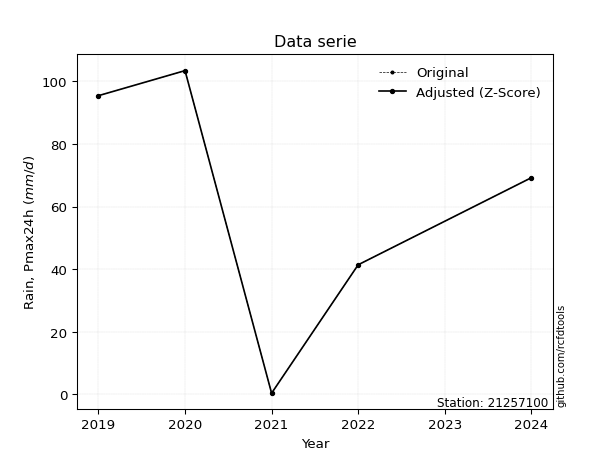</img>

</div>


> The initial value (value_initial) correspond to the initial obtained or null completed value, and value (value) is adjusted only when the initial value is outside the valid range (outlier) definite through the Z-Score value. If Z-Score is active, values out of range or outliers are replaced with the station mean value. A Z-Score (or standard score) measures how many standard deviations a data point is from the mean of a dataset, indicating its relative position; positive scores mean above the mean, negative mean below, and a score of zero is exactly at the mean, allowing for comparison of values from different distributions. It´s calculated using the formula $z=(x–μ)/σ$, where $x$ is the data point, $μ$ is the mean, and $σ$ is the standard deviation, helping identify outliers and understand probability.
>
> <sub>**Note**: In this study, "completing" (filling gaps in) and "extending" (forecasting or lengthening the historical record) rainfall data series are avoided for certain critical analyses because they introduce artificial bias and uncertainty, which can distort the statistics of rare events (extremes), alter day-to-day variability, and compromise the integrity and homogeneity of the original data. Some reasons against Completing/Extending rainfall data are: **Distortion of Extremes and Variability**: The primary issue is that most gap-filling or extension methods rely on averaging or regression with nearby stations, which inherently smooths the data. Rainfall is highly variable in space and time, with a large percentage of zero values and occasional large storms. Infilling methods often underestimate the highest values and overestimate the lowest (zero) values, which severely distorts analyses focused on flood frequency, drought severity, and intensity-duration-frequency (IDF) curves, **Loss of Data Homogeneity**: Infilled or extended data are synthetic estimates, not actual measurements. Combining these estimates with observed data can violate the assumption of data homogeneity, which requires that the data properties do not change over time. Inhomogeneity can lead to incorrect conclusions about long-term trends or changes in climate patterns, **Propagation of Errors**: Errors and biases from the original data (e.g., wind-induced undercatch, instrument errors, site changes) or the data used for imputation can propagate through the analysis, leading to unreliable hydrological models and inaccurate predictions, **Compromised Statistical Integrity**: For statistical analyses, especially those involving the frequency of events, using artificial data can introduce time bias or autocorrelation that doesn´t exist in reality, making it difficult to assess the true probability of events, **Difficulty in Validation**: It is difficult to accurately validate the quality of filled or extended data, especially for past periods where ground-truth measurements are unavailable. The reliability of imputation techniques heavily depends on the density of the surrounding station network and the complexity of the local topography.</sub>


### 4. Active continuous probability distributions from SciPy (44 of 104 available)

A Probability Density Function (PDF) describes the relative likelihood of a continuous random variable falling within a specific range, where the total area under its curve equals 1, and the area over any interval gives the actual probability for that range. Unlike discrete probabilities (like rolling a die), a PDF shows density, not direct probability for a single point (which is zero), with higher points indicating higher likelihood, often visualized as a bell curve for normal distributions.

A log of a probability density function (log-PDF) is simply the logarithm of the PDF´s value, denoted as $log(f(x))$, useful for converting multiplication of probabilities into addition, improving numerical stability with tiny numbers, and connecting to information theory concepts like entropy. Instead of dealing with very small probabilities (e.g., 0.000001), log-PDFs use negative numbers (e.g., $log(0.00001) ≈ -11.51$ that are easier for computers to handle, preventing underflow errors and simplifying complex calculations. In this study, each active probability distribution from SciPy is also evaluated in the $log$ form.

[scipy.stats](https://docs.scipy.org/doc/scipy/reference/stats.html) is a Python´s powerful submodule within the SciPy library for comprehensive statistical analysis, offering over 130 probability distributions (like Normal, Poisson), functions for descriptive stats (mean, variance), hypothesis testing (t-tests, chi-square), random variable generation, and statistical tests, making it essential for data science, modeling, and research. It provides tools to explore, model, and draw conclusions from data efficiently, working seamlessly with NumPy.

<div align="center">

|   id | p_dist             |   n_parameter | fit_method   | label                                                                       | active   | ref                                                                                                        |
|-----:|:-------------------|--------------:|:-------------|:----------------------------------------------------------------------------|:---------|:-----------------------------------------------------------------------------------------------------------|
|    0 | alpha              |             3 | MLE          | Alpha                                                                       | True     | [:mortar_board:](https://docs.scipy.org/doc/scipy/reference/generated/scipy.stats.alpha.html)              |
|    1 | betaprime          |             4 | MLE          | Beta prime                                                                  | True     | [:mortar_board:](https://docs.scipy.org/doc/scipy/reference/generated/scipy.stats.betaprime.html)          |
|    2 | chi2               |             3 | MLE          | Chi²                                                                        | True     | [:mortar_board:](https://docs.scipy.org/doc/scipy/reference/generated/scipy.stats.chi2.html)               |
|    3 | crystalball        |             4 | MLE          | Crystalball                                                                 | True     | [:mortar_board:](https://docs.scipy.org/doc/scipy/reference/generated/scipy.stats.crystalball.html)        |
|    4 | erlang             |             3 | MLE          | Erlang                                                                      | True     | [:mortar_board:](https://docs.scipy.org/doc/scipy/reference/generated/scipy.stats.erlang.html)             |
|    5 | expon              |             2 | MLE          | Exponential                                                                 | True     | [:mortar_board:](https://docs.scipy.org/doc/scipy/reference/generated/scipy.stats.expon.html)              |
|    6 | exponnorm          |             3 | MLE          | Exponentially modified Normal                                               | True     | [:mortar_board:](https://docs.scipy.org/doc/scipy/reference/generated/scipy.stats.exponnorm.html)          |
|    7 | f                  |             4 | MLE          | F                                                                           | True     | [:mortar_board:](https://docs.scipy.org/doc/scipy/reference/generated/scipy.stats.f.html)                  |
|    8 | fatiguelife        |             3 | MLE          | Fatigue-life (Birnbaum-Saunders)                                            | True     | [:mortar_board:](https://docs.scipy.org/doc/scipy/reference/generated/scipy.stats.fatiguelife.html)        |
|    9 | fisk               |             3 | MLE          | Fisk                                                                        | True     | [:mortar_board:](https://docs.scipy.org/doc/scipy/reference/generated/scipy.stats.fisk.html)               |
|   10 | gamma              |             3 | MLE          | Gamma                                                                       | True     | [:mortar_board:](https://docs.scipy.org/doc/scipy/reference/generated/scipy.stats.gamma.html)              |
|   11 | genexpon           |             5 | MLE          | Generalized exponential                                                     | True     | [:mortar_board:](https://docs.scipy.org/doc/scipy/reference/generated/scipy.stats.genexpon.html)           |
|   12 | genlogistic        |             3 | MLE          | Generalized logistic                                                        | True     | [:mortar_board:](https://docs.scipy.org/doc/scipy/reference/generated/scipy.stats.genlogistic.html)        |
|   13 | gibrat             |             2 | MM           | Gibrat                                                                      | True     | [:mortar_board:](https://docs.scipy.org/doc/scipy/reference/generated/scipy.stats.gibrat.html)             |
|   14 | gompertz           |             3 | MLE          | Gompertz (or truncated Gumbel)                                              | True     | [:mortar_board:](https://docs.scipy.org/doc/scipy/reference/generated/scipy.stats.gompertz.html)           |
|   15 | gumbel_l           |             2 | MM           | Gumbel Left Skew                                                            | True     | [:mortar_board:](https://docs.scipy.org/doc/scipy/reference/generated/scipy.stats.gumbel_l.html)           |
|   16 | gumbel_r           |             2 | MM           | Gumbel Right Skew                                                           | True     | [:mortar_board:](https://docs.scipy.org/doc/scipy/reference/generated/scipy.stats.gumbel_r.html)           |
|   17 | halflogistic       |             2 | MM           | Half-logistic                                                               | True     | [:mortar_board:](https://docs.scipy.org/doc/scipy/reference/generated/scipy.stats.halflogistic.html)       |
|   18 | halfnorm           |             2 | MM           | Half Normal                                                                 | True     | [:mortar_board:](https://docs.scipy.org/doc/scipy/reference/generated/scipy.stats.halfnorm.html)           |
|   19 | hypsecant          |             2 | MM           | hyperbolic secant                                                           | True     | [:mortar_board:](https://docs.scipy.org/doc/scipy/reference/generated/scipy.stats.hypsecant.html)          |
|   20 | invgamma           |             3 | MLE          | Inverted gamma                                                              | True     | [:mortar_board:](https://docs.scipy.org/doc/scipy/reference/generated/scipy.stats.invgamma.html)           |
|   21 | invgauss           |             3 | MLE          | Inverse Gaussian                                                            | True     | [:mortar_board:](https://docs.scipy.org/doc/scipy/reference/generated/scipy.stats.invgauss.html)           |
|   22 | invweibull         |             3 | MLE          | Inverted Weibull                                                            | True     | [:mortar_board:](https://docs.scipy.org/doc/scipy/reference/generated/scipy.stats.invweibull.html)         |
|   23 | johnsonsu          |             4 | MLE          | Johnson Su                                                                  | True     | [:mortar_board:](https://docs.scipy.org/doc/scipy/reference/generated/scipy.stats.johnsonsu.html)          |
|   24 | kstwobign          |             2 | MLE          | Limiting distribution of scaled Kolmogorov-Smirnov two-sided test statistic | True     | [:mortar_board:](https://docs.scipy.org/doc/scipy/reference/generated/scipy.stats.kstwobign.html)          |
|   25 | laplace            |             2 | MM           | Laplace                                                                     | True     | [:mortar_board:](https://docs.scipy.org/doc/scipy/reference/generated/scipy.stats.laplace.html)            |
|   26 | laplace_asymmetric |             3 | MLE          | Asymmetric Laplace                                                          | True     | [:mortar_board:](https://docs.scipy.org/doc/scipy/reference/generated/scipy.stats.laplace_asymmetric.html) |
|   27 | loggamma           |             3 | MLE          | Log gamma                                                                   | True     | [:mortar_board:](https://docs.scipy.org/doc/scipy/reference/generated/scipy.stats.loggamma.html)           |
|   28 | logistic           |             2 | MM           | Logistic (or Sech-squared)                                                  | True     | [:mortar_board:](https://docs.scipy.org/doc/scipy/reference/generated/scipy.stats.logistic.html)           |
|   29 | lognorm            |             3 | MLE          | Log Normal                                                                  | True     | [:mortar_board:](https://docs.scipy.org/doc/scipy/reference/generated/scipy.stats.lognorm.html)            |
|   30 | maxwell            |             2 | MM           | Maxwell                                                                     | True     | [:mortar_board:](https://docs.scipy.org/doc/scipy/reference/generated/scipy.stats.maxwell.html)            |
|   31 | mielke             |             4 | MLE          | Mielke Beta-Kappa / Dagum                                                   | True     | [:mortar_board:](https://docs.scipy.org/doc/scipy/reference/generated/scipy.stats.mielke.html)             |
|   32 | moyal              |             2 | MM           | Moyal                                                                       | True     | [:mortar_board:](https://docs.scipy.org/doc/scipy/reference/generated/scipy.stats.moyal.html)              |
|   33 | nakagami           |             3 | MLE          | Nakagami                                                                    | True     | [:mortar_board:](https://docs.scipy.org/doc/scipy/reference/generated/scipy.stats.nakagami.html)           |
|   34 | ncf                |             5 | MLE          | Non-central F distribution                                                  | True     | [:mortar_board:](https://docs.scipy.org/doc/scipy/reference/generated/scipy.stats.ncf.html)                |
|   35 | nct                |             4 | MLE          | Non-central Student’s t                                                     | True     | [:mortar_board:](https://docs.scipy.org/doc/scipy/reference/generated/scipy.stats.nct.html)                |
|   36 | norm               |             2 | MM           | Normal                                                                      | True     | [:mortar_board:](https://docs.scipy.org/doc/scipy/reference/generated/scipy.stats.norm.html)               |
|   37 | pearson3           |             3 | MM           | Pearson type III                                                            | True     | [:mortar_board:](https://docs.scipy.org/doc/scipy/reference/generated/scipy.stats.pearson3.html)           |
|   38 | rayleigh           |             2 | MM           | Rayleigh                                                                    | True     | [:mortar_board:](https://docs.scipy.org/doc/scipy/reference/generated/scipy.stats.rayleigh.html)           |
|   39 | rice               |             3 | MLE          | Rice                                                                        | True     | [:mortar_board:](https://docs.scipy.org/doc/scipy/reference/generated/scipy.stats.rice.html)               |
|   40 | t                  |             3 | MLE          | Student’s t                                                                 | True     | [:mortar_board:](https://docs.scipy.org/doc/scipy/reference/generated/scipy.stats.t.html)                  |
|   41 | truncnorm          |             4 | MLE          | Truncated normal                                                            | True     | [:mortar_board:](https://docs.scipy.org/doc/scipy/reference/generated/scipy.stats.truncnorm.html)          |
|   42 | wald               |             2 | MM           | Wald                                                                        | True     | [:mortar_board:](https://docs.scipy.org/doc/scipy/reference/generated/scipy.stats.wald.html)               |
|   43 | weibull_min        |             3 | MLE          | Weibull minimum                                                             | True     | [:mortar_board:](https://docs.scipy.org/doc/scipy/reference/generated/scipy.stats.weibull_min.html)        |

</div>

> **n_parameter:** # arguments & localization & scale.
>
> **Fit methods:** (MLE) maximum likelihood, (MM) L-moments.
>
>**Inactive** (With the only purpose of prevent loops, zero divisions, infinite values, over high estimated values or horizontal trending for recurrence intervals estimations, the follow distributions were disabled.)**:** foldnorm, gennorm, norminvgauss, powernorm, powerlognorm, skewnorm, genextreme, anglit, arcsine, argus, beta, bradford, burr, burr12, cauchy, cosine, halfcauchy, foldcauchy, skewcauchy, wrapcauchy, dgamma, gengamma, exponweib, exponpow, truncexpon, gausshyper, genhalflogistic, genhyperbolic, geninvgauss, halfgennorm, johnsonsb, kappa4, kappa3, ksone, kstwo, loglaplace, levy, levy_l, levy_stable, ncx2, pareto, genpareto, truncpareto, lomax, powerlaw, rdist, rel_breitwigner, recipinvgauss, semicircular, studentized_range, trapezoid, triang, truncweibull_min, tukeylambda, uniform, loguniform, vonmises, vonmises_line, weibull_max, dweibull, 


## B. Probability (PDF) vs. Empirical (EDF) distributions functions

A continuous probability distribution (CPD) describes probabilities for variables that can take any value within a range (like rain any time), unlike discrete variables with specific outcomes (like temperature). It uses a Probability Density Function (PDF), a curve where the total area under it equals 1, and the probability of the variable falling within an interval (a to b) is found by calculating the area under the curve between those points. A key feature is that the probability of hitting any single exact value is zero, so probabilities are always expressed for ranges, e.g., $P(a ≤ X ≤ b)$.

<div align="center">

Distributions parameters from station values
|    |   station | p_dist                |   n |             loc |            scale | shape                  | shape1                 | shape2                 | shape3   |
|---:|----------:|:----------------------|----:|----------------:|-----------------:|:-----------------------|:-----------------------|:-----------------------|:---------|
|  0 |  21257100 | alpha                 |   5 |     0.000872611 |      0.891605    | 1.5708612266921318e-08 |                        |                        |          |
|  1 |  21257100 | betaprime             |   5 | -1387.38        | 113024           | 1480.5289147905755     | 115451.65992811092     |                        |          |
|  2 |  21257100 | chi2                  |   5 |  -322.972       |      1.95248     | 196.82249880528843     |                        |                        |          |
|  3 |  21257100 | crystalball           |   5 |    61.96        |     37.6836      | 1332.5387923448513     | 18965.006237065714     |                        |          |
|  4 |  21257100 | erlang                |   5 |  -552.742       |      2.39837     | 256.1627821800764      |                        |                        |          |
|  5 |  21257100 | expon                 |   5 |     0.4         |     61.56        |                        |                        |                        |          |
|  6 |  21257100 | exponnorm             |   5 |    61.9406      |     37.6835      | 0.0005140072880918748  |                        |                        |          |
|  7 |  21257100 | f                     |   5 |     0.4         |     71.3985      | 1.3116190868101842     | 6.81696582246558       |                        |          |
|  8 |  21257100 | fatiguelife           |   5 | -3624.69        |   3686.56        | 0.010292356541416445   |                        |                        |          |
|  9 |  21257100 | fisk                  |   5 |     0.4         |     53.3889      | 0.7136986191550574     |                        |                        |          |
| 10 |  21257100 | gamma                 |   5 |  -547.156       |      2.39958     | 253.675589706749       |                        |                        |          |
| 11 |  21257100 | genexpon              |   5 |     0.399996    |      2.38843     | 0.03856438512563466    | 1.0395843802812942e-07 | 2.6436270948161873     |          |
| 12 |  21257100 | genlogistic           |   5 |   103.4         |      1.04204e-05 | 2.5126049006249956e-07 |                        |                        |          |
| 13 |  21257100 | gibrat                |   5 |    33.2121      |     17.4365      |                        |                        |                        |          |
| 14 |  21257100 | gompertz              |   5 |    41.4         |     19.0357      | 0.09001233364760228    |                        |                        |          |
| 15 |  21257100 | gumbel_l              |   5 |    78.9196      |     29.3818      |                        |                        |                        |          |
| 16 |  21257100 | gumbel_r              |   5 |    45.0004      |     29.3818      |                        |                        |                        |          |
| 17 |  21257100 | halflogistic          |   5 |    17.2961      |     32.2182      |                        |                        |                        |          |
| 18 |  21257100 | halfnorm              |   5 |    12.0817      |     62.5132      |                        |                        |                        |          |
| 19 |  21257100 | hypsecant             |   5 |    61.96        |     23.9901      |                        |                        |                        |          |
| 20 |  21257100 | invgamma              |   5 |  -303.6         |  30756.6         | 85.27909930702697      |                        |                        |          |
| 21 |  21257100 | invgauss              |   5 |  -176.248       |   8281.99        | 0.028855974958947275   |                        |                        |          |
| 22 |  21257100 | invweibull            |   5 |     0.4         |      2.88111     | 0.0534074463504315     |                        |                        |          |
| 23 |  21257100 | johnsonsu             |   5 |   103.4         |      5.40386e-14 | 1.6654072690502808     | 0.11117244869435727    |                        |          |
| 24 |  21257100 | kstwobign             |   5 |   -88.2342      |    171.166       |                        |                        |                        |          |
| 25 |  21257100 | laplace               |   5 |    61.96        |     26.6463      |                        |                        |                        |          |
| 26 |  21257100 | laplace_asymmetric    |   5 |    69.2         |     30.7646      | 1.1245683875045258     |                        |                        |          |
| 27 |  21257100 | loggamma              |   5 |   103.4         |      4.21144e-06 | 1.0160786100952281e-07 |                        |                        |          |
| 28 |  21257100 | logistic              |   5 |    61.96        |     20.7761      |                        |                        |                        |          |
| 29 |  21257100 | lognorm               |   5 |     0.4         |      0.0172609   | 16.688457567995382     |                        |                        |          |
| 30 |  21257100 | maxwell               |   5 |   -27.3343      |     55.9569      |                        |                        |                        |          |
| 31 |  21257100 | mielke                |   5 |     0.4         |    110.302       | 0.6874174520815144     | 54.907184056700444     |                        |          |
| 32 |  21257100 | moyal                 |   5 |    40.4101      |     16.9636      |                        |                        |                        |          |
| 33 |  21257100 | nakagami              |   5 |     0.4         |    100.829       | 0.14091452831813994    |                        |                        |          |
| 34 |  21257100 | ncf                   |   5 |     0.4         |      5.50373     | 0.5921737320407912     | 14.604467232116491     | 4.087529065655085      |          |
| 35 |  21257100 | nct                   |   5 |     0.210862    |      0.00772462  | 0.20460014929526132    | 54.736146292940994     |                        |          |
| 36 |  21257100 | norm                  |   5 |    61.96        |     37.6836      |                        |                        |                        |          |
| 37 |  21257100 | pearson3              |   5 |    61.96        |     37.6835      | -0.4972386580941345    |                        |                        |          |
| 38 |  21257100 | rayleigh              |   5 |   -10.1309      |     57.5203      |                        |                        |                        |          |
| 39 |  21257100 | rice                  |   5 |   -23.0624      |     42.2345      | 1.687807075133914      |                        |                        |          |
| 40 |  21257100 | t                     |   5 |    61.958       |     37.681       | 3012878.537546329      |                        |                        |          |
| 41 |  21257100 | truncnorm             |   5 |    -4.61082     |     73.2033      | -21.555697566253023    | 1.4754902542894759     |                        |          |
| 42 |  21257100 | wald                  |   5 |    24.2764      |     37.6836      |                        |                        |                        |          |
| 43 |  21257100 | weibull_min           |   5 |    -1.03779e+09 |      1.03779e+09 | 35517764.318849824     |                        |                        |          |
| 44 |  21257100 | logalpha              |   5 |   -60.2906      |   1794.89        | 28.31371367716021      |                        |                        |          |
| 45 |  21257100 | logbetaprime          |   5 |    -0.916291    |      2.83855     | 0.11845044373778774    | 0.7445015241305235     |                        |          |
| 46 |  21257100 | logchi2               |   5 |    -0.916291    |      1.3934      | 1.2052174232322324     |                        |                        |          |
| 47 |  21257100 | logcrystalball        |   5 |     3.24814     |      2.10691     | 7.4370222888966815     | 127.19158795203748     |                        |          |
| 48 |  21257100 | logerlang             |   5 |    -0.916291    |      1.98368     | 0.6163000075658278     |                        |                        |          |
| 49 |  21257100 | logexpon              |   5 |    -0.916291    |      4.16443     |                        |                        |                        |          |
| 50 |  21257100 | logexponnorm          |   5 |     3.24685     |      2.10692     | 0.0006093698517191549  |                        |                        |          |
| 51 |  21257100 | logf                  |   5 |    -0.916291    |      1.12735     | 1.1122848241400785     | 1.112303149828597      |                        |          |
| 52 |  21257100 | logfatiguelife        |   5 |    -0.916291    |      3.84868e-06 | 842.4541697547779      |                        |                        |          |
| 53 |  21257100 | logfisk               |   5 |    -0.916291    |      1.60555     | 0.13490885556806487    |                        |                        |          |
| 54 |  21257100 | loggamma              |   5 |   -34.6644      |      0.133758    | 283.3752855341987      |                        |                        |          |
| 55 |  21257100 | loggenexpon           |   5 |    -0.942579    |      0.0256884   | 0.0024222061997865516  | 3.5340652322586354     | 1.0249638675819699e-05 |          |
| 56 |  21257100 | loggenlogistic        |   5 |     4.63866     |      5.17503e-06 | 3.7098041053438416e-06 |                        |                        |          |
| 57 |  21257100 | loggibrat             |   5 |     1.64084     |      0.974875    |                        |                        |                        |          |
| 58 |  21257100 | loggompertz           |   5 |    -0.916291    |      1.19657     | 0.015579701411300769   |                        |                        |          |
| 59 |  21257100 | loggumbel_l           |   5 |     4.19636     |      1.64275     |                        |                        |                        |          |
| 60 |  21257100 | loggumbel_r           |   5 |     2.29991     |      1.64275     |                        |                        |                        |          |
| 61 |  21257100 | loghalflogistic       |   5 |     0.750955    |      1.80134     |                        |                        |                        |          |
| 62 |  21257100 | loghalfnorm           |   5 |     0.459373    |      3.49518     |                        |                        |                        |          |
| 63 |  21257100 | loghypsecant          |   5 |     3.24813     |      1.3413      |                        |                        |                        |          |
| 64 |  21257100 | loginvgamma           |   5 |   -43.1632      |  20273.6         | 438.4065295105362      |                        |                        |          |
| 65 |  21257100 | loginvgauss           |   5 |   -18.9476      |   1934.95        | 0.01143875600681886    |                        |                        |          |
| 66 |  21257100 | loginvweibull         |   5 |    -1.77332e+08 |      1.77332e+08 | 71935403.47759712      |                        |                        |          |
| 67 |  21257100 | logjohnsonsu          |   5 |     4.6386      |      4.33447e-14 | 3.4647728837842933     | 0.12849996599277935    |                        |          |
| 68 |  21257100 | logkstwobign          |   5 |    -6.58365     |     11.2039      |                        |                        |                        |          |
| 69 |  21257100 | loglaplace            |   5 |     3.24813     |      1.48981     |                        |                        |                        |          |
| 70 |  21257100 | loglaplace_asymmetric |   5 |     4.6386      |      0.0215208   | 64.51559927852182      |                        |                        |          |
| 71 |  21257100 | logloggamma           |   5 |     4.63902     |      4.22875e-06 | 3.060861714513959e-06  |                        |                        |          |
| 72 |  21257100 | loglogistic           |   5 |     3.24813     |      1.1616      |                        |                        |                        |          |
| 73 |  21257100 | loglognorm            |   5 |    -0.916291    |      0.00229882  | 14.450748132679209     |                        |                        |          |
| 74 |  21257100 | logmaxwell            |   5 |    -1.74437     |      3.12859     |                        |                        |                        |          |
| 75 |  21257100 | logmielke             |   5 |    -0.916291    |      1.96584     | 0.12402769736910824    | 0.7965503895071935     |                        |          |
| 76 |  21257100 | logmoyal              |   5 |     2.04327     |      0.948444    |                        |                        |                        |          |
| 77 |  21257100 | lognakagami           |   5 | -2048.26        |   2051.51        | 236753.40003533562     |                        |                        |          |
| 78 |  21257100 | logncf                |   5 |    -0.916291    |      1.11042     | 1.0200327601365755     | 1.1686732914531839     | 1.1137811880132715     |          |
| 79 |  21257100 | lognct                |   5 |  -122.165       |      2.06078     | 35921.757244561006     | 60.855100150132564     |                        |          |
| 80 |  21257100 | lognorm               |   5 |     3.24813     |      2.10691     |                        |                        |                        |          |
| 81 |  21257100 | logpearson3           |   5 |     3.24814     |      2.10693     | -1.4158900562486607    |                        |                        |          |
| 82 |  21257100 | lograyleigh           |   5 |    -0.782528    |      3.216       |                        |                        |                        |          |
| 83 |  21257100 | logrice               |   5 |  -786.494       |      2.10674     | 374.8624999458875      |                        |                        |          |
| 84 |  21257100 | logt                  |   5 |     4.44946     |      0.28574     | 0.7626282731226186     |                        |                        |          |
| 85 |  21257100 | logtruncnorm          |   5 |     2.87641     |      8.48515     | -0.4469873460613953    | 0.20768233407457345    |                        |          |
| 86 |  21257100 | logwald               |   5 |     1.14122     |      2.10692     |                        |                        |                        |          |
| 87 |  21257100 | logweibull_min        |   5 |    -0.916291    |      1.88193     | 0.8090826949507031     |                        |                        |          |

</div>

> **loc** (Location parameter): This shifts the distribution along the x-axis. For many common distributions, like the normal (Gaussian) distribution, loc represents the mean $μ$. For others, like the uniform distribution, it might represent the minimum value, or for the beta distribution, the left end of the support interval.
>
> **scale** (Scale parameter): This determines the width or spread of the distribution. For the normal distribution, scale represents the standard deviation $σ$. For a uniform distribution, it defines the length of the interval (from $loc$ to $loc + scale$).
>
> **shape** (Shape parameters): Refers to parameters that define the specific form of a probability distribution, distinct from its location (loc) and scale (scale). These parameters are required arguments for most distribution functions. For example, a normal (Gaussian) distribution is fully defined by its location (mean) and scale (standard deviation), so it has no specific shape parameters beyond loc and scale. However, other distributions have intrinsic properties that need specification, as Gamma distribution that takes a shape parameter, often named $a$ or $alpha$.


### 0. Cumulative distribution values - CDF (88 evaluated)

Cumulative Distribution Function (CDF), denoted as $F$<sub>$X$</sub>$(x)$, is a function that gives the probability that a random variable $X$ will take a value less than or equal to a specific value, $x$ (i.e., $(P(X≥x)$. It essentially "accumulates" probabilities from a given point up to the far right (positive infinity), providing a complete picture of the distribution´s probabilities for both discrete (like rain) and continuous (like temperature) variables, helping to find probabilities over ranges or above certain values. Each station is evaluated separately ordering the $x$ values ascending, calculating the CDF and PDF values for the activated distributions and their logarithmic forms.

<div align="center">

CDF ordered by x ascending and calculating $log(f(x))$ separately
|   id |   Station |   date |     x |   count |   mean |     std |    zscore |   Value_initial |   station |   m |     alpha |   alpha_pdf |   betaprime |   betaprime_pdf |      chi2 |   chi2_pdf |   crystalball |   crystalball_pdf |    erlang |   erlang_pdf |    expon |   expon_pdf |   exponnorm |   exponnorm_pdf |           f |          f_pdf |   fatiguelife |   fatiguelife_pdf |        fisk |      fisk_pdf |     gamma |   gamma_pdf |    genexpon |   genexpon_pdf |   genlogistic |   genlogistic_pdf |   gibrat |   gibrat_pdf |   gompertz |   gompertz_pdf |   gumbel_l |   gumbel_l_pdf |   gumbel_r |   gumbel_r_pdf |   halflogistic |   halflogistic_pdf |   halfnorm |   halfnorm_pdf |   hypsecant |   hypsecant_pdf |   invgamma |   invgamma_pdf |   invgauss |   invgauss_pdf |   invweibull |   invweibull_pdf |   johnsonsu |   johnsonsu_pdf |   kstwobign |   kstwobign_pdf |   laplace |   laplace_pdf |   laplace_asymmetric |   laplace_asymmetric_pdf |   loggamma |   loggamma_pdf |   logistic |   logistic_pdf |   lognorm |   lognorm_pdf |   maxwell |   maxwell_pdf |      mielke |   mielke_pdf |      moyal |   moyal_pdf |    nakagami |   nakagami_pdf |         ncf |    ncf_pdf |       nct |     nct_pdf |      norm |   norm_pdf |   pearson3 |   pearson3_pdf |   rayleigh |   rayleigh_pdf |      rice |   rice_pdf |        t |      t_pdf |   truncnorm |   truncnorm_pdf |     wald |   wald_pdf |   weibull_min |   weibull_min_pdf |   logalpha |   logalpha_pdf |   logbetaprime |   logbetaprime_pdf |     logchi2 |    logchi2_pdf |   logcrystalball |   logcrystalball_pdf |   logerlang |   logerlang_pdf |   logexpon |   logexpon_pdf |   logexponnorm |   logexponnorm_pdf |        logf |    logf_pdf |   logfatiguelife |   logfatiguelife_pdf |    logfisk |   logfisk_pdf |   loggenexpon |   loggenexpon_pdf |   loggenlogistic |   loggenlogistic_pdf |   loggibrat |   loggibrat_pdf |   loggompertz |   loggompertz_pdf |   loggumbel_l |   loggumbel_l_pdf |   loggumbel_r |   loggumbel_r_pdf |   loghalflogistic |   loghalflogistic_pdf |   loghalfnorm |   loghalfnorm_pdf |   loghypsecant |   loghypsecant_pdf |   loginvgamma |   loginvgamma_pdf |   loginvgauss |   loginvgauss_pdf |   loginvweibull |   loginvweibull_pdf |   logjohnsonsu |   logjohnsonsu_pdf |   logkstwobign |   logkstwobign_pdf |   loglaplace |   loglaplace_pdf |   loglaplace_asymmetric |   loglaplace_asymmetric_pdf |   logloggamma |   logloggamma_pdf |   loglogistic |   loglogistic_pdf |   loglognorm |   loglognorm_pdf |   logmaxwell |   logmaxwell_pdf |   logmielke |   logmielke_pdf |    logmoyal |   logmoyal_pdf |   lognakagami |   lognakagami_pdf |      logncf |   logncf_pdf |    lognct |   lognct_pdf |   logpearson3 |   logpearson3_pdf |   lograyleigh |   lograyleigh_pdf |   logrice |   logrice_pdf |      logt |   logt_pdf |   logtruncnorm |   logtruncnorm_pdf |   logwald |   logwald_pdf |   logweibull_min |   logweibull_min_pdf |
|-----:|----------:|-------:|------:|--------:|-------:|--------:|----------:|----------------:|----------:|----:|----------:|------------:|------------:|----------------:|----------:|-----------:|--------------:|------------------:|----------:|-------------:|---------:|------------:|------------:|----------------:|------------:|---------------:|--------------:|------------------:|------------:|--------------:|----------:|------------:|------------:|---------------:|--------------:|------------------:|---------:|-------------:|-----------:|---------------:|-----------:|---------------:|-----------:|---------------:|---------------:|-------------------:|-----------:|---------------:|------------:|----------------:|-----------:|---------------:|-----------:|---------------:|-------------:|-----------------:|------------:|----------------:|------------:|----------------:|----------:|--------------:|---------------------:|-------------------------:|-----------:|---------------:|-----------:|---------------:|----------:|--------------:|----------:|--------------:|------------:|-------------:|-----------:|------------:|------------:|---------------:|------------:|-----------:|----------:|------------:|----------:|-----------:|-----------:|---------------:|-----------:|---------------:|----------:|-----------:|---------:|-----------:|------------:|----------------:|---------:|-----------:|--------------:|------------------:|-----------:|---------------:|---------------:|-------------------:|------------:|---------------:|-----------------:|---------------------:|------------:|----------------:|-----------:|---------------:|---------------:|-------------------:|------------:|------------:|-----------------:|---------------------:|-----------:|--------------:|--------------:|------------------:|-----------------:|---------------------:|------------:|----------------:|--------------:|------------------:|--------------:|------------------:|--------------:|------------------:|------------------:|----------------------:|--------------:|------------------:|---------------:|-------------------:|--------------:|------------------:|--------------:|------------------:|----------------:|--------------------:|---------------:|-------------------:|---------------:|-------------------:|-------------:|-----------------:|------------------------:|----------------------------:|--------------:|------------------:|--------------:|------------------:|-------------:|-----------------:|-------------:|-----------------:|------------:|----------------:|------------:|---------------:|--------------:|------------------:|------------:|-------------:|----------:|-------------:|--------------:|------------------:|--------------:|------------------:|----------:|--------------:|----------:|-----------:|---------------:|-------------------:|----------:|--------------:|-----------------:|---------------------:|
|    0 |  21257100 |   2021 |   0.4 |       5 |  61.96 | 42.1316 | -1.46114  |             0.4 |  21257100 |   1 | 0.0254906 | 0.368359    |   0.0504471 |      0.00282158 | 0.0515203 | 0.00306084 |     0.0511713 |        0.00278783 | 0.0515039 |   0.00295098 | 0        |  0.0162443  |   0.0511708 |      0.00278782 | 1.08327e-12 | 12797.7        |     0.0511632 |        0.00281544 | 1.46389e-13 | 1882.1        | 0.0509134 |  0.00293862 | 6.82678e-08 |     0.0161463  |      0        |        0.00201203 | 0        |   0          | 0          |      0         |  0.0667544 |     0.00219439 |  0.0104317 |     0.00162001 |       0        |         0          |   0        |     0          |   0.0488207 |      0.00202706 |   0.048451 |     0.00323587 |  0.0437999 |     0.00313797 |  0.000405191 |      3.04507e+12 |   0.0100863 |     2.89834e-05 |    0.048615 |      0.00449858 | 0.0496177 |    0.00186208 |            0.0764405 |               0.00220946 |  0.0288662 |       0.031632 |  0.0491245 |     0.00224832 | 0.0240461 |     0.0268486 | 0.0300975 |    0.00309792 | 8.74841e-09 |  28.761      | 0.00114565 | 0.000386371 | 5.79132e-06 |    2.94024e+10 | 7.78721e-06 | 3.0631e+07 | 0.0586908 | 0.637284    | 0.0511713 | 0.00278783 |  0.0625146 |     0.00260455 |  0.0166199 |     0.00313002 | 0.0382328 | 0.00334276 | 0.051165 | 0.00278775 |    0.566999 |      0.00584652 | 0        | 0          |     0.0641763 |        0.00212435 |  0.0276597 |      0.0323811 |      0.0107676 |         1.1488e+13 | 1.46607e-10 | 795757         |        0.0240461 |            0.0268485 |   1.076e-10 |  597300         |   0        |      0.240129  |      0.0240467 |           0.026849 | 8.34085e-10 | 4.17817e+06 |         0.106658 |          3.26838e+10 | 0.00656123 |   7.92057e+12 |    0.00249458 |          0.095496 |         0        |            0.0133663 |    0        |       0         |   3.16505e-09 |         0.0130203 |     0.0435254 |         0.0259102 |   0.000838572 |        0.00361605 |          0        |              0        |      0        |          0        |      0.0285239 |          0.0212373 |     0.0263392 |         0.0311903 |     0.0307836 |         0.0362882 |       0.0348424 |           0.0474466 |       0.212283 |        0.00670927  |      0.0399111 |          0.0608675 |    0.0305493 |        0.0205054 |               0.0182956 |                   0.0131772 |     0.0179341 |         0.0129811 |     0.0269863 |          0.022605 |    0.0169277 |      2.61827e+13 |   0.00482918 |        0.0172513 |  0.00965564 |     1.07867e+13 | 1.93734e-06 |    2.40857e-05 |     0.0240094 |         0.0268169 | 2.60466e-09 |  1.19653e+07 | 0.0242903 |    0.0270816 |     0.0479338 |         0.0266087 |      0        |          0        | 0.0240369 |     0.0268421 | 0.0331462 | 0.00470454 |     9.6861e-06 |           0.166968 |  0        |     0         |      7.40016e-14 |          539.292     |
|    1 |  21257100 |   2022 |  41.4 |       5 |  61.96 | 42.1316 | -0.487995 |            41.4 |  21257100 |   2 | 0.982817  | 0.000414982 |   0.295377  |      0.00919529 | 0.312196  | 0.00946312 |     0.292672  |        0.0091226  | 0.304303  |   0.00932092 | 0.486249 |  0.00834553 |   0.292671  |      0.00912261 | 0.480634    |     0.00591588 |     0.294272  |        0.0091338  | 0.453029    |    0.00431342 | 0.304195  |  0.00936151 | 0.484182    |     0.00832859 |      0        |        0.00540732 | 0.224852 |   0.0366152  | 8.0721e-13 |      0.0047286 |  0.24337   |     0.00718166 |  0.322917  |     0.0124231  |       0.357549 |         0.0135352  |   0.360926 |     0.0114342  |   0.255529  |      0.00954369 |   0.326749 |     0.00979626 |  0.319788  |     0.00971588 |  0.419883    |      0.00047463  |   0.0117046 |     5.48072e-05 |    0.38521  |      0.00981088 | 0.231139  |    0.00867433 |            0.250032  |               0.00722703 |  0.592429  |       0.170933 |  0.270991  |     0.00950877 | 0.589212  |     0.184595  | 0.319766  |    0.0101178  | 0.506463    |   0.0084915  | 0.331427   | 0.0142522   | 0.627147    |    0.00422373  | 0.554918    | 0.00895417 | 0.673484  | 0.0016219   | 0.292672  | 0.0091226  |  0.272652  |     0.00808999 |  0.330548  |     0.0104267  | 0.308303  | 0.00946485 | 0.292677 | 0.0091233  |    0.790543 |      0.00480983 | 0.323539 | 0.0249082  |     0.236495  |        0.00705091 |  0.608204  |      0.168275  |      0.913159  |         0.0110894  | 0.910985    |      0.0373836 |        0.589211  |            0.184595  |   0.957429  |       0.0241508 |   0.671788 |      0.0788132 |      0.589212  |           0.184594 | 0.722368    | 0.0285178   |         0.90376  |          0.0239667   | 0.535729   |   0.00723235  |    0.645514   |          0.124131 |         0        |            0.371922  |    0.776069 |       0.143631  |   0.521402    |         0.300971  |     0.527529  |         0.215643  |   0.656758    |        0.168088   |          0.677799 |              0.150052 |      0.649608 |          0.147608 |      0.610472  |          0.223165  |     0.607312  |         0.170874  |     0.609484  |         0.158532  |       0.599788  |           0.124373  |       0.285419 |        0.0476949   |      0.634203  |          0.11788   |    0.636537  |        0.243966  |               0.517114  |                   0.372446  |     0.515392  |         0.373052  |     0.600859  |          0.206463 |    0.700769  |      0.00517991  |   0.616664   |        0.169151  |  0.938371   |     0.00841276  | 0.680018    |    0.159338    |     0.588724  |         0.184527  | 0.612521    |  0.036455    | 0.589522  |    0.183941  |     0.499037  |         0.210099  |      0.625246 |          0.163263 | 0.589219  |     0.184609  | 0.148312  | 0.145083   |     0.833175   |           0.183593 |  0.744726 |     0.136702  |      0.874468    |            0.0454284 |
|    2 |  21257100 |   2024 |  69.2 |       5 |  61.96 | 42.1316 |  0.171843 |            69.2 |  21257100 |   3 | 0.98972   | 0.000148551 |   0.578433  |      0.010285   | 0.593124  | 0.00987926 |     0.576178  |        0.010393   | 0.585963  |   0.0100671  | 0.672939 |  0.00531288 |   0.576178  |      0.0103931  | 0.612264    |     0.00379674 |     0.576535  |        0.0102996  | 0.545125    |    0.00257226 | 0.587084  |  0.0101033  | 0.670728    |     0.00531655 |      0        |        0.0105706  | 0.765657 |   0.00852582 | 0.257503   |      0.0151243 |  0.512442  |     0.0119201  |  0.644786  |     0.00963032 |       0.667104 |         0.00861273 |   0.639125 |     0.00840782 |   0.594637  |      0.0126863  |   0.605611 |     0.00942648 |  0.595648  |     0.00932562 |  0.429937    |      0.000281722 |   0.0138838 |     0.000115175 |    0.63399  |      0.00771893 | 0.618961  |    0.0142999  |            0.558431  |               0.0161411  |  0.676886  |       0.156712 |  0.586248  |     0.011675   | 0.680588  |     0.169601  | 0.604684  |    0.00958248 | 0.722907    |   0.00722295 | 0.668635   | 0.00918495  | 0.721933    |    0.00279173  | 0.747732    | 0.00517046 | 0.706184  | 0.000871362 | 0.576178  | 0.010393   |  0.544567  |     0.0108517  |  0.613674  |     0.00926308 | 0.58834   | 0.00989706 | 0.576204 | 0.0103936  |    0.906861 |      0.00352492 | 0.734883 | 0.00800849 |     0.502778  |        0.0118901  |  0.690711  |      0.151926  |      0.918444  |         0.00954561 | 0.928168    |      0.0298194 |        0.680588  |            0.169601  |   0.968147  |       0.0179045 |   0.709879 |      0.0696666 |      0.680588  |           0.169601 | 0.736014    | 0.0247543   |         0.915207 |          0.0206998   | 0.539251   |   0.00650446  |    0.706009   |          0.111221 |         0        |            0.537512  |    0.836328 |       0.0951158 |   0.680306    |         0.308847  |     0.641221  |         0.223872  |   0.735258    |        0.137645   |          0.747659 |              0.122411 |      0.720218 |          0.127294 |      0.715912  |          0.184781  |     0.691115  |         0.154312  |     0.687157  |         0.143079  |       0.660327  |           0.111169  |       0.322414 |        0.114782    |      0.691511  |          0.10518   |    0.742542  |        0.172812  |               0.748644  |                   0.539203  |     0.747527  |         0.541076  |     0.700839  |          0.180495 |    0.703288  |      0.0046456   |   0.698809   |        0.149897  |  0.942366   |     0.00718945  | 0.753074    |    0.125936    |     0.68008   |         0.16959   | 0.630098    |  0.0321253   | 0.680563  |    0.168969  |     0.613956  |         0.23584   |      0.704193 |          0.143562 | 0.680602  |     0.169612  | 0.310909  | 0.650691   |     0.927148   |           0.182152 |  0.80452  |     0.0986338 |      0.895568    |            0.0370424 |
|    3 |  21257100 |   2019 |  95.4 |       5 |  61.96 | 42.1316 |  0.793704 |            95.4 |  21257100 |   4 | 0.992543  | 7.81636e-05 |   0.811262  |      0.00702016 | 0.81283   | 0.00655782 |     0.812565  |        0.00714107 | 0.811874  |   0.00677992 | 0.786306 |  0.00347131 |   0.812566  |      0.00714107 | 0.696       |     0.0026857  |     0.8105    |        0.00707599 | 0.601396    |    0.00180092 | 0.813385  |  0.00677308 | 0.784309    |     0.00348264 |      0        |        0.0198821  | 0.898242 |   0.00285816 | 0.764408   |      0.0190059 |  0.826618  |     0.0103401  |  0.835351  |     0.00511482 |       0.837311 |         0.00463885 |   0.817406 |     0.00525087 |   0.845178  |      0.0062021  |   0.810879 |     0.00605508 |  0.800033  |     0.00609952 |  0.436182    |      0.000203453 |   0.0207228 |     0.0006934   |    0.800082 |      0.00499717 | 0.857456  |    0.00534948 |            0.83054   |               0.00619445 |  0.725334  |       0.144753 |  0.833348  |     0.00668457 | 0.732942  |     0.156072  | 0.813819  |    0.0061893  | 0.902428    |   0.00652815 | 0.843252   | 0.00456024  | 0.785095    |    0.00208641  | 0.851765    | 0.00296648 | 0.724913  | 0.000591273 | 0.812565  | 0.00714107 |  0.810022  |     0.00850288 |  0.814187  |     0.00592671 | 0.810892  | 0.00672508 | 0.812596 | 0.00714084 |    0.982906 |      0.00230465 | 0.87228  | 0.00331411 |     0.819652  |        0.0105723  |  0.737478  |      0.139131  |      0.921378  |         0.00874785 | 0.937104    |      0.0259436 |        0.732942  |            0.156072  |   0.973395  |       0.0148797 |   0.731406 |      0.0644972 |      0.732942  |           0.156071 | 0.743641    | 0.022799    |         0.921565 |          0.0189372   | 0.541276   |   0.00611895  |    0.74037    |          0.102788 |         0        |            0.676627  |    0.863479 |       0.0749996 |   0.776015    |         0.282985  |     0.712438  |         0.218166  |   0.776518    |        0.119561   |          0.784416 |              0.106779 |      0.759073 |          0.114778 |      0.770717  |          0.156537  |     0.738603  |         0.141218  |     0.731261  |         0.131457  |       0.694657  |           0.102667  |       0.399564 |        0.61633     |      0.724001  |          0.0972087 |    0.792457  |        0.139308  |               0.943425  |                   0.679492  |     0.943101  |         0.682637  |     0.755415  |          0.159059 |    0.704734  |      0.00436334  |   0.744741   |        0.136054  |  0.944571   |     0.00656254  | 0.790546    |    0.107848    |     0.732436  |         0.156098  | 0.640037    |  0.0298301   | 0.732724  |    0.155509  |     0.691408  |         0.245433  |      0.748134 |          0.130055 | 0.732959  |     0.156079  | 0.608514  | 0.902912   |     0.985442   |           0.180921 |  0.833311 |     0.0813835 |      0.906748    |            0.0326975 |
|    4 |  21257100 |   2020 | 103.4 |       5 |  61.96 | 42.1316 |  0.983586 |           103.4 |  21257100 |   5 | 0.99312   | 6.65369e-05 |   0.862141  |      0.00570062 | 0.860436  | 0.00534986 |     0.864265  |        0.00578311 | 0.861062  |   0.00552099 | 0.812348 |  0.00304828 |   0.864265  |      0.0057831  | 0.716471    |     0.00243743 |     0.861803  |        0.0057498  | 0.615145    |    0.00164041 | 0.862476  |  0.00550408 | 0.810445    |     0.00306062 |      0.999995 |        0.0241123  | 0.918131 |   0.00215536 | 0.894371   |      0.0129726 |  0.899804  |     0.00784546 |  0.871951  |     0.00406635 |       0.870772 |         0.00375187 |   0.855925 |     0.00439137 |   0.88801   |      0.00457244 |   0.85493  |     0.00496927 |  0.844617  |     0.00505677 |  0.437744    |      0.000187512 |   0.949132  |     2.08034e+11 |    0.837052 |      0.00425638 | 0.894425  |    0.00396209 |            0.873507  |               0.00462382 |  0.736859  |       0.141477 |  0.880229  |     0.00507438 | 0.745359  |     0.152295  | 0.858857  |    0.00508001 | 0.953732    |   0.00622045 | 0.875876   | 0.00362889  | 0.801132    |    0.00192596  | 0.873585    | 0.00250176 | 0.729417  | 0.000536502 | 0.864265  | 0.00578311 |  0.871747  |     0.00688917 |  0.857421  |     0.00489248 | 0.859829  | 0.00551104 | 0.864293 | 0.00578268 |    1        |      0.00197319 | 0.895838 | 0.00260893 |     0.894846  |        0.00810575 |  0.748544  |      0.135711  |      0.922075  |         0.00856441 | 0.939158    |      0.0250588 |        0.745359  |            0.152295  |   0.974566  |       0.014208  |   0.73655  |      0.063262  |      0.745359  |           0.152295 | 0.745459    | 0.0223483   |         0.923073 |          0.0185244   | 0.541765   |   0.00602926  |    0.748562   |          0.100654 |         0.999959 |            0.716825  |    0.869347 |       0.0708126 |   0.798389    |         0.272449  |     0.729891  |         0.21522   |   0.785971    |        0.115227   |          0.792865 |              0.10308  |      0.768191 |          0.111689 |      0.783039  |          0.149517  |     0.749834  |         0.137708  |     0.741723  |         0.128386  |       0.702839  |           0.100538  |       0.999755 |        2.68343e+09 |      0.731749  |          0.0952258 |    0.803377  |        0.131978  |               0.99976   |                   0.720066  |     0.999705  |         0.723608  |     0.767996  |          0.15339  |    0.705082  |      0.00429774  |   0.755552   |        0.132457  |  0.945094   |     0.00641892  | 0.799061    |    0.103662    |     0.744856  |         0.152331  | 0.642417    |  0.0292964   | 0.745096  |    0.151756  |     0.711222  |         0.246585  |      0.758468 |          0.1266   | 0.745377  |     0.152302  | 0.673285  | 0.70518    |     0.999997   |           0.180573 |  0.839713 |     0.0776507 |      0.909341    |            0.0316999 |


</div>

An Empirical Distribution Function (EDF) is a step-function estimate of a true cumulative distribution function (CDF) based on observed sample data, representing the proportion of data points less than or equal to a given value. It is calculated by ordering your data and jumping up by $1/n$ (where $n$ is sample size) at each unique data point, allowing analysis without assuming an underlying population distribution, and it gets closer to the true CDF as the sample size grows. For the empirical probability calculations, the parameter $m$ correspond to the order number which means the position of the $x$ values in an ascending order list.

The Kolmogorov-Smirnov (K-S) test is a non-parametric statistical test used to determine if a sample data set comes from a specific theoretical distribution (one-sample) or if two different samples come from the same underlying distribution (two-sample), by comparing their cumulative distribution functions (CDFs). It calculates the maximum vertical difference (D statistic) between these functions, with a small p-value indicating a significant difference and rejection of the null hypothesis (that the data/samples match).


### 1. EDF California (1923)

California´s estimates the true probability distribution of water-related data (like rainfall, streamflow) using observed samples, crucial for risk assessment.

<div align="center">


$P=m/n$


</div>


**1.1. Empirical values**

<div align="center">

|                | 0              | 1                  | 2              | 3                 | 4              |
|:---------------|:---------------|:-------------------|:---------------|:------------------|:---------------|
| date           | 2021           | 2022               | 2024           | 2019              | 2020           |
| x              | 0.4            | 41.4               | 69.2           | 95.4              | 103.4          |
| m              | 1              | 2                  | 3              | 4                 | 5              |
| empirical_dist | edf_california | edf_california     | edf_california | edf_california    | edf_california |
| empirical      | 0.2            | 0.4                | 0.6            | 0.8               | 1.0            |
| empirical_tr   | 1.25           | 1.6666666666666667 | 2.5            | 5.000000000000001 | inf            |

</div>


**1.2. Kolmogorov-Smirnov fit test (sorted by Δ)**


<div align="center">

|                | 0                   | 1                   | 2                   | 3                   | 4                   | 5                  | 6                  | 7                  | 8                   | 9                   | 10                  | 11                 | 12                 | 13                  | 14                  | 15                  | 16                  | 17                 | 18                  | 19                  | 20                  | 21                    | 22                 | 23                  | 24                  | 25                 | 26                  | 27                  | 28                  | 29                 | 30                 | 31                 | 32                 | 33                 | 34                 | 35                  | 36                  | 37                 | 38                  | 39                  | 40                  | 41                 | 42                 | 43                 | 44                 | 45                 | 46                  | 47                  | 48                  | 49                 | 50                  | 51                 | 52                 | 53                 | 54                 | 55                 | 56                 | 57                 | 58                  | 59                  | 60                  | 61                 | 62                  | 63                 | 64                  | 65                 | 66                 | 67                 | 68                 | 69                 | 70                 | 71                 | 72                  | 73                  | 74                 | 75                 | 76                 | 77                 | 78                 | 79                 | 80                 | 81                 | 82                 | 83                 | 84                 | 85                 | 86                 | 87                 |
|:---------------|:--------------------|:--------------------|:--------------------|:--------------------|:--------------------|:-------------------|:-------------------|:-------------------|:--------------------|:--------------------|:--------------------|:-------------------|:-------------------|:--------------------|:--------------------|:--------------------|:--------------------|:-------------------|:--------------------|:--------------------|:--------------------|:----------------------|:-------------------|:--------------------|:--------------------|:-------------------|:--------------------|:--------------------|:--------------------|:-------------------|:-------------------|:-------------------|:-------------------|:-------------------|:-------------------|:--------------------|:--------------------|:-------------------|:--------------------|:--------------------|:--------------------|:-------------------|:-------------------|:-------------------|:-------------------|:-------------------|:--------------------|:--------------------|:--------------------|:-------------------|:--------------------|:-------------------|:-------------------|:-------------------|:-------------------|:-------------------|:-------------------|:-------------------|:--------------------|:--------------------|:--------------------|:-------------------|:--------------------|:-------------------|:--------------------|:-------------------|:-------------------|:-------------------|:-------------------|:-------------------|:-------------------|:-------------------|:--------------------|:--------------------|:-------------------|:-------------------|:-------------------|:-------------------|:-------------------|:-------------------|:-------------------|:-------------------|:-------------------|:-------------------|:-------------------|:-------------------|:-------------------|:-------------------|
| station        | 21257100            | 21257100            | 21257100            | 21257100            | 21257100            | 21257100           | 21257100           | 21257100           | 21257100            | 21257100            | 21257100            | 21257100           | 21257100           | 21257100            | 21257100            | 21257100            | 21257100            | 21257100           | 21257100            | 21257100            | 21257100            | 21257100              | 21257100           | 21257100            | 21257100            | 21257100           | 21257100            | 21257100            | 21257100            | 21257100           | 21257100           | 21257100           | 21257100           | 21257100           | 21257100           | 21257100            | 21257100            | 21257100           | 21257100            | 21257100            | 21257100            | 21257100           | 21257100           | 21257100           | 21257100           | 21257100           | 21257100            | 21257100            | 21257100            | 21257100           | 21257100            | 21257100           | 21257100           | 21257100           | 21257100           | 21257100           | 21257100           | 21257100           | 21257100            | 21257100            | 21257100            | 21257100           | 21257100            | 21257100           | 21257100            | 21257100           | 21257100           | 21257100           | 21257100           | 21257100           | 21257100           | 21257100           | 21257100            | 21257100            | 21257100           | 21257100           | 21257100           | 21257100           | 21257100           | 21257100           | 21257100           | 21257100           | 21257100           | 21257100           | 21257100           | 21257100           | 21257100           | 21257100           |
| empirical_dist | edf_california      | edf_california      | edf_california      | edf_california      | edf_california      | edf_california     | edf_california     | edf_california     | edf_california      | edf_california      | edf_california      | edf_california     | edf_california     | edf_california      | edf_california      | edf_california      | edf_california      | edf_california     | edf_california      | edf_california      | edf_california      | edf_california        | edf_california     | edf_california      | edf_california      | edf_california     | edf_california      | edf_california      | edf_california      | edf_california     | edf_california     | edf_california     | edf_california     | edf_california     | edf_california     | edf_california      | edf_california      | edf_california     | edf_california      | edf_california      | edf_california      | edf_california     | edf_california     | edf_california     | edf_california     | edf_california     | edf_california      | edf_california      | edf_california      | edf_california     | edf_california      | edf_california     | edf_california     | edf_california     | edf_california     | edf_california     | edf_california     | edf_california     | edf_california      | edf_california      | edf_california      | edf_california     | edf_california      | edf_california     | edf_california      | edf_california     | edf_california     | edf_california     | edf_california     | edf_california     | edf_california     | edf_california     | edf_california      | edf_california      | edf_california     | edf_california     | edf_california     | edf_california     | edf_california     | edf_california     | edf_california     | edf_california     | edf_california     | edf_california     | edf_california     | edf_california     | edf_california     | edf_california     |
| p_dist         | pearson3            | chi2                | erlang              | crystalball         | norm                | exponnorm          | t                  | fatiguelife        | gamma               | betaprime           | laplace_asymmetric  | logistic           | hypsecant          | invgamma            | invgauss            | gumbel_l            | rice                | kstwobign          | weibull_min         | laplace             | maxwell             | loglaplace_asymmetric | logloggamma        | rayleigh            | gumbel_r            | moyal              | ncf                 | genexpon            | mielke              | expon              | gibrat             | halflogistic       | halfnorm           | wald               | loggompertz        | loghypsecant        | nakagami            | loglogistic        | loglaplace          | lograyleigh         | logmaxwell          | loghalfnorm        | loginvgamma        | loggenexpon        | logalpha           | logrice            | lognorm             | lognorm             | logcrystalball      | logexponnorm       | lognct              | lognakagami        | loggumbel_r        | loginvgauss        | loggamma           | loggamma           | logkstwobign       | loggumbel_l        | logexpon            | nct                 | loghalflogistic     | logmoyal           | f                   | logpearson3        | loginvweibull       | loglognorm         | logf               | logt               | logwald            | logncf             | loggibrat          | fisk               | truncnorm           | gompertz            | logjohnsonsu       | logtruncnorm       | logfisk            | logweibull_min     | logfatiguelife     | logchi2            | logbetaprime       | logmielke          | logerlang          | invweibull         | alpha              | johnsonsu          | loggenlogistic     | genlogistic        |
| delta          | 0.13748544671999247 | 0.14847967017792593 | 0.14849613843612772 | 0.14882871784934848 | 0.14882872237353295 | 0.1488292010109174 | 0.1488350450539237 | 0.1488367617546446 | 0.14908662136547465 | 0.14955290407324975 | 0.14996751914373185 | 0.1508755043281584 | 0.1511793028305552 | 0.15154904980953576 | 0.15620006984341517 | 0.15662966485395624 | 0.16176720732052413 | 0.1629477005181963 | 0.16350525454501094 | 0.16886086910547712 | 0.16990254909642652 | 0.18170439304420863   | 0.1820659011745337 | 0.18338008217260904 | 0.18956829702273426 | 0.1988543469463226 | 0.19999221278518198 | 0.19999993173216546 | 0.19999999125158602 | 0.2                | 0.2                | 0.2                | 0.2                | 0.2                | 0.2016109375349685 | 0.21696071499258995 | 0.22714664614628655 | 0.2320043921736883 | 0.23653678250238142 | 0.24153241220466148 | 0.24444781048214048 | 0.2496083884295519 | 0.2501663732185637 | 0.251438292016402  | 0.2514556585474995 | 0.2546234808089334 | 0.25464104391163456 | 0.25464104391163456 | 0.25464120577165683 | 0.254641400143757  | 0.25490358121953705 | 0.2551443443847018 | 0.2567576945082821 | 0.2582767643321906 | 0.2631407067991136 | 0.2631407067991136 | 0.2682513764107438 | 0.2701086577290083 | 0.27178828267235566 | 0.27348384209800713 | 0.27779928250626795 | 0.2800181339626836 | 0.28352911233543787 | 0.2887776929810806 | 0.29716149894687793 | 0.3007694784318268 | 0.3223683405445784 | 0.3267147360197493 | 0.3447261865438256 | 0.3575825724719002 | 0.3760692092593031 | 0.3848554242175187 | 0.39054297961075735 | 0.39999999999919283 | 0.4004356260989148 | 0.433174647265136  | 0.45823482573563   | 0.4744683268757469 | 0.503759688302725  | 0.5109854705106635 | 0.5131593296077034 | 0.5383713622142836 | 0.5574287970309311 | 0.5622557930326595 | 0.5828174429140559 | 0.7792771845442336 | 0.8                | 0.8                |
| deltao         | 0.5865427407550001  | 0.5865427407550001  | 0.5865427407550001  | 0.5865427407550001  | 0.5865427407550001  | 0.5865427407550001 | 0.5865427407550001 | 0.5865427407550001 | 0.5865427407550001  | 0.5865427407550001  | 0.5865427407550001  | 0.5865427407550001 | 0.5865427407550001 | 0.5865427407550001  | 0.5865427407550001  | 0.5865427407550001  | 0.5865427407550001  | 0.5865427407550001 | 0.5865427407550001  | 0.5865427407550001  | 0.5865427407550001  | 0.5865427407550001    | 0.5865427407550001 | 0.5865427407550001  | 0.5865427407550001  | 0.5865427407550001 | 0.5865427407550001  | 0.5865427407550001  | 0.5865427407550001  | 0.5865427407550001 | 0.5865427407550001 | 0.5865427407550001 | 0.5865427407550001 | 0.5865427407550001 | 0.5865427407550001 | 0.5865427407550001  | 0.5865427407550001  | 0.5865427407550001 | 0.5865427407550001  | 0.5865427407550001  | 0.5865427407550001  | 0.5865427407550001 | 0.5865427407550001 | 0.5865427407550001 | 0.5865427407550001 | 0.5865427407550001 | 0.5865427407550001  | 0.5865427407550001  | 0.5865427407550001  | 0.5865427407550001 | 0.5865427407550001  | 0.5865427407550001 | 0.5865427407550001 | 0.5865427407550001 | 0.5865427407550001 | 0.5865427407550001 | 0.5865427407550001 | 0.5865427407550001 | 0.5865427407550001  | 0.5865427407550001  | 0.5865427407550001  | 0.5865427407550001 | 0.5865427407550001  | 0.5865427407550001 | 0.5865427407550001  | 0.5865427407550001 | 0.5865427407550001 | 0.5865427407550001 | 0.5865427407550001 | 0.5865427407550001 | 0.5865427407550001 | 0.5865427407550001 | 0.5865427407550001  | 0.5865427407550001  | 0.5865427407550001 | 0.5865427407550001 | 0.5865427407550001 | 0.5865427407550001 | 0.5865427407550001 | 0.5865427407550001 | 0.5865427407550001 | 0.5865427407550001 | 0.5865427407550001 | 0.5865427407550001 | 0.5865427407550001 | 0.5865427407550001 | 0.5865427407550001 | 0.5865427407550001 |
| eval           | Δo > Δ              | Δo > Δ              | Δo > Δ              | Δo > Δ              | Δo > Δ              | Δo > Δ             | Δo > Δ             | Δo > Δ             | Δo > Δ              | Δo > Δ              | Δo > Δ              | Δo > Δ             | Δo > Δ             | Δo > Δ              | Δo > Δ              | Δo > Δ              | Δo > Δ              | Δo > Δ             | Δo > Δ              | Δo > Δ              | Δo > Δ              | Δo > Δ                | Δo > Δ             | Δo > Δ              | Δo > Δ              | Δo > Δ             | Δo > Δ              | Δo > Δ              | Δo > Δ              | Δo > Δ             | Δo > Δ             | Δo > Δ             | Δo > Δ             | Δo > Δ             | Δo > Δ             | Δo > Δ              | Δo > Δ              | Δo > Δ             | Δo > Δ              | Δo > Δ              | Δo > Δ              | Δo > Δ             | Δo > Δ             | Δo > Δ             | Δo > Δ             | Δo > Δ             | Δo > Δ              | Δo > Δ              | Δo > Δ              | Δo > Δ             | Δo > Δ              | Δo > Δ             | Δo > Δ             | Δo > Δ             | Δo > Δ             | Δo > Δ             | Δo > Δ             | Δo > Δ             | Δo > Δ              | Δo > Δ              | Δo > Δ              | Δo > Δ             | Δo > Δ              | Δo > Δ             | Δo > Δ              | Δo > Δ             | Δo > Δ             | Δo > Δ             | Δo > Δ             | Δo > Δ             | Δo > Δ             | Δo > Δ             | Δo > Δ              | Δo > Δ              | Δo > Δ             | Δo > Δ             | Δo > Δ             | Δo > Δ             | Δo > Δ             | Δo > Δ             | Δo > Δ             | Δo > Δ             | Δo > Δ             | Δo > Δ             | Δo > Δ             | Δo <= Δ            | Δo <= Δ            | Δo <= Δ            |
| fit            | 1                   | 1                   | 1                   | 1                   | 1                   | 1                  | 1                  | 1                  | 1                   | 1                   | 1                   | 1                  | 1                  | 1                   | 1                   | 1                   | 1                   | 1                  | 1                   | 1                   | 1                   | 1                     | 1                  | 1                   | 1                   | 1                  | 1                   | 1                   | 1                   | 1                  | 1                  | 1                  | 1                  | 1                  | 1                  | 1                   | 1                   | 1                  | 1                   | 1                   | 1                   | 1                  | 1                  | 1                  | 1                  | 1                  | 1                   | 1                   | 1                   | 1                  | 1                   | 1                  | 1                  | 1                  | 1                  | 1                  | 1                  | 1                  | 1                   | 1                   | 1                   | 1                  | 1                   | 1                  | 1                   | 1                  | 1                  | 1                  | 1                  | 1                  | 1                  | 1                  | 1                   | 1                   | 1                  | 1                  | 1                  | 1                  | 1                  | 1                  | 1                  | 1                  | 1                  | 1                  | 1                  | 0                  | 0                  | 0                  |
| n              | 5                   | 5                   | 5                   | 5                   | 5                   | 5                  | 5                  | 5                  | 5                   | 5                   | 5                   | 5                  | 5                  | 5                   | 5                   | 5                   | 5                   | 5                  | 5                   | 5                   | 5                   | 5                     | 5                  | 5                   | 5                   | 5                  | 5                   | 5                   | 5                   | 5                  | 5                  | 5                  | 5                  | 5                  | 5                  | 5                   | 5                   | 5                  | 5                   | 5                   | 5                   | 5                  | 5                  | 5                  | 5                  | 5                  | 5                   | 5                   | 5                   | 5                  | 5                   | 5                  | 5                  | 5                  | 5                  | 5                  | 5                  | 5                  | 5                   | 5                   | 5                   | 5                  | 5                   | 5                  | 5                   | 5                  | 5                  | 5                  | 5                  | 5                  | 5                  | 5                  | 5                   | 5                   | 5                  | 5                  | 5                  | 5                  | 5                  | 5                  | 5                  | 5                  | 5                  | 5                  | 5                  | 5                  | 5                  | 5                  |
| best_fit       | 1                   | 0                   | 0                   | 0                   | 0                   | 0                  | 0                  | 0                  | 0                   | 0                   | 0                   | 0                  | 0                  | 0                   | 0                   | 0                   | 0                   | 0                  | 0                   | 0                   | 0                   | 0                     | 0                  | 0                   | 0                   | 0                  | 0                   | 0                   | 0                   | 0                  | 0                  | 0                  | 0                  | 0                  | 0                  | 0                   | 0                   | 0                  | 0                   | 0                   | 0                   | 0                  | 0                  | 0                  | 0                  | 0                  | 0                   | 0                   | 0                   | 0                  | 0                   | 0                  | 0                  | 0                  | 0                  | 0                  | 0                  | 0                  | 0                   | 0                   | 0                   | 0                  | 0                   | 0                  | 0                   | 0                  | 0                  | 0                  | 0                  | 0                  | 0                  | 0                  | 0                   | 0                   | 0                  | 0                  | 0                  | 0                  | 0                  | 0                  | 0                  | 0                  | 0                  | 0                  | 0                  | 0                  | 0                  | 0                  |
| best_fit_sort  | 1                   | 2                   | 3                   | 4                   | 5                   | 6                  | 7                  | 8                  | 9                   | 10                  | 11                  | 12                 | 13                 | 14                  | 15                  | 16                  | 17                  | 18                 | 19                  | 20                  | 21                  | 22                    | 23                 | 24                  | 25                  | 26                 | 27                  | 28                  | 29                  | 30                 | 31                 | 32                 | 33                 | 34                 | 35                 | 36                  | 37                  | 38                 | 39                  | 40                  | 41                  | 42                 | 43                 | 44                 | 45                 | 46                 | 47                  | 48                  | 49                  | 50                 | 51                  | 52                 | 53                 | 54                 | 55                 | 56                 | 57                 | 58                 | 59                  | 60                  | 61                  | 62                 | 63                  | 64                 | 65                  | 66                 | 67                 | 68                 | 69                 | 70                 | 71                 | 72                 | 73                  | 74                  | 75                 | 76                 | 77                 | 78                 | 79                 | 80                 | 81                 | 82                 | 83                 | 84                 | 85                 | 86                 | 87                 | 88                 |

</div>


**1.3. Best fit**

<div align="center">

|   id |   station | empirical_dist   | p_dist   |    delta |   deltao | eval   |   fit |   n |   best_fit |   best_fit_sort |
|-----:|----------:|:-----------------|:---------|---------:|---------:|:-------|------:|----:|-----------:|----------------:|
|    0 |  21257100 | edf_california   | pearson3 | 0.137485 | 0.586543 | Δo > Δ |     1 |   5 |          1 |               1 |

</div>


<div align="center">

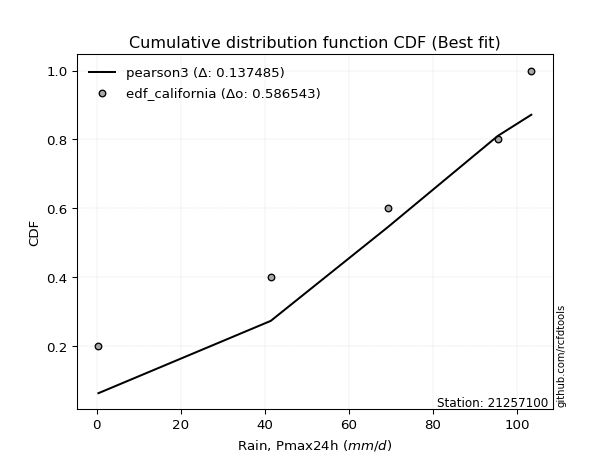</img>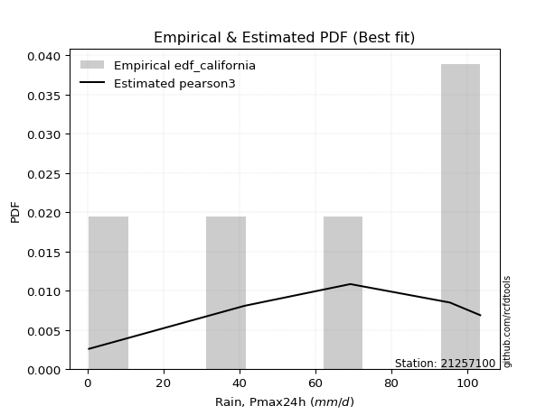</img>

</div>


### 2. EDF Hazen (1930)

Hazen method for plotting positions is a formula used to estimate the empirical cumulative probability distribution of flood events or other hydrological data. This formula often results in biased estimations, particularly when extrapolating to extreme events (high return periods).

<div align="center">


$P=(m-0.5)/n$


</div>


**2.1. Empirical values**

<div align="center">

|                | 0                  | 1                  | 2         | 3                 | 4                  |
|:---------------|:-------------------|:-------------------|:----------|:------------------|:-------------------|
| date           | 2021               | 2022               | 2024      | 2019              | 2020               |
| x              | 0.4                | 41.4               | 69.2      | 95.4              | 103.4              |
| m              | 1                  | 2                  | 3         | 4                 | 5                  |
| empirical_dist | edf_hazen          | edf_hazen          | edf_hazen | edf_hazen         | edf_hazen          |
| empirical      | 0.1                | 0.3                | 0.5       | 0.7               | 0.9                |
| empirical_tr   | 1.1111111111111112 | 1.4285714285714286 | 2.0       | 3.333333333333333 | 10.000000000000002 |

</div>


**2.2. Kolmogorov-Smirnov fit test (sorted by Δ)**


<div align="center">

|                | 0                   | 1                   | 2                   | 3                   | 4                   | 5                  | 6                   | 7                   | 8                   | 9                   | 10                  | 11                  | 12                  | 13                  | 14                  | 15                  | 16                 | 17                  | 18                  | 19                  | 20                 | 21                  | 22                  | 23                  | 24                  | 25                  | 26                 | 27                  | 28                 | 29                  | 30                  | 31                  | 32                  | 33                  | 34                  | 35                  | 36                    | 37                 | 38                 | 39                  | 40                 | 41                 | 42                 | 43                 | 44                 | 45                 | 46                 | 47                  | 48                  | 49                 | 50                 | 51                 | 52                 | 53                  | 54                 | 55                 | 56                 | 57                 | 58                  | 59                 | 60                 | 61                  | 62                  | 63                  | 64                  | 65                  | 66                  | 67                 | 68                  | 69                 | 70                  | 71                 | 72                  | 73                 | 74                 | 75                 | 76                 | 77                 | 78                 | 79                 | 80                 | 81                 | 82                 | 83                 | 84                 | 85                 | 86                 | 87                 |
|:---------------|:--------------------|:--------------------|:--------------------|:--------------------|:--------------------|:-------------------|:--------------------|:--------------------|:--------------------|:--------------------|:--------------------|:--------------------|:--------------------|:--------------------|:--------------------|:--------------------|:-------------------|:--------------------|:--------------------|:--------------------|:-------------------|:--------------------|:--------------------|:--------------------|:--------------------|:--------------------|:-------------------|:--------------------|:-------------------|:--------------------|:--------------------|:--------------------|:--------------------|:--------------------|:--------------------|:--------------------|:----------------------|:-------------------|:-------------------|:--------------------|:-------------------|:-------------------|:-------------------|:-------------------|:-------------------|:-------------------|:-------------------|:--------------------|:--------------------|:-------------------|:-------------------|:-------------------|:-------------------|:--------------------|:-------------------|:-------------------|:-------------------|:-------------------|:--------------------|:-------------------|:-------------------|:--------------------|:--------------------|:--------------------|:--------------------|:--------------------|:--------------------|:-------------------|:--------------------|:-------------------|:--------------------|:-------------------|:--------------------|:-------------------|:-------------------|:-------------------|:-------------------|:-------------------|:-------------------|:-------------------|:-------------------|:-------------------|:-------------------|:-------------------|:-------------------|:-------------------|:-------------------|:-------------------|
| station        | 21257100            | 21257100            | 21257100            | 21257100            | 21257100            | 21257100           | 21257100            | 21257100            | 21257100            | 21257100            | 21257100            | 21257100            | 21257100            | 21257100            | 21257100            | 21257100            | 21257100           | 21257100            | 21257100            | 21257100            | 21257100           | 21257100            | 21257100            | 21257100            | 21257100            | 21257100            | 21257100           | 21257100            | 21257100           | 21257100            | 21257100            | 21257100            | 21257100            | 21257100            | 21257100            | 21257100            | 21257100              | 21257100           | 21257100           | 21257100            | 21257100           | 21257100           | 21257100           | 21257100           | 21257100           | 21257100           | 21257100           | 21257100            | 21257100            | 21257100           | 21257100           | 21257100           | 21257100           | 21257100            | 21257100           | 21257100           | 21257100           | 21257100           | 21257100            | 21257100           | 21257100           | 21257100            | 21257100            | 21257100            | 21257100            | 21257100            | 21257100            | 21257100           | 21257100            | 21257100           | 21257100            | 21257100           | 21257100            | 21257100           | 21257100           | 21257100           | 21257100           | 21257100           | 21257100           | 21257100           | 21257100           | 21257100           | 21257100           | 21257100           | 21257100           | 21257100           | 21257100           | 21257100           |
| empirical_dist | edf_hazen           | edf_hazen           | edf_hazen           | edf_hazen           | edf_hazen           | edf_hazen          | edf_hazen           | edf_hazen           | edf_hazen           | edf_hazen           | edf_hazen           | edf_hazen           | edf_hazen           | edf_hazen           | edf_hazen           | edf_hazen           | edf_hazen          | edf_hazen           | edf_hazen           | edf_hazen           | edf_hazen          | edf_hazen           | edf_hazen           | edf_hazen           | edf_hazen           | edf_hazen           | edf_hazen          | edf_hazen           | edf_hazen          | edf_hazen           | edf_hazen           | edf_hazen           | edf_hazen           | edf_hazen           | edf_hazen           | edf_hazen           | edf_hazen             | edf_hazen          | edf_hazen          | edf_hazen           | edf_hazen          | edf_hazen          | edf_hazen          | edf_hazen          | edf_hazen          | edf_hazen          | edf_hazen          | edf_hazen           | edf_hazen           | edf_hazen          | edf_hazen          | edf_hazen          | edf_hazen          | edf_hazen           | edf_hazen          | edf_hazen          | edf_hazen          | edf_hazen          | edf_hazen           | edf_hazen          | edf_hazen          | edf_hazen           | edf_hazen           | edf_hazen           | edf_hazen           | edf_hazen           | edf_hazen           | edf_hazen          | edf_hazen           | edf_hazen          | edf_hazen           | edf_hazen          | edf_hazen           | edf_hazen          | edf_hazen          | edf_hazen          | edf_hazen          | edf_hazen          | edf_hazen          | edf_hazen          | edf_hazen          | edf_hazen          | edf_hazen          | edf_hazen          | edf_hazen          | edf_hazen          | edf_hazen          | edf_hazen          |
| p_dist         | invgauss            | pearson3            | fatiguelife         | invgamma            | rice                | betaprime          | erlang              | crystalball         | norm                | exponnorm           | t                   | chi2                | gamma               | maxwell             | rayleigh            | weibull_min         | gumbel_l           | laplace_asymmetric  | logistic            | kstwobign           | halfnorm           | gumbel_r            | hypsecant           | laplace             | halflogistic        | moyal               | f                  | genexpon            | expon              | logpearson3         | loggompertz         | mielke              | logt                | loggumbel_l         | wald                | logloggamma         | loglaplace_asymmetric | ncf                | gibrat             | fisk                | lognakagami        | logcrystalball     | lognorm            | lognorm            | logexponnorm       | logrice            | lognct             | loggamma            | loggamma            | loginvweibull      | gompertz           | logjohnsonsu       | loglogistic        | loginvgamma         | logalpha           | loginvgauss        | loghypsecant       | logncf             | logmaxwell          | lograyleigh        | nakagami           | logkstwobign        | loglaplace          | loggenexpon         | loghalfnorm         | loggumbel_r         | logfisk             | logexpon           | nct                 | loghalflogistic    | logmoyal            | loglognorm         | logf                | logwald            | invweibull         | loggibrat          | truncnorm          | logtruncnorm       | logweibull_min     | logfatiguelife     | logchi2            | logbetaprime       | logmielke          | logerlang          | johnsonsu          | alpha              | loggenlogistic     | genlogistic        |
| delta          | 0.10003272120661744 | 0.11002224428509788 | 0.11049962987192952 | 0.11087938473664805 | 0.11089198047129556 | 0.1112618481029174 | 0.11187352583997356 | 0.11256510211065329 | 0.11256510349585558 | 0.11256562667136627 | 0.11259596949371009 | 0.11283044678131371 | 0.11338527378528729 | 0.11381902288135748 | 0.11418717778095311 | 0.11965219353557477 | 0.1266176961814104 | 0.13053977550417306 | 0.13334815455406723 | 0.13398972279199584 | 0.1391254916233553 | 0.14478574751997453 | 0.14517816591452815 | 0.15745591792961833 | 0.16710388299504086 | 0.16863480400037356 | 0.1835291123354379 | 0.18418228502030248 | 0.1862491681946014 | 0.19903658611779723 | 0.22140228583234028 | 0.22290719221698008 | 0.22671473601974934 | 0.22752855738993766 | 0.23488268394983725 | 0.24752661226204853 | 0.24864432638460665   | 0.2549176315660537 | 0.2656569963269425 | 0.28485542421751875 | 0.2887244276479594 | 0.2892114814913895 | 0.2892116680946511 | 0.2892116680946511 | 0.2892120283727884 | 0.2892190363045774 | 0.2895221094124841 | 0.29242922899189955 | 0.29242922899189955 | 0.299788312088832  | 0.2999999999991928 | 0.3004356260989147 | 0.3008585329622598 | 0.30731192646475297 | 0.3082043847744878 | 0.3094840685388756 | 0.3104718685462961 | 0.3125210513589228 | 0.31666387681766023 | 0.3252457439287923 | 0.3271466461462866 | 0.33420332981345263 | 0.33653678250238145 | 0.34551447048318745 | 0.34960838842955194 | 0.35675769450828215 | 0.35823482573563004 | 0.3717882826723557 | 0.37348384209800717 | 0.377799282506268  | 0.38001813396268364 | 0.4007694784318268 | 0.42236834054457845 | 0.4447261865438256 | 0.4622557930326595 | 0.4760692092593031 | 0.4905429796107574 | 0.533174647265136  | 0.5744683268757469 | 0.603759688302725  | 0.6109854705106634 | 0.6131593296077034 | 0.6383713622142837 | 0.6574287970309312 | 0.6792771845442335 | 0.6828174429140559 | 0.7                | 0.7                |
| deltao         | 0.5865427407550001  | 0.5865427407550001  | 0.5865427407550001  | 0.5865427407550001  | 0.5865427407550001  | 0.5865427407550001 | 0.5865427407550001  | 0.5865427407550001  | 0.5865427407550001  | 0.5865427407550001  | 0.5865427407550001  | 0.5865427407550001  | 0.5865427407550001  | 0.5865427407550001  | 0.5865427407550001  | 0.5865427407550001  | 0.5865427407550001 | 0.5865427407550001  | 0.5865427407550001  | 0.5865427407550001  | 0.5865427407550001 | 0.5865427407550001  | 0.5865427407550001  | 0.5865427407550001  | 0.5865427407550001  | 0.5865427407550001  | 0.5865427407550001 | 0.5865427407550001  | 0.5865427407550001 | 0.5865427407550001  | 0.5865427407550001  | 0.5865427407550001  | 0.5865427407550001  | 0.5865427407550001  | 0.5865427407550001  | 0.5865427407550001  | 0.5865427407550001    | 0.5865427407550001 | 0.5865427407550001 | 0.5865427407550001  | 0.5865427407550001 | 0.5865427407550001 | 0.5865427407550001 | 0.5865427407550001 | 0.5865427407550001 | 0.5865427407550001 | 0.5865427407550001 | 0.5865427407550001  | 0.5865427407550001  | 0.5865427407550001 | 0.5865427407550001 | 0.5865427407550001 | 0.5865427407550001 | 0.5865427407550001  | 0.5865427407550001 | 0.5865427407550001 | 0.5865427407550001 | 0.5865427407550001 | 0.5865427407550001  | 0.5865427407550001 | 0.5865427407550001 | 0.5865427407550001  | 0.5865427407550001  | 0.5865427407550001  | 0.5865427407550001  | 0.5865427407550001  | 0.5865427407550001  | 0.5865427407550001 | 0.5865427407550001  | 0.5865427407550001 | 0.5865427407550001  | 0.5865427407550001 | 0.5865427407550001  | 0.5865427407550001 | 0.5865427407550001 | 0.5865427407550001 | 0.5865427407550001 | 0.5865427407550001 | 0.5865427407550001 | 0.5865427407550001 | 0.5865427407550001 | 0.5865427407550001 | 0.5865427407550001 | 0.5865427407550001 | 0.5865427407550001 | 0.5865427407550001 | 0.5865427407550001 | 0.5865427407550001 |
| eval           | Δo > Δ              | Δo > Δ              | Δo > Δ              | Δo > Δ              | Δo > Δ              | Δo > Δ             | Δo > Δ              | Δo > Δ              | Δo > Δ              | Δo > Δ              | Δo > Δ              | Δo > Δ              | Δo > Δ              | Δo > Δ              | Δo > Δ              | Δo > Δ              | Δo > Δ             | Δo > Δ              | Δo > Δ              | Δo > Δ              | Δo > Δ             | Δo > Δ              | Δo > Δ              | Δo > Δ              | Δo > Δ              | Δo > Δ              | Δo > Δ             | Δo > Δ              | Δo > Δ             | Δo > Δ              | Δo > Δ              | Δo > Δ              | Δo > Δ              | Δo > Δ              | Δo > Δ              | Δo > Δ              | Δo > Δ                | Δo > Δ             | Δo > Δ             | Δo > Δ              | Δo > Δ             | Δo > Δ             | Δo > Δ             | Δo > Δ             | Δo > Δ             | Δo > Δ             | Δo > Δ             | Δo > Δ              | Δo > Δ              | Δo > Δ             | Δo > Δ             | Δo > Δ             | Δo > Δ             | Δo > Δ              | Δo > Δ             | Δo > Δ             | Δo > Δ             | Δo > Δ             | Δo > Δ              | Δo > Δ             | Δo > Δ             | Δo > Δ              | Δo > Δ              | Δo > Δ              | Δo > Δ              | Δo > Δ              | Δo > Δ              | Δo > Δ             | Δo > Δ              | Δo > Δ             | Δo > Δ              | Δo > Δ             | Δo > Δ              | Δo > Δ             | Δo > Δ             | Δo > Δ             | Δo > Δ             | Δo > Δ             | Δo > Δ             | Δo <= Δ            | Δo <= Δ            | Δo <= Δ            | Δo <= Δ            | Δo <= Δ            | Δo <= Δ            | Δo <= Δ            | Δo <= Δ            | Δo <= Δ            |
| fit            | 1                   | 1                   | 1                   | 1                   | 1                   | 1                  | 1                   | 1                   | 1                   | 1                   | 1                   | 1                   | 1                   | 1                   | 1                   | 1                   | 1                  | 1                   | 1                   | 1                   | 1                  | 1                   | 1                   | 1                   | 1                   | 1                   | 1                  | 1                   | 1                  | 1                   | 1                   | 1                   | 1                   | 1                   | 1                   | 1                   | 1                     | 1                  | 1                  | 1                   | 1                  | 1                  | 1                  | 1                  | 1                  | 1                  | 1                  | 1                   | 1                   | 1                  | 1                  | 1                  | 1                  | 1                   | 1                  | 1                  | 1                  | 1                  | 1                   | 1                  | 1                  | 1                   | 1                   | 1                   | 1                   | 1                   | 1                   | 1                  | 1                   | 1                  | 1                   | 1                  | 1                   | 1                  | 1                  | 1                  | 1                  | 1                  | 1                  | 0                  | 0                  | 0                  | 0                  | 0                  | 0                  | 0                  | 0                  | 0                  |
| n              | 5                   | 5                   | 5                   | 5                   | 5                   | 5                  | 5                   | 5                   | 5                   | 5                   | 5                   | 5                   | 5                   | 5                   | 5                   | 5                   | 5                  | 5                   | 5                   | 5                   | 5                  | 5                   | 5                   | 5                   | 5                   | 5                   | 5                  | 5                   | 5                  | 5                   | 5                   | 5                   | 5                   | 5                   | 5                   | 5                   | 5                     | 5                  | 5                  | 5                   | 5                  | 5                  | 5                  | 5                  | 5                  | 5                  | 5                  | 5                   | 5                   | 5                  | 5                  | 5                  | 5                  | 5                   | 5                  | 5                  | 5                  | 5                  | 5                   | 5                  | 5                  | 5                   | 5                   | 5                   | 5                   | 5                   | 5                   | 5                  | 5                   | 5                  | 5                   | 5                  | 5                   | 5                  | 5                  | 5                  | 5                  | 5                  | 5                  | 5                  | 5                  | 5                  | 5                  | 5                  | 5                  | 5                  | 5                  | 5                  |
| best_fit       | 1                   | 0                   | 0                   | 0                   | 0                   | 0                  | 0                   | 0                   | 0                   | 0                   | 0                   | 0                   | 0                   | 0                   | 0                   | 0                   | 0                  | 0                   | 0                   | 0                   | 0                  | 0                   | 0                   | 0                   | 0                   | 0                   | 0                  | 0                   | 0                  | 0                   | 0                   | 0                   | 0                   | 0                   | 0                   | 0                   | 0                     | 0                  | 0                  | 0                   | 0                  | 0                  | 0                  | 0                  | 0                  | 0                  | 0                  | 0                   | 0                   | 0                  | 0                  | 0                  | 0                  | 0                   | 0                  | 0                  | 0                  | 0                  | 0                   | 0                  | 0                  | 0                   | 0                   | 0                   | 0                   | 0                   | 0                   | 0                  | 0                   | 0                  | 0                   | 0                  | 0                   | 0                  | 0                  | 0                  | 0                  | 0                  | 0                  | 0                  | 0                  | 0                  | 0                  | 0                  | 0                  | 0                  | 0                  | 0                  |
| best_fit_sort  | 1                   | 2                   | 3                   | 4                   | 5                   | 6                  | 7                   | 8                   | 9                   | 10                  | 11                  | 12                  | 13                  | 14                  | 15                  | 16                  | 17                 | 18                  | 19                  | 20                  | 21                 | 22                  | 23                  | 24                  | 25                  | 26                  | 27                 | 28                  | 29                 | 30                  | 31                  | 32                  | 33                  | 34                  | 35                  | 36                  | 37                    | 38                 | 39                 | 40                  | 41                 | 42                 | 43                 | 44                 | 45                 | 46                 | 47                 | 48                  | 49                  | 50                 | 51                 | 52                 | 53                 | 54                  | 55                 | 56                 | 57                 | 58                 | 59                  | 60                 | 61                 | 62                  | 63                  | 64                  | 65                  | 66                  | 67                  | 68                 | 69                  | 70                 | 71                  | 72                 | 73                  | 74                 | 75                 | 76                 | 77                 | 78                 | 79                 | 80                 | 81                 | 82                 | 83                 | 84                 | 85                 | 86                 | 87                 | 88                 |

</div>


**2.3. Best fit**

<div align="center">

|   id |   station | empirical_dist   | p_dist   |    delta |   deltao | eval   |   fit |   n |   best_fit |   best_fit_sort |
|-----:|----------:|:-----------------|:---------|---------:|---------:|:-------|------:|----:|-----------:|----------------:|
|    0 |  21257100 | edf_hazen        | invgauss | 0.100033 | 0.586543 | Δo > Δ |     1 |   5 |          1 |               1 |

</div>


<div align="center">

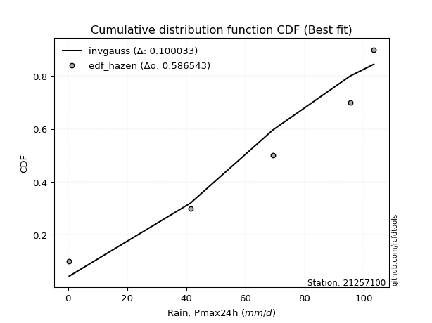</img></img>

</div>


### 3. EDF Weibull (1939)

Weibull plotting position formula is an empirical method used to estimate the non-exceedance probability or plotting position for a set of observed data, is often recommended or widely used in practice, particularly in flood frequency analysis.

<div align="center">


$P=m/(n+1)$


</div>


**3.1. Empirical values**

<div align="center">

|                | 0                   | 1                  | 2           | 3                  | 4                  |
|:---------------|:--------------------|:-------------------|:------------|:-------------------|:-------------------|
| date           | 2021                | 2022               | 2024        | 2019               | 2020               |
| x              | 0.4                 | 41.4               | 69.2        | 95.4               | 103.4              |
| m              | 1                   | 2                  | 3           | 4                  | 5                  |
| empirical_dist | edf_weibull         | edf_weibull        | edf_weibull | edf_weibull        | edf_weibull        |
| empirical      | 0.16666666666666666 | 0.3333333333333333 | 0.5         | 0.6666666666666666 | 0.8333333333333334 |
| empirical_tr   | 1.2                 | 1.4999999999999998 | 2.0         | 2.9999999999999996 | 6.000000000000002  |

</div>


**3.2. Kolmogorov-Smirnov fit test (sorted by Δ)**


<div align="center">

|                | 0                   | 1                   | 2                  | 3                   | 4                   | 5                   | 6                   | 7                  | 8                   | 9                  | 10                 | 11                  | 12                  | 13                  | 14                 | 15                  | 16                 | 17                  | 18                 | 19                 | 20                  | 21                  | 22                  | 23                 | 24                  | 25                  | 26                 | 27                  | 28                  | 29                  | 30                 | 31                  | 32                  | 33                 | 34                  | 35                  | 36                 | 37                 | 38                  | 39                  | 40                  | 41                 | 42                 | 43                  | 44                 | 45                 | 46                 | 47                 | 48                 | 49                  | 50                  | 51                 | 52                 | 53                 | 54                    | 55                 | 56                  | 57                 | 58                 | 59                  | 60                  | 61                 | 62                 | 63                 | 64                 | 65                 | 66                 | 67                  | 68                  | 69                  | 70                 | 71                 | 72                 | 73                  | 74                 | 75                 | 76                  | 77                 | 78                 | 79                 | 80                 | 81                 | 82                 | 83                 | 84                 | 85                 | 86                 | 87                 |
|:---------------|:--------------------|:--------------------|:-------------------|:--------------------|:--------------------|:--------------------|:--------------------|:-------------------|:--------------------|:-------------------|:-------------------|:--------------------|:--------------------|:--------------------|:-------------------|:--------------------|:-------------------|:--------------------|:-------------------|:-------------------|:--------------------|:--------------------|:--------------------|:-------------------|:--------------------|:--------------------|:-------------------|:--------------------|:--------------------|:--------------------|:-------------------|:--------------------|:--------------------|:-------------------|:--------------------|:--------------------|:-------------------|:-------------------|:--------------------|:--------------------|:--------------------|:-------------------|:-------------------|:--------------------|:-------------------|:-------------------|:-------------------|:-------------------|:-------------------|:--------------------|:--------------------|:-------------------|:-------------------|:-------------------|:----------------------|:-------------------|:--------------------|:-------------------|:-------------------|:--------------------|:--------------------|:-------------------|:-------------------|:-------------------|:-------------------|:-------------------|:-------------------|:--------------------|:--------------------|:--------------------|:-------------------|:-------------------|:-------------------|:--------------------|:-------------------|:-------------------|:--------------------|:-------------------|:-------------------|:-------------------|:-------------------|:-------------------|:-------------------|:-------------------|:-------------------|:-------------------|:-------------------|:-------------------|
| station        | 21257100            | 21257100            | 21257100           | 21257100            | 21257100            | 21257100            | 21257100            | 21257100           | 21257100            | 21257100           | 21257100           | 21257100            | 21257100            | 21257100            | 21257100           | 21257100            | 21257100           | 21257100            | 21257100           | 21257100           | 21257100            | 21257100            | 21257100            | 21257100           | 21257100            | 21257100            | 21257100           | 21257100            | 21257100            | 21257100            | 21257100           | 21257100            | 21257100            | 21257100           | 21257100            | 21257100            | 21257100           | 21257100           | 21257100            | 21257100            | 21257100            | 21257100           | 21257100           | 21257100            | 21257100           | 21257100           | 21257100           | 21257100           | 21257100           | 21257100            | 21257100            | 21257100           | 21257100           | 21257100           | 21257100              | 21257100           | 21257100            | 21257100           | 21257100           | 21257100            | 21257100            | 21257100           | 21257100           | 21257100           | 21257100           | 21257100           | 21257100           | 21257100            | 21257100            | 21257100            | 21257100           | 21257100           | 21257100           | 21257100            | 21257100           | 21257100           | 21257100            | 21257100           | 21257100           | 21257100           | 21257100           | 21257100           | 21257100           | 21257100           | 21257100           | 21257100           | 21257100           | 21257100           |
| empirical_dist | edf_weibull         | edf_weibull         | edf_weibull        | edf_weibull         | edf_weibull         | edf_weibull         | edf_weibull         | edf_weibull        | edf_weibull         | edf_weibull        | edf_weibull        | edf_weibull         | edf_weibull         | edf_weibull         | edf_weibull        | edf_weibull         | edf_weibull        | edf_weibull         | edf_weibull        | edf_weibull        | edf_weibull         | edf_weibull         | edf_weibull         | edf_weibull        | edf_weibull         | edf_weibull         | edf_weibull        | edf_weibull         | edf_weibull         | edf_weibull         | edf_weibull        | edf_weibull         | edf_weibull         | edf_weibull        | edf_weibull         | edf_weibull         | edf_weibull        | edf_weibull        | edf_weibull         | edf_weibull         | edf_weibull         | edf_weibull        | edf_weibull        | edf_weibull         | edf_weibull        | edf_weibull        | edf_weibull        | edf_weibull        | edf_weibull        | edf_weibull         | edf_weibull         | edf_weibull        | edf_weibull        | edf_weibull        | edf_weibull           | edf_weibull        | edf_weibull         | edf_weibull        | edf_weibull        | edf_weibull         | edf_weibull         | edf_weibull        | edf_weibull        | edf_weibull        | edf_weibull        | edf_weibull        | edf_weibull        | edf_weibull         | edf_weibull         | edf_weibull         | edf_weibull        | edf_weibull        | edf_weibull        | edf_weibull         | edf_weibull        | edf_weibull        | edf_weibull         | edf_weibull        | edf_weibull        | edf_weibull        | edf_weibull        | edf_weibull        | edf_weibull        | edf_weibull        | edf_weibull        | edf_weibull        | edf_weibull        | edf_weibull        |
| p_dist         | invgauss            | kstwobign           | pearson3           | fatiguelife         | invgamma            | rice                | betaprime           | erlang             | crystalball         | norm               | exponnorm          | t                   | chi2                | gamma               | maxwell            | rayleigh            | weibull_min        | gumbel_l            | laplace_asymmetric | logpearson3        | f                   | halfnorm            | logistic            | gumbel_r           | halflogistic        | genexpon            | expon              | moyal               | hypsecant           | loggompertz         | logt               | laplace             | loggumbel_l         | fisk               | wald                | mielke              | ncf                | lognakagami        | logcrystalball      | lognorm             | lognorm             | logexponnorm       | logrice            | lognct              | loggamma           | loggamma           | gibrat             | loginvweibull      | logjohnsonsu       | loglogistic         | loginvgamma         | logalpha           | loginvgauss        | logloggamma        | loglaplace_asymmetric | loghypsecant       | logncf              | logmaxwell         | logfisk            | lograyleigh         | nakagami            | logkstwobign       | loglaplace         | loggenexpon        | loghalfnorm        | loggumbel_r        | gompertz           | logexpon            | nct                 | loghalflogistic     | logmoyal           | loglognorm         | logf               | invweibull          | logwald            | loggibrat          | truncnorm           | logtruncnorm       | logweibull_min     | logfatiguelife     | logchi2            | logbetaprime       | logmielke          | logerlang          | johnsonsu          | alpha              | loggenlogistic     | genlogistic        |
| delta          | 0.13336605453995076 | 0.13398972279199584 | 0.1433555776184312 | 0.14383296320526284 | 0.14421271806998137 | 0.14422531380462889 | 0.14459518143625072 | 0.1452068591733069 | 0.14589843544398662 | 0.1458984368291889 | 0.1458989600046996 | 0.14592930282704342 | 0.14616378011464704 | 0.14671860711862061 | 0.1471523562146908 | 0.15004674883927568 | 0.1529855268689081 | 0.15995102951474371 | 0.1638731088375064 | 0.1657032527844639 | 0.16666666666558339 | 0.16666666666666666 | 0.16668148788740056 | 0.1686842880257865 | 0.17064444823396863 | 0.17072807937028722 | 0.1729390836515552 | 0.17658491129544795 | 0.17851149924786147 | 0.18806895249900696 | 0.1890913259997743 | 0.19078925126295165 | 0.19419522405660433 | 0.2181887575508521 | 0.23488268394983725 | 0.23576102229286722 | 0.2477324916209357 | 0.2553910943146261 | 0.25587814815805615 | 0.25587833476131777 | 0.25587833476131777 | 0.2558786950394551 | 0.2558857029712441 | 0.25618877607915075 | 0.2590958956585662 | 0.2590958956585662 | 0.2656569963269425 | 0.2664549787554987 | 0.2671022927655814 | 0.26752519962892646 | 0.27397859313141965 | 0.2748710514411545 | 0.2761507352055423 | 0.2764340053675258 | 0.276758256777067     | 0.2771385352129628 | 0.27918771802558945 | 0.2833305434843269 | 0.2915681590689634 | 0.29191241059545897 | 0.29381331281295325 | 0.3008699964801193 | 0.3032034491690481 | 0.3121811371498541 | 0.3162750550962186 | 0.3234243611749488 | 0.3333333333325261 | 0.33845494933902237 | 0.34015050876467384 | 0.34446594917293466 | 0.3466848006293503 | 0.3674361450984935 | 0.3890350072112451 | 0.39558912636599286 | 0.4113928532104923 | 0.4427358759259698 | 0.45720964627742405 | 0.4998413139318027 | 0.5411349935424137 | 0.5704263549693918 | 0.5776521371773302 | 0.5798259962743701 | 0.6050380288809503 | 0.6240954636975977 | 0.6459438512109001 | 0.6494841095807227 | 0.6666666666666666 | 0.6666666666666666 |
| deltao         | 0.5865427407550001  | 0.5865427407550001  | 0.5865427407550001 | 0.5865427407550001  | 0.5865427407550001  | 0.5865427407550001  | 0.5865427407550001  | 0.5865427407550001 | 0.5865427407550001  | 0.5865427407550001 | 0.5865427407550001 | 0.5865427407550001  | 0.5865427407550001  | 0.5865427407550001  | 0.5865427407550001 | 0.5865427407550001  | 0.5865427407550001 | 0.5865427407550001  | 0.5865427407550001 | 0.5865427407550001 | 0.5865427407550001  | 0.5865427407550001  | 0.5865427407550001  | 0.5865427407550001 | 0.5865427407550001  | 0.5865427407550001  | 0.5865427407550001 | 0.5865427407550001  | 0.5865427407550001  | 0.5865427407550001  | 0.5865427407550001 | 0.5865427407550001  | 0.5865427407550001  | 0.5865427407550001 | 0.5865427407550001  | 0.5865427407550001  | 0.5865427407550001 | 0.5865427407550001 | 0.5865427407550001  | 0.5865427407550001  | 0.5865427407550001  | 0.5865427407550001 | 0.5865427407550001 | 0.5865427407550001  | 0.5865427407550001 | 0.5865427407550001 | 0.5865427407550001 | 0.5865427407550001 | 0.5865427407550001 | 0.5865427407550001  | 0.5865427407550001  | 0.5865427407550001 | 0.5865427407550001 | 0.5865427407550001 | 0.5865427407550001    | 0.5865427407550001 | 0.5865427407550001  | 0.5865427407550001 | 0.5865427407550001 | 0.5865427407550001  | 0.5865427407550001  | 0.5865427407550001 | 0.5865427407550001 | 0.5865427407550001 | 0.5865427407550001 | 0.5865427407550001 | 0.5865427407550001 | 0.5865427407550001  | 0.5865427407550001  | 0.5865427407550001  | 0.5865427407550001 | 0.5865427407550001 | 0.5865427407550001 | 0.5865427407550001  | 0.5865427407550001 | 0.5865427407550001 | 0.5865427407550001  | 0.5865427407550001 | 0.5865427407550001 | 0.5865427407550001 | 0.5865427407550001 | 0.5865427407550001 | 0.5865427407550001 | 0.5865427407550001 | 0.5865427407550001 | 0.5865427407550001 | 0.5865427407550001 | 0.5865427407550001 |
| eval           | Δo > Δ              | Δo > Δ              | Δo > Δ             | Δo > Δ              | Δo > Δ              | Δo > Δ              | Δo > Δ              | Δo > Δ             | Δo > Δ              | Δo > Δ             | Δo > Δ             | Δo > Δ              | Δo > Δ              | Δo > Δ              | Δo > Δ             | Δo > Δ              | Δo > Δ             | Δo > Δ              | Δo > Δ             | Δo > Δ             | Δo > Δ              | Δo > Δ              | Δo > Δ              | Δo > Δ             | Δo > Δ              | Δo > Δ              | Δo > Δ             | Δo > Δ              | Δo > Δ              | Δo > Δ              | Δo > Δ             | Δo > Δ              | Δo > Δ              | Δo > Δ             | Δo > Δ              | Δo > Δ              | Δo > Δ             | Δo > Δ             | Δo > Δ              | Δo > Δ              | Δo > Δ              | Δo > Δ             | Δo > Δ             | Δo > Δ              | Δo > Δ             | Δo > Δ             | Δo > Δ             | Δo > Δ             | Δo > Δ             | Δo > Δ              | Δo > Δ              | Δo > Δ             | Δo > Δ             | Δo > Δ             | Δo > Δ                | Δo > Δ             | Δo > Δ              | Δo > Δ             | Δo > Δ             | Δo > Δ              | Δo > Δ              | Δo > Δ             | Δo > Δ             | Δo > Δ             | Δo > Δ             | Δo > Δ             | Δo > Δ             | Δo > Δ              | Δo > Δ              | Δo > Δ              | Δo > Δ             | Δo > Δ             | Δo > Δ             | Δo > Δ              | Δo > Δ             | Δo > Δ             | Δo > Δ              | Δo > Δ             | Δo > Δ             | Δo > Δ             | Δo > Δ             | Δo > Δ             | Δo <= Δ            | Δo <= Δ            | Δo <= Δ            | Δo <= Δ            | Δo <= Δ            | Δo <= Δ            |
| fit            | 1                   | 1                   | 1                  | 1                   | 1                   | 1                   | 1                   | 1                  | 1                   | 1                  | 1                  | 1                   | 1                   | 1                   | 1                  | 1                   | 1                  | 1                   | 1                  | 1                  | 1                   | 1                   | 1                   | 1                  | 1                   | 1                   | 1                  | 1                   | 1                   | 1                   | 1                  | 1                   | 1                   | 1                  | 1                   | 1                   | 1                  | 1                  | 1                   | 1                   | 1                   | 1                  | 1                  | 1                   | 1                  | 1                  | 1                  | 1                  | 1                  | 1                   | 1                   | 1                  | 1                  | 1                  | 1                     | 1                  | 1                   | 1                  | 1                  | 1                   | 1                   | 1                  | 1                  | 1                  | 1                  | 1                  | 1                  | 1                   | 1                   | 1                   | 1                  | 1                  | 1                  | 1                   | 1                  | 1                  | 1                   | 1                  | 1                  | 1                  | 1                  | 1                  | 0                  | 0                  | 0                  | 0                  | 0                  | 0                  |
| n              | 5                   | 5                   | 5                  | 5                   | 5                   | 5                   | 5                   | 5                  | 5                   | 5                  | 5                  | 5                   | 5                   | 5                   | 5                  | 5                   | 5                  | 5                   | 5                  | 5                  | 5                   | 5                   | 5                   | 5                  | 5                   | 5                   | 5                  | 5                   | 5                   | 5                   | 5                  | 5                   | 5                   | 5                  | 5                   | 5                   | 5                  | 5                  | 5                   | 5                   | 5                   | 5                  | 5                  | 5                   | 5                  | 5                  | 5                  | 5                  | 5                  | 5                   | 5                   | 5                  | 5                  | 5                  | 5                     | 5                  | 5                   | 5                  | 5                  | 5                   | 5                   | 5                  | 5                  | 5                  | 5                  | 5                  | 5                  | 5                   | 5                   | 5                   | 5                  | 5                  | 5                  | 5                   | 5                  | 5                  | 5                   | 5                  | 5                  | 5                  | 5                  | 5                  | 5                  | 5                  | 5                  | 5                  | 5                  | 5                  |
| best_fit       | 1                   | 0                   | 0                  | 0                   | 0                   | 0                   | 0                   | 0                  | 0                   | 0                  | 0                  | 0                   | 0                   | 0                   | 0                  | 0                   | 0                  | 0                   | 0                  | 0                  | 0                   | 0                   | 0                   | 0                  | 0                   | 0                   | 0                  | 0                   | 0                   | 0                   | 0                  | 0                   | 0                   | 0                  | 0                   | 0                   | 0                  | 0                  | 0                   | 0                   | 0                   | 0                  | 0                  | 0                   | 0                  | 0                  | 0                  | 0                  | 0                  | 0                   | 0                   | 0                  | 0                  | 0                  | 0                     | 0                  | 0                   | 0                  | 0                  | 0                   | 0                   | 0                  | 0                  | 0                  | 0                  | 0                  | 0                  | 0                   | 0                   | 0                   | 0                  | 0                  | 0                  | 0                   | 0                  | 0                  | 0                   | 0                  | 0                  | 0                  | 0                  | 0                  | 0                  | 0                  | 0                  | 0                  | 0                  | 0                  |
| best_fit_sort  | 1                   | 2                   | 3                  | 4                   | 5                   | 6                   | 7                   | 8                  | 9                   | 10                 | 11                 | 12                  | 13                  | 14                  | 15                 | 16                  | 17                 | 18                  | 19                 | 20                 | 21                  | 22                  | 23                  | 24                 | 25                  | 26                  | 27                 | 28                  | 29                  | 30                  | 31                 | 32                  | 33                  | 34                 | 35                  | 36                  | 37                 | 38                 | 39                  | 40                  | 41                  | 42                 | 43                 | 44                  | 45                 | 46                 | 47                 | 48                 | 49                 | 50                  | 51                  | 52                 | 53                 | 54                 | 55                    | 56                 | 57                  | 58                 | 59                 | 60                  | 61                  | 62                 | 63                 | 64                 | 65                 | 66                 | 67                 | 68                  | 69                  | 70                  | 71                 | 72                 | 73                 | 74                  | 75                 | 76                 | 77                  | 78                 | 79                 | 80                 | 81                 | 82                 | 83                 | 84                 | 85                 | 86                 | 87                 | 88                 |

</div>


**3.3. Best fit**

<div align="center">

|   id |   station | empirical_dist   | p_dist   |    delta |   deltao | eval   |   fit |   n |   best_fit |   best_fit_sort |
|-----:|----------:|:-----------------|:---------|---------:|---------:|:-------|------:|----:|-----------:|----------------:|
|    0 |  21257100 | edf_weibull      | invgauss | 0.133366 | 0.586543 | Δo > Δ |     1 |   5 |          1 |               1 |

</div>


<div align="center">

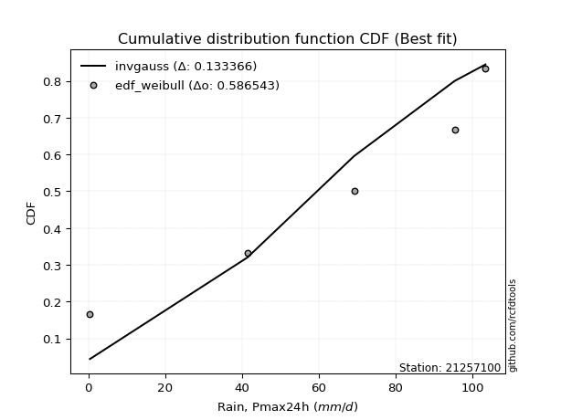</img>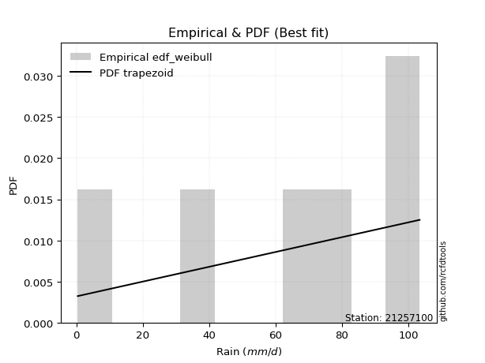</img>

</div>


### 4. EDF Beard (1943)

The Beard formula (or Beard´s plotting position formula) in hydrology is used to estimate the empirical non-exceedance probability _(P)_ of a flood event (or other extreme hydrological data point) within a given dataset.

<div align="center">


$P=(m-0.31)/(n+0.38)$


</div>


**4.1. Empirical values**

<div align="center">

|                | 0                   | 1                  | 2         | 3                  | 4                  |
|:---------------|:--------------------|:-------------------|:----------|:-------------------|:-------------------|
| date           | 2021                | 2022               | 2024      | 2019               | 2020               |
| x              | 0.4                 | 41.4               | 69.2      | 95.4               | 103.4              |
| m              | 1                   | 2                  | 3         | 4                  | 5                  |
| empirical_dist | edf_beard           | edf_beard          | edf_beard | edf_beard          | edf_beard          |
| empirical      | 0.12825278810408922 | 0.3141263940520446 | 0.5       | 0.6858736059479554 | 0.8717472118959109 |
| empirical_tr   | 1.1471215351812367  | 1.4579945799457996 | 2.0       | 3.183431952662722  | 7.797101449275368  |

</div>


**4.2. Kolmogorov-Smirnov fit test (sorted by Δ)**


<div align="center">

|                | 0                   | 1                  | 2                   | 3                   | 4                   | 5                   | 6                  | 7                   | 8                  | 9                  | 10                 | 11                  | 12                 | 13                 | 14                  | 15                 | 16                  | 17                 | 18                 | 19                  | 20                  | 21                 | 22                  | 23                  | 24                  | 25                  | 26                  | 27                  | 28                 | 29                 | 30                 | 31                  | 32                  | 33                  | 34                  | 35                 | 36                 | 37                 | 38                    | 39                 | 40                 | 41                  | 42                  | 43                  | 44                 | 45                  | 46                  | 47                 | 48                 | 49                  | 50                 | 51                  | 52                  | 53                  | 54                 | 55                  | 56                  | 57                 | 58                  | 59                  | 60                  | 61                 | 62                 | 63                 | 64                 | 65                 | 66                 | 67                  | 68                  | 69                  | 70                 | 71                 | 72                 | 73                 | 74                  | 75                 | 76                  | 77                 | 78                 | 79                 | 80                 | 81                 | 82                 | 83                 | 84                 | 85                 | 86                 | 87                 |
|:---------------|:--------------------|:-------------------|:--------------------|:--------------------|:--------------------|:--------------------|:-------------------|:--------------------|:-------------------|:-------------------|:-------------------|:--------------------|:-------------------|:-------------------|:--------------------|:-------------------|:--------------------|:-------------------|:-------------------|:--------------------|:--------------------|:-------------------|:--------------------|:--------------------|:--------------------|:--------------------|:--------------------|:--------------------|:-------------------|:-------------------|:-------------------|:--------------------|:--------------------|:--------------------|:--------------------|:-------------------|:-------------------|:-------------------|:----------------------|:-------------------|:-------------------|:--------------------|:--------------------|:--------------------|:-------------------|:--------------------|:--------------------|:-------------------|:-------------------|:--------------------|:-------------------|:--------------------|:--------------------|:--------------------|:-------------------|:--------------------|:--------------------|:-------------------|:--------------------|:--------------------|:--------------------|:-------------------|:-------------------|:-------------------|:-------------------|:-------------------|:-------------------|:--------------------|:--------------------|:--------------------|:-------------------|:-------------------|:-------------------|:-------------------|:--------------------|:-------------------|:--------------------|:-------------------|:-------------------|:-------------------|:-------------------|:-------------------|:-------------------|:-------------------|:-------------------|:-------------------|:-------------------|:-------------------|
| station        | 21257100            | 21257100           | 21257100            | 21257100            | 21257100            | 21257100            | 21257100           | 21257100            | 21257100           | 21257100           | 21257100           | 21257100            | 21257100           | 21257100           | 21257100            | 21257100           | 21257100            | 21257100           | 21257100           | 21257100            | 21257100            | 21257100           | 21257100            | 21257100            | 21257100            | 21257100            | 21257100            | 21257100            | 21257100           | 21257100           | 21257100           | 21257100            | 21257100            | 21257100            | 21257100            | 21257100           | 21257100           | 21257100           | 21257100              | 21257100           | 21257100           | 21257100            | 21257100            | 21257100            | 21257100           | 21257100            | 21257100            | 21257100           | 21257100           | 21257100            | 21257100           | 21257100            | 21257100            | 21257100            | 21257100           | 21257100            | 21257100            | 21257100           | 21257100            | 21257100            | 21257100            | 21257100           | 21257100           | 21257100           | 21257100           | 21257100           | 21257100           | 21257100            | 21257100            | 21257100            | 21257100           | 21257100           | 21257100           | 21257100           | 21257100            | 21257100           | 21257100            | 21257100           | 21257100           | 21257100           | 21257100           | 21257100           | 21257100           | 21257100           | 21257100           | 21257100           | 21257100           | 21257100           |
| empirical_dist | edf_beard           | edf_beard          | edf_beard           | edf_beard           | edf_beard           | edf_beard           | edf_beard          | edf_beard           | edf_beard          | edf_beard          | edf_beard          | edf_beard           | edf_beard          | edf_beard          | edf_beard           | edf_beard          | edf_beard           | edf_beard          | edf_beard          | edf_beard           | edf_beard           | edf_beard          | edf_beard           | edf_beard           | edf_beard           | edf_beard           | edf_beard           | edf_beard           | edf_beard          | edf_beard          | edf_beard          | edf_beard           | edf_beard           | edf_beard           | edf_beard           | edf_beard          | edf_beard          | edf_beard          | edf_beard             | edf_beard          | edf_beard          | edf_beard           | edf_beard           | edf_beard           | edf_beard          | edf_beard           | edf_beard           | edf_beard          | edf_beard          | edf_beard           | edf_beard          | edf_beard           | edf_beard           | edf_beard           | edf_beard          | edf_beard           | edf_beard           | edf_beard          | edf_beard           | edf_beard           | edf_beard           | edf_beard          | edf_beard          | edf_beard          | edf_beard          | edf_beard          | edf_beard          | edf_beard           | edf_beard           | edf_beard           | edf_beard          | edf_beard          | edf_beard          | edf_beard          | edf_beard           | edf_beard          | edf_beard           | edf_beard          | edf_beard          | edf_beard          | edf_beard          | edf_beard          | edf_beard          | edf_beard          | edf_beard          | edf_beard          | edf_beard          | edf_beard          |
| p_dist         | invgauss            | pearson3           | fatiguelife         | invgamma            | rice                | betaprime           | erlang             | crystalball         | norm               | exponnorm          | t                  | chi2                | gamma              | maxwell            | rayleigh            | weibull_min        | kstwobign           | halfnorm           | gumbel_l           | laplace_asymmetric  | logistic            | gumbel_r           | hypsecant           | f                   | halflogistic        | moyal               | genexpon            | laplace             | expon              | logpearson3        | logt               | loggompertz         | loggumbel_l         | mielke              | wald                | ncf                | fisk               | logloggamma        | loglaplace_asymmetric | gibrat             | lognakagami        | logcrystalball      | lognorm             | lognorm             | logexponnorm       | logrice             | lognct              | loggamma           | loggamma           | loginvweibull       | logjohnsonsu       | loglogistic         | loginvgamma         | logalpha            | loginvgauss        | loghypsecant        | logncf              | logmaxwell         | lograyleigh         | nakagami            | gompertz            | logkstwobign       | loglaplace         | logfisk            | loggenexpon        | loghalfnorm        | loggumbel_r        | logexpon            | nct                 | loghalflogistic     | logmoyal           | loglognorm         | logf               | logwald            | invweibull          | loggibrat          | truncnorm           | logtruncnorm       | logweibull_min     | logfatiguelife     | logchi2            | logbetaprime       | logmielke          | logerlang          | johnsonsu          | alpha              | loggenlogistic     | genlogistic        |
| delta          | 0.11415911525866196 | 0.1241486383371424 | 0.12462602392397404 | 0.12500577878869257 | 0.12501837452334008 | 0.12538824215496192 | 0.1259999198920181 | 0.12669149616269781 | 0.1266914975479001 | 0.1266920207234108 | 0.1267223635457546 | 0.12695684083335823 | 0.1275116678373318 | 0.127945416933402  | 0.12831357183299763 | 0.1337785875876193 | 0.13398972279199584 | 0.1391254916233553 | 0.1407440902334549 | 0.14466616955621758 | 0.14747454860611175 | 0.1494773487444977 | 0.15930455996657267 | 0.16650762189828422 | 0.16710388299504086 | 0.16863480400037356 | 0.17072807937028722 | 0.17158231198166285 | 0.1729390836515552 | 0.1849101920657526 | 0.1984619479156602 | 0.20727589178029565 | 0.21340216333789302 | 0.22290719221698008 | 0.23488268394983725 | 0.2477324916209357 | 0.2566026361134296 | 0.257227066086237  | 0.2575513174957782    | 0.2656569963269425 | 0.2745980335959148 | 0.27508508743934484 | 0.27508527404260646 | 0.27508527404260646 | 0.2750856343207438 | 0.27509264225253277 | 0.27539571536043944 | 0.2783028349398549 | 0.2783028349398549 | 0.28566191803678737 | 0.2863092320468702 | 0.28673213891021515 | 0.29318553241270834 | 0.29407799072244317 | 0.295357674486831  | 0.29634547449425147 | 0.29839465730687814 | 0.3025374827656156 | 0.31111934987674766 | 0.31302025209424195 | 0.31412639405123743 | 0.320076935761408  | 0.3224103884503368 | 0.3299820376315409 | 0.3313880764311428 | 0.3354819943775073 | 0.3426313004562375 | 0.35766188862031106 | 0.35935744804596254 | 0.36367288845422335 | 0.365891739910639  | 0.3866430843797822 | 0.4082419464925338 | 0.430599792491781  | 0.43400300492857036 | 0.4619428152072585 | 0.47641658555871275 | 0.5190482532130913 | 0.5603419328237023 | 0.5896332942506803 | 0.5968590764586188 | 0.5990329355556587 | 0.6242449681622391 | 0.6433024029788865 | 0.665150790492189  | 0.6686910488620113 | 0.6858736059479554 | 0.6858736059479554 |
| deltao         | 0.5865427407550001  | 0.5865427407550001 | 0.5865427407550001  | 0.5865427407550001  | 0.5865427407550001  | 0.5865427407550001  | 0.5865427407550001 | 0.5865427407550001  | 0.5865427407550001 | 0.5865427407550001 | 0.5865427407550001 | 0.5865427407550001  | 0.5865427407550001 | 0.5865427407550001 | 0.5865427407550001  | 0.5865427407550001 | 0.5865427407550001  | 0.5865427407550001 | 0.5865427407550001 | 0.5865427407550001  | 0.5865427407550001  | 0.5865427407550001 | 0.5865427407550001  | 0.5865427407550001  | 0.5865427407550001  | 0.5865427407550001  | 0.5865427407550001  | 0.5865427407550001  | 0.5865427407550001 | 0.5865427407550001 | 0.5865427407550001 | 0.5865427407550001  | 0.5865427407550001  | 0.5865427407550001  | 0.5865427407550001  | 0.5865427407550001 | 0.5865427407550001 | 0.5865427407550001 | 0.5865427407550001    | 0.5865427407550001 | 0.5865427407550001 | 0.5865427407550001  | 0.5865427407550001  | 0.5865427407550001  | 0.5865427407550001 | 0.5865427407550001  | 0.5865427407550001  | 0.5865427407550001 | 0.5865427407550001 | 0.5865427407550001  | 0.5865427407550001 | 0.5865427407550001  | 0.5865427407550001  | 0.5865427407550001  | 0.5865427407550001 | 0.5865427407550001  | 0.5865427407550001  | 0.5865427407550001 | 0.5865427407550001  | 0.5865427407550001  | 0.5865427407550001  | 0.5865427407550001 | 0.5865427407550001 | 0.5865427407550001 | 0.5865427407550001 | 0.5865427407550001 | 0.5865427407550001 | 0.5865427407550001  | 0.5865427407550001  | 0.5865427407550001  | 0.5865427407550001 | 0.5865427407550001 | 0.5865427407550001 | 0.5865427407550001 | 0.5865427407550001  | 0.5865427407550001 | 0.5865427407550001  | 0.5865427407550001 | 0.5865427407550001 | 0.5865427407550001 | 0.5865427407550001 | 0.5865427407550001 | 0.5865427407550001 | 0.5865427407550001 | 0.5865427407550001 | 0.5865427407550001 | 0.5865427407550001 | 0.5865427407550001 |
| eval           | Δo > Δ              | Δo > Δ             | Δo > Δ              | Δo > Δ              | Δo > Δ              | Δo > Δ              | Δo > Δ             | Δo > Δ              | Δo > Δ             | Δo > Δ             | Δo > Δ             | Δo > Δ              | Δo > Δ             | Δo > Δ             | Δo > Δ              | Δo > Δ             | Δo > Δ              | Δo > Δ             | Δo > Δ             | Δo > Δ              | Δo > Δ              | Δo > Δ             | Δo > Δ              | Δo > Δ              | Δo > Δ              | Δo > Δ              | Δo > Δ              | Δo > Δ              | Δo > Δ             | Δo > Δ             | Δo > Δ             | Δo > Δ              | Δo > Δ              | Δo > Δ              | Δo > Δ              | Δo > Δ             | Δo > Δ             | Δo > Δ             | Δo > Δ                | Δo > Δ             | Δo > Δ             | Δo > Δ              | Δo > Δ              | Δo > Δ              | Δo > Δ             | Δo > Δ              | Δo > Δ              | Δo > Δ             | Δo > Δ             | Δo > Δ              | Δo > Δ             | Δo > Δ              | Δo > Δ              | Δo > Δ              | Δo > Δ             | Δo > Δ              | Δo > Δ              | Δo > Δ             | Δo > Δ              | Δo > Δ              | Δo > Δ              | Δo > Δ             | Δo > Δ             | Δo > Δ             | Δo > Δ             | Δo > Δ             | Δo > Δ             | Δo > Δ              | Δo > Δ              | Δo > Δ              | Δo > Δ             | Δo > Δ             | Δo > Δ             | Δo > Δ             | Δo > Δ              | Δo > Δ             | Δo > Δ              | Δo > Δ             | Δo > Δ             | Δo <= Δ            | Δo <= Δ            | Δo <= Δ            | Δo <= Δ            | Δo <= Δ            | Δo <= Δ            | Δo <= Δ            | Δo <= Δ            | Δo <= Δ            |
| fit            | 1                   | 1                  | 1                   | 1                   | 1                   | 1                   | 1                  | 1                   | 1                  | 1                  | 1                  | 1                   | 1                  | 1                  | 1                   | 1                  | 1                   | 1                  | 1                  | 1                   | 1                   | 1                  | 1                   | 1                   | 1                   | 1                   | 1                   | 1                   | 1                  | 1                  | 1                  | 1                   | 1                   | 1                   | 1                   | 1                  | 1                  | 1                  | 1                     | 1                  | 1                  | 1                   | 1                   | 1                   | 1                  | 1                   | 1                   | 1                  | 1                  | 1                   | 1                  | 1                   | 1                   | 1                   | 1                  | 1                   | 1                   | 1                  | 1                   | 1                   | 1                   | 1                  | 1                  | 1                  | 1                  | 1                  | 1                  | 1                   | 1                   | 1                   | 1                  | 1                  | 1                  | 1                  | 1                   | 1                  | 1                   | 1                  | 1                  | 0                  | 0                  | 0                  | 0                  | 0                  | 0                  | 0                  | 0                  | 0                  |
| n              | 5                   | 5                  | 5                   | 5                   | 5                   | 5                   | 5                  | 5                   | 5                  | 5                  | 5                  | 5                   | 5                  | 5                  | 5                   | 5                  | 5                   | 5                  | 5                  | 5                   | 5                   | 5                  | 5                   | 5                   | 5                   | 5                   | 5                   | 5                   | 5                  | 5                  | 5                  | 5                   | 5                   | 5                   | 5                   | 5                  | 5                  | 5                  | 5                     | 5                  | 5                  | 5                   | 5                   | 5                   | 5                  | 5                   | 5                   | 5                  | 5                  | 5                   | 5                  | 5                   | 5                   | 5                   | 5                  | 5                   | 5                   | 5                  | 5                   | 5                   | 5                   | 5                  | 5                  | 5                  | 5                  | 5                  | 5                  | 5                   | 5                   | 5                   | 5                  | 5                  | 5                  | 5                  | 5                   | 5                  | 5                   | 5                  | 5                  | 5                  | 5                  | 5                  | 5                  | 5                  | 5                  | 5                  | 5                  | 5                  |
| best_fit       | 1                   | 0                  | 0                   | 0                   | 0                   | 0                   | 0                  | 0                   | 0                  | 0                  | 0                  | 0                   | 0                  | 0                  | 0                   | 0                  | 0                   | 0                  | 0                  | 0                   | 0                   | 0                  | 0                   | 0                   | 0                   | 0                   | 0                   | 0                   | 0                  | 0                  | 0                  | 0                   | 0                   | 0                   | 0                   | 0                  | 0                  | 0                  | 0                     | 0                  | 0                  | 0                   | 0                   | 0                   | 0                  | 0                   | 0                   | 0                  | 0                  | 0                   | 0                  | 0                   | 0                   | 0                   | 0                  | 0                   | 0                   | 0                  | 0                   | 0                   | 0                   | 0                  | 0                  | 0                  | 0                  | 0                  | 0                  | 0                   | 0                   | 0                   | 0                  | 0                  | 0                  | 0                  | 0                   | 0                  | 0                   | 0                  | 0                  | 0                  | 0                  | 0                  | 0                  | 0                  | 0                  | 0                  | 0                  | 0                  |
| best_fit_sort  | 1                   | 2                  | 3                   | 4                   | 5                   | 6                   | 7                  | 8                   | 9                  | 10                 | 11                 | 12                  | 13                 | 14                 | 15                  | 16                 | 17                  | 18                 | 19                 | 20                  | 21                  | 22                 | 23                  | 24                  | 25                  | 26                  | 27                  | 28                  | 29                 | 30                 | 31                 | 32                  | 33                  | 34                  | 35                  | 36                 | 37                 | 38                 | 39                    | 40                 | 41                 | 42                  | 43                  | 44                  | 45                 | 46                  | 47                  | 48                 | 49                 | 50                  | 51                 | 52                  | 53                  | 54                  | 55                 | 56                  | 57                  | 58                 | 59                  | 60                  | 61                  | 62                 | 63                 | 64                 | 65                 | 66                 | 67                 | 68                  | 69                  | 70                  | 71                 | 72                 | 73                 | 74                 | 75                  | 76                 | 77                  | 78                 | 79                 | 80                 | 81                 | 82                 | 83                 | 84                 | 85                 | 86                 | 87                 | 88                 |

</div>


**4.3. Best fit**

<div align="center">

|   id |   station | empirical_dist   | p_dist   |    delta |   deltao | eval   |   fit |   n |   best_fit |   best_fit_sort |
|-----:|----------:|:-----------------|:---------|---------:|---------:|:-------|------:|----:|-----------:|----------------:|
|    0 |  21257100 | edf_beard        | invgauss | 0.114159 | 0.586543 | Δo > Δ |     1 |   5 |          1 |               1 |

</div>


<div align="center">

</img>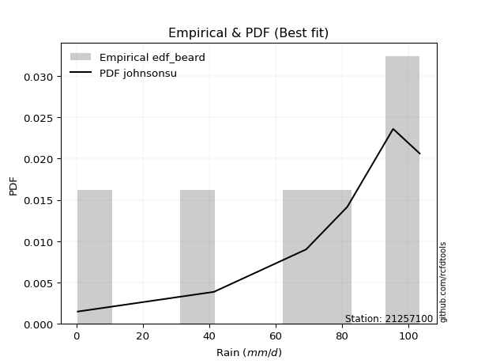</img>

</div>


### 5. EDF Chegodayev (1955)

The Chegodayev formula is an empirical plotting position formula used in hydrological frequency analysis to estimate the exceedance probability or return period of a specific event from a set of observed data. It is primarily used for plotting observed data points on probability paper to fit a theoretical distribution, particularly for analyzing extreme events like maximum flood flows or rainfall intensities. The constant _b_ value in the generalized plotting position formula is 0.3.

<div align="center">


$P=(m-b)/(n+1-2b)$


</div>


**5.1. Empirical values**

<div align="center">

|                | 0                   | 1                   | 2              | 3                  | 4                  |
|:---------------|:--------------------|:--------------------|:---------------|:-------------------|:-------------------|
| date           | 2021                | 2022                | 2024           | 2019               | 2020               |
| x              | 0.4                 | 41.4                | 69.2           | 95.4               | 103.4              |
| m              | 1                   | 2                   | 3              | 4                  | 5                  |
| empirical_dist | edf_chegodayev      | edf_chegodayev      | edf_chegodayev | edf_chegodayev     | edf_chegodayev     |
| empirical      | 0.12962962962962962 | 0.31481481481481477 | 0.5            | 0.6851851851851851 | 0.8703703703703703 |
| empirical_tr   | 1.148936170212766   | 1.4594594594594594  | 2.0            | 3.1764705882352935 | 7.714285714285713  |

</div>


**5.2. Kolmogorov-Smirnov fit test (sorted by Δ)**


<div align="center">

|                | 0                   | 1                   | 2                   | 3                   | 4                  | 5                   | 6                  | 7                   | 8                   | 9                  | 10                  | 11                  | 12                  | 13                  | 14                  | 15                  | 16                 | 17                 | 18                  | 19                 | 20                  | 21                 | 22                  | 23                  | 24                  | 25                  | 26                  | 27                  | 28                 | 29                  | 30                  | 31                 | 32                  | 33                  | 34                  | 35                 | 36                 | 37                  | 38                    | 39                 | 40                  | 41                 | 42                 | 43                 | 44                  | 45                 | 46                 | 47                  | 48                  | 49                 | 50                 | 51                 | 52                 | 53                 | 54                  | 55                 | 56                 | 57                  | 58                 | 59                 | 60                 | 61                  | 62                  | 63                  | 64                  | 65                  | 66                  | 67                 | 68                 | 69                 | 70                  | 71                  | 72                  | 73                  | 74                  | 75                  | 76                 | 77                 | 78                 | 79                 | 80                 | 81                 | 82                 | 83                 | 84                 | 85                 | 86                 | 87                 |
|:---------------|:--------------------|:--------------------|:--------------------|:--------------------|:-------------------|:--------------------|:-------------------|:--------------------|:--------------------|:-------------------|:--------------------|:--------------------|:--------------------|:--------------------|:--------------------|:--------------------|:-------------------|:-------------------|:--------------------|:-------------------|:--------------------|:-------------------|:--------------------|:--------------------|:--------------------|:--------------------|:--------------------|:--------------------|:-------------------|:--------------------|:--------------------|:-------------------|:--------------------|:--------------------|:--------------------|:-------------------|:-------------------|:--------------------|:----------------------|:-------------------|:--------------------|:-------------------|:-------------------|:-------------------|:--------------------|:-------------------|:-------------------|:--------------------|:--------------------|:-------------------|:-------------------|:-------------------|:-------------------|:-------------------|:--------------------|:-------------------|:-------------------|:--------------------|:-------------------|:-------------------|:-------------------|:--------------------|:--------------------|:--------------------|:--------------------|:--------------------|:--------------------|:-------------------|:-------------------|:-------------------|:--------------------|:--------------------|:--------------------|:--------------------|:--------------------|:--------------------|:-------------------|:-------------------|:-------------------|:-------------------|:-------------------|:-------------------|:-------------------|:-------------------|:-------------------|:-------------------|:-------------------|:-------------------|
| station        | 21257100            | 21257100            | 21257100            | 21257100            | 21257100           | 21257100            | 21257100           | 21257100            | 21257100            | 21257100           | 21257100            | 21257100            | 21257100            | 21257100            | 21257100            | 21257100            | 21257100           | 21257100           | 21257100            | 21257100           | 21257100            | 21257100           | 21257100            | 21257100            | 21257100            | 21257100            | 21257100            | 21257100            | 21257100           | 21257100            | 21257100            | 21257100           | 21257100            | 21257100            | 21257100            | 21257100           | 21257100           | 21257100            | 21257100              | 21257100           | 21257100            | 21257100           | 21257100           | 21257100           | 21257100            | 21257100           | 21257100           | 21257100            | 21257100            | 21257100           | 21257100           | 21257100           | 21257100           | 21257100           | 21257100            | 21257100           | 21257100           | 21257100            | 21257100           | 21257100           | 21257100           | 21257100            | 21257100            | 21257100            | 21257100            | 21257100            | 21257100            | 21257100           | 21257100           | 21257100           | 21257100            | 21257100            | 21257100            | 21257100            | 21257100            | 21257100            | 21257100           | 21257100           | 21257100           | 21257100           | 21257100           | 21257100           | 21257100           | 21257100           | 21257100           | 21257100           | 21257100           | 21257100           |
| empirical_dist | edf_chegodayev      | edf_chegodayev      | edf_chegodayev      | edf_chegodayev      | edf_chegodayev     | edf_chegodayev      | edf_chegodayev     | edf_chegodayev      | edf_chegodayev      | edf_chegodayev     | edf_chegodayev      | edf_chegodayev      | edf_chegodayev      | edf_chegodayev      | edf_chegodayev      | edf_chegodayev      | edf_chegodayev     | edf_chegodayev     | edf_chegodayev      | edf_chegodayev     | edf_chegodayev      | edf_chegodayev     | edf_chegodayev      | edf_chegodayev      | edf_chegodayev      | edf_chegodayev      | edf_chegodayev      | edf_chegodayev      | edf_chegodayev     | edf_chegodayev      | edf_chegodayev      | edf_chegodayev     | edf_chegodayev      | edf_chegodayev      | edf_chegodayev      | edf_chegodayev     | edf_chegodayev     | edf_chegodayev      | edf_chegodayev        | edf_chegodayev     | edf_chegodayev      | edf_chegodayev     | edf_chegodayev     | edf_chegodayev     | edf_chegodayev      | edf_chegodayev     | edf_chegodayev     | edf_chegodayev      | edf_chegodayev      | edf_chegodayev     | edf_chegodayev     | edf_chegodayev     | edf_chegodayev     | edf_chegodayev     | edf_chegodayev      | edf_chegodayev     | edf_chegodayev     | edf_chegodayev      | edf_chegodayev     | edf_chegodayev     | edf_chegodayev     | edf_chegodayev      | edf_chegodayev      | edf_chegodayev      | edf_chegodayev      | edf_chegodayev      | edf_chegodayev      | edf_chegodayev     | edf_chegodayev     | edf_chegodayev     | edf_chegodayev      | edf_chegodayev      | edf_chegodayev      | edf_chegodayev      | edf_chegodayev      | edf_chegodayev      | edf_chegodayev     | edf_chegodayev     | edf_chegodayev     | edf_chegodayev     | edf_chegodayev     | edf_chegodayev     | edf_chegodayev     | edf_chegodayev     | edf_chegodayev     | edf_chegodayev     | edf_chegodayev     | edf_chegodayev     |
| p_dist         | invgauss            | pearson3            | fatiguelife         | invgamma            | rice               | betaprime           | erlang             | crystalball         | norm                | exponnorm          | t                   | chi2                | gamma               | maxwell             | rayleigh            | kstwobign           | weibull_min        | halfnorm           | gumbel_l            | laplace_asymmetric | logistic            | gumbel_r           | hypsecant           | f                   | halflogistic        | moyal               | genexpon            | laplace             | expon              | logpearson3         | logt                | loggompertz        | loggumbel_l         | mielke              | wald                | ncf                | fisk               | logloggamma         | loglaplace_asymmetric | gibrat             | lognakagami         | logcrystalball     | lognorm            | lognorm            | logexponnorm        | logrice            | lognct             | loggamma            | loggamma            | loginvweibull      | logjohnsonsu       | loglogistic        | loginvgamma        | logalpha           | loginvgauss         | loghypsecant       | logncf             | logmaxwell          | lograyleigh        | nakagami           | gompertz           | logkstwobign        | loglaplace          | logfisk             | loggenexpon         | loghalfnorm         | loggumbel_r         | logexpon           | nct                | loghalflogistic    | logmoyal            | loglognorm          | logf                | logwald             | invweibull          | loggibrat           | truncnorm          | logtruncnorm       | logweibull_min     | logfatiguelife     | logchi2            | logbetaprime       | logmielke          | logerlang          | johnsonsu          | alpha              | loggenlogistic     | genlogistic        |
| delta          | 0.11484753602143227 | 0.12483705909991272 | 0.12531444468674435 | 0.12569419955146288 | 0.1257067952861104 | 0.12607666291773223 | 0.1266883406547884 | 0.12737991692546813 | 0.12737991831067041 | 0.1273804414861811 | 0.12741078430852493 | 0.12764526159612855 | 0.12820008860010212 | 0.12863383769617232 | 0.12900199259576794 | 0.13398972279199584 | 0.1344670083503896 | 0.1391254916233553 | 0.14143251099622522 | 0.1453545903189879 | 0.14816296936888207 | 0.150165769507268  | 0.15999298072934298 | 0.16581920113551407 | 0.16710388299504086 | 0.16863480400037356 | 0.17072807937028722 | 0.17227073274443316 | 0.1729390836515552 | 0.18422177130298245 | 0.19708510639011967 | 0.2065874710175255 | 0.21271374257512288 | 0.22290719221698008 | 0.23488268394983725 | 0.2477324916209357 | 0.2552257945878891 | 0.25791548684900734 | 0.2582397382585485    | 0.2656569963269425 | 0.27390961283314463 | 0.2743966666765747 | 0.2743968532798363 | 0.2743968532798363 | 0.27439721355797364 | 0.2744042214897626 | 0.2747072945976693 | 0.27761441417708477 | 0.27761441417708477 | 0.2849734972740172 | 0.2856208112840999 | 0.286043718147445  | 0.2924971116499382 | 0.293389569959673  | 0.29466925372406083 | 0.2956570537314813 | 0.297706236544108  | 0.30184906200284545 | 0.3104309291139775 | 0.3123318313314718 | 0.3148148148140076 | 0.31938851499863785 | 0.32172196768756667 | 0.32860519610600036 | 0.33069965566837267 | 0.33479357361473716 | 0.34194287969346737 | 0.3569734678575409 | 0.3586690272831924 | 0.3629844676914532 | 0.36520331914786885 | 0.38595466361701203 | 0.40755352572976367 | 0.42991137172901084 | 0.43262616340302984 | 0.46125439444448835 | 0.4757281647959426 | 0.5183598324503212 | 0.5596535120609322 | 0.5889448734879102 | 0.5961706556958487 | 0.5983445147928886 | 0.6235565473994689 | 0.6426139822161163 | 0.6644623697294186 | 0.6680026280992412 | 0.6851851851851851 | 0.6851851851851851 |
| deltao         | 0.5865427407550001  | 0.5865427407550001  | 0.5865427407550001  | 0.5865427407550001  | 0.5865427407550001 | 0.5865427407550001  | 0.5865427407550001 | 0.5865427407550001  | 0.5865427407550001  | 0.5865427407550001 | 0.5865427407550001  | 0.5865427407550001  | 0.5865427407550001  | 0.5865427407550001  | 0.5865427407550001  | 0.5865427407550001  | 0.5865427407550001 | 0.5865427407550001 | 0.5865427407550001  | 0.5865427407550001 | 0.5865427407550001  | 0.5865427407550001 | 0.5865427407550001  | 0.5865427407550001  | 0.5865427407550001  | 0.5865427407550001  | 0.5865427407550001  | 0.5865427407550001  | 0.5865427407550001 | 0.5865427407550001  | 0.5865427407550001  | 0.5865427407550001 | 0.5865427407550001  | 0.5865427407550001  | 0.5865427407550001  | 0.5865427407550001 | 0.5865427407550001 | 0.5865427407550001  | 0.5865427407550001    | 0.5865427407550001 | 0.5865427407550001  | 0.5865427407550001 | 0.5865427407550001 | 0.5865427407550001 | 0.5865427407550001  | 0.5865427407550001 | 0.5865427407550001 | 0.5865427407550001  | 0.5865427407550001  | 0.5865427407550001 | 0.5865427407550001 | 0.5865427407550001 | 0.5865427407550001 | 0.5865427407550001 | 0.5865427407550001  | 0.5865427407550001 | 0.5865427407550001 | 0.5865427407550001  | 0.5865427407550001 | 0.5865427407550001 | 0.5865427407550001 | 0.5865427407550001  | 0.5865427407550001  | 0.5865427407550001  | 0.5865427407550001  | 0.5865427407550001  | 0.5865427407550001  | 0.5865427407550001 | 0.5865427407550001 | 0.5865427407550001 | 0.5865427407550001  | 0.5865427407550001  | 0.5865427407550001  | 0.5865427407550001  | 0.5865427407550001  | 0.5865427407550001  | 0.5865427407550001 | 0.5865427407550001 | 0.5865427407550001 | 0.5865427407550001 | 0.5865427407550001 | 0.5865427407550001 | 0.5865427407550001 | 0.5865427407550001 | 0.5865427407550001 | 0.5865427407550001 | 0.5865427407550001 | 0.5865427407550001 |
| eval           | Δo > Δ              | Δo > Δ              | Δo > Δ              | Δo > Δ              | Δo > Δ             | Δo > Δ              | Δo > Δ             | Δo > Δ              | Δo > Δ              | Δo > Δ             | Δo > Δ              | Δo > Δ              | Δo > Δ              | Δo > Δ              | Δo > Δ              | Δo > Δ              | Δo > Δ             | Δo > Δ             | Δo > Δ              | Δo > Δ             | Δo > Δ              | Δo > Δ             | Δo > Δ              | Δo > Δ              | Δo > Δ              | Δo > Δ              | Δo > Δ              | Δo > Δ              | Δo > Δ             | Δo > Δ              | Δo > Δ              | Δo > Δ             | Δo > Δ              | Δo > Δ              | Δo > Δ              | Δo > Δ             | Δo > Δ             | Δo > Δ              | Δo > Δ                | Δo > Δ             | Δo > Δ              | Δo > Δ             | Δo > Δ             | Δo > Δ             | Δo > Δ              | Δo > Δ             | Δo > Δ             | Δo > Δ              | Δo > Δ              | Δo > Δ             | Δo > Δ             | Δo > Δ             | Δo > Δ             | Δo > Δ             | Δo > Δ              | Δo > Δ             | Δo > Δ             | Δo > Δ              | Δo > Δ             | Δo > Δ             | Δo > Δ             | Δo > Δ              | Δo > Δ              | Δo > Δ              | Δo > Δ              | Δo > Δ              | Δo > Δ              | Δo > Δ             | Δo > Δ             | Δo > Δ             | Δo > Δ              | Δo > Δ              | Δo > Δ              | Δo > Δ              | Δo > Δ              | Δo > Δ              | Δo > Δ             | Δo > Δ             | Δo > Δ             | Δo <= Δ            | Δo <= Δ            | Δo <= Δ            | Δo <= Δ            | Δo <= Δ            | Δo <= Δ            | Δo <= Δ            | Δo <= Δ            | Δo <= Δ            |
| fit            | 1                   | 1                   | 1                   | 1                   | 1                  | 1                   | 1                  | 1                   | 1                   | 1                  | 1                   | 1                   | 1                   | 1                   | 1                   | 1                   | 1                  | 1                  | 1                   | 1                  | 1                   | 1                  | 1                   | 1                   | 1                   | 1                   | 1                   | 1                   | 1                  | 1                   | 1                   | 1                  | 1                   | 1                   | 1                   | 1                  | 1                  | 1                   | 1                     | 1                  | 1                   | 1                  | 1                  | 1                  | 1                   | 1                  | 1                  | 1                   | 1                   | 1                  | 1                  | 1                  | 1                  | 1                  | 1                   | 1                  | 1                  | 1                   | 1                  | 1                  | 1                  | 1                   | 1                   | 1                   | 1                   | 1                   | 1                   | 1                  | 1                  | 1                  | 1                   | 1                   | 1                   | 1                   | 1                   | 1                   | 1                  | 1                  | 1                  | 0                  | 0                  | 0                  | 0                  | 0                  | 0                  | 0                  | 0                  | 0                  |
| n              | 5                   | 5                   | 5                   | 5                   | 5                  | 5                   | 5                  | 5                   | 5                   | 5                  | 5                   | 5                   | 5                   | 5                   | 5                   | 5                   | 5                  | 5                  | 5                   | 5                  | 5                   | 5                  | 5                   | 5                   | 5                   | 5                   | 5                   | 5                   | 5                  | 5                   | 5                   | 5                  | 5                   | 5                   | 5                   | 5                  | 5                  | 5                   | 5                     | 5                  | 5                   | 5                  | 5                  | 5                  | 5                   | 5                  | 5                  | 5                   | 5                   | 5                  | 5                  | 5                  | 5                  | 5                  | 5                   | 5                  | 5                  | 5                   | 5                  | 5                  | 5                  | 5                   | 5                   | 5                   | 5                   | 5                   | 5                   | 5                  | 5                  | 5                  | 5                   | 5                   | 5                   | 5                   | 5                   | 5                   | 5                  | 5                  | 5                  | 5                  | 5                  | 5                  | 5                  | 5                  | 5                  | 5                  | 5                  | 5                  |
| best_fit       | 1                   | 0                   | 0                   | 0                   | 0                  | 0                   | 0                  | 0                   | 0                   | 0                  | 0                   | 0                   | 0                   | 0                   | 0                   | 0                   | 0                  | 0                  | 0                   | 0                  | 0                   | 0                  | 0                   | 0                   | 0                   | 0                   | 0                   | 0                   | 0                  | 0                   | 0                   | 0                  | 0                   | 0                   | 0                   | 0                  | 0                  | 0                   | 0                     | 0                  | 0                   | 0                  | 0                  | 0                  | 0                   | 0                  | 0                  | 0                   | 0                   | 0                  | 0                  | 0                  | 0                  | 0                  | 0                   | 0                  | 0                  | 0                   | 0                  | 0                  | 0                  | 0                   | 0                   | 0                   | 0                   | 0                   | 0                   | 0                  | 0                  | 0                  | 0                   | 0                   | 0                   | 0                   | 0                   | 0                   | 0                  | 0                  | 0                  | 0                  | 0                  | 0                  | 0                  | 0                  | 0                  | 0                  | 0                  | 0                  |
| best_fit_sort  | 1                   | 2                   | 3                   | 4                   | 5                  | 6                   | 7                  | 8                   | 9                   | 10                 | 11                  | 12                  | 13                  | 14                  | 15                  | 16                  | 17                 | 18                 | 19                  | 20                 | 21                  | 22                 | 23                  | 24                  | 25                  | 26                  | 27                  | 28                  | 29                 | 30                  | 31                  | 32                 | 33                  | 34                  | 35                  | 36                 | 37                 | 38                  | 39                    | 40                 | 41                  | 42                 | 43                 | 44                 | 45                  | 46                 | 47                 | 48                  | 49                  | 50                 | 51                 | 52                 | 53                 | 54                 | 55                  | 56                 | 57                 | 58                  | 59                 | 60                 | 61                 | 62                  | 63                  | 64                  | 65                  | 66                  | 67                  | 68                 | 69                 | 70                 | 71                  | 72                  | 73                  | 74                  | 75                  | 76                  | 77                 | 78                 | 79                 | 80                 | 81                 | 82                 | 83                 | 84                 | 85                 | 86                 | 87                 | 88                 |

</div>


**5.3. Best fit**

<div align="center">

|   id |   station | empirical_dist   | p_dist   |    delta |   deltao | eval   |   fit |   n |   best_fit |   best_fit_sort |
|-----:|----------:|:-----------------|:---------|---------:|---------:|:-------|------:|----:|-----------:|----------------:|
|    0 |  21257100 | edf_chegodayev   | invgauss | 0.114848 | 0.586543 | Δo > Δ |     1 |   5 |          1 |               1 |

</div>


<div align="center">

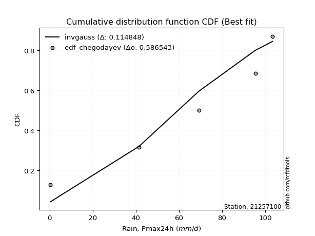</img></img>

</div>


### 6. EDF Blom (1958)

The Blom formula is a specific "plotting position" formula used in hydrology and statistical analysis to estimate the empirical cumulative probability (or non-exceedance probability) of a data series. It is particularly recommended for data that are approximately normally distributed. The constant _a_ is set to 0.375 (or 3/8).

<div align="center">


$P=(m-a)/(n+1-2a)$


</div>


**6.1. Empirical values**

<div align="center">

|                | 0                   | 1                   | 2        | 3                  | 4                  |
|:---------------|:--------------------|:--------------------|:---------|:-------------------|:-------------------|
| date           | 2021                | 2022                | 2024     | 2019               | 2020               |
| x              | 0.4                 | 41.4                | 69.2     | 95.4               | 103.4              |
| m              | 1                   | 2                   | 3        | 4                  | 5                  |
| empirical_dist | edf_blom            | edf_blom            | edf_blom | edf_blom           | edf_blom           |
| empirical      | 0.11904761904761904 | 0.30952380952380953 | 0.5      | 0.6904761904761905 | 0.8809523809523809 |
| empirical_tr   | 1.135135135135135   | 1.4482758620689655  | 2.0      | 3.230769230769231  | 8.399999999999999  |

</div>


**6.2. Kolmogorov-Smirnov fit test (sorted by Δ)**


<div align="center">

|                | 0                   | 1                   | 2                  | 3                   | 4                   | 5                   | 6                   | 7                   | 8                   | 9                   | 10                  | 11                 | 12                  | 13                  | 14                 | 15                  | 16                  | 17                  | 18                 | 19                  | 20                  | 21                  | 22                  | 23                  | 24                  | 25                  | 26                 | 27                  | 28                  | 29                 | 30                  | 31                  | 32                 | 33                  | 34                  | 35                 | 36                 | 37                    | 38                 | 39                  | 40                  | 41                  | 42                  | 43                  | 44                 | 45                  | 46                  | 47                 | 48                 | 49                  | 50                  | 51                  | 52                 | 53                  | 54                  | 55                  | 56                  | 57                 | 58                  | 59                  | 60                  | 61                 | 62                 | 63                 | 64                  | 65                 | 66                 | 67                  | 68                 | 69                  | 70                 | 71                  | 72                 | 73                 | 74                 | 75                 | 76                  | 77                 | 78                 | 79                 | 80                 | 81                 | 82                 | 83                 | 84                 | 85                 | 86                 | 87                 |
|:---------------|:--------------------|:--------------------|:-------------------|:--------------------|:--------------------|:--------------------|:--------------------|:--------------------|:--------------------|:--------------------|:--------------------|:-------------------|:--------------------|:--------------------|:-------------------|:--------------------|:--------------------|:--------------------|:-------------------|:--------------------|:--------------------|:--------------------|:--------------------|:--------------------|:--------------------|:--------------------|:-------------------|:--------------------|:--------------------|:-------------------|:--------------------|:--------------------|:-------------------|:--------------------|:--------------------|:-------------------|:-------------------|:----------------------|:-------------------|:--------------------|:--------------------|:--------------------|:--------------------|:--------------------|:-------------------|:--------------------|:--------------------|:-------------------|:-------------------|:--------------------|:--------------------|:--------------------|:-------------------|:--------------------|:--------------------|:--------------------|:--------------------|:-------------------|:--------------------|:--------------------|:--------------------|:-------------------|:-------------------|:-------------------|:--------------------|:-------------------|:-------------------|:--------------------|:-------------------|:--------------------|:-------------------|:--------------------|:-------------------|:-------------------|:-------------------|:-------------------|:--------------------|:-------------------|:-------------------|:-------------------|:-------------------|:-------------------|:-------------------|:-------------------|:-------------------|:-------------------|:-------------------|:-------------------|
| station        | 21257100            | 21257100            | 21257100           | 21257100            | 21257100            | 21257100            | 21257100            | 21257100            | 21257100            | 21257100            | 21257100            | 21257100           | 21257100            | 21257100            | 21257100           | 21257100            | 21257100            | 21257100            | 21257100           | 21257100            | 21257100            | 21257100            | 21257100            | 21257100            | 21257100            | 21257100            | 21257100           | 21257100            | 21257100            | 21257100           | 21257100            | 21257100            | 21257100           | 21257100            | 21257100            | 21257100           | 21257100           | 21257100              | 21257100           | 21257100            | 21257100            | 21257100            | 21257100            | 21257100            | 21257100           | 21257100            | 21257100            | 21257100           | 21257100           | 21257100            | 21257100            | 21257100            | 21257100           | 21257100            | 21257100            | 21257100            | 21257100            | 21257100           | 21257100            | 21257100            | 21257100            | 21257100           | 21257100           | 21257100           | 21257100            | 21257100           | 21257100           | 21257100            | 21257100           | 21257100            | 21257100           | 21257100            | 21257100           | 21257100           | 21257100           | 21257100           | 21257100            | 21257100           | 21257100           | 21257100           | 21257100           | 21257100           | 21257100           | 21257100           | 21257100           | 21257100           | 21257100           | 21257100           |
| empirical_dist | edf_blom            | edf_blom            | edf_blom           | edf_blom            | edf_blom            | edf_blom            | edf_blom            | edf_blom            | edf_blom            | edf_blom            | edf_blom            | edf_blom           | edf_blom            | edf_blom            | edf_blom           | edf_blom            | edf_blom            | edf_blom            | edf_blom           | edf_blom            | edf_blom            | edf_blom            | edf_blom            | edf_blom            | edf_blom            | edf_blom            | edf_blom           | edf_blom            | edf_blom            | edf_blom           | edf_blom            | edf_blom            | edf_blom           | edf_blom            | edf_blom            | edf_blom           | edf_blom           | edf_blom              | edf_blom           | edf_blom            | edf_blom            | edf_blom            | edf_blom            | edf_blom            | edf_blom           | edf_blom            | edf_blom            | edf_blom           | edf_blom           | edf_blom            | edf_blom            | edf_blom            | edf_blom           | edf_blom            | edf_blom            | edf_blom            | edf_blom            | edf_blom           | edf_blom            | edf_blom            | edf_blom            | edf_blom           | edf_blom           | edf_blom           | edf_blom            | edf_blom           | edf_blom           | edf_blom            | edf_blom           | edf_blom            | edf_blom           | edf_blom            | edf_blom           | edf_blom           | edf_blom           | edf_blom           | edf_blom            | edf_blom           | edf_blom           | edf_blom           | edf_blom           | edf_blom           | edf_blom           | edf_blom           | edf_blom           | edf_blom           | edf_blom           | edf_blom           |
| p_dist         | invgauss            | pearson3            | fatiguelife        | invgamma            | rice                | betaprime           | erlang              | crystalball         | norm                | exponnorm           | t                   | chi2               | gamma               | maxwell             | rayleigh           | weibull_min         | kstwobign           | gumbel_l            | halfnorm           | laplace_asymmetric  | logistic            | gumbel_r            | hypsecant           | laplace             | halflogistic        | moyal               | f                  | genexpon            | expon               | logpearson3        | logt                | loggompertz         | loggumbel_l        | mielke              | wald                | ncf                | logloggamma        | loglaplace_asymmetric | gibrat             | fisk                | lognakagami         | logcrystalball      | lognorm             | lognorm             | logexponnorm       | logrice             | lognct              | loggamma           | loggamma           | loginvweibull       | logjohnsonsu        | loglogistic         | loginvgamma        | logalpha            | loginvgauss         | loghypsecant        | logncf              | logmaxwell         | gompertz            | lograyleigh         | nakagami            | logkstwobign       | loglaplace         | loggenexpon        | logfisk             | loghalfnorm        | loggumbel_r        | logexpon            | nct                | loghalflogistic     | logmoyal           | loglognorm          | logf               | logwald            | invweibull         | loggibrat          | truncnorm           | logtruncnorm       | logweibull_min     | logfatiguelife     | logchi2            | logbetaprime       | logmielke          | logerlang          | johnsonsu          | alpha              | loggenlogistic     | genlogistic        |
| delta          | 0.10955653073042693 | 0.11954605380890737 | 0.120023439395739  | 0.12040319426045754 | 0.12041578999510505 | 0.12078565762672688 | 0.12139733536378305 | 0.12208891163446278 | 0.12208891301966507 | 0.12208943619517576 | 0.12211977901751958 | 0.1223542563051232 | 0.12290908330909678 | 0.12334283240516697 | 0.1237109873047626 | 0.12917600305938426 | 0.13398972279199584 | 0.13614150570521988 | 0.1391254916233553 | 0.14006358502798255 | 0.14287196407787672 | 0.14487476421626266 | 0.15470197543833764 | 0.16697972745342782 | 0.16710388299504086 | 0.16863480400037356 | 0.1711102064265193 | 0.17465847549649294 | 0.17672535867079187 | 0.1895127765939877 | 0.20766711697213025 | 0.21187847630853074 | 0.2180047478661281 | 0.22290719221698008 | 0.23488268394983725 | 0.2477324916209357 | 0.252624481558002  | 0.25294873296754317   | 0.2656569963269425 | 0.26580780516989966 | 0.27920061812414987 | 0.27968767196757993 | 0.27968785857084155 | 0.27968785857084155 | 0.2796882188489789 | 0.27969522678076786 | 0.27999829988867453 | 0.28290541946809   | 0.28290541946809   | 0.29026450256502245 | 0.29091181657510523 | 0.29133472343845024 | 0.2977881169409434 | 0.29868057525067826 | 0.29996025901506607 | 0.30094805902248656 | 0.30299724183511323 | 0.3071400672938507 | 0.30952380952300235 | 0.31572193440498275 | 0.31762283662247703 | 0.3246795202896431 | 0.3270129729785719 | 0.3359906609593779 | 0.33918720668801094 | 0.3400845789057424 | 0.3472338849844726 | 0.36226447314854615 | 0.3639600325741976 | 0.36827547298245844 | 0.3704943244388741 | 0.39124566890801726 | 0.4128445310207689 | 0.4352023770200161 | 0.4432081739850404 | 0.4665453997354936 | 0.48101917008694783 | 0.5236508377413265 | 0.5649445173519374 | 0.5942358787789155 | 0.6014616609868539 | 0.6036355200838939 | 0.6288475526904741 | 0.6479049875071216 | 0.669753375020424  | 0.6732936333902464 | 0.6904761904761905 | 0.6904761904761905 |
| deltao         | 0.5865427407550001  | 0.5865427407550001  | 0.5865427407550001 | 0.5865427407550001  | 0.5865427407550001  | 0.5865427407550001  | 0.5865427407550001  | 0.5865427407550001  | 0.5865427407550001  | 0.5865427407550001  | 0.5865427407550001  | 0.5865427407550001 | 0.5865427407550001  | 0.5865427407550001  | 0.5865427407550001 | 0.5865427407550001  | 0.5865427407550001  | 0.5865427407550001  | 0.5865427407550001 | 0.5865427407550001  | 0.5865427407550001  | 0.5865427407550001  | 0.5865427407550001  | 0.5865427407550001  | 0.5865427407550001  | 0.5865427407550001  | 0.5865427407550001 | 0.5865427407550001  | 0.5865427407550001  | 0.5865427407550001 | 0.5865427407550001  | 0.5865427407550001  | 0.5865427407550001 | 0.5865427407550001  | 0.5865427407550001  | 0.5865427407550001 | 0.5865427407550001 | 0.5865427407550001    | 0.5865427407550001 | 0.5865427407550001  | 0.5865427407550001  | 0.5865427407550001  | 0.5865427407550001  | 0.5865427407550001  | 0.5865427407550001 | 0.5865427407550001  | 0.5865427407550001  | 0.5865427407550001 | 0.5865427407550001 | 0.5865427407550001  | 0.5865427407550001  | 0.5865427407550001  | 0.5865427407550001 | 0.5865427407550001  | 0.5865427407550001  | 0.5865427407550001  | 0.5865427407550001  | 0.5865427407550001 | 0.5865427407550001  | 0.5865427407550001  | 0.5865427407550001  | 0.5865427407550001 | 0.5865427407550001 | 0.5865427407550001 | 0.5865427407550001  | 0.5865427407550001 | 0.5865427407550001 | 0.5865427407550001  | 0.5865427407550001 | 0.5865427407550001  | 0.5865427407550001 | 0.5865427407550001  | 0.5865427407550001 | 0.5865427407550001 | 0.5865427407550001 | 0.5865427407550001 | 0.5865427407550001  | 0.5865427407550001 | 0.5865427407550001 | 0.5865427407550001 | 0.5865427407550001 | 0.5865427407550001 | 0.5865427407550001 | 0.5865427407550001 | 0.5865427407550001 | 0.5865427407550001 | 0.5865427407550001 | 0.5865427407550001 |
| eval           | Δo > Δ              | Δo > Δ              | Δo > Δ             | Δo > Δ              | Δo > Δ              | Δo > Δ              | Δo > Δ              | Δo > Δ              | Δo > Δ              | Δo > Δ              | Δo > Δ              | Δo > Δ             | Δo > Δ              | Δo > Δ              | Δo > Δ             | Δo > Δ              | Δo > Δ              | Δo > Δ              | Δo > Δ             | Δo > Δ              | Δo > Δ              | Δo > Δ              | Δo > Δ              | Δo > Δ              | Δo > Δ              | Δo > Δ              | Δo > Δ             | Δo > Δ              | Δo > Δ              | Δo > Δ             | Δo > Δ              | Δo > Δ              | Δo > Δ             | Δo > Δ              | Δo > Δ              | Δo > Δ             | Δo > Δ             | Δo > Δ                | Δo > Δ             | Δo > Δ              | Δo > Δ              | Δo > Δ              | Δo > Δ              | Δo > Δ              | Δo > Δ             | Δo > Δ              | Δo > Δ              | Δo > Δ             | Δo > Δ             | Δo > Δ              | Δo > Δ              | Δo > Δ              | Δo > Δ             | Δo > Δ              | Δo > Δ              | Δo > Δ              | Δo > Δ              | Δo > Δ             | Δo > Δ              | Δo > Δ              | Δo > Δ              | Δo > Δ             | Δo > Δ             | Δo > Δ             | Δo > Δ              | Δo > Δ             | Δo > Δ             | Δo > Δ              | Δo > Δ             | Δo > Δ              | Δo > Δ             | Δo > Δ              | Δo > Δ             | Δo > Δ             | Δo > Δ             | Δo > Δ             | Δo > Δ              | Δo > Δ             | Δo > Δ             | Δo <= Δ            | Δo <= Δ            | Δo <= Δ            | Δo <= Δ            | Δo <= Δ            | Δo <= Δ            | Δo <= Δ            | Δo <= Δ            | Δo <= Δ            |
| fit            | 1                   | 1                   | 1                  | 1                   | 1                   | 1                   | 1                   | 1                   | 1                   | 1                   | 1                   | 1                  | 1                   | 1                   | 1                  | 1                   | 1                   | 1                   | 1                  | 1                   | 1                   | 1                   | 1                   | 1                   | 1                   | 1                   | 1                  | 1                   | 1                   | 1                  | 1                   | 1                   | 1                  | 1                   | 1                   | 1                  | 1                  | 1                     | 1                  | 1                   | 1                   | 1                   | 1                   | 1                   | 1                  | 1                   | 1                   | 1                  | 1                  | 1                   | 1                   | 1                   | 1                  | 1                   | 1                   | 1                   | 1                   | 1                  | 1                   | 1                   | 1                   | 1                  | 1                  | 1                  | 1                   | 1                  | 1                  | 1                   | 1                  | 1                   | 1                  | 1                   | 1                  | 1                  | 1                  | 1                  | 1                   | 1                  | 1                  | 0                  | 0                  | 0                  | 0                  | 0                  | 0                  | 0                  | 0                  | 0                  |
| n              | 5                   | 5                   | 5                  | 5                   | 5                   | 5                   | 5                   | 5                   | 5                   | 5                   | 5                   | 5                  | 5                   | 5                   | 5                  | 5                   | 5                   | 5                   | 5                  | 5                   | 5                   | 5                   | 5                   | 5                   | 5                   | 5                   | 5                  | 5                   | 5                   | 5                  | 5                   | 5                   | 5                  | 5                   | 5                   | 5                  | 5                  | 5                     | 5                  | 5                   | 5                   | 5                   | 5                   | 5                   | 5                  | 5                   | 5                   | 5                  | 5                  | 5                   | 5                   | 5                   | 5                  | 5                   | 5                   | 5                   | 5                   | 5                  | 5                   | 5                   | 5                   | 5                  | 5                  | 5                  | 5                   | 5                  | 5                  | 5                   | 5                  | 5                   | 5                  | 5                   | 5                  | 5                  | 5                  | 5                  | 5                   | 5                  | 5                  | 5                  | 5                  | 5                  | 5                  | 5                  | 5                  | 5                  | 5                  | 5                  |
| best_fit       | 1                   | 0                   | 0                  | 0                   | 0                   | 0                   | 0                   | 0                   | 0                   | 0                   | 0                   | 0                  | 0                   | 0                   | 0                  | 0                   | 0                   | 0                   | 0                  | 0                   | 0                   | 0                   | 0                   | 0                   | 0                   | 0                   | 0                  | 0                   | 0                   | 0                  | 0                   | 0                   | 0                  | 0                   | 0                   | 0                  | 0                  | 0                     | 0                  | 0                   | 0                   | 0                   | 0                   | 0                   | 0                  | 0                   | 0                   | 0                  | 0                  | 0                   | 0                   | 0                   | 0                  | 0                   | 0                   | 0                   | 0                   | 0                  | 0                   | 0                   | 0                   | 0                  | 0                  | 0                  | 0                   | 0                  | 0                  | 0                   | 0                  | 0                   | 0                  | 0                   | 0                  | 0                  | 0                  | 0                  | 0                   | 0                  | 0                  | 0                  | 0                  | 0                  | 0                  | 0                  | 0                  | 0                  | 0                  | 0                  |
| best_fit_sort  | 1                   | 2                   | 3                  | 4                   | 5                   | 6                   | 7                   | 8                   | 9                   | 10                  | 11                  | 12                 | 13                  | 14                  | 15                 | 16                  | 17                  | 18                  | 19                 | 20                  | 21                  | 22                  | 23                  | 24                  | 25                  | 26                  | 27                 | 28                  | 29                  | 30                 | 31                  | 32                  | 33                 | 34                  | 35                  | 36                 | 37                 | 38                    | 39                 | 40                  | 41                  | 42                  | 43                  | 44                  | 45                 | 46                  | 47                  | 48                 | 49                 | 50                  | 51                  | 52                  | 53                 | 54                  | 55                  | 56                  | 57                  | 58                 | 59                  | 60                  | 61                  | 62                 | 63                 | 64                 | 65                  | 66                 | 67                 | 68                  | 69                 | 70                  | 71                 | 72                  | 73                 | 74                 | 75                 | 76                 | 77                  | 78                 | 79                 | 80                 | 81                 | 82                 | 83                 | 84                 | 85                 | 86                 | 87                 | 88                 |

</div>


**6.3. Best fit**

<div align="center">

|   id |   station | empirical_dist   | p_dist   |    delta |   deltao | eval   |   fit |   n |   best_fit |   best_fit_sort |
|-----:|----------:|:-----------------|:---------|---------:|---------:|:-------|------:|----:|-----------:|----------------:|
|    0 |  21257100 | edf_blom         | invgauss | 0.109557 | 0.586543 | Δo > Δ |     1 |   5 |          1 |               1 |

</div>


<div align="center">

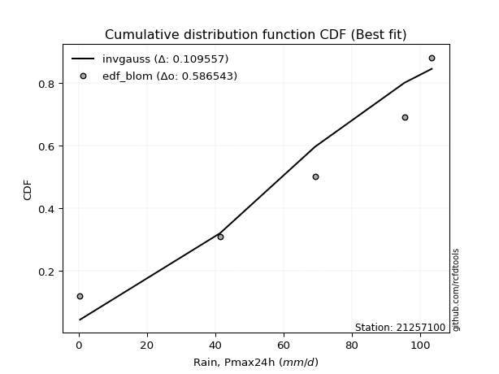</img></img>

</div>


### 7. EDF Tukey (1962)

In hydrology, the Tukey formula is used as a plotting position formula to estimate the empirical probability or frequency of a flood event (or other hydrological data). The formula parameter is given as _c=0.333_ (or 1/3).

<div align="center">


$P=(m-c)/(n+1-2c)$


</div>


**7.1. Empirical values**

<div align="center">

|                | 0                  | 1                  | 2         | 3         | 4         |
|:---------------|:-------------------|:-------------------|:----------|:----------|:----------|
| date           | 2021               | 2022               | 2024      | 2019      | 2020      |
| x              | 0.4                | 41.4               | 69.2      | 95.4      | 103.4     |
| m              | 1                  | 2                  | 3         | 4         | 5         |
| empirical_dist | edf_tukey          | edf_tukey          | edf_tukey | edf_tukey | edf_tukey |
| empirical      | 0.125              | 0.3125             | 0.5       | 0.6875    | 0.875     |
| empirical_tr   | 1.1428571428571428 | 1.4545454545454546 | 2.0       | 3.2       | 8.0       |

</div>


**7.2. Kolmogorov-Smirnov fit test (sorted by Δ)**


<div align="center">

|                | 0                   | 1                   | 2                   | 3                  | 4                   | 5                   | 6                   | 7                   | 8                   | 9                   | 10                  | 11                  | 12                  | 13                  | 14                  | 15                  | 16                  | 17                  | 18                 | 19                  | 20                 | 21                  | 22                 | 23                  | 24                  | 25                  | 26                  | 27                  | 28                 | 29                  | 30                  | 31                  | 32                  | 33                  | 34                  | 35                 | 36                  | 37                    | 38                 | 39                 | 40                 | 41                  | 42                 | 43                 | 44                 | 45                 | 46                  | 47                  | 48                  | 49                 | 50                  | 51                 | 52                  | 53                 | 54                 | 55                 | 56                  | 57                 | 58                 | 59                 | 60                  | 61                 | 62                  | 63                  | 64                 | 65                  | 66                  | 67                 | 68                  | 69                 | 70                 | 71                 | 72                  | 73                 | 74                 | 75                 | 76                  | 77                 | 78                 | 79                 | 80                 | 81                 | 82                 | 83                 | 84                 | 85                 | 86                 | 87                 |
|:---------------|:--------------------|:--------------------|:--------------------|:-------------------|:--------------------|:--------------------|:--------------------|:--------------------|:--------------------|:--------------------|:--------------------|:--------------------|:--------------------|:--------------------|:--------------------|:--------------------|:--------------------|:--------------------|:-------------------|:--------------------|:-------------------|:--------------------|:-------------------|:--------------------|:--------------------|:--------------------|:--------------------|:--------------------|:-------------------|:--------------------|:--------------------|:--------------------|:--------------------|:--------------------|:--------------------|:-------------------|:--------------------|:----------------------|:-------------------|:-------------------|:-------------------|:--------------------|:-------------------|:-------------------|:-------------------|:-------------------|:--------------------|:--------------------|:--------------------|:-------------------|:--------------------|:-------------------|:--------------------|:-------------------|:-------------------|:-------------------|:--------------------|:-------------------|:-------------------|:-------------------|:--------------------|:-------------------|:--------------------|:--------------------|:-------------------|:--------------------|:--------------------|:-------------------|:--------------------|:-------------------|:-------------------|:-------------------|:--------------------|:-------------------|:-------------------|:-------------------|:--------------------|:-------------------|:-------------------|:-------------------|:-------------------|:-------------------|:-------------------|:-------------------|:-------------------|:-------------------|:-------------------|:-------------------|
| station        | 21257100            | 21257100            | 21257100            | 21257100           | 21257100            | 21257100            | 21257100            | 21257100            | 21257100            | 21257100            | 21257100            | 21257100            | 21257100            | 21257100            | 21257100            | 21257100            | 21257100            | 21257100            | 21257100           | 21257100            | 21257100           | 21257100            | 21257100           | 21257100            | 21257100            | 21257100            | 21257100            | 21257100            | 21257100           | 21257100            | 21257100            | 21257100            | 21257100            | 21257100            | 21257100            | 21257100           | 21257100            | 21257100              | 21257100           | 21257100           | 21257100           | 21257100            | 21257100           | 21257100           | 21257100           | 21257100           | 21257100            | 21257100            | 21257100            | 21257100           | 21257100            | 21257100           | 21257100            | 21257100           | 21257100           | 21257100           | 21257100            | 21257100           | 21257100           | 21257100           | 21257100            | 21257100           | 21257100            | 21257100            | 21257100           | 21257100            | 21257100            | 21257100           | 21257100            | 21257100           | 21257100           | 21257100           | 21257100            | 21257100           | 21257100           | 21257100           | 21257100            | 21257100           | 21257100           | 21257100           | 21257100           | 21257100           | 21257100           | 21257100           | 21257100           | 21257100           | 21257100           | 21257100           |
| empirical_dist | edf_tukey           | edf_tukey           | edf_tukey           | edf_tukey          | edf_tukey           | edf_tukey           | edf_tukey           | edf_tukey           | edf_tukey           | edf_tukey           | edf_tukey           | edf_tukey           | edf_tukey           | edf_tukey           | edf_tukey           | edf_tukey           | edf_tukey           | edf_tukey           | edf_tukey          | edf_tukey           | edf_tukey          | edf_tukey           | edf_tukey          | edf_tukey           | edf_tukey           | edf_tukey           | edf_tukey           | edf_tukey           | edf_tukey          | edf_tukey           | edf_tukey           | edf_tukey           | edf_tukey           | edf_tukey           | edf_tukey           | edf_tukey          | edf_tukey           | edf_tukey             | edf_tukey          | edf_tukey          | edf_tukey          | edf_tukey           | edf_tukey          | edf_tukey          | edf_tukey          | edf_tukey          | edf_tukey           | edf_tukey           | edf_tukey           | edf_tukey          | edf_tukey           | edf_tukey          | edf_tukey           | edf_tukey          | edf_tukey          | edf_tukey          | edf_tukey           | edf_tukey          | edf_tukey          | edf_tukey          | edf_tukey           | edf_tukey          | edf_tukey           | edf_tukey           | edf_tukey          | edf_tukey           | edf_tukey           | edf_tukey          | edf_tukey           | edf_tukey          | edf_tukey          | edf_tukey          | edf_tukey           | edf_tukey          | edf_tukey          | edf_tukey          | edf_tukey           | edf_tukey          | edf_tukey          | edf_tukey          | edf_tukey          | edf_tukey          | edf_tukey          | edf_tukey          | edf_tukey          | edf_tukey          | edf_tukey          | edf_tukey          |
| p_dist         | invgauss            | pearson3            | fatiguelife         | invgamma           | rice                | betaprime           | erlang              | crystalball         | norm                | exponnorm           | t                   | chi2                | gamma               | maxwell             | rayleigh            | weibull_min         | kstwobign           | gumbel_l            | halfnorm           | laplace_asymmetric  | logistic           | gumbel_r            | hypsecant          | halflogistic        | f                   | moyal               | laplace             | genexpon            | expon              | logpearson3         | logt                | loggompertz         | loggumbel_l         | mielke              | wald                | ncf                | logloggamma         | loglaplace_asymmetric | fisk               | gibrat             | lognakagami        | logcrystalball      | lognorm            | lognorm            | logexponnorm       | logrice            | lognct              | loggamma            | loggamma            | loginvweibull      | logjohnsonsu        | loglogistic        | loginvgamma         | logalpha           | loginvgauss        | loghypsecant       | logncf              | logmaxwell         | gompertz           | lograyleigh        | nakagami            | logkstwobign       | loglaplace          | loggenexpon         | logfisk            | loghalfnorm         | loggumbel_r         | logexpon           | nct                 | loghalflogistic    | logmoyal           | loglognorm         | logf                | logwald            | invweibull         | loggibrat          | truncnorm           | logtruncnorm       | logweibull_min     | logfatiguelife     | logchi2            | logbetaprime       | logmielke          | logerlang          | johnsonsu          | alpha              | loggenlogistic     | genlogistic        |
| delta          | 0.11253272120661739 | 0.12252224428509784 | 0.12299962987192947 | 0.123379384736648  | 0.12339198047129551 | 0.12376184810291735 | 0.12437352583997352 | 0.12506510211065325 | 0.12506510349585553 | 0.12506562667136623 | 0.12509596949371005 | 0.12533044678131366 | 0.12588527378528724 | 0.12631902288135743 | 0.12668717778095306 | 0.13215219353557472 | 0.13398972279199584 | 0.13911769618141034 | 0.1391254916233553 | 0.14303977550417302 | 0.1458481545540672 | 0.14785095469245313 | 0.1576781659145281 | 0.16710388299504086 | 0.16813401595032884 | 0.16863480400037356 | 0.16995591792961828 | 0.17168228502030247 | 0.1737491681946014 | 0.18653658611779722 | 0.20171473601974932 | 0.20890228583234027 | 0.21502855738993765 | 0.22290719221698008 | 0.23488268394983725 | 0.2477324916209357 | 0.25560067203419246 | 0.25592492344373363   | 0.2598554242175187 | 0.2656569963269425 | 0.2762244276479594 | 0.27671148149138947 | 0.2767116680946511 | 0.2767116680946511 | 0.2767120283727884 | 0.2767190363045774 | 0.27702210941248406 | 0.27992922899189954 | 0.27992922899189954 | 0.287288312088832  | 0.28793562609891477 | 0.2883585329622598 | 0.29481192646475296 | 0.2957043847744878 | 0.2969840685388756 | 0.2979718685462961 | 0.30002105135892276 | 0.3041638768176602 | 0.3124999999991928 | 0.3127457439287923 | 0.31464664614628657 | 0.3217033298134526 | 0.32403678250238144 | 0.33301447048318744 | 0.33323482573563   | 0.33710838842955193 | 0.34425769450828214 | 0.3592882826723557 | 0.36098384209800716 | 0.365299282506268  | 0.3675181339626836 | 0.3882694784318268 | 0.40986834054457844 | 0.4322261865438256 | 0.4372557930326595 | 0.4635692092593031 | 0.47804297961075737 | 0.520674647265136  | 0.5619683268757469 | 0.591259688302725  | 0.5984854705106635 | 0.6006593296077034 | 0.6258713622142836 | 0.6449287970309311 | 0.6667771845442335 | 0.6703174429140559 | 0.6875             | 0.6875             |
| deltao         | 0.5865427407550001  | 0.5865427407550001  | 0.5865427407550001  | 0.5865427407550001 | 0.5865427407550001  | 0.5865427407550001  | 0.5865427407550001  | 0.5865427407550001  | 0.5865427407550001  | 0.5865427407550001  | 0.5865427407550001  | 0.5865427407550001  | 0.5865427407550001  | 0.5865427407550001  | 0.5865427407550001  | 0.5865427407550001  | 0.5865427407550001  | 0.5865427407550001  | 0.5865427407550001 | 0.5865427407550001  | 0.5865427407550001 | 0.5865427407550001  | 0.5865427407550001 | 0.5865427407550001  | 0.5865427407550001  | 0.5865427407550001  | 0.5865427407550001  | 0.5865427407550001  | 0.5865427407550001 | 0.5865427407550001  | 0.5865427407550001  | 0.5865427407550001  | 0.5865427407550001  | 0.5865427407550001  | 0.5865427407550001  | 0.5865427407550001 | 0.5865427407550001  | 0.5865427407550001    | 0.5865427407550001 | 0.5865427407550001 | 0.5865427407550001 | 0.5865427407550001  | 0.5865427407550001 | 0.5865427407550001 | 0.5865427407550001 | 0.5865427407550001 | 0.5865427407550001  | 0.5865427407550001  | 0.5865427407550001  | 0.5865427407550001 | 0.5865427407550001  | 0.5865427407550001 | 0.5865427407550001  | 0.5865427407550001 | 0.5865427407550001 | 0.5865427407550001 | 0.5865427407550001  | 0.5865427407550001 | 0.5865427407550001 | 0.5865427407550001 | 0.5865427407550001  | 0.5865427407550001 | 0.5865427407550001  | 0.5865427407550001  | 0.5865427407550001 | 0.5865427407550001  | 0.5865427407550001  | 0.5865427407550001 | 0.5865427407550001  | 0.5865427407550001 | 0.5865427407550001 | 0.5865427407550001 | 0.5865427407550001  | 0.5865427407550001 | 0.5865427407550001 | 0.5865427407550001 | 0.5865427407550001  | 0.5865427407550001 | 0.5865427407550001 | 0.5865427407550001 | 0.5865427407550001 | 0.5865427407550001 | 0.5865427407550001 | 0.5865427407550001 | 0.5865427407550001 | 0.5865427407550001 | 0.5865427407550001 | 0.5865427407550001 |
| eval           | Δo > Δ              | Δo > Δ              | Δo > Δ              | Δo > Δ             | Δo > Δ              | Δo > Δ              | Δo > Δ              | Δo > Δ              | Δo > Δ              | Δo > Δ              | Δo > Δ              | Δo > Δ              | Δo > Δ              | Δo > Δ              | Δo > Δ              | Δo > Δ              | Δo > Δ              | Δo > Δ              | Δo > Δ             | Δo > Δ              | Δo > Δ             | Δo > Δ              | Δo > Δ             | Δo > Δ              | Δo > Δ              | Δo > Δ              | Δo > Δ              | Δo > Δ              | Δo > Δ             | Δo > Δ              | Δo > Δ              | Δo > Δ              | Δo > Δ              | Δo > Δ              | Δo > Δ              | Δo > Δ             | Δo > Δ              | Δo > Δ                | Δo > Δ             | Δo > Δ             | Δo > Δ             | Δo > Δ              | Δo > Δ             | Δo > Δ             | Δo > Δ             | Δo > Δ             | Δo > Δ              | Δo > Δ              | Δo > Δ              | Δo > Δ             | Δo > Δ              | Δo > Δ             | Δo > Δ              | Δo > Δ             | Δo > Δ             | Δo > Δ             | Δo > Δ              | Δo > Δ             | Δo > Δ             | Δo > Δ             | Δo > Δ              | Δo > Δ             | Δo > Δ              | Δo > Δ              | Δo > Δ             | Δo > Δ              | Δo > Δ              | Δo > Δ             | Δo > Δ              | Δo > Δ             | Δo > Δ             | Δo > Δ             | Δo > Δ              | Δo > Δ             | Δo > Δ             | Δo > Δ             | Δo > Δ              | Δo > Δ             | Δo > Δ             | Δo <= Δ            | Δo <= Δ            | Δo <= Δ            | Δo <= Δ            | Δo <= Δ            | Δo <= Δ            | Δo <= Δ            | Δo <= Δ            | Δo <= Δ            |
| fit            | 1                   | 1                   | 1                   | 1                  | 1                   | 1                   | 1                   | 1                   | 1                   | 1                   | 1                   | 1                   | 1                   | 1                   | 1                   | 1                   | 1                   | 1                   | 1                  | 1                   | 1                  | 1                   | 1                  | 1                   | 1                   | 1                   | 1                   | 1                   | 1                  | 1                   | 1                   | 1                   | 1                   | 1                   | 1                   | 1                  | 1                   | 1                     | 1                  | 1                  | 1                  | 1                   | 1                  | 1                  | 1                  | 1                  | 1                   | 1                   | 1                   | 1                  | 1                   | 1                  | 1                   | 1                  | 1                  | 1                  | 1                   | 1                  | 1                  | 1                  | 1                   | 1                  | 1                   | 1                   | 1                  | 1                   | 1                   | 1                  | 1                   | 1                  | 1                  | 1                  | 1                   | 1                  | 1                  | 1                  | 1                   | 1                  | 1                  | 0                  | 0                  | 0                  | 0                  | 0                  | 0                  | 0                  | 0                  | 0                  |
| n              | 5                   | 5                   | 5                   | 5                  | 5                   | 5                   | 5                   | 5                   | 5                   | 5                   | 5                   | 5                   | 5                   | 5                   | 5                   | 5                   | 5                   | 5                   | 5                  | 5                   | 5                  | 5                   | 5                  | 5                   | 5                   | 5                   | 5                   | 5                   | 5                  | 5                   | 5                   | 5                   | 5                   | 5                   | 5                   | 5                  | 5                   | 5                     | 5                  | 5                  | 5                  | 5                   | 5                  | 5                  | 5                  | 5                  | 5                   | 5                   | 5                   | 5                  | 5                   | 5                  | 5                   | 5                  | 5                  | 5                  | 5                   | 5                  | 5                  | 5                  | 5                   | 5                  | 5                   | 5                   | 5                  | 5                   | 5                   | 5                  | 5                   | 5                  | 5                  | 5                  | 5                   | 5                  | 5                  | 5                  | 5                   | 5                  | 5                  | 5                  | 5                  | 5                  | 5                  | 5                  | 5                  | 5                  | 5                  | 5                  |
| best_fit       | 1                   | 0                   | 0                   | 0                  | 0                   | 0                   | 0                   | 0                   | 0                   | 0                   | 0                   | 0                   | 0                   | 0                   | 0                   | 0                   | 0                   | 0                   | 0                  | 0                   | 0                  | 0                   | 0                  | 0                   | 0                   | 0                   | 0                   | 0                   | 0                  | 0                   | 0                   | 0                   | 0                   | 0                   | 0                   | 0                  | 0                   | 0                     | 0                  | 0                  | 0                  | 0                   | 0                  | 0                  | 0                  | 0                  | 0                   | 0                   | 0                   | 0                  | 0                   | 0                  | 0                   | 0                  | 0                  | 0                  | 0                   | 0                  | 0                  | 0                  | 0                   | 0                  | 0                   | 0                   | 0                  | 0                   | 0                   | 0                  | 0                   | 0                  | 0                  | 0                  | 0                   | 0                  | 0                  | 0                  | 0                   | 0                  | 0                  | 0                  | 0                  | 0                  | 0                  | 0                  | 0                  | 0                  | 0                  | 0                  |
| best_fit_sort  | 1                   | 2                   | 3                   | 4                  | 5                   | 6                   | 7                   | 8                   | 9                   | 10                  | 11                  | 12                  | 13                  | 14                  | 15                  | 16                  | 17                  | 18                  | 19                 | 20                  | 21                 | 22                  | 23                 | 24                  | 25                  | 26                  | 27                  | 28                  | 29                 | 30                  | 31                  | 32                  | 33                  | 34                  | 35                  | 36                 | 37                  | 38                    | 39                 | 40                 | 41                 | 42                  | 43                 | 44                 | 45                 | 46                 | 47                  | 48                  | 49                  | 50                 | 51                  | 52                 | 53                  | 54                 | 55                 | 56                 | 57                  | 58                 | 59                 | 60                 | 61                  | 62                 | 63                  | 64                  | 65                 | 66                  | 67                  | 68                 | 69                  | 70                 | 71                 | 72                 | 73                  | 74                 | 75                 | 76                 | 77                  | 78                 | 79                 | 80                 | 81                 | 82                 | 83                 | 84                 | 85                 | 86                 | 87                 | 88                 |

</div>


**7.3. Best fit**

<div align="center">

|   id |   station | empirical_dist   | p_dist   |    delta |   deltao | eval   |   fit |   n |   best_fit |   best_fit_sort |
|-----:|----------:|:-----------------|:---------|---------:|---------:|:-------|------:|----:|-----------:|----------------:|
|    0 |  21257100 | edf_tukey        | invgauss | 0.112533 | 0.586543 | Δo > Δ |     1 |   5 |          1 |               1 |

</div>


<div align="center">

</img></img>

</div>


### 8. EDF Gringorten (1963)

Gringorten plotting position formula is essential for estimating the probability and return periods of extreme events like floods and heavy rainfall. The constant _a=0.44_.

<div align="center">


$P=(m-a)/(n+1-2a)$


</div>


**8.1. Empirical values**

<div align="center">

|                | 0                   | 1                  | 2              | 3                 | 4                  |
|:---------------|:--------------------|:-------------------|:---------------|:------------------|:-------------------|
| date           | 2021                | 2022               | 2024           | 2019              | 2020               |
| x              | 0.4                 | 41.4               | 69.2           | 95.4              | 103.4              |
| m              | 1                   | 2                  | 3              | 4                 | 5                  |
| empirical_dist | edf_gringorten      | edf_gringorten     | edf_gringorten | edf_gringorten    | edf_gringorten     |
| empirical      | 0.10937500000000001 | 0.3046875          | 0.5            | 0.6953125         | 0.8906249999999999 |
| empirical_tr   | 1.1228070175438596  | 1.4382022471910112 | 2.0            | 3.282051282051282 | 9.142857142857133  |

</div>


**8.2. Kolmogorov-Smirnov fit test (sorted by Δ)**


<div align="center">

|                | 0                   | 1                   | 2                   | 3                  | 4                   | 5                   | 6                   | 7                   | 8                   | 9                   | 10                  | 11                  | 12                  | 13                  | 14                  | 15                  | 16                  | 17                  | 18                  | 19                 | 20                 | 21                  | 22                 | 23                  | 24                  | 25                  | 26                  | 27                  | 28                 | 29                  | 30                  | 31                 | 32                  | 33                  | 34                  | 35                  | 36                    | 37                  | 38                 | 39                 | 40                 | 41                  | 42                 | 43                 | 44                 | 45                 | 46                  | 47                  | 48                  | 49                 | 50                  | 51                 | 52                  | 53                 | 54                 | 55                 | 56                 | 57                  | 58                 | 59                 | 60                  | 61                 | 62                  | 63                  | 64                  | 65                 | 66                  | 67                 | 68                  | 69                 | 70                 | 71                 | 72                  | 73                 | 74                 | 75                 | 76                  | 77                 | 78                 | 79                 | 80                 | 81                 | 82                 | 83                 | 84                 | 85                 | 86                 | 87                 |
|:---------------|:--------------------|:--------------------|:--------------------|:-------------------|:--------------------|:--------------------|:--------------------|:--------------------|:--------------------|:--------------------|:--------------------|:--------------------|:--------------------|:--------------------|:--------------------|:--------------------|:--------------------|:--------------------|:--------------------|:-------------------|:-------------------|:--------------------|:-------------------|:--------------------|:--------------------|:--------------------|:--------------------|:--------------------|:-------------------|:--------------------|:--------------------|:-------------------|:--------------------|:--------------------|:--------------------|:--------------------|:----------------------|:--------------------|:-------------------|:-------------------|:-------------------|:--------------------|:-------------------|:-------------------|:-------------------|:-------------------|:--------------------|:--------------------|:--------------------|:-------------------|:--------------------|:-------------------|:--------------------|:-------------------|:-------------------|:-------------------|:-------------------|:--------------------|:-------------------|:-------------------|:--------------------|:-------------------|:--------------------|:--------------------|:--------------------|:-------------------|:--------------------|:-------------------|:--------------------|:-------------------|:-------------------|:-------------------|:--------------------|:-------------------|:-------------------|:-------------------|:--------------------|:-------------------|:-------------------|:-------------------|:-------------------|:-------------------|:-------------------|:-------------------|:-------------------|:-------------------|:-------------------|:-------------------|
| station        | 21257100            | 21257100            | 21257100            | 21257100           | 21257100            | 21257100            | 21257100            | 21257100            | 21257100            | 21257100            | 21257100            | 21257100            | 21257100            | 21257100            | 21257100            | 21257100            | 21257100            | 21257100            | 21257100            | 21257100           | 21257100           | 21257100            | 21257100           | 21257100            | 21257100            | 21257100            | 21257100            | 21257100            | 21257100           | 21257100            | 21257100            | 21257100           | 21257100            | 21257100            | 21257100            | 21257100            | 21257100              | 21257100            | 21257100           | 21257100           | 21257100           | 21257100            | 21257100           | 21257100           | 21257100           | 21257100           | 21257100            | 21257100            | 21257100            | 21257100           | 21257100            | 21257100           | 21257100            | 21257100           | 21257100           | 21257100           | 21257100           | 21257100            | 21257100           | 21257100           | 21257100            | 21257100           | 21257100            | 21257100            | 21257100            | 21257100           | 21257100            | 21257100           | 21257100            | 21257100           | 21257100           | 21257100           | 21257100            | 21257100           | 21257100           | 21257100           | 21257100            | 21257100           | 21257100           | 21257100           | 21257100           | 21257100           | 21257100           | 21257100           | 21257100           | 21257100           | 21257100           | 21257100           |
| empirical_dist | edf_gringorten      | edf_gringorten      | edf_gringorten      | edf_gringorten     | edf_gringorten      | edf_gringorten      | edf_gringorten      | edf_gringorten      | edf_gringorten      | edf_gringorten      | edf_gringorten      | edf_gringorten      | edf_gringorten      | edf_gringorten      | edf_gringorten      | edf_gringorten      | edf_gringorten      | edf_gringorten      | edf_gringorten      | edf_gringorten     | edf_gringorten     | edf_gringorten      | edf_gringorten     | edf_gringorten      | edf_gringorten      | edf_gringorten      | edf_gringorten      | edf_gringorten      | edf_gringorten     | edf_gringorten      | edf_gringorten      | edf_gringorten     | edf_gringorten      | edf_gringorten      | edf_gringorten      | edf_gringorten      | edf_gringorten        | edf_gringorten      | edf_gringorten     | edf_gringorten     | edf_gringorten     | edf_gringorten      | edf_gringorten     | edf_gringorten     | edf_gringorten     | edf_gringorten     | edf_gringorten      | edf_gringorten      | edf_gringorten      | edf_gringorten     | edf_gringorten      | edf_gringorten     | edf_gringorten      | edf_gringorten     | edf_gringorten     | edf_gringorten     | edf_gringorten     | edf_gringorten      | edf_gringorten     | edf_gringorten     | edf_gringorten      | edf_gringorten     | edf_gringorten      | edf_gringorten      | edf_gringorten      | edf_gringorten     | edf_gringorten      | edf_gringorten     | edf_gringorten      | edf_gringorten     | edf_gringorten     | edf_gringorten     | edf_gringorten      | edf_gringorten     | edf_gringorten     | edf_gringorten     | edf_gringorten      | edf_gringorten     | edf_gringorten     | edf_gringorten     | edf_gringorten     | edf_gringorten     | edf_gringorten     | edf_gringorten     | edf_gringorten     | edf_gringorten     | edf_gringorten     | edf_gringorten     |
| p_dist         | invgauss            | pearson3            | fatiguelife         | invgamma           | rice                | betaprime           | erlang              | crystalball         | norm                | exponnorm           | t                   | chi2                | gamma               | maxwell             | rayleigh            | weibull_min         | gumbel_l            | kstwobign           | laplace_asymmetric  | logistic           | halfnorm           | gumbel_r            | hypsecant          | laplace             | halflogistic        | moyal               | f                   | genexpon            | expon              | logpearson3         | loggompertz         | logt               | loggumbel_l         | mielke              | wald                | logloggamma         | loglaplace_asymmetric | ncf                 | gibrat             | fisk               | lognakagami        | logcrystalball      | lognorm            | lognorm            | logexponnorm       | logrice            | lognct              | loggamma            | loggamma            | loginvweibull      | logjohnsonsu        | loglogistic        | loginvgamma         | logalpha           | gompertz           | loginvgauss        | loghypsecant       | logncf              | logmaxwell         | lograyleigh        | nakagami            | logkstwobign       | loglaplace          | loggenexpon         | loghalfnorm         | logfisk            | loggumbel_r         | logexpon           | nct                 | loghalflogistic    | logmoyal           | loglognorm         | logf                | logwald            | invweibull         | loggibrat          | truncnorm           | logtruncnorm       | logweibull_min     | logfatiguelife     | logchi2            | logbetaprime       | logmielke          | logerlang          | johnsonsu          | alpha              | loggenlogistic     | genlogistic        |
| delta          | 0.10472022120661739 | 0.11470974428509784 | 0.11518712987192947 | 0.115566884736648  | 0.11557948047129551 | 0.11594934810291735 | 0.11656102583997352 | 0.11725260211065325 | 0.11725260349585553 | 0.11725312667136623 | 0.11728346949371005 | 0.11751794678131366 | 0.11807277378528724 | 0.11850652288135743 | 0.11887467778095306 | 0.12433969353557472 | 0.13130519618141034 | 0.13398972279199584 | 0.13522727550417302 | 0.1380356545540672 | 0.1391254916233553 | 0.14478574751997453 | 0.1498656659145281 | 0.16214341792961828 | 0.16710388299504086 | 0.16863480400037356 | 0.17594651595032884 | 0.17949478502030247 | 0.1815616681946014 | 0.19434908611779722 | 0.21671478583234027 | 0.2173397360197492 | 0.22284105738993765 | 0.22290719221698008 | 0.23488268394983725 | 0.24778817203419246 | 0.24864432638460665   | 0.25023013156605367 | 0.2656569963269425 | 0.2754804242175186 | 0.2840369276479594 | 0.28452398149138947 | 0.2845241680946511 | 0.2845241680946511 | 0.2845245283727884 | 0.2845315363045774 | 0.28483460941248406 | 0.28774172899189954 | 0.28774172899189954 | 0.295100812088832  | 0.29574812609891477 | 0.2961710329622598 | 0.30262442646475296 | 0.3035168847744878 | 0.3046874999991928 | 0.3047965685388756 | 0.3057843685462961 | 0.30783355135892276 | 0.3119763768176602 | 0.3205582439287923 | 0.32245914614628657 | 0.3295158298134526 | 0.33184928250238144 | 0.34082697048318744 | 0.34492088842955193 | 0.3488598257356299 | 0.35207019450828214 | 0.3671007826723557 | 0.36879634209800716 | 0.373111782506268  | 0.3753306339626836 | 0.3960819784318268 | 0.41768084054457844 | 0.4400386865438256 | 0.4528807930326594 | 0.4713817092593031 | 0.48585547961075737 | 0.528487147265136  | 0.5697808268757469 | 0.599072188302725  | 0.6062979705106635 | 0.6084718296077034 | 0.6336838622142836 | 0.6527412970309311 | 0.6745896845442335 | 0.6781299429140559 | 0.6953125          | 0.6953125          |
| deltao         | 0.5865427407550001  | 0.5865427407550001  | 0.5865427407550001  | 0.5865427407550001 | 0.5865427407550001  | 0.5865427407550001  | 0.5865427407550001  | 0.5865427407550001  | 0.5865427407550001  | 0.5865427407550001  | 0.5865427407550001  | 0.5865427407550001  | 0.5865427407550001  | 0.5865427407550001  | 0.5865427407550001  | 0.5865427407550001  | 0.5865427407550001  | 0.5865427407550001  | 0.5865427407550001  | 0.5865427407550001 | 0.5865427407550001 | 0.5865427407550001  | 0.5865427407550001 | 0.5865427407550001  | 0.5865427407550001  | 0.5865427407550001  | 0.5865427407550001  | 0.5865427407550001  | 0.5865427407550001 | 0.5865427407550001  | 0.5865427407550001  | 0.5865427407550001 | 0.5865427407550001  | 0.5865427407550001  | 0.5865427407550001  | 0.5865427407550001  | 0.5865427407550001    | 0.5865427407550001  | 0.5865427407550001 | 0.5865427407550001 | 0.5865427407550001 | 0.5865427407550001  | 0.5865427407550001 | 0.5865427407550001 | 0.5865427407550001 | 0.5865427407550001 | 0.5865427407550001  | 0.5865427407550001  | 0.5865427407550001  | 0.5865427407550001 | 0.5865427407550001  | 0.5865427407550001 | 0.5865427407550001  | 0.5865427407550001 | 0.5865427407550001 | 0.5865427407550001 | 0.5865427407550001 | 0.5865427407550001  | 0.5865427407550001 | 0.5865427407550001 | 0.5865427407550001  | 0.5865427407550001 | 0.5865427407550001  | 0.5865427407550001  | 0.5865427407550001  | 0.5865427407550001 | 0.5865427407550001  | 0.5865427407550001 | 0.5865427407550001  | 0.5865427407550001 | 0.5865427407550001 | 0.5865427407550001 | 0.5865427407550001  | 0.5865427407550001 | 0.5865427407550001 | 0.5865427407550001 | 0.5865427407550001  | 0.5865427407550001 | 0.5865427407550001 | 0.5865427407550001 | 0.5865427407550001 | 0.5865427407550001 | 0.5865427407550001 | 0.5865427407550001 | 0.5865427407550001 | 0.5865427407550001 | 0.5865427407550001 | 0.5865427407550001 |
| eval           | Δo > Δ              | Δo > Δ              | Δo > Δ              | Δo > Δ             | Δo > Δ              | Δo > Δ              | Δo > Δ              | Δo > Δ              | Δo > Δ              | Δo > Δ              | Δo > Δ              | Δo > Δ              | Δo > Δ              | Δo > Δ              | Δo > Δ              | Δo > Δ              | Δo > Δ              | Δo > Δ              | Δo > Δ              | Δo > Δ             | Δo > Δ             | Δo > Δ              | Δo > Δ             | Δo > Δ              | Δo > Δ              | Δo > Δ              | Δo > Δ              | Δo > Δ              | Δo > Δ             | Δo > Δ              | Δo > Δ              | Δo > Δ             | Δo > Δ              | Δo > Δ              | Δo > Δ              | Δo > Δ              | Δo > Δ                | Δo > Δ              | Δo > Δ             | Δo > Δ             | Δo > Δ             | Δo > Δ              | Δo > Δ             | Δo > Δ             | Δo > Δ             | Δo > Δ             | Δo > Δ              | Δo > Δ              | Δo > Δ              | Δo > Δ             | Δo > Δ              | Δo > Δ             | Δo > Δ              | Δo > Δ             | Δo > Δ             | Δo > Δ             | Δo > Δ             | Δo > Δ              | Δo > Δ             | Δo > Δ             | Δo > Δ              | Δo > Δ             | Δo > Δ              | Δo > Δ              | Δo > Δ              | Δo > Δ             | Δo > Δ              | Δo > Δ             | Δo > Δ              | Δo > Δ             | Δo > Δ             | Δo > Δ             | Δo > Δ              | Δo > Δ             | Δo > Δ             | Δo > Δ             | Δo > Δ              | Δo > Δ             | Δo > Δ             | Δo <= Δ            | Δo <= Δ            | Δo <= Δ            | Δo <= Δ            | Δo <= Δ            | Δo <= Δ            | Δo <= Δ            | Δo <= Δ            | Δo <= Δ            |
| fit            | 1                   | 1                   | 1                   | 1                  | 1                   | 1                   | 1                   | 1                   | 1                   | 1                   | 1                   | 1                   | 1                   | 1                   | 1                   | 1                   | 1                   | 1                   | 1                   | 1                  | 1                  | 1                   | 1                  | 1                   | 1                   | 1                   | 1                   | 1                   | 1                  | 1                   | 1                   | 1                  | 1                   | 1                   | 1                   | 1                   | 1                     | 1                   | 1                  | 1                  | 1                  | 1                   | 1                  | 1                  | 1                  | 1                  | 1                   | 1                   | 1                   | 1                  | 1                   | 1                  | 1                   | 1                  | 1                  | 1                  | 1                  | 1                   | 1                  | 1                  | 1                   | 1                  | 1                   | 1                   | 1                   | 1                  | 1                   | 1                  | 1                   | 1                  | 1                  | 1                  | 1                   | 1                  | 1                  | 1                  | 1                   | 1                  | 1                  | 0                  | 0                  | 0                  | 0                  | 0                  | 0                  | 0                  | 0                  | 0                  |
| n              | 5                   | 5                   | 5                   | 5                  | 5                   | 5                   | 5                   | 5                   | 5                   | 5                   | 5                   | 5                   | 5                   | 5                   | 5                   | 5                   | 5                   | 5                   | 5                   | 5                  | 5                  | 5                   | 5                  | 5                   | 5                   | 5                   | 5                   | 5                   | 5                  | 5                   | 5                   | 5                  | 5                   | 5                   | 5                   | 5                   | 5                     | 5                   | 5                  | 5                  | 5                  | 5                   | 5                  | 5                  | 5                  | 5                  | 5                   | 5                   | 5                   | 5                  | 5                   | 5                  | 5                   | 5                  | 5                  | 5                  | 5                  | 5                   | 5                  | 5                  | 5                   | 5                  | 5                   | 5                   | 5                   | 5                  | 5                   | 5                  | 5                   | 5                  | 5                  | 5                  | 5                   | 5                  | 5                  | 5                  | 5                   | 5                  | 5                  | 5                  | 5                  | 5                  | 5                  | 5                  | 5                  | 5                  | 5                  | 5                  |
| best_fit       | 1                   | 0                   | 0                   | 0                  | 0                   | 0                   | 0                   | 0                   | 0                   | 0                   | 0                   | 0                   | 0                   | 0                   | 0                   | 0                   | 0                   | 0                   | 0                   | 0                  | 0                  | 0                   | 0                  | 0                   | 0                   | 0                   | 0                   | 0                   | 0                  | 0                   | 0                   | 0                  | 0                   | 0                   | 0                   | 0                   | 0                     | 0                   | 0                  | 0                  | 0                  | 0                   | 0                  | 0                  | 0                  | 0                  | 0                   | 0                   | 0                   | 0                  | 0                   | 0                  | 0                   | 0                  | 0                  | 0                  | 0                  | 0                   | 0                  | 0                  | 0                   | 0                  | 0                   | 0                   | 0                   | 0                  | 0                   | 0                  | 0                   | 0                  | 0                  | 0                  | 0                   | 0                  | 0                  | 0                  | 0                   | 0                  | 0                  | 0                  | 0                  | 0                  | 0                  | 0                  | 0                  | 0                  | 0                  | 0                  |
| best_fit_sort  | 1                   | 2                   | 3                   | 4                  | 5                   | 6                   | 7                   | 8                   | 9                   | 10                  | 11                  | 12                  | 13                  | 14                  | 15                  | 16                  | 17                  | 18                  | 19                  | 20                 | 21                 | 22                  | 23                 | 24                  | 25                  | 26                  | 27                  | 28                  | 29                 | 30                  | 31                  | 32                 | 33                  | 34                  | 35                  | 36                  | 37                    | 38                  | 39                 | 40                 | 41                 | 42                  | 43                 | 44                 | 45                 | 46                 | 47                  | 48                  | 49                  | 50                 | 51                  | 52                 | 53                  | 54                 | 55                 | 56                 | 57                 | 58                  | 59                 | 60                 | 61                  | 62                 | 63                  | 64                  | 65                  | 66                 | 67                  | 68                 | 69                  | 70                 | 71                 | 72                 | 73                  | 74                 | 75                 | 76                 | 77                  | 78                 | 79                 | 80                 | 81                 | 82                 | 83                 | 84                 | 85                 | 86                 | 87                 | 88                 |

</div>


**8.3. Best fit**

<div align="center">

|   id |   station | empirical_dist   | p_dist   |   delta |   deltao | eval   |   fit |   n |   best_fit |   best_fit_sort |
|-----:|----------:|:-----------------|:---------|--------:|---------:|:-------|------:|----:|-----------:|----------------:|
|    0 |  21257100 | edf_gringorten   | invgauss | 0.10472 | 0.586543 | Δo > Δ |     1 |   5 |          1 |               1 |

</div>


<div align="center">

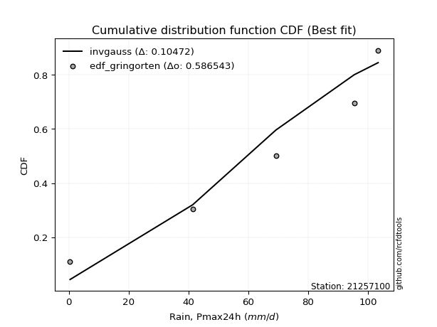</img></img>

</div>


### 9. EDF Filliben (1975)

The specific values of the constants (0.3175) (often denoted as $alpha$) and (0.365) are derived from a method proposed by James J. Filliben in a 1975 paper. This particular formula is the mean value of the $i$-th order statistic of the normal distribution and is considered a robust and effective plotting position formula for the normal probability plot correlation coefficient test for normality.

<div align="center">


$P=(m-0.3175)/(n+0.365)$


</div>


**9.1. Empirical values**

<div align="center">

|                | 0                   | 1                  | 2            | 3                  | 4                  |
|:---------------|:--------------------|:-------------------|:-------------|:-------------------|:-------------------|
| date           | 2021                | 2022               | 2024         | 2019               | 2020               |
| x              | 0.4                 | 41.4               | 69.2         | 95.4               | 103.4              |
| m              | 1                   | 2                  | 3            | 4                  | 5                  |
| empirical_dist | edf_filliben        | edf_filliben       | edf_filliben | edf_filliben       | edf_filliben       |
| empirical      | 0.12721342031686858 | 0.3136067101584343 | 0.5          | 0.6863932898415657 | 0.8727865796831314 |
| empirical_tr   | 1.1457554725040042  | 1.456890699253225  | 2.0          | 3.188707280832095  | 7.860805860805863  |

</div>


**9.2. Kolmogorov-Smirnov fit test (sorted by Δ)**


<div align="center">

|                | 0                   | 1                   | 2                  | 3                   | 4                   | 5                   | 6                   | 7                   | 8                   | 9                   | 10                  | 11                 | 12                  | 13                  | 14                 | 15                  | 16                  | 17                 | 18                  | 19                  | 20                  | 21                  | 22                  | 23                  | 24                  | 25                  | 26                  | 27                  | 28                 | 29                  | 30                  | 31                 | 32                  | 33                  | 34                  | 35                 | 36                 | 37                    | 38                 | 39                 | 40                 | 41                 | 42                 | 43                 | 44                  | 45                 | 46                 | 47                  | 48                  | 49                 | 50                  | 51                 | 52                 | 53                 | 54                 | 55                 | 56                 | 57                  | 58                 | 59                 | 60                 | 61                  | 62                  | 63                  | 64                  | 65                  | 66                  | 67                 | 68                 | 69                 | 70                  | 71                 | 72                  | 73                  | 74                  | 75                  | 76                 | 77                 | 78                 | 79                 | 80                 | 81                 | 82                 | 83                 | 84                 | 85                 | 86                 | 87                 |
|:---------------|:--------------------|:--------------------|:-------------------|:--------------------|:--------------------|:--------------------|:--------------------|:--------------------|:--------------------|:--------------------|:--------------------|:-------------------|:--------------------|:--------------------|:-------------------|:--------------------|:--------------------|:-------------------|:--------------------|:--------------------|:--------------------|:--------------------|:--------------------|:--------------------|:--------------------|:--------------------|:--------------------|:--------------------|:-------------------|:--------------------|:--------------------|:-------------------|:--------------------|:--------------------|:--------------------|:-------------------|:-------------------|:----------------------|:-------------------|:-------------------|:-------------------|:-------------------|:-------------------|:-------------------|:--------------------|:-------------------|:-------------------|:--------------------|:--------------------|:-------------------|:--------------------|:-------------------|:-------------------|:-------------------|:-------------------|:-------------------|:-------------------|:--------------------|:-------------------|:-------------------|:-------------------|:--------------------|:--------------------|:--------------------|:--------------------|:--------------------|:--------------------|:-------------------|:-------------------|:-------------------|:--------------------|:-------------------|:--------------------|:--------------------|:--------------------|:--------------------|:-------------------|:-------------------|:-------------------|:-------------------|:-------------------|:-------------------|:-------------------|:-------------------|:-------------------|:-------------------|:-------------------|:-------------------|
| station        | 21257100            | 21257100            | 21257100           | 21257100            | 21257100            | 21257100            | 21257100            | 21257100            | 21257100            | 21257100            | 21257100            | 21257100           | 21257100            | 21257100            | 21257100           | 21257100            | 21257100            | 21257100           | 21257100            | 21257100            | 21257100            | 21257100            | 21257100            | 21257100            | 21257100            | 21257100            | 21257100            | 21257100            | 21257100           | 21257100            | 21257100            | 21257100           | 21257100            | 21257100            | 21257100            | 21257100           | 21257100           | 21257100              | 21257100           | 21257100           | 21257100           | 21257100           | 21257100           | 21257100           | 21257100            | 21257100           | 21257100           | 21257100            | 21257100            | 21257100           | 21257100            | 21257100           | 21257100           | 21257100           | 21257100           | 21257100           | 21257100           | 21257100            | 21257100           | 21257100           | 21257100           | 21257100            | 21257100            | 21257100            | 21257100            | 21257100            | 21257100            | 21257100           | 21257100           | 21257100           | 21257100            | 21257100           | 21257100            | 21257100            | 21257100            | 21257100            | 21257100           | 21257100           | 21257100           | 21257100           | 21257100           | 21257100           | 21257100           | 21257100           | 21257100           | 21257100           | 21257100           | 21257100           |
| empirical_dist | edf_filliben        | edf_filliben        | edf_filliben       | edf_filliben        | edf_filliben        | edf_filliben        | edf_filliben        | edf_filliben        | edf_filliben        | edf_filliben        | edf_filliben        | edf_filliben       | edf_filliben        | edf_filliben        | edf_filliben       | edf_filliben        | edf_filliben        | edf_filliben       | edf_filliben        | edf_filliben        | edf_filliben        | edf_filliben        | edf_filliben        | edf_filliben        | edf_filliben        | edf_filliben        | edf_filliben        | edf_filliben        | edf_filliben       | edf_filliben        | edf_filliben        | edf_filliben       | edf_filliben        | edf_filliben        | edf_filliben        | edf_filliben       | edf_filliben       | edf_filliben          | edf_filliben       | edf_filliben       | edf_filliben       | edf_filliben       | edf_filliben       | edf_filliben       | edf_filliben        | edf_filliben       | edf_filliben       | edf_filliben        | edf_filliben        | edf_filliben       | edf_filliben        | edf_filliben       | edf_filliben       | edf_filliben       | edf_filliben       | edf_filliben       | edf_filliben       | edf_filliben        | edf_filliben       | edf_filliben       | edf_filliben       | edf_filliben        | edf_filliben        | edf_filliben        | edf_filliben        | edf_filliben        | edf_filliben        | edf_filliben       | edf_filliben       | edf_filliben       | edf_filliben        | edf_filliben       | edf_filliben        | edf_filliben        | edf_filliben        | edf_filliben        | edf_filliben       | edf_filliben       | edf_filliben       | edf_filliben       | edf_filliben       | edf_filliben       | edf_filliben       | edf_filliben       | edf_filliben       | edf_filliben       | edf_filliben       | edf_filliben       |
| p_dist         | invgauss            | pearson3            | fatiguelife        | invgamma            | rice                | betaprime           | erlang              | crystalball         | norm                | exponnorm           | t                   | chi2               | gamma               | maxwell             | rayleigh           | weibull_min         | kstwobign           | halfnorm           | gumbel_l            | laplace_asymmetric  | logistic            | gumbel_r            | hypsecant           | f                   | halflogistic        | moyal               | genexpon            | laplace             | expon              | logpearson3         | logt                | loggompertz        | loggumbel_l         | mielke              | wald                | ncf                | logloggamma        | loglaplace_asymmetric | fisk               | gibrat             | lognakagami        | logcrystalball     | lognorm            | lognorm            | logexponnorm        | logrice            | lognct             | loggamma            | loggamma            | loginvweibull      | logjohnsonsu        | loglogistic        | loginvgamma        | logalpha           | loginvgauss        | loghypsecant       | logncf             | logmaxwell          | lograyleigh        | nakagami           | gompertz           | logkstwobign        | loglaplace          | logfisk             | loggenexpon         | loghalfnorm         | loggumbel_r         | logexpon           | nct                | loghalflogistic    | logmoyal            | loglognorm         | logf                | logwald             | invweibull          | loggibrat           | truncnorm          | logtruncnorm       | logweibull_min     | logfatiguelife     | logchi2            | logbetaprime       | logmielke          | logerlang          | johnsonsu          | alpha              | loggenlogistic     | genlogistic        |
| delta          | 0.11363943136505172 | 0.12362895444353217 | 0.1241063400303638 | 0.12448609489508233 | 0.12449869062972985 | 0.12486855826135168 | 0.12548023599840785 | 0.12617181226908758 | 0.12617181365428987 | 0.12617233682980056 | 0.12620267965214438 | 0.126437156939748  | 0.12699198394372158 | 0.12742573303979177 | 0.1277938879393874 | 0.13325890369400906 | 0.13398972279199584 | 0.1391254916233553 | 0.14022440633984468 | 0.14414648566260735 | 0.14695486471250152 | 0.14895766485088746 | 0.15878487607296243 | 0.16702730579189456 | 0.16710388299504086 | 0.16863480400037356 | 0.17072807937028722 | 0.17106262808805262 | 0.1729390836515552 | 0.18542987595936294 | 0.19950131570288077 | 0.207795575673906  | 0.21392184723150337 | 0.22290719221698008 | 0.23488268394983725 | 0.2477324916209357 | 0.2567073821926268 | 0.25703163360216796   | 0.2576420039006502 | 0.2656569963269425 | 0.2751177174895251 | 0.2756047713329552 | 0.2756049579362168 | 0.2756049579362168 | 0.27560531821435413 | 0.2756123261461431 | 0.2759153992540498 | 0.27882251883346526 | 0.27882251883346526 | 0.2861816019303977 | 0.28682891594048043 | 0.2872518228038255 | 0.2937052163063187 | 0.2945976746160535 | 0.2958773583804413 | 0.2968651583878618 | 0.2989143412004885 | 0.30305716665922594 | 0.311639033770358  | 0.3135399359878523 | 0.3136067101576271 | 0.32059661965501834 | 0.32293007234394716 | 0.33102140541876146 | 0.33190776032475316 | 0.33600167827111765 | 0.34315098434984787 | 0.3581815725139214 | 0.3598771319395729 | 0.3641925723478337 | 0.36641142380424935 | 0.3871627682733925 | 0.40876163038614416 | 0.43111947638539133 | 0.43504237271579094 | 0.46246249910086884 | 0.4769362694523231 | 0.5195679371067017 | 0.5608616167173126 | 0.5901529781442907 | 0.5973787603522291 | 0.5995526194492691 | 0.6247646520558494 | 0.6438220868724969 | 0.6656704743857992 | 0.6692107327556216 | 0.6863932898415657 | 0.6863932898415657 |
| deltao         | 0.5865427407550001  | 0.5865427407550001  | 0.5865427407550001 | 0.5865427407550001  | 0.5865427407550001  | 0.5865427407550001  | 0.5865427407550001  | 0.5865427407550001  | 0.5865427407550001  | 0.5865427407550001  | 0.5865427407550001  | 0.5865427407550001 | 0.5865427407550001  | 0.5865427407550001  | 0.5865427407550001 | 0.5865427407550001  | 0.5865427407550001  | 0.5865427407550001 | 0.5865427407550001  | 0.5865427407550001  | 0.5865427407550001  | 0.5865427407550001  | 0.5865427407550001  | 0.5865427407550001  | 0.5865427407550001  | 0.5865427407550001  | 0.5865427407550001  | 0.5865427407550001  | 0.5865427407550001 | 0.5865427407550001  | 0.5865427407550001  | 0.5865427407550001 | 0.5865427407550001  | 0.5865427407550001  | 0.5865427407550001  | 0.5865427407550001 | 0.5865427407550001 | 0.5865427407550001    | 0.5865427407550001 | 0.5865427407550001 | 0.5865427407550001 | 0.5865427407550001 | 0.5865427407550001 | 0.5865427407550001 | 0.5865427407550001  | 0.5865427407550001 | 0.5865427407550001 | 0.5865427407550001  | 0.5865427407550001  | 0.5865427407550001 | 0.5865427407550001  | 0.5865427407550001 | 0.5865427407550001 | 0.5865427407550001 | 0.5865427407550001 | 0.5865427407550001 | 0.5865427407550001 | 0.5865427407550001  | 0.5865427407550001 | 0.5865427407550001 | 0.5865427407550001 | 0.5865427407550001  | 0.5865427407550001  | 0.5865427407550001  | 0.5865427407550001  | 0.5865427407550001  | 0.5865427407550001  | 0.5865427407550001 | 0.5865427407550001 | 0.5865427407550001 | 0.5865427407550001  | 0.5865427407550001 | 0.5865427407550001  | 0.5865427407550001  | 0.5865427407550001  | 0.5865427407550001  | 0.5865427407550001 | 0.5865427407550001 | 0.5865427407550001 | 0.5865427407550001 | 0.5865427407550001 | 0.5865427407550001 | 0.5865427407550001 | 0.5865427407550001 | 0.5865427407550001 | 0.5865427407550001 | 0.5865427407550001 | 0.5865427407550001 |
| eval           | Δo > Δ              | Δo > Δ              | Δo > Δ             | Δo > Δ              | Δo > Δ              | Δo > Δ              | Δo > Δ              | Δo > Δ              | Δo > Δ              | Δo > Δ              | Δo > Δ              | Δo > Δ             | Δo > Δ              | Δo > Δ              | Δo > Δ             | Δo > Δ              | Δo > Δ              | Δo > Δ             | Δo > Δ              | Δo > Δ              | Δo > Δ              | Δo > Δ              | Δo > Δ              | Δo > Δ              | Δo > Δ              | Δo > Δ              | Δo > Δ              | Δo > Δ              | Δo > Δ             | Δo > Δ              | Δo > Δ              | Δo > Δ             | Δo > Δ              | Δo > Δ              | Δo > Δ              | Δo > Δ             | Δo > Δ             | Δo > Δ                | Δo > Δ             | Δo > Δ             | Δo > Δ             | Δo > Δ             | Δo > Δ             | Δo > Δ             | Δo > Δ              | Δo > Δ             | Δo > Δ             | Δo > Δ              | Δo > Δ              | Δo > Δ             | Δo > Δ              | Δo > Δ             | Δo > Δ             | Δo > Δ             | Δo > Δ             | Δo > Δ             | Δo > Δ             | Δo > Δ              | Δo > Δ             | Δo > Δ             | Δo > Δ             | Δo > Δ              | Δo > Δ              | Δo > Δ              | Δo > Δ              | Δo > Δ              | Δo > Δ              | Δo > Δ             | Δo > Δ             | Δo > Δ             | Δo > Δ              | Δo > Δ             | Δo > Δ              | Δo > Δ              | Δo > Δ              | Δo > Δ              | Δo > Δ             | Δo > Δ             | Δo > Δ             | Δo <= Δ            | Δo <= Δ            | Δo <= Δ            | Δo <= Δ            | Δo <= Δ            | Δo <= Δ            | Δo <= Δ            | Δo <= Δ            | Δo <= Δ            |
| fit            | 1                   | 1                   | 1                  | 1                   | 1                   | 1                   | 1                   | 1                   | 1                   | 1                   | 1                   | 1                  | 1                   | 1                   | 1                  | 1                   | 1                   | 1                  | 1                   | 1                   | 1                   | 1                   | 1                   | 1                   | 1                   | 1                   | 1                   | 1                   | 1                  | 1                   | 1                   | 1                  | 1                   | 1                   | 1                   | 1                  | 1                  | 1                     | 1                  | 1                  | 1                  | 1                  | 1                  | 1                  | 1                   | 1                  | 1                  | 1                   | 1                   | 1                  | 1                   | 1                  | 1                  | 1                  | 1                  | 1                  | 1                  | 1                   | 1                  | 1                  | 1                  | 1                   | 1                   | 1                   | 1                   | 1                   | 1                   | 1                  | 1                  | 1                  | 1                   | 1                  | 1                   | 1                   | 1                   | 1                   | 1                  | 1                  | 1                  | 0                  | 0                  | 0                  | 0                  | 0                  | 0                  | 0                  | 0                  | 0                  |
| n              | 5                   | 5                   | 5                  | 5                   | 5                   | 5                   | 5                   | 5                   | 5                   | 5                   | 5                   | 5                  | 5                   | 5                   | 5                  | 5                   | 5                   | 5                  | 5                   | 5                   | 5                   | 5                   | 5                   | 5                   | 5                   | 5                   | 5                   | 5                   | 5                  | 5                   | 5                   | 5                  | 5                   | 5                   | 5                   | 5                  | 5                  | 5                     | 5                  | 5                  | 5                  | 5                  | 5                  | 5                  | 5                   | 5                  | 5                  | 5                   | 5                   | 5                  | 5                   | 5                  | 5                  | 5                  | 5                  | 5                  | 5                  | 5                   | 5                  | 5                  | 5                  | 5                   | 5                   | 5                   | 5                   | 5                   | 5                   | 5                  | 5                  | 5                  | 5                   | 5                  | 5                   | 5                   | 5                   | 5                   | 5                  | 5                  | 5                  | 5                  | 5                  | 5                  | 5                  | 5                  | 5                  | 5                  | 5                  | 5                  |
| best_fit       | 1                   | 0                   | 0                  | 0                   | 0                   | 0                   | 0                   | 0                   | 0                   | 0                   | 0                   | 0                  | 0                   | 0                   | 0                  | 0                   | 0                   | 0                  | 0                   | 0                   | 0                   | 0                   | 0                   | 0                   | 0                   | 0                   | 0                   | 0                   | 0                  | 0                   | 0                   | 0                  | 0                   | 0                   | 0                   | 0                  | 0                  | 0                     | 0                  | 0                  | 0                  | 0                  | 0                  | 0                  | 0                   | 0                  | 0                  | 0                   | 0                   | 0                  | 0                   | 0                  | 0                  | 0                  | 0                  | 0                  | 0                  | 0                   | 0                  | 0                  | 0                  | 0                   | 0                   | 0                   | 0                   | 0                   | 0                   | 0                  | 0                  | 0                  | 0                   | 0                  | 0                   | 0                   | 0                   | 0                   | 0                  | 0                  | 0                  | 0                  | 0                  | 0                  | 0                  | 0                  | 0                  | 0                  | 0                  | 0                  |
| best_fit_sort  | 1                   | 2                   | 3                  | 4                   | 5                   | 6                   | 7                   | 8                   | 9                   | 10                  | 11                  | 12                 | 13                  | 14                  | 15                 | 16                  | 17                  | 18                 | 19                  | 20                  | 21                  | 22                  | 23                  | 24                  | 25                  | 26                  | 27                  | 28                  | 29                 | 30                  | 31                  | 32                 | 33                  | 34                  | 35                  | 36                 | 37                 | 38                    | 39                 | 40                 | 41                 | 42                 | 43                 | 44                 | 45                  | 46                 | 47                 | 48                  | 49                  | 50                 | 51                  | 52                 | 53                 | 54                 | 55                 | 56                 | 57                 | 58                  | 59                 | 60                 | 61                 | 62                  | 63                  | 64                  | 65                  | 66                  | 67                  | 68                 | 69                 | 70                 | 71                  | 72                 | 73                  | 74                  | 75                  | 76                  | 77                 | 78                 | 79                 | 80                 | 81                 | 82                 | 83                 | 84                 | 85                 | 86                 | 87                 | 88                 |

</div>


**9.3. Best fit**

<div align="center">

|   id |   station | empirical_dist   | p_dist   |    delta |   deltao | eval   |   fit |   n |   best_fit |   best_fit_sort |
|-----:|----------:|:-----------------|:---------|---------:|---------:|:-------|------:|----:|-----------:|----------------:|
|    0 |  21257100 | edf_filliben     | invgauss | 0.113639 | 0.586543 | Δo > Δ |     1 |   5 |          1 |               1 |

</div>


<div align="center">

</img></img>

</div>


### 10. EDF Jenkinson (1977)

The Jenkinson formula in hydrology is an empirical plotting position formula used to estimate the non-exceedance probability _(P)_ or return period _(T)_ of a given ordered observation within a sample. It is a widely used method in the frequency analysis of extreme events such as floods and rainfall, as it provides a distribution-free way to plot data. _a≈0.31_ and _b≈0.38_ are constants derived to approximate the median of the probability distribution for the given rank.

<div align="center">


$P=(m-a)/(n+b)$


</div>


**10.1. Empirical values**

<div align="center">

|                | 0                   | 1                  | 2             | 3                  | 4                  |
|:---------------|:--------------------|:-------------------|:--------------|:-------------------|:-------------------|
| date           | 2021                | 2022               | 2024          | 2019               | 2020               |
| x              | 0.4                 | 41.4               | 69.2          | 95.4               | 103.4              |
| m              | 1                   | 2                  | 3             | 4                  | 5                  |
| empirical_dist | edf_jenkinson       | edf_jenkinson      | edf_jenkinson | edf_jenkinson      | edf_jenkinson      |
| empirical      | 0.12825278810408922 | 0.3141263940520446 | 0.5           | 0.6858736059479554 | 0.8717472118959109 |
| empirical_tr   | 1.1471215351812367  | 1.4579945799457996 | 2.0           | 3.183431952662722  | 7.797101449275368  |

</div>


**10.2. Kolmogorov-Smirnov fit test (sorted by Δ)**


<div align="center">

|                | 0                   | 1                  | 2                   | 3                   | 4                   | 5                   | 6                  | 7                   | 8                  | 9                  | 10                 | 11                  | 12                 | 13                 | 14                  | 15                 | 16                  | 17                 | 18                 | 19                  | 20                  | 21                 | 22                  | 23                  | 24                  | 25                  | 26                  | 27                  | 28                 | 29                 | 30                 | 31                  | 32                  | 33                  | 34                  | 35                 | 36                 | 37                 | 38                    | 39                 | 40                 | 41                  | 42                  | 43                  | 44                 | 45                  | 46                  | 47                 | 48                 | 49                  | 50                 | 51                  | 52                  | 53                  | 54                 | 55                  | 56                  | 57                 | 58                  | 59                  | 60                  | 61                 | 62                 | 63                 | 64                 | 65                 | 66                 | 67                  | 68                  | 69                  | 70                 | 71                 | 72                 | 73                 | 74                  | 75                 | 76                  | 77                 | 78                 | 79                 | 80                 | 81                 | 82                 | 83                 | 84                 | 85                 | 86                 | 87                 |
|:---------------|:--------------------|:-------------------|:--------------------|:--------------------|:--------------------|:--------------------|:-------------------|:--------------------|:-------------------|:-------------------|:-------------------|:--------------------|:-------------------|:-------------------|:--------------------|:-------------------|:--------------------|:-------------------|:-------------------|:--------------------|:--------------------|:-------------------|:--------------------|:--------------------|:--------------------|:--------------------|:--------------------|:--------------------|:-------------------|:-------------------|:-------------------|:--------------------|:--------------------|:--------------------|:--------------------|:-------------------|:-------------------|:-------------------|:----------------------|:-------------------|:-------------------|:--------------------|:--------------------|:--------------------|:-------------------|:--------------------|:--------------------|:-------------------|:-------------------|:--------------------|:-------------------|:--------------------|:--------------------|:--------------------|:-------------------|:--------------------|:--------------------|:-------------------|:--------------------|:--------------------|:--------------------|:-------------------|:-------------------|:-------------------|:-------------------|:-------------------|:-------------------|:--------------------|:--------------------|:--------------------|:-------------------|:-------------------|:-------------------|:-------------------|:--------------------|:-------------------|:--------------------|:-------------------|:-------------------|:-------------------|:-------------------|:-------------------|:-------------------|:-------------------|:-------------------|:-------------------|:-------------------|:-------------------|
| station        | 21257100            | 21257100           | 21257100            | 21257100            | 21257100            | 21257100            | 21257100           | 21257100            | 21257100           | 21257100           | 21257100           | 21257100            | 21257100           | 21257100           | 21257100            | 21257100           | 21257100            | 21257100           | 21257100           | 21257100            | 21257100            | 21257100           | 21257100            | 21257100            | 21257100            | 21257100            | 21257100            | 21257100            | 21257100           | 21257100           | 21257100           | 21257100            | 21257100            | 21257100            | 21257100            | 21257100           | 21257100           | 21257100           | 21257100              | 21257100           | 21257100           | 21257100            | 21257100            | 21257100            | 21257100           | 21257100            | 21257100            | 21257100           | 21257100           | 21257100            | 21257100           | 21257100            | 21257100            | 21257100            | 21257100           | 21257100            | 21257100            | 21257100           | 21257100            | 21257100            | 21257100            | 21257100           | 21257100           | 21257100           | 21257100           | 21257100           | 21257100           | 21257100            | 21257100            | 21257100            | 21257100           | 21257100           | 21257100           | 21257100           | 21257100            | 21257100           | 21257100            | 21257100           | 21257100           | 21257100           | 21257100           | 21257100           | 21257100           | 21257100           | 21257100           | 21257100           | 21257100           | 21257100           |
| empirical_dist | edf_jenkinson       | edf_jenkinson      | edf_jenkinson       | edf_jenkinson       | edf_jenkinson       | edf_jenkinson       | edf_jenkinson      | edf_jenkinson       | edf_jenkinson      | edf_jenkinson      | edf_jenkinson      | edf_jenkinson       | edf_jenkinson      | edf_jenkinson      | edf_jenkinson       | edf_jenkinson      | edf_jenkinson       | edf_jenkinson      | edf_jenkinson      | edf_jenkinson       | edf_jenkinson       | edf_jenkinson      | edf_jenkinson       | edf_jenkinson       | edf_jenkinson       | edf_jenkinson       | edf_jenkinson       | edf_jenkinson       | edf_jenkinson      | edf_jenkinson      | edf_jenkinson      | edf_jenkinson       | edf_jenkinson       | edf_jenkinson       | edf_jenkinson       | edf_jenkinson      | edf_jenkinson      | edf_jenkinson      | edf_jenkinson         | edf_jenkinson      | edf_jenkinson      | edf_jenkinson       | edf_jenkinson       | edf_jenkinson       | edf_jenkinson      | edf_jenkinson       | edf_jenkinson       | edf_jenkinson      | edf_jenkinson      | edf_jenkinson       | edf_jenkinson      | edf_jenkinson       | edf_jenkinson       | edf_jenkinson       | edf_jenkinson      | edf_jenkinson       | edf_jenkinson       | edf_jenkinson      | edf_jenkinson       | edf_jenkinson       | edf_jenkinson       | edf_jenkinson      | edf_jenkinson      | edf_jenkinson      | edf_jenkinson      | edf_jenkinson      | edf_jenkinson      | edf_jenkinson       | edf_jenkinson       | edf_jenkinson       | edf_jenkinson      | edf_jenkinson      | edf_jenkinson      | edf_jenkinson      | edf_jenkinson       | edf_jenkinson      | edf_jenkinson       | edf_jenkinson      | edf_jenkinson      | edf_jenkinson      | edf_jenkinson      | edf_jenkinson      | edf_jenkinson      | edf_jenkinson      | edf_jenkinson      | edf_jenkinson      | edf_jenkinson      | edf_jenkinson      |
| p_dist         | invgauss            | pearson3           | fatiguelife         | invgamma            | rice                | betaprime           | erlang             | crystalball         | norm               | exponnorm          | t                  | chi2                | gamma              | maxwell            | rayleigh            | weibull_min        | kstwobign           | halfnorm           | gumbel_l           | laplace_asymmetric  | logistic            | gumbel_r           | hypsecant           | f                   | halflogistic        | moyal               | genexpon            | laplace             | expon              | logpearson3        | logt               | loggompertz         | loggumbel_l         | mielke              | wald                | ncf                | fisk               | logloggamma        | loglaplace_asymmetric | gibrat             | lognakagami        | logcrystalball      | lognorm             | lognorm             | logexponnorm       | logrice             | lognct              | loggamma           | loggamma           | loginvweibull       | logjohnsonsu       | loglogistic         | loginvgamma         | logalpha            | loginvgauss        | loghypsecant        | logncf              | logmaxwell         | lograyleigh         | nakagami            | gompertz            | logkstwobign       | loglaplace         | logfisk            | loggenexpon        | loghalfnorm        | loggumbel_r        | logexpon            | nct                 | loghalflogistic     | logmoyal           | loglognorm         | logf               | logwald            | invweibull          | loggibrat          | truncnorm           | logtruncnorm       | logweibull_min     | logfatiguelife     | logchi2            | logbetaprime       | logmielke          | logerlang          | johnsonsu          | alpha              | loggenlogistic     | genlogistic        |
| delta          | 0.11415911525866196 | 0.1241486383371424 | 0.12462602392397404 | 0.12500577878869257 | 0.12501837452334008 | 0.12538824215496192 | 0.1259999198920181 | 0.12669149616269781 | 0.1266914975479001 | 0.1266920207234108 | 0.1267223635457546 | 0.12695684083335823 | 0.1275116678373318 | 0.127945416933402  | 0.12831357183299763 | 0.1337785875876193 | 0.13398972279199584 | 0.1391254916233553 | 0.1407440902334549 | 0.14466616955621758 | 0.14747454860611175 | 0.1494773487444977 | 0.15930455996657267 | 0.16650762189828422 | 0.16710388299504086 | 0.16863480400037356 | 0.17072807937028722 | 0.17158231198166285 | 0.1729390836515552 | 0.1849101920657526 | 0.1984619479156602 | 0.20727589178029565 | 0.21340216333789302 | 0.22290719221698008 | 0.23488268394983725 | 0.2477324916209357 | 0.2566026361134296 | 0.257227066086237  | 0.2575513174957782    | 0.2656569963269425 | 0.2745980335959148 | 0.27508508743934484 | 0.27508527404260646 | 0.27508527404260646 | 0.2750856343207438 | 0.27509264225253277 | 0.27539571536043944 | 0.2783028349398549 | 0.2783028349398549 | 0.28566191803678737 | 0.2863092320468702 | 0.28673213891021515 | 0.29318553241270834 | 0.29407799072244317 | 0.295357674486831  | 0.29634547449425147 | 0.29839465730687814 | 0.3025374827656156 | 0.31111934987674766 | 0.31302025209424195 | 0.31412639405123743 | 0.320076935761408  | 0.3224103884503368 | 0.3299820376315409 | 0.3313880764311428 | 0.3354819943775073 | 0.3426313004562375 | 0.35766188862031106 | 0.35935744804596254 | 0.36367288845422335 | 0.365891739910639  | 0.3866430843797822 | 0.4082419464925338 | 0.430599792491781  | 0.43400300492857036 | 0.4619428152072585 | 0.47641658555871275 | 0.5190482532130913 | 0.5603419328237023 | 0.5896332942506803 | 0.5968590764586188 | 0.5990329355556587 | 0.6242449681622391 | 0.6433024029788865 | 0.665150790492189  | 0.6686910488620113 | 0.6858736059479554 | 0.6858736059479554 |
| deltao         | 0.5865427407550001  | 0.5865427407550001 | 0.5865427407550001  | 0.5865427407550001  | 0.5865427407550001  | 0.5865427407550001  | 0.5865427407550001 | 0.5865427407550001  | 0.5865427407550001 | 0.5865427407550001 | 0.5865427407550001 | 0.5865427407550001  | 0.5865427407550001 | 0.5865427407550001 | 0.5865427407550001  | 0.5865427407550001 | 0.5865427407550001  | 0.5865427407550001 | 0.5865427407550001 | 0.5865427407550001  | 0.5865427407550001  | 0.5865427407550001 | 0.5865427407550001  | 0.5865427407550001  | 0.5865427407550001  | 0.5865427407550001  | 0.5865427407550001  | 0.5865427407550001  | 0.5865427407550001 | 0.5865427407550001 | 0.5865427407550001 | 0.5865427407550001  | 0.5865427407550001  | 0.5865427407550001  | 0.5865427407550001  | 0.5865427407550001 | 0.5865427407550001 | 0.5865427407550001 | 0.5865427407550001    | 0.5865427407550001 | 0.5865427407550001 | 0.5865427407550001  | 0.5865427407550001  | 0.5865427407550001  | 0.5865427407550001 | 0.5865427407550001  | 0.5865427407550001  | 0.5865427407550001 | 0.5865427407550001 | 0.5865427407550001  | 0.5865427407550001 | 0.5865427407550001  | 0.5865427407550001  | 0.5865427407550001  | 0.5865427407550001 | 0.5865427407550001  | 0.5865427407550001  | 0.5865427407550001 | 0.5865427407550001  | 0.5865427407550001  | 0.5865427407550001  | 0.5865427407550001 | 0.5865427407550001 | 0.5865427407550001 | 0.5865427407550001 | 0.5865427407550001 | 0.5865427407550001 | 0.5865427407550001  | 0.5865427407550001  | 0.5865427407550001  | 0.5865427407550001 | 0.5865427407550001 | 0.5865427407550001 | 0.5865427407550001 | 0.5865427407550001  | 0.5865427407550001 | 0.5865427407550001  | 0.5865427407550001 | 0.5865427407550001 | 0.5865427407550001 | 0.5865427407550001 | 0.5865427407550001 | 0.5865427407550001 | 0.5865427407550001 | 0.5865427407550001 | 0.5865427407550001 | 0.5865427407550001 | 0.5865427407550001 |
| eval           | Δo > Δ              | Δo > Δ             | Δo > Δ              | Δo > Δ              | Δo > Δ              | Δo > Δ              | Δo > Δ             | Δo > Δ              | Δo > Δ             | Δo > Δ             | Δo > Δ             | Δo > Δ              | Δo > Δ             | Δo > Δ             | Δo > Δ              | Δo > Δ             | Δo > Δ              | Δo > Δ             | Δo > Δ             | Δo > Δ              | Δo > Δ              | Δo > Δ             | Δo > Δ              | Δo > Δ              | Δo > Δ              | Δo > Δ              | Δo > Δ              | Δo > Δ              | Δo > Δ             | Δo > Δ             | Δo > Δ             | Δo > Δ              | Δo > Δ              | Δo > Δ              | Δo > Δ              | Δo > Δ             | Δo > Δ             | Δo > Δ             | Δo > Δ                | Δo > Δ             | Δo > Δ             | Δo > Δ              | Δo > Δ              | Δo > Δ              | Δo > Δ             | Δo > Δ              | Δo > Δ              | Δo > Δ             | Δo > Δ             | Δo > Δ              | Δo > Δ             | Δo > Δ              | Δo > Δ              | Δo > Δ              | Δo > Δ             | Δo > Δ              | Δo > Δ              | Δo > Δ             | Δo > Δ              | Δo > Δ              | Δo > Δ              | Δo > Δ             | Δo > Δ             | Δo > Δ             | Δo > Δ             | Δo > Δ             | Δo > Δ             | Δo > Δ              | Δo > Δ              | Δo > Δ              | Δo > Δ             | Δo > Δ             | Δo > Δ             | Δo > Δ             | Δo > Δ              | Δo > Δ             | Δo > Δ              | Δo > Δ             | Δo > Δ             | Δo <= Δ            | Δo <= Δ            | Δo <= Δ            | Δo <= Δ            | Δo <= Δ            | Δo <= Δ            | Δo <= Δ            | Δo <= Δ            | Δo <= Δ            |
| fit            | 1                   | 1                  | 1                   | 1                   | 1                   | 1                   | 1                  | 1                   | 1                  | 1                  | 1                  | 1                   | 1                  | 1                  | 1                   | 1                  | 1                   | 1                  | 1                  | 1                   | 1                   | 1                  | 1                   | 1                   | 1                   | 1                   | 1                   | 1                   | 1                  | 1                  | 1                  | 1                   | 1                   | 1                   | 1                   | 1                  | 1                  | 1                  | 1                     | 1                  | 1                  | 1                   | 1                   | 1                   | 1                  | 1                   | 1                   | 1                  | 1                  | 1                   | 1                  | 1                   | 1                   | 1                   | 1                  | 1                   | 1                   | 1                  | 1                   | 1                   | 1                   | 1                  | 1                  | 1                  | 1                  | 1                  | 1                  | 1                   | 1                   | 1                   | 1                  | 1                  | 1                  | 1                  | 1                   | 1                  | 1                   | 1                  | 1                  | 0                  | 0                  | 0                  | 0                  | 0                  | 0                  | 0                  | 0                  | 0                  |
| n              | 5                   | 5                  | 5                   | 5                   | 5                   | 5                   | 5                  | 5                   | 5                  | 5                  | 5                  | 5                   | 5                  | 5                  | 5                   | 5                  | 5                   | 5                  | 5                  | 5                   | 5                   | 5                  | 5                   | 5                   | 5                   | 5                   | 5                   | 5                   | 5                  | 5                  | 5                  | 5                   | 5                   | 5                   | 5                   | 5                  | 5                  | 5                  | 5                     | 5                  | 5                  | 5                   | 5                   | 5                   | 5                  | 5                   | 5                   | 5                  | 5                  | 5                   | 5                  | 5                   | 5                   | 5                   | 5                  | 5                   | 5                   | 5                  | 5                   | 5                   | 5                   | 5                  | 5                  | 5                  | 5                  | 5                  | 5                  | 5                   | 5                   | 5                   | 5                  | 5                  | 5                  | 5                  | 5                   | 5                  | 5                   | 5                  | 5                  | 5                  | 5                  | 5                  | 5                  | 5                  | 5                  | 5                  | 5                  | 5                  |
| best_fit       | 1                   | 0                  | 0                   | 0                   | 0                   | 0                   | 0                  | 0                   | 0                  | 0                  | 0                  | 0                   | 0                  | 0                  | 0                   | 0                  | 0                   | 0                  | 0                  | 0                   | 0                   | 0                  | 0                   | 0                   | 0                   | 0                   | 0                   | 0                   | 0                  | 0                  | 0                  | 0                   | 0                   | 0                   | 0                   | 0                  | 0                  | 0                  | 0                     | 0                  | 0                  | 0                   | 0                   | 0                   | 0                  | 0                   | 0                   | 0                  | 0                  | 0                   | 0                  | 0                   | 0                   | 0                   | 0                  | 0                   | 0                   | 0                  | 0                   | 0                   | 0                   | 0                  | 0                  | 0                  | 0                  | 0                  | 0                  | 0                   | 0                   | 0                   | 0                  | 0                  | 0                  | 0                  | 0                   | 0                  | 0                   | 0                  | 0                  | 0                  | 0                  | 0                  | 0                  | 0                  | 0                  | 0                  | 0                  | 0                  |
| best_fit_sort  | 1                   | 2                  | 3                   | 4                   | 5                   | 6                   | 7                  | 8                   | 9                  | 10                 | 11                 | 12                  | 13                 | 14                 | 15                  | 16                 | 17                  | 18                 | 19                 | 20                  | 21                  | 22                 | 23                  | 24                  | 25                  | 26                  | 27                  | 28                  | 29                 | 30                 | 31                 | 32                  | 33                  | 34                  | 35                  | 36                 | 37                 | 38                 | 39                    | 40                 | 41                 | 42                  | 43                  | 44                  | 45                 | 46                  | 47                  | 48                 | 49                 | 50                  | 51                 | 52                  | 53                  | 54                  | 55                 | 56                  | 57                  | 58                 | 59                  | 60                  | 61                  | 62                 | 63                 | 64                 | 65                 | 66                 | 67                 | 68                  | 69                  | 70                  | 71                 | 72                 | 73                 | 74                 | 75                  | 76                 | 77                  | 78                 | 79                 | 80                 | 81                 | 82                 | 83                 | 84                 | 85                 | 86                 | 87                 | 88                 |

</div>


**10.3. Best fit**

<div align="center">

|   id |   station | empirical_dist   | p_dist   |    delta |   deltao | eval   |   fit |   n |   best_fit |   best_fit_sort |
|-----:|----------:|:-----------------|:---------|---------:|---------:|:-------|------:|----:|-----------:|----------------:|
|    0 |  21257100 | edf_jenkinson    | invgauss | 0.114159 | 0.586543 | Δo > Δ |     1 |   5 |          1 |               1 |

</div>


<div align="center">

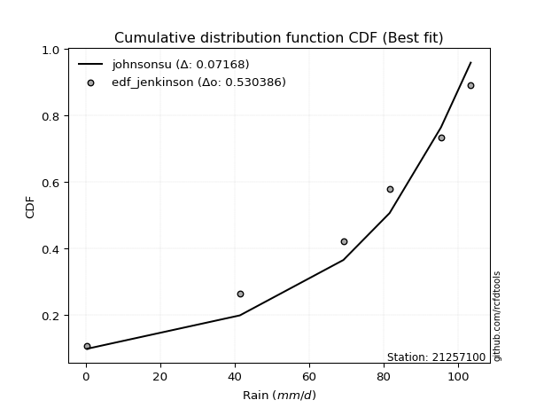</img></img>

</div>


### 11. EDF Cunnane (1978)

Cunnane´s work in statistical hydrology has focused on the performance and evaluation of different probability distributions (such as GEV, Gumbel, Lognormal) for flood frequency estimation. _b_ is a constant, typically set to 0.4.

<div align="center">


$P=(m-b)/(n+1-2b)$


</div>


**11.1. Empirical values**

<div align="center">

|                | 0                   | 1                  | 2           | 3                  | 4                  |
|:---------------|:--------------------|:-------------------|:------------|:-------------------|:-------------------|
| date           | 2021                | 2022               | 2024        | 2019               | 2020               |
| x              | 0.4                 | 41.4               | 69.2        | 95.4               | 103.4              |
| m              | 1                   | 2                  | 3           | 4                  | 5                  |
| empirical_dist | edf_cunnane         | edf_cunnane        | edf_cunnane | edf_cunnane        | edf_cunnane        |
| empirical      | 0.11538461538461538 | 0.3076923076923077 | 0.5         | 0.6923076923076923 | 0.8846153846153845 |
| empirical_tr   | 1.1304347826086958  | 1.4444444444444444 | 2.0         | 3.25               | 8.666666666666655  |

</div>


**11.2. Kolmogorov-Smirnov fit test (sorted by Δ)**


<div align="center">

|                | 0                  | 1                   | 2                   | 3                   | 4                   | 5                   | 6                   | 7                   | 8                   | 9                   | 10                  | 11                  | 12                  | 13                  | 14                  | 15                  | 16                  | 17                  | 18                  | 19                 | 20                 | 21                  | 22                 | 23                 | 24                  | 25                  | 26                  | 27                  | 28                 | 29                 | 30                 | 31                  | 32                  | 33                  | 34                  | 35                 | 36                  | 37                    | 38                 | 39                 | 40                 | 41                  | 42                 | 43                 | 44                 | 45                 | 46                  | 47                 | 48                 | 49                 | 50                  | 51                  | 52                  | 53                 | 54                 | 55                 | 56                  | 57                 | 58                 | 59                 | 60                  | 61                 | 62                  | 63                  | 64                 | 65                 | 66                  | 67                 | 68                  | 69                  | 70                 | 71                 | 72                 | 73                 | 74                  | 75                 | 76                  | 77                 | 78                 | 79                 | 80                 | 81                 | 82                 | 83                 | 84                 | 85                 | 86                 | 87                 |
|:---------------|:-------------------|:--------------------|:--------------------|:--------------------|:--------------------|:--------------------|:--------------------|:--------------------|:--------------------|:--------------------|:--------------------|:--------------------|:--------------------|:--------------------|:--------------------|:--------------------|:--------------------|:--------------------|:--------------------|:-------------------|:-------------------|:--------------------|:-------------------|:-------------------|:--------------------|:--------------------|:--------------------|:--------------------|:-------------------|:-------------------|:-------------------|:--------------------|:--------------------|:--------------------|:--------------------|:-------------------|:--------------------|:----------------------|:-------------------|:-------------------|:-------------------|:--------------------|:-------------------|:-------------------|:-------------------|:-------------------|:--------------------|:-------------------|:-------------------|:-------------------|:--------------------|:--------------------|:--------------------|:-------------------|:-------------------|:-------------------|:--------------------|:-------------------|:-------------------|:-------------------|:--------------------|:-------------------|:--------------------|:--------------------|:-------------------|:-------------------|:--------------------|:-------------------|:--------------------|:--------------------|:-------------------|:-------------------|:-------------------|:-------------------|:--------------------|:-------------------|:--------------------|:-------------------|:-------------------|:-------------------|:-------------------|:-------------------|:-------------------|:-------------------|:-------------------|:-------------------|:-------------------|:-------------------|
| station        | 21257100           | 21257100            | 21257100            | 21257100            | 21257100            | 21257100            | 21257100            | 21257100            | 21257100            | 21257100            | 21257100            | 21257100            | 21257100            | 21257100            | 21257100            | 21257100            | 21257100            | 21257100            | 21257100            | 21257100           | 21257100           | 21257100            | 21257100           | 21257100           | 21257100            | 21257100            | 21257100            | 21257100            | 21257100           | 21257100           | 21257100           | 21257100            | 21257100            | 21257100            | 21257100            | 21257100           | 21257100            | 21257100              | 21257100           | 21257100           | 21257100           | 21257100            | 21257100           | 21257100           | 21257100           | 21257100           | 21257100            | 21257100           | 21257100           | 21257100           | 21257100            | 21257100            | 21257100            | 21257100           | 21257100           | 21257100           | 21257100            | 21257100           | 21257100           | 21257100           | 21257100            | 21257100           | 21257100            | 21257100            | 21257100           | 21257100           | 21257100            | 21257100           | 21257100            | 21257100            | 21257100           | 21257100           | 21257100           | 21257100           | 21257100            | 21257100           | 21257100            | 21257100           | 21257100           | 21257100           | 21257100           | 21257100           | 21257100           | 21257100           | 21257100           | 21257100           | 21257100           | 21257100           |
| empirical_dist | edf_cunnane        | edf_cunnane         | edf_cunnane         | edf_cunnane         | edf_cunnane         | edf_cunnane         | edf_cunnane         | edf_cunnane         | edf_cunnane         | edf_cunnane         | edf_cunnane         | edf_cunnane         | edf_cunnane         | edf_cunnane         | edf_cunnane         | edf_cunnane         | edf_cunnane         | edf_cunnane         | edf_cunnane         | edf_cunnane        | edf_cunnane        | edf_cunnane         | edf_cunnane        | edf_cunnane        | edf_cunnane         | edf_cunnane         | edf_cunnane         | edf_cunnane         | edf_cunnane        | edf_cunnane        | edf_cunnane        | edf_cunnane         | edf_cunnane         | edf_cunnane         | edf_cunnane         | edf_cunnane        | edf_cunnane         | edf_cunnane           | edf_cunnane        | edf_cunnane        | edf_cunnane        | edf_cunnane         | edf_cunnane        | edf_cunnane        | edf_cunnane        | edf_cunnane        | edf_cunnane         | edf_cunnane        | edf_cunnane        | edf_cunnane        | edf_cunnane         | edf_cunnane         | edf_cunnane         | edf_cunnane        | edf_cunnane        | edf_cunnane        | edf_cunnane         | edf_cunnane        | edf_cunnane        | edf_cunnane        | edf_cunnane         | edf_cunnane        | edf_cunnane         | edf_cunnane         | edf_cunnane        | edf_cunnane        | edf_cunnane         | edf_cunnane        | edf_cunnane         | edf_cunnane         | edf_cunnane        | edf_cunnane        | edf_cunnane        | edf_cunnane        | edf_cunnane         | edf_cunnane        | edf_cunnane         | edf_cunnane        | edf_cunnane        | edf_cunnane        | edf_cunnane        | edf_cunnane        | edf_cunnane        | edf_cunnane        | edf_cunnane        | edf_cunnane        | edf_cunnane        | edf_cunnane        |
| p_dist         | invgauss           | pearson3            | fatiguelife         | invgamma            | rice                | betaprime           | erlang              | crystalball         | norm                | exponnorm           | t                   | chi2                | gamma               | maxwell             | rayleigh            | weibull_min         | kstwobign           | gumbel_l            | laplace_asymmetric  | halfnorm           | logistic           | gumbel_r            | hypsecant          | laplace            | halflogistic        | moyal               | f                   | genexpon            | expon              | logpearson3        | logt               | loggompertz         | loggumbel_l         | mielke              | wald                | ncf                | logloggamma         | loglaplace_asymmetric | gibrat             | fisk               | lognakagami        | logcrystalball      | lognorm            | lognorm            | logexponnorm       | logrice            | lognct              | loggamma           | loggamma           | loginvweibull      | logjohnsonsu        | loglogistic         | loginvgamma         | logalpha           | loginvgauss        | loghypsecant       | logncf              | gompertz           | logmaxwell         | lograyleigh        | nakagami            | logkstwobign       | loglaplace          | loggenexpon         | loghalfnorm        | logfisk            | loggumbel_r         | logexpon           | nct                 | loghalflogistic     | logmoyal           | loglognorm         | logf               | logwald            | invweibull          | loggibrat          | truncnorm           | logtruncnorm       | logweibull_min     | logfatiguelife     | logchi2            | logbetaprime       | logmielke          | logerlang          | johnsonsu          | alpha              | loggenlogistic     | genlogistic        |
| delta          | 0.1077250288989251 | 0.11771455197740555 | 0.11819193756423718 | 0.11857169242895571 | 0.11858428816360322 | 0.11895415579522506 | 0.11956583353228123 | 0.12025740980296096 | 0.12025741118816324 | 0.12025793436367394 | 0.12028827718601776 | 0.12052275447362137 | 0.12107758147759495 | 0.12151133057366514 | 0.12187948547326077 | 0.12734450122788243 | 0.13398972279199584 | 0.13431000387371805 | 0.13823208319648073 | 0.1391254916233553 | 0.1410404622463749 | 0.14478574751997453 | 0.1528704736068358 | 0.165148225621926  | 0.16710388299504086 | 0.16863480400037356 | 0.17294170825802113 | 0.17648997732799476 | 0.1785568605022937 | 0.1913442784254895 | 0.2113301206351338 | 0.21370997814003256 | 0.21983624969762994 | 0.22290719221698008 | 0.23488268394983725 | 0.2477324916209357 | 0.25079297972650016 | 0.25111723113604134   | 0.2656569963269425 | 0.2694708088329032 | 0.2810321199556517 | 0.28151917379908176 | 0.2815193604023434 | 0.2815193604023434 | 0.2815197206804807 | 0.2815267286122697 | 0.28182980172017635 | 0.2847369212995918 | 0.2847369212995918 | 0.2920960043965243 | 0.29274331840660706 | 0.29316622526995206 | 0.29961961877244525 | 0.3005120770821801 | 0.3017917608465679 | 0.3027795608539884 | 0.30482874366661505 | 0.3076923076915005 | 0.3089715691253525 | 0.3175534362364846 | 0.31945433845397886 | 0.3265110221211449 | 0.32884447481007373 | 0.33782216279087973 | 0.3419160807372442 | 0.3428502103510145 | 0.34906538681597443 | 0.364095974980048  | 0.36579153440569945 | 0.37010697481396027 | 0.3723258262703759 | 0.3930771707395191 | 0.4146760328522707 | 0.4370338788515179 | 0.44687117764804396 | 0.4683769015669954 | 0.48285067191844966 | 0.5254823395728283 | 0.5667760191834392 | 0.5960673806104173 | 0.6032931628183558 | 0.6054670219153957 | 0.6306790545219759 | 0.6497364893386234 | 0.6715848768519258 | 0.6751251352217482 | 0.6923076923076923 | 0.6923076923076923 |
| deltao         | 0.5865427407550001 | 0.5865427407550001  | 0.5865427407550001  | 0.5865427407550001  | 0.5865427407550001  | 0.5865427407550001  | 0.5865427407550001  | 0.5865427407550001  | 0.5865427407550001  | 0.5865427407550001  | 0.5865427407550001  | 0.5865427407550001  | 0.5865427407550001  | 0.5865427407550001  | 0.5865427407550001  | 0.5865427407550001  | 0.5865427407550001  | 0.5865427407550001  | 0.5865427407550001  | 0.5865427407550001 | 0.5865427407550001 | 0.5865427407550001  | 0.5865427407550001 | 0.5865427407550001 | 0.5865427407550001  | 0.5865427407550001  | 0.5865427407550001  | 0.5865427407550001  | 0.5865427407550001 | 0.5865427407550001 | 0.5865427407550001 | 0.5865427407550001  | 0.5865427407550001  | 0.5865427407550001  | 0.5865427407550001  | 0.5865427407550001 | 0.5865427407550001  | 0.5865427407550001    | 0.5865427407550001 | 0.5865427407550001 | 0.5865427407550001 | 0.5865427407550001  | 0.5865427407550001 | 0.5865427407550001 | 0.5865427407550001 | 0.5865427407550001 | 0.5865427407550001  | 0.5865427407550001 | 0.5865427407550001 | 0.5865427407550001 | 0.5865427407550001  | 0.5865427407550001  | 0.5865427407550001  | 0.5865427407550001 | 0.5865427407550001 | 0.5865427407550001 | 0.5865427407550001  | 0.5865427407550001 | 0.5865427407550001 | 0.5865427407550001 | 0.5865427407550001  | 0.5865427407550001 | 0.5865427407550001  | 0.5865427407550001  | 0.5865427407550001 | 0.5865427407550001 | 0.5865427407550001  | 0.5865427407550001 | 0.5865427407550001  | 0.5865427407550001  | 0.5865427407550001 | 0.5865427407550001 | 0.5865427407550001 | 0.5865427407550001 | 0.5865427407550001  | 0.5865427407550001 | 0.5865427407550001  | 0.5865427407550001 | 0.5865427407550001 | 0.5865427407550001 | 0.5865427407550001 | 0.5865427407550001 | 0.5865427407550001 | 0.5865427407550001 | 0.5865427407550001 | 0.5865427407550001 | 0.5865427407550001 | 0.5865427407550001 |
| eval           | Δo > Δ             | Δo > Δ              | Δo > Δ              | Δo > Δ              | Δo > Δ              | Δo > Δ              | Δo > Δ              | Δo > Δ              | Δo > Δ              | Δo > Δ              | Δo > Δ              | Δo > Δ              | Δo > Δ              | Δo > Δ              | Δo > Δ              | Δo > Δ              | Δo > Δ              | Δo > Δ              | Δo > Δ              | Δo > Δ             | Δo > Δ             | Δo > Δ              | Δo > Δ             | Δo > Δ             | Δo > Δ              | Δo > Δ              | Δo > Δ              | Δo > Δ              | Δo > Δ             | Δo > Δ             | Δo > Δ             | Δo > Δ              | Δo > Δ              | Δo > Δ              | Δo > Δ              | Δo > Δ             | Δo > Δ              | Δo > Δ                | Δo > Δ             | Δo > Δ             | Δo > Δ             | Δo > Δ              | Δo > Δ             | Δo > Δ             | Δo > Δ             | Δo > Δ             | Δo > Δ              | Δo > Δ             | Δo > Δ             | Δo > Δ             | Δo > Δ              | Δo > Δ              | Δo > Δ              | Δo > Δ             | Δo > Δ             | Δo > Δ             | Δo > Δ              | Δo > Δ             | Δo > Δ             | Δo > Δ             | Δo > Δ              | Δo > Δ             | Δo > Δ              | Δo > Δ              | Δo > Δ             | Δo > Δ             | Δo > Δ              | Δo > Δ             | Δo > Δ              | Δo > Δ              | Δo > Δ             | Δo > Δ             | Δo > Δ             | Δo > Δ             | Δo > Δ              | Δo > Δ             | Δo > Δ              | Δo > Δ             | Δo > Δ             | Δo <= Δ            | Δo <= Δ            | Δo <= Δ            | Δo <= Δ            | Δo <= Δ            | Δo <= Δ            | Δo <= Δ            | Δo <= Δ            | Δo <= Δ            |
| fit            | 1                  | 1                   | 1                   | 1                   | 1                   | 1                   | 1                   | 1                   | 1                   | 1                   | 1                   | 1                   | 1                   | 1                   | 1                   | 1                   | 1                   | 1                   | 1                   | 1                  | 1                  | 1                   | 1                  | 1                  | 1                   | 1                   | 1                   | 1                   | 1                  | 1                  | 1                  | 1                   | 1                   | 1                   | 1                   | 1                  | 1                   | 1                     | 1                  | 1                  | 1                  | 1                   | 1                  | 1                  | 1                  | 1                  | 1                   | 1                  | 1                  | 1                  | 1                   | 1                   | 1                   | 1                  | 1                  | 1                  | 1                   | 1                  | 1                  | 1                  | 1                   | 1                  | 1                   | 1                   | 1                  | 1                  | 1                   | 1                  | 1                   | 1                   | 1                  | 1                  | 1                  | 1                  | 1                   | 1                  | 1                   | 1                  | 1                  | 0                  | 0                  | 0                  | 0                  | 0                  | 0                  | 0                  | 0                  | 0                  |
| n              | 5                  | 5                   | 5                   | 5                   | 5                   | 5                   | 5                   | 5                   | 5                   | 5                   | 5                   | 5                   | 5                   | 5                   | 5                   | 5                   | 5                   | 5                   | 5                   | 5                  | 5                  | 5                   | 5                  | 5                  | 5                   | 5                   | 5                   | 5                   | 5                  | 5                  | 5                  | 5                   | 5                   | 5                   | 5                   | 5                  | 5                   | 5                     | 5                  | 5                  | 5                  | 5                   | 5                  | 5                  | 5                  | 5                  | 5                   | 5                  | 5                  | 5                  | 5                   | 5                   | 5                   | 5                  | 5                  | 5                  | 5                   | 5                  | 5                  | 5                  | 5                   | 5                  | 5                   | 5                   | 5                  | 5                  | 5                   | 5                  | 5                   | 5                   | 5                  | 5                  | 5                  | 5                  | 5                   | 5                  | 5                   | 5                  | 5                  | 5                  | 5                  | 5                  | 5                  | 5                  | 5                  | 5                  | 5                  | 5                  |
| best_fit       | 1                  | 0                   | 0                   | 0                   | 0                   | 0                   | 0                   | 0                   | 0                   | 0                   | 0                   | 0                   | 0                   | 0                   | 0                   | 0                   | 0                   | 0                   | 0                   | 0                  | 0                  | 0                   | 0                  | 0                  | 0                   | 0                   | 0                   | 0                   | 0                  | 0                  | 0                  | 0                   | 0                   | 0                   | 0                   | 0                  | 0                   | 0                     | 0                  | 0                  | 0                  | 0                   | 0                  | 0                  | 0                  | 0                  | 0                   | 0                  | 0                  | 0                  | 0                   | 0                   | 0                   | 0                  | 0                  | 0                  | 0                   | 0                  | 0                  | 0                  | 0                   | 0                  | 0                   | 0                   | 0                  | 0                  | 0                   | 0                  | 0                   | 0                   | 0                  | 0                  | 0                  | 0                  | 0                   | 0                  | 0                   | 0                  | 0                  | 0                  | 0                  | 0                  | 0                  | 0                  | 0                  | 0                  | 0                  | 0                  |
| best_fit_sort  | 1                  | 2                   | 3                   | 4                   | 5                   | 6                   | 7                   | 8                   | 9                   | 10                  | 11                  | 12                  | 13                  | 14                  | 15                  | 16                  | 17                  | 18                  | 19                  | 20                 | 21                 | 22                  | 23                 | 24                 | 25                  | 26                  | 27                  | 28                  | 29                 | 30                 | 31                 | 32                  | 33                  | 34                  | 35                  | 36                 | 37                  | 38                    | 39                 | 40                 | 41                 | 42                  | 43                 | 44                 | 45                 | 46                 | 47                  | 48                 | 49                 | 50                 | 51                  | 52                  | 53                  | 54                 | 55                 | 56                 | 57                  | 58                 | 59                 | 60                 | 61                  | 62                 | 63                  | 64                  | 65                 | 66                 | 67                  | 68                 | 69                  | 70                  | 71                 | 72                 | 73                 | 74                 | 75                  | 76                 | 77                  | 78                 | 79                 | 80                 | 81                 | 82                 | 83                 | 84                 | 85                 | 86                 | 87                 | 88                 |

</div>


**11.3. Best fit**

<div align="center">

|   id |   station | empirical_dist   | p_dist   |    delta |   deltao | eval   |   fit |   n |   best_fit |   best_fit_sort |
|-----:|----------:|:-----------------|:---------|---------:|---------:|:-------|------:|----:|-----------:|----------------:|
|    0 |  21257100 | edf_cunnane      | invgauss | 0.107725 | 0.586543 | Δo > Δ |     1 |   5 |          1 |               1 |

</div>


<div align="center">

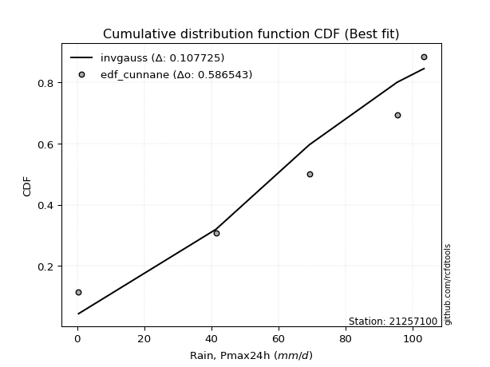</img></img>

</div>


### 12. EDF Adamowski (1981)

The Adamowski formula in hydrology refers to a specific plotting position formula used for estimating the non-parametric empirical distribution of hydrological events (like flood peaks) to calculate their return periods. This formula provides an alternative to traditional parametric methods (like the Gumbel or Log Pearson Type III distributions). 

<div align="center">


$P=(m-0.25)/(n+0.5)$


</div>


**12.1. Empirical values**

<div align="center">

|                | 0                   | 1                  | 2             | 3                  | 4                  |
|:---------------|:--------------------|:-------------------|:--------------|:-------------------|:-------------------|
| date           | 2021                | 2022               | 2024          | 2019               | 2020               |
| x              | 0.4                 | 41.4               | 69.2          | 95.4               | 103.4              |
| m              | 1                   | 2                  | 3             | 4                  | 5                  |
| empirical_dist | edf_adamowski       | edf_adamowski      | edf_adamowski | edf_adamowski      | edf_adamowski      |
| empirical      | 0.13636363636363635 | 0.3181818181818182 | 0.5           | 0.6818181818181818 | 0.8636363636363636 |
| empirical_tr   | 1.1578947368421053  | 1.4666666666666666 | 2.0           | 3.1428571428571423 | 7.333333333333334  |

</div>


**12.2. Kolmogorov-Smirnov fit test (sorted by Δ)**


<div align="center">

|                | 0                   | 1                   | 2                  | 3                   | 4                   | 5                   | 6                   | 7                   | 8                   | 9                   | 10                  | 11                 | 12                  | 13                  | 14                 | 15                  | 16                  | 17                 | 18                  | 19                  | 20                  | 21                  | 22                  | 23                  | 24                  | 25                  | 26                  | 27                 | 28                  | 29                  | 30                  | 31                 | 32                  | 33                  | 34                  | 35                 | 36                  | 37                 | 38                    | 39                 | 40                 | 41                 | 42                 | 43                 | 44                  | 45                 | 46                 | 47                  | 48                  | 49                 | 50                  | 51                 | 52                 | 53                 | 54                 | 55                 | 56                 | 57                  | 58                 | 59                 | 60                  | 61                 | 62                  | 63                  | 64                  | 65                  | 66                  | 67                 | 68                 | 69                 | 70                  | 71                 | 72                  | 73                  | 74                  | 75                  | 76                 | 77                 | 78                 | 79                 | 80                 | 81                 | 82                 | 83                 | 84                 | 85                 | 86                 | 87                 |
|:---------------|:--------------------|:--------------------|:-------------------|:--------------------|:--------------------|:--------------------|:--------------------|:--------------------|:--------------------|:--------------------|:--------------------|:-------------------|:--------------------|:--------------------|:-------------------|:--------------------|:--------------------|:-------------------|:--------------------|:--------------------|:--------------------|:--------------------|:--------------------|:--------------------|:--------------------|:--------------------|:--------------------|:-------------------|:--------------------|:--------------------|:--------------------|:-------------------|:--------------------|:--------------------|:--------------------|:-------------------|:--------------------|:-------------------|:----------------------|:-------------------|:-------------------|:-------------------|:-------------------|:-------------------|:--------------------|:-------------------|:-------------------|:--------------------|:--------------------|:-------------------|:--------------------|:-------------------|:-------------------|:-------------------|:-------------------|:-------------------|:-------------------|:--------------------|:-------------------|:-------------------|:--------------------|:-------------------|:--------------------|:--------------------|:--------------------|:--------------------|:--------------------|:-------------------|:-------------------|:-------------------|:--------------------|:-------------------|:--------------------|:--------------------|:--------------------|:--------------------|:-------------------|:-------------------|:-------------------|:-------------------|:-------------------|:-------------------|:-------------------|:-------------------|:-------------------|:-------------------|:-------------------|:-------------------|
| station        | 21257100            | 21257100            | 21257100           | 21257100            | 21257100            | 21257100            | 21257100            | 21257100            | 21257100            | 21257100            | 21257100            | 21257100           | 21257100            | 21257100            | 21257100           | 21257100            | 21257100            | 21257100           | 21257100            | 21257100            | 21257100            | 21257100            | 21257100            | 21257100            | 21257100            | 21257100            | 21257100            | 21257100           | 21257100            | 21257100            | 21257100            | 21257100           | 21257100            | 21257100            | 21257100            | 21257100           | 21257100            | 21257100           | 21257100              | 21257100           | 21257100           | 21257100           | 21257100           | 21257100           | 21257100            | 21257100           | 21257100           | 21257100            | 21257100            | 21257100           | 21257100            | 21257100           | 21257100           | 21257100           | 21257100           | 21257100           | 21257100           | 21257100            | 21257100           | 21257100           | 21257100            | 21257100           | 21257100            | 21257100            | 21257100            | 21257100            | 21257100            | 21257100           | 21257100           | 21257100           | 21257100            | 21257100           | 21257100            | 21257100            | 21257100            | 21257100            | 21257100           | 21257100           | 21257100           | 21257100           | 21257100           | 21257100           | 21257100           | 21257100           | 21257100           | 21257100           | 21257100           | 21257100           |
| empirical_dist | edf_adamowski       | edf_adamowski       | edf_adamowski      | edf_adamowski       | edf_adamowski       | edf_adamowski       | edf_adamowski       | edf_adamowski       | edf_adamowski       | edf_adamowski       | edf_adamowski       | edf_adamowski      | edf_adamowski       | edf_adamowski       | edf_adamowski      | edf_adamowski       | edf_adamowski       | edf_adamowski      | edf_adamowski       | edf_adamowski       | edf_adamowski       | edf_adamowski       | edf_adamowski       | edf_adamowski       | edf_adamowski       | edf_adamowski       | edf_adamowski       | edf_adamowski      | edf_adamowski       | edf_adamowski       | edf_adamowski       | edf_adamowski      | edf_adamowski       | edf_adamowski       | edf_adamowski       | edf_adamowski      | edf_adamowski       | edf_adamowski      | edf_adamowski         | edf_adamowski      | edf_adamowski      | edf_adamowski      | edf_adamowski      | edf_adamowski      | edf_adamowski       | edf_adamowski      | edf_adamowski      | edf_adamowski       | edf_adamowski       | edf_adamowski      | edf_adamowski       | edf_adamowski      | edf_adamowski      | edf_adamowski      | edf_adamowski      | edf_adamowski      | edf_adamowski      | edf_adamowski       | edf_adamowski      | edf_adamowski      | edf_adamowski       | edf_adamowski      | edf_adamowski       | edf_adamowski       | edf_adamowski       | edf_adamowski       | edf_adamowski       | edf_adamowski      | edf_adamowski      | edf_adamowski      | edf_adamowski       | edf_adamowski      | edf_adamowski       | edf_adamowski       | edf_adamowski       | edf_adamowski       | edf_adamowski      | edf_adamowski      | edf_adamowski      | edf_adamowski      | edf_adamowski      | edf_adamowski      | edf_adamowski      | edf_adamowski      | edf_adamowski      | edf_adamowski      | edf_adamowski      | edf_adamowski      |
| p_dist         | invgauss            | pearson3            | fatiguelife        | invgamma            | rice                | betaprime           | erlang              | crystalball         | norm                | exponnorm           | t                   | chi2               | gamma               | maxwell             | rayleigh           | kstwobign           | weibull_min         | halfnorm           | gumbel_l            | laplace_asymmetric  | logistic            | gumbel_r            | f                   | hypsecant           | halflogistic        | moyal               | genexpon            | expon              | laplace             | logpearson3         | logt                | loggompertz        | loggumbel_l         | mielke              | wald                | ncf                | fisk                | logloggamma        | loglaplace_asymmetric | gibrat             | lognakagami        | logcrystalball     | lognorm            | lognorm            | logexponnorm        | logrice            | lognct             | loggamma            | loggamma            | loginvweibull      | logjohnsonsu        | loglogistic        | loginvgamma        | logalpha           | loginvgauss        | loghypsecant       | logncf             | logmaxwell          | lograyleigh        | nakagami           | logkstwobign        | gompertz           | loglaplace          | logfisk             | loggenexpon         | loghalfnorm         | loggumbel_r         | logexpon           | nct                | loghalflogistic    | logmoyal            | loglognorm         | logf                | invweibull          | logwald             | loggibrat           | truncnorm          | logtruncnorm       | logweibull_min     | logfatiguelife     | logchi2            | logbetaprime       | logmielke          | logerlang          | johnsonsu          | alpha              | loggenlogistic     | genlogistic        |
| delta          | 0.11821453938843562 | 0.12820406246691607 | 0.1286814480537477 | 0.12906120291846623 | 0.12907379865311375 | 0.12944366628473558 | 0.13005534402179175 | 0.13074692029247148 | 0.13074692167767377 | 0.13074744485318446 | 0.13077778767552828 | 0.1310122649631319 | 0.13156709196710548 | 0.13200084106317567 | 0.1323689959627713 | 0.13398972279199584 | 0.13783401171739296 | 0.1391254916233553 | 0.14479951436322858 | 0.14872159368599125 | 0.15152997273588542 | 0.15353277287427136 | 0.16245219776851066 | 0.16335998409634633 | 0.16710388299504086 | 0.16863480400037356 | 0.17072807937028722 | 0.1729390836515552 | 0.17563773611143652 | 0.18085476793597904 | 0.19035109965611297 | 0.2032204676505221 | 0.20934673920811947 | 0.22290719221698008 | 0.23488268394983725 | 0.2477324916209357 | 0.24849178785388237 | 0.2612824902160107 | 0.26160674162555186   | 0.2656569963269425 | 0.2705426094661412 | 0.2710296633095713 | 0.2710298499128329 | 0.2710298499128329 | 0.27103021019097023 | 0.2710372181227592 | 0.2713402912306659 | 0.27424741081008136 | 0.27424741081008136 | 0.2816064939070138 | 0.28225380791709653 | 0.2826767147804416 | 0.2891301082829348 | 0.2900225665926696 | 0.2913022503570574 | 0.2922900503644779 | 0.2943392331771046 | 0.29848205863584204 | 0.3070639257469741 | 0.3089648279644684 | 0.31602151163163444 | 0.318181818181011  | 0.31835496432056326 | 0.32187118937199366 | 0.32733265230136926 | 0.33142657024773375 | 0.33857587632646396 | 0.3536064644905375 | 0.355302023916189  | 0.3596174643244498 | 0.36183631578086545 | 0.3825876602500086 | 0.40418652236276026 | 0.42589215666902314 | 0.42654436836200743 | 0.45788739107748494 | 0.4723611614289392 | 0.5149928290833179 | 0.5562865086939288 | 0.5855778701209069 | 0.5928036523288454 | 0.5949775114258853 | 0.6201895440324654 | 0.6392469788491129 | 0.6610953663624153 | 0.6646356247322378 | 0.6818181818181818 | 0.6818181818181818 |
| deltao         | 0.5865427407550001  | 0.5865427407550001  | 0.5865427407550001 | 0.5865427407550001  | 0.5865427407550001  | 0.5865427407550001  | 0.5865427407550001  | 0.5865427407550001  | 0.5865427407550001  | 0.5865427407550001  | 0.5865427407550001  | 0.5865427407550001 | 0.5865427407550001  | 0.5865427407550001  | 0.5865427407550001 | 0.5865427407550001  | 0.5865427407550001  | 0.5865427407550001 | 0.5865427407550001  | 0.5865427407550001  | 0.5865427407550001  | 0.5865427407550001  | 0.5865427407550001  | 0.5865427407550001  | 0.5865427407550001  | 0.5865427407550001  | 0.5865427407550001  | 0.5865427407550001 | 0.5865427407550001  | 0.5865427407550001  | 0.5865427407550001  | 0.5865427407550001 | 0.5865427407550001  | 0.5865427407550001  | 0.5865427407550001  | 0.5865427407550001 | 0.5865427407550001  | 0.5865427407550001 | 0.5865427407550001    | 0.5865427407550001 | 0.5865427407550001 | 0.5865427407550001 | 0.5865427407550001 | 0.5865427407550001 | 0.5865427407550001  | 0.5865427407550001 | 0.5865427407550001 | 0.5865427407550001  | 0.5865427407550001  | 0.5865427407550001 | 0.5865427407550001  | 0.5865427407550001 | 0.5865427407550001 | 0.5865427407550001 | 0.5865427407550001 | 0.5865427407550001 | 0.5865427407550001 | 0.5865427407550001  | 0.5865427407550001 | 0.5865427407550001 | 0.5865427407550001  | 0.5865427407550001 | 0.5865427407550001  | 0.5865427407550001  | 0.5865427407550001  | 0.5865427407550001  | 0.5865427407550001  | 0.5865427407550001 | 0.5865427407550001 | 0.5865427407550001 | 0.5865427407550001  | 0.5865427407550001 | 0.5865427407550001  | 0.5865427407550001  | 0.5865427407550001  | 0.5865427407550001  | 0.5865427407550001 | 0.5865427407550001 | 0.5865427407550001 | 0.5865427407550001 | 0.5865427407550001 | 0.5865427407550001 | 0.5865427407550001 | 0.5865427407550001 | 0.5865427407550001 | 0.5865427407550001 | 0.5865427407550001 | 0.5865427407550001 |
| eval           | Δo > Δ              | Δo > Δ              | Δo > Δ             | Δo > Δ              | Δo > Δ              | Δo > Δ              | Δo > Δ              | Δo > Δ              | Δo > Δ              | Δo > Δ              | Δo > Δ              | Δo > Δ             | Δo > Δ              | Δo > Δ              | Δo > Δ             | Δo > Δ              | Δo > Δ              | Δo > Δ             | Δo > Δ              | Δo > Δ              | Δo > Δ              | Δo > Δ              | Δo > Δ              | Δo > Δ              | Δo > Δ              | Δo > Δ              | Δo > Δ              | Δo > Δ             | Δo > Δ              | Δo > Δ              | Δo > Δ              | Δo > Δ             | Δo > Δ              | Δo > Δ              | Δo > Δ              | Δo > Δ             | Δo > Δ              | Δo > Δ             | Δo > Δ                | Δo > Δ             | Δo > Δ             | Δo > Δ             | Δo > Δ             | Δo > Δ             | Δo > Δ              | Δo > Δ             | Δo > Δ             | Δo > Δ              | Δo > Δ              | Δo > Δ             | Δo > Δ              | Δo > Δ             | Δo > Δ             | Δo > Δ             | Δo > Δ             | Δo > Δ             | Δo > Δ             | Δo > Δ              | Δo > Δ             | Δo > Δ             | Δo > Δ              | Δo > Δ             | Δo > Δ              | Δo > Δ              | Δo > Δ              | Δo > Δ              | Δo > Δ              | Δo > Δ             | Δo > Δ             | Δo > Δ             | Δo > Δ              | Δo > Δ             | Δo > Δ              | Δo > Δ              | Δo > Δ              | Δo > Δ              | Δo > Δ             | Δo > Δ             | Δo > Δ             | Δo > Δ             | Δo <= Δ            | Δo <= Δ            | Δo <= Δ            | Δo <= Δ            | Δo <= Δ            | Δo <= Δ            | Δo <= Δ            | Δo <= Δ            |
| fit            | 1                   | 1                   | 1                  | 1                   | 1                   | 1                   | 1                   | 1                   | 1                   | 1                   | 1                   | 1                  | 1                   | 1                   | 1                  | 1                   | 1                   | 1                  | 1                   | 1                   | 1                   | 1                   | 1                   | 1                   | 1                   | 1                   | 1                   | 1                  | 1                   | 1                   | 1                   | 1                  | 1                   | 1                   | 1                   | 1                  | 1                   | 1                  | 1                     | 1                  | 1                  | 1                  | 1                  | 1                  | 1                   | 1                  | 1                  | 1                   | 1                   | 1                  | 1                   | 1                  | 1                  | 1                  | 1                  | 1                  | 1                  | 1                   | 1                  | 1                  | 1                   | 1                  | 1                   | 1                   | 1                   | 1                   | 1                   | 1                  | 1                  | 1                  | 1                   | 1                  | 1                   | 1                   | 1                   | 1                   | 1                  | 1                  | 1                  | 1                  | 0                  | 0                  | 0                  | 0                  | 0                  | 0                  | 0                  | 0                  |
| n              | 5                   | 5                   | 5                  | 5                   | 5                   | 5                   | 5                   | 5                   | 5                   | 5                   | 5                   | 5                  | 5                   | 5                   | 5                  | 5                   | 5                   | 5                  | 5                   | 5                   | 5                   | 5                   | 5                   | 5                   | 5                   | 5                   | 5                   | 5                  | 5                   | 5                   | 5                   | 5                  | 5                   | 5                   | 5                   | 5                  | 5                   | 5                  | 5                     | 5                  | 5                  | 5                  | 5                  | 5                  | 5                   | 5                  | 5                  | 5                   | 5                   | 5                  | 5                   | 5                  | 5                  | 5                  | 5                  | 5                  | 5                  | 5                   | 5                  | 5                  | 5                   | 5                  | 5                   | 5                   | 5                   | 5                   | 5                   | 5                  | 5                  | 5                  | 5                   | 5                  | 5                   | 5                   | 5                   | 5                   | 5                  | 5                  | 5                  | 5                  | 5                  | 5                  | 5                  | 5                  | 5                  | 5                  | 5                  | 5                  |
| best_fit       | 1                   | 0                   | 0                  | 0                   | 0                   | 0                   | 0                   | 0                   | 0                   | 0                   | 0                   | 0                  | 0                   | 0                   | 0                  | 0                   | 0                   | 0                  | 0                   | 0                   | 0                   | 0                   | 0                   | 0                   | 0                   | 0                   | 0                   | 0                  | 0                   | 0                   | 0                   | 0                  | 0                   | 0                   | 0                   | 0                  | 0                   | 0                  | 0                     | 0                  | 0                  | 0                  | 0                  | 0                  | 0                   | 0                  | 0                  | 0                   | 0                   | 0                  | 0                   | 0                  | 0                  | 0                  | 0                  | 0                  | 0                  | 0                   | 0                  | 0                  | 0                   | 0                  | 0                   | 0                   | 0                   | 0                   | 0                   | 0                  | 0                  | 0                  | 0                   | 0                  | 0                   | 0                   | 0                   | 0                   | 0                  | 0                  | 0                  | 0                  | 0                  | 0                  | 0                  | 0                  | 0                  | 0                  | 0                  | 0                  |
| best_fit_sort  | 1                   | 2                   | 3                  | 4                   | 5                   | 6                   | 7                   | 8                   | 9                   | 10                  | 11                  | 12                 | 13                  | 14                  | 15                 | 16                  | 17                  | 18                 | 19                  | 20                  | 21                  | 22                  | 23                  | 24                  | 25                  | 26                  | 27                  | 28                 | 29                  | 30                  | 31                  | 32                 | 33                  | 34                  | 35                  | 36                 | 37                  | 38                 | 39                    | 40                 | 41                 | 42                 | 43                 | 44                 | 45                  | 46                 | 47                 | 48                  | 49                  | 50                 | 51                  | 52                 | 53                 | 54                 | 55                 | 56                 | 57                 | 58                  | 59                 | 60                 | 61                  | 62                 | 63                  | 64                  | 65                  | 66                  | 67                  | 68                 | 69                 | 70                 | 71                  | 72                 | 73                  | 74                  | 75                  | 76                  | 77                 | 78                 | 79                 | 80                 | 81                 | 82                 | 83                 | 84                 | 85                 | 86                 | 87                 | 88                 |

</div>


**12.3. Best fit**

<div align="center">

|   id |   station | empirical_dist   | p_dist   |    delta |   deltao | eval   |   fit |   n |   best_fit |   best_fit_sort |
|-----:|----------:|:-----------------|:---------|---------:|---------:|:-------|------:|----:|-----------:|----------------:|
|    0 |  21257100 | edf_adamowski    | invgauss | 0.118215 | 0.586543 | Δo > Δ |     1 |   5 |          1 |               1 |

</div>


<div align="center">

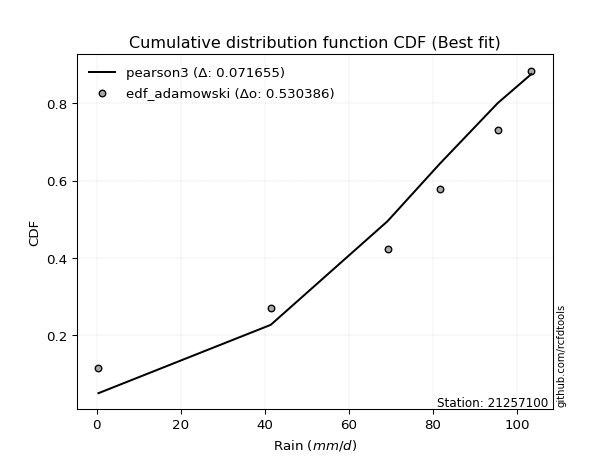</img>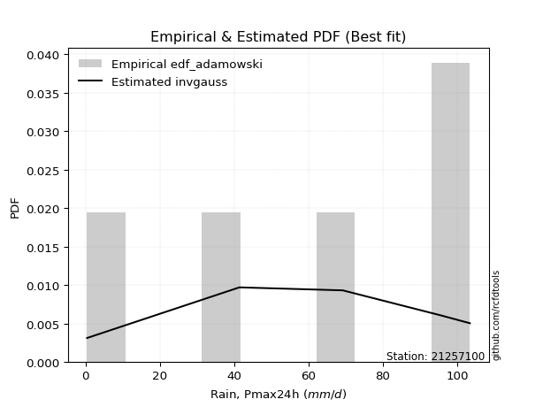</img>

</div>


## C. Best fit & Estimate extreme values for specific return periods - Tr

Best fit in probability distribution analysis means finding the theoretical distribution (like Normal, Poisson, Exponential) that most accurately mirrors your real-world data´s patterns (shape, center, spread) for better predictions, using methods like visual checks (Q-Q plots), goodness-of-fit tests (Kolmogorov-Smirnov, Chi-Squared), and information criteria (AIC) to score and select the simplest, most representative model.


### 1. Best fit (ordered by delta Δ)

<div align="center">

|   id |   station | empirical_dist   | p_dist   |    delta |   deltao | eval   |   fit |   n |   best_fit |   best_fit_sort |
|-----:|----------:|:-----------------|:---------|---------:|---------:|:-------|------:|----:|-----------:|----------------:|
|    0 |  21257100 | edf_hazen        | invgauss | 0.100033 | 0.586543 | Δo > Δ |     1 |   5 |          1 |               1 |
|    1 |  21257100 | edf_gringorten   | invgauss | 0.10472  | 0.586543 | Δo > Δ |     1 |   5 |          1 |               2 |
|    2 |  21257100 | edf_cunnane      | invgauss | 0.107725 | 0.586543 | Δo > Δ |     1 |   5 |          1 |               3 |
|    3 |  21257100 | edf_blom         | invgauss | 0.109557 | 0.586543 | Δo > Δ |     1 |   5 |          1 |               4 |
|    4 |  21257100 | edf_tukey        | invgauss | 0.112533 | 0.586543 | Δo > Δ |     1 |   5 |          1 |               5 |
|    5 |  21257100 | edf_filliben     | invgauss | 0.113639 | 0.586543 | Δo > Δ |     1 |   5 |          1 |               6 |
|    6 |  21257100 | edf_beard        | invgauss | 0.114159 | 0.586543 | Δo > Δ |     1 |   5 |          1 |               7 |
|    7 |  21257100 | edf_jenkinson    | invgauss | 0.114159 | 0.586543 | Δo > Δ |     1 |   5 |          1 |               8 |
|    8 |  21257100 | edf_chegodayev   | invgauss | 0.114848 | 0.586543 | Δo > Δ |     1 |   5 |          1 |               9 |
|    9 |  21257100 | edf_adamowski    | invgauss | 0.118215 | 0.586543 | Δo > Δ |     1 |   5 |          1 |              10 |
|   10 |  21257100 | edf_weibull      | invgauss | 0.133366 | 0.586543 | Δo > Δ |     1 |   5 |          1 |              11 |
|   11 |  21257100 | edf_california   | pearson3 | 0.137485 | 0.586543 | Δo > Δ |     1 |   5 |          1 |              12 |

</div>

:file_folder:Tables: [bestfit_21257100.csv](table/bestfit_21257100.csv) | [extreme_21257100.csv](table/extreme_21257100.csv)


### 2. Extreme values

In hydrology, a return period (or recurrence interval $Tr$) is the statistical average time between extreme events like floods or droughts of a specific magnitude, indicating how rare an event is, with a 100-year flood, for example, having a 1% chance of occurring in any given year, not that it happens exactly every century. It is a key tool for infrastructure design (like bridges or dams) and risk assessment, calculated from historical data to determine the probability of future events, although it is important to remember it is statistical average, and events can cluster or be missed.

> risk_rate: assuming the return period as the project useful life.

|   id |      tr |   prob_l |     prob_g |     alpha |   betaprime |     chi2 |   crystalball |   erlang |    expon |   exponnorm |         f |   fatiguelife |        fisk |    gamma |   genexpon |   genlogistic |   gibrat |   gompertz |   gumbel_l |   gumbel_r |   halflogistic |   halfnorm |   hypsecant |   invgamma |   invgauss |       invweibull |   johnsonsu |   kstwobign |   laplace |   laplace_asymmetric |   loggamma |   logistic |    lognorm |   maxwell |   mielke |    moyal |   nakagami |      ncf |              nct |     norm |   pearson3 |   rayleigh |     rice |        t |   truncnorm |     wald |   weibull_min |   logalpha |     logbetaprime |          logchi2 |   logcrystalball |    logerlang |         logexpon |   logexponnorm |            logf |   logfatiguelife |      logfisk |   loggenexpon |   loggenlogistic |        loggibrat |   loggompertz |   loggumbel_l |   loggumbel_r |   loghalflogistic |   loghalfnorm |   loghypsecant |   loginvgamma |   loginvgauss |    loginvweibull |   logjohnsonsu |     logkstwobign |   loglaplace |   loglaplace_asymmetric |   logloggamma |   loglogistic |     loglognorm |   logmaxwell |       logmielke |         logmoyal |   lognakagami |         logncf |     lognct |   logpearson3 |   lograyleigh |    logrice |            logt |   logtruncnorm |          logwald |   logweibull_min |   station |   n |   risk_rate |
|-----:|--------:|---------:|-----------:|----------:|------------:|---------:|--------------:|---------:|---------:|------------:|----------:|--------------:|------------:|---------:|-----------:|--------------:|---------:|-----------:|-----------:|-----------:|---------------:|-----------:|------------:|-----------:|-----------:|-----------------:|------------:|------------:|----------:|---------------------:|-----------:|-----------:|-----------:|----------:|---------:|---------:|-----------:|---------:|-----------------:|---------:|-----------:|-----------:|---------:|---------:|------------:|---------:|--------------:|-----------:|-----------------:|-----------------:|-----------------:|-------------:|-----------------:|---------------:|----------------:|-----------------:|-------------:|--------------:|-----------------:|-----------------:|--------------:|--------------:|--------------:|------------------:|--------------:|---------------:|--------------:|--------------:|-----------------:|---------------:|-----------------:|-------------:|------------------------:|--------------:|--------------:|---------------:|-------------:|----------------:|-----------------:|--------------:|---------------:|-----------:|--------------:|--------------:|-----------:|----------------:|---------------:|-----------------:|-----------------:|----------:|----:|------------:|
|    0 |    2    | 0.5      | 0.5        |   1.32277 |     61.6861 |  60.0194 |       61.96   |  60.8322 |  43.0701 |     61.96   |   44.774  |       61.8683 |     53.7889 |  60.7577 |    43.3289 |           inf |  50.6486 |    82.5817 |    68.1508 |    55.7692 |        52.6914 |    54.2462 |     61.96   |    58.4721 |    59.3452 |   2754.25        |       103.4 |     53.418  |   61.96   |              65.3762 |    24.4046 |    61.96   |    25.7423 |   58.7371 |  40.6411 |  53.7706 |    18.6012 |  35.5753 |      5.34096     |  61.96   |    65.0713 |    57.594  |  60.4727 |  61.958  |   -11.0451  |  49.7445 |       68.9661 |    22.2501 |     0.405297     |      0.970513    |          25.7423 |     0.77046  |      7.17261     |        25.7422 |    1.23496      |      0.400002    |      1.99223 |       14.1701 |          inf     |     13.677       |       38.5367 |       36.389  |       18.2106 |      15.3318      |       16.7239 |        25.7423 |       22.5544 |       21.3305 |     19.5423      |        102.257 |     14.7086      |      25.7423 |                 39.51   |       39.7016 |       25.7423 |   0.400921     |      21.4975 |    0.402996     |     16.2852      |       25.8028 |   4.63118      |    25.66   |       41.5902 |       20.1665 |    25.7423 |   85.5811       |        6.78072 |     13.0028      |      1.32324     |  21257100 |   5 |    0.75     |
|    1 |    2.33 | 0.570815 | 0.429185   |   1.57378 |     68.4608 |  66.9601 |       68.6847 |  67.7025 |  52.4717 |     68.6847 |   59.0697 |       68.6455 |     80.0134 |  67.5981 |    52.7875 |           inf |  54.055  |    85.9729 |    74.0014 |    62.0003 |        59.098  |    61.5039 |     67.3417 |    65.5715 |    66.57   | 146043           |       103.4 |     61.4149 |   66.0295 |              69.9782 |    36.515  |    67.8849 |    37.4915 |   65.7235 |  49.1925 |  59.6692 |    29.6138 |  43.2046 |     11.0353      |  68.6847 |    71.6159 |    64.6838 |  67.4395 |  68.6822 |     1.05291 |  54.154  |       74.7842 |    33.2623 |     0.416553     |      1.28923     |          37.4916 |     0.946981 |     13.5484      |        37.4914 |    2.21267      |      0.436355    | 237499       |       23.3744 |          inf     |     16.5465      |       48.6725 |       50.4698 |       25.8004 |      21.936       |       25.0939 |        34.7796 |       33.5398 |       32.5766 |     32.9629      |        103.114 |     24.8257      |      32.3192 |                 47.4873 |       47.6742 |       35.852  |   0.412305     |      31.7711 |    0.408958     |     22.6476      |       37.5883 |  15.2909       |    37.4159 |       57.4503 |       29.9767 |    37.4903 |   91.6747       |        9.96923 |     16.6382      |      1.84766     |  21257100 |   5 |    0.729209 |
|    2 |    5    | 0.8      | 0.2        |   3.52017 |     93.8247 |  93.486  |       93.6753 |  93.683  |  99.477  |     93.6753 |  146.743  |       93.9408 |    372.816  |  93.4676 |   100.078  |           inf |  73.6669 |    97.3291 |    92.902  |    89.0713 |        88.0867 |    92.1956 |     88.9292 |    93.6391 |    95.3946 |      4.5358e+12  |       103.4 |     95.3837 |   86.3758 |              90.867  |   167.372  |    90.7617 |   151.617  |   93.2217 |  80.1273 |  86.9919 |   102.814  |  80.5641 |    452.303       |  93.6753 |    94.2359 |    93.0674 |  93.8089 |  93.6711 |    43.3832  |  78.838  |       93.5801 |   155.155  |     0.936739     |      6.37112     |         151.617  |     2.99991  |    325.738       |       151.618  | 3227.66         |      2.76911     |    inf       |      179.395  |          inf     |     49.5348      |      104.014  |      145.201  |      117.207  |     110.931       |      139.579  |       116.28   |      152.585  |      168.912  |    319.468       |        103.398 |    229.377       |     100.81   |                 75.8775 |       75.9996 |      128.825  |   4.75561e+190 |     147.82   |    0.632313     |    104.343       |      152.168  |   1.98354e+07  |   152.127  |      148.317  |      146.55   |   151.595  |  136.794        |       34.5622  |     66.1423      |     11.8521      |  21257100 |   5 |    0.67232  |
|    3 |   10    | 0.9      | 0.1        |   7.09617 |    110.814  | 111.726  |      110.253  | 111.31   | 142.147  |    110.253  |  249.843  |      110.816  |   1160.48   | 111.021  |   143.007  |           inf |  96.0222 |   103.841  |   103.425  |   111.12   |       112.161  |   114.907  |    106.167  |   113.84   |   116.324  |      5.74011e+18 |       103.4 |    121.247  |  104.846  |             109.829  |   469.693  |   107.61   |   383.084  |  112.574  |  95.0284 | 110.781  |   173.185  | 115.354  |  13382.7         | 110.253  |   107.806  |   113.306  | 111.582  | 110.248  |    67.2789  | 105.034  |      104.045  |   449.308  |    15.1884       |     31.4109      |         383.084  |     9.43257  |   5840.98        |       383.087  |    1.10621e+14  |     35.5129      |    inf       |      782.035  |          inf     |    172.874       |      159.113  |      261.509  |      402.104  |     426.193       |      496.925  |       304.842  |      432.253  |      536.972  |   2031.6         |        103.4   |   1246.71        |     283.127  |                 89.3582 |       89.4296 |      330.444  | inf            |     436.142  |    3.10597      |    394.542       |      384.809  |   2.41167e+26  |   386.075  |      229.215  |      454.364  |   382.998  |  297.615        |       59.6302  |    286.124       |     78.22        |  21257100 |   5 |    0.651322 |
|    4 |   15    | 0.933333 | 0.0666667  |  10.6594  |    119.341  | 121.022  |      118.526  | 120.224  | 167.108  |    118.526  |  321.677  |      119.266  |   2154.92   | 119.899  |   168.119  |           inf | 111.442  |   106.821  |   108.191  |   123.56   |       125.784  |   126.726  |    116.005  |   124.431  |   127.336  |      1.59136e+22 |       103.4 |    134.977  |  115.65   |             120.922  |   791.213  |   116.789  |   608.376  |  122.503  | 100.176  | 124.587  |   212.028  | 136.612  |  97095.1         | 118.526  |   114.164  |   123.733  | 120.508  | 118.52   |    77.1434  | 121.855  |      108.784  |   773.835  |   503.827        |     82.856       |         608.377  |    18.9025   |  31608.6         |       608.382  |    8.23275e+29  |    188.395       |    inf       |     1675.96   |          inf     |    409.394       |      192.962  |      341.353  |      806.116  |     912.877       |      962.22   |       528.385  |      734.978  |      975.62   |   5769.19        |        103.4   |   3062.52        |     517.994  |                 93.9861 |       94.0377 |      552.067  | inf            |     759.844  |   23.9791       |    853.737       |      611.413  |   7.93798e+53  |   614.64   |      271.158  |      813.961  |   608.217  |  726.343        |       71.5909  |    732.847       |    252.303       |  21257100 |   5 |    0.644736 |
|    5 |   20    | 0.95     | 0.05       |  14.2195  |    124.942  | 127.181  |      123.944  | 126.105  | 184.817  |    123.944  |  378.402  |      124.81   |   3305.46   | 125.756  |   185.936  |           inf | 123.537  |   108.684  |   111.157  |   132.27   |       135.329  |   134.605  |    122.945  |   131.56   |   134.758  |      4.09601e+24 |       103.4 |    144.226  |  123.315  |             128.792  |  1115.94   |   123.134  |   823.612  |  129.092  | 102.802  | 134.364  |   238.327  | 152.208  | 396137           | 123.944  |   118.181  |   130.664  | 126.371  | 123.938  |    82.682   | 134.391  |      111.734  |  1110.13   | 26690.6          |    166.859       |         823.613  |    31.2045   | 104738           |       823.622  |    4.87377e+50  |    648.048       |    inf       |     2784.44   |          inf     |    805.08        |      217.596  |      402.932  |     1311.87   |    1556.63        |     1494.89   |       778.873  |     1044.82   |     1453.11   |  11980.9         |        103.4   |   5610.55        |     795.17   |                 96.3244 |       96.3655 |      787.137  | inf            |    1098.33   |  242.579        |   1474.82        |      828.003  |   7.62486e+88  |   833.514  |      297.982  |     1199.22   |   823.376  | 1949.11         |       78.4616  |   1477.05        |    594.336       |  21257100 |   5 |    0.641514 |
|    6 |   25    | 0.96     | 0.04       |  17.7784  |    129.075  | 131.75   |      127.932  | 130.455  | 198.554  |    127.932  |  425.967  |      128.896  |   4585.37   | 130.088  |   199.756  |           inf | 133.621  |   110.013  |   113.268  |   138.979  |       142.683  |   140.468  |    128.316  |   136.909  |   140.329  |      2.94544e+26 |       103.4 |    151.154  |  129.261  |             134.896  |  1439.15   |   127.987  |  1029.35   |  133.984  | 104.417  | 141.943  |   258.018  | 164.631  |      1.17896e+06 | 127.932  |   121.065  |   135.814  | 130.694  | 127.926  |    86.2599  | 144.431  |      113.833  |  1451.54   |     2.05094e+06  |    288.811       |        1029.35   |    46.2108   | 265263           |      1029.36   |    1.20029e+76  |   1729.45        |    inf       |     4062.05   |          inf     |   1414.76        |      237.027  |      453.407  |     1908.96   |    2348.3         |     2074.77   |      1051.68   |     1356.49   |     1955.67   |  21035.3         |        103.4   |   8829.75        |    1108.76   |                 97.735  |       97.7698 |     1032.53   | inf            |    1443.85   | 2995.86         |   2253           |     1035.1    |   5.29817e+130 |  1043.08   |      317.077  |     1599.33   |  1029.03   | 5660.81         |       82.9034  |   2589.4         |   1171.05        |  21257100 |   5 |    0.639603 |
|    7 |   50    | 0.98     | 0.02       |  35.567   |    140.951  | 145.002  |      139.353  | 143.015  | 241.224  |    139.352  |  595.911  |      140.622  |  12464.8    | 142.598  |   242.685  |           inf | 169.166  |   113.633  |   118.998  |   159.646  |       165.342  |   157.509  |    144.969  |   152.714  |   156.802  |      1.54539e+32 |       103.4 |    171.497  |  147.731  |             153.858  |  2998.45   |   142.817  |  1949.26   |  148.173  | 107.942  | 165.47   |   315.529  | 205.24   |      3.48987e+07 | 139.353  |   128.989  |   150.762  | 143.106  | 139.345  |    94.1537  | 177.214  |      119.532  |  3165.95   |     3.37053e+17  |   1628.37        |        1949.26   |   159.202    |      4.75657e+06 |      1949.29   |    2.64123e+266 |  40334.3         |    inf       |    12179.6    |          inf     |  10321.9         |      299.02   |      624.633  |     6062.25   |    8335.93        |     5379.7    |      2668.29   |     2893.66   |     4660.63   | 119129           |        103.4   |  33440.1         |    3113.98   |                100.573  |      100.595  |     2365.82   | inf            |    3191.77   |    6.47797e+09  |   8395.39        |     1961.69   | inf            |  1983.12   |      367.248  |     3688.98   |  1948.57   |    2.8468e+06   |       92.574   |  16189           |  10314.7         |  21257100 |   5 |    0.63583  |
|    8 |   75    | 0.986667 | 0.0133333  |  53.3532  |    147.349  | 152.216  |      145.481  | 149.816  | 266.185  |    145.48   |  712.944  |      146.929  |  22209.4    | 149.372  |   267.797  |           inf | 193.173  |   115.47   |   121.896  |   171.659  |       178.514  |   166.786  |    154.7    |   161.504  |   165.962  |      3.26329e+35 |       103.4 |    182.69   |  158.535  |             164.951  |  4461.26   |   151.382  |  2745.78   |  155.886  | 109.398  | 179.228  |   346.871  | 230.563  |      2.53204e+08 | 145.481  |   133.038  |   158.894  | 149.784  | 145.473  |    97.0573  | 197.387  |      122.413  |  4846.96   |     8.68598e+30  |   4543.49        |        2745.78   |   331.474    |      2.57403e+07 |      2745.83   |  inf            | 268785           |    inf       |    22156.6    |          inf     |  39507.7         |      336.322  |      734.486  |    11866.4    |   17409.4         |     9036.66   |      4597.59   |     4372.27   |     7509.5    | 326383           |        103.4   |  69575.2         |    5697.17   |                101.525  |      101.542  |     3819.01   | inf            |    4912.89   |    1.38225e+17  |  18118.2         |     2764.53   | inf            |  2799.8    |      390.755  |     5812.66   |  2744.72   |    4.25269e+09  |       96.0479  |  50009.9         |  38486.2         |  21257100 |   5 |    0.634587 |
|    9 |  100    | 0.99     | 0.01       |  71.1388  |    151.686  | 157.136  |      149.625  | 154.441  | 283.894  |    149.625  |  804.967  |      151.201  |  33392.1    | 153.979  |   285.614  |           inf | 211.77   |   116.674  |   123.791  |   180.161  |       187.837  |   173.105  |    161.603  |   167.577  |   172.288  |      7.35686e+37 |       103.4 |    190.359  |  166.201  |             172.821  |  5844.79   |   157.428  |  3461.82   |  161.141  | 110.284  | 188.989  |   368.2    | 249.299  |      1.03304e+09 | 149.625  |   135.698  |   164.435  | 154.306  | 149.617  |    98.5711  | 212.095  |      124.298  |  6484.61   |     1.01062e+46  |   9458.99        |        3461.82   |   559.728    |      8.52926e+07 |      3461.88   |  inf            |      1.05223e+06 |    inf       |    33319      |          inf     | 111751           |      363.212  |      816.591  |    19088.2    |   29319.2         |    12866.4    |      6763.14   |     5794.84   |    10414.9    | 666074           |        103.4   | 114938           |    8745.69   |                102.001  |      102.016  |     5355.27   | inf            |    6590.48   |    1.48791e+25  |  31269.9         |     3486.55   | inf            |  3535.52   |      405.143  |     7923.29   |  3460.42   |    1.43127e+13  |       97.8346  | 113813           |  99740.5         |  21257100 |   5 |    0.633968 |
|   10 |  200    | 0.995    | 0.005      | 142.28    |    161.556  | 168.42   |      159.027  | 165.007  | 326.564  |    159.026  | 1061.72   |      160.908  |  88816.8    | 164.503  |   328.543  |           inf | 262.366  |   119.295  |   127.911  |   200.601  |       210.249  |   187.558  |    178.233  |   181.743  |   187.032  |      3.3391e+43  |       103.4 |    208.023  |  184.671  |             191.783  | 10830.9    |   171.934  |  5855.78   |  173.161  | 112.135  | 212.506  |   416.855  | 297.292  |      3.05792e+10 | 159.027  |   141.502  |   177.112  | 164.581  | 159.018  |   100.928   | 248.731  |      128.395  | 12666      |     1.82715e+118 |  56181           |        5855.79   |  1997.95     |      1.52943e+09 |      5855.9    |  inf            |      2.97124e+07 |    inf       |    84822.2    |          inf     |      1.89145e+06 |      429.331  |     1028.1    |    59851.8    |  102653           |    28867.6    |     17137.9    |    11062.2    |    22165.5    |      3.70085e+06 |        103.4   | 365249           |   24562.5    |                102.717  |      102.728  |    12050.4    | inf            |   12906.3    |    1.28156e+62  | 116456           |     5901.99   | inf            |  6003      |      433.155  |    16096.3    |  5853.16   |    6.08998e+29  |      100.579   | 882631           |      1.04722e+06 |  21257100 |   5 |    0.633042 |
|   11 |  250    | 0.996    | 0.004      | 177.85    |    164.58   | 171.903  |      161.9    | 168.256  | 340.301  |    161.899  | 1156.22   |      163.879  | 121588      | 167.74   |   342.363  |           inf | 280.52   |   120.067  |   129.123  |   207.172  |       217.455  |   192.005  |    183.587  |   186.184  |   191.649  |      2.19914e+45 |       103.4 |    213.489  |  190.617  |             197.887  | 13092.7    |   176.591  |  6876.16   |  176.862  | 112.678  | 220.077  |   431.779  | 313.66   |      9.10086e+10 | 161.9    |   143.213  |   181.014  | 167.725  | 161.891  |   101.413   | 260.851  |      129.6    | 15581.8    |     8.7885e+159  | 100081           |        6876.17   |  3017.35     |      3.87349e+09 |      6876.32   |  inf            |      8.826e+07   |    inf       |   113117      |          inf     |      5.21918e+06 |      450.992  |     1100.19   |    86424      |  153580           |    37015      |     23117.8    |    13507.6    |    28025.2    |      6.42299e+06 |        103.4   | 522378           |   34249.2    |                102.86   |      102.871  |    15634.3    | inf            |   15872.8    |    5.08346e+82  | 177825           |     6932.07   | inf            |  7057.47   |      440.455  |    20020.8    |  6872.99   |    1.78561e+39  |      101.137   |      1.73812e+06 |      2.26861e+06 |  21257100 |   5 |    0.632858 |
|   12 |  500    | 0.998    | 0.002      | 355.699   |    173.573  | 182.325  |      170.42   | 177.949  | 382.971  |    170.419  | 1492.7    |      172.705  | 322033      | 177.395  |   385.292  |           inf | 343.259  |   122.284  |   132.597  |   227.567  |       239.819  |   205.262  |    200.216  |   199.672  |   205.649  |      9.7025e+50  |       103.4 |    229.871  |  209.087  |             216.85   | 23049.5    |   191.033  | 11072      |  187.904  | 114.279  | 243.594  |   476.134  | 367.607  |      2.69396e+12 | 170.42   |   148.116  |   192.657  | 177.059  | 170.41   |   102.397   | 299.39   |      133.056  | 29015.5    |   inf            | 607613           |       11072      | 10932.7      |      6.94576e+10 |     11072.2    |  inf            |      2.68549e+09 |    inf       |   267165      |          103.118 |      1.74187e+08 |      519.351  |     1336.1    |   270313      |  536259           |    77676.3    |     58576.7    |    24568.9    |    56778.3    |      3.55547e+07 |        103.4   |      1.52642e+06 |   96189.7    |                103.147  |      103.157  |    35056.3    | inf            |   29428.5    |    7.39822e+199 | 662239           |    11170.1    | inf            | 11405.7    |      458.851  |    38388.3    | 11066.4    |    3.49477e+94  |      102.263   |      1.4992e+07  |      2.62248e+07 |  21257100 |   5 |    0.632489 |
|   13 |  750    | 0.998667 | 0.00133333 | 533.549   |    178.583  | 188.176  |      175.152  | 183.37   | 407.932  |    175.152  | 1723.82   |      177.616  | 568901      | 182.796  |   410.403  |           inf | 384.752  |   123.471  |   134.454  |   239.49   |       252.893  |   212.668  |    209.943  |   207.376  |   213.629  |      1.93521e+54 |       103.4 |    239.073  |  219.891  |             227.942  | 31623      |   199.471  | 14426.1    |  194.079  | 115.18   | 257.35   |   500.817  | 401.495  |      1.95457e+13 | 175.152  |   150.732  |   199.168  | 182.251  | 175.143  |   102.729   | 322.496  |      134.902  | 41182.2    |   inf            |      1.75574e+06 |       14426.1    | 23312.5      |      3.75871e+11 |     14426.5    |  inf            |      2.0202e+10  |    inf       |   432158      |          103.214 |      1.77217e+09 |      560.049  |     1482.28   |   526478      |       1.11387e+06 |   117524      |    100906      |    34387.7    |    84620.9    |      9.66822e+07 |        103.4   |      2.78796e+06 |  175983      |                103.243  |      103.252  |    56189      | inf            |   41565      |  inf            |      1.42903e+06 |    14560      | inf            | 14892.5    |      467.128  |    55245      | 14418.6    |    3.42756e+159 |      102.641   |      5.45671e+07 |      1.13192e+08 |  21257100 |   5 |    0.632366 |
|   14 | 1000    | 0.999    | 0.001      | 711.399   |    182.039  | 192.23   |      178.411  | 187.118  | 425.641  |    178.411  | 1905.34   |      181.002  | 851721      | 186.529  |   428.221  |           inf | 416.504  |   124.27   |   135.704  |   247.948  |       262.167  |   217.783  |    216.844  |   212.771  |   219.209  |      4.24067e+56 |       103.4 |    245.449  |  227.557  |             235.812  | 39348.9    |   205.455  | 17309.1    |  198.348  | 115.812  | 267.11   |   517.823  | 426.657  |      7.97444e+13 | 178.411  |   152.488  |   203.667  | 185.828  | 178.401  |   102.896   | 339.118  |      136.145  | 52516.5    |   inf            |      3.73645e+06 |       17309.1    | 39959.9      |      1.24548e+12 |     17309.5    |  inf            |      8.52174e+10 |    inf       |   602603      |          103.262 |      1.0459e+10  |      589.225  |     1589.57   |   844779      |       1.87078e+06 |   156431      |    148422      |    43415.7    |   111694      |      1.96571e+08 |        103.4   |      4.23184e+06 |  270151      |                103.291  |      103.299  |    78514.3    | inf            |   52768.2    |  inf            |      2.46624e+06 |    17474.9    | inf            | 17895.4    |      472.099  |    71046.7    | 17299.8    |    5.66901e+231 |      102.831   |      1.38206e+08 |      3.23641e+08 |  21257100 |   5 |    0.632305 |

<div align="center">

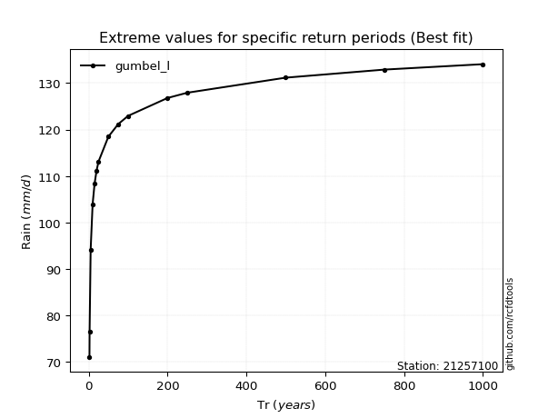</img>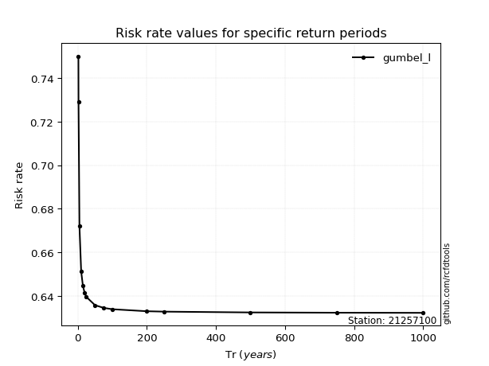</img>

</div>


<sub>**APP DISCLAIMER**: NO WARRANTY - This software is provided by [github.com/rcfdtools](https://github.com/rcfdtools) "as is", without any express or implied warranty, including warranties of merchantability, fitness for a particular purpose, or non-infringement. There is no guarantee that the software will be error-free or operate without interruption. LIMITATION OF LIABILITY - Neither the authors nor copyright holders will be liable for claims or damages arising from the software or its use. You are responsible for determining if the software is appropriate for your use and assume all associated risks, including errors, legal compliance, and data loss. NO PROFESSIONAL ADVICE - The software provides general information and does not offer professional advice. It should not replace consultation with professional advisors.</sub>