<div align="center">


</div>

# PMP Station (Rain, Pmax24h): 21257120

Probable Maximum Precipitation (PMP) is the greatest amount of rainfall for a specific duration that is meteorologically possible for a given location, acting as a "worst-case" scenario for extreme storms, crucial for designing safety-critical infrastructure like bridges, river deviations, dams, spillways, and nuclear plants to prevent catastrophic failure. PMP is calculated by hydrologists using meteorological data to determine the upper limit of extreme rainfall, often leading to the Probable Maximum Flood (PMF) for flood control design, and is increasingly being studied for climate change impacts. Probable Maximum Precipitation (PMP) is the theoretical upper limit of rainfall, a deterministic estimate for extreme events, while probability distributions (like GEV, Gumbel) describe the likelihood and frequency of various precipitation amounts, including rare ones, showing how often events occur, with PMP representing the extreme end of these distributions, used for critical infrastructure design to ensure safety against the worst conceivable weather, unlike standard statistical forecasts which cover typical probabilities.

The most common probability distributions in hydrology, used for analyzing floods, rainfall, and streamflow, include the Normal, Log-Normal, Gumbel, Gamma (including Log-Pearson Type III), and Generalized Extreme Value (GEV) distributions, often chosen based on the data´s skewness and whether modeling extremes or general conditions, with Gumbel and GEV popular for extreme events like floods, while the Normal distribution serves as a baseline, though often requiring transformations for skewed hydrological data. These distributions help in designing water infrastructure, managing water resources, and forecasting hydrologic events.

> Hydrological data often isn´t perfectly normal (it´s skewed), so different distributions are needed for different applications, such as: **Flood Frequency Analysis**: Using Gumbel, GEV, or Log-Pearson Type III for predicting extreme flood magnitudes and their return periods, **Rainfall Analysis**: Normal for annual totals, but Log-Normal, Weibull, or GEV for intensity or extreme daily rainfall, **Streamflow Modeling**: Gamma and Log-Normal for maximum flows, GEV for minimum flows, and Kappa for daily flows.

<div align="center">

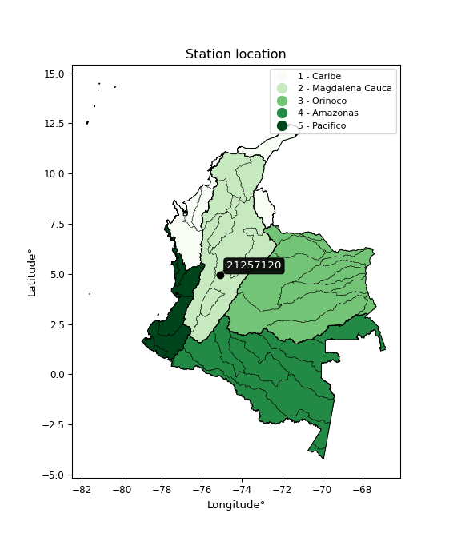</img>

</div>


## A. General information


### 1. General running parameters

• app_version: _v20260103_. • runtime: _2026-01-05 16:20:51.132608_. • Python version: _3.14.0_. • SciPy version: _1.16.3_. • Pandas version: _2.3.3_. • NumPy version: _2.3.5_. • Stations dataset (station_dataset_file): _dataset/pmax24h_in/automatic_colombia_2003_2024.csv_. • Stations catalog (station_catalog_file): _dataset/CNE.xls_. • Minimum year to eval til year_max (date_min): _1900_. • Maximum year to eval since year_min (date_max): _2024_. • Creates, save and include plots into reports (create_plot): _True_. • Plot only fit distributions with Δo > Δ (plot_only_fit): _True_. • Plot only simple graphs avoiding multiple CDFs and multiple Extreme values plots (plot_only_simple): _True_. • Eval low extreme values, if False, evaluates high extreme values (low_extreme): _False_. • Eval every SciPy distribution as logarithmic (pdist_logarithmic_on): _True_. • Standard deviation normalized (ddof): _1.0_. • Return periods to eval in years (Tr): _[2, 2.33, 5, 10, 15, 20, 25, 50, 75, 100, 200, 250, 500, 750, 1000]_. • Minimum data sample per station, 0 means any (minimum_sample): _5_. • Z-Score maximum threshold to adjust a value, 0 means disable (zscore_max): _3.5_. • Z-Score minimum threshold to adjust a value, 0 means disable (zscore_min): _-2.5_. • Avoid zeros, e.g. rain = 0 (avoid_zeros): _True_. • Avoid null values (avoid_nans): _True_. 

[:file_folder:Dataset file](../../dataset/pmax24h_in/automatic_colombia_2003_2024.csv)

> Delta Degrees of Freedom (DDOF): is a parameter used in the formulas for calculating variance and standard deviation. When ddof=0, the divisor is $N$ (the total number of observations) and this is used when your data set is the entire population. When ddof=1, the divisor is $N-1$ and this is used when your data set is a sample drawn from a larger population. Using $N-1$ provides an unbiased estimate of the population variance (known as Bessel´s correction).


### 2. Station info and location

|   id |   CODIGO | NOMBRE                              | CATEGORIA    | TECNOLOGIA                              | ESTADO           | FECHA_INSTALACION   |   FECHA_SUSPENSION |   ALTITUD |   LATITUD |   LONGITUD | DEPARTAMENTO   | MUNICIPIO    | AREA_OPERATIVA             | ENTIDAD                                                     | AREA_HIDROGRAFICA   | ZONA_HIDROGRAFICA   | SUBZONA_HIDROGRAFICA                        | CORRIENTE   | Catalogo   |   Version |
|-----:|---------:|:------------------------------------|:-------------|:----------------------------------------|:-----------------|:--------------------|-------------------:|----------:|----------:|-----------:|:---------------|:-------------|:---------------------------|:------------------------------------------------------------|:--------------------|:--------------------|:--------------------------------------------|:------------|:-----------|----------:|
|    0 | 21257120 | PUENTE GATO NEGRO  - AUT [21257120] | Limnigráfica | Automática con Telemetría, Convencional | En Mantenimiento | 15/12/1986          |                nan |      1135 |   4.94019 |   -75.0898 | Tolima         | Villahermosa | Area Operativa 10 - Tolima | INSTITUTO DE HIDROLOGIA METEOROLOGIA Y ESTUDIOS AMBIENTALES | Magdalena Cauca     | Alto Magdalena      | Río Lagunilla y Otros Directos al Magdalena | Lagunilla   | CNE_IDEAM  |  20251226 |

<div align="center">

Dynamic map: [:earth_americas:Google](http://maps.google.com/maps?q=4.940194444,-75.08980556) [:earth_americas:OSM](https://www.openstreetmap.org/#map=18/4.940194444/-75.08980556&layers=P) [:earth_americas:Bing](https://www.bing.com/maps?cp=4.940194444~-75.08980556&lvl=18) [:earth_americas:Apple](https://maps.apple.com/frame?center=4.940194444%2C-75.08980556&span=0.003%2C0.006)

</div>


<div align="center">

```geojson
{
  "type": "Feature",
  "geometry": {
    "type": "Point", 
    "coordinates": [-75.08980556, 4.940194444]
  }, 
  "properties": {
    "Name": "21257120"
  }
}
```

</div>


### 3. Discrete values table and plot

<div align="center">

|               |           0 |          1 |           2 |           3 |          4 |           5 |           6 |           7 |           8 |           9 |          10 |          11 |          12 |          13 |          14 |
|:--------------|------------:|-----------:|------------:|------------:|-----------:|------------:|------------:|------------:|------------:|------------:|------------:|------------:|------------:|------------:|------------:|
| Date          | 2005        | 2006       | 2007        | 2008        | 2009       | 2010        | 2011        | 2012        | 2013        | 2014        | 2015        | 2016        | 2017        | 2018        | 2019        |
| Value         |   88        |  467.9     |   78.1      |   66.7      |   88.4     |  145.8      |  126.7      |    9.7      |  153        |  122.2      |   45.2      |   35.6      |   43.7      |   43.1      |   45        |
| Value_initial |   88        |  467.9     |   78.1      |   66.7      |   88.4     |  145.8      |  126.7      |    9.7      |  153        |  122.2      |   45.2      |   35.6      |   43.7      |   43.1      |   45        |
| count         |   15        |   15       |   15        |   15        |   15       |   15        |   15        |   15        |   15        |   15        |   15        |   15        |   15        |   15        |   15        |
| mean          |  103.94     |  103.94    |  103.94     |  103.94     |  103.94    |  103.94     |  103.94     |  103.94     |  103.94     |  103.94     |  103.94     |  103.94     |  103.94     |  103.94     |  103.94     |
| std           |  109.49     |  109.49    |  109.49     |  109.49     |  109.49    |  109.49     |  109.49     |  109.49     |  109.49     |  109.49     |  109.49     |  109.49     |  109.49     |  109.49     |  109.49     |
| zscore        |   -0.145584 |    3.32413 |   -0.236003 |   -0.340121 |   -0.14193 |    0.382317 |    0.207872 |   -0.860715 |    0.448076 |    0.166773 |   -0.536486 |   -0.624165 |   -0.550186 |   -0.555666 |   -0.538313 |


</div>


<div align="center">

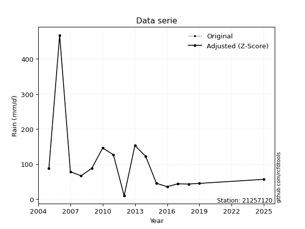</img>

</div>


> The initial value (value_initial) correspond to the initial obtained or null completed value, and value (value) is adjusted only when the initial value is outside the valid range (outlier) definite through the Z-Score value. If Z-Score is active, values out of range or outliers are replaced with the station mean value. A Z-Score (or standard score) measures how many standard deviations a data point is from the mean of a dataset, indicating its relative position; positive scores mean above the mean, negative mean below, and a score of zero is exactly at the mean, allowing for comparison of values from different distributions. It´s calculated using the formula $z=(x–μ)/σ$, where $x$ is the data point, $μ$ is the mean, and $σ$ is the standard deviation, helping identify outliers and understand probability.
>
> <sub>**Note**: In this study, "completing" (filling gaps in) and "extending" (forecasting or lengthening the historical record) rainfall data series are avoided for certain critical analyses because they introduce artificial bias and uncertainty, which can distort the statistics of rare events (extremes), alter day-to-day variability, and compromise the integrity and homogeneity of the original data. Some reasons against Completing/Extending rainfall data are: **Distortion of Extremes and Variability**: The primary issue is that most gap-filling or extension methods rely on averaging or regression with nearby stations, which inherently smooths the data. Rainfall is highly variable in space and time, with a large percentage of zero values and occasional large storms. Infilling methods often underestimate the highest values and overestimate the lowest (zero) values, which severely distorts analyses focused on flood frequency, drought severity, and intensity-duration-frequency (IDF) curves, **Loss of Data Homogeneity**: Infilled or extended data are synthetic estimates, not actual measurements. Combining these estimates with observed data can violate the assumption of data homogeneity, which requires that the data properties do not change over time. Inhomogeneity can lead to incorrect conclusions about long-term trends or changes in climate patterns, **Propagation of Errors**: Errors and biases from the original data (e.g., wind-induced undercatch, instrument errors, site changes) or the data used for imputation can propagate through the analysis, leading to unreliable hydrological models and inaccurate predictions, **Compromised Statistical Integrity**: For statistical analyses, especially those involving the frequency of events, using artificial data can introduce time bias or autocorrelation that doesn´t exist in reality, making it difficult to assess the true probability of events, **Difficulty in Validation**: It is difficult to accurately validate the quality of filled or extended data, especially for past periods where ground-truth measurements are unavailable. The reliability of imputation techniques heavily depends on the density of the surrounding station network and the complexity of the local topography.</sub>


### 4. Active continuous probability distributions from SciPy (44 of 104 available)

A Probability Density Function (PDF) describes the relative likelihood of a continuous random variable falling within a specific range, where the total area under its curve equals 1, and the area over any interval gives the actual probability for that range. Unlike discrete probabilities (like rolling a die), a PDF shows density, not direct probability for a single point (which is zero), with higher points indicating higher likelihood, often visualized as a bell curve for normal distributions.

A log of a probability density function (log-PDF) is simply the logarithm of the PDF´s value, denoted as $log(f(x))$, useful for converting multiplication of probabilities into addition, improving numerical stability with tiny numbers, and connecting to information theory concepts like entropy. Instead of dealing with very small probabilities (e.g., 0.000001), log-PDFs use negative numbers (e.g., $log(0.00001) ≈ -11.51$ that are easier for computers to handle, preventing underflow errors and simplifying complex calculations. In this study, each active probability distribution from SciPy is also evaluated in the $log$ form.

[scipy.stats](https://docs.scipy.org/doc/scipy/reference/stats.html) is a Python´s powerful submodule within the SciPy library for comprehensive statistical analysis, offering over 130 probability distributions (like Normal, Poisson), functions for descriptive stats (mean, variance), hypothesis testing (t-tests, chi-square), random variable generation, and statistical tests, making it essential for data science, modeling, and research. It provides tools to explore, model, and draw conclusions from data efficiently, working seamlessly with NumPy.

<div align="center">

|   id | p_dist             |   n_parameter | fit_method   | label                                                                       | active   | ref                                                                                                        |
|-----:|:-------------------|--------------:|:-------------|:----------------------------------------------------------------------------|:---------|:-----------------------------------------------------------------------------------------------------------|
|    0 | alpha              |             3 | MLE          | Alpha                                                                       | True     | [:mortar_board:](https://docs.scipy.org/doc/scipy/reference/generated/scipy.stats.alpha.html)              |
|    1 | betaprime          |             4 | MLE          | Beta prime                                                                  | True     | [:mortar_board:](https://docs.scipy.org/doc/scipy/reference/generated/scipy.stats.betaprime.html)          |
|    2 | chi2               |             3 | MLE          | Chi²                                                                        | True     | [:mortar_board:](https://docs.scipy.org/doc/scipy/reference/generated/scipy.stats.chi2.html)               |
|    3 | crystalball        |             4 | MLE          | Crystalball                                                                 | True     | [:mortar_board:](https://docs.scipy.org/doc/scipy/reference/generated/scipy.stats.crystalball.html)        |
|    4 | erlang             |             3 | MLE          | Erlang                                                                      | True     | [:mortar_board:](https://docs.scipy.org/doc/scipy/reference/generated/scipy.stats.erlang.html)             |
|    5 | expon              |             2 | MLE          | Exponential                                                                 | True     | [:mortar_board:](https://docs.scipy.org/doc/scipy/reference/generated/scipy.stats.expon.html)              |
|    6 | exponnorm          |             3 | MLE          | Exponentially modified Normal                                               | True     | [:mortar_board:](https://docs.scipy.org/doc/scipy/reference/generated/scipy.stats.exponnorm.html)          |
|    7 | f                  |             4 | MLE          | F                                                                           | True     | [:mortar_board:](https://docs.scipy.org/doc/scipy/reference/generated/scipy.stats.f.html)                  |
|    8 | fatiguelife        |             3 | MLE          | Fatigue-life (Birnbaum-Saunders)                                            | True     | [:mortar_board:](https://docs.scipy.org/doc/scipy/reference/generated/scipy.stats.fatiguelife.html)        |
|    9 | fisk               |             3 | MLE          | Fisk                                                                        | True     | [:mortar_board:](https://docs.scipy.org/doc/scipy/reference/generated/scipy.stats.fisk.html)               |
|   10 | gamma              |             3 | MLE          | Gamma                                                                       | True     | [:mortar_board:](https://docs.scipy.org/doc/scipy/reference/generated/scipy.stats.gamma.html)              |
|   11 | genexpon           |             5 | MLE          | Generalized exponential                                                     | True     | [:mortar_board:](https://docs.scipy.org/doc/scipy/reference/generated/scipy.stats.genexpon.html)           |
|   12 | genlogistic        |             3 | MLE          | Generalized logistic                                                        | True     | [:mortar_board:](https://docs.scipy.org/doc/scipy/reference/generated/scipy.stats.genlogistic.html)        |
|   13 | gibrat             |             2 | MM           | Gibrat                                                                      | True     | [:mortar_board:](https://docs.scipy.org/doc/scipy/reference/generated/scipy.stats.gibrat.html)             |
|   14 | gompertz           |             3 | MLE          | Gompertz (or truncated Gumbel)                                              | True     | [:mortar_board:](https://docs.scipy.org/doc/scipy/reference/generated/scipy.stats.gompertz.html)           |
|   15 | gumbel_l           |             2 | MM           | Gumbel Left Skew                                                            | True     | [:mortar_board:](https://docs.scipy.org/doc/scipy/reference/generated/scipy.stats.gumbel_l.html)           |
|   16 | gumbel_r           |             2 | MM           | Gumbel Right Skew                                                           | True     | [:mortar_board:](https://docs.scipy.org/doc/scipy/reference/generated/scipy.stats.gumbel_r.html)           |
|   17 | halflogistic       |             2 | MM           | Half-logistic                                                               | True     | [:mortar_board:](https://docs.scipy.org/doc/scipy/reference/generated/scipy.stats.halflogistic.html)       |
|   18 | halfnorm           |             2 | MM           | Half Normal                                                                 | True     | [:mortar_board:](https://docs.scipy.org/doc/scipy/reference/generated/scipy.stats.halfnorm.html)           |
|   19 | hypsecant          |             2 | MM           | hyperbolic secant                                                           | True     | [:mortar_board:](https://docs.scipy.org/doc/scipy/reference/generated/scipy.stats.hypsecant.html)          |
|   20 | invgamma           |             3 | MLE          | Inverted gamma                                                              | True     | [:mortar_board:](https://docs.scipy.org/doc/scipy/reference/generated/scipy.stats.invgamma.html)           |
|   21 | invgauss           |             3 | MLE          | Inverse Gaussian                                                            | True     | [:mortar_board:](https://docs.scipy.org/doc/scipy/reference/generated/scipy.stats.invgauss.html)           |
|   22 | invweibull         |             3 | MLE          | Inverted Weibull                                                            | True     | [:mortar_board:](https://docs.scipy.org/doc/scipy/reference/generated/scipy.stats.invweibull.html)         |
|   23 | johnsonsu          |             4 | MLE          | Johnson Su                                                                  | True     | [:mortar_board:](https://docs.scipy.org/doc/scipy/reference/generated/scipy.stats.johnsonsu.html)          |
|   24 | kstwobign          |             2 | MLE          | Limiting distribution of scaled Kolmogorov-Smirnov two-sided test statistic | True     | [:mortar_board:](https://docs.scipy.org/doc/scipy/reference/generated/scipy.stats.kstwobign.html)          |
|   25 | laplace            |             2 | MM           | Laplace                                                                     | True     | [:mortar_board:](https://docs.scipy.org/doc/scipy/reference/generated/scipy.stats.laplace.html)            |
|   26 | laplace_asymmetric |             3 | MLE          | Asymmetric Laplace                                                          | True     | [:mortar_board:](https://docs.scipy.org/doc/scipy/reference/generated/scipy.stats.laplace_asymmetric.html) |
|   27 | loggamma           |             3 | MLE          | Log gamma                                                                   | True     | [:mortar_board:](https://docs.scipy.org/doc/scipy/reference/generated/scipy.stats.loggamma.html)           |
|   28 | logistic           |             2 | MM           | Logistic (or Sech-squared)                                                  | True     | [:mortar_board:](https://docs.scipy.org/doc/scipy/reference/generated/scipy.stats.logistic.html)           |
|   29 | lognorm            |             3 | MLE          | Log Normal                                                                  | True     | [:mortar_board:](https://docs.scipy.org/doc/scipy/reference/generated/scipy.stats.lognorm.html)            |
|   30 | maxwell            |             2 | MM           | Maxwell                                                                     | True     | [:mortar_board:](https://docs.scipy.org/doc/scipy/reference/generated/scipy.stats.maxwell.html)            |
|   31 | mielke             |             4 | MLE          | Mielke Beta-Kappa / Dagum                                                   | True     | [:mortar_board:](https://docs.scipy.org/doc/scipy/reference/generated/scipy.stats.mielke.html)             |
|   32 | moyal              |             2 | MM           | Moyal                                                                       | True     | [:mortar_board:](https://docs.scipy.org/doc/scipy/reference/generated/scipy.stats.moyal.html)              |
|   33 | nakagami           |             3 | MLE          | Nakagami                                                                    | True     | [:mortar_board:](https://docs.scipy.org/doc/scipy/reference/generated/scipy.stats.nakagami.html)           |
|   34 | ncf                |             5 | MLE          | Non-central F distribution                                                  | True     | [:mortar_board:](https://docs.scipy.org/doc/scipy/reference/generated/scipy.stats.ncf.html)                |
|   35 | nct                |             4 | MLE          | Non-central Student’s t                                                     | True     | [:mortar_board:](https://docs.scipy.org/doc/scipy/reference/generated/scipy.stats.nct.html)                |
|   36 | norm               |             2 | MM           | Normal                                                                      | True     | [:mortar_board:](https://docs.scipy.org/doc/scipy/reference/generated/scipy.stats.norm.html)               |
|   37 | pearson3           |             3 | MM           | Pearson type III                                                            | True     | [:mortar_board:](https://docs.scipy.org/doc/scipy/reference/generated/scipy.stats.pearson3.html)           |
|   38 | rayleigh           |             2 | MM           | Rayleigh                                                                    | True     | [:mortar_board:](https://docs.scipy.org/doc/scipy/reference/generated/scipy.stats.rayleigh.html)           |
|   39 | rice               |             3 | MLE          | Rice                                                                        | True     | [:mortar_board:](https://docs.scipy.org/doc/scipy/reference/generated/scipy.stats.rice.html)               |
|   40 | t                  |             3 | MLE          | Student’s t                                                                 | True     | [:mortar_board:](https://docs.scipy.org/doc/scipy/reference/generated/scipy.stats.t.html)                  |
|   41 | truncnorm          |             4 | MLE          | Truncated normal                                                            | True     | [:mortar_board:](https://docs.scipy.org/doc/scipy/reference/generated/scipy.stats.truncnorm.html)          |
|   42 | wald               |             2 | MM           | Wald                                                                        | True     | [:mortar_board:](https://docs.scipy.org/doc/scipy/reference/generated/scipy.stats.wald.html)               |
|   43 | weibull_min        |             3 | MLE          | Weibull minimum                                                             | True     | [:mortar_board:](https://docs.scipy.org/doc/scipy/reference/generated/scipy.stats.weibull_min.html)        |

</div>

> **n_parameter:** # arguments & localization & scale.
>
> **Fit methods:** (MLE) maximum likelihood, (MM) L-moments.
>
>**Inactive** (With the only purpose of prevent loops, zero divisions, infinite values, over high estimated values or horizontal trending for recurrence intervals estimations, the follow distributions were disabled.)**:** foldnorm, gennorm, norminvgauss, powernorm, powerlognorm, skewnorm, genextreme, anglit, arcsine, argus, beta, bradford, burr, burr12, cauchy, cosine, halfcauchy, foldcauchy, skewcauchy, wrapcauchy, dgamma, gengamma, exponweib, exponpow, truncexpon, gausshyper, genhalflogistic, genhyperbolic, geninvgauss, halfgennorm, johnsonsb, kappa4, kappa3, ksone, kstwo, loglaplace, levy, levy_l, levy_stable, ncx2, pareto, genpareto, truncpareto, lomax, powerlaw, rdist, rel_breitwigner, recipinvgauss, semicircular, studentized_range, trapezoid, triang, truncweibull_min, tukeylambda, uniform, loguniform, vonmises, vonmises_line, weibull_max, dweibull, 


## B. Probability (PDF) vs. Empirical (EDF) distributions functions

A continuous probability distribution (CPD) describes probabilities for variables that can take any value within a range (like rain any time), unlike discrete variables with specific outcomes (like temperature). It uses a Probability Density Function (PDF), a curve where the total area under it equals 1, and the probability of the variable falling within an interval (a to b) is found by calculating the area under the curve between those points. A key feature is that the probability of hitting any single exact value is zero, so probabilities are always expressed for ranges, e.g., $P(a ≤ X ≤ b)$.

<div align="center">

Distributions parameters from station values
|    |   station | p_dist                |   n |              loc |           scale | shape                  | shape1             | shape2                | shape3   |
|---:|----------:|:----------------------|----:|-----------------:|----------------:|:-----------------------|:-------------------|:----------------------|:---------|
|  0 |  21257120 | alpha                 |  15 |     -0.084728    |    32.6333      | 7.160607448335966e-09  |                    |                       |          |
|  1 |  21257120 | betaprime             |  15 |     -2.36424     |    90.12        | 3.2846908378325637     | 3.8106182683866514 |                       |          |
|  2 |  21257120 | chi2                  |  15 |      9.7         |     5.37412     | 0.26844789168611227    |                    |                       |          |
|  3 |  21257120 | crystalball           |  15 |    103.94        |   105.778       | 9345.252833471695      | 1822.4374538100012 |                       |          |
|  4 |  21257120 | erlang                |  15 |      9.7         |   126.627       | 0.7438321883949941     |                    |                       |          |
|  5 |  21257120 | expon                 |  15 |      9.7         |    94.24        |                        |                    |                       |          |
|  6 |  21257120 | exponnorm             |  15 |     21.9197      |    13.9691      | 5.87153867596224       |                    |                       |          |
|  7 |  21257120 | f                     |  15 |    -23.5591      |    88.7233      | 120.42554814565679     | 6.710661050406008  |                       |          |
|  8 |  21257120 | fatiguelife           |  15 |     -8.49015     |    86.0734      | 0.7871135236148612     |                    |                       |          |
|  9 |  21257120 | fisk                  |  15 |     -1.88143     |    75.6595      | 2.272561895753089      |                    |                       |          |
| 10 |  21257120 | gamma                 |  15 |      9.7         |     5.54711     | 0.10918717910233133    |                    |                       |          |
| 11 |  21257120 | genexpon              |  15 |      9.7         |     1.59823e+08 | 1186700.92587861       | 756105.0664726365  | 4136987.6860958342    |          |
| 12 |  21257120 | genlogistic           |  15 |   -309.119       |    53.5358      | 1115.5492781118405     |                    |                       |          |
| 13 |  21257120 | gibrat                |  15 |     23.2449      |    48.944       |                        |                    |                       |          |
| 14 |  21257120 | gompertz              |  15 |      9.69945     |     1.41722e+06 | 13337.15755286553      |                    |                       |          |
| 15 |  21257120 | gumbel_l              |  15 |    151.546       |    82.4745      |                        |                    |                       |          |
| 16 |  21257120 | gumbel_r              |  15 |     56.3344      |    82.4745      |                        |                    |                       |          |
| 17 |  21257120 | halflogistic          |  15 |    -21.4311      |    90.4362      |                        |                    |                       |          |
| 18 |  21257120 | halfnorm              |  15 |    -36.0682      |   175.474       |                        |                    |                       |          |
| 19 |  21257120 | hypsecant             |  15 |    103.94        |    67.3402      |                        |                    |                       |          |
| 20 |  21257120 | invgamma              |  15 |    -25.8445      |   301.96        | 3.3457057718968812     |                    |                       |          |
| 21 |  21257120 | invgauss              |  15 |    -10.534       |   172.403       | 0.6639898928219711     |                    |                       |          |
| 22 |  21257120 | invweibull            |  15 |    -64.7151      |   122.159       | 2.8941634265339795     |                    |                       |          |
| 23 |  21257120 | johnsonsu             |  15 |     35.0338      |    17.9214      | -1.1447121455742346    | 0.8167681892439633 |                       |          |
| 24 |  21257120 | kstwobign             |  15 |   -154.863       |   306.256       |                        |                    |                       |          |
| 25 |  21257120 | laplace               |  15 |    103.94        |    74.7961      |                        |                    |                       |          |
| 26 |  21257120 | laplace_asymmetric    |  15 |     43.1         |    34.9263      | 0.4551348765664119     |                    |                       |          |
| 27 |  21257120 | loggamma              |  15 | -33186           |  4502.5         | 1626.0601917322765     |                    |                       |          |
| 28 |  21257120 | logistic              |  15 |    103.94        |    58.3183      |                        |                    |                       |          |
| 29 |  21257120 | lognorm               |  15 |      9.7         |     5.6383      | 9.567541294160904      |                    |                       |          |
| 30 |  21257120 | maxwell               |  15 |   -146.709       |   157.071       |                        |                    |                       |          |
| 31 |  21257120 | mielke                |  15 |      9.7         |   123.865       | 0.4605403749359056     | 2.619195154669776  |                       |          |
| 32 |  21257120 | moyal                 |  15 |     43.4495      |    47.6167      |                        |                    |                       |          |
| 33 |  21257120 | nakagami              |  15 |      9.7         |   188.994       | 0.3353253218097344     |                    |                       |          |
| 34 |  21257120 | ncf                   |  15 |     -0.0401376   |     2.61956     | 0.5426967150607829     | 6.886646416471292  | 14.58616776172424     |          |
| 35 |  21257120 | nct                   |  15 |     -0.180073    |    25.6425      | 2.108272639452709      | 2.449620969433819  |                       |          |
| 36 |  21257120 | norm                  |  15 |    103.94        |   105.778       |                        |                    |                       |          |
| 37 |  21257120 | pearson3              |  15 |    103.94        |   105.778       | 2.6101366234100043     |                    |                       |          |
| 38 |  21257120 | rayleigh              |  15 |    -98.4189      |   161.459       |                        |                    |                       |          |
| 39 |  21257120 | rice                  |  15 |    -42.9914      |   128.019       | 0.00022871283293298504 |                    |                       |          |
| 40 |  21257120 | t                     |  15 |     72.4878      |    39.3446      | 1.8690086805404953     |                    |                       |          |
| 41 |  21257120 | truncnorm             |  15 | -10257.5         |  1058.13        | 9.70311639094625       | 619.1905917292024  |                       |          |
| 42 |  21257120 | wald                  |  15 |     -1.83768     |   105.778       |                        |                    |                       |          |
| 43 |  21257120 | weibull_min           |  15 |     35.6         |    40.9473      | 0.31938029507025123    |                    |                       |          |
| 44 |  21257120 | logalpha              |  15 |    -18.2599      |   595.973       | 26.470777030058777     |                    |                       |          |
| 45 |  21257120 | logbetaprime          |  15 |    -22.3005      |   126.315       | 1190.3500989599897     | 5655.621749232798  |                       |          |
| 46 |  21257120 | logchi2               |  15 |      2.27213     |     1.01012     | 1.1710210065515851     |                    |                       |          |
| 47 |  21257120 | logcrystalball        |  15 |      4.28859     |     0.84559     | 3116.56566786604       | 569.0163257176717  |                       |          |
| 48 |  21257120 | logerlang             |  15 |    -14.9288      |     0.038077    | 504.7221409275149      |                    |                       |          |
| 49 |  21257120 | logexpon              |  15 |      2.27213     |     2.01647     |                        |                    |                       |          |
| 50 |  21257120 | logexponnorm          |  15 |      4.28777     |     0.84559     | 0.0009759241626756782  |                    |                       |          |
| 51 |  21257120 | logf                  |  15 |   -400.179       |   404.467       | 1146361.8994430602     | 763806.0576435262  |                       |          |
| 52 |  21257120 | logfatiguelife        |  15 |   -167.771       |   172.056       | 0.004905018350140634   |                    |                       |          |
| 53 |  21257120 | logfisk               |  15 |     -3.23754e+06 |     3.23755e+06 | 7105641.945172155      |                    |                       |          |
| 54 |  21257120 | loggamma              |  15 |    -14.5384      |     0.0385874   | 487.95309709992034     |                    |                       |          |
| 55 |  21257120 | loggenexpon           |  15 |      2.26409     |     0.00417817  | 0.00033053159325996417 | 0.6241156872563169 | 9.760805385374224e-06 |          |
| 56 |  21257120 | loggenlogistic        |  15 |      4.40566     |     0.428435    | 0.847472810604333      |                    |                       |          |
| 57 |  21257120 | loggibrat             |  15 |      3.64348     |     0.391278    |                        |                    |                       |          |
| 58 |  21257120 | loggompertz           |  15 |      2.27213     |     0.998309    | 0.10240530239289772    |                    |                       |          |
| 59 |  21257120 | loggumbel_l           |  15 |      4.66915     |     0.659303    |                        |                    |                       |          |
| 60 |  21257120 | loggumbel_r           |  15 |      3.90803     |     0.659303    |                        |                    |                       |          |
| 61 |  21257120 | loghalflogistic       |  15 |      3.28638     |     0.722947    |                        |                    |                       |          |
| 62 |  21257120 | loghalfnorm           |  15 |      3.16931     |     1.4028      |                        |                    |                       |          |
| 63 |  21257120 | loghypsecant          |  15 |      4.28859     |     0.538319    |                        |                    |                       |          |
| 64 |  21257120 | loginvgamma           |  15 |    -12.4133      |  6329.14        | 379.9864232546854      |                    |                       |          |
| 65 |  21257120 | loginvgauss           |  15 |     -2.98252     |   482.25        | 0.015040669071933292   |                    |                       |          |
| 66 |  21257120 | loginvweibull         |  15 |     -2.35237e+08 |     2.35237e+08 | 259846732.36397636     |                    |                       |          |
| 67 |  21257120 | logjohnsonsu          |  15 |      4.35722     |     1.0514      | 0.07959724489502631    | 1.5351149518799105 |                       |          |
| 68 |  21257120 | logkstwobign          |  15 |      0.440879    |     4.43515     |                        |                    |                       |          |
| 69 |  21257120 | loglaplace            |  15 |      4.28859     |     0.597922    |                        |                    |                       |          |
| 70 |  21257120 | loglaplace_asymmetric |  15 |      4.47734     |     0.624455    | 1.1625171920592374     |                    |                       |          |
| 71 |  21257120 | logloggamma           |  15 |    -24.7805      |     6.9149      | 67.4416588676937       |                    |                       |          |
| 72 |  21257120 | loglogistic           |  15 |      4.28859     |     0.466198    |                        |                    |                       |          |
| 73 |  21257120 | loglognorm            |  15 | -65533.7         | 65538           | 1.2902289070405463e-05 |                    |                       |          |
| 74 |  21257120 | logmaxwell            |  15 |      2.28488     |     1.25564     |                        |                    |                       |          |
| 75 |  21257120 | logmielke             |  15 |    -12.8722      |    17.3635      | 31.04013167730612      | 42.51464276328831  |                       |          |
| 76 |  21257120 | logmoyal              |  15 |      3.80503     |     0.380649    |                        |                    |                       |          |
| 77 |  21257120 | lognakagami           |  15 |      3.57235     |     1.15301     | 0.37555305548228013    |                    |                       |          |
| 78 |  21257120 | logncf                |  15 |    -12.6498      |     6.22207     | 858.8544171382466      | 1654.6597541024762 | 1477.0437889394575    |          |
| 79 |  21257120 | lognct                |  15 |    -40.2135      |     0.829846    | 36373.37883143358      | 53.62567281611001  |                       |          |
| 80 |  21257120 | lognorm               |  15 |      4.28859     |     0.845589    |                        |                    |                       |          |
| 81 |  21257120 | logpearson3           |  15 |      4.28859     |     0.845589    | -0.1732753774479002    |                    |                       |          |
| 82 |  21257120 | lograyleigh           |  15 |      2.67096     |     1.29069     |                        |                    |                       |          |
| 83 |  21257120 | logrice               |  15 |   -316.514       |     0.845595    | 379.3793135578731      |                    |                       |          |
| 84 |  21257120 | logt                  |  15 |      4.30015     |     0.648272    | 4.381526423598377      |                    |                       |          |
| 85 |  21257120 | logtruncnorm          |  15 |     -0.270792    |     2.09591     | 1.8336380470774367     | 8.899137108824231  |                       |          |
| 86 |  21257120 | logwald               |  15 |      3.44307     |     0.845534    |                        |                    |                       |          |
| 87 |  21257120 | logweibull_min        |  15 |      0.978638    |     3.6254      | 4.319176879072103      |                    |                       |          |

</div>

> **loc** (Location parameter): This shifts the distribution along the x-axis. For many common distributions, like the normal (Gaussian) distribution, loc represents the mean $μ$. For others, like the uniform distribution, it might represent the minimum value, or for the beta distribution, the left end of the support interval.
>
> **scale** (Scale parameter): This determines the width or spread of the distribution. For the normal distribution, scale represents the standard deviation $σ$. For a uniform distribution, it defines the length of the interval (from $loc$ to $loc + scale$).
>
> **shape** (Shape parameters): Refers to parameters that define the specific form of a probability distribution, distinct from its location (loc) and scale (scale). These parameters are required arguments for most distribution functions. For example, a normal (Gaussian) distribution is fully defined by its location (mean) and scale (standard deviation), so it has no specific shape parameters beyond loc and scale. However, other distributions have intrinsic properties that need specification, as Gamma distribution that takes a shape parameter, often named $a$ or $alpha$.


### 0. Cumulative distribution values - CDF (88 evaluated)

Cumulative Distribution Function (CDF), denoted as $F$<sub>$X$</sub>$(x)$, is a function that gives the probability that a random variable $X$ will take a value less than or equal to a specific value, $x$ (i.e., $(P(X≥x)$. It essentially "accumulates" probabilities from a given point up to the far right (positive infinity), providing a complete picture of the distribution´s probabilities for both discrete (like rain) and continuous (like temperature) variables, helping to find probabilities over ranges or above certain values. Each station is evaluated separately ordering the $x$ values ascending, calculating the CDF and PDF values for the activated distributions and their logarithmic forms.

<div align="center">

CDF ordered by x ascending and calculating $log(f(x))$ separately
|   id |   Station |   date |     x |   count |   mean |    std |    zscore |   Value_initial |   station |   m |      alpha |   alpha_pdf |   betaprime |   betaprime_pdf |       chi2 |    chi2_pdf |   crystalball |   crystalball_pdf |      erlang |   erlang_pdf |    expon |   expon_pdf |   exponnorm |   exponnorm_pdf |         f |       f_pdf |   fatiguelife |   fatiguelife_pdf |      fisk |    fisk_pdf |     gamma |   gamma_pdf |    genexpon |   genexpon_pdf |   genlogistic |   genlogistic_pdf |    gibrat |   gibrat_pdf |    gompertz |   gompertz_pdf |   gumbel_l |   gumbel_l_pdf |   gumbel_r |   gumbel_r_pdf |   halflogistic |   halflogistic_pdf |   halfnorm |   halfnorm_pdf |   hypsecant |   hypsecant_pdf |   invgamma |   invgamma_pdf |   invgauss |   invgauss_pdf |   invweibull |   invweibull_pdf |   johnsonsu |   johnsonsu_pdf |   kstwobign |   kstwobign_pdf |   laplace |   laplace_pdf |   laplace_asymmetric |   laplace_asymmetric_pdf |   loggamma |   loggamma_pdf |   logistic |   logistic_pdf |    lognorm |   lognorm_pdf |   maxwell |   maxwell_pdf |      mielke |     mielke_pdf |    moyal |   moyal_pdf |    nakagami |   nakagami_pdf |       ncf |     ncf_pdf |       nct |     nct_pdf |     norm |    norm_pdf |   pearson3 |   pearson3_pdf |   rayleigh |   rayleigh_pdf |      rice |    rice_pdf |        t |       t_pdf |   truncnorm |   truncnorm_pdf |       wald |   wald_pdf |   weibull_min |   weibull_min_pdf |   logalpha |   logalpha_pdf |   logbetaprime |   logbetaprime_pdf |     logchi2 |   logchi2_pdf |   logcrystalball |   logcrystalball_pdf |   logerlang |   logerlang_pdf |   logexpon |   logexpon_pdf |   logexponnorm |   logexponnorm_pdf |       logf |   logf_pdf |   logfatiguelife |   logfatiguelife_pdf |   logfisk |   logfisk_pdf |   loggenexpon |   loggenexpon_pdf |   loggenlogistic |   loggenlogistic_pdf |   loggibrat |   loggibrat_pdf |   loggompertz |   loggompertz_pdf |   loggumbel_l |   loggumbel_l_pdf |   loggumbel_r |   loggumbel_r_pdf |   loghalflogistic |   loghalflogistic_pdf |   loghalfnorm |   loghalfnorm_pdf |   loghypsecant |   loghypsecant_pdf |   loginvgamma |   loginvgamma_pdf |   loginvgauss |   loginvgauss_pdf |   loginvweibull |   loginvweibull_pdf |   logjohnsonsu |   logjohnsonsu_pdf |   logkstwobign |   logkstwobign_pdf |   loglaplace |   loglaplace_pdf |   loglaplace_asymmetric |   loglaplace_asymmetric_pdf |   logloggamma |   logloggamma_pdf |   loglogistic |   loglogistic_pdf |   loglognorm |   loglognorm_pdf |   logmaxwell |   logmaxwell_pdf |   logmielke |   logmielke_pdf |    logmoyal |   logmoyal_pdf |   lognakagami |   lognakagami_pdf |     logncf |   logncf_pdf |     lognct |   lognct_pdf |   logpearson3 |   logpearson3_pdf |   lograyleigh |   lograyleigh_pdf |    logrice |   logrice_pdf |      logt |   logt_pdf |   logtruncnorm |   logtruncnorm_pdf |   logwald |   logwald_pdf |   logweibull_min |   logweibull_min_pdf |
|-----:|----------:|-------:|------:|--------:|-------:|-------:|----------:|----------------:|----------:|----:|-----------:|------------:|------------:|----------------:|-----------:|------------:|--------------:|------------------:|------------:|-------------:|---------:|------------:|------------:|----------------:|----------:|------------:|--------------:|------------------:|----------:|------------:|----------:|------------:|------------:|---------------:|--------------:|------------------:|----------:|-------------:|------------:|---------------:|-----------:|---------------:|-----------:|---------------:|---------------:|-------------------:|-----------:|---------------:|------------:|----------------:|-----------:|---------------:|-----------:|---------------:|-------------:|-----------------:|------------:|----------------:|------------:|----------------:|----------:|--------------:|---------------------:|-------------------------:|-----------:|---------------:|-----------:|---------------:|-----------:|--------------:|----------:|--------------:|------------:|---------------:|---------:|------------:|------------:|---------------:|----------:|------------:|----------:|------------:|---------:|------------:|-----------:|---------------:|-----------:|---------------:|----------:|------------:|---------:|------------:|------------:|----------------:|-----------:|-----------:|--------------:|------------------:|-----------:|---------------:|---------------:|-------------------:|------------:|--------------:|-----------------:|---------------------:|------------:|----------------:|-----------:|---------------:|---------------:|-------------------:|-----------:|-----------:|-----------------:|---------------------:|----------:|--------------:|--------------:|------------------:|-----------------:|---------------------:|------------:|----------------:|--------------:|------------------:|--------------:|------------------:|--------------:|------------------:|------------------:|----------------------:|--------------:|------------------:|---------------:|-------------------:|--------------:|------------------:|--------------:|------------------:|----------------:|--------------------:|---------------:|-------------------:|---------------:|-------------------:|-------------:|-----------------:|------------------------:|----------------------------:|--------------:|------------------:|--------------:|------------------:|-------------:|-----------------:|-------------:|-----------------:|------------:|----------------:|------------:|---------------:|--------------:|------------------:|-----------:|-------------:|-----------:|-------------:|--------------:|------------------:|--------------:|------------------:|-----------:|--------------:|----------:|-----------:|---------------:|-------------------:|----------:|--------------:|-----------------:|---------------------:|
|    0 |  21257120 |   2012 |   9.7 |      15 | 103.94 | 109.49 | -0.860715 |             9.7 |  21257120 |   1 | 0.00085261 | 0.00104511  |   0.0143469 |     0.00315503  | 0.00811525 | 6.13199e+11 |      0.186485 |       0.00253604  | 1.21261e-11 | 37.8931      | 0        | 0.0106112   |   0.0165722 |     0.00212482  | 0.0145757 | 0.00263074  |     0.0146443 |       0.00341361  | 0.0138539 | 0.00268082  | 0.0214545 | 1.31874e+12 | 3.01326e-10 |    0.00742511  |     0.0556882 |       0.00300021  | 0         |  0           | 5.15399e-06 |    0.00941074  |   0.163969 |    0.0018154   |   0.172007 |    0.00367107  |       0.170437 |        0.00536816  |   0.205773 |    0.00439495  |    0.153997 |     0.00219868  |  0.0145149 |    0.00262508  |  0.0141546 |    0.0032072   |    0.0150301 |      0.00245378  |   0.0187344 |      0.00120552 |   0.0650397 |     0.00298224  |  0.141833 |   0.00189626  |            0.0209899 |              0.00132043  | 0.00728492 |      0.0255478 |   0.165763 |    0.00237122  | 0.00854677 |      0.027472 |  0.196712 |   0.003068    | 6.93325e-06 | 4106.3         | 0.154068 | 0.00432439  | 2.95825e-12 | 1116.87        | 0.0139407 | 0.00277676  | 0.0190844 | 0.00190204  | 0.186485 | 0.00253604  |   0        |    0           |   0.20085  |    0.0033144   | 0.0812151 | 0.00295396  | 0.130019 | 0.00259715  |    0        |      0.00926547 | 0.00639105 | 0.00275251 |   0           |       0           | 0.00529828 |      0.0215239 |     0.00732249 |          0.0254325 | 7.61674e-10 |   1.00423e+06 |       0.00854677 |             0.027472 |   0.0075232 |       0.0261452 |   0        |      0.495917  |     0.00854679 |          0.027472  | 0.00837216 |  0.0271465 |        0.0081976 |            0.0268506 | 0.0115928 |     0.0251484 |   0.000646825 |         0.0818606 |        0.0146095 |            0.0287012 |    0        |       0         |   1.63986e-09 |         0.102579  |      0.026021 |        0.0389494  |   6.41796e-06 |       0.000116389 |          0        |             0         |      0        |         0         |      0.0150312 |          0.027912  |      0.005797 |         0.0228376 |    0.00488537 |         0.0223096 |      0.00319509 |           0.0202802 |      0.0167955 |          0.0274299 |     0.00436963 |          0.032149  |    0.0171526 |         0.028687 |               0.0275546 |                   0.0379571 |     0.0107881 |         0.0306726 |     0.0130562 |         0.0276401 |   0.00854613 |        0.027471  |     0        |        0         |   0.0143112 |       0.0292451 | 6.89759e-14 |     5.1702e-12 |   0           |         0         | 0.00705894 |    0.0255585 | 0.00850674 |    0.0274335 |     0.0117192 |         0.0319522 |      0        |         0         | 0.00854724 |     0.0274732 | 0.0155593 |  0.0247247 |    0           |          0         | 0         |     0         |         0.011594 |            0.0384891 |
|    1 |  21257120 |   2016 |  35.6 |      15 | 103.94 | 109.49 | -0.624165 |            35.6 |  21257120 |   2 | 0.36046    | 0.0134598   |   0.188777  |     0.00871686  | 0.99532    | 0.000558316 |      0.259116 |       0.00306109  | 0.307296    |  0.00783408  | 0.240299 | 0.00806134  |   0.157244  |     0.00827899  | 0.176567  | 0.00872977  |     0.193291  |       0.00834829  | 0.168507  | 0.00849527  | 0.999765  | 4.93745e-05 | 0.201929    |    0.00777016  |     0.168442  |       0.00559968  | 0.0843163 |  0.0125187   | 0.216314    |    0.00737524  |   0.217422 |    0.00232628  |   0.276421 |    0.00430958  |       0.305261 |        0.00501357  |   0.317039 |    0.00418316  |    0.221372 |     0.0030287   |  0.176532  |    0.00873558  |  0.192177  |    0.00858895  |    0.170576  |      0.00870358  |   0.131589  |      0.00971764 |   0.165985  |     0.00468815  |  0.200522 |   0.00268092  |            0.107057  |              0.00673475  | 0.200952   |      0.338029  |   0.236522 |    0.00309644  | 0.198486   |      0.329573 |  0.282037 |   0.00348926  | 0.484995    |    0.00848319  | 0.277516 | 0.00504527  | 0.204452    |    0.00526914  | 0.179175  | 0.00872026  | 0.154084  | 0.00862915  | 0.259116 | 0.00306109  |   0.267162 |    0.01164     |   0.291419 |    0.00364276  | 0.171749  | 0.0039718   | 0.226664 | 0.00512837  |    0.213586 |      0.0073045  | 0.223188   | 0.00993227 |   9.25469e-06 |       4.15985e+08 | 0.204103   |      0.35433   |     0.199658   |          0.336955  | 0.695344    |   0.204928    |       0.198486   |             0.329573 |   0.202114  |       0.337795  |   0.475233 |      0.260241  |     0.198486   |          0.329573  | 0.198296   |  0.330293  |        0.198494  |            0.331601  | 0.169097  |     0.308371  |   0.3309      |         0.357931  |        0.171767  |            0.297263  |    0        |       0         |   0.239867    |         0.286802  |      0.172593 |        0.237765   |   0.189401    |       0.477993    |          0.195242 |             0.66525   |      0.226123 |         0.545781  |      0.16452   |          0.292191  |      0.20509  |         0.351329  |    0.221707   |         0.371147  |      0.254987   |           0.384905  |      0.163502  |          0.288724  |     0.298868   |          0.376942  |    0.150914  |         0.252398 |               0.165216  |                   0.227589  |     0.196515  |         0.317008  |     0.177065  |         0.312556  |   0.198487   |        0.329577  |     0.211166 |        0.39493   |   0.172594  |       0.296412  | 0.174623    |     0.566194   |   2.05877e-12 |      3482.07      | 0.204273   |    0.341462  | 0.198721   |    0.330007  |     0.196033  |         0.311997  |      0.216408 |         0.423993  | 0.19849    |     0.329576  | 0.159648  |  0.294525  |    4.23142e-09 |          1.06241   | 0.0269395 |     0.755172  |         0.20976  |            0.309799  |
|    2 |  21257120 |   2018 |  43.1 |      15 | 103.94 | 109.49 | -0.555666 |            43.1 |  21257120 |   3 | 0.449849   | 0.010494    |   0.254701  |     0.00878801  | 0.998048   | 0.000222952 |      0.282589 |       0.00319654  | 0.362469    |  0.00691787  | 0.298416 | 0.00744465  |   0.221448  |     0.00870297  | 0.243536  | 0.00903329  |     0.25545   |       0.00817563  | 0.234744  | 0.00907576  | 0.99995   | 1.01841e-05 | 0.259354    |    0.00752731  |     0.212569  |       0.00614416  | 0.18347   |  0.0133746   | 0.269721    |    0.00687266  |   0.235476 |    0.00248896  |   0.30911  |    0.00440031  |       0.342372 |        0.00488069  |   0.348131 |    0.00410701  |    0.245065 |     0.0032902   |  0.243544  |    0.00903873  |  0.256384  |    0.00846954  |    0.238001  |      0.00917106  |   0.215204  |      0.01215    |   0.202429  |     0.00501596  |  0.221672 |   0.00296368  |            0.171601  |              0.0107951   | 0.271308   |      0.396258  |   0.260525 |    0.00330345  | 0.267315   |      0.389065 |  0.308537 |   0.00357426  | 0.543791    |    0.00726355  | 0.315534 | 0.00508157  | 0.242219    |    0.00482559  | 0.245834  | 0.00896608  | 0.223276  | 0.00967847  | 0.282589 | 0.00319654  |   0.343991 |    0.00910344  |   0.318955 |    0.00369714  | 0.202378  | 0.00418994  | 0.268832 | 0.00612903  |    0.266524 |      0.00681767 | 0.295222   | 0.00922778 |   0.440952    |       0.013844    | 0.277565   |      0.411865  |     0.269881   |          0.395994  | 0.731675    |   0.17612     |       0.267315   |             0.389065 |   0.27237   |       0.395445  |   0.522699 |      0.236701  |     0.267315   |          0.389065  | 0.267278   |  0.389916  |        0.267738  |            0.391325  | 0.236412  |     0.396201  |   0.399773    |         0.361     |        0.236674  |            0.382669  |    0.118686 |       1.65353   |   0.297959    |         0.320792  |      0.223679 |        0.298127   |   0.287922    |       0.543728    |          0.318523 |             0.621445  |      0.328135 |         0.519973  |      0.229541  |          0.390396  |      0.277893 |         0.408079  |    0.297587   |         0.419791  |      0.33075    |           0.404223  |      0.227608  |          0.383792  |     0.37142    |          0.379656  |    0.207773  |         0.347492 |               0.214993  |                   0.296158  |     0.262923  |         0.376742  |     0.244847  |         0.396607  |   0.267317   |        0.389069  |     0.291354 |        0.440497  |   0.237247  |       0.380967  | 0.290951    |     0.633722   |   0.201394    |         0.785324  | 0.275094   |    0.397518  | 0.267625   |    0.389403  |     0.26144   |         0.371433  |      0.301123 |         0.458358  | 0.26732    |     0.389067  | 0.225254  |  0.39335   |    0.186784    |          0.895052  | 0.249255  |     1.21582   |         0.273901 |            0.36044   |
|    3 |  21257120 |   2017 |  43.7 |      15 | 103.94 | 109.49 | -0.550186 |            43.7 |  21257120 |   4 | 0.456083   | 0.010288    |   0.259971  |     0.00877593  | 0.998177   | 0.000207622 |      0.28451  |       0.00320693  | 0.3666      |  0.00685384  | 0.302868 | 0.00739741  |   0.22667   |     0.00870336  | 0.248956  | 0.00903456  |     0.260348  |       0.00814999  | 0.240196  | 0.00909903  | 0.999956  | 8.99625e-06 | 0.263863    |    0.00750409  |     0.216267  |       0.00618146  | 0.191482  |  0.0133298   | 0.273833    |    0.00683396  |   0.236973 |    0.00250223  |   0.311752 |    0.00440574  |       0.345297 |        0.00486957  |   0.350593 |    0.00410066  |    0.247045 |     0.00331125  |  0.248968  |    0.00903992  |  0.261458  |    0.00844541  |    0.243507  |      0.00918263  |   0.222518  |      0.012228   |   0.205445  |     0.00503844  |  0.223457 |   0.00298755  |            0.178053  |              0.010711    | 0.276812   |      0.400009  |   0.262512 |    0.00331971  | 0.272721   |      0.392983 |  0.310683 |   0.0035803   | 0.548124    |    0.0071815   | 0.318583 | 0.0050816   | 0.245106    |    0.00479556  | 0.251213  | 0.00896421  | 0.229098  | 0.00972549  | 0.28451  | 0.00320693  |   0.349409 |    0.00895514  |   0.321174 |    0.00370071  | 0.204897  | 0.00420582  | 0.272535 | 0.00621166  |    0.270603 |      0.00678014 | 0.300739   | 0.00916136 |   0.448983    |       0.0129487   | 0.283284   |      0.41543   |     0.275382   |          0.399814  | 0.734097    |   0.174251    |       0.272721   |             0.392983 |   0.277863  |       0.399155  |   0.52596  |      0.235084  |     0.272721   |          0.392982  | 0.272695   |  0.393837  |        0.273175  |            0.395244  | 0.241933  |     0.402522  |   0.404763    |         0.360861  |        0.242008  |            0.388964  |    0.141731 |       1.67659   |   0.30241     |         0.323203  |      0.227833 |        0.302815   |   0.295458    |       0.546381    |          0.327088 |             0.617621  |      0.335308 |         0.517782  |      0.234991  |          0.397942  |      0.283559 |         0.411613  |    0.30341    |         0.4226    |      0.336342   |           0.404828  |      0.232963  |          0.390998  |     0.376667   |          0.379319  |    0.212633  |         0.355621 |               0.219126  |                   0.301852  |     0.26816   |         0.38078   |     0.250372  |         0.402588  |   0.272723   |        0.392986  |     0.297462 |        0.442965  |   0.242557  |       0.38723   | 0.29972     |     0.634819   |   0.212148    |         0.770602  | 0.280614   |    0.401074  | 0.273036   |    0.39331   |     0.266603  |         0.375488  |      0.307471 |         0.459942  | 0.272726   |     0.392984  | 0.230743  |  0.400724  |    0.19908     |          0.883741  | 0.265924  |     1.19536   |         0.278908 |            0.363887  |
|    4 |  21257120 |   2019 |  45   |      15 | 103.94 | 109.49 | -0.538313 |            45   |  21257120 |   5 | 0.469175   | 0.00985768  |   0.271359  |     0.00874243  | 0.998427   | 0.000178089 |      0.288693 |       0.00322921  | 0.375422    |  0.00671894  | 0.312419 | 0.00729606  |   0.237978  |     0.00869028  | 0.260698  | 0.00902745  |     0.270905  |       0.00808999  | 0.252052  | 0.00913853  | 0.999966  | 6.8828e-06  | 0.273585    |    0.00745215  |     0.224354  |       0.00625897  | 0.208731  |  0.0132004   | 0.282663    |    0.00675087  |   0.240245 |    0.00253108  |   0.317486 |    0.00441662  |       0.351612 |        0.00484524  |   0.355915 |    0.00408676  |    0.25138  |     0.00335687  |  0.260716  |    0.00903261  |  0.2724    |    0.00838755  |    0.255455  |      0.00919626  |   0.238495  |      0.0123398  |   0.212026  |     0.00508527  |  0.227375 |   0.00303993  |            0.19186   |              0.0105311   | 0.288652   |      0.407704  |   0.266851 |    0.00335472  | 0.284361   |      0.401065 |  0.315346 |   0.003593    | 0.557348    |    0.00700973  | 0.325189 | 0.0050803   | 0.251299    |    0.00473265  | 0.26286   | 0.00895099  | 0.241798  | 0.00980948  | 0.288693 | 0.00322921  |   0.360851 |    0.00865203  |   0.32599  |    0.00370807  | 0.210386  | 0.00423941  | 0.280726 | 0.00639109  |    0.279365 |      0.00669952 | 0.312553   | 0.00901476 |   0.464742    |       0.0113665   | 0.295569   |      0.422674  |     0.287218   |          0.407662  | 0.739148    |   0.170373    |       0.284361   |             0.401065 |   0.289676  |       0.406768  |   0.532802 |      0.231691  |     0.28436    |          0.401065  | 0.28436    |  0.401924  |        0.284881  |            0.403324  | 0.253928  |     0.415794  |   0.415335    |         0.360411  |        0.253605  |            0.402263  |    0.190907 |       1.66784   |   0.311959    |         0.328278  |      0.236857 |        0.312883   |   0.311547    |       0.551078    |          0.345071 |             0.609261  |      0.350417 |         0.513001  |      0.246891  |          0.414011  |      0.295732 |         0.418803  |    0.315882   |         0.428204  |      0.348225   |           0.405775  |      0.24465   |          0.406306  |     0.387773   |          0.378391  |    0.223318  |         0.37349  |               0.228156  |                   0.31429   |     0.279446  |         0.389165  |     0.262358  |         0.415116  |   0.284362   |        0.401069  |     0.310519 |        0.44781   |   0.254103  |       0.400481  | 0.318347    |     0.635676   |   0.234319    |         0.742682  | 0.292479   |    0.408346  | 0.284684   |    0.401369  |     0.277735  |         0.383929  |      0.320998 |         0.462906  | 0.284365   |     0.401067  | 0.242719  |  0.416318  |    0.224639    |          0.860103  | 0.300268  |     1.14682   |         0.289681 |            0.371065  |
|    5 |  21257120 |   2015 |  45.2 |      15 | 103.94 | 109.49 | -0.536486 |            45.2 |  21257120 |   6 | 0.47114    | 0.00979339  |   0.273106  |     0.00873642  | 0.998462   | 0.000173953 |      0.289339 |       0.00323261  | 0.376764    |  0.00669863  | 0.313877 | 0.0072806   |   0.239715  |     0.00868667  | 0.262503  | 0.0090252   |     0.272522  |       0.00808026  | 0.25388   | 0.00914331  | 0.999967  | 6.60573e-06 | 0.275075    |    0.00744397  |     0.225607  |       0.00627049  | 0.211369  |  0.013177    | 0.284012    |    0.00673818  |   0.240752 |    0.00253553  |   0.31837  |    0.00441818  |       0.352581 |        0.00484146  |   0.356732 |    0.0040846   |    0.252052 |     0.00336389  |  0.262522  |    0.00903033  |  0.274077  |    0.00837801  |    0.257294  |      0.00919701  |   0.240964  |      0.0123503  |   0.213044  |     0.00509224  |  0.227983 |   0.00304807  |            0.193963  |              0.0105037   | 0.290462   |      0.408837  |   0.267522 |    0.00336008  | 0.286142   |      0.40226  |  0.316064 |   0.00359491  | 0.558747    |    0.00698399  | 0.326205 | 0.00507994  | 0.252244    |    0.00472323  | 0.26465   | 0.00894789  | 0.243761  | 0.00982027  | 0.289339 | 0.00323261  |   0.362577 |    0.00860744  |   0.326731 |    0.00370916  | 0.211235  | 0.00424448  | 0.282007 | 0.00641872  |    0.280703 |      0.0066872  | 0.314354   | 0.00899193 |   0.466995    |       0.0111577   | 0.297446   |      0.423731  |     0.289028   |          0.408818  | 0.739902    |   0.169797    |       0.286142   |             0.40226  |   0.291483  |       0.407888  |   0.533828 |      0.231182  |     0.286142   |          0.40226   | 0.286145   |  0.40312   |        0.286672  |            0.404518  | 0.255776  |     0.417783  |   0.416933    |         0.360325  |        0.255393  |            0.404266  |    0.19829  |       1.66164   |   0.313417    |         0.329041  |      0.238248 |        0.314421   |   0.313992    |       0.55168     |          0.34777  |             0.607967  |      0.352691 |         0.512262  |      0.248733  |          0.416447  |      0.297591 |         0.419854  |    0.317783   |         0.429009  |      0.350024   |           0.405879  |      0.246456  |          0.408621  |     0.389451   |          0.378226  |    0.22498   |         0.376271 |               0.229554  |                   0.316216  |     0.281174  |         0.390411  |     0.264203  |         0.41699   |   0.286143   |        0.402264  |     0.312506 |        0.448498  |   0.255883  |       0.402479  | 0.321166    |     0.635639   |   0.237603    |         0.738787  | 0.294292   |    0.409413  | 0.286467   |    0.40256   |     0.27944   |         0.385186  |      0.323052 |         0.463308  | 0.286146   |     0.402262  | 0.244571  |  0.418668  |    0.228445    |          0.856568  | 0.305336  |     1.13905   |         0.291329 |            0.372134  |
|    6 |  21257120 |   2008 |  66.7 |      15 | 103.94 | 109.49 | -0.340121 |            66.7 |  21257120 |   7 | 0.625101   | 0.00518084  |   0.447652  |     0.00731601  | 0.999853   | 1.56192e-05 |      0.362397 |       0.00354488  | 0.501121    |  0.00500688  | 0.453837 | 0.00579544  |   0.412287  |     0.00715724  | 0.445019  | 0.00768286  |     0.431769  |       0.00665715  | 0.444427  | 0.00818184  | 1         | 8.98357e-08 | 0.424157    |    0.00637697  |     0.369094  |       0.00686854  | 0.452658  |  0.00911585  | 0.415168    |    0.00550395  |   0.300545 |    0.00303152  |   0.413998 |    0.00442685  |       0.452036 |        0.00439903  |   0.441896 |    0.00383041  |    0.332312 |     0.00408601  |  0.445102  |    0.0076836   |  0.438971  |    0.0068576   |    0.445096  |      0.00793469  |   0.478103  |      0.00894175 |   0.328084  |     0.0055      |  0.303907 |   0.00406314  |            0.390916  |              0.00793715  | 0.463789   |      0.467571  |   0.345571 |    0.00387789  | 0.458374   |      0.469221 |  0.395025 |   0.00372583  | 0.684488    |    0.00489003  | 0.433406 | 0.00482906  | 0.344918    |    0.00396644  | 0.445186  | 0.00759724  | 0.449059  | 0.00868364  | 0.362397 | 0.00354488  |   0.510357 |    0.00557493  |   0.407215 |    0.00375465  | 0.307249  | 0.00463661  | 0.448685 | 0.00876912  |    0.411141 |      0.00548574 | 0.481038   | 0.00657165 |   0.599841    |       0.00376379  | 0.474502   |      0.470354  |     0.462767   |          0.469669  | 0.797262    |   0.127557    |       0.458374   |             0.469221 |   0.464273  |       0.465907  |   0.615636 |      0.190612  |     0.458374   |          0.469221  | 0.458673   |  0.469776  |        0.459648  |            0.470528  | 0.446693  |     0.542454  |   0.553461    |         0.336339  |        0.442745  |            0.540919  |    0.637824 |       0.673389  |   0.453416    |         0.386801  |      0.387995 |        0.45579    |   0.526233    |       0.512431    |          0.55944  |             0.475158  |      0.537589 |         0.434183  |      0.447968  |          0.583421  |      0.473227 |         0.467404  |    0.492493   |         0.453659  |      0.5051     |           0.381074  |      0.440852  |          0.569751  |     0.531058   |          0.343883  |    0.43129   |         0.721315 |               0.392346  |                   0.540466  |     0.450349  |         0.466775  |     0.452742  |         0.531463  |   0.458377   |        0.469222  |     0.492588 |        0.46193   |   0.442805  |       0.541286  | 0.551797    |     0.522468   |   0.478826    |         0.528001  | 0.46663    |    0.461941  | 0.458731   |    0.469054  |     0.447066  |         0.464735  |      0.504363 |         0.454986  | 0.458379   |     0.46922   | 0.44216   |  0.573131  |    0.506682    |          0.586478  | 0.622904  |     0.553431  |         0.451433 |            0.441609  |
|    7 |  21257120 |   2007 |  78.1 |      15 | 103.94 | 109.49 | -0.236003 |            78.1 |  21257120 |   8 | 0.676395   | 0.00390416  |   0.52554   |     0.00634933  | 0.999956   | 4.61822e-06 |      0.403505 |       0.00366065  | 0.554431    |  0.00436702  | 0.516066 | 0.00513512  |   0.488524  |     0.00623562  | 0.526648  | 0.00663423  |     0.503034  |       0.0058532   | 0.531519  | 0.00707518  | 1         | 9.781e-09   | 0.493291    |    0.00575145  |     0.446815  |       0.00672127  | 0.545388  |  0.00722554  | 0.474665    |    0.00494406  |   0.336642 |    0.00330125  |   0.463919 |    0.00432025  |       0.500733 |        0.00414252  |   0.484712 |    0.00367964  |    0.380749 |     0.00439904  |  0.526728  |    0.00663334  |  0.512063  |    0.00597394  |    0.529267  |      0.00682433  |   0.567805  |      0.00688428 |   0.39078   |     0.00547546  |  0.353943 |   0.0047321   |            0.474999  |              0.00684143  | 0.537558   |      0.464818  |   0.391006 |    0.00408312  | 0.532704   |      0.470206 |  0.437598 |   0.00373641  | 0.735534    |    0.0040891   | 0.487057 | 0.00457348  | 0.388483    |    0.00368548  | 0.52597   | 0.00657237  | 0.540249  | 0.00730098  | 0.403505 | 0.00366065  |   0.568467 |    0.00466558  |   0.449883 |    0.00372496  | 0.36068   | 0.0047237   | 0.549775 | 0.00877773  |    0.470502 |      0.00493807 | 0.549769   | 0.00551865 |   0.636493    |       0.00276436  | 0.548214   |      0.461366  |     0.536919   |          0.467526  | 0.81631     |   0.11419     |       0.532704   |             0.470206 |   0.537776  |       0.463142  |   0.644566 |      0.176266  |     0.532703   |          0.470206  | 0.533069   |  0.470493  |        0.534128  |            0.470786  | 0.533017  |     0.546298  |   0.605209    |         0.318998  |        0.529467  |            0.552765  |    0.726471 |       0.465759  |   0.515692    |         0.401415  |      0.464084 |        0.507039   |   0.603285    |       0.462427    |          0.629836 |             0.417256  |      0.603206 |         0.397217  |      0.540921  |          0.586424  |      0.546552 |         0.45944   |    0.563045   |         0.438427  |      0.563406   |           0.357075  |      0.532169  |          0.580588  |     0.583655   |          0.32233   |    0.55479   |         0.744596 |               0.487601  |                   0.671682  |     0.524713  |         0.473099  |     0.537145  |         0.533293  |   0.532706   |        0.470205  |     0.56416  |        0.443263  |   0.529706  |       0.554604  | 0.628614    |     0.450963   |   0.557388    |         0.468855  | 0.539348   |    0.457253  | 0.533018   |    0.469838  |     0.521278  |         0.473269  |      0.574389 |         0.431016  | 0.532708   |     0.470203  | 0.533582  |  0.578702  |    0.592094    |          0.498054  | 0.698923  |     0.417876  |         0.522021 |            0.450966  |
|    8 |  21257120 |   2005 |  88   |      15 | 103.94 | 109.49 | -0.145584 |            88   |  21257120 |   9 | 0.711028   | 0.00313325  |   0.584375  |     0.00554657  | 0.999984   | 1.63542e-06 |      0.440109 |       0.00372894  | 0.5953      |  0.00390115  | 0.564324 | 0.00462304  |   0.546679  |     0.00552693  | 0.587911  | 0.00575272  |     0.55773   |       0.00520617  | 0.59663   | 0.00608491  | 1         | 1.45545e-09 | 0.547573    |    0.00521769  |     0.511894  |       0.00640096  | 0.610236  |  0.00592407  | 0.5214      |    0.00450425  |   0.370474 |    0.00353245  |   0.506025 |    0.00417934  |       0.540611 |        0.00391292  |   0.520462 |    0.00354138  |    0.425347 |     0.00459749  |  0.587978  |    0.005751    |  0.567642  |    0.00526547  |    0.592103  |      0.00588073  |   0.628907  |      0.00552045 |   0.444437  |     0.00535021  |  0.404033 |   0.00540178  |            0.538542  |              0.00601338  | 0.592377   |      0.452414  |   0.43209  |    0.00420774  | 0.588313   |      0.460184 |  0.474501 |   0.00371404  | 0.773007    |    0.00349524  | 0.531068 | 0.0043131   | 0.423917    |    0.00347727  | 0.586724  | 0.00571139  | 0.606668  | 0.00613519  | 0.440109 | 0.00372894  |   0.611533 |    0.00405683  |   0.486517 |    0.0036719   | 0.407549  | 0.00473528  | 0.633107 | 0.00794978  |    0.517221 |      0.0045066  | 0.600513   | 0.00475459 |   0.661066    |       0.00223511  | 0.60236    |      0.444676  |     0.592078   |          0.45538   | 0.829392    |   0.105185    |       0.588313   |             0.460184 |   0.5924    |       0.450838  |   0.664992 |      0.166136  |     0.588313   |          0.460184  | 0.5887     |  0.460253  |        0.589772  |            0.460183  | 0.597293  |     0.527915  |   0.642388    |         0.303776  |        0.594819  |            0.539202  |    0.775367 |       0.359337  |   0.563999    |         0.407267  |      0.52648  |        0.536908   |   0.655939    |       0.419536    |          0.677071 |             0.374561  |      0.64889  |         0.368253  |      0.609385  |          0.556732  |      0.600519 |         0.443618  |    0.614264   |         0.418865  |      0.604781   |           0.335956  |      0.600483  |          0.560262  |     0.62107    |          0.304509  |    0.635348  |         0.609866 |               0.57473   |                   0.791704  |     0.580901  |         0.466912  |     0.599854  |         0.514866  |   0.588316   |        0.460182  |     0.61584  |        0.421856  |   0.595321  |       0.541645  | 0.679242    |     0.39786    |   0.610856    |         0.427561  | 0.593204   |    0.443937  | 0.588576   |    0.459691  |     0.57759   |         0.468813  |      0.624451 |         0.407223  | 0.588317   |     0.460181  | 0.601494  |  0.555674  |    0.64792     |          0.438487  | 0.744063  |     0.341728  |         0.57581  |            0.449083  |
|    9 |  21257120 |   2009 |  88.4 |      15 | 103.94 | 109.49 | -0.14193  |            88.4 |  21257120 |  10 | 0.712276   | 0.00310691  |   0.586588  |     0.0055155   | 0.999985   | 1.56874e-06 |      0.441601 |       0.00373103  | 0.596857    |  0.00388377  | 0.56617  | 0.00460346  |   0.548884  |     0.00550004  | 0.590205  | 0.00571859  |     0.559808  |       0.00518127  | 0.599057  | 0.006046    | 1         | 1.34806e-09 | 0.549656    |    0.00519656  |     0.514451  |       0.00638508  | 0.612596  |  0.00587745  | 0.523198    |    0.00448733  |   0.371888 |    0.00354164  |   0.507695 |    0.00417284  |       0.542174 |        0.00390357  |   0.521877 |    0.00353566  |    0.427187 |     0.00460377  |  0.590271  |    0.00571685  |  0.569743  |    0.00523831  |    0.594448  |      0.00584419  |   0.631106  |      0.0054727  |   0.446576  |     0.00534345  |  0.406199 |   0.00543075  |            0.540941  |              0.00598212  | 0.594427   |      0.451777  |   0.433774 |    0.00421161  | 0.590399   |      0.459627 |  0.475986 |   0.00371254  | 0.774401    |    0.00347295  | 0.532791 | 0.00430207  | 0.425306    |    0.00346939  | 0.589002  | 0.00567803  | 0.609113  | 0.00609068  | 0.441601 | 0.00373103  |   0.613151 |    0.00403488  |   0.487985 |    0.00366926  | 0.409443  | 0.00473456  | 0.636277 | 0.00790426  |    0.519021 |      0.00448997 | 0.602409   | 0.00472641 |   0.661957    |       0.00221773  | 0.604375   |      0.44389   |     0.594142   |          0.45475   | 0.829869    |   0.10486     |       0.590399   |             0.459627 |   0.594444  |       0.450207  |   0.665744 |      0.165763  |     0.590399   |          0.459627  | 0.590786   |  0.459687  |        0.591858  |            0.459604  | 0.599685  |     0.526881  |   0.643764    |         0.303167  |        0.597263  |            0.538314  |    0.776989 |       0.355924  |   0.565846    |         0.407388  |      0.528917 |        0.537831   |   0.657838    |       0.417866    |          0.678766 |             0.372971  |      0.650557 |         0.367143  |      0.611907  |          0.555136  |      0.602529 |         0.442865  |    0.616162   |         0.418003  |      0.606302   |           0.335118  |      0.603022  |          0.559036  |     0.622449   |          0.303814  |    0.638103  |         0.605258 |               0.578305  |                   0.785048  |     0.583017  |         0.466491  |     0.602186  |         0.513855  |   0.590401   |        0.459625  |     0.617751 |        0.420937  |   0.597775  |       0.540766  | 0.681042    |     0.395898   |   0.612792    |         0.426037  | 0.595216   |    0.443277  | 0.590659   |    0.45913   |     0.579715  |         0.468456  |      0.626295 |         0.40624   | 0.590403   |     0.459624  | 0.604011  |  0.554376  |    0.649904    |          0.436342  | 0.745607  |     0.339188  |         0.577846 |            0.448853  |
|   10 |  21257120 |   2014 | 122.2 |      15 | 103.94 | 109.49 |  0.166773 |           122.2 |  21257120 |  11 | 0.789575   | 0.00168032  |   0.73407   |     0.00337128  | 1          | 4.95993e-08 |      0.568527 |       0.00371574  | 0.706876    |  0.0027138   | 0.696921 | 0.00321604  |   0.701243  |     0.00364248  | 0.741021  | 0.00339121  |     0.703484  |       0.00343562  | 0.754771  | 0.00338997  | 1         | 2.21412e-12 | 0.697211    |    0.00360283  |     0.702184  |       0.00463661  | 0.75928   |  0.00314669  | 0.653115    |    0.00326472  |   0.503714 |    0.00421584  |   0.63766  |    0.00347884  |       0.660727 |        0.00311513  |   0.632914 |    0.00302744  |    0.585274 |     0.00455828  |  0.741017  |    0.00338915  |  0.712906  |    0.00336925  |    0.746763  |      0.00337641  |   0.764825  |      0.00282165 |   0.613695  |     0.004463    |  0.608307 |   0.00523681  |            0.704485  |              0.00385094  | 0.730431   |      0.380669  |   0.577644 |    0.00418345  | 0.72956    |      0.391342 |  0.597617 |   0.00343875  | 0.864648    |    0.00199169  | 0.661826 | 0.00333028  | 0.532525    |    0.00290266  | 0.739283  | 0.00339282  | 0.761944  | 0.00325012  | 0.568527 | 0.00371574  |   0.724025 |    0.0026601   |   0.606839 |    0.00332728  | 0.565049  | 0.00438408  | 0.829382 | 0.00367676  |    0.649348 |      0.00328384 | 0.728916   | 0.00293264 |   0.719241    |       0.00131527  | 0.736489   |      0.365865  |     0.731096   |          0.383331  | 0.860371    |   0.0844093   |       0.729561   |             0.391342 |   0.730029  |       0.379718  |   0.715329 |      0.141173  |     0.72956    |          0.391342  | 0.729882   |  0.390916  |        0.730786  |            0.390038  | 0.75302   |     0.408183  |   0.734438    |         0.25584   |        0.755043  |            0.421459  |    0.861842 |       0.189798  |   0.696763    |         0.393553  |      0.707718 |        0.545299   |   0.773923    |       0.300837    |          0.782101 |             0.268566  |      0.756582 |         0.288054  |      0.767316  |          0.394763  |      0.734672 |         0.366935  |    0.739696   |         0.340637  |      0.704746   |           0.272402  |      0.762994  |          0.414646  |     0.712601   |          0.25279   |    0.789426  |         0.352177 |               0.769211  |                   0.429648  |     0.725645  |         0.404687  |     0.751963  |         0.400076  |   0.729562   |        0.391338  |     0.74179  |        0.341383  |   0.756191  |       0.422271  | 0.788204    |     0.271575   |   0.733943    |         0.324644  | 0.728429   |    0.372619  | 0.729629   |    0.390711  |     0.723615  |         0.410145  |      0.745316 |         0.326358  | 0.729563   |     0.391338  | 0.762248  |  0.409933  |    0.768661    |          0.303743  | 0.831549  |     0.20537   |         0.717293 |            0.403087  |
|   11 |  21257120 |   2011 | 126.7 |      15 | 103.94 | 109.49 |  0.207872 |           126.7 |  21257120 |  12 | 0.796877   | 0.00156704  |   0.74875   |     0.00315562  | 1          | 3.15429e-08 |      0.585182 |       0.00368521  | 0.718814    |  0.00259287  | 0.711053 | 0.00306608  |   0.717192  |     0.00344802  | 0.75576   | 0.00316212  |     0.718528  |       0.00325264  | 0.769446  | 0.00313537  | 1         | 9.49978e-13 | 0.713016    |    0.00342288  |     0.722484  |       0.00438616  | 0.772909  |  0.00291416  | 0.667499    |    0.00312935  |   0.522834 |    0.00428073  |   0.653078 |    0.00337376  |       0.674515 |        0.00301334  |   0.64638  |    0.00295725  |    0.605592 |     0.00446919  |  0.755746  |    0.00316016  |  0.727634  |    0.00317838  |    0.761413  |      0.00313805  |   0.777036  |      0.00260913 |   0.633454  |     0.00431813  |  0.631178 |   0.00493103  |            0.721316  |              0.00363161  | 0.74401    |      0.370276  |   0.596348 |    0.00412764  | 0.743525   |      0.380892 |  0.612968 |   0.00338326  | 0.873281    |    0.00184683  | 0.676527 | 0.00320409  | 0.54544     |    0.00283776  | 0.754035  | 0.00316644  | 0.775988  | 0.00299571  | 0.585182 | 0.00368521  |   0.735696 |    0.0025281   |   0.621677 |    0.00326701  | 0.584593  | 0.00430114  | 0.844975 | 0.00326131  |    0.663821 |      0.00314964 | 0.741725   | 0.00276241 |   0.724998    |       0.00124464  | 0.749528   |      0.355217  |     0.74477    |          0.372822  | 0.863387    |   0.0824261   |       0.743525   |             0.380892 |   0.743576  |       0.369411  |   0.720389 |      0.138664  |     0.743525   |          0.380892  | 0.74383    |  0.380432  |        0.744701  |            0.379496  | 0.767483  |     0.391661  |   0.743589    |         0.250241  |        0.769974  |            0.404238  |    0.868488 |       0.177948  |   0.710915    |         0.389026  |      0.727302 |        0.537448   |   0.784582    |       0.288703    |          0.791625 |             0.2582    |      0.766842 |         0.279428  |      0.781236  |          0.375139  |      0.747753 |         0.356461  |    0.751835   |         0.330704  |      0.714469   |           0.265346  |      0.777635  |          0.395029  |     0.72164    |          0.247076  |    0.801784  |         0.331508 |               0.784237  |                   0.401675  |     0.740096  |         0.394475  |     0.766147  |         0.384313  |   0.743526   |        0.380888  |     0.753955 |        0.331378  |   0.771145  |       0.404692  | 0.797811    |     0.259825   |   0.745494    |         0.314181  | 0.741722   |    0.362519  | 0.743571   |    0.380267  |     0.738268  |         0.400132  |      0.756944 |         0.316734  | 0.743527   |     0.380888  | 0.776724  |  0.390658  |    0.779418    |          0.291268  | 0.838783  |     0.194837  |         0.731719 |            0.394647  |
|   12 |  21257120 |   2010 | 145.8 |      15 | 103.94 | 109.49 |  0.382317 |           145.8 |  21257120 |  13 | 0.822997   | 0.00119321  |   0.801356  |     0.00239091  | 1          | 4.68045e-09 |      0.65385  |       0.00348746  | 0.763905    |  0.00214511  | 0.764062 | 0.00250359  |   0.775944  |     0.00273172  | 0.808092  | 0.00236049  |     0.773991  |       0.00258199  | 0.820527  | 0.00226612  | 1         | 2.65359e-14 | 0.771692    |    0.00274344  |     0.796498  |       0.00338482  | 0.82066   |  0.00213614  | 0.722206    |    0.00261451  |   0.606513 |    0.00444996  |   0.713209 |    0.00292273  |       0.728057 |        0.00259814  |   0.700002 |    0.00265746  |    0.686233 |     0.0039407   |  0.808045  |    0.00235899  |  0.781468  |    0.00248933  |    0.81303   |      0.00231361  |   0.819748  |      0.00191172 |   0.709907  |     0.00368523  |  0.714297 |   0.00381976  |            0.782721  |              0.00283142  | 0.793023   |      0.327258  |   0.672119 |    0.00377883  | 0.793979   |      0.337002 |  0.675072 |   0.00311065  | 0.903461    |    0.00134097  | 0.732811 | 0.00269831  | 0.597139    |    0.0025801   | 0.806524  | 0.00237153  | 0.824557  | 0.00214615  | 0.65385  | 0.00348746  |   0.779247 |    0.00205316  |   0.681439 |    0.00298433  | 0.662905  | 0.00388316  | 0.893883 | 0.00197685  |    0.718949 |      0.00263789 | 0.788469   | 0.00216245 |   0.746373    |       0.00100842  | 0.796408   |      0.312178  |     0.794103   |          0.329248  | 0.874446    |   0.0752147   |       0.793979   |             0.337002 |   0.792491  |       0.326732  |   0.739197 |      0.129337  |     0.793979   |          0.337002  | 0.794212   |  0.336452  |        0.79494   |            0.335367  | 0.817922  |     0.326856  |   0.777188    |         0.228301  |        0.821938  |            0.335841  |    0.890666 |       0.139845  |   0.764       |         0.365552  |      0.799672 |        0.488526   |   0.821957    |       0.244438    |          0.825193 |             0.220663  |      0.803767 |         0.246755  |      0.828753  |          0.302989  |      0.794847 |         0.313944  |    0.795513   |         0.291284  |      0.749829   |           0.238469  |      0.827801  |          0.320218  |     0.754789   |          0.225186  |    0.843271  |         0.262124 |               0.833868  |                   0.309279  |     0.792471  |         0.350522  |     0.815758  |         0.322388  |   0.793979   |        0.336997  |     0.797717 |        0.291841  |   0.823077  |       0.334955  | 0.831302    |     0.218261   |   0.786842    |         0.275222  | 0.789744   |    0.320984  | 0.793941   |    0.336436  |     0.791468  |         0.356503  |      0.798781 |         0.279176  | 0.793981   |     0.336998  | 0.826372  |  0.317197  |    0.817122    |          0.2468    | 0.863574  |     0.159686  |         0.784563 |            0.356783  |
|   13 |  21257120 |   2013 | 153   |      15 | 103.94 | 109.49 |  0.448076 |           153   |  21257120 |  14 | 0.831193   | 0.0010861   |   0.817714  |     0.00215732  | 1          | 2.29077e-09 |      0.678606 |       0.00338692  | 0.77882     |  0.00199996  | 0.781416 | 0.00231944  |   0.794773  |     0.00250214  | 0.824202  | 0.00211935  |     0.791801  |       0.00236842  | 0.835909  | 0.00201261  | 1         | 6.92128e-15 | 0.790633    |    0.00252081  |     0.819631  |       0.0030449   | 0.835213  |  0.00191149  | 0.740407    |    0.00244322  |   0.638608 |    0.00445982  |   0.733648 |    0.00275515  |       0.746228 |        0.00245004  |   0.71873  |    0.00254467  |    0.713749 |     0.0037006   |  0.824145  |    0.00211803  |  0.798602  |    0.00227365  |    0.828789  |      0.00206896  |   0.832783  |      0.00171392 |   0.735582  |     0.00344738  |  0.740517 |   0.00346921  |            0.80218   |              0.00257785  | 0.808427   |      0.311852  |   0.698727 |    0.00360963  | 0.809841   |      0.321084 |  0.697057 |   0.00299532  | 0.912561    |    0.00118986  | 0.7516   | 0.00252237  | 0.615387    |    0.00248921  | 0.822717  | 0.00213151  | 0.839114  | 0.00190338  | 0.678606 | 0.00338692  |   0.793483 |    0.00190355  |   0.702514 |    0.00286907  | 0.690226  | 0.00370453  | 0.9069   | 0.00165065  |    0.737321 |      0.00246714 | 0.803366   | 0.00197871 |   0.753379    |       0.000939221 | 0.811092   |      0.29709   |     0.809598   |          0.313621  | 0.878016    |   0.0729067   |       0.809841   |             0.321084 |   0.807872  |       0.311438  |   0.745357 |      0.126282  |     0.80984    |          0.321084  | 0.810047   |  0.320521  |        0.810722  |            0.319412  | 0.83315   |     0.305095  |   0.788011    |         0.220754  |        0.837566  |            0.312684  |    0.897145 |       0.129157  |   0.78138     |         0.355383  |      0.822671 |        0.46524    |   0.833398    |       0.230367    |          0.835541 |             0.208778  |      0.815399 |         0.235898  |      0.842806  |          0.280284  |      0.809619 |         0.298977  |    0.809225   |         0.277673  |      0.761107   |           0.229504  |      0.842646  |          0.295923  |     0.765466   |          0.217821  |    0.85541   |         0.241822 |               0.848127  |                   0.282734  |     0.808977  |         0.334241  |     0.830794  |         0.301536  |   0.809841   |        0.32108   |     0.811456 |        0.278225  |   0.838653  |       0.311408  | 0.84151     |     0.205424   |   0.7998      |         0.262476  | 0.80486    |    0.306186  | 0.809776   |    0.32055   |     0.808261  |         0.34017   |      0.811929 |         0.266376  | 0.809843   |     0.321081  | 0.841082  |  0.293317  |    0.828681    |          0.232915  | 0.87102   |     0.149425  |         0.801412 |            0.342206  |
|   14 |  21257120 |   2006 | 467.9 |      15 | 103.94 | 109.49 |  3.32413  |           467.9 |  21257120 |  15 | 0.944407   | 0.000118599 |   0.987518  |     7.75228e-05 | 1          | 1.58145e-22 |      0.99971  |       1.01318e-05 | 0.985218    |  0.000123506 | 0.992265 | 8.20732e-05 |   0.995586  |     5.38181e-05 | 0.987179  | 7.51513e-05 |     0.992835  |       7.36793e-05 | 0.984476  | 7.39291e-05 | 1         | 5.44905e-40 | 0.995425    |    5.56153e-05 |     0.999445  |       1.03574e-05 | 0.98633   |  7.86246e-05 | 0.986603    |    0.000126117 |   1        |    4.25403e-21 |   0.993219 |    8.19412e-05 |       0.991104 |        9.79352e-05 |   0.995922 |    7.35477e-05 |    0.997138 |     4.24936e-05 |  0.987119  |    7.53387e-05 |  0.990913  |    8.09952e-05 |    0.985999  |      7.55447e-05 |   0.978449  |      9.724e-05  |   0.999488  |     1.36027e-05 |  0.996148 |   5.14994e-05 |            0.996733  |              4.25704e-05 | 0.983279   |      0.0458087 |   0.998056 |    3.32741e-05 | 0.98607    |      0.042022 |  0.998431 |   3.68202e-05 | 0.99439     |    3.14699e-05 | 0.990747 | 9.71611e-05 | 0.973407    |    0.000286777 | 0.98729   | 7.55085e-05 | 0.98246   | 7.76902e-05 | 0.99971  | 1.01318e-05 |   0.985357 |    0.000117057 |   0.997869 |    4.62868e-05 | 0.999652  | 1.08513e-05 | 0.993912 | 2.83865e-05 |    0.986941 |      0.00012629 | 0.985049   | 0.00010627 |   0.880302    |       0.000187722 | 0.980003   |      0.0484287 |     0.98408    |          0.0445784 | 0.936538    |   0.0364103   |       0.98607    |             0.042022 |   0.98305   |       0.0462331 |   0.853721 |      0.0725424 |     0.98607    |          0.0420222 | 0.985977   |  0.0420944 |        0.985923  |            0.0420317 | 0.983068  |     0.0365329 |   0.946693    |         0.0761446 |        0.985715  |            0.0328243 |    0.968311 |       0.0284247 |   0.992326    |         0.0382235 |      0.999919 |        0.00115277 |   0.967108    |       0.0490589   |          0.962537 |             0.0508496 |      0.966294 |         0.0596638 |      0.979889  |          0.0373342 |      0.980138 |         0.0487699 |    0.974146   |         0.0541298 |      0.92366    |           0.081023  |      0.981201  |          0.0339544 |     0.927114   |          0.0845781 |    0.977704  |         0.037289 |               0.981045  |                   0.0352873 |     0.988845  |         0.0380427 |     0.981818  |         0.0382908 |   0.986069   |        0.0420233 |     0.976313 |        0.0529165 |   0.985114  |       0.0326873 | 0.963267    |     0.0482166  |   0.964896    |         0.0637316 | 0.980484   |    0.0496323 | 0.985927   |    0.0422308 |     0.99003   |         0.0362305 |      0.973462 |         0.0553936 | 0.98607    |     0.0420217 | 0.979161  |  0.0345702 |    0.967113    |          0.0524301 | 0.960357  |     0.0387137 |         0.990247 |            0.0377302 |


</div>

An Empirical Distribution Function (EDF) is a step-function estimate of a true cumulative distribution function (CDF) based on observed sample data, representing the proportion of data points less than or equal to a given value. It is calculated by ordering your data and jumping up by $1/n$ (where $n$ is sample size) at each unique data point, allowing analysis without assuming an underlying population distribution, and it gets closer to the true CDF as the sample size grows. For the empirical probability calculations, the parameter $m$ correspond to the order number which means the position of the $x$ values in an ascending order list.

The Kolmogorov-Smirnov (K-S) test is a non-parametric statistical test used to determine if a sample data set comes from a specific theoretical distribution (one-sample) or if two different samples come from the same underlying distribution (two-sample), by comparing their cumulative distribution functions (CDFs). It calculates the maximum vertical difference (D statistic) between these functions, with a small p-value indicating a significant difference and rejection of the null hypothesis (that the data/samples match).


### 1. EDF California (1923)

California´s estimates the true probability distribution of water-related data (like rainfall, streamflow) using observed samples, crucial for risk assessment.

<div align="center">


$P=m/n$


</div>


**1.1. Empirical values**

<div align="center">

|                | 0                   | 1                   | 2              | 3                   | 4                  | 5                  | 6                  | 7                  | 8              | 9                  | 10                 | 11                | 12                 | 13                 | 14             |
|:---------------|:--------------------|:--------------------|:---------------|:--------------------|:-------------------|:-------------------|:-------------------|:-------------------|:---------------|:-------------------|:-------------------|:------------------|:-------------------|:-------------------|:---------------|
| date           | 2012                | 2016                | 2018           | 2017                | 2019               | 2015               | 2008               | 2007               | 2005           | 2009               | 2014               | 2011              | 2010               | 2013               | 2006           |
| x              | 9.7                 | 35.6                | 43.1           | 43.7                | 45.0               | 45.2               | 66.7               | 78.1               | 88.0           | 88.4               | 122.2              | 126.7             | 145.8              | 153.0              | 467.9          |
| m              | 1                   | 2                   | 3              | 4                   | 5                  | 6                  | 7                  | 8                  | 9              | 10                 | 11                 | 12                | 13                 | 14                 | 15             |
| empirical_dist | edf_california      | edf_california      | edf_california | edf_california      | edf_california     | edf_california     | edf_california     | edf_california     | edf_california | edf_california     | edf_california     | edf_california    | edf_california     | edf_california     | edf_california |
| empirical      | 0.06666666666666667 | 0.13333333333333333 | 0.2            | 0.26666666666666666 | 0.3333333333333333 | 0.4                | 0.4666666666666667 | 0.5333333333333333 | 0.6            | 0.6666666666666666 | 0.7333333333333333 | 0.8               | 0.8666666666666667 | 0.9333333333333333 | 1.0            |
| empirical_tr   | 1.0714285714285714  | 1.1538461538461537  | 1.25           | 1.3636363636363635  | 1.4999999999999998 | 1.6666666666666667 | 1.875              | 2.142857142857143  | 2.5            | 2.9999999999999996 | 3.749999999999999  | 5.000000000000001 | 7.500000000000002  | 15.000000000000004 | inf            |

</div>


**1.2. Kolmogorov-Smirnov fit test (sorted by Δ)**


<div align="center">

|                | 0                   | 1                  | 2                   | 3                   | 4                   | 5                   | 6                   | 7                   | 8                   | 9                  | 10                  | 11                  | 12                  | 13                  | 14                  | 15                 | 16                 | 17                  | 18                 | 19                  | 20                  | 21                  | 22                  | 23                 | 24                  | 25                  | 26                 | 27                  | 28                  | 29                  | 30                  | 31                  | 32                 | 33                 | 34                  | 35                  | 36                  | 37                  | 38                  | 39                  | 40                  | 41                  | 42                  | 43                  | 44                  | 45                  | 46                 | 47                  | 48                  | 49                  | 50                  | 51                  | 52                  | 53                    | 54                  | 55                  | 56                  | 57                  | 58                  | 59                  | 60                 | 61                 | 62                  | 63                 | 64                 | 65                  | 66                  | 67                  | 68                 | 69                  | 70                  | 71                  | 72                  | 73                  | 74                  | 75                 | 76                  | 77                 | 78                  | 79                  | 80                  | 81                 | 82                 | 83                 | 84                 | 85                 | 86                 | 87                 |
|:---------------|:--------------------|:-------------------|:--------------------|:--------------------|:--------------------|:--------------------|:--------------------|:--------------------|:--------------------|:-------------------|:--------------------|:--------------------|:--------------------|:--------------------|:--------------------|:-------------------|:-------------------|:--------------------|:-------------------|:--------------------|:--------------------|:--------------------|:--------------------|:-------------------|:--------------------|:--------------------|:-------------------|:--------------------|:--------------------|:--------------------|:--------------------|:--------------------|:-------------------|:-------------------|:--------------------|:--------------------|:--------------------|:--------------------|:--------------------|:--------------------|:--------------------|:--------------------|:--------------------|:--------------------|:--------------------|:--------------------|:-------------------|:--------------------|:--------------------|:--------------------|:--------------------|:--------------------|:--------------------|:----------------------|:--------------------|:--------------------|:--------------------|:--------------------|:--------------------|:--------------------|:-------------------|:-------------------|:--------------------|:-------------------|:-------------------|:--------------------|:--------------------|:--------------------|:-------------------|:--------------------|:--------------------|:--------------------|:--------------------|:--------------------|:--------------------|:-------------------|:--------------------|:-------------------|:--------------------|:--------------------|:--------------------|:-------------------|:-------------------|:-------------------|:-------------------|:-------------------|:-------------------|:-------------------|
| station        | 21257120            | 21257120           | 21257120            | 21257120            | 21257120            | 21257120            | 21257120            | 21257120            | 21257120            | 21257120           | 21257120            | 21257120            | 21257120            | 21257120            | 21257120            | 21257120           | 21257120           | 21257120            | 21257120           | 21257120            | 21257120            | 21257120            | 21257120            | 21257120           | 21257120            | 21257120            | 21257120           | 21257120            | 21257120            | 21257120            | 21257120            | 21257120            | 21257120           | 21257120           | 21257120            | 21257120            | 21257120            | 21257120            | 21257120            | 21257120            | 21257120            | 21257120            | 21257120            | 21257120            | 21257120            | 21257120            | 21257120           | 21257120            | 21257120            | 21257120            | 21257120            | 21257120            | 21257120            | 21257120              | 21257120            | 21257120            | 21257120            | 21257120            | 21257120            | 21257120            | 21257120           | 21257120           | 21257120            | 21257120           | 21257120           | 21257120            | 21257120            | 21257120            | 21257120           | 21257120            | 21257120            | 21257120            | 21257120            | 21257120            | 21257120            | 21257120           | 21257120            | 21257120           | 21257120            | 21257120            | 21257120            | 21257120           | 21257120           | 21257120           | 21257120           | 21257120           | 21257120           | 21257120           |
| empirical_dist | edf_california      | edf_california     | edf_california      | edf_california      | edf_california      | edf_california      | edf_california      | edf_california      | edf_california      | edf_california     | edf_california      | edf_california      | edf_california      | edf_california      | edf_california      | edf_california     | edf_california     | edf_california      | edf_california     | edf_california      | edf_california      | edf_california      | edf_california      | edf_california     | edf_california      | edf_california      | edf_california     | edf_california      | edf_california      | edf_california      | edf_california      | edf_california      | edf_california     | edf_california     | edf_california      | edf_california      | edf_california      | edf_california      | edf_california      | edf_california      | edf_california      | edf_california      | edf_california      | edf_california      | edf_california      | edf_california      | edf_california     | edf_california      | edf_california      | edf_california      | edf_california      | edf_california      | edf_california      | edf_california        | edf_california      | edf_california      | edf_california      | edf_california      | edf_california      | edf_california      | edf_california     | edf_california     | edf_california      | edf_california     | edf_california     | edf_california      | edf_california      | edf_california      | edf_california     | edf_california      | edf_california      | edf_california      | edf_california      | edf_california      | edf_california      | edf_california     | edf_california      | edf_california     | edf_california      | edf_california      | edf_california      | edf_california     | edf_california     | edf_california     | edf_california     | edf_california     | edf_california     | edf_california     |
| p_dist         | logmoyal            | loggumbel_r        | t                   | loghalflogistic     | lograyleigh         | logmaxwell          | logalpha            | logfatiguelife      | logf                | logrice            | loglognorm          | logcrystalball      | lognorm             | lognorm             | logexponnorm        | lognct             | loginvgamma        | logbetaprime        | loginvgauss        | logloggamma         | loggamma            | loggamma            | logpearson3         | logerlang          | betaprime           | loghalfnorm         | logncf             | wald                | logweibull_min      | invgauss            | ncf                 | loglogistic         | invgamma           | f                  | fatiguelife         | genexpon            | invweibull          | pearson3            | logmielke           | logfisk             | loggenlogistic      | fisk                | loghypsecant        | expon               | loggompertz         | logjohnsonsu        | logt               | nct                 | johnsonsu           | exponnorm           | loggumbel_l         | lognakagami         | logwald             | loglaplace_asymmetric | logkstwobign        | logtruncnorm        | loginvweibull       | erlang              | genlogistic         | loglaplace          | moyal              | halflogistic       | gibrat              | gompertz           | truncnorm          | gumbel_r            | loggenexpon         | loggibrat           | laplace_asymmetric | halfnorm            | kstwobign           | rayleigh            | logistic            | maxwell             | hypsecant           | weibull_min        | alpha               | crystalball        | norm                | rice                | laplace             | gumbel_l           | nakagami           | logexpon           | mielke             | logchi2            | chi2               | gamma              |
| delta          | 0.09528106787120871 | 0.0999354000478162 | 0.11799264551037858 | 0.11852254070204499 | 0.12140453774727478 | 0.12187738128656656 | 0.12224096962497999 | 0.12261098724186004 | 0.12328618909370881 | 0.1234908179600297 | 0.12349251607038114 | 0.12349264634541113 | 0.12349265319951053 | 0.12349265319951053 | 0.12349304195409838 | 0.1235571947683789 | 0.1237139662182124 | 0.12373564781231383 | 0.1241082947118528 | 0.12435666299555082 | 0.12490595338216459 | 0.12490595338216459 | 0.12507221298289584 | 0.1254609122334135 | 0.12689350283000433 | 0.12813488298557002 | 0.1284729847059476 | 0.12996775326886822 | 0.13192154228121045 | 0.13473143278300181 | 0.13535042445753215 | 0.13579714370644802 | 0.1374776025960216 | 0.1374968646640306 | 0.14153240957873325 | 0.14270053419274087 | 0.14270566799687234 | 0.14399129051733944 | 0.14411676220109415 | 0.14422391301251025 | 0.14460678993804088 | 0.14611967220685568 | 0.15126734009815315 | 0.15191714981579296 | 0.15195346150644218 | 0.15354350138909584 | 0.1554293920771821 | 0.15623912696891112 | 0.15903578209042496 | 0.16028479440760135 | 0.16175219778068936 | 0.16239664524372968 | 0.16558978155977722 | 0.17044592861227845   | 0.17142007817511035 | 0.17155503802044658 | 0.17222667487082777 | 0.17396316465474385 | 0.17439333758351688 | 0.17501953303772946 | 0.1817331468539033 | 0.1871054640380002 | 0.18863079348548617 | 0.1929265454685407 | 0.1960126047810684 | 0.19968565906515412 | 0.19977285104889292 | 0.20171034914139407 | 0.2060366704199882 | 0.21460379824967946 | 0.22009056174332142 | 0.23081979148325793 | 0.23460587291232915 | 0.23627658035818921 | 0.23947918958802072 | 0.2409518513499675 | 0.24984862756399961 | 0.2547278020358904 | 0.25472780427708597 | 0.25722343144745746 | 0.26046761934225343 | 0.2947782930617565 | 0.3179466447790541 | 0.3418994098307345 | 0.3516617342616678 | 0.5620111635528565 | 0.8619868879708339 | 0.8664313727538664 |
| deltao         | 0.3366456264050002  | 0.3366456264050002 | 0.3366456264050002  | 0.3366456264050002  | 0.3366456264050002  | 0.3366456264050002  | 0.3366456264050002  | 0.3366456264050002  | 0.3366456264050002  | 0.3366456264050002 | 0.3366456264050002  | 0.3366456264050002  | 0.3366456264050002  | 0.3366456264050002  | 0.3366456264050002  | 0.3366456264050002 | 0.3366456264050002 | 0.3366456264050002  | 0.3366456264050002 | 0.3366456264050002  | 0.3366456264050002  | 0.3366456264050002  | 0.3366456264050002  | 0.3366456264050002 | 0.3366456264050002  | 0.3366456264050002  | 0.3366456264050002 | 0.3366456264050002  | 0.3366456264050002  | 0.3366456264050002  | 0.3366456264050002  | 0.3366456264050002  | 0.3366456264050002 | 0.3366456264050002 | 0.3366456264050002  | 0.3366456264050002  | 0.3366456264050002  | 0.3366456264050002  | 0.3366456264050002  | 0.3366456264050002  | 0.3366456264050002  | 0.3366456264050002  | 0.3366456264050002  | 0.3366456264050002  | 0.3366456264050002  | 0.3366456264050002  | 0.3366456264050002 | 0.3366456264050002  | 0.3366456264050002  | 0.3366456264050002  | 0.3366456264050002  | 0.3366456264050002  | 0.3366456264050002  | 0.3366456264050002    | 0.3366456264050002  | 0.3366456264050002  | 0.3366456264050002  | 0.3366456264050002  | 0.3366456264050002  | 0.3366456264050002  | 0.3366456264050002 | 0.3366456264050002 | 0.3366456264050002  | 0.3366456264050002 | 0.3366456264050002 | 0.3366456264050002  | 0.3366456264050002  | 0.3366456264050002  | 0.3366456264050002 | 0.3366456264050002  | 0.3366456264050002  | 0.3366456264050002  | 0.3366456264050002  | 0.3366456264050002  | 0.3366456264050002  | 0.3366456264050002 | 0.3366456264050002  | 0.3366456264050002 | 0.3366456264050002  | 0.3366456264050002  | 0.3366456264050002  | 0.3366456264050002 | 0.3366456264050002 | 0.3366456264050002 | 0.3366456264050002 | 0.3366456264050002 | 0.3366456264050002 | 0.3366456264050002 |
| eval           | Δo > Δ              | Δo > Δ             | Δo > Δ              | Δo > Δ              | Δo > Δ              | Δo > Δ              | Δo > Δ              | Δo > Δ              | Δo > Δ              | Δo > Δ             | Δo > Δ              | Δo > Δ              | Δo > Δ              | Δo > Δ              | Δo > Δ              | Δo > Δ             | Δo > Δ             | Δo > Δ              | Δo > Δ             | Δo > Δ              | Δo > Δ              | Δo > Δ              | Δo > Δ              | Δo > Δ             | Δo > Δ              | Δo > Δ              | Δo > Δ             | Δo > Δ              | Δo > Δ              | Δo > Δ              | Δo > Δ              | Δo > Δ              | Δo > Δ             | Δo > Δ             | Δo > Δ              | Δo > Δ              | Δo > Δ              | Δo > Δ              | Δo > Δ              | Δo > Δ              | Δo > Δ              | Δo > Δ              | Δo > Δ              | Δo > Δ              | Δo > Δ              | Δo > Δ              | Δo > Δ             | Δo > Δ              | Δo > Δ              | Δo > Δ              | Δo > Δ              | Δo > Δ              | Δo > Δ              | Δo > Δ                | Δo > Δ              | Δo > Δ              | Δo > Δ              | Δo > Δ              | Δo > Δ              | Δo > Δ              | Δo > Δ             | Δo > Δ             | Δo > Δ              | Δo > Δ             | Δo > Δ             | Δo > Δ              | Δo > Δ              | Δo > Δ              | Δo > Δ             | Δo > Δ              | Δo > Δ              | Δo > Δ              | Δo > Δ              | Δo > Δ              | Δo > Δ              | Δo > Δ             | Δo > Δ              | Δo > Δ             | Δo > Δ              | Δo > Δ              | Δo > Δ              | Δo > Δ             | Δo > Δ             | Δo <= Δ            | Δo <= Δ            | Δo <= Δ            | Δo <= Δ            | Δo <= Δ            |
| fit            | 1                   | 1                  | 1                   | 1                   | 1                   | 1                   | 1                   | 1                   | 1                   | 1                  | 1                   | 1                   | 1                   | 1                   | 1                   | 1                  | 1                  | 1                   | 1                  | 1                   | 1                   | 1                   | 1                   | 1                  | 1                   | 1                   | 1                  | 1                   | 1                   | 1                   | 1                   | 1                   | 1                  | 1                  | 1                   | 1                   | 1                   | 1                   | 1                   | 1                   | 1                   | 1                   | 1                   | 1                   | 1                   | 1                   | 1                  | 1                   | 1                   | 1                   | 1                   | 1                   | 1                   | 1                     | 1                   | 1                   | 1                   | 1                   | 1                   | 1                   | 1                  | 1                  | 1                   | 1                  | 1                  | 1                   | 1                   | 1                   | 1                  | 1                   | 1                   | 1                   | 1                   | 1                   | 1                   | 1                  | 1                   | 1                  | 1                   | 1                   | 1                   | 1                  | 1                  | 0                  | 0                  | 0                  | 0                  | 0                  |
| n              | 15                  | 15                 | 15                  | 15                  | 15                  | 15                  | 15                  | 15                  | 15                  | 15                 | 15                  | 15                  | 15                  | 15                  | 15                  | 15                 | 15                 | 15                  | 15                 | 15                  | 15                  | 15                  | 15                  | 15                 | 15                  | 15                  | 15                 | 15                  | 15                  | 15                  | 15                  | 15                  | 15                 | 15                 | 15                  | 15                  | 15                  | 15                  | 15                  | 15                  | 15                  | 15                  | 15                  | 15                  | 15                  | 15                  | 15                 | 15                  | 15                  | 15                  | 15                  | 15                  | 15                  | 15                    | 15                  | 15                  | 15                  | 15                  | 15                  | 15                  | 15                 | 15                 | 15                  | 15                 | 15                 | 15                  | 15                  | 15                  | 15                 | 15                  | 15                  | 15                  | 15                  | 15                  | 15                  | 15                 | 15                  | 15                 | 15                  | 15                  | 15                  | 15                 | 15                 | 15                 | 15                 | 15                 | 15                 | 15                 |
| best_fit       | 1                   | 0                  | 0                   | 0                   | 0                   | 0                   | 0                   | 0                   | 0                   | 0                  | 0                   | 0                   | 0                   | 0                   | 0                   | 0                  | 0                  | 0                   | 0                  | 0                   | 0                   | 0                   | 0                   | 0                  | 0                   | 0                   | 0                  | 0                   | 0                   | 0                   | 0                   | 0                   | 0                  | 0                  | 0                   | 0                   | 0                   | 0                   | 0                   | 0                   | 0                   | 0                   | 0                   | 0                   | 0                   | 0                   | 0                  | 0                   | 0                   | 0                   | 0                   | 0                   | 0                   | 0                     | 0                   | 0                   | 0                   | 0                   | 0                   | 0                   | 0                  | 0                  | 0                   | 0                  | 0                  | 0                   | 0                   | 0                   | 0                  | 0                   | 0                   | 0                   | 0                   | 0                   | 0                   | 0                  | 0                   | 0                  | 0                   | 0                   | 0                   | 0                  | 0                  | 0                  | 0                  | 0                  | 0                  | 0                  |
| best_fit_sort  | 1                   | 2                  | 3                   | 4                   | 5                   | 6                   | 7                   | 8                   | 9                   | 10                 | 11                  | 12                  | 13                  | 14                  | 15                  | 16                 | 17                 | 18                  | 19                 | 20                  | 21                  | 22                  | 23                  | 24                 | 25                  | 26                  | 27                 | 28                  | 29                  | 30                  | 31                  | 32                  | 33                 | 34                 | 35                  | 36                  | 37                  | 38                  | 39                  | 40                  | 41                  | 42                  | 43                  | 44                  | 45                  | 46                  | 47                 | 48                  | 49                  | 50                  | 51                  | 52                  | 53                  | 54                    | 55                  | 56                  | 57                  | 58                  | 59                  | 60                  | 61                 | 62                 | 63                  | 64                 | 65                 | 66                  | 67                  | 68                  | 69                 | 70                  | 71                  | 72                  | 73                  | 74                  | 75                  | 76                 | 77                  | 78                 | 79                  | 80                  | 81                  | 82                 | 83                 | 84                 | 85                 | 86                 | 87                 | 88                 |

</div>


**1.3. Best fit**

<div align="center">

|   id |   station | empirical_dist   | p_dist   |     delta |   deltao | eval   |   fit |   n |   best_fit |   best_fit_sort |
|-----:|----------:|:-----------------|:---------|----------:|---------:|:-------|------:|----:|-----------:|----------------:|
|    0 |  21257120 | edf_california   | logmoyal | 0.0952811 | 0.336646 | Δo > Δ |     1 |  15 |          1 |               1 |

</div>


<div align="center">

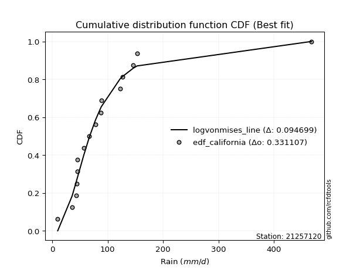</img>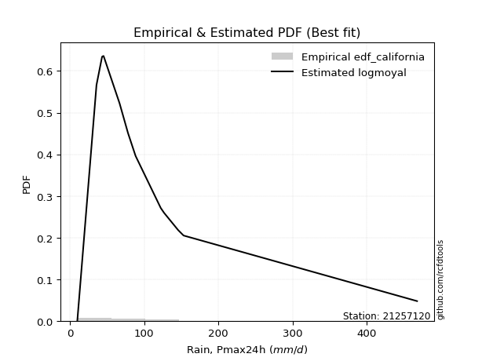</img>

</div>


### 2. EDF Hazen (1930)

Hazen method for plotting positions is a formula used to estimate the empirical cumulative probability distribution of flood events or other hydrological data. This formula often results in biased estimations, particularly when extrapolating to extreme events (high return periods).

<div align="center">


$P=(m-0.5)/n$


</div>


**2.1. Empirical values**

<div align="center">

|                | 0                   | 1                  | 2                   | 3                   | 4                  | 5                   | 6                   | 7         | 8                  | 9                  | 10                | 11                 | 12                 | 13                 | 14                 |
|:---------------|:--------------------|:-------------------|:--------------------|:--------------------|:-------------------|:--------------------|:--------------------|:----------|:-------------------|:-------------------|:------------------|:-------------------|:-------------------|:-------------------|:-------------------|
| date           | 2012                | 2016               | 2018                | 2017                | 2019               | 2015                | 2008                | 2007      | 2005               | 2009               | 2014              | 2011               | 2010               | 2013               | 2006               |
| x              | 9.7                 | 35.6               | 43.1                | 43.7                | 45.0               | 45.2                | 66.7                | 78.1      | 88.0               | 88.4               | 122.2             | 126.7              | 145.8              | 153.0              | 467.9              |
| m              | 1                   | 2                  | 3                   | 4                   | 5                  | 6                   | 7                   | 8         | 9                  | 10                 | 11                | 12                 | 13                 | 14                 | 15                 |
| empirical_dist | edf_hazen           | edf_hazen          | edf_hazen           | edf_hazen           | edf_hazen          | edf_hazen           | edf_hazen           | edf_hazen | edf_hazen          | edf_hazen          | edf_hazen         | edf_hazen          | edf_hazen          | edf_hazen          | edf_hazen          |
| empirical      | 0.03333333333333333 | 0.1                | 0.16666666666666666 | 0.23333333333333334 | 0.3                | 0.36666666666666664 | 0.43333333333333335 | 0.5       | 0.5666666666666667 | 0.6333333333333333 | 0.7               | 0.7666666666666667 | 0.8333333333333334 | 0.9                | 0.9666666666666667 |
| empirical_tr   | 1.0344827586206897  | 1.1111111111111112 | 1.2                 | 1.3043478260869565  | 1.4285714285714286 | 1.5789473684210527  | 1.7647058823529411  | 2.0       | 2.3076923076923075 | 2.727272727272727  | 3.333333333333333 | 4.2857142857142865 | 6.000000000000002  | 10.000000000000002 | 30.000000000000007 |

</div>


**2.2. Kolmogorov-Smirnov fit test (sorted by Δ)**


<div align="center">

|                | 0                   | 1                   | 2                   | 3                   | 4                   | 5                   | 6                   | 7                   | 8                   | 9                   | 10                  | 11                  | 12                  | 13                  | 14                  | 15                  | 16                  | 17                  | 18                  | 19                  | 20                 | 21                  | 22                  | 23                  | 24                  | 25                  | 26                  | 27                  | 28                  | 29                  | 30                 | 31                 | 32                  | 33                  | 34                  | 35                  | 36                  | 37                  | 38                  | 39                  | 40                  | 41                  | 42                  | 43                 | 44                  | 45                  | 46                  | 47                    | 48                 | 49                  | 50                  | 51                 | 52                  | 53                  | 54                 | 55                  | 56                  | 57                  | 58                  | 59                 | 60                  | 61                 | 62                 | 63                 | 64                 | 65                  | 66                  | 67                 | 68                 | 69                 | 70                 | 71                  | 72                  | 73                  | 74                  | 75                  | 76                 | 77                 | 78                  | 79                 | 80                 | 81                  | 82                 | 83                  | 84                  | 85                 | 86                 | 87                 |
|:---------------|:--------------------|:--------------------|:--------------------|:--------------------|:--------------------|:--------------------|:--------------------|:--------------------|:--------------------|:--------------------|:--------------------|:--------------------|:--------------------|:--------------------|:--------------------|:--------------------|:--------------------|:--------------------|:--------------------|:--------------------|:-------------------|:--------------------|:--------------------|:--------------------|:--------------------|:--------------------|:--------------------|:--------------------|:--------------------|:--------------------|:-------------------|:-------------------|:--------------------|:--------------------|:--------------------|:--------------------|:--------------------|:--------------------|:--------------------|:--------------------|:--------------------|:--------------------|:--------------------|:-------------------|:--------------------|:--------------------|:--------------------|:----------------------|:-------------------|:--------------------|:--------------------|:-------------------|:--------------------|:--------------------|:-------------------|:--------------------|:--------------------|:--------------------|:--------------------|:-------------------|:--------------------|:-------------------|:-------------------|:-------------------|:-------------------|:--------------------|:--------------------|:-------------------|:-------------------|:-------------------|:-------------------|:--------------------|:--------------------|:--------------------|:--------------------|:--------------------|:-------------------|:-------------------|:--------------------|:-------------------|:-------------------|:--------------------|:-------------------|:--------------------|:--------------------|:-------------------|:-------------------|:-------------------|
| station        | 21257120            | 21257120            | 21257120            | 21257120            | 21257120            | 21257120            | 21257120            | 21257120            | 21257120            | 21257120            | 21257120            | 21257120            | 21257120            | 21257120            | 21257120            | 21257120            | 21257120            | 21257120            | 21257120            | 21257120            | 21257120           | 21257120            | 21257120            | 21257120            | 21257120            | 21257120            | 21257120            | 21257120            | 21257120            | 21257120            | 21257120           | 21257120           | 21257120            | 21257120            | 21257120            | 21257120            | 21257120            | 21257120            | 21257120            | 21257120            | 21257120            | 21257120            | 21257120            | 21257120           | 21257120            | 21257120            | 21257120            | 21257120              | 21257120           | 21257120            | 21257120            | 21257120           | 21257120            | 21257120            | 21257120           | 21257120            | 21257120            | 21257120            | 21257120            | 21257120           | 21257120            | 21257120           | 21257120           | 21257120           | 21257120           | 21257120            | 21257120            | 21257120           | 21257120           | 21257120           | 21257120           | 21257120            | 21257120            | 21257120            | 21257120            | 21257120            | 21257120           | 21257120           | 21257120            | 21257120           | 21257120           | 21257120            | 21257120           | 21257120            | 21257120            | 21257120           | 21257120           | 21257120           |
| empirical_dist | edf_hazen           | edf_hazen           | edf_hazen           | edf_hazen           | edf_hazen           | edf_hazen           | edf_hazen           | edf_hazen           | edf_hazen           | edf_hazen           | edf_hazen           | edf_hazen           | edf_hazen           | edf_hazen           | edf_hazen           | edf_hazen           | edf_hazen           | edf_hazen           | edf_hazen           | edf_hazen           | edf_hazen          | edf_hazen           | edf_hazen           | edf_hazen           | edf_hazen           | edf_hazen           | edf_hazen           | edf_hazen           | edf_hazen           | edf_hazen           | edf_hazen          | edf_hazen          | edf_hazen           | edf_hazen           | edf_hazen           | edf_hazen           | edf_hazen           | edf_hazen           | edf_hazen           | edf_hazen           | edf_hazen           | edf_hazen           | edf_hazen           | edf_hazen          | edf_hazen           | edf_hazen           | edf_hazen           | edf_hazen             | edf_hazen          | edf_hazen           | edf_hazen           | edf_hazen          | edf_hazen           | edf_hazen           | edf_hazen          | edf_hazen           | edf_hazen           | edf_hazen           | edf_hazen           | edf_hazen          | edf_hazen           | edf_hazen          | edf_hazen          | edf_hazen          | edf_hazen          | edf_hazen           | edf_hazen           | edf_hazen          | edf_hazen          | edf_hazen          | edf_hazen          | edf_hazen           | edf_hazen           | edf_hazen           | edf_hazen           | edf_hazen           | edf_hazen          | edf_hazen          | edf_hazen           | edf_hazen          | edf_hazen          | edf_hazen           | edf_hazen          | edf_hazen           | edf_hazen           | edf_hazen          | edf_hazen          | edf_hazen          |
| p_dist         | betaprime           | logpearson3         | logloggamma         | logf                | logexponnorm        | lognorm             | lognorm             | logcrystalball      | loglognorm          | logrice             | lognct              | logfatiguelife      | invgauss            | ncf                 | loglogistic         | logbetaprime        | invgamma            | f                   | loggamma            | loggamma            | logerlang          | fatiguelife         | logncf              | genexpon            | invweibull          | logweibull_min      | logmielke           | logfisk             | logalpha            | loginvgamma         | loggenlogistic     | fisk               | loghypsecant        | logjohnsonsu        | loggumbel_r         | logt                | nct                 | logmaxwell          | johnsonsu           | exponnorm           | loggumbel_l         | wald                | logmoyal            | lognakagami        | t                   | loginvgauss         | lograyleigh         | loglaplace_asymmetric | logtruncnorm       | loggompertz         | expon               | genlogistic        | loglaplace          | loghalflogistic     | gibrat             | gompertz            | loghalfnorm         | truncnorm           | loginvweibull       | laplace_asymmetric | gumbel_r            | pearson3           | moyal              | kstwobign          | rayleigh           | logwald             | logistic            | maxwell            | logkstwobign       | halflogistic       | hypsecant          | erlang              | halfnorm            | crystalball         | norm                | rice                | loggibrat          | laplace            | loggenexpon         | gumbel_l           | weibull_min        | alpha               | nakagami           | logexpon            | mielke              | logchi2            | chi2               | gamma              |
| delta          | 0.09356016949667095 | 0.09603300207502732 | 0.09651466116593843 | 0.10061091110967704 | 0.10064845058918606 | 0.10064859247636779 | 0.10064859247636779 | 0.10064861180293769 | 0.10065012489575217 | 0.10065289809064074 | 0.10095844385091715 | 0.10107150460934741 | 0.10139809944966849 | 0.10201709112419877 | 0.10246381037311464 | 0.10321402887556788 | 0.10414426926268822 | 0.10416353133069722 | 0.10464113486803997 | 0.10464113486803997 | 0.1057034156490069 | 0.10819907624539993 | 0.10842707048608866 | 0.10936720085940754 | 0.10937233466353896 | 0.10975988903580533 | 0.11078342886776077 | 0.11089057967917687 | 0.11089815337292883 | 0.11122601903774701 | 0.1112734566047075 | 0.1127863388735223 | 0.11793400676481977 | 0.12021016805576246 | 0.12125559051704413 | 0.12209605874384871 | 0.12290579363557774 | 0.12468773561980515 | 0.12570244875709158 | 0.12695146107426797 | 0.12841886444735598 | 0.12855512810900602 | 0.12861440120454204 | 0.1290633119103963 | 0.12938217980922384 | 0.13092037122664132 | 0.13445601815428768 | 0.13711259527894507   | 0.1382217046871132 | 0.13986675947638968 | 0.14029890621362565 | 0.1410600042501835 | 0.14168619970439608 | 0.15185587403537834 | 0.1552974601521528 | 0.15959321213520739 | 0.16146821631890337 | 0.16267927144773509 | 0.16408303347087402 | 0.1727033370866548 | 0.17642125522829513 | 0.1773246238506728 | 0.1775160249575168 | 0.1867572284099881 | 0.1974864581499246 | 0.19892311489311054 | 0.20127253957899582 | 0.2029432470248559 | 0.2047534115084437 | 0.2052614970305204 | 0.2061458562546874 | 0.20729649798807717 | 0.21703884567560242 | 0.22139446870255708 | 0.22139447094375264 | 0.22389009811412414 | 0.2264713364758043 | 0.2271342860089201 | 0.23310618438222627 | 0.2614449597284232 | 0.2742851846833009 | 0.28318196089733294 | 0.2846133114457208 | 0.37523274316406785 | 0.38499506759500113 | 0.5953444968861898 | 0.8953202213041672 | 0.8997647060871997 |
| deltao         | 0.3366456264050002  | 0.3366456264050002  | 0.3366456264050002  | 0.3366456264050002  | 0.3366456264050002  | 0.3366456264050002  | 0.3366456264050002  | 0.3366456264050002  | 0.3366456264050002  | 0.3366456264050002  | 0.3366456264050002  | 0.3366456264050002  | 0.3366456264050002  | 0.3366456264050002  | 0.3366456264050002  | 0.3366456264050002  | 0.3366456264050002  | 0.3366456264050002  | 0.3366456264050002  | 0.3366456264050002  | 0.3366456264050002 | 0.3366456264050002  | 0.3366456264050002  | 0.3366456264050002  | 0.3366456264050002  | 0.3366456264050002  | 0.3366456264050002  | 0.3366456264050002  | 0.3366456264050002  | 0.3366456264050002  | 0.3366456264050002 | 0.3366456264050002 | 0.3366456264050002  | 0.3366456264050002  | 0.3366456264050002  | 0.3366456264050002  | 0.3366456264050002  | 0.3366456264050002  | 0.3366456264050002  | 0.3366456264050002  | 0.3366456264050002  | 0.3366456264050002  | 0.3366456264050002  | 0.3366456264050002 | 0.3366456264050002  | 0.3366456264050002  | 0.3366456264050002  | 0.3366456264050002    | 0.3366456264050002 | 0.3366456264050002  | 0.3366456264050002  | 0.3366456264050002 | 0.3366456264050002  | 0.3366456264050002  | 0.3366456264050002 | 0.3366456264050002  | 0.3366456264050002  | 0.3366456264050002  | 0.3366456264050002  | 0.3366456264050002 | 0.3366456264050002  | 0.3366456264050002 | 0.3366456264050002 | 0.3366456264050002 | 0.3366456264050002 | 0.3366456264050002  | 0.3366456264050002  | 0.3366456264050002 | 0.3366456264050002 | 0.3366456264050002 | 0.3366456264050002 | 0.3366456264050002  | 0.3366456264050002  | 0.3366456264050002  | 0.3366456264050002  | 0.3366456264050002  | 0.3366456264050002 | 0.3366456264050002 | 0.3366456264050002  | 0.3366456264050002 | 0.3366456264050002 | 0.3366456264050002  | 0.3366456264050002 | 0.3366456264050002  | 0.3366456264050002  | 0.3366456264050002 | 0.3366456264050002 | 0.3366456264050002 |
| eval           | Δo > Δ              | Δo > Δ              | Δo > Δ              | Δo > Δ              | Δo > Δ              | Δo > Δ              | Δo > Δ              | Δo > Δ              | Δo > Δ              | Δo > Δ              | Δo > Δ              | Δo > Δ              | Δo > Δ              | Δo > Δ              | Δo > Δ              | Δo > Δ              | Δo > Δ              | Δo > Δ              | Δo > Δ              | Δo > Δ              | Δo > Δ             | Δo > Δ              | Δo > Δ              | Δo > Δ              | Δo > Δ              | Δo > Δ              | Δo > Δ              | Δo > Δ              | Δo > Δ              | Δo > Δ              | Δo > Δ             | Δo > Δ             | Δo > Δ              | Δo > Δ              | Δo > Δ              | Δo > Δ              | Δo > Δ              | Δo > Δ              | Δo > Δ              | Δo > Δ              | Δo > Δ              | Δo > Δ              | Δo > Δ              | Δo > Δ             | Δo > Δ              | Δo > Δ              | Δo > Δ              | Δo > Δ                | Δo > Δ             | Δo > Δ              | Δo > Δ              | Δo > Δ             | Δo > Δ              | Δo > Δ              | Δo > Δ             | Δo > Δ              | Δo > Δ              | Δo > Δ              | Δo > Δ              | Δo > Δ             | Δo > Δ              | Δo > Δ             | Δo > Δ             | Δo > Δ             | Δo > Δ             | Δo > Δ              | Δo > Δ              | Δo > Δ             | Δo > Δ             | Δo > Δ             | Δo > Δ             | Δo > Δ              | Δo > Δ              | Δo > Δ              | Δo > Δ              | Δo > Δ              | Δo > Δ             | Δo > Δ             | Δo > Δ              | Δo > Δ             | Δo > Δ             | Δo > Δ              | Δo > Δ             | Δo <= Δ             | Δo <= Δ             | Δo <= Δ            | Δo <= Δ            | Δo <= Δ            |
| fit            | 1                   | 1                   | 1                   | 1                   | 1                   | 1                   | 1                   | 1                   | 1                   | 1                   | 1                   | 1                   | 1                   | 1                   | 1                   | 1                   | 1                   | 1                   | 1                   | 1                   | 1                  | 1                   | 1                   | 1                   | 1                   | 1                   | 1                   | 1                   | 1                   | 1                   | 1                  | 1                  | 1                   | 1                   | 1                   | 1                   | 1                   | 1                   | 1                   | 1                   | 1                   | 1                   | 1                   | 1                  | 1                   | 1                   | 1                   | 1                     | 1                  | 1                   | 1                   | 1                  | 1                   | 1                   | 1                  | 1                   | 1                   | 1                   | 1                   | 1                  | 1                   | 1                  | 1                  | 1                  | 1                  | 1                   | 1                   | 1                  | 1                  | 1                  | 1                  | 1                   | 1                   | 1                   | 1                   | 1                   | 1                  | 1                  | 1                   | 1                  | 1                  | 1                   | 1                  | 0                   | 0                   | 0                  | 0                  | 0                  |
| n              | 15                  | 15                  | 15                  | 15                  | 15                  | 15                  | 15                  | 15                  | 15                  | 15                  | 15                  | 15                  | 15                  | 15                  | 15                  | 15                  | 15                  | 15                  | 15                  | 15                  | 15                 | 15                  | 15                  | 15                  | 15                  | 15                  | 15                  | 15                  | 15                  | 15                  | 15                 | 15                 | 15                  | 15                  | 15                  | 15                  | 15                  | 15                  | 15                  | 15                  | 15                  | 15                  | 15                  | 15                 | 15                  | 15                  | 15                  | 15                    | 15                 | 15                  | 15                  | 15                 | 15                  | 15                  | 15                 | 15                  | 15                  | 15                  | 15                  | 15                 | 15                  | 15                 | 15                 | 15                 | 15                 | 15                  | 15                  | 15                 | 15                 | 15                 | 15                 | 15                  | 15                  | 15                  | 15                  | 15                  | 15                 | 15                 | 15                  | 15                 | 15                 | 15                  | 15                 | 15                  | 15                  | 15                 | 15                 | 15                 |
| best_fit       | 1                   | 0                   | 0                   | 0                   | 0                   | 0                   | 0                   | 0                   | 0                   | 0                   | 0                   | 0                   | 0                   | 0                   | 0                   | 0                   | 0                   | 0                   | 0                   | 0                   | 0                  | 0                   | 0                   | 0                   | 0                   | 0                   | 0                   | 0                   | 0                   | 0                   | 0                  | 0                  | 0                   | 0                   | 0                   | 0                   | 0                   | 0                   | 0                   | 0                   | 0                   | 0                   | 0                   | 0                  | 0                   | 0                   | 0                   | 0                     | 0                  | 0                   | 0                   | 0                  | 0                   | 0                   | 0                  | 0                   | 0                   | 0                   | 0                   | 0                  | 0                   | 0                  | 0                  | 0                  | 0                  | 0                   | 0                   | 0                  | 0                  | 0                  | 0                  | 0                   | 0                   | 0                   | 0                   | 0                   | 0                  | 0                  | 0                   | 0                  | 0                  | 0                   | 0                  | 0                   | 0                   | 0                  | 0                  | 0                  |
| best_fit_sort  | 1                   | 2                   | 3                   | 4                   | 5                   | 6                   | 7                   | 8                   | 9                   | 10                  | 11                  | 12                  | 13                  | 14                  | 15                  | 16                  | 17                  | 18                  | 19                  | 20                  | 21                 | 22                  | 23                  | 24                  | 25                  | 26                  | 27                  | 28                  | 29                  | 30                  | 31                 | 32                 | 33                  | 34                  | 35                  | 36                  | 37                  | 38                  | 39                  | 40                  | 41                  | 42                  | 43                  | 44                 | 45                  | 46                  | 47                  | 48                    | 49                 | 50                  | 51                  | 52                 | 53                  | 54                  | 55                 | 56                  | 57                  | 58                  | 59                  | 60                 | 61                  | 62                 | 63                 | 64                 | 65                 | 66                  | 67                  | 68                 | 69                 | 70                 | 71                 | 72                  | 73                  | 74                  | 75                  | 76                  | 77                 | 78                 | 79                  | 80                 | 81                 | 82                  | 83                 | 84                  | 85                  | 86                 | 87                 | 88                 |

</div>


**2.3. Best fit**

<div align="center">

|   id |   station | empirical_dist   | p_dist    |     delta |   deltao | eval   |   fit |   n |   best_fit |   best_fit_sort |
|-----:|----------:|:-----------------|:----------|----------:|---------:|:-------|------:|----:|-----------:|----------------:|
|    0 |  21257120 | edf_hazen        | betaprime | 0.0935602 | 0.336646 | Δo > Δ |     1 |  15 |          1 |               1 |

</div>


<div align="center">

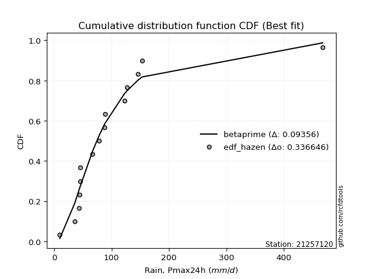</img>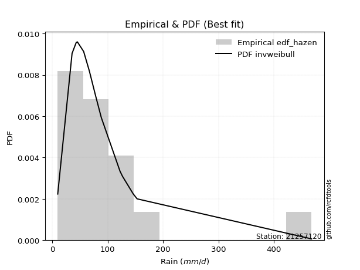</img>

</div>


### 3. EDF Weibull (1939)

Weibull plotting position formula is an empirical method used to estimate the non-exceedance probability or plotting position for a set of observed data, is often recommended or widely used in practice, particularly in flood frequency analysis.

<div align="center">


$P=m/(n+1)$


</div>


**3.1. Empirical values**

<div align="center">

|                | 0                  | 1                  | 2                  | 3                  | 4                  | 5           | 6                  | 7           | 8                  | 9                  | 10          | 11          | 12                | 13          | 14          |
|:---------------|:-------------------|:-------------------|:-------------------|:-------------------|:-------------------|:------------|:-------------------|:------------|:-------------------|:-------------------|:------------|:------------|:------------------|:------------|:------------|
| date           | 2012               | 2016               | 2018               | 2017               | 2019               | 2015        | 2008               | 2007        | 2005               | 2009               | 2014        | 2011        | 2010              | 2013        | 2006        |
| x              | 9.7                | 35.6               | 43.1               | 43.7               | 45.0               | 45.2        | 66.7               | 78.1        | 88.0               | 88.4               | 122.2       | 126.7       | 145.8             | 153.0       | 467.9       |
| m              | 1                  | 2                  | 3                  | 4                  | 5                  | 6           | 7                  | 8           | 9                  | 10                 | 11          | 12          | 13                | 14          | 15          |
| empirical_dist | edf_weibull        | edf_weibull        | edf_weibull        | edf_weibull        | edf_weibull        | edf_weibull | edf_weibull        | edf_weibull | edf_weibull        | edf_weibull        | edf_weibull | edf_weibull | edf_weibull       | edf_weibull | edf_weibull |
| empirical      | 0.0625             | 0.125              | 0.1875             | 0.25               | 0.3125             | 0.375       | 0.4375             | 0.5         | 0.5625             | 0.625              | 0.6875      | 0.75        | 0.8125            | 0.875       | 0.9375      |
| empirical_tr   | 1.0666666666666667 | 1.1428571428571428 | 1.2307692307692308 | 1.3333333333333333 | 1.4545454545454546 | 1.6         | 1.7777777777777777 | 2.0         | 2.2857142857142856 | 2.6666666666666665 | 3.2         | 4.0         | 5.333333333333333 | 8.0         | 16.0        |

</div>


**3.2. Kolmogorov-Smirnov fit test (sorted by Δ)**


<div align="center">

|                | 0                  | 1                  | 2                   | 3                   | 4                   | 5                   | 6                  | 7                   | 8                   | 9                   | 10                  | 11                  | 12                  | 13                  | 14                  | 15                  | 16                  | 17                  | 18                  | 19                 | 20                  | 21                  | 22                  | 23                  | 24                 | 25                  | 26                  | 27                  | 28                 | 29                  | 30                  | 31                  | 32                  | 33                  | 34                  | 35                  | 36                  | 37                  | 38                  | 39                  | 40                  | 41                  | 42                  | 43                 | 44                 | 45                  | 46                  | 47                  | 48                  | 49                  | 50                  | 51                  | 52                 | 53                  | 54                    | 55                  | 56                  | 57                  | 58                  | 59                  | 60                  | 61                  | 62                  | 63                  | 64                 | 65                 | 66                  | 67                  | 68                  | 69                  | 70                  | 71                  | 72                  | 73                 | 74                  | 75                  | 76                  | 77                 | 78                 | 79                 | 80                 | 81                  | 82                 | 83                  | 84                  | 85                 | 86                 | 87                 |
|:---------------|:-------------------|:-------------------|:--------------------|:--------------------|:--------------------|:--------------------|:-------------------|:--------------------|:--------------------|:--------------------|:--------------------|:--------------------|:--------------------|:--------------------|:--------------------|:--------------------|:--------------------|:--------------------|:--------------------|:-------------------|:--------------------|:--------------------|:--------------------|:--------------------|:-------------------|:--------------------|:--------------------|:--------------------|:-------------------|:--------------------|:--------------------|:--------------------|:--------------------|:--------------------|:--------------------|:--------------------|:--------------------|:--------------------|:--------------------|:--------------------|:--------------------|:--------------------|:--------------------|:-------------------|:-------------------|:--------------------|:--------------------|:--------------------|:--------------------|:--------------------|:--------------------|:--------------------|:-------------------|:--------------------|:----------------------|:--------------------|:--------------------|:--------------------|:--------------------|:--------------------|:--------------------|:--------------------|:--------------------|:--------------------|:-------------------|:-------------------|:--------------------|:--------------------|:--------------------|:--------------------|:--------------------|:--------------------|:--------------------|:-------------------|:--------------------|:--------------------|:--------------------|:-------------------|:-------------------|:-------------------|:-------------------|:--------------------|:-------------------|:--------------------|:--------------------|:-------------------|:-------------------|:-------------------|
| station        | 21257120           | 21257120           | 21257120            | 21257120            | 21257120            | 21257120            | 21257120           | 21257120            | 21257120            | 21257120            | 21257120            | 21257120            | 21257120            | 21257120            | 21257120            | 21257120            | 21257120            | 21257120            | 21257120            | 21257120           | 21257120            | 21257120            | 21257120            | 21257120            | 21257120           | 21257120            | 21257120            | 21257120            | 21257120           | 21257120            | 21257120            | 21257120            | 21257120            | 21257120            | 21257120            | 21257120            | 21257120            | 21257120            | 21257120            | 21257120            | 21257120            | 21257120            | 21257120            | 21257120           | 21257120           | 21257120            | 21257120            | 21257120            | 21257120            | 21257120            | 21257120            | 21257120            | 21257120           | 21257120            | 21257120              | 21257120            | 21257120            | 21257120            | 21257120            | 21257120            | 21257120            | 21257120            | 21257120            | 21257120            | 21257120           | 21257120           | 21257120            | 21257120            | 21257120            | 21257120            | 21257120            | 21257120            | 21257120            | 21257120           | 21257120            | 21257120            | 21257120            | 21257120           | 21257120           | 21257120           | 21257120           | 21257120            | 21257120           | 21257120            | 21257120            | 21257120           | 21257120           | 21257120           |
| empirical_dist | edf_weibull        | edf_weibull        | edf_weibull         | edf_weibull         | edf_weibull         | edf_weibull         | edf_weibull        | edf_weibull         | edf_weibull         | edf_weibull         | edf_weibull         | edf_weibull         | edf_weibull         | edf_weibull         | edf_weibull         | edf_weibull         | edf_weibull         | edf_weibull         | edf_weibull         | edf_weibull        | edf_weibull         | edf_weibull         | edf_weibull         | edf_weibull         | edf_weibull        | edf_weibull         | edf_weibull         | edf_weibull         | edf_weibull        | edf_weibull         | edf_weibull         | edf_weibull         | edf_weibull         | edf_weibull         | edf_weibull         | edf_weibull         | edf_weibull         | edf_weibull         | edf_weibull         | edf_weibull         | edf_weibull         | edf_weibull         | edf_weibull         | edf_weibull        | edf_weibull        | edf_weibull         | edf_weibull         | edf_weibull         | edf_weibull         | edf_weibull         | edf_weibull         | edf_weibull         | edf_weibull        | edf_weibull         | edf_weibull           | edf_weibull         | edf_weibull         | edf_weibull         | edf_weibull         | edf_weibull         | edf_weibull         | edf_weibull         | edf_weibull         | edf_weibull         | edf_weibull        | edf_weibull        | edf_weibull         | edf_weibull         | edf_weibull         | edf_weibull         | edf_weibull         | edf_weibull         | edf_weibull         | edf_weibull        | edf_weibull         | edf_weibull         | edf_weibull         | edf_weibull        | edf_weibull        | edf_weibull        | edf_weibull        | edf_weibull         | edf_weibull        | edf_weibull         | edf_weibull         | edf_weibull        | edf_weibull        | edf_weibull        |
| p_dist         | loggamma           | loggamma           | logerlang           | logbetaprime        | logweibull_min      | logncf              | logfatiguelife     | lognct              | logrice             | logf                | loglognorm          | logcrystalball      | lognorm             | lognorm             | logexponnorm        | logalpha            | loginvgamma         | logloggamma         | logpearson3         | genexpon           | invgauss            | betaprime           | fatiguelife         | loggumbel_r         | logmaxwell         | wald                | loginvgauss         | ncf                 | loglogistic        | invgamma            | f                   | lograyleigh         | loggompertz         | expon               | invweibull          | logmielke           | logfisk             | loggenlogistic      | fisk                | loghypsecant        | logjohnsonsu        | logmoyal            | logt                | loghalflogistic    | nct                | johnsonsu           | gompertz            | exponnorm           | loggumbel_l         | lognakagami         | truncnorm           | loghalfnorm         | t                  | loginvweibull       | loglaplace_asymmetric | logtruncnorm        | genlogistic         | loglaplace          | gumbel_r            | moyal               | pearson3            | gibrat              | rayleigh            | maxwell             | kstwobign          | halflogistic       | laplace_asymmetric  | erlang              | logkstwobign        | logistic            | halfnorm            | crystalball         | norm                | hypsecant          | logwald             | loggenexpon         | rice                | laplace            | loggibrat          | gumbel_l           | weibull_min        | nakagami            | alpha              | logexpon            | mielke              | logchi2            | chi2               | gamma              |
| delta          | 0.0845376781561496 | 0.0845376781561496 | 0.08487008231567356 | 0.08597158883704098 | 0.08640108292073684 | 0.08759373715275531 | 0.0883277663449018 | 0.08853318014141937 | 0.08885385336553037 | 0.08885519393344476 | 0.08885651488305868 | 0.08885820470423694 | 0.08885822425837864 | 0.08885822425837864 | 0.08885838372927163 | 0.09006482003959548 | 0.09039268570441367 | 0.09382576586464281 | 0.09555987141362488 | 0.0999253316332886 | 0.10092308027038355 | 0.10189350283000431 | 0.10247813769037373 | 0.10328454490024608 | 0.1038544022864718 | 0.10772179477567267 | 0.11008703789330798 | 0.11035042445753213 | 0.110797143706448  | 0.11247760259602158 | 0.11249686466403058 | 0.11362268482095433 | 0.11486675947638969 | 0.11529890621362565 | 0.11770566799687232 | 0.11911676220109413 | 0.11922391301251023 | 0.11960678993804086 | 0.12111967220685566 | 0.12626734009815313 | 0.12854350138909582 | 0.12861440120454204 | 0.13042939207718207 | 0.131022540702045  | 0.1312391269689111 | 0.13403578209042494 | 0.13459321213520736 | 0.13528479440760133 | 0.13675219778068934 | 0.13739664524372966 | 0.13767927144773506 | 0.14063488298557003 | 0.1418821798092238 | 0.14324970013754068 | 0.14544592861227842   | 0.14655503802044656 | 0.14939333758351686 | 0.15001953303772944 | 0.15142125522829514 | 0.15251602495751682 | 0.15649129051733945 | 0.16363079348548615 | 0.17248645814992458 | 0.17794324702485587 | 0.1784238950766548 | 0.1802614970305204 | 0.18103667041998817 | 0.18229649798807718 | 0.18392007817511036 | 0.19122577192182433 | 0.19203884567560242 | 0.19639446870255706 | 0.19639447094375262 | 0.1978125229213541 | 0.19892311489311054 | 0.21227285104889293 | 0.21555676478079083 | 0.2188009526755868 | 0.2264713364758043 | 0.2531116263950899 | 0.2534518513499675 | 0.25961331144572075 | 0.2623486275639996 | 0.35023274316406783 | 0.35999506759500116 | 0.5703444968861898 | 0.8703202213041672 | 0.8747647060871997 |
| deltao         | 0.3366456264050002 | 0.3366456264050002 | 0.3366456264050002  | 0.3366456264050002  | 0.3366456264050002  | 0.3366456264050002  | 0.3366456264050002 | 0.3366456264050002  | 0.3366456264050002  | 0.3366456264050002  | 0.3366456264050002  | 0.3366456264050002  | 0.3366456264050002  | 0.3366456264050002  | 0.3366456264050002  | 0.3366456264050002  | 0.3366456264050002  | 0.3366456264050002  | 0.3366456264050002  | 0.3366456264050002 | 0.3366456264050002  | 0.3366456264050002  | 0.3366456264050002  | 0.3366456264050002  | 0.3366456264050002 | 0.3366456264050002  | 0.3366456264050002  | 0.3366456264050002  | 0.3366456264050002 | 0.3366456264050002  | 0.3366456264050002  | 0.3366456264050002  | 0.3366456264050002  | 0.3366456264050002  | 0.3366456264050002  | 0.3366456264050002  | 0.3366456264050002  | 0.3366456264050002  | 0.3366456264050002  | 0.3366456264050002  | 0.3366456264050002  | 0.3366456264050002  | 0.3366456264050002  | 0.3366456264050002 | 0.3366456264050002 | 0.3366456264050002  | 0.3366456264050002  | 0.3366456264050002  | 0.3366456264050002  | 0.3366456264050002  | 0.3366456264050002  | 0.3366456264050002  | 0.3366456264050002 | 0.3366456264050002  | 0.3366456264050002    | 0.3366456264050002  | 0.3366456264050002  | 0.3366456264050002  | 0.3366456264050002  | 0.3366456264050002  | 0.3366456264050002  | 0.3366456264050002  | 0.3366456264050002  | 0.3366456264050002  | 0.3366456264050002 | 0.3366456264050002 | 0.3366456264050002  | 0.3366456264050002  | 0.3366456264050002  | 0.3366456264050002  | 0.3366456264050002  | 0.3366456264050002  | 0.3366456264050002  | 0.3366456264050002 | 0.3366456264050002  | 0.3366456264050002  | 0.3366456264050002  | 0.3366456264050002 | 0.3366456264050002 | 0.3366456264050002 | 0.3366456264050002 | 0.3366456264050002  | 0.3366456264050002 | 0.3366456264050002  | 0.3366456264050002  | 0.3366456264050002 | 0.3366456264050002 | 0.3366456264050002 |
| eval           | Δo > Δ             | Δo > Δ             | Δo > Δ              | Δo > Δ              | Δo > Δ              | Δo > Δ              | Δo > Δ             | Δo > Δ              | Δo > Δ              | Δo > Δ              | Δo > Δ              | Δo > Δ              | Δo > Δ              | Δo > Δ              | Δo > Δ              | Δo > Δ              | Δo > Δ              | Δo > Δ              | Δo > Δ              | Δo > Δ             | Δo > Δ              | Δo > Δ              | Δo > Δ              | Δo > Δ              | Δo > Δ             | Δo > Δ              | Δo > Δ              | Δo > Δ              | Δo > Δ             | Δo > Δ              | Δo > Δ              | Δo > Δ              | Δo > Δ              | Δo > Δ              | Δo > Δ              | Δo > Δ              | Δo > Δ              | Δo > Δ              | Δo > Δ              | Δo > Δ              | Δo > Δ              | Δo > Δ              | Δo > Δ              | Δo > Δ             | Δo > Δ             | Δo > Δ              | Δo > Δ              | Δo > Δ              | Δo > Δ              | Δo > Δ              | Δo > Δ              | Δo > Δ              | Δo > Δ             | Δo > Δ              | Δo > Δ                | Δo > Δ              | Δo > Δ              | Δo > Δ              | Δo > Δ              | Δo > Δ              | Δo > Δ              | Δo > Δ              | Δo > Δ              | Δo > Δ              | Δo > Δ             | Δo > Δ             | Δo > Δ              | Δo > Δ              | Δo > Δ              | Δo > Δ              | Δo > Δ              | Δo > Δ              | Δo > Δ              | Δo > Δ             | Δo > Δ              | Δo > Δ              | Δo > Δ              | Δo > Δ             | Δo > Δ             | Δo > Δ             | Δo > Δ             | Δo > Δ              | Δo > Δ             | Δo <= Δ             | Δo <= Δ             | Δo <= Δ            | Δo <= Δ            | Δo <= Δ            |
| fit            | 1                  | 1                  | 1                   | 1                   | 1                   | 1                   | 1                  | 1                   | 1                   | 1                   | 1                   | 1                   | 1                   | 1                   | 1                   | 1                   | 1                   | 1                   | 1                   | 1                  | 1                   | 1                   | 1                   | 1                   | 1                  | 1                   | 1                   | 1                   | 1                  | 1                   | 1                   | 1                   | 1                   | 1                   | 1                   | 1                   | 1                   | 1                   | 1                   | 1                   | 1                   | 1                   | 1                   | 1                  | 1                  | 1                   | 1                   | 1                   | 1                   | 1                   | 1                   | 1                   | 1                  | 1                   | 1                     | 1                   | 1                   | 1                   | 1                   | 1                   | 1                   | 1                   | 1                   | 1                   | 1                  | 1                  | 1                   | 1                   | 1                   | 1                   | 1                   | 1                   | 1                   | 1                  | 1                   | 1                   | 1                   | 1                  | 1                  | 1                  | 1                  | 1                   | 1                  | 0                   | 0                   | 0                  | 0                  | 0                  |
| n              | 15                 | 15                 | 15                  | 15                  | 15                  | 15                  | 15                 | 15                  | 15                  | 15                  | 15                  | 15                  | 15                  | 15                  | 15                  | 15                  | 15                  | 15                  | 15                  | 15                 | 15                  | 15                  | 15                  | 15                  | 15                 | 15                  | 15                  | 15                  | 15                 | 15                  | 15                  | 15                  | 15                  | 15                  | 15                  | 15                  | 15                  | 15                  | 15                  | 15                  | 15                  | 15                  | 15                  | 15                 | 15                 | 15                  | 15                  | 15                  | 15                  | 15                  | 15                  | 15                  | 15                 | 15                  | 15                    | 15                  | 15                  | 15                  | 15                  | 15                  | 15                  | 15                  | 15                  | 15                  | 15                 | 15                 | 15                  | 15                  | 15                  | 15                  | 15                  | 15                  | 15                  | 15                 | 15                  | 15                  | 15                  | 15                 | 15                 | 15                 | 15                 | 15                  | 15                 | 15                  | 15                  | 15                 | 15                 | 15                 |
| best_fit       | 1                  | 1                  | 0                   | 0                   | 0                   | 0                   | 0                  | 0                   | 0                   | 0                   | 0                   | 0                   | 0                   | 0                   | 0                   | 0                   | 0                   | 0                   | 0                   | 0                  | 0                   | 0                   | 0                   | 0                   | 0                  | 0                   | 0                   | 0                   | 0                  | 0                   | 0                   | 0                   | 0                   | 0                   | 0                   | 0                   | 0                   | 0                   | 0                   | 0                   | 0                   | 0                   | 0                   | 0                  | 0                  | 0                   | 0                   | 0                   | 0                   | 0                   | 0                   | 0                   | 0                  | 0                   | 0                     | 0                   | 0                   | 0                   | 0                   | 0                   | 0                   | 0                   | 0                   | 0                   | 0                  | 0                  | 0                   | 0                   | 0                   | 0                   | 0                   | 0                   | 0                   | 0                  | 0                   | 0                   | 0                   | 0                  | 0                  | 0                  | 0                  | 0                   | 0                  | 0                   | 0                   | 0                  | 0                  | 0                  |
| best_fit_sort  | 1                  | 2                  | 3                   | 4                   | 5                   | 6                   | 7                  | 8                   | 9                   | 10                  | 11                  | 12                  | 13                  | 14                  | 15                  | 16                  | 17                  | 18                  | 19                  | 20                 | 21                  | 22                  | 23                  | 24                  | 25                 | 26                  | 27                  | 28                  | 29                 | 30                  | 31                  | 32                  | 33                  | 34                  | 35                  | 36                  | 37                  | 38                  | 39                  | 40                  | 41                  | 42                  | 43                  | 44                 | 45                 | 46                  | 47                  | 48                  | 49                  | 50                  | 51                  | 52                  | 53                 | 54                  | 55                    | 56                  | 57                  | 58                  | 59                  | 60                  | 61                  | 62                  | 63                  | 64                  | 65                 | 66                 | 67                  | 68                  | 69                  | 70                  | 71                  | 72                  | 73                  | 74                 | 75                  | 76                  | 77                  | 78                 | 79                 | 80                 | 81                 | 82                  | 83                 | 84                  | 85                  | 86                 | 87                 | 88                 |

</div>


**3.3. Best fit**

<div align="center">

|   id |   station | empirical_dist   | p_dist   |     delta |   deltao | eval   |   fit |   n |   best_fit |   best_fit_sort |
|-----:|----------:|:-----------------|:---------|----------:|---------:|:-------|------:|----:|-----------:|----------------:|
|    0 |  21257120 | edf_weibull      | loggamma | 0.0845377 | 0.336646 | Δo > Δ |     1 |  15 |          1 |               1 |
|    1 |  21257120 | edf_weibull      | loggamma | 0.0845377 | 0.336646 | Δo > Δ |     1 |  15 |          1 |               2 |

</div>


<div align="center">

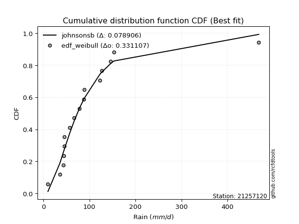</img>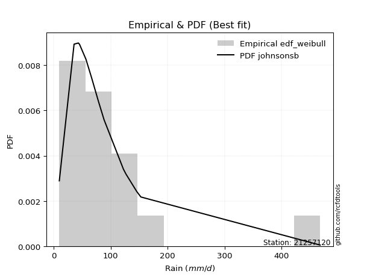</img>

</div>


### 4. EDF Beard (1943)

The Beard formula (or Beard´s plotting position formula) in hydrology is used to estimate the empirical non-exceedance probability _(P)_ of a flood event (or other extreme hydrological data point) within a given dataset.

<div align="center">


$P=(m-0.31)/(n+0.38)$


</div>


**4.1. Empirical values**

<div align="center">

|                | 0                   | 1                   | 2                   | 3                   | 4                  | 5                   | 6                   | 7         | 8                  | 9                  | 10                 | 11                | 12                 | 13                 | 14                 |
|:---------------|:--------------------|:--------------------|:--------------------|:--------------------|:-------------------|:--------------------|:--------------------|:----------|:-------------------|:-------------------|:-------------------|:------------------|:-------------------|:-------------------|:-------------------|
| date           | 2012                | 2016                | 2018                | 2017                | 2019               | 2015                | 2008                | 2007      | 2005               | 2009               | 2014               | 2011              | 2010               | 2013               | 2006               |
| x              | 9.7                 | 35.6                | 43.1                | 43.7                | 45.0               | 45.2                | 66.7                | 78.1      | 88.0               | 88.4               | 122.2              | 126.7             | 145.8              | 153.0              | 467.9              |
| m              | 1                   | 2                   | 3                   | 4                   | 5                  | 6                   | 7                   | 8         | 9                  | 10                 | 11                 | 12                | 13                 | 14                 | 15                 |
| empirical_dist | edf_beard           | edf_beard           | edf_beard           | edf_beard           | edf_beard          | edf_beard           | edf_beard           | edf_beard | edf_beard          | edf_beard          | edf_beard          | edf_beard         | edf_beard          | edf_beard          | edf_beard          |
| empirical      | 0.04486345903771131 | 0.10988296488946683 | 0.17490247074122237 | 0.23992197659297787 | 0.3049414824447334 | 0.36996098829648894 | 0.43498049414824447 | 0.5       | 0.5650195058517554 | 0.630039011703511  | 0.6950585175552665 | 0.760078023407022 | 0.8250975292587776 | 0.8901170351105331 | 0.9551365409622886 |
| empirical_tr   | 1.0469707283866576  | 1.1234477720964207  | 1.2119779353821907  | 1.3156544054747648  | 1.4387277829747427 | 1.587203302373581   | 1.7698504027617952  | 2.0       | 2.298953662182361  | 2.7029876977152894 | 3.279317697228144  | 4.168021680216801 | 5.717472118959106  | 9.100591715976325  | 22.289855072463734 |

</div>


**4.2. Kolmogorov-Smirnov fit test (sorted by Δ)**


<div align="center">

|                | 0                   | 1                   | 2                   | 3                   | 4                   | 5                   | 6                   | 7                   | 8                   | 9                   | 10                 | 11                  | 12                  | 13                  | 14                  | 15                  | 16                  | 17                  | 18                 | 19                 | 20                  | 21                  | 22                 | 23                  | 24                  | 25                  | 26                  | 27                  | 28                  | 29                  | 30                  | 31                 | 32                  | 33                  | 34                  | 35                  | 36                  | 37                  | 38                 | 39                  | 40                  | 41                  | 42                  | 43                  | 44                  | 45                  | 46                  | 47                 | 48                 | 49                    | 50                 | 51                  | 52                 | 53                  | 54                  | 55                  | 56                  | 57                  | 58                  | 59                 | 60                  | 61                 | 62                 | 63                  | 64                  | 65                  | 66                  | 67                  | 68                 | 69                  | 70                  | 71                  | 72                 | 73                  | 74                 | 75                 | 76                  | 77                  | 78                 | 79                  | 80                  | 81                  | 82                  | 83                 | 84                 | 85                 | 86                 | 87                 |
|:---------------|:--------------------|:--------------------|:--------------------|:--------------------|:--------------------|:--------------------|:--------------------|:--------------------|:--------------------|:--------------------|:-------------------|:--------------------|:--------------------|:--------------------|:--------------------|:--------------------|:--------------------|:--------------------|:-------------------|:-------------------|:--------------------|:--------------------|:-------------------|:--------------------|:--------------------|:--------------------|:--------------------|:--------------------|:--------------------|:--------------------|:--------------------|:-------------------|:--------------------|:--------------------|:--------------------|:--------------------|:--------------------|:--------------------|:-------------------|:--------------------|:--------------------|:--------------------|:--------------------|:--------------------|:--------------------|:--------------------|:--------------------|:-------------------|:-------------------|:----------------------|:-------------------|:--------------------|:-------------------|:--------------------|:--------------------|:--------------------|:--------------------|:--------------------|:--------------------|:-------------------|:--------------------|:-------------------|:-------------------|:--------------------|:--------------------|:--------------------|:--------------------|:--------------------|:-------------------|:--------------------|:--------------------|:--------------------|:-------------------|:--------------------|:-------------------|:-------------------|:--------------------|:--------------------|:-------------------|:--------------------|:--------------------|:--------------------|:--------------------|:-------------------|:-------------------|:-------------------|:-------------------|:-------------------|
| station        | 21257120            | 21257120            | 21257120            | 21257120            | 21257120            | 21257120            | 21257120            | 21257120            | 21257120            | 21257120            | 21257120           | 21257120            | 21257120            | 21257120            | 21257120            | 21257120            | 21257120            | 21257120            | 21257120           | 21257120           | 21257120            | 21257120            | 21257120           | 21257120            | 21257120            | 21257120            | 21257120            | 21257120            | 21257120            | 21257120            | 21257120            | 21257120           | 21257120            | 21257120            | 21257120            | 21257120            | 21257120            | 21257120            | 21257120           | 21257120            | 21257120            | 21257120            | 21257120            | 21257120            | 21257120            | 21257120            | 21257120            | 21257120           | 21257120           | 21257120              | 21257120           | 21257120            | 21257120           | 21257120            | 21257120            | 21257120            | 21257120            | 21257120            | 21257120            | 21257120           | 21257120            | 21257120           | 21257120           | 21257120            | 21257120            | 21257120            | 21257120            | 21257120            | 21257120           | 21257120            | 21257120            | 21257120            | 21257120           | 21257120            | 21257120           | 21257120           | 21257120            | 21257120            | 21257120           | 21257120            | 21257120            | 21257120            | 21257120            | 21257120           | 21257120           | 21257120           | 21257120           | 21257120           |
| empirical_dist | edf_beard           | edf_beard           | edf_beard           | edf_beard           | edf_beard           | edf_beard           | edf_beard           | edf_beard           | edf_beard           | edf_beard           | edf_beard          | edf_beard           | edf_beard           | edf_beard           | edf_beard           | edf_beard           | edf_beard           | edf_beard           | edf_beard          | edf_beard          | edf_beard           | edf_beard           | edf_beard          | edf_beard           | edf_beard           | edf_beard           | edf_beard           | edf_beard           | edf_beard           | edf_beard           | edf_beard           | edf_beard          | edf_beard           | edf_beard           | edf_beard           | edf_beard           | edf_beard           | edf_beard           | edf_beard          | edf_beard           | edf_beard           | edf_beard           | edf_beard           | edf_beard           | edf_beard           | edf_beard           | edf_beard           | edf_beard          | edf_beard          | edf_beard             | edf_beard          | edf_beard           | edf_beard          | edf_beard           | edf_beard           | edf_beard           | edf_beard           | edf_beard           | edf_beard           | edf_beard          | edf_beard           | edf_beard          | edf_beard          | edf_beard           | edf_beard           | edf_beard           | edf_beard           | edf_beard           | edf_beard          | edf_beard           | edf_beard           | edf_beard           | edf_beard          | edf_beard           | edf_beard          | edf_beard          | edf_beard           | edf_beard           | edf_beard          | edf_beard           | edf_beard           | edf_beard           | edf_beard           | edf_beard          | edf_beard          | edf_beard          | edf_beard          | edf_beard          |
| p_dist         | logloggamma         | logpearson3         | logf                | logexponnorm        | lognorm             | lognorm             | logcrystalball      | loglognorm          | logrice             | lognct              | logfatiguelife     | logbetaprime        | invgauss            | loggamma            | loggamma            | betaprime           | logerlang           | fatiguelife         | genexpon           | logweibull_min     | logncf              | logalpha            | loginvgamma        | ncf                 | loglogistic         | invgamma            | f                   | invweibull          | loggumbel_r         | logmielke           | logfisk             | loggenlogistic     | fisk                | logmaxwell          | wald                | loghypsecant        | loginvgauss         | logjohnsonsu        | logt               | nct                 | lograyleigh         | logmoyal            | johnsonsu           | loggompertz         | exponnorm           | expon               | loggumbel_l         | lognakagami        | t                  | loglaplace_asymmetric | logtruncnorm       | loghalflogistic     | genlogistic        | loglaplace          | gompertz            | truncnorm           | loghalfnorm         | loginvweibull       | gibrat              | gumbel_r           | moyal               | pearson3           | laplace_asymmetric | kstwobign           | rayleigh            | maxwell             | halflogistic        | logistic            | logkstwobign       | erlang              | logwald             | hypsecant           | halfnorm           | crystalball         | norm               | rice               | laplace             | loggenexpon         | loggibrat          | gumbel_l            | weibull_min         | nakagami            | alpha               | logexpon           | mielke             | logchi2            | chi2               | gamma              |
| delta          | 0.08878675416113174 | 0.09052085971011381 | 0.09237510703512133 | 0.09241264651463035 | 0.09241278840181208 | 0.09241278840181208 | 0.09241280772838198 | 0.09241432082119647 | 0.09241709401608503 | 0.09272263977636144 | 0.0928357005347917 | 0.09497822480101217 | 0.09588406856687248 | 0.09640533079348426 | 0.09640533079348426 | 0.09685449112649325 | 0.09746761157445119 | 0.09831611135593299 | 0.0994842359699406 | 0.0998769241463385 | 0.10019126641153295 | 0.10266234929837312 | 0.1029902149631913 | 0.10531141275402106 | 0.10575813200293693 | 0.10743859089251051 | 0.10745785296051952 | 0.11266665629336126 | 0.11301978644248842 | 0.11407775049758306 | 0.11418490130899916 | 0.1145677782345298 | 0.11608066050334459 | 0.11645193154524944 | 0.12031932403445031 | 0.12122832839464207 | 0.12268456715208562 | 0.12350448968558475 | 0.125390380373671  | 0.12620011526540004 | 0.12622021407973197 | 0.12861440120454204 | 0.12899677038691387 | 0.12998379458692286 | 0.13024578270409026 | 0.13041594132415882 | 0.13171318607717827 | 0.1323576335402186 | 0.1343236622539573 | 0.14040691690876736   | 0.1415160263169355 | 0.14362006996082263 | 0.1443543258800058 | 0.14498052133421838 | 0.14971024724574045 | 0.15279630655826815 | 0.15323241224434767 | 0.15584722939631832 | 0.15859178178197508 | 0.1665382903388283 | 0.16763306006804998 | 0.1690888197761171 | 0.1759976587164771 | 0.18346290678016575 | 0.18760349326045767 | 0.19306028213538895 | 0.19537853214105358 | 0.19626478362533528 | 0.196517607433888  | 0.19741353309861034 | 0.19892311489311054 | 0.20285153462486505 | 0.2071558807861356 | 0.21151150381309014 | 0.2115115060542857 | 0.2205957764843018 | 0.22383996437909776 | 0.22487038030767056 | 0.2264713364758043 | 0.25815063809860084 | 0.26604938060874517 | 0.27473034655625383 | 0.27494615682277723 | 0.365349778274601  | 0.3751121027055343 | 0.585461531996723  | 0.8854372564147004 | 0.8898817411977329 |
| deltao         | 0.3366456264050002  | 0.3366456264050002  | 0.3366456264050002  | 0.3366456264050002  | 0.3366456264050002  | 0.3366456264050002  | 0.3366456264050002  | 0.3366456264050002  | 0.3366456264050002  | 0.3366456264050002  | 0.3366456264050002 | 0.3366456264050002  | 0.3366456264050002  | 0.3366456264050002  | 0.3366456264050002  | 0.3366456264050002  | 0.3366456264050002  | 0.3366456264050002  | 0.3366456264050002 | 0.3366456264050002 | 0.3366456264050002  | 0.3366456264050002  | 0.3366456264050002 | 0.3366456264050002  | 0.3366456264050002  | 0.3366456264050002  | 0.3366456264050002  | 0.3366456264050002  | 0.3366456264050002  | 0.3366456264050002  | 0.3366456264050002  | 0.3366456264050002 | 0.3366456264050002  | 0.3366456264050002  | 0.3366456264050002  | 0.3366456264050002  | 0.3366456264050002  | 0.3366456264050002  | 0.3366456264050002 | 0.3366456264050002  | 0.3366456264050002  | 0.3366456264050002  | 0.3366456264050002  | 0.3366456264050002  | 0.3366456264050002  | 0.3366456264050002  | 0.3366456264050002  | 0.3366456264050002 | 0.3366456264050002 | 0.3366456264050002    | 0.3366456264050002 | 0.3366456264050002  | 0.3366456264050002 | 0.3366456264050002  | 0.3366456264050002  | 0.3366456264050002  | 0.3366456264050002  | 0.3366456264050002  | 0.3366456264050002  | 0.3366456264050002 | 0.3366456264050002  | 0.3366456264050002 | 0.3366456264050002 | 0.3366456264050002  | 0.3366456264050002  | 0.3366456264050002  | 0.3366456264050002  | 0.3366456264050002  | 0.3366456264050002 | 0.3366456264050002  | 0.3366456264050002  | 0.3366456264050002  | 0.3366456264050002 | 0.3366456264050002  | 0.3366456264050002 | 0.3366456264050002 | 0.3366456264050002  | 0.3366456264050002  | 0.3366456264050002 | 0.3366456264050002  | 0.3366456264050002  | 0.3366456264050002  | 0.3366456264050002  | 0.3366456264050002 | 0.3366456264050002 | 0.3366456264050002 | 0.3366456264050002 | 0.3366456264050002 |
| eval           | Δo > Δ              | Δo > Δ              | Δo > Δ              | Δo > Δ              | Δo > Δ              | Δo > Δ              | Δo > Δ              | Δo > Δ              | Δo > Δ              | Δo > Δ              | Δo > Δ             | Δo > Δ              | Δo > Δ              | Δo > Δ              | Δo > Δ              | Δo > Δ              | Δo > Δ              | Δo > Δ              | Δo > Δ             | Δo > Δ             | Δo > Δ              | Δo > Δ              | Δo > Δ             | Δo > Δ              | Δo > Δ              | Δo > Δ              | Δo > Δ              | Δo > Δ              | Δo > Δ              | Δo > Δ              | Δo > Δ              | Δo > Δ             | Δo > Δ              | Δo > Δ              | Δo > Δ              | Δo > Δ              | Δo > Δ              | Δo > Δ              | Δo > Δ             | Δo > Δ              | Δo > Δ              | Δo > Δ              | Δo > Δ              | Δo > Δ              | Δo > Δ              | Δo > Δ              | Δo > Δ              | Δo > Δ             | Δo > Δ             | Δo > Δ                | Δo > Δ             | Δo > Δ              | Δo > Δ             | Δo > Δ              | Δo > Δ              | Δo > Δ              | Δo > Δ              | Δo > Δ              | Δo > Δ              | Δo > Δ             | Δo > Δ              | Δo > Δ             | Δo > Δ             | Δo > Δ              | Δo > Δ              | Δo > Δ              | Δo > Δ              | Δo > Δ              | Δo > Δ             | Δo > Δ              | Δo > Δ              | Δo > Δ              | Δo > Δ             | Δo > Δ              | Δo > Δ             | Δo > Δ             | Δo > Δ              | Δo > Δ              | Δo > Δ             | Δo > Δ              | Δo > Δ              | Δo > Δ              | Δo > Δ              | Δo <= Δ            | Δo <= Δ            | Δo <= Δ            | Δo <= Δ            | Δo <= Δ            |
| fit            | 1                   | 1                   | 1                   | 1                   | 1                   | 1                   | 1                   | 1                   | 1                   | 1                   | 1                  | 1                   | 1                   | 1                   | 1                   | 1                   | 1                   | 1                   | 1                  | 1                  | 1                   | 1                   | 1                  | 1                   | 1                   | 1                   | 1                   | 1                   | 1                   | 1                   | 1                   | 1                  | 1                   | 1                   | 1                   | 1                   | 1                   | 1                   | 1                  | 1                   | 1                   | 1                   | 1                   | 1                   | 1                   | 1                   | 1                   | 1                  | 1                  | 1                     | 1                  | 1                   | 1                  | 1                   | 1                   | 1                   | 1                   | 1                   | 1                   | 1                  | 1                   | 1                  | 1                  | 1                   | 1                   | 1                   | 1                   | 1                   | 1                  | 1                   | 1                   | 1                   | 1                  | 1                   | 1                  | 1                  | 1                   | 1                   | 1                  | 1                   | 1                   | 1                   | 1                   | 0                  | 0                  | 0                  | 0                  | 0                  |
| n              | 15                  | 15                  | 15                  | 15                  | 15                  | 15                  | 15                  | 15                  | 15                  | 15                  | 15                 | 15                  | 15                  | 15                  | 15                  | 15                  | 15                  | 15                  | 15                 | 15                 | 15                  | 15                  | 15                 | 15                  | 15                  | 15                  | 15                  | 15                  | 15                  | 15                  | 15                  | 15                 | 15                  | 15                  | 15                  | 15                  | 15                  | 15                  | 15                 | 15                  | 15                  | 15                  | 15                  | 15                  | 15                  | 15                  | 15                  | 15                 | 15                 | 15                    | 15                 | 15                  | 15                 | 15                  | 15                  | 15                  | 15                  | 15                  | 15                  | 15                 | 15                  | 15                 | 15                 | 15                  | 15                  | 15                  | 15                  | 15                  | 15                 | 15                  | 15                  | 15                  | 15                 | 15                  | 15                 | 15                 | 15                  | 15                  | 15                 | 15                  | 15                  | 15                  | 15                  | 15                 | 15                 | 15                 | 15                 | 15                 |
| best_fit       | 1                   | 0                   | 0                   | 0                   | 0                   | 0                   | 0                   | 0                   | 0                   | 0                   | 0                  | 0                   | 0                   | 0                   | 0                   | 0                   | 0                   | 0                   | 0                  | 0                  | 0                   | 0                   | 0                  | 0                   | 0                   | 0                   | 0                   | 0                   | 0                   | 0                   | 0                   | 0                  | 0                   | 0                   | 0                   | 0                   | 0                   | 0                   | 0                  | 0                   | 0                   | 0                   | 0                   | 0                   | 0                   | 0                   | 0                   | 0                  | 0                  | 0                     | 0                  | 0                   | 0                  | 0                   | 0                   | 0                   | 0                   | 0                   | 0                   | 0                  | 0                   | 0                  | 0                  | 0                   | 0                   | 0                   | 0                   | 0                   | 0                  | 0                   | 0                   | 0                   | 0                  | 0                   | 0                  | 0                  | 0                   | 0                   | 0                  | 0                   | 0                   | 0                   | 0                   | 0                  | 0                  | 0                  | 0                  | 0                  |
| best_fit_sort  | 1                   | 2                   | 3                   | 4                   | 5                   | 6                   | 7                   | 8                   | 9                   | 10                  | 11                 | 12                  | 13                  | 14                  | 15                  | 16                  | 17                  | 18                  | 19                 | 20                 | 21                  | 22                  | 23                 | 24                  | 25                  | 26                  | 27                  | 28                  | 29                  | 30                  | 31                  | 32                 | 33                  | 34                  | 35                  | 36                  | 37                  | 38                  | 39                 | 40                  | 41                  | 42                  | 43                  | 44                  | 45                  | 46                  | 47                  | 48                 | 49                 | 50                    | 51                 | 52                  | 53                 | 54                  | 55                  | 56                  | 57                  | 58                  | 59                  | 60                 | 61                  | 62                 | 63                 | 64                  | 65                  | 66                  | 67                  | 68                  | 69                 | 70                  | 71                  | 72                  | 73                 | 74                  | 75                 | 76                 | 77                  | 78                  | 79                 | 80                  | 81                  | 82                  | 83                  | 84                 | 85                 | 86                 | 87                 | 88                 |

</div>


**4.3. Best fit**

<div align="center">

|   id |   station | empirical_dist   | p_dist      |     delta |   deltao | eval   |   fit |   n |   best_fit |   best_fit_sort |
|-----:|----------:|:-----------------|:------------|----------:|---------:|:-------|------:|----:|-----------:|----------------:|
|    0 |  21257120 | edf_beard        | logloggamma | 0.0887868 | 0.336646 | Δo > Δ |     1 |  15 |          1 |               1 |

</div>


<div align="center">

</img>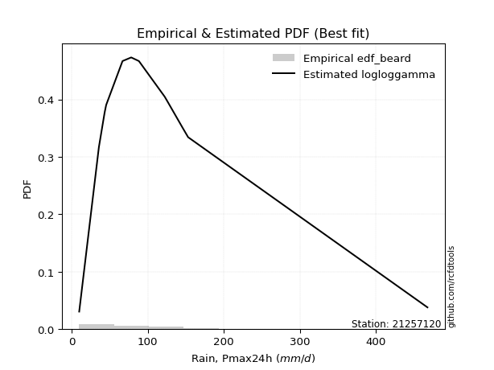</img>

</div>


### 5. EDF Chegodayev (1955)

The Chegodayev formula is an empirical plotting position formula used in hydrological frequency analysis to estimate the exceedance probability or return period of a specific event from a set of observed data. It is primarily used for plotting observed data points on probability paper to fit a theoretical distribution, particularly for analyzing extreme events like maximum flood flows or rainfall intensities. The constant _b_ value in the generalized plotting position formula is 0.3.

<div align="center">


$P=(m-b)/(n+1-2b)$


</div>


**5.1. Empirical values**

<div align="center">

|                | 0                   | 1                   | 2                   | 3                   | 4                  | 5                   | 6                   | 7              | 8                  | 9                  | 10                 | 11                 | 12                 | 13                 | 14                 |
|:---------------|:--------------------|:--------------------|:--------------------|:--------------------|:-------------------|:--------------------|:--------------------|:---------------|:-------------------|:-------------------|:-------------------|:-------------------|:-------------------|:-------------------|:-------------------|
| date           | 2012                | 2016                | 2018                | 2017                | 2019               | 2015                | 2008                | 2007           | 2005               | 2009               | 2014               | 2011               | 2010               | 2013               | 2006               |
| x              | 9.7                 | 35.6                | 43.1                | 43.7                | 45.0               | 45.2                | 66.7                | 78.1           | 88.0               | 88.4               | 122.2              | 126.7              | 145.8              | 153.0              | 467.9              |
| m              | 1                   | 2                   | 3                   | 4                   | 5                  | 6                   | 7                   | 8              | 9                  | 10                 | 11                 | 12                 | 13                 | 14                 | 15                 |
| empirical_dist | edf_chegodayev      | edf_chegodayev      | edf_chegodayev      | edf_chegodayev      | edf_chegodayev     | edf_chegodayev      | edf_chegodayev      | edf_chegodayev | edf_chegodayev     | edf_chegodayev     | edf_chegodayev     | edf_chegodayev     | edf_chegodayev     | edf_chegodayev     | edf_chegodayev     |
| empirical      | 0.04545454545454545 | 0.11038961038961038 | 0.17532467532467533 | 0.24025974025974026 | 0.3051948051948052 | 0.37012987012987014 | 0.43506493506493504 | 0.5            | 0.5649350649350648 | 0.6298701298701298 | 0.6948051948051948 | 0.7597402597402597 | 0.8246753246753246 | 0.8896103896103895 | 0.9545454545454545 |
| empirical_tr   | 1.0476190476190477  | 1.1240875912408759  | 1.2125984251968505  | 1.3162393162393162  | 1.4392523364485983 | 1.5876288659793814  | 1.7701149425287355  | 2.0            | 2.2985074626865667 | 2.701754385964912  | 3.2765957446808507 | 4.162162162162161  | 5.7037037037037    | 9.058823529411757  | 21.999999999999964 |

</div>


**5.2. Kolmogorov-Smirnov fit test (sorted by Δ)**


<div align="center">

|                | 0                   | 1                   | 2                   | 3                   | 4                   | 5                   | 6                   | 7                  | 8                   | 9                   | 10                  | 11                  | 12                 | 13                 | 14                  | 15                  | 16                  | 17                  | 18                  | 19                  | 20                  | 21                  | 22                  | 23                  | 24                  | 25                  | 26                  | 27                  | 28                  | 29                  | 30                  | 31                 | 32                  | 33                 | 34                  | 35                  | 36                  | 37                  | 38                 | 39                 | 40                  | 41                  | 42                  | 43                  | 44                  | 45                  | 46                  | 47                 | 48                  | 49                    | 50                 | 51                  | 52                 | 53                  | 54                  | 55                  | 56                 | 57                  | 58                 | 59                  | 60                  | 61                  | 62                 | 63                 | 64                 | 65                  | 66                  | 67                  | 68                  | 69                 | 70                  | 71                 | 72                  | 73                  | 74                  | 75                  | 76                 | 77                 | 78                 | 79                 | 80                 | 81                  | 82                 | 83                  | 84                 | 85                 | 86                 | 87                 |
|:---------------|:--------------------|:--------------------|:--------------------|:--------------------|:--------------------|:--------------------|:--------------------|:-------------------|:--------------------|:--------------------|:--------------------|:--------------------|:-------------------|:-------------------|:--------------------|:--------------------|:--------------------|:--------------------|:--------------------|:--------------------|:--------------------|:--------------------|:--------------------|:--------------------|:--------------------|:--------------------|:--------------------|:--------------------|:--------------------|:--------------------|:--------------------|:-------------------|:--------------------|:-------------------|:--------------------|:--------------------|:--------------------|:--------------------|:-------------------|:-------------------|:--------------------|:--------------------|:--------------------|:--------------------|:--------------------|:--------------------|:--------------------|:-------------------|:--------------------|:----------------------|:-------------------|:--------------------|:-------------------|:--------------------|:--------------------|:--------------------|:-------------------|:--------------------|:-------------------|:--------------------|:--------------------|:--------------------|:-------------------|:-------------------|:-------------------|:--------------------|:--------------------|:--------------------|:--------------------|:-------------------|:--------------------|:-------------------|:--------------------|:--------------------|:--------------------|:--------------------|:-------------------|:-------------------|:-------------------|:-------------------|:-------------------|:--------------------|:-------------------|:--------------------|:-------------------|:-------------------|:-------------------|:-------------------|
| station        | 21257120            | 21257120            | 21257120            | 21257120            | 21257120            | 21257120            | 21257120            | 21257120           | 21257120            | 21257120            | 21257120            | 21257120            | 21257120           | 21257120           | 21257120            | 21257120            | 21257120            | 21257120            | 21257120            | 21257120            | 21257120            | 21257120            | 21257120            | 21257120            | 21257120            | 21257120            | 21257120            | 21257120            | 21257120            | 21257120            | 21257120            | 21257120           | 21257120            | 21257120           | 21257120            | 21257120            | 21257120            | 21257120            | 21257120           | 21257120           | 21257120            | 21257120            | 21257120            | 21257120            | 21257120            | 21257120            | 21257120            | 21257120           | 21257120            | 21257120              | 21257120           | 21257120            | 21257120           | 21257120            | 21257120            | 21257120            | 21257120           | 21257120            | 21257120           | 21257120            | 21257120            | 21257120            | 21257120           | 21257120           | 21257120           | 21257120            | 21257120            | 21257120            | 21257120            | 21257120           | 21257120            | 21257120           | 21257120            | 21257120            | 21257120            | 21257120            | 21257120           | 21257120           | 21257120           | 21257120           | 21257120           | 21257120            | 21257120           | 21257120            | 21257120           | 21257120           | 21257120           | 21257120           |
| empirical_dist | edf_chegodayev      | edf_chegodayev      | edf_chegodayev      | edf_chegodayev      | edf_chegodayev      | edf_chegodayev      | edf_chegodayev      | edf_chegodayev     | edf_chegodayev      | edf_chegodayev      | edf_chegodayev      | edf_chegodayev      | edf_chegodayev     | edf_chegodayev     | edf_chegodayev      | edf_chegodayev      | edf_chegodayev      | edf_chegodayev      | edf_chegodayev      | edf_chegodayev      | edf_chegodayev      | edf_chegodayev      | edf_chegodayev      | edf_chegodayev      | edf_chegodayev      | edf_chegodayev      | edf_chegodayev      | edf_chegodayev      | edf_chegodayev      | edf_chegodayev      | edf_chegodayev      | edf_chegodayev     | edf_chegodayev      | edf_chegodayev     | edf_chegodayev      | edf_chegodayev      | edf_chegodayev      | edf_chegodayev      | edf_chegodayev     | edf_chegodayev     | edf_chegodayev      | edf_chegodayev      | edf_chegodayev      | edf_chegodayev      | edf_chegodayev      | edf_chegodayev      | edf_chegodayev      | edf_chegodayev     | edf_chegodayev      | edf_chegodayev        | edf_chegodayev     | edf_chegodayev      | edf_chegodayev     | edf_chegodayev      | edf_chegodayev      | edf_chegodayev      | edf_chegodayev     | edf_chegodayev      | edf_chegodayev     | edf_chegodayev      | edf_chegodayev      | edf_chegodayev      | edf_chegodayev     | edf_chegodayev     | edf_chegodayev     | edf_chegodayev      | edf_chegodayev      | edf_chegodayev      | edf_chegodayev      | edf_chegodayev     | edf_chegodayev      | edf_chegodayev     | edf_chegodayev      | edf_chegodayev      | edf_chegodayev      | edf_chegodayev      | edf_chegodayev     | edf_chegodayev     | edf_chegodayev     | edf_chegodayev     | edf_chegodayev     | edf_chegodayev      | edf_chegodayev     | edf_chegodayev      | edf_chegodayev     | edf_chegodayev     | edf_chegodayev     | edf_chegodayev     |
| p_dist         | logloggamma         | logpearson3         | logf                | logexponnorm        | lognorm             | lognorm             | logcrystalball      | loglognorm         | logrice             | lognct              | logfatiguelife      | logbetaprime        | loggamma           | loggamma           | invgauss            | betaprime           | logerlang           | fatiguelife         | genexpon            | logweibull_min      | logncf              | logalpha            | loginvgamma         | ncf                 | loglogistic         | invgamma            | f                   | loggumbel_r         | invweibull          | logmielke           | logfisk             | loggenlogistic     | logmaxwell          | fisk               | wald                | loghypsecant        | loginvgauss         | logjohnsonsu        | logt               | lograyleigh        | nct                 | logmoyal            | johnsonsu           | loggompertz         | expon               | exponnorm           | loggumbel_l         | lognakagami        | t                   | loglaplace_asymmetric | logtruncnorm       | loghalflogistic     | genlogistic        | loglaplace          | gompertz            | truncnorm           | loghalfnorm        | loginvweibull       | gibrat             | gumbel_r            | moyal               | pearson3            | laplace_asymmetric | kstwobign          | rayleigh           | maxwell             | halflogistic        | logkstwobign        | logistic            | erlang             | logwald             | hypsecant          | halfnorm            | crystalball         | norm                | rice                | laplace            | loggenexpon        | loggibrat          | gumbel_l           | weibull_min        | nakagami            | alpha              | logexpon            | mielke             | logchi2            | chi2               | gamma              |
| delta          | 0.08895563599451295 | 0.09068974154349502 | 0.09195290245166837 | 0.09199044193117739 | 0.09199058381835912 | 0.09199058381835912 | 0.09199060314492902 | 0.0919921162377435 | 0.09199488943263207 | 0.09230043519290848 | 0.09241349595133874 | 0.09455602021755921 | 0.0959831262100313 | 0.0959831262100313 | 0.09605295040025369 | 0.09702337295987445 | 0.09704540699099823 | 0.09780946585578942 | 0.09897759046979704 | 0.09937027864619495 | 0.09976906182807999 | 0.10224014471492016 | 0.10256801037973834 | 0.10548029458740227 | 0.10592701383631814 | 0.10760747272589172 | 0.10762673479390072 | 0.11259758185903546 | 0.11283553812674246 | 0.11424663233096427 | 0.11435378314238037 | 0.114736660067911  | 0.11602972696179648 | 0.1162495423367258 | 0.11989711945099735 | 0.12139721022802327 | 0.12226236256863265 | 0.12367337151896596 | 0.1255592622070522 | 0.125798009496279  | 0.12636899709878124 | 0.12861440120454204 | 0.12916565222029508 | 0.12947714908677932 | 0.12990929582401528 | 0.13041466453747147 | 0.13188206791055948 | 0.1325265153735998 | 0.13457698500402904 | 0.14057579874214857   | 0.1416849081503167 | 0.14319786537736967 | 0.144523207713387  | 0.14514940316759958 | 0.14920360174559688 | 0.15228966105812458 | 0.1528102076608947 | 0.15542502481286535 | 0.1587606636153563 | 0.16603164483868477 | 0.16712641456790645 | 0.16866661519266413 | 0.1761665405498583 | 0.1832940249467846 | 0.1870968477603141 | 0.19255363663524538 | 0.19487188664091004 | 0.19609540285043503 | 0.19609590179195413 | 0.1969068875984668 | 0.19892311489311054 | 0.2026826527914839 | 0.20664923528599205 | 0.21100485831294657 | 0.21100486055414214 | 0.22042689465092064 | 0.2236710825457166 | 0.2244481757242176 | 0.2264713364758043 | 0.2579817562652197 | 0.2656271760252922 | 0.27422370105611027 | 0.2745239522393243 | 0.36484313277445746 | 0.3746054572053908 | 0.5849548864965795 | 0.8849306109145568 | 0.8893750956975893 |
| deltao         | 0.3366456264050002  | 0.3366456264050002  | 0.3366456264050002  | 0.3366456264050002  | 0.3366456264050002  | 0.3366456264050002  | 0.3366456264050002  | 0.3366456264050002 | 0.3366456264050002  | 0.3366456264050002  | 0.3366456264050002  | 0.3366456264050002  | 0.3366456264050002 | 0.3366456264050002 | 0.3366456264050002  | 0.3366456264050002  | 0.3366456264050002  | 0.3366456264050002  | 0.3366456264050002  | 0.3366456264050002  | 0.3366456264050002  | 0.3366456264050002  | 0.3366456264050002  | 0.3366456264050002  | 0.3366456264050002  | 0.3366456264050002  | 0.3366456264050002  | 0.3366456264050002  | 0.3366456264050002  | 0.3366456264050002  | 0.3366456264050002  | 0.3366456264050002 | 0.3366456264050002  | 0.3366456264050002 | 0.3366456264050002  | 0.3366456264050002  | 0.3366456264050002  | 0.3366456264050002  | 0.3366456264050002 | 0.3366456264050002 | 0.3366456264050002  | 0.3366456264050002  | 0.3366456264050002  | 0.3366456264050002  | 0.3366456264050002  | 0.3366456264050002  | 0.3366456264050002  | 0.3366456264050002 | 0.3366456264050002  | 0.3366456264050002    | 0.3366456264050002 | 0.3366456264050002  | 0.3366456264050002 | 0.3366456264050002  | 0.3366456264050002  | 0.3366456264050002  | 0.3366456264050002 | 0.3366456264050002  | 0.3366456264050002 | 0.3366456264050002  | 0.3366456264050002  | 0.3366456264050002  | 0.3366456264050002 | 0.3366456264050002 | 0.3366456264050002 | 0.3366456264050002  | 0.3366456264050002  | 0.3366456264050002  | 0.3366456264050002  | 0.3366456264050002 | 0.3366456264050002  | 0.3366456264050002 | 0.3366456264050002  | 0.3366456264050002  | 0.3366456264050002  | 0.3366456264050002  | 0.3366456264050002 | 0.3366456264050002 | 0.3366456264050002 | 0.3366456264050002 | 0.3366456264050002 | 0.3366456264050002  | 0.3366456264050002 | 0.3366456264050002  | 0.3366456264050002 | 0.3366456264050002 | 0.3366456264050002 | 0.3366456264050002 |
| eval           | Δo > Δ              | Δo > Δ              | Δo > Δ              | Δo > Δ              | Δo > Δ              | Δo > Δ              | Δo > Δ              | Δo > Δ             | Δo > Δ              | Δo > Δ              | Δo > Δ              | Δo > Δ              | Δo > Δ             | Δo > Δ             | Δo > Δ              | Δo > Δ              | Δo > Δ              | Δo > Δ              | Δo > Δ              | Δo > Δ              | Δo > Δ              | Δo > Δ              | Δo > Δ              | Δo > Δ              | Δo > Δ              | Δo > Δ              | Δo > Δ              | Δo > Δ              | Δo > Δ              | Δo > Δ              | Δo > Δ              | Δo > Δ             | Δo > Δ              | Δo > Δ             | Δo > Δ              | Δo > Δ              | Δo > Δ              | Δo > Δ              | Δo > Δ             | Δo > Δ             | Δo > Δ              | Δo > Δ              | Δo > Δ              | Δo > Δ              | Δo > Δ              | Δo > Δ              | Δo > Δ              | Δo > Δ             | Δo > Δ              | Δo > Δ                | Δo > Δ             | Δo > Δ              | Δo > Δ             | Δo > Δ              | Δo > Δ              | Δo > Δ              | Δo > Δ             | Δo > Δ              | Δo > Δ             | Δo > Δ              | Δo > Δ              | Δo > Δ              | Δo > Δ             | Δo > Δ             | Δo > Δ             | Δo > Δ              | Δo > Δ              | Δo > Δ              | Δo > Δ              | Δo > Δ             | Δo > Δ              | Δo > Δ             | Δo > Δ              | Δo > Δ              | Δo > Δ              | Δo > Δ              | Δo > Δ             | Δo > Δ             | Δo > Δ             | Δo > Δ             | Δo > Δ             | Δo > Δ              | Δo > Δ             | Δo <= Δ             | Δo <= Δ            | Δo <= Δ            | Δo <= Δ            | Δo <= Δ            |
| fit            | 1                   | 1                   | 1                   | 1                   | 1                   | 1                   | 1                   | 1                  | 1                   | 1                   | 1                   | 1                   | 1                  | 1                  | 1                   | 1                   | 1                   | 1                   | 1                   | 1                   | 1                   | 1                   | 1                   | 1                   | 1                   | 1                   | 1                   | 1                   | 1                   | 1                   | 1                   | 1                  | 1                   | 1                  | 1                   | 1                   | 1                   | 1                   | 1                  | 1                  | 1                   | 1                   | 1                   | 1                   | 1                   | 1                   | 1                   | 1                  | 1                   | 1                     | 1                  | 1                   | 1                  | 1                   | 1                   | 1                   | 1                  | 1                   | 1                  | 1                   | 1                   | 1                   | 1                  | 1                  | 1                  | 1                   | 1                   | 1                   | 1                   | 1                  | 1                   | 1                  | 1                   | 1                   | 1                   | 1                   | 1                  | 1                  | 1                  | 1                  | 1                  | 1                   | 1                  | 0                   | 0                  | 0                  | 0                  | 0                  |
| n              | 15                  | 15                  | 15                  | 15                  | 15                  | 15                  | 15                  | 15                 | 15                  | 15                  | 15                  | 15                  | 15                 | 15                 | 15                  | 15                  | 15                  | 15                  | 15                  | 15                  | 15                  | 15                  | 15                  | 15                  | 15                  | 15                  | 15                  | 15                  | 15                  | 15                  | 15                  | 15                 | 15                  | 15                 | 15                  | 15                  | 15                  | 15                  | 15                 | 15                 | 15                  | 15                  | 15                  | 15                  | 15                  | 15                  | 15                  | 15                 | 15                  | 15                    | 15                 | 15                  | 15                 | 15                  | 15                  | 15                  | 15                 | 15                  | 15                 | 15                  | 15                  | 15                  | 15                 | 15                 | 15                 | 15                  | 15                  | 15                  | 15                  | 15                 | 15                  | 15                 | 15                  | 15                  | 15                  | 15                  | 15                 | 15                 | 15                 | 15                 | 15                 | 15                  | 15                 | 15                  | 15                 | 15                 | 15                 | 15                 |
| best_fit       | 1                   | 0                   | 0                   | 0                   | 0                   | 0                   | 0                   | 0                  | 0                   | 0                   | 0                   | 0                   | 0                  | 0                  | 0                   | 0                   | 0                   | 0                   | 0                   | 0                   | 0                   | 0                   | 0                   | 0                   | 0                   | 0                   | 0                   | 0                   | 0                   | 0                   | 0                   | 0                  | 0                   | 0                  | 0                   | 0                   | 0                   | 0                   | 0                  | 0                  | 0                   | 0                   | 0                   | 0                   | 0                   | 0                   | 0                   | 0                  | 0                   | 0                     | 0                  | 0                   | 0                  | 0                   | 0                   | 0                   | 0                  | 0                   | 0                  | 0                   | 0                   | 0                   | 0                  | 0                  | 0                  | 0                   | 0                   | 0                   | 0                   | 0                  | 0                   | 0                  | 0                   | 0                   | 0                   | 0                   | 0                  | 0                  | 0                  | 0                  | 0                  | 0                   | 0                  | 0                   | 0                  | 0                  | 0                  | 0                  |
| best_fit_sort  | 1                   | 2                   | 3                   | 4                   | 5                   | 6                   | 7                   | 8                  | 9                   | 10                  | 11                  | 12                  | 13                 | 14                 | 15                  | 16                  | 17                  | 18                  | 19                  | 20                  | 21                  | 22                  | 23                  | 24                  | 25                  | 26                  | 27                  | 28                  | 29                  | 30                  | 31                  | 32                 | 33                  | 34                 | 35                  | 36                  | 37                  | 38                  | 39                 | 40                 | 41                  | 42                  | 43                  | 44                  | 45                  | 46                  | 47                  | 48                 | 49                  | 50                    | 51                 | 52                  | 53                 | 54                  | 55                  | 56                  | 57                 | 58                  | 59                 | 60                  | 61                  | 62                  | 63                 | 64                 | 65                 | 66                  | 67                  | 68                  | 69                  | 70                 | 71                  | 72                 | 73                  | 74                  | 75                  | 76                  | 77                 | 78                 | 79                 | 80                 | 81                 | 82                  | 83                 | 84                  | 85                 | 86                 | 87                 | 88                 |

</div>


**5.3. Best fit**

<div align="center">

|   id |   station | empirical_dist   | p_dist      |     delta |   deltao | eval   |   fit |   n |   best_fit |   best_fit_sort |
|-----:|----------:|:-----------------|:------------|----------:|---------:|:-------|------:|----:|-----------:|----------------:|
|    0 |  21257120 | edf_chegodayev   | logloggamma | 0.0889556 | 0.336646 | Δo > Δ |     1 |  15 |          1 |               1 |

</div>


<div align="center">

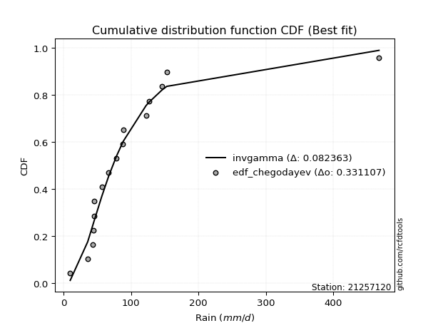</img></img>

</div>


### 6. EDF Blom (1958)

The Blom formula is a specific "plotting position" formula used in hydrology and statistical analysis to estimate the empirical cumulative probability (or non-exceedance probability) of a data series. It is particularly recommended for data that are approximately normally distributed. The constant _a_ is set to 0.375 (or 3/8).

<div align="center">


$P=(m-a)/(n+1-2a)$


</div>


**6.1. Empirical values**

<div align="center">

|                | 0                    | 1                   | 2                  | 3                   | 4                   | 5                   | 6                  | 7        | 8                  | 9                  | 10                 | 11                 | 12                 | 13                 | 14                 |
|:---------------|:---------------------|:--------------------|:-------------------|:--------------------|:--------------------|:--------------------|:-------------------|:---------|:-------------------|:-------------------|:-------------------|:-------------------|:-------------------|:-------------------|:-------------------|
| date           | 2012                 | 2016                | 2018               | 2017                | 2019                | 2015                | 2008               | 2007     | 2005               | 2009               | 2014               | 2011               | 2010               | 2013               | 2006               |
| x              | 9.7                  | 35.6                | 43.1               | 43.7                | 45.0                | 45.2                | 66.7               | 78.1     | 88.0               | 88.4               | 122.2              | 126.7              | 145.8              | 153.0              | 467.9              |
| m              | 1                    | 2                   | 3                  | 4                   | 5                   | 6                   | 7                  | 8        | 9                  | 10                 | 11                 | 12                 | 13                 | 14                 | 15                 |
| empirical_dist | edf_blom             | edf_blom            | edf_blom           | edf_blom            | edf_blom            | edf_blom            | edf_blom           | edf_blom | edf_blom           | edf_blom           | edf_blom           | edf_blom           | edf_blom           | edf_blom           | edf_blom           |
| empirical      | 0.040983606557377046 | 0.10655737704918032 | 0.1721311475409836 | 0.23770491803278687 | 0.30327868852459017 | 0.36885245901639346 | 0.4344262295081967 | 0.5      | 0.5655737704918032 | 0.6311475409836066 | 0.6967213114754098 | 0.7622950819672131 | 0.8278688524590164 | 0.8934426229508197 | 0.9590163934426229 |
| empirical_tr   | 1.0427350427350428   | 1.1192660550458715  | 1.2079207920792079 | 1.3118279569892473  | 1.4352941176470588  | 1.5844155844155845  | 1.7681159420289854 | 2.0      | 2.30188679245283   | 2.7111111111111112 | 3.2972972972972974 | 4.206896551724137  | 5.80952380952381   | 9.384615384615383  | 24.399999999999974 |

</div>


**6.2. Kolmogorov-Smirnov fit test (sorted by Δ)**


<div align="center">

|                | 0                   | 1                   | 2                   | 3                  | 4                   | 5                   | 6                   | 7                   | 8                   | 9                   | 10                 | 11                  | 12                  | 13                  | 14                  | 15                  | 16                  | 17                  | 18                  | 19                  | 20                  | 21                  | 22                  | 23                  | 24                  | 25                  | 26                  | 27                  | 28                  | 29                 | 30                  | 31                  | 32                  | 33                 | 34                 | 35                  | 36                  | 37                  | 38                  | 39                  | 40                 | 41                  | 42                  | 43                 | 44                 | 45                  | 46                  | 47                  | 48                  | 49                    | 50                  | 51                  | 52                 | 53                 | 54                  | 55                  | 56                  | 57                 | 58                  | 59                 | 60                  | 61                  | 62                  | 63                  | 64                  | 65                  | 66                  | 67                  | 68                  | 69                  | 70                  | 71                 | 72                  | 73                  | 74                  | 75                  | 76                 | 77                 | 78                  | 79                 | 80                  | 81                 | 82                 | 83                 | 84                 | 85                 | 86                 | 87                 |
|:---------------|:--------------------|:--------------------|:--------------------|:-------------------|:--------------------|:--------------------|:--------------------|:--------------------|:--------------------|:--------------------|:-------------------|:--------------------|:--------------------|:--------------------|:--------------------|:--------------------|:--------------------|:--------------------|:--------------------|:--------------------|:--------------------|:--------------------|:--------------------|:--------------------|:--------------------|:--------------------|:--------------------|:--------------------|:--------------------|:-------------------|:--------------------|:--------------------|:--------------------|:-------------------|:-------------------|:--------------------|:--------------------|:--------------------|:--------------------|:--------------------|:-------------------|:--------------------|:--------------------|:-------------------|:-------------------|:--------------------|:--------------------|:--------------------|:--------------------|:----------------------|:--------------------|:--------------------|:-------------------|:-------------------|:--------------------|:--------------------|:--------------------|:-------------------|:--------------------|:-------------------|:--------------------|:--------------------|:--------------------|:--------------------|:--------------------|:--------------------|:--------------------|:--------------------|:--------------------|:--------------------|:--------------------|:-------------------|:--------------------|:--------------------|:--------------------|:--------------------|:-------------------|:-------------------|:--------------------|:-------------------|:--------------------|:-------------------|:-------------------|:-------------------|:-------------------|:-------------------|:-------------------|:-------------------|
| station        | 21257120            | 21257120            | 21257120            | 21257120           | 21257120            | 21257120            | 21257120            | 21257120            | 21257120            | 21257120            | 21257120           | 21257120            | 21257120            | 21257120            | 21257120            | 21257120            | 21257120            | 21257120            | 21257120            | 21257120            | 21257120            | 21257120            | 21257120            | 21257120            | 21257120            | 21257120            | 21257120            | 21257120            | 21257120            | 21257120           | 21257120            | 21257120            | 21257120            | 21257120           | 21257120           | 21257120            | 21257120            | 21257120            | 21257120            | 21257120            | 21257120           | 21257120            | 21257120            | 21257120           | 21257120           | 21257120            | 21257120            | 21257120            | 21257120            | 21257120              | 21257120            | 21257120            | 21257120           | 21257120           | 21257120            | 21257120            | 21257120            | 21257120           | 21257120            | 21257120           | 21257120            | 21257120            | 21257120            | 21257120            | 21257120            | 21257120            | 21257120            | 21257120            | 21257120            | 21257120            | 21257120            | 21257120           | 21257120            | 21257120            | 21257120            | 21257120            | 21257120           | 21257120           | 21257120            | 21257120           | 21257120            | 21257120           | 21257120           | 21257120           | 21257120           | 21257120           | 21257120           | 21257120           |
| empirical_dist | edf_blom            | edf_blom            | edf_blom            | edf_blom           | edf_blom            | edf_blom            | edf_blom            | edf_blom            | edf_blom            | edf_blom            | edf_blom           | edf_blom            | edf_blom            | edf_blom            | edf_blom            | edf_blom            | edf_blom            | edf_blom            | edf_blom            | edf_blom            | edf_blom            | edf_blom            | edf_blom            | edf_blom            | edf_blom            | edf_blom            | edf_blom            | edf_blom            | edf_blom            | edf_blom           | edf_blom            | edf_blom            | edf_blom            | edf_blom           | edf_blom           | edf_blom            | edf_blom            | edf_blom            | edf_blom            | edf_blom            | edf_blom           | edf_blom            | edf_blom            | edf_blom           | edf_blom           | edf_blom            | edf_blom            | edf_blom            | edf_blom            | edf_blom              | edf_blom            | edf_blom            | edf_blom           | edf_blom           | edf_blom            | edf_blom            | edf_blom            | edf_blom           | edf_blom            | edf_blom           | edf_blom            | edf_blom            | edf_blom            | edf_blom            | edf_blom            | edf_blom            | edf_blom            | edf_blom            | edf_blom            | edf_blom            | edf_blom            | edf_blom           | edf_blom            | edf_blom            | edf_blom            | edf_blom            | edf_blom           | edf_blom           | edf_blom            | edf_blom           | edf_blom            | edf_blom           | edf_blom           | edf_blom           | edf_blom           | edf_blom           | edf_blom           | edf_blom           |
| p_dist         | logpearson3         | logloggamma         | invgauss            | logf               | logexponnorm        | lognorm             | lognorm             | logcrystalball      | loglognorm          | logrice             | lognct             | logfatiguelife      | betaprime           | logbetaprime        | loggamma            | loggamma            | logerlang           | fatiguelife         | genexpon            | logncf              | logweibull_min      | ncf                 | loglogistic         | logalpha            | loginvgamma         | invgamma            | f                   | invweibull          | logmielke           | logfisk            | loggenlogistic      | fisk                | loggumbel_r         | logmaxwell         | loghypsecant       | logjohnsonsu        | wald                | logt                | nct                 | loginvgauss         | johnsonsu          | logmoyal            | lograyleigh         | exponnorm          | loggumbel_l        | lognakagami         | t                   | loggompertz         | expon               | loglaplace_asymmetric | logtruncnorm        | genlogistic         | loglaplace         | loghalflogistic    | gompertz            | loghalfnorm         | truncnorm           | gibrat             | loginvweibull       | gumbel_r           | moyal               | pearson3            | laplace_asymmetric  | kstwobign           | rayleigh            | maxwell             | logistic            | halflogistic        | logwald             | logkstwobign        | erlang              | hypsecant          | halfnorm            | crystalball         | norm                | rice                | laplace            | loggibrat          | loggenexpon         | gumbel_l           | weibull_min         | alpha              | nakagami           | logexpon           | mielke             | logchi2            | chi2               | gamma              |
| delta          | 0.08947562502584701 | 0.09079223398799982 | 0.09484072240048813 | 0.0951464302353601 | 0.09518396971486912 | 0.09518411160205084 | 0.09518411160205084 | 0.09518413092862074 | 0.09518564402143523 | 0.09518841721632379 | 0.0954939629766002 | 0.09560702373503047 | 0.09574596184639778 | 0.09774954800125094 | 0.09917665399372302 | 0.09917665399372302 | 0.10023893477468995 | 0.10164169919621957 | 0.10280982381022719 | 0.10296258961177171 | 0.10320251198662501 | 0.10420288347392559 | 0.10464960272284146 | 0.10543367249861188 | 0.10576153816343006 | 0.10633006161241504 | 0.10634932368042405 | 0.11155812701326578 | 0.11296922121748759 | 0.1130763720289037 | 0.11345924895443432 | 0.11497213122324912 | 0.11579110964272718 | 0.1192232547454882 | 0.1201197991145466 | 0.12239596040548928 | 0.12309064723468907 | 0.12428185109357553 | 0.12509158598530457 | 0.12545589035232438 | 0.1278882411068184 | 0.12861440120454204 | 0.12899153727997073 | 0.1291372534239948 | 0.1306046567970828 | 0.13124910426012312 | 0.13266086833381396 | 0.13330938242720936 | 0.13374152916444532 | 0.1392983876286719    | 0.14040749703684002 | 0.14324579659991032 | 0.1438719920541229 | 0.1463913931610614 | 0.15303583508602703 | 0.15600373544458643 | 0.15612189439855473 | 0.1574832525018796 | 0.15861855259655708 | 0.1698638781791148 | 0.17095864790833648 | 0.17186014297635585 | 0.17488912943638163 | 0.18457143606026138 | 0.19092908110074425 | 0.19638586997567553 | 0.19737331290543092 | 0.19870411998134008 | 0.19892311489311054 | 0.19928893063412675 | 0.20073912093889684 | 0.2039600639049607 | 0.21048146862642209 | 0.21483709165337672 | 0.21483709389457228 | 0.22170430576439742 | 0.2249484936591934 | 0.2264713364758043 | 0.22764170350790933 | 0.2592591673786965 | 0.26882070380898393 | 0.277717480023016  | 0.2780559343965404 | 0.3686753661148875 | 0.3784376905458208 | 0.5887871198370095 | 0.8887628442549869 | 0.8932073290380194 |
| deltao         | 0.3366456264050002  | 0.3366456264050002  | 0.3366456264050002  | 0.3366456264050002 | 0.3366456264050002  | 0.3366456264050002  | 0.3366456264050002  | 0.3366456264050002  | 0.3366456264050002  | 0.3366456264050002  | 0.3366456264050002 | 0.3366456264050002  | 0.3366456264050002  | 0.3366456264050002  | 0.3366456264050002  | 0.3366456264050002  | 0.3366456264050002  | 0.3366456264050002  | 0.3366456264050002  | 0.3366456264050002  | 0.3366456264050002  | 0.3366456264050002  | 0.3366456264050002  | 0.3366456264050002  | 0.3366456264050002  | 0.3366456264050002  | 0.3366456264050002  | 0.3366456264050002  | 0.3366456264050002  | 0.3366456264050002 | 0.3366456264050002  | 0.3366456264050002  | 0.3366456264050002  | 0.3366456264050002 | 0.3366456264050002 | 0.3366456264050002  | 0.3366456264050002  | 0.3366456264050002  | 0.3366456264050002  | 0.3366456264050002  | 0.3366456264050002 | 0.3366456264050002  | 0.3366456264050002  | 0.3366456264050002 | 0.3366456264050002 | 0.3366456264050002  | 0.3366456264050002  | 0.3366456264050002  | 0.3366456264050002  | 0.3366456264050002    | 0.3366456264050002  | 0.3366456264050002  | 0.3366456264050002 | 0.3366456264050002 | 0.3366456264050002  | 0.3366456264050002  | 0.3366456264050002  | 0.3366456264050002 | 0.3366456264050002  | 0.3366456264050002 | 0.3366456264050002  | 0.3366456264050002  | 0.3366456264050002  | 0.3366456264050002  | 0.3366456264050002  | 0.3366456264050002  | 0.3366456264050002  | 0.3366456264050002  | 0.3366456264050002  | 0.3366456264050002  | 0.3366456264050002  | 0.3366456264050002 | 0.3366456264050002  | 0.3366456264050002  | 0.3366456264050002  | 0.3366456264050002  | 0.3366456264050002 | 0.3366456264050002 | 0.3366456264050002  | 0.3366456264050002 | 0.3366456264050002  | 0.3366456264050002 | 0.3366456264050002 | 0.3366456264050002 | 0.3366456264050002 | 0.3366456264050002 | 0.3366456264050002 | 0.3366456264050002 |
| eval           | Δo > Δ              | Δo > Δ              | Δo > Δ              | Δo > Δ             | Δo > Δ              | Δo > Δ              | Δo > Δ              | Δo > Δ              | Δo > Δ              | Δo > Δ              | Δo > Δ             | Δo > Δ              | Δo > Δ              | Δo > Δ              | Δo > Δ              | Δo > Δ              | Δo > Δ              | Δo > Δ              | Δo > Δ              | Δo > Δ              | Δo > Δ              | Δo > Δ              | Δo > Δ              | Δo > Δ              | Δo > Δ              | Δo > Δ              | Δo > Δ              | Δo > Δ              | Δo > Δ              | Δo > Δ             | Δo > Δ              | Δo > Δ              | Δo > Δ              | Δo > Δ             | Δo > Δ             | Δo > Δ              | Δo > Δ              | Δo > Δ              | Δo > Δ              | Δo > Δ              | Δo > Δ             | Δo > Δ              | Δo > Δ              | Δo > Δ             | Δo > Δ             | Δo > Δ              | Δo > Δ              | Δo > Δ              | Δo > Δ              | Δo > Δ                | Δo > Δ              | Δo > Δ              | Δo > Δ             | Δo > Δ             | Δo > Δ              | Δo > Δ              | Δo > Δ              | Δo > Δ             | Δo > Δ              | Δo > Δ             | Δo > Δ              | Δo > Δ              | Δo > Δ              | Δo > Δ              | Δo > Δ              | Δo > Δ              | Δo > Δ              | Δo > Δ              | Δo > Δ              | Δo > Δ              | Δo > Δ              | Δo > Δ             | Δo > Δ              | Δo > Δ              | Δo > Δ              | Δo > Δ              | Δo > Δ             | Δo > Δ             | Δo > Δ              | Δo > Δ             | Δo > Δ              | Δo > Δ             | Δo > Δ             | Δo <= Δ            | Δo <= Δ            | Δo <= Δ            | Δo <= Δ            | Δo <= Δ            |
| fit            | 1                   | 1                   | 1                   | 1                  | 1                   | 1                   | 1                   | 1                   | 1                   | 1                   | 1                  | 1                   | 1                   | 1                   | 1                   | 1                   | 1                   | 1                   | 1                   | 1                   | 1                   | 1                   | 1                   | 1                   | 1                   | 1                   | 1                   | 1                   | 1                   | 1                  | 1                   | 1                   | 1                   | 1                  | 1                  | 1                   | 1                   | 1                   | 1                   | 1                   | 1                  | 1                   | 1                   | 1                  | 1                  | 1                   | 1                   | 1                   | 1                   | 1                     | 1                   | 1                   | 1                  | 1                  | 1                   | 1                   | 1                   | 1                  | 1                   | 1                  | 1                   | 1                   | 1                   | 1                   | 1                   | 1                   | 1                   | 1                   | 1                   | 1                   | 1                   | 1                  | 1                   | 1                   | 1                   | 1                   | 1                  | 1                  | 1                   | 1                  | 1                   | 1                  | 1                  | 0                  | 0                  | 0                  | 0                  | 0                  |
| n              | 15                  | 15                  | 15                  | 15                 | 15                  | 15                  | 15                  | 15                  | 15                  | 15                  | 15                 | 15                  | 15                  | 15                  | 15                  | 15                  | 15                  | 15                  | 15                  | 15                  | 15                  | 15                  | 15                  | 15                  | 15                  | 15                  | 15                  | 15                  | 15                  | 15                 | 15                  | 15                  | 15                  | 15                 | 15                 | 15                  | 15                  | 15                  | 15                  | 15                  | 15                 | 15                  | 15                  | 15                 | 15                 | 15                  | 15                  | 15                  | 15                  | 15                    | 15                  | 15                  | 15                 | 15                 | 15                  | 15                  | 15                  | 15                 | 15                  | 15                 | 15                  | 15                  | 15                  | 15                  | 15                  | 15                  | 15                  | 15                  | 15                  | 15                  | 15                  | 15                 | 15                  | 15                  | 15                  | 15                  | 15                 | 15                 | 15                  | 15                 | 15                  | 15                 | 15                 | 15                 | 15                 | 15                 | 15                 | 15                 |
| best_fit       | 1                   | 0                   | 0                   | 0                  | 0                   | 0                   | 0                   | 0                   | 0                   | 0                   | 0                  | 0                   | 0                   | 0                   | 0                   | 0                   | 0                   | 0                   | 0                   | 0                   | 0                   | 0                   | 0                   | 0                   | 0                   | 0                   | 0                   | 0                   | 0                   | 0                  | 0                   | 0                   | 0                   | 0                  | 0                  | 0                   | 0                   | 0                   | 0                   | 0                   | 0                  | 0                   | 0                   | 0                  | 0                  | 0                   | 0                   | 0                   | 0                   | 0                     | 0                   | 0                   | 0                  | 0                  | 0                   | 0                   | 0                   | 0                  | 0                   | 0                  | 0                   | 0                   | 0                   | 0                   | 0                   | 0                   | 0                   | 0                   | 0                   | 0                   | 0                   | 0                  | 0                   | 0                   | 0                   | 0                   | 0                  | 0                  | 0                   | 0                  | 0                   | 0                  | 0                  | 0                  | 0                  | 0                  | 0                  | 0                  |
| best_fit_sort  | 1                   | 2                   | 3                   | 4                  | 5                   | 6                   | 7                   | 8                   | 9                   | 10                  | 11                 | 12                  | 13                  | 14                  | 15                  | 16                  | 17                  | 18                  | 19                  | 20                  | 21                  | 22                  | 23                  | 24                  | 25                  | 26                  | 27                  | 28                  | 29                  | 30                 | 31                  | 32                  | 33                  | 34                 | 35                 | 36                  | 37                  | 38                  | 39                  | 40                  | 41                 | 42                  | 43                  | 44                 | 45                 | 46                  | 47                  | 48                  | 49                  | 50                    | 51                  | 52                  | 53                 | 54                 | 55                  | 56                  | 57                  | 58                 | 59                  | 60                 | 61                  | 62                  | 63                  | 64                  | 65                  | 66                  | 67                  | 68                  | 69                  | 70                  | 71                  | 72                 | 73                  | 74                  | 75                  | 76                  | 77                 | 78                 | 79                  | 80                 | 81                  | 82                 | 83                 | 84                 | 85                 | 86                 | 87                 | 88                 |

</div>


**6.3. Best fit**

<div align="center">

|   id |   station | empirical_dist   | p_dist      |     delta |   deltao | eval   |   fit |   n |   best_fit |   best_fit_sort |
|-----:|----------:|:-----------------|:------------|----------:|---------:|:-------|------:|----:|-----------:|----------------:|
|    0 |  21257120 | edf_blom         | logpearson3 | 0.0894756 | 0.336646 | Δo > Δ |     1 |  15 |          1 |               1 |

</div>


<div align="center">

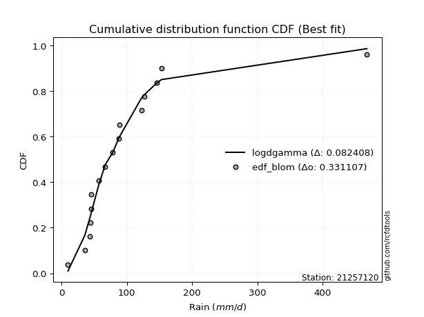</img>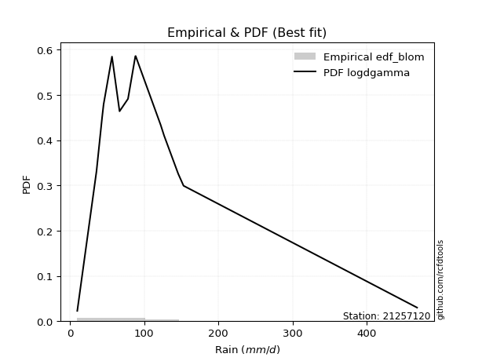</img>

</div>


### 7. EDF Tukey (1962)

In hydrology, the Tukey formula is used as a plotting position formula to estimate the empirical probability or frequency of a flood event (or other hydrological data). The formula parameter is given as _c=0.333_ (or 1/3).

<div align="center">


$P=(m-c)/(n+1-2c)$


</div>


**7.1. Empirical values**

<div align="center">

|                | 0                    | 1                   | 2                   | 3                  | 4                   | 5                  | 6                   | 7         | 8                  | 9                  | 10                 | 11                 | 12                 | 13                 | 14                 |
|:---------------|:---------------------|:--------------------|:--------------------|:-------------------|:--------------------|:-------------------|:--------------------|:----------|:-------------------|:-------------------|:-------------------|:-------------------|:-------------------|:-------------------|:-------------------|
| date           | 2012                 | 2016                | 2018                | 2017               | 2019                | 2015               | 2008                | 2007      | 2005               | 2009               | 2014               | 2011               | 2010               | 2013               | 2006               |
| x              | 9.7                  | 35.6                | 43.1                | 43.7               | 45.0                | 45.2               | 66.7                | 78.1      | 88.0               | 88.4               | 122.2              | 126.7              | 145.8              | 153.0              | 467.9              |
| m              | 1                    | 2                   | 3                   | 4                  | 5                   | 6                  | 7                   | 8         | 9                  | 10                 | 11                 | 12                 | 13                 | 14                 | 15                 |
| empirical_dist | edf_tukey            | edf_tukey           | edf_tukey           | edf_tukey          | edf_tukey           | edf_tukey          | edf_tukey           | edf_tukey | edf_tukey          | edf_tukey          | edf_tukey          | edf_tukey          | edf_tukey          | edf_tukey          | edf_tukey          |
| empirical      | 0.043478260869565216 | 0.10869565217391304 | 0.17391304347826086 | 0.2391304347826087 | 0.30434782608695654 | 0.3695652173913043 | 0.43478260869565216 | 0.5       | 0.5652173913043478 | 0.6304347826086957 | 0.6956521739130435 | 0.7608695652173914 | 0.8260869565217391 | 0.8913043478260869 | 0.9565217391304348 |
| empirical_tr   | 1.0454545454545454   | 1.1219512195121952  | 1.2105263157894737  | 1.3142857142857143 | 1.4375              | 1.586206896551724  | 1.769230769230769   | 2.0       | 2.3                | 2.7058823529411766 | 3.2857142857142856 | 4.1818181818181825 | 5.75               | 9.199999999999998  | 23.000000000000014 |

</div>


**7.2. Kolmogorov-Smirnov fit test (sorted by Δ)**


<div align="center">

|                | 0                   | 1                  | 2                   | 3                   | 4                   | 5                   | 6                   | 7                   | 8                   | 9                   | 10                 | 11                  | 12                  | 13                  | 14                  | 15                  | 16                  | 17                  | 18                  | 19                 | 20                  | 21                  | 22                 | 23                  | 24                  | 25                 | 26                 | 27                  | 28                  | 29                  | 30                  | 31                  | 32                  | 33                  | 34                  | 35                  | 36                  | 37                  | 38                 | 39                  | 40                  | 41                  | 42                  | 43                  | 44                  | 45                  | 46                  | 47                  | 48                  | 49                    | 50                  | 51                  | 52                  | 53                  | 54                  | 55                  | 56                  | 57                  | 58                  | 59                 | 60                 | 61                 | 62                 | 63                  | 64                 | 65                  | 66                  | 67                 | 68                 | 69                  | 70                  | 71                  | 72                 | 73                  | 74                  | 75                 | 76                  | 77                  | 78                 | 79                  | 80                  | 81                  | 82                  | 83                 | 84                  | 85                 | 86                 | 87                 |
|:---------------|:--------------------|:-------------------|:--------------------|:--------------------|:--------------------|:--------------------|:--------------------|:--------------------|:--------------------|:--------------------|:-------------------|:--------------------|:--------------------|:--------------------|:--------------------|:--------------------|:--------------------|:--------------------|:--------------------|:-------------------|:--------------------|:--------------------|:-------------------|:--------------------|:--------------------|:-------------------|:-------------------|:--------------------|:--------------------|:--------------------|:--------------------|:--------------------|:--------------------|:--------------------|:--------------------|:--------------------|:--------------------|:--------------------|:-------------------|:--------------------|:--------------------|:--------------------|:--------------------|:--------------------|:--------------------|:--------------------|:--------------------|:--------------------|:--------------------|:----------------------|:--------------------|:--------------------|:--------------------|:--------------------|:--------------------|:--------------------|:--------------------|:--------------------|:--------------------|:-------------------|:-------------------|:-------------------|:-------------------|:--------------------|:-------------------|:--------------------|:--------------------|:-------------------|:-------------------|:--------------------|:--------------------|:--------------------|:-------------------|:--------------------|:--------------------|:-------------------|:--------------------|:--------------------|:-------------------|:--------------------|:--------------------|:--------------------|:--------------------|:-------------------|:--------------------|:-------------------|:-------------------|:-------------------|
| station        | 21257120            | 21257120           | 21257120            | 21257120            | 21257120            | 21257120            | 21257120            | 21257120            | 21257120            | 21257120            | 21257120           | 21257120            | 21257120            | 21257120            | 21257120            | 21257120            | 21257120            | 21257120            | 21257120            | 21257120           | 21257120            | 21257120            | 21257120           | 21257120            | 21257120            | 21257120           | 21257120           | 21257120            | 21257120            | 21257120            | 21257120            | 21257120            | 21257120            | 21257120            | 21257120            | 21257120            | 21257120            | 21257120            | 21257120           | 21257120            | 21257120            | 21257120            | 21257120            | 21257120            | 21257120            | 21257120            | 21257120            | 21257120            | 21257120            | 21257120              | 21257120            | 21257120            | 21257120            | 21257120            | 21257120            | 21257120            | 21257120            | 21257120            | 21257120            | 21257120           | 21257120           | 21257120           | 21257120           | 21257120            | 21257120           | 21257120            | 21257120            | 21257120           | 21257120           | 21257120            | 21257120            | 21257120            | 21257120           | 21257120            | 21257120            | 21257120           | 21257120            | 21257120            | 21257120           | 21257120            | 21257120            | 21257120            | 21257120            | 21257120           | 21257120            | 21257120           | 21257120           | 21257120           |
| empirical_dist | edf_tukey           | edf_tukey          | edf_tukey           | edf_tukey           | edf_tukey           | edf_tukey           | edf_tukey           | edf_tukey           | edf_tukey           | edf_tukey           | edf_tukey          | edf_tukey           | edf_tukey           | edf_tukey           | edf_tukey           | edf_tukey           | edf_tukey           | edf_tukey           | edf_tukey           | edf_tukey          | edf_tukey           | edf_tukey           | edf_tukey          | edf_tukey           | edf_tukey           | edf_tukey          | edf_tukey          | edf_tukey           | edf_tukey           | edf_tukey           | edf_tukey           | edf_tukey           | edf_tukey           | edf_tukey           | edf_tukey           | edf_tukey           | edf_tukey           | edf_tukey           | edf_tukey          | edf_tukey           | edf_tukey           | edf_tukey           | edf_tukey           | edf_tukey           | edf_tukey           | edf_tukey           | edf_tukey           | edf_tukey           | edf_tukey           | edf_tukey             | edf_tukey           | edf_tukey           | edf_tukey           | edf_tukey           | edf_tukey           | edf_tukey           | edf_tukey           | edf_tukey           | edf_tukey           | edf_tukey          | edf_tukey          | edf_tukey          | edf_tukey          | edf_tukey           | edf_tukey          | edf_tukey           | edf_tukey           | edf_tukey          | edf_tukey          | edf_tukey           | edf_tukey           | edf_tukey           | edf_tukey          | edf_tukey           | edf_tukey           | edf_tukey          | edf_tukey           | edf_tukey           | edf_tukey          | edf_tukey           | edf_tukey           | edf_tukey           | edf_tukey           | edf_tukey          | edf_tukey           | edf_tukey          | edf_tukey          | edf_tukey          |
| p_dist         | logloggamma         | logpearson3        | logf                | logexponnorm        | lognorm             | lognorm             | logcrystalball      | loglognorm          | logrice             | lognct              | logfatiguelife     | invgauss            | logbetaprime        | betaprime           | loggamma            | loggamma            | logerlang           | fatiguelife         | genexpon            | logweibull_min     | logncf              | logalpha            | loginvgamma        | ncf                 | loglogistic         | invgamma           | f                  | invweibull          | logmielke           | logfisk             | loggumbel_r         | loggenlogistic      | fisk                | logmaxwell          | loghypsecant        | wald                | logjohnsonsu        | loginvgauss         | logt               | nct                 | lograyleigh         | johnsonsu           | logmoyal            | exponnorm           | loggompertz         | loggumbel_l         | expon               | lognakagami         | t                   | loglaplace_asymmetric | logtruncnorm        | genlogistic         | loglaplace          | loghalflogistic     | gompertz            | truncnorm           | loghalfnorm         | loginvweibull       | gibrat              | gumbel_r           | moyal              | pearson3           | laplace_asymmetric | kstwobign           | rayleigh           | maxwell             | halflogistic        | logistic           | logkstwobign       | erlang              | logwald             | hypsecant           | halfnorm           | crystalball         | norm                | rice               | laplace             | loggenexpon         | loggibrat          | gumbel_l            | weibull_min         | nakagami            | alpha               | logexpon           | mielke              | logchi2            | chi2               | gamma              |
| delta          | 0.08901033805072256 | 0.0901250888049292 | 0.09336453429808284 | 0.09340207377759185 | 0.09340221566477358 | 0.09340221566477358 | 0.09340223499134348 | 0.09340374808415797 | 0.09340652127904653 | 0.09371206703932294 | 0.0938251277977532 | 0.09548829766168787 | 0.09596765206397367 | 0.09645872022130864 | 0.09739475805644576 | 0.09739475805644576 | 0.09845703883741269 | 0.09950342407148682 | 0.10067154868549444 | 0.1010642368618923 | 0.10118069367449445 | 0.10365177656133462 | 0.1039796422261528 | 0.10491564184883645 | 0.10536236109775232 | 0.1070428199873259 | 0.1070620820553349 | 0.11227088538817664 | 0.11368197959239845 | 0.11378913040381455 | 0.11400921370544992 | 0.11417200732934518 | 0.11568488959815998 | 0.11744135880821094 | 0.12083255748945745 | 0.12130875129741181 | 0.12310871878040014 | 0.12367399441504712 | 0.1249946094684864 | 0.12580434436021543 | 0.12720964134269347 | 0.12860099948172926 | 0.12861440120454204 | 0.12985001179890565 | 0.13117110730247666 | 0.13131741517199366 | 0.13160325403971262 | 0.13196186263503398 | 0.13373000589618034 | 0.14001114600358275   | 0.14112025541175088 | 0.14395855497482118 | 0.14458475042903376 | 0.14460949722378413 | 0.15089755996129428 | 0.15398361927382198 | 0.15422183950730917 | 0.15683665665927982 | 0.15819601087679047 | 0.1677256030543821 | 0.1688203727836038 | 0.1700782470390786 | 0.1756018878112925 | 0.18385867768535047 | 0.1887908059760115 | 0.19424759485094278 | 0.19656584485660739 | 0.19666055453052   | 0.1975070346968495 | 0.19860084581416415 | 0.19892311489311054 | 0.20324730553004977 | 0.2083431935016894 | 0.21269881652864397 | 0.21269881876983954 | 0.2209915473894865 | 0.22423573528428248 | 0.22585980757063207 | 0.2264713364758043 | 0.25854640900378556 | 0.26703880787170664 | 0.27591765927180767 | 0.27593558408573876 | 0.3665370909901548 | 0.37629941542108813 | 0.5866488447122767 | 0.8866245691302541 | 0.8910690539132866 |
| deltao         | 0.3366456264050002  | 0.3366456264050002 | 0.3366456264050002  | 0.3366456264050002  | 0.3366456264050002  | 0.3366456264050002  | 0.3366456264050002  | 0.3366456264050002  | 0.3366456264050002  | 0.3366456264050002  | 0.3366456264050002 | 0.3366456264050002  | 0.3366456264050002  | 0.3366456264050002  | 0.3366456264050002  | 0.3366456264050002  | 0.3366456264050002  | 0.3366456264050002  | 0.3366456264050002  | 0.3366456264050002 | 0.3366456264050002  | 0.3366456264050002  | 0.3366456264050002 | 0.3366456264050002  | 0.3366456264050002  | 0.3366456264050002 | 0.3366456264050002 | 0.3366456264050002  | 0.3366456264050002  | 0.3366456264050002  | 0.3366456264050002  | 0.3366456264050002  | 0.3366456264050002  | 0.3366456264050002  | 0.3366456264050002  | 0.3366456264050002  | 0.3366456264050002  | 0.3366456264050002  | 0.3366456264050002 | 0.3366456264050002  | 0.3366456264050002  | 0.3366456264050002  | 0.3366456264050002  | 0.3366456264050002  | 0.3366456264050002  | 0.3366456264050002  | 0.3366456264050002  | 0.3366456264050002  | 0.3366456264050002  | 0.3366456264050002    | 0.3366456264050002  | 0.3366456264050002  | 0.3366456264050002  | 0.3366456264050002  | 0.3366456264050002  | 0.3366456264050002  | 0.3366456264050002  | 0.3366456264050002  | 0.3366456264050002  | 0.3366456264050002 | 0.3366456264050002 | 0.3366456264050002 | 0.3366456264050002 | 0.3366456264050002  | 0.3366456264050002 | 0.3366456264050002  | 0.3366456264050002  | 0.3366456264050002 | 0.3366456264050002 | 0.3366456264050002  | 0.3366456264050002  | 0.3366456264050002  | 0.3366456264050002 | 0.3366456264050002  | 0.3366456264050002  | 0.3366456264050002 | 0.3366456264050002  | 0.3366456264050002  | 0.3366456264050002 | 0.3366456264050002  | 0.3366456264050002  | 0.3366456264050002  | 0.3366456264050002  | 0.3366456264050002 | 0.3366456264050002  | 0.3366456264050002 | 0.3366456264050002 | 0.3366456264050002 |
| eval           | Δo > Δ              | Δo > Δ             | Δo > Δ              | Δo > Δ              | Δo > Δ              | Δo > Δ              | Δo > Δ              | Δo > Δ              | Δo > Δ              | Δo > Δ              | Δo > Δ             | Δo > Δ              | Δo > Δ              | Δo > Δ              | Δo > Δ              | Δo > Δ              | Δo > Δ              | Δo > Δ              | Δo > Δ              | Δo > Δ             | Δo > Δ              | Δo > Δ              | Δo > Δ             | Δo > Δ              | Δo > Δ              | Δo > Δ             | Δo > Δ             | Δo > Δ              | Δo > Δ              | Δo > Δ              | Δo > Δ              | Δo > Δ              | Δo > Δ              | Δo > Δ              | Δo > Δ              | Δo > Δ              | Δo > Δ              | Δo > Δ              | Δo > Δ             | Δo > Δ              | Δo > Δ              | Δo > Δ              | Δo > Δ              | Δo > Δ              | Δo > Δ              | Δo > Δ              | Δo > Δ              | Δo > Δ              | Δo > Δ              | Δo > Δ                | Δo > Δ              | Δo > Δ              | Δo > Δ              | Δo > Δ              | Δo > Δ              | Δo > Δ              | Δo > Δ              | Δo > Δ              | Δo > Δ              | Δo > Δ             | Δo > Δ             | Δo > Δ             | Δo > Δ             | Δo > Δ              | Δo > Δ             | Δo > Δ              | Δo > Δ              | Δo > Δ             | Δo > Δ             | Δo > Δ              | Δo > Δ              | Δo > Δ              | Δo > Δ             | Δo > Δ              | Δo > Δ              | Δo > Δ             | Δo > Δ              | Δo > Δ              | Δo > Δ             | Δo > Δ              | Δo > Δ              | Δo > Δ              | Δo > Δ              | Δo <= Δ            | Δo <= Δ             | Δo <= Δ            | Δo <= Δ            | Δo <= Δ            |
| fit            | 1                   | 1                  | 1                   | 1                   | 1                   | 1                   | 1                   | 1                   | 1                   | 1                   | 1                  | 1                   | 1                   | 1                   | 1                   | 1                   | 1                   | 1                   | 1                   | 1                  | 1                   | 1                   | 1                  | 1                   | 1                   | 1                  | 1                  | 1                   | 1                   | 1                   | 1                   | 1                   | 1                   | 1                   | 1                   | 1                   | 1                   | 1                   | 1                  | 1                   | 1                   | 1                   | 1                   | 1                   | 1                   | 1                   | 1                   | 1                   | 1                   | 1                     | 1                   | 1                   | 1                   | 1                   | 1                   | 1                   | 1                   | 1                   | 1                   | 1                  | 1                  | 1                  | 1                  | 1                   | 1                  | 1                   | 1                   | 1                  | 1                  | 1                   | 1                   | 1                   | 1                  | 1                   | 1                   | 1                  | 1                   | 1                   | 1                  | 1                   | 1                   | 1                   | 1                   | 0                  | 0                   | 0                  | 0                  | 0                  |
| n              | 15                  | 15                 | 15                  | 15                  | 15                  | 15                  | 15                  | 15                  | 15                  | 15                  | 15                 | 15                  | 15                  | 15                  | 15                  | 15                  | 15                  | 15                  | 15                  | 15                 | 15                  | 15                  | 15                 | 15                  | 15                  | 15                 | 15                 | 15                  | 15                  | 15                  | 15                  | 15                  | 15                  | 15                  | 15                  | 15                  | 15                  | 15                  | 15                 | 15                  | 15                  | 15                  | 15                  | 15                  | 15                  | 15                  | 15                  | 15                  | 15                  | 15                    | 15                  | 15                  | 15                  | 15                  | 15                  | 15                  | 15                  | 15                  | 15                  | 15                 | 15                 | 15                 | 15                 | 15                  | 15                 | 15                  | 15                  | 15                 | 15                 | 15                  | 15                  | 15                  | 15                 | 15                  | 15                  | 15                 | 15                  | 15                  | 15                 | 15                  | 15                  | 15                  | 15                  | 15                 | 15                  | 15                 | 15                 | 15                 |
| best_fit       | 1                   | 0                  | 0                   | 0                   | 0                   | 0                   | 0                   | 0                   | 0                   | 0                   | 0                  | 0                   | 0                   | 0                   | 0                   | 0                   | 0                   | 0                   | 0                   | 0                  | 0                   | 0                   | 0                  | 0                   | 0                   | 0                  | 0                  | 0                   | 0                   | 0                   | 0                   | 0                   | 0                   | 0                   | 0                   | 0                   | 0                   | 0                   | 0                  | 0                   | 0                   | 0                   | 0                   | 0                   | 0                   | 0                   | 0                   | 0                   | 0                   | 0                     | 0                   | 0                   | 0                   | 0                   | 0                   | 0                   | 0                   | 0                   | 0                   | 0                  | 0                  | 0                  | 0                  | 0                   | 0                  | 0                   | 0                   | 0                  | 0                  | 0                   | 0                   | 0                   | 0                  | 0                   | 0                   | 0                  | 0                   | 0                   | 0                  | 0                   | 0                   | 0                   | 0                   | 0                  | 0                   | 0                  | 0                  | 0                  |
| best_fit_sort  | 1                   | 2                  | 3                   | 4                   | 5                   | 6                   | 7                   | 8                   | 9                   | 10                  | 11                 | 12                  | 13                  | 14                  | 15                  | 16                  | 17                  | 18                  | 19                  | 20                 | 21                  | 22                  | 23                 | 24                  | 25                  | 26                 | 27                 | 28                  | 29                  | 30                  | 31                  | 32                  | 33                  | 34                  | 35                  | 36                  | 37                  | 38                  | 39                 | 40                  | 41                  | 42                  | 43                  | 44                  | 45                  | 46                  | 47                  | 48                  | 49                  | 50                    | 51                  | 52                  | 53                  | 54                  | 55                  | 56                  | 57                  | 58                  | 59                  | 60                 | 61                 | 62                 | 63                 | 64                  | 65                 | 66                  | 67                  | 68                 | 69                 | 70                  | 71                  | 72                  | 73                 | 74                  | 75                  | 76                 | 77                  | 78                  | 79                 | 80                  | 81                  | 82                  | 83                  | 84                 | 85                  | 86                 | 87                 | 88                 |

</div>


**7.3. Best fit**

<div align="center">

|   id |   station | empirical_dist   | p_dist      |     delta |   deltao | eval   |   fit |   n |   best_fit |   best_fit_sort |
|-----:|----------:|:-----------------|:------------|----------:|---------:|:-------|------:|----:|-----------:|----------------:|
|    0 |  21257120 | edf_tukey        | logloggamma | 0.0890103 | 0.336646 | Δo > Δ |     1 |  15 |          1 |               1 |

</div>


<div align="center">

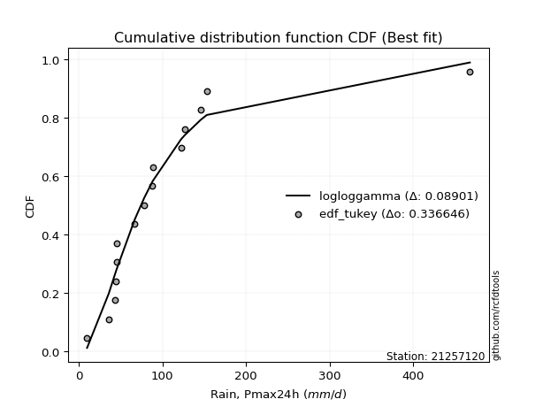</img>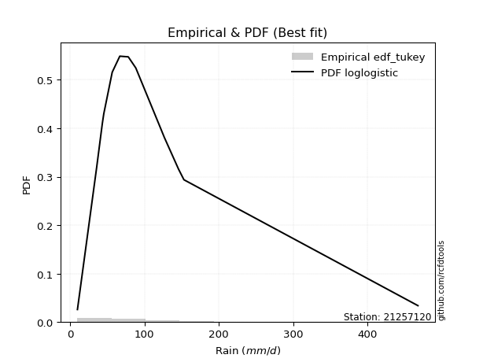</img>

</div>


### 8. EDF Gringorten (1963)

Gringorten plotting position formula is essential for estimating the probability and return periods of extreme events like floods and heavy rainfall. The constant _a=0.44_.

<div align="center">


$P=(m-a)/(n+1-2a)$


</div>


**8.1. Empirical values**

<div align="center">

|                | 0                   | 1                   | 2                   | 3                   | 4                   | 5                   | 6                   | 7              | 8                  | 9                  | 10                 | 11                 | 12                 | 13                 | 14                 |
|:---------------|:--------------------|:--------------------|:--------------------|:--------------------|:--------------------|:--------------------|:--------------------|:---------------|:-------------------|:-------------------|:-------------------|:-------------------|:-------------------|:-------------------|:-------------------|
| date           | 2012                | 2016                | 2018                | 2017                | 2019                | 2015                | 2008                | 2007           | 2005               | 2009               | 2014               | 2011               | 2010               | 2013               | 2006               |
| x              | 9.7                 | 35.6                | 43.1                | 43.7                | 45.0                | 45.2                | 66.7                | 78.1           | 88.0               | 88.4               | 122.2              | 126.7              | 145.8              | 153.0              | 467.9              |
| m              | 1                   | 2                   | 3                   | 4                   | 5                   | 6                   | 7                   | 8              | 9                  | 10                 | 11                 | 12                 | 13                 | 14                 | 15                 |
| empirical_dist | edf_gringorten      | edf_gringorten      | edf_gringorten      | edf_gringorten      | edf_gringorten      | edf_gringorten      | edf_gringorten      | edf_gringorten | edf_gringorten     | edf_gringorten     | edf_gringorten     | edf_gringorten     | edf_gringorten     | edf_gringorten     | edf_gringorten     |
| empirical      | 0.03703703703703704 | 0.10317460317460318 | 0.16931216931216933 | 0.23544973544973546 | 0.30158730158730157 | 0.36772486772486773 | 0.43386243386243384 | 0.5            | 0.5661375661375662 | 0.6322751322751323 | 0.6984126984126985 | 0.7645502645502646 | 0.8306878306878308 | 0.8968253968253969 | 0.962962962962963  |
| empirical_tr   | 1.0384615384615385  | 1.1150442477876106  | 1.2038216560509554  | 1.3079584775086506  | 1.4318181818181819  | 1.5815899581589956  | 1.7663551401869158  | 2.0            | 2.304878048780488  | 2.719424460431655  | 3.3157894736842115 | 4.247191011235957  | 5.906250000000004  | 9.692307692307695  | 27.000000000000043 |

</div>


**8.2. Kolmogorov-Smirnov fit test (sorted by Δ)**


<div align="center">

|                | 0                   | 1                  | 2                   | 3                   | 4                   | 5                   | 6                   | 7                   | 8                  | 9                   | 10                  | 11                  | 12                  | 13                  | 14                 | 15                 | 16                  | 17                  | 18                  | 19                  | 20                  | 21                  | 22                  | 23                  | 24                  | 25                  | 26                  | 27                  | 28                  | 29                  | 30                  | 31                  | 32                  | 33                  | 34                  | 35                  | 36                 | 37                  | 38                  | 39                  | 40                  | 41                  | 42                  | 43                  | 44                 | 45                 | 46                 | 47                 | 48                  | 49                    | 50                 | 51                 | 52                  | 53                  | 54                  | 55                  | 56                 | 57                  | 58                  | 59                  | 60                 | 61                  | 62                  | 63                  | 64                  | 65                  | 66                  | 67                  | 68                  | 69                  | 70                  | 71                  | 72                  | 73                  | 74                  | 75                  | 76                  | 77                 | 78                 | 79                 | 80                 | 81                  | 82                 | 83                  | 84                  | 85                 | 86                 | 87                 |
|:---------------|:--------------------|:-------------------|:--------------------|:--------------------|:--------------------|:--------------------|:--------------------|:--------------------|:-------------------|:--------------------|:--------------------|:--------------------|:--------------------|:--------------------|:-------------------|:-------------------|:--------------------|:--------------------|:--------------------|:--------------------|:--------------------|:--------------------|:--------------------|:--------------------|:--------------------|:--------------------|:--------------------|:--------------------|:--------------------|:--------------------|:--------------------|:--------------------|:--------------------|:--------------------|:--------------------|:--------------------|:-------------------|:--------------------|:--------------------|:--------------------|:--------------------|:--------------------|:--------------------|:--------------------|:-------------------|:-------------------|:-------------------|:-------------------|:--------------------|:----------------------|:-------------------|:-------------------|:--------------------|:--------------------|:--------------------|:--------------------|:-------------------|:--------------------|:--------------------|:--------------------|:-------------------|:--------------------|:--------------------|:--------------------|:--------------------|:--------------------|:--------------------|:--------------------|:--------------------|:--------------------|:--------------------|:--------------------|:--------------------|:--------------------|:--------------------|:--------------------|:--------------------|:-------------------|:-------------------|:-------------------|:-------------------|:--------------------|:-------------------|:--------------------|:--------------------|:-------------------|:-------------------|:-------------------|
| station        | 21257120            | 21257120           | 21257120            | 21257120            | 21257120            | 21257120            | 21257120            | 21257120            | 21257120           | 21257120            | 21257120            | 21257120            | 21257120            | 21257120            | 21257120           | 21257120           | 21257120            | 21257120            | 21257120            | 21257120            | 21257120            | 21257120            | 21257120            | 21257120            | 21257120            | 21257120            | 21257120            | 21257120            | 21257120            | 21257120            | 21257120            | 21257120            | 21257120            | 21257120            | 21257120            | 21257120            | 21257120           | 21257120            | 21257120            | 21257120            | 21257120            | 21257120            | 21257120            | 21257120            | 21257120           | 21257120           | 21257120           | 21257120           | 21257120            | 21257120              | 21257120           | 21257120           | 21257120            | 21257120            | 21257120            | 21257120            | 21257120           | 21257120            | 21257120            | 21257120            | 21257120           | 21257120            | 21257120            | 21257120            | 21257120            | 21257120            | 21257120            | 21257120            | 21257120            | 21257120            | 21257120            | 21257120            | 21257120            | 21257120            | 21257120            | 21257120            | 21257120            | 21257120           | 21257120           | 21257120           | 21257120           | 21257120            | 21257120           | 21257120            | 21257120            | 21257120           | 21257120           | 21257120           |
| empirical_dist | edf_gringorten      | edf_gringorten     | edf_gringorten      | edf_gringorten      | edf_gringorten      | edf_gringorten      | edf_gringorten      | edf_gringorten      | edf_gringorten     | edf_gringorten      | edf_gringorten      | edf_gringorten      | edf_gringorten      | edf_gringorten      | edf_gringorten     | edf_gringorten     | edf_gringorten      | edf_gringorten      | edf_gringorten      | edf_gringorten      | edf_gringorten      | edf_gringorten      | edf_gringorten      | edf_gringorten      | edf_gringorten      | edf_gringorten      | edf_gringorten      | edf_gringorten      | edf_gringorten      | edf_gringorten      | edf_gringorten      | edf_gringorten      | edf_gringorten      | edf_gringorten      | edf_gringorten      | edf_gringorten      | edf_gringorten     | edf_gringorten      | edf_gringorten      | edf_gringorten      | edf_gringorten      | edf_gringorten      | edf_gringorten      | edf_gringorten      | edf_gringorten     | edf_gringorten     | edf_gringorten     | edf_gringorten     | edf_gringorten      | edf_gringorten        | edf_gringorten     | edf_gringorten     | edf_gringorten      | edf_gringorten      | edf_gringorten      | edf_gringorten      | edf_gringorten     | edf_gringorten      | edf_gringorten      | edf_gringorten      | edf_gringorten     | edf_gringorten      | edf_gringorten      | edf_gringorten      | edf_gringorten      | edf_gringorten      | edf_gringorten      | edf_gringorten      | edf_gringorten      | edf_gringorten      | edf_gringorten      | edf_gringorten      | edf_gringorten      | edf_gringorten      | edf_gringorten      | edf_gringorten      | edf_gringorten      | edf_gringorten     | edf_gringorten     | edf_gringorten     | edf_gringorten     | edf_gringorten      | edf_gringorten     | edf_gringorten      | edf_gringorten      | edf_gringorten     | edf_gringorten     | edf_gringorten     |
| p_dist         | logpearson3         | logloggamma        | betaprime           | logf                | logexponnorm        | lognorm             | lognorm             | logcrystalball      | loglognorm         | logrice             | invgauss            | lognct              | logfatiguelife      | logbetaprime        | loggamma           | loggamma           | logerlang           | ncf                 | loglogistic         | fatiguelife         | invgamma            | f                   | logncf              | genexpon            | logweibull_min      | logalpha            | loginvgamma         | invweibull          | logmielke           | logfisk             | loggenlogistic      | fisk                | loggumbel_r         | loghypsecant        | logjohnsonsu        | logmaxwell          | logt               | nct                 | wald                | johnsonsu           | exponnorm           | loginvgauss         | logmoyal            | loggumbel_l         | lognakagami        | t                  | lograyleigh        | loggompertz        | expon               | loglaplace_asymmetric | logtruncnorm       | genlogistic        | loglaplace          | loghalflogistic     | gibrat              | gompertz            | loghalfnorm        | truncnorm           | loginvweibull       | gumbel_r            | laplace_asymmetric | moyal               | pearson3            | kstwobign           | rayleigh            | logistic            | logwald             | maxwell             | halflogistic        | logkstwobign        | erlang              | hypsecant           | halfnorm            | crystalball         | norm                | rice                | laplace             | loggibrat          | loggenexpon        | gumbel_l           | weibull_min        | alpha               | nakagami           | logexpon            | mielke              | logchi2            | chi2               | gamma              |
| delta          | 0.09285839890042415 | 0.0936112122168141 | 0.09461837055487204 | 0.09796540846417437 | 0.09800294794368339 | 0.09800308983086511 | 0.09800308983086511 | 0.09800310915743501 | 0.0980046222502495 | 0.09800739544513806 | 0.09822349627506533 | 0.09831294120541448 | 0.09842600196384474 | 0.10056852623006521 | 0.1019956322225373 | 0.1019956322225373 | 0.10305791300350423 | 0.10307529218239986 | 0.10352201143131573 | 0.10502447307079676 | 0.10520247032088931 | 0.10522173238889831 | 0.10578156784058598 | 0.10619259768480438 | 0.10658528586120215 | 0.10825265072742615 | 0.10858051639224434 | 0.11043053572174005 | 0.11184162992596186 | 0.11194878073737796 | 0.11233165766290859 | 0.11384453993172339 | 0.11861008787154145 | 0.11899220782302086 | 0.12126836911396355 | 0.12204223297430247 | 0.1231542598020498 | 0.12396399469377883 | 0.12590962546350334 | 0.12676064981529267 | 0.12800966213246906 | 0.12827486858113865 | 0.12861440120454204 | 0.12947706550555707 | 0.1301215129685974 | 0.1309694813965253 | 0.131810515508785  | 0.1366921563017865 | 0.13712430303902245 | 0.13817079633714616   | 0.1392799057453143 | 0.1421182053083846 | 0.14274440076259717 | 0.14921037138987567 | 0.15635566121035388 | 0.15641860896060422 | 0.1588227136734007 | 0.15950466827313192 | 0.16143753082537135 | 0.17324665205369194 | 0.1737615381448559 | 0.17434142178291362 | 0.17467912120517012 | 0.18569902735178712 | 0.19431185497532144 | 0.19850090419695665 | 0.19892311489311054 | 0.19976864385025273 | 0.20208689385591722 | 0.20210790886294103 | 0.20412189481347398 | 0.20508765519648642 | 0.21386424250099922 | 0.21821986552795392 | 0.21821986776914948 | 0.22283189705592316 | 0.22607608495071913 | 0.2264713364758043 | 0.2304606817367236 | 0.2603867586702222 | 0.2716396820377982 | 0.28053645825183027 | 0.2814387082711176 | 0.37205813998946463 | 0.38182046442039796 | 0.5921698937115867 | 0.892145618129564  | 0.8965901029125966 |
| deltao         | 0.3366456264050002  | 0.3366456264050002 | 0.3366456264050002  | 0.3366456264050002  | 0.3366456264050002  | 0.3366456264050002  | 0.3366456264050002  | 0.3366456264050002  | 0.3366456264050002 | 0.3366456264050002  | 0.3366456264050002  | 0.3366456264050002  | 0.3366456264050002  | 0.3366456264050002  | 0.3366456264050002 | 0.3366456264050002 | 0.3366456264050002  | 0.3366456264050002  | 0.3366456264050002  | 0.3366456264050002  | 0.3366456264050002  | 0.3366456264050002  | 0.3366456264050002  | 0.3366456264050002  | 0.3366456264050002  | 0.3366456264050002  | 0.3366456264050002  | 0.3366456264050002  | 0.3366456264050002  | 0.3366456264050002  | 0.3366456264050002  | 0.3366456264050002  | 0.3366456264050002  | 0.3366456264050002  | 0.3366456264050002  | 0.3366456264050002  | 0.3366456264050002 | 0.3366456264050002  | 0.3366456264050002  | 0.3366456264050002  | 0.3366456264050002  | 0.3366456264050002  | 0.3366456264050002  | 0.3366456264050002  | 0.3366456264050002 | 0.3366456264050002 | 0.3366456264050002 | 0.3366456264050002 | 0.3366456264050002  | 0.3366456264050002    | 0.3366456264050002 | 0.3366456264050002 | 0.3366456264050002  | 0.3366456264050002  | 0.3366456264050002  | 0.3366456264050002  | 0.3366456264050002 | 0.3366456264050002  | 0.3366456264050002  | 0.3366456264050002  | 0.3366456264050002 | 0.3366456264050002  | 0.3366456264050002  | 0.3366456264050002  | 0.3366456264050002  | 0.3366456264050002  | 0.3366456264050002  | 0.3366456264050002  | 0.3366456264050002  | 0.3366456264050002  | 0.3366456264050002  | 0.3366456264050002  | 0.3366456264050002  | 0.3366456264050002  | 0.3366456264050002  | 0.3366456264050002  | 0.3366456264050002  | 0.3366456264050002 | 0.3366456264050002 | 0.3366456264050002 | 0.3366456264050002 | 0.3366456264050002  | 0.3366456264050002 | 0.3366456264050002  | 0.3366456264050002  | 0.3366456264050002 | 0.3366456264050002 | 0.3366456264050002 |
| eval           | Δo > Δ              | Δo > Δ             | Δo > Δ              | Δo > Δ              | Δo > Δ              | Δo > Δ              | Δo > Δ              | Δo > Δ              | Δo > Δ             | Δo > Δ              | Δo > Δ              | Δo > Δ              | Δo > Δ              | Δo > Δ              | Δo > Δ             | Δo > Δ             | Δo > Δ              | Δo > Δ              | Δo > Δ              | Δo > Δ              | Δo > Δ              | Δo > Δ              | Δo > Δ              | Δo > Δ              | Δo > Δ              | Δo > Δ              | Δo > Δ              | Δo > Δ              | Δo > Δ              | Δo > Δ              | Δo > Δ              | Δo > Δ              | Δo > Δ              | Δo > Δ              | Δo > Δ              | Δo > Δ              | Δo > Δ             | Δo > Δ              | Δo > Δ              | Δo > Δ              | Δo > Δ              | Δo > Δ              | Δo > Δ              | Δo > Δ              | Δo > Δ             | Δo > Δ             | Δo > Δ             | Δo > Δ             | Δo > Δ              | Δo > Δ                | Δo > Δ             | Δo > Δ             | Δo > Δ              | Δo > Δ              | Δo > Δ              | Δo > Δ              | Δo > Δ             | Δo > Δ              | Δo > Δ              | Δo > Δ              | Δo > Δ             | Δo > Δ              | Δo > Δ              | Δo > Δ              | Δo > Δ              | Δo > Δ              | Δo > Δ              | Δo > Δ              | Δo > Δ              | Δo > Δ              | Δo > Δ              | Δo > Δ              | Δo > Δ              | Δo > Δ              | Δo > Δ              | Δo > Δ              | Δo > Δ              | Δo > Δ             | Δo > Δ             | Δo > Δ             | Δo > Δ             | Δo > Δ              | Δo > Δ             | Δo <= Δ             | Δo <= Δ             | Δo <= Δ            | Δo <= Δ            | Δo <= Δ            |
| fit            | 1                   | 1                  | 1                   | 1                   | 1                   | 1                   | 1                   | 1                   | 1                  | 1                   | 1                   | 1                   | 1                   | 1                   | 1                  | 1                  | 1                   | 1                   | 1                   | 1                   | 1                   | 1                   | 1                   | 1                   | 1                   | 1                   | 1                   | 1                   | 1                   | 1                   | 1                   | 1                   | 1                   | 1                   | 1                   | 1                   | 1                  | 1                   | 1                   | 1                   | 1                   | 1                   | 1                   | 1                   | 1                  | 1                  | 1                  | 1                  | 1                   | 1                     | 1                  | 1                  | 1                   | 1                   | 1                   | 1                   | 1                  | 1                   | 1                   | 1                   | 1                  | 1                   | 1                   | 1                   | 1                   | 1                   | 1                   | 1                   | 1                   | 1                   | 1                   | 1                   | 1                   | 1                   | 1                   | 1                   | 1                   | 1                  | 1                  | 1                  | 1                  | 1                   | 1                  | 0                   | 0                   | 0                  | 0                  | 0                  |
| n              | 15                  | 15                 | 15                  | 15                  | 15                  | 15                  | 15                  | 15                  | 15                 | 15                  | 15                  | 15                  | 15                  | 15                  | 15                 | 15                 | 15                  | 15                  | 15                  | 15                  | 15                  | 15                  | 15                  | 15                  | 15                  | 15                  | 15                  | 15                  | 15                  | 15                  | 15                  | 15                  | 15                  | 15                  | 15                  | 15                  | 15                 | 15                  | 15                  | 15                  | 15                  | 15                  | 15                  | 15                  | 15                 | 15                 | 15                 | 15                 | 15                  | 15                    | 15                 | 15                 | 15                  | 15                  | 15                  | 15                  | 15                 | 15                  | 15                  | 15                  | 15                 | 15                  | 15                  | 15                  | 15                  | 15                  | 15                  | 15                  | 15                  | 15                  | 15                  | 15                  | 15                  | 15                  | 15                  | 15                  | 15                  | 15                 | 15                 | 15                 | 15                 | 15                  | 15                 | 15                  | 15                  | 15                 | 15                 | 15                 |
| best_fit       | 1                   | 0                  | 0                   | 0                   | 0                   | 0                   | 0                   | 0                   | 0                  | 0                   | 0                   | 0                   | 0                   | 0                   | 0                  | 0                  | 0                   | 0                   | 0                   | 0                   | 0                   | 0                   | 0                   | 0                   | 0                   | 0                   | 0                   | 0                   | 0                   | 0                   | 0                   | 0                   | 0                   | 0                   | 0                   | 0                   | 0                  | 0                   | 0                   | 0                   | 0                   | 0                   | 0                   | 0                   | 0                  | 0                  | 0                  | 0                  | 0                   | 0                     | 0                  | 0                  | 0                   | 0                   | 0                   | 0                   | 0                  | 0                   | 0                   | 0                   | 0                  | 0                   | 0                   | 0                   | 0                   | 0                   | 0                   | 0                   | 0                   | 0                   | 0                   | 0                   | 0                   | 0                   | 0                   | 0                   | 0                   | 0                  | 0                  | 0                  | 0                  | 0                   | 0                  | 0                   | 0                   | 0                  | 0                  | 0                  |
| best_fit_sort  | 1                   | 2                  | 3                   | 4                   | 5                   | 6                   | 7                   | 8                   | 9                  | 10                  | 11                  | 12                  | 13                  | 14                  | 15                 | 16                 | 17                  | 18                  | 19                  | 20                  | 21                  | 22                  | 23                  | 24                  | 25                  | 26                  | 27                  | 28                  | 29                  | 30                  | 31                  | 32                  | 33                  | 34                  | 35                  | 36                  | 37                 | 38                  | 39                  | 40                  | 41                  | 42                  | 43                  | 44                  | 45                 | 46                 | 47                 | 48                 | 49                  | 50                    | 51                 | 52                 | 53                  | 54                  | 55                  | 56                  | 57                 | 58                  | 59                  | 60                  | 61                 | 62                  | 63                  | 64                  | 65                  | 66                  | 67                  | 68                  | 69                  | 70                  | 71                  | 72                  | 73                  | 74                  | 75                  | 76                  | 77                  | 78                 | 79                 | 80                 | 81                 | 82                  | 83                 | 84                  | 85                  | 86                 | 87                 | 88                 |

</div>


**8.3. Best fit**

<div align="center">

|   id |   station | empirical_dist   | p_dist      |     delta |   deltao | eval   |   fit |   n |   best_fit |   best_fit_sort |
|-----:|----------:|:-----------------|:------------|----------:|---------:|:-------|------:|----:|-----------:|----------------:|
|    0 |  21257120 | edf_gringorten   | logpearson3 | 0.0928584 | 0.336646 | Δo > Δ |     1 |  15 |          1 |               1 |

</div>


<div align="center">

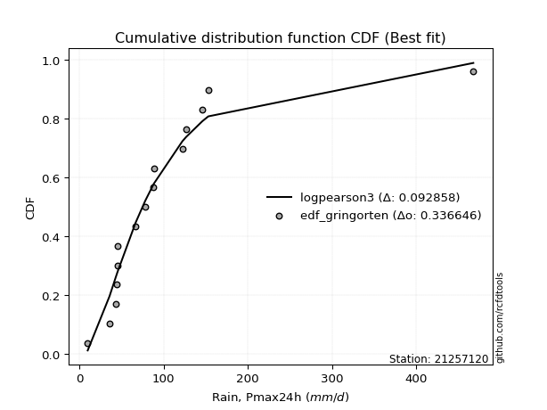</img>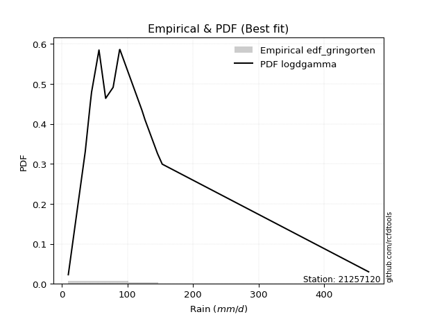</img>

</div>


### 9. EDF Filliben (1975)

The specific values of the constants (0.3175) (often denoted as $alpha$) and (0.365) are derived from a method proposed by James J. Filliben in a 1975 paper. This particular formula is the mean value of the $i$-th order statistic of the normal distribution and is considered a robust and effective plotting position formula for the normal probability plot correlation coefficient test for normality.

<div align="center">


$P=(m-0.3175)/(n+0.365)$


</div>


**9.1. Empirical values**

<div align="center">

|                | 0                   | 1                   | 2                  | 3                   | 4                  | 5                  | 6                   | 7            | 8                  | 9                  | 10                 | 11                 | 12                 | 13                | 14                 |
|:---------------|:--------------------|:--------------------|:-------------------|:--------------------|:-------------------|:-------------------|:--------------------|:-------------|:-------------------|:-------------------|:-------------------|:-------------------|:-------------------|:------------------|:-------------------|
| date           | 2012                | 2016                | 2018               | 2017                | 2019               | 2015               | 2008                | 2007         | 2005               | 2009               | 2014               | 2011               | 2010               | 2013              | 2006               |
| x              | 9.7                 | 35.6                | 43.1               | 43.7                | 45.0               | 45.2               | 66.7                | 78.1         | 88.0               | 88.4               | 122.2              | 126.7              | 145.8              | 153.0             | 467.9              |
| m              | 1                   | 2                   | 3                  | 4                   | 5                  | 6                  | 7                   | 8            | 9                  | 10                 | 11                 | 12                 | 13                 | 14                | 15                 |
| empirical_dist | edf_filliben        | edf_filliben        | edf_filliben       | edf_filliben        | edf_filliben       | edf_filliben       | edf_filliben        | edf_filliben | edf_filliben       | edf_filliben       | edf_filliben       | edf_filliben       | edf_filliben       | edf_filliben      | edf_filliben       |
| empirical      | 0.04441913439635535 | 0.10950211519687603 | 0.1745850959973967 | 0.23966807679791735 | 0.304751057598438  | 0.3698340383989587 | 0.43491701919947934 | 0.5          | 0.5650829808005206 | 0.6301659616010412 | 0.6952489424015619 | 0.7603319232020826 | 0.8254149040026033 | 0.890497884803124 | 0.9555808656036446 |
| empirical_tr   | 1.0464839094159715  | 1.1229672939886717  | 1.211511925882121  | 1.3152150652685641  | 1.4383337233793587 | 1.586883552801446  | 1.7696515980420386  | 2.0          | 2.2992891881780766 | 2.7039155301363826 | 3.2813667912439923 | 4.172437202987101  | 5.727865796831314  | 9.13224368499257  | 22.512820512820507 |

</div>


**9.2. Kolmogorov-Smirnov fit test (sorted by Δ)**


<div align="center">

|                | 0                   | 1                   | 2                   | 3                   | 4                   | 5                   | 6                   | 7                   | 8                  | 9                   | 10                  | 11                  | 12                  | 13                  | 14                  | 15                  | 16                  | 17                  | 18                 | 19                  | 20                  | 21                 | 22                  | 23                 | 24                  | 25                  | 26                  | 27                 | 28                 | 29                 | 30                 | 31                  | 32                  | 33                  | 34                  | 35                 | 36                 | 37                  | 38                  | 39                  | 40                  | 41                  | 42                 | 43                 | 44                  | 45                  | 46                  | 47                  | 48                  | 49                    | 50                  | 51                 | 52                  | 53                  | 54                  | 55                  | 56                  | 57                 | 58                  | 59                 | 60                 | 61                  | 62                  | 63                 | 64                  | 65                  | 66                  | 67                  | 68                  | 69                  | 70                  | 71                 | 72                 | 73                  | 74                 | 75                  | 76                  | 77                  | 78                 | 79                 | 80                 | 81                 | 82                  | 83                 | 84                  | 85                 | 86                 | 87                 |
|:---------------|:--------------------|:--------------------|:--------------------|:--------------------|:--------------------|:--------------------|:--------------------|:--------------------|:-------------------|:--------------------|:--------------------|:--------------------|:--------------------|:--------------------|:--------------------|:--------------------|:--------------------|:--------------------|:-------------------|:--------------------|:--------------------|:-------------------|:--------------------|:-------------------|:--------------------|:--------------------|:--------------------|:-------------------|:-------------------|:-------------------|:-------------------|:--------------------|:--------------------|:--------------------|:--------------------|:-------------------|:-------------------|:--------------------|:--------------------|:--------------------|:--------------------|:--------------------|:-------------------|:-------------------|:--------------------|:--------------------|:--------------------|:--------------------|:--------------------|:----------------------|:--------------------|:-------------------|:--------------------|:--------------------|:--------------------|:--------------------|:--------------------|:-------------------|:--------------------|:-------------------|:-------------------|:--------------------|:--------------------|:-------------------|:--------------------|:--------------------|:--------------------|:--------------------|:--------------------|:--------------------|:--------------------|:-------------------|:-------------------|:--------------------|:-------------------|:--------------------|:--------------------|:--------------------|:-------------------|:-------------------|:-------------------|:-------------------|:--------------------|:-------------------|:--------------------|:-------------------|:-------------------|:-------------------|
| station        | 21257120            | 21257120            | 21257120            | 21257120            | 21257120            | 21257120            | 21257120            | 21257120            | 21257120           | 21257120            | 21257120            | 21257120            | 21257120            | 21257120            | 21257120            | 21257120            | 21257120            | 21257120            | 21257120           | 21257120            | 21257120            | 21257120           | 21257120            | 21257120           | 21257120            | 21257120            | 21257120            | 21257120           | 21257120           | 21257120           | 21257120           | 21257120            | 21257120            | 21257120            | 21257120            | 21257120           | 21257120           | 21257120            | 21257120            | 21257120            | 21257120            | 21257120            | 21257120           | 21257120           | 21257120            | 21257120            | 21257120            | 21257120            | 21257120            | 21257120              | 21257120            | 21257120           | 21257120            | 21257120            | 21257120            | 21257120            | 21257120            | 21257120           | 21257120            | 21257120           | 21257120           | 21257120            | 21257120            | 21257120           | 21257120            | 21257120            | 21257120            | 21257120            | 21257120            | 21257120            | 21257120            | 21257120           | 21257120           | 21257120            | 21257120           | 21257120            | 21257120            | 21257120            | 21257120           | 21257120           | 21257120           | 21257120           | 21257120            | 21257120           | 21257120            | 21257120           | 21257120           | 21257120           |
| empirical_dist | edf_filliben        | edf_filliben        | edf_filliben        | edf_filliben        | edf_filliben        | edf_filliben        | edf_filliben        | edf_filliben        | edf_filliben       | edf_filliben        | edf_filliben        | edf_filliben        | edf_filliben        | edf_filliben        | edf_filliben        | edf_filliben        | edf_filliben        | edf_filliben        | edf_filliben       | edf_filliben        | edf_filliben        | edf_filliben       | edf_filliben        | edf_filliben       | edf_filliben        | edf_filliben        | edf_filliben        | edf_filliben       | edf_filliben       | edf_filliben       | edf_filliben       | edf_filliben        | edf_filliben        | edf_filliben        | edf_filliben        | edf_filliben       | edf_filliben       | edf_filliben        | edf_filliben        | edf_filliben        | edf_filliben        | edf_filliben        | edf_filliben       | edf_filliben       | edf_filliben        | edf_filliben        | edf_filliben        | edf_filliben        | edf_filliben        | edf_filliben          | edf_filliben        | edf_filliben       | edf_filliben        | edf_filliben        | edf_filliben        | edf_filliben        | edf_filliben        | edf_filliben       | edf_filliben        | edf_filliben       | edf_filliben       | edf_filliben        | edf_filliben        | edf_filliben       | edf_filliben        | edf_filliben        | edf_filliben        | edf_filliben        | edf_filliben        | edf_filliben        | edf_filliben        | edf_filliben       | edf_filliben       | edf_filliben        | edf_filliben       | edf_filliben        | edf_filliben        | edf_filliben        | edf_filliben       | edf_filliben       | edf_filliben       | edf_filliben       | edf_filliben        | edf_filliben       | edf_filliben        | edf_filliben       | edf_filliben       | edf_filliben       |
| p_dist         | logloggamma         | logpearson3         | logf                | logexponnorm        | lognorm             | lognorm             | logcrystalball      | loglognorm          | logrice            | lognct              | logfatiguelife      | logbetaprime        | invgauss            | loggamma            | loggamma            | betaprime           | logerlang           | fatiguelife         | genexpon           | logweibull_min      | logncf              | logalpha           | loginvgamma         | ncf                | loglogistic         | invgamma            | f                   | invweibull         | loggumbel_r        | logmielke          | logfisk            | loggenlogistic      | fisk                | logmaxwell          | wald                | loghypsecant       | loginvgauss        | logjohnsonsu        | logt                | nct                 | lograyleigh         | logmoyal            | johnsonsu          | exponnorm          | loggompertz         | expon               | loggumbel_l         | lognakagami         | t                   | loglaplace_asymmetric | logtruncnorm        | loghalflogistic    | genlogistic         | loglaplace          | gompertz            | truncnorm           | loghalfnorm         | loginvweibull      | gibrat              | gumbel_r           | moyal              | pearson3            | laplace_asymmetric  | kstwobign          | rayleigh            | maxwell             | halflogistic        | logistic            | logkstwobign        | erlang              | logwald             | hypsecant          | halfnorm           | crystalball         | norm               | rice                | laplace             | loggenexpon         | loggibrat          | gumbel_l           | weibull_min        | nakagami           | alpha               | logexpon           | mielke              | logchi2            | chi2               | gamma              |
| delta          | 0.08865980426360148 | 0.09039390981258355 | 0.09269248177894701 | 0.09273002125845603 | 0.09273016314563776 | 0.09273016314563776 | 0.09273018247220766 | 0.09273169556502214 | 0.0927344687599107 | 0.09304001452018712 | 0.09315307527861738 | 0.09529559954483785 | 0.09575711866934222 | 0.09672270553730994 | 0.09672270553730994 | 0.09672754122896299 | 0.09778498631827687 | 0.09869696104852388 | 0.0998650856625315 | 0.10025777383892931 | 0.10050864115535862 | 0.1029797240421988 | 0.10330758970701698 | 0.1051844628564908 | 0.10563118210540667 | 0.10731164099498025 | 0.10733090306298926 | 0.112539706395831  | 0.1133371611863141 | 0.1139508006000528 | 0.1140579514114689 | 0.11444082833699953 | 0.11595371060581433 | 0.11676930628907511 | 0.12063669877827599 | 0.1211013784971118 | 0.1230019418959113 | 0.12337753978805449 | 0.12526343047614075 | 0.12607316536786978 | 0.12653758882355765 | 0.12861440120454204 | 0.1288698204893836 | 0.13011883280656   | 0.13036464427951366 | 0.13079679101674963 | 0.13158623617964801 | 0.13223068364268833 | 0.13413323740766192 | 0.1402799670112371    | 0.14138907641940524 | 0.1439374447046483 | 0.14422737598247554 | 0.14485357143668812 | 0.15009109693833134 | 0.15317715625085904 | 0.15354978698817334 | 0.156164604140144  | 0.15846483188444482 | 0.1669191400314191 | 0.1680139097606408 | 0.16940619451994277 | 0.17587070881894684 | 0.183589856677696  | 0.18798434295304856 | 0.19344113182797984 | 0.19575938183364439 | 0.19639173352286554 | 0.19683498217771367 | 0.19779438279120115 | 0.19892311489311054 | 0.2029784845223953 | 0.2075367304787264 | 0.21189235350568103 | 0.2118923557468766 | 0.22072272638183205 | 0.22396691427662802 | 0.22518775505149624 | 0.2264713364758043 | 0.2582775879961311 | 0.2663667553525708 | 0.2751111962488447 | 0.27526353156660294 | 0.3657306279671918 | 0.37549295239812513 | 0.5858423816893138 | 0.8858181061072912 | 0.8902625908903237 |
| deltao         | 0.3366456264050002  | 0.3366456264050002  | 0.3366456264050002  | 0.3366456264050002  | 0.3366456264050002  | 0.3366456264050002  | 0.3366456264050002  | 0.3366456264050002  | 0.3366456264050002 | 0.3366456264050002  | 0.3366456264050002  | 0.3366456264050002  | 0.3366456264050002  | 0.3366456264050002  | 0.3366456264050002  | 0.3366456264050002  | 0.3366456264050002  | 0.3366456264050002  | 0.3366456264050002 | 0.3366456264050002  | 0.3366456264050002  | 0.3366456264050002 | 0.3366456264050002  | 0.3366456264050002 | 0.3366456264050002  | 0.3366456264050002  | 0.3366456264050002  | 0.3366456264050002 | 0.3366456264050002 | 0.3366456264050002 | 0.3366456264050002 | 0.3366456264050002  | 0.3366456264050002  | 0.3366456264050002  | 0.3366456264050002  | 0.3366456264050002 | 0.3366456264050002 | 0.3366456264050002  | 0.3366456264050002  | 0.3366456264050002  | 0.3366456264050002  | 0.3366456264050002  | 0.3366456264050002 | 0.3366456264050002 | 0.3366456264050002  | 0.3366456264050002  | 0.3366456264050002  | 0.3366456264050002  | 0.3366456264050002  | 0.3366456264050002    | 0.3366456264050002  | 0.3366456264050002 | 0.3366456264050002  | 0.3366456264050002  | 0.3366456264050002  | 0.3366456264050002  | 0.3366456264050002  | 0.3366456264050002 | 0.3366456264050002  | 0.3366456264050002 | 0.3366456264050002 | 0.3366456264050002  | 0.3366456264050002  | 0.3366456264050002 | 0.3366456264050002  | 0.3366456264050002  | 0.3366456264050002  | 0.3366456264050002  | 0.3366456264050002  | 0.3366456264050002  | 0.3366456264050002  | 0.3366456264050002 | 0.3366456264050002 | 0.3366456264050002  | 0.3366456264050002 | 0.3366456264050002  | 0.3366456264050002  | 0.3366456264050002  | 0.3366456264050002 | 0.3366456264050002 | 0.3366456264050002 | 0.3366456264050002 | 0.3366456264050002  | 0.3366456264050002 | 0.3366456264050002  | 0.3366456264050002 | 0.3366456264050002 | 0.3366456264050002 |
| eval           | Δo > Δ              | Δo > Δ              | Δo > Δ              | Δo > Δ              | Δo > Δ              | Δo > Δ              | Δo > Δ              | Δo > Δ              | Δo > Δ             | Δo > Δ              | Δo > Δ              | Δo > Δ              | Δo > Δ              | Δo > Δ              | Δo > Δ              | Δo > Δ              | Δo > Δ              | Δo > Δ              | Δo > Δ             | Δo > Δ              | Δo > Δ              | Δo > Δ             | Δo > Δ              | Δo > Δ             | Δo > Δ              | Δo > Δ              | Δo > Δ              | Δo > Δ             | Δo > Δ             | Δo > Δ             | Δo > Δ             | Δo > Δ              | Δo > Δ              | Δo > Δ              | Δo > Δ              | Δo > Δ             | Δo > Δ             | Δo > Δ              | Δo > Δ              | Δo > Δ              | Δo > Δ              | Δo > Δ              | Δo > Δ             | Δo > Δ             | Δo > Δ              | Δo > Δ              | Δo > Δ              | Δo > Δ              | Δo > Δ              | Δo > Δ                | Δo > Δ              | Δo > Δ             | Δo > Δ              | Δo > Δ              | Δo > Δ              | Δo > Δ              | Δo > Δ              | Δo > Δ             | Δo > Δ              | Δo > Δ             | Δo > Δ             | Δo > Δ              | Δo > Δ              | Δo > Δ             | Δo > Δ              | Δo > Δ              | Δo > Δ              | Δo > Δ              | Δo > Δ              | Δo > Δ              | Δo > Δ              | Δo > Δ             | Δo > Δ             | Δo > Δ              | Δo > Δ             | Δo > Δ              | Δo > Δ              | Δo > Δ              | Δo > Δ             | Δo > Δ             | Δo > Δ             | Δo > Δ             | Δo > Δ              | Δo <= Δ            | Δo <= Δ             | Δo <= Δ            | Δo <= Δ            | Δo <= Δ            |
| fit            | 1                   | 1                   | 1                   | 1                   | 1                   | 1                   | 1                   | 1                   | 1                  | 1                   | 1                   | 1                   | 1                   | 1                   | 1                   | 1                   | 1                   | 1                   | 1                  | 1                   | 1                   | 1                  | 1                   | 1                  | 1                   | 1                   | 1                   | 1                  | 1                  | 1                  | 1                  | 1                   | 1                   | 1                   | 1                   | 1                  | 1                  | 1                   | 1                   | 1                   | 1                   | 1                   | 1                  | 1                  | 1                   | 1                   | 1                   | 1                   | 1                   | 1                     | 1                   | 1                  | 1                   | 1                   | 1                   | 1                   | 1                   | 1                  | 1                   | 1                  | 1                  | 1                   | 1                   | 1                  | 1                   | 1                   | 1                   | 1                   | 1                   | 1                   | 1                   | 1                  | 1                  | 1                   | 1                  | 1                   | 1                   | 1                   | 1                  | 1                  | 1                  | 1                  | 1                   | 0                  | 0                   | 0                  | 0                  | 0                  |
| n              | 15                  | 15                  | 15                  | 15                  | 15                  | 15                  | 15                  | 15                  | 15                 | 15                  | 15                  | 15                  | 15                  | 15                  | 15                  | 15                  | 15                  | 15                  | 15                 | 15                  | 15                  | 15                 | 15                  | 15                 | 15                  | 15                  | 15                  | 15                 | 15                 | 15                 | 15                 | 15                  | 15                  | 15                  | 15                  | 15                 | 15                 | 15                  | 15                  | 15                  | 15                  | 15                  | 15                 | 15                 | 15                  | 15                  | 15                  | 15                  | 15                  | 15                    | 15                  | 15                 | 15                  | 15                  | 15                  | 15                  | 15                  | 15                 | 15                  | 15                 | 15                 | 15                  | 15                  | 15                 | 15                  | 15                  | 15                  | 15                  | 15                  | 15                  | 15                  | 15                 | 15                 | 15                  | 15                 | 15                  | 15                  | 15                  | 15                 | 15                 | 15                 | 15                 | 15                  | 15                 | 15                  | 15                 | 15                 | 15                 |
| best_fit       | 1                   | 0                   | 0                   | 0                   | 0                   | 0                   | 0                   | 0                   | 0                  | 0                   | 0                   | 0                   | 0                   | 0                   | 0                   | 0                   | 0                   | 0                   | 0                  | 0                   | 0                   | 0                  | 0                   | 0                  | 0                   | 0                   | 0                   | 0                  | 0                  | 0                  | 0                  | 0                   | 0                   | 0                   | 0                   | 0                  | 0                  | 0                   | 0                   | 0                   | 0                   | 0                   | 0                  | 0                  | 0                   | 0                   | 0                   | 0                   | 0                   | 0                     | 0                   | 0                  | 0                   | 0                   | 0                   | 0                   | 0                   | 0                  | 0                   | 0                  | 0                  | 0                   | 0                   | 0                  | 0                   | 0                   | 0                   | 0                   | 0                   | 0                   | 0                   | 0                  | 0                  | 0                   | 0                  | 0                   | 0                   | 0                   | 0                  | 0                  | 0                  | 0                  | 0                   | 0                  | 0                   | 0                  | 0                  | 0                  |
| best_fit_sort  | 1                   | 2                   | 3                   | 4                   | 5                   | 6                   | 7                   | 8                   | 9                  | 10                  | 11                  | 12                  | 13                  | 14                  | 15                  | 16                  | 17                  | 18                  | 19                 | 20                  | 21                  | 22                 | 23                  | 24                 | 25                  | 26                  | 27                  | 28                 | 29                 | 30                 | 31                 | 32                  | 33                  | 34                  | 35                  | 36                 | 37                 | 38                  | 39                  | 40                  | 41                  | 42                  | 43                 | 44                 | 45                  | 46                  | 47                  | 48                  | 49                  | 50                    | 51                  | 52                 | 53                  | 54                  | 55                  | 56                  | 57                  | 58                 | 59                  | 60                 | 61                 | 62                  | 63                  | 64                 | 65                  | 66                  | 67                  | 68                  | 69                  | 70                  | 71                  | 72                 | 73                 | 74                  | 75                 | 76                  | 77                  | 78                  | 79                 | 80                 | 81                 | 82                 | 83                  | 84                 | 85                  | 86                 | 87                 | 88                 |

</div>


**9.3. Best fit**

<div align="center">

|   id |   station | empirical_dist   | p_dist      |     delta |   deltao | eval   |   fit |   n |   best_fit |   best_fit_sort |
|-----:|----------:|:-----------------|:------------|----------:|---------:|:-------|------:|----:|-----------:|----------------:|
|    0 |  21257120 | edf_filliben     | logloggamma | 0.0886598 | 0.336646 | Δo > Δ |     1 |  15 |          1 |               1 |

</div>


<div align="center">

</img></img>

</div>


### 10. EDF Jenkinson (1977)

The Jenkinson formula in hydrology is an empirical plotting position formula used to estimate the non-exceedance probability _(P)_ or return period _(T)_ of a given ordered observation within a sample. It is a widely used method in the frequency analysis of extreme events such as floods and rainfall, as it provides a distribution-free way to plot data. _a≈0.31_ and _b≈0.38_ are constants derived to approximate the median of the probability distribution for the given rank.

<div align="center">


$P=(m-a)/(n+b)$


</div>


**10.1. Empirical values**

<div align="center">

|                | 0                   | 1                   | 2                   | 3                   | 4                  | 5                   | 6                   | 7             | 8                  | 9                  | 10                 | 11                | 12                 | 13                 | 14                 |
|:---------------|:--------------------|:--------------------|:--------------------|:--------------------|:-------------------|:--------------------|:--------------------|:--------------|:-------------------|:-------------------|:-------------------|:------------------|:-------------------|:-------------------|:-------------------|
| date           | 2012                | 2016                | 2018                | 2017                | 2019               | 2015                | 2008                | 2007          | 2005               | 2009               | 2014               | 2011              | 2010               | 2013               | 2006               |
| x              | 9.7                 | 35.6                | 43.1                | 43.7                | 45.0               | 45.2                | 66.7                | 78.1          | 88.0               | 88.4               | 122.2              | 126.7             | 145.8              | 153.0              | 467.9              |
| m              | 1                   | 2                   | 3                   | 4                   | 5                  | 6                   | 7                   | 8             | 9                  | 10                 | 11                 | 12                | 13                 | 14                 | 15                 |
| empirical_dist | edf_jenkinson       | edf_jenkinson       | edf_jenkinson       | edf_jenkinson       | edf_jenkinson      | edf_jenkinson       | edf_jenkinson       | edf_jenkinson | edf_jenkinson      | edf_jenkinson      | edf_jenkinson      | edf_jenkinson     | edf_jenkinson      | edf_jenkinson      | edf_jenkinson      |
| empirical      | 0.04486345903771131 | 0.10988296488946683 | 0.17490247074122237 | 0.23992197659297787 | 0.3049414824447334 | 0.36996098829648894 | 0.43498049414824447 | 0.5           | 0.5650195058517554 | 0.630039011703511  | 0.6950585175552665 | 0.760078023407022 | 0.8250975292587776 | 0.8901170351105331 | 0.9551365409622886 |
| empirical_tr   | 1.0469707283866576  | 1.1234477720964207  | 1.2119779353821907  | 1.3156544054747648  | 1.4387277829747427 | 1.587203302373581   | 1.7698504027617952  | 2.0           | 2.298953662182361  | 2.7029876977152894 | 3.279317697228144  | 4.168021680216801 | 5.717472118959106  | 9.100591715976325  | 22.289855072463734 |

</div>


**10.2. Kolmogorov-Smirnov fit test (sorted by Δ)**


<div align="center">

|                | 0                   | 1                   | 2                   | 3                   | 4                   | 5                   | 6                   | 7                   | 8                   | 9                   | 10                 | 11                  | 12                  | 13                  | 14                  | 15                  | 16                  | 17                  | 18                 | 19                 | 20                  | 21                  | 22                 | 23                  | 24                  | 25                  | 26                  | 27                  | 28                  | 29                  | 30                  | 31                 | 32                  | 33                  | 34                  | 35                  | 36                  | 37                  | 38                 | 39                  | 40                  | 41                  | 42                  | 43                  | 44                  | 45                  | 46                  | 47                 | 48                 | 49                    | 50                 | 51                  | 52                 | 53                  | 54                  | 55                  | 56                  | 57                  | 58                  | 59                 | 60                  | 61                 | 62                 | 63                  | 64                  | 65                  | 66                  | 67                  | 68                 | 69                  | 70                  | 71                  | 72                 | 73                  | 74                 | 75                 | 76                  | 77                  | 78                 | 79                  | 80                  | 81                  | 82                  | 83                 | 84                 | 85                 | 86                 | 87                 |
|:---------------|:--------------------|:--------------------|:--------------------|:--------------------|:--------------------|:--------------------|:--------------------|:--------------------|:--------------------|:--------------------|:-------------------|:--------------------|:--------------------|:--------------------|:--------------------|:--------------------|:--------------------|:--------------------|:-------------------|:-------------------|:--------------------|:--------------------|:-------------------|:--------------------|:--------------------|:--------------------|:--------------------|:--------------------|:--------------------|:--------------------|:--------------------|:-------------------|:--------------------|:--------------------|:--------------------|:--------------------|:--------------------|:--------------------|:-------------------|:--------------------|:--------------------|:--------------------|:--------------------|:--------------------|:--------------------|:--------------------|:--------------------|:-------------------|:-------------------|:----------------------|:-------------------|:--------------------|:-------------------|:--------------------|:--------------------|:--------------------|:--------------------|:--------------------|:--------------------|:-------------------|:--------------------|:-------------------|:-------------------|:--------------------|:--------------------|:--------------------|:--------------------|:--------------------|:-------------------|:--------------------|:--------------------|:--------------------|:-------------------|:--------------------|:-------------------|:-------------------|:--------------------|:--------------------|:-------------------|:--------------------|:--------------------|:--------------------|:--------------------|:-------------------|:-------------------|:-------------------|:-------------------|:-------------------|
| station        | 21257120            | 21257120            | 21257120            | 21257120            | 21257120            | 21257120            | 21257120            | 21257120            | 21257120            | 21257120            | 21257120           | 21257120            | 21257120            | 21257120            | 21257120            | 21257120            | 21257120            | 21257120            | 21257120           | 21257120           | 21257120            | 21257120            | 21257120           | 21257120            | 21257120            | 21257120            | 21257120            | 21257120            | 21257120            | 21257120            | 21257120            | 21257120           | 21257120            | 21257120            | 21257120            | 21257120            | 21257120            | 21257120            | 21257120           | 21257120            | 21257120            | 21257120            | 21257120            | 21257120            | 21257120            | 21257120            | 21257120            | 21257120           | 21257120           | 21257120              | 21257120           | 21257120            | 21257120           | 21257120            | 21257120            | 21257120            | 21257120            | 21257120            | 21257120            | 21257120           | 21257120            | 21257120           | 21257120           | 21257120            | 21257120            | 21257120            | 21257120            | 21257120            | 21257120           | 21257120            | 21257120            | 21257120            | 21257120           | 21257120            | 21257120           | 21257120           | 21257120            | 21257120            | 21257120           | 21257120            | 21257120            | 21257120            | 21257120            | 21257120           | 21257120           | 21257120           | 21257120           | 21257120           |
| empirical_dist | edf_jenkinson       | edf_jenkinson       | edf_jenkinson       | edf_jenkinson       | edf_jenkinson       | edf_jenkinson       | edf_jenkinson       | edf_jenkinson       | edf_jenkinson       | edf_jenkinson       | edf_jenkinson      | edf_jenkinson       | edf_jenkinson       | edf_jenkinson       | edf_jenkinson       | edf_jenkinson       | edf_jenkinson       | edf_jenkinson       | edf_jenkinson      | edf_jenkinson      | edf_jenkinson       | edf_jenkinson       | edf_jenkinson      | edf_jenkinson       | edf_jenkinson       | edf_jenkinson       | edf_jenkinson       | edf_jenkinson       | edf_jenkinson       | edf_jenkinson       | edf_jenkinson       | edf_jenkinson      | edf_jenkinson       | edf_jenkinson       | edf_jenkinson       | edf_jenkinson       | edf_jenkinson       | edf_jenkinson       | edf_jenkinson      | edf_jenkinson       | edf_jenkinson       | edf_jenkinson       | edf_jenkinson       | edf_jenkinson       | edf_jenkinson       | edf_jenkinson       | edf_jenkinson       | edf_jenkinson      | edf_jenkinson      | edf_jenkinson         | edf_jenkinson      | edf_jenkinson       | edf_jenkinson      | edf_jenkinson       | edf_jenkinson       | edf_jenkinson       | edf_jenkinson       | edf_jenkinson       | edf_jenkinson       | edf_jenkinson      | edf_jenkinson       | edf_jenkinson      | edf_jenkinson      | edf_jenkinson       | edf_jenkinson       | edf_jenkinson       | edf_jenkinson       | edf_jenkinson       | edf_jenkinson      | edf_jenkinson       | edf_jenkinson       | edf_jenkinson       | edf_jenkinson      | edf_jenkinson       | edf_jenkinson      | edf_jenkinson      | edf_jenkinson       | edf_jenkinson       | edf_jenkinson      | edf_jenkinson       | edf_jenkinson       | edf_jenkinson       | edf_jenkinson       | edf_jenkinson      | edf_jenkinson      | edf_jenkinson      | edf_jenkinson      | edf_jenkinson      |
| p_dist         | logloggamma         | logpearson3         | logf                | logexponnorm        | lognorm             | lognorm             | logcrystalball      | loglognorm          | logrice             | lognct              | logfatiguelife     | logbetaprime        | invgauss            | loggamma            | loggamma            | betaprime           | logerlang           | fatiguelife         | genexpon           | logweibull_min     | logncf              | logalpha            | loginvgamma        | ncf                 | loglogistic         | invgamma            | f                   | invweibull          | loggumbel_r         | logmielke           | logfisk             | loggenlogistic     | fisk                | logmaxwell          | wald                | loghypsecant        | loginvgauss         | logjohnsonsu        | logt               | nct                 | lograyleigh         | logmoyal            | johnsonsu           | loggompertz         | exponnorm           | expon               | loggumbel_l         | lognakagami        | t                  | loglaplace_asymmetric | logtruncnorm       | loghalflogistic     | genlogistic        | loglaplace          | gompertz            | truncnorm           | loghalfnorm         | loginvweibull       | gibrat              | gumbel_r           | moyal               | pearson3           | laplace_asymmetric | kstwobign           | rayleigh            | maxwell             | halflogistic        | logistic            | logkstwobign       | erlang              | logwald             | hypsecant           | halfnorm           | crystalball         | norm               | rice               | laplace             | loggenexpon         | loggibrat          | gumbel_l            | weibull_min         | nakagami            | alpha               | logexpon           | mielke             | logchi2            | chi2               | gamma              |
| delta          | 0.08878675416113174 | 0.09052085971011381 | 0.09237510703512133 | 0.09241264651463035 | 0.09241278840181208 | 0.09241278840181208 | 0.09241280772838198 | 0.09241432082119647 | 0.09241709401608503 | 0.09272263977636144 | 0.0928357005347917 | 0.09497822480101217 | 0.09588406856687248 | 0.09640533079348426 | 0.09640533079348426 | 0.09685449112649325 | 0.09746761157445119 | 0.09831611135593299 | 0.0994842359699406 | 0.0998769241463385 | 0.10019126641153295 | 0.10266234929837312 | 0.1029902149631913 | 0.10531141275402106 | 0.10575813200293693 | 0.10743859089251051 | 0.10745785296051952 | 0.11266665629336126 | 0.11301978644248842 | 0.11407775049758306 | 0.11418490130899916 | 0.1145677782345298 | 0.11608066050334459 | 0.11645193154524944 | 0.12031932403445031 | 0.12122832839464207 | 0.12268456715208562 | 0.12350448968558475 | 0.125390380373671  | 0.12620011526540004 | 0.12622021407973197 | 0.12861440120454204 | 0.12899677038691387 | 0.12998379458692286 | 0.13024578270409026 | 0.13041594132415882 | 0.13171318607717827 | 0.1323576335402186 | 0.1343236622539573 | 0.14040691690876736   | 0.1415160263169355 | 0.14362006996082263 | 0.1443543258800058 | 0.14498052133421838 | 0.14971024724574045 | 0.15279630655826815 | 0.15323241224434767 | 0.15584722939631832 | 0.15859178178197508 | 0.1665382903388283 | 0.16763306006804998 | 0.1690888197761171 | 0.1759976587164771 | 0.18346290678016575 | 0.18760349326045767 | 0.19306028213538895 | 0.19537853214105358 | 0.19626478362533528 | 0.196517607433888  | 0.19741353309861034 | 0.19892311489311054 | 0.20285153462486505 | 0.2071558807861356 | 0.21151150381309014 | 0.2115115060542857 | 0.2205957764843018 | 0.22383996437909776 | 0.22487038030767056 | 0.2264713364758043 | 0.25815063809860084 | 0.26604938060874517 | 0.27473034655625383 | 0.27494615682277723 | 0.365349778274601  | 0.3751121027055343 | 0.585461531996723  | 0.8854372564147004 | 0.8898817411977329 |
| deltao         | 0.3366456264050002  | 0.3366456264050002  | 0.3366456264050002  | 0.3366456264050002  | 0.3366456264050002  | 0.3366456264050002  | 0.3366456264050002  | 0.3366456264050002  | 0.3366456264050002  | 0.3366456264050002  | 0.3366456264050002 | 0.3366456264050002  | 0.3366456264050002  | 0.3366456264050002  | 0.3366456264050002  | 0.3366456264050002  | 0.3366456264050002  | 0.3366456264050002  | 0.3366456264050002 | 0.3366456264050002 | 0.3366456264050002  | 0.3366456264050002  | 0.3366456264050002 | 0.3366456264050002  | 0.3366456264050002  | 0.3366456264050002  | 0.3366456264050002  | 0.3366456264050002  | 0.3366456264050002  | 0.3366456264050002  | 0.3366456264050002  | 0.3366456264050002 | 0.3366456264050002  | 0.3366456264050002  | 0.3366456264050002  | 0.3366456264050002  | 0.3366456264050002  | 0.3366456264050002  | 0.3366456264050002 | 0.3366456264050002  | 0.3366456264050002  | 0.3366456264050002  | 0.3366456264050002  | 0.3366456264050002  | 0.3366456264050002  | 0.3366456264050002  | 0.3366456264050002  | 0.3366456264050002 | 0.3366456264050002 | 0.3366456264050002    | 0.3366456264050002 | 0.3366456264050002  | 0.3366456264050002 | 0.3366456264050002  | 0.3366456264050002  | 0.3366456264050002  | 0.3366456264050002  | 0.3366456264050002  | 0.3366456264050002  | 0.3366456264050002 | 0.3366456264050002  | 0.3366456264050002 | 0.3366456264050002 | 0.3366456264050002  | 0.3366456264050002  | 0.3366456264050002  | 0.3366456264050002  | 0.3366456264050002  | 0.3366456264050002 | 0.3366456264050002  | 0.3366456264050002  | 0.3366456264050002  | 0.3366456264050002 | 0.3366456264050002  | 0.3366456264050002 | 0.3366456264050002 | 0.3366456264050002  | 0.3366456264050002  | 0.3366456264050002 | 0.3366456264050002  | 0.3366456264050002  | 0.3366456264050002  | 0.3366456264050002  | 0.3366456264050002 | 0.3366456264050002 | 0.3366456264050002 | 0.3366456264050002 | 0.3366456264050002 |
| eval           | Δo > Δ              | Δo > Δ              | Δo > Δ              | Δo > Δ              | Δo > Δ              | Δo > Δ              | Δo > Δ              | Δo > Δ              | Δo > Δ              | Δo > Δ              | Δo > Δ             | Δo > Δ              | Δo > Δ              | Δo > Δ              | Δo > Δ              | Δo > Δ              | Δo > Δ              | Δo > Δ              | Δo > Δ             | Δo > Δ             | Δo > Δ              | Δo > Δ              | Δo > Δ             | Δo > Δ              | Δo > Δ              | Δo > Δ              | Δo > Δ              | Δo > Δ              | Δo > Δ              | Δo > Δ              | Δo > Δ              | Δo > Δ             | Δo > Δ              | Δo > Δ              | Δo > Δ              | Δo > Δ              | Δo > Δ              | Δo > Δ              | Δo > Δ             | Δo > Δ              | Δo > Δ              | Δo > Δ              | Δo > Δ              | Δo > Δ              | Δo > Δ              | Δo > Δ              | Δo > Δ              | Δo > Δ             | Δo > Δ             | Δo > Δ                | Δo > Δ             | Δo > Δ              | Δo > Δ             | Δo > Δ              | Δo > Δ              | Δo > Δ              | Δo > Δ              | Δo > Δ              | Δo > Δ              | Δo > Δ             | Δo > Δ              | Δo > Δ             | Δo > Δ             | Δo > Δ              | Δo > Δ              | Δo > Δ              | Δo > Δ              | Δo > Δ              | Δo > Δ             | Δo > Δ              | Δo > Δ              | Δo > Δ              | Δo > Δ             | Δo > Δ              | Δo > Δ             | Δo > Δ             | Δo > Δ              | Δo > Δ              | Δo > Δ             | Δo > Δ              | Δo > Δ              | Δo > Δ              | Δo > Δ              | Δo <= Δ            | Δo <= Δ            | Δo <= Δ            | Δo <= Δ            | Δo <= Δ            |
| fit            | 1                   | 1                   | 1                   | 1                   | 1                   | 1                   | 1                   | 1                   | 1                   | 1                   | 1                  | 1                   | 1                   | 1                   | 1                   | 1                   | 1                   | 1                   | 1                  | 1                  | 1                   | 1                   | 1                  | 1                   | 1                   | 1                   | 1                   | 1                   | 1                   | 1                   | 1                   | 1                  | 1                   | 1                   | 1                   | 1                   | 1                   | 1                   | 1                  | 1                   | 1                   | 1                   | 1                   | 1                   | 1                   | 1                   | 1                   | 1                  | 1                  | 1                     | 1                  | 1                   | 1                  | 1                   | 1                   | 1                   | 1                   | 1                   | 1                   | 1                  | 1                   | 1                  | 1                  | 1                   | 1                   | 1                   | 1                   | 1                   | 1                  | 1                   | 1                   | 1                   | 1                  | 1                   | 1                  | 1                  | 1                   | 1                   | 1                  | 1                   | 1                   | 1                   | 1                   | 0                  | 0                  | 0                  | 0                  | 0                  |
| n              | 15                  | 15                  | 15                  | 15                  | 15                  | 15                  | 15                  | 15                  | 15                  | 15                  | 15                 | 15                  | 15                  | 15                  | 15                  | 15                  | 15                  | 15                  | 15                 | 15                 | 15                  | 15                  | 15                 | 15                  | 15                  | 15                  | 15                  | 15                  | 15                  | 15                  | 15                  | 15                 | 15                  | 15                  | 15                  | 15                  | 15                  | 15                  | 15                 | 15                  | 15                  | 15                  | 15                  | 15                  | 15                  | 15                  | 15                  | 15                 | 15                 | 15                    | 15                 | 15                  | 15                 | 15                  | 15                  | 15                  | 15                  | 15                  | 15                  | 15                 | 15                  | 15                 | 15                 | 15                  | 15                  | 15                  | 15                  | 15                  | 15                 | 15                  | 15                  | 15                  | 15                 | 15                  | 15                 | 15                 | 15                  | 15                  | 15                 | 15                  | 15                  | 15                  | 15                  | 15                 | 15                 | 15                 | 15                 | 15                 |
| best_fit       | 1                   | 0                   | 0                   | 0                   | 0                   | 0                   | 0                   | 0                   | 0                   | 0                   | 0                  | 0                   | 0                   | 0                   | 0                   | 0                   | 0                   | 0                   | 0                  | 0                  | 0                   | 0                   | 0                  | 0                   | 0                   | 0                   | 0                   | 0                   | 0                   | 0                   | 0                   | 0                  | 0                   | 0                   | 0                   | 0                   | 0                   | 0                   | 0                  | 0                   | 0                   | 0                   | 0                   | 0                   | 0                   | 0                   | 0                   | 0                  | 0                  | 0                     | 0                  | 0                   | 0                  | 0                   | 0                   | 0                   | 0                   | 0                   | 0                   | 0                  | 0                   | 0                  | 0                  | 0                   | 0                   | 0                   | 0                   | 0                   | 0                  | 0                   | 0                   | 0                   | 0                  | 0                   | 0                  | 0                  | 0                   | 0                   | 0                  | 0                   | 0                   | 0                   | 0                   | 0                  | 0                  | 0                  | 0                  | 0                  |
| best_fit_sort  | 1                   | 2                   | 3                   | 4                   | 5                   | 6                   | 7                   | 8                   | 9                   | 10                  | 11                 | 12                  | 13                  | 14                  | 15                  | 16                  | 17                  | 18                  | 19                 | 20                 | 21                  | 22                  | 23                 | 24                  | 25                  | 26                  | 27                  | 28                  | 29                  | 30                  | 31                  | 32                 | 33                  | 34                  | 35                  | 36                  | 37                  | 38                  | 39                 | 40                  | 41                  | 42                  | 43                  | 44                  | 45                  | 46                  | 47                  | 48                 | 49                 | 50                    | 51                 | 52                  | 53                 | 54                  | 55                  | 56                  | 57                  | 58                  | 59                  | 60                 | 61                  | 62                 | 63                 | 64                  | 65                  | 66                  | 67                  | 68                  | 69                 | 70                  | 71                  | 72                  | 73                 | 74                  | 75                 | 76                 | 77                  | 78                  | 79                 | 80                  | 81                  | 82                  | 83                  | 84                 | 85                 | 86                 | 87                 | 88                 |

</div>


**10.3. Best fit**

<div align="center">

|   id |   station | empirical_dist   | p_dist      |     delta |   deltao | eval   |   fit |   n |   best_fit |   best_fit_sort |
|-----:|----------:|:-----------------|:------------|----------:|---------:|:-------|------:|----:|-----------:|----------------:|
|    0 |  21257120 | edf_jenkinson    | logloggamma | 0.0887868 | 0.336646 | Δo > Δ |     1 |  15 |          1 |               1 |

</div>


<div align="center">

</img>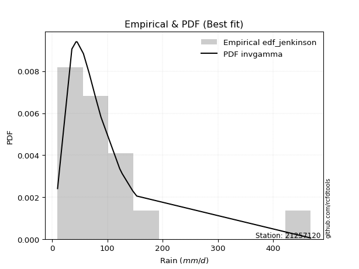</img>

</div>


### 11. EDF Cunnane (1978)

Cunnane´s work in statistical hydrology has focused on the performance and evaluation of different probability distributions (such as GEV, Gumbel, Lognormal) for flood frequency estimation. _b_ is a constant, typically set to 0.4.

<div align="center">


$P=(m-b)/(n+1-2b)$


</div>


**11.1. Empirical values**

<div align="center">

|                | 0                    | 1                   | 2                   | 3                  | 4                  | 5                  | 6                  | 7           | 8                  | 9                 | 10                 | 11                 | 12                 | 13                 | 14                 |
|:---------------|:---------------------|:--------------------|:--------------------|:-------------------|:-------------------|:-------------------|:-------------------|:------------|:-------------------|:------------------|:-------------------|:-------------------|:-------------------|:-------------------|:-------------------|
| date           | 2012                 | 2016                | 2018                | 2017               | 2019               | 2015               | 2008               | 2007        | 2005               | 2009              | 2014               | 2011               | 2010               | 2013               | 2006               |
| x              | 9.7                  | 35.6                | 43.1                | 43.7               | 45.0               | 45.2               | 66.7               | 78.1        | 88.0               | 88.4              | 122.2              | 126.7              | 145.8              | 153.0              | 467.9              |
| m              | 1                    | 2                   | 3                   | 4                  | 5                  | 6                  | 7                  | 8           | 9                  | 10                | 11                 | 12                 | 13                 | 14                 | 15                 |
| empirical_dist | edf_cunnane          | edf_cunnane         | edf_cunnane         | edf_cunnane        | edf_cunnane        | edf_cunnane        | edf_cunnane        | edf_cunnane | edf_cunnane        | edf_cunnane       | edf_cunnane        | edf_cunnane        | edf_cunnane        | edf_cunnane        | edf_cunnane        |
| empirical      | 0.039473684210526314 | 0.10526315789473685 | 0.17105263157894737 | 0.2368421052631579 | 0.3026315789473684 | 0.3684210526315789 | 0.4342105263157895 | 0.5         | 0.5657894736842105 | 0.631578947368421 | 0.6973684210526316 | 0.7631578947368421 | 0.8289473684210527 | 0.8947368421052632 | 0.9605263157894737 |
| empirical_tr   | 1.0410958904109588   | 1.1176470588235294  | 1.2063492063492063  | 1.310344827586207  | 1.4339622641509433 | 1.5833333333333335 | 1.7674418604651163 | 2.0         | 2.3030303030303028 | 2.714285714285714 | 3.304347826086957  | 4.222222222222223  | 5.846153846153847  | 9.5                | 25.333333333333325 |

</div>


**11.2. Kolmogorov-Smirnov fit test (sorted by Δ)**


<div align="center">

|                | 0                   | 1                   | 2                   | 3                   | 4                   | 5                   | 6                   | 7                   | 8                   | 9                   | 10                  | 11                  | 12                 | 13                  | 14                  | 15                  | 16                  | 17                  | 18                  | 19                  | 20                  | 21                  | 22                  | 23                 | 24                  | 25                  | 26                 | 27                  | 28                  | 29                  | 30                  | 31                  | 32                  | 33                  | 34                  | 35                  | 36                 | 37                 | 38                  | 39                 | 40                  | 41                  | 42                  | 43                  | 44                  | 45                 | 46                  | 47                  | 48                  | 49                    | 50                 | 51                 | 52                  | 53                  | 54                  | 55                  | 56                  | 57                  | 58                 | 59                 | 60                  | 61                  | 62                 | 63                 | 64                  | 65                  | 66                  | 67                  | 68                  | 69                  | 70                  | 71                 | 72                  | 73                  | 74                  | 75                  | 76                  | 77                 | 78                  | 79                 | 80                  | 81                 | 82                 | 83                 | 84                 | 85                 | 86                 | 87                 |
|:---------------|:--------------------|:--------------------|:--------------------|:--------------------|:--------------------|:--------------------|:--------------------|:--------------------|:--------------------|:--------------------|:--------------------|:--------------------|:-------------------|:--------------------|:--------------------|:--------------------|:--------------------|:--------------------|:--------------------|:--------------------|:--------------------|:--------------------|:--------------------|:-------------------|:--------------------|:--------------------|:-------------------|:--------------------|:--------------------|:--------------------|:--------------------|:--------------------|:--------------------|:--------------------|:--------------------|:--------------------|:-------------------|:-------------------|:--------------------|:-------------------|:--------------------|:--------------------|:--------------------|:--------------------|:--------------------|:-------------------|:--------------------|:--------------------|:--------------------|:----------------------|:-------------------|:-------------------|:--------------------|:--------------------|:--------------------|:--------------------|:--------------------|:--------------------|:-------------------|:-------------------|:--------------------|:--------------------|:-------------------|:-------------------|:--------------------|:--------------------|:--------------------|:--------------------|:--------------------|:--------------------|:--------------------|:-------------------|:--------------------|:--------------------|:--------------------|:--------------------|:--------------------|:-------------------|:--------------------|:-------------------|:--------------------|:-------------------|:-------------------|:-------------------|:-------------------|:-------------------|:-------------------|:-------------------|
| station        | 21257120            | 21257120            | 21257120            | 21257120            | 21257120            | 21257120            | 21257120            | 21257120            | 21257120            | 21257120            | 21257120            | 21257120            | 21257120           | 21257120            | 21257120            | 21257120            | 21257120            | 21257120            | 21257120            | 21257120            | 21257120            | 21257120            | 21257120            | 21257120           | 21257120            | 21257120            | 21257120           | 21257120            | 21257120            | 21257120            | 21257120            | 21257120            | 21257120            | 21257120            | 21257120            | 21257120            | 21257120           | 21257120           | 21257120            | 21257120           | 21257120            | 21257120            | 21257120            | 21257120            | 21257120            | 21257120           | 21257120            | 21257120            | 21257120            | 21257120              | 21257120           | 21257120           | 21257120            | 21257120            | 21257120            | 21257120            | 21257120            | 21257120            | 21257120           | 21257120           | 21257120            | 21257120            | 21257120           | 21257120           | 21257120            | 21257120            | 21257120            | 21257120            | 21257120            | 21257120            | 21257120            | 21257120           | 21257120            | 21257120            | 21257120            | 21257120            | 21257120            | 21257120           | 21257120            | 21257120           | 21257120            | 21257120           | 21257120           | 21257120           | 21257120           | 21257120           | 21257120           | 21257120           |
| empirical_dist | edf_cunnane         | edf_cunnane         | edf_cunnane         | edf_cunnane         | edf_cunnane         | edf_cunnane         | edf_cunnane         | edf_cunnane         | edf_cunnane         | edf_cunnane         | edf_cunnane         | edf_cunnane         | edf_cunnane        | edf_cunnane         | edf_cunnane         | edf_cunnane         | edf_cunnane         | edf_cunnane         | edf_cunnane         | edf_cunnane         | edf_cunnane         | edf_cunnane         | edf_cunnane         | edf_cunnane        | edf_cunnane         | edf_cunnane         | edf_cunnane        | edf_cunnane         | edf_cunnane         | edf_cunnane         | edf_cunnane         | edf_cunnane         | edf_cunnane         | edf_cunnane         | edf_cunnane         | edf_cunnane         | edf_cunnane        | edf_cunnane        | edf_cunnane         | edf_cunnane        | edf_cunnane         | edf_cunnane         | edf_cunnane         | edf_cunnane         | edf_cunnane         | edf_cunnane        | edf_cunnane         | edf_cunnane         | edf_cunnane         | edf_cunnane           | edf_cunnane        | edf_cunnane        | edf_cunnane         | edf_cunnane         | edf_cunnane         | edf_cunnane         | edf_cunnane         | edf_cunnane         | edf_cunnane        | edf_cunnane        | edf_cunnane         | edf_cunnane         | edf_cunnane        | edf_cunnane        | edf_cunnane         | edf_cunnane         | edf_cunnane         | edf_cunnane         | edf_cunnane         | edf_cunnane         | edf_cunnane         | edf_cunnane        | edf_cunnane         | edf_cunnane         | edf_cunnane         | edf_cunnane         | edf_cunnane         | edf_cunnane        | edf_cunnane         | edf_cunnane        | edf_cunnane         | edf_cunnane        | edf_cunnane        | edf_cunnane        | edf_cunnane        | edf_cunnane        | edf_cunnane        | edf_cunnane        |
| p_dist         | logpearson3         | logloggamma         | betaprime           | invgauss            | logf                | logexponnorm        | lognorm             | lognorm             | logcrystalball      | loglognorm          | logrice             | lognct              | logfatiguelife     | logbetaprime        | loggamma            | loggamma            | logerlang           | fatiguelife         | ncf                 | logncf              | genexpon            | loglogistic         | logweibull_min      | invgamma           | f                   | logalpha            | loginvgamma        | invweibull          | logmielke           | logfisk             | loggenlogistic      | fisk                | loggumbel_r         | loghypsecant        | logmaxwell          | logjohnsonsu        | logt               | wald               | nct                 | loginvgauss        | johnsonsu           | logmoyal            | exponnorm           | lograyleigh         | loggumbel_l         | lognakagami        | t                   | loggompertz         | expon               | loglaplace_asymmetric | logtruncnorm       | genlogistic        | loglaplace          | loghalflogistic     | gompertz            | gibrat              | loghalfnorm         | truncnorm           | loginvweibull      | gumbel_r           | moyal               | pearson3            | laplace_asymmetric | kstwobign          | rayleigh            | maxwell             | logistic            | logwald             | halflogistic        | logkstwobign        | erlang              | hypsecant          | halfnorm            | crystalball         | norm                | rice                | laplace             | loggibrat          | loggenexpon         | gumbel_l           | weibull_min         | alpha              | nakagami           | logexpon           | mielke             | logchi2            | chi2               | gamma              |
| delta          | 0.09076984418029048 | 0.09187074995003605 | 0.09531455546158324 | 0.09613494155493163 | 0.09622494619739633 | 0.09626248567690535 | 0.09626262756408707 | 0.09626262756408707 | 0.09626264689065697 | 0.09626415998347146 | 0.09626693317836002 | 0.09657247893863644 | 0.0966855396970667 | 0.09882806396328717 | 0.10025516995575925 | 0.10025516995575925 | 0.10131745073672618 | 0.10293591835066307 | 0.10377147708911105 | 0.10404110557380794 | 0.10410404296467068 | 0.10421819633802692 | 0.10449673114106849 | 0.1058986552276005 | 0.10591791729560951 | 0.10651218846064811 | 0.1068400541254663 | 0.11112672062845125 | 0.11253781483267306 | 0.11264496564408916 | 0.11302784256961979 | 0.11454072483843458 | 0.11686962560476341 | 0.11968839272973206 | 0.12030177070752443 | 0.12196455402067474 | 0.123850444708761  | 0.1241691631967253 | 0.12466017960049003 | 0.1265344063143606 | 0.12745683472200386 | 0.12861440120454204 | 0.12870584703918025 | 0.13007005324200696 | 0.13017325041226827 | 0.1308176978753086 | 0.13201375875659216 | 0.13460360158165285 | 0.13503574831888882 | 0.13886698124385735   | 0.1399760906520255 | 0.1428143902150958 | 0.14344058566930837 | 0.14746990912309763 | 0.15433005424047053 | 0.15705184611706507 | 0.15708225140662266 | 0.15741611355299823 | 0.1596970685585933 | 0.1711580973335583 | 0.17225286706277998 | 0.17293865893839208 | 0.1744577230515671 | 0.1850028424450758 | 0.19222330025518775 | 0.19768008913011903 | 0.19780471929024535 | 0.19892311489311054 | 0.19999833913578358 | 0.20036744659616298 | 0.20203334009334034 | 0.2043914702897751 | 0.21177568778086558 | 0.21613131080782022 | 0.21613131304901578 | 0.22213571214921185 | 0.22537990004400782 | 0.2264713364758043 | 0.22872021946994556 | 0.2596905737635109 | 0.26989921977102016 | 0.2787959959850522 | 0.2793501535509839 | 0.369969585269331  | 0.3797319097002643 | 0.590081338991453  | 0.8900570634094304 | 0.8945015481924629 |
| deltao         | 0.3366456264050002  | 0.3366456264050002  | 0.3366456264050002  | 0.3366456264050002  | 0.3366456264050002  | 0.3366456264050002  | 0.3366456264050002  | 0.3366456264050002  | 0.3366456264050002  | 0.3366456264050002  | 0.3366456264050002  | 0.3366456264050002  | 0.3366456264050002 | 0.3366456264050002  | 0.3366456264050002  | 0.3366456264050002  | 0.3366456264050002  | 0.3366456264050002  | 0.3366456264050002  | 0.3366456264050002  | 0.3366456264050002  | 0.3366456264050002  | 0.3366456264050002  | 0.3366456264050002 | 0.3366456264050002  | 0.3366456264050002  | 0.3366456264050002 | 0.3366456264050002  | 0.3366456264050002  | 0.3366456264050002  | 0.3366456264050002  | 0.3366456264050002  | 0.3366456264050002  | 0.3366456264050002  | 0.3366456264050002  | 0.3366456264050002  | 0.3366456264050002 | 0.3366456264050002 | 0.3366456264050002  | 0.3366456264050002 | 0.3366456264050002  | 0.3366456264050002  | 0.3366456264050002  | 0.3366456264050002  | 0.3366456264050002  | 0.3366456264050002 | 0.3366456264050002  | 0.3366456264050002  | 0.3366456264050002  | 0.3366456264050002    | 0.3366456264050002 | 0.3366456264050002 | 0.3366456264050002  | 0.3366456264050002  | 0.3366456264050002  | 0.3366456264050002  | 0.3366456264050002  | 0.3366456264050002  | 0.3366456264050002 | 0.3366456264050002 | 0.3366456264050002  | 0.3366456264050002  | 0.3366456264050002 | 0.3366456264050002 | 0.3366456264050002  | 0.3366456264050002  | 0.3366456264050002  | 0.3366456264050002  | 0.3366456264050002  | 0.3366456264050002  | 0.3366456264050002  | 0.3366456264050002 | 0.3366456264050002  | 0.3366456264050002  | 0.3366456264050002  | 0.3366456264050002  | 0.3366456264050002  | 0.3366456264050002 | 0.3366456264050002  | 0.3366456264050002 | 0.3366456264050002  | 0.3366456264050002 | 0.3366456264050002 | 0.3366456264050002 | 0.3366456264050002 | 0.3366456264050002 | 0.3366456264050002 | 0.3366456264050002 |
| eval           | Δo > Δ              | Δo > Δ              | Δo > Δ              | Δo > Δ              | Δo > Δ              | Δo > Δ              | Δo > Δ              | Δo > Δ              | Δo > Δ              | Δo > Δ              | Δo > Δ              | Δo > Δ              | Δo > Δ             | Δo > Δ              | Δo > Δ              | Δo > Δ              | Δo > Δ              | Δo > Δ              | Δo > Δ              | Δo > Δ              | Δo > Δ              | Δo > Δ              | Δo > Δ              | Δo > Δ             | Δo > Δ              | Δo > Δ              | Δo > Δ             | Δo > Δ              | Δo > Δ              | Δo > Δ              | Δo > Δ              | Δo > Δ              | Δo > Δ              | Δo > Δ              | Δo > Δ              | Δo > Δ              | Δo > Δ             | Δo > Δ             | Δo > Δ              | Δo > Δ             | Δo > Δ              | Δo > Δ              | Δo > Δ              | Δo > Δ              | Δo > Δ              | Δo > Δ             | Δo > Δ              | Δo > Δ              | Δo > Δ              | Δo > Δ                | Δo > Δ             | Δo > Δ             | Δo > Δ              | Δo > Δ              | Δo > Δ              | Δo > Δ              | Δo > Δ              | Δo > Δ              | Δo > Δ             | Δo > Δ             | Δo > Δ              | Δo > Δ              | Δo > Δ             | Δo > Δ             | Δo > Δ              | Δo > Δ              | Δo > Δ              | Δo > Δ              | Δo > Δ              | Δo > Δ              | Δo > Δ              | Δo > Δ             | Δo > Δ              | Δo > Δ              | Δo > Δ              | Δo > Δ              | Δo > Δ              | Δo > Δ             | Δo > Δ              | Δo > Δ             | Δo > Δ              | Δo > Δ             | Δo > Δ             | Δo <= Δ            | Δo <= Δ            | Δo <= Δ            | Δo <= Δ            | Δo <= Δ            |
| fit            | 1                   | 1                   | 1                   | 1                   | 1                   | 1                   | 1                   | 1                   | 1                   | 1                   | 1                   | 1                   | 1                  | 1                   | 1                   | 1                   | 1                   | 1                   | 1                   | 1                   | 1                   | 1                   | 1                   | 1                  | 1                   | 1                   | 1                  | 1                   | 1                   | 1                   | 1                   | 1                   | 1                   | 1                   | 1                   | 1                   | 1                  | 1                  | 1                   | 1                  | 1                   | 1                   | 1                   | 1                   | 1                   | 1                  | 1                   | 1                   | 1                   | 1                     | 1                  | 1                  | 1                   | 1                   | 1                   | 1                   | 1                   | 1                   | 1                  | 1                  | 1                   | 1                   | 1                  | 1                  | 1                   | 1                   | 1                   | 1                   | 1                   | 1                   | 1                   | 1                  | 1                   | 1                   | 1                   | 1                   | 1                   | 1                  | 1                   | 1                  | 1                   | 1                  | 1                  | 0                  | 0                  | 0                  | 0                  | 0                  |
| n              | 15                  | 15                  | 15                  | 15                  | 15                  | 15                  | 15                  | 15                  | 15                  | 15                  | 15                  | 15                  | 15                 | 15                  | 15                  | 15                  | 15                  | 15                  | 15                  | 15                  | 15                  | 15                  | 15                  | 15                 | 15                  | 15                  | 15                 | 15                  | 15                  | 15                  | 15                  | 15                  | 15                  | 15                  | 15                  | 15                  | 15                 | 15                 | 15                  | 15                 | 15                  | 15                  | 15                  | 15                  | 15                  | 15                 | 15                  | 15                  | 15                  | 15                    | 15                 | 15                 | 15                  | 15                  | 15                  | 15                  | 15                  | 15                  | 15                 | 15                 | 15                  | 15                  | 15                 | 15                 | 15                  | 15                  | 15                  | 15                  | 15                  | 15                  | 15                  | 15                 | 15                  | 15                  | 15                  | 15                  | 15                  | 15                 | 15                  | 15                 | 15                  | 15                 | 15                 | 15                 | 15                 | 15                 | 15                 | 15                 |
| best_fit       | 1                   | 0                   | 0                   | 0                   | 0                   | 0                   | 0                   | 0                   | 0                   | 0                   | 0                   | 0                   | 0                  | 0                   | 0                   | 0                   | 0                   | 0                   | 0                   | 0                   | 0                   | 0                   | 0                   | 0                  | 0                   | 0                   | 0                  | 0                   | 0                   | 0                   | 0                   | 0                   | 0                   | 0                   | 0                   | 0                   | 0                  | 0                  | 0                   | 0                  | 0                   | 0                   | 0                   | 0                   | 0                   | 0                  | 0                   | 0                   | 0                   | 0                     | 0                  | 0                  | 0                   | 0                   | 0                   | 0                   | 0                   | 0                   | 0                  | 0                  | 0                   | 0                   | 0                  | 0                  | 0                   | 0                   | 0                   | 0                   | 0                   | 0                   | 0                   | 0                  | 0                   | 0                   | 0                   | 0                   | 0                   | 0                  | 0                   | 0                  | 0                   | 0                  | 0                  | 0                  | 0                  | 0                  | 0                  | 0                  |
| best_fit_sort  | 1                   | 2                   | 3                   | 4                   | 5                   | 6                   | 7                   | 8                   | 9                   | 10                  | 11                  | 12                  | 13                 | 14                  | 15                  | 16                  | 17                  | 18                  | 19                  | 20                  | 21                  | 22                  | 23                  | 24                 | 25                  | 26                  | 27                 | 28                  | 29                  | 30                  | 31                  | 32                  | 33                  | 34                  | 35                  | 36                  | 37                 | 38                 | 39                  | 40                 | 41                  | 42                  | 43                  | 44                  | 45                  | 46                 | 47                  | 48                  | 49                  | 50                    | 51                 | 52                 | 53                  | 54                  | 55                  | 56                  | 57                  | 58                  | 59                 | 60                 | 61                  | 62                  | 63                 | 64                 | 65                  | 66                  | 67                  | 68                  | 69                  | 70                  | 71                  | 72                 | 73                  | 74                  | 75                  | 76                  | 77                  | 78                 | 79                  | 80                 | 81                  | 82                 | 83                 | 84                 | 85                 | 86                 | 87                 | 88                 |

</div>


**11.3. Best fit**

<div align="center">

|   id |   station | empirical_dist   | p_dist      |     delta |   deltao | eval   |   fit |   n |   best_fit |   best_fit_sort |
|-----:|----------:|:-----------------|:------------|----------:|---------:|:-------|------:|----:|-----------:|----------------:|
|    0 |  21257120 | edf_cunnane      | logpearson3 | 0.0907698 | 0.336646 | Δo > Δ |     1 |  15 |          1 |               1 |

</div>


<div align="center">

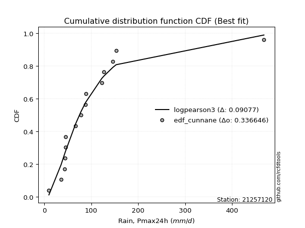</img></img>

</div>


### 12. EDF Adamowski (1981)

The Adamowski formula in hydrology refers to a specific plotting position formula used for estimating the non-parametric empirical distribution of hydrological events (like flood peaks) to calculate their return periods. This formula provides an alternative to traditional parametric methods (like the Gumbel or Log Pearson Type III distributions). 

<div align="center">


$P=(m-0.25)/(n+0.5)$


</div>


**12.1. Empirical values**

<div align="center">

|                | 0                   | 1                   | 2                  | 3                   | 4                  | 5                  | 6                   | 7             | 8                  | 9                  | 10                 | 11                 | 12                 | 13                 | 14                 |
|:---------------|:--------------------|:--------------------|:-------------------|:--------------------|:-------------------|:-------------------|:--------------------|:--------------|:-------------------|:-------------------|:-------------------|:-------------------|:-------------------|:-------------------|:-------------------|
| date           | 2012                | 2016                | 2018               | 2017                | 2019               | 2015               | 2008                | 2007          | 2005               | 2009               | 2014               | 2011               | 2010               | 2013               | 2006               |
| x              | 9.7                 | 35.6                | 43.1               | 43.7                | 45.0               | 45.2               | 66.7                | 78.1          | 88.0               | 88.4               | 122.2              | 126.7              | 145.8              | 153.0              | 467.9              |
| m              | 1                   | 2                   | 3                  | 4                   | 5                  | 6                  | 7                   | 8             | 9                  | 10                 | 11                 | 12                 | 13                 | 14                 | 15                 |
| empirical_dist | edf_adamowski       | edf_adamowski       | edf_adamowski      | edf_adamowski       | edf_adamowski      | edf_adamowski      | edf_adamowski       | edf_adamowski | edf_adamowski      | edf_adamowski      | edf_adamowski      | edf_adamowski      | edf_adamowski      | edf_adamowski      | edf_adamowski      |
| empirical      | 0.04838709677419355 | 0.11290322580645161 | 0.1774193548387097 | 0.24193548387096775 | 0.3064516129032258 | 0.3709677419354839 | 0.43548387096774194 | 0.5           | 0.5645161290322581 | 0.6290322580645161 | 0.6935483870967742 | 0.7580645161290323 | 0.8225806451612904 | 0.8870967741935484 | 0.9516129032258065 |
| empirical_tr   | 1.0508474576271185  | 1.1272727272727272  | 1.215686274509804  | 1.3191489361702127  | 1.441860465116279  | 1.5897435897435896 | 1.7714285714285716  | 2.0           | 2.2962962962962967 | 2.6956521739130435 | 3.2631578947368425 | 4.133333333333333  | 5.636363636363638  | 8.857142857142856  | 20.666666666666686 |

</div>


**12.2. Kolmogorov-Smirnov fit test (sorted by Δ)**


<div align="center">

|                | 0                   | 1                   | 2                   | 3                   | 4                   | 5                   | 6                   | 7                  | 8                   | 9                   | 10                  | 11                  | 12                  | 13                  | 14                  | 15                 | 16                  | 17                  | 18                  | 19                  | 20                 | 21                 | 22                  | 23                 | 24                  | 25                  | 26                  | 27                 | 28                 | 29                  | 30                 | 31                 | 32                  | 33                  | 34                  | 35                 | 36                 | 37                  | 38                  | 39                  | 40                  | 41                  | 42                  | 43                  | 44                 | 45                 | 46                 | 47                  | 48                  | 49                 | 50                    | 51                  | 52                  | 53                  | 54                  | 55                  | 56                  | 57                 | 58                  | 59                 | 60                 | 61                  | 62                  | 63                  | 64                  | 65                  | 66                 | 67                  | 68                  | 69                  | 70                  | 71                  | 72                 | 73                  | 74                 | 75                  | 76                  | 77                  | 78                 | 79                 | 80                 | 81                 | 82                  | 83                 | 84                  | 85                 | 86                 | 87                 |
|:---------------|:--------------------|:--------------------|:--------------------|:--------------------|:--------------------|:--------------------|:--------------------|:-------------------|:--------------------|:--------------------|:--------------------|:--------------------|:--------------------|:--------------------|:--------------------|:-------------------|:--------------------|:--------------------|:--------------------|:--------------------|:-------------------|:-------------------|:--------------------|:-------------------|:--------------------|:--------------------|:--------------------|:-------------------|:-------------------|:--------------------|:-------------------|:-------------------|:--------------------|:--------------------|:--------------------|:-------------------|:-------------------|:--------------------|:--------------------|:--------------------|:--------------------|:--------------------|:--------------------|:--------------------|:-------------------|:-------------------|:-------------------|:--------------------|:--------------------|:-------------------|:----------------------|:--------------------|:--------------------|:--------------------|:--------------------|:--------------------|:--------------------|:-------------------|:--------------------|:-------------------|:-------------------|:--------------------|:--------------------|:--------------------|:--------------------|:--------------------|:-------------------|:--------------------|:--------------------|:--------------------|:--------------------|:--------------------|:-------------------|:--------------------|:-------------------|:--------------------|:--------------------|:--------------------|:-------------------|:-------------------|:-------------------|:-------------------|:--------------------|:-------------------|:--------------------|:-------------------|:-------------------|:-------------------|
| station        | 21257120            | 21257120            | 21257120            | 21257120            | 21257120            | 21257120            | 21257120            | 21257120           | 21257120            | 21257120            | 21257120            | 21257120            | 21257120            | 21257120            | 21257120            | 21257120           | 21257120            | 21257120            | 21257120            | 21257120            | 21257120           | 21257120           | 21257120            | 21257120           | 21257120            | 21257120            | 21257120            | 21257120           | 21257120           | 21257120            | 21257120           | 21257120           | 21257120            | 21257120            | 21257120            | 21257120           | 21257120           | 21257120            | 21257120            | 21257120            | 21257120            | 21257120            | 21257120            | 21257120            | 21257120           | 21257120           | 21257120           | 21257120            | 21257120            | 21257120           | 21257120              | 21257120            | 21257120            | 21257120            | 21257120            | 21257120            | 21257120            | 21257120           | 21257120            | 21257120           | 21257120           | 21257120            | 21257120            | 21257120            | 21257120            | 21257120            | 21257120           | 21257120            | 21257120            | 21257120            | 21257120            | 21257120            | 21257120           | 21257120            | 21257120           | 21257120            | 21257120            | 21257120            | 21257120           | 21257120           | 21257120           | 21257120           | 21257120            | 21257120           | 21257120            | 21257120           | 21257120           | 21257120           |
| empirical_dist | edf_adamowski       | edf_adamowski       | edf_adamowski       | edf_adamowski       | edf_adamowski       | edf_adamowski       | edf_adamowski       | edf_adamowski      | edf_adamowski       | edf_adamowski       | edf_adamowski       | edf_adamowski       | edf_adamowski       | edf_adamowski       | edf_adamowski       | edf_adamowski      | edf_adamowski       | edf_adamowski       | edf_adamowski       | edf_adamowski       | edf_adamowski      | edf_adamowski      | edf_adamowski       | edf_adamowski      | edf_adamowski       | edf_adamowski       | edf_adamowski       | edf_adamowski      | edf_adamowski      | edf_adamowski       | edf_adamowski      | edf_adamowski      | edf_adamowski       | edf_adamowski       | edf_adamowski       | edf_adamowski      | edf_adamowski      | edf_adamowski       | edf_adamowski       | edf_adamowski       | edf_adamowski       | edf_adamowski       | edf_adamowski       | edf_adamowski       | edf_adamowski      | edf_adamowski      | edf_adamowski      | edf_adamowski       | edf_adamowski       | edf_adamowski      | edf_adamowski         | edf_adamowski       | edf_adamowski       | edf_adamowski       | edf_adamowski       | edf_adamowski       | edf_adamowski       | edf_adamowski      | edf_adamowski       | edf_adamowski      | edf_adamowski      | edf_adamowski       | edf_adamowski       | edf_adamowski       | edf_adamowski       | edf_adamowski       | edf_adamowski      | edf_adamowski       | edf_adamowski       | edf_adamowski       | edf_adamowski       | edf_adamowski       | edf_adamowski      | edf_adamowski       | edf_adamowski      | edf_adamowski       | edf_adamowski       | edf_adamowski       | edf_adamowski      | edf_adamowski      | edf_adamowski      | edf_adamowski      | edf_adamowski       | edf_adamowski      | edf_adamowski       | edf_adamowski      | edf_adamowski      | edf_adamowski      |
| p_dist         | logloggamma         | logf                | logexponnorm        | lognorm             | lognorm             | logcrystalball      | loglognorm          | logrice            | lognct              | logfatiguelife      | logpearson3         | logbetaprime        | loggamma            | loggamma            | logerlang           | genexpon           | logweibull_min      | invgauss            | logncf              | betaprime           | fatiguelife        | logalpha           | loginvgamma         | ncf                | loglogistic         | invgamma            | f                   | loggumbel_r        | invweibull         | logmaxwell          | logmielke          | logfisk            | loggenlogistic      | fisk                | wald                | loginvgauss        | loghypsecant       | lograyleigh         | logjohnsonsu        | logt                | loggompertz         | nct                 | expon               | logmoyal            | johnsonsu          | exponnorm          | loggumbel_l        | lognakagami         | t                   | loghalflogistic    | loglaplace_asymmetric | logtruncnorm        | genlogistic         | loglaplace          | gompertz            | truncnorm           | loghalfnorm         | loginvweibull      | gibrat              | gumbel_r           | moyal              | pearson3            | laplace_asymmetric  | kstwobign           | rayleigh            | maxwell             | halflogistic       | logkstwobign        | erlang              | logistic            | logwald             | hypsecant           | halfnorm           | crystalball         | norm               | rice                | loggenexpon         | laplace             | loggibrat          | gumbel_l           | weibull_min        | nakagami           | alpha               | logexpon           | mielke              | logchi2            | chi2               | gamma              |
| delta          | 0.08979350780012668 | 0.08985822293763401 | 0.08989576241714303 | 0.08989590430432476 | 0.08989590430432476 | 0.08989592363089466 | 0.08989743672370915 | 0.0899002099185977 | 0.09020575567887412 | 0.09031881643730438 | 0.09152761334910875 | 0.09246134070352485 | 0.09388844669599694 | 0.09388844669599694 | 0.09495072747696387 | 0.0964639750529559 | 0.09685666322935373 | 0.09689082220586742 | 0.09767438231404563 | 0.09786124476548819 | 0.0984458796258576 | 0.1001454652008858 | 0.10047333086570398 | 0.106318166393016  | 0.10676488564193187 | 0.10844534453150545 | 0.10846460659951446 | 0.1105029023450011 | 0.1136734099323562 | 0.11393504744776212 | 0.115084504136578  | 0.1151916549479941 | 0.11557453187352473 | 0.11708741414233953 | 0.11780243993696299 | 0.1201676830545983 | 0.122235082033637  | 0.12370332998224465 | 0.12451124332457969 | 0.12639713401266595 | 0.12696353366993807 | 0.12720686890439498 | 0.12739568040717403 | 0.12861440120454204 | 0.1300035240259088 | 0.1312525363430852 | 0.1327199397161732 | 0.13336438717921353 | 0.13583379271244955 | 0.1411031858633353 | 0.1414136705477623    | 0.14252277995593043 | 0.14536107951900074 | 0.14598727497321332 | 0.14668998632875574 | 0.14977604564128344 | 0.15071552814686034 | 0.153330345298831  | 0.15959853542097002 | 0.1635180294218435 | 0.1646127991510652 | 0.16657193567862977 | 0.17700441235547204 | 0.18245615314117092 | 0.18458323234347296 | 0.19004002121840424 | 0.1923582712240688 | 0.19400072333640067 | 0.19439327218162555 | 0.19525802998634045 | 0.19892311489311054 | 0.20184478098587022 | 0.2041356198691508 | 0.20849124289610543 | 0.208491245137301  | 0.21958902284530696 | 0.22235349621018324 | 0.22283321074010293 | 0.2264713364758043 | 0.257143884459606  | 0.2635324965112578 | 0.2717100856392691 | 0.27242927272528994 | 0.3623295173576162 | 0.37209184178854954 | 0.5824412710797382 | 0.8824169954977156 | 0.8868614802807481 |
| deltao         | 0.3366456264050002  | 0.3366456264050002  | 0.3366456264050002  | 0.3366456264050002  | 0.3366456264050002  | 0.3366456264050002  | 0.3366456264050002  | 0.3366456264050002 | 0.3366456264050002  | 0.3366456264050002  | 0.3366456264050002  | 0.3366456264050002  | 0.3366456264050002  | 0.3366456264050002  | 0.3366456264050002  | 0.3366456264050002 | 0.3366456264050002  | 0.3366456264050002  | 0.3366456264050002  | 0.3366456264050002  | 0.3366456264050002 | 0.3366456264050002 | 0.3366456264050002  | 0.3366456264050002 | 0.3366456264050002  | 0.3366456264050002  | 0.3366456264050002  | 0.3366456264050002 | 0.3366456264050002 | 0.3366456264050002  | 0.3366456264050002 | 0.3366456264050002 | 0.3366456264050002  | 0.3366456264050002  | 0.3366456264050002  | 0.3366456264050002 | 0.3366456264050002 | 0.3366456264050002  | 0.3366456264050002  | 0.3366456264050002  | 0.3366456264050002  | 0.3366456264050002  | 0.3366456264050002  | 0.3366456264050002  | 0.3366456264050002 | 0.3366456264050002 | 0.3366456264050002 | 0.3366456264050002  | 0.3366456264050002  | 0.3366456264050002 | 0.3366456264050002    | 0.3366456264050002  | 0.3366456264050002  | 0.3366456264050002  | 0.3366456264050002  | 0.3366456264050002  | 0.3366456264050002  | 0.3366456264050002 | 0.3366456264050002  | 0.3366456264050002 | 0.3366456264050002 | 0.3366456264050002  | 0.3366456264050002  | 0.3366456264050002  | 0.3366456264050002  | 0.3366456264050002  | 0.3366456264050002 | 0.3366456264050002  | 0.3366456264050002  | 0.3366456264050002  | 0.3366456264050002  | 0.3366456264050002  | 0.3366456264050002 | 0.3366456264050002  | 0.3366456264050002 | 0.3366456264050002  | 0.3366456264050002  | 0.3366456264050002  | 0.3366456264050002 | 0.3366456264050002 | 0.3366456264050002 | 0.3366456264050002 | 0.3366456264050002  | 0.3366456264050002 | 0.3366456264050002  | 0.3366456264050002 | 0.3366456264050002 | 0.3366456264050002 |
| eval           | Δo > Δ              | Δo > Δ              | Δo > Δ              | Δo > Δ              | Δo > Δ              | Δo > Δ              | Δo > Δ              | Δo > Δ             | Δo > Δ              | Δo > Δ              | Δo > Δ              | Δo > Δ              | Δo > Δ              | Δo > Δ              | Δo > Δ              | Δo > Δ             | Δo > Δ              | Δo > Δ              | Δo > Δ              | Δo > Δ              | Δo > Δ             | Δo > Δ             | Δo > Δ              | Δo > Δ             | Δo > Δ              | Δo > Δ              | Δo > Δ              | Δo > Δ             | Δo > Δ             | Δo > Δ              | Δo > Δ             | Δo > Δ             | Δo > Δ              | Δo > Δ              | Δo > Δ              | Δo > Δ             | Δo > Δ             | Δo > Δ              | Δo > Δ              | Δo > Δ              | Δo > Δ              | Δo > Δ              | Δo > Δ              | Δo > Δ              | Δo > Δ             | Δo > Δ             | Δo > Δ             | Δo > Δ              | Δo > Δ              | Δo > Δ             | Δo > Δ                | Δo > Δ              | Δo > Δ              | Δo > Δ              | Δo > Δ              | Δo > Δ              | Δo > Δ              | Δo > Δ             | Δo > Δ              | Δo > Δ             | Δo > Δ             | Δo > Δ              | Δo > Δ              | Δo > Δ              | Δo > Δ              | Δo > Δ              | Δo > Δ             | Δo > Δ              | Δo > Δ              | Δo > Δ              | Δo > Δ              | Δo > Δ              | Δo > Δ             | Δo > Δ              | Δo > Δ             | Δo > Δ              | Δo > Δ              | Δo > Δ              | Δo > Δ             | Δo > Δ             | Δo > Δ             | Δo > Δ             | Δo > Δ              | Δo <= Δ            | Δo <= Δ             | Δo <= Δ            | Δo <= Δ            | Δo <= Δ            |
| fit            | 1                   | 1                   | 1                   | 1                   | 1                   | 1                   | 1                   | 1                  | 1                   | 1                   | 1                   | 1                   | 1                   | 1                   | 1                   | 1                  | 1                   | 1                   | 1                   | 1                   | 1                  | 1                  | 1                   | 1                  | 1                   | 1                   | 1                   | 1                  | 1                  | 1                   | 1                  | 1                  | 1                   | 1                   | 1                   | 1                  | 1                  | 1                   | 1                   | 1                   | 1                   | 1                   | 1                   | 1                   | 1                  | 1                  | 1                  | 1                   | 1                   | 1                  | 1                     | 1                   | 1                   | 1                   | 1                   | 1                   | 1                   | 1                  | 1                   | 1                  | 1                  | 1                   | 1                   | 1                   | 1                   | 1                   | 1                  | 1                   | 1                   | 1                   | 1                   | 1                   | 1                  | 1                   | 1                  | 1                   | 1                   | 1                   | 1                  | 1                  | 1                  | 1                  | 1                   | 0                  | 0                   | 0                  | 0                  | 0                  |
| n              | 15                  | 15                  | 15                  | 15                  | 15                  | 15                  | 15                  | 15                 | 15                  | 15                  | 15                  | 15                  | 15                  | 15                  | 15                  | 15                 | 15                  | 15                  | 15                  | 15                  | 15                 | 15                 | 15                  | 15                 | 15                  | 15                  | 15                  | 15                 | 15                 | 15                  | 15                 | 15                 | 15                  | 15                  | 15                  | 15                 | 15                 | 15                  | 15                  | 15                  | 15                  | 15                  | 15                  | 15                  | 15                 | 15                 | 15                 | 15                  | 15                  | 15                 | 15                    | 15                  | 15                  | 15                  | 15                  | 15                  | 15                  | 15                 | 15                  | 15                 | 15                 | 15                  | 15                  | 15                  | 15                  | 15                  | 15                 | 15                  | 15                  | 15                  | 15                  | 15                  | 15                 | 15                  | 15                 | 15                  | 15                  | 15                  | 15                 | 15                 | 15                 | 15                 | 15                  | 15                 | 15                  | 15                 | 15                 | 15                 |
| best_fit       | 1                   | 0                   | 0                   | 0                   | 0                   | 0                   | 0                   | 0                  | 0                   | 0                   | 0                   | 0                   | 0                   | 0                   | 0                   | 0                  | 0                   | 0                   | 0                   | 0                   | 0                  | 0                  | 0                   | 0                  | 0                   | 0                   | 0                   | 0                  | 0                  | 0                   | 0                  | 0                  | 0                   | 0                   | 0                   | 0                  | 0                  | 0                   | 0                   | 0                   | 0                   | 0                   | 0                   | 0                   | 0                  | 0                  | 0                  | 0                   | 0                   | 0                  | 0                     | 0                   | 0                   | 0                   | 0                   | 0                   | 0                   | 0                  | 0                   | 0                  | 0                  | 0                   | 0                   | 0                   | 0                   | 0                   | 0                  | 0                   | 0                   | 0                   | 0                   | 0                   | 0                  | 0                   | 0                  | 0                   | 0                   | 0                   | 0                  | 0                  | 0                  | 0                  | 0                   | 0                  | 0                   | 0                  | 0                  | 0                  |
| best_fit_sort  | 1                   | 2                   | 3                   | 4                   | 5                   | 6                   | 7                   | 8                  | 9                   | 10                  | 11                  | 12                  | 13                  | 14                  | 15                  | 16                 | 17                  | 18                  | 19                  | 20                  | 21                 | 22                 | 23                  | 24                 | 25                  | 26                  | 27                  | 28                 | 29                 | 30                  | 31                 | 32                 | 33                  | 34                  | 35                  | 36                 | 37                 | 38                  | 39                  | 40                  | 41                  | 42                  | 43                  | 44                  | 45                 | 46                 | 47                 | 48                  | 49                  | 50                 | 51                    | 52                  | 53                  | 54                  | 55                  | 56                  | 57                  | 58                 | 59                  | 60                 | 61                 | 62                  | 63                  | 64                  | 65                  | 66                  | 67                 | 68                  | 69                  | 70                  | 71                  | 72                  | 73                 | 74                  | 75                 | 76                  | 77                  | 78                  | 79                 | 80                 | 81                 | 82                 | 83                  | 84                 | 85                  | 86                 | 87                 | 88                 |

</div>


**12.3. Best fit**

<div align="center">

|   id |   station | empirical_dist   | p_dist      |     delta |   deltao | eval   |   fit |   n |   best_fit |   best_fit_sort |
|-----:|----------:|:-----------------|:------------|----------:|---------:|:-------|------:|----:|-----------:|----------------:|
|    0 |  21257120 | edf_adamowski    | logloggamma | 0.0897935 | 0.336646 | Δo > Δ |     1 |  15 |          1 |               1 |

</div>


<div align="center">

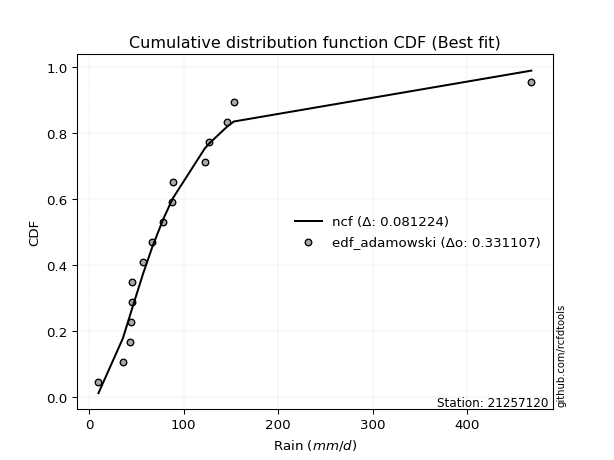</img>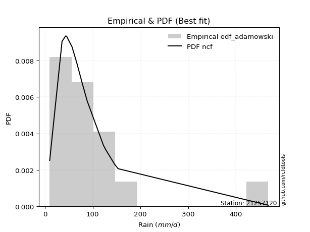</img>

</div>


## C. Best fit & Estimate extreme values for specific return periods - Tr

Best fit in probability distribution analysis means finding the theoretical distribution (like Normal, Poisson, Exponential) that most accurately mirrors your real-world data´s patterns (shape, center, spread) for better predictions, using methods like visual checks (Q-Q plots), goodness-of-fit tests (Kolmogorov-Smirnov, Chi-Squared), and information criteria (AIC) to score and select the simplest, most representative model.


### 1. Best fit (ordered by delta Δ)

<div align="center">

|   id |   station | empirical_dist   | p_dist      |     delta |   deltao | eval   |   fit |   n |   best_fit |   best_fit_sort |
|-----:|----------:|:-----------------|:------------|----------:|---------:|:-------|------:|----:|-----------:|----------------:|
|    0 |  21257120 | edf_weibull      | loggamma    | 0.0845377 | 0.336646 | Δo > Δ |     1 |  15 |          1 |               1 |
|    1 |  21257120 | edf_weibull      | loggamma    | 0.0845377 | 0.336646 | Δo > Δ |     1 |  15 |          1 |               2 |
|    2 |  21257120 | edf_filliben     | logloggamma | 0.0886598 | 0.336646 | Δo > Δ |     1 |  15 |          1 |               3 |
|    3 |  21257120 | edf_jenkinson    | logloggamma | 0.0887868 | 0.336646 | Δo > Δ |     1 |  15 |          1 |               4 |
|    4 |  21257120 | edf_beard        | logloggamma | 0.0887868 | 0.336646 | Δo > Δ |     1 |  15 |          1 |               5 |
|    5 |  21257120 | edf_chegodayev   | logloggamma | 0.0889556 | 0.336646 | Δo > Δ |     1 |  15 |          1 |               6 |
|    6 |  21257120 | edf_tukey        | logloggamma | 0.0890103 | 0.336646 | Δo > Δ |     1 |  15 |          1 |               7 |
|    7 |  21257120 | edf_blom         | logpearson3 | 0.0894756 | 0.336646 | Δo > Δ |     1 |  15 |          1 |               8 |
|    8 |  21257120 | edf_adamowski    | logloggamma | 0.0897935 | 0.336646 | Δo > Δ |     1 |  15 |          1 |               9 |
|    9 |  21257120 | edf_cunnane      | logpearson3 | 0.0907698 | 0.336646 | Δo > Δ |     1 |  15 |          1 |              10 |
|   10 |  21257120 | edf_gringorten   | logpearson3 | 0.0928584 | 0.336646 | Δo > Δ |     1 |  15 |          1 |              11 |
|   11 |  21257120 | edf_hazen        | betaprime   | 0.0935602 | 0.336646 | Δo > Δ |     1 |  15 |          1 |              12 |
|   12 |  21257120 | edf_california   | logmoyal    | 0.0952811 | 0.336646 | Δo > Δ |     1 |  15 |          1 |              13 |

</div>

:file_folder:Tables: [bestfit_21257120.csv](table/bestfit_21257120.csv) | [extreme_21257120.csv](table/extreme_21257120.csv)


### 2. Extreme values

In hydrology, a return period (or recurrence interval $Tr$) is the statistical average time between extreme events like floods or droughts of a specific magnitude, indicating how rare an event is, with a 100-year flood, for example, having a 1% chance of occurring in any given year, not that it happens exactly every century. It is a key tool for infrastructure design (like bridges or dams) and risk assessment, calculated from historical data to determine the probability of future events, although it is important to remember it is statistical average, and events can cluster or be missed.

> risk_rate: assuming the return period as the project useful life.

|   id |      tr |   prob_l |     prob_g |      alpha |   betaprime |     chi2 |   crystalball |   erlang |    expon |   exponnorm |         f |   fatiguelife |      fisk |    gamma |   genexpon |   genlogistic |    gibrat |   gompertz |   gumbel_l |   gumbel_r |   halflogistic |   halfnorm |   hypsecant |   invgamma |   invgauss |   invweibull |   johnsonsu |   kstwobign |   laplace |   laplace_asymmetric |   loggamma |   logistic |   lognorm |   maxwell |   mielke |    moyal |   nakagami |       ncf |       nct |    norm |   pearson3 |   rayleigh |    rice |         t |   truncnorm |     wald |   weibull_min |   logalpha |   logbetaprime |     logchi2 |   logcrystalball |   logerlang |         logexpon |   logexponnorm |     logf |   logfatiguelife |   logfisk |   loggenexpon |   loggenlogistic |   loggibrat |   loggompertz |   loggumbel_l |   loggumbel_r |   loghalflogistic |   loghalfnorm |   loghypsecant |   loginvgamma |   loginvgauss |   loginvweibull |   logjohnsonsu |   logkstwobign |   loglaplace |   loglaplace_asymmetric |   logloggamma |   loglogistic |   loglognorm |   logmaxwell |   logmielke |   logmoyal |   lognakagami |   logncf |    lognct |   logpearson3 |   lograyleigh |   logrice |      logt |   logtruncnorm |    logwald |   logweibull_min |   station |   n |   risk_rate |
|-----:|--------:|---------:|-----------:|-----------:|------------:|---------:|--------------:|---------:|---------:|------------:|----------:|--------------:|----------:|---------:|-----------:|--------------:|----------:|-----------:|-----------:|-----------:|---------------:|-----------:|------------:|-----------:|-----------:|-------------:|------------:|------------:|----------:|---------------------:|-----------:|-----------:|----------:|----------:|---------:|---------:|-----------:|----------:|----------:|--------:|-----------:|-----------:|--------:|----------:|------------:|---------:|--------------:|-----------:|---------------:|------------:|-----------------:|------------:|-----------------:|---------------:|---------:|-----------------:|----------:|--------------:|-----------------:|------------:|--------------:|--------------:|--------------:|------------------:|--------------:|---------------:|--------------:|--------------:|----------------:|---------------:|---------------:|-------------:|------------------------:|--------------:|--------------:|-------------:|-------------:|------------:|-----------:|--------------:|---------:|----------:|--------------:|--------------:|----------:|----------:|---------------:|-----------:|-----------------:|----------:|----:|------------:|
|    0 |    2    | 0.5      | 0.5        |    48.2975 |     74.1796 |  9.7384  |       103.94  |  66.4764 |  75.0222 |     79.9613 |   74.1896 |       77.5833 |   73.7781 |  9.70594 |     79.273 |       86.1522 |   72.189  |    83.3521 |    121.318 |    86.5624 |        77.9231 |    82.2874 |     103.94  |    74.1777 |    76.1058 |      73.9363 |     69.2199 |     98.5865 |   103.94  |              81.8442 |    72.0632 |    103.94  |   72.864  |   94.8932 |  37.4047 |  80.9523 |    111.302 |   74.2502 |   72.8219 | 103.94  |    64.8706 |    91.6846 | 107.74  |   72.4878 |     84.2445 |  69.6512 |       48.5969 |    70.4197 |        72.1928 |     17.878  |          72.864  |     72.0085 |     39.2454      |        72.864  |  72.8113 |          72.6527 |   73.5326 |       57.0815 |          74.0471 |     56.5293 |       75.0952 |       83.7228 |       63.4135 |           59.1818 |       61.282  |        72.864  |       70.6353 |       67.8141 |         65.8154 |        73.8974 |        61.0257 |      72.864  |                 79.5368 |       74.1252 |       72.864  |      72.8636 |      67.7804 |     74.0266 |    60.6325 |       69.472  |   71.695 |   72.8119 |       74.6644 |       66.0642 |   72.8633 |   73.7108 |        65.9487 |    55.3964 |          74.3727 |  21257120 |  15 |    0.75     |
|    1 |    2.33 | 0.570815 | 0.429185   |    57.4847 |     85.5961 |  9.80357 |       122.816 |  81.9357 |  89.4146 |     92.4877 |   85.0918 |       90.5521 |   83.8939 |  9.72003 |     92.559 |       97.509  |   81.7509 |    99.5794 |    137.74  |   104.053  |        95.9064 |   102.66   |     119.047 |    85.0798 |    88.605  |      84.4778 |     78.5395 |    112.895  |   115.363 |              93.5638 |    83.9315 |    120.571 |   84.7317 |  114.504  |  46.9558 |  97.5096 |    135.848 |   85.2696 |   82.4435 | 122.816 |    78.6052 |   111.586  | 123.519 |   80.5152 |    100.598  |  82.0285 |       59.8441 |    82.0461 |        84.011  |     21.8468 |          84.7317 |     83.9132 |     53.399       |        84.7318 |  84.6619 |          84.4668 |   83.7356 |       70.2604 |          84.1949 |     61.02   |       89.4846 |       95.4682 |       72.9299 |           68.3316 |       72.1213 |        82.2165 |       82.363  |       79.5006 |         79.7458 |        83.5103 |        75.0763 |      79.8308 |                 87.5645 |       86.1233 |       83.2247 |      84.7313 |      79.2847 |     84.1341 |    69.2131 |       80.3945 |   83.704 |   84.6805 |       86.7389 |       77.4563 |   84.731  |   83.3304 |        74.9033 |    61.1575 |          87.0274 |  21257120 |  15 |    0.729209 |
|    2 |    5    | 0.8      | 0.2        |   128.724  |    145.235  | 11.1225  |       192.965 | 164.171  | 161.373  |    155.116  |  142.458  |      156.535  |  137.367  | 10.174   |    156.8   |      146.842  |  136.801  |   180.71   |    190.794 |   180.041  |       177.277  |   188.811  |     179.642 |   142.475  |   153.617  |     140.403  |    136.228  |    173.673  |   172.475 |             152.159  |   148.975  |    184.786 |  148.452  |  191.691  |  96.2456 | 174.204  |    246.599 |  143.104  |  135.35   | 192.965 |   156.486  |   191.258  | 186.69  |  114.95   |    181.986  | 151.317  |      217.292  |   147.497  |       148.459  |     68.1585 |         148.452  |    149.229  |    249.013       |       148.452  | 148.352  |         148.033  |  138.292  |      161.715  |         136.968  |     94.7552 |      161.378  |      145.898  |      133.881  |          130.955  |      143.606  |       133.454  |      148.233  |      148.081  |        183.632  |       134.401  |       181.034  |     126.023  |                131.97   |      148.999  |      139.057  |     148.452  |     146.949  |    136.529  |   127.777  |      153.117  |  150.609 |  148.473  |      149.372  |      146.439  |  148.451  |  134.834  |       136.398  |   106.411  |         152.371  |  21257120 |  15 |    0.67232  |
|    3 |   10    | 0.9      | 0.1        |   259.608  |    207.101  | 13.898   |       239.5   | 242.759  | 226.696  |    211.968  |  203.186  |      218.617  |  197.076  | 11.3666  |    214.079 |      187.02   |  199.552  |   254.353  |    220.332 |   241.932  |       244.853  |   252.561  |     228.03  |   203.279  |   217.368  |     201.12   |    209.334  |    219.948  |   224.32  |             205.35   |   219.358  |    232.078 |  215.349  |  246.012  | 143.273  | 240.979  |    331.888 |  204.004  |  197.322  | 239.5   |   234.716  |   248.067  | 231.733 |  149.022  |    255.333  | 224.847  |      593.229  |   221.392  |       217.721  |    213.885  |         215.349  |    219.992  |   1007.49        |       215.35   | 215.324  |         215.002  |  200.107  |      293.375  |         194.803  |    156.484  |      226.592  |      184.756  |      219.578  |          224.763  |      239.06   |       196.482  |      222.242  |      230.091  |        362.234  |       193.866  |       353.836  |     190.74   |                191.503  |      212.647  |      202.945  |     215.35   |     226.86   |    194.219  |   217.912  |      249.803  |  224.738 |  215.553  |      211.741  |      230.611  |  215.348  |  195.899  |       224.773  |   191.536  |         216.213  |  21257120 |  15 |    0.651322 |
|    4 |   15    | 0.933333 | 0.0666667  |   390.024  |    248.029  | 16.0703  |       262.721 | 289.717  | 264.907  |    245.224  |  244.09   |      255.781  |  239.774  | 12.3711  |    247.478 |      209.687  |  242.835  |   297.43   |    233.709 |   276.851  |       283.094  |   285.737  |     255.644 |   244.255  |   256.701  |     242.998  |    263.334  |    244.514  |   254.647 |             236.465  |   266.581  |    257.845 |  259.277  |  273.883  | 173.562  | 279.732  |    376.69  |  244.849  |  242.855  | 262.721 |   282.387  |   277.337  | 254.941 |  173.176  |    298.006  | 272.066  |      962.218  |   272.586  |       263.978  |    429.444  |         259.277  |    267.503  |   2282.04        |       259.277  | 259.354  |         259.093  |  244.732  |      398.86   |         235.74   |    221.18   |      264.724  |      205.608  |      290.281  |          305.134  |      311.666  |       245.015  |      273.295  |      289.196  |        531.433  |       238.893  |       505.021  |     243.07   |                238.102  |      253.363  |      249.365  |     259.279  |     283.479  |    235.451  |   297.045  |      322.788  |  275.311 |  259.649  |      251.149  |      291.406  |  259.276  |  242.984  |       296.237  |   279.364  |         255.838  |  21257120 |  15 |    0.644736 |
|    5 |   20    | 0.95     | 0.05       |   520.326  |    279.569  | 17.7998  |       277.929 | 323.352  | 292.018  |    268.82   |  275.99   |      282.472  |  274.53   | 13.1922  |    271.158 |      225.558  |  276.787  |   327.993  |    242.036 |   301.3    |       309.887  |   307.855  |     275.125 |   276.222  |   285.449  |     276.187  |    307.397  |    261.063  |   276.164 |             258.541  |   303.094  |    275.655 |  292.793  |  292.38   | 196.964  | 307.178  |    406.637 |  276.616  |  280.481  | 277.929 |   316.827  |   296.792  | 270.367 |  193.057  |    328.181  | 307.253  |     1306.72   |   312.99   |       299.644  |    710.614  |         292.793  |    304.252  |   4076.22        |       292.793  | 292.973  |         292.791  |  281.267  |      489.242  |         268.88   |    290.151  |      291.773  |      219.76   |      352.939  |          378.016  |      371.948  |       286.303  |      313.469  |      336.984  |        695.023  |       277.25   |       641.787  |     288.692  |                277.892  |      283.932  |      287.518  |     292.796  |     328.654  |    269.11   |   369.919  |      383.057  |  314.821 |  293.317  |      280.504  |      340.44   |  292.792  |  283.81   |       358.066  |   370.103  |         285.012  |  21257120 |  15 |    0.641514 |
|    6 |   25    | 0.96     | 0.04       |   650.582  |    305.608  | 19.2313  |       289.124 | 349.593  | 313.047  |    287.122  |  302.562  |      303.339  |  304.456  | 13.8815  |    289.521 |      237.782  |  305.092  |   351.699  |    247.961 |   320.132  |       330.53   |   324.312  |     290.201 |   302.857  |   308.197  |     304.172  |    345.153  |    273.459  |   292.855 |             275.665  |   333.246  |    289.279 |  320.203  |  306.112  | 216.46   | 328.451  |    428.943 |  303.025  |  313.218  | 289.124 |   343.833  |   311.247  | 281.828 |  210.401  |    351.529  | 335.437  |     1627.37   |   346.869  |       329.039  |   1054.78   |         320.203  |    334.608  |   6392.54        |       320.204  | 320.484  |         320.384  |  312.857  |      569.437  |         297.306  |    363.827  |      312.751  |      230.419  |      410.28   |          445.837  |      424.247  |       322.974  |      347.077  |      377.76   |        854.621  |       311.553  |       767.984  |     329.898  |                313.279  |      308.64   |      320.601  |     320.207  |     366.787  |    298.192  |   438.492  |      435.131  |  347.695 |  320.866  |      304.095  |      382.141  |  320.202  |  320.935  |       413.401  |   463.622  |         308.254  |  21257120 |  15 |    0.639603 |
|    7 |   50    | 0.98     | 0.02       |  1301.66   |    396.391  | 24.0814  |       321.181 | 431.787  | 378.369  |    343.975  |  396.754  |      368.954  |  417.495  | 16.2573  |    346.551 |      275.44   |  404.865  |   425.334  |    264.045 |   378.145  |       394.134  |   372.146  |     336.944 |   397.309  |   381.154  |     405.662  |    484.673  |    309.858  |   344.699 |             328.856  |   437.944  |    330.904 |  413.734  |  345.938  | 286.46   | 394.492  |    493.828 |  396.291  |  439.152  | 321.181 |   429.043  |   353.206  | 315.097 |  278.037  |    423.734  | 427.458  |     2966.98   |   467.868  |       430.742  |   3667.84   |         413.734  |    440.054  |  25863.7         |       413.735  | 414.455  |         414.753  |  433.097  |      884.881  |         403.982  |    807.796  |      377.901  |      262.036  |      652.359  |          741.298  |      621.862  |       469.298  |      466.579  |      528.036  |       1615.57   |       452.167  |      1301.02   |     499.312  |                454.603  |      391.201  |      447.176  |     413.742  |     504.291  |    409.055  |   743.429  |      630.391  |  463.408 |  414.952  |      382.1    |      534.435  |  413.733  |  479.675  |       635.234  |   967.425  |         383.915  |  21257120 |  15 |    0.63583  |
|    8 |   75    | 0.986667 | 0.0133333  |  1952.64   |    457.369  | 27.1436  |       338.382 | 480.255  | 416.58   |    377.231  |  461.259  |      407.815  |  500.907  | 17.778   |    379.907 |      297.328  |  472.253  |   468.406  |    272.179 |   411.864  |       431.107  |   398.185  |     364.261 |   462.024  |   425.284  |     477.032  |    583.799  |    329.885  |   375.027 |             359.97   |   507.594  |    354.946 |  474.721  |  367.591  | 335.644  | 433.111  |    529.153 |  459.891  |  533.941  | 338.382 |   479.635  |   376.034  | 333.197 |  330.087  |    465.749  | 484.083  |     4027.45   |   551.052  |       498.13   |   7687.73   |         474.721  |    510.232  |  58583.3         |       474.722  | 475.804  |         476.449  |  522.587  |     1124.81   |         482.149  |   1384.41   |      416.002  |      279.639  |      854.186  |          996.214  |      765.771  |       583.828  |      548.295  |      635.055  |       2339.21   |       567.48   |      1738.76   |     636.298  |                565.225  |      443.75   |      541.932  |     474.732  |     599.591  |    491.979  |  1012.32   |      771.354  |  541.597 |  476.365  |      431.142  |      641.424  |  474.721  |  618.012  |       808.065  |  1521.23   |         430.629  |  21257120 |  15 |    0.634587 |
|    9 |  100    | 0.99     | 0.01       |  2603.61   |    504.637  | 29.3964  |       350.016 | 514.785  | 443.691  |    400.827  |  511.881  |      435.571  |  569.606  | 18.9033  |    403.574 |      312.82   |  524.455  |   498.965  |    277.499 |   435.73   |       457.275  |   415.924  |     383.638 |   512.826  |   457.18   |     533.997  |    662.941  |    343.607  |   396.544 |             382.047  |   561.101  |    371.92  |  520.989  |  382.339  | 375.068  | 460.51   |    553.211 |  509.669  |  612.975  | 350.016 |   515.803  |   391.586  | 345.528 |  374.228  |    495.462  | 525.368  |     4920.88   |   616.317  |       549.77   |  13048.6    |         520.989  |    564.158  | 104643           |       520.99   | 522.382  |         523.334  |  596.695  |     1324.6    |         546.253  |   2101.4    |      443.032  |      291.789  |     1033.73   |         1228.01   |      882.441  |       681.642  |      612.18   |      720.885  |       3039.74   |       670.021  |      2121      |     755.726  |                659.68   |      483.021  |      620.689  |     521.003  |     674.62   |    561.002  |  1260.2    |      885.012  |  602.258 |  522.987  |      467.509  |      726.336  |  520.989  |  747.241  |       954.408  |  2116.01   |         464.882  |  21257120 |  15 |    0.633968 |
|   10 |  200    | 0.995    | 0.005      |  5207.4    |    634.009  | 35.0463  |       376.405 | 598.384  | 509.013  |    457.679  |  652.942  |      502.988  |  775.139  | 21.7432  |    460.595 |      350.063  |  666.478  |   572.592  |    289.063 |   493.104  |       520.188  |   456.494  |     430.319 |   654.452  |   535.828  |     696.677  |    887.33   |    375.211  |   448.389 |             435.238  |   705.153  |    412.637 |  643.35   |  416.082  | 488.851  | 526.523  |    608.201 |  647.837  |  853.663  | 376.405 |   603.719  |   427.17   | 373.742 |  512.383  |    566.725  | 628.206  |     7613.47   |   797.496  |       688.312  |  47216.6    |         643.35   |    709.385  | 423376           |       643.351  | 645.696  |         647.624  |  820.177  |     1925.74   |         736.864  |   6540.35   |      508.146  |      320.048  |     1635.3    |         2030.58   |     1220.51   |       989.968  |      788.578  |      966.74   |       5706.18   |      1018.87   |      3352.05   |    1143.82   |                957.268  |      584.689  |      859.475  |     643.371  |     883.499  |    771.314  |  2136.09   |     1211.78   |  767.882 |  646.395  |      560.615  |      965.331  |  643.35   | 1229.83   |      1406.43   |  4814.16   |         551.223  |  21257120 |  15 |    0.633042 |
|   11 |  250    | 0.996    | 0.004      |  6509.29   |    680.845  | 36.9217  |       384.47  | 625.401  | 530.042  |    475.981  |  704.837  |      524.837  |  855.686  | 22.6899  |    478.952 |      362.036  |  717.436  |   596.294  |    292.465 |   511.549  |       540.413  |   468.975  |     445.346 |   706.575  |   561.642  |     757.847  |    970.736  |    384.992  |   465.079 |             452.361  |   756.404  |    425.708 |  686.191  |  426.469  | 532.134  | 547.774  |    625.107 |  698.491  |  949.449  | 384.47  |   632.222  |   438.124  | 382.427 |  568.749  |    589.568  | 662.227  |     8658.3    |   863.774  |       737.451  |  71644.1    |         686.191  |    761.068  | 663960           |       686.193  | 688.914  |         691.236  |  908.368  |     2160.9    |         811.168  |   9829.34   |      529.105  |      328.872  |     1895.11   |         2386.92   |     1348.58   |      1116.33   |      852.787  |     1059.19   |       6986.74   |      1173.26   |      3862.11   |    1307.08   |               1079.17   |      619.609  |      954.149  |     686.216  |     959.99   |    855.229  |  2531.61   |     1334.72   |  827.557 |  689.639  |      592.271  |     1053.67   |  686.192  | 1464.06   |      1587.52   |  6318.68   |         580.173  |  21257120 |  15 |    0.632858 |
|   12 |  500    | 0.998    | 0.002      | 13018.7    |    844.926  | 42.8893  |       408.385 | 709.596  | 595.365  |    532.833  |  889.72   |      593.089  | 1162.55   | 25.7123  |    535.973 |      399.198  |  893.546  |   669.916  |    302.219 |   568.799  |       603.189  |   506.188  |     492.023 |   892.349  |   643.192  |     980.804  |   1269.2    |    414.302  |   516.924 |             505.552  |   932.196  |    466.249 |  830.757  |  457.463  | 692.161  | 613.785  |    675.473 |  878.303  | 1320.4    | 408.385 |   721.277  |   470.806  | 408.341 |  793.199  |    660.227  | 770.404  |    12522.5    |  1097.83   |       905.47   | 263628      |         830.757  |    938.389  |      2.68633e+06 |       830.759  | 834.901  |         838.732  | 1246.86   |     3047.7    |        1092.67   |  40175.9    |      594.201  |      355.54   |     2994.96   |         3942.58   |     1815.83   |      1621.23   |     1078.32   |     1395.06   |      13097.5    |      1856.97   |      5904.33   |    1978.31   |               1565.99   |      735.183  |     1319.36   |     830.793  |    1229.91   |   1182.1    |  4291.13   |     1780.11   | 1034.92  |  835.687  |      695.962  |     1368.26   |  830.758  | 2647.14   |      2288.65   | 15002.6    |         673.708  |  21257120 |  15 |    0.632489 |
|   13 |  750    | 0.998667 | 0.00133333 | 19528.1    |    955.574  | 46.4655  |       421.671 | 759.013  | 633.576  |    566.09   | 1016.84   |      633.255  | 1390.4    | 27.529   |    569.328 |      420.923  | 1010.01   |   712.981  |    307.431 |   602.267  |       639.888  |   526.977  |     519.327 |  1020.14   |   691.77   |    1138.17   |   1474.37   |    430.768  |   547.251 |             536.667  |  1047.55   |    489.934 |  923.842  |  474.799  | 807.107  | 652.399  |    703.585 | 1001.42   | 1600.98   | 421.671 |   773.688  |   489.082  | 422.832 |  968.456  |    701.353  | 835.265  |    15255      |  1256.76   |      1015.33   | 567534      |         923.842  |   1054.78   |      6.08474e+06 |       923.844  | 929.012  |         933.951  | 1500.31   |     3694.05   |        1300.38   | 101938      |      632.274  |      370.669  |     3913.67   |         5286.77   |     2144.14   |      2016.68   |     1230.48   |     1630.61   |      18911.8    |      2467.17   |      7494.31   |    2521.06   |               1947.06   |      807.943  |     1594.37   |     923.885  |    1412.73   |   1431.63   |  5842.92   |     2090.58   | 1173.07  |  929.819  |      760.449  |     1583.5    |  923.844  | 3896.48   |      2815.58   | 25196      |         730.972  |  21257120 |  15 |    0.632366 |
|   14 | 1000    | 0.999    | 0.001      | 26037.5    |   1041.49   | 49.0354  |       430.818 | 794.14   | 660.687  |    589.685  | 1116.78   |      661.849  | 1578.52   | 28.8365  |    592.994 |      436.333  | 1099.14   |   743.535  |    310.94  |   626.007  |       665.92   |   541.335  |     538.7   |  1120.64   |   726.593  |    1263.96   |   1635.13   |    442.176  |   568.769 |             558.744  |  1135.45   |    506.73  |  993.926  |  486.78   | 900.061  | 679.795  |    722.987 | 1097.96   | 1835.39   | 430.818 |   810.997  |   501.712  | 432.845 | 1117.92   |    730.44   | 881.921  |    17423.3    |  1380.53   |      1098.85   | 979597      |         993.926  |   1143.48   |      1.08687e+07 |       993.928  | 999.922  |        1005.76   | 1710.7    |     4219.25   |        1471.18   | 207863      |      659.285  |      381.211  |     4731.56   |         6509.79   |     2404.92   |      2354.48   |     1348.48   |     1817.81   |      24541.7    |      3040.49   |      8840.52   |    2994.24   |               2272.43   |      861.957  |     1823.49   |     993.975  |    1554.73   |   1641.71   |  7273.53   |     2335.96   | 1279.34  | 1000.73   |      807.952  |     1751.72   |  993.928  | 5231.2    |      3252.34   | 36584.7    |         772.75   |  21257120 |  15 |    0.632305 |

<div align="center">

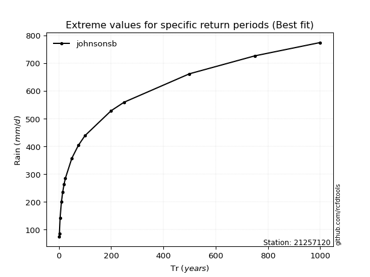</img>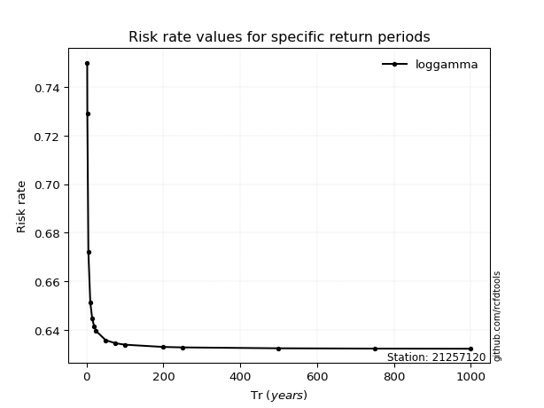</img>

</div>


<sub>**APP DISCLAIMER**: NO WARRANTY - This software is provided by [github.com/rcfdtools](https://github.com/rcfdtools) "as is", without any express or implied warranty, including warranties of merchantability, fitness for a particular purpose, or non-infringement. There is no guarantee that the software will be error-free or operate without interruption. LIMITATION OF LIABILITY - Neither the authors nor copyright holders will be liable for claims or damages arising from the software or its use. You are responsible for determining if the software is appropriate for your use and assume all associated risks, including errors, legal compliance, and data loss. NO PROFESSIONAL ADVICE - The software provides general information and does not offer professional advice. It should not replace consultation with professional advisors.</sub>