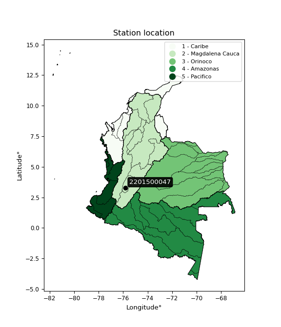

<div align="center">


</div>

# PMP Station (Rain, Pmax24h): 2201500047

Probable Maximum Precipitation (PMP) is the greatest amount of rainfall for a specific duration that is meteorologically possible for a given location, acting as a "worst-case" scenario for extreme storms, crucial for designing safety-critical infrastructure like bridges, river deviations, dams, spillways, and nuclear plants to prevent catastrophic failure. PMP is calculated by hydrologists using meteorological data to determine the upper limit of extreme rainfall, often leading to the Probable Maximum Flood (PMF) for flood control design, and is increasingly being studied for climate change impacts. Probable Maximum Precipitation (PMP) is the theoretical upper limit of rainfall, a deterministic estimate for extreme events, while probability distributions (like GEV, Gumbel) describe the likelihood and frequency of various precipitation amounts, including rare ones, showing how often events occur, with PMP representing the extreme end of these distributions, used for critical infrastructure design to ensure safety against the worst conceivable weather, unlike standard statistical forecasts which cover typical probabilities.

The most common probability distributions in hydrology, used for analyzing floods, rainfall, and streamflow, include the Normal, Log-Normal, Gumbel, Gamma (including Log-Pearson Type III), and Generalized Extreme Value (GEV) distributions, often chosen based on the data´s skewness and whether modeling extremes or general conditions, with Gumbel and GEV popular for extreme events like floods, while the Normal distribution serves as a baseline, though often requiring transformations for skewed hydrological data. These distributions help in designing water infrastructure, managing water resources, and forecasting hydrologic events.

> Hydrological data often isn´t perfectly normal (it´s skewed), so different distributions are needed for different applications, such as: **Flood Frequency Analysis**: Using Gumbel, GEV, or Log-Pearson Type III for predicting extreme flood magnitudes and their return periods, **Rainfall Analysis**: Normal for annual totals, but Log-Normal, Weibull, or GEV for intensity or extreme daily rainfall, **Streamflow Modeling**: Gamma and Log-Normal for maximum flows, GEV for minimum flows, and Kappa for daily flows.

<div align="center">

</img>

</div>


## A. General information


### 1. General running parameters

• app_version: _v20260108_. • runtime: _2026-01-09 11:32:22.148588_. • Python version: _3.14.0_. • SciPy version: _1.16.3_. • Pandas version: _2.3.3_. • NumPy version: _2.3.5_. • Stations dataset (station_dataset_file): _dataset/pmax24h_in/automatic_colombia_2003_2024.csv_. • Stations catalog (station_catalog_file): _dataset/CNE.xls_. • Minimum year to eval til year_max (date_min): _1900_. • Maximum year to eval since year_min (date_max): _2024_. • Creates, save and include plots into reports (create_plot): _False_. • Plot only fit distributions with Δo > Δ (plot_only_fit): _True_. • Plot only simple graphs avoiding multiple CDFs and multiple Extreme values plots (plot_only_simple): _True_. • Eval low extreme values, if False, evaluates high extreme values (low_extreme): _False_. • Eval every SciPy distribution as logarithmic (pdist_logarithmic_on): _True_. • Standard deviation normalized (ddof): _1.0_. • Return periods to eval in years (Tr): _[2, 2.33, 5, 10, 15, 20, 25, 50, 75, 100, 200, 250, 500, 750, 1000]_. • Minimum data sample per station, 0 means any (minimum_sample): _5_. • Z-Score maximum threshold to adjust a value, 0 means disable (zscore_max): _3.5_. • Z-Score minimum threshold to adjust a value, 0 means disable (zscore_min): _-2.5_. • Avoid zeros, e.g. rain = 0 (avoid_zeros): _True_. • Avoid null values (avoid_nans): _True_. 

:file_folder:Table: [dataset.csv](../../dataset/pmax24h_in/automatic_colombia_2003_2024.csv)

> Delta Degrees of Freedom (DDOF): is a parameter used in the formulas for calculating variance and standard deviation. When ddof=0, the divisor is $N$ (the total number of observations) and this is used when your data set is the entire population. When ddof=1, the divisor is $N-1$ and this is used when your data set is a sample drawn from a larger population. Using $N-1$ provides an unbiased estimate of the population variance (known as Bessel´s correction).


### 2. Station info and location

|   id |     CODIGO | NOMBRE                       | CATEGORIA               | TECNOLOGIA                | ESTADO           | FECHA_INSTALACION   |   FECHA_SUSPENSION |   ALTITUD |   LATITUD |   LONGITUD | DEPARTAMENTO   | MUNICIPIO   | AREA_OPERATIVA             | ENTIDAD                                                     | AREA_HIDROGRAFICA   | ZONA_HIDROGRAFICA   | SUBZONA_HIDROGRAFICA   |   CORRIENTE | Catalogo   |   Version |
|-----:|-----------:|:-----------------------------|:------------------------|:--------------------------|:-----------------|:--------------------|-------------------:|----------:|----------:|-----------:|:---------------|:------------|:---------------------------|:------------------------------------------------------------|:--------------------|:--------------------|:-----------------------|------------:|:-----------|----------:|
|    0 | 2201500047 | HERRERA - AUT   [2201500047] | Climatológica Principal | Automática con Telemetría | En Mantenimiento | 15/04/2018          |                nan |      1615 |   3.28414 |   -75.8024 | Tolima         | Planadas    | Area Operativa 10 - Tolima | INSTITUTO DE HIDROLOGIA METEOROLOGIA Y ESTUDIOS AMBIENTALES | Magdalena Cauca     | Saldaña             | Alto Saldaña           |         nan | CNE_IDEAM  |  20251226 |

<div align="center">

Dynamic map: [:earth_americas:Google](http://maps.google.com/maps?q=3.284138889,-75.80245) [:earth_americas:OSM](https://www.openstreetmap.org/#map=18/3.284138889/-75.80245&layers=P) [:earth_americas:Bing](https://www.bing.com/maps?cp=3.284138889~-75.80245&lvl=18) [:earth_americas:Apple](https://maps.apple.com/frame?center=3.284138889%2C-75.80245&span=0.003%2C0.006)

</div>


<div align="center">

```geojson
{
  "type": "Feature",
  "geometry": {
    "type": "Point", 
    "coordinates": [-75.80245, 3.284138889]
  }, 
  "properties": {
    "Name": "2201500047"
  }
}
```

</div>


### 3. Discrete values table and plot

<div align="center">

|               |           0 |          1 |            2 |           3 |          4 |
|:--------------|------------:|-----------:|-------------:|------------:|-----------:|
| Date          | 2019        | 2020       | 2021         | 2023        | 2024       |
| Value         |   59.2      |   74.4     |   40.8       |   19.4      |    6.8     |
| Value_initial |   59.2      |   74.4     |   40.8       |   19.4      |    6.8     |
| count         |    5        |    5       |    5         |    5        |    5       |
| mean          |   40.12     |   40.12    |   40.12      |   40.12     |   40.12    |
| std           |   27.7451   |   27.7451  |   27.7451    |   27.7451   |   27.7451  |
| zscore        |    0.687688 |    1.23553 |    0.0245088 |   -0.746798 |   -1.20093 |


</div>


> The initial value (value_initial) correspond to the initial obtained or null completed value, and value (value) is adjusted only when the initial value is outside the valid range (outlier) definite through the Z-Score value. If Z-Score is active, values out of range or outliers are replaced with the station mean value. A Z-Score (or standard score) measures how many standard deviations a data point is from the mean of a dataset, indicating its relative position; positive scores mean above the mean, negative mean below, and a score of zero is exactly at the mean, allowing for comparison of values from different distributions. It´s calculated using the formula $z=(x–μ)/σ$, where $x$ is the data point, $μ$ is the mean, and $σ$ is the standard deviation, helping identify outliers and understand probability.
>
> <sub>**Note**: In this study, "completing" (filling gaps in) and "extending" (forecasting or lengthening the historical record) rainfall data series are avoided for certain critical analyses because they introduce artificial bias and uncertainty, which can distort the statistics of rare events (extremes), alter day-to-day variability, and compromise the integrity and homogeneity of the original data. Some reasons against Completing/Extending rainfall data are: **Distortion of Extremes and Variability**: The primary issue is that most gap-filling or extension methods rely on averaging or regression with nearby stations, which inherently smooths the data. Rainfall is highly variable in space and time, with a large percentage of zero values and occasional large storms. Infilling methods often underestimate the highest values and overestimate the lowest (zero) values, which severely distorts analyses focused on flood frequency, drought severity, and intensity-duration-frequency (IDF) curves, **Loss of Data Homogeneity**: Infilled or extended data are synthetic estimates, not actual measurements. Combining these estimates with observed data can violate the assumption of data homogeneity, which requires that the data properties do not change over time. Inhomogeneity can lead to incorrect conclusions about long-term trends or changes in climate patterns, **Propagation of Errors**: Errors and biases from the original data (e.g., wind-induced undercatch, instrument errors, site changes) or the data used for imputation can propagate through the analysis, leading to unreliable hydrological models and inaccurate predictions, **Compromised Statistical Integrity**: For statistical analyses, especially those involving the frequency of events, using artificial data can introduce time bias or autocorrelation that doesn´t exist in reality, making it difficult to assess the true probability of events, **Difficulty in Validation**: It is difficult to accurately validate the quality of filled or extended data, especially for past periods where ground-truth measurements are unavailable. The reliability of imputation techniques heavily depends on the density of the surrounding station network and the complexity of the local topography.</sub>


### 4. Active continuous probability distributions from SciPy (45 of 104 available)

A Probability Density Function (PDF) describes the relative likelihood of a continuous random variable falling within a specific range, where the total area under its curve equals 1, and the area over any interval gives the actual probability for that range. Unlike discrete probabilities (like rolling a die), a PDF shows density, not direct probability for a single point (which is zero), with higher points indicating higher likelihood, often visualized as a bell curve for normal distributions.

A log of a probability density function (log-PDF) is simply the logarithm of the PDF´s value, denoted as $log(f(x))$, useful for converting multiplication of probabilities into addition, improving numerical stability with tiny numbers, and connecting to information theory concepts like entropy. Instead of dealing with very small probabilities (e.g., 0.000001), log-PDFs use negative numbers (e.g., $log(0.00001) ≈ -11.51$ that are easier for computers to handle, preventing underflow errors and simplifying complex calculations. In this study, each active probability distribution from SciPy is also evaluated in the $log$ form.

[scipy.stats](https://docs.scipy.org/doc/scipy/reference/stats.html) is a Python´s powerful submodule within the SciPy library for comprehensive statistical analysis, offering over 130 probability distributions (like Normal, Poisson), functions for descriptive stats (mean, variance), hypothesis testing (t-tests, chi-square), random variable generation, and statistical tests, making it essential for data science, modeling, and research. It provides tools to explore, model, and draw conclusions from data efficiently, working seamlessly with NumPy.

<div align="center">

|   id | p_dist             |   n_parameter | fit_method   | label                                                                       | active   | ref                                                                                                        |
|-----:|:-------------------|--------------:|:-------------|:----------------------------------------------------------------------------|:---------|:-----------------------------------------------------------------------------------------------------------|
|    0 | alpha              |             3 | MLE          | Alpha                                                                       | True     | [:mortar_board:](https://docs.scipy.org/doc/scipy/reference/generated/scipy.stats.alpha.html)              |
|    1 | betaprime          |             4 | MLE          | Beta prime                                                                  | True     | [:mortar_board:](https://docs.scipy.org/doc/scipy/reference/generated/scipy.stats.betaprime.html)          |
|    2 | chi2               |             3 | MLE          | Chi²                                                                        | True     | [:mortar_board:](https://docs.scipy.org/doc/scipy/reference/generated/scipy.stats.chi2.html)               |
|    3 | crystalball        |             4 | MLE          | Crystalball                                                                 | True     | [:mortar_board:](https://docs.scipy.org/doc/scipy/reference/generated/scipy.stats.crystalball.html)        |
|    4 | dweibull           |             3 | MLE          | Double Weibull                                                              | True     | [:mortar_board:](https://docs.scipy.org/doc/scipy/reference/generated/scipy.stats.dweibull.html)           |
|    5 | erlang             |             3 | MLE          | Erlang                                                                      | True     | [:mortar_board:](https://docs.scipy.org/doc/scipy/reference/generated/scipy.stats.erlang.html)             |
|    6 | expon              |             2 | MLE          | Exponential                                                                 | True     | [:mortar_board:](https://docs.scipy.org/doc/scipy/reference/generated/scipy.stats.expon.html)              |
|    7 | exponnorm          |             3 | MLE          | Exponentially modified Normal                                               | True     | [:mortar_board:](https://docs.scipy.org/doc/scipy/reference/generated/scipy.stats.exponnorm.html)          |
|    8 | f                  |             4 | MLE          | F                                                                           | True     | [:mortar_board:](https://docs.scipy.org/doc/scipy/reference/generated/scipy.stats.f.html)                  |
|    9 | fatiguelife        |             3 | MLE          | Fatigue-life (Birnbaum-Saunders)                                            | True     | [:mortar_board:](https://docs.scipy.org/doc/scipy/reference/generated/scipy.stats.fatiguelife.html)        |
|   10 | fisk               |             3 | MLE          | Fisk                                                                        | True     | [:mortar_board:](https://docs.scipy.org/doc/scipy/reference/generated/scipy.stats.fisk.html)               |
|   11 | gamma              |             3 | MLE          | Gamma                                                                       | True     | [:mortar_board:](https://docs.scipy.org/doc/scipy/reference/generated/scipy.stats.gamma.html)              |
|   12 | genexpon           |             5 | MLE          | Generalized exponential                                                     | True     | [:mortar_board:](https://docs.scipy.org/doc/scipy/reference/generated/scipy.stats.genexpon.html)           |
|   13 | genlogistic        |             3 | MLE          | Generalized logistic                                                        | True     | [:mortar_board:](https://docs.scipy.org/doc/scipy/reference/generated/scipy.stats.genlogistic.html)        |
|   14 | gibrat             |             2 | MM           | Gibrat                                                                      | True     | [:mortar_board:](https://docs.scipy.org/doc/scipy/reference/generated/scipy.stats.gibrat.html)             |
|   15 | gompertz           |             3 | MLE          | Gompertz (or truncated Gumbel)                                              | True     | [:mortar_board:](https://docs.scipy.org/doc/scipy/reference/generated/scipy.stats.gompertz.html)           |
|   16 | gumbel_l           |             2 | MM           | Gumbel Left Skew                                                            | True     | [:mortar_board:](https://docs.scipy.org/doc/scipy/reference/generated/scipy.stats.gumbel_l.html)           |
|   17 | gumbel_r           |             2 | MM           | Gumbel Right Skew                                                           | True     | [:mortar_board:](https://docs.scipy.org/doc/scipy/reference/generated/scipy.stats.gumbel_r.html)           |
|   18 | halflogistic       |             2 | MM           | Half-logistic                                                               | True     | [:mortar_board:](https://docs.scipy.org/doc/scipy/reference/generated/scipy.stats.halflogistic.html)       |
|   19 | halfnorm           |             2 | MM           | Half Normal                                                                 | True     | [:mortar_board:](https://docs.scipy.org/doc/scipy/reference/generated/scipy.stats.halfnorm.html)           |
|   20 | hypsecant          |             2 | MM           | hyperbolic secant                                                           | True     | [:mortar_board:](https://docs.scipy.org/doc/scipy/reference/generated/scipy.stats.hypsecant.html)          |
|   21 | invgamma           |             3 | MLE          | Inverted gamma                                                              | True     | [:mortar_board:](https://docs.scipy.org/doc/scipy/reference/generated/scipy.stats.invgamma.html)           |
|   22 | invgauss           |             3 | MLE          | Inverse Gaussian                                                            | True     | [:mortar_board:](https://docs.scipy.org/doc/scipy/reference/generated/scipy.stats.invgauss.html)           |
|   23 | invweibull         |             3 | MLE          | Inverted Weibull                                                            | True     | [:mortar_board:](https://docs.scipy.org/doc/scipy/reference/generated/scipy.stats.invweibull.html)         |
|   24 | kappa4             |             4 | MLE          | Kappa 4                                                                     | True     | [:mortar_board:](https://docs.scipy.org/doc/scipy/reference/generated/scipy.stats.kappa4.html)             |
|   25 | kstwobign          |             2 | MLE          | Limiting distribution of scaled Kolmogorov-Smirnov two-sided test statistic | True     | [:mortar_board:](https://docs.scipy.org/doc/scipy/reference/generated/scipy.stats.kstwobign.html)          |
|   26 | laplace            |             2 | MM           | Laplace                                                                     | True     | [:mortar_board:](https://docs.scipy.org/doc/scipy/reference/generated/scipy.stats.laplace.html)            |
|   27 | laplace_asymmetric |             3 | MLE          | Asymmetric Laplace                                                          | True     | [:mortar_board:](https://docs.scipy.org/doc/scipy/reference/generated/scipy.stats.laplace_asymmetric.html) |
|   28 | loggamma           |             3 | MLE          | Log gamma                                                                   | True     | [:mortar_board:](https://docs.scipy.org/doc/scipy/reference/generated/scipy.stats.loggamma.html)           |
|   29 | logistic           |             2 | MM           | Logistic (or Sech-squared)                                                  | True     | [:mortar_board:](https://docs.scipy.org/doc/scipy/reference/generated/scipy.stats.logistic.html)           |
|   30 | lognorm            |             3 | MLE          | Log Normal                                                                  | True     | [:mortar_board:](https://docs.scipy.org/doc/scipy/reference/generated/scipy.stats.lognorm.html)            |
|   31 | maxwell            |             2 | MM           | Maxwell                                                                     | True     | [:mortar_board:](https://docs.scipy.org/doc/scipy/reference/generated/scipy.stats.maxwell.html)            |
|   32 | mielke             |             4 | MLE          | Mielke Beta-Kappa / Dagum                                                   | True     | [:mortar_board:](https://docs.scipy.org/doc/scipy/reference/generated/scipy.stats.mielke.html)             |
|   33 | moyal              |             2 | MM           | Moyal                                                                       | True     | [:mortar_board:](https://docs.scipy.org/doc/scipy/reference/generated/scipy.stats.moyal.html)              |
|   34 | nakagami           |             3 | MLE          | Nakagami                                                                    | True     | [:mortar_board:](https://docs.scipy.org/doc/scipy/reference/generated/scipy.stats.nakagami.html)           |
|   35 | ncf                |             5 | MLE          | Non-central F distribution                                                  | True     | [:mortar_board:](https://docs.scipy.org/doc/scipy/reference/generated/scipy.stats.ncf.html)                |
|   36 | nct                |             4 | MLE          | Non-central Student’s t                                                     | True     | [:mortar_board:](https://docs.scipy.org/doc/scipy/reference/generated/scipy.stats.nct.html)                |
|   37 | norm               |             2 | MM           | Normal                                                                      | True     | [:mortar_board:](https://docs.scipy.org/doc/scipy/reference/generated/scipy.stats.norm.html)               |
|   38 | pearson3           |             3 | MM           | Pearson type III                                                            | True     | [:mortar_board:](https://docs.scipy.org/doc/scipy/reference/generated/scipy.stats.pearson3.html)           |
|   39 | rayleigh           |             2 | MM           | Rayleigh                                                                    | True     | [:mortar_board:](https://docs.scipy.org/doc/scipy/reference/generated/scipy.stats.rayleigh.html)           |
|   40 | rice               |             3 | MLE          | Rice                                                                        | True     | [:mortar_board:](https://docs.scipy.org/doc/scipy/reference/generated/scipy.stats.rice.html)               |
|   41 | t                  |             3 | MLE          | Student’s t                                                                 | True     | [:mortar_board:](https://docs.scipy.org/doc/scipy/reference/generated/scipy.stats.t.html)                  |
|   42 | truncnorm          |             4 | MLE          | Truncated normal                                                            | True     | [:mortar_board:](https://docs.scipy.org/doc/scipy/reference/generated/scipy.stats.truncnorm.html)          |
|   43 | wald               |             2 | MM           | Wald                                                                        | True     | [:mortar_board:](https://docs.scipy.org/doc/scipy/reference/generated/scipy.stats.wald.html)               |
|   44 | weibull_min        |             3 | MLE          | Weibull minimum                                                             | True     | [:mortar_board:](https://docs.scipy.org/doc/scipy/reference/generated/scipy.stats.weibull_min.html)        |

</div>

> **n_parameter:** # arguments & localization & scale.
>
> **Fit methods:** (MLE) maximum likelihood, (MM) L-moments.
>
>**Inactive** (With the only purpose of prevent loops, zero divisions, infinite values, over high estimated values or horizontal trending for recurrence intervals estimations, the follow distributions were disabled.)**:** foldnorm, gennorm, norminvgauss, powernorm, powerlognorm, skewnorm, genextreme, anglit, arcsine, argus, beta, bradford, burr, burr12, cauchy, cosine, halfcauchy, foldcauchy, skewcauchy, wrapcauchy, dgamma, gengamma, exponweib, exponpow, truncexpon, gausshyper, genhalflogistic, genhyperbolic, geninvgauss, halfgennorm, johnsonsb, johnsonsu, kappa3, ksone, kstwo, loglaplace, levy, levy_l, levy_stable, ncx2, pareto, genpareto, truncpareto, lomax, powerlaw, rdist, rel_breitwigner, recipinvgauss, semicircular, studentized_range, trapezoid, triang, truncweibull_min, tukeylambda, uniform, loguniform, vonmises, vonmises_line, weibull_max, 


## B. Probability (PDF) vs. Empirical (EDF) distributions functions

A continuous probability distribution (CPD) describes probabilities for variables that can take any value within a range (like rain any time), unlike discrete variables with specific outcomes (like temperature). It uses a Probability Density Function (PDF), a curve where the total area under it equals 1, and the probability of the variable falling within an interval (a to b) is found by calculating the area under the curve between those points. A key feature is that the probability of hitting any single exact value is zero, so probabilities are always expressed for ranges, e.g., $P(a ≤ X ≤ b)$.

<div align="center">

Distributions parameters from station values
|    |    station | p_dist                |   n |               loc |            scale | shape                  | shape1             | shape2                | shape3   |
|---:|-----------:|:----------------------|----:|------------------:|-----------------:|:-----------------------|:-------------------|:----------------------|:---------|
|  0 | 2201500047 | alpha                 |   5 |      -0.0334749   |     14.114       | 5.439966657920611e-10  |                    |                       |          |
|  1 | 2201500047 | betaprime             |   5 |       6.8         |    505.423       | 0.7725741209834845     | 13.113505135227285 |                       |          |
|  2 | 2201500047 | chi2                  |   5 |       6.8         |     13.5683      | 1.7772098516330082     |                    |                       |          |
|  3 | 2201500047 | crystalball           |   5 |      40.12        |     24.816       | 3792.9523931826307     | 8.865832529549643  |                       |          |
|  4 | 2201500047 | dweibull              |   5 |      33.6704      |     25.9147      | 2.1162509769843307     |                    |                       |          |
|  5 | 2201500047 | erlang                |   5 |   -2696.23        |      0.224999    | 12161.612286484567     |                    |                       |          |
|  6 | 2201500047 | expon                 |   5 |       6.8         |     33.32        |                        |                    |                       |          |
|  7 | 2201500047 | exponnorm             |   5 |      39.8197      |     24.8142      | 0.012101804781946052   |                    |                       |          |
|  8 | 2201500047 | f                     |   5 |       6.8         |     47.4385      | 1.6378396191505076     | 72.02472135162316  |                       |          |
|  9 | 2201500047 | fatiguelife           |   5 |     -70.4006      |    107.628       | 0.23179800715608906    |                    |                       |          |
| 10 | 2201500047 | fisk                  |   5 |    -562.46        |    602.186       | 39.17990389246578      |                    |                       |          |
| 11 | 2201500047 | gamma                 |   5 |   -2694.5         |      0.225135    | 12146.592141042409     |                    |                       |          |
| 12 | 2201500047 | genexpon              |   5 |      -0.0184396   |      2.04445     | 0.018263235938231336   | 1.4729698043470871 | 0.001654964916762936  |          |
| 13 | 2201500047 | genlogistic           |   5 |    -113.08        |     21.7822      | 643.6711167369435      |                    |                       |          |
| 14 | 2201500047 | gibrat                |   5 |      21.1885      |     11.4825      |                        |                    |                       |          |
| 15 | 2201500047 | gompertz              |   5 |       6.8         |     45.6342      | 0.7167288389704309     |                    |                       |          |
| 16 | 2201500047 | gumbel_l              |   5 |      51.2885      |     19.349       |                        |                    |                       |          |
| 17 | 2201500047 | gumbel_r              |   5 |      28.9515      |     19.349       |                        |                    |                       |          |
| 18 | 2201500047 | halflogistic          |   5 |      10.7073      |     21.2168      |                        |                    |                       |          |
| 19 | 2201500047 | halfnorm              |   5 |       7.27338     |     41.1671      |                        |                    |                       |          |
| 20 | 2201500047 | hypsecant             |   5 |      40.12        |     15.7984      |                        |                    |                       |          |
| 21 | 2201500047 | invgamma              |   5 |    -137.611       |   8707.42        | 50.009570949612424     |                    |                       |          |
| 22 | 2201500047 | invgauss              |   5 |     -51.8069      |   1114.66        | 0.08238367733946628    |                    |                       |          |
| 23 | 2201500047 | invweibull            |   5 |      -5.0583e+08  |      5.0583e+08  | 22904216.746465847     |                    |                       |          |
| 24 | 2201500047 | kappa4                |   5 |      -2.80334     |     79.7245      | 1.1372550766630205     | 1.03075866791839   |                       |          |
| 25 | 2201500047 | kstwobign             |   5 |     -46.7066      |     98.9894      |                        |                    |                       |          |
| 26 | 2201500047 | laplace               |   5 |      40.12        |     17.5476      |                        |                    |                       |          |
| 27 | 2201500047 | laplace_asymmetric    |   5 |      40.8         |     21.4717      | 1.0159499464626502     |                    |                       |          |
| 28 | 2201500047 | loggamma              |   5 |   -4263.47        |    657.245       | 698.2754853557165      |                    |                       |          |
| 29 | 2201500047 | logistic              |   5 |      40.12        |     13.6818      |                        |                    |                       |          |
| 30 | 2201500047 | lognorm               |   5 |       6.8         |      0.0168239   | 15.296930546909039     |                    |                       |          |
| 31 | 2201500047 | maxwell               |   5 |     -18.6835      |     36.8496      |                        |                    |                       |          |
| 32 | 2201500047 | mielke                |   5 |      -2.52379     |     78.076       | 1.1836928483974987     | 248.87469928182918 |                       |          |
| 33 | 2201500047 | moyal                 |   5 |      25.9286      |     11.1711      |                        |                    |                       |          |
| 34 | 2201500047 | nakagami              |   5 |      19.4         |     31.464       | 0.2683500019356073     |                    |                       |          |
| 35 | 2201500047 | ncf                   |   5 |       6.8         |      9.32754     | 0.6542617002023943     | 67497.40826844433  | 2.2725801858467127    |          |
| 36 | 2201500047 | nct                   |   5 |   -1188.04        |     24.7722      | 338207.36731701845     | 49.57790091315886  |                       |          |
| 37 | 2201500047 | norm                  |   5 |      40.12        |     24.816       |                        |                    |                       |          |
| 38 | 2201500047 | pearson3              |   5 |      40.12        |     24.816       | 0.01755619495804189    |                    |                       |          |
| 39 | 2201500047 | rayleigh              |   5 |      -7.35445     |     37.8791      |                        |                    |                       |          |
| 40 | 2201500047 | rice                  |   5 |      -6.60808     |     30.6807      | 0.9868637486411984     |                    |                       |          |
| 41 | 2201500047 | t                     |   5 |      40.1177      |     24.8145      | 2077618.788905528      |                    |                       |          |
| 42 | 2201500047 | truncnorm             |   5 |      40.12        |     24.816       | -86.18151295955523     | 281.1329838969836  |                       |          |
| 43 | 2201500047 | wald                  |   5 |      15.304       |     24.816       |                        |                    |                       |          |
| 44 | 2201500047 | weibull_min           |   5 |       6.8         |     36.9257      | 0.7474756961282742     |                    |                       |          |
| 45 | 2201500047 | logalpha              |   5 |     -18.1756      |    522.623       | 24.27377433413433      |                    |                       |          |
| 46 | 2201500047 | logbetaprime          |   5 |     -47.6937      |     42.5666      | 7499.6144297262945     | 6248.367961476131  |                       |          |
| 47 | 2201500047 | logchi2               |   5 |       1.91692     |      0.911877    | 1.0633470673919434     |                    |                       |          |
| 48 | 2201500047 | logcrystalball        |   5 |       3.39625     |      0.868848    | 17.091190669733642     | 345.8530849689399  |                       |          |
| 49 | 2201500047 | logdweibull           |   5 |       3.2948      |      0.890218    | 2.1932935400669367     |                    |                       |          |
| 50 | 2201500047 | logerlang             |   5 |      -9.98075     |      0.0617474   | 216.53851023768777     |                    |                       |          |
| 51 | 2201500047 | logexpon              |   5 |       1.91692     |      1.47933     |                        |                    |                       |          |
| 52 | 2201500047 | logexponnorm          |   5 |       3.3957      |      0.868847    | 0.0006385393774075075  |                    |                       |          |
| 53 | 2201500047 | logf                  |   5 |     -21.4707      |     24.8813      | 1548.1948141982066     | 178125.666080822   |                       |          |
| 54 | 2201500047 | logfatiguelife        |   5 |    -303.623       |    307.018       | 0.002836832003433788   |                    |                       |          |
| 55 | 2201500047 | logfisk               |   5 | -112562           | 112565           | 219035.80446575256     |                    |                       |          |
| 56 | 2201500047 | loggamma              |   5 |     -11.6344      |      0.052783    | 284.55837114858605     |                    |                       |          |
| 57 | 2201500047 | loggenexpon           |   5 |       1.91692     |      2.02485     | 0.9287771602600955     | 1.843294200362784  | 0.5321970567559762    |          |
| 58 | 2201500047 | loggenlogistic        |   5 |       4.30948     |      1.51913e-06 | 1.6680326890540892e-06 |                    |                       |          |
| 59 | 2201500047 | loggibrat             |   5 |       2.73344     |      0.402014    |                        |                    |                       |          |
| 60 | 2201500047 | loggompertz           |   5 |       1.91692     |      0.821408    | 0.1225901505177009     |                    |                       |          |
| 61 | 2201500047 | loggumbel_l           |   5 |       3.78728     |      0.677438    |                        |                    |                       |          |
| 62 | 2201500047 | loggumbel_r           |   5 |       3.00522     |      0.677438    |                        |                    |                       |          |
| 63 | 2201500047 | loghalflogistic       |   5 |       2.36643     |      0.742857    |                        |                    |                       |          |
| 64 | 2201500047 | loghalfnorm           |   5 |       2.24628     |      1.44128     |                        |                    |                       |          |
| 65 | 2201500047 | loghypsecant          |   5 |       3.39625     |      0.553126    |                        |                    |                       |          |
| 66 | 2201500047 | loginvgamma           |   5 |     -12.5919      |   5115.99        | 321.2625714356916      |                    |                       |          |
| 67 | 2201500047 | loginvgauss           |   5 |      -4.67227     |    601.991       | 0.013382191655121459   |                    |                       |          |
| 68 | 2201500047 | loginvweibull         |   5 |  -57158.8         |  57161.7         | 63579.34828910719      |                    |                       |          |
| 69 | 2201500047 | logkappa4             |   5 |       1.78272     |      2.81016     | 0.9983938898330129     | 1.1121725281333197 |                       |          |
| 70 | 2201500047 | logkstwobign          |   5 |      -0.183357    |      4.07847     |                        |                    |                       |          |
| 71 | 2201500047 | loglaplace            |   5 |       3.39625     |      0.614368    |                        |                    |                       |          |
| 72 | 2201500047 | loglaplace_asymmetric |   5 |       4.30947     |      0.0191393   | 47.93064774997629      |                    |                       |          |
| 73 | 2201500047 | logloggamma           |   5 |       4.3095      |      1.41774e-06 | 1.552661925431406e-06  |                    |                       |          |
| 74 | 2201500047 | loglogistic           |   5 |       3.39625     |      0.479021    |                        |                    |                       |          |
| 75 | 2201500047 | loglognorm            |   5 |       1.91692     |      0.00116646  | 14.647703812712171     |                    |                       |          |
| 76 | 2201500047 | logmaxwell            |   5 |       1.33745     |      1.29016     |                        |                    |                       |          |
| 77 | 2201500047 | logmielke             |   5 |      -5.5705e+06  |      5.5705e+06  | 6017084.728837301      | 1826722870.7601876 |                       |          |
| 78 | 2201500047 | logmoyal              |   5 |       2.89939     |      0.391119    |                        |                    |                       |          |
| 79 | 2201500047 | lognakagami           |   5 |       2.96527     |      0.574804    | 0.10945223319245682    |                    |                       |          |
| 80 | 2201500047 | logncf                |   5 |     -16.6854      |     20.0678      | 1584.605194945335      | 2738.7233068954665 | 1.482967651697882e-06 |          |
| 81 | 2201500047 | lognct                |   5 |     -61.2602      |      0.84996     | 60797.328811810876     | 76.06852335264065  |                       |          |
| 82 | 2201500047 | lognorm               |   5 |       3.39625     |      0.868848    |                        |                    |                       |          |
| 83 | 2201500047 | logpearson3           |   5 |       3.40916     |      0.787182    | 1.0770883100639104     |                    |                       |          |
| 84 | 2201500047 | lograyleigh           |   5 |       1.73409     |      1.32621     |                        |                    |                       |          |
| 85 | 2201500047 | logrice               |   5 |       1.34822     |      0.960983    | 1.8328705080832144     |                    |                       |          |
| 86 | 2201500047 | logt                  |   5 |       3.39625     |      0.86884     | 139749867.43568575     |                    |                       |          |
| 87 | 2201500047 | logtruncnorm          |   5 |      -0.29684     |      1.81842     | 1.793924985455404      | 2.664390319483367  |                       |          |
| 88 | 2201500047 | logwald               |   5 |       2.52736     |      0.868879    |                        |                    |                       |          |
| 89 | 2201500047 | logweibull_min        |   5 |      -5.21668e+07 |      5.21668e+07 | 81715997.51602925      |                    |                       |          |

</div>

> **loc** (Location parameter): This shifts the distribution along the x-axis. For many common distributions, like the normal (Gaussian) distribution, loc represents the mean $μ$. For others, like the uniform distribution, it might represent the minimum value, or for the beta distribution, the left end of the support interval.
>
> **scale** (Scale parameter): This determines the width or spread of the distribution. For the normal distribution, scale represents the standard deviation $σ$. For a uniform distribution, it defines the length of the interval (from $loc$ to $loc + scale$).
>
> **shape** (Shape parameters): Refers to parameters that define the specific form of a probability distribution, distinct from its location (loc) and scale (scale). These parameters are required arguments for most distribution functions. For example, a normal (Gaussian) distribution is fully defined by its location (mean) and scale (standard deviation), so it has no specific shape parameters beyond loc and scale. However, other distributions have intrinsic properties that need specification, as Gamma distribution that takes a shape parameter, often named $a$ or $alpha$.


### 0. Cumulative distribution values - CDF (90 evaluated)

Cumulative Distribution Function (CDF), denoted as $F$<sub>$X$</sub>$(x)$, is a function that gives the probability that a random variable $X$ will take a value less than or equal to a specific value, $x$ (i.e., $(P(X≥x)$. It essentially "accumulates" probabilities from a given point up to the far right (positive infinity), providing a complete picture of the distribution´s probabilities for both discrete (like rain) and continuous (like temperature) variables, helping to find probabilities over ranges or above certain values. Each station is evaluated separately ordering the $x$ values ascending, calculating the CDF and PDF values for the activated distributions and their logarithmic forms.

<div align="center">

CDF ordered by x ascending and calculating $log(f(x))$ separately
|   id |    Station |   date |    x |   count |   mean |     std |     zscore |   Value_initial |    station |   m |    alpha |   alpha_pdf |   betaprime |   betaprime_pdf |        chi2 |   chi2_pdf |   crystalball |   crystalball_pdf |   dweibull |   dweibull_pdf |    erlang |   erlang_pdf |    expon |   expon_pdf |   exponnorm |   exponnorm_pdf |           f |      f_pdf |   fatiguelife |   fatiguelife_pdf |      fisk |   fisk_pdf |     gamma |   gamma_pdf |   genexpon |   genexpon_pdf |   genlogistic |   genlogistic_pdf |   gibrat |   gibrat_pdf |    gompertz |   gompertz_pdf |   gumbel_l |   gumbel_l_pdf |   gumbel_r |   gumbel_r_pdf |   halflogistic |   halflogistic_pdf |   halfnorm |   halfnorm_pdf |   hypsecant |   hypsecant_pdf |   invgamma |   invgamma_pdf |   invgauss |   invgauss_pdf |   invweibull |   invweibull_pdf |      kappa4 |   kappa4_pdf |   kstwobign |   kstwobign_pdf |   laplace |   laplace_pdf |   laplace_asymmetric |   laplace_asymmetric_pdf |   loggamma |   loggamma_pdf |   logistic |   logistic_pdf |   lognorm |   lognorm_pdf |   maxwell |   maxwell_pdf |   mielke |   mielke_pdf |    moyal |   moyal_pdf |    nakagami |    nakagami_pdf |         ncf |     ncf_pdf |       nct |    nct_pdf |      norm |   norm_pdf |   pearson3 |   pearson3_pdf |   rayleigh |   rayleigh_pdf |     rice |   rice_pdf |         t |      t_pdf |   truncnorm |   truncnorm_pdf |      wald |   wald_pdf |   weibull_min |   weibull_min_pdf |   logalpha |   logalpha_pdf |   logbetaprime |   logbetaprime_pdf |     logchi2 |   logchi2_pdf |   logcrystalball |   logcrystalball_pdf |   logdweibull |   logdweibull_pdf |   logerlang |   logerlang_pdf |   logexpon |   logexpon_pdf |   logexponnorm |   logexponnorm_pdf |      logf |   logf_pdf |   logfatiguelife |   logfatiguelife_pdf |   logfisk |   logfisk_pdf |   loggenexpon |   loggenexpon_pdf |   loggenlogistic |   loggenlogistic_pdf |   loggibrat |   loggibrat_pdf |   loggompertz |   loggompertz_pdf |   loggumbel_l |   loggumbel_l_pdf |   loggumbel_r |   loggumbel_r_pdf |   loghalflogistic |   loghalflogistic_pdf |   loghalfnorm |   loghalfnorm_pdf |   loghypsecant |   loghypsecant_pdf |   loginvgamma |   loginvgamma_pdf |   loginvgauss |   loginvgauss_pdf |   loginvweibull |   loginvweibull_pdf |   logkappa4 |   logkappa4_pdf |   logkstwobign |   logkstwobign_pdf |   loglaplace |   loglaplace_pdf |   loglaplace_asymmetric |   loglaplace_asymmetric_pdf |   logloggamma |   logloggamma_pdf |   loglogistic |   loglogistic_pdf |   loglognorm |   loglognorm_pdf |   logmaxwell |   logmaxwell_pdf |   logmielke |   logmielke_pdf |    logmoyal |   logmoyal_pdf |   lognakagami |   lognakagami_pdf |    logncf |   logncf_pdf |    lognct |   lognct_pdf |   logpearson3 |   logpearson3_pdf |   lograyleigh |   lograyleigh_pdf |   logrice |   logrice_pdf |      logt |   logt_pdf |   logtruncnorm |   logtruncnorm_pdf |   logwald |   logwald_pdf |   logweibull_min |   logweibull_min_pdf |
|-----:|-----------:|-------:|-----:|--------:|-------:|--------:|-----------:|----------------:|-----------:|----:|---------:|------------:|------------:|----------------:|------------:|-----------:|--------------:|------------------:|-----------:|---------------:|----------:|-------------:|---------:|------------:|------------:|----------------:|------------:|-----------:|--------------:|------------------:|----------:|-----------:|----------:|------------:|-----------:|---------------:|--------------:|------------------:|---------:|-------------:|------------:|---------------:|-----------:|---------------:|-----------:|---------------:|---------------:|-------------------:|-----------:|---------------:|------------:|----------------:|-----------:|---------------:|-----------:|---------------:|-------------:|-----------------:|------------:|-------------:|------------:|----------------:|----------:|--------------:|---------------------:|-------------------------:|-----------:|---------------:|-----------:|---------------:|----------:|--------------:|----------:|--------------:|---------:|-------------:|---------:|------------:|------------:|----------------:|------------:|------------:|----------:|-----------:|----------:|-----------:|-----------:|---------------:|-----------:|---------------:|---------:|-----------:|----------:|-----------:|------------:|----------------:|----------:|-----------:|--------------:|------------------:|-----------:|---------------:|---------------:|-------------------:|------------:|--------------:|-----------------:|---------------------:|--------------:|------------------:|------------:|----------------:|-----------:|---------------:|---------------:|-------------------:|----------:|-----------:|-----------------:|---------------------:|----------:|--------------:|--------------:|------------------:|-----------------:|---------------------:|------------:|----------------:|--------------:|------------------:|--------------:|------------------:|--------------:|------------------:|------------------:|----------------------:|--------------:|------------------:|---------------:|-------------------:|--------------:|------------------:|--------------:|------------------:|----------------:|--------------------:|------------:|----------------:|---------------:|-------------------:|-------------:|-----------------:|------------------------:|----------------------------:|--------------:|------------------:|--------------:|------------------:|-------------:|-----------------:|-------------:|-----------------:|------------:|----------------:|------------:|---------------:|--------------:|------------------:|----------:|-------------:|----------:|-------------:|--------------:|------------------:|--------------:|------------------:|----------:|--------------:|----------:|-----------:|---------------:|-------------------:|----------:|--------------:|-----------------:|---------------------:|
|    0 | 2201500047 |   2024 |  6.8 |       5 |  40.12 | 27.7451 | -1.20093   |             6.8 | 2201500047 |   1 | 0.038883 |  0.0285735  | 2.12274e-08 |      3.99231    | 2.34408e-15 | 2.34521    |     0.0896874 |        0.00652689 |   0.169857 |     0.0144431  | 0.0892504 |   0.00655739 | 0        |  0.030012   |   0.0896872 |      0.00652689 | 1.46862e-07 | 0.495416   |     0.0749221 |        0.00801343 | 0.0994773 | 0.00616554 | 0.0892552 |  0.00655779 |  0.0717385 |     0.0119734  |     0.0731077 |        0.00876169 | 0        |   0          | 8.40693e-12 |     0.015706   |  0.0954627 |     0.00469037 |  0.0431988 |     0.00701475 |       0        |         0          |   0        |     0          |   0.0768776 |      0.00481901 |  0.0790115 |     0.00767909 |  0.0730897 |     0.00855021 |    0.0739397 |       0.00871995 | 9.35333e-15 |    1.06092   |   0.0679912 |      0.00946047 | 0.0748711 |    0.00426676 |             0.106878 |               0.00489947 |  0.0458615 |       0.115789 |   0.080516 |     0.00541108 | 0.0443185 |      0.107762 | 0.0763561 |    0.00815284 | 0.080824 |    0.0102609 | 0.018567 |  0.00526313 | 0           |      0          | 1.43056e-06 | 5.26901e+08 | 0.0896863 | 0.00652776 | 0.0896874 | 0.00652689 |  0.0893022 |     0.00655767 |  0.0674347 |     0.00919967 | 0.057256 | 0.00833007 | 0.0896889 | 0.00652737 |   0.0896874 |      0.00652689 | 0         | 0          |   3.78294e-13 |      318.366      |  0.0411837 |       0.114229 |      0.0429423 |           0.107503 | 5.62949e-09 |   6.73975e+06 |        0.0443185 |             0.107762 |     0.0368866 |          0.153057 |   0.0482616 |        0.119303 |   0        |       0.675982 |      0.0443182 |           0.107762 | 0.0459117 |   0.111816 |        0.0444306 |             0.108241 | 0.0442265 |     0.0822537 |   4.15595e-11 |          0.458689 |         0        |            0.0793759 |    0        |       0         |   1.56075e-08 |          0.149244 |     0.0612755 |         0.0876221 |    0.00683769 |          0.050319 |          0        |              0        |      0        |          0        |      0.0438206 |          0.0789735 |     0.0432996 |          0.117113 |     0.0459371 |          0.127291 |        0.044627 |            0.154346 |   0.0491762 |        0.356088 |      0.0464429 |           0.183629 |    0.0450027 |        0.0732504 |               0.0736437 |                   0.0802779 |     0.0727836 |          0.07971  |     0.0435953 |         0.0870415 |    0.0227706 |      1.66127e+13 |    0.0226913 |         0.11279  |   0.0744353 |       0.0804028 | 0.000446034 |     0.00753192 |    0          |       0           | 0.0456334 |     0.114618 | 0.0444599 |     0.108121 |      0        |          0        |    0.00945741 |          0.102966 | 0.0344347 |      0.126863 | 0.0443171 |   0.107761 |     0          |           0        |  0        |      0        |        0.0513724 |            0.0783683 |
|    1 | 2201500047 |   2023 | 19.4 |       5 |  40.12 | 27.7451 | -0.746798  |            19.4 | 2201500047 |   2 | 0.467671 |  0.0229061  | 0.392054    |      0.0197329  | 0.428289    | 0.0234041  |     0.201874  |        0.0113448  |   0.376791 |     0.0158085  | 0.202081  |   0.0114109  | 0.314873 |  0.020562   |   0.201874  |      0.0113448  | 0.277047    | 0.0159067  |     0.217013  |        0.014171   | 0.20664   | 0.011039   | 0.202092  |  0.0114114  |  0.246367  |     0.0152005  |     0.230347  |        0.0155082  | 0        |   0          | 0.203807    |     0.0164814  |  0.17504   |     0.008204   |  0.194315  |     0.0164526  |       0.202036 |         0.0226043  |   0.231678 |     0.0185587  |   0.167533  |      0.0101216  |  0.214532  |     0.0136009  |  0.22466   |     0.0149368  |    0.229437  |       0.015294   | 0.222453    |    0.0155736 |   0.236075  |      0.0161864  | 0.153518  |    0.00874867 |             0.190432 |               0.00872972 |  0.324007  |       0.411392 |   0.180284 |     0.0108014  | 0.309935  |      0.40601  | 0.215217  |    0.0135576  | 0.222368 |    0.0120059 | 0.180446 |  0.019506   | 2.14885e-09 | 324621          | 0.338577    | 0.013065    | 0.201888  | 0.0113461  | 0.201874  | 0.0113448  |  0.202122  |     0.011409   |  0.220761  |     0.01453    | 0.20117  | 0.0140202  | 0.201886  | 0.0113459  |   0.201874  |      0.0113448  | 0.0352086 | 0.0290124  |   0.360886    |        0.0169732  |  0.327343  |       0.422101 |      0.309945  |           0.406645 | 0.697341    |   0.239551    |        0.309935  |             0.40601  |     0.446541  |          0.336074 |   0.326466  |        0.405428 |   0.5077   |       0.332786 |      0.309935  |           0.406011 | 0.313161  |   0.399333 |        0.31065   |             0.406001 | 0.262457  |     0.376668  |   0.45177     |          0.371663 |         0        |            0.250962  |    0.290997 |       1.47889   |   0.271442    |          0.389623 |     0.257093  |         0.325905  |    0.346197   |          0.542083 |          0.382569 |              0.574566 |      0.38212  |          0.488823 |      0.273834  |          0.436222  |     0.330473  |          0.42071  |     0.343029  |          0.416968 |        0.379512 |            0.408979 |   0.433378  |        0.378731 |      0.409726  |           0.408593 |    0.247921  |        0.403538  |               0.230911  |                   0.251712  |     0.229432  |          0.251265 |     0.289111  |         0.429054  |    0.678785  |      0.023325    |    0.338781  |         0.444157 |   0.230979  |       0.249497  | 0.357979    |     0.614524   |    0.00040749 |       2.00864e+11 | 0.320573  |     0.407186 | 0.310487  |     0.406051 |      0.326911 |          0.581179 |    0.350084   |          0.45494  | 0.324654  |      0.41416  | 0.309934  |   0.406014 |     3.6941e-08 |           1.34824  |  0.368474 |      1.00534  |        0.238504  |            0.325013  |
|    2 | 2201500047 |   2021 | 40.8 |       5 |  40.12 | 27.7451 |  0.0245088 |            40.8 | 2201500047 |   3 | 0.729607 |  0.00636231 | 0.678336    |      0.00897477 | 0.755642    | 0.00952319 |     0.51093   |        0.01607    |   0.531534 |     0.00905861 | 0.512108  |   0.0160679  | 0.639552 |  0.0108178  |   0.51093   |      0.01607    | 0.534554    | 0.00914618 |     0.556012  |        0.0153265  | 0.517448  | 0.016217   | 0.51213   |  0.0160682  |  0.570523  |     0.0138936  |     0.576915  |        0.0145625  | 0.703775 |   0.017627   | 0.547561    |     0.0149692  |  0.440964  |     0.0168021  |  0.581543  |     0.0162922  |       0.610157 |         0.0147927  |   0.584585 |     0.0139113  |   0.513697  |      0.0201296  |  0.549504  |     0.0155558  |  0.567822  |     0.0149393  |    0.572     |       0.0144684  | 0.535431    |    0.0140086 |   0.584803  |      0.0144186  | 0.519005  |    0.0274109  |             0.507911 |               0.0232835  |  0.64811   |       0.410899 |   0.512423 |     0.0182612  | 0.640424  |      0.430415 | 0.543511  |    0.0153324  | 0.497992 |    0.0136061 | 0.607283 |  0.0160835  | 0.616721    |      0.0140171  | 0.563363    | 0.00856648  | 0.510952  | 0.0160691  | 0.51093   | 0.01607    |  0.512097  |     0.016066   |  0.554277  |     0.0149589  | 0.537641 | 0.0156772  | 0.510968  | 0.0160709  |   0.51093   |      0.01607    | 0.678813  | 0.0154315  |   0.609436    |        0.0080726  |  0.652661  |       0.40307  |      0.638531  |           0.425429 | 0.826333    |   0.123981    |        0.640424  |             0.430415 |     0.585031  |          0.409919 |   0.644554  |        0.403478 |   0.70216  |       0.201335 |      0.640424  |           0.430416 | 0.633993  |   0.415526 |        0.640467  |             0.428916 | 0.601887  |     0.466264  |   0.684033    |          0.252961 |         0        |            0.567692  |    0.812244 |       0.276225  |   0.618376    |          0.504511 |     0.589532  |         0.539539  |    0.701863   |          0.366781 |          0.717968 |              0.326121 |      0.689729 |          0.330851 |      0.670934  |          0.494474  |     0.654684  |          0.402097 |     0.655477  |          0.380523 |        0.654555 |            0.30854  |   0.725232  |        0.411117 |      0.67775   |           0.297754 |    0.699314  |        0.489424  |               0.519263  |                   0.566041  |     0.517889  |          0.567173 |     0.657512  |         0.470104  |    0.691778  |      0.0134085   |    0.663066  |         0.385861 |   0.515602  |       0.556938  | 0.72231     |     0.3403     |    0.861229   |       0.214873    | 0.642638  |     0.410458 | 0.640628  |     0.429596 |      0.703685 |          0.385212 |    0.669915   |          0.370576 | 0.647633  |      0.408606 | 0.640426  |   0.430419 |     0.694376   |           0.595613 |  0.78     |      0.276177 |        0.582339  |            0.571207  |
|    3 | 2201500047 |   2019 | 59.2 |       5 |  40.12 | 27.7451 |  0.687688  |            59.2 | 2201500047 |   4 | 0.811666 |  0.00311981 | 0.803934    |      0.00510532 | 0.879994    | 0.00460662 |     0.779011  |        0.0119623  |   0.810233 |     0.0152399  | 0.779388  |   0.0118968  | 0.792501 |  0.00622746 |   0.779011  |      0.0119622  | 0.673055    | 0.00615178 |     0.788896  |        0.00966466 | 0.776777  | 0.0109281  | 0.779407  |  0.0118964  |  0.784646  |     0.00918602 |     0.789461  |        0.00856655 | 0.884359 |   0.00512663 | 0.786241    |     0.0105845  |  0.778013  |     0.0172682  |  0.811038  |     0.00877899 |       0.815352 |         0.00789944 |   0.792821 |     0.00874785 |   0.815109  |      0.0110561  |  0.788583  |     0.00997911 |  0.790838  |     0.00914888 |    0.784417  |       0.00862449 | 0.788555    |    0.0135998 |   0.797532  |      0.00872575 | 0.831442  |    0.00960576 |             0.793964 |               0.00974873 |  0.784967  |       0.318421 |   0.801319 |     0.0116364  | 0.784658  |      0.336607 | 0.784755  |    0.0103637  | 0.757158 |    0.0145202 | 0.821544 |  0.00785285 | 0.811374    |      0.00774907 | 0.697898    | 0.00617054  | 0.779004  | 0.0119605  | 0.779011  | 0.0119623  |  0.779368  |     0.0118977  |  0.786381  |     0.0099087  | 0.785102 | 0.0106596  | 0.779053  | 0.0119617  |   0.779012  |      0.0119623  | 0.856406  | 0.00578188 |   0.727203    |        0.00505503 |  0.785799  |       0.307611 |      0.781026  |           0.332844 | 0.866291    |   0.092538    |        0.784658  |             0.336607 |     0.766465  |          0.496025 |   0.779442  |        0.315544 |   0.768419 |       0.156545 |      0.784658  |           0.336607 | 0.773839  |   0.328952 |        0.784184  |             0.33547  | 0.757249  |     0.357691  |   0.767799    |          0.1982   |         0        |            0.854318  |    0.886765 |       0.14247   |   0.79523     |          0.425904 |     0.786173  |         0.486904  |    0.815172   |          0.245905 |          0.819069 |              0.221527 |      0.796954 |          0.246229 |      0.8203    |          0.307896  |     0.787575  |          0.30717  |     0.781304  |          0.292139 |        0.755689 |            0.23545  |   0.884759  |        0.453357 |      0.775673  |           0.229055 |    0.835949  |        0.267024  |               0.779134  |                   0.849322  |     0.778543  |          0.852632 |     0.806794  |         0.325408  |    0.696298  |      0.0110297   |    0.789646  |         0.291547 |   0.770791  |       0.832585  | 0.82524     |     0.219802   |    0.922663   |       0.124427    | 0.77982   |     0.320497 | 0.784571  |     0.335935 |      0.822275 |          0.255979 |    0.791058   |          0.278794 | 0.784112  |      0.318741 | 0.784661  |   0.336607 |     0.871736   |           0.371566 |  0.859122 |      0.161431 |        0.790743  |            0.512724  |
|    4 | 2201500047 |   2020 | 74.4 |       5 |  40.12 | 27.7451 |  1.23553   |            74.4 | 2201500047 |   5 | 0.849608 |  0.0019964  | 0.86684     |      0.00331694 | 0.93289     | 0.0025574  |     0.916417  |        0.00619189 |   0.962993 |     0.00500613 | 0.916016  |   0.0061636  | 0.868508 |  0.00394633 |   0.916417  |      0.00619189 | 0.753481    | 0.00452565 |     0.90053   |        0.00526585 | 0.899658  | 0.00555366 | 0.916027  |  0.00616306 |  0.894368  |     0.00539291 |     0.888996  |        0.00480171 | 0.937417 |   0.00231362 | 0.912495    |     0.00604557 |  0.963182  |     0.00628277 |  0.908941  |     0.00448507 |       0.905328 |         0.00425089 |   0.897023 |     0.00512903 |   0.927615  |      0.00454244 |  0.903274  |     0.00535279 |  0.896915  |     0.0050593  |    0.885147  |       0.00488982 | 0.997782    |    0.0151417 |   0.899795  |      0.00495192 | 0.929115  |    0.0040396  |             0.899631 |               0.00474902 |  0.850112  |       0.251519 |   0.924528 |     0.00509992 | 0.853383  |      0.26429  | 0.905519  |    0.00568591 | 0.982442 |    0.014753  | 0.909051 |  0.00405303 | 0.902947    |      0.0045137  | 0.779617    | 0.00464224  | 0.916393  | 0.00619162 | 0.916417  | 0.00619189 |  0.916014  |     0.0061646  |  0.902619  |     0.00554862 | 0.908932 | 0.00578119 | 0.916444  | 0.00619075 |   0.916417  |      0.00619189 | 0.919713  | 0.00293049 |   0.792256    |        0.00360977 |  0.848634  |       0.24248  |      0.849121  |           0.262631 | 0.88571     |   0.0778895   |        0.853383  |             0.26429  |     0.868074  |          0.379956 |   0.84428   |        0.251643 |   0.801568 |       0.134136 |      0.853383  |           0.26429  | 0.841523  |   0.262858 |        0.852707  |             0.263679 | 0.829537  |     0.275153  |   0.809612    |          0.168231 |         0.999977 |            1.09799   |    0.914057 |       0.0995551 |   0.881626    |          0.325186 |     0.88485   |         0.367412  |    0.864296   |          0.186067 |          0.863719 |              0.170955 |      0.847709 |          0.198712 |      0.879325  |          0.212981  |     0.850317  |          0.242066 |     0.841349  |          0.233596 |        0.804728 |            0.194451 |   1         |       14.4688   |      0.82352   |           0.190274 |    0.886909  |        0.184077  |               0.999549  |                   1.08959   |     0.999951  |          1.09511  |     0.870614  |         0.235157  |    0.69869   |      0.00994081  |    0.84932   |         0.231104 |   0.986554  |       1.04815   | 0.869048    |     0.165896   |    0.946878   |       0.0892942   | 0.845567  |     0.254619 | 0.85317   |     0.263872 |      0.873164 |          0.191544 |    0.848244   |          0.222208 | 0.84948   |      0.25303  | 0.853386  |   0.264289 |     0.944831   |           0.272399 |  0.890923 |      0.11941  |        0.893274  |            0.374063  |


</div>

An Empirical Distribution Function (EDF) is a step-function estimate of a true cumulative distribution function (CDF) based on observed sample data, representing the proportion of data points less than or equal to a given value. It is calculated by ordering your data and jumping up by $1/n$ (where $n$ is sample size) at each unique data point, allowing analysis without assuming an underlying population distribution, and it gets closer to the true CDF as the sample size grows. For the empirical probability calculations, the parameter $m$ correspond to the order number which means the position of the $x$ values in an ascending order list.

The Kolmogorov-Smirnov (K-S) test is a non-parametric statistical test used to determine if a sample data set comes from a specific theoretical distribution (one-sample) or if two different samples come from the same underlying distribution (two-sample), by comparing their cumulative distribution functions (CDFs). It calculates the maximum vertical difference (D statistic) between these functions, with a small p-value indicating a significant difference and rejection of the null hypothesis (that the data/samples match).


### 1. EDF California (1923)

California´s estimates the true probability distribution of water-related data (like rainfall, streamflow) using observed samples, crucial for risk assessment.

<div align="center">


$P=m/n$


</div>


**1.1. Empirical values**

<div align="center">

|                | 0              | 1                  | 2              | 3                 | 4              |
|:---------------|:---------------|:-------------------|:---------------|:------------------|:---------------|
| date           | 2024           | 2023               | 2021           | 2019              | 2020           |
| x              | 6.8            | 19.4               | 40.8           | 59.2              | 74.4           |
| m              | 1              | 2                  | 3              | 4                 | 5              |
| empirical_dist | edf_california | edf_california     | edf_california | edf_california    | edf_california |
| empirical      | 0.2            | 0.4                | 0.6            | 0.8               | 1.0            |
| empirical_tr   | 1.25           | 1.6666666666666667 | 2.5            | 5.000000000000001 | inf            |

</div>


**1.2. Kolmogorov-Smirnov fit test (sorted by Δ)**


<div align="center">

|                | 0                   | 1                   | 2                   | 3                   | 4                   | 5                   | 6                   | 7                   | 8                  | 9                   | 10                 | 11                 | 12                  | 13                  | 14                 | 15                  | 16                  | 17                  | 18                 | 19                  | 20                  | 21                  | 22                  | 23                  | 24                  | 25                 | 26                  | 27                  | 28                  | 29                    | 30                  | 31                  | 32                  | 33                  | 34                  | 35                  | 36                  | 37                  | 38                 | 39                  | 40                  | 41                  | 42                 | 43                 | 44                 | 45                 | 46                  | 47                  | 48                  | 49                  | 50                 | 51                  | 52                  | 53                  | 54                  | 55                  | 56                  | 57                 | 58                  | 59                  | 60                  | 61                  | 62                  | 63                 | 64                 | 65                 | 66                 | 67                 | 68                 | 69                 | 70                 | 71                  | 72                 | 73                 | 74                  | 75                  | 76                  | 77                  | 78                  | 79                  | 80                  | 81                 | 82                 | 83                 | 84                  | 85                 | 86                  | 87                 | 88                 | 89                 |
|:---------------|:--------------------|:--------------------|:--------------------|:--------------------|:--------------------|:--------------------|:--------------------|:--------------------|:-------------------|:--------------------|:-------------------|:-------------------|:--------------------|:--------------------|:-------------------|:--------------------|:--------------------|:--------------------|:-------------------|:--------------------|:--------------------|:--------------------|:--------------------|:--------------------|:--------------------|:-------------------|:--------------------|:--------------------|:--------------------|:----------------------|:--------------------|:--------------------|:--------------------|:--------------------|:--------------------|:--------------------|:--------------------|:--------------------|:-------------------|:--------------------|:--------------------|:--------------------|:-------------------|:-------------------|:-------------------|:-------------------|:--------------------|:--------------------|:--------------------|:--------------------|:-------------------|:--------------------|:--------------------|:--------------------|:--------------------|:--------------------|:--------------------|:-------------------|:--------------------|:--------------------|:--------------------|:--------------------|:--------------------|:-------------------|:-------------------|:-------------------|:-------------------|:-------------------|:-------------------|:-------------------|:-------------------|:--------------------|:-------------------|:-------------------|:--------------------|:--------------------|:--------------------|:--------------------|:--------------------|:--------------------|:--------------------|:-------------------|:-------------------|:-------------------|:--------------------|:-------------------|:--------------------|:-------------------|:-------------------|:-------------------|
| station        | 2201500047          | 2201500047          | 2201500047          | 2201500047          | 2201500047          | 2201500047          | 2201500047          | 2201500047          | 2201500047         | 2201500047          | 2201500047         | 2201500047         | 2201500047          | 2201500047          | 2201500047         | 2201500047          | 2201500047          | 2201500047          | 2201500047         | 2201500047          | 2201500047          | 2201500047          | 2201500047          | 2201500047          | 2201500047          | 2201500047         | 2201500047          | 2201500047          | 2201500047          | 2201500047            | 2201500047          | 2201500047          | 2201500047          | 2201500047          | 2201500047          | 2201500047          | 2201500047          | 2201500047          | 2201500047         | 2201500047          | 2201500047          | 2201500047          | 2201500047         | 2201500047         | 2201500047         | 2201500047         | 2201500047          | 2201500047          | 2201500047          | 2201500047          | 2201500047         | 2201500047          | 2201500047          | 2201500047          | 2201500047          | 2201500047          | 2201500047          | 2201500047         | 2201500047          | 2201500047          | 2201500047          | 2201500047          | 2201500047          | 2201500047         | 2201500047         | 2201500047         | 2201500047         | 2201500047         | 2201500047         | 2201500047         | 2201500047         | 2201500047          | 2201500047         | 2201500047         | 2201500047          | 2201500047          | 2201500047          | 2201500047          | 2201500047          | 2201500047          | 2201500047          | 2201500047         | 2201500047         | 2201500047         | 2201500047          | 2201500047         | 2201500047          | 2201500047         | 2201500047         | 2201500047         |
| empirical_dist | edf_california      | edf_california      | edf_california      | edf_california      | edf_california      | edf_california      | edf_california      | edf_california      | edf_california     | edf_california      | edf_california     | edf_california     | edf_california      | edf_california      | edf_california     | edf_california      | edf_california      | edf_california      | edf_california     | edf_california      | edf_california      | edf_california      | edf_california      | edf_california      | edf_california      | edf_california     | edf_california      | edf_california      | edf_california      | edf_california        | edf_california      | edf_california      | edf_california      | edf_california      | edf_california      | edf_california      | edf_california      | edf_california      | edf_california     | edf_california      | edf_california      | edf_california      | edf_california     | edf_california     | edf_california     | edf_california     | edf_california      | edf_california      | edf_california      | edf_california      | edf_california     | edf_california      | edf_california      | edf_california      | edf_california      | edf_california      | edf_california      | edf_california     | edf_california      | edf_california      | edf_california      | edf_california      | edf_california      | edf_california     | edf_california     | edf_california     | edf_california     | edf_california     | edf_california     | edf_california     | edf_california     | edf_california      | edf_california     | edf_california     | edf_california      | edf_california      | edf_california      | edf_california      | edf_california      | edf_california      | edf_california      | edf_california     | edf_california     | edf_california     | edf_california      | edf_california     | edf_california      | edf_california     | edf_california     | edf_california     |
| p_dist         | dweibull            | loggumbel_l         | logkappa4           | genexpon            | loggamma            | loggamma            | logncf              | loglaplace          | lognct             | logfatiguelife      | lognorm            | lognorm            | logcrystalball      | logexponnorm        | logt               | logerlang           | loghypsecant        | loglogistic         | loginvgamma        | logbetaprime        | logf                | loginvgauss         | logalpha            | alpha               | logweibull_min      | logdweibull        | kstwobign           | logrice             | logmielke           | loglaplace_asymmetric | genlogistic         | logfisk             | invweibull          | logloggamma         | invgauss            | logkstwobign        | logmaxwell          | mielke              | rayleigh           | fatiguelife         | maxwell             | invgamma            | lograyleigh        | loggumbel_r        | fisk               | loginvweibull      | pearson3            | gamma               | erlang              | nct                 | t                  | crystalball         | norm                | truncnorm           | exponnorm           | rice                | logmoyal            | betaprime          | loggompertz         | loggenexpon         | gompertz            | kappa4              | chi2                | halfnorm           | loghalflogistic    | logexpon           | expon              | halflogistic       | logwald            | logpearson3        | loghalfnorm        | gumbel_r            | weibull_min        | laplace_asymmetric | loggibrat           | moyal               | logistic            | ncf                 | gumbel_l            | hypsecant           | laplace             | f                  | logchi2            | loglognorm         | wald                | lognakagami        | logtruncnorm        | nakagami           | gibrat             | loggenlogistic     |
| delta          | 0.06846572878037926 | 0.14290728346290993 | 0.15082380288082303 | 0.15363255228961442 | 0.15413847488837043 | 0.15413847488837043 | 0.15443316240367422 | 0.15499728056229034 | 0.1555401400081571 | 0.15556939697201733 | 0.1556815153634212 | 0.1556815153634212 | 0.15568154984227325 | 0.15568179645253777 | 0.1556828656267621 | 0.15572018767659945 | 0.15617942330375922 | 0.15640473849743683 | 0.1567003984722661 | 0.15705767608813534 | 0.15847698556314982 | 0.15865056553866252 | 0.15881626021102319 | 0.16111704018835438 | 0.16149585412931647 | 0.1631134441118391 | 0.16392463336187055 | 0.16556531264433186 | 0.16902086793748236 | 0.16908947616238262   | 0.16965286862895249 | 0.17046286361923002 | 0.17056320627302135 | 0.17056812987317793 | 0.17534008812280347 | 0.17647984501016967 | 0.17730870500620657 | 0.17763168922086742 | 0.1792388639943962 | 0.18298709880441238 | 0.18478260612609856 | 0.18546767733391095 | 0.1905425888544546 | 0.1931623095929836 | 0.1933595475583217 | 0.195271631908293  | 0.19787794902235448 | 0.19790836282476776 | 0.19791948100971243 | 0.19811245900937646 | 0.198114319765548  | 0.19812576158300177 | 0.19812576606219834 | 0.19812576893063918 | 0.19812587386424904 | 0.19883017662743008 | 0.19955396623574767 | 0.199999978772593  | 0.19999998439245123 | 0.19999999995844048 | 0.19999999999159307 | 0.19999999999999066 | 0.19999999999999768 | 0.2                | 0.2                | 0.2                | 0.2                | 0.2                | 0.2                | 0.2                | 0.2                | 0.20568490018533203 | 0.2077440204952805 | 0.2095682926034949 | 0.21224431738032934 | 0.21955426333856398 | 0.21971582681445592 | 0.22038311268712651 | 0.22496029835361292 | 0.23246728355271568 | 0.24648212157640748 | 0.2465186026298729 | 0.2973411525967459 | 0.3013097976797473 | 0.36479142719001245 | 0.3995925099839477 | 0.39999996305897706 | 0.3999999978511544 | 0.4                | 0.8                |
| deltao         | 0.5865427407550001  | 0.5865427407550001  | 0.5865427407550001  | 0.5865427407550001  | 0.5865427407550001  | 0.5865427407550001  | 0.5865427407550001  | 0.5865427407550001  | 0.5865427407550001 | 0.5865427407550001  | 0.5865427407550001 | 0.5865427407550001 | 0.5865427407550001  | 0.5865427407550001  | 0.5865427407550001 | 0.5865427407550001  | 0.5865427407550001  | 0.5865427407550001  | 0.5865427407550001 | 0.5865427407550001  | 0.5865427407550001  | 0.5865427407550001  | 0.5865427407550001  | 0.5865427407550001  | 0.5865427407550001  | 0.5865427407550001 | 0.5865427407550001  | 0.5865427407550001  | 0.5865427407550001  | 0.5865427407550001    | 0.5865427407550001  | 0.5865427407550001  | 0.5865427407550001  | 0.5865427407550001  | 0.5865427407550001  | 0.5865427407550001  | 0.5865427407550001  | 0.5865427407550001  | 0.5865427407550001 | 0.5865427407550001  | 0.5865427407550001  | 0.5865427407550001  | 0.5865427407550001 | 0.5865427407550001 | 0.5865427407550001 | 0.5865427407550001 | 0.5865427407550001  | 0.5865427407550001  | 0.5865427407550001  | 0.5865427407550001  | 0.5865427407550001 | 0.5865427407550001  | 0.5865427407550001  | 0.5865427407550001  | 0.5865427407550001  | 0.5865427407550001  | 0.5865427407550001  | 0.5865427407550001 | 0.5865427407550001  | 0.5865427407550001  | 0.5865427407550001  | 0.5865427407550001  | 0.5865427407550001  | 0.5865427407550001 | 0.5865427407550001 | 0.5865427407550001 | 0.5865427407550001 | 0.5865427407550001 | 0.5865427407550001 | 0.5865427407550001 | 0.5865427407550001 | 0.5865427407550001  | 0.5865427407550001 | 0.5865427407550001 | 0.5865427407550001  | 0.5865427407550001  | 0.5865427407550001  | 0.5865427407550001  | 0.5865427407550001  | 0.5865427407550001  | 0.5865427407550001  | 0.5865427407550001 | 0.5865427407550001 | 0.5865427407550001 | 0.5865427407550001  | 0.5865427407550001 | 0.5865427407550001  | 0.5865427407550001 | 0.5865427407550001 | 0.5865427407550001 |
| eval           | Δo > Δ              | Δo > Δ              | Δo > Δ              | Δo > Δ              | Δo > Δ              | Δo > Δ              | Δo > Δ              | Δo > Δ              | Δo > Δ             | Δo > Δ              | Δo > Δ             | Δo > Δ             | Δo > Δ              | Δo > Δ              | Δo > Δ             | Δo > Δ              | Δo > Δ              | Δo > Δ              | Δo > Δ             | Δo > Δ              | Δo > Δ              | Δo > Δ              | Δo > Δ              | Δo > Δ              | Δo > Δ              | Δo > Δ             | Δo > Δ              | Δo > Δ              | Δo > Δ              | Δo > Δ                | Δo > Δ              | Δo > Δ              | Δo > Δ              | Δo > Δ              | Δo > Δ              | Δo > Δ              | Δo > Δ              | Δo > Δ              | Δo > Δ             | Δo > Δ              | Δo > Δ              | Δo > Δ              | Δo > Δ             | Δo > Δ             | Δo > Δ             | Δo > Δ             | Δo > Δ              | Δo > Δ              | Δo > Δ              | Δo > Δ              | Δo > Δ             | Δo > Δ              | Δo > Δ              | Δo > Δ              | Δo > Δ              | Δo > Δ              | Δo > Δ              | Δo > Δ             | Δo > Δ              | Δo > Δ              | Δo > Δ              | Δo > Δ              | Δo > Δ              | Δo > Δ             | Δo > Δ             | Δo > Δ             | Δo > Δ             | Δo > Δ             | Δo > Δ             | Δo > Δ             | Δo > Δ             | Δo > Δ              | Δo > Δ             | Δo > Δ             | Δo > Δ              | Δo > Δ              | Δo > Δ              | Δo > Δ              | Δo > Δ              | Δo > Δ              | Δo > Δ              | Δo > Δ             | Δo > Δ             | Δo > Δ             | Δo > Δ              | Δo > Δ             | Δo > Δ              | Δo > Δ             | Δo > Δ             | Δo <= Δ            |
| fit            | 1                   | 1                   | 1                   | 1                   | 1                   | 1                   | 1                   | 1                   | 1                  | 1                   | 1                  | 1                  | 1                   | 1                   | 1                  | 1                   | 1                   | 1                   | 1                  | 1                   | 1                   | 1                   | 1                   | 1                   | 1                   | 1                  | 1                   | 1                   | 1                   | 1                     | 1                   | 1                   | 1                   | 1                   | 1                   | 1                   | 1                   | 1                   | 1                  | 1                   | 1                   | 1                   | 1                  | 1                  | 1                  | 1                  | 1                   | 1                   | 1                   | 1                   | 1                  | 1                   | 1                   | 1                   | 1                   | 1                   | 1                   | 1                  | 1                   | 1                   | 1                   | 1                   | 1                   | 1                  | 1                  | 1                  | 1                  | 1                  | 1                  | 1                  | 1                  | 1                   | 1                  | 1                  | 1                   | 1                   | 1                   | 1                   | 1                   | 1                   | 1                   | 1                  | 1                  | 1                  | 1                   | 1                  | 1                   | 1                  | 1                  | 0                  |
| n              | 5                   | 5                   | 5                   | 5                   | 5                   | 5                   | 5                   | 5                   | 5                  | 5                   | 5                  | 5                  | 5                   | 5                   | 5                  | 5                   | 5                   | 5                   | 5                  | 5                   | 5                   | 5                   | 5                   | 5                   | 5                   | 5                  | 5                   | 5                   | 5                   | 5                     | 5                   | 5                   | 5                   | 5                   | 5                   | 5                   | 5                   | 5                   | 5                  | 5                   | 5                   | 5                   | 5                  | 5                  | 5                  | 5                  | 5                   | 5                   | 5                   | 5                   | 5                  | 5                   | 5                   | 5                   | 5                   | 5                   | 5                   | 5                  | 5                   | 5                   | 5                   | 5                   | 5                   | 5                  | 5                  | 5                  | 5                  | 5                  | 5                  | 5                  | 5                  | 5                   | 5                  | 5                  | 5                   | 5                   | 5                   | 5                   | 5                   | 5                   | 5                   | 5                  | 5                  | 5                  | 5                   | 5                  | 5                   | 5                  | 5                  | 5                  |
| best_fit       | 1                   | 0                   | 0                   | 0                   | 0                   | 0                   | 0                   | 0                   | 0                  | 0                   | 0                  | 0                  | 0                   | 0                   | 0                  | 0                   | 0                   | 0                   | 0                  | 0                   | 0                   | 0                   | 0                   | 0                   | 0                   | 0                  | 0                   | 0                   | 0                   | 0                     | 0                   | 0                   | 0                   | 0                   | 0                   | 0                   | 0                   | 0                   | 0                  | 0                   | 0                   | 0                   | 0                  | 0                  | 0                  | 0                  | 0                   | 0                   | 0                   | 0                   | 0                  | 0                   | 0                   | 0                   | 0                   | 0                   | 0                   | 0                  | 0                   | 0                   | 0                   | 0                   | 0                   | 0                  | 0                  | 0                  | 0                  | 0                  | 0                  | 0                  | 0                  | 0                   | 0                  | 0                  | 0                   | 0                   | 0                   | 0                   | 0                   | 0                   | 0                   | 0                  | 0                  | 0                  | 0                   | 0                  | 0                   | 0                  | 0                  | 0                  |
| best_fit_sort  | 1                   | 2                   | 3                   | 4                   | 5                   | 6                   | 7                   | 8                   | 9                  | 10                  | 11                 | 12                 | 13                  | 14                  | 15                 | 16                  | 17                  | 18                  | 19                 | 20                  | 21                  | 22                  | 23                  | 24                  | 25                  | 26                 | 27                  | 28                  | 29                  | 30                    | 31                  | 32                  | 33                  | 34                  | 35                  | 36                  | 37                  | 38                  | 39                 | 40                  | 41                  | 42                  | 43                 | 44                 | 45                 | 46                 | 47                  | 48                  | 49                  | 50                  | 51                 | 52                  | 53                  | 54                  | 55                  | 56                  | 57                  | 58                 | 59                  | 60                  | 61                  | 62                  | 63                  | 64                 | 65                 | 66                 | 67                 | 68                 | 69                 | 70                 | 71                 | 72                  | 73                 | 74                 | 75                  | 76                  | 77                  | 78                  | 79                  | 80                  | 81                  | 82                 | 83                 | 84                 | 85                  | 86                 | 87                  | 88                 | 89                 | 90                 |

</div>


**1.3. Best fit**

<div align="center">

|   id |    station | empirical_dist   | p_dist   |     delta |   deltao | eval   |   fit |   n |   best_fit |   best_fit_sort |
|-----:|-----------:|:-----------------|:---------|----------:|---------:|:-------|------:|----:|-----------:|----------------:|
|    0 | 2201500047 | edf_california   | dweibull | 0.0684657 | 0.586543 | Δo > Δ |     1 |   5 |          1 |               1 |

</div>


### 2. EDF Hazen (1930)

Hazen method for plotting positions is a formula used to estimate the empirical cumulative probability distribution of flood events or other hydrological data. This formula often results in biased estimations, particularly when extrapolating to extreme events (high return periods).

<div align="center">


$P=(m-0.5)/n$


</div>


**2.1. Empirical values**

<div align="center">

|                | 0                  | 1                  | 2         | 3                 | 4                  |
|:---------------|:-------------------|:-------------------|:----------|:------------------|:-------------------|
| date           | 2024               | 2023               | 2021      | 2019              | 2020               |
| x              | 6.8                | 19.4               | 40.8      | 59.2              | 74.4               |
| m              | 1                  | 2                  | 3         | 4                 | 5                  |
| empirical_dist | edf_hazen          | edf_hazen          | edf_hazen | edf_hazen         | edf_hazen          |
| empirical      | 0.1                | 0.3                | 0.5       | 0.7               | 0.9                |
| empirical_tr   | 1.1111111111111112 | 1.4285714285714286 | 2.0       | 3.333333333333333 | 10.000000000000002 |

</div>


**2.2. Kolmogorov-Smirnov fit test (sorted by Δ)**


<div align="center">

|                | 0                   | 1                   | 2                   | 3                   | 4                   | 5                   | 6                   | 7                  | 8                   | 9                   | 10                  | 11                  | 12                  | 13                  | 14                  | 15                  | 16                 | 17                  | 18                  | 19                  | 20                 | 21                  | 22                  | 23                  | 24                    | 25                  | 26                  | 27                  | 28                 | 29                  | 30                  | 31                  | 32                  | 33                 | 34                 | 35                  | 36                  | 37                  | 38                  | 39                  | 40                  | 41                  | 42                 | 43                  | 44                  | 45                  | 46                  | 47                  | 48                 | 49                  | 50                  | 51                  | 52                  | 53                  | 54                  | 55                  | 56                  | 57                 | 58                 | 59                 | 60                  | 61                  | 62                 | 63                  | 64                 | 65                  | 66                  | 67                  | 68                  | 69                  | 70                 | 71                  | 72                  | 73                  | 74                 | 75                  | 76                  | 77                  | 78                 | 79                 | 80                 | 81                  | 82                 | 83                 | 84                 | 85                 | 86                  | 87                  | 88                 | 89                 |
|:---------------|:--------------------|:--------------------|:--------------------|:--------------------|:--------------------|:--------------------|:--------------------|:-------------------|:--------------------|:--------------------|:--------------------|:--------------------|:--------------------|:--------------------|:--------------------|:--------------------|:-------------------|:--------------------|:--------------------|:--------------------|:-------------------|:--------------------|:--------------------|:--------------------|:----------------------|:--------------------|:--------------------|:--------------------|:-------------------|:--------------------|:--------------------|:--------------------|:--------------------|:-------------------|:-------------------|:--------------------|:--------------------|:--------------------|:--------------------|:--------------------|:--------------------|:--------------------|:-------------------|:--------------------|:--------------------|:--------------------|:--------------------|:--------------------|:-------------------|:--------------------|:--------------------|:--------------------|:--------------------|:--------------------|:--------------------|:--------------------|:--------------------|:-------------------|:-------------------|:-------------------|:--------------------|:--------------------|:-------------------|:--------------------|:-------------------|:--------------------|:--------------------|:--------------------|:--------------------|:--------------------|:-------------------|:--------------------|:--------------------|:--------------------|:-------------------|:--------------------|:--------------------|:--------------------|:-------------------|:-------------------|:-------------------|:--------------------|:-------------------|:-------------------|:-------------------|:-------------------|:--------------------|:--------------------|:-------------------|:-------------------|
| station        | 2201500047          | 2201500047          | 2201500047          | 2201500047          | 2201500047          | 2201500047          | 2201500047          | 2201500047         | 2201500047          | 2201500047          | 2201500047          | 2201500047          | 2201500047          | 2201500047          | 2201500047          | 2201500047          | 2201500047         | 2201500047          | 2201500047          | 2201500047          | 2201500047         | 2201500047          | 2201500047          | 2201500047          | 2201500047            | 2201500047          | 2201500047          | 2201500047          | 2201500047         | 2201500047          | 2201500047          | 2201500047          | 2201500047          | 2201500047         | 2201500047         | 2201500047          | 2201500047          | 2201500047          | 2201500047          | 2201500047          | 2201500047          | 2201500047          | 2201500047         | 2201500047          | 2201500047          | 2201500047          | 2201500047          | 2201500047          | 2201500047         | 2201500047          | 2201500047          | 2201500047          | 2201500047          | 2201500047          | 2201500047          | 2201500047          | 2201500047          | 2201500047         | 2201500047         | 2201500047         | 2201500047          | 2201500047          | 2201500047         | 2201500047          | 2201500047         | 2201500047          | 2201500047          | 2201500047          | 2201500047          | 2201500047          | 2201500047         | 2201500047          | 2201500047          | 2201500047          | 2201500047         | 2201500047          | 2201500047          | 2201500047          | 2201500047         | 2201500047         | 2201500047         | 2201500047          | 2201500047         | 2201500047         | 2201500047         | 2201500047         | 2201500047          | 2201500047          | 2201500047         | 2201500047         |
| empirical_dist | edf_hazen           | edf_hazen           | edf_hazen           | edf_hazen           | edf_hazen           | edf_hazen           | edf_hazen           | edf_hazen          | edf_hazen           | edf_hazen           | edf_hazen           | edf_hazen           | edf_hazen           | edf_hazen           | edf_hazen           | edf_hazen           | edf_hazen          | edf_hazen           | edf_hazen           | edf_hazen           | edf_hazen          | edf_hazen           | edf_hazen           | edf_hazen           | edf_hazen             | edf_hazen           | edf_hazen           | edf_hazen           | edf_hazen          | edf_hazen           | edf_hazen           | edf_hazen           | edf_hazen           | edf_hazen          | edf_hazen          | edf_hazen           | edf_hazen           | edf_hazen           | edf_hazen           | edf_hazen           | edf_hazen           | edf_hazen           | edf_hazen          | edf_hazen           | edf_hazen           | edf_hazen           | edf_hazen           | edf_hazen           | edf_hazen          | edf_hazen           | edf_hazen           | edf_hazen           | edf_hazen           | edf_hazen           | edf_hazen           | edf_hazen           | edf_hazen           | edf_hazen          | edf_hazen          | edf_hazen          | edf_hazen           | edf_hazen           | edf_hazen          | edf_hazen           | edf_hazen          | edf_hazen           | edf_hazen           | edf_hazen           | edf_hazen           | edf_hazen           | edf_hazen          | edf_hazen           | edf_hazen           | edf_hazen           | edf_hazen          | edf_hazen           | edf_hazen           | edf_hazen           | edf_hazen          | edf_hazen          | edf_hazen          | edf_hazen           | edf_hazen          | edf_hazen          | edf_hazen          | edf_hazen          | edf_hazen           | edf_hazen           | edf_hazen          | edf_hazen          |
| p_dist         | mielke              | invweibull          | genexpon            | maxwell             | rayleigh            | logmielke           | invgamma            | fatiguelife        | genlogistic         | loggumbel_l         | logweibull_min      | invgauss            | fisk                | kstwobign           | pearson3            | gamma               | erlang             | nct                 | t                   | crystalball         | norm               | truncnorm           | exponnorm           | rice                | loglaplace_asymmetric | logloggamma         | gompertz            | kappa4              | halfnorm           | logfisk             | weibull_min         | laplace_asymmetric  | dweibull            | gumbel_r           | halflogistic       | loggompertz         | logistic            | ncf                 | moyal               | gumbel_l            | hypsecant           | logf                | logbetaprime       | expon               | logcrystalball      | logexponnorm        | lognorm             | lognorm             | logt               | logfatiguelife      | lognct              | logncf              | logerlang           | laplace             | f                   | logdweibull         | logrice             | loggamma           | loggamma           | logalpha           | loginvweibull       | loginvgamma         | loginvgauss        | loglogistic         | logmaxwell         | lograyleigh         | loghypsecant        | logkstwobign        | betaprime           | loggenexpon         | loghalfnorm        | loglaplace          | loggumbel_r         | logpearson3         | logexpon           | loghalflogistic     | logmoyal            | logkappa4           | alpha              | chi2               | wald               | logwald             | logtruncnorm       | nakagami           | gibrat             | loggibrat          | lognakagami         | loglognorm          | logchi2            | loggenlogistic     |
| delta          | 0.08244162055297799 | 0.08441650805650314 | 0.08464579018419294 | 0.08478260612609853 | 0.08638126644334332 | 0.08655440287454896 | 0.08858280907814953 | 0.0888956937602916 | 0.08946121084353831 | 0.08953179770627329 | 0.09074270107184423 | 0.09083806147480655 | 0.09335954755832165 | 0.09753201441642845 | 0.09787794902235444 | 0.09790836282476773 | 0.0979194810097124 | 0.09811245900937643 | 0.09811431976554796 | 0.09812576158300174 | 0.0981257660621983 | 0.09812576893063915 | 0.09812587386424901 | 0.09883017662743004 | 0.09954927723156737   | 0.09995129428564242 | 0.09999999999159308 | 0.09999999999999065 | 0.1                | 0.10188728621872511 | 0.10943551194350831 | 0.10956829260349488 | 0.11023341368236284 | 0.1110378955517094 | 0.1153516767635917 | 0.11837646313889094 | 0.11971582681445589 | 0.12038311268712654 | 0.12154364254127636 | 0.12496029835361289 | 0.13246728355271564 | 0.13399287512929092 | 0.1385306640612971 | 0.13955221140217888 | 0.14042381676014148 | 0.14042391575325697 | 0.14042396347114694 | 0.14042396347114694 | 0.1404261263410611 | 0.14046659127405525 | 0.14062796501914954 | 0.14263773240116107 | 0.14455447274523292 | 0.14648212157640744 | 0.14651860262987293 | 0.14654109016620148 | 0.14763333401619594 | 0.1481099016135894 | 0.1481099016135894 | 0.1526608292069127 | 0.15455460842413105 | 0.15468360289749095 | 0.1554766821426864 | 0.15751240919503373 | 0.1630663836035089 | 0.16991524014369475 | 0.17093377973589496 | 0.17775023673603463 | 0.17833593518855329 | 0.18403321559565955 | 0.1897287260393018 | 0.19931360385339292 | 0.20186311301329085 | 0.20368489408887724 | 0.2076997405242647 | 0.21796757107888542 | 0.22231035020496004 | 0.22523188638130054 | 0.229607087495459  | 0.255642466242475  | 0.2647914271900125 | 0.28000029054967135 | 0.299999963058977  | 0.2999999978511544 | 0.3                | 0.3122443173803293 | 0.36122930949046617 | 0.37878540727350835 | 0.3973411525967459 | 0.7                |
| deltao         | 0.5865427407550001  | 0.5865427407550001  | 0.5865427407550001  | 0.5865427407550001  | 0.5865427407550001  | 0.5865427407550001  | 0.5865427407550001  | 0.5865427407550001 | 0.5865427407550001  | 0.5865427407550001  | 0.5865427407550001  | 0.5865427407550001  | 0.5865427407550001  | 0.5865427407550001  | 0.5865427407550001  | 0.5865427407550001  | 0.5865427407550001 | 0.5865427407550001  | 0.5865427407550001  | 0.5865427407550001  | 0.5865427407550001 | 0.5865427407550001  | 0.5865427407550001  | 0.5865427407550001  | 0.5865427407550001    | 0.5865427407550001  | 0.5865427407550001  | 0.5865427407550001  | 0.5865427407550001 | 0.5865427407550001  | 0.5865427407550001  | 0.5865427407550001  | 0.5865427407550001  | 0.5865427407550001 | 0.5865427407550001 | 0.5865427407550001  | 0.5865427407550001  | 0.5865427407550001  | 0.5865427407550001  | 0.5865427407550001  | 0.5865427407550001  | 0.5865427407550001  | 0.5865427407550001 | 0.5865427407550001  | 0.5865427407550001  | 0.5865427407550001  | 0.5865427407550001  | 0.5865427407550001  | 0.5865427407550001 | 0.5865427407550001  | 0.5865427407550001  | 0.5865427407550001  | 0.5865427407550001  | 0.5865427407550001  | 0.5865427407550001  | 0.5865427407550001  | 0.5865427407550001  | 0.5865427407550001 | 0.5865427407550001 | 0.5865427407550001 | 0.5865427407550001  | 0.5865427407550001  | 0.5865427407550001 | 0.5865427407550001  | 0.5865427407550001 | 0.5865427407550001  | 0.5865427407550001  | 0.5865427407550001  | 0.5865427407550001  | 0.5865427407550001  | 0.5865427407550001 | 0.5865427407550001  | 0.5865427407550001  | 0.5865427407550001  | 0.5865427407550001 | 0.5865427407550001  | 0.5865427407550001  | 0.5865427407550001  | 0.5865427407550001 | 0.5865427407550001 | 0.5865427407550001 | 0.5865427407550001  | 0.5865427407550001 | 0.5865427407550001 | 0.5865427407550001 | 0.5865427407550001 | 0.5865427407550001  | 0.5865427407550001  | 0.5865427407550001 | 0.5865427407550001 |
| eval           | Δo > Δ              | Δo > Δ              | Δo > Δ              | Δo > Δ              | Δo > Δ              | Δo > Δ              | Δo > Δ              | Δo > Δ             | Δo > Δ              | Δo > Δ              | Δo > Δ              | Δo > Δ              | Δo > Δ              | Δo > Δ              | Δo > Δ              | Δo > Δ              | Δo > Δ             | Δo > Δ              | Δo > Δ              | Δo > Δ              | Δo > Δ             | Δo > Δ              | Δo > Δ              | Δo > Δ              | Δo > Δ                | Δo > Δ              | Δo > Δ              | Δo > Δ              | Δo > Δ             | Δo > Δ              | Δo > Δ              | Δo > Δ              | Δo > Δ              | Δo > Δ             | Δo > Δ             | Δo > Δ              | Δo > Δ              | Δo > Δ              | Δo > Δ              | Δo > Δ              | Δo > Δ              | Δo > Δ              | Δo > Δ             | Δo > Δ              | Δo > Δ              | Δo > Δ              | Δo > Δ              | Δo > Δ              | Δo > Δ             | Δo > Δ              | Δo > Δ              | Δo > Δ              | Δo > Δ              | Δo > Δ              | Δo > Δ              | Δo > Δ              | Δo > Δ              | Δo > Δ             | Δo > Δ             | Δo > Δ             | Δo > Δ              | Δo > Δ              | Δo > Δ             | Δo > Δ              | Δo > Δ             | Δo > Δ              | Δo > Δ              | Δo > Δ              | Δo > Δ              | Δo > Δ              | Δo > Δ             | Δo > Δ              | Δo > Δ              | Δo > Δ              | Δo > Δ             | Δo > Δ              | Δo > Δ              | Δo > Δ              | Δo > Δ             | Δo > Δ             | Δo > Δ             | Δo > Δ              | Δo > Δ             | Δo > Δ             | Δo > Δ             | Δo > Δ             | Δo > Δ              | Δo > Δ              | Δo > Δ             | Δo <= Δ            |
| fit            | 1                   | 1                   | 1                   | 1                   | 1                   | 1                   | 1                   | 1                  | 1                   | 1                   | 1                   | 1                   | 1                   | 1                   | 1                   | 1                   | 1                  | 1                   | 1                   | 1                   | 1                  | 1                   | 1                   | 1                   | 1                     | 1                   | 1                   | 1                   | 1                  | 1                   | 1                   | 1                   | 1                   | 1                  | 1                  | 1                   | 1                   | 1                   | 1                   | 1                   | 1                   | 1                   | 1                  | 1                   | 1                   | 1                   | 1                   | 1                   | 1                  | 1                   | 1                   | 1                   | 1                   | 1                   | 1                   | 1                   | 1                   | 1                  | 1                  | 1                  | 1                   | 1                   | 1                  | 1                   | 1                  | 1                   | 1                   | 1                   | 1                   | 1                   | 1                  | 1                   | 1                   | 1                   | 1                  | 1                   | 1                   | 1                   | 1                  | 1                  | 1                  | 1                   | 1                  | 1                  | 1                  | 1                  | 1                   | 1                   | 1                  | 0                  |
| n              | 5                   | 5                   | 5                   | 5                   | 5                   | 5                   | 5                   | 5                  | 5                   | 5                   | 5                   | 5                   | 5                   | 5                   | 5                   | 5                   | 5                  | 5                   | 5                   | 5                   | 5                  | 5                   | 5                   | 5                   | 5                     | 5                   | 5                   | 5                   | 5                  | 5                   | 5                   | 5                   | 5                   | 5                  | 5                  | 5                   | 5                   | 5                   | 5                   | 5                   | 5                   | 5                   | 5                  | 5                   | 5                   | 5                   | 5                   | 5                   | 5                  | 5                   | 5                   | 5                   | 5                   | 5                   | 5                   | 5                   | 5                   | 5                  | 5                  | 5                  | 5                   | 5                   | 5                  | 5                   | 5                  | 5                   | 5                   | 5                   | 5                   | 5                   | 5                  | 5                   | 5                   | 5                   | 5                  | 5                   | 5                   | 5                   | 5                  | 5                  | 5                  | 5                   | 5                  | 5                  | 5                  | 5                  | 5                   | 5                   | 5                  | 5                  |
| best_fit       | 1                   | 0                   | 0                   | 0                   | 0                   | 0                   | 0                   | 0                  | 0                   | 0                   | 0                   | 0                   | 0                   | 0                   | 0                   | 0                   | 0                  | 0                   | 0                   | 0                   | 0                  | 0                   | 0                   | 0                   | 0                     | 0                   | 0                   | 0                   | 0                  | 0                   | 0                   | 0                   | 0                   | 0                  | 0                  | 0                   | 0                   | 0                   | 0                   | 0                   | 0                   | 0                   | 0                  | 0                   | 0                   | 0                   | 0                   | 0                   | 0                  | 0                   | 0                   | 0                   | 0                   | 0                   | 0                   | 0                   | 0                   | 0                  | 0                  | 0                  | 0                   | 0                   | 0                  | 0                   | 0                  | 0                   | 0                   | 0                   | 0                   | 0                   | 0                  | 0                   | 0                   | 0                   | 0                  | 0                   | 0                   | 0                   | 0                  | 0                  | 0                  | 0                   | 0                  | 0                  | 0                  | 0                  | 0                   | 0                   | 0                  | 0                  |
| best_fit_sort  | 1                   | 2                   | 3                   | 4                   | 5                   | 6                   | 7                   | 8                  | 9                   | 10                  | 11                  | 12                  | 13                  | 14                  | 15                  | 16                  | 17                 | 18                  | 19                  | 20                  | 21                 | 22                  | 23                  | 24                  | 25                    | 26                  | 27                  | 28                  | 29                 | 30                  | 31                  | 32                  | 33                  | 34                 | 35                 | 36                  | 37                  | 38                  | 39                  | 40                  | 41                  | 42                  | 43                 | 44                  | 45                  | 46                  | 47                  | 48                  | 49                 | 50                  | 51                  | 52                  | 53                  | 54                  | 55                  | 56                  | 57                  | 58                 | 59                 | 60                 | 61                  | 62                  | 63                 | 64                  | 65                 | 66                  | 67                  | 68                  | 69                  | 70                  | 71                 | 72                  | 73                  | 74                  | 75                 | 76                  | 77                  | 78                  | 79                 | 80                 | 81                 | 82                  | 83                 | 84                 | 85                 | 86                 | 87                  | 88                  | 89                 | 90                 |

</div>


**2.3. Best fit**

<div align="center">

|   id |    station | empirical_dist   | p_dist   |     delta |   deltao | eval   |   fit |   n |   best_fit |   best_fit_sort |
|-----:|-----------:|:-----------------|:---------|----------:|---------:|:-------|------:|----:|-----------:|----------------:|
|    0 | 2201500047 | edf_hazen        | mielke   | 0.0824416 | 0.586543 | Δo > Δ |     1 |   5 |          1 |               1 |

</div>


### 3. EDF Weibull (1939)

Weibull plotting position formula is an empirical method used to estimate the non-exceedance probability or plotting position for a set of observed data, is often recommended or widely used in practice, particularly in flood frequency analysis.

<div align="center">


$P=m/(n+1)$


</div>


**3.1. Empirical values**

<div align="center">

|                | 0                   | 1                  | 2           | 3                  | 4                  |
|:---------------|:--------------------|:-------------------|:------------|:-------------------|:-------------------|
| date           | 2024                | 2023               | 2021        | 2019               | 2020               |
| x              | 6.8                 | 19.4               | 40.8        | 59.2               | 74.4               |
| m              | 1                   | 2                  | 3           | 4                  | 5                  |
| empirical_dist | edf_weibull         | edf_weibull        | edf_weibull | edf_weibull        | edf_weibull        |
| empirical      | 0.16666666666666666 | 0.3333333333333333 | 0.5         | 0.6666666666666666 | 0.8333333333333334 |
| empirical_tr   | 1.2                 | 1.4999999999999998 | 2.0         | 2.9999999999999996 | 6.000000000000002  |

</div>


**3.2. Kolmogorov-Smirnov fit test (sorted by Δ)**


<div align="center">

|                | 0                   | 1                   | 2                   | 3                  | 4                   | 5                   | 6                   | 7                   | 8                   | 9                   | 10                  | 11                  | 12                 | 13                  | 14                  | 15                  | 16                  | 17                  | 18                 | 19                  | 20                  | 21                  | 22                  | 23                  | 24                  | 25                 | 26                  | 27                  | 28                  | 29                  | 30                 | 31                  | 32                  | 33                  | 34                 | 35                  | 36                  | 37                  | 38                  | 39                 | 40                 | 41                  | 42                 | 43                  | 44                  | 45                  | 46                  | 47                 | 48                 | 49                  | 50                 | 51                 | 52                  | 53                    | 54                  | 55                  | 56                  | 57                  | 58                  | 59                  | 60                 | 61                  | 62                  | 63                  | 64                  | 65                  | 66                  | 67                  | 68                  | 69                  | 70                 | 71                  | 72                  | 73                  | 74                  | 75                  | 76                  | 77                  | 78                 | 79                 | 80                  | 81                 | 82                 | 83                  | 84                 | 85                 | 86                 | 87                  | 88                 | 89                 |
|:---------------|:--------------------|:--------------------|:--------------------|:-------------------|:--------------------|:--------------------|:--------------------|:--------------------|:--------------------|:--------------------|:--------------------|:--------------------|:-------------------|:--------------------|:--------------------|:--------------------|:--------------------|:--------------------|:-------------------|:--------------------|:--------------------|:--------------------|:--------------------|:--------------------|:--------------------|:-------------------|:--------------------|:--------------------|:--------------------|:--------------------|:-------------------|:--------------------|:--------------------|:--------------------|:-------------------|:--------------------|:--------------------|:--------------------|:--------------------|:-------------------|:-------------------|:--------------------|:-------------------|:--------------------|:--------------------|:--------------------|:--------------------|:-------------------|:-------------------|:--------------------|:-------------------|:-------------------|:--------------------|:----------------------|:--------------------|:--------------------|:--------------------|:--------------------|:--------------------|:--------------------|:-------------------|:--------------------|:--------------------|:--------------------|:--------------------|:--------------------|:--------------------|:--------------------|:--------------------|:--------------------|:-------------------|:--------------------|:--------------------|:--------------------|:--------------------|:--------------------|:--------------------|:--------------------|:-------------------|:-------------------|:--------------------|:-------------------|:-------------------|:--------------------|:-------------------|:-------------------|:-------------------|:--------------------|:-------------------|:-------------------|
| station        | 2201500047          | 2201500047          | 2201500047          | 2201500047         | 2201500047          | 2201500047          | 2201500047          | 2201500047          | 2201500047          | 2201500047          | 2201500047          | 2201500047          | 2201500047         | 2201500047          | 2201500047          | 2201500047          | 2201500047          | 2201500047          | 2201500047         | 2201500047          | 2201500047          | 2201500047          | 2201500047          | 2201500047          | 2201500047          | 2201500047         | 2201500047          | 2201500047          | 2201500047          | 2201500047          | 2201500047         | 2201500047          | 2201500047          | 2201500047          | 2201500047         | 2201500047          | 2201500047          | 2201500047          | 2201500047          | 2201500047         | 2201500047         | 2201500047          | 2201500047         | 2201500047          | 2201500047          | 2201500047          | 2201500047          | 2201500047         | 2201500047         | 2201500047          | 2201500047         | 2201500047         | 2201500047          | 2201500047            | 2201500047          | 2201500047          | 2201500047          | 2201500047          | 2201500047          | 2201500047          | 2201500047         | 2201500047          | 2201500047          | 2201500047          | 2201500047          | 2201500047          | 2201500047          | 2201500047          | 2201500047          | 2201500047          | 2201500047         | 2201500047          | 2201500047          | 2201500047          | 2201500047          | 2201500047          | 2201500047          | 2201500047          | 2201500047         | 2201500047         | 2201500047          | 2201500047         | 2201500047         | 2201500047          | 2201500047         | 2201500047         | 2201500047         | 2201500047          | 2201500047         | 2201500047         |
| empirical_dist | edf_weibull         | edf_weibull         | edf_weibull         | edf_weibull        | edf_weibull         | edf_weibull         | edf_weibull         | edf_weibull         | edf_weibull         | edf_weibull         | edf_weibull         | edf_weibull         | edf_weibull        | edf_weibull         | edf_weibull         | edf_weibull         | edf_weibull         | edf_weibull         | edf_weibull        | edf_weibull         | edf_weibull         | edf_weibull         | edf_weibull         | edf_weibull         | edf_weibull         | edf_weibull        | edf_weibull         | edf_weibull         | edf_weibull         | edf_weibull         | edf_weibull        | edf_weibull         | edf_weibull         | edf_weibull         | edf_weibull        | edf_weibull         | edf_weibull         | edf_weibull         | edf_weibull         | edf_weibull        | edf_weibull        | edf_weibull         | edf_weibull        | edf_weibull         | edf_weibull         | edf_weibull         | edf_weibull         | edf_weibull        | edf_weibull        | edf_weibull         | edf_weibull        | edf_weibull        | edf_weibull         | edf_weibull           | edf_weibull         | edf_weibull         | edf_weibull         | edf_weibull         | edf_weibull         | edf_weibull         | edf_weibull        | edf_weibull         | edf_weibull         | edf_weibull         | edf_weibull         | edf_weibull         | edf_weibull         | edf_weibull         | edf_weibull         | edf_weibull         | edf_weibull        | edf_weibull         | edf_weibull         | edf_weibull         | edf_weibull         | edf_weibull         | edf_weibull         | edf_weibull         | edf_weibull        | edf_weibull        | edf_weibull         | edf_weibull        | edf_weibull        | edf_weibull         | edf_weibull        | edf_weibull        | edf_weibull        | edf_weibull         | edf_weibull        | edf_weibull        |
| p_dist         | invweibull          | genexpon            | maxwell             | loggumbel_l        | rayleigh            | invgamma            | fatiguelife         | logfisk             | genlogistic         | logweibull_min      | invgauss            | fisk                | logdweibull        | kstwobign           | pearson3            | gamma               | erlang              | nct                 | t                  | crystalball         | norm                | truncnorm           | exponnorm           | rice                | logf                | logbetaprime       | logcrystalball      | logexponnorm        | lognorm             | lognorm             | logt               | logfatiguelife      | lognct              | logncf              | laplace_asymmetric | dweibull            | gumbel_r            | logerlang           | logrice             | loggamma           | loggamma           | mielke              | logalpha           | logistic            | logmielke           | loginvweibull       | loginvgamma         | moyal              | loginvgauss        | loglogistic         | gumbel_l           | logmaxwell         | hypsecant           | loglaplace_asymmetric | logloggamma         | ncf                 | f                   | loggompertz         | gompertz            | weibull_min         | kappa4             | halflogistic        | halfnorm            | expon               | lograyleigh         | loghypsecant        | logkstwobign        | betaprime           | laplace             | loggenexpon         | loghalfnorm        | loglaplace          | loggumbel_r         | logexpon            | logpearson3         | loghalflogistic     | logmoyal            | logkappa4           | alpha              | chi2               | logwald             | wald               | loggibrat          | logtruncnorm        | nakagami           | gibrat             | loglognorm         | lognakagami         | logchi2            | loggenlogistic     |
| delta          | 0.11774984138983646 | 0.11797912351752626 | 0.11811593945943186 | 0.1195059989652173 | 0.11971459977667664 | 0.12191614241148285 | 0.12222902709362493 | 0.12244012832180709 | 0.12279454417687163 | 0.12407603440517756 | 0.12417139480813988 | 0.12669288089165498 | 0.1297801107785057 | 0.13086534774976177 | 0.13121128235568777 | 0.13124169615810105 | 0.13125281434304573 | 0.13144579234270976 | 0.1314476530988813 | 0.13145909491633506 | 0.13145909939553163 | 0.13145910226397248 | 0.13145920719758233 | 0.13216350996076337 | 0.13399287512929092 | 0.1385306640612971 | 0.14042381676014148 | 0.14042391575325697 | 0.14042396347114694 | 0.14042396347114694 | 0.1404261263410611 | 0.14046659127405525 | 0.14062796501914954 | 0.14263773240116107 | 0.1429016259368282 | 0.14356674701569616 | 0.14437122888504272 | 0.14455447274523292 | 0.14763333401619594 | 0.1481099016135894 | 0.1481099016135894 | 0.14910828721964464 | 0.1526608292069127 | 0.15304916014778921 | 0.15322106954121562 | 0.15455460842413105 | 0.15468360289749095 | 0.1548769758746097 | 0.1554766821426864 | 0.15751240919503373 | 0.1582936316869462 | 0.1630663836035089 | 0.16580061688604897 | 0.16621594389823402   | 0.16661796095230907 | 0.16666523610171002 | 0.16666651980426223 | 0.16666665105911788 | 0.16666666665825972 | 0.16666666666628838 | 0.1666666666666573 | 0.16666666666666666 | 0.16666666666666666 | 0.16666666666666666 | 0.16991524014369475 | 0.17093377973589496 | 0.17775023673603463 | 0.17833593518855329 | 0.17981545490974077 | 0.18403321559565955 | 0.1897287260393018 | 0.19931360385339292 | 0.20186311301329085 | 0.20215971189673376 | 0.20368489408887724 | 0.21796757107888542 | 0.22231035020496004 | 0.22523188638130054 | 0.229607087495459  | 0.255642466242475  | 0.28000029054967135 | 0.2981247605233458 | 0.3122443173803293 | 0.33333329639231035 | 0.3333333311844877 | 0.3333333333333333 | 0.345452073940175  | 0.36122930949046617 | 0.3640078192634126 | 0.6666666666666666 |
| deltao         | 0.5865427407550001  | 0.5865427407550001  | 0.5865427407550001  | 0.5865427407550001 | 0.5865427407550001  | 0.5865427407550001  | 0.5865427407550001  | 0.5865427407550001  | 0.5865427407550001  | 0.5865427407550001  | 0.5865427407550001  | 0.5865427407550001  | 0.5865427407550001 | 0.5865427407550001  | 0.5865427407550001  | 0.5865427407550001  | 0.5865427407550001  | 0.5865427407550001  | 0.5865427407550001 | 0.5865427407550001  | 0.5865427407550001  | 0.5865427407550001  | 0.5865427407550001  | 0.5865427407550001  | 0.5865427407550001  | 0.5865427407550001 | 0.5865427407550001  | 0.5865427407550001  | 0.5865427407550001  | 0.5865427407550001  | 0.5865427407550001 | 0.5865427407550001  | 0.5865427407550001  | 0.5865427407550001  | 0.5865427407550001 | 0.5865427407550001  | 0.5865427407550001  | 0.5865427407550001  | 0.5865427407550001  | 0.5865427407550001 | 0.5865427407550001 | 0.5865427407550001  | 0.5865427407550001 | 0.5865427407550001  | 0.5865427407550001  | 0.5865427407550001  | 0.5865427407550001  | 0.5865427407550001 | 0.5865427407550001 | 0.5865427407550001  | 0.5865427407550001 | 0.5865427407550001 | 0.5865427407550001  | 0.5865427407550001    | 0.5865427407550001  | 0.5865427407550001  | 0.5865427407550001  | 0.5865427407550001  | 0.5865427407550001  | 0.5865427407550001  | 0.5865427407550001 | 0.5865427407550001  | 0.5865427407550001  | 0.5865427407550001  | 0.5865427407550001  | 0.5865427407550001  | 0.5865427407550001  | 0.5865427407550001  | 0.5865427407550001  | 0.5865427407550001  | 0.5865427407550001 | 0.5865427407550001  | 0.5865427407550001  | 0.5865427407550001  | 0.5865427407550001  | 0.5865427407550001  | 0.5865427407550001  | 0.5865427407550001  | 0.5865427407550001 | 0.5865427407550001 | 0.5865427407550001  | 0.5865427407550001 | 0.5865427407550001 | 0.5865427407550001  | 0.5865427407550001 | 0.5865427407550001 | 0.5865427407550001 | 0.5865427407550001  | 0.5865427407550001 | 0.5865427407550001 |
| eval           | Δo > Δ              | Δo > Δ              | Δo > Δ              | Δo > Δ             | Δo > Δ              | Δo > Δ              | Δo > Δ              | Δo > Δ              | Δo > Δ              | Δo > Δ              | Δo > Δ              | Δo > Δ              | Δo > Δ             | Δo > Δ              | Δo > Δ              | Δo > Δ              | Δo > Δ              | Δo > Δ              | Δo > Δ             | Δo > Δ              | Δo > Δ              | Δo > Δ              | Δo > Δ              | Δo > Δ              | Δo > Δ              | Δo > Δ             | Δo > Δ              | Δo > Δ              | Δo > Δ              | Δo > Δ              | Δo > Δ             | Δo > Δ              | Δo > Δ              | Δo > Δ              | Δo > Δ             | Δo > Δ              | Δo > Δ              | Δo > Δ              | Δo > Δ              | Δo > Δ             | Δo > Δ             | Δo > Δ              | Δo > Δ             | Δo > Δ              | Δo > Δ              | Δo > Δ              | Δo > Δ              | Δo > Δ             | Δo > Δ             | Δo > Δ              | Δo > Δ             | Δo > Δ             | Δo > Δ              | Δo > Δ                | Δo > Δ              | Δo > Δ              | Δo > Δ              | Δo > Δ              | Δo > Δ              | Δo > Δ              | Δo > Δ             | Δo > Δ              | Δo > Δ              | Δo > Δ              | Δo > Δ              | Δo > Δ              | Δo > Δ              | Δo > Δ              | Δo > Δ              | Δo > Δ              | Δo > Δ             | Δo > Δ              | Δo > Δ              | Δo > Δ              | Δo > Δ              | Δo > Δ              | Δo > Δ              | Δo > Δ              | Δo > Δ             | Δo > Δ             | Δo > Δ              | Δo > Δ             | Δo > Δ             | Δo > Δ              | Δo > Δ             | Δo > Δ             | Δo > Δ             | Δo > Δ              | Δo > Δ             | Δo <= Δ            |
| fit            | 1                   | 1                   | 1                   | 1                  | 1                   | 1                   | 1                   | 1                   | 1                   | 1                   | 1                   | 1                   | 1                  | 1                   | 1                   | 1                   | 1                   | 1                   | 1                  | 1                   | 1                   | 1                   | 1                   | 1                   | 1                   | 1                  | 1                   | 1                   | 1                   | 1                   | 1                  | 1                   | 1                   | 1                   | 1                  | 1                   | 1                   | 1                   | 1                   | 1                  | 1                  | 1                   | 1                  | 1                   | 1                   | 1                   | 1                   | 1                  | 1                  | 1                   | 1                  | 1                  | 1                   | 1                     | 1                   | 1                   | 1                   | 1                   | 1                   | 1                   | 1                  | 1                   | 1                   | 1                   | 1                   | 1                   | 1                   | 1                   | 1                   | 1                   | 1                  | 1                   | 1                   | 1                   | 1                   | 1                   | 1                   | 1                   | 1                  | 1                  | 1                   | 1                  | 1                  | 1                   | 1                  | 1                  | 1                  | 1                   | 1                  | 0                  |
| n              | 5                   | 5                   | 5                   | 5                  | 5                   | 5                   | 5                   | 5                   | 5                   | 5                   | 5                   | 5                   | 5                  | 5                   | 5                   | 5                   | 5                   | 5                   | 5                  | 5                   | 5                   | 5                   | 5                   | 5                   | 5                   | 5                  | 5                   | 5                   | 5                   | 5                   | 5                  | 5                   | 5                   | 5                   | 5                  | 5                   | 5                   | 5                   | 5                   | 5                  | 5                  | 5                   | 5                  | 5                   | 5                   | 5                   | 5                   | 5                  | 5                  | 5                   | 5                  | 5                  | 5                   | 5                     | 5                   | 5                   | 5                   | 5                   | 5                   | 5                   | 5                  | 5                   | 5                   | 5                   | 5                   | 5                   | 5                   | 5                   | 5                   | 5                   | 5                  | 5                   | 5                   | 5                   | 5                   | 5                   | 5                   | 5                   | 5                  | 5                  | 5                   | 5                  | 5                  | 5                   | 5                  | 5                  | 5                  | 5                   | 5                  | 5                  |
| best_fit       | 1                   | 0                   | 0                   | 0                  | 0                   | 0                   | 0                   | 0                   | 0                   | 0                   | 0                   | 0                   | 0                  | 0                   | 0                   | 0                   | 0                   | 0                   | 0                  | 0                   | 0                   | 0                   | 0                   | 0                   | 0                   | 0                  | 0                   | 0                   | 0                   | 0                   | 0                  | 0                   | 0                   | 0                   | 0                  | 0                   | 0                   | 0                   | 0                   | 0                  | 0                  | 0                   | 0                  | 0                   | 0                   | 0                   | 0                   | 0                  | 0                  | 0                   | 0                  | 0                  | 0                   | 0                     | 0                   | 0                   | 0                   | 0                   | 0                   | 0                   | 0                  | 0                   | 0                   | 0                   | 0                   | 0                   | 0                   | 0                   | 0                   | 0                   | 0                  | 0                   | 0                   | 0                   | 0                   | 0                   | 0                   | 0                   | 0                  | 0                  | 0                   | 0                  | 0                  | 0                   | 0                  | 0                  | 0                  | 0                   | 0                  | 0                  |
| best_fit_sort  | 1                   | 2                   | 3                   | 4                  | 5                   | 6                   | 7                   | 8                   | 9                   | 10                  | 11                  | 12                  | 13                 | 14                  | 15                  | 16                  | 17                  | 18                  | 19                 | 20                  | 21                  | 22                  | 23                  | 24                  | 25                  | 26                 | 27                  | 28                  | 29                  | 30                  | 31                 | 32                  | 33                  | 34                  | 35                 | 36                  | 37                  | 38                  | 39                  | 40                 | 41                 | 42                  | 43                 | 44                  | 45                  | 46                  | 47                  | 48                 | 49                 | 50                  | 51                 | 52                 | 53                  | 54                    | 55                  | 56                  | 57                  | 58                  | 59                  | 60                  | 61                 | 62                  | 63                  | 64                  | 65                  | 66                  | 67                  | 68                  | 69                  | 70                  | 71                 | 72                  | 73                  | 74                  | 75                  | 76                  | 77                  | 78                  | 79                 | 80                 | 81                  | 82                 | 83                 | 84                  | 85                 | 86                 | 87                 | 88                  | 89                 | 90                 |

</div>


**3.3. Best fit**

<div align="center">

|   id |    station | empirical_dist   | p_dist     |   delta |   deltao | eval   |   fit |   n |   best_fit |   best_fit_sort |
|-----:|-----------:|:-----------------|:-----------|--------:|---------:|:-------|------:|----:|-----------:|----------------:|
|    0 | 2201500047 | edf_weibull      | invweibull | 0.11775 | 0.586543 | Δo > Δ |     1 |   5 |          1 |               1 |

</div>


### 4. EDF Beard (1943)

The Beard formula (or Beard´s plotting position formula) in hydrology is used to estimate the empirical non-exceedance probability _(P)_ of a flood event (or other extreme hydrological data point) within a given dataset.

<div align="center">


$P=(m-0.31)/(n+0.38)$


</div>


**4.1. Empirical values**

<div align="center">

|                | 0                   | 1                  | 2         | 3                  | 4                  |
|:---------------|:--------------------|:-------------------|:----------|:-------------------|:-------------------|
| date           | 2024                | 2023               | 2021      | 2019               | 2020               |
| x              | 6.8                 | 19.4               | 40.8      | 59.2               | 74.4               |
| m              | 1                   | 2                  | 3         | 4                  | 5                  |
| empirical_dist | edf_beard           | edf_beard          | edf_beard | edf_beard          | edf_beard          |
| empirical      | 0.12825278810408922 | 0.3141263940520446 | 0.5       | 0.6858736059479554 | 0.8717472118959109 |
| empirical_tr   | 1.1471215351812367  | 1.4579945799457996 | 2.0       | 3.183431952662722  | 7.797101449275368  |

</div>


**4.2. Kolmogorov-Smirnov fit test (sorted by Δ)**


<div align="center">

|                | 0                   | 1                   | 2                   | 3                  | 4                   | 5                   | 6                   | 7                   | 8                   | 9                   | 10                  | 11                  | 12                  | 13                  | 14                  | 15                  | 16                  | 17                  | 18                 | 19                  | 20                  | 21                  | 22                  | 23                  | 24                  | 25                  | 26                  | 27                  | 28                    | 29                  | 30                  | 31                  | 32                  | 33                  | 34                  | 35                  | 36                  | 37                  | 38                  | 39                  | 40                  | 41                 | 42                 | 43                  | 44                  | 45                  | 46                  | 47                  | 48                  | 49                 | 50                  | 51                  | 52                  | 53                  | 54                  | 55                  | 56                 | 57                 | 58                 | 59                  | 60                  | 61                 | 62                  | 63                  | 64                 | 65                  | 66                  | 67                  | 68                  | 69                  | 70                 | 71                  | 72                  | 73                  | 74                  | 75                  | 76                  | 77                  | 78                 | 79                 | 80                 | 81                  | 82                 | 83                  | 84                 | 85                 | 86                  | 87                 | 88                 | 89                 |
|:---------------|:--------------------|:--------------------|:--------------------|:-------------------|:--------------------|:--------------------|:--------------------|:--------------------|:--------------------|:--------------------|:--------------------|:--------------------|:--------------------|:--------------------|:--------------------|:--------------------|:--------------------|:--------------------|:-------------------|:--------------------|:--------------------|:--------------------|:--------------------|:--------------------|:--------------------|:--------------------|:--------------------|:--------------------|:----------------------|:--------------------|:--------------------|:--------------------|:--------------------|:--------------------|:--------------------|:--------------------|:--------------------|:--------------------|:--------------------|:--------------------|:--------------------|:-------------------|:-------------------|:--------------------|:--------------------|:--------------------|:--------------------|:--------------------|:--------------------|:-------------------|:--------------------|:--------------------|:--------------------|:--------------------|:--------------------|:--------------------|:-------------------|:-------------------|:-------------------|:--------------------|:--------------------|:-------------------|:--------------------|:--------------------|:-------------------|:--------------------|:--------------------|:--------------------|:--------------------|:--------------------|:-------------------|:--------------------|:--------------------|:--------------------|:--------------------|:--------------------|:--------------------|:--------------------|:-------------------|:-------------------|:-------------------|:--------------------|:-------------------|:--------------------|:-------------------|:-------------------|:--------------------|:-------------------|:-------------------|:-------------------|
| station        | 2201500047          | 2201500047          | 2201500047          | 2201500047         | 2201500047          | 2201500047          | 2201500047          | 2201500047          | 2201500047          | 2201500047          | 2201500047          | 2201500047          | 2201500047          | 2201500047          | 2201500047          | 2201500047          | 2201500047          | 2201500047          | 2201500047         | 2201500047          | 2201500047          | 2201500047          | 2201500047          | 2201500047          | 2201500047          | 2201500047          | 2201500047          | 2201500047          | 2201500047            | 2201500047          | 2201500047          | 2201500047          | 2201500047          | 2201500047          | 2201500047          | 2201500047          | 2201500047          | 2201500047          | 2201500047          | 2201500047          | 2201500047          | 2201500047         | 2201500047         | 2201500047          | 2201500047          | 2201500047          | 2201500047          | 2201500047          | 2201500047          | 2201500047         | 2201500047          | 2201500047          | 2201500047          | 2201500047          | 2201500047          | 2201500047          | 2201500047         | 2201500047         | 2201500047         | 2201500047          | 2201500047          | 2201500047         | 2201500047          | 2201500047          | 2201500047         | 2201500047          | 2201500047          | 2201500047          | 2201500047          | 2201500047          | 2201500047         | 2201500047          | 2201500047          | 2201500047          | 2201500047          | 2201500047          | 2201500047          | 2201500047          | 2201500047         | 2201500047         | 2201500047         | 2201500047          | 2201500047         | 2201500047          | 2201500047         | 2201500047         | 2201500047          | 2201500047         | 2201500047         | 2201500047         |
| empirical_dist | edf_beard           | edf_beard           | edf_beard           | edf_beard          | edf_beard           | edf_beard           | edf_beard           | edf_beard           | edf_beard           | edf_beard           | edf_beard           | edf_beard           | edf_beard           | edf_beard           | edf_beard           | edf_beard           | edf_beard           | edf_beard           | edf_beard          | edf_beard           | edf_beard           | edf_beard           | edf_beard           | edf_beard           | edf_beard           | edf_beard           | edf_beard           | edf_beard           | edf_beard             | edf_beard           | edf_beard           | edf_beard           | edf_beard           | edf_beard           | edf_beard           | edf_beard           | edf_beard           | edf_beard           | edf_beard           | edf_beard           | edf_beard           | edf_beard          | edf_beard          | edf_beard           | edf_beard           | edf_beard           | edf_beard           | edf_beard           | edf_beard           | edf_beard          | edf_beard           | edf_beard           | edf_beard           | edf_beard           | edf_beard           | edf_beard           | edf_beard          | edf_beard          | edf_beard          | edf_beard           | edf_beard           | edf_beard          | edf_beard           | edf_beard           | edf_beard          | edf_beard           | edf_beard           | edf_beard           | edf_beard           | edf_beard           | edf_beard          | edf_beard           | edf_beard           | edf_beard           | edf_beard           | edf_beard           | edf_beard           | edf_beard           | edf_beard          | edf_beard          | edf_beard          | edf_beard           | edf_beard          | edf_beard           | edf_beard          | edf_beard          | edf_beard           | edf_beard          | edf_beard          | edf_beard          |
| p_dist         | invweibull          | genexpon            | maxwell             | loggumbel_l        | rayleigh            | logfisk             | invgamma            | fatiguelife         | genlogistic         | logweibull_min      | invgauss            | fisk                | mielke              | kstwobign           | pearson3            | gamma               | erlang              | nct                 | t                  | crystalball         | norm                | truncnorm           | exponnorm           | rice                | logmielke           | laplace_asymmetric  | dweibull            | gumbel_r            | loglaplace_asymmetric | logloggamma         | ncf                 | f                   | loggompertz         | gompertz            | weibull_min         | kappa4              | halfnorm            | halflogistic        | logdweibull         | logistic            | logf                | moyal              | logbetaprime       | gumbel_l            | expon               | logcrystalball      | logexponnorm        | lognorm             | lognorm             | logt               | logfatiguelife      | lognct              | logncf              | logerlang           | hypsecant           | logrice             | loggamma           | loggamma           | logalpha           | loginvweibull       | loginvgamma         | loginvgauss        | loglogistic         | laplace             | logmaxwell         | lograyleigh         | loghypsecant        | logkstwobign        | betaprime           | loggenexpon         | loghalfnorm        | loglaplace          | loggumbel_r         | logexpon            | logpearson3         | loghalflogistic     | logmoyal            | logkappa4           | alpha              | chi2               | wald               | logwald             | loggibrat          | logtruncnorm        | nakagami           | gibrat             | lognakagami         | loglognorm         | logchi2            | loggenlogistic     |
| delta          | 0.09854290210854766 | 0.09877218423623746 | 0.09890900017814316 | 0.1002990596839285 | 0.10050766049538784 | 0.10188728621872511 | 0.10270920313019405 | 0.10302208781233613 | 0.10358760489558283 | 0.10486909512388876 | 0.10496445552685107 | 0.10748594161036629 | 0.11069440865706714 | 0.11165840846847297 | 0.11200434307439908 | 0.11203475687681236 | 0.11204587506175703 | 0.11223885306142106 | 0.1122407138175926 | 0.11225215563504637 | 0.11225216011424294 | 0.11225216298268378 | 0.11225226791629364 | 0.11295657067947468 | 0.11480719097863812 | 0.12369468665553951 | 0.12435980773440736 | 0.12516428960375392 | 0.12780206533565652   | 0.12820408238973158 | 0.12825135753913258 | 0.12825264124168478 | 0.12825277249654043 | 0.12825278809568227 | 0.12825278810371094 | 0.12825278810407986 | 0.12825278810408922 | 0.12947807081563623 | 0.13241469611415685 | 0.13384222086650052 | 0.13399287512929092 | 0.1356700365933209 | 0.1385306640612971 | 0.13908669240565752 | 0.13955221140217888 | 0.14042381676014148 | 0.14042391575325697 | 0.14042396347114694 | 0.14042396347114694 | 0.1404261263410611 | 0.14046659127405525 | 0.14062796501914954 | 0.14263773240116107 | 0.14455447274523292 | 0.14659367760476028 | 0.14763333401619594 | 0.1481099016135894 | 0.1481099016135894 | 0.1526608292069127 | 0.15455460842413105 | 0.15468360289749095 | 0.1554766821426864 | 0.15751240919503373 | 0.16060851562845208 | 0.1630663836035089 | 0.16991524014369475 | 0.17093377973589496 | 0.17775023673603463 | 0.17833593518855329 | 0.18403321559565955 | 0.1897287260393018 | 0.19931360385339292 | 0.20186311301329085 | 0.20215971189673376 | 0.20368489408887724 | 0.21796757107888542 | 0.22231035020496004 | 0.22523188638130054 | 0.229607087495459  | 0.255642466242475  | 0.2789178212420571 | 0.28000029054967135 | 0.3122443173803293 | 0.31412635711102166 | 0.314126391903199  | 0.3141263940520446 | 0.36122930949046617 | 0.3646590132214637 | 0.3832147585447013 | 0.6858736059479554 |
| deltao         | 0.5865427407550001  | 0.5865427407550001  | 0.5865427407550001  | 0.5865427407550001 | 0.5865427407550001  | 0.5865427407550001  | 0.5865427407550001  | 0.5865427407550001  | 0.5865427407550001  | 0.5865427407550001  | 0.5865427407550001  | 0.5865427407550001  | 0.5865427407550001  | 0.5865427407550001  | 0.5865427407550001  | 0.5865427407550001  | 0.5865427407550001  | 0.5865427407550001  | 0.5865427407550001 | 0.5865427407550001  | 0.5865427407550001  | 0.5865427407550001  | 0.5865427407550001  | 0.5865427407550001  | 0.5865427407550001  | 0.5865427407550001  | 0.5865427407550001  | 0.5865427407550001  | 0.5865427407550001    | 0.5865427407550001  | 0.5865427407550001  | 0.5865427407550001  | 0.5865427407550001  | 0.5865427407550001  | 0.5865427407550001  | 0.5865427407550001  | 0.5865427407550001  | 0.5865427407550001  | 0.5865427407550001  | 0.5865427407550001  | 0.5865427407550001  | 0.5865427407550001 | 0.5865427407550001 | 0.5865427407550001  | 0.5865427407550001  | 0.5865427407550001  | 0.5865427407550001  | 0.5865427407550001  | 0.5865427407550001  | 0.5865427407550001 | 0.5865427407550001  | 0.5865427407550001  | 0.5865427407550001  | 0.5865427407550001  | 0.5865427407550001  | 0.5865427407550001  | 0.5865427407550001 | 0.5865427407550001 | 0.5865427407550001 | 0.5865427407550001  | 0.5865427407550001  | 0.5865427407550001 | 0.5865427407550001  | 0.5865427407550001  | 0.5865427407550001 | 0.5865427407550001  | 0.5865427407550001  | 0.5865427407550001  | 0.5865427407550001  | 0.5865427407550001  | 0.5865427407550001 | 0.5865427407550001  | 0.5865427407550001  | 0.5865427407550001  | 0.5865427407550001  | 0.5865427407550001  | 0.5865427407550001  | 0.5865427407550001  | 0.5865427407550001 | 0.5865427407550001 | 0.5865427407550001 | 0.5865427407550001  | 0.5865427407550001 | 0.5865427407550001  | 0.5865427407550001 | 0.5865427407550001 | 0.5865427407550001  | 0.5865427407550001 | 0.5865427407550001 | 0.5865427407550001 |
| eval           | Δo > Δ              | Δo > Δ              | Δo > Δ              | Δo > Δ             | Δo > Δ              | Δo > Δ              | Δo > Δ              | Δo > Δ              | Δo > Δ              | Δo > Δ              | Δo > Δ              | Δo > Δ              | Δo > Δ              | Δo > Δ              | Δo > Δ              | Δo > Δ              | Δo > Δ              | Δo > Δ              | Δo > Δ             | Δo > Δ              | Δo > Δ              | Δo > Δ              | Δo > Δ              | Δo > Δ              | Δo > Δ              | Δo > Δ              | Δo > Δ              | Δo > Δ              | Δo > Δ                | Δo > Δ              | Δo > Δ              | Δo > Δ              | Δo > Δ              | Δo > Δ              | Δo > Δ              | Δo > Δ              | Δo > Δ              | Δo > Δ              | Δo > Δ              | Δo > Δ              | Δo > Δ              | Δo > Δ             | Δo > Δ             | Δo > Δ              | Δo > Δ              | Δo > Δ              | Δo > Δ              | Δo > Δ              | Δo > Δ              | Δo > Δ             | Δo > Δ              | Δo > Δ              | Δo > Δ              | Δo > Δ              | Δo > Δ              | Δo > Δ              | Δo > Δ             | Δo > Δ             | Δo > Δ             | Δo > Δ              | Δo > Δ              | Δo > Δ             | Δo > Δ              | Δo > Δ              | Δo > Δ             | Δo > Δ              | Δo > Δ              | Δo > Δ              | Δo > Δ              | Δo > Δ              | Δo > Δ             | Δo > Δ              | Δo > Δ              | Δo > Δ              | Δo > Δ              | Δo > Δ              | Δo > Δ              | Δo > Δ              | Δo > Δ             | Δo > Δ             | Δo > Δ             | Δo > Δ              | Δo > Δ             | Δo > Δ              | Δo > Δ             | Δo > Δ             | Δo > Δ              | Δo > Δ             | Δo > Δ             | Δo <= Δ            |
| fit            | 1                   | 1                   | 1                   | 1                  | 1                   | 1                   | 1                   | 1                   | 1                   | 1                   | 1                   | 1                   | 1                   | 1                   | 1                   | 1                   | 1                   | 1                   | 1                  | 1                   | 1                   | 1                   | 1                   | 1                   | 1                   | 1                   | 1                   | 1                   | 1                     | 1                   | 1                   | 1                   | 1                   | 1                   | 1                   | 1                   | 1                   | 1                   | 1                   | 1                   | 1                   | 1                  | 1                  | 1                   | 1                   | 1                   | 1                   | 1                   | 1                   | 1                  | 1                   | 1                   | 1                   | 1                   | 1                   | 1                   | 1                  | 1                  | 1                  | 1                   | 1                   | 1                  | 1                   | 1                   | 1                  | 1                   | 1                   | 1                   | 1                   | 1                   | 1                  | 1                   | 1                   | 1                   | 1                   | 1                   | 1                   | 1                   | 1                  | 1                  | 1                  | 1                   | 1                  | 1                   | 1                  | 1                  | 1                   | 1                  | 1                  | 0                  |
| n              | 5                   | 5                   | 5                   | 5                  | 5                   | 5                   | 5                   | 5                   | 5                   | 5                   | 5                   | 5                   | 5                   | 5                   | 5                   | 5                   | 5                   | 5                   | 5                  | 5                   | 5                   | 5                   | 5                   | 5                   | 5                   | 5                   | 5                   | 5                   | 5                     | 5                   | 5                   | 5                   | 5                   | 5                   | 5                   | 5                   | 5                   | 5                   | 5                   | 5                   | 5                   | 5                  | 5                  | 5                   | 5                   | 5                   | 5                   | 5                   | 5                   | 5                  | 5                   | 5                   | 5                   | 5                   | 5                   | 5                   | 5                  | 5                  | 5                  | 5                   | 5                   | 5                  | 5                   | 5                   | 5                  | 5                   | 5                   | 5                   | 5                   | 5                   | 5                  | 5                   | 5                   | 5                   | 5                   | 5                   | 5                   | 5                   | 5                  | 5                  | 5                  | 5                   | 5                  | 5                   | 5                  | 5                  | 5                   | 5                  | 5                  | 5                  |
| best_fit       | 1                   | 0                   | 0                   | 0                  | 0                   | 0                   | 0                   | 0                   | 0                   | 0                   | 0                   | 0                   | 0                   | 0                   | 0                   | 0                   | 0                   | 0                   | 0                  | 0                   | 0                   | 0                   | 0                   | 0                   | 0                   | 0                   | 0                   | 0                   | 0                     | 0                   | 0                   | 0                   | 0                   | 0                   | 0                   | 0                   | 0                   | 0                   | 0                   | 0                   | 0                   | 0                  | 0                  | 0                   | 0                   | 0                   | 0                   | 0                   | 0                   | 0                  | 0                   | 0                   | 0                   | 0                   | 0                   | 0                   | 0                  | 0                  | 0                  | 0                   | 0                   | 0                  | 0                   | 0                   | 0                  | 0                   | 0                   | 0                   | 0                   | 0                   | 0                  | 0                   | 0                   | 0                   | 0                   | 0                   | 0                   | 0                   | 0                  | 0                  | 0                  | 0                   | 0                  | 0                   | 0                  | 0                  | 0                   | 0                  | 0                  | 0                  |
| best_fit_sort  | 1                   | 2                   | 3                   | 4                  | 5                   | 6                   | 7                   | 8                   | 9                   | 10                  | 11                  | 12                  | 13                  | 14                  | 15                  | 16                  | 17                  | 18                  | 19                 | 20                  | 21                  | 22                  | 23                  | 24                  | 25                  | 26                  | 27                  | 28                  | 29                    | 30                  | 31                  | 32                  | 33                  | 34                  | 35                  | 36                  | 37                  | 38                  | 39                  | 40                  | 41                  | 42                 | 43                 | 44                  | 45                  | 46                  | 47                  | 48                  | 49                  | 50                 | 51                  | 52                  | 53                  | 54                  | 55                  | 56                  | 57                 | 58                 | 59                 | 60                  | 61                  | 62                 | 63                  | 64                  | 65                 | 66                  | 67                  | 68                  | 69                  | 70                  | 71                 | 72                  | 73                  | 74                  | 75                  | 76                  | 77                  | 78                  | 79                 | 80                 | 81                 | 82                  | 83                 | 84                  | 85                 | 86                 | 87                  | 88                 | 89                 | 90                 |

</div>


**4.3. Best fit**

<div align="center">

|   id |    station | empirical_dist   | p_dist     |     delta |   deltao | eval   |   fit |   n |   best_fit |   best_fit_sort |
|-----:|-----------:|:-----------------|:-----------|----------:|---------:|:-------|------:|----:|-----------:|----------------:|
|    0 | 2201500047 | edf_beard        | invweibull | 0.0985429 | 0.586543 | Δo > Δ |     1 |   5 |          1 |               1 |

</div>


### 5. EDF Chegodayev (1955)

The Chegodayev formula is an empirical plotting position formula used in hydrological frequency analysis to estimate the exceedance probability or return period of a specific event from a set of observed data. It is primarily used for plotting observed data points on probability paper to fit a theoretical distribution, particularly for analyzing extreme events like maximum flood flows or rainfall intensities. The constant _b_ value in the generalized plotting position formula is 0.3.

<div align="center">


$P=(m-b)/(n+1-2b)$


</div>


**5.1. Empirical values**

<div align="center">

|                | 0                   | 1                   | 2              | 3                  | 4                  |
|:---------------|:--------------------|:--------------------|:---------------|:-------------------|:-------------------|
| date           | 2024                | 2023                | 2021           | 2019               | 2020               |
| x              | 6.8                 | 19.4                | 40.8           | 59.2               | 74.4               |
| m              | 1                   | 2                   | 3              | 4                  | 5                  |
| empirical_dist | edf_chegodayev      | edf_chegodayev      | edf_chegodayev | edf_chegodayev     | edf_chegodayev     |
| empirical      | 0.12962962962962962 | 0.31481481481481477 | 0.5            | 0.6851851851851851 | 0.8703703703703703 |
| empirical_tr   | 1.148936170212766   | 1.4594594594594594  | 2.0            | 3.1764705882352935 | 7.714285714285713  |

</div>


**5.2. Kolmogorov-Smirnov fit test (sorted by Δ)**


<div align="center">

|                | 0                   | 1                   | 2                   | 3                   | 4                   | 5                   | 6                   | 7                   | 8                   | 9                   | 10                  | 11                  | 12                  | 13                  | 14                  | 15                 | 16                  | 17                  | 18                  | 19                  | 20                  | 21                  | 22                  | 23                  | 24                  | 25                  | 26                  | 27                  | 28                    | 29                 | 30                 | 31                 | 32                  | 33                  | 34                  | 35                  | 36                  | 37                  | 38                 | 39                  | 40                  | 41                 | 42                 | 43                  | 44                  | 45                  | 46                  | 47                  | 48                  | 49                 | 50                  | 51                  | 52                  | 53                  | 54                  | 55                  | 56                 | 57                 | 58                 | 59                  | 60                  | 61                 | 62                  | 63                  | 64                 | 65                  | 66                  | 67                  | 68                  | 69                  | 70                 | 71                  | 72                  | 73                  | 74                  | 75                  | 76                  | 77                  | 78                 | 79                 | 80                 | 81                  | 82                 | 83                 | 84                  | 85                  | 86                  | 87                  | 88                 | 89                 |
|:---------------|:--------------------|:--------------------|:--------------------|:--------------------|:--------------------|:--------------------|:--------------------|:--------------------|:--------------------|:--------------------|:--------------------|:--------------------|:--------------------|:--------------------|:--------------------|:-------------------|:--------------------|:--------------------|:--------------------|:--------------------|:--------------------|:--------------------|:--------------------|:--------------------|:--------------------|:--------------------|:--------------------|:--------------------|:----------------------|:-------------------|:-------------------|:-------------------|:--------------------|:--------------------|:--------------------|:--------------------|:--------------------|:--------------------|:-------------------|:--------------------|:--------------------|:-------------------|:-------------------|:--------------------|:--------------------|:--------------------|:--------------------|:--------------------|:--------------------|:-------------------|:--------------------|:--------------------|:--------------------|:--------------------|:--------------------|:--------------------|:-------------------|:-------------------|:-------------------|:--------------------|:--------------------|:-------------------|:--------------------|:--------------------|:-------------------|:--------------------|:--------------------|:--------------------|:--------------------|:--------------------|:-------------------|:--------------------|:--------------------|:--------------------|:--------------------|:--------------------|:--------------------|:--------------------|:-------------------|:-------------------|:-------------------|:--------------------|:-------------------|:-------------------|:--------------------|:--------------------|:--------------------|:--------------------|:-------------------|:-------------------|
| station        | 2201500047          | 2201500047          | 2201500047          | 2201500047          | 2201500047          | 2201500047          | 2201500047          | 2201500047          | 2201500047          | 2201500047          | 2201500047          | 2201500047          | 2201500047          | 2201500047          | 2201500047          | 2201500047         | 2201500047          | 2201500047          | 2201500047          | 2201500047          | 2201500047          | 2201500047          | 2201500047          | 2201500047          | 2201500047          | 2201500047          | 2201500047          | 2201500047          | 2201500047            | 2201500047         | 2201500047         | 2201500047         | 2201500047          | 2201500047          | 2201500047          | 2201500047          | 2201500047          | 2201500047          | 2201500047         | 2201500047          | 2201500047          | 2201500047         | 2201500047         | 2201500047          | 2201500047          | 2201500047          | 2201500047          | 2201500047          | 2201500047          | 2201500047         | 2201500047          | 2201500047          | 2201500047          | 2201500047          | 2201500047          | 2201500047          | 2201500047         | 2201500047         | 2201500047         | 2201500047          | 2201500047          | 2201500047         | 2201500047          | 2201500047          | 2201500047         | 2201500047          | 2201500047          | 2201500047          | 2201500047          | 2201500047          | 2201500047         | 2201500047          | 2201500047          | 2201500047          | 2201500047          | 2201500047          | 2201500047          | 2201500047          | 2201500047         | 2201500047         | 2201500047         | 2201500047          | 2201500047         | 2201500047         | 2201500047          | 2201500047          | 2201500047          | 2201500047          | 2201500047         | 2201500047         |
| empirical_dist | edf_chegodayev      | edf_chegodayev      | edf_chegodayev      | edf_chegodayev      | edf_chegodayev      | edf_chegodayev      | edf_chegodayev      | edf_chegodayev      | edf_chegodayev      | edf_chegodayev      | edf_chegodayev      | edf_chegodayev      | edf_chegodayev      | edf_chegodayev      | edf_chegodayev      | edf_chegodayev     | edf_chegodayev      | edf_chegodayev      | edf_chegodayev      | edf_chegodayev      | edf_chegodayev      | edf_chegodayev      | edf_chegodayev      | edf_chegodayev      | edf_chegodayev      | edf_chegodayev      | edf_chegodayev      | edf_chegodayev      | edf_chegodayev        | edf_chegodayev     | edf_chegodayev     | edf_chegodayev     | edf_chegodayev      | edf_chegodayev      | edf_chegodayev      | edf_chegodayev      | edf_chegodayev      | edf_chegodayev      | edf_chegodayev     | edf_chegodayev      | edf_chegodayev      | edf_chegodayev     | edf_chegodayev     | edf_chegodayev      | edf_chegodayev      | edf_chegodayev      | edf_chegodayev      | edf_chegodayev      | edf_chegodayev      | edf_chegodayev     | edf_chegodayev      | edf_chegodayev      | edf_chegodayev      | edf_chegodayev      | edf_chegodayev      | edf_chegodayev      | edf_chegodayev     | edf_chegodayev     | edf_chegodayev     | edf_chegodayev      | edf_chegodayev      | edf_chegodayev     | edf_chegodayev      | edf_chegodayev      | edf_chegodayev     | edf_chegodayev      | edf_chegodayev      | edf_chegodayev      | edf_chegodayev      | edf_chegodayev      | edf_chegodayev     | edf_chegodayev      | edf_chegodayev      | edf_chegodayev      | edf_chegodayev      | edf_chegodayev      | edf_chegodayev      | edf_chegodayev      | edf_chegodayev     | edf_chegodayev     | edf_chegodayev     | edf_chegodayev      | edf_chegodayev     | edf_chegodayev     | edf_chegodayev      | edf_chegodayev      | edf_chegodayev      | edf_chegodayev      | edf_chegodayev     | edf_chegodayev     |
| p_dist         | invweibull          | genexpon            | maxwell             | loggumbel_l         | rayleigh            | logfisk             | invgamma            | fatiguelife         | genlogistic         | logweibull_min      | invgauss            | fisk                | mielke              | kstwobign           | pearson3            | gamma              | erlang              | nct                 | t                   | crystalball         | norm                | truncnorm           | exponnorm           | rice                | logmielke           | laplace_asymmetric  | dweibull            | gumbel_r            | loglaplace_asymmetric | logloggamma        | ncf                | f                  | loggompertz         | gompertz            | weibull_min         | kappa4              | halfnorm            | halflogistic        | logdweibull        | logf                | logistic            | moyal              | logbetaprime       | expon               | gumbel_l            | logcrystalball      | logexponnorm        | lognorm             | lognorm             | logt               | logfatiguelife      | lognct              | logncf              | logerlang           | hypsecant           | logrice             | loggamma           | loggamma           | logalpha           | loginvweibull       | loginvgamma         | loginvgauss        | loglogistic         | laplace             | logmaxwell         | lograyleigh         | loghypsecant        | logkstwobign        | betaprime           | loggenexpon         | loghalfnorm        | loglaplace          | loggumbel_r         | logexpon            | logpearson3         | loghalflogistic     | logmoyal            | logkappa4           | alpha              | chi2               | wald               | logwald             | loggibrat          | logtruncnorm       | nakagami            | gibrat              | lognakagami         | loglognorm          | logchi2            | loggenlogistic     |
| delta          | 0.09923132287131797 | 0.09946060499900777 | 0.09959742094091331 | 0.10098748044669881 | 0.10119608125815815 | 0.10188728621872511 | 0.10339762389296436 | 0.10371050857510644 | 0.10427602565835314 | 0.10555751588665907 | 0.10565287628962139 | 0.10817436237313643 | 0.11207125018260766 | 0.11234682923124328 | 0.11269276383716922 | 0.1127231776395825 | 0.11273429582452718 | 0.11292727382419121 | 0.11292913458036274 | 0.11294057639781652 | 0.11294058087701309 | 0.11294058374545393 | 0.11294068867906379 | 0.11364499144224482 | 0.11618403250417864 | 0.12438310741830966 | 0.12504822849717767 | 0.12585271036652423 | 0.12917890686119704   | 0.1295809239152721 | 0.129628199064673  | 0.1296294827672252 | 0.12962961402208084 | 0.12962962962122268 | 0.12962962962925134 | 0.12962962962962027 | 0.12962962962962962 | 0.13016649157840654 | 0.1317262753513867 | 0.13399287512929092 | 0.13453064162927067 | 0.1363584573560912 | 0.1385306640612971 | 0.13955221140217888 | 0.13977511316842767 | 0.14042381676014148 | 0.14042391575325697 | 0.14042396347114694 | 0.14042396347114694 | 0.1404261263410611 | 0.14046659127405525 | 0.14062796501914954 | 0.14263773240116107 | 0.14455447274523292 | 0.14728209836753042 | 0.14763333401619594 | 0.1481099016135894 | 0.1481099016135894 | 0.1526608292069127 | 0.15455460842413105 | 0.15468360289749095 | 0.1554766821426864 | 0.15751240919503373 | 0.16129693639122222 | 0.1630663836035089 | 0.16991524014369475 | 0.17093377973589496 | 0.17775023673603463 | 0.17833593518855329 | 0.18403321559565955 | 0.1897287260393018 | 0.19931360385339292 | 0.20186311301329085 | 0.20215971189673376 | 0.20368489408887724 | 0.21796757107888542 | 0.22231035020496004 | 0.22523188638130054 | 0.229607087495459  | 0.255642466242475  | 0.2796062420048272 | 0.28000029054967135 | 0.3122443173803293 | 0.3148147778737918 | 0.31481481266596917 | 0.31481481481481477 | 0.36122930949046617 | 0.36397059245869356 | 0.3825263377819311 | 0.6851851851851851 |
| deltao         | 0.5865427407550001  | 0.5865427407550001  | 0.5865427407550001  | 0.5865427407550001  | 0.5865427407550001  | 0.5865427407550001  | 0.5865427407550001  | 0.5865427407550001  | 0.5865427407550001  | 0.5865427407550001  | 0.5865427407550001  | 0.5865427407550001  | 0.5865427407550001  | 0.5865427407550001  | 0.5865427407550001  | 0.5865427407550001 | 0.5865427407550001  | 0.5865427407550001  | 0.5865427407550001  | 0.5865427407550001  | 0.5865427407550001  | 0.5865427407550001  | 0.5865427407550001  | 0.5865427407550001  | 0.5865427407550001  | 0.5865427407550001  | 0.5865427407550001  | 0.5865427407550001  | 0.5865427407550001    | 0.5865427407550001 | 0.5865427407550001 | 0.5865427407550001 | 0.5865427407550001  | 0.5865427407550001  | 0.5865427407550001  | 0.5865427407550001  | 0.5865427407550001  | 0.5865427407550001  | 0.5865427407550001 | 0.5865427407550001  | 0.5865427407550001  | 0.5865427407550001 | 0.5865427407550001 | 0.5865427407550001  | 0.5865427407550001  | 0.5865427407550001  | 0.5865427407550001  | 0.5865427407550001  | 0.5865427407550001  | 0.5865427407550001 | 0.5865427407550001  | 0.5865427407550001  | 0.5865427407550001  | 0.5865427407550001  | 0.5865427407550001  | 0.5865427407550001  | 0.5865427407550001 | 0.5865427407550001 | 0.5865427407550001 | 0.5865427407550001  | 0.5865427407550001  | 0.5865427407550001 | 0.5865427407550001  | 0.5865427407550001  | 0.5865427407550001 | 0.5865427407550001  | 0.5865427407550001  | 0.5865427407550001  | 0.5865427407550001  | 0.5865427407550001  | 0.5865427407550001 | 0.5865427407550001  | 0.5865427407550001  | 0.5865427407550001  | 0.5865427407550001  | 0.5865427407550001  | 0.5865427407550001  | 0.5865427407550001  | 0.5865427407550001 | 0.5865427407550001 | 0.5865427407550001 | 0.5865427407550001  | 0.5865427407550001 | 0.5865427407550001 | 0.5865427407550001  | 0.5865427407550001  | 0.5865427407550001  | 0.5865427407550001  | 0.5865427407550001 | 0.5865427407550001 |
| eval           | Δo > Δ              | Δo > Δ              | Δo > Δ              | Δo > Δ              | Δo > Δ              | Δo > Δ              | Δo > Δ              | Δo > Δ              | Δo > Δ              | Δo > Δ              | Δo > Δ              | Δo > Δ              | Δo > Δ              | Δo > Δ              | Δo > Δ              | Δo > Δ             | Δo > Δ              | Δo > Δ              | Δo > Δ              | Δo > Δ              | Δo > Δ              | Δo > Δ              | Δo > Δ              | Δo > Δ              | Δo > Δ              | Δo > Δ              | Δo > Δ              | Δo > Δ              | Δo > Δ                | Δo > Δ             | Δo > Δ             | Δo > Δ             | Δo > Δ              | Δo > Δ              | Δo > Δ              | Δo > Δ              | Δo > Δ              | Δo > Δ              | Δo > Δ             | Δo > Δ              | Δo > Δ              | Δo > Δ             | Δo > Δ             | Δo > Δ              | Δo > Δ              | Δo > Δ              | Δo > Δ              | Δo > Δ              | Δo > Δ              | Δo > Δ             | Δo > Δ              | Δo > Δ              | Δo > Δ              | Δo > Δ              | Δo > Δ              | Δo > Δ              | Δo > Δ             | Δo > Δ             | Δo > Δ             | Δo > Δ              | Δo > Δ              | Δo > Δ             | Δo > Δ              | Δo > Δ              | Δo > Δ             | Δo > Δ              | Δo > Δ              | Δo > Δ              | Δo > Δ              | Δo > Δ              | Δo > Δ             | Δo > Δ              | Δo > Δ              | Δo > Δ              | Δo > Δ              | Δo > Δ              | Δo > Δ              | Δo > Δ              | Δo > Δ             | Δo > Δ             | Δo > Δ             | Δo > Δ              | Δo > Δ             | Δo > Δ             | Δo > Δ              | Δo > Δ              | Δo > Δ              | Δo > Δ              | Δo > Δ             | Δo <= Δ            |
| fit            | 1                   | 1                   | 1                   | 1                   | 1                   | 1                   | 1                   | 1                   | 1                   | 1                   | 1                   | 1                   | 1                   | 1                   | 1                   | 1                  | 1                   | 1                   | 1                   | 1                   | 1                   | 1                   | 1                   | 1                   | 1                   | 1                   | 1                   | 1                   | 1                     | 1                  | 1                  | 1                  | 1                   | 1                   | 1                   | 1                   | 1                   | 1                   | 1                  | 1                   | 1                   | 1                  | 1                  | 1                   | 1                   | 1                   | 1                   | 1                   | 1                   | 1                  | 1                   | 1                   | 1                   | 1                   | 1                   | 1                   | 1                  | 1                  | 1                  | 1                   | 1                   | 1                  | 1                   | 1                   | 1                  | 1                   | 1                   | 1                   | 1                   | 1                   | 1                  | 1                   | 1                   | 1                   | 1                   | 1                   | 1                   | 1                   | 1                  | 1                  | 1                  | 1                   | 1                  | 1                  | 1                   | 1                   | 1                   | 1                   | 1                  | 0                  |
| n              | 5                   | 5                   | 5                   | 5                   | 5                   | 5                   | 5                   | 5                   | 5                   | 5                   | 5                   | 5                   | 5                   | 5                   | 5                   | 5                  | 5                   | 5                   | 5                   | 5                   | 5                   | 5                   | 5                   | 5                   | 5                   | 5                   | 5                   | 5                   | 5                     | 5                  | 5                  | 5                  | 5                   | 5                   | 5                   | 5                   | 5                   | 5                   | 5                  | 5                   | 5                   | 5                  | 5                  | 5                   | 5                   | 5                   | 5                   | 5                   | 5                   | 5                  | 5                   | 5                   | 5                   | 5                   | 5                   | 5                   | 5                  | 5                  | 5                  | 5                   | 5                   | 5                  | 5                   | 5                   | 5                  | 5                   | 5                   | 5                   | 5                   | 5                   | 5                  | 5                   | 5                   | 5                   | 5                   | 5                   | 5                   | 5                   | 5                  | 5                  | 5                  | 5                   | 5                  | 5                  | 5                   | 5                   | 5                   | 5                   | 5                  | 5                  |
| best_fit       | 1                   | 0                   | 0                   | 0                   | 0                   | 0                   | 0                   | 0                   | 0                   | 0                   | 0                   | 0                   | 0                   | 0                   | 0                   | 0                  | 0                   | 0                   | 0                   | 0                   | 0                   | 0                   | 0                   | 0                   | 0                   | 0                   | 0                   | 0                   | 0                     | 0                  | 0                  | 0                  | 0                   | 0                   | 0                   | 0                   | 0                   | 0                   | 0                  | 0                   | 0                   | 0                  | 0                  | 0                   | 0                   | 0                   | 0                   | 0                   | 0                   | 0                  | 0                   | 0                   | 0                   | 0                   | 0                   | 0                   | 0                  | 0                  | 0                  | 0                   | 0                   | 0                  | 0                   | 0                   | 0                  | 0                   | 0                   | 0                   | 0                   | 0                   | 0                  | 0                   | 0                   | 0                   | 0                   | 0                   | 0                   | 0                   | 0                  | 0                  | 0                  | 0                   | 0                  | 0                  | 0                   | 0                   | 0                   | 0                   | 0                  | 0                  |
| best_fit_sort  | 1                   | 2                   | 3                   | 4                   | 5                   | 6                   | 7                   | 8                   | 9                   | 10                  | 11                  | 12                  | 13                  | 14                  | 15                  | 16                 | 17                  | 18                  | 19                  | 20                  | 21                  | 22                  | 23                  | 24                  | 25                  | 26                  | 27                  | 28                  | 29                    | 30                 | 31                 | 32                 | 33                  | 34                  | 35                  | 36                  | 37                  | 38                  | 39                 | 40                  | 41                  | 42                 | 43                 | 44                  | 45                  | 46                  | 47                  | 48                  | 49                  | 50                 | 51                  | 52                  | 53                  | 54                  | 55                  | 56                  | 57                 | 58                 | 59                 | 60                  | 61                  | 62                 | 63                  | 64                  | 65                 | 66                  | 67                  | 68                  | 69                  | 70                  | 71                 | 72                  | 73                  | 74                  | 75                  | 76                  | 77                  | 78                  | 79                 | 80                 | 81                 | 82                  | 83                 | 84                 | 85                  | 86                  | 87                  | 88                  | 89                 | 90                 |

</div>


**5.3. Best fit**

<div align="center">

|   id |    station | empirical_dist   | p_dist     |     delta |   deltao | eval   |   fit |   n |   best_fit |   best_fit_sort |
|-----:|-----------:|:-----------------|:-----------|----------:|---------:|:-------|------:|----:|-----------:|----------------:|
|    0 | 2201500047 | edf_chegodayev   | invweibull | 0.0992313 | 0.586543 | Δo > Δ |     1 |   5 |          1 |               1 |

</div>


### 6. EDF Blom (1958)

The Blom formula is a specific "plotting position" formula used in hydrology and statistical analysis to estimate the empirical cumulative probability (or non-exceedance probability) of a data series. It is particularly recommended for data that are approximately normally distributed. The constant _a_ is set to 0.375 (or 3/8).

<div align="center">


$P=(m-a)/(n+1-2a)$


</div>


**6.1. Empirical values**

<div align="center">

|                | 0                   | 1                   | 2        | 3                  | 4                  |
|:---------------|:--------------------|:--------------------|:---------|:-------------------|:-------------------|
| date           | 2024                | 2023                | 2021     | 2019               | 2020               |
| x              | 6.8                 | 19.4                | 40.8     | 59.2               | 74.4               |
| m              | 1                   | 2                   | 3        | 4                  | 5                  |
| empirical_dist | edf_blom            | edf_blom            | edf_blom | edf_blom           | edf_blom           |
| empirical      | 0.11904761904761904 | 0.30952380952380953 | 0.5      | 0.6904761904761905 | 0.8809523809523809 |
| empirical_tr   | 1.135135135135135   | 1.4482758620689655  | 2.0      | 3.230769230769231  | 8.399999999999999  |

</div>


**6.2. Kolmogorov-Smirnov fit test (sorted by Δ)**


<div align="center">

|                | 0                   | 1                   | 2                   | 3                   | 4                   | 5                   | 6                  | 7                  | 8                   | 9                   | 10                  | 11                  | 12                 | 13                  | 14                  | 15                  | 16                  | 17                  | 18                  | 19                  | 20                  | 21                  | 22                 | 23                  | 24                  | 25                    | 26                  | 27                  | 28                  | 29                  | 30                  | 31                  | 32                  | 33                  | 34                  | 35                  | 36                 | 37                  | 38                  | 39                  | 40                  | 41                  | 42                  | 43                 | 44                  | 45                  | 46                  | 47                  | 48                  | 49                 | 50                  | 51                  | 52                 | 53                  | 54                  | 55                  | 56                 | 57                 | 58                 | 59                  | 60                  | 61                 | 62                 | 63                  | 64                 | 65                  | 66                  | 67                  | 68                  | 69                  | 70                 | 71                  | 72                  | 73                  | 74                  | 75                  | 76                  | 77                  | 78                 | 79                 | 80                  | 81                  | 82                  | 83                  | 84                  | 85                 | 86                  | 87                 | 88                  | 89                 |
|:---------------|:--------------------|:--------------------|:--------------------|:--------------------|:--------------------|:--------------------|:-------------------|:-------------------|:--------------------|:--------------------|:--------------------|:--------------------|:-------------------|:--------------------|:--------------------|:--------------------|:--------------------|:--------------------|:--------------------|:--------------------|:--------------------|:--------------------|:-------------------|:--------------------|:--------------------|:----------------------|:--------------------|:--------------------|:--------------------|:--------------------|:--------------------|:--------------------|:--------------------|:--------------------|:--------------------|:--------------------|:-------------------|:--------------------|:--------------------|:--------------------|:--------------------|:--------------------|:--------------------|:-------------------|:--------------------|:--------------------|:--------------------|:--------------------|:--------------------|:-------------------|:--------------------|:--------------------|:-------------------|:--------------------|:--------------------|:--------------------|:-------------------|:-------------------|:-------------------|:--------------------|:--------------------|:-------------------|:-------------------|:--------------------|:-------------------|:--------------------|:--------------------|:--------------------|:--------------------|:--------------------|:-------------------|:--------------------|:--------------------|:--------------------|:--------------------|:--------------------|:--------------------|:--------------------|:-------------------|:-------------------|:--------------------|:--------------------|:--------------------|:--------------------|:--------------------|:-------------------|:--------------------|:-------------------|:--------------------|:-------------------|
| station        | 2201500047          | 2201500047          | 2201500047          | 2201500047          | 2201500047          | 2201500047          | 2201500047         | 2201500047         | 2201500047          | 2201500047          | 2201500047          | 2201500047          | 2201500047         | 2201500047          | 2201500047          | 2201500047          | 2201500047          | 2201500047          | 2201500047          | 2201500047          | 2201500047          | 2201500047          | 2201500047         | 2201500047          | 2201500047          | 2201500047            | 2201500047          | 2201500047          | 2201500047          | 2201500047          | 2201500047          | 2201500047          | 2201500047          | 2201500047          | 2201500047          | 2201500047          | 2201500047         | 2201500047          | 2201500047          | 2201500047          | 2201500047          | 2201500047          | 2201500047          | 2201500047         | 2201500047          | 2201500047          | 2201500047          | 2201500047          | 2201500047          | 2201500047         | 2201500047          | 2201500047          | 2201500047         | 2201500047          | 2201500047          | 2201500047          | 2201500047         | 2201500047         | 2201500047         | 2201500047          | 2201500047          | 2201500047         | 2201500047         | 2201500047          | 2201500047         | 2201500047          | 2201500047          | 2201500047          | 2201500047          | 2201500047          | 2201500047         | 2201500047          | 2201500047          | 2201500047          | 2201500047          | 2201500047          | 2201500047          | 2201500047          | 2201500047         | 2201500047         | 2201500047          | 2201500047          | 2201500047          | 2201500047          | 2201500047          | 2201500047         | 2201500047          | 2201500047         | 2201500047          | 2201500047         |
| empirical_dist | edf_blom            | edf_blom            | edf_blom            | edf_blom            | edf_blom            | edf_blom            | edf_blom           | edf_blom           | edf_blom            | edf_blom            | edf_blom            | edf_blom            | edf_blom           | edf_blom            | edf_blom            | edf_blom            | edf_blom            | edf_blom            | edf_blom            | edf_blom            | edf_blom            | edf_blom            | edf_blom           | edf_blom            | edf_blom            | edf_blom              | edf_blom            | edf_blom            | edf_blom            | edf_blom            | edf_blom            | edf_blom            | edf_blom            | edf_blom            | edf_blom            | edf_blom            | edf_blom           | edf_blom            | edf_blom            | edf_blom            | edf_blom            | edf_blom            | edf_blom            | edf_blom           | edf_blom            | edf_blom            | edf_blom            | edf_blom            | edf_blom            | edf_blom           | edf_blom            | edf_blom            | edf_blom           | edf_blom            | edf_blom            | edf_blom            | edf_blom           | edf_blom           | edf_blom           | edf_blom            | edf_blom            | edf_blom           | edf_blom           | edf_blom            | edf_blom           | edf_blom            | edf_blom            | edf_blom            | edf_blom            | edf_blom            | edf_blom           | edf_blom            | edf_blom            | edf_blom            | edf_blom            | edf_blom            | edf_blom            | edf_blom            | edf_blom           | edf_blom           | edf_blom            | edf_blom            | edf_blom            | edf_blom            | edf_blom            | edf_blom           | edf_blom            | edf_blom           | edf_blom            | edf_blom           |
| p_dist         | invweibull          | genexpon            | maxwell             | loggumbel_l         | rayleigh            | invgamma            | fatiguelife        | genlogistic        | logweibull_min      | invgauss            | mielke              | logfisk             | fisk               | logmielke           | kstwobign           | pearson3            | gamma               | erlang              | nct                 | t                   | crystalball         | norm                | truncnorm          | exponnorm           | rice                | loglaplace_asymmetric | logloggamma         | ncf                 | loggompertz         | gompertz            | weibull_min         | kappa4              | halfnorm            | laplace_asymmetric  | dweibull            | gumbel_r            | halflogistic       | f                   | logistic            | moyal               | logf                | gumbel_l            | logdweibull         | logbetaprime       | expon               | logcrystalball      | logexponnorm        | lognorm             | lognorm             | logt               | logfatiguelife      | lognct              | hypsecant          | logncf              | logerlang           | logrice             | loggamma           | loggamma           | logalpha           | loginvweibull       | loginvgamma         | loginvgauss        | laplace            | loglogistic         | logmaxwell         | lograyleigh         | loghypsecant        | logkstwobign        | betaprime           | loggenexpon         | loghalfnorm        | loglaplace          | loggumbel_r         | logexpon            | logpearson3         | loghalflogistic     | logmoyal            | logkappa4           | alpha              | chi2               | wald                | logwald             | logtruncnorm        | nakagami            | gibrat              | loggibrat          | lognakagami         | loglognorm         | logchi2             | loggenlogistic     |
| delta          | 0.09394031758031263 | 0.09416959970800243 | 0.09430641564990808 | 0.09569647515569346 | 0.09590507596715281 | 0.09810661860195902 | 0.0984195032841011 | 0.0989850203673478 | 0.10026651059565372 | 0.10036187099861604 | 0.10148923960059708 | 0.10188728621872511 | 0.1028833570821312 | 0.10560202192216805 | 0.10705582394023794 | 0.10740175854616399 | 0.10743217234857727 | 0.10744329053352195 | 0.10763626853318597 | 0.10763812928935751 | 0.10764957110681128 | 0.10764957558600785 | 0.1076495784544487 | 0.10764968338805855 | 0.10835398615123959 | 0.11859689627918646   | 0.11899891333326151 | 0.11904618848266241 | 0.11904760344007026 | 0.11904761903921211 | 0.11904761904724075 | 0.11904761904760969 | 0.11904761904761904 | 0.11909210212730442 | 0.11975722320617233 | 0.12056170507551889 | 0.1248754862874012 | 0.12747098358225384 | 0.12923963633826543 | 0.13106745206508585 | 0.13399287512929092 | 0.13448410787742243 | 0.13701728064239194 | 0.1385306640612971 | 0.13955221140217888 | 0.14042381676014148 | 0.14042391575325697 | 0.14042396347114694 | 0.14042396347114694 | 0.1404261263410611 | 0.14046659127405525 | 0.14062796501914954 | 0.1419910930765252 | 0.14263773240116107 | 0.14455447274523292 | 0.14763333401619594 | 0.1481099016135894 | 0.1481099016135894 | 0.1526608292069127 | 0.15455460842413105 | 0.15468360289749095 | 0.1554766821426864 | 0.156005931100217  | 0.15751240919503373 | 0.1630663836035089 | 0.16991524014369475 | 0.17093377973589496 | 0.17775023673603463 | 0.17833593518855329 | 0.18403321559565955 | 0.1897287260393018 | 0.19931360385339292 | 0.20186311301329085 | 0.20215971189673376 | 0.20368489408887724 | 0.21796757107888542 | 0.22231035020496004 | 0.22523188638130054 | 0.229607087495459  | 0.255642466242475  | 0.27431523671382196 | 0.28000029054967135 | 0.30952377258278657 | 0.30952380737496393 | 0.30952380952380953 | 0.3122443173803293 | 0.36122930949046617 | 0.3692615977496988 | 0.38781734307293636 | 0.6904761904761905 |
| deltao         | 0.5865427407550001  | 0.5865427407550001  | 0.5865427407550001  | 0.5865427407550001  | 0.5865427407550001  | 0.5865427407550001  | 0.5865427407550001 | 0.5865427407550001 | 0.5865427407550001  | 0.5865427407550001  | 0.5865427407550001  | 0.5865427407550001  | 0.5865427407550001 | 0.5865427407550001  | 0.5865427407550001  | 0.5865427407550001  | 0.5865427407550001  | 0.5865427407550001  | 0.5865427407550001  | 0.5865427407550001  | 0.5865427407550001  | 0.5865427407550001  | 0.5865427407550001 | 0.5865427407550001  | 0.5865427407550001  | 0.5865427407550001    | 0.5865427407550001  | 0.5865427407550001  | 0.5865427407550001  | 0.5865427407550001  | 0.5865427407550001  | 0.5865427407550001  | 0.5865427407550001  | 0.5865427407550001  | 0.5865427407550001  | 0.5865427407550001  | 0.5865427407550001 | 0.5865427407550001  | 0.5865427407550001  | 0.5865427407550001  | 0.5865427407550001  | 0.5865427407550001  | 0.5865427407550001  | 0.5865427407550001 | 0.5865427407550001  | 0.5865427407550001  | 0.5865427407550001  | 0.5865427407550001  | 0.5865427407550001  | 0.5865427407550001 | 0.5865427407550001  | 0.5865427407550001  | 0.5865427407550001 | 0.5865427407550001  | 0.5865427407550001  | 0.5865427407550001  | 0.5865427407550001 | 0.5865427407550001 | 0.5865427407550001 | 0.5865427407550001  | 0.5865427407550001  | 0.5865427407550001 | 0.5865427407550001 | 0.5865427407550001  | 0.5865427407550001 | 0.5865427407550001  | 0.5865427407550001  | 0.5865427407550001  | 0.5865427407550001  | 0.5865427407550001  | 0.5865427407550001 | 0.5865427407550001  | 0.5865427407550001  | 0.5865427407550001  | 0.5865427407550001  | 0.5865427407550001  | 0.5865427407550001  | 0.5865427407550001  | 0.5865427407550001 | 0.5865427407550001 | 0.5865427407550001  | 0.5865427407550001  | 0.5865427407550001  | 0.5865427407550001  | 0.5865427407550001  | 0.5865427407550001 | 0.5865427407550001  | 0.5865427407550001 | 0.5865427407550001  | 0.5865427407550001 |
| eval           | Δo > Δ              | Δo > Δ              | Δo > Δ              | Δo > Δ              | Δo > Δ              | Δo > Δ              | Δo > Δ             | Δo > Δ             | Δo > Δ              | Δo > Δ              | Δo > Δ              | Δo > Δ              | Δo > Δ             | Δo > Δ              | Δo > Δ              | Δo > Δ              | Δo > Δ              | Δo > Δ              | Δo > Δ              | Δo > Δ              | Δo > Δ              | Δo > Δ              | Δo > Δ             | Δo > Δ              | Δo > Δ              | Δo > Δ                | Δo > Δ              | Δo > Δ              | Δo > Δ              | Δo > Δ              | Δo > Δ              | Δo > Δ              | Δo > Δ              | Δo > Δ              | Δo > Δ              | Δo > Δ              | Δo > Δ             | Δo > Δ              | Δo > Δ              | Δo > Δ              | Δo > Δ              | Δo > Δ              | Δo > Δ              | Δo > Δ             | Δo > Δ              | Δo > Δ              | Δo > Δ              | Δo > Δ              | Δo > Δ              | Δo > Δ             | Δo > Δ              | Δo > Δ              | Δo > Δ             | Δo > Δ              | Δo > Δ              | Δo > Δ              | Δo > Δ             | Δo > Δ             | Δo > Δ             | Δo > Δ              | Δo > Δ              | Δo > Δ             | Δo > Δ             | Δo > Δ              | Δo > Δ             | Δo > Δ              | Δo > Δ              | Δo > Δ              | Δo > Δ              | Δo > Δ              | Δo > Δ             | Δo > Δ              | Δo > Δ              | Δo > Δ              | Δo > Δ              | Δo > Δ              | Δo > Δ              | Δo > Δ              | Δo > Δ             | Δo > Δ             | Δo > Δ              | Δo > Δ              | Δo > Δ              | Δo > Δ              | Δo > Δ              | Δo > Δ             | Δo > Δ              | Δo > Δ             | Δo > Δ              | Δo <= Δ            |
| fit            | 1                   | 1                   | 1                   | 1                   | 1                   | 1                   | 1                  | 1                  | 1                   | 1                   | 1                   | 1                   | 1                  | 1                   | 1                   | 1                   | 1                   | 1                   | 1                   | 1                   | 1                   | 1                   | 1                  | 1                   | 1                   | 1                     | 1                   | 1                   | 1                   | 1                   | 1                   | 1                   | 1                   | 1                   | 1                   | 1                   | 1                  | 1                   | 1                   | 1                   | 1                   | 1                   | 1                   | 1                  | 1                   | 1                   | 1                   | 1                   | 1                   | 1                  | 1                   | 1                   | 1                  | 1                   | 1                   | 1                   | 1                  | 1                  | 1                  | 1                   | 1                   | 1                  | 1                  | 1                   | 1                  | 1                   | 1                   | 1                   | 1                   | 1                   | 1                  | 1                   | 1                   | 1                   | 1                   | 1                   | 1                   | 1                   | 1                  | 1                  | 1                   | 1                   | 1                   | 1                   | 1                   | 1                  | 1                   | 1                  | 1                   | 0                  |
| n              | 5                   | 5                   | 5                   | 5                   | 5                   | 5                   | 5                  | 5                  | 5                   | 5                   | 5                   | 5                   | 5                  | 5                   | 5                   | 5                   | 5                   | 5                   | 5                   | 5                   | 5                   | 5                   | 5                  | 5                   | 5                   | 5                     | 5                   | 5                   | 5                   | 5                   | 5                   | 5                   | 5                   | 5                   | 5                   | 5                   | 5                  | 5                   | 5                   | 5                   | 5                   | 5                   | 5                   | 5                  | 5                   | 5                   | 5                   | 5                   | 5                   | 5                  | 5                   | 5                   | 5                  | 5                   | 5                   | 5                   | 5                  | 5                  | 5                  | 5                   | 5                   | 5                  | 5                  | 5                   | 5                  | 5                   | 5                   | 5                   | 5                   | 5                   | 5                  | 5                   | 5                   | 5                   | 5                   | 5                   | 5                   | 5                   | 5                  | 5                  | 5                   | 5                   | 5                   | 5                   | 5                   | 5                  | 5                   | 5                  | 5                   | 5                  |
| best_fit       | 1                   | 0                   | 0                   | 0                   | 0                   | 0                   | 0                  | 0                  | 0                   | 0                   | 0                   | 0                   | 0                  | 0                   | 0                   | 0                   | 0                   | 0                   | 0                   | 0                   | 0                   | 0                   | 0                  | 0                   | 0                   | 0                     | 0                   | 0                   | 0                   | 0                   | 0                   | 0                   | 0                   | 0                   | 0                   | 0                   | 0                  | 0                   | 0                   | 0                   | 0                   | 0                   | 0                   | 0                  | 0                   | 0                   | 0                   | 0                   | 0                   | 0                  | 0                   | 0                   | 0                  | 0                   | 0                   | 0                   | 0                  | 0                  | 0                  | 0                   | 0                   | 0                  | 0                  | 0                   | 0                  | 0                   | 0                   | 0                   | 0                   | 0                   | 0                  | 0                   | 0                   | 0                   | 0                   | 0                   | 0                   | 0                   | 0                  | 0                  | 0                   | 0                   | 0                   | 0                   | 0                   | 0                  | 0                   | 0                  | 0                   | 0                  |
| best_fit_sort  | 1                   | 2                   | 3                   | 4                   | 5                   | 6                   | 7                  | 8                  | 9                   | 10                  | 11                  | 12                  | 13                 | 14                  | 15                  | 16                  | 17                  | 18                  | 19                  | 20                  | 21                  | 22                  | 23                 | 24                  | 25                  | 26                    | 27                  | 28                  | 29                  | 30                  | 31                  | 32                  | 33                  | 34                  | 35                  | 36                  | 37                 | 38                  | 39                  | 40                  | 41                  | 42                  | 43                  | 44                 | 45                  | 46                  | 47                  | 48                  | 49                  | 50                 | 51                  | 52                  | 53                 | 54                  | 55                  | 56                  | 57                 | 58                 | 59                 | 60                  | 61                  | 62                 | 63                 | 64                  | 65                 | 66                  | 67                  | 68                  | 69                  | 70                  | 71                 | 72                  | 73                  | 74                  | 75                  | 76                  | 77                  | 78                  | 79                 | 80                 | 81                  | 82                  | 83                  | 84                  | 85                  | 86                 | 87                  | 88                 | 89                  | 90                 |

</div>


**6.3. Best fit**

<div align="center">

|   id |    station | empirical_dist   | p_dist     |     delta |   deltao | eval   |   fit |   n |   best_fit |   best_fit_sort |
|-----:|-----------:|:-----------------|:-----------|----------:|---------:|:-------|------:|----:|-----------:|----------------:|
|    0 | 2201500047 | edf_blom         | invweibull | 0.0939403 | 0.586543 | Δo > Δ |     1 |   5 |          1 |               1 |

</div>


### 7. EDF Tukey (1962)

In hydrology, the Tukey formula is used as a plotting position formula to estimate the empirical probability or frequency of a flood event (or other hydrological data). The formula parameter is given as _c=0.333_ (or 1/3).

<div align="center">


$P=(m-c)/(n+1-2c)$


</div>


**7.1. Empirical values**

<div align="center">

|                | 0                  | 1                  | 2         | 3         | 4         |
|:---------------|:-------------------|:-------------------|:----------|:----------|:----------|
| date           | 2024               | 2023               | 2021      | 2019      | 2020      |
| x              | 6.8                | 19.4               | 40.8      | 59.2      | 74.4      |
| m              | 1                  | 2                  | 3         | 4         | 5         |
| empirical_dist | edf_tukey          | edf_tukey          | edf_tukey | edf_tukey | edf_tukey |
| empirical      | 0.125              | 0.3125             | 0.5       | 0.6875    | 0.875     |
| empirical_tr   | 1.1428571428571428 | 1.4545454545454546 | 2.0       | 3.2       | 8.0       |

</div>


**7.2. Kolmogorov-Smirnov fit test (sorted by Δ)**


<div align="center">

|                | 0                   | 1                   | 2                   | 3                   | 4                   | 5                   | 6                   | 7                   | 8                   | 9                   | 10                  | 11                  | 12                  | 13                 | 14                  | 15                  | 16                  | 17                  | 18                  | 19                  | 20                  | 21                  | 22                  | 23                  | 24                  | 25                  | 26                  | 27                  | 28                    | 29                  | 30                  | 31                  | 32                  | 33                  | 34                 | 35                  | 36                 | 37                  | 38                 | 39                  | 40                  | 41                  | 42                 | 43                 | 44                  | 45                  | 46                  | 47                  | 48                  | 49                 | 50                  | 51                  | 52                  | 53                  | 54                  | 55                  | 56                 | 57                 | 58                 | 59                  | 60                  | 61                 | 62                  | 63                  | 64                 | 65                  | 66                  | 67                  | 68                  | 69                  | 70                 | 71                  | 72                  | 73                  | 74                  | 75                  | 76                  | 77                  | 78                 | 79                 | 80                  | 81                  | 82                 | 83                  | 84                 | 85                 | 86                  | 87                  | 88                 | 89                 |
|:---------------|:--------------------|:--------------------|:--------------------|:--------------------|:--------------------|:--------------------|:--------------------|:--------------------|:--------------------|:--------------------|:--------------------|:--------------------|:--------------------|:-------------------|:--------------------|:--------------------|:--------------------|:--------------------|:--------------------|:--------------------|:--------------------|:--------------------|:--------------------|:--------------------|:--------------------|:--------------------|:--------------------|:--------------------|:----------------------|:--------------------|:--------------------|:--------------------|:--------------------|:--------------------|:-------------------|:--------------------|:-------------------|:--------------------|:-------------------|:--------------------|:--------------------|:--------------------|:-------------------|:-------------------|:--------------------|:--------------------|:--------------------|:--------------------|:--------------------|:-------------------|:--------------------|:--------------------|:--------------------|:--------------------|:--------------------|:--------------------|:-------------------|:-------------------|:-------------------|:--------------------|:--------------------|:-------------------|:--------------------|:--------------------|:-------------------|:--------------------|:--------------------|:--------------------|:--------------------|:--------------------|:-------------------|:--------------------|:--------------------|:--------------------|:--------------------|:--------------------|:--------------------|:--------------------|:-------------------|:-------------------|:--------------------|:--------------------|:-------------------|:--------------------|:-------------------|:-------------------|:--------------------|:--------------------|:-------------------|:-------------------|
| station        | 2201500047          | 2201500047          | 2201500047          | 2201500047          | 2201500047          | 2201500047          | 2201500047          | 2201500047          | 2201500047          | 2201500047          | 2201500047          | 2201500047          | 2201500047          | 2201500047         | 2201500047          | 2201500047          | 2201500047          | 2201500047          | 2201500047          | 2201500047          | 2201500047          | 2201500047          | 2201500047          | 2201500047          | 2201500047          | 2201500047          | 2201500047          | 2201500047          | 2201500047            | 2201500047          | 2201500047          | 2201500047          | 2201500047          | 2201500047          | 2201500047         | 2201500047          | 2201500047         | 2201500047          | 2201500047         | 2201500047          | 2201500047          | 2201500047          | 2201500047         | 2201500047         | 2201500047          | 2201500047          | 2201500047          | 2201500047          | 2201500047          | 2201500047         | 2201500047          | 2201500047          | 2201500047          | 2201500047          | 2201500047          | 2201500047          | 2201500047         | 2201500047         | 2201500047         | 2201500047          | 2201500047          | 2201500047         | 2201500047          | 2201500047          | 2201500047         | 2201500047          | 2201500047          | 2201500047          | 2201500047          | 2201500047          | 2201500047         | 2201500047          | 2201500047          | 2201500047          | 2201500047          | 2201500047          | 2201500047          | 2201500047          | 2201500047         | 2201500047         | 2201500047          | 2201500047          | 2201500047         | 2201500047          | 2201500047         | 2201500047         | 2201500047          | 2201500047          | 2201500047         | 2201500047         |
| empirical_dist | edf_tukey           | edf_tukey           | edf_tukey           | edf_tukey           | edf_tukey           | edf_tukey           | edf_tukey           | edf_tukey           | edf_tukey           | edf_tukey           | edf_tukey           | edf_tukey           | edf_tukey           | edf_tukey          | edf_tukey           | edf_tukey           | edf_tukey           | edf_tukey           | edf_tukey           | edf_tukey           | edf_tukey           | edf_tukey           | edf_tukey           | edf_tukey           | edf_tukey           | edf_tukey           | edf_tukey           | edf_tukey           | edf_tukey             | edf_tukey           | edf_tukey           | edf_tukey           | edf_tukey           | edf_tukey           | edf_tukey          | edf_tukey           | edf_tukey          | edf_tukey           | edf_tukey          | edf_tukey           | edf_tukey           | edf_tukey           | edf_tukey          | edf_tukey          | edf_tukey           | edf_tukey           | edf_tukey           | edf_tukey           | edf_tukey           | edf_tukey          | edf_tukey           | edf_tukey           | edf_tukey           | edf_tukey           | edf_tukey           | edf_tukey           | edf_tukey          | edf_tukey          | edf_tukey          | edf_tukey           | edf_tukey           | edf_tukey          | edf_tukey           | edf_tukey           | edf_tukey          | edf_tukey           | edf_tukey           | edf_tukey           | edf_tukey           | edf_tukey           | edf_tukey          | edf_tukey           | edf_tukey           | edf_tukey           | edf_tukey           | edf_tukey           | edf_tukey           | edf_tukey           | edf_tukey          | edf_tukey          | edf_tukey           | edf_tukey           | edf_tukey          | edf_tukey           | edf_tukey          | edf_tukey          | edf_tukey           | edf_tukey           | edf_tukey          | edf_tukey          |
| p_dist         | invweibull          | genexpon            | maxwell             | loggumbel_l         | rayleigh            | invgamma            | fatiguelife         | logfisk             | genlogistic         | logweibull_min      | invgauss            | fisk                | mielke              | kstwobign          | pearson3            | gamma               | erlang              | nct                 | t                   | crystalball         | norm                | truncnorm           | exponnorm           | rice                | logmielke           | laplace_asymmetric  | dweibull            | gumbel_r            | loglaplace_asymmetric | logloggamma         | ncf                 | f                   | loggompertz         | gompertz            | weibull_min        | kappa4              | halfnorm           | halflogistic        | logistic           | logf                | logdweibull         | moyal               | gumbel_l           | logbetaprime       | expon               | logcrystalball      | logexponnorm        | lognorm             | lognorm             | logt               | logfatiguelife      | lognct              | logncf              | logerlang           | hypsecant           | logrice             | loggamma           | loggamma           | logalpha           | loginvweibull       | loginvgamma         | loginvgauss        | loglogistic         | laplace             | logmaxwell         | lograyleigh         | loghypsecant        | logkstwobign        | betaprime           | loggenexpon         | loghalfnorm        | loglaplace          | loggumbel_r         | logexpon            | logpearson3         | loghalflogistic     | logmoyal            | logkappa4           | alpha              | chi2               | wald                | logwald             | loggibrat          | logtruncnorm        | nakagami           | gibrat             | lognakagami         | loglognorm          | logchi2            | loggenlogistic     |
| delta          | 0.09691650805650309 | 0.09714579018419289 | 0.09728260612609854 | 0.09867266563188393 | 0.09888126644334327 | 0.10108280907814948 | 0.10139569376029156 | 0.10188728621872511 | 0.10196121084353826 | 0.10324270107184419 | 0.10333806147480651 | 0.10585954755832166 | 0.10744162055297801 | 0.1100320144164284 | 0.11037794902235445 | 0.11040836282476774 | 0.11041948100971241 | 0.11061245900937644 | 0.11061431976554797 | 0.11062576158300175 | 0.11062576606219832 | 0.11062576893063916 | 0.11062587386424902 | 0.11133017662743006 | 0.11155440287454899 | 0.12206829260349489 | 0.12273341368236279 | 0.12353789555170935 | 0.12454927723156739   | 0.12495129428564244 | 0.12499856943504337 | 0.12499985313759557 | 0.12499998439245122 | 0.12499999999159307 | 0.1249999999996217 | 0.12499999999999065 | 0.125              | 0.12785167676359166 | 0.1322158268144559 | 0.13399287512929092 | 0.13404109016620147 | 0.13404364254127632 | 0.1374602983536129 | 0.1385306640612971 | 0.13955221140217888 | 0.14042381676014148 | 0.14042391575325697 | 0.14042396347114694 | 0.14042396347114694 | 0.1404261263410611 | 0.14046659127405525 | 0.14062796501914954 | 0.14263773240116107 | 0.14455447274523292 | 0.14496728355271565 | 0.14763333401619594 | 0.1481099016135894 | 0.1481099016135894 | 0.1526608292069127 | 0.15455460842413105 | 0.15468360289749095 | 0.1554766821426864 | 0.15751240919503373 | 0.15898212157640745 | 0.1630663836035089 | 0.16991524014369475 | 0.17093377973589496 | 0.17775023673603463 | 0.17833593518855329 | 0.18403321559565955 | 0.1897287260393018 | 0.19931360385339292 | 0.20186311301329085 | 0.20215971189673376 | 0.20368489408887724 | 0.21796757107888542 | 0.22231035020496004 | 0.22523188638130054 | 0.229607087495459  | 0.255642466242475  | 0.27729142719001243 | 0.28000029054967135 | 0.3122443173803293 | 0.31249996305897704 | 0.3124999978511544 | 0.3125             | 0.36122930949046617 | 0.36628540727350833 | 0.3848411525967459 | 0.6875             |
| deltao         | 0.5865427407550001  | 0.5865427407550001  | 0.5865427407550001  | 0.5865427407550001  | 0.5865427407550001  | 0.5865427407550001  | 0.5865427407550001  | 0.5865427407550001  | 0.5865427407550001  | 0.5865427407550001  | 0.5865427407550001  | 0.5865427407550001  | 0.5865427407550001  | 0.5865427407550001 | 0.5865427407550001  | 0.5865427407550001  | 0.5865427407550001  | 0.5865427407550001  | 0.5865427407550001  | 0.5865427407550001  | 0.5865427407550001  | 0.5865427407550001  | 0.5865427407550001  | 0.5865427407550001  | 0.5865427407550001  | 0.5865427407550001  | 0.5865427407550001  | 0.5865427407550001  | 0.5865427407550001    | 0.5865427407550001  | 0.5865427407550001  | 0.5865427407550001  | 0.5865427407550001  | 0.5865427407550001  | 0.5865427407550001 | 0.5865427407550001  | 0.5865427407550001 | 0.5865427407550001  | 0.5865427407550001 | 0.5865427407550001  | 0.5865427407550001  | 0.5865427407550001  | 0.5865427407550001 | 0.5865427407550001 | 0.5865427407550001  | 0.5865427407550001  | 0.5865427407550001  | 0.5865427407550001  | 0.5865427407550001  | 0.5865427407550001 | 0.5865427407550001  | 0.5865427407550001  | 0.5865427407550001  | 0.5865427407550001  | 0.5865427407550001  | 0.5865427407550001  | 0.5865427407550001 | 0.5865427407550001 | 0.5865427407550001 | 0.5865427407550001  | 0.5865427407550001  | 0.5865427407550001 | 0.5865427407550001  | 0.5865427407550001  | 0.5865427407550001 | 0.5865427407550001  | 0.5865427407550001  | 0.5865427407550001  | 0.5865427407550001  | 0.5865427407550001  | 0.5865427407550001 | 0.5865427407550001  | 0.5865427407550001  | 0.5865427407550001  | 0.5865427407550001  | 0.5865427407550001  | 0.5865427407550001  | 0.5865427407550001  | 0.5865427407550001 | 0.5865427407550001 | 0.5865427407550001  | 0.5865427407550001  | 0.5865427407550001 | 0.5865427407550001  | 0.5865427407550001 | 0.5865427407550001 | 0.5865427407550001  | 0.5865427407550001  | 0.5865427407550001 | 0.5865427407550001 |
| eval           | Δo > Δ              | Δo > Δ              | Δo > Δ              | Δo > Δ              | Δo > Δ              | Δo > Δ              | Δo > Δ              | Δo > Δ              | Δo > Δ              | Δo > Δ              | Δo > Δ              | Δo > Δ              | Δo > Δ              | Δo > Δ             | Δo > Δ              | Δo > Δ              | Δo > Δ              | Δo > Δ              | Δo > Δ              | Δo > Δ              | Δo > Δ              | Δo > Δ              | Δo > Δ              | Δo > Δ              | Δo > Δ              | Δo > Δ              | Δo > Δ              | Δo > Δ              | Δo > Δ                | Δo > Δ              | Δo > Δ              | Δo > Δ              | Δo > Δ              | Δo > Δ              | Δo > Δ             | Δo > Δ              | Δo > Δ             | Δo > Δ              | Δo > Δ             | Δo > Δ              | Δo > Δ              | Δo > Δ              | Δo > Δ             | Δo > Δ             | Δo > Δ              | Δo > Δ              | Δo > Δ              | Δo > Δ              | Δo > Δ              | Δo > Δ             | Δo > Δ              | Δo > Δ              | Δo > Δ              | Δo > Δ              | Δo > Δ              | Δo > Δ              | Δo > Δ             | Δo > Δ             | Δo > Δ             | Δo > Δ              | Δo > Δ              | Δo > Δ             | Δo > Δ              | Δo > Δ              | Δo > Δ             | Δo > Δ              | Δo > Δ              | Δo > Δ              | Δo > Δ              | Δo > Δ              | Δo > Δ             | Δo > Δ              | Δo > Δ              | Δo > Δ              | Δo > Δ              | Δo > Δ              | Δo > Δ              | Δo > Δ              | Δo > Δ             | Δo > Δ             | Δo > Δ              | Δo > Δ              | Δo > Δ             | Δo > Δ              | Δo > Δ             | Δo > Δ             | Δo > Δ              | Δo > Δ              | Δo > Δ             | Δo <= Δ            |
| fit            | 1                   | 1                   | 1                   | 1                   | 1                   | 1                   | 1                   | 1                   | 1                   | 1                   | 1                   | 1                   | 1                   | 1                  | 1                   | 1                   | 1                   | 1                   | 1                   | 1                   | 1                   | 1                   | 1                   | 1                   | 1                   | 1                   | 1                   | 1                   | 1                     | 1                   | 1                   | 1                   | 1                   | 1                   | 1                  | 1                   | 1                  | 1                   | 1                  | 1                   | 1                   | 1                   | 1                  | 1                  | 1                   | 1                   | 1                   | 1                   | 1                   | 1                  | 1                   | 1                   | 1                   | 1                   | 1                   | 1                   | 1                  | 1                  | 1                  | 1                   | 1                   | 1                  | 1                   | 1                   | 1                  | 1                   | 1                   | 1                   | 1                   | 1                   | 1                  | 1                   | 1                   | 1                   | 1                   | 1                   | 1                   | 1                   | 1                  | 1                  | 1                   | 1                   | 1                  | 1                   | 1                  | 1                  | 1                   | 1                   | 1                  | 0                  |
| n              | 5                   | 5                   | 5                   | 5                   | 5                   | 5                   | 5                   | 5                   | 5                   | 5                   | 5                   | 5                   | 5                   | 5                  | 5                   | 5                   | 5                   | 5                   | 5                   | 5                   | 5                   | 5                   | 5                   | 5                   | 5                   | 5                   | 5                   | 5                   | 5                     | 5                   | 5                   | 5                   | 5                   | 5                   | 5                  | 5                   | 5                  | 5                   | 5                  | 5                   | 5                   | 5                   | 5                  | 5                  | 5                   | 5                   | 5                   | 5                   | 5                   | 5                  | 5                   | 5                   | 5                   | 5                   | 5                   | 5                   | 5                  | 5                  | 5                  | 5                   | 5                   | 5                  | 5                   | 5                   | 5                  | 5                   | 5                   | 5                   | 5                   | 5                   | 5                  | 5                   | 5                   | 5                   | 5                   | 5                   | 5                   | 5                   | 5                  | 5                  | 5                   | 5                   | 5                  | 5                   | 5                  | 5                  | 5                   | 5                   | 5                  | 5                  |
| best_fit       | 1                   | 0                   | 0                   | 0                   | 0                   | 0                   | 0                   | 0                   | 0                   | 0                   | 0                   | 0                   | 0                   | 0                  | 0                   | 0                   | 0                   | 0                   | 0                   | 0                   | 0                   | 0                   | 0                   | 0                   | 0                   | 0                   | 0                   | 0                   | 0                     | 0                   | 0                   | 0                   | 0                   | 0                   | 0                  | 0                   | 0                  | 0                   | 0                  | 0                   | 0                   | 0                   | 0                  | 0                  | 0                   | 0                   | 0                   | 0                   | 0                   | 0                  | 0                   | 0                   | 0                   | 0                   | 0                   | 0                   | 0                  | 0                  | 0                  | 0                   | 0                   | 0                  | 0                   | 0                   | 0                  | 0                   | 0                   | 0                   | 0                   | 0                   | 0                  | 0                   | 0                   | 0                   | 0                   | 0                   | 0                   | 0                   | 0                  | 0                  | 0                   | 0                   | 0                  | 0                   | 0                  | 0                  | 0                   | 0                   | 0                  | 0                  |
| best_fit_sort  | 1                   | 2                   | 3                   | 4                   | 5                   | 6                   | 7                   | 8                   | 9                   | 10                  | 11                  | 12                  | 13                  | 14                 | 15                  | 16                  | 17                  | 18                  | 19                  | 20                  | 21                  | 22                  | 23                  | 24                  | 25                  | 26                  | 27                  | 28                  | 29                    | 30                  | 31                  | 32                  | 33                  | 34                  | 35                 | 36                  | 37                 | 38                  | 39                 | 40                  | 41                  | 42                  | 43                 | 44                 | 45                  | 46                  | 47                  | 48                  | 49                  | 50                 | 51                  | 52                  | 53                  | 54                  | 55                  | 56                  | 57                 | 58                 | 59                 | 60                  | 61                  | 62                 | 63                  | 64                  | 65                 | 66                  | 67                  | 68                  | 69                  | 70                  | 71                 | 72                  | 73                  | 74                  | 75                  | 76                  | 77                  | 78                  | 79                 | 80                 | 81                  | 82                  | 83                 | 84                  | 85                 | 86                 | 87                  | 88                  | 89                 | 90                 |

</div>


**7.3. Best fit**

<div align="center">

|   id |    station | empirical_dist   | p_dist     |     delta |   deltao | eval   |   fit |   n |   best_fit |   best_fit_sort |
|-----:|-----------:|:-----------------|:-----------|----------:|---------:|:-------|------:|----:|-----------:|----------------:|
|    0 | 2201500047 | edf_tukey        | invweibull | 0.0969165 | 0.586543 | Δo > Δ |     1 |   5 |          1 |               1 |

</div>


### 8. EDF Gringorten (1963)

Gringorten plotting position formula is essential for estimating the probability and return periods of extreme events like floods and heavy rainfall. The constant _a=0.44_.

<div align="center">


$P=(m-a)/(n+1-2a)$


</div>


**8.1. Empirical values**

<div align="center">

|                | 0                   | 1                  | 2              | 3                 | 4                  |
|:---------------|:--------------------|:-------------------|:---------------|:------------------|:-------------------|
| date           | 2024                | 2023               | 2021           | 2019              | 2020               |
| x              | 6.8                 | 19.4               | 40.8           | 59.2              | 74.4               |
| m              | 1                   | 2                  | 3              | 4                 | 5                  |
| empirical_dist | edf_gringorten      | edf_gringorten     | edf_gringorten | edf_gringorten    | edf_gringorten     |
| empirical      | 0.10937500000000001 | 0.3046875          | 0.5            | 0.6953125         | 0.8906249999999999 |
| empirical_tr   | 1.1228070175438596  | 1.4382022471910112 | 2.0            | 3.282051282051282 | 9.142857142857133  |

</div>


**8.2. Kolmogorov-Smirnov fit test (sorted by Δ)**


<div align="center">

|                | 0                   | 1                   | 2                   | 3                   | 4                   | 5                   | 6                   | 7                   | 8                   | 9                   | 10                  | 11                 | 12                  | 13                  | 14                 | 15                  | 16                  | 17                  | 18                  | 19                  | 20                  | 21                  | 22                  | 23                  | 24                  | 25                    | 26                  | 27                  | 28                  | 29                  | 30                  | 31                 | 32                  | 33                  | 34                  | 35                  | 36                  | 37                 | 38                  | 39                 | 40                  | 41                 | 42                  | 43                 | 44                  | 45                  | 46                  | 47                  | 48                  | 49                 | 50                  | 51                  | 52                  | 53                  | 54                  | 55                  | 56                 | 57                 | 58                  | 59                 | 60                  | 61                  | 62                 | 63                  | 64                 | 65                  | 66                  | 67                  | 68                  | 69                  | 70                 | 71                  | 72                  | 73                 | 74                  | 75                  | 76                  | 77                  | 78                 | 79                 | 80                  | 81                  | 82                  | 83                 | 84                 | 85                 | 86                  | 87                  | 88                 | 89                 |
|:---------------|:--------------------|:--------------------|:--------------------|:--------------------|:--------------------|:--------------------|:--------------------|:--------------------|:--------------------|:--------------------|:--------------------|:-------------------|:--------------------|:--------------------|:-------------------|:--------------------|:--------------------|:--------------------|:--------------------|:--------------------|:--------------------|:--------------------|:--------------------|:--------------------|:--------------------|:----------------------|:--------------------|:--------------------|:--------------------|:--------------------|:--------------------|:-------------------|:--------------------|:--------------------|:--------------------|:--------------------|:--------------------|:-------------------|:--------------------|:-------------------|:--------------------|:-------------------|:--------------------|:-------------------|:--------------------|:--------------------|:--------------------|:--------------------|:--------------------|:-------------------|:--------------------|:--------------------|:--------------------|:--------------------|:--------------------|:--------------------|:-------------------|:-------------------|:--------------------|:-------------------|:--------------------|:--------------------|:-------------------|:--------------------|:-------------------|:--------------------|:--------------------|:--------------------|:--------------------|:--------------------|:-------------------|:--------------------|:--------------------|:-------------------|:--------------------|:--------------------|:--------------------|:--------------------|:-------------------|:-------------------|:--------------------|:--------------------|:--------------------|:-------------------|:-------------------|:-------------------|:--------------------|:--------------------|:-------------------|:-------------------|
| station        | 2201500047          | 2201500047          | 2201500047          | 2201500047          | 2201500047          | 2201500047          | 2201500047          | 2201500047          | 2201500047          | 2201500047          | 2201500047          | 2201500047         | 2201500047          | 2201500047          | 2201500047         | 2201500047          | 2201500047          | 2201500047          | 2201500047          | 2201500047          | 2201500047          | 2201500047          | 2201500047          | 2201500047          | 2201500047          | 2201500047            | 2201500047          | 2201500047          | 2201500047          | 2201500047          | 2201500047          | 2201500047         | 2201500047          | 2201500047          | 2201500047          | 2201500047          | 2201500047          | 2201500047         | 2201500047          | 2201500047         | 2201500047          | 2201500047         | 2201500047          | 2201500047         | 2201500047          | 2201500047          | 2201500047          | 2201500047          | 2201500047          | 2201500047         | 2201500047          | 2201500047          | 2201500047          | 2201500047          | 2201500047          | 2201500047          | 2201500047         | 2201500047         | 2201500047          | 2201500047         | 2201500047          | 2201500047          | 2201500047         | 2201500047          | 2201500047         | 2201500047          | 2201500047          | 2201500047          | 2201500047          | 2201500047          | 2201500047         | 2201500047          | 2201500047          | 2201500047         | 2201500047          | 2201500047          | 2201500047          | 2201500047          | 2201500047         | 2201500047         | 2201500047          | 2201500047          | 2201500047          | 2201500047         | 2201500047         | 2201500047         | 2201500047          | 2201500047          | 2201500047         | 2201500047         |
| empirical_dist | edf_gringorten      | edf_gringorten      | edf_gringorten      | edf_gringorten      | edf_gringorten      | edf_gringorten      | edf_gringorten      | edf_gringorten      | edf_gringorten      | edf_gringorten      | edf_gringorten      | edf_gringorten     | edf_gringorten      | edf_gringorten      | edf_gringorten     | edf_gringorten      | edf_gringorten      | edf_gringorten      | edf_gringorten      | edf_gringorten      | edf_gringorten      | edf_gringorten      | edf_gringorten      | edf_gringorten      | edf_gringorten      | edf_gringorten        | edf_gringorten      | edf_gringorten      | edf_gringorten      | edf_gringorten      | edf_gringorten      | edf_gringorten     | edf_gringorten      | edf_gringorten      | edf_gringorten      | edf_gringorten      | edf_gringorten      | edf_gringorten     | edf_gringorten      | edf_gringorten     | edf_gringorten      | edf_gringorten     | edf_gringorten      | edf_gringorten     | edf_gringorten      | edf_gringorten      | edf_gringorten      | edf_gringorten      | edf_gringorten      | edf_gringorten     | edf_gringorten      | edf_gringorten      | edf_gringorten      | edf_gringorten      | edf_gringorten      | edf_gringorten      | edf_gringorten     | edf_gringorten     | edf_gringorten      | edf_gringorten     | edf_gringorten      | edf_gringorten      | edf_gringorten     | edf_gringorten      | edf_gringorten     | edf_gringorten      | edf_gringorten      | edf_gringorten      | edf_gringorten      | edf_gringorten      | edf_gringorten     | edf_gringorten      | edf_gringorten      | edf_gringorten     | edf_gringorten      | edf_gringorten      | edf_gringorten      | edf_gringorten      | edf_gringorten     | edf_gringorten     | edf_gringorten      | edf_gringorten      | edf_gringorten      | edf_gringorten     | edf_gringorten     | edf_gringorten     | edf_gringorten      | edf_gringorten      | edf_gringorten     | edf_gringorten     |
| p_dist         | invweibull          | genexpon            | maxwell             | loggumbel_l         | rayleigh            | mielke              | invgamma            | fatiguelife         | genlogistic         | logweibull_min      | invgauss            | logmielke          | fisk                | logfisk             | kstwobign          | pearson3            | gamma               | erlang              | nct                 | t                   | crystalball         | norm                | truncnorm           | exponnorm           | rice                | loglaplace_asymmetric | logloggamma         | gompertz            | kappa4              | halfnorm            | weibull_min         | ncf                | laplace_asymmetric  | dweibull            | gumbel_r            | loggompertz         | halflogistic        | logistic           | moyal               | gumbel_l           | logf                | f                  | hypsecant           | logbetaprime       | expon               | logcrystalball      | logexponnorm        | lognorm             | lognorm             | logt               | logfatiguelife      | lognct              | logdweibull         | logncf              | logerlang           | logrice             | loggamma           | loggamma           | laplace             | logalpha           | loginvweibull       | loginvgamma         | loginvgauss        | loglogistic         | logmaxwell         | lograyleigh         | loghypsecant        | logkstwobign        | betaprime           | loggenexpon         | loghalfnorm        | loglaplace          | loggumbel_r         | logexpon           | logpearson3         | loghalflogistic     | logmoyal            | logkappa4           | alpha              | chi2               | wald                | logwald             | logtruncnorm        | nakagami           | gibrat             | loggibrat          | lognakagami         | loglognorm          | logchi2            | loggenlogistic     |
| delta          | 0.08910400805650309 | 0.08933329018419289 | 0.08947010612609854 | 0.09086016563188393 | 0.09106876644334327 | 0.09181662055297812 | 0.09327030907814948 | 0.09358319376029156 | 0.09414871084353826 | 0.09543020107184419 | 0.09552556147480651 | 0.0959294028745491 | 0.09804704755832166 | 0.10188728621872511 | 0.1022195144164284 | 0.10256544902235445 | 0.10259586282476774 | 0.10260698100971241 | 0.10279995900937644 | 0.10280181976554797 | 0.10281326158300175 | 0.10281326606219832 | 0.10281326893063916 | 0.10281337386424902 | 0.10351767662743006 | 0.1089242772315675    | 0.10932629428564256 | 0.10937499999159309 | 0.10937499999999066 | 0.10937500000000001 | 0.10943551194350831 | 0.1110081126871264 | 0.11425579260349489 | 0.11492091368236279 | 0.11572539555170935 | 0.11837646313889094 | 0.12003917676359166 | 0.1244033268144559 | 0.12623114254127632 | 0.1296477983536129 | 0.13399287512929092 | 0.1371436026298728 | 0.13715478355271565 | 0.1385306640612971 | 0.13955221140217888 | 0.14042381676014148 | 0.14042391575325697 | 0.14042396347114694 | 0.14042396347114694 | 0.1404261263410611 | 0.14046659127405525 | 0.14062796501914954 | 0.14185359016620147 | 0.14263773240116107 | 0.14455447274523292 | 0.14763333401619594 | 0.1481099016135894 | 0.1481099016135894 | 0.15116962157640745 | 0.1526608292069127 | 0.15455460842413105 | 0.15468360289749095 | 0.1554766821426864 | 0.15751240919503373 | 0.1630663836035089 | 0.16991524014369475 | 0.17093377973589496 | 0.17775023673603463 | 0.17833593518855329 | 0.18403321559565955 | 0.1897287260393018 | 0.19931360385339292 | 0.20186311301329085 | 0.2030122405242647 | 0.20368489408887724 | 0.21796757107888542 | 0.22231035020496004 | 0.22523188638130054 | 0.229607087495459  | 0.255642466242475  | 0.26947892719001243 | 0.28000029054967135 | 0.30468746305897704 | 0.3046874978511544 | 0.3046875          | 0.3122443173803293 | 0.36122930949046617 | 0.37409790727350833 | 0.3926536525967459 | 0.6953125          |
| deltao         | 0.5865427407550001  | 0.5865427407550001  | 0.5865427407550001  | 0.5865427407550001  | 0.5865427407550001  | 0.5865427407550001  | 0.5865427407550001  | 0.5865427407550001  | 0.5865427407550001  | 0.5865427407550001  | 0.5865427407550001  | 0.5865427407550001 | 0.5865427407550001  | 0.5865427407550001  | 0.5865427407550001 | 0.5865427407550001  | 0.5865427407550001  | 0.5865427407550001  | 0.5865427407550001  | 0.5865427407550001  | 0.5865427407550001  | 0.5865427407550001  | 0.5865427407550001  | 0.5865427407550001  | 0.5865427407550001  | 0.5865427407550001    | 0.5865427407550001  | 0.5865427407550001  | 0.5865427407550001  | 0.5865427407550001  | 0.5865427407550001  | 0.5865427407550001 | 0.5865427407550001  | 0.5865427407550001  | 0.5865427407550001  | 0.5865427407550001  | 0.5865427407550001  | 0.5865427407550001 | 0.5865427407550001  | 0.5865427407550001 | 0.5865427407550001  | 0.5865427407550001 | 0.5865427407550001  | 0.5865427407550001 | 0.5865427407550001  | 0.5865427407550001  | 0.5865427407550001  | 0.5865427407550001  | 0.5865427407550001  | 0.5865427407550001 | 0.5865427407550001  | 0.5865427407550001  | 0.5865427407550001  | 0.5865427407550001  | 0.5865427407550001  | 0.5865427407550001  | 0.5865427407550001 | 0.5865427407550001 | 0.5865427407550001  | 0.5865427407550001 | 0.5865427407550001  | 0.5865427407550001  | 0.5865427407550001 | 0.5865427407550001  | 0.5865427407550001 | 0.5865427407550001  | 0.5865427407550001  | 0.5865427407550001  | 0.5865427407550001  | 0.5865427407550001  | 0.5865427407550001 | 0.5865427407550001  | 0.5865427407550001  | 0.5865427407550001 | 0.5865427407550001  | 0.5865427407550001  | 0.5865427407550001  | 0.5865427407550001  | 0.5865427407550001 | 0.5865427407550001 | 0.5865427407550001  | 0.5865427407550001  | 0.5865427407550001  | 0.5865427407550001 | 0.5865427407550001 | 0.5865427407550001 | 0.5865427407550001  | 0.5865427407550001  | 0.5865427407550001 | 0.5865427407550001 |
| eval           | Δo > Δ              | Δo > Δ              | Δo > Δ              | Δo > Δ              | Δo > Δ              | Δo > Δ              | Δo > Δ              | Δo > Δ              | Δo > Δ              | Δo > Δ              | Δo > Δ              | Δo > Δ             | Δo > Δ              | Δo > Δ              | Δo > Δ             | Δo > Δ              | Δo > Δ              | Δo > Δ              | Δo > Δ              | Δo > Δ              | Δo > Δ              | Δo > Δ              | Δo > Δ              | Δo > Δ              | Δo > Δ              | Δo > Δ                | Δo > Δ              | Δo > Δ              | Δo > Δ              | Δo > Δ              | Δo > Δ              | Δo > Δ             | Δo > Δ              | Δo > Δ              | Δo > Δ              | Δo > Δ              | Δo > Δ              | Δo > Δ             | Δo > Δ              | Δo > Δ             | Δo > Δ              | Δo > Δ             | Δo > Δ              | Δo > Δ             | Δo > Δ              | Δo > Δ              | Δo > Δ              | Δo > Δ              | Δo > Δ              | Δo > Δ             | Δo > Δ              | Δo > Δ              | Δo > Δ              | Δo > Δ              | Δo > Δ              | Δo > Δ              | Δo > Δ             | Δo > Δ             | Δo > Δ              | Δo > Δ             | Δo > Δ              | Δo > Δ              | Δo > Δ             | Δo > Δ              | Δo > Δ             | Δo > Δ              | Δo > Δ              | Δo > Δ              | Δo > Δ              | Δo > Δ              | Δo > Δ             | Δo > Δ              | Δo > Δ              | Δo > Δ             | Δo > Δ              | Δo > Δ              | Δo > Δ              | Δo > Δ              | Δo > Δ             | Δo > Δ             | Δo > Δ              | Δo > Δ              | Δo > Δ              | Δo > Δ             | Δo > Δ             | Δo > Δ             | Δo > Δ              | Δo > Δ              | Δo > Δ             | Δo <= Δ            |
| fit            | 1                   | 1                   | 1                   | 1                   | 1                   | 1                   | 1                   | 1                   | 1                   | 1                   | 1                   | 1                  | 1                   | 1                   | 1                  | 1                   | 1                   | 1                   | 1                   | 1                   | 1                   | 1                   | 1                   | 1                   | 1                   | 1                     | 1                   | 1                   | 1                   | 1                   | 1                   | 1                  | 1                   | 1                   | 1                   | 1                   | 1                   | 1                  | 1                   | 1                  | 1                   | 1                  | 1                   | 1                  | 1                   | 1                   | 1                   | 1                   | 1                   | 1                  | 1                   | 1                   | 1                   | 1                   | 1                   | 1                   | 1                  | 1                  | 1                   | 1                  | 1                   | 1                   | 1                  | 1                   | 1                  | 1                   | 1                   | 1                   | 1                   | 1                   | 1                  | 1                   | 1                   | 1                  | 1                   | 1                   | 1                   | 1                   | 1                  | 1                  | 1                   | 1                   | 1                   | 1                  | 1                  | 1                  | 1                   | 1                   | 1                  | 0                  |
| n              | 5                   | 5                   | 5                   | 5                   | 5                   | 5                   | 5                   | 5                   | 5                   | 5                   | 5                   | 5                  | 5                   | 5                   | 5                  | 5                   | 5                   | 5                   | 5                   | 5                   | 5                   | 5                   | 5                   | 5                   | 5                   | 5                     | 5                   | 5                   | 5                   | 5                   | 5                   | 5                  | 5                   | 5                   | 5                   | 5                   | 5                   | 5                  | 5                   | 5                  | 5                   | 5                  | 5                   | 5                  | 5                   | 5                   | 5                   | 5                   | 5                   | 5                  | 5                   | 5                   | 5                   | 5                   | 5                   | 5                   | 5                  | 5                  | 5                   | 5                  | 5                   | 5                   | 5                  | 5                   | 5                  | 5                   | 5                   | 5                   | 5                   | 5                   | 5                  | 5                   | 5                   | 5                  | 5                   | 5                   | 5                   | 5                   | 5                  | 5                  | 5                   | 5                   | 5                   | 5                  | 5                  | 5                  | 5                   | 5                   | 5                  | 5                  |
| best_fit       | 1                   | 0                   | 0                   | 0                   | 0                   | 0                   | 0                   | 0                   | 0                   | 0                   | 0                   | 0                  | 0                   | 0                   | 0                  | 0                   | 0                   | 0                   | 0                   | 0                   | 0                   | 0                   | 0                   | 0                   | 0                   | 0                     | 0                   | 0                   | 0                   | 0                   | 0                   | 0                  | 0                   | 0                   | 0                   | 0                   | 0                   | 0                  | 0                   | 0                  | 0                   | 0                  | 0                   | 0                  | 0                   | 0                   | 0                   | 0                   | 0                   | 0                  | 0                   | 0                   | 0                   | 0                   | 0                   | 0                   | 0                  | 0                  | 0                   | 0                  | 0                   | 0                   | 0                  | 0                   | 0                  | 0                   | 0                   | 0                   | 0                   | 0                   | 0                  | 0                   | 0                   | 0                  | 0                   | 0                   | 0                   | 0                   | 0                  | 0                  | 0                   | 0                   | 0                   | 0                  | 0                  | 0                  | 0                   | 0                   | 0                  | 0                  |
| best_fit_sort  | 1                   | 2                   | 3                   | 4                   | 5                   | 6                   | 7                   | 8                   | 9                   | 10                  | 11                  | 12                 | 13                  | 14                  | 15                 | 16                  | 17                  | 18                  | 19                  | 20                  | 21                  | 22                  | 23                  | 24                  | 25                  | 26                    | 27                  | 28                  | 29                  | 30                  | 31                  | 32                 | 33                  | 34                  | 35                  | 36                  | 37                  | 38                 | 39                  | 40                 | 41                  | 42                 | 43                  | 44                 | 45                  | 46                  | 47                  | 48                  | 49                  | 50                 | 51                  | 52                  | 53                  | 54                  | 55                  | 56                  | 57                 | 58                 | 59                  | 60                 | 61                  | 62                  | 63                 | 64                  | 65                 | 66                  | 67                  | 68                  | 69                  | 70                  | 71                 | 72                  | 73                  | 74                 | 75                  | 76                  | 77                  | 78                  | 79                 | 80                 | 81                  | 82                  | 83                  | 84                 | 85                 | 86                 | 87                  | 88                  | 89                 | 90                 |

</div>


**8.3. Best fit**

<div align="center">

|   id |    station | empirical_dist   | p_dist     |    delta |   deltao | eval   |   fit |   n |   best_fit |   best_fit_sort |
|-----:|-----------:|:-----------------|:-----------|---------:|---------:|:-------|------:|----:|-----------:|----------------:|
|    0 | 2201500047 | edf_gringorten   | invweibull | 0.089104 | 0.586543 | Δo > Δ |     1 |   5 |          1 |               1 |

</div>


### 9. EDF Filliben (1975)

The specific values of the constants (0.3175) (often denoted as $alpha$) and (0.365) are derived from a method proposed by James J. Filliben in a 1975 paper. This particular formula is the mean value of the $i$-th order statistic of the normal distribution and is considered a robust and effective plotting position formula for the normal probability plot correlation coefficient test for normality.

<div align="center">


$P=(m-0.3175)/(n+0.365)$


</div>


**9.1. Empirical values**

<div align="center">

|                | 0                   | 1                  | 2            | 3                  | 4                  |
|:---------------|:--------------------|:-------------------|:-------------|:-------------------|:-------------------|
| date           | 2024                | 2023               | 2021         | 2019               | 2020               |
| x              | 6.8                 | 19.4               | 40.8         | 59.2               | 74.4               |
| m              | 1                   | 2                  | 3            | 4                  | 5                  |
| empirical_dist | edf_filliben        | edf_filliben       | edf_filliben | edf_filliben       | edf_filliben       |
| empirical      | 0.12721342031686858 | 0.3136067101584343 | 0.5          | 0.6863932898415657 | 0.8727865796831314 |
| empirical_tr   | 1.1457554725040042  | 1.456890699253225  | 2.0          | 3.188707280832095  | 7.860805860805863  |

</div>


**9.2. Kolmogorov-Smirnov fit test (sorted by Δ)**


<div align="center">

|                | 0                   | 1                   | 2                   | 3                   | 4                  | 5                   | 6                   | 7                   | 8                  | 9                   | 10                  | 11                  | 12                  | 13                  | 14                  | 15                  | 16                  | 17                  | 18                  | 19                  | 20                  | 21                  | 22                 | 23                  | 24                  | 25                  | 26                  | 27                  | 28                    | 29                 | 30                  | 31                  | 32                 | 33                  | 34                 | 35                  | 36                  | 37                 | 38                 | 39                  | 40                  | 41                  | 42                 | 43                  | 44                  | 45                  | 46                  | 47                  | 48                  | 49                 | 50                  | 51                  | 52                  | 53                  | 54                  | 55                  | 56                 | 57                 | 58                 | 59                  | 60                  | 61                 | 62                  | 63                  | 64                 | 65                  | 66                  | 67                  | 68                  | 69                  | 70                 | 71                  | 72                  | 73                  | 74                  | 75                  | 76                  | 77                  | 78                 | 79                 | 80                  | 81                  | 82                 | 83                 | 84                 | 85                 | 86                  | 87                  | 88                 | 89                 |
|:---------------|:--------------------|:--------------------|:--------------------|:--------------------|:-------------------|:--------------------|:--------------------|:--------------------|:-------------------|:--------------------|:--------------------|:--------------------|:--------------------|:--------------------|:--------------------|:--------------------|:--------------------|:--------------------|:--------------------|:--------------------|:--------------------|:--------------------|:-------------------|:--------------------|:--------------------|:--------------------|:--------------------|:--------------------|:----------------------|:-------------------|:--------------------|:--------------------|:-------------------|:--------------------|:-------------------|:--------------------|:--------------------|:-------------------|:-------------------|:--------------------|:--------------------|:--------------------|:-------------------|:--------------------|:--------------------|:--------------------|:--------------------|:--------------------|:--------------------|:-------------------|:--------------------|:--------------------|:--------------------|:--------------------|:--------------------|:--------------------|:-------------------|:-------------------|:-------------------|:--------------------|:--------------------|:-------------------|:--------------------|:--------------------|:-------------------|:--------------------|:--------------------|:--------------------|:--------------------|:--------------------|:-------------------|:--------------------|:--------------------|:--------------------|:--------------------|:--------------------|:--------------------|:--------------------|:-------------------|:-------------------|:--------------------|:--------------------|:-------------------|:-------------------|:-------------------|:-------------------|:--------------------|:--------------------|:-------------------|:-------------------|
| station        | 2201500047          | 2201500047          | 2201500047          | 2201500047          | 2201500047         | 2201500047          | 2201500047          | 2201500047          | 2201500047         | 2201500047          | 2201500047          | 2201500047          | 2201500047          | 2201500047          | 2201500047          | 2201500047          | 2201500047          | 2201500047          | 2201500047          | 2201500047          | 2201500047          | 2201500047          | 2201500047         | 2201500047          | 2201500047          | 2201500047          | 2201500047          | 2201500047          | 2201500047            | 2201500047         | 2201500047          | 2201500047          | 2201500047         | 2201500047          | 2201500047         | 2201500047          | 2201500047          | 2201500047         | 2201500047         | 2201500047          | 2201500047          | 2201500047          | 2201500047         | 2201500047          | 2201500047          | 2201500047          | 2201500047          | 2201500047          | 2201500047          | 2201500047         | 2201500047          | 2201500047          | 2201500047          | 2201500047          | 2201500047          | 2201500047          | 2201500047         | 2201500047         | 2201500047         | 2201500047          | 2201500047          | 2201500047         | 2201500047          | 2201500047          | 2201500047         | 2201500047          | 2201500047          | 2201500047          | 2201500047          | 2201500047          | 2201500047         | 2201500047          | 2201500047          | 2201500047          | 2201500047          | 2201500047          | 2201500047          | 2201500047          | 2201500047         | 2201500047         | 2201500047          | 2201500047          | 2201500047         | 2201500047         | 2201500047         | 2201500047         | 2201500047          | 2201500047          | 2201500047         | 2201500047         |
| empirical_dist | edf_filliben        | edf_filliben        | edf_filliben        | edf_filliben        | edf_filliben       | edf_filliben        | edf_filliben        | edf_filliben        | edf_filliben       | edf_filliben        | edf_filliben        | edf_filliben        | edf_filliben        | edf_filliben        | edf_filliben        | edf_filliben        | edf_filliben        | edf_filliben        | edf_filliben        | edf_filliben        | edf_filliben        | edf_filliben        | edf_filliben       | edf_filliben        | edf_filliben        | edf_filliben        | edf_filliben        | edf_filliben        | edf_filliben          | edf_filliben       | edf_filliben        | edf_filliben        | edf_filliben       | edf_filliben        | edf_filliben       | edf_filliben        | edf_filliben        | edf_filliben       | edf_filliben       | edf_filliben        | edf_filliben        | edf_filliben        | edf_filliben       | edf_filliben        | edf_filliben        | edf_filliben        | edf_filliben        | edf_filliben        | edf_filliben        | edf_filliben       | edf_filliben        | edf_filliben        | edf_filliben        | edf_filliben        | edf_filliben        | edf_filliben        | edf_filliben       | edf_filliben       | edf_filliben       | edf_filliben        | edf_filliben        | edf_filliben       | edf_filliben        | edf_filliben        | edf_filliben       | edf_filliben        | edf_filliben        | edf_filliben        | edf_filliben        | edf_filliben        | edf_filliben       | edf_filliben        | edf_filliben        | edf_filliben        | edf_filliben        | edf_filliben        | edf_filliben        | edf_filliben        | edf_filliben       | edf_filliben       | edf_filliben        | edf_filliben        | edf_filliben       | edf_filliben       | edf_filliben       | edf_filliben       | edf_filliben        | edf_filliben        | edf_filliben       | edf_filliben       |
| p_dist         | invweibull          | genexpon            | maxwell             | loggumbel_l         | rayleigh           | logfisk             | invgamma            | fatiguelife         | genlogistic        | logweibull_min      | invgauss            | fisk                | mielke              | kstwobign           | pearson3            | gamma               | erlang              | nct                 | t                   | crystalball         | norm                | truncnorm           | exponnorm          | rice                | logmielke           | laplace_asymmetric  | dweibull            | gumbel_r            | loglaplace_asymmetric | logloggamma        | ncf                 | f                   | loggompertz        | gompertz            | weibull_min        | kappa4              | halfnorm            | halflogistic       | logdweibull        | logistic            | logf                | moyal               | logbetaprime       | gumbel_l            | expon               | logcrystalball      | logexponnorm        | lognorm             | lognorm             | logt               | logfatiguelife      | lognct              | logncf              | logerlang           | hypsecant           | logrice             | loggamma           | loggamma           | logalpha           | loginvweibull       | loginvgamma         | loginvgauss        | loglogistic         | laplace             | logmaxwell         | lograyleigh         | loghypsecant        | logkstwobign        | betaprime           | loggenexpon         | loghalfnorm        | loglaplace          | loggumbel_r         | logexpon            | logpearson3         | loghalflogistic     | logmoyal            | logkappa4           | alpha              | chi2               | wald                | logwald             | loggibrat          | logtruncnorm       | nakagami           | gibrat             | lognakagami         | loglognorm          | logchi2            | loggenlogistic     |
| delta          | 0.09802321821493742 | 0.09825250034262722 | 0.09838931628453282 | 0.09977937579031826 | 0.0999879766017776 | 0.10188728621872511 | 0.10218951923658381 | 0.10250240391872589 | 0.1030679210019726 | 0.10434941123027852 | 0.10444477163324084 | 0.10696625771675594 | 0.10965504086984657 | 0.11113872457486274 | 0.11148465918078873 | 0.11151507298320201 | 0.11152619116814669 | 0.11171916916781072 | 0.11172102992398225 | 0.11173247174143602 | 0.11173247622063259 | 0.11173247908907344 | 0.1117325840226833 | 0.11243688678586433 | 0.11376782319141754 | 0.12317500276192916 | 0.12384012384079712 | 0.12464460571014369 | 0.12676269754843594   | 0.127164714602511  | 0.12721198975191195 | 0.12721327345446415 | 0.1272134047093198 | 0.12721342030846164 | 0.1272134203164903 | 0.12721342031685923 | 0.12721342031686858 | 0.128958386922026  | 0.1329343800077672 | 0.13332253697289018 | 0.13399287512929092 | 0.13515035269971065 | 0.1385306640612971 | 0.13856700851204717 | 0.13955221140217888 | 0.14042381676014148 | 0.14042391575325697 | 0.14042396347114694 | 0.14042396347114694 | 0.1404261263410611 | 0.14046659127405525 | 0.14062796501914954 | 0.14263773240116107 | 0.14455447274523292 | 0.14607399371114993 | 0.14763333401619594 | 0.1481099016135894 | 0.1481099016135894 | 0.1526608292069127 | 0.15455460842413105 | 0.15468360289749095 | 0.1554766821426864 | 0.15751240919503373 | 0.16008883173484173 | 0.1630663836035089 | 0.16991524014369475 | 0.17093377973589496 | 0.17775023673603463 | 0.17833593518855329 | 0.18403321559565955 | 0.1897287260393018 | 0.19931360385339292 | 0.20186311301329085 | 0.20215971189673376 | 0.20368489408887724 | 0.21796757107888542 | 0.22231035020496004 | 0.22523188638130054 | 0.229607087495459  | 0.255642466242475  | 0.27839813734844676 | 0.28000029054967135 | 0.3122443173803293 | 0.3136066732174113 | 0.3136067080095887 | 0.3136067101584343 | 0.36122930949046617 | 0.36517869711507406 | 0.3837344424383116 | 0.6863932898415657 |
| deltao         | 0.5865427407550001  | 0.5865427407550001  | 0.5865427407550001  | 0.5865427407550001  | 0.5865427407550001 | 0.5865427407550001  | 0.5865427407550001  | 0.5865427407550001  | 0.5865427407550001 | 0.5865427407550001  | 0.5865427407550001  | 0.5865427407550001  | 0.5865427407550001  | 0.5865427407550001  | 0.5865427407550001  | 0.5865427407550001  | 0.5865427407550001  | 0.5865427407550001  | 0.5865427407550001  | 0.5865427407550001  | 0.5865427407550001  | 0.5865427407550001  | 0.5865427407550001 | 0.5865427407550001  | 0.5865427407550001  | 0.5865427407550001  | 0.5865427407550001  | 0.5865427407550001  | 0.5865427407550001    | 0.5865427407550001 | 0.5865427407550001  | 0.5865427407550001  | 0.5865427407550001 | 0.5865427407550001  | 0.5865427407550001 | 0.5865427407550001  | 0.5865427407550001  | 0.5865427407550001 | 0.5865427407550001 | 0.5865427407550001  | 0.5865427407550001  | 0.5865427407550001  | 0.5865427407550001 | 0.5865427407550001  | 0.5865427407550001  | 0.5865427407550001  | 0.5865427407550001  | 0.5865427407550001  | 0.5865427407550001  | 0.5865427407550001 | 0.5865427407550001  | 0.5865427407550001  | 0.5865427407550001  | 0.5865427407550001  | 0.5865427407550001  | 0.5865427407550001  | 0.5865427407550001 | 0.5865427407550001 | 0.5865427407550001 | 0.5865427407550001  | 0.5865427407550001  | 0.5865427407550001 | 0.5865427407550001  | 0.5865427407550001  | 0.5865427407550001 | 0.5865427407550001  | 0.5865427407550001  | 0.5865427407550001  | 0.5865427407550001  | 0.5865427407550001  | 0.5865427407550001 | 0.5865427407550001  | 0.5865427407550001  | 0.5865427407550001  | 0.5865427407550001  | 0.5865427407550001  | 0.5865427407550001  | 0.5865427407550001  | 0.5865427407550001 | 0.5865427407550001 | 0.5865427407550001  | 0.5865427407550001  | 0.5865427407550001 | 0.5865427407550001 | 0.5865427407550001 | 0.5865427407550001 | 0.5865427407550001  | 0.5865427407550001  | 0.5865427407550001 | 0.5865427407550001 |
| eval           | Δo > Δ              | Δo > Δ              | Δo > Δ              | Δo > Δ              | Δo > Δ             | Δo > Δ              | Δo > Δ              | Δo > Δ              | Δo > Δ             | Δo > Δ              | Δo > Δ              | Δo > Δ              | Δo > Δ              | Δo > Δ              | Δo > Δ              | Δo > Δ              | Δo > Δ              | Δo > Δ              | Δo > Δ              | Δo > Δ              | Δo > Δ              | Δo > Δ              | Δo > Δ             | Δo > Δ              | Δo > Δ              | Δo > Δ              | Δo > Δ              | Δo > Δ              | Δo > Δ                | Δo > Δ             | Δo > Δ              | Δo > Δ              | Δo > Δ             | Δo > Δ              | Δo > Δ             | Δo > Δ              | Δo > Δ              | Δo > Δ             | Δo > Δ             | Δo > Δ              | Δo > Δ              | Δo > Δ              | Δo > Δ             | Δo > Δ              | Δo > Δ              | Δo > Δ              | Δo > Δ              | Δo > Δ              | Δo > Δ              | Δo > Δ             | Δo > Δ              | Δo > Δ              | Δo > Δ              | Δo > Δ              | Δo > Δ              | Δo > Δ              | Δo > Δ             | Δo > Δ             | Δo > Δ             | Δo > Δ              | Δo > Δ              | Δo > Δ             | Δo > Δ              | Δo > Δ              | Δo > Δ             | Δo > Δ              | Δo > Δ              | Δo > Δ              | Δo > Δ              | Δo > Δ              | Δo > Δ             | Δo > Δ              | Δo > Δ              | Δo > Δ              | Δo > Δ              | Δo > Δ              | Δo > Δ              | Δo > Δ              | Δo > Δ             | Δo > Δ             | Δo > Δ              | Δo > Δ              | Δo > Δ             | Δo > Δ             | Δo > Δ             | Δo > Δ             | Δo > Δ              | Δo > Δ              | Δo > Δ             | Δo <= Δ            |
| fit            | 1                   | 1                   | 1                   | 1                   | 1                  | 1                   | 1                   | 1                   | 1                  | 1                   | 1                   | 1                   | 1                   | 1                   | 1                   | 1                   | 1                   | 1                   | 1                   | 1                   | 1                   | 1                   | 1                  | 1                   | 1                   | 1                   | 1                   | 1                   | 1                     | 1                  | 1                   | 1                   | 1                  | 1                   | 1                  | 1                   | 1                   | 1                  | 1                  | 1                   | 1                   | 1                   | 1                  | 1                   | 1                   | 1                   | 1                   | 1                   | 1                   | 1                  | 1                   | 1                   | 1                   | 1                   | 1                   | 1                   | 1                  | 1                  | 1                  | 1                   | 1                   | 1                  | 1                   | 1                   | 1                  | 1                   | 1                   | 1                   | 1                   | 1                   | 1                  | 1                   | 1                   | 1                   | 1                   | 1                   | 1                   | 1                   | 1                  | 1                  | 1                   | 1                   | 1                  | 1                  | 1                  | 1                  | 1                   | 1                   | 1                  | 0                  |
| n              | 5                   | 5                   | 5                   | 5                   | 5                  | 5                   | 5                   | 5                   | 5                  | 5                   | 5                   | 5                   | 5                   | 5                   | 5                   | 5                   | 5                   | 5                   | 5                   | 5                   | 5                   | 5                   | 5                  | 5                   | 5                   | 5                   | 5                   | 5                   | 5                     | 5                  | 5                   | 5                   | 5                  | 5                   | 5                  | 5                   | 5                   | 5                  | 5                  | 5                   | 5                   | 5                   | 5                  | 5                   | 5                   | 5                   | 5                   | 5                   | 5                   | 5                  | 5                   | 5                   | 5                   | 5                   | 5                   | 5                   | 5                  | 5                  | 5                  | 5                   | 5                   | 5                  | 5                   | 5                   | 5                  | 5                   | 5                   | 5                   | 5                   | 5                   | 5                  | 5                   | 5                   | 5                   | 5                   | 5                   | 5                   | 5                   | 5                  | 5                  | 5                   | 5                   | 5                  | 5                  | 5                  | 5                  | 5                   | 5                   | 5                  | 5                  |
| best_fit       | 1                   | 0                   | 0                   | 0                   | 0                  | 0                   | 0                   | 0                   | 0                  | 0                   | 0                   | 0                   | 0                   | 0                   | 0                   | 0                   | 0                   | 0                   | 0                   | 0                   | 0                   | 0                   | 0                  | 0                   | 0                   | 0                   | 0                   | 0                   | 0                     | 0                  | 0                   | 0                   | 0                  | 0                   | 0                  | 0                   | 0                   | 0                  | 0                  | 0                   | 0                   | 0                   | 0                  | 0                   | 0                   | 0                   | 0                   | 0                   | 0                   | 0                  | 0                   | 0                   | 0                   | 0                   | 0                   | 0                   | 0                  | 0                  | 0                  | 0                   | 0                   | 0                  | 0                   | 0                   | 0                  | 0                   | 0                   | 0                   | 0                   | 0                   | 0                  | 0                   | 0                   | 0                   | 0                   | 0                   | 0                   | 0                   | 0                  | 0                  | 0                   | 0                   | 0                  | 0                  | 0                  | 0                  | 0                   | 0                   | 0                  | 0                  |
| best_fit_sort  | 1                   | 2                   | 3                   | 4                   | 5                  | 6                   | 7                   | 8                   | 9                  | 10                  | 11                  | 12                  | 13                  | 14                  | 15                  | 16                  | 17                  | 18                  | 19                  | 20                  | 21                  | 22                  | 23                 | 24                  | 25                  | 26                  | 27                  | 28                  | 29                    | 30                 | 31                  | 32                  | 33                 | 34                  | 35                 | 36                  | 37                  | 38                 | 39                 | 40                  | 41                  | 42                  | 43                 | 44                  | 45                  | 46                  | 47                  | 48                  | 49                  | 50                 | 51                  | 52                  | 53                  | 54                  | 55                  | 56                  | 57                 | 58                 | 59                 | 60                  | 61                  | 62                 | 63                  | 64                  | 65                 | 66                  | 67                  | 68                  | 69                  | 70                  | 71                 | 72                  | 73                  | 74                  | 75                  | 76                  | 77                  | 78                  | 79                 | 80                 | 81                  | 82                  | 83                 | 84                 | 85                 | 86                 | 87                  | 88                  | 89                 | 90                 |

</div>


**9.3. Best fit**

<div align="center">

|   id |    station | empirical_dist   | p_dist     |     delta |   deltao | eval   |   fit |   n |   best_fit |   best_fit_sort |
|-----:|-----------:|:-----------------|:-----------|----------:|---------:|:-------|------:|----:|-----------:|----------------:|
|    0 | 2201500047 | edf_filliben     | invweibull | 0.0980232 | 0.586543 | Δo > Δ |     1 |   5 |          1 |               1 |

</div>


### 10. EDF Jenkinson (1977)

The Jenkinson formula in hydrology is an empirical plotting position formula used to estimate the non-exceedance probability _(P)_ or return period _(T)_ of a given ordered observation within a sample. It is a widely used method in the frequency analysis of extreme events such as floods and rainfall, as it provides a distribution-free way to plot data. _a≈0.31_ and _b≈0.38_ are constants derived to approximate the median of the probability distribution for the given rank.

<div align="center">


$P=(m-a)/(n+b)$


</div>


**10.1. Empirical values**

<div align="center">

|                | 0                   | 1                  | 2             | 3                  | 4                  |
|:---------------|:--------------------|:-------------------|:--------------|:-------------------|:-------------------|
| date           | 2024                | 2023               | 2021          | 2019               | 2020               |
| x              | 6.8                 | 19.4               | 40.8          | 59.2               | 74.4               |
| m              | 1                   | 2                  | 3             | 4                  | 5                  |
| empirical_dist | edf_jenkinson       | edf_jenkinson      | edf_jenkinson | edf_jenkinson      | edf_jenkinson      |
| empirical      | 0.12825278810408922 | 0.3141263940520446 | 0.5           | 0.6858736059479554 | 0.8717472118959109 |
| empirical_tr   | 1.1471215351812367  | 1.4579945799457996 | 2.0           | 3.183431952662722  | 7.797101449275368  |

</div>


**10.2. Kolmogorov-Smirnov fit test (sorted by Δ)**


<div align="center">

|                | 0                   | 1                   | 2                   | 3                  | 4                   | 5                   | 6                   | 7                   | 8                   | 9                   | 10                  | 11                  | 12                  | 13                  | 14                  | 15                  | 16                  | 17                  | 18                 | 19                  | 20                  | 21                  | 22                  | 23                  | 24                  | 25                  | 26                  | 27                  | 28                    | 29                  | 30                  | 31                  | 32                  | 33                  | 34                  | 35                  | 36                  | 37                  | 38                  | 39                  | 40                  | 41                 | 42                 | 43                  | 44                  | 45                  | 46                  | 47                  | 48                  | 49                 | 50                  | 51                  | 52                  | 53                  | 54                  | 55                  | 56                 | 57                 | 58                 | 59                  | 60                  | 61                 | 62                  | 63                  | 64                 | 65                  | 66                  | 67                  | 68                  | 69                  | 70                 | 71                  | 72                  | 73                  | 74                  | 75                  | 76                  | 77                  | 78                 | 79                 | 80                 | 81                  | 82                 | 83                  | 84                 | 85                 | 86                  | 87                 | 88                 | 89                 |
|:---------------|:--------------------|:--------------------|:--------------------|:-------------------|:--------------------|:--------------------|:--------------------|:--------------------|:--------------------|:--------------------|:--------------------|:--------------------|:--------------------|:--------------------|:--------------------|:--------------------|:--------------------|:--------------------|:-------------------|:--------------------|:--------------------|:--------------------|:--------------------|:--------------------|:--------------------|:--------------------|:--------------------|:--------------------|:----------------------|:--------------------|:--------------------|:--------------------|:--------------------|:--------------------|:--------------------|:--------------------|:--------------------|:--------------------|:--------------------|:--------------------|:--------------------|:-------------------|:-------------------|:--------------------|:--------------------|:--------------------|:--------------------|:--------------------|:--------------------|:-------------------|:--------------------|:--------------------|:--------------------|:--------------------|:--------------------|:--------------------|:-------------------|:-------------------|:-------------------|:--------------------|:--------------------|:-------------------|:--------------------|:--------------------|:-------------------|:--------------------|:--------------------|:--------------------|:--------------------|:--------------------|:-------------------|:--------------------|:--------------------|:--------------------|:--------------------|:--------------------|:--------------------|:--------------------|:-------------------|:-------------------|:-------------------|:--------------------|:-------------------|:--------------------|:-------------------|:-------------------|:--------------------|:-------------------|:-------------------|:-------------------|
| station        | 2201500047          | 2201500047          | 2201500047          | 2201500047         | 2201500047          | 2201500047          | 2201500047          | 2201500047          | 2201500047          | 2201500047          | 2201500047          | 2201500047          | 2201500047          | 2201500047          | 2201500047          | 2201500047          | 2201500047          | 2201500047          | 2201500047         | 2201500047          | 2201500047          | 2201500047          | 2201500047          | 2201500047          | 2201500047          | 2201500047          | 2201500047          | 2201500047          | 2201500047            | 2201500047          | 2201500047          | 2201500047          | 2201500047          | 2201500047          | 2201500047          | 2201500047          | 2201500047          | 2201500047          | 2201500047          | 2201500047          | 2201500047          | 2201500047         | 2201500047         | 2201500047          | 2201500047          | 2201500047          | 2201500047          | 2201500047          | 2201500047          | 2201500047         | 2201500047          | 2201500047          | 2201500047          | 2201500047          | 2201500047          | 2201500047          | 2201500047         | 2201500047         | 2201500047         | 2201500047          | 2201500047          | 2201500047         | 2201500047          | 2201500047          | 2201500047         | 2201500047          | 2201500047          | 2201500047          | 2201500047          | 2201500047          | 2201500047         | 2201500047          | 2201500047          | 2201500047          | 2201500047          | 2201500047          | 2201500047          | 2201500047          | 2201500047         | 2201500047         | 2201500047         | 2201500047          | 2201500047         | 2201500047          | 2201500047         | 2201500047         | 2201500047          | 2201500047         | 2201500047         | 2201500047         |
| empirical_dist | edf_jenkinson       | edf_jenkinson       | edf_jenkinson       | edf_jenkinson      | edf_jenkinson       | edf_jenkinson       | edf_jenkinson       | edf_jenkinson       | edf_jenkinson       | edf_jenkinson       | edf_jenkinson       | edf_jenkinson       | edf_jenkinson       | edf_jenkinson       | edf_jenkinson       | edf_jenkinson       | edf_jenkinson       | edf_jenkinson       | edf_jenkinson      | edf_jenkinson       | edf_jenkinson       | edf_jenkinson       | edf_jenkinson       | edf_jenkinson       | edf_jenkinson       | edf_jenkinson       | edf_jenkinson       | edf_jenkinson       | edf_jenkinson         | edf_jenkinson       | edf_jenkinson       | edf_jenkinson       | edf_jenkinson       | edf_jenkinson       | edf_jenkinson       | edf_jenkinson       | edf_jenkinson       | edf_jenkinson       | edf_jenkinson       | edf_jenkinson       | edf_jenkinson       | edf_jenkinson      | edf_jenkinson      | edf_jenkinson       | edf_jenkinson       | edf_jenkinson       | edf_jenkinson       | edf_jenkinson       | edf_jenkinson       | edf_jenkinson      | edf_jenkinson       | edf_jenkinson       | edf_jenkinson       | edf_jenkinson       | edf_jenkinson       | edf_jenkinson       | edf_jenkinson      | edf_jenkinson      | edf_jenkinson      | edf_jenkinson       | edf_jenkinson       | edf_jenkinson      | edf_jenkinson       | edf_jenkinson       | edf_jenkinson      | edf_jenkinson       | edf_jenkinson       | edf_jenkinson       | edf_jenkinson       | edf_jenkinson       | edf_jenkinson      | edf_jenkinson       | edf_jenkinson       | edf_jenkinson       | edf_jenkinson       | edf_jenkinson       | edf_jenkinson       | edf_jenkinson       | edf_jenkinson      | edf_jenkinson      | edf_jenkinson      | edf_jenkinson       | edf_jenkinson      | edf_jenkinson       | edf_jenkinson      | edf_jenkinson      | edf_jenkinson       | edf_jenkinson      | edf_jenkinson      | edf_jenkinson      |
| p_dist         | invweibull          | genexpon            | maxwell             | loggumbel_l        | rayleigh            | logfisk             | invgamma            | fatiguelife         | genlogistic         | logweibull_min      | invgauss            | fisk                | mielke              | kstwobign           | pearson3            | gamma               | erlang              | nct                 | t                  | crystalball         | norm                | truncnorm           | exponnorm           | rice                | logmielke           | laplace_asymmetric  | dweibull            | gumbel_r            | loglaplace_asymmetric | logloggamma         | ncf                 | f                   | loggompertz         | gompertz            | weibull_min         | kappa4              | halfnorm            | halflogistic        | logdweibull         | logistic            | logf                | moyal              | logbetaprime       | gumbel_l            | expon               | logcrystalball      | logexponnorm        | lognorm             | lognorm             | logt               | logfatiguelife      | lognct              | logncf              | logerlang           | hypsecant           | logrice             | loggamma           | loggamma           | logalpha           | loginvweibull       | loginvgamma         | loginvgauss        | loglogistic         | laplace             | logmaxwell         | lograyleigh         | loghypsecant        | logkstwobign        | betaprime           | loggenexpon         | loghalfnorm        | loglaplace          | loggumbel_r         | logexpon            | logpearson3         | loghalflogistic     | logmoyal            | logkappa4           | alpha              | chi2               | wald               | logwald             | loggibrat          | logtruncnorm        | nakagami           | gibrat             | lognakagami         | loglognorm         | logchi2            | loggenlogistic     |
| delta          | 0.09854290210854766 | 0.09877218423623746 | 0.09890900017814316 | 0.1002990596839285 | 0.10050766049538784 | 0.10188728621872511 | 0.10270920313019405 | 0.10302208781233613 | 0.10358760489558283 | 0.10486909512388876 | 0.10496445552685107 | 0.10748594161036629 | 0.11069440865706714 | 0.11165840846847297 | 0.11200434307439908 | 0.11203475687681236 | 0.11204587506175703 | 0.11223885306142106 | 0.1122407138175926 | 0.11225215563504637 | 0.11225216011424294 | 0.11225216298268378 | 0.11225226791629364 | 0.11295657067947468 | 0.11480719097863812 | 0.12369468665553951 | 0.12435980773440736 | 0.12516428960375392 | 0.12780206533565652   | 0.12820408238973158 | 0.12825135753913258 | 0.12825264124168478 | 0.12825277249654043 | 0.12825278809568227 | 0.12825278810371094 | 0.12825278810407986 | 0.12825278810408922 | 0.12947807081563623 | 0.13241469611415685 | 0.13384222086650052 | 0.13399287512929092 | 0.1356700365933209 | 0.1385306640612971 | 0.13908669240565752 | 0.13955221140217888 | 0.14042381676014148 | 0.14042391575325697 | 0.14042396347114694 | 0.14042396347114694 | 0.1404261263410611 | 0.14046659127405525 | 0.14062796501914954 | 0.14263773240116107 | 0.14455447274523292 | 0.14659367760476028 | 0.14763333401619594 | 0.1481099016135894 | 0.1481099016135894 | 0.1526608292069127 | 0.15455460842413105 | 0.15468360289749095 | 0.1554766821426864 | 0.15751240919503373 | 0.16060851562845208 | 0.1630663836035089 | 0.16991524014369475 | 0.17093377973589496 | 0.17775023673603463 | 0.17833593518855329 | 0.18403321559565955 | 0.1897287260393018 | 0.19931360385339292 | 0.20186311301329085 | 0.20215971189673376 | 0.20368489408887724 | 0.21796757107888542 | 0.22231035020496004 | 0.22523188638130054 | 0.229607087495459  | 0.255642466242475  | 0.2789178212420571 | 0.28000029054967135 | 0.3122443173803293 | 0.31412635711102166 | 0.314126391903199  | 0.3141263940520446 | 0.36122930949046617 | 0.3646590132214637 | 0.3832147585447013 | 0.6858736059479554 |
| deltao         | 0.5865427407550001  | 0.5865427407550001  | 0.5865427407550001  | 0.5865427407550001 | 0.5865427407550001  | 0.5865427407550001  | 0.5865427407550001  | 0.5865427407550001  | 0.5865427407550001  | 0.5865427407550001  | 0.5865427407550001  | 0.5865427407550001  | 0.5865427407550001  | 0.5865427407550001  | 0.5865427407550001  | 0.5865427407550001  | 0.5865427407550001  | 0.5865427407550001  | 0.5865427407550001 | 0.5865427407550001  | 0.5865427407550001  | 0.5865427407550001  | 0.5865427407550001  | 0.5865427407550001  | 0.5865427407550001  | 0.5865427407550001  | 0.5865427407550001  | 0.5865427407550001  | 0.5865427407550001    | 0.5865427407550001  | 0.5865427407550001  | 0.5865427407550001  | 0.5865427407550001  | 0.5865427407550001  | 0.5865427407550001  | 0.5865427407550001  | 0.5865427407550001  | 0.5865427407550001  | 0.5865427407550001  | 0.5865427407550001  | 0.5865427407550001  | 0.5865427407550001 | 0.5865427407550001 | 0.5865427407550001  | 0.5865427407550001  | 0.5865427407550001  | 0.5865427407550001  | 0.5865427407550001  | 0.5865427407550001  | 0.5865427407550001 | 0.5865427407550001  | 0.5865427407550001  | 0.5865427407550001  | 0.5865427407550001  | 0.5865427407550001  | 0.5865427407550001  | 0.5865427407550001 | 0.5865427407550001 | 0.5865427407550001 | 0.5865427407550001  | 0.5865427407550001  | 0.5865427407550001 | 0.5865427407550001  | 0.5865427407550001  | 0.5865427407550001 | 0.5865427407550001  | 0.5865427407550001  | 0.5865427407550001  | 0.5865427407550001  | 0.5865427407550001  | 0.5865427407550001 | 0.5865427407550001  | 0.5865427407550001  | 0.5865427407550001  | 0.5865427407550001  | 0.5865427407550001  | 0.5865427407550001  | 0.5865427407550001  | 0.5865427407550001 | 0.5865427407550001 | 0.5865427407550001 | 0.5865427407550001  | 0.5865427407550001 | 0.5865427407550001  | 0.5865427407550001 | 0.5865427407550001 | 0.5865427407550001  | 0.5865427407550001 | 0.5865427407550001 | 0.5865427407550001 |
| eval           | Δo > Δ              | Δo > Δ              | Δo > Δ              | Δo > Δ             | Δo > Δ              | Δo > Δ              | Δo > Δ              | Δo > Δ              | Δo > Δ              | Δo > Δ              | Δo > Δ              | Δo > Δ              | Δo > Δ              | Δo > Δ              | Δo > Δ              | Δo > Δ              | Δo > Δ              | Δo > Δ              | Δo > Δ             | Δo > Δ              | Δo > Δ              | Δo > Δ              | Δo > Δ              | Δo > Δ              | Δo > Δ              | Δo > Δ              | Δo > Δ              | Δo > Δ              | Δo > Δ                | Δo > Δ              | Δo > Δ              | Δo > Δ              | Δo > Δ              | Δo > Δ              | Δo > Δ              | Δo > Δ              | Δo > Δ              | Δo > Δ              | Δo > Δ              | Δo > Δ              | Δo > Δ              | Δo > Δ             | Δo > Δ             | Δo > Δ              | Δo > Δ              | Δo > Δ              | Δo > Δ              | Δo > Δ              | Δo > Δ              | Δo > Δ             | Δo > Δ              | Δo > Δ              | Δo > Δ              | Δo > Δ              | Δo > Δ              | Δo > Δ              | Δo > Δ             | Δo > Δ             | Δo > Δ             | Δo > Δ              | Δo > Δ              | Δo > Δ             | Δo > Δ              | Δo > Δ              | Δo > Δ             | Δo > Δ              | Δo > Δ              | Δo > Δ              | Δo > Δ              | Δo > Δ              | Δo > Δ             | Δo > Δ              | Δo > Δ              | Δo > Δ              | Δo > Δ              | Δo > Δ              | Δo > Δ              | Δo > Δ              | Δo > Δ             | Δo > Δ             | Δo > Δ             | Δo > Δ              | Δo > Δ             | Δo > Δ              | Δo > Δ             | Δo > Δ             | Δo > Δ              | Δo > Δ             | Δo > Δ             | Δo <= Δ            |
| fit            | 1                   | 1                   | 1                   | 1                  | 1                   | 1                   | 1                   | 1                   | 1                   | 1                   | 1                   | 1                   | 1                   | 1                   | 1                   | 1                   | 1                   | 1                   | 1                  | 1                   | 1                   | 1                   | 1                   | 1                   | 1                   | 1                   | 1                   | 1                   | 1                     | 1                   | 1                   | 1                   | 1                   | 1                   | 1                   | 1                   | 1                   | 1                   | 1                   | 1                   | 1                   | 1                  | 1                  | 1                   | 1                   | 1                   | 1                   | 1                   | 1                   | 1                  | 1                   | 1                   | 1                   | 1                   | 1                   | 1                   | 1                  | 1                  | 1                  | 1                   | 1                   | 1                  | 1                   | 1                   | 1                  | 1                   | 1                   | 1                   | 1                   | 1                   | 1                  | 1                   | 1                   | 1                   | 1                   | 1                   | 1                   | 1                   | 1                  | 1                  | 1                  | 1                   | 1                  | 1                   | 1                  | 1                  | 1                   | 1                  | 1                  | 0                  |
| n              | 5                   | 5                   | 5                   | 5                  | 5                   | 5                   | 5                   | 5                   | 5                   | 5                   | 5                   | 5                   | 5                   | 5                   | 5                   | 5                   | 5                   | 5                   | 5                  | 5                   | 5                   | 5                   | 5                   | 5                   | 5                   | 5                   | 5                   | 5                   | 5                     | 5                   | 5                   | 5                   | 5                   | 5                   | 5                   | 5                   | 5                   | 5                   | 5                   | 5                   | 5                   | 5                  | 5                  | 5                   | 5                   | 5                   | 5                   | 5                   | 5                   | 5                  | 5                   | 5                   | 5                   | 5                   | 5                   | 5                   | 5                  | 5                  | 5                  | 5                   | 5                   | 5                  | 5                   | 5                   | 5                  | 5                   | 5                   | 5                   | 5                   | 5                   | 5                  | 5                   | 5                   | 5                   | 5                   | 5                   | 5                   | 5                   | 5                  | 5                  | 5                  | 5                   | 5                  | 5                   | 5                  | 5                  | 5                   | 5                  | 5                  | 5                  |
| best_fit       | 1                   | 0                   | 0                   | 0                  | 0                   | 0                   | 0                   | 0                   | 0                   | 0                   | 0                   | 0                   | 0                   | 0                   | 0                   | 0                   | 0                   | 0                   | 0                  | 0                   | 0                   | 0                   | 0                   | 0                   | 0                   | 0                   | 0                   | 0                   | 0                     | 0                   | 0                   | 0                   | 0                   | 0                   | 0                   | 0                   | 0                   | 0                   | 0                   | 0                   | 0                   | 0                  | 0                  | 0                   | 0                   | 0                   | 0                   | 0                   | 0                   | 0                  | 0                   | 0                   | 0                   | 0                   | 0                   | 0                   | 0                  | 0                  | 0                  | 0                   | 0                   | 0                  | 0                   | 0                   | 0                  | 0                   | 0                   | 0                   | 0                   | 0                   | 0                  | 0                   | 0                   | 0                   | 0                   | 0                   | 0                   | 0                   | 0                  | 0                  | 0                  | 0                   | 0                  | 0                   | 0                  | 0                  | 0                   | 0                  | 0                  | 0                  |
| best_fit_sort  | 1                   | 2                   | 3                   | 4                  | 5                   | 6                   | 7                   | 8                   | 9                   | 10                  | 11                  | 12                  | 13                  | 14                  | 15                  | 16                  | 17                  | 18                  | 19                 | 20                  | 21                  | 22                  | 23                  | 24                  | 25                  | 26                  | 27                  | 28                  | 29                    | 30                  | 31                  | 32                  | 33                  | 34                  | 35                  | 36                  | 37                  | 38                  | 39                  | 40                  | 41                  | 42                 | 43                 | 44                  | 45                  | 46                  | 47                  | 48                  | 49                  | 50                 | 51                  | 52                  | 53                  | 54                  | 55                  | 56                  | 57                 | 58                 | 59                 | 60                  | 61                  | 62                 | 63                  | 64                  | 65                 | 66                  | 67                  | 68                  | 69                  | 70                  | 71                 | 72                  | 73                  | 74                  | 75                  | 76                  | 77                  | 78                  | 79                 | 80                 | 81                 | 82                  | 83                 | 84                  | 85                 | 86                 | 87                  | 88                 | 89                 | 90                 |

</div>


**10.3. Best fit**

<div align="center">

|   id |    station | empirical_dist   | p_dist     |     delta |   deltao | eval   |   fit |   n |   best_fit |   best_fit_sort |
|-----:|-----------:|:-----------------|:-----------|----------:|---------:|:-------|------:|----:|-----------:|----------------:|
|    0 | 2201500047 | edf_jenkinson    | invweibull | 0.0985429 | 0.586543 | Δo > Δ |     1 |   5 |          1 |               1 |

</div>


### 11. EDF Cunnane (1978)

Cunnane´s work in statistical hydrology has focused on the performance and evaluation of different probability distributions (such as GEV, Gumbel, Lognormal) for flood frequency estimation. _b_ is a constant, typically set to 0.4.

<div align="center">


$P=(m-b)/(n+1-2b)$


</div>


**11.1. Empirical values**

<div align="center">

|                | 0                   | 1                  | 2           | 3                  | 4                  |
|:---------------|:--------------------|:-------------------|:------------|:-------------------|:-------------------|
| date           | 2024                | 2023               | 2021        | 2019               | 2020               |
| x              | 6.8                 | 19.4               | 40.8        | 59.2               | 74.4               |
| m              | 1                   | 2                  | 3           | 4                  | 5                  |
| empirical_dist | edf_cunnane         | edf_cunnane        | edf_cunnane | edf_cunnane        | edf_cunnane        |
| empirical      | 0.11538461538461538 | 0.3076923076923077 | 0.5         | 0.6923076923076923 | 0.8846153846153845 |
| empirical_tr   | 1.1304347826086958  | 1.4444444444444444 | 2.0         | 3.25               | 8.666666666666655  |

</div>


**11.2. Kolmogorov-Smirnov fit test (sorted by Δ)**


<div align="center">

|                | 0                  | 1                  | 2                   | 3                   | 4                   | 5                   | 6                   | 7                   | 8                   | 9                  | 10                  | 11                  | 12                  | 13                  | 14                  | 15                  | 16                  | 17                  | 18                  | 19                  | 20                  | 21                  | 22                  | 23                  | 24                  | 25                    | 26                  | 27                  | 28                  | 29                  | 30                  | 31                  | 32                 | 33                 | 34                  | 35                  | 36                  | 37                 | 38                  | 39                  | 40                 | 41                  | 42                 | 43                  | 44                  | 45                  | 46                  | 47                  | 48                  | 49                  | 50                 | 51                  | 52                  | 53                  | 54                  | 55                  | 56                 | 57                 | 58                 | 59                  | 60                  | 61                  | 62                 | 63                  | 64                 | 65                  | 66                  | 67                  | 68                  | 69                  | 70                 | 71                  | 72                  | 73                  | 74                  | 75                  | 76                  | 77                  | 78                 | 79                 | 80                  | 81                  | 82                  | 83                 | 84                 | 85                 | 86                  | 87                 | 88                 | 89                 |
|:---------------|:-------------------|:-------------------|:--------------------|:--------------------|:--------------------|:--------------------|:--------------------|:--------------------|:--------------------|:-------------------|:--------------------|:--------------------|:--------------------|:--------------------|:--------------------|:--------------------|:--------------------|:--------------------|:--------------------|:--------------------|:--------------------|:--------------------|:--------------------|:--------------------|:--------------------|:----------------------|:--------------------|:--------------------|:--------------------|:--------------------|:--------------------|:--------------------|:-------------------|:-------------------|:--------------------|:--------------------|:--------------------|:-------------------|:--------------------|:--------------------|:-------------------|:--------------------|:-------------------|:--------------------|:--------------------|:--------------------|:--------------------|:--------------------|:--------------------|:--------------------|:-------------------|:--------------------|:--------------------|:--------------------|:--------------------|:--------------------|:-------------------|:-------------------|:-------------------|:--------------------|:--------------------|:--------------------|:-------------------|:--------------------|:-------------------|:--------------------|:--------------------|:--------------------|:--------------------|:--------------------|:-------------------|:--------------------|:--------------------|:--------------------|:--------------------|:--------------------|:--------------------|:--------------------|:-------------------|:-------------------|:--------------------|:--------------------|:--------------------|:-------------------|:-------------------|:-------------------|:--------------------|:-------------------|:-------------------|:-------------------|
| station        | 2201500047         | 2201500047         | 2201500047          | 2201500047          | 2201500047          | 2201500047          | 2201500047          | 2201500047          | 2201500047          | 2201500047         | 2201500047          | 2201500047          | 2201500047          | 2201500047          | 2201500047          | 2201500047          | 2201500047          | 2201500047          | 2201500047          | 2201500047          | 2201500047          | 2201500047          | 2201500047          | 2201500047          | 2201500047          | 2201500047            | 2201500047          | 2201500047          | 2201500047          | 2201500047          | 2201500047          | 2201500047          | 2201500047         | 2201500047         | 2201500047          | 2201500047          | 2201500047          | 2201500047         | 2201500047          | 2201500047          | 2201500047         | 2201500047          | 2201500047         | 2201500047          | 2201500047          | 2201500047          | 2201500047          | 2201500047          | 2201500047          | 2201500047          | 2201500047         | 2201500047          | 2201500047          | 2201500047          | 2201500047          | 2201500047          | 2201500047         | 2201500047         | 2201500047         | 2201500047          | 2201500047          | 2201500047          | 2201500047         | 2201500047          | 2201500047         | 2201500047          | 2201500047          | 2201500047          | 2201500047          | 2201500047          | 2201500047         | 2201500047          | 2201500047          | 2201500047          | 2201500047          | 2201500047          | 2201500047          | 2201500047          | 2201500047         | 2201500047         | 2201500047          | 2201500047          | 2201500047          | 2201500047         | 2201500047         | 2201500047         | 2201500047          | 2201500047         | 2201500047         | 2201500047         |
| empirical_dist | edf_cunnane        | edf_cunnane        | edf_cunnane         | edf_cunnane         | edf_cunnane         | edf_cunnane         | edf_cunnane         | edf_cunnane         | edf_cunnane         | edf_cunnane        | edf_cunnane         | edf_cunnane         | edf_cunnane         | edf_cunnane         | edf_cunnane         | edf_cunnane         | edf_cunnane         | edf_cunnane         | edf_cunnane         | edf_cunnane         | edf_cunnane         | edf_cunnane         | edf_cunnane         | edf_cunnane         | edf_cunnane         | edf_cunnane           | edf_cunnane         | edf_cunnane         | edf_cunnane         | edf_cunnane         | edf_cunnane         | edf_cunnane         | edf_cunnane        | edf_cunnane        | edf_cunnane         | edf_cunnane         | edf_cunnane         | edf_cunnane        | edf_cunnane         | edf_cunnane         | edf_cunnane        | edf_cunnane         | edf_cunnane        | edf_cunnane         | edf_cunnane         | edf_cunnane         | edf_cunnane         | edf_cunnane         | edf_cunnane         | edf_cunnane         | edf_cunnane        | edf_cunnane         | edf_cunnane         | edf_cunnane         | edf_cunnane         | edf_cunnane         | edf_cunnane        | edf_cunnane        | edf_cunnane        | edf_cunnane         | edf_cunnane         | edf_cunnane         | edf_cunnane        | edf_cunnane         | edf_cunnane        | edf_cunnane         | edf_cunnane         | edf_cunnane         | edf_cunnane         | edf_cunnane         | edf_cunnane        | edf_cunnane         | edf_cunnane         | edf_cunnane         | edf_cunnane         | edf_cunnane         | edf_cunnane         | edf_cunnane         | edf_cunnane        | edf_cunnane        | edf_cunnane         | edf_cunnane         | edf_cunnane         | edf_cunnane        | edf_cunnane        | edf_cunnane        | edf_cunnane         | edf_cunnane        | edf_cunnane        | edf_cunnane        |
| p_dist         | invweibull         | genexpon           | maxwell             | loggumbel_l         | rayleigh            | invgamma            | fatiguelife         | genlogistic         | mielke              | logweibull_min     | invgauss            | fisk                | logfisk             | logmielke           | kstwobign           | pearson3            | gamma               | erlang              | nct                 | t                   | crystalball         | norm                | truncnorm           | exponnorm           | rice                | loglaplace_asymmetric | logloggamma         | ncf                 | gompertz            | weibull_min         | kappa4              | halfnorm            | laplace_asymmetric | dweibull           | loggompertz         | gumbel_r            | halflogistic        | logistic           | moyal               | f                   | gumbel_l           | logf                | logbetaprime       | logdweibull         | expon               | hypsecant           | logcrystalball      | logexponnorm        | lognorm             | lognorm             | logt               | logfatiguelife      | lognct              | logncf              | logerlang           | logrice             | loggamma           | loggamma           | logalpha           | laplace             | loginvweibull       | loginvgamma         | loginvgauss        | loglogistic         | logmaxwell         | lograyleigh         | loghypsecant        | logkstwobign        | betaprime           | loggenexpon         | loghalfnorm        | loglaplace          | loggumbel_r         | logexpon            | logpearson3         | loghalflogistic     | logmoyal            | logkappa4           | alpha              | chi2               | wald                | logwald             | logtruncnorm        | nakagami           | gibrat             | loggibrat          | lognakagami         | loglognorm         | logchi2            | loggenlogistic     |
| delta          | 0.0921088157488108 | 0.0923380978765006 | 0.09247491381840625 | 0.09386497332419164 | 0.09407357413565098 | 0.09627511677045719 | 0.09658800145259927 | 0.09715351853584597 | 0.09782623593759354 | 0.0984350087641519 | 0.09853036916711422 | 0.10105185525062937 | 0.10188728621872511 | 0.10193901825916452 | 0.10522432210873611 | 0.10557025671466216 | 0.10560067051707545 | 0.10561178870202012 | 0.10580476670168415 | 0.10580662745785568 | 0.10581806927530946 | 0.10581807375450603 | 0.10581807662294687 | 0.10581818155655673 | 0.10652248431973776 | 0.11493389261618292   | 0.11533590967025797 | 0.11538318481965874 | 0.11538461537620845 | 0.11538461538423708 | 0.11538461538460602 | 0.11538461538461538 | 0.1172606002958026 | 0.1179257213746705 | 0.11837646313889094 | 0.11873020324401706 | 0.12304398445589937 | 0.1274081345067636 | 0.12923595023358403 | 0.13113398724525738 | 0.1326526060459206 | 0.13399287512929092 | 0.1385306640612971 | 0.13884878247389376 | 0.13955221140217888 | 0.14015959124502336 | 0.14042381676014148 | 0.14042391575325697 | 0.14042396347114694 | 0.14042396347114694 | 0.1404261263410611 | 0.14046659127405525 | 0.14062796501914954 | 0.14263773240116107 | 0.14455447274523292 | 0.14763333401619594 | 0.1481099016135894 | 0.1481099016135894 | 0.1526608292069127 | 0.15417442926871516 | 0.15455460842413105 | 0.15468360289749095 | 0.1554766821426864 | 0.15751240919503373 | 0.1630663836035089 | 0.16991524014369475 | 0.17093377973589496 | 0.17775023673603463 | 0.17833593518855329 | 0.18403321559565955 | 0.1897287260393018 | 0.19931360385339292 | 0.20186311301329085 | 0.20215971189673376 | 0.20368489408887724 | 0.21796757107888542 | 0.22231035020496004 | 0.22523188638130054 | 0.229607087495459  | 0.255642466242475  | 0.27248373488232014 | 0.28000029054967135 | 0.30769227075128475 | 0.3076923055434621 | 0.3076923076923077 | 0.3122443173803293 | 0.36122930949046617 | 0.3710930995812006 | 0.3896488449044382 | 0.6923076923076923 |
| deltao         | 0.5865427407550001 | 0.5865427407550001 | 0.5865427407550001  | 0.5865427407550001  | 0.5865427407550001  | 0.5865427407550001  | 0.5865427407550001  | 0.5865427407550001  | 0.5865427407550001  | 0.5865427407550001 | 0.5865427407550001  | 0.5865427407550001  | 0.5865427407550001  | 0.5865427407550001  | 0.5865427407550001  | 0.5865427407550001  | 0.5865427407550001  | 0.5865427407550001  | 0.5865427407550001  | 0.5865427407550001  | 0.5865427407550001  | 0.5865427407550001  | 0.5865427407550001  | 0.5865427407550001  | 0.5865427407550001  | 0.5865427407550001    | 0.5865427407550001  | 0.5865427407550001  | 0.5865427407550001  | 0.5865427407550001  | 0.5865427407550001  | 0.5865427407550001  | 0.5865427407550001 | 0.5865427407550001 | 0.5865427407550001  | 0.5865427407550001  | 0.5865427407550001  | 0.5865427407550001 | 0.5865427407550001  | 0.5865427407550001  | 0.5865427407550001 | 0.5865427407550001  | 0.5865427407550001 | 0.5865427407550001  | 0.5865427407550001  | 0.5865427407550001  | 0.5865427407550001  | 0.5865427407550001  | 0.5865427407550001  | 0.5865427407550001  | 0.5865427407550001 | 0.5865427407550001  | 0.5865427407550001  | 0.5865427407550001  | 0.5865427407550001  | 0.5865427407550001  | 0.5865427407550001 | 0.5865427407550001 | 0.5865427407550001 | 0.5865427407550001  | 0.5865427407550001  | 0.5865427407550001  | 0.5865427407550001 | 0.5865427407550001  | 0.5865427407550001 | 0.5865427407550001  | 0.5865427407550001  | 0.5865427407550001  | 0.5865427407550001  | 0.5865427407550001  | 0.5865427407550001 | 0.5865427407550001  | 0.5865427407550001  | 0.5865427407550001  | 0.5865427407550001  | 0.5865427407550001  | 0.5865427407550001  | 0.5865427407550001  | 0.5865427407550001 | 0.5865427407550001 | 0.5865427407550001  | 0.5865427407550001  | 0.5865427407550001  | 0.5865427407550001 | 0.5865427407550001 | 0.5865427407550001 | 0.5865427407550001  | 0.5865427407550001 | 0.5865427407550001 | 0.5865427407550001 |
| eval           | Δo > Δ             | Δo > Δ             | Δo > Δ              | Δo > Δ              | Δo > Δ              | Δo > Δ              | Δo > Δ              | Δo > Δ              | Δo > Δ              | Δo > Δ             | Δo > Δ              | Δo > Δ              | Δo > Δ              | Δo > Δ              | Δo > Δ              | Δo > Δ              | Δo > Δ              | Δo > Δ              | Δo > Δ              | Δo > Δ              | Δo > Δ              | Δo > Δ              | Δo > Δ              | Δo > Δ              | Δo > Δ              | Δo > Δ                | Δo > Δ              | Δo > Δ              | Δo > Δ              | Δo > Δ              | Δo > Δ              | Δo > Δ              | Δo > Δ             | Δo > Δ             | Δo > Δ              | Δo > Δ              | Δo > Δ              | Δo > Δ             | Δo > Δ              | Δo > Δ              | Δo > Δ             | Δo > Δ              | Δo > Δ             | Δo > Δ              | Δo > Δ              | Δo > Δ              | Δo > Δ              | Δo > Δ              | Δo > Δ              | Δo > Δ              | Δo > Δ             | Δo > Δ              | Δo > Δ              | Δo > Δ              | Δo > Δ              | Δo > Δ              | Δo > Δ             | Δo > Δ             | Δo > Δ             | Δo > Δ              | Δo > Δ              | Δo > Δ              | Δo > Δ             | Δo > Δ              | Δo > Δ             | Δo > Δ              | Δo > Δ              | Δo > Δ              | Δo > Δ              | Δo > Δ              | Δo > Δ             | Δo > Δ              | Δo > Δ              | Δo > Δ              | Δo > Δ              | Δo > Δ              | Δo > Δ              | Δo > Δ              | Δo > Δ             | Δo > Δ             | Δo > Δ              | Δo > Δ              | Δo > Δ              | Δo > Δ             | Δo > Δ             | Δo > Δ             | Δo > Δ              | Δo > Δ             | Δo > Δ             | Δo <= Δ            |
| fit            | 1                  | 1                  | 1                   | 1                   | 1                   | 1                   | 1                   | 1                   | 1                   | 1                  | 1                   | 1                   | 1                   | 1                   | 1                   | 1                   | 1                   | 1                   | 1                   | 1                   | 1                   | 1                   | 1                   | 1                   | 1                   | 1                     | 1                   | 1                   | 1                   | 1                   | 1                   | 1                   | 1                  | 1                  | 1                   | 1                   | 1                   | 1                  | 1                   | 1                   | 1                  | 1                   | 1                  | 1                   | 1                   | 1                   | 1                   | 1                   | 1                   | 1                   | 1                  | 1                   | 1                   | 1                   | 1                   | 1                   | 1                  | 1                  | 1                  | 1                   | 1                   | 1                   | 1                  | 1                   | 1                  | 1                   | 1                   | 1                   | 1                   | 1                   | 1                  | 1                   | 1                   | 1                   | 1                   | 1                   | 1                   | 1                   | 1                  | 1                  | 1                   | 1                   | 1                   | 1                  | 1                  | 1                  | 1                   | 1                  | 1                  | 0                  |
| n              | 5                  | 5                  | 5                   | 5                   | 5                   | 5                   | 5                   | 5                   | 5                   | 5                  | 5                   | 5                   | 5                   | 5                   | 5                   | 5                   | 5                   | 5                   | 5                   | 5                   | 5                   | 5                   | 5                   | 5                   | 5                   | 5                     | 5                   | 5                   | 5                   | 5                   | 5                   | 5                   | 5                  | 5                  | 5                   | 5                   | 5                   | 5                  | 5                   | 5                   | 5                  | 5                   | 5                  | 5                   | 5                   | 5                   | 5                   | 5                   | 5                   | 5                   | 5                  | 5                   | 5                   | 5                   | 5                   | 5                   | 5                  | 5                  | 5                  | 5                   | 5                   | 5                   | 5                  | 5                   | 5                  | 5                   | 5                   | 5                   | 5                   | 5                   | 5                  | 5                   | 5                   | 5                   | 5                   | 5                   | 5                   | 5                   | 5                  | 5                  | 5                   | 5                   | 5                   | 5                  | 5                  | 5                  | 5                   | 5                  | 5                  | 5                  |
| best_fit       | 1                  | 0                  | 0                   | 0                   | 0                   | 0                   | 0                   | 0                   | 0                   | 0                  | 0                   | 0                   | 0                   | 0                   | 0                   | 0                   | 0                   | 0                   | 0                   | 0                   | 0                   | 0                   | 0                   | 0                   | 0                   | 0                     | 0                   | 0                   | 0                   | 0                   | 0                   | 0                   | 0                  | 0                  | 0                   | 0                   | 0                   | 0                  | 0                   | 0                   | 0                  | 0                   | 0                  | 0                   | 0                   | 0                   | 0                   | 0                   | 0                   | 0                   | 0                  | 0                   | 0                   | 0                   | 0                   | 0                   | 0                  | 0                  | 0                  | 0                   | 0                   | 0                   | 0                  | 0                   | 0                  | 0                   | 0                   | 0                   | 0                   | 0                   | 0                  | 0                   | 0                   | 0                   | 0                   | 0                   | 0                   | 0                   | 0                  | 0                  | 0                   | 0                   | 0                   | 0                  | 0                  | 0                  | 0                   | 0                  | 0                  | 0                  |
| best_fit_sort  | 1                  | 2                  | 3                   | 4                   | 5                   | 6                   | 7                   | 8                   | 9                   | 10                 | 11                  | 12                  | 13                  | 14                  | 15                  | 16                  | 17                  | 18                  | 19                  | 20                  | 21                  | 22                  | 23                  | 24                  | 25                  | 26                    | 27                  | 28                  | 29                  | 30                  | 31                  | 32                  | 33                 | 34                 | 35                  | 36                  | 37                  | 38                 | 39                  | 40                  | 41                 | 42                  | 43                 | 44                  | 45                  | 46                  | 47                  | 48                  | 49                  | 50                  | 51                 | 52                  | 53                  | 54                  | 55                  | 56                  | 57                 | 58                 | 59                 | 60                  | 61                  | 62                  | 63                 | 64                  | 65                 | 66                  | 67                  | 68                  | 69                  | 70                  | 71                 | 72                  | 73                  | 74                  | 75                  | 76                  | 77                  | 78                  | 79                 | 80                 | 81                  | 82                  | 83                  | 84                 | 85                 | 86                 | 87                  | 88                 | 89                 | 90                 |

</div>


**11.3. Best fit**

<div align="center">

|   id |    station | empirical_dist   | p_dist     |     delta |   deltao | eval   |   fit |   n |   best_fit |   best_fit_sort |
|-----:|-----------:|:-----------------|:-----------|----------:|---------:|:-------|------:|----:|-----------:|----------------:|
|    0 | 2201500047 | edf_cunnane      | invweibull | 0.0921088 | 0.586543 | Δo > Δ |     1 |   5 |          1 |               1 |

</div>


### 12. EDF Adamowski (1981)

The Adamowski formula in hydrology refers to a specific plotting position formula used for estimating the non-parametric empirical distribution of hydrological events (like flood peaks) to calculate their return periods. This formula provides an alternative to traditional parametric methods (like the Gumbel or Log Pearson Type III distributions). 

<div align="center">


$P=(m-0.25)/(n+0.5)$


</div>


**12.1. Empirical values**

<div align="center">

|                | 0                   | 1                  | 2             | 3                  | 4                  |
|:---------------|:--------------------|:-------------------|:--------------|:-------------------|:-------------------|
| date           | 2024                | 2023               | 2021          | 2019               | 2020               |
| x              | 6.8                 | 19.4               | 40.8          | 59.2               | 74.4               |
| m              | 1                   | 2                  | 3             | 4                  | 5                  |
| empirical_dist | edf_adamowski       | edf_adamowski      | edf_adamowski | edf_adamowski      | edf_adamowski      |
| empirical      | 0.13636363636363635 | 0.3181818181818182 | 0.5           | 0.6818181818181818 | 0.8636363636363636 |
| empirical_tr   | 1.1578947368421053  | 1.4666666666666666 | 2.0           | 3.1428571428571423 | 7.333333333333334  |

</div>


**12.2. Kolmogorov-Smirnov fit test (sorted by Δ)**


<div align="center">

|                | 0                   | 1                   | 2                   | 3                   | 4                   | 5                  | 6                   | 7                  | 8                  | 9                   | 10                  | 11                  | 12                  | 13                  | 14                  | 15                  | 16                  | 17                  | 18                  | 19                 | 20                  | 21                 | 22                  | 23                  | 24                  | 25                  | 26                 | 27                  | 28                  | 29                  | 30                    | 31                 | 32                  | 33                  | 34                  | 35                 | 36                  | 37                 | 38                  | 39                  | 40                  | 41                 | 42                  | 43                  | 44                  | 45                  | 46                  | 47                  | 48                 | 49                  | 50                  | 51                  | 52                  | 53                  | 54                  | 55                 | 56                 | 57                  | 58                 | 59                  | 60                  | 61                 | 62                  | 63                 | 64                  | 65                  | 66                  | 67                  | 68                  | 69                  | 70                 | 71                  | 72                  | 73                  | 74                  | 75                  | 76                  | 77                  | 78                 | 79                 | 80                  | 81                  | 82                 | 83                 | 84                 | 85                 | 86                  | 87                  | 88                 | 89                 |
|:---------------|:--------------------|:--------------------|:--------------------|:--------------------|:--------------------|:-------------------|:--------------------|:-------------------|:-------------------|:--------------------|:--------------------|:--------------------|:--------------------|:--------------------|:--------------------|:--------------------|:--------------------|:--------------------|:--------------------|:-------------------|:--------------------|:-------------------|:--------------------|:--------------------|:--------------------|:--------------------|:-------------------|:--------------------|:--------------------|:--------------------|:----------------------|:-------------------|:--------------------|:--------------------|:--------------------|:-------------------|:--------------------|:-------------------|:--------------------|:--------------------|:--------------------|:-------------------|:--------------------|:--------------------|:--------------------|:--------------------|:--------------------|:--------------------|:-------------------|:--------------------|:--------------------|:--------------------|:--------------------|:--------------------|:--------------------|:-------------------|:-------------------|:--------------------|:-------------------|:--------------------|:--------------------|:-------------------|:--------------------|:-------------------|:--------------------|:--------------------|:--------------------|:--------------------|:--------------------|:--------------------|:-------------------|:--------------------|:--------------------|:--------------------|:--------------------|:--------------------|:--------------------|:--------------------|:-------------------|:-------------------|:--------------------|:--------------------|:-------------------|:-------------------|:-------------------|:-------------------|:--------------------|:--------------------|:-------------------|:-------------------|
| station        | 2201500047          | 2201500047          | 2201500047          | 2201500047          | 2201500047          | 2201500047         | 2201500047          | 2201500047         | 2201500047         | 2201500047          | 2201500047          | 2201500047          | 2201500047          | 2201500047          | 2201500047          | 2201500047          | 2201500047          | 2201500047          | 2201500047          | 2201500047         | 2201500047          | 2201500047         | 2201500047          | 2201500047          | 2201500047          | 2201500047          | 2201500047         | 2201500047          | 2201500047          | 2201500047          | 2201500047            | 2201500047         | 2201500047          | 2201500047          | 2201500047          | 2201500047         | 2201500047          | 2201500047         | 2201500047          | 2201500047          | 2201500047          | 2201500047         | 2201500047          | 2201500047          | 2201500047          | 2201500047          | 2201500047          | 2201500047          | 2201500047         | 2201500047          | 2201500047          | 2201500047          | 2201500047          | 2201500047          | 2201500047          | 2201500047         | 2201500047         | 2201500047          | 2201500047         | 2201500047          | 2201500047          | 2201500047         | 2201500047          | 2201500047         | 2201500047          | 2201500047          | 2201500047          | 2201500047          | 2201500047          | 2201500047          | 2201500047         | 2201500047          | 2201500047          | 2201500047          | 2201500047          | 2201500047          | 2201500047          | 2201500047          | 2201500047         | 2201500047         | 2201500047          | 2201500047          | 2201500047         | 2201500047         | 2201500047         | 2201500047         | 2201500047          | 2201500047          | 2201500047         | 2201500047         |
| empirical_dist | edf_adamowski       | edf_adamowski       | edf_adamowski       | edf_adamowski       | edf_adamowski       | edf_adamowski      | edf_adamowski       | edf_adamowski      | edf_adamowski      | edf_adamowski       | edf_adamowski       | edf_adamowski       | edf_adamowski       | edf_adamowski       | edf_adamowski       | edf_adamowski       | edf_adamowski       | edf_adamowski       | edf_adamowski       | edf_adamowski      | edf_adamowski       | edf_adamowski      | edf_adamowski       | edf_adamowski       | edf_adamowski       | edf_adamowski       | edf_adamowski      | edf_adamowski       | edf_adamowski       | edf_adamowski       | edf_adamowski         | edf_adamowski      | edf_adamowski       | edf_adamowski       | edf_adamowski       | edf_adamowski      | edf_adamowski       | edf_adamowski      | edf_adamowski       | edf_adamowski       | edf_adamowski       | edf_adamowski      | edf_adamowski       | edf_adamowski       | edf_adamowski       | edf_adamowski       | edf_adamowski       | edf_adamowski       | edf_adamowski      | edf_adamowski       | edf_adamowski       | edf_adamowski       | edf_adamowski       | edf_adamowski       | edf_adamowski       | edf_adamowski      | edf_adamowski      | edf_adamowski       | edf_adamowski      | edf_adamowski       | edf_adamowski       | edf_adamowski      | edf_adamowski       | edf_adamowski      | edf_adamowski       | edf_adamowski       | edf_adamowski       | edf_adamowski       | edf_adamowski       | edf_adamowski       | edf_adamowski      | edf_adamowski       | edf_adamowski       | edf_adamowski       | edf_adamowski       | edf_adamowski       | edf_adamowski       | edf_adamowski       | edf_adamowski      | edf_adamowski      | edf_adamowski       | edf_adamowski       | edf_adamowski      | edf_adamowski      | edf_adamowski      | edf_adamowski      | edf_adamowski       | edf_adamowski       | edf_adamowski      | edf_adamowski      |
| p_dist         | logfisk             | invweibull          | genexpon            | maxwell             | loggumbel_l         | rayleigh           | invgamma            | fatiguelife        | genlogistic        | logweibull_min      | invgauss            | fisk                | kstwobign           | pearson3            | gamma               | erlang              | nct                 | t                   | crystalball         | norm               | truncnorm           | exponnorm          | rice                | mielke              | logmielke           | laplace_asymmetric  | logdweibull        | dweibull            | gumbel_r            | logf                | loglaplace_asymmetric | logloggamma        | ncf                 | f                   | loggompertz         | gompertz           | weibull_min         | kappa4             | halfnorm            | halflogistic        | logistic            | logbetaprime       | expon               | moyal               | logcrystalball      | logexponnorm        | lognorm             | lognorm             | logt               | logfatiguelife      | lognct              | logncf              | gumbel_l            | logerlang           | logrice             | loggamma           | loggamma           | hypsecant           | logalpha           | loginvweibull       | loginvgamma         | loginvgauss        | loglogistic         | logmaxwell         | laplace             | lograyleigh         | loghypsecant        | logkstwobign        | betaprime           | loggenexpon         | loghalfnorm        | loglaplace          | loggumbel_r         | logexpon            | logpearson3         | loghalflogistic     | logmoyal            | logkappa4           | alpha              | chi2               | logwald             | wald                | loggibrat          | logtruncnorm       | nakagami           | gibrat             | loglognorm          | lognakagami         | logchi2            | loggenlogistic     |
| delta          | 0.10188728621872511 | 0.10259832623832132 | 0.10282760836601113 | 0.10296442430791672 | 0.10435448381370216 | 0.1045630846251615 | 0.10676462725996771 | 0.1070775119421098 | 0.1076430290253565 | 0.10892451925366242 | 0.10901987965662474 | 0.11154136574013984 | 0.11571383259824664 | 0.11605976720417263 | 0.11609018100658591 | 0.11610129919153059 | 0.11629427719119462 | 0.11629613794736615 | 0.11630757976481992 | 0.1163075842440165 | 0.11630758711245734 | 0.1163076920460672 | 0.11701199480924823 | 0.11880525691661437 | 0.12291803923818534 | 0.12775011078531306 | 0.1283592719843833 | 0.12841523186418102 | 0.12921971373352759 | 0.13399287512929092 | 0.13591291359520374   | 0.1363149306492788 | 0.13636220579867972 | 0.13636348950123192 | 0.13636362075608757 | 0.1363636363552294 | 0.13636363636325807 | 0.136363636363627  | 0.13636363636363635 | 0.13636363636363635 | 0.13789764499627408 | 0.1385306640612971 | 0.13955221140217888 | 0.13972546072309455 | 0.14042381676014148 | 0.14042391575325697 | 0.14042396347114694 | 0.14042396347114694 | 0.1404261263410611 | 0.14046659127405525 | 0.14062796501914954 | 0.14263773240116107 | 0.14314211653543107 | 0.14455447274523292 | 0.14763333401619594 | 0.1481099016135894 | 0.1481099016135894 | 0.15064910173453383 | 0.1526608292069127 | 0.15455460842413105 | 0.15468360289749095 | 0.1554766821426864 | 0.15751240919503373 | 0.1630663836035089 | 0.16466393975822563 | 0.16991524014369475 | 0.17093377973589496 | 0.17775023673603463 | 0.17833593518855329 | 0.18403321559565955 | 0.1897287260393018 | 0.19931360385339292 | 0.20186311301329085 | 0.20215971189673376 | 0.20368489408887724 | 0.21796757107888542 | 0.22231035020496004 | 0.22523188638130054 | 0.229607087495459  | 0.255642466242475  | 0.28000029054967135 | 0.28297324537183066 | 0.3122443173803293 | 0.3181817812407952 | 0.3181818160329726 | 0.3181818181818182 | 0.36060358909169016 | 0.36122930949046617 | 0.3791593344149277 | 0.6818181818181818 |
| deltao         | 0.5865427407550001  | 0.5865427407550001  | 0.5865427407550001  | 0.5865427407550001  | 0.5865427407550001  | 0.5865427407550001 | 0.5865427407550001  | 0.5865427407550001 | 0.5865427407550001 | 0.5865427407550001  | 0.5865427407550001  | 0.5865427407550001  | 0.5865427407550001  | 0.5865427407550001  | 0.5865427407550001  | 0.5865427407550001  | 0.5865427407550001  | 0.5865427407550001  | 0.5865427407550001  | 0.5865427407550001 | 0.5865427407550001  | 0.5865427407550001 | 0.5865427407550001  | 0.5865427407550001  | 0.5865427407550001  | 0.5865427407550001  | 0.5865427407550001 | 0.5865427407550001  | 0.5865427407550001  | 0.5865427407550001  | 0.5865427407550001    | 0.5865427407550001 | 0.5865427407550001  | 0.5865427407550001  | 0.5865427407550001  | 0.5865427407550001 | 0.5865427407550001  | 0.5865427407550001 | 0.5865427407550001  | 0.5865427407550001  | 0.5865427407550001  | 0.5865427407550001 | 0.5865427407550001  | 0.5865427407550001  | 0.5865427407550001  | 0.5865427407550001  | 0.5865427407550001  | 0.5865427407550001  | 0.5865427407550001 | 0.5865427407550001  | 0.5865427407550001  | 0.5865427407550001  | 0.5865427407550001  | 0.5865427407550001  | 0.5865427407550001  | 0.5865427407550001 | 0.5865427407550001 | 0.5865427407550001  | 0.5865427407550001 | 0.5865427407550001  | 0.5865427407550001  | 0.5865427407550001 | 0.5865427407550001  | 0.5865427407550001 | 0.5865427407550001  | 0.5865427407550001  | 0.5865427407550001  | 0.5865427407550001  | 0.5865427407550001  | 0.5865427407550001  | 0.5865427407550001 | 0.5865427407550001  | 0.5865427407550001  | 0.5865427407550001  | 0.5865427407550001  | 0.5865427407550001  | 0.5865427407550001  | 0.5865427407550001  | 0.5865427407550001 | 0.5865427407550001 | 0.5865427407550001  | 0.5865427407550001  | 0.5865427407550001 | 0.5865427407550001 | 0.5865427407550001 | 0.5865427407550001 | 0.5865427407550001  | 0.5865427407550001  | 0.5865427407550001 | 0.5865427407550001 |
| eval           | Δo > Δ              | Δo > Δ              | Δo > Δ              | Δo > Δ              | Δo > Δ              | Δo > Δ             | Δo > Δ              | Δo > Δ             | Δo > Δ             | Δo > Δ              | Δo > Δ              | Δo > Δ              | Δo > Δ              | Δo > Δ              | Δo > Δ              | Δo > Δ              | Δo > Δ              | Δo > Δ              | Δo > Δ              | Δo > Δ             | Δo > Δ              | Δo > Δ             | Δo > Δ              | Δo > Δ              | Δo > Δ              | Δo > Δ              | Δo > Δ             | Δo > Δ              | Δo > Δ              | Δo > Δ              | Δo > Δ                | Δo > Δ             | Δo > Δ              | Δo > Δ              | Δo > Δ              | Δo > Δ             | Δo > Δ              | Δo > Δ             | Δo > Δ              | Δo > Δ              | Δo > Δ              | Δo > Δ             | Δo > Δ              | Δo > Δ              | Δo > Δ              | Δo > Δ              | Δo > Δ              | Δo > Δ              | Δo > Δ             | Δo > Δ              | Δo > Δ              | Δo > Δ              | Δo > Δ              | Δo > Δ              | Δo > Δ              | Δo > Δ             | Δo > Δ             | Δo > Δ              | Δo > Δ             | Δo > Δ              | Δo > Δ              | Δo > Δ             | Δo > Δ              | Δo > Δ             | Δo > Δ              | Δo > Δ              | Δo > Δ              | Δo > Δ              | Δo > Δ              | Δo > Δ              | Δo > Δ             | Δo > Δ              | Δo > Δ              | Δo > Δ              | Δo > Δ              | Δo > Δ              | Δo > Δ              | Δo > Δ              | Δo > Δ             | Δo > Δ             | Δo > Δ              | Δo > Δ              | Δo > Δ             | Δo > Δ             | Δo > Δ             | Δo > Δ             | Δo > Δ              | Δo > Δ              | Δo > Δ             | Δo <= Δ            |
| fit            | 1                   | 1                   | 1                   | 1                   | 1                   | 1                  | 1                   | 1                  | 1                  | 1                   | 1                   | 1                   | 1                   | 1                   | 1                   | 1                   | 1                   | 1                   | 1                   | 1                  | 1                   | 1                  | 1                   | 1                   | 1                   | 1                   | 1                  | 1                   | 1                   | 1                   | 1                     | 1                  | 1                   | 1                   | 1                   | 1                  | 1                   | 1                  | 1                   | 1                   | 1                   | 1                  | 1                   | 1                   | 1                   | 1                   | 1                   | 1                   | 1                  | 1                   | 1                   | 1                   | 1                   | 1                   | 1                   | 1                  | 1                  | 1                   | 1                  | 1                   | 1                   | 1                  | 1                   | 1                  | 1                   | 1                   | 1                   | 1                   | 1                   | 1                   | 1                  | 1                   | 1                   | 1                   | 1                   | 1                   | 1                   | 1                   | 1                  | 1                  | 1                   | 1                   | 1                  | 1                  | 1                  | 1                  | 1                   | 1                   | 1                  | 0                  |
| n              | 5                   | 5                   | 5                   | 5                   | 5                   | 5                  | 5                   | 5                  | 5                  | 5                   | 5                   | 5                   | 5                   | 5                   | 5                   | 5                   | 5                   | 5                   | 5                   | 5                  | 5                   | 5                  | 5                   | 5                   | 5                   | 5                   | 5                  | 5                   | 5                   | 5                   | 5                     | 5                  | 5                   | 5                   | 5                   | 5                  | 5                   | 5                  | 5                   | 5                   | 5                   | 5                  | 5                   | 5                   | 5                   | 5                   | 5                   | 5                   | 5                  | 5                   | 5                   | 5                   | 5                   | 5                   | 5                   | 5                  | 5                  | 5                   | 5                  | 5                   | 5                   | 5                  | 5                   | 5                  | 5                   | 5                   | 5                   | 5                   | 5                   | 5                   | 5                  | 5                   | 5                   | 5                   | 5                   | 5                   | 5                   | 5                   | 5                  | 5                  | 5                   | 5                   | 5                  | 5                  | 5                  | 5                  | 5                   | 5                   | 5                  | 5                  |
| best_fit       | 1                   | 0                   | 0                   | 0                   | 0                   | 0                  | 0                   | 0                  | 0                  | 0                   | 0                   | 0                   | 0                   | 0                   | 0                   | 0                   | 0                   | 0                   | 0                   | 0                  | 0                   | 0                  | 0                   | 0                   | 0                   | 0                   | 0                  | 0                   | 0                   | 0                   | 0                     | 0                  | 0                   | 0                   | 0                   | 0                  | 0                   | 0                  | 0                   | 0                   | 0                   | 0                  | 0                   | 0                   | 0                   | 0                   | 0                   | 0                   | 0                  | 0                   | 0                   | 0                   | 0                   | 0                   | 0                   | 0                  | 0                  | 0                   | 0                  | 0                   | 0                   | 0                  | 0                   | 0                  | 0                   | 0                   | 0                   | 0                   | 0                   | 0                   | 0                  | 0                   | 0                   | 0                   | 0                   | 0                   | 0                   | 0                   | 0                  | 0                  | 0                   | 0                   | 0                  | 0                  | 0                  | 0                  | 0                   | 0                   | 0                  | 0                  |
| best_fit_sort  | 1                   | 2                   | 3                   | 4                   | 5                   | 6                  | 7                   | 8                  | 9                  | 10                  | 11                  | 12                  | 13                  | 14                  | 15                  | 16                  | 17                  | 18                  | 19                  | 20                 | 21                  | 22                 | 23                  | 24                  | 25                  | 26                  | 27                 | 28                  | 29                  | 30                  | 31                    | 32                 | 33                  | 34                  | 35                  | 36                 | 37                  | 38                 | 39                  | 40                  | 41                  | 42                 | 43                  | 44                  | 45                  | 46                  | 47                  | 48                  | 49                 | 50                  | 51                  | 52                  | 53                  | 54                  | 55                  | 56                 | 57                 | 58                  | 59                 | 60                  | 61                  | 62                 | 63                  | 64                 | 65                  | 66                  | 67                  | 68                  | 69                  | 70                  | 71                 | 72                  | 73                  | 74                  | 75                  | 76                  | 77                  | 78                  | 79                 | 80                 | 81                  | 82                  | 83                 | 84                 | 85                 | 86                 | 87                  | 88                  | 89                 | 90                 |

</div>


**12.3. Best fit**

<div align="center">

|   id |    station | empirical_dist   | p_dist   |    delta |   deltao | eval   |   fit |   n |   best_fit |   best_fit_sort |
|-----:|-----------:|:-----------------|:---------|---------:|---------:|:-------|------:|----:|-----------:|----------------:|
|    0 | 2201500047 | edf_adamowski    | logfisk  | 0.101887 | 0.586543 | Δo > Δ |     1 |   5 |          1 |               1 |

</div>


## C. Best fit & Estimate extreme values for specific return periods - Tr

Best fit in probability distribution analysis means finding the theoretical distribution (like Normal, Poisson, Exponential) that most accurately mirrors your real-world data´s patterns (shape, center, spread) for better predictions, using methods like visual checks (Q-Q plots), goodness-of-fit tests (Kolmogorov-Smirnov, Chi-Squared), and information criteria (AIC) to score and select the simplest, most representative model.


### 1. Best fit (ordered by delta Δ)

:file_folder:Table: [bestfit_2201500047.csv](table/bestfit_2201500047.csv)

<div align="center">

|   id |    station | empirical_dist   | p_dist     |     delta |   deltao | eval   |   fit |   n |   best_fit |   best_fit_sort |
|-----:|-----------:|:-----------------|:-----------|----------:|---------:|:-------|------:|----:|-----------:|----------------:|
|    0 | 2201500047 | edf_california   | dweibull   | 0.0684657 | 0.586543 | Δo > Δ |     1 |   5 |          1 |               1 |
|    1 | 2201500047 | edf_hazen        | mielke     | 0.0824416 | 0.586543 | Δo > Δ |     1 |   5 |          1 |               2 |
|    2 | 2201500047 | edf_gringorten   | invweibull | 0.089104  | 0.586543 | Δo > Δ |     1 |   5 |          1 |               3 |
|    3 | 2201500047 | edf_cunnane      | invweibull | 0.0921088 | 0.586543 | Δo > Δ |     1 |   5 |          1 |               4 |
|    4 | 2201500047 | edf_blom         | invweibull | 0.0939403 | 0.586543 | Δo > Δ |     1 |   5 |          1 |               5 |
|    5 | 2201500047 | edf_tukey        | invweibull | 0.0969165 | 0.586543 | Δo > Δ |     1 |   5 |          1 |               6 |
|    6 | 2201500047 | edf_filliben     | invweibull | 0.0980232 | 0.586543 | Δo > Δ |     1 |   5 |          1 |               7 |
|    7 | 2201500047 | edf_jenkinson    | invweibull | 0.0985429 | 0.586543 | Δo > Δ |     1 |   5 |          1 |               8 |
|    8 | 2201500047 | edf_beard        | invweibull | 0.0985429 | 0.586543 | Δo > Δ |     1 |   5 |          1 |               9 |
|    9 | 2201500047 | edf_chegodayev   | invweibull | 0.0992313 | 0.586543 | Δo > Δ |     1 |   5 |          1 |              10 |
|   10 | 2201500047 | edf_adamowski    | logfisk    | 0.101887  | 0.586543 | Δo > Δ |     1 |   5 |          1 |              11 |
|   11 | 2201500047 | edf_weibull      | invweibull | 0.11775   | 0.586543 | Δo > Δ |     1 |   5 |          1 |              12 |

</div>


### 2. Extreme values and % difference analysis

In hydrology, a return period (or recurrence interval $Tr$) is the statistical average time between extreme events like floods or droughts of a specific magnitude, indicating how rare an event is, with a 100-year flood, for example, having a 1% chance of occurring in any given year, not that it happens exactly every century. It is a key tool for infrastructure design (like bridges or dams) and risk assessment, calculated from historical data to determine the probability of future events, although it is important to remember it is statistical average, and events can cluster or be missed.

The extreme value porcentage difference is evaluated as $pdiff = 1 - (ETrBf / ETr) * 100$, where _ETrBf_ correspond to the bestfit extreme value for a specific recurrence interval and _ETr_ correspond to the extreme value for one of the most used PDFsused in hydrology.

> risk_rate: assuming the return period as the project useful life.

:file_folder:Table: [extreme_2201500047.csv](table/extreme_2201500047.csv), all PDFs.  
:file_folder:Table: [extremepdiff_2201500047.csv](table/extremepdiff_2201500047.csv), % difference between bestfit and most used PDFs in Hydrology.

<div align="center">

Extreme values table for only best fit PDFs
|   id |      tr |   prob_l |     prob_g |      alpha |   betaprime |     chi2 |   crystalball |   dweibull |   erlang |    expon |   exponnorm |        f |   fatiguelife |     fisk |    gamma |   genexpon |   genlogistic |   gibrat |   gompertz |   gumbel_l |   gumbel_r |   halflogistic |   halfnorm |   hypsecant |   invgamma |   invgauss |   invweibull |   kappa4 |   kstwobign |   laplace |   laplace_asymmetric |   loggamma |   logistic |   lognorm |   maxwell |   mielke |    moyal |   nakagami |      ncf |      nct |     norm |   pearson3 |   rayleigh |     rice |        t |   truncnorm |     wald |   weibull_min |   logalpha |   logbetaprime |     logchi2 |   logcrystalball |   logdweibull |   logerlang |    logexpon |   logexponnorm |     logf |   logfatiguelife |   logfisk |   loggenexpon |   loggenlogistic |   loggibrat |   loggompertz |   loggumbel_l |   loggumbel_r |   loghalflogistic |   loghalfnorm |   loghypsecant |   loginvgamma |   loginvgauss |   loginvweibull |   logkappa4 |   logkstwobign |   loglaplace |   loglaplace_asymmetric |   logloggamma |   loglogistic |     loglognorm |   logmaxwell |   logmielke |   logmoyal |   lognakagami |   logncf |   lognct |   logpearson3 |   lograyleigh |   logrice |     logt |   logtruncnorm |    logwald |   logweibull_min |    station |   n |   risk_rate |
|-----:|--------:|---------:|-----------:|-----------:|------------:|---------:|--------------:|-----------:|---------:|---------:|------------:|---------:|--------------:|---------:|---------:|-----------:|--------------:|---------:|-----------:|-----------:|-----------:|---------------:|-----------:|------------:|-----------:|-----------:|-------------:|---------:|------------:|----------:|---------------------:|-----------:|-----------:|----------:|----------:|---------:|---------:|-----------:|---------:|---------:|---------:|-----------:|-----------:|---------:|---------:|------------:|---------:|--------------:|-----------:|---------------:|------------:|-----------------:|--------------:|------------:|------------:|---------------:|---------:|-----------------:|----------:|--------------:|-----------------:|------------:|--------------:|--------------:|--------------:|------------------:|--------------:|---------------:|--------------:|--------------:|----------------:|------------:|---------------:|-------------:|------------------------:|--------------:|--------------:|---------------:|-------------:|------------:|-----------:|--------------:|---------:|---------:|--------------:|--------------:|----------:|---------:|---------------:|-----------:|-----------------:|-----------:|----:|------------:|
|    0 |    2    | 0.5      | 0.5        |    20.892  |     25.6238 |  22.697  |       40.12   |    33.6704 |  40.0467 |  29.8957 |     40.12   |  37.1767 |       37.2278 |  39.7259 |  40.0454 |    35.8896 |       35.7612 |  32.671  |    37.6743 |    44.1969 |    36.0431 |        34.0163 |    35.0402 |     40.12   |    37.6711 |    36.412  |      36.0346 |  38.2798 |     35.2144 |   40.12   |              40.4575 |    29.0152 |    40.12   |   29.852  |   37.9976 |  40.9476 |  34.727  |    33.4918 |  33.8469 |  40.1186 |  40.12   |    40.0474 |    37.2448 |  38.4243 |  40.1177 |     40.12   |  32.0757 |       29.4141 |    28.6401 |        29.8877 |     10.8248 |          29.852  |       26.9721 |     29.0599 |     18.9597 |        29.852  |  29.9613 |          29.8216 |   32.992  |       22.1702 |         inf      |     22.9991 |       32.2556 |       34.4321 |       25.8811 |           24.108  |       24.9884 |        29.852  |       28.4813 |       27.944  |         26.2157 |     23.1029 |        24.3342 |      29.852  |                 39.4094 |       39.5112 |       29.852  |   6.80794      |      27.7141 |     39.6557 |    24.7155 |       20.5442 |  29.3366 |  29.8239 |       26.3255 |       26.9932 |   28.985  |  29.8519 |        30.9603 |    22.5242 |          35.2106 | 2201500047 |   5 |    0.75     |
|    1 |    2.33 | 0.570815 | 0.429185   |    24.8655 |     30.723  |  26.5004 |       44.5484 |    44.3342 |  44.4769 |  34.9843 |     44.5484 |  44.9527 |       41.7728 |  44.1251 |  44.4755 |    40.8211 |       40.3829 |  34.9143 |    42.3676 |    48.0497 |    40.1466 |        38.2353 |    39.8196 |     43.6641 |    42.1824 |    41.0007 |      40.7182 |  43.3343 |     39.8392 |   42.7999 |              43.6906 |    34.0273 |    44.0218 |   34.8585 |   42.5984 |  46.0947 |  38.6114 |    37.6941 |  41.6767 |  44.5473 |  44.5484 |    44.478  |    41.9137 |  42.9406 |  44.5459 |     44.5484 |  34.9794 |       36.317  |    33.5911 |        34.948  |     12.767  |          34.8585 |       39.3592 |     34.1928 |     23.7656 |        34.8585 |  35.1805 |          34.8375 |   38.1994 |       27.4086 |         inf      |     24.8783 |       37.1386 |       39.4046 |       29.8797 |           27.9457 |       29.5399 |        33.7957 |       33.4178 |       33.0109 |         31.7226 |     27.7362 |        29.4421 |      32.7885 |                 44.5012 |       44.591  |       34.2216 |   6.90915      |      32.558  |     44.8293 |    28.3162 |       21.5493 |  34.4413 |  34.8332 |       30.1886 |       31.7868 |   34.0265 |  34.8584 |        33.8965 |    24.9346 |          39.9834 | 2201500047 |   5 |    0.729209 |
|    2 |    5    | 0.8      | 0.2        |    55.6767 |     58.438  |  45.9542 |       61.0057 |    58.5364 |  60.9826 |  60.4265 |     61.0057 |  85.8794 |       60.3724 |  61.4144 |  60.981  |    60.9149 |       60.4577 |  47.8294 |    60.5242 |    60.4964 |    57.9737 |        57.3254 |    60.0312 |     57.8801 |    60.3675 |    60.2192 |      61.0658 |  60.0417 |     59.4842 |   56.1987 |              59.8284 |    62.1276 |    59.087  |   62.0222 |   60.7069 |  62.1378 |  56.6044 |    57.7668 |  78.9875 |  61.0066 |  61.0057 |    60.9842 |    60.6054 |  60.6301 |  61.0021 |     61.0057 |  51.2348 |       76.5952 |    62.0612 |        62.7697 |     33.5446 |          62.0222 |       63.449  |     63.3098 |     73.5386 |        62.0221 |  64.2878 |          62.1236 |   67.269  |       70.3505 |         inf      |     39.1016 |       59.87   |       60.9261 |       55.7758 |           54.5248 |       59.9409 |        55.5933 |       61.6923 |       63.2336 |         72.6311 |     48.7887 |        66.1433 |      52.4149 |                 60.6529 |       60.6881 |       57.9926 |   1.84841e+115 |      61.3769 |     61.274  |    53.1648 |       32.2832 |  63.1648 |  62.0448 |       54.4966 |       61.159  |   62.2974 |  62.0216 |        49.8368 |    44.0534 |          60.2876 | 2201500047 |   5 |    0.67232  |
|    3 |   10    | 0.9      | 0.1        |   112.284  |     86.0723 |  63.9574 |       71.923  |    66.1198 |  71.9685 |  83.5221 |     71.923  | 125.015  |       74.2996 |  74.4617 |  71.9667 |    75.4672 |       76.8056 |  62.5512 |    72.426  |    67.4262 |    72.4937 |        73.1788 |    74.9873 |     69.2321 |    73.797  |    75.0179 |      77.6387 |  67.389  |     74.4414 |   68.3617 |              74.4778 |    93.4282 |    70.1819 |   90.8968 |   73.4508 |  68.903  |  72.2701 |    73.7552 | 110.763  |  71.9262 |  71.923  |    71.9692 |    73.9329 |  72.9098 |  71.9187 |     71.923  |  68.4855 |      119.498  |    95.0951 |        92.9219 |     90.6143 |          90.8968 |       81.5104 |     96.2366 |    205.039  |        90.8967 |  96.4123 |          91.2354 |  102.049  |      149.193  |         inf      |     65.4697 |       78.9386 |       77.6556 |       92.7314 |           94.986  |      101.188  |        82.7242 |       94.2632 |      100.055  |        142.607  |     61.2081 |       122.496  |      80.2413 |                 67.5735 |       67.5789 |       85.5215 | inf            |      95.8914 |     68.3333 |    92.0083 |       50.3587 |  95.3169 |  91.0195 |       86.8932 |       97.5236 |   93.5408 |  90.8956 |        64.1435 |    80.5921 |          75.7747 | 2201500047 |   5 |    0.651322 |
|    4 |   15    | 0.933333 | 0.0666667  |   168.69   |    103.183  |  74.5741 |       77.3709 |    69.7545 |  77.4616 |  97.0322 |     77.371  | 148.564  |       81.7547 |  81.6849 |  77.4598 |    83.0169 |       86.0285 |  72.7056 |    78.1762 |    70.5645 |    80.6858 |        82.1505 |    82.7704 |     75.7106 |    80.9509 |    83.0647 |      86.9889 |  69.8207 |     82.3818 |   75.4766 |              83.0471 |   114.823  |    76.227  |  109.998  |   79.9895 |  71.1315 |  81.3618 |    82.2178 | 128.702  |  77.3755 |  77.3709 |    77.4616 |    80.7998 |  79.1466 |  77.3664 |     77.3709 |  79.5632 |      146.808  |   118.392  |       113.144  |    166.953  |         109.999  |       91.8385 |    118.964  |    373.537  |       109.998  | 118.21   |         110.543  |  128.062  |      225.098  |         inf      |     93.4196 |       89.6273 |       86.6747 |      123.535  |          130.041  |      132.883  |       103.786  |      117.096  |      126.883  |        208.67   |     65.7019 |       169.904  |     102.94   |                 69.8659 |       69.8607 |      105.68   | inf            |     120.56   |     70.6731 |   126.494  |       64.8746 | 117.368  | 110.21   |      112.253  |      124.029  |  114.702  | 109.997  |        71.41   |   118.779  |          84.0414 | 2201500047 |   5 |    0.644736 |
|    5 |   20    | 0.95     | 0.05       |   225.046  |    115.729  |  82.1344 |       80.9387 |    72.1035 |  81.0628 | 106.618  |     80.9387 | 165.53   |       86.8257 |  86.7252 |  81.0609 |    88.0516 |       92.4859 |  80.6709 |    81.857  |    72.518  |    86.4216 |        88.4363 |    87.9595 |     80.2808 |    85.8099 |    88.5838 |      93.5358 |  71.028  |     87.7308 |   80.5247 |              89.1272 |   131.546  |    80.4052 |  124.634  |   84.329  |  72.2412 |  87.8007 |    87.8857 | 141.201  |  80.9443 |  80.9387 |    81.0621 |    85.3641 |  83.2621 |  80.9339 |     80.9387 |  87.8182 |      167.055  |   136.976  |       128.77   |    260.065  |         124.634  |       99.1765 |    136.834  |    571.689  |       124.634  | 135.169  |         125.359  |  149.823  |      298.5    |         inf      |    123.467  |       97.0441 |       92.8102 |      151.01   |          162.055  |      159.357  |       121.796  |      135.236  |      148.708  |        272.405  |     67.9772 |       211.794  |     122.84   |                 71.0096 |       70.9989 |      122.327  | inf            |     140.342  |     71.8407 |   158.48   |       77.1193 | 134.64   | 124.923  |      133.892  |      145.521  |  131.135  | 124.632  |        75.8446 |   158.586  |          89.6364 | 2201500047 |   5 |    0.641514 |
|    6 |   25    | 0.96     | 0.04       |   281.382  |    125.69   |  88.0116 |       83.565  |    73.8206 |  83.7157 | 114.053  |     83.565  | 178.831  |       90.656  |  90.6076 |  83.7139 |    91.8003 |       97.4598 |  87.3113 |    84.5206 |    73.9081 |    90.8398 |        93.2792 |    91.8204 |     83.8179 |    89.4781 |    92.776  |      98.5785 |  71.748  |     91.7373 |   84.4404 |              93.8432 |   145.464  |    83.6014 |  136.637  |   87.5507 |  72.9055 |  92.7915 |    92.1108 | 150.78   |  83.5714 |  83.565  |    83.7146 |    88.7552 |  86.3055 |  83.5601 |     83.565  |  94.4303 |      183.223  |   152.678  |       141.665  |    368.444  |         136.638  |      104.898  |    151.767  |    795.282  |       136.637  | 149.233  |         137.524  |  168.935  |      369.828  |         inf      |    155.783  |      102.713  |       97.4389 |      176.273  |          192.001  |      182.421  |       137.852  |      150.514  |      167.408  |        334.484  |     69.3395 |       249.807  |     140.89   |                 71.695  |       71.681  |      136.812  | inf            |     157.099  |     72.5405 |   188.739  |       87.8162 | 149.036  | 136.997  |      153.116  |      163.866  |  144.739  | 136.635  |        78.8408 |   199.897  |          93.8432 | 2201500047 |   5 |    0.639603 |
|    7 |   50    | 0.98     | 0.02       |   562.975  |    157.911  | 106.327  |       91.0858 |    78.6954 |  91.3221 | 137.149  |     91.0859 | 220.885  |      102.092  | 102.614  |  91.3202 |   102.718  |      112.782  | 110.719  |    91.9236 |    77.6815 |   104.45   |       108.201  |   103.042  |     94.7841 |   100.432  |   105.404  |     114.113  |  73.1726 |    103.503  |   96.6034 |             108.493  |   194.445  |    93.367  |  177.798  |   96.894  |  74.2354 | 108.285  |   104.408  | 179.99   |  91.0948 |  91.0858 |    91.3192 |    98.5991 |  95.0769 |  91.0804 |     91.0858 | 116.019  |      235.816  |   209.519  |       186.375  |   1109.85   |         177.798  |      122.949  |    204.706  |   2217.4    |       177.797  | 198.407  |         179.322  |  243.797  |      704.289  |         inf      |    353.533  |      119.914  |      111.201  |      283.878  |          323.743  |      270.212  |       202.376  |      205.495  |      236.821  |        629.564  |     72.0147 |       405.626  |     215.687  |                 73.064  |       73.0434 |      192.581  | inf            |     217.893  |     73.939  |   324.672  |      128.471  | 199.841  | 178.436  |      229.579  |      231.296  |  192.139  | 177.794  |        85.7931 |   425.677  |         106.285  | 2201500047 |   5 |    0.63583  |
|    8 |   75    | 0.986667 | 0.0133333  |   844.529  |    177.662  | 117.075  |       95.1212 |    81.2916 |  95.4092 | 150.659  |     95.1213 | 245.982  |      108.52   | 109.649  |  95.4072 |   108.679  |      121.688  | 126.528  |    95.7555 |    79.5897 |   112.361  |       116.875  |   109.151  |    101.193  |   106.596  |   112.571  |     123.142  |  73.64   |    109.976  |  103.718  |             117.062  |   227.522  |    99.0073 |  204.779  |  101.974  |  74.6908 | 117.345  |   111.104  | 196.75   |  95.1317 |  95.1212 |    95.4051 |   103.955  |  99.8131 |  95.1156 |     95.1212 | 129.304  |      268.115  |   249.189  |       216.059  |   2140.25   |         204.78   |      133.766  |    240.745  |   4039.62   |       204.779  | 231.363  |         206.784  |  301.327  |     1013.95   |         inf      |    614.913  |      129.727  |      118.884  |      374.47   |          438.627  |      334.649  |       253.282  |      243.594  |      286.626  |        909.257  |     72.8716 |       529.606  |     276.699  |                 73.5199 |       73.4969 |      234.625  | inf            |     260.305  |     74.408  |   445.872  |      158.109  | 234.256  | 205.629  |      289.021  |      278.998  |  223.757  | 204.775  |        88.4592 |   677.773  |         113.192  | 2201500047 |   5 |    0.634587 |
|    9 |  100    | 0.99     | 0.01       |  1126.07   |    192.086  | 124.713  |       97.8506 |    83.0418 |  98.1758 | 160.244  |     97.8507 | 264.004  |      112.986  | 114.66   |  98.1738 |   112.748  |      127.991  | 138.775  |    98.2915 |    80.8378 |   117.96   |       123.014  |   113.313  |    105.739  |   110.885  |   117.577  |     129.533  |  73.8713 |    114.411  |  108.766  |             123.142  |   253.165  |   102.989  |  225.314  |  105.434  |  74.9322 | 123.773  |   115.663  | 208.515  |  97.8622 |  97.8506 |    98.1708 |   107.603  | 103.027  |  97.8448 |     97.8506 | 138.989  |      291.668  |   280.605  |       238.83   |   3424.95   |         225.314  |      141.576  |    268.825  |   6182.52   |       225.313  | 256.788  |         227.713  |  349.945  |     1307.13   |         inf      |    944.124  |      136.592  |      124.194  |      455.565  |          543.81   |      387.138  |       296.979  |      273.625  |      326.746  |       1179.45   |     73.2869 |       635.788  |     330.192  |                 73.7477 |       73.7236 |      269.727  | inf            |     293.829  |     74.6478 |   558.405  |      182.096  | 260.991  | 226.337  |      339.478  |      317.014  |  248.073  | 225.309  |        89.8702 |   951.404  |         117.95   | 2201500047 |   5 |    0.633968 |
|   10 |  200    | 0.995    | 0.005      |  2252.22   |    228.271  | 143.151  |      104.042  |    86.998  | 104.458  | 183.34   |    104.042  | 308.145  |      123.477  | 126.835  | 104.456  |   122.081  |      143.144  | 172.094  |   103.879  |    83.5508 |   131.42   |       137.774  |   122.831  |    116.69   |   120.987  |   129.418  |     144.896  |  74.2137 |    124.626  |  120.929  |             137.791  |   323.088  |   112.542  |  279.85   |  113.35   |  75.3563 | 139.26   |   126.079  | 236.488  | 104.056  | 104.042  |   104.451  |   115.951  | 110.343  | 104.036  |    104.042  | 163.115  |      350.443  |   368.98   |       299.994  |  10760.9    |         279.851  |      160.911  |    345.925  |  17238      |       279.85   | 325.629  |         283.408  |  500.992  |     2378.87   |         inf      |   3031.45   |      152.838  |      136.569  |      729.827  |          911.757  |      540.24   |       435.761  |      357.506  |      442.36   |       2204.59   |     73.883  |       968.494  |     505.487  |                 74.0893 |       74.0635 |      376.853  | inf            |     387.67   |     75.042  |   960.358  |      251.279  | 334.096  | 281.385  |      496.726  |      424.637  |  313.579  | 279.844  |        92.0935 |  2214.24   |         128.995  | 2201500047 |   5 |    0.633042 |
|   11 |  250    | 0.996    | 0.004      |  2815.29   |    240.358  | 149.096  |      105.934  |    88.2038 | 106.38   | 190.775  |    105.934  | 322.57   |      126.784  | 130.789  | 106.378  |   124.96   |      148.015  | 184.049  |   105.541  |    84.349  |   135.747  |       142.519  |   125.759  |    120.216  |   124.182  |   133.173  |     149.835  |  74.2812 |    127.787  |  124.845  |             142.507  |   348.245  |   115.609  |  299.016  |  115.787  |  75.4645 | 144.246  |   129.28   | 245.392  | 105.949  | 105.934  |   106.372  |   118.521  | 112.586  | 105.927  |    105.934  | 171.097  |      369.941  |   401.687  |       321.707  |  15604.9    |         299.016  |      167.303  |    373.835  |  23980      |       299.015  | 350.24   |         303.015  |  562.159  |     2874.75   |         inf      |   4607.11   |      157.987  |      140.44   |      849.216  |         1076.54   |      598.561  |       493.008  |      388.349  |      486.052  |       2695.62   |     73.9963 |      1103.23   |     579.76   |                 74.1576 |       74.1315 |      419.569  | inf            |     422.196  |     75.1359 |  1143.51   |      277.345  | 360.465  | 300.746  |      560.439  |      464.614  |  336.887  | 299.009  |        92.5546 |  2928.14   |         132.437  | 2201500047 |   5 |    0.632858 |
|   12 |  500    | 0.998    | 0.002      |  5630.64   |    279.314  | 167.586  |      111.544  |    91.7725 | 112.084  | 213.871  |    111.545  | 368.033  |      136.874  | 143.199  | 112.082  |   133.569  |      163.135  | 225.366  |   110.349  |    86.6372 |   149.178  |       157.247  |   134.489  |    131.166  |   133.964  |   144.695  |     165.165  |  74.4144 |    137.261  |  137.008  |             157.157  |   435.508  |   125.119  |  363.921  |  123.058  |  75.7556 | 159.732  |   138.811  | 272.777  | 111.562  | 111.544  |   112.074  |   126.189  | 119.253  | 111.538  |    111.544  | 196.476  |      432.19   |   518.581  |       396.007  |  49904.9    |         363.921  |      187.712  |    471.246  |  66860.9    |       363.92   | 435.043  |         369.537  |  803.553  |     5130.38   |         inf      |  19572.5    |      173.757  |      152.154  |     1359.07   |         1802.92   |      812.555  |       723.375  |      497.807  |      645.581  |       5031.75   |     74.213  |      1629.99   |     887.547  |                 74.2942 |       74.2674 |      585.356  | inf            |     544.603  |     75.3755 |  1966.61   |      371.798  | 452.179  | 366.366  |      811.37   |      607.686  |  416.785  | 363.911  |        93.494  |  7120.34   |         142.823  | 2201500047 |   5 |    0.632489 |
|   13 |  750    | 0.998667 | 0.00133333 |  8445.98   |    303.116  | 178.416  |      114.661  |    93.751  | 115.256  | 227.381  |    114.661  | 395.087  |      142.665  | 150.552  | 115.254  |   138.393  |      171.975  | 252.69   |   112.943  |    87.8601 |   157.03   |       165.856  |   139.367  |    137.572  |   139.605  |   151.347  |     174.127  |  74.458  |    142.584  |  144.123  |             165.726  |   493.507  |   130.676  |  405.881  |  127.125  |  75.9067 | 168.791  |   144.127  | 288.623  | 114.68   | 114.661  |   115.244  |   130.476  | 122.966  | 114.654  |    114.661  | 211.693  |      469.723  |   599.043  |       444.622  |  98994.4    |         405.882  |      200.06   |    536.448  | 121806      |       405.88   | 490.973  |         412.632  |  990.06   |     7160.25   |         inf      |  50946      |      182.838  |      158.81   |     1789.09   |         2437.22   |      963.853  |       905.242  |      572.524  |      758.061  |       7247.4    |     74.2808 |      2029.63   |    1138.61   |                 74.3397 |       74.3127 |      711.067  | inf            |     627.943  |     75.4941 |  2700.62   |      437.586  | 513.327  | 408.829  |     1004.41   |      706.112  |  469.151  | 405.87   |        93.8124 | 12130.6    |         148.703  | 2201500047 |   5 |    0.632366 |
|   14 | 1000    | 0.999    | 0.001      | 11261.3    |    320.472  | 186.106  |      116.807  |    95.1118 | 117.441  | 236.966  |    116.807  | 414.487  |      146.731  | 155.813  | 117.439  |   141.732  |      178.244  | 273.6    |   114.699  |    88.6832 |   162.6    |       171.963  |   142.735  |    142.117  |   143.578  |   156.034  |     180.484  |  74.4796 |    146.271  |  149.171  |             171.806  |   538.051  |   134.617  |  437.551  |  129.936  |  76.009  | 175.219  |   147.794  | 299.795  | 116.827  | 116.807  |   117.428  |   133.439  | 125.527  | 116.8    |    116.807  | 222.638  |      496.832  |   662.244  |       481.592  | 161249      |         437.551  |      209.011  |    586.743  | 186421      |       437.55   | 533.717  |         445.2    | 1148.01   |     9051.69   |          74.3338 | 105936      |      189.222  |      163.453  |     2174.3    |         3018.29   |     1084.49   |      1061.38   |      630.893  |      847.742  |       9388.3    |     74.3134 |      2362.62   |    1358.74   |                 74.3625 |       74.3354 |      816.259  | inf            |     692.885  |     75.5728 |  3382.18   |      489.53   | 560.381  | 440.897  |     1167.24   |      783.297  |  509.006  | 437.539  |        93.9725 | 17796      |         152.797  | 2201500047 |   5 |    0.632305 |


</div>


<sub>**APP DISCLAIMER**: NO WARRANTY - This software is provided by [github.com/rcfdtools](https://github.com/rcfdtools) "as is", without any express or implied warranty, including warranties of merchantability, fitness for a particular purpose, or non-infringement. There is no guarantee that the software will be error-free or operate without interruption. LIMITATION OF LIABILITY - Neither the authors nor copyright holders will be liable for claims or damages arising from the software or its use. You are responsible for determining if the software is appropriate for your use and assume all associated risks, including errors, legal compliance, and data loss. NO PROFESSIONAL ADVICE - The software provides general information and does not offer professional advice. It should not replace consultation with professional advisors.</sub>