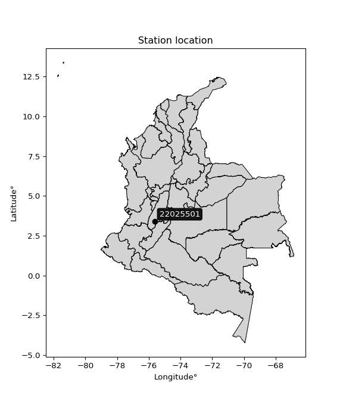

<div align="center">


</div>

# PMP Station (rain, Pmax24h): 22025501

Probable Maximum Precipitation (PMP) is the greatest amount of rainfall for a specific duration that is meteorologically possible for a given location, acting as a "worst-case" scenario for extreme storms, crucial for designing safety-critical infrastructure like bridges, river deviations, dams, spillways, and nuclear plants to prevent catastrophic failure. PMP is calculated by hydrologists using meteorological data to determine the upper limit of extreme rainfall, often leading to the Probable Maximum Flood (PMF) for flood control design, and is increasingly being studied for climate change impacts.

<div align="center">

</img>

</div>


## A. General information


### 1. General running parameters

• app_version: _v20251228_. • runtime: _2025-12-28 08:43:48.795225_. • Python version: _3.14.0_. • SciPy version: _1.16.3_. • Pandas version: _2.3.3_. • NumPy version: _2.3.5_. • Stations dataset (station_dataset_file): _dataset/pmax24h_in/automatic_colombia_2003_2024.csv_. • Stations catalog (station_catalog_file): _dataset/CNE_IDEAM.xls_. • Minimum year to eval til year_max (date_min): _1900_. • Maximum year to eval since year_min (date_max): _2024_. • Creates, save and include plots into reports (create_plot): _False_. • Plot only fit distributions with Δo > Δ (plot_only_fit): _True_. • Eval low extreme values, if False, evaluates high extreme values (low_extreme): _False_. • Eval every SciPy distribution as logarithmic (pdist_logarithmic_on): _True_. • Standard deviation normalized (ddof): _1.0_. • Return periods to eval in years (Tr): _[2, 2.33, 5, 10, 15, 20, 25, 50, 75, 100, 200, 250, 500, 750, 1000]_. • Minimum data sample per station, 0 means any (minimum_sample): _5_. • Z-Score maximum threshold to adjust a value, 0 means disable (zscore_max): _3.5_. • Z-Score minimum threshold to adjust a value, 0 means disable (zscore_min): _-2.5_. • Avoid zeros, e.g. rain = 0 (avoid_zeros): _True_. • Avoid null values (avoid_nans): _True_. [:file_folder:Dataset file.](../../dataset/pmax24h_in/automatic_colombia_2003_2024.csv)

> Delta Degrees of Freedom (DDOF): is a parameter used in the formulas for calculating variance and standard deviation. When ddof=0, the divisor is $N$ (the total number of observations) and this is used when your data set is the entire population. When ddof=1, the divisor is $N-1$ and this is used when your data set is a sample drawn from a larger population. Using $N-1$ provides an unbiased estimate of the population variance (known as Bessel´s correction).


### 2. Station info and location

|   id |   CODIGO | NOMBRE                   | CATEGORIA               | TECNOLOGIA                | ESTADO   | FECHA_INSTALACION   |   FECHA_SUSPENSION |   ALTITUD |   LATITUD |   LONGITUD | DEPARTAMENTO   | MUNICIPIO   | AREA_OPERATIVA             | ENTIDAD                                    | AREA_HIDROGRAFICA   | ZONA_HIDROGRAFICA   | SUBZONA_HIDROGRAFICA   |   CORRIENTE | Catalogo   |
|-----:|---------:|:-------------------------|:------------------------|:--------------------------|:---------|:--------------------|-------------------:|----------:|----------:|-----------:|:---------------|:------------|:---------------------------|:-------------------------------------------|:--------------------|:--------------------|:-----------------------|------------:|:-----------|
|    0 | 22025501 | ATACO  - AUT  [22025501] | Climatológica Principal | Automática con Telemetría | Activa   | 24/10/2013          |                nan |      1858 |   3.41667 |   -75.6331 | Tolima         | Ataco       | Area Operativa 10 - Tolima | CENTRO NACIONAL DE INVESTIGACIONES DE CAFE | Magdalena Cauca     | Saldaña             | Río Atá                |         nan | CNE_OE     |

<div align="center">

Map location in: [:earth_americas:Google](http://maps.google.com/maps?q=3.416666667,-75.63305556) [:earth_americas:OSM](https://www.openstreetmap.org/#map=18/3.416666667/-75.63305556&layers=P) [:earth_americas:Bing](https://www.bing.com/maps?cp=3.416666667~-75.63305556&lvl=18) [:earth_americas:Apple](https://maps.apple.com/frame?center=3.416666667%2C-75.63305556&span=0.003%2C0.006)

</div>


<div align="center">

```geojson
{
  "type": "Feature",
  "geometry": {
    "type": "Point", 
    "coordinates": [-75.63305556, 3.416666667]
  }, 
  "properties": {
    "Name": "22025501"
  }
}
```

</div>


### 3. Discrete values table and plot

|               |          0 |          1 |          2 |           3 |           4 |           5 |           6 |          7 |
|:--------------|-----------:|-----------:|-----------:|------------:|------------:|------------:|------------:|-----------:|
| Date          | 2016       | 2017       | 2018       | 2019        | 2020        | 2021        | 2022        | 2023       |
| Value         |    0.1     |   20       |   63.1     |   79.1      |   83        |   77.4      |   62.6      |   69.2     |
| Value_initial |    0.1     |   20       |   63.1     |   79.1      |   83        |   77.4      |   62.6      |   69.2     |
| count         |    8       |    8       |    8       |    8        |    8        |    8        |    8        |    8       |
| mean          |   56.8125  |   56.8125  |   56.8125  |   56.8125   |   56.8125   |   56.8125   |   56.8125   |   56.8125  |
| std           |   30.2473  |   30.2473  |   30.2473  |   30.2473   |   30.2473   |   30.2473   |   30.2473   |   30.2473  |
| zscore        |   -1.87496 |   -1.21705 |    0.20787 |    0.736842 |    0.865779 |    0.680638 |    0.191339 |    0.40954 |

> The initial value (value_initial) correspond to the initial obtained or null completed value, and value (value) is adjusted only when the initial value is outside the valid range definite through the Z-Score value. If Z-Score is active, values out of range or outliers are replaced with the station mean value


### 4. Active continuous probability distributions from SciPy (44 of 104 available)

[scipy.stats](https://docs.scipy.org/doc/scipy/reference/stats.html) is a Python´s powerful submodule within the SciPy library for comprehensive statistical analysis, offering over 130 probability distributions (like Normal, Poisson), functions for descriptive stats (mean, variance), hypothesis testing (t-tests, chi-square), random variable generation, and statistical tests, making it essential for data science, modeling, and research. It provides tools to explore, model, and draw conclusions from data efficiently, working seamlessly with NumPy.

<div align="center">

|   id | p_dist             |   n_parameter | fit_method   | label                                                                       | active   | ref                                                                                                        |
|-----:|:-------------------|--------------:|:-------------|:----------------------------------------------------------------------------|:---------|:-----------------------------------------------------------------------------------------------------------|
|    0 | alpha              |             3 | MLE          | Alpha                                                                       | True     | [:mortar_board:](https://docs.scipy.org/doc/scipy/reference/generated/scipy.stats.alpha.html)              |
|    1 | betaprime          |             4 | MLE          | Beta prime                                                                  | True     | [:mortar_board:](https://docs.scipy.org/doc/scipy/reference/generated/scipy.stats.betaprime.html)          |
|    2 | chi2               |             3 | MLE          | Chi²                                                                        | True     | [:mortar_board:](https://docs.scipy.org/doc/scipy/reference/generated/scipy.stats.chi2.html)               |
|    3 | crystalball        |             4 | MLE          | Crystalball                                                                 | True     | [:mortar_board:](https://docs.scipy.org/doc/scipy/reference/generated/scipy.stats.crystalball.html)        |
|    4 | erlang             |             3 | MLE          | Erlang                                                                      | True     | [:mortar_board:](https://docs.scipy.org/doc/scipy/reference/generated/scipy.stats.erlang.html)             |
|    5 | expon              |             2 | MLE          | Exponential                                                                 | True     | [:mortar_board:](https://docs.scipy.org/doc/scipy/reference/generated/scipy.stats.expon.html)              |
|    6 | exponnorm          |             3 | MLE          | Exponentially modified Normal                                               | True     | [:mortar_board:](https://docs.scipy.org/doc/scipy/reference/generated/scipy.stats.exponnorm.html)          |
|    7 | f                  |             4 | MLE          | F                                                                           | True     | [:mortar_board:](https://docs.scipy.org/doc/scipy/reference/generated/scipy.stats.f.html)                  |
|    8 | fatiguelife        |             3 | MLE          | Fatigue-life (Birnbaum-Saunders)                                            | True     | [:mortar_board:](https://docs.scipy.org/doc/scipy/reference/generated/scipy.stats.fatiguelife.html)        |
|    9 | fisk               |             3 | MLE          | Fisk                                                                        | True     | [:mortar_board:](https://docs.scipy.org/doc/scipy/reference/generated/scipy.stats.fisk.html)               |
|   10 | gamma              |             3 | MLE          | Gamma                                                                       | True     | [:mortar_board:](https://docs.scipy.org/doc/scipy/reference/generated/scipy.stats.gamma.html)              |
|   11 | genexpon           |             5 | MLE          | Generalized exponential                                                     | True     | [:mortar_board:](https://docs.scipy.org/doc/scipy/reference/generated/scipy.stats.genexpon.html)           |
|   12 | genlogistic        |             3 | MLE          | Generalized logistic                                                        | True     | [:mortar_board:](https://docs.scipy.org/doc/scipy/reference/generated/scipy.stats.genlogistic.html)        |
|   13 | gibrat             |             2 | MM           | Gibrat                                                                      | True     | [:mortar_board:](https://docs.scipy.org/doc/scipy/reference/generated/scipy.stats.gibrat.html)             |
|   14 | gompertz           |             3 | MLE          | Gompertz (or truncated Gumbel)                                              | True     | [:mortar_board:](https://docs.scipy.org/doc/scipy/reference/generated/scipy.stats.gompertz.html)           |
|   15 | gumbel_l           |             2 | MM           | Gumbel Left Skew                                                            | True     | [:mortar_board:](https://docs.scipy.org/doc/scipy/reference/generated/scipy.stats.gumbel_l.html)           |
|   16 | gumbel_r           |             2 | MM           | Gumbel Right Skew                                                           | True     | [:mortar_board:](https://docs.scipy.org/doc/scipy/reference/generated/scipy.stats.gumbel_r.html)           |
|   17 | halflogistic       |             2 | MM           | Half-logistic                                                               | True     | [:mortar_board:](https://docs.scipy.org/doc/scipy/reference/generated/scipy.stats.halflogistic.html)       |
|   18 | halfnorm           |             2 | MM           | Half Normal                                                                 | True     | [:mortar_board:](https://docs.scipy.org/doc/scipy/reference/generated/scipy.stats.halfnorm.html)           |
|   19 | hypsecant          |             2 | MM           | hyperbolic secant                                                           | True     | [:mortar_board:](https://docs.scipy.org/doc/scipy/reference/generated/scipy.stats.hypsecant.html)          |
|   20 | invgamma           |             3 | MLE          | Inverted gamma                                                              | True     | [:mortar_board:](https://docs.scipy.org/doc/scipy/reference/generated/scipy.stats.invgamma.html)           |
|   21 | invgauss           |             3 | MLE          | Inverse Gaussian                                                            | True     | [:mortar_board:](https://docs.scipy.org/doc/scipy/reference/generated/scipy.stats.invgauss.html)           |
|   22 | invweibull         |             3 | MLE          | Inverted Weibull                                                            | True     | [:mortar_board:](https://docs.scipy.org/doc/scipy/reference/generated/scipy.stats.invweibull.html)         |
|   23 | johnsonsu          |             4 | MLE          | Johnson Su                                                                  | True     | [:mortar_board:](https://docs.scipy.org/doc/scipy/reference/generated/scipy.stats.johnsonsu.html)          |
|   24 | kstwobign          |             2 | MLE          | Limiting distribution of scaled Kolmogorov-Smirnov two-sided test statistic | True     | [:mortar_board:](https://docs.scipy.org/doc/scipy/reference/generated/scipy.stats.kstwobign.html)          |
|   25 | laplace            |             2 | MM           | Laplace                                                                     | True     | [:mortar_board:](https://docs.scipy.org/doc/scipy/reference/generated/scipy.stats.laplace.html)            |
|   26 | laplace_asymmetric |             3 | MLE          | Asymmetric Laplace                                                          | True     | [:mortar_board:](https://docs.scipy.org/doc/scipy/reference/generated/scipy.stats.laplace_asymmetric.html) |
|   27 | loggamma           |             3 | MLE          | Log gamma                                                                   | True     | [:mortar_board:](https://docs.scipy.org/doc/scipy/reference/generated/scipy.stats.loggamma.html)           |
|   28 | logistic           |             2 | MM           | Logistic (or Sech-squared)                                                  | True     | [:mortar_board:](https://docs.scipy.org/doc/scipy/reference/generated/scipy.stats.logistic.html)           |
|   29 | lognorm            |             3 | MLE          | Log Normal                                                                  | True     | [:mortar_board:](https://docs.scipy.org/doc/scipy/reference/generated/scipy.stats.lognorm.html)            |
|   30 | maxwell            |             2 | MM           | Maxwell                                                                     | True     | [:mortar_board:](https://docs.scipy.org/doc/scipy/reference/generated/scipy.stats.maxwell.html)            |
|   31 | mielke             |             4 | MLE          | Mielke Beta-Kappa / Dagum                                                   | True     | [:mortar_board:](https://docs.scipy.org/doc/scipy/reference/generated/scipy.stats.mielke.html)             |
|   32 | moyal              |             2 | MM           | Moyal                                                                       | True     | [:mortar_board:](https://docs.scipy.org/doc/scipy/reference/generated/scipy.stats.moyal.html)              |
|   33 | nakagami           |             3 | MLE          | Nakagami                                                                    | True     | [:mortar_board:](https://docs.scipy.org/doc/scipy/reference/generated/scipy.stats.nakagami.html)           |
|   34 | ncf                |             5 | MLE          | Non-central F distribution                                                  | True     | [:mortar_board:](https://docs.scipy.org/doc/scipy/reference/generated/scipy.stats.ncf.html)                |
|   35 | nct                |             4 | MLE          | Non-central Student’s t                                                     | True     | [:mortar_board:](https://docs.scipy.org/doc/scipy/reference/generated/scipy.stats.nct.html)                |
|   36 | norm               |             2 | MM           | Normal                                                                      | True     | [:mortar_board:](https://docs.scipy.org/doc/scipy/reference/generated/scipy.stats.norm.html)               |
|   37 | pearson3           |             3 | MM           | Pearson type III                                                            | True     | [:mortar_board:](https://docs.scipy.org/doc/scipy/reference/generated/scipy.stats.pearson3.html)           |
|   38 | rayleigh           |             2 | MM           | Rayleigh                                                                    | True     | [:mortar_board:](https://docs.scipy.org/doc/scipy/reference/generated/scipy.stats.rayleigh.html)           |
|   39 | rice               |             3 | MLE          | Rice                                                                        | True     | [:mortar_board:](https://docs.scipy.org/doc/scipy/reference/generated/scipy.stats.rice.html)               |
|   40 | t                  |             3 | MLE          | Student’s t                                                                 | True     | [:mortar_board:](https://docs.scipy.org/doc/scipy/reference/generated/scipy.stats.t.html)                  |
|   41 | truncnorm          |             4 | MLE          | Truncated normal                                                            | True     | [:mortar_board:](https://docs.scipy.org/doc/scipy/reference/generated/scipy.stats.truncnorm.html)          |
|   42 | wald               |             2 | MM           | Wald                                                                        | True     | [:mortar_board:](https://docs.scipy.org/doc/scipy/reference/generated/scipy.stats.wald.html)               |
|   43 | weibull_min        |             3 | MLE          | Weibull minimum                                                             | True     | [:mortar_board:](https://docs.scipy.org/doc/scipy/reference/generated/scipy.stats.weibull_min.html)        |

</div>

> **n_parameter:** # arguments & localization & scale.
>
> **Fit methods:** (MLE) maximum likelihood, (MM) L-moments.
>
>**Inactive:** foldnorm, gennorm, norminvgauss, powernorm, powerlognorm, skewnorm, genextreme, anglit, arcsine, argus, beta, bradford, burr, burr12, cauchy, cosine, halfcauchy, foldcauchy, skewcauchy, wrapcauchy, dgamma, gengamma, exponweib, exponpow, truncexpon, gausshyper, genhalflogistic, genhyperbolic, geninvgauss, halfgennorm, johnsonsb, kappa4, kappa3, ksone, kstwo, loglaplace, levy, levy_l, levy_stable, ncx2, pareto, genpareto, truncpareto, lomax, powerlaw, rdist, rel_breitwigner, recipinvgauss, semicircular, studentized_range, trapezoid, triang, truncweibull_min, tukeylambda, uniform, loguniform, vonmises, vonmises_line, weibull_max, dweibull, 


## B. Probability distributions vs. Empirical distributions

A continuous probability distribution (CPD) describes probabilities for variables that can take any value within a range (like rain any time), unlike discrete variables with specific outcomes (like temperature). It uses a Probability Density Function (PDF), a curve where the total area under it equals 1, and the probability of the variable falling within an interval (a to b) is found by calculating the area under the curve between those points. A key feature is that the probability of hitting any single exact value is zero, so probabilities are always expressed for ranges, e.g., $P(a ≤ X ≤ b)$.

<div align="center">

Distributions parameters from station values
|    |   station | p_dist                |   n |              loc |           scale | shape                  | shape1                | shape2                | shape3   |
|---:|----------:|:----------------------|----:|-----------------:|----------------:|:-----------------------|:----------------------|:----------------------|:---------|
|  0 |  22025501 | alpha                 |   8 |   -125.752       |   775.89        | 4.414052846009378      |                       |                       |          |
|  1 |  22025501 | betaprime             |   8 |  -1019.4         | 61376.9         | 1423.534707385069      | 81197.10438997266     |                       |          |
|  2 |  22025501 | chi2                  |   8 |   -257.626       |     1.45367     | 216.56917485845747     |                       |                       |          |
|  3 |  22025501 | crystalball           |   8 |     56.5674      |    28.0901      | 49156.74245730313      | 154.87421518046523    |                       |          |
|  4 |  22025501 | erlang                |   8 |   -611.564       |     1.27728     | 523.0827727595063      |                       |                       |          |
|  5 |  22025501 | expon                 |   8 |      0.1         |    56.7125      |                        |                       |                       |          |
|  6 |  22025501 | exponnorm             |   8 |     56.7912      |    28.2938      | 0.0007561036170476052  |                       |                       |          |
|  7 |  22025501 | f                     |   8 |      0.1         |    52.781       | 1.3378509599613015     | 1060.807118686058     |                       |          |
|  8 |  22025501 | fatiguelife           |   8 |      0.1         |     7.20707e-05 | 926.0719752078562      |                       |                       |          |
|  9 |  22025501 | fisk                  |   8 |     -2.50129e+06 |     2.50135e+06 | 159254.04320916507     |                       |                       |          |
| 10 |  22025501 | gamma                 |   8 |   -280.998       |     2.63658     | 127.87257390607166     |                       |                       |          |
| 11 |  22025501 | genexpon              |   8 |      0.0999672   |     2.54596     | 0.044894908471040974   | 8.216915886037982e-08 | 2.330000592870538     |          |
| 12 |  22025501 | genlogistic           |   8 |     83.0002      |     1.67937e-05 | 6.415687945721269e-07  |                       |                       |          |
| 13 |  22025501 | gibrat                |   8 |     35.2279      |    13.0917      |                        |                       |                       |          |
| 14 |  22025501 | gompertz              |   8 |     20           |     6.16432     | 0.00011927680776491981 |                       |                       |          |
| 15 |  22025501 | gumbel_l              |   8 |     69.5462      |    22.0606      |                        |                       |                       |          |
| 16 |  22025501 | gumbel_r              |   8 |     44.0788      |    22.0606      |                        |                       |                       |          |
| 17 |  22025501 | halflogistic          |   8 |     23.2778      |    24.1902      |                        |                       |                       |          |
| 18 |  22025501 | halfnorm              |   8 |     19.3626      |    46.9365      |                        |                       |                       |          |
| 19 |  22025501 | hypsecant             |   8 |     56.8125      |    18.0124      |                        |                       |                       |          |
| 20 |  22025501 | invgamma              |   8 |   -358.759       | 75038.8         | 181.47587394377717     |                       |                       |          |
| 21 |  22025501 | invgauss              |   8 |   -144.26        |  7846.86        | 0.025605609676514908   |                       |                       |          |
| 22 |  22025501 | invweibull            |   8 |      0.1         |     2.72586     | 0.0496845270753266     |                       |                       |          |
| 23 |  22025501 | johnsonsu             |   8 |     84.094       |     0.0276776   | 5.221115175246254      | 0.7562001905268192    |                       |          |
| 24 |  22025501 | kstwobign             |   8 |    -69.1718      |   143.656       |                        |                       |                       |          |
| 25 |  22025501 | laplace               |   8 |     56.8125      |    20.0067      |                        |                       |                       |          |
| 26 |  22025501 | laplace_asymmetric    |   8 |     83           |     0.64933     | 40.3199875623773       |                       |                       |          |
| 27 |  22025501 | loggamma              |   8 |     83.0002      |     3.66407e-06 | 1.3996580122769523e-07 |                       |                       |          |
| 28 |  22025501 | logistic              |   8 |     56.8125      |    15.5992      |                        |                       |                       |          |
| 29 |  22025501 | lognorm               |   8 |      0.1         |     0.280239    | 14.196892396248849     |                       |                       |          |
| 30 |  22025501 | maxwell               |   8 |    -10.2319      |    42.0138      |                        |                       |                       |          |
| 31 |  22025501 | mielke                |   8 |     -2.00716e+06 |     2.00724e+06 | 76523.06373239505      | 336892584.29539025    |                       |          |
| 32 |  22025501 | moyal                 |   8 |     40.6323      |    12.7367      |                        |                       |                       |          |
| 33 |  22025501 | nakagami              |   8 |      0.1         |    55.6911      | 0.22101875138200533    |                       |                       |          |
| 34 |  22025501 | ncf                   |   8 |      0.1         |     7.65374     | 0.7211508818989506     | 7.869134609545879     | 4.623495062407672     |          |
| 35 |  22025501 | nct                   |   8 |  -1987.38        |    28.2677      | 927641.2346845521      | 72.31531865627213     |                       |          |
| 36 |  22025501 | norm                  |   8 |     56.8125      |    28.2938      |                        |                       |                       |          |
| 37 |  22025501 | pearson3              |   8 |     56.8125      |    28.2937      | -1.0606599400869152    |                       |                       |          |
| 38 |  22025501 | rayleigh              |   8 |      2.6848      |    43.1876      |                        |                       |                       |          |
| 39 |  22025501 | rice                  |   8 |  -5412.46        |    28.2776      | 193.41098572309158     |                       |                       |          |
| 40 |  22025501 | t                     |   8 |     56.8126      |    28.2935      | 69222561.06769952      |                       |                       |          |
| 41 |  22025501 | truncnorm             |   8 |     -4.13928     |    10.1532      | -0.4741365524530015    | 8.582437849830388     |                       |          |
| 42 |  22025501 | wald                  |   8 |     28.5187      |    28.2938      |                        |                       |                       |          |
| 43 |  22025501 | weibull_min           |   8 |     -2.55313e+09 |     2.55313e+09 | 140776128.69153887     |                       |                       |          |
| 44 |  22025501 | logalpha              |   8 |    -83.7183      |  3205.11        | 36.88883112068697      |                       |                       |          |
| 45 |  22025501 | logbetaprime          |   8 |     -2.30259     |    10.2287      | 0.2156506949246786     | 2.3146658822989563    |                       |          |
| 46 |  22025501 | logchi2               |   8 |     -2.30259     |     2.19267     | 0.36909925101450203    |                       |                       |          |
| 47 |  22025501 | logcrystalball        |   8 |      3.29377     |     2.15846     | 833.8500924000693      | 31.102420475353796    |                       |          |
| 48 |  22025501 | logerlang             |   8 |     -2.30259     |    73.4239      | 0.06895744673318746    |                       |                       |          |
| 49 |  22025501 | logexpon              |   8 |     -2.30259     |     5.59636     |                        |                       |                       |          |
| 50 |  22025501 | logexponnorm          |   8 |      3.29236     |     2.15846     | 0.0006524814475357898  |                       |                       |          |
| 51 |  22025501 | logf                  |   8 |     -2.30259     |     1.13284     | 1.0533198986566021     | 1.0453379957440307    |                       |          |
| 52 |  22025501 | logfatiguelife        |   8 |  -1914.17        |  1917.48        | 0.0011220567357439403  |                       |                       |          |
| 53 |  22025501 | logfisk               |   8 |     -2.30259     |     3.75098     | 0.2176540444427001     |                       |                       |          |
| 54 |  22025501 | loggamma              |   8 |    -35.8068      |     0.134327    | 290.91965461650557     |                       |                       |          |
| 55 |  22025501 | loggenexpon           |   8 |     -3.48378     |     0.142884    | 1.5703386826936634e-05 | 10.257889182965986    | 7.830362885949773e-05 |          |
| 56 |  22025501 | loggenlogistic        |   8 |      4.41927     |     4.88478e-05 | 4.4177947442548495e-05 |                       |                       |          |
| 57 |  22025501 | loggibrat             |   8 |      1.64713     |     0.998737    |                        |                       |                       |          |
| 58 |  22025501 | loggompertz           |   8 |     -2.3026      |     2.09601     | 0.05630818736388171    |                       |                       |          |
| 59 |  22025501 | loggumbel_l           |   8 |      4.26519     |     1.68294     |                        |                       |                       |          |
| 60 |  22025501 | loggumbel_r           |   8 |      2.32235     |     1.68294     |                        |                       |                       |          |
| 61 |  22025501 | loghalflogistic       |   8 |      0.73551     |     1.84541     |                        |                       |                       |          |
| 62 |  22025501 | loghalfnorm           |   8 |      0.436828    |     3.58064     |                        |                       |                       |          |
| 63 |  22025501 | loghypsecant          |   8 |      3.29377     |     1.37412     |                        |                       |                       |          |
| 64 |  22025501 | loginvgamma           |   8 |    -55.4104      | 37092.3         | 632.8710562415833      |                       |                       |          |
| 65 |  22025501 | loginvgauss           |   8 |    -21.3986      |  2366.69        | 0.010444212534905177   |                       |                       |          |
| 66 |  22025501 | loginvweibull         |   8 |     -3.71274e+08 |     3.71274e+08 | 129538748.49099082     |                       |                       |          |
| 67 |  22025501 | logjohnsonsu          |   8 |      4.41884     |     6.09809e-11 | 1.6136129843199525     | 0.12159975337866824   |                       |          |
| 68 |  22025501 | logkstwobign          |   8 |     -8.45851     |    13.4713      |                        |                       |                       |          |
| 69 |  22025501 | loglaplace            |   8 |      3.29377     |     1.52626     |                        |                       |                       |          |
| 70 |  22025501 | loglaplace_asymmetric |   8 |      4.41884     |     0.00964881  | 116.64745934598585     |                       |                       |          |
| 71 |  22025501 | logloggamma           |   8 |      4.41888     |     2.15295e-06 | 1.907266220154726e-06  |                       |                       |          |
| 72 |  22025501 | loglogistic           |   8 |      3.29377     |     1.19002     |                        |                       |                       |          |
| 73 |  22025501 | loglognorm            |   8 |  -1268.22        |  1271.5         | 0.001692241645486342   |                       |                       |          |
| 74 |  22025501 | logmaxwell            |   8 |     -1.82083     |     3.20511     |                        |                       |                       |          |
| 75 |  22025501 | logmielke             |   8 | -85879           | 85882.3         | 68584.13761713757      | 55803.9963311817      |                       |          |
| 76 |  22025501 | logmoyal              |   8 |      2.05943     |     0.971648    |                        |                       |                       |          |
| 77 |  22025501 | lognakagami           |   8 |  -3148.68        |  3151.98        | 530078.6860777447      |                       |                       |          |
| 78 |  22025501 | logncf                |   8 |     -2.30259     |     1.02512     | 1.0288412220740746     | 1.1292455892951616    | 1.0971725861318835    |          |
| 79 |  22025501 | lognct                |   8 |    200.955       |     2.15643     | 2494841.800025464      | -91.66096658068255    |                       |          |
| 80 |  22025501 | lognorm               |   8 |      3.29377     |     2.15846     |                        |                       |                       |          |
| 81 |  22025501 | logpearson3           |   8 |      3.2938      |     2.15845     | -2.1057243346096266    |                       |                       |          |
| 82 |  22025501 | lograyleigh           |   8 |     -0.835482    |     3.29467     |                        |                       |                       |          |
| 83 |  22025501 | logrice               |   8 |   -392.926       |     2.15838     | 183.5705050963753      |                       |                       |          |
| 84 |  22025501 | logt                  |   8 |      4.28355     |     0.12791     | 0.6867662346827452     |                       |                       |          |
| 85 |  22025501 | logtruncnorm          |   8 |      2.96703     |     7.63383     | -0.6902977041776248    | 0.19018407388005798   |                       |          |
| 86 |  22025501 | logwald               |   8 |      1.13529     |     2.15848     |                        |                       |                       |          |
| 87 |  22025501 | logweibull_min        |   8 |     -2.30259     |     1.70723     | 0.605064217918732      |                       |                       |          |

</div>

> **loc** (Location parameter): This shifts the distribution along the x-axis. For many common distributions, like the normal (Gaussian) distribution, loc represents the mean $μ$. For others, like the uniform distribution, it might represent the minimum value, or for the beta distribution, the left end of the support interval.
>
> **scale** (Scale parameter): This determines the width or spread of the distribution. For the normal distribution, scale represents the standard deviation $σ$. For a uniform distribution, it defines the length of the interval (from $loc$ to $loc + scale$).
>
> **shape** (Shape parameters): Refers to parameters that define the specific form of a probability distribution, distinct from its location (loc) and scale (scale). These parameters are required arguments for most distribution functions. For example, a normal (Gaussian) distribution is fully defined by its location (mean) and scale (standard deviation), so it has no specific shape parameters beyond loc and scale. However, other distributions have intrinsic properties that need specification, as Gamma distribution that takes a shape parameter, often named $a$ or $alpha$.


### 0. Cumulative distribution values - CDF (88 evaluated)

Cumulative Distribution Function (CDF), denoted as $F$<sub>$X$</sub>$(x)$, is a function that gives the probability that a random variable $X$ will take a value less than or equal to a specific value, $x$ (i.e., $(P(X≥x)$. It essentially "accumulates" probabilities from a given point up to the far right (positive infinity), providing a complete picture of the distribution´s probabilities for both discrete (like rain) and continuous (like temperature) variables, helping to find probabilities over ranges or above certain values.

<div align="center">

CDF ordered by x ascending and calculating $log(f(x))$ separately
|   id |   Station |   date |    x |   count |    mean |     std |    zscore |   Value_initial |   station |   m |     alpha |   alpha_pdf |   betaprime |   betaprime_pdf |      chi2 |   chi2_pdf |   crystalball |   crystalball_pdf |    erlang |   erlang_pdf |    expon |   expon_pdf |   exponnorm |   exponnorm_pdf |           f |          f_pdf |   fatiguelife |   fatiguelife_pdf |      fisk |   fisk_pdf |     gamma |   gamma_pdf |    genexpon |   genexpon_pdf |   genlogistic |   genlogistic_pdf |   gibrat |   gibrat_pdf |    gompertz |   gompertz_pdf |   gumbel_l |   gumbel_l_pdf |    gumbel_r |   gumbel_r_pdf |   halflogistic |   halflogistic_pdf |   halfnorm |   halfnorm_pdf |   hypsecant |   hypsecant_pdf |   invgamma |   invgamma_pdf |   invgauss |   invgauss_pdf |   invweibull |   invweibull_pdf |   johnsonsu |   johnsonsu_pdf |   kstwobign |   kstwobign_pdf |   laplace |   laplace_pdf |   laplace_asymmetric |   laplace_asymmetric_pdf |   loggamma |   loggamma_pdf |   logistic |   logistic_pdf |   lognorm |   lognorm_pdf |    maxwell |   maxwell_pdf |    mielke |   mielke_pdf |       moyal |   moyal_pdf |    nakagami |   nakagami_pdf |         ncf |     ncf_pdf |       nct |    nct_pdf |      norm |   norm_pdf |   pearson3 |   pearson3_pdf |   rayleigh |   rayleigh_pdf |      rice |   rice_pdf |         t |      t_pdf |   truncnorm |   truncnorm_pdf |     wald |   wald_pdf |   weibull_min |   weibull_min_pdf |   logalpha |   logalpha_pdf |   logbetaprime |   logbetaprime_pdf |   logchi2 |   logchi2_pdf |   logcrystalball |   logcrystalball_pdf |   logerlang |   logerlang_pdf |   logexpon |   logexpon_pdf |   logexponnorm |   logexponnorm_pdf |        logf |    logf_pdf |   logfatiguelife |   logfatiguelife_pdf |     logfisk |   logfisk_pdf |   loggenexpon |   loggenexpon_pdf |   loggenlogistic |   loggenlogistic_pdf |   loggibrat |   loggibrat_pdf |   loggompertz |   loggompertz_pdf |   loggumbel_l |   loggumbel_l_pdf |   loggumbel_r |   loggumbel_r_pdf |   loghalflogistic |   loghalflogistic_pdf |   loghalfnorm |   loghalfnorm_pdf |   loghypsecant |   loghypsecant_pdf |   loginvgamma |   loginvgamma_pdf |   loginvgauss |   loginvgauss_pdf |   loginvweibull |   loginvweibull_pdf |   logjohnsonsu |   logjohnsonsu_pdf |   logkstwobign |   logkstwobign_pdf |   loglaplace |   loglaplace_pdf |   loglaplace_asymmetric |   loglaplace_asymmetric_pdf |   logloggamma |   logloggamma_pdf |   loglogistic |   loglogistic_pdf |   loglognorm |   loglognorm_pdf |   logmaxwell |   logmaxwell_pdf |   logmielke |   logmielke_pdf |   logmoyal |   logmoyal_pdf |   lognakagami |   lognakagami_pdf |      logncf |   logncf_pdf |     lognct |   lognct_pdf |   logpearson3 |   logpearson3_pdf |   lograyleigh |   lograyleigh_pdf |   logrice |   logrice_pdf |      logt |   logt_pdf |   logtruncnorm |   logtruncnorm_pdf |   logwald |   logwald_pdf |   logweibull_min |   logweibull_min_pdf |
|-----:|----------:|-------:|-----:|--------:|--------:|--------:|----------:|----------------:|----------:|----:|----------:|------------:|------------:|----------------:|----------:|-----------:|--------------:|------------------:|----------:|-------------:|---------:|------------:|------------:|----------------:|------------:|---------------:|--------------:|------------------:|----------:|-----------:|----------:|------------:|------------:|---------------:|--------------:|------------------:|---------:|-------------:|------------:|---------------:|-----------:|---------------:|------------:|---------------:|---------------:|-------------------:|-----------:|---------------:|------------:|----------------:|-----------:|---------------:|-----------:|---------------:|-------------:|-----------------:|------------:|----------------:|------------:|----------------:|----------:|--------------:|---------------------:|-------------------------:|-----------:|---------------:|-----------:|---------------:|----------:|--------------:|-----------:|--------------:|----------:|-------------:|------------:|------------:|------------:|---------------:|------------:|------------:|----------:|-----------:|----------:|-----------:|-----------:|---------------:|-----------:|---------------:|----------:|-----------:|----------:|-----------:|------------:|----------------:|---------:|-----------:|--------------:|------------------:|-----------:|---------------:|---------------:|-------------------:|----------:|--------------:|-----------------:|---------------------:|------------:|----------------:|-----------:|---------------:|---------------:|-------------------:|------------:|------------:|-----------------:|---------------------:|------------:|--------------:|--------------:|------------------:|-----------------:|---------------------:|------------:|----------------:|--------------:|------------------:|--------------:|------------------:|--------------:|------------------:|------------------:|----------------------:|--------------:|------------------:|---------------:|-------------------:|--------------:|------------------:|--------------:|------------------:|----------------:|--------------------:|---------------:|-------------------:|---------------:|-------------------:|-------------:|-----------------:|------------------------:|----------------------------:|--------------:|------------------:|--------------:|------------------:|-------------:|-----------------:|-------------:|-----------------:|------------:|----------------:|-----------:|---------------:|--------------:|------------------:|------------:|-------------:|-----------:|-------------:|--------------:|------------------:|--------------:|------------------:|----------:|--------------:|----------:|-----------:|---------------:|-------------------:|----------:|--------------:|-----------------:|---------------------:|
|    0 |  22025501 |   2016 |  0.1 |       8 | 56.8125 | 30.2473 | -1.87496  |             0.1 |  22025501 |   1 | 0.0399687 |  0.00421871 |   0.0231266 |      0.00197388 | 0.0237116 | 0.00211342 |     0.0222037 |        0.00188306 | 0.0241185 |   0.00205934 | 0        |  0.0176328  |   0.0225127 |      0.00189143 | 3.15221e-13 | 15194          |     0.0551435 |       2.70085e+09 | 0.0191685 | 0.00119704 | 0.0246715 |  0.00219002 | 5.78121e-07 |     0.0176338  |      0        |        0.00160943 | 0        |   0          | 0           |    0           |   0.04203  |     0.0018646  | 0.000648062 |    0.000215668 |       0        |         0          |  0         |     0          |   0.0273039 |      0.00151398 |  0.0238731 |     0.00221365 |  0.0226001 |     0.00236406 |  0.000723733 |      1.87363e+13 |   0.0859438 |      0.00141258 |   0.0257994 |      0.00357966 | 0.0293689 |    0.00146795 |            0.0421283 |               0.00160912 | 0.00555116 |     0.00767911 |  0.0256905 |     0.0016046  | 0.0047605 |    0.00641237 | 0.00388434 |    0.00111427 | 0.0423445 |   0.00161438 | 9.13276e-07 | 8.97494e-07 | 4.69108e-09 |    1.49421e+08 | 1.83459e-07 | 3.13596e+07 | 0.0225571 | 0.00189394 | 0.0225128 | 0.00189143 |  0.0428731 |     0.00200144 |  0         |     0          | 0.0224476 | 0.00188791 | 0.0225115 | 0.00189136 |    0.504403 |     0.0527809   | 0        | 0          |     0.0220786 |        0.00120385 | 0.00659989 |     0.00894515 |    0.000373769 |        1.81503e+11 | 0.0012114 |   5.03419e+11 |       0.00476051 |           0.00641237 |   0.0673454 |     1.04573e+13 |   0        |      0.178688  |     0.00476057 |         0.00641244 | 4.99161e-09 | 5.91971e+06 |       0.00451714 |           0.00615679 | 0.000341465 |   1.67299e+11 |     0.0271934 |         0.0453004 |         0        |           0.00207098 |    0        |       0         |   2.82826e-07 |         0.0268646 |     0.0199878 |         0.0117572 |   1.65662e-07 |       1.53691e-06 |          0        |              0        |      0        |          0        |      0.0108415 |         0.00788828 |    0.00563251 |        0.00787109 |    0.00648523 |        0.00942443 |       0.0106783 |           0.016913  |      0.0590922 |        0.0021295   |      0.0149065 |          0.026191  |    0.0127802 |       0.00837353 |              0.00254922 |                  0.00226495 |    0.00259431 |        0.00229826 |    0.00898885 |        0.00748563 |   0.00465392 |       0.00633171 |     0        |         0        |   0.0105129 |      0.00818967 | 3.8329e-21 |    1.77587e-19 |    0.00485511 |        0.00651113 | 4.72744e-09 |  5.47613e+06 | 0.00475836 |   0.00640979 |     0.0281154 |         0.0126616 |      0        |          0        | 0.0047583 |    0.00641001 | 0.0207616 | 0.00216455 |    7.30547e-08 |           0.124634 |  0        |     0         |      3.71691e-10 |       506423         |
|    1 |  22025501 |   2017 | 20   |       8 | 56.8125 | 30.2473 | -1.21705  |            20   |  22025501 |   2 | 0.181594  |  0.00963691 |   0.10023   |      0.00625584 | 0.105823  | 0.00657409 |     0.0964939 |        0.00608648 | 0.103764  |   0.00640752 | 0.295941 |  0.0124145  |   0.0966151 |      0.00604824 | 0.399269    |     0.0115044  |     0.714784  |       0.00484193  | 0.0648806 | 0.00386283 | 0.109542  |  0.00678281 | 0.295955    |     0.012415   |      0        |        0.00344222 | 0        |   0          | 6.27295e-10 |    1.93496e-05 |   0.100423 |     0.00431551 | 0.0508592   |    0.00686718  |       0        |         0          |  0.0108355 |     0.0169977  |   0.0820137 |      0.00450297 |  0.110467  |     0.00690771 |  0.117867  |     0.00757811 |  0.404157    |      0.000914162 |   0.12268   |      0.00239708 |   0.164299  |      0.00995636 | 0.0794083 |    0.00396908 |            0.0900903 |               0.00344106 | 0.459748   |     0.174041   |  0.0862822 |     0.00505395 | 0.445089  |    0.183074   | 0.085032   |    0.0075903  | 0.0904251 |   0.00344743 | 0.0245884   | 0.00562919  | 0.495375    |    0.010752    | 0.242249    | 0.0101017   | 0.0967139 | 0.00605044 | 0.0966154 | 0.00604825 |  0.104984  |     0.00452868 |  0.0772271 |     0.00856649 | 0.0964766 | 0.00604537 | 0.0966125 | 0.00604817 |    0.987227 |     0.00341117  | 0        | 0          |     0.0646996 |        0.00344947 | 0.470919   |     0.169597   |    0.923879    |        0.0155059   | 0.96506   |   0.0116814   |       0.445089   |           0.183074   |   0.860844  |     0.0104717   |   0.611998 |      0.0693312 |     0.445089   |         0.183074   | 0.729891    | 0.0233556   |       0.442613   |           0.183532   | 0.518784    |   0.0102555   |     0.562041  |         0.111497  |         0        |           0.249591   |    0.618038 |       0.282775  |   0.477439    |         0.175845  |     0.375207  |         0.174612  |   0.511586    |       0.203741    |          0.545808 |              0.190227 |      0.525175 |          0.172614 |      0.431495  |         0.226303   |    0.459869   |        0.171155   |    0.468814   |        0.159746   |       0.489298  |           0.122026  |      0.0847734 |        0.0132697   |      0.535089  |          0.112722  |    0.411304  |       0.269485   |              0.282384   |                  0.250895   |    0.283444   |        0.251098   |    0.437713   |        0.20682    |   0.447317   |       0.183831   |     0.479451 |         0.181758 |   0.365216  |      0.163146   | 0.536798   |    0.20956     |    0.445304   |        0.182572   | 0.643638    |  0.0300984   | 0.445073   |   0.18309    |     0.314257  |         0.146291  |      0.491411 |          0.179507 | 0.44507   |    0.183081   | 0.063594  | 0.0337699  |    0.776288    |           0.158163 |  0.606796 |     0.228431  |      0.862518    |            0.0311536 |
|    2 |  22025501 |   2022 | 62.6 |       8 | 56.8125 | 30.2473 |  0.191339 |            62.6 |  22025501 |   3 | 0.615887  |  0.0083544  |   0.585161  |      0.0134991  | 0.583052  | 0.012751   |     0.585022  |        0.0138785  | 0.587363  |   0.0132473  | 0.667811 |  0.00585743 |   0.581037  |      0.0138081  | 0.708484    |     0.00458957 |     0.84269   |       0.00193571  | 0.511028  | 0.0159091  | 0.596555  |  0.0128212  | 0.667832    |     0.00585739 |      0        |        0.0175239  | 0.769604 |   0.011104   | 0.112649    |    0.0172212   |   0.518035 |     0.015946   | 0.649274    |    0.0127114   |       0.671117 |         0.01136    |  0.643049  |     0.0111214  |   0.600559  |      0.0167972  |  0.590299  |     0.0123469  |  0.603394  |     0.0116829  |  0.424911    |      0.000289101 |   0.368629  |      0.0132675  |   0.630672  |      0.00925018 | 0.625598  |    0.0187138  |            0.458495  |               0.0175125  | 0.653372   |     0.158745   |  0.591704  |     0.0154874  | 0.651936  |    0.171255   | 0.60916    |    0.0127016  | 0.458801  |   0.0174913  | 0.672911    | 0.0120956   | 0.787127    |    0.00442111  | 0.588479    | 0.00598712  | 0.581002  | 0.0138014  | 0.581038  | 0.0138081  |  0.513183  |     0.0151055  |  0.617999  |     0.0122711  | 0.581062  | 0.0138159  | 0.581037  | 0.0138082  |    1        |     2.38782e-11 | 0.7386   | 0.0104819  |     0.503708  |        0.0191716  | 0.658028   |     0.152487   |    0.938878    |        0.0111208   | 0.97592   |   0.00768109  |       0.651936   |           0.171255   |   0.871657  |     0.00859816  |   0.683563 |      0.0565433 |     0.651936   |         0.171255   | 0.753224    | 0.017938    |       0.650222   |           0.172043   | 0.529372    |   0.008421    |     0.680703  |         0.0955662 |         0        |           0.700484   |    0.819484 |       0.105587  |   0.686308    |         0.181936  |     0.604074  |         0.217973  |   0.711603    |       0.143862    |          0.726628 |              0.127888 |      0.698545 |          0.130654 |      0.684068  |         0.193984   |    0.64986    |        0.155674   |    0.644179   |        0.14298    |       0.618759  |           0.103634  |      0.119625  |        0.0860455   |      0.653709  |          0.0946082 |    0.712195  |       0.188569   |              0.778261   |                  0.691474   |    0.778864   |        0.689984   |    0.670044   |        0.185782   |   0.654587   |       0.171193   |     0.673364 |         0.15286  |   0.559135  |      0.168286   | 0.731328   |    0.132908    |    0.651576   |        0.170817   | 0.673967    |  0.0235085   | 0.651941   |   0.171274   |     0.538091  |         0.257967  |      0.679802 |          0.146673 | 0.651927  |    0.171265   | 0.257749  | 0.929377   |    0.956038    |           0.156319 |  0.78728  |     0.106699  |      0.892772    |            0.0224966 |
|    3 |  22025501 |   2018 | 63.1 |       8 | 56.8125 | 30.2473 |  0.20787  |            63.1 |  22025501 |   4 | 0.620047  |  0.00828306 |   0.591897  |      0.0134427  | 0.589413  | 0.0126925  |     0.591947  |        0.0138233  | 0.593972  |   0.0131892  | 0.670726 |  0.00580601 |   0.587929  |      0.0137561  | 0.710768    |     0.00454858 |     0.843654  |       0.00192023  | 0.51898   | 0.0158939  | 0.60295   |  0.0127553  | 0.670748    |     0.00580597 |      0        |        0.0178618  | 0.775069 |   0.0107584  | 0.121573    |    0.0184884   |   0.526032 |     0.0160409  | 0.655589    |    0.0125474   |       0.676757 |         0.0112029  |  0.648582  |     0.0110122  |   0.608921  |      0.0166472  |  0.596456  |     0.0122813  |  0.609217  |     0.0116074  |  0.425055    |      0.00028679  |   0.375361  |      0.0136626  |   0.635279  |      0.00917633 | 0.634839  |    0.0182519  |            0.467335  |               0.0178502  | 0.654634   |     0.158509   |  0.599424  |     0.0153928  | 0.653298  |    0.171008   | 0.615489   |    0.0126128  | 0.46763   |   0.0178279  | 0.67891     | 0.0119013   | 0.789328    |    0.00438186  | 0.591461    | 0.00594096  | 0.58789   | 0.0137495  | 0.587929  | 0.0137561  |  0.52076   |     0.0152012  |  0.624111  |     0.0121755  | 0.587957  | 0.0137639  | 0.587928  | 0.0137562  |    1        |     1.72541e-11 | 0.743776 | 0.0102263  |     0.513332  |        0.0193253  | 0.65924    |     0.152254   |    0.938967    |        0.0110966   | 0.975981  |   0.00765945  |       0.653298   |           0.171008   |   0.871725  |     0.00858736  |   0.684013 |      0.056463  |     0.653298   |         0.171008   | 0.753367    | 0.0179078   |       0.65159    |           0.171796   | 0.529439    |   0.00841047  |     0.681462  |         0.0954381 |         0        |           0.705543   |    0.820321 |       0.104944  |   0.687755    |         0.181786  |     0.605808  |         0.218047  |   0.712746    |       0.143414    |          0.727644 |              0.127488 |      0.699583 |          0.130354 |      0.685608  |         0.193369   |    0.651097   |        0.155445   |    0.645316   |        0.142774   |       0.619583  |           0.103485  |      0.120321  |        0.0889054   |      0.654461  |          0.0944724 |    0.713692  |       0.187588   |              0.783781   |                  0.696379   |    0.784373   |        0.694863   |    0.671521   |        0.185359   |   0.655948   |       0.170939   |     0.674579 |         0.152563 |   0.560473  |      0.168145   | 0.732383   |    0.132428    |    0.652934   |        0.170572   | 0.674154    |  0.0234711   | 0.653303   |   0.171026   |     0.540148  |         0.259039  |      0.680967 |          0.146373 | 0.653289  |    0.171017   | 0.26537   | 0.987421   |    0.957281    |           0.156294 |  0.788126 |     0.106182  |      0.892951    |            0.0224481 |
|    4 |  22025501 |   2023 | 69.2 |       8 | 56.8125 | 30.2473 |  0.40954  |            69.2 |  22025501 |   5 | 0.667913  |  0.00741189 |   0.671189  |      0.0124713  | 0.664175  | 0.0117539  |     0.673542  |        0.0128363  | 0.671697  |   0.0122171  | 0.704305 |  0.00521393 |   0.66924   |      0.0128114  | 0.737064    |     0.00408341 |     0.854822  |       0.00174524  | 0.614039  | 0.0150888  | 0.677817  |  0.0117257  | 0.704326    |     0.00521386 |      0        |        0.0225493  | 0.829847 |   0.00745317 | 0.294532    |    0.0399424   |   0.626347 |     0.0166738  | 0.725987    |    0.0105382   |       0.739417 |         0.00936873 |  0.711676  |     0.00967411 |   0.703449  |      0.0141833  |  0.668513  |     0.0112887  |  0.676912  |     0.0105489  |  0.426724    |      0.000261297 |   0.476834  |      0.0202209  |   0.688468  |      0.00825914 | 0.730804  |    0.0134553  |            0.589951  |               0.0225336  | 0.669131   |     0.155666   |  0.688714  |     0.0137435  | 0.668941  |    0.167996   | 0.688762   |    0.0113652  | 0.590065  |   0.0224955  | 0.744576    | 0.00967731  | 0.814653    |    0.00392938  | 0.626031    | 0.00540049  | 0.669164  | 0.0128059  | 0.66924   | 0.0128114  |  0.616321  |     0.016009   |  0.694566  |     0.0108923  | 0.669312  | 0.0128177  | 0.66924   | 0.0128115  |    1        |     2.69504e-13 | 0.797834 | 0.00765094 |     0.635094  |        0.0202837  | 0.673163   |     0.149457   |    0.939978    |        0.0108214   | 0.976676  |   0.00741354  |       0.668941   |           0.167996   |   0.872512  |     0.00846384  |   0.689181 |      0.0555396 |     0.668941   |         0.167996   | 0.755004    | 0.017563    |       0.667306   |           0.168787   | 0.530209    |   0.00829026  |     0.6902    |         0.0939401 |         0        |           0.766953   |    0.829672 |       0.0978297 |   0.704443    |         0.179815  |     0.625958  |         0.218562  |   0.725741    |       0.138237    |          0.739196 |              0.122897 |      0.711452 |          0.126879 |      0.703118  |         0.186064   |    0.665316   |        0.152695   |    0.658378   |        0.140315   |       0.629052  |           0.101737  |      0.130618  |        0.141929    |      0.663106  |          0.0928943 |    0.730489  |       0.176582   |              0.850751   |                  0.755881   |    0.851189   |        0.754055   |    0.688393   |        0.180256   |   0.671582   |       0.167857   |     0.688496 |         0.149049 |   0.575909  |      0.166358   | 0.74435    |    0.126957    |    0.668538   |        0.167582   | 0.6763      |  0.0230444   | 0.668948   |   0.168014   |     0.564639  |         0.271897  |      0.694312 |          0.142849 | 0.668933  |    0.168005   | 0.39851   | 1.97601    |    0.97169     |           0.155991 |  0.797655 |     0.100398  |      0.894997    |            0.0218958 |
|    5 |  22025501 |   2021 | 77.4 |       8 | 56.8125 | 30.2473 |  0.680638 |            77.4 |  22025501 |   6 | 0.724013  |  0.00628418 |   0.765857  |      0.0105228  | 0.753649  | 0.00999682 |     0.770845  |        0.0107875  | 0.764454  |   0.0103192  | 0.744112 |  0.00451202 |   0.76658   |      0.0108206  | 0.768284    |     0.0035464  |     0.868284  |       0.00154417  | 0.728375  | 0.0125962  | 0.766587  |  0.00985731 | 0.744132    |     0.00451193 |      0        |        0.0308448  | 0.878955 |   0.00477248 | 0.732818    |    0.0572107   |   0.760121 |     0.0155234  | 0.801867    |    0.00802618  |       0.80711  |         0.00720486 |  0.783731  |     0.00791445 |   0.803488  |      0.0102299  |  0.754196  |     0.00955445 |  0.756649  |     0.00886842 |  0.428748    |      0.000233383 |   0.707695  |      0.0388117  |   0.751125  |      0.00702922 | 0.821323  |    0.00893084 |            0.806936  |               0.0308215  | 0.686359   |     0.15197    |  0.789145  |     0.0106669  | 0.687535  |    0.164009   | 0.773981   |    0.00938398 | 0.806615  |   0.0307511  | 0.813333    | 0.00719275  | 0.844608    |    0.00338842  | 0.66756     | 0.00474157  | 0.766469  | 0.0108176  | 0.766581  | 0.0108206  |  0.747396  |     0.0156241  |  0.776081  |     0.00896974 | 0.766692  | 0.010824   | 0.766581  | 0.0108207  |    1        |     5.69358e-16 | 0.850343 | 0.00532715 |     0.794934  |        0.0179152  | 0.6897     |     0.145853   |    0.941172    |        0.0104999   | 0.97749   |   0.00712725  |       0.687535   |           0.164009   |   0.873452  |     0.00831839  |   0.695338 |      0.0544393 |     0.687534   |         0.164009   | 0.756948    | 0.0171592   |       0.685988   |           0.164799   | 0.53113     |   0.00814884  |     0.700617  |         0.0920948 |         0        |           0.8487     |    0.840181 |       0.0899869 |   0.72442     |         0.176863  |     0.65043   |         0.218318  |   0.740873    |       0.132035    |          0.752653 |              0.117458 |      0.725425 |          0.122676 |      0.723442  |         0.17688    |    0.682219   |        0.14913    |    0.673917   |        0.137171   |       0.640325  |           0.0995923 |      0.156935  |        0.418211    |      0.673401  |          0.0909717 |    0.749556  |       0.16409    |              0.939753   |                  0.834958   |    0.939963   |        0.832698   |    0.708213   |        0.17365    |   0.690155   |       0.163788   |     0.704942 |         0.144642 |   0.5944    |      0.163808   | 0.758206   |    0.120544    |    0.687087   |        0.163625   | 0.678853    |  0.0225434   | 0.687544   |   0.164026   |     0.596013  |         0.288629  |      0.710066 |          0.138478 | 0.687528  |    0.164018   | 0.636669  | 1.74629    |    0.989137    |           0.155594 |  0.808529 |     0.09389   |      0.897413    |            0.0212492 |
|    6 |  22025501 |   2019 | 79.1 |       8 | 56.8125 | 30.2473 |  0.736842 |            79.1 |  22025501 |   7 | 0.734506  |  0.00606185 |   0.783354  |      0.0100595  | 0.770298  | 0.00958834 |     0.788768  |        0.0102952  | 0.781618  |   0.00987184 | 0.751669 |  0.00437878 |   0.784568  |      0.010339   | 0.774227    |     0.00344594 |     0.870877  |       0.0015066   | 0.749252  | 0.0119613  | 0.782982  |  0.00942924 | 0.751689    |     0.00437868 |      0        |        0.0329146  | 0.886726 |   0.00437688 | 0.824301    |    0.0495688   |   0.786044 |     0.014955   | 0.815107    |    0.00755361  |       0.819015 |         0.00680469 |  0.796886  |     0.00756286 |   0.820219  |      0.00945872 |  0.770106  |     0.00916259 |  0.771416  |     0.00850401 |  0.429141    |      0.000228323 |   0.778817  |      0.0449718  |   0.762863  |      0.00678077 | 0.835878  |    0.00820332 |            0.861071  |               0.0328892  | 0.689653   |     0.151224   |  0.806708  |     0.00999604 | 0.691089  |    0.163196   | 0.789569   |    0.00895504 | 0.860623  |   0.03281    | 0.825182    | 0.00675188  | 0.85028     |    0.00328475  | 0.675512    | 0.00461463  | 0.784452  | 0.0103366  | 0.784569  | 0.010339   |  0.773671  |     0.0152709  |  0.790984  |     0.00856327 | 0.784686  | 0.0103418  | 0.784569  | 0.0103391  |    1        |     1.46327e-16 | 0.859082 | 0.00495908 |     0.824501  |        0.0168388  | 0.692861   |     0.145129   |    0.941399    |        0.0104391   | 0.977644  |   0.0070732   |       0.691089   |           0.163196   |   0.873632  |     0.00829072  |   0.696519 |      0.0542283 |     0.691089   |         0.163196   | 0.75732     | 0.0170827   |       0.68956    |           0.163985   | 0.531306    |   0.00812195  |     0.702614  |         0.0917336 |         0        |           0.865541   |    0.842121 |       0.0885576 |   0.728255    |         0.176218  |     0.655171  |         0.218155  |   0.743729    |       0.130843    |          0.755193 |              0.11642  |      0.728081 |          0.121864 |      0.727266  |         0.17507    |    0.685451   |        0.148411   |    0.676891   |        0.136542   |       0.642484  |           0.0991735 |      0.168066  |        0.634686    |      0.675374  |          0.0905981 |    0.753096  |       0.161771   |              0.95807    |                  0.851232   |    0.95823    |        0.84888    |    0.711971   |        0.172323   |   0.693705   |       0.162958   |     0.708075 |         0.143771 |   0.597953  |      0.163267   | 0.760812   |    0.119329    |    0.690633   |        0.162818   | 0.679342    |  0.0224483   | 0.691098   |   0.163213   |     0.60232   |         0.292033  |      0.713065 |          0.13762  | 0.691082  |    0.163205   | 0.671717  | 1.48318    |    0.992517    |           0.155513 |  0.810556 |     0.0926881 |      0.897873    |            0.0211266 |
|    7 |  22025501 |   2020 | 83   |       8 | 56.8125 | 30.2473 |  0.865779 |            83   |  22025501 |   8 | 0.75718   |  0.00557037 |   0.820452  |      0.00895832 | 0.805821  | 0.00862403 |     0.826645  |        0.0091218  | 0.818062  |   0.0088118  | 0.768172 |  0.00408778 |   0.822661  |      0.00918755 | 0.787236    |     0.00322796 |     0.876592  |       0.00142506  | 0.792971  | 0.010452   | 0.817805  |  0.00842599 | 0.768191    |     0.00408767 |      0.999992 |        0.0382024  | 0.902247 |   0.00361308 | 0.962145    |    0.0201064   |   0.841209 |     0.0132454  | 0.842561    |    0.00654281  |       0.84386  |         0.00595077 |  0.824843  |     0.00678046 |   0.853865  |      0.007831   |  0.804061  |     0.00824814 |  0.802948  |     0.00766747 |  0.43001     |      0.000217501 |   0.972335  |      0.0439524  |   0.788216  |      0.00622419 | 0.864946  |    0.00675042 |            0.999385  |               0.0381722  | 0.69689    |     0.149538   |  0.842742  |     0.00849582 | 0.698899  |    0.16135    | 0.822575   |    0.0079725  | 0.998584  |   0.0379951  | 0.849679    | 0.0058308   | 0.862642    |    0.00305692  | 0.69296     | 0.00433565  | 0.822538  | 0.00918644 | 0.822662  | 0.00918753 |  0.831044  |     0.0140554  |  0.822574  |     0.00764002 | 0.822786  | 0.00918878 | 0.822663  | 0.00918759 |    1        |     5.82973e-18 | 0.876944 | 0.00422453 |     0.884398  |        0.0137529  | 0.699806   |     0.143498   |    0.941898    |        0.010306    | 0.977982  |   0.00695512  |       0.698899   |           0.16135    |   0.87403   |     0.00823004  |   0.699118 |      0.053764  |     0.698899   |         0.16135    | 0.758138    | 0.0169151   |       0.697408   |           0.162137   | 0.531696    |   0.008063    |     0.70701   |         0.0909301 |         0.999609 |           0.903916   |    0.846308 |       0.0854909 |   0.7367      |         0.174708  |     0.665659  |         0.217656  |   0.749963    |       0.128221    |          0.760742 |              0.114141 |      0.733903 |          0.120066 |      0.735595  |         0.171042   |    0.692555   |        0.14679    |    0.683428   |        0.135129   |       0.647235  |           0.0982432 |      0.941856  |        2.17943e+08 |      0.679714  |          0.0897698 |    0.76076   |       0.156749   |              0.999926   |                  0.888421   |    0.999968   |        0.885855   |    0.720193   |        0.169337   |   0.701502   |       0.161078   |     0.714948 |         0.141824 |   0.605781  |      0.162017   | 0.766491   |    0.11667     |    0.698425   |        0.160986   | 0.680417    |  0.0222399   | 0.698909   |   0.161367   |     0.61656   |         0.299768  |      0.719642 |          0.135708 | 0.698893  |    0.161359   | 0.731089  | 1.01469    |    0.999997    |           0.15533  |  0.814954 |     0.0900921 |      0.898883    |            0.0208583 |


</div>

An Empirical Distribution Function (EDF) is a step-function estimate of a true cumulative distribution function (CDF) based on observed sample data, representing the proportion of data points less than or equal to a given value. It is calculated by ordering your data and jumping up by $1/n$ (where $n$ is sample size) at each unique data point, allowing analysis without assuming an underlying population distribution, and it gets closer to the true CDF as the sample size grows.


### 1. Empirical - EDF California (1923)

California´s estimates the true probability distribution of water-related data (like rainfall, streamflow) using observed samples, crucial for risk assessment.

<div align="center">


$P=m/n$


</div>


**1.1. Empirical values**

<div align="center">

|                | 0                  | 1                  | 2              | 3              | 4                  | 5              | 6              | 7              |
|:---------------|:-------------------|:-------------------|:---------------|:---------------|:-------------------|:---------------|:---------------|:---------------|
| date           | 2016               | 2017               | 2022           | 2018           | 2023               | 2021           | 2019           | 2020           |
| x              | 0.1                | 20.0               | 62.6           | 63.1           | 69.2               | 77.4           | 79.1           | 83.0           |
| m              | 1                  | 2                  | 3              | 4              | 5                  | 6              | 7              | 8              |
| empirical_dist | edf_california     | edf_california     | edf_california | edf_california | edf_california     | edf_california | edf_california | edf_california |
| empirical      | 0.125              | 0.25               | 0.375          | 0.5            | 0.625              | 0.75           | 0.875          | 1.0            |
| empirical_tr   | 1.1428571428571428 | 1.3333333333333333 | 1.6            | 2.0            | 2.6666666666666665 | 4.0            | 8.0            | inf            |

</div>


**1.2. Kolmogorov-Smirnov fit test (sorted by Δ)**


<div align="center">

|                | 0                   | 1                   | 2                   | 3                  | 4                   | 5                  | 6                   | 7                   | 8                  | 9                   | 10                 | 11                  | 12                 | 13                 | 14                  | 15                  | 16                 | 17                  | 18                  | 19                 | 20                  | 21                  | 22                  | 23                  | 24                 | 25                 | 26                 | 27                 | 28                 | 29                 | 30                 | 31                 | 32                  | 33                  | 34                 | 35                 | 36                 | 37                 | 38                 | 39                 | 40                  | 41                 | 42                 | 43                  | 44                  | 45                 | 46                 | 47                 | 48                 | 49                 | 50                  | 51                  | 52                 | 53                 | 54                 | 55                 | 56                 | 57                  | 58                 | 59                 | 60                 | 61                  | 62                  | 63                 | 64                 | 65                 | 66                 | 67                  | 68                  | 69                  | 70                    | 71                 | 72                 | 73                  | 74                  | 75                  | 76                  | 77                  | 78                 | 79                 | 80                 | 81                 | 82                 | 83                 | 84                 | 85                 | 86                 | 87                 |
|:---------------|:--------------------|:--------------------|:--------------------|:-------------------|:--------------------|:-------------------|:--------------------|:--------------------|:-------------------|:--------------------|:-------------------|:--------------------|:-------------------|:-------------------|:--------------------|:--------------------|:-------------------|:--------------------|:--------------------|:-------------------|:--------------------|:--------------------|:--------------------|:--------------------|:-------------------|:-------------------|:-------------------|:-------------------|:-------------------|:-------------------|:-------------------|:-------------------|:--------------------|:--------------------|:-------------------|:-------------------|:-------------------|:-------------------|:-------------------|:-------------------|:--------------------|:-------------------|:-------------------|:--------------------|:--------------------|:-------------------|:-------------------|:-------------------|:-------------------|:-------------------|:--------------------|:--------------------|:-------------------|:-------------------|:-------------------|:-------------------|:-------------------|:--------------------|:-------------------|:-------------------|:-------------------|:--------------------|:--------------------|:-------------------|:-------------------|:-------------------|:-------------------|:--------------------|:--------------------|:--------------------|:----------------------|:-------------------|:-------------------|:--------------------|:--------------------|:--------------------|:--------------------|:--------------------|:-------------------|:-------------------|:-------------------|:-------------------|:-------------------|:-------------------|:-------------------|:-------------------|:-------------------|:-------------------|
| station        | 22025501            | 22025501            | 22025501            | 22025501           | 22025501            | 22025501           | 22025501            | 22025501            | 22025501           | 22025501            | 22025501           | 22025501            | 22025501           | 22025501           | 22025501            | 22025501            | 22025501           | 22025501            | 22025501            | 22025501           | 22025501            | 22025501            | 22025501            | 22025501            | 22025501           | 22025501           | 22025501           | 22025501           | 22025501           | 22025501           | 22025501           | 22025501           | 22025501            | 22025501            | 22025501           | 22025501           | 22025501           | 22025501           | 22025501           | 22025501           | 22025501            | 22025501           | 22025501           | 22025501            | 22025501            | 22025501           | 22025501           | 22025501           | 22025501           | 22025501           | 22025501            | 22025501            | 22025501           | 22025501           | 22025501           | 22025501           | 22025501           | 22025501            | 22025501           | 22025501           | 22025501           | 22025501            | 22025501            | 22025501           | 22025501           | 22025501           | 22025501           | 22025501            | 22025501            | 22025501            | 22025501              | 22025501           | 22025501           | 22025501            | 22025501            | 22025501            | 22025501            | 22025501            | 22025501           | 22025501           | 22025501           | 22025501           | 22025501           | 22025501           | 22025501           | 22025501           | 22025501           | 22025501           |
| empirical_dist | edf_california      | edf_california      | edf_california      | edf_california     | edf_california      | edf_california     | edf_california      | edf_california      | edf_california     | edf_california      | edf_california     | edf_california      | edf_california     | edf_california     | edf_california      | edf_california      | edf_california     | edf_california      | edf_california      | edf_california     | edf_california      | edf_california      | edf_california      | edf_california      | edf_california     | edf_california     | edf_california     | edf_california     | edf_california     | edf_california     | edf_california     | edf_california     | edf_california      | edf_california      | edf_california     | edf_california     | edf_california     | edf_california     | edf_california     | edf_california     | edf_california      | edf_california     | edf_california     | edf_california      | edf_california      | edf_california     | edf_california     | edf_california     | edf_california     | edf_california     | edf_california      | edf_california      | edf_california     | edf_california     | edf_california     | edf_california     | edf_california     | edf_california      | edf_california     | edf_california     | edf_california     | edf_california      | edf_california      | edf_california     | edf_california     | edf_california     | edf_california     | edf_california      | edf_california      | edf_california      | edf_california        | edf_california     | edf_california     | edf_california      | edf_california      | edf_california      | edf_california      | edf_california      | edf_california     | edf_california     | edf_california     | edf_california     | edf_california     | edf_california     | edf_california     | edf_california     | edf_california     | edf_california     |
| p_dist         | johnsonsu           | gumbel_l            | mielke              | laplace_asymmetric | pearson3            | weibull_min        | nct                 | t                   | exponnorm          | norm                | rice               | fisk                | chi2               | crystalball        | betaprime           | erlang              | invgamma           | logistic            | gamma               | hypsecant          | invgauss            | maxwell             | alpha               | rayleigh            | laplace            | kstwobign          | halfnorm           | logt               | gumbel_r           | expon              | genexpon           | loglogistic        | halflogistic        | moyal               | logmaxwell         | loglognorm         | logalpha           | lognct             | lognorm            | lognorm            | logcrystalball      | logexponnorm       | logrice            | lognakagami         | logfatiguelife      | loggamma           | loggamma           | lograyleigh        | ncf                | loginvgamma        | loghypsecant        | loggompertz         | loggenexpon        | loginvgauss        | logkstwobign       | loghalfnorm        | f                  | loggumbel_l         | loggumbel_r        | loglaplace         | loghalflogistic    | loginvweibull       | logmoyal            | logexpon           | wald               | gompertz           | logpearson3        | logncf              | logmielke           | gibrat              | loglaplace_asymmetric | logloggamma        | nakagami           | logwald             | loggibrat           | fatiguelife         | logfisk             | logf                | invweibull         | logtruncnorm       | logerlang          | logweibull_min     | logbetaprime       | logjohnsonsu       | logchi2            | truncnorm          | loggenlogistic     | genlogistic        |
| delta          | 0.14816596284395334 | 0.15879083227158342 | 0.15957486355190975 | 0.1599096632070856 | 0.16895588125142325 | 0.1853004216380662 | 0.20600190849322064 | 0.20603690630375615 | 0.2060374211871473 | 0.20603820876380463 | 0.2060621181177411 | 0.20702911551304182 | 0.2080520403747108 | 0.2100217355149333 | 0.21016109195368715 | 0.21236285570838875 | 0.2152989861112008 | 0.21670372918585434 | 0.22155539716853578 | 0.2255594111774586 | 0.22839398304814107 | 0.23415988295573031 | 0.24281981057762714 | 0.24299893092922487 | 0.25059786052624   | 0.2556720492570834 | 0.2680485463188801 | 0.2689112778872602 | 0.2742743752164357 | 0.2928105408206658 | 0.2928317987542516 | 0.2950443784283088 | 0.29611675719019637 | 0.29791090387198105 | 0.2983639660677777 | 0.2984975818320711 | 0.3001935134681122 | 0.3010907754946177 | 0.3011007480914041 | 0.3011007480914041 | 0.30110076351364756 | 0.301101118846269  | 0.3011070893080242 | 0.30157497361927577 | 0.30259233703983957 | 0.3031095075531115 | 0.3031095075531115 | 0.3048015642340851 | 0.3070403118317332 | 0.3074452437330909 | 0.30906759114374127 | 0.31130824215791875 | 0.312040755482502  | 0.31657182702815   | 0.3202858769086039 | 0.3235447505137542 | 0.3334839304348107 | 0.33434079512125936 | 0.3366033986197783 | 0.3371953444421474 | 0.3516282253156997 | 0.35276524711489166 | 0.35632804277149854 | 0.3619976997990124 | 0.363599507720584  | 0.3784271870727518 | 0.3834398904071006 | 0.39363809366690916 | 0.39421913698334565 | 0.39460425224626183 | 0.40326075096866953   | 0.4038644738781735 | 0.4121271542265458 | 0.41227966956408024 | 0.44448375063107615 | 0.46769045503293505 | 0.46830414477311044 | 0.47989121659887446 | 0.5699901851911611 | 0.581037998034829  | 0.6108443228042364 | 0.6125177559237968 | 0.673878820875605  | 0.7069336661424125 | 0.7150601158844399 | 0.7372267685505716 | 0.875              | 0.875              |
| deltao         | 0.4472608134160001  | 0.4472608134160001  | 0.4472608134160001  | 0.4472608134160001 | 0.4472608134160001  | 0.4472608134160001 | 0.4472608134160001  | 0.4472608134160001  | 0.4472608134160001 | 0.4472608134160001  | 0.4472608134160001 | 0.4472608134160001  | 0.4472608134160001 | 0.4472608134160001 | 0.4472608134160001  | 0.4472608134160001  | 0.4472608134160001 | 0.4472608134160001  | 0.4472608134160001  | 0.4472608134160001 | 0.4472608134160001  | 0.4472608134160001  | 0.4472608134160001  | 0.4472608134160001  | 0.4472608134160001 | 0.4472608134160001 | 0.4472608134160001 | 0.4472608134160001 | 0.4472608134160001 | 0.4472608134160001 | 0.4472608134160001 | 0.4472608134160001 | 0.4472608134160001  | 0.4472608134160001  | 0.4472608134160001 | 0.4472608134160001 | 0.4472608134160001 | 0.4472608134160001 | 0.4472608134160001 | 0.4472608134160001 | 0.4472608134160001  | 0.4472608134160001 | 0.4472608134160001 | 0.4472608134160001  | 0.4472608134160001  | 0.4472608134160001 | 0.4472608134160001 | 0.4472608134160001 | 0.4472608134160001 | 0.4472608134160001 | 0.4472608134160001  | 0.4472608134160001  | 0.4472608134160001 | 0.4472608134160001 | 0.4472608134160001 | 0.4472608134160001 | 0.4472608134160001 | 0.4472608134160001  | 0.4472608134160001 | 0.4472608134160001 | 0.4472608134160001 | 0.4472608134160001  | 0.4472608134160001  | 0.4472608134160001 | 0.4472608134160001 | 0.4472608134160001 | 0.4472608134160001 | 0.4472608134160001  | 0.4472608134160001  | 0.4472608134160001  | 0.4472608134160001    | 0.4472608134160001 | 0.4472608134160001 | 0.4472608134160001  | 0.4472608134160001  | 0.4472608134160001  | 0.4472608134160001  | 0.4472608134160001  | 0.4472608134160001 | 0.4472608134160001 | 0.4472608134160001 | 0.4472608134160001 | 0.4472608134160001 | 0.4472608134160001 | 0.4472608134160001 | 0.4472608134160001 | 0.4472608134160001 | 0.4472608134160001 |
| eval           | Δo > Δ              | Δo > Δ              | Δo > Δ              | Δo > Δ             | Δo > Δ              | Δo > Δ             | Δo > Δ              | Δo > Δ              | Δo > Δ             | Δo > Δ              | Δo > Δ             | Δo > Δ              | Δo > Δ             | Δo > Δ             | Δo > Δ              | Δo > Δ              | Δo > Δ             | Δo > Δ              | Δo > Δ              | Δo > Δ             | Δo > Δ              | Δo > Δ              | Δo > Δ              | Δo > Δ              | Δo > Δ             | Δo > Δ             | Δo > Δ             | Δo > Δ             | Δo > Δ             | Δo > Δ             | Δo > Δ             | Δo > Δ             | Δo > Δ              | Δo > Δ              | Δo > Δ             | Δo > Δ             | Δo > Δ             | Δo > Δ             | Δo > Δ             | Δo > Δ             | Δo > Δ              | Δo > Δ             | Δo > Δ             | Δo > Δ              | Δo > Δ              | Δo > Δ             | Δo > Δ             | Δo > Δ             | Δo > Δ             | Δo > Δ             | Δo > Δ              | Δo > Δ              | Δo > Δ             | Δo > Δ             | Δo > Δ             | Δo > Δ             | Δo > Δ             | Δo > Δ              | Δo > Δ             | Δo > Δ             | Δo > Δ             | Δo > Δ              | Δo > Δ              | Δo > Δ             | Δo > Δ             | Δo > Δ             | Δo > Δ             | Δo > Δ              | Δo > Δ              | Δo > Δ              | Δo > Δ                | Δo > Δ             | Δo > Δ             | Δo > Δ              | Δo > Δ              | Δo <= Δ             | Δo <= Δ             | Δo <= Δ             | Δo <= Δ            | Δo <= Δ            | Δo <= Δ            | Δo <= Δ            | Δo <= Δ            | Δo <= Δ            | Δo <= Δ            | Δo <= Δ            | Δo <= Δ            | Δo <= Δ            |
| fit            | 1                   | 1                   | 1                   | 1                  | 1                   | 1                  | 1                   | 1                   | 1                  | 1                   | 1                  | 1                   | 1                  | 1                  | 1                   | 1                   | 1                  | 1                   | 1                   | 1                  | 1                   | 1                   | 1                   | 1                   | 1                  | 1                  | 1                  | 1                  | 1                  | 1                  | 1                  | 1                  | 1                   | 1                   | 1                  | 1                  | 1                  | 1                  | 1                  | 1                  | 1                   | 1                  | 1                  | 1                   | 1                   | 1                  | 1                  | 1                  | 1                  | 1                  | 1                   | 1                   | 1                  | 1                  | 1                  | 1                  | 1                  | 1                   | 1                  | 1                  | 1                  | 1                   | 1                   | 1                  | 1                  | 1                  | 1                  | 1                   | 1                   | 1                   | 1                     | 1                  | 1                  | 1                   | 1                   | 0                   | 0                   | 0                   | 0                  | 0                  | 0                  | 0                  | 0                  | 0                  | 0                  | 0                  | 0                  | 0                  |
| n              | 8                   | 8                   | 8                   | 8                  | 8                   | 8                  | 8                   | 8                   | 8                  | 8                   | 8                  | 8                   | 8                  | 8                  | 8                   | 8                   | 8                  | 8                   | 8                   | 8                  | 8                   | 8                   | 8                   | 8                   | 8                  | 8                  | 8                  | 8                  | 8                  | 8                  | 8                  | 8                  | 8                   | 8                   | 8                  | 8                  | 8                  | 8                  | 8                  | 8                  | 8                   | 8                  | 8                  | 8                   | 8                   | 8                  | 8                  | 8                  | 8                  | 8                  | 8                   | 8                   | 8                  | 8                  | 8                  | 8                  | 8                  | 8                   | 8                  | 8                  | 8                  | 8                   | 8                   | 8                  | 8                  | 8                  | 8                  | 8                   | 8                   | 8                   | 8                     | 8                  | 8                  | 8                   | 8                   | 8                   | 8                   | 8                   | 8                  | 8                  | 8                  | 8                  | 8                  | 8                  | 8                  | 8                  | 8                  | 8                  |
| best_fit       | 1                   | 0                   | 0                   | 0                  | 0                   | 0                  | 0                   | 0                   | 0                  | 0                   | 0                  | 0                   | 0                  | 0                  | 0                   | 0                   | 0                  | 0                   | 0                   | 0                  | 0                   | 0                   | 0                   | 0                   | 0                  | 0                  | 0                  | 0                  | 0                  | 0                  | 0                  | 0                  | 0                   | 0                   | 0                  | 0                  | 0                  | 0                  | 0                  | 0                  | 0                   | 0                  | 0                  | 0                   | 0                   | 0                  | 0                  | 0                  | 0                  | 0                  | 0                   | 0                   | 0                  | 0                  | 0                  | 0                  | 0                  | 0                   | 0                  | 0                  | 0                  | 0                   | 0                   | 0                  | 0                  | 0                  | 0                  | 0                   | 0                   | 0                   | 0                     | 0                  | 0                  | 0                   | 0                   | 0                   | 0                   | 0                   | 0                  | 0                  | 0                  | 0                  | 0                  | 0                  | 0                  | 0                  | 0                  | 0                  |
| best_fit_sort  | 1                   | 2                   | 3                   | 4                  | 5                   | 6                  | 7                   | 8                   | 9                  | 10                  | 11                 | 12                  | 13                 | 14                 | 15                  | 16                  | 17                 | 18                  | 19                  | 20                 | 21                  | 22                  | 23                  | 24                  | 25                 | 26                 | 27                 | 28                 | 29                 | 30                 | 31                 | 32                 | 33                  | 34                  | 35                 | 36                 | 37                 | 38                 | 39                 | 40                 | 41                  | 42                 | 43                 | 44                  | 45                  | 46                 | 47                 | 48                 | 49                 | 50                 | 51                  | 52                  | 53                 | 54                 | 55                 | 56                 | 57                 | 58                  | 59                 | 60                 | 61                 | 62                  | 63                  | 64                 | 65                 | 66                 | 67                 | 68                  | 69                  | 70                  | 71                    | 72                 | 73                 | 74                  | 75                  | 76                  | 77                  | 78                  | 79                 | 80                 | 81                 | 82                 | 83                 | 84                 | 85                 | 86                 | 87                 | 88                 |

</div>


**1.3. Best fit**

<div align="center">

|   id |   station | empirical_dist   | p_dist    |    delta |   deltao | eval   |   fit |   n |   best_fit |   best_fit_sort |
|-----:|----------:|:-----------------|:----------|---------:|---------:|:-------|------:|----:|-----------:|----------------:|
|    0 |  22025501 | edf_california   | johnsonsu | 0.148166 | 0.447261 | Δo > Δ |     1 |   8 |          1 |               1 |

</div>


### 2. Empirical - EDF Hazen (1930)

Hazen method for plotting positions is a formula used to estimate the empirical cumulative probability distribution of flood events or other hydrological data. This formula often results in biased estimations, particularly when extrapolating to extreme events (high return periods).

<div align="center">


$P=(m-0.5)/n$


</div>


**2.1. Empirical values**

<div align="center">

|                | 0                  | 1                  | 2                  | 3                  | 4                  | 5         | 6                 | 7         |
|:---------------|:-------------------|:-------------------|:-------------------|:-------------------|:-------------------|:----------|:------------------|:----------|
| date           | 2016               | 2017               | 2022               | 2018               | 2023               | 2021      | 2019              | 2020      |
| x              | 0.1                | 20.0               | 62.6               | 63.1               | 69.2               | 77.4      | 79.1              | 83.0      |
| m              | 1                  | 2                  | 3                  | 4                  | 5                  | 6         | 7                 | 8         |
| empirical_dist | edf_hazen          | edf_hazen          | edf_hazen          | edf_hazen          | edf_hazen          | edf_hazen | edf_hazen         | edf_hazen |
| empirical      | 0.0625             | 0.1875             | 0.3125             | 0.4375             | 0.5625             | 0.6875    | 0.8125            | 0.9375    |
| empirical_tr   | 1.0666666666666667 | 1.2307692307692308 | 1.4545454545454546 | 1.7777777777777777 | 2.2857142857142856 | 3.2       | 5.333333333333333 | 16.0      |

</div>


**2.2. Kolmogorov-Smirnov fit test (sorted by Δ)**


<div align="center">

|                | 0                   | 1                   | 2                  | 3                   | 4                   | 5                   | 6                  | 7                  | 8                   | 9                   | 10                 | 11                  | 12                 | 13                 | 14                 | 15                  | 16                  | 17                 | 18                 | 19                  | 20                 | 21                 | 22                  | 23                 | 24                 | 25                  | 26                  | 27                 | 28                 | 29                 | 30                 | 31                 | 32                 | 33                 | 34                  | 35                 | 36                  | 37                  | 38                  | 39                  | 40                  | 41                 | 42                  | 43                  | 44                 | 45                 | 46                 | 47                 | 48                  | 49                 | 50                 | 51                 | 52                 | 53                  | 54                  | 55                 | 56                 | 57                  | 58                  | 59                 | 60                 | 61                 | 62                 | 63                 | 64                  | 65                 | 66                  | 67                 | 68                 | 69                  | 70                  | 71                    | 72                 | 73                 | 74                  | 75                 | 76                 | 77                 | 78                 | 79                 | 80                 | 81                 | 82                 | 83                 | 84                 | 85                 | 86                 | 87                 |
|:---------------|:--------------------|:--------------------|:-------------------|:--------------------|:--------------------|:--------------------|:-------------------|:-------------------|:--------------------|:--------------------|:-------------------|:--------------------|:-------------------|:-------------------|:-------------------|:--------------------|:--------------------|:-------------------|:-------------------|:--------------------|:-------------------|:-------------------|:--------------------|:-------------------|:-------------------|:--------------------|:--------------------|:-------------------|:-------------------|:-------------------|:-------------------|:-------------------|:-------------------|:-------------------|:--------------------|:-------------------|:--------------------|:--------------------|:--------------------|:--------------------|:--------------------|:-------------------|:--------------------|:--------------------|:-------------------|:-------------------|:-------------------|:-------------------|:--------------------|:-------------------|:-------------------|:-------------------|:-------------------|:--------------------|:--------------------|:-------------------|:-------------------|:--------------------|:--------------------|:-------------------|:-------------------|:-------------------|:-------------------|:-------------------|:--------------------|:-------------------|:--------------------|:-------------------|:-------------------|:--------------------|:--------------------|:----------------------|:-------------------|:-------------------|:--------------------|:-------------------|:-------------------|:-------------------|:-------------------|:-------------------|:-------------------|:-------------------|:-------------------|:-------------------|:-------------------|:-------------------|:-------------------|:-------------------|
| station        | 22025501            | 22025501            | 22025501           | 22025501            | 22025501            | 22025501            | 22025501           | 22025501           | 22025501            | 22025501            | 22025501           | 22025501            | 22025501           | 22025501           | 22025501           | 22025501            | 22025501            | 22025501           | 22025501           | 22025501            | 22025501           | 22025501           | 22025501            | 22025501           | 22025501           | 22025501            | 22025501            | 22025501           | 22025501           | 22025501           | 22025501           | 22025501           | 22025501           | 22025501           | 22025501            | 22025501           | 22025501            | 22025501            | 22025501            | 22025501            | 22025501            | 22025501           | 22025501            | 22025501            | 22025501           | 22025501           | 22025501           | 22025501           | 22025501            | 22025501           | 22025501           | 22025501           | 22025501           | 22025501            | 22025501            | 22025501           | 22025501           | 22025501            | 22025501            | 22025501           | 22025501           | 22025501           | 22025501           | 22025501           | 22025501            | 22025501           | 22025501            | 22025501           | 22025501           | 22025501            | 22025501            | 22025501              | 22025501           | 22025501           | 22025501            | 22025501           | 22025501           | 22025501           | 22025501           | 22025501           | 22025501           | 22025501           | 22025501           | 22025501           | 22025501           | 22025501           | 22025501           | 22025501           |
| empirical_dist | edf_hazen           | edf_hazen           | edf_hazen          | edf_hazen           | edf_hazen           | edf_hazen           | edf_hazen          | edf_hazen          | edf_hazen           | edf_hazen           | edf_hazen          | edf_hazen           | edf_hazen          | edf_hazen          | edf_hazen          | edf_hazen           | edf_hazen           | edf_hazen          | edf_hazen          | edf_hazen           | edf_hazen          | edf_hazen          | edf_hazen           | edf_hazen          | edf_hazen          | edf_hazen           | edf_hazen           | edf_hazen          | edf_hazen          | edf_hazen          | edf_hazen          | edf_hazen          | edf_hazen          | edf_hazen          | edf_hazen           | edf_hazen          | edf_hazen           | edf_hazen           | edf_hazen           | edf_hazen           | edf_hazen           | edf_hazen          | edf_hazen           | edf_hazen           | edf_hazen          | edf_hazen          | edf_hazen          | edf_hazen          | edf_hazen           | edf_hazen          | edf_hazen          | edf_hazen          | edf_hazen          | edf_hazen           | edf_hazen           | edf_hazen          | edf_hazen          | edf_hazen           | edf_hazen           | edf_hazen          | edf_hazen          | edf_hazen          | edf_hazen          | edf_hazen          | edf_hazen           | edf_hazen          | edf_hazen           | edf_hazen          | edf_hazen          | edf_hazen           | edf_hazen           | edf_hazen             | edf_hazen          | edf_hazen          | edf_hazen           | edf_hazen          | edf_hazen          | edf_hazen          | edf_hazen          | edf_hazen          | edf_hazen          | edf_hazen          | edf_hazen          | edf_hazen          | edf_hazen          | edf_hazen          | edf_hazen          | edf_hazen          |
| p_dist         | johnsonsu           | laplace_asymmetric  | mielke             | weibull_min         | fisk                | pearson3            | gumbel_l           | logt               | nct                 | t                   | exponnorm          | norm                | rice               | chi2               | crystalball        | betaprime           | erlang              | ncf                | invgamma           | logistic            | gamma              | hypsecant          | invgauss            | loggumbel_l        | maxwell            | alpha               | rayleigh            | loginvweibull      | laplace            | gompertz           | kstwobign          | logpearson3        | halfnorm           | loginvgauss        | logmielke           | gumbel_r           | loginvgamma         | logfatiguelife      | lognakagami         | logrice             | logexponnorm        | logcrystalball     | lognorm             | lognorm             | lognct             | loggamma           | loggamma           | loglognorm         | logalpha            | logkstwobign       | expon              | genexpon           | loglogistic        | halflogistic        | moyal               | logmaxwell         | lograyleigh        | loghypsecant        | loggompertz         | loggenexpon        | loghalfnorm        | f                  | loggumbel_r        | loglaplace         | logfisk             | loghalflogistic    | logmoyal            | logexpon           | wald               | logncf              | gibrat              | loglaplace_asymmetric | logloggamma        | nakagami           | logwald             | loggibrat          | invweibull         | fatiguelife        | logf               | logtruncnorm       | logjohnsonsu       | logerlang          | logweibull_min     | logbetaprime       | logchi2            | truncnorm          | loggenlogistic     | genlogistic        |
| delta          | 0.08566596284395334 | 0.14599464235949355 | 0.1463007054396246 | 0.19120753763341092 | 0.19852844620975618 | 0.20068303149923783 | 0.205535033432114  | 0.2064112778872602 | 0.26850190849322064 | 0.26853690630375615 | 0.2685374211871473 | 0.26853820876380463 | 0.2685621181177411 | 0.2705520403747108 | 0.2725217355149333 | 0.27266109195368715 | 0.27486285570838875 | 0.2759786478283066 | 0.2777989861112008 | 0.27920372918585434 | 0.2840553971685358 | 0.2880594111774586 | 0.29089398304814107 | 0.291573921862901  | 0.2966598829557303 | 0.30338740460679214 | 0.30549893092922487 | 0.3062586855588558 | 0.31309786052624   | 0.3159271870727518 | 0.3181720492570834 | 0.3209398904071006 | 0.3305485463188801 | 0.3316790196745626 | 0.33171913698334565 | 0.3367743752164357 | 0.33735990670558735 | 0.33772209416315446 | 0.33907577931317634 | 0.33942744883655873 | 0.33943606457980335 | 0.3394363542078488 | 0.33943636732344507 | 0.33943636732344507 | 0.3394414329284241 | 0.3408718672501514 | 0.3408718672501514 | 0.342087111383525  | 0.34552810631165776 | 0.3475886180382317 | 0.3553105408206658 | 0.3553317987542516 | 0.3575443784283088 | 0.35861675719019637 | 0.36041090387198105 | 0.3608639660677777 | 0.3673015642340851 | 0.37156759114374127 | 0.37380824215791875 | 0.374540755482502  | 0.3860447505137542 | 0.3959839304348107 | 0.3991033986197783 | 0.3996953444421474 | 0.40580414477311044 | 0.4141282253156997 | 0.41882804277149854 | 0.4244976997990124 | 0.426099507720584  | 0.45613809366690916 | 0.45710425224626183 | 0.46576075096866953   | 0.4663644738781735 | 0.4746271542265458 | 0.47477966956408024 | 0.5069837506310761 | 0.5074901851911611 | 0.530190455032935  | 0.5423912165988745 | 0.643537998034829  | 0.6444336661424125 | 0.6733443228042364 | 0.6750177559237968 | 0.736378820875605  | 0.7775601158844399 | 0.7997267685505716 | 0.8125             | 0.8125             |
| deltao         | 0.4472608134160001  | 0.4472608134160001  | 0.4472608134160001 | 0.4472608134160001  | 0.4472608134160001  | 0.4472608134160001  | 0.4472608134160001 | 0.4472608134160001 | 0.4472608134160001  | 0.4472608134160001  | 0.4472608134160001 | 0.4472608134160001  | 0.4472608134160001 | 0.4472608134160001 | 0.4472608134160001 | 0.4472608134160001  | 0.4472608134160001  | 0.4472608134160001 | 0.4472608134160001 | 0.4472608134160001  | 0.4472608134160001 | 0.4472608134160001 | 0.4472608134160001  | 0.4472608134160001 | 0.4472608134160001 | 0.4472608134160001  | 0.4472608134160001  | 0.4472608134160001 | 0.4472608134160001 | 0.4472608134160001 | 0.4472608134160001 | 0.4472608134160001 | 0.4472608134160001 | 0.4472608134160001 | 0.4472608134160001  | 0.4472608134160001 | 0.4472608134160001  | 0.4472608134160001  | 0.4472608134160001  | 0.4472608134160001  | 0.4472608134160001  | 0.4472608134160001 | 0.4472608134160001  | 0.4472608134160001  | 0.4472608134160001 | 0.4472608134160001 | 0.4472608134160001 | 0.4472608134160001 | 0.4472608134160001  | 0.4472608134160001 | 0.4472608134160001 | 0.4472608134160001 | 0.4472608134160001 | 0.4472608134160001  | 0.4472608134160001  | 0.4472608134160001 | 0.4472608134160001 | 0.4472608134160001  | 0.4472608134160001  | 0.4472608134160001 | 0.4472608134160001 | 0.4472608134160001 | 0.4472608134160001 | 0.4472608134160001 | 0.4472608134160001  | 0.4472608134160001 | 0.4472608134160001  | 0.4472608134160001 | 0.4472608134160001 | 0.4472608134160001  | 0.4472608134160001  | 0.4472608134160001    | 0.4472608134160001 | 0.4472608134160001 | 0.4472608134160001  | 0.4472608134160001 | 0.4472608134160001 | 0.4472608134160001 | 0.4472608134160001 | 0.4472608134160001 | 0.4472608134160001 | 0.4472608134160001 | 0.4472608134160001 | 0.4472608134160001 | 0.4472608134160001 | 0.4472608134160001 | 0.4472608134160001 | 0.4472608134160001 |
| eval           | Δo > Δ              | Δo > Δ              | Δo > Δ             | Δo > Δ              | Δo > Δ              | Δo > Δ              | Δo > Δ             | Δo > Δ             | Δo > Δ              | Δo > Δ              | Δo > Δ             | Δo > Δ              | Δo > Δ             | Δo > Δ             | Δo > Δ             | Δo > Δ              | Δo > Δ              | Δo > Δ             | Δo > Δ             | Δo > Δ              | Δo > Δ             | Δo > Δ             | Δo > Δ              | Δo > Δ             | Δo > Δ             | Δo > Δ              | Δo > Δ              | Δo > Δ             | Δo > Δ             | Δo > Δ             | Δo > Δ             | Δo > Δ             | Δo > Δ             | Δo > Δ             | Δo > Δ              | Δo > Δ             | Δo > Δ              | Δo > Δ              | Δo > Δ              | Δo > Δ              | Δo > Δ              | Δo > Δ             | Δo > Δ              | Δo > Δ              | Δo > Δ             | Δo > Δ             | Δo > Δ             | Δo > Δ             | Δo > Δ              | Δo > Δ             | Δo > Δ             | Δo > Δ             | Δo > Δ             | Δo > Δ              | Δo > Δ              | Δo > Δ             | Δo > Δ             | Δo > Δ              | Δo > Δ              | Δo > Δ             | Δo > Δ             | Δo > Δ             | Δo > Δ             | Δo > Δ             | Δo > Δ              | Δo > Δ             | Δo > Δ              | Δo > Δ             | Δo > Δ             | Δo <= Δ             | Δo <= Δ             | Δo <= Δ               | Δo <= Δ            | Δo <= Δ            | Δo <= Δ             | Δo <= Δ            | Δo <= Δ            | Δo <= Δ            | Δo <= Δ            | Δo <= Δ            | Δo <= Δ            | Δo <= Δ            | Δo <= Δ            | Δo <= Δ            | Δo <= Δ            | Δo <= Δ            | Δo <= Δ            | Δo <= Δ            |
| fit            | 1                   | 1                   | 1                  | 1                   | 1                   | 1                   | 1                  | 1                  | 1                   | 1                   | 1                  | 1                   | 1                  | 1                  | 1                  | 1                   | 1                   | 1                  | 1                  | 1                   | 1                  | 1                  | 1                   | 1                  | 1                  | 1                   | 1                   | 1                  | 1                  | 1                  | 1                  | 1                  | 1                  | 1                  | 1                   | 1                  | 1                   | 1                   | 1                   | 1                   | 1                   | 1                  | 1                   | 1                   | 1                  | 1                  | 1                  | 1                  | 1                   | 1                  | 1                  | 1                  | 1                  | 1                   | 1                   | 1                  | 1                  | 1                   | 1                   | 1                  | 1                  | 1                  | 1                  | 1                  | 1                   | 1                  | 1                   | 1                  | 1                  | 0                   | 0                   | 0                     | 0                  | 0                  | 0                   | 0                  | 0                  | 0                  | 0                  | 0                  | 0                  | 0                  | 0                  | 0                  | 0                  | 0                  | 0                  | 0                  |
| n              | 8                   | 8                   | 8                  | 8                   | 8                   | 8                   | 8                  | 8                  | 8                   | 8                   | 8                  | 8                   | 8                  | 8                  | 8                  | 8                   | 8                   | 8                  | 8                  | 8                   | 8                  | 8                  | 8                   | 8                  | 8                  | 8                   | 8                   | 8                  | 8                  | 8                  | 8                  | 8                  | 8                  | 8                  | 8                   | 8                  | 8                   | 8                   | 8                   | 8                   | 8                   | 8                  | 8                   | 8                   | 8                  | 8                  | 8                  | 8                  | 8                   | 8                  | 8                  | 8                  | 8                  | 8                   | 8                   | 8                  | 8                  | 8                   | 8                   | 8                  | 8                  | 8                  | 8                  | 8                  | 8                   | 8                  | 8                   | 8                  | 8                  | 8                   | 8                   | 8                     | 8                  | 8                  | 8                   | 8                  | 8                  | 8                  | 8                  | 8                  | 8                  | 8                  | 8                  | 8                  | 8                  | 8                  | 8                  | 8                  |
| best_fit       | 1                   | 0                   | 0                  | 0                   | 0                   | 0                   | 0                  | 0                  | 0                   | 0                   | 0                  | 0                   | 0                  | 0                  | 0                  | 0                   | 0                   | 0                  | 0                  | 0                   | 0                  | 0                  | 0                   | 0                  | 0                  | 0                   | 0                   | 0                  | 0                  | 0                  | 0                  | 0                  | 0                  | 0                  | 0                   | 0                  | 0                   | 0                   | 0                   | 0                   | 0                   | 0                  | 0                   | 0                   | 0                  | 0                  | 0                  | 0                  | 0                   | 0                  | 0                  | 0                  | 0                  | 0                   | 0                   | 0                  | 0                  | 0                   | 0                   | 0                  | 0                  | 0                  | 0                  | 0                  | 0                   | 0                  | 0                   | 0                  | 0                  | 0                   | 0                   | 0                     | 0                  | 0                  | 0                   | 0                  | 0                  | 0                  | 0                  | 0                  | 0                  | 0                  | 0                  | 0                  | 0                  | 0                  | 0                  | 0                  |
| best_fit_sort  | 1                   | 2                   | 3                  | 4                   | 5                   | 6                   | 7                  | 8                  | 9                   | 10                  | 11                 | 12                  | 13                 | 14                 | 15                 | 16                  | 17                  | 18                 | 19                 | 20                  | 21                 | 22                 | 23                  | 24                 | 25                 | 26                  | 27                  | 28                 | 29                 | 30                 | 31                 | 32                 | 33                 | 34                 | 35                  | 36                 | 37                  | 38                  | 39                  | 40                  | 41                  | 42                 | 43                  | 44                  | 45                 | 46                 | 47                 | 48                 | 49                  | 50                 | 51                 | 52                 | 53                 | 54                  | 55                  | 56                 | 57                 | 58                  | 59                  | 60                 | 61                 | 62                 | 63                 | 64                 | 65                  | 66                 | 67                  | 68                 | 69                 | 70                  | 71                  | 72                    | 73                 | 74                 | 75                  | 76                 | 77                 | 78                 | 79                 | 80                 | 81                 | 82                 | 83                 | 84                 | 85                 | 86                 | 87                 | 88                 |

</div>


**2.3. Best fit**

<div align="center">

|   id |   station | empirical_dist   | p_dist    |    delta |   deltao | eval   |   fit |   n |   best_fit |   best_fit_sort |
|-----:|----------:|:-----------------|:----------|---------:|---------:|:-------|------:|----:|-----------:|----------------:|
|    0 |  22025501 | edf_hazen        | johnsonsu | 0.085666 | 0.447261 | Δo > Δ |     1 |   8 |          1 |               1 |

</div>


### 3. Empirical - EDF Weibull (1939)

Weibull plotting position formula is an empirical method used to estimate the non-exceedance probability or plotting position for a set of observed data, is often recommended or widely used in practice, particularly in flood frequency analysis.

<div align="center">


$P=m/(n+1)$


</div>


**3.1. Empirical values**

<div align="center">

|                | 0                  | 1                  | 2                  | 3                  | 4                  | 5                  | 6                  | 7                  |
|:---------------|:-------------------|:-------------------|:-------------------|:-------------------|:-------------------|:-------------------|:-------------------|:-------------------|
| date           | 2016               | 2017               | 2022               | 2018               | 2023               | 2021               | 2019               | 2020               |
| x              | 0.1                | 20.0               | 62.6               | 63.1               | 69.2               | 77.4               | 79.1               | 83.0               |
| m              | 1                  | 2                  | 3                  | 4                  | 5                  | 6                  | 7                  | 8                  |
| empirical_dist | edf_weibull        | edf_weibull        | edf_weibull        | edf_weibull        | edf_weibull        | edf_weibull        | edf_weibull        | edf_weibull        |
| empirical      | 0.1111111111111111 | 0.2222222222222222 | 0.3333333333333333 | 0.4444444444444444 | 0.5555555555555556 | 0.6666666666666666 | 0.7777777777777778 | 0.8888888888888888 |
| empirical_tr   | 1.125              | 1.2857142857142856 | 1.4999999999999998 | 1.7999999999999998 | 2.25               | 2.9999999999999996 | 4.5                | 8.999999999999996  |

</div>


**3.2. Kolmogorov-Smirnov fit test (sorted by Δ)**


<div align="center">

|                | 0                   | 1                   | 2                   | 3                  | 4                   | 5                   | 6                   | 7                   | 8                   | 9                   | 10                  | 11                  | 12                 | 13                 | 14                 | 15                  | 16                  | 17                 | 18                 | 19                  | 20                  | 21                 | 22                  | 23                  | 24                 | 25                 | 26                  | 27                 | 28                  | 29                 | 30                 | 31                 | 32                 | 33                 | 34                 | 35                  | 36                  | 37                 | 38                 | 39                  | 40                 | 41                  | 42                  | 43                 | 44                 | 45                 | 46                  | 47                 | 48                 | 49                  | 50                 | 51                  | 52                  | 53                  | 54                  | 55                 | 56                 | 57                 | 58                  | 59                  | 60                 | 61                 | 62                 | 63                  | 64                  | 65                 | 66                 | 67                  | 68                 | 69                  | 70                 | 71                    | 72                  | 73                  | 74                 | 75                  | 76                  | 77                 | 78                 | 79                 | 80                 | 81                 | 82                 | 83                 | 84                 | 85                 | 86                 | 87                 |
|:---------------|:--------------------|:--------------------|:--------------------|:-------------------|:--------------------|:--------------------|:--------------------|:--------------------|:--------------------|:--------------------|:--------------------|:--------------------|:-------------------|:-------------------|:-------------------|:--------------------|:--------------------|:-------------------|:-------------------|:--------------------|:--------------------|:-------------------|:--------------------|:--------------------|:-------------------|:-------------------|:--------------------|:-------------------|:--------------------|:-------------------|:-------------------|:-------------------|:-------------------|:-------------------|:-------------------|:--------------------|:--------------------|:-------------------|:-------------------|:--------------------|:-------------------|:--------------------|:--------------------|:-------------------|:-------------------|:-------------------|:--------------------|:-------------------|:-------------------|:--------------------|:-------------------|:--------------------|:--------------------|:--------------------|:--------------------|:-------------------|:-------------------|:-------------------|:--------------------|:--------------------|:-------------------|:-------------------|:-------------------|:--------------------|:--------------------|:-------------------|:-------------------|:--------------------|:-------------------|:--------------------|:-------------------|:----------------------|:--------------------|:--------------------|:-------------------|:--------------------|:--------------------|:-------------------|:-------------------|:-------------------|:-------------------|:-------------------|:-------------------|:-------------------|:-------------------|:-------------------|:-------------------|:-------------------|
| station        | 22025501            | 22025501            | 22025501            | 22025501           | 22025501            | 22025501            | 22025501            | 22025501            | 22025501            | 22025501            | 22025501            | 22025501            | 22025501           | 22025501           | 22025501           | 22025501            | 22025501            | 22025501           | 22025501           | 22025501            | 22025501            | 22025501           | 22025501            | 22025501            | 22025501           | 22025501           | 22025501            | 22025501           | 22025501            | 22025501           | 22025501           | 22025501           | 22025501           | 22025501           | 22025501           | 22025501            | 22025501            | 22025501           | 22025501           | 22025501            | 22025501           | 22025501            | 22025501            | 22025501           | 22025501           | 22025501           | 22025501            | 22025501           | 22025501           | 22025501            | 22025501           | 22025501            | 22025501            | 22025501            | 22025501            | 22025501           | 22025501           | 22025501           | 22025501            | 22025501            | 22025501           | 22025501           | 22025501           | 22025501            | 22025501            | 22025501           | 22025501           | 22025501            | 22025501           | 22025501            | 22025501           | 22025501              | 22025501            | 22025501            | 22025501           | 22025501            | 22025501            | 22025501           | 22025501           | 22025501           | 22025501           | 22025501           | 22025501           | 22025501           | 22025501           | 22025501           | 22025501           | 22025501           |
| empirical_dist | edf_weibull         | edf_weibull         | edf_weibull         | edf_weibull        | edf_weibull         | edf_weibull         | edf_weibull         | edf_weibull         | edf_weibull         | edf_weibull         | edf_weibull         | edf_weibull         | edf_weibull        | edf_weibull        | edf_weibull        | edf_weibull         | edf_weibull         | edf_weibull        | edf_weibull        | edf_weibull         | edf_weibull         | edf_weibull        | edf_weibull         | edf_weibull         | edf_weibull        | edf_weibull        | edf_weibull         | edf_weibull        | edf_weibull         | edf_weibull        | edf_weibull        | edf_weibull        | edf_weibull        | edf_weibull        | edf_weibull        | edf_weibull         | edf_weibull         | edf_weibull        | edf_weibull        | edf_weibull         | edf_weibull        | edf_weibull         | edf_weibull         | edf_weibull        | edf_weibull        | edf_weibull        | edf_weibull         | edf_weibull        | edf_weibull        | edf_weibull         | edf_weibull        | edf_weibull         | edf_weibull         | edf_weibull         | edf_weibull         | edf_weibull        | edf_weibull        | edf_weibull        | edf_weibull         | edf_weibull         | edf_weibull        | edf_weibull        | edf_weibull        | edf_weibull         | edf_weibull         | edf_weibull        | edf_weibull        | edf_weibull         | edf_weibull        | edf_weibull         | edf_weibull        | edf_weibull           | edf_weibull         | edf_weibull         | edf_weibull        | edf_weibull         | edf_weibull         | edf_weibull        | edf_weibull        | edf_weibull        | edf_weibull        | edf_weibull        | edf_weibull        | edf_weibull        | edf_weibull        | edf_weibull        | edf_weibull        | edf_weibull        |
| p_dist         | johnsonsu           | mielke              | laplace_asymmetric  | weibull_min        | fisk                | logt                | pearson3            | gumbel_l            | nct                 | t                   | exponnorm           | norm                | rice               | chi2               | crystalball        | betaprime           | erlang              | ncf                | invgamma           | logistic            | gamma               | hypsecant          | invgauss            | loggumbel_l         | logpearson3        | maxwell            | alpha               | logmielke          | rayleigh            | loginvweibull      | laplace            | kstwobign          | halfnorm           | loginvgauss        | gumbel_r           | loginvgamma         | logfatiguelife      | lognakagami        | logrice            | logexponnorm        | logcrystalball     | lognorm             | lognorm             | lognct             | loggamma           | loggamma           | logkstwobign        | loglognorm         | gompertz           | logalpha            | expon              | genexpon            | loglogistic         | halflogistic        | moyal               | logmaxwell         | lograyleigh        | loggenexpon        | loghypsecant        | loggompertz         | logfisk            | loghalfnorm        | f                  | loggumbel_r         | loglaplace          | logexpon           | loghalflogistic    | logmoyal            | wald               | logncf              | gibrat             | loglaplace_asymmetric | logloggamma         | nakagami            | logwald            | invweibull          | loggibrat           | logf               | fatiguelife        | logjohnsonsu       | logtruncnorm       | logerlang          | logweibull_min     | logbetaprime       | logchi2            | truncnorm          | loggenlogistic     | genlogistic        |
| delta          | 0.09954179581217848 | 0.13994872041694728 | 0.14026950877890265 | 0.1703742043000776 | 0.17769511287642287 | 0.17907420876522917 | 0.17984969816590451 | 0.18470170009878067 | 0.24766857515988733 | 0.24770357297042284 | 0.24770408785381398 | 0.24770487543047132 | 0.2477287847844078 | 0.2497187070413775 | 0.2516884021816    | 0.25182775862035384 | 0.25402952237505544 | 0.2551453144949733 | 0.2569656527778675 | 0.25837039585252103 | 0.26322206383520247 | 0.2672260778441253 | 0.27006064971480775 | 0.27074058852956767 | 0.2723287792959894 | 0.275826549622397  | 0.28255407127345883 | 0.2831080258722345 | 0.28466559759589155 | 0.2854253522255225 | 0.2922645271929067 | 0.2973387159237501 | 0.3097152129855468 | 0.3108456863412293 | 0.3159410418831024 | 0.31652657337225404 | 0.31688876082982115 | 0.318242445979843  | 0.3185941155032254 | 0.31860273124647004 | 0.3186030208745155 | 0.31860303399011175 | 0.31860303399011175 | 0.3186080995950908 | 0.3200385339168181 | 0.3200385339168181 | 0.32037550192337266 | 0.3212537780501917 | 0.3228716315171962 | 0.32469477297832444 | 0.3344772074873325 | 0.33449846542091827 | 0.33671104509497546 | 0.33778342385686305 | 0.33957757053864773 | 0.3400306327344444 | 0.3464682309007518 | 0.3473692291383598 | 0.35073425781040796 | 0.35297490882458543 | 0.3571930336619993 | 0.3652114171804209 | 0.3751505971014774 | 0.37827006528644497 | 0.37886201110881407 | 0.3897754775767902 | 0.3932948919823664 | 0.39799470943816523 | 0.4052661743872507 | 0.42141587144468695 | 0.4362709189129285 | 0.4449274176353362    | 0.44553114054484017 | 0.45379382089321246 | 0.4539463362307469 | 0.45887907408004985 | 0.48615041729774283 | 0.5076689943766522 | 0.5093571216996018 | 0.6097114439201903 | 0.6227046647014958 | 0.6386221005820142 | 0.6402955337015745 | 0.7016565986533828 | 0.7428378936622176 | 0.7650045463283494 | 0.7777777777777778 | 0.7777777777777778 |
| deltao         | 0.4472608134160001  | 0.4472608134160001  | 0.4472608134160001  | 0.4472608134160001 | 0.4472608134160001  | 0.4472608134160001  | 0.4472608134160001  | 0.4472608134160001  | 0.4472608134160001  | 0.4472608134160001  | 0.4472608134160001  | 0.4472608134160001  | 0.4472608134160001 | 0.4472608134160001 | 0.4472608134160001 | 0.4472608134160001  | 0.4472608134160001  | 0.4472608134160001 | 0.4472608134160001 | 0.4472608134160001  | 0.4472608134160001  | 0.4472608134160001 | 0.4472608134160001  | 0.4472608134160001  | 0.4472608134160001 | 0.4472608134160001 | 0.4472608134160001  | 0.4472608134160001 | 0.4472608134160001  | 0.4472608134160001 | 0.4472608134160001 | 0.4472608134160001 | 0.4472608134160001 | 0.4472608134160001 | 0.4472608134160001 | 0.4472608134160001  | 0.4472608134160001  | 0.4472608134160001 | 0.4472608134160001 | 0.4472608134160001  | 0.4472608134160001 | 0.4472608134160001  | 0.4472608134160001  | 0.4472608134160001 | 0.4472608134160001 | 0.4472608134160001 | 0.4472608134160001  | 0.4472608134160001 | 0.4472608134160001 | 0.4472608134160001  | 0.4472608134160001 | 0.4472608134160001  | 0.4472608134160001  | 0.4472608134160001  | 0.4472608134160001  | 0.4472608134160001 | 0.4472608134160001 | 0.4472608134160001 | 0.4472608134160001  | 0.4472608134160001  | 0.4472608134160001 | 0.4472608134160001 | 0.4472608134160001 | 0.4472608134160001  | 0.4472608134160001  | 0.4472608134160001 | 0.4472608134160001 | 0.4472608134160001  | 0.4472608134160001 | 0.4472608134160001  | 0.4472608134160001 | 0.4472608134160001    | 0.4472608134160001  | 0.4472608134160001  | 0.4472608134160001 | 0.4472608134160001  | 0.4472608134160001  | 0.4472608134160001 | 0.4472608134160001 | 0.4472608134160001 | 0.4472608134160001 | 0.4472608134160001 | 0.4472608134160001 | 0.4472608134160001 | 0.4472608134160001 | 0.4472608134160001 | 0.4472608134160001 | 0.4472608134160001 |
| eval           | Δo > Δ              | Δo > Δ              | Δo > Δ              | Δo > Δ             | Δo > Δ              | Δo > Δ              | Δo > Δ              | Δo > Δ              | Δo > Δ              | Δo > Δ              | Δo > Δ              | Δo > Δ              | Δo > Δ             | Δo > Δ             | Δo > Δ             | Δo > Δ              | Δo > Δ              | Δo > Δ             | Δo > Δ             | Δo > Δ              | Δo > Δ              | Δo > Δ             | Δo > Δ              | Δo > Δ              | Δo > Δ             | Δo > Δ             | Δo > Δ              | Δo > Δ             | Δo > Δ              | Δo > Δ             | Δo > Δ             | Δo > Δ             | Δo > Δ             | Δo > Δ             | Δo > Δ             | Δo > Δ              | Δo > Δ              | Δo > Δ             | Δo > Δ             | Δo > Δ              | Δo > Δ             | Δo > Δ              | Δo > Δ              | Δo > Δ             | Δo > Δ             | Δo > Δ             | Δo > Δ              | Δo > Δ             | Δo > Δ             | Δo > Δ              | Δo > Δ             | Δo > Δ              | Δo > Δ              | Δo > Δ              | Δo > Δ              | Δo > Δ             | Δo > Δ             | Δo > Δ             | Δo > Δ              | Δo > Δ              | Δo > Δ             | Δo > Δ             | Δo > Δ             | Δo > Δ              | Δo > Δ              | Δo > Δ             | Δo > Δ             | Δo > Δ              | Δo > Δ             | Δo > Δ              | Δo > Δ             | Δo > Δ                | Δo > Δ              | Δo <= Δ             | Δo <= Δ            | Δo <= Δ             | Δo <= Δ             | Δo <= Δ            | Δo <= Δ            | Δo <= Δ            | Δo <= Δ            | Δo <= Δ            | Δo <= Δ            | Δo <= Δ            | Δo <= Δ            | Δo <= Δ            | Δo <= Δ            | Δo <= Δ            |
| fit            | 1                   | 1                   | 1                   | 1                  | 1                   | 1                   | 1                   | 1                   | 1                   | 1                   | 1                   | 1                   | 1                  | 1                  | 1                  | 1                   | 1                   | 1                  | 1                  | 1                   | 1                   | 1                  | 1                   | 1                   | 1                  | 1                  | 1                   | 1                  | 1                   | 1                  | 1                  | 1                  | 1                  | 1                  | 1                  | 1                   | 1                   | 1                  | 1                  | 1                   | 1                  | 1                   | 1                   | 1                  | 1                  | 1                  | 1                   | 1                  | 1                  | 1                   | 1                  | 1                   | 1                   | 1                   | 1                   | 1                  | 1                  | 1                  | 1                   | 1                   | 1                  | 1                  | 1                  | 1                   | 1                   | 1                  | 1                  | 1                   | 1                  | 1                   | 1                  | 1                     | 1                   | 0                   | 0                  | 0                   | 0                   | 0                  | 0                  | 0                  | 0                  | 0                  | 0                  | 0                  | 0                  | 0                  | 0                  | 0                  |
| n              | 8                   | 8                   | 8                   | 8                  | 8                   | 8                   | 8                   | 8                   | 8                   | 8                   | 8                   | 8                   | 8                  | 8                  | 8                  | 8                   | 8                   | 8                  | 8                  | 8                   | 8                   | 8                  | 8                   | 8                   | 8                  | 8                  | 8                   | 8                  | 8                   | 8                  | 8                  | 8                  | 8                  | 8                  | 8                  | 8                   | 8                   | 8                  | 8                  | 8                   | 8                  | 8                   | 8                   | 8                  | 8                  | 8                  | 8                   | 8                  | 8                  | 8                   | 8                  | 8                   | 8                   | 8                   | 8                   | 8                  | 8                  | 8                  | 8                   | 8                   | 8                  | 8                  | 8                  | 8                   | 8                   | 8                  | 8                  | 8                   | 8                  | 8                   | 8                  | 8                     | 8                   | 8                   | 8                  | 8                   | 8                   | 8                  | 8                  | 8                  | 8                  | 8                  | 8                  | 8                  | 8                  | 8                  | 8                  | 8                  |
| best_fit       | 1                   | 0                   | 0                   | 0                  | 0                   | 0                   | 0                   | 0                   | 0                   | 0                   | 0                   | 0                   | 0                  | 0                  | 0                  | 0                   | 0                   | 0                  | 0                  | 0                   | 0                   | 0                  | 0                   | 0                   | 0                  | 0                  | 0                   | 0                  | 0                   | 0                  | 0                  | 0                  | 0                  | 0                  | 0                  | 0                   | 0                   | 0                  | 0                  | 0                   | 0                  | 0                   | 0                   | 0                  | 0                  | 0                  | 0                   | 0                  | 0                  | 0                   | 0                  | 0                   | 0                   | 0                   | 0                   | 0                  | 0                  | 0                  | 0                   | 0                   | 0                  | 0                  | 0                  | 0                   | 0                   | 0                  | 0                  | 0                   | 0                  | 0                   | 0                  | 0                     | 0                   | 0                   | 0                  | 0                   | 0                   | 0                  | 0                  | 0                  | 0                  | 0                  | 0                  | 0                  | 0                  | 0                  | 0                  | 0                  |
| best_fit_sort  | 1                   | 2                   | 3                   | 4                  | 5                   | 6                   | 7                   | 8                   | 9                   | 10                  | 11                  | 12                  | 13                 | 14                 | 15                 | 16                  | 17                  | 18                 | 19                 | 20                  | 21                  | 22                 | 23                  | 24                  | 25                 | 26                 | 27                  | 28                 | 29                  | 30                 | 31                 | 32                 | 33                 | 34                 | 35                 | 36                  | 37                  | 38                 | 39                 | 40                  | 41                 | 42                  | 43                  | 44                 | 45                 | 46                 | 47                  | 48                 | 49                 | 50                  | 51                 | 52                  | 53                  | 54                  | 55                  | 56                 | 57                 | 58                 | 59                  | 60                  | 61                 | 62                 | 63                 | 64                  | 65                  | 66                 | 67                 | 68                  | 69                 | 70                  | 71                 | 72                    | 73                  | 74                  | 75                 | 76                  | 77                  | 78                 | 79                 | 80                 | 81                 | 82                 | 83                 | 84                 | 85                 | 86                 | 87                 | 88                 |

</div>


**3.3. Best fit**

<div align="center">

|   id |   station | empirical_dist   | p_dist    |     delta |   deltao | eval   |   fit |   n |   best_fit |   best_fit_sort |
|-----:|----------:|:-----------------|:----------|----------:|---------:|:-------|------:|----:|-----------:|----------------:|
|    0 |  22025501 | edf_weibull      | johnsonsu | 0.0995418 | 0.447261 | Δo > Δ |     1 |   8 |          1 |               1 |

</div>


### 4. Empirical - EDF Beard (1943)

The Beard formula (or Beard´s plotting position formula) in hydrology is used to estimate the empirical non-exceedance probability _(P)_ of a flood event (or other extreme hydrological data point) within a given dataset.

<div align="center">


$P=(m-0.31)/(n+0.38)$


</div>


**4.1. Empirical values**

<div align="center">

|                | 0                   | 1                   | 2                  | 3                   | 4                  | 5                  | 6                  | 7                  |
|:---------------|:--------------------|:--------------------|:-------------------|:--------------------|:-------------------|:-------------------|:-------------------|:-------------------|
| date           | 2016                | 2017                | 2022               | 2018                | 2023               | 2021               | 2019               | 2020               |
| x              | 0.1                 | 20.0                | 62.6               | 63.1                | 69.2               | 77.4               | 79.1               | 83.0               |
| m              | 1                   | 2                   | 3                  | 4                   | 5                  | 6                  | 7                  | 8                  |
| empirical_dist | edf_beard           | edf_beard           | edf_beard          | edf_beard           | edf_beard          | edf_beard          | edf_beard          | edf_beard          |
| empirical      | 0.08233890214797135 | 0.20167064439140808 | 0.3210023866348448 | 0.44033412887828155 | 0.5596658711217184 | 0.6789976133651551 | 0.7983293556085919 | 0.9176610978520287 |
| empirical_tr   | 1.0897269180754225  | 1.2526158445440956  | 1.4727592267135323 | 1.7867803837953091  | 2.2710027100271004 | 3.115241635687732  | 4.958579881656804  | 12.144927536231886 |

</div>


**4.2. Kolmogorov-Smirnov fit test (sorted by Δ)**


<div align="center">

|                | 0                   | 1                   | 2                   | 3                  | 4                   | 5                   | 6                  | 7                   | 8                  | 9                   | 10                 | 11                 | 12                 | 13                 | 14                 | 15                  | 16                  | 17                 | 18                 | 19                 | 20                  | 21                 | 22                  | 23                  | 24                 | 25                 | 26                  | 27                 | 28                  | 29                 | 30                 | 31                 | 32                  | 33                  | 34                 | 35                 | 36                  | 37                  | 38                 | 39                 | 40                  | 41                 | 42                  | 43                  | 44                 | 45                 | 46                 | 47                  | 48                 | 49                  | 50                 | 51                  | 52                  | 53                  | 54                  | 55                 | 56                 | 57                 | 58                  | 59                  | 60                 | 61                 | 62                 | 63                  | 64                  | 65                 | 66                 | 67                  | 68                 | 69                 | 70                 | 71                    | 72                  | 73                  | 74                 | 75                  | 76                  | 77                 | 78                 | 79                 | 80                 | 81                 | 82                 | 83                 | 84                 | 85                 | 86                 | 87                 |
|:---------------|:--------------------|:--------------------|:--------------------|:-------------------|:--------------------|:--------------------|:-------------------|:--------------------|:-------------------|:--------------------|:-------------------|:-------------------|:-------------------|:-------------------|:-------------------|:--------------------|:--------------------|:-------------------|:-------------------|:-------------------|:--------------------|:-------------------|:--------------------|:--------------------|:-------------------|:-------------------|:--------------------|:-------------------|:--------------------|:-------------------|:-------------------|:-------------------|:--------------------|:--------------------|:-------------------|:-------------------|:--------------------|:--------------------|:-------------------|:-------------------|:--------------------|:-------------------|:--------------------|:--------------------|:-------------------|:-------------------|:-------------------|:--------------------|:-------------------|:--------------------|:-------------------|:--------------------|:--------------------|:--------------------|:--------------------|:-------------------|:-------------------|:-------------------|:--------------------|:--------------------|:-------------------|:-------------------|:-------------------|:--------------------|:--------------------|:-------------------|:-------------------|:--------------------|:-------------------|:-------------------|:-------------------|:----------------------|:--------------------|:--------------------|:-------------------|:--------------------|:--------------------|:-------------------|:-------------------|:-------------------|:-------------------|:-------------------|:-------------------|:-------------------|:-------------------|:-------------------|:-------------------|:-------------------|
| station        | 22025501            | 22025501            | 22025501            | 22025501           | 22025501            | 22025501            | 22025501           | 22025501            | 22025501           | 22025501            | 22025501           | 22025501           | 22025501           | 22025501           | 22025501           | 22025501            | 22025501            | 22025501           | 22025501           | 22025501           | 22025501            | 22025501           | 22025501            | 22025501            | 22025501           | 22025501           | 22025501            | 22025501           | 22025501            | 22025501           | 22025501           | 22025501           | 22025501            | 22025501            | 22025501           | 22025501           | 22025501            | 22025501            | 22025501           | 22025501           | 22025501            | 22025501           | 22025501            | 22025501            | 22025501           | 22025501           | 22025501           | 22025501            | 22025501           | 22025501            | 22025501           | 22025501            | 22025501            | 22025501            | 22025501            | 22025501           | 22025501           | 22025501           | 22025501            | 22025501            | 22025501           | 22025501           | 22025501           | 22025501            | 22025501            | 22025501           | 22025501           | 22025501            | 22025501           | 22025501           | 22025501           | 22025501              | 22025501            | 22025501            | 22025501           | 22025501            | 22025501            | 22025501           | 22025501           | 22025501           | 22025501           | 22025501           | 22025501           | 22025501           | 22025501           | 22025501           | 22025501           | 22025501           |
| empirical_dist | edf_beard           | edf_beard           | edf_beard           | edf_beard          | edf_beard           | edf_beard           | edf_beard          | edf_beard           | edf_beard          | edf_beard           | edf_beard          | edf_beard          | edf_beard          | edf_beard          | edf_beard          | edf_beard           | edf_beard           | edf_beard          | edf_beard          | edf_beard          | edf_beard           | edf_beard          | edf_beard           | edf_beard           | edf_beard          | edf_beard          | edf_beard           | edf_beard          | edf_beard           | edf_beard          | edf_beard          | edf_beard          | edf_beard           | edf_beard           | edf_beard          | edf_beard          | edf_beard           | edf_beard           | edf_beard          | edf_beard          | edf_beard           | edf_beard          | edf_beard           | edf_beard           | edf_beard          | edf_beard          | edf_beard          | edf_beard           | edf_beard          | edf_beard           | edf_beard          | edf_beard           | edf_beard           | edf_beard           | edf_beard           | edf_beard          | edf_beard          | edf_beard          | edf_beard           | edf_beard           | edf_beard          | edf_beard          | edf_beard          | edf_beard           | edf_beard           | edf_beard          | edf_beard          | edf_beard           | edf_beard          | edf_beard          | edf_beard          | edf_beard             | edf_beard           | edf_beard           | edf_beard          | edf_beard           | edf_beard           | edf_beard          | edf_beard          | edf_beard          | edf_beard          | edf_beard          | edf_beard          | edf_beard          | edf_beard          | edf_beard          | edf_beard          | edf_beard          |
| p_dist         | johnsonsu           | laplace_asymmetric  | mielke              | weibull_min        | logt                | fisk                | pearson3           | gumbel_l            | nct                | t                   | exponnorm          | norm               | rice               | chi2               | crystalball        | betaprime           | erlang              | ncf                | invgamma           | logistic           | gamma               | hypsecant          | invgauss            | loggumbel_l         | maxwell            | alpha              | rayleigh            | loginvweibull      | logpearson3         | laplace            | kstwobign          | logmielke          | gompertz            | halfnorm            | loginvgauss        | gumbel_r           | loginvgamma         | logfatiguelife      | lognakagami        | logrice            | logexponnorm        | logcrystalball     | lognorm             | lognorm             | lognct             | loggamma           | loggamma           | logkstwobign        | loglognorm         | logalpha            | expon              | genexpon            | loglogistic         | halflogistic        | moyal               | logmaxwell         | lograyleigh        | loggenexpon        | loghypsecant        | loggompertz         | loghalfnorm        | logfisk            | f                  | loggumbel_r         | loglaplace          | loghalflogistic    | logmoyal           | logexpon            | wald               | logncf             | gibrat             | loglaplace_asymmetric | logloggamma         | nakagami            | logwald            | invweibull          | loggibrat           | fatiguelife        | logf               | logjohnsonsu       | logtruncnorm       | logerlang          | logweibull_min     | logbetaprime       | logchi2            | truncnorm          | loggenlogistic     | genlogistic        |
| delta          | 0.08283183396567173 | 0.13749225572464874 | 0.13779831880477977 | 0.1827051509985661 | 0.18657237573928886 | 0.19002605957491137 | 0.192180644864393  | 0.19703264679726917 | 0.2599995218583758 | 0.26003451966891133 | 0.2600350345523025 | 0.2600358221289598 | 0.2600597314828963 | 0.262049653739866  | 0.2640193488800885 | 0.26415870531884234 | 0.26636046907354394 | 0.2674762611934618 | 0.269296599476356  | 0.2707013425510095 | 0.27555301053369097 | 0.2795570245426138 | 0.28239159641329625 | 0.28307153522805617 | 0.2881574963208855 | 0.2948850179719473 | 0.29699654429438005 | 0.297756298924011  | 0.30110098825912923 | 0.3045954738913952 | 0.3096696626222386 | 0.3118802348353743 | 0.31876131595103335 | 0.32204615968403527 | 0.3231766330397178 | 0.3282719885815909 | 0.32885752007074254 | 0.32921970752830965 | 0.3305733926783315 | 0.3309250622017139 | 0.33093367794495854 | 0.330933967573004  | 0.33093398068860025 | 0.33093398068860025 | 0.3309390462935793 | 0.3323694806153066 | 0.3323694806153066 | 0.33341797364682363 | 0.3335847247486802 | 0.33702571967681294 | 0.346808154185821  | 0.34682941211940677 | 0.34904199179346396 | 0.35011437055535155 | 0.35190851723713623 | 0.3523615794329329 | 0.3587991775992403 | 0.3603701110910939 | 0.36306520450889646 | 0.36530585552307393 | 0.3775423638789094 | 0.3859652426251391 | 0.3874815437999659 | 0.39060101198493347 | 0.39119295780730257 | 0.4056258386808549 | 0.4103256561366537 | 0.41032705540760434 | 0.4175971210857392 | 0.4419674492755011 | 0.448601865611417  | 0.4572583643338247    | 0.45786208724332866 | 0.46612476759170096 | 0.4662772829292354 | 0.48765128304318967 | 0.49848136399623133 | 0.5216880683980902 | 0.5282205722074664 | 0.6302630217510043 | 0.6350356113999842 | 0.6591736784128284 | 0.6608471115323886 | 0.722208176484197  | 0.7633894714930318 | 0.7855561241591635 | 0.7983293556085919 | 0.7983293556085919 |
| deltao         | 0.4472608134160001  | 0.4472608134160001  | 0.4472608134160001  | 0.4472608134160001 | 0.4472608134160001  | 0.4472608134160001  | 0.4472608134160001 | 0.4472608134160001  | 0.4472608134160001 | 0.4472608134160001  | 0.4472608134160001 | 0.4472608134160001 | 0.4472608134160001 | 0.4472608134160001 | 0.4472608134160001 | 0.4472608134160001  | 0.4472608134160001  | 0.4472608134160001 | 0.4472608134160001 | 0.4472608134160001 | 0.4472608134160001  | 0.4472608134160001 | 0.4472608134160001  | 0.4472608134160001  | 0.4472608134160001 | 0.4472608134160001 | 0.4472608134160001  | 0.4472608134160001 | 0.4472608134160001  | 0.4472608134160001 | 0.4472608134160001 | 0.4472608134160001 | 0.4472608134160001  | 0.4472608134160001  | 0.4472608134160001 | 0.4472608134160001 | 0.4472608134160001  | 0.4472608134160001  | 0.4472608134160001 | 0.4472608134160001 | 0.4472608134160001  | 0.4472608134160001 | 0.4472608134160001  | 0.4472608134160001  | 0.4472608134160001 | 0.4472608134160001 | 0.4472608134160001 | 0.4472608134160001  | 0.4472608134160001 | 0.4472608134160001  | 0.4472608134160001 | 0.4472608134160001  | 0.4472608134160001  | 0.4472608134160001  | 0.4472608134160001  | 0.4472608134160001 | 0.4472608134160001 | 0.4472608134160001 | 0.4472608134160001  | 0.4472608134160001  | 0.4472608134160001 | 0.4472608134160001 | 0.4472608134160001 | 0.4472608134160001  | 0.4472608134160001  | 0.4472608134160001 | 0.4472608134160001 | 0.4472608134160001  | 0.4472608134160001 | 0.4472608134160001 | 0.4472608134160001 | 0.4472608134160001    | 0.4472608134160001  | 0.4472608134160001  | 0.4472608134160001 | 0.4472608134160001  | 0.4472608134160001  | 0.4472608134160001 | 0.4472608134160001 | 0.4472608134160001 | 0.4472608134160001 | 0.4472608134160001 | 0.4472608134160001 | 0.4472608134160001 | 0.4472608134160001 | 0.4472608134160001 | 0.4472608134160001 | 0.4472608134160001 |
| eval           | Δo > Δ              | Δo > Δ              | Δo > Δ              | Δo > Δ             | Δo > Δ              | Δo > Δ              | Δo > Δ             | Δo > Δ              | Δo > Δ             | Δo > Δ              | Δo > Δ             | Δo > Δ             | Δo > Δ             | Δo > Δ             | Δo > Δ             | Δo > Δ              | Δo > Δ              | Δo > Δ             | Δo > Δ             | Δo > Δ             | Δo > Δ              | Δo > Δ             | Δo > Δ              | Δo > Δ              | Δo > Δ             | Δo > Δ             | Δo > Δ              | Δo > Δ             | Δo > Δ              | Δo > Δ             | Δo > Δ             | Δo > Δ             | Δo > Δ              | Δo > Δ              | Δo > Δ             | Δo > Δ             | Δo > Δ              | Δo > Δ              | Δo > Δ             | Δo > Δ             | Δo > Δ              | Δo > Δ             | Δo > Δ              | Δo > Δ              | Δo > Δ             | Δo > Δ             | Δo > Δ             | Δo > Δ              | Δo > Δ             | Δo > Δ              | Δo > Δ             | Δo > Δ              | Δo > Δ              | Δo > Δ              | Δo > Δ              | Δo > Δ             | Δo > Δ             | Δo > Δ             | Δo > Δ              | Δo > Δ              | Δo > Δ             | Δo > Δ             | Δo > Δ             | Δo > Δ              | Δo > Δ              | Δo > Δ             | Δo > Δ             | Δo > Δ              | Δo > Δ             | Δo > Δ             | Δo <= Δ            | Δo <= Δ               | Δo <= Δ             | Δo <= Δ             | Δo <= Δ            | Δo <= Δ             | Δo <= Δ             | Δo <= Δ            | Δo <= Δ            | Δo <= Δ            | Δo <= Δ            | Δo <= Δ            | Δo <= Δ            | Δo <= Δ            | Δo <= Δ            | Δo <= Δ            | Δo <= Δ            | Δo <= Δ            |
| fit            | 1                   | 1                   | 1                   | 1                  | 1                   | 1                   | 1                  | 1                   | 1                  | 1                   | 1                  | 1                  | 1                  | 1                  | 1                  | 1                   | 1                   | 1                  | 1                  | 1                  | 1                   | 1                  | 1                   | 1                   | 1                  | 1                  | 1                   | 1                  | 1                   | 1                  | 1                  | 1                  | 1                   | 1                   | 1                  | 1                  | 1                   | 1                   | 1                  | 1                  | 1                   | 1                  | 1                   | 1                   | 1                  | 1                  | 1                  | 1                   | 1                  | 1                   | 1                  | 1                   | 1                   | 1                   | 1                   | 1                  | 1                  | 1                  | 1                   | 1                   | 1                  | 1                  | 1                  | 1                   | 1                   | 1                  | 1                  | 1                   | 1                  | 1                  | 0                  | 0                     | 0                   | 0                   | 0                  | 0                   | 0                   | 0                  | 0                  | 0                  | 0                  | 0                  | 0                  | 0                  | 0                  | 0                  | 0                  | 0                  |
| n              | 8                   | 8                   | 8                   | 8                  | 8                   | 8                   | 8                  | 8                   | 8                  | 8                   | 8                  | 8                  | 8                  | 8                  | 8                  | 8                   | 8                   | 8                  | 8                  | 8                  | 8                   | 8                  | 8                   | 8                   | 8                  | 8                  | 8                   | 8                  | 8                   | 8                  | 8                  | 8                  | 8                   | 8                   | 8                  | 8                  | 8                   | 8                   | 8                  | 8                  | 8                   | 8                  | 8                   | 8                   | 8                  | 8                  | 8                  | 8                   | 8                  | 8                   | 8                  | 8                   | 8                   | 8                   | 8                   | 8                  | 8                  | 8                  | 8                   | 8                   | 8                  | 8                  | 8                  | 8                   | 8                   | 8                  | 8                  | 8                   | 8                  | 8                  | 8                  | 8                     | 8                   | 8                   | 8                  | 8                   | 8                   | 8                  | 8                  | 8                  | 8                  | 8                  | 8                  | 8                  | 8                  | 8                  | 8                  | 8                  |
| best_fit       | 1                   | 0                   | 0                   | 0                  | 0                   | 0                   | 0                  | 0                   | 0                  | 0                   | 0                  | 0                  | 0                  | 0                  | 0                  | 0                   | 0                   | 0                  | 0                  | 0                  | 0                   | 0                  | 0                   | 0                   | 0                  | 0                  | 0                   | 0                  | 0                   | 0                  | 0                  | 0                  | 0                   | 0                   | 0                  | 0                  | 0                   | 0                   | 0                  | 0                  | 0                   | 0                  | 0                   | 0                   | 0                  | 0                  | 0                  | 0                   | 0                  | 0                   | 0                  | 0                   | 0                   | 0                   | 0                   | 0                  | 0                  | 0                  | 0                   | 0                   | 0                  | 0                  | 0                  | 0                   | 0                   | 0                  | 0                  | 0                   | 0                  | 0                  | 0                  | 0                     | 0                   | 0                   | 0                  | 0                   | 0                   | 0                  | 0                  | 0                  | 0                  | 0                  | 0                  | 0                  | 0                  | 0                  | 0                  | 0                  |
| best_fit_sort  | 1                   | 2                   | 3                   | 4                  | 5                   | 6                   | 7                  | 8                   | 9                  | 10                  | 11                 | 12                 | 13                 | 14                 | 15                 | 16                  | 17                  | 18                 | 19                 | 20                 | 21                  | 22                 | 23                  | 24                  | 25                 | 26                 | 27                  | 28                 | 29                  | 30                 | 31                 | 32                 | 33                  | 34                  | 35                 | 36                 | 37                  | 38                  | 39                 | 40                 | 41                  | 42                 | 43                  | 44                  | 45                 | 46                 | 47                 | 48                  | 49                 | 50                  | 51                 | 52                  | 53                  | 54                  | 55                  | 56                 | 57                 | 58                 | 59                  | 60                  | 61                 | 62                 | 63                 | 64                  | 65                  | 66                 | 67                 | 68                  | 69                 | 70                 | 71                 | 72                    | 73                  | 74                  | 75                 | 76                  | 77                  | 78                 | 79                 | 80                 | 81                 | 82                 | 83                 | 84                 | 85                 | 86                 | 87                 | 88                 |

</div>


**4.3. Best fit**

<div align="center">

|   id |   station | empirical_dist   | p_dist    |     delta |   deltao | eval   |   fit |   n |   best_fit |   best_fit_sort |
|-----:|----------:|:-----------------|:----------|----------:|---------:|:-------|------:|----:|-----------:|----------------:|
|    0 |  22025501 | edf_beard        | johnsonsu | 0.0828318 | 0.447261 | Δo > Δ |     1 |   8 |          1 |               1 |

</div>


### 5. Empirical - EDF Chegodayev (1955)

The Chegodayev formula is an empirical plotting position formula used in hydrological frequency analysis to estimate the exceedance probability or return period of a specific event from a set of observed data. It is primarily used for plotting observed data points on probability paper to fit a theoretical distribution, particularly for analyzing extreme events like maximum flood flows or rainfall intensities. The constant _b_ value in the generalized plotting position formula is 0.3.

<div align="center">


$P=(m-b)/(n+1-2b)$


</div>


**5.1. Empirical values**

<div align="center">

|                | 0                   | 1                   | 2                   | 3                   | 4                  | 5                  | 6                  | 7                  |
|:---------------|:--------------------|:--------------------|:--------------------|:--------------------|:-------------------|:-------------------|:-------------------|:-------------------|
| date           | 2016                | 2017                | 2022                | 2018                | 2023               | 2021               | 2019               | 2020               |
| x              | 0.1                 | 20.0                | 62.6                | 63.1                | 69.2               | 77.4               | 79.1               | 83.0               |
| m              | 1                   | 2                   | 3                   | 4                   | 5                  | 6                  | 7                  | 8                  |
| empirical_dist | edf_chegodayev      | edf_chegodayev      | edf_chegodayev      | edf_chegodayev      | edf_chegodayev     | edf_chegodayev     | edf_chegodayev     | edf_chegodayev     |
| empirical      | 0.08333333333333333 | 0.20238095238095236 | 0.32142857142857145 | 0.44047619047619047 | 0.5595238095238095 | 0.6785714285714286 | 0.7976190476190476 | 0.9166666666666666 |
| empirical_tr   | 1.090909090909091   | 1.253731343283582   | 1.4736842105263157  | 1.7872340425531914  | 2.27027027027027   | 3.1111111111111116 | 4.941176470588234  | 11.999999999999995 |

</div>


**5.2. Kolmogorov-Smirnov fit test (sorted by Δ)**


<div align="center">

|                | 0                   | 1                  | 2                   | 3                   | 4                   | 5                   | 6                   | 7                   | 8                  | 9                  | 10                  | 11                 | 12                  | 13                  | 14                  | 15                 | 16                 | 17                  | 18                  | 19                 | 20                  | 21                  | 22                 | 23                  | 24                  | 25                 | 26                 | 27                 | 28                 | 29                  | 30                  | 31                 | 32                  | 33                  | 34                  | 35                  | 36                 | 37                 | 38                 | 39                 | 40                 | 41                  | 42                 | 43                 | 44                  | 45                  | 46                  | 47                 | 48                  | 49                 | 50                  | 51                  | 52                 | 53                 | 54                 | 55                  | 56                  | 57                  | 58                 | 59                 | 60                  | 61                  | 62                 | 63                  | 64                  | 65                  | 66                 | 67                 | 68                 | 69                  | 70                 | 71                    | 72                 | 73                 | 74                 | 75                  | 76                 | 77                 | 78                 | 79                 | 80                 | 81                 | 82                 | 83                 | 84                 | 85                 | 86                 | 87                 |
|:---------------|:--------------------|:-------------------|:--------------------|:--------------------|:--------------------|:--------------------|:--------------------|:--------------------|:-------------------|:-------------------|:--------------------|:-------------------|:--------------------|:--------------------|:--------------------|:-------------------|:-------------------|:--------------------|:--------------------|:-------------------|:--------------------|:--------------------|:-------------------|:--------------------|:--------------------|:-------------------|:-------------------|:-------------------|:-------------------|:--------------------|:--------------------|:-------------------|:--------------------|:--------------------|:--------------------|:--------------------|:-------------------|:-------------------|:-------------------|:-------------------|:-------------------|:--------------------|:-------------------|:-------------------|:--------------------|:--------------------|:--------------------|:-------------------|:--------------------|:-------------------|:--------------------|:--------------------|:-------------------|:-------------------|:-------------------|:--------------------|:--------------------|:--------------------|:-------------------|:-------------------|:--------------------|:--------------------|:-------------------|:--------------------|:--------------------|:--------------------|:-------------------|:-------------------|:-------------------|:--------------------|:-------------------|:----------------------|:-------------------|:-------------------|:-------------------|:--------------------|:-------------------|:-------------------|:-------------------|:-------------------|:-------------------|:-------------------|:-------------------|:-------------------|:-------------------|:-------------------|:-------------------|:-------------------|
| station        | 22025501            | 22025501           | 22025501            | 22025501            | 22025501            | 22025501            | 22025501            | 22025501            | 22025501           | 22025501           | 22025501            | 22025501           | 22025501            | 22025501            | 22025501            | 22025501           | 22025501           | 22025501            | 22025501            | 22025501           | 22025501            | 22025501            | 22025501           | 22025501            | 22025501            | 22025501           | 22025501           | 22025501           | 22025501           | 22025501            | 22025501            | 22025501           | 22025501            | 22025501            | 22025501            | 22025501            | 22025501           | 22025501           | 22025501           | 22025501           | 22025501           | 22025501            | 22025501           | 22025501           | 22025501            | 22025501            | 22025501            | 22025501           | 22025501            | 22025501           | 22025501            | 22025501            | 22025501           | 22025501           | 22025501           | 22025501            | 22025501            | 22025501            | 22025501           | 22025501           | 22025501            | 22025501            | 22025501           | 22025501            | 22025501            | 22025501            | 22025501           | 22025501           | 22025501           | 22025501            | 22025501           | 22025501              | 22025501           | 22025501           | 22025501           | 22025501            | 22025501           | 22025501           | 22025501           | 22025501           | 22025501           | 22025501           | 22025501           | 22025501           | 22025501           | 22025501           | 22025501           | 22025501           |
| empirical_dist | edf_chegodayev      | edf_chegodayev     | edf_chegodayev      | edf_chegodayev      | edf_chegodayev      | edf_chegodayev      | edf_chegodayev      | edf_chegodayev      | edf_chegodayev     | edf_chegodayev     | edf_chegodayev      | edf_chegodayev     | edf_chegodayev      | edf_chegodayev      | edf_chegodayev      | edf_chegodayev     | edf_chegodayev     | edf_chegodayev      | edf_chegodayev      | edf_chegodayev     | edf_chegodayev      | edf_chegodayev      | edf_chegodayev     | edf_chegodayev      | edf_chegodayev      | edf_chegodayev     | edf_chegodayev     | edf_chegodayev     | edf_chegodayev     | edf_chegodayev      | edf_chegodayev      | edf_chegodayev     | edf_chegodayev      | edf_chegodayev      | edf_chegodayev      | edf_chegodayev      | edf_chegodayev     | edf_chegodayev     | edf_chegodayev     | edf_chegodayev     | edf_chegodayev     | edf_chegodayev      | edf_chegodayev     | edf_chegodayev     | edf_chegodayev      | edf_chegodayev      | edf_chegodayev      | edf_chegodayev     | edf_chegodayev      | edf_chegodayev     | edf_chegodayev      | edf_chegodayev      | edf_chegodayev     | edf_chegodayev     | edf_chegodayev     | edf_chegodayev      | edf_chegodayev      | edf_chegodayev      | edf_chegodayev     | edf_chegodayev     | edf_chegodayev      | edf_chegodayev      | edf_chegodayev     | edf_chegodayev      | edf_chegodayev      | edf_chegodayev      | edf_chegodayev     | edf_chegodayev     | edf_chegodayev     | edf_chegodayev      | edf_chegodayev     | edf_chegodayev        | edf_chegodayev     | edf_chegodayev     | edf_chegodayev     | edf_chegodayev      | edf_chegodayev     | edf_chegodayev     | edf_chegodayev     | edf_chegodayev     | edf_chegodayev     | edf_chegodayev     | edf_chegodayev     | edf_chegodayev     | edf_chegodayev     | edf_chegodayev     | edf_chegodayev     | edf_chegodayev     |
| p_dist         | johnsonsu           | laplace_asymmetric | mielke              | weibull_min         | logt                | fisk                | pearson3            | gumbel_l            | nct                | t                  | exponnorm           | norm               | rice                | chi2                | crystalball         | betaprime          | erlang             | ncf                 | invgamma            | logistic           | gamma               | hypsecant           | invgauss           | loggumbel_l         | maxwell             | alpha              | rayleigh           | loginvweibull      | logpearson3        | laplace             | kstwobign           | logmielke          | gompertz            | halfnorm            | loginvgauss         | gumbel_r            | loginvgamma        | logfatiguelife     | lognakagami        | logrice            | logexponnorm       | logcrystalball      | lognorm            | lognorm            | lognct              | loggamma            | loggamma            | logkstwobign       | loglognorm          | logalpha           | expon               | genexpon            | loglogistic        | halflogistic       | moyal              | logmaxwell          | lograyleigh         | loggenexpon         | loghypsecant       | loggompertz        | loghalfnorm         | logfisk             | f                  | loggumbel_r         | loglaplace          | loghalflogistic     | logexpon           | logmoyal           | wald               | logncf              | gibrat             | loglaplace_asymmetric | logloggamma        | nakagami           | logwald            | invweibull          | loggibrat          | fatiguelife        | logf               | logjohnsonsu       | logtruncnorm       | logerlang          | logweibull_min     | logbetaprime       | logchi2            | truncnorm          | loggenlogistic     | genlogistic        |
| delta          | 0.08268977236776287 | 0.1370660709309221 | 0.13737213401105314 | 0.18227896620483947 | 0.18557794455392684 | 0.18959987478118473 | 0.19175446007066638 | 0.19660646200354254 | 0.2595733370646492 | 0.2596083348751847 | 0.25960884975857584 | 0.2596096373352332 | 0.25963354668916966 | 0.26162346894613936 | 0.26359316408636185 | 0.2637325205251157 | 0.2659342842798173 | 0.26705007639973516 | 0.26887041468262934 | 0.2702751577572829 | 0.27512682573996433 | 0.27913083974888714 | 0.2819654116195696 | 0.28264535043432953 | 0.28773131152715886 | 0.2944588331782207 | 0.2965703595006534 | 0.2973301141302844 | 0.3001065570737672 | 0.30416928909766855 | 0.30924347782851197 | 0.3108858036500123 | 0.31890337754894227 | 0.32161997489030864 | 0.32275044824599114 | 0.32784580378786427 | 0.3284313352770159 | 0.328793522734583  | 0.3301472078846049 | 0.3304988774079873 | 0.3305074931512319 | 0.33050778277927734 | 0.3305077958948736 | 0.3305077958948736 | 0.33051286149985265 | 0.33194329582157994 | 0.33194329582157994 | 0.3327076656572794 | 0.33315853995495354 | 0.3365995348830863 | 0.34638196939209437 | 0.34640322732568013 | 0.3486158069997373 | 0.3496881857616249 | 0.3514823324434096 | 0.35193539463920626 | 0.35837299280551366 | 0.35965980310154966 | 0.3626390197151698 | 0.3648796707293473 | 0.37711617908518275 | 0.38497081143977707 | 0.3870553590062393 | 0.39017482719120683 | 0.39076677301357593 | 0.40519965388712825 | 0.4096167474180601 | 0.4098994713429271 | 0.4171709362920126 | 0.44125714128595683 | 0.4481756808176904 | 0.4568321795400981    | 0.457435902449602  | 0.4656985827979743 | 0.4658510981355088 | 0.48665685185782764 | 0.4980551792025047 | 0.5212618836043637 | 0.5275102642179221 | 0.62955271376146   | 0.6346094266062576 | 0.6584633704232841 | 0.6601368035428444 | 0.7214978684946527 | 0.7626791635034875 | 0.7848458161696192 | 0.7976190476190476 | 0.7976190476190476 |
| deltao         | 0.4472608134160001  | 0.4472608134160001 | 0.4472608134160001  | 0.4472608134160001  | 0.4472608134160001  | 0.4472608134160001  | 0.4472608134160001  | 0.4472608134160001  | 0.4472608134160001 | 0.4472608134160001 | 0.4472608134160001  | 0.4472608134160001 | 0.4472608134160001  | 0.4472608134160001  | 0.4472608134160001  | 0.4472608134160001 | 0.4472608134160001 | 0.4472608134160001  | 0.4472608134160001  | 0.4472608134160001 | 0.4472608134160001  | 0.4472608134160001  | 0.4472608134160001 | 0.4472608134160001  | 0.4472608134160001  | 0.4472608134160001 | 0.4472608134160001 | 0.4472608134160001 | 0.4472608134160001 | 0.4472608134160001  | 0.4472608134160001  | 0.4472608134160001 | 0.4472608134160001  | 0.4472608134160001  | 0.4472608134160001  | 0.4472608134160001  | 0.4472608134160001 | 0.4472608134160001 | 0.4472608134160001 | 0.4472608134160001 | 0.4472608134160001 | 0.4472608134160001  | 0.4472608134160001 | 0.4472608134160001 | 0.4472608134160001  | 0.4472608134160001  | 0.4472608134160001  | 0.4472608134160001 | 0.4472608134160001  | 0.4472608134160001 | 0.4472608134160001  | 0.4472608134160001  | 0.4472608134160001 | 0.4472608134160001 | 0.4472608134160001 | 0.4472608134160001  | 0.4472608134160001  | 0.4472608134160001  | 0.4472608134160001 | 0.4472608134160001 | 0.4472608134160001  | 0.4472608134160001  | 0.4472608134160001 | 0.4472608134160001  | 0.4472608134160001  | 0.4472608134160001  | 0.4472608134160001 | 0.4472608134160001 | 0.4472608134160001 | 0.4472608134160001  | 0.4472608134160001 | 0.4472608134160001    | 0.4472608134160001 | 0.4472608134160001 | 0.4472608134160001 | 0.4472608134160001  | 0.4472608134160001 | 0.4472608134160001 | 0.4472608134160001 | 0.4472608134160001 | 0.4472608134160001 | 0.4472608134160001 | 0.4472608134160001 | 0.4472608134160001 | 0.4472608134160001 | 0.4472608134160001 | 0.4472608134160001 | 0.4472608134160001 |
| eval           | Δo > Δ              | Δo > Δ             | Δo > Δ              | Δo > Δ              | Δo > Δ              | Δo > Δ              | Δo > Δ              | Δo > Δ              | Δo > Δ             | Δo > Δ             | Δo > Δ              | Δo > Δ             | Δo > Δ              | Δo > Δ              | Δo > Δ              | Δo > Δ             | Δo > Δ             | Δo > Δ              | Δo > Δ              | Δo > Δ             | Δo > Δ              | Δo > Δ              | Δo > Δ             | Δo > Δ              | Δo > Δ              | Δo > Δ             | Δo > Δ             | Δo > Δ             | Δo > Δ             | Δo > Δ              | Δo > Δ              | Δo > Δ             | Δo > Δ              | Δo > Δ              | Δo > Δ              | Δo > Δ              | Δo > Δ             | Δo > Δ             | Δo > Δ             | Δo > Δ             | Δo > Δ             | Δo > Δ              | Δo > Δ             | Δo > Δ             | Δo > Δ              | Δo > Δ              | Δo > Δ              | Δo > Δ             | Δo > Δ              | Δo > Δ             | Δo > Δ              | Δo > Δ              | Δo > Δ             | Δo > Δ             | Δo > Δ             | Δo > Δ              | Δo > Δ              | Δo > Δ              | Δo > Δ             | Δo > Δ             | Δo > Δ              | Δo > Δ              | Δo > Δ             | Δo > Δ              | Δo > Δ              | Δo > Δ              | Δo > Δ             | Δo > Δ             | Δo > Δ             | Δo > Δ              | Δo <= Δ            | Δo <= Δ               | Δo <= Δ            | Δo <= Δ            | Δo <= Δ            | Δo <= Δ             | Δo <= Δ            | Δo <= Δ            | Δo <= Δ            | Δo <= Δ            | Δo <= Δ            | Δo <= Δ            | Δo <= Δ            | Δo <= Δ            | Δo <= Δ            | Δo <= Δ            | Δo <= Δ            | Δo <= Δ            |
| fit            | 1                   | 1                  | 1                   | 1                   | 1                   | 1                   | 1                   | 1                   | 1                  | 1                  | 1                   | 1                  | 1                   | 1                   | 1                   | 1                  | 1                  | 1                   | 1                   | 1                  | 1                   | 1                   | 1                  | 1                   | 1                   | 1                  | 1                  | 1                  | 1                  | 1                   | 1                   | 1                  | 1                   | 1                   | 1                   | 1                   | 1                  | 1                  | 1                  | 1                  | 1                  | 1                   | 1                  | 1                  | 1                   | 1                   | 1                   | 1                  | 1                   | 1                  | 1                   | 1                   | 1                  | 1                  | 1                  | 1                   | 1                   | 1                   | 1                  | 1                  | 1                   | 1                   | 1                  | 1                   | 1                   | 1                   | 1                  | 1                  | 1                  | 1                   | 0                  | 0                     | 0                  | 0                  | 0                  | 0                   | 0                  | 0                  | 0                  | 0                  | 0                  | 0                  | 0                  | 0                  | 0                  | 0                  | 0                  | 0                  |
| n              | 8                   | 8                  | 8                   | 8                   | 8                   | 8                   | 8                   | 8                   | 8                  | 8                  | 8                   | 8                  | 8                   | 8                   | 8                   | 8                  | 8                  | 8                   | 8                   | 8                  | 8                   | 8                   | 8                  | 8                   | 8                   | 8                  | 8                  | 8                  | 8                  | 8                   | 8                   | 8                  | 8                   | 8                   | 8                   | 8                   | 8                  | 8                  | 8                  | 8                  | 8                  | 8                   | 8                  | 8                  | 8                   | 8                   | 8                   | 8                  | 8                   | 8                  | 8                   | 8                   | 8                  | 8                  | 8                  | 8                   | 8                   | 8                   | 8                  | 8                  | 8                   | 8                   | 8                  | 8                   | 8                   | 8                   | 8                  | 8                  | 8                  | 8                   | 8                  | 8                     | 8                  | 8                  | 8                  | 8                   | 8                  | 8                  | 8                  | 8                  | 8                  | 8                  | 8                  | 8                  | 8                  | 8                  | 8                  | 8                  |
| best_fit       | 1                   | 0                  | 0                   | 0                   | 0                   | 0                   | 0                   | 0                   | 0                  | 0                  | 0                   | 0                  | 0                   | 0                   | 0                   | 0                  | 0                  | 0                   | 0                   | 0                  | 0                   | 0                   | 0                  | 0                   | 0                   | 0                  | 0                  | 0                  | 0                  | 0                   | 0                   | 0                  | 0                   | 0                   | 0                   | 0                   | 0                  | 0                  | 0                  | 0                  | 0                  | 0                   | 0                  | 0                  | 0                   | 0                   | 0                   | 0                  | 0                   | 0                  | 0                   | 0                   | 0                  | 0                  | 0                  | 0                   | 0                   | 0                   | 0                  | 0                  | 0                   | 0                   | 0                  | 0                   | 0                   | 0                   | 0                  | 0                  | 0                  | 0                   | 0                  | 0                     | 0                  | 0                  | 0                  | 0                   | 0                  | 0                  | 0                  | 0                  | 0                  | 0                  | 0                  | 0                  | 0                  | 0                  | 0                  | 0                  |
| best_fit_sort  | 1                   | 2                  | 3                   | 4                   | 5                   | 6                   | 7                   | 8                   | 9                  | 10                 | 11                  | 12                 | 13                  | 14                  | 15                  | 16                 | 17                 | 18                  | 19                  | 20                 | 21                  | 22                  | 23                 | 24                  | 25                  | 26                 | 27                 | 28                 | 29                 | 30                  | 31                  | 32                 | 33                  | 34                  | 35                  | 36                  | 37                 | 38                 | 39                 | 40                 | 41                 | 42                  | 43                 | 44                 | 45                  | 46                  | 47                  | 48                 | 49                  | 50                 | 51                  | 52                  | 53                 | 54                 | 55                 | 56                  | 57                  | 58                  | 59                 | 60                 | 61                  | 62                  | 63                 | 64                  | 65                  | 66                  | 67                 | 68                 | 69                 | 70                  | 71                 | 72                    | 73                 | 74                 | 75                 | 76                  | 77                 | 78                 | 79                 | 80                 | 81                 | 82                 | 83                 | 84                 | 85                 | 86                 | 87                 | 88                 |

</div>


**5.3. Best fit**

<div align="center">

|   id |   station | empirical_dist   | p_dist    |     delta |   deltao | eval   |   fit |   n |   best_fit |   best_fit_sort |
|-----:|----------:|:-----------------|:----------|----------:|---------:|:-------|------:|----:|-----------:|----------------:|
|    0 |  22025501 | edf_chegodayev   | johnsonsu | 0.0826898 | 0.447261 | Δo > Δ |     1 |   8 |          1 |               1 |

</div>


### 6. Empirical - EDF Blom (1958)

The Blom formula is a specific "plotting position" formula used in hydrology and statistical analysis to estimate the empirical cumulative probability (or non-exceedance probability) of a data series. It is particularly recommended for data that are approximately normally distributed. The constant _a_ is set to 0.375 (or 3/8).

<div align="center">


$P=(m-a)/(n+1-2a)$


</div>


**6.1. Empirical values**

<div align="center">

|                | 0                   | 1                   | 2                  | 3                  | 4                  | 5                  | 6                 | 7                  |
|:---------------|:--------------------|:--------------------|:-------------------|:-------------------|:-------------------|:-------------------|:------------------|:-------------------|
| date           | 2016                | 2017                | 2022               | 2018               | 2023               | 2021               | 2019              | 2020               |
| x              | 0.1                 | 20.0                | 62.6               | 63.1               | 69.2               | 77.4               | 79.1              | 83.0               |
| m              | 1                   | 2                   | 3                  | 4                  | 5                  | 6                  | 7                 | 8                  |
| empirical_dist | edf_blom            | edf_blom            | edf_blom           | edf_blom           | edf_blom           | edf_blom           | edf_blom          | edf_blom           |
| empirical      | 0.07575757575757576 | 0.19696969696969696 | 0.3181818181818182 | 0.4393939393939394 | 0.5606060606060606 | 0.6818181818181818 | 0.803030303030303 | 0.9242424242424242 |
| empirical_tr   | 1.0819672131147542  | 1.2452830188679247  | 1.4666666666666666 | 1.783783783783784  | 2.275862068965517  | 3.1428571428571423 | 5.076923076923076 | 13.199999999999992 |

</div>


**6.2. Kolmogorov-Smirnov fit test (sorted by Δ)**


<div align="center">

|                | 0                   | 1                   | 2                  | 3                   | 4                  | 5                  | 6                   | 7                  | 8                   | 9                  | 10                 | 11                  | 12                  | 13                  | 14                  | 15                 | 16                 | 17                  | 18                 | 19                  | 20                 | 21                 | 22                 | 23                 | 24                  | 25                  | 26                 | 27                  | 28                 | 29                 | 30                  | 31                 | 32                  | 33                 | 34                 | 35                  | 36                 | 37                 | 38                  | 39                  | 40                 | 41                 | 42                 | 43                 | 44                 | 45                 | 46                 | 47                 | 48                  | 49                 | 50                  | 51                 | 52                 | 53                 | 54                  | 55                  | 56                  | 57                 | 58                 | 59                  | 60                 | 61                  | 62                  | 63                 | 64                 | 65                  | 66                  | 67                  | 68                  | 69                 | 70                  | 71                    | 72                 | 73                 | 74                  | 75                 | 76                 | 77                 | 78                 | 79                 | 80                 | 81                 | 82                 | 83                 | 84                 | 85                 | 86                 | 87                 |
|:---------------|:--------------------|:--------------------|:-------------------|:--------------------|:-------------------|:-------------------|:--------------------|:-------------------|:--------------------|:-------------------|:-------------------|:--------------------|:--------------------|:--------------------|:--------------------|:-------------------|:-------------------|:--------------------|:-------------------|:--------------------|:-------------------|:-------------------|:-------------------|:-------------------|:--------------------|:--------------------|:-------------------|:--------------------|:-------------------|:-------------------|:--------------------|:-------------------|:--------------------|:-------------------|:-------------------|:--------------------|:-------------------|:-------------------|:--------------------|:--------------------|:-------------------|:-------------------|:-------------------|:-------------------|:-------------------|:-------------------|:-------------------|:-------------------|:--------------------|:-------------------|:--------------------|:-------------------|:-------------------|:-------------------|:--------------------|:--------------------|:--------------------|:-------------------|:-------------------|:--------------------|:-------------------|:--------------------|:--------------------|:-------------------|:-------------------|:--------------------|:--------------------|:--------------------|:--------------------|:-------------------|:--------------------|:----------------------|:-------------------|:-------------------|:--------------------|:-------------------|:-------------------|:-------------------|:-------------------|:-------------------|:-------------------|:-------------------|:-------------------|:-------------------|:-------------------|:-------------------|:-------------------|:-------------------|
| station        | 22025501            | 22025501            | 22025501           | 22025501            | 22025501           | 22025501           | 22025501            | 22025501           | 22025501            | 22025501           | 22025501           | 22025501            | 22025501            | 22025501            | 22025501            | 22025501           | 22025501           | 22025501            | 22025501           | 22025501            | 22025501           | 22025501           | 22025501           | 22025501           | 22025501            | 22025501            | 22025501           | 22025501            | 22025501           | 22025501           | 22025501            | 22025501           | 22025501            | 22025501           | 22025501           | 22025501            | 22025501           | 22025501           | 22025501            | 22025501            | 22025501           | 22025501           | 22025501           | 22025501           | 22025501           | 22025501           | 22025501           | 22025501           | 22025501            | 22025501           | 22025501            | 22025501           | 22025501           | 22025501           | 22025501            | 22025501            | 22025501            | 22025501           | 22025501           | 22025501            | 22025501           | 22025501            | 22025501            | 22025501           | 22025501           | 22025501            | 22025501            | 22025501            | 22025501            | 22025501           | 22025501            | 22025501              | 22025501           | 22025501           | 22025501            | 22025501           | 22025501           | 22025501           | 22025501           | 22025501           | 22025501           | 22025501           | 22025501           | 22025501           | 22025501           | 22025501           | 22025501           | 22025501           |
| empirical_dist | edf_blom            | edf_blom            | edf_blom           | edf_blom            | edf_blom           | edf_blom           | edf_blom            | edf_blom           | edf_blom            | edf_blom           | edf_blom           | edf_blom            | edf_blom            | edf_blom            | edf_blom            | edf_blom           | edf_blom           | edf_blom            | edf_blom           | edf_blom            | edf_blom           | edf_blom           | edf_blom           | edf_blom           | edf_blom            | edf_blom            | edf_blom           | edf_blom            | edf_blom           | edf_blom           | edf_blom            | edf_blom           | edf_blom            | edf_blom           | edf_blom           | edf_blom            | edf_blom           | edf_blom           | edf_blom            | edf_blom            | edf_blom           | edf_blom           | edf_blom           | edf_blom           | edf_blom           | edf_blom           | edf_blom           | edf_blom           | edf_blom            | edf_blom           | edf_blom            | edf_blom           | edf_blom           | edf_blom           | edf_blom            | edf_blom            | edf_blom            | edf_blom           | edf_blom           | edf_blom            | edf_blom           | edf_blom            | edf_blom            | edf_blom           | edf_blom           | edf_blom            | edf_blom            | edf_blom            | edf_blom            | edf_blom           | edf_blom            | edf_blom              | edf_blom           | edf_blom           | edf_blom            | edf_blom           | edf_blom           | edf_blom           | edf_blom           | edf_blom           | edf_blom           | edf_blom           | edf_blom           | edf_blom           | edf_blom           | edf_blom           | edf_blom           | edf_blom           |
| p_dist         | johnsonsu           | laplace_asymmetric  | mielke             | weibull_min         | fisk               | logt               | pearson3            | gumbel_l           | nct                 | t                  | exponnorm          | norm                | rice                | chi2                | crystalball         | betaprime          | erlang             | ncf                 | invgamma           | logistic            | gamma              | hypsecant          | invgauss           | loggumbel_l        | maxwell             | alpha               | rayleigh           | loginvweibull       | laplace            | logpearson3        | kstwobign           | gompertz           | logmielke           | halfnorm           | loginvgauss        | gumbel_r            | loginvgamma        | logfatiguelife     | lognakagami         | logrice             | logexponnorm       | logcrystalball     | lognorm            | lognorm            | lognct             | loggamma           | loggamma           | loglognorm         | logkstwobign        | logalpha           | expon               | genexpon           | loglogistic        | halflogistic       | moyal               | logmaxwell          | lograyleigh         | loggenexpon        | loghypsecant       | loggompertz         | loghalfnorm        | f                   | logfisk             | loggumbel_r        | loglaplace         | loghalflogistic     | logmoyal            | logexpon            | wald                | logncf             | gibrat              | loglaplace_asymmetric | logloggamma        | nakagami           | logwald             | invweibull         | loggibrat          | fatiguelife        | logf               | logjohnsonsu       | logtruncnorm       | logerlang          | logweibull_min     | logbetaprime       | logchi2            | truncnorm          | loggenlogistic     | genlogistic        |
| delta          | 0.08377202345001389 | 0.14031282417767538 | 0.1406188872578064 | 0.18552571945159274 | 0.192846628027938  | 0.1931537021296844 | 0.19500121331741965 | 0.1998532152502958 | 0.26282009031140247 | 0.262855088121938  | 0.2628556030053291 | 0.26285639058198645 | 0.26288029993592293 | 0.26487022219289263 | 0.26683991733311513 | 0.266979273771869  | 0.2691810375265706 | 0.27029682964648843 | 0.2721171679293826 | 0.27352191100403617 | 0.2783735789867176 | 0.2823775929956404 | 0.2852121648663229 | 0.2858921036810828 | 0.29097806477391214 | 0.29770558642497397 | 0.2998171127474067 | 0.30057686737703765 | 0.3074160423444218 | 0.3076823146495248 | 0.31249023107526525 | 0.3178211264666912 | 0.31846156122576985 | 0.3248667281370619 | 0.3259972014927444 | 0.33109255703461754 | 0.3316780885237692 | 0.3320402759813363 | 0.33339396113135816 | 0.33374563065474055 | 0.3337542463979852 | 0.3337545360260306 | 0.3337545491416269 | 0.3337545491416269 | 0.3337596147466059 | 0.3351900490683332 | 0.3351900490683332 | 0.3364052932017068 | 0.33811892106853475 | 0.3398462881298396 | 0.34962872263884764 | 0.3496499805724334 | 0.3518625602464906 | 0.3529349390083782 | 0.35472908569016287 | 0.35518214788595953 | 0.36161974605226693 | 0.365071058512805  | 0.3658857729619231 | 0.36812642397610057 | 0.380362932331936  | 0.39030211225299255 | 0.39254656901553464 | 0.3934215804379601 | 0.3940135262603292 | 0.40844640713388153 | 0.41314622458968037 | 0.41502800282931546 | 0.42041768953876585 | 0.4466683966972122 | 0.45142243406444366 | 0.46007893278685136   | 0.4606826556963553 | 0.4689453360447276 | 0.46909785138226207 | 0.4942326094335852 | 0.501301932449258  | 0.5245086368511169 | 0.5329215196291774 | 0.6349639691727155 | 0.6378561798530109 | 0.6638746258345394 | 0.6655480589540999 | 0.726909123905908  | 0.7680904189147428 | 0.7902570715808745 | 0.803030303030303  | 0.803030303030303  |
| deltao         | 0.4472608134160001  | 0.4472608134160001  | 0.4472608134160001 | 0.4472608134160001  | 0.4472608134160001 | 0.4472608134160001 | 0.4472608134160001  | 0.4472608134160001 | 0.4472608134160001  | 0.4472608134160001 | 0.4472608134160001 | 0.4472608134160001  | 0.4472608134160001  | 0.4472608134160001  | 0.4472608134160001  | 0.4472608134160001 | 0.4472608134160001 | 0.4472608134160001  | 0.4472608134160001 | 0.4472608134160001  | 0.4472608134160001 | 0.4472608134160001 | 0.4472608134160001 | 0.4472608134160001 | 0.4472608134160001  | 0.4472608134160001  | 0.4472608134160001 | 0.4472608134160001  | 0.4472608134160001 | 0.4472608134160001 | 0.4472608134160001  | 0.4472608134160001 | 0.4472608134160001  | 0.4472608134160001 | 0.4472608134160001 | 0.4472608134160001  | 0.4472608134160001 | 0.4472608134160001 | 0.4472608134160001  | 0.4472608134160001  | 0.4472608134160001 | 0.4472608134160001 | 0.4472608134160001 | 0.4472608134160001 | 0.4472608134160001 | 0.4472608134160001 | 0.4472608134160001 | 0.4472608134160001 | 0.4472608134160001  | 0.4472608134160001 | 0.4472608134160001  | 0.4472608134160001 | 0.4472608134160001 | 0.4472608134160001 | 0.4472608134160001  | 0.4472608134160001  | 0.4472608134160001  | 0.4472608134160001 | 0.4472608134160001 | 0.4472608134160001  | 0.4472608134160001 | 0.4472608134160001  | 0.4472608134160001  | 0.4472608134160001 | 0.4472608134160001 | 0.4472608134160001  | 0.4472608134160001  | 0.4472608134160001  | 0.4472608134160001  | 0.4472608134160001 | 0.4472608134160001  | 0.4472608134160001    | 0.4472608134160001 | 0.4472608134160001 | 0.4472608134160001  | 0.4472608134160001 | 0.4472608134160001 | 0.4472608134160001 | 0.4472608134160001 | 0.4472608134160001 | 0.4472608134160001 | 0.4472608134160001 | 0.4472608134160001 | 0.4472608134160001 | 0.4472608134160001 | 0.4472608134160001 | 0.4472608134160001 | 0.4472608134160001 |
| eval           | Δo > Δ              | Δo > Δ              | Δo > Δ             | Δo > Δ              | Δo > Δ             | Δo > Δ             | Δo > Δ              | Δo > Δ             | Δo > Δ              | Δo > Δ             | Δo > Δ             | Δo > Δ              | Δo > Δ              | Δo > Δ              | Δo > Δ              | Δo > Δ             | Δo > Δ             | Δo > Δ              | Δo > Δ             | Δo > Δ              | Δo > Δ             | Δo > Δ             | Δo > Δ             | Δo > Δ             | Δo > Δ              | Δo > Δ              | Δo > Δ             | Δo > Δ              | Δo > Δ             | Δo > Δ             | Δo > Δ              | Δo > Δ             | Δo > Δ              | Δo > Δ             | Δo > Δ             | Δo > Δ              | Δo > Δ             | Δo > Δ             | Δo > Δ              | Δo > Δ              | Δo > Δ             | Δo > Δ             | Δo > Δ             | Δo > Δ             | Δo > Δ             | Δo > Δ             | Δo > Δ             | Δo > Δ             | Δo > Δ              | Δo > Δ             | Δo > Δ              | Δo > Δ             | Δo > Δ             | Δo > Δ             | Δo > Δ              | Δo > Δ              | Δo > Δ              | Δo > Δ             | Δo > Δ             | Δo > Δ              | Δo > Δ             | Δo > Δ              | Δo > Δ              | Δo > Δ             | Δo > Δ             | Δo > Δ              | Δo > Δ              | Δo > Δ              | Δo > Δ              | Δo > Δ             | Δo <= Δ             | Δo <= Δ               | Δo <= Δ            | Δo <= Δ            | Δo <= Δ             | Δo <= Δ            | Δo <= Δ            | Δo <= Δ            | Δo <= Δ            | Δo <= Δ            | Δo <= Δ            | Δo <= Δ            | Δo <= Δ            | Δo <= Δ            | Δo <= Δ            | Δo <= Δ            | Δo <= Δ            | Δo <= Δ            |
| fit            | 1                   | 1                   | 1                  | 1                   | 1                  | 1                  | 1                   | 1                  | 1                   | 1                  | 1                  | 1                   | 1                   | 1                   | 1                   | 1                  | 1                  | 1                   | 1                  | 1                   | 1                  | 1                  | 1                  | 1                  | 1                   | 1                   | 1                  | 1                   | 1                  | 1                  | 1                   | 1                  | 1                   | 1                  | 1                  | 1                   | 1                  | 1                  | 1                   | 1                   | 1                  | 1                  | 1                  | 1                  | 1                  | 1                  | 1                  | 1                  | 1                   | 1                  | 1                   | 1                  | 1                  | 1                  | 1                   | 1                   | 1                   | 1                  | 1                  | 1                   | 1                  | 1                   | 1                   | 1                  | 1                  | 1                   | 1                   | 1                   | 1                   | 1                  | 0                   | 0                     | 0                  | 0                  | 0                   | 0                  | 0                  | 0                  | 0                  | 0                  | 0                  | 0                  | 0                  | 0                  | 0                  | 0                  | 0                  | 0                  |
| n              | 8                   | 8                   | 8                  | 8                   | 8                  | 8                  | 8                   | 8                  | 8                   | 8                  | 8                  | 8                   | 8                   | 8                   | 8                   | 8                  | 8                  | 8                   | 8                  | 8                   | 8                  | 8                  | 8                  | 8                  | 8                   | 8                   | 8                  | 8                   | 8                  | 8                  | 8                   | 8                  | 8                   | 8                  | 8                  | 8                   | 8                  | 8                  | 8                   | 8                   | 8                  | 8                  | 8                  | 8                  | 8                  | 8                  | 8                  | 8                  | 8                   | 8                  | 8                   | 8                  | 8                  | 8                  | 8                   | 8                   | 8                   | 8                  | 8                  | 8                   | 8                  | 8                   | 8                   | 8                  | 8                  | 8                   | 8                   | 8                   | 8                   | 8                  | 8                   | 8                     | 8                  | 8                  | 8                   | 8                  | 8                  | 8                  | 8                  | 8                  | 8                  | 8                  | 8                  | 8                  | 8                  | 8                  | 8                  | 8                  |
| best_fit       | 1                   | 0                   | 0                  | 0                   | 0                  | 0                  | 0                   | 0                  | 0                   | 0                  | 0                  | 0                   | 0                   | 0                   | 0                   | 0                  | 0                  | 0                   | 0                  | 0                   | 0                  | 0                  | 0                  | 0                  | 0                   | 0                   | 0                  | 0                   | 0                  | 0                  | 0                   | 0                  | 0                   | 0                  | 0                  | 0                   | 0                  | 0                  | 0                   | 0                   | 0                  | 0                  | 0                  | 0                  | 0                  | 0                  | 0                  | 0                  | 0                   | 0                  | 0                   | 0                  | 0                  | 0                  | 0                   | 0                   | 0                   | 0                  | 0                  | 0                   | 0                  | 0                   | 0                   | 0                  | 0                  | 0                   | 0                   | 0                   | 0                   | 0                  | 0                   | 0                     | 0                  | 0                  | 0                   | 0                  | 0                  | 0                  | 0                  | 0                  | 0                  | 0                  | 0                  | 0                  | 0                  | 0                  | 0                  | 0                  |
| best_fit_sort  | 1                   | 2                   | 3                  | 4                   | 5                  | 6                  | 7                   | 8                  | 9                   | 10                 | 11                 | 12                  | 13                  | 14                  | 15                  | 16                 | 17                 | 18                  | 19                 | 20                  | 21                 | 22                 | 23                 | 24                 | 25                  | 26                  | 27                 | 28                  | 29                 | 30                 | 31                  | 32                 | 33                  | 34                 | 35                 | 36                  | 37                 | 38                 | 39                  | 40                  | 41                 | 42                 | 43                 | 44                 | 45                 | 46                 | 47                 | 48                 | 49                  | 50                 | 51                  | 52                 | 53                 | 54                 | 55                  | 56                  | 57                  | 58                 | 59                 | 60                  | 61                 | 62                  | 63                  | 64                 | 65                 | 66                  | 67                  | 68                  | 69                  | 70                 | 71                  | 72                    | 73                 | 74                 | 75                  | 76                 | 77                 | 78                 | 79                 | 80                 | 81                 | 82                 | 83                 | 84                 | 85                 | 86                 | 87                 | 88                 |

</div>


**6.3. Best fit**

<div align="center">

|   id |   station | empirical_dist   | p_dist    |    delta |   deltao | eval   |   fit |   n |   best_fit |   best_fit_sort |
|-----:|----------:|:-----------------|:----------|---------:|---------:|:-------|------:|----:|-----------:|----------------:|
|    0 |  22025501 | edf_blom         | johnsonsu | 0.083772 | 0.447261 | Δo > Δ |     1 |   8 |          1 |               1 |

</div>


### 7. Empirical - EDF Tukey (1962)

In hydrology, the Tukey formula is used as a plotting position formula to estimate the empirical probability or frequency of a flood event (or other hydrological data). The formula parameter is given as _c=0.333_ (or 1/3).

<div align="center">


$P=(m-c)/(n+1-2c)$


</div>


**7.1. Empirical values**

<div align="center">

|                | 0                  | 1         | 2                  | 3                  | 4                 | 5                  | 6                 | 7                  |
|:---------------|:-------------------|:----------|:-------------------|:-------------------|:------------------|:-------------------|:------------------|:-------------------|
| date           | 2016               | 2017      | 2022               | 2018               | 2023              | 2021               | 2019              | 2020               |
| x              | 0.1                | 20.0      | 62.6               | 63.1               | 69.2              | 77.4               | 79.1              | 83.0               |
| m              | 1                  | 2         | 3                  | 4                  | 5                 | 6                  | 7                 | 8                  |
| empirical_dist | edf_tukey          | edf_tukey | edf_tukey          | edf_tukey          | edf_tukey         | edf_tukey          | edf_tukey         | edf_tukey          |
| empirical      | 0.08               | 0.2       | 0.32               | 0.44               | 0.56              | 0.68               | 0.8               | 0.92               |
| empirical_tr   | 1.0869565217391304 | 1.25      | 1.4705882352941178 | 1.7857142857142856 | 2.272727272727273 | 3.1250000000000004 | 5.000000000000001 | 12.500000000000007 |

</div>


**7.2. Kolmogorov-Smirnov fit test (sorted by Δ)**


<div align="center">

|                | 0                   | 1                   | 2                   | 3                  | 4                   | 5                   | 6                   | 7                   | 8                   | 9                   | 10                 | 11                 | 12                 | 13                 | 14                 | 15                  | 16                  | 17                 | 18                 | 19                  | 20                 | 21                 | 22                  | 23                 | 24                 | 25                  | 26                  | 27                 | 28                 | 29                 | 30                 | 31                 | 32                 | 33                 | 34                 | 35                 | 36                  | 37                  | 38                  | 39                 | 40                  | 41                 | 42                  | 43                  | 44                 | 45                 | 46                 | 47                 | 48                 | 49                  | 50                 | 51                 | 52                  | 53                  | 54                  | 55                 | 56                 | 57                 | 58                  | 59                  | 60                 | 61                 | 62                 | 63                 | 64                 | 65                 | 66                  | 67                 | 68                 | 69                  | 70                 | 71                    | 72                 | 73                  | 74                  | 75                  | 76                  | 77                 | 78                 | 79                 | 80                 | 81                 | 82                 | 83                 | 84                 | 85                 | 86                 | 87                 |
|:---------------|:--------------------|:--------------------|:--------------------|:-------------------|:--------------------|:--------------------|:--------------------|:--------------------|:--------------------|:--------------------|:-------------------|:-------------------|:-------------------|:-------------------|:-------------------|:--------------------|:--------------------|:-------------------|:-------------------|:--------------------|:-------------------|:-------------------|:--------------------|:-------------------|:-------------------|:--------------------|:--------------------|:-------------------|:-------------------|:-------------------|:-------------------|:-------------------|:-------------------|:-------------------|:-------------------|:-------------------|:--------------------|:--------------------|:--------------------|:-------------------|:--------------------|:-------------------|:--------------------|:--------------------|:-------------------|:-------------------|:-------------------|:-------------------|:-------------------|:--------------------|:-------------------|:-------------------|:--------------------|:--------------------|:--------------------|:-------------------|:-------------------|:-------------------|:--------------------|:--------------------|:-------------------|:-------------------|:-------------------|:-------------------|:-------------------|:-------------------|:--------------------|:-------------------|:-------------------|:--------------------|:-------------------|:----------------------|:-------------------|:--------------------|:--------------------|:--------------------|:--------------------|:-------------------|:-------------------|:-------------------|:-------------------|:-------------------|:-------------------|:-------------------|:-------------------|:-------------------|:-------------------|:-------------------|
| station        | 22025501            | 22025501            | 22025501            | 22025501           | 22025501            | 22025501            | 22025501            | 22025501            | 22025501            | 22025501            | 22025501           | 22025501           | 22025501           | 22025501           | 22025501           | 22025501            | 22025501            | 22025501           | 22025501           | 22025501            | 22025501           | 22025501           | 22025501            | 22025501           | 22025501           | 22025501            | 22025501            | 22025501           | 22025501           | 22025501           | 22025501           | 22025501           | 22025501           | 22025501           | 22025501           | 22025501           | 22025501            | 22025501            | 22025501            | 22025501           | 22025501            | 22025501           | 22025501            | 22025501            | 22025501           | 22025501           | 22025501           | 22025501           | 22025501           | 22025501            | 22025501           | 22025501           | 22025501            | 22025501            | 22025501            | 22025501           | 22025501           | 22025501           | 22025501            | 22025501            | 22025501           | 22025501           | 22025501           | 22025501           | 22025501           | 22025501           | 22025501            | 22025501           | 22025501           | 22025501            | 22025501           | 22025501              | 22025501           | 22025501            | 22025501            | 22025501            | 22025501            | 22025501           | 22025501           | 22025501           | 22025501           | 22025501           | 22025501           | 22025501           | 22025501           | 22025501           | 22025501           | 22025501           |
| empirical_dist | edf_tukey           | edf_tukey           | edf_tukey           | edf_tukey          | edf_tukey           | edf_tukey           | edf_tukey           | edf_tukey           | edf_tukey           | edf_tukey           | edf_tukey          | edf_tukey          | edf_tukey          | edf_tukey          | edf_tukey          | edf_tukey           | edf_tukey           | edf_tukey          | edf_tukey          | edf_tukey           | edf_tukey          | edf_tukey          | edf_tukey           | edf_tukey          | edf_tukey          | edf_tukey           | edf_tukey           | edf_tukey          | edf_tukey          | edf_tukey          | edf_tukey          | edf_tukey          | edf_tukey          | edf_tukey          | edf_tukey          | edf_tukey          | edf_tukey           | edf_tukey           | edf_tukey           | edf_tukey          | edf_tukey           | edf_tukey          | edf_tukey           | edf_tukey           | edf_tukey          | edf_tukey          | edf_tukey          | edf_tukey          | edf_tukey          | edf_tukey           | edf_tukey          | edf_tukey          | edf_tukey           | edf_tukey           | edf_tukey           | edf_tukey          | edf_tukey          | edf_tukey          | edf_tukey           | edf_tukey           | edf_tukey          | edf_tukey          | edf_tukey          | edf_tukey          | edf_tukey          | edf_tukey          | edf_tukey           | edf_tukey          | edf_tukey          | edf_tukey           | edf_tukey          | edf_tukey             | edf_tukey          | edf_tukey           | edf_tukey           | edf_tukey           | edf_tukey           | edf_tukey          | edf_tukey          | edf_tukey          | edf_tukey          | edf_tukey          | edf_tukey          | edf_tukey          | edf_tukey          | edf_tukey          | edf_tukey          | edf_tukey          |
| p_dist         | johnsonsu           | laplace_asymmetric  | mielke              | weibull_min        | logt                | fisk                | pearson3            | gumbel_l            | nct                 | t                   | exponnorm          | norm               | rice               | chi2               | crystalball        | betaprime           | erlang              | ncf                | invgamma           | logistic            | gamma              | hypsecant          | invgauss            | loggumbel_l        | maxwell            | alpha               | rayleigh            | loginvweibull      | logpearson3        | laplace            | kstwobign          | logmielke          | gompertz           | halfnorm           | loginvgauss        | gumbel_r           | loginvgamma         | logfatiguelife      | lognakagami         | logrice            | logexponnorm        | logcrystalball     | lognorm             | lognorm             | lognct             | loggamma           | loggamma           | loglognorm         | logkstwobign       | logalpha            | expon              | genexpon           | loglogistic         | halflogistic        | moyal               | logmaxwell         | lograyleigh        | loggenexpon        | loghypsecant        | loggompertz         | loghalfnorm        | logfisk            | f                  | loggumbel_r        | loglaplace         | loghalflogistic    | logmoyal            | logexpon           | wald               | logncf              | gibrat             | loglaplace_asymmetric | logloggamma        | nakagami            | logwald             | invweibull          | loggibrat           | fatiguelife        | logf               | logjohnsonsu       | logtruncnorm       | logerlang          | logweibull_min     | logbetaprime       | logchi2            | truncnorm          | loggenlogistic     | genlogistic        |
| delta          | 0.08316596284395339 | 0.13849464235949355 | 0.13880070543962458 | 0.1837075376334109 | 0.18891127788726025 | 0.19102844620975618 | 0.19318303149923782 | 0.19803503343211398 | 0.26100190849322064 | 0.26103690630375614 | 0.2610374211871473 | 0.2610382087638046 | 0.2610621181177411 | 0.2630520403747108 | 0.2650217355149333 | 0.26516109195368714 | 0.26736285570838875 | 0.2684786478283066 | 0.2702989861112008 | 0.27170372918585434 | 0.2765553971685358 | 0.2805594111774586 | 0.28339398304814106 | 0.284073921862901  | 0.2891598829557303 | 0.29588740460679214 | 0.29799893092922486 | 0.2987586855588558 | 0.3034398904071006 | 0.30559786052624   | 0.3106720492570834 | 0.3142191369833457 | 0.3184271870727518 | 0.3230485463188801 | 0.3241790196745626 | 0.3292743752164357 | 0.32985990670558735 | 0.33022209416315446 | 0.33157577931317633 | 0.3319274488365587 | 0.33193606457980335 | 0.3319363542078488 | 0.33193636732344506 | 0.33193636732344506 | 0.3319414329284241 | 0.3333718672501514 | 0.3333718672501514 | 0.334587111383525  | 0.3350886180382317 | 0.33802810631165775 | 0.3478105408206658 | 0.3478317987542516 | 0.35004437842830877 | 0.35111675719019636 | 0.35291090387198104 | 0.3533639660677777 | 0.3598015642340851 | 0.362040755482502  | 0.36406759114374126 | 0.36630824215791874 | 0.3785447505137542 | 0.3883041447731105 | 0.3884839304348107 | 0.3916033986197783 | 0.3921953444421474 | 0.4066282253156997 | 0.41132804277149854 | 0.4119976997990124 | 0.418599507720584  | 0.44363809366690915 | 0.4496042522462618 | 0.45826075096866953   | 0.4588644738781735 | 0.46712715422654577 | 0.46727966956408024 | 0.48999018519116105 | 0.49948375063107614 | 0.522690455032935  | 0.5298912165988745 | 0.6319336661424125 | 0.636037998034829  | 0.6608443228042364 | 0.6625177559237967 | 0.7238788208756051 | 0.7650601158844399 | 0.7872267685505716 | 0.8                | 0.8                |
| deltao         | 0.4472608134160001  | 0.4472608134160001  | 0.4472608134160001  | 0.4472608134160001 | 0.4472608134160001  | 0.4472608134160001  | 0.4472608134160001  | 0.4472608134160001  | 0.4472608134160001  | 0.4472608134160001  | 0.4472608134160001 | 0.4472608134160001 | 0.4472608134160001 | 0.4472608134160001 | 0.4472608134160001 | 0.4472608134160001  | 0.4472608134160001  | 0.4472608134160001 | 0.4472608134160001 | 0.4472608134160001  | 0.4472608134160001 | 0.4472608134160001 | 0.4472608134160001  | 0.4472608134160001 | 0.4472608134160001 | 0.4472608134160001  | 0.4472608134160001  | 0.4472608134160001 | 0.4472608134160001 | 0.4472608134160001 | 0.4472608134160001 | 0.4472608134160001 | 0.4472608134160001 | 0.4472608134160001 | 0.4472608134160001 | 0.4472608134160001 | 0.4472608134160001  | 0.4472608134160001  | 0.4472608134160001  | 0.4472608134160001 | 0.4472608134160001  | 0.4472608134160001 | 0.4472608134160001  | 0.4472608134160001  | 0.4472608134160001 | 0.4472608134160001 | 0.4472608134160001 | 0.4472608134160001 | 0.4472608134160001 | 0.4472608134160001  | 0.4472608134160001 | 0.4472608134160001 | 0.4472608134160001  | 0.4472608134160001  | 0.4472608134160001  | 0.4472608134160001 | 0.4472608134160001 | 0.4472608134160001 | 0.4472608134160001  | 0.4472608134160001  | 0.4472608134160001 | 0.4472608134160001 | 0.4472608134160001 | 0.4472608134160001 | 0.4472608134160001 | 0.4472608134160001 | 0.4472608134160001  | 0.4472608134160001 | 0.4472608134160001 | 0.4472608134160001  | 0.4472608134160001 | 0.4472608134160001    | 0.4472608134160001 | 0.4472608134160001  | 0.4472608134160001  | 0.4472608134160001  | 0.4472608134160001  | 0.4472608134160001 | 0.4472608134160001 | 0.4472608134160001 | 0.4472608134160001 | 0.4472608134160001 | 0.4472608134160001 | 0.4472608134160001 | 0.4472608134160001 | 0.4472608134160001 | 0.4472608134160001 | 0.4472608134160001 |
| eval           | Δo > Δ              | Δo > Δ              | Δo > Δ              | Δo > Δ             | Δo > Δ              | Δo > Δ              | Δo > Δ              | Δo > Δ              | Δo > Δ              | Δo > Δ              | Δo > Δ             | Δo > Δ             | Δo > Δ             | Δo > Δ             | Δo > Δ             | Δo > Δ              | Δo > Δ              | Δo > Δ             | Δo > Δ             | Δo > Δ              | Δo > Δ             | Δo > Δ             | Δo > Δ              | Δo > Δ             | Δo > Δ             | Δo > Δ              | Δo > Δ              | Δo > Δ             | Δo > Δ             | Δo > Δ             | Δo > Δ             | Δo > Δ             | Δo > Δ             | Δo > Δ             | Δo > Δ             | Δo > Δ             | Δo > Δ              | Δo > Δ              | Δo > Δ              | Δo > Δ             | Δo > Δ              | Δo > Δ             | Δo > Δ              | Δo > Δ              | Δo > Δ             | Δo > Δ             | Δo > Δ             | Δo > Δ             | Δo > Δ             | Δo > Δ              | Δo > Δ             | Δo > Δ             | Δo > Δ              | Δo > Δ              | Δo > Δ              | Δo > Δ             | Δo > Δ             | Δo > Δ             | Δo > Δ              | Δo > Δ              | Δo > Δ             | Δo > Δ             | Δo > Δ             | Δo > Δ             | Δo > Δ             | Δo > Δ             | Δo > Δ              | Δo > Δ             | Δo > Δ             | Δo > Δ              | Δo <= Δ            | Δo <= Δ               | Δo <= Δ            | Δo <= Δ             | Δo <= Δ             | Δo <= Δ             | Δo <= Δ             | Δo <= Δ            | Δo <= Δ            | Δo <= Δ            | Δo <= Δ            | Δo <= Δ            | Δo <= Δ            | Δo <= Δ            | Δo <= Δ            | Δo <= Δ            | Δo <= Δ            | Δo <= Δ            |
| fit            | 1                   | 1                   | 1                   | 1                  | 1                   | 1                   | 1                   | 1                   | 1                   | 1                   | 1                  | 1                  | 1                  | 1                  | 1                  | 1                   | 1                   | 1                  | 1                  | 1                   | 1                  | 1                  | 1                   | 1                  | 1                  | 1                   | 1                   | 1                  | 1                  | 1                  | 1                  | 1                  | 1                  | 1                  | 1                  | 1                  | 1                   | 1                   | 1                   | 1                  | 1                   | 1                  | 1                   | 1                   | 1                  | 1                  | 1                  | 1                  | 1                  | 1                   | 1                  | 1                  | 1                   | 1                   | 1                   | 1                  | 1                  | 1                  | 1                   | 1                   | 1                  | 1                  | 1                  | 1                  | 1                  | 1                  | 1                   | 1                  | 1                  | 1                   | 0                  | 0                     | 0                  | 0                   | 0                   | 0                   | 0                   | 0                  | 0                  | 0                  | 0                  | 0                  | 0                  | 0                  | 0                  | 0                  | 0                  | 0                  |
| n              | 8                   | 8                   | 8                   | 8                  | 8                   | 8                   | 8                   | 8                   | 8                   | 8                   | 8                  | 8                  | 8                  | 8                  | 8                  | 8                   | 8                   | 8                  | 8                  | 8                   | 8                  | 8                  | 8                   | 8                  | 8                  | 8                   | 8                   | 8                  | 8                  | 8                  | 8                  | 8                  | 8                  | 8                  | 8                  | 8                  | 8                   | 8                   | 8                   | 8                  | 8                   | 8                  | 8                   | 8                   | 8                  | 8                  | 8                  | 8                  | 8                  | 8                   | 8                  | 8                  | 8                   | 8                   | 8                   | 8                  | 8                  | 8                  | 8                   | 8                   | 8                  | 8                  | 8                  | 8                  | 8                  | 8                  | 8                   | 8                  | 8                  | 8                   | 8                  | 8                     | 8                  | 8                   | 8                   | 8                   | 8                   | 8                  | 8                  | 8                  | 8                  | 8                  | 8                  | 8                  | 8                  | 8                  | 8                  | 8                  |
| best_fit       | 1                   | 0                   | 0                   | 0                  | 0                   | 0                   | 0                   | 0                   | 0                   | 0                   | 0                  | 0                  | 0                  | 0                  | 0                  | 0                   | 0                   | 0                  | 0                  | 0                   | 0                  | 0                  | 0                   | 0                  | 0                  | 0                   | 0                   | 0                  | 0                  | 0                  | 0                  | 0                  | 0                  | 0                  | 0                  | 0                  | 0                   | 0                   | 0                   | 0                  | 0                   | 0                  | 0                   | 0                   | 0                  | 0                  | 0                  | 0                  | 0                  | 0                   | 0                  | 0                  | 0                   | 0                   | 0                   | 0                  | 0                  | 0                  | 0                   | 0                   | 0                  | 0                  | 0                  | 0                  | 0                  | 0                  | 0                   | 0                  | 0                  | 0                   | 0                  | 0                     | 0                  | 0                   | 0                   | 0                   | 0                   | 0                  | 0                  | 0                  | 0                  | 0                  | 0                  | 0                  | 0                  | 0                  | 0                  | 0                  |
| best_fit_sort  | 1                   | 2                   | 3                   | 4                  | 5                   | 6                   | 7                   | 8                   | 9                   | 10                  | 11                 | 12                 | 13                 | 14                 | 15                 | 16                  | 17                  | 18                 | 19                 | 20                  | 21                 | 22                 | 23                  | 24                 | 25                 | 26                  | 27                  | 28                 | 29                 | 30                 | 31                 | 32                 | 33                 | 34                 | 35                 | 36                 | 37                  | 38                  | 39                  | 40                 | 41                  | 42                 | 43                  | 44                  | 45                 | 46                 | 47                 | 48                 | 49                 | 50                  | 51                 | 52                 | 53                  | 54                  | 55                  | 56                 | 57                 | 58                 | 59                  | 60                  | 61                 | 62                 | 63                 | 64                 | 65                 | 66                 | 67                  | 68                 | 69                 | 70                  | 71                 | 72                    | 73                 | 74                  | 75                  | 76                  | 77                  | 78                 | 79                 | 80                 | 81                 | 82                 | 83                 | 84                 | 85                 | 86                 | 87                 | 88                 |

</div>


**7.3. Best fit**

<div align="center">

|   id |   station | empirical_dist   | p_dist    |    delta |   deltao | eval   |   fit |   n |   best_fit |   best_fit_sort |
|-----:|----------:|:-----------------|:----------|---------:|---------:|:-------|------:|----:|-----------:|----------------:|
|    0 |  22025501 | edf_tukey        | johnsonsu | 0.083166 | 0.447261 | Δo > Δ |     1 |   8 |          1 |               1 |

</div>


### 8. Empirical - EDF Gringorten (1963)

Gringorten plotting position formula is essential for estimating the probability and return periods of extreme events like floods and heavy rainfall. The constant _a=0.44_.

<div align="center">


$P=(m-a)/(n+1-2a)$


</div>


**8.1. Empirical values**

<div align="center">

|                | 0                   | 1                   | 2                  | 3                  | 4                  | 5                  | 6                  | 7                  |
|:---------------|:--------------------|:--------------------|:-------------------|:-------------------|:-------------------|:-------------------|:-------------------|:-------------------|
| date           | 2016                | 2017                | 2022               | 2018               | 2023               | 2021               | 2019               | 2020               |
| x              | 0.1                 | 20.0                | 62.6               | 63.1               | 69.2               | 77.4               | 79.1               | 83.0               |
| m              | 1                   | 2                   | 3                  | 4                  | 5                  | 6                  | 7                  | 8                  |
| empirical_dist | edf_gringorten      | edf_gringorten      | edf_gringorten     | edf_gringorten     | edf_gringorten     | edf_gringorten     | edf_gringorten     | edf_gringorten     |
| empirical      | 0.06896551724137932 | 0.19211822660098524 | 0.3152709359605912 | 0.4384236453201971 | 0.5615763546798029 | 0.6847290640394089 | 0.8078817733990148 | 0.9310344827586208 |
| empirical_tr   | 1.0740740740740742  | 1.2378048780487805  | 1.460431654676259  | 1.780701754385965  | 2.2808988764044944 | 3.1718750000000004 | 5.205128205128205  | 14.500000000000018 |

</div>


**8.2. Kolmogorov-Smirnov fit test (sorted by Δ)**


<div align="center">

|                | 0                   | 1                   | 2                  | 3                   | 4                  | 5                   | 6                  | 7                  | 8                   | 9                   | 10                 | 11                  | 12                 | 13                 | 14                 | 15                  | 16                  | 17                 | 18                 | 19                  | 20                 | 21                 | 22                 | 23                 | 24                 | 25                  | 26                 | 27                  | 28                 | 29                  | 30                  | 31                 | 32                 | 33                 | 34                 | 35                 | 36                  | 37                  | 38                  | 39                  | 40                  | 41                 | 42                 | 43                 | 44                 | 45                 | 46                 | 47                 | 48                  | 49                 | 50                  | 51                 | 52                 | 53                 | 54                  | 55                 | 56                 | 57                 | 58                 | 59                  | 60                 | 61                  | 62                 | 63                 | 64                 | 65                 | 66                  | 67                 | 68                  | 69                  | 70                  | 71                    | 72                 | 73                 | 74                  | 75                 | 76                 | 77                 | 78                 | 79                 | 80                 | 81                 | 82                 | 83                 | 84                 | 85                 | 86                 | 87                 |
|:---------------|:--------------------|:--------------------|:-------------------|:--------------------|:-------------------|:--------------------|:-------------------|:-------------------|:--------------------|:--------------------|:-------------------|:--------------------|:-------------------|:-------------------|:-------------------|:--------------------|:--------------------|:-------------------|:-------------------|:--------------------|:-------------------|:-------------------|:-------------------|:-------------------|:-------------------|:--------------------|:-------------------|:--------------------|:-------------------|:--------------------|:--------------------|:-------------------|:-------------------|:-------------------|:-------------------|:-------------------|:--------------------|:--------------------|:--------------------|:--------------------|:--------------------|:-------------------|:-------------------|:-------------------|:-------------------|:-------------------|:-------------------|:-------------------|:--------------------|:-------------------|:--------------------|:-------------------|:-------------------|:-------------------|:--------------------|:-------------------|:-------------------|:-------------------|:-------------------|:--------------------|:-------------------|:--------------------|:-------------------|:-------------------|:-------------------|:-------------------|:--------------------|:-------------------|:--------------------|:--------------------|:--------------------|:----------------------|:-------------------|:-------------------|:--------------------|:-------------------|:-------------------|:-------------------|:-------------------|:-------------------|:-------------------|:-------------------|:-------------------|:-------------------|:-------------------|:-------------------|:-------------------|:-------------------|
| station        | 22025501            | 22025501            | 22025501           | 22025501            | 22025501           | 22025501            | 22025501           | 22025501           | 22025501            | 22025501            | 22025501           | 22025501            | 22025501           | 22025501           | 22025501           | 22025501            | 22025501            | 22025501           | 22025501           | 22025501            | 22025501           | 22025501           | 22025501           | 22025501           | 22025501           | 22025501            | 22025501           | 22025501            | 22025501           | 22025501            | 22025501            | 22025501           | 22025501           | 22025501           | 22025501           | 22025501           | 22025501            | 22025501            | 22025501            | 22025501            | 22025501            | 22025501           | 22025501           | 22025501           | 22025501           | 22025501           | 22025501           | 22025501           | 22025501            | 22025501           | 22025501            | 22025501           | 22025501           | 22025501           | 22025501            | 22025501           | 22025501           | 22025501           | 22025501           | 22025501            | 22025501           | 22025501            | 22025501           | 22025501           | 22025501           | 22025501           | 22025501            | 22025501           | 22025501            | 22025501            | 22025501            | 22025501              | 22025501           | 22025501           | 22025501            | 22025501           | 22025501           | 22025501           | 22025501           | 22025501           | 22025501           | 22025501           | 22025501           | 22025501           | 22025501           | 22025501           | 22025501           | 22025501           |
| empirical_dist | edf_gringorten      | edf_gringorten      | edf_gringorten     | edf_gringorten      | edf_gringorten     | edf_gringorten      | edf_gringorten     | edf_gringorten     | edf_gringorten      | edf_gringorten      | edf_gringorten     | edf_gringorten      | edf_gringorten     | edf_gringorten     | edf_gringorten     | edf_gringorten      | edf_gringorten      | edf_gringorten     | edf_gringorten     | edf_gringorten      | edf_gringorten     | edf_gringorten     | edf_gringorten     | edf_gringorten     | edf_gringorten     | edf_gringorten      | edf_gringorten     | edf_gringorten      | edf_gringorten     | edf_gringorten      | edf_gringorten      | edf_gringorten     | edf_gringorten     | edf_gringorten     | edf_gringorten     | edf_gringorten     | edf_gringorten      | edf_gringorten      | edf_gringorten      | edf_gringorten      | edf_gringorten      | edf_gringorten     | edf_gringorten     | edf_gringorten     | edf_gringorten     | edf_gringorten     | edf_gringorten     | edf_gringorten     | edf_gringorten      | edf_gringorten     | edf_gringorten      | edf_gringorten     | edf_gringorten     | edf_gringorten     | edf_gringorten      | edf_gringorten     | edf_gringorten     | edf_gringorten     | edf_gringorten     | edf_gringorten      | edf_gringorten     | edf_gringorten      | edf_gringorten     | edf_gringorten     | edf_gringorten     | edf_gringorten     | edf_gringorten      | edf_gringorten     | edf_gringorten      | edf_gringorten      | edf_gringorten      | edf_gringorten        | edf_gringorten     | edf_gringorten     | edf_gringorten      | edf_gringorten     | edf_gringorten     | edf_gringorten     | edf_gringorten     | edf_gringorten     | edf_gringorten     | edf_gringorten     | edf_gringorten     | edf_gringorten     | edf_gringorten     | edf_gringorten     | edf_gringorten     | edf_gringorten     |
| p_dist         | johnsonsu           | laplace_asymmetric  | mielke             | weibull_min         | fisk               | pearson3            | logt               | gumbel_l           | nct                 | t                   | exponnorm          | norm                | rice               | chi2               | crystalball        | betaprime           | erlang              | ncf                | invgamma           | logistic            | gamma              | hypsecant          | invgauss           | loggumbel_l        | maxwell            | alpha               | rayleigh           | loginvweibull       | laplace            | logpearson3         | kstwobign           | gompertz           | logmielke          | halfnorm           | loginvgauss        | gumbel_r           | loginvgamma         | logfatiguelife      | lognakagami         | logrice             | logexponnorm        | logcrystalball     | lognorm            | lognorm            | lognct             | loggamma           | loggamma           | loglognorm         | logalpha            | logkstwobign       | expon               | genexpon           | loglogistic        | halflogistic       | moyal               | logmaxwell         | lograyleigh        | loghypsecant       | loggenexpon        | loggompertz         | loghalfnorm        | f                   | loggumbel_r        | loglaplace         | logfisk            | loghalflogistic    | logmoyal            | logexpon           | wald                | logncf              | gibrat              | loglaplace_asymmetric | logloggamma        | nakagami           | logwald             | invweibull         | loggibrat          | fatiguelife        | logf               | logjohnsonsu       | logtruncnorm       | logerlang          | logweibull_min     | logbetaprime       | logchi2            | truncnorm          | loggenlogistic     | genlogistic        |
| delta          | 0.08474231752375627 | 0.14322370639890236 | 0.1435297694790334 | 0.18843660167281973 | 0.195757510249165  | 0.19791209553864664 | 0.199945760645881  | 0.2027640974715228 | 0.26573097253262945 | 0.26576597034316496 | 0.2657664852265561 | 0.26576727280321344 | 0.2657911821571499 | 0.2677811044141196 | 0.2697507995543421 | 0.26989015599309596 | 0.27209191974779756 | 0.2732077118677154 | 0.2750280501506096 | 0.27643279322526315 | 0.2812844612079446 | 0.2852884752168674 | 0.2881230470875499 | 0.2888029859023098 | 0.2938889469951391 | 0.30061646864620095 | 0.3027279949686337 | 0.30348774959826463 | 0.3103269245656488 | 0.31447437316572135 | 0.31540111329649223 | 0.3168508323929489 | 0.3252536197419664 | 0.3277776103582889 | 0.3289080837139714 | 0.3340034392558445 | 0.33458897074499616 | 0.33495115820256327 | 0.33630484335258515 | 0.33665651287596754 | 0.33666512861921216 | 0.3366654182472576 | 0.3366654313628539 | 0.3366654313628539 | 0.3366704969678329 | 0.3381009312895602 | 0.3381009312895602 | 0.3393161754229338 | 0.34275717035106656 | 0.3429703914372465 | 0.35253960486007463 | 0.3525608627936604 | 0.3547734424677176 | 0.3558458212296052 | 0.35763996791138986 | 0.3580930301071865 | 0.3645306282734939 | 0.3687966551831501 | 0.3699225288815168 | 0.37103730619732755 | 0.383273814553163  | 0.39321299447421953 | 0.3963324626591871 | 0.3969244084815562 | 0.3993386275317312 | 0.4113572893551085 | 0.41605710681090735 | 0.4198794731980272 | 0.42332857175999283 | 0.45151986706592395 | 0.45433331628567064 | 0.46298981500807834   | 0.4635935379175823 | 0.4718562182659546 | 0.47200873360348905 | 0.5010246679497818 | 0.504212814670485  | 0.5274195190723439 | 0.5377729899978893 | 0.6398154395414273 | 0.6407670620742378 | 0.6687260962032512 | 0.6703995293228115 | 0.7317605942746198 | 0.7729418892834546 | 0.7951085419495864 | 0.8078817733990148 | 0.8078817733990148 |
| deltao         | 0.4472608134160001  | 0.4472608134160001  | 0.4472608134160001 | 0.4472608134160001  | 0.4472608134160001 | 0.4472608134160001  | 0.4472608134160001 | 0.4472608134160001 | 0.4472608134160001  | 0.4472608134160001  | 0.4472608134160001 | 0.4472608134160001  | 0.4472608134160001 | 0.4472608134160001 | 0.4472608134160001 | 0.4472608134160001  | 0.4472608134160001  | 0.4472608134160001 | 0.4472608134160001 | 0.4472608134160001  | 0.4472608134160001 | 0.4472608134160001 | 0.4472608134160001 | 0.4472608134160001 | 0.4472608134160001 | 0.4472608134160001  | 0.4472608134160001 | 0.4472608134160001  | 0.4472608134160001 | 0.4472608134160001  | 0.4472608134160001  | 0.4472608134160001 | 0.4472608134160001 | 0.4472608134160001 | 0.4472608134160001 | 0.4472608134160001 | 0.4472608134160001  | 0.4472608134160001  | 0.4472608134160001  | 0.4472608134160001  | 0.4472608134160001  | 0.4472608134160001 | 0.4472608134160001 | 0.4472608134160001 | 0.4472608134160001 | 0.4472608134160001 | 0.4472608134160001 | 0.4472608134160001 | 0.4472608134160001  | 0.4472608134160001 | 0.4472608134160001  | 0.4472608134160001 | 0.4472608134160001 | 0.4472608134160001 | 0.4472608134160001  | 0.4472608134160001 | 0.4472608134160001 | 0.4472608134160001 | 0.4472608134160001 | 0.4472608134160001  | 0.4472608134160001 | 0.4472608134160001  | 0.4472608134160001 | 0.4472608134160001 | 0.4472608134160001 | 0.4472608134160001 | 0.4472608134160001  | 0.4472608134160001 | 0.4472608134160001  | 0.4472608134160001  | 0.4472608134160001  | 0.4472608134160001    | 0.4472608134160001 | 0.4472608134160001 | 0.4472608134160001  | 0.4472608134160001 | 0.4472608134160001 | 0.4472608134160001 | 0.4472608134160001 | 0.4472608134160001 | 0.4472608134160001 | 0.4472608134160001 | 0.4472608134160001 | 0.4472608134160001 | 0.4472608134160001 | 0.4472608134160001 | 0.4472608134160001 | 0.4472608134160001 |
| eval           | Δo > Δ              | Δo > Δ              | Δo > Δ             | Δo > Δ              | Δo > Δ             | Δo > Δ              | Δo > Δ             | Δo > Δ             | Δo > Δ              | Δo > Δ              | Δo > Δ             | Δo > Δ              | Δo > Δ             | Δo > Δ             | Δo > Δ             | Δo > Δ              | Δo > Δ              | Δo > Δ             | Δo > Δ             | Δo > Δ              | Δo > Δ             | Δo > Δ             | Δo > Δ             | Δo > Δ             | Δo > Δ             | Δo > Δ              | Δo > Δ             | Δo > Δ              | Δo > Δ             | Δo > Δ              | Δo > Δ              | Δo > Δ             | Δo > Δ             | Δo > Δ             | Δo > Δ             | Δo > Δ             | Δo > Δ              | Δo > Δ              | Δo > Δ              | Δo > Δ              | Δo > Δ              | Δo > Δ             | Δo > Δ             | Δo > Δ             | Δo > Δ             | Δo > Δ             | Δo > Δ             | Δo > Δ             | Δo > Δ              | Δo > Δ             | Δo > Δ              | Δo > Δ             | Δo > Δ             | Δo > Δ             | Δo > Δ              | Δo > Δ             | Δo > Δ             | Δo > Δ             | Δo > Δ             | Δo > Δ              | Δo > Δ             | Δo > Δ              | Δo > Δ             | Δo > Δ             | Δo > Δ             | Δo > Δ             | Δo > Δ              | Δo > Δ             | Δo > Δ              | Δo <= Δ             | Δo <= Δ             | Δo <= Δ               | Δo <= Δ            | Δo <= Δ            | Δo <= Δ             | Δo <= Δ            | Δo <= Δ            | Δo <= Δ            | Δo <= Δ            | Δo <= Δ            | Δo <= Δ            | Δo <= Δ            | Δo <= Δ            | Δo <= Δ            | Δo <= Δ            | Δo <= Δ            | Δo <= Δ            | Δo <= Δ            |
| fit            | 1                   | 1                   | 1                  | 1                   | 1                  | 1                   | 1                  | 1                  | 1                   | 1                   | 1                  | 1                   | 1                  | 1                  | 1                  | 1                   | 1                   | 1                  | 1                  | 1                   | 1                  | 1                  | 1                  | 1                  | 1                  | 1                   | 1                  | 1                   | 1                  | 1                   | 1                   | 1                  | 1                  | 1                  | 1                  | 1                  | 1                   | 1                   | 1                   | 1                   | 1                   | 1                  | 1                  | 1                  | 1                  | 1                  | 1                  | 1                  | 1                   | 1                  | 1                   | 1                  | 1                  | 1                  | 1                   | 1                  | 1                  | 1                  | 1                  | 1                   | 1                  | 1                   | 1                  | 1                  | 1                  | 1                  | 1                   | 1                  | 1                   | 0                   | 0                   | 0                     | 0                  | 0                  | 0                   | 0                  | 0                  | 0                  | 0                  | 0                  | 0                  | 0                  | 0                  | 0                  | 0                  | 0                  | 0                  | 0                  |
| n              | 8                   | 8                   | 8                  | 8                   | 8                  | 8                   | 8                  | 8                  | 8                   | 8                   | 8                  | 8                   | 8                  | 8                  | 8                  | 8                   | 8                   | 8                  | 8                  | 8                   | 8                  | 8                  | 8                  | 8                  | 8                  | 8                   | 8                  | 8                   | 8                  | 8                   | 8                   | 8                  | 8                  | 8                  | 8                  | 8                  | 8                   | 8                   | 8                   | 8                   | 8                   | 8                  | 8                  | 8                  | 8                  | 8                  | 8                  | 8                  | 8                   | 8                  | 8                   | 8                  | 8                  | 8                  | 8                   | 8                  | 8                  | 8                  | 8                  | 8                   | 8                  | 8                   | 8                  | 8                  | 8                  | 8                  | 8                   | 8                  | 8                   | 8                   | 8                   | 8                     | 8                  | 8                  | 8                   | 8                  | 8                  | 8                  | 8                  | 8                  | 8                  | 8                  | 8                  | 8                  | 8                  | 8                  | 8                  | 8                  |
| best_fit       | 1                   | 0                   | 0                  | 0                   | 0                  | 0                   | 0                  | 0                  | 0                   | 0                   | 0                  | 0                   | 0                  | 0                  | 0                  | 0                   | 0                   | 0                  | 0                  | 0                   | 0                  | 0                  | 0                  | 0                  | 0                  | 0                   | 0                  | 0                   | 0                  | 0                   | 0                   | 0                  | 0                  | 0                  | 0                  | 0                  | 0                   | 0                   | 0                   | 0                   | 0                   | 0                  | 0                  | 0                  | 0                  | 0                  | 0                  | 0                  | 0                   | 0                  | 0                   | 0                  | 0                  | 0                  | 0                   | 0                  | 0                  | 0                  | 0                  | 0                   | 0                  | 0                   | 0                  | 0                  | 0                  | 0                  | 0                   | 0                  | 0                   | 0                   | 0                   | 0                     | 0                  | 0                  | 0                   | 0                  | 0                  | 0                  | 0                  | 0                  | 0                  | 0                  | 0                  | 0                  | 0                  | 0                  | 0                  | 0                  |
| best_fit_sort  | 1                   | 2                   | 3                  | 4                   | 5                  | 6                   | 7                  | 8                  | 9                   | 10                  | 11                 | 12                  | 13                 | 14                 | 15                 | 16                  | 17                  | 18                 | 19                 | 20                  | 21                 | 22                 | 23                 | 24                 | 25                 | 26                  | 27                 | 28                  | 29                 | 30                  | 31                  | 32                 | 33                 | 34                 | 35                 | 36                 | 37                  | 38                  | 39                  | 40                  | 41                  | 42                 | 43                 | 44                 | 45                 | 46                 | 47                 | 48                 | 49                  | 50                 | 51                  | 52                 | 53                 | 54                 | 55                  | 56                 | 57                 | 58                 | 59                 | 60                  | 61                 | 62                  | 63                 | 64                 | 65                 | 66                 | 67                  | 68                 | 69                  | 70                  | 71                  | 72                    | 73                 | 74                 | 75                  | 76                 | 77                 | 78                 | 79                 | 80                 | 81                 | 82                 | 83                 | 84                 | 85                 | 86                 | 87                 | 88                 |

</div>


**8.3. Best fit**

<div align="center">

|   id |   station | empirical_dist   | p_dist    |     delta |   deltao | eval   |   fit |   n |   best_fit |   best_fit_sort |
|-----:|----------:|:-----------------|:----------|----------:|---------:|:-------|------:|----:|-----------:|----------------:|
|    0 |  22025501 | edf_gringorten   | johnsonsu | 0.0847423 | 0.447261 | Δo > Δ |     1 |   8 |          1 |               1 |

</div>


### 9. Empirical - EDF Filliben (1975)

The specific values of the constants (0.3175) (often denoted as $alpha$) and (0.365) are derived from a method proposed by James J. Filliben in a 1975 paper. This particular formula is the mean value of the $i$-th order statistic of the normal distribution and is considered a robust and effective plotting position formula for the normal probability plot correlation coefficient test for normality.

<div align="center">


$P=(m-0.3175)/(n+0.365)$


</div>


**9.1. Empirical values**

<div align="center">

|                | 0                  | 1                   | 2                  | 3                   | 4                  | 5                  | 6                  | 7                  |
|:---------------|:-------------------|:--------------------|:-------------------|:--------------------|:-------------------|:-------------------|:-------------------|:-------------------|
| date           | 2016               | 2017                | 2022               | 2018                | 2023               | 2021               | 2019               | 2020               |
| x              | 0.1                | 20.0                | 62.6               | 63.1                | 69.2               | 77.4               | 79.1               | 83.0               |
| m              | 1                  | 2                   | 3                  | 4                   | 5                  | 6                  | 7                  | 8                  |
| empirical_dist | edf_filliben       | edf_filliben        | edf_filliben       | edf_filliben        | edf_filliben       | edf_filliben       | edf_filliben       | edf_filliben       |
| empirical      | 0.0815899581589958 | 0.20113568439928273 | 0.3206814106395696 | 0.44022713687985654 | 0.5597728631201434 | 0.6793185893604303 | 0.7988643156007172 | 0.9184100418410042 |
| empirical_tr   | 1.0888382687927107 | 1.2517770295548074  | 1.4720633523977125 | 1.7864388681260008  | 2.271554650373387  | 3.118359739049394  | 4.971768202080237  | 12.256410256410254 |

</div>


**9.2. Kolmogorov-Smirnov fit test (sorted by Δ)**


<div align="center">

|                | 0                   | 1                   | 2                   | 3                  | 4                   | 5                   | 6                  | 7                   | 8                  | 9                   | 10                 | 11                 | 12                 | 13                 | 14                 | 15                  | 16                  | 17                 | 18                 | 19                 | 20                  | 21                  | 22                  | 23                  | 24                 | 25                 | 26                  | 27                 | 28                  | 29                 | 30                 | 31                 | 32                  | 33                  | 34                 | 35                 | 36                  | 37                  | 38                 | 39                 | 40                  | 41                  | 42                  | 43                  | 44                 | 45                 | 46                 | 47                  | 48                  | 49                  | 50                 | 51                  | 52                  | 53                  | 54                  | 55                 | 56                 | 57                  | 58                  | 59                 | 60                 | 61                 | 62                 | 63                  | 64                  | 65                 | 66                 | 67                  | 68                 | 69                 | 70                 | 71                    | 72                  | 73                  | 74                 | 75                 | 76                 | 77                 | 78                 | 79                 | 80                 | 81                 | 82                 | 83                 | 84                 | 85                 | 86                 | 87                 |
|:---------------|:--------------------|:--------------------|:--------------------|:-------------------|:--------------------|:--------------------|:-------------------|:--------------------|:-------------------|:--------------------|:-------------------|:-------------------|:-------------------|:-------------------|:-------------------|:--------------------|:--------------------|:-------------------|:-------------------|:-------------------|:--------------------|:--------------------|:--------------------|:--------------------|:-------------------|:-------------------|:--------------------|:-------------------|:--------------------|:-------------------|:-------------------|:-------------------|:--------------------|:--------------------|:-------------------|:-------------------|:--------------------|:--------------------|:-------------------|:-------------------|:--------------------|:--------------------|:--------------------|:--------------------|:-------------------|:-------------------|:-------------------|:--------------------|:--------------------|:--------------------|:-------------------|:--------------------|:--------------------|:--------------------|:--------------------|:-------------------|:-------------------|:--------------------|:--------------------|:-------------------|:-------------------|:-------------------|:-------------------|:--------------------|:--------------------|:-------------------|:-------------------|:--------------------|:-------------------|:-------------------|:-------------------|:----------------------|:--------------------|:--------------------|:-------------------|:-------------------|:-------------------|:-------------------|:-------------------|:-------------------|:-------------------|:-------------------|:-------------------|:-------------------|:-------------------|:-------------------|:-------------------|:-------------------|
| station        | 22025501            | 22025501            | 22025501            | 22025501           | 22025501            | 22025501            | 22025501           | 22025501            | 22025501           | 22025501            | 22025501           | 22025501           | 22025501           | 22025501           | 22025501           | 22025501            | 22025501            | 22025501           | 22025501           | 22025501           | 22025501            | 22025501            | 22025501            | 22025501            | 22025501           | 22025501           | 22025501            | 22025501           | 22025501            | 22025501           | 22025501           | 22025501           | 22025501            | 22025501            | 22025501           | 22025501           | 22025501            | 22025501            | 22025501           | 22025501           | 22025501            | 22025501            | 22025501            | 22025501            | 22025501           | 22025501           | 22025501           | 22025501            | 22025501            | 22025501            | 22025501           | 22025501            | 22025501            | 22025501            | 22025501            | 22025501           | 22025501           | 22025501            | 22025501            | 22025501           | 22025501           | 22025501           | 22025501           | 22025501            | 22025501            | 22025501           | 22025501           | 22025501            | 22025501           | 22025501           | 22025501           | 22025501              | 22025501            | 22025501            | 22025501           | 22025501           | 22025501           | 22025501           | 22025501           | 22025501           | 22025501           | 22025501           | 22025501           | 22025501           | 22025501           | 22025501           | 22025501           | 22025501           |
| empirical_dist | edf_filliben        | edf_filliben        | edf_filliben        | edf_filliben       | edf_filliben        | edf_filliben        | edf_filliben       | edf_filliben        | edf_filliben       | edf_filliben        | edf_filliben       | edf_filliben       | edf_filliben       | edf_filliben       | edf_filliben       | edf_filliben        | edf_filliben        | edf_filliben       | edf_filliben       | edf_filliben       | edf_filliben        | edf_filliben        | edf_filliben        | edf_filliben        | edf_filliben       | edf_filliben       | edf_filliben        | edf_filliben       | edf_filliben        | edf_filliben       | edf_filliben       | edf_filliben       | edf_filliben        | edf_filliben        | edf_filliben       | edf_filliben       | edf_filliben        | edf_filliben        | edf_filliben       | edf_filliben       | edf_filliben        | edf_filliben        | edf_filliben        | edf_filliben        | edf_filliben       | edf_filliben       | edf_filliben       | edf_filliben        | edf_filliben        | edf_filliben        | edf_filliben       | edf_filliben        | edf_filliben        | edf_filliben        | edf_filliben        | edf_filliben       | edf_filliben       | edf_filliben        | edf_filliben        | edf_filliben       | edf_filliben       | edf_filliben       | edf_filliben       | edf_filliben        | edf_filliben        | edf_filliben       | edf_filliben       | edf_filliben        | edf_filliben       | edf_filliben       | edf_filliben       | edf_filliben          | edf_filliben        | edf_filliben        | edf_filliben       | edf_filliben       | edf_filliben       | edf_filliben       | edf_filliben       | edf_filliben       | edf_filliben       | edf_filliben       | edf_filliben       | edf_filliben       | edf_filliben       | edf_filliben       | edf_filliben       | edf_filliben       |
| p_dist         | johnsonsu           | laplace_asymmetric  | mielke              | weibull_min        | logt                | fisk                | pearson3           | gumbel_l            | nct                | t                   | exponnorm          | norm               | rice               | chi2               | crystalball        | betaprime           | erlang              | ncf                | invgamma           | logistic           | gamma               | hypsecant           | invgauss            | loggumbel_l         | maxwell            | alpha              | rayleigh            | loginvweibull      | logpearson3         | laplace            | kstwobign          | logmielke          | gompertz            | halfnorm            | loginvgauss        | gumbel_r           | loginvgamma         | logfatiguelife      | lognakagami        | logrice            | logexponnorm        | logcrystalball      | lognorm             | lognorm             | lognct             | loggamma           | loggamma           | loglognorm          | logkstwobign        | logalpha            | expon              | genexpon            | loglogistic         | halflogistic        | moyal               | logmaxwell         | lograyleigh        | loggenexpon         | loghypsecant        | loggompertz        | loghalfnorm        | logfisk            | f                  | loggumbel_r         | loglaplace          | loghalflogistic    | logmoyal           | logexpon            | wald               | logncf             | gibrat             | loglaplace_asymmetric | logloggamma         | nakagami            | logwald            | invweibull         | loggibrat          | fatiguelife        | logf               | logjohnsonsu       | logtruncnorm       | logerlang          | logweibull_min     | logbetaprime       | logchi2            | truncnorm          | loggenlogistic     | genlogistic        |
| delta          | 0.08293882596409674 | 0.13781323171992393 | 0.13811929480005497 | 0.1830261269938413 | 0.18732131972826438 | 0.19034703557018656 | 0.1925016208596682 | 0.19735362279254437 | 0.260320497853651  | 0.26035549566418653 | 0.2603560105475777 | 0.260356798124235  | 0.2603807074781715 | 0.2623706297351412 | 0.2643403248753637 | 0.26447968131411753 | 0.26668144506881913 | 0.267797237188737  | 0.2696175754716312 | 0.2710223185462847 | 0.27587398652896616 | 0.27987800053788897 | 0.28271257240857145 | 0.28339251122333137 | 0.2884784723161607 | 0.2952059939672225 | 0.29731752028965525 | 0.2980772749192862 | 0.30184993224810475 | 0.3049164498866704 | 0.3099906386175138 | 0.3126291788243498 | 0.31865432395260834 | 0.32236713567931047 | 0.323497609034993  | 0.3285929645768661 | 0.32917849606601773 | 0.32954068352358484 | 0.3308943686736067 | 0.3312460381969891 | 0.33125465394023373 | 0.33125494356827917 | 0.33125495668387545 | 0.33125495668387545 | 0.3312600222888545 | 0.3326904566105818 | 0.3326904566105818 | 0.33390570074395537 | 0.33395293363894896 | 0.33734669567208814 | 0.3471291301810962 | 0.34715038811468196 | 0.34936296778873915 | 0.35043534655062675 | 0.35222949323241143 | 0.3526825554282081 | 0.3591201535945155 | 0.36090507108321923 | 0.36338618050417165 | 0.3656268315183491 | 0.3778633398741846 | 0.3867141866141146 | 0.3878025197952411 | 0.39092198798020866 | 0.39151393380257776 | 0.4059468146761301 | 0.4106466321319289 | 0.41086201539972966 | 0.4179180970810144 | 0.4425024092676264 | 0.4489228416066922 | 0.4575793403290999    | 0.45818306323860386 | 0.46644574358697616 | 0.4665982589245106 | 0.4884002270321652 | 0.4988023399915065 | 0.5220090443933654 | 0.5287555321995917 | 0.6307979817431297 | 0.6353565873952594 | 0.6597086384049536 | 0.661382071524514  | 0.7227431364763223 | 0.7639244314851571 | 0.7860910841512888 | 0.7988643156007172 | 0.7988643156007172 |
| deltao         | 0.4472608134160001  | 0.4472608134160001  | 0.4472608134160001  | 0.4472608134160001 | 0.4472608134160001  | 0.4472608134160001  | 0.4472608134160001 | 0.4472608134160001  | 0.4472608134160001 | 0.4472608134160001  | 0.4472608134160001 | 0.4472608134160001 | 0.4472608134160001 | 0.4472608134160001 | 0.4472608134160001 | 0.4472608134160001  | 0.4472608134160001  | 0.4472608134160001 | 0.4472608134160001 | 0.4472608134160001 | 0.4472608134160001  | 0.4472608134160001  | 0.4472608134160001  | 0.4472608134160001  | 0.4472608134160001 | 0.4472608134160001 | 0.4472608134160001  | 0.4472608134160001 | 0.4472608134160001  | 0.4472608134160001 | 0.4472608134160001 | 0.4472608134160001 | 0.4472608134160001  | 0.4472608134160001  | 0.4472608134160001 | 0.4472608134160001 | 0.4472608134160001  | 0.4472608134160001  | 0.4472608134160001 | 0.4472608134160001 | 0.4472608134160001  | 0.4472608134160001  | 0.4472608134160001  | 0.4472608134160001  | 0.4472608134160001 | 0.4472608134160001 | 0.4472608134160001 | 0.4472608134160001  | 0.4472608134160001  | 0.4472608134160001  | 0.4472608134160001 | 0.4472608134160001  | 0.4472608134160001  | 0.4472608134160001  | 0.4472608134160001  | 0.4472608134160001 | 0.4472608134160001 | 0.4472608134160001  | 0.4472608134160001  | 0.4472608134160001 | 0.4472608134160001 | 0.4472608134160001 | 0.4472608134160001 | 0.4472608134160001  | 0.4472608134160001  | 0.4472608134160001 | 0.4472608134160001 | 0.4472608134160001  | 0.4472608134160001 | 0.4472608134160001 | 0.4472608134160001 | 0.4472608134160001    | 0.4472608134160001  | 0.4472608134160001  | 0.4472608134160001 | 0.4472608134160001 | 0.4472608134160001 | 0.4472608134160001 | 0.4472608134160001 | 0.4472608134160001 | 0.4472608134160001 | 0.4472608134160001 | 0.4472608134160001 | 0.4472608134160001 | 0.4472608134160001 | 0.4472608134160001 | 0.4472608134160001 | 0.4472608134160001 |
| eval           | Δo > Δ              | Δo > Δ              | Δo > Δ              | Δo > Δ             | Δo > Δ              | Δo > Δ              | Δo > Δ             | Δo > Δ              | Δo > Δ             | Δo > Δ              | Δo > Δ             | Δo > Δ             | Δo > Δ             | Δo > Δ             | Δo > Δ             | Δo > Δ              | Δo > Δ              | Δo > Δ             | Δo > Δ             | Δo > Δ             | Δo > Δ              | Δo > Δ              | Δo > Δ              | Δo > Δ              | Δo > Δ             | Δo > Δ             | Δo > Δ              | Δo > Δ             | Δo > Δ              | Δo > Δ             | Δo > Δ             | Δo > Δ             | Δo > Δ              | Δo > Δ              | Δo > Δ             | Δo > Δ             | Δo > Δ              | Δo > Δ              | Δo > Δ             | Δo > Δ             | Δo > Δ              | Δo > Δ              | Δo > Δ              | Δo > Δ              | Δo > Δ             | Δo > Δ             | Δo > Δ             | Δo > Δ              | Δo > Δ              | Δo > Δ              | Δo > Δ             | Δo > Δ              | Δo > Δ              | Δo > Δ              | Δo > Δ              | Δo > Δ             | Δo > Δ             | Δo > Δ              | Δo > Δ              | Δo > Δ             | Δo > Δ             | Δo > Δ             | Δo > Δ             | Δo > Δ              | Δo > Δ              | Δo > Δ             | Δo > Δ             | Δo > Δ              | Δo > Δ             | Δo > Δ             | Δo <= Δ            | Δo <= Δ               | Δo <= Δ             | Δo <= Δ             | Δo <= Δ            | Δo <= Δ            | Δo <= Δ            | Δo <= Δ            | Δo <= Δ            | Δo <= Δ            | Δo <= Δ            | Δo <= Δ            | Δo <= Δ            | Δo <= Δ            | Δo <= Δ            | Δo <= Δ            | Δo <= Δ            | Δo <= Δ            |
| fit            | 1                   | 1                   | 1                   | 1                  | 1                   | 1                   | 1                  | 1                   | 1                  | 1                   | 1                  | 1                  | 1                  | 1                  | 1                  | 1                   | 1                   | 1                  | 1                  | 1                  | 1                   | 1                   | 1                   | 1                   | 1                  | 1                  | 1                   | 1                  | 1                   | 1                  | 1                  | 1                  | 1                   | 1                   | 1                  | 1                  | 1                   | 1                   | 1                  | 1                  | 1                   | 1                   | 1                   | 1                   | 1                  | 1                  | 1                  | 1                   | 1                   | 1                   | 1                  | 1                   | 1                   | 1                   | 1                   | 1                  | 1                  | 1                   | 1                   | 1                  | 1                  | 1                  | 1                  | 1                   | 1                   | 1                  | 1                  | 1                   | 1                  | 1                  | 0                  | 0                     | 0                   | 0                   | 0                  | 0                  | 0                  | 0                  | 0                  | 0                  | 0                  | 0                  | 0                  | 0                  | 0                  | 0                  | 0                  | 0                  |
| n              | 8                   | 8                   | 8                   | 8                  | 8                   | 8                   | 8                  | 8                   | 8                  | 8                   | 8                  | 8                  | 8                  | 8                  | 8                  | 8                   | 8                   | 8                  | 8                  | 8                  | 8                   | 8                   | 8                   | 8                   | 8                  | 8                  | 8                   | 8                  | 8                   | 8                  | 8                  | 8                  | 8                   | 8                   | 8                  | 8                  | 8                   | 8                   | 8                  | 8                  | 8                   | 8                   | 8                   | 8                   | 8                  | 8                  | 8                  | 8                   | 8                   | 8                   | 8                  | 8                   | 8                   | 8                   | 8                   | 8                  | 8                  | 8                   | 8                   | 8                  | 8                  | 8                  | 8                  | 8                   | 8                   | 8                  | 8                  | 8                   | 8                  | 8                  | 8                  | 8                     | 8                   | 8                   | 8                  | 8                  | 8                  | 8                  | 8                  | 8                  | 8                  | 8                  | 8                  | 8                  | 8                  | 8                  | 8                  | 8                  |
| best_fit       | 1                   | 0                   | 0                   | 0                  | 0                   | 0                   | 0                  | 0                   | 0                  | 0                   | 0                  | 0                  | 0                  | 0                  | 0                  | 0                   | 0                   | 0                  | 0                  | 0                  | 0                   | 0                   | 0                   | 0                   | 0                  | 0                  | 0                   | 0                  | 0                   | 0                  | 0                  | 0                  | 0                   | 0                   | 0                  | 0                  | 0                   | 0                   | 0                  | 0                  | 0                   | 0                   | 0                   | 0                   | 0                  | 0                  | 0                  | 0                   | 0                   | 0                   | 0                  | 0                   | 0                   | 0                   | 0                   | 0                  | 0                  | 0                   | 0                   | 0                  | 0                  | 0                  | 0                  | 0                   | 0                   | 0                  | 0                  | 0                   | 0                  | 0                  | 0                  | 0                     | 0                   | 0                   | 0                  | 0                  | 0                  | 0                  | 0                  | 0                  | 0                  | 0                  | 0                  | 0                  | 0                  | 0                  | 0                  | 0                  |
| best_fit_sort  | 1                   | 2                   | 3                   | 4                  | 5                   | 6                   | 7                  | 8                   | 9                  | 10                  | 11                 | 12                 | 13                 | 14                 | 15                 | 16                  | 17                  | 18                 | 19                 | 20                 | 21                  | 22                  | 23                  | 24                  | 25                 | 26                 | 27                  | 28                 | 29                  | 30                 | 31                 | 32                 | 33                  | 34                  | 35                 | 36                 | 37                  | 38                  | 39                 | 40                 | 41                  | 42                  | 43                  | 44                  | 45                 | 46                 | 47                 | 48                  | 49                  | 50                  | 51                 | 52                  | 53                  | 54                  | 55                  | 56                 | 57                 | 58                  | 59                  | 60                 | 61                 | 62                 | 63                 | 64                  | 65                  | 66                 | 67                 | 68                  | 69                 | 70                 | 71                 | 72                    | 73                  | 74                  | 75                 | 76                 | 77                 | 78                 | 79                 | 80                 | 81                 | 82                 | 83                 | 84                 | 85                 | 86                 | 87                 | 88                 |

</div>


**9.3. Best fit**

<div align="center">

|   id |   station | empirical_dist   | p_dist    |     delta |   deltao | eval   |   fit |   n |   best_fit |   best_fit_sort |
|-----:|----------:|:-----------------|:----------|----------:|---------:|:-------|------:|----:|-----------:|----------------:|
|    0 |  22025501 | edf_filliben     | johnsonsu | 0.0829388 | 0.447261 | Δo > Δ |     1 |   8 |          1 |               1 |

</div>


### 10. Empirical - EDF Jenkinson (1977)

The Jenkinson formula in hydrology is an empirical plotting position formula used to estimate the non-exceedance probability _(P)_ or return period _(T)_ of a given ordered observation within a sample. It is a widely used method in the frequency analysis of extreme events such as floods and rainfall, as it provides a distribution-free way to plot data. _a≈0.31_ and _b≈0.38_ are constants derived to approximate the median of the probability distribution for the given rank.

<div align="center">


$P=(m-a)/(n+b)$


</div>


**10.1. Empirical values**

<div align="center">

|                | 0                   | 1                   | 2                  | 3                   | 4                  | 5                  | 6                  | 7                  |
|:---------------|:--------------------|:--------------------|:-------------------|:--------------------|:-------------------|:-------------------|:-------------------|:-------------------|
| date           | 2016                | 2017                | 2022               | 2018                | 2023               | 2021               | 2019               | 2020               |
| x              | 0.1                 | 20.0                | 62.6               | 63.1                | 69.2               | 77.4               | 79.1               | 83.0               |
| m              | 1                   | 2                   | 3                  | 4                   | 5                  | 6                  | 7                  | 8                  |
| empirical_dist | edf_jenkinson       | edf_jenkinson       | edf_jenkinson      | edf_jenkinson       | edf_jenkinson      | edf_jenkinson      | edf_jenkinson      | edf_jenkinson      |
| empirical      | 0.08233890214797135 | 0.20167064439140808 | 0.3210023866348448 | 0.44033412887828155 | 0.5596658711217184 | 0.6789976133651551 | 0.7983293556085919 | 0.9176610978520287 |
| empirical_tr   | 1.0897269180754225  | 1.2526158445440956  | 1.4727592267135323 | 1.7867803837953091  | 2.2710027100271004 | 3.115241635687732  | 4.958579881656804  | 12.144927536231886 |

</div>


**10.2. Kolmogorov-Smirnov fit test (sorted by Δ)**


<div align="center">

|                | 0                   | 1                   | 2                   | 3                  | 4                   | 5                   | 6                  | 7                   | 8                  | 9                   | 10                 | 11                 | 12                 | 13                 | 14                 | 15                  | 16                  | 17                 | 18                 | 19                 | 20                  | 21                 | 22                  | 23                  | 24                 | 25                 | 26                  | 27                 | 28                  | 29                 | 30                 | 31                 | 32                  | 33                  | 34                 | 35                 | 36                  | 37                  | 38                 | 39                 | 40                  | 41                 | 42                  | 43                  | 44                 | 45                 | 46                 | 47                  | 48                 | 49                  | 50                 | 51                  | 52                  | 53                  | 54                  | 55                 | 56                 | 57                 | 58                  | 59                  | 60                 | 61                 | 62                 | 63                  | 64                  | 65                 | 66                 | 67                  | 68                 | 69                 | 70                 | 71                    | 72                  | 73                  | 74                 | 75                  | 76                  | 77                 | 78                 | 79                 | 80                 | 81                 | 82                 | 83                 | 84                 | 85                 | 86                 | 87                 |
|:---------------|:--------------------|:--------------------|:--------------------|:-------------------|:--------------------|:--------------------|:-------------------|:--------------------|:-------------------|:--------------------|:-------------------|:-------------------|:-------------------|:-------------------|:-------------------|:--------------------|:--------------------|:-------------------|:-------------------|:-------------------|:--------------------|:-------------------|:--------------------|:--------------------|:-------------------|:-------------------|:--------------------|:-------------------|:--------------------|:-------------------|:-------------------|:-------------------|:--------------------|:--------------------|:-------------------|:-------------------|:--------------------|:--------------------|:-------------------|:-------------------|:--------------------|:-------------------|:--------------------|:--------------------|:-------------------|:-------------------|:-------------------|:--------------------|:-------------------|:--------------------|:-------------------|:--------------------|:--------------------|:--------------------|:--------------------|:-------------------|:-------------------|:-------------------|:--------------------|:--------------------|:-------------------|:-------------------|:-------------------|:--------------------|:--------------------|:-------------------|:-------------------|:--------------------|:-------------------|:-------------------|:-------------------|:----------------------|:--------------------|:--------------------|:-------------------|:--------------------|:--------------------|:-------------------|:-------------------|:-------------------|:-------------------|:-------------------|:-------------------|:-------------------|:-------------------|:-------------------|:-------------------|:-------------------|
| station        | 22025501            | 22025501            | 22025501            | 22025501           | 22025501            | 22025501            | 22025501           | 22025501            | 22025501           | 22025501            | 22025501           | 22025501           | 22025501           | 22025501           | 22025501           | 22025501            | 22025501            | 22025501           | 22025501           | 22025501           | 22025501            | 22025501           | 22025501            | 22025501            | 22025501           | 22025501           | 22025501            | 22025501           | 22025501            | 22025501           | 22025501           | 22025501           | 22025501            | 22025501            | 22025501           | 22025501           | 22025501            | 22025501            | 22025501           | 22025501           | 22025501            | 22025501           | 22025501            | 22025501            | 22025501           | 22025501           | 22025501           | 22025501            | 22025501           | 22025501            | 22025501           | 22025501            | 22025501            | 22025501            | 22025501            | 22025501           | 22025501           | 22025501           | 22025501            | 22025501            | 22025501           | 22025501           | 22025501           | 22025501            | 22025501            | 22025501           | 22025501           | 22025501            | 22025501           | 22025501           | 22025501           | 22025501              | 22025501            | 22025501            | 22025501           | 22025501            | 22025501            | 22025501           | 22025501           | 22025501           | 22025501           | 22025501           | 22025501           | 22025501           | 22025501           | 22025501           | 22025501           | 22025501           |
| empirical_dist | edf_jenkinson       | edf_jenkinson       | edf_jenkinson       | edf_jenkinson      | edf_jenkinson       | edf_jenkinson       | edf_jenkinson      | edf_jenkinson       | edf_jenkinson      | edf_jenkinson       | edf_jenkinson      | edf_jenkinson      | edf_jenkinson      | edf_jenkinson      | edf_jenkinson      | edf_jenkinson       | edf_jenkinson       | edf_jenkinson      | edf_jenkinson      | edf_jenkinson      | edf_jenkinson       | edf_jenkinson      | edf_jenkinson       | edf_jenkinson       | edf_jenkinson      | edf_jenkinson      | edf_jenkinson       | edf_jenkinson      | edf_jenkinson       | edf_jenkinson      | edf_jenkinson      | edf_jenkinson      | edf_jenkinson       | edf_jenkinson       | edf_jenkinson      | edf_jenkinson      | edf_jenkinson       | edf_jenkinson       | edf_jenkinson      | edf_jenkinson      | edf_jenkinson       | edf_jenkinson      | edf_jenkinson       | edf_jenkinson       | edf_jenkinson      | edf_jenkinson      | edf_jenkinson      | edf_jenkinson       | edf_jenkinson      | edf_jenkinson       | edf_jenkinson      | edf_jenkinson       | edf_jenkinson       | edf_jenkinson       | edf_jenkinson       | edf_jenkinson      | edf_jenkinson      | edf_jenkinson      | edf_jenkinson       | edf_jenkinson       | edf_jenkinson      | edf_jenkinson      | edf_jenkinson      | edf_jenkinson       | edf_jenkinson       | edf_jenkinson      | edf_jenkinson      | edf_jenkinson       | edf_jenkinson      | edf_jenkinson      | edf_jenkinson      | edf_jenkinson         | edf_jenkinson       | edf_jenkinson       | edf_jenkinson      | edf_jenkinson       | edf_jenkinson       | edf_jenkinson      | edf_jenkinson      | edf_jenkinson      | edf_jenkinson      | edf_jenkinson      | edf_jenkinson      | edf_jenkinson      | edf_jenkinson      | edf_jenkinson      | edf_jenkinson      | edf_jenkinson      |
| p_dist         | johnsonsu           | laplace_asymmetric  | mielke              | weibull_min        | logt                | fisk                | pearson3           | gumbel_l            | nct                | t                   | exponnorm          | norm               | rice               | chi2               | crystalball        | betaprime           | erlang              | ncf                | invgamma           | logistic           | gamma               | hypsecant          | invgauss            | loggumbel_l         | maxwell            | alpha              | rayleigh            | loginvweibull      | logpearson3         | laplace            | kstwobign          | logmielke          | gompertz            | halfnorm            | loginvgauss        | gumbel_r           | loginvgamma         | logfatiguelife      | lognakagami        | logrice            | logexponnorm        | logcrystalball     | lognorm             | lognorm             | lognct             | loggamma           | loggamma           | logkstwobign        | loglognorm         | logalpha            | expon              | genexpon            | loglogistic         | halflogistic        | moyal               | logmaxwell         | lograyleigh        | loggenexpon        | loghypsecant        | loggompertz         | loghalfnorm        | logfisk            | f                  | loggumbel_r         | loglaplace          | loghalflogistic    | logmoyal           | logexpon            | wald               | logncf             | gibrat             | loglaplace_asymmetric | logloggamma         | nakagami            | logwald            | invweibull          | loggibrat           | fatiguelife        | logf               | logjohnsonsu       | logtruncnorm       | logerlang          | logweibull_min     | logbetaprime       | logchi2            | truncnorm          | loggenlogistic     | genlogistic        |
| delta          | 0.08283183396567173 | 0.13749225572464874 | 0.13779831880477977 | 0.1827051509985661 | 0.18657237573928886 | 0.19002605957491137 | 0.192180644864393  | 0.19703264679726917 | 0.2599995218583758 | 0.26003451966891133 | 0.2600350345523025 | 0.2600358221289598 | 0.2600597314828963 | 0.262049653739866  | 0.2640193488800885 | 0.26415870531884234 | 0.26636046907354394 | 0.2674762611934618 | 0.269296599476356  | 0.2707013425510095 | 0.27555301053369097 | 0.2795570245426138 | 0.28239159641329625 | 0.28307153522805617 | 0.2881574963208855 | 0.2948850179719473 | 0.29699654429438005 | 0.297756298924011  | 0.30110098825912923 | 0.3045954738913952 | 0.3096696626222386 | 0.3118802348353743 | 0.31876131595103335 | 0.32204615968403527 | 0.3231766330397178 | 0.3282719885815909 | 0.32885752007074254 | 0.32921970752830965 | 0.3305733926783315 | 0.3309250622017139 | 0.33093367794495854 | 0.330933967573004  | 0.33093398068860025 | 0.33093398068860025 | 0.3309390462935793 | 0.3323694806153066 | 0.3323694806153066 | 0.33341797364682363 | 0.3335847247486802 | 0.33702571967681294 | 0.346808154185821  | 0.34682941211940677 | 0.34904199179346396 | 0.35011437055535155 | 0.35190851723713623 | 0.3523615794329329 | 0.3587991775992403 | 0.3603701110910939 | 0.36306520450889646 | 0.36530585552307393 | 0.3775423638789094 | 0.3859652426251391 | 0.3874815437999659 | 0.39060101198493347 | 0.39119295780730257 | 0.4056258386808549 | 0.4103256561366537 | 0.41032705540760434 | 0.4175971210857392 | 0.4419674492755011 | 0.448601865611417  | 0.4572583643338247    | 0.45786208724332866 | 0.46612476759170096 | 0.4662772829292354 | 0.48765128304318967 | 0.49848136399623133 | 0.5216880683980902 | 0.5282205722074664 | 0.6302630217510043 | 0.6350356113999842 | 0.6591736784128284 | 0.6608471115323886 | 0.722208176484197  | 0.7633894714930318 | 0.7855561241591635 | 0.7983293556085919 | 0.7983293556085919 |
| deltao         | 0.4472608134160001  | 0.4472608134160001  | 0.4472608134160001  | 0.4472608134160001 | 0.4472608134160001  | 0.4472608134160001  | 0.4472608134160001 | 0.4472608134160001  | 0.4472608134160001 | 0.4472608134160001  | 0.4472608134160001 | 0.4472608134160001 | 0.4472608134160001 | 0.4472608134160001 | 0.4472608134160001 | 0.4472608134160001  | 0.4472608134160001  | 0.4472608134160001 | 0.4472608134160001 | 0.4472608134160001 | 0.4472608134160001  | 0.4472608134160001 | 0.4472608134160001  | 0.4472608134160001  | 0.4472608134160001 | 0.4472608134160001 | 0.4472608134160001  | 0.4472608134160001 | 0.4472608134160001  | 0.4472608134160001 | 0.4472608134160001 | 0.4472608134160001 | 0.4472608134160001  | 0.4472608134160001  | 0.4472608134160001 | 0.4472608134160001 | 0.4472608134160001  | 0.4472608134160001  | 0.4472608134160001 | 0.4472608134160001 | 0.4472608134160001  | 0.4472608134160001 | 0.4472608134160001  | 0.4472608134160001  | 0.4472608134160001 | 0.4472608134160001 | 0.4472608134160001 | 0.4472608134160001  | 0.4472608134160001 | 0.4472608134160001  | 0.4472608134160001 | 0.4472608134160001  | 0.4472608134160001  | 0.4472608134160001  | 0.4472608134160001  | 0.4472608134160001 | 0.4472608134160001 | 0.4472608134160001 | 0.4472608134160001  | 0.4472608134160001  | 0.4472608134160001 | 0.4472608134160001 | 0.4472608134160001 | 0.4472608134160001  | 0.4472608134160001  | 0.4472608134160001 | 0.4472608134160001 | 0.4472608134160001  | 0.4472608134160001 | 0.4472608134160001 | 0.4472608134160001 | 0.4472608134160001    | 0.4472608134160001  | 0.4472608134160001  | 0.4472608134160001 | 0.4472608134160001  | 0.4472608134160001  | 0.4472608134160001 | 0.4472608134160001 | 0.4472608134160001 | 0.4472608134160001 | 0.4472608134160001 | 0.4472608134160001 | 0.4472608134160001 | 0.4472608134160001 | 0.4472608134160001 | 0.4472608134160001 | 0.4472608134160001 |
| eval           | Δo > Δ              | Δo > Δ              | Δo > Δ              | Δo > Δ             | Δo > Δ              | Δo > Δ              | Δo > Δ             | Δo > Δ              | Δo > Δ             | Δo > Δ              | Δo > Δ             | Δo > Δ             | Δo > Δ             | Δo > Δ             | Δo > Δ             | Δo > Δ              | Δo > Δ              | Δo > Δ             | Δo > Δ             | Δo > Δ             | Δo > Δ              | Δo > Δ             | Δo > Δ              | Δo > Δ              | Δo > Δ             | Δo > Δ             | Δo > Δ              | Δo > Δ             | Δo > Δ              | Δo > Δ             | Δo > Δ             | Δo > Δ             | Δo > Δ              | Δo > Δ              | Δo > Δ             | Δo > Δ             | Δo > Δ              | Δo > Δ              | Δo > Δ             | Δo > Δ             | Δo > Δ              | Δo > Δ             | Δo > Δ              | Δo > Δ              | Δo > Δ             | Δo > Δ             | Δo > Δ             | Δo > Δ              | Δo > Δ             | Δo > Δ              | Δo > Δ             | Δo > Δ              | Δo > Δ              | Δo > Δ              | Δo > Δ              | Δo > Δ             | Δo > Δ             | Δo > Δ             | Δo > Δ              | Δo > Δ              | Δo > Δ             | Δo > Δ             | Δo > Δ             | Δo > Δ              | Δo > Δ              | Δo > Δ             | Δo > Δ             | Δo > Δ              | Δo > Δ             | Δo > Δ             | Δo <= Δ            | Δo <= Δ               | Δo <= Δ             | Δo <= Δ             | Δo <= Δ            | Δo <= Δ             | Δo <= Δ             | Δo <= Δ            | Δo <= Δ            | Δo <= Δ            | Δo <= Δ            | Δo <= Δ            | Δo <= Δ            | Δo <= Δ            | Δo <= Δ            | Δo <= Δ            | Δo <= Δ            | Δo <= Δ            |
| fit            | 1                   | 1                   | 1                   | 1                  | 1                   | 1                   | 1                  | 1                   | 1                  | 1                   | 1                  | 1                  | 1                  | 1                  | 1                  | 1                   | 1                   | 1                  | 1                  | 1                  | 1                   | 1                  | 1                   | 1                   | 1                  | 1                  | 1                   | 1                  | 1                   | 1                  | 1                  | 1                  | 1                   | 1                   | 1                  | 1                  | 1                   | 1                   | 1                  | 1                  | 1                   | 1                  | 1                   | 1                   | 1                  | 1                  | 1                  | 1                   | 1                  | 1                   | 1                  | 1                   | 1                   | 1                   | 1                   | 1                  | 1                  | 1                  | 1                   | 1                   | 1                  | 1                  | 1                  | 1                   | 1                   | 1                  | 1                  | 1                   | 1                  | 1                  | 0                  | 0                     | 0                   | 0                   | 0                  | 0                   | 0                   | 0                  | 0                  | 0                  | 0                  | 0                  | 0                  | 0                  | 0                  | 0                  | 0                  | 0                  |
| n              | 8                   | 8                   | 8                   | 8                  | 8                   | 8                   | 8                  | 8                   | 8                  | 8                   | 8                  | 8                  | 8                  | 8                  | 8                  | 8                   | 8                   | 8                  | 8                  | 8                  | 8                   | 8                  | 8                   | 8                   | 8                  | 8                  | 8                   | 8                  | 8                   | 8                  | 8                  | 8                  | 8                   | 8                   | 8                  | 8                  | 8                   | 8                   | 8                  | 8                  | 8                   | 8                  | 8                   | 8                   | 8                  | 8                  | 8                  | 8                   | 8                  | 8                   | 8                  | 8                   | 8                   | 8                   | 8                   | 8                  | 8                  | 8                  | 8                   | 8                   | 8                  | 8                  | 8                  | 8                   | 8                   | 8                  | 8                  | 8                   | 8                  | 8                  | 8                  | 8                     | 8                   | 8                   | 8                  | 8                   | 8                   | 8                  | 8                  | 8                  | 8                  | 8                  | 8                  | 8                  | 8                  | 8                  | 8                  | 8                  |
| best_fit       | 1                   | 0                   | 0                   | 0                  | 0                   | 0                   | 0                  | 0                   | 0                  | 0                   | 0                  | 0                  | 0                  | 0                  | 0                  | 0                   | 0                   | 0                  | 0                  | 0                  | 0                   | 0                  | 0                   | 0                   | 0                  | 0                  | 0                   | 0                  | 0                   | 0                  | 0                  | 0                  | 0                   | 0                   | 0                  | 0                  | 0                   | 0                   | 0                  | 0                  | 0                   | 0                  | 0                   | 0                   | 0                  | 0                  | 0                  | 0                   | 0                  | 0                   | 0                  | 0                   | 0                   | 0                   | 0                   | 0                  | 0                  | 0                  | 0                   | 0                   | 0                  | 0                  | 0                  | 0                   | 0                   | 0                  | 0                  | 0                   | 0                  | 0                  | 0                  | 0                     | 0                   | 0                   | 0                  | 0                   | 0                   | 0                  | 0                  | 0                  | 0                  | 0                  | 0                  | 0                  | 0                  | 0                  | 0                  | 0                  |
| best_fit_sort  | 1                   | 2                   | 3                   | 4                  | 5                   | 6                   | 7                  | 8                   | 9                  | 10                  | 11                 | 12                 | 13                 | 14                 | 15                 | 16                  | 17                  | 18                 | 19                 | 20                 | 21                  | 22                 | 23                  | 24                  | 25                 | 26                 | 27                  | 28                 | 29                  | 30                 | 31                 | 32                 | 33                  | 34                  | 35                 | 36                 | 37                  | 38                  | 39                 | 40                 | 41                  | 42                 | 43                  | 44                  | 45                 | 46                 | 47                 | 48                  | 49                 | 50                  | 51                 | 52                  | 53                  | 54                  | 55                  | 56                 | 57                 | 58                 | 59                  | 60                  | 61                 | 62                 | 63                 | 64                  | 65                  | 66                 | 67                 | 68                  | 69                 | 70                 | 71                 | 72                    | 73                  | 74                  | 75                 | 76                  | 77                  | 78                 | 79                 | 80                 | 81                 | 82                 | 83                 | 84                 | 85                 | 86                 | 87                 | 88                 |

</div>


**10.3. Best fit**

<div align="center">

|   id |   station | empirical_dist   | p_dist    |     delta |   deltao | eval   |   fit |   n |   best_fit |   best_fit_sort |
|-----:|----------:|:-----------------|:----------|----------:|---------:|:-------|------:|----:|-----------:|----------------:|
|    0 |  22025501 | edf_jenkinson    | johnsonsu | 0.0828318 | 0.447261 | Δo > Δ |     1 |   8 |          1 |               1 |

</div>


### 11. Empirical - EDF Cunnane (1978)

Cunnane´s work in statistical hydrology has focused on the performance and evaluation of different probability distributions (such as GEV, Gumbel, Lognormal) for flood frequency estimation. _b_ is a constant, typically set to 0.4.

<div align="center">


$P=(m-b)/(n+1-2b)$


</div>


**11.1. Empirical values**

<div align="center">

|                | 0                   | 1                   | 2                  | 3                  | 4                  | 5                  | 6                  | 7                  |
|:---------------|:--------------------|:--------------------|:-------------------|:-------------------|:-------------------|:-------------------|:-------------------|:-------------------|
| date           | 2016                | 2017                | 2022               | 2018               | 2023               | 2021               | 2019               | 2020               |
| x              | 0.1                 | 20.0                | 62.6               | 63.1               | 69.2               | 77.4               | 79.1               | 83.0               |
| m              | 1                   | 2                   | 3                  | 4                  | 5                  | 6                  | 7                  | 8                  |
| empirical_dist | edf_cunnane         | edf_cunnane         | edf_cunnane        | edf_cunnane        | edf_cunnane        | edf_cunnane        | edf_cunnane        | edf_cunnane        |
| empirical      | 0.07317073170731708 | 0.19512195121951223 | 0.3170731707317074 | 0.4390243902439025 | 0.5609756097560976 | 0.6829268292682927 | 0.8048780487804879 | 0.926829268292683  |
| empirical_tr   | 1.0789473684210527  | 1.2424242424242424  | 1.4642857142857144 | 1.782608695652174  | 2.277777777777778  | 3.153846153846154  | 5.125000000000001  | 13.666666666666675 |

</div>


**11.2. Kolmogorov-Smirnov fit test (sorted by Δ)**


<div align="center">

|                | 0                   | 1                   | 2                  | 3                   | 4                  | 5                  | 6                   | 7                  | 8                   | 9                  | 10                 | 11                  | 12                  | 13                  | 14                  | 15                 | 16                 | 17                  | 18                 | 19                  | 20                 | 21                 | 22                 | 23                 | 24                  | 25                  | 26                 | 27                  | 28                 | 29                  | 30                  | 31                 | 32                 | 33                 | 34                 | 35                  | 36                 | 37                 | 38                  | 39                  | 40                 | 41                 | 42                 | 43                 | 44                 | 45                 | 46                 | 47                 | 48                  | 49                 | 50                  | 51                 | 52                 | 53                 | 54                  | 55                  | 56                  | 57                  | 58                 | 59                  | 60                 | 61                  | 62                 | 63                 | 64                 | 65                  | 66                  | 67                  | 68                  | 69                 | 70                  | 71                    | 72                 | 73                 | 74                  | 75                 | 76                 | 77                 | 78                 | 79                 | 80                 | 81                 | 82                 | 83                 | 84                 | 85                 | 86                 | 87                 |
|:---------------|:--------------------|:--------------------|:-------------------|:--------------------|:-------------------|:-------------------|:--------------------|:-------------------|:--------------------|:-------------------|:-------------------|:--------------------|:--------------------|:--------------------|:--------------------|:-------------------|:-------------------|:--------------------|:-------------------|:--------------------|:-------------------|:-------------------|:-------------------|:-------------------|:--------------------|:--------------------|:-------------------|:--------------------|:-------------------|:--------------------|:--------------------|:-------------------|:-------------------|:-------------------|:-------------------|:--------------------|:-------------------|:-------------------|:--------------------|:--------------------|:-------------------|:-------------------|:-------------------|:-------------------|:-------------------|:-------------------|:-------------------|:-------------------|:--------------------|:-------------------|:--------------------|:-------------------|:-------------------|:-------------------|:--------------------|:--------------------|:--------------------|:--------------------|:-------------------|:--------------------|:-------------------|:--------------------|:-------------------|:-------------------|:-------------------|:--------------------|:--------------------|:--------------------|:--------------------|:-------------------|:--------------------|:----------------------|:-------------------|:-------------------|:--------------------|:-------------------|:-------------------|:-------------------|:-------------------|:-------------------|:-------------------|:-------------------|:-------------------|:-------------------|:-------------------|:-------------------|:-------------------|:-------------------|
| station        | 22025501            | 22025501            | 22025501           | 22025501            | 22025501           | 22025501           | 22025501            | 22025501           | 22025501            | 22025501           | 22025501           | 22025501            | 22025501            | 22025501            | 22025501            | 22025501           | 22025501           | 22025501            | 22025501           | 22025501            | 22025501           | 22025501           | 22025501           | 22025501           | 22025501            | 22025501            | 22025501           | 22025501            | 22025501           | 22025501            | 22025501            | 22025501           | 22025501           | 22025501           | 22025501           | 22025501            | 22025501           | 22025501           | 22025501            | 22025501            | 22025501           | 22025501           | 22025501           | 22025501           | 22025501           | 22025501           | 22025501           | 22025501           | 22025501            | 22025501           | 22025501            | 22025501           | 22025501           | 22025501           | 22025501            | 22025501            | 22025501            | 22025501            | 22025501           | 22025501            | 22025501           | 22025501            | 22025501           | 22025501           | 22025501           | 22025501            | 22025501            | 22025501            | 22025501            | 22025501           | 22025501            | 22025501              | 22025501           | 22025501           | 22025501            | 22025501           | 22025501           | 22025501           | 22025501           | 22025501           | 22025501           | 22025501           | 22025501           | 22025501           | 22025501           | 22025501           | 22025501           | 22025501           |
| empirical_dist | edf_cunnane         | edf_cunnane         | edf_cunnane        | edf_cunnane         | edf_cunnane        | edf_cunnane        | edf_cunnane         | edf_cunnane        | edf_cunnane         | edf_cunnane        | edf_cunnane        | edf_cunnane         | edf_cunnane         | edf_cunnane         | edf_cunnane         | edf_cunnane        | edf_cunnane        | edf_cunnane         | edf_cunnane        | edf_cunnane         | edf_cunnane        | edf_cunnane        | edf_cunnane        | edf_cunnane        | edf_cunnane         | edf_cunnane         | edf_cunnane        | edf_cunnane         | edf_cunnane        | edf_cunnane         | edf_cunnane         | edf_cunnane        | edf_cunnane        | edf_cunnane        | edf_cunnane        | edf_cunnane         | edf_cunnane        | edf_cunnane        | edf_cunnane         | edf_cunnane         | edf_cunnane        | edf_cunnane        | edf_cunnane        | edf_cunnane        | edf_cunnane        | edf_cunnane        | edf_cunnane        | edf_cunnane        | edf_cunnane         | edf_cunnane        | edf_cunnane         | edf_cunnane        | edf_cunnane        | edf_cunnane        | edf_cunnane         | edf_cunnane         | edf_cunnane         | edf_cunnane         | edf_cunnane        | edf_cunnane         | edf_cunnane        | edf_cunnane         | edf_cunnane        | edf_cunnane        | edf_cunnane        | edf_cunnane         | edf_cunnane         | edf_cunnane         | edf_cunnane         | edf_cunnane        | edf_cunnane         | edf_cunnane           | edf_cunnane        | edf_cunnane        | edf_cunnane         | edf_cunnane        | edf_cunnane        | edf_cunnane        | edf_cunnane        | edf_cunnane        | edf_cunnane        | edf_cunnane        | edf_cunnane        | edf_cunnane        | edf_cunnane        | edf_cunnane        | edf_cunnane        | edf_cunnane        |
| p_dist         | johnsonsu           | laplace_asymmetric  | mielke             | weibull_min         | fisk               | logt               | pearson3            | gumbel_l           | nct                 | t                  | exponnorm          | norm                | rice                | chi2                | crystalball         | betaprime          | erlang             | ncf                 | invgamma           | logistic            | gamma              | hypsecant          | invgauss           | loggumbel_l        | maxwell             | alpha               | rayleigh           | loginvweibull       | laplace            | logpearson3         | kstwobign           | gompertz           | logmielke          | halfnorm           | loginvgauss        | gumbel_r            | loginvgamma        | logfatiguelife     | lognakagami         | logrice             | logexponnorm       | logcrystalball     | lognorm            | lognorm            | lognct             | loggamma           | loggamma           | loglognorm         | logkstwobign        | logalpha           | expon               | genexpon           | loglogistic        | halflogistic       | moyal               | logmaxwell          | lograyleigh         | loggenexpon         | loghypsecant       | loggompertz         | loghalfnorm        | f                   | loggumbel_r        | loglaplace         | logfisk            | loghalflogistic     | logmoyal            | logexpon            | wald                | logncf             | gibrat              | loglaplace_asymmetric | logloggamma        | nakagami           | logwald             | invweibull         | loggibrat          | fatiguelife        | logf               | logjohnsonsu       | logtruncnorm       | logerlang          | logweibull_min     | logbetaprime       | logchi2            | truncnorm          | loggenlogistic     | genlogistic        |
| delta          | 0.08414157260005095 | 0.14142147162778618 | 0.1417275347079172 | 0.18663436690170354 | 0.1939552754780488 | 0.1957405461799432 | 0.19610986076753045 | 0.2009618627004066 | 0.26392873776151327 | 0.2639637355720488 | 0.2639642504554399 | 0.26396503803209725 | 0.26398894738603373 | 0.26597886964300343 | 0.26794856478322593 | 0.2680879212219798 | 0.2702896849766814 | 0.27140547709659923 | 0.2732258153794934 | 0.27463055845414697 | 0.2794822264368284 | 0.2834862404457512 | 0.2863208123164337 | 0.2870007511311936 | 0.29208671222402294 | 0.29881423387508477 | 0.3009257601975175 | 0.30168551482714845 | 0.3085246897945326 | 0.31026915869978355 | 0.31359887852537605 | 0.3174515773166543 | 0.3210484052760286 | 0.3259753755871727 | 0.3271058489428552 | 0.33220120448472834 | 0.33278673597388   | 0.3331489234314471 | 0.33450260858146896 | 0.33485427810485136 | 0.334862893848096  | 0.3348631834761414 | 0.3348631965917377 | 0.3348631965917377 | 0.3348682621967167 | 0.336298696518444  | 0.336298696518444  | 0.3375139406518176 | 0.33996666681871945 | 0.3409549355799504 | 0.35073737008895844 | 0.3507586280225442 | 0.3529712076966014 | 0.354043586458489  | 0.35583773314027367 | 0.35629079533607033 | 0.36272839350237773 | 0.36691880426298973 | 0.3669944204120339 | 0.36923507142621137 | 0.3814715797820468 | 0.39141075970310335 | 0.3945302278880709 | 0.39512217371044   | 0.3951334130657934 | 0.40955505458399233 | 0.41425487203979117 | 0.41687574857950016 | 0.42152633698887665 | 0.4485161424473969 | 0.45253108151455446 | 0.46118758023696216   | 0.4617913031464661 | 0.4700539834948384 | 0.47020649883237287 | 0.496819453483844  | 0.5024105798993688 | 0.5256172843012277 | 0.5347692653793622 | 0.6368117149229003 | 0.6389648273031217 | 0.6657223715847241 | 0.6673958047042845 | 0.7287568696560928 | 0.7699381646649276 | 0.7921048173310593 | 0.8048780487804879 | 0.8048780487804879 |
| deltao         | 0.4472608134160001  | 0.4472608134160001  | 0.4472608134160001 | 0.4472608134160001  | 0.4472608134160001 | 0.4472608134160001 | 0.4472608134160001  | 0.4472608134160001 | 0.4472608134160001  | 0.4472608134160001 | 0.4472608134160001 | 0.4472608134160001  | 0.4472608134160001  | 0.4472608134160001  | 0.4472608134160001  | 0.4472608134160001 | 0.4472608134160001 | 0.4472608134160001  | 0.4472608134160001 | 0.4472608134160001  | 0.4472608134160001 | 0.4472608134160001 | 0.4472608134160001 | 0.4472608134160001 | 0.4472608134160001  | 0.4472608134160001  | 0.4472608134160001 | 0.4472608134160001  | 0.4472608134160001 | 0.4472608134160001  | 0.4472608134160001  | 0.4472608134160001 | 0.4472608134160001 | 0.4472608134160001 | 0.4472608134160001 | 0.4472608134160001  | 0.4472608134160001 | 0.4472608134160001 | 0.4472608134160001  | 0.4472608134160001  | 0.4472608134160001 | 0.4472608134160001 | 0.4472608134160001 | 0.4472608134160001 | 0.4472608134160001 | 0.4472608134160001 | 0.4472608134160001 | 0.4472608134160001 | 0.4472608134160001  | 0.4472608134160001 | 0.4472608134160001  | 0.4472608134160001 | 0.4472608134160001 | 0.4472608134160001 | 0.4472608134160001  | 0.4472608134160001  | 0.4472608134160001  | 0.4472608134160001  | 0.4472608134160001 | 0.4472608134160001  | 0.4472608134160001 | 0.4472608134160001  | 0.4472608134160001 | 0.4472608134160001 | 0.4472608134160001 | 0.4472608134160001  | 0.4472608134160001  | 0.4472608134160001  | 0.4472608134160001  | 0.4472608134160001 | 0.4472608134160001  | 0.4472608134160001    | 0.4472608134160001 | 0.4472608134160001 | 0.4472608134160001  | 0.4472608134160001 | 0.4472608134160001 | 0.4472608134160001 | 0.4472608134160001 | 0.4472608134160001 | 0.4472608134160001 | 0.4472608134160001 | 0.4472608134160001 | 0.4472608134160001 | 0.4472608134160001 | 0.4472608134160001 | 0.4472608134160001 | 0.4472608134160001 |
| eval           | Δo > Δ              | Δo > Δ              | Δo > Δ             | Δo > Δ              | Δo > Δ             | Δo > Δ             | Δo > Δ              | Δo > Δ             | Δo > Δ              | Δo > Δ             | Δo > Δ             | Δo > Δ              | Δo > Δ              | Δo > Δ              | Δo > Δ              | Δo > Δ             | Δo > Δ             | Δo > Δ              | Δo > Δ             | Δo > Δ              | Δo > Δ             | Δo > Δ             | Δo > Δ             | Δo > Δ             | Δo > Δ              | Δo > Δ              | Δo > Δ             | Δo > Δ              | Δo > Δ             | Δo > Δ              | Δo > Δ              | Δo > Δ             | Δo > Δ             | Δo > Δ             | Δo > Δ             | Δo > Δ              | Δo > Δ             | Δo > Δ             | Δo > Δ              | Δo > Δ              | Δo > Δ             | Δo > Δ             | Δo > Δ             | Δo > Δ             | Δo > Δ             | Δo > Δ             | Δo > Δ             | Δo > Δ             | Δo > Δ              | Δo > Δ             | Δo > Δ              | Δo > Δ             | Δo > Δ             | Δo > Δ             | Δo > Δ              | Δo > Δ              | Δo > Δ              | Δo > Δ              | Δo > Δ             | Δo > Δ              | Δo > Δ             | Δo > Δ              | Δo > Δ             | Δo > Δ             | Δo > Δ             | Δo > Δ              | Δo > Δ              | Δo > Δ              | Δo > Δ              | Δo <= Δ            | Δo <= Δ             | Δo <= Δ               | Δo <= Δ            | Δo <= Δ            | Δo <= Δ             | Δo <= Δ            | Δo <= Δ            | Δo <= Δ            | Δo <= Δ            | Δo <= Δ            | Δo <= Δ            | Δo <= Δ            | Δo <= Δ            | Δo <= Δ            | Δo <= Δ            | Δo <= Δ            | Δo <= Δ            | Δo <= Δ            |
| fit            | 1                   | 1                   | 1                  | 1                   | 1                  | 1                  | 1                   | 1                  | 1                   | 1                  | 1                  | 1                   | 1                   | 1                   | 1                   | 1                  | 1                  | 1                   | 1                  | 1                   | 1                  | 1                  | 1                  | 1                  | 1                   | 1                   | 1                  | 1                   | 1                  | 1                   | 1                   | 1                  | 1                  | 1                  | 1                  | 1                   | 1                  | 1                  | 1                   | 1                   | 1                  | 1                  | 1                  | 1                  | 1                  | 1                  | 1                  | 1                  | 1                   | 1                  | 1                   | 1                  | 1                  | 1                  | 1                   | 1                   | 1                   | 1                   | 1                  | 1                   | 1                  | 1                   | 1                  | 1                  | 1                  | 1                   | 1                   | 1                   | 1                   | 0                  | 0                   | 0                     | 0                  | 0                  | 0                   | 0                  | 0                  | 0                  | 0                  | 0                  | 0                  | 0                  | 0                  | 0                  | 0                  | 0                  | 0                  | 0                  |
| n              | 8                   | 8                   | 8                  | 8                   | 8                  | 8                  | 8                   | 8                  | 8                   | 8                  | 8                  | 8                   | 8                   | 8                   | 8                   | 8                  | 8                  | 8                   | 8                  | 8                   | 8                  | 8                  | 8                  | 8                  | 8                   | 8                   | 8                  | 8                   | 8                  | 8                   | 8                   | 8                  | 8                  | 8                  | 8                  | 8                   | 8                  | 8                  | 8                   | 8                   | 8                  | 8                  | 8                  | 8                  | 8                  | 8                  | 8                  | 8                  | 8                   | 8                  | 8                   | 8                  | 8                  | 8                  | 8                   | 8                   | 8                   | 8                   | 8                  | 8                   | 8                  | 8                   | 8                  | 8                  | 8                  | 8                   | 8                   | 8                   | 8                   | 8                  | 8                   | 8                     | 8                  | 8                  | 8                   | 8                  | 8                  | 8                  | 8                  | 8                  | 8                  | 8                  | 8                  | 8                  | 8                  | 8                  | 8                  | 8                  |
| best_fit       | 1                   | 0                   | 0                  | 0                   | 0                  | 0                  | 0                   | 0                  | 0                   | 0                  | 0                  | 0                   | 0                   | 0                   | 0                   | 0                  | 0                  | 0                   | 0                  | 0                   | 0                  | 0                  | 0                  | 0                  | 0                   | 0                   | 0                  | 0                   | 0                  | 0                   | 0                   | 0                  | 0                  | 0                  | 0                  | 0                   | 0                  | 0                  | 0                   | 0                   | 0                  | 0                  | 0                  | 0                  | 0                  | 0                  | 0                  | 0                  | 0                   | 0                  | 0                   | 0                  | 0                  | 0                  | 0                   | 0                   | 0                   | 0                   | 0                  | 0                   | 0                  | 0                   | 0                  | 0                  | 0                  | 0                   | 0                   | 0                   | 0                   | 0                  | 0                   | 0                     | 0                  | 0                  | 0                   | 0                  | 0                  | 0                  | 0                  | 0                  | 0                  | 0                  | 0                  | 0                  | 0                  | 0                  | 0                  | 0                  |
| best_fit_sort  | 1                   | 2                   | 3                  | 4                   | 5                  | 6                  | 7                   | 8                  | 9                   | 10                 | 11                 | 12                  | 13                  | 14                  | 15                  | 16                 | 17                 | 18                  | 19                 | 20                  | 21                 | 22                 | 23                 | 24                 | 25                  | 26                  | 27                 | 28                  | 29                 | 30                  | 31                  | 32                 | 33                 | 34                 | 35                 | 36                  | 37                 | 38                 | 39                  | 40                  | 41                 | 42                 | 43                 | 44                 | 45                 | 46                 | 47                 | 48                 | 49                  | 50                 | 51                  | 52                 | 53                 | 54                 | 55                  | 56                  | 57                  | 58                  | 59                 | 60                  | 61                 | 62                  | 63                 | 64                 | 65                 | 66                  | 67                  | 68                  | 69                  | 70                 | 71                  | 72                    | 73                 | 74                 | 75                  | 76                 | 77                 | 78                 | 79                 | 80                 | 81                 | 82                 | 83                 | 84                 | 85                 | 86                 | 87                 | 88                 |

</div>


**11.3. Best fit**

<div align="center">

|   id |   station | empirical_dist   | p_dist    |     delta |   deltao | eval   |   fit |   n |   best_fit |   best_fit_sort |
|-----:|----------:|:-----------------|:----------|----------:|---------:|:-------|------:|----:|-----------:|----------------:|
|    0 |  22025501 | edf_cunnane      | johnsonsu | 0.0841416 | 0.447261 | Δo > Δ |     1 |   8 |          1 |               1 |

</div>


### 12. Empirical - EDF Adamowski (1981)

The Adamowski formula in hydrology refers to a specific plotting position formula used for estimating the non-parametric empirical distribution of hydrological events (like flood peaks) to calculate their return periods. This formula provides an alternative to traditional parametric methods (like the Gumbel or Log Pearson Type III distributions). 

<div align="center">


$P=(m-0.25)/(n+0.5)$


</div>


**12.1. Empirical values**

<div align="center">

|                | 0                   | 1                   | 2                  | 3                  | 4                  | 5                  | 6                  | 7                  |
|:---------------|:--------------------|:--------------------|:-------------------|:-------------------|:-------------------|:-------------------|:-------------------|:-------------------|
| date           | 2016                | 2017                | 2022               | 2018               | 2023               | 2021               | 2019               | 2020               |
| x              | 0.1                 | 20.0                | 62.6               | 63.1               | 69.2               | 77.4               | 79.1               | 83.0               |
| m              | 1                   | 2                   | 3                  | 4                  | 5                  | 6                  | 7                  | 8                  |
| empirical_dist | edf_adamowski       | edf_adamowski       | edf_adamowski      | edf_adamowski      | edf_adamowski      | edf_adamowski      | edf_adamowski      | edf_adamowski      |
| empirical      | 0.08823529411764706 | 0.20588235294117646 | 0.3235294117647059 | 0.4411764705882353 | 0.5588235294117647 | 0.6764705882352942 | 0.7941176470588235 | 0.9117647058823529 |
| empirical_tr   | 1.096774193548387   | 1.259259259259259   | 1.4782608695652173 | 1.7894736842105263 | 2.2666666666666666 | 3.0909090909090913 | 4.857142857142856  | 11.33333333333333  |

</div>


**12.2. Kolmogorov-Smirnov fit test (sorted by Δ)**


<div align="center">

|                | 0                   | 1                   | 2                  | 3                   | 4                   | 5                   | 6                   | 7                  | 8                   | 9                   | 10                 | 11                  | 12                 | 13                 | 14                 | 15                  | 16                  | 17                 | 18                 | 19                  | 20                 | 21                 | 22                  | 23                 | 24                 | 25                  | 26                  | 27                 | 28                 | 29                 | 30                 | 31                 | 32                 | 33                 | 34                 | 35                 | 36                  | 37                  | 38                  | 39                  | 40                  | 41                 | 42                  | 43                  | 44                 | 45                 | 46                 | 47                 | 48                 | 49                  | 50                 | 51                 | 52                 | 53                  | 54                  | 55                 | 56                 | 57                  | 58                 | 59                  | 60                 | 61                  | 62                  | 63                 | 64                 | 65                 | 66                  | 67                  | 68                 | 69                 | 70                  | 71                    | 72                 | 73                 | 74                  | 75                  | 76                  | 77                 | 78                 | 79                 | 80                 | 81                 | 82                 | 83                 | 84                 | 85                 | 86                 | 87                 |
|:---------------|:--------------------|:--------------------|:-------------------|:--------------------|:--------------------|:--------------------|:--------------------|:-------------------|:--------------------|:--------------------|:-------------------|:--------------------|:-------------------|:-------------------|:-------------------|:--------------------|:--------------------|:-------------------|:-------------------|:--------------------|:-------------------|:-------------------|:--------------------|:-------------------|:-------------------|:--------------------|:--------------------|:-------------------|:-------------------|:-------------------|:-------------------|:-------------------|:-------------------|:-------------------|:-------------------|:-------------------|:--------------------|:--------------------|:--------------------|:--------------------|:--------------------|:-------------------|:--------------------|:--------------------|:-------------------|:-------------------|:-------------------|:-------------------|:-------------------|:--------------------|:-------------------|:-------------------|:-------------------|:--------------------|:--------------------|:-------------------|:-------------------|:--------------------|:-------------------|:--------------------|:-------------------|:--------------------|:--------------------|:-------------------|:-------------------|:-------------------|:--------------------|:--------------------|:-------------------|:-------------------|:--------------------|:----------------------|:-------------------|:-------------------|:--------------------|:--------------------|:--------------------|:-------------------|:-------------------|:-------------------|:-------------------|:-------------------|:-------------------|:-------------------|:-------------------|:-------------------|:-------------------|:-------------------|
| station        | 22025501            | 22025501            | 22025501           | 22025501            | 22025501            | 22025501            | 22025501            | 22025501           | 22025501            | 22025501            | 22025501           | 22025501            | 22025501           | 22025501           | 22025501           | 22025501            | 22025501            | 22025501           | 22025501           | 22025501            | 22025501           | 22025501           | 22025501            | 22025501           | 22025501           | 22025501            | 22025501            | 22025501           | 22025501           | 22025501           | 22025501           | 22025501           | 22025501           | 22025501           | 22025501           | 22025501           | 22025501            | 22025501            | 22025501            | 22025501            | 22025501            | 22025501           | 22025501            | 22025501            | 22025501           | 22025501           | 22025501           | 22025501           | 22025501           | 22025501            | 22025501           | 22025501           | 22025501           | 22025501            | 22025501            | 22025501           | 22025501           | 22025501            | 22025501           | 22025501            | 22025501           | 22025501            | 22025501            | 22025501           | 22025501           | 22025501           | 22025501            | 22025501            | 22025501           | 22025501           | 22025501            | 22025501              | 22025501           | 22025501           | 22025501            | 22025501            | 22025501            | 22025501           | 22025501           | 22025501           | 22025501           | 22025501           | 22025501           | 22025501           | 22025501           | 22025501           | 22025501           | 22025501           |
| empirical_dist | edf_adamowski       | edf_adamowski       | edf_adamowski      | edf_adamowski       | edf_adamowski       | edf_adamowski       | edf_adamowski       | edf_adamowski      | edf_adamowski       | edf_adamowski       | edf_adamowski      | edf_adamowski       | edf_adamowski      | edf_adamowski      | edf_adamowski      | edf_adamowski       | edf_adamowski       | edf_adamowski      | edf_adamowski      | edf_adamowski       | edf_adamowski      | edf_adamowski      | edf_adamowski       | edf_adamowski      | edf_adamowski      | edf_adamowski       | edf_adamowski       | edf_adamowski      | edf_adamowski      | edf_adamowski      | edf_adamowski      | edf_adamowski      | edf_adamowski      | edf_adamowski      | edf_adamowski      | edf_adamowski      | edf_adamowski       | edf_adamowski       | edf_adamowski       | edf_adamowski       | edf_adamowski       | edf_adamowski      | edf_adamowski       | edf_adamowski       | edf_adamowski      | edf_adamowski      | edf_adamowski      | edf_adamowski      | edf_adamowski      | edf_adamowski       | edf_adamowski      | edf_adamowski      | edf_adamowski      | edf_adamowski       | edf_adamowski       | edf_adamowski      | edf_adamowski      | edf_adamowski       | edf_adamowski      | edf_adamowski       | edf_adamowski      | edf_adamowski       | edf_adamowski       | edf_adamowski      | edf_adamowski      | edf_adamowski      | edf_adamowski       | edf_adamowski       | edf_adamowski      | edf_adamowski      | edf_adamowski       | edf_adamowski         | edf_adamowski      | edf_adamowski      | edf_adamowski       | edf_adamowski       | edf_adamowski       | edf_adamowski      | edf_adamowski      | edf_adamowski      | edf_adamowski      | edf_adamowski      | edf_adamowski      | edf_adamowski      | edf_adamowski      | edf_adamowski      | edf_adamowski      | edf_adamowski      |
| p_dist         | johnsonsu           | laplace_asymmetric  | mielke             | weibull_min         | logt                | fisk                | pearson3            | gumbel_l           | nct                 | t                   | exponnorm          | norm                | rice               | chi2               | crystalball        | betaprime           | erlang              | ncf                | invgamma           | logistic            | gamma              | hypsecant          | invgauss            | loggumbel_l        | maxwell            | alpha               | rayleigh            | logpearson3        | loginvweibull      | laplace            | logmielke          | kstwobign          | halfnorm           | gompertz           | loginvgauss        | gumbel_r           | loginvgamma         | logfatiguelife      | lognakagami         | logrice             | logexponnorm        | logcrystalball     | lognorm             | lognorm             | lognct             | loggamma           | loggamma           | logkstwobign       | loglognorm         | logalpha            | expon              | genexpon           | loglogistic        | halflogistic        | moyal               | logmaxwell         | lograyleigh        | loggenexpon         | loghypsecant       | loggompertz         | loghalfnorm        | logfisk             | f                   | loggumbel_r        | loglaplace         | loghalflogistic    | logexpon            | logmoyal            | wald               | logncf             | gibrat              | loglaplace_asymmetric | logloggamma        | nakagami           | logwald             | invweibull          | loggibrat           | fatiguelife        | logf               | logjohnsonsu       | logtruncnorm       | logerlang          | logweibull_min     | logbetaprime       | logchi2            | truncnorm          | loggenlogistic     | genlogistic        |
| delta          | 0.08320192653113273 | 0.13496523059478766 | 0.1352712936749187 | 0.18017812586870502 | 0.18067598376961314 | 0.18749903444505028 | 0.18965361973453193 | 0.1945056216674081 | 0.25747249672851474 | 0.25750749453905025 | 0.2575080094224414 | 0.25750879699909873 | 0.2575327063530352 | 0.2595226286100049 | 0.2614923237502274 | 0.26163168018898125 | 0.26383344394368285 | 0.2649492360636007 | 0.2667695743464949 | 0.26817431742114844 | 0.2730259854038299 | 0.2770299994127527 | 0.27986457128343517 | 0.2805445100981951 | 0.2856304711910244 | 0.29235799284208625 | 0.29446951916451897 | 0.2952045962894535 | 0.2952292737941499 | 0.3020684487615341 | 0.3059838428656986 | 0.3071426374923775 | 0.3195191345541742 | 0.3196036576609871 | 0.3206496079098567 | 0.3257449634517298 | 0.32633049494088145 | 0.32669268239844856 | 0.32804636754847044 | 0.32839803707185283 | 0.32840665281509746 | 0.3284069424431429 | 0.32840695555873917 | 0.32840695555873917 | 0.3284120211637182 | 0.3298424554854455 | 0.3298424554854455 | 0.3301794234920001 | 0.3310576996188191 | 0.33449869454695186 | 0.3442811290559599 | 0.3443023869895457 | 0.3465149666636029 | 0.34758734542549047 | 0.34938149210727515 | 0.3498345543030718 | 0.3562721524693792 | 0.35717315070698724 | 0.3605381793790354 | 0.36277883039321285 | 0.3750153387490483 | 0.38006885065546336 | 0.38495451867010483 | 0.3880739868550724 | 0.3886659326774415 | 0.4030988135509938 | 0.40611534685783596 | 0.40779863100679264 | 0.4150700959558781 | 0.4377557407257327 | 0.44607484048155593 | 0.45473133920396364   | 0.4553350621134676 | 0.4635977424618399 | 0.46375025779937434 | 0.48175489107351394 | 0.49595433886637025 | 0.5191610432682292 | 0.524008863657698  | 0.626051313201236  | 0.6325085862701232 | 0.65496196986306   | 0.6566354029826202 | 0.7179964679344286 | 0.7591777629432634 | 0.7813444156093952 | 0.7941176470588235 | 0.7941176470588235 |
| deltao         | 0.4472608134160001  | 0.4472608134160001  | 0.4472608134160001 | 0.4472608134160001  | 0.4472608134160001  | 0.4472608134160001  | 0.4472608134160001  | 0.4472608134160001 | 0.4472608134160001  | 0.4472608134160001  | 0.4472608134160001 | 0.4472608134160001  | 0.4472608134160001 | 0.4472608134160001 | 0.4472608134160001 | 0.4472608134160001  | 0.4472608134160001  | 0.4472608134160001 | 0.4472608134160001 | 0.4472608134160001  | 0.4472608134160001 | 0.4472608134160001 | 0.4472608134160001  | 0.4472608134160001 | 0.4472608134160001 | 0.4472608134160001  | 0.4472608134160001  | 0.4472608134160001 | 0.4472608134160001 | 0.4472608134160001 | 0.4472608134160001 | 0.4472608134160001 | 0.4472608134160001 | 0.4472608134160001 | 0.4472608134160001 | 0.4472608134160001 | 0.4472608134160001  | 0.4472608134160001  | 0.4472608134160001  | 0.4472608134160001  | 0.4472608134160001  | 0.4472608134160001 | 0.4472608134160001  | 0.4472608134160001  | 0.4472608134160001 | 0.4472608134160001 | 0.4472608134160001 | 0.4472608134160001 | 0.4472608134160001 | 0.4472608134160001  | 0.4472608134160001 | 0.4472608134160001 | 0.4472608134160001 | 0.4472608134160001  | 0.4472608134160001  | 0.4472608134160001 | 0.4472608134160001 | 0.4472608134160001  | 0.4472608134160001 | 0.4472608134160001  | 0.4472608134160001 | 0.4472608134160001  | 0.4472608134160001  | 0.4472608134160001 | 0.4472608134160001 | 0.4472608134160001 | 0.4472608134160001  | 0.4472608134160001  | 0.4472608134160001 | 0.4472608134160001 | 0.4472608134160001  | 0.4472608134160001    | 0.4472608134160001 | 0.4472608134160001 | 0.4472608134160001  | 0.4472608134160001  | 0.4472608134160001  | 0.4472608134160001 | 0.4472608134160001 | 0.4472608134160001 | 0.4472608134160001 | 0.4472608134160001 | 0.4472608134160001 | 0.4472608134160001 | 0.4472608134160001 | 0.4472608134160001 | 0.4472608134160001 | 0.4472608134160001 |
| eval           | Δo > Δ              | Δo > Δ              | Δo > Δ             | Δo > Δ              | Δo > Δ              | Δo > Δ              | Δo > Δ              | Δo > Δ             | Δo > Δ              | Δo > Δ              | Δo > Δ             | Δo > Δ              | Δo > Δ             | Δo > Δ             | Δo > Δ             | Δo > Δ              | Δo > Δ              | Δo > Δ             | Δo > Δ             | Δo > Δ              | Δo > Δ             | Δo > Δ             | Δo > Δ              | Δo > Δ             | Δo > Δ             | Δo > Δ              | Δo > Δ              | Δo > Δ             | Δo > Δ             | Δo > Δ             | Δo > Δ             | Δo > Δ             | Δo > Δ             | Δo > Δ             | Δo > Δ             | Δo > Δ             | Δo > Δ              | Δo > Δ              | Δo > Δ              | Δo > Δ              | Δo > Δ              | Δo > Δ             | Δo > Δ              | Δo > Δ              | Δo > Δ             | Δo > Δ             | Δo > Δ             | Δo > Δ             | Δo > Δ             | Δo > Δ              | Δo > Δ             | Δo > Δ             | Δo > Δ             | Δo > Δ              | Δo > Δ              | Δo > Δ             | Δo > Δ             | Δo > Δ              | Δo > Δ             | Δo > Δ              | Δo > Δ             | Δo > Δ              | Δo > Δ              | Δo > Δ             | Δo > Δ             | Δo > Δ             | Δo > Δ              | Δo > Δ              | Δo > Δ             | Δo > Δ             | Δo > Δ              | Δo <= Δ               | Δo <= Δ            | Δo <= Δ            | Δo <= Δ             | Δo <= Δ             | Δo <= Δ             | Δo <= Δ            | Δo <= Δ            | Δo <= Δ            | Δo <= Δ            | Δo <= Δ            | Δo <= Δ            | Δo <= Δ            | Δo <= Δ            | Δo <= Δ            | Δo <= Δ            | Δo <= Δ            |
| fit            | 1                   | 1                   | 1                  | 1                   | 1                   | 1                   | 1                   | 1                  | 1                   | 1                   | 1                  | 1                   | 1                  | 1                  | 1                  | 1                   | 1                   | 1                  | 1                  | 1                   | 1                  | 1                  | 1                   | 1                  | 1                  | 1                   | 1                   | 1                  | 1                  | 1                  | 1                  | 1                  | 1                  | 1                  | 1                  | 1                  | 1                   | 1                   | 1                   | 1                   | 1                   | 1                  | 1                   | 1                   | 1                  | 1                  | 1                  | 1                  | 1                  | 1                   | 1                  | 1                  | 1                  | 1                   | 1                   | 1                  | 1                  | 1                   | 1                  | 1                   | 1                  | 1                   | 1                   | 1                  | 1                  | 1                  | 1                   | 1                   | 1                  | 1                  | 1                   | 0                     | 0                  | 0                  | 0                   | 0                   | 0                   | 0                  | 0                  | 0                  | 0                  | 0                  | 0                  | 0                  | 0                  | 0                  | 0                  | 0                  |
| n              | 8                   | 8                   | 8                  | 8                   | 8                   | 8                   | 8                   | 8                  | 8                   | 8                   | 8                  | 8                   | 8                  | 8                  | 8                  | 8                   | 8                   | 8                  | 8                  | 8                   | 8                  | 8                  | 8                   | 8                  | 8                  | 8                   | 8                   | 8                  | 8                  | 8                  | 8                  | 8                  | 8                  | 8                  | 8                  | 8                  | 8                   | 8                   | 8                   | 8                   | 8                   | 8                  | 8                   | 8                   | 8                  | 8                  | 8                  | 8                  | 8                  | 8                   | 8                  | 8                  | 8                  | 8                   | 8                   | 8                  | 8                  | 8                   | 8                  | 8                   | 8                  | 8                   | 8                   | 8                  | 8                  | 8                  | 8                   | 8                   | 8                  | 8                  | 8                   | 8                     | 8                  | 8                  | 8                   | 8                   | 8                   | 8                  | 8                  | 8                  | 8                  | 8                  | 8                  | 8                  | 8                  | 8                  | 8                  | 8                  |
| best_fit       | 1                   | 0                   | 0                  | 0                   | 0                   | 0                   | 0                   | 0                  | 0                   | 0                   | 0                  | 0                   | 0                  | 0                  | 0                  | 0                   | 0                   | 0                  | 0                  | 0                   | 0                  | 0                  | 0                   | 0                  | 0                  | 0                   | 0                   | 0                  | 0                  | 0                  | 0                  | 0                  | 0                  | 0                  | 0                  | 0                  | 0                   | 0                   | 0                   | 0                   | 0                   | 0                  | 0                   | 0                   | 0                  | 0                  | 0                  | 0                  | 0                  | 0                   | 0                  | 0                  | 0                  | 0                   | 0                   | 0                  | 0                  | 0                   | 0                  | 0                   | 0                  | 0                   | 0                   | 0                  | 0                  | 0                  | 0                   | 0                   | 0                  | 0                  | 0                   | 0                     | 0                  | 0                  | 0                   | 0                   | 0                   | 0                  | 0                  | 0                  | 0                  | 0                  | 0                  | 0                  | 0                  | 0                  | 0                  | 0                  |
| best_fit_sort  | 1                   | 2                   | 3                  | 4                   | 5                   | 6                   | 7                   | 8                  | 9                   | 10                  | 11                 | 12                  | 13                 | 14                 | 15                 | 16                  | 17                  | 18                 | 19                 | 20                  | 21                 | 22                 | 23                  | 24                 | 25                 | 26                  | 27                  | 28                 | 29                 | 30                 | 31                 | 32                 | 33                 | 34                 | 35                 | 36                 | 37                  | 38                  | 39                  | 40                  | 41                  | 42                 | 43                  | 44                  | 45                 | 46                 | 47                 | 48                 | 49                 | 50                  | 51                 | 52                 | 53                 | 54                  | 55                  | 56                 | 57                 | 58                  | 59                 | 60                  | 61                 | 62                  | 63                  | 64                 | 65                 | 66                 | 67                  | 68                  | 69                 | 70                 | 71                  | 72                    | 73                 | 74                 | 75                  | 76                  | 77                  | 78                 | 79                 | 80                 | 81                 | 82                 | 83                 | 84                 | 85                 | 86                 | 87                 | 88                 |

</div>


**12.3. Best fit**

<div align="center">

|   id |   station | empirical_dist   | p_dist    |     delta |   deltao | eval   |   fit |   n |   best_fit |   best_fit_sort |
|-----:|----------:|:-----------------|:----------|----------:|---------:|:-------|------:|----:|-----------:|----------------:|
|    0 |  22025501 | edf_adamowski    | johnsonsu | 0.0832019 | 0.447261 | Δo > Δ |     1 |   8 |          1 |               1 |

</div>


## C. Best fit & Estimate extreme values for specific return periods - Tr


### 1. Best fit (ordered by delta Δ)

<div align="center">

|   id |   station | empirical_dist   | p_dist    |     delta |   deltao | eval   |   fit |   n |   best_fit |   best_fit_sort |
|-----:|----------:|:-----------------|:----------|----------:|---------:|:-------|------:|----:|-----------:|----------------:|
|    0 |  22025501 | edf_chegodayev   | johnsonsu | 0.0826898 | 0.447261 | Δo > Δ |     1 |   8 |          1 |               1 |
|    1 |  22025501 | edf_jenkinson    | johnsonsu | 0.0828318 | 0.447261 | Δo > Δ |     1 |   8 |          1 |               2 |
|    2 |  22025501 | edf_beard        | johnsonsu | 0.0828318 | 0.447261 | Δo > Δ |     1 |   8 |          1 |               3 |
|    3 |  22025501 | edf_filliben     | johnsonsu | 0.0829388 | 0.447261 | Δo > Δ |     1 |   8 |          1 |               4 |
|    4 |  22025501 | edf_tukey        | johnsonsu | 0.083166  | 0.447261 | Δo > Δ |     1 |   8 |          1 |               5 |
|    5 |  22025501 | edf_adamowski    | johnsonsu | 0.0832019 | 0.447261 | Δo > Δ |     1 |   8 |          1 |               6 |
|    6 |  22025501 | edf_blom         | johnsonsu | 0.083772  | 0.447261 | Δo > Δ |     1 |   8 |          1 |               7 |
|    7 |  22025501 | edf_cunnane      | johnsonsu | 0.0841416 | 0.447261 | Δo > Δ |     1 |   8 |          1 |               8 |
|    8 |  22025501 | edf_gringorten   | johnsonsu | 0.0847423 | 0.447261 | Δo > Δ |     1 |   8 |          1 |               9 |
|    9 |  22025501 | edf_hazen        | johnsonsu | 0.085666  | 0.447261 | Δo > Δ |     1 |   8 |          1 |              10 |
|   10 |  22025501 | edf_weibull      | johnsonsu | 0.0995418 | 0.447261 | Δo > Δ |     1 |   8 |          1 |              11 |
|   11 |  22025501 | edf_california   | johnsonsu | 0.148166  | 0.447261 | Δo > Δ |     1 |   8 |          1 |              12 |

</div>

:file_folder:Tables: [bestfit_22025501.csv](table/bestfit_22025501.csv) | [extreme_22025501.csv](table/extreme_22025501.csv)


### 2. Extreme values

In hydrology, a return period (or recurrence interval $Tr$) is the statistical average time between extreme events like floods or droughts of a specific magnitude, indicating how rare an event is, with a 100-year flood, for example, having a 1% chance of occurring in any given year, not that it happens exactly every century. It is a key tool for infrastructure design (like bridges or dams) and risk assessment, calculated from historical data to determine the probability of future events, although it is important to remember it is statistical average, and events can cluster or be missed.

> risk_rate: assuming the return period as the project useful life.

|   id |      tr |   prob_l |     prob_g |    alpha |   betaprime |     chi2 |   crystalball |   erlang |    expon |   exponnorm |        f |   fatiguelife |     fisk |    gamma |   genexpon |   genlogistic |   gibrat |   gompertz |   gumbel_l |   gumbel_r |   halflogistic |   halfnorm |   hypsecant |   invgamma |   invgauss |       invweibull |   johnsonsu |   kstwobign |   laplace |   laplace_asymmetric |   loggamma |   logistic |    lognorm |   maxwell |       mielke |    moyal |   nakagami |      ncf |      nct |     norm |   pearson3 |   rayleigh |     rice |        t |   truncnorm |     wald |   weibull_min |   logalpha |     logbetaprime |          logchi2 |   logcrystalball |      logerlang |         logexpon |   logexponnorm |            logf |   logfatiguelife |     logfisk |      loggenexpon |   loggenlogistic |        loggibrat |   loggompertz |   loggumbel_l |      loggumbel_r |   loghalflogistic |   loghalfnorm |   loghypsecant |   loginvgamma |   loginvgauss |    loginvweibull |   logjohnsonsu |     logkstwobign |   loglaplace |   loglaplace_asymmetric |   logloggamma |   loglogistic |   loglognorm |   logmaxwell |        logmielke |         logmoyal |   lognakagami |         logncf |     lognct |   logpearson3 |   lograyleigh |    logrice |             logt |   logtruncnorm |          logwald |   logweibull_min |   station |   n |   risk_rate |
|-----:|--------:|---------:|-----------:|---------:|------------:|---------:|--------------:|---------:|---------:|------------:|---------:|--------------:|---------:|---------:|-----------:|--------------:|---------:|-----------:|-----------:|-----------:|---------------:|-----------:|------------:|-----------:|-----------:|-----------------:|------------:|------------:|----------:|---------------------:|-----------:|-----------:|-----------:|----------:|-------------:|---------:|-----------:|---------:|---------:|---------:|-----------:|-----------:|---------:|---------:|------------:|---------:|--------------:|-----------:|-----------------:|-----------------:|-----------------:|---------------:|-----------------:|---------------:|----------------:|-----------------:|------------:|-----------------:|-----------------:|-----------------:|--------------:|--------------:|-----------------:|------------------:|--------------:|---------------:|--------------:|--------------:|-----------------:|---------------:|-----------------:|-------------:|------------------------:|--------------:|--------------:|-------------:|-------------:|-----------------:|-----------------:|--------------:|---------------:|-----------:|--------------:|--------------:|-----------:|-----------------:|---------------:|-----------------:|-----------------:|----------:|----:|------------:|
|    0 |    2    | 0.5      | 0.5        |  50.0251 |     56.4002 |  56.2243 |       56.5674 |  56.1325 |  39.4101 |     56.8126 |  29.9962 |      0.100072 |  61.907  |  55.2706 |    39.4078 |           inf |  48.3196 |    73.4306 |    61.4607 |    52.1643 |        49.8534 |    51.0208 |     56.8125 |    55.4936 |    54.1287 |   4357.3         |     70.3015 |     49.7142 |   56.8125 |              64.8688 |    25.1959 |    56.8125 |    26.9443 |   54.3926 | -2.00716e+06 |  50.6637 |    20.433  |  49.2645 |  56.8123 |  56.8125 |    61.7222 |    53.5344 |  56.8141 |  56.8126 |   0.0167164 |  47.6408 |       62.4063 |    23.7418 |      0.115452    |      0.106935    |          26.9443 |    0.100188    |      4.83806     |        26.9443 |    0.312569     |          27.2832 |      4.2563 |     11.6189      |         inf      |     14.0957      |       22.7132 |       38.4121 |     18.9002      |      15.8457      |       17.3212 |        26.9443 |       25.2807 |       24.321  |     21.8419      |        82.9985 |     14.7317      |      26.9443 |                 38.0454 |       37.9565 |       26.9443 |      26.5937 |      22.4026 |     44.2608      |     16.8558      |       26.9353 |   0.987468     |    26.9459 |       53.6861 |       20.9825 |    26.9467 |    72.4973       |        3.43536 |     13.3842      |      0.253852    |  22025501 |   8 |    0.75     |
|    1 |    2.33 | 0.570815 | 0.429185   |  57.4307 |     61.5416 |  61.6443 |       61.5801 |  61.3571 |  48.0713 |     61.8616 |  38.8239 |      2.06841  |  66.3862 |  60.6109 |    48.0685 |           inf |  50.8773 |    74.6579 |    65.8535 |    56.8428 |        54.6636 |    56.47   |     60.8532 |    61.0342 |    59.8569 | 311148           |     73.2008 |     56.4258 |   59.8679 |              68.3367 |    37.9658 |    61.2611 |    39.6048 |   59.6382 | -2.00716e+06 |  55.0925 |    27.8184 |  59.7149 |  61.8638 |  61.8615 |    66.3344 |    58.8576 |  61.8602 |  61.8616 |   1.39554   |  50.9515 |       66.0176 |    36.2193 |      0.13131     |      0.114952    |          39.6048 |    0.10129     |     11.3725      |        39.6048 |    0.580734     |          40.0549 | 109376      |     21.6445      |         inf      |     17.1327      |       33.5045 |       53.7037 |     27.0066      |      22.8707      |       26.2493 |        36.6726 |       38.4006 |       38.2181 |     40.1115      |        82.9997 |     27.6432      |      34.0171 |                 44.1619 |       44.078  |       37.8314 |      39.0445 |      33.4264 |     67.1171      |     23.6309      |       39.6354 |   3.07071      |    39.6056 |       70.7803 |       31.4935 |    39.6077 |    74.8279       |        5.42329 |     17.2299      |      0.364962    |  22025501 |   8 |    0.729209 |
|    2 |    5    | 0.8      | 0.2        |  91.4354 |     80.7945 |  82.3315 |       80.2087 |  81.0118 |  91.3752 |     80.6252 |  87.0901 |     43.8807   |  83.6812 |  80.9513 |    91.37   |           inf |  65.6023 |    78.6228 |    80.0445 |    77.1683 |        76.4291 |    79.5141 |     77.0616 |    82.5111 |    82.6175 |      3.51998e+13 |     79.5621 |     84.9352 |   75.1445 |              77.174  |   178.661  |    78.4376 |   165.733  |   80.2846 | -2.00716e+06 |  75.6071 |    65.59   | 114.379  |  80.6373 |  80.6252 |    80.8502 |    80.1687 |  80.613  |  80.6251 |   6.99233   |  69.4849 |       77.6841 |   180.516  |      0.532634    |      0.277173    |         165.733  |    0.576005    |    815.991       |       165.733  | 2203.25         |         166.982  |    inf      |    261.407       |         inf      |     52.6848      |      121.146  |      158.552  |    127.315       |     120.335       |      152.262  |       126.283  |      188.078  |      220.616  |    562.488       |        83      |    400.551       |     109.101  |                 64.5715 |       64.5209 |      140.259  |     162.857  |     161.482  |    346.188       |    113.02        |      166.569  |   3.02406e+06  |   165.708  |      140.202  |      160.06   |   165.734  |    91.1263       |       23.2351  |     70.8471      |      4.24603     |  22025501 |   8 |    0.67232  |
|    3 |   10    | 0.9      | 0.1        | 121.936  |     93.6937 |  96.5336 |       92.5664 |  94.2585 | 130.685  |     93.0725 | 134.26   |    101.613    |  96.4183 |  94.8781 |   130.678  |           inf |  82.3872 |    80.8304 |    87.9454 |    93.7232 |        94.5043 |    96.5663 |     90.0045 |    97.5705 |    99.0606 |      1.2766e+20  |     81.5611 |    106.641  |   89.0121 |              80.2577 |   510.249  |    91.0874 |   428.353  |   94.8144 | 80.2735      |  93.4682 |    96.8907 | 170.805  |  93.0917 |  93.0725 |    88.3704 |    95.364  |  93.0531 |  93.0723 |  10.9799    |  89.1533 |       84.1795 |   541.51   |      5.7553      |      1.15125     |         428.353  | 4879.44        |  39478.2         |       428.355  |    1.89509e+16  |         430.753  |    inf      |   1545.56        |         inf      |    189.579       |      251.197  |      289.693  |    450.154       |     477.802       |      559.17   |       338.966  |      556.874  |      753.957  |   4832.83        |        83      |   3066.65        |     314.251  |                 73.7248 |       73.6957 |      368.159  |     420.386  |     489.227  |   1184.79        |    441.484       |      431.783  |   1.0137e+26   |   428.235  |      175.419  |      510.177  |   428.338  |   140.594        |       43.7912  |    317.66        |     87.5984      |  22025501 |   8 |    0.651322 |
|    4 |   15    | 0.933333 | 0.0666667  | 140.602  |    100.169  | 103.765  |       98.7331 | 100.931  | 153.68   |     99.284  | 162.71   |    139.371    | 103.358  | 101.958  |   153.671  |           inf |  93.9647 |    81.8302 |    91.5236 |   103.063  |       104.733  |   105.44   |     97.3909 |   105.341  |   107.687  |      6.41032e+23 |     82.1994 |    118.165  |   97.1241 |              81.2098 |   867.112  |    97.9796 |   688.01   |  102.269  | 81.2274      | 103.834  |   113.604  | 207.947  |  99.3068 |  99.2839 |    91.552  |   103.193  |  99.2609 |  99.2837 |  13.0226    | 101.783  |       87.1211 |   946.501  |     39.2456      |      3.20231     |         688.01   |    7.69199e+07 | 381792           |       688.014  |    8.39617e+36  |         691.32   |    inf      |   3862.18        |         inf      |    458.529       |      350.267  |      380.615  |    917.932       |    1042.67        |     1100.38   |       595.491  |      966.514  |     1420.67   |  16263.2         |        83      |   9035.73        |     583.496  |                 76.8051 |       76.784  |      622.849  |     674.962  |     863.981  |   2326.17        |    973.524       |      694.563  |   1.048e+55    |   687.772  |      187.321  |      927.073  |   687.971  |   241.164        |       54.148   |    832.563       |    703.256       |  22025501 |   8 |    0.644736 |
|    5 |   20    | 0.95     | 0.05       | 154.429  |    104.423  | 108.553  |      102.772  | 105.324  | 169.995  |    103.352  | 183.177  |    167.326    | 108.155  | 106.642  |   169.986  |           inf | 103.046  |    82.4525 |    93.7508 |   109.603  |       111.9    |   111.356  |    102.602  |   110.525  |   113.491  |      2.50093e+26 |     82.5275 |    125.927  |  102.88   |              81.6732 |  1230.06   |   102.743  |   938.347  |  107.217  | 81.6917      | 111.175  |   124.823  | 236.478  | 103.377  | 103.352  |    93.4433 |   108.397  | 103.326  | 103.351  |  14.3749    | 111.195  |       88.9521 |  1369.54   |    199.89        |      7.04977     |         938.347  |    4.20886e+11 |      1.90998e+06 |       938.353  |    1.01264e+65  |         942.436  |    inf      |   7099.7         |         inf      |    916.754       |      431.042  |      451.104  |   1511.74        |    1801.31        |     1728.05   |       886.164  |     1391.75   |     2167.31   |  38036.6         |        83      |  18711.1         |     905.164  |                 78.3505 |       78.3336 |      895.797  |     920.415  |    1260.16   |   3712.29        |   1704.4         |      948.231  |   4.48252e+92  |   937.977  |      193.198  |     1378.88   |   938.281  |   451.846        |       60.229   |   1707.06        |   3513.15        |  22025501 |   8 |    0.641514 |
|    6 |   25    | 0.96     | 0.04       | 165.561  |    107.562  | 112.104  |      105.744  | 108.569  | 182.65   |    106.346  | 199.187  |    189.537    | 111.824  | 110.114  |   182.64   |           inf | 110.617  |    82.8954 |    95.3357 |   114.64   |       117.422  |   115.758  |    106.634  |   114.391  |   117.845  |      2.47755e+28 |     82.7321 |    131.742  |  107.344  |              81.9473 |  1593.07   |   106.388  |  1179.16   |  110.89   | 81.9664      | 116.866  |   133.194  | 259.977  | 106.373  | 106.346  |    94.7425 |   112.264  | 106.319  | 106.346  |  15.377     | 118.734  |       90.255  |  1801.07   |    835.794       |     13.399       |        1179.16   |    7.98581e+14 |      6.65842e+06 |      1179.16   |    2.16488e+100 |        1183.94   |    inf      |  11161.2         |         inf      |   1633.38        |      499.75   |      509.081  |   2220.09        |    2744.9         |     2417.67   |      1205.38   |     1823.56   |     2968.96   |  73185.4         |        83      |  32277.4         |    1272.44   |                 79.2794 |       79.265  |     1182.9    |    1156.55   |    1667.71   |   5310.47        |   2630.84        |     1192.46   |   2.19074e+138 |  1178.65   |      196.672  |     1851.92   |  1179.06   |   913.34         |       64.2073  |   3034.02        |  13145.9         |  22025501 |   8 |    0.639603 |
|    7 |   50    | 0.98     | 0.02       | 202.958  |    116.582  | 122.398  |      114.257  | 117.915  | 221.961  |    114.921  | 249.534  |    260.801    | 123.035  | 120.17   |   221.948  |           inf | 137.305  |    84.0975 |    99.638  |   130.158  |       134.435  |   128.553  |    119.137  |   125.696  |   130.693  |      3.48745e+34 |     83.1819 |    148.816  |  121.212  |              82.4872 |  3359.8    |   117.522  |  2268.11   |  121.543  | 82.5072      | 134.53   |   157.576  | 341.55   | 114.954  | 114.921  |    98.0505 |   123.487  | 114.889  | 114.92   |  18.2721    | 143.348  |       93.792  |  3982.62   | 210790           |    112.695       |        2268.11   |    6.50063e+26 |      3.22138e+08 |      2268.13   |  inf            |        2275.69   |    inf      |  41506.4         |          81.2016 |  12510.9         |      747.312  |      706.85   |   7252.42        |   10050.4         |     6416.57   |      3128.69   |     3987.8    |     7445.23   | 549517           |        83      | 160049           |    3665.11   |                 81.1407 |       81.1315 |     2765.89   |    2224.75   |    3758.87   |  15883.1         |  10123.9         |     2298.65   | inf            |  2266.89   |      203.402  |     4359.83   |  2267.86   | 75968.4          |       72.9885  |  19839           |      1.163e+06   |  22025501 |   8 |    0.63583  |
|    8 |   75    | 0.986667 | 0.0133333  | 227.273  |    121.442  | 127.999  |      118.825  | 122.962  | 244.956  |    119.522  | 279.341  |    303.72     | 129.51   | 125.635  |   244.941  |           inf | 155.33   |    84.7054 |   101.814  |   139.177  |       144.324  |   135.518  |    126.444  |   131.91   |   137.825  |      1.3069e+38  |     83.3585 |    158.21   |  129.324  |              82.6647 |  5031.73   |   123.952  |  3221.81   |  127.335  | 82.6851      | 144.86   |   170.852  | 396.073  | 119.558  | 119.522  |    99.5889 |   129.593  | 119.487  | 119.521  |  19.8389    | 158.494  |       95.5806 |  6131.61   |      1.32581e+07 |    422.308       |        3221.81   |    5.58907e+34 |      3.11539e+09 |      3221.84   |  inf            |        3231.64   |    inf      |  84819.6         |          81.8126 |  49486           |      916.347  |      834.464  |  14431.3         |   21371.7         |    10915.9    |      5463.13   |     6100.74   |    12330.5    |      1.77373e+06 |        83      | 386219           |    6805.32   |                 81.7623 |       81.7548 |     4517.42   |    3160.74   |    5847.14   |  29927.3         |  22263.6         |     3269.03   | inf            |  3219.87   |      205.535  |     6946.55   |  3221.4    |     2.04819e+07  |       76.1809  |  63000.2         |      2.07185e+07 |  22025501 |   8 |    0.634587 |
|    9 |  100    | 0.99     | 0.01       | 245.862  |    124.737  | 131.817  |      121.915  | 126.389  | 261.271  |    122.634  | 300.622  |    334.601    | 134.082  | 129.359  |   261.256  |           inf | 169.293  |    85.103  |   103.237  |   145.561  |       151.324  |   140.263  |    131.627  |   136.173  |   142.745  |      4.42177e+40 |     83.4581 |    164.646  |  135.079  |              82.753  |  6621.48   |   128.493  |  4085.08   |  131.28   | 82.7735      | 152.189  |   179.891  | 438.207  | 122.672  | 122.634  |   100.542  |   133.753  | 122.597  | 122.633  |  20.9031    | 169.538  |       96.7504 |  8228.63   |      4.08144e+08 |   1107.62        |        4085.08   |    5.22891e+40 |      1.55853e+10 |      4085.12   |  inf            |        4096.89   |    inf      | 138030           |          82.1182 | 143583           |     1047.24   |      930.153  |  23485.5         |   36454           |    15676.9    |      8112.61   |     8150.81   |    17423.1    |      4.06511e+06 |        83      | 706255           |   10556.9    |                 82.0732 |       82.0667 |     6387.24   |    4008.32   |    7900.31   |  46817.5         |  38940.9         |     4148.28   | inf            |  4082.45   |      206.565  |     9540.93   |  4084.52   |     1.40456e+10  |       77.8303  | 146291           |      1.78629e+08 |  22025501 |   8 |    0.633968 |
|   10 |  200    | 0.995    | 0.005      | 296.255  |    132.236  | 140.57   |      128.923  | 134.202  | 300.581  |    129.693  | 352.28   |    410.193    | 145.049  | 137.889  |   300.563  |           inf | 207.282  |    85.9673 |   106.33   |   160.907  |       168.152  |   151.115  |    144.113  |   146.025  |   154.196  |      5.32615e+46 |     83.637  |    179.471  |  148.947  |              82.8849 | 12394.4    |   139.384  |  6999.48   |  140.305  | 82.9057      | 169.846  |   200.532  | 553.025  | 129.735  | 129.692  |   102.46   |   143.271  | 129.652  | 129.692  |  23.3288    | 197.045  |       99.2933 | 16149.1    |      1.19188e+13 |  12190.7         |        6999.49   |    1.10266e+56 |      7.54024e+11 |      6999.56   |  inf            |        7017.93   |    inf      | 420659           |          82.5769 |      2.60447e+06 |     1400.35   |     1177.69   |  75727.8         |  131607           |    35875.2    |     21030.4    |    15827.3    |    38690.2    |      2.98533e+07 |        83      |      2.83599e+06 |   30408      |                 82.5399 |       82.5347 |    14660.5    |    6871.69   |   15727.9    | 137022           | 149766           |     7120.87   | inf            |  6994.28   |      208.04   |    19721.6    |  6998.35   |     3.96086e+24  |       80.3734  |      1.19282e+06 |      4.6199e+10  |  22025501 |   8 |    0.633042 |
|   11 |  250    | 0.996    | 0.004      | 314.492  |    134.534  | 143.27   |      131.064  | 136.6    | 313.236  |    131.85   | 369.012  |    434.829    | 148.569  | 140.518  |   313.218  |           inf | 220.913  |    86.2216 |   107.24   |   165.841  |       173.562  |   154.453  |    148.133  |   149.088  |   157.777  |      4.80073e+48 |     83.681  |    184.059  |  153.411  |              82.9112 | 15029      |   142.88   |  8251.53   |  143.084  | 82.932       | 175.531  |   206.871  | 594.429  | 131.894  | 131.85   |   102.983  |   146.201  | 131.808  | 131.849  |  24.073     | 206.145  |      100.041  | 19883.1    |      6.71516e+14 |  26897           |        8251.53   |    1.62554e+61 |      2.62862e+12 |      8251.62   |  inf            |        8272.88   |    inf      | 592820           |          82.6687 |      7.36742e+06 |     1525.47   |     1262.36   | 110336           |  198847           |    46280.9    |     28577.1    |    19420.9    |    49560      |      5.66727e+07 |        83      |      4.36062e+06 |   42746.2    |                 82.6333 |       82.6283 |    19142.2    |    8102.59   |   19440.9    | 193445           | 231068           |     8399.4    | inf            |  8245.14   |      208.321  |    24661.1    |  8250.13   |     2.12399e+33  |       80.8921  |      2.38823e+06 |      3.07372e+11 |  22025501 |   8 |    0.632858 |
|   12 |  500    | 0.998    | 0.002      | 379.158  |    141.367  | 151.347  |      137.415  | 143.743  | 352.546  |    138.247  | 421.258  |    512.11     | 159.488  | 148.38   |   352.526  |           inf | 268.019  |    86.9506 |   109.849  |   181.155  |       190.354  |   164.407  |    160.618  |   158.315  |   168.625  |      5.60917e+54 |     83.788  |    197.807  |  167.279  |              82.9637 | 26701.6    |   153.724  | 13442.3    |  151.374  | 82.9846      | 193.188  |   225.738  | 738.899  | 138.295  | 138.247  |   104.371  |   154.943  | 138.201  | 138.246  |  26.2868    | 235.081  |      102.186  | 37047.4    |      3.08397e+21 | 329936           |       13442.3    |    7.07728e+77 |      1.27174e+14 |     13442.5    |  inf            |       13476.3    |    inf      |      1.65016e+06 |          82.8523 |      2.67926e+08 |     1949.97   |     1540.35   | 354867           |  715887           |    98896.8    |     74075.4    |    35807.7    |   104377      |      4.14391e+08 |        83.0001 |      1.583e+07   |  123125      |                 82.82   |       82.8157 |    43778.6    |   13209.6    |   36592.4    | 563779           | 888654           |    13706.6    | inf            | 13430.6    |      208.857  |    48044.9    | 13439.8    |     1.56504e+88  |       81.9399  |      2.17149e+07 |      1.52488e+14 |  22025501 |   8 |    0.632489 |
|   13 |  750    | 0.998667 | 0.00133333 | 423.96   |    145.175  | 155.88   |      140.943  | 147.73   | 375.541  |    141.8    | 451.99   |    557.772    | 165.867  | 152.788  |   375.519  |           inf | 299.173  |    87.3402 |   111.243  |   190.107  |       200.17   |   169.968  |    167.922  |   163.537  |   174.8    |      1.97698e+58 |     83.835  |    205.531  |  175.391  |              82.9812 | 36820.6    |   160.059  | 17628.3    |  156.011  | 83.0022      | 203.516  |   236.255  | 835.872  | 141.851  | 141.8    |   105.046  |   159.832  | 141.753  | 141.8    |  27.5207    | 252.43   |      103.333  | 52536      |      2.65401e+26 |      1.47246e+06 |       17628.3    |    8.48183e+87 |      1.2299e+15  |     17628.5    |  inf            |       17673.2    |    inf      |      2.92538e+06 |          82.9135 |      2.88513e+09 |     2223.62   |     1713.23   | 702523           |       1.51381e+06 |   151153      |    129314      |    50467.1    |   158961      |      1.32594e+09 |        83.0002 |      3.26615e+07 |  228617      |                 82.8823 |       82.8781 |    70983.7    |   17331.8    |   52121.6    |      1.0533e+06  |      1.95403e+06 |    17992      | inf            | 17612      |      209.025  |    69760.3    | 17624.7    |     4.65763e+157 |       82.2922  |      8.15754e+07 |      7.16212e+15 |  22025501 |   8 |    0.632366 |
|   14 | 1000    | 0.999    | 0.001      | 459.683  |    147.801  | 159.02   |      143.372  | 150.483  | 391.856  |    144.247  | 473.863  |    590.343    | 170.391  | 155.84   |   391.833  |           inf | 323.013  |    87.6024 |   112.181  |   196.457  |       207.133  |   173.808  |    173.104  |   167.173  |   179.115  |      6.48787e+60 |     83.8632 |    210.882  |  181.146  |              82.9899 | 45977.5    |   164.552  | 21245.7    |  159.216  | 83.011       | 210.844  |   243.509  | 910.952  | 144.3    | 144.247  |   105.472  |   163.21   | 144.198  | 144.246  |  28.3717    | 264.909  |      104.104  | 66920.2    |      3.09176e+30 |      4.30378e+06 |       21245.7    |    1.62078e+95 |      6.15277e+15 |     21245.9    |  inf            |       21300.6    |    inf      |      4.3454e+06  |          82.9441 |      1.77836e+10 |     2429.2    |     1840.37   |      1.14037e+06 |       2.57495e+06 |   202605      |    192011      |    64005.4    |   212972      |      3.02568e+09 |        83.0005 |      5.39458e+07 |  354648      |                 82.9135 |       82.9093 |   100002      |   20896.2    |   66557.6    |      1.64081e+06 |      3.41762e+06 |    21698.4    | inf            | 21225.2    |      209.106  |    90267.4    | 21241.2    |     5.39119e+238 |       82.469   |      2.11364e+08 |      1.20966e+17 |  22025501 |   8 |    0.632305 |

<sub>**APP DISCLAIMER**: NO WARRANTY - This software is provided by [github.com/rcfdtools](https://github.com/rcfdtools) "as is", without any express or implied warranty, including warranties of merchantability, fitness for a particular purpose, or non-infringement. There is no guarantee that the software will be error-free or operate without interruption. LIMITATION OF LIABILITY - Neither the authors nor copyright holders will be liable for claims or damages arising from the software or its use. You are responsible for determining if the software is appropriate for your use and assume all associated risks, including errors, legal compliance, and data loss. NO PROFESSIONAL ADVICE - The software provides general information and does not offer professional advice. It should not replace consultation with professional advisors.</sub>