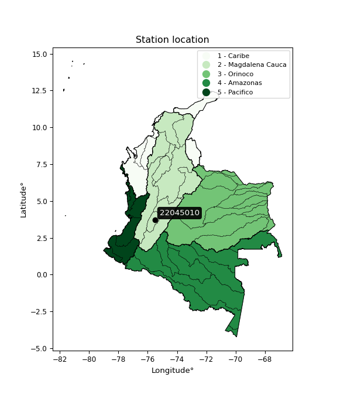

<div align="center">


</div>

# PMax24h Station (Rain): 22045010

Maximum Precipitation in 24 hours (PMax24h) is the greatest amount of rainfall for a specific duration that is meteorologically possible for a given location, acting as a "worst-case" scenario for extreme storms, crucial for designing safety-critical infrastructure like bridges, river deviations, dams, spillways, and nuclear plants to prevent catastrophic failure. The PMax24h is related with the Probable Maximum Precipitation (PMP) and it is calculated by hydrologists using meteorological data to determine the upper limit of extreme rainfall, often leading to the Probable Maximum Flood (PMF) for flood control design, and is increasingly being studied for climate change impacts. Probable Maximum Precipitation (PMP) is the theoretical upper limit of rainfall, a deterministic estimate for extreme events, while probability distributions (like GEV, Gumbel) describe the likelihood and frequency of various precipitation amounts, including rare ones, showing how often events occur, with PMP representing the extreme end of these distributions, used for critical infrastructure design to ensure safety against the worst conceivable weather, unlike standard statistical forecasts which cover typical probabilities.

The most common probability distributions in hydrology, used for analyzing floods, rainfall, and streamflow, include the Normal, Log-Normal, Gumbel, Gamma (including Log-Pearson Type III), and Generalized Extreme Value (GEV) distributions, often chosen based on the data´s skewness and whether modeling extremes or general conditions, with Gumbel and GEV popular for extreme events like floods, while the Normal distribution serves as a baseline, though often requiring transformations for skewed hydrological data. These distributions help in designing water infrastructure, managing water resources, and forecasting hydrologic events.

> Hydrological data often isn´t perfectly normal (it´s skewed), so different distributions are needed for different applications, such as: **Flood Frequency Analysis**: Using Gumbel, GEV, or Log-Pearson Type III for predicting extreme flood magnitudes and their return periods, **Rainfall Analysis**: Normal for annual totals, but Log-Normal, Weibull, or GEV for intensity or extreme daily rainfall, **Streamflow Modeling**: Gamma and Log-Normal for maximum flows, GEV for minimum flows, and Kappa for daily flows.

<div align="center">

</img>

</div>


## A. General information


### 1. General running parameters

• app_version: _v20260225_. • runtime: _2026-02-28 16:54:07.457399_. • Python version: _3.14.0_. • SciPy version: _1.16.3_. • Pandas version: _2.3.3_. • NumPy version: _2.3.5_. • Stations dataset (station_dataset_file): _dataset/pmax24h_in/automatic_colombia_2003_2025.csv_. • Stations catalog (station_catalog_file): _dataset/CNE.xls_. • Minimum year to eval til year_max (date_min): _1900_. • Maximum year to eval since year_min (date_max): _2025_. • Creates, save and include plots into reports (create_plot): _False_. • Plot only fit distributions with Δo > Δ (plot_only_fit): _True_. • Plot only simple graphs avoiding multiple CDFs and multiple Extreme values plots (plot_only_simple): _False_. • Eval low extreme values, if False, evaluates high extreme values (low_extreme): _False_. • Eval every SciPy distribution as logarithmic (pdist_logarithmic_on): _True_. • Standard deviation normalized (ddof): _1.0_. • Return periods to eval in years (Tr): _[2, 2.33, 5, 10, 15, 20, 25, 50, 75, 100, 200, 250, 500, 750, 1000]_. • Minimum data sample per station, 0 means any (minimum_sample): _5_. • Z-Score maximum threshold to adjust a value, 0 means disable (zscore_max): _3.5_. • Z-Score minimum threshold to adjust a value, 0 means disable (zscore_min): _-2.5_. • Avoid zeros, e.g. rain = 0 (avoid_zeros): _True_. • Avoid null values (avoid_nans): _True_. 

:file_folder:Table: [dataset.csv](../../dataset/pmax24h_in/automatic_colombia_2003_2025.csv)

> Delta Degrees of Freedom (DDOF): is a parameter used in the formulas for calculating variance and standard deviation. When ddof=0, the divisor is $N$ (the total number of observations) and this is used when your data set is the entire population. When ddof=1, the divisor is $N-1$ and this is used when your data set is a sample drawn from a larger population. Using $N-1$ provides an unbiased estimate of the population variance (known as Bessel´s correction).


### 2. Station info and location

|   id |   CODIGO | NOMBRE                                | CATEGORIA               | TECNOLOGIA                              | ESTADO   | FECHA_INSTALACION   |   FECHA_SUSPENSION |   ALTITUD |   LATITUD |   LONGITUD | DEPARTAMENTO   | MUNICIPIO   | AREA_OPERATIVA             | ENTIDAD                                                     | AREA_HIDROGRAFICA   | ZONA_HIDROGRAFICA   | SUBZONA_HIDROGRAFICA   |   CORRIENTE | Catalogo   |   Version |
|-----:|---------:|:--------------------------------------|:------------------------|:----------------------------------------|:---------|:--------------------|-------------------:|----------:|----------:|-----------:|:---------------|:------------|:---------------------------|:------------------------------------------------------------|:--------------------|:--------------------|:-----------------------|------------:|:-----------|----------:|
|    0 | 22045010 | DEMOSTRACION GRANJA  - AUT [22045010] | Climatológica Ordinaria | Automática con Telemetría, Convencional | Activa   | 15/09/1964          |                nan |       895 |   3.72244 |   -75.5034 | Tolima         | Chaparral   | Area Operativa 10 - Tolima | INSTITUTO DE HIDROLOGIA METEOROLOGIA Y ESTUDIOS AMBIENTALES | Magdalena Cauca     | Saldaña             | Río Tetuán, Río Ortega |         nan | CNE_IDEAM  |  20251226 |

<div align="center">

Dynamic map: [:earth_americas:Google](http://maps.google.com/maps?q=3.722444444,-75.50344444) [:earth_americas:OSM](https://www.openstreetmap.org/#map=18/3.722444444/-75.50344444&layers=P) [:earth_americas:Bing](https://www.bing.com/maps?cp=3.722444444~-75.50344444&lvl=18) [:earth_americas:Apple](https://maps.apple.com/frame?center=3.722444444%2C-75.50344444&span=0.003%2C0.006)

</div>


<div align="center">

```geojson
{
  "type": "Feature",
  "geometry": {
    "type": "Point", 
    "coordinates": [-75.50344444, 3.722444444]
  }, 
  "properties": {
    "Name": "22045010"
  }
}
```

</div>


### 3. Discrete values table and plot

<div align="center">

|               |           0 |            1 |          2 |          3 |          4 |
|:--------------|------------:|-------------:|-----------:|-----------:|-----------:|
| Date          | 2019        | 2020         | 2021       | 2024       | 2025       |
| Value         |   82.2      |   90         |   52.4     |  134.8     |   81       |
| Value_initial |   82.2      |   90         |   52.4     |  134.8     |   81       |
| count         |    5        |    5         |    5       |    5       |    5       |
| mean          |   88.08     |   88.08      |   88.08    |   88.08    |   88.08    |
| std           |   29.7666   |   29.7666    |   29.7666  |   29.7666  |   29.7666  |
| zscore        |   -0.197537 |    0.0645018 |   -1.19866 |    1.56954 |   -0.23785 |


</div>


> The initial value (value_initial) correspond to the initial obtained or null completed value, and value (value) is adjusted only when the initial value is outside the valid range (outlier) definite through the Z-Score value. If Z-Score is active, values out of range or outliers are replaced with the station mean value. A Z-Score (or standard score) measures how many standard deviations a data point is from the mean of a dataset, indicating its relative position; positive scores mean above the mean, negative mean below, and a score of zero is exactly at the mean, allowing for comparison of values from different distributions. It´s calculated using the formula $z=(x–μ)/σ$, where $x$ is the data point, $μ$ is the mean, and $σ$ is the standard deviation, helping identify outliers and understand probability.
>
> <sub>**Note**: In this study, "completing" (filling gaps in) and "extending" (forecasting or lengthening the historical record) rainfall data series are avoided for certain critical analyses because they introduce artificial bias and uncertainty, which can distort the statistics of rare events (extremes), alter day-to-day variability, and compromise the integrity and homogeneity of the original data. Some reasons against Completing/Extending rainfall data are: **Distortion of Extremes and Variability**: The primary issue is that most gap-filling or extension methods rely on averaging or regression with nearby stations, which inherently smooths the data. Rainfall is highly variable in space and time, with a large percentage of zero values and occasional large storms. Infilling methods often underestimate the highest values and overestimate the lowest (zero) values, which severely distorts analyses focused on flood frequency, drought severity, and intensity-duration-frequency (IDF) curves, **Loss of Data Homogeneity**: Infilled or extended data are synthetic estimates, not actual measurements. Combining these estimates with observed data can violate the assumption of data homogeneity, which requires that the data properties do not change over time. Inhomogeneity can lead to incorrect conclusions about long-term trends or changes in climate patterns, **Propagation of Errors**: Errors and biases from the original data (e.g., wind-induced undercatch, instrument errors, site changes) or the data used for imputation can propagate through the analysis, leading to unreliable hydrological models and inaccurate predictions, **Compromised Statistical Integrity**: For statistical analyses, especially those involving the frequency of events, using artificial data can introduce time bias or autocorrelation that doesn´t exist in reality, making it difficult to assess the true probability of events, **Difficulty in Validation**: It is difficult to accurately validate the quality of filled or extended data, especially for past periods where ground-truth measurements are unavailable. The reliability of imputation techniques heavily depends on the density of the surrounding station network and the complexity of the local topography.</sub>


### 4. Active continuous probability distributions from SciPy (80 of 104 available)

A Probability Density Function (PDF) describes the relative likelihood of a continuous random variable falling within a specific range, where the total area under its curve equals 1, and the area over any interval gives the actual probability for that range. Unlike discrete probabilities (like rolling a die), a PDF shows density, not direct probability for a single point (which is zero), with higher points indicating higher likelihood, often visualized as a bell curve for normal distributions.

A log of a probability density function (log-PDF) is simply the logarithm of the PDF´s value, denoted as $log(f(x))$, useful for converting multiplication of probabilities into addition, improving numerical stability with tiny numbers, and connecting to information theory concepts like entropy. Instead of dealing with very small probabilities (e.g., 0.000001), log-PDFs use negative numbers (e.g., $log(0.00001) ≈ -11.51$ that are easier for computers to handle, preventing underflow errors and simplifying complex calculations. In this study, each active probability distribution from SciPy is also evaluated in the $log$ form.

[scipy.stats](https://docs.scipy.org/doc/scipy/reference/stats.html) is a Python´s powerful submodule within the SciPy library for comprehensive statistical analysis, offering over 130 probability distributions (like Normal, Poisson, etc.), functions for descriptive stats (mean, variance), hypothesis testing (t-tests, chi-square), random variable generation, and statistical tests, making it essential for data science, modeling, and research. It provides tools to explore, model, and draw conclusions from data efficiently, working seamlessly with [NumPy](https://numpy.org/).

<div align="center">

|   id | p_dist           |   n_parameter | fit_method   | label                                                                       | active   | ref                                                                                                      |
|-----:|:-----------------|--------------:|:-------------|:----------------------------------------------------------------------------|:---------|:---------------------------------------------------------------------------------------------------------|
|    0 | alpha            |             3 | MLE          | Alpha                                                                       | True     | [:mortar_board:](https://docs.scipy.org/doc/scipy/reference/generated/scipy.stats.alpha.html)            |
|    1 | anglit           |             2 | MM           | Anglit                                                                      | True     | [:mortar_board:](https://docs.scipy.org/doc/scipy/reference/generated/scipy.stats.anglit.html)           |
|    2 | arcsine          |             2 | MM           | Arcsine                                                                     | True     | [:mortar_board:](https://docs.scipy.org/doc/scipy/reference/generated/scipy.stats.arcsine.html)          |
|    3 | argus            |             3 | MLE          | Argus                                                                       | True     | [:mortar_board:](https://docs.scipy.org/doc/scipy/reference/generated/scipy.stats.argus.html)            |
|    4 | beta             |             4 | MLE          | Beta                                                                        | True     | [:mortar_board:](https://docs.scipy.org/doc/scipy/reference/generated/scipy.stats.beta.html)             |
|    5 | betaprime        |             4 | MLE          | Beta prime                                                                  | True     | [:mortar_board:](https://docs.scipy.org/doc/scipy/reference/generated/scipy.stats.betaprime.html)        |
|    6 | bradford         |             3 | MLE          | Bradford                                                                    | True     | [:mortar_board:](https://docs.scipy.org/doc/scipy/reference/generated/scipy.stats.bradford.html)         |
|    7 | burr             |             4 | MLE          | Burr (Type III)                                                             | True     | [:mortar_board:](https://docs.scipy.org/doc/scipy/reference/generated/scipy.stats.burr.html)             |
|    8 | burr12           |             4 | MLE          | Burr (Type III) 12                                                          | True     | [:mortar_board:](https://docs.scipy.org/doc/scipy/reference/generated/scipy.stats.burr12.html)           |
|    9 | cosine           |             2 | MLE          | Cosine                                                                      | True     | [:mortar_board:](https://docs.scipy.org/doc/scipy/reference/generated/scipy.stats.cosine.html)           |
|   10 | crystalball      |             4 | MLE          | Crystalball                                                                 | True     | [:mortar_board:](https://docs.scipy.org/doc/scipy/reference/generated/scipy.stats.crystalball.html)      |
|   11 | dgamma           |             3 | MLE          | Double gamma                                                                | True     | [:mortar_board:](https://docs.scipy.org/doc/scipy/reference/generated/scipy.stats.dgamma.html)           |
|   12 | dweibull         |             3 | MLE          | Double Weibull                                                              | True     | [:mortar_board:](https://docs.scipy.org/doc/scipy/reference/generated/scipy.stats.dweibull.html)         |
|   13 | erlang           |             3 | MLE          | Erlang                                                                      | True     | [:mortar_board:](https://docs.scipy.org/doc/scipy/reference/generated/scipy.stats.erlang.html)           |
|   14 | exponnorm        |             3 | MLE          | Exponentially modified Normal                                               | True     | [:mortar_board:](https://docs.scipy.org/doc/scipy/reference/generated/scipy.stats.exponnorm.html)        |
|   15 | exponpow         |             3 | MLE          | Exponential power                                                           | True     | [:mortar_board:](https://docs.scipy.org/doc/scipy/reference/generated/scipy.stats.exponpow.html)         |
|   16 | exponweib        |             4 | MLE          | Exponentiated Weibull                                                       | True     | [:mortar_board:](https://docs.scipy.org/doc/scipy/reference/generated/scipy.stats.exponweib.html)        |
|   17 | f                |             4 | MLE          | F                                                                           | True     | [:mortar_board:](https://docs.scipy.org/doc/scipy/reference/generated/scipy.stats.f.html)                |
|   18 | fatiguelife      |             3 | MLE          | Fatigue-life (Birnbaum-Saunders)                                            | True     | [:mortar_board:](https://docs.scipy.org/doc/scipy/reference/generated/scipy.stats.fatiguelife.html)      |
|   19 | foldnorm         |             3 | MM           | Fold Normal                                                                 | True     | [:mortar_board:](https://docs.scipy.org/doc/scipy/reference/generated/scipy.stats.foldnorm.html)         |
|   20 | gamma            |             3 | MLE          | Gamma                                                                       | True     | [:mortar_board:](https://docs.scipy.org/doc/scipy/reference/generated/scipy.stats.gamma.html)            |
|   21 | gausshyper       |             6 | MLE          | Gauss hypergeometric                                                        | True     | [:mortar_board:](https://docs.scipy.org/doc/scipy/reference/generated/scipy.stats.gausshyper.html)       |
|   22 | genexpon         |             5 | MLE          | Generalized exponential                                                     | True     | [:mortar_board:](https://docs.scipy.org/doc/scipy/reference/generated/scipy.stats.genexpon.html)         |
|   23 | genextreme       |             3 | MLE          | Generalized exponential                                                     | True     | [:mortar_board:](https://docs.scipy.org/doc/scipy/reference/generated/scipy.stats.genextreme.html)       |
|   24 | gengamma         |             4 | MLE          | Generalized gamma                                                           | True     | [:mortar_board:](https://docs.scipy.org/doc/scipy/reference/generated/scipy.stats.gengamma.html)         |
|   25 | genhalflogistic  |             3 | MLE          | Generalized half-logistic                                                   | True     | [:mortar_board:](https://docs.scipy.org/doc/scipy/reference/generated/scipy.stats.genhalflogistic.html)  |
|   26 | genlogistic      |             3 | MLE          | Generalized logistic                                                        | True     | [:mortar_board:](https://docs.scipy.org/doc/scipy/reference/generated/scipy.stats.genlogistic.html)      |
|   27 | gennorm          |             3 | MLE          | Generalized Normal                                                          | True     | [:mortar_board:](https://docs.scipy.org/doc/scipy/reference/generated/scipy.stats.gennorm.html)          |
|   28 | genpareto        |             3 | MLE          | Generalized Pareto                                                          | True     | [:mortar_board:](https://docs.scipy.org/doc/scipy/reference/generated/scipy.stats.genpareto.html)        |
|   29 | gompertz         |             3 | MLE          | Gompertz (or truncated Gumbel)                                              | True     | [:mortar_board:](https://docs.scipy.org/doc/scipy/reference/generated/scipy.stats.gompertz.html)         |
|   30 | gumbel_l         |             2 | MM           | Gumbel Left Skew                                                            | True     | [:mortar_board:](https://docs.scipy.org/doc/scipy/reference/generated/scipy.stats.gumbel_l.html)         |
|   31 | gumbel_r         |             2 | MM           | Gumbel Right Skew                                                           | True     | [:mortar_board:](https://docs.scipy.org/doc/scipy/reference/generated/scipy.stats.gumbel_r.html)         |
|   32 | halfgennorm      |             3 | MLE          | Upper half of a generalized normal                                          | True     | [:mortar_board:](https://docs.scipy.org/doc/scipy/reference/generated/scipy.stats.halfgennorm.html)      |
|   33 | halflogistic     |             2 | MM           | Half-logistic                                                               | True     | [:mortar_board:](https://docs.scipy.org/doc/scipy/reference/generated/scipy.stats.halflogistic.html)     |
|   34 | halfnorm         |             2 | MM           | Half Normal                                                                 | True     | [:mortar_board:](https://docs.scipy.org/doc/scipy/reference/generated/scipy.stats.halfnorm.html)         |
|   35 | hypsecant        |             2 | MM           | hyperbolic secant                                                           | True     | [:mortar_board:](https://docs.scipy.org/doc/scipy/reference/generated/scipy.stats.hypsecant.html)        |
|   36 | invgamma         |             3 | MLE          | Inverted gamma                                                              | True     | [:mortar_board:](https://docs.scipy.org/doc/scipy/reference/generated/scipy.stats.invgamma.html)         |
|   37 | invgauss         |             3 | MLE          | Inverse Gaussian                                                            | True     | [:mortar_board:](https://docs.scipy.org/doc/scipy/reference/generated/scipy.stats.invgauss.html)         |
|   38 | invweibull       |             3 | MLE          | Inverted Weibull                                                            | True     | [:mortar_board:](https://docs.scipy.org/doc/scipy/reference/generated/scipy.stats.invweibull.html)       |
|   39 | johnsonsb        |             4 | MLE          | Johnson SB                                                                  | True     | [:mortar_board:](https://docs.scipy.org/doc/scipy/reference/generated/scipy.stats.johnsonsb.html)        |
|   40 | johnsonsu        |             4 | MLE          | Johnson Su                                                                  | True     | [:mortar_board:](https://docs.scipy.org/doc/scipy/reference/generated/scipy.stats.johnsonsu.html)        |
|   41 | kappa3           |             3 | MLE          | Kappa 3                                                                     | True     | [:mortar_board:](https://docs.scipy.org/doc/scipy/reference/generated/scipy.stats.kappa3.html)           |
|   42 | kappa4           |             4 | MLE          | Kappa 4                                                                     | True     | [:mortar_board:](https://docs.scipy.org/doc/scipy/reference/generated/scipy.stats.kappa4.html)           |
|   43 | ksone            |             3 | MLE          | Kolmogorov-Smirnov one-sided test statistic distribution                    | True     | [:mortar_board:](https://docs.scipy.org/doc/scipy/reference/generated/scipy.stats.ksone.html)            |
|   44 | kstwobign        |             2 | MLE          | Limiting distribution of scaled Kolmogorov-Smirnov two-sided test statistic | True     | [:mortar_board:](https://docs.scipy.org/doc/scipy/reference/generated/scipy.stats.kstwobign.html)        |
|   45 | laplace          |             2 | MM           | Laplace                                                                     | True     | [:mortar_board:](https://docs.scipy.org/doc/scipy/reference/generated/scipy.stats.laplace.html)          |
|   46 | levy_l           |             2 | MLE          | Left-skewed Levy                                                            | True     | [:mortar_board:](https://docs.scipy.org/doc/scipy/reference/generated/scipy.stats.levy_l.html)           |
|   47 | loggamma         |             3 | MLE          | Log gamma                                                                   | True     | [:mortar_board:](https://docs.scipy.org/doc/scipy/reference/generated/scipy.stats.loggamma.html)         |
|   48 | logistic         |             2 | MM           | Logistic (or Sech-squared)                                                  | True     | [:mortar_board:](https://docs.scipy.org/doc/scipy/reference/generated/scipy.stats.logistic.html)         |
|   49 | loglaplace       |             3 | MLE          | Log-Laplace                                                                 | True     | [:mortar_board:](https://docs.scipy.org/doc/scipy/reference/generated/scipy.stats.loglaplace.html)       |
|   50 | lomax            |             3 | MLE          | Lomax (Pareto of the second kind)                                           | True     | [:mortar_board:](https://docs.scipy.org/doc/scipy/reference/generated/scipy.stats.lomax.html)            |
|   51 | maxwell          |             2 | MM           | Maxwell                                                                     | True     | [:mortar_board:](https://docs.scipy.org/doc/scipy/reference/generated/scipy.stats.maxwell.html)          |
|   52 | mielke           |             4 | MLE          | Mielke Beta-Kappa / Dagum                                                   | True     | [:mortar_board:](https://docs.scipy.org/doc/scipy/reference/generated/scipy.stats.mielke.html)           |
|   53 | moyal            |             2 | MM           | Moyal                                                                       | True     | [:mortar_board:](https://docs.scipy.org/doc/scipy/reference/generated/scipy.stats.moyal.html)            |
|   54 | nakagami         |             3 | MLE          | Nakagami                                                                    | True     | [:mortar_board:](https://docs.scipy.org/doc/scipy/reference/generated/scipy.stats.nakagami.html)         |
|   55 | ncf              |             5 | MLE          | Non-central F distribution                                                  | True     | [:mortar_board:](https://docs.scipy.org/doc/scipy/reference/generated/scipy.stats.ncf.html)              |
|   56 | nct              |             4 | MLE          | Non-central Student’s t                                                     | True     | [:mortar_board:](https://docs.scipy.org/doc/scipy/reference/generated/scipy.stats.nct.html)              |
|   57 | norm             |             2 | MM           | Normal                                                                      | True     | [:mortar_board:](https://docs.scipy.org/doc/scipy/reference/generated/scipy.stats.norm.html)             |
|   58 | pearson3         |             3 | MM           | Pearson type III                                                            | True     | [:mortar_board:](https://docs.scipy.org/doc/scipy/reference/generated/scipy.stats.pearson3.html)         |
|   59 | powerlaw         |             3 | MLE          | Power-function                                                              | True     | [:mortar_board:](https://docs.scipy.org/doc/scipy/reference/generated/scipy.stats.powerlaw.html)         |
|   60 | rayleigh         |             2 | MM           | Rayleigh                                                                    | True     | [:mortar_board:](https://docs.scipy.org/doc/scipy/reference/generated/scipy.stats.rayleigh.html)         |
|   61 | rdist            |             3 | MLE          | R-distributed (symmetric beta)                                              | True     | [:mortar_board:](https://docs.scipy.org/doc/scipy/reference/generated/scipy.stats.rdist.html)            |
|   62 | rice             |             3 | MLE          | Rice                                                                        | True     | [:mortar_board:](https://docs.scipy.org/doc/scipy/reference/generated/scipy.stats.rice.html)             |
|   63 | semicircular     |             2 | MM           | Semicircular                                                                | True     | [:mortar_board:](https://docs.scipy.org/doc/scipy/reference/generated/scipy.stats.semicircular.html)     |
|   64 | skewnorm         |             3 | MLE          | Skew normal                                                                 | True     | [:mortar_board:](https://docs.scipy.org/doc/scipy/reference/generated/scipy.stats.skewnorm.html)         |
|   65 | t                |             3 | MLE          | Student’s t                                                                 | True     | [:mortar_board:](https://docs.scipy.org/doc/scipy/reference/generated/scipy.stats.t.html)                |
|   66 | trapezoid        |             4 | MLE          | Trapezoid                                                                   | True     | [:mortar_board:](https://docs.scipy.org/doc/scipy/reference/generated/scipy.stats.trapezoid.html)        |
|   67 | triang           |             3 | MLE          | Triangular                                                                  | True     | [:mortar_board:](https://docs.scipy.org/doc/scipy/reference/generated/scipy.stats.triang.html)           |
|   68 | truncexpon       |             3 | MLE          | Truncated exponential                                                       | True     | [:mortar_board:](https://docs.scipy.org/doc/scipy/reference/generated/scipy.stats.truncexpon.html)       |
|   69 | truncnorm        |             4 | MLE          | Truncated normal                                                            | True     | [:mortar_board:](https://docs.scipy.org/doc/scipy/reference/generated/scipy.stats.truncnorm.html)        |
|   70 | truncpareto      |             4 | MLE          | Upper truncated Pareto                                                      | True     | [:mortar_board:](https://docs.scipy.org/doc/scipy/reference/generated/scipy.stats.truncpareto.html)      |
|   71 | truncweibull_min |             5 | MLE          | Doubly truncated Weibull minimum                                            | True     | [:mortar_board:](https://docs.scipy.org/doc/scipy/reference/generated/scipy.stats.truncweibull_min.html) |
|   72 | tukeylambda      |             3 | MLE          | Tukey-Lamdba                                                                | True     | [:mortar_board:](https://docs.scipy.org/doc/scipy/reference/generated/scipy.stats.tukeylambda.html)      |
|   73 | uniform          |             2 | MLE          | Uniform                                                                     | True     | [:mortar_board:](https://docs.scipy.org/doc/scipy/reference/generated/scipy.stats.uniform.html)          |
|   74 | vonmises         |             3 | MLE          | Von Mises                                                                   | True     | [:mortar_board:](https://docs.scipy.org/doc/scipy/reference/generated/scipy.stats.vonmises.html)         |
|   75 | vonmises_line    |             3 | MLE          | Von Mises line                                                              | True     | [:mortar_board:](https://docs.scipy.org/doc/scipy/reference/generated/scipy.stats.vonmises_line.html)    |
|   76 | wald             |             2 | MM           | Wald                                                                        | True     | [:mortar_board:](https://docs.scipy.org/doc/scipy/reference/generated/scipy.stats.wald.html)             |
|   77 | weibull_max      |             3 | MLE          | Weibull maximum                                                             | True     | [:mortar_board:](https://docs.scipy.org/doc/scipy/reference/generated/scipy.stats.weibull_max.html)      |
|   78 | weibull_min      |             3 | MLE          | Weibull minimum                                                             | True     | [:mortar_board:](https://docs.scipy.org/doc/scipy/reference/generated/scipy.stats.weibull_min.html)      |
|   79 | wrapcauchy       |             3 | MLE          | Wrapped  Cauchy                                                             | True     | [:mortar_board:](https://docs.scipy.org/doc/scipy/reference/generated/scipy.stats.wrapcauchy.html)       |

</div>

> **n_parameter:** # arguments & localization & scale.
>
> **Fit methods:** (MLE) maximum likelihood, (MM) L-moments.
>
>**Inactive** (With the only purpose of prevent loops, zero divisions, infinite values, over high estimated values or horizontal trending for recurrence intervals estimations, the follow distributions were disabled.)**:** lognorm, norminvgauss, powernorm, powerlognorm, cauchy, halfcauchy, foldcauchy, skewcauchy, chi2, expon, fisk, genhyperbolic, geninvgauss, gibrat, kstwo, laplace_asymmetric, levy, levy_stable, ncx2, pareto, rel_breitwigner, recipinvgauss, studentized_range, loguniform, 


## B. Probability (PDF) vs. Empirical (EDF) distributions functions

A continuous probability distribution (CPD) describes probabilities for variables that can take any value within a range (like rain any time), unlike discrete variables with specific outcomes (like temperature). It uses a Probability Density Function (PDF), a curve where the total area under it equals 1, and the probability of the variable falling within an interval (a to b) is found by calculating the area under the curve between those points. A key feature is that the probability of hitting any single exact value is zero, so probabilities are always expressed for ranges, e.g., $P(a ≤ X ≤ b)$.

<div align="center">

Distributions parameters from station values
|     |   station | p_dist              |   n |             loc |          scale | shape                  | shape1                 | shape2              | shape3             |
|----:|----------:|:--------------------|----:|----------------:|---------------:|:-----------------------|:-----------------------|:--------------------|:-------------------|
|   0 |  22045010 | alpha               |   5 |   -88.6763      | 1200.87        | 6.942367269128625      |                        |                     |                    |
|   1 |  22045010 | anglit              |   5 |    88.08        |   77.8861      |                        |                        |                     |                    |
|   2 |  22045010 | arcsine             |   5 |    50.4278      |   75.3043      |                        |                        |                     |                    |
|   3 |  22045010 | argus               |   5 |    27.8797      |  112.75        | 4.562992990841832e-06  |                        |                     |                    |
|   4 |  22045010 | beta                |   5 |    52.4         |  124.395       | 0.7779667060528203     | 2.7911049412487583     |                     |                    |
|   5 |  22045010 | betaprime           |   5 |    -0.862962    |   76.1199      | 24.33114875979802      | 21.800103012531196     |                     |                    |
|   6 |  22045010 | bradford            |   5 |    52.4         |   82.4001      | 1.1572130614220835     |                        |                     |                    |
|   7 |  22045010 | burr                |   5 |    -0.564069    |   85.1826      | 5.942269829839164      | 0.9835578121308881     |                     |                    |
|   8 |  22045010 | burr12              |   5 |    -3.87844     |   55.9738      | 782.3249717994696      | 0.0028074074183905423  |                     |                    |
|   9 |  22045010 | cosine              |   5 |    90.2898      |   22.5709      |                        |                        |                     |                    |
|  10 |  22045010 | crystalball         |   5 |    88.08        |   26.6241      | 4214.063839524325      | 14993.535292309087     |                     |                    |
|  11 |  22045010 | dgamma              |   5 |    81           |   27.208       | 0.7009471191849037     |                        |                     |                    |
|  12 |  22045010 | dweibull            |   5 |    82.2         |   25.8238      | 0.7155165063094927     |                        |                     |                    |
|  13 |  22045010 | erlang              |   5 |    52.4         |   47.1616      | 0.3233030839595794     |                        |                     |                    |
|  14 |  22045010 | exponnorm           |   5 |    64.4157      |   14.6262      | 1.6179419926073        |                        |                     |                    |
|  15 |  22045010 | exponpow            |   5 |    52.4         |   59.3163      | 0.9631666035502522     |                        |                     |                    |
|  16 |  22045010 | exponweib           |   5 |    52.4         |    1.24159     | 1.213972638283737      | 0.18627885551825307    |                     |                    |
|  17 |  22045010 | f                   |   5 |    24.5414      |   60.6672      | 14.366979089512714     | 49.57975831510201      |                     |                    |
|  18 |  22045010 | fatiguelife         |   5 |    52.4         |    3.65077e-06 | 2516.3662362894265     |                        |                     |                    |
|  19 |  22045010 | foldnorm            |   5 |    47.1944      |   31.6377      | 1.1739800308778974     |                        |                     |                    |
|  20 |  22045010 | gamma               |   5 |    52.4         |   46.0614      | 0.4515048114162925     |                        |                     |                    |
|  21 |  22045010 | gausshyper          |   5 |    52.4         |   82.8968      | 0.9549528294697796     | 1.0107135367839961     | 1.0288609182276058  | 1.1074994419225757 |
|  22 |  22045010 | genexpon            |   5 |    52.4         |    1.42711     | 0.039989016511736517   | 1.9283817494897277e-08 | 1.4253995828184105  |                    |
|  23 |  22045010 | genextreme          |   5 |    52.8674      |    2.8924      | -6.188338783840351     |                        |                     |                    |
|  24 |  22045010 | gengamma            |   5 |    52.4         |    1.18863     | 1.2879923508828872     | 0.22571985633801772    |                     |                    |
|  25 |  22045010 | genhalflogistic     |   5 |    46.6992      |   93.5722      | 1.062104206037648      |                        |                     |                    |
|  26 |  22045010 | genlogistic         |   5 |   -43.0828      |   21.7973      | 232.2210806074462      |                        |                     |                    |
|  27 |  22045010 | gennorm             |   5 |    82.2         |    7.59675e-10 | 0.10328782222477723    |                        |                     |                    |
|  28 |  22045010 | genpareto           |   5 |    -1.20058     |  203.464       | -1.4960531813968414    |                        |                     |                    |
|  29 |  22045010 | gompertz            |   5 |    52.4         |   67.0917      | 1.174496271508444      |                        |                     |                    |
|  30 |  22045010 | gumbel_l            |   5 |   100.062       |   20.7587      |                        |                        |                     |                    |
|  31 |  22045010 | gumbel_r            |   5 |    76.0977      |   20.7587      |                        |                        |                     |                    |
|  32 |  22045010 | halfgennorm         |   5 |    52.4         |    1.39885     | 0.36367941459232267    |                        |                     |                    |
|  33 |  22045010 | halflogistic        |   5 |    56.5243      |   22.7626      |                        |                        |                     |                    |
|  34 |  22045010 | halfnorm            |   5 |    52.8402      |   44.1666      |                        |                        |                     |                    |
|  35 |  22045010 | hypsecant           |   5 |    88.08        |   16.9494      |                        |                        |                     |                    |
|  36 |  22045010 | invgamma            |   5 |   -24.8753      | 2043.52        | 19.08355680464702      |                        |                     |                    |
|  37 |  22045010 | invgauss            |   5 |     6.81345     |  715.373       | 0.11360020752002682    |                        |                     |                    |
|  38 |  22045010 | invweibull          |   5 |    52.4         |    1.3475      | 0.05735301738848529    |                        |                     |                    |
|  39 |  22045010 | johnsonsb           |   5 |    52.4         |   82.4         | -0.7744981654079237    | 0.05690222732044277    |                     |                    |
|  40 |  22045010 | johnsonsu           |   5 |    81.5316      |    0.735707    | -0.24140581711822331   | 0.31064809686853945    |                     |                    |
|  41 |  22045010 | kappa3              |   5 |    52.3939      |   82.4052      | 50639.56658779798      |                        |                     |                    |
|  42 |  22045010 | kappa4              |   5 |    41.5739      |   92.2945      | 1.1327576128461696     | 0.9859442770011873     |                     |                    |
|  43 |  22045010 | ksone               |   5 |    44.16        |   98.88        | 1.0                    |                        |                     |                    |
|  44 |  22045010 | kstwobign           |   5 |    -2.04053     |  103.549       |                        |                        |                     |                    |
|  45 |  22045010 | laplace             |   5 |    88.08        |   18.8261      |                        |                        |                     |                    |
|  46 |  22045010 | levy_l              |   5 |   139.424       |   17.6935      |                        |                        |                     |                    |
|  47 |  22045010 | loggamma            |   5 | -6642.58        |  947.728       | 1214.9428624217223     |                        |                     |                    |
|  48 |  22045010 | logistic            |   5 |    88.08        |   14.6786      |                        |                        |                     |                    |
|  49 |  22045010 | loglaplace          |   5 |    -0.219815    |   82.4198      | 4.773683104598877      |                        |                     |                    |
|  50 |  22045010 | lomax               |   5 |    52.4         | 7549.3         | 212.33830977528476     |                        |                     |                    |
|  51 |  22045010 | maxwell             |   5 |    24.9921      |   39.5345      |                        |                        |                     |                    |
|  52 |  22045010 | mielke              |   5 |    -0.579452    |   85.1938      | 5.846428618905618      | 5.942948279133043      |                     |                    |
|  53 |  22045010 | moyal               |   5 |    72.8546      |   11.985       |                        |                        |                     |                    |
|  54 |  22045010 | nakagami            |   5 |    81           |   21.141       | 0.1761163960496227     |                        |                     |                    |
|  55 |  22045010 | ncf                 |   5 |    -0.101583    |    3.67374e-06 | 4.2640175585354776e-07 | 41.55824137607277      | 9.326361267633537   |                    |
|  56 |  22045010 | nct                 |   5 |    -0.111847    |   15.3997      | 10.464758728462764     | 5.309643040031537      |                     |                    |
|  57 |  22045010 | norm                |   5 |    88.08        |   26.6241      |                        |                        |                     |                    |
|  58 |  22045010 | pearson3            |   5 |    88.08        |   26.6241      | 0.5935317610389226     |                        |                     |                    |
|  59 |  22045010 | powerlaw            |   5 |    52.4         |   82.4         | 0.12547259229224603    |                        |                     |                    |
|  60 |  22045010 | rayleigh            |   5 |    37.1466      |   40.639       |                        |                        |                     |                    |
|  61 |  22045010 | rdist               |   5 |    45.9896      |   44.0104      | 1.1089900944988145     |                        |                     |                    |
|  62 |  22045010 | rice                |   5 |    39.9839      |   38.872       | 0.0018120982903564518  |                        |                     |                    |
|  63 |  22045010 | semicircular        |   5 |    88.08        |   53.2482      |                        |                        |                     |                    |
|  64 |  22045010 | skewnorm            |   5 |    58.317       |   39.9335      | 2.7828782614161636     |                        |                     |                    |
|  65 |  22045010 | t                   |   5 |    88.0801      |   26.624       | 1877255543.9946063     |                        |                     |                    |
|  66 |  22045010 | trapezoid           |   5 |    44.16        |   98.88        | 1.0                    | 1.0                    |                     |                    |
|  67 |  22045010 | triang              |   5 |    20.7669      |  114.033       | 0.9999999999995124     |                        |                     |                    |
|  68 |  22045010 | truncexpon          |   5 |    52.4         |   80.4007      | 1.0248668676993775     |                        |                     |                    |
|  69 |  22045010 | truncnorm           |   5 |   -34.3065      |   26.1614      | 4.407512225730485      | 6.464055353029256      |                     |                    |
|  70 |  22045010 | truncpareto         |   5 |    52.059       |    0.340987    | 0.2614169901608578     | 242.65112591079819     |                     |                    |
|  71 |  22045010 | truncweibull_min    |   5 |    52.4         |   90.8436      | 0.518598611404486      | 7.617457666642777e-17  | 0.9837149250483764  |                    |
|  72 |  22045010 | tukeylambda         |   5 |    72.7909      |   27.9402      | 1.3702240859469705     |                        |                     |                    |
|  73 |  22045010 | uniform             |   5 |    52.4         |   82.4         |                        |                        |                     |                    |
|  74 |  22045010 | vonmises            |   5 |     1.72612     |    1           | 0.8289296406068216     |                        |                     |                    |
|  75 |  22045010 | vonmises_line       |   5 |    96.4698      |   14.0278      | 0.23081045030176617    |                        |                     |                    |
|  76 |  22045010 | wald                |   5 |    61.4559      |   26.6241      |                        |                        |                     |                    |
|  77 |  22045010 | weibull_max         |   5 |   134.8         |    1.51684     | 0.20083187460992563    |                        |                     |                    |
|  78 |  22045010 | weibull_min         |   5 |    52.4         |   34.0623      | 0.9093148791882375     |                        |                     |                    |
|  79 |  22045010 | wrapcauchy          |   5 |    52.3999      |   13.1191      | 0.0012272902223141786  |                        |                     |                    |
|  80 |  22045010 | logalpha            |   5 |    -3.54356     |  208.773       | 26.21479816990857      |                        |                     |                    |
|  81 |  22045010 | loganglit           |   5 |     4.43322     |    0.88047     |                        |                        |                     |                    |
|  82 |  22045010 | logarcsine          |   5 |     4.00759     |    0.851274    |                        |                        |                     |                    |
|  83 |  22045010 | logargus            |   5 |     3.72748     |    1.24356     | 9.966780080209592e-05  |                        |                     |                    |
|  84 |  22045010 | logbeta             |   5 |     3.95891     |    1.05612     | 0.4817388601517629     | 0.8532320481861261     |                     |                    |
|  85 |  22045010 | logbetaprime        |   5 |    -8.05174     |   10.0027      | 3847.4809731765836     | 3083.8008334537153     |                     |                    |
|  86 |  22045010 | logbradford         |   5 |     3.95891     |    0.944889    | 1.0633703046879481     |                        |                     |                    |
|  87 |  22045010 | logburr             |   5 |    -0.124693    |    4.61282     | 29.341781337482857     | 0.7869735648765019     |                     |                    |
|  88 |  22045010 | logburr12           |   5 |    -0.0397319   |    4.6425      | 21.006737810293934     | 1.8362317190433766     |                     |                    |
|  89 |  22045010 | logcosine           |   5 |     4.43245     |    0.254693    |                        |                        |                     |                    |
|  90 |  22045010 | logcrystalball      |   5 |     4.43322     |    0.300975    | 5.497174047042918      | 475.64174074515313     |                     |                    |
|  91 |  22045010 | logdgamma           |   5 |     4.40916     |    0.248377    | 0.5639807959657441     |                        |                     |                    |
|  92 |  22045010 | logdweibull         |   5 |     4.40916     |    0.276478    | 0.40939024716438577    |                        |                     |                    |
|  93 |  22045010 | logerlang           |   5 |   -32.8983      |    0.00242718  | 15380.545598409579     |                        |                     |                    |
|  94 |  22045010 | logexponnorm        |   5 |     4.43277     |    0.300974    | 0.0015019324634388104  |                        |                     |                    |
|  95 |  22045010 | logexponpow         |   5 |     3.95891     |    0.812478    | 0.36895660538821623    |                        |                     |                    |
|  96 |  22045010 | logexponweib        |   5 |     3.95891     |    0.80495     | 0.20319260748385096    | 2.8922723388751566     |                     |                    |
|  97 |  22045010 | logf                |   5 |   -41.9495      |   46.3812      | 670015.9611353511      | 50961.99210005156      |                     |                    |
|  98 |  22045010 | logfatiguelife      |   5 |   -21.2767      |   25.7078      | 0.011698055874814359   |                        |                     |                    |
|  99 |  22045010 | logfoldnorm         |   5 |     3.85138     |    0.31612     | 1.8131066992200977     |                        |                     |                    |
| 100 |  22045010 | loggamma            |   5 |   -32.832       |    0.0024317   | 15324.758258297832     |                        |                     |                    |
| 101 |  22045010 | loggausshyper       |   5 |     3.93293     |    0.970865    | 1.090351099146603      | 0.988505040252674      | 1.014576303094341   | 1.0541678199556999 |
| 102 |  22045010 | loggenexpon         |   5 |     3.94729     |    0.0114261   | 0.010911036305884046   | 5.124449012974015      | 8.3452515191903e-05 |                    |
| 103 |  22045010 | loggenextreme       |   5 |     4.33912     |    0.308404    | 0.36309657370186993    |                        |                     |                    |
| 104 |  22045010 | loggengamma         |   5 |     3.95891     |    0.791838    | 0.6133090551760214     | 1.3220221725627344     |                     |                    |
| 105 |  22045010 | loggenhalflogistic  |   5 |     3.88959     |    1.09464     | 1.0793060805694872     |                        |                     |                    |
| 106 |  22045010 | loggenlogistic      |   5 |     4.43994     |    0.168973    | 0.976133358837348      |                        |                     |                    |
| 107 |  22045010 | loggennorm          |   5 |     4.40916     |    8.01904e-12 | 0.1022214403745747     |                        |                     |                    |
| 108 |  22045010 | loggenpareto        |   5 |    -0.0196857   |   17.2593      | -3.505508476998879     |                        |                     |                    |
| 109 |  22045010 | loggompertz         |   5 |     3.95891     |    0.453072    | 0.3947491729049811     |                        |                     |                    |
| 110 |  22045010 | loggumbel_l         |   5 |     4.56868     |    0.234669    |                        |                        |                     |                    |
| 111 |  22045010 | loggumbel_r         |   5 |     4.29777     |    0.234669    |                        |                        |                     |                    |
| 112 |  22045010 | loghalfgennorm      |   5 |     3.95887     |    0.945515    | 12704.926832962803     |                        |                     |                    |
| 113 |  22045010 | loghalflogistic     |   5 |     4.07648     |    0.257334    |                        |                        |                     |                    |
| 114 |  22045010 | loghalfnorm         |   5 |     4.03486     |    0.49927     |                        |                        |                     |                    |
| 115 |  22045010 | loghypsecant        |   5 |     4.43322     |    0.191606    |                        |                        |                     |                    |
| 116 |  22045010 | loginvgamma         |   5 |     0.391015    |  718.185       | 178.6848970732011      |                        |                     |                    |
| 117 |  22045010 | loginvgauss         |   5 |     2.19152     |  118.685       | 0.018869254197507096   |                        |                     |                    |
| 118 |  22045010 | loginvweibull       |   5 |    -1.47389e+07 |    1.47389e+07 | 51509968.761071295     |                        |                     |                    |
| 119 |  22045010 | logjohnsonsb        |   5 |     3.95832     |    0.945472    | 0.1936508905299018     | 0.16133739262443186    |                     |                    |
| 120 |  22045010 | logjohnsonsu        |   5 |     4.40223     |    0.0091785   | -0.19395339808663045   | 0.3118016778917214     |                     |                    |
| 121 |  22045010 | logkappa3           |   5 |     3.95891     |    0.944457    | 3559.1288464048866     |                        |                     |                    |
| 122 |  22045010 | logkappa4           |   5 |     3.95861     |    1.03594     | 0.9963514300411198     | 1.0960217363528595     |                     |                    |
| 123 |  22045010 | logksone            |   5 |     3.91192     |    1.04261     | 1.0                    |                        |                     |                    |
| 124 |  22045010 | logkstwobign        |   5 |     3.27657     |    1.32332     |                        |                        |                     |                    |
| 125 |  22045010 | loglaplace          |   5 |     4.43322     |    0.212821    |                        |                        |                     |                    |
| 126 |  22045010 | loglevy_l           |   5 |     4.94831     |    0.170248    |                        |                        |                     |                    |
| 127 |  22045010 | logloggamma         |   5 |   -42.14        |    7.30302     | 588.7780462414421      |                        |                     |                    |
| 128 |  22045010 | loglogistic         |   5 |     4.43322     |    0.165936    |                        |                        |                     |                    |
| 129 |  22045010 | logloglaplace       |   5 |     0.00146796  |    4.40769     | 21.101615585362453     |                        |                     |                    |
| 130 |  22045010 | loglomax            |   5 |     3.95891     |    6.3474      | 13.724967961352373     |                        |                     |                    |
| 131 |  22045010 | logmaxwell          |   5 |     3.72004     |    0.446921    |                        |                        |                     |                    |
| 132 |  22045010 | logmielke           |   5 |    -0.24357     |    4.73065     | 23.76149011702969      | 30.045868104518497     |                     |                    |
| 133 |  22045010 | logmoyal            |   5 |     4.26111     |    0.135486    |                        |                        |                     |                    |
| 134 |  22045010 | lognakagami         |   5 |     4.39445     |    0.148533    | 0.04602462509294906    |                        |                     |                    |
| 135 |  22045010 | logncf              |   5 |    -6.49641     |    6.52271     | 2818.292406188829      | 12031.076406511042     | 1903.629863855741   |                    |
| 136 |  22045010 | lognct              |   5 |     0.636826    |    0.281415    | 554.1991287588057      | 13.46392360131258      |                     |                    |
| 137 |  22045010 | lognorm             |   5 |     4.43322     |    0.300974    |                        |                        |                     |                    |
| 138 |  22045010 | logpearson3         |   5 |     4.43322     |    0.300974    | -0.0166839088095774    |                        |                     |                    |
| 139 |  22045010 | logpowerlaw         |   5 |     3.95891     |    0.944886    | 0.13380656737729563    |                        |                     |                    |
| 140 |  22045010 | lograyleigh         |   5 |     3.85744     |    0.459407    |                        |                        |                     |                    |
| 141 |  22045010 | logrdist            |   5 |     4.92015     |    0.525703    | 1.0986265836825058     |                        |                     |                    |
| 142 |  22045010 | logrice             |   5 |     3.78176     |    0.342382    | 1.5469874975486473     |                        |                     |                    |
| 143 |  22045010 | logsemicircular     |   5 |     4.43322     |    0.601949    |                        |                        |                     |                    |
| 144 |  22045010 | logskewnorm         |   5 |     4.47315     |    0.303611    | -0.16711044086873392   |                        |                     |                    |
| 145 |  22045010 | logt                |   5 |     4.43322     |    0.300976    | 843463438.9278206      |                        |                     |                    |
| 146 |  22045010 | logtrapezoid        |   5 |     3.86442     |    1.13386     | 1.0                    | 1.0                    |                     |                    |
| 147 |  22045010 | logtriang           |   5 |     3.65939     |    1.2444      | 0.9999999749948325     |                        |                     |                    |
| 148 |  22045010 | logtruncexpon       |   5 |     3.95889     |    1.02116     | 0.9253264683476304     |                        |                     |                    |
| 149 |  22045010 | logtruncnorm        |   5 |    -0.0801033   |    0.974999    | 5.1116943041032235     | 5.111694304103224      |                     |                    |
| 150 |  22045010 | logtruncpareto      |   5 |     3.95419     |    0.00471572  | 0.26093392115601044    | 201.36943501226042     |                     |                    |
| 151 |  22045010 | logtruncweibull_min |   5 |     3.95323     |    1.13701     | 1.0228621145859742     | 0.0001897563561864701  | 0.8360199462621671  |                    |
| 152 |  22045010 | logtukeylambda      |   5 |     4.43135     |    0.513528    | 1.086963336399664      |                        |                     |                    |
| 153 |  22045010 | loguniform          |   5 |     3.95891     |    0.944886    |                        |                        |                     |                    |
| 154 |  22045010 | logvonmises         |   5 |    -1.84988     |    1           | 11.512880143402915     |                        |                     |                    |
| 155 |  22045010 | logvonmises_line    |   5 |     4.43135     |    0.150385    | 1.088662833715885      |                        |                     |                    |
| 156 |  22045010 | logwald             |   5 |     4.13225     |    0.300971    |                        |                        |                     |                    |
| 157 |  22045010 | logweibull_max      |   5 |     5.18852     |    0.849413    | 2.7541818581743627     |                        |                     |                    |
| 158 |  22045010 | logweibull_min      |   5 |     3.64507     |    0.884844    | 2.894353120581793      |                        |                     |                    |
| 159 |  22045010 | logwrapcauchy       |   5 |     3.95707     |    0.150825    | 3.230558388274269e-05  |                        |                     |                    |

</div>

> **loc** (Location parameter): This shifts the distribution along the x-axis. For many common distributions, like the normal (Gaussian) distribution, loc represents the mean $μ$. For others, like the uniform distribution, it might represent the minimum value, or for the beta distribution, the left end of the support interval.
>
> **scale** (Scale parameter): This determines the width or spread of the distribution. For the normal distribution, scale represents the standard deviation $σ$. For a uniform distribution, it defines the length of the interval (from $loc$ to $loc + scale$).
>
> **shape** (Shape parameters): Refers to parameters that define the specific form of a probability distribution, distinct from its location (loc) and scale (scale). These parameters are required arguments for most distribution functions. For example, a normal (Gaussian) distribution is fully defined by its location (mean) and scale (standard deviation), so it has no specific shape parameters beyond loc and scale. However, other distributions have intrinsic properties that need specification, as Gamma distribution that takes a shape parameter, often named $a$ or $alpha$.


### 0. Cumulative distribution values - CDF (160 evaluated)

Cumulative Distribution Function (CDF), denoted as $F$<sub>$X$</sub>$(x)$, is a function that gives the probability that a random variable $X$ will take a value less than or equal to a specific value, $x$ (i.e., $(P(X≥x)$. It essentially "accumulates" probabilities from a given point up to the far right (positive infinity), providing a complete picture of the distribution´s probabilities for both discrete (like rain) and continuous (like temperature) variables, helping to find probabilities over ranges or above certain values. Each station is evaluated separately ordering the $x$ values ascending, calculating the CDF and PDF values for the activated distributions and their logarithmic forms.

<div align="center">

CDF ordered by x ascending and calculating $log(f(x))$ separately
|   id |   Station |   date |     x |   count |   mean |     std |     zscore |   Value_initial |   station |   m |     alpha |   alpha_pdf |   anglit |   anglit_pdf |   arcsine |   arcsine_pdf |     argus |   argus_pdf |        beta |    beta_pdf |   betaprime |   betaprime_pdf |    bradford |   bradford_pdf |      burr |   burr_pdf |    burr12 |   burr12_pdf |    cosine |   cosine_pdf |   crystalball |   crystalball_pdf |   dgamma |   dgamma_pdf |   dweibull |   dweibull_pdf |      erlang |   erlang_pdf |   exponnorm |   exponnorm_pdf |    exponpow |   exponpow_pdf |   exponweib |   exponweib_pdf |         f |      f_pdf |   fatiguelife |   fatiguelife_pdf |   foldnorm |   foldnorm_pdf |       gamma |   gamma_pdf |   gausshyper |   gausshyper_pdf |    genexpon |   genexpon_pdf |   genextreme |   genextreme_pdf |    gengamma |   gengamma_pdf |   genhalflogistic |   genhalflogistic_pdf |   genlogistic |   genlogistic_pdf |   gennorm |   gennorm_pdf |   genpareto |   genpareto_pdf |    gompertz |   gompertz_pdf |   gumbel_l |   gumbel_l_pdf |   gumbel_r |   gumbel_r_pdf |   halfgennorm |   halfgennorm_pdf |   halflogistic |   halflogistic_pdf |   halfnorm |   halfnorm_pdf |   hypsecant |   hypsecant_pdf |   invgamma |   invgamma_pdf |   invgauss |   invgauss_pdf |   invweibull |   invweibull_pdf |   johnsonsb |   johnsonsb_pdf |   johnsonsu |   johnsonsu_pdf |      kappa3 |   kappa3_pdf |      kappa4 |   kappa4_pdf |     ksone |   ksone_pdf |   kstwobign |   kstwobign_pdf |   laplace |   laplace_pdf |   levy_l |   levy_l_pdf |   loggamma |   loggamma_pdf |   logistic |   logistic_pdf |   loglaplace |   loglaplace_pdf |       lomax |   lomax_pdf |   maxwell |   maxwell_pdf |    mielke |   mielke_pdf |     moyal |   moyal_pdf |    nakagami |   nakagami_pdf |      ncf |    ncf_pdf |       nct |    nct_pdf |      norm |   norm_pdf |   pearson3 |   pearson3_pdf |   powerlaw |   powerlaw_pdf |   rayleigh |   rayleigh_pdf |    rdist |      rdist_pdf |      rice |   rice_pdf |   semicircular |   semicircular_pdf |   skewnorm |   skewnorm_pdf |         t |      t_pdf |   trapezoid |   trapezoid_pdf |    triang |   triang_pdf |   truncexpon |   truncexpon_pdf |   truncnorm |   truncnorm_pdf |   truncpareto |   truncpareto_pdf |   truncweibull_min |   truncweibull_min_pdf |   tukeylambda |   tukeylambda_pdf |   uniform |   uniform_pdf |   vonmises |   vonmises_pdf |   vonmises_line |   vonmises_line_pdf |     wald |   wald_pdf |   weibull_max |   weibull_max_pdf |   weibull_min |   weibull_min_pdf |   wrapcauchy |   wrapcauchy_pdf |   logalpha |   logalpha_pdf |   loganglit |   loganglit_pdf |   logarcsine |   logarcsine_pdf |   logargus |   logargus_pdf |     logbeta |   logbeta_pdf |   logbetaprime |   logbetaprime_pdf |   logbradford |   logbradford_pdf |   logburr |   logburr_pdf |   logburr12 |   logburr12_pdf |   logcosine |   logcosine_pdf |   logcrystalball |   logcrystalball_pdf |   logdgamma |   logdgamma_pdf |   logdweibull |   logdweibull_pdf |   logerlang |   logerlang_pdf |   logexponnorm |   logexponnorm_pdf |   logexponpow |   logexponpow_pdf |   logexponweib |   logexponweib_pdf |      logf |   logf_pdf |   logfatiguelife |   logfatiguelife_pdf |   logfoldnorm |   logfoldnorm_pdf |   loggausshyper |   loggausshyper_pdf |   loggenexpon |   loggenexpon_pdf |   loggenextreme |   loggenextreme_pdf |   loggengamma |   loggengamma_pdf |   loggenhalflogistic |   loggenhalflogistic_pdf |   loggenlogistic |   loggenlogistic_pdf |   loggennorm |   loggennorm_pdf |   loggenpareto |   loggenpareto_pdf |   loggompertz |   loggompertz_pdf |   loggumbel_l |   loggumbel_l_pdf |   loggumbel_r |   loggumbel_r_pdf |   loghalfgennorm |   loghalfgennorm_pdf |   loghalflogistic |   loghalflogistic_pdf |   loghalfnorm |   loghalfnorm_pdf |   loghypsecant |   loghypsecant_pdf |   loginvgamma |   loginvgamma_pdf |   loginvgauss |   loginvgauss_pdf |   loginvweibull |   loginvweibull_pdf |   logjohnsonsb |   logjohnsonsb_pdf |   logjohnsonsu |   logjohnsonsu_pdf |   logkappa3 |   logkappa3_pdf |   logkappa4 |   logkappa4_pdf |   logksone |   logksone_pdf |   logkstwobign |   logkstwobign_pdf |   loglevy_l |   loglevy_l_pdf |   logloggamma |   logloggamma_pdf |   loglogistic |   loglogistic_pdf |   logloglaplace |   logloglaplace_pdf |    loglomax |   loglomax_pdf |   logmaxwell |   logmaxwell_pdf |   logmielke |   logmielke_pdf |   logmoyal |   logmoyal_pdf |   lognakagami |   lognakagami_pdf |    logncf |   logncf_pdf |    lognct |   lognct_pdf |   lognorm |   lognorm_pdf |   logpearson3 |   logpearson3_pdf |   logpowerlaw |   logpowerlaw_pdf |   lograyleigh |   lograyleigh_pdf |    logrdist |   logrdist_pdf |   logrice |   logrice_pdf |   logsemicircular |   logsemicircular_pdf |   logskewnorm |   logskewnorm_pdf |      logt |   logt_pdf |   logtrapezoid |   logtrapezoid_pdf |   logtriang |   logtriang_pdf |   logtruncexpon |   logtruncexpon_pdf |   logtruncnorm |   logtruncnorm_pdf |   logtruncpareto |   logtruncpareto_pdf |   logtruncweibull_min |   logtruncweibull_min_pdf |   logtukeylambda |   logtukeylambda_pdf |   loguniform |   loguniform_pdf |   logvonmises |   logvonmises_pdf |   logvonmises_line |   logvonmises_line_pdf |   logwald |   logwald_pdf |   logweibull_max |   logweibull_max_pdf |   logweibull_min |   logweibull_min_pdf |   logwrapcauchy |   logwrapcauchy_pdf |
|-----:|----------:|-------:|------:|--------:|-------:|--------:|-----------:|----------------:|----------:|----:|----------:|------------:|---------:|-------------:|----------:|--------------:|----------:|------------:|------------:|------------:|------------:|----------------:|------------:|---------------:|----------:|-----------:|----------:|-------------:|----------:|-------------:|--------------:|------------------:|---------:|-------------:|-----------:|---------------:|------------:|-------------:|------------:|----------------:|------------:|---------------:|------------:|----------------:|----------:|-----------:|--------------:|------------------:|-----------:|---------------:|------------:|------------:|-------------:|-----------------:|------------:|---------------:|-------------:|-----------------:|------------:|---------------:|------------------:|----------------------:|--------------:|------------------:|----------:|--------------:|------------:|----------------:|------------:|---------------:|-----------:|---------------:|-----------:|---------------:|--------------:|------------------:|---------------:|-------------------:|-----------:|---------------:|------------:|----------------:|-----------:|---------------:|-----------:|---------------:|-------------:|-----------------:|------------:|----------------:|------------:|----------------:|------------:|-------------:|------------:|-------------:|----------:|------------:|------------:|----------------:|----------:|--------------:|---------:|-------------:|-----------:|---------------:|-----------:|---------------:|-------------:|-----------------:|------------:|------------:|----------:|--------------:|----------:|-------------:|----------:|------------:|------------:|---------------:|---------:|-----------:|----------:|-----------:|----------:|-----------:|-----------:|---------------:|-----------:|---------------:|-----------:|---------------:|---------:|---------------:|----------:|-----------:|---------------:|-------------------:|-----------:|---------------:|----------:|-----------:|------------:|----------------:|----------:|-------------:|-------------:|-----------------:|------------:|----------------:|--------------:|------------------:|-------------------:|-----------------------:|--------------:|------------------:|----------:|--------------:|-----------:|---------------:|----------------:|--------------------:|---------:|-----------:|--------------:|------------------:|--------------:|------------------:|-------------:|-----------------:|-----------:|---------------:|------------:|----------------:|-------------:|-----------------:|-----------:|---------------:|------------:|--------------:|---------------:|-------------------:|--------------:|------------------:|----------:|--------------:|------------:|----------------:|------------:|----------------:|-----------------:|---------------------:|------------:|----------------:|--------------:|------------------:|------------:|----------------:|---------------:|-------------------:|--------------:|------------------:|---------------:|-------------------:|----------:|-----------:|-----------------:|---------------------:|--------------:|------------------:|----------------:|--------------------:|--------------:|------------------:|----------------:|--------------------:|--------------:|------------------:|---------------------:|-------------------------:|-----------------:|---------------------:|-------------:|-----------------:|---------------:|-------------------:|--------------:|------------------:|--------------:|------------------:|--------------:|------------------:|-----------------:|---------------------:|------------------:|----------------------:|--------------:|------------------:|---------------:|-------------------:|--------------:|------------------:|--------------:|------------------:|----------------:|--------------------:|---------------:|-------------------:|---------------:|-------------------:|------------:|----------------:|------------:|----------------:|-----------:|---------------:|---------------:|-------------------:|------------:|----------------:|--------------:|------------------:|--------------:|------------------:|----------------:|--------------------:|------------:|---------------:|-------------:|-----------------:|------------:|----------------:|-----------:|---------------:|--------------:|------------------:|----------:|-------------:|----------:|-------------:|----------:|--------------:|--------------:|------------------:|--------------:|------------------:|--------------:|------------------:|------------:|---------------:|----------:|--------------:|------------------:|----------------------:|--------------:|------------------:|----------:|-----------:|---------------:|-------------------:|------------:|----------------:|----------------:|--------------------:|---------------:|-------------------:|-----------------:|---------------------:|----------------------:|--------------------------:|-----------------:|---------------------:|-------------:|-----------------:|--------------:|------------------:|-------------------:|-----------------------:|----------:|--------------:|-----------------:|---------------------:|-----------------:|---------------------:|----------------:|--------------------:|
|    0 |  22045010 |   2021 |  52.4 |       5 |  88.08 | 29.7666 | -1.19866   |            52.4 |  22045010 |   1 | 0.0582271 |  0.00702047 | 0.10335  |   0.00781694 |  0.10348  |    0.0264687  | 0.0700975 |  0.00564798 | 5.37883e-13 | 58.8924     |   0.0570878 |      0.00721779 | 3.57934e-07 |     0.0182668  | 0.0587784 | 0.00612257 | 0.0118883 |   0.0380172  | 0.0745973 |   0.00629194 |     0.0900999 |        0.00610442 | 0.112583 |   0.00488076 |   0.165125 |     0.00439257 | 8.22994e-05 |  3.43235e+06 |   0.0548474 |      0.00637367 | 4.62234e-16 |     0.0626575  | 0.000600727 |     1.90975e+10 | 0.0538212 | 0.00783978 |     0.0301717 |       3.92865e+11 |   0.066017 |     0.0127242  | 8.19708e-08 | 5.20873e+06 |  6.80589e-16 |       0.0914721  | 4.38119e-08 |     0.028021   |  0.000633775 |     374.72       | 6.32233e-05 |    2.58615e+09 |         0.0314817 |            0.00570749 |     0.0556212 |        0.00732681 | 0.0901594 |   0.00153747  |    0.284612 |      0.0058032  | 4.01146e-13 |     0.0175058  |  0.0957591 |     0.00438468 |  0.0436429 |     0.00658408 |   3.44903e-11 |        0.161646   |       0        |          0         |   0        |     0          |   0.0771822 |      0.00450919 |  0.0569146 |     0.00721351 |  0.0548668 |     0.00763934 |   0.00137409 |      7.30912e+10 |   0.0019929 |     5.06104e+10 |   0.0548463 |     0.00118324  | 7.36729e-05 |    0.0121326 | 8.22746e-15 |    0.801528  | 0.0833333 |   0.0101133 |   0.0549454 |      0.00800008 | 0.0751408 |    0.00399132 | 0.347944 |   0.00186728 |  0.0571042 |       0.383911 |   0.080858 |     0.00506315 |    0.0538337 |         0.252953 | 1.53288e-13 |  0.0281269  | 0.0768714 |    0.00762779 | 0.0587781 |   0.0061225  | 0.0189012 |  0.0049688  | 0           |    0           | 0.344626 | 0.00809892 | 0.0567609 | 0.00691901 | 0.0900999 | 0.00610442 |  0.0704216 |     0.00713892 | 0.00964642 |    1.70343e+11 |  0.0680162 |     0.00860775 | 0.549935 |     0.00783948 | 0.0497319 | 0.00780829 |       0.107939 |         0.0088747  |  0.0604478 |     0.00672002 | 0.0900985 | 0.00610437 |  0.00694444 |      0.00168554 | 0.0769523 |   0.0048653  |   1.1725e-07 |       0.0193989  | 0           |     0           |   1.45693e-16 |       1.00606     |        9.60894e-11 |        514854          |   4.09983e-12 |         0.0357886 |  0        |     0.0121359 |    8.62344 |      0.288794  |     2.21388e-11 |          0.00888842 | 0        | 0          |      0.107453 |       0.000584206 |   5.51214e-15 |        0.705415   |  1.34821e-06 |        0.0121614 |  0.0534268 |       0.403238 |   0.0596317 |        0.537902 |     0        |         0        |   0.051498 |       0.441111 | 3.55626e-08 |   3.85776e+07 |      0.0562325 |           0.390463 |   2.39205e-07 |          1.55368  | 0.0586819 |      0.322786 |   0.0751182 |        0.371469 |   0.0515098 |        0.447117 |        0.0575208 |             0.382896 |   0.0339463 |      0.160633   |      0.147472 |       0.163719    |   0.0571071 |        0.383937 |      0.0575204 |           0.382895 |   2.33807e-06 |       1.94251e+09 |    1.07864e-09 |        1.42742e+06 | 0.0569607 |   0.384449 |        0.0565158 |             0.385014 |     0.0547294 |          0.550747 |       0.0281783 |            1.16699  |     0.0112492 |          0.9818   |       0.0626645 |            0.388789 |   4.81245e-13 |        878.647    |            0.0327855 |                 0.489755 |        0.0587807 |             0.320945 |    0.0895597 |        0.100819  |       0.375553 |        0.188523    |   3.03845e-08 |          0.871272 |     0.0716906 |          0.294275 |     0.0144421 |          0.260793 |         0        |              1.05767 |          0        |              0        |      0        |          0        |      0.0534287 |           0.277539 |      0.049536 |          0.399171 |     0.0481303 |          0.415994 |       0.0450878 |            0.488346 |       0.159166 |       66.7945      |      0.0527128 |          0.0756359 | 1.39769e-07 |         1.05638 |  0.00385798 |        0.945953 |  0.0450668 |       0.959135 |      0.0469357 |           0.569596 |    0.321723 |        0.153472 |     0.0588704 |          0.381515 |     0.0542472 |          0.309182 |       0.0514619 |            0.274402 | 3.34072e-12 |       2.1623   |    0.0372976 |         0.442109 |   0.0586991 |        0.32269  | 0.00228608 |      0.0856921 |     0         |       0           | 0.0556535 |     0.385571 | 0.0583917 |     0.396324 | 0.0575204 |      0.382895 |     0.0579914 |          0.382019 |    0.00889253 |       2.67937e+12 |      0.024095 |          0.46917  | 0           |    0           | 0.0409078 |      0.466099 |         0.0567007 |              0.651181 |     0.0575485 |          0.382835 | 0.0575215 |   0.382899 |     0.00694444 |           0.14699  |    0.057932 |        0.386838 |     2.47499e-05 |            1.62238  |              0 |        0           |      1.48129e-16 |           73.8264    |            0.00753485 |                  1.40448  |      7.10543e-15 |              1.83912 |     0        |          1.05833 |       1.05751 |          0.375328 |        2.19328e-06 |               0.270132 |  0        |      0        |        0.0626695 |             0.388813 |        0.0485607 |             0.436802 |      0.00193678 |             1.0553  |
|    1 |  22045010 |   2025 |  81   |       5 |  88.08 | 29.7666 | -0.23785   |            81   |  22045010 |   2 | 0.446287  |  0.0164893  | 0.409598 |   0.0126277  |  0.439788 |    0.0086075  | 0.313727  |  0.0110573  | 0.616579    |  0.0126491  |   0.448051  |      0.0163055  | 0.439185    |     0.0130323  | 0.441862  | 0.0178616  | 0.599243  |   0.0103699  | 0.370823  |   0.0135138  |     0.395149  |        0.0144637  | 0.5      | 428.16       |   0.447354 |     0.0296771  | 0.831648    |  0.00586418  |   0.452949  |      0.0176903  | 0.473222    |     0.0144187  | 0.801854    |     0.00226898  | 0.464629  | 0.016239   |     0.866993  |       0.00417908  |   0.445542 |     0.0135601  | 0.762756    | 0.00772555  |  0.458587    |       0.0129352  | 0.5513      |     0.012573   |  0.597872    |       0.0017376  | 0.804452    |    0.00284754  |         0.2281    |            0.00829498 |     0.457729  |        0.0163829  | 0.278878  |   0.0512915   |    0.461995 |      0.00668431 | 0.464368    |     0.0143609  |  0.329148  |     0.012901   |  0.454     |     0.0172701  |   0.635241    |        0.00807701 |       0.491191 |          0.0166662 |   0.476254 |     0.0147426  |   0.370744  |      0.0172528  |  0.449882  |     0.0163687  |  0.456424  |     0.0160989  |   0.432026   |      0.000727113 |   0.20884   |     0.000875364 |   0.326402  |     0.123396    | 0.347065    |    0.0121326 | 0.395245    |    0.0121607 | 0.372573  |   0.0101133 |   0.459021  |      0.01568    | 0.343276  |    0.0182341  | 0.417897 |   0.00322976 |  0.449859  |       1.3157   |   0.381701 |     0.0160782  |    0.416722  |         1.95809  | 0.551976    |  0.012554   | 0.429044  |    0.014849   | 0.441863  |   0.0178615  | 0.476525  |  0.0183925  | 3.60446e-06 |    8.93407e+07 | 0.561526 | 0.00680607 | 0.449781  | 0.0166867  | 0.395149  | 0.0144637  |  0.431138  |     0.0155574  | 0.875664   |    0.00384167  |  0.441346  |     0.0148341  | 0.809104 |     0.0121336  | 0.42689   | 0.0155567  |       0.415604 |         0.0118496  |  0.435401  |     0.0160349  | 0.395146  | 0.0144637  |  0.138811   |      0.00753586 | 0.279003  |   0.0092641  |   0.46686    |       0.0135922  | 3.94419e-08 |     0.176425    |   0.901313    |       0.00371223  |        0.67182     |             0.00914167 |   0.691001    |         0.0235542 |  0.347087 |     0.0121359 |   13.0466  |      0.0729306 |     0.291076    |          0.0124246  | 0.536915 | 0.0227042  |      0.129037 |       0.000986327 |   0.573887    |        0.0115571  |  0.347285    |        0.0121145 |  0.465864  |       1.31695  |   0.45602   |        1.13135  |     0.470963 |         0.750966 |   0.398782 |       1.09203  | 0.606725    |   0.709061    |      0.455243  |           1.3179   |   0.550682    |          1.04263  | 0.441539  |      1.4577   |   0.447347  |        1.32687  |   0.452597  |        1.24284  |        0.448748  |             1.31455  |   0.388303  |      4.12379    |      0.370089 |       3.09967     |   0.449888  |        1.31576  |      0.448747  |           1.31455  |   0.702795    |       0.442732    |    0.685297    |        0.848644    | 0.450073  |   1.31458  |        0.451489  |             1.31863  |     0.461872  |          1.25877  |       0.529174  |            1.03829  |     0.529578  |          1.13713  |       0.435755  |            1.25547  |   0.584359    |          0.813733 |            0.308662  |                 0.822873 |        0.441832  |             1.44697  |    0.289753  |        4.09869   |       0.476473 |        0.293209    |   0.471423    |          1.20435  |     0.378706  |          1.2601   |     0.515648  |          1.45537  |         0        |              1.05767 |          0.549601 |              1.3561   |      0.528612 |          1.23301  |      0.436022  |           1.62783  |      0.469002 |          1.32957  |     0.479388  |          1.31974  |       0.508463  |            1.20189  |       0.56695  |        0.270082    |      0.332204  |          9.41024   | 0.460098    |         1.05638 |  0.431875   |        1.01591  |  0.462811  |       0.959135 |      0.526672  |           1.1579   |    0.420712 |        0.342458 |     0.446535  |          1.31085  |     0.441848  |          1.48623  |       0.465953  |            2.2382   | 0.597825    |       0.813783 |    0.483081  |         1.30204  |   0.441529  |        1.45748  | 0.54097    |      1.49329   |     0.0436532 |       4.52414e+12 | 0.452107  |     1.3176   | 0.456529  |     1.30883  | 0.448748  |      1.31455  |     0.447666  |          1.31314  |    0.901559   |       0.276975    |      0.494992 |          1.28494  | 1.66755e-09 |    3.92364e+06 | 0.467621  |      1.29148  |         0.459022  |              1.0554   |     0.448682  |          1.31448  | 0.448749  |   1.31454  |     0.218515   |           0.824537 |    0.348917 |        0.949359 |     0.575271    |            1.05906  |              0 |        0           |      0.925767    |            0.242087  |            0.559022   |                  1.06596  |      0.461837    |              1.03439 |     0.460947 |          1.05833 |       1.44815 |          1.32674  |        0.41301     |               2.30684  |  0.611322 |      1.61471  |        0.435766  |             1.25546  |        0.46108   |             1.28676  |      0.461535   |             1.05516 |
|    2 |  22045010 |   2019 |  82.2 |       5 |  88.08 | 29.7666 | -0.197537  |            82.2 |  22045010 |   3 | 0.465993  |  0.0163478  | 0.424792 |   0.0126932  |  0.450086 |    0.00855897 | 0.327101  |  0.0112331  | 0.631519    |  0.0122544  |   0.467528  |      0.0161504  | 0.45473     |     0.0128775  | 0.463237  | 0.0177525  | 0.611411  |   0.0099149  | 0.387126  |   0.0136546  |     0.412604  |        0.0146233  | 0.560603 |   0.0344903  |   0.5      |   303.821      | 0.8385      |  0.00556004  |   0.474064  |      0.0174917  | 0.490399    |     0.0142088  | 0.804514    |     0.00216557  | 0.483984  | 0.0160138  |     0.871892  |       0.00398918  |   0.461789 |     0.0135174  | 0.771805    | 0.00735909  |  0.474002    |       0.012756   | 0.566136    |     0.0121573  |  0.599912    |       0.00166224 | 0.807787    |    0.00271338  |         0.238142  |            0.00844232 |     0.477264  |        0.0161701  | 0.49999   |  71.274       |    0.470047 |      0.00673449 | 0.481477    |     0.0141531  |  0.344897  |     0.0133479  |  0.474589  |     0.0170393  |   0.644717    |        0.0077206  |       0.51093  |          0.0162316 |   0.493791 |     0.0144841  |   0.391724  |      0.0177039  |  0.46943   |     0.0162052  |  0.475628  |     0.0159019  |   0.43288    |      0.000697567 |   0.209882  |     0.000861801 |   0.504718  |     0.124671    | 0.361624    |    0.0121326 | 0.4098      |    0.0120986 | 0.384709  |   0.0101133 |   0.477714  |      0.0154706  | 0.365869  |    0.0194342  | 0.421827 |   0.00332132 |  0.469257  |       1.3219   |   0.401172 |     0.0163662  |    0.446536  |         2.09818  | 0.566789    |  0.012137   | 0.446856  |    0.0148332  | 0.463238  |   0.0177525  | 0.498316  |  0.0179219  | 0.289864    |    0.085042    | 0.569645 | 0.00672526 | 0.469709  | 0.0165194  | 0.412604  | 0.0146233  |  0.449786  |     0.0155171  | 0.880192   |    0.00370604  |  0.459102  |     0.0147556  | 0.824076 |     0.0128458  | 0.445521  | 0.0154913  |       0.429844 |         0.0118826  |  0.454569  |     0.015906   | 0.412601  | 0.0146233  |  0.148001   |      0.00778133 | 0.29023   |   0.00944867 |   0.48305    |       0.0133909  | 0.191618    |     0.14398     |   0.905655    |       0.00352678  |        0.682617    |             0.00885715 |   0.719353    |         0.0237037 |  0.36165  |     0.0121359 |   13.1865  |      0.181181  |     0.306116    |          0.0126404  | 0.563194 | 0.021116   |      0.130236 |       0.00101361  |   0.587508    |        0.011146   |  0.361821    |        0.0121124 |  0.485228  |       1.316    |   0.472679  |        1.13406  |     0.481991 |         0.749042 |   0.414945 |       1.10602  | 0.617081    |   0.69942     |      0.474657  |           1.32195  |   0.56593     |          1.03117  | 0.463086  |      1.47178  |   0.466967  |        1.34075  |   0.470909  |        1.24717  |        0.468133  |             1.32127  |   0.5       |      2.5395e+06 |      0.500001 |       2.68688e+08 |   0.469287  |        1.32196  |      0.468132  |           1.32127  |   0.709199    |       0.428384    |    0.697628    |        0.828388    | 0.469453  |   1.32055  |        0.470926  |             1.32418  |     0.480415  |          1.2626   |       0.544386  |            1.03047  |     0.546167  |          1.11882  |       0.454304  |            1.26669  |   0.596168    |          0.792337 |            0.320889  |                 0.840129 |        0.46321   |             1.4595   |    0.495245  |      543.978     |       0.48083  |        0.299414    |   0.489122    |          1.20243  |     0.397538  |          1.30092  |     0.536817  |          1.42308  |         0        |              1.05767 |          0.569231 |              1.31342  |      0.546551 |          1.2066   |      0.460122  |           1.64825  |      0.488537 |          1.32655  |     0.498749  |          1.3127   |       0.525986  |            1.18103  |       0.57091  |        0.268569    |      0.509314  |         10.8144    | 0.475633    |         1.05638 |  0.446836   |        1.01865  |  0.476916  |       0.959135 |      0.543545  |           1.13668  |    0.42584  |        0.355073 |     0.465875  |          1.31879  |     0.463804  |          1.49871  |       0.5       |            2.39373  | 0.609604    |       0.78824  |    0.502165  |         1.29289  |   0.463073  |        1.47153  | 0.562554   |      1.44186   |     0.719128  |       4.49925     | 0.471523  |     1.32241  | 0.47581   |     1.31284  | 0.468133  |      1.32127  |     0.467034  |          1.32039  |    0.905574   |       0.269122    |      0.513789 |          1.27099  | 0.0635606   |    2.38391     | 0.486605  |      1.2898   |         0.474553  |              1.05675  |     0.468066  |          1.32123  | 0.468134  |   1.32127  |     0.230809   |           0.847415 |    0.363018 |        0.968353 |     0.590734    |            1.04391  |              0 |        0           |      0.929254    |            0.232261  |            0.574603   |                  1.05303  |      0.477047    |              1.03424 |     0.476511 |          1.05833 |       1.46772 |          1.33384  |        0.447318    |               2.35526  |  0.634188 |      1.49683  |        0.454315  |             1.26667  |        0.480016  |             1.28811  |      0.477053   |             1.05516 |
|    3 |  22045010 |   2020 |  90   |       5 |  88.08 | 29.7666 |  0.0645018 |            90   |  22045010 |   4 | 0.587627  |  0.0146428  | 0.524641 |   0.0128237  |  0.516239 |    0.00846497 | 0.418791  |  0.0122339  | 0.71792     |  0.00997544 |   0.587479  |      0.0144283  | 0.551485    |     0.0119543  | 0.595156  | 0.0157469  | 0.678817  |   0.00751413 | 0.495913  |   0.0141021  |     0.528745  |        0.0149454  | 0.72214  |   0.0141744  |   0.672986 |     0.0127373  | 0.875453    |  0.00402646  |   0.602237  |      0.0151129  | 0.595567    |     0.012724   | 0.819274    |     0.00165979  | 0.60148   | 0.0139767  |     0.898906  |       0.00300005  |   0.565284 |     0.012927   | 0.821347    | 0.00546888  |  0.569274    |       0.0117032  | 0.651316    |     0.00977047 |  0.611322    |       0.00129297 | 0.826189    |    0.00205813  |         0.308028  |            0.0095111  |     0.596055  |        0.0141334  | 0.838184  |   0.00766112  |    0.52396  |      0.00710261 | 0.586269    |     0.012685   |  0.459828  |     0.0160258  |  0.599381  |     0.0147792  |   0.697359    |        0.00590329 |       0.62631  |          0.0133494 |   0.599852 |     0.0126804  |   0.535981  |      0.0186601  |  0.589584  |     0.0144258  |  0.592922  |     0.0140299  |   0.437708   |      0.00055162  |   0.216383  |     0.000816339 |   0.768373  |     0.0111408   | 0.456258    |    0.0121326 | 0.502749    |    0.011748  | 0.463592  |   0.0101133 |   0.591708  |      0.0136489  | 0.548479  |    0.0239838  | 0.450378 |   0.00403808 |  0.588582  |       1.29092  |   0.532654 |     0.0169589  |    0.634331  |         1.7182   | 0.651789    |  0.00974556 | 0.560424  |    0.0141193  | 0.595157  |   0.0157468  | 0.624803  |  0.0144441  | 0.58667     |    0.0223451   | 0.619995 | 0.00618047 | 0.591979  | 0.0146355  | 0.528745  | 0.0149454  |  0.567714  |     0.0145258  | 0.906247   |    0.00302418  |  0.570755  |     0.013737   | 1        | 39414.5        | 0.562981  | 0.0144655  |       0.52295  |         0.0119479  |  0.573358  |     0.0143865  | 0.528743  | 0.0149454  |  0.214918   |      0.00937687 | 0.368609  |   0.0106483  |   0.582592   |       0.0121528  | 0.806939    |     0.0365053   |   0.929398    |       0.00263814  |        0.745547    |             0.00736998 |   0.911107    |         0.026043  |  0.456311 |     0.0121359 |   14.5944  |      0.297245  |     0.409492    |          0.0137667  | 0.695382 | 0.0134654  |      0.138936 |       0.0012293   |   0.665129    |        0.00885983 |  0.456255    |        0.012103  |  0.602121  |       1.24497  |   0.575339  |        1.12279  |     0.550002 |         0.757166 |   0.518551 |       1.17428  | 0.678171    |   0.651299    |      0.593403  |           1.27851  |   0.656382    |          0.96578  | 0.596414  |      1.43377  |   0.589642  |        1.3402   |   0.583698  |        1.22805  |        0.587547  |             1.29345  |   0.780619  |      1.37433    |      0.734633 |       0.75917     |   0.588615  |        1.29095  |      0.587546  |           1.29346  |   0.74452     |       0.354634    |    0.767239    |        0.708555    | 0.588597  |   1.28839  |        0.590266  |             1.28903  |     0.594041  |          1.22745  |       0.635686  |            0.984426 |     0.641894  |          0.988772 |       0.570493  |            1.28047  |   0.662396    |          0.67194  |            0.40233   |                 0.961113 |        0.595164  |             1.4177   |    0.823612  |        0.672283  |       0.509964 |        0.34603     |   0.596604    |          1.15977  |     0.525586  |          1.50748  |     0.65524   |          1.18041  |         0        |              1.05767 |          0.676442 |              1.05393  |      0.648277 |          1.03583  |      0.608458  |           1.56577  |      0.605793 |          1.24265  |     0.613795  |          1.20958  |       0.62624   |            1.02431  |       0.595189 |        0.270233    |      0.776344  |          0.950857  | 0.571399    |         1.05638 |  0.54001    |        1.0376   |  0.563866  |       0.959135 |      0.640025  |           0.987792 |    0.462182 |        0.4533   |     0.585412  |          1.29855  |     0.598996  |          1.44755  |       0.674616  |            1.52637  | 0.674509    |       0.648542 |    0.615138  |         1.18616  |   0.596374  |        1.43347  | 0.678579   |      1.11982   |     0.861179  |       0.735899    | 0.590509  |     1.28322  | 0.593757  |     1.27034  | 0.587547  |      1.29346  |     0.586517  |          1.2958   |    0.928077   |       0.229584    |      0.623772 |          1.14509  | 0.190193    |    1.02278     | 0.601243  |      1.22387  |         0.570278  |              1.05111  |     0.587486  |          1.29361  | 0.587547  |   1.29345  |     0.314023   |           0.988441 |    0.456111 |        1.08544  |     0.68129     |            0.955233 |              0 |        0           |      0.948006    |            0.184703  |            0.666541   |                  0.976071 |      0.570817    |              1.03498 |     0.572454 |          1.05833 |       1.58826 |          1.30469  |        0.657291    |               2.13316  |  0.743491 |      0.96268  |        0.570502  |             1.28044  |        0.595318  |             1.2397   |      0.572708   |             1.05517 |
|    4 |  22045010 |   2024 | 134.8 |       5 |  88.08 | 29.7666 |  1.56954   |           134.8 |  22045010 |   5 | 0.94165   |  0.00280239 | 0.965965 |   0.00465598 |  1        |    0          | 0.968027  |  0.0080083  | 0.96656     |  0.00228321 |   0.940544  |      0.00287707 | 0.999999    |     0.00846778 | 0.940999  | 0.00243603 | 0.863666  |   0.00215917 | 0.960372  |   0.00429749 |     0.960353  |        0.00321342 | 0.960819 |   0.00160022 |   0.90528  |     0.00214361 | 0.966384    |  0.000915795 |   0.938164  |      0.002613   | 0.947397    |     0.00332908 | 0.865109    |     0.000657572 | 0.939078  | 0.00280947 |     0.970486  |       0.000769017 |   0.944609 |     0.00353913 | 0.949423    | 0.00134463  |  0.99626     |       0.00762296 | 0.900632    |     0.00278438 |  0.648216    |       0.00055111 | 0.881711    |    0.000773212 |         1         |            0.183144   |     0.935829  |        0.00284704 | 0.933722  |   0.000725635 |    1        |    958.624      | 0.941362    |     0.00350547 |  0.995157  |     0.00124347 |  0.942574  |     0.00268535 |   0.851148    |        0.00197875 |       0.93779  |          0.002648  |   0.936503 |     0.00322905 |   0.959618  |      0.00237614 |  0.940356  |     0.00284812 |  0.938323  |     0.00292605 |   0.453913   |      0.000249543 |   0.761045  |     4.55358e+07 |   0.903919  |     0.000993819 | 0.999797    |    0.0121322 | 0.996204    |    0.0100235 | 0.916667  |   0.0101133 |   0.939169  |      0.00310511 | 0.958198  |    0.00222043 | 0.949556 |   0.0249103  |  0.940562  |       0.389544 |   0.960184 |     0.00260451 |    0.94521   |         0.257445 | 0.900251    |  0.00277534 | 0.947707  |    0.00328903 | 0.940998  |   0.00243605 | 0.939856  |  0.00250436 | 0.963426    |    0.00231577  | 0.827546 | 0.00322615 | 0.940057  | 0.00275269 | 0.960353  | 0.00321342 |  0.94674   |     0.00308752 | 1          |    0.00152273  |  0.944261  |     0.00329578 | 1        |     0          | 0.948943  | 0.00320379 |       0.974714 |         0.00573584 |  0.944541  |     0.00319196 | 0.960353  | 0.00321343 |  0.840278   |      0.018541   | 1         |   0.0175388  |   1          |       0.00696118 | 1           |     2.46506e-06 |   1           |       0.000986659 |        0.975403    |             0.00367638 |   1           |         0         |  1        |     0.0121359 |   21.7985  |      0.192652  |     0.948657    |          0.00905938 | 0.942296 | 0.00187401 |      0.998251 |       1.23465e+10 |   0.892779    |        0.00264198 |  0.999643    |        0.0121614 |  0.933212  |       0.37885  |   0.938337  |        0.546395 |     1        |         0        |   0.965863 |       0.740258 | 0.922835    |   0.610857    |      0.938929  |           0.385146 |   0.999998    |          0.752982 | 0.941553  |      0.318534 |   0.94263   |        0.353257 |   0.947502  |        0.452294 |        0.941031  |             0.390451 |   0.972453  |      0.128948   |      0.859428 |       0.14763     |   0.94058   |        0.389474 |      0.941031  |           0.390452 |   0.847187    |       0.181602    |    0.954705    |        0.24189     | 0.939944  |   0.390395 |        0.940338  |             0.38726  |     0.935245  |          0.399923 |       1         |            1.22313  |     0.910034  |          0.366804 |       0.951922  |            0.453728 |   0.853069    |          0.312838 |            1         |                27.1696   |        0.941034  |             0.328148 |    0.91465   |        0.0893098 |       0.999972 |        1.46648e+10 |   0.938114    |          0.433981 |     0.984555  |          0.274479 |     0.927199  |          0.298653 |         0.999422 |              1.05729 |          0.922784 |              0.288475 |      0.918211 |          0.351454 |      0.945521  |           0.28294  |      0.932356 |          0.372766 |     0.928959  |          0.366959 |       0.892211  |            0.355631 |       1        |        4.49453e+06 |      0.8979    |          0.110747  | 0.998157    |         1.05489 |  1          |       24.1232   |  0.95134   |       0.959135 |      0.902805  |           0.361135 |    0.949497 |        2.58941  |     0.942282  |          0.392188 |     0.944583  |          0.31546  |       0.947002  |            0.228125 | 0.851123    |       0.280204 |    0.928595  |         0.375291 |   0.941544  |        0.318752 | 0.925654   |      0.273573  |     0.975801  |       0.104831    | 0.938711  |     0.388812 | 0.938239  |     0.386789 | 0.941031  |      0.39045  |     0.941508  |          0.391384 |    1          |       0.141611    |      0.925261 |          0.370533 | 0.489431    |    0.646201    | 0.933971  |      0.390386 |         0.940844  |              0.659518 |     0.94106   |          0.390499 | 0.94103   |   0.390452 |     0.840278   |           1.61689  |    1        |        1.6072   |     0.999999    |            0.643127 |              1 |        3.04979e+15 |      1           |            0.0918392 |            1          |                  0.689742 |      1           |              1.7561  |     1        |          1.05833 |       1.94101 |          0.383081 |        0.999999    |               0.270132 |  0.931789 |      0.200477 |        0.951919  |             0.453722 |        0.937551  |             0.398255 |      0.999005   |             1.0553  |


</div>

An Empirical Distribution Function (EDF) is a step-function estimate of a true cumulative distribution function (CDF) based on observed sample data, representing the proportion of data points less than or equal to a given value. It is calculated by ordering your data and jumping up by $1/n$ (where $n$ is sample size) at each unique data point, allowing analysis without assuming an underlying population distribution, and it gets closer to the true CDF as the sample size grows. For the empirical probability calculations, the parameter $m$ correspond to the order number which means the position of the $x$ values in an ascending order list.

The Kolmogorov-Smirnov (K-S) test is a non-parametric statistical test used to determine if a sample data set comes from a specific theoretical distribution (one-sample) or if two different samples come from the same underlying distribution (two-sample), by comparing their cumulative distribution functions (CDFs). It calculates the maximum vertical difference (D statistic) between these functions, with a small p-value indicating a significant difference and rejection of the null hypothesis (that the data/samples match).


### 1. EDF California (1923)

California´s estimates the true probability distribution of water-related data (like rainfall, streamflow) using observed samples, crucial for risk assessment.

<div align="center">


$P=m/n$


</div>


**1.1. Empirical values**

<div align="center">

|                | 0              | 1                  | 2              | 3                 | 4              |
|:---------------|:---------------|:-------------------|:---------------|:------------------|:---------------|
| date           | 2021           | 2025               | 2019           | 2020              | 2024           |
| x              | 52.4           | 81.0               | 82.2           | 90.0              | 134.8          |
| m              | 1              | 2                  | 3              | 4                 | 5              |
| empirical_dist | edf_california | edf_california     | edf_california | edf_california    | edf_california |
| empirical      | 0.2            | 0.4                | 0.6            | 0.8               | 1.0            |
| empirical_tr   | 1.25           | 1.6666666666666667 | 2.5            | 5.000000000000001 | inf            |

</div>


**1.2. Kolmogorov-Smirnov fit test (sorted by Δ)**


<div align="center">

|                | 0                   | 1                   | 2                   | 3                   | 4                   | 5                   | 6                  | 7                   | 8                   | 9                  | 10                 | 11                 | 12                 | 13                 | 14                  | 15                 | 16                  | 17                  | 18                  | 19                 | 20                  | 21                  | 22                  | 23                 | 24                  | 25                  | 26                 | 27                  | 28                  | 29                  | 30                 | 31                  | 32                  | 33                  | 34                 | 35                  | 36                  | 37                 | 38                 | 39                 | 40                 | 41                 | 42                  | 43                  | 44                 | 45                  | 46                 | 47                 | 48                  | 49                  | 50                  | 51                  | 52                  | 53                  | 54                  | 55                  | 56                  | 57                  | 58                 | 59                  | 60                  | 61                  | 62                  | 63                  | 64                  | 65                  | 66                  | 67                  | 68                 | 69                  | 70                  | 71                  | 72                  | 73                  | 74                  | 75                  | 76                  | 77                  | 78                  | 79                  | 80                 | 81                  | 82                  | 83                 | 84                 | 85                 | 86                  | 87                 | 88                  | 89                  | 90                  | 91                 | 92                 | 93                  | 94                  | 95                 | 96                  | 97                 | 98                  | 99                 | 100                 | 101                 | 102                 | 103                | 104                | 105                | 106                 | 107                 | 108                | 109                | 110                | 111                | 112                 | 113                 | 114                | 115                 | 116                | 117                 | 118                | 119                 | 120                 | 121                 | 122                | 123                | 124                | 125                | 126                | 127                | 128                | 129                 | 130                 | 131                | 132                | 133                | 134                | 135                 | 136                | 137                 | 138                | 139                 | 140                | 141                | 142                | 143                | 144                 | 145                 | 146                 | 147                | 148                | 149                | 150                | 151                | 152                | 153                | 154                | 155                | 156                | 157                | 158                | 159                |
|:---------------|:--------------------|:--------------------|:--------------------|:--------------------|:--------------------|:--------------------|:-------------------|:--------------------|:--------------------|:-------------------|:-------------------|:-------------------|:-------------------|:-------------------|:--------------------|:-------------------|:--------------------|:--------------------|:--------------------|:-------------------|:--------------------|:--------------------|:--------------------|:-------------------|:--------------------|:--------------------|:-------------------|:--------------------|:--------------------|:--------------------|:-------------------|:--------------------|:--------------------|:--------------------|:-------------------|:--------------------|:--------------------|:-------------------|:-------------------|:-------------------|:-------------------|:-------------------|:--------------------|:--------------------|:-------------------|:--------------------|:-------------------|:-------------------|:--------------------|:--------------------|:--------------------|:--------------------|:--------------------|:--------------------|:--------------------|:--------------------|:--------------------|:--------------------|:-------------------|:--------------------|:--------------------|:--------------------|:--------------------|:--------------------|:--------------------|:--------------------|:--------------------|:--------------------|:-------------------|:--------------------|:--------------------|:--------------------|:--------------------|:--------------------|:--------------------|:--------------------|:--------------------|:--------------------|:--------------------|:--------------------|:-------------------|:--------------------|:--------------------|:-------------------|:-------------------|:-------------------|:--------------------|:-------------------|:--------------------|:--------------------|:--------------------|:-------------------|:-------------------|:--------------------|:--------------------|:-------------------|:--------------------|:-------------------|:--------------------|:-------------------|:--------------------|:--------------------|:--------------------|:-------------------|:-------------------|:-------------------|:--------------------|:--------------------|:-------------------|:-------------------|:-------------------|:-------------------|:--------------------|:--------------------|:-------------------|:--------------------|:-------------------|:--------------------|:-------------------|:--------------------|:--------------------|:--------------------|:-------------------|:-------------------|:-------------------|:-------------------|:-------------------|:-------------------|:-------------------|:--------------------|:--------------------|:-------------------|:-------------------|:-------------------|:-------------------|:--------------------|:-------------------|:--------------------|:-------------------|:--------------------|:-------------------|:-------------------|:-------------------|:-------------------|:--------------------|:--------------------|:--------------------|:-------------------|:-------------------|:-------------------|:-------------------|:-------------------|:-------------------|:-------------------|:-------------------|:-------------------|:-------------------|:-------------------|:-------------------|:-------------------|
| station        | 22045010            | 22045010            | 22045010            | 22045010            | 22045010            | 22045010            | 22045010           | 22045010            | 22045010            | 22045010           | 22045010           | 22045010           | 22045010           | 22045010           | 22045010            | 22045010           | 22045010            | 22045010            | 22045010            | 22045010           | 22045010            | 22045010            | 22045010            | 22045010           | 22045010            | 22045010            | 22045010           | 22045010            | 22045010            | 22045010            | 22045010           | 22045010            | 22045010            | 22045010            | 22045010           | 22045010            | 22045010            | 22045010           | 22045010           | 22045010           | 22045010           | 22045010           | 22045010            | 22045010            | 22045010           | 22045010            | 22045010           | 22045010           | 22045010            | 22045010            | 22045010            | 22045010            | 22045010            | 22045010            | 22045010            | 22045010            | 22045010            | 22045010            | 22045010           | 22045010            | 22045010            | 22045010            | 22045010            | 22045010            | 22045010            | 22045010            | 22045010            | 22045010            | 22045010           | 22045010            | 22045010            | 22045010            | 22045010            | 22045010            | 22045010            | 22045010            | 22045010            | 22045010            | 22045010            | 22045010            | 22045010           | 22045010            | 22045010            | 22045010           | 22045010           | 22045010           | 22045010            | 22045010           | 22045010            | 22045010            | 22045010            | 22045010           | 22045010           | 22045010            | 22045010            | 22045010           | 22045010            | 22045010           | 22045010            | 22045010           | 22045010            | 22045010            | 22045010            | 22045010           | 22045010           | 22045010           | 22045010            | 22045010            | 22045010           | 22045010           | 22045010           | 22045010           | 22045010            | 22045010            | 22045010           | 22045010            | 22045010           | 22045010            | 22045010           | 22045010            | 22045010            | 22045010            | 22045010           | 22045010           | 22045010           | 22045010           | 22045010           | 22045010           | 22045010           | 22045010            | 22045010            | 22045010           | 22045010           | 22045010           | 22045010           | 22045010            | 22045010           | 22045010            | 22045010           | 22045010            | 22045010           | 22045010           | 22045010           | 22045010           | 22045010            | 22045010            | 22045010            | 22045010           | 22045010           | 22045010           | 22045010           | 22045010           | 22045010           | 22045010           | 22045010           | 22045010           | 22045010           | 22045010           | 22045010           | 22045010           |
| empirical_dist | edf_california      | edf_california      | edf_california      | edf_california      | edf_california      | edf_california      | edf_california     | edf_california      | edf_california      | edf_california     | edf_california     | edf_california     | edf_california     | edf_california     | edf_california      | edf_california     | edf_california      | edf_california      | edf_california      | edf_california     | edf_california      | edf_california      | edf_california      | edf_california     | edf_california      | edf_california      | edf_california     | edf_california      | edf_california      | edf_california      | edf_california     | edf_california      | edf_california      | edf_california      | edf_california     | edf_california      | edf_california      | edf_california     | edf_california     | edf_california     | edf_california     | edf_california     | edf_california      | edf_california      | edf_california     | edf_california      | edf_california     | edf_california     | edf_california      | edf_california      | edf_california      | edf_california      | edf_california      | edf_california      | edf_california      | edf_california      | edf_california      | edf_california      | edf_california     | edf_california      | edf_california      | edf_california      | edf_california      | edf_california      | edf_california      | edf_california      | edf_california      | edf_california      | edf_california     | edf_california      | edf_california      | edf_california      | edf_california      | edf_california      | edf_california      | edf_california      | edf_california      | edf_california      | edf_california      | edf_california      | edf_california     | edf_california      | edf_california      | edf_california     | edf_california     | edf_california     | edf_california      | edf_california     | edf_california      | edf_california      | edf_california      | edf_california     | edf_california     | edf_california      | edf_california      | edf_california     | edf_california      | edf_california     | edf_california      | edf_california     | edf_california      | edf_california      | edf_california      | edf_california     | edf_california     | edf_california     | edf_california      | edf_california      | edf_california     | edf_california     | edf_california     | edf_california     | edf_california      | edf_california      | edf_california     | edf_california      | edf_california     | edf_california      | edf_california     | edf_california      | edf_california      | edf_california      | edf_california     | edf_california     | edf_california     | edf_california     | edf_california     | edf_california     | edf_california     | edf_california      | edf_california      | edf_california     | edf_california     | edf_california     | edf_california     | edf_california      | edf_california     | edf_california      | edf_california     | edf_california      | edf_california     | edf_california     | edf_california     | edf_california     | edf_california      | edf_california      | edf_california      | edf_california     | edf_california     | edf_california     | edf_california     | edf_california     | edf_california     | edf_california     | edf_california     | edf_california     | edf_california     | edf_california     | edf_california     | edf_california     |
| p_dist         | dgamma              | loggennorm          | gennorm             | dweibull            | logdweibull         | johnsonsu           | logjohnsonsu       | logloglaplace       | logkstwobign        | loglaplace         | loglaplace         | logdgamma          | loggausshyper      | loginvweibull      | lograyleigh         | ncf                | moyal               | logmaxwell          | loggumbel_r         | loginvgauss        | loggenexpon         | loghypsecant        | logtruncweibull_min | loginvgamma        | logmoyal            | exponnorm           | logalpha           | f                   | logrice             | burr12              | logtruncexpon      | logvonmises_line    | logbradford         | genexpon            | loglomax           | loggengamma         | lomax               | weibull_min        | wald               | halflogistic       | loghalflogistic    | loghalfnorm        | halfnorm            | gumbel_r            | loglogistic        | loggompertz         | logburr            | logmielke          | genlogistic         | exponpow            | logweibull_min      | logjohnsonsb        | loggenlogistic      | mielke              | burr                | logfoldnorm         | lognct              | logbetaprime        | logbeta            | invgauss            | nct                 | kstwobign           | logncf              | logfatiguelife      | logburr12           | invgamma            | logwald             | logerlang           | logf               | loggamma            | loggamma            | alpha               | logt                | lognorm             | logcrystalball      | logexponnorm        | logskewnorm         | betaprime           | logpearson3         | gompertz            | logloggamma        | logcosine           | beta                | truncexpon         | loganglit          | skewnorm           | logwrapcauchy       | loguniform         | logkappa3           | logtukeylambda      | rayleigh            | logweibull_max     | loggenextreme      | logsemicircular     | gausshyper          | pearson3           | foldnorm            | halfgennorm        | logksone            | rice               | maxwell             | bradford            | logarcsine          | laplace            | logkappa4          | hypsecant          | logistic            | crystalball         | norm               | t                  | truncweibull_min   | loggumbel_l        | anglit              | genpareto           | semicircular       | logargus            | arcsine            | logexponweib        | loggenpareto       | tukeylambda         | kappa4              | logexponpow         | cosine             | ksone              | loglevy_l          | gumbel_l           | uniform            | kappa3             | wrapcauchy         | logtriang           | levy_l              | genextreme         | lognakagami        | gamma              | argus              | vonmises_line       | loggenhalflogistic | nakagami            | exponweib          | gengamma            | truncnorm          | rdist              | triang             | erlang             | fatiguelife         | powerlaw            | logtrapezoid        | genhalflogistic    | truncpareto        | logpowerlaw        | logtruncpareto     | invweibull         | johnsonsb          | trapezoid          | logrdist           | weibull_max        | logtruncnorm       | loghalfgennorm     | logvonmises        | vonmises           |
| delta          | 0.10000000001736087 | 0.11044032568022948 | 0.12112176111379097 | 0.12701397852816665 | 0.14057228517490328 | 0.14515365411676523 | 0.1472872180796933 | 0.14853806078173035 | 0.15997482754400816 | 0.1656694430906107 | 0.1656694430906107 | 0.1660536568913179 | 0.1718216812930786 | 0.1737595927494836 | 0.17622829214146385 | 0.1800047053389029 | 0.18109883990863176 | 0.18486248501013636 | 0.18555792107360566 | 0.1862052591221195 | 0.18875077918239633 | 0.19154243824255213 | 0.1924651483792731  | 0.1942068326115146 | 0.19771391954292467 | 0.19776293693120195 | 0.1978792288059088 | 0.19852014038519838 | 0.19875727363433893 | 0.19924308235186838 | 0.1999752501212691 | 0.19999780672249945 | 0.19999976079547296 | 0.19999995618814045 | 0.1999999999966593 | 0.19999999999951876 | 0.19999999999984672 | 0.1999999999999945 | 0.2                | 0.2                | 0.2                | 0.2                | 0.20014837512357153 | 0.20061943516557335 | 0.2010043515933454 | 0.20339571960779135 | 0.2035855147421336 | 0.2036258121775435 | 0.20394537977935923 | 0.20443289581422697 | 0.20468197528228083 | 0.20481053597445875 | 0.20483624875703077 | 0.20484332200424304 | 0.20484418520906267 | 0.20595903859362663 | 0.20624251199723953 | 0.20659704005269297 | 0.2067246969928076 | 0.20707827652821853 | 0.20802133272855317 | 0.20829193158017656 | 0.20949067842595726 | 0.20973373500348913 | 0.21035830190867677 | 0.21041576474169155 | 0.21132188360774662 | 0.21138483780450645 | 0.2114029350225004 | 0.21141844862519465 | 0.21141844862519465 | 0.21237298583853503 | 0.21245295327962932 | 0.21245340877451746 | 0.21245341426222342 | 0.21245434816038267 | 0.21251443175886287 | 0.21252057925920376 | 0.21348323605432373 | 0.21373051312344282 | 0.2145877271192932 | 0.21630220527212085 | 0.21657864316900055 | 0.2174081973247992 | 0.2246612932813723 | 0.2266418835070637 | 0.22729242619019097 | 0.2275464935548459 | 0.22860114968003165 | 0.22918275252622355 | 0.22924501722106183 | 0.2294978135398793 | 0.2295068542844133 | 0.22972151929086926 | 0.23072610232229696 | 0.2322863300592909 | 0.23471622041961715 | 0.2352407640182349 | 0.23613397749616005 | 0.237018968233783  | 0.23957590169469734 | 0.24851469726450315 | 0.24999834582869285 | 0.2515209837047746 | 0.2599900764294433 | 0.2640192835786792 | 0.26734593177139865 | 0.27125512621926473 | 0.2712551269731567 | 0.2712569579937074 | 0.2718197306087363 | 0.2744143064969403 | 0.27535859080136926 | 0.27603984873217124 | 0.2770500036451846 | 0.28144917948859605 | 0.2837613242172762 | 0.28529656940695947 | 0.290035680430479  | 0.29100092271045097 | 0.29725129929320193 | 0.30279474997137734 | 0.3040867893159754 | 0.3364077669902913 | 0.3378183317538841 | 0.3401724021598467 | 0.3436893203883496 | 0.343742104264177  | 0.3437447423432001 | 0.34388902300224083 | 0.34962191791151076 | 0.3517837309950661 | 0.3563468258841669 | 0.3627563186175564 | 0.381209122725251  | 0.39050842590696017 | 0.3976696683992929 | 0.39999639554444694 | 0.4018543789356003 | 0.40445163392197736 | 0.4083819204480209 | 0.4091038771536598 | 0.431391218930669  | 0.4316477085938051 | 0.46699251544939324 | 0.47566434700425886 | 0.48597658449278963 | 0.491972407358467  | 0.5013130764121969 | 0.501559396672735  | 0.5257669065768291 | 0.5460871875857447 | 0.583617126970444  | 0.585082241493072  | 0.6098073743649921 | 0.6610642951601358 | 0.8                | 0.8                | 1.0481543476637865 | 20.798491574685105 |
| deltao         | 0.5865427407550001  | 0.5865427407550001  | 0.5865427407550001  | 0.5865427407550001  | 0.5865427407550001  | 0.5865427407550001  | 0.5865427407550001 | 0.5865427407550001  | 0.5865427407550001  | 0.5865427407550001 | 0.5865427407550001 | 0.5865427407550001 | 0.5865427407550001 | 0.5865427407550001 | 0.5865427407550001  | 0.5865427407550001 | 0.5865427407550001  | 0.5865427407550001  | 0.5865427407550001  | 0.5865427407550001 | 0.5865427407550001  | 0.5865427407550001  | 0.5865427407550001  | 0.5865427407550001 | 0.5865427407550001  | 0.5865427407550001  | 0.5865427407550001 | 0.5865427407550001  | 0.5865427407550001  | 0.5865427407550001  | 0.5865427407550001 | 0.5865427407550001  | 0.5865427407550001  | 0.5865427407550001  | 0.5865427407550001 | 0.5865427407550001  | 0.5865427407550001  | 0.5865427407550001 | 0.5865427407550001 | 0.5865427407550001 | 0.5865427407550001 | 0.5865427407550001 | 0.5865427407550001  | 0.5865427407550001  | 0.5865427407550001 | 0.5865427407550001  | 0.5865427407550001 | 0.5865427407550001 | 0.5865427407550001  | 0.5865427407550001  | 0.5865427407550001  | 0.5865427407550001  | 0.5865427407550001  | 0.5865427407550001  | 0.5865427407550001  | 0.5865427407550001  | 0.5865427407550001  | 0.5865427407550001  | 0.5865427407550001 | 0.5865427407550001  | 0.5865427407550001  | 0.5865427407550001  | 0.5865427407550001  | 0.5865427407550001  | 0.5865427407550001  | 0.5865427407550001  | 0.5865427407550001  | 0.5865427407550001  | 0.5865427407550001 | 0.5865427407550001  | 0.5865427407550001  | 0.5865427407550001  | 0.5865427407550001  | 0.5865427407550001  | 0.5865427407550001  | 0.5865427407550001  | 0.5865427407550001  | 0.5865427407550001  | 0.5865427407550001  | 0.5865427407550001  | 0.5865427407550001 | 0.5865427407550001  | 0.5865427407550001  | 0.5865427407550001 | 0.5865427407550001 | 0.5865427407550001 | 0.5865427407550001  | 0.5865427407550001 | 0.5865427407550001  | 0.5865427407550001  | 0.5865427407550001  | 0.5865427407550001 | 0.5865427407550001 | 0.5865427407550001  | 0.5865427407550001  | 0.5865427407550001 | 0.5865427407550001  | 0.5865427407550001 | 0.5865427407550001  | 0.5865427407550001 | 0.5865427407550001  | 0.5865427407550001  | 0.5865427407550001  | 0.5865427407550001 | 0.5865427407550001 | 0.5865427407550001 | 0.5865427407550001  | 0.5865427407550001  | 0.5865427407550001 | 0.5865427407550001 | 0.5865427407550001 | 0.5865427407550001 | 0.5865427407550001  | 0.5865427407550001  | 0.5865427407550001 | 0.5865427407550001  | 0.5865427407550001 | 0.5865427407550001  | 0.5865427407550001 | 0.5865427407550001  | 0.5865427407550001  | 0.5865427407550001  | 0.5865427407550001 | 0.5865427407550001 | 0.5865427407550001 | 0.5865427407550001 | 0.5865427407550001 | 0.5865427407550001 | 0.5865427407550001 | 0.5865427407550001  | 0.5865427407550001  | 0.5865427407550001 | 0.5865427407550001 | 0.5865427407550001 | 0.5865427407550001 | 0.5865427407550001  | 0.5865427407550001 | 0.5865427407550001  | 0.5865427407550001 | 0.5865427407550001  | 0.5865427407550001 | 0.5865427407550001 | 0.5865427407550001 | 0.5865427407550001 | 0.5865427407550001  | 0.5865427407550001  | 0.5865427407550001  | 0.5865427407550001 | 0.5865427407550001 | 0.5865427407550001 | 0.5865427407550001 | 0.5865427407550001 | 0.5865427407550001 | 0.5865427407550001 | 0.5865427407550001 | 0.5865427407550001 | 0.5865427407550001 | 0.5865427407550001 | 0.5865427407550001 | 0.5865427407550001 |
| eval           | Δo > Δ              | Δo > Δ              | Δo > Δ              | Δo > Δ              | Δo > Δ              | Δo > Δ              | Δo > Δ             | Δo > Δ              | Δo > Δ              | Δo > Δ             | Δo > Δ             | Δo > Δ             | Δo > Δ             | Δo > Δ             | Δo > Δ              | Δo > Δ             | Δo > Δ              | Δo > Δ              | Δo > Δ              | Δo > Δ             | Δo > Δ              | Δo > Δ              | Δo > Δ              | Δo > Δ             | Δo > Δ              | Δo > Δ              | Δo > Δ             | Δo > Δ              | Δo > Δ              | Δo > Δ              | Δo > Δ             | Δo > Δ              | Δo > Δ              | Δo > Δ              | Δo > Δ             | Δo > Δ              | Δo > Δ              | Δo > Δ             | Δo > Δ             | Δo > Δ             | Δo > Δ             | Δo > Δ             | Δo > Δ              | Δo > Δ              | Δo > Δ             | Δo > Δ              | Δo > Δ             | Δo > Δ             | Δo > Δ              | Δo > Δ              | Δo > Δ              | Δo > Δ              | Δo > Δ              | Δo > Δ              | Δo > Δ              | Δo > Δ              | Δo > Δ              | Δo > Δ              | Δo > Δ             | Δo > Δ              | Δo > Δ              | Δo > Δ              | Δo > Δ              | Δo > Δ              | Δo > Δ              | Δo > Δ              | Δo > Δ              | Δo > Δ              | Δo > Δ             | Δo > Δ              | Δo > Δ              | Δo > Δ              | Δo > Δ              | Δo > Δ              | Δo > Δ              | Δo > Δ              | Δo > Δ              | Δo > Δ              | Δo > Δ              | Δo > Δ              | Δo > Δ             | Δo > Δ              | Δo > Δ              | Δo > Δ             | Δo > Δ             | Δo > Δ             | Δo > Δ              | Δo > Δ             | Δo > Δ              | Δo > Δ              | Δo > Δ              | Δo > Δ             | Δo > Δ             | Δo > Δ              | Δo > Δ              | Δo > Δ             | Δo > Δ              | Δo > Δ             | Δo > Δ              | Δo > Δ             | Δo > Δ              | Δo > Δ              | Δo > Δ              | Δo > Δ             | Δo > Δ             | Δo > Δ             | Δo > Δ              | Δo > Δ              | Δo > Δ             | Δo > Δ             | Δo > Δ             | Δo > Δ             | Δo > Δ              | Δo > Δ              | Δo > Δ             | Δo > Δ              | Δo > Δ             | Δo > Δ              | Δo > Δ             | Δo > Δ              | Δo > Δ              | Δo > Δ              | Δo > Δ             | Δo > Δ             | Δo > Δ             | Δo > Δ             | Δo > Δ             | Δo > Δ             | Δo > Δ             | Δo > Δ              | Δo > Δ              | Δo > Δ             | Δo > Δ             | Δo > Δ             | Δo > Δ             | Δo > Δ              | Δo > Δ             | Δo > Δ              | Δo > Δ             | Δo > Δ              | Δo > Δ             | Δo > Δ             | Δo > Δ             | Δo > Δ             | Δo > Δ              | Δo > Δ              | Δo > Δ              | Δo > Δ             | Δo > Δ             | Δo > Δ             | Δo > Δ             | Δo > Δ             | Δo > Δ             | Δo > Δ             | Δo <= Δ            | Δo <= Δ            | Δo <= Δ            | Δo <= Δ            | Δo <= Δ            | Δo <= Δ            |
| fit            | 1                   | 1                   | 1                   | 1                   | 1                   | 1                   | 1                  | 1                   | 1                   | 1                  | 1                  | 1                  | 1                  | 1                  | 1                   | 1                  | 1                   | 1                   | 1                   | 1                  | 1                   | 1                   | 1                   | 1                  | 1                   | 1                   | 1                  | 1                   | 1                   | 1                   | 1                  | 1                   | 1                   | 1                   | 1                  | 1                   | 1                   | 1                  | 1                  | 1                  | 1                  | 1                  | 1                   | 1                   | 1                  | 1                   | 1                  | 1                  | 1                   | 1                   | 1                   | 1                   | 1                   | 1                   | 1                   | 1                   | 1                   | 1                   | 1                  | 1                   | 1                   | 1                   | 1                   | 1                   | 1                   | 1                   | 1                   | 1                   | 1                  | 1                   | 1                   | 1                   | 1                   | 1                   | 1                   | 1                   | 1                   | 1                   | 1                   | 1                   | 1                  | 1                   | 1                   | 1                  | 1                  | 1                  | 1                   | 1                  | 1                   | 1                   | 1                   | 1                  | 1                  | 1                   | 1                   | 1                  | 1                   | 1                  | 1                   | 1                  | 1                   | 1                   | 1                   | 1                  | 1                  | 1                  | 1                   | 1                   | 1                  | 1                  | 1                  | 1                  | 1                   | 1                   | 1                  | 1                   | 1                  | 1                   | 1                  | 1                   | 1                   | 1                   | 1                  | 1                  | 1                  | 1                  | 1                  | 1                  | 1                  | 1                   | 1                   | 1                  | 1                  | 1                  | 1                  | 1                   | 1                  | 1                   | 1                  | 1                   | 1                  | 1                  | 1                  | 1                  | 1                   | 1                   | 1                   | 1                  | 1                  | 1                  | 1                  | 1                  | 1                  | 1                  | 0                  | 0                  | 0                  | 0                  | 0                  | 0                  |
| n              | 5                   | 5                   | 5                   | 5                   | 5                   | 5                   | 5                  | 5                   | 5                   | 5                  | 5                  | 5                  | 5                  | 5                  | 5                   | 5                  | 5                   | 5                   | 5                   | 5                  | 5                   | 5                   | 5                   | 5                  | 5                   | 5                   | 5                  | 5                   | 5                   | 5                   | 5                  | 5                   | 5                   | 5                   | 5                  | 5                   | 5                   | 5                  | 5                  | 5                  | 5                  | 5                  | 5                   | 5                   | 5                  | 5                   | 5                  | 5                  | 5                   | 5                   | 5                   | 5                   | 5                   | 5                   | 5                   | 5                   | 5                   | 5                   | 5                  | 5                   | 5                   | 5                   | 5                   | 5                   | 5                   | 5                   | 5                   | 5                   | 5                  | 5                   | 5                   | 5                   | 5                   | 5                   | 5                   | 5                   | 5                   | 5                   | 5                   | 5                   | 5                  | 5                   | 5                   | 5                  | 5                  | 5                  | 5                   | 5                  | 5                   | 5                   | 5                   | 5                  | 5                  | 5                   | 5                   | 5                  | 5                   | 5                  | 5                   | 5                  | 5                   | 5                   | 5                   | 5                  | 5                  | 5                  | 5                   | 5                   | 5                  | 5                  | 5                  | 5                  | 5                   | 5                   | 5                  | 5                   | 5                  | 5                   | 5                  | 5                   | 5                   | 5                   | 5                  | 5                  | 5                  | 5                  | 5                  | 5                  | 5                  | 5                   | 5                   | 5                  | 5                  | 5                  | 5                  | 5                   | 5                  | 5                   | 5                  | 5                   | 5                  | 5                  | 5                  | 5                  | 5                   | 5                   | 5                   | 5                  | 5                  | 5                  | 5                  | 5                  | 5                  | 5                  | 5                  | 5                  | 5                  | 5                  | 5                  | 5                  |
| best_fit       | 1                   | 0                   | 0                   | 0                   | 0                   | 0                   | 0                  | 0                   | 0                   | 0                  | 0                  | 0                  | 0                  | 0                  | 0                   | 0                  | 0                   | 0                   | 0                   | 0                  | 0                   | 0                   | 0                   | 0                  | 0                   | 0                   | 0                  | 0                   | 0                   | 0                   | 0                  | 0                   | 0                   | 0                   | 0                  | 0                   | 0                   | 0                  | 0                  | 0                  | 0                  | 0                  | 0                   | 0                   | 0                  | 0                   | 0                  | 0                  | 0                   | 0                   | 0                   | 0                   | 0                   | 0                   | 0                   | 0                   | 0                   | 0                   | 0                  | 0                   | 0                   | 0                   | 0                   | 0                   | 0                   | 0                   | 0                   | 0                   | 0                  | 0                   | 0                   | 0                   | 0                   | 0                   | 0                   | 0                   | 0                   | 0                   | 0                   | 0                   | 0                  | 0                   | 0                   | 0                  | 0                  | 0                  | 0                   | 0                  | 0                   | 0                   | 0                   | 0                  | 0                  | 0                   | 0                   | 0                  | 0                   | 0                  | 0                   | 0                  | 0                   | 0                   | 0                   | 0                  | 0                  | 0                  | 0                   | 0                   | 0                  | 0                  | 0                  | 0                  | 0                   | 0                   | 0                  | 0                   | 0                  | 0                   | 0                  | 0                   | 0                   | 0                   | 0                  | 0                  | 0                  | 0                  | 0                  | 0                  | 0                  | 0                   | 0                   | 0                  | 0                  | 0                  | 0                  | 0                   | 0                  | 0                   | 0                  | 0                   | 0                  | 0                  | 0                  | 0                  | 0                   | 0                   | 0                   | 0                  | 0                  | 0                  | 0                  | 0                  | 0                  | 0                  | 0                  | 0                  | 0                  | 0                  | 0                  | 0                  |
| best_fit_sort  | 1                   | 2                   | 3                   | 4                   | 5                   | 6                   | 7                  | 8                   | 9                   | 10                 | 11                 | 12                 | 13                 | 14                 | 15                  | 16                 | 17                  | 18                  | 19                  | 20                 | 21                  | 22                  | 23                  | 24                 | 25                  | 26                  | 27                 | 28                  | 29                  | 30                  | 31                 | 32                  | 33                  | 34                  | 35                 | 36                  | 37                  | 38                 | 39                 | 40                 | 41                 | 42                 | 43                  | 44                  | 45                 | 46                  | 47                 | 48                 | 49                  | 50                  | 51                  | 52                  | 53                  | 54                  | 55                  | 56                  | 57                  | 58                  | 59                 | 60                  | 61                  | 62                  | 63                  | 64                  | 65                  | 66                  | 67                  | 68                  | 69                 | 70                  | 71                  | 72                  | 73                  | 74                  | 75                  | 76                  | 77                  | 78                  | 79                  | 80                  | 81                 | 82                  | 83                  | 84                 | 85                 | 86                 | 87                  | 88                 | 89                  | 90                  | 91                  | 92                 | 93                 | 94                  | 95                  | 96                 | 97                  | 98                 | 99                  | 100                | 101                 | 102                 | 103                 | 104                | 105                | 106                | 107                 | 108                 | 109                | 110                | 111                | 112                | 113                 | 114                 | 115                | 116                 | 117                | 118                 | 119                | 120                 | 121                 | 122                 | 123                | 124                | 125                | 126                | 127                | 128                | 129                | 130                 | 131                 | 132                | 133                | 134                | 135                | 136                 | 137                | 138                 | 139                | 140                 | 141                | 142                | 143                | 144                | 145                 | 146                 | 147                 | 148                | 149                | 150                | 151                | 152                | 153                | 154                | 155                | 156                | 157                | 158                | 159                | 160                |

</div>


**1.3. Best fit**

<div align="center">

|   id |   station | empirical_dist   | p_dist   |   delta |   deltao | eval   |   fit |   n |   best_fit |   best_fit_sort |
|-----:|----------:|:-----------------|:---------|--------:|---------:|:-------|------:|----:|-----------:|----------------:|
|    0 |  22045010 | edf_california   | dgamma   |     0.1 | 0.586543 | Δo > Δ |     1 |   5 |          1 |               1 |

</div>


### 2. EDF Hazen (1930)

Hazen method for plotting positions is a formula used to estimate the empirical cumulative probability distribution of flood events or other hydrological data. This formula often results in biased estimations, particularly when extrapolating to extreme events (high return periods).

<div align="center">


$P=(m-0.5)/n$


</div>


**2.1. Empirical values**

<div align="center">

|                | 0                  | 1                  | 2         | 3                 | 4                  |
|:---------------|:-------------------|:-------------------|:----------|:------------------|:-------------------|
| date           | 2021               | 2025               | 2019      | 2020              | 2024               |
| x              | 52.4               | 81.0               | 82.2      | 90.0              | 134.8              |
| m              | 1                  | 2                  | 3         | 4                 | 5                  |
| empirical_dist | edf_hazen          | edf_hazen          | edf_hazen | edf_hazen         | edf_hazen          |
| empirical      | 0.1                | 0.3                | 0.5       | 0.7               | 0.9                |
| empirical_tr   | 1.1111111111111112 | 1.4285714285714286 | 2.0       | 3.333333333333333 | 10.000000000000002 |

</div>


**2.2. Kolmogorov-Smirnov fit test (sorted by Δ)**


<div align="center">

|                | 0                   | 1                  | 2                   | 3                   | 4                   | 5                   | 6                   | 7                   | 8                  | 9                  | 10                 | 11                 | 12                 | 13                 | 14                  | 15                  | 16                  | 17                 | 18                  | 19                  | 20                  | 21                  | 22                  | 23                 | 24                  | 25                  | 26                 | 27                  | 28                  | 29                  | 30                  | 31                  | 32                  | 33                  | 34                  | 35                  | 36                 | 37                  | 38                  | 39                 | 40                 | 41                 | 42                  | 43                  | 44                  | 45                 | 46                  | 47                  | 48                  | 49                 | 50                  | 51                  | 52                  | 53                  | 54                  | 55                  | 56                  | 57                  | 58                  | 59                  | 60                  | 61                 | 62                 | 63                  | 64                  | 65                 | 66                  | 67                  | 68                  | 69                 | 70                  | 71                  | 72                  | 73                  | 74                  | 75                 | 76                  | 77                 | 78                  | 79                  | 80                  | 81                  | 82                 | 83                  | 84                  | 85                  | 86                  | 87                 | 88                 | 89                  | 90                 | 91                  | 92                 | 93                 | 94                  | 95                  | 96                 | 97                 | 98                  | 99                 | 100                | 101                 | 102                | 103                | 104                 | 105                | 106                 | 107                 | 108                 | 109                 | 110                 | 111                 | 112                 | 113                | 114                 | 115                 | 116                 | 117                | 118                | 119                 | 120                 | 121                | 122                | 123                | 124                | 125                | 126                 | 127                | 128                | 129                 | 130                 | 131                 | 132                | 133                | 134                 | 135                 | 136                | 137                 | 138                | 139                | 140                | 141                | 142                 | 143                 | 144                | 145                | 146                | 147                | 148                | 149                | 150                | 151                | 152                | 153                | 154                | 155                | 156                | 157                | 158                | 159                |
|:---------------|:--------------------|:-------------------|:--------------------|:--------------------|:--------------------|:--------------------|:--------------------|:--------------------|:-------------------|:-------------------|:-------------------|:-------------------|:-------------------|:-------------------|:--------------------|:--------------------|:--------------------|:-------------------|:--------------------|:--------------------|:--------------------|:--------------------|:--------------------|:-------------------|:--------------------|:--------------------|:-------------------|:--------------------|:--------------------|:--------------------|:--------------------|:--------------------|:--------------------|:--------------------|:--------------------|:--------------------|:-------------------|:--------------------|:--------------------|:-------------------|:-------------------|:-------------------|:--------------------|:--------------------|:--------------------|:-------------------|:--------------------|:--------------------|:--------------------|:-------------------|:--------------------|:--------------------|:--------------------|:--------------------|:--------------------|:--------------------|:--------------------|:--------------------|:--------------------|:--------------------|:--------------------|:-------------------|:-------------------|:--------------------|:--------------------|:-------------------|:--------------------|:--------------------|:--------------------|:-------------------|:--------------------|:--------------------|:--------------------|:--------------------|:--------------------|:-------------------|:--------------------|:-------------------|:--------------------|:--------------------|:--------------------|:--------------------|:-------------------|:--------------------|:--------------------|:--------------------|:--------------------|:-------------------|:-------------------|:--------------------|:-------------------|:--------------------|:-------------------|:-------------------|:--------------------|:--------------------|:-------------------|:-------------------|:--------------------|:-------------------|:-------------------|:--------------------|:-------------------|:-------------------|:--------------------|:-------------------|:--------------------|:--------------------|:--------------------|:--------------------|:--------------------|:--------------------|:--------------------|:-------------------|:--------------------|:--------------------|:--------------------|:-------------------|:-------------------|:--------------------|:--------------------|:-------------------|:-------------------|:-------------------|:-------------------|:-------------------|:--------------------|:-------------------|:-------------------|:--------------------|:--------------------|:--------------------|:-------------------|:-------------------|:--------------------|:--------------------|:-------------------|:--------------------|:-------------------|:-------------------|:-------------------|:-------------------|:--------------------|:--------------------|:-------------------|:-------------------|:-------------------|:-------------------|:-------------------|:-------------------|:-------------------|:-------------------|:-------------------|:-------------------|:-------------------|:-------------------|:-------------------|:-------------------|:-------------------|:-------------------|
| station        | 22045010            | 22045010           | 22045010            | 22045010            | 22045010            | 22045010            | 22045010            | 22045010            | 22045010           | 22045010           | 22045010           | 22045010           | 22045010           | 22045010           | 22045010            | 22045010            | 22045010            | 22045010           | 22045010            | 22045010            | 22045010            | 22045010            | 22045010            | 22045010           | 22045010            | 22045010            | 22045010           | 22045010            | 22045010            | 22045010            | 22045010            | 22045010            | 22045010            | 22045010            | 22045010            | 22045010            | 22045010           | 22045010            | 22045010            | 22045010           | 22045010           | 22045010           | 22045010            | 22045010            | 22045010            | 22045010           | 22045010            | 22045010            | 22045010            | 22045010           | 22045010            | 22045010            | 22045010            | 22045010            | 22045010            | 22045010            | 22045010            | 22045010            | 22045010            | 22045010            | 22045010            | 22045010           | 22045010           | 22045010            | 22045010            | 22045010           | 22045010            | 22045010            | 22045010            | 22045010           | 22045010            | 22045010            | 22045010            | 22045010            | 22045010            | 22045010           | 22045010            | 22045010           | 22045010            | 22045010            | 22045010            | 22045010            | 22045010           | 22045010            | 22045010            | 22045010            | 22045010            | 22045010           | 22045010           | 22045010            | 22045010           | 22045010            | 22045010           | 22045010           | 22045010            | 22045010            | 22045010           | 22045010           | 22045010            | 22045010           | 22045010           | 22045010            | 22045010           | 22045010           | 22045010            | 22045010           | 22045010            | 22045010            | 22045010            | 22045010            | 22045010            | 22045010            | 22045010            | 22045010           | 22045010            | 22045010            | 22045010            | 22045010           | 22045010           | 22045010            | 22045010            | 22045010           | 22045010           | 22045010           | 22045010           | 22045010           | 22045010            | 22045010           | 22045010           | 22045010            | 22045010            | 22045010            | 22045010           | 22045010           | 22045010            | 22045010            | 22045010           | 22045010            | 22045010           | 22045010           | 22045010           | 22045010           | 22045010            | 22045010            | 22045010           | 22045010           | 22045010           | 22045010           | 22045010           | 22045010           | 22045010           | 22045010           | 22045010           | 22045010           | 22045010           | 22045010           | 22045010           | 22045010           | 22045010           | 22045010           |
| empirical_dist | edf_hazen           | edf_hazen          | edf_hazen           | edf_hazen           | edf_hazen           | edf_hazen           | edf_hazen           | edf_hazen           | edf_hazen          | edf_hazen          | edf_hazen          | edf_hazen          | edf_hazen          | edf_hazen          | edf_hazen           | edf_hazen           | edf_hazen           | edf_hazen          | edf_hazen           | edf_hazen           | edf_hazen           | edf_hazen           | edf_hazen           | edf_hazen          | edf_hazen           | edf_hazen           | edf_hazen          | edf_hazen           | edf_hazen           | edf_hazen           | edf_hazen           | edf_hazen           | edf_hazen           | edf_hazen           | edf_hazen           | edf_hazen           | edf_hazen          | edf_hazen           | edf_hazen           | edf_hazen          | edf_hazen          | edf_hazen          | edf_hazen           | edf_hazen           | edf_hazen           | edf_hazen          | edf_hazen           | edf_hazen           | edf_hazen           | edf_hazen          | edf_hazen           | edf_hazen           | edf_hazen           | edf_hazen           | edf_hazen           | edf_hazen           | edf_hazen           | edf_hazen           | edf_hazen           | edf_hazen           | edf_hazen           | edf_hazen          | edf_hazen          | edf_hazen           | edf_hazen           | edf_hazen          | edf_hazen           | edf_hazen           | edf_hazen           | edf_hazen          | edf_hazen           | edf_hazen           | edf_hazen           | edf_hazen           | edf_hazen           | edf_hazen          | edf_hazen           | edf_hazen          | edf_hazen           | edf_hazen           | edf_hazen           | edf_hazen           | edf_hazen          | edf_hazen           | edf_hazen           | edf_hazen           | edf_hazen           | edf_hazen          | edf_hazen          | edf_hazen           | edf_hazen          | edf_hazen           | edf_hazen          | edf_hazen          | edf_hazen           | edf_hazen           | edf_hazen          | edf_hazen          | edf_hazen           | edf_hazen          | edf_hazen          | edf_hazen           | edf_hazen          | edf_hazen          | edf_hazen           | edf_hazen          | edf_hazen           | edf_hazen           | edf_hazen           | edf_hazen           | edf_hazen           | edf_hazen           | edf_hazen           | edf_hazen          | edf_hazen           | edf_hazen           | edf_hazen           | edf_hazen          | edf_hazen          | edf_hazen           | edf_hazen           | edf_hazen          | edf_hazen          | edf_hazen          | edf_hazen          | edf_hazen          | edf_hazen           | edf_hazen          | edf_hazen          | edf_hazen           | edf_hazen           | edf_hazen           | edf_hazen          | edf_hazen          | edf_hazen           | edf_hazen           | edf_hazen          | edf_hazen           | edf_hazen          | edf_hazen          | edf_hazen          | edf_hazen          | edf_hazen           | edf_hazen           | edf_hazen          | edf_hazen          | edf_hazen          | edf_hazen          | edf_hazen          | edf_hazen          | edf_hazen          | edf_hazen          | edf_hazen          | edf_hazen          | edf_hazen          | edf_hazen          | edf_hazen          | edf_hazen          | edf_hazen          | edf_hazen          |
| p_dist         | johnsonsu           | logdweibull        | logjohnsonsu        | logdgamma           | logvonmises_line    | loglaplace          | loglaplace          | loggennorm          | pearson3           | skewnorm           | loggenextreme      | logweibull_max     | loghypsecant       | rice               | gennorm             | maxwell             | rayleigh            | logmielke          | logburr             | loggenlogistic      | loglogistic         | burr                | mielke              | foldnorm           | alpha               | logloggamma         | logburr12          | dweibull            | logpearson3         | betaprime           | bradford            | logskewnorm         | logexponnorm        | lognorm             | logcrystalball      | logt                | nct                | loggamma            | loggamma            | invgamma           | logerlang          | logf               | logfatiguelife      | laplace             | logncf              | logcosine          | exponnorm           | gumbel_r            | logbetaprime        | loganglit          | invgauss            | lognct              | genlogistic         | gausshyper          | kstwobign           | logsemicircular     | logkappa4           | logkappa3           | loguniform          | logweibull_min      | logwrapcauchy       | logtukeylambda     | logfoldnorm        | logksone            | hypsecant           | gompertz           | f                   | logalpha            | logloglaplace       | truncexpon         | logistic            | logrice             | loginvgamma         | logarcsine          | crystalball         | norm               | t                   | loggompertz        | exponpow            | loggumbel_l         | anglit              | halfnorm            | moyal              | semicircular        | loginvgauss         | logargus            | logmaxwell          | arcsine            | genpareto          | halflogistic        | lograyleigh        | kappa4              | dgamma             | cosine             | loginvweibull       | loggumbel_r         | logkstwobign       | loghalfnorm        | loggausshyper       | loggenexpon        | ksone              | wald                | loglevy_l          | gumbel_l           | logmoyal            | uniform            | kappa3              | wrapcauchy          | logtriang           | loghalflogistic     | levy_l              | logbradford         | genexpon            | lomax              | lognakagami         | logtruncweibull_min | ncf                 | logjohnsonsb       | weibull_min        | logtruncexpon       | loggenpareto        | argus              | loggengamma        | vonmises_line      | loggenhalflogistic | loglomax           | genextreme          | burr12             | nakagami           | logbeta             | truncnorm           | logwald             | beta               | triang             | halfgennorm         | truncweibull_min    | logexponweib       | logtrapezoid        | tukeylambda        | genhalflogistic    | logexponpow        | invweibull         | gamma               | johnsonsb           | trapezoid          | exponweib          | gengamma           | rdist              | logrdist           | erlang             | weibull_max        | fatiguelife        | powerlaw           | truncpareto        | logpowerlaw        | logtruncpareto     | logtruncnorm       | loghalfgennorm     | logvonmises        | vonmises           |
| delta          | 0.06837288101283256 | 0.0700890823204477 | 0.07634378113722318 | 0.08830312201316032 | 0.11300974392941637 | 0.11672233419231731 | 0.11672233419231731 | 0.12361213804026128 | 0.1322863300592908 | 0.1354006535147576 | 0.1357550009281655 | 0.1357663890826009 | 0.1360219951232059 | 0.1370189682337829 | 0.13818411659286423 | 0.13957590169469725 | 0.14134623679757136 | 0.1415289050838907 | 0.14153910700294536 | 0.14183159323891031 | 0.14184806247945186 | 0.14186184373787364 | 0.14186333860498335 | 0.1455417849096472 | 0.14628721181821064 | 0.14653519289359845 | 0.1473474161114247 | 0.14735381445629597 | 0.14766580504029997 | 0.14805062920845014 | 0.14851469726450306 | 0.14868181287565496 | 0.14874671907507864 | 0.14874752964384846 | 0.14874775129080992 | 0.14874865635777124 | 0.149781171715964  | 0.14985906747244188 | 0.14985906747244188 | 0.149881758431608  | 0.1498876532388848 | 0.1500733587663996 | 0.15148911948171595 | 0.15152098370477451 | 0.15210710537522748 | 0.1525973335050469 | 0.15294889689191493 | 0.15399955716069702 | 0.15524260900580394 | 0.1560197259816694 | 0.15642424752099088 | 0.15652917885767553 | 0.15772901212885426 | 0.15858729886324535 | 0.15902068966674165 | 0.15902167512266197 | 0.15999007642944318 | 0.16009820307500572 | 0.16094739939852082 | 0.16107984448685803 | 0.16153532498272233 | 0.1618365898326644 | 0.1618723062338634 | 0.16281103764710048 | 0.16401928357867912 | 0.1643675848128095 | 0.16462882139420532 | 0.16586404305364927 | 0.16595307528289288 | 0.1668601836319734 | 0.16734593177139856 | 0.16762137288758738 | 0.16900230998103727 | 0.17096280477227915 | 0.17125512621926464 | 0.1712551269731566 | 0.17125695799370733 | 0.1714230907226872 | 0.17322225204416092 | 0.17441430649694023 | 0.17535859080136917 | 0.17625433435700405 | 0.1765247317386887 | 0.17705000364518453 | 0.17938845928288627 | 0.18144917948859596 | 0.18308139888427882 | 0.1837613242172761 | 0.1846121434753212 | 0.19119116239974965 | 0.1949922503729699 | 0.19725129929320184 | 0.2000000000173609 | 0.2040867893159753 | 0.20846258550649216 | 0.21564782411119826 | 0.2266717078595229 | 0.2286119412014514 | 0.22917410665246069 | 0.2295780920709884 | 0.2364077669902912 | 0.23691491412448024 | 0.237818331753884  | 0.2401724021598466 | 0.24097019399269176 | 0.2436893203883495 | 0.24374210426417692 | 0.24374474234320004 | 0.24388902300224075 | 0.24960128259959274 | 0.24962191791151067 | 0.25068161291075636 | 0.25129964574646696 | 0.2519760457359171 | 0.25634682588416685 | 0.25902241628851347 | 0.26152596986038096 | 0.2669497959824179 | 0.2738874504726711 | 0.27527078635466135 | 0.27555332667579635 | 0.2812091227252509 | 0.2843586357814201 | 0.2905084259069601 | 0.2976696683992928 | 0.2978248576169576 | 0.29787228119480363 | 0.2992430823518684 | 0.2999963955444469 | 0.30672469699280763 | 0.30838192044802093 | 0.31132188360774665 | 0.3165786431690006 | 0.3313912189306689 | 0.33524076401823494 | 0.37181973060873635 | 0.3852965694069595 | 0.38597658449278954 | 0.391000922710451  | 0.3919724073584669 | 0.4027947499713774 | 0.4460871875857447 | 0.46275631861755645 | 0.48361712697044384 | 0.4850822414930719 | 0.5018543789356003 | 0.5044516339219773 | 0.5091038771536598 | 0.509807374364992  | 0.5316477085938052 | 0.5610642951601357 | 0.5669925154493933 | 0.5756643470042588 | 0.601313076412197  | 0.6015593966727351 | 0.6257669065768292 | 0.7                | 0.7                | 1.1481543476637863 | 20.898491574685107 |
| deltao         | 0.5865427407550001  | 0.5865427407550001 | 0.5865427407550001  | 0.5865427407550001  | 0.5865427407550001  | 0.5865427407550001  | 0.5865427407550001  | 0.5865427407550001  | 0.5865427407550001 | 0.5865427407550001 | 0.5865427407550001 | 0.5865427407550001 | 0.5865427407550001 | 0.5865427407550001 | 0.5865427407550001  | 0.5865427407550001  | 0.5865427407550001  | 0.5865427407550001 | 0.5865427407550001  | 0.5865427407550001  | 0.5865427407550001  | 0.5865427407550001  | 0.5865427407550001  | 0.5865427407550001 | 0.5865427407550001  | 0.5865427407550001  | 0.5865427407550001 | 0.5865427407550001  | 0.5865427407550001  | 0.5865427407550001  | 0.5865427407550001  | 0.5865427407550001  | 0.5865427407550001  | 0.5865427407550001  | 0.5865427407550001  | 0.5865427407550001  | 0.5865427407550001 | 0.5865427407550001  | 0.5865427407550001  | 0.5865427407550001 | 0.5865427407550001 | 0.5865427407550001 | 0.5865427407550001  | 0.5865427407550001  | 0.5865427407550001  | 0.5865427407550001 | 0.5865427407550001  | 0.5865427407550001  | 0.5865427407550001  | 0.5865427407550001 | 0.5865427407550001  | 0.5865427407550001  | 0.5865427407550001  | 0.5865427407550001  | 0.5865427407550001  | 0.5865427407550001  | 0.5865427407550001  | 0.5865427407550001  | 0.5865427407550001  | 0.5865427407550001  | 0.5865427407550001  | 0.5865427407550001 | 0.5865427407550001 | 0.5865427407550001  | 0.5865427407550001  | 0.5865427407550001 | 0.5865427407550001  | 0.5865427407550001  | 0.5865427407550001  | 0.5865427407550001 | 0.5865427407550001  | 0.5865427407550001  | 0.5865427407550001  | 0.5865427407550001  | 0.5865427407550001  | 0.5865427407550001 | 0.5865427407550001  | 0.5865427407550001 | 0.5865427407550001  | 0.5865427407550001  | 0.5865427407550001  | 0.5865427407550001  | 0.5865427407550001 | 0.5865427407550001  | 0.5865427407550001  | 0.5865427407550001  | 0.5865427407550001  | 0.5865427407550001 | 0.5865427407550001 | 0.5865427407550001  | 0.5865427407550001 | 0.5865427407550001  | 0.5865427407550001 | 0.5865427407550001 | 0.5865427407550001  | 0.5865427407550001  | 0.5865427407550001 | 0.5865427407550001 | 0.5865427407550001  | 0.5865427407550001 | 0.5865427407550001 | 0.5865427407550001  | 0.5865427407550001 | 0.5865427407550001 | 0.5865427407550001  | 0.5865427407550001 | 0.5865427407550001  | 0.5865427407550001  | 0.5865427407550001  | 0.5865427407550001  | 0.5865427407550001  | 0.5865427407550001  | 0.5865427407550001  | 0.5865427407550001 | 0.5865427407550001  | 0.5865427407550001  | 0.5865427407550001  | 0.5865427407550001 | 0.5865427407550001 | 0.5865427407550001  | 0.5865427407550001  | 0.5865427407550001 | 0.5865427407550001 | 0.5865427407550001 | 0.5865427407550001 | 0.5865427407550001 | 0.5865427407550001  | 0.5865427407550001 | 0.5865427407550001 | 0.5865427407550001  | 0.5865427407550001  | 0.5865427407550001  | 0.5865427407550001 | 0.5865427407550001 | 0.5865427407550001  | 0.5865427407550001  | 0.5865427407550001 | 0.5865427407550001  | 0.5865427407550001 | 0.5865427407550001 | 0.5865427407550001 | 0.5865427407550001 | 0.5865427407550001  | 0.5865427407550001  | 0.5865427407550001 | 0.5865427407550001 | 0.5865427407550001 | 0.5865427407550001 | 0.5865427407550001 | 0.5865427407550001 | 0.5865427407550001 | 0.5865427407550001 | 0.5865427407550001 | 0.5865427407550001 | 0.5865427407550001 | 0.5865427407550001 | 0.5865427407550001 | 0.5865427407550001 | 0.5865427407550001 | 0.5865427407550001 |
| eval           | Δo > Δ              | Δo > Δ             | Δo > Δ              | Δo > Δ              | Δo > Δ              | Δo > Δ              | Δo > Δ              | Δo > Δ              | Δo > Δ             | Δo > Δ             | Δo > Δ             | Δo > Δ             | Δo > Δ             | Δo > Δ             | Δo > Δ              | Δo > Δ              | Δo > Δ              | Δo > Δ             | Δo > Δ              | Δo > Δ              | Δo > Δ              | Δo > Δ              | Δo > Δ              | Δo > Δ             | Δo > Δ              | Δo > Δ              | Δo > Δ             | Δo > Δ              | Δo > Δ              | Δo > Δ              | Δo > Δ              | Δo > Δ              | Δo > Δ              | Δo > Δ              | Δo > Δ              | Δo > Δ              | Δo > Δ             | Δo > Δ              | Δo > Δ              | Δo > Δ             | Δo > Δ             | Δo > Δ             | Δo > Δ              | Δo > Δ              | Δo > Δ              | Δo > Δ             | Δo > Δ              | Δo > Δ              | Δo > Δ              | Δo > Δ             | Δo > Δ              | Δo > Δ              | Δo > Δ              | Δo > Δ              | Δo > Δ              | Δo > Δ              | Δo > Δ              | Δo > Δ              | Δo > Δ              | Δo > Δ              | Δo > Δ              | Δo > Δ             | Δo > Δ             | Δo > Δ              | Δo > Δ              | Δo > Δ             | Δo > Δ              | Δo > Δ              | Δo > Δ              | Δo > Δ             | Δo > Δ              | Δo > Δ              | Δo > Δ              | Δo > Δ              | Δo > Δ              | Δo > Δ             | Δo > Δ              | Δo > Δ             | Δo > Δ              | Δo > Δ              | Δo > Δ              | Δo > Δ              | Δo > Δ             | Δo > Δ              | Δo > Δ              | Δo > Δ              | Δo > Δ              | Δo > Δ             | Δo > Δ             | Δo > Δ              | Δo > Δ             | Δo > Δ              | Δo > Δ             | Δo > Δ             | Δo > Δ              | Δo > Δ              | Δo > Δ             | Δo > Δ             | Δo > Δ              | Δo > Δ             | Δo > Δ             | Δo > Δ              | Δo > Δ             | Δo > Δ             | Δo > Δ              | Δo > Δ             | Δo > Δ              | Δo > Δ              | Δo > Δ              | Δo > Δ              | Δo > Δ              | Δo > Δ              | Δo > Δ              | Δo > Δ             | Δo > Δ              | Δo > Δ              | Δo > Δ              | Δo > Δ             | Δo > Δ             | Δo > Δ              | Δo > Δ              | Δo > Δ             | Δo > Δ             | Δo > Δ             | Δo > Δ             | Δo > Δ             | Δo > Δ              | Δo > Δ             | Δo > Δ             | Δo > Δ              | Δo > Δ              | Δo > Δ              | Δo > Δ             | Δo > Δ             | Δo > Δ              | Δo > Δ              | Δo > Δ             | Δo > Δ              | Δo > Δ             | Δo > Δ             | Δo > Δ             | Δo > Δ             | Δo > Δ              | Δo > Δ              | Δo > Δ             | Δo > Δ             | Δo > Δ             | Δo > Δ             | Δo > Δ             | Δo > Δ             | Δo > Δ             | Δo > Δ             | Δo > Δ             | Δo <= Δ            | Δo <= Δ            | Δo <= Δ            | Δo <= Δ            | Δo <= Δ            | Δo <= Δ            | Δo <= Δ            |
| fit            | 1                   | 1                  | 1                   | 1                   | 1                   | 1                   | 1                   | 1                   | 1                  | 1                  | 1                  | 1                  | 1                  | 1                  | 1                   | 1                   | 1                   | 1                  | 1                   | 1                   | 1                   | 1                   | 1                   | 1                  | 1                   | 1                   | 1                  | 1                   | 1                   | 1                   | 1                   | 1                   | 1                   | 1                   | 1                   | 1                   | 1                  | 1                   | 1                   | 1                  | 1                  | 1                  | 1                   | 1                   | 1                   | 1                  | 1                   | 1                   | 1                   | 1                  | 1                   | 1                   | 1                   | 1                   | 1                   | 1                   | 1                   | 1                   | 1                   | 1                   | 1                   | 1                  | 1                  | 1                   | 1                   | 1                  | 1                   | 1                   | 1                   | 1                  | 1                   | 1                   | 1                   | 1                   | 1                   | 1                  | 1                   | 1                  | 1                   | 1                   | 1                   | 1                   | 1                  | 1                   | 1                   | 1                   | 1                   | 1                  | 1                  | 1                   | 1                  | 1                   | 1                  | 1                  | 1                   | 1                   | 1                  | 1                  | 1                   | 1                  | 1                  | 1                   | 1                  | 1                  | 1                   | 1                  | 1                   | 1                   | 1                   | 1                   | 1                   | 1                   | 1                   | 1                  | 1                   | 1                   | 1                   | 1                  | 1                  | 1                   | 1                   | 1                  | 1                  | 1                  | 1                  | 1                  | 1                   | 1                  | 1                  | 1                   | 1                   | 1                   | 1                  | 1                  | 1                   | 1                   | 1                  | 1                   | 1                  | 1                  | 1                  | 1                  | 1                   | 1                   | 1                  | 1                  | 1                  | 1                  | 1                  | 1                  | 1                  | 1                  | 1                  | 0                  | 0                  | 0                  | 0                  | 0                  | 0                  | 0                  |
| n              | 5                   | 5                  | 5                   | 5                   | 5                   | 5                   | 5                   | 5                   | 5                  | 5                  | 5                  | 5                  | 5                  | 5                  | 5                   | 5                   | 5                   | 5                  | 5                   | 5                   | 5                   | 5                   | 5                   | 5                  | 5                   | 5                   | 5                  | 5                   | 5                   | 5                   | 5                   | 5                   | 5                   | 5                   | 5                   | 5                   | 5                  | 5                   | 5                   | 5                  | 5                  | 5                  | 5                   | 5                   | 5                   | 5                  | 5                   | 5                   | 5                   | 5                  | 5                   | 5                   | 5                   | 5                   | 5                   | 5                   | 5                   | 5                   | 5                   | 5                   | 5                   | 5                  | 5                  | 5                   | 5                   | 5                  | 5                   | 5                   | 5                   | 5                  | 5                   | 5                   | 5                   | 5                   | 5                   | 5                  | 5                   | 5                  | 5                   | 5                   | 5                   | 5                   | 5                  | 5                   | 5                   | 5                   | 5                   | 5                  | 5                  | 5                   | 5                  | 5                   | 5                  | 5                  | 5                   | 5                   | 5                  | 5                  | 5                   | 5                  | 5                  | 5                   | 5                  | 5                  | 5                   | 5                  | 5                   | 5                   | 5                   | 5                   | 5                   | 5                   | 5                   | 5                  | 5                   | 5                   | 5                   | 5                  | 5                  | 5                   | 5                   | 5                  | 5                  | 5                  | 5                  | 5                  | 5                   | 5                  | 5                  | 5                   | 5                   | 5                   | 5                  | 5                  | 5                   | 5                   | 5                  | 5                   | 5                  | 5                  | 5                  | 5                  | 5                   | 5                   | 5                  | 5                  | 5                  | 5                  | 5                  | 5                  | 5                  | 5                  | 5                  | 5                  | 5                  | 5                  | 5                  | 5                  | 5                  | 5                  |
| best_fit       | 1                   | 0                  | 0                   | 0                   | 0                   | 0                   | 0                   | 0                   | 0                  | 0                  | 0                  | 0                  | 0                  | 0                  | 0                   | 0                   | 0                   | 0                  | 0                   | 0                   | 0                   | 0                   | 0                   | 0                  | 0                   | 0                   | 0                  | 0                   | 0                   | 0                   | 0                   | 0                   | 0                   | 0                   | 0                   | 0                   | 0                  | 0                   | 0                   | 0                  | 0                  | 0                  | 0                   | 0                   | 0                   | 0                  | 0                   | 0                   | 0                   | 0                  | 0                   | 0                   | 0                   | 0                   | 0                   | 0                   | 0                   | 0                   | 0                   | 0                   | 0                   | 0                  | 0                  | 0                   | 0                   | 0                  | 0                   | 0                   | 0                   | 0                  | 0                   | 0                   | 0                   | 0                   | 0                   | 0                  | 0                   | 0                  | 0                   | 0                   | 0                   | 0                   | 0                  | 0                   | 0                   | 0                   | 0                   | 0                  | 0                  | 0                   | 0                  | 0                   | 0                  | 0                  | 0                   | 0                   | 0                  | 0                  | 0                   | 0                  | 0                  | 0                   | 0                  | 0                  | 0                   | 0                  | 0                   | 0                   | 0                   | 0                   | 0                   | 0                   | 0                   | 0                  | 0                   | 0                   | 0                   | 0                  | 0                  | 0                   | 0                   | 0                  | 0                  | 0                  | 0                  | 0                  | 0                   | 0                  | 0                  | 0                   | 0                   | 0                   | 0                  | 0                  | 0                   | 0                   | 0                  | 0                   | 0                  | 0                  | 0                  | 0                  | 0                   | 0                   | 0                  | 0                  | 0                  | 0                  | 0                  | 0                  | 0                  | 0                  | 0                  | 0                  | 0                  | 0                  | 0                  | 0                  | 0                  | 0                  |
| best_fit_sort  | 1                   | 2                  | 3                   | 4                   | 5                   | 6                   | 7                   | 8                   | 9                  | 10                 | 11                 | 12                 | 13                 | 14                 | 15                  | 16                  | 17                  | 18                 | 19                  | 20                  | 21                  | 22                  | 23                  | 24                 | 25                  | 26                  | 27                 | 28                  | 29                  | 30                  | 31                  | 32                  | 33                  | 34                  | 35                  | 36                  | 37                 | 38                  | 39                  | 40                 | 41                 | 42                 | 43                  | 44                  | 45                  | 46                 | 47                  | 48                  | 49                  | 50                 | 51                  | 52                  | 53                  | 54                  | 55                  | 56                  | 57                  | 58                  | 59                  | 60                  | 61                  | 62                 | 63                 | 64                  | 65                  | 66                 | 67                  | 68                  | 69                  | 70                 | 71                  | 72                  | 73                  | 74                  | 75                  | 76                 | 77                  | 78                 | 79                  | 80                  | 81                  | 82                  | 83                 | 84                  | 85                  | 86                  | 87                  | 88                 | 89                 | 90                  | 91                 | 92                  | 93                 | 94                 | 95                  | 96                  | 97                 | 98                 | 99                  | 100                | 101                | 102                 | 103                | 104                | 105                 | 106                | 107                 | 108                 | 109                 | 110                 | 111                 | 112                 | 113                 | 114                | 115                 | 116                 | 117                 | 118                | 119                | 120                 | 121                 | 122                | 123                | 124                | 125                | 126                | 127                 | 128                | 129                | 130                 | 131                 | 132                 | 133                | 134                | 135                 | 136                 | 137                | 138                 | 139                | 140                | 141                | 142                | 143                 | 144                 | 145                | 146                | 147                | 148                | 149                | 150                | 151                | 152                | 153                | 154                | 155                | 156                | 157                | 158                | 159                | 160                |

</div>


**2.3. Best fit**

<div align="center">

|   id |   station | empirical_dist   | p_dist    |     delta |   deltao | eval   |   fit |   n |   best_fit |   best_fit_sort |
|-----:|----------:|:-----------------|:----------|----------:|---------:|:-------|------:|----:|-----------:|----------------:|
|    0 |  22045010 | edf_hazen        | johnsonsu | 0.0683729 | 0.586543 | Δo > Δ |     1 |   5 |          1 |               1 |

</div>


### 3. EDF Weibull (1939)

Weibull plotting position formula is an empirical method used to estimate the non-exceedance probability or plotting position for a set of observed data, is often recommended or widely used in practice, particularly in flood frequency analysis.

<div align="center">


$P=m/(n+1)$


</div>


**3.1. Empirical values**

<div align="center">

|                | 0                   | 1                  | 2           | 3                  | 4                  |
|:---------------|:--------------------|:-------------------|:------------|:-------------------|:-------------------|
| date           | 2021                | 2025               | 2019        | 2020               | 2024               |
| x              | 52.4                | 81.0               | 82.2        | 90.0               | 134.8              |
| m              | 1                   | 2                  | 3           | 4                  | 5                  |
| empirical_dist | edf_weibull         | edf_weibull        | edf_weibull | edf_weibull        | edf_weibull        |
| empirical      | 0.16666666666666666 | 0.3333333333333333 | 0.5         | 0.6666666666666666 | 0.8333333333333334 |
| empirical_tr   | 1.2                 | 1.4999999999999998 | 2.0         | 2.9999999999999996 | 6.000000000000002  |

</div>


**3.2. Kolmogorov-Smirnov fit test (sorted by Δ)**


<div align="center">

|                | 0                   | 1                  | 2                   | 3                   | 4                   | 5                   | 6                   | 7                   | 8                   | 9                   | 10                  | 11                 | 12                 | 13                  | 14                  | 15                  | 16                  | 17                  | 18                  | 19                  | 20                  | 21                  | 22                  | 23                  | 24                  | 25                  | 26                  | 27                  | 28                  | 29                  | 30                  | 31                  | 32                  | 33                  | 34                  | 35                  | 36                  | 37                  | 38                  | 39                  | 40                 | 41                  | 42                  | 43                  | 44                  | 45                 | 46                  | 47                  | 48                  | 49                 | 50                  | 51                  | 52                 | 53                 | 54                  | 55                  | 56                  | 57                  | 58                  | 59                  | 60                  | 61                  | 62                 | 63                 | 64                  | 65                 | 66                  | 67                 | 68                  | 69                 | 70                  | 71                 | 72                  | 73                 | 74                  | 75                  | 76                  | 77                  | 78                 | 79                  | 80                 | 81                  | 82                  | 83                  | 84                  | 85                  | 86                  | 87                  | 88                  | 89                  | 90                  | 91                  | 92                  | 93                  | 94                  | 95                  | 96                  | 97                  | 98                  | 99                  | 100                 | 101                | 102                 | 103                 | 104                 | 105                 | 106                 | 107                | 108                | 109                 | 110                 | 111                 | 112                 | 113                 | 114                 | 115                 | 116                 | 117                | 118                 | 119                 | 120                 | 121                | 122                 | 123                | 124                 | 125                | 126                | 127                | 128                | 129                 | 130                | 131                | 132                | 133                 | 134                | 135                 | 136                | 137                | 138                | 139                 | 140                 | 141                | 142                | 143                | 144                 | 145                | 146                 | 147                | 148                | 149                | 150                | 151                | 152                | 153                | 154                | 155                | 156                | 157                | 158                | 159                |
|:---------------|:--------------------|:-------------------|:--------------------|:--------------------|:--------------------|:--------------------|:--------------------|:--------------------|:--------------------|:--------------------|:--------------------|:-------------------|:-------------------|:--------------------|:--------------------|:--------------------|:--------------------|:--------------------|:--------------------|:--------------------|:--------------------|:--------------------|:--------------------|:--------------------|:--------------------|:--------------------|:--------------------|:--------------------|:--------------------|:--------------------|:--------------------|:--------------------|:--------------------|:--------------------|:--------------------|:--------------------|:--------------------|:--------------------|:--------------------|:--------------------|:-------------------|:--------------------|:--------------------|:--------------------|:--------------------|:-------------------|:--------------------|:--------------------|:--------------------|:-------------------|:--------------------|:--------------------|:-------------------|:-------------------|:--------------------|:--------------------|:--------------------|:--------------------|:--------------------|:--------------------|:--------------------|:--------------------|:-------------------|:-------------------|:--------------------|:-------------------|:--------------------|:-------------------|:--------------------|:-------------------|:--------------------|:-------------------|:--------------------|:-------------------|:--------------------|:--------------------|:--------------------|:--------------------|:-------------------|:--------------------|:-------------------|:--------------------|:--------------------|:--------------------|:--------------------|:--------------------|:--------------------|:--------------------|:--------------------|:--------------------|:--------------------|:--------------------|:--------------------|:--------------------|:--------------------|:--------------------|:--------------------|:--------------------|:--------------------|:--------------------|:--------------------|:-------------------|:--------------------|:--------------------|:--------------------|:--------------------|:--------------------|:-------------------|:-------------------|:--------------------|:--------------------|:--------------------|:--------------------|:--------------------|:--------------------|:--------------------|:--------------------|:-------------------|:--------------------|:--------------------|:--------------------|:-------------------|:--------------------|:-------------------|:--------------------|:-------------------|:-------------------|:-------------------|:-------------------|:--------------------|:-------------------|:-------------------|:-------------------|:--------------------|:-------------------|:--------------------|:-------------------|:-------------------|:-------------------|:--------------------|:--------------------|:-------------------|:-------------------|:-------------------|:--------------------|:-------------------|:--------------------|:-------------------|:-------------------|:-------------------|:-------------------|:-------------------|:-------------------|:-------------------|:-------------------|:-------------------|:-------------------|:-------------------|:-------------------|:-------------------|
| station        | 22045010            | 22045010           | 22045010            | 22045010            | 22045010            | 22045010            | 22045010            | 22045010            | 22045010            | 22045010            | 22045010            | 22045010           | 22045010           | 22045010            | 22045010            | 22045010            | 22045010            | 22045010            | 22045010            | 22045010            | 22045010            | 22045010            | 22045010            | 22045010            | 22045010            | 22045010            | 22045010            | 22045010            | 22045010            | 22045010            | 22045010            | 22045010            | 22045010            | 22045010            | 22045010            | 22045010            | 22045010            | 22045010            | 22045010            | 22045010            | 22045010           | 22045010            | 22045010            | 22045010            | 22045010            | 22045010           | 22045010            | 22045010            | 22045010            | 22045010           | 22045010            | 22045010            | 22045010           | 22045010           | 22045010            | 22045010            | 22045010            | 22045010            | 22045010            | 22045010            | 22045010            | 22045010            | 22045010           | 22045010           | 22045010            | 22045010           | 22045010            | 22045010           | 22045010            | 22045010           | 22045010            | 22045010           | 22045010            | 22045010           | 22045010            | 22045010            | 22045010            | 22045010            | 22045010           | 22045010            | 22045010           | 22045010            | 22045010            | 22045010            | 22045010            | 22045010            | 22045010            | 22045010            | 22045010            | 22045010            | 22045010            | 22045010            | 22045010            | 22045010            | 22045010            | 22045010            | 22045010            | 22045010            | 22045010            | 22045010            | 22045010            | 22045010           | 22045010            | 22045010            | 22045010            | 22045010            | 22045010            | 22045010           | 22045010           | 22045010            | 22045010            | 22045010            | 22045010            | 22045010            | 22045010            | 22045010            | 22045010            | 22045010           | 22045010            | 22045010            | 22045010            | 22045010           | 22045010            | 22045010           | 22045010            | 22045010           | 22045010           | 22045010           | 22045010           | 22045010            | 22045010           | 22045010           | 22045010           | 22045010            | 22045010           | 22045010            | 22045010           | 22045010           | 22045010           | 22045010            | 22045010            | 22045010           | 22045010           | 22045010           | 22045010            | 22045010           | 22045010            | 22045010           | 22045010           | 22045010           | 22045010           | 22045010           | 22045010           | 22045010           | 22045010           | 22045010           | 22045010           | 22045010           | 22045010           | 22045010           |
| empirical_dist | edf_weibull         | edf_weibull        | edf_weibull         | edf_weibull         | edf_weibull         | edf_weibull         | edf_weibull         | edf_weibull         | edf_weibull         | edf_weibull         | edf_weibull         | edf_weibull        | edf_weibull        | edf_weibull         | edf_weibull         | edf_weibull         | edf_weibull         | edf_weibull         | edf_weibull         | edf_weibull         | edf_weibull         | edf_weibull         | edf_weibull         | edf_weibull         | edf_weibull         | edf_weibull         | edf_weibull         | edf_weibull         | edf_weibull         | edf_weibull         | edf_weibull         | edf_weibull         | edf_weibull         | edf_weibull         | edf_weibull         | edf_weibull         | edf_weibull         | edf_weibull         | edf_weibull         | edf_weibull         | edf_weibull        | edf_weibull         | edf_weibull         | edf_weibull         | edf_weibull         | edf_weibull        | edf_weibull         | edf_weibull         | edf_weibull         | edf_weibull        | edf_weibull         | edf_weibull         | edf_weibull        | edf_weibull        | edf_weibull         | edf_weibull         | edf_weibull         | edf_weibull         | edf_weibull         | edf_weibull         | edf_weibull         | edf_weibull         | edf_weibull        | edf_weibull        | edf_weibull         | edf_weibull        | edf_weibull         | edf_weibull        | edf_weibull         | edf_weibull        | edf_weibull         | edf_weibull        | edf_weibull         | edf_weibull        | edf_weibull         | edf_weibull         | edf_weibull         | edf_weibull         | edf_weibull        | edf_weibull         | edf_weibull        | edf_weibull         | edf_weibull         | edf_weibull         | edf_weibull         | edf_weibull         | edf_weibull         | edf_weibull         | edf_weibull         | edf_weibull         | edf_weibull         | edf_weibull         | edf_weibull         | edf_weibull         | edf_weibull         | edf_weibull         | edf_weibull         | edf_weibull         | edf_weibull         | edf_weibull         | edf_weibull         | edf_weibull        | edf_weibull         | edf_weibull         | edf_weibull         | edf_weibull         | edf_weibull         | edf_weibull        | edf_weibull        | edf_weibull         | edf_weibull         | edf_weibull         | edf_weibull         | edf_weibull         | edf_weibull         | edf_weibull         | edf_weibull         | edf_weibull        | edf_weibull         | edf_weibull         | edf_weibull         | edf_weibull        | edf_weibull         | edf_weibull        | edf_weibull         | edf_weibull        | edf_weibull        | edf_weibull        | edf_weibull        | edf_weibull         | edf_weibull        | edf_weibull        | edf_weibull        | edf_weibull         | edf_weibull        | edf_weibull         | edf_weibull        | edf_weibull        | edf_weibull        | edf_weibull         | edf_weibull         | edf_weibull        | edf_weibull        | edf_weibull        | edf_weibull         | edf_weibull        | edf_weibull         | edf_weibull        | edf_weibull        | edf_weibull        | edf_weibull        | edf_weibull        | edf_weibull        | edf_weibull        | edf_weibull        | edf_weibull        | edf_weibull        | edf_weibull        | edf_weibull        | edf_weibull        |
| p_dist         | logdweibull         | logmielke          | logburr             | loggenlogistic      | burr                | mielke              | rayleigh            | skewnorm            | johnsonsu           | foldnorm            | loglogistic         | loglaplace         | loglaplace         | alpha               | logloggamma         | loghypsecant        | pearson3            | logjohnsonsu        | logburr12           | dweibull            | logpearson3         | maxwell             | betaprime           | logskewnorm         | logexponnorm        | lognorm             | logcrystalball      | logt                | nct                 | loggamma            | loggamma            | invgamma            | logerlang           | logf                | rice                | logfatiguelife      | logweibull_max      | loggenextreme       | logncf              | logcosine           | exponnorm          | logbetaprime        | loganglit           | gumbel_r            | invgauss            | lognct             | genlogistic         | kstwobign           | logsemicircular     | logweibull_min     | logfoldnorm         | logksone            | hypsecant          | f                  | logalpha            | logloglaplace       | logistic            | laplace             | logrice             | loginvgamma         | crystalball         | norm                | t                  | logdgamma          | anglit              | semicircular       | loginvgauss         | moyal              | logargus            | logmaxwell         | loggumbel_l         | loggennorm         | lograyleigh         | logwrapcauchy      | logvonmises_line    | bradford            | logkappa3           | loggompertz         | truncexpon         | genpareto           | gompertz           | kappa4              | logtukeylambda      | logkappa4           | gausshyper          | exponpow            | arcsine             | logarcsine          | halflogistic        | loguniform          | halfnorm            | dgamma              | cosine              | gennorm             | loginvweibull       | loggumbel_r         | logkstwobign        | loghalfnorm         | loggausshyper       | loggenexpon         | ksone               | wald               | loglevy_l           | gumbel_l            | logmoyal            | loggenpareto        | uniform             | kappa3             | wrapcauchy         | logtriang           | loghalflogistic     | levy_l              | logbradford         | genexpon            | lomax               | logtruncweibull_min | ncf                 | logjohnsonsb       | weibull_min         | logtruncexpon       | argus               | loggengamma        | vonmises_line       | loggenhalflogistic | loglomax            | genextreme         | burr12             | logbeta            | logwald            | beta                | lognakagami        | triang             | halfgennorm        | nakagami            | truncnorm          | truncweibull_min    | logexponweib       | logtrapezoid       | tukeylambda        | genhalflogistic     | logexponpow         | invweibull         | gamma              | johnsonsb          | trapezoid           | exponweib          | gengamma            | rdist              | logrdist           | erlang             | weibull_max        | fatiguelife        | powerlaw           | truncpareto        | logpowerlaw        | logtruncpareto     | logtruncnorm       | loghalfgennorm     | logvonmises        | vonmises           |
| delta          | 0.06796679924447802 | 0.1082102130072351 | 0.10821986768039416 | 0.10849825990557699 | 0.10852851040454031 | 0.10853000527165002 | 0.11092805189494848 | 0.11120746759985267 | 0.11182032078343188 | 0.11220845157631387 | 0.11241945043269898 | 0.1128329627587439 | 0.1128329627587439 | 0.11295387848487731 | 0.11320185956026513 | 0.11323795446876393 | 0.11340645847020492 | 0.11395388474635995 | 0.11401408277809139 | 0.11402048112296265 | 0.11433247170696664 | 0.11437398977161961 | 0.11471729587511681 | 0.11534847954232164 | 0.11541338574174531 | 0.11541419631051514 | 0.11541441795747659 | 0.11541532302443791 | 0.11644783838263068 | 0.11652573413910855 | 0.11652573413910855 | 0.11654842509827468 | 0.11655431990555148 | 0.11674002543306627 | 0.11693474500004426 | 0.11815578614838262 | 0.11858553475093514 | 0.11858863462453917 | 0.11877377204189415 | 0.11926400017171357 | 0.1196155635585816 | 0.12190927567247062 | 0.12268639264833608 | 0.12302380737533307 | 0.12309091418765755 | 0.1231958455243422 | 0.12439567879552094 | 0.12568735633340833 | 0.12568834178932864 | 0.1277465111535247 | 0.12853897290053007 | 0.12947770431376715 | 0.1306859502453458 | 0.131295488060872  | 0.13253070972031594 | 0.13261974194955956 | 0.13401259843806523 | 0.13413105174551027 | 0.13428803955425406 | 0.13566897664770394 | 0.13792179288593132 | 0.13792179363982326 | 0.137923624660374  | 0.1391195271290976 | 0.14202525746803585 | 0.1437166703118512 | 0.14605512594955294 | 0.1477655065752984 | 0.14811584615526263 | 0.1497480655509455 | 0.15122205177910186 | 0.1569454713735946 | 0.16165891703963658 | 0.1656719273021494 | 0.16666570383507373 | 0.16666630873220004 | 0.16666652689757339 | 0.16666663628214884 | 0.1666666580813615 | 0.16666666664501217 | 0.1666666666662655 | 0.16666666666665844 | 0.16666666666665955 | 0.16666666666666385 | 0.16666666666666596 | 0.16666666666666619 | 0.16666666666666663 | 0.16666666666666666 | 0.16666666666666666 | 0.16666666666666666 | 0.16666666666666666 | 0.16666666668402758 | 0.17075345598264197 | 0.17151744992619755 | 0.17512925217315883 | 0.18231449077786493 | 0.19333837452618957 | 0.19527860786811807 | 0.19584077331912736 | 0.19624475873765507 | 0.20307443365695788 | 0.2035815807911469 | 0.20448499842055068 | 0.20683906882651326 | 0.20763686065935844 | 0.20888666000912967 | 0.21035598705501618 | 0.2104087709308436 | 0.2104114090098667 | 0.21055568966890742 | 0.21626794926625942 | 0.21628858457817735 | 0.21734827957742303 | 0.21796631241313363 | 0.21864271240258376 | 0.22568908295518014 | 0.22819263652704763 | 0.2336164626490846 | 0.24055411713933778 | 0.24193745302132802 | 0.24787578939191757 | 0.2510253024480868 | 0.25717509257362675 | 0.2643363350659595 | 0.26449152428362427 | 0.2645389478614703 | 0.2659097490185351 | 0.2733913636594743 | 0.2779885502744133 | 0.28324530983566726 | 0.2896801592175002 | 0.2980578855973356 | 0.3019074306849016 | 0.33332972887778023 | 0.333333293891456  | 0.33848639727540303 | 0.3519632360736262 | 0.3526432511594562 | 0.3576675893771177 | 0.35863907402513356 | 0.36946141663804405 | 0.3794205209190781 | 0.4294229852842231 | 0.4502837936371105 | 0.45174890815973856 | 0.468521045602267  | 0.47111830058864407 | 0.4757705438203265 | 0.4764740410316587 | 0.4983143752604718 | 0.5277309618268025 | 0.5336591821160599 | 0.5423310136709256 | 0.5679797430788636 | 0.5682260633394016 | 0.5924335732434958 | 0.6666666666666666 | 0.6666666666666666 | 1.114821014330453  | 20.965158241351773 |
| deltao         | 0.5865427407550001  | 0.5865427407550001 | 0.5865427407550001  | 0.5865427407550001  | 0.5865427407550001  | 0.5865427407550001  | 0.5865427407550001  | 0.5865427407550001  | 0.5865427407550001  | 0.5865427407550001  | 0.5865427407550001  | 0.5865427407550001 | 0.5865427407550001 | 0.5865427407550001  | 0.5865427407550001  | 0.5865427407550001  | 0.5865427407550001  | 0.5865427407550001  | 0.5865427407550001  | 0.5865427407550001  | 0.5865427407550001  | 0.5865427407550001  | 0.5865427407550001  | 0.5865427407550001  | 0.5865427407550001  | 0.5865427407550001  | 0.5865427407550001  | 0.5865427407550001  | 0.5865427407550001  | 0.5865427407550001  | 0.5865427407550001  | 0.5865427407550001  | 0.5865427407550001  | 0.5865427407550001  | 0.5865427407550001  | 0.5865427407550001  | 0.5865427407550001  | 0.5865427407550001  | 0.5865427407550001  | 0.5865427407550001  | 0.5865427407550001 | 0.5865427407550001  | 0.5865427407550001  | 0.5865427407550001  | 0.5865427407550001  | 0.5865427407550001 | 0.5865427407550001  | 0.5865427407550001  | 0.5865427407550001  | 0.5865427407550001 | 0.5865427407550001  | 0.5865427407550001  | 0.5865427407550001 | 0.5865427407550001 | 0.5865427407550001  | 0.5865427407550001  | 0.5865427407550001  | 0.5865427407550001  | 0.5865427407550001  | 0.5865427407550001  | 0.5865427407550001  | 0.5865427407550001  | 0.5865427407550001 | 0.5865427407550001 | 0.5865427407550001  | 0.5865427407550001 | 0.5865427407550001  | 0.5865427407550001 | 0.5865427407550001  | 0.5865427407550001 | 0.5865427407550001  | 0.5865427407550001 | 0.5865427407550001  | 0.5865427407550001 | 0.5865427407550001  | 0.5865427407550001  | 0.5865427407550001  | 0.5865427407550001  | 0.5865427407550001 | 0.5865427407550001  | 0.5865427407550001 | 0.5865427407550001  | 0.5865427407550001  | 0.5865427407550001  | 0.5865427407550001  | 0.5865427407550001  | 0.5865427407550001  | 0.5865427407550001  | 0.5865427407550001  | 0.5865427407550001  | 0.5865427407550001  | 0.5865427407550001  | 0.5865427407550001  | 0.5865427407550001  | 0.5865427407550001  | 0.5865427407550001  | 0.5865427407550001  | 0.5865427407550001  | 0.5865427407550001  | 0.5865427407550001  | 0.5865427407550001  | 0.5865427407550001 | 0.5865427407550001  | 0.5865427407550001  | 0.5865427407550001  | 0.5865427407550001  | 0.5865427407550001  | 0.5865427407550001 | 0.5865427407550001 | 0.5865427407550001  | 0.5865427407550001  | 0.5865427407550001  | 0.5865427407550001  | 0.5865427407550001  | 0.5865427407550001  | 0.5865427407550001  | 0.5865427407550001  | 0.5865427407550001 | 0.5865427407550001  | 0.5865427407550001  | 0.5865427407550001  | 0.5865427407550001 | 0.5865427407550001  | 0.5865427407550001 | 0.5865427407550001  | 0.5865427407550001 | 0.5865427407550001 | 0.5865427407550001 | 0.5865427407550001 | 0.5865427407550001  | 0.5865427407550001 | 0.5865427407550001 | 0.5865427407550001 | 0.5865427407550001  | 0.5865427407550001 | 0.5865427407550001  | 0.5865427407550001 | 0.5865427407550001 | 0.5865427407550001 | 0.5865427407550001  | 0.5865427407550001  | 0.5865427407550001 | 0.5865427407550001 | 0.5865427407550001 | 0.5865427407550001  | 0.5865427407550001 | 0.5865427407550001  | 0.5865427407550001 | 0.5865427407550001 | 0.5865427407550001 | 0.5865427407550001 | 0.5865427407550001 | 0.5865427407550001 | 0.5865427407550001 | 0.5865427407550001 | 0.5865427407550001 | 0.5865427407550001 | 0.5865427407550001 | 0.5865427407550001 | 0.5865427407550001 |
| eval           | Δo > Δ              | Δo > Δ             | Δo > Δ              | Δo > Δ              | Δo > Δ              | Δo > Δ              | Δo > Δ              | Δo > Δ              | Δo > Δ              | Δo > Δ              | Δo > Δ              | Δo > Δ             | Δo > Δ             | Δo > Δ              | Δo > Δ              | Δo > Δ              | Δo > Δ              | Δo > Δ              | Δo > Δ              | Δo > Δ              | Δo > Δ              | Δo > Δ              | Δo > Δ              | Δo > Δ              | Δo > Δ              | Δo > Δ              | Δo > Δ              | Δo > Δ              | Δo > Δ              | Δo > Δ              | Δo > Δ              | Δo > Δ              | Δo > Δ              | Δo > Δ              | Δo > Δ              | Δo > Δ              | Δo > Δ              | Δo > Δ              | Δo > Δ              | Δo > Δ              | Δo > Δ             | Δo > Δ              | Δo > Δ              | Δo > Δ              | Δo > Δ              | Δo > Δ             | Δo > Δ              | Δo > Δ              | Δo > Δ              | Δo > Δ             | Δo > Δ              | Δo > Δ              | Δo > Δ             | Δo > Δ             | Δo > Δ              | Δo > Δ              | Δo > Δ              | Δo > Δ              | Δo > Δ              | Δo > Δ              | Δo > Δ              | Δo > Δ              | Δo > Δ             | Δo > Δ             | Δo > Δ              | Δo > Δ             | Δo > Δ              | Δo > Δ             | Δo > Δ              | Δo > Δ             | Δo > Δ              | Δo > Δ             | Δo > Δ              | Δo > Δ             | Δo > Δ              | Δo > Δ              | Δo > Δ              | Δo > Δ              | Δo > Δ             | Δo > Δ              | Δo > Δ             | Δo > Δ              | Δo > Δ              | Δo > Δ              | Δo > Δ              | Δo > Δ              | Δo > Δ              | Δo > Δ              | Δo > Δ              | Δo > Δ              | Δo > Δ              | Δo > Δ              | Δo > Δ              | Δo > Δ              | Δo > Δ              | Δo > Δ              | Δo > Δ              | Δo > Δ              | Δo > Δ              | Δo > Δ              | Δo > Δ              | Δo > Δ             | Δo > Δ              | Δo > Δ              | Δo > Δ              | Δo > Δ              | Δo > Δ              | Δo > Δ             | Δo > Δ             | Δo > Δ              | Δo > Δ              | Δo > Δ              | Δo > Δ              | Δo > Δ              | Δo > Δ              | Δo > Δ              | Δo > Δ              | Δo > Δ             | Δo > Δ              | Δo > Δ              | Δo > Δ              | Δo > Δ             | Δo > Δ              | Δo > Δ             | Δo > Δ              | Δo > Δ             | Δo > Δ             | Δo > Δ             | Δo > Δ             | Δo > Δ              | Δo > Δ             | Δo > Δ             | Δo > Δ             | Δo > Δ              | Δo > Δ             | Δo > Δ              | Δo > Δ             | Δo > Δ             | Δo > Δ             | Δo > Δ              | Δo > Δ              | Δo > Δ             | Δo > Δ             | Δo > Δ             | Δo > Δ              | Δo > Δ             | Δo > Δ              | Δo > Δ             | Δo > Δ             | Δo > Δ             | Δo > Δ             | Δo > Δ             | Δo > Δ             | Δo > Δ             | Δo > Δ             | Δo <= Δ            | Δo <= Δ            | Δo <= Δ            | Δo <= Δ            | Δo <= Δ            |
| fit            | 1                   | 1                  | 1                   | 1                   | 1                   | 1                   | 1                   | 1                   | 1                   | 1                   | 1                   | 1                  | 1                  | 1                   | 1                   | 1                   | 1                   | 1                   | 1                   | 1                   | 1                   | 1                   | 1                   | 1                   | 1                   | 1                   | 1                   | 1                   | 1                   | 1                   | 1                   | 1                   | 1                   | 1                   | 1                   | 1                   | 1                   | 1                   | 1                   | 1                   | 1                  | 1                   | 1                   | 1                   | 1                   | 1                  | 1                   | 1                   | 1                   | 1                  | 1                   | 1                   | 1                  | 1                  | 1                   | 1                   | 1                   | 1                   | 1                   | 1                   | 1                   | 1                   | 1                  | 1                  | 1                   | 1                  | 1                   | 1                  | 1                   | 1                  | 1                   | 1                  | 1                   | 1                  | 1                   | 1                   | 1                   | 1                   | 1                  | 1                   | 1                  | 1                   | 1                   | 1                   | 1                   | 1                   | 1                   | 1                   | 1                   | 1                   | 1                   | 1                   | 1                   | 1                   | 1                   | 1                   | 1                   | 1                   | 1                   | 1                   | 1                   | 1                  | 1                   | 1                   | 1                   | 1                   | 1                   | 1                  | 1                  | 1                   | 1                   | 1                   | 1                   | 1                   | 1                   | 1                   | 1                   | 1                  | 1                   | 1                   | 1                   | 1                  | 1                   | 1                  | 1                   | 1                  | 1                  | 1                  | 1                  | 1                   | 1                  | 1                  | 1                  | 1                   | 1                  | 1                   | 1                  | 1                  | 1                  | 1                   | 1                   | 1                  | 1                  | 1                  | 1                   | 1                  | 1                   | 1                  | 1                  | 1                  | 1                  | 1                  | 1                  | 1                  | 1                  | 0                  | 0                  | 0                  | 0                  | 0                  |
| n              | 5                   | 5                  | 5                   | 5                   | 5                   | 5                   | 5                   | 5                   | 5                   | 5                   | 5                   | 5                  | 5                  | 5                   | 5                   | 5                   | 5                   | 5                   | 5                   | 5                   | 5                   | 5                   | 5                   | 5                   | 5                   | 5                   | 5                   | 5                   | 5                   | 5                   | 5                   | 5                   | 5                   | 5                   | 5                   | 5                   | 5                   | 5                   | 5                   | 5                   | 5                  | 5                   | 5                   | 5                   | 5                   | 5                  | 5                   | 5                   | 5                   | 5                  | 5                   | 5                   | 5                  | 5                  | 5                   | 5                   | 5                   | 5                   | 5                   | 5                   | 5                   | 5                   | 5                  | 5                  | 5                   | 5                  | 5                   | 5                  | 5                   | 5                  | 5                   | 5                  | 5                   | 5                  | 5                   | 5                   | 5                   | 5                   | 5                  | 5                   | 5                  | 5                   | 5                   | 5                   | 5                   | 5                   | 5                   | 5                   | 5                   | 5                   | 5                   | 5                   | 5                   | 5                   | 5                   | 5                   | 5                   | 5                   | 5                   | 5                   | 5                   | 5                  | 5                   | 5                   | 5                   | 5                   | 5                   | 5                  | 5                  | 5                   | 5                   | 5                   | 5                   | 5                   | 5                   | 5                   | 5                   | 5                  | 5                   | 5                   | 5                   | 5                  | 5                   | 5                  | 5                   | 5                  | 5                  | 5                  | 5                  | 5                   | 5                  | 5                  | 5                  | 5                   | 5                  | 5                   | 5                  | 5                  | 5                  | 5                   | 5                   | 5                  | 5                  | 5                  | 5                   | 5                  | 5                   | 5                  | 5                  | 5                  | 5                  | 5                  | 5                  | 5                  | 5                  | 5                  | 5                  | 5                  | 5                  | 5                  |
| best_fit       | 1                   | 0                  | 0                   | 0                   | 0                   | 0                   | 0                   | 0                   | 0                   | 0                   | 0                   | 0                  | 0                  | 0                   | 0                   | 0                   | 0                   | 0                   | 0                   | 0                   | 0                   | 0                   | 0                   | 0                   | 0                   | 0                   | 0                   | 0                   | 0                   | 0                   | 0                   | 0                   | 0                   | 0                   | 0                   | 0                   | 0                   | 0                   | 0                   | 0                   | 0                  | 0                   | 0                   | 0                   | 0                   | 0                  | 0                   | 0                   | 0                   | 0                  | 0                   | 0                   | 0                  | 0                  | 0                   | 0                   | 0                   | 0                   | 0                   | 0                   | 0                   | 0                   | 0                  | 0                  | 0                   | 0                  | 0                   | 0                  | 0                   | 0                  | 0                   | 0                  | 0                   | 0                  | 0                   | 0                   | 0                   | 0                   | 0                  | 0                   | 0                  | 0                   | 0                   | 0                   | 0                   | 0                   | 0                   | 0                   | 0                   | 0                   | 0                   | 0                   | 0                   | 0                   | 0                   | 0                   | 0                   | 0                   | 0                   | 0                   | 0                   | 0                  | 0                   | 0                   | 0                   | 0                   | 0                   | 0                  | 0                  | 0                   | 0                   | 0                   | 0                   | 0                   | 0                   | 0                   | 0                   | 0                  | 0                   | 0                   | 0                   | 0                  | 0                   | 0                  | 0                   | 0                  | 0                  | 0                  | 0                  | 0                   | 0                  | 0                  | 0                  | 0                   | 0                  | 0                   | 0                  | 0                  | 0                  | 0                   | 0                   | 0                  | 0                  | 0                  | 0                   | 0                  | 0                   | 0                  | 0                  | 0                  | 0                  | 0                  | 0                  | 0                  | 0                  | 0                  | 0                  | 0                  | 0                  | 0                  |
| best_fit_sort  | 1                   | 2                  | 3                   | 4                   | 5                   | 6                   | 7                   | 8                   | 9                   | 10                  | 11                  | 12                 | 13                 | 14                  | 15                  | 16                  | 17                  | 18                  | 19                  | 20                  | 21                  | 22                  | 23                  | 24                  | 25                  | 26                  | 27                  | 28                  | 29                  | 30                  | 31                  | 32                  | 33                  | 34                  | 35                  | 36                  | 37                  | 38                  | 39                  | 40                  | 41                 | 42                  | 43                  | 44                  | 45                  | 46                 | 47                  | 48                  | 49                  | 50                 | 51                  | 52                  | 53                 | 54                 | 55                  | 56                  | 57                  | 58                  | 59                  | 60                  | 61                  | 62                  | 63                 | 64                 | 65                  | 66                 | 67                  | 68                 | 69                  | 70                 | 71                  | 72                 | 73                  | 74                 | 75                  | 76                  | 77                  | 78                  | 79                 | 80                  | 81                 | 82                  | 83                  | 84                  | 85                  | 86                  | 87                  | 88                  | 89                  | 90                  | 91                  | 92                  | 93                  | 94                  | 95                  | 96                  | 97                  | 98                  | 99                  | 100                 | 101                 | 102                | 103                 | 104                 | 105                 | 106                 | 107                 | 108                | 109                | 110                 | 111                 | 112                 | 113                 | 114                 | 115                 | 116                 | 117                 | 118                | 119                 | 120                 | 121                 | 122                | 123                 | 124                | 125                 | 126                | 127                | 128                | 129                | 130                 | 131                | 132                | 133                | 134                 | 135                | 136                 | 137                | 138                | 139                | 140                 | 141                 | 142                | 143                | 144                | 145                 | 146                | 147                 | 148                | 149                | 150                | 151                | 152                | 153                | 154                | 155                | 156                | 157                | 158                | 159                | 160                |

</div>


**3.3. Best fit**

<div align="center">

|   id |   station | empirical_dist   | p_dist      |     delta |   deltao | eval   |   fit |   n |   best_fit |   best_fit_sort |
|-----:|----------:|:-----------------|:------------|----------:|---------:|:-------|------:|----:|-----------:|----------------:|
|    0 |  22045010 | edf_weibull      | logdweibull | 0.0679668 | 0.586543 | Δo > Δ |     1 |   5 |          1 |               1 |

</div>


### 4. EDF Beard (1943)

The Beard formula (or Beard´s plotting position formula) in hydrology is used to estimate the empirical non-exceedance probability _(P)_ of a flood event (or other extreme hydrological data point) within a given dataset.

<div align="center">


$P=(m-0.31)/(n+0.38)$


</div>


**4.1. Empirical values**

<div align="center">

|                | 0                   | 1                  | 2         | 3                  | 4                  |
|:---------------|:--------------------|:-------------------|:----------|:-------------------|:-------------------|
| date           | 2021                | 2025               | 2019      | 2020               | 2024               |
| x              | 52.4                | 81.0               | 82.2      | 90.0               | 134.8              |
| m              | 1                   | 2                  | 3         | 4                  | 5                  |
| empirical_dist | edf_beard           | edf_beard          | edf_beard | edf_beard          | edf_beard          |
| empirical      | 0.12825278810408922 | 0.3141263940520446 | 0.5       | 0.6858736059479554 | 0.8717472118959109 |
| empirical_tr   | 1.1471215351812367  | 1.4579945799457996 | 2.0       | 3.183431952662722  | 7.797101449275368  |

</div>


**4.2. Kolmogorov-Smirnov fit test (sorted by Δ)**


<div align="center">

|                | 0                   | 1                   | 2                  | 3                   | 4                   | 5                   | 6                   | 7                   | 8                   | 9                   | 10                  | 11                  | 12                  | 13                  | 14                  | 15                  | 16                  | 17                  | 18                 | 19                 | 20                  | 21                  | 22                 | 23                  | 24                  | 25                  | 26                  | 27                 | 28                  | 29                  | 30                 | 31                  | 32                  | 33                 | 34                  | 35                  | 36                  | 37                  | 38                  | 39                  | 40                  | 41                 | 42                 | 43                  | 44                  | 45                 | 46                 | 47                 | 48                  | 49                  | 50                 | 51                  | 52                  | 53                  | 54                  | 55                  | 56                  | 57                  | 58                 | 59                 | 60                  | 61                  | 62                  | 63                 | 64                  | 65                  | 66                  | 67                  | 68                  | 69                  | 70                  | 71                  | 72                  | 73                  | 74                  | 75                  | 76                 | 77                  | 78                  | 79                 | 80                  | 81                  | 82                  | 83                  | 84                 | 85                  | 86                  | 87                 | 88                  | 89                  | 90                  | 91                  | 92                  | 93                  | 94                  | 95                  | 96                  | 97                  | 98                  | 99                  | 100                 | 101                | 102                 | 103                 | 104                 | 105                 | 106                | 107                 | 108                 | 109                | 110                 | 111                 | 112                 | 113                 | 114                 | 115                | 116                 | 117                | 118                 | 119                | 120                 | 121                | 122                | 123                 | 124                | 125                 | 126                | 127                | 128                | 129                | 130                 | 131                 | 132                | 133                | 134                | 135                | 136                 | 137                | 138                 | 139                 | 140                 | 141                 | 142                | 143                | 144                 | 145                | 146                 | 147                | 148                | 149                | 150                | 151                | 152                | 153                | 154                | 155                | 156                | 157                | 158                | 159                |
|:---------------|:--------------------|:--------------------|:-------------------|:--------------------|:--------------------|:--------------------|:--------------------|:--------------------|:--------------------|:--------------------|:--------------------|:--------------------|:--------------------|:--------------------|:--------------------|:--------------------|:--------------------|:--------------------|:-------------------|:-------------------|:--------------------|:--------------------|:-------------------|:--------------------|:--------------------|:--------------------|:--------------------|:-------------------|:--------------------|:--------------------|:-------------------|:--------------------|:--------------------|:-------------------|:--------------------|:--------------------|:--------------------|:--------------------|:--------------------|:--------------------|:--------------------|:-------------------|:-------------------|:--------------------|:--------------------|:-------------------|:-------------------|:-------------------|:--------------------|:--------------------|:-------------------|:--------------------|:--------------------|:--------------------|:--------------------|:--------------------|:--------------------|:--------------------|:-------------------|:-------------------|:--------------------|:--------------------|:--------------------|:-------------------|:--------------------|:--------------------|:--------------------|:--------------------|:--------------------|:--------------------|:--------------------|:--------------------|:--------------------|:--------------------|:--------------------|:--------------------|:-------------------|:--------------------|:--------------------|:-------------------|:--------------------|:--------------------|:--------------------|:--------------------|:-------------------|:--------------------|:--------------------|:-------------------|:--------------------|:--------------------|:--------------------|:--------------------|:--------------------|:--------------------|:--------------------|:--------------------|:--------------------|:--------------------|:--------------------|:--------------------|:--------------------|:-------------------|:--------------------|:--------------------|:--------------------|:--------------------|:-------------------|:--------------------|:--------------------|:-------------------|:--------------------|:--------------------|:--------------------|:--------------------|:--------------------|:-------------------|:--------------------|:-------------------|:--------------------|:-------------------|:--------------------|:-------------------|:-------------------|:--------------------|:-------------------|:--------------------|:-------------------|:-------------------|:-------------------|:-------------------|:--------------------|:--------------------|:-------------------|:-------------------|:-------------------|:-------------------|:--------------------|:-------------------|:--------------------|:--------------------|:--------------------|:--------------------|:-------------------|:-------------------|:--------------------|:-------------------|:--------------------|:-------------------|:-------------------|:-------------------|:-------------------|:-------------------|:-------------------|:-------------------|:-------------------|:-------------------|:-------------------|:-------------------|:-------------------|:-------------------|
| station        | 22045010            | 22045010            | 22045010           | 22045010            | 22045010            | 22045010            | 22045010            | 22045010            | 22045010            | 22045010            | 22045010            | 22045010            | 22045010            | 22045010            | 22045010            | 22045010            | 22045010            | 22045010            | 22045010           | 22045010           | 22045010            | 22045010            | 22045010           | 22045010            | 22045010            | 22045010            | 22045010            | 22045010           | 22045010            | 22045010            | 22045010           | 22045010            | 22045010            | 22045010           | 22045010            | 22045010            | 22045010            | 22045010            | 22045010            | 22045010            | 22045010            | 22045010           | 22045010           | 22045010            | 22045010            | 22045010           | 22045010           | 22045010           | 22045010            | 22045010            | 22045010           | 22045010            | 22045010            | 22045010            | 22045010            | 22045010            | 22045010            | 22045010            | 22045010           | 22045010           | 22045010            | 22045010            | 22045010            | 22045010           | 22045010            | 22045010            | 22045010            | 22045010            | 22045010            | 22045010            | 22045010            | 22045010            | 22045010            | 22045010            | 22045010            | 22045010            | 22045010           | 22045010            | 22045010            | 22045010           | 22045010            | 22045010            | 22045010            | 22045010            | 22045010           | 22045010            | 22045010            | 22045010           | 22045010            | 22045010            | 22045010            | 22045010            | 22045010            | 22045010            | 22045010            | 22045010            | 22045010            | 22045010            | 22045010            | 22045010            | 22045010            | 22045010           | 22045010            | 22045010            | 22045010            | 22045010            | 22045010           | 22045010            | 22045010            | 22045010           | 22045010            | 22045010            | 22045010            | 22045010            | 22045010            | 22045010           | 22045010            | 22045010           | 22045010            | 22045010           | 22045010            | 22045010           | 22045010           | 22045010            | 22045010           | 22045010            | 22045010           | 22045010           | 22045010           | 22045010           | 22045010            | 22045010            | 22045010           | 22045010           | 22045010           | 22045010           | 22045010            | 22045010           | 22045010            | 22045010            | 22045010            | 22045010            | 22045010           | 22045010           | 22045010            | 22045010           | 22045010            | 22045010           | 22045010           | 22045010           | 22045010           | 22045010           | 22045010           | 22045010           | 22045010           | 22045010           | 22045010           | 22045010           | 22045010           | 22045010           |
| empirical_dist | edf_beard           | edf_beard           | edf_beard          | edf_beard           | edf_beard           | edf_beard           | edf_beard           | edf_beard           | edf_beard           | edf_beard           | edf_beard           | edf_beard           | edf_beard           | edf_beard           | edf_beard           | edf_beard           | edf_beard           | edf_beard           | edf_beard          | edf_beard          | edf_beard           | edf_beard           | edf_beard          | edf_beard           | edf_beard           | edf_beard           | edf_beard           | edf_beard          | edf_beard           | edf_beard           | edf_beard          | edf_beard           | edf_beard           | edf_beard          | edf_beard           | edf_beard           | edf_beard           | edf_beard           | edf_beard           | edf_beard           | edf_beard           | edf_beard          | edf_beard          | edf_beard           | edf_beard           | edf_beard          | edf_beard          | edf_beard          | edf_beard           | edf_beard           | edf_beard          | edf_beard           | edf_beard           | edf_beard           | edf_beard           | edf_beard           | edf_beard           | edf_beard           | edf_beard          | edf_beard          | edf_beard           | edf_beard           | edf_beard           | edf_beard          | edf_beard           | edf_beard           | edf_beard           | edf_beard           | edf_beard           | edf_beard           | edf_beard           | edf_beard           | edf_beard           | edf_beard           | edf_beard           | edf_beard           | edf_beard          | edf_beard           | edf_beard           | edf_beard          | edf_beard           | edf_beard           | edf_beard           | edf_beard           | edf_beard          | edf_beard           | edf_beard           | edf_beard          | edf_beard           | edf_beard           | edf_beard           | edf_beard           | edf_beard           | edf_beard           | edf_beard           | edf_beard           | edf_beard           | edf_beard           | edf_beard           | edf_beard           | edf_beard           | edf_beard          | edf_beard           | edf_beard           | edf_beard           | edf_beard           | edf_beard          | edf_beard           | edf_beard           | edf_beard          | edf_beard           | edf_beard           | edf_beard           | edf_beard           | edf_beard           | edf_beard          | edf_beard           | edf_beard          | edf_beard           | edf_beard          | edf_beard           | edf_beard          | edf_beard          | edf_beard           | edf_beard          | edf_beard           | edf_beard          | edf_beard          | edf_beard          | edf_beard          | edf_beard           | edf_beard           | edf_beard          | edf_beard          | edf_beard          | edf_beard          | edf_beard           | edf_beard          | edf_beard           | edf_beard           | edf_beard           | edf_beard           | edf_beard          | edf_beard          | edf_beard           | edf_beard          | edf_beard           | edf_beard          | edf_beard          | edf_beard          | edf_beard          | edf_beard          | edf_beard          | edf_beard          | edf_beard          | edf_beard          | edf_beard          | edf_beard          | edf_beard          | edf_beard          |
| p_dist         | logdweibull         | johnsonsu           | logjohnsonsu       | logdgamma           | loglaplace          | loglaplace          | pearson3            | skewnorm            | loggenextreme       | logweibull_max      | loghypsecant        | rice                | maxwell             | rayleigh            | logmielke           | logburr             | loggenlogistic      | loglogistic         | burr               | mielke             | logvonmises_line    | foldnorm            | alpha              | logloggamma         | logburr12           | dweibull            | logpearson3         | betaprime          | bradford            | logskewnorm         | logexponnorm       | lognorm             | logcrystalball      | logt               | nct                 | loggamma            | loggamma            | invgamma            | logerlang           | logf                | logfatiguelife      | laplace            | loggennorm         | logncf              | logcosine           | exponnorm          | gumbel_r           | logbetaprime       | loganglit           | invgauss            | lognct             | genlogistic         | gausshyper          | kstwobign           | logsemicircular     | logkappa4           | logkappa3           | loguniform          | logweibull_min     | logwrapcauchy      | logtukeylambda      | logfoldnorm         | logksone            | hypsecant          | gompertz            | f                   | logalpha            | logloglaplace       | gennorm             | truncexpon          | logistic            | logrice             | loginvgamma         | logarcsine          | crystalball         | norm                | t                  | loggompertz         | exponpow            | loggumbel_l        | anglit              | genpareto           | halfnorm            | moyal               | semicircular       | loginvgauss         | logargus            | logmaxwell         | arcsine             | halflogistic        | lograyleigh         | kappa4              | dgamma              | cosine              | loginvweibull       | loggumbel_r         | logkstwobign        | loghalfnorm         | loggausshyper       | loggenexpon         | ksone               | wald               | loglevy_l           | gumbel_l            | logmoyal            | uniform             | kappa3             | wrapcauchy          | logtriang           | loghalflogistic    | levy_l              | logbradford         | genexpon            | lomax               | logtruncweibull_min | loggenpareto       | ncf                 | logjohnsonsb       | weibull_min         | logtruncexpon      | argus               | loggengamma        | lognakagami        | vonmises_line       | loggenhalflogistic | loglomax            | genextreme         | burr12             | logbeta            | logwald            | beta                | nakagami            | truncnorm          | triang             | halfgennorm        | truncweibull_min   | logexponweib        | logtrapezoid       | tukeylambda         | genhalflogistic     | logexponpow         | invweibull          | gamma              | johnsonsb          | trapezoid           | exponweib          | gengamma            | rdist              | logrdist           | erlang             | weibull_max        | fatiguelife        | powerlaw           | truncpareto        | logpowerlaw        | logtruncpareto     | logtruncnorm       | loghalfgennorm     | logvonmises        | vonmises           |
| delta          | 0.05596268826840306 | 0.08249927506487709 | 0.0904701751892677 | 0.10070564856652009 | 0.10259594014027268 | 0.10259594014027268 | 0.11815993600724628 | 0.12127425946271297 | 0.12162860687612087 | 0.12163999503055628 | 0.12189560107116126 | 0.12289257418173838 | 0.12544950764265272 | 0.12721984274552672 | 0.12740251103184608 | 0.12741271295090073 | 0.12770519918686568 | 0.12772166842740723 | 0.127735449685829  | 0.1277369445529387 | 0.12825182527249623 | 0.13141539085760257 | 0.132160817766166  | 0.13240879884155382 | 0.13322102205938008 | 0.13322742040425134 | 0.13353941098825534 | 0.1339242351564055 | 0.13438830321245854 | 0.13455541882361033 | 0.134620325023034  | 0.13462113559180383 | 0.13462135723876528 | 0.1346222623057266 | 0.13565477766391937 | 0.13573267342039724 | 0.13573267342039724 | 0.13575536437956337 | 0.13576125918684018 | 0.13594696471435497 | 0.13736272542967132 | 0.13739458965273   | 0.1377385320923058 | 0.13798071132318285 | 0.13847093945300226 | 0.1388225028398703 | 0.1398731631086524 | 0.1411162149537593 | 0.14189333192962478 | 0.14229785346894624 | 0.1424027848056309 | 0.14360261807680963 | 0.14446090481120072 | 0.14489429561469702 | 0.14489528107061733 | 0.14586368237739866 | 0.14597180902296109 | 0.14682100534647619 | 0.1469534504348134 | 0.1474089309306777 | 0.14771019578061978 | 0.14774591218181876 | 0.14868464359505584 | 0.1498928895266346 | 0.15024119076076486 | 0.15050242734216068 | 0.15173764900160464 | 0.15182668123084825 | 0.15231051064490875 | 0.15273378957992878 | 0.15321953771935404 | 0.15349497883554275 | 0.15487591592899264 | 0.15683641072023452 | 0.15712873216722012 | 0.15712873292111207 | 0.1571305639416628 | 0.15729669667064256 | 0.15909585799211629 | 0.1602879124448957 | 0.16123219674932465 | 0.16191345468012663 | 0.16212794030495942 | 0.16239833768664408 | 0.16292360959314   | 0.16526206523084164 | 0.16732278543655144 | 0.1689550048322342 | 0.16963493016523157 | 0.17706476834770501 | 0.18086585632092528 | 0.18312490524115732 | 0.18587360596531627 | 0.18996039526393077 | 0.19433619145444753 | 0.20152143005915363 | 0.21254531380747826 | 0.21448554714940676 | 0.21504771260041605 | 0.21545169801894376 | 0.22228137293824668 | 0.2227885200724356 | 0.22369193770183948 | 0.22604600810780207 | 0.22684379994064713 | 0.22956292633630498 | 0.2296157102121324 | 0.22961834829115552 | 0.22976262895019622 | 0.2354748885475481 | 0.23549552385946615 | 0.23655521885871172 | 0.23717325169442233 | 0.23784965168387245 | 0.24489602223646884 | 0.2473005385717071 | 0.24739957580833633 | 0.2528234019303733 | 0.25976105642062647 | 0.2611443923026167 | 0.26708272867320637 | 0.2702322417293755 | 0.2704732199362115 | 0.27638203185491556 | 0.2835432743472483 | 0.28369846356491296 | 0.283745887142759  | 0.2851166882998238 | 0.292598302940763  | 0.297195489555702  | 0.30245224911695595 | 0.31412278959649154 | 0.3141263546101673 | 0.3172648248786244 | 0.3211143699661903 | 0.3576933365566917 | 0.37117017535491487 | 0.371850190440745  | 0.37687452865840637 | 0.37784601330642237 | 0.38866835591933274 | 0.41783439948165557 | 0.4486299245655118 | 0.4694907329183993 | 0.47095584744102736 | 0.4877279848835557 | 0.49032523986993276 | 0.4949774831016152 | 0.4956809803129475 | 0.5175213145417605 | 0.5469379011080913 | 0.5528661213973487 | 0.5615379529522142 | 0.5871866823601524 | 0.5874330026206904 | 0.6116405125247846 | 0.6858736059479554 | 0.6858736059479554 | 1.1340279536117417 | 20.926744362789194 |
| deltao         | 0.5865427407550001  | 0.5865427407550001  | 0.5865427407550001 | 0.5865427407550001  | 0.5865427407550001  | 0.5865427407550001  | 0.5865427407550001  | 0.5865427407550001  | 0.5865427407550001  | 0.5865427407550001  | 0.5865427407550001  | 0.5865427407550001  | 0.5865427407550001  | 0.5865427407550001  | 0.5865427407550001  | 0.5865427407550001  | 0.5865427407550001  | 0.5865427407550001  | 0.5865427407550001 | 0.5865427407550001 | 0.5865427407550001  | 0.5865427407550001  | 0.5865427407550001 | 0.5865427407550001  | 0.5865427407550001  | 0.5865427407550001  | 0.5865427407550001  | 0.5865427407550001 | 0.5865427407550001  | 0.5865427407550001  | 0.5865427407550001 | 0.5865427407550001  | 0.5865427407550001  | 0.5865427407550001 | 0.5865427407550001  | 0.5865427407550001  | 0.5865427407550001  | 0.5865427407550001  | 0.5865427407550001  | 0.5865427407550001  | 0.5865427407550001  | 0.5865427407550001 | 0.5865427407550001 | 0.5865427407550001  | 0.5865427407550001  | 0.5865427407550001 | 0.5865427407550001 | 0.5865427407550001 | 0.5865427407550001  | 0.5865427407550001  | 0.5865427407550001 | 0.5865427407550001  | 0.5865427407550001  | 0.5865427407550001  | 0.5865427407550001  | 0.5865427407550001  | 0.5865427407550001  | 0.5865427407550001  | 0.5865427407550001 | 0.5865427407550001 | 0.5865427407550001  | 0.5865427407550001  | 0.5865427407550001  | 0.5865427407550001 | 0.5865427407550001  | 0.5865427407550001  | 0.5865427407550001  | 0.5865427407550001  | 0.5865427407550001  | 0.5865427407550001  | 0.5865427407550001  | 0.5865427407550001  | 0.5865427407550001  | 0.5865427407550001  | 0.5865427407550001  | 0.5865427407550001  | 0.5865427407550001 | 0.5865427407550001  | 0.5865427407550001  | 0.5865427407550001 | 0.5865427407550001  | 0.5865427407550001  | 0.5865427407550001  | 0.5865427407550001  | 0.5865427407550001 | 0.5865427407550001  | 0.5865427407550001  | 0.5865427407550001 | 0.5865427407550001  | 0.5865427407550001  | 0.5865427407550001  | 0.5865427407550001  | 0.5865427407550001  | 0.5865427407550001  | 0.5865427407550001  | 0.5865427407550001  | 0.5865427407550001  | 0.5865427407550001  | 0.5865427407550001  | 0.5865427407550001  | 0.5865427407550001  | 0.5865427407550001 | 0.5865427407550001  | 0.5865427407550001  | 0.5865427407550001  | 0.5865427407550001  | 0.5865427407550001 | 0.5865427407550001  | 0.5865427407550001  | 0.5865427407550001 | 0.5865427407550001  | 0.5865427407550001  | 0.5865427407550001  | 0.5865427407550001  | 0.5865427407550001  | 0.5865427407550001 | 0.5865427407550001  | 0.5865427407550001 | 0.5865427407550001  | 0.5865427407550001 | 0.5865427407550001  | 0.5865427407550001 | 0.5865427407550001 | 0.5865427407550001  | 0.5865427407550001 | 0.5865427407550001  | 0.5865427407550001 | 0.5865427407550001 | 0.5865427407550001 | 0.5865427407550001 | 0.5865427407550001  | 0.5865427407550001  | 0.5865427407550001 | 0.5865427407550001 | 0.5865427407550001 | 0.5865427407550001 | 0.5865427407550001  | 0.5865427407550001 | 0.5865427407550001  | 0.5865427407550001  | 0.5865427407550001  | 0.5865427407550001  | 0.5865427407550001 | 0.5865427407550001 | 0.5865427407550001  | 0.5865427407550001 | 0.5865427407550001  | 0.5865427407550001 | 0.5865427407550001 | 0.5865427407550001 | 0.5865427407550001 | 0.5865427407550001 | 0.5865427407550001 | 0.5865427407550001 | 0.5865427407550001 | 0.5865427407550001 | 0.5865427407550001 | 0.5865427407550001 | 0.5865427407550001 | 0.5865427407550001 |
| eval           | Δo > Δ              | Δo > Δ              | Δo > Δ             | Δo > Δ              | Δo > Δ              | Δo > Δ              | Δo > Δ              | Δo > Δ              | Δo > Δ              | Δo > Δ              | Δo > Δ              | Δo > Δ              | Δo > Δ              | Δo > Δ              | Δo > Δ              | Δo > Δ              | Δo > Δ              | Δo > Δ              | Δo > Δ             | Δo > Δ             | Δo > Δ              | Δo > Δ              | Δo > Δ             | Δo > Δ              | Δo > Δ              | Δo > Δ              | Δo > Δ              | Δo > Δ             | Δo > Δ              | Δo > Δ              | Δo > Δ             | Δo > Δ              | Δo > Δ              | Δo > Δ             | Δo > Δ              | Δo > Δ              | Δo > Δ              | Δo > Δ              | Δo > Δ              | Δo > Δ              | Δo > Δ              | Δo > Δ             | Δo > Δ             | Δo > Δ              | Δo > Δ              | Δo > Δ             | Δo > Δ             | Δo > Δ             | Δo > Δ              | Δo > Δ              | Δo > Δ             | Δo > Δ              | Δo > Δ              | Δo > Δ              | Δo > Δ              | Δo > Δ              | Δo > Δ              | Δo > Δ              | Δo > Δ             | Δo > Δ             | Δo > Δ              | Δo > Δ              | Δo > Δ              | Δo > Δ             | Δo > Δ              | Δo > Δ              | Δo > Δ              | Δo > Δ              | Δo > Δ              | Δo > Δ              | Δo > Δ              | Δo > Δ              | Δo > Δ              | Δo > Δ              | Δo > Δ              | Δo > Δ              | Δo > Δ             | Δo > Δ              | Δo > Δ              | Δo > Δ             | Δo > Δ              | Δo > Δ              | Δo > Δ              | Δo > Δ              | Δo > Δ             | Δo > Δ              | Δo > Δ              | Δo > Δ             | Δo > Δ              | Δo > Δ              | Δo > Δ              | Δo > Δ              | Δo > Δ              | Δo > Δ              | Δo > Δ              | Δo > Δ              | Δo > Δ              | Δo > Δ              | Δo > Δ              | Δo > Δ              | Δo > Δ              | Δo > Δ             | Δo > Δ              | Δo > Δ              | Δo > Δ              | Δo > Δ              | Δo > Δ             | Δo > Δ              | Δo > Δ              | Δo > Δ             | Δo > Δ              | Δo > Δ              | Δo > Δ              | Δo > Δ              | Δo > Δ              | Δo > Δ             | Δo > Δ              | Δo > Δ             | Δo > Δ              | Δo > Δ             | Δo > Δ              | Δo > Δ             | Δo > Δ             | Δo > Δ              | Δo > Δ             | Δo > Δ              | Δo > Δ             | Δo > Δ             | Δo > Δ             | Δo > Δ             | Δo > Δ              | Δo > Δ              | Δo > Δ             | Δo > Δ             | Δo > Δ             | Δo > Δ             | Δo > Δ              | Δo > Δ             | Δo > Δ              | Δo > Δ              | Δo > Δ              | Δo > Δ              | Δo > Δ             | Δo > Δ             | Δo > Δ              | Δo > Δ             | Δo > Δ              | Δo > Δ             | Δo > Δ             | Δo > Δ             | Δo > Δ             | Δo > Δ             | Δo > Δ             | Δo <= Δ            | Δo <= Δ            | Δo <= Δ            | Δo <= Δ            | Δo <= Δ            | Δo <= Δ            | Δo <= Δ            |
| fit            | 1                   | 1                   | 1                  | 1                   | 1                   | 1                   | 1                   | 1                   | 1                   | 1                   | 1                   | 1                   | 1                   | 1                   | 1                   | 1                   | 1                   | 1                   | 1                  | 1                  | 1                   | 1                   | 1                  | 1                   | 1                   | 1                   | 1                   | 1                  | 1                   | 1                   | 1                  | 1                   | 1                   | 1                  | 1                   | 1                   | 1                   | 1                   | 1                   | 1                   | 1                   | 1                  | 1                  | 1                   | 1                   | 1                  | 1                  | 1                  | 1                   | 1                   | 1                  | 1                   | 1                   | 1                   | 1                   | 1                   | 1                   | 1                   | 1                  | 1                  | 1                   | 1                   | 1                   | 1                  | 1                   | 1                   | 1                   | 1                   | 1                   | 1                   | 1                   | 1                   | 1                   | 1                   | 1                   | 1                   | 1                  | 1                   | 1                   | 1                  | 1                   | 1                   | 1                   | 1                   | 1                  | 1                   | 1                   | 1                  | 1                   | 1                   | 1                   | 1                   | 1                   | 1                   | 1                   | 1                   | 1                   | 1                   | 1                   | 1                   | 1                   | 1                  | 1                   | 1                   | 1                   | 1                   | 1                  | 1                   | 1                   | 1                  | 1                   | 1                   | 1                   | 1                   | 1                   | 1                  | 1                   | 1                  | 1                   | 1                  | 1                   | 1                  | 1                  | 1                   | 1                  | 1                   | 1                  | 1                  | 1                  | 1                  | 1                   | 1                   | 1                  | 1                  | 1                  | 1                  | 1                   | 1                  | 1                   | 1                   | 1                   | 1                   | 1                  | 1                  | 1                   | 1                  | 1                   | 1                  | 1                  | 1                  | 1                  | 1                  | 1                  | 0                  | 0                  | 0                  | 0                  | 0                  | 0                  | 0                  |
| n              | 5                   | 5                   | 5                  | 5                   | 5                   | 5                   | 5                   | 5                   | 5                   | 5                   | 5                   | 5                   | 5                   | 5                   | 5                   | 5                   | 5                   | 5                   | 5                  | 5                  | 5                   | 5                   | 5                  | 5                   | 5                   | 5                   | 5                   | 5                  | 5                   | 5                   | 5                  | 5                   | 5                   | 5                  | 5                   | 5                   | 5                   | 5                   | 5                   | 5                   | 5                   | 5                  | 5                  | 5                   | 5                   | 5                  | 5                  | 5                  | 5                   | 5                   | 5                  | 5                   | 5                   | 5                   | 5                   | 5                   | 5                   | 5                   | 5                  | 5                  | 5                   | 5                   | 5                   | 5                  | 5                   | 5                   | 5                   | 5                   | 5                   | 5                   | 5                   | 5                   | 5                   | 5                   | 5                   | 5                   | 5                  | 5                   | 5                   | 5                  | 5                   | 5                   | 5                   | 5                   | 5                  | 5                   | 5                   | 5                  | 5                   | 5                   | 5                   | 5                   | 5                   | 5                   | 5                   | 5                   | 5                   | 5                   | 5                   | 5                   | 5                   | 5                  | 5                   | 5                   | 5                   | 5                   | 5                  | 5                   | 5                   | 5                  | 5                   | 5                   | 5                   | 5                   | 5                   | 5                  | 5                   | 5                  | 5                   | 5                  | 5                   | 5                  | 5                  | 5                   | 5                  | 5                   | 5                  | 5                  | 5                  | 5                  | 5                   | 5                   | 5                  | 5                  | 5                  | 5                  | 5                   | 5                  | 5                   | 5                   | 5                   | 5                   | 5                  | 5                  | 5                   | 5                  | 5                   | 5                  | 5                  | 5                  | 5                  | 5                  | 5                  | 5                  | 5                  | 5                  | 5                  | 5                  | 5                  | 5                  |
| best_fit       | 1                   | 0                   | 0                  | 0                   | 0                   | 0                   | 0                   | 0                   | 0                   | 0                   | 0                   | 0                   | 0                   | 0                   | 0                   | 0                   | 0                   | 0                   | 0                  | 0                  | 0                   | 0                   | 0                  | 0                   | 0                   | 0                   | 0                   | 0                  | 0                   | 0                   | 0                  | 0                   | 0                   | 0                  | 0                   | 0                   | 0                   | 0                   | 0                   | 0                   | 0                   | 0                  | 0                  | 0                   | 0                   | 0                  | 0                  | 0                  | 0                   | 0                   | 0                  | 0                   | 0                   | 0                   | 0                   | 0                   | 0                   | 0                   | 0                  | 0                  | 0                   | 0                   | 0                   | 0                  | 0                   | 0                   | 0                   | 0                   | 0                   | 0                   | 0                   | 0                   | 0                   | 0                   | 0                   | 0                   | 0                  | 0                   | 0                   | 0                  | 0                   | 0                   | 0                   | 0                   | 0                  | 0                   | 0                   | 0                  | 0                   | 0                   | 0                   | 0                   | 0                   | 0                   | 0                   | 0                   | 0                   | 0                   | 0                   | 0                   | 0                   | 0                  | 0                   | 0                   | 0                   | 0                   | 0                  | 0                   | 0                   | 0                  | 0                   | 0                   | 0                   | 0                   | 0                   | 0                  | 0                   | 0                  | 0                   | 0                  | 0                   | 0                  | 0                  | 0                   | 0                  | 0                   | 0                  | 0                  | 0                  | 0                  | 0                   | 0                   | 0                  | 0                  | 0                  | 0                  | 0                   | 0                  | 0                   | 0                   | 0                   | 0                   | 0                  | 0                  | 0                   | 0                  | 0                   | 0                  | 0                  | 0                  | 0                  | 0                  | 0                  | 0                  | 0                  | 0                  | 0                  | 0                  | 0                  | 0                  |
| best_fit_sort  | 1                   | 2                   | 3                  | 4                   | 5                   | 6                   | 7                   | 8                   | 9                   | 10                  | 11                  | 12                  | 13                  | 14                  | 15                  | 16                  | 17                  | 18                  | 19                 | 20                 | 21                  | 22                  | 23                 | 24                  | 25                  | 26                  | 27                  | 28                 | 29                  | 30                  | 31                 | 32                  | 33                  | 34                 | 35                  | 36                  | 37                  | 38                  | 39                  | 40                  | 41                  | 42                 | 43                 | 44                  | 45                  | 46                 | 47                 | 48                 | 49                  | 50                  | 51                 | 52                  | 53                  | 54                  | 55                  | 56                  | 57                  | 58                  | 59                 | 60                 | 61                  | 62                  | 63                  | 64                 | 65                  | 66                  | 67                  | 68                  | 69                  | 70                  | 71                  | 72                  | 73                  | 74                  | 75                  | 76                  | 77                 | 78                  | 79                  | 80                 | 81                  | 82                  | 83                  | 84                  | 85                 | 86                  | 87                  | 88                 | 89                  | 90                  | 91                  | 92                  | 93                  | 94                  | 95                  | 96                  | 97                  | 98                  | 99                  | 100                 | 101                 | 102                | 103                 | 104                 | 105                 | 106                 | 107                | 108                 | 109                 | 110                | 111                 | 112                 | 113                 | 114                 | 115                 | 116                | 117                 | 118                | 119                 | 120                | 121                 | 122                | 123                | 124                 | 125                | 126                 | 127                | 128                | 129                | 130                | 131                 | 132                 | 133                | 134                | 135                | 136                | 137                 | 138                | 139                 | 140                 | 141                 | 142                 | 143                | 144                | 145                 | 146                | 147                 | 148                | 149                | 150                | 151                | 152                | 153                | 154                | 155                | 156                | 157                | 158                | 159                | 160                |

</div>


**4.3. Best fit**

<div align="center">

|   id |   station | empirical_dist   | p_dist      |     delta |   deltao | eval   |   fit |   n |   best_fit |   best_fit_sort |
|-----:|----------:|:-----------------|:------------|----------:|---------:|:-------|------:|----:|-----------:|----------------:|
|    0 |  22045010 | edf_beard        | logdweibull | 0.0559627 | 0.586543 | Δo > Δ |     1 |   5 |          1 |               1 |

</div>


### 5. EDF Chegodayev (1955)

The Chegodayev formula is an empirical plotting position formula used in hydrological frequency analysis to estimate the exceedance probability or return period of a specific event from a set of observed data. It is primarily used for plotting observed data points on probability paper to fit a theoretical distribution, particularly for analyzing extreme events like maximum flood flows or rainfall intensities. The constant _b_ value in the generalized plotting position formula is 0.3.

<div align="center">


$P=(m-b)/(n+1-2b)$


</div>


**5.1. Empirical values**

<div align="center">

|                | 0                   | 1                   | 2              | 3                  | 4                  |
|:---------------|:--------------------|:--------------------|:---------------|:-------------------|:-------------------|
| date           | 2021                | 2025                | 2019           | 2020               | 2024               |
| x              | 52.4                | 81.0                | 82.2           | 90.0               | 134.8              |
| m              | 1                   | 2                   | 3              | 4                  | 5                  |
| empirical_dist | edf_chegodayev      | edf_chegodayev      | edf_chegodayev | edf_chegodayev     | edf_chegodayev     |
| empirical      | 0.12962962962962962 | 0.31481481481481477 | 0.5            | 0.6851851851851851 | 0.8703703703703703 |
| empirical_tr   | 1.148936170212766   | 1.4594594594594594  | 2.0            | 3.1764705882352935 | 7.714285714285713  |

</div>


**5.2. Kolmogorov-Smirnov fit test (sorted by Δ)**


<div align="center">

|                | 0                   | 1                  | 2                   | 3                   | 4                   | 5                   | 6                   | 7                   | 8                   | 9                   | 10                  | 11                  | 12                  | 13                  | 14                  | 15                  | 16                  | 17                  | 18                  | 19                  | 20                  | 21                  | 22                  | 23                  | 24                  | 25                 | 26                 | 27                  | 28                  | 29                  | 30                  | 31                  | 32                  | 33                  | 34                  | 35                 | 36                 | 37                  | 38                  | 39                  | 40                  | 41                  | 42                 | 43                  | 44                  | 45                 | 46                  | 47                  | 48                  | 49                 | 50                  | 51                  | 52                  | 53                  | 54                  | 55                  | 56                  | 57                  | 58                  | 59                  | 60                  | 61                 | 62                 | 63                  | 64                  | 65                  | 66                 | 67                 | 68                  | 69                  | 70                 | 71                  | 72                 | 73                  | 74                 | 75                  | 76                 | 77                 | 78                  | 79                 | 80                  | 81                  | 82                  | 83                  | 84                 | 85                 | 86                  | 87                  | 88                  | 89                  | 90                  | 91                 | 92                  | 93                  | 94                  | 95                  | 96                  | 97                  | 98                 | 99                 | 100                 | 101                 | 102                 | 103                 | 104                 | 105                 | 106                 | 107                | 108                | 109                 | 110                 | 111                 | 112                 | 113                | 114                 | 115                | 116                 | 117                 | 118                | 119                 | 120                 | 121                 | 122                 | 123                 | 124                | 125                | 126                 | 127                 | 128                 | 129                 | 130                | 131                | 132                 | 133                | 134                 | 135                | 136                | 137                | 138                | 139                 | 140                | 141                 | 142                 | 143                | 144                 | 145                 | 146                | 147                 | 148                | 149                | 150                | 151                | 152                | 153                | 154                | 155                | 156                | 157                | 158                | 159                |
|:---------------|:--------------------|:-------------------|:--------------------|:--------------------|:--------------------|:--------------------|:--------------------|:--------------------|:--------------------|:--------------------|:--------------------|:--------------------|:--------------------|:--------------------|:--------------------|:--------------------|:--------------------|:--------------------|:--------------------|:--------------------|:--------------------|:--------------------|:--------------------|:--------------------|:--------------------|:-------------------|:-------------------|:--------------------|:--------------------|:--------------------|:--------------------|:--------------------|:--------------------|:--------------------|:--------------------|:-------------------|:-------------------|:--------------------|:--------------------|:--------------------|:--------------------|:--------------------|:-------------------|:--------------------|:--------------------|:-------------------|:--------------------|:--------------------|:--------------------|:-------------------|:--------------------|:--------------------|:--------------------|:--------------------|:--------------------|:--------------------|:--------------------|:--------------------|:--------------------|:--------------------|:--------------------|:-------------------|:-------------------|:--------------------|:--------------------|:--------------------|:-------------------|:-------------------|:--------------------|:--------------------|:-------------------|:--------------------|:-------------------|:--------------------|:-------------------|:--------------------|:-------------------|:-------------------|:--------------------|:-------------------|:--------------------|:--------------------|:--------------------|:--------------------|:-------------------|:-------------------|:--------------------|:--------------------|:--------------------|:--------------------|:--------------------|:-------------------|:--------------------|:--------------------|:--------------------|:--------------------|:--------------------|:--------------------|:-------------------|:-------------------|:--------------------|:--------------------|:--------------------|:--------------------|:--------------------|:--------------------|:--------------------|:-------------------|:-------------------|:--------------------|:--------------------|:--------------------|:--------------------|:-------------------|:--------------------|:-------------------|:--------------------|:--------------------|:-------------------|:--------------------|:--------------------|:--------------------|:--------------------|:--------------------|:-------------------|:-------------------|:--------------------|:--------------------|:--------------------|:--------------------|:-------------------|:-------------------|:--------------------|:-------------------|:--------------------|:-------------------|:-------------------|:-------------------|:-------------------|:--------------------|:-------------------|:--------------------|:--------------------|:-------------------|:--------------------|:--------------------|:-------------------|:--------------------|:-------------------|:-------------------|:-------------------|:-------------------|:-------------------|:-------------------|:-------------------|:-------------------|:-------------------|:-------------------|:-------------------|:-------------------|
| station        | 22045010            | 22045010           | 22045010            | 22045010            | 22045010            | 22045010            | 22045010            | 22045010            | 22045010            | 22045010            | 22045010            | 22045010            | 22045010            | 22045010            | 22045010            | 22045010            | 22045010            | 22045010            | 22045010            | 22045010            | 22045010            | 22045010            | 22045010            | 22045010            | 22045010            | 22045010           | 22045010           | 22045010            | 22045010            | 22045010            | 22045010            | 22045010            | 22045010            | 22045010            | 22045010            | 22045010           | 22045010           | 22045010            | 22045010            | 22045010            | 22045010            | 22045010            | 22045010           | 22045010            | 22045010            | 22045010           | 22045010            | 22045010            | 22045010            | 22045010           | 22045010            | 22045010            | 22045010            | 22045010            | 22045010            | 22045010            | 22045010            | 22045010            | 22045010            | 22045010            | 22045010            | 22045010           | 22045010           | 22045010            | 22045010            | 22045010            | 22045010           | 22045010           | 22045010            | 22045010            | 22045010           | 22045010            | 22045010           | 22045010            | 22045010           | 22045010            | 22045010           | 22045010           | 22045010            | 22045010           | 22045010            | 22045010            | 22045010            | 22045010            | 22045010           | 22045010           | 22045010            | 22045010            | 22045010            | 22045010            | 22045010            | 22045010           | 22045010            | 22045010            | 22045010            | 22045010            | 22045010            | 22045010            | 22045010           | 22045010           | 22045010            | 22045010            | 22045010            | 22045010            | 22045010            | 22045010            | 22045010            | 22045010           | 22045010           | 22045010            | 22045010            | 22045010            | 22045010            | 22045010           | 22045010            | 22045010           | 22045010            | 22045010            | 22045010           | 22045010            | 22045010            | 22045010            | 22045010            | 22045010            | 22045010           | 22045010           | 22045010            | 22045010            | 22045010            | 22045010            | 22045010           | 22045010           | 22045010            | 22045010           | 22045010            | 22045010           | 22045010           | 22045010           | 22045010           | 22045010            | 22045010           | 22045010            | 22045010            | 22045010           | 22045010            | 22045010            | 22045010           | 22045010            | 22045010           | 22045010           | 22045010           | 22045010           | 22045010           | 22045010           | 22045010           | 22045010           | 22045010           | 22045010           | 22045010           | 22045010           |
| empirical_dist | edf_chegodayev      | edf_chegodayev     | edf_chegodayev      | edf_chegodayev      | edf_chegodayev      | edf_chegodayev      | edf_chegodayev      | edf_chegodayev      | edf_chegodayev      | edf_chegodayev      | edf_chegodayev      | edf_chegodayev      | edf_chegodayev      | edf_chegodayev      | edf_chegodayev      | edf_chegodayev      | edf_chegodayev      | edf_chegodayev      | edf_chegodayev      | edf_chegodayev      | edf_chegodayev      | edf_chegodayev      | edf_chegodayev      | edf_chegodayev      | edf_chegodayev      | edf_chegodayev     | edf_chegodayev     | edf_chegodayev      | edf_chegodayev      | edf_chegodayev      | edf_chegodayev      | edf_chegodayev      | edf_chegodayev      | edf_chegodayev      | edf_chegodayev      | edf_chegodayev     | edf_chegodayev     | edf_chegodayev      | edf_chegodayev      | edf_chegodayev      | edf_chegodayev      | edf_chegodayev      | edf_chegodayev     | edf_chegodayev      | edf_chegodayev      | edf_chegodayev     | edf_chegodayev      | edf_chegodayev      | edf_chegodayev      | edf_chegodayev     | edf_chegodayev      | edf_chegodayev      | edf_chegodayev      | edf_chegodayev      | edf_chegodayev      | edf_chegodayev      | edf_chegodayev      | edf_chegodayev      | edf_chegodayev      | edf_chegodayev      | edf_chegodayev      | edf_chegodayev     | edf_chegodayev     | edf_chegodayev      | edf_chegodayev      | edf_chegodayev      | edf_chegodayev     | edf_chegodayev     | edf_chegodayev      | edf_chegodayev      | edf_chegodayev     | edf_chegodayev      | edf_chegodayev     | edf_chegodayev      | edf_chegodayev     | edf_chegodayev      | edf_chegodayev     | edf_chegodayev     | edf_chegodayev      | edf_chegodayev     | edf_chegodayev      | edf_chegodayev      | edf_chegodayev      | edf_chegodayev      | edf_chegodayev     | edf_chegodayev     | edf_chegodayev      | edf_chegodayev      | edf_chegodayev      | edf_chegodayev      | edf_chegodayev      | edf_chegodayev     | edf_chegodayev      | edf_chegodayev      | edf_chegodayev      | edf_chegodayev      | edf_chegodayev      | edf_chegodayev      | edf_chegodayev     | edf_chegodayev     | edf_chegodayev      | edf_chegodayev      | edf_chegodayev      | edf_chegodayev      | edf_chegodayev      | edf_chegodayev      | edf_chegodayev      | edf_chegodayev     | edf_chegodayev     | edf_chegodayev      | edf_chegodayev      | edf_chegodayev      | edf_chegodayev      | edf_chegodayev     | edf_chegodayev      | edf_chegodayev     | edf_chegodayev      | edf_chegodayev      | edf_chegodayev     | edf_chegodayev      | edf_chegodayev      | edf_chegodayev      | edf_chegodayev      | edf_chegodayev      | edf_chegodayev     | edf_chegodayev     | edf_chegodayev      | edf_chegodayev      | edf_chegodayev      | edf_chegodayev      | edf_chegodayev     | edf_chegodayev     | edf_chegodayev      | edf_chegodayev     | edf_chegodayev      | edf_chegodayev     | edf_chegodayev     | edf_chegodayev     | edf_chegodayev     | edf_chegodayev      | edf_chegodayev     | edf_chegodayev      | edf_chegodayev      | edf_chegodayev     | edf_chegodayev      | edf_chegodayev      | edf_chegodayev     | edf_chegodayev      | edf_chegodayev     | edf_chegodayev     | edf_chegodayev     | edf_chegodayev     | edf_chegodayev     | edf_chegodayev     | edf_chegodayev     | edf_chegodayev     | edf_chegodayev     | edf_chegodayev     | edf_chegodayev     | edf_chegodayev     |
| p_dist         | logdweibull         | johnsonsu          | logjohnsonsu        | loglaplace          | loglaplace          | logdgamma           | pearson3            | skewnorm            | loggenextreme       | logweibull_max      | loghypsecant        | rice                | maxwell             | rayleigh            | logmielke           | logburr             | loggenlogistic      | loglogistic         | burr                | mielke              | logvonmises_line    | foldnorm            | alpha               | logloggamma         | logburr12           | dweibull           | logpearson3        | betaprime           | bradford            | logskewnorm         | logexponnorm        | lognorm             | logcrystalball      | logt                | nct                 | loggamma           | loggamma           | invgamma            | logerlang           | logf                | logfatiguelife      | laplace             | logncf             | logcosine           | exponnorm           | loggennorm         | gumbel_r            | logbetaprime        | loganglit           | invgauss           | lognct              | genlogistic         | gausshyper          | kstwobign           | logsemicircular     | logkappa4           | logkappa3           | loguniform          | logweibull_min      | logwrapcauchy       | logtukeylambda      | logfoldnorm        | logksone           | hypsecant           | gompertz            | f                   | logalpha           | logloglaplace      | truncexpon          | logistic            | logrice            | gennorm             | loginvgamma        | logarcsine          | crystalball        | norm                | t                  | loggompertz        | exponpow            | loggumbel_l        | anglit              | genpareto           | halfnorm            | moyal               | semicircular       | loginvgauss        | logargus            | logmaxwell          | arcsine             | halflogistic        | lograyleigh         | kappa4             | dgamma              | cosine              | loginvweibull       | loggumbel_r         | logkstwobign        | loghalfnorm         | loggausshyper      | loggenexpon        | ksone               | wald                | loglevy_l           | gumbel_l            | logmoyal            | uniform             | kappa3              | wrapcauchy         | logtriang          | loghalflogistic     | levy_l              | logbradford         | genexpon            | lomax              | logtruncweibull_min | loggenpareto       | ncf                 | logjohnsonsb        | weibull_min        | logtruncexpon       | argus               | loggengamma         | lognakagami         | vonmises_line       | loggenhalflogistic | loglomax           | genextreme          | burr12              | logbeta             | logwald             | beta               | nakagami           | truncnorm           | triang             | halfgennorm         | truncweibull_min   | logexponweib       | logtrapezoid       | tukeylambda        | genhalflogistic     | logexponpow        | invweibull          | gamma               | johnsonsb          | trapezoid           | exponweib           | gengamma           | rdist               | logrdist           | erlang             | weibull_max        | fatiguelife        | powerlaw           | truncpareto        | logpowerlaw        | logtruncpareto     | logtruncnorm       | loghalfgennorm     | logvonmises        | vonmises           |
| delta          | 0.05527426750563291 | 0.0831876958276474 | 0.09115859595203801 | 0.10190751937750253 | 0.10190751937750253 | 0.10208249009206061 | 0.11747151524447597 | 0.12058583869994283 | 0.12094018611335072 | 0.12095157426778613 | 0.12120718030839112 | 0.12220415341896806 | 0.12476108687988241 | 0.12653142198275658 | 0.12671409026907593 | 0.12672429218813058 | 0.12701677842409553 | 0.12703324766463708 | 0.12704702892305886 | 0.12704852379016857 | 0.12962866679803675 | 0.13072697009483242 | 0.13147239700339586 | 0.13172037807878367 | 0.13253260129660993 | 0.1325389996414812 | 0.1328509902254852 | 0.13323581439363535 | 0.13369988244968822 | 0.13386699806084018 | 0.13393190426026386 | 0.13393271482903368 | 0.13393293647599513 | 0.13393384154295646 | 0.13496635690114922 | 0.1350442526576271 | 0.1350442526576271 | 0.13506694361679322 | 0.13507283842407003 | 0.13525854395158482 | 0.13667430466690117 | 0.13670616888995968 | 0.1372922905604127 | 0.13778251869023211 | 0.13813408207710015 | 0.1384269528550761 | 0.13918474234588224 | 0.14042779419098916 | 0.14120491116685463 | 0.1416094327061761 | 0.14171436404286075 | 0.14291419731403948 | 0.14377248404843057 | 0.14420587485192687 | 0.14420686030784718 | 0.14517526161462835 | 0.14528338826019094 | 0.14613258458370604 | 0.14626502967204325 | 0.14672051016790755 | 0.14702177501784963 | 0.1470574914190486 | 0.1479962228322857 | 0.14920446876386428 | 0.14955276999799472 | 0.14981400657939054 | 0.1510492282388345 | 0.1511382604680781 | 0.15204536881715863 | 0.15253111695658372 | 0.1528065580727726 | 0.15299893140767906 | 0.1541874951662225 | 0.15614798995746437 | 0.1564403114044498 | 0.15644031215834175 | 0.1564421431788925 | 0.1566082759078724 | 0.15840743722934614 | 0.1595994916821254 | 0.16054377598655434 | 0.16122503391735632 | 0.16143951954218927 | 0.16170991692387393 | 0.1622351888303697 | 0.1645736444680715 | 0.16663436467378112 | 0.16826658406946404 | 0.16894650940246125 | 0.17637634758493487 | 0.18017743555815513 | 0.182436484478387  | 0.18518518520254612 | 0.18927197450116046 | 0.19364777069167738 | 0.20083300929638348 | 0.21185689304470812 | 0.21379712638663662 | 0.2143592918376459 | 0.2147632772561736 | 0.22159295217547637 | 0.22210009930966546 | 0.22300351693906917 | 0.22535758734503175 | 0.22615537917787698 | 0.22887450557353467 | 0.22892728944936208 | 0.2289299275283852 | 0.2290742081874259 | 0.23478646778477796 | 0.23480710309669584 | 0.23586679809594158 | 0.23648483093165218 | 0.2371612309211023 | 0.2442076014736987  | 0.2459236970461667 | 0.24671115504556618 | 0.25213498116760313 | 0.2590726356578563 | 0.26045597153984656 | 0.26639430791043606 | 0.26954382096660534 | 0.27116164069898163 | 0.27569361109214524 | 0.282854853584478  | 0.2830100428021428 | 0.28305746637998885 | 0.28442826753705364 | 0.29190988217799285 | 0.29650706879293187 | 0.3017638283541858 | 0.3148112103592617 | 0.31481477537293745 | 0.3165764041158541 | 0.32042594920342016 | 0.3570049157939216 | 0.3704817545921447 | 0.3711617696779747 | 0.3761861078956362 | 0.37715759254365205 | 0.3879799351565626 | 0.41645755795611505 | 0.44794150380274167 | 0.468802312155629  | 0.47026742667825705 | 0.48703956412078553 | 0.4896368191071626 | 0.49428906233884506 | 0.4949925595501772 | 0.5168328937789903 | 0.5462494803453208 | 0.5521777006345785 | 0.5608495321894441 | 0.5864982615973822 | 0.5867445818579202 | 0.6109520917620144 | 0.6851851851851851 | 0.6851851851851851 | 1.1333395328489715 | 20.928121204314735 |
| deltao         | 0.5865427407550001  | 0.5865427407550001 | 0.5865427407550001  | 0.5865427407550001  | 0.5865427407550001  | 0.5865427407550001  | 0.5865427407550001  | 0.5865427407550001  | 0.5865427407550001  | 0.5865427407550001  | 0.5865427407550001  | 0.5865427407550001  | 0.5865427407550001  | 0.5865427407550001  | 0.5865427407550001  | 0.5865427407550001  | 0.5865427407550001  | 0.5865427407550001  | 0.5865427407550001  | 0.5865427407550001  | 0.5865427407550001  | 0.5865427407550001  | 0.5865427407550001  | 0.5865427407550001  | 0.5865427407550001  | 0.5865427407550001 | 0.5865427407550001 | 0.5865427407550001  | 0.5865427407550001  | 0.5865427407550001  | 0.5865427407550001  | 0.5865427407550001  | 0.5865427407550001  | 0.5865427407550001  | 0.5865427407550001  | 0.5865427407550001 | 0.5865427407550001 | 0.5865427407550001  | 0.5865427407550001  | 0.5865427407550001  | 0.5865427407550001  | 0.5865427407550001  | 0.5865427407550001 | 0.5865427407550001  | 0.5865427407550001  | 0.5865427407550001 | 0.5865427407550001  | 0.5865427407550001  | 0.5865427407550001  | 0.5865427407550001 | 0.5865427407550001  | 0.5865427407550001  | 0.5865427407550001  | 0.5865427407550001  | 0.5865427407550001  | 0.5865427407550001  | 0.5865427407550001  | 0.5865427407550001  | 0.5865427407550001  | 0.5865427407550001  | 0.5865427407550001  | 0.5865427407550001 | 0.5865427407550001 | 0.5865427407550001  | 0.5865427407550001  | 0.5865427407550001  | 0.5865427407550001 | 0.5865427407550001 | 0.5865427407550001  | 0.5865427407550001  | 0.5865427407550001 | 0.5865427407550001  | 0.5865427407550001 | 0.5865427407550001  | 0.5865427407550001 | 0.5865427407550001  | 0.5865427407550001 | 0.5865427407550001 | 0.5865427407550001  | 0.5865427407550001 | 0.5865427407550001  | 0.5865427407550001  | 0.5865427407550001  | 0.5865427407550001  | 0.5865427407550001 | 0.5865427407550001 | 0.5865427407550001  | 0.5865427407550001  | 0.5865427407550001  | 0.5865427407550001  | 0.5865427407550001  | 0.5865427407550001 | 0.5865427407550001  | 0.5865427407550001  | 0.5865427407550001  | 0.5865427407550001  | 0.5865427407550001  | 0.5865427407550001  | 0.5865427407550001 | 0.5865427407550001 | 0.5865427407550001  | 0.5865427407550001  | 0.5865427407550001  | 0.5865427407550001  | 0.5865427407550001  | 0.5865427407550001  | 0.5865427407550001  | 0.5865427407550001 | 0.5865427407550001 | 0.5865427407550001  | 0.5865427407550001  | 0.5865427407550001  | 0.5865427407550001  | 0.5865427407550001 | 0.5865427407550001  | 0.5865427407550001 | 0.5865427407550001  | 0.5865427407550001  | 0.5865427407550001 | 0.5865427407550001  | 0.5865427407550001  | 0.5865427407550001  | 0.5865427407550001  | 0.5865427407550001  | 0.5865427407550001 | 0.5865427407550001 | 0.5865427407550001  | 0.5865427407550001  | 0.5865427407550001  | 0.5865427407550001  | 0.5865427407550001 | 0.5865427407550001 | 0.5865427407550001  | 0.5865427407550001 | 0.5865427407550001  | 0.5865427407550001 | 0.5865427407550001 | 0.5865427407550001 | 0.5865427407550001 | 0.5865427407550001  | 0.5865427407550001 | 0.5865427407550001  | 0.5865427407550001  | 0.5865427407550001 | 0.5865427407550001  | 0.5865427407550001  | 0.5865427407550001 | 0.5865427407550001  | 0.5865427407550001 | 0.5865427407550001 | 0.5865427407550001 | 0.5865427407550001 | 0.5865427407550001 | 0.5865427407550001 | 0.5865427407550001 | 0.5865427407550001 | 0.5865427407550001 | 0.5865427407550001 | 0.5865427407550001 | 0.5865427407550001 |
| eval           | Δo > Δ              | Δo > Δ             | Δo > Δ              | Δo > Δ              | Δo > Δ              | Δo > Δ              | Δo > Δ              | Δo > Δ              | Δo > Δ              | Δo > Δ              | Δo > Δ              | Δo > Δ              | Δo > Δ              | Δo > Δ              | Δo > Δ              | Δo > Δ              | Δo > Δ              | Δo > Δ              | Δo > Δ              | Δo > Δ              | Δo > Δ              | Δo > Δ              | Δo > Δ              | Δo > Δ              | Δo > Δ              | Δo > Δ             | Δo > Δ             | Δo > Δ              | Δo > Δ              | Δo > Δ              | Δo > Δ              | Δo > Δ              | Δo > Δ              | Δo > Δ              | Δo > Δ              | Δo > Δ             | Δo > Δ             | Δo > Δ              | Δo > Δ              | Δo > Δ              | Δo > Δ              | Δo > Δ              | Δo > Δ             | Δo > Δ              | Δo > Δ              | Δo > Δ             | Δo > Δ              | Δo > Δ              | Δo > Δ              | Δo > Δ             | Δo > Δ              | Δo > Δ              | Δo > Δ              | Δo > Δ              | Δo > Δ              | Δo > Δ              | Δo > Δ              | Δo > Δ              | Δo > Δ              | Δo > Δ              | Δo > Δ              | Δo > Δ             | Δo > Δ             | Δo > Δ              | Δo > Δ              | Δo > Δ              | Δo > Δ             | Δo > Δ             | Δo > Δ              | Δo > Δ              | Δo > Δ             | Δo > Δ              | Δo > Δ             | Δo > Δ              | Δo > Δ             | Δo > Δ              | Δo > Δ             | Δo > Δ             | Δo > Δ              | Δo > Δ             | Δo > Δ              | Δo > Δ              | Δo > Δ              | Δo > Δ              | Δo > Δ             | Δo > Δ             | Δo > Δ              | Δo > Δ              | Δo > Δ              | Δo > Δ              | Δo > Δ              | Δo > Δ             | Δo > Δ              | Δo > Δ              | Δo > Δ              | Δo > Δ              | Δo > Δ              | Δo > Δ              | Δo > Δ             | Δo > Δ             | Δo > Δ              | Δo > Δ              | Δo > Δ              | Δo > Δ              | Δo > Δ              | Δo > Δ              | Δo > Δ              | Δo > Δ             | Δo > Δ             | Δo > Δ              | Δo > Δ              | Δo > Δ              | Δo > Δ              | Δo > Δ             | Δo > Δ              | Δo > Δ             | Δo > Δ              | Δo > Δ              | Δo > Δ             | Δo > Δ              | Δo > Δ              | Δo > Δ              | Δo > Δ              | Δo > Δ              | Δo > Δ             | Δo > Δ             | Δo > Δ              | Δo > Δ              | Δo > Δ              | Δo > Δ              | Δo > Δ             | Δo > Δ             | Δo > Δ              | Δo > Δ             | Δo > Δ              | Δo > Δ             | Δo > Δ             | Δo > Δ             | Δo > Δ             | Δo > Δ              | Δo > Δ             | Δo > Δ              | Δo > Δ              | Δo > Δ             | Δo > Δ              | Δo > Δ              | Δo > Δ             | Δo > Δ              | Δo > Δ             | Δo > Δ             | Δo > Δ             | Δo > Δ             | Δo > Δ             | Δo > Δ             | Δo <= Δ            | Δo <= Δ            | Δo <= Δ            | Δo <= Δ            | Δo <= Δ            | Δo <= Δ            |
| fit            | 1                   | 1                  | 1                   | 1                   | 1                   | 1                   | 1                   | 1                   | 1                   | 1                   | 1                   | 1                   | 1                   | 1                   | 1                   | 1                   | 1                   | 1                   | 1                   | 1                   | 1                   | 1                   | 1                   | 1                   | 1                   | 1                  | 1                  | 1                   | 1                   | 1                   | 1                   | 1                   | 1                   | 1                   | 1                   | 1                  | 1                  | 1                   | 1                   | 1                   | 1                   | 1                   | 1                  | 1                   | 1                   | 1                  | 1                   | 1                   | 1                   | 1                  | 1                   | 1                   | 1                   | 1                   | 1                   | 1                   | 1                   | 1                   | 1                   | 1                   | 1                   | 1                  | 1                  | 1                   | 1                   | 1                   | 1                  | 1                  | 1                   | 1                   | 1                  | 1                   | 1                  | 1                   | 1                  | 1                   | 1                  | 1                  | 1                   | 1                  | 1                   | 1                   | 1                   | 1                   | 1                  | 1                  | 1                   | 1                   | 1                   | 1                   | 1                   | 1                  | 1                   | 1                   | 1                   | 1                   | 1                   | 1                   | 1                  | 1                  | 1                   | 1                   | 1                   | 1                   | 1                   | 1                   | 1                   | 1                  | 1                  | 1                   | 1                   | 1                   | 1                   | 1                  | 1                   | 1                  | 1                   | 1                   | 1                  | 1                   | 1                   | 1                   | 1                   | 1                   | 1                  | 1                  | 1                   | 1                   | 1                   | 1                   | 1                  | 1                  | 1                   | 1                  | 1                   | 1                  | 1                  | 1                  | 1                  | 1                   | 1                  | 1                   | 1                   | 1                  | 1                   | 1                   | 1                  | 1                   | 1                  | 1                  | 1                  | 1                  | 1                  | 1                  | 0                  | 0                  | 0                  | 0                  | 0                  | 0                  |
| n              | 5                   | 5                  | 5                   | 5                   | 5                   | 5                   | 5                   | 5                   | 5                   | 5                   | 5                   | 5                   | 5                   | 5                   | 5                   | 5                   | 5                   | 5                   | 5                   | 5                   | 5                   | 5                   | 5                   | 5                   | 5                   | 5                  | 5                  | 5                   | 5                   | 5                   | 5                   | 5                   | 5                   | 5                   | 5                   | 5                  | 5                  | 5                   | 5                   | 5                   | 5                   | 5                   | 5                  | 5                   | 5                   | 5                  | 5                   | 5                   | 5                   | 5                  | 5                   | 5                   | 5                   | 5                   | 5                   | 5                   | 5                   | 5                   | 5                   | 5                   | 5                   | 5                  | 5                  | 5                   | 5                   | 5                   | 5                  | 5                  | 5                   | 5                   | 5                  | 5                   | 5                  | 5                   | 5                  | 5                   | 5                  | 5                  | 5                   | 5                  | 5                   | 5                   | 5                   | 5                   | 5                  | 5                  | 5                   | 5                   | 5                   | 5                   | 5                   | 5                  | 5                   | 5                   | 5                   | 5                   | 5                   | 5                   | 5                  | 5                  | 5                   | 5                   | 5                   | 5                   | 5                   | 5                   | 5                   | 5                  | 5                  | 5                   | 5                   | 5                   | 5                   | 5                  | 5                   | 5                  | 5                   | 5                   | 5                  | 5                   | 5                   | 5                   | 5                   | 5                   | 5                  | 5                  | 5                   | 5                   | 5                   | 5                   | 5                  | 5                  | 5                   | 5                  | 5                   | 5                  | 5                  | 5                  | 5                  | 5                   | 5                  | 5                   | 5                   | 5                  | 5                   | 5                   | 5                  | 5                   | 5                  | 5                  | 5                  | 5                  | 5                  | 5                  | 5                  | 5                  | 5                  | 5                  | 5                  | 5                  |
| best_fit       | 1                   | 0                  | 0                   | 0                   | 0                   | 0                   | 0                   | 0                   | 0                   | 0                   | 0                   | 0                   | 0                   | 0                   | 0                   | 0                   | 0                   | 0                   | 0                   | 0                   | 0                   | 0                   | 0                   | 0                   | 0                   | 0                  | 0                  | 0                   | 0                   | 0                   | 0                   | 0                   | 0                   | 0                   | 0                   | 0                  | 0                  | 0                   | 0                   | 0                   | 0                   | 0                   | 0                  | 0                   | 0                   | 0                  | 0                   | 0                   | 0                   | 0                  | 0                   | 0                   | 0                   | 0                   | 0                   | 0                   | 0                   | 0                   | 0                   | 0                   | 0                   | 0                  | 0                  | 0                   | 0                   | 0                   | 0                  | 0                  | 0                   | 0                   | 0                  | 0                   | 0                  | 0                   | 0                  | 0                   | 0                  | 0                  | 0                   | 0                  | 0                   | 0                   | 0                   | 0                   | 0                  | 0                  | 0                   | 0                   | 0                   | 0                   | 0                   | 0                  | 0                   | 0                   | 0                   | 0                   | 0                   | 0                   | 0                  | 0                  | 0                   | 0                   | 0                   | 0                   | 0                   | 0                   | 0                   | 0                  | 0                  | 0                   | 0                   | 0                   | 0                   | 0                  | 0                   | 0                  | 0                   | 0                   | 0                  | 0                   | 0                   | 0                   | 0                   | 0                   | 0                  | 0                  | 0                   | 0                   | 0                   | 0                   | 0                  | 0                  | 0                   | 0                  | 0                   | 0                  | 0                  | 0                  | 0                  | 0                   | 0                  | 0                   | 0                   | 0                  | 0                   | 0                   | 0                  | 0                   | 0                  | 0                  | 0                  | 0                  | 0                  | 0                  | 0                  | 0                  | 0                  | 0                  | 0                  | 0                  |
| best_fit_sort  | 1                   | 2                  | 3                   | 4                   | 5                   | 6                   | 7                   | 8                   | 9                   | 10                  | 11                  | 12                  | 13                  | 14                  | 15                  | 16                  | 17                  | 18                  | 19                  | 20                  | 21                  | 22                  | 23                  | 24                  | 25                  | 26                 | 27                 | 28                  | 29                  | 30                  | 31                  | 32                  | 33                  | 34                  | 35                  | 36                 | 37                 | 38                  | 39                  | 40                  | 41                  | 42                  | 43                 | 44                  | 45                  | 46                 | 47                  | 48                  | 49                  | 50                 | 51                  | 52                  | 53                  | 54                  | 55                  | 56                  | 57                  | 58                  | 59                  | 60                  | 61                  | 62                 | 63                 | 64                  | 65                  | 66                  | 67                 | 68                 | 69                  | 70                  | 71                 | 72                  | 73                 | 74                  | 75                 | 76                  | 77                 | 78                 | 79                  | 80                 | 81                  | 82                  | 83                  | 84                  | 85                 | 86                 | 87                  | 88                  | 89                  | 90                  | 91                  | 92                 | 93                  | 94                  | 95                  | 96                  | 97                  | 98                  | 99                 | 100                | 101                 | 102                 | 103                 | 104                 | 105                 | 106                 | 107                 | 108                | 109                | 110                 | 111                 | 112                 | 113                 | 114                | 115                 | 116                | 117                 | 118                 | 119                | 120                 | 121                 | 122                 | 123                 | 124                 | 125                | 126                | 127                 | 128                 | 129                 | 130                 | 131                | 132                | 133                 | 134                | 135                 | 136                | 137                | 138                | 139                | 140                 | 141                | 142                 | 143                 | 144                | 145                 | 146                 | 147                | 148                 | 149                | 150                | 151                | 152                | 153                | 154                | 155                | 156                | 157                | 158                | 159                | 160                |

</div>


**5.3. Best fit**

<div align="center">

|   id |   station | empirical_dist   | p_dist      |     delta |   deltao | eval   |   fit |   n |   best_fit |   best_fit_sort |
|-----:|----------:|:-----------------|:------------|----------:|---------:|:-------|------:|----:|-----------:|----------------:|
|    0 |  22045010 | edf_chegodayev   | logdweibull | 0.0552743 | 0.586543 | Δo > Δ |     1 |   5 |          1 |               1 |

</div>


### 6. EDF Blom (1958)

The Blom formula is a specific "plotting position" formula used in hydrology and statistical analysis to estimate the empirical cumulative probability (or non-exceedance probability) of a data series. It is particularly recommended for data that are approximately normally distributed. The constant _a_ is set to 0.375 (or 3/8).

<div align="center">


$P=(m-a)/(n+1-2a)$


</div>


**6.1. Empirical values**

<div align="center">

|                | 0                   | 1                   | 2        | 3                  | 4                  |
|:---------------|:--------------------|:--------------------|:---------|:-------------------|:-------------------|
| date           | 2021                | 2025                | 2019     | 2020               | 2024               |
| x              | 52.4                | 81.0                | 82.2     | 90.0               | 134.8              |
| m              | 1                   | 2                   | 3        | 4                  | 5                  |
| empirical_dist | edf_blom            | edf_blom            | edf_blom | edf_blom           | edf_blom           |
| empirical      | 0.11904761904761904 | 0.30952380952380953 | 0.5      | 0.6904761904761905 | 0.8809523809523809 |
| empirical_tr   | 1.135135135135135   | 1.4482758620689655  | 2.0      | 3.230769230769231  | 8.399999999999999  |

</div>


**6.2. Kolmogorov-Smirnov fit test (sorted by Δ)**


<div align="center">

|                | 0                   | 1                   | 2                   | 3                   | 4                   | 5                   | 6                   | 7                   | 8                   | 9                   | 10                  | 11                  | 12                 | 13                  | 14                 | 15                  | 16                  | 17                  | 18                  | 19                 | 20                 | 21                  | 22                  | 23                 | 24                 | 25                  | 26                  | 27                  | 28                 | 29                  | 30                  | 31                 | 32                  | 33                  | 34                 | 35                  | 36                  | 37                  | 38                  | 39                  | 40                  | 41                 | 42                  | 43                  | 44                  | 45                 | 46                  | 47                 | 48                  | 49                  | 50                 | 51                  | 52                  | 53                 | 54                 | 55                  | 56                 | 57                  | 58                  | 59                  | 60                  | 61                  | 62                  | 63                  | 64                  | 65                  | 66                  | 67                  | 68                  | 69                  | 70                  | 71                  | 72                  | 73                 | 74                  | 75                 | 76                  | 77                  | 78                  | 79                  | 80                  | 81                  | 82                 | 83                  | 84                  | 85                  | 86                  | 87                  | 88                 | 89                 | 90                  | 91                  | 92                  | 93                 | 94                  | 95                  | 96                  | 97                  | 98                  | 99                  | 100                | 101                | 102                 | 103                | 104                 | 105                 | 106                 | 107                 | 108                 | 109                | 110                 | 111                | 112                 | 113                 | 114                 | 115                | 116                 | 117                 | 118                 | 119                | 120                | 121                | 122                | 123                | 124                 | 125                 | 126                | 127                 | 128                | 129                | 130                 | 131                 | 132                | 133                 | 134                | 135                | 136                 | 137                 | 138                 | 139                | 140                 | 141                 | 142                | 143                 | 144                | 145                 | 146                 | 147                | 148                | 149                | 150                | 151                | 152                | 153                | 154                | 155                | 156                | 157                | 158                | 159                |
|:---------------|:--------------------|:--------------------|:--------------------|:--------------------|:--------------------|:--------------------|:--------------------|:--------------------|:--------------------|:--------------------|:--------------------|:--------------------|:-------------------|:--------------------|:-------------------|:--------------------|:--------------------|:--------------------|:--------------------|:-------------------|:-------------------|:--------------------|:--------------------|:-------------------|:-------------------|:--------------------|:--------------------|:--------------------|:-------------------|:--------------------|:--------------------|:-------------------|:--------------------|:--------------------|:-------------------|:--------------------|:--------------------|:--------------------|:--------------------|:--------------------|:--------------------|:-------------------|:--------------------|:--------------------|:--------------------|:-------------------|:--------------------|:-------------------|:--------------------|:--------------------|:-------------------|:--------------------|:--------------------|:-------------------|:-------------------|:--------------------|:-------------------|:--------------------|:--------------------|:--------------------|:--------------------|:--------------------|:--------------------|:--------------------|:--------------------|:--------------------|:--------------------|:--------------------|:--------------------|:--------------------|:--------------------|:--------------------|:--------------------|:-------------------|:--------------------|:-------------------|:--------------------|:--------------------|:--------------------|:--------------------|:--------------------|:--------------------|:-------------------|:--------------------|:--------------------|:--------------------|:--------------------|:--------------------|:-------------------|:-------------------|:--------------------|:--------------------|:--------------------|:-------------------|:--------------------|:--------------------|:--------------------|:--------------------|:--------------------|:--------------------|:-------------------|:-------------------|:--------------------|:-------------------|:--------------------|:--------------------|:--------------------|:--------------------|:--------------------|:-------------------|:--------------------|:-------------------|:--------------------|:--------------------|:--------------------|:-------------------|:--------------------|:--------------------|:--------------------|:-------------------|:-------------------|:-------------------|:-------------------|:-------------------|:--------------------|:--------------------|:-------------------|:--------------------|:-------------------|:-------------------|:--------------------|:--------------------|:-------------------|:--------------------|:-------------------|:-------------------|:--------------------|:--------------------|:--------------------|:-------------------|:--------------------|:--------------------|:-------------------|:--------------------|:-------------------|:--------------------|:--------------------|:-------------------|:-------------------|:-------------------|:-------------------|:-------------------|:-------------------|:-------------------|:-------------------|:-------------------|:-------------------|:-------------------|:-------------------|:-------------------|
| station        | 22045010            | 22045010            | 22045010            | 22045010            | 22045010            | 22045010            | 22045010            | 22045010            | 22045010            | 22045010            | 22045010            | 22045010            | 22045010           | 22045010            | 22045010           | 22045010            | 22045010            | 22045010            | 22045010            | 22045010           | 22045010           | 22045010            | 22045010            | 22045010           | 22045010           | 22045010            | 22045010            | 22045010            | 22045010           | 22045010            | 22045010            | 22045010           | 22045010            | 22045010            | 22045010           | 22045010            | 22045010            | 22045010            | 22045010            | 22045010            | 22045010            | 22045010           | 22045010            | 22045010            | 22045010            | 22045010           | 22045010            | 22045010           | 22045010            | 22045010            | 22045010           | 22045010            | 22045010            | 22045010           | 22045010           | 22045010            | 22045010           | 22045010            | 22045010            | 22045010            | 22045010            | 22045010            | 22045010            | 22045010            | 22045010            | 22045010            | 22045010            | 22045010            | 22045010            | 22045010            | 22045010            | 22045010            | 22045010            | 22045010           | 22045010            | 22045010           | 22045010            | 22045010            | 22045010            | 22045010            | 22045010            | 22045010            | 22045010           | 22045010            | 22045010            | 22045010            | 22045010            | 22045010            | 22045010           | 22045010           | 22045010            | 22045010            | 22045010            | 22045010           | 22045010            | 22045010            | 22045010            | 22045010            | 22045010            | 22045010            | 22045010           | 22045010           | 22045010            | 22045010           | 22045010            | 22045010            | 22045010            | 22045010            | 22045010            | 22045010           | 22045010            | 22045010           | 22045010            | 22045010            | 22045010            | 22045010           | 22045010            | 22045010            | 22045010            | 22045010           | 22045010           | 22045010           | 22045010           | 22045010           | 22045010            | 22045010            | 22045010           | 22045010            | 22045010           | 22045010           | 22045010            | 22045010            | 22045010           | 22045010            | 22045010           | 22045010           | 22045010            | 22045010            | 22045010            | 22045010           | 22045010            | 22045010            | 22045010           | 22045010            | 22045010           | 22045010            | 22045010            | 22045010           | 22045010           | 22045010           | 22045010           | 22045010           | 22045010           | 22045010           | 22045010           | 22045010           | 22045010           | 22045010           | 22045010           | 22045010           |
| empirical_dist | edf_blom            | edf_blom            | edf_blom            | edf_blom            | edf_blom            | edf_blom            | edf_blom            | edf_blom            | edf_blom            | edf_blom            | edf_blom            | edf_blom            | edf_blom           | edf_blom            | edf_blom           | edf_blom            | edf_blom            | edf_blom            | edf_blom            | edf_blom           | edf_blom           | edf_blom            | edf_blom            | edf_blom           | edf_blom           | edf_blom            | edf_blom            | edf_blom            | edf_blom           | edf_blom            | edf_blom            | edf_blom           | edf_blom            | edf_blom            | edf_blom           | edf_blom            | edf_blom            | edf_blom            | edf_blom            | edf_blom            | edf_blom            | edf_blom           | edf_blom            | edf_blom            | edf_blom            | edf_blom           | edf_blom            | edf_blom           | edf_blom            | edf_blom            | edf_blom           | edf_blom            | edf_blom            | edf_blom           | edf_blom           | edf_blom            | edf_blom           | edf_blom            | edf_blom            | edf_blom            | edf_blom            | edf_blom            | edf_blom            | edf_blom            | edf_blom            | edf_blom            | edf_blom            | edf_blom            | edf_blom            | edf_blom            | edf_blom            | edf_blom            | edf_blom            | edf_blom           | edf_blom            | edf_blom           | edf_blom            | edf_blom            | edf_blom            | edf_blom            | edf_blom            | edf_blom            | edf_blom           | edf_blom            | edf_blom            | edf_blom            | edf_blom            | edf_blom            | edf_blom           | edf_blom           | edf_blom            | edf_blom            | edf_blom            | edf_blom           | edf_blom            | edf_blom            | edf_blom            | edf_blom            | edf_blom            | edf_blom            | edf_blom           | edf_blom           | edf_blom            | edf_blom           | edf_blom            | edf_blom            | edf_blom            | edf_blom            | edf_blom            | edf_blom           | edf_blom            | edf_blom           | edf_blom            | edf_blom            | edf_blom            | edf_blom           | edf_blom            | edf_blom            | edf_blom            | edf_blom           | edf_blom           | edf_blom           | edf_blom           | edf_blom           | edf_blom            | edf_blom            | edf_blom           | edf_blom            | edf_blom           | edf_blom           | edf_blom            | edf_blom            | edf_blom           | edf_blom            | edf_blom           | edf_blom           | edf_blom            | edf_blom            | edf_blom            | edf_blom           | edf_blom            | edf_blom            | edf_blom           | edf_blom            | edf_blom           | edf_blom            | edf_blom            | edf_blom           | edf_blom           | edf_blom           | edf_blom           | edf_blom           | edf_blom           | edf_blom           | edf_blom           | edf_blom           | edf_blom           | edf_blom           | edf_blom           | edf_blom           |
| p_dist         | logdweibull         | johnsonsu           | logjohnsonsu        | logdgamma           | loglaplace          | loglaplace          | logvonmises_line    | pearson3            | skewnorm            | loggenextreme       | logweibull_max      | loghypsecant        | rice               | maxwell             | rayleigh           | logmielke           | logburr             | loggenlogistic      | loglogistic         | burr               | mielke             | loggennorm          | foldnorm            | alpha              | logloggamma        | logburr12           | dweibull            | logpearson3         | betaprime          | bradford            | logskewnorm         | logexponnorm       | lognorm             | logcrystalball      | logt               | nct                 | loggamma            | loggamma            | invgamma            | logerlang           | logf                | logfatiguelife     | laplace             | logncf              | logcosine           | exponnorm          | gumbel_r            | logbetaprime       | loganglit           | invgauss            | lognct             | gennorm             | genlogistic         | gausshyper         | kstwobign          | logsemicircular     | logkappa4          | logkappa3           | loguniform          | logweibull_min      | logwrapcauchy       | logtukeylambda      | logfoldnorm         | logksone            | hypsecant           | gompertz            | f                   | logalpha            | logloglaplace       | truncexpon          | logistic            | logrice             | loginvgamma         | logarcsine         | crystalball         | norm               | t                   | loggompertz         | exponpow            | loggumbel_l         | anglit              | genpareto           | halfnorm           | moyal               | semicircular        | loginvgauss         | logargus            | logmaxwell          | arcsine            | halflogistic       | lograyleigh         | kappa4              | dgamma              | cosine             | loginvweibull       | loggumbel_r         | logkstwobign        | loghalfnorm         | loggausshyper       | loggenexpon         | ksone              | wald               | loglevy_l           | gumbel_l           | logmoyal            | uniform             | kappa3              | wrapcauchy          | logtriang           | loghalflogistic    | levy_l              | logbradford        | genexpon            | lomax               | logtruncweibull_min | ncf                | loggenpareto        | logjohnsonsb        | weibull_min         | logtruncexpon      | lognakagami        | argus              | loggengamma        | vonmises_line      | loggenhalflogistic  | loglomax            | genextreme         | burr12              | logbeta            | logwald            | beta                | nakagami            | truncnorm          | triang              | halfgennorm        | truncweibull_min   | logexponweib        | logtrapezoid        | tukeylambda         | genhalflogistic    | logexponpow         | invweibull          | gamma              | johnsonsb           | trapezoid          | exponweib           | gengamma            | rdist              | logrdist           | erlang             | weibull_max        | fatiguelife        | powerlaw           | truncpareto        | logpowerlaw        | logtruncpareto     | logtruncnorm       | loghalfgennorm     | logvonmises        | vonmises           |
| delta          | 0.06056527279663815 | 0.07789669053664205 | 0.08586759066103267 | 0.09150047951005003 | 0.10719852466850777 | 0.10719852466850777 | 0.11904665621602617 | 0.12276252053548131 | 0.12587684399094806 | 0.12623119140435596 | 0.12624257955879137 | 0.12649818559939635 | 0.1274951587099734 | 0.13005209217088776 | 0.1318224272737618 | 0.13200509556008116 | 0.13201529747913582 | 0.13230778371510077 | 0.13232425295564232 | 0.1323380342140641 | 0.1323395290811738 | 0.13313594756407077 | 0.13601797538583765 | 0.1367634022944011 | 0.1370113833697889 | 0.13782360658761517 | 0.13783000493248643 | 0.13814199551649042 | 0.1385268196846406 | 0.13899088774069357 | 0.13915800335184542 | 0.1392229095512691 | 0.13922372012003892 | 0.13922394176700037 | 0.1392248468339617 | 0.14025736219215446 | 0.14033525794863233 | 0.14033525794863233 | 0.14035794890779846 | 0.14036384371507526 | 0.14054954924259005 | 0.1419653099579064 | 0.14199717418096502 | 0.14258329585141793 | 0.14307352398123735 | 0.1434250873681054 | 0.14447574763688747 | 0.1457187994819944 | 0.14649591645785986 | 0.14690043799718133 | 0.147005369333866  | 0.14770792611667372 | 0.14820520260504472 | 0.1490634893394358 | 0.1494968801429321 | 0.14949786559885242 | 0.1504662669056337 | 0.15057439355119617 | 0.15142358987471127 | 0.15155603496304848 | 0.15201151545891278 | 0.15231278030885487 | 0.15234849671005385 | 0.15328722812329093 | 0.15449547405486963 | 0.15484377528899995 | 0.15510501187039577 | 0.15634023352983972 | 0.15642926575908334 | 0.15733637410816387 | 0.15782212224758907 | 0.15809756336377784 | 0.15947850045722772 | 0.1614389952484696 | 0.16173131669545515 | 0.1617313174493471 | 0.16173314846989784 | 0.16189928119887764 | 0.16369844252035137 | 0.16489049697313074 | 0.16583478127755968 | 0.16651603920836167 | 0.1667305248331945 | 0.16700092221487917 | 0.16752619412137504 | 0.16986464975907672 | 0.17192536996478647 | 0.17355758936046928 | 0.1742375146934666 | 0.1816673528759401 | 0.18546844084916037 | 0.18772748976939235 | 0.19047619049355136 | 0.1945629797921658 | 0.19893877598268261 | 0.20612401458738872 | 0.21714789833571335 | 0.21908813167764185 | 0.21965029712865114 | 0.22005428254717885 | 0.2268839574664817 | 0.2273911046006707 | 0.22829452223007451 | 0.2306485926360371 | 0.23144638446888222 | 0.23416551086454002 | 0.23421829474036743 | 0.23422093281939055 | 0.23436521347843126 | 0.2400774730757832 | 0.24009810838770118 | 0.2411578033869468 | 0.24177583622265741 | 0.24245223621210754 | 0.24949860676470392 | 0.2520021603365714 | 0.25650570762817726 | 0.25742598645860837 | 0.26436364094886156 | 0.2657469768308518 | 0.2658706354079764 | 0.2716853132014414 | 0.2748348262576106 | 0.2809846163831506 | 0.28814585887548333 | 0.28830104809314805 | 0.2883484716709941 | 0.28971927282805887 | 0.2972008874689981 | 0.3017980740839371 | 0.30705483364519104 | 0.30952020506825645 | 0.3095237700819322 | 0.32186740940685943 | 0.3257169544944254 | 0.3622959210849268 | 0.37577275988314995 | 0.37645277496898005 | 0.38147711318664146 | 0.3824485978346574 | 0.39327094044756783 | 0.42703956853812564 | 0.4532325090937469 | 0.47409331744663435 | 0.4755584319692624 | 0.49233056941179076 | 0.49492782439816785 | 0.4995800676298503 | 0.5002835648411825 | 0.5221238990699956 | 0.5515404856363262 | 0.5574687059255837 | 0.5661405374804493 | 0.5917892668883874 | 0.5920355871489255 | 0.6162430970530196 | 0.6904761904761905 | 0.6904761904761905 | 1.1386305381399768 | 20.917539193732726 |
| deltao         | 0.5865427407550001  | 0.5865427407550001  | 0.5865427407550001  | 0.5865427407550001  | 0.5865427407550001  | 0.5865427407550001  | 0.5865427407550001  | 0.5865427407550001  | 0.5865427407550001  | 0.5865427407550001  | 0.5865427407550001  | 0.5865427407550001  | 0.5865427407550001 | 0.5865427407550001  | 0.5865427407550001 | 0.5865427407550001  | 0.5865427407550001  | 0.5865427407550001  | 0.5865427407550001  | 0.5865427407550001 | 0.5865427407550001 | 0.5865427407550001  | 0.5865427407550001  | 0.5865427407550001 | 0.5865427407550001 | 0.5865427407550001  | 0.5865427407550001  | 0.5865427407550001  | 0.5865427407550001 | 0.5865427407550001  | 0.5865427407550001  | 0.5865427407550001 | 0.5865427407550001  | 0.5865427407550001  | 0.5865427407550001 | 0.5865427407550001  | 0.5865427407550001  | 0.5865427407550001  | 0.5865427407550001  | 0.5865427407550001  | 0.5865427407550001  | 0.5865427407550001 | 0.5865427407550001  | 0.5865427407550001  | 0.5865427407550001  | 0.5865427407550001 | 0.5865427407550001  | 0.5865427407550001 | 0.5865427407550001  | 0.5865427407550001  | 0.5865427407550001 | 0.5865427407550001  | 0.5865427407550001  | 0.5865427407550001 | 0.5865427407550001 | 0.5865427407550001  | 0.5865427407550001 | 0.5865427407550001  | 0.5865427407550001  | 0.5865427407550001  | 0.5865427407550001  | 0.5865427407550001  | 0.5865427407550001  | 0.5865427407550001  | 0.5865427407550001  | 0.5865427407550001  | 0.5865427407550001  | 0.5865427407550001  | 0.5865427407550001  | 0.5865427407550001  | 0.5865427407550001  | 0.5865427407550001  | 0.5865427407550001  | 0.5865427407550001 | 0.5865427407550001  | 0.5865427407550001 | 0.5865427407550001  | 0.5865427407550001  | 0.5865427407550001  | 0.5865427407550001  | 0.5865427407550001  | 0.5865427407550001  | 0.5865427407550001 | 0.5865427407550001  | 0.5865427407550001  | 0.5865427407550001  | 0.5865427407550001  | 0.5865427407550001  | 0.5865427407550001 | 0.5865427407550001 | 0.5865427407550001  | 0.5865427407550001  | 0.5865427407550001  | 0.5865427407550001 | 0.5865427407550001  | 0.5865427407550001  | 0.5865427407550001  | 0.5865427407550001  | 0.5865427407550001  | 0.5865427407550001  | 0.5865427407550001 | 0.5865427407550001 | 0.5865427407550001  | 0.5865427407550001 | 0.5865427407550001  | 0.5865427407550001  | 0.5865427407550001  | 0.5865427407550001  | 0.5865427407550001  | 0.5865427407550001 | 0.5865427407550001  | 0.5865427407550001 | 0.5865427407550001  | 0.5865427407550001  | 0.5865427407550001  | 0.5865427407550001 | 0.5865427407550001  | 0.5865427407550001  | 0.5865427407550001  | 0.5865427407550001 | 0.5865427407550001 | 0.5865427407550001 | 0.5865427407550001 | 0.5865427407550001 | 0.5865427407550001  | 0.5865427407550001  | 0.5865427407550001 | 0.5865427407550001  | 0.5865427407550001 | 0.5865427407550001 | 0.5865427407550001  | 0.5865427407550001  | 0.5865427407550001 | 0.5865427407550001  | 0.5865427407550001 | 0.5865427407550001 | 0.5865427407550001  | 0.5865427407550001  | 0.5865427407550001  | 0.5865427407550001 | 0.5865427407550001  | 0.5865427407550001  | 0.5865427407550001 | 0.5865427407550001  | 0.5865427407550001 | 0.5865427407550001  | 0.5865427407550001  | 0.5865427407550001 | 0.5865427407550001 | 0.5865427407550001 | 0.5865427407550001 | 0.5865427407550001 | 0.5865427407550001 | 0.5865427407550001 | 0.5865427407550001 | 0.5865427407550001 | 0.5865427407550001 | 0.5865427407550001 | 0.5865427407550001 | 0.5865427407550001 |
| eval           | Δo > Δ              | Δo > Δ              | Δo > Δ              | Δo > Δ              | Δo > Δ              | Δo > Δ              | Δo > Δ              | Δo > Δ              | Δo > Δ              | Δo > Δ              | Δo > Δ              | Δo > Δ              | Δo > Δ             | Δo > Δ              | Δo > Δ             | Δo > Δ              | Δo > Δ              | Δo > Δ              | Δo > Δ              | Δo > Δ             | Δo > Δ             | Δo > Δ              | Δo > Δ              | Δo > Δ             | Δo > Δ             | Δo > Δ              | Δo > Δ              | Δo > Δ              | Δo > Δ             | Δo > Δ              | Δo > Δ              | Δo > Δ             | Δo > Δ              | Δo > Δ              | Δo > Δ             | Δo > Δ              | Δo > Δ              | Δo > Δ              | Δo > Δ              | Δo > Δ              | Δo > Δ              | Δo > Δ             | Δo > Δ              | Δo > Δ              | Δo > Δ              | Δo > Δ             | Δo > Δ              | Δo > Δ             | Δo > Δ              | Δo > Δ              | Δo > Δ             | Δo > Δ              | Δo > Δ              | Δo > Δ             | Δo > Δ             | Δo > Δ              | Δo > Δ             | Δo > Δ              | Δo > Δ              | Δo > Δ              | Δo > Δ              | Δo > Δ              | Δo > Δ              | Δo > Δ              | Δo > Δ              | Δo > Δ              | Δo > Δ              | Δo > Δ              | Δo > Δ              | Δo > Δ              | Δo > Δ              | Δo > Δ              | Δo > Δ              | Δo > Δ             | Δo > Δ              | Δo > Δ             | Δo > Δ              | Δo > Δ              | Δo > Δ              | Δo > Δ              | Δo > Δ              | Δo > Δ              | Δo > Δ             | Δo > Δ              | Δo > Δ              | Δo > Δ              | Δo > Δ              | Δo > Δ              | Δo > Δ             | Δo > Δ             | Δo > Δ              | Δo > Δ              | Δo > Δ              | Δo > Δ             | Δo > Δ              | Δo > Δ              | Δo > Δ              | Δo > Δ              | Δo > Δ              | Δo > Δ              | Δo > Δ             | Δo > Δ             | Δo > Δ              | Δo > Δ             | Δo > Δ              | Δo > Δ              | Δo > Δ              | Δo > Δ              | Δo > Δ              | Δo > Δ             | Δo > Δ              | Δo > Δ             | Δo > Δ              | Δo > Δ              | Δo > Δ              | Δo > Δ             | Δo > Δ              | Δo > Δ              | Δo > Δ              | Δo > Δ             | Δo > Δ             | Δo > Δ             | Δo > Δ             | Δo > Δ             | Δo > Δ              | Δo > Δ              | Δo > Δ             | Δo > Δ              | Δo > Δ             | Δo > Δ             | Δo > Δ              | Δo > Δ              | Δo > Δ             | Δo > Δ              | Δo > Δ             | Δo > Δ             | Δo > Δ              | Δo > Δ              | Δo > Δ              | Δo > Δ             | Δo > Δ              | Δo > Δ              | Δo > Δ             | Δo > Δ              | Δo > Δ             | Δo > Δ              | Δo > Δ              | Δo > Δ             | Δo > Δ             | Δo > Δ             | Δo > Δ             | Δo > Δ             | Δo > Δ             | Δo <= Δ            | Δo <= Δ            | Δo <= Δ            | Δo <= Δ            | Δo <= Δ            | Δo <= Δ            | Δo <= Δ            |
| fit            | 1                   | 1                   | 1                   | 1                   | 1                   | 1                   | 1                   | 1                   | 1                   | 1                   | 1                   | 1                   | 1                  | 1                   | 1                  | 1                   | 1                   | 1                   | 1                   | 1                  | 1                  | 1                   | 1                   | 1                  | 1                  | 1                   | 1                   | 1                   | 1                  | 1                   | 1                   | 1                  | 1                   | 1                   | 1                  | 1                   | 1                   | 1                   | 1                   | 1                   | 1                   | 1                  | 1                   | 1                   | 1                   | 1                  | 1                   | 1                  | 1                   | 1                   | 1                  | 1                   | 1                   | 1                  | 1                  | 1                   | 1                  | 1                   | 1                   | 1                   | 1                   | 1                   | 1                   | 1                   | 1                   | 1                   | 1                   | 1                   | 1                   | 1                   | 1                   | 1                   | 1                   | 1                  | 1                   | 1                  | 1                   | 1                   | 1                   | 1                   | 1                   | 1                   | 1                  | 1                   | 1                   | 1                   | 1                   | 1                   | 1                  | 1                  | 1                   | 1                   | 1                   | 1                  | 1                   | 1                   | 1                   | 1                   | 1                   | 1                   | 1                  | 1                  | 1                   | 1                  | 1                   | 1                   | 1                   | 1                   | 1                   | 1                  | 1                   | 1                  | 1                   | 1                   | 1                   | 1                  | 1                   | 1                   | 1                   | 1                  | 1                  | 1                  | 1                  | 1                  | 1                   | 1                   | 1                  | 1                   | 1                  | 1                  | 1                   | 1                   | 1                  | 1                   | 1                  | 1                  | 1                   | 1                   | 1                   | 1                  | 1                   | 1                   | 1                  | 1                   | 1                  | 1                   | 1                   | 1                  | 1                  | 1                  | 1                  | 1                  | 1                  | 0                  | 0                  | 0                  | 0                  | 0                  | 0                  | 0                  |
| n              | 5                   | 5                   | 5                   | 5                   | 5                   | 5                   | 5                   | 5                   | 5                   | 5                   | 5                   | 5                   | 5                  | 5                   | 5                  | 5                   | 5                   | 5                   | 5                   | 5                  | 5                  | 5                   | 5                   | 5                  | 5                  | 5                   | 5                   | 5                   | 5                  | 5                   | 5                   | 5                  | 5                   | 5                   | 5                  | 5                   | 5                   | 5                   | 5                   | 5                   | 5                   | 5                  | 5                   | 5                   | 5                   | 5                  | 5                   | 5                  | 5                   | 5                   | 5                  | 5                   | 5                   | 5                  | 5                  | 5                   | 5                  | 5                   | 5                   | 5                   | 5                   | 5                   | 5                   | 5                   | 5                   | 5                   | 5                   | 5                   | 5                   | 5                   | 5                   | 5                   | 5                   | 5                  | 5                   | 5                  | 5                   | 5                   | 5                   | 5                   | 5                   | 5                   | 5                  | 5                   | 5                   | 5                   | 5                   | 5                   | 5                  | 5                  | 5                   | 5                   | 5                   | 5                  | 5                   | 5                   | 5                   | 5                   | 5                   | 5                   | 5                  | 5                  | 5                   | 5                  | 5                   | 5                   | 5                   | 5                   | 5                   | 5                  | 5                   | 5                  | 5                   | 5                   | 5                   | 5                  | 5                   | 5                   | 5                   | 5                  | 5                  | 5                  | 5                  | 5                  | 5                   | 5                   | 5                  | 5                   | 5                  | 5                  | 5                   | 5                   | 5                  | 5                   | 5                  | 5                  | 5                   | 5                   | 5                   | 5                  | 5                   | 5                   | 5                  | 5                   | 5                  | 5                   | 5                   | 5                  | 5                  | 5                  | 5                  | 5                  | 5                  | 5                  | 5                  | 5                  | 5                  | 5                  | 5                  | 5                  |
| best_fit       | 1                   | 0                   | 0                   | 0                   | 0                   | 0                   | 0                   | 0                   | 0                   | 0                   | 0                   | 0                   | 0                  | 0                   | 0                  | 0                   | 0                   | 0                   | 0                   | 0                  | 0                  | 0                   | 0                   | 0                  | 0                  | 0                   | 0                   | 0                   | 0                  | 0                   | 0                   | 0                  | 0                   | 0                   | 0                  | 0                   | 0                   | 0                   | 0                   | 0                   | 0                   | 0                  | 0                   | 0                   | 0                   | 0                  | 0                   | 0                  | 0                   | 0                   | 0                  | 0                   | 0                   | 0                  | 0                  | 0                   | 0                  | 0                   | 0                   | 0                   | 0                   | 0                   | 0                   | 0                   | 0                   | 0                   | 0                   | 0                   | 0                   | 0                   | 0                   | 0                   | 0                   | 0                  | 0                   | 0                  | 0                   | 0                   | 0                   | 0                   | 0                   | 0                   | 0                  | 0                   | 0                   | 0                   | 0                   | 0                   | 0                  | 0                  | 0                   | 0                   | 0                   | 0                  | 0                   | 0                   | 0                   | 0                   | 0                   | 0                   | 0                  | 0                  | 0                   | 0                  | 0                   | 0                   | 0                   | 0                   | 0                   | 0                  | 0                   | 0                  | 0                   | 0                   | 0                   | 0                  | 0                   | 0                   | 0                   | 0                  | 0                  | 0                  | 0                  | 0                  | 0                   | 0                   | 0                  | 0                   | 0                  | 0                  | 0                   | 0                   | 0                  | 0                   | 0                  | 0                  | 0                   | 0                   | 0                   | 0                  | 0                   | 0                   | 0                  | 0                   | 0                  | 0                   | 0                   | 0                  | 0                  | 0                  | 0                  | 0                  | 0                  | 0                  | 0                  | 0                  | 0                  | 0                  | 0                  | 0                  |
| best_fit_sort  | 1                   | 2                   | 3                   | 4                   | 5                   | 6                   | 7                   | 8                   | 9                   | 10                  | 11                  | 12                  | 13                 | 14                  | 15                 | 16                  | 17                  | 18                  | 19                  | 20                 | 21                 | 22                  | 23                  | 24                 | 25                 | 26                  | 27                  | 28                  | 29                 | 30                  | 31                  | 32                 | 33                  | 34                  | 35                 | 36                  | 37                  | 38                  | 39                  | 40                  | 41                  | 42                 | 43                  | 44                  | 45                  | 46                 | 47                  | 48                 | 49                  | 50                  | 51                 | 52                  | 53                  | 54                 | 55                 | 56                  | 57                 | 58                  | 59                  | 60                  | 61                  | 62                  | 63                  | 64                  | 65                  | 66                  | 67                  | 68                  | 69                  | 70                  | 71                  | 72                  | 73                  | 74                 | 75                  | 76                 | 77                  | 78                  | 79                  | 80                  | 81                  | 82                  | 83                 | 84                  | 85                  | 86                  | 87                  | 88                  | 89                 | 90                 | 91                  | 92                  | 93                  | 94                 | 95                  | 96                  | 97                  | 98                  | 99                  | 100                 | 101                | 102                | 103                 | 104                | 105                 | 106                 | 107                 | 108                 | 109                 | 110                | 111                 | 112                | 113                 | 114                 | 115                 | 116                | 117                 | 118                 | 119                 | 120                | 121                | 122                | 123                | 124                | 125                 | 126                 | 127                | 128                 | 129                | 130                | 131                 | 132                 | 133                | 134                 | 135                | 136                | 137                 | 138                 | 139                 | 140                | 141                 | 142                 | 143                | 144                 | 145                | 146                 | 147                 | 148                | 149                | 150                | 151                | 152                | 153                | 154                | 155                | 156                | 157                | 158                | 159                | 160                |

</div>


**6.3. Best fit**

<div align="center">

|   id |   station | empirical_dist   | p_dist      |     delta |   deltao | eval   |   fit |   n |   best_fit |   best_fit_sort |
|-----:|----------:|:-----------------|:------------|----------:|---------:|:-------|------:|----:|-----------:|----------------:|
|    0 |  22045010 | edf_blom         | logdweibull | 0.0605653 | 0.586543 | Δo > Δ |     1 |   5 |          1 |               1 |

</div>


### 7. EDF Tukey (1962)

In hydrology, the Tukey formula is used as a plotting position formula to estimate the empirical probability or frequency of a flood event (or other hydrological data). The formula parameter is given as _c=0.333_ (or 1/3).

<div align="center">


$P=(m-c)/(n+1-2c)$


</div>


**7.1. Empirical values**

<div align="center">

|                | 0                  | 1                  | 2         | 3         | 4         |
|:---------------|:-------------------|:-------------------|:----------|:----------|:----------|
| date           | 2021               | 2025               | 2019      | 2020      | 2024      |
| x              | 52.4               | 81.0               | 82.2      | 90.0      | 134.8     |
| m              | 1                  | 2                  | 3         | 4         | 5         |
| empirical_dist | edf_tukey          | edf_tukey          | edf_tukey | edf_tukey | edf_tukey |
| empirical      | 0.125              | 0.3125             | 0.5       | 0.6875    | 0.875     |
| empirical_tr   | 1.1428571428571428 | 1.4545454545454546 | 2.0       | 3.2       | 8.0       |

</div>


**7.2. Kolmogorov-Smirnov fit test (sorted by Δ)**


<div align="center">

|                | 0                   | 1                   | 2                   | 3                   | 4                  | 5                  | 6                   | 7                  | 8                   | 9                  | 10                  | 11                  | 12                 | 13                 | 14                  | 15                 | 16                  | 17                 | 18                  | 19                  | 20                  | 21                 | 22                  | 23                  | 24                 | 25                  | 26                  | 27                  | 28                 | 29                  | 30                  | 31                  | 32                  | 33                 | 34                  | 35                 | 36                  | 37                  | 38                 | 39                 | 40                 | 41                  | 42                  | 43                  | 44                  | 45                  | 46                 | 47                  | 48                 | 49                  | 50                  | 51                  | 52                  | 53                  | 54                  | 55                  | 56                 | 57                 | 58                  | 59                  | 60                 | 61                  | 62                  | 63                  | 64                  | 65                 | 66                 | 67                  | 68                  | 69                 | 70                 | 71                  | 72                  | 73                  | 74                 | 75                  | 76                  | 77                  | 78                 | 79                  | 80                  | 81                 | 82                  | 83                 | 84                  | 85                  | 86                 | 87                 | 88                  | 89                  | 90                 | 91                 | 92                 | 93                  | 94                  | 95                  | 96                 | 97                  | 98                  | 99                  | 100                 | 101                 | 102                 | 103                 | 104                 | 105                 | 106                 | 107                 | 108                | 109                 | 110                 | 111                 | 112                 | 113                 | 114                 | 115                 | 116                 | 117                | 118                | 119                 | 120                 | 121                 | 122                | 123                | 124                 | 125                | 126                | 127                | 128                | 129                 | 130                | 131                | 132                | 133                 | 134                | 135                 | 136                | 137                | 138                | 139                 | 140                 | 141                | 142                 | 143                | 144                 | 145                | 146                | 147                 | 148                 | 149                | 150                | 151                | 152                | 153                | 154                | 155                | 156                | 157                | 158                | 159                |
|:---------------|:--------------------|:--------------------|:--------------------|:--------------------|:-------------------|:-------------------|:--------------------|:-------------------|:--------------------|:-------------------|:--------------------|:--------------------|:-------------------|:-------------------|:--------------------|:-------------------|:--------------------|:-------------------|:--------------------|:--------------------|:--------------------|:-------------------|:--------------------|:--------------------|:-------------------|:--------------------|:--------------------|:--------------------|:-------------------|:--------------------|:--------------------|:--------------------|:--------------------|:-------------------|:--------------------|:-------------------|:--------------------|:--------------------|:-------------------|:-------------------|:-------------------|:--------------------|:--------------------|:--------------------|:--------------------|:--------------------|:-------------------|:--------------------|:-------------------|:--------------------|:--------------------|:--------------------|:--------------------|:--------------------|:--------------------|:--------------------|:-------------------|:-------------------|:--------------------|:--------------------|:-------------------|:--------------------|:--------------------|:--------------------|:--------------------|:-------------------|:-------------------|:--------------------|:--------------------|:-------------------|:-------------------|:--------------------|:--------------------|:--------------------|:-------------------|:--------------------|:--------------------|:--------------------|:-------------------|:--------------------|:--------------------|:-------------------|:--------------------|:-------------------|:--------------------|:--------------------|:-------------------|:-------------------|:--------------------|:--------------------|:-------------------|:-------------------|:-------------------|:--------------------|:--------------------|:--------------------|:-------------------|:--------------------|:--------------------|:--------------------|:--------------------|:--------------------|:--------------------|:--------------------|:--------------------|:--------------------|:--------------------|:--------------------|:-------------------|:--------------------|:--------------------|:--------------------|:--------------------|:--------------------|:--------------------|:--------------------|:--------------------|:-------------------|:-------------------|:--------------------|:--------------------|:--------------------|:-------------------|:-------------------|:--------------------|:-------------------|:-------------------|:-------------------|:-------------------|:--------------------|:-------------------|:-------------------|:-------------------|:--------------------|:-------------------|:--------------------|:-------------------|:-------------------|:-------------------|:--------------------|:--------------------|:-------------------|:--------------------|:-------------------|:--------------------|:-------------------|:-------------------|:--------------------|:--------------------|:-------------------|:-------------------|:-------------------|:-------------------|:-------------------|:-------------------|:-------------------|:-------------------|:-------------------|:-------------------|:-------------------|
| station        | 22045010            | 22045010            | 22045010            | 22045010            | 22045010           | 22045010           | 22045010            | 22045010           | 22045010            | 22045010           | 22045010            | 22045010            | 22045010           | 22045010           | 22045010            | 22045010           | 22045010            | 22045010           | 22045010            | 22045010            | 22045010            | 22045010           | 22045010            | 22045010            | 22045010           | 22045010            | 22045010            | 22045010            | 22045010           | 22045010            | 22045010            | 22045010            | 22045010            | 22045010           | 22045010            | 22045010           | 22045010            | 22045010            | 22045010           | 22045010           | 22045010           | 22045010            | 22045010            | 22045010            | 22045010            | 22045010            | 22045010           | 22045010            | 22045010           | 22045010            | 22045010            | 22045010            | 22045010            | 22045010            | 22045010            | 22045010            | 22045010           | 22045010           | 22045010            | 22045010            | 22045010           | 22045010            | 22045010            | 22045010            | 22045010            | 22045010           | 22045010           | 22045010            | 22045010            | 22045010           | 22045010           | 22045010            | 22045010            | 22045010            | 22045010           | 22045010            | 22045010            | 22045010            | 22045010           | 22045010            | 22045010            | 22045010           | 22045010            | 22045010           | 22045010            | 22045010            | 22045010           | 22045010           | 22045010            | 22045010            | 22045010           | 22045010           | 22045010           | 22045010            | 22045010            | 22045010            | 22045010           | 22045010            | 22045010            | 22045010            | 22045010            | 22045010            | 22045010            | 22045010            | 22045010            | 22045010            | 22045010            | 22045010            | 22045010           | 22045010            | 22045010            | 22045010            | 22045010            | 22045010            | 22045010            | 22045010            | 22045010            | 22045010           | 22045010           | 22045010            | 22045010            | 22045010            | 22045010           | 22045010           | 22045010            | 22045010           | 22045010           | 22045010           | 22045010           | 22045010            | 22045010           | 22045010           | 22045010           | 22045010            | 22045010           | 22045010            | 22045010           | 22045010           | 22045010           | 22045010            | 22045010            | 22045010           | 22045010            | 22045010           | 22045010            | 22045010           | 22045010           | 22045010            | 22045010            | 22045010           | 22045010           | 22045010           | 22045010           | 22045010           | 22045010           | 22045010           | 22045010           | 22045010           | 22045010           | 22045010           |
| empirical_dist | edf_tukey           | edf_tukey           | edf_tukey           | edf_tukey           | edf_tukey          | edf_tukey          | edf_tukey           | edf_tukey          | edf_tukey           | edf_tukey          | edf_tukey           | edf_tukey           | edf_tukey          | edf_tukey          | edf_tukey           | edf_tukey          | edf_tukey           | edf_tukey          | edf_tukey           | edf_tukey           | edf_tukey           | edf_tukey          | edf_tukey           | edf_tukey           | edf_tukey          | edf_tukey           | edf_tukey           | edf_tukey           | edf_tukey          | edf_tukey           | edf_tukey           | edf_tukey           | edf_tukey           | edf_tukey          | edf_tukey           | edf_tukey          | edf_tukey           | edf_tukey           | edf_tukey          | edf_tukey          | edf_tukey          | edf_tukey           | edf_tukey           | edf_tukey           | edf_tukey           | edf_tukey           | edf_tukey          | edf_tukey           | edf_tukey          | edf_tukey           | edf_tukey           | edf_tukey           | edf_tukey           | edf_tukey           | edf_tukey           | edf_tukey           | edf_tukey          | edf_tukey          | edf_tukey           | edf_tukey           | edf_tukey          | edf_tukey           | edf_tukey           | edf_tukey           | edf_tukey           | edf_tukey          | edf_tukey          | edf_tukey           | edf_tukey           | edf_tukey          | edf_tukey          | edf_tukey           | edf_tukey           | edf_tukey           | edf_tukey          | edf_tukey           | edf_tukey           | edf_tukey           | edf_tukey          | edf_tukey           | edf_tukey           | edf_tukey          | edf_tukey           | edf_tukey          | edf_tukey           | edf_tukey           | edf_tukey          | edf_tukey          | edf_tukey           | edf_tukey           | edf_tukey          | edf_tukey          | edf_tukey          | edf_tukey           | edf_tukey           | edf_tukey           | edf_tukey          | edf_tukey           | edf_tukey           | edf_tukey           | edf_tukey           | edf_tukey           | edf_tukey           | edf_tukey           | edf_tukey           | edf_tukey           | edf_tukey           | edf_tukey           | edf_tukey          | edf_tukey           | edf_tukey           | edf_tukey           | edf_tukey           | edf_tukey           | edf_tukey           | edf_tukey           | edf_tukey           | edf_tukey          | edf_tukey          | edf_tukey           | edf_tukey           | edf_tukey           | edf_tukey          | edf_tukey          | edf_tukey           | edf_tukey          | edf_tukey          | edf_tukey          | edf_tukey          | edf_tukey           | edf_tukey          | edf_tukey          | edf_tukey          | edf_tukey           | edf_tukey          | edf_tukey           | edf_tukey          | edf_tukey          | edf_tukey          | edf_tukey           | edf_tukey           | edf_tukey          | edf_tukey           | edf_tukey          | edf_tukey           | edf_tukey          | edf_tukey          | edf_tukey           | edf_tukey           | edf_tukey          | edf_tukey          | edf_tukey          | edf_tukey          | edf_tukey          | edf_tukey          | edf_tukey          | edf_tukey          | edf_tukey          | edf_tukey          | edf_tukey          |
| p_dist         | logdweibull         | johnsonsu           | logjohnsonsu        | logdgamma           | loglaplace         | loglaplace         | pearson3            | skewnorm           | loggenextreme       | logweibull_max     | loghypsecant        | rice                | logvonmises_line   | maxwell            | rayleigh            | logmielke          | logburr             | loggenlogistic     | loglogistic         | burr                | mielke              | foldnorm           | alpha               | logloggamma         | logburr12          | dweibull            | logpearson3         | betaprime           | bradford           | loggennorm          | logskewnorm         | logexponnorm        | lognorm             | logcrystalball     | logt                | nct                | loggamma            | loggamma            | invgamma           | logerlang          | logf               | logfatiguelife      | laplace             | logncf              | logcosine           | exponnorm           | gumbel_r           | logbetaprime        | loganglit          | invgauss            | lognct              | genlogistic         | gausshyper          | kstwobign           | logsemicircular     | logkappa4           | logkappa3          | loguniform         | logweibull_min      | logwrapcauchy       | logtukeylambda     | logfoldnorm         | logksone            | gennorm             | hypsecant           | gompertz           | f                  | logalpha            | logloglaplace       | truncexpon         | logistic           | logrice             | loginvgamma         | logarcsine          | crystalball        | norm                | t                   | loggompertz         | exponpow           | loggumbel_l         | anglit              | genpareto          | halfnorm            | moyal              | semicircular        | loginvgauss         | logargus           | logmaxwell         | arcsine             | halflogistic        | lograyleigh        | kappa4             | dgamma             | cosine              | loginvweibull       | loggumbel_r         | logkstwobign       | loghalfnorm         | loggausshyper       | loggenexpon         | ksone               | wald                | loglevy_l           | gumbel_l            | logmoyal            | uniform             | kappa3              | wrapcauchy          | logtriang          | loghalflogistic     | levy_l              | logbradford         | genexpon            | lomax               | logtruncweibull_min | ncf                 | loggenpareto        | logjohnsonsb       | weibull_min        | logtruncexpon       | argus               | lognakagami         | loggengamma        | vonmises_line      | loggenhalflogistic  | loglomax           | genextreme         | burr12             | logbeta            | logwald             | beta               | nakagami           | truncnorm          | triang              | halfgennorm        | truncweibull_min    | logexponweib       | logtrapezoid       | tukeylambda        | genhalflogistic     | logexponpow         | invweibull         | gamma               | johnsonsb          | trapezoid           | exponweib          | gengamma           | rdist               | logrdist            | erlang             | weibull_max        | fatiguelife        | powerlaw           | truncpareto        | logpowerlaw        | logtruncpareto     | logtruncnorm       | loghalfgennorm     | logvonmises        | vonmises           |
| delta          | 0.05758908232044768 | 0.08087288101283252 | 0.08884378113722313 | 0.09745286046243096 | 0.1042223341923173 | 0.1042223341923173 | 0.11978633005929085 | 0.1229006535147576 | 0.12325500092816549 | 0.1232663890826009 | 0.12352199512320589 | 0.12451896823378295 | 0.1249990371684071 | 0.1270759016946973 | 0.12884623679757135 | 0.1290289050838907 | 0.12903910700294535 | 0.1293315932389103 | 0.12934806247945185 | 0.12936184373787363 | 0.12936333860498334 | 0.1330417849096472 | 0.13378721181821063 | 0.13403519289359844 | 0.1348474161114247 | 0.13485381445629596 | 0.13516580504029996 | 0.13555062920845012 | 0.1360146972645031 | 0.13611213804026123 | 0.13618181287565495 | 0.13624671907507863 | 0.13624752964384845 | 0.1362477512908099 | 0.13624865635777123 | 0.137281171715964  | 0.13735906747244186 | 0.13735906747244186 | 0.137381758431608  | 0.1373876532388848 | 0.1375733587663996 | 0.13898911948171594 | 0.13902098370477456 | 0.13960710537522747 | 0.14009733350504688 | 0.14044889689191492 | 0.141499557160697  | 0.14274260900580393 | 0.1435197259816694 | 0.14392424752099087 | 0.14402917885767552 | 0.14522901212885425 | 0.14608729886324534 | 0.14652068966674164 | 0.14652167512266195 | 0.14749007642944323 | 0.1475982030750057 | 0.1484473993985208 | 0.14857984448685801 | 0.14903532498272232 | 0.1493365898326644 | 0.14937230623386338 | 0.15031103764710046 | 0.15068411659286418 | 0.15151928357867916 | 0.1518675848128095 | 0.1521288213942053 | 0.15336404305364926 | 0.15345307528289287 | 0.1543601836319734 | 0.1548459317713986 | 0.15512137288758737 | 0.15650230998103726 | 0.15846280477227914 | 0.1587551262192647 | 0.15875512697315664 | 0.15875695799370737 | 0.15892309072268718 | 0.1607222520441609 | 0.16191430649694027 | 0.16285859080136922 | 0.1635398487321712 | 0.16375433435700404 | 0.1640247317386887 | 0.16455000364518457 | 0.16688845928288626 | 0.168949179488596  | 0.1705813988842788 | 0.17126132421727613 | 0.17869116239974964 | 0.1824922503729699 | 0.1847512992932019 | 0.1875000000173609 | 0.19158678931597534 | 0.19596258550649215 | 0.20314782411119825 | 0.2141717078595229 | 0.21611194120145139 | 0.21667410665246067 | 0.21707809207098838 | 0.22390776699029125 | 0.22441491412448022 | 0.22531833175388405 | 0.22767240215984663 | 0.22847019399269175 | 0.23118932038834955 | 0.23124210426417696 | 0.23124474234320008 | 0.2313890230022408 | 0.23710128259959273 | 0.23712191791151072 | 0.23818161291075635 | 0.23879964574646695 | 0.23947604573591708 | 0.24652241628851346 | 0.24902596986038095 | 0.25055332667579633 | 0.2544497959824179 | 0.2613874504726711 | 0.26277078635466133 | 0.26870912272525094 | 0.26884682588416686 | 0.2718586357814201 | 0.2780084259069601 | 0.28516966839929286 | 0.2853248576169576 | 0.2853722811948036 | 0.2867430823518684 | 0.2942246969928076 | 0.29882188360774664 | 0.3040786431690006 | 0.3124963955444469 | 0.3124999605581227 | 0.31889121893066896 | 0.3227407640182349 | 0.35931973060873634 | 0.3727965694069595 | 0.3734765844927896 | 0.378500922710451  | 0.37947240735846693 | 0.39029474997137736 | 0.4210871875857447 | 0.45025631861755644 | 0.4711171269704439 | 0.47258224149307193 | 0.4893543789356003 | 0.4919516339219774 | 0.49660387715365983 | 0.49730737436499206 | 0.5191477085938051 | 0.5485642951601357 | 0.5544925154493933 | 0.5631643470042589 | 0.5888130764121969 | 0.589059396672735  | 0.6132669065768291 | 0.6875             | 0.6875             | 1.1356543476637864 | 20.923491574685105 |
| deltao         | 0.5865427407550001  | 0.5865427407550001  | 0.5865427407550001  | 0.5865427407550001  | 0.5865427407550001 | 0.5865427407550001 | 0.5865427407550001  | 0.5865427407550001 | 0.5865427407550001  | 0.5865427407550001 | 0.5865427407550001  | 0.5865427407550001  | 0.5865427407550001 | 0.5865427407550001 | 0.5865427407550001  | 0.5865427407550001 | 0.5865427407550001  | 0.5865427407550001 | 0.5865427407550001  | 0.5865427407550001  | 0.5865427407550001  | 0.5865427407550001 | 0.5865427407550001  | 0.5865427407550001  | 0.5865427407550001 | 0.5865427407550001  | 0.5865427407550001  | 0.5865427407550001  | 0.5865427407550001 | 0.5865427407550001  | 0.5865427407550001  | 0.5865427407550001  | 0.5865427407550001  | 0.5865427407550001 | 0.5865427407550001  | 0.5865427407550001 | 0.5865427407550001  | 0.5865427407550001  | 0.5865427407550001 | 0.5865427407550001 | 0.5865427407550001 | 0.5865427407550001  | 0.5865427407550001  | 0.5865427407550001  | 0.5865427407550001  | 0.5865427407550001  | 0.5865427407550001 | 0.5865427407550001  | 0.5865427407550001 | 0.5865427407550001  | 0.5865427407550001  | 0.5865427407550001  | 0.5865427407550001  | 0.5865427407550001  | 0.5865427407550001  | 0.5865427407550001  | 0.5865427407550001 | 0.5865427407550001 | 0.5865427407550001  | 0.5865427407550001  | 0.5865427407550001 | 0.5865427407550001  | 0.5865427407550001  | 0.5865427407550001  | 0.5865427407550001  | 0.5865427407550001 | 0.5865427407550001 | 0.5865427407550001  | 0.5865427407550001  | 0.5865427407550001 | 0.5865427407550001 | 0.5865427407550001  | 0.5865427407550001  | 0.5865427407550001  | 0.5865427407550001 | 0.5865427407550001  | 0.5865427407550001  | 0.5865427407550001  | 0.5865427407550001 | 0.5865427407550001  | 0.5865427407550001  | 0.5865427407550001 | 0.5865427407550001  | 0.5865427407550001 | 0.5865427407550001  | 0.5865427407550001  | 0.5865427407550001 | 0.5865427407550001 | 0.5865427407550001  | 0.5865427407550001  | 0.5865427407550001 | 0.5865427407550001 | 0.5865427407550001 | 0.5865427407550001  | 0.5865427407550001  | 0.5865427407550001  | 0.5865427407550001 | 0.5865427407550001  | 0.5865427407550001  | 0.5865427407550001  | 0.5865427407550001  | 0.5865427407550001  | 0.5865427407550001  | 0.5865427407550001  | 0.5865427407550001  | 0.5865427407550001  | 0.5865427407550001  | 0.5865427407550001  | 0.5865427407550001 | 0.5865427407550001  | 0.5865427407550001  | 0.5865427407550001  | 0.5865427407550001  | 0.5865427407550001  | 0.5865427407550001  | 0.5865427407550001  | 0.5865427407550001  | 0.5865427407550001 | 0.5865427407550001 | 0.5865427407550001  | 0.5865427407550001  | 0.5865427407550001  | 0.5865427407550001 | 0.5865427407550001 | 0.5865427407550001  | 0.5865427407550001 | 0.5865427407550001 | 0.5865427407550001 | 0.5865427407550001 | 0.5865427407550001  | 0.5865427407550001 | 0.5865427407550001 | 0.5865427407550001 | 0.5865427407550001  | 0.5865427407550001 | 0.5865427407550001  | 0.5865427407550001 | 0.5865427407550001 | 0.5865427407550001 | 0.5865427407550001  | 0.5865427407550001  | 0.5865427407550001 | 0.5865427407550001  | 0.5865427407550001 | 0.5865427407550001  | 0.5865427407550001 | 0.5865427407550001 | 0.5865427407550001  | 0.5865427407550001  | 0.5865427407550001 | 0.5865427407550001 | 0.5865427407550001 | 0.5865427407550001 | 0.5865427407550001 | 0.5865427407550001 | 0.5865427407550001 | 0.5865427407550001 | 0.5865427407550001 | 0.5865427407550001 | 0.5865427407550001 |
| eval           | Δo > Δ              | Δo > Δ              | Δo > Δ              | Δo > Δ              | Δo > Δ             | Δo > Δ             | Δo > Δ              | Δo > Δ             | Δo > Δ              | Δo > Δ             | Δo > Δ              | Δo > Δ              | Δo > Δ             | Δo > Δ             | Δo > Δ              | Δo > Δ             | Δo > Δ              | Δo > Δ             | Δo > Δ              | Δo > Δ              | Δo > Δ              | Δo > Δ             | Δo > Δ              | Δo > Δ              | Δo > Δ             | Δo > Δ              | Δo > Δ              | Δo > Δ              | Δo > Δ             | Δo > Δ              | Δo > Δ              | Δo > Δ              | Δo > Δ              | Δo > Δ             | Δo > Δ              | Δo > Δ             | Δo > Δ              | Δo > Δ              | Δo > Δ             | Δo > Δ             | Δo > Δ             | Δo > Δ              | Δo > Δ              | Δo > Δ              | Δo > Δ              | Δo > Δ              | Δo > Δ             | Δo > Δ              | Δo > Δ             | Δo > Δ              | Δo > Δ              | Δo > Δ              | Δo > Δ              | Δo > Δ              | Δo > Δ              | Δo > Δ              | Δo > Δ             | Δo > Δ             | Δo > Δ              | Δo > Δ              | Δo > Δ             | Δo > Δ              | Δo > Δ              | Δo > Δ              | Δo > Δ              | Δo > Δ             | Δo > Δ             | Δo > Δ              | Δo > Δ              | Δo > Δ             | Δo > Δ             | Δo > Δ              | Δo > Δ              | Δo > Δ              | Δo > Δ             | Δo > Δ              | Δo > Δ              | Δo > Δ              | Δo > Δ             | Δo > Δ              | Δo > Δ              | Δo > Δ             | Δo > Δ              | Δo > Δ             | Δo > Δ              | Δo > Δ              | Δo > Δ             | Δo > Δ             | Δo > Δ              | Δo > Δ              | Δo > Δ             | Δo > Δ             | Δo > Δ             | Δo > Δ              | Δo > Δ              | Δo > Δ              | Δo > Δ             | Δo > Δ              | Δo > Δ              | Δo > Δ              | Δo > Δ              | Δo > Δ              | Δo > Δ              | Δo > Δ              | Δo > Δ              | Δo > Δ              | Δo > Δ              | Δo > Δ              | Δo > Δ             | Δo > Δ              | Δo > Δ              | Δo > Δ              | Δo > Δ              | Δo > Δ              | Δo > Δ              | Δo > Δ              | Δo > Δ              | Δo > Δ             | Δo > Δ             | Δo > Δ              | Δo > Δ              | Δo > Δ              | Δo > Δ             | Δo > Δ             | Δo > Δ              | Δo > Δ             | Δo > Δ             | Δo > Δ             | Δo > Δ             | Δo > Δ              | Δo > Δ             | Δo > Δ             | Δo > Δ             | Δo > Δ              | Δo > Δ             | Δo > Δ              | Δo > Δ             | Δo > Δ             | Δo > Δ             | Δo > Δ              | Δo > Δ              | Δo > Δ             | Δo > Δ              | Δo > Δ             | Δo > Δ              | Δo > Δ             | Δo > Δ             | Δo > Δ              | Δo > Δ              | Δo > Δ             | Δo > Δ             | Δo > Δ             | Δo > Δ             | Δo <= Δ            | Δo <= Δ            | Δo <= Δ            | Δo <= Δ            | Δo <= Δ            | Δo <= Δ            | Δo <= Δ            |
| fit            | 1                   | 1                   | 1                   | 1                   | 1                  | 1                  | 1                   | 1                  | 1                   | 1                  | 1                   | 1                   | 1                  | 1                  | 1                   | 1                  | 1                   | 1                  | 1                   | 1                   | 1                   | 1                  | 1                   | 1                   | 1                  | 1                   | 1                   | 1                   | 1                  | 1                   | 1                   | 1                   | 1                   | 1                  | 1                   | 1                  | 1                   | 1                   | 1                  | 1                  | 1                  | 1                   | 1                   | 1                   | 1                   | 1                   | 1                  | 1                   | 1                  | 1                   | 1                   | 1                   | 1                   | 1                   | 1                   | 1                   | 1                  | 1                  | 1                   | 1                   | 1                  | 1                   | 1                   | 1                   | 1                   | 1                  | 1                  | 1                   | 1                   | 1                  | 1                  | 1                   | 1                   | 1                   | 1                  | 1                   | 1                   | 1                   | 1                  | 1                   | 1                   | 1                  | 1                   | 1                  | 1                   | 1                   | 1                  | 1                  | 1                   | 1                   | 1                  | 1                  | 1                  | 1                   | 1                   | 1                   | 1                  | 1                   | 1                   | 1                   | 1                   | 1                   | 1                   | 1                   | 1                   | 1                   | 1                   | 1                   | 1                  | 1                   | 1                   | 1                   | 1                   | 1                   | 1                   | 1                   | 1                   | 1                  | 1                  | 1                   | 1                   | 1                   | 1                  | 1                  | 1                   | 1                  | 1                  | 1                  | 1                  | 1                   | 1                  | 1                  | 1                  | 1                   | 1                  | 1                   | 1                  | 1                  | 1                  | 1                   | 1                   | 1                  | 1                   | 1                  | 1                   | 1                  | 1                  | 1                   | 1                   | 1                  | 1                  | 1                  | 1                  | 0                  | 0                  | 0                  | 0                  | 0                  | 0                  | 0                  |
| n              | 5                   | 5                   | 5                   | 5                   | 5                  | 5                  | 5                   | 5                  | 5                   | 5                  | 5                   | 5                   | 5                  | 5                  | 5                   | 5                  | 5                   | 5                  | 5                   | 5                   | 5                   | 5                  | 5                   | 5                   | 5                  | 5                   | 5                   | 5                   | 5                  | 5                   | 5                   | 5                   | 5                   | 5                  | 5                   | 5                  | 5                   | 5                   | 5                  | 5                  | 5                  | 5                   | 5                   | 5                   | 5                   | 5                   | 5                  | 5                   | 5                  | 5                   | 5                   | 5                   | 5                   | 5                   | 5                   | 5                   | 5                  | 5                  | 5                   | 5                   | 5                  | 5                   | 5                   | 5                   | 5                   | 5                  | 5                  | 5                   | 5                   | 5                  | 5                  | 5                   | 5                   | 5                   | 5                  | 5                   | 5                   | 5                   | 5                  | 5                   | 5                   | 5                  | 5                   | 5                  | 5                   | 5                   | 5                  | 5                  | 5                   | 5                   | 5                  | 5                  | 5                  | 5                   | 5                   | 5                   | 5                  | 5                   | 5                   | 5                   | 5                   | 5                   | 5                   | 5                   | 5                   | 5                   | 5                   | 5                   | 5                  | 5                   | 5                   | 5                   | 5                   | 5                   | 5                   | 5                   | 5                   | 5                  | 5                  | 5                   | 5                   | 5                   | 5                  | 5                  | 5                   | 5                  | 5                  | 5                  | 5                  | 5                   | 5                  | 5                  | 5                  | 5                   | 5                  | 5                   | 5                  | 5                  | 5                  | 5                   | 5                   | 5                  | 5                   | 5                  | 5                   | 5                  | 5                  | 5                   | 5                   | 5                  | 5                  | 5                  | 5                  | 5                  | 5                  | 5                  | 5                  | 5                  | 5                  | 5                  |
| best_fit       | 1                   | 0                   | 0                   | 0                   | 0                  | 0                  | 0                   | 0                  | 0                   | 0                  | 0                   | 0                   | 0                  | 0                  | 0                   | 0                  | 0                   | 0                  | 0                   | 0                   | 0                   | 0                  | 0                   | 0                   | 0                  | 0                   | 0                   | 0                   | 0                  | 0                   | 0                   | 0                   | 0                   | 0                  | 0                   | 0                  | 0                   | 0                   | 0                  | 0                  | 0                  | 0                   | 0                   | 0                   | 0                   | 0                   | 0                  | 0                   | 0                  | 0                   | 0                   | 0                   | 0                   | 0                   | 0                   | 0                   | 0                  | 0                  | 0                   | 0                   | 0                  | 0                   | 0                   | 0                   | 0                   | 0                  | 0                  | 0                   | 0                   | 0                  | 0                  | 0                   | 0                   | 0                   | 0                  | 0                   | 0                   | 0                   | 0                  | 0                   | 0                   | 0                  | 0                   | 0                  | 0                   | 0                   | 0                  | 0                  | 0                   | 0                   | 0                  | 0                  | 0                  | 0                   | 0                   | 0                   | 0                  | 0                   | 0                   | 0                   | 0                   | 0                   | 0                   | 0                   | 0                   | 0                   | 0                   | 0                   | 0                  | 0                   | 0                   | 0                   | 0                   | 0                   | 0                   | 0                   | 0                   | 0                  | 0                  | 0                   | 0                   | 0                   | 0                  | 0                  | 0                   | 0                  | 0                  | 0                  | 0                  | 0                   | 0                  | 0                  | 0                  | 0                   | 0                  | 0                   | 0                  | 0                  | 0                  | 0                   | 0                   | 0                  | 0                   | 0                  | 0                   | 0                  | 0                  | 0                   | 0                   | 0                  | 0                  | 0                  | 0                  | 0                  | 0                  | 0                  | 0                  | 0                  | 0                  | 0                  |
| best_fit_sort  | 1                   | 2                   | 3                   | 4                   | 5                  | 6                  | 7                   | 8                  | 9                   | 10                 | 11                  | 12                  | 13                 | 14                 | 15                  | 16                 | 17                  | 18                 | 19                  | 20                  | 21                  | 22                 | 23                  | 24                  | 25                 | 26                  | 27                  | 28                  | 29                 | 30                  | 31                  | 32                  | 33                  | 34                 | 35                  | 36                 | 37                  | 38                  | 39                 | 40                 | 41                 | 42                  | 43                  | 44                  | 45                  | 46                  | 47                 | 48                  | 49                 | 50                  | 51                  | 52                  | 53                  | 54                  | 55                  | 56                  | 57                 | 58                 | 59                  | 60                  | 61                 | 62                  | 63                  | 64                  | 65                  | 66                 | 67                 | 68                  | 69                  | 70                 | 71                 | 72                  | 73                  | 74                  | 75                 | 76                  | 77                  | 78                  | 79                 | 80                  | 81                  | 82                 | 83                  | 84                 | 85                  | 86                  | 87                 | 88                 | 89                  | 90                  | 91                 | 92                 | 93                 | 94                  | 95                  | 96                  | 97                 | 98                  | 99                  | 100                 | 101                 | 102                 | 103                 | 104                 | 105                 | 106                 | 107                 | 108                 | 109                | 110                 | 111                 | 112                 | 113                 | 114                 | 115                 | 116                 | 117                 | 118                | 119                | 120                 | 121                 | 122                 | 123                | 124                | 125                 | 126                | 127                | 128                | 129                | 130                 | 131                | 132                | 133                | 134                 | 135                | 136                 | 137                | 138                | 139                | 140                 | 141                 | 142                | 143                 | 144                | 145                 | 146                | 147                | 148                 | 149                 | 150                | 151                | 152                | 153                | 154                | 155                | 156                | 157                | 158                | 159                | 160                |

</div>


**7.3. Best fit**

<div align="center">

|   id |   station | empirical_dist   | p_dist      |     delta |   deltao | eval   |   fit |   n |   best_fit |   best_fit_sort |
|-----:|----------:|:-----------------|:------------|----------:|---------:|:-------|------:|----:|-----------:|----------------:|
|    0 |  22045010 | edf_tukey        | logdweibull | 0.0575891 | 0.586543 | Δo > Δ |     1 |   5 |          1 |               1 |

</div>


### 8. EDF Gringorten (1963)

Gringorten plotting position formula is essential for estimating the probability and return periods of extreme events like floods and heavy rainfall. The constant _a=0.44_.

<div align="center">


$P=(m-a)/(n+1-2a)$


</div>


**8.1. Empirical values**

<div align="center">

|                | 0                   | 1                  | 2              | 3                 | 4                  |
|:---------------|:--------------------|:-------------------|:---------------|:------------------|:-------------------|
| date           | 2021                | 2025               | 2019           | 2020              | 2024               |
| x              | 52.4                | 81.0               | 82.2           | 90.0              | 134.8              |
| m              | 1                   | 2                  | 3              | 4                 | 5                  |
| empirical_dist | edf_gringorten      | edf_gringorten     | edf_gringorten | edf_gringorten    | edf_gringorten     |
| empirical      | 0.10937500000000001 | 0.3046875          | 0.5            | 0.6953125         | 0.8906249999999999 |
| empirical_tr   | 1.1228070175438596  | 1.4382022471910112 | 2.0            | 3.282051282051282 | 9.142857142857133  |

</div>


**8.2. Kolmogorov-Smirnov fit test (sorted by Δ)**


<div align="center">

|                | 0                   | 1                   | 2                   | 3                   | 4                   | 5                  | 6                  | 7                   | 8                   | 9                  | 10                 | 11                 | 12                  | 13                  | 14                 | 15                  | 16                 | 17                  | 18                 | 19                  | 20                  | 21                  | 22                 | 23                  | 24                  | 25                 | 26                  | 27                  | 28                  | 29                  | 30                 | 31                  | 32                  | 33                  | 34                 | 35                  | 36                 | 37                  | 38                  | 39                 | 40                 | 41                 | 42                  | 43                  | 44                  | 45                  | 46                  | 47                 | 48                  | 49                 | 50                  | 51                  | 52                  | 53                  | 54                  | 55                  | 56                  | 57                 | 58                 | 59                  | 60                  | 61                 | 62                  | 63                  | 64                  | 65                 | 66                 | 67                  | 68                  | 69                 | 70                 | 71                  | 72                  | 73                  | 74                 | 75                  | 76                  | 77                  | 78                 | 79                  | 80                  | 81                  | 82                 | 83                  | 84                  | 85                 | 86                 | 87                 | 88                  | 89                  | 90                 | 91                 | 92                 | 93                  | 94                  | 95                  | 96                 | 97                  | 98                  | 99                  | 100                 | 101                 | 102                 | 103                 | 104                 | 105                 | 106                 | 107                 | 108                | 109                 | 110                 | 111                 | 112                 | 113                 | 114                 | 115                 | 116                 | 117                | 118                 | 119                | 120                 | 121                 | 122                | 123                | 124                 | 125                | 126                | 127                | 128                | 129                | 130                 | 131                 | 132                | 133                 | 134                | 135                 | 136                | 137                | 138                | 139                 | 140                 | 141                | 142                 | 143                | 144                 | 145                | 146                | 147                | 148                | 149                | 150                | 151                | 152                | 153                | 154                | 155                | 156                | 157                | 158                | 159                |
|:---------------|:--------------------|:--------------------|:--------------------|:--------------------|:--------------------|:-------------------|:-------------------|:--------------------|:--------------------|:-------------------|:-------------------|:-------------------|:--------------------|:--------------------|:-------------------|:--------------------|:-------------------|:--------------------|:-------------------|:--------------------|:--------------------|:--------------------|:-------------------|:--------------------|:--------------------|:-------------------|:--------------------|:--------------------|:--------------------|:--------------------|:-------------------|:--------------------|:--------------------|:--------------------|:-------------------|:--------------------|:-------------------|:--------------------|:--------------------|:-------------------|:-------------------|:-------------------|:--------------------|:--------------------|:--------------------|:--------------------|:--------------------|:-------------------|:--------------------|:-------------------|:--------------------|:--------------------|:--------------------|:--------------------|:--------------------|:--------------------|:--------------------|:-------------------|:-------------------|:--------------------|:--------------------|:-------------------|:--------------------|:--------------------|:--------------------|:-------------------|:-------------------|:--------------------|:--------------------|:-------------------|:-------------------|:--------------------|:--------------------|:--------------------|:-------------------|:--------------------|:--------------------|:--------------------|:-------------------|:--------------------|:--------------------|:--------------------|:-------------------|:--------------------|:--------------------|:-------------------|:-------------------|:-------------------|:--------------------|:--------------------|:-------------------|:-------------------|:-------------------|:--------------------|:--------------------|:--------------------|:-------------------|:--------------------|:--------------------|:--------------------|:--------------------|:--------------------|:--------------------|:--------------------|:--------------------|:--------------------|:--------------------|:--------------------|:-------------------|:--------------------|:--------------------|:--------------------|:--------------------|:--------------------|:--------------------|:--------------------|:--------------------|:-------------------|:--------------------|:-------------------|:--------------------|:--------------------|:-------------------|:-------------------|:--------------------|:-------------------|:-------------------|:-------------------|:-------------------|:-------------------|:--------------------|:--------------------|:-------------------|:--------------------|:-------------------|:--------------------|:-------------------|:-------------------|:-------------------|:--------------------|:--------------------|:-------------------|:--------------------|:-------------------|:--------------------|:-------------------|:-------------------|:-------------------|:-------------------|:-------------------|:-------------------|:-------------------|:-------------------|:-------------------|:-------------------|:-------------------|:-------------------|:-------------------|:-------------------|:-------------------|
| station        | 22045010            | 22045010            | 22045010            | 22045010            | 22045010            | 22045010           | 22045010           | 22045010            | 22045010            | 22045010           | 22045010           | 22045010           | 22045010            | 22045010            | 22045010           | 22045010            | 22045010           | 22045010            | 22045010           | 22045010            | 22045010            | 22045010            | 22045010           | 22045010            | 22045010            | 22045010           | 22045010            | 22045010            | 22045010            | 22045010            | 22045010           | 22045010            | 22045010            | 22045010            | 22045010           | 22045010            | 22045010           | 22045010            | 22045010            | 22045010           | 22045010           | 22045010           | 22045010            | 22045010            | 22045010            | 22045010            | 22045010            | 22045010           | 22045010            | 22045010           | 22045010            | 22045010            | 22045010            | 22045010            | 22045010            | 22045010            | 22045010            | 22045010           | 22045010           | 22045010            | 22045010            | 22045010           | 22045010            | 22045010            | 22045010            | 22045010           | 22045010           | 22045010            | 22045010            | 22045010           | 22045010           | 22045010            | 22045010            | 22045010            | 22045010           | 22045010            | 22045010            | 22045010            | 22045010           | 22045010            | 22045010            | 22045010            | 22045010           | 22045010            | 22045010            | 22045010           | 22045010           | 22045010           | 22045010            | 22045010            | 22045010           | 22045010           | 22045010           | 22045010            | 22045010            | 22045010            | 22045010           | 22045010            | 22045010            | 22045010            | 22045010            | 22045010            | 22045010            | 22045010            | 22045010            | 22045010            | 22045010            | 22045010            | 22045010           | 22045010            | 22045010            | 22045010            | 22045010            | 22045010            | 22045010            | 22045010            | 22045010            | 22045010           | 22045010            | 22045010           | 22045010            | 22045010            | 22045010           | 22045010           | 22045010            | 22045010           | 22045010           | 22045010           | 22045010           | 22045010           | 22045010            | 22045010            | 22045010           | 22045010            | 22045010           | 22045010            | 22045010           | 22045010           | 22045010           | 22045010            | 22045010            | 22045010           | 22045010            | 22045010           | 22045010            | 22045010           | 22045010           | 22045010           | 22045010           | 22045010           | 22045010           | 22045010           | 22045010           | 22045010           | 22045010           | 22045010           | 22045010           | 22045010           | 22045010           | 22045010           |
| empirical_dist | edf_gringorten      | edf_gringorten      | edf_gringorten      | edf_gringorten      | edf_gringorten      | edf_gringorten     | edf_gringorten     | edf_gringorten      | edf_gringorten      | edf_gringorten     | edf_gringorten     | edf_gringorten     | edf_gringorten      | edf_gringorten      | edf_gringorten     | edf_gringorten      | edf_gringorten     | edf_gringorten      | edf_gringorten     | edf_gringorten      | edf_gringorten      | edf_gringorten      | edf_gringorten     | edf_gringorten      | edf_gringorten      | edf_gringorten     | edf_gringorten      | edf_gringorten      | edf_gringorten      | edf_gringorten      | edf_gringorten     | edf_gringorten      | edf_gringorten      | edf_gringorten      | edf_gringorten     | edf_gringorten      | edf_gringorten     | edf_gringorten      | edf_gringorten      | edf_gringorten     | edf_gringorten     | edf_gringorten     | edf_gringorten      | edf_gringorten      | edf_gringorten      | edf_gringorten      | edf_gringorten      | edf_gringorten     | edf_gringorten      | edf_gringorten     | edf_gringorten      | edf_gringorten      | edf_gringorten      | edf_gringorten      | edf_gringorten      | edf_gringorten      | edf_gringorten      | edf_gringorten     | edf_gringorten     | edf_gringorten      | edf_gringorten      | edf_gringorten     | edf_gringorten      | edf_gringorten      | edf_gringorten      | edf_gringorten     | edf_gringorten     | edf_gringorten      | edf_gringorten      | edf_gringorten     | edf_gringorten     | edf_gringorten      | edf_gringorten      | edf_gringorten      | edf_gringorten     | edf_gringorten      | edf_gringorten      | edf_gringorten      | edf_gringorten     | edf_gringorten      | edf_gringorten      | edf_gringorten      | edf_gringorten     | edf_gringorten      | edf_gringorten      | edf_gringorten     | edf_gringorten     | edf_gringorten     | edf_gringorten      | edf_gringorten      | edf_gringorten     | edf_gringorten     | edf_gringorten     | edf_gringorten      | edf_gringorten      | edf_gringorten      | edf_gringorten     | edf_gringorten      | edf_gringorten      | edf_gringorten      | edf_gringorten      | edf_gringorten      | edf_gringorten      | edf_gringorten      | edf_gringorten      | edf_gringorten      | edf_gringorten      | edf_gringorten      | edf_gringorten     | edf_gringorten      | edf_gringorten      | edf_gringorten      | edf_gringorten      | edf_gringorten      | edf_gringorten      | edf_gringorten      | edf_gringorten      | edf_gringorten     | edf_gringorten      | edf_gringorten     | edf_gringorten      | edf_gringorten      | edf_gringorten     | edf_gringorten     | edf_gringorten      | edf_gringorten     | edf_gringorten     | edf_gringorten     | edf_gringorten     | edf_gringorten     | edf_gringorten      | edf_gringorten      | edf_gringorten     | edf_gringorten      | edf_gringorten     | edf_gringorten      | edf_gringorten     | edf_gringorten     | edf_gringorten     | edf_gringorten      | edf_gringorten      | edf_gringorten     | edf_gringorten      | edf_gringorten     | edf_gringorten      | edf_gringorten     | edf_gringorten     | edf_gringorten     | edf_gringorten     | edf_gringorten     | edf_gringorten     | edf_gringorten     | edf_gringorten     | edf_gringorten     | edf_gringorten     | edf_gringorten     | edf_gringorten     | edf_gringorten     | edf_gringorten     | edf_gringorten     |
| p_dist         | logdweibull         | johnsonsu           | logjohnsonsu        | logdgamma           | logvonmises_line    | loglaplace         | loglaplace         | pearson3            | loggennorm          | skewnorm           | loggenextreme      | logweibull_max     | loghypsecant        | rice                | maxwell            | rayleigh            | logmielke          | logburr             | loggenlogistic     | loglogistic         | burr                | mielke              | foldnorm           | alpha               | logloggamma         | logburr12          | dweibull            | gennorm             | logpearson3         | betaprime           | bradford           | logskewnorm         | logexponnorm        | lognorm             | logcrystalball     | logt                | nct                | loggamma            | loggamma            | invgamma           | logerlang          | logf               | logfatiguelife      | laplace             | logncf              | logcosine           | exponnorm           | gumbel_r           | logbetaprime        | loganglit          | invgauss            | lognct              | genlogistic         | gausshyper          | kstwobign           | logsemicircular     | logkappa4           | logkappa3          | loguniform         | logweibull_min      | logwrapcauchy       | logtukeylambda     | logfoldnorm         | logksone            | hypsecant           | gompertz           | f                  | logalpha            | logloglaplace       | truncexpon         | logistic           | logrice             | loginvgamma         | logarcsine          | crystalball        | norm                | t                   | loggompertz         | exponpow           | loggumbel_l         | anglit              | halfnorm            | moyal              | semicircular        | loginvgauss         | genpareto          | logargus           | logmaxwell         | arcsine             | halflogistic        | lograyleigh        | kappa4             | dgamma             | cosine              | loginvweibull       | loggumbel_r         | logkstwobign       | loghalfnorm         | loggausshyper       | loggenexpon         | ksone               | wald                | loglevy_l           | gumbel_l            | logmoyal            | uniform             | kappa3              | wrapcauchy          | logtriang          | loghalflogistic     | levy_l              | logbradford         | genexpon            | lomax               | logtruncweibull_min | ncf                 | lognakagami         | logjohnsonsb       | loggenpareto        | weibull_min        | logtruncexpon       | argus               | loggengamma        | vonmises_line      | loggenhalflogistic  | loglomax           | genextreme         | burr12             | logbeta            | nakagami           | logwald             | truncnorm           | beta               | triang              | halfgennorm        | truncweibull_min    | logexponweib       | logtrapezoid       | tukeylambda        | genhalflogistic     | logexponpow         | invweibull         | gamma               | johnsonsb          | trapezoid           | exponweib          | gengamma           | rdist              | logrdist           | erlang             | weibull_max        | fatiguelife        | powerlaw           | truncpareto        | logpowerlaw        | logtruncpareto     | logtruncnorm       | loghalfgennorm     | logvonmises        | vonmises           |
| delta          | 0.06540158232044768 | 0.07306038101283252 | 0.08103128113722313 | 0.08530662919520293 | 0.10937403716840721 | 0.1120348341923173 | 0.1120348341923173 | 0.12759883005929085 | 0.12829963804026123 | 0.1307131535147576 | 0.1310675009281655 | 0.1310788890826009 | 0.13133449512320589 | 0.13233146823378295 | 0.1348884016946973 | 0.13665873679757135 | 0.1368414050838907 | 0.13685160700294535 | 0.1371440932389103 | 0.13716056247945185 | 0.13717434373787363 | 0.13717583860498334 | 0.1408542849096472 | 0.14159971181821063 | 0.14184769289359844 | 0.1426599161114247 | 0.14266631445629596 | 0.14287161659286418 | 0.14297830504029996 | 0.14336312920845012 | 0.1438271972645031 | 0.14399431287565495 | 0.14405921907507863 | 0.14406002964384845 | 0.1440602512908099 | 0.14406115635777123 | 0.145093671715964  | 0.14517156747244186 | 0.14517156747244186 | 0.145194258431608  | 0.1452001532388848 | 0.1453858587663996 | 0.14680161948171594 | 0.14683348370477456 | 0.14741960537522747 | 0.14790983350504688 | 0.14826139689191492 | 0.149312057160697  | 0.15055510900580393 | 0.1513322259816694 | 0.15173674752099087 | 0.15184167885767552 | 0.15304151212885425 | 0.15389979886324534 | 0.15433318966674164 | 0.15433417512266195 | 0.15530257642944323 | 0.1554107030750057 | 0.1562598993985208 | 0.15639234448685801 | 0.15684782498272232 | 0.1571490898326644 | 0.15718480623386338 | 0.15812353764710046 | 0.15933178357867916 | 0.1596800848128095 | 0.1599413213942053 | 0.16117654305364926 | 0.16126557528289287 | 0.1621726836319734 | 0.1626584317713986 | 0.16293387288758737 | 0.16431480998103726 | 0.16627530477227914 | 0.1665676262192647 | 0.16656762697315664 | 0.16656945799370737 | 0.16673559072268718 | 0.1685347520441609 | 0.16972680649694027 | 0.17067109080136922 | 0.17156683435700404 | 0.1718372317386887 | 0.17236250364518457 | 0.17470095928288626 | 0.1752371434753212 | 0.176761679488596  | 0.1783938988842788 | 0.17907382421727613 | 0.18650366239974964 | 0.1903047503729699 | 0.1925637992932019 | 0.1953125000173609 | 0.19939928931597534 | 0.20377508550649215 | 0.21096032411119825 | 0.2219842078595229 | 0.22392444120145139 | 0.22448660665246067 | 0.22489059207098838 | 0.23172026699029125 | 0.23222741412448022 | 0.23313083175388405 | 0.23548490215984663 | 0.23628269399269175 | 0.23900182038834955 | 0.23905460426417696 | 0.23905724234320008 | 0.2392015230022408 | 0.24491378259959273 | 0.24493441791151072 | 0.24599411291075635 | 0.24661214574646695 | 0.24728854573591708 | 0.25433491628851346 | 0.25683846986038095 | 0.26103432588416686 | 0.2622622959824179 | 0.26617832667579633 | 0.2691999504726711 | 0.27058328635466133 | 0.27652162272525094 | 0.2796711357814201 | 0.2858209259069601 | 0.29298216839929286 | 0.2931373576169576 | 0.2931847811948036 | 0.2945555823518684 | 0.3020371969928076 | 0.3046838955444469 | 0.30663438360774664 | 0.30838192044802093 | 0.3118911431690006 | 0.32670371893066896 | 0.3305532640182349 | 0.36713223060873634 | 0.3806090694069595 | 0.3812890844927896 | 0.386313422710451  | 0.38728490735846693 | 0.39810724997137736 | 0.4367121875857446 | 0.45806881861755644 | 0.4789296269704439 | 0.48039474149307193 | 0.4971668789356003 | 0.4997641339219774 | 0.5044163771536598 | 0.5051198743649921 | 0.5269602085938051 | 0.5563767951601357 | 0.5623050154493933 | 0.5709768470042589 | 0.5966255764121969 | 0.596871896672735  | 0.6210794065768291 | 0.6953125          | 0.6953125          | 1.1434668476637864 | 20.907866574685105 |
| deltao         | 0.5865427407550001  | 0.5865427407550001  | 0.5865427407550001  | 0.5865427407550001  | 0.5865427407550001  | 0.5865427407550001 | 0.5865427407550001 | 0.5865427407550001  | 0.5865427407550001  | 0.5865427407550001 | 0.5865427407550001 | 0.5865427407550001 | 0.5865427407550001  | 0.5865427407550001  | 0.5865427407550001 | 0.5865427407550001  | 0.5865427407550001 | 0.5865427407550001  | 0.5865427407550001 | 0.5865427407550001  | 0.5865427407550001  | 0.5865427407550001  | 0.5865427407550001 | 0.5865427407550001  | 0.5865427407550001  | 0.5865427407550001 | 0.5865427407550001  | 0.5865427407550001  | 0.5865427407550001  | 0.5865427407550001  | 0.5865427407550001 | 0.5865427407550001  | 0.5865427407550001  | 0.5865427407550001  | 0.5865427407550001 | 0.5865427407550001  | 0.5865427407550001 | 0.5865427407550001  | 0.5865427407550001  | 0.5865427407550001 | 0.5865427407550001 | 0.5865427407550001 | 0.5865427407550001  | 0.5865427407550001  | 0.5865427407550001  | 0.5865427407550001  | 0.5865427407550001  | 0.5865427407550001 | 0.5865427407550001  | 0.5865427407550001 | 0.5865427407550001  | 0.5865427407550001  | 0.5865427407550001  | 0.5865427407550001  | 0.5865427407550001  | 0.5865427407550001  | 0.5865427407550001  | 0.5865427407550001 | 0.5865427407550001 | 0.5865427407550001  | 0.5865427407550001  | 0.5865427407550001 | 0.5865427407550001  | 0.5865427407550001  | 0.5865427407550001  | 0.5865427407550001 | 0.5865427407550001 | 0.5865427407550001  | 0.5865427407550001  | 0.5865427407550001 | 0.5865427407550001 | 0.5865427407550001  | 0.5865427407550001  | 0.5865427407550001  | 0.5865427407550001 | 0.5865427407550001  | 0.5865427407550001  | 0.5865427407550001  | 0.5865427407550001 | 0.5865427407550001  | 0.5865427407550001  | 0.5865427407550001  | 0.5865427407550001 | 0.5865427407550001  | 0.5865427407550001  | 0.5865427407550001 | 0.5865427407550001 | 0.5865427407550001 | 0.5865427407550001  | 0.5865427407550001  | 0.5865427407550001 | 0.5865427407550001 | 0.5865427407550001 | 0.5865427407550001  | 0.5865427407550001  | 0.5865427407550001  | 0.5865427407550001 | 0.5865427407550001  | 0.5865427407550001  | 0.5865427407550001  | 0.5865427407550001  | 0.5865427407550001  | 0.5865427407550001  | 0.5865427407550001  | 0.5865427407550001  | 0.5865427407550001  | 0.5865427407550001  | 0.5865427407550001  | 0.5865427407550001 | 0.5865427407550001  | 0.5865427407550001  | 0.5865427407550001  | 0.5865427407550001  | 0.5865427407550001  | 0.5865427407550001  | 0.5865427407550001  | 0.5865427407550001  | 0.5865427407550001 | 0.5865427407550001  | 0.5865427407550001 | 0.5865427407550001  | 0.5865427407550001  | 0.5865427407550001 | 0.5865427407550001 | 0.5865427407550001  | 0.5865427407550001 | 0.5865427407550001 | 0.5865427407550001 | 0.5865427407550001 | 0.5865427407550001 | 0.5865427407550001  | 0.5865427407550001  | 0.5865427407550001 | 0.5865427407550001  | 0.5865427407550001 | 0.5865427407550001  | 0.5865427407550001 | 0.5865427407550001 | 0.5865427407550001 | 0.5865427407550001  | 0.5865427407550001  | 0.5865427407550001 | 0.5865427407550001  | 0.5865427407550001 | 0.5865427407550001  | 0.5865427407550001 | 0.5865427407550001 | 0.5865427407550001 | 0.5865427407550001 | 0.5865427407550001 | 0.5865427407550001 | 0.5865427407550001 | 0.5865427407550001 | 0.5865427407550001 | 0.5865427407550001 | 0.5865427407550001 | 0.5865427407550001 | 0.5865427407550001 | 0.5865427407550001 | 0.5865427407550001 |
| eval           | Δo > Δ              | Δo > Δ              | Δo > Δ              | Δo > Δ              | Δo > Δ              | Δo > Δ             | Δo > Δ             | Δo > Δ              | Δo > Δ              | Δo > Δ             | Δo > Δ             | Δo > Δ             | Δo > Δ              | Δo > Δ              | Δo > Δ             | Δo > Δ              | Δo > Δ             | Δo > Δ              | Δo > Δ             | Δo > Δ              | Δo > Δ              | Δo > Δ              | Δo > Δ             | Δo > Δ              | Δo > Δ              | Δo > Δ             | Δo > Δ              | Δo > Δ              | Δo > Δ              | Δo > Δ              | Δo > Δ             | Δo > Δ              | Δo > Δ              | Δo > Δ              | Δo > Δ             | Δo > Δ              | Δo > Δ             | Δo > Δ              | Δo > Δ              | Δo > Δ             | Δo > Δ             | Δo > Δ             | Δo > Δ              | Δo > Δ              | Δo > Δ              | Δo > Δ              | Δo > Δ              | Δo > Δ             | Δo > Δ              | Δo > Δ             | Δo > Δ              | Δo > Δ              | Δo > Δ              | Δo > Δ              | Δo > Δ              | Δo > Δ              | Δo > Δ              | Δo > Δ             | Δo > Δ             | Δo > Δ              | Δo > Δ              | Δo > Δ             | Δo > Δ              | Δo > Δ              | Δo > Δ              | Δo > Δ             | Δo > Δ             | Δo > Δ              | Δo > Δ              | Δo > Δ             | Δo > Δ             | Δo > Δ              | Δo > Δ              | Δo > Δ              | Δo > Δ             | Δo > Δ              | Δo > Δ              | Δo > Δ              | Δo > Δ             | Δo > Δ              | Δo > Δ              | Δo > Δ              | Δo > Δ             | Δo > Δ              | Δo > Δ              | Δo > Δ             | Δo > Δ             | Δo > Δ             | Δo > Δ              | Δo > Δ              | Δo > Δ             | Δo > Δ             | Δo > Δ             | Δo > Δ              | Δo > Δ              | Δo > Δ              | Δo > Δ             | Δo > Δ              | Δo > Δ              | Δo > Δ              | Δo > Δ              | Δo > Δ              | Δo > Δ              | Δo > Δ              | Δo > Δ              | Δo > Δ              | Δo > Δ              | Δo > Δ              | Δo > Δ             | Δo > Δ              | Δo > Δ              | Δo > Δ              | Δo > Δ              | Δo > Δ              | Δo > Δ              | Δo > Δ              | Δo > Δ              | Δo > Δ             | Δo > Δ              | Δo > Δ             | Δo > Δ              | Δo > Δ              | Δo > Δ             | Δo > Δ             | Δo > Δ              | Δo > Δ             | Δo > Δ             | Δo > Δ             | Δo > Δ             | Δo > Δ             | Δo > Δ              | Δo > Δ              | Δo > Δ             | Δo > Δ              | Δo > Δ             | Δo > Δ              | Δo > Δ             | Δo > Δ             | Δo > Δ             | Δo > Δ              | Δo > Δ              | Δo > Δ             | Δo > Δ              | Δo > Δ             | Δo > Δ              | Δo > Δ             | Δo > Δ             | Δo > Δ             | Δo > Δ             | Δo > Δ             | Δo > Δ             | Δo > Δ             | Δo > Δ             | Δo <= Δ            | Δo <= Δ            | Δo <= Δ            | Δo <= Δ            | Δo <= Δ            | Δo <= Δ            | Δo <= Δ            |
| fit            | 1                   | 1                   | 1                   | 1                   | 1                   | 1                  | 1                  | 1                   | 1                   | 1                  | 1                  | 1                  | 1                   | 1                   | 1                  | 1                   | 1                  | 1                   | 1                  | 1                   | 1                   | 1                   | 1                  | 1                   | 1                   | 1                  | 1                   | 1                   | 1                   | 1                   | 1                  | 1                   | 1                   | 1                   | 1                  | 1                   | 1                  | 1                   | 1                   | 1                  | 1                  | 1                  | 1                   | 1                   | 1                   | 1                   | 1                   | 1                  | 1                   | 1                  | 1                   | 1                   | 1                   | 1                   | 1                   | 1                   | 1                   | 1                  | 1                  | 1                   | 1                   | 1                  | 1                   | 1                   | 1                   | 1                  | 1                  | 1                   | 1                   | 1                  | 1                  | 1                   | 1                   | 1                   | 1                  | 1                   | 1                   | 1                   | 1                  | 1                   | 1                   | 1                   | 1                  | 1                   | 1                   | 1                  | 1                  | 1                  | 1                   | 1                   | 1                  | 1                  | 1                  | 1                   | 1                   | 1                   | 1                  | 1                   | 1                   | 1                   | 1                   | 1                   | 1                   | 1                   | 1                   | 1                   | 1                   | 1                   | 1                  | 1                   | 1                   | 1                   | 1                   | 1                   | 1                   | 1                   | 1                   | 1                  | 1                   | 1                  | 1                   | 1                   | 1                  | 1                  | 1                   | 1                  | 1                  | 1                  | 1                  | 1                  | 1                   | 1                   | 1                  | 1                   | 1                  | 1                   | 1                  | 1                  | 1                  | 1                   | 1                   | 1                  | 1                   | 1                  | 1                   | 1                  | 1                  | 1                  | 1                  | 1                  | 1                  | 1                  | 1                  | 0                  | 0                  | 0                  | 0                  | 0                  | 0                  | 0                  |
| n              | 5                   | 5                   | 5                   | 5                   | 5                   | 5                  | 5                  | 5                   | 5                   | 5                  | 5                  | 5                  | 5                   | 5                   | 5                  | 5                   | 5                  | 5                   | 5                  | 5                   | 5                   | 5                   | 5                  | 5                   | 5                   | 5                  | 5                   | 5                   | 5                   | 5                   | 5                  | 5                   | 5                   | 5                   | 5                  | 5                   | 5                  | 5                   | 5                   | 5                  | 5                  | 5                  | 5                   | 5                   | 5                   | 5                   | 5                   | 5                  | 5                   | 5                  | 5                   | 5                   | 5                   | 5                   | 5                   | 5                   | 5                   | 5                  | 5                  | 5                   | 5                   | 5                  | 5                   | 5                   | 5                   | 5                  | 5                  | 5                   | 5                   | 5                  | 5                  | 5                   | 5                   | 5                   | 5                  | 5                   | 5                   | 5                   | 5                  | 5                   | 5                   | 5                   | 5                  | 5                   | 5                   | 5                  | 5                  | 5                  | 5                   | 5                   | 5                  | 5                  | 5                  | 5                   | 5                   | 5                   | 5                  | 5                   | 5                   | 5                   | 5                   | 5                   | 5                   | 5                   | 5                   | 5                   | 5                   | 5                   | 5                  | 5                   | 5                   | 5                   | 5                   | 5                   | 5                   | 5                   | 5                   | 5                  | 5                   | 5                  | 5                   | 5                   | 5                  | 5                  | 5                   | 5                  | 5                  | 5                  | 5                  | 5                  | 5                   | 5                   | 5                  | 5                   | 5                  | 5                   | 5                  | 5                  | 5                  | 5                   | 5                   | 5                  | 5                   | 5                  | 5                   | 5                  | 5                  | 5                  | 5                  | 5                  | 5                  | 5                  | 5                  | 5                  | 5                  | 5                  | 5                  | 5                  | 5                  | 5                  |
| best_fit       | 1                   | 0                   | 0                   | 0                   | 0                   | 0                  | 0                  | 0                   | 0                   | 0                  | 0                  | 0                  | 0                   | 0                   | 0                  | 0                   | 0                  | 0                   | 0                  | 0                   | 0                   | 0                   | 0                  | 0                   | 0                   | 0                  | 0                   | 0                   | 0                   | 0                   | 0                  | 0                   | 0                   | 0                   | 0                  | 0                   | 0                  | 0                   | 0                   | 0                  | 0                  | 0                  | 0                   | 0                   | 0                   | 0                   | 0                   | 0                  | 0                   | 0                  | 0                   | 0                   | 0                   | 0                   | 0                   | 0                   | 0                   | 0                  | 0                  | 0                   | 0                   | 0                  | 0                   | 0                   | 0                   | 0                  | 0                  | 0                   | 0                   | 0                  | 0                  | 0                   | 0                   | 0                   | 0                  | 0                   | 0                   | 0                   | 0                  | 0                   | 0                   | 0                   | 0                  | 0                   | 0                   | 0                  | 0                  | 0                  | 0                   | 0                   | 0                  | 0                  | 0                  | 0                   | 0                   | 0                   | 0                  | 0                   | 0                   | 0                   | 0                   | 0                   | 0                   | 0                   | 0                   | 0                   | 0                   | 0                   | 0                  | 0                   | 0                   | 0                   | 0                   | 0                   | 0                   | 0                   | 0                   | 0                  | 0                   | 0                  | 0                   | 0                   | 0                  | 0                  | 0                   | 0                  | 0                  | 0                  | 0                  | 0                  | 0                   | 0                   | 0                  | 0                   | 0                  | 0                   | 0                  | 0                  | 0                  | 0                   | 0                   | 0                  | 0                   | 0                  | 0                   | 0                  | 0                  | 0                  | 0                  | 0                  | 0                  | 0                  | 0                  | 0                  | 0                  | 0                  | 0                  | 0                  | 0                  | 0                  |
| best_fit_sort  | 1                   | 2                   | 3                   | 4                   | 5                   | 6                  | 7                  | 8                   | 9                   | 10                 | 11                 | 12                 | 13                  | 14                  | 15                 | 16                  | 17                 | 18                  | 19                 | 20                  | 21                  | 22                  | 23                 | 24                  | 25                  | 26                 | 27                  | 28                  | 29                  | 30                  | 31                 | 32                  | 33                  | 34                  | 35                 | 36                  | 37                 | 38                  | 39                  | 40                 | 41                 | 42                 | 43                  | 44                  | 45                  | 46                  | 47                  | 48                 | 49                  | 50                 | 51                  | 52                  | 53                  | 54                  | 55                  | 56                  | 57                  | 58                 | 59                 | 60                  | 61                  | 62                 | 63                  | 64                  | 65                  | 66                 | 67                 | 68                  | 69                  | 70                 | 71                 | 72                  | 73                  | 74                  | 75                 | 76                  | 77                  | 78                  | 79                 | 80                  | 81                  | 82                  | 83                 | 84                  | 85                  | 86                 | 87                 | 88                 | 89                  | 90                  | 91                 | 92                 | 93                 | 94                  | 95                  | 96                  | 97                 | 98                  | 99                  | 100                 | 101                 | 102                 | 103                 | 104                 | 105                 | 106                 | 107                 | 108                 | 109                | 110                 | 111                 | 112                 | 113                 | 114                 | 115                 | 116                 | 117                 | 118                | 119                 | 120                | 121                 | 122                 | 123                | 124                | 125                 | 126                | 127                | 128                | 129                | 130                | 131                 | 132                 | 133                | 134                 | 135                | 136                 | 137                | 138                | 139                | 140                 | 141                 | 142                | 143                 | 144                | 145                 | 146                | 147                | 148                | 149                | 150                | 151                | 152                | 153                | 154                | 155                | 156                | 157                | 158                | 159                | 160                |

</div>


**8.3. Best fit**

<div align="center">

|   id |   station | empirical_dist   | p_dist      |     delta |   deltao | eval   |   fit |   n |   best_fit |   best_fit_sort |
|-----:|----------:|:-----------------|:------------|----------:|---------:|:-------|------:|----:|-----------:|----------------:|
|    0 |  22045010 | edf_gringorten   | logdweibull | 0.0654016 | 0.586543 | Δo > Δ |     1 |   5 |          1 |               1 |

</div>


### 9. EDF Filliben (1975)

The specific values of the constants (0.3175) (often denoted as $alpha$) and (0.365) are derived from a method proposed by James J. Filliben in a 1975 paper. This particular formula is the mean value of the $i$-th order statistic of the normal distribution and is considered a robust and effective plotting position formula for the normal probability plot correlation coefficient test for normality.

<div align="center">


$P=(m-0.3175)/(n+0.365)$


</div>


**9.1. Empirical values**

<div align="center">

|                | 0                   | 1                  | 2            | 3                  | 4                  |
|:---------------|:--------------------|:-------------------|:-------------|:-------------------|:-------------------|
| date           | 2021                | 2025               | 2019         | 2020               | 2024               |
| x              | 52.4                | 81.0               | 82.2         | 90.0               | 134.8              |
| m              | 1                   | 2                  | 3            | 4                  | 5                  |
| empirical_dist | edf_filliben        | edf_filliben       | edf_filliben | edf_filliben       | edf_filliben       |
| empirical      | 0.12721342031686858 | 0.3136067101584343 | 0.5          | 0.6863932898415657 | 0.8727865796831314 |
| empirical_tr   | 1.1457554725040042  | 1.456890699253225  | 2.0          | 3.188707280832095  | 7.860805860805863  |

</div>


**9.2. Kolmogorov-Smirnov fit test (sorted by Δ)**


<div align="center">

|                | 0                    | 1                   | 2                   | 3                   | 4                   | 5                   | 6                   | 7                   | 8                   | 9                   | 10                  | 11                  | 12                  | 13                  | 14                  | 15                  | 16                  | 17                  | 18                  | 19                  | 20                  | 21                 | 22                  | 23                  | 24                  | 25                  | 26                  | 27                  | 28                  | 29                  | 30                  | 31                  | 32                  | 33                  | 34                 | 35                 | 36                 | 37                  | 38                  | 39                 | 40                  | 41                  | 42                  | 43                 | 44                 | 45                  | 46                  | 47                  | 48                  | 49                 | 50                  | 51                  | 52                  | 53                  | 54                  | 55                 | 56                  | 57                  | 58                  | 59                  | 60                  | 61                 | 62                 | 63                  | 64                 | 65                  | 66                 | 67                  | 68                 | 69                  | 70                  | 71                 | 72                  | 73                  | 74                  | 75                 | 76                  | 77                 | 78                  | 79                  | 80                 | 81                  | 82                  | 83                  | 84                  | 85                  | 86                  | 87                  | 88                 | 89                  | 90                  | 91                  | 92                  | 93                 | 94                  | 95                  | 96                 | 97                 | 98                 | 99                 | 100                 | 101                 | 102                 | 103                | 104                 | 105                 | 106                 | 107                 | 108                 | 109                 | 110                 | 111                 | 112                 | 113                | 114                 | 115                 | 116                 | 117                | 118                | 119                 | 120                | 121                 | 122                 | 123                | 124                 | 125                | 126                 | 127                 | 128                 | 129                 | 130                | 131                | 132                 | 133                 | 134                 | 135                 | 136                | 137                 | 138                | 139                | 140                | 141                 | 142                 | 143                 | 144                | 145                | 146                | 147                 | 148                 | 149                | 150                | 151                | 152                | 153                | 154                | 155                | 156                | 157                | 158                | 159                |
|:---------------|:---------------------|:--------------------|:--------------------|:--------------------|:--------------------|:--------------------|:--------------------|:--------------------|:--------------------|:--------------------|:--------------------|:--------------------|:--------------------|:--------------------|:--------------------|:--------------------|:--------------------|:--------------------|:--------------------|:--------------------|:--------------------|:-------------------|:--------------------|:--------------------|:--------------------|:--------------------|:--------------------|:--------------------|:--------------------|:--------------------|:--------------------|:--------------------|:--------------------|:--------------------|:-------------------|:-------------------|:-------------------|:--------------------|:--------------------|:-------------------|:--------------------|:--------------------|:--------------------|:-------------------|:-------------------|:--------------------|:--------------------|:--------------------|:--------------------|:-------------------|:--------------------|:--------------------|:--------------------|:--------------------|:--------------------|:-------------------|:--------------------|:--------------------|:--------------------|:--------------------|:--------------------|:-------------------|:-------------------|:--------------------|:-------------------|:--------------------|:-------------------|:--------------------|:-------------------|:--------------------|:--------------------|:-------------------|:--------------------|:--------------------|:--------------------|:-------------------|:--------------------|:-------------------|:--------------------|:--------------------|:-------------------|:--------------------|:--------------------|:--------------------|:--------------------|:--------------------|:--------------------|:--------------------|:-------------------|:--------------------|:--------------------|:--------------------|:--------------------|:-------------------|:--------------------|:--------------------|:-------------------|:-------------------|:-------------------|:-------------------|:--------------------|:--------------------|:--------------------|:-------------------|:--------------------|:--------------------|:--------------------|:--------------------|:--------------------|:--------------------|:--------------------|:--------------------|:--------------------|:-------------------|:--------------------|:--------------------|:--------------------|:-------------------|:-------------------|:--------------------|:-------------------|:--------------------|:--------------------|:-------------------|:--------------------|:-------------------|:--------------------|:--------------------|:--------------------|:--------------------|:-------------------|:-------------------|:--------------------|:--------------------|:--------------------|:--------------------|:-------------------|:--------------------|:-------------------|:-------------------|:-------------------|:--------------------|:--------------------|:--------------------|:-------------------|:-------------------|:-------------------|:--------------------|:--------------------|:-------------------|:-------------------|:-------------------|:-------------------|:-------------------|:-------------------|:-------------------|:-------------------|:-------------------|:-------------------|:-------------------|
| station        | 22045010             | 22045010            | 22045010            | 22045010            | 22045010            | 22045010            | 22045010            | 22045010            | 22045010            | 22045010            | 22045010            | 22045010            | 22045010            | 22045010            | 22045010            | 22045010            | 22045010            | 22045010            | 22045010            | 22045010            | 22045010            | 22045010           | 22045010            | 22045010            | 22045010            | 22045010            | 22045010            | 22045010            | 22045010            | 22045010            | 22045010            | 22045010            | 22045010            | 22045010            | 22045010           | 22045010           | 22045010           | 22045010            | 22045010            | 22045010           | 22045010            | 22045010            | 22045010            | 22045010           | 22045010           | 22045010            | 22045010            | 22045010            | 22045010            | 22045010           | 22045010            | 22045010            | 22045010            | 22045010            | 22045010            | 22045010           | 22045010            | 22045010            | 22045010            | 22045010            | 22045010            | 22045010           | 22045010           | 22045010            | 22045010           | 22045010            | 22045010           | 22045010            | 22045010           | 22045010            | 22045010            | 22045010           | 22045010            | 22045010            | 22045010            | 22045010           | 22045010            | 22045010           | 22045010            | 22045010            | 22045010           | 22045010            | 22045010            | 22045010            | 22045010            | 22045010            | 22045010            | 22045010            | 22045010           | 22045010            | 22045010            | 22045010            | 22045010            | 22045010           | 22045010            | 22045010            | 22045010           | 22045010           | 22045010           | 22045010           | 22045010            | 22045010            | 22045010            | 22045010           | 22045010            | 22045010            | 22045010            | 22045010            | 22045010            | 22045010            | 22045010            | 22045010            | 22045010            | 22045010           | 22045010            | 22045010            | 22045010            | 22045010           | 22045010           | 22045010            | 22045010           | 22045010            | 22045010            | 22045010           | 22045010            | 22045010           | 22045010            | 22045010            | 22045010            | 22045010            | 22045010           | 22045010           | 22045010            | 22045010            | 22045010            | 22045010            | 22045010           | 22045010            | 22045010           | 22045010           | 22045010           | 22045010            | 22045010            | 22045010            | 22045010           | 22045010           | 22045010           | 22045010            | 22045010            | 22045010           | 22045010           | 22045010           | 22045010           | 22045010           | 22045010           | 22045010           | 22045010           | 22045010           | 22045010           | 22045010           |
| empirical_dist | edf_filliben         | edf_filliben        | edf_filliben        | edf_filliben        | edf_filliben        | edf_filliben        | edf_filliben        | edf_filliben        | edf_filliben        | edf_filliben        | edf_filliben        | edf_filliben        | edf_filliben        | edf_filliben        | edf_filliben        | edf_filliben        | edf_filliben        | edf_filliben        | edf_filliben        | edf_filliben        | edf_filliben        | edf_filliben       | edf_filliben        | edf_filliben        | edf_filliben        | edf_filliben        | edf_filliben        | edf_filliben        | edf_filliben        | edf_filliben        | edf_filliben        | edf_filliben        | edf_filliben        | edf_filliben        | edf_filliben       | edf_filliben       | edf_filliben       | edf_filliben        | edf_filliben        | edf_filliben       | edf_filliben        | edf_filliben        | edf_filliben        | edf_filliben       | edf_filliben       | edf_filliben        | edf_filliben        | edf_filliben        | edf_filliben        | edf_filliben       | edf_filliben        | edf_filliben        | edf_filliben        | edf_filliben        | edf_filliben        | edf_filliben       | edf_filliben        | edf_filliben        | edf_filliben        | edf_filliben        | edf_filliben        | edf_filliben       | edf_filliben       | edf_filliben        | edf_filliben       | edf_filliben        | edf_filliben       | edf_filliben        | edf_filliben       | edf_filliben        | edf_filliben        | edf_filliben       | edf_filliben        | edf_filliben        | edf_filliben        | edf_filliben       | edf_filliben        | edf_filliben       | edf_filliben        | edf_filliben        | edf_filliben       | edf_filliben        | edf_filliben        | edf_filliben        | edf_filliben        | edf_filliben        | edf_filliben        | edf_filliben        | edf_filliben       | edf_filliben        | edf_filliben        | edf_filliben        | edf_filliben        | edf_filliben       | edf_filliben        | edf_filliben        | edf_filliben       | edf_filliben       | edf_filliben       | edf_filliben       | edf_filliben        | edf_filliben        | edf_filliben        | edf_filliben       | edf_filliben        | edf_filliben        | edf_filliben        | edf_filliben        | edf_filliben        | edf_filliben        | edf_filliben        | edf_filliben        | edf_filliben        | edf_filliben       | edf_filliben        | edf_filliben        | edf_filliben        | edf_filliben       | edf_filliben       | edf_filliben        | edf_filliben       | edf_filliben        | edf_filliben        | edf_filliben       | edf_filliben        | edf_filliben       | edf_filliben        | edf_filliben        | edf_filliben        | edf_filliben        | edf_filliben       | edf_filliben       | edf_filliben        | edf_filliben        | edf_filliben        | edf_filliben        | edf_filliben       | edf_filliben        | edf_filliben       | edf_filliben       | edf_filliben       | edf_filliben        | edf_filliben        | edf_filliben        | edf_filliben       | edf_filliben       | edf_filliben       | edf_filliben        | edf_filliben        | edf_filliben       | edf_filliben       | edf_filliben       | edf_filliben       | edf_filliben       | edf_filliben       | edf_filliben       | edf_filliben       | edf_filliben       | edf_filliben       | edf_filliben       |
| p_dist         | logdweibull          | johnsonsu           | logjohnsonsu        | logdgamma           | loglaplace          | loglaplace          | pearson3            | skewnorm            | loggenextreme       | logweibull_max      | loghypsecant        | rice                | maxwell             | logvonmises_line    | rayleigh            | logmielke           | logburr             | loggenlogistic      | loglogistic         | burr                | mielke              | foldnorm           | alpha               | logloggamma         | logburr12           | dweibull            | logpearson3         | betaprime           | bradford            | logskewnorm         | logexponnorm        | lognorm             | logcrystalball      | logt                | nct                | loggamma           | loggamma           | invgamma            | logerlang           | logf               | loggennorm          | logfatiguelife      | laplace             | logncf             | logcosine          | exponnorm           | gumbel_r            | logbetaprime        | loganglit           | invgauss           | lognct              | genlogistic         | gausshyper          | kstwobign           | logsemicircular     | logkappa4          | logkappa3           | loguniform          | logweibull_min      | logwrapcauchy       | logtukeylambda      | logfoldnorm        | logksone           | hypsecant           | gompertz           | f                   | gennorm            | logalpha            | logloglaplace      | truncexpon          | logistic            | logrice            | loginvgamma         | logarcsine          | crystalball         | norm               | t                   | loggompertz        | exponpow            | loggumbel_l         | anglit             | genpareto           | halfnorm            | moyal               | semicircular        | loginvgauss         | logargus            | logmaxwell          | arcsine            | halflogistic        | lograyleigh         | kappa4              | dgamma              | cosine             | loginvweibull       | loggumbel_r         | logkstwobign       | loghalfnorm        | loggausshyper      | loggenexpon        | ksone               | wald                | loglevy_l           | gumbel_l           | logmoyal            | uniform             | kappa3              | wrapcauchy          | logtriang           | loghalflogistic     | levy_l              | logbradford         | genexpon            | lomax              | logtruncweibull_min | ncf                 | loggenpareto        | logjohnsonsb       | weibull_min        | logtruncexpon       | argus              | lognakagami         | loggengamma         | vonmises_line      | loggenhalflogistic  | loglomax           | genextreme          | burr12              | logbeta             | logwald             | beta               | nakagami           | truncnorm           | triang              | halfgennorm         | truncweibull_min    | logexponweib       | logtrapezoid        | tukeylambda        | genhalflogistic    | logexponpow        | invweibull          | gamma               | johnsonsb           | trapezoid          | exponweib          | gengamma           | rdist               | logrdist            | erlang             | weibull_max        | fatiguelife        | powerlaw           | truncpareto        | logpowerlaw        | logtruncpareto     | logtruncnorm       | loghalfgennorm     | logvonmises        | vonmises           |
| delta          | 0.056482372162013406 | 0.08197959117126685 | 0.08995049129565746 | 0.09966628077929951 | 0.10311562403388302 | 0.10311562403388302 | 0.11867961990085651 | 0.12179394335632332 | 0.12214829076973122 | 0.12215967892416663 | 0.12241528496477161 | 0.12341225807534861 | 0.12596919153626296 | 0.12721245748527565 | 0.12773952663913707 | 0.12792219492545642 | 0.12793239684451108 | 0.12822488308047603 | 0.12824135232101758 | 0.12825513357943935 | 0.12825662844654906 | 0.1319350747512129 | 0.13268050165977635 | 0.13292848273516417 | 0.13374070595299042 | 0.13374710429786169 | 0.13405909488186568 | 0.13444391905001585 | 0.13490798710606877 | 0.13507510271722067 | 0.13514000891664435 | 0.13514081948541418 | 0.13514104113237563 | 0.13514194619933695 | 0.1361744615575297 | 0.1362523573140076 | 0.1362523573140076 | 0.13627504827317372 | 0.13628094308045052 | 0.1364666486079653 | 0.13721884819869556 | 0.13788240932328166 | 0.13791427354634023 | 0.1385003952167932 | 0.1389906233466126 | 0.13934218673348064 | 0.14039284700226273 | 0.14163589884736966 | 0.14241301582323512 | 0.1428175373625566 | 0.14292246869924125 | 0.14412230197041997 | 0.14498058870481106 | 0.14541397950830737 | 0.14541496496422768 | 0.1463833662710089 | 0.14649149291657143 | 0.14734068924008653 | 0.14747313432842374 | 0.14792861482428804 | 0.14822987967423013 | 0.1482655960754291 | 0.1492043274886662 | 0.15041257342024483 | 0.1507608746543752 | 0.15102211123577103 | 0.1517908267512985 | 0.15225733289521498 | 0.1523463651244586 | 0.15325347347353913 | 0.15373922161296427 | 0.1540146627291531 | 0.15539559982260298 | 0.15735609461384487 | 0.15764841606083035 | 0.1576484168147223 | 0.15765024783527304 | 0.1578163805642529 | 0.15961554188572663 | 0.16080759633850594 | 0.1617518806429349 | 0.16243313857373687 | 0.16264762419856976 | 0.16291802158025442 | 0.16344329348675024 | 0.16578174912445198 | 0.16784246933016167 | 0.16947468872584454 | 0.1701546140588418 | 0.17758445224131536 | 0.18138554021453562 | 0.18364458913476756 | 0.18639328985892661 | 0.190480079157541  | 0.19485587534805787 | 0.20204111395276397 | 0.2130649977010886 | 0.2150052310430171 | 0.2155673964940264 | 0.2159713819125541 | 0.22280105683185691 | 0.22330820396604595 | 0.22421162159544972 | 0.2265656920014123 | 0.22736348383425747 | 0.23008261022991522 | 0.23013539410574263 | 0.23013803218476575 | 0.23028231284380646 | 0.23599457244115846 | 0.23601520775307638 | 0.23707490275232207 | 0.23769293558803267 | 0.2383693355774828 | 0.24541570613007918 | 0.24791925970194667 | 0.24833990635892775 | 0.2533430858239836 | 0.2602807403142368 | 0.26166407619622706 | 0.2676024125668166 | 0.26995353604260114 | 0.27075192562298583 | 0.2769017157485258 | 0.28406295824085853 | 0.2842181474585233 | 0.28426557103636935 | 0.28563637219343413 | 0.29311798683437335 | 0.29771517344931236 | 0.3029719330105663 | 0.3136031057028812 | 0.31360667071655696 | 0.31778450877223463 | 0.32163405385980065 | 0.35821302045030207 | 0.3716898592485252 | 0.37236987433435526 | 0.3773942125520167 | 0.3783656972000326 | 0.3891880398129431 | 0.41887376726887615 | 0.44914960845912216 | 0.47001041681200956 | 0.4714755313346376 | 0.488247668777166  | 0.4908449237635431 | 0.49549716699522556 | 0.49620066420655773 | 0.5180409984353709 | 0.5474575850017014 | 0.553385805290959  | 0.5620576368458245 | 0.5877063662537627 | 0.5879526865143008 | 0.6121601964183949 | 0.6863932898415657 | 0.6863932898415657 | 1.134547637505352  | 20.925704995001972 |
| deltao         | 0.5865427407550001   | 0.5865427407550001  | 0.5865427407550001  | 0.5865427407550001  | 0.5865427407550001  | 0.5865427407550001  | 0.5865427407550001  | 0.5865427407550001  | 0.5865427407550001  | 0.5865427407550001  | 0.5865427407550001  | 0.5865427407550001  | 0.5865427407550001  | 0.5865427407550001  | 0.5865427407550001  | 0.5865427407550001  | 0.5865427407550001  | 0.5865427407550001  | 0.5865427407550001  | 0.5865427407550001  | 0.5865427407550001  | 0.5865427407550001 | 0.5865427407550001  | 0.5865427407550001  | 0.5865427407550001  | 0.5865427407550001  | 0.5865427407550001  | 0.5865427407550001  | 0.5865427407550001  | 0.5865427407550001  | 0.5865427407550001  | 0.5865427407550001  | 0.5865427407550001  | 0.5865427407550001  | 0.5865427407550001 | 0.5865427407550001 | 0.5865427407550001 | 0.5865427407550001  | 0.5865427407550001  | 0.5865427407550001 | 0.5865427407550001  | 0.5865427407550001  | 0.5865427407550001  | 0.5865427407550001 | 0.5865427407550001 | 0.5865427407550001  | 0.5865427407550001  | 0.5865427407550001  | 0.5865427407550001  | 0.5865427407550001 | 0.5865427407550001  | 0.5865427407550001  | 0.5865427407550001  | 0.5865427407550001  | 0.5865427407550001  | 0.5865427407550001 | 0.5865427407550001  | 0.5865427407550001  | 0.5865427407550001  | 0.5865427407550001  | 0.5865427407550001  | 0.5865427407550001 | 0.5865427407550001 | 0.5865427407550001  | 0.5865427407550001 | 0.5865427407550001  | 0.5865427407550001 | 0.5865427407550001  | 0.5865427407550001 | 0.5865427407550001  | 0.5865427407550001  | 0.5865427407550001 | 0.5865427407550001  | 0.5865427407550001  | 0.5865427407550001  | 0.5865427407550001 | 0.5865427407550001  | 0.5865427407550001 | 0.5865427407550001  | 0.5865427407550001  | 0.5865427407550001 | 0.5865427407550001  | 0.5865427407550001  | 0.5865427407550001  | 0.5865427407550001  | 0.5865427407550001  | 0.5865427407550001  | 0.5865427407550001  | 0.5865427407550001 | 0.5865427407550001  | 0.5865427407550001  | 0.5865427407550001  | 0.5865427407550001  | 0.5865427407550001 | 0.5865427407550001  | 0.5865427407550001  | 0.5865427407550001 | 0.5865427407550001 | 0.5865427407550001 | 0.5865427407550001 | 0.5865427407550001  | 0.5865427407550001  | 0.5865427407550001  | 0.5865427407550001 | 0.5865427407550001  | 0.5865427407550001  | 0.5865427407550001  | 0.5865427407550001  | 0.5865427407550001  | 0.5865427407550001  | 0.5865427407550001  | 0.5865427407550001  | 0.5865427407550001  | 0.5865427407550001 | 0.5865427407550001  | 0.5865427407550001  | 0.5865427407550001  | 0.5865427407550001 | 0.5865427407550001 | 0.5865427407550001  | 0.5865427407550001 | 0.5865427407550001  | 0.5865427407550001  | 0.5865427407550001 | 0.5865427407550001  | 0.5865427407550001 | 0.5865427407550001  | 0.5865427407550001  | 0.5865427407550001  | 0.5865427407550001  | 0.5865427407550001 | 0.5865427407550001 | 0.5865427407550001  | 0.5865427407550001  | 0.5865427407550001  | 0.5865427407550001  | 0.5865427407550001 | 0.5865427407550001  | 0.5865427407550001 | 0.5865427407550001 | 0.5865427407550001 | 0.5865427407550001  | 0.5865427407550001  | 0.5865427407550001  | 0.5865427407550001 | 0.5865427407550001 | 0.5865427407550001 | 0.5865427407550001  | 0.5865427407550001  | 0.5865427407550001 | 0.5865427407550001 | 0.5865427407550001 | 0.5865427407550001 | 0.5865427407550001 | 0.5865427407550001 | 0.5865427407550001 | 0.5865427407550001 | 0.5865427407550001 | 0.5865427407550001 | 0.5865427407550001 |
| eval           | Δo > Δ               | Δo > Δ              | Δo > Δ              | Δo > Δ              | Δo > Δ              | Δo > Δ              | Δo > Δ              | Δo > Δ              | Δo > Δ              | Δo > Δ              | Δo > Δ              | Δo > Δ              | Δo > Δ              | Δo > Δ              | Δo > Δ              | Δo > Δ              | Δo > Δ              | Δo > Δ              | Δo > Δ              | Δo > Δ              | Δo > Δ              | Δo > Δ             | Δo > Δ              | Δo > Δ              | Δo > Δ              | Δo > Δ              | Δo > Δ              | Δo > Δ              | Δo > Δ              | Δo > Δ              | Δo > Δ              | Δo > Δ              | Δo > Δ              | Δo > Δ              | Δo > Δ             | Δo > Δ             | Δo > Δ             | Δo > Δ              | Δo > Δ              | Δo > Δ             | Δo > Δ              | Δo > Δ              | Δo > Δ              | Δo > Δ             | Δo > Δ             | Δo > Δ              | Δo > Δ              | Δo > Δ              | Δo > Δ              | Δo > Δ             | Δo > Δ              | Δo > Δ              | Δo > Δ              | Δo > Δ              | Δo > Δ              | Δo > Δ             | Δo > Δ              | Δo > Δ              | Δo > Δ              | Δo > Δ              | Δo > Δ              | Δo > Δ             | Δo > Δ             | Δo > Δ              | Δo > Δ             | Δo > Δ              | Δo > Δ             | Δo > Δ              | Δo > Δ             | Δo > Δ              | Δo > Δ              | Δo > Δ             | Δo > Δ              | Δo > Δ              | Δo > Δ              | Δo > Δ             | Δo > Δ              | Δo > Δ             | Δo > Δ              | Δo > Δ              | Δo > Δ             | Δo > Δ              | Δo > Δ              | Δo > Δ              | Δo > Δ              | Δo > Δ              | Δo > Δ              | Δo > Δ              | Δo > Δ             | Δo > Δ              | Δo > Δ              | Δo > Δ              | Δo > Δ              | Δo > Δ             | Δo > Δ              | Δo > Δ              | Δo > Δ             | Δo > Δ             | Δo > Δ             | Δo > Δ             | Δo > Δ              | Δo > Δ              | Δo > Δ              | Δo > Δ             | Δo > Δ              | Δo > Δ              | Δo > Δ              | Δo > Δ              | Δo > Δ              | Δo > Δ              | Δo > Δ              | Δo > Δ              | Δo > Δ              | Δo > Δ             | Δo > Δ              | Δo > Δ              | Δo > Δ              | Δo > Δ             | Δo > Δ             | Δo > Δ              | Δo > Δ             | Δo > Δ              | Δo > Δ              | Δo > Δ             | Δo > Δ              | Δo > Δ             | Δo > Δ              | Δo > Δ              | Δo > Δ              | Δo > Δ              | Δo > Δ             | Δo > Δ             | Δo > Δ              | Δo > Δ              | Δo > Δ              | Δo > Δ              | Δo > Δ             | Δo > Δ              | Δo > Δ             | Δo > Δ             | Δo > Δ             | Δo > Δ              | Δo > Δ              | Δo > Δ              | Δo > Δ             | Δo > Δ             | Δo > Δ             | Δo > Δ              | Δo > Δ              | Δo > Δ             | Δo > Δ             | Δo > Δ             | Δo > Δ             | Δo <= Δ            | Δo <= Δ            | Δo <= Δ            | Δo <= Δ            | Δo <= Δ            | Δo <= Δ            | Δo <= Δ            |
| fit            | 1                    | 1                   | 1                   | 1                   | 1                   | 1                   | 1                   | 1                   | 1                   | 1                   | 1                   | 1                   | 1                   | 1                   | 1                   | 1                   | 1                   | 1                   | 1                   | 1                   | 1                   | 1                  | 1                   | 1                   | 1                   | 1                   | 1                   | 1                   | 1                   | 1                   | 1                   | 1                   | 1                   | 1                   | 1                  | 1                  | 1                  | 1                   | 1                   | 1                  | 1                   | 1                   | 1                   | 1                  | 1                  | 1                   | 1                   | 1                   | 1                   | 1                  | 1                   | 1                   | 1                   | 1                   | 1                   | 1                  | 1                   | 1                   | 1                   | 1                   | 1                   | 1                  | 1                  | 1                   | 1                  | 1                   | 1                  | 1                   | 1                  | 1                   | 1                   | 1                  | 1                   | 1                   | 1                   | 1                  | 1                   | 1                  | 1                   | 1                   | 1                  | 1                   | 1                   | 1                   | 1                   | 1                   | 1                   | 1                   | 1                  | 1                   | 1                   | 1                   | 1                   | 1                  | 1                   | 1                   | 1                  | 1                  | 1                  | 1                  | 1                   | 1                   | 1                   | 1                  | 1                   | 1                   | 1                   | 1                   | 1                   | 1                   | 1                   | 1                   | 1                   | 1                  | 1                   | 1                   | 1                   | 1                  | 1                  | 1                   | 1                  | 1                   | 1                   | 1                  | 1                   | 1                  | 1                   | 1                   | 1                   | 1                   | 1                  | 1                  | 1                   | 1                   | 1                   | 1                   | 1                  | 1                   | 1                  | 1                  | 1                  | 1                   | 1                   | 1                   | 1                  | 1                  | 1                  | 1                   | 1                   | 1                  | 1                  | 1                  | 1                  | 0                  | 0                  | 0                  | 0                  | 0                  | 0                  | 0                  |
| n              | 5                    | 5                   | 5                   | 5                   | 5                   | 5                   | 5                   | 5                   | 5                   | 5                   | 5                   | 5                   | 5                   | 5                   | 5                   | 5                   | 5                   | 5                   | 5                   | 5                   | 5                   | 5                  | 5                   | 5                   | 5                   | 5                   | 5                   | 5                   | 5                   | 5                   | 5                   | 5                   | 5                   | 5                   | 5                  | 5                  | 5                  | 5                   | 5                   | 5                  | 5                   | 5                   | 5                   | 5                  | 5                  | 5                   | 5                   | 5                   | 5                   | 5                  | 5                   | 5                   | 5                   | 5                   | 5                   | 5                  | 5                   | 5                   | 5                   | 5                   | 5                   | 5                  | 5                  | 5                   | 5                  | 5                   | 5                  | 5                   | 5                  | 5                   | 5                   | 5                  | 5                   | 5                   | 5                   | 5                  | 5                   | 5                  | 5                   | 5                   | 5                  | 5                   | 5                   | 5                   | 5                   | 5                   | 5                   | 5                   | 5                  | 5                   | 5                   | 5                   | 5                   | 5                  | 5                   | 5                   | 5                  | 5                  | 5                  | 5                  | 5                   | 5                   | 5                   | 5                  | 5                   | 5                   | 5                   | 5                   | 5                   | 5                   | 5                   | 5                   | 5                   | 5                  | 5                   | 5                   | 5                   | 5                  | 5                  | 5                   | 5                  | 5                   | 5                   | 5                  | 5                   | 5                  | 5                   | 5                   | 5                   | 5                   | 5                  | 5                  | 5                   | 5                   | 5                   | 5                   | 5                  | 5                   | 5                  | 5                  | 5                  | 5                   | 5                   | 5                   | 5                  | 5                  | 5                  | 5                   | 5                   | 5                  | 5                  | 5                  | 5                  | 5                  | 5                  | 5                  | 5                  | 5                  | 5                  | 5                  |
| best_fit       | 1                    | 0                   | 0                   | 0                   | 0                   | 0                   | 0                   | 0                   | 0                   | 0                   | 0                   | 0                   | 0                   | 0                   | 0                   | 0                   | 0                   | 0                   | 0                   | 0                   | 0                   | 0                  | 0                   | 0                   | 0                   | 0                   | 0                   | 0                   | 0                   | 0                   | 0                   | 0                   | 0                   | 0                   | 0                  | 0                  | 0                  | 0                   | 0                   | 0                  | 0                   | 0                   | 0                   | 0                  | 0                  | 0                   | 0                   | 0                   | 0                   | 0                  | 0                   | 0                   | 0                   | 0                   | 0                   | 0                  | 0                   | 0                   | 0                   | 0                   | 0                   | 0                  | 0                  | 0                   | 0                  | 0                   | 0                  | 0                   | 0                  | 0                   | 0                   | 0                  | 0                   | 0                   | 0                   | 0                  | 0                   | 0                  | 0                   | 0                   | 0                  | 0                   | 0                   | 0                   | 0                   | 0                   | 0                   | 0                   | 0                  | 0                   | 0                   | 0                   | 0                   | 0                  | 0                   | 0                   | 0                  | 0                  | 0                  | 0                  | 0                   | 0                   | 0                   | 0                  | 0                   | 0                   | 0                   | 0                   | 0                   | 0                   | 0                   | 0                   | 0                   | 0                  | 0                   | 0                   | 0                   | 0                  | 0                  | 0                   | 0                  | 0                   | 0                   | 0                  | 0                   | 0                  | 0                   | 0                   | 0                   | 0                   | 0                  | 0                  | 0                   | 0                   | 0                   | 0                   | 0                  | 0                   | 0                  | 0                  | 0                  | 0                   | 0                   | 0                   | 0                  | 0                  | 0                  | 0                   | 0                   | 0                  | 0                  | 0                  | 0                  | 0                  | 0                  | 0                  | 0                  | 0                  | 0                  | 0                  |
| best_fit_sort  | 1                    | 2                   | 3                   | 4                   | 5                   | 6                   | 7                   | 8                   | 9                   | 10                  | 11                  | 12                  | 13                  | 14                  | 15                  | 16                  | 17                  | 18                  | 19                  | 20                  | 21                  | 22                 | 23                  | 24                  | 25                  | 26                  | 27                  | 28                  | 29                  | 30                  | 31                  | 32                  | 33                  | 34                  | 35                 | 36                 | 37                 | 38                  | 39                  | 40                 | 41                  | 42                  | 43                  | 44                 | 45                 | 46                  | 47                  | 48                  | 49                  | 50                 | 51                  | 52                  | 53                  | 54                  | 55                  | 56                 | 57                  | 58                  | 59                  | 60                  | 61                  | 62                 | 63                 | 64                  | 65                 | 66                  | 67                 | 68                  | 69                 | 70                  | 71                  | 72                 | 73                  | 74                  | 75                  | 76                 | 77                  | 78                 | 79                  | 80                  | 81                 | 82                  | 83                  | 84                  | 85                  | 86                  | 87                  | 88                  | 89                 | 90                  | 91                  | 92                  | 93                  | 94                 | 95                  | 96                  | 97                 | 98                 | 99                 | 100                | 101                 | 102                 | 103                 | 104                | 105                 | 106                 | 107                 | 108                 | 109                 | 110                 | 111                 | 112                 | 113                 | 114                | 115                 | 116                 | 117                 | 118                | 119                | 120                 | 121                | 122                 | 123                 | 124                | 125                 | 126                | 127                 | 128                 | 129                 | 130                 | 131                | 132                | 133                 | 134                 | 135                 | 136                 | 137                | 138                 | 139                | 140                | 141                | 142                 | 143                 | 144                 | 145                | 146                | 147                | 148                 | 149                 | 150                | 151                | 152                | 153                | 154                | 155                | 156                | 157                | 158                | 159                | 160                |

</div>


**9.3. Best fit**

<div align="center">

|   id |   station | empirical_dist   | p_dist      |     delta |   deltao | eval   |   fit |   n |   best_fit |   best_fit_sort |
|-----:|----------:|:-----------------|:------------|----------:|---------:|:-------|------:|----:|-----------:|----------------:|
|    0 |  22045010 | edf_filliben     | logdweibull | 0.0564824 | 0.586543 | Δo > Δ |     1 |   5 |          1 |               1 |

</div>


### 10. EDF Jenkinson (1977)

The Jenkinson formula in hydrology is an empirical plotting position formula used to estimate the non-exceedance probability _(P)_ or return period _(T)_ of a given ordered observation within a sample. It is a widely used method in the frequency analysis of extreme events such as floods and rainfall, as it provides a distribution-free way to plot data. _a≈0.31_ and _b≈0.38_ are constants derived to approximate the median of the probability distribution for the given rank.

<div align="center">


$P=(m-a)/(n+b)$


</div>


**10.1. Empirical values**

<div align="center">

|                | 0                   | 1                  | 2             | 3                  | 4                  |
|:---------------|:--------------------|:-------------------|:--------------|:-------------------|:-------------------|
| date           | 2021                | 2025               | 2019          | 2020               | 2024               |
| x              | 52.4                | 81.0               | 82.2          | 90.0               | 134.8              |
| m              | 1                   | 2                  | 3             | 4                  | 5                  |
| empirical_dist | edf_jenkinson       | edf_jenkinson      | edf_jenkinson | edf_jenkinson      | edf_jenkinson      |
| empirical      | 0.12825278810408922 | 0.3141263940520446 | 0.5           | 0.6858736059479554 | 0.8717472118959109 |
| empirical_tr   | 1.1471215351812367  | 1.4579945799457996 | 2.0           | 3.183431952662722  | 7.797101449275368  |

</div>


**10.2. Kolmogorov-Smirnov fit test (sorted by Δ)**


<div align="center">

|                | 0                   | 1                   | 2                  | 3                   | 4                   | 5                   | 6                   | 7                   | 8                   | 9                   | 10                  | 11                  | 12                  | 13                  | 14                  | 15                  | 16                  | 17                  | 18                 | 19                 | 20                  | 21                  | 22                 | 23                  | 24                  | 25                  | 26                  | 27                 | 28                  | 29                  | 30                 | 31                  | 32                  | 33                 | 34                  | 35                  | 36                  | 37                  | 38                  | 39                  | 40                  | 41                 | 42                 | 43                  | 44                  | 45                 | 46                 | 47                 | 48                  | 49                  | 50                 | 51                  | 52                  | 53                  | 54                  | 55                  | 56                  | 57                  | 58                 | 59                 | 60                  | 61                  | 62                  | 63                 | 64                  | 65                  | 66                  | 67                  | 68                  | 69                  | 70                  | 71                  | 72                  | 73                  | 74                  | 75                  | 76                 | 77                  | 78                  | 79                 | 80                  | 81                  | 82                  | 83                  | 84                 | 85                  | 86                  | 87                 | 88                  | 89                  | 90                  | 91                  | 92                  | 93                  | 94                  | 95                  | 96                  | 97                  | 98                  | 99                  | 100                 | 101                | 102                 | 103                 | 104                 | 105                 | 106                | 107                 | 108                 | 109                | 110                 | 111                 | 112                 | 113                 | 114                 | 115                | 116                 | 117                | 118                 | 119                | 120                 | 121                | 122                | 123                 | 124                | 125                 | 126                | 127                | 128                | 129                | 130                 | 131                 | 132                | 133                | 134                | 135                | 136                 | 137                | 138                 | 139                 | 140                 | 141                 | 142                | 143                | 144                 | 145                | 146                 | 147                | 148                | 149                | 150                | 151                | 152                | 153                | 154                | 155                | 156                | 157                | 158                | 159                |
|:---------------|:--------------------|:--------------------|:-------------------|:--------------------|:--------------------|:--------------------|:--------------------|:--------------------|:--------------------|:--------------------|:--------------------|:--------------------|:--------------------|:--------------------|:--------------------|:--------------------|:--------------------|:--------------------|:-------------------|:-------------------|:--------------------|:--------------------|:-------------------|:--------------------|:--------------------|:--------------------|:--------------------|:-------------------|:--------------------|:--------------------|:-------------------|:--------------------|:--------------------|:-------------------|:--------------------|:--------------------|:--------------------|:--------------------|:--------------------|:--------------------|:--------------------|:-------------------|:-------------------|:--------------------|:--------------------|:-------------------|:-------------------|:-------------------|:--------------------|:--------------------|:-------------------|:--------------------|:--------------------|:--------------------|:--------------------|:--------------------|:--------------------|:--------------------|:-------------------|:-------------------|:--------------------|:--------------------|:--------------------|:-------------------|:--------------------|:--------------------|:--------------------|:--------------------|:--------------------|:--------------------|:--------------------|:--------------------|:--------------------|:--------------------|:--------------------|:--------------------|:-------------------|:--------------------|:--------------------|:-------------------|:--------------------|:--------------------|:--------------------|:--------------------|:-------------------|:--------------------|:--------------------|:-------------------|:--------------------|:--------------------|:--------------------|:--------------------|:--------------------|:--------------------|:--------------------|:--------------------|:--------------------|:--------------------|:--------------------|:--------------------|:--------------------|:-------------------|:--------------------|:--------------------|:--------------------|:--------------------|:-------------------|:--------------------|:--------------------|:-------------------|:--------------------|:--------------------|:--------------------|:--------------------|:--------------------|:-------------------|:--------------------|:-------------------|:--------------------|:-------------------|:--------------------|:-------------------|:-------------------|:--------------------|:-------------------|:--------------------|:-------------------|:-------------------|:-------------------|:-------------------|:--------------------|:--------------------|:-------------------|:-------------------|:-------------------|:-------------------|:--------------------|:-------------------|:--------------------|:--------------------|:--------------------|:--------------------|:-------------------|:-------------------|:--------------------|:-------------------|:--------------------|:-------------------|:-------------------|:-------------------|:-------------------|:-------------------|:-------------------|:-------------------|:-------------------|:-------------------|:-------------------|:-------------------|:-------------------|:-------------------|
| station        | 22045010            | 22045010            | 22045010           | 22045010            | 22045010            | 22045010            | 22045010            | 22045010            | 22045010            | 22045010            | 22045010            | 22045010            | 22045010            | 22045010            | 22045010            | 22045010            | 22045010            | 22045010            | 22045010           | 22045010           | 22045010            | 22045010            | 22045010           | 22045010            | 22045010            | 22045010            | 22045010            | 22045010           | 22045010            | 22045010            | 22045010           | 22045010            | 22045010            | 22045010           | 22045010            | 22045010            | 22045010            | 22045010            | 22045010            | 22045010            | 22045010            | 22045010           | 22045010           | 22045010            | 22045010            | 22045010           | 22045010           | 22045010           | 22045010            | 22045010            | 22045010           | 22045010            | 22045010            | 22045010            | 22045010            | 22045010            | 22045010            | 22045010            | 22045010           | 22045010           | 22045010            | 22045010            | 22045010            | 22045010           | 22045010            | 22045010            | 22045010            | 22045010            | 22045010            | 22045010            | 22045010            | 22045010            | 22045010            | 22045010            | 22045010            | 22045010            | 22045010           | 22045010            | 22045010            | 22045010           | 22045010            | 22045010            | 22045010            | 22045010            | 22045010           | 22045010            | 22045010            | 22045010           | 22045010            | 22045010            | 22045010            | 22045010            | 22045010            | 22045010            | 22045010            | 22045010            | 22045010            | 22045010            | 22045010            | 22045010            | 22045010            | 22045010           | 22045010            | 22045010            | 22045010            | 22045010            | 22045010           | 22045010            | 22045010            | 22045010           | 22045010            | 22045010            | 22045010            | 22045010            | 22045010            | 22045010           | 22045010            | 22045010           | 22045010            | 22045010           | 22045010            | 22045010           | 22045010           | 22045010            | 22045010           | 22045010            | 22045010           | 22045010           | 22045010           | 22045010           | 22045010            | 22045010            | 22045010           | 22045010           | 22045010           | 22045010           | 22045010            | 22045010           | 22045010            | 22045010            | 22045010            | 22045010            | 22045010           | 22045010           | 22045010            | 22045010           | 22045010            | 22045010           | 22045010           | 22045010           | 22045010           | 22045010           | 22045010           | 22045010           | 22045010           | 22045010           | 22045010           | 22045010           | 22045010           | 22045010           |
| empirical_dist | edf_jenkinson       | edf_jenkinson       | edf_jenkinson      | edf_jenkinson       | edf_jenkinson       | edf_jenkinson       | edf_jenkinson       | edf_jenkinson       | edf_jenkinson       | edf_jenkinson       | edf_jenkinson       | edf_jenkinson       | edf_jenkinson       | edf_jenkinson       | edf_jenkinson       | edf_jenkinson       | edf_jenkinson       | edf_jenkinson       | edf_jenkinson      | edf_jenkinson      | edf_jenkinson       | edf_jenkinson       | edf_jenkinson      | edf_jenkinson       | edf_jenkinson       | edf_jenkinson       | edf_jenkinson       | edf_jenkinson      | edf_jenkinson       | edf_jenkinson       | edf_jenkinson      | edf_jenkinson       | edf_jenkinson       | edf_jenkinson      | edf_jenkinson       | edf_jenkinson       | edf_jenkinson       | edf_jenkinson       | edf_jenkinson       | edf_jenkinson       | edf_jenkinson       | edf_jenkinson      | edf_jenkinson      | edf_jenkinson       | edf_jenkinson       | edf_jenkinson      | edf_jenkinson      | edf_jenkinson      | edf_jenkinson       | edf_jenkinson       | edf_jenkinson      | edf_jenkinson       | edf_jenkinson       | edf_jenkinson       | edf_jenkinson       | edf_jenkinson       | edf_jenkinson       | edf_jenkinson       | edf_jenkinson      | edf_jenkinson      | edf_jenkinson       | edf_jenkinson       | edf_jenkinson       | edf_jenkinson      | edf_jenkinson       | edf_jenkinson       | edf_jenkinson       | edf_jenkinson       | edf_jenkinson       | edf_jenkinson       | edf_jenkinson       | edf_jenkinson       | edf_jenkinson       | edf_jenkinson       | edf_jenkinson       | edf_jenkinson       | edf_jenkinson      | edf_jenkinson       | edf_jenkinson       | edf_jenkinson      | edf_jenkinson       | edf_jenkinson       | edf_jenkinson       | edf_jenkinson       | edf_jenkinson      | edf_jenkinson       | edf_jenkinson       | edf_jenkinson      | edf_jenkinson       | edf_jenkinson       | edf_jenkinson       | edf_jenkinson       | edf_jenkinson       | edf_jenkinson       | edf_jenkinson       | edf_jenkinson       | edf_jenkinson       | edf_jenkinson       | edf_jenkinson       | edf_jenkinson       | edf_jenkinson       | edf_jenkinson      | edf_jenkinson       | edf_jenkinson       | edf_jenkinson       | edf_jenkinson       | edf_jenkinson      | edf_jenkinson       | edf_jenkinson       | edf_jenkinson      | edf_jenkinson       | edf_jenkinson       | edf_jenkinson       | edf_jenkinson       | edf_jenkinson       | edf_jenkinson      | edf_jenkinson       | edf_jenkinson      | edf_jenkinson       | edf_jenkinson      | edf_jenkinson       | edf_jenkinson      | edf_jenkinson      | edf_jenkinson       | edf_jenkinson      | edf_jenkinson       | edf_jenkinson      | edf_jenkinson      | edf_jenkinson      | edf_jenkinson      | edf_jenkinson       | edf_jenkinson       | edf_jenkinson      | edf_jenkinson      | edf_jenkinson      | edf_jenkinson      | edf_jenkinson       | edf_jenkinson      | edf_jenkinson       | edf_jenkinson       | edf_jenkinson       | edf_jenkinson       | edf_jenkinson      | edf_jenkinson      | edf_jenkinson       | edf_jenkinson      | edf_jenkinson       | edf_jenkinson      | edf_jenkinson      | edf_jenkinson      | edf_jenkinson      | edf_jenkinson      | edf_jenkinson      | edf_jenkinson      | edf_jenkinson      | edf_jenkinson      | edf_jenkinson      | edf_jenkinson      | edf_jenkinson      | edf_jenkinson      |
| p_dist         | logdweibull         | johnsonsu           | logjohnsonsu       | logdgamma           | loglaplace          | loglaplace          | pearson3            | skewnorm            | loggenextreme       | logweibull_max      | loghypsecant        | rice                | maxwell             | rayleigh            | logmielke           | logburr             | loggenlogistic      | loglogistic         | burr               | mielke             | logvonmises_line    | foldnorm            | alpha              | logloggamma         | logburr12           | dweibull            | logpearson3         | betaprime          | bradford            | logskewnorm         | logexponnorm       | lognorm             | logcrystalball      | logt               | nct                 | loggamma            | loggamma            | invgamma            | logerlang           | logf                | logfatiguelife      | laplace            | loggennorm         | logncf              | logcosine           | exponnorm          | gumbel_r           | logbetaprime       | loganglit           | invgauss            | lognct             | genlogistic         | gausshyper          | kstwobign           | logsemicircular     | logkappa4           | logkappa3           | loguniform          | logweibull_min     | logwrapcauchy      | logtukeylambda      | logfoldnorm         | logksone            | hypsecant          | gompertz            | f                   | logalpha            | logloglaplace       | gennorm             | truncexpon          | logistic            | logrice             | loginvgamma         | logarcsine          | crystalball         | norm                | t                  | loggompertz         | exponpow            | loggumbel_l        | anglit              | genpareto           | halfnorm            | moyal               | semicircular       | loginvgauss         | logargus            | logmaxwell         | arcsine             | halflogistic        | lograyleigh         | kappa4              | dgamma              | cosine              | loginvweibull       | loggumbel_r         | logkstwobign        | loghalfnorm         | loggausshyper       | loggenexpon         | ksone               | wald               | loglevy_l           | gumbel_l            | logmoyal            | uniform             | kappa3             | wrapcauchy          | logtriang           | loghalflogistic    | levy_l              | logbradford         | genexpon            | lomax               | logtruncweibull_min | loggenpareto       | ncf                 | logjohnsonsb       | weibull_min         | logtruncexpon      | argus               | loggengamma        | lognakagami        | vonmises_line       | loggenhalflogistic | loglomax            | genextreme         | burr12             | logbeta            | logwald            | beta                | nakagami            | truncnorm          | triang             | halfgennorm        | truncweibull_min   | logexponweib        | logtrapezoid       | tukeylambda         | genhalflogistic     | logexponpow         | invweibull          | gamma              | johnsonsb          | trapezoid           | exponweib          | gengamma            | rdist              | logrdist           | erlang             | weibull_max        | fatiguelife        | powerlaw           | truncpareto        | logpowerlaw        | logtruncpareto     | logtruncnorm       | loghalfgennorm     | logvonmises        | vonmises           |
| delta          | 0.05596268826840306 | 0.08249927506487709 | 0.0904701751892677 | 0.10070564856652009 | 0.10259594014027268 | 0.10259594014027268 | 0.11815993600724628 | 0.12127425946271297 | 0.12162860687612087 | 0.12163999503055628 | 0.12189560107116126 | 0.12289257418173838 | 0.12544950764265272 | 0.12721984274552672 | 0.12740251103184608 | 0.12741271295090073 | 0.12770519918686568 | 0.12772166842740723 | 0.127735449685829  | 0.1277369445529387 | 0.12825182527249623 | 0.13141539085760257 | 0.132160817766166  | 0.13240879884155382 | 0.13322102205938008 | 0.13322742040425134 | 0.13353941098825534 | 0.1339242351564055 | 0.13438830321245854 | 0.13455541882361033 | 0.134620325023034  | 0.13462113559180383 | 0.13462135723876528 | 0.1346222623057266 | 0.13565477766391937 | 0.13573267342039724 | 0.13573267342039724 | 0.13575536437956337 | 0.13576125918684018 | 0.13594696471435497 | 0.13736272542967132 | 0.13739458965273   | 0.1377385320923058 | 0.13798071132318285 | 0.13847093945300226 | 0.1388225028398703 | 0.1398731631086524 | 0.1411162149537593 | 0.14189333192962478 | 0.14229785346894624 | 0.1424027848056309 | 0.14360261807680963 | 0.14446090481120072 | 0.14489429561469702 | 0.14489528107061733 | 0.14586368237739866 | 0.14597180902296109 | 0.14682100534647619 | 0.1469534504348134 | 0.1474089309306777 | 0.14771019578061978 | 0.14774591218181876 | 0.14868464359505584 | 0.1498928895266346 | 0.15024119076076486 | 0.15050242734216068 | 0.15173764900160464 | 0.15182668123084825 | 0.15231051064490875 | 0.15273378957992878 | 0.15321953771935404 | 0.15349497883554275 | 0.15487591592899264 | 0.15683641072023452 | 0.15712873216722012 | 0.15712873292111207 | 0.1571305639416628 | 0.15729669667064256 | 0.15909585799211629 | 0.1602879124448957 | 0.16123219674932465 | 0.16191345468012663 | 0.16212794030495942 | 0.16239833768664408 | 0.16292360959314   | 0.16526206523084164 | 0.16732278543655144 | 0.1689550048322342 | 0.16963493016523157 | 0.17706476834770501 | 0.18086585632092528 | 0.18312490524115732 | 0.18587360596531627 | 0.18996039526393077 | 0.19433619145444753 | 0.20152143005915363 | 0.21254531380747826 | 0.21448554714940676 | 0.21504771260041605 | 0.21545169801894376 | 0.22228137293824668 | 0.2227885200724356 | 0.22369193770183948 | 0.22604600810780207 | 0.22684379994064713 | 0.22956292633630498 | 0.2296157102121324 | 0.22961834829115552 | 0.22976262895019622 | 0.2354748885475481 | 0.23549552385946615 | 0.23655521885871172 | 0.23717325169442233 | 0.23784965168387245 | 0.24489602223646884 | 0.2473005385717071 | 0.24739957580833633 | 0.2528234019303733 | 0.25976105642062647 | 0.2611443923026167 | 0.26708272867320637 | 0.2702322417293755 | 0.2704732199362115 | 0.27638203185491556 | 0.2835432743472483 | 0.28369846356491296 | 0.283745887142759  | 0.2851166882998238 | 0.292598302940763  | 0.297195489555702  | 0.30245224911695595 | 0.31412278959649154 | 0.3141263546101673 | 0.3172648248786244 | 0.3211143699661903 | 0.3576933365566917 | 0.37117017535491487 | 0.371850190440745  | 0.37687452865840637 | 0.37784601330642237 | 0.38866835591933274 | 0.41783439948165557 | 0.4486299245655118 | 0.4694907329183993 | 0.47095584744102736 | 0.4877279848835557 | 0.49032523986993276 | 0.4949774831016152 | 0.4956809803129475 | 0.5175213145417605 | 0.5469379011080913 | 0.5528661213973487 | 0.5615379529522142 | 0.5871866823601524 | 0.5874330026206904 | 0.6116405125247846 | 0.6858736059479554 | 0.6858736059479554 | 1.1340279536117417 | 20.926744362789194 |
| deltao         | 0.5865427407550001  | 0.5865427407550001  | 0.5865427407550001 | 0.5865427407550001  | 0.5865427407550001  | 0.5865427407550001  | 0.5865427407550001  | 0.5865427407550001  | 0.5865427407550001  | 0.5865427407550001  | 0.5865427407550001  | 0.5865427407550001  | 0.5865427407550001  | 0.5865427407550001  | 0.5865427407550001  | 0.5865427407550001  | 0.5865427407550001  | 0.5865427407550001  | 0.5865427407550001 | 0.5865427407550001 | 0.5865427407550001  | 0.5865427407550001  | 0.5865427407550001 | 0.5865427407550001  | 0.5865427407550001  | 0.5865427407550001  | 0.5865427407550001  | 0.5865427407550001 | 0.5865427407550001  | 0.5865427407550001  | 0.5865427407550001 | 0.5865427407550001  | 0.5865427407550001  | 0.5865427407550001 | 0.5865427407550001  | 0.5865427407550001  | 0.5865427407550001  | 0.5865427407550001  | 0.5865427407550001  | 0.5865427407550001  | 0.5865427407550001  | 0.5865427407550001 | 0.5865427407550001 | 0.5865427407550001  | 0.5865427407550001  | 0.5865427407550001 | 0.5865427407550001 | 0.5865427407550001 | 0.5865427407550001  | 0.5865427407550001  | 0.5865427407550001 | 0.5865427407550001  | 0.5865427407550001  | 0.5865427407550001  | 0.5865427407550001  | 0.5865427407550001  | 0.5865427407550001  | 0.5865427407550001  | 0.5865427407550001 | 0.5865427407550001 | 0.5865427407550001  | 0.5865427407550001  | 0.5865427407550001  | 0.5865427407550001 | 0.5865427407550001  | 0.5865427407550001  | 0.5865427407550001  | 0.5865427407550001  | 0.5865427407550001  | 0.5865427407550001  | 0.5865427407550001  | 0.5865427407550001  | 0.5865427407550001  | 0.5865427407550001  | 0.5865427407550001  | 0.5865427407550001  | 0.5865427407550001 | 0.5865427407550001  | 0.5865427407550001  | 0.5865427407550001 | 0.5865427407550001  | 0.5865427407550001  | 0.5865427407550001  | 0.5865427407550001  | 0.5865427407550001 | 0.5865427407550001  | 0.5865427407550001  | 0.5865427407550001 | 0.5865427407550001  | 0.5865427407550001  | 0.5865427407550001  | 0.5865427407550001  | 0.5865427407550001  | 0.5865427407550001  | 0.5865427407550001  | 0.5865427407550001  | 0.5865427407550001  | 0.5865427407550001  | 0.5865427407550001  | 0.5865427407550001  | 0.5865427407550001  | 0.5865427407550001 | 0.5865427407550001  | 0.5865427407550001  | 0.5865427407550001  | 0.5865427407550001  | 0.5865427407550001 | 0.5865427407550001  | 0.5865427407550001  | 0.5865427407550001 | 0.5865427407550001  | 0.5865427407550001  | 0.5865427407550001  | 0.5865427407550001  | 0.5865427407550001  | 0.5865427407550001 | 0.5865427407550001  | 0.5865427407550001 | 0.5865427407550001  | 0.5865427407550001 | 0.5865427407550001  | 0.5865427407550001 | 0.5865427407550001 | 0.5865427407550001  | 0.5865427407550001 | 0.5865427407550001  | 0.5865427407550001 | 0.5865427407550001 | 0.5865427407550001 | 0.5865427407550001 | 0.5865427407550001  | 0.5865427407550001  | 0.5865427407550001 | 0.5865427407550001 | 0.5865427407550001 | 0.5865427407550001 | 0.5865427407550001  | 0.5865427407550001 | 0.5865427407550001  | 0.5865427407550001  | 0.5865427407550001  | 0.5865427407550001  | 0.5865427407550001 | 0.5865427407550001 | 0.5865427407550001  | 0.5865427407550001 | 0.5865427407550001  | 0.5865427407550001 | 0.5865427407550001 | 0.5865427407550001 | 0.5865427407550001 | 0.5865427407550001 | 0.5865427407550001 | 0.5865427407550001 | 0.5865427407550001 | 0.5865427407550001 | 0.5865427407550001 | 0.5865427407550001 | 0.5865427407550001 | 0.5865427407550001 |
| eval           | Δo > Δ              | Δo > Δ              | Δo > Δ             | Δo > Δ              | Δo > Δ              | Δo > Δ              | Δo > Δ              | Δo > Δ              | Δo > Δ              | Δo > Δ              | Δo > Δ              | Δo > Δ              | Δo > Δ              | Δo > Δ              | Δo > Δ              | Δo > Δ              | Δo > Δ              | Δo > Δ              | Δo > Δ             | Δo > Δ             | Δo > Δ              | Δo > Δ              | Δo > Δ             | Δo > Δ              | Δo > Δ              | Δo > Δ              | Δo > Δ              | Δo > Δ             | Δo > Δ              | Δo > Δ              | Δo > Δ             | Δo > Δ              | Δo > Δ              | Δo > Δ             | Δo > Δ              | Δo > Δ              | Δo > Δ              | Δo > Δ              | Δo > Δ              | Δo > Δ              | Δo > Δ              | Δo > Δ             | Δo > Δ             | Δo > Δ              | Δo > Δ              | Δo > Δ             | Δo > Δ             | Δo > Δ             | Δo > Δ              | Δo > Δ              | Δo > Δ             | Δo > Δ              | Δo > Δ              | Δo > Δ              | Δo > Δ              | Δo > Δ              | Δo > Δ              | Δo > Δ              | Δo > Δ             | Δo > Δ             | Δo > Δ              | Δo > Δ              | Δo > Δ              | Δo > Δ             | Δo > Δ              | Δo > Δ              | Δo > Δ              | Δo > Δ              | Δo > Δ              | Δo > Δ              | Δo > Δ              | Δo > Δ              | Δo > Δ              | Δo > Δ              | Δo > Δ              | Δo > Δ              | Δo > Δ             | Δo > Δ              | Δo > Δ              | Δo > Δ             | Δo > Δ              | Δo > Δ              | Δo > Δ              | Δo > Δ              | Δo > Δ             | Δo > Δ              | Δo > Δ              | Δo > Δ             | Δo > Δ              | Δo > Δ              | Δo > Δ              | Δo > Δ              | Δo > Δ              | Δo > Δ              | Δo > Δ              | Δo > Δ              | Δo > Δ              | Δo > Δ              | Δo > Δ              | Δo > Δ              | Δo > Δ              | Δo > Δ             | Δo > Δ              | Δo > Δ              | Δo > Δ              | Δo > Δ              | Δo > Δ             | Δo > Δ              | Δo > Δ              | Δo > Δ             | Δo > Δ              | Δo > Δ              | Δo > Δ              | Δo > Δ              | Δo > Δ              | Δo > Δ             | Δo > Δ              | Δo > Δ             | Δo > Δ              | Δo > Δ             | Δo > Δ              | Δo > Δ             | Δo > Δ             | Δo > Δ              | Δo > Δ             | Δo > Δ              | Δo > Δ             | Δo > Δ             | Δo > Δ             | Δo > Δ             | Δo > Δ              | Δo > Δ              | Δo > Δ             | Δo > Δ             | Δo > Δ             | Δo > Δ             | Δo > Δ              | Δo > Δ             | Δo > Δ              | Δo > Δ              | Δo > Δ              | Δo > Δ              | Δo > Δ             | Δo > Δ             | Δo > Δ              | Δo > Δ             | Δo > Δ              | Δo > Δ             | Δo > Δ             | Δo > Δ             | Δo > Δ             | Δo > Δ             | Δo > Δ             | Δo <= Δ            | Δo <= Δ            | Δo <= Δ            | Δo <= Δ            | Δo <= Δ            | Δo <= Δ            | Δo <= Δ            |
| fit            | 1                   | 1                   | 1                  | 1                   | 1                   | 1                   | 1                   | 1                   | 1                   | 1                   | 1                   | 1                   | 1                   | 1                   | 1                   | 1                   | 1                   | 1                   | 1                  | 1                  | 1                   | 1                   | 1                  | 1                   | 1                   | 1                   | 1                   | 1                  | 1                   | 1                   | 1                  | 1                   | 1                   | 1                  | 1                   | 1                   | 1                   | 1                   | 1                   | 1                   | 1                   | 1                  | 1                  | 1                   | 1                   | 1                  | 1                  | 1                  | 1                   | 1                   | 1                  | 1                   | 1                   | 1                   | 1                   | 1                   | 1                   | 1                   | 1                  | 1                  | 1                   | 1                   | 1                   | 1                  | 1                   | 1                   | 1                   | 1                   | 1                   | 1                   | 1                   | 1                   | 1                   | 1                   | 1                   | 1                   | 1                  | 1                   | 1                   | 1                  | 1                   | 1                   | 1                   | 1                   | 1                  | 1                   | 1                   | 1                  | 1                   | 1                   | 1                   | 1                   | 1                   | 1                   | 1                   | 1                   | 1                   | 1                   | 1                   | 1                   | 1                   | 1                  | 1                   | 1                   | 1                   | 1                   | 1                  | 1                   | 1                   | 1                  | 1                   | 1                   | 1                   | 1                   | 1                   | 1                  | 1                   | 1                  | 1                   | 1                  | 1                   | 1                  | 1                  | 1                   | 1                  | 1                   | 1                  | 1                  | 1                  | 1                  | 1                   | 1                   | 1                  | 1                  | 1                  | 1                  | 1                   | 1                  | 1                   | 1                   | 1                   | 1                   | 1                  | 1                  | 1                   | 1                  | 1                   | 1                  | 1                  | 1                  | 1                  | 1                  | 1                  | 0                  | 0                  | 0                  | 0                  | 0                  | 0                  | 0                  |
| n              | 5                   | 5                   | 5                  | 5                   | 5                   | 5                   | 5                   | 5                   | 5                   | 5                   | 5                   | 5                   | 5                   | 5                   | 5                   | 5                   | 5                   | 5                   | 5                  | 5                  | 5                   | 5                   | 5                  | 5                   | 5                   | 5                   | 5                   | 5                  | 5                   | 5                   | 5                  | 5                   | 5                   | 5                  | 5                   | 5                   | 5                   | 5                   | 5                   | 5                   | 5                   | 5                  | 5                  | 5                   | 5                   | 5                  | 5                  | 5                  | 5                   | 5                   | 5                  | 5                   | 5                   | 5                   | 5                   | 5                   | 5                   | 5                   | 5                  | 5                  | 5                   | 5                   | 5                   | 5                  | 5                   | 5                   | 5                   | 5                   | 5                   | 5                   | 5                   | 5                   | 5                   | 5                   | 5                   | 5                   | 5                  | 5                   | 5                   | 5                  | 5                   | 5                   | 5                   | 5                   | 5                  | 5                   | 5                   | 5                  | 5                   | 5                   | 5                   | 5                   | 5                   | 5                   | 5                   | 5                   | 5                   | 5                   | 5                   | 5                   | 5                   | 5                  | 5                   | 5                   | 5                   | 5                   | 5                  | 5                   | 5                   | 5                  | 5                   | 5                   | 5                   | 5                   | 5                   | 5                  | 5                   | 5                  | 5                   | 5                  | 5                   | 5                  | 5                  | 5                   | 5                  | 5                   | 5                  | 5                  | 5                  | 5                  | 5                   | 5                   | 5                  | 5                  | 5                  | 5                  | 5                   | 5                  | 5                   | 5                   | 5                   | 5                   | 5                  | 5                  | 5                   | 5                  | 5                   | 5                  | 5                  | 5                  | 5                  | 5                  | 5                  | 5                  | 5                  | 5                  | 5                  | 5                  | 5                  | 5                  |
| best_fit       | 1                   | 0                   | 0                  | 0                   | 0                   | 0                   | 0                   | 0                   | 0                   | 0                   | 0                   | 0                   | 0                   | 0                   | 0                   | 0                   | 0                   | 0                   | 0                  | 0                  | 0                   | 0                   | 0                  | 0                   | 0                   | 0                   | 0                   | 0                  | 0                   | 0                   | 0                  | 0                   | 0                   | 0                  | 0                   | 0                   | 0                   | 0                   | 0                   | 0                   | 0                   | 0                  | 0                  | 0                   | 0                   | 0                  | 0                  | 0                  | 0                   | 0                   | 0                  | 0                   | 0                   | 0                   | 0                   | 0                   | 0                   | 0                   | 0                  | 0                  | 0                   | 0                   | 0                   | 0                  | 0                   | 0                   | 0                   | 0                   | 0                   | 0                   | 0                   | 0                   | 0                   | 0                   | 0                   | 0                   | 0                  | 0                   | 0                   | 0                  | 0                   | 0                   | 0                   | 0                   | 0                  | 0                   | 0                   | 0                  | 0                   | 0                   | 0                   | 0                   | 0                   | 0                   | 0                   | 0                   | 0                   | 0                   | 0                   | 0                   | 0                   | 0                  | 0                   | 0                   | 0                   | 0                   | 0                  | 0                   | 0                   | 0                  | 0                   | 0                   | 0                   | 0                   | 0                   | 0                  | 0                   | 0                  | 0                   | 0                  | 0                   | 0                  | 0                  | 0                   | 0                  | 0                   | 0                  | 0                  | 0                  | 0                  | 0                   | 0                   | 0                  | 0                  | 0                  | 0                  | 0                   | 0                  | 0                   | 0                   | 0                   | 0                   | 0                  | 0                  | 0                   | 0                  | 0                   | 0                  | 0                  | 0                  | 0                  | 0                  | 0                  | 0                  | 0                  | 0                  | 0                  | 0                  | 0                  | 0                  |
| best_fit_sort  | 1                   | 2                   | 3                  | 4                   | 5                   | 6                   | 7                   | 8                   | 9                   | 10                  | 11                  | 12                  | 13                  | 14                  | 15                  | 16                  | 17                  | 18                  | 19                 | 20                 | 21                  | 22                  | 23                 | 24                  | 25                  | 26                  | 27                  | 28                 | 29                  | 30                  | 31                 | 32                  | 33                  | 34                 | 35                  | 36                  | 37                  | 38                  | 39                  | 40                  | 41                  | 42                 | 43                 | 44                  | 45                  | 46                 | 47                 | 48                 | 49                  | 50                  | 51                 | 52                  | 53                  | 54                  | 55                  | 56                  | 57                  | 58                  | 59                 | 60                 | 61                  | 62                  | 63                  | 64                 | 65                  | 66                  | 67                  | 68                  | 69                  | 70                  | 71                  | 72                  | 73                  | 74                  | 75                  | 76                  | 77                 | 78                  | 79                  | 80                 | 81                  | 82                  | 83                  | 84                  | 85                 | 86                  | 87                  | 88                 | 89                  | 90                  | 91                  | 92                  | 93                  | 94                  | 95                  | 96                  | 97                  | 98                  | 99                  | 100                 | 101                 | 102                | 103                 | 104                 | 105                 | 106                 | 107                | 108                 | 109                 | 110                | 111                 | 112                 | 113                 | 114                 | 115                 | 116                | 117                 | 118                | 119                 | 120                | 121                 | 122                | 123                | 124                 | 125                | 126                 | 127                | 128                | 129                | 130                | 131                 | 132                 | 133                | 134                | 135                | 136                | 137                 | 138                | 139                 | 140                 | 141                 | 142                 | 143                | 144                | 145                 | 146                | 147                 | 148                | 149                | 150                | 151                | 152                | 153                | 154                | 155                | 156                | 157                | 158                | 159                | 160                |

</div>


**10.3. Best fit**

<div align="center">

|   id |   station | empirical_dist   | p_dist      |     delta |   deltao | eval   |   fit |   n |   best_fit |   best_fit_sort |
|-----:|----------:|:-----------------|:------------|----------:|---------:|:-------|------:|----:|-----------:|----------------:|
|    0 |  22045010 | edf_jenkinson    | logdweibull | 0.0559627 | 0.586543 | Δo > Δ |     1 |   5 |          1 |               1 |

</div>


### 11. EDF Cunnane (1978)

Cunnane´s work in statistical hydrology has focused on the performance and evaluation of different probability distributions (such as GEV, Gumbel, Lognormal) for flood frequency estimation. _b_ is a constant, typically set to 0.4.

<div align="center">


$P=(m-b)/(n+1-2b)$


</div>


**11.1. Empirical values**

<div align="center">

|                | 0                   | 1                  | 2           | 3                  | 4                  |
|:---------------|:--------------------|:-------------------|:------------|:-------------------|:-------------------|
| date           | 2021                | 2025               | 2019        | 2020               | 2024               |
| x              | 52.4                | 81.0               | 82.2        | 90.0               | 134.8              |
| m              | 1                   | 2                  | 3           | 4                  | 5                  |
| empirical_dist | edf_cunnane         | edf_cunnane        | edf_cunnane | edf_cunnane        | edf_cunnane        |
| empirical      | 0.11538461538461538 | 0.3076923076923077 | 0.5         | 0.6923076923076923 | 0.8846153846153845 |
| empirical_tr   | 1.1304347826086958  | 1.4444444444444444 | 2.0         | 3.25               | 8.666666666666655  |

</div>


**11.2. Kolmogorov-Smirnov fit test (sorted by Δ)**


<div align="center">

|                | 0                   | 1                   | 2                   | 3                   | 4                   | 5                   | 6                   | 7                   | 8                  | 9                   | 10                 | 11                  | 12                  | 13                  | 14                  | 15                  | 16                 | 17                  | 18                 | 19                  | 20                  | 21                  | 22                  | 23                  | 24                  | 25                 | 26                  | 27                  | 28                  | 29                 | 30                  | 31                  | 32                  | 33                 | 34                  | 35                  | 36                  | 37                  | 38                  | 39                 | 40                  | 41                  | 42                  | 43                  | 44                  | 45                 | 46                 | 47                 | 48                  | 49                 | 50                  | 51                 | 52                  | 53                  | 54                  | 55                  | 56                  | 57                 | 58                 | 59                 | 60                 | 61                 | 62                  | 63                  | 64                  | 65                  | 66                 | 67                  | 68                  | 69                 | 70                 | 71                  | 72                  | 73                  | 74                  | 75                  | 76                  | 77                  | 78                 | 79                  | 80                 | 81                  | 82                 | 83                  | 84                  | 85                  | 86                 | 87                 | 88                  | 89                  | 90                 | 91                  | 92                  | 93                  | 94                  | 95                  | 96                  | 97                  | 98                  | 99                  | 100                 | 101                 | 102                 | 103                 | 104                 | 105                 | 106                 | 107                 | 108                 | 109                 | 110                | 111                 | 112                 | 113                 | 114                 | 115                 | 116                | 117                 | 118                 | 119                | 120                | 121                 | 122                | 123                | 124                 | 125                | 126                | 127                | 128                | 129                 | 130                | 131                 | 132                 | 133                 | 134                | 135                 | 136                | 137                | 138                | 139                | 140                 | 141                | 142                 | 143                | 144                | 145                | 146                | 147                | 148                | 149                | 150                | 151                | 152                | 153                | 154                | 155                | 156                | 157                | 158                | 159                |
|:---------------|:--------------------|:--------------------|:--------------------|:--------------------|:--------------------|:--------------------|:--------------------|:--------------------|:-------------------|:--------------------|:-------------------|:--------------------|:--------------------|:--------------------|:--------------------|:--------------------|:-------------------|:--------------------|:-------------------|:--------------------|:--------------------|:--------------------|:--------------------|:--------------------|:--------------------|:-------------------|:--------------------|:--------------------|:--------------------|:-------------------|:--------------------|:--------------------|:--------------------|:-------------------|:--------------------|:--------------------|:--------------------|:--------------------|:--------------------|:-------------------|:--------------------|:--------------------|:--------------------|:--------------------|:--------------------|:-------------------|:-------------------|:-------------------|:--------------------|:-------------------|:--------------------|:-------------------|:--------------------|:--------------------|:--------------------|:--------------------|:--------------------|:-------------------|:-------------------|:-------------------|:-------------------|:-------------------|:--------------------|:--------------------|:--------------------|:--------------------|:-------------------|:--------------------|:--------------------|:-------------------|:-------------------|:--------------------|:--------------------|:--------------------|:--------------------|:--------------------|:--------------------|:--------------------|:-------------------|:--------------------|:-------------------|:--------------------|:-------------------|:--------------------|:--------------------|:--------------------|:-------------------|:-------------------|:--------------------|:--------------------|:-------------------|:--------------------|:--------------------|:--------------------|:--------------------|:--------------------|:--------------------|:--------------------|:--------------------|:--------------------|:--------------------|:--------------------|:--------------------|:--------------------|:--------------------|:--------------------|:--------------------|:--------------------|:--------------------|:--------------------|:-------------------|:--------------------|:--------------------|:--------------------|:--------------------|:--------------------|:-------------------|:--------------------|:--------------------|:-------------------|:-------------------|:--------------------|:-------------------|:-------------------|:--------------------|:-------------------|:-------------------|:-------------------|:-------------------|:--------------------|:-------------------|:--------------------|:--------------------|:--------------------|:-------------------|:--------------------|:-------------------|:-------------------|:-------------------|:-------------------|:--------------------|:-------------------|:--------------------|:-------------------|:-------------------|:-------------------|:-------------------|:-------------------|:-------------------|:-------------------|:-------------------|:-------------------|:-------------------|:-------------------|:-------------------|:-------------------|:-------------------|:-------------------|:-------------------|:-------------------|
| station        | 22045010            | 22045010            | 22045010            | 22045010            | 22045010            | 22045010            | 22045010            | 22045010            | 22045010           | 22045010            | 22045010           | 22045010            | 22045010            | 22045010            | 22045010            | 22045010            | 22045010           | 22045010            | 22045010           | 22045010            | 22045010            | 22045010            | 22045010            | 22045010            | 22045010            | 22045010           | 22045010            | 22045010            | 22045010            | 22045010           | 22045010            | 22045010            | 22045010            | 22045010           | 22045010            | 22045010            | 22045010            | 22045010            | 22045010            | 22045010           | 22045010            | 22045010            | 22045010            | 22045010            | 22045010            | 22045010           | 22045010           | 22045010           | 22045010            | 22045010           | 22045010            | 22045010           | 22045010            | 22045010            | 22045010            | 22045010            | 22045010            | 22045010           | 22045010           | 22045010           | 22045010           | 22045010           | 22045010            | 22045010            | 22045010            | 22045010            | 22045010           | 22045010            | 22045010            | 22045010           | 22045010           | 22045010            | 22045010            | 22045010            | 22045010            | 22045010            | 22045010            | 22045010            | 22045010           | 22045010            | 22045010           | 22045010            | 22045010           | 22045010            | 22045010            | 22045010            | 22045010           | 22045010           | 22045010            | 22045010            | 22045010           | 22045010            | 22045010            | 22045010            | 22045010            | 22045010            | 22045010            | 22045010            | 22045010            | 22045010            | 22045010            | 22045010            | 22045010            | 22045010            | 22045010            | 22045010            | 22045010            | 22045010            | 22045010            | 22045010            | 22045010           | 22045010            | 22045010            | 22045010            | 22045010            | 22045010            | 22045010           | 22045010            | 22045010            | 22045010           | 22045010           | 22045010            | 22045010           | 22045010           | 22045010            | 22045010           | 22045010           | 22045010           | 22045010           | 22045010            | 22045010           | 22045010            | 22045010            | 22045010            | 22045010           | 22045010            | 22045010           | 22045010           | 22045010           | 22045010           | 22045010            | 22045010           | 22045010            | 22045010           | 22045010           | 22045010           | 22045010           | 22045010           | 22045010           | 22045010           | 22045010           | 22045010           | 22045010           | 22045010           | 22045010           | 22045010           | 22045010           | 22045010           | 22045010           | 22045010           |
| empirical_dist | edf_cunnane         | edf_cunnane         | edf_cunnane         | edf_cunnane         | edf_cunnane         | edf_cunnane         | edf_cunnane         | edf_cunnane         | edf_cunnane        | edf_cunnane         | edf_cunnane        | edf_cunnane         | edf_cunnane         | edf_cunnane         | edf_cunnane         | edf_cunnane         | edf_cunnane        | edf_cunnane         | edf_cunnane        | edf_cunnane         | edf_cunnane         | edf_cunnane         | edf_cunnane         | edf_cunnane         | edf_cunnane         | edf_cunnane        | edf_cunnane         | edf_cunnane         | edf_cunnane         | edf_cunnane        | edf_cunnane         | edf_cunnane         | edf_cunnane         | edf_cunnane        | edf_cunnane         | edf_cunnane         | edf_cunnane         | edf_cunnane         | edf_cunnane         | edf_cunnane        | edf_cunnane         | edf_cunnane         | edf_cunnane         | edf_cunnane         | edf_cunnane         | edf_cunnane        | edf_cunnane        | edf_cunnane        | edf_cunnane         | edf_cunnane        | edf_cunnane         | edf_cunnane        | edf_cunnane         | edf_cunnane         | edf_cunnane         | edf_cunnane         | edf_cunnane         | edf_cunnane        | edf_cunnane        | edf_cunnane        | edf_cunnane        | edf_cunnane        | edf_cunnane         | edf_cunnane         | edf_cunnane         | edf_cunnane         | edf_cunnane        | edf_cunnane         | edf_cunnane         | edf_cunnane        | edf_cunnane        | edf_cunnane         | edf_cunnane         | edf_cunnane         | edf_cunnane         | edf_cunnane         | edf_cunnane         | edf_cunnane         | edf_cunnane        | edf_cunnane         | edf_cunnane        | edf_cunnane         | edf_cunnane        | edf_cunnane         | edf_cunnane         | edf_cunnane         | edf_cunnane        | edf_cunnane        | edf_cunnane         | edf_cunnane         | edf_cunnane        | edf_cunnane         | edf_cunnane         | edf_cunnane         | edf_cunnane         | edf_cunnane         | edf_cunnane         | edf_cunnane         | edf_cunnane         | edf_cunnane         | edf_cunnane         | edf_cunnane         | edf_cunnane         | edf_cunnane         | edf_cunnane         | edf_cunnane         | edf_cunnane         | edf_cunnane         | edf_cunnane         | edf_cunnane         | edf_cunnane        | edf_cunnane         | edf_cunnane         | edf_cunnane         | edf_cunnane         | edf_cunnane         | edf_cunnane        | edf_cunnane         | edf_cunnane         | edf_cunnane        | edf_cunnane        | edf_cunnane         | edf_cunnane        | edf_cunnane        | edf_cunnane         | edf_cunnane        | edf_cunnane        | edf_cunnane        | edf_cunnane        | edf_cunnane         | edf_cunnane        | edf_cunnane         | edf_cunnane         | edf_cunnane         | edf_cunnane        | edf_cunnane         | edf_cunnane        | edf_cunnane        | edf_cunnane        | edf_cunnane        | edf_cunnane         | edf_cunnane        | edf_cunnane         | edf_cunnane        | edf_cunnane        | edf_cunnane        | edf_cunnane        | edf_cunnane        | edf_cunnane        | edf_cunnane        | edf_cunnane        | edf_cunnane        | edf_cunnane        | edf_cunnane        | edf_cunnane        | edf_cunnane        | edf_cunnane        | edf_cunnane        | edf_cunnane        | edf_cunnane        |
| p_dist         | logdweibull         | johnsonsu           | logjohnsonsu        | logdgamma           | loglaplace          | loglaplace          | logvonmises_line    | pearson3            | skewnorm           | loggenextreme       | logweibull_max     | loghypsecant        | rice                | loggennorm          | maxwell             | rayleigh            | logmielke          | logburr             | loggenlogistic     | loglogistic         | burr                | mielke              | foldnorm            | alpha               | logloggamma         | logburr12          | dweibull            | logpearson3         | betaprime           | bradford           | logskewnorm         | logexponnorm        | lognorm             | logcrystalball     | logt                | nct                 | loggamma            | loggamma            | invgamma            | logerlang          | logf                | logfatiguelife      | laplace             | logncf              | logcosine           | exponnorm          | gennorm            | gumbel_r           | logbetaprime        | loganglit          | invgauss            | lognct             | genlogistic         | gausshyper          | kstwobign           | logsemicircular     | logkappa4           | logkappa3          | loguniform         | logweibull_min     | logwrapcauchy      | logtukeylambda     | logfoldnorm         | logksone            | hypsecant           | gompertz            | f                  | logalpha            | logloglaplace       | truncexpon         | logistic           | logrice             | loginvgamma         | logarcsine          | crystalball         | norm                | t                   | loggompertz         | exponpow           | loggumbel_l         | anglit             | halfnorm            | moyal              | genpareto           | semicircular        | loginvgauss         | logargus           | logmaxwell         | arcsine             | halflogistic        | lograyleigh        | kappa4              | dgamma              | cosine              | loginvweibull       | loggumbel_r         | logkstwobign        | loghalfnorm         | loggausshyper       | loggenexpon         | ksone               | wald                | loglevy_l           | gumbel_l            | logmoyal            | uniform             | kappa3              | wrapcauchy          | logtriang           | loghalflogistic     | levy_l             | logbradford         | genexpon            | lomax               | logtruncweibull_min | ncf                 | logjohnsonsb       | loggenpareto        | lognakagami         | weibull_min        | logtruncexpon      | argus               | loggengamma        | vonmises_line      | loggenhalflogistic  | loglomax           | genextreme         | burr12             | logbeta            | logwald             | nakagami           | truncnorm           | beta                | triang              | halfgennorm        | truncweibull_min    | logexponweib       | logtrapezoid       | tukeylambda        | genhalflogistic    | logexponpow         | invweibull         | gamma               | johnsonsb          | trapezoid          | exponweib          | gengamma           | rdist              | logrdist           | erlang             | weibull_max        | fatiguelife        | powerlaw           | truncpareto        | logpowerlaw        | logtruncpareto     | logtruncnorm       | loghalfgennorm     | logvonmises        | vonmises           |
| delta          | 0.06239677462813997 | 0.07606518870514023 | 0.08403608882953084 | 0.08831143688751064 | 0.10903002650000959 | 0.10903002650000959 | 0.11538365255302263 | 0.12459402236698314 | 0.1277083458224499 | 0.12806269323585778 | 0.1280740813902932 | 0.12832968743089818 | 0.12932666054147524 | 0.13130444573256894 | 0.13188359400238958 | 0.13365392910526364 | 0.133836597391583  | 0.13384679931063764 | 0.1341392855466026 | 0.13415575478714414 | 0.13416953604556592 | 0.13417103091267563 | 0.13784947721733948 | 0.13859490412590292 | 0.13884288520129073 | 0.139655108419117  | 0.13966150676398825 | 0.13997349734799225 | 0.14035832151614241 | 0.1408223895721954 | 0.14098950518334724 | 0.14105441138277092 | 0.14105522195154074 | 0.1410554435985022 | 0.14105634866546352 | 0.14208886402365628 | 0.14216675978013416 | 0.14216675978013416 | 0.14218945073930028 | 0.1421953455465771 | 0.14238105107409188 | 0.14379681178940823 | 0.14382867601246685 | 0.14441479768291976 | 0.14490502581273917 | 0.1452565891996072 | 0.1458764242851719 | 0.1463072494683893 | 0.14755030131349622 | 0.1483274182893617 | 0.14873193982868316 | 0.1488368711653678 | 0.15003670443654654 | 0.15089499117093763 | 0.15132838197443393 | 0.15132936743035424 | 0.15229776873713552 | 0.152405895382698  | 0.1532550917062131 | 0.1533875367945503 | 0.1538430172904146 | 0.1541442821403567 | 0.15417999854155567 | 0.15511872995479276 | 0.15632697588637146 | 0.15667527712050178 | 0.1569365137018976 | 0.15817173536134155 | 0.15826076759058516 | 0.1591678759396657 | 0.1596536240790909 | 0.15992906519527966 | 0.16131000228872955 | 0.16327049707997143 | 0.16356281852695698 | 0.16356281928084893 | 0.16356465030139966 | 0.16373078303037947 | 0.1655299443518532 | 0.16672199880463257 | 0.1676662831090615 | 0.16856202666469633 | 0.168832424046381  | 0.16922752809070585 | 0.16935769595287686 | 0.17169615159057855 | 0.1737568717962883 | 0.1753890911919711 | 0.17606901652496842 | 0.18349885470744193 | 0.1872999426806622 | 0.18955899160089418 | 0.19230769232505318 | 0.19639448162366763 | 0.20077027781418444 | 0.20795551641889054 | 0.21897940016721518 | 0.22091963350914368 | 0.22148179896015296 | 0.22188578437868067 | 0.22871545929798354 | 0.22922260643217252 | 0.23012602406157634 | 0.23248009446753892 | 0.23327788630038404 | 0.23599701269604184 | 0.23604979657186925 | 0.23605243465089237 | 0.23619671530993308 | 0.24190897490728502 | 0.241929610219203  | 0.24298930521844864 | 0.24360733805415924 | 0.24428373804360937 | 0.25133010859620575 | 0.25383366216807324 | 0.2592574882901102 | 0.26016871129118097 | 0.26403913357647457 | 0.2661951427803634 | 0.2675784786623536 | 0.27351681503294323 | 0.2766663280891124 | 0.2828161182146524 | 0.28997736070698515 | 0.2901325499246499 | 0.2901799735024959 | 0.2915507746595607 | 0.2990323893004999 | 0.30362957591543893 | 0.3076887032367546 | 0.30838192044802093 | 0.30888633547669286 | 0.32369891123836125 | 0.3275484563259272 | 0.36412742291642863 | 0.3776042617146518 | 0.3782842768004819 | 0.3833086150181433 | 0.3842800996661592 | 0.39510244227906965 | 0.4307025722011292 | 0.45506401092524873 | 0.4759248192781362 | 0.4773899338007642 | 0.4941620712432926 | 0.4967593262296697 | 0.5014115694613521 | 0.5021150666726844 | 0.5239554009014974 | 0.553371987467828  | 0.5593002077570856 | 0.5679720393119512 | 0.5936207687198892 | 0.5938670889804273 | 0.6180745988845214 | 0.6923076923076923 | 0.6923076923076923 | 1.1404620399714787 | 20.913876190069722 |
| deltao         | 0.5865427407550001  | 0.5865427407550001  | 0.5865427407550001  | 0.5865427407550001  | 0.5865427407550001  | 0.5865427407550001  | 0.5865427407550001  | 0.5865427407550001  | 0.5865427407550001 | 0.5865427407550001  | 0.5865427407550001 | 0.5865427407550001  | 0.5865427407550001  | 0.5865427407550001  | 0.5865427407550001  | 0.5865427407550001  | 0.5865427407550001 | 0.5865427407550001  | 0.5865427407550001 | 0.5865427407550001  | 0.5865427407550001  | 0.5865427407550001  | 0.5865427407550001  | 0.5865427407550001  | 0.5865427407550001  | 0.5865427407550001 | 0.5865427407550001  | 0.5865427407550001  | 0.5865427407550001  | 0.5865427407550001 | 0.5865427407550001  | 0.5865427407550001  | 0.5865427407550001  | 0.5865427407550001 | 0.5865427407550001  | 0.5865427407550001  | 0.5865427407550001  | 0.5865427407550001  | 0.5865427407550001  | 0.5865427407550001 | 0.5865427407550001  | 0.5865427407550001  | 0.5865427407550001  | 0.5865427407550001  | 0.5865427407550001  | 0.5865427407550001 | 0.5865427407550001 | 0.5865427407550001 | 0.5865427407550001  | 0.5865427407550001 | 0.5865427407550001  | 0.5865427407550001 | 0.5865427407550001  | 0.5865427407550001  | 0.5865427407550001  | 0.5865427407550001  | 0.5865427407550001  | 0.5865427407550001 | 0.5865427407550001 | 0.5865427407550001 | 0.5865427407550001 | 0.5865427407550001 | 0.5865427407550001  | 0.5865427407550001  | 0.5865427407550001  | 0.5865427407550001  | 0.5865427407550001 | 0.5865427407550001  | 0.5865427407550001  | 0.5865427407550001 | 0.5865427407550001 | 0.5865427407550001  | 0.5865427407550001  | 0.5865427407550001  | 0.5865427407550001  | 0.5865427407550001  | 0.5865427407550001  | 0.5865427407550001  | 0.5865427407550001 | 0.5865427407550001  | 0.5865427407550001 | 0.5865427407550001  | 0.5865427407550001 | 0.5865427407550001  | 0.5865427407550001  | 0.5865427407550001  | 0.5865427407550001 | 0.5865427407550001 | 0.5865427407550001  | 0.5865427407550001  | 0.5865427407550001 | 0.5865427407550001  | 0.5865427407550001  | 0.5865427407550001  | 0.5865427407550001  | 0.5865427407550001  | 0.5865427407550001  | 0.5865427407550001  | 0.5865427407550001  | 0.5865427407550001  | 0.5865427407550001  | 0.5865427407550001  | 0.5865427407550001  | 0.5865427407550001  | 0.5865427407550001  | 0.5865427407550001  | 0.5865427407550001  | 0.5865427407550001  | 0.5865427407550001  | 0.5865427407550001  | 0.5865427407550001 | 0.5865427407550001  | 0.5865427407550001  | 0.5865427407550001  | 0.5865427407550001  | 0.5865427407550001  | 0.5865427407550001 | 0.5865427407550001  | 0.5865427407550001  | 0.5865427407550001 | 0.5865427407550001 | 0.5865427407550001  | 0.5865427407550001 | 0.5865427407550001 | 0.5865427407550001  | 0.5865427407550001 | 0.5865427407550001 | 0.5865427407550001 | 0.5865427407550001 | 0.5865427407550001  | 0.5865427407550001 | 0.5865427407550001  | 0.5865427407550001  | 0.5865427407550001  | 0.5865427407550001 | 0.5865427407550001  | 0.5865427407550001 | 0.5865427407550001 | 0.5865427407550001 | 0.5865427407550001 | 0.5865427407550001  | 0.5865427407550001 | 0.5865427407550001  | 0.5865427407550001 | 0.5865427407550001 | 0.5865427407550001 | 0.5865427407550001 | 0.5865427407550001 | 0.5865427407550001 | 0.5865427407550001 | 0.5865427407550001 | 0.5865427407550001 | 0.5865427407550001 | 0.5865427407550001 | 0.5865427407550001 | 0.5865427407550001 | 0.5865427407550001 | 0.5865427407550001 | 0.5865427407550001 | 0.5865427407550001 |
| eval           | Δo > Δ              | Δo > Δ              | Δo > Δ              | Δo > Δ              | Δo > Δ              | Δo > Δ              | Δo > Δ              | Δo > Δ              | Δo > Δ             | Δo > Δ              | Δo > Δ             | Δo > Δ              | Δo > Δ              | Δo > Δ              | Δo > Δ              | Δo > Δ              | Δo > Δ             | Δo > Δ              | Δo > Δ             | Δo > Δ              | Δo > Δ              | Δo > Δ              | Δo > Δ              | Δo > Δ              | Δo > Δ              | Δo > Δ             | Δo > Δ              | Δo > Δ              | Δo > Δ              | Δo > Δ             | Δo > Δ              | Δo > Δ              | Δo > Δ              | Δo > Δ             | Δo > Δ              | Δo > Δ              | Δo > Δ              | Δo > Δ              | Δo > Δ              | Δo > Δ             | Δo > Δ              | Δo > Δ              | Δo > Δ              | Δo > Δ              | Δo > Δ              | Δo > Δ             | Δo > Δ             | Δo > Δ             | Δo > Δ              | Δo > Δ             | Δo > Δ              | Δo > Δ             | Δo > Δ              | Δo > Δ              | Δo > Δ              | Δo > Δ              | Δo > Δ              | Δo > Δ             | Δo > Δ             | Δo > Δ             | Δo > Δ             | Δo > Δ             | Δo > Δ              | Δo > Δ              | Δo > Δ              | Δo > Δ              | Δo > Δ             | Δo > Δ              | Δo > Δ              | Δo > Δ             | Δo > Δ             | Δo > Δ              | Δo > Δ              | Δo > Δ              | Δo > Δ              | Δo > Δ              | Δo > Δ              | Δo > Δ              | Δo > Δ             | Δo > Δ              | Δo > Δ             | Δo > Δ              | Δo > Δ             | Δo > Δ              | Δo > Δ              | Δo > Δ              | Δo > Δ             | Δo > Δ             | Δo > Δ              | Δo > Δ              | Δo > Δ             | Δo > Δ              | Δo > Δ              | Δo > Δ              | Δo > Δ              | Δo > Δ              | Δo > Δ              | Δo > Δ              | Δo > Δ              | Δo > Δ              | Δo > Δ              | Δo > Δ              | Δo > Δ              | Δo > Δ              | Δo > Δ              | Δo > Δ              | Δo > Δ              | Δo > Δ              | Δo > Δ              | Δo > Δ              | Δo > Δ             | Δo > Δ              | Δo > Δ              | Δo > Δ              | Δo > Δ              | Δo > Δ              | Δo > Δ             | Δo > Δ              | Δo > Δ              | Δo > Δ             | Δo > Δ             | Δo > Δ              | Δo > Δ             | Δo > Δ             | Δo > Δ              | Δo > Δ             | Δo > Δ             | Δo > Δ             | Δo > Δ             | Δo > Δ              | Δo > Δ             | Δo > Δ              | Δo > Δ              | Δo > Δ              | Δo > Δ             | Δo > Δ              | Δo > Δ             | Δo > Δ             | Δo > Δ             | Δo > Δ             | Δo > Δ              | Δo > Δ             | Δo > Δ              | Δo > Δ             | Δo > Δ             | Δo > Δ             | Δo > Δ             | Δo > Δ             | Δo > Δ             | Δo > Δ             | Δo > Δ             | Δo > Δ             | Δo > Δ             | Δo <= Δ            | Δo <= Δ            | Δo <= Δ            | Δo <= Δ            | Δo <= Δ            | Δo <= Δ            | Δo <= Δ            |
| fit            | 1                   | 1                   | 1                   | 1                   | 1                   | 1                   | 1                   | 1                   | 1                  | 1                   | 1                  | 1                   | 1                   | 1                   | 1                   | 1                   | 1                  | 1                   | 1                  | 1                   | 1                   | 1                   | 1                   | 1                   | 1                   | 1                  | 1                   | 1                   | 1                   | 1                  | 1                   | 1                   | 1                   | 1                  | 1                   | 1                   | 1                   | 1                   | 1                   | 1                  | 1                   | 1                   | 1                   | 1                   | 1                   | 1                  | 1                  | 1                  | 1                   | 1                  | 1                   | 1                  | 1                   | 1                   | 1                   | 1                   | 1                   | 1                  | 1                  | 1                  | 1                  | 1                  | 1                   | 1                   | 1                   | 1                   | 1                  | 1                   | 1                   | 1                  | 1                  | 1                   | 1                   | 1                   | 1                   | 1                   | 1                   | 1                   | 1                  | 1                   | 1                  | 1                   | 1                  | 1                   | 1                   | 1                   | 1                  | 1                  | 1                   | 1                   | 1                  | 1                   | 1                   | 1                   | 1                   | 1                   | 1                   | 1                   | 1                   | 1                   | 1                   | 1                   | 1                   | 1                   | 1                   | 1                   | 1                   | 1                   | 1                   | 1                   | 1                  | 1                   | 1                   | 1                   | 1                   | 1                   | 1                  | 1                   | 1                   | 1                  | 1                  | 1                   | 1                  | 1                  | 1                   | 1                  | 1                  | 1                  | 1                  | 1                   | 1                  | 1                   | 1                   | 1                   | 1                  | 1                   | 1                  | 1                  | 1                  | 1                  | 1                   | 1                  | 1                   | 1                  | 1                  | 1                  | 1                  | 1                  | 1                  | 1                  | 1                  | 1                  | 1                  | 0                  | 0                  | 0                  | 0                  | 0                  | 0                  | 0                  |
| n              | 5                   | 5                   | 5                   | 5                   | 5                   | 5                   | 5                   | 5                   | 5                  | 5                   | 5                  | 5                   | 5                   | 5                   | 5                   | 5                   | 5                  | 5                   | 5                  | 5                   | 5                   | 5                   | 5                   | 5                   | 5                   | 5                  | 5                   | 5                   | 5                   | 5                  | 5                   | 5                   | 5                   | 5                  | 5                   | 5                   | 5                   | 5                   | 5                   | 5                  | 5                   | 5                   | 5                   | 5                   | 5                   | 5                  | 5                  | 5                  | 5                   | 5                  | 5                   | 5                  | 5                   | 5                   | 5                   | 5                   | 5                   | 5                  | 5                  | 5                  | 5                  | 5                  | 5                   | 5                   | 5                   | 5                   | 5                  | 5                   | 5                   | 5                  | 5                  | 5                   | 5                   | 5                   | 5                   | 5                   | 5                   | 5                   | 5                  | 5                   | 5                  | 5                   | 5                  | 5                   | 5                   | 5                   | 5                  | 5                  | 5                   | 5                   | 5                  | 5                   | 5                   | 5                   | 5                   | 5                   | 5                   | 5                   | 5                   | 5                   | 5                   | 5                   | 5                   | 5                   | 5                   | 5                   | 5                   | 5                   | 5                   | 5                   | 5                  | 5                   | 5                   | 5                   | 5                   | 5                   | 5                  | 5                   | 5                   | 5                  | 5                  | 5                   | 5                  | 5                  | 5                   | 5                  | 5                  | 5                  | 5                  | 5                   | 5                  | 5                   | 5                   | 5                   | 5                  | 5                   | 5                  | 5                  | 5                  | 5                  | 5                   | 5                  | 5                   | 5                  | 5                  | 5                  | 5                  | 5                  | 5                  | 5                  | 5                  | 5                  | 5                  | 5                  | 5                  | 5                  | 5                  | 5                  | 5                  | 5                  |
| best_fit       | 1                   | 0                   | 0                   | 0                   | 0                   | 0                   | 0                   | 0                   | 0                  | 0                   | 0                  | 0                   | 0                   | 0                   | 0                   | 0                   | 0                  | 0                   | 0                  | 0                   | 0                   | 0                   | 0                   | 0                   | 0                   | 0                  | 0                   | 0                   | 0                   | 0                  | 0                   | 0                   | 0                   | 0                  | 0                   | 0                   | 0                   | 0                   | 0                   | 0                  | 0                   | 0                   | 0                   | 0                   | 0                   | 0                  | 0                  | 0                  | 0                   | 0                  | 0                   | 0                  | 0                   | 0                   | 0                   | 0                   | 0                   | 0                  | 0                  | 0                  | 0                  | 0                  | 0                   | 0                   | 0                   | 0                   | 0                  | 0                   | 0                   | 0                  | 0                  | 0                   | 0                   | 0                   | 0                   | 0                   | 0                   | 0                   | 0                  | 0                   | 0                  | 0                   | 0                  | 0                   | 0                   | 0                   | 0                  | 0                  | 0                   | 0                   | 0                  | 0                   | 0                   | 0                   | 0                   | 0                   | 0                   | 0                   | 0                   | 0                   | 0                   | 0                   | 0                   | 0                   | 0                   | 0                   | 0                   | 0                   | 0                   | 0                   | 0                  | 0                   | 0                   | 0                   | 0                   | 0                   | 0                  | 0                   | 0                   | 0                  | 0                  | 0                   | 0                  | 0                  | 0                   | 0                  | 0                  | 0                  | 0                  | 0                   | 0                  | 0                   | 0                   | 0                   | 0                  | 0                   | 0                  | 0                  | 0                  | 0                  | 0                   | 0                  | 0                   | 0                  | 0                  | 0                  | 0                  | 0                  | 0                  | 0                  | 0                  | 0                  | 0                  | 0                  | 0                  | 0                  | 0                  | 0                  | 0                  | 0                  |
| best_fit_sort  | 1                   | 2                   | 3                   | 4                   | 5                   | 6                   | 7                   | 8                   | 9                  | 10                  | 11                 | 12                  | 13                  | 14                  | 15                  | 16                  | 17                 | 18                  | 19                 | 20                  | 21                  | 22                  | 23                  | 24                  | 25                  | 26                 | 27                  | 28                  | 29                  | 30                 | 31                  | 32                  | 33                  | 34                 | 35                  | 36                  | 37                  | 38                  | 39                  | 40                 | 41                  | 42                  | 43                  | 44                  | 45                  | 46                 | 47                 | 48                 | 49                  | 50                 | 51                  | 52                 | 53                  | 54                  | 55                  | 56                  | 57                  | 58                 | 59                 | 60                 | 61                 | 62                 | 63                  | 64                  | 65                  | 66                  | 67                 | 68                  | 69                  | 70                 | 71                 | 72                  | 73                  | 74                  | 75                  | 76                  | 77                  | 78                  | 79                 | 80                  | 81                 | 82                  | 83                 | 84                  | 85                  | 86                  | 87                 | 88                 | 89                  | 90                  | 91                 | 92                  | 93                  | 94                  | 95                  | 96                  | 97                  | 98                  | 99                  | 100                 | 101                 | 102                 | 103                 | 104                 | 105                 | 106                 | 107                 | 108                 | 109                 | 110                 | 111                | 112                 | 113                 | 114                 | 115                 | 116                 | 117                | 118                 | 119                 | 120                | 121                | 122                 | 123                | 124                | 125                 | 126                | 127                | 128                | 129                | 130                 | 131                | 132                 | 133                 | 134                 | 135                | 136                 | 137                | 138                | 139                | 140                | 141                 | 142                | 143                 | 144                | 145                | 146                | 147                | 148                | 149                | 150                | 151                | 152                | 153                | 154                | 155                | 156                | 157                | 158                | 159                | 160                |

</div>


**11.3. Best fit**

<div align="center">

|   id |   station | empirical_dist   | p_dist      |     delta |   deltao | eval   |   fit |   n |   best_fit |   best_fit_sort |
|-----:|----------:|:-----------------|:------------|----------:|---------:|:-------|------:|----:|-----------:|----------------:|
|    0 |  22045010 | edf_cunnane      | logdweibull | 0.0623968 | 0.586543 | Δo > Δ |     1 |   5 |          1 |               1 |

</div>


### 12. EDF Adamowski (1981)

The Adamowski formula in hydrology refers to a specific plotting position formula used for estimating the non-parametric empirical distribution of hydrological events (like flood peaks) to calculate their return periods. This formula provides an alternative to traditional parametric methods (like the Gumbel or Log Pearson Type III distributions). 

<div align="center">


$P=(m-0.25)/(n+0.5)$


</div>


**12.1. Empirical values**

<div align="center">

|                | 0                   | 1                  | 2             | 3                  | 4                  |
|:---------------|:--------------------|:-------------------|:--------------|:-------------------|:-------------------|
| date           | 2021                | 2025               | 2019          | 2020               | 2024               |
| x              | 52.4                | 81.0               | 82.2          | 90.0               | 134.8              |
| m              | 1                   | 2                  | 3             | 4                  | 5                  |
| empirical_dist | edf_adamowski       | edf_adamowski      | edf_adamowski | edf_adamowski      | edf_adamowski      |
| empirical      | 0.13636363636363635 | 0.3181818181818182 | 0.5           | 0.6818181818181818 | 0.8636363636363636 |
| empirical_tr   | 1.1578947368421053  | 1.4666666666666666 | 2.0           | 3.1428571428571423 | 7.333333333333334  |

</div>


**12.2. Kolmogorov-Smirnov fit test (sorted by Δ)**


<div align="center">

|                | 0                   | 1                   | 2                   | 3                   | 4                   | 5                   | 6                   | 7                   | 8                   | 9                   | 10                  | 11                  | 12                  | 13                  | 14                  | 15                  | 16                  | 17                  | 18                  | 19                  | 20                 | 21                  | 22                  | 23                  | 24                  | 25                  | 26                  | 27                  | 28                  | 29                  | 30                  | 31                  | 32                 | 33                 | 34                 | 35                  | 36                  | 37                 | 38                  | 39                 | 40                  | 41                 | 42                  | 43                  | 44                  | 45                  | 46                  | 47                  | 48                 | 49                  | 50                  | 51                  | 52                  | 53                  | 54                  | 55                 | 56                  | 57                  | 58                  | 59                  | 60                  | 61                 | 62                 | 63                  | 64                 | 65                  | 66                  | 67                 | 68                  | 69                  | 70                 | 71                  | 72                  | 73                  | 74                 | 75                  | 76                 | 77                  | 78                  | 79                 | 80                 | 81                  | 82                  | 83                  | 84                  | 85                  | 86                  | 87                  | 88                 | 89                  | 90                  | 91                  | 92                 | 93                 | 94                  | 95                  | 96                 | 97                 | 98                 | 99                 | 100                | 101                 | 102                 | 103                | 104                 | 105                 | 106                 | 107                 | 108                 | 109                 | 110                 | 111                 | 112                 | 113                | 114                 | 115                 | 116                 | 117                 | 118                | 119                 | 120                | 121                 | 122                | 123                 | 124                 | 125                | 126                 | 127                 | 128                 | 129                 | 130                | 131                 | 132                 | 133                | 134                 | 135                 | 136                | 137                 | 138                | 139                | 140                | 141                 | 142                 | 143                 | 144                | 145                | 146                | 147                 | 148                 | 149                | 150                | 151                | 152                | 153                | 154                | 155                | 156                | 157                | 158                | 159                |
|:---------------|:--------------------|:--------------------|:--------------------|:--------------------|:--------------------|:--------------------|:--------------------|:--------------------|:--------------------|:--------------------|:--------------------|:--------------------|:--------------------|:--------------------|:--------------------|:--------------------|:--------------------|:--------------------|:--------------------|:--------------------|:-------------------|:--------------------|:--------------------|:--------------------|:--------------------|:--------------------|:--------------------|:--------------------|:--------------------|:--------------------|:--------------------|:--------------------|:-------------------|:-------------------|:-------------------|:--------------------|:--------------------|:-------------------|:--------------------|:-------------------|:--------------------|:-------------------|:--------------------|:--------------------|:--------------------|:--------------------|:--------------------|:--------------------|:-------------------|:--------------------|:--------------------|:--------------------|:--------------------|:--------------------|:--------------------|:-------------------|:--------------------|:--------------------|:--------------------|:--------------------|:--------------------|:-------------------|:-------------------|:--------------------|:-------------------|:--------------------|:--------------------|:-------------------|:--------------------|:--------------------|:-------------------|:--------------------|:--------------------|:--------------------|:-------------------|:--------------------|:-------------------|:--------------------|:--------------------|:-------------------|:-------------------|:--------------------|:--------------------|:--------------------|:--------------------|:--------------------|:--------------------|:--------------------|:-------------------|:--------------------|:--------------------|:--------------------|:-------------------|:-------------------|:--------------------|:--------------------|:-------------------|:-------------------|:-------------------|:-------------------|:-------------------|:--------------------|:--------------------|:-------------------|:--------------------|:--------------------|:--------------------|:--------------------|:--------------------|:--------------------|:--------------------|:--------------------|:--------------------|:-------------------|:--------------------|:--------------------|:--------------------|:--------------------|:-------------------|:--------------------|:-------------------|:--------------------|:-------------------|:--------------------|:--------------------|:-------------------|:--------------------|:--------------------|:--------------------|:--------------------|:-------------------|:--------------------|:--------------------|:-------------------|:--------------------|:--------------------|:-------------------|:--------------------|:-------------------|:-------------------|:-------------------|:--------------------|:--------------------|:--------------------|:-------------------|:-------------------|:-------------------|:--------------------|:--------------------|:-------------------|:-------------------|:-------------------|:-------------------|:-------------------|:-------------------|:-------------------|:-------------------|:-------------------|:-------------------|:-------------------|
| station        | 22045010            | 22045010            | 22045010            | 22045010            | 22045010            | 22045010            | 22045010            | 22045010            | 22045010            | 22045010            | 22045010            | 22045010            | 22045010            | 22045010            | 22045010            | 22045010            | 22045010            | 22045010            | 22045010            | 22045010            | 22045010           | 22045010            | 22045010            | 22045010            | 22045010            | 22045010            | 22045010            | 22045010            | 22045010            | 22045010            | 22045010            | 22045010            | 22045010           | 22045010           | 22045010           | 22045010            | 22045010            | 22045010           | 22045010            | 22045010           | 22045010            | 22045010           | 22045010            | 22045010            | 22045010            | 22045010            | 22045010            | 22045010            | 22045010           | 22045010            | 22045010            | 22045010            | 22045010            | 22045010            | 22045010            | 22045010           | 22045010            | 22045010            | 22045010            | 22045010            | 22045010            | 22045010           | 22045010           | 22045010            | 22045010           | 22045010            | 22045010            | 22045010           | 22045010            | 22045010            | 22045010           | 22045010            | 22045010            | 22045010            | 22045010           | 22045010            | 22045010           | 22045010            | 22045010            | 22045010           | 22045010           | 22045010            | 22045010            | 22045010            | 22045010            | 22045010            | 22045010            | 22045010            | 22045010           | 22045010            | 22045010            | 22045010            | 22045010           | 22045010           | 22045010            | 22045010            | 22045010           | 22045010           | 22045010           | 22045010           | 22045010           | 22045010            | 22045010            | 22045010           | 22045010            | 22045010            | 22045010            | 22045010            | 22045010            | 22045010            | 22045010            | 22045010            | 22045010            | 22045010           | 22045010            | 22045010            | 22045010            | 22045010            | 22045010           | 22045010            | 22045010           | 22045010            | 22045010           | 22045010            | 22045010            | 22045010           | 22045010            | 22045010            | 22045010            | 22045010            | 22045010           | 22045010            | 22045010            | 22045010           | 22045010            | 22045010            | 22045010           | 22045010            | 22045010           | 22045010           | 22045010           | 22045010            | 22045010            | 22045010            | 22045010           | 22045010           | 22045010           | 22045010            | 22045010            | 22045010           | 22045010           | 22045010           | 22045010           | 22045010           | 22045010           | 22045010           | 22045010           | 22045010           | 22045010           | 22045010           |
| empirical_dist | edf_adamowski       | edf_adamowski       | edf_adamowski       | edf_adamowski       | edf_adamowski       | edf_adamowski       | edf_adamowski       | edf_adamowski       | edf_adamowski       | edf_adamowski       | edf_adamowski       | edf_adamowski       | edf_adamowski       | edf_adamowski       | edf_adamowski       | edf_adamowski       | edf_adamowski       | edf_adamowski       | edf_adamowski       | edf_adamowski       | edf_adamowski      | edf_adamowski       | edf_adamowski       | edf_adamowski       | edf_adamowski       | edf_adamowski       | edf_adamowski       | edf_adamowski       | edf_adamowski       | edf_adamowski       | edf_adamowski       | edf_adamowski       | edf_adamowski      | edf_adamowski      | edf_adamowski      | edf_adamowski       | edf_adamowski       | edf_adamowski      | edf_adamowski       | edf_adamowski      | edf_adamowski       | edf_adamowski      | edf_adamowski       | edf_adamowski       | edf_adamowski       | edf_adamowski       | edf_adamowski       | edf_adamowski       | edf_adamowski      | edf_adamowski       | edf_adamowski       | edf_adamowski       | edf_adamowski       | edf_adamowski       | edf_adamowski       | edf_adamowski      | edf_adamowski       | edf_adamowski       | edf_adamowski       | edf_adamowski       | edf_adamowski       | edf_adamowski      | edf_adamowski      | edf_adamowski       | edf_adamowski      | edf_adamowski       | edf_adamowski       | edf_adamowski      | edf_adamowski       | edf_adamowski       | edf_adamowski      | edf_adamowski       | edf_adamowski       | edf_adamowski       | edf_adamowski      | edf_adamowski       | edf_adamowski      | edf_adamowski       | edf_adamowski       | edf_adamowski      | edf_adamowski      | edf_adamowski       | edf_adamowski       | edf_adamowski       | edf_adamowski       | edf_adamowski       | edf_adamowski       | edf_adamowski       | edf_adamowski      | edf_adamowski       | edf_adamowski       | edf_adamowski       | edf_adamowski      | edf_adamowski      | edf_adamowski       | edf_adamowski       | edf_adamowski      | edf_adamowski      | edf_adamowski      | edf_adamowski      | edf_adamowski      | edf_adamowski       | edf_adamowski       | edf_adamowski      | edf_adamowski       | edf_adamowski       | edf_adamowski       | edf_adamowski       | edf_adamowski       | edf_adamowski       | edf_adamowski       | edf_adamowski       | edf_adamowski       | edf_adamowski      | edf_adamowski       | edf_adamowski       | edf_adamowski       | edf_adamowski       | edf_adamowski      | edf_adamowski       | edf_adamowski      | edf_adamowski       | edf_adamowski      | edf_adamowski       | edf_adamowski       | edf_adamowski      | edf_adamowski       | edf_adamowski       | edf_adamowski       | edf_adamowski       | edf_adamowski      | edf_adamowski       | edf_adamowski       | edf_adamowski      | edf_adamowski       | edf_adamowski       | edf_adamowski      | edf_adamowski       | edf_adamowski      | edf_adamowski      | edf_adamowski      | edf_adamowski       | edf_adamowski       | edf_adamowski       | edf_adamowski      | edf_adamowski      | edf_adamowski      | edf_adamowski       | edf_adamowski       | edf_adamowski      | edf_adamowski      | edf_adamowski      | edf_adamowski      | edf_adamowski      | edf_adamowski      | edf_adamowski      | edf_adamowski      | edf_adamowski      | edf_adamowski      | edf_adamowski      |
| p_dist         | logdweibull         | johnsonsu           | logjohnsonsu        | loglaplace          | loglaplace          | logdgamma           | pearson3            | skewnorm            | loggenextreme       | logweibull_max      | loghypsecant        | rice                | maxwell             | rayleigh            | logmielke           | logburr             | loggenlogistic      | loglogistic         | burr                | mielke              | foldnorm           | alpha               | logloggamma         | logburr12           | dweibull            | logpearson3         | betaprime           | logskewnorm         | logexponnorm        | lognorm             | logcrystalball      | logt                | nct                | loggamma           | loggamma           | invgamma            | logerlang           | logf               | logfatiguelife      | logncf             | laplace             | logcosine          | exponnorm           | gumbel_r            | logvonmises_line    | bradford            | logbetaprime        | loganglit           | invgauss           | lognct              | genlogistic         | gausshyper          | kstwobign           | logsemicircular     | loggennorm          | logkappa4          | logkappa3           | loguniform          | logweibull_min      | logwrapcauchy       | logtukeylambda      | logfoldnorm        | logksone           | hypsecant           | gompertz           | f                   | logalpha            | logloglaplace      | truncexpon          | logistic            | logrice            | loginvgamma         | logarcsine          | crystalball         | norm               | t                   | loggompertz        | exponpow            | loggumbel_l         | gennorm            | anglit             | genpareto           | halfnorm            | moyal               | semicircular        | loginvgauss         | logargus            | logmaxwell          | arcsine            | halflogistic        | lograyleigh         | kappa4              | dgamma             | cosine             | loginvweibull       | loggumbel_r         | logkstwobign       | loghalfnorm        | loggausshyper      | loggenexpon        | ksone              | wald                | loglevy_l           | gumbel_l           | logmoyal            | uniform             | kappa3              | wrapcauchy          | logtriang           | loghalflogistic     | levy_l              | logbradford         | genexpon            | lomax              | loggenpareto        | logtruncweibull_min | ncf                 | logjohnsonsb        | weibull_min        | logtruncexpon       | argus              | loggengamma         | vonmises_line      | lognakagami         | loggenhalflogistic  | loglomax           | genextreme          | burr12              | logbeta             | logwald             | beta               | triang              | halfgennorm         | nakagami           | truncnorm           | truncweibull_min    | logexponweib       | logtrapezoid        | tukeylambda        | genhalflogistic    | logexponpow        | invweibull          | gamma               | johnsonsb           | trapezoid          | exponweib          | gengamma           | rdist               | logrdist            | erlang             | weibull_max        | fatiguelife        | powerlaw           | truncpareto        | logpowerlaw        | logtruncpareto     | logtruncnorm       | loghalfgennorm     | logvonmises        | vonmises           |
| delta          | 0.05281528409296288 | 0.08655469919465075 | 0.09452559931904136 | 0.09854051601049912 | 0.09854051601049912 | 0.10881649682606731 | 0.11410451187747261 | 0.11721883533293942 | 0.11757318274634732 | 0.11758457090078273 | 0.11784017694138771 | 0.11883715005196471 | 0.12139408351287906 | 0.12316441861575317 | 0.12334708690207252 | 0.12335728882112718 | 0.12364977505709213 | 0.12366624429763368 | 0.12368002555605545 | 0.12368152042316516 | 0.127359966727829  | 0.12810539363639245 | 0.12835337471178027 | 0.12916559792960652 | 0.12917199627447778 | 0.12948398685848178 | 0.12986881102663195 | 0.13049999469383677 | 0.13056490089326045 | 0.13056571146203028 | 0.13056593310899173 | 0.13056683817595305 | 0.1315993535341458 | 0.1316772492906237 | 0.1316772492906237 | 0.13169994024978982 | 0.13170583505706662 | 0.1318915405845814 | 0.13330730129989776 | 0.1339252871934093 | 0.13413105174551027 | 0.1344155153232287 | 0.13476707871009674 | 0.13581773897887883 | 0.13636267353204345 | 0.13636327842916973 | 0.13706079082398576 | 0.13783790779985122 | 0.1382424293391727 | 0.13834736067585734 | 0.13954719394703607 | 0.14040548068142716 | 0.14083887148492347 | 0.14083985694084378 | 0.14179395622207946 | 0.141808258247625  | 0.14191638489318753 | 0.14276558121670263 | 0.14289802630503984 | 0.14335350680090414 | 0.14365477165084622 | 0.1436904880520452 | 0.1446292194652823 | 0.14583746539686093 | 0.1461857666309913 | 0.14644700321238713 | 0.14768222487183108 | 0.1477712571010747 | 0.14867836545015523 | 0.14916411358958037 | 0.1494395547057692 | 0.15082049179921908 | 0.15278098659046097 | 0.15307330803744645 | 0.1530733087913384 | 0.15307513981188914 | 0.153241272540869  | 0.15504043386234273 | 0.15623248831512204 | 0.1563659347746824 | 0.157176772619551  | 0.15785803055035297 | 0.15807251617518586 | 0.15834291355687052 | 0.15886818546336634 | 0.16120664110106808 | 0.16326736130677777 | 0.16489958070246064 | 0.1655795060354579 | 0.17300934421793146 | 0.17681043219115172 | 0.17906948111138365 | 0.1818181818355427 | 0.1859049711341571 | 0.19028076732467397 | 0.19746600592938007 | 0.2084898896777047 | 0.2104301230196332 | 0.2109922884706425 | 0.2113962738891702 | 0.218225948808473  | 0.21873309594266205 | 0.21963651357206582 | 0.2219905839780284 | 0.22278837581087357 | 0.22550750220653132 | 0.22556028608235873 | 0.22556292416138185 | 0.22570720482042256 | 0.23141946441777456 | 0.23144009972969248 | 0.23249979472893817 | 0.23311782756464877 | 0.2337942275540989 | 0.23918969031215997 | 0.24084059810669528 | 0.24334415167856277 | 0.24876797780059973 | 0.2557056322908529 | 0.25708896817284316 | 0.2630273045434327 | 0.26617681759960193 | 0.2723266077251419 | 0.27452864406598504 | 0.27948785021747463 | 0.2796430394351394 | 0.27969046301298545 | 0.28106126417005023 | 0.28854287881098944 | 0.29314006542592846 | 0.2983968249871824 | 0.31320940074885073 | 0.31705894583641675 | 0.3181782137262651 | 0.31818177873994086 | 0.35363791242691817 | 0.3671147512251413 | 0.36779476631097135 | 0.3728191045286328 | 0.3737905891766487 | 0.3846129317895592 | 0.40972355122210835 | 0.44457450043573826 | 0.46543530878862566 | 0.4669004233112537 | 0.4836725607537821 | 0.4862698157401592 | 0.49092205897184166 | 0.49162555618317383 | 0.5134658904119869 | 0.5428824769783176 | 0.548810697267575  | 0.5574825288224408 | 0.5831312582303787 | 0.5833775784909168 | 0.6075850883950109 | 0.6818181818181818 | 0.6818181818181818 | 1.1299725294819682 | 20.934855211048742 |
| deltao         | 0.5865427407550001  | 0.5865427407550001  | 0.5865427407550001  | 0.5865427407550001  | 0.5865427407550001  | 0.5865427407550001  | 0.5865427407550001  | 0.5865427407550001  | 0.5865427407550001  | 0.5865427407550001  | 0.5865427407550001  | 0.5865427407550001  | 0.5865427407550001  | 0.5865427407550001  | 0.5865427407550001  | 0.5865427407550001  | 0.5865427407550001  | 0.5865427407550001  | 0.5865427407550001  | 0.5865427407550001  | 0.5865427407550001 | 0.5865427407550001  | 0.5865427407550001  | 0.5865427407550001  | 0.5865427407550001  | 0.5865427407550001  | 0.5865427407550001  | 0.5865427407550001  | 0.5865427407550001  | 0.5865427407550001  | 0.5865427407550001  | 0.5865427407550001  | 0.5865427407550001 | 0.5865427407550001 | 0.5865427407550001 | 0.5865427407550001  | 0.5865427407550001  | 0.5865427407550001 | 0.5865427407550001  | 0.5865427407550001 | 0.5865427407550001  | 0.5865427407550001 | 0.5865427407550001  | 0.5865427407550001  | 0.5865427407550001  | 0.5865427407550001  | 0.5865427407550001  | 0.5865427407550001  | 0.5865427407550001 | 0.5865427407550001  | 0.5865427407550001  | 0.5865427407550001  | 0.5865427407550001  | 0.5865427407550001  | 0.5865427407550001  | 0.5865427407550001 | 0.5865427407550001  | 0.5865427407550001  | 0.5865427407550001  | 0.5865427407550001  | 0.5865427407550001  | 0.5865427407550001 | 0.5865427407550001 | 0.5865427407550001  | 0.5865427407550001 | 0.5865427407550001  | 0.5865427407550001  | 0.5865427407550001 | 0.5865427407550001  | 0.5865427407550001  | 0.5865427407550001 | 0.5865427407550001  | 0.5865427407550001  | 0.5865427407550001  | 0.5865427407550001 | 0.5865427407550001  | 0.5865427407550001 | 0.5865427407550001  | 0.5865427407550001  | 0.5865427407550001 | 0.5865427407550001 | 0.5865427407550001  | 0.5865427407550001  | 0.5865427407550001  | 0.5865427407550001  | 0.5865427407550001  | 0.5865427407550001  | 0.5865427407550001  | 0.5865427407550001 | 0.5865427407550001  | 0.5865427407550001  | 0.5865427407550001  | 0.5865427407550001 | 0.5865427407550001 | 0.5865427407550001  | 0.5865427407550001  | 0.5865427407550001 | 0.5865427407550001 | 0.5865427407550001 | 0.5865427407550001 | 0.5865427407550001 | 0.5865427407550001  | 0.5865427407550001  | 0.5865427407550001 | 0.5865427407550001  | 0.5865427407550001  | 0.5865427407550001  | 0.5865427407550001  | 0.5865427407550001  | 0.5865427407550001  | 0.5865427407550001  | 0.5865427407550001  | 0.5865427407550001  | 0.5865427407550001 | 0.5865427407550001  | 0.5865427407550001  | 0.5865427407550001  | 0.5865427407550001  | 0.5865427407550001 | 0.5865427407550001  | 0.5865427407550001 | 0.5865427407550001  | 0.5865427407550001 | 0.5865427407550001  | 0.5865427407550001  | 0.5865427407550001 | 0.5865427407550001  | 0.5865427407550001  | 0.5865427407550001  | 0.5865427407550001  | 0.5865427407550001 | 0.5865427407550001  | 0.5865427407550001  | 0.5865427407550001 | 0.5865427407550001  | 0.5865427407550001  | 0.5865427407550001 | 0.5865427407550001  | 0.5865427407550001 | 0.5865427407550001 | 0.5865427407550001 | 0.5865427407550001  | 0.5865427407550001  | 0.5865427407550001  | 0.5865427407550001 | 0.5865427407550001 | 0.5865427407550001 | 0.5865427407550001  | 0.5865427407550001  | 0.5865427407550001 | 0.5865427407550001 | 0.5865427407550001 | 0.5865427407550001 | 0.5865427407550001 | 0.5865427407550001 | 0.5865427407550001 | 0.5865427407550001 | 0.5865427407550001 | 0.5865427407550001 | 0.5865427407550001 |
| eval           | Δo > Δ              | Δo > Δ              | Δo > Δ              | Δo > Δ              | Δo > Δ              | Δo > Δ              | Δo > Δ              | Δo > Δ              | Δo > Δ              | Δo > Δ              | Δo > Δ              | Δo > Δ              | Δo > Δ              | Δo > Δ              | Δo > Δ              | Δo > Δ              | Δo > Δ              | Δo > Δ              | Δo > Δ              | Δo > Δ              | Δo > Δ             | Δo > Δ              | Δo > Δ              | Δo > Δ              | Δo > Δ              | Δo > Δ              | Δo > Δ              | Δo > Δ              | Δo > Δ              | Δo > Δ              | Δo > Δ              | Δo > Δ              | Δo > Δ             | Δo > Δ             | Δo > Δ             | Δo > Δ              | Δo > Δ              | Δo > Δ             | Δo > Δ              | Δo > Δ             | Δo > Δ              | Δo > Δ             | Δo > Δ              | Δo > Δ              | Δo > Δ              | Δo > Δ              | Δo > Δ              | Δo > Δ              | Δo > Δ             | Δo > Δ              | Δo > Δ              | Δo > Δ              | Δo > Δ              | Δo > Δ              | Δo > Δ              | Δo > Δ             | Δo > Δ              | Δo > Δ              | Δo > Δ              | Δo > Δ              | Δo > Δ              | Δo > Δ             | Δo > Δ             | Δo > Δ              | Δo > Δ             | Δo > Δ              | Δo > Δ              | Δo > Δ             | Δo > Δ              | Δo > Δ              | Δo > Δ             | Δo > Δ              | Δo > Δ              | Δo > Δ              | Δo > Δ             | Δo > Δ              | Δo > Δ             | Δo > Δ              | Δo > Δ              | Δo > Δ             | Δo > Δ             | Δo > Δ              | Δo > Δ              | Δo > Δ              | Δo > Δ              | Δo > Δ              | Δo > Δ              | Δo > Δ              | Δo > Δ             | Δo > Δ              | Δo > Δ              | Δo > Δ              | Δo > Δ             | Δo > Δ             | Δo > Δ              | Δo > Δ              | Δo > Δ             | Δo > Δ             | Δo > Δ             | Δo > Δ             | Δo > Δ             | Δo > Δ              | Δo > Δ              | Δo > Δ             | Δo > Δ              | Δo > Δ              | Δo > Δ              | Δo > Δ              | Δo > Δ              | Δo > Δ              | Δo > Δ              | Δo > Δ              | Δo > Δ              | Δo > Δ             | Δo > Δ              | Δo > Δ              | Δo > Δ              | Δo > Δ              | Δo > Δ             | Δo > Δ              | Δo > Δ             | Δo > Δ              | Δo > Δ             | Δo > Δ              | Δo > Δ              | Δo > Δ             | Δo > Δ              | Δo > Δ              | Δo > Δ              | Δo > Δ              | Δo > Δ             | Δo > Δ              | Δo > Δ              | Δo > Δ             | Δo > Δ              | Δo > Δ              | Δo > Δ             | Δo > Δ              | Δo > Δ             | Δo > Δ             | Δo > Δ             | Δo > Δ              | Δo > Δ              | Δo > Δ              | Δo > Δ             | Δo > Δ             | Δo > Δ             | Δo > Δ              | Δo > Δ              | Δo > Δ             | Δo > Δ             | Δo > Δ             | Δo > Δ             | Δo > Δ             | Δo > Δ             | Δo <= Δ            | Δo <= Δ            | Δo <= Δ            | Δo <= Δ            | Δo <= Δ            |
| fit            | 1                   | 1                   | 1                   | 1                   | 1                   | 1                   | 1                   | 1                   | 1                   | 1                   | 1                   | 1                   | 1                   | 1                   | 1                   | 1                   | 1                   | 1                   | 1                   | 1                   | 1                  | 1                   | 1                   | 1                   | 1                   | 1                   | 1                   | 1                   | 1                   | 1                   | 1                   | 1                   | 1                  | 1                  | 1                  | 1                   | 1                   | 1                  | 1                   | 1                  | 1                   | 1                  | 1                   | 1                   | 1                   | 1                   | 1                   | 1                   | 1                  | 1                   | 1                   | 1                   | 1                   | 1                   | 1                   | 1                  | 1                   | 1                   | 1                   | 1                   | 1                   | 1                  | 1                  | 1                   | 1                  | 1                   | 1                   | 1                  | 1                   | 1                   | 1                  | 1                   | 1                   | 1                   | 1                  | 1                   | 1                  | 1                   | 1                   | 1                  | 1                  | 1                   | 1                   | 1                   | 1                   | 1                   | 1                   | 1                   | 1                  | 1                   | 1                   | 1                   | 1                  | 1                  | 1                   | 1                   | 1                  | 1                  | 1                  | 1                  | 1                  | 1                   | 1                   | 1                  | 1                   | 1                   | 1                   | 1                   | 1                   | 1                   | 1                   | 1                   | 1                   | 1                  | 1                   | 1                   | 1                   | 1                   | 1                  | 1                   | 1                  | 1                   | 1                  | 1                   | 1                   | 1                  | 1                   | 1                   | 1                   | 1                   | 1                  | 1                   | 1                   | 1                  | 1                   | 1                   | 1                  | 1                   | 1                  | 1                  | 1                  | 1                   | 1                   | 1                   | 1                  | 1                  | 1                  | 1                   | 1                   | 1                  | 1                  | 1                  | 1                  | 1                  | 1                  | 0                  | 0                  | 0                  | 0                  | 0                  |
| n              | 5                   | 5                   | 5                   | 5                   | 5                   | 5                   | 5                   | 5                   | 5                   | 5                   | 5                   | 5                   | 5                   | 5                   | 5                   | 5                   | 5                   | 5                   | 5                   | 5                   | 5                  | 5                   | 5                   | 5                   | 5                   | 5                   | 5                   | 5                   | 5                   | 5                   | 5                   | 5                   | 5                  | 5                  | 5                  | 5                   | 5                   | 5                  | 5                   | 5                  | 5                   | 5                  | 5                   | 5                   | 5                   | 5                   | 5                   | 5                   | 5                  | 5                   | 5                   | 5                   | 5                   | 5                   | 5                   | 5                  | 5                   | 5                   | 5                   | 5                   | 5                   | 5                  | 5                  | 5                   | 5                  | 5                   | 5                   | 5                  | 5                   | 5                   | 5                  | 5                   | 5                   | 5                   | 5                  | 5                   | 5                  | 5                   | 5                   | 5                  | 5                  | 5                   | 5                   | 5                   | 5                   | 5                   | 5                   | 5                   | 5                  | 5                   | 5                   | 5                   | 5                  | 5                  | 5                   | 5                   | 5                  | 5                  | 5                  | 5                  | 5                  | 5                   | 5                   | 5                  | 5                   | 5                   | 5                   | 5                   | 5                   | 5                   | 5                   | 5                   | 5                   | 5                  | 5                   | 5                   | 5                   | 5                   | 5                  | 5                   | 5                  | 5                   | 5                  | 5                   | 5                   | 5                  | 5                   | 5                   | 5                   | 5                   | 5                  | 5                   | 5                   | 5                  | 5                   | 5                   | 5                  | 5                   | 5                  | 5                  | 5                  | 5                   | 5                   | 5                   | 5                  | 5                  | 5                  | 5                   | 5                   | 5                  | 5                  | 5                  | 5                  | 5                  | 5                  | 5                  | 5                  | 5                  | 5                  | 5                  |
| best_fit       | 1                   | 0                   | 0                   | 0                   | 0                   | 0                   | 0                   | 0                   | 0                   | 0                   | 0                   | 0                   | 0                   | 0                   | 0                   | 0                   | 0                   | 0                   | 0                   | 0                   | 0                  | 0                   | 0                   | 0                   | 0                   | 0                   | 0                   | 0                   | 0                   | 0                   | 0                   | 0                   | 0                  | 0                  | 0                  | 0                   | 0                   | 0                  | 0                   | 0                  | 0                   | 0                  | 0                   | 0                   | 0                   | 0                   | 0                   | 0                   | 0                  | 0                   | 0                   | 0                   | 0                   | 0                   | 0                   | 0                  | 0                   | 0                   | 0                   | 0                   | 0                   | 0                  | 0                  | 0                   | 0                  | 0                   | 0                   | 0                  | 0                   | 0                   | 0                  | 0                   | 0                   | 0                   | 0                  | 0                   | 0                  | 0                   | 0                   | 0                  | 0                  | 0                   | 0                   | 0                   | 0                   | 0                   | 0                   | 0                   | 0                  | 0                   | 0                   | 0                   | 0                  | 0                  | 0                   | 0                   | 0                  | 0                  | 0                  | 0                  | 0                  | 0                   | 0                   | 0                  | 0                   | 0                   | 0                   | 0                   | 0                   | 0                   | 0                   | 0                   | 0                   | 0                  | 0                   | 0                   | 0                   | 0                   | 0                  | 0                   | 0                  | 0                   | 0                  | 0                   | 0                   | 0                  | 0                   | 0                   | 0                   | 0                   | 0                  | 0                   | 0                   | 0                  | 0                   | 0                   | 0                  | 0                   | 0                  | 0                  | 0                  | 0                   | 0                   | 0                   | 0                  | 0                  | 0                  | 0                   | 0                   | 0                  | 0                  | 0                  | 0                  | 0                  | 0                  | 0                  | 0                  | 0                  | 0                  | 0                  |
| best_fit_sort  | 1                   | 2                   | 3                   | 4                   | 5                   | 6                   | 7                   | 8                   | 9                   | 10                  | 11                  | 12                  | 13                  | 14                  | 15                  | 16                  | 17                  | 18                  | 19                  | 20                  | 21                 | 22                  | 23                  | 24                  | 25                  | 26                  | 27                  | 28                  | 29                  | 30                  | 31                  | 32                  | 33                 | 34                 | 35                 | 36                  | 37                  | 38                 | 39                  | 40                 | 41                  | 42                 | 43                  | 44                  | 45                  | 46                  | 47                  | 48                  | 49                 | 50                  | 51                  | 52                  | 53                  | 54                  | 55                  | 56                 | 57                  | 58                  | 59                  | 60                  | 61                  | 62                 | 63                 | 64                  | 65                 | 66                  | 67                  | 68                 | 69                  | 70                  | 71                 | 72                  | 73                  | 74                  | 75                 | 76                  | 77                 | 78                  | 79                  | 80                 | 81                 | 82                  | 83                  | 84                  | 85                  | 86                  | 87                  | 88                  | 89                 | 90                  | 91                  | 92                  | 93                 | 94                 | 95                  | 96                  | 97                 | 98                 | 99                 | 100                | 101                | 102                 | 103                 | 104                | 105                 | 106                 | 107                 | 108                 | 109                 | 110                 | 111                 | 112                 | 113                 | 114                | 115                 | 116                 | 117                 | 118                 | 119                | 120                 | 121                | 122                 | 123                | 124                 | 125                 | 126                | 127                 | 128                 | 129                 | 130                 | 131                | 132                 | 133                 | 134                | 135                 | 136                 | 137                | 138                 | 139                | 140                | 141                | 142                 | 143                 | 144                 | 145                | 146                | 147                | 148                 | 149                 | 150                | 151                | 152                | 153                | 154                | 155                | 156                | 157                | 158                | 159                | 160                |

</div>


**12.3. Best fit**

<div align="center">

|   id |   station | empirical_dist   | p_dist      |     delta |   deltao | eval   |   fit |   n |   best_fit |   best_fit_sort |
|-----:|----------:|:-----------------|:------------|----------:|---------:|:-------|------:|----:|-----------:|----------------:|
|    0 |  22045010 | edf_adamowski    | logdweibull | 0.0528153 | 0.586543 | Δo > Δ |     1 |   5 |          1 |               1 |

</div>


## C. Best fit & Estimate extreme values for specific return periods - Tr

Best fit in probability distribution analysis means finding the theoretical distribution (like Normal, Poisson, Exponential, etc.) that most accurately mirrors your real-world data´s patterns (shape, center, spread) for better predictions, using methods like visual checks (Q-Q plots), goodness-of-fit tests (Kolmogorov-Smirnov, Chi-Squared), and information criteria (AIC) to score and select the simplest, most representative model.


### 1. Best fit (ordered by delta Δ)

:file_folder:Table: [bestfit_22045010.csv](table/bestfit_22045010.csv)

<div align="center">

|   id |   station | empirical_dist   | p_dist      |     delta |   deltao | eval   |   fit |   n |   best_fit |   best_fit_sort |
|-----:|----------:|:-----------------|:------------|----------:|---------:|:-------|------:|----:|-----------:|----------------:|
|    0 |  22045010 | edf_adamowski    | logdweibull | 0.0528153 | 0.586543 | Δo > Δ |     1 |   5 |          1 |               1 |
|    1 |  22045010 | edf_chegodayev   | logdweibull | 0.0552743 | 0.586543 | Δo > Δ |     1 |   5 |          1 |               2 |
|    2 |  22045010 | edf_jenkinson    | logdweibull | 0.0559627 | 0.586543 | Δo > Δ |     1 |   5 |          1 |               3 |
|    3 |  22045010 | edf_beard        | logdweibull | 0.0559627 | 0.586543 | Δo > Δ |     1 |   5 |          1 |               4 |
|    4 |  22045010 | edf_filliben     | logdweibull | 0.0564824 | 0.586543 | Δo > Δ |     1 |   5 |          1 |               5 |
|    5 |  22045010 | edf_tukey        | logdweibull | 0.0575891 | 0.586543 | Δo > Δ |     1 |   5 |          1 |               6 |
|    6 |  22045010 | edf_blom         | logdweibull | 0.0605653 | 0.586543 | Δo > Δ |     1 |   5 |          1 |               7 |
|    7 |  22045010 | edf_cunnane      | logdweibull | 0.0623968 | 0.586543 | Δo > Δ |     1 |   5 |          1 |               8 |
|    8 |  22045010 | edf_gringorten   | logdweibull | 0.0654016 | 0.586543 | Δo > Δ |     1 |   5 |          1 |               9 |
|    9 |  22045010 | edf_weibull      | logdweibull | 0.0679668 | 0.586543 | Δo > Δ |     1 |   5 |          1 |              10 |
|   10 |  22045010 | edf_hazen        | johnsonsu   | 0.0683729 | 0.586543 | Δo > Δ |     1 |   5 |          1 |              11 |
|   11 |  22045010 | edf_california   | dgamma      | 0.1       | 0.586543 | Δo > Δ |     1 |   5 |          1 |              12 |

</div>


### 2. Extreme values and % difference analysis

In hydrology, a return period (or recurrence interval $Tr$) is the statistical average time between extreme events like floods or droughts of a specific magnitude, indicating how rare an event is, with a 100-year flood, for example, having a 1% chance of occurring in any given year, not that it happens exactly every century. It is a key tool for infrastructure design (like bridges or dams) and risk assessment, calculated from historical data to determine the probability of future events, although it is important to remember it is statistical average, and events can cluster or be missed.

The extreme value porcentage difference is evaluated as $pdiff = 1 - (ETrBf / ETr) * 100$, where _ETrBf_ correspond to the bestfit extreme value for a specific recurrence interval and _ETr_ correspond to the extreme value for one of the most used PDFsused in hydrology.

> risk_rate: assuming the return period as the project useful life.

:file_folder:Table: [extreme_22045010.csv](table/extreme_22045010.csv), all PDFs.  
:file_folder:Table: [extremepdiff_22045010.csv](table/extremepdiff_22045010.csv), % difference between bestfit and most used PDFs in Hydrology.

<div align="center">

Extreme values table for only best fit PDFs
|   id |      tr |   prob_l |     prob_g |    alpha |   anglit |   arcsine |    argus |     beta |   betaprime |   bradford |     burr |   burr12 |   cosine |   crystalball |   dgamma |   dweibull |   erlang |   exponnorm |   exponpow |   exponweib |        f |   fatiguelife |   foldnorm |    gamma |   gausshyper |   genexpon |       genextreme |   gengamma |   genhalflogistic |   genlogistic |   gennorm |   genpareto |   gompertz |   gumbel_l |   gumbel_r |   halfgennorm |   halflogistic |   halfnorm |   hypsecant |   invgamma |   invgauss |      invweibull |   johnsonsb |   johnsonsu |   kappa3 |   kappa4 |   ksone |   kstwobign |   laplace |   levy_l |   loggamma |   logistic |   loglaplace |    lomax |   maxwell |   mielke |    moyal |   nakagami |      ncf |      nct |     norm |   pearson3 |   powerlaw |   rayleigh |   rdist |     rice |   semicircular |   skewnorm |        t |   trapezoid |   triang |   truncexpon |   truncnorm |   truncpareto |   truncweibull_min |   tukeylambda |   uniform |   vonmises |   vonmises_line |     wald |   weibull_max |   weibull_min |   wrapcauchy |   logalpha |   loganglit |   logarcsine |   logargus |   logbeta |   logbetaprime |   logbradford |   logburr |   logburr12 |   logcosine |   logcrystalball |   logdgamma |      logdweibull |   logerlang |   logexponnorm |   logexponpow |   logexponweib |     logf |   logfatiguelife |   logfoldnorm |   loggausshyper |   loggenexpon |   loggenextreme |   loggengamma |   loggenhalflogistic |   loggenlogistic |       loggennorm |   loggenpareto |   loggompertz |   loggumbel_l |   loggumbel_r |   loghalfgennorm |   loghalflogistic |   loghalfnorm |   loghypsecant |   loginvgamma |   loginvgauss |   loginvweibull |   logjohnsonsb |    logjohnsonsu |   logkappa3 |   logkappa4 |   logksone |   logkstwobign |   loglevy_l |   logloggamma |   loglogistic |   logloglaplace |   loglomax |   logmaxwell |   logmielke |   logmoyal |   lognakagami |   logncf |   lognct |   lognorm |   logpearson3 |   logpowerlaw |   lograyleigh |   logrdist |   logrice |   logsemicircular |   logskewnorm |     logt |   logtrapezoid |   logtriang |   logtruncexpon |   logtruncnorm |   logtruncpareto |   logtruncweibull_min |   logtukeylambda |   loguniform |   logvonmises |   logvonmises_line |   logwald |   logweibull_max |   logweibull_min |   logwrapcauchy |   station |   n |   risk_rate |
|-----:|--------:|---------:|-----------:|---------:|---------:|----------:|---------:|---------:|------------:|-----------:|---------:|---------:|---------:|--------------:|---------:|-----------:|---------:|------------:|-----------:|------------:|---------:|--------------:|-----------:|---------:|-------------:|-----------:|-----------------:|-----------:|------------------:|--------------:|----------:|------------:|-----------:|-----------:|-----------:|--------------:|---------------:|-----------:|------------:|-----------:|-----------:|----------------:|------------:|------------:|---------:|---------:|--------:|------------:|----------:|---------:|-----------:|-----------:|-------------:|---------:|----------:|---------:|---------:|-----------:|---------:|---------:|---------:|-----------:|-----------:|-----------:|--------:|---------:|---------------:|-----------:|---------:|------------:|---------:|-------------:|------------:|--------------:|-------------------:|--------------:|----------:|-----------:|----------------:|---------:|--------------:|--------------:|-------------:|-----------:|------------:|-------------:|-----------:|----------:|---------------:|--------------:|----------:|------------:|------------:|-----------------:|------------:|-----------------:|------------:|---------------:|--------------:|---------------:|---------:|-----------------:|--------------:|----------------:|--------------:|----------------:|--------------:|---------------------:|-----------------:|-----------------:|---------------:|--------------:|--------------:|--------------:|-----------------:|------------------:|--------------:|---------------:|--------------:|--------------:|----------------:|---------------:|----------------:|------------:|------------:|-----------:|---------------:|------------:|--------------:|--------------:|----------------:|-----------:|-------------:|------------:|-----------:|--------------:|---------:|---------:|----------:|--------------:|--------------:|--------------:|-----------:|----------:|------------------:|--------------:|---------:|---------------:|------------:|----------------:|---------------:|-----------------:|----------------------:|-----------------:|-------------:|--------------:|-------------------:|----------:|-----------------:|-----------------:|----------------:|----------:|----:|------------:|
|    0 |    2    | 0.5      | 0.5        |  84.3007 |  88.08   |   88.08   |  96.4665 |  72.7644 |     84.231  |    85.7773 |  84.2888 |  72.866  |  90.2898 |       88.08   |  81      |    82.2    |  56.5777 |     83.696  |    82.8786 |     52.8636 |  83.2067 |       52.4    |    85.0414 |  60.9938 |      84.2623 |    77.1367 |     56.9155      |    53.4587 |           107.37  |       83.6186 |   82.2    |     86.5848 |    83.5197 |    92.4539 |    83.7061 |       68.3717 |        81.5316 |    82.6301 |     88.08   |    84.105  |    83.7467 |   855.698       |       134.8 |     82.1626 |  52.3939 |  89.7661 |  93.6   |     83.6537 |   88.08   |  100.532 |    84.1306 |     88.08  |      84.2023 |  77.0839 |   85.8029 |  84.2887 |  82.294  |    86.6705 |  72.3161 |  84.0515 |  88.08   |    85.4605 |    52.7287 |    84.9953 | 45.9896 |  85.7523 |        88.08   |    85.0939 |  88.0801 |     114.079 |  101.4   |      83.4759 |     84.8693 |       54.1951 |            66.2897 |       72.7909 |   93.6    |    1.72612 |         96.4698 |  79.4496 |       134.555 |       75.1628 |      93.6146 |    83.1288 |     84.2023 |      84.2024 |    88.5838 |   70.4841 |        83.7901 |       77.2248 |   84.2778 |     84.2376 |     84.1372 |          84.2023 |     82.2    |     82.2         |     84.1287 |        84.2024 |       60.4468 |        67.2101 |  84.1204 |          84.0223 |       83.4841 |         78.7716 |       78.9471 |         85.1961 |       73.6596 |              98.8825 |          84.29   |     82.2005      |        87.3805 |       82.9476 |       88.4704 |       80.1402 |          52.3979 |           78.194  |       79.1715 |        84.2023 |       82.9142 |       82.2784 |         80.4339 |        65.1782 |    82.1308      |      52.4   |     86.5816 |    84.2023 |        79.1796 |     96.9389 |       84.3481 |       84.2023 |         82.2    |    72.7988 |      82.0625 |     84.279  |    78.8711 |       81.023  |  83.9876 |  83.7277 |   84.2023 |       84.2728 |       52.6793 |       81.3167 |    137.023 |   83.059  |           84.2023 |       84.2066 |  84.2023 |        106.291 |     93.6267 |         75.6214 |          134.8 |          53.6623 |               76.7311 |          84.0447 |      84.0447 |      0.157255 |            84.0446 |   76.3754 |          85.1954 |          83.4857 |         84.0072 |  22045010 |   5 |    0.75     |
|    1 |    2.33 | 0.570815 | 0.429185   |  88.8643 |  93.6141 |   96.3877 | 101.903  |  77.5456 |     88.8576 |    91.6291 |  88.4804 |  78.3924 |  95.3321 |       92.8311 |  82.5085 |    84.0683 |  58.9256 |     87.9724 |    88.0837 |     53.6057 |  87.8554 |       53.1362 |    90.4287 |  64.5061 |      90.1318 |    82.587  |     69.1755      |    54.6554 |           112.592 |       88.2475 |   82.2523 |     96.4331 |    88.7931 |    96.5874 |    88.1085 |       74.0845 |        86.058  |    87.7577 |     91.8823 |    88.7151 |    88.4486 | 32469.6         |       134.8 |     82.8576 |  52.3939 |  95.8497 | 100.602 |     88.4915 |   90.9551 |  111.116 |    88.7758 |     92.266 |      86.9841 |  82.5333 |   90.739  |  88.4803 |  86.4615 |    89.3101 |  82.3742 |  88.5749 |  92.8311 |    90.2138 |    53.3446 |    90.0044 | 55.0514 |  90.5436 |        94.0155 |    89.8235 |  92.8312 |     118.866 |  106.922 |      89.0368 |     85.7063 |       55.0871 |            71.447  |       75.8501 |   99.4352 |    1.95686 |        101.516  |  82.5649 |       134.715 |       80.7353 |      99.4658 |    87.7924 |     89.6384 |      92.4934 |    94.0574 |   77.0963 |        88.4348 |       82.5911 |   88.4213 |     88.7495 |     89.0632 |          88.8484 |     82.7293 |     82.431       |     88.7735 |        88.8485 |       65.0081 |        71.6978 |  88.7724 |          88.6596 |       88.324  |         84.3499 |       84.0555 |         90.0227 |       79.6826 |             104.981  |          88.4804 |     82.2626      |       104.583  |       88.0342 |       92.7025 |       84.2295 |          52.3979 |           82.2994 |       83.8962 |        87.9005 |       87.5393 |       86.924  |         85.4659 |        82.1711 |    82.7637      |      52.4   |     92.7028 |    90.6545 |        84.2294 |    107.331  |       88.9975 |       88.2827 |         84.8743 |    78.4453 |      86.7718 |     88.4234 |    82.6757 |       81.0969 |  88.6373 |  88.4004 |   88.8484 |       88.9204 |       53.1551 |       86.0542 |    152.791 |   87.8147 |           90.046  |       88.8527 |  88.8484 |        112.289 |     99.4411 |         80.6607 |          134.8 |          54.2856 |               81.9053 |          89.9998 |      89.8608 |      0.165848 |            86.5977 |   79.1131 |          90.022  |          88.252  |         89.8388 |  22045010 |   5 |    0.729209 |
|    2 |    5    | 0.8      | 0.2        | 108.163  | 113.14   |  118.541  | 119.34   |  99.2993 |    108.45   |   112.907  | 106.666  | 112.597  | 113.503  |      110.487  |  96.7689 |   105.054  |  76.1832 |    106.976  |   109.202  |     80.1958 | 107.881  |       68.7744 |   111.043  |  86.3527 |     111.938  |   109.837  |   5074.27        |    79.4855 |           126.26  |      108.346  |   86.3934 |    122.558  |   110.302  |   109.941  |   107.235  |      114.084  |       106.539  |   109.442  |    107.134  |   108.304  |   108.553  |     3.07278e+11 |       134.8 |     93.5368 |  52.3939 | 116.3    | 123.264 |    109.041  |  105.33   |  128.651 |   108.45   |    108.429 |     102.333  | 109.838  |  110.167  | 106.666  | 105.765  |   104.386  | 126.813  | 107.942  | 110.487  |   109.382  |    66.3177 |   110.058  | 80.2375 | 109.725  |       114.271  |   109.493  | 110.487  |     132.601 |  122.761 |     110.235  |     89.8131 |       64.5166 |            98.0101 |       85.5627 |  118.32   |    2.86096 |        119.726  | 100.005  |       134.799 |      109.886  |     118.374  |   108.262  |    111.778  |     118.815  |   114.003  |  109.596  |       108.299  |      105.27   |  106.36   |    107.567  |    109.332  |         108.476  |     91.3631 |    102.768       |    108.447  |       108.476  |      108.257  |        94.4579 | 108.507  |         108.357  |      108.919  |        107.099  |      108.802  |        109.487  |      116.422  |             122.624  |         106.658  |     87.4471      |       132.467  |      109.402  |      107.808  |      104.56   |          52.3979 |          103.742  |      107.201  |       104.441  |      108.047  |      107.903  |        111.247  |       132.563  |    92.6809      |      52.4   |    114.635  |   115.123  |       109.526  |    127.058  |      108.512  |      105.981  |         99.9596 |   115.425  |     108.084  |    106.367  |   102.837  |       84.8894 | 108.485  | 108.38   |  108.476  |      108.502  |       62.6269 |      107.951  |    206.589 |  108.521  |          113.216  |      108.477  | 108.476  |        131.443 |    118.205  |        102.752  |          134.8 |          61.0423 |              104.078  |         112.156  |     111.588  |      0.202237 |            97.3527 |   96.3536 |         109.487  |         108.641  |        111.632  |  22045010 |   5 |    0.67232  |
|    3 |   10    | 0.9      | 0.1        | 123.461  | 124.192  |  123.889  | 127.748  | 115.472  |    123.878  |   123.433  | 122.366  | inf      | 124.481  |      122.2    | 112.348  |   132.419  |  96.9403 |    123.424  |   123.749  |    217.751  | 123.904  |       90.3669 |   124.907  | 109.834  |     123.01   |   134.574  | 522069           |   163.701  |           130.938 |      124.709  |  106.387  |    130.46   |   125.218  |   117.376  |   122.812  |      167.504  |       123.547  |   125.488  |    119.313  |   123.824  |   124.415  |     1.47909e+17 |       134.8 |    131.052  |  52.3939 | 125.58   | 133.152 |    124.687  |  118.379  |  132.884 |   123.901  |    120.332 |     118.599  | 134.71   |  123.839  | 122.366  | 122.573  |   117.692  | 163.262  | 123.602  | 122.2    |   123.442  |    87.9833 |   124.356  | 87.136  | 123.402  |       124.664  |   124.002  | 122.2    |     137.966 |  128.948 |     121.583  |     93.435  |       80.649  |           116.551  |       89.5713 |  126.56   |    3.53662 |        129.546  | 118.512  |       134.8   |      137.634  |     126.605  |   125.177  |    126.653  |     126.22   |   125.082  |  129.795  |       124.112  |      118.592  |  121.991  |    122.749  |    123.75   |         123.833  |    103.542  |    198.987       |    123.896  |       123.833  |      195.348  |       114.035  | 124.04   |         123.889  |      125.169  |        119.893  |      131.313  |        123.139  |      161.092  |             129.222  |         122.353  |    117.849       |       134.593  |      125.162  |      117.261  |      124.694  |          52.3979 |          125.736  |      128.521  |       119.857  |      125.238  |      125.914  |        137.893  |       134.65   |   137.451       |     122.839 |    124.962  |   127.774  |       133.769  |    132.341  |      123.642  |      121.246  |        116.569  |   167.055  |     126.149  |    121.999  |   124.356  |       96.325  | 124.245  | 124.287  |  123.833  |      123.766  |       80.5478 |      126.889  |    224.185 |  125.23   |          127.331  |      123.829  | 123.834  |        139.783 |    126.461  |        116.637  |          134.8 |          73.8799 |              117.595  |         123.223  |     122.646  |      0.230982 |           106.505  |  118.777  |         123.139  |         124.64   |        122.728  |  22045010 |   5 |    0.651322 |
|    4 |   15    | 0.933333 | 0.0666667  | 132.02   | 128.911  |  124.909  | 130.945  | 123.441  |    132.427  |   127.125  | 131.862  | inf      | 129.482  |      128.045  | 121.927  |   150.945  | 110.447  |    133.02   |   130.942  |    426.505  | 132.842  |      104.489  |   131.842  | 124.512  |     126.948  |   149.044  |      7.17068e+06 |   264.969  |           132.335 |      133.94   |  134.267  |    132.434  |   132.618  |   120.743  |   131.601  |      206.697  |       133.173  |   133.838  |    126.264  |   132.463  |   133.156  |     2.3768e+20  |       134.8 |    181.928  |  52.3939 | 128.73   | 136.448 |    132.994  |  126.013  |  134.163 |   132.431  |    126.818 |     129.287  | 149.296  |  130.854  | 131.862  | 132.327  |   124.896  | 183.839  | 132.484  | 128.045  |   130.87   |    99.9471 |   131.724  | 88.6148 | 130.449  |       128.717  |   131.552  | 128.045  |     139.687 |  130.933 |     125.752  |     95.5099 |       91.5294 |           124.09   |       90.8437 |  129.307  |    3.87904 |        133.119  | 130.397  |       134.8   |      154.278  |     129.347  |   134.843  |    133.593  |     127.684  |   129.57   |  137.12   |       132.922  |      123.638  |  131.577  |    131.524  |    130.934  |         132.292  |    112.155  |    379.825       |    132.425  |       132.292  |      284.23   |       124.866  | 132.628  |         132.487  |      134.164  |        124.628  |      144.788  |        129.901  |      193.375  |             131.238  |         131.847  |    179.107       |       134.75   |      133.36   |      121.81   |      137.719  |          52.3979 |          140.19   |      141.243  |       129.655  |      135.156  |      136.46   |        155.652  |       134.761  |   234.119       |     126.777 |    128.407  |   132.293  |       148.75   |    133.979  |      131.925  |      130.469  |        127.839  |   209.223  |     136.561  |    131.582  |   138.853  |      105.852  | 133.009  | 133.152  |  132.292  |      132.153  |       92.1233 |      137.909  |    228.108 |  134.581  |          133.301  |      132.283  | 132.292  |        142.57  |    129.23   |        122.127  |          134.8 |          83.693  |              122.853  |         127.074  |     126.571  |      0.246977 |           111.92   |  135.856  |         129.902  |         133.415  |        126.667  |  22045010 |   5 |    0.644736 |
|    5 |   20    | 0.95     | 0.05       | 138.009  | 131.687  |  125.269  | 132.7    | 128.494  |    138.364  |   129.007  | 138.849  | inf      | 132.557  |      131.873  | 128.857  |   165.042  | 120.475  |    139.828  |   135.597  |    676.025  | 139.066  |      114.944  |   136.386  | 135.232  |     128.969  |   159.31   |      4.49021e+07 |   371.088  |           133.001 |      140.402  |  165.986  |    133.261  |   137.414  |   122.838  |   137.755  |      238.205  |       139.917  |   139.405  |    131.167  |   138.48   |   139.192  |     4.17591e+22 |       134.8 |    241.015  |  52.3939 | 130.319  | 138.096 |    138.589  |  131.429  |  134.818 |   138.339  |    131.3   |     137.45   | 159.663  |  135.51   | 138.849  | 139.235  |   129.75   | 198.259  | 138.748  | 131.873  |   135.885  |   107.15   |   136.621  | 89.174  | 135.133  |       130.965  |   136.585  | 131.873  |     140.536 |  131.913 |     127.92   |     96.9635 |       98.9396 |           128.163  |       91.4616 |  130.68   |    4.08752 |        134.948  | 139.254  |       134.8   |      166.241  |     130.718  |   141.676  |    137.853  |     128.204  |   132.102  |  140.795  |       139.056  |      126.29   |  138.707  |    137.821  |    135.558  |         138.142  |    118.929  |    685.131       |    138.332  |       138.142  |      373.903  |       132.294  | 138.581  |         138.452  |      140.403  |        127.088  |      154.535  |        134.237  |      219.503  |             132.204  |         138.835  |    288.824       |       134.782  |      138.827  |      124.73   |      147.64   |         128.646  |          151.296  |      150.417  |       137.044  |      142.206  |      144.022  |        169.431  |       134.784  |   434.002       |     128.793 |    130.105  |   134.612  |       159.776  |    134.826  |      137.633  |      137.251  |        136.639  |   246.453  |     143.941  |    138.709  |   150.131  |      113.457  | 139.105  | 139.326  |  138.142  |      137.944  |       99.7756 |      145.759  |    229.6   |  141.103  |          136.732  |      138.13   | 138.142  |        143.965 |    130.619  |        125.069  |          134.8 |          90.9891 |              125.65   |         129.02   |     128.58   |      0.258121 |           115.681  |  150.162  |         134.238  |         139.46   |        128.683  |  22045010 |   5 |    0.641514 |
|    6 |   25    | 0.96     | 0.04       | 142.63   | 133.569  |  125.435  | 133.831  | 132.096  |    142.916  |   130.148  | 144.441  | inf      | 134.714  |      134.69   | 134.294  |   176.474  | 128.463  |    145.108  |   138.988  |    950.68   | 143.845  |      123.252  |   139.732  | 143.691  |     130.2    |   167.274  |      1.84477e+08 |   477.955  |           133.388 |      145.38   |  199.798  |    133.698  |   140.911  |   124.33   |   142.495  |      264.814  |       145.112  |   143.547  |    134.962  |   143.103  |   143.799  |     2.23771e+24 |       134.8 |    305.751  |  52.3939 | 131.277  | 139.085 |    142.78   |  135.63   |  135.229 |   142.859  |    134.729 |     144.135  | 167.713  |  138.966  | 144.441  | 144.589  |   133.377  | 209.377  | 143.607  | 134.69   |   139.654  |   111.916  |   140.259  | 89.4471 | 138.613  |       132.424  |   140.33   | 134.69   |     141.042 |  132.496 |     129.25   |     98.0807 |      104.238  |           130.712  |       91.8249 |  131.504  |    4.22629 |        136.057  | 146.347  |       134.8   |      175.6    |     131.54   |   146.981  |    140.816  |     128.445  |   133.761  |  142.974  |       143.767  |      127.924  |  144.466  |    142.779  |    138.897  |         142.613  |    124.573  |   1172.79        |    142.852  |       142.613  |      464.058  |       137.921  | 143.138  |         143.02   |      145.179  |        128.594  |      162.216  |        137.358  |      241.814  |             132.766  |         144.428  |    481.257       |       134.792  |      142.894  |      126.851  |      155.767  |         129.868  |          160.449  |      157.628  |       143.051  |      147.702  |      149.952  |        180.87   |       134.792  |   852.605       |     130.018 |    131.11   |   136.023  |       168.567  |    135.361  |      141.985  |      142.676  |        143.969  |   280.505  |     149.676  |    144.463  |   159.499  |      119.729  | 143.783  | 144.069  |  142.613  |      142.366  |      105.146  |      151.879  |    230.33  |  146.116  |          139.005  |      142.598  | 142.613  |        144.803 |    131.453  |        126.902  |          134.8 |          96.5371 |              127.385  |         130.191  |     129.8    |      0.266688 |           118.454  |  162.7    |         137.359  |         144.065  |        129.909  |  22045010 |   5 |    0.639603 |
|    7 |   50    | 0.98     | 0.02       | 156.97   | 138.2    |  125.658  | 136.396  | 141.711  |    156.867  |   132.456  | 162.953  | inf      | 140.361  |      142.759  | 151.439  |   214.507  | 154.223  |    161.511  |   148.506  |   2484.26   | 158.52   |      149.905  |   149.316  | 170.62   |     132.706  |   192.011  |      1.43345e+10 |   989.333  |           134.131 |      160.713  |  379.274  |    134.409  |   150.74   |   128.378  |   157.097  |      359.963  |       161.121  |   155.587  |    146.727  |   157.324  |   157.776  |     4.74455e+29 |       134.8 |    676.321  |  52.3939 | 133.209  | 141.062 |    155.087  |  148.679  |  136.154 |   156.651  |    145.207 |     167.046  | 192.774  |  148.991  | 162.953  | 161.211  |   143.952  | 243.745  | 158.82   | 142.759  |   150.812  |   122.546  |   150.82   | 89.8414 | 148.715  |       135.755  |   151.216  | 142.759  |     142.046 |  133.654 |     131.977  |    101.496  |      117.311  |           136.06   |       92.5293 |  133.152  |    4.53343 |        138.292  | 169.509  |       134.8   |      205.071  |     133.185  |   163.587  |    148.384  |     128.769  |   137.6    |  147.172  |       158.237  |      131.292  |  163.87   |    158.772  |    148.036  |         156.233  |    144.415  |  10050.9         |    156.643  |       156.233  |      918.301  |       154.736  | 157.059  |         156.988  |      159.776  |        131.669  |      186.821  |        145.842  |      324.191  |             133.844  |         162.948  |   7316.83        |       134.799  |      154.719  |      132.791  |      183.723  |         132.347  |          192.282  |      180.61   |       163.4    |      165.029  |      168.836  |        221.196  |       134.799  | 40266.2         |     132.503 |    133.061  |   138.889  |       197.279  |    136.571  |      155.185  |      160.616  |        169.95   |   425.085  |     167.635  |    163.846  |   192.471  |      140.803  | 158.133  | 158.644  |  156.233  |      155.812  |      118.082  |      171.138  |    231.379 |  161.526  |          144.34   |      156.208  | 156.233  |        146.479 |    133.125  |        130.733  |          134.8 |         111.518  |              130.995  |         132.53   |     132.277  |      0.293082 |           125.551  |  211.396  |         145.844  |         158.006  |        132.394  |  22045010 |   5 |    0.63583  |
|    8 |   75    | 0.986667 | 0.0133333  | 165.422  | 140.238  |  125.699  | 137.414  | 146.37   |    164.954  |   133.234  | 174.701  | inf      | 143.058  |      147.089  | 161.61   |   238.368  | 169.824  |    171.106  |   153.483  |   4087.89   | 167.04   |      165.957  |   154.459  | 186.741  |     133.557  |   206.481  |      1.79962e+11 |  1452.11   |           134.367 |      169.625  |  559.549  |    134.587  |   155.886  |   130.425  |   165.584  |      424.693  |       170.427  |   162.141  |    153.602  |   165.605  |   165.77   |     5.91694e+32 |       134.8 |   1085.46   | 133.718  | 133.859  | 141.722 |    161.858  |  156.312  |  136.535 |   164.603  |    151.258 |     182.1    | 207.472  |  154.441  | 174.701  | 170.932  |   149.712  | 263.843  | 167.871  | 147.089  |   157.023  |   126.44   |   156.566  | 89.9236 | 154.211  |       137.086  |   157.142  | 147.089  |     142.379 |  134.037 |     132.907  |    103.456  |      122.571  |           137.92   |       92.7553 |  133.701  |    4.64296 |        139.04   | 183.761  |       134.8   |      222.56   |     133.733  |   173.451  |    151.843  |     128.829  |   139.153  |  148.477  |       166.643  |      132.446  |  176.47   |    168.665  |    152.61   |         164.07   |    157.78   |  50568.2         |    164.593  |       164.07   |     1374.65   |       164.172  | 165.095  |         165.06   |      168.204  |        132.711  |      201.785  |        150.046  |      383.018  |             134.184  |         174.706  | 113829           |       134.8    |      161.156  |      135.9    |      202.224  |         133.184  |          213.613  |      194.499  |       176.607  |      175.405  |      180.274  |        248.647  |       134.8    |     2.80951e+06 |     133.342 |    133.682  |   139.858  |       215.111  |    137.072  |      162.742  |      171.987  |        187.749  |   547.503  |     178.288  |    176.425  |   214.826  |      154.029  | 166.457  | 167.116  |  164.07   |      163.533  |      123.175  |      182.623  |    231.596 |  170.482  |          146.528  |      164.038  | 164.07   |        147.039 |    133.683  |        132.062  |          134.8 |         118.107  |              132.241  |         133.303  |     133.112  |      0.308493 |           128.427  |  248.353  |         150.048  |         165.964  |        133.233  |  22045010 |   5 |    0.634587 |
|    9 |  100    | 0.99     | 0.01       | 171.476  | 141.45   |  125.714  | 137.982  | 149.303  |    170.68   |   133.624  | 183.5    | inf      | 144.748  |      150.017  | 168.876  |   255.962  | 181.085  |    177.914  |   156.794  |   5678.39   | 173.075  |      177.507  |   157.938  | 198.312  |     133.986  |   216.747  |      1.07862e+12 |  1873.89   |           134.481 |      175.933  |  734.918  |    134.662  |   159.311  |   131.765  |   171.591  |      474.824  |       177.014  |   166.606  |    158.479  |   171.485  |   171.378  |     9.18878e+34 |       134.8 |   1511.95   | 133.993  | 134.186  | 142.051 |    166.498  |  161.728  |  136.757 |   170.213  |    155.53  |     193.598  | 217.917  |  158.153  | 183.5    | 177.828  |   153.633  | 278.142  | 174.389  | 150.017  |   161.314  |   128.457  |   160.48   | 89.9545 | 157.955  |       137.832  |   161.179  | 150.017  |     142.544 |  134.228 |     133.376  |    104.831  |      125.402  |           138.866  |       92.8659 |  133.976  |    4.69864 |        139.415  | 194.153  |       134.8   |      235.069  |     134.007  |   180.54   |    153.938  |     128.85   |   140.027  |  149.096  |       172.602  |      133.028  |  186.056  |    175.977  |    155.549  |         169.592  |    168.126  | 188776           |    170.203  |       169.592  |     1831.23   |       170.716  | 170.768  |         170.762  |      174.155  |        133.234  |      212.676  |        152.726  |      430.303  |             134.349  |         183.514  |      1.65386e+06 |       134.8    |      165.542  |      137.973  |      216.433  |         133.604  |          230.126  |      204.567  |       186.617  |      182.899  |      188.592  |        270.111  |       134.8    |     2.33083e+08 |     133.763 |    133.984  |   140.344  |       228.25   |    137.366  |      168.051  |      180.498  |        201.733  |   658.206  |     185.929  |    185.991  |   232.244  |      163.759  | 172.352  | 173.124  |  169.592  |      168.966  |      125.892  |      190.886  |    231.677 |  176.829  |          147.768  |      169.555  | 169.592  |        147.319 |    133.962  |        132.736  |          134.8 |         121.795  |              132.872  |         133.686  |     133.532  |      0.319459 |           129.953  |  279.31   |         152.728  |         171.541  |        133.655  |  22045010 |   5 |    0.633968 |
|   10 |  200    | 0.995    | 0.005      | 186.34   | 143.74   |  125.728  | 138.969  | 155.277  |    184.492  |   134.211  | 206.45   | inf      | 148.185  |      156.659  | 186.518  |   300.456  | 208.758  |    194.317  |   164.135  |  11666.2    | 187.636  |      205.779  |   165.831  | 226.57   |     134.635  |   241.484  |      7.98922e+13 |  3288.5    |           134.648 |      191.096  | 1381.8    |    134.751  |   166.91   |   134.675  |   186.032  |      610.431  |       192.849  |   176.817  |    170.229  |   185.723  |   184.715  |     1.70227e+40 |       134.8 |   3274.88   | 134.405  | 134.68   | 142.546 |    177.184  |  174.777  |  137.178 |   183.671  |    165.778 |     224.371  | 243.142  |  166.646  | 206.448  | 194.443  |   162.581  | 312.833  | 190.49   | 156.659  |   171.318  |   131.573  |   169.437  | 89.987  | 166.522  |       139.131  |   170.412  | 156.659  |     142.792 |  134.515 |     134.085  |    108.09   |      129.922  |           140.303  |       93.028  |  134.388  |    4.78293 |        139.977  | 220.037  |       134.8   |      265.523  |     134.418  |   197.984  |    157.974  |     128.87   |   141.56   |  149.963  |       186.986  |      133.91   |  211.668  |    194.761  |    161.7    |         182.816  |    196.318  |      8.34223e+06 |    183.659  |       182.816  |     3650.3    |       186.049  | 184.392  |         184.467  |      188.447  |        134.02   |      239.907  |        158.274  |      566.279  |             134.587  |         206.495  |      3.31191e+10 |       134.8    |      175.571  |      142.588  |      254.813  |         134.238  |          275.24   |      229.598  |       213.126  |      201.471  |      209.396  |        329.603  |       134.8    |     1.90994e+16 |     134.398 |    134.418  |   141.078  |       261.649  |    137.923  |      180.713  |      202.669  |        240.836  |  1042.52   |     204.665  |    211.538  |   280.232  |      188.289  | 186.564  | 187.638  |  182.816  |      181.956  |      130.197  |      211.225  |    231.762 |  192.147  |          149.955  |      182.766  | 182.817  |        147.738 |    134.381  |        133.76   |          134.8 |         127.902  |              133.829  |         134.254  |     134.165  |      0.346114 |           132.335  |  374.251  |         158.277  |         184.798  |        134.289  |  22045010 |   5 |    0.633042 |
|   11 |  250    | 0.996    | 0.004      | 191.227  | 144.322  |  125.729  | 139.2    | 156.912  |    188.955  |   134.328  | 214.409  | inf      | 149.127  |      158.689  | 192.233  |   315.377  | 217.806  |    199.597  |   166.33   |  14436      | 192.339  |      214.993  |   168.243  | 235.764  |     134.766  |   249.447  |      3.18835e+14 |  3886.88   |           134.68  |      195.971  | 1677.64   |    134.765  |   169.184  |   135.531  |   190.675  |      658.669  |       197.94   |   179.959  |    174.011  |   190.34   |   188.964  |     8.40505e+41 |       134.8 |   4163.15   | 134.487  | 134.78   | 142.644 |    180.491  |  178.978  |  137.288 |   187.995  |    169.069 |     235.283  | 251.28   |  169.26   | 214.406  | 199.792  |   165.328  | 324.095  | 195.81   | 158.689  |   174.451  |   132.209  |   172.194  | 89.9913 | 169.159  |       139.436  |   173.252  | 158.689  |     142.842 |  134.572 |     134.227  |    109.124  |      130.868  |           140.593  |       93.0596 |  134.47   |    4.79986 |        140.09   | 228.6    |       134.8   |      275.414  |     134.5    |   203.723  |    159.018  |     128.873  |   141.922  |  150.123  |       191.636  |      134.087  |  220.758  |    201.201  |    163.429  |         187.06   |    206.468  |      3.42526e+07 |    187.983  |       187.06   |     4553.73   |       190.873  | 188.774  |         188.88   |      193.043  |        134.177  |      248.984  |        159.814  |      617.609  |             134.633  |         214.466  |      3.10789e+12 |       134.8    |      178.656  |      143.975  |      268.543  |         134.365  |          291.545  |      237.898  |       222.436  |      207.62   |      216.341  |        351.384  |       134.8    |     1.82525e+20 |     134.525 |    134.5    |   141.225  |       272.943  |    138.069  |      184.76   |      210.349  |        255.29   |  1214.94   |     210.804  |    220.599  |   297.699  |      196.5    | 191.153  | 192.333  |  187.06   |      186.117  |      131.093  |      217.912  |    231.773 |  197.095  |          150.472  |      187.005  | 187.06   |        147.822 |    134.465  |        133.967  |          134.8 |         129.214  |              134.022  |         134.366  |     134.291  |      0.354792 |           132.823  |  412.29   |         159.817  |         189.021  |        134.417  |  22045010 |   5 |    0.632858 |
|   12 |  500    | 0.998    | 0.002      | 206.798  | 145.767  |  125.731  | 139.731  | 161.249  |    202.903  |   134.564  | 241.088  | inf      | 151.634  |      164.708  | 210.072  |   363.46   | 246.269  |    216      |   172.709  |  26648.7    | 207.033  |      243.897  |   175.395  | 264.577  |     135.029  |   274.184  |      2.33957e+16 |  6297.65   |           134.743 |      211.102  | 2974.21   |    134.788  |   175.793  |   137.986  |   205.084  |      823.258  |       213.74   |   189.325  |    185.76   |   204.823  |   202.054  |     1.51654e+47 |       134.8 |   8532.67   | 134.652  | 134.98   | 142.842 |    190.401  |  192.027  |  137.571 |   201.44   |    179.273 |     272.682  | 276.614  |  177.061  | 241.084  | 216.407  |   173.497  | 359.453  | 212.822  | 164.708  |   183.95   |   133.496  |   180.42   | 89.9975 | 177.028  |       140.138  |   181.721  | 164.708  |     142.941 |  134.686 |     134.513  |    112.287  |      132.804  |           141.177  |       93.1219 |  134.635  |    4.83377 |        140.315  | 255.828  |       134.8   |      306.389  |     134.665  |   221.984  |    161.637  |     128.876  |   142.755  |  150.421  |       206.173  |      134.443  |  252.018  |    222.606  |    168.118  |         200.232  |    241.773  |      5.17223e+09 |    201.426  |       200.232  |     9009.08   |       205.569  | 202.41   |         202.619  |      207.346  |        134.49   |      278.196  |        163.943  |      804.974  |             134.721  |         241.198  |      1.44793e+21 |       134.8    |      187.853  |      148.027  |      316.052  |         134.619  |          348.565  |      264.469  |       254.03   |      227.31   |      238.756  |        428.591  |       134.8    |     6.35187e+39 |     134.78  |    134.66   |   141.52   |       309.796  |    138.446  |      197.277  |      236.067  |        307.179  |  1986.4    |     230.239  |    251.742  |   359.21   |      222.969  | 205.483  | 207.023  |  200.232  |      199.015  |      132.922  |      239.149  |    231.789 |  212.552  |          151.671  |      200.162  | 200.232  |        147.99  |    134.632  |        134.382  |          134.8 |         131.937  |              134.41   |         134.588  |     134.545  |      0.38215  |           133.807  |  560.891  |         163.946  |         202.038  |        134.672  |  22045010 |   5 |    0.632489 |
|   13 |  750    | 0.998667 | 0.00133333 | 216.221  | 146.407  |  125.732  | 139.945  | 163.336  |    211.143  |   134.643  | 258.181  | inf      | 152.85   |      168.052  | 220.56   |   392.741  | 263.136  |    225.595  |   176.167  |  37024.7    | 215.704  |      260.975  |   179.369  | 281.584  |     135.118  |   288.654  |      2.88234e+17 |  8164.52   |           134.763 |      219.947  | 4074.19   |    134.793  |   179.377  |   139.298  |   213.508  |      930.171  |       222.977  |   194.558  |    192.632  |   213.414  |   209.647  |     1.79343e+50 |       134.8 |  12743.6    | 134.707  | 135.047  | 142.908 |    195.968  |  199.661  |  137.705 |   209.328  |    185.234 |     297.257  | 291.472  |  181.425  | 258.176  | 226.126  |   178.047  | 380.436  | 223.148  | 168.052  |   189.363  |   133.928  |   185.02   | 89.9988 | 181.428  |       140.42   |   186.452  | 168.052  |     142.974 |  134.724 |     134.609  |    114.103  |      133.462  |           141.372  |       93.1423 |  134.69   |    4.84509 |        140.39   | 272.153  |       134.8   |      324.671  |     134.72   |   232.994  |    162.81   |     128.877  |   143.092  |  150.511  |       214.759  |      134.562  |  272.687  |    236.219  |    170.439  |         207.946  |    265.363  |      1.53987e+11 |    209.312  |       207.946  |    13375.5    |       213.995  | 210.418  |         210.696  |      215.744  |        134.594  |      296.023  |        165.953  |      937.135  |             134.749  |         258.332  |      3.43334e+28 |       134.8    |      192.989  |      150.239  |      347.629  |         134.704  |          386.932  |      280.584  |       274.553  |      239.27   |      252.496  |        481.36   |       134.8    |     3.9605e+58  |     134.865 |    134.71   |   141.618  |       332.641  |    138.625  |      204.575  |      252.525  |        343.27   |  2679.51   |     241.881  |    272.319  |   400.927  |      239.125  | 213.936  | 215.706  |  207.946  |      206.555  |      133.542  |      251.914  |    231.792 |  221.669  |          152.156  |      207.866  | 207.946  |        148.046 |    134.688  |        134.521  |          134.8 |         132.876  |              134.54   |         134.66   |     134.63   |      0.398485 |           134.137  |  674.57   |         165.957  |         209.595  |        134.757  |  22045010 |   5 |    0.632366 |
|   14 | 1000    | 0.999    | 0.001      | 223.065  | 146.788  |  125.732  | 140.065  | 164.646  |    217.031  |   134.682  | 271.032  | inf      | 153.616  |      170.355  | 228.021  |   414.009  | 275.186  |    232.403  |   178.512  |  46215.8    | 221.897  |      273.157  |   182.104  | 293.711  |     135.162  |   298.921  |      1.71142e+18 |  9728.97   |           134.773 |      226.222  | 5050.5    |    134.796  |   181.809  |   140.181  |   219.483  |     1010.92   |       229.529  |   198.171  |    197.508  |   219.571  |   215.01   |     2.71247e+52 |       134.8 |  16807.7    | 134.734  | 135.081  | 142.941 |    199.825  |  205.077  |  137.79  |   214.94   |    189.462 |     316.025  | 302.031  |  184.44   | 271.025  | 233.022  |   181.183  | 395.473  | 230.657  | 170.355  |   193.147  |   134.146  |   188.199  | 89.9993 | 184.468  |       140.579  |   189.719  | 170.354  |     142.991 |  134.743 |     134.656  |    115.376  |      133.794  |           141.47   |       93.1524 |  134.718  |    4.85074 |        140.427  | 283.897  |       134.8   |      337.71   |     134.747  |   240.964  |    163.513  |     128.877  |   143.281  |  150.554  |       220.895  |      134.622  |  288.555  |    246.419  |    171.92   |         213.429  |    283.566  |      2.11656e+12 |    214.924  |       213.429  |    17669.4    |       219.909  | 216.12   |         216.45   |      221.723  |        134.646  |      309.014  |        167.223  |     1042.58   |             134.763  |         271.215  |      1.23863e+35 |       134.8    |      196.536  |      151.746  |      371.922  |         134.746  |          416.682  |      292.283  |       290.112  |      247.968  |      262.544  |        522.686  |       134.8    |     5.18844e+76 |     134.909 |    134.734  |   141.668  |       349.448  |    138.737  |      209.749  |      264.886  |        371.906  |  3331.49   |     250.269  |    288.108  |   433.431  |      250.891  | 219.97   | 221.914  |  213.429  |      211.908  |      133.855  |      261.131  |    231.794 |  228.178  |          152.429  |      213.342  | 213.43   |        148.074 |    134.716  |        134.591  |          134.8 |         133.351  |              134.605  |         134.696  |     134.673  |      0.410246 |           134.302  |  770.336  |         167.226  |         214.938  |        134.799  |  22045010 |   5 |    0.632305 |


</div>


<sub>**APP DISCLAIMER**: NO WARRANTY - This software is provided by [github.com/rcfdtools](https://github.com/rcfdtools) "as is", without any express or implied warranty, including warranties of merchantability, fitness for a particular purpose, or non-infringement. There is no guarantee that the software will be error-free or operate without interruption. LIMITATION OF LIABILITY - Neither the authors nor copyright holders will be liable for claims or damages arising from the software or its use. You are responsible for determining if the software is appropriate for your use and assume all associated risks, including errors, legal compliance, and data loss. NO PROFESSIONAL ADVICE - The software provides general information and does not offer professional advice. It should not replace consultation with professional advisors.</sub>