<div align="center">


</div>

# Station (rain, Pmax24h): 22045010

Probable Maximum Precipitation (PMP) is the greatest amount of rainfall for a specific duration that is meteorologically possible for a given location, acting as a "worst-case" scenario for extreme storms, crucial for designing safety-critical infrastructure like bridges, river deviations, dams, spillways, and nuclear plants to prevent catastrophic failure. PMP is calculated by hydrologists using meteorological data to determine the upper limit of extreme rainfall, often leading to the Probable Maximum Flood (PMF) for flood control design, and is increasingly being studied for climate change impacts.

<div align="center">

</img>

</div>


## A. General information


### 1. General running parameters

• app_version: _v20251225_. • runtime: _2025-12-26 14:29:50.888910_. • Python version: _3.14.0_. • SciPy version: _1.16.3_. • Pandas version: _2.3.3_. • NumPy version: _2.3.5_. • Stations dataset (station_dataset_file): _dataset/pmax24h_in/automatic_colombia.csv_. • Stations catalog (station_catalog_file): _dataset/CNE_IDEAM.xls_. • Plot only fit distributions with Δo > Δ (plot_only_fit): _True_. • Eval low extreme values, if False, evaluates high extreme values (low_extreme): _False_. • Eval every SciPy distribution as logarithmic (pdist_logarithmic_on): _True_. • Standard deviation normalized (ddof): _1.0_. • Return periods to eval in years (Tr): _[2, 2.33, 5, 10, 15, 20, 25, 50, 75, 100, 200, 250, 500, 750, 1000]_. • Minimum data sample per station, 0 means any (minimum_sample): _5_. • Z-Score threshold to adjust a value, 0 means disable (zscore): _3.5_. • Avoid zeros, e.g. rain = 0 (avoid_zeros): _True_. • Avoid null values (avoid_nans): _True_. [:file_folder:Dataset file.](../../dataset/pmax24h_in/automatic_colombia.csv)


### 2. Station info and location

|   id |   CODIGO | NOMBRE                                | CATEGORIA               | TECNOLOGIA                              | ESTADO   | FECHA_INSTALACION   |   FECHA_SUSPENSION |   ALTITUD |   LATITUD |   LONGITUD | DEPARTAMENTO   | MUNICIPIO   | AREA_OPERATIVA             | ENTIDAD                                                     | AREA_HIDROGRAFICA   | ZONA_HIDROGRAFICA   | SUBZONA_HIDROGRAFICA   |   CORRIENTE | OBSERVACION                                                                                                                                                                                                                                                                                                                                                                                                                                                                                                                                                                                    | SUBRED                                                       | Catalogo   |
|-----:|---------:|:--------------------------------------|:------------------------|:----------------------------------------|:---------|:--------------------|-------------------:|----------:|----------:|-----------:|:---------------|:------------|:---------------------------|:------------------------------------------------------------|:--------------------|:--------------------|:-----------------------|------------:|:-----------------------------------------------------------------------------------------------------------------------------------------------------------------------------------------------------------------------------------------------------------------------------------------------------------------------------------------------------------------------------------------------------------------------------------------------------------------------------------------------------------------------------------------------------------------------------------------------|:-------------------------------------------------------------|:-----------|
|    0 | 22045010 | DEMOSTRACION GRANJA  - AUT [22045010] | Climatológica Ordinaria | Automática con Telemetría, Convencional | Activa   | 15/09/1964          |                nan |       895 |   3.72244 |   -75.5034 | Tolima         | Chaparral   | Area Operativa 10 - Tolima | INSTITUTO DE HIDROLOGIA METEOROLOGIA Y ESTUDIOS AMBIENTALES | Magdalena Cauca     | Saldaña             | Río Tetuán, Río Ortega |         nan | Cambio de tecnología por instalación o repotenciación de estaciones proyecto Fondo de Adaptación|25/08/2022$Migracion$Se Cambia Estado por orden de la Coordinación de Planeacion Operativa Decisión tomada en la Reunión de la RED 19/08/2022|17/10/2024$mvelez$SE ACTIVÓ LA ESTACION EL (17/06/2024) POR INSTALACIÓN DE SIM CARD Y CONFIGURACION GPRS EN MODEN  EXTERNO. Se recibe solicitud mediante correo electrónico Ing. Manuel Padilla |02/01/2025$mvelez$Se realiza el cambio de elevación y coordenadas a solicitud del coordinador mediante memorando 20243170190253 del 10/10/2024 | Alto Magdalena Huila -Tolima,RED ALERTAS - AREA OPERATIVA 10 | CNE_IDEAM  |

<div align="center">

Map location in: [:earth_americas:Google](http://maps.google.com/maps?q=3.722444444,-75.50344444) [:earth_americas:OSM](https://www.openstreetmap.org/#map=18/3.722444444/-75.50344444&layers=P) [:earth_americas:Bing](https://www.bing.com/maps?cp=3.722444444~-75.50344444&lvl=18) [:earth_americas:Apple](https://maps.apple.com/frame?center=3.722444444%2C-75.50344444&span=0.003%2C0.006)

</div>


<div align="center">

```geojson
{
  "type": "Feature",
  "geometry": {
    "type": "Point", 
    "coordinates": [-75.50344444, 3.722444444]
  }, 
  "properties": {
    "Name": "22045010"
  }
}
```

</div>


### 3. Discrete values table and plot

|               |           0 |            1 |          2 |          3 |          4 |
|:--------------|------------:|-------------:|-----------:|-----------:|-----------:|
| Date          | 2019        | 2020         | 2021       | 2024       | 2025       |
| Value         |   82.2      |   90         |   52.4     |  134.8     |   81       |
| Value_initial |   82.2      |   90         |   52.4     |  134.8     |   81       |
| count         |    5        |    5         |    5       |    5       |    5       |
| mean          |   88.08     |   88.08      |   88.08    |   88.08    |   88.08    |
| std           |   29.7666   |   29.7666    |   29.7666  |   29.7666  |   29.7666  |
| zscore        |   -0.197537 |    0.0645018 |   -1.19866 |    1.56954 |   -0.23785 |

<div align="center">

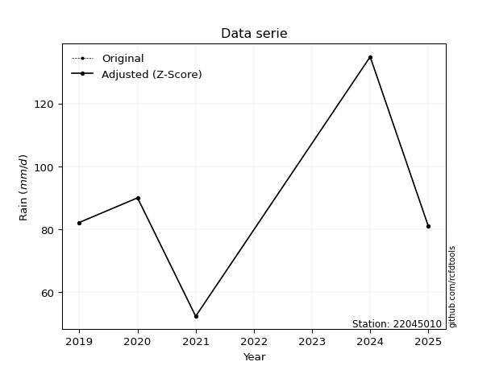</img>

</div>

> If Z-Score is active, values out of range or outliers are replaced with the station mean value.


### 4. Active continuous probability distributions from SciPy (45 of 104 available)

[scipy.stats](https://docs.scipy.org/doc/scipy/reference/stats.html) is a Python´s powerful submodule within the SciPy library for comprehensive statistical analysis, offering over 130 probability distributions (like Normal, Poisson), functions for descriptive stats (mean, variance), hypothesis testing (t-tests, chi-square), random variable generation, and statistical tests, making it essential for data science, modeling, and research. It provides tools to explore, model, and draw conclusions from data efficiently, working seamlessly with NumPy.

<div align="center">

|   id | p_dist             |   n_parameter | fit_method   | label                                                                       | active   | ref                                                                                                        |
|-----:|:-------------------|--------------:|:-------------|:----------------------------------------------------------------------------|:---------|:-----------------------------------------------------------------------------------------------------------|
|    0 | alpha              |             3 | MLE          | Alpha                                                                       | True     | [:mortar_board:](https://docs.scipy.org/doc/scipy/reference/generated/scipy.stats.alpha.html)              |
|    1 | betaprime          |             4 | MLE          | Beta prime                                                                  | True     | [:mortar_board:](https://docs.scipy.org/doc/scipy/reference/generated/scipy.stats.betaprime.html)          |
|    2 | chi2               |             3 | MLE          | Chi²                                                                        | True     | [:mortar_board:](https://docs.scipy.org/doc/scipy/reference/generated/scipy.stats.chi2.html)               |
|    3 | crystalball        |             4 | MLE          | Crystalball                                                                 | True     | [:mortar_board:](https://docs.scipy.org/doc/scipy/reference/generated/scipy.stats.crystalball.html)        |
|    4 | erlang             |             3 | MLE          | Erlang                                                                      | True     | [:mortar_board:](https://docs.scipy.org/doc/scipy/reference/generated/scipy.stats.erlang.html)             |
|    5 | expon              |             2 | MLE          | Exponential                                                                 | True     | [:mortar_board:](https://docs.scipy.org/doc/scipy/reference/generated/scipy.stats.expon.html)              |
|    6 | exponnorm          |             3 | MLE          | Exponentially modified Normal                                               | True     | [:mortar_board:](https://docs.scipy.org/doc/scipy/reference/generated/scipy.stats.exponnorm.html)          |
|    7 | f                  |             4 | MLE          | F                                                                           | True     | [:mortar_board:](https://docs.scipy.org/doc/scipy/reference/generated/scipy.stats.f.html)                  |
|    8 | fatiguelife        |             3 | MLE          | Fatigue-life (Birnbaum-Saunders)                                            | True     | [:mortar_board:](https://docs.scipy.org/doc/scipy/reference/generated/scipy.stats.fatiguelife.html)        |
|    9 | fisk               |             3 | MLE          | Fisk                                                                        | True     | [:mortar_board:](https://docs.scipy.org/doc/scipy/reference/generated/scipy.stats.fisk.html)               |
|   10 | gamma              |             3 | MLE          | Gamma                                                                       | True     | [:mortar_board:](https://docs.scipy.org/doc/scipy/reference/generated/scipy.stats.gamma.html)              |
|   11 | genexpon           |             5 | MLE          | Generalized exponential                                                     | True     | [:mortar_board:](https://docs.scipy.org/doc/scipy/reference/generated/scipy.stats.genexpon.html)           |
|   12 | genlogistic        |             3 | MLE          | Generalized logistic                                                        | True     | [:mortar_board:](https://docs.scipy.org/doc/scipy/reference/generated/scipy.stats.genlogistic.html)        |
|   13 | gibrat             |             2 | MM           | Gibrat                                                                      | True     | [:mortar_board:](https://docs.scipy.org/doc/scipy/reference/generated/scipy.stats.gibrat.html)             |
|   14 | gompertz           |             3 | MLE          | Gompertz (or truncated Gumbel)                                              | True     | [:mortar_board:](https://docs.scipy.org/doc/scipy/reference/generated/scipy.stats.gompertz.html)           |
|   15 | gumbel_l           |             2 | MM           | Gumbel Left Skew                                                            | True     | [:mortar_board:](https://docs.scipy.org/doc/scipy/reference/generated/scipy.stats.gumbel_l.html)           |
|   16 | gumbel_r           |             2 | MM           | Gumbel Right Skew                                                           | True     | [:mortar_board:](https://docs.scipy.org/doc/scipy/reference/generated/scipy.stats.gumbel_r.html)           |
|   17 | halflogistic       |             2 | MM           | Half-logistic                                                               | True     | [:mortar_board:](https://docs.scipy.org/doc/scipy/reference/generated/scipy.stats.halflogistic.html)       |
|   18 | halfnorm           |             2 | MM           | Half Normal                                                                 | True     | [:mortar_board:](https://docs.scipy.org/doc/scipy/reference/generated/scipy.stats.halfnorm.html)           |
|   19 | hypsecant          |             2 | MM           | hyperbolic secant                                                           | True     | [:mortar_board:](https://docs.scipy.org/doc/scipy/reference/generated/scipy.stats.hypsecant.html)          |
|   20 | invgamma           |             3 | MLE          | Inverted gamma                                                              | True     | [:mortar_board:](https://docs.scipy.org/doc/scipy/reference/generated/scipy.stats.invgamma.html)           |
|   21 | invgauss           |             3 | MLE          | Inverse Gaussian                                                            | True     | [:mortar_board:](https://docs.scipy.org/doc/scipy/reference/generated/scipy.stats.invgauss.html)           |
|   22 | invweibull         |             3 | MLE          | Inverted Weibull                                                            | True     | [:mortar_board:](https://docs.scipy.org/doc/scipy/reference/generated/scipy.stats.invweibull.html)         |
|   23 | johnsonsu          |             4 | MLE          | Johnson Su                                                                  | True     | [:mortar_board:](https://docs.scipy.org/doc/scipy/reference/generated/scipy.stats.johnsonsu.html)          |
|   24 | kstwobign          |             2 | MLE          | Limiting distribution of scaled Kolmogorov-Smirnov two-sided test statistic | True     | [:mortar_board:](https://docs.scipy.org/doc/scipy/reference/generated/scipy.stats.kstwobign.html)          |
|   25 | laplace            |             2 | MM           | Laplace                                                                     | True     | [:mortar_board:](https://docs.scipy.org/doc/scipy/reference/generated/scipy.stats.laplace.html)            |
|   26 | laplace_asymmetric |             3 | MLE          | Asymmetric Laplace                                                          | True     | [:mortar_board:](https://docs.scipy.org/doc/scipy/reference/generated/scipy.stats.laplace_asymmetric.html) |
|   27 | loggamma           |             3 | MLE          | Log gamma                                                                   | True     | [:mortar_board:](https://docs.scipy.org/doc/scipy/reference/generated/scipy.stats.loggamma.html)           |
|   28 | logistic           |             2 | MM           | Logistic (or Sech-squared)                                                  | True     | [:mortar_board:](https://docs.scipy.org/doc/scipy/reference/generated/scipy.stats.logistic.html)           |
|   29 | lognorm            |             3 | MLE          | Log Normal                                                                  | True     | [:mortar_board:](https://docs.scipy.org/doc/scipy/reference/generated/scipy.stats.lognorm.html)            |
|   30 | maxwell            |             2 | MM           | Maxwell                                                                     | True     | [:mortar_board:](https://docs.scipy.org/doc/scipy/reference/generated/scipy.stats.maxwell.html)            |
|   31 | mielke             |             4 | MLE          | Mielke Beta-Kappa / Dagum                                                   | True     | [:mortar_board:](https://docs.scipy.org/doc/scipy/reference/generated/scipy.stats.mielke.html)             |
|   32 | moyal              |             2 | MM           | Moyal                                                                       | True     | [:mortar_board:](https://docs.scipy.org/doc/scipy/reference/generated/scipy.stats.moyal.html)              |
|   33 | nakagami           |             3 | MLE          | Nakagami                                                                    | True     | [:mortar_board:](https://docs.scipy.org/doc/scipy/reference/generated/scipy.stats.nakagami.html)           |
|   34 | ncf                |             5 | MLE          | Non-central F distribution                                                  | True     | [:mortar_board:](https://docs.scipy.org/doc/scipy/reference/generated/scipy.stats.ncf.html)                |
|   35 | nct                |             4 | MLE          | Non-central Student’s t                                                     | True     | [:mortar_board:](https://docs.scipy.org/doc/scipy/reference/generated/scipy.stats.nct.html)                |
|   36 | norm               |             2 | MM           | Normal                                                                      | True     | [:mortar_board:](https://docs.scipy.org/doc/scipy/reference/generated/scipy.stats.norm.html)               |
|   37 | pareto             |             3 | MLE          | Pareto                                                                      | True     | [:mortar_board:](https://docs.scipy.org/doc/scipy/reference/generated/scipy.stats.pareto.html)             |
|   38 | pearson3           |             3 | MM           | Pearson type III                                                            | True     | [:mortar_board:](https://docs.scipy.org/doc/scipy/reference/generated/scipy.stats.pearson3.html)           |
|   39 | rayleigh           |             2 | MM           | Rayleigh                                                                    | True     | [:mortar_board:](https://docs.scipy.org/doc/scipy/reference/generated/scipy.stats.rayleigh.html)           |
|   40 | rice               |             3 | MLE          | Rice                                                                        | True     | [:mortar_board:](https://docs.scipy.org/doc/scipy/reference/generated/scipy.stats.rice.html)               |
|   41 | t                  |             3 | MLE          | Student’s t                                                                 | True     | [:mortar_board:](https://docs.scipy.org/doc/scipy/reference/generated/scipy.stats.t.html)                  |
|   42 | truncnorm          |             4 | MLE          | Truncated normal                                                            | True     | [:mortar_board:](https://docs.scipy.org/doc/scipy/reference/generated/scipy.stats.truncnorm.html)          |
|   43 | wald               |             2 | MM           | Wald                                                                        | True     | [:mortar_board:](https://docs.scipy.org/doc/scipy/reference/generated/scipy.stats.wald.html)               |
|   44 | weibull_min        |             3 | MLE          | Weibull minimum                                                             | True     | [:mortar_board:](https://docs.scipy.org/doc/scipy/reference/generated/scipy.stats.weibull_min.html)        |

</div>

> **n_parameter:** # arguments & localization & scale.
>
> **Fit methods:** (MLE) maximum likelihood, (MM) L-moments.
>
>**Inactive:** foldnorm, gennorm, norminvgauss, powernorm, powerlognorm, skewnorm, genextreme, anglit, arcsine, argus, beta, bradford, burr, burr12, cauchy, cosine, halfcauchy, foldcauchy, skewcauchy, wrapcauchy, dgamma, gengamma, exponweib, exponpow, truncexpon, gausshyper, genhalflogistic, genhyperbolic, geninvgauss, halfgennorm, johnsonsb, kappa4, kappa3, ksone, kstwo, loglaplace, levy, levy_l, levy_stable, ncx2, genpareto, truncpareto, lomax, powerlaw, rdist, rel_breitwigner, recipinvgauss, semicircular, studentized_range, trapezoid, triang, truncweibull_min, tukeylambda, uniform, loguniform, vonmises, vonmises_line, weibull_max, dweibull, 


## B. Probability distributions vs. Empirical distributions

A continuous probability distribution (CPD) describes probabilities for variables that can take any value within a range (like rain any time), unlike discrete variables with specific outcomes (like temperature). It uses a Probability Density Function (PDF), a curve where the total area under it equals 1, and the probability of the variable falling within an interval (a to b) is found by calculating the area under the curve between those points. A key feature is that the probability of hitting any single exact value is zero, so probabilities are always expressed for ranges, e.g., $P(a ≤ X ≤ b)$.

<div align="center">

Distributions parameters
|    |   station | p_dist                |   n |               loc |            scale | shape                  | shape1                 | shape2              | shape3   |
|---:|----------:|:----------------------|----:|------------------:|-----------------:|:-----------------------|:-----------------------|:--------------------|:---------|
|  0 |  22045010 | alpha                 |   5 |     -88.6763      |   1200.87        | 6.942367269128625      |                        |                     |          |
|  1 |  22045010 | betaprime             |   5 |      -0.862962    |     76.1199      | 24.33114875979802      | 21.800103012531196     |                     |          |
|  2 |  22045010 | chi2                  |   5 |      52.4         |     15.305       | 1.6769411840100568     |                        |                     |          |
|  3 |  22045010 | crystalball           |   5 |      88.08        |     26.6241      | 4214.063839524325      | 14993.535292309087     |                     |          |
|  4 |  22045010 | erlang                |   5 |      52.4         |     47.1616      | 0.3233030839595794     |                        |                     |          |
|  5 |  22045010 | expon                 |   5 |      52.4         |     35.68        |                        |                        |                     |          |
|  6 |  22045010 | exponnorm             |   5 |      64.4157      |     14.6262      | 1.6179419926073        |                        |                     |          |
|  7 |  22045010 | f                     |   5 |      24.5414      |     60.6672      | 14.366979089512714     | 49.57975831510201      |                     |          |
|  8 |  22045010 | fatiguelife           |   5 |      52.4         |      3.65077e-06 | 2516.3662362894265     |                        |                     |          |
|  9 |  22045010 | fisk                  |   5 |      -0.190363    |     84.4525      | 5.879029041010473      |                        |                     |          |
| 10 |  22045010 | gamma                 |   5 |      52.4         |     46.0614      | 0.4515048114162925     |                        |                     |          |
| 11 |  22045010 | genexpon              |   5 |      52.4         |      1.42711     | 0.039989016511736517   | 1.9283817494897277e-08 | 1.4253995828184105  |          |
| 12 |  22045010 | genlogistic           |   5 |     -43.0828      |     21.7973      | 232.2210806074462      |                        |                     |          |
| 13 |  22045010 | gibrat                |   5 |      67.7692      |     12.3191      |                        |                        |                     |          |
| 14 |  22045010 | gompertz              |   5 |      52.4         |     67.0917      | 1.174496271508444      |                        |                     |          |
| 15 |  22045010 | gumbel_l              |   5 |     100.062       |     20.7587      |                        |                        |                     |          |
| 16 |  22045010 | gumbel_r              |   5 |      76.0977      |     20.7587      |                        |                        |                     |          |
| 17 |  22045010 | halflogistic          |   5 |      56.5243      |     22.7626      |                        |                        |                     |          |
| 18 |  22045010 | halfnorm              |   5 |      52.8402      |     44.1666      |                        |                        |                     |          |
| 19 |  22045010 | hypsecant             |   5 |      88.08        |     16.9494      |                        |                        |                     |          |
| 20 |  22045010 | invgamma              |   5 |     -24.8753      |   2043.52        | 19.08355680464702      |                        |                     |          |
| 21 |  22045010 | invgauss              |   5 |       6.81345     |    715.373       | 0.11360020752002682    |                        |                     |          |
| 22 |  22045010 | invweibull            |   5 |      52.4         |      1.3475      | 0.05735301738848529    |                        |                     |          |
| 23 |  22045010 | johnsonsu             |   5 |      81.5316      |      0.735707    | -0.24140581711822331   | 0.31064809686853945    |                     |          |
| 24 |  22045010 | kstwobign             |   5 |      -2.04053     |    103.549       |                        |                        |                     |          |
| 25 |  22045010 | laplace               |   5 |      88.08        |     18.8261      |                        |                        |                     |          |
| 26 |  22045010 | laplace_asymmetric    |   5 |      82.2         |     17.5497      | 0.8464115808712034     |                        |                     |          |
| 27 |  22045010 | loggamma              |   5 |   -6642.58        |    947.728       | 1214.9428624217223     |                        |                     |          |
| 28 |  22045010 | logistic              |   5 |      88.08        |     14.6786      |                        |                        |                     |          |
| 29 |  22045010 | lognorm               |   5 |      52.4         |      0.0284877   | 14.514813822677676     |                        |                     |          |
| 30 |  22045010 | maxwell               |   5 |      24.9921      |     39.5345      |                        |                        |                     |          |
| 31 |  22045010 | mielke                |   5 |      -0.579452    |     85.1938      | 5.846428618905618      | 5.942948279133043      |                     |          |
| 32 |  22045010 | moyal                 |   5 |      72.8546      |     11.985       |                        |                        |                     |          |
| 33 |  22045010 | nakagami              |   5 |      81           |     21.141       | 0.1761163960496227     |                        |                     |          |
| 34 |  22045010 | ncf                   |   5 |      -0.101583    |      3.67374e-06 | 4.2640175585354776e-07 | 41.55824137607277      | 9.326361267633537   |          |
| 35 |  22045010 | nct                   |   5 |      -0.111847    |     15.3997      | 10.464758728462764     | 5.309643040031537      |                     |          |
| 36 |  22045010 | norm                  |   5 |      88.08        |     26.6241      |                        |                        |                     |          |
| 37 |  22045010 | pareto                |   5 |      52.059       |      0.340987    | 0.2614169901608578     |                        |                     |          |
| 38 |  22045010 | pearson3              |   5 |      88.08        |     26.6241      | 0.5935317610389226     |                        |                     |          |
| 39 |  22045010 | rayleigh              |   5 |      37.1466      |     40.639       |                        |                        |                     |          |
| 40 |  22045010 | rice                  |   5 |      39.9839      |     38.872       | 0.0018120982903564518  |                        |                     |          |
| 41 |  22045010 | t                     |   5 |      88.0801      |     26.624       | 1877255543.9946063     |                        |                     |          |
| 42 |  22045010 | truncnorm             |   5 |     -34.3065      |     26.1614      | 4.407512225730485      | 6.464055353029256      |                     |          |
| 43 |  22045010 | wald                  |   5 |      61.4559      |     26.6241      |                        |                        |                     |          |
| 44 |  22045010 | weibull_min           |   5 |      52.4         |     34.0623      | 0.9093148791882375     |                        |                     |          |
| 45 |  22045010 | logalpha              |   5 |      -3.54356     |    208.773       | 26.21479816990857      |                        |                     |          |
| 46 |  22045010 | logbetaprime          |   5 |      -8.05174     |     10.0027      | 3847.4809731765836     | 3083.8008334537153     |                     |          |
| 47 |  22045010 | logchi2               |   5 |       3.95891     |      0.943153    | 1.1157809172246203     |                        |                     |          |
| 48 |  22045010 | logcrystalball        |   5 |       4.43322     |      0.300975    | 5.497174047042918      | 475.64174074515313     |                     |          |
| 49 |  22045010 | logerlang             |   5 |     -32.8983      |      0.00242718  | 15380.545598409579     |                        |                     |          |
| 50 |  22045010 | logexpon              |   5 |       3.95891     |      0.474316    |                        |                        |                     |          |
| 51 |  22045010 | logexponnorm          |   5 |       4.43277     |      0.300974    | 0.0015019324634388104  |                        |                     |          |
| 52 |  22045010 | logf                  |   5 |     -41.9495      |     46.3812      | 670015.9611353511      | 50961.99210005156      |                     |          |
| 53 |  22045010 | logfatiguelife        |   5 |     -21.2767      |     25.7078      | 0.011698055874814359   |                        |                     |          |
| 54 |  22045010 | logfisk               |   5 | -610486           | 610490           | 3580682.4438539636     |                        |                     |          |
| 55 |  22045010 | loggamma              |   5 |     -32.832       |      0.0024317   | 15324.758258297832     |                        |                     |          |
| 56 |  22045010 | loggenexpon           |   5 |       3.94729     |      0.0114261   | 0.010911036305884046   | 5.124449012974015      | 8.3452515191903e-05 |          |
| 57 |  22045010 | loggenlogistic        |   5 |       4.43994     |      0.168973    | 0.976133358837348      |                        |                     |          |
| 58 |  22045010 | loggibrat             |   5 |       4.20361     |      0.139264    |                        |                        |                     |          |
| 59 |  22045010 | loggompertz           |   5 |       3.95891     |      0.453072    | 0.3947491729049811     |                        |                     |          |
| 60 |  22045010 | loggumbel_l           |   5 |       4.56868     |      0.234669    |                        |                        |                     |          |
| 61 |  22045010 | loggumbel_r           |   5 |       4.29777     |      0.234669    |                        |                        |                     |          |
| 62 |  22045010 | loghalflogistic       |   5 |       4.07648     |      0.257334    |                        |                        |                     |          |
| 63 |  22045010 | loghalfnorm           |   5 |       4.03486     |      0.49927     |                        |                        |                     |          |
| 64 |  22045010 | loghypsecant          |   5 |       4.43322     |      0.191606    |                        |                        |                     |          |
| 65 |  22045010 | loginvgamma           |   5 |       0.391015    |    718.185       | 178.6848970732011      |                        |                     |          |
| 66 |  22045010 | loginvgauss           |   5 |       2.19152     |    118.685       | 0.018869254197507096   |                        |                     |          |
| 67 |  22045010 | loginvweibull         |   5 |      -1.47389e+07 |      1.47389e+07 | 51509968.761071295     |                        |                     |          |
| 68 |  22045010 | logjohnsonsu          |   5 |       4.40223     |      0.0091785   | -0.19395339808663045   | 0.3118016778917214     |                     |          |
| 69 |  22045010 | logkstwobign          |   5 |       3.27657     |      1.32332     |                        |                        |                     |          |
| 70 |  22045010 | loglaplace            |   5 |       4.43322     |      0.212821    |                        |                        |                     |          |
| 71 |  22045010 | loglaplace_asymmetric |   5 |       4.40916     |      0.209018    | 0.9440706662119538     |                        |                     |          |
| 72 |  22045010 | logloggamma           |   5 |     -42.14        |      7.30302     | 588.7780462414421      |                        |                     |          |
| 73 |  22045010 | loglogistic           |   5 |       4.43322     |      0.165936    |                        |                        |                     |          |
| 74 |  22045010 | loglognorm            |   5 |       3.95891     |      0.000536649 | 13.912941353488677     |                        |                     |          |
| 75 |  22045010 | logmaxwell            |   5 |       3.72004     |      0.446921    |                        |                        |                     |          |
| 76 |  22045010 | logmielke             |   5 |      -0.24357     |      4.73065     | 23.76149011702969      | 30.045868104518497     |                     |          |
| 77 |  22045010 | logmoyal              |   5 |       4.26111     |      0.135486    |                        |                        |                     |          |
| 78 |  22045010 | lognakagami           |   5 |       4.39445     |      0.148533    | 0.04602462509294906    |                        |                     |          |
| 79 |  22045010 | logncf                |   5 |      -6.49641     |      6.52271     | 2818.292406188829      | 12031.076406511042     | 1903.629863855741   |          |
| 80 |  22045010 | lognct                |   5 |       0.636826    |      0.281415    | 554.1991287588057      | 13.46392360131258      |                     |          |
| 81 |  22045010 | lognorm               |   5 |       4.43322     |      0.300974    |                        |                        |                     |          |
| 82 |  22045010 | logpareto             |   5 |       3.95419     |      0.00471572  | 0.26093392115601044    |                        |                     |          |
| 83 |  22045010 | logpearson3           |   5 |       4.43322     |      0.300974    | -0.0166839088095774    |                        |                     |          |
| 84 |  22045010 | lograyleigh           |   5 |       3.85744     |      0.459407    |                        |                        |                     |          |
| 85 |  22045010 | logrice               |   5 |       3.78176     |      0.342382    | 1.5469874975486473     |                        |                     |          |
| 86 |  22045010 | logt                  |   5 |       4.43322     |      0.300976    | 843463438.9278206      |                        |                     |          |
| 87 |  22045010 | logtruncnorm          |   5 |      -0.0801033   |      0.974999    | 5.1116943041032235     | 5.111694304103224      |                     |          |
| 88 |  22045010 | logwald               |   5 |       4.13225     |      0.300971    |                        |                        |                     |          |
| 89 |  22045010 | logweibull_min        |   5 |       3.64507     |      0.884844    | 2.894353120581793      |                        |                     |          |

</div>

> **loc** (Location parameter): This shifts the distribution along the x-axis. For many common distributions, like the normal (Gaussian) distribution, loc represents the mean $μ$. For others, like the uniform distribution, it might represent the minimum value, or for the beta distribution, the left end of the support interval.
>
> **scale** (Scale parameter): This determines the width or spread of the distribution. For the normal distribution, scale represents the standard deviation $σ$. For a uniform distribution, it defines the length of the interval (from $loc$ to $loc + scale$).
>
> **shape** (Shape parameters): Refers to parameters that define the specific form of a probability distribution, distinct from its location (loc) and scale (scale). These parameters are required arguments for most distribution functions. For example, a normal (Gaussian) distribution is fully defined by its location (mean) and scale (standard deviation), so it has no specific shape parameters beyond loc and scale. However, other distributions have intrinsic properties that need specification, as Gamma distribution that takes a shape parameter, often named $a$ or $alpha$.


### 0. Cumulative distribution values - CDF (90 evaluated)

> Ordered by x ascending and calculating $log(f(x))$ separately. 

|   id |   Station |   date |     x |   count |   mean |     std |     zscore |   Value_initial |   station |   m |     alpha |   alpha_pdf |   betaprime |   betaprime_pdf |        chi2 |   chi2_pdf |   crystalball |   crystalball_pdf |      erlang |   erlang_pdf |    expon |   expon_pdf |   exponnorm |   exponnorm_pdf |         f |      f_pdf |   fatiguelife |   fatiguelife_pdf |      fisk |   fisk_pdf |       gamma |   gamma_pdf |    genexpon |   genexpon_pdf |   genlogistic |   genlogistic_pdf |   gibrat |   gibrat_pdf |    gompertz |   gompertz_pdf |   gumbel_l |   gumbel_l_pdf |   gumbel_r |   gumbel_r_pdf |   halflogistic |   halflogistic_pdf |   halfnorm |   halfnorm_pdf |   hypsecant |   hypsecant_pdf |   invgamma |   invgamma_pdf |   invgauss |   invgauss_pdf |   invweibull |   invweibull_pdf |   johnsonsu |   johnsonsu_pdf |   kstwobign |   kstwobign_pdf |   laplace |   laplace_pdf |   laplace_asymmetric |   laplace_asymmetric_pdf |   loggamma |   loggamma_pdf |   logistic |   logistic_pdf |   lognorm |   lognorm_pdf |   maxwell |   maxwell_pdf |    mielke |   mielke_pdf |     moyal |   moyal_pdf |    nakagami |   nakagami_pdf |      ncf |    ncf_pdf |       nct |    nct_pdf |      norm |   norm_pdf |      pareto |   pareto_pdf |   pearson3 |   pearson3_pdf |   rayleigh |   rayleigh_pdf |      rice |   rice_pdf |         t |      t_pdf |   truncnorm |   truncnorm_pdf |     wald |   wald_pdf |   weibull_min |   weibull_min_pdf |   logalpha |   logalpha_pdf |   logbetaprime |   logbetaprime_pdf |     logchi2 |   logchi2_pdf |   logcrystalball |   logcrystalball_pdf |   logerlang |   logerlang_pdf |   logexpon |   logexpon_pdf |   logexponnorm |   logexponnorm_pdf |      logf |   logf_pdf |   logfatiguelife |   logfatiguelife_pdf |   logfisk |   logfisk_pdf |   loggenexpon |   loggenexpon_pdf |   loggenlogistic |   loggenlogistic_pdf |   loggibrat |   loggibrat_pdf |   loggompertz |   loggompertz_pdf |   loggumbel_l |   loggumbel_l_pdf |   loggumbel_r |   loggumbel_r_pdf |   loghalflogistic |   loghalflogistic_pdf |   loghalfnorm |   loghalfnorm_pdf |   loghypsecant |   loghypsecant_pdf |   loginvgamma |   loginvgamma_pdf |   loginvgauss |   loginvgauss_pdf |   loginvweibull |   loginvweibull_pdf |   logjohnsonsu |   logjohnsonsu_pdf |   logkstwobign |   logkstwobign_pdf |   loglaplace |   loglaplace_pdf |   loglaplace_asymmetric |   loglaplace_asymmetric_pdf |   logloggamma |   logloggamma_pdf |   loglogistic |   loglogistic_pdf |   loglognorm |   loglognorm_pdf |   logmaxwell |   logmaxwell_pdf |   logmielke |   logmielke_pdf |   logmoyal |   logmoyal_pdf |   lognakagami |   lognakagami_pdf |    logncf |   logncf_pdf |    lognct |   lognct_pdf |   logpareto |   logpareto_pdf |   logpearson3 |   logpearson3_pdf |   lograyleigh |   lograyleigh_pdf |   logrice |   logrice_pdf |      logt |   logt_pdf |   logtruncnorm |   logtruncnorm_pdf |   logwald |   logwald_pdf |   logweibull_min |   logweibull_min_pdf |
|-----:|----------:|-------:|------:|--------:|-------:|--------:|-----------:|----------------:|----------:|----:|----------:|------------:|------------:|----------------:|------------:|-----------:|--------------:|------------------:|------------:|-------------:|---------:|------------:|------------:|----------------:|----------:|-----------:|--------------:|------------------:|----------:|-----------:|------------:|------------:|------------:|---------------:|--------------:|------------------:|---------:|-------------:|------------:|---------------:|-----------:|---------------:|-----------:|---------------:|---------------:|-------------------:|-----------:|---------------:|------------:|----------------:|-----------:|---------------:|-----------:|---------------:|-------------:|-----------------:|------------:|----------------:|------------:|----------------:|----------:|--------------:|---------------------:|-------------------------:|-----------:|---------------:|-----------:|---------------:|----------:|--------------:|----------:|--------------:|----------:|-------------:|----------:|------------:|------------:|---------------:|---------:|-----------:|----------:|-----------:|----------:|-----------:|------------:|-------------:|-----------:|---------------:|-----------:|---------------:|----------:|-----------:|----------:|-----------:|------------:|----------------:|---------:|-----------:|--------------:|------------------:|-----------:|---------------:|---------------:|-------------------:|------------:|--------------:|-----------------:|---------------------:|------------:|----------------:|-----------:|---------------:|---------------:|-------------------:|----------:|-----------:|-----------------:|---------------------:|----------:|--------------:|--------------:|------------------:|-----------------:|---------------------:|------------:|----------------:|--------------:|------------------:|--------------:|------------------:|--------------:|------------------:|------------------:|----------------------:|--------------:|------------------:|---------------:|-------------------:|--------------:|------------------:|--------------:|------------------:|----------------:|--------------------:|---------------:|-------------------:|---------------:|-------------------:|-------------:|-----------------:|------------------------:|----------------------------:|--------------:|------------------:|--------------:|------------------:|-------------:|-----------------:|-------------:|-----------------:|------------:|----------------:|-----------:|---------------:|--------------:|------------------:|----------:|-------------:|----------:|-------------:|------------:|----------------:|--------------:|------------------:|--------------:|------------------:|----------:|--------------:|----------:|-----------:|---------------:|-------------------:|----------:|--------------:|-----------------:|---------------------:|
|    0 |  22045010 |   2021 |  52.4 |       5 |  88.08 | 29.7666 | -1.19866   |            52.4 |  22045010 |   1 | 0.0582271 |  0.00702047 |   0.0570878 |      0.00721779 | 1.47707e-13 | 8.71502    |     0.0900999 |        0.00610442 | 8.22994e-05 |  3.43235e+06 | 0        |  0.0280269  |   0.0548474 |      0.00637367 | 0.0538212 | 0.00783978 |     0.0301717 |       3.92865e+11 | 0.0581599 | 0.00612351 | 8.19708e-08 | 5.20873e+06 | 4.38119e-08 |     0.028021   |     0.0556212 |        0.00732681 | 0        |   0          | 4.01146e-13 |     0.0175058  |  0.0957591 |     0.00438468 |  0.0436429 |     0.00658408 |       0        |          0         |   0        |     0          |   0.0771822 |      0.00450919 |  0.0569146 |     0.00721351 |  0.0548668 |     0.00763934 |   0.00137409 |      7.30912e+10 |   0.0548463 |     0.00118324  |   0.0549454 |      0.00800008 | 0.0751408 |    0.00399132 |            0.0561409 |               0.00377944 |  0.0571042 |       0.383911 |   0.080858 |     0.00506315 | 0.0575204 |      0.382895 | 0.0768714 |    0.00762779 | 0.0587781 |   0.0061225  | 0.0189012 |  0.0049688  | 0           |    0           | 0.344626 | 0.00809892 | 0.0567609 | 0.00691901 | 0.0900999 | 0.00610442 | 1.11022e-16 |  0.766647    |  0.0704216 |     0.00713892 |  0.0680162 |     0.00860775 | 0.0497319 | 0.00780829 | 0.0900985 | 0.00610437 | 0           |     0           | 0        | 0          |   5.51214e-15 |        0.705415   |  0.0534268 |       0.403238 |      0.0562325 |           0.390463 | 2.14821e-09 |   2.69871e+06 |        0.0575208 |             0.382896 |   0.0571071 |        0.383937 |   0        |       2.1083   |      0.0575204 |           0.382895 | 0.0569607 |   0.384449 |        0.0565158 |             0.385014 | 0.0580889 |      0.320915 |     0.0112492 |          0.9818   |        0.0587807 |             0.320945 |    0        |        0        |   3.03845e-08 |          0.871272 |     0.0716906 |          0.294275 |     0.0144421 |          0.260793 |          0        |              0        |      0        |          0        |      0.0534287 |           0.277539 |      0.049536 |          0.399171 |     0.0481303 |          0.415994 |       0.0450878 |            0.488346 |      0.0527128 |          0.0756359 |      0.0469357 |           0.569596 |    0.0538337 |         0.252953 |               0.0481184 |                     0.24385 |     0.0588704 |          0.381515 |     0.0542472 |          0.309182 |    0.0227716 |      8.74536e+12 |    0.0372976 |         0.442109 |   0.0586991 |        0.32269  | 0.00228608 |      0.0856921 |     0         |       0           | 0.0556535 |     0.385571 | 0.0583917 |     0.396324 | 1.11022e-16 |      55.3328    |     0.0579914 |          0.382019 |      0.024095 |          0.46917  | 0.0409078 |      0.466099 | 0.0575215 |   0.382899 |              0 |        0           |  0        |      0        |        0.0485607 |             0.436802 |
|    1 |  22045010 |   2025 |  81   |       5 |  88.08 | 29.7666 | -0.23785   |            81   |  22045010 |   2 | 0.446287  |  0.0164893  |   0.448051  |      0.0163055  | 0.679657    | 0.0115475  |     0.395149  |        0.0144637  | 0.831648    |  0.00586418  | 0.551376 |  0.0125736  |   0.452949  |      0.0176903  | 0.464629  | 0.016239   |     0.866993  |       0.00417908  | 0.44236   | 0.017862   | 0.762756    | 0.00772555  | 0.5513      |     0.012573   |     0.457729  |        0.0163829  | 0.528458 |   0.0300758  | 0.464368    |     0.0143609  |  0.329148  |     0.012901   |  0.454     |     0.0172701  |       0.491191 |          0.0166662 |   0.476254 |     0.0147426  |   0.370744  |      0.0172528  |  0.449882  |     0.0163687  |  0.456424  |     0.0160989  |   0.432026   |      0.000727113 |   0.326402  |     0.123396    |   0.459021  |      0.01568    | 0.343276  |    0.0182341  |            0.384997  |               0.0259182  |  0.449859  |       1.3157   |   0.381701 |     0.0160782  | 0.448748  |      1.31455  | 0.429044  |    0.014849   | 0.441863  |   0.0178615  | 0.476525  |  0.0183925  | 3.60446e-06 |    8.93407e+07 | 0.561526 | 0.00680607 | 0.449781  | 0.0166867  | 0.395149  | 0.0144637  | 0.686826    |  0.00282882  |  0.431138  |     0.0155574  |  0.441346  |     0.0148341  | 0.42689   | 0.0155567  | 0.395146  | 0.0144637  | 3.94419e-08 |     0.176425    | 0.536915 | 0.0227042  |   0.573887    |        0.0115571  |  0.465864  |       1.31695  |      0.455243  |           1.3179   | 0.457976    |   0.504623    |        0.448748  |             1.31455  |   0.449888  |        1.31576  |   0.600785 |       0.841666 |      0.448747  |           1.31455  | 0.450073  |   1.31458  |        0.451489  |             1.31863  | 0.442415  |      1.44686  |     0.529578  |          1.13713  |        0.441832  |             1.44697  |    0.623631 |        1.98931  |   0.471423    |          1.20435  |     0.378706  |          1.2601   |     0.515648  |          1.45537  |          0.549601 |              1.3561   |      0.528612 |          1.23301  |      0.436022  |           1.62783  |      0.469002 |          1.32957  |     0.479388  |          1.31974  |       0.508463  |            1.20189  |      0.332204  |          9.41024   |      0.526672  |           1.1579   |    0.416722  |         1.95809  |               0.43741   |                     2.21667 |     0.446535  |          1.31085  |     0.441848  |          1.48623  |    0.684917  |      0.0586297   |    0.483081  |         1.30204  |   0.441529  |        1.45748  | 0.54097    |      1.49329   |     0.0436532 |       4.52414e+12 | 0.452107  |     1.3176   | 0.456529  |     1.30883  | 0.693861    |       0.181444  |     0.447666  |          1.31314  |      0.494992 |          1.28494  | 0.467621  |      1.29148  | 0.448749  |   1.31454  |              0 |        0           |  0.611322 |      1.61471  |        0.46108   |             1.28676  |
|    2 |  22045010 |   2019 |  82.2 |       5 |  88.08 | 29.7666 | -0.197537  |            82.2 |  22045010 |   3 | 0.465993  |  0.0163478  |   0.467528  |      0.0161504  | 0.693201    | 0.0110301  |     0.412604  |        0.0146233  | 0.8385      |  0.00556004  | 0.566213 |  0.0121577  |   0.474064  |      0.0174917  | 0.483984  | 0.0160138  |     0.871892  |       0.00398918  | 0.46373   | 0.0177451  | 0.771805    | 0.00735909  | 0.566136    |     0.0121573  |     0.477264  |        0.0161701  | 0.562855 |   0.0273013  | 0.481477    |     0.0141531  |  0.344897  |     0.0133479  |  0.474589  |     0.0170393  |       0.51093  |          0.0162316 |   0.493791 |     0.0144841  |   0.391724  |      0.0177039  |  0.46943   |     0.0162052  |  0.475628  |     0.0159019  |   0.43288    |      0.000697567 |   0.504718  |     0.124671    |   0.477714  |      0.0154706  | 0.365869  |    0.0194342  |            0.417389  |               0.0280989  |  0.469257  |       1.3219   |   0.401172 |     0.0163662  | 0.468133  |      1.32127  | 0.446856  |    0.0148332  | 0.463238  |   0.0177525  | 0.498316  |  0.0179219  | 0.289864    |    0.085042    | 0.569645 | 0.00672526 | 0.469709  | 0.0165194  | 0.412604  | 0.0146233  | 0.690135    |  0.00268751  |  0.449786  |     0.0155171  |  0.459102  |     0.0147556  | 0.445521  | 0.0154913  | 0.412601  | 0.0146233  | 0.191618    |     0.14398     | 0.563194 | 0.021116   |   0.587508    |        0.011146   |  0.485228  |       1.316    |      0.474657  |           1.32195  | 0.465314    |   0.493407    |        0.468133  |             1.32127  |   0.469287  |        1.32196  |   0.612972 |       0.81597  |      0.468132  |           1.32127  | 0.469453  |   1.32055  |        0.470926  |             1.32418  | 0.463786  |      1.45862  |     0.546167  |          1.11882  |        0.46321   |             1.4595   |    0.651461 |        1.79932  |   0.489122    |          1.20243  |     0.397538  |          1.30092  |     0.536817  |          1.42308  |          0.569231 |              1.31342  |      0.546551 |          1.2066   |      0.460122  |           1.64825  |      0.488537 |          1.32655  |     0.498749  |          1.3127   |       0.525986  |            1.18103  |      0.509314  |         10.8144    |      0.543545  |           1.13668  |    0.446536  |         2.09818  |               0.471255  |                     2.38819 |     0.465875  |          1.31879  |     0.463804  |          1.49871  |    0.685765  |      0.0566494   |    0.502165  |         1.29289  |   0.463073  |        1.47153  | 0.562554   |      1.44186   |     0.719128  |       4.49925     | 0.471523  |     1.32241  | 0.47581   |     1.31284  | 0.696475    |       0.17408   |     0.467034  |          1.32039  |      0.513789 |          1.27099  | 0.486605  |      1.2898   | 0.468134  |   1.32127  |              0 |        0           |  0.634188 |      1.49683  |        0.480016  |             1.28811  |
|    3 |  22045010 |   2020 |  90   |       5 |  88.08 | 29.7666 |  0.0645018 |            90   |  22045010 |   4 | 0.587627  |  0.0146428  |   0.587479  |      0.0144283  | 0.767745    | 0.00823385 |     0.528745  |        0.0149454  | 0.875453    |  0.00402646  | 0.651394 |  0.00977036 |   0.602237  |      0.0151129  | 0.60148   | 0.0139767  |     0.898906  |       0.00300005  | 0.595427  | 0.0157026  | 0.821347    | 0.00546888  | 0.651316    |     0.00977047 |     0.596055  |        0.0141334  | 0.722514 |   0.0150759  | 0.586269    |     0.012685   |  0.459828  |     0.0160258  |  0.599381  |     0.0147792  |       0.62631  |          0.0133494 |   0.599852 |     0.0126804  |   0.535981  |      0.0186601  |  0.589584  |     0.0144258  |  0.592922  |     0.0140299  |   0.437708   |      0.00055162  |   0.768373  |     0.0111408   |   0.591708  |      0.0136489  | 0.548479  |    0.0239838  |            0.600054  |               0.0192891  |  0.588582  |       1.29092  |   0.532654 |     0.0169589  | 0.587547  |      1.29346  | 0.560424  |    0.0141193  | 0.595157  |   0.0157468  | 0.624803  |  0.0144441  | 0.58667     |    0.0223451   | 0.619995 | 0.00618047 | 0.591979  | 0.0146355  | 0.528745  | 0.0149454  | 0.708228    |  0.00201034  |  0.567714  |     0.0145258  |  0.570755  |     0.013737   | 0.562981  | 0.0144655  | 0.528743  | 0.0149454  | 0.806939    |     0.0365053   | 0.695382 | 0.0134654  |   0.665129    |        0.00885983 |  0.602121  |       1.24497  |      0.593403  |           1.27851  | 0.507224    |   0.433622    |        0.587547  |             1.29345  |   0.588615  |        1.29095  |   0.680304 |       0.674014 |      0.587546  |           1.29346  | 0.588597  |   1.28839  |        0.590266  |             1.28903  | 0.595464  |      1.41286  |     0.641894  |          0.988772 |        0.595164  |             1.4177   |    0.774768 |        1.01314  |   0.596604    |          1.15977  |     0.525586  |          1.50748  |     0.65524   |          1.18041  |          0.676442 |              1.05393  |      0.648277 |          1.03583  |      0.608458  |           1.56577  |      0.605793 |          1.24265  |     0.613795  |          1.20958  |       0.62624   |            1.02431  |      0.776344  |          0.950857  |      0.640025  |           0.987792 |    0.634331  |         1.7182   |               0.648908  |                     1.58578 |     0.585412  |          1.29855  |     0.598996  |          1.44755  |    0.690429  |      0.0468511   |    0.615138  |         1.18616  |   0.596374  |        1.43347  | 0.678579   |      1.11982   |     0.861179  |       0.735899    | 0.590509  |     1.28322  | 0.593757  |     1.27034  | 0.71053     |       0.138435  |     0.586517  |          1.2958   |      0.623772 |          1.14509  | 0.601243  |      1.22387  | 0.587547  |   1.29345  |              0 |        0           |  0.743491 |      0.96268  |        0.595318  |             1.2397   |
|    4 |  22045010 |   2024 | 134.8 |       5 |  88.08 | 29.7666 |  1.56954   |           134.8 |  22045010 |   5 | 0.94165   |  0.00280239 |   0.940544  |      0.00287707 | 0.950905    | 0.00167858 |     0.960353  |        0.00321342 | 0.966384    |  0.000915795 | 0.900681 |  0.00278361 |   0.938164  |      0.002613   | 0.939078  | 0.00280947 |     0.970486  |       0.000769017 | 0.940327  | 0.00244377 | 0.949423    | 0.00134463  | 0.900632    |     0.00278438 |     0.935829  |        0.00284704 | 0.954867 |   0.00141743 | 0.941362    |     0.00350547 |  0.995157  |     0.00124347 |  0.942574  |     0.00268535 |       0.93779  |          0.002648  |   0.936503 |     0.00322905 |   0.959618  |      0.00237614 |  0.940356  |     0.00284812 |  0.938323  |     0.00292605 |   0.453913   |      0.000249543 |   0.903919  |     0.000993819 |   0.939169  |      0.00310511 | 0.958198  |    0.00222043 |            0.953907  |               0.00222302 |  0.940562  |       0.389544 |   0.960184 |     0.00260451 | 0.941031  |      0.39045  | 0.947707  |    0.00328903 | 0.940998  |   0.00243605 | 0.939856  |  0.00250436 | 0.963426    |    0.00231577  | 0.827546 | 0.00322615 | 0.940057  | 0.00275269 | 0.960353  | 0.00321342 | 0.762028    |  0.000751862 |  0.94674   |     0.00308752 |  0.944261  |     0.00329578 | 0.948943  | 0.00320379 | 0.960353  | 0.00321343 | 1           |     2.46506e-06 | 0.942296 | 0.00187401 |   0.892779    |        0.00264198 |  0.933212  |       0.37885  |      0.938929  |           0.385146 | 0.645988    |   0.273524    |        0.941031  |             0.390451 |   0.94058   |        0.389474 |   0.863592 |       0.28759  |      0.941031  |           0.390452 | 0.939944  |   0.390395 |        0.940338  |             0.38726  | 0.940255  |      0.329486 |     0.910034  |          0.366804 |        0.941034  |             0.328148 |    0.94684  |        0.154654 |   0.938114    |          0.433981 |     0.984555  |          0.274479 |     0.927199  |          0.298653 |          0.922784 |              0.288475 |      0.918211 |          0.351454 |      0.945521  |           0.28294  |      0.932356 |          0.372766 |     0.928959  |          0.366959 |       0.892211  |            0.355631 |      0.8979    |          0.110747  |      0.902805  |           0.361135 |    0.94521   |         0.257445 |               0.943379  |                     0.25574 |     0.942282  |          0.392188 |     0.944583  |          0.31546  |    0.704421  |      0.0262698   |    0.928595  |         0.375291 |   0.941544  |        0.318752 | 0.925654   |      0.273573  |     0.975801  |       0.104831    | 0.938711  |     0.388812 | 0.938239  |     0.386789 | 0.749499    |       0.0688334 |     0.941508  |          0.391384 |      0.925261 |          0.370533 | 0.933971  |      0.390386 | 0.94103   |   0.390452 |              1 |        3.04979e+15 |  0.931789 |      0.200477 |        0.937551  |             0.398255 |

An Empirical Distribution Function (EDF) is a step-function estimate of a true cumulative distribution function (CDF) based on observed sample data, representing the proportion of data points less than or equal to a given value. It is calculated by ordering your data and jumping up by $1/n$ (where $n$ is sample size) at each unique data point, allowing analysis without assuming an underlying population distribution, and it gets closer to the true CDF as the sample size grows.


### 1. Empirical - EDF California (1923)

California´s estimates the true probability distribution of water-related data (like rainfall, streamflow) using observed samples, crucial for risk assessment.

<div align="center">


$P=m/n$


</div>


**1.1. Empirical values**

<div align="center">

|                | 0              | 1                  | 2              | 3                 | 4              |
|:---------------|:---------------|:-------------------|:---------------|:------------------|:---------------|
| date           | 2021           | 2025               | 2019           | 2020              | 2024           |
| x              | 52.4           | 81.0               | 82.2           | 90.0              | 134.8          |
| m              | 1              | 2                  | 3              | 4                 | 5              |
| empirical_dist | edf_california | edf_california     | edf_california | edf_california    | edf_california |
| empirical      | 0.2            | 0.4                | 0.6            | 0.8               | 1.0            |
| empirical_tr   | 1.25           | 1.6666666666666667 | 2.5            | 5.000000000000001 | inf            |

</div>


**1.2. Kolmogorov-Smirnov fit test (sorted by Δ)**


<div align="center">

|                | 0                   | 1                  | 2                     | 3                   | 4                  | 5                  | 6                   | 7                  | 8                   | 9                   | 10                  | 11                 | 12                  | 13                  | 14                 | 15                  | 16                  | 17                 | 18                  | 19                  | 20                 | 21                  | 22                 | 23                 | 24                 | 25                 | 26                 | 27                 | 28                 | 29                  | 30                  | 31                  | 32                 | 33                  | 34                 | 35                  | 36                 | 37                  | 38                  | 39                  | 40                  | 41                  | 42                  | 43                  | 44                  | 45                  | 46                  | 47                  | 48                  | 49                  | 50                  | 51                 | 52                  | 53                  | 54                  | 55                  | 56                  | 57                  | 58                  | 59                  | 60                  | 61                  | 62                  | 63                 | 64                  | 65                  | 66                 | 67                 | 68                  | 69                 | 70                 | 71                  | 72                  | 73                 | 74                 | 75                 | 76                  | 77                  | 78                  | 79                  | 80                 | 81                  | 82                 | 83                 | 84                  | 85                 | 86                 | 87                  | 88                 | 89                 |
|:---------------|:--------------------|:-------------------|:----------------------|:--------------------|:-------------------|:-------------------|:--------------------|:-------------------|:--------------------|:--------------------|:--------------------|:-------------------|:--------------------|:--------------------|:-------------------|:--------------------|:--------------------|:-------------------|:--------------------|:--------------------|:-------------------|:--------------------|:-------------------|:-------------------|:-------------------|:-------------------|:-------------------|:-------------------|:-------------------|:--------------------|:--------------------|:--------------------|:-------------------|:--------------------|:-------------------|:--------------------|:-------------------|:--------------------|:--------------------|:--------------------|:--------------------|:--------------------|:--------------------|:--------------------|:--------------------|:--------------------|:--------------------|:--------------------|:--------------------|:--------------------|:--------------------|:-------------------|:--------------------|:--------------------|:--------------------|:--------------------|:--------------------|:--------------------|:--------------------|:--------------------|:--------------------|:--------------------|:--------------------|:-------------------|:--------------------|:--------------------|:-------------------|:-------------------|:--------------------|:-------------------|:-------------------|:--------------------|:--------------------|:-------------------|:-------------------|:-------------------|:--------------------|:--------------------|:--------------------|:--------------------|:-------------------|:--------------------|:-------------------|:-------------------|:--------------------|:-------------------|:-------------------|:--------------------|:-------------------|:-------------------|
| station        | 22045010            | 22045010           | 22045010              | 22045010            | 22045010           | 22045010           | 22045010            | 22045010           | 22045010            | 22045010            | 22045010            | 22045010           | 22045010            | 22045010            | 22045010           | 22045010            | 22045010            | 22045010           | 22045010            | 22045010            | 22045010           | 22045010            | 22045010           | 22045010           | 22045010           | 22045010           | 22045010           | 22045010           | 22045010           | 22045010            | 22045010            | 22045010            | 22045010           | 22045010            | 22045010           | 22045010            | 22045010           | 22045010            | 22045010            | 22045010            | 22045010            | 22045010            | 22045010            | 22045010            | 22045010            | 22045010            | 22045010            | 22045010            | 22045010            | 22045010            | 22045010            | 22045010           | 22045010            | 22045010            | 22045010            | 22045010            | 22045010            | 22045010            | 22045010            | 22045010            | 22045010            | 22045010            | 22045010            | 22045010           | 22045010            | 22045010            | 22045010           | 22045010           | 22045010            | 22045010           | 22045010           | 22045010            | 22045010            | 22045010           | 22045010           | 22045010           | 22045010            | 22045010            | 22045010            | 22045010            | 22045010           | 22045010            | 22045010           | 22045010           | 22045010            | 22045010           | 22045010           | 22045010            | 22045010           | 22045010           |
| empirical_dist | edf_california      | edf_california     | edf_california        | edf_california      | edf_california     | edf_california     | edf_california      | edf_california     | edf_california      | edf_california      | edf_california      | edf_california     | edf_california      | edf_california      | edf_california     | edf_california      | edf_california      | edf_california     | edf_california      | edf_california      | edf_california     | edf_california      | edf_california     | edf_california     | edf_california     | edf_california     | edf_california     | edf_california     | edf_california     | edf_california      | edf_california      | edf_california      | edf_california     | edf_california      | edf_california     | edf_california      | edf_california     | edf_california      | edf_california      | edf_california      | edf_california      | edf_california      | edf_california      | edf_california      | edf_california      | edf_california      | edf_california      | edf_california      | edf_california      | edf_california      | edf_california      | edf_california     | edf_california      | edf_california      | edf_california      | edf_california      | edf_california      | edf_california      | edf_california      | edf_california      | edf_california      | edf_california      | edf_california      | edf_california     | edf_california      | edf_california      | edf_california     | edf_california     | edf_california      | edf_california     | edf_california     | edf_california      | edf_california      | edf_california     | edf_california     | edf_california     | edf_california      | edf_california      | edf_california      | edf_california      | edf_california     | edf_california      | edf_california     | edf_california     | edf_california      | edf_california     | edf_california     | edf_california      | edf_california     | edf_california     |
| p_dist         | johnsonsu           | logjohnsonsu       | loglaplace_asymmetric | logkstwobign        | loglaplace         | loginvweibull      | lograyleigh         | ncf                | moyal               | logmaxwell          | loggumbel_r         | loginvgauss        | loggenexpon         | loghypsecant        | loginvgamma        | logmoyal            | exponnorm           | logalpha           | f                   | logrice             | laplace_asymmetric | genexpon            | weibull_min        | wald               | loghalflogistic    | halflogistic       | gibrat             | expon              | loghalfnorm        | halfnorm            | gumbel_r            | logexpon            | loglogistic        | loggompertz         | logmielke          | genlogistic         | logfisk            | fisk                | logweibull_min      | loggenlogistic      | mielke              | lognct              | logbetaprime        | invgauss            | nct                 | kstwobign           | logncf              | logfatiguelife      | invgamma            | logwald             | logerlang           | logf               | loggamma            | loggamma            | alpha               | logt                | lognorm             | lognorm             | logcrystalball      | logexponnorm        | betaprime           | logpearson3         | gompertz            | logloggamma        | loggibrat           | rayleigh            | pearson3           | rice               | maxwell             | laplace            | hypsecant          | logistic            | crystalball         | norm               | t                  | loggumbel_l        | chi2                | pareto              | logpareto           | loglognorm          | gumbel_l           | logchi2             | lognakagami        | gamma              | nakagami            | truncnorm          | erlang             | fatiguelife         | invweibull         | logtruncnorm       |
| delta          | 0.14515365411676523 | 0.1472872180796933 | 0.1518816104005831    | 0.15997482754400816 | 0.1656694430906107 | 0.1737595927494836 | 0.17622829214146385 | 0.1800047053389029 | 0.18109883990863176 | 0.18486248501013636 | 0.18555792107360566 | 0.1862052591221195 | 0.18875077918239633 | 0.19154243824255213 | 0.1942068326115146 | 0.19771391954292467 | 0.19776293693120195 | 0.1978792288059088 | 0.19852014038519838 | 0.19875727363433893 | 0.1999461818358852 | 0.19999995618814045 | 0.1999999999999945 | 0.2                | 0.2                | 0.2                | 0.2                | 0.2                | 0.2                | 0.20014837512357153 | 0.20061943516557335 | 0.20078454224367848 | 0.2010043515933454 | 0.20339571960779135 | 0.2036258121775435 | 0.20394537977935923 | 0.2045362044299549 | 0.20457265184602158 | 0.20468197528228083 | 0.20483624875703077 | 0.20484332200424304 | 0.20624251199723953 | 0.20659704005269297 | 0.20707827652821853 | 0.20802133272855317 | 0.20829193158017656 | 0.20949067842595726 | 0.20973373500348913 | 0.21041576474169155 | 0.21132188360774662 | 0.21138483780450645 | 0.2114029350225004 | 0.21141844862519465 | 0.21141844862519465 | 0.21237298583853503 | 0.21245295327962932 | 0.21245340877451746 | 0.21245340877451746 | 0.21245341426222342 | 0.21245434816038267 | 0.21252057925920376 | 0.21348323605432373 | 0.21373051312344282 | 0.2145877271192932 | 0.22363082934467937 | 0.22924501722106183 | 0.2322863300592909 | 0.237018968233783  | 0.23957590169469734 | 0.2515209837047746 | 0.2640192835786792 | 0.26734593177139865 | 0.27125512621926473 | 0.2712551269731567 | 0.2712569579937074 | 0.2744143064969403 | 0.27965707919209426 | 0.28682617527938536 | 0.29386112275013565 | 0.29557857035567037 | 0.3401724021598467 | 0.35401155173348575 | 0.3563468258841669 | 0.3627563186175564 | 0.39999639554444694 | 0.4083819204480209 | 0.4316477085938051 | 0.46699251544939324 | 0.5460871875857447 | 0.8                |
| deltao         | 0.5865427407550001  | 0.5865427407550001 | 0.5865427407550001    | 0.5865427407550001  | 0.5865427407550001 | 0.5865427407550001 | 0.5865427407550001  | 0.5865427407550001 | 0.5865427407550001  | 0.5865427407550001  | 0.5865427407550001  | 0.5865427407550001 | 0.5865427407550001  | 0.5865427407550001  | 0.5865427407550001 | 0.5865427407550001  | 0.5865427407550001  | 0.5865427407550001 | 0.5865427407550001  | 0.5865427407550001  | 0.5865427407550001 | 0.5865427407550001  | 0.5865427407550001 | 0.5865427407550001 | 0.5865427407550001 | 0.5865427407550001 | 0.5865427407550001 | 0.5865427407550001 | 0.5865427407550001 | 0.5865427407550001  | 0.5865427407550001  | 0.5865427407550001  | 0.5865427407550001 | 0.5865427407550001  | 0.5865427407550001 | 0.5865427407550001  | 0.5865427407550001 | 0.5865427407550001  | 0.5865427407550001  | 0.5865427407550001  | 0.5865427407550001  | 0.5865427407550001  | 0.5865427407550001  | 0.5865427407550001  | 0.5865427407550001  | 0.5865427407550001  | 0.5865427407550001  | 0.5865427407550001  | 0.5865427407550001  | 0.5865427407550001  | 0.5865427407550001  | 0.5865427407550001 | 0.5865427407550001  | 0.5865427407550001  | 0.5865427407550001  | 0.5865427407550001  | 0.5865427407550001  | 0.5865427407550001  | 0.5865427407550001  | 0.5865427407550001  | 0.5865427407550001  | 0.5865427407550001  | 0.5865427407550001  | 0.5865427407550001 | 0.5865427407550001  | 0.5865427407550001  | 0.5865427407550001 | 0.5865427407550001 | 0.5865427407550001  | 0.5865427407550001 | 0.5865427407550001 | 0.5865427407550001  | 0.5865427407550001  | 0.5865427407550001 | 0.5865427407550001 | 0.5865427407550001 | 0.5865427407550001  | 0.5865427407550001  | 0.5865427407550001  | 0.5865427407550001  | 0.5865427407550001 | 0.5865427407550001  | 0.5865427407550001 | 0.5865427407550001 | 0.5865427407550001  | 0.5865427407550001 | 0.5865427407550001 | 0.5865427407550001  | 0.5865427407550001 | 0.5865427407550001 |
| eval           | Δo > Δ              | Δo > Δ             | Δo > Δ                | Δo > Δ              | Δo > Δ             | Δo > Δ             | Δo > Δ              | Δo > Δ             | Δo > Δ              | Δo > Δ              | Δo > Δ              | Δo > Δ             | Δo > Δ              | Δo > Δ              | Δo > Δ             | Δo > Δ              | Δo > Δ              | Δo > Δ             | Δo > Δ              | Δo > Δ              | Δo > Δ             | Δo > Δ              | Δo > Δ             | Δo > Δ             | Δo > Δ             | Δo > Δ             | Δo > Δ             | Δo > Δ             | Δo > Δ             | Δo > Δ              | Δo > Δ              | Δo > Δ              | Δo > Δ             | Δo > Δ              | Δo > Δ             | Δo > Δ              | Δo > Δ             | Δo > Δ              | Δo > Δ              | Δo > Δ              | Δo > Δ              | Δo > Δ              | Δo > Δ              | Δo > Δ              | Δo > Δ              | Δo > Δ              | Δo > Δ              | Δo > Δ              | Δo > Δ              | Δo > Δ              | Δo > Δ              | Δo > Δ             | Δo > Δ              | Δo > Δ              | Δo > Δ              | Δo > Δ              | Δo > Δ              | Δo > Δ              | Δo > Δ              | Δo > Δ              | Δo > Δ              | Δo > Δ              | Δo > Δ              | Δo > Δ             | Δo > Δ              | Δo > Δ              | Δo > Δ             | Δo > Δ             | Δo > Δ              | Δo > Δ             | Δo > Δ             | Δo > Δ              | Δo > Δ              | Δo > Δ             | Δo > Δ             | Δo > Δ             | Δo > Δ              | Δo > Δ              | Δo > Δ              | Δo > Δ              | Δo > Δ             | Δo > Δ              | Δo > Δ             | Δo > Δ             | Δo > Δ              | Δo > Δ             | Δo > Δ             | Δo > Δ              | Δo > Δ             | Δo <= Δ            |
| fit            | 1                   | 1                  | 1                     | 1                   | 1                  | 1                  | 1                   | 1                  | 1                   | 1                   | 1                   | 1                  | 1                   | 1                   | 1                  | 1                   | 1                   | 1                  | 1                   | 1                   | 1                  | 1                   | 1                  | 1                  | 1                  | 1                  | 1                  | 1                  | 1                  | 1                   | 1                   | 1                   | 1                  | 1                   | 1                  | 1                   | 1                  | 1                   | 1                   | 1                   | 1                   | 1                   | 1                   | 1                   | 1                   | 1                   | 1                   | 1                   | 1                   | 1                   | 1                   | 1                  | 1                   | 1                   | 1                   | 1                   | 1                   | 1                   | 1                   | 1                   | 1                   | 1                   | 1                   | 1                  | 1                   | 1                   | 1                  | 1                  | 1                   | 1                  | 1                  | 1                   | 1                   | 1                  | 1                  | 1                  | 1                   | 1                   | 1                   | 1                   | 1                  | 1                   | 1                  | 1                  | 1                   | 1                  | 1                  | 1                   | 1                  | 0                  |
| n              | 5                   | 5                  | 5                     | 5                   | 5                  | 5                  | 5                   | 5                  | 5                   | 5                   | 5                   | 5                  | 5                   | 5                   | 5                  | 5                   | 5                   | 5                  | 5                   | 5                   | 5                  | 5                   | 5                  | 5                  | 5                  | 5                  | 5                  | 5                  | 5                  | 5                   | 5                   | 5                   | 5                  | 5                   | 5                  | 5                   | 5                  | 5                   | 5                   | 5                   | 5                   | 5                   | 5                   | 5                   | 5                   | 5                   | 5                   | 5                   | 5                   | 5                   | 5                   | 5                  | 5                   | 5                   | 5                   | 5                   | 5                   | 5                   | 5                   | 5                   | 5                   | 5                   | 5                   | 5                  | 5                   | 5                   | 5                  | 5                  | 5                   | 5                  | 5                  | 5                   | 5                   | 5                  | 5                  | 5                  | 5                   | 5                   | 5                   | 5                   | 5                  | 5                   | 5                  | 5                  | 5                   | 5                  | 5                  | 5                   | 5                  | 5                  |
| best_fit       | 1                   | 0                  | 0                     | 0                   | 0                  | 0                  | 0                   | 0                  | 0                   | 0                   | 0                   | 0                  | 0                   | 0                   | 0                  | 0                   | 0                   | 0                  | 0                   | 0                   | 0                  | 0                   | 0                  | 0                  | 0                  | 0                  | 0                  | 0                  | 0                  | 0                   | 0                   | 0                   | 0                  | 0                   | 0                  | 0                   | 0                  | 0                   | 0                   | 0                   | 0                   | 0                   | 0                   | 0                   | 0                   | 0                   | 0                   | 0                   | 0                   | 0                   | 0                   | 0                  | 0                   | 0                   | 0                   | 0                   | 0                   | 0                   | 0                   | 0                   | 0                   | 0                   | 0                   | 0                  | 0                   | 0                   | 0                  | 0                  | 0                   | 0                  | 0                  | 0                   | 0                   | 0                  | 0                  | 0                  | 0                   | 0                   | 0                   | 0                   | 0                  | 0                   | 0                  | 0                  | 0                   | 0                  | 0                  | 0                   | 0                  | 0                  |
| best_fit_sort  | 1                   | 2                  | 3                     | 4                   | 5                  | 6                  | 7                   | 8                  | 9                   | 10                  | 11                  | 12                 | 13                  | 14                  | 15                 | 16                  | 17                  | 18                 | 19                  | 20                  | 21                 | 22                  | 23                 | 24                 | 25                 | 26                 | 27                 | 28                 | 29                 | 30                  | 31                  | 32                  | 33                 | 34                  | 35                 | 36                  | 37                 | 38                  | 39                  | 40                  | 41                  | 42                  | 43                  | 44                  | 45                  | 46                  | 47                  | 48                  | 49                  | 50                  | 51                  | 52                 | 53                  | 54                  | 55                  | 56                  | 57                  | 58                  | 59                  | 60                  | 61                  | 62                  | 63                  | 64                 | 65                  | 66                  | 67                 | 68                 | 69                  | 70                 | 71                 | 72                  | 73                  | 74                 | 75                 | 76                 | 77                  | 78                  | 79                  | 80                  | 81                 | 82                  | 83                 | 84                 | 85                  | 86                 | 87                 | 88                  | 89                 | 90                 |

</div>


<div align="center">

</img>

</div>


**1.3. Best fit**

<div align="center">

|   id |   station | empirical_dist   | p_dist    |    delta |   deltao | eval   |   fit |   n |   best_fit |   best_fit_sort |
|-----:|----------:|:-----------------|:----------|---------:|---------:|:-------|------:|----:|-----------:|----------------:|
|    0 |  22045010 | edf_california   | johnsonsu | 0.145154 | 0.586543 | Δo > Δ |     1 |   5 |          1 |               1 |

</div>


<div align="center">

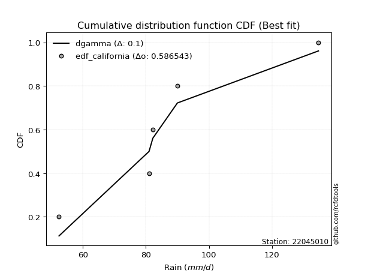</img>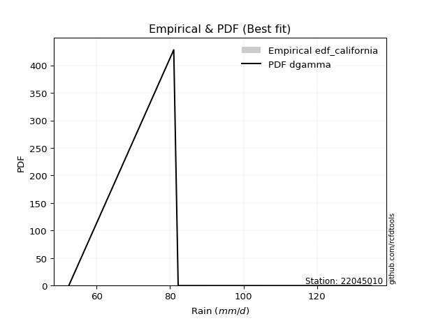</img>

</div>


### 2. Empirical - EDF Hazen (1930)

Hazen method for plotting positions is a formula used to estimate the empirical cumulative probability distribution of flood events or other hydrological data. This formula often results in biased estimations, particularly when extrapolating to extreme events (high return periods).

<div align="center">


$P=(m-0.5)/n$


</div>


**2.1. Empirical values**

<div align="center">

|                | 0                  | 1                  | 2         | 3                 | 4                  |
|:---------------|:-------------------|:-------------------|:----------|:------------------|:-------------------|
| date           | 2021               | 2025               | 2019      | 2020              | 2024               |
| x              | 52.4               | 81.0               | 82.2      | 90.0              | 134.8              |
| m              | 1                  | 2                  | 3         | 4                 | 5                  |
| empirical_dist | edf_hazen          | edf_hazen          | edf_hazen | edf_hazen         | edf_hazen          |
| empirical      | 0.1                | 0.3                | 0.5       | 0.7               | 0.9                |
| empirical_tr   | 1.1111111111111112 | 1.4285714285714286 | 2.0       | 3.333333333333333 | 10.000000000000002 |

</div>


**2.2. Kolmogorov-Smirnov fit test (sorted by Δ)**


<div align="center">

|                | 0                   | 1                   | 2                  | 3                   | 4                  | 5                  | 6                  | 7                     | 8                   | 9                   | 10                 | 11                  | 12                  | 13                  | 14                  | 15                  | 16                  | 17                  | 18                  | 19                  | 20                  | 21                  | 22                  | 23                  | 24                  | 25                 | 26                  | 27                  | 28                 | 29                 | 30                 | 31                  | 32                  | 33                  | 34                  | 35                  | 36                  | 37                  | 38                  | 39                  | 40                  | 41                  | 42                  | 43                 | 44                  | 45                  | 46                  | 47                  | 48                  | 49                  | 50                 | 51                  | 52                 | 53                  | 54                  | 55                 | 56                  | 57                  | 58                  | 59                 | 60                  | 61                  | 62                 | 63                  | 64                 | 65                 | 66                  | 67                 | 68                  | 69                  | 70                  | 71                  | 72                 | 73                  | 74                  | 75                 | 76                 | 77                 | 78                  | 79                  | 80                 | 81                 | 82                  | 83                 | 84                 | 85                 | 86                  | 87                 | 88                 | 89                 |
|:---------------|:--------------------|:--------------------|:-------------------|:--------------------|:-------------------|:-------------------|:-------------------|:----------------------|:--------------------|:--------------------|:-------------------|:--------------------|:--------------------|:--------------------|:--------------------|:--------------------|:--------------------|:--------------------|:--------------------|:--------------------|:--------------------|:--------------------|:--------------------|:--------------------|:--------------------|:-------------------|:--------------------|:--------------------|:-------------------|:-------------------|:-------------------|:--------------------|:--------------------|:--------------------|:--------------------|:--------------------|:--------------------|:--------------------|:--------------------|:--------------------|:--------------------|:--------------------|:--------------------|:-------------------|:--------------------|:--------------------|:--------------------|:--------------------|:--------------------|:--------------------|:-------------------|:--------------------|:-------------------|:--------------------|:--------------------|:-------------------|:--------------------|:--------------------|:--------------------|:-------------------|:--------------------|:--------------------|:-------------------|:--------------------|:-------------------|:-------------------|:--------------------|:-------------------|:--------------------|:--------------------|:--------------------|:--------------------|:-------------------|:--------------------|:--------------------|:-------------------|:-------------------|:-------------------|:--------------------|:--------------------|:-------------------|:-------------------|:--------------------|:-------------------|:-------------------|:-------------------|:--------------------|:-------------------|:-------------------|:-------------------|
| station        | 22045010            | 22045010            | 22045010           | 22045010            | 22045010           | 22045010           | 22045010           | 22045010              | 22045010            | 22045010            | 22045010           | 22045010            | 22045010            | 22045010            | 22045010            | 22045010            | 22045010            | 22045010            | 22045010            | 22045010            | 22045010            | 22045010            | 22045010            | 22045010            | 22045010            | 22045010           | 22045010            | 22045010            | 22045010           | 22045010           | 22045010           | 22045010            | 22045010            | 22045010            | 22045010            | 22045010            | 22045010            | 22045010            | 22045010            | 22045010            | 22045010            | 22045010            | 22045010            | 22045010           | 22045010            | 22045010            | 22045010            | 22045010            | 22045010            | 22045010            | 22045010           | 22045010            | 22045010           | 22045010            | 22045010            | 22045010           | 22045010            | 22045010            | 22045010            | 22045010           | 22045010            | 22045010            | 22045010           | 22045010            | 22045010           | 22045010           | 22045010            | 22045010           | 22045010            | 22045010            | 22045010            | 22045010            | 22045010           | 22045010            | 22045010            | 22045010           | 22045010           | 22045010           | 22045010            | 22045010            | 22045010           | 22045010           | 22045010            | 22045010           | 22045010           | 22045010           | 22045010            | 22045010           | 22045010           | 22045010           |
| empirical_dist | edf_hazen           | edf_hazen           | edf_hazen          | edf_hazen           | edf_hazen          | edf_hazen          | edf_hazen          | edf_hazen             | edf_hazen           | edf_hazen           | edf_hazen          | edf_hazen           | edf_hazen           | edf_hazen           | edf_hazen           | edf_hazen           | edf_hazen           | edf_hazen           | edf_hazen           | edf_hazen           | edf_hazen           | edf_hazen           | edf_hazen           | edf_hazen           | edf_hazen           | edf_hazen          | edf_hazen           | edf_hazen           | edf_hazen          | edf_hazen          | edf_hazen          | edf_hazen           | edf_hazen           | edf_hazen           | edf_hazen           | edf_hazen           | edf_hazen           | edf_hazen           | edf_hazen           | edf_hazen           | edf_hazen           | edf_hazen           | edf_hazen           | edf_hazen          | edf_hazen           | edf_hazen           | edf_hazen           | edf_hazen           | edf_hazen           | edf_hazen           | edf_hazen          | edf_hazen           | edf_hazen          | edf_hazen           | edf_hazen           | edf_hazen          | edf_hazen           | edf_hazen           | edf_hazen           | edf_hazen          | edf_hazen           | edf_hazen           | edf_hazen          | edf_hazen           | edf_hazen          | edf_hazen          | edf_hazen           | edf_hazen          | edf_hazen           | edf_hazen           | edf_hazen           | edf_hazen           | edf_hazen          | edf_hazen           | edf_hazen           | edf_hazen          | edf_hazen          | edf_hazen          | edf_hazen           | edf_hazen           | edf_hazen          | edf_hazen          | edf_hazen           | edf_hazen          | edf_hazen          | edf_hazen          | edf_hazen           | edf_hazen          | edf_hazen          | edf_hazen          |
| p_dist         | johnsonsu           | logjohnsonsu        | laplace_asymmetric | loglaplace          | pearson3           | loghypsecant       | rice               | loglaplace_asymmetric | maxwell             | rayleigh            | logmielke          | loggenlogistic      | loglogistic         | mielke              | fisk                | logfisk             | alpha               | logloggamma         | logpearson3         | betaprime           | logexponnorm        | lognorm             | lognorm             | logcrystalball      | logt                | nct                | loggamma            | loggamma            | invgamma           | logerlang          | logf               | logfatiguelife      | laplace             | logncf              | exponnorm           | gumbel_r            | logbetaprime        | invgauss            | lognct              | genlogistic         | kstwobign           | logweibull_min      | hypsecant           | gompertz           | f                   | logalpha            | logistic            | logrice             | loginvgamma         | crystalball         | norm               | t                   | loggompertz        | loggumbel_l         | halfnorm            | moyal              | loginvgauss         | logmaxwell          | halflogistic        | lograyleigh        | loginvweibull       | loggumbel_r         | logkstwobign       | gibrat              | loghalfnorm        | loggenexpon        | wald                | gumbel_l           | logmoyal            | loghalflogistic     | genexpon            | expon               | logchi2            | lognakagami         | ncf                 | weibull_min        | nakagami           | logexpon           | truncnorm           | logwald             | loggibrat          | chi2               | loglognorm          | pareto             | logpareto          | invweibull         | gamma               | erlang             | fatiguelife        | logtruncnorm       |
| delta          | 0.06837288101283256 | 0.07634378113722318 | 0.0999461818358851 | 0.11672233419231731 | 0.1322863300592908 | 0.1360219951232059 | 0.1370189682337829 | 0.13741038459020877   | 0.13957590169469725 | 0.14134623679757136 | 0.1415289050838907 | 0.14183159323891031 | 0.14184806247945186 | 0.14186333860498335 | 0.14235967163116126 | 0.14241490276430946 | 0.14628721181821064 | 0.14653519289359845 | 0.14766580504029997 | 0.14805062920845014 | 0.14874671907507864 | 0.14874752964384846 | 0.14874752964384846 | 0.14874775129080992 | 0.14874865635777124 | 0.149781171715964  | 0.14985906747244188 | 0.14985906747244188 | 0.149881758431608  | 0.1498876532388848 | 0.1500733587663996 | 0.15148911948171595 | 0.15152098370477451 | 0.15210710537522748 | 0.15294889689191493 | 0.15399955716069702 | 0.15524260900580394 | 0.15642424752099088 | 0.15652917885767553 | 0.15772901212885426 | 0.15902068966674165 | 0.16107984448685803 | 0.16401928357867912 | 0.1643675848128095 | 0.16462882139420532 | 0.16586404305364927 | 0.16734593177139856 | 0.16762137288758738 | 0.16900230998103727 | 0.17125512621926464 | 0.1712551269731566 | 0.17125695799370733 | 0.1714230907226872 | 0.17441430649694023 | 0.17625433435700405 | 0.1765247317386887 | 0.17938845928288627 | 0.18308139888427882 | 0.19119116239974965 | 0.1949922503729699 | 0.20846258550649216 | 0.21564782411119826 | 0.2266717078595229 | 0.22845839447754107 | 0.2286119412014514 | 0.2295780920709884 | 0.23691491412448024 | 0.2401724021598466 | 0.24097019399269176 | 0.24960128259959274 | 0.25129964574646696 | 0.25137570757621647 | 0.2540115517334858 | 0.25634682588416685 | 0.26152596986038096 | 0.2738874504726711 | 0.2999963955444469 | 0.3007845422436785 | 0.30838192044802093 | 0.31132188360774665 | 0.3236308293446794 | 0.3796570791920943 | 0.38491742153462377 | 0.3868261752793854 | 0.3938611227501357 | 0.4460871875857447 | 0.46275631861755645 | 0.5316477085938052 | 0.5669925154493933 | 0.7                |
| deltao         | 0.5865427407550001  | 0.5865427407550001  | 0.5865427407550001 | 0.5865427407550001  | 0.5865427407550001 | 0.5865427407550001 | 0.5865427407550001 | 0.5865427407550001    | 0.5865427407550001  | 0.5865427407550001  | 0.5865427407550001 | 0.5865427407550001  | 0.5865427407550001  | 0.5865427407550001  | 0.5865427407550001  | 0.5865427407550001  | 0.5865427407550001  | 0.5865427407550001  | 0.5865427407550001  | 0.5865427407550001  | 0.5865427407550001  | 0.5865427407550001  | 0.5865427407550001  | 0.5865427407550001  | 0.5865427407550001  | 0.5865427407550001 | 0.5865427407550001  | 0.5865427407550001  | 0.5865427407550001 | 0.5865427407550001 | 0.5865427407550001 | 0.5865427407550001  | 0.5865427407550001  | 0.5865427407550001  | 0.5865427407550001  | 0.5865427407550001  | 0.5865427407550001  | 0.5865427407550001  | 0.5865427407550001  | 0.5865427407550001  | 0.5865427407550001  | 0.5865427407550001  | 0.5865427407550001  | 0.5865427407550001 | 0.5865427407550001  | 0.5865427407550001  | 0.5865427407550001  | 0.5865427407550001  | 0.5865427407550001  | 0.5865427407550001  | 0.5865427407550001 | 0.5865427407550001  | 0.5865427407550001 | 0.5865427407550001  | 0.5865427407550001  | 0.5865427407550001 | 0.5865427407550001  | 0.5865427407550001  | 0.5865427407550001  | 0.5865427407550001 | 0.5865427407550001  | 0.5865427407550001  | 0.5865427407550001 | 0.5865427407550001  | 0.5865427407550001 | 0.5865427407550001 | 0.5865427407550001  | 0.5865427407550001 | 0.5865427407550001  | 0.5865427407550001  | 0.5865427407550001  | 0.5865427407550001  | 0.5865427407550001 | 0.5865427407550001  | 0.5865427407550001  | 0.5865427407550001 | 0.5865427407550001 | 0.5865427407550001 | 0.5865427407550001  | 0.5865427407550001  | 0.5865427407550001 | 0.5865427407550001 | 0.5865427407550001  | 0.5865427407550001 | 0.5865427407550001 | 0.5865427407550001 | 0.5865427407550001  | 0.5865427407550001 | 0.5865427407550001 | 0.5865427407550001 |
| eval           | Δo > Δ              | Δo > Δ              | Δo > Δ             | Δo > Δ              | Δo > Δ             | Δo > Δ             | Δo > Δ             | Δo > Δ                | Δo > Δ              | Δo > Δ              | Δo > Δ             | Δo > Δ              | Δo > Δ              | Δo > Δ              | Δo > Δ              | Δo > Δ              | Δo > Δ              | Δo > Δ              | Δo > Δ              | Δo > Δ              | Δo > Δ              | Δo > Δ              | Δo > Δ              | Δo > Δ              | Δo > Δ              | Δo > Δ             | Δo > Δ              | Δo > Δ              | Δo > Δ             | Δo > Δ             | Δo > Δ             | Δo > Δ              | Δo > Δ              | Δo > Δ              | Δo > Δ              | Δo > Δ              | Δo > Δ              | Δo > Δ              | Δo > Δ              | Δo > Δ              | Δo > Δ              | Δo > Δ              | Δo > Δ              | Δo > Δ             | Δo > Δ              | Δo > Δ              | Δo > Δ              | Δo > Δ              | Δo > Δ              | Δo > Δ              | Δo > Δ             | Δo > Δ              | Δo > Δ             | Δo > Δ              | Δo > Δ              | Δo > Δ             | Δo > Δ              | Δo > Δ              | Δo > Δ              | Δo > Δ             | Δo > Δ              | Δo > Δ              | Δo > Δ             | Δo > Δ              | Δo > Δ             | Δo > Δ             | Δo > Δ              | Δo > Δ             | Δo > Δ              | Δo > Δ              | Δo > Δ              | Δo > Δ              | Δo > Δ             | Δo > Δ              | Δo > Δ              | Δo > Δ             | Δo > Δ             | Δo > Δ             | Δo > Δ              | Δo > Δ              | Δo > Δ             | Δo > Δ             | Δo > Δ              | Δo > Δ             | Δo > Δ             | Δo > Δ             | Δo > Δ              | Δo > Δ             | Δo > Δ             | Δo <= Δ            |
| fit            | 1                   | 1                   | 1                  | 1                   | 1                  | 1                  | 1                  | 1                     | 1                   | 1                   | 1                  | 1                   | 1                   | 1                   | 1                   | 1                   | 1                   | 1                   | 1                   | 1                   | 1                   | 1                   | 1                   | 1                   | 1                   | 1                  | 1                   | 1                   | 1                  | 1                  | 1                  | 1                   | 1                   | 1                   | 1                   | 1                   | 1                   | 1                   | 1                   | 1                   | 1                   | 1                   | 1                   | 1                  | 1                   | 1                   | 1                   | 1                   | 1                   | 1                   | 1                  | 1                   | 1                  | 1                   | 1                   | 1                  | 1                   | 1                   | 1                   | 1                  | 1                   | 1                   | 1                  | 1                   | 1                  | 1                  | 1                   | 1                  | 1                   | 1                   | 1                   | 1                   | 1                  | 1                   | 1                   | 1                  | 1                  | 1                  | 1                   | 1                   | 1                  | 1                  | 1                   | 1                  | 1                  | 1                  | 1                   | 1                  | 1                  | 0                  |
| n              | 5                   | 5                   | 5                  | 5                   | 5                  | 5                  | 5                  | 5                     | 5                   | 5                   | 5                  | 5                   | 5                   | 5                   | 5                   | 5                   | 5                   | 5                   | 5                   | 5                   | 5                   | 5                   | 5                   | 5                   | 5                   | 5                  | 5                   | 5                   | 5                  | 5                  | 5                  | 5                   | 5                   | 5                   | 5                   | 5                   | 5                   | 5                   | 5                   | 5                   | 5                   | 5                   | 5                   | 5                  | 5                   | 5                   | 5                   | 5                   | 5                   | 5                   | 5                  | 5                   | 5                  | 5                   | 5                   | 5                  | 5                   | 5                   | 5                   | 5                  | 5                   | 5                   | 5                  | 5                   | 5                  | 5                  | 5                   | 5                  | 5                   | 5                   | 5                   | 5                   | 5                  | 5                   | 5                   | 5                  | 5                  | 5                  | 5                   | 5                   | 5                  | 5                  | 5                   | 5                  | 5                  | 5                  | 5                   | 5                  | 5                  | 5                  |
| best_fit       | 1                   | 0                   | 0                  | 0                   | 0                  | 0                  | 0                  | 0                     | 0                   | 0                   | 0                  | 0                   | 0                   | 0                   | 0                   | 0                   | 0                   | 0                   | 0                   | 0                   | 0                   | 0                   | 0                   | 0                   | 0                   | 0                  | 0                   | 0                   | 0                  | 0                  | 0                  | 0                   | 0                   | 0                   | 0                   | 0                   | 0                   | 0                   | 0                   | 0                   | 0                   | 0                   | 0                   | 0                  | 0                   | 0                   | 0                   | 0                   | 0                   | 0                   | 0                  | 0                   | 0                  | 0                   | 0                   | 0                  | 0                   | 0                   | 0                   | 0                  | 0                   | 0                   | 0                  | 0                   | 0                  | 0                  | 0                   | 0                  | 0                   | 0                   | 0                   | 0                   | 0                  | 0                   | 0                   | 0                  | 0                  | 0                  | 0                   | 0                   | 0                  | 0                  | 0                   | 0                  | 0                  | 0                  | 0                   | 0                  | 0                  | 0                  |
| best_fit_sort  | 1                   | 2                   | 3                  | 4                   | 5                  | 6                  | 7                  | 8                     | 9                   | 10                  | 11                 | 12                  | 13                  | 14                  | 15                  | 16                  | 17                  | 18                  | 19                  | 20                  | 21                  | 22                  | 23                  | 24                  | 25                  | 26                 | 27                  | 28                  | 29                 | 30                 | 31                 | 32                  | 33                  | 34                  | 35                  | 36                  | 37                  | 38                  | 39                  | 40                  | 41                  | 42                  | 43                  | 44                 | 45                  | 46                  | 47                  | 48                  | 49                  | 50                  | 51                 | 52                  | 53                 | 54                  | 55                  | 56                 | 57                  | 58                  | 59                  | 60                 | 61                  | 62                  | 63                 | 64                  | 65                 | 66                 | 67                  | 68                 | 69                  | 70                  | 71                  | 72                  | 73                 | 74                  | 75                  | 76                 | 77                 | 78                 | 79                  | 80                  | 81                 | 82                 | 83                  | 84                 | 85                 | 86                 | 87                  | 88                 | 89                 | 90                 |

</div>


<div align="center">

</img>

</div>


**2.3. Best fit**

<div align="center">

|   id |   station | empirical_dist   | p_dist    |     delta |   deltao | eval   |   fit |   n |   best_fit |   best_fit_sort |
|-----:|----------:|:-----------------|:----------|----------:|---------:|:-------|------:|----:|-----------:|----------------:|
|    0 |  22045010 | edf_hazen        | johnsonsu | 0.0683729 | 0.586543 | Δo > Δ |     1 |   5 |          1 |               1 |

</div>


<div align="center">

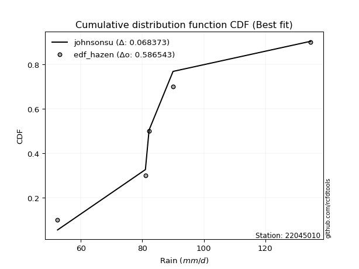</img>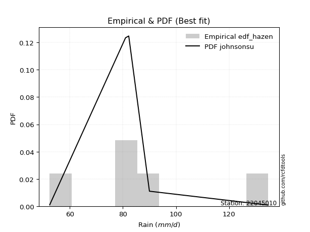</img>

</div>


### 3. Empirical - EDF Weibull (1939)

Weibull plotting position formula is an empirical method used to estimate the non-exceedance probability or plotting position for a set of observed data, is often recommended or widely used in practice, particularly in flood frequency analysis.

<div align="center">


$P=m/(n+1)$


</div>


**3.1. Empirical values**

<div align="center">

|                | 0                   | 1                  | 2           | 3                  | 4                  |
|:---------------|:--------------------|:-------------------|:------------|:-------------------|:-------------------|
| date           | 2021                | 2025               | 2019        | 2020               | 2024               |
| x              | 52.4                | 81.0               | 82.2        | 90.0               | 134.8              |
| m              | 1                   | 2                  | 3           | 4                  | 5                  |
| empirical_dist | edf_weibull         | edf_weibull        | edf_weibull | edf_weibull        | edf_weibull        |
| empirical      | 0.16666666666666666 | 0.3333333333333333 | 0.5         | 0.6666666666666666 | 0.8333333333333334 |
| empirical_tr   | 1.2                 | 1.4999999999999998 | 2.0         | 2.9999999999999996 | 6.000000000000002  |

</div>


**3.2. Kolmogorov-Smirnov fit test (sorted by Δ)**


<div align="center">

|                | 0                  | 1                   | 2                   | 3                   | 4                   | 5                   | 6                   | 7                   | 8                  | 9                   | 10                  | 11                  | 12                  | 13                  | 14                  | 15                  | 16                  | 17                  | 18                  | 19                  | 20                  | 21                  | 22                  | 23                  | 24                  | 25                  | 26                  | 27                  | 28                  | 29                  | 30                    | 31                  | 32                 | 33                  | 34                  | 35                  | 36                  | 37                 | 38                  | 39                  | 40                 | 41                 | 42                 | 43                  | 44                  | 45                  | 46                  | 47                  | 48                  | 49                  | 50                 | 51                  | 52                 | 53                 | 54                  | 55                  | 56                  | 57                 | 58                  | 59                  | 60                  | 61                  | 62                  | 63                  | 64                  | 65                  | 66                  | 67                 | 68                  | 69                  | 70                  | 71                  | 72                  | 73                  | 74                  | 75                 | 76                 | 77                 | 78                 | 79                  | 80                 | 81                  | 82                  | 83                  | 84                  | 85                 | 86                 | 87                 | 88                 | 89                 |
|:---------------|:-------------------|:--------------------|:--------------------|:--------------------|:--------------------|:--------------------|:--------------------|:--------------------|:-------------------|:--------------------|:--------------------|:--------------------|:--------------------|:--------------------|:--------------------|:--------------------|:--------------------|:--------------------|:--------------------|:--------------------|:--------------------|:--------------------|:--------------------|:--------------------|:--------------------|:--------------------|:--------------------|:--------------------|:--------------------|:--------------------|:----------------------|:--------------------|:-------------------|:--------------------|:--------------------|:--------------------|:--------------------|:-------------------|:--------------------|:--------------------|:-------------------|:-------------------|:-------------------|:--------------------|:--------------------|:--------------------|:--------------------|:--------------------|:--------------------|:--------------------|:-------------------|:--------------------|:-------------------|:-------------------|:--------------------|:--------------------|:--------------------|:-------------------|:--------------------|:--------------------|:--------------------|:--------------------|:--------------------|:--------------------|:--------------------|:--------------------|:--------------------|:-------------------|:--------------------|:--------------------|:--------------------|:--------------------|:--------------------|:--------------------|:--------------------|:-------------------|:-------------------|:-------------------|:-------------------|:--------------------|:-------------------|:--------------------|:--------------------|:--------------------|:--------------------|:-------------------|:-------------------|:-------------------|:-------------------|:-------------------|
| station        | 22045010           | 22045010            | 22045010            | 22045010            | 22045010            | 22045010            | 22045010            | 22045010            | 22045010           | 22045010            | 22045010            | 22045010            | 22045010            | 22045010            | 22045010            | 22045010            | 22045010            | 22045010            | 22045010            | 22045010            | 22045010            | 22045010            | 22045010            | 22045010            | 22045010            | 22045010            | 22045010            | 22045010            | 22045010            | 22045010            | 22045010              | 22045010            | 22045010           | 22045010            | 22045010            | 22045010            | 22045010            | 22045010           | 22045010            | 22045010            | 22045010           | 22045010           | 22045010           | 22045010            | 22045010            | 22045010            | 22045010            | 22045010            | 22045010            | 22045010            | 22045010           | 22045010            | 22045010           | 22045010           | 22045010            | 22045010            | 22045010            | 22045010           | 22045010            | 22045010            | 22045010            | 22045010            | 22045010            | 22045010            | 22045010            | 22045010            | 22045010            | 22045010           | 22045010            | 22045010            | 22045010            | 22045010            | 22045010            | 22045010            | 22045010            | 22045010           | 22045010           | 22045010           | 22045010           | 22045010            | 22045010           | 22045010            | 22045010            | 22045010            | 22045010            | 22045010           | 22045010           | 22045010           | 22045010           | 22045010           |
| empirical_dist | edf_weibull        | edf_weibull         | edf_weibull         | edf_weibull         | edf_weibull         | edf_weibull         | edf_weibull         | edf_weibull         | edf_weibull        | edf_weibull         | edf_weibull         | edf_weibull         | edf_weibull         | edf_weibull         | edf_weibull         | edf_weibull         | edf_weibull         | edf_weibull         | edf_weibull         | edf_weibull         | edf_weibull         | edf_weibull         | edf_weibull         | edf_weibull         | edf_weibull         | edf_weibull         | edf_weibull         | edf_weibull         | edf_weibull         | edf_weibull         | edf_weibull           | edf_weibull         | edf_weibull        | edf_weibull         | edf_weibull         | edf_weibull         | edf_weibull         | edf_weibull        | edf_weibull         | edf_weibull         | edf_weibull        | edf_weibull        | edf_weibull        | edf_weibull         | edf_weibull         | edf_weibull         | edf_weibull         | edf_weibull         | edf_weibull         | edf_weibull         | edf_weibull        | edf_weibull         | edf_weibull        | edf_weibull        | edf_weibull         | edf_weibull         | edf_weibull         | edf_weibull        | edf_weibull         | edf_weibull         | edf_weibull         | edf_weibull         | edf_weibull         | edf_weibull         | edf_weibull         | edf_weibull         | edf_weibull         | edf_weibull        | edf_weibull         | edf_weibull         | edf_weibull         | edf_weibull         | edf_weibull         | edf_weibull         | edf_weibull         | edf_weibull        | edf_weibull        | edf_weibull        | edf_weibull        | edf_weibull         | edf_weibull        | edf_weibull         | edf_weibull         | edf_weibull         | edf_weibull         | edf_weibull        | edf_weibull        | edf_weibull        | edf_weibull        | edf_weibull        |
| p_dist         | logmielke          | loggenlogistic      | mielke              | fisk                | logfisk             | rayleigh            | johnsonsu           | loglogistic         | loglaplace         | alpha               | logloggamma         | loghypsecant        | pearson3            | logjohnsonsu        | logpearson3         | maxwell             | betaprime           | logexponnorm        | lognorm             | lognorm             | logcrystalball      | logt                | nct                 | loggamma            | loggamma            | invgamma            | logerlang           | logf                | rice                | logfatiguelife      | loglaplace_asymmetric | logncf              | exponnorm          | laplace_asymmetric  | logbetaprime        | gumbel_r            | invgauss            | lognct             | genlogistic         | kstwobign           | logweibull_min     | hypsecant          | f                  | logalpha            | logistic            | laplace             | logrice             | loginvgamma         | crystalball         | norm                | t                  | loginvgauss         | moyal              | logmaxwell         | loggumbel_l         | lograyleigh         | loggompertz         | gompertz           | halflogistic        | halfnorm            | loginvweibull       | loggumbel_r         | logchi2             | logkstwobign        | gibrat              | loghalfnorm         | loggenexpon         | wald               | gumbel_l            | logmoyal            | loghalflogistic     | genexpon            | expon               | ncf                 | weibull_min         | logexpon           | logwald            | lognakagami        | loggibrat          | nakagami            | truncnorm          | chi2                | loglognorm          | pareto              | logpareto           | invweibull         | gamma              | erlang             | fatiguelife        | logtruncnorm       |
| delta          | 0.1082102130072351 | 0.10849825990557699 | 0.10853000527165002 | 0.10902633829782793 | 0.10908156943097613 | 0.11092805189494848 | 0.11182032078343188 | 0.11241945043269898 | 0.1128329627587439 | 0.11295387848487731 | 0.11320185956026513 | 0.11323795446876393 | 0.11340645847020492 | 0.11395388474635995 | 0.11433247170696664 | 0.11437398977161961 | 0.11471729587511681 | 0.11541338574174531 | 0.11541419631051514 | 0.11541419631051514 | 0.11541441795747659 | 0.11541532302443791 | 0.11644783838263068 | 0.11652573413910855 | 0.11652573413910855 | 0.11654842509827468 | 0.11655431990555148 | 0.11674002543306627 | 0.11693474500004426 | 0.11815578614838262 | 0.11854827706724974   | 0.11877377204189415 | 0.1196155635585816 | 0.12057393237421676 | 0.12190927567247062 | 0.12302380737533307 | 0.12309091418765755 | 0.1231958455243422 | 0.12439567879552094 | 0.12568735633340833 | 0.1277465111535247 | 0.1306859502453458 | 0.131295488060872  | 0.13253070972031594 | 0.13401259843806523 | 0.13413105174551027 | 0.13428803955425406 | 0.13566897664770394 | 0.13792179288593132 | 0.13792179363982326 | 0.137923624660374  | 0.14605512594955294 | 0.1477655065752984 | 0.1497480655509455 | 0.15122205177910186 | 0.16165891703963658 | 0.16666663628214884 | 0.1666666666662655 | 0.16666666666666666 | 0.16666666666666666 | 0.17512925217315883 | 0.18231449077786493 | 0.18734488506681912 | 0.19333837452618957 | 0.19512506114420775 | 0.19527860786811807 | 0.19624475873765507 | 0.2035815807911469 | 0.20683906882651326 | 0.20763686065935844 | 0.21626794926625942 | 0.21796631241313363 | 0.21804237424288314 | 0.22819263652704763 | 0.24055411713933778 | 0.2674512089103452 | 0.2779885502744133 | 0.2896801592175002 | 0.2902974960113461 | 0.33332972887778023 | 0.333333293891456  | 0.34632374585876097 | 0.35158408820129045 | 0.35349284194605207 | 0.36052778941680236 | 0.3794205209190781 | 0.4294229852842231 | 0.4983143752604718 | 0.5336591821160599 | 0.6666666666666666 |
| deltao         | 0.5865427407550001 | 0.5865427407550001  | 0.5865427407550001  | 0.5865427407550001  | 0.5865427407550001  | 0.5865427407550001  | 0.5865427407550001  | 0.5865427407550001  | 0.5865427407550001 | 0.5865427407550001  | 0.5865427407550001  | 0.5865427407550001  | 0.5865427407550001  | 0.5865427407550001  | 0.5865427407550001  | 0.5865427407550001  | 0.5865427407550001  | 0.5865427407550001  | 0.5865427407550001  | 0.5865427407550001  | 0.5865427407550001  | 0.5865427407550001  | 0.5865427407550001  | 0.5865427407550001  | 0.5865427407550001  | 0.5865427407550001  | 0.5865427407550001  | 0.5865427407550001  | 0.5865427407550001  | 0.5865427407550001  | 0.5865427407550001    | 0.5865427407550001  | 0.5865427407550001 | 0.5865427407550001  | 0.5865427407550001  | 0.5865427407550001  | 0.5865427407550001  | 0.5865427407550001 | 0.5865427407550001  | 0.5865427407550001  | 0.5865427407550001 | 0.5865427407550001 | 0.5865427407550001 | 0.5865427407550001  | 0.5865427407550001  | 0.5865427407550001  | 0.5865427407550001  | 0.5865427407550001  | 0.5865427407550001  | 0.5865427407550001  | 0.5865427407550001 | 0.5865427407550001  | 0.5865427407550001 | 0.5865427407550001 | 0.5865427407550001  | 0.5865427407550001  | 0.5865427407550001  | 0.5865427407550001 | 0.5865427407550001  | 0.5865427407550001  | 0.5865427407550001  | 0.5865427407550001  | 0.5865427407550001  | 0.5865427407550001  | 0.5865427407550001  | 0.5865427407550001  | 0.5865427407550001  | 0.5865427407550001 | 0.5865427407550001  | 0.5865427407550001  | 0.5865427407550001  | 0.5865427407550001  | 0.5865427407550001  | 0.5865427407550001  | 0.5865427407550001  | 0.5865427407550001 | 0.5865427407550001 | 0.5865427407550001 | 0.5865427407550001 | 0.5865427407550001  | 0.5865427407550001 | 0.5865427407550001  | 0.5865427407550001  | 0.5865427407550001  | 0.5865427407550001  | 0.5865427407550001 | 0.5865427407550001 | 0.5865427407550001 | 0.5865427407550001 | 0.5865427407550001 |
| eval           | Δo > Δ             | Δo > Δ              | Δo > Δ              | Δo > Δ              | Δo > Δ              | Δo > Δ              | Δo > Δ              | Δo > Δ              | Δo > Δ             | Δo > Δ              | Δo > Δ              | Δo > Δ              | Δo > Δ              | Δo > Δ              | Δo > Δ              | Δo > Δ              | Δo > Δ              | Δo > Δ              | Δo > Δ              | Δo > Δ              | Δo > Δ              | Δo > Δ              | Δo > Δ              | Δo > Δ              | Δo > Δ              | Δo > Δ              | Δo > Δ              | Δo > Δ              | Δo > Δ              | Δo > Δ              | Δo > Δ                | Δo > Δ              | Δo > Δ             | Δo > Δ              | Δo > Δ              | Δo > Δ              | Δo > Δ              | Δo > Δ             | Δo > Δ              | Δo > Δ              | Δo > Δ             | Δo > Δ             | Δo > Δ             | Δo > Δ              | Δo > Δ              | Δo > Δ              | Δo > Δ              | Δo > Δ              | Δo > Δ              | Δo > Δ              | Δo > Δ             | Δo > Δ              | Δo > Δ             | Δo > Δ             | Δo > Δ              | Δo > Δ              | Δo > Δ              | Δo > Δ             | Δo > Δ              | Δo > Δ              | Δo > Δ              | Δo > Δ              | Δo > Δ              | Δo > Δ              | Δo > Δ              | Δo > Δ              | Δo > Δ              | Δo > Δ             | Δo > Δ              | Δo > Δ              | Δo > Δ              | Δo > Δ              | Δo > Δ              | Δo > Δ              | Δo > Δ              | Δo > Δ             | Δo > Δ             | Δo > Δ             | Δo > Δ             | Δo > Δ              | Δo > Δ             | Δo > Δ              | Δo > Δ              | Δo > Δ              | Δo > Δ              | Δo > Δ             | Δo > Δ             | Δo > Δ             | Δo > Δ             | Δo <= Δ            |
| fit            | 1                  | 1                   | 1                   | 1                   | 1                   | 1                   | 1                   | 1                   | 1                  | 1                   | 1                   | 1                   | 1                   | 1                   | 1                   | 1                   | 1                   | 1                   | 1                   | 1                   | 1                   | 1                   | 1                   | 1                   | 1                   | 1                   | 1                   | 1                   | 1                   | 1                   | 1                     | 1                   | 1                  | 1                   | 1                   | 1                   | 1                   | 1                  | 1                   | 1                   | 1                  | 1                  | 1                  | 1                   | 1                   | 1                   | 1                   | 1                   | 1                   | 1                   | 1                  | 1                   | 1                  | 1                  | 1                   | 1                   | 1                   | 1                  | 1                   | 1                   | 1                   | 1                   | 1                   | 1                   | 1                   | 1                   | 1                   | 1                  | 1                   | 1                   | 1                   | 1                   | 1                   | 1                   | 1                   | 1                  | 1                  | 1                  | 1                  | 1                   | 1                  | 1                   | 1                   | 1                   | 1                   | 1                  | 1                  | 1                  | 1                  | 0                  |
| n              | 5                  | 5                   | 5                   | 5                   | 5                   | 5                   | 5                   | 5                   | 5                  | 5                   | 5                   | 5                   | 5                   | 5                   | 5                   | 5                   | 5                   | 5                   | 5                   | 5                   | 5                   | 5                   | 5                   | 5                   | 5                   | 5                   | 5                   | 5                   | 5                   | 5                   | 5                     | 5                   | 5                  | 5                   | 5                   | 5                   | 5                   | 5                  | 5                   | 5                   | 5                  | 5                  | 5                  | 5                   | 5                   | 5                   | 5                   | 5                   | 5                   | 5                   | 5                  | 5                   | 5                  | 5                  | 5                   | 5                   | 5                   | 5                  | 5                   | 5                   | 5                   | 5                   | 5                   | 5                   | 5                   | 5                   | 5                   | 5                  | 5                   | 5                   | 5                   | 5                   | 5                   | 5                   | 5                   | 5                  | 5                  | 5                  | 5                  | 5                   | 5                  | 5                   | 5                   | 5                   | 5                   | 5                  | 5                  | 5                  | 5                  | 5                  |
| best_fit       | 1                  | 0                   | 0                   | 0                   | 0                   | 0                   | 0                   | 0                   | 0                  | 0                   | 0                   | 0                   | 0                   | 0                   | 0                   | 0                   | 0                   | 0                   | 0                   | 0                   | 0                   | 0                   | 0                   | 0                   | 0                   | 0                   | 0                   | 0                   | 0                   | 0                   | 0                     | 0                   | 0                  | 0                   | 0                   | 0                   | 0                   | 0                  | 0                   | 0                   | 0                  | 0                  | 0                  | 0                   | 0                   | 0                   | 0                   | 0                   | 0                   | 0                   | 0                  | 0                   | 0                  | 0                  | 0                   | 0                   | 0                   | 0                  | 0                   | 0                   | 0                   | 0                   | 0                   | 0                   | 0                   | 0                   | 0                   | 0                  | 0                   | 0                   | 0                   | 0                   | 0                   | 0                   | 0                   | 0                  | 0                  | 0                  | 0                  | 0                   | 0                  | 0                   | 0                   | 0                   | 0                   | 0                  | 0                  | 0                  | 0                  | 0                  |
| best_fit_sort  | 1                  | 2                   | 3                   | 4                   | 5                   | 6                   | 7                   | 8                   | 9                  | 10                  | 11                  | 12                  | 13                  | 14                  | 15                  | 16                  | 17                  | 18                  | 19                  | 20                  | 21                  | 22                  | 23                  | 24                  | 25                  | 26                  | 27                  | 28                  | 29                  | 30                  | 31                    | 32                  | 33                 | 34                  | 35                  | 36                  | 37                  | 38                 | 39                  | 40                  | 41                 | 42                 | 43                 | 44                  | 45                  | 46                  | 47                  | 48                  | 49                  | 50                  | 51                 | 52                  | 53                 | 54                 | 55                  | 56                  | 57                  | 58                 | 59                  | 60                  | 61                  | 62                  | 63                  | 64                  | 65                  | 66                  | 67                  | 68                 | 69                  | 70                  | 71                  | 72                  | 73                  | 74                  | 75                  | 76                 | 77                 | 78                 | 79                 | 80                  | 81                 | 82                  | 83                  | 84                  | 85                  | 86                 | 87                 | 88                 | 89                 | 90                 |

</div>


<div align="center">

</img>

</div>


**3.3. Best fit**

<div align="center">

|   id |   station | empirical_dist   | p_dist    |   delta |   deltao | eval   |   fit |   n |   best_fit |   best_fit_sort |
|-----:|----------:|:-----------------|:----------|--------:|---------:|:-------|------:|----:|-----------:|----------------:|
|    0 |  22045010 | edf_weibull      | logmielke | 0.10821 | 0.586543 | Δo > Δ |     1 |   5 |          1 |               1 |

</div>


<div align="center">

</img>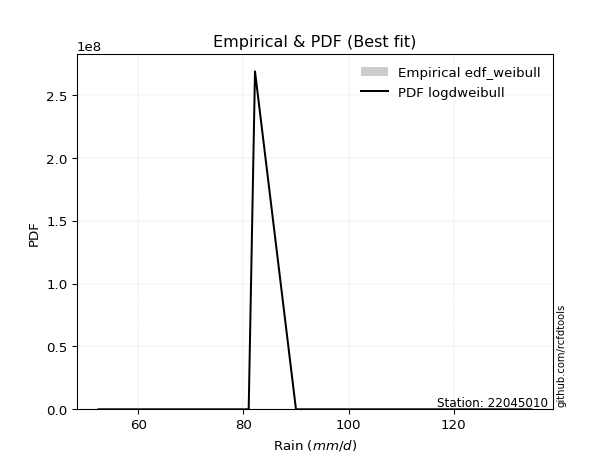</img>

</div>


### 4. Empirical - EDF Beard (1943)

The Beard formula (or Beard´s plotting position formula) in hydrology is used to estimate the empirical non-exceedance probability _(P)_ of a flood event (or other extreme hydrological data point) within a given dataset.

<div align="center">


$P=(m-0.31)/(n+0.38)$


</div>


**4.1. Empirical values**

<div align="center">

|                | 0                   | 1                  | 2         | 3                  | 4                  |
|:---------------|:--------------------|:-------------------|:----------|:-------------------|:-------------------|
| date           | 2021                | 2025               | 2019      | 2020               | 2024               |
| x              | 52.4                | 81.0               | 82.2      | 90.0               | 134.8              |
| m              | 1                   | 2                  | 3         | 4                  | 5                  |
| empirical_dist | edf_beard           | edf_beard          | edf_beard | edf_beard          | edf_beard          |
| empirical      | 0.12825278810408922 | 0.3141263940520446 | 0.5       | 0.6858736059479554 | 0.8717472118959109 |
| empirical_tr   | 1.1471215351812367  | 1.4579945799457996 | 2.0       | 3.183431952662722  | 7.797101449275368  |

</div>


**4.2. Kolmogorov-Smirnov fit test (sorted by Δ)**


<div align="center">

|                | 0                   | 1                   | 2                  | 3                   | 4                   | 5                   | 6                   | 7                     | 8                   | 9                   | 10                  | 11                  | 12                  | 13                 | 14                  | 15                  | 16                 | 17                  | 18                  | 19                 | 20                 | 21                  | 22                  | 23                  | 24                 | 25                  | 26                  | 27                  | 28                  | 29                  | 30                  | 31                  | 32                 | 33                  | 34                 | 35                 | 36                 | 37                  | 38                 | 39                  | 40                  | 41                 | 42                 | 43                  | 44                  | 45                  | 46                  | 47                  | 48                  | 49                  | 50                  | 51                 | 52                  | 53                 | 54                  | 55                  | 56                  | 57                 | 58                  | 59                  | 60                  | 61                  | 62                  | 63                  | 64                  | 65                  | 66                 | 67                  | 68                  | 69                  | 70                 | 71                  | 72                  | 73                  | 74                  | 75                 | 76                 | 77                 | 78                  | 79                  | 80                 | 81                  | 82                  | 83                  | 84                  | 85                  | 86                 | 87                 | 88                 | 89                 |
|:---------------|:--------------------|:--------------------|:-------------------|:--------------------|:--------------------|:--------------------|:--------------------|:----------------------|:--------------------|:--------------------|:--------------------|:--------------------|:--------------------|:-------------------|:--------------------|:--------------------|:-------------------|:--------------------|:--------------------|:-------------------|:-------------------|:--------------------|:--------------------|:--------------------|:-------------------|:--------------------|:--------------------|:--------------------|:--------------------|:--------------------|:--------------------|:--------------------|:-------------------|:--------------------|:-------------------|:-------------------|:-------------------|:--------------------|:-------------------|:--------------------|:--------------------|:-------------------|:-------------------|:--------------------|:--------------------|:--------------------|:--------------------|:--------------------|:--------------------|:--------------------|:--------------------|:-------------------|:--------------------|:-------------------|:--------------------|:--------------------|:--------------------|:-------------------|:--------------------|:--------------------|:--------------------|:--------------------|:--------------------|:--------------------|:--------------------|:--------------------|:-------------------|:--------------------|:--------------------|:--------------------|:-------------------|:--------------------|:--------------------|:--------------------|:--------------------|:-------------------|:-------------------|:-------------------|:--------------------|:--------------------|:-------------------|:--------------------|:--------------------|:--------------------|:--------------------|:--------------------|:-------------------|:-------------------|:-------------------|:-------------------|
| station        | 22045010            | 22045010            | 22045010           | 22045010            | 22045010            | 22045010            | 22045010            | 22045010              | 22045010            | 22045010            | 22045010            | 22045010            | 22045010            | 22045010           | 22045010            | 22045010            | 22045010           | 22045010            | 22045010            | 22045010           | 22045010           | 22045010            | 22045010            | 22045010            | 22045010           | 22045010            | 22045010            | 22045010            | 22045010            | 22045010            | 22045010            | 22045010            | 22045010           | 22045010            | 22045010           | 22045010           | 22045010           | 22045010            | 22045010           | 22045010            | 22045010            | 22045010           | 22045010           | 22045010            | 22045010            | 22045010            | 22045010            | 22045010            | 22045010            | 22045010            | 22045010            | 22045010           | 22045010            | 22045010           | 22045010            | 22045010            | 22045010            | 22045010           | 22045010            | 22045010            | 22045010            | 22045010            | 22045010            | 22045010            | 22045010            | 22045010            | 22045010           | 22045010            | 22045010            | 22045010            | 22045010           | 22045010            | 22045010            | 22045010            | 22045010            | 22045010           | 22045010           | 22045010           | 22045010            | 22045010            | 22045010           | 22045010            | 22045010            | 22045010            | 22045010            | 22045010            | 22045010           | 22045010           | 22045010           | 22045010           |
| empirical_dist | edf_beard           | edf_beard           | edf_beard          | edf_beard           | edf_beard           | edf_beard           | edf_beard           | edf_beard             | edf_beard           | edf_beard           | edf_beard           | edf_beard           | edf_beard           | edf_beard          | edf_beard           | edf_beard           | edf_beard          | edf_beard           | edf_beard           | edf_beard          | edf_beard          | edf_beard           | edf_beard           | edf_beard           | edf_beard          | edf_beard           | edf_beard           | edf_beard           | edf_beard           | edf_beard           | edf_beard           | edf_beard           | edf_beard          | edf_beard           | edf_beard          | edf_beard          | edf_beard          | edf_beard           | edf_beard          | edf_beard           | edf_beard           | edf_beard          | edf_beard          | edf_beard           | edf_beard           | edf_beard           | edf_beard           | edf_beard           | edf_beard           | edf_beard           | edf_beard           | edf_beard          | edf_beard           | edf_beard          | edf_beard           | edf_beard           | edf_beard           | edf_beard          | edf_beard           | edf_beard           | edf_beard           | edf_beard           | edf_beard           | edf_beard           | edf_beard           | edf_beard           | edf_beard          | edf_beard           | edf_beard           | edf_beard           | edf_beard          | edf_beard           | edf_beard           | edf_beard           | edf_beard           | edf_beard          | edf_beard          | edf_beard          | edf_beard           | edf_beard           | edf_beard          | edf_beard           | edf_beard           | edf_beard           | edf_beard           | edf_beard           | edf_beard          | edf_beard          | edf_beard          | edf_beard          |
| p_dist         | johnsonsu           | laplace_asymmetric  | logjohnsonsu       | loglaplace          | pearson3            | loghypsecant        | rice                | loglaplace_asymmetric | maxwell             | rayleigh            | logmielke           | loggenlogistic      | loglogistic         | mielke             | fisk                | logfisk             | alpha              | logloggamma         | logpearson3         | betaprime          | logexponnorm       | lognorm             | lognorm             | logcrystalball      | logt               | nct                 | loggamma            | loggamma            | invgamma            | logerlang           | logf                | logfatiguelife      | laplace            | logncf              | exponnorm          | gumbel_r           | logbetaprime       | invgauss            | lognct             | genlogistic         | kstwobign           | logweibull_min     | hypsecant          | gompertz            | f                   | logalpha            | logistic            | logrice             | loginvgamma         | crystalball         | norm                | t                  | loggompertz         | loggumbel_l        | halfnorm            | moyal               | loginvgauss         | logmaxwell         | halflogistic        | lograyleigh         | loginvweibull       | loggumbel_r         | logkstwobign        | gibrat              | loghalfnorm         | loggenexpon         | wald               | logchi2             | gumbel_l            | logmoyal            | loghalflogistic    | genexpon            | expon               | ncf                 | weibull_min         | lognakagami        | logexpon           | logwald            | loggibrat           | nakagami            | truncnorm          | chi2                | loglognorm          | pareto              | logpareto           | invweibull          | gamma              | erlang             | fatiguelife        | logtruncnorm       |
| delta          | 0.08249927506487709 | 0.08581978778384058 | 0.0904701751892677 | 0.10259594014027268 | 0.11815993600724628 | 0.12189560107116126 | 0.12289257418173838 | 0.12328399053816413   | 0.12544950764265272 | 0.12721984274552672 | 0.12740251103184608 | 0.12770519918686568 | 0.12772166842740723 | 0.1277369445529387 | 0.12823327757911662 | 0.12828850871226483 | 0.132160817766166  | 0.13240879884155382 | 0.13353941098825534 | 0.1339242351564055 | 0.134620325023034  | 0.13462113559180383 | 0.13462113559180383 | 0.13462135723876528 | 0.1346222623057266 | 0.13565477766391937 | 0.13573267342039724 | 0.13573267342039724 | 0.13575536437956337 | 0.13576125918684018 | 0.13594696471435497 | 0.13736272542967132 | 0.13739458965273   | 0.13798071132318285 | 0.1388225028398703 | 0.1398731631086524 | 0.1411162149537593 | 0.14229785346894624 | 0.1424027848056309 | 0.14360261807680963 | 0.14489429561469702 | 0.1469534504348134 | 0.1498928895266346 | 0.15024119076076486 | 0.15050242734216068 | 0.15173764900160464 | 0.15321953771935404 | 0.15349497883554275 | 0.15487591592899264 | 0.15712873216722012 | 0.15712873292111207 | 0.1571305639416628 | 0.15729669667064256 | 0.1602879124448957 | 0.16212794030495942 | 0.16239833768664408 | 0.16526206523084164 | 0.1689550048322342 | 0.17706476834770501 | 0.18086585632092528 | 0.19433619145444753 | 0.20152143005915363 | 0.21254531380747826 | 0.21433200042549644 | 0.21448554714940676 | 0.21545169801894376 | 0.2227885200724356 | 0.22575876362939662 | 0.22604600810780207 | 0.22684379994064713 | 0.2354748885475481 | 0.23717325169442233 | 0.23724931352417183 | 0.24739957580833633 | 0.25976105642062647 | 0.2704732199362115 | 0.2866581481916339 | 0.297195489555702  | 0.30950443529263477 | 0.31412278959649154 | 0.3141263546101673 | 0.36553068514004966 | 0.37079102748257914 | 0.37269978122734077 | 0.37973472869809105 | 0.41783439948165557 | 0.4486299245655118 | 0.5175213145417605 | 0.5528661213973487 | 0.6858736059479554 |
| deltao         | 0.5865427407550001  | 0.5865427407550001  | 0.5865427407550001 | 0.5865427407550001  | 0.5865427407550001  | 0.5865427407550001  | 0.5865427407550001  | 0.5865427407550001    | 0.5865427407550001  | 0.5865427407550001  | 0.5865427407550001  | 0.5865427407550001  | 0.5865427407550001  | 0.5865427407550001 | 0.5865427407550001  | 0.5865427407550001  | 0.5865427407550001 | 0.5865427407550001  | 0.5865427407550001  | 0.5865427407550001 | 0.5865427407550001 | 0.5865427407550001  | 0.5865427407550001  | 0.5865427407550001  | 0.5865427407550001 | 0.5865427407550001  | 0.5865427407550001  | 0.5865427407550001  | 0.5865427407550001  | 0.5865427407550001  | 0.5865427407550001  | 0.5865427407550001  | 0.5865427407550001 | 0.5865427407550001  | 0.5865427407550001 | 0.5865427407550001 | 0.5865427407550001 | 0.5865427407550001  | 0.5865427407550001 | 0.5865427407550001  | 0.5865427407550001  | 0.5865427407550001 | 0.5865427407550001 | 0.5865427407550001  | 0.5865427407550001  | 0.5865427407550001  | 0.5865427407550001  | 0.5865427407550001  | 0.5865427407550001  | 0.5865427407550001  | 0.5865427407550001  | 0.5865427407550001 | 0.5865427407550001  | 0.5865427407550001 | 0.5865427407550001  | 0.5865427407550001  | 0.5865427407550001  | 0.5865427407550001 | 0.5865427407550001  | 0.5865427407550001  | 0.5865427407550001  | 0.5865427407550001  | 0.5865427407550001  | 0.5865427407550001  | 0.5865427407550001  | 0.5865427407550001  | 0.5865427407550001 | 0.5865427407550001  | 0.5865427407550001  | 0.5865427407550001  | 0.5865427407550001 | 0.5865427407550001  | 0.5865427407550001  | 0.5865427407550001  | 0.5865427407550001  | 0.5865427407550001 | 0.5865427407550001 | 0.5865427407550001 | 0.5865427407550001  | 0.5865427407550001  | 0.5865427407550001 | 0.5865427407550001  | 0.5865427407550001  | 0.5865427407550001  | 0.5865427407550001  | 0.5865427407550001  | 0.5865427407550001 | 0.5865427407550001 | 0.5865427407550001 | 0.5865427407550001 |
| eval           | Δo > Δ              | Δo > Δ              | Δo > Δ             | Δo > Δ              | Δo > Δ              | Δo > Δ              | Δo > Δ              | Δo > Δ                | Δo > Δ              | Δo > Δ              | Δo > Δ              | Δo > Δ              | Δo > Δ              | Δo > Δ             | Δo > Δ              | Δo > Δ              | Δo > Δ             | Δo > Δ              | Δo > Δ              | Δo > Δ             | Δo > Δ             | Δo > Δ              | Δo > Δ              | Δo > Δ              | Δo > Δ             | Δo > Δ              | Δo > Δ              | Δo > Δ              | Δo > Δ              | Δo > Δ              | Δo > Δ              | Δo > Δ              | Δo > Δ             | Δo > Δ              | Δo > Δ             | Δo > Δ             | Δo > Δ             | Δo > Δ              | Δo > Δ             | Δo > Δ              | Δo > Δ              | Δo > Δ             | Δo > Δ             | Δo > Δ              | Δo > Δ              | Δo > Δ              | Δo > Δ              | Δo > Δ              | Δo > Δ              | Δo > Δ              | Δo > Δ              | Δo > Δ             | Δo > Δ              | Δo > Δ             | Δo > Δ              | Δo > Δ              | Δo > Δ              | Δo > Δ             | Δo > Δ              | Δo > Δ              | Δo > Δ              | Δo > Δ              | Δo > Δ              | Δo > Δ              | Δo > Δ              | Δo > Δ              | Δo > Δ             | Δo > Δ              | Δo > Δ              | Δo > Δ              | Δo > Δ             | Δo > Δ              | Δo > Δ              | Δo > Δ              | Δo > Δ              | Δo > Δ             | Δo > Δ             | Δo > Δ             | Δo > Δ              | Δo > Δ              | Δo > Δ             | Δo > Δ              | Δo > Δ              | Δo > Δ              | Δo > Δ              | Δo > Δ              | Δo > Δ             | Δo > Δ             | Δo > Δ             | Δo <= Δ            |
| fit            | 1                   | 1                   | 1                  | 1                   | 1                   | 1                   | 1                   | 1                     | 1                   | 1                   | 1                   | 1                   | 1                   | 1                  | 1                   | 1                   | 1                  | 1                   | 1                   | 1                  | 1                  | 1                   | 1                   | 1                   | 1                  | 1                   | 1                   | 1                   | 1                   | 1                   | 1                   | 1                   | 1                  | 1                   | 1                  | 1                  | 1                  | 1                   | 1                  | 1                   | 1                   | 1                  | 1                  | 1                   | 1                   | 1                   | 1                   | 1                   | 1                   | 1                   | 1                   | 1                  | 1                   | 1                  | 1                   | 1                   | 1                   | 1                  | 1                   | 1                   | 1                   | 1                   | 1                   | 1                   | 1                   | 1                   | 1                  | 1                   | 1                   | 1                   | 1                  | 1                   | 1                   | 1                   | 1                   | 1                  | 1                  | 1                  | 1                   | 1                   | 1                  | 1                   | 1                   | 1                   | 1                   | 1                   | 1                  | 1                  | 1                  | 0                  |
| n              | 5                   | 5                   | 5                  | 5                   | 5                   | 5                   | 5                   | 5                     | 5                   | 5                   | 5                   | 5                   | 5                   | 5                  | 5                   | 5                   | 5                  | 5                   | 5                   | 5                  | 5                  | 5                   | 5                   | 5                   | 5                  | 5                   | 5                   | 5                   | 5                   | 5                   | 5                   | 5                   | 5                  | 5                   | 5                  | 5                  | 5                  | 5                   | 5                  | 5                   | 5                   | 5                  | 5                  | 5                   | 5                   | 5                   | 5                   | 5                   | 5                   | 5                   | 5                   | 5                  | 5                   | 5                  | 5                   | 5                   | 5                   | 5                  | 5                   | 5                   | 5                   | 5                   | 5                   | 5                   | 5                   | 5                   | 5                  | 5                   | 5                   | 5                   | 5                  | 5                   | 5                   | 5                   | 5                   | 5                  | 5                  | 5                  | 5                   | 5                   | 5                  | 5                   | 5                   | 5                   | 5                   | 5                   | 5                  | 5                  | 5                  | 5                  |
| best_fit       | 1                   | 0                   | 0                  | 0                   | 0                   | 0                   | 0                   | 0                     | 0                   | 0                   | 0                   | 0                   | 0                   | 0                  | 0                   | 0                   | 0                  | 0                   | 0                   | 0                  | 0                  | 0                   | 0                   | 0                   | 0                  | 0                   | 0                   | 0                   | 0                   | 0                   | 0                   | 0                   | 0                  | 0                   | 0                  | 0                  | 0                  | 0                   | 0                  | 0                   | 0                   | 0                  | 0                  | 0                   | 0                   | 0                   | 0                   | 0                   | 0                   | 0                   | 0                   | 0                  | 0                   | 0                  | 0                   | 0                   | 0                   | 0                  | 0                   | 0                   | 0                   | 0                   | 0                   | 0                   | 0                   | 0                   | 0                  | 0                   | 0                   | 0                   | 0                  | 0                   | 0                   | 0                   | 0                   | 0                  | 0                  | 0                  | 0                   | 0                   | 0                  | 0                   | 0                   | 0                   | 0                   | 0                   | 0                  | 0                  | 0                  | 0                  |
| best_fit_sort  | 1                   | 2                   | 3                  | 4                   | 5                   | 6                   | 7                   | 8                     | 9                   | 10                  | 11                  | 12                  | 13                  | 14                 | 15                  | 16                  | 17                 | 18                  | 19                  | 20                 | 21                 | 22                  | 23                  | 24                  | 25                 | 26                  | 27                  | 28                  | 29                  | 30                  | 31                  | 32                  | 33                 | 34                  | 35                 | 36                 | 37                 | 38                  | 39                 | 40                  | 41                  | 42                 | 43                 | 44                  | 45                  | 46                  | 47                  | 48                  | 49                  | 50                  | 51                  | 52                 | 53                  | 54                 | 55                  | 56                  | 57                  | 58                 | 59                  | 60                  | 61                  | 62                  | 63                  | 64                  | 65                  | 66                  | 67                 | 68                  | 69                  | 70                  | 71                 | 72                  | 73                  | 74                  | 75                  | 76                 | 77                 | 78                 | 79                  | 80                  | 81                 | 82                  | 83                  | 84                  | 85                  | 86                  | 87                 | 88                 | 89                 | 90                 |

</div>


<div align="center">

</img>

</div>


**4.3. Best fit**

<div align="center">

|   id |   station | empirical_dist   | p_dist    |     delta |   deltao | eval   |   fit |   n |   best_fit |   best_fit_sort |
|-----:|----------:|:-----------------|:----------|----------:|---------:|:-------|------:|----:|-----------:|----------------:|
|    0 |  22045010 | edf_beard        | johnsonsu | 0.0824993 | 0.586543 | Δo > Δ |     1 |   5 |          1 |               1 |

</div>


<div align="center">

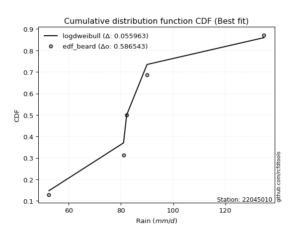</img></img>

</div>


### 5. Empirical - EDF Chegodayev (1955)

The Chegodayev formula is an empirical plotting position formula used in hydrological frequency analysis to estimate the exceedance probability or return period of a specific event from a set of observed data. It is primarily used for plotting observed data points on probability paper to fit a theoretical distribution, particularly for analyzing extreme events like maximum flood flows or rainfall intensities. The constant _b_ value in the generalized plotting position formula is 0.3.

<div align="center">


$P=(m-b)/(n+1-2b)$


</div>


**5.1. Empirical values**

<div align="center">

|                | 0                   | 1                   | 2              | 3                  | 4                  |
|:---------------|:--------------------|:--------------------|:---------------|:-------------------|:-------------------|
| date           | 2021                | 2025                | 2019           | 2020               | 2024               |
| x              | 52.4                | 81.0                | 82.2           | 90.0               | 134.8              |
| m              | 1                   | 2                   | 3              | 4                  | 5                  |
| empirical_dist | edf_chegodayev      | edf_chegodayev      | edf_chegodayev | edf_chegodayev     | edf_chegodayev     |
| empirical      | 0.12962962962962962 | 0.31481481481481477 | 0.5            | 0.6851851851851851 | 0.8703703703703703 |
| empirical_tr   | 1.148936170212766   | 1.4594594594594594  | 2.0            | 3.1764705882352935 | 7.714285714285713  |

</div>


**5.2. Kolmogorov-Smirnov fit test (sorted by Δ)**


<div align="center">

|                | 0                  | 1                   | 2                   | 3                   | 4                   | 5                   | 6                   | 7                     | 8                   | 9                   | 10                  | 11                  | 12                  | 13                  | 14                  | 15                  | 16                  | 17                  | 18                 | 19                  | 20                  | 21                  | 22                  | 23                  | 24                  | 25                  | 26                 | 27                 | 28                  | 29                  | 30                  | 31                  | 32                  | 33                 | 34                  | 35                  | 36                  | 37                 | 38                  | 39                  | 40                  | 41                  | 42                  | 43                  | 44                  | 45                 | 46                  | 47                 | 48                 | 49                 | 50                  | 51                 | 52                 | 53                 | 54                  | 55                  | 56                 | 57                  | 58                  | 59                  | 60                  | 61                  | 62                  | 63                 | 64                  | 65                 | 66                  | 67                 | 68                  | 69                  | 70                  | 71                  | 72                 | 73                  | 74                 | 75                  | 76                  | 77                  | 78                 | 79                 | 80                  | 81                 | 82                 | 83                 | 84                 | 85                  | 86                  | 87                 | 88                 | 89                 |
|:---------------|:-------------------|:--------------------|:--------------------|:--------------------|:--------------------|:--------------------|:--------------------|:----------------------|:--------------------|:--------------------|:--------------------|:--------------------|:--------------------|:--------------------|:--------------------|:--------------------|:--------------------|:--------------------|:-------------------|:--------------------|:--------------------|:--------------------|:--------------------|:--------------------|:--------------------|:--------------------|:-------------------|:-------------------|:--------------------|:--------------------|:--------------------|:--------------------|:--------------------|:-------------------|:--------------------|:--------------------|:--------------------|:-------------------|:--------------------|:--------------------|:--------------------|:--------------------|:--------------------|:--------------------|:--------------------|:-------------------|:--------------------|:-------------------|:-------------------|:-------------------|:--------------------|:-------------------|:-------------------|:-------------------|:--------------------|:--------------------|:-------------------|:--------------------|:--------------------|:--------------------|:--------------------|:--------------------|:--------------------|:-------------------|:--------------------|:-------------------|:--------------------|:-------------------|:--------------------|:--------------------|:--------------------|:--------------------|:-------------------|:--------------------|:-------------------|:--------------------|:--------------------|:--------------------|:-------------------|:-------------------|:--------------------|:-------------------|:-------------------|:-------------------|:-------------------|:--------------------|:--------------------|:-------------------|:-------------------|:-------------------|
| station        | 22045010           | 22045010            | 22045010            | 22045010            | 22045010            | 22045010            | 22045010            | 22045010              | 22045010            | 22045010            | 22045010            | 22045010            | 22045010            | 22045010            | 22045010            | 22045010            | 22045010            | 22045010            | 22045010           | 22045010            | 22045010            | 22045010            | 22045010            | 22045010            | 22045010            | 22045010            | 22045010           | 22045010           | 22045010            | 22045010            | 22045010            | 22045010            | 22045010            | 22045010           | 22045010            | 22045010            | 22045010            | 22045010           | 22045010            | 22045010            | 22045010            | 22045010            | 22045010            | 22045010            | 22045010            | 22045010           | 22045010            | 22045010           | 22045010           | 22045010           | 22045010            | 22045010           | 22045010           | 22045010           | 22045010            | 22045010            | 22045010           | 22045010            | 22045010            | 22045010            | 22045010            | 22045010            | 22045010            | 22045010           | 22045010            | 22045010           | 22045010            | 22045010           | 22045010            | 22045010            | 22045010            | 22045010            | 22045010           | 22045010            | 22045010           | 22045010            | 22045010            | 22045010            | 22045010           | 22045010           | 22045010            | 22045010           | 22045010           | 22045010           | 22045010           | 22045010            | 22045010            | 22045010           | 22045010           | 22045010           |
| empirical_dist | edf_chegodayev     | edf_chegodayev      | edf_chegodayev      | edf_chegodayev      | edf_chegodayev      | edf_chegodayev      | edf_chegodayev      | edf_chegodayev        | edf_chegodayev      | edf_chegodayev      | edf_chegodayev      | edf_chegodayev      | edf_chegodayev      | edf_chegodayev      | edf_chegodayev      | edf_chegodayev      | edf_chegodayev      | edf_chegodayev      | edf_chegodayev     | edf_chegodayev      | edf_chegodayev      | edf_chegodayev      | edf_chegodayev      | edf_chegodayev      | edf_chegodayev      | edf_chegodayev      | edf_chegodayev     | edf_chegodayev     | edf_chegodayev      | edf_chegodayev      | edf_chegodayev      | edf_chegodayev      | edf_chegodayev      | edf_chegodayev     | edf_chegodayev      | edf_chegodayev      | edf_chegodayev      | edf_chegodayev     | edf_chegodayev      | edf_chegodayev      | edf_chegodayev      | edf_chegodayev      | edf_chegodayev      | edf_chegodayev      | edf_chegodayev      | edf_chegodayev     | edf_chegodayev      | edf_chegodayev     | edf_chegodayev     | edf_chegodayev     | edf_chegodayev      | edf_chegodayev     | edf_chegodayev     | edf_chegodayev     | edf_chegodayev      | edf_chegodayev      | edf_chegodayev     | edf_chegodayev      | edf_chegodayev      | edf_chegodayev      | edf_chegodayev      | edf_chegodayev      | edf_chegodayev      | edf_chegodayev     | edf_chegodayev      | edf_chegodayev     | edf_chegodayev      | edf_chegodayev     | edf_chegodayev      | edf_chegodayev      | edf_chegodayev      | edf_chegodayev      | edf_chegodayev     | edf_chegodayev      | edf_chegodayev     | edf_chegodayev      | edf_chegodayev      | edf_chegodayev      | edf_chegodayev     | edf_chegodayev     | edf_chegodayev      | edf_chegodayev     | edf_chegodayev     | edf_chegodayev     | edf_chegodayev     | edf_chegodayev      | edf_chegodayev      | edf_chegodayev     | edf_chegodayev     | edf_chegodayev     |
| p_dist         | johnsonsu          | laplace_asymmetric  | logjohnsonsu        | loglaplace          | pearson3            | loghypsecant        | rice                | loglaplace_asymmetric | maxwell             | rayleigh            | logmielke           | loggenlogistic      | loglogistic         | mielke              | fisk                | logfisk             | alpha               | logloggamma         | logpearson3        | betaprime           | logexponnorm        | lognorm             | lognorm             | logcrystalball      | logt                | nct                 | loggamma           | loggamma           | invgamma            | logerlang           | logf                | logfatiguelife      | laplace             | logncf             | exponnorm           | gumbel_r            | logbetaprime        | invgauss           | lognct              | genlogistic         | kstwobign           | logweibull_min      | hypsecant           | gompertz            | f                   | logalpha           | logistic            | logrice            | loginvgamma        | crystalball        | norm                | t                  | loggompertz        | loggumbel_l        | halfnorm            | moyal               | loginvgauss        | logmaxwell          | halflogistic        | lograyleigh         | loginvweibull       | loggumbel_r         | logkstwobign        | gibrat             | loghalfnorm         | loggenexpon        | wald                | logchi2            | gumbel_l            | logmoyal            | loghalflogistic     | genexpon            | expon              | ncf                 | weibull_min        | lognakagami         | logexpon            | logwald             | loggibrat          | nakagami           | truncnorm           | chi2               | loglognorm         | pareto             | logpareto          | invweibull          | gamma               | erlang             | fatiguelife        | logtruncnorm       |
| delta          | 0.0831876958276474 | 0.08513136702107027 | 0.09115859595203801 | 0.10190751937750253 | 0.11747151524447597 | 0.12120718030839112 | 0.12220415341896806 | 0.12259556977539399   | 0.12476108687988241 | 0.12653142198275658 | 0.12671409026907593 | 0.12701677842409553 | 0.12703324766463708 | 0.12704852379016857 | 0.12754485681634647 | 0.12760008794949468 | 0.13147239700339586 | 0.13172037807878367 | 0.1328509902254852 | 0.13323581439363535 | 0.13393190426026386 | 0.13393271482903368 | 0.13393271482903368 | 0.13393293647599513 | 0.13393384154295646 | 0.13496635690114922 | 0.1350442526576271 | 0.1350442526576271 | 0.13506694361679322 | 0.13507283842407003 | 0.13525854395158482 | 0.13667430466690117 | 0.13670616888995968 | 0.1372922905604127 | 0.13813408207710015 | 0.13918474234588224 | 0.14042779419098916 | 0.1416094327061761 | 0.14171436404286075 | 0.14291419731403948 | 0.14420587485192687 | 0.14626502967204325 | 0.14920446876386428 | 0.14955276999799472 | 0.14981400657939054 | 0.1510492282388345 | 0.15253111695658372 | 0.1528065580727726 | 0.1541874951662225 | 0.1564403114044498 | 0.15644031215834175 | 0.1564421431788925 | 0.1566082759078724 | 0.1595994916821254 | 0.16143951954218927 | 0.16170991692387393 | 0.1645736444680715 | 0.16826658406946404 | 0.17637634758493487 | 0.18017743555815513 | 0.19364777069167738 | 0.20083300929638348 | 0.21185689304470812 | 0.2136435796627263 | 0.21379712638663662 | 0.2147632772561736 | 0.22210009930966546 | 0.2243819221038561 | 0.22535758734503175 | 0.22615537917787698 | 0.23478646778477796 | 0.23648483093165218 | 0.2365608927614017 | 0.24671115504556618 | 0.2590726356578563 | 0.27116164069898163 | 0.28596972742886373 | 0.29650706879293187 | 0.3088160145298646 | 0.3148112103592617 | 0.31481477537293745 | 0.3648422643772795 | 0.370102606719809  | 0.3720113604645706 | 0.3790463079353209 | 0.41645755795611505 | 0.44794150380274167 | 0.5168328937789903 | 0.5521777006345785 | 0.6851851851851851 |
| deltao         | 0.5865427407550001 | 0.5865427407550001  | 0.5865427407550001  | 0.5865427407550001  | 0.5865427407550001  | 0.5865427407550001  | 0.5865427407550001  | 0.5865427407550001    | 0.5865427407550001  | 0.5865427407550001  | 0.5865427407550001  | 0.5865427407550001  | 0.5865427407550001  | 0.5865427407550001  | 0.5865427407550001  | 0.5865427407550001  | 0.5865427407550001  | 0.5865427407550001  | 0.5865427407550001 | 0.5865427407550001  | 0.5865427407550001  | 0.5865427407550001  | 0.5865427407550001  | 0.5865427407550001  | 0.5865427407550001  | 0.5865427407550001  | 0.5865427407550001 | 0.5865427407550001 | 0.5865427407550001  | 0.5865427407550001  | 0.5865427407550001  | 0.5865427407550001  | 0.5865427407550001  | 0.5865427407550001 | 0.5865427407550001  | 0.5865427407550001  | 0.5865427407550001  | 0.5865427407550001 | 0.5865427407550001  | 0.5865427407550001  | 0.5865427407550001  | 0.5865427407550001  | 0.5865427407550001  | 0.5865427407550001  | 0.5865427407550001  | 0.5865427407550001 | 0.5865427407550001  | 0.5865427407550001 | 0.5865427407550001 | 0.5865427407550001 | 0.5865427407550001  | 0.5865427407550001 | 0.5865427407550001 | 0.5865427407550001 | 0.5865427407550001  | 0.5865427407550001  | 0.5865427407550001 | 0.5865427407550001  | 0.5865427407550001  | 0.5865427407550001  | 0.5865427407550001  | 0.5865427407550001  | 0.5865427407550001  | 0.5865427407550001 | 0.5865427407550001  | 0.5865427407550001 | 0.5865427407550001  | 0.5865427407550001 | 0.5865427407550001  | 0.5865427407550001  | 0.5865427407550001  | 0.5865427407550001  | 0.5865427407550001 | 0.5865427407550001  | 0.5865427407550001 | 0.5865427407550001  | 0.5865427407550001  | 0.5865427407550001  | 0.5865427407550001 | 0.5865427407550001 | 0.5865427407550001  | 0.5865427407550001 | 0.5865427407550001 | 0.5865427407550001 | 0.5865427407550001 | 0.5865427407550001  | 0.5865427407550001  | 0.5865427407550001 | 0.5865427407550001 | 0.5865427407550001 |
| eval           | Δo > Δ             | Δo > Δ              | Δo > Δ              | Δo > Δ              | Δo > Δ              | Δo > Δ              | Δo > Δ              | Δo > Δ                | Δo > Δ              | Δo > Δ              | Δo > Δ              | Δo > Δ              | Δo > Δ              | Δo > Δ              | Δo > Δ              | Δo > Δ              | Δo > Δ              | Δo > Δ              | Δo > Δ             | Δo > Δ              | Δo > Δ              | Δo > Δ              | Δo > Δ              | Δo > Δ              | Δo > Δ              | Δo > Δ              | Δo > Δ             | Δo > Δ             | Δo > Δ              | Δo > Δ              | Δo > Δ              | Δo > Δ              | Δo > Δ              | Δo > Δ             | Δo > Δ              | Δo > Δ              | Δo > Δ              | Δo > Δ             | Δo > Δ              | Δo > Δ              | Δo > Δ              | Δo > Δ              | Δo > Δ              | Δo > Δ              | Δo > Δ              | Δo > Δ             | Δo > Δ              | Δo > Δ             | Δo > Δ             | Δo > Δ             | Δo > Δ              | Δo > Δ             | Δo > Δ             | Δo > Δ             | Δo > Δ              | Δo > Δ              | Δo > Δ             | Δo > Δ              | Δo > Δ              | Δo > Δ              | Δo > Δ              | Δo > Δ              | Δo > Δ              | Δo > Δ             | Δo > Δ              | Δo > Δ             | Δo > Δ              | Δo > Δ             | Δo > Δ              | Δo > Δ              | Δo > Δ              | Δo > Δ              | Δo > Δ             | Δo > Δ              | Δo > Δ             | Δo > Δ              | Δo > Δ              | Δo > Δ              | Δo > Δ             | Δo > Δ             | Δo > Δ              | Δo > Δ             | Δo > Δ             | Δo > Δ             | Δo > Δ             | Δo > Δ              | Δo > Δ              | Δo > Δ             | Δo > Δ             | Δo <= Δ            |
| fit            | 1                  | 1                   | 1                   | 1                   | 1                   | 1                   | 1                   | 1                     | 1                   | 1                   | 1                   | 1                   | 1                   | 1                   | 1                   | 1                   | 1                   | 1                   | 1                  | 1                   | 1                   | 1                   | 1                   | 1                   | 1                   | 1                   | 1                  | 1                  | 1                   | 1                   | 1                   | 1                   | 1                   | 1                  | 1                   | 1                   | 1                   | 1                  | 1                   | 1                   | 1                   | 1                   | 1                   | 1                   | 1                   | 1                  | 1                   | 1                  | 1                  | 1                  | 1                   | 1                  | 1                  | 1                  | 1                   | 1                   | 1                  | 1                   | 1                   | 1                   | 1                   | 1                   | 1                   | 1                  | 1                   | 1                  | 1                   | 1                  | 1                   | 1                   | 1                   | 1                   | 1                  | 1                   | 1                  | 1                   | 1                   | 1                   | 1                  | 1                  | 1                   | 1                  | 1                  | 1                  | 1                  | 1                   | 1                   | 1                  | 1                  | 0                  |
| n              | 5                  | 5                   | 5                   | 5                   | 5                   | 5                   | 5                   | 5                     | 5                   | 5                   | 5                   | 5                   | 5                   | 5                   | 5                   | 5                   | 5                   | 5                   | 5                  | 5                   | 5                   | 5                   | 5                   | 5                   | 5                   | 5                   | 5                  | 5                  | 5                   | 5                   | 5                   | 5                   | 5                   | 5                  | 5                   | 5                   | 5                   | 5                  | 5                   | 5                   | 5                   | 5                   | 5                   | 5                   | 5                   | 5                  | 5                   | 5                  | 5                  | 5                  | 5                   | 5                  | 5                  | 5                  | 5                   | 5                   | 5                  | 5                   | 5                   | 5                   | 5                   | 5                   | 5                   | 5                  | 5                   | 5                  | 5                   | 5                  | 5                   | 5                   | 5                   | 5                   | 5                  | 5                   | 5                  | 5                   | 5                   | 5                   | 5                  | 5                  | 5                   | 5                  | 5                  | 5                  | 5                  | 5                   | 5                   | 5                  | 5                  | 5                  |
| best_fit       | 1                  | 0                   | 0                   | 0                   | 0                   | 0                   | 0                   | 0                     | 0                   | 0                   | 0                   | 0                   | 0                   | 0                   | 0                   | 0                   | 0                   | 0                   | 0                  | 0                   | 0                   | 0                   | 0                   | 0                   | 0                   | 0                   | 0                  | 0                  | 0                   | 0                   | 0                   | 0                   | 0                   | 0                  | 0                   | 0                   | 0                   | 0                  | 0                   | 0                   | 0                   | 0                   | 0                   | 0                   | 0                   | 0                  | 0                   | 0                  | 0                  | 0                  | 0                   | 0                  | 0                  | 0                  | 0                   | 0                   | 0                  | 0                   | 0                   | 0                   | 0                   | 0                   | 0                   | 0                  | 0                   | 0                  | 0                   | 0                  | 0                   | 0                   | 0                   | 0                   | 0                  | 0                   | 0                  | 0                   | 0                   | 0                   | 0                  | 0                  | 0                   | 0                  | 0                  | 0                  | 0                  | 0                   | 0                   | 0                  | 0                  | 0                  |
| best_fit_sort  | 1                  | 2                   | 3                   | 4                   | 5                   | 6                   | 7                   | 8                     | 9                   | 10                  | 11                  | 12                  | 13                  | 14                  | 15                  | 16                  | 17                  | 18                  | 19                 | 20                  | 21                  | 22                  | 23                  | 24                  | 25                  | 26                  | 27                 | 28                 | 29                  | 30                  | 31                  | 32                  | 33                  | 34                 | 35                  | 36                  | 37                  | 38                 | 39                  | 40                  | 41                  | 42                  | 43                  | 44                  | 45                  | 46                 | 47                  | 48                 | 49                 | 50                 | 51                  | 52                 | 53                 | 54                 | 55                  | 56                  | 57                 | 58                  | 59                  | 60                  | 61                  | 62                  | 63                  | 64                 | 65                  | 66                 | 67                  | 68                 | 69                  | 70                  | 71                  | 72                  | 73                 | 74                  | 75                 | 76                  | 77                  | 78                  | 79                 | 80                 | 81                  | 82                 | 83                 | 84                 | 85                 | 86                  | 87                  | 88                 | 89                 | 90                 |

</div>


<div align="center">

</img>

</div>


**5.3. Best fit**

<div align="center">

|   id |   station | empirical_dist   | p_dist    |     delta |   deltao | eval   |   fit |   n |   best_fit |   best_fit_sort |
|-----:|----------:|:-----------------|:----------|----------:|---------:|:-------|------:|----:|-----------:|----------------:|
|    0 |  22045010 | edf_chegodayev   | johnsonsu | 0.0831877 | 0.586543 | Δo > Δ |     1 |   5 |          1 |               1 |

</div>


<div align="center">

</img></img>

</div>


### 6. Empirical - EDF Blom (1958)

The Blom formula is a specific "plotting position" formula used in hydrology and statistical analysis to estimate the empirical cumulative probability (or non-exceedance probability) of a data series. It is particularly recommended for data that are approximately normally distributed. The constant _a_ is set to 0.375 (or 3/8).

<div align="center">


$P=(m-a)/(n+1-2a)$


</div>


**6.1. Empirical values**

<div align="center">

|                | 0                   | 1                   | 2        | 3                  | 4                  |
|:---------------|:--------------------|:--------------------|:---------|:-------------------|:-------------------|
| date           | 2021                | 2025                | 2019     | 2020               | 2024               |
| x              | 52.4                | 81.0                | 82.2     | 90.0               | 134.8              |
| m              | 1                   | 2                   | 3        | 4                  | 5                  |
| empirical_dist | edf_blom            | edf_blom            | edf_blom | edf_blom           | edf_blom           |
| empirical      | 0.11904761904761904 | 0.30952380952380953 | 0.5      | 0.6904761904761905 | 0.8809523809523809 |
| empirical_tr   | 1.135135135135135   | 1.4482758620689655  | 2.0      | 3.230769230769231  | 8.399999999999999  |

</div>


**6.2. Kolmogorov-Smirnov fit test (sorted by Δ)**


<div align="center">

|                | 0                   | 1                   | 2                   | 3                   | 4                   | 5                   | 6                  | 7                     | 8                   | 9                  | 10                  | 11                  | 12                  | 13                 | 14                 | 15                 | 16                 | 17                 | 18                  | 19                 | 20                 | 21                  | 22                  | 23                  | 24                 | 25                  | 26                  | 27                  | 28                  | 29                  | 30                  | 31                 | 32                  | 33                  | 34                 | 35                  | 36                 | 37                  | 38                 | 39                  | 40                 | 41                  | 42                  | 43                  | 44                  | 45                  | 46                  | 47                  | 48                  | 49                  | 50                 | 51                  | 52                  | 53                  | 54                 | 55                  | 56                  | 57                  | 58                 | 59                  | 60                  | 61                  | 62                  | 63                  | 64                  | 65                  | 66                 | 67                 | 68                  | 69                  | 70                 | 71                  | 72                  | 73                 | 74                  | 75                 | 76                  | 77                 | 78                  | 79                 | 80                  | 81                  | 82                 | 83                  | 84                  | 85                  | 86                 | 87                 | 88                 | 89                 |
|:---------------|:--------------------|:--------------------|:--------------------|:--------------------|:--------------------|:--------------------|:-------------------|:----------------------|:--------------------|:-------------------|:--------------------|:--------------------|:--------------------|:-------------------|:-------------------|:-------------------|:-------------------|:-------------------|:--------------------|:-------------------|:-------------------|:--------------------|:--------------------|:--------------------|:-------------------|:--------------------|:--------------------|:--------------------|:--------------------|:--------------------|:--------------------|:-------------------|:--------------------|:--------------------|:-------------------|:--------------------|:-------------------|:--------------------|:-------------------|:--------------------|:-------------------|:--------------------|:--------------------|:--------------------|:--------------------|:--------------------|:--------------------|:--------------------|:--------------------|:--------------------|:-------------------|:--------------------|:--------------------|:--------------------|:-------------------|:--------------------|:--------------------|:--------------------|:-------------------|:--------------------|:--------------------|:--------------------|:--------------------|:--------------------|:--------------------|:--------------------|:-------------------|:-------------------|:--------------------|:--------------------|:-------------------|:--------------------|:--------------------|:-------------------|:--------------------|:-------------------|:--------------------|:-------------------|:--------------------|:-------------------|:--------------------|:--------------------|:-------------------|:--------------------|:--------------------|:--------------------|:-------------------|:-------------------|:-------------------|:-------------------|
| station        | 22045010            | 22045010            | 22045010            | 22045010            | 22045010            | 22045010            | 22045010           | 22045010              | 22045010            | 22045010           | 22045010            | 22045010            | 22045010            | 22045010           | 22045010           | 22045010           | 22045010           | 22045010           | 22045010            | 22045010           | 22045010           | 22045010            | 22045010            | 22045010            | 22045010           | 22045010            | 22045010            | 22045010            | 22045010            | 22045010            | 22045010            | 22045010           | 22045010            | 22045010            | 22045010           | 22045010            | 22045010           | 22045010            | 22045010           | 22045010            | 22045010           | 22045010            | 22045010            | 22045010            | 22045010            | 22045010            | 22045010            | 22045010            | 22045010            | 22045010            | 22045010           | 22045010            | 22045010            | 22045010            | 22045010           | 22045010            | 22045010            | 22045010            | 22045010           | 22045010            | 22045010            | 22045010            | 22045010            | 22045010            | 22045010            | 22045010            | 22045010           | 22045010           | 22045010            | 22045010            | 22045010           | 22045010            | 22045010            | 22045010           | 22045010            | 22045010           | 22045010            | 22045010           | 22045010            | 22045010           | 22045010            | 22045010            | 22045010           | 22045010            | 22045010            | 22045010            | 22045010           | 22045010           | 22045010           | 22045010           |
| empirical_dist | edf_blom            | edf_blom            | edf_blom            | edf_blom            | edf_blom            | edf_blom            | edf_blom           | edf_blom              | edf_blom            | edf_blom           | edf_blom            | edf_blom            | edf_blom            | edf_blom           | edf_blom           | edf_blom           | edf_blom           | edf_blom           | edf_blom            | edf_blom           | edf_blom           | edf_blom            | edf_blom            | edf_blom            | edf_blom           | edf_blom            | edf_blom            | edf_blom            | edf_blom            | edf_blom            | edf_blom            | edf_blom           | edf_blom            | edf_blom            | edf_blom           | edf_blom            | edf_blom           | edf_blom            | edf_blom           | edf_blom            | edf_blom           | edf_blom            | edf_blom            | edf_blom            | edf_blom            | edf_blom            | edf_blom            | edf_blom            | edf_blom            | edf_blom            | edf_blom           | edf_blom            | edf_blom            | edf_blom            | edf_blom           | edf_blom            | edf_blom            | edf_blom            | edf_blom           | edf_blom            | edf_blom            | edf_blom            | edf_blom            | edf_blom            | edf_blom            | edf_blom            | edf_blom           | edf_blom           | edf_blom            | edf_blom            | edf_blom           | edf_blom            | edf_blom            | edf_blom           | edf_blom            | edf_blom           | edf_blom            | edf_blom           | edf_blom            | edf_blom           | edf_blom            | edf_blom            | edf_blom           | edf_blom            | edf_blom            | edf_blom            | edf_blom           | edf_blom           | edf_blom           | edf_blom           |
| p_dist         | johnsonsu           | logjohnsonsu        | laplace_asymmetric  | loglaplace          | pearson3            | loghypsecant        | rice               | loglaplace_asymmetric | maxwell             | rayleigh           | logmielke           | loggenlogistic      | loglogistic         | mielke             | fisk               | logfisk            | alpha              | logloggamma        | logpearson3         | betaprime          | logexponnorm       | lognorm             | lognorm             | logcrystalball      | logt               | nct                 | loggamma            | loggamma            | invgamma            | logerlang           | logf                | logfatiguelife     | laplace             | logncf              | exponnorm          | gumbel_r            | logbetaprime       | invgauss            | lognct             | genlogistic         | kstwobign          | logweibull_min      | hypsecant           | gompertz            | f                   | logalpha            | logistic            | logrice             | loginvgamma         | crystalball         | norm               | t                   | loggompertz         | loggumbel_l         | halfnorm           | moyal               | loginvgauss         | logmaxwell          | halflogistic       | lograyleigh         | loginvweibull       | loggumbel_r         | logkstwobign        | gibrat              | loghalfnorm         | loggenexpon         | wald               | gumbel_l           | logmoyal            | logchi2             | loghalflogistic    | genexpon            | expon               | ncf                | weibull_min         | lognakagami        | logexpon            | logwald            | nakagami            | truncnorm          | loggibrat           | chi2                | loglognorm         | pareto              | logpareto           | invweibull          | gamma              | erlang             | fatiguelife        | logtruncnorm       |
| delta          | 0.07789669053664205 | 0.08586759066103267 | 0.09042237231207562 | 0.10719852466850777 | 0.12276252053548131 | 0.12649818559939635 | 0.1274951587099734 | 0.12788657506639922   | 0.13005209217088776 | 0.1318224272737618 | 0.13200509556008116 | 0.13230778371510077 | 0.13232425295564232 | 0.1323395290811738 | 0.1328358621073517 | 0.1328910932404999 | 0.1367634022944011 | 0.1370113833697889 | 0.13814199551649042 | 0.1385268196846406 | 0.1392229095512691 | 0.13922372012003892 | 0.13922372012003892 | 0.13922394176700037 | 0.1392248468339617 | 0.14025736219215446 | 0.14033525794863233 | 0.14033525794863233 | 0.14035794890779846 | 0.14036384371507526 | 0.14054954924259005 | 0.1419653099579064 | 0.14199717418096502 | 0.14258329585141793 | 0.1434250873681054 | 0.14447574763688747 | 0.1457187994819944 | 0.14690043799718133 | 0.147005369333866  | 0.14820520260504472 | 0.1494968801429321 | 0.15155603496304848 | 0.15449547405486963 | 0.15484377528899995 | 0.15510501187039577 | 0.15634023352983972 | 0.15782212224758907 | 0.15809756336377784 | 0.15947850045722772 | 0.16173131669545515 | 0.1617313174493471 | 0.16173314846989784 | 0.16189928119887764 | 0.16489049697313074 | 0.1667305248331945 | 0.16700092221487917 | 0.16986464975907672 | 0.17355758936046928 | 0.1816673528759401 | 0.18546844084916037 | 0.19893877598268261 | 0.20612401458738872 | 0.21714789833571335 | 0.21893458495373153 | 0.21908813167764185 | 0.22005428254717885 | 0.2273911046006707 | 0.2306485926360371 | 0.23144638446888222 | 0.23496393268586668 | 0.2400774730757832 | 0.24177583622265741 | 0.24185189805240692 | 0.2520021603365714 | 0.26436364094886156 | 0.2658706354079764 | 0.29126073271986896 | 0.3017980740839371 | 0.30952020506825645 | 0.3095237700819322 | 0.31410701982086986 | 0.37013326966828475 | 0.3753936120108142 | 0.37730236575557585 | 0.38433731322632614 | 0.42703956853812564 | 0.4532325090937469 | 0.5221238990699956 | 0.5574687059255837 | 0.6904761904761905 |
| deltao         | 0.5865427407550001  | 0.5865427407550001  | 0.5865427407550001  | 0.5865427407550001  | 0.5865427407550001  | 0.5865427407550001  | 0.5865427407550001 | 0.5865427407550001    | 0.5865427407550001  | 0.5865427407550001 | 0.5865427407550001  | 0.5865427407550001  | 0.5865427407550001  | 0.5865427407550001 | 0.5865427407550001 | 0.5865427407550001 | 0.5865427407550001 | 0.5865427407550001 | 0.5865427407550001  | 0.5865427407550001 | 0.5865427407550001 | 0.5865427407550001  | 0.5865427407550001  | 0.5865427407550001  | 0.5865427407550001 | 0.5865427407550001  | 0.5865427407550001  | 0.5865427407550001  | 0.5865427407550001  | 0.5865427407550001  | 0.5865427407550001  | 0.5865427407550001 | 0.5865427407550001  | 0.5865427407550001  | 0.5865427407550001 | 0.5865427407550001  | 0.5865427407550001 | 0.5865427407550001  | 0.5865427407550001 | 0.5865427407550001  | 0.5865427407550001 | 0.5865427407550001  | 0.5865427407550001  | 0.5865427407550001  | 0.5865427407550001  | 0.5865427407550001  | 0.5865427407550001  | 0.5865427407550001  | 0.5865427407550001  | 0.5865427407550001  | 0.5865427407550001 | 0.5865427407550001  | 0.5865427407550001  | 0.5865427407550001  | 0.5865427407550001 | 0.5865427407550001  | 0.5865427407550001  | 0.5865427407550001  | 0.5865427407550001 | 0.5865427407550001  | 0.5865427407550001  | 0.5865427407550001  | 0.5865427407550001  | 0.5865427407550001  | 0.5865427407550001  | 0.5865427407550001  | 0.5865427407550001 | 0.5865427407550001 | 0.5865427407550001  | 0.5865427407550001  | 0.5865427407550001 | 0.5865427407550001  | 0.5865427407550001  | 0.5865427407550001 | 0.5865427407550001  | 0.5865427407550001 | 0.5865427407550001  | 0.5865427407550001 | 0.5865427407550001  | 0.5865427407550001 | 0.5865427407550001  | 0.5865427407550001  | 0.5865427407550001 | 0.5865427407550001  | 0.5865427407550001  | 0.5865427407550001  | 0.5865427407550001 | 0.5865427407550001 | 0.5865427407550001 | 0.5865427407550001 |
| eval           | Δo > Δ              | Δo > Δ              | Δo > Δ              | Δo > Δ              | Δo > Δ              | Δo > Δ              | Δo > Δ             | Δo > Δ                | Δo > Δ              | Δo > Δ             | Δo > Δ              | Δo > Δ              | Δo > Δ              | Δo > Δ             | Δo > Δ             | Δo > Δ             | Δo > Δ             | Δo > Δ             | Δo > Δ              | Δo > Δ             | Δo > Δ             | Δo > Δ              | Δo > Δ              | Δo > Δ              | Δo > Δ             | Δo > Δ              | Δo > Δ              | Δo > Δ              | Δo > Δ              | Δo > Δ              | Δo > Δ              | Δo > Δ             | Δo > Δ              | Δo > Δ              | Δo > Δ             | Δo > Δ              | Δo > Δ             | Δo > Δ              | Δo > Δ             | Δo > Δ              | Δo > Δ             | Δo > Δ              | Δo > Δ              | Δo > Δ              | Δo > Δ              | Δo > Δ              | Δo > Δ              | Δo > Δ              | Δo > Δ              | Δo > Δ              | Δo > Δ             | Δo > Δ              | Δo > Δ              | Δo > Δ              | Δo > Δ             | Δo > Δ              | Δo > Δ              | Δo > Δ              | Δo > Δ             | Δo > Δ              | Δo > Δ              | Δo > Δ              | Δo > Δ              | Δo > Δ              | Δo > Δ              | Δo > Δ              | Δo > Δ             | Δo > Δ             | Δo > Δ              | Δo > Δ              | Δo > Δ             | Δo > Δ              | Δo > Δ              | Δo > Δ             | Δo > Δ              | Δo > Δ             | Δo > Δ              | Δo > Δ             | Δo > Δ              | Δo > Δ             | Δo > Δ              | Δo > Δ              | Δo > Δ             | Δo > Δ              | Δo > Δ              | Δo > Δ              | Δo > Δ             | Δo > Δ             | Δo > Δ             | Δo <= Δ            |
| fit            | 1                   | 1                   | 1                   | 1                   | 1                   | 1                   | 1                  | 1                     | 1                   | 1                  | 1                   | 1                   | 1                   | 1                  | 1                  | 1                  | 1                  | 1                  | 1                   | 1                  | 1                  | 1                   | 1                   | 1                   | 1                  | 1                   | 1                   | 1                   | 1                   | 1                   | 1                   | 1                  | 1                   | 1                   | 1                  | 1                   | 1                  | 1                   | 1                  | 1                   | 1                  | 1                   | 1                   | 1                   | 1                   | 1                   | 1                   | 1                   | 1                   | 1                   | 1                  | 1                   | 1                   | 1                   | 1                  | 1                   | 1                   | 1                   | 1                  | 1                   | 1                   | 1                   | 1                   | 1                   | 1                   | 1                   | 1                  | 1                  | 1                   | 1                   | 1                  | 1                   | 1                   | 1                  | 1                   | 1                  | 1                   | 1                  | 1                   | 1                  | 1                   | 1                   | 1                  | 1                   | 1                   | 1                   | 1                  | 1                  | 1                  | 0                  |
| n              | 5                   | 5                   | 5                   | 5                   | 5                   | 5                   | 5                  | 5                     | 5                   | 5                  | 5                   | 5                   | 5                   | 5                  | 5                  | 5                  | 5                  | 5                  | 5                   | 5                  | 5                  | 5                   | 5                   | 5                   | 5                  | 5                   | 5                   | 5                   | 5                   | 5                   | 5                   | 5                  | 5                   | 5                   | 5                  | 5                   | 5                  | 5                   | 5                  | 5                   | 5                  | 5                   | 5                   | 5                   | 5                   | 5                   | 5                   | 5                   | 5                   | 5                   | 5                  | 5                   | 5                   | 5                   | 5                  | 5                   | 5                   | 5                   | 5                  | 5                   | 5                   | 5                   | 5                   | 5                   | 5                   | 5                   | 5                  | 5                  | 5                   | 5                   | 5                  | 5                   | 5                   | 5                  | 5                   | 5                  | 5                   | 5                  | 5                   | 5                  | 5                   | 5                   | 5                  | 5                   | 5                   | 5                   | 5                  | 5                  | 5                  | 5                  |
| best_fit       | 1                   | 0                   | 0                   | 0                   | 0                   | 0                   | 0                  | 0                     | 0                   | 0                  | 0                   | 0                   | 0                   | 0                  | 0                  | 0                  | 0                  | 0                  | 0                   | 0                  | 0                  | 0                   | 0                   | 0                   | 0                  | 0                   | 0                   | 0                   | 0                   | 0                   | 0                   | 0                  | 0                   | 0                   | 0                  | 0                   | 0                  | 0                   | 0                  | 0                   | 0                  | 0                   | 0                   | 0                   | 0                   | 0                   | 0                   | 0                   | 0                   | 0                   | 0                  | 0                   | 0                   | 0                   | 0                  | 0                   | 0                   | 0                   | 0                  | 0                   | 0                   | 0                   | 0                   | 0                   | 0                   | 0                   | 0                  | 0                  | 0                   | 0                   | 0                  | 0                   | 0                   | 0                  | 0                   | 0                  | 0                   | 0                  | 0                   | 0                  | 0                   | 0                   | 0                  | 0                   | 0                   | 0                   | 0                  | 0                  | 0                  | 0                  |
| best_fit_sort  | 1                   | 2                   | 3                   | 4                   | 5                   | 6                   | 7                  | 8                     | 9                   | 10                 | 11                  | 12                  | 13                  | 14                 | 15                 | 16                 | 17                 | 18                 | 19                  | 20                 | 21                 | 22                  | 23                  | 24                  | 25                 | 26                  | 27                  | 28                  | 29                  | 30                  | 31                  | 32                 | 33                  | 34                  | 35                 | 36                  | 37                 | 38                  | 39                 | 40                  | 41                 | 42                  | 43                  | 44                  | 45                  | 46                  | 47                  | 48                  | 49                  | 50                  | 51                 | 52                  | 53                  | 54                  | 55                 | 56                  | 57                  | 58                  | 59                 | 60                  | 61                  | 62                  | 63                  | 64                  | 65                  | 66                  | 67                 | 68                 | 69                  | 70                  | 71                 | 72                  | 73                  | 74                 | 75                  | 76                 | 77                  | 78                 | 79                  | 80                 | 81                  | 82                  | 83                 | 84                  | 85                  | 86                  | 87                 | 88                 | 89                 | 90                 |

</div>


<div align="center">

</img>

</div>


**6.3. Best fit**

<div align="center">

|   id |   station | empirical_dist   | p_dist    |     delta |   deltao | eval   |   fit |   n |   best_fit |   best_fit_sort |
|-----:|----------:|:-----------------|:----------|----------:|---------:|:-------|------:|----:|-----------:|----------------:|
|    0 |  22045010 | edf_blom         | johnsonsu | 0.0778967 | 0.586543 | Δo > Δ |     1 |   5 |          1 |               1 |

</div>


<div align="center">

</img></img>

</div>


### 7. Empirical - EDF Tukey (1962)

In hydrology, the Tukey formula is used as a plotting position formula to estimate the empirical probability or frequency of a flood event (or other hydrological data). The formula parameter is given as _c=0.333_ (or 1/3).

<div align="center">


$P=(m-c)/(n+1-2c)$


</div>


**7.1. Empirical values**

<div align="center">

|                | 0                  | 1                  | 2         | 3         | 4         |
|:---------------|:-------------------|:-------------------|:----------|:----------|:----------|
| date           | 2021               | 2025               | 2019      | 2020      | 2024      |
| x              | 52.4               | 81.0               | 82.2      | 90.0      | 134.8     |
| m              | 1                  | 2                  | 3         | 4         | 5         |
| empirical_dist | edf_tukey          | edf_tukey          | edf_tukey | edf_tukey | edf_tukey |
| empirical      | 0.125              | 0.3125             | 0.5       | 0.6875    | 0.875     |
| empirical_tr   | 1.1428571428571428 | 1.4545454545454546 | 2.0       | 3.2       | 8.0       |

</div>


**7.2. Kolmogorov-Smirnov fit test (sorted by Δ)**


<div align="center">

|                | 0                   | 1                   | 2                   | 3                  | 4                   | 5                   | 6                   | 7                     | 8                  | 9                   | 10                 | 11                 | 12                  | 13                  | 14                  | 15                  | 16                  | 17                  | 18                  | 19                  | 20                  | 21                  | 22                  | 23                 | 24                  | 25                 | 26                  | 27                  | 28                 | 29                 | 30                 | 31                  | 32                  | 33                  | 34                  | 35                 | 36                  | 37                  | 38                  | 39                  | 40                  | 41                  | 42                  | 43                 | 44                 | 45                  | 46                 | 47                  | 48                  | 49                 | 50                  | 51                  | 52                  | 53                  | 54                  | 55                 | 56                  | 57                 | 58                  | 59                 | 60                  | 61                  | 62                 | 63                  | 64                  | 65                  | 66                  | 67                  | 68                  | 69                  | 70                  | 71                  | 72                  | 73                  | 74                 | 75                  | 76                 | 77                  | 78                 | 79                 | 80                 | 81                 | 82                  | 83                 | 84                 | 85                 | 86                  | 87                 | 88                 | 89                 |
|:---------------|:--------------------|:--------------------|:--------------------|:-------------------|:--------------------|:--------------------|:--------------------|:----------------------|:-------------------|:--------------------|:-------------------|:-------------------|:--------------------|:--------------------|:--------------------|:--------------------|:--------------------|:--------------------|:--------------------|:--------------------|:--------------------|:--------------------|:--------------------|:-------------------|:--------------------|:-------------------|:--------------------|:--------------------|:-------------------|:-------------------|:-------------------|:--------------------|:--------------------|:--------------------|:--------------------|:-------------------|:--------------------|:--------------------|:--------------------|:--------------------|:--------------------|:--------------------|:--------------------|:-------------------|:-------------------|:--------------------|:-------------------|:--------------------|:--------------------|:-------------------|:--------------------|:--------------------|:--------------------|:--------------------|:--------------------|:-------------------|:--------------------|:-------------------|:--------------------|:-------------------|:--------------------|:--------------------|:-------------------|:--------------------|:--------------------|:--------------------|:--------------------|:--------------------|:--------------------|:--------------------|:--------------------|:--------------------|:--------------------|:--------------------|:-------------------|:--------------------|:-------------------|:--------------------|:-------------------|:-------------------|:-------------------|:-------------------|:--------------------|:-------------------|:-------------------|:-------------------|:--------------------|:-------------------|:-------------------|:-------------------|
| station        | 22045010            | 22045010            | 22045010            | 22045010           | 22045010            | 22045010            | 22045010            | 22045010              | 22045010           | 22045010            | 22045010           | 22045010           | 22045010            | 22045010            | 22045010            | 22045010            | 22045010            | 22045010            | 22045010            | 22045010            | 22045010            | 22045010            | 22045010            | 22045010           | 22045010            | 22045010           | 22045010            | 22045010            | 22045010           | 22045010           | 22045010           | 22045010            | 22045010            | 22045010            | 22045010            | 22045010           | 22045010            | 22045010            | 22045010            | 22045010            | 22045010            | 22045010            | 22045010            | 22045010           | 22045010           | 22045010            | 22045010           | 22045010            | 22045010            | 22045010           | 22045010            | 22045010            | 22045010            | 22045010            | 22045010            | 22045010           | 22045010            | 22045010           | 22045010            | 22045010           | 22045010            | 22045010            | 22045010           | 22045010            | 22045010            | 22045010            | 22045010            | 22045010            | 22045010            | 22045010            | 22045010            | 22045010            | 22045010            | 22045010            | 22045010           | 22045010            | 22045010           | 22045010            | 22045010           | 22045010           | 22045010           | 22045010           | 22045010            | 22045010           | 22045010           | 22045010           | 22045010            | 22045010           | 22045010           | 22045010           |
| empirical_dist | edf_tukey           | edf_tukey           | edf_tukey           | edf_tukey          | edf_tukey           | edf_tukey           | edf_tukey           | edf_tukey             | edf_tukey          | edf_tukey           | edf_tukey          | edf_tukey          | edf_tukey           | edf_tukey           | edf_tukey           | edf_tukey           | edf_tukey           | edf_tukey           | edf_tukey           | edf_tukey           | edf_tukey           | edf_tukey           | edf_tukey           | edf_tukey          | edf_tukey           | edf_tukey          | edf_tukey           | edf_tukey           | edf_tukey          | edf_tukey          | edf_tukey          | edf_tukey           | edf_tukey           | edf_tukey           | edf_tukey           | edf_tukey          | edf_tukey           | edf_tukey           | edf_tukey           | edf_tukey           | edf_tukey           | edf_tukey           | edf_tukey           | edf_tukey          | edf_tukey          | edf_tukey           | edf_tukey          | edf_tukey           | edf_tukey           | edf_tukey          | edf_tukey           | edf_tukey           | edf_tukey           | edf_tukey           | edf_tukey           | edf_tukey          | edf_tukey           | edf_tukey          | edf_tukey           | edf_tukey          | edf_tukey           | edf_tukey           | edf_tukey          | edf_tukey           | edf_tukey           | edf_tukey           | edf_tukey           | edf_tukey           | edf_tukey           | edf_tukey           | edf_tukey           | edf_tukey           | edf_tukey           | edf_tukey           | edf_tukey          | edf_tukey           | edf_tukey          | edf_tukey           | edf_tukey          | edf_tukey          | edf_tukey          | edf_tukey          | edf_tukey           | edf_tukey          | edf_tukey          | edf_tukey          | edf_tukey           | edf_tukey          | edf_tukey          | edf_tukey          |
| p_dist         | johnsonsu           | laplace_asymmetric  | logjohnsonsu        | loglaplace         | pearson3            | loghypsecant        | rice                | loglaplace_asymmetric | maxwell            | rayleigh            | logmielke          | loggenlogistic     | loglogistic         | mielke              | fisk                | logfisk             | alpha               | logloggamma         | logpearson3         | betaprime           | logexponnorm        | lognorm             | lognorm             | logcrystalball     | logt                | nct                | loggamma            | loggamma            | invgamma           | logerlang          | logf               | logfatiguelife      | laplace             | logncf              | exponnorm           | gumbel_r           | logbetaprime        | invgauss            | lognct              | genlogistic         | kstwobign           | logweibull_min      | hypsecant           | gompertz           | f                  | logalpha            | logistic           | logrice             | loginvgamma         | crystalball        | norm                | t                   | loggompertz         | loggumbel_l         | halfnorm            | moyal              | loginvgauss         | logmaxwell         | halflogistic        | lograyleigh        | loginvweibull       | loggumbel_r         | logkstwobign       | gibrat              | loghalfnorm         | loggenexpon         | wald                | gumbel_l            | logmoyal            | logchi2             | loghalflogistic     | genexpon            | expon               | ncf                 | weibull_min        | lognakagami         | logexpon           | logwald             | loggibrat          | nakagami           | truncnorm          | chi2               | loglognorm          | pareto             | logpareto          | invweibull         | gamma               | erlang             | fatiguelife        | logtruncnorm       |
| delta          | 0.08087288101283252 | 0.08744618183588515 | 0.08884378113722313 | 0.1042223341923173 | 0.11978633005929085 | 0.12352199512320589 | 0.12451896823378295 | 0.12491038459020876   | 0.1270759016946973 | 0.12884623679757135 | 0.1290289050838907 | 0.1293315932389103 | 0.12934806247945185 | 0.12936333860498334 | 0.12985967163116124 | 0.12991490276430945 | 0.13378721181821063 | 0.13403519289359844 | 0.13516580504029996 | 0.13555062920845012 | 0.13624671907507863 | 0.13624752964384845 | 0.13624752964384845 | 0.1362477512908099 | 0.13624865635777123 | 0.137281171715964  | 0.13735906747244186 | 0.13735906747244186 | 0.137381758431608  | 0.1373876532388848 | 0.1375733587663996 | 0.13898911948171594 | 0.13902098370477456 | 0.13960710537522747 | 0.14044889689191492 | 0.141499557160697  | 0.14274260900580393 | 0.14392424752099087 | 0.14402917885767552 | 0.14522901212885425 | 0.14652068966674164 | 0.14857984448685801 | 0.15151928357867916 | 0.1518675848128095 | 0.1521288213942053 | 0.15336404305364926 | 0.1548459317713986 | 0.15512137288758737 | 0.15650230998103726 | 0.1587551262192647 | 0.15875512697315664 | 0.15875695799370737 | 0.15892309072268718 | 0.16191430649694027 | 0.16375433435700404 | 0.1640247317386887 | 0.16688845928288626 | 0.1705813988842788 | 0.17869116239974964 | 0.1824922503729699 | 0.19596258550649215 | 0.20314782411119825 | 0.2141717078595229 | 0.21595839447754106 | 0.21611194120145139 | 0.21707809207098838 | 0.22441491412448022 | 0.22767240215984663 | 0.22847019399269175 | 0.22901155173348575 | 0.23710128259959273 | 0.23879964574646695 | 0.23887570757621646 | 0.24902596986038095 | 0.2613874504726711 | 0.26884682588416686 | 0.2882845422436785 | 0.29882188360774664 | 0.3111308293446794 | 0.3124963955444469 | 0.3124999605581227 | 0.3671570791920943 | 0.37241742153462376 | 0.3743261752793854 | 0.3813611227501357 | 0.4210871875857447 | 0.45025631861755644 | 0.5191477085938051 | 0.5544925154493933 | 0.6875             |
| deltao         | 0.5865427407550001  | 0.5865427407550001  | 0.5865427407550001  | 0.5865427407550001 | 0.5865427407550001  | 0.5865427407550001  | 0.5865427407550001  | 0.5865427407550001    | 0.5865427407550001 | 0.5865427407550001  | 0.5865427407550001 | 0.5865427407550001 | 0.5865427407550001  | 0.5865427407550001  | 0.5865427407550001  | 0.5865427407550001  | 0.5865427407550001  | 0.5865427407550001  | 0.5865427407550001  | 0.5865427407550001  | 0.5865427407550001  | 0.5865427407550001  | 0.5865427407550001  | 0.5865427407550001 | 0.5865427407550001  | 0.5865427407550001 | 0.5865427407550001  | 0.5865427407550001  | 0.5865427407550001 | 0.5865427407550001 | 0.5865427407550001 | 0.5865427407550001  | 0.5865427407550001  | 0.5865427407550001  | 0.5865427407550001  | 0.5865427407550001 | 0.5865427407550001  | 0.5865427407550001  | 0.5865427407550001  | 0.5865427407550001  | 0.5865427407550001  | 0.5865427407550001  | 0.5865427407550001  | 0.5865427407550001 | 0.5865427407550001 | 0.5865427407550001  | 0.5865427407550001 | 0.5865427407550001  | 0.5865427407550001  | 0.5865427407550001 | 0.5865427407550001  | 0.5865427407550001  | 0.5865427407550001  | 0.5865427407550001  | 0.5865427407550001  | 0.5865427407550001 | 0.5865427407550001  | 0.5865427407550001 | 0.5865427407550001  | 0.5865427407550001 | 0.5865427407550001  | 0.5865427407550001  | 0.5865427407550001 | 0.5865427407550001  | 0.5865427407550001  | 0.5865427407550001  | 0.5865427407550001  | 0.5865427407550001  | 0.5865427407550001  | 0.5865427407550001  | 0.5865427407550001  | 0.5865427407550001  | 0.5865427407550001  | 0.5865427407550001  | 0.5865427407550001 | 0.5865427407550001  | 0.5865427407550001 | 0.5865427407550001  | 0.5865427407550001 | 0.5865427407550001 | 0.5865427407550001 | 0.5865427407550001 | 0.5865427407550001  | 0.5865427407550001 | 0.5865427407550001 | 0.5865427407550001 | 0.5865427407550001  | 0.5865427407550001 | 0.5865427407550001 | 0.5865427407550001 |
| eval           | Δo > Δ              | Δo > Δ              | Δo > Δ              | Δo > Δ             | Δo > Δ              | Δo > Δ              | Δo > Δ              | Δo > Δ                | Δo > Δ             | Δo > Δ              | Δo > Δ             | Δo > Δ             | Δo > Δ              | Δo > Δ              | Δo > Δ              | Δo > Δ              | Δo > Δ              | Δo > Δ              | Δo > Δ              | Δo > Δ              | Δo > Δ              | Δo > Δ              | Δo > Δ              | Δo > Δ             | Δo > Δ              | Δo > Δ             | Δo > Δ              | Δo > Δ              | Δo > Δ             | Δo > Δ             | Δo > Δ             | Δo > Δ              | Δo > Δ              | Δo > Δ              | Δo > Δ              | Δo > Δ             | Δo > Δ              | Δo > Δ              | Δo > Δ              | Δo > Δ              | Δo > Δ              | Δo > Δ              | Δo > Δ              | Δo > Δ             | Δo > Δ             | Δo > Δ              | Δo > Δ             | Δo > Δ              | Δo > Δ              | Δo > Δ             | Δo > Δ              | Δo > Δ              | Δo > Δ              | Δo > Δ              | Δo > Δ              | Δo > Δ             | Δo > Δ              | Δo > Δ             | Δo > Δ              | Δo > Δ             | Δo > Δ              | Δo > Δ              | Δo > Δ             | Δo > Δ              | Δo > Δ              | Δo > Δ              | Δo > Δ              | Δo > Δ              | Δo > Δ              | Δo > Δ              | Δo > Δ              | Δo > Δ              | Δo > Δ              | Δo > Δ              | Δo > Δ             | Δo > Δ              | Δo > Δ             | Δo > Δ              | Δo > Δ             | Δo > Δ             | Δo > Δ             | Δo > Δ             | Δo > Δ              | Δo > Δ             | Δo > Δ             | Δo > Δ             | Δo > Δ              | Δo > Δ             | Δo > Δ             | Δo <= Δ            |
| fit            | 1                   | 1                   | 1                   | 1                  | 1                   | 1                   | 1                   | 1                     | 1                  | 1                   | 1                  | 1                  | 1                   | 1                   | 1                   | 1                   | 1                   | 1                   | 1                   | 1                   | 1                   | 1                   | 1                   | 1                  | 1                   | 1                  | 1                   | 1                   | 1                  | 1                  | 1                  | 1                   | 1                   | 1                   | 1                   | 1                  | 1                   | 1                   | 1                   | 1                   | 1                   | 1                   | 1                   | 1                  | 1                  | 1                   | 1                  | 1                   | 1                   | 1                  | 1                   | 1                   | 1                   | 1                   | 1                   | 1                  | 1                   | 1                  | 1                   | 1                  | 1                   | 1                   | 1                  | 1                   | 1                   | 1                   | 1                   | 1                   | 1                   | 1                   | 1                   | 1                   | 1                   | 1                   | 1                  | 1                   | 1                  | 1                   | 1                  | 1                  | 1                  | 1                  | 1                   | 1                  | 1                  | 1                  | 1                   | 1                  | 1                  | 0                  |
| n              | 5                   | 5                   | 5                   | 5                  | 5                   | 5                   | 5                   | 5                     | 5                  | 5                   | 5                  | 5                  | 5                   | 5                   | 5                   | 5                   | 5                   | 5                   | 5                   | 5                   | 5                   | 5                   | 5                   | 5                  | 5                   | 5                  | 5                   | 5                   | 5                  | 5                  | 5                  | 5                   | 5                   | 5                   | 5                   | 5                  | 5                   | 5                   | 5                   | 5                   | 5                   | 5                   | 5                   | 5                  | 5                  | 5                   | 5                  | 5                   | 5                   | 5                  | 5                   | 5                   | 5                   | 5                   | 5                   | 5                  | 5                   | 5                  | 5                   | 5                  | 5                   | 5                   | 5                  | 5                   | 5                   | 5                   | 5                   | 5                   | 5                   | 5                   | 5                   | 5                   | 5                   | 5                   | 5                  | 5                   | 5                  | 5                   | 5                  | 5                  | 5                  | 5                  | 5                   | 5                  | 5                  | 5                  | 5                   | 5                  | 5                  | 5                  |
| best_fit       | 1                   | 0                   | 0                   | 0                  | 0                   | 0                   | 0                   | 0                     | 0                  | 0                   | 0                  | 0                  | 0                   | 0                   | 0                   | 0                   | 0                   | 0                   | 0                   | 0                   | 0                   | 0                   | 0                   | 0                  | 0                   | 0                  | 0                   | 0                   | 0                  | 0                  | 0                  | 0                   | 0                   | 0                   | 0                   | 0                  | 0                   | 0                   | 0                   | 0                   | 0                   | 0                   | 0                   | 0                  | 0                  | 0                   | 0                  | 0                   | 0                   | 0                  | 0                   | 0                   | 0                   | 0                   | 0                   | 0                  | 0                   | 0                  | 0                   | 0                  | 0                   | 0                   | 0                  | 0                   | 0                   | 0                   | 0                   | 0                   | 0                   | 0                   | 0                   | 0                   | 0                   | 0                   | 0                  | 0                   | 0                  | 0                   | 0                  | 0                  | 0                  | 0                  | 0                   | 0                  | 0                  | 0                  | 0                   | 0                  | 0                  | 0                  |
| best_fit_sort  | 1                   | 2                   | 3                   | 4                  | 5                   | 6                   | 7                   | 8                     | 9                  | 10                  | 11                 | 12                 | 13                  | 14                  | 15                  | 16                  | 17                  | 18                  | 19                  | 20                  | 21                  | 22                  | 23                  | 24                 | 25                  | 26                 | 27                  | 28                  | 29                 | 30                 | 31                 | 32                  | 33                  | 34                  | 35                  | 36                 | 37                  | 38                  | 39                  | 40                  | 41                  | 42                  | 43                  | 44                 | 45                 | 46                  | 47                 | 48                  | 49                  | 50                 | 51                  | 52                  | 53                  | 54                  | 55                  | 56                 | 57                  | 58                 | 59                  | 60                 | 61                  | 62                  | 63                 | 64                  | 65                  | 66                  | 67                  | 68                  | 69                  | 70                  | 71                  | 72                  | 73                  | 74                  | 75                 | 76                  | 77                 | 78                  | 79                 | 80                 | 81                 | 82                 | 83                  | 84                 | 85                 | 86                 | 87                  | 88                 | 89                 | 90                 |

</div>


<div align="center">

</img>

</div>


**7.3. Best fit**

<div align="center">

|   id |   station | empirical_dist   | p_dist    |     delta |   deltao | eval   |   fit |   n |   best_fit |   best_fit_sort |
|-----:|----------:|:-----------------|:----------|----------:|---------:|:-------|------:|----:|-----------:|----------------:|
|    0 |  22045010 | edf_tukey        | johnsonsu | 0.0808729 | 0.586543 | Δo > Δ |     1 |   5 |          1 |               1 |

</div>


<div align="center">

</img>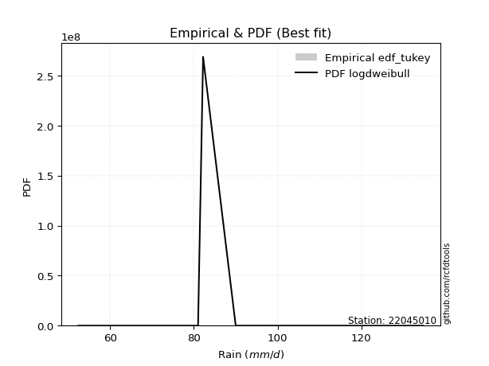</img>

</div>


### 8. Empirical - EDF Gringorten (1963)

Gringorten plotting position formula is essential for estimating the probability and return periods of extreme events like floods and heavy rainfall. The constant _a=0.44_.

<div align="center">


$P=(m-a)/(n+1-2a)$


</div>


**8.1. Empirical values**

<div align="center">

|                | 0                   | 1                  | 2              | 3                 | 4                  |
|:---------------|:--------------------|:-------------------|:---------------|:------------------|:-------------------|
| date           | 2021                | 2025               | 2019           | 2020              | 2024               |
| x              | 52.4                | 81.0               | 82.2           | 90.0              | 134.8              |
| m              | 1                   | 2                  | 3              | 4                 | 5                  |
| empirical_dist | edf_gringorten      | edf_gringorten     | edf_gringorten | edf_gringorten    | edf_gringorten     |
| empirical      | 0.10937500000000001 | 0.3046875          | 0.5            | 0.6953125         | 0.8906249999999999 |
| empirical_tr   | 1.1228070175438596  | 1.4382022471910112 | 2.0            | 3.282051282051282 | 9.142857142857133  |

</div>


**8.2. Kolmogorov-Smirnov fit test (sorted by Δ)**


<div align="center">

|                | 0                   | 1                   | 2                   | 3                  | 4                   | 5                   | 6                   | 7                     | 8                  | 9                   | 10                 | 11                 | 12                  | 13                  | 14                  | 15                  | 16                  | 17                  | 18                  | 19                  | 20                  | 21                  | 22                  | 23                 | 24                  | 25                 | 26                  | 27                  | 28                 | 29                 | 30                 | 31                  | 32                  | 33                  | 34                  | 35                 | 36                  | 37                  | 38                  | 39                  | 40                  | 41                  | 42                  | 43                 | 44                 | 45                  | 46                 | 47                  | 48                  | 49                 | 50                  | 51                  | 52                  | 53                  | 54                  | 55                 | 56                  | 57                 | 58                  | 59                 | 60                  | 61                  | 62                 | 63                  | 64                  | 65                  | 66                  | 67                  | 68                  | 69                  | 70                  | 71                  | 72                  | 73                  | 74                  | 75                 | 76                 | 77                 | 78                  | 79                  | 80                 | 81                 | 82                  | 83                 | 84                 | 85                 | 86                  | 87                 | 88                 | 89                 |
|:---------------|:--------------------|:--------------------|:--------------------|:-------------------|:--------------------|:--------------------|:--------------------|:----------------------|:-------------------|:--------------------|:-------------------|:-------------------|:--------------------|:--------------------|:--------------------|:--------------------|:--------------------|:--------------------|:--------------------|:--------------------|:--------------------|:--------------------|:--------------------|:-------------------|:--------------------|:-------------------|:--------------------|:--------------------|:-------------------|:-------------------|:-------------------|:--------------------|:--------------------|:--------------------|:--------------------|:-------------------|:--------------------|:--------------------|:--------------------|:--------------------|:--------------------|:--------------------|:--------------------|:-------------------|:-------------------|:--------------------|:-------------------|:--------------------|:--------------------|:-------------------|:--------------------|:--------------------|:--------------------|:--------------------|:--------------------|:-------------------|:--------------------|:-------------------|:--------------------|:-------------------|:--------------------|:--------------------|:-------------------|:--------------------|:--------------------|:--------------------|:--------------------|:--------------------|:--------------------|:--------------------|:--------------------|:--------------------|:--------------------|:--------------------|:--------------------|:-------------------|:-------------------|:-------------------|:--------------------|:--------------------|:-------------------|:-------------------|:--------------------|:-------------------|:-------------------|:-------------------|:--------------------|:-------------------|:-------------------|:-------------------|
| station        | 22045010            | 22045010            | 22045010            | 22045010           | 22045010            | 22045010            | 22045010            | 22045010              | 22045010           | 22045010            | 22045010           | 22045010           | 22045010            | 22045010            | 22045010            | 22045010            | 22045010            | 22045010            | 22045010            | 22045010            | 22045010            | 22045010            | 22045010            | 22045010           | 22045010            | 22045010           | 22045010            | 22045010            | 22045010           | 22045010           | 22045010           | 22045010            | 22045010            | 22045010            | 22045010            | 22045010           | 22045010            | 22045010            | 22045010            | 22045010            | 22045010            | 22045010            | 22045010            | 22045010           | 22045010           | 22045010            | 22045010           | 22045010            | 22045010            | 22045010           | 22045010            | 22045010            | 22045010            | 22045010            | 22045010            | 22045010           | 22045010            | 22045010           | 22045010            | 22045010           | 22045010            | 22045010            | 22045010           | 22045010            | 22045010            | 22045010            | 22045010            | 22045010            | 22045010            | 22045010            | 22045010            | 22045010            | 22045010            | 22045010            | 22045010            | 22045010           | 22045010           | 22045010           | 22045010            | 22045010            | 22045010           | 22045010           | 22045010            | 22045010           | 22045010           | 22045010           | 22045010            | 22045010           | 22045010           | 22045010           |
| empirical_dist | edf_gringorten      | edf_gringorten      | edf_gringorten      | edf_gringorten     | edf_gringorten      | edf_gringorten      | edf_gringorten      | edf_gringorten        | edf_gringorten     | edf_gringorten      | edf_gringorten     | edf_gringorten     | edf_gringorten      | edf_gringorten      | edf_gringorten      | edf_gringorten      | edf_gringorten      | edf_gringorten      | edf_gringorten      | edf_gringorten      | edf_gringorten      | edf_gringorten      | edf_gringorten      | edf_gringorten     | edf_gringorten      | edf_gringorten     | edf_gringorten      | edf_gringorten      | edf_gringorten     | edf_gringorten     | edf_gringorten     | edf_gringorten      | edf_gringorten      | edf_gringorten      | edf_gringorten      | edf_gringorten     | edf_gringorten      | edf_gringorten      | edf_gringorten      | edf_gringorten      | edf_gringorten      | edf_gringorten      | edf_gringorten      | edf_gringorten     | edf_gringorten     | edf_gringorten      | edf_gringorten     | edf_gringorten      | edf_gringorten      | edf_gringorten     | edf_gringorten      | edf_gringorten      | edf_gringorten      | edf_gringorten      | edf_gringorten      | edf_gringorten     | edf_gringorten      | edf_gringorten     | edf_gringorten      | edf_gringorten     | edf_gringorten      | edf_gringorten      | edf_gringorten     | edf_gringorten      | edf_gringorten      | edf_gringorten      | edf_gringorten      | edf_gringorten      | edf_gringorten      | edf_gringorten      | edf_gringorten      | edf_gringorten      | edf_gringorten      | edf_gringorten      | edf_gringorten      | edf_gringorten     | edf_gringorten     | edf_gringorten     | edf_gringorten      | edf_gringorten      | edf_gringorten     | edf_gringorten     | edf_gringorten      | edf_gringorten     | edf_gringorten     | edf_gringorten     | edf_gringorten      | edf_gringorten     | edf_gringorten     | edf_gringorten     |
| p_dist         | johnsonsu           | logjohnsonsu        | laplace_asymmetric  | loglaplace         | pearson3            | loghypsecant        | rice                | loglaplace_asymmetric | maxwell            | rayleigh            | logmielke          | loggenlogistic     | loglogistic         | mielke              | fisk                | logfisk             | alpha               | logloggamma         | logpearson3         | betaprime           | logexponnorm        | lognorm             | lognorm             | logcrystalball     | logt                | nct                | loggamma            | loggamma            | invgamma           | logerlang          | logf               | logfatiguelife      | laplace             | logncf              | exponnorm           | gumbel_r           | logbetaprime        | invgauss            | lognct              | genlogistic         | kstwobign           | logweibull_min      | hypsecant           | gompertz           | f                  | logalpha            | logistic           | logrice             | loginvgamma         | crystalball        | norm                | t                   | loggompertz         | loggumbel_l         | halfnorm            | moyal              | loginvgauss         | logmaxwell         | halflogistic        | lograyleigh        | loginvweibull       | loggumbel_r         | logkstwobign       | gibrat              | loghalfnorm         | loggenexpon         | wald                | gumbel_l            | logmoyal            | logchi2             | loghalflogistic     | genexpon            | expon               | ncf                 | lognakagami         | weibull_min        | logexpon           | nakagami           | logwald             | truncnorm           | loggibrat          | chi2               | loglognorm          | pareto             | logpareto          | invweibull         | gamma               | erlang             | fatiguelife        | logtruncnorm       |
| delta          | 0.07306038101283252 | 0.08103128113722313 | 0.09525868183588515 | 0.1120348341923173 | 0.12759883005929085 | 0.13133449512320589 | 0.13233146823378295 | 0.13272288459020876   | 0.1348884016946973 | 0.13665873679757135 | 0.1368414050838907 | 0.1371440932389103 | 0.13716056247945185 | 0.13717583860498334 | 0.13767217163116124 | 0.13772740276430945 | 0.14159971181821063 | 0.14184769289359844 | 0.14297830504029996 | 0.14336312920845012 | 0.14405921907507863 | 0.14406002964384845 | 0.14406002964384845 | 0.1440602512908099 | 0.14406115635777123 | 0.145093671715964  | 0.14517156747244186 | 0.14517156747244186 | 0.145194258431608  | 0.1452001532388848 | 0.1453858587663996 | 0.14680161948171594 | 0.14683348370477456 | 0.14741960537522747 | 0.14826139689191492 | 0.149312057160697  | 0.15055510900580393 | 0.15173674752099087 | 0.15184167885767552 | 0.15304151212885425 | 0.15433318966674164 | 0.15639234448685801 | 0.15933178357867916 | 0.1596800848128095 | 0.1599413213942053 | 0.16117654305364926 | 0.1626584317713986 | 0.16293387288758737 | 0.16431480998103726 | 0.1665676262192647 | 0.16656762697315664 | 0.16656945799370737 | 0.16673559072268718 | 0.16972680649694027 | 0.17156683435700404 | 0.1718372317386887 | 0.17470095928288626 | 0.1783938988842788 | 0.18650366239974964 | 0.1903047503729699 | 0.20377508550649215 | 0.21096032411119825 | 0.2219842078595229 | 0.22377089447754106 | 0.22392444120145139 | 0.22489059207098838 | 0.23222741412448022 | 0.23548490215984663 | 0.23628269399269175 | 0.24463655173348564 | 0.24491378259959273 | 0.24661214574646695 | 0.24668820757621646 | 0.25683846986038095 | 0.26103432588416686 | 0.2691999504726711 | 0.2960970422436785 | 0.3046838955444469 | 0.30663438360774664 | 0.30838192044802093 | 0.3189433293446794 | 0.3749695791920943 | 0.38022992153462376 | 0.3821386752793854 | 0.3891736227501357 | 0.4367121875857446 | 0.45806881861755644 | 0.5269602085938051 | 0.5623050154493933 | 0.6953125          |
| deltao         | 0.5865427407550001  | 0.5865427407550001  | 0.5865427407550001  | 0.5865427407550001 | 0.5865427407550001  | 0.5865427407550001  | 0.5865427407550001  | 0.5865427407550001    | 0.5865427407550001 | 0.5865427407550001  | 0.5865427407550001 | 0.5865427407550001 | 0.5865427407550001  | 0.5865427407550001  | 0.5865427407550001  | 0.5865427407550001  | 0.5865427407550001  | 0.5865427407550001  | 0.5865427407550001  | 0.5865427407550001  | 0.5865427407550001  | 0.5865427407550001  | 0.5865427407550001  | 0.5865427407550001 | 0.5865427407550001  | 0.5865427407550001 | 0.5865427407550001  | 0.5865427407550001  | 0.5865427407550001 | 0.5865427407550001 | 0.5865427407550001 | 0.5865427407550001  | 0.5865427407550001  | 0.5865427407550001  | 0.5865427407550001  | 0.5865427407550001 | 0.5865427407550001  | 0.5865427407550001  | 0.5865427407550001  | 0.5865427407550001  | 0.5865427407550001  | 0.5865427407550001  | 0.5865427407550001  | 0.5865427407550001 | 0.5865427407550001 | 0.5865427407550001  | 0.5865427407550001 | 0.5865427407550001  | 0.5865427407550001  | 0.5865427407550001 | 0.5865427407550001  | 0.5865427407550001  | 0.5865427407550001  | 0.5865427407550001  | 0.5865427407550001  | 0.5865427407550001 | 0.5865427407550001  | 0.5865427407550001 | 0.5865427407550001  | 0.5865427407550001 | 0.5865427407550001  | 0.5865427407550001  | 0.5865427407550001 | 0.5865427407550001  | 0.5865427407550001  | 0.5865427407550001  | 0.5865427407550001  | 0.5865427407550001  | 0.5865427407550001  | 0.5865427407550001  | 0.5865427407550001  | 0.5865427407550001  | 0.5865427407550001  | 0.5865427407550001  | 0.5865427407550001  | 0.5865427407550001 | 0.5865427407550001 | 0.5865427407550001 | 0.5865427407550001  | 0.5865427407550001  | 0.5865427407550001 | 0.5865427407550001 | 0.5865427407550001  | 0.5865427407550001 | 0.5865427407550001 | 0.5865427407550001 | 0.5865427407550001  | 0.5865427407550001 | 0.5865427407550001 | 0.5865427407550001 |
| eval           | Δo > Δ              | Δo > Δ              | Δo > Δ              | Δo > Δ             | Δo > Δ              | Δo > Δ              | Δo > Δ              | Δo > Δ                | Δo > Δ             | Δo > Δ              | Δo > Δ             | Δo > Δ             | Δo > Δ              | Δo > Δ              | Δo > Δ              | Δo > Δ              | Δo > Δ              | Δo > Δ              | Δo > Δ              | Δo > Δ              | Δo > Δ              | Δo > Δ              | Δo > Δ              | Δo > Δ             | Δo > Δ              | Δo > Δ             | Δo > Δ              | Δo > Δ              | Δo > Δ             | Δo > Δ             | Δo > Δ             | Δo > Δ              | Δo > Δ              | Δo > Δ              | Δo > Δ              | Δo > Δ             | Δo > Δ              | Δo > Δ              | Δo > Δ              | Δo > Δ              | Δo > Δ              | Δo > Δ              | Δo > Δ              | Δo > Δ             | Δo > Δ             | Δo > Δ              | Δo > Δ             | Δo > Δ              | Δo > Δ              | Δo > Δ             | Δo > Δ              | Δo > Δ              | Δo > Δ              | Δo > Δ              | Δo > Δ              | Δo > Δ             | Δo > Δ              | Δo > Δ             | Δo > Δ              | Δo > Δ             | Δo > Δ              | Δo > Δ              | Δo > Δ             | Δo > Δ              | Δo > Δ              | Δo > Δ              | Δo > Δ              | Δo > Δ              | Δo > Δ              | Δo > Δ              | Δo > Δ              | Δo > Δ              | Δo > Δ              | Δo > Δ              | Δo > Δ              | Δo > Δ             | Δo > Δ             | Δo > Δ             | Δo > Δ              | Δo > Δ              | Δo > Δ             | Δo > Δ             | Δo > Δ              | Δo > Δ             | Δo > Δ             | Δo > Δ             | Δo > Δ              | Δo > Δ             | Δo > Δ             | Δo <= Δ            |
| fit            | 1                   | 1                   | 1                   | 1                  | 1                   | 1                   | 1                   | 1                     | 1                  | 1                   | 1                  | 1                  | 1                   | 1                   | 1                   | 1                   | 1                   | 1                   | 1                   | 1                   | 1                   | 1                   | 1                   | 1                  | 1                   | 1                  | 1                   | 1                   | 1                  | 1                  | 1                  | 1                   | 1                   | 1                   | 1                   | 1                  | 1                   | 1                   | 1                   | 1                   | 1                   | 1                   | 1                   | 1                  | 1                  | 1                   | 1                  | 1                   | 1                   | 1                  | 1                   | 1                   | 1                   | 1                   | 1                   | 1                  | 1                   | 1                  | 1                   | 1                  | 1                   | 1                   | 1                  | 1                   | 1                   | 1                   | 1                   | 1                   | 1                   | 1                   | 1                   | 1                   | 1                   | 1                   | 1                   | 1                  | 1                  | 1                  | 1                   | 1                   | 1                  | 1                  | 1                   | 1                  | 1                  | 1                  | 1                   | 1                  | 1                  | 0                  |
| n              | 5                   | 5                   | 5                   | 5                  | 5                   | 5                   | 5                   | 5                     | 5                  | 5                   | 5                  | 5                  | 5                   | 5                   | 5                   | 5                   | 5                   | 5                   | 5                   | 5                   | 5                   | 5                   | 5                   | 5                  | 5                   | 5                  | 5                   | 5                   | 5                  | 5                  | 5                  | 5                   | 5                   | 5                   | 5                   | 5                  | 5                   | 5                   | 5                   | 5                   | 5                   | 5                   | 5                   | 5                  | 5                  | 5                   | 5                  | 5                   | 5                   | 5                  | 5                   | 5                   | 5                   | 5                   | 5                   | 5                  | 5                   | 5                  | 5                   | 5                  | 5                   | 5                   | 5                  | 5                   | 5                   | 5                   | 5                   | 5                   | 5                   | 5                   | 5                   | 5                   | 5                   | 5                   | 5                   | 5                  | 5                  | 5                  | 5                   | 5                   | 5                  | 5                  | 5                   | 5                  | 5                  | 5                  | 5                   | 5                  | 5                  | 5                  |
| best_fit       | 1                   | 0                   | 0                   | 0                  | 0                   | 0                   | 0                   | 0                     | 0                  | 0                   | 0                  | 0                  | 0                   | 0                   | 0                   | 0                   | 0                   | 0                   | 0                   | 0                   | 0                   | 0                   | 0                   | 0                  | 0                   | 0                  | 0                   | 0                   | 0                  | 0                  | 0                  | 0                   | 0                   | 0                   | 0                   | 0                  | 0                   | 0                   | 0                   | 0                   | 0                   | 0                   | 0                   | 0                  | 0                  | 0                   | 0                  | 0                   | 0                   | 0                  | 0                   | 0                   | 0                   | 0                   | 0                   | 0                  | 0                   | 0                  | 0                   | 0                  | 0                   | 0                   | 0                  | 0                   | 0                   | 0                   | 0                   | 0                   | 0                   | 0                   | 0                   | 0                   | 0                   | 0                   | 0                   | 0                  | 0                  | 0                  | 0                   | 0                   | 0                  | 0                  | 0                   | 0                  | 0                  | 0                  | 0                   | 0                  | 0                  | 0                  |
| best_fit_sort  | 1                   | 2                   | 3                   | 4                  | 5                   | 6                   | 7                   | 8                     | 9                  | 10                  | 11                 | 12                 | 13                  | 14                  | 15                  | 16                  | 17                  | 18                  | 19                  | 20                  | 21                  | 22                  | 23                  | 24                 | 25                  | 26                 | 27                  | 28                  | 29                 | 30                 | 31                 | 32                  | 33                  | 34                  | 35                  | 36                 | 37                  | 38                  | 39                  | 40                  | 41                  | 42                  | 43                  | 44                 | 45                 | 46                  | 47                 | 48                  | 49                  | 50                 | 51                  | 52                  | 53                  | 54                  | 55                  | 56                 | 57                  | 58                 | 59                  | 60                 | 61                  | 62                  | 63                 | 64                  | 65                  | 66                  | 67                  | 68                  | 69                  | 70                  | 71                  | 72                  | 73                  | 74                  | 75                  | 76                 | 77                 | 78                 | 79                  | 80                  | 81                 | 82                 | 83                  | 84                 | 85                 | 86                 | 87                  | 88                 | 89                 | 90                 |

</div>


<div align="center">

</img>

</div>


**8.3. Best fit**

<div align="center">

|   id |   station | empirical_dist   | p_dist    |     delta |   deltao | eval   |   fit |   n |   best_fit |   best_fit_sort |
|-----:|----------:|:-----------------|:----------|----------:|---------:|:-------|------:|----:|-----------:|----------------:|
|    0 |  22045010 | edf_gringorten   | johnsonsu | 0.0730604 | 0.586543 | Δo > Δ |     1 |   5 |          1 |               1 |

</div>


<div align="center">

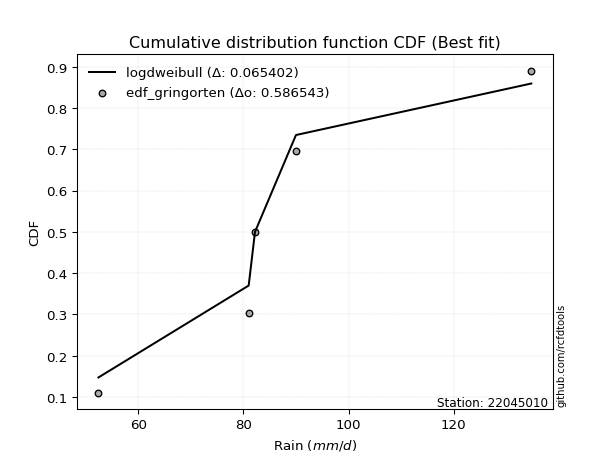</img></img>

</div>


### 9. Empirical - EDF Filliben (1975)

The specific values of the constants (0.3175) (often denoted as $alpha$) and (0.365) are derived from a method proposed by James J. Filliben in a 1975 paper. This particular formula is the mean value of the $i$-th order statistic of the normal distribution and is considered a robust and effective plotting position formula for the normal probability plot correlation coefficient test for normality.

<div align="center">


$P=(m-0.3175)/(n+0.365)$


</div>


**9.1. Empirical values**

<div align="center">

|                | 0                   | 1                  | 2            | 3                  | 4                  |
|:---------------|:--------------------|:-------------------|:-------------|:-------------------|:-------------------|
| date           | 2021                | 2025               | 2019         | 2020               | 2024               |
| x              | 52.4                | 81.0               | 82.2         | 90.0               | 134.8              |
| m              | 1                   | 2                  | 3            | 4                  | 5                  |
| empirical_dist | edf_filliben        | edf_filliben       | edf_filliben | edf_filliben       | edf_filliben       |
| empirical      | 0.12721342031686858 | 0.3136067101584343 | 0.5          | 0.6863932898415657 | 0.8727865796831314 |
| empirical_tr   | 1.1457554725040042  | 1.456890699253225  | 2.0          | 3.188707280832095  | 7.860805860805863  |

</div>


**9.2. Kolmogorov-Smirnov fit test (sorted by Δ)**


<div align="center">

|                | 0                   | 1                   | 2                   | 3                   | 4                   | 5                   | 6                   | 7                     | 8                   | 9                   | 10                  | 11                  | 12                  | 13                  | 14                  | 15                  | 16                  | 17                  | 18                  | 19                  | 20                  | 21                  | 22                  | 23                  | 24                  | 25                 | 26                 | 27                 | 28                  | 29                  | 30                 | 31                  | 32                  | 33                 | 34                  | 35                  | 36                  | 37                 | 38                  | 39                  | 40                  | 41                  | 42                  | 43                 | 44                  | 45                  | 46                  | 47                 | 48                  | 49                  | 50                 | 51                  | 52                 | 53                  | 54                  | 55                  | 56                  | 57                  | 58                  | 59                  | 60                  | 61                  | 62                 | 63                  | 64                 | 65                 | 66                  | 67                 | 68                 | 69                  | 70                  | 71                  | 72                  | 73                  | 74                 | 75                  | 76                 | 77                  | 78                 | 79                 | 80                  | 81                 | 82                 | 83                 | 84                 | 85                  | 86                  | 87                 | 88                 | 89                 |
|:---------------|:--------------------|:--------------------|:--------------------|:--------------------|:--------------------|:--------------------|:--------------------|:----------------------|:--------------------|:--------------------|:--------------------|:--------------------|:--------------------|:--------------------|:--------------------|:--------------------|:--------------------|:--------------------|:--------------------|:--------------------|:--------------------|:--------------------|:--------------------|:--------------------|:--------------------|:-------------------|:-------------------|:-------------------|:--------------------|:--------------------|:-------------------|:--------------------|:--------------------|:-------------------|:--------------------|:--------------------|:--------------------|:-------------------|:--------------------|:--------------------|:--------------------|:--------------------|:--------------------|:-------------------|:--------------------|:--------------------|:--------------------|:-------------------|:--------------------|:--------------------|:-------------------|:--------------------|:-------------------|:--------------------|:--------------------|:--------------------|:--------------------|:--------------------|:--------------------|:--------------------|:--------------------|:--------------------|:-------------------|:--------------------|:-------------------|:-------------------|:--------------------|:-------------------|:-------------------|:--------------------|:--------------------|:--------------------|:--------------------|:--------------------|:-------------------|:--------------------|:-------------------|:--------------------|:-------------------|:-------------------|:--------------------|:-------------------|:-------------------|:-------------------|:-------------------|:--------------------|:--------------------|:-------------------|:-------------------|:-------------------|
| station        | 22045010            | 22045010            | 22045010            | 22045010            | 22045010            | 22045010            | 22045010            | 22045010              | 22045010            | 22045010            | 22045010            | 22045010            | 22045010            | 22045010            | 22045010            | 22045010            | 22045010            | 22045010            | 22045010            | 22045010            | 22045010            | 22045010            | 22045010            | 22045010            | 22045010            | 22045010           | 22045010           | 22045010           | 22045010            | 22045010            | 22045010           | 22045010            | 22045010            | 22045010           | 22045010            | 22045010            | 22045010            | 22045010           | 22045010            | 22045010            | 22045010            | 22045010            | 22045010            | 22045010           | 22045010            | 22045010            | 22045010            | 22045010           | 22045010            | 22045010            | 22045010           | 22045010            | 22045010           | 22045010            | 22045010            | 22045010            | 22045010            | 22045010            | 22045010            | 22045010            | 22045010            | 22045010            | 22045010           | 22045010            | 22045010           | 22045010           | 22045010            | 22045010           | 22045010           | 22045010            | 22045010            | 22045010            | 22045010            | 22045010            | 22045010           | 22045010            | 22045010           | 22045010            | 22045010           | 22045010           | 22045010            | 22045010           | 22045010           | 22045010           | 22045010           | 22045010            | 22045010            | 22045010           | 22045010           | 22045010           |
| empirical_dist | edf_filliben        | edf_filliben        | edf_filliben        | edf_filliben        | edf_filliben        | edf_filliben        | edf_filliben        | edf_filliben          | edf_filliben        | edf_filliben        | edf_filliben        | edf_filliben        | edf_filliben        | edf_filliben        | edf_filliben        | edf_filliben        | edf_filliben        | edf_filliben        | edf_filliben        | edf_filliben        | edf_filliben        | edf_filliben        | edf_filliben        | edf_filliben        | edf_filliben        | edf_filliben       | edf_filliben       | edf_filliben       | edf_filliben        | edf_filliben        | edf_filliben       | edf_filliben        | edf_filliben        | edf_filliben       | edf_filliben        | edf_filliben        | edf_filliben        | edf_filliben       | edf_filliben        | edf_filliben        | edf_filliben        | edf_filliben        | edf_filliben        | edf_filliben       | edf_filliben        | edf_filliben        | edf_filliben        | edf_filliben       | edf_filliben        | edf_filliben        | edf_filliben       | edf_filliben        | edf_filliben       | edf_filliben        | edf_filliben        | edf_filliben        | edf_filliben        | edf_filliben        | edf_filliben        | edf_filliben        | edf_filliben        | edf_filliben        | edf_filliben       | edf_filliben        | edf_filliben       | edf_filliben       | edf_filliben        | edf_filliben       | edf_filliben       | edf_filliben        | edf_filliben        | edf_filliben        | edf_filliben        | edf_filliben        | edf_filliben       | edf_filliben        | edf_filliben       | edf_filliben        | edf_filliben       | edf_filliben       | edf_filliben        | edf_filliben       | edf_filliben       | edf_filliben       | edf_filliben       | edf_filliben        | edf_filliben        | edf_filliben       | edf_filliben       | edf_filliben       |
| p_dist         | johnsonsu           | laplace_asymmetric  | logjohnsonsu        | loglaplace          | pearson3            | loghypsecant        | rice                | loglaplace_asymmetric | maxwell             | rayleigh            | logmielke           | loggenlogistic      | loglogistic         | mielke              | fisk                | logfisk             | alpha               | logloggamma         | logpearson3         | betaprime           | logexponnorm        | lognorm             | lognorm             | logcrystalball      | logt                | nct                | loggamma           | loggamma           | invgamma            | logerlang           | logf               | logfatiguelife      | laplace             | logncf             | exponnorm           | gumbel_r            | logbetaprime        | invgauss           | lognct              | genlogistic         | kstwobign           | logweibull_min      | hypsecant           | gompertz           | f                   | logalpha            | logistic            | logrice            | loginvgamma         | crystalball         | norm               | t                   | loggompertz        | loggumbel_l         | halfnorm            | moyal               | loginvgauss         | logmaxwell          | halflogistic        | lograyleigh         | loginvweibull       | loggumbel_r         | logkstwobign       | gibrat              | loghalfnorm        | loggenexpon        | wald                | gumbel_l           | logchi2            | logmoyal            | loghalflogistic     | genexpon            | expon               | ncf                 | weibull_min        | lognakagami         | logexpon           | logwald             | loggibrat          | nakagami           | truncnorm           | chi2               | loglognorm         | pareto             | logpareto          | invweibull          | gamma               | erlang             | fatiguelife        | logtruncnorm       |
| delta          | 0.08197959117126685 | 0.08633947167745082 | 0.08995049129565746 | 0.10311562403388302 | 0.11867961990085651 | 0.12241528496477161 | 0.12341225807534861 | 0.12380367443177448   | 0.12596919153626296 | 0.12773952663913707 | 0.12792219492545642 | 0.12822488308047603 | 0.12824135232101758 | 0.12825662844654906 | 0.12875296147272697 | 0.12880819260587517 | 0.13268050165977635 | 0.13292848273516417 | 0.13405909488186568 | 0.13444391905001585 | 0.13514000891664435 | 0.13514081948541418 | 0.13514081948541418 | 0.13514104113237563 | 0.13514194619933695 | 0.1361744615575297 | 0.1362523573140076 | 0.1362523573140076 | 0.13627504827317372 | 0.13628094308045052 | 0.1364666486079653 | 0.13788240932328166 | 0.13791427354634023 | 0.1385003952167932 | 0.13934218673348064 | 0.14039284700226273 | 0.14163589884736966 | 0.1428175373625566 | 0.14292246869924125 | 0.14412230197041997 | 0.14541397950830737 | 0.14747313432842374 | 0.15041257342024483 | 0.1507608746543752 | 0.15102211123577103 | 0.15225733289521498 | 0.15373922161296427 | 0.1540146627291531 | 0.15539559982260298 | 0.15764841606083035 | 0.1576484168147223 | 0.15765024783527304 | 0.1578163805642529 | 0.16080759633850594 | 0.16264762419856976 | 0.16291802158025442 | 0.16578174912445198 | 0.16947468872584454 | 0.17758445224131536 | 0.18138554021453562 | 0.19485587534805787 | 0.20204111395276397 | 0.2130649977010886 | 0.21485168431910678 | 0.2150052310430171 | 0.2159713819125541 | 0.22330820396604595 | 0.2265656920014123 | 0.2267981314166172 | 0.22736348383425747 | 0.23599457244115846 | 0.23769293558803267 | 0.23776899741778218 | 0.24791925970194667 | 0.2602807403142368 | 0.26995353604260114 | 0.2871778320852442 | 0.29771517344931236 | 0.3100241191862451 | 0.3136031057028812 | 0.31360667071655696 | 0.36605036903366   | 0.3713107113761895 | 0.3732194651209511 | 0.3802544125917014 | 0.41887376726887615 | 0.44914960845912216 | 0.5180409984353709 | 0.553385805290959  | 0.6863932898415657 |
| deltao         | 0.5865427407550001  | 0.5865427407550001  | 0.5865427407550001  | 0.5865427407550001  | 0.5865427407550001  | 0.5865427407550001  | 0.5865427407550001  | 0.5865427407550001    | 0.5865427407550001  | 0.5865427407550001  | 0.5865427407550001  | 0.5865427407550001  | 0.5865427407550001  | 0.5865427407550001  | 0.5865427407550001  | 0.5865427407550001  | 0.5865427407550001  | 0.5865427407550001  | 0.5865427407550001  | 0.5865427407550001  | 0.5865427407550001  | 0.5865427407550001  | 0.5865427407550001  | 0.5865427407550001  | 0.5865427407550001  | 0.5865427407550001 | 0.5865427407550001 | 0.5865427407550001 | 0.5865427407550001  | 0.5865427407550001  | 0.5865427407550001 | 0.5865427407550001  | 0.5865427407550001  | 0.5865427407550001 | 0.5865427407550001  | 0.5865427407550001  | 0.5865427407550001  | 0.5865427407550001 | 0.5865427407550001  | 0.5865427407550001  | 0.5865427407550001  | 0.5865427407550001  | 0.5865427407550001  | 0.5865427407550001 | 0.5865427407550001  | 0.5865427407550001  | 0.5865427407550001  | 0.5865427407550001 | 0.5865427407550001  | 0.5865427407550001  | 0.5865427407550001 | 0.5865427407550001  | 0.5865427407550001 | 0.5865427407550001  | 0.5865427407550001  | 0.5865427407550001  | 0.5865427407550001  | 0.5865427407550001  | 0.5865427407550001  | 0.5865427407550001  | 0.5865427407550001  | 0.5865427407550001  | 0.5865427407550001 | 0.5865427407550001  | 0.5865427407550001 | 0.5865427407550001 | 0.5865427407550001  | 0.5865427407550001 | 0.5865427407550001 | 0.5865427407550001  | 0.5865427407550001  | 0.5865427407550001  | 0.5865427407550001  | 0.5865427407550001  | 0.5865427407550001 | 0.5865427407550001  | 0.5865427407550001 | 0.5865427407550001  | 0.5865427407550001 | 0.5865427407550001 | 0.5865427407550001  | 0.5865427407550001 | 0.5865427407550001 | 0.5865427407550001 | 0.5865427407550001 | 0.5865427407550001  | 0.5865427407550001  | 0.5865427407550001 | 0.5865427407550001 | 0.5865427407550001 |
| eval           | Δo > Δ              | Δo > Δ              | Δo > Δ              | Δo > Δ              | Δo > Δ              | Δo > Δ              | Δo > Δ              | Δo > Δ                | Δo > Δ              | Δo > Δ              | Δo > Δ              | Δo > Δ              | Δo > Δ              | Δo > Δ              | Δo > Δ              | Δo > Δ              | Δo > Δ              | Δo > Δ              | Δo > Δ              | Δo > Δ              | Δo > Δ              | Δo > Δ              | Δo > Δ              | Δo > Δ              | Δo > Δ              | Δo > Δ             | Δo > Δ             | Δo > Δ             | Δo > Δ              | Δo > Δ              | Δo > Δ             | Δo > Δ              | Δo > Δ              | Δo > Δ             | Δo > Δ              | Δo > Δ              | Δo > Δ              | Δo > Δ             | Δo > Δ              | Δo > Δ              | Δo > Δ              | Δo > Δ              | Δo > Δ              | Δo > Δ             | Δo > Δ              | Δo > Δ              | Δo > Δ              | Δo > Δ             | Δo > Δ              | Δo > Δ              | Δo > Δ             | Δo > Δ              | Δo > Δ             | Δo > Δ              | Δo > Δ              | Δo > Δ              | Δo > Δ              | Δo > Δ              | Δo > Δ              | Δo > Δ              | Δo > Δ              | Δo > Δ              | Δo > Δ             | Δo > Δ              | Δo > Δ             | Δo > Δ             | Δo > Δ              | Δo > Δ             | Δo > Δ             | Δo > Δ              | Δo > Δ              | Δo > Δ              | Δo > Δ              | Δo > Δ              | Δo > Δ             | Δo > Δ              | Δo > Δ             | Δo > Δ              | Δo > Δ             | Δo > Δ             | Δo > Δ              | Δo > Δ             | Δo > Δ             | Δo > Δ             | Δo > Δ             | Δo > Δ              | Δo > Δ              | Δo > Δ             | Δo > Δ             | Δo <= Δ            |
| fit            | 1                   | 1                   | 1                   | 1                   | 1                   | 1                   | 1                   | 1                     | 1                   | 1                   | 1                   | 1                   | 1                   | 1                   | 1                   | 1                   | 1                   | 1                   | 1                   | 1                   | 1                   | 1                   | 1                   | 1                   | 1                   | 1                  | 1                  | 1                  | 1                   | 1                   | 1                  | 1                   | 1                   | 1                  | 1                   | 1                   | 1                   | 1                  | 1                   | 1                   | 1                   | 1                   | 1                   | 1                  | 1                   | 1                   | 1                   | 1                  | 1                   | 1                   | 1                  | 1                   | 1                  | 1                   | 1                   | 1                   | 1                   | 1                   | 1                   | 1                   | 1                   | 1                   | 1                  | 1                   | 1                  | 1                  | 1                   | 1                  | 1                  | 1                   | 1                   | 1                   | 1                   | 1                   | 1                  | 1                   | 1                  | 1                   | 1                  | 1                  | 1                   | 1                  | 1                  | 1                  | 1                  | 1                   | 1                   | 1                  | 1                  | 0                  |
| n              | 5                   | 5                   | 5                   | 5                   | 5                   | 5                   | 5                   | 5                     | 5                   | 5                   | 5                   | 5                   | 5                   | 5                   | 5                   | 5                   | 5                   | 5                   | 5                   | 5                   | 5                   | 5                   | 5                   | 5                   | 5                   | 5                  | 5                  | 5                  | 5                   | 5                   | 5                  | 5                   | 5                   | 5                  | 5                   | 5                   | 5                   | 5                  | 5                   | 5                   | 5                   | 5                   | 5                   | 5                  | 5                   | 5                   | 5                   | 5                  | 5                   | 5                   | 5                  | 5                   | 5                  | 5                   | 5                   | 5                   | 5                   | 5                   | 5                   | 5                   | 5                   | 5                   | 5                  | 5                   | 5                  | 5                  | 5                   | 5                  | 5                  | 5                   | 5                   | 5                   | 5                   | 5                   | 5                  | 5                   | 5                  | 5                   | 5                  | 5                  | 5                   | 5                  | 5                  | 5                  | 5                  | 5                   | 5                   | 5                  | 5                  | 5                  |
| best_fit       | 1                   | 0                   | 0                   | 0                   | 0                   | 0                   | 0                   | 0                     | 0                   | 0                   | 0                   | 0                   | 0                   | 0                   | 0                   | 0                   | 0                   | 0                   | 0                   | 0                   | 0                   | 0                   | 0                   | 0                   | 0                   | 0                  | 0                  | 0                  | 0                   | 0                   | 0                  | 0                   | 0                   | 0                  | 0                   | 0                   | 0                   | 0                  | 0                   | 0                   | 0                   | 0                   | 0                   | 0                  | 0                   | 0                   | 0                   | 0                  | 0                   | 0                   | 0                  | 0                   | 0                  | 0                   | 0                   | 0                   | 0                   | 0                   | 0                   | 0                   | 0                   | 0                   | 0                  | 0                   | 0                  | 0                  | 0                   | 0                  | 0                  | 0                   | 0                   | 0                   | 0                   | 0                   | 0                  | 0                   | 0                  | 0                   | 0                  | 0                  | 0                   | 0                  | 0                  | 0                  | 0                  | 0                   | 0                   | 0                  | 0                  | 0                  |
| best_fit_sort  | 1                   | 2                   | 3                   | 4                   | 5                   | 6                   | 7                   | 8                     | 9                   | 10                  | 11                  | 12                  | 13                  | 14                  | 15                  | 16                  | 17                  | 18                  | 19                  | 20                  | 21                  | 22                  | 23                  | 24                  | 25                  | 26                 | 27                 | 28                 | 29                  | 30                  | 31                 | 32                  | 33                  | 34                 | 35                  | 36                  | 37                  | 38                 | 39                  | 40                  | 41                  | 42                  | 43                  | 44                 | 45                  | 46                  | 47                  | 48                 | 49                  | 50                  | 51                 | 52                  | 53                 | 54                  | 55                  | 56                  | 57                  | 58                  | 59                  | 60                  | 61                  | 62                  | 63                 | 64                  | 65                 | 66                 | 67                  | 68                 | 69                 | 70                  | 71                  | 72                  | 73                  | 74                  | 75                 | 76                  | 77                 | 78                  | 79                 | 80                 | 81                  | 82                 | 83                 | 84                 | 85                 | 86                  | 87                  | 88                 | 89                 | 90                 |

</div>


<div align="center">

</img>

</div>


**9.3. Best fit**

<div align="center">

|   id |   station | empirical_dist   | p_dist    |     delta |   deltao | eval   |   fit |   n |   best_fit |   best_fit_sort |
|-----:|----------:|:-----------------|:----------|----------:|---------:|:-------|------:|----:|-----------:|----------------:|
|    0 |  22045010 | edf_filliben     | johnsonsu | 0.0819796 | 0.586543 | Δo > Δ |     1 |   5 |          1 |               1 |

</div>


<div align="center">

</img></img>

</div>


### 10. Empirical - EDF Jenkinson (1977)

The Jenkinson formula in hydrology is an empirical plotting position formula used to estimate the non-exceedance probability _(P)_ or return period _(T)_ of a given ordered observation within a sample. It is a widely used method in the frequency analysis of extreme events such as floods and rainfall, as it provides a distribution-free way to plot data. _a≈0.31_ and _b≈0.38_ are constants derived to approximate the median of the probability distribution for the given rank.

<div align="center">


$P=(m-a)/(n+b)$


</div>


**10.1. Empirical values**

<div align="center">

|                | 0                   | 1                  | 2             | 3                  | 4                  |
|:---------------|:--------------------|:-------------------|:--------------|:-------------------|:-------------------|
| date           | 2021                | 2025               | 2019          | 2020               | 2024               |
| x              | 52.4                | 81.0               | 82.2          | 90.0               | 134.8              |
| m              | 1                   | 2                  | 3             | 4                  | 5                  |
| empirical_dist | edf_jenkinson       | edf_jenkinson      | edf_jenkinson | edf_jenkinson      | edf_jenkinson      |
| empirical      | 0.12825278810408922 | 0.3141263940520446 | 0.5           | 0.6858736059479554 | 0.8717472118959109 |
| empirical_tr   | 1.1471215351812367  | 1.4579945799457996 | 2.0           | 3.183431952662722  | 7.797101449275368  |

</div>


**10.2. Kolmogorov-Smirnov fit test (sorted by Δ)**


<div align="center">

|                | 0                   | 1                   | 2                  | 3                   | 4                   | 5                   | 6                   | 7                     | 8                   | 9                   | 10                  | 11                  | 12                  | 13                 | 14                  | 15                  | 16                 | 17                  | 18                  | 19                 | 20                 | 21                  | 22                  | 23                  | 24                 | 25                  | 26                  | 27                  | 28                  | 29                  | 30                  | 31                  | 32                 | 33                  | 34                 | 35                 | 36                 | 37                  | 38                 | 39                  | 40                  | 41                 | 42                 | 43                  | 44                  | 45                  | 46                  | 47                  | 48                  | 49                  | 50                  | 51                 | 52                  | 53                 | 54                  | 55                  | 56                  | 57                 | 58                  | 59                  | 60                  | 61                  | 62                  | 63                  | 64                  | 65                  | 66                 | 67                  | 68                  | 69                  | 70                 | 71                  | 72                  | 73                  | 74                  | 75                 | 76                 | 77                 | 78                  | 79                  | 80                 | 81                  | 82                  | 83                  | 84                  | 85                  | 86                 | 87                 | 88                 | 89                 |
|:---------------|:--------------------|:--------------------|:-------------------|:--------------------|:--------------------|:--------------------|:--------------------|:----------------------|:--------------------|:--------------------|:--------------------|:--------------------|:--------------------|:-------------------|:--------------------|:--------------------|:-------------------|:--------------------|:--------------------|:-------------------|:-------------------|:--------------------|:--------------------|:--------------------|:-------------------|:--------------------|:--------------------|:--------------------|:--------------------|:--------------------|:--------------------|:--------------------|:-------------------|:--------------------|:-------------------|:-------------------|:-------------------|:--------------------|:-------------------|:--------------------|:--------------------|:-------------------|:-------------------|:--------------------|:--------------------|:--------------------|:--------------------|:--------------------|:--------------------|:--------------------|:--------------------|:-------------------|:--------------------|:-------------------|:--------------------|:--------------------|:--------------------|:-------------------|:--------------------|:--------------------|:--------------------|:--------------------|:--------------------|:--------------------|:--------------------|:--------------------|:-------------------|:--------------------|:--------------------|:--------------------|:-------------------|:--------------------|:--------------------|:--------------------|:--------------------|:-------------------|:-------------------|:-------------------|:--------------------|:--------------------|:-------------------|:--------------------|:--------------------|:--------------------|:--------------------|:--------------------|:-------------------|:-------------------|:-------------------|:-------------------|
| station        | 22045010            | 22045010            | 22045010           | 22045010            | 22045010            | 22045010            | 22045010            | 22045010              | 22045010            | 22045010            | 22045010            | 22045010            | 22045010            | 22045010           | 22045010            | 22045010            | 22045010           | 22045010            | 22045010            | 22045010           | 22045010           | 22045010            | 22045010            | 22045010            | 22045010           | 22045010            | 22045010            | 22045010            | 22045010            | 22045010            | 22045010            | 22045010            | 22045010           | 22045010            | 22045010           | 22045010           | 22045010           | 22045010            | 22045010           | 22045010            | 22045010            | 22045010           | 22045010           | 22045010            | 22045010            | 22045010            | 22045010            | 22045010            | 22045010            | 22045010            | 22045010            | 22045010           | 22045010            | 22045010           | 22045010            | 22045010            | 22045010            | 22045010           | 22045010            | 22045010            | 22045010            | 22045010            | 22045010            | 22045010            | 22045010            | 22045010            | 22045010           | 22045010            | 22045010            | 22045010            | 22045010           | 22045010            | 22045010            | 22045010            | 22045010            | 22045010           | 22045010           | 22045010           | 22045010            | 22045010            | 22045010           | 22045010            | 22045010            | 22045010            | 22045010            | 22045010            | 22045010           | 22045010           | 22045010           | 22045010           |
| empirical_dist | edf_jenkinson       | edf_jenkinson       | edf_jenkinson      | edf_jenkinson       | edf_jenkinson       | edf_jenkinson       | edf_jenkinson       | edf_jenkinson         | edf_jenkinson       | edf_jenkinson       | edf_jenkinson       | edf_jenkinson       | edf_jenkinson       | edf_jenkinson      | edf_jenkinson       | edf_jenkinson       | edf_jenkinson      | edf_jenkinson       | edf_jenkinson       | edf_jenkinson      | edf_jenkinson      | edf_jenkinson       | edf_jenkinson       | edf_jenkinson       | edf_jenkinson      | edf_jenkinson       | edf_jenkinson       | edf_jenkinson       | edf_jenkinson       | edf_jenkinson       | edf_jenkinson       | edf_jenkinson       | edf_jenkinson      | edf_jenkinson       | edf_jenkinson      | edf_jenkinson      | edf_jenkinson      | edf_jenkinson       | edf_jenkinson      | edf_jenkinson       | edf_jenkinson       | edf_jenkinson      | edf_jenkinson      | edf_jenkinson       | edf_jenkinson       | edf_jenkinson       | edf_jenkinson       | edf_jenkinson       | edf_jenkinson       | edf_jenkinson       | edf_jenkinson       | edf_jenkinson      | edf_jenkinson       | edf_jenkinson      | edf_jenkinson       | edf_jenkinson       | edf_jenkinson       | edf_jenkinson      | edf_jenkinson       | edf_jenkinson       | edf_jenkinson       | edf_jenkinson       | edf_jenkinson       | edf_jenkinson       | edf_jenkinson       | edf_jenkinson       | edf_jenkinson      | edf_jenkinson       | edf_jenkinson       | edf_jenkinson       | edf_jenkinson      | edf_jenkinson       | edf_jenkinson       | edf_jenkinson       | edf_jenkinson       | edf_jenkinson      | edf_jenkinson      | edf_jenkinson      | edf_jenkinson       | edf_jenkinson       | edf_jenkinson      | edf_jenkinson       | edf_jenkinson       | edf_jenkinson       | edf_jenkinson       | edf_jenkinson       | edf_jenkinson      | edf_jenkinson      | edf_jenkinson      | edf_jenkinson      |
| p_dist         | johnsonsu           | laplace_asymmetric  | logjohnsonsu       | loglaplace          | pearson3            | loghypsecant        | rice                | loglaplace_asymmetric | maxwell             | rayleigh            | logmielke           | loggenlogistic      | loglogistic         | mielke             | fisk                | logfisk             | alpha              | logloggamma         | logpearson3         | betaprime          | logexponnorm       | lognorm             | lognorm             | logcrystalball      | logt               | nct                 | loggamma            | loggamma            | invgamma            | logerlang           | logf                | logfatiguelife      | laplace            | logncf              | exponnorm          | gumbel_r           | logbetaprime       | invgauss            | lognct             | genlogistic         | kstwobign           | logweibull_min     | hypsecant          | gompertz            | f                   | logalpha            | logistic            | logrice             | loginvgamma         | crystalball         | norm                | t                  | loggompertz         | loggumbel_l        | halfnorm            | moyal               | loginvgauss         | logmaxwell         | halflogistic        | lograyleigh         | loginvweibull       | loggumbel_r         | logkstwobign        | gibrat              | loghalfnorm         | loggenexpon         | wald               | logchi2             | gumbel_l            | logmoyal            | loghalflogistic    | genexpon            | expon               | ncf                 | weibull_min         | lognakagami        | logexpon           | logwald            | loggibrat           | nakagami            | truncnorm          | chi2                | loglognorm          | pareto              | logpareto           | invweibull          | gamma              | erlang             | fatiguelife        | logtruncnorm       |
| delta          | 0.08249927506487709 | 0.08581978778384058 | 0.0904701751892677 | 0.10259594014027268 | 0.11815993600724628 | 0.12189560107116126 | 0.12289257418173838 | 0.12328399053816413   | 0.12544950764265272 | 0.12721984274552672 | 0.12740251103184608 | 0.12770519918686568 | 0.12772166842740723 | 0.1277369445529387 | 0.12823327757911662 | 0.12828850871226483 | 0.132160817766166  | 0.13240879884155382 | 0.13353941098825534 | 0.1339242351564055 | 0.134620325023034  | 0.13462113559180383 | 0.13462113559180383 | 0.13462135723876528 | 0.1346222623057266 | 0.13565477766391937 | 0.13573267342039724 | 0.13573267342039724 | 0.13575536437956337 | 0.13576125918684018 | 0.13594696471435497 | 0.13736272542967132 | 0.13739458965273   | 0.13798071132318285 | 0.1388225028398703 | 0.1398731631086524 | 0.1411162149537593 | 0.14229785346894624 | 0.1424027848056309 | 0.14360261807680963 | 0.14489429561469702 | 0.1469534504348134 | 0.1498928895266346 | 0.15024119076076486 | 0.15050242734216068 | 0.15173764900160464 | 0.15321953771935404 | 0.15349497883554275 | 0.15487591592899264 | 0.15712873216722012 | 0.15712873292111207 | 0.1571305639416628 | 0.15729669667064256 | 0.1602879124448957 | 0.16212794030495942 | 0.16239833768664408 | 0.16526206523084164 | 0.1689550048322342 | 0.17706476834770501 | 0.18086585632092528 | 0.19433619145444753 | 0.20152143005915363 | 0.21254531380747826 | 0.21433200042549644 | 0.21448554714940676 | 0.21545169801894376 | 0.2227885200724356 | 0.22575876362939662 | 0.22604600810780207 | 0.22684379994064713 | 0.2354748885475481 | 0.23717325169442233 | 0.23724931352417183 | 0.24739957580833633 | 0.25976105642062647 | 0.2704732199362115 | 0.2866581481916339 | 0.297195489555702  | 0.30950443529263477 | 0.31412278959649154 | 0.3141263546101673 | 0.36553068514004966 | 0.37079102748257914 | 0.37269978122734077 | 0.37973472869809105 | 0.41783439948165557 | 0.4486299245655118 | 0.5175213145417605 | 0.5528661213973487 | 0.6858736059479554 |
| deltao         | 0.5865427407550001  | 0.5865427407550001  | 0.5865427407550001 | 0.5865427407550001  | 0.5865427407550001  | 0.5865427407550001  | 0.5865427407550001  | 0.5865427407550001    | 0.5865427407550001  | 0.5865427407550001  | 0.5865427407550001  | 0.5865427407550001  | 0.5865427407550001  | 0.5865427407550001 | 0.5865427407550001  | 0.5865427407550001  | 0.5865427407550001 | 0.5865427407550001  | 0.5865427407550001  | 0.5865427407550001 | 0.5865427407550001 | 0.5865427407550001  | 0.5865427407550001  | 0.5865427407550001  | 0.5865427407550001 | 0.5865427407550001  | 0.5865427407550001  | 0.5865427407550001  | 0.5865427407550001  | 0.5865427407550001  | 0.5865427407550001  | 0.5865427407550001  | 0.5865427407550001 | 0.5865427407550001  | 0.5865427407550001 | 0.5865427407550001 | 0.5865427407550001 | 0.5865427407550001  | 0.5865427407550001 | 0.5865427407550001  | 0.5865427407550001  | 0.5865427407550001 | 0.5865427407550001 | 0.5865427407550001  | 0.5865427407550001  | 0.5865427407550001  | 0.5865427407550001  | 0.5865427407550001  | 0.5865427407550001  | 0.5865427407550001  | 0.5865427407550001  | 0.5865427407550001 | 0.5865427407550001  | 0.5865427407550001 | 0.5865427407550001  | 0.5865427407550001  | 0.5865427407550001  | 0.5865427407550001 | 0.5865427407550001  | 0.5865427407550001  | 0.5865427407550001  | 0.5865427407550001  | 0.5865427407550001  | 0.5865427407550001  | 0.5865427407550001  | 0.5865427407550001  | 0.5865427407550001 | 0.5865427407550001  | 0.5865427407550001  | 0.5865427407550001  | 0.5865427407550001 | 0.5865427407550001  | 0.5865427407550001  | 0.5865427407550001  | 0.5865427407550001  | 0.5865427407550001 | 0.5865427407550001 | 0.5865427407550001 | 0.5865427407550001  | 0.5865427407550001  | 0.5865427407550001 | 0.5865427407550001  | 0.5865427407550001  | 0.5865427407550001  | 0.5865427407550001  | 0.5865427407550001  | 0.5865427407550001 | 0.5865427407550001 | 0.5865427407550001 | 0.5865427407550001 |
| eval           | Δo > Δ              | Δo > Δ              | Δo > Δ             | Δo > Δ              | Δo > Δ              | Δo > Δ              | Δo > Δ              | Δo > Δ                | Δo > Δ              | Δo > Δ              | Δo > Δ              | Δo > Δ              | Δo > Δ              | Δo > Δ             | Δo > Δ              | Δo > Δ              | Δo > Δ             | Δo > Δ              | Δo > Δ              | Δo > Δ             | Δo > Δ             | Δo > Δ              | Δo > Δ              | Δo > Δ              | Δo > Δ             | Δo > Δ              | Δo > Δ              | Δo > Δ              | Δo > Δ              | Δo > Δ              | Δo > Δ              | Δo > Δ              | Δo > Δ             | Δo > Δ              | Δo > Δ             | Δo > Δ             | Δo > Δ             | Δo > Δ              | Δo > Δ             | Δo > Δ              | Δo > Δ              | Δo > Δ             | Δo > Δ             | Δo > Δ              | Δo > Δ              | Δo > Δ              | Δo > Δ              | Δo > Δ              | Δo > Δ              | Δo > Δ              | Δo > Δ              | Δo > Δ             | Δo > Δ              | Δo > Δ             | Δo > Δ              | Δo > Δ              | Δo > Δ              | Δo > Δ             | Δo > Δ              | Δo > Δ              | Δo > Δ              | Δo > Δ              | Δo > Δ              | Δo > Δ              | Δo > Δ              | Δo > Δ              | Δo > Δ             | Δo > Δ              | Δo > Δ              | Δo > Δ              | Δo > Δ             | Δo > Δ              | Δo > Δ              | Δo > Δ              | Δo > Δ              | Δo > Δ             | Δo > Δ             | Δo > Δ             | Δo > Δ              | Δo > Δ              | Δo > Δ             | Δo > Δ              | Δo > Δ              | Δo > Δ              | Δo > Δ              | Δo > Δ              | Δo > Δ             | Δo > Δ             | Δo > Δ             | Δo <= Δ            |
| fit            | 1                   | 1                   | 1                  | 1                   | 1                   | 1                   | 1                   | 1                     | 1                   | 1                   | 1                   | 1                   | 1                   | 1                  | 1                   | 1                   | 1                  | 1                   | 1                   | 1                  | 1                  | 1                   | 1                   | 1                   | 1                  | 1                   | 1                   | 1                   | 1                   | 1                   | 1                   | 1                   | 1                  | 1                   | 1                  | 1                  | 1                  | 1                   | 1                  | 1                   | 1                   | 1                  | 1                  | 1                   | 1                   | 1                   | 1                   | 1                   | 1                   | 1                   | 1                   | 1                  | 1                   | 1                  | 1                   | 1                   | 1                   | 1                  | 1                   | 1                   | 1                   | 1                   | 1                   | 1                   | 1                   | 1                   | 1                  | 1                   | 1                   | 1                   | 1                  | 1                   | 1                   | 1                   | 1                   | 1                  | 1                  | 1                  | 1                   | 1                   | 1                  | 1                   | 1                   | 1                   | 1                   | 1                   | 1                  | 1                  | 1                  | 0                  |
| n              | 5                   | 5                   | 5                  | 5                   | 5                   | 5                   | 5                   | 5                     | 5                   | 5                   | 5                   | 5                   | 5                   | 5                  | 5                   | 5                   | 5                  | 5                   | 5                   | 5                  | 5                  | 5                   | 5                   | 5                   | 5                  | 5                   | 5                   | 5                   | 5                   | 5                   | 5                   | 5                   | 5                  | 5                   | 5                  | 5                  | 5                  | 5                   | 5                  | 5                   | 5                   | 5                  | 5                  | 5                   | 5                   | 5                   | 5                   | 5                   | 5                   | 5                   | 5                   | 5                  | 5                   | 5                  | 5                   | 5                   | 5                   | 5                  | 5                   | 5                   | 5                   | 5                   | 5                   | 5                   | 5                   | 5                   | 5                  | 5                   | 5                   | 5                   | 5                  | 5                   | 5                   | 5                   | 5                   | 5                  | 5                  | 5                  | 5                   | 5                   | 5                  | 5                   | 5                   | 5                   | 5                   | 5                   | 5                  | 5                  | 5                  | 5                  |
| best_fit       | 1                   | 0                   | 0                  | 0                   | 0                   | 0                   | 0                   | 0                     | 0                   | 0                   | 0                   | 0                   | 0                   | 0                  | 0                   | 0                   | 0                  | 0                   | 0                   | 0                  | 0                  | 0                   | 0                   | 0                   | 0                  | 0                   | 0                   | 0                   | 0                   | 0                   | 0                   | 0                   | 0                  | 0                   | 0                  | 0                  | 0                  | 0                   | 0                  | 0                   | 0                   | 0                  | 0                  | 0                   | 0                   | 0                   | 0                   | 0                   | 0                   | 0                   | 0                   | 0                  | 0                   | 0                  | 0                   | 0                   | 0                   | 0                  | 0                   | 0                   | 0                   | 0                   | 0                   | 0                   | 0                   | 0                   | 0                  | 0                   | 0                   | 0                   | 0                  | 0                   | 0                   | 0                   | 0                   | 0                  | 0                  | 0                  | 0                   | 0                   | 0                  | 0                   | 0                   | 0                   | 0                   | 0                   | 0                  | 0                  | 0                  | 0                  |
| best_fit_sort  | 1                   | 2                   | 3                  | 4                   | 5                   | 6                   | 7                   | 8                     | 9                   | 10                  | 11                  | 12                  | 13                  | 14                 | 15                  | 16                  | 17                 | 18                  | 19                  | 20                 | 21                 | 22                  | 23                  | 24                  | 25                 | 26                  | 27                  | 28                  | 29                  | 30                  | 31                  | 32                  | 33                 | 34                  | 35                 | 36                 | 37                 | 38                  | 39                 | 40                  | 41                  | 42                 | 43                 | 44                  | 45                  | 46                  | 47                  | 48                  | 49                  | 50                  | 51                  | 52                 | 53                  | 54                 | 55                  | 56                  | 57                  | 58                 | 59                  | 60                  | 61                  | 62                  | 63                  | 64                  | 65                  | 66                  | 67                 | 68                  | 69                  | 70                  | 71                 | 72                  | 73                  | 74                  | 75                  | 76                 | 77                 | 78                 | 79                  | 80                  | 81                 | 82                  | 83                  | 84                  | 85                  | 86                  | 87                 | 88                 | 89                 | 90                 |

</div>


<div align="center">

</img>

</div>


**10.3. Best fit**

<div align="center">

|   id |   station | empirical_dist   | p_dist    |     delta |   deltao | eval   |   fit |   n |   best_fit |   best_fit_sort |
|-----:|----------:|:-----------------|:----------|----------:|---------:|:-------|------:|----:|-----------:|----------------:|
|    0 |  22045010 | edf_jenkinson    | johnsonsu | 0.0824993 | 0.586543 | Δo > Δ |     1 |   5 |          1 |               1 |

</div>


<div align="center">

</img>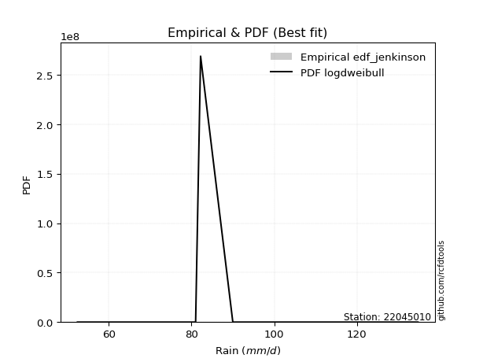</img>

</div>


### 11. Empirical - EDF Cunnane (1978)

Cunnane´s work in statistical hydrology has focused on the performance and evaluation of different probability distributions (such as GEV, Gumbel, Lognormal) for flood frequency estimation. _b_ is a constant, typically set to 0.4.

<div align="center">


$P=(m-b)/(n+1-2b)$


</div>


**11.1. Empirical values**

<div align="center">

|                | 0                   | 1                  | 2           | 3                  | 4                  |
|:---------------|:--------------------|:-------------------|:------------|:-------------------|:-------------------|
| date           | 2021                | 2025               | 2019        | 2020               | 2024               |
| x              | 52.4                | 81.0               | 82.2        | 90.0               | 134.8              |
| m              | 1                   | 2                  | 3           | 4                  | 5                  |
| empirical_dist | edf_cunnane         | edf_cunnane        | edf_cunnane | edf_cunnane        | edf_cunnane        |
| empirical      | 0.11538461538461538 | 0.3076923076923077 | 0.5         | 0.6923076923076923 | 0.8846153846153845 |
| empirical_tr   | 1.1304347826086958  | 1.4444444444444444 | 2.0         | 3.25               | 8.666666666666655  |

</div>


**11.2. Kolmogorov-Smirnov fit test (sorted by Δ)**


<div align="center">

|                | 0                   | 1                   | 2                   | 3                   | 4                   | 5                   | 6                   | 7                     | 8                   | 9                   | 10                 | 11                 | 12                  | 13                  | 14                  | 15                  | 16                  | 17                  | 18                  | 19                  | 20                  | 21                  | 22                  | 23                 | 24                  | 25                  | 26                  | 27                  | 28                  | 29                 | 30                  | 31                  | 32                  | 33                  | 34                 | 35                 | 36                  | 37                  | 38                 | 39                  | 40                  | 41                 | 42                  | 43                  | 44                 | 45                  | 46                 | 47                  | 48                  | 49                  | 50                  | 51                  | 52                  | 53                  | 54                  | 55                 | 56                  | 57                 | 58                  | 59                 | 60                  | 61                  | 62                  | 63                  | 64                  | 65                  | 66                  | 67                  | 68                  | 69                  | 70                  | 71                  | 72                  | 73                  | 74                  | 75                 | 76                 | 77                  | 78                 | 79                  | 80                 | 81                 | 82                  | 83                 | 84                  | 85                 | 86                  | 87                 | 88                 | 89                 |
|:---------------|:--------------------|:--------------------|:--------------------|:--------------------|:--------------------|:--------------------|:--------------------|:----------------------|:--------------------|:--------------------|:-------------------|:-------------------|:--------------------|:--------------------|:--------------------|:--------------------|:--------------------|:--------------------|:--------------------|:--------------------|:--------------------|:--------------------|:--------------------|:-------------------|:--------------------|:--------------------|:--------------------|:--------------------|:--------------------|:-------------------|:--------------------|:--------------------|:--------------------|:--------------------|:-------------------|:-------------------|:--------------------|:--------------------|:-------------------|:--------------------|:--------------------|:-------------------|:--------------------|:--------------------|:-------------------|:--------------------|:-------------------|:--------------------|:--------------------|:--------------------|:--------------------|:--------------------|:--------------------|:--------------------|:--------------------|:-------------------|:--------------------|:-------------------|:--------------------|:-------------------|:--------------------|:--------------------|:--------------------|:--------------------|:--------------------|:--------------------|:--------------------|:--------------------|:--------------------|:--------------------|:--------------------|:--------------------|:--------------------|:--------------------|:--------------------|:-------------------|:-------------------|:--------------------|:-------------------|:--------------------|:-------------------|:-------------------|:--------------------|:-------------------|:--------------------|:-------------------|:--------------------|:-------------------|:-------------------|:-------------------|
| station        | 22045010            | 22045010            | 22045010            | 22045010            | 22045010            | 22045010            | 22045010            | 22045010              | 22045010            | 22045010            | 22045010           | 22045010           | 22045010            | 22045010            | 22045010            | 22045010            | 22045010            | 22045010            | 22045010            | 22045010            | 22045010            | 22045010            | 22045010            | 22045010           | 22045010            | 22045010            | 22045010            | 22045010            | 22045010            | 22045010           | 22045010            | 22045010            | 22045010            | 22045010            | 22045010           | 22045010           | 22045010            | 22045010            | 22045010           | 22045010            | 22045010            | 22045010           | 22045010            | 22045010            | 22045010           | 22045010            | 22045010           | 22045010            | 22045010            | 22045010            | 22045010            | 22045010            | 22045010            | 22045010            | 22045010            | 22045010           | 22045010            | 22045010           | 22045010            | 22045010           | 22045010            | 22045010            | 22045010            | 22045010            | 22045010            | 22045010            | 22045010            | 22045010            | 22045010            | 22045010            | 22045010            | 22045010            | 22045010            | 22045010            | 22045010            | 22045010           | 22045010           | 22045010            | 22045010           | 22045010            | 22045010           | 22045010           | 22045010            | 22045010           | 22045010            | 22045010           | 22045010            | 22045010           | 22045010           | 22045010           |
| empirical_dist | edf_cunnane         | edf_cunnane         | edf_cunnane         | edf_cunnane         | edf_cunnane         | edf_cunnane         | edf_cunnane         | edf_cunnane           | edf_cunnane         | edf_cunnane         | edf_cunnane        | edf_cunnane        | edf_cunnane         | edf_cunnane         | edf_cunnane         | edf_cunnane         | edf_cunnane         | edf_cunnane         | edf_cunnane         | edf_cunnane         | edf_cunnane         | edf_cunnane         | edf_cunnane         | edf_cunnane        | edf_cunnane         | edf_cunnane         | edf_cunnane         | edf_cunnane         | edf_cunnane         | edf_cunnane        | edf_cunnane         | edf_cunnane         | edf_cunnane         | edf_cunnane         | edf_cunnane        | edf_cunnane        | edf_cunnane         | edf_cunnane         | edf_cunnane        | edf_cunnane         | edf_cunnane         | edf_cunnane        | edf_cunnane         | edf_cunnane         | edf_cunnane        | edf_cunnane         | edf_cunnane        | edf_cunnane         | edf_cunnane         | edf_cunnane         | edf_cunnane         | edf_cunnane         | edf_cunnane         | edf_cunnane         | edf_cunnane         | edf_cunnane        | edf_cunnane         | edf_cunnane        | edf_cunnane         | edf_cunnane        | edf_cunnane         | edf_cunnane         | edf_cunnane         | edf_cunnane         | edf_cunnane         | edf_cunnane         | edf_cunnane         | edf_cunnane         | edf_cunnane         | edf_cunnane         | edf_cunnane         | edf_cunnane         | edf_cunnane         | edf_cunnane         | edf_cunnane         | edf_cunnane        | edf_cunnane        | edf_cunnane         | edf_cunnane        | edf_cunnane         | edf_cunnane        | edf_cunnane        | edf_cunnane         | edf_cunnane        | edf_cunnane         | edf_cunnane        | edf_cunnane         | edf_cunnane        | edf_cunnane        | edf_cunnane        |
| p_dist         | johnsonsu           | logjohnsonsu        | laplace_asymmetric  | loglaplace          | pearson3            | loghypsecant        | rice                | loglaplace_asymmetric | maxwell             | rayleigh            | logmielke          | loggenlogistic     | loglogistic         | mielke              | fisk                | logfisk             | alpha               | logloggamma         | logpearson3         | betaprime           | logexponnorm        | lognorm             | lognorm             | logcrystalball     | logt                | nct                 | loggamma            | loggamma            | invgamma            | logerlang          | logf                | logfatiguelife      | laplace             | logncf              | exponnorm          | gumbel_r           | logbetaprime        | invgauss            | lognct             | genlogistic         | kstwobign           | logweibull_min     | hypsecant           | gompertz            | f                  | logalpha            | logistic           | logrice             | loginvgamma         | crystalball         | norm                | t                   | loggompertz         | loggumbel_l         | halfnorm            | moyal              | loginvgauss         | logmaxwell         | halflogistic        | lograyleigh        | loginvweibull       | loggumbel_r         | logkstwobign        | gibrat              | loghalfnorm         | loggenexpon         | wald                | gumbel_l            | logmoyal            | logchi2             | loghalflogistic     | genexpon            | expon               | ncf                 | lognakagami         | weibull_min        | logexpon           | logwald             | nakagami           | truncnorm           | loggibrat          | chi2               | loglognorm          | pareto             | logpareto           | invweibull         | gamma               | erlang             | fatiguelife        | logtruncnorm       |
| delta          | 0.07606518870514023 | 0.08403608882953084 | 0.09225387414357744 | 0.10903002650000959 | 0.12459402236698314 | 0.12832968743089818 | 0.12932666054147524 | 0.12971807689790105   | 0.13188359400238958 | 0.13365392910526364 | 0.133836597391583  | 0.1341392855466026 | 0.13415575478714414 | 0.13417103091267563 | 0.13466736393885353 | 0.13472259507200174 | 0.13859490412590292 | 0.13884288520129073 | 0.13997349734799225 | 0.14035832151614241 | 0.14105441138277092 | 0.14105522195154074 | 0.14105522195154074 | 0.1410554435985022 | 0.14105634866546352 | 0.14208886402365628 | 0.14216675978013416 | 0.14216675978013416 | 0.14218945073930028 | 0.1421953455465771 | 0.14238105107409188 | 0.14379681178940823 | 0.14382867601246685 | 0.14441479768291976 | 0.1452565891996072 | 0.1463072494683893 | 0.14755030131349622 | 0.14873193982868316 | 0.1488368711653678 | 0.15003670443654654 | 0.15132838197443393 | 0.1533875367945503 | 0.15632697588637146 | 0.15667527712050178 | 0.1569365137018976 | 0.15817173536134155 | 0.1596536240790909 | 0.15992906519527966 | 0.16131000228872955 | 0.16356281852695698 | 0.16356281928084893 | 0.16356465030139966 | 0.16373078303037947 | 0.16672199880463257 | 0.16856202666469633 | 0.168832424046381  | 0.17169615159057855 | 0.1753890911919711 | 0.18349885470744193 | 0.1872999426806622 | 0.20077027781418444 | 0.20795551641889054 | 0.21897940016721518 | 0.22076608678523335 | 0.22091963350914368 | 0.22188578437868067 | 0.22922260643217252 | 0.23248009446753892 | 0.23327788630038404 | 0.23862693634887022 | 0.24190897490728502 | 0.24360733805415924 | 0.24368339988390875 | 0.25383366216807324 | 0.26403913357647457 | 0.2661951427803634 | 0.2930922345513708 | 0.30362957591543893 | 0.3076887032367546 | 0.30838192044802093 | 0.3159385216523717 | 0.3719647714997866 | 0.37722511384231605 | 0.3791338675870777 | 0.38616881505782796 | 0.4307025722011292 | 0.45506401092524873 | 0.5239554009014974 | 0.5593002077570856 | 0.6923076923076923 |
| deltao         | 0.5865427407550001  | 0.5865427407550001  | 0.5865427407550001  | 0.5865427407550001  | 0.5865427407550001  | 0.5865427407550001  | 0.5865427407550001  | 0.5865427407550001    | 0.5865427407550001  | 0.5865427407550001  | 0.5865427407550001 | 0.5865427407550001 | 0.5865427407550001  | 0.5865427407550001  | 0.5865427407550001  | 0.5865427407550001  | 0.5865427407550001  | 0.5865427407550001  | 0.5865427407550001  | 0.5865427407550001  | 0.5865427407550001  | 0.5865427407550001  | 0.5865427407550001  | 0.5865427407550001 | 0.5865427407550001  | 0.5865427407550001  | 0.5865427407550001  | 0.5865427407550001  | 0.5865427407550001  | 0.5865427407550001 | 0.5865427407550001  | 0.5865427407550001  | 0.5865427407550001  | 0.5865427407550001  | 0.5865427407550001 | 0.5865427407550001 | 0.5865427407550001  | 0.5865427407550001  | 0.5865427407550001 | 0.5865427407550001  | 0.5865427407550001  | 0.5865427407550001 | 0.5865427407550001  | 0.5865427407550001  | 0.5865427407550001 | 0.5865427407550001  | 0.5865427407550001 | 0.5865427407550001  | 0.5865427407550001  | 0.5865427407550001  | 0.5865427407550001  | 0.5865427407550001  | 0.5865427407550001  | 0.5865427407550001  | 0.5865427407550001  | 0.5865427407550001 | 0.5865427407550001  | 0.5865427407550001 | 0.5865427407550001  | 0.5865427407550001 | 0.5865427407550001  | 0.5865427407550001  | 0.5865427407550001  | 0.5865427407550001  | 0.5865427407550001  | 0.5865427407550001  | 0.5865427407550001  | 0.5865427407550001  | 0.5865427407550001  | 0.5865427407550001  | 0.5865427407550001  | 0.5865427407550001  | 0.5865427407550001  | 0.5865427407550001  | 0.5865427407550001  | 0.5865427407550001 | 0.5865427407550001 | 0.5865427407550001  | 0.5865427407550001 | 0.5865427407550001  | 0.5865427407550001 | 0.5865427407550001 | 0.5865427407550001  | 0.5865427407550001 | 0.5865427407550001  | 0.5865427407550001 | 0.5865427407550001  | 0.5865427407550001 | 0.5865427407550001 | 0.5865427407550001 |
| eval           | Δo > Δ              | Δo > Δ              | Δo > Δ              | Δo > Δ              | Δo > Δ              | Δo > Δ              | Δo > Δ              | Δo > Δ                | Δo > Δ              | Δo > Δ              | Δo > Δ             | Δo > Δ             | Δo > Δ              | Δo > Δ              | Δo > Δ              | Δo > Δ              | Δo > Δ              | Δo > Δ              | Δo > Δ              | Δo > Δ              | Δo > Δ              | Δo > Δ              | Δo > Δ              | Δo > Δ             | Δo > Δ              | Δo > Δ              | Δo > Δ              | Δo > Δ              | Δo > Δ              | Δo > Δ             | Δo > Δ              | Δo > Δ              | Δo > Δ              | Δo > Δ              | Δo > Δ             | Δo > Δ             | Δo > Δ              | Δo > Δ              | Δo > Δ             | Δo > Δ              | Δo > Δ              | Δo > Δ             | Δo > Δ              | Δo > Δ              | Δo > Δ             | Δo > Δ              | Δo > Δ             | Δo > Δ              | Δo > Δ              | Δo > Δ              | Δo > Δ              | Δo > Δ              | Δo > Δ              | Δo > Δ              | Δo > Δ              | Δo > Δ             | Δo > Δ              | Δo > Δ             | Δo > Δ              | Δo > Δ             | Δo > Δ              | Δo > Δ              | Δo > Δ              | Δo > Δ              | Δo > Δ              | Δo > Δ              | Δo > Δ              | Δo > Δ              | Δo > Δ              | Δo > Δ              | Δo > Δ              | Δo > Δ              | Δo > Δ              | Δo > Δ              | Δo > Δ              | Δo > Δ             | Δo > Δ             | Δo > Δ              | Δo > Δ             | Δo > Δ              | Δo > Δ             | Δo > Δ             | Δo > Δ              | Δo > Δ             | Δo > Δ              | Δo > Δ             | Δo > Δ              | Δo > Δ             | Δo > Δ             | Δo <= Δ            |
| fit            | 1                   | 1                   | 1                   | 1                   | 1                   | 1                   | 1                   | 1                     | 1                   | 1                   | 1                  | 1                  | 1                   | 1                   | 1                   | 1                   | 1                   | 1                   | 1                   | 1                   | 1                   | 1                   | 1                   | 1                  | 1                   | 1                   | 1                   | 1                   | 1                   | 1                  | 1                   | 1                   | 1                   | 1                   | 1                  | 1                  | 1                   | 1                   | 1                  | 1                   | 1                   | 1                  | 1                   | 1                   | 1                  | 1                   | 1                  | 1                   | 1                   | 1                   | 1                   | 1                   | 1                   | 1                   | 1                   | 1                  | 1                   | 1                  | 1                   | 1                  | 1                   | 1                   | 1                   | 1                   | 1                   | 1                   | 1                   | 1                   | 1                   | 1                   | 1                   | 1                   | 1                   | 1                   | 1                   | 1                  | 1                  | 1                   | 1                  | 1                   | 1                  | 1                  | 1                   | 1                  | 1                   | 1                  | 1                   | 1                  | 1                  | 0                  |
| n              | 5                   | 5                   | 5                   | 5                   | 5                   | 5                   | 5                   | 5                     | 5                   | 5                   | 5                  | 5                  | 5                   | 5                   | 5                   | 5                   | 5                   | 5                   | 5                   | 5                   | 5                   | 5                   | 5                   | 5                  | 5                   | 5                   | 5                   | 5                   | 5                   | 5                  | 5                   | 5                   | 5                   | 5                   | 5                  | 5                  | 5                   | 5                   | 5                  | 5                   | 5                   | 5                  | 5                   | 5                   | 5                  | 5                   | 5                  | 5                   | 5                   | 5                   | 5                   | 5                   | 5                   | 5                   | 5                   | 5                  | 5                   | 5                  | 5                   | 5                  | 5                   | 5                   | 5                   | 5                   | 5                   | 5                   | 5                   | 5                   | 5                   | 5                   | 5                   | 5                   | 5                   | 5                   | 5                   | 5                  | 5                  | 5                   | 5                  | 5                   | 5                  | 5                  | 5                   | 5                  | 5                   | 5                  | 5                   | 5                  | 5                  | 5                  |
| best_fit       | 1                   | 0                   | 0                   | 0                   | 0                   | 0                   | 0                   | 0                     | 0                   | 0                   | 0                  | 0                  | 0                   | 0                   | 0                   | 0                   | 0                   | 0                   | 0                   | 0                   | 0                   | 0                   | 0                   | 0                  | 0                   | 0                   | 0                   | 0                   | 0                   | 0                  | 0                   | 0                   | 0                   | 0                   | 0                  | 0                  | 0                   | 0                   | 0                  | 0                   | 0                   | 0                  | 0                   | 0                   | 0                  | 0                   | 0                  | 0                   | 0                   | 0                   | 0                   | 0                   | 0                   | 0                   | 0                   | 0                  | 0                   | 0                  | 0                   | 0                  | 0                   | 0                   | 0                   | 0                   | 0                   | 0                   | 0                   | 0                   | 0                   | 0                   | 0                   | 0                   | 0                   | 0                   | 0                   | 0                  | 0                  | 0                   | 0                  | 0                   | 0                  | 0                  | 0                   | 0                  | 0                   | 0                  | 0                   | 0                  | 0                  | 0                  |
| best_fit_sort  | 1                   | 2                   | 3                   | 4                   | 5                   | 6                   | 7                   | 8                     | 9                   | 10                  | 11                 | 12                 | 13                  | 14                  | 15                  | 16                  | 17                  | 18                  | 19                  | 20                  | 21                  | 22                  | 23                  | 24                 | 25                  | 26                  | 27                  | 28                  | 29                  | 30                 | 31                  | 32                  | 33                  | 34                  | 35                 | 36                 | 37                  | 38                  | 39                 | 40                  | 41                  | 42                 | 43                  | 44                  | 45                 | 46                  | 47                 | 48                  | 49                  | 50                  | 51                  | 52                  | 53                  | 54                  | 55                  | 56                 | 57                  | 58                 | 59                  | 60                 | 61                  | 62                  | 63                  | 64                  | 65                  | 66                  | 67                  | 68                  | 69                  | 70                  | 71                  | 72                  | 73                  | 74                  | 75                  | 76                 | 77                 | 78                  | 79                 | 80                  | 81                 | 82                 | 83                  | 84                 | 85                  | 86                 | 87                  | 88                 | 89                 | 90                 |

</div>


<div align="center">

</img>

</div>


**11.3. Best fit**

<div align="center">

|   id |   station | empirical_dist   | p_dist    |     delta |   deltao | eval   |   fit |   n |   best_fit |   best_fit_sort |
|-----:|----------:|:-----------------|:----------|----------:|---------:|:-------|------:|----:|-----------:|----------------:|
|    0 |  22045010 | edf_cunnane      | johnsonsu | 0.0760652 | 0.586543 | Δo > Δ |     1 |   5 |          1 |               1 |

</div>


<div align="center">

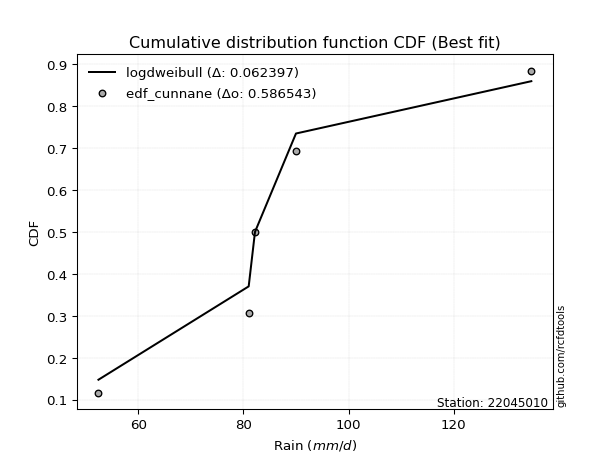</img></img>

</div>


### 12. Empirical - EDF Adamowski (1981)

The Adamowski formula in hydrology refers to a specific plotting position formula used for estimating the non-parametric empirical distribution of hydrological events (like flood peaks) to calculate their return periods. This formula provides an alternative to traditional parametric methods (like the Gumbel or Log Pearson Type III distributions). 

<div align="center">


$P=(m-0.25)/(n+0.5)$


</div>


**12.1. Empirical values**

<div align="center">

|                | 0                   | 1                  | 2             | 3                  | 4                  |
|:---------------|:--------------------|:-------------------|:--------------|:-------------------|:-------------------|
| date           | 2021                | 2025               | 2019          | 2020               | 2024               |
| x              | 52.4                | 81.0               | 82.2          | 90.0               | 134.8              |
| m              | 1                   | 2                  | 3             | 4                  | 5                  |
| empirical_dist | edf_adamowski       | edf_adamowski      | edf_adamowski | edf_adamowski      | edf_adamowski      |
| empirical      | 0.13636363636363635 | 0.3181818181818182 | 0.5           | 0.6818181818181818 | 0.8636363636363636 |
| empirical_tr   | 1.1578947368421053  | 1.4666666666666666 | 2.0           | 3.1428571428571423 | 7.333333333333334  |

</div>


**12.2. Kolmogorov-Smirnov fit test (sorted by Δ)**


<div align="center">

|                | 0                   | 1                   | 2                   | 3                   | 4                   | 5                   | 6                   | 7                     | 8                   | 9                   | 10                  | 11                  | 12                  | 13                  | 14                  | 15                  | 16                  | 17                  | 18                  | 19                  | 20                  | 21                  | 22                  | 23                  | 24                  | 25                 | 26                 | 27                 | 28                  | 29                  | 30                 | 31                  | 32                 | 33                  | 34                  | 35                  | 36                  | 37                 | 38                  | 39                  | 40                  | 41                  | 42                  | 43                 | 44                  | 45                  | 46                  | 47                 | 48                  | 49                  | 50                 | 51                  | 52                 | 53                  | 54                  | 55                  | 56                  | 57                  | 58                  | 59                  | 60                  | 61                  | 62                 | 63                  | 64                 | 65                 | 66                 | 67                  | 68                 | 69                  | 70                  | 71                  | 72                  | 73                  | 74                 | 75                  | 76                 | 77                  | 78                 | 79                 | 80                  | 81                 | 82                 | 83                 | 84                 | 85                  | 86                  | 87                 | 88                 | 89                 |
|:---------------|:--------------------|:--------------------|:--------------------|:--------------------|:--------------------|:--------------------|:--------------------|:----------------------|:--------------------|:--------------------|:--------------------|:--------------------|:--------------------|:--------------------|:--------------------|:--------------------|:--------------------|:--------------------|:--------------------|:--------------------|:--------------------|:--------------------|:--------------------|:--------------------|:--------------------|:-------------------|:-------------------|:-------------------|:--------------------|:--------------------|:-------------------|:--------------------|:-------------------|:--------------------|:--------------------|:--------------------|:--------------------|:-------------------|:--------------------|:--------------------|:--------------------|:--------------------|:--------------------|:-------------------|:--------------------|:--------------------|:--------------------|:-------------------|:--------------------|:--------------------|:-------------------|:--------------------|:-------------------|:--------------------|:--------------------|:--------------------|:--------------------|:--------------------|:--------------------|:--------------------|:--------------------|:--------------------|:-------------------|:--------------------|:-------------------|:-------------------|:-------------------|:--------------------|:-------------------|:--------------------|:--------------------|:--------------------|:--------------------|:--------------------|:-------------------|:--------------------|:-------------------|:--------------------|:-------------------|:-------------------|:--------------------|:-------------------|:-------------------|:-------------------|:-------------------|:--------------------|:--------------------|:-------------------|:-------------------|:-------------------|
| station        | 22045010            | 22045010            | 22045010            | 22045010            | 22045010            | 22045010            | 22045010            | 22045010              | 22045010            | 22045010            | 22045010            | 22045010            | 22045010            | 22045010            | 22045010            | 22045010            | 22045010            | 22045010            | 22045010            | 22045010            | 22045010            | 22045010            | 22045010            | 22045010            | 22045010            | 22045010           | 22045010           | 22045010           | 22045010            | 22045010            | 22045010           | 22045010            | 22045010           | 22045010            | 22045010            | 22045010            | 22045010            | 22045010           | 22045010            | 22045010            | 22045010            | 22045010            | 22045010            | 22045010           | 22045010            | 22045010            | 22045010            | 22045010           | 22045010            | 22045010            | 22045010           | 22045010            | 22045010           | 22045010            | 22045010            | 22045010            | 22045010            | 22045010            | 22045010            | 22045010            | 22045010            | 22045010            | 22045010           | 22045010            | 22045010           | 22045010           | 22045010           | 22045010            | 22045010           | 22045010            | 22045010            | 22045010            | 22045010            | 22045010            | 22045010           | 22045010            | 22045010           | 22045010            | 22045010           | 22045010           | 22045010            | 22045010           | 22045010           | 22045010           | 22045010           | 22045010            | 22045010            | 22045010           | 22045010           | 22045010           |
| empirical_dist | edf_adamowski       | edf_adamowski       | edf_adamowski       | edf_adamowski       | edf_adamowski       | edf_adamowski       | edf_adamowski       | edf_adamowski         | edf_adamowski       | edf_adamowski       | edf_adamowski       | edf_adamowski       | edf_adamowski       | edf_adamowski       | edf_adamowski       | edf_adamowski       | edf_adamowski       | edf_adamowski       | edf_adamowski       | edf_adamowski       | edf_adamowski       | edf_adamowski       | edf_adamowski       | edf_adamowski       | edf_adamowski       | edf_adamowski      | edf_adamowski      | edf_adamowski      | edf_adamowski       | edf_adamowski       | edf_adamowski      | edf_adamowski       | edf_adamowski      | edf_adamowski       | edf_adamowski       | edf_adamowski       | edf_adamowski       | edf_adamowski      | edf_adamowski       | edf_adamowski       | edf_adamowski       | edf_adamowski       | edf_adamowski       | edf_adamowski      | edf_adamowski       | edf_adamowski       | edf_adamowski       | edf_adamowski      | edf_adamowski       | edf_adamowski       | edf_adamowski      | edf_adamowski       | edf_adamowski      | edf_adamowski       | edf_adamowski       | edf_adamowski       | edf_adamowski       | edf_adamowski       | edf_adamowski       | edf_adamowski       | edf_adamowski       | edf_adamowski       | edf_adamowski      | edf_adamowski       | edf_adamowski      | edf_adamowski      | edf_adamowski      | edf_adamowski       | edf_adamowski      | edf_adamowski       | edf_adamowski       | edf_adamowski       | edf_adamowski       | edf_adamowski       | edf_adamowski      | edf_adamowski       | edf_adamowski      | edf_adamowski       | edf_adamowski      | edf_adamowski      | edf_adamowski       | edf_adamowski      | edf_adamowski      | edf_adamowski      | edf_adamowski      | edf_adamowski       | edf_adamowski       | edf_adamowski      | edf_adamowski      | edf_adamowski      |
| p_dist         | johnsonsu           | laplace_asymmetric  | logjohnsonsu        | loglaplace          | pearson3            | loghypsecant        | rice                | loglaplace_asymmetric | maxwell             | rayleigh            | logmielke           | loggenlogistic      | loglogistic         | mielke              | fisk                | logfisk             | alpha               | logloggamma         | logpearson3         | betaprime           | logexponnorm        | lognorm             | lognorm             | logcrystalball      | logt                | nct                | loggamma           | loggamma           | invgamma            | logerlang           | logf               | logfatiguelife      | logncf             | laplace             | exponnorm           | gumbel_r            | logbetaprime        | invgauss           | lognct              | genlogistic         | kstwobign           | logweibull_min      | hypsecant           | gompertz           | f                   | logalpha            | logistic            | logrice            | loginvgamma         | crystalball         | norm               | t                   | loggompertz        | loggumbel_l         | halfnorm            | moyal               | loginvgauss         | logmaxwell          | halflogistic        | lograyleigh         | loginvweibull       | loggumbel_r         | logkstwobign       | gibrat              | loghalfnorm        | loggenexpon        | logchi2            | wald                | gumbel_l           | logmoyal            | loghalflogistic     | genexpon            | expon               | ncf                 | weibull_min        | lognakagami         | logexpon           | logwald             | loggibrat          | nakagami           | truncnorm           | chi2               | loglognorm         | pareto             | logpareto          | invweibull          | gamma               | erlang             | fatiguelife        | logtruncnorm       |
| delta          | 0.08655469919465075 | 0.09027090207118649 | 0.09452559931904136 | 0.09854051601049912 | 0.11410451187747261 | 0.11784017694138771 | 0.11883715005196471 | 0.11922856640839058   | 0.12139408351287906 | 0.12316441861575317 | 0.12334708690207252 | 0.12364977505709213 | 0.12366624429763368 | 0.12368152042316516 | 0.12417785344934307 | 0.12423308458249127 | 0.12810539363639245 | 0.12835337471178027 | 0.12948398685848178 | 0.12986881102663195 | 0.13056490089326045 | 0.13056571146203028 | 0.13056571146203028 | 0.13056593310899173 | 0.13056683817595305 | 0.1315993535341458 | 0.1316772492906237 | 0.1316772492906237 | 0.13169994024978982 | 0.13170583505706662 | 0.1318915405845814 | 0.13330730129989776 | 0.1339252871934093 | 0.13413105174551027 | 0.13476707871009674 | 0.13581773897887883 | 0.13706079082398576 | 0.1382424293391727 | 0.13834736067585734 | 0.13954719394703607 | 0.14083887148492347 | 0.14289802630503984 | 0.14583746539686093 | 0.1461857666309913 | 0.14644700321238713 | 0.14768222487183108 | 0.14916411358958037 | 0.1494395547057692 | 0.15082049179921908 | 0.15307330803744645 | 0.1530733087913384 | 0.15307513981188914 | 0.153241272540869  | 0.15623248831512204 | 0.15807251617518586 | 0.15834291355687052 | 0.16120664110106808 | 0.16489958070246064 | 0.17300934421793146 | 0.17681043219115172 | 0.19028076732467397 | 0.19746600592938007 | 0.2084898896777047 | 0.21027657629572288 | 0.2104301230196332 | 0.2113962738891702 | 0.2176479153698494 | 0.21873309594266205 | 0.2219905839780284 | 0.22278837581087357 | 0.23141946441777456 | 0.23311782756464877 | 0.23319388939439828 | 0.24334415167856277 | 0.2557056322908529 | 0.27452864406598504 | 0.2826027240618603 | 0.29314006542592846 | 0.3054490111628612 | 0.3181782137262651 | 0.31818177873994086 | 0.3614752610102761 | 0.3667356033528056 | 0.3686443570975672 | 0.3756793045683175 | 0.40972355122210835 | 0.44457450043573826 | 0.5134658904119869 | 0.548810697267575  | 0.6818181818181818 |
| deltao         | 0.5865427407550001  | 0.5865427407550001  | 0.5865427407550001  | 0.5865427407550001  | 0.5865427407550001  | 0.5865427407550001  | 0.5865427407550001  | 0.5865427407550001    | 0.5865427407550001  | 0.5865427407550001  | 0.5865427407550001  | 0.5865427407550001  | 0.5865427407550001  | 0.5865427407550001  | 0.5865427407550001  | 0.5865427407550001  | 0.5865427407550001  | 0.5865427407550001  | 0.5865427407550001  | 0.5865427407550001  | 0.5865427407550001  | 0.5865427407550001  | 0.5865427407550001  | 0.5865427407550001  | 0.5865427407550001  | 0.5865427407550001 | 0.5865427407550001 | 0.5865427407550001 | 0.5865427407550001  | 0.5865427407550001  | 0.5865427407550001 | 0.5865427407550001  | 0.5865427407550001 | 0.5865427407550001  | 0.5865427407550001  | 0.5865427407550001  | 0.5865427407550001  | 0.5865427407550001 | 0.5865427407550001  | 0.5865427407550001  | 0.5865427407550001  | 0.5865427407550001  | 0.5865427407550001  | 0.5865427407550001 | 0.5865427407550001  | 0.5865427407550001  | 0.5865427407550001  | 0.5865427407550001 | 0.5865427407550001  | 0.5865427407550001  | 0.5865427407550001 | 0.5865427407550001  | 0.5865427407550001 | 0.5865427407550001  | 0.5865427407550001  | 0.5865427407550001  | 0.5865427407550001  | 0.5865427407550001  | 0.5865427407550001  | 0.5865427407550001  | 0.5865427407550001  | 0.5865427407550001  | 0.5865427407550001 | 0.5865427407550001  | 0.5865427407550001 | 0.5865427407550001 | 0.5865427407550001 | 0.5865427407550001  | 0.5865427407550001 | 0.5865427407550001  | 0.5865427407550001  | 0.5865427407550001  | 0.5865427407550001  | 0.5865427407550001  | 0.5865427407550001 | 0.5865427407550001  | 0.5865427407550001 | 0.5865427407550001  | 0.5865427407550001 | 0.5865427407550001 | 0.5865427407550001  | 0.5865427407550001 | 0.5865427407550001 | 0.5865427407550001 | 0.5865427407550001 | 0.5865427407550001  | 0.5865427407550001  | 0.5865427407550001 | 0.5865427407550001 | 0.5865427407550001 |
| eval           | Δo > Δ              | Δo > Δ              | Δo > Δ              | Δo > Δ              | Δo > Δ              | Δo > Δ              | Δo > Δ              | Δo > Δ                | Δo > Δ              | Δo > Δ              | Δo > Δ              | Δo > Δ              | Δo > Δ              | Δo > Δ              | Δo > Δ              | Δo > Δ              | Δo > Δ              | Δo > Δ              | Δo > Δ              | Δo > Δ              | Δo > Δ              | Δo > Δ              | Δo > Δ              | Δo > Δ              | Δo > Δ              | Δo > Δ             | Δo > Δ             | Δo > Δ             | Δo > Δ              | Δo > Δ              | Δo > Δ             | Δo > Δ              | Δo > Δ             | Δo > Δ              | Δo > Δ              | Δo > Δ              | Δo > Δ              | Δo > Δ             | Δo > Δ              | Δo > Δ              | Δo > Δ              | Δo > Δ              | Δo > Δ              | Δo > Δ             | Δo > Δ              | Δo > Δ              | Δo > Δ              | Δo > Δ             | Δo > Δ              | Δo > Δ              | Δo > Δ             | Δo > Δ              | Δo > Δ             | Δo > Δ              | Δo > Δ              | Δo > Δ              | Δo > Δ              | Δo > Δ              | Δo > Δ              | Δo > Δ              | Δo > Δ              | Δo > Δ              | Δo > Δ             | Δo > Δ              | Δo > Δ             | Δo > Δ             | Δo > Δ             | Δo > Δ              | Δo > Δ             | Δo > Δ              | Δo > Δ              | Δo > Δ              | Δo > Δ              | Δo > Δ              | Δo > Δ             | Δo > Δ              | Δo > Δ             | Δo > Δ              | Δo > Δ             | Δo > Δ             | Δo > Δ              | Δo > Δ             | Δo > Δ             | Δo > Δ             | Δo > Δ             | Δo > Δ              | Δo > Δ              | Δo > Δ             | Δo > Δ             | Δo <= Δ            |
| fit            | 1                   | 1                   | 1                   | 1                   | 1                   | 1                   | 1                   | 1                     | 1                   | 1                   | 1                   | 1                   | 1                   | 1                   | 1                   | 1                   | 1                   | 1                   | 1                   | 1                   | 1                   | 1                   | 1                   | 1                   | 1                   | 1                  | 1                  | 1                  | 1                   | 1                   | 1                  | 1                   | 1                  | 1                   | 1                   | 1                   | 1                   | 1                  | 1                   | 1                   | 1                   | 1                   | 1                   | 1                  | 1                   | 1                   | 1                   | 1                  | 1                   | 1                   | 1                  | 1                   | 1                  | 1                   | 1                   | 1                   | 1                   | 1                   | 1                   | 1                   | 1                   | 1                   | 1                  | 1                   | 1                  | 1                  | 1                  | 1                   | 1                  | 1                   | 1                   | 1                   | 1                   | 1                   | 1                  | 1                   | 1                  | 1                   | 1                  | 1                  | 1                   | 1                  | 1                  | 1                  | 1                  | 1                   | 1                   | 1                  | 1                  | 0                  |
| n              | 5                   | 5                   | 5                   | 5                   | 5                   | 5                   | 5                   | 5                     | 5                   | 5                   | 5                   | 5                   | 5                   | 5                   | 5                   | 5                   | 5                   | 5                   | 5                   | 5                   | 5                   | 5                   | 5                   | 5                   | 5                   | 5                  | 5                  | 5                  | 5                   | 5                   | 5                  | 5                   | 5                  | 5                   | 5                   | 5                   | 5                   | 5                  | 5                   | 5                   | 5                   | 5                   | 5                   | 5                  | 5                   | 5                   | 5                   | 5                  | 5                   | 5                   | 5                  | 5                   | 5                  | 5                   | 5                   | 5                   | 5                   | 5                   | 5                   | 5                   | 5                   | 5                   | 5                  | 5                   | 5                  | 5                  | 5                  | 5                   | 5                  | 5                   | 5                   | 5                   | 5                   | 5                   | 5                  | 5                   | 5                  | 5                   | 5                  | 5                  | 5                   | 5                  | 5                  | 5                  | 5                  | 5                   | 5                   | 5                  | 5                  | 5                  |
| best_fit       | 1                   | 0                   | 0                   | 0                   | 0                   | 0                   | 0                   | 0                     | 0                   | 0                   | 0                   | 0                   | 0                   | 0                   | 0                   | 0                   | 0                   | 0                   | 0                   | 0                   | 0                   | 0                   | 0                   | 0                   | 0                   | 0                  | 0                  | 0                  | 0                   | 0                   | 0                  | 0                   | 0                  | 0                   | 0                   | 0                   | 0                   | 0                  | 0                   | 0                   | 0                   | 0                   | 0                   | 0                  | 0                   | 0                   | 0                   | 0                  | 0                   | 0                   | 0                  | 0                   | 0                  | 0                   | 0                   | 0                   | 0                   | 0                   | 0                   | 0                   | 0                   | 0                   | 0                  | 0                   | 0                  | 0                  | 0                  | 0                   | 0                  | 0                   | 0                   | 0                   | 0                   | 0                   | 0                  | 0                   | 0                  | 0                   | 0                  | 0                  | 0                   | 0                  | 0                  | 0                  | 0                  | 0                   | 0                   | 0                  | 0                  | 0                  |
| best_fit_sort  | 1                   | 2                   | 3                   | 4                   | 5                   | 6                   | 7                   | 8                     | 9                   | 10                  | 11                  | 12                  | 13                  | 14                  | 15                  | 16                  | 17                  | 18                  | 19                  | 20                  | 21                  | 22                  | 23                  | 24                  | 25                  | 26                 | 27                 | 28                 | 29                  | 30                  | 31                 | 32                  | 33                 | 34                  | 35                  | 36                  | 37                  | 38                 | 39                  | 40                  | 41                  | 42                  | 43                  | 44                 | 45                  | 46                  | 47                  | 48                 | 49                  | 50                  | 51                 | 52                  | 53                 | 54                  | 55                  | 56                  | 57                  | 58                  | 59                  | 60                  | 61                  | 62                  | 63                 | 64                  | 65                 | 66                 | 67                 | 68                  | 69                 | 70                  | 71                  | 72                  | 73                  | 74                  | 75                 | 76                  | 77                 | 78                  | 79                 | 80                 | 81                  | 82                 | 83                 | 84                 | 85                 | 86                  | 87                  | 88                 | 89                 | 90                 |

</div>


<div align="center">

</img>

</div>


**12.3. Best fit**

<div align="center">

|   id |   station | empirical_dist   | p_dist    |     delta |   deltao | eval   |   fit |   n |   best_fit |   best_fit_sort |
|-----:|----------:|:-----------------|:----------|----------:|---------:|:-------|------:|----:|-----------:|----------------:|
|    0 |  22045010 | edf_adamowski    | johnsonsu | 0.0865547 | 0.586543 | Δo > Δ |     1 |   5 |          1 |               1 |

</div>


<div align="center">

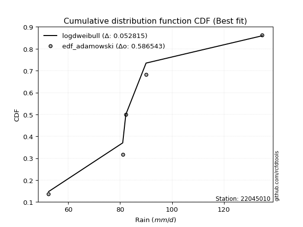</img>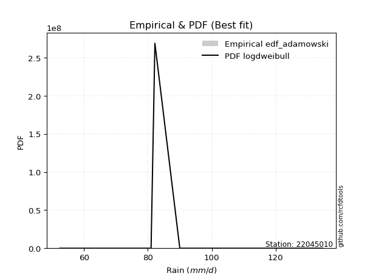</img>

</div>


## C. Best fit & Estimate extreme values for specific return periods - Tr


### 1. Best fit (ordered by delta Δ)

<div align="center">

|   id |   station | empirical_dist   | p_dist    |     delta |   deltao | eval   |   fit |   n |   best_fit |   best_fit_sort |
|-----:|----------:|:-----------------|:----------|----------:|---------:|:-------|------:|----:|-----------:|----------------:|
|    0 |  22045010 | edf_hazen        | johnsonsu | 0.0683729 | 0.586543 | Δo > Δ |     1 |   5 |          1 |               1 |
|    1 |  22045010 | edf_gringorten   | johnsonsu | 0.0730604 | 0.586543 | Δo > Δ |     1 |   5 |          1 |               2 |
|    2 |  22045010 | edf_cunnane      | johnsonsu | 0.0760652 | 0.586543 | Δo > Δ |     1 |   5 |          1 |               3 |
|    3 |  22045010 | edf_blom         | johnsonsu | 0.0778967 | 0.586543 | Δo > Δ |     1 |   5 |          1 |               4 |
|    4 |  22045010 | edf_tukey        | johnsonsu | 0.0808729 | 0.586543 | Δo > Δ |     1 |   5 |          1 |               5 |
|    5 |  22045010 | edf_filliben     | johnsonsu | 0.0819796 | 0.586543 | Δo > Δ |     1 |   5 |          1 |               6 |
|    6 |  22045010 | edf_beard        | johnsonsu | 0.0824993 | 0.586543 | Δo > Δ |     1 |   5 |          1 |               7 |
|    7 |  22045010 | edf_jenkinson    | johnsonsu | 0.0824993 | 0.586543 | Δo > Δ |     1 |   5 |          1 |               8 |
|    8 |  22045010 | edf_chegodayev   | johnsonsu | 0.0831877 | 0.586543 | Δo > Δ |     1 |   5 |          1 |               9 |
|    9 |  22045010 | edf_adamowski    | johnsonsu | 0.0865547 | 0.586543 | Δo > Δ |     1 |   5 |          1 |              10 |
|   10 |  22045010 | edf_weibull      | logmielke | 0.10821   | 0.586543 | Δo > Δ |     1 |   5 |          1 |              11 |
|   11 |  22045010 | edf_california   | johnsonsu | 0.145154  | 0.586543 | Δo > Δ |     1 |   5 |          1 |              12 |

</div>

:file_folder:Tables: [bestfit_22045010.csv](table/bestfit_22045010.csv) | [extreme_22045010.csv](table/extreme_22045010.csv)


### 2. Extreme values

In hydrology, a return period (or recurrence interval $Tr$) is the statistical average time between extreme events like floods or droughts of a specific magnitude, indicating how rare an event is, with a 100-year flood, for example, having a 1% chance of occurring in any given year, not that it happens exactly every century. It is a key tool for infrastructure design (like bridges or dams) and risk assessment, calculated from historical data to determine the probability of future events, although it is important to remember it is statistical average, and events can cluster or be missed.

> risk_rate: assuming the return period as the project useful life.

|   id |      tr |   prob_l |     prob_g |    alpha |   betaprime |     chi2 |   crystalball |   erlang |    expon |   exponnorm |        f |   fatiguelife |     fisk |    gamma |   genexpon |   genlogistic |   gibrat |   gompertz |   gumbel_l |   gumbel_r |   halflogistic |   halfnorm |   hypsecant |   invgamma |   invgauss |      invweibull |   johnsonsu |   kstwobign |   laplace |   laplace_asymmetric |   loggamma |   logistic |   lognorm |   maxwell |   mielke |    moyal |   nakagami |      ncf |      nct |     norm |          pareto |   pearson3 |   rayleigh |     rice |        t |   truncnorm |     wald |   weibull_min |   logalpha |   logbetaprime |          logchi2 |   logcrystalball |   logerlang |   logexpon |   logexponnorm |     logf |   logfatiguelife |   logfisk |   loggenexpon |   loggenlogistic |   loggibrat |   loggompertz |   loggumbel_l |   loggumbel_r |   loghalflogistic |   loghalfnorm |   loghypsecant |   loginvgamma |   loginvgauss |   loginvweibull |    logjohnsonsu |   logkstwobign |   loglaplace |   loglaplace_asymmetric |   logloggamma |   loglogistic |    loglognorm |   logmaxwell |   logmielke |   logmoyal |   lognakagami |   logncf |   lognct |      logpareto |   logpearson3 |   lograyleigh |   logrice |     logt |   logtruncnorm |   logwald |   logweibull_min |   station |   n |   risk_rate |
|-----:|--------:|---------:|-----------:|---------:|------------:|---------:|--------------:|---------:|---------:|------------:|---------:|--------------:|---------:|---------:|-----------:|--------------:|---------:|-----------:|-----------:|-----------:|---------------:|-----------:|------------:|-----------:|-----------:|----------------:|------------:|------------:|----------:|---------------------:|-----------:|-----------:|----------:|----------:|---------:|---------:|-----------:|---------:|---------:|---------:|----------------:|-----------:|-----------:|---------:|---------:|------------:|---------:|--------------:|-----------:|---------------:|-----------------:|-----------------:|------------:|-----------:|---------------:|---------:|-----------------:|----------:|--------------:|-----------------:|------------:|--------------:|--------------:|--------------:|------------------:|--------------:|---------------:|--------------:|--------------:|----------------:|----------------:|---------------:|-------------:|------------------------:|--------------:|--------------:|--------------:|-------------:|------------:|-----------:|--------------:|---------:|---------:|---------------:|--------------:|--------------:|----------:|---------:|---------------:|----------:|-----------------:|----------:|----:|------------:|
|    0 |    2    | 0.5      | 0.5        |  84.3007 |     84.231  |  68.8653 |       88.08   |  56.5777 |  77.1315 |     83.696  |  83.2067 |       52.4    |  84.2621 |  60.9938 |    77.1367 |       83.6186 |  80.0883 |    83.5197 |    92.4539 |    83.7061 |        81.5316 |    82.6301 |     88.08   |    84.105  |    83.7467 |   855.698       |     82.1626 |     83.6537 |   88.08   |              85.3705 |    84.1306 |     88.08  |   84.2023 |   85.8029 |  84.2887 |  82.294  |    86.6705 |  72.3161 |  84.0515 |  88.08   |    56.8926      |    85.4605 |    84.9953 |  85.7523 |  88.0801 |     84.8693 |  79.4496 |       75.1628 |    83.1288 |        83.7901 |     88.5295      |          84.2023 |     84.1287 |    72.7972 |        84.2024 |  84.1204 |          84.0223 |   84.2591 |       78.9471 |          84.29   |     76.9287 |       82.9476 |       88.4704 |       80.1402 |           78.194  |       79.1715 |        84.2023 |       82.9142 |       82.2784 |         80.4339 |    82.1308      |        79.1796 |      84.2023 |                 83.2236 |       84.3481 |       84.2023 |  52.4281      |      82.0625 |     84.279  |    78.8711 |       81.023  |  83.9876 |  83.7277 |  55.7773       |       84.2728 |       81.3167 |   83.059  |  84.2023 |          134.8 |   76.3754 |          83.4857 |  22045010 |   5 |    0.75     |
|    1 |    2.33 | 0.570815 | 0.429185   |  88.8643 |     88.8576 |  72.9716 |       92.8311 |  58.9256 |  82.5806 |     87.9724 |  87.8554 |       53.1362 |  88.4597 |  64.5061 |    82.587  |       88.2475 |  82.495  |    88.7931 |    96.5874 |    88.1085 |        86.058  |    87.7577 |     91.8823 |    88.7151 |    88.4486 | 32469.6         |     82.8576 |     88.4915 |   90.9551 |              88.5371 |    88.7758 |     92.266 |   88.8484 |   90.739  |  88.4803 |  86.4615 |    89.3101 |  82.3742 |  88.5749 |  92.8311 |    60.7284      |    90.2138 |    90.0044 |  90.5436 |  92.8312 |     85.7063 |  82.5649 |       80.7353 |    87.7924 |        88.4348 |    105.868       |          88.8484 |     88.7735 |    78.2662 |        88.8485 |  88.7724 |          88.6596 |   88.4571 |       84.0555 |          88.4804 |     79.0505 |       88.0342 |       92.7025 |       84.2295 |           82.2994 |       83.8962 |        87.9005 |       87.5393 |       86.924  |         85.4659 |    82.7637      |        84.2294 |      86.9841 |                 86.0857 |       88.9975 |       88.2827 |  52.7378      |      86.7718 |     88.4234 |    82.6757 |       81.0969 |  88.6373 |  88.4004 |  58.839        |       88.9204 |       86.0542 |   87.8147 |  88.8484 |          134.8 |   79.1131 |          88.252  |  22045010 |   5 |    0.729209 |
|    2 |    5    | 0.8      | 0.2        | 108.163  |    108.45   |  94.2303 |      110.487  |  76.1832 | 109.825  |    106.976  | 107.881  |       68.7744 | 106.72   |  86.3527 |   109.837  |      108.346  |  96.3511 |   110.302  |   109.941  |   107.235  |       106.539  |   109.442  |    107.134  |   108.304  |   108.553  |     3.07278e+11 |     93.5368 |    109.041  |  105.33   |             104.369  |   108.45   |    108.429 |  108.476  |  110.167  | 106.666  | 105.765  |   104.386  | 126.813  | 107.942  | 110.487  |   212.943       |   109.382  |   110.058  | 109.725  | 110.487  |     89.8131 | 100.005  |      109.886  |   108.262  |       108.299  |    296.703       |         108.476  |    108.447  |   112.425  |       108.476  | 108.507  |         108.357  |  106.725  |      108.802  |         106.658  |     92.4554 |      109.402  |      107.808  |      104.56   |          103.742  |      107.201  |       104.441  |      108.047  |      107.903  |        111.247  |    92.6809      |       109.526  |     102.333  |                101.941  |      108.512  |      105.981  |   1.22006e+30 |     108.084  |    106.367  |   102.837  |       84.8894 | 108.485  | 108.38   | 495.048        |      108.502  |      107.951  |  108.521  | 108.476  |          134.8 |   96.3536 |         108.641  |  22045010 |   5 |    0.67232  |
|    3 |   10    | 0.9      | 0.1        | 123.461  |    123.878  | 114.103  |      122.2    |  96.9403 | 134.556  |    123.424  | 123.904  |       90.3669 | 122.532  | 109.834  |   134.574  |      124.709  | 112.145  |   125.218  |   117.376  |   122.812  |       123.547  |   125.488  |    119.313  |   123.824  |   124.415  |     1.47909e+17 |    131.052  |    124.687  |  118.379  |             118.741  |   123.901  |    120.332 |  123.833  |  123.839  | 122.366  | 122.573  |   117.692  | 163.262  | 123.602  | 122.2    |  2332.63        |   123.442  |   124.356  | 123.402  | 122.2    |     93.435  | 118.512  |      137.634  |   125.177  |       124.112  |    845.905       |         123.833  |    123.896  |   156.188  |       123.833  | 124.04   |         123.889  |  122.549  |      131.313  |         122.353  |    110.529  |      125.162  |      117.261  |      124.694  |          125.736  |      128.521  |       119.857  |      125.238  |      125.914  |        137.893  |   137.451       |       133.769  |     118.599  |                118.85   |      123.642  |      121.246  | inf           |     126.149  |    121.999  |   124.356  |       96.325  | 124.245  | 124.287  |   4.36386e+15  |      123.766  |      126.889  |  125.23   | 123.834  |          134.8 |  118.777  |         124.64   |  22045010 |   5 |    0.651322 |
|    4 |   15    | 0.933333 | 0.0666667  | 132.02   |    132.427  | 125.87   |      128.045  | 110.447  | 149.023  |    133.02   | 132.842  |      104.489  | 132.111  | 124.512  |   149.044  |      133.94   | 123.04   |   132.618  |   120.743  |   131.601  |       133.173  |   133.838  |    126.264  |   132.463  |   133.156  |     2.3768e+20  |    181.928  |    132.994  |  126.013  |             127.148  |   132.431  |    126.818 |  132.292  |  130.854  | 131.862  | 132.327  |   124.896  | 183.839  | 132.484  | 128.045  | 10808           |   130.87   |   131.724  | 130.449  | 128.045  |     95.5099 | 130.397  |      154.278  |   134.843  |       132.922  |   1606.46        |         132.292  |    132.425  |   189.309  |       132.292  | 132.628  |         132.487  |  132.138  |      144.788  |         131.847  |    125.015  |      133.36   |      121.81   |      137.719  |          140.19   |      141.243  |       129.655  |      135.156  |      136.46   |        155.652  |   234.119       |       148.75   |     129.287  |                130.013  |      131.925  |      130.469  | inf           |     136.561  |    131.582  |   138.853  |      105.852  | 133.009  | 133.152  |   3.71052e+67  |      132.153  |      137.909  |  134.581  | 132.292  |          134.8 |  135.856  |         133.415  |  22045010 |   5 |    0.644736 |
|    5 |   20    | 0.95     | 0.05       | 138.009  |    138.364  | 134.266  |      131.873  | 120.475  | 159.288  |    139.828  | 139.066  |      114.944  | 139.165  | 135.232  |   159.31   |      140.402  | 131.585  |   137.414  |   122.838  |   137.755  |       139.917  |   139.405  |    131.167  |   138.48   |   139.192  |     4.17591e+22 |    241.015  |    138.589  |  131.429  |             133.113  |   138.339  |    131.3   |  138.142  |  135.51   | 138.849  | 139.235  |   129.75   | 198.259  | 138.748  | 131.873  | 32379.9         |   135.885  |   136.621  | 135.133  | 131.873  |     96.9635 | 139.254  |      166.241  |   141.676  |       139.056  |   2555.68        |         138.142  |    138.332  |   216.985  |       138.142  | 138.581  |         138.452  |  139.2    |      154.535  |         138.835  |    137.695  |      138.827  |      124.73   |      147.64   |          151.296  |      150.417  |       137.044  |      142.206  |      144.022  |        169.431  |   434.002       |       159.776  |     137.45   |                138.563  |      137.633  |      137.251  | inf           |     143.941  |    138.709  |   150.131  |      113.457  | 139.105  | 139.326  |   1.10948e+200 |      137.944  |      145.759  |  141.103  | 138.142  |          134.8 |  150.162  |         139.46   |  22045010 |   5 |    0.641514 |
|    6 |   25    | 0.96     | 0.04       | 142.63   |    142.916  | 140.8    |      134.69   | 128.463  | 167.249  |    145.108  | 143.845  |      123.252  | 144.814  | 143.691  |   167.274  |      145.38   | 138.71   |   140.911  |   124.33   |   142.495  |       145.112  |   143.547  |    134.962  |   143.103  |   143.799  |     2.23771e+24 |    305.751  |    142.78   |  135.63   |             137.74   |   142.859  |    134.729 |  142.613  |  138.966  | 144.441  | 144.589  |   133.377  | 209.377  | 143.607  | 134.69   | 75959.9         |   139.654  |   140.259  | 138.613  | 134.69   |     98.0807 | 146.347  |      175.6    |   146.981  |       143.767  |   3679.67        |         142.613  |    142.852  |   241.211  |       142.613  | 143.138  |         143.02   |  144.856  |      162.216  |         144.428  |    149.243  |      142.894  |      126.851  |      155.767  |          160.449  |      157.628  |       143.051  |      147.702  |      149.952  |        180.87   |   852.605       |       168.567  |     144.135  |                145.58   |      141.985  |      142.676  | inf           |     149.676  |    144.463  |   159.499  |      119.729  | 143.783  | 144.069  | inf            |      142.366  |      151.879  |  146.116  | 142.613  |          134.8 |  162.7    |         144.065  |  22045010 |   5 |    0.639603 |
|    7 |   50    | 0.98     | 0.02       | 156.97   |    156.867  | 161.196  |      142.759  | 154.223  | 191.981  |    161.511  | 158.52   |      149.905  | 163.532  | 170.62   |   192.011  |      160.713  | 163.822  |   150.74   |   128.378  |   157.097  |       161.121  |   155.587  |    146.727  |   157.324  |   157.776  |     4.74455e+29 |    676.321  |    155.087  |  148.679  |             152.112  |   156.651  |    145.207 |  156.233  |  148.991  | 162.953  | 161.211  |   143.952  | 243.745  | 158.82   | 142.759  |     1.07607e+06 |   150.812  |   150.82   | 148.715  | 142.759  |    101.496  | 169.509  |      205.071  |   163.587  |       158.237  |  11644.1         |         156.233  |    156.643  |   335.104  |       156.233  | 157.059  |         156.988  |  163.602  |      186.821  |         162.948  |    198.238  |      154.719  |      132.791  |      183.723  |          192.282  |      180.61   |       163.4    |      165.029  |      168.836  |        221.196  | 40266.2         |       197.279  |     167.046  |                169.727  |      155.185  |      160.616  | inf           |     167.635  |    163.846  |   192.471  |      140.803  | 158.133  | 158.644  | inf            |      155.812  |      171.138  |  161.526  | 156.233  |          134.8 |  211.396  |         158.006  |  22045010 |   5 |    0.63583  |
|    8 |   75    | 0.986667 | 0.0133333  | 165.422  |    164.954  | 173.183  |      147.089  | 169.824  | 206.448  |    171.106  | 167.04   |      165.957  | 175.425  | 186.741  |   206.481  |      169.625  | 180.784  |   155.886  |   130.425  |   165.584  |       170.427  |   162.141  |    153.602  |   165.605  |   165.77   |     5.91694e+32 |   1085.46   |    161.858  |  156.312  |             160.519  |   164.603  |    151.258 |  164.07   |  154.441  | 174.701  | 170.932  |   149.712  | 263.843  | 167.871  | 147.089  |     5.07488e+06 |   157.023  |   156.566  | 154.211  | 147.089  |    103.456  | 183.761  |      222.56   |   173.451  |       166.643  |  23099.9         |         164.07   |    164.593  |   406.165  |       164.07   | 165.095  |         165.06   |  175.514  |      201.785  |         174.706  |    240.138  |      161.156  |      135.9    |      202.224  |          213.613  |      194.499  |       176.607  |      175.405  |      180.274  |        248.647  |     2.80951e+06 |       215.111  |     182.1    |                185.668  |      162.742  |      171.987  | inf           |     178.288  |    176.425  |   214.826  |      154.029  | 166.457  | 167.116  | inf            |      163.533  |      182.623  |  170.482  | 164.07   |          134.8 |  248.353  |         165.964  |  22045010 |   5 |    0.634587 |
|    9 |  100    | 0.99     | 0.01       | 171.476  |    170.68   | 181.709  |      150.017  | 181.085  | 216.712  |    177.914  | 173.075  |      177.507  | 184.338  | 198.312  |   216.747  |      175.933  | 193.923  |   159.311  |   131.765  |   171.591  |       177.014  |   166.606  |    158.479  |   171.485  |   171.378  |     9.18878e+34 |   1511.95   |    166.498  |  161.728  |             166.483  |   170.213  |    155.53  |  169.592  |  158.153  | 183.5    | 177.828  |   153.633  | 278.142  | 174.389  | 150.017  |     1.52529e+07 |   161.314  |   160.48   | 157.955  | 150.017  |    104.831  | 194.153  |      235.069  |   180.54   |       172.602  |  37709.8         |         169.592  |    170.203  |   465.547  |       169.592  | 170.768  |         170.762  |  184.444  |      212.676  |         183.514  |    278.592  |      165.542  |      137.973  |      216.433  |          230.126  |      204.567  |       186.617  |      182.899  |      188.592  |        270.111  |     2.33083e+08 |       228.25   |     193.598  |                197.879  |      168.051  |      180.498  | inf           |     185.929  |    185.991  |   232.244  |      163.759  | 172.352  | 173.124  | inf            |      168.966  |      190.886  |  176.829  | 169.592  |          134.8 |  279.31   |         171.541  |  22045010 |   5 |    0.633968 |
|   10 |  200    | 0.995    | 0.005      | 186.34   |    184.492  | 202.309  |      156.659  | 208.758  | 241.444  |    194.317  | 187.636  |      205.779  | 207.606  | 226.57   |   241.484  |      191.096  | 229.67   |   166.91   |   134.675  |   186.032  |       192.849  |   176.817  |    170.229  |   185.723  |   184.715  |     1.70227e+40 |   3274.88   |    177.184  |  174.777  |             180.855  |   183.671  |    165.778 |  182.816  |  166.646  | 206.448  | 194.443  |   162.581  | 312.833  | 190.49   | 156.659  |     2.16213e+08 |   171.318  |   169.437  | 166.522  | 156.659  |    108.09   | 220.037  |      265.523  |   197.984  |       186.986  | 124248           |         182.816  |    183.659  |   646.765  |       182.816  | 184.392  |         184.467  |  207.76   |      239.907  |         206.495  |    417.322  |      175.571  |      142.588  |      254.813  |          275.24   |      229.598  |       213.126  |      201.471  |      209.396  |        329.603  |     1.90994e+16 |       261.649  |     224.371  |                230.7    |      180.713  |      202.669  | inf           |     204.665  |    211.538  |   280.232  |      188.289  | 186.564  | 187.638  | inf            |      181.956  |      211.225  |  192.147  | 182.817  |          134.8 |  374.251  |         184.798  |  22045010 |   5 |    0.633042 |
|   11 |  250    | 0.996    | 0.004      | 191.227  |    188.955  | 208.956  |      158.689  | 217.806  | 249.406  |    199.597  | 192.339  |      214.993  | 215.682  | 235.764  |   249.447  |      195.971  | 242.496  |   169.184  |   135.531  |   190.675  |       197.94   |   179.959  |    174.011  |   190.34   |   188.964  |     8.40505e+41 |   4163.15   |    180.491  |  178.978  |             185.482  |   187.995  |    169.069 |  187.06   |  169.26   | 214.406  | 199.792  |   165.328  | 324.095  | 195.81   | 158.689  |     5.07683e+08 |   174.451  |   172.194  | 169.159  | 158.689  |    109.124  | 228.6    |      275.414  |   203.723  |       191.636  | 182932           |         187.06   |    187.983  |   718.973  |       187.06   | 188.774  |         188.88   |  215.853  |      248.984  |         214.466  |    482.438  |      178.656  |      143.975  |      268.543  |          291.545  |      237.898  |       222.436  |      207.62   |      216.341  |        351.384  |     1.82525e+20 |       272.943  |     235.283  |                242.384  |      184.76   |      210.349  | inf           |     210.804  |    220.599  |   297.699  |      196.5    | 191.153  | 192.333  | inf            |      186.117  |      217.912  |  197.095  | 187.06   |          134.8 |  412.29   |         189.021  |  22045010 |   5 |    0.632858 |
|   12 |  500    | 0.998    | 0.002      | 206.798  |    202.903  | 229.643  |      164.708  | 246.269  | 274.137  |    216      | 207.033  |      243.897  | 242.778  | 264.577  |   274.184  |      211.102  | 286.822  |   175.793  |   137.986  |   205.084  |       213.74   |   189.325  |    185.76   |   204.823  |   202.054  |     1.51654e+47 |   8532.67   |    190.401  |  192.027  |             199.854  |   201.44   |    179.273 |  200.232  |  177.061  | 241.084  | 216.407  |   173.497  | 359.453  | 212.822  | 164.708  |     7.19656e+09 |   183.95   |   180.42   | 177.028  | 164.708  |    112.287  | 255.828  |      306.389  |   221.984  |       206.173  | 613058           |         200.232  |    201.426  |   998.84   |       200.232  | 202.41   |         202.619  |  243.014  |      278.196  |         241.198  |    796.282  |      187.853  |      148.027  |      316.052  |          348.565  |      264.469  |       254.03   |      227.31   |      238.756  |        428.591  |     6.35187e+39 |       309.796  |     272.682  |                282.587  |      197.277  |      236.067  | inf           |     230.239  |    251.742  |   359.21   |      222.969  | 205.483  | 207.023  | inf            |      199.015  |      239.149  |  212.552  | 200.232  |          134.8 |  560.891  |         202.038  |  22045010 |   5 |    0.632489 |
|   13 |  750    | 0.998667 | 0.00133333 | 216.221  |    211.143  | 241.769  |      168.052  | 263.136  | 288.604  |    225.595  | 215.704  |      260.975  | 260.156  | 281.584  |   288.654  |      219.947  | 316.137  |   179.377  |   139.298  |   213.508  |       222.977  |   194.558  |    192.632  |   213.414  |   209.647  |     1.79343e+50 |  12743.6    |    195.968  |  199.661  |             208.261  |   209.328  |    185.234 |  207.946  |  181.425  | 258.176  | 226.126  |   178.047  | 380.436  | 223.148  | 168.052  |     3.39412e+10 |   189.363  |   185.02   | 181.428  | 168.052  |    114.103  | 272.153  |      324.671  |   232.994  |       214.759  |      1.24962e+06 |         207.946  |    209.312  |  1210.65   |       207.946  | 210.418  |         210.696  |  260.437  |      296.023  |         258.332  |   1109.15   |      192.989  |      150.239  |      347.629  |          386.932  |      280.584  |       274.553  |      239.27   |      252.496  |        481.36   |     3.9605e+58  |       332.641  |     297.257  |                309.128  |      204.575  |      252.525  | inf           |     241.881  |    272.319  |   400.927  |      239.125  | 213.936  | 215.706  | inf            |      206.555  |      251.914  |  221.669  | 207.946  |          134.8 |  674.57   |         209.595  |  22045010 |   5 |    0.632366 |
|   14 | 1000    | 0.999    | 0.001      | 223.065  |    217.031  | 250.381  |      170.355  | 275.186  | 298.869  |    232.403  | 221.897  |      273.157  | 273.228  | 293.711  |   298.921  |      226.222  | 338.571  |   181.809  |   140.181  |   219.483  |       229.529  |   198.171  |    197.508  |   219.571  |   215.01   |     2.71247e+52 |  16807.7    |    199.825  |  205.077  |             214.226  |   214.94   |    189.462 |  213.429  |  184.44   | 271.025  | 233.022  |   181.183  | 395.473  | 230.657  | 170.355  |     1.02013e+11 |   193.147  |   188.199  | 184.468  | 170.354  |    115.376  | 283.897  |      337.71   |   240.964  |       220.895  |      2.07496e+06 |         213.429  |    214.924  |  1387.65   |       213.429  | 216.12   |         216.45   |  273.546  |      309.014  |         271.215  |   1429.32   |      196.536  |      151.746  |      371.922  |          416.682  |      292.283  |       290.112  |      247.968  |      262.544  |        522.686  |     5.18844e+76 |       349.448  |     316.025  |                329.458  |      209.749  |      264.886  | inf           |     250.269  |    288.108  |   433.431  |      250.891  | 219.97   | 221.914  | inf            |      211.908  |      261.131  |  228.178  | 213.43   |          134.8 |  770.336  |         214.938  |  22045010 |   5 |    0.632305 |

<div align="center">

</img>

</div>


<div align="center">

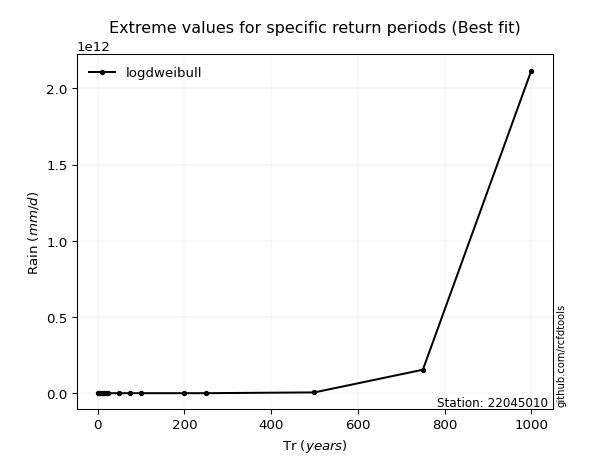</img>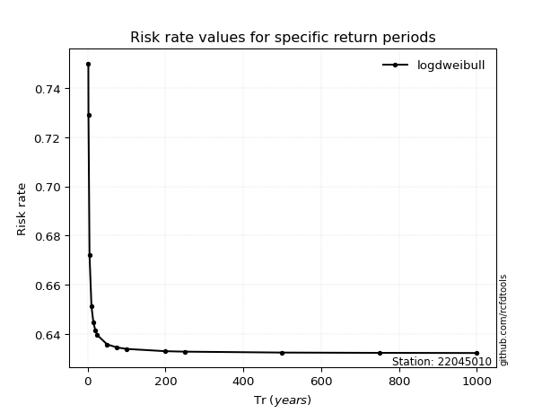</img>

</div>


<sub>**APP DISCLAIMER**: NO WARRANTY - This software is provided by [github.com/rcfdtools](https://github.com/rcfdtools) "as is", without any express or implied warranty, including warranties of merchantability, fitness for a particular purpose, or non-infringement. There is no guarantee that the software will be error-free or operate without interruption. LIMITATION OF LIABILITY - Neither the authors nor copyright holders will be liable for claims or damages arising from the software or its use. You are responsible for determining if the software is appropriate for your use and assume all associated risks, including errors, legal compliance, and data loss. NO PROFESSIONAL ADVICE - The software provides general information and does not offer professional advice. It should not replace consultation with professional advisors.</sub>