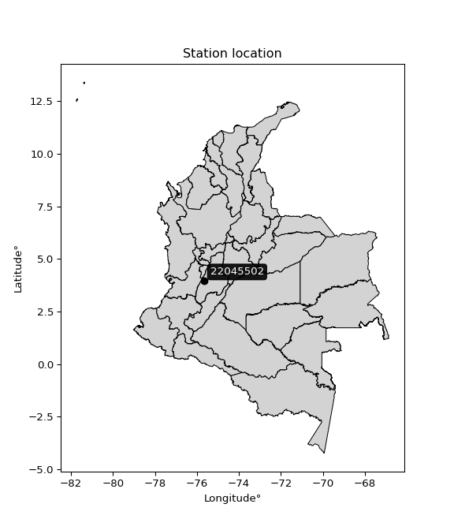

<div align="center">


</div>

# PMP Station (Rain, Pmax24h): 22045502

Probable Maximum Precipitation (PMP) is the greatest amount of rainfall for a specific duration that is meteorologically possible for a given location, acting as a "worst-case" scenario for extreme storms, crucial for designing safety-critical infrastructure like bridges, river deviations, dams, spillways, and nuclear plants to prevent catastrophic failure. PMP is calculated by hydrologists using meteorological data to determine the upper limit of extreme rainfall, often leading to the Probable Maximum Flood (PMF) for flood control design, and is increasingly being studied for climate change impacts.

<div align="center">

</img>

</div>


## A. General information


### 1. General running parameters

• app_version: _v20260103_. • runtime: _2026-01-03 07:24:50.581521_. • Python version: _3.14.0_. • SciPy version: _1.16.3_. • Pandas version: _2.3.3_. • NumPy version: _2.3.5_. • Stations dataset (station_dataset_file): _dataset/pmax24h_in/automatic_colombia_2003_2024.csv_. • Stations catalog (station_catalog_file): _dataset/CNE.xls_. • Minimum year to eval til year_max (date_min): _1900_. • Maximum year to eval since year_min (date_max): _2024_. • Creates, save and include plots into reports (create_plot): _False_. • Plot only fit distributions with Δo > Δ (plot_only_fit): _True_. • Eval low extreme values, if False, evaluates high extreme values (low_extreme): _False_. • Eval every SciPy distribution as logarithmic (pdist_logarithmic_on): _True_. • Standard deviation normalized (ddof): _1.0_. • Return periods to eval in years (Tr): _[2, 2.33, 5, 10, 15, 20, 25, 50, 75, 100, 200, 250, 500, 750, 1000]_. • Minimum data sample per station, 0 means any (minimum_sample): _5_. • Z-Score maximum threshold to adjust a value, 0 means disable (zscore_max): _3.5_. • Z-Score minimum threshold to adjust a value, 0 means disable (zscore_min): _-2.5_. • Avoid zeros, e.g. rain = 0 (avoid_zeros): _True_. • Avoid null values (avoid_nans): _True_. [:file_folder:Dataset file.](../../dataset/pmax24h_in/automatic_colombia_2003_2024.csv)

> Delta Degrees of Freedom (DDOF): is a parameter used in the formulas for calculating variance and standard deviation. When ddof=0, the divisor is $N$ (the total number of observations) and this is used when your data set is the entire population. When ddof=1, the divisor is $N-1$ and this is used when your data set is a sample drawn from a larger population. Using $N-1$ provides an unbiased estimate of the population variance (known as Bessel´s correction).


### 2. Station info and location

|   id |   CODIGO | NOMBRE                     | CATEGORIA               | TECNOLOGIA                | ESTADO   | FECHA_INSTALACION   |   FECHA_SUSPENSION |   ALTITUD |   LATITUD |   LONGITUD | DEPARTAMENTO   | MUNICIPIO   | AREA_OPERATIVA             | ENTIDAD                                    | AREA_HIDROGRAFICA   | ZONA_HIDROGRAFICA   | SUBZONA_HIDROGRAFICA   |   CORRIENTE | Catalogo   |   Version |
|-----:|---------:|:---------------------------|:------------------------|:--------------------------|:---------|:--------------------|-------------------:|----------:|----------:|-----------:|:---------------|:------------|:---------------------------|:-------------------------------------------|:--------------------|:--------------------|:-----------------------|------------:|:-----------|----------:|
|    0 | 22045502 | EL RUBY  - AUT  [22045502] | Climatológica Principal | Automática con Telemetría | Activa   | 06/10/2014          |                nan |      1725 |      3.95 |   -75.6667 | Tolima         | Chaparral   | Area Operativa 10 - Tolima | CENTRO NACIONAL DE INVESTIGACIONES DE CAFE | Magdalena Cauca     | Saldaña             | Río Amoyá              |         nan | CNE_OE     |  20251226 |

<div align="center">

Dynamic map: [:earth_americas:Google](http://maps.google.com/maps?q=3.95,-75.66666667) [:earth_americas:OSM](https://www.openstreetmap.org/#map=18/3.95/-75.66666667&layers=P) [:earth_americas:Bing](https://www.bing.com/maps?cp=3.95~-75.66666667&lvl=18) [:earth_americas:Apple](https://maps.apple.com/frame?center=3.95%2C-75.66666667&span=0.003%2C0.006)

</div>


<div align="center">

```geojson
{
  "type": "Feature",
  "geometry": {
    "type": "Point", 
    "coordinates": [-75.66666667, 3.95]
  }, 
  "properties": {
    "Name": "22045502"
  }
}
```

</div>


### 3. Discrete values table and plot

<div align="center">

|               |          0 |          1 |           2 |          3 |           4 |          5 |          6 |           7 |
|:--------------|-----------:|-----------:|------------:|-----------:|------------:|-----------:|-----------:|------------:|
| Date          | 2016       | 2017       | 2018        | 2019       | 2020        | 2021       | 2022       | 2023        |
| Value         |   38.6     |   49.5     |   47.4      |   43       |   61.9      |   67.1     |   61.3     |   56.6      |
| Value_initial |   38.6     |   49.5     |   47.4      |   43       |   61.9      |   67.1     |   61.3     |   56.6      |
| count         |    8       |    8       |    8        |    8       |    8        |    8       |    8       |    8        |
| mean          |   53.175   |   53.175   |   53.175    |   53.175   |   53.175    |   53.175   |   53.175   |   53.175    |
| std           |   10.0754  |   10.0754  |   10.0754   |   10.0754  |   10.0754   |   10.0754  |   10.0754  |   10.0754   |
| zscore        |   -1.44659 |   -0.36475 |   -0.573179 |   -1.00989 |    0.865971 |    1.38208 |    0.80642 |    0.339937 |


</div>


> The initial value (value_initial) correspond to the initial obtained or null completed value, and value (value) is adjusted only when the initial value is outside the valid range definite through the Z-Score value. If Z-Score is active, values out of range or outliers are replaced with the station mean value


### 4. Active continuous probability distributions from SciPy (44 of 104 available)

A Probability Density Function (PDF) describes the relative likelihood of a continuous random variable falling within a specific range, where the total area under its curve equals 1, and the area over any interval gives the actual probability for that range. Unlike discrete probabilities (like rolling a die), a PDF shows density, not direct probability for a single point (which is zero), with higher points indicating higher likelihood, often visualized as a bell curve for normal distributions.

A log of a probability density function (log-PDF) is simply the logarithm of the PDF´s value, denoted as $log(f(x))$, useful for converting multiplication of probabilities into addition, improving numerical stability with tiny numbers, and connecting to information theory concepts like entropy. Instead of dealing with very small probabilities (e.g., 0.000001), log-PDFs use negative numbers (e.g., $log(0.00001) ≈ -11.51$ that are easier for computers to handle, preventing underflow errors and simplifying complex calculations. In this study, each active probability distribution from SciPy is also evaluated in the $log$ form.

[scipy.stats](https://docs.scipy.org/doc/scipy/reference/stats.html) is a Python´s powerful submodule within the SciPy library for comprehensive statistical analysis, offering over 130 probability distributions (like Normal, Poisson), functions for descriptive stats (mean, variance), hypothesis testing (t-tests, chi-square), random variable generation, and statistical tests, making it essential for data science, modeling, and research. It provides tools to explore, model, and draw conclusions from data efficiently, working seamlessly with NumPy.

<div align="center">

|   id | p_dist             |   n_parameter | fit_method   | label                                                                       | active   | ref                                                                                                        |
|-----:|:-------------------|--------------:|:-------------|:----------------------------------------------------------------------------|:---------|:-----------------------------------------------------------------------------------------------------------|
|    0 | alpha              |             3 | MLE          | Alpha                                                                       | True     | [:mortar_board:](https://docs.scipy.org/doc/scipy/reference/generated/scipy.stats.alpha.html)              |
|    1 | betaprime          |             4 | MLE          | Beta prime                                                                  | True     | [:mortar_board:](https://docs.scipy.org/doc/scipy/reference/generated/scipy.stats.betaprime.html)          |
|    2 | chi2               |             3 | MLE          | Chi²                                                                        | True     | [:mortar_board:](https://docs.scipy.org/doc/scipy/reference/generated/scipy.stats.chi2.html)               |
|    3 | crystalball        |             4 | MLE          | Crystalball                                                                 | True     | [:mortar_board:](https://docs.scipy.org/doc/scipy/reference/generated/scipy.stats.crystalball.html)        |
|    4 | erlang             |             3 | MLE          | Erlang                                                                      | True     | [:mortar_board:](https://docs.scipy.org/doc/scipy/reference/generated/scipy.stats.erlang.html)             |
|    5 | expon              |             2 | MLE          | Exponential                                                                 | True     | [:mortar_board:](https://docs.scipy.org/doc/scipy/reference/generated/scipy.stats.expon.html)              |
|    6 | exponnorm          |             3 | MLE          | Exponentially modified Normal                                               | True     | [:mortar_board:](https://docs.scipy.org/doc/scipy/reference/generated/scipy.stats.exponnorm.html)          |
|    7 | f                  |             4 | MLE          | F                                                                           | True     | [:mortar_board:](https://docs.scipy.org/doc/scipy/reference/generated/scipy.stats.f.html)                  |
|    8 | fatiguelife        |             3 | MLE          | Fatigue-life (Birnbaum-Saunders)                                            | True     | [:mortar_board:](https://docs.scipy.org/doc/scipy/reference/generated/scipy.stats.fatiguelife.html)        |
|    9 | fisk               |             3 | MLE          | Fisk                                                                        | True     | [:mortar_board:](https://docs.scipy.org/doc/scipy/reference/generated/scipy.stats.fisk.html)               |
|   10 | gamma              |             3 | MLE          | Gamma                                                                       | True     | [:mortar_board:](https://docs.scipy.org/doc/scipy/reference/generated/scipy.stats.gamma.html)              |
|   11 | genexpon           |             5 | MLE          | Generalized exponential                                                     | True     | [:mortar_board:](https://docs.scipy.org/doc/scipy/reference/generated/scipy.stats.genexpon.html)           |
|   12 | genlogistic        |             3 | MLE          | Generalized logistic                                                        | True     | [:mortar_board:](https://docs.scipy.org/doc/scipy/reference/generated/scipy.stats.genlogistic.html)        |
|   13 | gibrat             |             2 | MM           | Gibrat                                                                      | True     | [:mortar_board:](https://docs.scipy.org/doc/scipy/reference/generated/scipy.stats.gibrat.html)             |
|   14 | gompertz           |             3 | MLE          | Gompertz (or truncated Gumbel)                                              | True     | [:mortar_board:](https://docs.scipy.org/doc/scipy/reference/generated/scipy.stats.gompertz.html)           |
|   15 | gumbel_l           |             2 | MM           | Gumbel Left Skew                                                            | True     | [:mortar_board:](https://docs.scipy.org/doc/scipy/reference/generated/scipy.stats.gumbel_l.html)           |
|   16 | gumbel_r           |             2 | MM           | Gumbel Right Skew                                                           | True     | [:mortar_board:](https://docs.scipy.org/doc/scipy/reference/generated/scipy.stats.gumbel_r.html)           |
|   17 | halflogistic       |             2 | MM           | Half-logistic                                                               | True     | [:mortar_board:](https://docs.scipy.org/doc/scipy/reference/generated/scipy.stats.halflogistic.html)       |
|   18 | halfnorm           |             2 | MM           | Half Normal                                                                 | True     | [:mortar_board:](https://docs.scipy.org/doc/scipy/reference/generated/scipy.stats.halfnorm.html)           |
|   19 | hypsecant          |             2 | MM           | hyperbolic secant                                                           | True     | [:mortar_board:](https://docs.scipy.org/doc/scipy/reference/generated/scipy.stats.hypsecant.html)          |
|   20 | invgamma           |             3 | MLE          | Inverted gamma                                                              | True     | [:mortar_board:](https://docs.scipy.org/doc/scipy/reference/generated/scipy.stats.invgamma.html)           |
|   21 | invgauss           |             3 | MLE          | Inverse Gaussian                                                            | True     | [:mortar_board:](https://docs.scipy.org/doc/scipy/reference/generated/scipy.stats.invgauss.html)           |
|   22 | invweibull         |             3 | MLE          | Inverted Weibull                                                            | True     | [:mortar_board:](https://docs.scipy.org/doc/scipy/reference/generated/scipy.stats.invweibull.html)         |
|   23 | johnsonsu          |             4 | MLE          | Johnson Su                                                                  | True     | [:mortar_board:](https://docs.scipy.org/doc/scipy/reference/generated/scipy.stats.johnsonsu.html)          |
|   24 | kstwobign          |             2 | MLE          | Limiting distribution of scaled Kolmogorov-Smirnov two-sided test statistic | True     | [:mortar_board:](https://docs.scipy.org/doc/scipy/reference/generated/scipy.stats.kstwobign.html)          |
|   25 | laplace            |             2 | MM           | Laplace                                                                     | True     | [:mortar_board:](https://docs.scipy.org/doc/scipy/reference/generated/scipy.stats.laplace.html)            |
|   26 | laplace_asymmetric |             3 | MLE          | Asymmetric Laplace                                                          | True     | [:mortar_board:](https://docs.scipy.org/doc/scipy/reference/generated/scipy.stats.laplace_asymmetric.html) |
|   27 | loggamma           |             3 | MLE          | Log gamma                                                                   | True     | [:mortar_board:](https://docs.scipy.org/doc/scipy/reference/generated/scipy.stats.loggamma.html)           |
|   28 | logistic           |             2 | MM           | Logistic (or Sech-squared)                                                  | True     | [:mortar_board:](https://docs.scipy.org/doc/scipy/reference/generated/scipy.stats.logistic.html)           |
|   29 | lognorm            |             3 | MLE          | Log Normal                                                                  | True     | [:mortar_board:](https://docs.scipy.org/doc/scipy/reference/generated/scipy.stats.lognorm.html)            |
|   30 | maxwell            |             2 | MM           | Maxwell                                                                     | True     | [:mortar_board:](https://docs.scipy.org/doc/scipy/reference/generated/scipy.stats.maxwell.html)            |
|   31 | mielke             |             4 | MLE          | Mielke Beta-Kappa / Dagum                                                   | True     | [:mortar_board:](https://docs.scipy.org/doc/scipy/reference/generated/scipy.stats.mielke.html)             |
|   32 | moyal              |             2 | MM           | Moyal                                                                       | True     | [:mortar_board:](https://docs.scipy.org/doc/scipy/reference/generated/scipy.stats.moyal.html)              |
|   33 | nakagami           |             3 | MLE          | Nakagami                                                                    | True     | [:mortar_board:](https://docs.scipy.org/doc/scipy/reference/generated/scipy.stats.nakagami.html)           |
|   34 | ncf                |             5 | MLE          | Non-central F distribution                                                  | True     | [:mortar_board:](https://docs.scipy.org/doc/scipy/reference/generated/scipy.stats.ncf.html)                |
|   35 | nct                |             4 | MLE          | Non-central Student’s t                                                     | True     | [:mortar_board:](https://docs.scipy.org/doc/scipy/reference/generated/scipy.stats.nct.html)                |
|   36 | norm               |             2 | MM           | Normal                                                                      | True     | [:mortar_board:](https://docs.scipy.org/doc/scipy/reference/generated/scipy.stats.norm.html)               |
|   37 | pearson3           |             3 | MM           | Pearson type III                                                            | True     | [:mortar_board:](https://docs.scipy.org/doc/scipy/reference/generated/scipy.stats.pearson3.html)           |
|   38 | rayleigh           |             2 | MM           | Rayleigh                                                                    | True     | [:mortar_board:](https://docs.scipy.org/doc/scipy/reference/generated/scipy.stats.rayleigh.html)           |
|   39 | rice               |             3 | MLE          | Rice                                                                        | True     | [:mortar_board:](https://docs.scipy.org/doc/scipy/reference/generated/scipy.stats.rice.html)               |
|   40 | t                  |             3 | MLE          | Student’s t                                                                 | True     | [:mortar_board:](https://docs.scipy.org/doc/scipy/reference/generated/scipy.stats.t.html)                  |
|   41 | truncnorm          |             4 | MLE          | Truncated normal                                                            | True     | [:mortar_board:](https://docs.scipy.org/doc/scipy/reference/generated/scipy.stats.truncnorm.html)          |
|   42 | wald               |             2 | MM           | Wald                                                                        | True     | [:mortar_board:](https://docs.scipy.org/doc/scipy/reference/generated/scipy.stats.wald.html)               |
|   43 | weibull_min        |             3 | MLE          | Weibull minimum                                                             | True     | [:mortar_board:](https://docs.scipy.org/doc/scipy/reference/generated/scipy.stats.weibull_min.html)        |

</div>

> **n_parameter:** # arguments & localization & scale.
>
> **Fit methods:** (MLE) maximum likelihood, (MM) L-moments.
>
>**Inactive** (With the only purpose of prevent loops, zero divisions, infinite values, over high estimated values or horizontal trending for recurrence intervals estimations, the follow distributions were disabled.)**:** foldnorm, gennorm, norminvgauss, powernorm, powerlognorm, skewnorm, genextreme, anglit, arcsine, argus, beta, bradford, burr, burr12, cauchy, cosine, halfcauchy, foldcauchy, skewcauchy, wrapcauchy, dgamma, gengamma, exponweib, exponpow, truncexpon, gausshyper, genhalflogistic, genhyperbolic, geninvgauss, halfgennorm, johnsonsb, kappa4, kappa3, ksone, kstwo, loglaplace, levy, levy_l, levy_stable, ncx2, pareto, genpareto, truncpareto, lomax, powerlaw, rdist, rel_breitwigner, recipinvgauss, semicircular, studentized_range, trapezoid, triang, truncweibull_min, tukeylambda, uniform, loguniform, vonmises, vonmises_line, weibull_max, dweibull, 


## B. Probability distributions vs. Empirical distributions

A continuous probability distribution (CPD) describes probabilities for variables that can take any value within a range (like rain any time), unlike discrete variables with specific outcomes (like temperature). It uses a Probability Density Function (PDF), a curve where the total area under it equals 1, and the probability of the variable falling within an interval (a to b) is found by calculating the area under the curve between those points. A key feature is that the probability of hitting any single exact value is zero, so probabilities are always expressed for ranges, e.g., $P(a ≤ X ≤ b)$.

<div align="center">

Distributions parameters from station values
|    |   station | p_dist                |   n |            loc |           scale | shape                  | shape1                 | shape2            | shape3   |
|---:|----------:|:----------------------|----:|---------------:|----------------:|:-----------------------|:-----------------------|:------------------|:---------|
|  0 |  22045502 | alpha                 |   8 | -106.473       |  2666.63        | 16.77539123885155      |                        |                   |          |
|  1 |  22045502 | betaprime             |   8 |   -0.699747    |     8.68802     | 218.09572349985018     | 36.16409276881252      |                   |          |
|  2 |  22045502 | chi2                  |   8 |   38.6         |     2.65186     | 0.53665923928838       |                        |                   |          |
|  3 |  22045502 | crystalball           |   8 |    0.0282489   |    53.9838      | 17.45556634499541      | 1.0000000175889951     |                   |          |
|  4 |  22045502 | erlang                |   8 | -279.539       |     0.268158    | 1240.748888316048      |                        |                   |          |
|  5 |  22045502 | expon                 |   8 |   38.6         |    14.575       |                        |                        |                   |          |
|  6 |  22045502 | exponnorm             |   8 |   53.1638      |     9.42468     | 0.0011862614251484493  |                        |                   |          |
|  7 |  22045502 | f                     |   8 | -758.057       |   811.207       | 17739.732879839004     | 88067.66697978516      |                   |          |
|  8 |  22045502 | fatiguelife           |   8 |   38.6         |     2.30187e-06 | 1996.7889958420403     |                        |                   |          |
|  9 |  22045502 | fisk                  |   8 |   -1.46973e+08 |     1.46973e+08 | 25340395.510123737     |                        |                   |          |
| 10 |  22045502 | gamma                 |   8 | -281.019       |     0.266778    | 1252.6799105295413     |                        |                   |          |
| 11 |  22045502 | genexpon              |   8 |   38.6         |     2.2237      | 0.15256104873437681    | 1.0042389369427174e-06 | 1.610876642767836 |          |
| 12 |  22045502 | genlogistic           |   8 |    6.49542     |     8.54296     | 136.64617815585734     |                        |                   |          |
| 13 |  22045502 | gibrat                |   8 |   45.9851      |     4.36087     |                        |                        |                   |          |
| 14 |  22045502 | gompertz              |   8 |  -18.8515      |     8.27319     | 9.43657114631022e-05   |                        |                   |          |
| 15 |  22045502 | gumbel_l              |   8 |   57.4166      |     7.34838     |                        |                        |                   |          |
| 16 |  22045502 | gumbel_r              |   8 |   48.9334      |     7.34838     |                        |                        |                   |          |
| 17 |  22045502 | halflogistic          |   8 |   42.0046      |     8.05774     |                        |                        |                   |          |
| 18 |  22045502 | halfnorm              |   8 |   40.7004      |    15.6346      |                        |                        |                   |          |
| 19 |  22045502 | hypsecant             |   8 |   53.175       |     5.99993     |                        |                        |                   |          |
| 20 |  22045502 | invgamma              |   8 |  -47.9891      | 11351.8         | 113.25885761889634     |                        |                   |          |
| 21 |  22045502 | invgauss              |   8 |   -4.88204     |  2084.6         | 0.02781897246815572    |                        |                   |          |
| 22 |  22045502 | invweibull            |   8 |   -4.44275e+08 |     4.44275e+08 | 51840056.27809008      |                        |                   |          |
| 23 |  22045502 | johnsonsu             |   8 |   -1.28238e+07 |     1.21835e+08 | -1366460.754376026     | 13006154.23785849      |                   |          |
| 24 |  22045502 | kstwobign             |   8 |   18.7998      |    39.2267      |                        |                        |                   |          |
| 25 |  22045502 | laplace               |   8 |   53.175       |     6.66425     |                        |                        |                   |          |
| 26 |  22045502 | laplace_asymmetric    |   8 |   49.5         |     7.92478     | 0.794656176282041      |                        |                   |          |
| 27 |  22045502 | loggamma              |   8 |  -88.623       |    45.2576      | 23.44386118129743      |                        |                   |          |
| 28 |  22045502 | logistic              |   8 |   53.175       |     5.19609     |                        |                        |                   |          |
| 29 |  22045502 | lognorm               |   8 |   38.6         |     0.173303    | 11.665191790656054     |                        |                   |          |
| 30 |  22045502 | maxwell               |   8 |   30.8425      |    13.9948      |                        |                        |                   |          |
| 31 |  22045502 | mielke                |   8 |  -12.9224      |    80.2265      | 4.898110347784824      | 1392.409276467767      |                   |          |
| 32 |  22045502 | moyal                 |   8 |   47.7854      |     4.24259     |                        |                        |                   |          |
| 33 |  22045502 | nakagami              |   8 |   38.6         |    16.3108      | 0.3070541417189588     |                        |                   |          |
| 34 |  22045502 | ncf                   |   8 |   -0.0186046   |     2.2022e-05  | 2.690861148295761e-06  | 9.931921358192275      | 5.552428825404554 |          |
| 35 |  22045502 | nct                   |   8 |   -1.04906     |     8.57671     | 95.32708287173162      | 6.259927844221078      |                   |          |
| 36 |  22045502 | norm                  |   8 |   53.175       |     9.42467     |                        |                        |                   |          |
| 37 |  22045502 | pearson3              |   8 |   53.175       |     9.42465     | -0.06732597385617091   |                        |                   |          |
| 38 |  22045502 | rayleigh              |   8 |   35.1451      |    14.3858      |                        |                        |                   |          |
| 39 |  22045502 | rice                  |   8 |   34.2569      |    11.2825      | 1.2285346023559103     |                        |                   |          |
| 40 |  22045502 | t                     |   8 |   53.1788      |     9.42558     | 594981.3247618123      |                        |                   |          |
| 41 |  22045502 | truncnorm             |   8 |   51.2756      |    10.8066      | -1.1729494101979       | 168.86164019194638     |                   |          |
| 42 |  22045502 | wald                  |   8 |   43.7503      |     9.42467     |                        |                        |                   |          |
| 43 |  22045502 | weibull_min           |   8 |   33.1166      |    22.6758      | 2.2967195984469955     |                        |                   |          |
| 44 |  22045502 | logalpha              |   8 |   -3.17265     |   277.264       | 38.91153452216574      |                        |                   |          |
| 45 |  22045502 | logbetaprime          |   8 |    2.22669     |     4.46804     | 116.25396026403517     | 301.2962180492084      |                   |          |
| 46 |  22045502 | logchi2               |   8 |    3.65325     |     0.962218    | 0.9956536186702161     |                        |                   |          |
| 47 |  22045502 | logcrystalball        |   8 |    3.95732     |     0.182089    | 7.683185649160446      | 19.742889523612348     |                   |          |
| 48 |  22045502 | logerlang             |   8 |    0.69556     |     0.0103745   | 314.4009345176278      |                        |                   |          |
| 49 |  22045502 | logexpon              |   8 |    3.65325     |     0.304065    |                        |                        |                   |          |
| 50 |  22045502 | logexponnorm          |   8 |    3.95718     |     0.182089    | 0.0007774387105973724  |                        |                   |          |
| 51 |  22045502 | logf                  |   8 |  -63.0893      |    67.0467      | 808813.2183759571      | 406567.2519932834      |                   |          |
| 52 |  22045502 | logfatiguelife        |   8 |  -23.3067      |    27.2629      | 0.006672396248498653   |                        |                   |          |
| 53 |  22045502 | logfisk               |   8 |   -6.3384e+06  |     6.33841e+06 | 56967850.302548885     |                        |                   |          |
| 54 |  22045502 | loggamma              |   8 |    0.783698    |     0.0106793   | 297.16521057248644     |                        |                   |          |
| 55 |  22045502 | loggenexpon           |   8 |    3.65325     |     1.16636e+10 | 21824821586.44867      | 39308859395.68788      | 32887234801.29677 |          |
| 56 |  22045502 | loggenlogistic        |   8 |    4.20619     |     2.93999e-07 | 1.1807359137404624e-06 |                        |                   |          |
| 57 |  22045502 | loggibrat             |   8 |    3.81841     |     0.0842513   |                        |                        |                   |          |
| 58 |  22045502 | loggompertz           |   8 |    3.65325     |     0.215463    | 0.21708795038439727    |                        |                   |          |
| 59 |  22045502 | loggumbel_l           |   8 |    4.03927     |     0.141974    |                        |                        |                   |          |
| 60 |  22045502 | loggumbel_r           |   8 |    3.87537     |     0.141974    |                        |                        |                   |          |
| 61 |  22045502 | loghalflogistic       |   8 |    3.74148     |     0.155697    |                        |                        |                   |          |
| 62 |  22045502 | loghalfnorm           |   8 |    3.71628     |     0.3021      |                        |                        |                   |          |
| 63 |  22045502 | loghypsecant          |   8 |    3.95732     |     0.115921    |                        |                        |                   |          |
| 64 |  22045502 | loginvgamma           |   8 |   -5.40305     | 24549.6         | 2623.7469287161784     |                        |                   |          |
| 65 |  22045502 | loginvgauss           |   8 |    2.76223     |    47.4709      | 0.025174481865883447   |                        |                   |          |
| 66 |  22045502 | loginvweibull         |   8 |   -8.08695e+06 |     8.08696e+06 | 44965489.37834956      |                        |                   |          |
| 67 |  22045502 | logjohnsonsu          |   8 |   -1.0072e+06  |     5.63786e+06 | -5594292.427505836     | 31479479.816134796     |                   |          |
| 68 |  22045502 | logkstwobign          |   8 |    3.25961     |     0.796175    |                        |                        |                   |          |
| 69 |  22045502 | loglaplace            |   8 |    3.95732     |     0.128756    |                        |                        |                   |          |
| 70 |  22045502 | loglaplace_asymmetric |   8 |    4.12552     |     0.107544    | 2.049664765318214      |                        |                   |          |
| 71 |  22045502 | logloggamma           |   8 |    4.20619     |     6.02801e-07 | 2.4288971508005027e-06 |                        |                   |          |
| 72 |  22045502 | loglogistic           |   8 |    3.95732     |     0.100391    |                        |                        |                   |          |
| 73 |  22045502 | loglognorm            |   8 |    3.65325     |     0.00428284  | 11.311456946397445     |                        |                   |          |
| 74 |  22045502 | logmaxwell            |   8 |    3.52584     |     0.270386    |                        |                        |                   |          |
| 75 |  22045502 | logmielke             |   8 |    3.65325     |     0.558863    | 0.6160690983040271     | 2902.032491945122      |                   |          |
| 76 |  22045502 | logmoyal              |   8 |    3.85319     |     0.0819688   |                        |                        |                   |          |
| 77 |  22045502 | lognakagami           |   8 |    3.65325     |     0.322085    | 0.15331887419079043    |                        |                   |          |
| 78 |  22045502 | logncf                |   8 |    1.94175     |     0.0225976   | 6.330354596213255      | 1477.2815080772812     | 557.544935034306  |          |
| 79 |  22045502 | lognct                |   8 |   -4.58896     |     0.0764465   | 578.06104435823        | 111.717057812332       |                   |          |
| 80 |  22045502 | lognorm               |   8 |    3.95732     |     0.182089    |                        |                        |                   |          |
| 81 |  22045502 | logpearson3           |   8 |    3.95732     |     0.182089    | -0.25152924567175405   |                        |                   |          |
| 82 |  22045502 | lograyleigh           |   8 |    3.60897     |     0.27794     |                        |                        |                   |          |
| 83 |  22045502 | logrice               |   8 |    3.56269     |     0.208558    | 1.5305520991954313     |                        |                   |          |
| 84 |  22045502 | logt                  |   8 |    3.95732     |     0.182089    | 55878983474.51201      |                        |                   |          |
| 85 |  22045502 | logtruncnorm          |   8 |   -0.06274     |     1.02894     | 3.611462737485457      | 4.14884135351131       |                   |          |
| 86 |  22045502 | logwald               |   8 |    3.77524     |     0.182075    |                        |                        |                   |          |
| 87 |  22045502 | logweibull_min        |   8 |    3.06893     |     0.962125    | 5.843080354528016      |                        |                   |          |

</div>

> **loc** (Location parameter): This shifts the distribution along the x-axis. For many common distributions, like the normal (Gaussian) distribution, loc represents the mean $μ$. For others, like the uniform distribution, it might represent the minimum value, or for the beta distribution, the left end of the support interval.
>
> **scale** (Scale parameter): This determines the width or spread of the distribution. For the normal distribution, scale represents the standard deviation $σ$. For a uniform distribution, it defines the length of the interval (from $loc$ to $loc + scale$).
>
> **shape** (Shape parameters): Refers to parameters that define the specific form of a probability distribution, distinct from its location (loc) and scale (scale). These parameters are required arguments for most distribution functions. For example, a normal (Gaussian) distribution is fully defined by its location (mean) and scale (standard deviation), so it has no specific shape parameters beyond loc and scale. However, other distributions have intrinsic properties that need specification, as Gamma distribution that takes a shape parameter, often named $a$ or $alpha$.


### 0. Cumulative distribution values - CDF (88 evaluated)

Cumulative Distribution Function (CDF), denoted as $F$<sub>$X$</sub>$(x)$, is a function that gives the probability that a random variable $X$ will take a value less than or equal to a specific value, $x$ (i.e., $(P(X≥x)$. It essentially "accumulates" probabilities from a given point up to the far right (positive infinity), providing a complete picture of the distribution´s probabilities for both discrete (like rain) and continuous (like temperature) variables, helping to find probabilities over ranges or above certain values. Each station is evaluated separately ordering the $x$ values ascending, calculating the CDF and PDF values for the activated distributions and their logarithmic forms.

<div align="center">

CDF ordered by x ascending and calculating $log(f(x))$ separately
|   id |   Station |   date |    x |   count |   mean |     std |    zscore |   Value_initial |   station |   m |     alpha |   alpha_pdf |   betaprime |   betaprime_pdf |       chi2 |    chi2_pdf |   crystalball |   crystalball_pdf |    erlang |   erlang_pdf |    expon |   expon_pdf |   exponnorm |   exponnorm_pdf |         f |     f_pdf |   fatiguelife |   fatiguelife_pdf |      fisk |   fisk_pdf |     gamma |   gamma_pdf |    genexpon |   genexpon_pdf |   genlogistic |   genlogistic_pdf |   gibrat |   gibrat_pdf |   gompertz |   gompertz_pdf |   gumbel_l |   gumbel_l_pdf |   gumbel_r |   gumbel_r_pdf |   halflogistic |   halflogistic_pdf |   halfnorm |   halfnorm_pdf |   hypsecant |   hypsecant_pdf |   invgamma |   invgamma_pdf |   invgauss |   invgauss_pdf |   invweibull |   invweibull_pdf |   johnsonsu |   johnsonsu_pdf |   kstwobign |   kstwobign_pdf |   laplace |   laplace_pdf |   laplace_asymmetric |   laplace_asymmetric_pdf |   loggamma |   loggamma_pdf |   logistic |   logistic_pdf |   lognorm |   lognorm_pdf |   maxwell |   maxwell_pdf |   mielke |   mielke_pdf |      moyal |   moyal_pdf |    nakagami |   nakagami_pdf |      ncf |    ncf_pdf |       nct |   nct_pdf |      norm |   norm_pdf |   pearson3 |   pearson3_pdf |   rayleigh |   rayleigh_pdf |      rice |   rice_pdf |         t |     t_pdf |   truncnorm |   truncnorm_pdf |     wald |   wald_pdf |   weibull_min |   weibull_min_pdf |   logalpha |   logalpha_pdf |   logbetaprime |   logbetaprime_pdf |     logchi2 |   logchi2_pdf |   logcrystalball |   logcrystalball_pdf |   logerlang |   logerlang_pdf |   logexpon |   logexpon_pdf |   logexponnorm |   logexponnorm_pdf |      logf |   logf_pdf |   logfatiguelife |   logfatiguelife_pdf |   logfisk |   logfisk_pdf |   loggenexpon |   loggenexpon_pdf |   loggenlogistic |   loggenlogistic_pdf |   loggibrat |   loggibrat_pdf |   loggompertz |   loggompertz_pdf |   loggumbel_l |   loggumbel_l_pdf |   loggumbel_r |   loggumbel_r_pdf |   loghalflogistic |   loghalflogistic_pdf |   loghalfnorm |   loghalfnorm_pdf |   loghypsecant |   loghypsecant_pdf |   loginvgamma |   loginvgamma_pdf |   loginvgauss |   loginvgauss_pdf |   loginvweibull |   loginvweibull_pdf |   logjohnsonsu |   logjohnsonsu_pdf |   logkstwobign |   logkstwobign_pdf |   loglaplace |   loglaplace_pdf |   loglaplace_asymmetric |   loglaplace_asymmetric_pdf |   logloggamma |   logloggamma_pdf |   loglogistic |   loglogistic_pdf |   loglognorm |   loglognorm_pdf |   logmaxwell |   logmaxwell_pdf |   logmielke |   logmielke_pdf |    logmoyal |   logmoyal_pdf |   lognakagami |   lognakagami_pdf |    logncf |   logncf_pdf |   lognct |   lognct_pdf |   logpearson3 |   logpearson3_pdf |   lograyleigh |   lograyleigh_pdf |   logrice |   logrice_pdf |      logt |   logt_pdf |   logtruncnorm |   logtruncnorm_pdf |   logwald |   logwald_pdf |   logweibull_min |   logweibull_min_pdf |
|-----:|----------:|-------:|-----:|--------:|-------:|--------:|----------:|----------------:|----------:|----:|----------:|------------:|------------:|----------------:|-----------:|------------:|--------------:|------------------:|----------:|-------------:|---------:|------------:|------------:|----------------:|----------:|----------:|--------------:|------------------:|----------:|-----------:|----------:|------------:|------------:|---------------:|--------------:|------------------:|---------:|-------------:|-----------:|---------------:|-----------:|---------------:|-----------:|---------------:|---------------:|-------------------:|-----------:|---------------:|------------:|----------------:|-----------:|---------------:|-----------:|---------------:|-------------:|-----------------:|------------:|----------------:|------------:|----------------:|----------:|--------------:|---------------------:|-------------------------:|-----------:|---------------:|-----------:|---------------:|----------:|--------------:|----------:|--------------:|---------:|-------------:|-----------:|------------:|------------:|---------------:|---------:|-----------:|----------:|----------:|----------:|-----------:|-----------:|---------------:|-----------:|---------------:|----------:|-----------:|----------:|----------:|------------:|----------------:|---------:|-----------:|--------------:|------------------:|-----------:|---------------:|---------------:|-------------------:|------------:|--------------:|-----------------:|---------------------:|------------:|----------------:|-----------:|---------------:|---------------:|-------------------:|----------:|-----------:|-----------------:|---------------------:|----------:|--------------:|--------------:|------------------:|-----------------:|---------------------:|------------:|----------------:|--------------:|------------------:|--------------:|------------------:|--------------:|------------------:|------------------:|----------------------:|--------------:|------------------:|---------------:|-------------------:|--------------:|------------------:|--------------:|------------------:|----------------:|--------------------:|---------------:|-------------------:|---------------:|-------------------:|-------------:|-----------------:|------------------------:|----------------------------:|--------------:|------------------:|--------------:|------------------:|-------------:|-----------------:|-------------:|-----------------:|------------:|----------------:|------------:|---------------:|--------------:|------------------:|----------:|-------------:|---------:|-------------:|--------------:|------------------:|--------------:|------------------:|----------:|--------------:|----------:|-----------:|---------------:|-------------------:|----------:|--------------:|-----------------:|---------------------:|
|    0 |  22045502 |   2016 | 38.6 |       8 | 53.175 | 10.0754 | -1.44659  |            38.6 |  22045502 |   1 | 0.0541439 |   0.013921  |   0.0447933 |       0.0142896 | 0.00011312 | 4.27186e+09 |      0.762543 |        0.00572518 | 0.0597465 |    0.0129512 | 0        |  0.0686106  |   0.0609955 |       0.0128033 | 0.0606437 | 0.0129037 |     0.0583099 |       3.89749e+11 | 0.0738428 |  0.0117915 | 0.0598079 |   0.0129644 | 2.83068e-07 |     0.0686069  |     0.0427948 |         0.0156056 | 0        |   0          |  0.0931551 |      0.0107287 |  0.0743461 |     0.00973157 |  0.0168994 |     0.00938406 |      0         |          0         |   0        |      0         |   0.0559467 |      0.00927662 |  0.0519079 |      0.0137169 |  0.0488989 |      0.0141671 |     0.042453 |        0.0156502 |   0.0608876 |       0.0127929 |   0.0391839 |       0.0171857 |  0.056124 |    0.00842166 |            0.0685611 |                0.0108871 |  0.0457576 |       0.558176 |   0.057055 |      0.0103539 | 0.0474723 |      0.543397 | 0.0413431 |     0.0150231 | 0.114284 |    0.0108647 | 0.00315615 |  0.00355622 | 2.86277e-10 | 24742.4        | 0.498241 | 0.00934004 | 0.0589688 | 0.0134149 | 0.0609951 |  0.0128032 |  0.0628105 |      0.0126644 |  0.0284273 |      0.0162199 | 0.0345115 |  0.0157406 | 0.0609649 | 0.012797  | 2.98817e-08 |       0.0210953 | 0        | 0          |     0.0376467 |         0.0154678 |  0.0438357 |       0.552265 |      0.0453042 |           0.593691 | 1.85376e-08 |   2.07808e+07 |        0.0474723 |             0.543397 |    0.045674 |        0.556726 |   0        |       3.28877  |      0.0474731 |           0.543402 | 0.0471791 |   0.542848 |        0.0470046 |             0.545707 | 0.0576369 |      0.488168 |   2.49293e-14 |          1.87119  |         0        |             0.435899 |    0        |        0        |   5.36025e-09 |          1.00754  |     0.0638191 |          0.434853 |    0.00839444 |          0.282636 |         0         |              0        |      0        |          0        |      0.0461266 |           0.396522 |     0.0457894 |          0.549622 |     0.0372087 |          0.582782 |        0.037314 |            0.682258 |      0.0473305 |           0.542563 |       0.032598 |           0.753049 |    0.0471367 |         0.366092 |               0.0947965 |                    0.430056 |      0.107744 |          0.434138 |      0.046141 |          0.438406 |   0.00410748 |      2.41507e+12 |    0.0260447 |         0.586368 | 7.63683e-10 |    529715       | 0.000709792 |      0.0534154 |   2.23333e-05 |       1.54208e+10 | 0.0442833 |     0.562588 | 0.117901 |     0.795016 |     0.0540558 |          0.530993 |     0.0126112 |          0.565986 | 0.0294298 |      0.653955 | 0.0474724 |   0.543397 |    1.80272e-06 |           4.21023  |  0        |      0        |         0.052819 |             0.513974 |
|    1 |  22045502 |   2019 | 43   |       8 | 53.175 | 10.0754 | -1.00989  |            43   |  22045502 |   2 | 0.143472  |   0.02701   |   0.141395  |       0.0297611 | 0.9044     | 0.0280257   |      0.786988 |        0.00538337 | 0.140261  |    0.0240876 | 0.260578 |  0.0507322  |   0.140158  |       0.0236344 | 0.140572  | 0.0238733 |     0.755655  |       0.024699    | 0.145483  |  0.0214342 | 0.140402  |   0.0241104 | 0.260567    |     0.0507305  |     0.150835  |         0.0331675 | 0        |   0          |  0.153377  |      0.0170482 |  0.131159  |     0.0166233  |  0.106228  |     0.0324127  |      0.0616884 |          0.061816  |   0.116935 |      0.0504842 |   0.115499  |      0.0188304  |  0.140688  |      0.0269761 |  0.142002  |      0.028371  |     0.150963 |        0.0333052 |   0.140018  |       0.0236321 |   0.1589    |       0.0360006 |  0.108614 |    0.0162981  |            0.137885  |                0.0218952 |  0.142756  |       1.27833  |   0.123662 |      0.020856  | 0.140731  |      1.22668  | 0.139723  |     0.0295021 | 0.17073  |    0.0149538 | 0.0788101  |  0.0352679  | 0.345399    |     0.0473893  | 0.537861 | 0.00867071 | 0.143161  | 0.0252698 | 0.140157  |  0.0236344 |  0.140518  |      0.023119  |  0.13849   |      0.032699  | 0.135567  |  0.0296515 | 0.140091  | 0.0236245 | 0.115386    |       0.0313037 | 0        | 0          |     0.137983  |         0.0297432 |  0.141089  |       1.29035  |      0.149141  |           1.36098  | 0.264014    |   1.17264     |        0.140731  |             1.22668  |    0.142453 |        1.27599  |   0.298837 |       2.30596  |      0.140732  |           1.22669  | 0.140473  |   1.2278   |        0.141025  |             1.2385   | 0.138952  |      1.07533  |   0.222867    |          2.14146  |         0        |             0.67246  |    0        |        0        |   0.131675    |          1.44387  |     0.131562  |          0.862841 |    0.107015   |          1.6845   |         0.0632584 |              3.19852  |      0.118215 |          2.61208  |      0.115956  |           0.978323 |     0.141243  |          1.26026  |     0.145536  |          1.45208  |        0.164587 |            1.65121  |      0.140525  |           1.22652  |       0.177757 |           1.84869  |    0.10901   |         0.846639 |               0.154694  |                    0.70179  |      0.166454 |          0.670701 |      0.124168 |          1.08327  |   0.612289   |      0.313692    |    0.140439  |         1.53078  | 0.363137    |         2.07246 | 0.0796672   |      1.8363    |   0.574347    |       1.6073      | 0.14308   |     1.30609  | 0.224971 |     1.18269  |     0.141544  |          1.13149  |     0.139284  |          1.69611  | 0.143067  |      1.44362  | 0.140731  |   1.22668  |    0.377678    |           2.86661  |  0        |      0        |         0.135945 |             1.06564  |
|    2 |  22045502 |   2018 | 47.4 |       8 | 53.175 | 10.0754 | -0.573179 |            47.4 |  22045502 |   3 | 0.289548  |   0.0385242 |   0.300334  |       0.041046  | 0.97047    | 0.00736223  |      0.809897 |        0.00502846 | 0.272349  |    0.035569  | 0.453255 |  0.0375125  |   0.27002   |       0.0350842 | 0.271554  | 0.0353171 |     0.836258  |       0.0137424   | 0.266617  |  0.0337127 | 0.272603  |   0.0355963 | 0.453239    |     0.0375118  |     0.321966  |         0.0425354 | 0.130158 |   0.149643   |  0.246826  |      0.0258141 |  0.225754  |     0.0269587  |  0.291697  |     0.0489063  |      0.322824  |          0.0555853 |   0.331721 |      0.0465565 |   0.232261  |      0.0353659  |  0.286956  |      0.0386258 |  0.294284  |      0.0397167 |     0.322549 |        0.0425857 |   0.269903  |       0.0350969 |   0.337598  |       0.0429851 |  0.210197 |    0.0315409  |            0.277303  |                0.044034  |  0.300913  |       1.93134  |   0.247608 |      0.0358535 | 0.293903  |      1.89161  | 0.29441   |     0.0396344 | 0.247412 |    0.0200896 | 0.295347   |  0.0569126  | 0.520562    |     0.0339159  | 0.574567 | 0.0080177  | 0.281038  | 0.0368437 | 0.27002   |  0.0350843 |  0.267697  |      0.0344595 |  0.304307  |      0.0411965 | 0.288669  |  0.0389514 | 0.269907  | 0.0350735 | 0.272316    |       0.0393559 | 0.2577   | 0.108173   |     0.292429  |         0.0393569 |  0.301045  |       1.953    |      0.314194  |           1.97388  | 0.35771     |   0.807071    |        0.293903  |             1.89161  |    0.300428 |        1.93034  |   0.491054 |       1.6738   |      0.293905  |           1.89161  | 0.293755  |   1.8922   |        0.295537  |             1.90515  | 0.279203  |      1.80877  |   0.423635    |          1.93237  |         0        |             0.994463 |    0.229761 |        7.54675  |   0.292496    |          1.84902  |     0.24434   |          1.49118  |    0.324592   |          2.57249  |         0.359404  |              2.79655  |      0.362494 |          2.36362  |      0.256818  |           1.98279  |     0.297955  |          1.9235   |     0.320595  |          2.06582  |        0.350048 |            2.04306  |      0.293744  |           1.89277  |       0.376815 |           2.11297  |    0.232312  |         1.80427  |               0.240668  |                    1.09182  |      0.246476 |          0.99314  |      0.272275 |          1.9737   |   0.63388    |      0.16197     |    0.321131  |         2.09591  | 0.5397      |         1.61899 | 0.333348    |      2.94881   |   0.695444    |       0.983633    | 0.30407   |     1.95552  | 0.353924 |     1.44049  |     0.283704  |          1.77983  |     0.331954  |          2.15892  | 0.312567  |      1.98499  | 0.293903  |   1.89161  |    0.612784    |           2.00727  |  0.326844 |      5.13004  |         0.270483 |             1.70233  |
|    3 |  22045502 |   2017 | 49.5 |       8 | 53.175 | 10.0754 | -0.36475  |            49.5 |  22045502 |   4 | 0.373963  |   0.0415287 |   0.388922  |       0.0429082 | 0.982315   | 0.00423689  |      0.820276 |        0.00485603 | 0.3515    |    0.0395659 | 0.52662  |  0.0324789  |   0.348293  |       0.0392308 | 0.350236  | 0.0393799 |     0.862096  |       0.011013    | 0.343039  |  0.038856  | 0.351811  |   0.0395913 | 0.526602    |     0.0324786  |     0.411839  |         0.0426279 | 0.414622 |   0.110892   |  0.306077  |      0.0306557 |  0.288589  |     0.0329649  |  0.396217  |     0.0499178  |      0.434236  |          0.0503515 |   0.426449 |      0.0435578 |   0.316192  |      0.0444502  |  0.371609  |      0.0416487 |  0.380658  |      0.0421692 |     0.412468 |        0.0426226 |   0.348209  |       0.0392499 |   0.427366  |       0.0421556 |  0.288057 |    0.0432242  |            0.387059  |                0.0614625 |  0.388806  |       2.10666  |   0.330204 |      0.0425646 | 0.380585  |      2.09202  | 0.380123  |     0.0416676 | 0.292561 |    0.0229564 | 0.413908   |  0.0550255  | 0.587297    |     0.0297715  | 0.591085 | 0.00771496 | 0.362538  | 0.0404852 | 0.348293  |  0.0392308 |  0.34478   |      0.0387444 |  0.392168  |      0.0421615 | 0.372976  |  0.0410645 | 0.348158  | 0.0392214 | 0.357366    |       0.0414073 | 0.453885 | 0.0784257  |     0.377504  |         0.0413653 |  0.389828  |       2.1252   |      0.403024  |           2.10589  | 0.39065     |   0.716739    |        0.380585  |             2.09202  |    0.388304 |        2.10687  |   0.558679 |       1.4514   |      0.380587  |           2.09202  | 0.380437  |   2.09141  |        0.382735  |             2.10183  | 0.363826  |      2.08027  |   0.50399     |          1.77075  |         0        |             1.18359  |    0.496726 |        4.77401  |   0.375939    |          1.99442  |     0.31628   |          1.831    |    0.436434   |          2.54874  |         0.474154  |              2.48938  |      0.461238 |          2.18646  |      0.353493  |           2.46016  |     0.385728  |          2.10926  |     0.412656  |          2.16042  |        0.438299 |            2.01021  |      0.380487  |           2.09366  |       0.466904 |           2.02826  |    0.325306  |         2.52652  |               0.292974  |                    1.32911  |      0.293518 |          1.18269  |      0.365564 |          2.31024  |   0.640232   |      0.132948    |    0.414016  |         2.16999  | 0.607287    |         1.50422 | 0.457718    |      2.74329   |   0.734747    |       0.83662     | 0.392753  |     2.11803  | 0.41781  |     1.5004   |     0.36619   |          2.01465  |     0.426305  |          2.17595  | 0.401486  |      2.10168  | 0.380585  |   2.09202  |    0.693151    |           1.708    |  0.513191 |      3.53097  |         0.350116 |             1.96448  |
|    4 |  22045502 |   2023 | 56.6 |       8 | 53.175 | 10.0754 |  0.339937 |            56.6 |  22045502 |   5 | 0.663852  |   0.0365811 |   0.67347   |       0.0342579 | 0.996533   | 0.000769616 |      0.852667 |        0.00426757 | 0.644527  |    0.0391638 | 0.709163 |  0.0199545  |   0.64185   |       0.0396247 | 0.643347  | 0.0393673 |     0.919309  |       0.00582099  | 0.639769  |  0.0397355 | 0.644938  |   0.0391628 | 0.709145    |     0.0199548  |     0.679013  |         0.0307252 | 0.813155 |   0.025302   |  0.577706  |      0.0440072 |  0.591321  |     0.0497655  |  0.703077  |     0.0337062  |      0.71905   |          0.0299691 |   0.690823 |      0.0304286 |   0.672571  |      0.0454447  |  0.662223  |      0.0366583 |  0.668081  |      0.0355322 |     0.679255 |        0.030654  |   0.641928  |       0.0396446 |   0.688965  |       0.0302132 |  0.700932 |    0.0448765  |            0.699239  |                0.0301588 |  0.671425  |       1.93177  |   0.659069 |      0.0432435 | 0.667187  |      1.99559  | 0.664344  |     0.0355034 | 0.495873 |    0.0349361 | 0.723436   |  0.0312558  | 0.759339    |     0.0193591  | 0.642368 | 0.00674592 | 0.654869  | 0.0380681 | 0.64185   |  0.0396247 |  0.638206  |      0.04009   |  0.671143  |      0.0340931 | 0.657737  |  0.0363074 | 0.641687  | 0.0396272 | 0.646298    |       0.0371729 | 0.780915 | 0.0253321  |     0.661654  |         0.0358602 |  0.673265  |       1.92454  |      0.677229  |           1.82837  | 0.473551    |   0.538394    |        0.667187  |             1.99559  |    0.671174 |        1.93473  |   0.716005 |       0.933994 |      0.667188  |           1.99558  | 0.666702  |   1.99196  |        0.669373  |             1.98652  | 0.656082  |      2.02797  |   0.703924    |          1.21274  |         0        |             2.0276   |    0.828652 |        1.16883  |   0.65549     |          2.05097  |     0.623679  |          2.5905   |    0.724296   |          1.64555  |         0.737901  |              1.46278  |      0.710112 |          1.50853  |      0.701172  |           2.21553  |     0.670651  |          1.95795  |     0.685209  |          1.76345  |        0.676057 |            1.47158  |      0.667325  |           1.99699  |       0.702421 |           1.44331  |    0.728641  |         2.10754  |               0.538159  |                    2.44143  |      0.503719 |          2.02966  |      0.686509 |          2.14376  |   0.654386   |      0.0851553   |    0.68694   |         1.77157  | 0.792007    |         1.27478 | 0.743023    |      1.51217   |   0.825568    |       0.547514    | 0.67376   |     1.90133  | 0.618427 |     1.42983  |     0.654728  |          2.10009  |     0.69282   |          1.69807  | 0.676326  |      1.85305  | 0.667187  |   1.99559  |    0.872703    |           1.02521  |  0.79661  |      1.19768  |         0.643163 |             2.22171  |
|    5 |  22045502 |   2022 | 61.3 |       8 | 53.175 | 10.0754 |  0.80642  |            61.3 |  22045502 |   6 | 0.810867  |   0.0256361 |   0.809101  |       0.0234433 | 0.99876    | 0.00026773  |      0.871813 |        0.00388071 | 0.805792  |    0.0286521 | 0.78933  |  0.0144542  |   0.805683  |       0.0291915 | 0.80579   | 0.0289049 |     0.942103  |       0.00401255  | 0.799747  |  0.0276125 | 0.80615   |   0.0286321 | 0.789314    |     0.0144546  |     0.79976   |         0.0209009 | 0.89547  |   0.0118347  |  0.781621  |      0.0401646 |  0.816646  |     0.0423264  |  0.830411  |     0.0210004  |      0.832835  |          0.0190118 |   0.812351 |      0.0214235 |   0.839163  |      0.0256803  |  0.809575  |      0.0257078 |  0.810102  |      0.0247096 |     0.79972  |        0.0208553 |   0.80582   |       0.0291959 |   0.808996  |       0.021047  |  0.852266 |    0.0221682  |            0.812266  |                0.018825  |  0.80694   |       1.4409   |   0.82688  |      0.0275494 | 0.807917  |      1.50029  | 0.807856  |     0.0252882 | 0.683168 |    0.0450838 | 0.838847   |  0.0187319  | 0.83776     |     0.0141945  | 0.672672 | 0.00615642 | 0.809623  | 0.0271932 | 0.805684  |  0.0291915 |  0.804922  |      0.0298411 |  0.808479  |      0.0242048 | 0.806049  |  0.026366  | 0.80555   | 0.0292009 | 0.798994    |       0.0272954 | 0.869075 | 0.0136449  |     0.807508  |         0.0258468 |  0.807827  |       1.42629  |      0.804793  |           1.35436  | 0.513636    |   0.46969     |        0.807917  |             1.50029  |    0.806917 |        1.44338  |   0.781539 |       0.718469 |      0.807917  |           1.50028  | 0.807187  |   1.4982   |        0.809155  |             1.48713  | 0.796221  |      1.45828  |   0.788478    |          0.915198 |         0        |             2.7933   |    0.896377 |        0.605659 |   0.806093    |          1.67163  |     0.819884  |          2.17467  |    0.832017   |          1.07773  |         0.834273  |              0.976222 |      0.813972 |          1.10165  |      0.841124  |           1.31435  |     0.808101  |          1.46081  |     0.806959  |          1.2822   |        0.77784  |            1.08658  |      0.808124  |           1.50059  |       0.802222 |           1.06541  |    0.853958  |         1.13425  |               0.772819  |                    3.50599  |      0.694675 |          2.79909  |      0.828985 |          1.41217  |   0.660535   |      0.0699921   |    0.809791  |         1.29985  | 0.889977    |         1.18542 | 0.840279    |      0.961161  |   0.864548    |       0.434621    | 0.806713  |     1.41084  | 0.725215 |     1.23323  |     0.805617  |          1.63254  |     0.810331  |          1.24433  | 0.806575  |      1.39243  | 0.807917  |   1.50029  |    0.942998    |           0.750566 |  0.870125 |      0.699603 |         0.805527 |             1.77741  |
|    6 |  22045502 |   2020 | 61.9 |       8 | 53.175 | 10.0754 |  0.865971 |            61.9 |  22045502 |   7 | 0.82581   |   0.0241758 |   0.822768  |       0.0221173 | 0.99891    | 0.000234572 |      0.874127 |        0.00383182 | 0.822508  |    0.0270645 | 0.797826 |  0.0138713  |   0.822715  |       0.0275766 | 0.822654  | 0.0273054 |     0.944457  |       0.00383318  | 0.815802  |  0.0259086 | 0.822853  |   0.0270429 | 0.797811    |     0.0138717  |     0.811963  |         0.0197828 | 0.902268 |   0.0108438  |  0.805237  |      0.0385154 |  0.841286  |     0.0397553  |  0.842599  |     0.0196379  |      0.843895  |          0.0178612 |   0.824882 |      0.0203522 |   0.853911  |      0.0235026  |  0.824562  |      0.0242487 |  0.824509  |      0.0233172 |     0.811897 |        0.0197413 |   0.822854  |       0.0275789 |   0.821302  |       0.0199785 |  0.864985 |    0.0202595  |            0.823228  |                0.0177258 |  0.820649  |       1.37393  |   0.842791 |      0.0254988 | 0.822189  |      1.43     | 0.822621  |     0.0239299 | 0.710648 |    0.0465212 | 0.849713   |  0.0175008  | 0.846101    |     0.0136118  | 0.676344 | 0.0060843  | 0.825476  | 0.0256483 | 0.822715  |  0.0275766 |  0.822337  |      0.0282027 |  0.822619  |      0.022932  | 0.821452  |  0.0249768 | 0.822587  | 0.0275865 | 0.814949    |       0.0258853 | 0.876968 | 0.0126795  |     0.822605  |         0.0244792 |  0.821393  |       1.35928  |      0.817685  |           1.29277  | 0.518176    |   0.462454    |        0.822189  |             1.43     |    0.820649 |        1.37626  |   0.788426 |       0.695818 |      0.822189  |           1.43     | 0.82144   |   1.42825  |        0.823299  |             1.41697  | 0.810058  |      1.38289  |   0.797232    |          0.882348 |         0        |             2.90474  |    0.902064 |        0.562798 |   0.822053    |          1.60498  |     0.840527  |          2.06216  |    0.842225   |          1.01862  |         0.843537  |              0.926307 |      0.824475 |          1.05511  |      0.853462  |           1.21993  |     0.821996  |          1.39224  |     0.819159  |          1.2229   |        0.788211 |            1.04302  |      0.822398  |           1.43017  |       0.81239  |           1.02257  |    0.864599  |         1.05161  |               0.807734  |                    3.66437  |      0.722481 |          2.91113  |      0.842305 |          1.3231   |   0.66121    |      0.0684962   |    0.822165  |         1.2408   | 0.901477    |         1.17597 | 0.849379    |      0.90778   |   0.868723    |       0.42266     | 0.820136  |     1.34529  | 0.737086 |     1.20409  |     0.821159  |          1.55836  |     0.822181  |          1.18901  | 0.819836  |      1.33048  | 0.822189  |   1.43     |    0.95017     |           0.722227 |  0.876733 |      0.657797 |         0.822452 |             1.69716  |
|    7 |  22045502 |   2021 | 67.1 |       8 | 53.175 | 10.0754 |  1.38208  |            67.1 |  22045502 |   8 | 0.921056  |   0.013027  |   0.911015  |       0.0124107 | 0.99964    | 7.59387e-05 |      0.892963 |        0.00341542 | 0.928314  |    0.0140872 | 0.858493 |  0.00970891 |   0.93023   |       0.0142104 | 0.92927   | 0.0141463 |     0.96098   |       0.00261087  | 0.915655  |  0.0133158 | 0.928529  |   0.0140614 | 0.858479    |     0.00970936 |     0.892822  |         0.0118432 | 0.942637 |   0.00544606 |  0.953454  |      0.0172576 |  0.976128  |     0.0121338  |  0.919064  |     0.0105559  |      0.914969  |          0.010104  |   0.908692 |      0.0122668 |   0.937691  |      0.0103188  |  0.920209  |      0.0131059 |  0.917052  |      0.0128399 |     0.892622 |        0.0118312 |   0.930344  |       0.0142007 |   0.903597  |       0.0121002 |  0.938126 |    0.00928447 |            0.895055  |                0.0105233 |  0.909522  |       0.84215  |   0.93583  |      0.0115572 | 0.914145  |      0.861005 | 0.918339  |     0.0133448 | 0.987501 |    0.0587519 | 0.918228   |  0.00960319 | 0.904978    |     0.00922864 | 0.706412 | 0.00548918 | 0.925813  | 0.0134822 | 0.93023   |  0.0142104 |  0.932081  |      0.014401  |  0.915165  |      0.0130992 | 0.921225  |  0.0137944 | 0.930157  | 0.0142205 | 0.918652    |       0.0143655 | 0.926368 | 0.00698691 |     0.920536  |         0.0136005 |  0.909224  |       0.832234 |      0.902129  |           0.814552 | 0.553272    |   0.409708    |        0.914145  |             0.861005 |    0.909652 |        0.843015 |   0.837725 |       0.533684 |      0.914145  |           0.861004 | 0.913378  |   0.862254 |        0.914354  |             0.852482 | 0.898016  |      0.823126 |   0.858334    |          0.642109 |         0.999982 |             4.01605  |    0.936572 |        0.320816 |   0.926371    |          0.965646 |     0.96085   |          0.893538 |    0.907298   |          0.621705 |         0.903756  |              0.588401 |      0.895127 |          0.709136 |      0.925946  |           0.633081 |     0.911746  |          0.845573 |     0.899147  |          0.776467 |        0.85901  |            0.725879 |      0.914331  |           0.860354 |       0.881643 |           0.706515 |    0.927632  |         0.562051 |               0.958673  |                    0.787645 |      0.999959 |          4.02919  |      0.922655 |          0.710851 |   0.666296   |      0.05816     |    0.903436  |         0.788215 | 0.993448    |         1.10689 | 0.907567    |      0.5613    |   0.899162    |       0.335296    | 0.907349  |     0.830553 | 0.823813 |     0.941959 |     0.920936  |          0.918139 |     0.900587  |          0.768542 | 0.906791  |      0.835778 | 0.914145  |   0.861006 |    1           |           0.523305 |  0.918647 |      0.405517 |         0.92983  |             0.957856 |


</div>

An Empirical Distribution Function (EDF) is a step-function estimate of a true cumulative distribution function (CDF) based on observed sample data, representing the proportion of data points less than or equal to a given value. It is calculated by ordering your data and jumping up by $1/n$ (where $n$ is sample size) at each unique data point, allowing analysis without assuming an underlying population distribution, and it gets closer to the true CDF as the sample size grows. For the empirical probability calculations, the parameter $m$ correspond to the order number which means the position of the $x$ values in an ascending order list.


### 1. Empirical - EDF California (1923)

California´s estimates the true probability distribution of water-related data (like rainfall, streamflow) using observed samples, crucial for risk assessment.

<div align="center">


$P=m/n$


</div>


**1.1. Empirical values**

<div align="center">

|                | 0                  | 1                  | 2              | 3              | 4                  | 5              | 6              | 7              |
|:---------------|:-------------------|:-------------------|:---------------|:---------------|:-------------------|:---------------|:---------------|:---------------|
| date           | 2016               | 2019               | 2018           | 2017           | 2023               | 2022           | 2020           | 2021           |
| x              | 38.6               | 43.0               | 47.4           | 49.5           | 56.6               | 61.3           | 61.9           | 67.1           |
| m              | 1                  | 2                  | 3              | 4              | 5                  | 6              | 7              | 8              |
| empirical_dist | edf_california     | edf_california     | edf_california | edf_california | edf_california     | edf_california | edf_california | edf_california |
| empirical      | 0.125              | 0.25               | 0.375          | 0.5            | 0.625              | 0.75           | 0.875          | 1.0            |
| empirical_tr   | 1.1428571428571428 | 1.3333333333333333 | 1.6            | 2.0            | 2.6666666666666665 | 4.0            | 8.0            | inf            |

</div>


**1.2. Kolmogorov-Smirnov fit test (sorted by Δ)**


<div align="center">

|                | 0                   | 1                   | 2                   | 3                   | 4                   | 5                  | 6                   | 7                   | 8                   | 9                   | 10                  | 11                  | 12                  | 13                 | 14                  | 15                  | 16                  | 17                  | 18                  | 19                  | 20                  | 21                  | 22                 | 23                  | 24                  | 25                  | 26                  | 27                  | 28                  | 29                 | 30                  | 31                  | 32                  | 33                 | 34                  | 35                  | 36                  | 37                  | 38                  | 39                  | 40                  | 41                 | 42                  | 43                 | 44                  | 45                 | 46                  | 47                  | 48                  | 49                  | 50                  | 51                  | 52                  | 53                  | 54                  | 55                  | 56                  | 57                 | 58                  | 59                  | 60                  | 61                 | 62                  | 63                 | 64                 | 65                 | 66                  | 67                 | 68                  | 69                  | 70                 | 71                    | 72                  | 73                  | 74                  | 75                  | 76                 | 77                 | 78                 | 79                 | 80                 | 81                 | 82                 | 83                 | 84                 | 85                 | 86                 | 87                 |
|:---------------|:--------------------|:--------------------|:--------------------|:--------------------|:--------------------|:-------------------|:--------------------|:--------------------|:--------------------|:--------------------|:--------------------|:--------------------|:--------------------|:-------------------|:--------------------|:--------------------|:--------------------|:--------------------|:--------------------|:--------------------|:--------------------|:--------------------|:-------------------|:--------------------|:--------------------|:--------------------|:--------------------|:--------------------|:--------------------|:-------------------|:--------------------|:--------------------|:--------------------|:-------------------|:--------------------|:--------------------|:--------------------|:--------------------|:--------------------|:--------------------|:--------------------|:-------------------|:--------------------|:-------------------|:--------------------|:-------------------|:--------------------|:--------------------|:--------------------|:--------------------|:--------------------|:--------------------|:--------------------|:--------------------|:--------------------|:--------------------|:--------------------|:-------------------|:--------------------|:--------------------|:--------------------|:-------------------|:--------------------|:-------------------|:-------------------|:-------------------|:--------------------|:-------------------|:--------------------|:--------------------|:-------------------|:----------------------|:--------------------|:--------------------|:--------------------|:--------------------|:-------------------|:-------------------|:-------------------|:-------------------|:-------------------|:-------------------|:-------------------|:-------------------|:-------------------|:-------------------|:-------------------|:-------------------|
| station        | 22045502            | 22045502            | 22045502            | 22045502            | 22045502            | 22045502           | 22045502            | 22045502            | 22045502            | 22045502            | 22045502            | 22045502            | 22045502            | 22045502           | 22045502            | 22045502            | 22045502            | 22045502            | 22045502            | 22045502            | 22045502            | 22045502            | 22045502           | 22045502            | 22045502            | 22045502            | 22045502            | 22045502            | 22045502            | 22045502           | 22045502            | 22045502            | 22045502            | 22045502           | 22045502            | 22045502            | 22045502            | 22045502            | 22045502            | 22045502            | 22045502            | 22045502           | 22045502            | 22045502           | 22045502            | 22045502           | 22045502            | 22045502            | 22045502            | 22045502            | 22045502            | 22045502            | 22045502            | 22045502            | 22045502            | 22045502            | 22045502            | 22045502           | 22045502            | 22045502            | 22045502            | 22045502           | 22045502            | 22045502           | 22045502           | 22045502           | 22045502            | 22045502           | 22045502            | 22045502            | 22045502           | 22045502              | 22045502            | 22045502            | 22045502            | 22045502            | 22045502           | 22045502           | 22045502           | 22045502           | 22045502           | 22045502           | 22045502           | 22045502           | 22045502           | 22045502           | 22045502           | 22045502           |
| empirical_dist | edf_california      | edf_california      | edf_california      | edf_california      | edf_california      | edf_california     | edf_california      | edf_california      | edf_california      | edf_california      | edf_california      | edf_california      | edf_california      | edf_california     | edf_california      | edf_california      | edf_california      | edf_california      | edf_california      | edf_california      | edf_california      | edf_california      | edf_california     | edf_california      | edf_california      | edf_california      | edf_california      | edf_california      | edf_california      | edf_california     | edf_california      | edf_california      | edf_california      | edf_california     | edf_california      | edf_california      | edf_california      | edf_california      | edf_california      | edf_california      | edf_california      | edf_california     | edf_california      | edf_california     | edf_california      | edf_california     | edf_california      | edf_california      | edf_california      | edf_california      | edf_california      | edf_california      | edf_california      | edf_california      | edf_california      | edf_california      | edf_california      | edf_california     | edf_california      | edf_california      | edf_california      | edf_california     | edf_california      | edf_california     | edf_california     | edf_california     | edf_california      | edf_california     | edf_california      | edf_california      | edf_california     | edf_california        | edf_california      | edf_california      | edf_california      | edf_california      | edf_california     | edf_california     | edf_california     | edf_california     | edf_california     | edf_california     | edf_california     | edf_california     | edf_california     | edf_california     | edf_california     | edf_california     |
| p_dist         | kstwobign           | logbetaprime        | loginvgauss         | logrice             | genlogistic         | logncf             | invweibull          | logmaxwell          | logalpha            | betaprime           | loggamma            | loggamma            | rayleigh            | logerlang          | lograyleigh         | laplace_asymmetric  | loginvgamma         | logfatiguelife      | logkstwobign        | invgauss            | logexponnorm        | logt                | logcrystalball     | lognorm             | lognorm             | logjohnsonsu        | logf                | maxwell             | weibull_min         | loggompertz        | alpha               | rice                | invgamma            | loghalfnorm        | halfnorm            | logpearson3         | loglogistic         | logfisk             | nct                 | loginvweibull       | expon               | genexpon           | loggenexpon         | truncnorm          | loggumbel_r         | gumbel_r           | nakagami            | loghypsecant        | gamma               | erlang              | f                   | logweibull_min      | exponnorm           | norm                | johnsonsu           | t                   | pearson3            | fisk               | logexpon            | logmielke           | logistic            | logmoyal           | moyal               | loglaplace         | lognct             | loggumbel_l        | hypsecant           | loghalflogistic    | halflogistic        | gompertz            | logloggamma        | loglaplace_asymmetric | mielke              | gumbel_l            | laplace             | logtruncnorm        | gibrat             | logwald            | wald               | loggibrat          | lognakagami        | loglognorm         | ncf                | logchi2            | fatiguelife        | crystalball        | chi2               | loggenlogistic     |
| delta          | 0.09640328826623112 | 0.10085863957563021 | 0.10446384498336242 | 0.10693262522196517 | 0.10717820525607635 | 0.107246906656418  | 0.10737803785558764 | 0.10956111628198048 | 0.11017231024389207 | 0.11107806708781404 | 0.11119364960638672 | 0.11119364960638672 | 0.11150973321644927 | 0.1116964113883277 | 0.11238881636425524 | 0.11294098367125516 | 0.11427218432307956 | 0.11726483439592877 | 0.11835679259333531 | 0.11934236505983276 | 0.11941335516450086 | 0.11941472526984998 | 0.1194148317339806 | 0.11941483358035299 | 0.11941483358035299 | 0.11951264345776069 | 0.11956266309989194 | 0.11987670420363816 | 0.12249642740300554 | 0.1249999946397459 | 0.12603687112023532 | 0.12702402562121357 | 0.12839146398352275 | 0.1317852616545857 | 0.13306548799540377 | 0.13380991074432846 | 0.13443574836011174 | 0.13617407146739902 | 0.13746226203193895 | 0.14099007883203873 | 0.14150742532528848 | 0.1415207410995336 | 0.14166626915936253 | 0.14263381248188   | 0.14298481588981748 | 0.1437718787031447 | 0.14556195442400377 | 0.14650730957947783 | 0.14818938292388167 | 0.14849953359215828 | 0.14976359441504428 | 0.14988407700592565 | 0.15170684483660823 | 0.15170737679291513 | 0.15179073881382255 | 0.15184179618500593 | 0.15521957183735996 | 0.1569614155595192 | 0.16227479927243305 | 0.16700659071154023 | 0.16979594607752574 | 0.1703327564512318 | 0.17118994926404602 | 0.1746941039363566 | 0.1761873440891868 | 0.1837198456749597 | 0.18380817231688967 | 0.1867415781781988 | 0.18831156252086806 | 0.19392346254514287 | 0.2064817415119427 | 0.20702633799483122   | 0.20743908396279792 | 0.21141100912823263 | 0.21194312421339967 | 0.24770335078358674 | 0.25               | 0.25               | 0.25               | 0.25               | 0.3243466981319971 | 0.3622885662848213 | 0.3732406816336998 | 0.4467278149370566 | 0.5056549950543364 | 0.6375429344335429 | 0.6544002066368054 | 0.875              |
| deltao         | 0.4472608134160001  | 0.4472608134160001  | 0.4472608134160001  | 0.4472608134160001  | 0.4472608134160001  | 0.4472608134160001 | 0.4472608134160001  | 0.4472608134160001  | 0.4472608134160001  | 0.4472608134160001  | 0.4472608134160001  | 0.4472608134160001  | 0.4472608134160001  | 0.4472608134160001 | 0.4472608134160001  | 0.4472608134160001  | 0.4472608134160001  | 0.4472608134160001  | 0.4472608134160001  | 0.4472608134160001  | 0.4472608134160001  | 0.4472608134160001  | 0.4472608134160001 | 0.4472608134160001  | 0.4472608134160001  | 0.4472608134160001  | 0.4472608134160001  | 0.4472608134160001  | 0.4472608134160001  | 0.4472608134160001 | 0.4472608134160001  | 0.4472608134160001  | 0.4472608134160001  | 0.4472608134160001 | 0.4472608134160001  | 0.4472608134160001  | 0.4472608134160001  | 0.4472608134160001  | 0.4472608134160001  | 0.4472608134160001  | 0.4472608134160001  | 0.4472608134160001 | 0.4472608134160001  | 0.4472608134160001 | 0.4472608134160001  | 0.4472608134160001 | 0.4472608134160001  | 0.4472608134160001  | 0.4472608134160001  | 0.4472608134160001  | 0.4472608134160001  | 0.4472608134160001  | 0.4472608134160001  | 0.4472608134160001  | 0.4472608134160001  | 0.4472608134160001  | 0.4472608134160001  | 0.4472608134160001 | 0.4472608134160001  | 0.4472608134160001  | 0.4472608134160001  | 0.4472608134160001 | 0.4472608134160001  | 0.4472608134160001 | 0.4472608134160001 | 0.4472608134160001 | 0.4472608134160001  | 0.4472608134160001 | 0.4472608134160001  | 0.4472608134160001  | 0.4472608134160001 | 0.4472608134160001    | 0.4472608134160001  | 0.4472608134160001  | 0.4472608134160001  | 0.4472608134160001  | 0.4472608134160001 | 0.4472608134160001 | 0.4472608134160001 | 0.4472608134160001 | 0.4472608134160001 | 0.4472608134160001 | 0.4472608134160001 | 0.4472608134160001 | 0.4472608134160001 | 0.4472608134160001 | 0.4472608134160001 | 0.4472608134160001 |
| eval           | Δo > Δ              | Δo > Δ              | Δo > Δ              | Δo > Δ              | Δo > Δ              | Δo > Δ             | Δo > Δ              | Δo > Δ              | Δo > Δ              | Δo > Δ              | Δo > Δ              | Δo > Δ              | Δo > Δ              | Δo > Δ             | Δo > Δ              | Δo > Δ              | Δo > Δ              | Δo > Δ              | Δo > Δ              | Δo > Δ              | Δo > Δ              | Δo > Δ              | Δo > Δ             | Δo > Δ              | Δo > Δ              | Δo > Δ              | Δo > Δ              | Δo > Δ              | Δo > Δ              | Δo > Δ             | Δo > Δ              | Δo > Δ              | Δo > Δ              | Δo > Δ             | Δo > Δ              | Δo > Δ              | Δo > Δ              | Δo > Δ              | Δo > Δ              | Δo > Δ              | Δo > Δ              | Δo > Δ             | Δo > Δ              | Δo > Δ             | Δo > Δ              | Δo > Δ             | Δo > Δ              | Δo > Δ              | Δo > Δ              | Δo > Δ              | Δo > Δ              | Δo > Δ              | Δo > Δ              | Δo > Δ              | Δo > Δ              | Δo > Δ              | Δo > Δ              | Δo > Δ             | Δo > Δ              | Δo > Δ              | Δo > Δ              | Δo > Δ             | Δo > Δ              | Δo > Δ             | Δo > Δ             | Δo > Δ             | Δo > Δ              | Δo > Δ             | Δo > Δ              | Δo > Δ              | Δo > Δ             | Δo > Δ                | Δo > Δ              | Δo > Δ              | Δo > Δ              | Δo > Δ              | Δo > Δ             | Δo > Δ             | Δo > Δ             | Δo > Δ             | Δo > Δ             | Δo > Δ             | Δo > Δ             | Δo > Δ             | Δo <= Δ            | Δo <= Δ            | Δo <= Δ            | Δo <= Δ            |
| fit            | 1                   | 1                   | 1                   | 1                   | 1                   | 1                  | 1                   | 1                   | 1                   | 1                   | 1                   | 1                   | 1                   | 1                  | 1                   | 1                   | 1                   | 1                   | 1                   | 1                   | 1                   | 1                   | 1                  | 1                   | 1                   | 1                   | 1                   | 1                   | 1                   | 1                  | 1                   | 1                   | 1                   | 1                  | 1                   | 1                   | 1                   | 1                   | 1                   | 1                   | 1                   | 1                  | 1                   | 1                  | 1                   | 1                  | 1                   | 1                   | 1                   | 1                   | 1                   | 1                   | 1                   | 1                   | 1                   | 1                   | 1                   | 1                  | 1                   | 1                   | 1                   | 1                  | 1                   | 1                  | 1                  | 1                  | 1                   | 1                  | 1                   | 1                   | 1                  | 1                     | 1                   | 1                   | 1                   | 1                   | 1                  | 1                  | 1                  | 1                  | 1                  | 1                  | 1                  | 1                  | 0                  | 0                  | 0                  | 0                  |
| n              | 8                   | 8                   | 8                   | 8                   | 8                   | 8                  | 8                   | 8                   | 8                   | 8                   | 8                   | 8                   | 8                   | 8                  | 8                   | 8                   | 8                   | 8                   | 8                   | 8                   | 8                   | 8                   | 8                  | 8                   | 8                   | 8                   | 8                   | 8                   | 8                   | 8                  | 8                   | 8                   | 8                   | 8                  | 8                   | 8                   | 8                   | 8                   | 8                   | 8                   | 8                   | 8                  | 8                   | 8                  | 8                   | 8                  | 8                   | 8                   | 8                   | 8                   | 8                   | 8                   | 8                   | 8                   | 8                   | 8                   | 8                   | 8                  | 8                   | 8                   | 8                   | 8                  | 8                   | 8                  | 8                  | 8                  | 8                   | 8                  | 8                   | 8                   | 8                  | 8                     | 8                   | 8                   | 8                   | 8                   | 8                  | 8                  | 8                  | 8                  | 8                  | 8                  | 8                  | 8                  | 8                  | 8                  | 8                  | 8                  |
| best_fit       | 1                   | 0                   | 0                   | 0                   | 0                   | 0                  | 0                   | 0                   | 0                   | 0                   | 0                   | 0                   | 0                   | 0                  | 0                   | 0                   | 0                   | 0                   | 0                   | 0                   | 0                   | 0                   | 0                  | 0                   | 0                   | 0                   | 0                   | 0                   | 0                   | 0                  | 0                   | 0                   | 0                   | 0                  | 0                   | 0                   | 0                   | 0                   | 0                   | 0                   | 0                   | 0                  | 0                   | 0                  | 0                   | 0                  | 0                   | 0                   | 0                   | 0                   | 0                   | 0                   | 0                   | 0                   | 0                   | 0                   | 0                   | 0                  | 0                   | 0                   | 0                   | 0                  | 0                   | 0                  | 0                  | 0                  | 0                   | 0                  | 0                   | 0                   | 0                  | 0                     | 0                   | 0                   | 0                   | 0                   | 0                  | 0                  | 0                  | 0                  | 0                  | 0                  | 0                  | 0                  | 0                  | 0                  | 0                  | 0                  |
| best_fit_sort  | 1                   | 2                   | 3                   | 4                   | 5                   | 6                  | 7                   | 8                   | 9                   | 10                  | 11                  | 12                  | 13                  | 14                 | 15                  | 16                  | 17                  | 18                  | 19                  | 20                  | 21                  | 22                  | 23                 | 24                  | 25                  | 26                  | 27                  | 28                  | 29                  | 30                 | 31                  | 32                  | 33                  | 34                 | 35                  | 36                  | 37                  | 38                  | 39                  | 40                  | 41                  | 42                 | 43                  | 44                 | 45                  | 46                 | 47                  | 48                  | 49                  | 50                  | 51                  | 52                  | 53                  | 54                  | 55                  | 56                  | 57                  | 58                 | 59                  | 60                  | 61                  | 62                 | 63                  | 64                 | 65                 | 66                 | 67                  | 68                 | 69                  | 70                  | 71                 | 72                    | 73                  | 74                  | 75                  | 76                  | 77                 | 78                 | 79                 | 80                 | 81                 | 82                 | 83                 | 84                 | 85                 | 86                 | 87                 | 88                 |

</div>


**1.3. Best fit**

<div align="center">

|   id |   station | empirical_dist   | p_dist    |     delta |   deltao | eval   |   fit |   n |   best_fit |   best_fit_sort |
|-----:|----------:|:-----------------|:----------|----------:|---------:|:-------|------:|----:|-----------:|----------------:|
|    0 |  22045502 | edf_california   | kstwobign | 0.0964033 | 0.447261 | Δo > Δ |     1 |   8 |          1 |               1 |

</div>


### 2. Empirical - EDF Hazen (1930)

Hazen method for plotting positions is a formula used to estimate the empirical cumulative probability distribution of flood events or other hydrological data. This formula often results in biased estimations, particularly when extrapolating to extreme events (high return periods).

<div align="center">


$P=(m-0.5)/n$


</div>


**2.1. Empirical values**

<div align="center">

|                | 0                  | 1                  | 2                  | 3                  | 4                  | 5         | 6                 | 7         |
|:---------------|:-------------------|:-------------------|:-------------------|:-------------------|:-------------------|:----------|:------------------|:----------|
| date           | 2016               | 2019               | 2018               | 2017               | 2023               | 2022      | 2020              | 2021      |
| x              | 38.6               | 43.0               | 47.4               | 49.5               | 56.6               | 61.3      | 61.9              | 67.1      |
| m              | 1                  | 2                  | 3                  | 4                  | 5                  | 6         | 7                 | 8         |
| empirical_dist | edf_hazen          | edf_hazen          | edf_hazen          | edf_hazen          | edf_hazen          | edf_hazen | edf_hazen         | edf_hazen |
| empirical      | 0.0625             | 0.1875             | 0.3125             | 0.4375             | 0.5625             | 0.6875    | 0.8125            | 0.9375    |
| empirical_tr   | 1.0666666666666667 | 1.2307692307692308 | 1.4545454545454546 | 1.7777777777777777 | 2.2857142857142856 | 3.2       | 5.333333333333333 | 16.0      |

</div>


**2.2. Kolmogorov-Smirnov fit test (sorted by Δ)**


<div align="center">

|                | 0                  | 1                   | 2                  | 3                   | 4                   | 5                   | 6                   | 7                   | 8                   | 9                   | 10                 | 11                  | 12                  | 13                  | 14                  | 15                  | 16                 | 17                  | 18                  | 19                  | 20                  | 21                  | 22                  | 23                  | 24                  | 25                  | 26                 | 27                  | 28                  | 29                  | 30                  | 31                  | 32                 | 33                 | 34                  | 35                  | 36                  | 37                  | 38                  | 39                  | 40                  | 41                  | 42                  | 43                  | 44                  | 45                  | 46                  | 47                  | 48                  | 49                  | 50                  | 51                 | 52                  | 53                 | 54                  | 55                 | 56                 | 57                    | 58                  | 59                  | 60                  | 61                  | 62                  | 63                 | 64                 | 65                  | 66                 | 67                  | 68                 | 69                  | 70                  | 71                 | 72                  | 73                  | 74                 | 75                  | 76                  | 77                 | 78                  | 79                  | 80                 | 81                 | 82                 | 83                 | 84                 | 85                 | 86                 | 87                 |
|:---------------|:-------------------|:--------------------|:-------------------|:--------------------|:--------------------|:--------------------|:--------------------|:--------------------|:--------------------|:--------------------|:-------------------|:--------------------|:--------------------|:--------------------|:--------------------|:--------------------|:-------------------|:--------------------|:--------------------|:--------------------|:--------------------|:--------------------|:--------------------|:--------------------|:--------------------|:--------------------|:-------------------|:--------------------|:--------------------|:--------------------|:--------------------|:--------------------|:-------------------|:-------------------|:--------------------|:--------------------|:--------------------|:--------------------|:--------------------|:--------------------|:--------------------|:--------------------|:--------------------|:--------------------|:--------------------|:--------------------|:--------------------|:--------------------|:--------------------|:--------------------|:--------------------|:-------------------|:--------------------|:-------------------|:--------------------|:-------------------|:-------------------|:----------------------|:--------------------|:--------------------|:--------------------|:--------------------|:--------------------|:-------------------|:-------------------|:--------------------|:-------------------|:--------------------|:-------------------|:--------------------|:--------------------|:-------------------|:--------------------|:--------------------|:-------------------|:--------------------|:--------------------|:-------------------|:--------------------|:--------------------|:-------------------|:-------------------|:-------------------|:-------------------|:-------------------|:-------------------|:-------------------|:-------------------|
| station        | 22045502           | 22045502            | 22045502           | 22045502            | 22045502            | 22045502            | 22045502            | 22045502            | 22045502            | 22045502            | 22045502           | 22045502            | 22045502            | 22045502            | 22045502            | 22045502            | 22045502           | 22045502            | 22045502            | 22045502            | 22045502            | 22045502            | 22045502            | 22045502            | 22045502            | 22045502            | 22045502           | 22045502            | 22045502            | 22045502            | 22045502            | 22045502            | 22045502           | 22045502           | 22045502            | 22045502            | 22045502            | 22045502            | 22045502            | 22045502            | 22045502            | 22045502            | 22045502            | 22045502            | 22045502            | 22045502            | 22045502            | 22045502            | 22045502            | 22045502            | 22045502            | 22045502           | 22045502            | 22045502           | 22045502            | 22045502           | 22045502           | 22045502              | 22045502            | 22045502            | 22045502            | 22045502            | 22045502            | 22045502           | 22045502           | 22045502            | 22045502           | 22045502            | 22045502           | 22045502            | 22045502            | 22045502           | 22045502            | 22045502            | 22045502           | 22045502            | 22045502            | 22045502           | 22045502            | 22045502            | 22045502           | 22045502           | 22045502           | 22045502           | 22045502           | 22045502           | 22045502           | 22045502           |
| empirical_dist | edf_hazen          | edf_hazen           | edf_hazen          | edf_hazen           | edf_hazen           | edf_hazen           | edf_hazen           | edf_hazen           | edf_hazen           | edf_hazen           | edf_hazen          | edf_hazen           | edf_hazen           | edf_hazen           | edf_hazen           | edf_hazen           | edf_hazen          | edf_hazen           | edf_hazen           | edf_hazen           | edf_hazen           | edf_hazen           | edf_hazen           | edf_hazen           | edf_hazen           | edf_hazen           | edf_hazen          | edf_hazen           | edf_hazen           | edf_hazen           | edf_hazen           | edf_hazen           | edf_hazen          | edf_hazen          | edf_hazen           | edf_hazen           | edf_hazen           | edf_hazen           | edf_hazen           | edf_hazen           | edf_hazen           | edf_hazen           | edf_hazen           | edf_hazen           | edf_hazen           | edf_hazen           | edf_hazen           | edf_hazen           | edf_hazen           | edf_hazen           | edf_hazen           | edf_hazen          | edf_hazen           | edf_hazen          | edf_hazen           | edf_hazen          | edf_hazen          | edf_hazen             | edf_hazen           | edf_hazen           | edf_hazen           | edf_hazen           | edf_hazen           | edf_hazen          | edf_hazen          | edf_hazen           | edf_hazen          | edf_hazen           | edf_hazen          | edf_hazen           | edf_hazen           | edf_hazen          | edf_hazen           | edf_hazen           | edf_hazen          | edf_hazen           | edf_hazen           | edf_hazen          | edf_hazen           | edf_hazen           | edf_hazen          | edf_hazen          | edf_hazen          | edf_hazen          | edf_hazen          | edf_hazen          | edf_hazen          | edf_hazen          |
| p_dist         | logfisk            | truncnorm           | fisk               | loginvweibull       | lognct              | genlogistic         | invweibull          | logbetaprime        | pearson3            | logweibull_min      | t                  | logpearson3         | exponnorm           | norm                | f                   | erlang              | johnsonsu          | rice                | loggompertz         | gamma               | logrice             | logncf              | logerlang           | loggamma            | loggamma            | logf                | weibull_min        | logalpha            | maxwell             | logt                | lognorm             | lognorm             | logcrystalball     | logexponnorm       | loginvgamma         | logjohnsonsu        | rayleigh            | betaprime           | logfatiguelife      | invgamma            | nct                 | invgauss            | loginvgauss         | alpha               | logmaxwell          | kstwobign           | halfnorm            | lograyleigh         | gompertz            | loggumbel_l         | laplace_asymmetric  | logistic           | logkstwobign        | loggenexpon        | loglogistic         | gumbel_r           | logloggamma        | loglaplace_asymmetric | mielke              | genexpon            | expon               | loghalfnorm         | gumbel_l            | hypsecant          | loghypsecant       | halflogistic        | moyal              | loggumbel_r         | laplace            | loglaplace          | loghalflogistic     | logexpon           | logmoyal            | nakagami            | wald               | logmielke           | logwald             | gibrat             | loggibrat           | logtruncnorm        | logchi2            | lognakagami        | loglognorm         | ncf                | fatiguelife        | crystalball        | chi2               | loggenlogistic     |
| delta          | 0.1087213722343695 | 0.11149392094777133 | 0.1122470203556315 | 0.11355665902488599 | 0.11368734408918679 | 0.11651308935229343 | 0.11675471725714281 | 0.11729295486170266 | 0.11742225913397908 | 0.11802664927340645 | 0.11805011618743   | 0.11811705725585264 | 0.11818342728566222 | 0.11818356009672693 | 0.11828972441140917 | 0.11829227753688931 | 0.1183199227563928 | 0.11854861236389569 | 0.11859287324677037 | 0.11865012559251942 | 0.11907463816926667 | 0.11921339838901657 | 0.11941704219289118 | 0.11944027992319639 | 0.11944027992319639 | 0.11968709140182177 | 0.1200078777102187 | 0.12032656264136077 | 0.12035627282473682 | 0.12041709265518663 | 0.12041729077174224 | 0.12041729077174224 | 0.1204172938716791 | 0.1204173681020394 | 0.12060071234415304 | 0.12062364307733497 | 0.12097866561296011 | 0.12160121085964803 | 0.12165541515782885 | 0.12207544845329754 | 0.12212346250283312 | 0.12260196884677732 | 0.12270865993968627 | 0.12336720225027664 | 0.12443969972974389 | 0.12646518652331928 | 0.12832295515178294 | 0.13031963763343568 | 0.13142346254514287 | 0.13238392041841818 | 0.13673855808893376 | 0.1393800809515905 | 0.13992144113482163 | 0.141423586544403  | 0.14148538625061247 | 0.1429113533313756 | 0.1439817415119427 | 0.14452633799483122   | 0.14493908396279792 | 0.14664542233605204 | 0.14666274332674956 | 0.14761211729499923 | 0.14891100912823263 | 0.1516629925374533 | 0.1536239608718294 | 0.15655019684352245 | 0.1609364617999245 | 0.16179613896121925 | 0.1647656712631117 | 0.16645819109219195 | 0.17540118253479398 | 0.1785543507087588 | 0.18052282147145404 | 0.20806195442400377 | 0.2184145476336975 | 0.22950659071154023 | 0.23411004280797798 | 0.2506552658014505 | 0.26615156634045245 | 0.31020335078358674 | 0.3842278149370566 | 0.3868466981319971 | 0.4247885662848213 | 0.4357406816336998 | 0.5681549950543364 | 0.7000429344335429 | 0.7169002066368054 | 0.8125             |
| deltao         | 0.4472608134160001 | 0.4472608134160001  | 0.4472608134160001 | 0.4472608134160001  | 0.4472608134160001  | 0.4472608134160001  | 0.4472608134160001  | 0.4472608134160001  | 0.4472608134160001  | 0.4472608134160001  | 0.4472608134160001 | 0.4472608134160001  | 0.4472608134160001  | 0.4472608134160001  | 0.4472608134160001  | 0.4472608134160001  | 0.4472608134160001 | 0.4472608134160001  | 0.4472608134160001  | 0.4472608134160001  | 0.4472608134160001  | 0.4472608134160001  | 0.4472608134160001  | 0.4472608134160001  | 0.4472608134160001  | 0.4472608134160001  | 0.4472608134160001 | 0.4472608134160001  | 0.4472608134160001  | 0.4472608134160001  | 0.4472608134160001  | 0.4472608134160001  | 0.4472608134160001 | 0.4472608134160001 | 0.4472608134160001  | 0.4472608134160001  | 0.4472608134160001  | 0.4472608134160001  | 0.4472608134160001  | 0.4472608134160001  | 0.4472608134160001  | 0.4472608134160001  | 0.4472608134160001  | 0.4472608134160001  | 0.4472608134160001  | 0.4472608134160001  | 0.4472608134160001  | 0.4472608134160001  | 0.4472608134160001  | 0.4472608134160001  | 0.4472608134160001  | 0.4472608134160001 | 0.4472608134160001  | 0.4472608134160001 | 0.4472608134160001  | 0.4472608134160001 | 0.4472608134160001 | 0.4472608134160001    | 0.4472608134160001  | 0.4472608134160001  | 0.4472608134160001  | 0.4472608134160001  | 0.4472608134160001  | 0.4472608134160001 | 0.4472608134160001 | 0.4472608134160001  | 0.4472608134160001 | 0.4472608134160001  | 0.4472608134160001 | 0.4472608134160001  | 0.4472608134160001  | 0.4472608134160001 | 0.4472608134160001  | 0.4472608134160001  | 0.4472608134160001 | 0.4472608134160001  | 0.4472608134160001  | 0.4472608134160001 | 0.4472608134160001  | 0.4472608134160001  | 0.4472608134160001 | 0.4472608134160001 | 0.4472608134160001 | 0.4472608134160001 | 0.4472608134160001 | 0.4472608134160001 | 0.4472608134160001 | 0.4472608134160001 |
| eval           | Δo > Δ             | Δo > Δ              | Δo > Δ             | Δo > Δ              | Δo > Δ              | Δo > Δ              | Δo > Δ              | Δo > Δ              | Δo > Δ              | Δo > Δ              | Δo > Δ             | Δo > Δ              | Δo > Δ              | Δo > Δ              | Δo > Δ              | Δo > Δ              | Δo > Δ             | Δo > Δ              | Δo > Δ              | Δo > Δ              | Δo > Δ              | Δo > Δ              | Δo > Δ              | Δo > Δ              | Δo > Δ              | Δo > Δ              | Δo > Δ             | Δo > Δ              | Δo > Δ              | Δo > Δ              | Δo > Δ              | Δo > Δ              | Δo > Δ             | Δo > Δ             | Δo > Δ              | Δo > Δ              | Δo > Δ              | Δo > Δ              | Δo > Δ              | Δo > Δ              | Δo > Δ              | Δo > Δ              | Δo > Δ              | Δo > Δ              | Δo > Δ              | Δo > Δ              | Δo > Δ              | Δo > Δ              | Δo > Δ              | Δo > Δ              | Δo > Δ              | Δo > Δ             | Δo > Δ              | Δo > Δ             | Δo > Δ              | Δo > Δ             | Δo > Δ             | Δo > Δ                | Δo > Δ              | Δo > Δ              | Δo > Δ              | Δo > Δ              | Δo > Δ              | Δo > Δ             | Δo > Δ             | Δo > Δ              | Δo > Δ             | Δo > Δ              | Δo > Δ             | Δo > Δ              | Δo > Δ              | Δo > Δ             | Δo > Δ              | Δo > Δ              | Δo > Δ             | Δo > Δ              | Δo > Δ              | Δo > Δ             | Δo > Δ              | Δo > Δ              | Δo > Δ             | Δo > Δ             | Δo > Δ             | Δo > Δ             | Δo <= Δ            | Δo <= Δ            | Δo <= Δ            | Δo <= Δ            |
| fit            | 1                  | 1                   | 1                  | 1                   | 1                   | 1                   | 1                   | 1                   | 1                   | 1                   | 1                  | 1                   | 1                   | 1                   | 1                   | 1                   | 1                  | 1                   | 1                   | 1                   | 1                   | 1                   | 1                   | 1                   | 1                   | 1                   | 1                  | 1                   | 1                   | 1                   | 1                   | 1                   | 1                  | 1                  | 1                   | 1                   | 1                   | 1                   | 1                   | 1                   | 1                   | 1                   | 1                   | 1                   | 1                   | 1                   | 1                   | 1                   | 1                   | 1                   | 1                   | 1                  | 1                   | 1                  | 1                   | 1                  | 1                  | 1                     | 1                   | 1                   | 1                   | 1                   | 1                   | 1                  | 1                  | 1                   | 1                  | 1                   | 1                  | 1                   | 1                   | 1                  | 1                   | 1                   | 1                  | 1                   | 1                   | 1                  | 1                   | 1                   | 1                  | 1                  | 1                  | 1                  | 0                  | 0                  | 0                  | 0                  |
| n              | 8                  | 8                   | 8                  | 8                   | 8                   | 8                   | 8                   | 8                   | 8                   | 8                   | 8                  | 8                   | 8                   | 8                   | 8                   | 8                   | 8                  | 8                   | 8                   | 8                   | 8                   | 8                   | 8                   | 8                   | 8                   | 8                   | 8                  | 8                   | 8                   | 8                   | 8                   | 8                   | 8                  | 8                  | 8                   | 8                   | 8                   | 8                   | 8                   | 8                   | 8                   | 8                   | 8                   | 8                   | 8                   | 8                   | 8                   | 8                   | 8                   | 8                   | 8                   | 8                  | 8                   | 8                  | 8                   | 8                  | 8                  | 8                     | 8                   | 8                   | 8                   | 8                   | 8                   | 8                  | 8                  | 8                   | 8                  | 8                   | 8                  | 8                   | 8                   | 8                  | 8                   | 8                   | 8                  | 8                   | 8                   | 8                  | 8                   | 8                   | 8                  | 8                  | 8                  | 8                  | 8                  | 8                  | 8                  | 8                  |
| best_fit       | 1                  | 0                   | 0                  | 0                   | 0                   | 0                   | 0                   | 0                   | 0                   | 0                   | 0                  | 0                   | 0                   | 0                   | 0                   | 0                   | 0                  | 0                   | 0                   | 0                   | 0                   | 0                   | 0                   | 0                   | 0                   | 0                   | 0                  | 0                   | 0                   | 0                   | 0                   | 0                   | 0                  | 0                  | 0                   | 0                   | 0                   | 0                   | 0                   | 0                   | 0                   | 0                   | 0                   | 0                   | 0                   | 0                   | 0                   | 0                   | 0                   | 0                   | 0                   | 0                  | 0                   | 0                  | 0                   | 0                  | 0                  | 0                     | 0                   | 0                   | 0                   | 0                   | 0                   | 0                  | 0                  | 0                   | 0                  | 0                   | 0                  | 0                   | 0                   | 0                  | 0                   | 0                   | 0                  | 0                   | 0                   | 0                  | 0                   | 0                   | 0                  | 0                  | 0                  | 0                  | 0                  | 0                  | 0                  | 0                  |
| best_fit_sort  | 1                  | 2                   | 3                  | 4                   | 5                   | 6                   | 7                   | 8                   | 9                   | 10                  | 11                 | 12                  | 13                  | 14                  | 15                  | 16                  | 17                 | 18                  | 19                  | 20                  | 21                  | 22                  | 23                  | 24                  | 25                  | 26                  | 27                 | 28                  | 29                  | 30                  | 31                  | 32                  | 33                 | 34                 | 35                  | 36                  | 37                  | 38                  | 39                  | 40                  | 41                  | 42                  | 43                  | 44                  | 45                  | 46                  | 47                  | 48                  | 49                  | 50                  | 51                  | 52                 | 53                  | 54                 | 55                  | 56                 | 57                 | 58                    | 59                  | 60                  | 61                  | 62                  | 63                  | 64                 | 65                 | 66                  | 67                 | 68                  | 69                 | 70                  | 71                  | 72                 | 73                  | 74                  | 75                 | 76                  | 77                  | 78                 | 79                  | 80                  | 81                 | 82                 | 83                 | 84                 | 85                 | 86                 | 87                 | 88                 |

</div>


**2.3. Best fit**

<div align="center">

|   id |   station | empirical_dist   | p_dist   |    delta |   deltao | eval   |   fit |   n |   best_fit |   best_fit_sort |
|-----:|----------:|:-----------------|:---------|---------:|---------:|:-------|------:|----:|-----------:|----------------:|
|    0 |  22045502 | edf_hazen        | logfisk  | 0.108721 | 0.447261 | Δo > Δ |     1 |   8 |          1 |               1 |

</div>


### 3. Empirical - EDF Weibull (1939)

Weibull plotting position formula is an empirical method used to estimate the non-exceedance probability or plotting position for a set of observed data, is often recommended or widely used in practice, particularly in flood frequency analysis.

<div align="center">


$P=m/(n+1)$


</div>


**3.1. Empirical values**

<div align="center">

|                | 0                  | 1                  | 2                  | 3                  | 4                  | 5                  | 6                  | 7                  |
|:---------------|:-------------------|:-------------------|:-------------------|:-------------------|:-------------------|:-------------------|:-------------------|:-------------------|
| date           | 2016               | 2019               | 2018               | 2017               | 2023               | 2022               | 2020               | 2021               |
| x              | 38.6               | 43.0               | 47.4               | 49.5               | 56.6               | 61.3               | 61.9               | 67.1               |
| m              | 1                  | 2                  | 3                  | 4                  | 5                  | 6                  | 7                  | 8                  |
| empirical_dist | edf_weibull        | edf_weibull        | edf_weibull        | edf_weibull        | edf_weibull        | edf_weibull        | edf_weibull        | edf_weibull        |
| empirical      | 0.1111111111111111 | 0.2222222222222222 | 0.3333333333333333 | 0.4444444444444444 | 0.5555555555555556 | 0.6666666666666666 | 0.7777777777777778 | 0.8888888888888888 |
| empirical_tr   | 1.125              | 1.2857142857142856 | 1.4999999999999998 | 1.7999999999999998 | 2.25               | 2.9999999999999996 | 4.5                | 8.999999999999996  |

</div>


**3.2. Kolmogorov-Smirnov fit test (sorted by Δ)**


<div align="center">

|                | 0                   | 1                  | 2                   | 3                  | 4                  | 5                   | 6                   | 7                   | 8                   | 9                   | 10                  | 11                  | 12                 | 13                 | 14                 | 15                  | 16                  | 17                  | 18                  | 19                  | 20                 | 21                  | 22                  | 23                  | 24                  | 25                  | 26                  | 27                  | 28                  | 29                  | 30                 | 31                 | 32                 | 33                 | 34                  | 35                  | 36                 | 37                  | 38                  | 39                 | 40                 | 41                  | 42                 | 43                 | 44                 | 45                 | 46                  | 47                 | 48                  | 49                  | 50                  | 51                  | 52                  | 53                    | 54                  | 55                  | 56                  | 57                  | 58                  | 59                  | 60                  | 61                 | 62                  | 63                  | 64                  | 65                  | 66                 | 67                  | 68                  | 69                 | 70                  | 71                  | 72                  | 73                 | 74                  | 75                  | 76                 | 77                 | 78                  | 79                  | 80                  | 81                  | 82                 | 83                 | 84                 | 85                 | 86                 | 87                 |
|:---------------|:--------------------|:-------------------|:--------------------|:-------------------|:-------------------|:--------------------|:--------------------|:--------------------|:--------------------|:--------------------|:--------------------|:--------------------|:-------------------|:-------------------|:-------------------|:--------------------|:--------------------|:--------------------|:--------------------|:--------------------|:-------------------|:--------------------|:--------------------|:--------------------|:--------------------|:--------------------|:--------------------|:--------------------|:--------------------|:--------------------|:-------------------|:-------------------|:-------------------|:-------------------|:--------------------|:--------------------|:-------------------|:--------------------|:--------------------|:-------------------|:-------------------|:--------------------|:-------------------|:-------------------|:-------------------|:-------------------|:--------------------|:-------------------|:--------------------|:--------------------|:--------------------|:--------------------|:--------------------|:----------------------|:--------------------|:--------------------|:--------------------|:--------------------|:--------------------|:--------------------|:--------------------|:-------------------|:--------------------|:--------------------|:--------------------|:--------------------|:-------------------|:--------------------|:--------------------|:-------------------|:--------------------|:--------------------|:--------------------|:-------------------|:--------------------|:--------------------|:-------------------|:-------------------|:--------------------|:--------------------|:--------------------|:--------------------|:-------------------|:-------------------|:-------------------|:-------------------|:-------------------|:-------------------|
| station        | 22045502            | 22045502           | 22045502            | 22045502           | 22045502           | 22045502            | 22045502            | 22045502            | 22045502            | 22045502            | 22045502            | 22045502            | 22045502           | 22045502           | 22045502           | 22045502            | 22045502            | 22045502            | 22045502            | 22045502            | 22045502           | 22045502            | 22045502            | 22045502            | 22045502            | 22045502            | 22045502            | 22045502            | 22045502            | 22045502            | 22045502           | 22045502           | 22045502           | 22045502           | 22045502            | 22045502            | 22045502           | 22045502            | 22045502            | 22045502           | 22045502           | 22045502            | 22045502           | 22045502           | 22045502           | 22045502           | 22045502            | 22045502           | 22045502            | 22045502            | 22045502            | 22045502            | 22045502            | 22045502              | 22045502            | 22045502            | 22045502            | 22045502            | 22045502            | 22045502            | 22045502            | 22045502           | 22045502            | 22045502            | 22045502            | 22045502            | 22045502           | 22045502            | 22045502            | 22045502           | 22045502            | 22045502            | 22045502            | 22045502           | 22045502            | 22045502            | 22045502           | 22045502           | 22045502            | 22045502            | 22045502            | 22045502            | 22045502           | 22045502           | 22045502           | 22045502           | 22045502           | 22045502           |
| empirical_dist | edf_weibull         | edf_weibull        | edf_weibull         | edf_weibull        | edf_weibull        | edf_weibull         | edf_weibull         | edf_weibull         | edf_weibull         | edf_weibull         | edf_weibull         | edf_weibull         | edf_weibull        | edf_weibull        | edf_weibull        | edf_weibull         | edf_weibull         | edf_weibull         | edf_weibull         | edf_weibull         | edf_weibull        | edf_weibull         | edf_weibull         | edf_weibull         | edf_weibull         | edf_weibull         | edf_weibull         | edf_weibull         | edf_weibull         | edf_weibull         | edf_weibull        | edf_weibull        | edf_weibull        | edf_weibull        | edf_weibull         | edf_weibull         | edf_weibull        | edf_weibull         | edf_weibull         | edf_weibull        | edf_weibull        | edf_weibull         | edf_weibull        | edf_weibull        | edf_weibull        | edf_weibull        | edf_weibull         | edf_weibull        | edf_weibull         | edf_weibull         | edf_weibull         | edf_weibull         | edf_weibull         | edf_weibull           | edf_weibull         | edf_weibull         | edf_weibull         | edf_weibull         | edf_weibull         | edf_weibull         | edf_weibull         | edf_weibull        | edf_weibull         | edf_weibull         | edf_weibull         | edf_weibull         | edf_weibull        | edf_weibull         | edf_weibull         | edf_weibull        | edf_weibull         | edf_weibull         | edf_weibull         | edf_weibull        | edf_weibull         | edf_weibull         | edf_weibull        | edf_weibull        | edf_weibull         | edf_weibull         | edf_weibull         | edf_weibull         | edf_weibull        | edf_weibull        | edf_weibull        | edf_weibull        | edf_weibull        | edf_weibull        |
| p_dist         | lognct              | loginvweibull      | logfisk             | truncnorm          | invweibull         | fisk                | genlogistic         | logbetaprime        | pearson3            | gompertz            | logweibull_min      | t                   | logpearson3        | exponnorm          | norm               | f                   | erlang              | johnsonsu           | rice                | loggompertz         | gamma              | logrice             | logncf              | logerlang           | loggamma            | loggamma            | loginvgauss         | logf                | weibull_min         | logalpha            | maxwell            | logt               | lognorm            | lognorm            | logcrystalball      | logexponnorm        | loginvgamma        | logjohnsonsu        | rayleigh            | kstwobign          | betaprime          | logfatiguelife      | invgamma           | nct                | logmaxwell         | invgauss           | lograyleigh         | alpha              | laplace_asymmetric  | halfnorm            | logkstwobign        | loggenexpon         | logloggamma         | loglaplace_asymmetric | mielke              | loggumbel_l         | genexpon            | expon               | loghalfnorm         | gumbel_l            | logistic            | logexpon           | loglogistic         | gumbel_r            | halflogistic        | loggumbel_r         | moyal              | hypsecant           | loghypsecant        | loghalflogistic    | laplace             | loglaplace          | logmoyal            | nakagami           | wald                | logmielke           | logwald            | gibrat             | loggibrat           | logtruncnorm        | logchi2             | lognakagami         | ncf                | loglognorm         | fatiguelife        | crystalball        | chi2               | loggenlogistic     |
| delta          | 0.06507623297807563 | 0.1205011034693304 | 0.12955470556770288 | 0.1323272542811047 | 0.1330530228717145 | 0.13308035368896487 | 0.13309313200056427 | 0.13812628819503603 | 0.13825559246731245 | 0.13836790698958729 | 0.13885998260673982 | 0.13888344952076337 | 0.138950390589186  | 0.1390167606189956 | 0.1390168934300603 | 0.13912305774474254 | 0.13912561087022268 | 0.13915325608972617 | 0.13938194569722906 | 0.13942620658010374 | 0.1394834589258528 | 0.13990797150260004 | 0.14004673172234994 | 0.14025037552622455 | 0.14027361325652976 | 0.14027361325652976 | 0.14029222556803456 | 0.14052042473515514 | 0.14084121104355207 | 0.14115989597469414 | 0.1411896061580702 | 0.14125042598852   | 0.1412506241050756 | 0.1412506241050756 | 0.14125062720501247 | 0.14125070143537277 | 0.1414340456774864 | 0.14145697641066834 | 0.14181199894629348 | 0.1423295277425789 | 0.1424345441929814 | 0.14248874849116222 | 0.1429087817866309 | 0.1429567958361665 | 0.1431247803790946 | 0.1434353021801107 | 0.14366439398245767 | 0.14420053558361   | 0.14559939836445035 | 0.14568430561342582 | 0.14686588557926605 | 0.14836803098884743 | 0.15092618595638713 | 0.15147078243927564   | 0.15188352840724234 | 0.15321725375175155 | 0.15358986678049646 | 0.15360718777119398 | 0.15455656173944365 | 0.15585545357267705 | 0.16021341428492386 | 0.1604492231105057 | 0.16231871958394584 | 0.16374468666470898 | 0.16616881830874564 | 0.16874058340566367 | 0.1721799243540818 | 0.17249632587078667 | 0.17445729420516276 | 0.1823456269792384 | 0.18559900459644507 | 0.18729152442552532 | 0.18746726591589846 | 0.2037831445806183 | 0.22535899207814192 | 0.23645103515598465 | 0.2410544872524224 | 0.2575997102458949 | 0.27309601078489687 | 0.31714779522803116 | 0.33561670382594544 | 0.36211017845909316 | 0.3871295705225887 | 0.3900663440625991 | 0.5334327728321142 | 0.6514318233224319 | 0.6821779844145832 | 0.7777777777777778 |
| deltao         | 0.4472608134160001  | 0.4472608134160001 | 0.4472608134160001  | 0.4472608134160001 | 0.4472608134160001 | 0.4472608134160001  | 0.4472608134160001  | 0.4472608134160001  | 0.4472608134160001  | 0.4472608134160001  | 0.4472608134160001  | 0.4472608134160001  | 0.4472608134160001 | 0.4472608134160001 | 0.4472608134160001 | 0.4472608134160001  | 0.4472608134160001  | 0.4472608134160001  | 0.4472608134160001  | 0.4472608134160001  | 0.4472608134160001 | 0.4472608134160001  | 0.4472608134160001  | 0.4472608134160001  | 0.4472608134160001  | 0.4472608134160001  | 0.4472608134160001  | 0.4472608134160001  | 0.4472608134160001  | 0.4472608134160001  | 0.4472608134160001 | 0.4472608134160001 | 0.4472608134160001 | 0.4472608134160001 | 0.4472608134160001  | 0.4472608134160001  | 0.4472608134160001 | 0.4472608134160001  | 0.4472608134160001  | 0.4472608134160001 | 0.4472608134160001 | 0.4472608134160001  | 0.4472608134160001 | 0.4472608134160001 | 0.4472608134160001 | 0.4472608134160001 | 0.4472608134160001  | 0.4472608134160001 | 0.4472608134160001  | 0.4472608134160001  | 0.4472608134160001  | 0.4472608134160001  | 0.4472608134160001  | 0.4472608134160001    | 0.4472608134160001  | 0.4472608134160001  | 0.4472608134160001  | 0.4472608134160001  | 0.4472608134160001  | 0.4472608134160001  | 0.4472608134160001  | 0.4472608134160001 | 0.4472608134160001  | 0.4472608134160001  | 0.4472608134160001  | 0.4472608134160001  | 0.4472608134160001 | 0.4472608134160001  | 0.4472608134160001  | 0.4472608134160001 | 0.4472608134160001  | 0.4472608134160001  | 0.4472608134160001  | 0.4472608134160001 | 0.4472608134160001  | 0.4472608134160001  | 0.4472608134160001 | 0.4472608134160001 | 0.4472608134160001  | 0.4472608134160001  | 0.4472608134160001  | 0.4472608134160001  | 0.4472608134160001 | 0.4472608134160001 | 0.4472608134160001 | 0.4472608134160001 | 0.4472608134160001 | 0.4472608134160001 |
| eval           | Δo > Δ              | Δo > Δ             | Δo > Δ              | Δo > Δ             | Δo > Δ             | Δo > Δ              | Δo > Δ              | Δo > Δ              | Δo > Δ              | Δo > Δ              | Δo > Δ              | Δo > Δ              | Δo > Δ             | Δo > Δ             | Δo > Δ             | Δo > Δ              | Δo > Δ              | Δo > Δ              | Δo > Δ              | Δo > Δ              | Δo > Δ             | Δo > Δ              | Δo > Δ              | Δo > Δ              | Δo > Δ              | Δo > Δ              | Δo > Δ              | Δo > Δ              | Δo > Δ              | Δo > Δ              | Δo > Δ             | Δo > Δ             | Δo > Δ             | Δo > Δ             | Δo > Δ              | Δo > Δ              | Δo > Δ             | Δo > Δ              | Δo > Δ              | Δo > Δ             | Δo > Δ             | Δo > Δ              | Δo > Δ             | Δo > Δ             | Δo > Δ             | Δo > Δ             | Δo > Δ              | Δo > Δ             | Δo > Δ              | Δo > Δ              | Δo > Δ              | Δo > Δ              | Δo > Δ              | Δo > Δ                | Δo > Δ              | Δo > Δ              | Δo > Δ              | Δo > Δ              | Δo > Δ              | Δo > Δ              | Δo > Δ              | Δo > Δ             | Δo > Δ              | Δo > Δ              | Δo > Δ              | Δo > Δ              | Δo > Δ             | Δo > Δ              | Δo > Δ              | Δo > Δ             | Δo > Δ              | Δo > Δ              | Δo > Δ              | Δo > Δ             | Δo > Δ              | Δo > Δ              | Δo > Δ             | Δo > Δ             | Δo > Δ              | Δo > Δ              | Δo > Δ              | Δo > Δ              | Δo > Δ             | Δo > Δ             | Δo <= Δ            | Δo <= Δ            | Δo <= Δ            | Δo <= Δ            |
| fit            | 1                   | 1                  | 1                   | 1                  | 1                  | 1                   | 1                   | 1                   | 1                   | 1                   | 1                   | 1                   | 1                  | 1                  | 1                  | 1                   | 1                   | 1                   | 1                   | 1                   | 1                  | 1                   | 1                   | 1                   | 1                   | 1                   | 1                   | 1                   | 1                   | 1                   | 1                  | 1                  | 1                  | 1                  | 1                   | 1                   | 1                  | 1                   | 1                   | 1                  | 1                  | 1                   | 1                  | 1                  | 1                  | 1                  | 1                   | 1                  | 1                   | 1                   | 1                   | 1                   | 1                   | 1                     | 1                   | 1                   | 1                   | 1                   | 1                   | 1                   | 1                   | 1                  | 1                   | 1                   | 1                   | 1                   | 1                  | 1                   | 1                   | 1                  | 1                   | 1                   | 1                   | 1                  | 1                   | 1                   | 1                  | 1                  | 1                   | 1                   | 1                   | 1                   | 1                  | 1                  | 0                  | 0                  | 0                  | 0                  |
| n              | 8                   | 8                  | 8                   | 8                  | 8                  | 8                   | 8                   | 8                   | 8                   | 8                   | 8                   | 8                   | 8                  | 8                  | 8                  | 8                   | 8                   | 8                   | 8                   | 8                   | 8                  | 8                   | 8                   | 8                   | 8                   | 8                   | 8                   | 8                   | 8                   | 8                   | 8                  | 8                  | 8                  | 8                  | 8                   | 8                   | 8                  | 8                   | 8                   | 8                  | 8                  | 8                   | 8                  | 8                  | 8                  | 8                  | 8                   | 8                  | 8                   | 8                   | 8                   | 8                   | 8                   | 8                     | 8                   | 8                   | 8                   | 8                   | 8                   | 8                   | 8                   | 8                  | 8                   | 8                   | 8                   | 8                   | 8                  | 8                   | 8                   | 8                  | 8                   | 8                   | 8                   | 8                  | 8                   | 8                   | 8                  | 8                  | 8                   | 8                   | 8                   | 8                   | 8                  | 8                  | 8                  | 8                  | 8                  | 8                  |
| best_fit       | 1                   | 0                  | 0                   | 0                  | 0                  | 0                   | 0                   | 0                   | 0                   | 0                   | 0                   | 0                   | 0                  | 0                  | 0                  | 0                   | 0                   | 0                   | 0                   | 0                   | 0                  | 0                   | 0                   | 0                   | 0                   | 0                   | 0                   | 0                   | 0                   | 0                   | 0                  | 0                  | 0                  | 0                  | 0                   | 0                   | 0                  | 0                   | 0                   | 0                  | 0                  | 0                   | 0                  | 0                  | 0                  | 0                  | 0                   | 0                  | 0                   | 0                   | 0                   | 0                   | 0                   | 0                     | 0                   | 0                   | 0                   | 0                   | 0                   | 0                   | 0                   | 0                  | 0                   | 0                   | 0                   | 0                   | 0                  | 0                   | 0                   | 0                  | 0                   | 0                   | 0                   | 0                  | 0                   | 0                   | 0                  | 0                  | 0                   | 0                   | 0                   | 0                   | 0                  | 0                  | 0                  | 0                  | 0                  | 0                  |
| best_fit_sort  | 1                   | 2                  | 3                   | 4                  | 5                  | 6                   | 7                   | 8                   | 9                   | 10                  | 11                  | 12                  | 13                 | 14                 | 15                 | 16                  | 17                  | 18                  | 19                  | 20                  | 21                 | 22                  | 23                  | 24                  | 25                  | 26                  | 27                  | 28                  | 29                  | 30                  | 31                 | 32                 | 33                 | 34                 | 35                  | 36                  | 37                 | 38                  | 39                  | 40                 | 41                 | 42                  | 43                 | 44                 | 45                 | 46                 | 47                  | 48                 | 49                  | 50                  | 51                  | 52                  | 53                  | 54                    | 55                  | 56                  | 57                  | 58                  | 59                  | 60                  | 61                  | 62                 | 63                  | 64                  | 65                  | 66                  | 67                 | 68                  | 69                  | 70                 | 71                  | 72                  | 73                  | 74                 | 75                  | 76                  | 77                 | 78                 | 79                  | 80                  | 81                  | 82                  | 83                 | 84                 | 85                 | 86                 | 87                 | 88                 |

</div>


**3.3. Best fit**

<div align="center">

|   id |   station | empirical_dist   | p_dist   |     delta |   deltao | eval   |   fit |   n |   best_fit |   best_fit_sort |
|-----:|----------:|:-----------------|:---------|----------:|---------:|:-------|------:|----:|-----------:|----------------:|
|    0 |  22045502 | edf_weibull      | lognct   | 0.0650762 | 0.447261 | Δo > Δ |     1 |   8 |          1 |               1 |

</div>


### 4. Empirical - EDF Beard (1943)

The Beard formula (or Beard´s plotting position formula) in hydrology is used to estimate the empirical non-exceedance probability _(P)_ of a flood event (or other extreme hydrological data point) within a given dataset.

<div align="center">


$P=(m-0.31)/(n+0.38)$


</div>


**4.1. Empirical values**

<div align="center">

|                | 0                   | 1                   | 2                  | 3                   | 4                  | 5                  | 6                  | 7                  |
|:---------------|:--------------------|:--------------------|:-------------------|:--------------------|:-------------------|:-------------------|:-------------------|:-------------------|
| date           | 2016                | 2019                | 2018               | 2017                | 2023               | 2022               | 2020               | 2021               |
| x              | 38.6                | 43.0                | 47.4               | 49.5                | 56.6               | 61.3               | 61.9               | 67.1               |
| m              | 1                   | 2                   | 3                  | 4                   | 5                  | 6                  | 7                  | 8                  |
| empirical_dist | edf_beard           | edf_beard           | edf_beard          | edf_beard           | edf_beard          | edf_beard          | edf_beard          | edf_beard          |
| empirical      | 0.08233890214797135 | 0.20167064439140808 | 0.3210023866348448 | 0.44033412887828155 | 0.5596658711217184 | 0.6789976133651551 | 0.7983293556085919 | 0.9176610978520287 |
| empirical_tr   | 1.0897269180754225  | 1.2526158445440956  | 1.4727592267135323 | 1.7867803837953091  | 2.2710027100271004 | 3.115241635687732  | 4.958579881656804  | 12.144927536231886 |

</div>


**4.2. Kolmogorov-Smirnov fit test (sorted by Δ)**


<div align="center">

|                | 0                   | 1                   | 2                   | 3                   | 4                   | 5                   | 6                   | 7                   | 8                  | 9                   | 10                  | 11                  | 12                  | 13                  | 14                 | 15                  | 16                  | 17                  | 18                 | 19                  | 20                 | 21                 | 22                 | 23                  | 24                  | 25                 | 26                 | 27                  | 28                 | 29                  | 30                  | 31                  | 32                  | 33                  | 34                  | 35                  | 36                 | 37                  | 38                  | 39                  | 40                  | 41                  | 42                  | 43                  | 44                  | 45                  | 46                 | 47                  | 48                  | 49                  | 50                 | 51                  | 52                  | 53                  | 54                    | 55                  | 56                  | 57                  | 58                  | 59                 | 60                  | 61                  | 62                  | 63                  | 64                  | 65                  | 66                 | 67                  | 68                  | 69                  | 70                  | 71                  | 72                  | 73                 | 74                 | 75                  | 76                  | 77                 | 78                  | 79                  | 80                  | 81                  | 82                  | 83                  | 84                 | 85                 | 86                 | 87                 |
|:---------------|:--------------------|:--------------------|:--------------------|:--------------------|:--------------------|:--------------------|:--------------------|:--------------------|:-------------------|:--------------------|:--------------------|:--------------------|:--------------------|:--------------------|:-------------------|:--------------------|:--------------------|:--------------------|:-------------------|:--------------------|:-------------------|:-------------------|:-------------------|:--------------------|:--------------------|:-------------------|:-------------------|:--------------------|:-------------------|:--------------------|:--------------------|:--------------------|:--------------------|:--------------------|:--------------------|:--------------------|:-------------------|:--------------------|:--------------------|:--------------------|:--------------------|:--------------------|:--------------------|:--------------------|:--------------------|:--------------------|:-------------------|:--------------------|:--------------------|:--------------------|:-------------------|:--------------------|:--------------------|:--------------------|:----------------------|:--------------------|:--------------------|:--------------------|:--------------------|:-------------------|:--------------------|:--------------------|:--------------------|:--------------------|:--------------------|:--------------------|:-------------------|:--------------------|:--------------------|:--------------------|:--------------------|:--------------------|:--------------------|:-------------------|:-------------------|:--------------------|:--------------------|:-------------------|:--------------------|:--------------------|:--------------------|:--------------------|:--------------------|:--------------------|:-------------------|:-------------------|:-------------------|:-------------------|
| station        | 22045502            | 22045502            | 22045502            | 22045502            | 22045502            | 22045502            | 22045502            | 22045502            | 22045502           | 22045502            | 22045502            | 22045502            | 22045502            | 22045502            | 22045502           | 22045502            | 22045502            | 22045502            | 22045502           | 22045502            | 22045502           | 22045502           | 22045502           | 22045502            | 22045502            | 22045502           | 22045502           | 22045502            | 22045502           | 22045502            | 22045502            | 22045502            | 22045502            | 22045502            | 22045502            | 22045502            | 22045502           | 22045502            | 22045502            | 22045502            | 22045502            | 22045502            | 22045502            | 22045502            | 22045502            | 22045502            | 22045502           | 22045502            | 22045502            | 22045502            | 22045502           | 22045502            | 22045502            | 22045502            | 22045502              | 22045502            | 22045502            | 22045502            | 22045502            | 22045502           | 22045502            | 22045502            | 22045502            | 22045502            | 22045502            | 22045502            | 22045502           | 22045502            | 22045502            | 22045502            | 22045502            | 22045502            | 22045502            | 22045502           | 22045502           | 22045502            | 22045502            | 22045502           | 22045502            | 22045502            | 22045502            | 22045502            | 22045502            | 22045502            | 22045502           | 22045502           | 22045502           | 22045502           |
| empirical_dist | edf_beard           | edf_beard           | edf_beard           | edf_beard           | edf_beard           | edf_beard           | edf_beard           | edf_beard           | edf_beard          | edf_beard           | edf_beard           | edf_beard           | edf_beard           | edf_beard           | edf_beard          | edf_beard           | edf_beard           | edf_beard           | edf_beard          | edf_beard           | edf_beard          | edf_beard          | edf_beard          | edf_beard           | edf_beard           | edf_beard          | edf_beard          | edf_beard           | edf_beard          | edf_beard           | edf_beard           | edf_beard           | edf_beard           | edf_beard           | edf_beard           | edf_beard           | edf_beard          | edf_beard           | edf_beard           | edf_beard           | edf_beard           | edf_beard           | edf_beard           | edf_beard           | edf_beard           | edf_beard           | edf_beard          | edf_beard           | edf_beard           | edf_beard           | edf_beard          | edf_beard           | edf_beard           | edf_beard           | edf_beard             | edf_beard           | edf_beard           | edf_beard           | edf_beard           | edf_beard          | edf_beard           | edf_beard           | edf_beard           | edf_beard           | edf_beard           | edf_beard           | edf_beard          | edf_beard           | edf_beard           | edf_beard           | edf_beard           | edf_beard           | edf_beard           | edf_beard          | edf_beard          | edf_beard           | edf_beard           | edf_beard          | edf_beard           | edf_beard           | edf_beard           | edf_beard           | edf_beard           | edf_beard           | edf_beard          | edf_beard          | edf_beard          | edf_beard          |
| p_dist         | lognct              | loginvweibull       | logfisk             | truncnorm           | invweibull          | fisk                | genlogistic         | logbetaprime        | pearson3           | logweibull_min      | t                   | logpearson3         | exponnorm           | norm                | f                  | erlang              | johnsonsu           | rice                | loggompertz        | gamma               | logrice            | logncf             | logerlang          | loggamma            | loggamma            | loginvgauss        | logf               | weibull_min         | logalpha           | maxwell             | logt                | lognorm             | lognorm             | logcrystalball      | logexponnorm        | loginvgamma         | logjohnsonsu       | rayleigh            | kstwobign           | betaprime           | logfatiguelife      | invgamma            | nct                 | logmaxwell          | invgauss            | alpha               | lograyleigh        | halfnorm            | gompertz            | laplace_asymmetric  | loggumbel_l        | logkstwobign        | loggenexpon         | logloggamma         | loglaplace_asymmetric | mielke              | logistic            | genexpon            | expon               | loglogistic        | loghalfnorm         | gumbel_r            | gumbel_l            | halflogistic        | hypsecant           | loghypsecant        | moyal              | loggumbel_r         | logexpon            | laplace             | loglaplace          | loghalflogistic     | logmoyal            | nakagami           | wald               | logmielke           | logwald             | gibrat             | loggibrat           | logtruncnorm        | logchi2             | lognakagami         | loglognorm          | ncf                 | fatiguelife        | crystalball        | chi2               | loggenlogistic     |
| delta          | 0.09384844194121544 | 0.11639078790316759 | 0.11722375886921443 | 0.11999630758261626 | 0.12072207617322606 | 0.12074940699047643 | 0.12076218530207583 | 0.12579534149654759 | 0.125924645768824  | 0.12652903590825137 | 0.12655250282227493 | 0.12661944389069757 | 0.12668581392050715 | 0.12668594673157185 | 0.1267921110462541 | 0.12679466417173424 | 0.12682230939123773 | 0.12705099899874062 | 0.1270952598816153 | 0.12715251222736434 | 0.1275770248041116 | 0.1277157850238615 | 0.1279194288277361 | 0.12794266655804132 | 0.12794266655804132 | 0.1279612788695461 | 0.1281894780366667 | 0.12851026434506363 | 0.1288289492762057 | 0.12885865945958175 | 0.12891947929003156 | 0.12891967740658716 | 0.12891967740658716 | 0.12891968050652403 | 0.12891975473688433 | 0.12910309897899797 | 0.1291260297121799 | 0.12948105224780504 | 0.12999858104409046 | 0.13010359749449296 | 0.13015780179267378 | 0.13057783508814247 | 0.13062584913767805 | 0.13079383368060615 | 0.13110435548162225 | 0.13186958888512157 | 0.1331537665117173 | 0.13335335891493738 | 0.13425759142342442 | 0.13957268696721536 | 0.1408863070532631 | 0.14275557001310324 | 0.14425771542268462 | 0.14681587039022426 | 0.14736046687311277   | 0.14777321284107947 | 0.14788246758643542 | 0.14947955121433365 | 0.14949687220503116 | 0.1499877728854574 | 0.15044624617328084 | 0.15141373996622054 | 0.15174513800651418 | 0.15938432572180405 | 0.16016537917229823 | 0.16212634750667432 | 0.1637705906782061 | 0.16463026783950085 | 0.17005196407391399 | 0.17326805789795663 | 0.17496057772703688 | 0.17823531141307558 | 0.18335695034973565 | 0.1996728290144555 | 0.2212486765119791 | 0.23234071958982183 | 0.23694417168625959 | 0.2534893946797321 | 0.26898569521873406 | 0.31303747966186835 | 0.36438891278908525 | 0.37444112515758166 | 0.41061792189341323 | 0.41590177948572843 | 0.5539843506629283 | 0.6802040322855716 | 0.7027295622453973 | 0.7983293556085919 |
| deltao         | 0.4472608134160001  | 0.4472608134160001  | 0.4472608134160001  | 0.4472608134160001  | 0.4472608134160001  | 0.4472608134160001  | 0.4472608134160001  | 0.4472608134160001  | 0.4472608134160001 | 0.4472608134160001  | 0.4472608134160001  | 0.4472608134160001  | 0.4472608134160001  | 0.4472608134160001  | 0.4472608134160001 | 0.4472608134160001  | 0.4472608134160001  | 0.4472608134160001  | 0.4472608134160001 | 0.4472608134160001  | 0.4472608134160001 | 0.4472608134160001 | 0.4472608134160001 | 0.4472608134160001  | 0.4472608134160001  | 0.4472608134160001 | 0.4472608134160001 | 0.4472608134160001  | 0.4472608134160001 | 0.4472608134160001  | 0.4472608134160001  | 0.4472608134160001  | 0.4472608134160001  | 0.4472608134160001  | 0.4472608134160001  | 0.4472608134160001  | 0.4472608134160001 | 0.4472608134160001  | 0.4472608134160001  | 0.4472608134160001  | 0.4472608134160001  | 0.4472608134160001  | 0.4472608134160001  | 0.4472608134160001  | 0.4472608134160001  | 0.4472608134160001  | 0.4472608134160001 | 0.4472608134160001  | 0.4472608134160001  | 0.4472608134160001  | 0.4472608134160001 | 0.4472608134160001  | 0.4472608134160001  | 0.4472608134160001  | 0.4472608134160001    | 0.4472608134160001  | 0.4472608134160001  | 0.4472608134160001  | 0.4472608134160001  | 0.4472608134160001 | 0.4472608134160001  | 0.4472608134160001  | 0.4472608134160001  | 0.4472608134160001  | 0.4472608134160001  | 0.4472608134160001  | 0.4472608134160001 | 0.4472608134160001  | 0.4472608134160001  | 0.4472608134160001  | 0.4472608134160001  | 0.4472608134160001  | 0.4472608134160001  | 0.4472608134160001 | 0.4472608134160001 | 0.4472608134160001  | 0.4472608134160001  | 0.4472608134160001 | 0.4472608134160001  | 0.4472608134160001  | 0.4472608134160001  | 0.4472608134160001  | 0.4472608134160001  | 0.4472608134160001  | 0.4472608134160001 | 0.4472608134160001 | 0.4472608134160001 | 0.4472608134160001 |
| eval           | Δo > Δ              | Δo > Δ              | Δo > Δ              | Δo > Δ              | Δo > Δ              | Δo > Δ              | Δo > Δ              | Δo > Δ              | Δo > Δ             | Δo > Δ              | Δo > Δ              | Δo > Δ              | Δo > Δ              | Δo > Δ              | Δo > Δ             | Δo > Δ              | Δo > Δ              | Δo > Δ              | Δo > Δ             | Δo > Δ              | Δo > Δ             | Δo > Δ             | Δo > Δ             | Δo > Δ              | Δo > Δ              | Δo > Δ             | Δo > Δ             | Δo > Δ              | Δo > Δ             | Δo > Δ              | Δo > Δ              | Δo > Δ              | Δo > Δ              | Δo > Δ              | Δo > Δ              | Δo > Δ              | Δo > Δ             | Δo > Δ              | Δo > Δ              | Δo > Δ              | Δo > Δ              | Δo > Δ              | Δo > Δ              | Δo > Δ              | Δo > Δ              | Δo > Δ              | Δo > Δ             | Δo > Δ              | Δo > Δ              | Δo > Δ              | Δo > Δ             | Δo > Δ              | Δo > Δ              | Δo > Δ              | Δo > Δ                | Δo > Δ              | Δo > Δ              | Δo > Δ              | Δo > Δ              | Δo > Δ             | Δo > Δ              | Δo > Δ              | Δo > Δ              | Δo > Δ              | Δo > Δ              | Δo > Δ              | Δo > Δ             | Δo > Δ              | Δo > Δ              | Δo > Δ              | Δo > Δ              | Δo > Δ              | Δo > Δ              | Δo > Δ             | Δo > Δ             | Δo > Δ              | Δo > Δ              | Δo > Δ             | Δo > Δ              | Δo > Δ              | Δo > Δ              | Δo > Δ              | Δo > Δ              | Δo > Δ              | Δo <= Δ            | Δo <= Δ            | Δo <= Δ            | Δo <= Δ            |
| fit            | 1                   | 1                   | 1                   | 1                   | 1                   | 1                   | 1                   | 1                   | 1                  | 1                   | 1                   | 1                   | 1                   | 1                   | 1                  | 1                   | 1                   | 1                   | 1                  | 1                   | 1                  | 1                  | 1                  | 1                   | 1                   | 1                  | 1                  | 1                   | 1                  | 1                   | 1                   | 1                   | 1                   | 1                   | 1                   | 1                   | 1                  | 1                   | 1                   | 1                   | 1                   | 1                   | 1                   | 1                   | 1                   | 1                   | 1                  | 1                   | 1                   | 1                   | 1                  | 1                   | 1                   | 1                   | 1                     | 1                   | 1                   | 1                   | 1                   | 1                  | 1                   | 1                   | 1                   | 1                   | 1                   | 1                   | 1                  | 1                   | 1                   | 1                   | 1                   | 1                   | 1                   | 1                  | 1                  | 1                   | 1                   | 1                  | 1                   | 1                   | 1                   | 1                   | 1                   | 1                   | 0                  | 0                  | 0                  | 0                  |
| n              | 8                   | 8                   | 8                   | 8                   | 8                   | 8                   | 8                   | 8                   | 8                  | 8                   | 8                   | 8                   | 8                   | 8                   | 8                  | 8                   | 8                   | 8                   | 8                  | 8                   | 8                  | 8                  | 8                  | 8                   | 8                   | 8                  | 8                  | 8                   | 8                  | 8                   | 8                   | 8                   | 8                   | 8                   | 8                   | 8                   | 8                  | 8                   | 8                   | 8                   | 8                   | 8                   | 8                   | 8                   | 8                   | 8                   | 8                  | 8                   | 8                   | 8                   | 8                  | 8                   | 8                   | 8                   | 8                     | 8                   | 8                   | 8                   | 8                   | 8                  | 8                   | 8                   | 8                   | 8                   | 8                   | 8                   | 8                  | 8                   | 8                   | 8                   | 8                   | 8                   | 8                   | 8                  | 8                  | 8                   | 8                   | 8                  | 8                   | 8                   | 8                   | 8                   | 8                   | 8                   | 8                  | 8                  | 8                  | 8                  |
| best_fit       | 1                   | 0                   | 0                   | 0                   | 0                   | 0                   | 0                   | 0                   | 0                  | 0                   | 0                   | 0                   | 0                   | 0                   | 0                  | 0                   | 0                   | 0                   | 0                  | 0                   | 0                  | 0                  | 0                  | 0                   | 0                   | 0                  | 0                  | 0                   | 0                  | 0                   | 0                   | 0                   | 0                   | 0                   | 0                   | 0                   | 0                  | 0                   | 0                   | 0                   | 0                   | 0                   | 0                   | 0                   | 0                   | 0                   | 0                  | 0                   | 0                   | 0                   | 0                  | 0                   | 0                   | 0                   | 0                     | 0                   | 0                   | 0                   | 0                   | 0                  | 0                   | 0                   | 0                   | 0                   | 0                   | 0                   | 0                  | 0                   | 0                   | 0                   | 0                   | 0                   | 0                   | 0                  | 0                  | 0                   | 0                   | 0                  | 0                   | 0                   | 0                   | 0                   | 0                   | 0                   | 0                  | 0                  | 0                  | 0                  |
| best_fit_sort  | 1                   | 2                   | 3                   | 4                   | 5                   | 6                   | 7                   | 8                   | 9                  | 10                  | 11                  | 12                  | 13                  | 14                  | 15                 | 16                  | 17                  | 18                  | 19                 | 20                  | 21                 | 22                 | 23                 | 24                  | 25                  | 26                 | 27                 | 28                  | 29                 | 30                  | 31                  | 32                  | 33                  | 34                  | 35                  | 36                  | 37                 | 38                  | 39                  | 40                  | 41                  | 42                  | 43                  | 44                  | 45                  | 46                  | 47                 | 48                  | 49                  | 50                  | 51                 | 52                  | 53                  | 54                  | 55                    | 56                  | 57                  | 58                  | 59                  | 60                 | 61                  | 62                  | 63                  | 64                  | 65                  | 66                  | 67                 | 68                  | 69                  | 70                  | 71                  | 72                  | 73                  | 74                 | 75                 | 76                  | 77                  | 78                 | 79                  | 80                  | 81                  | 82                  | 83                  | 84                  | 85                 | 86                 | 87                 | 88                 |

</div>


**4.3. Best fit**

<div align="center">

|   id |   station | empirical_dist   | p_dist   |     delta |   deltao | eval   |   fit |   n |   best_fit |   best_fit_sort |
|-----:|----------:|:-----------------|:---------|----------:|---------:|:-------|------:|----:|-----------:|----------------:|
|    0 |  22045502 | edf_beard        | lognct   | 0.0938484 | 0.447261 | Δo > Δ |     1 |   8 |          1 |               1 |

</div>


### 5. Empirical - EDF Chegodayev (1955)

The Chegodayev formula is an empirical plotting position formula used in hydrological frequency analysis to estimate the exceedance probability or return period of a specific event from a set of observed data. It is primarily used for plotting observed data points on probability paper to fit a theoretical distribution, particularly for analyzing extreme events like maximum flood flows or rainfall intensities. The constant _b_ value in the generalized plotting position formula is 0.3.

<div align="center">


$P=(m-b)/(n+1-2b)$


</div>


**5.1. Empirical values**

<div align="center">

|                | 0                   | 1                   | 2                   | 3                   | 4                  | 5                  | 6                  | 7                  |
|:---------------|:--------------------|:--------------------|:--------------------|:--------------------|:-------------------|:-------------------|:-------------------|:-------------------|
| date           | 2016                | 2019                | 2018                | 2017                | 2023               | 2022               | 2020               | 2021               |
| x              | 38.6                | 43.0                | 47.4                | 49.5                | 56.6               | 61.3               | 61.9               | 67.1               |
| m              | 1                   | 2                   | 3                   | 4                   | 5                  | 6                  | 7                  | 8                  |
| empirical_dist | edf_chegodayev      | edf_chegodayev      | edf_chegodayev      | edf_chegodayev      | edf_chegodayev     | edf_chegodayev     | edf_chegodayev     | edf_chegodayev     |
| empirical      | 0.08333333333333333 | 0.20238095238095236 | 0.32142857142857145 | 0.44047619047619047 | 0.5595238095238095 | 0.6785714285714286 | 0.7976190476190476 | 0.9166666666666666 |
| empirical_tr   | 1.090909090909091   | 1.253731343283582   | 1.4736842105263157  | 1.7872340425531914  | 2.27027027027027   | 3.1111111111111116 | 4.941176470588234  | 11.999999999999995 |

</div>


**5.2. Kolmogorov-Smirnov fit test (sorted by Δ)**


<div align="center">

|                | 0                   | 1                   | 2                  | 3                   | 4                   | 5                  | 6                  | 7                   | 8                   | 9                   | 10                 | 11                  | 12                  | 13                  | 14                  | 15                 | 16                 | 17                  | 18                  | 19                  | 20                  | 21                  | 22                  | 23                 | 24                 | 25                  | 26                  | 27                 | 28                  | 29                  | 30                  | 31                  | 32                  | 33                 | 34                 | 35                  | 36                  | 37                 | 38                  | 39                  | 40                  | 41                  | 42                  | 43                  | 44                  | 45                  | 46                  | 47                  | 48                  | 49                  | 50                  | 51                 | 52                  | 53                  | 54                    | 55                 | 56                 | 57                 | 58                  | 59                  | 60                 | 61                 | 62                 | 63                  | 64                 | 65                 | 66                  | 67                  | 68                  | 69                 | 70                  | 71                  | 72                 | 73                  | 74                  | 75                 | 76                  | 77                  | 78                 | 79                 | 80                  | 81                 | 82                 | 83                  | 84                 | 85                 | 86                 | 87                 |
|:---------------|:--------------------|:--------------------|:-------------------|:--------------------|:--------------------|:-------------------|:-------------------|:--------------------|:--------------------|:--------------------|:-------------------|:--------------------|:--------------------|:--------------------|:--------------------|:-------------------|:-------------------|:--------------------|:--------------------|:--------------------|:--------------------|:--------------------|:--------------------|:-------------------|:-------------------|:--------------------|:--------------------|:-------------------|:--------------------|:--------------------|:--------------------|:--------------------|:--------------------|:-------------------|:-------------------|:--------------------|:--------------------|:-------------------|:--------------------|:--------------------|:--------------------|:--------------------|:--------------------|:--------------------|:--------------------|:--------------------|:--------------------|:--------------------|:--------------------|:--------------------|:--------------------|:-------------------|:--------------------|:--------------------|:----------------------|:-------------------|:-------------------|:-------------------|:--------------------|:--------------------|:-------------------|:-------------------|:-------------------|:--------------------|:-------------------|:-------------------|:--------------------|:--------------------|:--------------------|:-------------------|:--------------------|:--------------------|:-------------------|:--------------------|:--------------------|:-------------------|:--------------------|:--------------------|:-------------------|:-------------------|:--------------------|:-------------------|:-------------------|:--------------------|:-------------------|:-------------------|:-------------------|:-------------------|
| station        | 22045502            | 22045502            | 22045502           | 22045502            | 22045502            | 22045502           | 22045502           | 22045502            | 22045502            | 22045502            | 22045502           | 22045502            | 22045502            | 22045502            | 22045502            | 22045502           | 22045502           | 22045502            | 22045502            | 22045502            | 22045502            | 22045502            | 22045502            | 22045502           | 22045502           | 22045502            | 22045502            | 22045502           | 22045502            | 22045502            | 22045502            | 22045502            | 22045502            | 22045502           | 22045502           | 22045502            | 22045502            | 22045502           | 22045502            | 22045502            | 22045502            | 22045502            | 22045502            | 22045502            | 22045502            | 22045502            | 22045502            | 22045502            | 22045502            | 22045502            | 22045502            | 22045502           | 22045502            | 22045502            | 22045502              | 22045502           | 22045502           | 22045502           | 22045502            | 22045502            | 22045502           | 22045502           | 22045502           | 22045502            | 22045502           | 22045502           | 22045502            | 22045502            | 22045502            | 22045502           | 22045502            | 22045502            | 22045502           | 22045502            | 22045502            | 22045502           | 22045502            | 22045502            | 22045502           | 22045502           | 22045502            | 22045502           | 22045502           | 22045502            | 22045502           | 22045502           | 22045502           | 22045502           |
| empirical_dist | edf_chegodayev      | edf_chegodayev      | edf_chegodayev     | edf_chegodayev      | edf_chegodayev      | edf_chegodayev     | edf_chegodayev     | edf_chegodayev      | edf_chegodayev      | edf_chegodayev      | edf_chegodayev     | edf_chegodayev      | edf_chegodayev      | edf_chegodayev      | edf_chegodayev      | edf_chegodayev     | edf_chegodayev     | edf_chegodayev      | edf_chegodayev      | edf_chegodayev      | edf_chegodayev      | edf_chegodayev      | edf_chegodayev      | edf_chegodayev     | edf_chegodayev     | edf_chegodayev      | edf_chegodayev      | edf_chegodayev     | edf_chegodayev      | edf_chegodayev      | edf_chegodayev      | edf_chegodayev      | edf_chegodayev      | edf_chegodayev     | edf_chegodayev     | edf_chegodayev      | edf_chegodayev      | edf_chegodayev     | edf_chegodayev      | edf_chegodayev      | edf_chegodayev      | edf_chegodayev      | edf_chegodayev      | edf_chegodayev      | edf_chegodayev      | edf_chegodayev      | edf_chegodayev      | edf_chegodayev      | edf_chegodayev      | edf_chegodayev      | edf_chegodayev      | edf_chegodayev     | edf_chegodayev      | edf_chegodayev      | edf_chegodayev        | edf_chegodayev     | edf_chegodayev     | edf_chegodayev     | edf_chegodayev      | edf_chegodayev      | edf_chegodayev     | edf_chegodayev     | edf_chegodayev     | edf_chegodayev      | edf_chegodayev     | edf_chegodayev     | edf_chegodayev      | edf_chegodayev      | edf_chegodayev      | edf_chegodayev     | edf_chegodayev      | edf_chegodayev      | edf_chegodayev     | edf_chegodayev      | edf_chegodayev      | edf_chegodayev     | edf_chegodayev      | edf_chegodayev      | edf_chegodayev     | edf_chegodayev     | edf_chegodayev      | edf_chegodayev     | edf_chegodayev     | edf_chegodayev      | edf_chegodayev     | edf_chegodayev     | edf_chegodayev     | edf_chegodayev     |
| p_dist         | lognct              | loginvweibull       | logfisk            | truncnorm           | invweibull          | fisk               | genlogistic        | logbetaprime        | pearson3            | logweibull_min      | t                  | logpearson3         | exponnorm           | norm                | f                   | erlang             | johnsonsu          | rice                | loggompertz         | gamma               | logrice             | logncf              | logerlang           | loggamma           | loggamma           | loginvgauss         | logf                | weibull_min        | logalpha            | maxwell             | logt                | lognorm             | lognorm             | logcrystalball     | logexponnorm       | loginvgamma         | logjohnsonsu        | rayleigh           | kstwobign           | betaprime           | logfatiguelife      | invgamma            | nct                 | logmaxwell          | invgauss            | alpha               | lograyleigh         | halfnorm            | gompertz            | laplace_asymmetric  | loggumbel_l         | logkstwobign       | loggenexpon         | logloggamma         | loglaplace_asymmetric | mielke             | logistic           | genexpon           | expon               | loglogistic         | loghalfnorm        | gumbel_r           | gumbel_l           | halflogistic        | hypsecant          | loghypsecant       | moyal               | loggumbel_r         | logexpon            | laplace            | loglaplace          | loghalflogistic     | logmoyal           | nakagami            | wald                | logmielke          | logwald             | gibrat              | loggibrat          | logtruncnorm       | logchi2             | lognakagami        | loglognorm         | ncf                 | fatiguelife        | crystalball        | chi2               | loggenlogistic     |
| delta          | 0.09285401075585342 | 0.11653284950107645 | 0.1176499436629409 | 0.12042249237634273 | 0.12114826096695253 | 0.1211755917842029 | 0.1211883700958023 | 0.12622152629027406 | 0.12635083056255048 | 0.12695522070197784 | 0.1269786876160014 | 0.12704562868442404 | 0.12711199871423362 | 0.12711213152529832 | 0.12721829583998057 | 0.1272208489654607 | 0.1272484941849642 | 0.12747718379246709 | 0.12752144467534177 | 0.12757869702109081 | 0.12800320959783806 | 0.12814196981758796 | 0.12834561362146257 | 0.1283688513517678 | 0.1283688513517678 | 0.12838746366327258 | 0.12861566283039316 | 0.1289364491387901 | 0.12925513406993216 | 0.12928484425330822 | 0.12934566408375803 | 0.12934586220031363 | 0.12934586220031363 | 0.1293458653002505 | 0.1293459395306108 | 0.12952928377272444 | 0.12955221450590637 | 0.1299072370415315 | 0.13042476583781693 | 0.13052978228821943 | 0.13058398658640025 | 0.13100401988186894 | 0.13105203393140452 | 0.13122001847433262 | 0.13153054027534872 | 0.13229577367884804 | 0.13329582810962615 | 0.13377954370866385 | 0.13439965302133333 | 0.13971474856512422 | 0.14131249184698957 | 0.1428976316110121 | 0.14439977702059348 | 0.14695793198813317 | 0.1475025284710217    | 0.1479152744389884 | 0.1483086523801619 | 0.1496216128122425 | 0.14963893380294002 | 0.15041395767918386 | 0.1505883077711897 | 0.151839924759947  | 0.1518871996044231 | 0.15952638731971291 | 0.1605915639660247 | 0.1625525323004008 | 0.16391265227611496 | 0.16477232943740971 | 0.16962577928018735 | 0.1736942426916831 | 0.17538676252076335 | 0.17837737301098444 | 0.1834990119476445 | 0.19981489061236435 | 0.22139073810988796 | 0.2324827811877307 | 0.23708623328416845 | 0.25363145627764094 | 0.2691277568166429 | 0.3131795412597772 | 0.36339448160372323 | 0.374014940363855  | 0.409907613903869  | 0.41490734830036646 | 0.5532740426733841 | 0.6792096011002096 | 0.7020192542558531 | 0.7976190476190476 |
| deltao         | 0.4472608134160001  | 0.4472608134160001  | 0.4472608134160001 | 0.4472608134160001  | 0.4472608134160001  | 0.4472608134160001 | 0.4472608134160001 | 0.4472608134160001  | 0.4472608134160001  | 0.4472608134160001  | 0.4472608134160001 | 0.4472608134160001  | 0.4472608134160001  | 0.4472608134160001  | 0.4472608134160001  | 0.4472608134160001 | 0.4472608134160001 | 0.4472608134160001  | 0.4472608134160001  | 0.4472608134160001  | 0.4472608134160001  | 0.4472608134160001  | 0.4472608134160001  | 0.4472608134160001 | 0.4472608134160001 | 0.4472608134160001  | 0.4472608134160001  | 0.4472608134160001 | 0.4472608134160001  | 0.4472608134160001  | 0.4472608134160001  | 0.4472608134160001  | 0.4472608134160001  | 0.4472608134160001 | 0.4472608134160001 | 0.4472608134160001  | 0.4472608134160001  | 0.4472608134160001 | 0.4472608134160001  | 0.4472608134160001  | 0.4472608134160001  | 0.4472608134160001  | 0.4472608134160001  | 0.4472608134160001  | 0.4472608134160001  | 0.4472608134160001  | 0.4472608134160001  | 0.4472608134160001  | 0.4472608134160001  | 0.4472608134160001  | 0.4472608134160001  | 0.4472608134160001 | 0.4472608134160001  | 0.4472608134160001  | 0.4472608134160001    | 0.4472608134160001 | 0.4472608134160001 | 0.4472608134160001 | 0.4472608134160001  | 0.4472608134160001  | 0.4472608134160001 | 0.4472608134160001 | 0.4472608134160001 | 0.4472608134160001  | 0.4472608134160001 | 0.4472608134160001 | 0.4472608134160001  | 0.4472608134160001  | 0.4472608134160001  | 0.4472608134160001 | 0.4472608134160001  | 0.4472608134160001  | 0.4472608134160001 | 0.4472608134160001  | 0.4472608134160001  | 0.4472608134160001 | 0.4472608134160001  | 0.4472608134160001  | 0.4472608134160001 | 0.4472608134160001 | 0.4472608134160001  | 0.4472608134160001 | 0.4472608134160001 | 0.4472608134160001  | 0.4472608134160001 | 0.4472608134160001 | 0.4472608134160001 | 0.4472608134160001 |
| eval           | Δo > Δ              | Δo > Δ              | Δo > Δ             | Δo > Δ              | Δo > Δ              | Δo > Δ             | Δo > Δ             | Δo > Δ              | Δo > Δ              | Δo > Δ              | Δo > Δ             | Δo > Δ              | Δo > Δ              | Δo > Δ              | Δo > Δ              | Δo > Δ             | Δo > Δ             | Δo > Δ              | Δo > Δ              | Δo > Δ              | Δo > Δ              | Δo > Δ              | Δo > Δ              | Δo > Δ             | Δo > Δ             | Δo > Δ              | Δo > Δ              | Δo > Δ             | Δo > Δ              | Δo > Δ              | Δo > Δ              | Δo > Δ              | Δo > Δ              | Δo > Δ             | Δo > Δ             | Δo > Δ              | Δo > Δ              | Δo > Δ             | Δo > Δ              | Δo > Δ              | Δo > Δ              | Δo > Δ              | Δo > Δ              | Δo > Δ              | Δo > Δ              | Δo > Δ              | Δo > Δ              | Δo > Δ              | Δo > Δ              | Δo > Δ              | Δo > Δ              | Δo > Δ             | Δo > Δ              | Δo > Δ              | Δo > Δ                | Δo > Δ             | Δo > Δ             | Δo > Δ             | Δo > Δ              | Δo > Δ              | Δo > Δ             | Δo > Δ             | Δo > Δ             | Δo > Δ              | Δo > Δ             | Δo > Δ             | Δo > Δ              | Δo > Δ              | Δo > Δ              | Δo > Δ             | Δo > Δ              | Δo > Δ              | Δo > Δ             | Δo > Δ              | Δo > Δ              | Δo > Δ             | Δo > Δ              | Δo > Δ              | Δo > Δ             | Δo > Δ             | Δo > Δ              | Δo > Δ             | Δo > Δ             | Δo > Δ              | Δo <= Δ            | Δo <= Δ            | Δo <= Δ            | Δo <= Δ            |
| fit            | 1                   | 1                   | 1                  | 1                   | 1                   | 1                  | 1                  | 1                   | 1                   | 1                   | 1                  | 1                   | 1                   | 1                   | 1                   | 1                  | 1                  | 1                   | 1                   | 1                   | 1                   | 1                   | 1                   | 1                  | 1                  | 1                   | 1                   | 1                  | 1                   | 1                   | 1                   | 1                   | 1                   | 1                  | 1                  | 1                   | 1                   | 1                  | 1                   | 1                   | 1                   | 1                   | 1                   | 1                   | 1                   | 1                   | 1                   | 1                   | 1                   | 1                   | 1                   | 1                  | 1                   | 1                   | 1                     | 1                  | 1                  | 1                  | 1                   | 1                   | 1                  | 1                  | 1                  | 1                   | 1                  | 1                  | 1                   | 1                   | 1                   | 1                  | 1                   | 1                   | 1                  | 1                   | 1                   | 1                  | 1                   | 1                   | 1                  | 1                  | 1                   | 1                  | 1                  | 1                   | 0                  | 0                  | 0                  | 0                  |
| n              | 8                   | 8                   | 8                  | 8                   | 8                   | 8                  | 8                  | 8                   | 8                   | 8                   | 8                  | 8                   | 8                   | 8                   | 8                   | 8                  | 8                  | 8                   | 8                   | 8                   | 8                   | 8                   | 8                   | 8                  | 8                  | 8                   | 8                   | 8                  | 8                   | 8                   | 8                   | 8                   | 8                   | 8                  | 8                  | 8                   | 8                   | 8                  | 8                   | 8                   | 8                   | 8                   | 8                   | 8                   | 8                   | 8                   | 8                   | 8                   | 8                   | 8                   | 8                   | 8                  | 8                   | 8                   | 8                     | 8                  | 8                  | 8                  | 8                   | 8                   | 8                  | 8                  | 8                  | 8                   | 8                  | 8                  | 8                   | 8                   | 8                   | 8                  | 8                   | 8                   | 8                  | 8                   | 8                   | 8                  | 8                   | 8                   | 8                  | 8                  | 8                   | 8                  | 8                  | 8                   | 8                  | 8                  | 8                  | 8                  |
| best_fit       | 1                   | 0                   | 0                  | 0                   | 0                   | 0                  | 0                  | 0                   | 0                   | 0                   | 0                  | 0                   | 0                   | 0                   | 0                   | 0                  | 0                  | 0                   | 0                   | 0                   | 0                   | 0                   | 0                   | 0                  | 0                  | 0                   | 0                   | 0                  | 0                   | 0                   | 0                   | 0                   | 0                   | 0                  | 0                  | 0                   | 0                   | 0                  | 0                   | 0                   | 0                   | 0                   | 0                   | 0                   | 0                   | 0                   | 0                   | 0                   | 0                   | 0                   | 0                   | 0                  | 0                   | 0                   | 0                     | 0                  | 0                  | 0                  | 0                   | 0                   | 0                  | 0                  | 0                  | 0                   | 0                  | 0                  | 0                   | 0                   | 0                   | 0                  | 0                   | 0                   | 0                  | 0                   | 0                   | 0                  | 0                   | 0                   | 0                  | 0                  | 0                   | 0                  | 0                  | 0                   | 0                  | 0                  | 0                  | 0                  |
| best_fit_sort  | 1                   | 2                   | 3                  | 4                   | 5                   | 6                  | 7                  | 8                   | 9                   | 10                  | 11                 | 12                  | 13                  | 14                  | 15                  | 16                 | 17                 | 18                  | 19                  | 20                  | 21                  | 22                  | 23                  | 24                 | 25                 | 26                  | 27                  | 28                 | 29                  | 30                  | 31                  | 32                  | 33                  | 34                 | 35                 | 36                  | 37                  | 38                 | 39                  | 40                  | 41                  | 42                  | 43                  | 44                  | 45                  | 46                  | 47                  | 48                  | 49                  | 50                  | 51                  | 52                 | 53                  | 54                  | 55                    | 56                 | 57                 | 58                 | 59                  | 60                  | 61                 | 62                 | 63                 | 64                  | 65                 | 66                 | 67                  | 68                  | 69                  | 70                 | 71                  | 72                  | 73                 | 74                  | 75                  | 76                 | 77                  | 78                  | 79                 | 80                 | 81                  | 82                 | 83                 | 84                  | 85                 | 86                 | 87                 | 88                 |

</div>


**5.3. Best fit**

<div align="center">

|   id |   station | empirical_dist   | p_dist   |    delta |   deltao | eval   |   fit |   n |   best_fit |   best_fit_sort |
|-----:|----------:|:-----------------|:---------|---------:|---------:|:-------|------:|----:|-----------:|----------------:|
|    0 |  22045502 | edf_chegodayev   | lognct   | 0.092854 | 0.447261 | Δo > Δ |     1 |   8 |          1 |               1 |

</div>


### 6. Empirical - EDF Blom (1958)

The Blom formula is a specific "plotting position" formula used in hydrology and statistical analysis to estimate the empirical cumulative probability (or non-exceedance probability) of a data series. It is particularly recommended for data that are approximately normally distributed. The constant _a_ is set to 0.375 (or 3/8).

<div align="center">


$P=(m-a)/(n+1-2a)$


</div>


**6.1. Empirical values**

<div align="center">

|                | 0                   | 1                   | 2                  | 3                  | 4                  | 5                  | 6                 | 7                  |
|:---------------|:--------------------|:--------------------|:-------------------|:-------------------|:-------------------|:-------------------|:------------------|:-------------------|
| date           | 2016                | 2019                | 2018               | 2017               | 2023               | 2022               | 2020              | 2021               |
| x              | 38.6                | 43.0                | 47.4               | 49.5               | 56.6               | 61.3               | 61.9              | 67.1               |
| m              | 1                   | 2                   | 3                  | 4                  | 5                  | 6                  | 7                 | 8                  |
| empirical_dist | edf_blom            | edf_blom            | edf_blom           | edf_blom           | edf_blom           | edf_blom           | edf_blom          | edf_blom           |
| empirical      | 0.07575757575757576 | 0.19696969696969696 | 0.3181818181818182 | 0.4393939393939394 | 0.5606060606060606 | 0.6818181818181818 | 0.803030303030303 | 0.9242424242424242 |
| empirical_tr   | 1.0819672131147542  | 1.2452830188679247  | 1.4666666666666666 | 1.783783783783784  | 2.275862068965517  | 3.1428571428571423 | 5.076923076923076 | 13.199999999999992 |

</div>


**6.2. Kolmogorov-Smirnov fit test (sorted by Δ)**


<div align="center">

|                | 0                   | 1                   | 2                   | 3                   | 4                   | 5                   | 6                   | 7                   | 8                   | 9                   | 10                  | 11                  | 12                  | 13                  | 14                 | 15                  | 16                  | 17                  | 18                 | 19                  | 20                 | 21                 | 22                 | 23                  | 24                  | 25                  | 26                 | 27                  | 28                 | 29                  | 30                  | 31                  | 32                  | 33                  | 34                  | 35                  | 36                 | 37                  | 38                  | 39                  | 40                  | 41                  | 42                  | 43                  | 44                  | 45                  | 46                  | 47                  | 48                  | 49                 | 50                 | 51                  | 52                  | 53                  | 54                 | 55                    | 56                 | 57                 | 58                 | 59                 | 60                  | 61                  | 62                  | 63                  | 64                 | 65                  | 66                  | 67                 | 68                  | 69                 | 70                  | 71                  | 72                 | 73                 | 74                  | 75                  | 76                  | 77                 | 78                 | 79                 | 80                 | 81                  | 82                  | 83                  | 84                 | 85                 | 86                 | 87                 |
|:---------------|:--------------------|:--------------------|:--------------------|:--------------------|:--------------------|:--------------------|:--------------------|:--------------------|:--------------------|:--------------------|:--------------------|:--------------------|:--------------------|:--------------------|:-------------------|:--------------------|:--------------------|:--------------------|:-------------------|:--------------------|:-------------------|:-------------------|:-------------------|:--------------------|:--------------------|:--------------------|:-------------------|:--------------------|:-------------------|:--------------------|:--------------------|:--------------------|:--------------------|:--------------------|:--------------------|:--------------------|:-------------------|:--------------------|:--------------------|:--------------------|:--------------------|:--------------------|:--------------------|:--------------------|:--------------------|:--------------------|:--------------------|:--------------------|:--------------------|:-------------------|:-------------------|:--------------------|:--------------------|:--------------------|:-------------------|:----------------------|:-------------------|:-------------------|:-------------------|:-------------------|:--------------------|:--------------------|:--------------------|:--------------------|:-------------------|:--------------------|:--------------------|:-------------------|:--------------------|:-------------------|:--------------------|:--------------------|:-------------------|:-------------------|:--------------------|:--------------------|:--------------------|:-------------------|:-------------------|:-------------------|:-------------------|:--------------------|:--------------------|:--------------------|:-------------------|:-------------------|:-------------------|:-------------------|
| station        | 22045502            | 22045502            | 22045502            | 22045502            | 22045502            | 22045502            | 22045502            | 22045502            | 22045502            | 22045502            | 22045502            | 22045502            | 22045502            | 22045502            | 22045502           | 22045502            | 22045502            | 22045502            | 22045502           | 22045502            | 22045502           | 22045502           | 22045502           | 22045502            | 22045502            | 22045502            | 22045502           | 22045502            | 22045502           | 22045502            | 22045502            | 22045502            | 22045502            | 22045502            | 22045502            | 22045502            | 22045502           | 22045502            | 22045502            | 22045502            | 22045502            | 22045502            | 22045502            | 22045502            | 22045502            | 22045502            | 22045502            | 22045502            | 22045502            | 22045502           | 22045502           | 22045502            | 22045502            | 22045502            | 22045502           | 22045502              | 22045502           | 22045502           | 22045502           | 22045502           | 22045502            | 22045502            | 22045502            | 22045502            | 22045502           | 22045502            | 22045502            | 22045502           | 22045502            | 22045502           | 22045502            | 22045502            | 22045502           | 22045502           | 22045502            | 22045502            | 22045502            | 22045502           | 22045502           | 22045502           | 22045502           | 22045502            | 22045502            | 22045502            | 22045502           | 22045502           | 22045502           | 22045502           |
| empirical_dist | edf_blom            | edf_blom            | edf_blom            | edf_blom            | edf_blom            | edf_blom            | edf_blom            | edf_blom            | edf_blom            | edf_blom            | edf_blom            | edf_blom            | edf_blom            | edf_blom            | edf_blom           | edf_blom            | edf_blom            | edf_blom            | edf_blom           | edf_blom            | edf_blom           | edf_blom           | edf_blom           | edf_blom            | edf_blom            | edf_blom            | edf_blom           | edf_blom            | edf_blom           | edf_blom            | edf_blom            | edf_blom            | edf_blom            | edf_blom            | edf_blom            | edf_blom            | edf_blom           | edf_blom            | edf_blom            | edf_blom            | edf_blom            | edf_blom            | edf_blom            | edf_blom            | edf_blom            | edf_blom            | edf_blom            | edf_blom            | edf_blom            | edf_blom           | edf_blom           | edf_blom            | edf_blom            | edf_blom            | edf_blom           | edf_blom              | edf_blom           | edf_blom           | edf_blom           | edf_blom           | edf_blom            | edf_blom            | edf_blom            | edf_blom            | edf_blom           | edf_blom            | edf_blom            | edf_blom           | edf_blom            | edf_blom           | edf_blom            | edf_blom            | edf_blom           | edf_blom           | edf_blom            | edf_blom            | edf_blom            | edf_blom           | edf_blom           | edf_blom           | edf_blom           | edf_blom            | edf_blom            | edf_blom            | edf_blom           | edf_blom           | edf_blom           | edf_blom           |
| p_dist         | lognct              | logfisk             | loginvweibull       | truncnorm           | fisk                | genlogistic         | invweibull          | logbetaprime        | pearson3            | logweibull_min      | t                   | logpearson3         | exponnorm           | norm                | f                  | erlang              | johnsonsu           | rice                | loggompertz        | gamma               | logrice            | logncf             | logerlang          | loggamma            | loggamma            | loginvgauss         | logf               | weibull_min         | logalpha           | maxwell             | logt                | lognorm             | lognorm             | logcrystalball      | logexponnorm        | loginvgamma         | logjohnsonsu       | rayleigh            | betaprime           | logfatiguelife      | invgamma            | nct                 | logmaxwell          | invgauss            | kstwobign           | alpha               | halfnorm            | lograyleigh         | gompertz            | loggumbel_l        | laplace_asymmetric | logkstwobign        | loggenexpon         | logistic            | logloggamma        | loglaplace_asymmetric | mielke             | loglogistic        | genexpon           | expon              | gumbel_r            | loghalfnorm         | gumbel_l            | hypsecant           | halflogistic       | loghypsecant        | moyal               | loggumbel_r        | laplace             | loglaplace         | logexpon            | loghalflogistic     | logmoyal           | nakagami           | wald                | logmielke           | logwald             | gibrat             | loggibrat          | logtruncnorm       | logchi2            | lognakagami         | loglognorm          | ncf                 | fatiguelife        | crystalball        | chi2               | loggenlogistic     |
| delta          | 0.10042976833161099 | 0.11440319041618774 | 0.11545059841882543 | 0.11717573912958956 | 0.11792883853744973 | 0.11840702874623288 | 0.11864865665108226 | 0.12297477304352089 | 0.12310407731579731 | 0.12370846745522468 | 0.12373193436924823 | 0.12379887543767087 | 0.12386524546748046 | 0.12386537827854516 | 0.1239715425932274 | 0.12397409571870754 | 0.12400174093821104 | 0.12423043054571392 | 0.1242746914285886 | 0.12433194377433765 | 0.1247564563510849 | 0.1248952165708348 | 0.1250988603747094 | 0.12512209810501462 | 0.12512209810501462 | 0.12514071041651942 | 0.12536890958364   | 0.12568969589203693 | 0.126008380823179  | 0.12603809100655505 | 0.12609891083700486 | 0.12609910895356047 | 0.12609910895356047 | 0.12609911205349733 | 0.12609918628385763 | 0.12628253052597127 | 0.1263054612591532 | 0.12666048379477834 | 0.12728302904146627 | 0.12733723333964708 | 0.12775726663511577 | 0.12780528068465136 | 0.12797326522757946 | 0.12828378702859555 | 0.12835912591725873 | 0.12904902043209487 | 0.13053279046191069 | 0.13221357702737513 | 0.13331740193908226 | 0.1380657386002364 | 0.1386324974828732 | 0.14181538052876108 | 0.14331752593834246 | 0.14506189913340872 | 0.1458756809058821 | 0.14642027738877061   | 0.1468330233567373 | 0.1471672044324307 | 0.1485393617299915 | 0.148556682720689  | 0.14859317151319384 | 0.14950605668893868 | 0.15080494852217202 | 0.15734481071927153 | 0.1584441362374619 | 0.15930577905364762 | 0.16283040119386394 | 0.1636900783551587 | 0.17044748944492993 | 0.1721400092740102 | 0.17287253252694063 | 0.17729512192873342 | 0.1824167608653935 | 0.2023801362421856 | 0.22030848702763695 | 0.23140053010547967 | 0.23600398220191743 | 0.2525492051953899 | 0.2680455057343919 | 0.3120972901775262 | 0.3709702391794808 | 0.37737700116230016 | 0.41531886931512435 | 0.42248310587612403 | 0.5586852980846395 | 0.6867853586759671 | 0.7074305096671085 | 0.803030303030303  |
| deltao         | 0.4472608134160001  | 0.4472608134160001  | 0.4472608134160001  | 0.4472608134160001  | 0.4472608134160001  | 0.4472608134160001  | 0.4472608134160001  | 0.4472608134160001  | 0.4472608134160001  | 0.4472608134160001  | 0.4472608134160001  | 0.4472608134160001  | 0.4472608134160001  | 0.4472608134160001  | 0.4472608134160001 | 0.4472608134160001  | 0.4472608134160001  | 0.4472608134160001  | 0.4472608134160001 | 0.4472608134160001  | 0.4472608134160001 | 0.4472608134160001 | 0.4472608134160001 | 0.4472608134160001  | 0.4472608134160001  | 0.4472608134160001  | 0.4472608134160001 | 0.4472608134160001  | 0.4472608134160001 | 0.4472608134160001  | 0.4472608134160001  | 0.4472608134160001  | 0.4472608134160001  | 0.4472608134160001  | 0.4472608134160001  | 0.4472608134160001  | 0.4472608134160001 | 0.4472608134160001  | 0.4472608134160001  | 0.4472608134160001  | 0.4472608134160001  | 0.4472608134160001  | 0.4472608134160001  | 0.4472608134160001  | 0.4472608134160001  | 0.4472608134160001  | 0.4472608134160001  | 0.4472608134160001  | 0.4472608134160001  | 0.4472608134160001 | 0.4472608134160001 | 0.4472608134160001  | 0.4472608134160001  | 0.4472608134160001  | 0.4472608134160001 | 0.4472608134160001    | 0.4472608134160001 | 0.4472608134160001 | 0.4472608134160001 | 0.4472608134160001 | 0.4472608134160001  | 0.4472608134160001  | 0.4472608134160001  | 0.4472608134160001  | 0.4472608134160001 | 0.4472608134160001  | 0.4472608134160001  | 0.4472608134160001 | 0.4472608134160001  | 0.4472608134160001 | 0.4472608134160001  | 0.4472608134160001  | 0.4472608134160001 | 0.4472608134160001 | 0.4472608134160001  | 0.4472608134160001  | 0.4472608134160001  | 0.4472608134160001 | 0.4472608134160001 | 0.4472608134160001 | 0.4472608134160001 | 0.4472608134160001  | 0.4472608134160001  | 0.4472608134160001  | 0.4472608134160001 | 0.4472608134160001 | 0.4472608134160001 | 0.4472608134160001 |
| eval           | Δo > Δ              | Δo > Δ              | Δo > Δ              | Δo > Δ              | Δo > Δ              | Δo > Δ              | Δo > Δ              | Δo > Δ              | Δo > Δ              | Δo > Δ              | Δo > Δ              | Δo > Δ              | Δo > Δ              | Δo > Δ              | Δo > Δ             | Δo > Δ              | Δo > Δ              | Δo > Δ              | Δo > Δ             | Δo > Δ              | Δo > Δ             | Δo > Δ             | Δo > Δ             | Δo > Δ              | Δo > Δ              | Δo > Δ              | Δo > Δ             | Δo > Δ              | Δo > Δ             | Δo > Δ              | Δo > Δ              | Δo > Δ              | Δo > Δ              | Δo > Δ              | Δo > Δ              | Δo > Δ              | Δo > Δ             | Δo > Δ              | Δo > Δ              | Δo > Δ              | Δo > Δ              | Δo > Δ              | Δo > Δ              | Δo > Δ              | Δo > Δ              | Δo > Δ              | Δo > Δ              | Δo > Δ              | Δo > Δ              | Δo > Δ             | Δo > Δ             | Δo > Δ              | Δo > Δ              | Δo > Δ              | Δo > Δ             | Δo > Δ                | Δo > Δ             | Δo > Δ             | Δo > Δ             | Δo > Δ             | Δo > Δ              | Δo > Δ              | Δo > Δ              | Δo > Δ              | Δo > Δ             | Δo > Δ              | Δo > Δ              | Δo > Δ             | Δo > Δ              | Δo > Δ             | Δo > Δ              | Δo > Δ              | Δo > Δ             | Δo > Δ             | Δo > Δ              | Δo > Δ              | Δo > Δ              | Δo > Δ             | Δo > Δ             | Δo > Δ             | Δo > Δ             | Δo > Δ              | Δo > Δ              | Δo > Δ              | Δo <= Δ            | Δo <= Δ            | Δo <= Δ            | Δo <= Δ            |
| fit            | 1                   | 1                   | 1                   | 1                   | 1                   | 1                   | 1                   | 1                   | 1                   | 1                   | 1                   | 1                   | 1                   | 1                   | 1                  | 1                   | 1                   | 1                   | 1                  | 1                   | 1                  | 1                  | 1                  | 1                   | 1                   | 1                   | 1                  | 1                   | 1                  | 1                   | 1                   | 1                   | 1                   | 1                   | 1                   | 1                   | 1                  | 1                   | 1                   | 1                   | 1                   | 1                   | 1                   | 1                   | 1                   | 1                   | 1                   | 1                   | 1                   | 1                  | 1                  | 1                   | 1                   | 1                   | 1                  | 1                     | 1                  | 1                  | 1                  | 1                  | 1                   | 1                   | 1                   | 1                   | 1                  | 1                   | 1                   | 1                  | 1                   | 1                  | 1                   | 1                   | 1                  | 1                  | 1                   | 1                   | 1                   | 1                  | 1                  | 1                  | 1                  | 1                   | 1                   | 1                   | 0                  | 0                  | 0                  | 0                  |
| n              | 8                   | 8                   | 8                   | 8                   | 8                   | 8                   | 8                   | 8                   | 8                   | 8                   | 8                   | 8                   | 8                   | 8                   | 8                  | 8                   | 8                   | 8                   | 8                  | 8                   | 8                  | 8                  | 8                  | 8                   | 8                   | 8                   | 8                  | 8                   | 8                  | 8                   | 8                   | 8                   | 8                   | 8                   | 8                   | 8                   | 8                  | 8                   | 8                   | 8                   | 8                   | 8                   | 8                   | 8                   | 8                   | 8                   | 8                   | 8                   | 8                   | 8                  | 8                  | 8                   | 8                   | 8                   | 8                  | 8                     | 8                  | 8                  | 8                  | 8                  | 8                   | 8                   | 8                   | 8                   | 8                  | 8                   | 8                   | 8                  | 8                   | 8                  | 8                   | 8                   | 8                  | 8                  | 8                   | 8                   | 8                   | 8                  | 8                  | 8                  | 8                  | 8                   | 8                   | 8                   | 8                  | 8                  | 8                  | 8                  |
| best_fit       | 1                   | 0                   | 0                   | 0                   | 0                   | 0                   | 0                   | 0                   | 0                   | 0                   | 0                   | 0                   | 0                   | 0                   | 0                  | 0                   | 0                   | 0                   | 0                  | 0                   | 0                  | 0                  | 0                  | 0                   | 0                   | 0                   | 0                  | 0                   | 0                  | 0                   | 0                   | 0                   | 0                   | 0                   | 0                   | 0                   | 0                  | 0                   | 0                   | 0                   | 0                   | 0                   | 0                   | 0                   | 0                   | 0                   | 0                   | 0                   | 0                   | 0                  | 0                  | 0                   | 0                   | 0                   | 0                  | 0                     | 0                  | 0                  | 0                  | 0                  | 0                   | 0                   | 0                   | 0                   | 0                  | 0                   | 0                   | 0                  | 0                   | 0                  | 0                   | 0                   | 0                  | 0                  | 0                   | 0                   | 0                   | 0                  | 0                  | 0                  | 0                  | 0                   | 0                   | 0                   | 0                  | 0                  | 0                  | 0                  |
| best_fit_sort  | 1                   | 2                   | 3                   | 4                   | 5                   | 6                   | 7                   | 8                   | 9                   | 10                  | 11                  | 12                  | 13                  | 14                  | 15                 | 16                  | 17                  | 18                  | 19                 | 20                  | 21                 | 22                 | 23                 | 24                  | 25                  | 26                  | 27                 | 28                  | 29                 | 30                  | 31                  | 32                  | 33                  | 34                  | 35                  | 36                  | 37                 | 38                  | 39                  | 40                  | 41                  | 42                  | 43                  | 44                  | 45                  | 46                  | 47                  | 48                  | 49                  | 50                 | 51                 | 52                  | 53                  | 54                  | 55                 | 56                    | 57                 | 58                 | 59                 | 60                 | 61                  | 62                  | 63                  | 64                  | 65                 | 66                  | 67                  | 68                 | 69                  | 70                 | 71                  | 72                  | 73                 | 74                 | 75                  | 76                  | 77                  | 78                 | 79                 | 80                 | 81                 | 82                  | 83                  | 84                  | 85                 | 86                 | 87                 | 88                 |

</div>


**6.3. Best fit**

<div align="center">

|   id |   station | empirical_dist   | p_dist   |   delta |   deltao | eval   |   fit |   n |   best_fit |   best_fit_sort |
|-----:|----------:|:-----------------|:---------|--------:|---------:|:-------|------:|----:|-----------:|----------------:|
|    0 |  22045502 | edf_blom         | lognct   | 0.10043 | 0.447261 | Δo > Δ |     1 |   8 |          1 |               1 |

</div>


### 7. Empirical - EDF Tukey (1962)

In hydrology, the Tukey formula is used as a plotting position formula to estimate the empirical probability or frequency of a flood event (or other hydrological data). The formula parameter is given as _c=0.333_ (or 1/3).

<div align="center">


$P=(m-c)/(n+1-2c)$


</div>


**7.1. Empirical values**

<div align="center">

|                | 0                  | 1         | 2                  | 3                  | 4                 | 5                  | 6                 | 7                  |
|:---------------|:-------------------|:----------|:-------------------|:-------------------|:------------------|:-------------------|:------------------|:-------------------|
| date           | 2016               | 2019      | 2018               | 2017               | 2023              | 2022               | 2020              | 2021               |
| x              | 38.6               | 43.0      | 47.4               | 49.5               | 56.6              | 61.3               | 61.9              | 67.1               |
| m              | 1                  | 2         | 3                  | 4                  | 5                 | 6                  | 7                 | 8                  |
| empirical_dist | edf_tukey          | edf_tukey | edf_tukey          | edf_tukey          | edf_tukey         | edf_tukey          | edf_tukey         | edf_tukey          |
| empirical      | 0.08               | 0.2       | 0.32               | 0.44               | 0.56              | 0.68               | 0.8               | 0.92               |
| empirical_tr   | 1.0869565217391304 | 1.25      | 1.4705882352941178 | 1.7857142857142856 | 2.272727272727273 | 3.1250000000000004 | 5.000000000000001 | 12.500000000000007 |

</div>


**7.2. Kolmogorov-Smirnov fit test (sorted by Δ)**


<div align="center">

|                | 0                   | 1                   | 2                   | 3                   | 4                   | 5                   | 6                   | 7                   | 8                   | 9                  | 10                  | 11                 | 12                  | 13                  | 14                  | 15                  | 16                  | 17                  | 18                  | 19                  | 20                  | 21                  | 22                  | 23                  | 24                  | 25                  | 26                  | 27                  | 28                  | 29                  | 30                  | 31                 | 32                 | 33                  | 34                  | 35                 | 36                  | 37                  | 38                  | 39                  | 40                 | 41                 | 42                  | 43                  | 44                  | 45                 | 46                 | 47                  | 48                  | 49                 | 50                  | 51                  | 52                  | 53                 | 54                  | 55                    | 56                  | 57                  | 58                 | 59                 | 60                  | 61                  | 62                  | 63                 | 64                  | 65                  | 66                  | 67                 | 68                 | 69                  | 70                 | 71                  | 72                 | 73                  | 74                  | 75                  | 76                  | 77                 | 78                 | 79                 | 80                  | 81                  | 82                 | 83                  | 84                 | 85                 | 86                 | 87                 |
|:---------------|:--------------------|:--------------------|:--------------------|:--------------------|:--------------------|:--------------------|:--------------------|:--------------------|:--------------------|:-------------------|:--------------------|:-------------------|:--------------------|:--------------------|:--------------------|:--------------------|:--------------------|:--------------------|:--------------------|:--------------------|:--------------------|:--------------------|:--------------------|:--------------------|:--------------------|:--------------------|:--------------------|:--------------------|:--------------------|:--------------------|:--------------------|:-------------------|:-------------------|:--------------------|:--------------------|:-------------------|:--------------------|:--------------------|:--------------------|:--------------------|:-------------------|:-------------------|:--------------------|:--------------------|:--------------------|:-------------------|:-------------------|:--------------------|:--------------------|:-------------------|:--------------------|:--------------------|:--------------------|:-------------------|:--------------------|:----------------------|:--------------------|:--------------------|:-------------------|:-------------------|:--------------------|:--------------------|:--------------------|:-------------------|:--------------------|:--------------------|:--------------------|:-------------------|:-------------------|:--------------------|:-------------------|:--------------------|:-------------------|:--------------------|:--------------------|:--------------------|:--------------------|:-------------------|:-------------------|:-------------------|:--------------------|:--------------------|:-------------------|:--------------------|:-------------------|:-------------------|:-------------------|:-------------------|
| station        | 22045502            | 22045502            | 22045502            | 22045502            | 22045502            | 22045502            | 22045502            | 22045502            | 22045502            | 22045502           | 22045502            | 22045502           | 22045502            | 22045502            | 22045502            | 22045502            | 22045502            | 22045502            | 22045502            | 22045502            | 22045502            | 22045502            | 22045502            | 22045502            | 22045502            | 22045502            | 22045502            | 22045502            | 22045502            | 22045502            | 22045502            | 22045502           | 22045502           | 22045502            | 22045502            | 22045502           | 22045502            | 22045502            | 22045502            | 22045502            | 22045502           | 22045502           | 22045502            | 22045502            | 22045502            | 22045502           | 22045502           | 22045502            | 22045502            | 22045502           | 22045502            | 22045502            | 22045502            | 22045502           | 22045502            | 22045502              | 22045502            | 22045502            | 22045502           | 22045502           | 22045502            | 22045502            | 22045502            | 22045502           | 22045502            | 22045502            | 22045502            | 22045502           | 22045502           | 22045502            | 22045502           | 22045502            | 22045502           | 22045502            | 22045502            | 22045502            | 22045502            | 22045502           | 22045502           | 22045502           | 22045502            | 22045502            | 22045502           | 22045502            | 22045502           | 22045502           | 22045502           | 22045502           |
| empirical_dist | edf_tukey           | edf_tukey           | edf_tukey           | edf_tukey           | edf_tukey           | edf_tukey           | edf_tukey           | edf_tukey           | edf_tukey           | edf_tukey          | edf_tukey           | edf_tukey          | edf_tukey           | edf_tukey           | edf_tukey           | edf_tukey           | edf_tukey           | edf_tukey           | edf_tukey           | edf_tukey           | edf_tukey           | edf_tukey           | edf_tukey           | edf_tukey           | edf_tukey           | edf_tukey           | edf_tukey           | edf_tukey           | edf_tukey           | edf_tukey           | edf_tukey           | edf_tukey          | edf_tukey          | edf_tukey           | edf_tukey           | edf_tukey          | edf_tukey           | edf_tukey           | edf_tukey           | edf_tukey           | edf_tukey          | edf_tukey          | edf_tukey           | edf_tukey           | edf_tukey           | edf_tukey          | edf_tukey          | edf_tukey           | edf_tukey           | edf_tukey          | edf_tukey           | edf_tukey           | edf_tukey           | edf_tukey          | edf_tukey           | edf_tukey             | edf_tukey           | edf_tukey           | edf_tukey          | edf_tukey          | edf_tukey           | edf_tukey           | edf_tukey           | edf_tukey          | edf_tukey           | edf_tukey           | edf_tukey           | edf_tukey          | edf_tukey          | edf_tukey           | edf_tukey          | edf_tukey           | edf_tukey          | edf_tukey           | edf_tukey           | edf_tukey           | edf_tukey           | edf_tukey          | edf_tukey          | edf_tukey          | edf_tukey           | edf_tukey           | edf_tukey          | edf_tukey           | edf_tukey          | edf_tukey          | edf_tukey          | edf_tukey          |
| p_dist         | lognct              | loginvweibull       | logfisk             | truncnorm           | invweibull          | fisk                | genlogistic         | logbetaprime        | pearson3            | logweibull_min     | t                   | logpearson3        | exponnorm           | norm                | f                   | erlang              | johnsonsu           | rice                | loggompertz         | gamma               | logrice             | logncf              | logerlang           | loggamma            | loggamma            | loginvgauss         | logf                | weibull_min         | logalpha            | maxwell             | logt                | lognorm            | lognorm            | logcrystalball      | logexponnorm        | loginvgamma        | logjohnsonsu        | rayleigh            | kstwobign           | betaprime           | logfatiguelife     | invgamma           | nct                 | logmaxwell          | invgauss            | alpha              | halfnorm           | lograyleigh         | gompertz            | laplace_asymmetric | loggumbel_l         | logkstwobign        | loggenexpon         | logloggamma        | logistic            | loglaplace_asymmetric | mielke              | loglogistic         | genexpon           | expon              | loghalfnorm         | gumbel_r            | gumbel_l            | halflogistic       | hypsecant           | loghypsecant        | moyal               | loggumbel_r        | logexpon           | laplace             | loglaplace         | loghalflogistic     | logmoyal           | nakagami            | wald                | logmielke           | logwald             | gibrat             | loggibrat          | logtruncnorm       | logchi2             | lognakagami         | loglognorm         | ncf                 | fatiguelife        | crystalball        | chi2               | loggenlogistic     |
| delta          | 0.09618734408918683 | 0.11605665902488593 | 0.11622137223436946 | 0.11899392094777128 | 0.11971968953838108 | 0.11974702035563145 | 0.11975979866723085 | 0.12479295486170261 | 0.12492225913397903 | 0.1255266492734064 | 0.12555011618742995 | 0.1256170572558526 | 0.12568342728566217 | 0.12568356009672688 | 0.12578972441140912 | 0.12579227753688926 | 0.12581992275639275 | 0.12604861236389564 | 0.12609287324677032 | 0.12615012559251937 | 0.12657463816926662 | 0.12671339838901652 | 0.12691704219289113 | 0.12694027992319634 | 0.12694027992319634 | 0.12695889223470114 | 0.12718709140182172 | 0.12750787771021865 | 0.12782656264136072 | 0.12785627282473677 | 0.12791709265518658 | 0.1279172907717422 | 0.1279172907717422 | 0.12791729387167905 | 0.12791736810203935 | 0.128100712344153  | 0.12812364307733493 | 0.12847866561296006 | 0.12899619440924548 | 0.12910121085964799 | 0.1291554151578288 | 0.1295754484532975 | 0.12962346250283308 | 0.12979144704576118 | 0.13010196884677727 | 0.1308672022502766 | 0.1323509722800924 | 0.13281963763343563 | 0.13392346254514287 | 0.1392385580889337 | 0.13988392041841813 | 0.14242144113482158 | 0.14392358654440296 | 0.1464817415119427 | 0.14688008095159044 | 0.14702633799483122   | 0.14743908396279792 | 0.14898538625061242 | 0.149145422336052  | 0.1491627433267495 | 0.15011211729499918 | 0.15041135333137556 | 0.15141100912823263 | 0.1590501968435224 | 0.15916299253745325 | 0.16112396087182934 | 0.16343646179992444 | 0.1642961389612192 | 0.1710543507087588 | 0.17226567126311165 | 0.1739581910921919 | 0.17790118253479392 | 0.183022821471454  | 0.20056195442400376 | 0.22091454763369744 | 0.23200659071154017 | 0.23661004280797793 | 0.2531552658014504 | 0.2686515663404524 | 0.3127033507835867 | 0.36672781493705664 | 0.37544351179242647 | 0.4122885662848213 | 0.41824068163369976 | 0.5556549950543364 | 0.682542934433543  | 0.7044002066368054 | 0.8                |
| deltao         | 0.4472608134160001  | 0.4472608134160001  | 0.4472608134160001  | 0.4472608134160001  | 0.4472608134160001  | 0.4472608134160001  | 0.4472608134160001  | 0.4472608134160001  | 0.4472608134160001  | 0.4472608134160001 | 0.4472608134160001  | 0.4472608134160001 | 0.4472608134160001  | 0.4472608134160001  | 0.4472608134160001  | 0.4472608134160001  | 0.4472608134160001  | 0.4472608134160001  | 0.4472608134160001  | 0.4472608134160001  | 0.4472608134160001  | 0.4472608134160001  | 0.4472608134160001  | 0.4472608134160001  | 0.4472608134160001  | 0.4472608134160001  | 0.4472608134160001  | 0.4472608134160001  | 0.4472608134160001  | 0.4472608134160001  | 0.4472608134160001  | 0.4472608134160001 | 0.4472608134160001 | 0.4472608134160001  | 0.4472608134160001  | 0.4472608134160001 | 0.4472608134160001  | 0.4472608134160001  | 0.4472608134160001  | 0.4472608134160001  | 0.4472608134160001 | 0.4472608134160001 | 0.4472608134160001  | 0.4472608134160001  | 0.4472608134160001  | 0.4472608134160001 | 0.4472608134160001 | 0.4472608134160001  | 0.4472608134160001  | 0.4472608134160001 | 0.4472608134160001  | 0.4472608134160001  | 0.4472608134160001  | 0.4472608134160001 | 0.4472608134160001  | 0.4472608134160001    | 0.4472608134160001  | 0.4472608134160001  | 0.4472608134160001 | 0.4472608134160001 | 0.4472608134160001  | 0.4472608134160001  | 0.4472608134160001  | 0.4472608134160001 | 0.4472608134160001  | 0.4472608134160001  | 0.4472608134160001  | 0.4472608134160001 | 0.4472608134160001 | 0.4472608134160001  | 0.4472608134160001 | 0.4472608134160001  | 0.4472608134160001 | 0.4472608134160001  | 0.4472608134160001  | 0.4472608134160001  | 0.4472608134160001  | 0.4472608134160001 | 0.4472608134160001 | 0.4472608134160001 | 0.4472608134160001  | 0.4472608134160001  | 0.4472608134160001 | 0.4472608134160001  | 0.4472608134160001 | 0.4472608134160001 | 0.4472608134160001 | 0.4472608134160001 |
| eval           | Δo > Δ              | Δo > Δ              | Δo > Δ              | Δo > Δ              | Δo > Δ              | Δo > Δ              | Δo > Δ              | Δo > Δ              | Δo > Δ              | Δo > Δ             | Δo > Δ              | Δo > Δ             | Δo > Δ              | Δo > Δ              | Δo > Δ              | Δo > Δ              | Δo > Δ              | Δo > Δ              | Δo > Δ              | Δo > Δ              | Δo > Δ              | Δo > Δ              | Δo > Δ              | Δo > Δ              | Δo > Δ              | Δo > Δ              | Δo > Δ              | Δo > Δ              | Δo > Δ              | Δo > Δ              | Δo > Δ              | Δo > Δ             | Δo > Δ             | Δo > Δ              | Δo > Δ              | Δo > Δ             | Δo > Δ              | Δo > Δ              | Δo > Δ              | Δo > Δ              | Δo > Δ             | Δo > Δ             | Δo > Δ              | Δo > Δ              | Δo > Δ              | Δo > Δ             | Δo > Δ             | Δo > Δ              | Δo > Δ              | Δo > Δ             | Δo > Δ              | Δo > Δ              | Δo > Δ              | Δo > Δ             | Δo > Δ              | Δo > Δ                | Δo > Δ              | Δo > Δ              | Δo > Δ             | Δo > Δ             | Δo > Δ              | Δo > Δ              | Δo > Δ              | Δo > Δ             | Δo > Δ              | Δo > Δ              | Δo > Δ              | Δo > Δ             | Δo > Δ             | Δo > Δ              | Δo > Δ             | Δo > Δ              | Δo > Δ             | Δo > Δ              | Δo > Δ              | Δo > Δ              | Δo > Δ              | Δo > Δ             | Δo > Δ             | Δo > Δ             | Δo > Δ              | Δo > Δ              | Δo > Δ             | Δo > Δ              | Δo <= Δ            | Δo <= Δ            | Δo <= Δ            | Δo <= Δ            |
| fit            | 1                   | 1                   | 1                   | 1                   | 1                   | 1                   | 1                   | 1                   | 1                   | 1                  | 1                   | 1                  | 1                   | 1                   | 1                   | 1                   | 1                   | 1                   | 1                   | 1                   | 1                   | 1                   | 1                   | 1                   | 1                   | 1                   | 1                   | 1                   | 1                   | 1                   | 1                   | 1                  | 1                  | 1                   | 1                   | 1                  | 1                   | 1                   | 1                   | 1                   | 1                  | 1                  | 1                   | 1                   | 1                   | 1                  | 1                  | 1                   | 1                   | 1                  | 1                   | 1                   | 1                   | 1                  | 1                   | 1                     | 1                   | 1                   | 1                  | 1                  | 1                   | 1                   | 1                   | 1                  | 1                   | 1                   | 1                   | 1                  | 1                  | 1                   | 1                  | 1                   | 1                  | 1                   | 1                   | 1                   | 1                   | 1                  | 1                  | 1                  | 1                   | 1                   | 1                  | 1                   | 0                  | 0                  | 0                  | 0                  |
| n              | 8                   | 8                   | 8                   | 8                   | 8                   | 8                   | 8                   | 8                   | 8                   | 8                  | 8                   | 8                  | 8                   | 8                   | 8                   | 8                   | 8                   | 8                   | 8                   | 8                   | 8                   | 8                   | 8                   | 8                   | 8                   | 8                   | 8                   | 8                   | 8                   | 8                   | 8                   | 8                  | 8                  | 8                   | 8                   | 8                  | 8                   | 8                   | 8                   | 8                   | 8                  | 8                  | 8                   | 8                   | 8                   | 8                  | 8                  | 8                   | 8                   | 8                  | 8                   | 8                   | 8                   | 8                  | 8                   | 8                     | 8                   | 8                   | 8                  | 8                  | 8                   | 8                   | 8                   | 8                  | 8                   | 8                   | 8                   | 8                  | 8                  | 8                   | 8                  | 8                   | 8                  | 8                   | 8                   | 8                   | 8                   | 8                  | 8                  | 8                  | 8                   | 8                   | 8                  | 8                   | 8                  | 8                  | 8                  | 8                  |
| best_fit       | 1                   | 0                   | 0                   | 0                   | 0                   | 0                   | 0                   | 0                   | 0                   | 0                  | 0                   | 0                  | 0                   | 0                   | 0                   | 0                   | 0                   | 0                   | 0                   | 0                   | 0                   | 0                   | 0                   | 0                   | 0                   | 0                   | 0                   | 0                   | 0                   | 0                   | 0                   | 0                  | 0                  | 0                   | 0                   | 0                  | 0                   | 0                   | 0                   | 0                   | 0                  | 0                  | 0                   | 0                   | 0                   | 0                  | 0                  | 0                   | 0                   | 0                  | 0                   | 0                   | 0                   | 0                  | 0                   | 0                     | 0                   | 0                   | 0                  | 0                  | 0                   | 0                   | 0                   | 0                  | 0                   | 0                   | 0                   | 0                  | 0                  | 0                   | 0                  | 0                   | 0                  | 0                   | 0                   | 0                   | 0                   | 0                  | 0                  | 0                  | 0                   | 0                   | 0                  | 0                   | 0                  | 0                  | 0                  | 0                  |
| best_fit_sort  | 1                   | 2                   | 3                   | 4                   | 5                   | 6                   | 7                   | 8                   | 9                   | 10                 | 11                  | 12                 | 13                  | 14                  | 15                  | 16                  | 17                  | 18                  | 19                  | 20                  | 21                  | 22                  | 23                  | 24                  | 25                  | 26                  | 27                  | 28                  | 29                  | 30                  | 31                  | 32                 | 33                 | 34                  | 35                  | 36                 | 37                  | 38                  | 39                  | 40                  | 41                 | 42                 | 43                  | 44                  | 45                  | 46                 | 47                 | 48                  | 49                  | 50                 | 51                  | 52                  | 53                  | 54                 | 55                  | 56                    | 57                  | 58                  | 59                 | 60                 | 61                  | 62                  | 63                  | 64                 | 65                  | 66                  | 67                  | 68                 | 69                 | 70                  | 71                 | 72                  | 73                 | 74                  | 75                  | 76                  | 77                  | 78                 | 79                 | 80                 | 81                  | 82                  | 83                 | 84                  | 85                 | 86                 | 87                 | 88                 |

</div>


**7.3. Best fit**

<div align="center">

|   id |   station | empirical_dist   | p_dist   |     delta |   deltao | eval   |   fit |   n |   best_fit |   best_fit_sort |
|-----:|----------:|:-----------------|:---------|----------:|---------:|:-------|------:|----:|-----------:|----------------:|
|    0 |  22045502 | edf_tukey        | lognct   | 0.0961873 | 0.447261 | Δo > Δ |     1 |   8 |          1 |               1 |

</div>


### 8. Empirical - EDF Gringorten (1963)

Gringorten plotting position formula is essential for estimating the probability and return periods of extreme events like floods and heavy rainfall. The constant _a=0.44_.

<div align="center">


$P=(m-a)/(n+1-2a)$


</div>


**8.1. Empirical values**

<div align="center">

|                | 0                   | 1                   | 2                  | 3                  | 4                  | 5                  | 6                  | 7                  |
|:---------------|:--------------------|:--------------------|:-------------------|:-------------------|:-------------------|:-------------------|:-------------------|:-------------------|
| date           | 2016                | 2019                | 2018               | 2017               | 2023               | 2022               | 2020               | 2021               |
| x              | 38.6                | 43.0                | 47.4               | 49.5               | 56.6               | 61.3               | 61.9               | 67.1               |
| m              | 1                   | 2                   | 3                  | 4                  | 5                  | 6                  | 7                  | 8                  |
| empirical_dist | edf_gringorten      | edf_gringorten      | edf_gringorten     | edf_gringorten     | edf_gringorten     | edf_gringorten     | edf_gringorten     | edf_gringorten     |
| empirical      | 0.06896551724137932 | 0.19211822660098524 | 0.3152709359605912 | 0.4384236453201971 | 0.5615763546798029 | 0.6847290640394089 | 0.8078817733990148 | 0.9310344827586208 |
| empirical_tr   | 1.0740740740740742  | 1.2378048780487805  | 1.460431654676259  | 1.780701754385965  | 2.2808988764044944 | 3.1718750000000004 | 5.205128205128205  | 14.500000000000018 |

</div>


**8.2. Kolmogorov-Smirnov fit test (sorted by Δ)**


<div align="center">

|                | 0                   | 1                   | 2                   | 3                   | 4                   | 5                  | 6                   | 7                   | 8                   | 9                   | 10                  | 11                  | 12                 | 13                 | 14                  | 15                 | 16                  | 17                  | 18                  | 19                 | 20                  | 21                  | 22                  | 23                  | 24                  | 25                  | 26                  | 27                  | 28                 | 29                  | 30                  | 31                  | 32                  | 33                  | 34                  | 35                  | 36                  | 37                 | 38                  | 39                  | 40                  | 41                 | 42                  | 43                 | 44                  | 45                  | 46                 | 47                  | 48                  | 49                  | 50                  | 51                 | 52                  | 53                  | 54                  | 55                  | 56                    | 57                 | 58                  | 59                 | 60                  | 61                 | 62                  | 63                  | 64                  | 65                 | 66                  | 67                 | 68                  | 69                  | 70                 | 71                  | 72                 | 73                  | 74                  | 75                 | 76                  | 77                  | 78                 | 79                 | 80                 | 81                 | 82                 | 83                  | 84                 | 85                 | 86                 | 87                 |
|:---------------|:--------------------|:--------------------|:--------------------|:--------------------|:--------------------|:-------------------|:--------------------|:--------------------|:--------------------|:--------------------|:--------------------|:--------------------|:-------------------|:-------------------|:--------------------|:-------------------|:--------------------|:--------------------|:--------------------|:-------------------|:--------------------|:--------------------|:--------------------|:--------------------|:--------------------|:--------------------|:--------------------|:--------------------|:-------------------|:--------------------|:--------------------|:--------------------|:--------------------|:--------------------|:--------------------|:--------------------|:--------------------|:-------------------|:--------------------|:--------------------|:--------------------|:-------------------|:--------------------|:-------------------|:--------------------|:--------------------|:-------------------|:--------------------|:--------------------|:--------------------|:--------------------|:-------------------|:--------------------|:--------------------|:--------------------|:--------------------|:----------------------|:-------------------|:--------------------|:-------------------|:--------------------|:-------------------|:--------------------|:--------------------|:--------------------|:-------------------|:--------------------|:-------------------|:--------------------|:--------------------|:-------------------|:--------------------|:-------------------|:--------------------|:--------------------|:-------------------|:--------------------|:--------------------|:-------------------|:-------------------|:-------------------|:-------------------|:-------------------|:--------------------|:-------------------|:-------------------|:-------------------|:-------------------|
| station        | 22045502            | 22045502            | 22045502            | 22045502            | 22045502            | 22045502           | 22045502            | 22045502            | 22045502            | 22045502            | 22045502            | 22045502            | 22045502           | 22045502           | 22045502            | 22045502           | 22045502            | 22045502            | 22045502            | 22045502           | 22045502            | 22045502            | 22045502            | 22045502            | 22045502            | 22045502            | 22045502            | 22045502            | 22045502           | 22045502            | 22045502            | 22045502            | 22045502            | 22045502            | 22045502            | 22045502            | 22045502            | 22045502           | 22045502            | 22045502            | 22045502            | 22045502           | 22045502            | 22045502           | 22045502            | 22045502            | 22045502           | 22045502            | 22045502            | 22045502            | 22045502            | 22045502           | 22045502            | 22045502            | 22045502            | 22045502            | 22045502              | 22045502           | 22045502            | 22045502           | 22045502            | 22045502           | 22045502            | 22045502            | 22045502            | 22045502           | 22045502            | 22045502           | 22045502            | 22045502            | 22045502           | 22045502            | 22045502           | 22045502            | 22045502            | 22045502           | 22045502            | 22045502            | 22045502           | 22045502           | 22045502           | 22045502           | 22045502           | 22045502            | 22045502           | 22045502           | 22045502           | 22045502           |
| empirical_dist | edf_gringorten      | edf_gringorten      | edf_gringorten      | edf_gringorten      | edf_gringorten      | edf_gringorten     | edf_gringorten      | edf_gringorten      | edf_gringorten      | edf_gringorten      | edf_gringorten      | edf_gringorten      | edf_gringorten     | edf_gringorten     | edf_gringorten      | edf_gringorten     | edf_gringorten      | edf_gringorten      | edf_gringorten      | edf_gringorten     | edf_gringorten      | edf_gringorten      | edf_gringorten      | edf_gringorten      | edf_gringorten      | edf_gringorten      | edf_gringorten      | edf_gringorten      | edf_gringorten     | edf_gringorten      | edf_gringorten      | edf_gringorten      | edf_gringorten      | edf_gringorten      | edf_gringorten      | edf_gringorten      | edf_gringorten      | edf_gringorten     | edf_gringorten      | edf_gringorten      | edf_gringorten      | edf_gringorten     | edf_gringorten      | edf_gringorten     | edf_gringorten      | edf_gringorten      | edf_gringorten     | edf_gringorten      | edf_gringorten      | edf_gringorten      | edf_gringorten      | edf_gringorten     | edf_gringorten      | edf_gringorten      | edf_gringorten      | edf_gringorten      | edf_gringorten        | edf_gringorten     | edf_gringorten      | edf_gringorten     | edf_gringorten      | edf_gringorten     | edf_gringorten      | edf_gringorten      | edf_gringorten      | edf_gringorten     | edf_gringorten      | edf_gringorten     | edf_gringorten      | edf_gringorten      | edf_gringorten     | edf_gringorten      | edf_gringorten     | edf_gringorten      | edf_gringorten      | edf_gringorten     | edf_gringorten      | edf_gringorten      | edf_gringorten     | edf_gringorten     | edf_gringorten     | edf_gringorten     | edf_gringorten     | edf_gringorten      | edf_gringorten     | edf_gringorten     | edf_gringorten     | edf_gringorten     |
| p_dist         | lognct              | logfisk             | truncnorm           | loginvweibull       | fisk                | genlogistic        | invweibull          | logbetaprime        | pearson3            | logweibull_min      | t                   | logpearson3         | exponnorm          | norm               | f                   | erlang             | johnsonsu           | rice                | loggompertz         | gamma              | logrice             | logncf              | logerlang           | loggamma            | loggamma            | logf                | weibull_min         | logalpha            | maxwell            | logt                | lognorm             | lognorm             | logcrystalball      | logexponnorm        | loginvgamma         | logjohnsonsu        | loginvgauss         | rayleigh           | betaprime           | logfatiguelife      | invgamma            | nct                | logmaxwell          | invgauss           | alpha               | kstwobign           | halfnorm           | lograyleigh         | gompertz            | loggumbel_l         | laplace_asymmetric  | logkstwobign       | logistic            | loggenexpon         | loglogistic         | logloggamma         | loglaplace_asymmetric | gumbel_r           | mielke              | genexpon           | expon               | loghalfnorm        | gumbel_l            | hypsecant           | loghypsecant        | halflogistic       | moyal               | loggumbel_r        | laplace             | loglaplace          | logexpon           | loghalflogistic     | logmoyal           | nakagami            | wald                | logmielke          | logwald             | gibrat              | loggibrat          | logtruncnorm       | logchi2            | lognakagami        | loglognorm         | ncf                 | fatiguelife        | crystalball        | chi2               | loggenlogistic     |
| delta          | 0.10722182684780757 | 0.11149230819496059 | 0.11426485690836241 | 0.11448030434508305 | 0.11501795631622258 | 0.1174367346724905 | 0.11767836257733988 | 0.12006389082229374 | 0.12019319509457016 | 0.12079758523399753 | 0.12082105214802108 | 0.12088799321644372 | 0.1209543632462533 | 0.120954496057318  | 0.12106066037200025 | 0.1210632134974804 | 0.12109085871698388 | 0.12131954832448677 | 0.12136380920736145 | 0.1214210615531105 | 0.12184557412985775 | 0.12198433434960765 | 0.12218797815348226 | 0.12221121588378747 | 0.12221121588378747 | 0.12245802736241285 | 0.12277881367080978 | 0.12309749860195185 | 0.1231272087853279 | 0.12318802861577771 | 0.12318822673233332 | 0.12318822673233332 | 0.12318822983227018 | 0.12318830406263048 | 0.12337164830474412 | 0.12339457903792606 | 0.12363230525988333 | 0.1237496015735512 | 0.12437214682023912 | 0.12442635111841993 | 0.12484638441388862 | 0.1248943984634242 | 0.12536334504994096 | 0.1253729048073684 | 0.12613813821086772 | 0.12738883184351635 | 0.12924660047198   | 0.13124328295363274 | 0.13234710786533999 | 0.13515485637900926 | 0.13766220340913082 | 0.1408450864550187 | 0.14215101691218157 | 0.14234723186460008 | 0.14425632221120355 | 0.14490538683213983 | 0.14544998331502834   | 0.1456822892919667 | 0.14586272928299504 | 0.1475690676562491 | 0.14758638864694662 | 0.1485357626151963 | 0.14983465444842975 | 0.15443392849804438 | 0.15639489683242047 | 0.1574738421637195 | 0.16186010712012155 | 0.1627197842814163 | 0.16753660722370278 | 0.16922912705278303 | 0.1757834147481676 | 0.17632482785499104 | 0.1814464667916511 | 0.20529101846341258 | 0.21933819295389456 | 0.2304302360317373 | 0.23503368812817504 | 0.25157891112164754 | 0.2670752116606495 | 0.3111269961037838 | 0.3777622976956774 | 0.3822284715310119 | 0.4201703396838361 | 0.42927516439232044 | 0.5635367684533512 | 0.6935774171921636 | 0.7122819800358202 | 0.8078817733990148 |
| deltao         | 0.4472608134160001  | 0.4472608134160001  | 0.4472608134160001  | 0.4472608134160001  | 0.4472608134160001  | 0.4472608134160001 | 0.4472608134160001  | 0.4472608134160001  | 0.4472608134160001  | 0.4472608134160001  | 0.4472608134160001  | 0.4472608134160001  | 0.4472608134160001 | 0.4472608134160001 | 0.4472608134160001  | 0.4472608134160001 | 0.4472608134160001  | 0.4472608134160001  | 0.4472608134160001  | 0.4472608134160001 | 0.4472608134160001  | 0.4472608134160001  | 0.4472608134160001  | 0.4472608134160001  | 0.4472608134160001  | 0.4472608134160001  | 0.4472608134160001  | 0.4472608134160001  | 0.4472608134160001 | 0.4472608134160001  | 0.4472608134160001  | 0.4472608134160001  | 0.4472608134160001  | 0.4472608134160001  | 0.4472608134160001  | 0.4472608134160001  | 0.4472608134160001  | 0.4472608134160001 | 0.4472608134160001  | 0.4472608134160001  | 0.4472608134160001  | 0.4472608134160001 | 0.4472608134160001  | 0.4472608134160001 | 0.4472608134160001  | 0.4472608134160001  | 0.4472608134160001 | 0.4472608134160001  | 0.4472608134160001  | 0.4472608134160001  | 0.4472608134160001  | 0.4472608134160001 | 0.4472608134160001  | 0.4472608134160001  | 0.4472608134160001  | 0.4472608134160001  | 0.4472608134160001    | 0.4472608134160001 | 0.4472608134160001  | 0.4472608134160001 | 0.4472608134160001  | 0.4472608134160001 | 0.4472608134160001  | 0.4472608134160001  | 0.4472608134160001  | 0.4472608134160001 | 0.4472608134160001  | 0.4472608134160001 | 0.4472608134160001  | 0.4472608134160001  | 0.4472608134160001 | 0.4472608134160001  | 0.4472608134160001 | 0.4472608134160001  | 0.4472608134160001  | 0.4472608134160001 | 0.4472608134160001  | 0.4472608134160001  | 0.4472608134160001 | 0.4472608134160001 | 0.4472608134160001 | 0.4472608134160001 | 0.4472608134160001 | 0.4472608134160001  | 0.4472608134160001 | 0.4472608134160001 | 0.4472608134160001 | 0.4472608134160001 |
| eval           | Δo > Δ              | Δo > Δ              | Δo > Δ              | Δo > Δ              | Δo > Δ              | Δo > Δ             | Δo > Δ              | Δo > Δ              | Δo > Δ              | Δo > Δ              | Δo > Δ              | Δo > Δ              | Δo > Δ             | Δo > Δ             | Δo > Δ              | Δo > Δ             | Δo > Δ              | Δo > Δ              | Δo > Δ              | Δo > Δ             | Δo > Δ              | Δo > Δ              | Δo > Δ              | Δo > Δ              | Δo > Δ              | Δo > Δ              | Δo > Δ              | Δo > Δ              | Δo > Δ             | Δo > Δ              | Δo > Δ              | Δo > Δ              | Δo > Δ              | Δo > Δ              | Δo > Δ              | Δo > Δ              | Δo > Δ              | Δo > Δ             | Δo > Δ              | Δo > Δ              | Δo > Δ              | Δo > Δ             | Δo > Δ              | Δo > Δ             | Δo > Δ              | Δo > Δ              | Δo > Δ             | Δo > Δ              | Δo > Δ              | Δo > Δ              | Δo > Δ              | Δo > Δ             | Δo > Δ              | Δo > Δ              | Δo > Δ              | Δo > Δ              | Δo > Δ                | Δo > Δ             | Δo > Δ              | Δo > Δ             | Δo > Δ              | Δo > Δ             | Δo > Δ              | Δo > Δ              | Δo > Δ              | Δo > Δ             | Δo > Δ              | Δo > Δ             | Δo > Δ              | Δo > Δ              | Δo > Δ             | Δo > Δ              | Δo > Δ             | Δo > Δ              | Δo > Δ              | Δo > Δ             | Δo > Δ              | Δo > Δ              | Δo > Δ             | Δo > Δ             | Δo > Δ             | Δo > Δ             | Δo > Δ             | Δo > Δ              | Δo <= Δ            | Δo <= Δ            | Δo <= Δ            | Δo <= Δ            |
| fit            | 1                   | 1                   | 1                   | 1                   | 1                   | 1                  | 1                   | 1                   | 1                   | 1                   | 1                   | 1                   | 1                  | 1                  | 1                   | 1                  | 1                   | 1                   | 1                   | 1                  | 1                   | 1                   | 1                   | 1                   | 1                   | 1                   | 1                   | 1                   | 1                  | 1                   | 1                   | 1                   | 1                   | 1                   | 1                   | 1                   | 1                   | 1                  | 1                   | 1                   | 1                   | 1                  | 1                   | 1                  | 1                   | 1                   | 1                  | 1                   | 1                   | 1                   | 1                   | 1                  | 1                   | 1                   | 1                   | 1                   | 1                     | 1                  | 1                   | 1                  | 1                   | 1                  | 1                   | 1                   | 1                   | 1                  | 1                   | 1                  | 1                   | 1                   | 1                  | 1                   | 1                  | 1                   | 1                   | 1                  | 1                   | 1                   | 1                  | 1                  | 1                  | 1                  | 1                  | 1                   | 0                  | 0                  | 0                  | 0                  |
| n              | 8                   | 8                   | 8                   | 8                   | 8                   | 8                  | 8                   | 8                   | 8                   | 8                   | 8                   | 8                   | 8                  | 8                  | 8                   | 8                  | 8                   | 8                   | 8                   | 8                  | 8                   | 8                   | 8                   | 8                   | 8                   | 8                   | 8                   | 8                   | 8                  | 8                   | 8                   | 8                   | 8                   | 8                   | 8                   | 8                   | 8                   | 8                  | 8                   | 8                   | 8                   | 8                  | 8                   | 8                  | 8                   | 8                   | 8                  | 8                   | 8                   | 8                   | 8                   | 8                  | 8                   | 8                   | 8                   | 8                   | 8                     | 8                  | 8                   | 8                  | 8                   | 8                  | 8                   | 8                   | 8                   | 8                  | 8                   | 8                  | 8                   | 8                   | 8                  | 8                   | 8                  | 8                   | 8                   | 8                  | 8                   | 8                   | 8                  | 8                  | 8                  | 8                  | 8                  | 8                   | 8                  | 8                  | 8                  | 8                  |
| best_fit       | 1                   | 0                   | 0                   | 0                   | 0                   | 0                  | 0                   | 0                   | 0                   | 0                   | 0                   | 0                   | 0                  | 0                  | 0                   | 0                  | 0                   | 0                   | 0                   | 0                  | 0                   | 0                   | 0                   | 0                   | 0                   | 0                   | 0                   | 0                   | 0                  | 0                   | 0                   | 0                   | 0                   | 0                   | 0                   | 0                   | 0                   | 0                  | 0                   | 0                   | 0                   | 0                  | 0                   | 0                  | 0                   | 0                   | 0                  | 0                   | 0                   | 0                   | 0                   | 0                  | 0                   | 0                   | 0                   | 0                   | 0                     | 0                  | 0                   | 0                  | 0                   | 0                  | 0                   | 0                   | 0                   | 0                  | 0                   | 0                  | 0                   | 0                   | 0                  | 0                   | 0                  | 0                   | 0                   | 0                  | 0                   | 0                   | 0                  | 0                  | 0                  | 0                  | 0                  | 0                   | 0                  | 0                  | 0                  | 0                  |
| best_fit_sort  | 1                   | 2                   | 3                   | 4                   | 5                   | 6                  | 7                   | 8                   | 9                   | 10                  | 11                  | 12                  | 13                 | 14                 | 15                  | 16                 | 17                  | 18                  | 19                  | 20                 | 21                  | 22                  | 23                  | 24                  | 25                  | 26                  | 27                  | 28                  | 29                 | 30                  | 31                  | 32                  | 33                  | 34                  | 35                  | 36                  | 37                  | 38                 | 39                  | 40                  | 41                  | 42                 | 43                  | 44                 | 45                  | 46                  | 47                 | 48                  | 49                  | 50                  | 51                  | 52                 | 53                  | 54                  | 55                  | 56                  | 57                    | 58                 | 59                  | 60                 | 61                  | 62                 | 63                  | 64                  | 65                  | 66                 | 67                  | 68                 | 69                  | 70                  | 71                 | 72                  | 73                 | 74                  | 75                  | 76                 | 77                  | 78                  | 79                 | 80                 | 81                 | 82                 | 83                 | 84                  | 85                 | 86                 | 87                 | 88                 |

</div>


**8.3. Best fit**

<div align="center">

|   id |   station | empirical_dist   | p_dist   |    delta |   deltao | eval   |   fit |   n |   best_fit |   best_fit_sort |
|-----:|----------:|:-----------------|:---------|---------:|---------:|:-------|------:|----:|-----------:|----------------:|
|    0 |  22045502 | edf_gringorten   | lognct   | 0.107222 | 0.447261 | Δo > Δ |     1 |   8 |          1 |               1 |

</div>


### 9. Empirical - EDF Filliben (1975)

The specific values of the constants (0.3175) (often denoted as $alpha$) and (0.365) are derived from a method proposed by James J. Filliben in a 1975 paper. This particular formula is the mean value of the $i$-th order statistic of the normal distribution and is considered a robust and effective plotting position formula for the normal probability plot correlation coefficient test for normality.

<div align="center">


$P=(m-0.3175)/(n+0.365)$


</div>


**9.1. Empirical values**

<div align="center">

|                | 0                  | 1                   | 2                  | 3                   | 4                  | 5                  | 6                  | 7                  |
|:---------------|:-------------------|:--------------------|:-------------------|:--------------------|:-------------------|:-------------------|:-------------------|:-------------------|
| date           | 2016               | 2019                | 2018               | 2017                | 2023               | 2022               | 2020               | 2021               |
| x              | 38.6               | 43.0                | 47.4               | 49.5                | 56.6               | 61.3               | 61.9               | 67.1               |
| m              | 1                  | 2                   | 3                  | 4                   | 5                  | 6                  | 7                  | 8                  |
| empirical_dist | edf_filliben       | edf_filliben        | edf_filliben       | edf_filliben        | edf_filliben       | edf_filliben       | edf_filliben       | edf_filliben       |
| empirical      | 0.0815899581589958 | 0.20113568439928273 | 0.3206814106395696 | 0.44022713687985654 | 0.5597728631201434 | 0.6793185893604303 | 0.7988643156007172 | 0.9184100418410042 |
| empirical_tr   | 1.0888382687927107 | 1.2517770295548074  | 1.4720633523977125 | 1.7864388681260008  | 2.271554650373387  | 3.118359739049394  | 4.971768202080237  | 12.256410256410254 |

</div>


**9.2. Kolmogorov-Smirnov fit test (sorted by Δ)**


<div align="center">

|                | 0                   | 1                   | 2                   | 3                  | 4                  | 5                   | 6                   | 7                   | 8                   | 9                   | 10                  | 11                  | 12                 | 13                 | 14                  | 15                 | 16                  | 17                  | 18                  | 19                 | 20                  | 21                  | 22                  | 23                  | 24                  | 25                  | 26                  | 27                  | 28                  | 29                 | 30                 | 31                 | 32                 | 33                  | 34                  | 35                 | 36                  | 37                 | 38                 | 39                 | 40                  | 41                  | 42                 | 43                 | 44                 | 45                  | 46                  | 47                  | 48                 | 49                  | 50                  | 51                  | 52                 | 53                  | 54                    | 55                  | 56                  | 57                  | 58                  | 59                  | 60                  | 61                 | 62                  | 63                  | 64                  | 65                  | 66                  | 67                  | 68                  | 69                  | 70                  | 71                  | 72                  | 73                  | 74                 | 75                  | 76                  | 77                 | 78                  | 79                  | 80                  | 81                  | 82                  | 83                 | 84                 | 85                 | 86                 | 87                 |
|:---------------|:--------------------|:--------------------|:--------------------|:-------------------|:-------------------|:--------------------|:--------------------|:--------------------|:--------------------|:--------------------|:--------------------|:--------------------|:-------------------|:-------------------|:--------------------|:-------------------|:--------------------|:--------------------|:--------------------|:-------------------|:--------------------|:--------------------|:--------------------|:--------------------|:--------------------|:--------------------|:--------------------|:--------------------|:--------------------|:-------------------|:-------------------|:-------------------|:-------------------|:--------------------|:--------------------|:-------------------|:--------------------|:-------------------|:-------------------|:-------------------|:--------------------|:--------------------|:-------------------|:-------------------|:-------------------|:--------------------|:--------------------|:--------------------|:-------------------|:--------------------|:--------------------|:--------------------|:-------------------|:--------------------|:----------------------|:--------------------|:--------------------|:--------------------|:--------------------|:--------------------|:--------------------|:-------------------|:--------------------|:--------------------|:--------------------|:--------------------|:--------------------|:--------------------|:--------------------|:--------------------|:--------------------|:--------------------|:--------------------|:--------------------|:-------------------|:--------------------|:--------------------|:-------------------|:--------------------|:--------------------|:--------------------|:--------------------|:--------------------|:-------------------|:-------------------|:-------------------|:-------------------|:-------------------|
| station        | 22045502            | 22045502            | 22045502            | 22045502           | 22045502           | 22045502            | 22045502            | 22045502            | 22045502            | 22045502            | 22045502            | 22045502            | 22045502           | 22045502           | 22045502            | 22045502           | 22045502            | 22045502            | 22045502            | 22045502           | 22045502            | 22045502            | 22045502            | 22045502            | 22045502            | 22045502            | 22045502            | 22045502            | 22045502            | 22045502           | 22045502           | 22045502           | 22045502           | 22045502            | 22045502            | 22045502           | 22045502            | 22045502           | 22045502           | 22045502           | 22045502            | 22045502            | 22045502           | 22045502           | 22045502           | 22045502            | 22045502            | 22045502            | 22045502           | 22045502            | 22045502            | 22045502            | 22045502           | 22045502            | 22045502              | 22045502            | 22045502            | 22045502            | 22045502            | 22045502            | 22045502            | 22045502           | 22045502            | 22045502            | 22045502            | 22045502            | 22045502            | 22045502            | 22045502            | 22045502            | 22045502            | 22045502            | 22045502            | 22045502            | 22045502           | 22045502            | 22045502            | 22045502           | 22045502            | 22045502            | 22045502            | 22045502            | 22045502            | 22045502           | 22045502           | 22045502           | 22045502           | 22045502           |
| empirical_dist | edf_filliben        | edf_filliben        | edf_filliben        | edf_filliben       | edf_filliben       | edf_filliben        | edf_filliben        | edf_filliben        | edf_filliben        | edf_filliben        | edf_filliben        | edf_filliben        | edf_filliben       | edf_filliben       | edf_filliben        | edf_filliben       | edf_filliben        | edf_filliben        | edf_filliben        | edf_filliben       | edf_filliben        | edf_filliben        | edf_filliben        | edf_filliben        | edf_filliben        | edf_filliben        | edf_filliben        | edf_filliben        | edf_filliben        | edf_filliben       | edf_filliben       | edf_filliben       | edf_filliben       | edf_filliben        | edf_filliben        | edf_filliben       | edf_filliben        | edf_filliben       | edf_filliben       | edf_filliben       | edf_filliben        | edf_filliben        | edf_filliben       | edf_filliben       | edf_filliben       | edf_filliben        | edf_filliben        | edf_filliben        | edf_filliben       | edf_filliben        | edf_filliben        | edf_filliben        | edf_filliben       | edf_filliben        | edf_filliben          | edf_filliben        | edf_filliben        | edf_filliben        | edf_filliben        | edf_filliben        | edf_filliben        | edf_filliben       | edf_filliben        | edf_filliben        | edf_filliben        | edf_filliben        | edf_filliben        | edf_filliben        | edf_filliben        | edf_filliben        | edf_filliben        | edf_filliben        | edf_filliben        | edf_filliben        | edf_filliben       | edf_filliben        | edf_filliben        | edf_filliben       | edf_filliben        | edf_filliben        | edf_filliben        | edf_filliben        | edf_filliben        | edf_filliben       | edf_filliben       | edf_filliben       | edf_filliben       | edf_filliben       |
| p_dist         | lognct              | loginvweibull       | logfisk             | truncnorm          | invweibull         | fisk                | genlogistic         | logbetaprime        | pearson3            | logweibull_min      | t                   | logpearson3         | exponnorm          | norm               | f                   | erlang             | johnsonsu           | rice                | loggompertz         | gamma              | logrice             | logncf              | logerlang           | loggamma            | loggamma            | loginvgauss         | logf                | weibull_min         | logalpha            | maxwell            | logt               | lognorm            | lognorm            | logcrystalball      | logexponnorm        | loginvgamma        | logjohnsonsu        | rayleigh           | kstwobign          | betaprime          | logfatiguelife      | invgamma            | nct                | logmaxwell         | invgauss           | alpha               | halfnorm            | lograyleigh         | gompertz           | laplace_asymmetric  | loggumbel_l         | logkstwobign        | loggenexpon        | logloggamma         | loglaplace_asymmetric | logistic            | mielke              | genexpon            | expon               | loglogistic         | loghalfnorm         | gumbel_r           | gumbel_l            | halflogistic        | hypsecant           | loghypsecant        | moyal               | loggumbel_r         | logexpon            | laplace             | loglaplace          | loghalflogistic     | logmoyal            | nakagami            | wald               | logmielke           | logwald             | gibrat             | loggibrat           | logtruncnorm        | logchi2             | lognakagami         | loglognorm          | ncf                | fatiguelife        | crystalball        | chi2               | loggenlogistic     |
| delta          | 0.09459738593019096 | 0.11628379590474258 | 0.11690278287393918 | 0.119675331587341  | 0.1204011001779508 | 0.12042843099520117 | 0.12044120930680058 | 0.12547436550127233 | 0.12560366977354875 | 0.12620805991297612 | 0.12623152682699967 | 0.12629846789542232 | 0.1263648379252319 | 0.1263649707362966 | 0.12647113505097884 | 0.126473688176459  | 0.12650133339596248 | 0.12673002300346536 | 0.12677428388634004 | 0.1268315362320891 | 0.12725604880883634 | 0.12739480902858624 | 0.12759845283246085 | 0.12762169056276607 | 0.12762169056276607 | 0.12764030287427086 | 0.12786850204139144 | 0.12818928834978838 | 0.12850797328093044 | 0.1285376834643065 | 0.1285985032947563 | 0.1285987014113119 | 0.1285987014113119 | 0.12859870451124877 | 0.12859877874160908 | 0.1287821229837227 | 0.12880505371690465 | 0.1291600762525298 | 0.1296776050488152 | 0.1297826214992177 | 0.12983682579739853 | 0.13025685909286722 | 0.1303048731424028 | 0.1304728576853309 | 0.130783379486347  | 0.13154861288984632 | 0.13303238291966213 | 0.13304677451329228 | 0.1341505994249994 | 0.13946569496879035 | 0.14056533105798785 | 0.14264857801467823 | 0.1441507234242596 | 0.14670887839179925 | 0.14725347487468776   | 0.14756149159116017 | 0.14766622084265446 | 0.14937255921590864 | 0.14938988020660615 | 0.14966679689018214 | 0.15033925417485583 | 0.1510927639709453 | 0.15163814600808917 | 0.15927733372337904 | 0.15984440317702298 | 0.16180537151139907 | 0.16366359867978109 | 0.16452327584107584 | 0.17037294006918918 | 0.17294708190268138 | 0.17463960173176163 | 0.17812831941465057 | 0.18324995835131064 | 0.19988054378443415 | 0.2211416845135541 | 0.23223372759139682 | 0.23683717968783458 | 0.2533824026813071 | 0.26887870322030905 | 0.31293048766344334 | 0.36513785677806077 | 0.37476210115285685 | 0.41115288188553856 | 0.416650723474704  | 0.5545193106550537 | 0.6809529762745471 | 0.7032645222375227 | 0.7988643156007172 |
| deltao         | 0.4472608134160001  | 0.4472608134160001  | 0.4472608134160001  | 0.4472608134160001 | 0.4472608134160001 | 0.4472608134160001  | 0.4472608134160001  | 0.4472608134160001  | 0.4472608134160001  | 0.4472608134160001  | 0.4472608134160001  | 0.4472608134160001  | 0.4472608134160001 | 0.4472608134160001 | 0.4472608134160001  | 0.4472608134160001 | 0.4472608134160001  | 0.4472608134160001  | 0.4472608134160001  | 0.4472608134160001 | 0.4472608134160001  | 0.4472608134160001  | 0.4472608134160001  | 0.4472608134160001  | 0.4472608134160001  | 0.4472608134160001  | 0.4472608134160001  | 0.4472608134160001  | 0.4472608134160001  | 0.4472608134160001 | 0.4472608134160001 | 0.4472608134160001 | 0.4472608134160001 | 0.4472608134160001  | 0.4472608134160001  | 0.4472608134160001 | 0.4472608134160001  | 0.4472608134160001 | 0.4472608134160001 | 0.4472608134160001 | 0.4472608134160001  | 0.4472608134160001  | 0.4472608134160001 | 0.4472608134160001 | 0.4472608134160001 | 0.4472608134160001  | 0.4472608134160001  | 0.4472608134160001  | 0.4472608134160001 | 0.4472608134160001  | 0.4472608134160001  | 0.4472608134160001  | 0.4472608134160001 | 0.4472608134160001  | 0.4472608134160001    | 0.4472608134160001  | 0.4472608134160001  | 0.4472608134160001  | 0.4472608134160001  | 0.4472608134160001  | 0.4472608134160001  | 0.4472608134160001 | 0.4472608134160001  | 0.4472608134160001  | 0.4472608134160001  | 0.4472608134160001  | 0.4472608134160001  | 0.4472608134160001  | 0.4472608134160001  | 0.4472608134160001  | 0.4472608134160001  | 0.4472608134160001  | 0.4472608134160001  | 0.4472608134160001  | 0.4472608134160001 | 0.4472608134160001  | 0.4472608134160001  | 0.4472608134160001 | 0.4472608134160001  | 0.4472608134160001  | 0.4472608134160001  | 0.4472608134160001  | 0.4472608134160001  | 0.4472608134160001 | 0.4472608134160001 | 0.4472608134160001 | 0.4472608134160001 | 0.4472608134160001 |
| eval           | Δo > Δ              | Δo > Δ              | Δo > Δ              | Δo > Δ             | Δo > Δ             | Δo > Δ              | Δo > Δ              | Δo > Δ              | Δo > Δ              | Δo > Δ              | Δo > Δ              | Δo > Δ              | Δo > Δ             | Δo > Δ             | Δo > Δ              | Δo > Δ             | Δo > Δ              | Δo > Δ              | Δo > Δ              | Δo > Δ             | Δo > Δ              | Δo > Δ              | Δo > Δ              | Δo > Δ              | Δo > Δ              | Δo > Δ              | Δo > Δ              | Δo > Δ              | Δo > Δ              | Δo > Δ             | Δo > Δ             | Δo > Δ             | Δo > Δ             | Δo > Δ              | Δo > Δ              | Δo > Δ             | Δo > Δ              | Δo > Δ             | Δo > Δ             | Δo > Δ             | Δo > Δ              | Δo > Δ              | Δo > Δ             | Δo > Δ             | Δo > Δ             | Δo > Δ              | Δo > Δ              | Δo > Δ              | Δo > Δ             | Δo > Δ              | Δo > Δ              | Δo > Δ              | Δo > Δ             | Δo > Δ              | Δo > Δ                | Δo > Δ              | Δo > Δ              | Δo > Δ              | Δo > Δ              | Δo > Δ              | Δo > Δ              | Δo > Δ             | Δo > Δ              | Δo > Δ              | Δo > Δ              | Δo > Δ              | Δo > Δ              | Δo > Δ              | Δo > Δ              | Δo > Δ              | Δo > Δ              | Δo > Δ              | Δo > Δ              | Δo > Δ              | Δo > Δ             | Δo > Δ              | Δo > Δ              | Δo > Δ             | Δo > Δ              | Δo > Δ              | Δo > Δ              | Δo > Δ              | Δo > Δ              | Δo > Δ             | Δo <= Δ            | Δo <= Δ            | Δo <= Δ            | Δo <= Δ            |
| fit            | 1                   | 1                   | 1                   | 1                  | 1                  | 1                   | 1                   | 1                   | 1                   | 1                   | 1                   | 1                   | 1                  | 1                  | 1                   | 1                  | 1                   | 1                   | 1                   | 1                  | 1                   | 1                   | 1                   | 1                   | 1                   | 1                   | 1                   | 1                   | 1                   | 1                  | 1                  | 1                  | 1                  | 1                   | 1                   | 1                  | 1                   | 1                  | 1                  | 1                  | 1                   | 1                   | 1                  | 1                  | 1                  | 1                   | 1                   | 1                   | 1                  | 1                   | 1                   | 1                   | 1                  | 1                   | 1                     | 1                   | 1                   | 1                   | 1                   | 1                   | 1                   | 1                  | 1                   | 1                   | 1                   | 1                   | 1                   | 1                   | 1                   | 1                   | 1                   | 1                   | 1                   | 1                   | 1                  | 1                   | 1                   | 1                  | 1                   | 1                   | 1                   | 1                   | 1                   | 1                  | 0                  | 0                  | 0                  | 0                  |
| n              | 8                   | 8                   | 8                   | 8                  | 8                  | 8                   | 8                   | 8                   | 8                   | 8                   | 8                   | 8                   | 8                  | 8                  | 8                   | 8                  | 8                   | 8                   | 8                   | 8                  | 8                   | 8                   | 8                   | 8                   | 8                   | 8                   | 8                   | 8                   | 8                   | 8                  | 8                  | 8                  | 8                  | 8                   | 8                   | 8                  | 8                   | 8                  | 8                  | 8                  | 8                   | 8                   | 8                  | 8                  | 8                  | 8                   | 8                   | 8                   | 8                  | 8                   | 8                   | 8                   | 8                  | 8                   | 8                     | 8                   | 8                   | 8                   | 8                   | 8                   | 8                   | 8                  | 8                   | 8                   | 8                   | 8                   | 8                   | 8                   | 8                   | 8                   | 8                   | 8                   | 8                   | 8                   | 8                  | 8                   | 8                   | 8                  | 8                   | 8                   | 8                   | 8                   | 8                   | 8                  | 8                  | 8                  | 8                  | 8                  |
| best_fit       | 1                   | 0                   | 0                   | 0                  | 0                  | 0                   | 0                   | 0                   | 0                   | 0                   | 0                   | 0                   | 0                  | 0                  | 0                   | 0                  | 0                   | 0                   | 0                   | 0                  | 0                   | 0                   | 0                   | 0                   | 0                   | 0                   | 0                   | 0                   | 0                   | 0                  | 0                  | 0                  | 0                  | 0                   | 0                   | 0                  | 0                   | 0                  | 0                  | 0                  | 0                   | 0                   | 0                  | 0                  | 0                  | 0                   | 0                   | 0                   | 0                  | 0                   | 0                   | 0                   | 0                  | 0                   | 0                     | 0                   | 0                   | 0                   | 0                   | 0                   | 0                   | 0                  | 0                   | 0                   | 0                   | 0                   | 0                   | 0                   | 0                   | 0                   | 0                   | 0                   | 0                   | 0                   | 0                  | 0                   | 0                   | 0                  | 0                   | 0                   | 0                   | 0                   | 0                   | 0                  | 0                  | 0                  | 0                  | 0                  |
| best_fit_sort  | 1                   | 2                   | 3                   | 4                  | 5                  | 6                   | 7                   | 8                   | 9                   | 10                  | 11                  | 12                  | 13                 | 14                 | 15                  | 16                 | 17                  | 18                  | 19                  | 20                 | 21                  | 22                  | 23                  | 24                  | 25                  | 26                  | 27                  | 28                  | 29                  | 30                 | 31                 | 32                 | 33                 | 34                  | 35                  | 36                 | 37                  | 38                 | 39                 | 40                 | 41                  | 42                  | 43                 | 44                 | 45                 | 46                  | 47                  | 48                  | 49                 | 50                  | 51                  | 52                  | 53                 | 54                  | 55                    | 56                  | 57                  | 58                  | 59                  | 60                  | 61                  | 62                 | 63                  | 64                  | 65                  | 66                  | 67                  | 68                  | 69                  | 70                  | 71                  | 72                  | 73                  | 74                  | 75                 | 76                  | 77                  | 78                 | 79                  | 80                  | 81                  | 82                  | 83                  | 84                 | 85                 | 86                 | 87                 | 88                 |

</div>


**9.3. Best fit**

<div align="center">

|   id |   station | empirical_dist   | p_dist   |     delta |   deltao | eval   |   fit |   n |   best_fit |   best_fit_sort |
|-----:|----------:|:-----------------|:---------|----------:|---------:|:-------|------:|----:|-----------:|----------------:|
|    0 |  22045502 | edf_filliben     | lognct   | 0.0945974 | 0.447261 | Δo > Δ |     1 |   8 |          1 |               1 |

</div>


### 10. Empirical - EDF Jenkinson (1977)

The Jenkinson formula in hydrology is an empirical plotting position formula used to estimate the non-exceedance probability _(P)_ or return period _(T)_ of a given ordered observation within a sample. It is a widely used method in the frequency analysis of extreme events such as floods and rainfall, as it provides a distribution-free way to plot data. _a≈0.31_ and _b≈0.38_ are constants derived to approximate the median of the probability distribution for the given rank.

<div align="center">


$P=(m-a)/(n+b)$


</div>


**10.1. Empirical values**

<div align="center">

|                | 0                   | 1                   | 2                  | 3                   | 4                  | 5                  | 6                  | 7                  |
|:---------------|:--------------------|:--------------------|:-------------------|:--------------------|:-------------------|:-------------------|:-------------------|:-------------------|
| date           | 2016                | 2019                | 2018               | 2017                | 2023               | 2022               | 2020               | 2021               |
| x              | 38.6                | 43.0                | 47.4               | 49.5                | 56.6               | 61.3               | 61.9               | 67.1               |
| m              | 1                   | 2                   | 3                  | 4                   | 5                  | 6                  | 7                  | 8                  |
| empirical_dist | edf_jenkinson       | edf_jenkinson       | edf_jenkinson      | edf_jenkinson       | edf_jenkinson      | edf_jenkinson      | edf_jenkinson      | edf_jenkinson      |
| empirical      | 0.08233890214797135 | 0.20167064439140808 | 0.3210023866348448 | 0.44033412887828155 | 0.5596658711217184 | 0.6789976133651551 | 0.7983293556085919 | 0.9176610978520287 |
| empirical_tr   | 1.0897269180754225  | 1.2526158445440956  | 1.4727592267135323 | 1.7867803837953091  | 2.2710027100271004 | 3.115241635687732  | 4.958579881656804  | 12.144927536231886 |

</div>


**10.2. Kolmogorov-Smirnov fit test (sorted by Δ)**


<div align="center">

|                | 0                   | 1                   | 2                   | 3                   | 4                   | 5                   | 6                   | 7                   | 8                  | 9                   | 10                  | 11                  | 12                  | 13                  | 14                 | 15                  | 16                  | 17                  | 18                 | 19                  | 20                 | 21                 | 22                 | 23                  | 24                  | 25                 | 26                 | 27                  | 28                 | 29                  | 30                  | 31                  | 32                  | 33                  | 34                  | 35                  | 36                 | 37                  | 38                  | 39                  | 40                  | 41                  | 42                  | 43                  | 44                  | 45                  | 46                 | 47                  | 48                  | 49                  | 50                 | 51                  | 52                  | 53                  | 54                    | 55                  | 56                  | 57                  | 58                  | 59                 | 60                  | 61                  | 62                  | 63                  | 64                  | 65                  | 66                 | 67                  | 68                  | 69                  | 70                  | 71                  | 72                  | 73                 | 74                 | 75                  | 76                  | 77                 | 78                  | 79                  | 80                  | 81                  | 82                  | 83                  | 84                 | 85                 | 86                 | 87                 |
|:---------------|:--------------------|:--------------------|:--------------------|:--------------------|:--------------------|:--------------------|:--------------------|:--------------------|:-------------------|:--------------------|:--------------------|:--------------------|:--------------------|:--------------------|:-------------------|:--------------------|:--------------------|:--------------------|:-------------------|:--------------------|:-------------------|:-------------------|:-------------------|:--------------------|:--------------------|:-------------------|:-------------------|:--------------------|:-------------------|:--------------------|:--------------------|:--------------------|:--------------------|:--------------------|:--------------------|:--------------------|:-------------------|:--------------------|:--------------------|:--------------------|:--------------------|:--------------------|:--------------------|:--------------------|:--------------------|:--------------------|:-------------------|:--------------------|:--------------------|:--------------------|:-------------------|:--------------------|:--------------------|:--------------------|:----------------------|:--------------------|:--------------------|:--------------------|:--------------------|:-------------------|:--------------------|:--------------------|:--------------------|:--------------------|:--------------------|:--------------------|:-------------------|:--------------------|:--------------------|:--------------------|:--------------------|:--------------------|:--------------------|:-------------------|:-------------------|:--------------------|:--------------------|:-------------------|:--------------------|:--------------------|:--------------------|:--------------------|:--------------------|:--------------------|:-------------------|:-------------------|:-------------------|:-------------------|
| station        | 22045502            | 22045502            | 22045502            | 22045502            | 22045502            | 22045502            | 22045502            | 22045502            | 22045502           | 22045502            | 22045502            | 22045502            | 22045502            | 22045502            | 22045502           | 22045502            | 22045502            | 22045502            | 22045502           | 22045502            | 22045502           | 22045502           | 22045502           | 22045502            | 22045502            | 22045502           | 22045502           | 22045502            | 22045502           | 22045502            | 22045502            | 22045502            | 22045502            | 22045502            | 22045502            | 22045502            | 22045502           | 22045502            | 22045502            | 22045502            | 22045502            | 22045502            | 22045502            | 22045502            | 22045502            | 22045502            | 22045502           | 22045502            | 22045502            | 22045502            | 22045502           | 22045502            | 22045502            | 22045502            | 22045502              | 22045502            | 22045502            | 22045502            | 22045502            | 22045502           | 22045502            | 22045502            | 22045502            | 22045502            | 22045502            | 22045502            | 22045502           | 22045502            | 22045502            | 22045502            | 22045502            | 22045502            | 22045502            | 22045502           | 22045502           | 22045502            | 22045502            | 22045502           | 22045502            | 22045502            | 22045502            | 22045502            | 22045502            | 22045502            | 22045502           | 22045502           | 22045502           | 22045502           |
| empirical_dist | edf_jenkinson       | edf_jenkinson       | edf_jenkinson       | edf_jenkinson       | edf_jenkinson       | edf_jenkinson       | edf_jenkinson       | edf_jenkinson       | edf_jenkinson      | edf_jenkinson       | edf_jenkinson       | edf_jenkinson       | edf_jenkinson       | edf_jenkinson       | edf_jenkinson      | edf_jenkinson       | edf_jenkinson       | edf_jenkinson       | edf_jenkinson      | edf_jenkinson       | edf_jenkinson      | edf_jenkinson      | edf_jenkinson      | edf_jenkinson       | edf_jenkinson       | edf_jenkinson      | edf_jenkinson      | edf_jenkinson       | edf_jenkinson      | edf_jenkinson       | edf_jenkinson       | edf_jenkinson       | edf_jenkinson       | edf_jenkinson       | edf_jenkinson       | edf_jenkinson       | edf_jenkinson      | edf_jenkinson       | edf_jenkinson       | edf_jenkinson       | edf_jenkinson       | edf_jenkinson       | edf_jenkinson       | edf_jenkinson       | edf_jenkinson       | edf_jenkinson       | edf_jenkinson      | edf_jenkinson       | edf_jenkinson       | edf_jenkinson       | edf_jenkinson      | edf_jenkinson       | edf_jenkinson       | edf_jenkinson       | edf_jenkinson         | edf_jenkinson       | edf_jenkinson       | edf_jenkinson       | edf_jenkinson       | edf_jenkinson      | edf_jenkinson       | edf_jenkinson       | edf_jenkinson       | edf_jenkinson       | edf_jenkinson       | edf_jenkinson       | edf_jenkinson      | edf_jenkinson       | edf_jenkinson       | edf_jenkinson       | edf_jenkinson       | edf_jenkinson       | edf_jenkinson       | edf_jenkinson      | edf_jenkinson      | edf_jenkinson       | edf_jenkinson       | edf_jenkinson      | edf_jenkinson       | edf_jenkinson       | edf_jenkinson       | edf_jenkinson       | edf_jenkinson       | edf_jenkinson       | edf_jenkinson      | edf_jenkinson      | edf_jenkinson      | edf_jenkinson      |
| p_dist         | lognct              | loginvweibull       | logfisk             | truncnorm           | invweibull          | fisk                | genlogistic         | logbetaprime        | pearson3           | logweibull_min      | t                   | logpearson3         | exponnorm           | norm                | f                  | erlang              | johnsonsu           | rice                | loggompertz        | gamma               | logrice            | logncf             | logerlang          | loggamma            | loggamma            | loginvgauss        | logf               | weibull_min         | logalpha           | maxwell             | logt                | lognorm             | lognorm             | logcrystalball      | logexponnorm        | loginvgamma         | logjohnsonsu       | rayleigh            | kstwobign           | betaprime           | logfatiguelife      | invgamma            | nct                 | logmaxwell          | invgauss            | alpha               | lograyleigh        | halfnorm            | gompertz            | laplace_asymmetric  | loggumbel_l        | logkstwobign        | loggenexpon         | logloggamma         | loglaplace_asymmetric | mielke              | logistic            | genexpon            | expon               | loglogistic        | loghalfnorm         | gumbel_r            | gumbel_l            | halflogistic        | hypsecant           | loghypsecant        | moyal              | loggumbel_r         | logexpon            | laplace             | loglaplace          | loghalflogistic     | logmoyal            | nakagami           | wald               | logmielke           | logwald             | gibrat             | loggibrat           | logtruncnorm        | logchi2             | lognakagami         | loglognorm          | ncf                 | fatiguelife        | crystalball        | chi2               | loggenlogistic     |
| delta          | 0.09384844194121544 | 0.11639078790316759 | 0.11722375886921443 | 0.11999630758261626 | 0.12072207617322606 | 0.12074940699047643 | 0.12076218530207583 | 0.12579534149654759 | 0.125924645768824  | 0.12652903590825137 | 0.12655250282227493 | 0.12661944389069757 | 0.12668581392050715 | 0.12668594673157185 | 0.1267921110462541 | 0.12679466417173424 | 0.12682230939123773 | 0.12705099899874062 | 0.1270952598816153 | 0.12715251222736434 | 0.1275770248041116 | 0.1277157850238615 | 0.1279194288277361 | 0.12794266655804132 | 0.12794266655804132 | 0.1279612788695461 | 0.1281894780366667 | 0.12851026434506363 | 0.1288289492762057 | 0.12885865945958175 | 0.12891947929003156 | 0.12891967740658716 | 0.12891967740658716 | 0.12891968050652403 | 0.12891975473688433 | 0.12910309897899797 | 0.1291260297121799 | 0.12948105224780504 | 0.12999858104409046 | 0.13010359749449296 | 0.13015780179267378 | 0.13057783508814247 | 0.13062584913767805 | 0.13079383368060615 | 0.13110435548162225 | 0.13186958888512157 | 0.1331537665117173 | 0.13335335891493738 | 0.13425759142342442 | 0.13957268696721536 | 0.1408863070532631 | 0.14275557001310324 | 0.14425771542268462 | 0.14681587039022426 | 0.14736046687311277   | 0.14777321284107947 | 0.14788246758643542 | 0.14947955121433365 | 0.14949687220503116 | 0.1499877728854574 | 0.15044624617328084 | 0.15141373996622054 | 0.15174513800651418 | 0.15938432572180405 | 0.16016537917229823 | 0.16212634750667432 | 0.1637705906782061 | 0.16463026783950085 | 0.17005196407391399 | 0.17326805789795663 | 0.17496057772703688 | 0.17823531141307558 | 0.18335695034973565 | 0.1996728290144555 | 0.2212486765119791 | 0.23234071958982183 | 0.23694417168625959 | 0.2534893946797321 | 0.26898569521873406 | 0.31303747966186835 | 0.36438891278908525 | 0.37444112515758166 | 0.41061792189341323 | 0.41590177948572843 | 0.5539843506629283 | 0.6802040322855716 | 0.7027295622453973 | 0.7983293556085919 |
| deltao         | 0.4472608134160001  | 0.4472608134160001  | 0.4472608134160001  | 0.4472608134160001  | 0.4472608134160001  | 0.4472608134160001  | 0.4472608134160001  | 0.4472608134160001  | 0.4472608134160001 | 0.4472608134160001  | 0.4472608134160001  | 0.4472608134160001  | 0.4472608134160001  | 0.4472608134160001  | 0.4472608134160001 | 0.4472608134160001  | 0.4472608134160001  | 0.4472608134160001  | 0.4472608134160001 | 0.4472608134160001  | 0.4472608134160001 | 0.4472608134160001 | 0.4472608134160001 | 0.4472608134160001  | 0.4472608134160001  | 0.4472608134160001 | 0.4472608134160001 | 0.4472608134160001  | 0.4472608134160001 | 0.4472608134160001  | 0.4472608134160001  | 0.4472608134160001  | 0.4472608134160001  | 0.4472608134160001  | 0.4472608134160001  | 0.4472608134160001  | 0.4472608134160001 | 0.4472608134160001  | 0.4472608134160001  | 0.4472608134160001  | 0.4472608134160001  | 0.4472608134160001  | 0.4472608134160001  | 0.4472608134160001  | 0.4472608134160001  | 0.4472608134160001  | 0.4472608134160001 | 0.4472608134160001  | 0.4472608134160001  | 0.4472608134160001  | 0.4472608134160001 | 0.4472608134160001  | 0.4472608134160001  | 0.4472608134160001  | 0.4472608134160001    | 0.4472608134160001  | 0.4472608134160001  | 0.4472608134160001  | 0.4472608134160001  | 0.4472608134160001 | 0.4472608134160001  | 0.4472608134160001  | 0.4472608134160001  | 0.4472608134160001  | 0.4472608134160001  | 0.4472608134160001  | 0.4472608134160001 | 0.4472608134160001  | 0.4472608134160001  | 0.4472608134160001  | 0.4472608134160001  | 0.4472608134160001  | 0.4472608134160001  | 0.4472608134160001 | 0.4472608134160001 | 0.4472608134160001  | 0.4472608134160001  | 0.4472608134160001 | 0.4472608134160001  | 0.4472608134160001  | 0.4472608134160001  | 0.4472608134160001  | 0.4472608134160001  | 0.4472608134160001  | 0.4472608134160001 | 0.4472608134160001 | 0.4472608134160001 | 0.4472608134160001 |
| eval           | Δo > Δ              | Δo > Δ              | Δo > Δ              | Δo > Δ              | Δo > Δ              | Δo > Δ              | Δo > Δ              | Δo > Δ              | Δo > Δ             | Δo > Δ              | Δo > Δ              | Δo > Δ              | Δo > Δ              | Δo > Δ              | Δo > Δ             | Δo > Δ              | Δo > Δ              | Δo > Δ              | Δo > Δ             | Δo > Δ              | Δo > Δ             | Δo > Δ             | Δo > Δ             | Δo > Δ              | Δo > Δ              | Δo > Δ             | Δo > Δ             | Δo > Δ              | Δo > Δ             | Δo > Δ              | Δo > Δ              | Δo > Δ              | Δo > Δ              | Δo > Δ              | Δo > Δ              | Δo > Δ              | Δo > Δ             | Δo > Δ              | Δo > Δ              | Δo > Δ              | Δo > Δ              | Δo > Δ              | Δo > Δ              | Δo > Δ              | Δo > Δ              | Δo > Δ              | Δo > Δ             | Δo > Δ              | Δo > Δ              | Δo > Δ              | Δo > Δ             | Δo > Δ              | Δo > Δ              | Δo > Δ              | Δo > Δ                | Δo > Δ              | Δo > Δ              | Δo > Δ              | Δo > Δ              | Δo > Δ             | Δo > Δ              | Δo > Δ              | Δo > Δ              | Δo > Δ              | Δo > Δ              | Δo > Δ              | Δo > Δ             | Δo > Δ              | Δo > Δ              | Δo > Δ              | Δo > Δ              | Δo > Δ              | Δo > Δ              | Δo > Δ             | Δo > Δ             | Δo > Δ              | Δo > Δ              | Δo > Δ             | Δo > Δ              | Δo > Δ              | Δo > Δ              | Δo > Δ              | Δo > Δ              | Δo > Δ              | Δo <= Δ            | Δo <= Δ            | Δo <= Δ            | Δo <= Δ            |
| fit            | 1                   | 1                   | 1                   | 1                   | 1                   | 1                   | 1                   | 1                   | 1                  | 1                   | 1                   | 1                   | 1                   | 1                   | 1                  | 1                   | 1                   | 1                   | 1                  | 1                   | 1                  | 1                  | 1                  | 1                   | 1                   | 1                  | 1                  | 1                   | 1                  | 1                   | 1                   | 1                   | 1                   | 1                   | 1                   | 1                   | 1                  | 1                   | 1                   | 1                   | 1                   | 1                   | 1                   | 1                   | 1                   | 1                   | 1                  | 1                   | 1                   | 1                   | 1                  | 1                   | 1                   | 1                   | 1                     | 1                   | 1                   | 1                   | 1                   | 1                  | 1                   | 1                   | 1                   | 1                   | 1                   | 1                   | 1                  | 1                   | 1                   | 1                   | 1                   | 1                   | 1                   | 1                  | 1                  | 1                   | 1                   | 1                  | 1                   | 1                   | 1                   | 1                   | 1                   | 1                   | 0                  | 0                  | 0                  | 0                  |
| n              | 8                   | 8                   | 8                   | 8                   | 8                   | 8                   | 8                   | 8                   | 8                  | 8                   | 8                   | 8                   | 8                   | 8                   | 8                  | 8                   | 8                   | 8                   | 8                  | 8                   | 8                  | 8                  | 8                  | 8                   | 8                   | 8                  | 8                  | 8                   | 8                  | 8                   | 8                   | 8                   | 8                   | 8                   | 8                   | 8                   | 8                  | 8                   | 8                   | 8                   | 8                   | 8                   | 8                   | 8                   | 8                   | 8                   | 8                  | 8                   | 8                   | 8                   | 8                  | 8                   | 8                   | 8                   | 8                     | 8                   | 8                   | 8                   | 8                   | 8                  | 8                   | 8                   | 8                   | 8                   | 8                   | 8                   | 8                  | 8                   | 8                   | 8                   | 8                   | 8                   | 8                   | 8                  | 8                  | 8                   | 8                   | 8                  | 8                   | 8                   | 8                   | 8                   | 8                   | 8                   | 8                  | 8                  | 8                  | 8                  |
| best_fit       | 1                   | 0                   | 0                   | 0                   | 0                   | 0                   | 0                   | 0                   | 0                  | 0                   | 0                   | 0                   | 0                   | 0                   | 0                  | 0                   | 0                   | 0                   | 0                  | 0                   | 0                  | 0                  | 0                  | 0                   | 0                   | 0                  | 0                  | 0                   | 0                  | 0                   | 0                   | 0                   | 0                   | 0                   | 0                   | 0                   | 0                  | 0                   | 0                   | 0                   | 0                   | 0                   | 0                   | 0                   | 0                   | 0                   | 0                  | 0                   | 0                   | 0                   | 0                  | 0                   | 0                   | 0                   | 0                     | 0                   | 0                   | 0                   | 0                   | 0                  | 0                   | 0                   | 0                   | 0                   | 0                   | 0                   | 0                  | 0                   | 0                   | 0                   | 0                   | 0                   | 0                   | 0                  | 0                  | 0                   | 0                   | 0                  | 0                   | 0                   | 0                   | 0                   | 0                   | 0                   | 0                  | 0                  | 0                  | 0                  |
| best_fit_sort  | 1                   | 2                   | 3                   | 4                   | 5                   | 6                   | 7                   | 8                   | 9                  | 10                  | 11                  | 12                  | 13                  | 14                  | 15                 | 16                  | 17                  | 18                  | 19                 | 20                  | 21                 | 22                 | 23                 | 24                  | 25                  | 26                 | 27                 | 28                  | 29                 | 30                  | 31                  | 32                  | 33                  | 34                  | 35                  | 36                  | 37                 | 38                  | 39                  | 40                  | 41                  | 42                  | 43                  | 44                  | 45                  | 46                  | 47                 | 48                  | 49                  | 50                  | 51                 | 52                  | 53                  | 54                  | 55                    | 56                  | 57                  | 58                  | 59                  | 60                 | 61                  | 62                  | 63                  | 64                  | 65                  | 66                  | 67                 | 68                  | 69                  | 70                  | 71                  | 72                  | 73                  | 74                 | 75                 | 76                  | 77                  | 78                 | 79                  | 80                  | 81                  | 82                  | 83                  | 84                  | 85                 | 86                 | 87                 | 88                 |

</div>


**10.3. Best fit**

<div align="center">

|   id |   station | empirical_dist   | p_dist   |     delta |   deltao | eval   |   fit |   n |   best_fit |   best_fit_sort |
|-----:|----------:|:-----------------|:---------|----------:|---------:|:-------|------:|----:|-----------:|----------------:|
|    0 |  22045502 | edf_jenkinson    | lognct   | 0.0938484 | 0.447261 | Δo > Δ |     1 |   8 |          1 |               1 |

</div>


### 11. Empirical - EDF Cunnane (1978)

Cunnane´s work in statistical hydrology has focused on the performance and evaluation of different probability distributions (such as GEV, Gumbel, Lognormal) for flood frequency estimation. _b_ is a constant, typically set to 0.4.

<div align="center">


$P=(m-b)/(n+1-2b)$


</div>


**11.1. Empirical values**

<div align="center">

|                | 0                   | 1                   | 2                  | 3                  | 4                  | 5                  | 6                  | 7                  |
|:---------------|:--------------------|:--------------------|:-------------------|:-------------------|:-------------------|:-------------------|:-------------------|:-------------------|
| date           | 2016                | 2019                | 2018               | 2017               | 2023               | 2022               | 2020               | 2021               |
| x              | 38.6                | 43.0                | 47.4               | 49.5               | 56.6               | 61.3               | 61.9               | 67.1               |
| m              | 1                   | 2                   | 3                  | 4                  | 5                  | 6                  | 7                  | 8                  |
| empirical_dist | edf_cunnane         | edf_cunnane         | edf_cunnane        | edf_cunnane        | edf_cunnane        | edf_cunnane        | edf_cunnane        | edf_cunnane        |
| empirical      | 0.07317073170731708 | 0.19512195121951223 | 0.3170731707317074 | 0.4390243902439025 | 0.5609756097560976 | 0.6829268292682927 | 0.8048780487804879 | 0.926829268292683  |
| empirical_tr   | 1.0789473684210527  | 1.2424242424242424  | 1.4642857142857144 | 1.782608695652174  | 2.277777777777778  | 3.153846153846154  | 5.125000000000001  | 13.666666666666675 |

</div>


**11.2. Kolmogorov-Smirnov fit test (sorted by Δ)**


<div align="center">

|                | 0                   | 1                   | 2                   | 3                  | 4                   | 5                   | 6                  | 7                   | 8                   | 9                   | 10                  | 11                  | 12                  | 13                  | 14                  | 15                  | 16                  | 17                  | 18                  | 19                  | 20                  | 21                  | 22                  | 23                  | 24                  | 25                  | 26                  | 27                  | 28                  | 29                  | 30                 | 31                 | 32                 | 33                  | 34                  | 35                 | 36                  | 37                  | 38                 | 39                  | 40                 | 41                 | 42                 | 43                 | 44                 | 45                  | 46                  | 47                  | 48                  | 49                  | 50                  | 51                  | 52                 | 53                  | 54                 | 55                    | 56                  | 57                  | 58                  | 59                  | 60                  | 61                  | 62                  | 63                  | 64                  | 65                  | 66                  | 67                  | 68                  | 69                  | 70                  | 71                  | 72                  | 73                 | 74                  | 75                 | 76                  | 77                  | 78                  | 79                 | 80                 | 81                  | 82                  | 83                 | 84                 | 85                 | 86                 | 87                 |
|:---------------|:--------------------|:--------------------|:--------------------|:-------------------|:--------------------|:--------------------|:-------------------|:--------------------|:--------------------|:--------------------|:--------------------|:--------------------|:--------------------|:--------------------|:--------------------|:--------------------|:--------------------|:--------------------|:--------------------|:--------------------|:--------------------|:--------------------|:--------------------|:--------------------|:--------------------|:--------------------|:--------------------|:--------------------|:--------------------|:--------------------|:-------------------|:-------------------|:-------------------|:--------------------|:--------------------|:-------------------|:--------------------|:--------------------|:-------------------|:--------------------|:-------------------|:-------------------|:-------------------|:-------------------|:-------------------|:--------------------|:--------------------|:--------------------|:--------------------|:--------------------|:--------------------|:--------------------|:-------------------|:--------------------|:-------------------|:----------------------|:--------------------|:--------------------|:--------------------|:--------------------|:--------------------|:--------------------|:--------------------|:--------------------|:--------------------|:--------------------|:--------------------|:--------------------|:--------------------|:--------------------|:--------------------|:--------------------|:--------------------|:-------------------|:--------------------|:-------------------|:--------------------|:--------------------|:--------------------|:-------------------|:-------------------|:--------------------|:--------------------|:-------------------|:-------------------|:-------------------|:-------------------|:-------------------|
| station        | 22045502            | 22045502            | 22045502            | 22045502           | 22045502            | 22045502            | 22045502           | 22045502            | 22045502            | 22045502            | 22045502            | 22045502            | 22045502            | 22045502            | 22045502            | 22045502            | 22045502            | 22045502            | 22045502            | 22045502            | 22045502            | 22045502            | 22045502            | 22045502            | 22045502            | 22045502            | 22045502            | 22045502            | 22045502            | 22045502            | 22045502           | 22045502           | 22045502           | 22045502            | 22045502            | 22045502           | 22045502            | 22045502            | 22045502           | 22045502            | 22045502           | 22045502           | 22045502           | 22045502           | 22045502           | 22045502            | 22045502            | 22045502            | 22045502            | 22045502            | 22045502            | 22045502            | 22045502           | 22045502            | 22045502           | 22045502              | 22045502            | 22045502            | 22045502            | 22045502            | 22045502            | 22045502            | 22045502            | 22045502            | 22045502            | 22045502            | 22045502            | 22045502            | 22045502            | 22045502            | 22045502            | 22045502            | 22045502            | 22045502           | 22045502            | 22045502           | 22045502            | 22045502            | 22045502            | 22045502           | 22045502           | 22045502            | 22045502            | 22045502           | 22045502           | 22045502           | 22045502           | 22045502           |
| empirical_dist | edf_cunnane         | edf_cunnane         | edf_cunnane         | edf_cunnane        | edf_cunnane         | edf_cunnane         | edf_cunnane        | edf_cunnane         | edf_cunnane         | edf_cunnane         | edf_cunnane         | edf_cunnane         | edf_cunnane         | edf_cunnane         | edf_cunnane         | edf_cunnane         | edf_cunnane         | edf_cunnane         | edf_cunnane         | edf_cunnane         | edf_cunnane         | edf_cunnane         | edf_cunnane         | edf_cunnane         | edf_cunnane         | edf_cunnane         | edf_cunnane         | edf_cunnane         | edf_cunnane         | edf_cunnane         | edf_cunnane        | edf_cunnane        | edf_cunnane        | edf_cunnane         | edf_cunnane         | edf_cunnane        | edf_cunnane         | edf_cunnane         | edf_cunnane        | edf_cunnane         | edf_cunnane        | edf_cunnane        | edf_cunnane        | edf_cunnane        | edf_cunnane        | edf_cunnane         | edf_cunnane         | edf_cunnane         | edf_cunnane         | edf_cunnane         | edf_cunnane         | edf_cunnane         | edf_cunnane        | edf_cunnane         | edf_cunnane        | edf_cunnane           | edf_cunnane         | edf_cunnane         | edf_cunnane         | edf_cunnane         | edf_cunnane         | edf_cunnane         | edf_cunnane         | edf_cunnane         | edf_cunnane         | edf_cunnane         | edf_cunnane         | edf_cunnane         | edf_cunnane         | edf_cunnane         | edf_cunnane         | edf_cunnane         | edf_cunnane         | edf_cunnane        | edf_cunnane         | edf_cunnane        | edf_cunnane         | edf_cunnane         | edf_cunnane         | edf_cunnane        | edf_cunnane        | edf_cunnane         | edf_cunnane         | edf_cunnane        | edf_cunnane        | edf_cunnane        | edf_cunnane        | edf_cunnane        |
| p_dist         | lognct              | logfisk             | loginvweibull       | truncnorm          | fisk                | genlogistic         | invweibull         | logbetaprime        | pearson3            | logweibull_min      | t                   | logpearson3         | exponnorm           | norm                | f                   | erlang              | johnsonsu           | rice                | loggompertz         | gamma               | logrice             | logncf              | logerlang           | loggamma            | loggamma            | loginvgauss         | logf                | weibull_min         | logalpha            | maxwell             | logt               | lognorm            | lognorm            | logcrystalball      | logexponnorm        | loginvgamma        | logjohnsonsu        | rayleigh            | betaprime          | logfatiguelife      | invgamma           | nct                | logmaxwell         | invgauss           | alpha              | kstwobign           | halfnorm            | lograyleigh         | gompertz            | loggumbel_l         | laplace_asymmetric  | logkstwobign        | loggenexpon        | logistic            | logloggamma        | loglaplace_asymmetric | loglogistic         | mielke              | gumbel_r            | genexpon            | expon               | loghalfnorm         | gumbel_l            | hypsecant           | halflogistic        | loghypsecant        | moyal               | loggumbel_r         | laplace             | loglaplace          | logexpon            | loghalflogistic     | logmoyal            | nakagami           | wald                | logmielke          | logwald             | gibrat              | loggibrat           | logtruncnorm       | logchi2            | lognakagami         | loglognorm          | ncf                | fatiguelife        | crystalball        | chi2               | loggenlogistic     |
| delta          | 0.10301661238186977 | 0.11329454296607677 | 0.11508104926878837 | 0.1160670916794786 | 0.11682019108733877 | 0.11803747959619582 | 0.1182791075010452 | 0.12186612559340992 | 0.12199542986568634 | 0.12259982000511371 | 0.12262328691913726 | 0.12269022798755991 | 0.12275659801736949 | 0.12275673082843419 | 0.12286289514311644 | 0.12286544826859658 | 0.12289309348810007 | 0.12312178309560295 | 0.12316604397847764 | 0.12322329632422668 | 0.12364780890097393 | 0.12378656912072383 | 0.12399021292459844 | 0.12401345065490366 | 0.12401345065490366 | 0.12423305018358866 | 0.12426026213352903 | 0.12458104844192597 | 0.12489973337306803 | 0.12492944355644409 | 0.1249902633868939 | 0.1249904615034495 | 0.1249904615034495 | 0.12499046460338636 | 0.12499053883374667 | 0.1251738830758603 | 0.12519681380904224 | 0.12555183634466738 | 0.1261743815913553 | 0.12622858588953612 | 0.1266486191850048 | 0.1266966332345404 | 0.1268646177774685 | 0.1271751395784846 | 0.1279403729819839 | 0.12798957676722167 | 0.12984734539568532 | 0.13184402787733807 | 0.13294785278904536 | 0.13695709115012544 | 0.13826294833283614 | 0.14144583137872402 | 0.1429479767883054 | 0.14395325168329776 | 0.1455061317558452 | 0.14605072823873372   | 0.14605855698231973 | 0.14646347420670042 | 0.14748452406308288 | 0.14816981257995443 | 0.14818713357065194 | 0.14913650753890162 | 0.15043539937213513 | 0.15623616326916057 | 0.15807458708742483 | 0.15819713160353666 | 0.16246085204382688 | 0.16332052920512163 | 0.16933884199481897 | 0.17103136182389922 | 0.17398117997705143 | 0.17692557277869636 | 0.18204721171535643 | 0.2034887836922964 | 0.21993893787759988 | 0.2310309809554426 | 0.23563443305188037 | 0.25217965604535286 | 0.26767595658435483 | 0.3117277410274891 | 0.3735570832297396 | 0.37922474691248487 | 0.41716661506530905 | 0.4250699499263827 | 0.5605330438348242 | 0.6893722027262259 | 0.7092782554172932 | 0.8048780487804879 |
| deltao         | 0.4472608134160001  | 0.4472608134160001  | 0.4472608134160001  | 0.4472608134160001 | 0.4472608134160001  | 0.4472608134160001  | 0.4472608134160001 | 0.4472608134160001  | 0.4472608134160001  | 0.4472608134160001  | 0.4472608134160001  | 0.4472608134160001  | 0.4472608134160001  | 0.4472608134160001  | 0.4472608134160001  | 0.4472608134160001  | 0.4472608134160001  | 0.4472608134160001  | 0.4472608134160001  | 0.4472608134160001  | 0.4472608134160001  | 0.4472608134160001  | 0.4472608134160001  | 0.4472608134160001  | 0.4472608134160001  | 0.4472608134160001  | 0.4472608134160001  | 0.4472608134160001  | 0.4472608134160001  | 0.4472608134160001  | 0.4472608134160001 | 0.4472608134160001 | 0.4472608134160001 | 0.4472608134160001  | 0.4472608134160001  | 0.4472608134160001 | 0.4472608134160001  | 0.4472608134160001  | 0.4472608134160001 | 0.4472608134160001  | 0.4472608134160001 | 0.4472608134160001 | 0.4472608134160001 | 0.4472608134160001 | 0.4472608134160001 | 0.4472608134160001  | 0.4472608134160001  | 0.4472608134160001  | 0.4472608134160001  | 0.4472608134160001  | 0.4472608134160001  | 0.4472608134160001  | 0.4472608134160001 | 0.4472608134160001  | 0.4472608134160001 | 0.4472608134160001    | 0.4472608134160001  | 0.4472608134160001  | 0.4472608134160001  | 0.4472608134160001  | 0.4472608134160001  | 0.4472608134160001  | 0.4472608134160001  | 0.4472608134160001  | 0.4472608134160001  | 0.4472608134160001  | 0.4472608134160001  | 0.4472608134160001  | 0.4472608134160001  | 0.4472608134160001  | 0.4472608134160001  | 0.4472608134160001  | 0.4472608134160001  | 0.4472608134160001 | 0.4472608134160001  | 0.4472608134160001 | 0.4472608134160001  | 0.4472608134160001  | 0.4472608134160001  | 0.4472608134160001 | 0.4472608134160001 | 0.4472608134160001  | 0.4472608134160001  | 0.4472608134160001 | 0.4472608134160001 | 0.4472608134160001 | 0.4472608134160001 | 0.4472608134160001 |
| eval           | Δo > Δ              | Δo > Δ              | Δo > Δ              | Δo > Δ             | Δo > Δ              | Δo > Δ              | Δo > Δ             | Δo > Δ              | Δo > Δ              | Δo > Δ              | Δo > Δ              | Δo > Δ              | Δo > Δ              | Δo > Δ              | Δo > Δ              | Δo > Δ              | Δo > Δ              | Δo > Δ              | Δo > Δ              | Δo > Δ              | Δo > Δ              | Δo > Δ              | Δo > Δ              | Δo > Δ              | Δo > Δ              | Δo > Δ              | Δo > Δ              | Δo > Δ              | Δo > Δ              | Δo > Δ              | Δo > Δ             | Δo > Δ             | Δo > Δ             | Δo > Δ              | Δo > Δ              | Δo > Δ             | Δo > Δ              | Δo > Δ              | Δo > Δ             | Δo > Δ              | Δo > Δ             | Δo > Δ             | Δo > Δ             | Δo > Δ             | Δo > Δ             | Δo > Δ              | Δo > Δ              | Δo > Δ              | Δo > Δ              | Δo > Δ              | Δo > Δ              | Δo > Δ              | Δo > Δ             | Δo > Δ              | Δo > Δ             | Δo > Δ                | Δo > Δ              | Δo > Δ              | Δo > Δ              | Δo > Δ              | Δo > Δ              | Δo > Δ              | Δo > Δ              | Δo > Δ              | Δo > Δ              | Δo > Δ              | Δo > Δ              | Δo > Δ              | Δo > Δ              | Δo > Δ              | Δo > Δ              | Δo > Δ              | Δo > Δ              | Δo > Δ             | Δo > Δ              | Δo > Δ             | Δo > Δ              | Δo > Δ              | Δo > Δ              | Δo > Δ             | Δo > Δ             | Δo > Δ              | Δo > Δ              | Δo > Δ             | Δo <= Δ            | Δo <= Δ            | Δo <= Δ            | Δo <= Δ            |
| fit            | 1                   | 1                   | 1                   | 1                  | 1                   | 1                   | 1                  | 1                   | 1                   | 1                   | 1                   | 1                   | 1                   | 1                   | 1                   | 1                   | 1                   | 1                   | 1                   | 1                   | 1                   | 1                   | 1                   | 1                   | 1                   | 1                   | 1                   | 1                   | 1                   | 1                   | 1                  | 1                  | 1                  | 1                   | 1                   | 1                  | 1                   | 1                   | 1                  | 1                   | 1                  | 1                  | 1                  | 1                  | 1                  | 1                   | 1                   | 1                   | 1                   | 1                   | 1                   | 1                   | 1                  | 1                   | 1                  | 1                     | 1                   | 1                   | 1                   | 1                   | 1                   | 1                   | 1                   | 1                   | 1                   | 1                   | 1                   | 1                   | 1                   | 1                   | 1                   | 1                   | 1                   | 1                  | 1                   | 1                  | 1                   | 1                   | 1                   | 1                  | 1                  | 1                   | 1                   | 1                  | 0                  | 0                  | 0                  | 0                  |
| n              | 8                   | 8                   | 8                   | 8                  | 8                   | 8                   | 8                  | 8                   | 8                   | 8                   | 8                   | 8                   | 8                   | 8                   | 8                   | 8                   | 8                   | 8                   | 8                   | 8                   | 8                   | 8                   | 8                   | 8                   | 8                   | 8                   | 8                   | 8                   | 8                   | 8                   | 8                  | 8                  | 8                  | 8                   | 8                   | 8                  | 8                   | 8                   | 8                  | 8                   | 8                  | 8                  | 8                  | 8                  | 8                  | 8                   | 8                   | 8                   | 8                   | 8                   | 8                   | 8                   | 8                  | 8                   | 8                  | 8                     | 8                   | 8                   | 8                   | 8                   | 8                   | 8                   | 8                   | 8                   | 8                   | 8                   | 8                   | 8                   | 8                   | 8                   | 8                   | 8                   | 8                   | 8                  | 8                   | 8                  | 8                   | 8                   | 8                   | 8                  | 8                  | 8                   | 8                   | 8                  | 8                  | 8                  | 8                  | 8                  |
| best_fit       | 1                   | 0                   | 0                   | 0                  | 0                   | 0                   | 0                  | 0                   | 0                   | 0                   | 0                   | 0                   | 0                   | 0                   | 0                   | 0                   | 0                   | 0                   | 0                   | 0                   | 0                   | 0                   | 0                   | 0                   | 0                   | 0                   | 0                   | 0                   | 0                   | 0                   | 0                  | 0                  | 0                  | 0                   | 0                   | 0                  | 0                   | 0                   | 0                  | 0                   | 0                  | 0                  | 0                  | 0                  | 0                  | 0                   | 0                   | 0                   | 0                   | 0                   | 0                   | 0                   | 0                  | 0                   | 0                  | 0                     | 0                   | 0                   | 0                   | 0                   | 0                   | 0                   | 0                   | 0                   | 0                   | 0                   | 0                   | 0                   | 0                   | 0                   | 0                   | 0                   | 0                   | 0                  | 0                   | 0                  | 0                   | 0                   | 0                   | 0                  | 0                  | 0                   | 0                   | 0                  | 0                  | 0                  | 0                  | 0                  |
| best_fit_sort  | 1                   | 2                   | 3                   | 4                  | 5                   | 6                   | 7                  | 8                   | 9                   | 10                  | 11                  | 12                  | 13                  | 14                  | 15                  | 16                  | 17                  | 18                  | 19                  | 20                  | 21                  | 22                  | 23                  | 24                  | 25                  | 26                  | 27                  | 28                  | 29                  | 30                  | 31                 | 32                 | 33                 | 34                  | 35                  | 36                 | 37                  | 38                  | 39                 | 40                  | 41                 | 42                 | 43                 | 44                 | 45                 | 46                  | 47                  | 48                  | 49                  | 50                  | 51                  | 52                  | 53                 | 54                  | 55                 | 56                    | 57                  | 58                  | 59                  | 60                  | 61                  | 62                  | 63                  | 64                  | 65                  | 66                  | 67                  | 68                  | 69                  | 70                  | 71                  | 72                  | 73                  | 74                 | 75                  | 76                 | 77                  | 78                  | 79                  | 80                 | 81                 | 82                  | 83                  | 84                 | 85                 | 86                 | 87                 | 88                 |

</div>


**11.3. Best fit**

<div align="center">

|   id |   station | empirical_dist   | p_dist   |    delta |   deltao | eval   |   fit |   n |   best_fit |   best_fit_sort |
|-----:|----------:|:-----------------|:---------|---------:|---------:|:-------|------:|----:|-----------:|----------------:|
|    0 |  22045502 | edf_cunnane      | lognct   | 0.103017 | 0.447261 | Δo > Δ |     1 |   8 |          1 |               1 |

</div>


### 12. Empirical - EDF Adamowski (1981)

The Adamowski formula in hydrology refers to a specific plotting position formula used for estimating the non-parametric empirical distribution of hydrological events (like flood peaks) to calculate their return periods. This formula provides an alternative to traditional parametric methods (like the Gumbel or Log Pearson Type III distributions). 

<div align="center">


$P=(m-0.25)/(n+0.5)$


</div>


**12.1. Empirical values**

<div align="center">

|                | 0                   | 1                   | 2                  | 3                  | 4                  | 5                  | 6                  | 7                  |
|:---------------|:--------------------|:--------------------|:-------------------|:-------------------|:-------------------|:-------------------|:-------------------|:-------------------|
| date           | 2016                | 2019                | 2018               | 2017               | 2023               | 2022               | 2020               | 2021               |
| x              | 38.6                | 43.0                | 47.4               | 49.5               | 56.6               | 61.3               | 61.9               | 67.1               |
| m              | 1                   | 2                   | 3                  | 4                  | 5                  | 6                  | 7                  | 8                  |
| empirical_dist | edf_adamowski       | edf_adamowski       | edf_adamowski      | edf_adamowski      | edf_adamowski      | edf_adamowski      | edf_adamowski      | edf_adamowski      |
| empirical      | 0.08823529411764706 | 0.20588235294117646 | 0.3235294117647059 | 0.4411764705882353 | 0.5588235294117647 | 0.6764705882352942 | 0.7941176470588235 | 0.9117647058823529 |
| empirical_tr   | 1.096774193548387   | 1.259259259259259   | 1.4782608695652173 | 1.7894736842105263 | 2.2666666666666666 | 3.0909090909090913 | 4.857142857142856  | 11.33333333333333  |

</div>


**12.2. Kolmogorov-Smirnov fit test (sorted by Δ)**


<div align="center">

|                | 0                   | 1                   | 2                   | 3                   | 4                   | 5                   | 6                   | 7                  | 8                   | 9                  | 10                  | 11                  | 12                  | 13                  | 14                 | 15                  | 16                  | 17                  | 18                 | 19                  | 20                 | 21                 | 22                  | 23                  | 24                  | 25                  | 26                 | 27                  | 28                 | 29                  | 30                  | 31                  | 32                  | 33                  | 34                  | 35                  | 36                  | 37                  | 38                  | 39                  | 40                 | 41                  | 42                  | 43                  | 44                  | 45                  | 46                  | 47                  | 48                 | 49                  | 50                  | 51                  | 52                 | 53                 | 54                    | 55                 | 56                  | 57                  | 58                  | 59                  | 60                 | 61                 | 62                  | 63                  | 64                  | 65                  | 66                  | 67                  | 68                 | 69                  | 70                 | 71                  | 72                  | 73                  | 74                  | 75                 | 76                  | 77                  | 78                  | 79                 | 80                 | 81                 | 82                  | 83                 | 84                 | 85                 | 86                 | 87                 |
|:---------------|:--------------------|:--------------------|:--------------------|:--------------------|:--------------------|:--------------------|:--------------------|:-------------------|:--------------------|:-------------------|:--------------------|:--------------------|:--------------------|:--------------------|:-------------------|:--------------------|:--------------------|:--------------------|:-------------------|:--------------------|:-------------------|:-------------------|:--------------------|:--------------------|:--------------------|:--------------------|:-------------------|:--------------------|:-------------------|:--------------------|:--------------------|:--------------------|:--------------------|:--------------------|:--------------------|:--------------------|:--------------------|:--------------------|:--------------------|:--------------------|:-------------------|:--------------------|:--------------------|:--------------------|:--------------------|:--------------------|:--------------------|:--------------------|:-------------------|:--------------------|:--------------------|:--------------------|:-------------------|:-------------------|:----------------------|:-------------------|:--------------------|:--------------------|:--------------------|:--------------------|:-------------------|:-------------------|:--------------------|:--------------------|:--------------------|:--------------------|:--------------------|:--------------------|:-------------------|:--------------------|:-------------------|:--------------------|:--------------------|:--------------------|:--------------------|:-------------------|:--------------------|:--------------------|:--------------------|:-------------------|:-------------------|:-------------------|:--------------------|:-------------------|:-------------------|:-------------------|:-------------------|:-------------------|
| station        | 22045502            | 22045502            | 22045502            | 22045502            | 22045502            | 22045502            | 22045502            | 22045502           | 22045502            | 22045502           | 22045502            | 22045502            | 22045502            | 22045502            | 22045502           | 22045502            | 22045502            | 22045502            | 22045502           | 22045502            | 22045502           | 22045502           | 22045502            | 22045502            | 22045502            | 22045502            | 22045502           | 22045502            | 22045502           | 22045502            | 22045502            | 22045502            | 22045502            | 22045502            | 22045502            | 22045502            | 22045502            | 22045502            | 22045502            | 22045502            | 22045502           | 22045502            | 22045502            | 22045502            | 22045502            | 22045502            | 22045502            | 22045502            | 22045502           | 22045502            | 22045502            | 22045502            | 22045502           | 22045502           | 22045502              | 22045502           | 22045502            | 22045502            | 22045502            | 22045502            | 22045502           | 22045502           | 22045502            | 22045502            | 22045502            | 22045502            | 22045502            | 22045502            | 22045502           | 22045502            | 22045502           | 22045502            | 22045502            | 22045502            | 22045502            | 22045502           | 22045502            | 22045502            | 22045502            | 22045502           | 22045502           | 22045502           | 22045502            | 22045502           | 22045502           | 22045502           | 22045502           | 22045502           |
| empirical_dist | edf_adamowski       | edf_adamowski       | edf_adamowski       | edf_adamowski       | edf_adamowski       | edf_adamowski       | edf_adamowski       | edf_adamowski      | edf_adamowski       | edf_adamowski      | edf_adamowski       | edf_adamowski       | edf_adamowski       | edf_adamowski       | edf_adamowski      | edf_adamowski       | edf_adamowski       | edf_adamowski       | edf_adamowski      | edf_adamowski       | edf_adamowski      | edf_adamowski      | edf_adamowski       | edf_adamowski       | edf_adamowski       | edf_adamowski       | edf_adamowski      | edf_adamowski       | edf_adamowski      | edf_adamowski       | edf_adamowski       | edf_adamowski       | edf_adamowski       | edf_adamowski       | edf_adamowski       | edf_adamowski       | edf_adamowski       | edf_adamowski       | edf_adamowski       | edf_adamowski       | edf_adamowski      | edf_adamowski       | edf_adamowski       | edf_adamowski       | edf_adamowski       | edf_adamowski       | edf_adamowski       | edf_adamowski       | edf_adamowski      | edf_adamowski       | edf_adamowski       | edf_adamowski       | edf_adamowski      | edf_adamowski      | edf_adamowski         | edf_adamowski      | edf_adamowski       | edf_adamowski       | edf_adamowski       | edf_adamowski       | edf_adamowski      | edf_adamowski      | edf_adamowski       | edf_adamowski       | edf_adamowski       | edf_adamowski       | edf_adamowski       | edf_adamowski       | edf_adamowski      | edf_adamowski       | edf_adamowski      | edf_adamowski       | edf_adamowski       | edf_adamowski       | edf_adamowski       | edf_adamowski      | edf_adamowski       | edf_adamowski       | edf_adamowski       | edf_adamowski      | edf_adamowski      | edf_adamowski      | edf_adamowski       | edf_adamowski      | edf_adamowski      | edf_adamowski      | edf_adamowski      | edf_adamowski      |
| p_dist         | lognct              | loginvweibull       | logfisk             | truncnorm           | invweibull          | fisk                | genlogistic         | logbetaprime       | pearson3            | logweibull_min     | t                   | logpearson3         | exponnorm           | norm                | f                  | erlang              | johnsonsu           | rice                | loggompertz        | gamma               | logrice            | logncf             | logerlang           | loggamma            | loggamma            | loginvgauss         | logf               | weibull_min         | logalpha           | maxwell             | logt                | lognorm             | lognorm             | logcrystalball      | logexponnorm        | loginvgamma         | logjohnsonsu        | rayleigh            | kstwobign           | betaprime           | logfatiguelife     | invgamma            | nct                 | logmaxwell          | invgauss            | lograyleigh         | alpha               | gompertz            | halfnorm           | laplace_asymmetric  | loggumbel_l         | logkstwobign        | loggenexpon        | logloggamma        | loglaplace_asymmetric | mielke             | genexpon            | expon               | logistic            | loghalfnorm         | loglogistic        | gumbel_l           | gumbel_r            | halflogistic        | hypsecant           | moyal               | loghypsecant        | loggumbel_r         | logexpon           | laplace             | loglaplace         | loghalflogistic     | logmoyal            | nakagami            | wald                | logmielke          | logwald             | gibrat              | loggibrat           | logtruncnorm       | logchi2            | lognakagami        | loglognorm          | ncf                | fatiguelife        | crystalball        | chi2               | loggenlogistic     |
| delta          | 0.08795204997153971 | 0.11723312961312127 | 0.11975078399907535 | 0.12252333271247717 | 0.12324910130308697 | 0.12327643212033734 | 0.12328921043193675 | 0.1283223666264085 | 0.12845167089868492 | 0.1290560610381123 | 0.12907952795213584 | 0.12914646902055849 | 0.12921283905036807 | 0.12921297186143277 | 0.129319136176115  | 0.12932168930159516 | 0.12934933452109865 | 0.12957802412860153 | 0.1296222850114762 | 0.12967953735722526 | 0.1301040499339725 | 0.1302428101537224 | 0.13044645395759702 | 0.13046969168790223 | 0.13046969168790223 | 0.13048830399940703 | 0.1307165031665276 | 0.13103728947492455 | 0.1313559744060666 | 0.13138568458944266 | 0.13144650441989247 | 0.13144670253644808 | 0.13144670253644808 | 0.13144670563638494 | 0.13144677986674524 | 0.13163012410885888 | 0.13165305484204082 | 0.13200807737766596 | 0.13252560617395137 | 0.13263062262435388 | 0.1326848269225347 | 0.13310486021800338 | 0.13315287426753897 | 0.13332085881046707 | 0.13363138061148316 | 0.13399610822167096 | 0.13439661401498249 | 0.13509993313337815 | 0.1358803840447983 | 0.14041502867716904 | 0.14341333218312402 | 0.14359791172305691 | 0.1451000571326383 | 0.147658212100178  | 0.1482028085830665    | 0.1486155545510332 | 0.15032189292428733 | 0.15033921391498484 | 0.15040949271629633 | 0.15128858788323452 | 0.1525147980153183 | 0.1525874797164679 | 0.15394076509608146 | 0.16022666743175773 | 0.16269240430215914 | 0.16461293238815977 | 0.16465337263653523 | 0.16547260954945453 | 0.1675249389440529 | 0.17579508302781754 | 0.1774876028568978 | 0.17907765312302926 | 0.18419929205968932 | 0.20051517072440916 | 0.22209101822193278 | 0.2331830612997755 | 0.23778651339621326 | 0.25433173638968576 | 0.26982803692868773 | 0.313879821371822  | 0.3584925208194095 | 0.3719141000277206 | 0.40640621334364485 | 0.4100053875160527 | 0.5497726421131599 | 0.6743076403158959 | 0.6985178536956289 | 0.7941176470588235 |
| deltao         | 0.4472608134160001  | 0.4472608134160001  | 0.4472608134160001  | 0.4472608134160001  | 0.4472608134160001  | 0.4472608134160001  | 0.4472608134160001  | 0.4472608134160001 | 0.4472608134160001  | 0.4472608134160001 | 0.4472608134160001  | 0.4472608134160001  | 0.4472608134160001  | 0.4472608134160001  | 0.4472608134160001 | 0.4472608134160001  | 0.4472608134160001  | 0.4472608134160001  | 0.4472608134160001 | 0.4472608134160001  | 0.4472608134160001 | 0.4472608134160001 | 0.4472608134160001  | 0.4472608134160001  | 0.4472608134160001  | 0.4472608134160001  | 0.4472608134160001 | 0.4472608134160001  | 0.4472608134160001 | 0.4472608134160001  | 0.4472608134160001  | 0.4472608134160001  | 0.4472608134160001  | 0.4472608134160001  | 0.4472608134160001  | 0.4472608134160001  | 0.4472608134160001  | 0.4472608134160001  | 0.4472608134160001  | 0.4472608134160001  | 0.4472608134160001 | 0.4472608134160001  | 0.4472608134160001  | 0.4472608134160001  | 0.4472608134160001  | 0.4472608134160001  | 0.4472608134160001  | 0.4472608134160001  | 0.4472608134160001 | 0.4472608134160001  | 0.4472608134160001  | 0.4472608134160001  | 0.4472608134160001 | 0.4472608134160001 | 0.4472608134160001    | 0.4472608134160001 | 0.4472608134160001  | 0.4472608134160001  | 0.4472608134160001  | 0.4472608134160001  | 0.4472608134160001 | 0.4472608134160001 | 0.4472608134160001  | 0.4472608134160001  | 0.4472608134160001  | 0.4472608134160001  | 0.4472608134160001  | 0.4472608134160001  | 0.4472608134160001 | 0.4472608134160001  | 0.4472608134160001 | 0.4472608134160001  | 0.4472608134160001  | 0.4472608134160001  | 0.4472608134160001  | 0.4472608134160001 | 0.4472608134160001  | 0.4472608134160001  | 0.4472608134160001  | 0.4472608134160001 | 0.4472608134160001 | 0.4472608134160001 | 0.4472608134160001  | 0.4472608134160001 | 0.4472608134160001 | 0.4472608134160001 | 0.4472608134160001 | 0.4472608134160001 |
| eval           | Δo > Δ              | Δo > Δ              | Δo > Δ              | Δo > Δ              | Δo > Δ              | Δo > Δ              | Δo > Δ              | Δo > Δ             | Δo > Δ              | Δo > Δ             | Δo > Δ              | Δo > Δ              | Δo > Δ              | Δo > Δ              | Δo > Δ             | Δo > Δ              | Δo > Δ              | Δo > Δ              | Δo > Δ             | Δo > Δ              | Δo > Δ             | Δo > Δ             | Δo > Δ              | Δo > Δ              | Δo > Δ              | Δo > Δ              | Δo > Δ             | Δo > Δ              | Δo > Δ             | Δo > Δ              | Δo > Δ              | Δo > Δ              | Δo > Δ              | Δo > Δ              | Δo > Δ              | Δo > Δ              | Δo > Δ              | Δo > Δ              | Δo > Δ              | Δo > Δ              | Δo > Δ             | Δo > Δ              | Δo > Δ              | Δo > Δ              | Δo > Δ              | Δo > Δ              | Δo > Δ              | Δo > Δ              | Δo > Δ             | Δo > Δ              | Δo > Δ              | Δo > Δ              | Δo > Δ             | Δo > Δ             | Δo > Δ                | Δo > Δ             | Δo > Δ              | Δo > Δ              | Δo > Δ              | Δo > Δ              | Δo > Δ             | Δo > Δ             | Δo > Δ              | Δo > Δ              | Δo > Δ              | Δo > Δ              | Δo > Δ              | Δo > Δ              | Δo > Δ             | Δo > Δ              | Δo > Δ             | Δo > Δ              | Δo > Δ              | Δo > Δ              | Δo > Δ              | Δo > Δ             | Δo > Δ              | Δo > Δ              | Δo > Δ              | Δo > Δ             | Δo > Δ             | Δo > Δ             | Δo > Δ              | Δo > Δ             | Δo <= Δ            | Δo <= Δ            | Δo <= Δ            | Δo <= Δ            |
| fit            | 1                   | 1                   | 1                   | 1                   | 1                   | 1                   | 1                   | 1                  | 1                   | 1                  | 1                   | 1                   | 1                   | 1                   | 1                  | 1                   | 1                   | 1                   | 1                  | 1                   | 1                  | 1                  | 1                   | 1                   | 1                   | 1                   | 1                  | 1                   | 1                  | 1                   | 1                   | 1                   | 1                   | 1                   | 1                   | 1                   | 1                   | 1                   | 1                   | 1                   | 1                  | 1                   | 1                   | 1                   | 1                   | 1                   | 1                   | 1                   | 1                  | 1                   | 1                   | 1                   | 1                  | 1                  | 1                     | 1                  | 1                   | 1                   | 1                   | 1                   | 1                  | 1                  | 1                   | 1                   | 1                   | 1                   | 1                   | 1                   | 1                  | 1                   | 1                  | 1                   | 1                   | 1                   | 1                   | 1                  | 1                   | 1                   | 1                   | 1                  | 1                  | 1                  | 1                   | 1                  | 0                  | 0                  | 0                  | 0                  |
| n              | 8                   | 8                   | 8                   | 8                   | 8                   | 8                   | 8                   | 8                  | 8                   | 8                  | 8                   | 8                   | 8                   | 8                   | 8                  | 8                   | 8                   | 8                   | 8                  | 8                   | 8                  | 8                  | 8                   | 8                   | 8                   | 8                   | 8                  | 8                   | 8                  | 8                   | 8                   | 8                   | 8                   | 8                   | 8                   | 8                   | 8                   | 8                   | 8                   | 8                   | 8                  | 8                   | 8                   | 8                   | 8                   | 8                   | 8                   | 8                   | 8                  | 8                   | 8                   | 8                   | 8                  | 8                  | 8                     | 8                  | 8                   | 8                   | 8                   | 8                   | 8                  | 8                  | 8                   | 8                   | 8                   | 8                   | 8                   | 8                   | 8                  | 8                   | 8                  | 8                   | 8                   | 8                   | 8                   | 8                  | 8                   | 8                   | 8                   | 8                  | 8                  | 8                  | 8                   | 8                  | 8                  | 8                  | 8                  | 8                  |
| best_fit       | 1                   | 0                   | 0                   | 0                   | 0                   | 0                   | 0                   | 0                  | 0                   | 0                  | 0                   | 0                   | 0                   | 0                   | 0                  | 0                   | 0                   | 0                   | 0                  | 0                   | 0                  | 0                  | 0                   | 0                   | 0                   | 0                   | 0                  | 0                   | 0                  | 0                   | 0                   | 0                   | 0                   | 0                   | 0                   | 0                   | 0                   | 0                   | 0                   | 0                   | 0                  | 0                   | 0                   | 0                   | 0                   | 0                   | 0                   | 0                   | 0                  | 0                   | 0                   | 0                   | 0                  | 0                  | 0                     | 0                  | 0                   | 0                   | 0                   | 0                   | 0                  | 0                  | 0                   | 0                   | 0                   | 0                   | 0                   | 0                   | 0                  | 0                   | 0                  | 0                   | 0                   | 0                   | 0                   | 0                  | 0                   | 0                   | 0                   | 0                  | 0                  | 0                  | 0                   | 0                  | 0                  | 0                  | 0                  | 0                  |
| best_fit_sort  | 1                   | 2                   | 3                   | 4                   | 5                   | 6                   | 7                   | 8                  | 9                   | 10                 | 11                  | 12                  | 13                  | 14                  | 15                 | 16                  | 17                  | 18                  | 19                 | 20                  | 21                 | 22                 | 23                  | 24                  | 25                  | 26                  | 27                 | 28                  | 29                 | 30                  | 31                  | 32                  | 33                  | 34                  | 35                  | 36                  | 37                  | 38                  | 39                  | 40                  | 41                 | 42                  | 43                  | 44                  | 45                  | 46                  | 47                  | 48                  | 49                 | 50                  | 51                  | 52                  | 53                 | 54                 | 55                    | 56                 | 57                  | 58                  | 59                  | 60                  | 61                 | 62                 | 63                  | 64                  | 65                  | 66                  | 67                  | 68                  | 69                 | 70                  | 71                 | 72                  | 73                  | 74                  | 75                  | 76                 | 77                  | 78                  | 79                  | 80                 | 81                 | 82                 | 83                  | 84                 | 85                 | 86                 | 87                 | 88                 |

</div>


**12.3. Best fit**

<div align="center">

|   id |   station | empirical_dist   | p_dist   |    delta |   deltao | eval   |   fit |   n |   best_fit |   best_fit_sort |
|-----:|----------:|:-----------------|:---------|---------:|---------:|:-------|------:|----:|-----------:|----------------:|
|    0 |  22045502 | edf_adamowski    | lognct   | 0.087952 | 0.447261 | Δo > Δ |     1 |   8 |          1 |               1 |

</div>


## C. Best fit & Estimate extreme values for specific return periods - Tr

Best fit in probability distribution analysis means finding the theoretical distribution (like Normal, Poisson, Exponential) that most accurately mirrors your real-world data´s patterns (shape, center, spread) for better predictions, using methods like visual checks (Q-Q plots), goodness-of-fit tests (Kolmogorov-Smirnov, Chi-Squared), and information criteria (AIC) to score and select the simplest, most representative model.


### 1. Best fit (ordered by delta Δ)

<div align="center">

|   id |   station | empirical_dist   | p_dist    |     delta |   deltao | eval   |   fit |   n |   best_fit |   best_fit_sort |
|-----:|----------:|:-----------------|:----------|----------:|---------:|:-------|------:|----:|-----------:|----------------:|
|    0 |  22045502 | edf_weibull      | lognct    | 0.0650762 | 0.447261 | Δo > Δ |     1 |   8 |          1 |               1 |
|    1 |  22045502 | edf_adamowski    | lognct    | 0.087952  | 0.447261 | Δo > Δ |     1 |   8 |          1 |               2 |
|    2 |  22045502 | edf_chegodayev   | lognct    | 0.092854  | 0.447261 | Δo > Δ |     1 |   8 |          1 |               3 |
|    3 |  22045502 | edf_jenkinson    | lognct    | 0.0938484 | 0.447261 | Δo > Δ |     1 |   8 |          1 |               4 |
|    4 |  22045502 | edf_beard        | lognct    | 0.0938484 | 0.447261 | Δo > Δ |     1 |   8 |          1 |               5 |
|    5 |  22045502 | edf_filliben     | lognct    | 0.0945974 | 0.447261 | Δo > Δ |     1 |   8 |          1 |               6 |
|    6 |  22045502 | edf_tukey        | lognct    | 0.0961873 | 0.447261 | Δo > Δ |     1 |   8 |          1 |               7 |
|    7 |  22045502 | edf_california   | kstwobign | 0.0964033 | 0.447261 | Δo > Δ |     1 |   8 |          1 |               8 |
|    8 |  22045502 | edf_blom         | lognct    | 0.10043   | 0.447261 | Δo > Δ |     1 |   8 |          1 |               9 |
|    9 |  22045502 | edf_cunnane      | lognct    | 0.103017  | 0.447261 | Δo > Δ |     1 |   8 |          1 |              10 |
|   10 |  22045502 | edf_gringorten   | lognct    | 0.107222  | 0.447261 | Δo > Δ |     1 |   8 |          1 |              11 |
|   11 |  22045502 | edf_hazen        | logfisk   | 0.108721  | 0.447261 | Δo > Δ |     1 |   8 |          1 |              12 |

</div>

:file_folder:Tables: [bestfit_22045502.csv](table/bestfit_22045502.csv) | [extreme_22045502.csv](table/extreme_22045502.csv)


### 2. Extreme values

In hydrology, a return period (or recurrence interval $Tr$) is the statistical average time between extreme events like floods or droughts of a specific magnitude, indicating how rare an event is, with a 100-year flood, for example, having a 1% chance of occurring in any given year, not that it happens exactly every century. It is a key tool for infrastructure design (like bridges or dams) and risk assessment, calculated from historical data to determine the probability of future events, although it is important to remember it is statistical average, and events can cluster or be missed.

> risk_rate: assuming the return period as the project useful life.

|   id |      tr |   prob_l |     prob_g |   alpha |   betaprime |    chi2 |   crystalball |   erlang |    expon |   exponnorm |       f |   fatiguelife |    fisk |   gamma |   genexpon |   genlogistic |   gibrat |   gompertz |   gumbel_l |   gumbel_r |   halflogistic |   halfnorm |   hypsecant |   invgamma |   invgauss |   invweibull |   johnsonsu |   kstwobign |   laplace |   laplace_asymmetric |   loggamma |   logistic |   lognorm |   maxwell |   mielke |    moyal |   nakagami |      ncf |     nct |    norm |   pearson3 |   rayleigh |    rice |       t |   truncnorm |     wald |   weibull_min |   logalpha |   logbetaprime |          logchi2 |   logcrystalball |   logerlang |   logexpon |   logexponnorm |    logf |   logfatiguelife |   logfisk |   loggenexpon |   loggenlogistic |   loggibrat |   loggompertz |   loggumbel_l |   loggumbel_r |   loghalflogistic |   loghalfnorm |   loghypsecant |   loginvgamma |   loginvgauss |   loginvweibull |   logjohnsonsu |   logkstwobign |   loglaplace |   loglaplace_asymmetric |   logloggamma |   loglogistic |    loglognorm |   logmaxwell |   logmielke |   logmoyal |   lognakagami |   logncf |   lognct |   logpearson3 |   lograyleigh |   logrice |    logt |   logtruncnorm |   logwald |   logweibull_min |   station |   n |   risk_rate |
|-----:|--------:|---------:|-----------:|--------:|------------:|--------:|--------------:|---------:|---------:|------------:|--------:|--------------:|--------:|--------:|-----------:|--------------:|---------:|-----------:|-----------:|-----------:|---------------:|-----------:|------------:|-----------:|-----------:|-------------:|------------:|------------:|----------:|---------------------:|-----------:|-----------:|----------:|----------:|---------:|---------:|-----------:|---------:|--------:|--------:|-----------:|-----------:|--------:|--------:|------------:|---------:|--------------:|-----------:|---------------:|-----------------:|-----------------:|------------:|-----------:|---------------:|--------:|-----------------:|----------:|--------------:|-----------------:|------------:|--------------:|--------------:|--------------:|------------------:|--------------:|---------------:|--------------:|--------------:|----------------:|---------------:|---------------:|-------------:|------------------------:|--------------:|--------------:|--------------:|-------------:|------------:|-----------:|--------------:|---------:|---------:|--------------:|--------------:|----------:|--------:|---------------:|----------:|-----------------:|----------:|----:|------------:|
|    0 |    2    | 0.5      | 0.5        | 52.4881 |     52.1011 | 38.8854 |     0.0282489 |  53.0878 |  48.7026 |     53.175  | 53.1254 |       38.6    | 53.2687 | 53.0787 |    48.7031 |       51.614  |  50.346  |    54.796  |    54.7233 |    51.6267 |        50.8569 |    51.2458 |     53.175  |    52.5356 |    52.3155 |      51.5998 |     53.175  |     51.2627 |   53.175  |              51.531  |    52.1252 |    53.175  |   52.3168 |   52.3689 |  56.7177 |  51.1268 |    46.8053 |  38.7887 | 52.7896 | 53.175  |    53.2808 |    52.0831 | 52.5685 | 53.1788 |     52.9127 |  50.1199 |       52.4478 |    52.083  |        51.8122 |     59.5855      |          52.3168 |     52.1361 |    47.6563 |        52.3168 | 52.3223 |          52.2575 |   52.6753 |       49.3889 |              inf |     49.5341 |       52.5675 |       53.9055 |       50.775  |           50.0252 |       50.4024 |        52.3168 |       52.1874 |       51.5452 |         51.0732 |        52.3167 |        50.3249 |      52.3168 |                 55.6898 |       56.496  |       52.3168 |  38.7657      |      51.5084 |     38.6    |    50.287  |       41.3319 |  52.0278 |  52.2603 |       52.7173 |       51.2246 |   51.8554 | 52.3168 |        45.0403 |   49.3184 |          53.1202 |  22045502 |   8 |    0.75     |
|    1 |    2.33 | 0.570815 | 0.429185   | 54.1972 |     53.8327 | 39.0811 |     9.66169   |  54.776  |  50.9285 |     54.8568 | 54.8115 |       38.8923 | 54.9227 | 54.7662 |    50.9291 |       53.4299 |  51.198  |    56.4432 |    56.1865 |    53.1851 |        52.4592 |    53.0609 |     54.521  |    54.2423 |    54.0374 |      53.4174 |     54.8559 |     53.0954 |   54.1928 |              53.054  |    53.871  |    54.6568 |   54.0447 |   54.1163 |  58.6267 |  52.6021 |    48.9555 |  46.9341 | 54.4845 | 54.8568 |    54.9588 |    53.8562 | 54.3182 | 54.8608 |     54.6476 |  51.2227 |       54.1986 |    53.8212 |        53.5956 |     70.1296      |          54.0447 |     53.8808 |    49.9215 |        54.0447 | 54.0528 |          53.9827 |   54.3734 |       51.4964 |              inf |     50.3562 |       54.3539 |       55.4511 |       52.327  |           51.5982 |       52.2016 |        53.6951 |       53.921  |       53.3165 |         53.0588 |        54.0431 |        52.2321 |      53.3557 |                 57.3398 |       58.3841 |       53.8362 |  39.8647      |      53.2769 |     38.6    |    51.7409 |       42.9063 |  53.7791 |  54.7806 |       54.4398 |       53.0099 |   53.6408 | 54.0447 |        46.4549 |   50.3804 |          54.8105 |  22045502 |   8 |    0.729209 |
|    2 |    5    | 0.8      | 0.2        | 60.8844 |     60.9187 | 40.716  |    45.4621    |  61.0997 |  62.0576 |     61.107  | 61.1015 |       45.101  | 61.3092 | 61.0873 |    62.0587 |       61.3115 |  56.1029 |    61.7647 |    60.9136 |    59.9555 |        59.7093 |    60.7369 |     59.92   |    60.9339 |    60.8988 |      61.3134 |     61.1024 |     60.8802 |   59.2814 |              60.6688 |    61.0087 |    60.3783 |   60.9813 |   60.9936 |  63.7312 |  59.4355 |    58.8553 |  87.9675 | 60.9518 | 61.107  |    61.1363 |    60.955  | 61.0729 | 61.1116 |     61.3369 |  57.3962 |       61.0132 |    60.9688 |        61.0852 |    186.122       |          60.9813 |     61.0102 |    62.968  |        60.9813 | 61.0099 |          60.9292 |   61.4602 |       62.0957 |              inf |     55.3615 |       61.0786 |       60.7539 |       59.6396 |           59.3574 |       60.5478 |        59.5987 |       60.9654 |       60.9724 |         62.6212 |        60.9732 |        61.1728 |      58.8679 |                 61.7689 |       63.4857 |       60.1288 |   8.64736e+26 |      60.8478 |     38.6    |    59.0434 |       54.1783 |  61.0122 |  65.4933 |       61.0911 |       60.8024 |   61.0143 | 60.9813 |        53.1603 |   56.7621 |          61.111  |  22045502 |   8 |    0.67232  |
|    3 |   10    | 0.9      | 0.1        | 65.6363 |     66.257  | 42.8472 |    69.2112    |  65.3383 |  72.1602 |     65.2532 | 65.295  |       53.6736 | 66.0125 | 65.3239 |    72.1618 |       67.7261 |  61.694  |    64.7276 |    63.5454 |    65.47   |        65.7301 |    66.417  |     64.2313 |    65.6972 |    65.873  |      67.7447 |     65.2463 |     66.8073 |   63.9007 |              67.5813 |    66.3739 |    64.592  |   66.0673 |   65.8334 |  65.5968 |  65.385  |    66.5718 | 128.204  | 65.4055 | 65.2532 |    65.1832 |    66.0165 | 65.6989 | 65.2582 |     65.9016 |  63.9477 |       65.7208 |    66.3875 |        66.9263 |    516.77        |          66.0673 |     66.3651 |    77.7414 |        66.0673 | 66.1211 |          66.0431 |   67.2634 |       72.3743 |              inf |     61.6764 |       65.4626 |       63.9229 |       66.3446 |           66.6807 |       67.5715 |        64.7756 |       66.2173 |       67.174  |         71.6696 |        66.054  |        68.993  |      64.3632 |                 64.06   |       65.3689 |       65.2287 | inf           |      66.8121 |     61.8223 |    66.2358 |       67.2685 |  66.5261 |  73.9681 |       65.7081 |       67.0489 |   66.5711 | 66.0673 |        58.2132 |   64.4209 |          65.279  |  22045502 |   8 |    0.651322 |
|    4 |   15    | 0.933333 | 0.0666667  | 68.11   |     69.136  | 44.2728 |    81.0625    |  67.4665 |  78.0698 |     67.3223 | 67.3938 |       59.2803 | 68.5751 | 67.451  |    78.0717 |       71.3442 |  65.5504 |    66.0694 |    64.7373 |    68.5812 |        69.1374 |    69.3729 |     66.6917 |    68.1777 |    68.4877 |      71.3732 |     67.3141 |     69.9538 |   66.6028 |              71.6248 |    69.2614 |    66.8878 |   68.7618 |   68.3167 |  66.182  |  68.8379 |    70.6363 | 153.784  | 67.6821 | 67.3222 |    67.1876 |    68.6245 | 68.0357 | 67.3274 |     68.202  |  68.1548 |       68.1066 |    69.3209 |        70.1458 |    972.241       |          68.7618 |     69.2459 |    87.9419 |        68.7618 | 68.8324 |          68.7595 |   70.6526 |       78.8483 |              inf |     66.4472 |       67.6014 |       65.412  |       70.4548 |           71.2185 |       71.5432 |        67.9292 |       69.0296 |       70.6743 |         77.3401 |        68.7456 |        73.543  |      67.8127 |                 65.4374 |       65.9615 |       68.1871 | inf           |      70.0958 |     63.6186 |    70.8052 |       75.7309 |  69.5209 |  78.6762 |       68.0688 |       70.5138 |   69.5546 | 68.7618 |        60.5349 |   69.8755 |          67.3502 |  22045502 |   8 |    0.644736 |
|    5 |   20    | 0.95     | 0.05       | 69.7688 |     71.1052 | 45.3427 |    88.8237    |  68.8649 |  82.2628 |     68.6772 | 68.7706 |       63.4314 | 70.3463 | 68.8487 |    82.2649 |       73.8772 |  68.5755 |    66.9046 |    65.4792 |    70.7595 |        71.5246 |    71.3436 |     68.4274 |    69.8411 |    70.2491 |      73.9137 |     68.6683 |     72.0735 |   68.52   |              74.4938 |    71.2337 |    68.4746 |   70.5857 |   69.9648 |  66.4684 |  71.2833 |    73.3552 | 173.023  | 69.1939 | 68.6772 |    68.4947 |    70.3579 | 69.5741 | 68.6825 |     69.7145 |  71.2899 |       69.679  |    71.3315 |        72.3755 |   1539.51        |          70.5857 |     71.213  |    95.981  |        70.5857 | 70.669  |          70.6009 |   73.0945 |       83.69   |              inf |     70.4464 |       68.9816 |       66.3564 |       73.4833 |           74.5806 |       74.3201 |        70.2458 |       70.945  |       73.1313 |         81.5753 |        70.5674 |        76.776  |      70.3716 |                 66.4326 |       66.2519 |       70.3099 | inf           |      72.3636 |     64.5519 |    74.2307 |       82.0433 |  71.5772 |  81.9501 |       69.6341 |       72.9153 |   71.5876 | 70.5857 |        61.8855 |   74.2384 |          68.703  |  22045502 |   8 |    0.641514 |
|    6 |   25    | 0.96     | 0.04       | 71.0102 |     72.5992 | 46.2003 |    94.5369    |  69.8967 |  85.5151 |     69.6747 | 69.7852 |       66.7295 | 71.7013 | 69.88   |    85.5174 |       75.8282 |  71.0974 |    67.499  |    66.0071 |    72.4375 |        73.3639 |    72.8099 |     69.7707 |    71.0859 |    71.571  |      75.8706 |     69.6651 |     73.6612 |   70.0071 |              76.7191 |    72.7283 |    69.6885 |   71.9591 |   71.1883 |  66.6383 |  73.1787 |    75.3808 | 188.629  | 70.3176 | 69.6746 |    69.4542 |    71.6458 | 70.7102 | 69.68   |     70.8306 |  73.8011 |       70.8408 |    72.8591 |        74.0818 |   2210.66        |          71.9591 |     72.7035 |   102.719  |        71.9591 | 72.0527 |          71.989  |   75.0193 |       87.6018 |              inf |     73.9638 |       69.9869 |       67.0367 |       75.9046 |           77.2788 |       76.4559 |        72.0927 |       72.3937 |       75.0295 |         84.9951 |        71.9393 |        79.2904 |      72.4228 |                 67.215  |       66.4243 |       71.9783 | inf           |      74.0946 |     65.1234 |    76.9994 |       87.1072 |  73.1414 |  84.4625 |       70.7959 |       74.7524 |   73.1254 | 71.9591 |        62.7722 |   77.9288 |          69.6968 |  22045502 |   8 |    0.639603 |
|    7 |   50    | 0.98     | 0.02       | 74.6639 |     77.0967 | 48.9887 |   110.897     |  72.8626 |  95.6177 |     72.5309 | 72.6961 |       77.3115 | 75.8411 | 72.8443 |    95.6205 |       81.838  |  79.9872 |    69.1124 |    67.4402 |    77.6063 |        79.0309 |    77.0719 |     73.9354 |    74.7479 |    75.4771 |      81.8989 |     72.5198 |     78.3234 |   74.6264 |              83.6316 |    77.219  |    73.3973 |   76.0417 |   74.7368 |  66.9741 |  79.0628 |    81.2746 | 241.346  | 73.589  | 72.5309 |    72.1889 |    75.3843 | 73.9782 | 72.5366 |     74.0369 |  82      |       74.184  |    77.4689 |        79.2951 |   6966.81        |          76.0417 |     77.1803 |   126.819  |        76.0418 | 76.1695 |          76.1227 |   81.22   |      100.726  |              inf |     87.823  |       72.8136 |       68.9187 |       83.8762 |           86.2216 |       83.0187 |        78.1335 |       76.7317 |       80.9229 |         96.4572 |        76.0172 |        87.16   |      79.1835 |                 69.7045 |       66.7651 |       77.3253 | inf           |      79.3525 |     66.2931 |    86.27   |      103.746  |  77.8712 |  92.1719 |       74.1651 |       80.3516 |   77.7287 | 76.0418 |        64.7564 |   91.3037 |          72.5329 |  22045502 |   8 |    0.63583  |
|    8 |   75    | 0.986667 | 0.0133333  | 76.6871 |     79.6519 | 50.6897 |   119.676     |  74.4609 | 101.527  |     74.0635 | 74.2612 |       83.6845 | 78.2321 | 74.4417 |   101.53   |       85.331  |  85.9913 |    69.9283 |    68.1649 |    80.6107 |        82.3251 |    79.3919 |     76.3693 |    76.7744 |    77.6481 |      85.4027 |     74.0515 |     80.8885 |   77.3285 |              87.6751 |    79.764  |    75.5393 |   78.327  |   76.666  |  67.0858 |  82.5038 |    84.4834 | 275.499  | 75.3784 | 74.0635 |    73.6484 |    77.4182 | 75.7395 | 74.0693 |     75.7626 |  87.0453 |       75.9858 |    80.0949 |        82.3073 |  13820.6         |          78.327  |     79.7164 |   143.459  |        78.3271 | 78.4762 |          78.4414 |   85.0321 |      109.165  |              inf |     98.6248 |       74.2981 |       69.8905 |       88.8889 |           91.8883 |       86.8251 |        81.8953 |       79.1808 |       84.3908 |        103.817  |        78.2997 |        91.818  |      83.4272 |                 71.2033 |       66.8775 |       80.5926 | inf           |      82.3661 |     66.6911 |    92.2002 |      114.113  |  80.5716 |  96.647  |       75.9976 |       83.572  |   80.3251 | 78.327  |        65.492  |  100.651  |          74.0487 |  22045502 |   8 |    0.634587 |
|    9 |  100    | 0.99     | 0.01       | 78.0813 |     81.4395 | 51.9217 |   125.613     |  75.5446 | 105.72   |     75.1001 | 75.3211 |       88.2701 | 79.9202 | 75.5248 |   105.724  |       87.8031 |  90.6425 |    70.462  |    68.6389 |    82.7371 |        84.6567 |    80.9724 |     78.0957 |    78.1701 |    79.1468 |      87.8826 |     75.0874 |     82.6461 |   79.2457 |              90.544  |    81.5416 |    77.0517 |   79.9115 |   77.9801 |  67.1431 |  84.945  |    86.6686 | 301.382  | 76.6027 | 75.1001 |    74.6324 |    78.8039 | 76.9335 | 75.106  |     76.9316 |  90.7238 |       77.2069 |    81.9351 |        84.4364 |  22580.6         |          79.9115 |     81.4875 |   156.573  |        79.9115 | 80.0765 |          80.051  |   87.8308 |      115.531  |              inf |    107.898  |       75.2893 |       70.5335 |       92.6167 |           96.1228 |       89.5175 |        84.6731 |       80.8876 |       86.8689 |        109.363  |        79.8823 |        95.1525 |      86.5753 |                 72.2862 |       66.9335 |       82.9822 | inf           |      84.484  |     66.8915 |    96.6531 |      121.754  |  82.4664 |  99.818  |       77.2463 |       85.8395 |   82.1331 | 79.9115 |        65.876  |  108.064  |          75.0716 |  22045502 |   8 |    0.633968 |
|   10 |  200    | 0.995    | 0.005      | 81.3238 |     85.6819 | 54.9607 |   139.081     |  78.011  | 115.823  |     77.4514 | 77.7292 |       99.4948 | 83.9697 | 77.9898 |   115.827  |       93.7463 | 103.297  |    71.6219 |    69.6692 |    87.8491 |        90.2621 |    84.5872 |     82.2549 |    81.4133 |    82.6383 |      93.8445 |     77.4374 |     86.694  |   83.865  |              97.4565 |    85.7503 |    80.6795 |   83.6254 |   80.9865 |  67.2379 |  90.8266 |    91.6625 | 369.98   | 79.4236 | 77.4513 |    76.8552 |    81.9744 | 79.6492 | 77.4575 |     79.5877 |  99.8865 |       79.9824 |    86.3114 |        89.5591 |  74729.6         |          83.6254 |     85.6796 |   193.308  |        83.6255 | 83.8306 |          83.8302 |   94.9257 |      132.301  |              inf |    137.78   |       77.4998 |       71.9516 |      102.231  |          107.119  |       95.9936 |        91.7581 |       84.9163 |       92.9209 |        123.938  |        83.5915 |       103.3    |      94.6572 |                 74.9636 |       67.0173 |       89.0072 | inf           |      89.5366 |     67.1942 |   108.285  |      141.16   |  86.9802 | 107.473  |       80.1049 |       91.2621 |   86.3949 | 83.6254 |        66.4739 |  128.991  |          77.3846 |  22045502 |   8 |    0.633042 |
|   11 |  250    | 0.996    | 0.004      | 82.3376 |     87.0326 | 55.9572 |   143.197     |  78.767  | 119.075  |     78.1699 | 78.4662 |      103.153  | 85.2697 | 78.7453 |   119.079  |       95.6569 | 107.837  |    71.9632 |    69.9724 |    89.4925 |        92.0642 |    85.6993 |     83.5938 |    82.4264 |    83.7312 |      95.7612 |     78.1555 |     87.9468 |   85.3521 |              99.6818 |    87.0873 |    81.8442 |   84.7944 |   81.9119 |  67.2607 |  92.7201 |    93.1974 | 394.109  | 80.2982 | 78.1699 |    77.5319 |    82.9504 | 80.4809 | 78.1762 |     80.4005 | 102.918  |       80.8318 |    87.7074 |        91.2107 | 110251           |          84.7944 |     87.0109 |   206.88   |        84.7945 | 85.0131 |          85.0216 |   97.3228 |      138.167  |              inf |    150.412  |       78.1649 |       72.3742 |      105.529  |          110.914  |       98.0786 |        94.1626 |       86.1925 |       94.8984 |        129.025  |        84.7591 |       105.961  |      97.4163 |                 75.8464 |       67.034  |       91.0328 | inf           |      91.1519 |     67.255  |   112.319  |      147.713  |  88.4222 | 109.947  |       80.9853 |       92.9993 |   87.743  | 84.7945 |        66.5968 |  136.77   |          78.0895 |  22045502 |   8 |    0.632858 |
|   12 |  500    | 0.998    | 0.002      | 85.4093 |     91.1959 | 59.0988 |   155.402     |  81.0151 | 129.178  |     80.3008 | 80.6547 |      114.628  | 89.3016 | 80.992  |   129.182  |      101.587  | 123.528  |    72.9416 |    70.8414 |    94.5934 |        97.6575 |    89.0149 |     87.7527 |    85.4927 |    87.0442 |     101.71   |     80.2851 |     91.701  |   89.9714 |             106.594  |    91.199  |    85.4563 |   88.3582 |   84.6735 |  67.3194 |  98.6016 |    97.7697 | 476.176  | 82.9275 | 80.3007 |    79.5316 |    85.8624 | 82.9519 | 80.3072 |     82.8136 | 112.556  |       83.353  |    92.0181 |        96.3633 | 372427           |          88.3582 |     91.1042 |   255.417  |        88.3583 | 88.6207 |          88.659  |  105.149  |      158.014  |              inf |    203.676  |       80.1092 |       73.5996 |      116.459  |          123.573  |      104.568  |       102.041  |       90.1071 |      101.148  |        146.181  |        88.3182 |       114.35   |     106.51   |                 78.6556 |       67.0673 |       97.6126 | inf           |      96.1474 |     67.3769 |   125.836  |      169.045  |  92.8812 | 117.685  |       83.6142 |       98.3815 |   91.8713 | 88.3582 |        66.846  |  164.763  |          80.1747 |  22045502 |   8 |    0.632489 |
|   13 |  750    | 0.998667 | 0.00133333 | 87.1593 |     93.6153 | 60.9647 |   162.182     |  82.268  | 135.088  |     81.4845 | 81.8724 |      121.409  | 91.6571 | 82.2441 |   135.092  |      105.054  | 133.905  |    73.4645 |    71.3058 |    97.5753 |       100.927  |    90.8672 |     90.1855 |    87.2371 |    88.9319 |     105.188  |     81.4681 |     93.8101 |   92.6735 |             110.638  |    93.5816 |    87.5666 |   90.4022 |   86.2181 |  67.3487 | 102.042  |   100.321  | 529.656  | 84.4119 | 81.4844 |    80.6379 |    87.4907 | 84.3272 | 81.4911 |     84.1556 | 118.335  |       84.7547 |    94.5283 |        99.4001 | 763401           |          90.4022 |     93.4756 |   288.931  |        90.4023 | 90.6916 |          90.7489 |  110.009  |      170.868  |              inf |    248.891  |       81.1714 |       74.263  |      123.366  |          131.633  |      108.378  |       106.952  |       92.3686 |      104.888  |        157.249  |        90.3595 |       119.352  |     112.218  |                 80.3469 |       67.0785 |      101.675  | inf           |      99.0599 |     67.4177 |   134.485  |      182.228  |  95.4819 | 122.258  |       85.0854 |      101.526  |   94.2514 | 90.4022 |        66.9301 |  184.224  |          81.3298 |  22045502 |   8 |    0.632366 |
|   14 | 1000    | 0.999    | 0.001      | 88.3828 |     95.3272 | 62.2993 |   166.851     |  83.1323 | 139.281  |     82.2995 | 82.7116 |      126.245  | 93.3276 | 83.1078 |   139.285  |      107.513  | 141.847  |    73.8164 |    71.6184 |    99.6906 |       103.247  |    92.1464 |     91.9116 |    88.4557 |    90.2514 |     107.655  |     82.2827 |     95.2712 |   94.5907 |             113.507  |    95.2647 |    89.0631 |   91.8369 |   87.2856 |  67.3682 | 104.483  |   102.082  | 570.295  | 85.4442 | 82.2994 |    81.3977 |    88.616  | 85.2752 | 82.3061 |     85.0802 | 122.492  |       85.72   |    96.3069 |       101.568  |      1.27314e+06 |          91.8369 |     95.1503 |   315.343  |        91.837  | 92.1459 |          92.2174 |  113.592  |      180.598  |              inf |    290.161  |       81.8955 |       74.7129 |      128.512  |          137.666  |      111.09   |       110.579  |       93.9631 |      107.582  |        165.604  |        91.7923 |       122.944  |     116.453  |                 81.5689 |       67.084  |      104.657  | inf           |     101.124  |     67.4381 |   140.979  |      191.906  |  97.3263 | 125.527  |       86.1025 |      103.757  |   95.9271 | 91.837  |        66.9724 |  199.629  |          82.1238 |  22045502 |   8 |    0.632305 |

<sub>**APP DISCLAIMER**: NO WARRANTY - This software is provided by [github.com/rcfdtools](https://github.com/rcfdtools) "as is", without any express or implied warranty, including warranties of merchantability, fitness for a particular purpose, or non-infringement. There is no guarantee that the software will be error-free or operate without interruption. LIMITATION OF LIABILITY - Neither the authors nor copyright holders will be liable for claims or damages arising from the software or its use. You are responsible for determining if the software is appropriate for your use and assume all associated risks, including errors, legal compliance, and data loss. NO PROFESSIONAL ADVICE - The software provides general information and does not offer professional advice. It should not replace consultation with professional advisors.</sub>