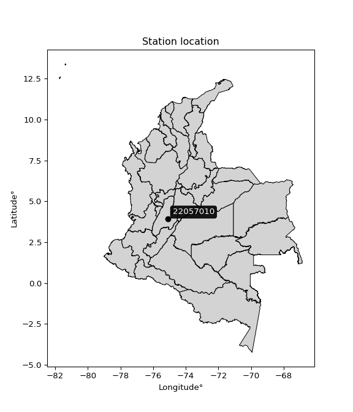

<div align="center">


</div>

# PMP Station (Rain, Pmax24h): 22057010

Probable Maximum Precipitation (PMP) is the greatest amount of rainfall for a specific duration that is meteorologically possible for a given location, acting as a "worst-case" scenario for extreme storms, crucial for designing safety-critical infrastructure like bridges, river deviations, dams, spillways, and nuclear plants to prevent catastrophic failure. PMP is calculated by hydrologists using meteorological data to determine the upper limit of extreme rainfall, often leading to the Probable Maximum Flood (PMF) for flood control design, and is increasingly being studied for climate change impacts. Probable Maximum Precipitation (PMP) is the theoretical upper limit of rainfall, a deterministic estimate for extreme events, while probability distributions (like GEV, Gumbel) describe the likelihood and frequency of various precipitation amounts, including rare ones, showing how often events occur, with PMP representing the extreme end of these distributions, used for critical infrastructure design to ensure safety against the worst conceivable weather, unlike standard statistical forecasts which cover typical probabilities.

The most common probability distributions in hydrology, used for analyzing floods, rainfall, and streamflow, include the Normal, Log-Normal, Gumbel, Gamma (including Log-Pearson Type III), and Generalized Extreme Value (GEV) distributions, often chosen based on the data´s skewness and whether modeling extremes or general conditions, with Gumbel and GEV popular for extreme events like floods, while the Normal distribution serves as a baseline, though often requiring transformations for skewed hydrological data. These distributions help in designing water infrastructure, managing water resources, and forecasting hydrologic events.

> Hydrological data often isn´t perfectly normal (it´s skewed), so different distributions are needed for different applications, such as: **Flood Frequency Analysis**: Using Gumbel, GEV, or Log-Pearson Type III for predicting extreme flood magnitudes and their return periods, **Rainfall Analysis**: Normal for annual totals, but Log-Normal, Weibull, or GEV for intensity or extreme daily rainfall, **Streamflow Modeling**: Gamma and Log-Normal for maximum flows, GEV for minimum flows, and Kappa for daily flows.

<div align="center">

</img>

</div>


## A. General information


### 1. General running parameters

• app_version: _v20260108_. • runtime: _2026-01-09 11:32:22.148588_. • Python version: _3.14.0_. • SciPy version: _1.16.3_. • Pandas version: _2.3.3_. • NumPy version: _2.3.5_. • Stations dataset (station_dataset_file): _dataset/pmax24h_in/automatic_colombia_2003_2024.csv_. • Stations catalog (station_catalog_file): _dataset/CNE.xls_. • Minimum year to eval til year_max (date_min): _1900_. • Maximum year to eval since year_min (date_max): _2024_. • Creates, save and include plots into reports (create_plot): _False_. • Plot only fit distributions with Δo > Δ (plot_only_fit): _True_. • Plot only simple graphs avoiding multiple CDFs and multiple Extreme values plots (plot_only_simple): _True_. • Eval low extreme values, if False, evaluates high extreme values (low_extreme): _False_. • Eval every SciPy distribution as logarithmic (pdist_logarithmic_on): _True_. • Standard deviation normalized (ddof): _1.0_. • Return periods to eval in years (Tr): _[2, 2.33, 5, 10, 15, 20, 25, 50, 75, 100, 200, 250, 500, 750, 1000]_. • Minimum data sample per station, 0 means any (minimum_sample): _5_. • Z-Score maximum threshold to adjust a value, 0 means disable (zscore_max): _3.5_. • Z-Score minimum threshold to adjust a value, 0 means disable (zscore_min): _-2.5_. • Avoid zeros, e.g. rain = 0 (avoid_zeros): _True_. • Avoid null values (avoid_nans): _True_. 

:file_folder:Table: [dataset.csv](../../dataset/pmax24h_in/automatic_colombia_2003_2024.csv)

> Delta Degrees of Freedom (DDOF): is a parameter used in the formulas for calculating variance and standard deviation. When ddof=0, the divisor is $N$ (the total number of observations) and this is used when your data set is the entire population. When ddof=1, the divisor is $N-1$ and this is used when your data set is a sample drawn from a larger population. Using $N-1$ provides an unbiased estimate of the population variance (known as Bessel´s correction).


### 2. Station info and location

|   id |   CODIGO | NOMBRE                             | CATEGORIA    | TECNOLOGIA                              | ESTADO           | FECHA_INSTALACION   |   FECHA_SUSPENSION |   ALTITUD |   LATITUD |   LONGITUD | DEPARTAMENTO   | MUNICIPIO   | AREA_OPERATIVA             | ENTIDAD                                                     | AREA_HIDROGRAFICA   | ZONA_HIDROGRAFICA   | SUBZONA_HIDROGRAFICA   | CORRIENTE   | Catalogo   |   Version |
|-----:|---------:|:-----------------------------------|:-------------|:----------------------------------------|:-----------------|:--------------------|-------------------:|----------:|----------:|-----------:|:---------------|:------------|:---------------------------|:------------------------------------------------------------|:--------------------|:--------------------|:-----------------------|:------------|:-----------|----------:|
|    0 | 22057010 | PIEDRAS DE COBRE  - AUT [22057010] | Limnigráfica | Automática con Telemetría, Convencional | En Mantenimiento | 15/09/1959          |                nan |       322 |   3.90865 |    -75.104 | Tolima         | Coyaima     | Area Operativa 10 - Tolima | INSTITUTO DE HIDROLOGIA METEOROLOGIA Y ESTUDIOS AMBIENTALES | Magdalena Cauca     | Saldaña             | Bajo Saldaña           | Saldana     | CNE_IDEAM  |  20251226 |

<div align="center">

Dynamic map: [:earth_americas:Google](http://maps.google.com/maps?q=3.90865,-75.104) [:earth_americas:OSM](https://www.openstreetmap.org/#map=18/3.90865/-75.104&layers=P) [:earth_americas:Bing](https://www.bing.com/maps?cp=3.90865~-75.104&lvl=18) [:earth_americas:Apple](https://maps.apple.com/frame?center=3.90865%2C-75.104&span=0.003%2C0.006)

</div>


<div align="center">

```geojson
{
  "type": "Feature",
  "geometry": {
    "type": "Point", 
    "coordinates": [-75.104, 3.90865]
  }, 
  "properties": {
    "Name": "22057010"
  }
}
```

</div>


### 3. Discrete values table and plot

<div align="center">

|               |          0 |           1 |            2 |           3 |           4 |           5 |           6 |            7 |          8 |           9 |          10 |         11 |          12 |         13 |          14 |          15 |           16 |          17 |          18 |
|:--------------|-----------:|------------:|-------------:|------------:|------------:|------------:|------------:|-------------:|-----------:|------------:|------------:|-----------:|------------:|-----------:|------------:|------------:|-------------:|------------:|------------:|
| Date          | 2005       | 2006        | 2007         | 2008        | 2009        | 2010        | 2011        | 2012         | 2013       | 2014        | 2015        | 2016       | 2017        | 2018       | 2019        | 2020        | 2021         | 2022        | 2023        |
| Value         |  175       |   57.9      |   80.1       |   75.9      |   49.8      |   71.1      |   63.4      |   82.9       |   85.8474  |  125.7      |   54        |   70.7     |   51        |   59.7     |   72.3      |   61.7      |   80.1       |   29.6      |   43.1      |
| Value_initial |  175       |   57.9      |   80.1       |   75.9      |   49.8      |   71.1      |   63.4      |   82.9       |  327.1     |  125.7      |   54        |   70.7     |   51        |   59.7     |   72.3      |   61.7      |   80.1       |   29.6      |   43.1      |
| count         |   19       |   19        |   19         |   19        |   19        |   19        |   19        |   19         |   19       |   19        |   19        |   19       |   19        |   19       |   19        |   19        |   19         |   19        |   19        |
| mean          |   85.8474  |   85.8474   |   85.8474    |   85.8474   |   85.8474   |   85.8474   |   85.8474   |   85.8474    |   85.8474  |   85.8474   |   85.8474   |   85.8474  |   85.8474   |   85.8474  |   85.8474   |   85.8474   |   85.8474    |   85.8474   |   85.8474   |
| std           |   66.5057  |   66.5057   |   66.5057    |   66.5057   |   66.5057   |   66.5057   |   66.5057   |   66.5057    |   66.5057  |   66.5057   |   66.5057   |   66.5057  |   66.5057   |   66.5057  |   66.5057   |   66.5057   |   66.5057    |   66.5057   |   66.5057   |
| zscore        |    1.34053 |   -0.420225 |   -0.0864191 |   -0.149572 |   -0.542019 |   -0.221746 |   -0.337525 |   -0.0443175 |    3.62755 |    0.599236 |   -0.478866 |   -0.22776 |   -0.523975 |   -0.39316 |   -0.203702 |   -0.363087 |   -0.0864191 |   -0.845752 |   -0.642762 |


</div>


> The initial value (value_initial) correspond to the initial obtained or null completed value, and value (value) is adjusted only when the initial value is outside the valid range (outlier) definite through the Z-Score value. If Z-Score is active, values out of range or outliers are replaced with the station mean value. A Z-Score (or standard score) measures how many standard deviations a data point is from the mean of a dataset, indicating its relative position; positive scores mean above the mean, negative mean below, and a score of zero is exactly at the mean, allowing for comparison of values from different distributions. It´s calculated using the formula $z=(x–μ)/σ$, where $x$ is the data point, $μ$ is the mean, and $σ$ is the standard deviation, helping identify outliers and understand probability.
>
> <sub>**Note**: In this study, "completing" (filling gaps in) and "extending" (forecasting or lengthening the historical record) rainfall data series are avoided for certain critical analyses because they introduce artificial bias and uncertainty, which can distort the statistics of rare events (extremes), alter day-to-day variability, and compromise the integrity and homogeneity of the original data. Some reasons against Completing/Extending rainfall data are: **Distortion of Extremes and Variability**: The primary issue is that most gap-filling or extension methods rely on averaging or regression with nearby stations, which inherently smooths the data. Rainfall is highly variable in space and time, with a large percentage of zero values and occasional large storms. Infilling methods often underestimate the highest values and overestimate the lowest (zero) values, which severely distorts analyses focused on flood frequency, drought severity, and intensity-duration-frequency (IDF) curves, **Loss of Data Homogeneity**: Infilled or extended data are synthetic estimates, not actual measurements. Combining these estimates with observed data can violate the assumption of data homogeneity, which requires that the data properties do not change over time. Inhomogeneity can lead to incorrect conclusions about long-term trends or changes in climate patterns, **Propagation of Errors**: Errors and biases from the original data (e.g., wind-induced undercatch, instrument errors, site changes) or the data used for imputation can propagate through the analysis, leading to unreliable hydrological models and inaccurate predictions, **Compromised Statistical Integrity**: For statistical analyses, especially those involving the frequency of events, using artificial data can introduce time bias or autocorrelation that doesn´t exist in reality, making it difficult to assess the true probability of events, **Difficulty in Validation**: It is difficult to accurately validate the quality of filled or extended data, especially for past periods where ground-truth measurements are unavailable. The reliability of imputation techniques heavily depends on the density of the surrounding station network and the complexity of the local topography.</sub>


### 4. Active continuous probability distributions from SciPy (45 of 104 available)

A Probability Density Function (PDF) describes the relative likelihood of a continuous random variable falling within a specific range, where the total area under its curve equals 1, and the area over any interval gives the actual probability for that range. Unlike discrete probabilities (like rolling a die), a PDF shows density, not direct probability for a single point (which is zero), with higher points indicating higher likelihood, often visualized as a bell curve for normal distributions.

A log of a probability density function (log-PDF) is simply the logarithm of the PDF´s value, denoted as $log(f(x))$, useful for converting multiplication of probabilities into addition, improving numerical stability with tiny numbers, and connecting to information theory concepts like entropy. Instead of dealing with very small probabilities (e.g., 0.000001), log-PDFs use negative numbers (e.g., $log(0.00001) ≈ -11.51$ that are easier for computers to handle, preventing underflow errors and simplifying complex calculations. In this study, each active probability distribution from SciPy is also evaluated in the $log$ form.

[scipy.stats](https://docs.scipy.org/doc/scipy/reference/stats.html) is a Python´s powerful submodule within the SciPy library for comprehensive statistical analysis, offering over 130 probability distributions (like Normal, Poisson), functions for descriptive stats (mean, variance), hypothesis testing (t-tests, chi-square), random variable generation, and statistical tests, making it essential for data science, modeling, and research. It provides tools to explore, model, and draw conclusions from data efficiently, working seamlessly with NumPy.

<div align="center">

|   id | p_dist             |   n_parameter | fit_method   | label                                                                       | active   | ref                                                                                                        |
|-----:|:-------------------|--------------:|:-------------|:----------------------------------------------------------------------------|:---------|:-----------------------------------------------------------------------------------------------------------|
|    0 | alpha              |             3 | MLE          | Alpha                                                                       | True     | [:mortar_board:](https://docs.scipy.org/doc/scipy/reference/generated/scipy.stats.alpha.html)              |
|    1 | betaprime          |             4 | MLE          | Beta prime                                                                  | True     | [:mortar_board:](https://docs.scipy.org/doc/scipy/reference/generated/scipy.stats.betaprime.html)          |
|    2 | chi2               |             3 | MLE          | Chi²                                                                        | True     | [:mortar_board:](https://docs.scipy.org/doc/scipy/reference/generated/scipy.stats.chi2.html)               |
|    3 | crystalball        |             4 | MLE          | Crystalball                                                                 | True     | [:mortar_board:](https://docs.scipy.org/doc/scipy/reference/generated/scipy.stats.crystalball.html)        |
|    4 | dweibull           |             3 | MLE          | Double Weibull                                                              | True     | [:mortar_board:](https://docs.scipy.org/doc/scipy/reference/generated/scipy.stats.dweibull.html)           |
|    5 | erlang             |             3 | MLE          | Erlang                                                                      | True     | [:mortar_board:](https://docs.scipy.org/doc/scipy/reference/generated/scipy.stats.erlang.html)             |
|    6 | expon              |             2 | MLE          | Exponential                                                                 | True     | [:mortar_board:](https://docs.scipy.org/doc/scipy/reference/generated/scipy.stats.expon.html)              |
|    7 | exponnorm          |             3 | MLE          | Exponentially modified Normal                                               | True     | [:mortar_board:](https://docs.scipy.org/doc/scipy/reference/generated/scipy.stats.exponnorm.html)          |
|    8 | f                  |             4 | MLE          | F                                                                           | True     | [:mortar_board:](https://docs.scipy.org/doc/scipy/reference/generated/scipy.stats.f.html)                  |
|    9 | fatiguelife        |             3 | MLE          | Fatigue-life (Birnbaum-Saunders)                                            | True     | [:mortar_board:](https://docs.scipy.org/doc/scipy/reference/generated/scipy.stats.fatiguelife.html)        |
|   10 | fisk               |             3 | MLE          | Fisk                                                                        | True     | [:mortar_board:](https://docs.scipy.org/doc/scipy/reference/generated/scipy.stats.fisk.html)               |
|   11 | gamma              |             3 | MLE          | Gamma                                                                       | True     | [:mortar_board:](https://docs.scipy.org/doc/scipy/reference/generated/scipy.stats.gamma.html)              |
|   12 | genexpon           |             5 | MLE          | Generalized exponential                                                     | True     | [:mortar_board:](https://docs.scipy.org/doc/scipy/reference/generated/scipy.stats.genexpon.html)           |
|   13 | genlogistic        |             3 | MLE          | Generalized logistic                                                        | True     | [:mortar_board:](https://docs.scipy.org/doc/scipy/reference/generated/scipy.stats.genlogistic.html)        |
|   14 | gibrat             |             2 | MM           | Gibrat                                                                      | True     | [:mortar_board:](https://docs.scipy.org/doc/scipy/reference/generated/scipy.stats.gibrat.html)             |
|   15 | gompertz           |             3 | MLE          | Gompertz (or truncated Gumbel)                                              | True     | [:mortar_board:](https://docs.scipy.org/doc/scipy/reference/generated/scipy.stats.gompertz.html)           |
|   16 | gumbel_l           |             2 | MM           | Gumbel Left Skew                                                            | True     | [:mortar_board:](https://docs.scipy.org/doc/scipy/reference/generated/scipy.stats.gumbel_l.html)           |
|   17 | gumbel_r           |             2 | MM           | Gumbel Right Skew                                                           | True     | [:mortar_board:](https://docs.scipy.org/doc/scipy/reference/generated/scipy.stats.gumbel_r.html)           |
|   18 | halflogistic       |             2 | MM           | Half-logistic                                                               | True     | [:mortar_board:](https://docs.scipy.org/doc/scipy/reference/generated/scipy.stats.halflogistic.html)       |
|   19 | halfnorm           |             2 | MM           | Half Normal                                                                 | True     | [:mortar_board:](https://docs.scipy.org/doc/scipy/reference/generated/scipy.stats.halfnorm.html)           |
|   20 | hypsecant          |             2 | MM           | hyperbolic secant                                                           | True     | [:mortar_board:](https://docs.scipy.org/doc/scipy/reference/generated/scipy.stats.hypsecant.html)          |
|   21 | invgamma           |             3 | MLE          | Inverted gamma                                                              | True     | [:mortar_board:](https://docs.scipy.org/doc/scipy/reference/generated/scipy.stats.invgamma.html)           |
|   22 | invgauss           |             3 | MLE          | Inverse Gaussian                                                            | True     | [:mortar_board:](https://docs.scipy.org/doc/scipy/reference/generated/scipy.stats.invgauss.html)           |
|   23 | invweibull         |             3 | MLE          | Inverted Weibull                                                            | True     | [:mortar_board:](https://docs.scipy.org/doc/scipy/reference/generated/scipy.stats.invweibull.html)         |
|   24 | kappa4             |             4 | MLE          | Kappa 4                                                                     | True     | [:mortar_board:](https://docs.scipy.org/doc/scipy/reference/generated/scipy.stats.kappa4.html)             |
|   25 | kstwobign          |             2 | MLE          | Limiting distribution of scaled Kolmogorov-Smirnov two-sided test statistic | True     | [:mortar_board:](https://docs.scipy.org/doc/scipy/reference/generated/scipy.stats.kstwobign.html)          |
|   26 | laplace            |             2 | MM           | Laplace                                                                     | True     | [:mortar_board:](https://docs.scipy.org/doc/scipy/reference/generated/scipy.stats.laplace.html)            |
|   27 | laplace_asymmetric |             3 | MLE          | Asymmetric Laplace                                                          | True     | [:mortar_board:](https://docs.scipy.org/doc/scipy/reference/generated/scipy.stats.laplace_asymmetric.html) |
|   28 | loggamma           |             3 | MLE          | Log gamma                                                                   | True     | [:mortar_board:](https://docs.scipy.org/doc/scipy/reference/generated/scipy.stats.loggamma.html)           |
|   29 | logistic           |             2 | MM           | Logistic (or Sech-squared)                                                  | True     | [:mortar_board:](https://docs.scipy.org/doc/scipy/reference/generated/scipy.stats.logistic.html)           |
|   30 | lognorm            |             3 | MLE          | Log Normal                                                                  | True     | [:mortar_board:](https://docs.scipy.org/doc/scipy/reference/generated/scipy.stats.lognorm.html)            |
|   31 | maxwell            |             2 | MM           | Maxwell                                                                     | True     | [:mortar_board:](https://docs.scipy.org/doc/scipy/reference/generated/scipy.stats.maxwell.html)            |
|   32 | mielke             |             4 | MLE          | Mielke Beta-Kappa / Dagum                                                   | True     | [:mortar_board:](https://docs.scipy.org/doc/scipy/reference/generated/scipy.stats.mielke.html)             |
|   33 | moyal              |             2 | MM           | Moyal                                                                       | True     | [:mortar_board:](https://docs.scipy.org/doc/scipy/reference/generated/scipy.stats.moyal.html)              |
|   34 | nakagami           |             3 | MLE          | Nakagami                                                                    | True     | [:mortar_board:](https://docs.scipy.org/doc/scipy/reference/generated/scipy.stats.nakagami.html)           |
|   35 | ncf                |             5 | MLE          | Non-central F distribution                                                  | True     | [:mortar_board:](https://docs.scipy.org/doc/scipy/reference/generated/scipy.stats.ncf.html)                |
|   36 | nct                |             4 | MLE          | Non-central Student’s t                                                     | True     | [:mortar_board:](https://docs.scipy.org/doc/scipy/reference/generated/scipy.stats.nct.html)                |
|   37 | norm               |             2 | MM           | Normal                                                                      | True     | [:mortar_board:](https://docs.scipy.org/doc/scipy/reference/generated/scipy.stats.norm.html)               |
|   38 | pearson3           |             3 | MM           | Pearson type III                                                            | True     | [:mortar_board:](https://docs.scipy.org/doc/scipy/reference/generated/scipy.stats.pearson3.html)           |
|   39 | rayleigh           |             2 | MM           | Rayleigh                                                                    | True     | [:mortar_board:](https://docs.scipy.org/doc/scipy/reference/generated/scipy.stats.rayleigh.html)           |
|   40 | rice               |             3 | MLE          | Rice                                                                        | True     | [:mortar_board:](https://docs.scipy.org/doc/scipy/reference/generated/scipy.stats.rice.html)               |
|   41 | t                  |             3 | MLE          | Student’s t                                                                 | True     | [:mortar_board:](https://docs.scipy.org/doc/scipy/reference/generated/scipy.stats.t.html)                  |
|   42 | truncnorm          |             4 | MLE          | Truncated normal                                                            | True     | [:mortar_board:](https://docs.scipy.org/doc/scipy/reference/generated/scipy.stats.truncnorm.html)          |
|   43 | wald               |             2 | MM           | Wald                                                                        | True     | [:mortar_board:](https://docs.scipy.org/doc/scipy/reference/generated/scipy.stats.wald.html)               |
|   44 | weibull_min        |             3 | MLE          | Weibull minimum                                                             | True     | [:mortar_board:](https://docs.scipy.org/doc/scipy/reference/generated/scipy.stats.weibull_min.html)        |

</div>

> **n_parameter:** # arguments & localization & scale.
>
> **Fit methods:** (MLE) maximum likelihood, (MM) L-moments.
>
>**Inactive** (With the only purpose of prevent loops, zero divisions, infinite values, over high estimated values or horizontal trending for recurrence intervals estimations, the follow distributions were disabled.)**:** foldnorm, gennorm, norminvgauss, powernorm, powerlognorm, skewnorm, genextreme, anglit, arcsine, argus, beta, bradford, burr, burr12, cauchy, cosine, halfcauchy, foldcauchy, skewcauchy, wrapcauchy, dgamma, gengamma, exponweib, exponpow, truncexpon, gausshyper, genhalflogistic, genhyperbolic, geninvgauss, halfgennorm, johnsonsb, johnsonsu, kappa3, ksone, kstwo, loglaplace, levy, levy_l, levy_stable, ncx2, pareto, genpareto, truncpareto, lomax, powerlaw, rdist, rel_breitwigner, recipinvgauss, semicircular, studentized_range, trapezoid, triang, truncweibull_min, tukeylambda, uniform, loguniform, vonmises, vonmises_line, weibull_max, 


## B. Probability (PDF) vs. Empirical (EDF) distributions functions

A continuous probability distribution (CPD) describes probabilities for variables that can take any value within a range (like rain any time), unlike discrete variables with specific outcomes (like temperature). It uses a Probability Density Function (PDF), a curve where the total area under it equals 1, and the probability of the variable falling within an interval (a to b) is found by calculating the area under the curve between those points. A key feature is that the probability of hitting any single exact value is zero, so probabilities are always expressed for ranges, e.g., $P(a ≤ X ≤ b)$.

<div align="center">

Distributions parameters from station values
|    |   station | p_dist                |   n |              loc |          scale | shape                 | shape1               | shape2               | shape3   |
|---:|----------:|:----------------------|----:|-----------------:|---------------:|:----------------------|:---------------------|:---------------------|:---------|
|  0 |  22057010 | alpha                 |  19 |    -42.9308      |  511.294       | 4.653625259532165     |                      |                      |          |
|  1 |  22057010 | betaprime             |  19 |     -2.34205     |   14.1272      | 47.3908623201448      | 9.902007953176792    |                      |          |
|  2 |  22057010 | chi2                  |  19 |     21.236       |    7.8969      | 6.5739616297177825    |                      |                      |          |
|  3 |  22057010 | crystalball           |  19 |     73.1499      |   31.0756      | 4483.466677647449     | 4601.270707298149    |                      |          |
|  4 |  22057010 | dweibull              |  19 |     71.1         |   22.7131      | 0.9620454520171056    |                      |                      |          |
|  5 |  22057010 | erlang                |  19 |     21.2359      |   15.7937      | 3.286993486932989     |                      |                      |          |
|  6 |  22057010 | expon                 |  19 |     29.6         |   43.5499      |                       |                      |                      |          |
|  7 |  22057010 | exponnorm             |  19 |     48.1275      |   12.2607      | 2.040862010994007     |                      |                      |          |
|  8 |  22057010 | f                     |  19 |     -5.80962     |   70.7835      | 238.04574947426306    | 19.616987539118284   |                      |          |
|  9 |  22057010 | fatiguelife           |  19 |      5.28667     |   62.4646      | 0.4161330823383681    |                      |                      |          |
| 10 |  22057010 | fisk                  |  19 |      9.83266     |   57.116       | 4.326177865131415     |                      |                      |          |
| 11 |  22057010 | gamma                 |  19 |     21.2359      |   15.7937      | 3.286998291279897     |                      |                      |          |
| 12 |  22057010 | genexpon              |  19 |     29.6         |    2.0222      | 0.04641249283150787   | 5.27844369493464e-06 | 0.8877313992905096   |          |
| 13 |  22057010 | genlogistic           |  19 |    -61.8159      |   20.8638      | 352.03760701944736    |                      |                      |          |
| 14 |  22057010 | gibrat                |  19 |     49.4431      |   14.3789      |                       |                      |                      |          |
| 15 |  22057010 | gompertz              |  19 |     29.6         |  110.69        | 1.8059201314094666    |                      |                      |          |
| 16 |  22057010 | gumbel_l              |  19 |     87.1355      |   24.2295      |                       |                      |                      |          |
| 17 |  22057010 | gumbel_r              |  19 |     59.1642      |   24.2295      |                       |                      |                      |          |
| 18 |  22057010 | halflogistic          |  19 |     36.3181      |   26.5685      |                       |                      |                      |          |
| 19 |  22057010 | halfnorm              |  19 |     32.018       |   51.5511      |                       |                      |                      |          |
| 20 |  22057010 | hypsecant             |  19 |     73.1499      |   19.7833      |                       |                      |                      |          |
| 21 |  22057010 | invgamma              |  19 |     -8.54121     |  716.816       | 9.798842110668962     |                      |                      |          |
| 22 |  22057010 | invgauss              |  19 |      4.74193     |  386.422       | 0.17702889760486662   |                      |                      |          |
| 23 |  22057010 | invweibull            |  19 |   -183.609       |  243.139       | 11.94447880597344     |                      |                      |          |
| 24 |  22057010 | kappa4                |  19 |     14.8628      |  150.524       | 1.1081600906425275    | 0.9387077584026431   |                      |          |
| 25 |  22057010 | kstwobign             |  19 |    -19.2499      |  107.681       |                       |                      |                      |          |
| 26 |  22057010 | laplace               |  19 |     73.1499      |   21.9737      |                       |                      |                      |          |
| 27 |  22057010 | laplace_asymmetric    |  19 |     57.9         |   17.0318      | 0.6479638360697091    |                      |                      |          |
| 28 |  22057010 | loggamma              |  19 | -11952.8         | 1548.96        | 2354.265526597873     |                      |                      |          |
| 29 |  22057010 | logistic              |  19 |     73.1499      |   17.1328      |                       |                      |                      |          |
| 30 |  22057010 | lognorm               |  19 |      7.67555     |   59.7027      | 0.42216643079336497   |                      |                      |          |
| 31 |  22057010 | maxwell               |  19 |     -0.486148    |   46.1445      |                       |                      |                      |          |
| 32 |  22057010 | mielke                |  19 |     -0.586423    |   64.0234      | 5.890838102787674     | 4.834906331065085    |                      |          |
| 33 |  22057010 | moyal                 |  19 |     55.3789      |   13.9889      |                       |                      |                      |          |
| 34 |  22057010 | nakagami              |  19 |     43.1         |   44.3144      | 0.1515237248286333    |                      |                      |          |
| 35 |  22057010 | ncf                   |  19 |      0.0163803   |    2.32664e-06 | 3.466779732688284e-07 | 3.6406787297110808   | 9.514326288420497    |          |
| 36 |  22057010 | nct                   |  19 |     -0.0502188   |   12.6812      | 6.473831503101559     | 5.052941455832661    |                      |          |
| 37 |  22057010 | norm                  |  19 |     73.1499      |   31.0756      |                       |                      |                      |          |
| 38 |  22057010 | pearson3              |  19 |     73.1499      |   31.0755      | 1.8530214280413695    |                      |                      |          |
| 39 |  22057010 | rayleigh              |  19 |     13.7005      |   47.4337      |                       |                      |                      |          |
| 40 |  22057010 | rice                  |  19 |     21.8368      |   42.4189      | 0.000602876832690547  |                      |                      |          |
| 41 |  22057010 | t                     |  19 |     65.0789      |   29.3143      | 4.6879114480139386    |                      |                      |          |
| 42 |  22057010 | truncnorm             |  19 |     73.1499      |   31.0756      | -630.7145704280524    | 1843.6057426932357   |                      |          |
| 43 |  22057010 | wald                  |  19 |     42.0743      |   31.0756      |                       |                      |                      |          |
| 44 |  22057010 | weibull_min           |  19 |     42.9366      |   32.07        | 1.0843282668731589    |                      |                      |          |
| 45 |  22057010 | logalpha              |  19 |     -4.13991     |  189.007       | 22.65762513188153     |                      |                      |          |
| 46 |  22057010 | logbetaprime          |  19 |     -1.02903     |    2.93307     | 560.3871565694656     | 314.1691083704036    |                      |          |
| 47 |  22057010 | logchi2               |  19 |      3.38777     |    0.950617    | 1.0449263029889555    |                      |                      |          |
| 48 |  22057010 | logcrystalball        |  19 |      4.21938     |    0.371864    | 1190.8611508618278    | 22.361191687331445   |                      |          |
| 49 |  22057010 | logdweibull           |  19 |      4.20431     |    0.289839    | 1.1823019392168534    |                      |                      |          |
| 50 |  22057010 | logerlang             |  19 |      0.710191    |    0.0391778   | 89.57073563767995     |                      |                      |          |
| 51 |  22057010 | logexpon              |  19 |      3.38777     |    0.831601    |                       |                      |                      |          |
| 52 |  22057010 | logexponnorm          |  19 |      3.981       |    0.284348    | 0.8383147398133534    |                      |                      |          |
| 53 |  22057010 | logf                  |  19 |     -1.27046     |    5.4707      | 1898.2572814907185    | 574.414327966359     |                      |          |
| 54 |  22057010 | logfatiguelife        |  19 |     -0.763195    |    4.96883     | 0.07437036517484147   |                      |                      |          |
| 55 |  22057010 | logfisk               |  19 |     -0.109688    |    4.31249     | 22.116232232041916    |                      |                      |          |
| 56 |  22057010 | loggamma              |  19 |      0.710199    |    0.0391779   | 89.57028433152009     |                      |                      |          |
| 57 |  22057010 | loggenexpon           |  19 |      3.38777     |    6.25255e+08 | 130263456.06501257    | 3066279757.531188    | 283348503.93195283   |          |
| 58 |  22057010 | loggenlogistic        |  19 |      4.15349     |    0.20792     | 1.2038332765473216    |                      |                      |          |
| 59 |  22057010 | loggibrat             |  19 |      3.93572     |    0.172047    |                       |                      |                      |          |
| 60 |  22057010 | loggompertz           |  19 |      3.38777     |    1.12315     | 0.8653421740748705    |                      |                      |          |
| 61 |  22057010 | loggumbel_l           |  19 |      4.38673     |    0.289941    |                       |                      |                      |          |
| 62 |  22057010 | loggumbel_r           |  19 |      4.05202     |    0.289941    |                       |                      |                      |          |
| 63 |  22057010 | loghalflogistic       |  19 |      3.77864     |    0.317924    |                       |                      |                      |          |
| 64 |  22057010 | loghalfnorm           |  19 |      3.72719     |    0.616859    |                       |                      |                      |          |
| 65 |  22057010 | loghypsecant          |  19 |      4.21938     |    0.236736    |                       |                      |                      |          |
| 66 |  22057010 | loginvgamma           |  19 |     -1.208       | 1162.75        | 215.27243578975072    |                      |                      |          |
| 67 |  22057010 | loginvgauss           |  19 |      1.20606     |  190.582       | 0.015791102115215436  |                      |                      |          |
| 68 |  22057010 | loginvweibull         |  19 |     -3.86535e+07 |    3.86535e+07 | 106204009.22692302    |                      |                      |          |
| 69 |  22057010 | logkappa4             |  19 |      3.27351     |    2.00966     | 1.0603961718504664    | 1.0586055849183116   |                      |          |
| 70 |  22057010 | logkstwobign          |  19 |      2.66406     |    1.79549     |                       |                      |                      |          |
| 71 |  22057010 | loglaplace            |  19 |      4.21938     |    0.262947    |                       |                      |                      |          |
| 72 |  22057010 | loglaplace_asymmetric |  19 |      4.26409     |    0.266322    | 1.0874427806706457    |                      |                      |          |
| 73 |  22057010 | logloggamma           |  19 |   -106.242       |   14.9814      | 1593.2588082434709    |                      |                      |          |
| 74 |  22057010 | loglogistic           |  19 |      4.21938     |    0.205019    |                       |                      |                      |          |
| 75 |  22057010 | loglognorm            |  19 |     -0.590973    |    4.7961      | 0.07697642240771224   |                      |                      |          |
| 76 |  22057010 | logmaxwell            |  19 |      3.33821     |    0.552186    |                       |                      |                      |          |
| 77 |  22057010 | logmielke             |  19 |     -0.359449    |    4.58313     | 22.32690387818264     | 24.045781818420068   |                      |          |
| 78 |  22057010 | logmoyal              |  19 |      4.00672     |    0.167398    |                       |                      |                      |          |
| 79 |  22057010 | lognakagami           |  19 |      3.7428      |    0.603556    | 0.7017902496321569    |                      |                      |          |
| 80 |  22057010 | logncf                |  19 |     -3.7563      |    7.96825     | 803.1504115836506     | 854.9917232025978    | 0.000707846323070381 |          |
| 81 |  22057010 | lognct                |  19 |     -0.39638     |    0.13832     | 90.63867029838309     | 33.08699957952122    |                      |          |
| 82 |  22057010 | lognorm               |  19 |      4.21938     |    0.371864    |                       |                      |                      |          |
| 83 |  22057010 | logpearson3           |  19 |      4.21938     |    0.371865    | 0.372961071222659     |                      |                      |          |
| 84 |  22057010 | lograyleigh           |  19 |      3.50796     |    0.567628    |                       |                      |                      |          |
| 85 |  22057010 | logrice               |  19 |      3.1939      |    0.394041    | 2.379770369912004     |                      |                      |          |
| 86 |  22057010 | logt                  |  19 |      4.20383     |    0.243986    | 2.869914567011895     |                      |                      |          |
| 87 |  22057010 | logtruncnorm          |  19 |     -0.226946    |    1.5305      | 2.607295003708323     | 4.511195885579868    |                      |          |
| 88 |  22057010 | logwald               |  19 |      3.84752     |    0.37185     |                       |                      |                      |          |
| 89 |  22057010 | logweibull_min        |  19 |      3.12747     |    1.21614     | 3.0994828568479855    |                      |                      |          |

</div>

> **loc** (Location parameter): This shifts the distribution along the x-axis. For many common distributions, like the normal (Gaussian) distribution, loc represents the mean $μ$. For others, like the uniform distribution, it might represent the minimum value, or for the beta distribution, the left end of the support interval.
>
> **scale** (Scale parameter): This determines the width or spread of the distribution. For the normal distribution, scale represents the standard deviation $σ$. For a uniform distribution, it defines the length of the interval (from $loc$ to $loc + scale$).
>
> **shape** (Shape parameters): Refers to parameters that define the specific form of a probability distribution, distinct from its location (loc) and scale (scale). These parameters are required arguments for most distribution functions. For example, a normal (Gaussian) distribution is fully defined by its location (mean) and scale (standard deviation), so it has no specific shape parameters beyond loc and scale. However, other distributions have intrinsic properties that need specification, as Gamma distribution that takes a shape parameter, often named $a$ or $alpha$.


### 0. Cumulative distribution values - CDF (90 evaluated)

Cumulative Distribution Function (CDF), denoted as $F$<sub>$X$</sub>$(x)$, is a function that gives the probability that a random variable $X$ will take a value less than or equal to a specific value, $x$ (i.e., $(P(X≥x)$. It essentially "accumulates" probabilities from a given point up to the far right (positive infinity), providing a complete picture of the distribution´s probabilities for both discrete (like rain) and continuous (like temperature) variables, helping to find probabilities over ranges or above certain values. Each station is evaluated separately ordering the $x$ values ascending, calculating the CDF and PDF values for the activated distributions and their logarithmic forms.

<div align="center">

CDF ordered by x ascending and calculating $log(f(x))$ separately
|   id |   Station |   date |        x |   count |    mean |     std |     zscore |   Value_initial |   station |   m |      alpha |   alpha_pdf |   betaprime |   betaprime_pdf |       chi2 |    chi2_pdf |   crystalball |   crystalball_pdf |   dweibull |   dweibull_pdf |     erlang |   erlang_pdf |    expon |   expon_pdf |   exponnorm |   exponnorm_pdf |         f |       f_pdf |   fatiguelife |   fatiguelife_pdf |      fisk |    fisk_pdf |      gamma |   gamma_pdf |    genexpon |   genexpon_pdf |   genlogistic |   genlogistic_pdf |      gibrat |   gibrat_pdf |    gompertz |   gompertz_pdf |   gumbel_l |   gumbel_l_pdf |   gumbel_r |   gumbel_r_pdf |   halflogistic |   halflogistic_pdf |   halfnorm |   halfnorm_pdf |   hypsecant |   hypsecant_pdf |   invgamma |   invgamma_pdf |   invgauss |   invgauss_pdf |   invweibull |   invweibull_pdf |      kappa4 |   kappa4_pdf |   kstwobign |   kstwobign_pdf |   laplace |   laplace_pdf |   laplace_asymmetric |   laplace_asymmetric_pdf |   loggamma |   loggamma_pdf |   logistic |   logistic_pdf |   lognorm |   lognorm_pdf |   maxwell |   maxwell_pdf |    mielke |   mielke_pdf |     moyal |   moyal_pdf |    nakagami |   nakagami_pdf |      ncf |    ncf_pdf |        nct |     nct_pdf |      norm |    norm_pdf |   pearson3 |   pearson3_pdf |   rayleigh |   rayleigh_pdf |      rice |    rice_pdf |        t |       t_pdf |   truncnorm |   truncnorm_pdf |        wald |    wald_pdf |   weibull_min |   weibull_min_pdf |   logalpha |   logalpha_pdf |   logbetaprime |   logbetaprime_pdf |     logchi2 |   logchi2_pdf |   logcrystalball |   logcrystalball_pdf |   logdweibull |   logdweibull_pdf |   logerlang |   logerlang_pdf |   logexpon |   logexpon_pdf |   logexponnorm |   logexponnorm_pdf |       logf |   logf_pdf |   logfatiguelife |   logfatiguelife_pdf |    logfisk |   logfisk_pdf |   loggenexpon |   loggenexpon_pdf |   loggenlogistic |   loggenlogistic_pdf |   loggibrat |   loggibrat_pdf |   loggompertz |   loggompertz_pdf |   loggumbel_l |   loggumbel_l_pdf |   loggumbel_r |   loggumbel_r_pdf |   loghalflogistic |   loghalflogistic_pdf |   loghalfnorm |   loghalfnorm_pdf |   loghypsecant |   loghypsecant_pdf |   loginvgamma |   loginvgamma_pdf |   loginvgauss |   loginvgauss_pdf |   loginvweibull |   loginvweibull_pdf |   logkappa4 |   logkappa4_pdf |   logkstwobign |   logkstwobign_pdf |   loglaplace |   loglaplace_pdf |   loglaplace_asymmetric |   loglaplace_asymmetric_pdf |   logloggamma |   logloggamma_pdf |   loglogistic |   loglogistic_pdf |   loglognorm |   loglognorm_pdf |   logmaxwell |   logmaxwell_pdf |   logmielke |   logmielke_pdf |    logmoyal |   logmoyal_pdf |   lognakagami |   lognakagami_pdf |    logncf |   logncf_pdf |    lognct |   lognct_pdf |   logpearson3 |   logpearson3_pdf |   lograyleigh |   lograyleigh_pdf |    logrice |   logrice_pdf |      logt |   logt_pdf |   logtruncnorm |   logtruncnorm_pdf |   logwald |   logwald_pdf |   logweibull_min |   logweibull_min_pdf |
|-----:|----------:|-------:|---------:|--------:|--------:|--------:|-----------:|----------------:|----------:|----:|-----------:|------------:|------------:|----------------:|-----------:|------------:|--------------:|------------------:|-----------:|---------------:|-----------:|-------------:|---------:|------------:|------------:|----------------:|----------:|------------:|--------------:|------------------:|----------:|------------:|-----------:|------------:|------------:|---------------:|--------------:|------------------:|------------:|-------------:|------------:|---------------:|-----------:|---------------:|-----------:|---------------:|---------------:|-------------------:|-----------:|---------------:|------------:|----------------:|-----------:|---------------:|-----------:|---------------:|-------------:|-----------------:|------------:|-------------:|------------:|----------------:|----------:|--------------:|---------------------:|-------------------------:|-----------:|---------------:|-----------:|---------------:|----------:|--------------:|----------:|--------------:|----------:|-------------:|----------:|------------:|------------:|---------------:|---------:|-----------:|-----------:|------------:|----------:|------------:|-----------:|---------------:|-----------:|---------------:|----------:|------------:|---------:|------------:|------------:|----------------:|------------:|------------:|--------------:|------------------:|-----------:|---------------:|---------------:|-------------------:|------------:|--------------:|-----------------:|---------------------:|--------------:|------------------:|------------:|----------------:|-----------:|---------------:|---------------:|-------------------:|-----------:|-----------:|-----------------:|---------------------:|-----------:|--------------:|--------------:|------------------:|-----------------:|---------------------:|------------:|----------------:|--------------:|------------------:|--------------:|------------------:|--------------:|------------------:|------------------:|----------------------:|--------------:|------------------:|---------------:|-------------------:|--------------:|------------------:|--------------:|------------------:|----------------:|--------------------:|------------:|----------------:|---------------:|-------------------:|-------------:|-----------------:|------------------------:|----------------------------:|--------------:|------------------:|--------------:|------------------:|-------------:|-----------------:|-------------:|-----------------:|------------:|----------------:|------------:|---------------:|--------------:|------------------:|----------:|-------------:|----------:|-------------:|--------------:|------------------:|--------------:|------------------:|-----------:|--------------:|----------:|-----------:|---------------:|-------------------:|----------:|--------------:|-----------------:|---------------------:|
|    0 |  22057010 |   2022 |  29.6    |      19 | 85.8474 | 66.5057 | -0.845752  |            29.6 |  22057010 |   1 | 0.00829402 | 0.00219903  |  0.00864565 |     0.00241593  | 0.00952116 | 0.00329078  |     0.0805444 |       0.00480861  |  0.0838303 |    0.00347044  | 0.00952121 |  0.00329079  | 0        | 0.0229622   |   0.0117323 |     0.0021439   | 0.0084992 | 0.00237559  |    0.00932279 |       0.00275856  | 0.0100478 | 0.00217692  | 0.00952122 | 0.00329078  | 7.37827e-07 |    0.0229515   |     0.0125852 |       0.00262283  | 0           |  0           | 4.04583e-14 |    0.0163152   |  0.0888532 |     0.00349918 |  0.0337837 |    0.00472365  |       0        |        0           |   0        |     0          |   0.0701594 |     0.00351775  | 0.00850492 |    0.00237938  | 0.00911589 |    0.00271122  |   0.00821333 |      0.00220955  | 4.00526e-15 |   0.238166   |   0.0137702 |      0.00309772 | 0.0689032 |   0.00313571  |            0.0227604 |              0.00206238  |  0.0079019 |      0.0701554 |   0.072973 |    0.00394844  | 0.0126659 |     0.0880156 | 0.0649904 |    0.00594296 | 0.0115532 |  0.00219665  | 0.0119772 | 0.00304907  | 0           |    0           | 0.227681 | 0.00880446 | 0.00988702 | 0.00227958  | 0.0805444 | 0.00480861  |  0         |     0          |  0.0546286 |    0.00668053  | 0.0166075 | 0.00424278  | 0.141816 | 0.00595664  |   0.0805444 |     0.00480861  | 0           | 0           |    0          |        0          | 0.00713121 |      0.0660716 |     0.00762672 |          0.0684642 | 7.67504e-09 |   9.02954e+06 |        0.0126659 |            0.0880155 |     0.0166418 |         0.0819924 |  0.00790191 |       0.0701554 |   0        |       1.2025   |     0.00570362 |          0.0535881 | 0.00749823 |  0.0678374 |       0.00772916 |            0.0691637 | 0.00963298 |     0.0603275 |   1.58015e-12 |          0.208337 |        0.0115239 |            0.0650852 |    0        |       0         |   5.76857e-09 |          0.770457 |     0.0313892 |       0.106543    |   5.09639e-05 |        0.00173741 |          0        |             0         |     0         |         0         |      0.0189745 |          0.0801031 |    0.00699478 |         0.0656494 |    0.00597864 |         0.0627548 |      0.00255688 |           0.0419336 | 8.99754e-16 |        4.04653  |     0.00313268 |          0.0614094 |    0.0211575 |        0.0804629 |               0.0262874 |                   0.0907682 |      0.013975 |         0.0931931 |     0.0170198 |         0.0816029 |   0.00760817 |        0.068476  |  0.000191828 |        0.0115931 |   0.0110736 |       0.0654627 | 2.12891e-10 |    2.62622e-08 |    0          |         0         | 0.0583671 |     0.234292 | 0.0058805 |    0.0599012 |    0.00479138 |         0.0540337 |     0         |         0         | 0.00790939 |     0.0895025 | 0.0236115 |  0.0693801 |    0           |           0        | 0         |     0         |       0.00837653 |            0.0993214 |
|    1 |  22057010 |   2023 |  43.1    |      19 | 85.8474 | 66.5057 | -0.642762  |            43.1 |  22057010 |   2 | 0.0986075  | 0.0120001   |  0.104604   |     0.0123251   | 0.119904   | 0.0126029   |     0.166774  |       0.00804344  |  0.147171  |    0.0061843   | 0.119904   |  0.0126029   | 0.266545 | 0.0168417   |   0.0871801 |     0.0101391   | 0.103434  | 0.0122365   |    0.111441   |       0.0124437   | 0.0879977 | 0.0104365   | 0.119904   | 0.0126029   | 0.266461    |    0.0168377   |     0.1005    |       0.0110314   | 0           |  0           | 0.208835    |    0.0145823   |  0.149935  |     0.0056991  |  0.143616  |    0.0115026   |       0.126942 |        0.018516    |   0.17021  |     0.015124   |   0.137217  |     0.00672318  | 0.103713   |    0.0122751   | 0.110977   |    0.0124894   |   0.0996149  |      0.012105    | 0.123453    |   0.00822552 |   0.10922   |      0.0111401  | 0.127367  |   0.00579633  |            0.0773462 |              0.00700854  |  0.105382  |      0.539617  |   0.147552 |    0.00734147  | 0.110126  |     0.506072  | 0.172688  |    0.00987507 | 0.0880533 |  0.0102573   | 0.12091   | 0.0132856   | 1.31685e-05 |    5.61638e+08 | 0.340316 | 0.00777653 | 0.0978642  | 0.0116327   | 0.166774  | 0.00804344  |  0.0742052 |     0.0234032  |  0.174757  |    0.0107832   | 0.118063  | 0.0104219   | 0.244643 | 0.00935315  |   0.166774  |     0.00804344  | 9.92554e-08 | 1.51001e-06 |    0.00325871 |        0.0215918  | 0.104399   |      0.547921  |     0.104686   |          0.541204  | 0.452278    |   0.551363    |        0.110126  |            0.506072  |     0.0968348 |         0.426378  |  0.105382   |       0.539617  |   0.363542 |       0.76534  |     0.0947052  |          0.534806  | 0.104525   |  0.542332  |       0.105018   |            0.54078   | 0.0850209  |     0.444198  |   0.202784    |          0.778215 |        0.0880769 |            0.442184  |    0        |       0         |   0.290935    |          0.763355 |     0.110014  |       0.357753    |   0.0668871   |        0.623964   |          0        |             0         |     0.0469622 |         1.29122   |      0.0921648 |          0.383898  |    0.104535   |         0.549944  |    0.108117   |         0.58098   |      0.119332   |           0.697012  | 0.219409    |        0.554423 |     0.152478   |          0.773892  |    0.0883214 |        0.33589   |               0.0962086 |                   0.332201  |      0.112918 |         0.505275  |     0.0976633 |         0.429839  |   0.104765   |        0.541601  |  0.102024    |        0.637192  |   0.0878124 |       0.4409    | 0.0386744   |    0.581174    |    0.00755601 |         0.511408  | 0.202644  |     0.539361 | 0.103758  |    0.564254  |    0.101929   |         0.569494  |     0.0963882 |         0.716731  | 0.111625   |     0.533439  | 0.0865214 |  0.346022  |    6.71125e-08 |           1.9097   | 0         |     0         |       0.125523   |            0.571567  |
|    2 |  22057010 |   2009 |  49.8    |      19 | 85.8474 | 66.5057 | -0.542019  |            49.8 |  22057010 |   3 | 0.194861   | 0.0163865   |  0.201394   |     0.0162048   | 0.21403    | 0.015196    |     0.226209  |       0.00968039  |  0.1953    |    0.00829238  | 0.21403    |  0.015196    | 0.371133 | 0.0144402   |   0.172652  |     0.0152504   | 0.199707  | 0.0161427   |    0.206653   |       0.0156336   | 0.175877  | 0.0156892   | 0.21403    | 0.0151959   | 0.371027    |    0.0144375   |     0.188623  |       0.0150442   | 0.000109473 |  0.00120756  | 0.303407    |    0.0136404   |  0.192802  |     0.00713554 |  0.229514  |    0.0139415   |       0.248412 |        0.017658    |   0.26986  |     0.0145836  |   0.18974   |     0.00903293  | 0.200278   |    0.0161887   | 0.206701   |    0.015733    |   0.196171   |      0.016351    | 0.177337    |   0.00788268 |   0.194563  |      0.0140902  | 0.172774  |   0.00786273  |            0.141939  |              0.0128614   |  0.203145  |      0.810788  |   0.203774 |    0.00947012  | 0.201213  |     0.755599  | 0.244011  |    0.0113397  | 0.174853  |  0.0155566   | 0.222209  | 0.016526    | 0.454273    |    0.0204855   | 0.390282 | 0.00713578 | 0.191771   | 0.0160872   | 0.226209  | 0.00968039  |  0.229085  |     0.0221287  |  0.251437  |    0.0120103   | 0.195298  | 0.0125056   | 0.312945 | 0.0109967   |   0.226209  |     0.00968039  | 0.111253    | 0.0332719   |    0.17132    |        0.0246029  | 0.203971   |      0.826645  |     0.202928   |          0.81564   | 0.523101    |   0.437474    |        0.201213  |            0.755599  |     0.179147  |         0.733711  |  0.203145   |       0.810788  |   0.465054 |       0.643273 |     0.195108   |          0.854157  | 0.203003   |  0.817655  |       0.203085   |            0.813691  | 0.172792   |     0.786815  |   0.32079     |          0.841085 |        0.174877  |            0.77464   |    0        |       0         |   0.399391    |          0.735366 |     0.174562  |       0.546154    |   0.193356    |        1.09583    |          0.200708 |             1.50935   |     0.230578  |         1.23907   |      0.166943  |          0.6733    |    0.204388   |         0.828201  |    0.212628   |         0.857996  |      0.239483   |           0.940463  | 0.298968    |        0.547429 |     0.276853   |          0.921475  |    0.153008  |        0.581896  |               0.15845   |                   0.547115  |      0.203416 |         0.748244  |     0.179655  |         0.718854  |   0.203048   |        0.815759  |  0.214427    |        0.903458  |   0.174329  |       0.773076  | 0.179309    |    1.299       |    0.136276   |         1.12233   | 0.288216  |     0.640301 | 0.206316  |    0.849435  |    0.205461   |         0.85663   |     0.219923  |         0.968572  | 0.206465   |     0.777955  | 0.15782   |  0.674296  |    0.244258    |           1.48637  | 0.0335117 |     1.89527   |       0.223515   |            0.78002   |
|    3 |  22057010 |   2017 |  51      |      19 | 85.8474 | 66.5057 | -0.523975  |            51   |  22057010 |   4 | 0.214857   | 0.016926    |  0.221117   |     0.0166544   | 0.232438   | 0.0154741   |     0.237993  |       0.00995795  |  0.20552   |    0.00874555  | 0.232438   |  0.0154741   | 0.388225 | 0.0140477   |   0.191429  |     0.0160332   | 0.21936   | 0.0165987   |    0.22563    |       0.0159837   | 0.195202  | 0.0165091   | 0.232437   | 0.0154741   | 0.388116    |    0.0140452   |     0.207011  |       0.0155921   | 0.0131055   |  0.0216522   | 0.319672    |    0.0134671   |  0.201532  |     0.00741673 |  0.246431  |    0.0142458   |       0.26948  |        0.0174526   |   0.287288 |     0.0144631  |   0.200854  |     0.00949223  | 0.219986   |    0.0166445   | 0.2258     |    0.0160873   |   0.216104   |      0.0168556   | 0.186767    |   0.00783372 |   0.211696  |      0.0144566  | 0.182471  |   0.00830406  |            0.158243  |              0.0143388   |  0.222942  |      0.85175   |   0.215374 |    0.0098634   | 0.219682  |     0.795582  | 0.257747  |    0.0115513  | 0.194026  |  0.0163887   | 0.242233  | 0.0168321   | 0.477446    |    0.0182386   | 0.398775 | 0.00702035 | 0.211425   | 0.016656    | 0.237993  | 0.00995795  |  0.255337  |     0.0216186  |  0.265946  |    0.012169    | 0.210482  | 0.0127962   | 0.3263   | 0.0112594   |   0.237993  |     0.00995795  | 0.152035    | 0.0344401   |    0.200524   |        0.0240606  | 0.224153   |      0.868178  |     0.222845   |          0.856967  | 0.533343    |   0.422895    |        0.219682  |            0.795581  |     0.197353  |         0.796026  |  0.222942   |       0.851749  |   0.480153 |       0.625115 |     0.216036   |          0.903273  | 0.222969   |  0.859033  |       0.222953   |            0.854824  | 0.192277   |     0.849879  |   0.340851    |          0.843649 |        0.194049  |            0.835739  |    0        |       0         |   0.41683     |          0.729313 |     0.188004  |       0.583243    |   0.220101    |        1.14906    |          0.236362 |             1.48484   |     0.259907  |         1.22422   |      0.183686  |          0.733557  |    0.224604   |         0.869489  |    0.233527   |         0.896948  |      0.26217    |           0.964358  | 0.311993    |        0.546597 |     0.298917   |          0.931126  |    0.16751   |        0.637048  |               0.172028  |                   0.593997  |      0.221698 |         0.787245  |     0.197412  |         0.772807  |   0.222967   |        0.857017  |  0.236345    |        0.936996  |   0.193472  |       0.834992  | 0.211045    |    1.36346     |    0.163536   |         1.1659    | 0.303625  |     0.653801 | 0.227037  |    0.890599  |    0.22635    |         0.89752   |     0.243314  |         0.995448  | 0.225443   |     0.815843  | 0.174744  |  0.748205  |    0.278915    |           1.42502  | 0.0890645 |     2.65814   |       0.242454   |            0.810551  |
|    4 |  22057010 |   2015 |  54      |      19 | 85.8474 | 66.5057 | -0.478866  |            54   |  22057010 |   5 | 0.26723    | 0.0179003   |  0.272373   |     0.0174355   | 0.279638   | 0.0159401   |     0.26887   |       0.0106177   |  0.233594  |    0.0100014   | 0.279638   |  0.0159401   | 0.428949 | 0.0131126   |   0.242099  |     0.0176611   | 0.270474  | 0.0173963   |    0.274567   |       0.0165749   | 0.247451  | 0.0182401   | 0.279638   | 0.0159401   | 0.428833    |    0.0131106   |     0.255521  |       0.0166782   | 0.125253    |  0.0452381   | 0.359417    |    0.0130287   |  0.224871  |     0.00814896 |  0.290093  |    0.0148169   |       0.320999 |        0.0168801   |   0.330192 |     0.0141325  |   0.231103  |     0.0106821   | 0.271233   |    0.0174394   | 0.275055   |    0.0166814   |   0.268133   |      0.0177419   | 0.210097    |   0.00772228 |   0.256186  |      0.0151515  | 0.209164  |   0.00951883  |            0.207674  |              0.0188179   |  0.274227  |      0.940106  |   0.246433 |    0.010839    | 0.267774  |     0.885469  | 0.29311   |    0.0120061  | 0.245959  |  0.0181486   | 0.29348   | 0.0172539   | 0.526068    |    0.01451     | 0.419406 | 0.00673398 | 0.263109   | 0.0177122   | 0.26887   | 0.0106177   |  0.318157  |     0.0202452  |  0.302956  |    0.0124849   | 0.24983   | 0.0134091   | 0.360991 | 0.0118513   |   0.26887   |     0.0106177   | 0.254144    | 0.0329245   |    0.270477   |        0.0225488  | 0.276392   |      0.956779  |     0.274446   |          0.945838  | 0.556589    |   0.391253    |        0.267774  |            0.885469  |     0.247363  |         0.955825  |  0.274227   |       0.940106  |   0.514684 |       0.583593 |     0.270773   |          1.00862   | 0.274688   |  0.947878  |       0.274421   |            0.943373  | 0.245143   |     0.998509  |   0.389072    |          0.841799 |        0.245977  |            0.979964  |    0.120505 |       3.76661   |   0.458065    |          0.713129 |     0.224031  |       0.678823    |   0.288564    |        1.23694    |          0.319249 |             1.41241   |     0.328719  |         1.18207   |      0.230002  |          0.889191  |    0.276898   |         0.957358  |    0.287182   |         0.977037  |      0.318482   |           1.00123   | 0.343185    |        0.544882 |     0.352471   |          0.939432  |    0.208184  |        0.79173   |               0.209562  |                   0.723599  |      0.269254 |         0.875146  |     0.245315  |         0.903016  |   0.274566   |        0.945719  |  0.291871    |        1.00215   |   0.245445  |       0.982617  | 0.291698    |    1.44129     |    0.232405   |         1.23638   | 0.341824  |     0.681691 | 0.280492  |    0.976481  |    0.28017    |         0.982202  |     0.301675  |         1.04255   | 0.274521   |     0.899462  | 0.223023  |  0.944959  |    0.356353    |           1.28661  | 0.250716  |     2.76074   |       0.290723   |            0.876559  |
|    5 |  22057010 |   2006 |  57.9    |      19 | 85.8474 | 66.5057 | -0.420225  |            57.9 |  22057010 |   6 | 0.338271   | 0.0183908   |  0.341252   |     0.0177659   | 0.342276   | 0.0161047   |     0.311807  |       0.0113815   |  0.276262  |    0.011945    | 0.342276   |  0.0161047   | 0.477865 | 0.0119894   |   0.313774  |     0.0189238   | 0.33924   | 0.0177469   |    0.339823   |       0.0167938   | 0.321654  | 0.0196379   | 0.342276   | 0.0161047   | 0.477743    |    0.0119879   |     0.322326  |       0.0174632   | 0.297786    |  0.0409754   | 0.409102    |    0.0124492   |  0.258597  |     0.0091556  |  0.348694  |    0.0151621   |       0.385204 |        0.0160268   |   0.384378 |     0.0136448  |   0.275848  |     0.0122626   | 0.340155   |    0.0177833   | 0.340711   |    0.0168905   |   0.338355   |      0.0181343   | 0.239962    |   0.00759582 |   0.316323  |      0.0156079  | 0.249786  |   0.0113675   |            0.295704  |              0.0267945   |  0.342842  |      1.02254   |   0.29109  |    0.0120445   | 0.332858  |     0.977225  | 0.340827  |    0.0124324  | 0.319866  |  0.019576    | 0.360807  | 0.0171654   | 0.576577    |    0.011634    | 0.444955 | 0.00636981 | 0.333627   | 0.0183094   | 0.311807  | 0.0113815   |  0.393505  |     0.0183938  |  0.352179  |    0.0127262   | 0.303295  | 0.0139635   | 0.408447 | 0.0124491   |   0.311807  |     0.0113815   | 0.373062    | 0.0278863   |    0.354374   |        0.0204703  | 0.346115   |      1.03725   |     0.343459   |          1.02809   | 0.58268     |   0.357906    |        0.332858  |            0.977225  |     0.321027  |         1.15506   |  0.342842   |       1.02254   |   0.55372  |       0.536652 |     0.344663   |          1.10345   | 0.343835   |  1.02983   |       0.343259   |            1.02558   | 0.320478   |     1.15543   |   0.447297    |          0.825779 |        0.319883  |            1.13352   |    0.368591 |       3.06585   |   0.507016    |          0.690267 |     0.275741  |       0.805856    |   0.37638     |        1.26847    |          0.414042 |             1.30309   |     0.409034  |         1.11952   |      0.298878  |          1.08499   |    0.346625   |         1.03677   |    0.357859   |         1.04394   |      0.388801   |           1.00918   | 0.381122    |        0.543266 |     0.417622   |          0.925129  |    0.271407  |        1.03217   |               0.266614  |                   0.920596  |      0.33356  |         0.965456  |     0.313539  |         1.04982   |   0.343564   |        1.02779   |  0.363634    |        1.05015   |   0.31975   |       1.14259   | 0.391916    |    1.41431     |    0.320034   |         1.26785   | 0.39028   |     0.706238 | 0.351383  |    1.05054   |    0.351388   |         1.05414   |     0.37545   |         1.06758   | 0.340263   |     0.981872  | 0.297808  |  1.19871   |    0.440642    |           1.13368  | 0.421678  |     2.12671   |       0.354177   |            0.939826  |
|    6 |  22057010 |   2018 |  59.7    |      19 | 85.8474 | 66.5057 | -0.39316   |            59.7 |  22057010 |   7 | 0.371361   | 0.0183497   |  0.373181   |     0.0176889   | 0.371214   | 0.0160346   |     0.332576  |       0.01169     |  0.298685  |    0.0129866   | 0.371214   |  0.0160346   | 0.499006 | 0.0115039   |   0.348078  |     0.019155    | 0.371142  | 0.0176783   |    0.369996   |       0.0167144   | 0.357292  | 0.0199216   | 0.371214   | 0.0160346   | 0.498882    |    0.0115027   |     0.353898  |       0.0175936   | 0.367753    |  0.0367379   | 0.431267    |    0.0121786   |  0.275509  |     0.00963672 |  0.376014  |    0.0151794   |       0.41367  |        0.0155989   |   0.408719 |     0.0133995  |   0.298565  |     0.0129742   | 0.37212    |    0.0177107   | 0.37105    |    0.0168025   |   0.370952   |      0.0180593   | 0.253586    |   0.00754297 |   0.344482  |      0.0156644  | 0.271109  |   0.0123379   |            0.34232   |              0.025021    |  0.374555  |      1.04808   |   0.313236 |    0.012556    | 0.363279  |     1.00918   | 0.363331  |    0.012565   | 0.355403  |  0.0198708   | 0.391507  | 0.0169281   | 0.596645    |    0.0106929   | 0.456272 | 0.00620587 | 0.366611   | 0.0183125   | 0.332576  | 0.01169     |  0.425851  |     0.0175487  |  0.375136  |    0.0127751   | 0.328587  | 0.0141283   | 0.431042 | 0.0126473   |   0.332576  |     0.01169     | 0.421074    | 0.025479    |    0.390359   |        0.0195154  | 0.378255   |      1.06118   |     0.375337   |          1.05327   | 0.593434    |   0.344764    |        0.363279  |            1.00918   |     0.357606  |         1.23247   |  0.374555   |       1.04808   |   0.569851 |       0.517254 |     0.378885   |          1.13062   | 0.375763   |  1.05478   |       0.375062   |            1.05087   | 0.356695   |     1.20859   |   0.472412    |          0.814557 |        0.355423  |            1.18644   |    0.454887 |       2.58042   |   0.52798     |          0.679176 |     0.3013    |       0.863995    |   0.415099    |        1.25878    |          0.453127 |             1.24979   |     0.442841  |         1.08872   |      0.33333   |          1.16443   |    0.378744   |         1.06024   |    0.390105   |         1.06139   |      0.419592   |           1.00123   | 0.397745    |        0.542704 |     0.445751   |          0.911878  |    0.304919  |        1.15962   |               0.296341  |                   1.02324   |      0.363617 |         0.99719   |     0.346536  |         1.10452   |   0.375432   |        1.0529    |  0.395952    |        1.06001   |   0.355615  |       1.1986    | 0.434607    |    1.37225     |    0.358838   |         1.26564   | 0.412018  |     0.713496 | 0.383875  |    1.07086   |    0.383975   |         1.07346   |     0.408155  |         1.06791   | 0.370759   |     1.00945   | 0.3361    |  1.30095   |    0.474393    |           1.07171  | 0.482663  |     1.8623    |       0.383278   |            0.960541  |
|    7 |  22057010 |   2020 |  61.7    |      19 | 85.8474 | 66.5057 | -0.363087  |            61.7 |  22057010 |   8 | 0.407871   | 0.0181331   |  0.408352   |     0.017459    | 0.403128   | 0.0158639   |     0.356268  |       0.0119953   |  0.325922  |    0.014275    | 0.403128   |  0.0158639   | 0.521494 | 0.0109875   |   0.386436  |     0.0191595   | 0.406301  | 0.0174569   |    0.403242   |       0.0165131   | 0.39723   | 0.0199712   | 0.403127   | 0.0158639   | 0.521367    |    0.0109866   |     0.389098  |       0.0175801   | 0.43657     |  0.0321361   | 0.455322    |    0.0118762   |  0.295324  |     0.0101797  |  0.406312  |    0.015103    |       0.444375 |        0.015103    |   0.435234 |     0.0131133  |   0.325273  |     0.013726    | 0.407339   |    0.0174846   | 0.404461   |    0.0165896   |   0.406853   |      0.0178155   | 0.268616    |   0.0074876  |   0.375789  |      0.0156259  | 0.296942  |   0.0135135   |            0.390505  |              0.0231878   |  0.409436  |      1.06758   |   0.338878 |    0.0130766   | 0.39701   |     1.03687   | 0.388569  |    0.0126648  | 0.395251  |  0.0199317   | 0.425003  | 0.0165502   | 0.617136    |    0.00982432  | 0.468505 | 0.00602727 | 0.403092   | 0.0181394   | 0.356268  | 0.0119953   |  0.460025  |     0.0166293  |  0.400703  |    0.0127851   | 0.356972  | 0.0142457   | 0.456505 | 0.0128039   |   0.356268  |     0.0119953   | 0.46949     | 0.0229722   |    0.428345   |        0.0184742  | 0.413534   |      1.07853   |     0.41038    |          1.0722    | 0.604574    |   0.331494    |        0.39701   |            1.03687   |     0.399321  |         1.29407   |  0.409436   |       1.06758   |   0.586562 |       0.497159 |     0.416475   |          1.14898   | 0.410851   |  1.07342   |       0.410029   |            1.07      | 0.397269   |     1.25134   |   0.499019    |          0.799974 |        0.395277  |            1.23002   |    0.532286 |       2.13134   |   0.550154    |          0.666542 |     0.33081   |       0.927102    |   0.456219    |        1.23485    |          0.493329 |             1.18995   |     0.478143  |         1.0536    |      0.372966  |          1.23891   |    0.413983   |         1.07711   |    0.425274   |         1.07174   |      0.452351   |           0.985969  | 0.41562     |        0.542193 |     0.475511   |          0.893721  |    0.345629  |        1.31444   |               0.332052  |                   1.14655   |      0.396953 |         1.02493   |     0.383771  |         1.15351   |   0.410462   |        1.07178   |  0.430954    |        1.0631    |   0.395922  |       1.24524   | 0.478887    |    1.31333     |    0.400373   |         1.25376   | 0.435624  |     0.718829 | 0.419403  |    1.08397   |    0.419572   |         1.08553   |     0.443258  |         1.06151   | 0.404421   |     1.03242   | 0.380563  |  1.39413   |    0.508654    |           1.00834  | 0.539819  |     1.61299   |       0.415225   |            0.977527  |
|    8 |  22057010 |   2011 |  63.4    |      19 | 85.8474 | 66.5057 | -0.337525  |            63.4 |  22057010 |   9 | 0.438451   | 0.017826    |  0.437791   |     0.0171605   | 0.429923   | 0.0156509   |     0.376857  |       0.0122213   |  0.351211  |    0.0154995   | 0.429923   |  0.0156509   | 0.539813 | 0.0105669   |   0.41887   |     0.0189704   | 0.435742  | 0.0171647   |    0.431109   |       0.0162609   | 0.431067  | 0.0198066   | 0.429923   | 0.0156509   | 0.539684    |    0.0105661   |     0.418887  |       0.0174487   | 0.488119    |  0.0285712   | 0.475292    |    0.0116178   |  0.313025  |     0.0106453  |  0.43188   |    0.0149656   |       0.469682 |        0.0146677   |   0.457313 |     0.0128597  |   0.349117  |     0.0143158   | 0.436823   |    0.0171882   | 0.43245    |    0.0163264   |   0.436879   |      0.0174944   | 0.281307    |   0.00744297 |   0.40227   |      0.0155178  | 0.320827  |   0.0146005   |            0.428677  |              0.0217356   |  0.438597  |      1.07721   |   0.36145  |    0.0134714   | 0.425437  |     1.05403   | 0.410143  |    0.0127107  | 0.429028  |  0.0197766   | 0.452809  | 0.0161521   | 0.633291    |    0.00919632  | 0.478624 | 0.00587863 | 0.43371    | 0.0178642   | 0.376857  | 0.0122213   |  0.487645  |     0.0158687  |  0.42242   |    0.0127582   | 0.381236  | 0.0142927   | 0.478345 | 0.0128817   |   0.376857  |     0.0122213   | 0.506859    | 0.0210192   |    0.459015   |        0.0176114  | 0.442965   |      1.08611   |     0.439659   |          1.08123   | 0.613442    |   0.321167    |        0.425437  |            1.05402   |     0.434807  |         1.30938   |  0.438597   |       1.07721   |   0.599856 |       0.481173 |     0.447809   |          1.15541   | 0.440159   |  1.08219   |       0.43925    |            1.07926   | 0.431614   |     1.27388   |   0.520579    |          0.78618  |        0.429063  |            1.25415   |    0.585904 |       1.82299   |   0.568123    |          0.655592 |     0.356713  |       0.978802    |   0.489409    |        1.20614    |          0.524985 |             1.13925   |     0.50637   |         1.02329   |      0.407336  |          1.288     |    0.443371   |         1.08434   |    0.454444   |         1.07373   |      0.478924   |           0.968773  | 0.430351    |        0.54184  |     0.499568   |          0.876139  |    0.383267  |        1.45758   |               0.364724  |                   1.25936   |      0.425059 |         1.04237   |     0.415567  |         1.18462   |   0.439729   |        1.08079   |  0.459818    |        1.05997   |   0.430149  |       1.27139   | 0.513834    |    1.25729     |    0.434239   |         1.23726   | 0.455199  |     0.721275 | 0.448933  |    1.08793   |    0.449133   |         1.0887    |     0.471981  |         1.05129   | 0.432675   |     1.04581   | 0.419287  |  1.45204   |    0.535379    |           0.958563 | 0.581183  |     1.4347    |       0.441935   |            0.987194  |
|    9 |  22057010 |   2016 |  70.7    |      19 | 85.8474 | 66.5057 | -0.22776   |            70.7 |  22057010 |  10 | 0.561202   | 0.0156113   |  0.556237   |     0.0151279   | 0.539337   | 0.0142037   |     0.468582  |       0.012798    |  0.48984   |    0.0241854   | 0.539338   |  0.0142037   | 0.610833 | 0.00893613  |   0.550137  |     0.0166673   | 0.554295  | 0.0151509   |    0.544134   |       0.01457     | 0.56837   | 0.0174366   | 0.539337   | 0.0142037   | 0.610701    |    0.008936    |     0.541464  |       0.0159073   | 0.652072    |  0.0173871   | 0.556029    |    0.0105003   |  0.397981  |     0.0126088  |  0.5373    |    0.0137754   |       0.569676 |        0.0127118   |   0.546963 |     0.0116799  |   0.460683  |     0.0159672   | 0.555483   |    0.0151569   | 0.545769   |    0.014585    |   0.557226   |      0.015305    | 0.334997    |   0.00727154 |   0.512139  |      0.0144393  | 0.44725   |   0.0203538   |            0.567219  |              0.0164649   |  0.555741  |      1.05726   |   0.464313 |    0.0145175   | 0.541838  |     1.06691   | 0.502604  |    0.0125196  | 0.566273  |  0.0174525   | 0.563044  | 0.0139531   | 0.692659    |    0.00722627  | 0.519303 | 0.00527613 | 0.5571     | 0.0157351   | 0.468582  | 0.012798    |  0.592265  |     0.0128705  |  0.514221  |    0.0123065   | 0.484935  | 0.013987    | 0.57202  | 0.0126237   |   0.468582  |     0.012798    | 0.634698    | 0.0144717   |    0.574823   |        0.0142021  | 0.560573   |      1.0567    |     0.557079   |          1.05817   | 0.646383    |   0.284514    |        0.541838  |            1.06691   |     0.564253  |         1.30906   |  0.555741   |       1.05726   |   0.649004 |       0.422072 |     0.572036   |          1.10484   | 0.557622   |  1.05798   |       0.556523   |            1.0575    | 0.570408   |     1.24067   |   0.602708    |          0.717982 |        0.566351  |            1.23432   |    0.735339 |       1.01426   |   0.636996    |          0.607191 |     0.473999  |       1.16551     |   0.612211    |        1.03607    |          0.637881 |             0.932781  |     0.610883  |         0.892681  |      0.552296  |          1.32647   |    0.560727   |         1.054     |    0.569638   |         1.02622   |      0.579432   |           0.868788  | 0.489349    |        0.541017 |     0.590484   |          0.788544  |    0.569037  |        1.63897   |               0.531364  |                   1.83476   |      0.54033  |         1.05829   |     0.547498  |         1.20839   |   0.5571     |        1.05775   |  0.57275     |        1.00091   |   0.569462  |       1.2519    | 0.637298    |    1.00543     |    0.563428   |         1.12196   | 0.533635  |     0.713544 | 0.565969  |    1.04484   |    0.566117   |         1.04346   |     0.582736  |         0.971911  | 0.547457   |     1.04633   | 0.581067  |  1.45161   |    0.629821    |           0.779996 | 0.706918  |     0.918941  |       0.549992   |            0.984749  |
|   10 |  22057010 |   2010 |  71.1    |      19 | 85.8474 | 66.5057 | -0.221746  |            71.1 |  22057010 |  11 | 0.567417   | 0.0154624   |  0.562261   |     0.0149931   | 0.544999   | 0.0141059   |     0.473703  |       0.0128099   |  0.5       |    0.0799718   | 0.545      |  0.0141059   | 0.614391 | 0.00885443  |   0.556769  |     0.016495    | 0.560329  | 0.0150169   |    0.54994    |       0.0144574   | 0.575307  | 0.0172524   | 0.544999   | 0.0141059   | 0.614259    |    0.00885433  |     0.547803  |       0.0157885   | 0.658937    |  0.0169391   | 0.560217    |    0.0104389   |  0.403045  |     0.0127108  |  0.542793  |    0.0136883   |       0.574739 |        0.0126028   |   0.551621 |     0.0116117  |   0.467077  |     0.0160038   | 0.561519   |    0.015022    | 0.55158    |    0.0144699   |   0.563319   |      0.0151608   | 0.337904    |   0.00726293 |   0.517899  |      0.014358   | 0.455466  |   0.0207278   |            0.573755  |              0.0162162   |  0.561696  |      1.05379   |   0.470124 |    0.0145398   | 0.547852  |     1.06509   | 0.507607  |    0.0124921  | 0.573218  |  0.017271    | 0.568598  | 0.0138201   | 0.695533    |    0.0071419   | 0.521407 | 0.00524485 | 0.563365   | 0.0155888   | 0.473703  | 0.0128099   |  0.597383  |     0.0127198  |  0.519135  |    0.0122675   | 0.490522  | 0.0139486   | 0.577061 | 0.0125827   |   0.473703  |     0.0128099   | 0.64043     | 0.0141884   |    0.580469   |        0.0140304  | 0.566524   |      1.05274   |     0.563039   |          1.05452   | 0.647983    |   0.282797    |        0.547852  |            1.06509   |     0.571643  |         1.31033   |  0.561696   |       1.05379   |   0.651378 |       0.419218 |     0.578254   |          1.09918   | 0.563581   |  1.05427   |       0.562479   |            1.05394   | 0.577388   |     1.23386   |   0.606747    |          0.714    |        0.573298  |            1.22839   |    0.74098  |       0.98588   |   0.640414    |          0.604503 |     0.480597  |       1.17351     |   0.618027    |        1.02576    |          0.643114 |             0.922239  |     0.615899  |         0.88564   |      0.559764  |          1.32095   |    0.566662   |         1.05001   |    0.575415   |         1.02158   |      0.584316   |           0.862635  | 0.492401    |        0.540999 |     0.594918   |          0.783477  |    0.578185  |        1.60418   |               0.541817  |                   1.87085   |      0.546296 |         1.05669   |     0.554306  |         1.20501   |   0.563058   |        1.05411   |  0.578383    |        0.99606   |   0.576508  |       1.24561   | 0.642934    |    0.992281    |    0.569737   |         1.11427   | 0.537657  |     0.712401 | 0.571851  |    1.04027   |    0.571991   |         1.03883   |     0.588204  |         0.966386  | 0.553353   |     1.04404   | 0.589228  |  1.44119   |    0.634198    |           0.771609 | 0.712046  |     0.899023  |       0.555542   |            0.982817  |
|   11 |  22057010 |   2019 |  72.3    |      19 | 85.8474 | 66.5057 | -0.203702  |            72.3 |  22057010 |  12 | 0.5857     | 0.0150061   |  0.580007   |     0.0145805   | 0.561747   | 0.0138046   |     0.489091  |       0.012833    |  0.52868   |    0.0223206   | 0.561747   |  0.0138046   | 0.624871 | 0.00861378  |   0.576246  |     0.0159626   | 0.578104  | 0.0146061   |    0.567083   |       0.0141119   | 0.59567   | 0.0166799   | 0.561747   | 0.0138046   | 0.624739    |    0.00861377  |     0.566528  |       0.015417    | 0.678494    |  0.0156763   | 0.572633    |    0.0102548   |  0.418479  |     0.0130109  |  0.559058  |    0.0134173   |       0.589666 |        0.0122757   |   0.565432 |     0.0114055  |   0.48633   |     0.016075    | 0.579298   |    0.0146088   | 0.568733   |    0.0141167   |   0.581248   |      0.0147199   | 0.346604    |   0.00723751 |   0.534977  |      0.0141037  | 0.481031  |   0.0218912   |            0.592777  |              0.0154925   |  0.579239  |      1.04219   |   0.487601 |    0.0145829   | 0.565624  |     1.05827   | 0.522543  |    0.0123996  | 0.593607  |  0.0167065   | 0.584942  | 0.0134179   | 0.703956    |    0.0068994   | 0.527645 | 0.00515213 | 0.581803   | 0.0151392   | 0.489091  | 0.012833    |  0.612379  |     0.012276   |  0.533783  |    0.0121425   | 0.507186  | 0.013821    | 0.592079 | 0.0124438   |   0.489091  |     0.012833    | 0.656964    | 0.0133779   |    0.597001   |        0.013525   | 0.584037   |      1.0397    |     0.58059    |          1.04241   | 0.652674    |   0.277798    |        0.565624  |            1.05827   |     0.593518  |         1.30066   |  0.579239   |       1.04219   |   0.658324 |       0.410865 |     0.596501   |          1.08089   | 0.581126   |  1.04199   |       0.580022   |            1.04205   | 0.597854   |     1.21109   |   0.618597    |          0.701986 |        0.593694  |            1.20829   |    0.756812 |       0.907282  |   0.650464    |          0.596429 |     0.500427  |       1.19578     |   0.634936    |        0.994711   |          0.658289 |             0.89118   |     0.630546  |         0.864653  |      0.58171   |          1.30052   |    0.584129   |         1.03691   |    0.592391   |         1.00671   |      0.598599   |           0.844002  | 0.501455    |        0.540961 |     0.607904   |          0.768239  |    0.604197  |        1.50525   |               0.572083  |                   1.74727   |      0.563934 |         1.05056   |     0.574374  |         1.19242   |   0.580602   |        1.04202   |  0.594928    |        0.980789  |   0.597182  |       1.22422   | 0.659217    |    0.953596    |    0.58819    |         1.09068   | 0.54955   |     0.708601 | 0.58914   |    1.02553   |    0.589256   |         1.02394   |     0.604237  |         0.949319  | 0.570762   |     1.03595   | 0.613058  |  1.40518   |    0.646907    |           0.747198 | 0.726617  |     0.842991  |       0.571937   |            0.976064  |
|   12 |  22057010 |   2008 |  75.9    |      19 | 85.8474 | 66.5057 | -0.149572  |            75.9 |  22057010 |  13 | 0.637176   | 0.0135826   |  0.630195   |     0.013293    | 0.609736   | 0.0128438   |     0.53526   |       0.0127876   |  0.600412  |    0.0179536   | 0.609736   |  0.0128438   | 0.654634 | 0.00793037  |   0.630718  |     0.0142884   | 0.628392  | 0.0133226   |    0.615945   |       0.0130235   | 0.652456  | 0.0148484   | 0.609736   | 0.0128438   | 0.654502    |    0.00793059  |     0.619876  |       0.014199    | 0.728989    |  0.0125209   | 0.608557    |    0.0097033   |  0.466846  |     0.0138395  |  0.605794  |    0.0125315   |       0.632098 |        0.0113001   |   0.60536  |     0.0107735  |   0.544107  |     0.0159356   | 0.629584   |    0.0133186   | 0.617574   |    0.0130077   |   0.631793   |      0.0133532   | 0.372526    |   0.00716459 |   0.584271  |      0.0132647  | 0.55882   |   0.0200776   |            0.6449    |              0.0135096   |  0.628873  |      0.998247  |   0.540044 |    0.0144983   | 0.616354  |     1.02686   | 0.566568  |    0.0120385  | 0.650532  |  0.014898    | 0.63106   | 0.012204    | 0.727598    |    0.00625378  | 0.545706 | 0.00488386 | 0.633784   | 0.0137277   | 0.53526   | 0.0127876   |  0.65428   |     0.0110214  |  0.57673   |    0.0117012   | 0.556113  | 0.0133369   | 0.635949 | 0.0118973   |   0.53526   |     0.0127876   | 0.701186    | 0.0112638   |    0.64308    |        0.0120959  | 0.633453   |      0.991831  |     0.630199   |          0.997001  | 0.665834    |   0.264022    |        0.616353  |            1.02686   |     0.654747  |         1.20834   |  0.628873   |       0.998248  |   0.677717 |       0.387545 |     0.647518   |          1.01628   | 0.630703   |  0.996139  |       0.62963    |            0.997309  | 0.654745   |     1.12623   |   0.651833    |          0.665625 |        0.650636  |            1.13107   |    0.796113 |       0.719347  |   0.678862    |          0.572201 |     0.559845  |       1.24578     |   0.681035    |        0.902299   |          0.699443 |             0.803303  |     0.67107   |         0.803137  |      0.642902  |          1.21134   |    0.633408   |         0.989035  |    0.640103   |         0.95511   |      0.638249   |           0.787434  | 0.527741    |        0.540971 |     0.644134   |          0.722631  |    0.67098   |        1.25127   |               0.649094  |                   1.43281   |      0.614341 |         1.02135   |     0.631053  |         1.13563   |   0.630194   |        0.996702  |  0.641383    |        0.929639  |   0.65478   |       1.14183   | 0.702894    |    0.845221    |    0.639418   |         1.01655   | 0.583652  |     0.694199 | 0.637763  |    0.973587  |    0.637796   |         0.971842  |     0.649068  |         0.894707  | 0.620336   |     1.00191   | 0.678123  |  1.2653    |    0.681563    |           0.680151 | 0.764054  |     0.703065  |       0.618735   |            0.948037  |
|   13 |  22057010 |   2021 |  80.1    |      19 | 85.8474 | 66.5057 | -0.0864191 |            80.1 |  22057010 |  14 | 0.690689   | 0.0119054   |  0.682816   |     0.0117675   | 0.661209   | 0.0116608   |     0.588486  |       0.0125207   |  0.668313  |    0.0145515   | 0.661209   |  0.0116608   | 0.686385 | 0.00720128  |   0.686611  |     0.0123422   | 0.681144  | 0.0117995   |    0.66789    |       0.0117097   | 0.710227  | 0.0126709   | 0.661209   | 0.0116608   | 0.686255    |    0.00720172  |     0.676324  |       0.0126704   | 0.775504    |  0.00977043  | 0.647966    |    0.00906388  |  0.526682  |     0.0146118  |  0.656097  |    0.0114121   |       0.677211 |        0.0101885   |   0.649028 |     0.0100184  |   0.609595  |     0.0151455   | 0.682305   |    0.0117893   | 0.669411   |    0.0116749   |   0.684502   |      0.0117525   | 0.402449    |   0.00708495 |   0.637749  |      0.0121887  | 0.635577  |   0.0165845   |            0.697339  |              0.0115146   |  0.680976  |      0.934125  |   0.600047 |    0.0140076   | 0.670304  |     0.973514  | 0.615999  |    0.0114771  | 0.708558  |  0.0127416   | 0.679392  | 0.0108216   | 0.752497    |    0.00562145  | 0.565593 | 0.00458941 | 0.687915   | 0.0120526   | 0.588486  | 0.0125207   |  0.697741  |     0.00969904 |  0.624603  |    0.0110785   | 0.610651  | 0.0126071   | 0.684213 | 0.0110542   |   0.588486  |     0.0125207   | 0.74419     | 0.00929238  |    0.690661   |        0.01059    | 0.685109   |      0.924119  |     0.682195   |          0.931461  | 0.679669    |   0.249921    |        0.670304  |            0.973514  |     0.715961  |         1.06115   |  0.680976   |       0.934125  |   0.697928 |       0.363241 |     0.699965   |          0.929051  | 0.682642   |  0.930211  |       0.681661   |            0.932436  | 0.71232    |     1.0087    |   0.686554    |          0.623435 |        0.708676  |            1.02076   |    0.830473 |       0.564399  |   0.708929    |          0.544103 |     0.627733  |       1.26872     |   0.726862    |        0.799758   |          0.740196 |             0.711033  |     0.712483  |         0.734708  |      0.704626  |          1.07619   |    0.684918   |         0.92152   |    0.689731   |         0.885987  |      0.678914   |           0.722388  | 0.556883    |        0.541194 |     0.68166    |          0.670725  |    0.731919  |        1.01952   |               0.718368  |                   1.14996   |      0.668064 |         0.970575  |     0.689854  |         1.04359   |   0.682177   |        0.931278  |  0.689705    |        0.863314  |   0.71321   |       1.02441   | 0.745379    |    0.734168    |    0.691791   |         0.927314  | 0.620489  |     0.67279  | 0.688352  |    0.903025  |    0.688295   |         0.901481  |     0.695468  |         0.827315  | 0.672908   |     0.947572  | 0.741229  |  1.07471   |    0.716335    |           0.612122 | 0.798473  |     0.57992   |       0.668653   |            0.903338  |
|   14 |  22057010 |   2007 |  80.1    |      19 | 85.8474 | 66.5057 | -0.0864191 |            80.1 |  22057010 |  15 | 0.690689   | 0.0119054   |  0.682816   |     0.0117675   | 0.661209   | 0.0116608   |     0.588486  |       0.0125207   |  0.668313  |    0.0145515   | 0.661209   |  0.0116608   | 0.686385 | 0.00720128  |   0.686611  |     0.0123422   | 0.681144  | 0.0117995   |    0.66789    |       0.0117097   | 0.710227  | 0.0126709   | 0.661209   | 0.0116608   | 0.686255    |    0.00720172  |     0.676324  |       0.0126704   | 0.775504    |  0.00977043  | 0.647966    |    0.00906388  |  0.526682  |     0.0146118  |  0.656097  |    0.0114121   |       0.677211 |        0.0101885   |   0.649028 |     0.0100184  |   0.609595  |     0.0151455   | 0.682305   |    0.0117893   | 0.669411   |    0.0116749   |   0.684502   |      0.0117525   | 0.402449    |   0.00708495 |   0.637749  |      0.0121887  | 0.635577  |   0.0165845   |            0.697339  |              0.0115146   |  0.680976  |      0.934125  |   0.600047 |    0.0140076   | 0.670304  |     0.973514  | 0.615999  |    0.0114771  | 0.708558  |  0.0127416   | 0.679392  | 0.0108216   | 0.752497    |    0.00562145  | 0.565593 | 0.00458941 | 0.687915   | 0.0120526   | 0.588486  | 0.0125207   |  0.697741  |     0.00969904 |  0.624603  |    0.0110785   | 0.610651  | 0.0126071   | 0.684213 | 0.0110542   |   0.588486  |     0.0125207   | 0.74419     | 0.00929238  |    0.690661   |        0.01059    | 0.685109   |      0.924119  |     0.682195   |          0.931461  | 0.679669    |   0.249921    |        0.670304  |            0.973514  |     0.715961  |         1.06115   |  0.680976   |       0.934125  |   0.697928 |       0.363241 |     0.699965   |          0.929051  | 0.682642   |  0.930211  |       0.681661   |            0.932436  | 0.71232    |     1.0087    |   0.686554    |          0.623435 |        0.708676  |            1.02076   |    0.830473 |       0.564399  |   0.708929    |          0.544103 |     0.627733  |       1.26872     |   0.726862    |        0.799758   |          0.740196 |             0.711033  |     0.712483  |         0.734708  |      0.704626  |          1.07619   |    0.684918   |         0.92152   |    0.689731   |         0.885987  |      0.678914   |           0.722388  | 0.556883    |        0.541194 |     0.68166    |          0.670725  |    0.731919  |        1.01952   |               0.718368  |                   1.14996   |      0.668064 |         0.970575  |     0.689854  |         1.04359   |   0.682177   |        0.931278  |  0.689705    |        0.863314  |   0.71321   |       1.02441   | 0.745379    |    0.734168    |    0.691791   |         0.927314  | 0.620489  |     0.67279  | 0.688352  |    0.903025  |    0.688295   |         0.901481  |     0.695468  |         0.827315  | 0.672908   |     0.947572  | 0.741229  |  1.07471   |    0.716335    |           0.612122 | 0.798473  |     0.57992   |       0.668653   |            0.903338  |
|   15 |  22057010 |   2012 |  82.9    |      19 | 85.8474 | 66.5057 | -0.0443175 |            82.9 |  22057010 |  16 | 0.722499   | 0.010823    |  0.714368   |     0.0107747   | 0.69274    | 0.0108615   |     0.623147  |       0.0122212   |  0.706461  |    0.0127461   | 0.69274    |  0.0108615   | 0.705914 | 0.00675285  |   0.719441  |     0.0111211   | 0.712786  | 0.0108072   |    0.699453   |       0.0108377   | 0.743746  | 0.0112844   | 0.69274    | 0.0108615   | 0.705786    |    0.00675342  |     0.710354  |       0.0116382   | 0.800804    |  0.00834757  | 0.672753    |    0.00864155  |  0.568125  |     0.0149657  |  0.686978  |    0.0106452   |       0.704731 |        0.00947276  |   0.676367 |     0.00950945 |   0.650887  |     0.0143157   | 0.713914   |    0.0107938   | 0.700863   |    0.0107937   |   0.715956   |      0.0107218   | 0.422215    |   0.00703457 |   0.670835  |      0.0114414  | 0.679177  |   0.0146003   |            0.727922  |              0.010351    |  0.712266  |      0.886491  |   0.638553 |    0.0134714   | 0.703035  |     0.930683  | 0.647524  |    0.0110326  | 0.742289  |  0.0113646   | 0.708454  | 0.00994392  | 0.767715    |    0.00525487  | 0.578181 | 0.00440391 | 0.720133   | 0.010967    | 0.623147  | 0.0122212   |  0.723762  |     0.00889781 |  0.654978  |    0.0106115   | 0.645172  | 0.0120415   | 0.714265 | 0.0104019   |   0.623147  |     0.0122212   | 0.768658    | 0.00821197  |    0.71902    |        0.00967826 | 0.716024   |      0.874727  |     0.713381   |          0.883088  | 0.68811     |   0.2415      |        0.703035  |            0.930684  |     0.750712  |         0.961622  |  0.712266   |       0.886491  |   0.710154 |       0.348539 |     0.730842   |          0.867695  | 0.713781   |  0.881658  |       0.712887   |            0.884424  | 0.745578   |     0.926653  |   0.707502    |          0.595885 |        0.74241   |            0.942173  |    0.848496 |       0.48704   |   0.727307    |          0.525584 |     0.671252  |       1.26136     |   0.753242    |        0.736167   |          0.763665 |             0.655526  |     0.736981  |         0.691374  |      0.739965  |          0.980256  |    0.715748   |         0.872352  |    0.719342   |         0.837097  |      0.703017   |           0.680647  | 0.575482    |        0.541455 |     0.704133   |          0.637414  |    0.764757  |        0.894639  |               0.755233  |                   0.999428  |      0.700722 |         0.929357  |     0.724527  |         0.973507  |   0.713358   |        0.882983  |  0.718581    |        0.817111  |   0.74699   |       0.941234  | 0.769473    |    0.669074    |    0.722639   |         0.868108  | 0.64333   |     0.656435 | 0.718525  |    0.852767  |    0.71842    |         0.851504  |     0.723115  |         0.781733  | 0.704752   |     0.90513   | 0.775987  |  0.948751  |    0.73667     |           0.571953 | 0.817258  |     0.515102  |       0.6991     |            0.868162  |
|   16 |  22057010 |   2013 |  85.8474 |      19 | 85.8474 | 66.5057 |  3.62755   |           327.1 |  22057010 |  17 | 0.752785   | 0.00973909  |  0.744635   |     0.00977165  | 0.723521   | 0.010028    |     0.658584  |       0.0118097   |  0.741579  |    0.0111267   | 0.723521   |  0.010028    | 0.725159 | 0.00631095  |   0.75044   |     0.00993162  | 0.743148  | 0.00980403  |    0.730068   |       0.0099416   | 0.774973  | 0.00992494  | 0.723521   | 0.010028    | 0.725032    |    0.00631163  |     0.743077  |       0.0105718   | 0.823536    |  0.00711837  | 0.697573    |    0.00820163  |  0.612572  |     0.015162   |  0.717165  |    0.00984012  |       0.731574 |        0.00874719  |   0.703604 |     0.008973   |   0.691565  |     0.0132629   | 0.744233   |    0.00978821  | 0.731337   |    0.00989058  |   0.746021   |      0.00968948  | 0.442873    |   0.00698351 |   0.703387  |      0.0106472  | 0.719448  |   0.0127676   |            0.756782  |              0.00925308  |  0.74233   |      0.834017  |   0.677241 |    0.0127583   | 0.734703  |     0.881317  | 0.679291  |    0.0105156  | 0.773763  |  0.0100109   | 0.73646   | 0.00906932  | 0.782681    |    0.00490665  | 0.590885 | 0.00421769 | 0.750835   | 0.00987711  | 0.658584  | 0.0118097   |  0.748825  |     0.00811976 |  0.685486  |    0.0100852   | 0.67972   | 0.0113937   | 0.743847 | 0.00966506  |   0.658584  |     0.0118097   | 0.791387    | 0.00723721  |    0.746223   |        0.00879385 | 0.745652   |      0.820939  |     0.743315   |          0.830022  | 0.696404    |   0.233355    |        0.734703  |            0.881317  |     0.782561  |         0.862278  |  0.74233    |       0.834017  |   0.722079 |       0.3342   |     0.760027   |          0.802765  | 0.743663   |  0.828468  |       0.742873   |            0.831658  | 0.776464   |     0.841397  |   0.727827    |          0.567626 |        0.773884  |            0.859346  |    0.864332 |       0.421502  |   0.745334    |          0.506347 |     0.714901  |       1.23396     |   0.777866    |        0.673933   |          0.785623 |             0.602024  |     0.760373  |         0.647867  |      0.77248   |          0.881299  |    0.745298   |         0.818852  |    0.747679   |         0.784806  |      0.72606    |           0.638618  | 0.594404    |        0.541818 |     0.725812   |          0.603712  |    0.794025  |        0.783333  |               0.787773  |                   0.866562  |      0.73237  |         0.881533  |     0.757208  |         0.896716  |   0.74329    |        0.829995  |  0.746275    |        0.768009  |   0.778355  |       0.854161  | 0.791761    |    0.607671    |    0.751903   |         0.807138  | 0.665945  |     0.637886 | 0.747382  |    0.798829  |    0.747238   |         0.797932  |     0.749597  |         0.734118  | 0.735544   |     0.856899  | 0.806956  |  0.825421  |    0.755974    |           0.533535 | 0.834233  |     0.458063  |       0.728738   |            0.827808  |
|   17 |  22057010 |   2014 | 125.7    |      19 | 85.8474 | 66.5057 |  0.599236  |           125.7 |  22057010 |  18 | 0.947556   | 0.00192622  |  0.946938   |     0.00207729  | 0.946047   | 0.00241297  |     0.954586  |       0.00307277  |  0.951118  |    0.00200269  | 0.946048   |  0.00241297  | 0.889933 | 0.00252738  |   0.949211  |     0.00202973  | 0.946399  | 0.00209181  |    0.945827   |       0.00231277  | 0.95522   | 0.0015971   | 0.946048   | 0.00241297  | 0.889847    |    0.00252847  |     0.95697   |       0.00201728  | 0.952377    |  0.00130085  | 0.917658    |    0.00320086  |  0.992641  |     0.0014919  |  0.937836  |    0.00248417  |       0.933134 |        0.0024326   |   0.930823 |     0.00296883 |   0.955377  |     0.0022482   | 0.946804   |    0.00207961  | 0.945392   |    0.00229677  |   0.945153   |      0.00205884  | 0.708972    |   0.00638597 |   0.946649  |      0.00266757 | 0.954254  |   0.00208186  |            0.946601  |              0.00203153  |  0.945662  |      0.266959  |   0.95552  |    0.00248071  | 0.950788  |     0.273852  | 0.941872  |    0.00307457 | 0.956177  |  0.00161065  | 0.935452  | 0.00230208  | 0.914057    |    0.00210868  | 0.71942  | 0.00243278 | 0.948768   | 0.00195485  | 0.954586  | 0.00307277  |  0.932188  |     0.00225388 |  0.93843   |    0.00306485  | 0.950094  | 0.0028807   | 0.951393 | 0.0020424   |   0.954586  |     0.00307277  | 0.939013    | 0.00170946  |    0.938916   |        0.00223722 | 0.944709   |      0.26218   |     0.945201   |          0.26531   | 0.77132     |   0.164979    |        0.950788  |            0.273852  |     0.959046  |         0.192437  |  0.945662   |       0.266959  |   0.824298 |       0.211282 |     0.943766   |          0.230233  | 0.945082   |  0.264865  |       0.94541    |            0.266136  | 0.953492   |     0.198386  |   0.888174    |          0.286934 |        0.956191  |            0.202232  |    0.950794 |       0.11337   |   0.896748    |          0.288286 |     0.990676  |       0.150348    |   0.934795    |        0.217395   |          0.930164 |             0.211991  |     0.927202  |         0.258706  |      0.952605  |          0.199461  |    0.944235   |         0.263145  |    0.939984   |         0.262974  |      0.893796   |           0.27573   | 0.802845    |        0.554788 |     0.892249   |          0.289961  |    0.951694  |        0.183709  |               0.955271  |                   0.182638  |      0.950069 |         0.278247  |     0.952456  |         0.220875  |   0.945242   |        0.265466  |  0.938098    |        0.270514  |   0.956125  |       0.1939    | 0.932638    |    0.200724    |    0.944631   |         0.255711  | 0.860412  |     0.372149 | 0.941492  |    0.260971  |    0.941647   |         0.2623    |     0.934669  |         0.268853  | 0.947686   |     0.277219  | 0.95732   |  0.146923  |    0.897176    |           0.24146  | 0.936933  |     0.148408  |       0.942572   |            0.298036  |
|   18 |  22057010 |   2005 | 175      |      19 | 85.8474 | 66.5057 |  1.34053   |           175   |  22057010 |  19 | 0.989488   | 0.000299735 |  0.991514   |     0.000296702 | 0.994847   | 0.000257554 |     0.999476  |       5.96889e-05 |  0.993336  |    0.000266422 | 0.994847   |  0.000257552 | 0.964517 | 0.000814767 |   0.992919  |     0.000282993 | 0.991369  | 0.000300476 |    0.993845   |       0.000277649 | 0.989988  | 0.000259627 | 0.994847   | 0.000257552 | 0.964475    |    0.000815444 |     0.995868  |       0.000197654 | 0.984883    |  0.000303648 | 0.992636    |    0.000446874 |  1         |     7.4454e-17 |  0.991646  |    0.000343359 |       0.989241 |        0.000402767 |   0.994456 |     0.00033054 |   0.996302  |     0.000186937 | 0.991456   |    0.000297773 | 0.993485   |    0.000285289 |   0.990404   |      0.000318073 | 0.999127    |   0.00431472 |   0.997018  |      0.00019981 | 0.995147  |   0.000220838 |            0.991816  |              0.000311363 |  0.991476  |      0.0533837 |   0.997387 |    0.000152102 | 0.994495  |     0.0423622 | 0.997661  |    0.00018095 | 0.990802  |  0.000251162 | 0.988906  | 0.000396486 | 0.977155    |    0.000672947 | 0.809523 | 0.00135779 | 0.990842   | 0.000290239 | 0.999476  | 5.96889e-05 |  0.986998  |     0.00043825 |  0.996917  |    0.000221036 | 0.998524  | 0.000125604 | 0.992519 | 0.000250502 |   0.999476  |     5.96889e-05 | 0.983085    | 0.000413417 |    0.990342   |        0.00036793 | 0.990476   |      0.0557585 |     0.991049   |          0.0544429 | 0.819024    |   0.125635    |        0.994495  |            0.0423623 |     0.9919    |         0.0411077 |  0.991476   |       0.0533837 |   0.881975 |       0.141925 |     0.985807   |          0.0594746 | 0.990943   |  0.0547212 |       0.991257   |            0.0539601 | 0.988495   |     0.0476873 |   0.954949    |          0.13157  |        0.990784  |            0.0439502 |    0.975365 |       0.0469698 |   0.964738    |          0.132185 |     1         |       2.22222e-05 |   0.978692    |        0.0727028  |          0.974765 |             0.0783714 |     0.98022   |         0.0855807 |      0.988265  |          0.0495568 |    0.990322   |         0.0564672 |    0.987938   |         0.0637698 |      0.955775   |           0.118786  | 0.994886    |        0.6781   |     0.958686   |          0.128188  |    0.986276  |        0.0521944 |               0.988417  |                   0.047296  |      0.994497 |         0.0428447 |     0.990159  |         0.0475273 |   0.991095   |        0.0543555 |  0.987957    |        0.0665119 |   0.989702  |       0.0443468 | 0.974902    |    0.0749391   |    0.990159   |         0.0573371 | 0.948037  |     0.171551 | 0.988508  |    0.0613511 |    0.988835   |         0.0611029 |     0.985876  |         0.0726286 | 0.993402   |     0.0477129 | 0.984195  |  0.0412856 |    0.953893    |           0.115405 | 0.970007  |     0.0646171 |       0.992909   |            0.0533879 |


</div>

An Empirical Distribution Function (EDF) is a step-function estimate of a true cumulative distribution function (CDF) based on observed sample data, representing the proportion of data points less than or equal to a given value. It is calculated by ordering your data and jumping up by $1/n$ (where $n$ is sample size) at each unique data point, allowing analysis without assuming an underlying population distribution, and it gets closer to the true CDF as the sample size grows. For the empirical probability calculations, the parameter $m$ correspond to the order number which means the position of the $x$ values in an ascending order list.

The Kolmogorov-Smirnov (K-S) test is a non-parametric statistical test used to determine if a sample data set comes from a specific theoretical distribution (one-sample) or if two different samples come from the same underlying distribution (two-sample), by comparing their cumulative distribution functions (CDFs). It calculates the maximum vertical difference (D statistic) between these functions, with a small p-value indicating a significant difference and rejection of the null hypothesis (that the data/samples match).


### 1. EDF California (1923)

California´s estimates the true probability distribution of water-related data (like rainfall, streamflow) using observed samples, crucial for risk assessment.

<div align="center">


$P=m/n$


</div>


**1.1. Empirical values**

<div align="center">

|                | 0                   | 1                   | 2                   | 3                   | 4                  | 5                  | 6                  | 7                   | 8                   | 9                  | 10                 | 11                | 12                 | 13                 | 14                 | 15                 | 16                 | 17                 | 18             |
|:---------------|:--------------------|:--------------------|:--------------------|:--------------------|:-------------------|:-------------------|:-------------------|:--------------------|:--------------------|:-------------------|:-------------------|:------------------|:-------------------|:-------------------|:-------------------|:-------------------|:-------------------|:-------------------|:---------------|
| date           | 2022                | 2023                | 2009                | 2017                | 2015               | 2006               | 2018               | 2020                | 2011                | 2016               | 2010               | 2019              | 2008               | 2021               | 2007               | 2012               | 2013               | 2014               | 2005           |
| x              | 29.6                | 43.1                | 49.8                | 51.0                | 54.0               | 57.9               | 59.7               | 61.7                | 63.4                | 70.7               | 71.1               | 72.3              | 75.9               | 80.1               | 80.1               | 82.9               | 85.84736842105264  | 125.7              | 175.0          |
| m              | 1                   | 2                   | 3                   | 4                   | 5                  | 6                  | 7                  | 8                   | 9                   | 10                 | 11                 | 12                | 13                 | 14                 | 15                 | 16                 | 17                 | 18                 | 19             |
| empirical_dist | edf_california      | edf_california      | edf_california      | edf_california      | edf_california     | edf_california     | edf_california     | edf_california      | edf_california      | edf_california     | edf_california     | edf_california    | edf_california     | edf_california     | edf_california     | edf_california     | edf_california     | edf_california     | edf_california |
| empirical      | 0.05263157894736842 | 0.10526315789473684 | 0.15789473684210525 | 0.21052631578947367 | 0.2631578947368421 | 0.3157894736842105 | 0.3684210526315789 | 0.42105263157894735 | 0.47368421052631576 | 0.5263157894736842 | 0.5789473684210527 | 0.631578947368421 | 0.6842105263157895 | 0.7368421052631579 | 0.7894736842105263 | 0.8421052631578947 | 0.8947368421052632 | 0.9473684210526315 | 1.0            |
| empirical_tr   | 1.0555555555555556  | 1.1176470588235294  | 1.1875              | 1.2666666666666666  | 1.357142857142857  | 1.4615384615384615 | 1.5833333333333335 | 1.7272727272727273  | 1.8999999999999997  | 2.111111111111111  | 2.375              | 2.714285714285714 | 3.166666666666667  | 3.7999999999999994 | 4.75               | 6.333333333333331  | 9.5                | 18.999999999999982 | inf            |

</div>


**1.2. Kolmogorov-Smirnov fit test (sorted by Δ)**


<div align="center">

|                | 0                   | 1                   | 2                   | 3                     | 4                   | 5                   | 6                   | 7                   | 8                   | 9                   | 10                  | 11                  | 12                  | 13                  | 14                  | 15                  | 16                  | 17                  | 18                  | 19                  | 20                  | 21                  | 22                  | 23                  | 24                  | 25                  | 26                  | 27                  | 28                  | 29                  | 30                  | 31                  | 32                  | 33                  | 34                  | 35                  | 36                  | 37                  | 38                  | 39                  | 40                  | 41                  | 42                  | 43                  | 44                  | 45                  | 46                  | 47                  | 48                  | 49                  | 50                  | 51                  | 52                  | 53                  | 54                  | 55                  | 56                  | 57                  | 58                  | 59                  | 60                  | 61                  | 62                  | 63                  | 64                  | 65                  | 66                  | 67                  | 68                  | 69                  | 70                  | 71                  | 72                  | 73                  | 74                  | 75                  | 76                  | 77                  | 78                  | 79                  | 80                  | 81                  | 82                  | 83                  | 84                  | 85                  | 86                  | 87                  | 88                  | 89                  |
|:---------------|:--------------------|:--------------------|:--------------------|:----------------------|:--------------------|:--------------------|:--------------------|:--------------------|:--------------------|:--------------------|:--------------------|:--------------------|:--------------------|:--------------------|:--------------------|:--------------------|:--------------------|:--------------------|:--------------------|:--------------------|:--------------------|:--------------------|:--------------------|:--------------------|:--------------------|:--------------------|:--------------------|:--------------------|:--------------------|:--------------------|:--------------------|:--------------------|:--------------------|:--------------------|:--------------------|:--------------------|:--------------------|:--------------------|:--------------------|:--------------------|:--------------------|:--------------------|:--------------------|:--------------------|:--------------------|:--------------------|:--------------------|:--------------------|:--------------------|:--------------------|:--------------------|:--------------------|:--------------------|:--------------------|:--------------------|:--------------------|:--------------------|:--------------------|:--------------------|:--------------------|:--------------------|:--------------------|:--------------------|:--------------------|:--------------------|:--------------------|:--------------------|:--------------------|:--------------------|:--------------------|:--------------------|:--------------------|:--------------------|:--------------------|:--------------------|:--------------------|:--------------------|:--------------------|:--------------------|:--------------------|:--------------------|:--------------------|:--------------------|:--------------------|:--------------------|:--------------------|:--------------------|:--------------------|:--------------------|:--------------------|
| station        | 22057010            | 22057010            | 22057010            | 22057010              | 22057010            | 22057010            | 22057010            | 22057010            | 22057010            | 22057010            | 22057010            | 22057010            | 22057010            | 22057010            | 22057010            | 22057010            | 22057010            | 22057010            | 22057010            | 22057010            | 22057010            | 22057010            | 22057010            | 22057010            | 22057010            | 22057010            | 22057010            | 22057010            | 22057010            | 22057010            | 22057010            | 22057010            | 22057010            | 22057010            | 22057010            | 22057010            | 22057010            | 22057010            | 22057010            | 22057010            | 22057010            | 22057010            | 22057010            | 22057010            | 22057010            | 22057010            | 22057010            | 22057010            | 22057010            | 22057010            | 22057010            | 22057010            | 22057010            | 22057010            | 22057010            | 22057010            | 22057010            | 22057010            | 22057010            | 22057010            | 22057010            | 22057010            | 22057010            | 22057010            | 22057010            | 22057010            | 22057010            | 22057010            | 22057010            | 22057010            | 22057010            | 22057010            | 22057010            | 22057010            | 22057010            | 22057010            | 22057010            | 22057010            | 22057010            | 22057010            | 22057010            | 22057010            | 22057010            | 22057010            | 22057010            | 22057010            | 22057010            | 22057010            | 22057010            | 22057010            |
| empirical_dist | edf_california      | edf_california      | edf_california      | edf_california        | edf_california      | edf_california      | edf_california      | edf_california      | edf_california      | edf_california      | edf_california      | edf_california      | edf_california      | edf_california      | edf_california      | edf_california      | edf_california      | edf_california      | edf_california      | edf_california      | edf_california      | edf_california      | edf_california      | edf_california      | edf_california      | edf_california      | edf_california      | edf_california      | edf_california      | edf_california      | edf_california      | edf_california      | edf_california      | edf_california      | edf_california      | edf_california      | edf_california      | edf_california      | edf_california      | edf_california      | edf_california      | edf_california      | edf_california      | edf_california      | edf_california      | edf_california      | edf_california      | edf_california      | edf_california      | edf_california      | edf_california      | edf_california      | edf_california      | edf_california      | edf_california      | edf_california      | edf_california      | edf_california      | edf_california      | edf_california      | edf_california      | edf_california      | edf_california      | edf_california      | edf_california      | edf_california      | edf_california      | edf_california      | edf_california      | edf_california      | edf_california      | edf_california      | edf_california      | edf_california      | edf_california      | edf_california      | edf_california      | edf_california      | edf_california      | edf_california      | edf_california      | edf_california      | edf_california      | edf_california      | edf_california      | edf_california      | edf_california      | edf_california      | edf_california      | edf_california      |
| p_dist         | logt                | loglaplace          | wald                | loglaplace_asymmetric | logmoyal            | loghalflogistic     | logdweibull         | logmielke           | loggumbel_r         | logfisk             | fisk                | loggenlogistic      | mielke              | loghypsecant        | loghalfnorm         | logexponnorm        | loglogistic         | laplace_asymmetric  | logtruncnorm        | alpha               | lognakagami         | nct                 | exponnorm           | lograyleigh         | pearson3            | loginvgauss         | lognct              | logpearson3         | logmaxwell          | weibull_min         | invweibull          | logalpha            | loginvgamma         | betaprime           | invgamma            | logf                | logbetaprime        | loglognorm          | f                   | genlogistic         | logfatiguelife      | loggamma            | loggamma            | logerlang           | dweibull            | t                   | moyal               | logrice             | lognorm             | lognorm             | logcrystalball      | logloggamma         | halflogistic        | invgauss            | fatiguelife         | logweibull_min      | loggenexpon         | loginvweibull       | logkstwobign        | erlang              | gamma               | chi2                | laplace             | gumbel_r            | loggumbel_l         | logwald             | halfnorm            | kstwobign           | gompertz            | gibrat              | hypsecant           | rayleigh            | loggibrat           | genexpon            | expon               | rice                | maxwell             | logistic            | logncf              | crystalball         | truncnorm           | norm                | loggompertz         | gumbel_l            | nakagami            | logkappa4           | ncf                 | logexpon            | logchi2             | kappa4              |
| delta          | 0.0877807346132714  | 0.10071217414490519 | 0.10838257644560356 | 0.10895987593163514   | 0.11098262582980667 | 0.11156511322423812 | 0.11217580850967157 | 0.11638196545514667 | 0.11687097178910855 | 0.11827333220053782 | 0.11976365431609781 | 0.12085319755172508 | 0.12097397101339302 | 0.1222564841358651  | 0.13436421981374058 | 0.13471005874140607 | 0.1375290990969621  | 0.13795522295902163 | 0.13876319636318257 | 0.14195158753978931 | 0.1428335539511364  | 0.1439016904608218  | 0.14429696466357023 | 0.1451399579227609  | 0.14591220560441254 | 0.14705776851417984 | 0.14735487404715253 | 0.14749837546379518 | 0.14846153518428973 | 0.1485135637354269  | 0.1487159925945819  | 0.1490844076246587  | 0.14943870293341455 | 0.15010229411596165 | 0.15050399385363    | 0.15107373258120693 | 0.15142215137509496 | 0.1514472024547765  | 0.1515884775521853  | 0.15166016891335665 | 0.15186388324043543 | 0.15240654213326965 | 0.15240654213326965 | 0.15240654848176116 | 0.1531574209066039  | 0.15505033074407415 | 0.15827696631658983 | 0.1591926507142849  | 0.16003406590972968 | 0.16003406590972968 | 0.16003423543220086 | 0.16236691327992214 | 0.16316299226370679 | 0.1633997047964153  | 0.16466839878223694 | 0.1659989843254569  | 0.166910182952833   | 0.16867712358396725 | 0.16892471742785187 | 0.171215760660277   | 0.17121585097043002 | 0.1712160598519511  | 0.1752887528050483  | 0.1775720229976997  | 0.1798362056931715  | 0.1806017845971012  | 0.19113270697396634 | 0.19135025255834126 | 0.1971636691039268  | 0.19742078047862294 | 0.2031715410262408  | 0.20925105104130404 | 0.21052631578947367 | 0.21313247696083515 | 0.21323867605277058 | 0.21501724977371517 | 0.21544624144325486 | 0.21749600005711556 | 0.22879190342778888 | 0.23615301623851648 | 0.23615302245428926 | 0.23615302559699458 | 0.2414966108805217  | 0.28216524612524363 | 0.29637868778791177 | 0.3003327813068778  | 0.3038523294586766  | 0.3071590688125751  | 0.36520667992588735 | 0.451863680110382   |
| deltao         | 0.31564497164100014 | 0.31564497164100014 | 0.31564497164100014 | 0.31564497164100014   | 0.31564497164100014 | 0.31564497164100014 | 0.31564497164100014 | 0.31564497164100014 | 0.31564497164100014 | 0.31564497164100014 | 0.31564497164100014 | 0.31564497164100014 | 0.31564497164100014 | 0.31564497164100014 | 0.31564497164100014 | 0.31564497164100014 | 0.31564497164100014 | 0.31564497164100014 | 0.31564497164100014 | 0.31564497164100014 | 0.31564497164100014 | 0.31564497164100014 | 0.31564497164100014 | 0.31564497164100014 | 0.31564497164100014 | 0.31564497164100014 | 0.31564497164100014 | 0.31564497164100014 | 0.31564497164100014 | 0.31564497164100014 | 0.31564497164100014 | 0.31564497164100014 | 0.31564497164100014 | 0.31564497164100014 | 0.31564497164100014 | 0.31564497164100014 | 0.31564497164100014 | 0.31564497164100014 | 0.31564497164100014 | 0.31564497164100014 | 0.31564497164100014 | 0.31564497164100014 | 0.31564497164100014 | 0.31564497164100014 | 0.31564497164100014 | 0.31564497164100014 | 0.31564497164100014 | 0.31564497164100014 | 0.31564497164100014 | 0.31564497164100014 | 0.31564497164100014 | 0.31564497164100014 | 0.31564497164100014 | 0.31564497164100014 | 0.31564497164100014 | 0.31564497164100014 | 0.31564497164100014 | 0.31564497164100014 | 0.31564497164100014 | 0.31564497164100014 | 0.31564497164100014 | 0.31564497164100014 | 0.31564497164100014 | 0.31564497164100014 | 0.31564497164100014 | 0.31564497164100014 | 0.31564497164100014 | 0.31564497164100014 | 0.31564497164100014 | 0.31564497164100014 | 0.31564497164100014 | 0.31564497164100014 | 0.31564497164100014 | 0.31564497164100014 | 0.31564497164100014 | 0.31564497164100014 | 0.31564497164100014 | 0.31564497164100014 | 0.31564497164100014 | 0.31564497164100014 | 0.31564497164100014 | 0.31564497164100014 | 0.31564497164100014 | 0.31564497164100014 | 0.31564497164100014 | 0.31564497164100014 | 0.31564497164100014 | 0.31564497164100014 | 0.31564497164100014 | 0.31564497164100014 |
| eval           | Δo > Δ              | Δo > Δ              | Δo > Δ              | Δo > Δ                | Δo > Δ              | Δo > Δ              | Δo > Δ              | Δo > Δ              | Δo > Δ              | Δo > Δ              | Δo > Δ              | Δo > Δ              | Δo > Δ              | Δo > Δ              | Δo > Δ              | Δo > Δ              | Δo > Δ              | Δo > Δ              | Δo > Δ              | Δo > Δ              | Δo > Δ              | Δo > Δ              | Δo > Δ              | Δo > Δ              | Δo > Δ              | Δo > Δ              | Δo > Δ              | Δo > Δ              | Δo > Δ              | Δo > Δ              | Δo > Δ              | Δo > Δ              | Δo > Δ              | Δo > Δ              | Δo > Δ              | Δo > Δ              | Δo > Δ              | Δo > Δ              | Δo > Δ              | Δo > Δ              | Δo > Δ              | Δo > Δ              | Δo > Δ              | Δo > Δ              | Δo > Δ              | Δo > Δ              | Δo > Δ              | Δo > Δ              | Δo > Δ              | Δo > Δ              | Δo > Δ              | Δo > Δ              | Δo > Δ              | Δo > Δ              | Δo > Δ              | Δo > Δ              | Δo > Δ              | Δo > Δ              | Δo > Δ              | Δo > Δ              | Δo > Δ              | Δo > Δ              | Δo > Δ              | Δo > Δ              | Δo > Δ              | Δo > Δ              | Δo > Δ              | Δo > Δ              | Δo > Δ              | Δo > Δ              | Δo > Δ              | Δo > Δ              | Δo > Δ              | Δo > Δ              | Δo > Δ              | Δo > Δ              | Δo > Δ              | Δo > Δ              | Δo > Δ              | Δo > Δ              | Δo > Δ              | Δo > Δ              | Δo > Δ              | Δo > Δ              | Δo > Δ              | Δo > Δ              | Δo > Δ              | Δo > Δ              | Δo <= Δ             | Δo <= Δ             |
| fit            | 1                   | 1                   | 1                   | 1                     | 1                   | 1                   | 1                   | 1                   | 1                   | 1                   | 1                   | 1                   | 1                   | 1                   | 1                   | 1                   | 1                   | 1                   | 1                   | 1                   | 1                   | 1                   | 1                   | 1                   | 1                   | 1                   | 1                   | 1                   | 1                   | 1                   | 1                   | 1                   | 1                   | 1                   | 1                   | 1                   | 1                   | 1                   | 1                   | 1                   | 1                   | 1                   | 1                   | 1                   | 1                   | 1                   | 1                   | 1                   | 1                   | 1                   | 1                   | 1                   | 1                   | 1                   | 1                   | 1                   | 1                   | 1                   | 1                   | 1                   | 1                   | 1                   | 1                   | 1                   | 1                   | 1                   | 1                   | 1                   | 1                   | 1                   | 1                   | 1                   | 1                   | 1                   | 1                   | 1                   | 1                   | 1                   | 1                   | 1                   | 1                   | 1                   | 1                   | 1                   | 1                   | 1                   | 1                   | 1                   | 0                   | 0                   |
| n              | 19                  | 19                  | 19                  | 19                    | 19                  | 19                  | 19                  | 19                  | 19                  | 19                  | 19                  | 19                  | 19                  | 19                  | 19                  | 19                  | 19                  | 19                  | 19                  | 19                  | 19                  | 19                  | 19                  | 19                  | 19                  | 19                  | 19                  | 19                  | 19                  | 19                  | 19                  | 19                  | 19                  | 19                  | 19                  | 19                  | 19                  | 19                  | 19                  | 19                  | 19                  | 19                  | 19                  | 19                  | 19                  | 19                  | 19                  | 19                  | 19                  | 19                  | 19                  | 19                  | 19                  | 19                  | 19                  | 19                  | 19                  | 19                  | 19                  | 19                  | 19                  | 19                  | 19                  | 19                  | 19                  | 19                  | 19                  | 19                  | 19                  | 19                  | 19                  | 19                  | 19                  | 19                  | 19                  | 19                  | 19                  | 19                  | 19                  | 19                  | 19                  | 19                  | 19                  | 19                  | 19                  | 19                  | 19                  | 19                  | 19                  | 19                  |
| best_fit       | 1                   | 0                   | 0                   | 0                     | 0                   | 0                   | 0                   | 0                   | 0                   | 0                   | 0                   | 0                   | 0                   | 0                   | 0                   | 0                   | 0                   | 0                   | 0                   | 0                   | 0                   | 0                   | 0                   | 0                   | 0                   | 0                   | 0                   | 0                   | 0                   | 0                   | 0                   | 0                   | 0                   | 0                   | 0                   | 0                   | 0                   | 0                   | 0                   | 0                   | 0                   | 0                   | 0                   | 0                   | 0                   | 0                   | 0                   | 0                   | 0                   | 0                   | 0                   | 0                   | 0                   | 0                   | 0                   | 0                   | 0                   | 0                   | 0                   | 0                   | 0                   | 0                   | 0                   | 0                   | 0                   | 0                   | 0                   | 0                   | 0                   | 0                   | 0                   | 0                   | 0                   | 0                   | 0                   | 0                   | 0                   | 0                   | 0                   | 0                   | 0                   | 0                   | 0                   | 0                   | 0                   | 0                   | 0                   | 0                   | 0                   | 0                   |
| best_fit_sort  | 1                   | 2                   | 3                   | 4                     | 5                   | 6                   | 7                   | 8                   | 9                   | 10                  | 11                  | 12                  | 13                  | 14                  | 15                  | 16                  | 17                  | 18                  | 19                  | 20                  | 21                  | 22                  | 23                  | 24                  | 25                  | 26                  | 27                  | 28                  | 29                  | 30                  | 31                  | 32                  | 33                  | 34                  | 35                  | 36                  | 37                  | 38                  | 39                  | 40                  | 41                  | 42                  | 43                  | 44                  | 45                  | 46                  | 47                  | 48                  | 49                  | 50                  | 51                  | 52                  | 53                  | 54                  | 55                  | 56                  | 57                  | 58                  | 59                  | 60                  | 61                  | 62                  | 63                  | 64                  | 65                  | 66                  | 67                  | 68                  | 69                  | 70                  | 71                  | 72                  | 73                  | 74                  | 75                  | 76                  | 77                  | 78                  | 79                  | 80                  | 81                  | 82                  | 83                  | 84                  | 85                  | 86                  | 87                  | 88                  | 89                  | 90                  |

</div>


**1.3. Best fit**

<div align="center">

|   id |   station | empirical_dist   | p_dist   |     delta |   deltao | eval   |   fit |   n |   best_fit |   best_fit_sort |
|-----:|----------:|:-----------------|:---------|----------:|---------:|:-------|------:|----:|-----------:|----------------:|
|    0 |  22057010 | edf_california   | logt     | 0.0877807 | 0.315645 | Δo > Δ |     1 |  19 |          1 |               1 |

</div>


### 2. EDF Hazen (1930)

Hazen method for plotting positions is a formula used to estimate the empirical cumulative probability distribution of flood events or other hydrological data. This formula often results in biased estimations, particularly when extrapolating to extreme events (high return periods).

<div align="center">


$P=(m-0.5)/n$


</div>


**2.1. Empirical values**

<div align="center">

|                | 0                   | 1                   | 2                   | 3                   | 4                   | 5                  | 6                   | 7                   | 8                  | 9         | 10                 | 11                 | 12                 | 13                 | 14                 | 15                 | 16                | 17                 | 18                 |
|:---------------|:--------------------|:--------------------|:--------------------|:--------------------|:--------------------|:-------------------|:--------------------|:--------------------|:-------------------|:----------|:-------------------|:-------------------|:-------------------|:-------------------|:-------------------|:-------------------|:------------------|:-------------------|:-------------------|
| date           | 2022                | 2023                | 2009                | 2017                | 2015                | 2006               | 2018                | 2020                | 2011               | 2016      | 2010               | 2019               | 2008               | 2021               | 2007               | 2012               | 2013              | 2014               | 2005               |
| x              | 29.6                | 43.1                | 49.8                | 51.0                | 54.0                | 57.9               | 59.7                | 61.7                | 63.4               | 70.7      | 71.1               | 72.3               | 75.9               | 80.1               | 80.1               | 82.9               | 85.84736842105264 | 125.7              | 175.0              |
| m              | 1                   | 2                   | 3                   | 4                   | 5                   | 6                  | 7                   | 8                   | 9                  | 10        | 11                 | 12                 | 13                 | 14                 | 15                 | 16                 | 17                | 18                 | 19                 |
| empirical_dist | edf_hazen           | edf_hazen           | edf_hazen           | edf_hazen           | edf_hazen           | edf_hazen          | edf_hazen           | edf_hazen           | edf_hazen          | edf_hazen | edf_hazen          | edf_hazen          | edf_hazen          | edf_hazen          | edf_hazen          | edf_hazen          | edf_hazen         | edf_hazen          | edf_hazen          |
| empirical      | 0.02631578947368421 | 0.07894736842105263 | 0.13157894736842105 | 0.18421052631578946 | 0.23684210526315788 | 0.2894736842105263 | 0.34210526315789475 | 0.39473684210526316 | 0.4473684210526316 | 0.5       | 0.5526315789473685 | 0.6052631578947368 | 0.6578947368421053 | 0.7105263157894737 | 0.7631578947368421 | 0.8157894736842105 | 0.868421052631579 | 0.9210526315789473 | 0.9736842105263158 |
| empirical_tr   | 1.027027027027027   | 1.0857142857142856  | 1.1515151515151514  | 1.2258064516129032  | 1.3103448275862069  | 1.4074074074074074 | 1.5199999999999998  | 1.6521739130434783  | 1.8095238095238098 | 2.0       | 2.235294117647059  | 2.533333333333333  | 2.9230769230769234 | 3.4545454545454546 | 4.222222222222223  | 5.428571428571428  | 7.600000000000002 | 12.666666666666663 | 38.00000000000004  |

</div>


**2.2. Kolmogorov-Smirnov fit test (sorted by Δ)**


<div align="center">

|                | 0                   | 1                   | 2                     | 3                   | 4                   | 5                   | 6                   | 7                   | 8                   | 9                   | 10                  | 11                  | 12                  | 13                  | 14                  | 15                  | 16                  | 17                  | 18                  | 19                  | 20                  | 21                  | 22                  | 23                  | 24                  | 25                  | 26                  | 27                  | 28                  | 29                  | 30                  | 31                  | 32                  | 33                  | 34                  | 35                  | 36                  | 37                  | 38                  | 39                  | 40                  | 41                  | 42                  | 43                  | 44                  | 45                  | 46                  | 47                  | 48                  | 49                  | 50                  | 51                  | 52                  | 53                  | 54                  | 55                  | 56                  | 57                  | 58                  | 59                  | 60                  | 61                  | 62                  | 63                  | 64                  | 65                  | 66                  | 67                  | 68                  | 69                  | 70                  | 71                  | 72                  | 73                  | 74                  | 75                  | 76                  | 77                  | 78                  | 79                  | 80                  | 81                  | 82                  | 83                  | 84                  | 85                  | 86                  | 87                  | 88                  | 89                  |
|:---------------|:--------------------|:--------------------|:----------------------|:--------------------|:--------------------|:--------------------|:--------------------|:--------------------|:--------------------|:--------------------|:--------------------|:--------------------|:--------------------|:--------------------|:--------------------|:--------------------|:--------------------|:--------------------|:--------------------|:--------------------|:--------------------|:--------------------|:--------------------|:--------------------|:--------------------|:--------------------|:--------------------|:--------------------|:--------------------|:--------------------|:--------------------|:--------------------|:--------------------|:--------------------|:--------------------|:--------------------|:--------------------|:--------------------|:--------------------|:--------------------|:--------------------|:--------------------|:--------------------|:--------------------|:--------------------|:--------------------|:--------------------|:--------------------|:--------------------|:--------------------|:--------------------|:--------------------|:--------------------|:--------------------|:--------------------|:--------------------|:--------------------|:--------------------|:--------------------|:--------------------|:--------------------|:--------------------|:--------------------|:--------------------|:--------------------|:--------------------|:--------------------|:--------------------|:--------------------|:--------------------|:--------------------|:--------------------|:--------------------|:--------------------|:--------------------|:--------------------|:--------------------|:--------------------|:--------------------|:--------------------|:--------------------|:--------------------|:--------------------|:--------------------|:--------------------|:--------------------|:--------------------|:--------------------|:--------------------|:--------------------|
| station        | 22057010            | 22057010            | 22057010              | 22057010            | 22057010            | 22057010            | 22057010            | 22057010            | 22057010            | 22057010            | 22057010            | 22057010            | 22057010            | 22057010            | 22057010            | 22057010            | 22057010            | 22057010            | 22057010            | 22057010            | 22057010            | 22057010            | 22057010            | 22057010            | 22057010            | 22057010            | 22057010            | 22057010            | 22057010            | 22057010            | 22057010            | 22057010            | 22057010            | 22057010            | 22057010            | 22057010            | 22057010            | 22057010            | 22057010            | 22057010            | 22057010            | 22057010            | 22057010            | 22057010            | 22057010            | 22057010            | 22057010            | 22057010            | 22057010            | 22057010            | 22057010            | 22057010            | 22057010            | 22057010            | 22057010            | 22057010            | 22057010            | 22057010            | 22057010            | 22057010            | 22057010            | 22057010            | 22057010            | 22057010            | 22057010            | 22057010            | 22057010            | 22057010            | 22057010            | 22057010            | 22057010            | 22057010            | 22057010            | 22057010            | 22057010            | 22057010            | 22057010            | 22057010            | 22057010            | 22057010            | 22057010            | 22057010            | 22057010            | 22057010            | 22057010            | 22057010            | 22057010            | 22057010            | 22057010            | 22057010            |
| empirical_dist | edf_hazen           | edf_hazen           | edf_hazen             | edf_hazen           | edf_hazen           | edf_hazen           | edf_hazen           | edf_hazen           | edf_hazen           | edf_hazen           | edf_hazen           | edf_hazen           | edf_hazen           | edf_hazen           | edf_hazen           | edf_hazen           | edf_hazen           | edf_hazen           | edf_hazen           | edf_hazen           | edf_hazen           | edf_hazen           | edf_hazen           | edf_hazen           | edf_hazen           | edf_hazen           | edf_hazen           | edf_hazen           | edf_hazen           | edf_hazen           | edf_hazen           | edf_hazen           | edf_hazen           | edf_hazen           | edf_hazen           | edf_hazen           | edf_hazen           | edf_hazen           | edf_hazen           | edf_hazen           | edf_hazen           | edf_hazen           | edf_hazen           | edf_hazen           | edf_hazen           | edf_hazen           | edf_hazen           | edf_hazen           | edf_hazen           | edf_hazen           | edf_hazen           | edf_hazen           | edf_hazen           | edf_hazen           | edf_hazen           | edf_hazen           | edf_hazen           | edf_hazen           | edf_hazen           | edf_hazen           | edf_hazen           | edf_hazen           | edf_hazen           | edf_hazen           | edf_hazen           | edf_hazen           | edf_hazen           | edf_hazen           | edf_hazen           | edf_hazen           | edf_hazen           | edf_hazen           | edf_hazen           | edf_hazen           | edf_hazen           | edf_hazen           | edf_hazen           | edf_hazen           | edf_hazen           | edf_hazen           | edf_hazen           | edf_hazen           | edf_hazen           | edf_hazen           | edf_hazen           | edf_hazen           | edf_hazen           | edf_hazen           | edf_hazen           | edf_hazen           |
| p_dist         | loglaplace          | logt                | loglaplace_asymmetric | logdweibull         | logmielke           | logfisk             | fisk                | loggenlogistic      | mielke              | loghypsecant        | logexponnorm        | loglogistic         | laplace_asymmetric  | loggumbel_r         | alpha               | lognakagami         | nct                 | exponnorm           | lograyleigh         | loghalfnorm         | pearson3            | loginvgauss         | lognct              | logpearson3         | logmaxwell          | weibull_min         | invweibull          | logalpha            | loginvgamma         | betaprime           | invgamma            | logf                | logbetaprime        | loglognorm          | f                   | genlogistic         | logfatiguelife      | loggamma            | loggamma            | logerlang           | dweibull            | moyal               | logrice             | lognorm             | lognorm             | logcrystalball      | wald                | logloggamma         | halflogistic        | invgauss            | logmoyal            | loghalflogistic     | fatiguelife         | logweibull_min      | loginvweibull       | erlang              | gamma               | chi2                | logkstwobign        | laplace             | logtruncnorm        | gumbel_r            | loggumbel_l         | halfnorm            | kstwobign           | gibrat              | gompertz            | hypsecant           | t                   | rayleigh            | rice                | maxwell             | loggenexpon         | logistic            | logncf              | logwald             | crystalball         | truncnorm           | norm                | loggibrat           | genexpon            | expon               | gumbel_l            | loggompertz         | logkappa4           | ncf                 | nakagami            | logexpon            | logchi2             | kappa4              |
| delta          | 0.074396384671221   | 0.08106701842220287 | 0.08264408645795096   | 0.08586001903598739 | 0.09006617598146249 | 0.09195754272685364 | 0.09344786484241363 | 0.0945374080780409  | 0.09465818153970884 | 0.09594069466218091 | 0.10839426926772189 | 0.11121330962327791 | 0.11163943348533745 | 0.11221123785476572 | 0.11563579806610513 | 0.11651776447745221 | 0.11758590098713761 | 0.11798117518988605 | 0.11882416844907673 | 0.11956022893993462 | 0.11959641613072836 | 0.12074197904049566 | 0.12103908457346835 | 0.121182585990111   | 0.12214574571060555 | 0.12219777426174272 | 0.12240020312089772 | 0.1227686181509745  | 0.12312291345973037 | 0.12378650464227747 | 0.12418820437994582 | 0.12475794310752275 | 0.12510636190141078 | 0.12513141298109232 | 0.12527268807850112 | 0.12534437943967247 | 0.12554809376675125 | 0.12609075265958547 | 0.12609075265958547 | 0.12609075900807698 | 0.1268416314329197  | 0.13196117684290565 | 0.13287686124060072 | 0.1337182764360455  | 0.1337182764360455  | 0.13371844595851667 | 0.13469836591928774 | 0.13605112380623796 | 0.1368472027900226  | 0.13708391532273112 | 0.13729841530349085 | 0.1378809026979223  | 0.13835260930855275 | 0.13968319485177272 | 0.14236133411028307 | 0.1448999711865928  | 0.14490006149674584 | 0.14490027037826692 | 0.14527443842644513 | 0.14897296333136412 | 0.15116829199223475 | 0.15125623352401552 | 0.1535204162194873  | 0.16481691750028216 | 0.16503446308465708 | 0.17110499100493873 | 0.17182804482741806 | 0.17685575155255662 | 0.18136612021775836 | 0.18293526156761986 | 0.188701460300031   | 0.18913045196957068 | 0.18921093235561268 | 0.19118021058343138 | 0.2024761139541047  | 0.20691757407078537 | 0.2098372267648323  | 0.20983723298060508 | 0.2098372361233104  | 0.2353387841677903  | 0.23944826643451936 | 0.2395544655264548  | 0.25584945665155945 | 0.26781240035420595 | 0.2740169918331936  | 0.2775365399849924  | 0.32269447726159595 | 0.33347485828625933 | 0.3915224693995716  | 0.42554789063669785 |
| deltao         | 0.31564497164100014 | 0.31564497164100014 | 0.31564497164100014   | 0.31564497164100014 | 0.31564497164100014 | 0.31564497164100014 | 0.31564497164100014 | 0.31564497164100014 | 0.31564497164100014 | 0.31564497164100014 | 0.31564497164100014 | 0.31564497164100014 | 0.31564497164100014 | 0.31564497164100014 | 0.31564497164100014 | 0.31564497164100014 | 0.31564497164100014 | 0.31564497164100014 | 0.31564497164100014 | 0.31564497164100014 | 0.31564497164100014 | 0.31564497164100014 | 0.31564497164100014 | 0.31564497164100014 | 0.31564497164100014 | 0.31564497164100014 | 0.31564497164100014 | 0.31564497164100014 | 0.31564497164100014 | 0.31564497164100014 | 0.31564497164100014 | 0.31564497164100014 | 0.31564497164100014 | 0.31564497164100014 | 0.31564497164100014 | 0.31564497164100014 | 0.31564497164100014 | 0.31564497164100014 | 0.31564497164100014 | 0.31564497164100014 | 0.31564497164100014 | 0.31564497164100014 | 0.31564497164100014 | 0.31564497164100014 | 0.31564497164100014 | 0.31564497164100014 | 0.31564497164100014 | 0.31564497164100014 | 0.31564497164100014 | 0.31564497164100014 | 0.31564497164100014 | 0.31564497164100014 | 0.31564497164100014 | 0.31564497164100014 | 0.31564497164100014 | 0.31564497164100014 | 0.31564497164100014 | 0.31564497164100014 | 0.31564497164100014 | 0.31564497164100014 | 0.31564497164100014 | 0.31564497164100014 | 0.31564497164100014 | 0.31564497164100014 | 0.31564497164100014 | 0.31564497164100014 | 0.31564497164100014 | 0.31564497164100014 | 0.31564497164100014 | 0.31564497164100014 | 0.31564497164100014 | 0.31564497164100014 | 0.31564497164100014 | 0.31564497164100014 | 0.31564497164100014 | 0.31564497164100014 | 0.31564497164100014 | 0.31564497164100014 | 0.31564497164100014 | 0.31564497164100014 | 0.31564497164100014 | 0.31564497164100014 | 0.31564497164100014 | 0.31564497164100014 | 0.31564497164100014 | 0.31564497164100014 | 0.31564497164100014 | 0.31564497164100014 | 0.31564497164100014 | 0.31564497164100014 |
| eval           | Δo > Δ              | Δo > Δ              | Δo > Δ                | Δo > Δ              | Δo > Δ              | Δo > Δ              | Δo > Δ              | Δo > Δ              | Δo > Δ              | Δo > Δ              | Δo > Δ              | Δo > Δ              | Δo > Δ              | Δo > Δ              | Δo > Δ              | Δo > Δ              | Δo > Δ              | Δo > Δ              | Δo > Δ              | Δo > Δ              | Δo > Δ              | Δo > Δ              | Δo > Δ              | Δo > Δ              | Δo > Δ              | Δo > Δ              | Δo > Δ              | Δo > Δ              | Δo > Δ              | Δo > Δ              | Δo > Δ              | Δo > Δ              | Δo > Δ              | Δo > Δ              | Δo > Δ              | Δo > Δ              | Δo > Δ              | Δo > Δ              | Δo > Δ              | Δo > Δ              | Δo > Δ              | Δo > Δ              | Δo > Δ              | Δo > Δ              | Δo > Δ              | Δo > Δ              | Δo > Δ              | Δo > Δ              | Δo > Δ              | Δo > Δ              | Δo > Δ              | Δo > Δ              | Δo > Δ              | Δo > Δ              | Δo > Δ              | Δo > Δ              | Δo > Δ              | Δo > Δ              | Δo > Δ              | Δo > Δ              | Δo > Δ              | Δo > Δ              | Δo > Δ              | Δo > Δ              | Δo > Δ              | Δo > Δ              | Δo > Δ              | Δo > Δ              | Δo > Δ              | Δo > Δ              | Δo > Δ              | Δo > Δ              | Δo > Δ              | Δo > Δ              | Δo > Δ              | Δo > Δ              | Δo > Δ              | Δo > Δ              | Δo > Δ              | Δo > Δ              | Δo > Δ              | Δo > Δ              | Δo > Δ              | Δo > Δ              | Δo > Δ              | Δo > Δ              | Δo <= Δ             | Δo <= Δ             | Δo <= Δ             | Δo <= Δ             |
| fit            | 1                   | 1                   | 1                     | 1                   | 1                   | 1                   | 1                   | 1                   | 1                   | 1                   | 1                   | 1                   | 1                   | 1                   | 1                   | 1                   | 1                   | 1                   | 1                   | 1                   | 1                   | 1                   | 1                   | 1                   | 1                   | 1                   | 1                   | 1                   | 1                   | 1                   | 1                   | 1                   | 1                   | 1                   | 1                   | 1                   | 1                   | 1                   | 1                   | 1                   | 1                   | 1                   | 1                   | 1                   | 1                   | 1                   | 1                   | 1                   | 1                   | 1                   | 1                   | 1                   | 1                   | 1                   | 1                   | 1                   | 1                   | 1                   | 1                   | 1                   | 1                   | 1                   | 1                   | 1                   | 1                   | 1                   | 1                   | 1                   | 1                   | 1                   | 1                   | 1                   | 1                   | 1                   | 1                   | 1                   | 1                   | 1                   | 1                   | 1                   | 1                   | 1                   | 1                   | 1                   | 1                   | 1                   | 0                   | 0                   | 0                   | 0                   |
| n              | 19                  | 19                  | 19                    | 19                  | 19                  | 19                  | 19                  | 19                  | 19                  | 19                  | 19                  | 19                  | 19                  | 19                  | 19                  | 19                  | 19                  | 19                  | 19                  | 19                  | 19                  | 19                  | 19                  | 19                  | 19                  | 19                  | 19                  | 19                  | 19                  | 19                  | 19                  | 19                  | 19                  | 19                  | 19                  | 19                  | 19                  | 19                  | 19                  | 19                  | 19                  | 19                  | 19                  | 19                  | 19                  | 19                  | 19                  | 19                  | 19                  | 19                  | 19                  | 19                  | 19                  | 19                  | 19                  | 19                  | 19                  | 19                  | 19                  | 19                  | 19                  | 19                  | 19                  | 19                  | 19                  | 19                  | 19                  | 19                  | 19                  | 19                  | 19                  | 19                  | 19                  | 19                  | 19                  | 19                  | 19                  | 19                  | 19                  | 19                  | 19                  | 19                  | 19                  | 19                  | 19                  | 19                  | 19                  | 19                  | 19                  | 19                  |
| best_fit       | 1                   | 0                   | 0                     | 0                   | 0                   | 0                   | 0                   | 0                   | 0                   | 0                   | 0                   | 0                   | 0                   | 0                   | 0                   | 0                   | 0                   | 0                   | 0                   | 0                   | 0                   | 0                   | 0                   | 0                   | 0                   | 0                   | 0                   | 0                   | 0                   | 0                   | 0                   | 0                   | 0                   | 0                   | 0                   | 0                   | 0                   | 0                   | 0                   | 0                   | 0                   | 0                   | 0                   | 0                   | 0                   | 0                   | 0                   | 0                   | 0                   | 0                   | 0                   | 0                   | 0                   | 0                   | 0                   | 0                   | 0                   | 0                   | 0                   | 0                   | 0                   | 0                   | 0                   | 0                   | 0                   | 0                   | 0                   | 0                   | 0                   | 0                   | 0                   | 0                   | 0                   | 0                   | 0                   | 0                   | 0                   | 0                   | 0                   | 0                   | 0                   | 0                   | 0                   | 0                   | 0                   | 0                   | 0                   | 0                   | 0                   | 0                   |
| best_fit_sort  | 1                   | 2                   | 3                     | 4                   | 5                   | 6                   | 7                   | 8                   | 9                   | 10                  | 11                  | 12                  | 13                  | 14                  | 15                  | 16                  | 17                  | 18                  | 19                  | 20                  | 21                  | 22                  | 23                  | 24                  | 25                  | 26                  | 27                  | 28                  | 29                  | 30                  | 31                  | 32                  | 33                  | 34                  | 35                  | 36                  | 37                  | 38                  | 39                  | 40                  | 41                  | 42                  | 43                  | 44                  | 45                  | 46                  | 47                  | 48                  | 49                  | 50                  | 51                  | 52                  | 53                  | 54                  | 55                  | 56                  | 57                  | 58                  | 59                  | 60                  | 61                  | 62                  | 63                  | 64                  | 65                  | 66                  | 67                  | 68                  | 69                  | 70                  | 71                  | 72                  | 73                  | 74                  | 75                  | 76                  | 77                  | 78                  | 79                  | 80                  | 81                  | 82                  | 83                  | 84                  | 85                  | 86                  | 87                  | 88                  | 89                  | 90                  |

</div>


**2.3. Best fit**

<div align="center">

|   id |   station | empirical_dist   | p_dist     |     delta |   deltao | eval   |   fit |   n |   best_fit |   best_fit_sort |
|-----:|----------:|:-----------------|:-----------|----------:|---------:|:-------|------:|----:|-----------:|----------------:|
|    0 |  22057010 | edf_hazen        | loglaplace | 0.0743964 | 0.315645 | Δo > Δ |     1 |  19 |          1 |               1 |

</div>


### 3. EDF Weibull (1939)

Weibull plotting position formula is an empirical method used to estimate the non-exceedance probability or plotting position for a set of observed data, is often recommended or widely used in practice, particularly in flood frequency analysis.

<div align="center">


$P=m/(n+1)$


</div>


**3.1. Empirical values**

<div align="center">

|                | 0                  | 1                  | 2                  | 3           | 4                  | 5                  | 6                  | 7                  | 8                  | 9           | 10                 | 11          | 12                | 13                | 14          | 15                | 16                | 17                 | 18                 |
|:---------------|:-------------------|:-------------------|:-------------------|:------------|:-------------------|:-------------------|:-------------------|:-------------------|:-------------------|:------------|:-------------------|:------------|:------------------|:------------------|:------------|:------------------|:------------------|:-------------------|:-------------------|
| date           | 2022               | 2023               | 2009               | 2017        | 2015               | 2006               | 2018               | 2020               | 2011               | 2016        | 2010               | 2019        | 2008              | 2021              | 2007        | 2012              | 2013              | 2014               | 2005               |
| x              | 29.6               | 43.1               | 49.8               | 51.0        | 54.0               | 57.9               | 59.7               | 61.7               | 63.4               | 70.7        | 71.1               | 72.3        | 75.9              | 80.1              | 80.1        | 82.9              | 85.84736842105264 | 125.7              | 175.0              |
| m              | 1                  | 2                  | 3                  | 4           | 5                  | 6                  | 7                  | 8                  | 9                  | 10          | 11                 | 12          | 13                | 14                | 15          | 16                | 17                | 18                 | 19                 |
| empirical_dist | edf_weibull        | edf_weibull        | edf_weibull        | edf_weibull | edf_weibull        | edf_weibull        | edf_weibull        | edf_weibull        | edf_weibull        | edf_weibull | edf_weibull        | edf_weibull | edf_weibull       | edf_weibull       | edf_weibull | edf_weibull       | edf_weibull       | edf_weibull        | edf_weibull        |
| empirical      | 0.05               | 0.1                | 0.15               | 0.2         | 0.25               | 0.3                | 0.35               | 0.4                | 0.45               | 0.5         | 0.55               | 0.6         | 0.65              | 0.7               | 0.75        | 0.8               | 0.85              | 0.9                | 0.95               |
| empirical_tr   | 1.0526315789473684 | 1.1111111111111112 | 1.1764705882352942 | 1.25        | 1.3333333333333333 | 1.4285714285714286 | 1.5384615384615383 | 1.6666666666666667 | 1.8181818181818181 | 2.0         | 2.2222222222222223 | 2.5         | 2.857142857142857 | 3.333333333333333 | 4.0         | 5.000000000000001 | 6.666666666666666 | 10.000000000000002 | 19.999999999999982 |

</div>


**3.2. Kolmogorov-Smirnov fit test (sorted by Δ)**


<div align="center">

|                | 0                   | 1                   | 2                   | 3                   | 4                   | 5                   | 6                   | 7                   | 8                   | 9                     | 10                  | 11                  | 12                  | 13                  | 14                  | 15                  | 16                  | 17                  | 18                  | 19                  | 20                  | 21                  | 22                  | 23                  | 24                  | 25                  | 26                  | 27                  | 28                  | 29                  | 30                  | 31                  | 32                  | 33                  | 34                  | 35                  | 36                  | 37                  | 38                  | 39                  | 40                  | 41                  | 42                  | 43                  | 44                  | 45                  | 46                  | 47                  | 48                  | 49                  | 50                  | 51                  | 52                  | 53                  | 54                  | 55                  | 56                  | 57                  | 58                  | 59                  | 60                  | 61                  | 62                  | 63                  | 64                  | 65                  | 66                  | 67                  | 68                  | 69                  | 70                  | 71                  | 72                  | 73                  | 74                  | 75                  | 76                  | 77                  | 78                  | 79                  | 80                  | 81                  | 82                  | 83                  | 84                  | 85                  | 86                  | 87                  | 88                  | 89                  |
|:---------------|:--------------------|:--------------------|:--------------------|:--------------------|:--------------------|:--------------------|:--------------------|:--------------------|:--------------------|:----------------------|:--------------------|:--------------------|:--------------------|:--------------------|:--------------------|:--------------------|:--------------------|:--------------------|:--------------------|:--------------------|:--------------------|:--------------------|:--------------------|:--------------------|:--------------------|:--------------------|:--------------------|:--------------------|:--------------------|:--------------------|:--------------------|:--------------------|:--------------------|:--------------------|:--------------------|:--------------------|:--------------------|:--------------------|:--------------------|:--------------------|:--------------------|:--------------------|:--------------------|:--------------------|:--------------------|:--------------------|:--------------------|:--------------------|:--------------------|:--------------------|:--------------------|:--------------------|:--------------------|:--------------------|:--------------------|:--------------------|:--------------------|:--------------------|:--------------------|:--------------------|:--------------------|:--------------------|:--------------------|:--------------------|:--------------------|:--------------------|:--------------------|:--------------------|:--------------------|:--------------------|:--------------------|:--------------------|:--------------------|:--------------------|:--------------------|:--------------------|:--------------------|:--------------------|:--------------------|:--------------------|:--------------------|:--------------------|:--------------------|:--------------------|:--------------------|:--------------------|:--------------------|:--------------------|:--------------------|:--------------------|
| station        | 22057010            | 22057010            | 22057010            | 22057010            | 22057010            | 22057010            | 22057010            | 22057010            | 22057010            | 22057010              | 22057010            | 22057010            | 22057010            | 22057010            | 22057010            | 22057010            | 22057010            | 22057010            | 22057010            | 22057010            | 22057010            | 22057010            | 22057010            | 22057010            | 22057010            | 22057010            | 22057010            | 22057010            | 22057010            | 22057010            | 22057010            | 22057010            | 22057010            | 22057010            | 22057010            | 22057010            | 22057010            | 22057010            | 22057010            | 22057010            | 22057010            | 22057010            | 22057010            | 22057010            | 22057010            | 22057010            | 22057010            | 22057010            | 22057010            | 22057010            | 22057010            | 22057010            | 22057010            | 22057010            | 22057010            | 22057010            | 22057010            | 22057010            | 22057010            | 22057010            | 22057010            | 22057010            | 22057010            | 22057010            | 22057010            | 22057010            | 22057010            | 22057010            | 22057010            | 22057010            | 22057010            | 22057010            | 22057010            | 22057010            | 22057010            | 22057010            | 22057010            | 22057010            | 22057010            | 22057010            | 22057010            | 22057010            | 22057010            | 22057010            | 22057010            | 22057010            | 22057010            | 22057010            | 22057010            | 22057010            |
| empirical_dist | edf_weibull         | edf_weibull         | edf_weibull         | edf_weibull         | edf_weibull         | edf_weibull         | edf_weibull         | edf_weibull         | edf_weibull         | edf_weibull           | edf_weibull         | edf_weibull         | edf_weibull         | edf_weibull         | edf_weibull         | edf_weibull         | edf_weibull         | edf_weibull         | edf_weibull         | edf_weibull         | edf_weibull         | edf_weibull         | edf_weibull         | edf_weibull         | edf_weibull         | edf_weibull         | edf_weibull         | edf_weibull         | edf_weibull         | edf_weibull         | edf_weibull         | edf_weibull         | edf_weibull         | edf_weibull         | edf_weibull         | edf_weibull         | edf_weibull         | edf_weibull         | edf_weibull         | edf_weibull         | edf_weibull         | edf_weibull         | edf_weibull         | edf_weibull         | edf_weibull         | edf_weibull         | edf_weibull         | edf_weibull         | edf_weibull         | edf_weibull         | edf_weibull         | edf_weibull         | edf_weibull         | edf_weibull         | edf_weibull         | edf_weibull         | edf_weibull         | edf_weibull         | edf_weibull         | edf_weibull         | edf_weibull         | edf_weibull         | edf_weibull         | edf_weibull         | edf_weibull         | edf_weibull         | edf_weibull         | edf_weibull         | edf_weibull         | edf_weibull         | edf_weibull         | edf_weibull         | edf_weibull         | edf_weibull         | edf_weibull         | edf_weibull         | edf_weibull         | edf_weibull         | edf_weibull         | edf_weibull         | edf_weibull         | edf_weibull         | edf_weibull         | edf_weibull         | edf_weibull         | edf_weibull         | edf_weibull         | edf_weibull         | edf_weibull         | edf_weibull         |
| p_dist         | logdweibull         | loglaplace          | logmielke           | logfisk             | fisk                | loggenlogistic      | mielke              | loghypsecant        | logt                | loglaplace_asymmetric | logexponnorm        | loglogistic         | laplace_asymmetric  | alpha               | lognakagami         | nct                 | exponnorm           | lograyleigh         | pearson3            | loginvgauss         | lognct              | logpearson3         | logmaxwell          | weibull_min         | invweibull          | logalpha            | loginvgamma         | betaprime           | invgamma            | logf                | logbetaprime        | loglognorm          | f                   | genlogistic         | logfatiguelife      | loggamma            | loggamma            | logerlang           | dweibull            | loghalfnorm         | loggumbel_r         | moyal               | logrice             | lognorm             | lognorm             | logcrystalball      | logloggamma         | halflogistic        | invgauss            | fatiguelife         | logweibull_min      | loginvweibull       | erlang              | gamma               | chi2                | logkstwobign        | laplace             | gumbel_r            | wald                | loggumbel_l         | logmoyal            | loghalflogistic     | logtruncnorm        | halfnorm            | kstwobign           | gompertz            | hypsecant           | t                   | rayleigh            | rice                | maxwell             | loggenexpon         | logistic            | logncf              | gibrat              | crystalball         | truncnorm           | norm                | logwald             | genexpon            | expon               | loggibrat           | gumbel_l            | loggompertz         | logkappa4           | ncf                 | nakagami            | logexpon            | logchi2             | kappa4              |
| delta          | 0.06743896640440838 | 0.06903664331550718 | 0.07164512334988349 | 0.07353649009527463 | 0.07502681221083463 | 0.07611635544646189 | 0.07623712890812984 | 0.07751964203060191 | 0.08106701842220287 | 0.08527566540531939   | 0.08997321663614288 | 0.09279225699169891 | 0.09321838085375844 | 0.09721474543452613 | 0.09809671184587321 | 0.09916484835555861 | 0.09956012255830704 | 0.10040311581749772 | 0.10117536349914935 | 0.10232092640891666 | 0.10261803194188934 | 0.102761533358532   | 0.10372469307902654 | 0.10377672163016372 | 0.10397915048931872 | 0.1043475655193955  | 0.10470186082815136 | 0.10536545201069847 | 0.10576715174836682 | 0.10633689047594375 | 0.10668530926983177 | 0.10671036034951331 | 0.10685163544692211 | 0.10692332680809347 | 0.10712704113517224 | 0.10766970002800647 | 0.10766970002800647 | 0.10766970637649798 | 0.1084205788013407  | 0.11088258236839155 | 0.11221123785476572 | 0.11354012421132664 | 0.11445580860902171 | 0.1152972238044665  | 0.1152972238044665  | 0.11529739332693767 | 0.11763007117465896 | 0.1184261501584436  | 0.11866286269115212 | 0.11993155667697375 | 0.12126214222019371 | 0.12394028147870406 | 0.1264789185550138  | 0.12647900886516683 | 0.1264792177466879  | 0.12685338579486619 | 0.1305519106997851  | 0.1328351808924365  | 0.13469836591928774 | 0.1350993635879083  | 0.13729841530349085 | 0.1378809026979223  | 0.1406419762027611  | 0.14639586486870315 | 0.14661341045307807 | 0.15340699219583911 | 0.1584346989209776  | 0.1629450675861794  | 0.16451420893604085 | 0.17028040766845198 | 0.17070939933799167 | 0.17078987972403373 | 0.17275915795185237 | 0.1840550613225257  | 0.18689446468914928 | 0.1914161741332533  | 0.19141618034902608 | 0.1914161834917314  | 0.20691757407078537 | 0.2210272138029404  | 0.22113341289487584 | 0.2353387841677903  | 0.23742840401998044 | 0.24939134772262697 | 0.2555959392016146  | 0.2591154873534134  | 0.30427342463001705 | 0.31505380565468033 | 0.3731014167679926  | 0.40712683800511884 |
| deltao         | 0.31564497164100014 | 0.31564497164100014 | 0.31564497164100014 | 0.31564497164100014 | 0.31564497164100014 | 0.31564497164100014 | 0.31564497164100014 | 0.31564497164100014 | 0.31564497164100014 | 0.31564497164100014   | 0.31564497164100014 | 0.31564497164100014 | 0.31564497164100014 | 0.31564497164100014 | 0.31564497164100014 | 0.31564497164100014 | 0.31564497164100014 | 0.31564497164100014 | 0.31564497164100014 | 0.31564497164100014 | 0.31564497164100014 | 0.31564497164100014 | 0.31564497164100014 | 0.31564497164100014 | 0.31564497164100014 | 0.31564497164100014 | 0.31564497164100014 | 0.31564497164100014 | 0.31564497164100014 | 0.31564497164100014 | 0.31564497164100014 | 0.31564497164100014 | 0.31564497164100014 | 0.31564497164100014 | 0.31564497164100014 | 0.31564497164100014 | 0.31564497164100014 | 0.31564497164100014 | 0.31564497164100014 | 0.31564497164100014 | 0.31564497164100014 | 0.31564497164100014 | 0.31564497164100014 | 0.31564497164100014 | 0.31564497164100014 | 0.31564497164100014 | 0.31564497164100014 | 0.31564497164100014 | 0.31564497164100014 | 0.31564497164100014 | 0.31564497164100014 | 0.31564497164100014 | 0.31564497164100014 | 0.31564497164100014 | 0.31564497164100014 | 0.31564497164100014 | 0.31564497164100014 | 0.31564497164100014 | 0.31564497164100014 | 0.31564497164100014 | 0.31564497164100014 | 0.31564497164100014 | 0.31564497164100014 | 0.31564497164100014 | 0.31564497164100014 | 0.31564497164100014 | 0.31564497164100014 | 0.31564497164100014 | 0.31564497164100014 | 0.31564497164100014 | 0.31564497164100014 | 0.31564497164100014 | 0.31564497164100014 | 0.31564497164100014 | 0.31564497164100014 | 0.31564497164100014 | 0.31564497164100014 | 0.31564497164100014 | 0.31564497164100014 | 0.31564497164100014 | 0.31564497164100014 | 0.31564497164100014 | 0.31564497164100014 | 0.31564497164100014 | 0.31564497164100014 | 0.31564497164100014 | 0.31564497164100014 | 0.31564497164100014 | 0.31564497164100014 | 0.31564497164100014 |
| eval           | Δo > Δ              | Δo > Δ              | Δo > Δ              | Δo > Δ              | Δo > Δ              | Δo > Δ              | Δo > Δ              | Δo > Δ              | Δo > Δ              | Δo > Δ                | Δo > Δ              | Δo > Δ              | Δo > Δ              | Δo > Δ              | Δo > Δ              | Δo > Δ              | Δo > Δ              | Δo > Δ              | Δo > Δ              | Δo > Δ              | Δo > Δ              | Δo > Δ              | Δo > Δ              | Δo > Δ              | Δo > Δ              | Δo > Δ              | Δo > Δ              | Δo > Δ              | Δo > Δ              | Δo > Δ              | Δo > Δ              | Δo > Δ              | Δo > Δ              | Δo > Δ              | Δo > Δ              | Δo > Δ              | Δo > Δ              | Δo > Δ              | Δo > Δ              | Δo > Δ              | Δo > Δ              | Δo > Δ              | Δo > Δ              | Δo > Δ              | Δo > Δ              | Δo > Δ              | Δo > Δ              | Δo > Δ              | Δo > Δ              | Δo > Δ              | Δo > Δ              | Δo > Δ              | Δo > Δ              | Δo > Δ              | Δo > Δ              | Δo > Δ              | Δo > Δ              | Δo > Δ              | Δo > Δ              | Δo > Δ              | Δo > Δ              | Δo > Δ              | Δo > Δ              | Δo > Δ              | Δo > Δ              | Δo > Δ              | Δo > Δ              | Δo > Δ              | Δo > Δ              | Δo > Δ              | Δo > Δ              | Δo > Δ              | Δo > Δ              | Δo > Δ              | Δo > Δ              | Δo > Δ              | Δo > Δ              | Δo > Δ              | Δo > Δ              | Δo > Δ              | Δo > Δ              | Δo > Δ              | Δo > Δ              | Δo > Δ              | Δo > Δ              | Δo > Δ              | Δo > Δ              | Δo > Δ              | Δo <= Δ             | Δo <= Δ             |
| fit            | 1                   | 1                   | 1                   | 1                   | 1                   | 1                   | 1                   | 1                   | 1                   | 1                     | 1                   | 1                   | 1                   | 1                   | 1                   | 1                   | 1                   | 1                   | 1                   | 1                   | 1                   | 1                   | 1                   | 1                   | 1                   | 1                   | 1                   | 1                   | 1                   | 1                   | 1                   | 1                   | 1                   | 1                   | 1                   | 1                   | 1                   | 1                   | 1                   | 1                   | 1                   | 1                   | 1                   | 1                   | 1                   | 1                   | 1                   | 1                   | 1                   | 1                   | 1                   | 1                   | 1                   | 1                   | 1                   | 1                   | 1                   | 1                   | 1                   | 1                   | 1                   | 1                   | 1                   | 1                   | 1                   | 1                   | 1                   | 1                   | 1                   | 1                   | 1                   | 1                   | 1                   | 1                   | 1                   | 1                   | 1                   | 1                   | 1                   | 1                   | 1                   | 1                   | 1                   | 1                   | 1                   | 1                   | 1                   | 1                   | 0                   | 0                   |
| n              | 19                  | 19                  | 19                  | 19                  | 19                  | 19                  | 19                  | 19                  | 19                  | 19                    | 19                  | 19                  | 19                  | 19                  | 19                  | 19                  | 19                  | 19                  | 19                  | 19                  | 19                  | 19                  | 19                  | 19                  | 19                  | 19                  | 19                  | 19                  | 19                  | 19                  | 19                  | 19                  | 19                  | 19                  | 19                  | 19                  | 19                  | 19                  | 19                  | 19                  | 19                  | 19                  | 19                  | 19                  | 19                  | 19                  | 19                  | 19                  | 19                  | 19                  | 19                  | 19                  | 19                  | 19                  | 19                  | 19                  | 19                  | 19                  | 19                  | 19                  | 19                  | 19                  | 19                  | 19                  | 19                  | 19                  | 19                  | 19                  | 19                  | 19                  | 19                  | 19                  | 19                  | 19                  | 19                  | 19                  | 19                  | 19                  | 19                  | 19                  | 19                  | 19                  | 19                  | 19                  | 19                  | 19                  | 19                  | 19                  | 19                  | 19                  |
| best_fit       | 1                   | 0                   | 0                   | 0                   | 0                   | 0                   | 0                   | 0                   | 0                   | 0                     | 0                   | 0                   | 0                   | 0                   | 0                   | 0                   | 0                   | 0                   | 0                   | 0                   | 0                   | 0                   | 0                   | 0                   | 0                   | 0                   | 0                   | 0                   | 0                   | 0                   | 0                   | 0                   | 0                   | 0                   | 0                   | 0                   | 0                   | 0                   | 0                   | 0                   | 0                   | 0                   | 0                   | 0                   | 0                   | 0                   | 0                   | 0                   | 0                   | 0                   | 0                   | 0                   | 0                   | 0                   | 0                   | 0                   | 0                   | 0                   | 0                   | 0                   | 0                   | 0                   | 0                   | 0                   | 0                   | 0                   | 0                   | 0                   | 0                   | 0                   | 0                   | 0                   | 0                   | 0                   | 0                   | 0                   | 0                   | 0                   | 0                   | 0                   | 0                   | 0                   | 0                   | 0                   | 0                   | 0                   | 0                   | 0                   | 0                   | 0                   |
| best_fit_sort  | 1                   | 2                   | 3                   | 4                   | 5                   | 6                   | 7                   | 8                   | 9                   | 10                    | 11                  | 12                  | 13                  | 14                  | 15                  | 16                  | 17                  | 18                  | 19                  | 20                  | 21                  | 22                  | 23                  | 24                  | 25                  | 26                  | 27                  | 28                  | 29                  | 30                  | 31                  | 32                  | 33                  | 34                  | 35                  | 36                  | 37                  | 38                  | 39                  | 40                  | 41                  | 42                  | 43                  | 44                  | 45                  | 46                  | 47                  | 48                  | 49                  | 50                  | 51                  | 52                  | 53                  | 54                  | 55                  | 56                  | 57                  | 58                  | 59                  | 60                  | 61                  | 62                  | 63                  | 64                  | 65                  | 66                  | 67                  | 68                  | 69                  | 70                  | 71                  | 72                  | 73                  | 74                  | 75                  | 76                  | 77                  | 78                  | 79                  | 80                  | 81                  | 82                  | 83                  | 84                  | 85                  | 86                  | 87                  | 88                  | 89                  | 90                  |

</div>


**3.3. Best fit**

<div align="center">

|   id |   station | empirical_dist   | p_dist      |    delta |   deltao | eval   |   fit |   n |   best_fit |   best_fit_sort |
|-----:|----------:|:-----------------|:------------|---------:|---------:|:-------|------:|----:|-----------:|----------------:|
|    0 |  22057010 | edf_weibull      | logdweibull | 0.067439 | 0.315645 | Δo > Δ |     1 |  19 |          1 |               1 |

</div>


### 4. EDF Beard (1943)

The Beard formula (or Beard´s plotting position formula) in hydrology is used to estimate the empirical non-exceedance probability _(P)_ of a flood event (or other extreme hydrological data point) within a given dataset.

<div align="center">


$P=(m-0.31)/(n+0.38)$


</div>


**4.1. Empirical values**

<div align="center">

|                | 0                   | 1                   | 2                  | 3                   | 4                   | 5                   | 6                  | 7                  | 8                  | 9         | 10                 | 11                 | 12                 | 13                 | 14                 | 15                 | 16                 | 17                 | 18                 |
|:---------------|:--------------------|:--------------------|:-------------------|:--------------------|:--------------------|:--------------------|:-------------------|:-------------------|:-------------------|:----------|:-------------------|:-------------------|:-------------------|:-------------------|:-------------------|:-------------------|:-------------------|:-------------------|:-------------------|
| date           | 2022                | 2023                | 2009               | 2017                | 2015                | 2006                | 2018               | 2020               | 2011               | 2016      | 2010               | 2019               | 2008               | 2021               | 2007               | 2012               | 2013               | 2014               | 2005               |
| x              | 29.6                | 43.1                | 49.8               | 51.0                | 54.0                | 57.9                | 59.7               | 61.7               | 63.4               | 70.7      | 71.1               | 72.3               | 75.9               | 80.1               | 80.1               | 82.9               | 85.84736842105264  | 125.7              | 175.0              |
| m              | 1                   | 2                   | 3                  | 4                   | 5                   | 6                   | 7                  | 8                  | 9                  | 10        | 11                 | 12                 | 13                 | 14                 | 15                 | 16                 | 17                 | 18                 | 19                 |
| empirical_dist | edf_beard           | edf_beard           | edf_beard          | edf_beard           | edf_beard           | edf_beard           | edf_beard          | edf_beard          | edf_beard          | edf_beard | edf_beard          | edf_beard          | edf_beard          | edf_beard          | edf_beard          | edf_beard          | edf_beard          | edf_beard          | edf_beard          |
| empirical      | 0.03560371517027864 | 0.08720330237358101 | 0.1388028895768834 | 0.19040247678018576 | 0.24200206398348817 | 0.29360165118679055 | 0.3452012383900929 | 0.3968008255933953 | 0.4484004127966976 | 0.5       | 0.5515995872033024 | 0.6031991744066048 | 0.6547987616099071 | 0.7063983488132095 | 0.7579979360165119 | 0.8095975232198143 | 0.8611971104231168 | 0.9127966976264191 | 0.9643962848297215 |
| empirical_tr   | 1.0369181380417336  | 1.0955342001130581  | 1.1611743559017376 | 1.2351816443594645  | 1.3192648059904697  | 1.4156318480642804  | 1.5271867612293144 | 1.6578272027373824 | 1.812909260991581  | 2.0       | 2.230149597238205  | 2.5201560468140443 | 2.896860986547085  | 3.40597539543058   | 4.132196162046909  | 5.252032520325204  | 7.204460966542758  | 11.467455621301793 | 28.086956521739243 |

</div>


**4.2. Kolmogorov-Smirnov fit test (sorted by Δ)**


<div align="center">

|                | 0                   | 1                   | 2                   | 3                   | 4                     | 5                   | 6                   | 7                   | 8                   | 9                   | 10                  | 11                  | 12                  | 13                  | 14                  | 15                  | 16                  | 17                  | 18                  | 19                  | 20                  | 21                  | 22                  | 23                  | 24                  | 25                  | 26                  | 27                  | 28                  | 29                  | 30                  | 31                  | 32                  | 33                  | 34                  | 35                  | 36                  | 37                  | 38                  | 39                  | 40                  | 41                  | 42                  | 43                  | 44                  | 45                  | 46                  | 47                  | 48                  | 49                  | 50                  | 51                  | 52                  | 53                  | 54                  | 55                  | 56                  | 57                  | 58                  | 59                  | 60                  | 61                  | 62                  | 63                  | 64                  | 65                  | 66                  | 67                  | 68                  | 69                  | 70                  | 71                  | 72                  | 73                  | 74                  | 75                  | 76                  | 77                  | 78                  | 79                  | 80                  | 81                  | 82                  | 83                  | 84                  | 85                  | 86                  | 87                  | 88                  | 89                  |
|:---------------|:--------------------|:--------------------|:--------------------|:--------------------|:----------------------|:--------------------|:--------------------|:--------------------|:--------------------|:--------------------|:--------------------|:--------------------|:--------------------|:--------------------|:--------------------|:--------------------|:--------------------|:--------------------|:--------------------|:--------------------|:--------------------|:--------------------|:--------------------|:--------------------|:--------------------|:--------------------|:--------------------|:--------------------|:--------------------|:--------------------|:--------------------|:--------------------|:--------------------|:--------------------|:--------------------|:--------------------|:--------------------|:--------------------|:--------------------|:--------------------|:--------------------|:--------------------|:--------------------|:--------------------|:--------------------|:--------------------|:--------------------|:--------------------|:--------------------|:--------------------|:--------------------|:--------------------|:--------------------|:--------------------|:--------------------|:--------------------|:--------------------|:--------------------|:--------------------|:--------------------|:--------------------|:--------------------|:--------------------|:--------------------|:--------------------|:--------------------|:--------------------|:--------------------|:--------------------|:--------------------|:--------------------|:--------------------|:--------------------|:--------------------|:--------------------|:--------------------|:--------------------|:--------------------|:--------------------|:--------------------|:--------------------|:--------------------|:--------------------|:--------------------|:--------------------|:--------------------|:--------------------|:--------------------|:--------------------|:--------------------|
| station        | 22057010            | 22057010            | 22057010            | 22057010            | 22057010              | 22057010            | 22057010            | 22057010            | 22057010            | 22057010            | 22057010            | 22057010            | 22057010            | 22057010            | 22057010            | 22057010            | 22057010            | 22057010            | 22057010            | 22057010            | 22057010            | 22057010            | 22057010            | 22057010            | 22057010            | 22057010            | 22057010            | 22057010            | 22057010            | 22057010            | 22057010            | 22057010            | 22057010            | 22057010            | 22057010            | 22057010            | 22057010            | 22057010            | 22057010            | 22057010            | 22057010            | 22057010            | 22057010            | 22057010            | 22057010            | 22057010            | 22057010            | 22057010            | 22057010            | 22057010            | 22057010            | 22057010            | 22057010            | 22057010            | 22057010            | 22057010            | 22057010            | 22057010            | 22057010            | 22057010            | 22057010            | 22057010            | 22057010            | 22057010            | 22057010            | 22057010            | 22057010            | 22057010            | 22057010            | 22057010            | 22057010            | 22057010            | 22057010            | 22057010            | 22057010            | 22057010            | 22057010            | 22057010            | 22057010            | 22057010            | 22057010            | 22057010            | 22057010            | 22057010            | 22057010            | 22057010            | 22057010            | 22057010            | 22057010            | 22057010            |
| empirical_dist | edf_beard           | edf_beard           | edf_beard           | edf_beard           | edf_beard             | edf_beard           | edf_beard           | edf_beard           | edf_beard           | edf_beard           | edf_beard           | edf_beard           | edf_beard           | edf_beard           | edf_beard           | edf_beard           | edf_beard           | edf_beard           | edf_beard           | edf_beard           | edf_beard           | edf_beard           | edf_beard           | edf_beard           | edf_beard           | edf_beard           | edf_beard           | edf_beard           | edf_beard           | edf_beard           | edf_beard           | edf_beard           | edf_beard           | edf_beard           | edf_beard           | edf_beard           | edf_beard           | edf_beard           | edf_beard           | edf_beard           | edf_beard           | edf_beard           | edf_beard           | edf_beard           | edf_beard           | edf_beard           | edf_beard           | edf_beard           | edf_beard           | edf_beard           | edf_beard           | edf_beard           | edf_beard           | edf_beard           | edf_beard           | edf_beard           | edf_beard           | edf_beard           | edf_beard           | edf_beard           | edf_beard           | edf_beard           | edf_beard           | edf_beard           | edf_beard           | edf_beard           | edf_beard           | edf_beard           | edf_beard           | edf_beard           | edf_beard           | edf_beard           | edf_beard           | edf_beard           | edf_beard           | edf_beard           | edf_beard           | edf_beard           | edf_beard           | edf_beard           | edf_beard           | edf_beard           | edf_beard           | edf_beard           | edf_beard           | edf_beard           | edf_beard           | edf_beard           | edf_beard           | edf_beard           |
| p_dist         | loglaplace          | logdweibull         | logt                | logmielke           | loglaplace_asymmetric | logfisk             | fisk                | loggenlogistic      | mielke              | loghypsecant        | logexponnorm        | loglogistic         | laplace_asymmetric  | alpha               | lognakagami         | nct                 | exponnorm           | lograyleigh         | loggumbel_r         | pearson3            | loginvgauss         | lognct              | logpearson3         | logmaxwell          | weibull_min         | invweibull          | loghalfnorm         | logalpha            | loginvgamma         | betaprime           | invgamma            | logf                | logbetaprime        | loglognorm          | f                   | genlogistic         | logfatiguelife      | loggamma            | loggamma            | logerlang           | dweibull            | moyal               | logrice             | lognorm             | lognorm             | logcrystalball      | logloggamma         | halflogistic        | invgauss            | fatiguelife         | logweibull_min      | wald                | loginvweibull       | logmoyal            | erlang              | gamma               | chi2                | loghalflogistic     | logkstwobign        | laplace             | gumbel_r            | loggumbel_l         | logtruncnorm        | halfnorm            | kstwobign           | gompertz            | hypsecant           | t                   | rayleigh            | gibrat              | rice                | maxwell             | loggenexpon         | logistic            | logncf              | crystalball         | truncnorm           | norm                | logwald             | genexpon            | expon               | loggibrat           | gumbel_l            | loggompertz         | logkappa4           | ncf                 | nakagami            | logexpon            | logchi2             | kappa4              |
| delta          | 0.06903664331550718 | 0.07863607682752516 | 0.08106701842220287 | 0.08284223377300026 | 0.083676078202017     | 0.0847336005183914  | 0.0862239226339514  | 0.08731346586957867 | 0.08743423933124661 | 0.08871675245371868 | 0.10117032705925966 | 0.10398936741481568 | 0.10441549127687522 | 0.1084118558576429  | 0.10929382226898998 | 0.11036195877867538 | 0.11075723298142381 | 0.1116002262406145  | 0.11221123785476572 | 0.11237247392226613 | 0.11351803683203343 | 0.11381514236500612 | 0.11395864378164877 | 0.11492180350214332 | 0.11497383205328049 | 0.11517626091243549 | 0.1154322619636704  | 0.11554467594251228 | 0.11589897125126813 | 0.11656256243381524 | 0.11696426217148359 | 0.11753400089906052 | 0.11788241969294855 | 0.11790747077263009 | 0.11804874587003888 | 0.11812043723121024 | 0.11832415155828901 | 0.11886681045112324 | 0.11886681045112324 | 0.11886681679961475 | 0.11961768922445748 | 0.12473723463444342 | 0.1256529190321385  | 0.12649433422758327 | 0.12649433422758327 | 0.12649450375005444 | 0.12882718159777573 | 0.12962326058156037 | 0.1298599731142689  | 0.13112866710009052 | 0.1324592526433105  | 0.13469836591928774 | 0.13513739190182084 | 0.13729841530349085 | 0.13767602897813058 | 0.1376761192882836  | 0.13767632816980468 | 0.1378809026979223  | 0.1380504962179828  | 0.14174902112290189 | 0.14403229131555328 | 0.14629647401102508 | 0.14704032501597053 | 0.15759297529181993 | 0.15781052087619485 | 0.16460410261895572 | 0.1696318093440944  | 0.17414217800929602 | 0.17571131935915763 | 0.17729694146933503 | 0.18147751809156876 | 0.18190650976110845 | 0.18198699014715033 | 0.18395626837496915 | 0.19525217174564247 | 0.20261328455637007 | 0.20261329077214285 | 0.20261329391484817 | 0.20691757407078537 | 0.23222432422605702 | 0.23233052331799245 | 0.2353387841677903  | 0.24862551444309722 | 0.2605884581457436  | 0.2667930496247314  | 0.27031259777653016 | 0.3154705350531336  | 0.326250916077797   | 0.38429852719110924 | 0.4183239484282356  |
| deltao         | 0.31564497164100014 | 0.31564497164100014 | 0.31564497164100014 | 0.31564497164100014 | 0.31564497164100014   | 0.31564497164100014 | 0.31564497164100014 | 0.31564497164100014 | 0.31564497164100014 | 0.31564497164100014 | 0.31564497164100014 | 0.31564497164100014 | 0.31564497164100014 | 0.31564497164100014 | 0.31564497164100014 | 0.31564497164100014 | 0.31564497164100014 | 0.31564497164100014 | 0.31564497164100014 | 0.31564497164100014 | 0.31564497164100014 | 0.31564497164100014 | 0.31564497164100014 | 0.31564497164100014 | 0.31564497164100014 | 0.31564497164100014 | 0.31564497164100014 | 0.31564497164100014 | 0.31564497164100014 | 0.31564497164100014 | 0.31564497164100014 | 0.31564497164100014 | 0.31564497164100014 | 0.31564497164100014 | 0.31564497164100014 | 0.31564497164100014 | 0.31564497164100014 | 0.31564497164100014 | 0.31564497164100014 | 0.31564497164100014 | 0.31564497164100014 | 0.31564497164100014 | 0.31564497164100014 | 0.31564497164100014 | 0.31564497164100014 | 0.31564497164100014 | 0.31564497164100014 | 0.31564497164100014 | 0.31564497164100014 | 0.31564497164100014 | 0.31564497164100014 | 0.31564497164100014 | 0.31564497164100014 | 0.31564497164100014 | 0.31564497164100014 | 0.31564497164100014 | 0.31564497164100014 | 0.31564497164100014 | 0.31564497164100014 | 0.31564497164100014 | 0.31564497164100014 | 0.31564497164100014 | 0.31564497164100014 | 0.31564497164100014 | 0.31564497164100014 | 0.31564497164100014 | 0.31564497164100014 | 0.31564497164100014 | 0.31564497164100014 | 0.31564497164100014 | 0.31564497164100014 | 0.31564497164100014 | 0.31564497164100014 | 0.31564497164100014 | 0.31564497164100014 | 0.31564497164100014 | 0.31564497164100014 | 0.31564497164100014 | 0.31564497164100014 | 0.31564497164100014 | 0.31564497164100014 | 0.31564497164100014 | 0.31564497164100014 | 0.31564497164100014 | 0.31564497164100014 | 0.31564497164100014 | 0.31564497164100014 | 0.31564497164100014 | 0.31564497164100014 | 0.31564497164100014 |
| eval           | Δo > Δ              | Δo > Δ              | Δo > Δ              | Δo > Δ              | Δo > Δ                | Δo > Δ              | Δo > Δ              | Δo > Δ              | Δo > Δ              | Δo > Δ              | Δo > Δ              | Δo > Δ              | Δo > Δ              | Δo > Δ              | Δo > Δ              | Δo > Δ              | Δo > Δ              | Δo > Δ              | Δo > Δ              | Δo > Δ              | Δo > Δ              | Δo > Δ              | Δo > Δ              | Δo > Δ              | Δo > Δ              | Δo > Δ              | Δo > Δ              | Δo > Δ              | Δo > Δ              | Δo > Δ              | Δo > Δ              | Δo > Δ              | Δo > Δ              | Δo > Δ              | Δo > Δ              | Δo > Δ              | Δo > Δ              | Δo > Δ              | Δo > Δ              | Δo > Δ              | Δo > Δ              | Δo > Δ              | Δo > Δ              | Δo > Δ              | Δo > Δ              | Δo > Δ              | Δo > Δ              | Δo > Δ              | Δo > Δ              | Δo > Δ              | Δo > Δ              | Δo > Δ              | Δo > Δ              | Δo > Δ              | Δo > Δ              | Δo > Δ              | Δo > Δ              | Δo > Δ              | Δo > Δ              | Δo > Δ              | Δo > Δ              | Δo > Δ              | Δo > Δ              | Δo > Δ              | Δo > Δ              | Δo > Δ              | Δo > Δ              | Δo > Δ              | Δo > Δ              | Δo > Δ              | Δo > Δ              | Δo > Δ              | Δo > Δ              | Δo > Δ              | Δo > Δ              | Δo > Δ              | Δo > Δ              | Δo > Δ              | Δo > Δ              | Δo > Δ              | Δo > Δ              | Δo > Δ              | Δo > Δ              | Δo > Δ              | Δo > Δ              | Δo > Δ              | Δo > Δ              | Δo <= Δ             | Δo <= Δ             | Δo <= Δ             |
| fit            | 1                   | 1                   | 1                   | 1                   | 1                     | 1                   | 1                   | 1                   | 1                   | 1                   | 1                   | 1                   | 1                   | 1                   | 1                   | 1                   | 1                   | 1                   | 1                   | 1                   | 1                   | 1                   | 1                   | 1                   | 1                   | 1                   | 1                   | 1                   | 1                   | 1                   | 1                   | 1                   | 1                   | 1                   | 1                   | 1                   | 1                   | 1                   | 1                   | 1                   | 1                   | 1                   | 1                   | 1                   | 1                   | 1                   | 1                   | 1                   | 1                   | 1                   | 1                   | 1                   | 1                   | 1                   | 1                   | 1                   | 1                   | 1                   | 1                   | 1                   | 1                   | 1                   | 1                   | 1                   | 1                   | 1                   | 1                   | 1                   | 1                   | 1                   | 1                   | 1                   | 1                   | 1                   | 1                   | 1                   | 1                   | 1                   | 1                   | 1                   | 1                   | 1                   | 1                   | 1                   | 1                   | 1                   | 1                   | 0                   | 0                   | 0                   |
| n              | 19                  | 19                  | 19                  | 19                  | 19                    | 19                  | 19                  | 19                  | 19                  | 19                  | 19                  | 19                  | 19                  | 19                  | 19                  | 19                  | 19                  | 19                  | 19                  | 19                  | 19                  | 19                  | 19                  | 19                  | 19                  | 19                  | 19                  | 19                  | 19                  | 19                  | 19                  | 19                  | 19                  | 19                  | 19                  | 19                  | 19                  | 19                  | 19                  | 19                  | 19                  | 19                  | 19                  | 19                  | 19                  | 19                  | 19                  | 19                  | 19                  | 19                  | 19                  | 19                  | 19                  | 19                  | 19                  | 19                  | 19                  | 19                  | 19                  | 19                  | 19                  | 19                  | 19                  | 19                  | 19                  | 19                  | 19                  | 19                  | 19                  | 19                  | 19                  | 19                  | 19                  | 19                  | 19                  | 19                  | 19                  | 19                  | 19                  | 19                  | 19                  | 19                  | 19                  | 19                  | 19                  | 19                  | 19                  | 19                  | 19                  | 19                  |
| best_fit       | 1                   | 0                   | 0                   | 0                   | 0                     | 0                   | 0                   | 0                   | 0                   | 0                   | 0                   | 0                   | 0                   | 0                   | 0                   | 0                   | 0                   | 0                   | 0                   | 0                   | 0                   | 0                   | 0                   | 0                   | 0                   | 0                   | 0                   | 0                   | 0                   | 0                   | 0                   | 0                   | 0                   | 0                   | 0                   | 0                   | 0                   | 0                   | 0                   | 0                   | 0                   | 0                   | 0                   | 0                   | 0                   | 0                   | 0                   | 0                   | 0                   | 0                   | 0                   | 0                   | 0                   | 0                   | 0                   | 0                   | 0                   | 0                   | 0                   | 0                   | 0                   | 0                   | 0                   | 0                   | 0                   | 0                   | 0                   | 0                   | 0                   | 0                   | 0                   | 0                   | 0                   | 0                   | 0                   | 0                   | 0                   | 0                   | 0                   | 0                   | 0                   | 0                   | 0                   | 0                   | 0                   | 0                   | 0                   | 0                   | 0                   | 0                   |
| best_fit_sort  | 1                   | 2                   | 3                   | 4                   | 5                     | 6                   | 7                   | 8                   | 9                   | 10                  | 11                  | 12                  | 13                  | 14                  | 15                  | 16                  | 17                  | 18                  | 19                  | 20                  | 21                  | 22                  | 23                  | 24                  | 25                  | 26                  | 27                  | 28                  | 29                  | 30                  | 31                  | 32                  | 33                  | 34                  | 35                  | 36                  | 37                  | 38                  | 39                  | 40                  | 41                  | 42                  | 43                  | 44                  | 45                  | 46                  | 47                  | 48                  | 49                  | 50                  | 51                  | 52                  | 53                  | 54                  | 55                  | 56                  | 57                  | 58                  | 59                  | 60                  | 61                  | 62                  | 63                  | 64                  | 65                  | 66                  | 67                  | 68                  | 69                  | 70                  | 71                  | 72                  | 73                  | 74                  | 75                  | 76                  | 77                  | 78                  | 79                  | 80                  | 81                  | 82                  | 83                  | 84                  | 85                  | 86                  | 87                  | 88                  | 89                  | 90                  |

</div>


**4.3. Best fit**

<div align="center">

|   id |   station | empirical_dist   | p_dist     |     delta |   deltao | eval   |   fit |   n |   best_fit |   best_fit_sort |
|-----:|----------:|:-----------------|:-----------|----------:|---------:|:-------|------:|----:|-----------:|----------------:|
|    0 |  22057010 | edf_beard        | loglaplace | 0.0690366 | 0.315645 | Δo > Δ |     1 |  19 |          1 |               1 |

</div>


### 5. EDF Chegodayev (1955)

The Chegodayev formula is an empirical plotting position formula used in hydrological frequency analysis to estimate the exceedance probability or return period of a specific event from a set of observed data. It is primarily used for plotting observed data points on probability paper to fit a theoretical distribution, particularly for analyzing extreme events like maximum flood flows or rainfall intensities. The constant _b_ value in the generalized plotting position formula is 0.3.

<div align="center">


$P=(m-b)/(n+1-2b)$


</div>


**5.1. Empirical values**

<div align="center">

|                | 0                   | 1                   | 2                  | 3                  | 4                   | 5                   | 6                  | 7                  | 8                  | 9              | 10                 | 11                 | 12                 | 13                 | 14                 | 15                 | 16                 | 17                 | 18                 |
|:---------------|:--------------------|:--------------------|:-------------------|:-------------------|:--------------------|:--------------------|:-------------------|:-------------------|:-------------------|:---------------|:-------------------|:-------------------|:-------------------|:-------------------|:-------------------|:-------------------|:-------------------|:-------------------|:-------------------|
| date           | 2022                | 2023                | 2009               | 2017               | 2015                | 2006                | 2018               | 2020               | 2011               | 2016           | 2010               | 2019               | 2008               | 2021               | 2007               | 2012               | 2013               | 2014               | 2005               |
| x              | 29.6                | 43.1                | 49.8               | 51.0               | 54.0                | 57.9                | 59.7               | 61.7               | 63.4               | 70.7           | 71.1               | 72.3               | 75.9               | 80.1               | 80.1               | 82.9               | 85.84736842105264  | 125.7              | 175.0              |
| m              | 1                   | 2                   | 3                  | 4                  | 5                   | 6                   | 7                  | 8                  | 9                  | 10             | 11                 | 12                 | 13                 | 14                 | 15                 | 16                 | 17                 | 18                 | 19                 |
| empirical_dist | edf_chegodayev      | edf_chegodayev      | edf_chegodayev     | edf_chegodayev     | edf_chegodayev      | edf_chegodayev      | edf_chegodayev     | edf_chegodayev     | edf_chegodayev     | edf_chegodayev | edf_chegodayev     | edf_chegodayev     | edf_chegodayev     | edf_chegodayev     | edf_chegodayev     | edf_chegodayev     | edf_chegodayev     | edf_chegodayev     | edf_chegodayev     |
| empirical      | 0.03608247422680413 | 0.08762886597938145 | 0.1391752577319588 | 0.1907216494845361 | 0.24226804123711343 | 0.29381443298969073 | 0.3453608247422681 | 0.3969072164948454 | 0.4484536082474227 | 0.5            | 0.5515463917525774 | 0.6030927835051546 | 0.654639175257732  | 0.7061855670103093 | 0.7577319587628866 | 0.8092783505154639 | 0.8608247422680413 | 0.9123711340206185 | 0.9639175257731959 |
| empirical_tr   | 1.0374331550802138  | 1.096045197740113   | 1.1616766467065869 | 1.2356687898089171 | 1.3197278911564627  | 1.416058394160584   | 1.5275590551181104 | 1.6581196581196582 | 1.8130841121495327 | 2.0            | 2.2298850574712645 | 2.519480519480519  | 2.8955223880597014 | 3.403508771929825  | 4.127659574468085  | 5.243243243243244  | 7.185185185185188  | 11.41176470588235  | 27.714285714285726 |

</div>


**5.2. Kolmogorov-Smirnov fit test (sorted by Δ)**


<div align="center">

|                | 0                   | 1                   | 2                   | 3                   | 4                     | 5                   | 6                   | 7                   | 8                   | 9                   | 10                  | 11                  | 12                  | 13                  | 14                  | 15                  | 16                  | 17                  | 18                  | 19                  | 20                  | 21                  | 22                  | 23                  | 24                  | 25                  | 26                  | 27                  | 28                  | 29                  | 30                  | 31                  | 32                  | 33                  | 34                  | 35                  | 36                  | 37                  | 38                  | 39                  | 40                  | 41                  | 42                  | 43                  | 44                  | 45                  | 46                  | 47                  | 48                  | 49                  | 50                  | 51                  | 52                  | 53                  | 54                  | 55                  | 56                  | 57                  | 58                  | 59                  | 60                  | 61                  | 62                  | 63                  | 64                  | 65                  | 66                  | 67                  | 68                  | 69                  | 70                  | 71                  | 72                  | 73                  | 74                  | 75                  | 76                  | 77                  | 78                  | 79                  | 80                  | 81                  | 82                  | 83                  | 84                  | 85                  | 86                  | 87                  | 88                  | 89                  |
|:---------------|:--------------------|:--------------------|:--------------------|:--------------------|:----------------------|:--------------------|:--------------------|:--------------------|:--------------------|:--------------------|:--------------------|:--------------------|:--------------------|:--------------------|:--------------------|:--------------------|:--------------------|:--------------------|:--------------------|:--------------------|:--------------------|:--------------------|:--------------------|:--------------------|:--------------------|:--------------------|:--------------------|:--------------------|:--------------------|:--------------------|:--------------------|:--------------------|:--------------------|:--------------------|:--------------------|:--------------------|:--------------------|:--------------------|:--------------------|:--------------------|:--------------------|:--------------------|:--------------------|:--------------------|:--------------------|:--------------------|:--------------------|:--------------------|:--------------------|:--------------------|:--------------------|:--------------------|:--------------------|:--------------------|:--------------------|:--------------------|:--------------------|:--------------------|:--------------------|:--------------------|:--------------------|:--------------------|:--------------------|:--------------------|:--------------------|:--------------------|:--------------------|:--------------------|:--------------------|:--------------------|:--------------------|:--------------------|:--------------------|:--------------------|:--------------------|:--------------------|:--------------------|:--------------------|:--------------------|:--------------------|:--------------------|:--------------------|:--------------------|:--------------------|:--------------------|:--------------------|:--------------------|:--------------------|:--------------------|:--------------------|
| station        | 22057010            | 22057010            | 22057010            | 22057010            | 22057010              | 22057010            | 22057010            | 22057010            | 22057010            | 22057010            | 22057010            | 22057010            | 22057010            | 22057010            | 22057010            | 22057010            | 22057010            | 22057010            | 22057010            | 22057010            | 22057010            | 22057010            | 22057010            | 22057010            | 22057010            | 22057010            | 22057010            | 22057010            | 22057010            | 22057010            | 22057010            | 22057010            | 22057010            | 22057010            | 22057010            | 22057010            | 22057010            | 22057010            | 22057010            | 22057010            | 22057010            | 22057010            | 22057010            | 22057010            | 22057010            | 22057010            | 22057010            | 22057010            | 22057010            | 22057010            | 22057010            | 22057010            | 22057010            | 22057010            | 22057010            | 22057010            | 22057010            | 22057010            | 22057010            | 22057010            | 22057010            | 22057010            | 22057010            | 22057010            | 22057010            | 22057010            | 22057010            | 22057010            | 22057010            | 22057010            | 22057010            | 22057010            | 22057010            | 22057010            | 22057010            | 22057010            | 22057010            | 22057010            | 22057010            | 22057010            | 22057010            | 22057010            | 22057010            | 22057010            | 22057010            | 22057010            | 22057010            | 22057010            | 22057010            | 22057010            |
| empirical_dist | edf_chegodayev      | edf_chegodayev      | edf_chegodayev      | edf_chegodayev      | edf_chegodayev        | edf_chegodayev      | edf_chegodayev      | edf_chegodayev      | edf_chegodayev      | edf_chegodayev      | edf_chegodayev      | edf_chegodayev      | edf_chegodayev      | edf_chegodayev      | edf_chegodayev      | edf_chegodayev      | edf_chegodayev      | edf_chegodayev      | edf_chegodayev      | edf_chegodayev      | edf_chegodayev      | edf_chegodayev      | edf_chegodayev      | edf_chegodayev      | edf_chegodayev      | edf_chegodayev      | edf_chegodayev      | edf_chegodayev      | edf_chegodayev      | edf_chegodayev      | edf_chegodayev      | edf_chegodayev      | edf_chegodayev      | edf_chegodayev      | edf_chegodayev      | edf_chegodayev      | edf_chegodayev      | edf_chegodayev      | edf_chegodayev      | edf_chegodayev      | edf_chegodayev      | edf_chegodayev      | edf_chegodayev      | edf_chegodayev      | edf_chegodayev      | edf_chegodayev      | edf_chegodayev      | edf_chegodayev      | edf_chegodayev      | edf_chegodayev      | edf_chegodayev      | edf_chegodayev      | edf_chegodayev      | edf_chegodayev      | edf_chegodayev      | edf_chegodayev      | edf_chegodayev      | edf_chegodayev      | edf_chegodayev      | edf_chegodayev      | edf_chegodayev      | edf_chegodayev      | edf_chegodayev      | edf_chegodayev      | edf_chegodayev      | edf_chegodayev      | edf_chegodayev      | edf_chegodayev      | edf_chegodayev      | edf_chegodayev      | edf_chegodayev      | edf_chegodayev      | edf_chegodayev      | edf_chegodayev      | edf_chegodayev      | edf_chegodayev      | edf_chegodayev      | edf_chegodayev      | edf_chegodayev      | edf_chegodayev      | edf_chegodayev      | edf_chegodayev      | edf_chegodayev      | edf_chegodayev      | edf_chegodayev      | edf_chegodayev      | edf_chegodayev      | edf_chegodayev      | edf_chegodayev      | edf_chegodayev      |
| p_dist         | loglaplace          | logdweibull         | logt                | logmielke           | loglaplace_asymmetric | logfisk             | fisk                | loggenlogistic      | mielke              | loghypsecant        | logexponnorm        | loglogistic         | laplace_asymmetric  | alpha               | lognakagami         | nct                 | exponnorm           | lograyleigh         | pearson3            | loggumbel_r         | loginvgauss         | lognct              | logpearson3         | logmaxwell          | weibull_min         | invweibull          | logalpha            | loghalfnorm         | loginvgamma         | betaprime           | invgamma            | logf                | logbetaprime        | loglognorm          | f                   | genlogistic         | logfatiguelife      | loggamma            | loggamma            | logerlang           | dweibull            | moyal               | logrice             | lognorm             | lognorm             | logcrystalball      | logloggamma         | halflogistic        | invgauss            | fatiguelife         | logweibull_min      | wald                | loginvweibull       | logmoyal            | erlang              | gamma               | chi2                | logkstwobign        | loghalflogistic     | laplace             | gumbel_r            | loggumbel_l         | logtruncnorm        | halfnorm            | kstwobign           | gompertz            | hypsecant           | t                   | rayleigh            | gibrat              | rice                | maxwell             | loggenexpon         | logistic            | logncf              | crystalball         | truncnorm           | norm                | logwald             | genexpon            | expon               | loggibrat           | gumbel_l            | loggompertz         | logkappa4           | ncf                 | nakagami            | logexpon            | logchi2             | kappa4              |
| delta          | 0.06903664331550718 | 0.0782637086724497  | 0.08106701842220287 | 0.0824698656179248  | 0.08372927365274208   | 0.08436123236331594 | 0.08585155447887594 | 0.0869410977145032  | 0.08706187117617115 | 0.08834438429864322 | 0.10079795890418419 | 0.10361699925974022 | 0.10404312312179975 | 0.10803948770256744 | 0.10892145411391452 | 0.10998959062359992 | 0.11038486482634835 | 0.11122785808553903 | 0.11200010576719066 | 0.11221123785476572 | 0.11314566867695797 | 0.11344277420993065 | 0.11358627562657331 | 0.11454943534706785 | 0.11460146389820502 | 0.11480389275736003 | 0.11517230778743681 | 0.11521948016077022 | 0.11552660309619267 | 0.11619019427873978 | 0.11659189401640813 | 0.11716163274398506 | 0.11751005153787308 | 0.11753510261755462 | 0.11767637771496342 | 0.11774806907613478 | 0.11795178340321355 | 0.11849444229604778 | 0.11849444229604778 | 0.11849444864453929 | 0.11924532106938202 | 0.12436486647936795 | 0.12528055087706302 | 0.1261219660725078  | 0.1261219660725078  | 0.12612213559497898 | 0.12845481344270027 | 0.1292508924264849  | 0.12948760495919343 | 0.13075629894501506 | 0.13208688448823502 | 0.13469836591928774 | 0.13476502374674537 | 0.13729841530349085 | 0.13730366082305512 | 0.13730375113320814 | 0.13730396001472922 | 0.13767812806290738 | 0.1378809026979223  | 0.14137665296782642 | 0.14365992316047782 | 0.14592410585594962 | 0.14682754321307034 | 0.15722060713674446 | 0.15743815272111938 | 0.1642317344638803  | 0.16925944118901892 | 0.1737698098542206  | 0.17533895120408216 | 0.17761611417368536 | 0.1811051499364933  | 0.18153414160603298 | 0.18161462199207493 | 0.18358390021989368 | 0.194879803590567   | 0.2022409164012946  | 0.2022409226170674  | 0.2022409257597727  | 0.20691757407078537 | 0.2318519560709816  | 0.23195815516291704 | 0.2353387841677903  | 0.24825314628802175 | 0.26021608999066814 | 0.2664206814696559  | 0.2699402296214547  | 0.31509816689805825 | 0.32587854792272153 | 0.3839261590360338  | 0.41795158027316015 |
| deltao         | 0.31564497164100014 | 0.31564497164100014 | 0.31564497164100014 | 0.31564497164100014 | 0.31564497164100014   | 0.31564497164100014 | 0.31564497164100014 | 0.31564497164100014 | 0.31564497164100014 | 0.31564497164100014 | 0.31564497164100014 | 0.31564497164100014 | 0.31564497164100014 | 0.31564497164100014 | 0.31564497164100014 | 0.31564497164100014 | 0.31564497164100014 | 0.31564497164100014 | 0.31564497164100014 | 0.31564497164100014 | 0.31564497164100014 | 0.31564497164100014 | 0.31564497164100014 | 0.31564497164100014 | 0.31564497164100014 | 0.31564497164100014 | 0.31564497164100014 | 0.31564497164100014 | 0.31564497164100014 | 0.31564497164100014 | 0.31564497164100014 | 0.31564497164100014 | 0.31564497164100014 | 0.31564497164100014 | 0.31564497164100014 | 0.31564497164100014 | 0.31564497164100014 | 0.31564497164100014 | 0.31564497164100014 | 0.31564497164100014 | 0.31564497164100014 | 0.31564497164100014 | 0.31564497164100014 | 0.31564497164100014 | 0.31564497164100014 | 0.31564497164100014 | 0.31564497164100014 | 0.31564497164100014 | 0.31564497164100014 | 0.31564497164100014 | 0.31564497164100014 | 0.31564497164100014 | 0.31564497164100014 | 0.31564497164100014 | 0.31564497164100014 | 0.31564497164100014 | 0.31564497164100014 | 0.31564497164100014 | 0.31564497164100014 | 0.31564497164100014 | 0.31564497164100014 | 0.31564497164100014 | 0.31564497164100014 | 0.31564497164100014 | 0.31564497164100014 | 0.31564497164100014 | 0.31564497164100014 | 0.31564497164100014 | 0.31564497164100014 | 0.31564497164100014 | 0.31564497164100014 | 0.31564497164100014 | 0.31564497164100014 | 0.31564497164100014 | 0.31564497164100014 | 0.31564497164100014 | 0.31564497164100014 | 0.31564497164100014 | 0.31564497164100014 | 0.31564497164100014 | 0.31564497164100014 | 0.31564497164100014 | 0.31564497164100014 | 0.31564497164100014 | 0.31564497164100014 | 0.31564497164100014 | 0.31564497164100014 | 0.31564497164100014 | 0.31564497164100014 | 0.31564497164100014 |
| eval           | Δo > Δ              | Δo > Δ              | Δo > Δ              | Δo > Δ              | Δo > Δ                | Δo > Δ              | Δo > Δ              | Δo > Δ              | Δo > Δ              | Δo > Δ              | Δo > Δ              | Δo > Δ              | Δo > Δ              | Δo > Δ              | Δo > Δ              | Δo > Δ              | Δo > Δ              | Δo > Δ              | Δo > Δ              | Δo > Δ              | Δo > Δ              | Δo > Δ              | Δo > Δ              | Δo > Δ              | Δo > Δ              | Δo > Δ              | Δo > Δ              | Δo > Δ              | Δo > Δ              | Δo > Δ              | Δo > Δ              | Δo > Δ              | Δo > Δ              | Δo > Δ              | Δo > Δ              | Δo > Δ              | Δo > Δ              | Δo > Δ              | Δo > Δ              | Δo > Δ              | Δo > Δ              | Δo > Δ              | Δo > Δ              | Δo > Δ              | Δo > Δ              | Δo > Δ              | Δo > Δ              | Δo > Δ              | Δo > Δ              | Δo > Δ              | Δo > Δ              | Δo > Δ              | Δo > Δ              | Δo > Δ              | Δo > Δ              | Δo > Δ              | Δo > Δ              | Δo > Δ              | Δo > Δ              | Δo > Δ              | Δo > Δ              | Δo > Δ              | Δo > Δ              | Δo > Δ              | Δo > Δ              | Δo > Δ              | Δo > Δ              | Δo > Δ              | Δo > Δ              | Δo > Δ              | Δo > Δ              | Δo > Δ              | Δo > Δ              | Δo > Δ              | Δo > Δ              | Δo > Δ              | Δo > Δ              | Δo > Δ              | Δo > Δ              | Δo > Δ              | Δo > Δ              | Δo > Δ              | Δo > Δ              | Δo > Δ              | Δo > Δ              | Δo > Δ              | Δo > Δ              | Δo <= Δ             | Δo <= Δ             | Δo <= Δ             |
| fit            | 1                   | 1                   | 1                   | 1                   | 1                     | 1                   | 1                   | 1                   | 1                   | 1                   | 1                   | 1                   | 1                   | 1                   | 1                   | 1                   | 1                   | 1                   | 1                   | 1                   | 1                   | 1                   | 1                   | 1                   | 1                   | 1                   | 1                   | 1                   | 1                   | 1                   | 1                   | 1                   | 1                   | 1                   | 1                   | 1                   | 1                   | 1                   | 1                   | 1                   | 1                   | 1                   | 1                   | 1                   | 1                   | 1                   | 1                   | 1                   | 1                   | 1                   | 1                   | 1                   | 1                   | 1                   | 1                   | 1                   | 1                   | 1                   | 1                   | 1                   | 1                   | 1                   | 1                   | 1                   | 1                   | 1                   | 1                   | 1                   | 1                   | 1                   | 1                   | 1                   | 1                   | 1                   | 1                   | 1                   | 1                   | 1                   | 1                   | 1                   | 1                   | 1                   | 1                   | 1                   | 1                   | 1                   | 1                   | 0                   | 0                   | 0                   |
| n              | 19                  | 19                  | 19                  | 19                  | 19                    | 19                  | 19                  | 19                  | 19                  | 19                  | 19                  | 19                  | 19                  | 19                  | 19                  | 19                  | 19                  | 19                  | 19                  | 19                  | 19                  | 19                  | 19                  | 19                  | 19                  | 19                  | 19                  | 19                  | 19                  | 19                  | 19                  | 19                  | 19                  | 19                  | 19                  | 19                  | 19                  | 19                  | 19                  | 19                  | 19                  | 19                  | 19                  | 19                  | 19                  | 19                  | 19                  | 19                  | 19                  | 19                  | 19                  | 19                  | 19                  | 19                  | 19                  | 19                  | 19                  | 19                  | 19                  | 19                  | 19                  | 19                  | 19                  | 19                  | 19                  | 19                  | 19                  | 19                  | 19                  | 19                  | 19                  | 19                  | 19                  | 19                  | 19                  | 19                  | 19                  | 19                  | 19                  | 19                  | 19                  | 19                  | 19                  | 19                  | 19                  | 19                  | 19                  | 19                  | 19                  | 19                  |
| best_fit       | 1                   | 0                   | 0                   | 0                   | 0                     | 0                   | 0                   | 0                   | 0                   | 0                   | 0                   | 0                   | 0                   | 0                   | 0                   | 0                   | 0                   | 0                   | 0                   | 0                   | 0                   | 0                   | 0                   | 0                   | 0                   | 0                   | 0                   | 0                   | 0                   | 0                   | 0                   | 0                   | 0                   | 0                   | 0                   | 0                   | 0                   | 0                   | 0                   | 0                   | 0                   | 0                   | 0                   | 0                   | 0                   | 0                   | 0                   | 0                   | 0                   | 0                   | 0                   | 0                   | 0                   | 0                   | 0                   | 0                   | 0                   | 0                   | 0                   | 0                   | 0                   | 0                   | 0                   | 0                   | 0                   | 0                   | 0                   | 0                   | 0                   | 0                   | 0                   | 0                   | 0                   | 0                   | 0                   | 0                   | 0                   | 0                   | 0                   | 0                   | 0                   | 0                   | 0                   | 0                   | 0                   | 0                   | 0                   | 0                   | 0                   | 0                   |
| best_fit_sort  | 1                   | 2                   | 3                   | 4                   | 5                     | 6                   | 7                   | 8                   | 9                   | 10                  | 11                  | 12                  | 13                  | 14                  | 15                  | 16                  | 17                  | 18                  | 19                  | 20                  | 21                  | 22                  | 23                  | 24                  | 25                  | 26                  | 27                  | 28                  | 29                  | 30                  | 31                  | 32                  | 33                  | 34                  | 35                  | 36                  | 37                  | 38                  | 39                  | 40                  | 41                  | 42                  | 43                  | 44                  | 45                  | 46                  | 47                  | 48                  | 49                  | 50                  | 51                  | 52                  | 53                  | 54                  | 55                  | 56                  | 57                  | 58                  | 59                  | 60                  | 61                  | 62                  | 63                  | 64                  | 65                  | 66                  | 67                  | 68                  | 69                  | 70                  | 71                  | 72                  | 73                  | 74                  | 75                  | 76                  | 77                  | 78                  | 79                  | 80                  | 81                  | 82                  | 83                  | 84                  | 85                  | 86                  | 87                  | 88                  | 89                  | 90                  |

</div>


**5.3. Best fit**

<div align="center">

|   id |   station | empirical_dist   | p_dist     |     delta |   deltao | eval   |   fit |   n |   best_fit |   best_fit_sort |
|-----:|----------:|:-----------------|:-----------|----------:|---------:|:-------|------:|----:|-----------:|----------------:|
|    0 |  22057010 | edf_chegodayev   | loglaplace | 0.0690366 | 0.315645 | Δo > Δ |     1 |  19 |          1 |               1 |

</div>


### 6. EDF Blom (1958)

The Blom formula is a specific "plotting position" formula used in hydrology and statistical analysis to estimate the empirical cumulative probability (or non-exceedance probability) of a data series. It is particularly recommended for data that are approximately normally distributed. The constant _a_ is set to 0.375 (or 3/8).

<div align="center">


$P=(m-a)/(n+1-2a)$


</div>


**6.1. Empirical values**

<div align="center">

|                | 0                    | 1                   | 2                   | 3                   | 4                   | 5                  | 6                   | 7                  | 8                   | 9        | 10                 | 11                 | 12                 | 13                 | 14                 | 15                 | 16                 | 17                 | 18                 |
|:---------------|:---------------------|:--------------------|:--------------------|:--------------------|:--------------------|:-------------------|:--------------------|:-------------------|:--------------------|:---------|:-------------------|:-------------------|:-------------------|:-------------------|:-------------------|:-------------------|:-------------------|:-------------------|:-------------------|
| date           | 2022                 | 2023                | 2009                | 2017                | 2015                | 2006               | 2018                | 2020               | 2011                | 2016     | 2010               | 2019               | 2008               | 2021               | 2007               | 2012               | 2013               | 2014               | 2005               |
| x              | 29.6                 | 43.1                | 49.8                | 51.0                | 54.0                | 57.9               | 59.7                | 61.7               | 63.4                | 70.7     | 71.1               | 72.3               | 75.9               | 80.1               | 80.1               | 82.9               | 85.84736842105264  | 125.7              | 175.0              |
| m              | 1                    | 2                   | 3                   | 4                   | 5                   | 6                  | 7                   | 8                  | 9                   | 10       | 11                 | 12                 | 13                 | 14                 | 15                 | 16                 | 17                 | 18                 | 19                 |
| empirical_dist | edf_blom             | edf_blom            | edf_blom            | edf_blom            | edf_blom            | edf_blom           | edf_blom            | edf_blom           | edf_blom            | edf_blom | edf_blom           | edf_blom           | edf_blom           | edf_blom           | edf_blom           | edf_blom           | edf_blom           | edf_blom           | edf_blom           |
| empirical      | 0.032467532467532464 | 0.08441558441558442 | 0.13636363636363635 | 0.18831168831168832 | 0.24025974025974026 | 0.2922077922077922 | 0.34415584415584416 | 0.3961038961038961 | 0.44805194805194803 | 0.5      | 0.551948051948052  | 0.6038961038961039 | 0.6558441558441559 | 0.7077922077922078 | 0.7597402597402597 | 0.8116883116883117 | 0.8636363636363636 | 0.9155844155844156 | 0.9675324675324676 |
| empirical_tr   | 1.0335570469798658   | 1.0921985815602837  | 1.1578947368421053  | 1.232               | 1.3162393162393162  | 1.4128440366972477 | 1.5247524752475246  | 1.6559139784946235 | 1.811764705882353   | 2.0      | 2.2318840579710146 | 2.5245901639344264 | 2.905660377358491  | 3.4222222222222216 | 4.162162162162161  | 5.310344827586206  | 7.333333333333334  | 11.84615384615385  | 30.800000000000043 |

</div>


**6.2. Kolmogorov-Smirnov fit test (sorted by Δ)**


<div align="center">

|                | 0                   | 1                   | 2                   | 3                     | 4                   | 5                   | 6                   | 7                   | 8                   | 9                   | 10                  | 11                  | 12                  | 13                  | 14                  | 15                  | 16                  | 17                  | 18                  | 19                  | 20                  | 21                  | 22                  | 23                  | 24                  | 25                  | 26                  | 27                  | 28                  | 29                  | 30                  | 31                  | 32                  | 33                  | 34                  | 35                  | 36                  | 37                  | 38                  | 39                  | 40                  | 41                  | 42                  | 43                  | 44                  | 45                  | 46                  | 47                  | 48                  | 49                  | 50                  | 51                  | 52                  | 53                  | 54                  | 55                  | 56                  | 57                  | 58                  | 59                  | 60                  | 61                  | 62                  | 63                  | 64                  | 65                  | 66                  | 67                  | 68                  | 69                  | 70                  | 71                  | 72                  | 73                  | 74                  | 75                  | 76                  | 77                  | 78                  | 79                  | 80                  | 81                  | 82                  | 83                  | 84                  | 85                  | 86                  | 87                  | 88                  | 89                  |
|:---------------|:--------------------|:--------------------|:--------------------|:----------------------|:--------------------|:--------------------|:--------------------|:--------------------|:--------------------|:--------------------|:--------------------|:--------------------|:--------------------|:--------------------|:--------------------|:--------------------|:--------------------|:--------------------|:--------------------|:--------------------|:--------------------|:--------------------|:--------------------|:--------------------|:--------------------|:--------------------|:--------------------|:--------------------|:--------------------|:--------------------|:--------------------|:--------------------|:--------------------|:--------------------|:--------------------|:--------------------|:--------------------|:--------------------|:--------------------|:--------------------|:--------------------|:--------------------|:--------------------|:--------------------|:--------------------|:--------------------|:--------------------|:--------------------|:--------------------|:--------------------|:--------------------|:--------------------|:--------------------|:--------------------|:--------------------|:--------------------|:--------------------|:--------------------|:--------------------|:--------------------|:--------------------|:--------------------|:--------------------|:--------------------|:--------------------|:--------------------|:--------------------|:--------------------|:--------------------|:--------------------|:--------------------|:--------------------|:--------------------|:--------------------|:--------------------|:--------------------|:--------------------|:--------------------|:--------------------|:--------------------|:--------------------|:--------------------|:--------------------|:--------------------|:--------------------|:--------------------|:--------------------|:--------------------|:--------------------|:--------------------|
| station        | 22057010            | 22057010            | 22057010            | 22057010              | 22057010            | 22057010            | 22057010            | 22057010            | 22057010            | 22057010            | 22057010            | 22057010            | 22057010            | 22057010            | 22057010            | 22057010            | 22057010            | 22057010            | 22057010            | 22057010            | 22057010            | 22057010            | 22057010            | 22057010            | 22057010            | 22057010            | 22057010            | 22057010            | 22057010            | 22057010            | 22057010            | 22057010            | 22057010            | 22057010            | 22057010            | 22057010            | 22057010            | 22057010            | 22057010            | 22057010            | 22057010            | 22057010            | 22057010            | 22057010            | 22057010            | 22057010            | 22057010            | 22057010            | 22057010            | 22057010            | 22057010            | 22057010            | 22057010            | 22057010            | 22057010            | 22057010            | 22057010            | 22057010            | 22057010            | 22057010            | 22057010            | 22057010            | 22057010            | 22057010            | 22057010            | 22057010            | 22057010            | 22057010            | 22057010            | 22057010            | 22057010            | 22057010            | 22057010            | 22057010            | 22057010            | 22057010            | 22057010            | 22057010            | 22057010            | 22057010            | 22057010            | 22057010            | 22057010            | 22057010            | 22057010            | 22057010            | 22057010            | 22057010            | 22057010            | 22057010            |
| empirical_dist | edf_blom            | edf_blom            | edf_blom            | edf_blom              | edf_blom            | edf_blom            | edf_blom            | edf_blom            | edf_blom            | edf_blom            | edf_blom            | edf_blom            | edf_blom            | edf_blom            | edf_blom            | edf_blom            | edf_blom            | edf_blom            | edf_blom            | edf_blom            | edf_blom            | edf_blom            | edf_blom            | edf_blom            | edf_blom            | edf_blom            | edf_blom            | edf_blom            | edf_blom            | edf_blom            | edf_blom            | edf_blom            | edf_blom            | edf_blom            | edf_blom            | edf_blom            | edf_blom            | edf_blom            | edf_blom            | edf_blom            | edf_blom            | edf_blom            | edf_blom            | edf_blom            | edf_blom            | edf_blom            | edf_blom            | edf_blom            | edf_blom            | edf_blom            | edf_blom            | edf_blom            | edf_blom            | edf_blom            | edf_blom            | edf_blom            | edf_blom            | edf_blom            | edf_blom            | edf_blom            | edf_blom            | edf_blom            | edf_blom            | edf_blom            | edf_blom            | edf_blom            | edf_blom            | edf_blom            | edf_blom            | edf_blom            | edf_blom            | edf_blom            | edf_blom            | edf_blom            | edf_blom            | edf_blom            | edf_blom            | edf_blom            | edf_blom            | edf_blom            | edf_blom            | edf_blom            | edf_blom            | edf_blom            | edf_blom            | edf_blom            | edf_blom            | edf_blom            | edf_blom            | edf_blom            |
| p_dist         | loglaplace          | logt                | logdweibull         | loglaplace_asymmetric | logmielke           | logfisk             | fisk                | loggenlogistic      | mielke              | loghypsecant        | logexponnorm        | loglogistic         | laplace_asymmetric  | alpha               | lognakagami         | loggumbel_r         | nct                 | exponnorm           | lograyleigh         | pearson3            | loginvgauss         | lognct              | logpearson3         | loghalfnorm         | logmaxwell          | weibull_min         | invweibull          | logalpha            | loginvgamma         | betaprime           | invgamma            | logf                | logbetaprime        | loglognorm          | f                   | genlogistic         | logfatiguelife      | loggamma            | loggamma            | logerlang           | dweibull            | moyal               | logrice             | lognorm             | lognorm             | logcrystalball      | logloggamma         | halflogistic        | invgauss            | fatiguelife         | wald                | logweibull_min      | logmoyal            | loginvweibull       | loghalflogistic     | erlang              | gamma               | chi2                | logkstwobign        | laplace             | gumbel_r            | logtruncnorm        | loggumbel_l         | halfnorm            | kstwobign           | gompertz            | hypsecant           | gibrat              | t                   | rayleigh            | rice                | maxwell             | loggenexpon         | logistic            | logncf              | crystalball         | truncnorm           | norm                | logwald             | genexpon            | expon               | loggibrat           | gumbel_l            | loggompertz         | logkappa4           | ncf                 | nakagami            | logexpon            | logchi2             | kappa4              |
| delta          | 0.06961169567600567 | 0.08106701842220287 | 0.08107533004077205 | 0.08332761345726741   | 0.08528148698624716 | 0.0871728537316383  | 0.0886631758471983  | 0.08975271908282556 | 0.0898734925444935  | 0.09115600566696558 | 0.10360958027250655 | 0.10642862062806258 | 0.10685474449012211 | 0.1108511090708898  | 0.11173307548223688 | 0.11221123785476572 | 0.11280121199192228 | 0.11319648619467071 | 0.11403947945386139 | 0.11481172713551302 | 0.11595729004528033 | 0.11625439557825301 | 0.11639789699489567 | 0.11682612094266875 | 0.11736105671539021 | 0.11741308526652738 | 0.11761551412568239 | 0.11798392915575917 | 0.11833822446451503 | 0.11900181564706214 | 0.11940351538473049 | 0.11997325411230741 | 0.12032167290619544 | 0.12034672398587698 | 0.12048799908328578 | 0.12055969044445713 | 0.12076340477153591 | 0.12130606366437013 | 0.12130606366437013 | 0.12130607001286164 | 0.12205694243770437 | 0.1271764878476903  | 0.12809217224538538 | 0.12893358744083017 | 0.12893358744083017 | 0.12893375696330134 | 0.13126643481102263 | 0.13206251379480727 | 0.13229922632751578 | 0.13356792031333742 | 0.13469836591928774 | 0.13489850585655738 | 0.13729841530349085 | 0.13757664511506773 | 0.1378809026979223  | 0.14011528219137748 | 0.1401153725015305  | 0.14011558138305158 | 0.14048974943122983 | 0.14418827433614878 | 0.14647154452880018 | 0.14843418399496888 | 0.14873572722427197 | 0.16003222850506682 | 0.16024977408944174 | 0.16704335583220276 | 0.17207106255734128 | 0.17520615300083758 | 0.17658143122254305 | 0.17815057257240452 | 0.18391677130481565 | 0.18434576297435534 | 0.18442624336039737 | 0.18639552158821604 | 0.19769142495888936 | 0.20505253776961696 | 0.20505254398538975 | 0.20505254712809506 | 0.20691757407078537 | 0.23466357743930405 | 0.23476977653123948 | 0.2353387841677903  | 0.2510647676563441  | 0.2630277113589906  | 0.2692323028379783  | 0.27275185098977706 | 0.31790978826638067 | 0.328690169291044   | 0.38673778040435625 | 0.4207632016414825  |
| deltao         | 0.31564497164100014 | 0.31564497164100014 | 0.31564497164100014 | 0.31564497164100014   | 0.31564497164100014 | 0.31564497164100014 | 0.31564497164100014 | 0.31564497164100014 | 0.31564497164100014 | 0.31564497164100014 | 0.31564497164100014 | 0.31564497164100014 | 0.31564497164100014 | 0.31564497164100014 | 0.31564497164100014 | 0.31564497164100014 | 0.31564497164100014 | 0.31564497164100014 | 0.31564497164100014 | 0.31564497164100014 | 0.31564497164100014 | 0.31564497164100014 | 0.31564497164100014 | 0.31564497164100014 | 0.31564497164100014 | 0.31564497164100014 | 0.31564497164100014 | 0.31564497164100014 | 0.31564497164100014 | 0.31564497164100014 | 0.31564497164100014 | 0.31564497164100014 | 0.31564497164100014 | 0.31564497164100014 | 0.31564497164100014 | 0.31564497164100014 | 0.31564497164100014 | 0.31564497164100014 | 0.31564497164100014 | 0.31564497164100014 | 0.31564497164100014 | 0.31564497164100014 | 0.31564497164100014 | 0.31564497164100014 | 0.31564497164100014 | 0.31564497164100014 | 0.31564497164100014 | 0.31564497164100014 | 0.31564497164100014 | 0.31564497164100014 | 0.31564497164100014 | 0.31564497164100014 | 0.31564497164100014 | 0.31564497164100014 | 0.31564497164100014 | 0.31564497164100014 | 0.31564497164100014 | 0.31564497164100014 | 0.31564497164100014 | 0.31564497164100014 | 0.31564497164100014 | 0.31564497164100014 | 0.31564497164100014 | 0.31564497164100014 | 0.31564497164100014 | 0.31564497164100014 | 0.31564497164100014 | 0.31564497164100014 | 0.31564497164100014 | 0.31564497164100014 | 0.31564497164100014 | 0.31564497164100014 | 0.31564497164100014 | 0.31564497164100014 | 0.31564497164100014 | 0.31564497164100014 | 0.31564497164100014 | 0.31564497164100014 | 0.31564497164100014 | 0.31564497164100014 | 0.31564497164100014 | 0.31564497164100014 | 0.31564497164100014 | 0.31564497164100014 | 0.31564497164100014 | 0.31564497164100014 | 0.31564497164100014 | 0.31564497164100014 | 0.31564497164100014 | 0.31564497164100014 |
| eval           | Δo > Δ              | Δo > Δ              | Δo > Δ              | Δo > Δ                | Δo > Δ              | Δo > Δ              | Δo > Δ              | Δo > Δ              | Δo > Δ              | Δo > Δ              | Δo > Δ              | Δo > Δ              | Δo > Δ              | Δo > Δ              | Δo > Δ              | Δo > Δ              | Δo > Δ              | Δo > Δ              | Δo > Δ              | Δo > Δ              | Δo > Δ              | Δo > Δ              | Δo > Δ              | Δo > Δ              | Δo > Δ              | Δo > Δ              | Δo > Δ              | Δo > Δ              | Δo > Δ              | Δo > Δ              | Δo > Δ              | Δo > Δ              | Δo > Δ              | Δo > Δ              | Δo > Δ              | Δo > Δ              | Δo > Δ              | Δo > Δ              | Δo > Δ              | Δo > Δ              | Δo > Δ              | Δo > Δ              | Δo > Δ              | Δo > Δ              | Δo > Δ              | Δo > Δ              | Δo > Δ              | Δo > Δ              | Δo > Δ              | Δo > Δ              | Δo > Δ              | Δo > Δ              | Δo > Δ              | Δo > Δ              | Δo > Δ              | Δo > Δ              | Δo > Δ              | Δo > Δ              | Δo > Δ              | Δo > Δ              | Δo > Δ              | Δo > Δ              | Δo > Δ              | Δo > Δ              | Δo > Δ              | Δo > Δ              | Δo > Δ              | Δo > Δ              | Δo > Δ              | Δo > Δ              | Δo > Δ              | Δo > Δ              | Δo > Δ              | Δo > Δ              | Δo > Δ              | Δo > Δ              | Δo > Δ              | Δo > Δ              | Δo > Δ              | Δo > Δ              | Δo > Δ              | Δo > Δ              | Δo > Δ              | Δo > Δ              | Δo > Δ              | Δo > Δ              | Δo <= Δ             | Δo <= Δ             | Δo <= Δ             | Δo <= Δ             |
| fit            | 1                   | 1                   | 1                   | 1                     | 1                   | 1                   | 1                   | 1                   | 1                   | 1                   | 1                   | 1                   | 1                   | 1                   | 1                   | 1                   | 1                   | 1                   | 1                   | 1                   | 1                   | 1                   | 1                   | 1                   | 1                   | 1                   | 1                   | 1                   | 1                   | 1                   | 1                   | 1                   | 1                   | 1                   | 1                   | 1                   | 1                   | 1                   | 1                   | 1                   | 1                   | 1                   | 1                   | 1                   | 1                   | 1                   | 1                   | 1                   | 1                   | 1                   | 1                   | 1                   | 1                   | 1                   | 1                   | 1                   | 1                   | 1                   | 1                   | 1                   | 1                   | 1                   | 1                   | 1                   | 1                   | 1                   | 1                   | 1                   | 1                   | 1                   | 1                   | 1                   | 1                   | 1                   | 1                   | 1                   | 1                   | 1                   | 1                   | 1                   | 1                   | 1                   | 1                   | 1                   | 1                   | 1                   | 0                   | 0                   | 0                   | 0                   |
| n              | 19                  | 19                  | 19                  | 19                    | 19                  | 19                  | 19                  | 19                  | 19                  | 19                  | 19                  | 19                  | 19                  | 19                  | 19                  | 19                  | 19                  | 19                  | 19                  | 19                  | 19                  | 19                  | 19                  | 19                  | 19                  | 19                  | 19                  | 19                  | 19                  | 19                  | 19                  | 19                  | 19                  | 19                  | 19                  | 19                  | 19                  | 19                  | 19                  | 19                  | 19                  | 19                  | 19                  | 19                  | 19                  | 19                  | 19                  | 19                  | 19                  | 19                  | 19                  | 19                  | 19                  | 19                  | 19                  | 19                  | 19                  | 19                  | 19                  | 19                  | 19                  | 19                  | 19                  | 19                  | 19                  | 19                  | 19                  | 19                  | 19                  | 19                  | 19                  | 19                  | 19                  | 19                  | 19                  | 19                  | 19                  | 19                  | 19                  | 19                  | 19                  | 19                  | 19                  | 19                  | 19                  | 19                  | 19                  | 19                  | 19                  | 19                  |
| best_fit       | 1                   | 0                   | 0                   | 0                     | 0                   | 0                   | 0                   | 0                   | 0                   | 0                   | 0                   | 0                   | 0                   | 0                   | 0                   | 0                   | 0                   | 0                   | 0                   | 0                   | 0                   | 0                   | 0                   | 0                   | 0                   | 0                   | 0                   | 0                   | 0                   | 0                   | 0                   | 0                   | 0                   | 0                   | 0                   | 0                   | 0                   | 0                   | 0                   | 0                   | 0                   | 0                   | 0                   | 0                   | 0                   | 0                   | 0                   | 0                   | 0                   | 0                   | 0                   | 0                   | 0                   | 0                   | 0                   | 0                   | 0                   | 0                   | 0                   | 0                   | 0                   | 0                   | 0                   | 0                   | 0                   | 0                   | 0                   | 0                   | 0                   | 0                   | 0                   | 0                   | 0                   | 0                   | 0                   | 0                   | 0                   | 0                   | 0                   | 0                   | 0                   | 0                   | 0                   | 0                   | 0                   | 0                   | 0                   | 0                   | 0                   | 0                   |
| best_fit_sort  | 1                   | 2                   | 3                   | 4                     | 5                   | 6                   | 7                   | 8                   | 9                   | 10                  | 11                  | 12                  | 13                  | 14                  | 15                  | 16                  | 17                  | 18                  | 19                  | 20                  | 21                  | 22                  | 23                  | 24                  | 25                  | 26                  | 27                  | 28                  | 29                  | 30                  | 31                  | 32                  | 33                  | 34                  | 35                  | 36                  | 37                  | 38                  | 39                  | 40                  | 41                  | 42                  | 43                  | 44                  | 45                  | 46                  | 47                  | 48                  | 49                  | 50                  | 51                  | 52                  | 53                  | 54                  | 55                  | 56                  | 57                  | 58                  | 59                  | 60                  | 61                  | 62                  | 63                  | 64                  | 65                  | 66                  | 67                  | 68                  | 69                  | 70                  | 71                  | 72                  | 73                  | 74                  | 75                  | 76                  | 77                  | 78                  | 79                  | 80                  | 81                  | 82                  | 83                  | 84                  | 85                  | 86                  | 87                  | 88                  | 89                  | 90                  |

</div>


**6.3. Best fit**

<div align="center">

|   id |   station | empirical_dist   | p_dist     |     delta |   deltao | eval   |   fit |   n |   best_fit |   best_fit_sort |
|-----:|----------:|:-----------------|:-----------|----------:|---------:|:-------|------:|----:|-----------:|----------------:|
|    0 |  22057010 | edf_blom         | loglaplace | 0.0696117 | 0.315645 | Δo > Δ |     1 |  19 |          1 |               1 |

</div>


### 7. EDF Tukey (1962)

In hydrology, the Tukey formula is used as a plotting position formula to estimate the empirical probability or frequency of a flood event (or other hydrological data). The formula parameter is given as _c=0.333_ (or 1/3).

<div align="center">


$P=(m-c)/(n+1-2c)$


</div>


**7.1. Empirical values**

<div align="center">

|                | 0                    | 1                   | 2                   | 3                  | 4                  | 5                   | 6                  | 7                   | 8                  | 9         | 10                 | 11                 | 12                 | 13                 | 14                 | 15                 | 16                 | 17                 | 18                 |
|:---------------|:---------------------|:--------------------|:--------------------|:-------------------|:-------------------|:--------------------|:-------------------|:--------------------|:-------------------|:----------|:-------------------|:-------------------|:-------------------|:-------------------|:-------------------|:-------------------|:-------------------|:-------------------|:-------------------|
| date           | 2022                 | 2023                | 2009                | 2017               | 2015               | 2006                | 2018               | 2020                | 2011               | 2016      | 2010               | 2019               | 2008               | 2021               | 2007               | 2012               | 2013               | 2014               | 2005               |
| x              | 29.6                 | 43.1                | 49.8                | 51.0               | 54.0               | 57.9                | 59.7               | 61.7                | 63.4               | 70.7      | 71.1               | 72.3               | 75.9               | 80.1               | 80.1               | 82.9               | 85.84736842105264  | 125.7              | 175.0              |
| m              | 1                    | 2                   | 3                   | 4                  | 5                  | 6                   | 7                  | 8                   | 9                  | 10        | 11                 | 12                 | 13                 | 14                 | 15                 | 16                 | 17                 | 18                 | 19                 |
| empirical_dist | edf_tukey            | edf_tukey           | edf_tukey           | edf_tukey          | edf_tukey          | edf_tukey           | edf_tukey          | edf_tukey           | edf_tukey          | edf_tukey | edf_tukey          | edf_tukey          | edf_tukey          | edf_tukey          | edf_tukey          | edf_tukey          | edf_tukey          | edf_tukey          | edf_tukey          |
| empirical      | 0.034482758620689655 | 0.08620689655172414 | 0.13793103448275862 | 0.1896551724137931 | 0.2413793103448276 | 0.29310344827586204 | 0.3448275862068966 | 0.39655172413793105 | 0.4482758620689655 | 0.5       | 0.5517241379310345 | 0.603448275862069  | 0.6551724137931034 | 0.7068965517241379 | 0.7586206896551724 | 0.8103448275862069 | 0.8620689655172413 | 0.9137931034482759 | 0.9655172413793104 |
| empirical_tr   | 1.0357142857142856   | 1.0943396226415094  | 1.1600000000000001  | 1.2340425531914894 | 1.3181818181818183 | 1.4146341463414636  | 1.5263157894736843 | 1.6571428571428573  | 1.8125             | 2.0       | 2.230769230769231  | 2.5217391304347827 | 2.9                | 3.4117647058823524 | 4.142857142857142  | 5.272727272727272  | 7.249999999999997  | 11.600000000000007 | 29.000000000000036 |

</div>


**7.2. Kolmogorov-Smirnov fit test (sorted by Δ)**


<div align="center">

|                | 0                   | 1                   | 2                   | 3                     | 4                   | 5                   | 6                   | 7                   | 8                   | 9                   | 10                  | 11                  | 12                  | 13                  | 14                  | 15                  | 16                  | 17                  | 18                  | 19                  | 20                  | 21                  | 22                  | 23                  | 24                  | 25                  | 26                  | 27                  | 28                  | 29                  | 30                  | 31                  | 32                  | 33                  | 34                  | 35                  | 36                  | 37                  | 38                  | 39                  | 40                  | 41                  | 42                  | 43                  | 44                  | 45                  | 46                  | 47                  | 48                  | 49                  | 50                  | 51                  | 52                  | 53                  | 54                  | 55                  | 56                  | 57                  | 58                  | 59                  | 60                  | 61                  | 62                  | 63                  | 64                  | 65                  | 66                  | 67                  | 68                  | 69                  | 70                  | 71                  | 72                  | 73                  | 74                  | 75                  | 76                  | 77                  | 78                  | 79                  | 80                  | 81                  | 82                  | 83                  | 84                  | 85                  | 86                  | 87                  | 88                  | 89                  |
|:---------------|:--------------------|:--------------------|:--------------------|:----------------------|:--------------------|:--------------------|:--------------------|:--------------------|:--------------------|:--------------------|:--------------------|:--------------------|:--------------------|:--------------------|:--------------------|:--------------------|:--------------------|:--------------------|:--------------------|:--------------------|:--------------------|:--------------------|:--------------------|:--------------------|:--------------------|:--------------------|:--------------------|:--------------------|:--------------------|:--------------------|:--------------------|:--------------------|:--------------------|:--------------------|:--------------------|:--------------------|:--------------------|:--------------------|:--------------------|:--------------------|:--------------------|:--------------------|:--------------------|:--------------------|:--------------------|:--------------------|:--------------------|:--------------------|:--------------------|:--------------------|:--------------------|:--------------------|:--------------------|:--------------------|:--------------------|:--------------------|:--------------------|:--------------------|:--------------------|:--------------------|:--------------------|:--------------------|:--------------------|:--------------------|:--------------------|:--------------------|:--------------------|:--------------------|:--------------------|:--------------------|:--------------------|:--------------------|:--------------------|:--------------------|:--------------------|:--------------------|:--------------------|:--------------------|:--------------------|:--------------------|:--------------------|:--------------------|:--------------------|:--------------------|:--------------------|:--------------------|:--------------------|:--------------------|:--------------------|:--------------------|
| station        | 22057010            | 22057010            | 22057010            | 22057010              | 22057010            | 22057010            | 22057010            | 22057010            | 22057010            | 22057010            | 22057010            | 22057010            | 22057010            | 22057010            | 22057010            | 22057010            | 22057010            | 22057010            | 22057010            | 22057010            | 22057010            | 22057010            | 22057010            | 22057010            | 22057010            | 22057010            | 22057010            | 22057010            | 22057010            | 22057010            | 22057010            | 22057010            | 22057010            | 22057010            | 22057010            | 22057010            | 22057010            | 22057010            | 22057010            | 22057010            | 22057010            | 22057010            | 22057010            | 22057010            | 22057010            | 22057010            | 22057010            | 22057010            | 22057010            | 22057010            | 22057010            | 22057010            | 22057010            | 22057010            | 22057010            | 22057010            | 22057010            | 22057010            | 22057010            | 22057010            | 22057010            | 22057010            | 22057010            | 22057010            | 22057010            | 22057010            | 22057010            | 22057010            | 22057010            | 22057010            | 22057010            | 22057010            | 22057010            | 22057010            | 22057010            | 22057010            | 22057010            | 22057010            | 22057010            | 22057010            | 22057010            | 22057010            | 22057010            | 22057010            | 22057010            | 22057010            | 22057010            | 22057010            | 22057010            | 22057010            |
| empirical_dist | edf_tukey           | edf_tukey           | edf_tukey           | edf_tukey             | edf_tukey           | edf_tukey           | edf_tukey           | edf_tukey           | edf_tukey           | edf_tukey           | edf_tukey           | edf_tukey           | edf_tukey           | edf_tukey           | edf_tukey           | edf_tukey           | edf_tukey           | edf_tukey           | edf_tukey           | edf_tukey           | edf_tukey           | edf_tukey           | edf_tukey           | edf_tukey           | edf_tukey           | edf_tukey           | edf_tukey           | edf_tukey           | edf_tukey           | edf_tukey           | edf_tukey           | edf_tukey           | edf_tukey           | edf_tukey           | edf_tukey           | edf_tukey           | edf_tukey           | edf_tukey           | edf_tukey           | edf_tukey           | edf_tukey           | edf_tukey           | edf_tukey           | edf_tukey           | edf_tukey           | edf_tukey           | edf_tukey           | edf_tukey           | edf_tukey           | edf_tukey           | edf_tukey           | edf_tukey           | edf_tukey           | edf_tukey           | edf_tukey           | edf_tukey           | edf_tukey           | edf_tukey           | edf_tukey           | edf_tukey           | edf_tukey           | edf_tukey           | edf_tukey           | edf_tukey           | edf_tukey           | edf_tukey           | edf_tukey           | edf_tukey           | edf_tukey           | edf_tukey           | edf_tukey           | edf_tukey           | edf_tukey           | edf_tukey           | edf_tukey           | edf_tukey           | edf_tukey           | edf_tukey           | edf_tukey           | edf_tukey           | edf_tukey           | edf_tukey           | edf_tukey           | edf_tukey           | edf_tukey           | edf_tukey           | edf_tukey           | edf_tukey           | edf_tukey           | edf_tukey           |
| p_dist         | loglaplace          | logdweibull         | logt                | loglaplace_asymmetric | logmielke           | logfisk             | fisk                | loggenlogistic      | mielke              | loghypsecant        | logexponnorm        | loglogistic         | laplace_asymmetric  | alpha               | lognakagami         | nct                 | exponnorm           | loggumbel_r         | lograyleigh         | pearson3            | loginvgauss         | lognct              | logpearson3         | logmaxwell          | weibull_min         | loghalfnorm         | invweibull          | logalpha            | loginvgamma         | betaprime           | invgamma            | logf                | logbetaprime        | loglognorm          | f                   | genlogistic         | logfatiguelife      | loggamma            | loggamma            | logerlang           | dweibull            | moyal               | logrice             | lognorm             | lognorm             | logcrystalball      | logloggamma         | halflogistic        | invgauss            | fatiguelife         | logweibull_min      | wald                | loginvweibull       | logmoyal            | loghalflogistic     | erlang              | gamma               | chi2                | logkstwobign        | laplace             | gumbel_r            | loggumbel_l         | logtruncnorm        | halfnorm            | kstwobign           | gompertz            | hypsecant           | t                   | gibrat              | rayleigh            | rice                | maxwell             | loggenexpon         | logistic            | logncf              | crystalball         | truncnorm           | norm                | logwald             | genexpon            | expon               | loggibrat           | gumbel_l            | loggompertz         | logkappa4           | ncf                 | nakagami            | logexpon            | logchi2             | kappa4              |
| delta          | 0.06903664331550718 | 0.07950793192164973 | 0.08106701842220287 | 0.0835515274742849    | 0.08371408886712484 | 0.08560545561251598 | 0.08709577772807597 | 0.08818532096370324 | 0.08830609442537118 | 0.08958860754784326 | 0.10204218215338423 | 0.10486122250894025 | 0.10528734637099979 | 0.10928371095176748 | 0.11016567736311456 | 0.11123381387279996 | 0.11162908807554839 | 0.11221123785476572 | 0.11247208133473907 | 0.1132443290163907  | 0.114389891926158   | 0.11468699745913069 | 0.11483049887577335 | 0.11579365859626789 | 0.11584568714740506 | 0.1159304648745989  | 0.11604811600656006 | 0.11641653103663685 | 0.11677082634539271 | 0.11743441752793982 | 0.11783611726560816 | 0.1184058559931851  | 0.11875427478707312 | 0.11877932586675466 | 0.11892060096416346 | 0.11899229232533481 | 0.11919600665241359 | 0.11973866554524781 | 0.11973866554524781 | 0.11973867189373932 | 0.12048954431858205 | 0.125609089728568   | 0.12652477412626306 | 0.12736618932170785 | 0.12736618932170785 | 0.12736635884417902 | 0.1296990366919003  | 0.13049511567568495 | 0.13073182820839346 | 0.1320005221942151  | 0.13333110773743506 | 0.13469836591928774 | 0.1360092469959454  | 0.13729841530349085 | 0.1378809026979223  | 0.13854788407225516 | 0.13854797438240818 | 0.13854818326392926 | 0.13892235131210756 | 0.14262087621702646 | 0.14490414640967786 | 0.14716832910514965 | 0.14753852792689903 | 0.1584648303859445  | 0.15868237597031942 | 0.1654759577130805  | 0.17050366443821896 | 0.17501403310342079 | 0.17654963710294236 | 0.1765831744532822  | 0.18234937318569333 | 0.18277836485523302 | 0.1828588452412751  | 0.18482812346909372 | 0.19612402683976704 | 0.20348513965049464 | 0.20348514586626743 | 0.20348514900897274 | 0.20691757407078537 | 0.23309617932018178 | 0.23320237841211722 | 0.2353387841677903  | 0.2494973695372218  | 0.26146031323986835 | 0.26766490471885596 | 0.27118445287065474 | 0.3163423901472584  | 0.32712277117192173 | 0.385170382285234   | 0.4191958035223602  |
| deltao         | 0.31564497164100014 | 0.31564497164100014 | 0.31564497164100014 | 0.31564497164100014   | 0.31564497164100014 | 0.31564497164100014 | 0.31564497164100014 | 0.31564497164100014 | 0.31564497164100014 | 0.31564497164100014 | 0.31564497164100014 | 0.31564497164100014 | 0.31564497164100014 | 0.31564497164100014 | 0.31564497164100014 | 0.31564497164100014 | 0.31564497164100014 | 0.31564497164100014 | 0.31564497164100014 | 0.31564497164100014 | 0.31564497164100014 | 0.31564497164100014 | 0.31564497164100014 | 0.31564497164100014 | 0.31564497164100014 | 0.31564497164100014 | 0.31564497164100014 | 0.31564497164100014 | 0.31564497164100014 | 0.31564497164100014 | 0.31564497164100014 | 0.31564497164100014 | 0.31564497164100014 | 0.31564497164100014 | 0.31564497164100014 | 0.31564497164100014 | 0.31564497164100014 | 0.31564497164100014 | 0.31564497164100014 | 0.31564497164100014 | 0.31564497164100014 | 0.31564497164100014 | 0.31564497164100014 | 0.31564497164100014 | 0.31564497164100014 | 0.31564497164100014 | 0.31564497164100014 | 0.31564497164100014 | 0.31564497164100014 | 0.31564497164100014 | 0.31564497164100014 | 0.31564497164100014 | 0.31564497164100014 | 0.31564497164100014 | 0.31564497164100014 | 0.31564497164100014 | 0.31564497164100014 | 0.31564497164100014 | 0.31564497164100014 | 0.31564497164100014 | 0.31564497164100014 | 0.31564497164100014 | 0.31564497164100014 | 0.31564497164100014 | 0.31564497164100014 | 0.31564497164100014 | 0.31564497164100014 | 0.31564497164100014 | 0.31564497164100014 | 0.31564497164100014 | 0.31564497164100014 | 0.31564497164100014 | 0.31564497164100014 | 0.31564497164100014 | 0.31564497164100014 | 0.31564497164100014 | 0.31564497164100014 | 0.31564497164100014 | 0.31564497164100014 | 0.31564497164100014 | 0.31564497164100014 | 0.31564497164100014 | 0.31564497164100014 | 0.31564497164100014 | 0.31564497164100014 | 0.31564497164100014 | 0.31564497164100014 | 0.31564497164100014 | 0.31564497164100014 | 0.31564497164100014 |
| eval           | Δo > Δ              | Δo > Δ              | Δo > Δ              | Δo > Δ                | Δo > Δ              | Δo > Δ              | Δo > Δ              | Δo > Δ              | Δo > Δ              | Δo > Δ              | Δo > Δ              | Δo > Δ              | Δo > Δ              | Δo > Δ              | Δo > Δ              | Δo > Δ              | Δo > Δ              | Δo > Δ              | Δo > Δ              | Δo > Δ              | Δo > Δ              | Δo > Δ              | Δo > Δ              | Δo > Δ              | Δo > Δ              | Δo > Δ              | Δo > Δ              | Δo > Δ              | Δo > Δ              | Δo > Δ              | Δo > Δ              | Δo > Δ              | Δo > Δ              | Δo > Δ              | Δo > Δ              | Δo > Δ              | Δo > Δ              | Δo > Δ              | Δo > Δ              | Δo > Δ              | Δo > Δ              | Δo > Δ              | Δo > Δ              | Δo > Δ              | Δo > Δ              | Δo > Δ              | Δo > Δ              | Δo > Δ              | Δo > Δ              | Δo > Δ              | Δo > Δ              | Δo > Δ              | Δo > Δ              | Δo > Δ              | Δo > Δ              | Δo > Δ              | Δo > Δ              | Δo > Δ              | Δo > Δ              | Δo > Δ              | Δo > Δ              | Δo > Δ              | Δo > Δ              | Δo > Δ              | Δo > Δ              | Δo > Δ              | Δo > Δ              | Δo > Δ              | Δo > Δ              | Δo > Δ              | Δo > Δ              | Δo > Δ              | Δo > Δ              | Δo > Δ              | Δo > Δ              | Δo > Δ              | Δo > Δ              | Δo > Δ              | Δo > Δ              | Δo > Δ              | Δo > Δ              | Δo > Δ              | Δo > Δ              | Δo > Δ              | Δo > Δ              | Δo > Δ              | Δo <= Δ             | Δo <= Δ             | Δo <= Δ             | Δo <= Δ             |
| fit            | 1                   | 1                   | 1                   | 1                     | 1                   | 1                   | 1                   | 1                   | 1                   | 1                   | 1                   | 1                   | 1                   | 1                   | 1                   | 1                   | 1                   | 1                   | 1                   | 1                   | 1                   | 1                   | 1                   | 1                   | 1                   | 1                   | 1                   | 1                   | 1                   | 1                   | 1                   | 1                   | 1                   | 1                   | 1                   | 1                   | 1                   | 1                   | 1                   | 1                   | 1                   | 1                   | 1                   | 1                   | 1                   | 1                   | 1                   | 1                   | 1                   | 1                   | 1                   | 1                   | 1                   | 1                   | 1                   | 1                   | 1                   | 1                   | 1                   | 1                   | 1                   | 1                   | 1                   | 1                   | 1                   | 1                   | 1                   | 1                   | 1                   | 1                   | 1                   | 1                   | 1                   | 1                   | 1                   | 1                   | 1                   | 1                   | 1                   | 1                   | 1                   | 1                   | 1                   | 1                   | 1                   | 1                   | 0                   | 0                   | 0                   | 0                   |
| n              | 19                  | 19                  | 19                  | 19                    | 19                  | 19                  | 19                  | 19                  | 19                  | 19                  | 19                  | 19                  | 19                  | 19                  | 19                  | 19                  | 19                  | 19                  | 19                  | 19                  | 19                  | 19                  | 19                  | 19                  | 19                  | 19                  | 19                  | 19                  | 19                  | 19                  | 19                  | 19                  | 19                  | 19                  | 19                  | 19                  | 19                  | 19                  | 19                  | 19                  | 19                  | 19                  | 19                  | 19                  | 19                  | 19                  | 19                  | 19                  | 19                  | 19                  | 19                  | 19                  | 19                  | 19                  | 19                  | 19                  | 19                  | 19                  | 19                  | 19                  | 19                  | 19                  | 19                  | 19                  | 19                  | 19                  | 19                  | 19                  | 19                  | 19                  | 19                  | 19                  | 19                  | 19                  | 19                  | 19                  | 19                  | 19                  | 19                  | 19                  | 19                  | 19                  | 19                  | 19                  | 19                  | 19                  | 19                  | 19                  | 19                  | 19                  |
| best_fit       | 1                   | 0                   | 0                   | 0                     | 0                   | 0                   | 0                   | 0                   | 0                   | 0                   | 0                   | 0                   | 0                   | 0                   | 0                   | 0                   | 0                   | 0                   | 0                   | 0                   | 0                   | 0                   | 0                   | 0                   | 0                   | 0                   | 0                   | 0                   | 0                   | 0                   | 0                   | 0                   | 0                   | 0                   | 0                   | 0                   | 0                   | 0                   | 0                   | 0                   | 0                   | 0                   | 0                   | 0                   | 0                   | 0                   | 0                   | 0                   | 0                   | 0                   | 0                   | 0                   | 0                   | 0                   | 0                   | 0                   | 0                   | 0                   | 0                   | 0                   | 0                   | 0                   | 0                   | 0                   | 0                   | 0                   | 0                   | 0                   | 0                   | 0                   | 0                   | 0                   | 0                   | 0                   | 0                   | 0                   | 0                   | 0                   | 0                   | 0                   | 0                   | 0                   | 0                   | 0                   | 0                   | 0                   | 0                   | 0                   | 0                   | 0                   |
| best_fit_sort  | 1                   | 2                   | 3                   | 4                     | 5                   | 6                   | 7                   | 8                   | 9                   | 10                  | 11                  | 12                  | 13                  | 14                  | 15                  | 16                  | 17                  | 18                  | 19                  | 20                  | 21                  | 22                  | 23                  | 24                  | 25                  | 26                  | 27                  | 28                  | 29                  | 30                  | 31                  | 32                  | 33                  | 34                  | 35                  | 36                  | 37                  | 38                  | 39                  | 40                  | 41                  | 42                  | 43                  | 44                  | 45                  | 46                  | 47                  | 48                  | 49                  | 50                  | 51                  | 52                  | 53                  | 54                  | 55                  | 56                  | 57                  | 58                  | 59                  | 60                  | 61                  | 62                  | 63                  | 64                  | 65                  | 66                  | 67                  | 68                  | 69                  | 70                  | 71                  | 72                  | 73                  | 74                  | 75                  | 76                  | 77                  | 78                  | 79                  | 80                  | 81                  | 82                  | 83                  | 84                  | 85                  | 86                  | 87                  | 88                  | 89                  | 90                  |

</div>


**7.3. Best fit**

<div align="center">

|   id |   station | empirical_dist   | p_dist     |     delta |   deltao | eval   |   fit |   n |   best_fit |   best_fit_sort |
|-----:|----------:|:-----------------|:-----------|----------:|---------:|:-------|------:|----:|-----------:|----------------:|
|    0 |  22057010 | edf_tukey        | loglaplace | 0.0690366 | 0.315645 | Δo > Δ |     1 |  19 |          1 |               1 |

</div>


### 8. EDF Gringorten (1963)

Gringorten plotting position formula is essential for estimating the probability and return periods of extreme events like floods and heavy rainfall. The constant _a=0.44_.

<div align="center">


$P=(m-a)/(n+1-2a)$


</div>


**8.1. Empirical values**

<div align="center">

|                | 0                    | 1                   | 2                   | 3                   | 4                   | 5                   | 6                  | 7                  | 8                  | 9              | 10                 | 11                | 12                 | 13                 | 14                 | 15                 | 16                 | 17                 | 18                 |
|:---------------|:---------------------|:--------------------|:--------------------|:--------------------|:--------------------|:--------------------|:-------------------|:-------------------|:-------------------|:---------------|:-------------------|:------------------|:-------------------|:-------------------|:-------------------|:-------------------|:-------------------|:-------------------|:-------------------|
| date           | 2022                 | 2023                | 2009                | 2017                | 2015                | 2006                | 2018               | 2020               | 2011               | 2016           | 2010               | 2019              | 2008               | 2021               | 2007               | 2012               | 2013               | 2014               | 2005               |
| x              | 29.6                 | 43.1                | 49.8                | 51.0                | 54.0                | 57.9                | 59.7               | 61.7               | 63.4               | 70.7           | 71.1               | 72.3              | 75.9               | 80.1               | 80.1               | 82.9               | 85.84736842105264  | 125.7              | 175.0              |
| m              | 1                    | 2                   | 3                   | 4                   | 5                   | 6                   | 7                  | 8                  | 9                  | 10             | 11                 | 12                | 13                 | 14                 | 15                 | 16                 | 17                 | 18                 | 19                 |
| empirical_dist | edf_gringorten       | edf_gringorten      | edf_gringorten      | edf_gringorten      | edf_gringorten      | edf_gringorten      | edf_gringorten     | edf_gringorten     | edf_gringorten     | edf_gringorten | edf_gringorten     | edf_gringorten    | edf_gringorten     | edf_gringorten     | edf_gringorten     | edf_gringorten     | edf_gringorten     | edf_gringorten     | edf_gringorten     |
| empirical      | 0.029288702928870293 | 0.08158995815899582 | 0.13389121338912133 | 0.18619246861924685 | 0.23849372384937234 | 0.29079497907949786 | 0.3430962343096234 | 0.3953974895397489 | 0.4476987447698745 | 0.5            | 0.5523012552301255 | 0.604602510460251 | 0.6569037656903766 | 0.7092050209205021 | 0.7615062761506276 | 0.8138075313807531 | 0.8661087866108785 | 0.918410041841004  | 0.9707112970711296 |
| empirical_tr   | 1.0301724137931034   | 1.0888382687927107  | 1.1545893719806763  | 1.2287917737789202  | 1.313186813186813   | 1.4100294985250739  | 1.522292993630573  | 1.6539792387543253 | 1.8106060606060606 | 2.0            | 2.2336448598130842 | 2.529100529100529 | 2.9146341463414633 | 3.4388489208633093 | 4.192982456140351  | 5.370786516853932  | 7.468749999999993  | 12.256410256410238 | 34.14285714285699  |

</div>


**8.2. Kolmogorov-Smirnov fit test (sorted by Δ)**


<div align="center">

|                | 0                   | 1                   | 2                     | 3                   | 4                   | 5                   | 6                   | 7                   | 8                   | 9                   | 10                  | 11                  | 12                  | 13                  | 14                  | 15                  | 16                  | 17                  | 18                  | 19                  | 20                  | 21                  | 22                  | 23                  | 24                  | 25                  | 26                  | 27                  | 28                  | 29                  | 30                  | 31                  | 32                  | 33                  | 34                  | 35                  | 36                  | 37                  | 38                  | 39                  | 40                  | 41                  | 42                  | 43                  | 44                  | 45                  | 46                  | 47                  | 48                  | 49                  | 50                  | 51                  | 52                  | 53                  | 54                  | 55                  | 56                  | 57                  | 58                  | 59                  | 60                  | 61                  | 62                  | 63                  | 64                  | 65                  | 66                  | 67                  | 68                  | 69                  | 70                  | 71                  | 72                  | 73                  | 74                  | 75                  | 76                  | 77                  | 78                  | 79                  | 80                  | 81                  | 82                  | 83                  | 84                  | 85                  | 86                  | 87                  | 88                  | 89                  |
|:---------------|:--------------------|:--------------------|:----------------------|:--------------------|:--------------------|:--------------------|:--------------------|:--------------------|:--------------------|:--------------------|:--------------------|:--------------------|:--------------------|:--------------------|:--------------------|:--------------------|:--------------------|:--------------------|:--------------------|:--------------------|:--------------------|:--------------------|:--------------------|:--------------------|:--------------------|:--------------------|:--------------------|:--------------------|:--------------------|:--------------------|:--------------------|:--------------------|:--------------------|:--------------------|:--------------------|:--------------------|:--------------------|:--------------------|:--------------------|:--------------------|:--------------------|:--------------------|:--------------------|:--------------------|:--------------------|:--------------------|:--------------------|:--------------------|:--------------------|:--------------------|:--------------------|:--------------------|:--------------------|:--------------------|:--------------------|:--------------------|:--------------------|:--------------------|:--------------------|:--------------------|:--------------------|:--------------------|:--------------------|:--------------------|:--------------------|:--------------------|:--------------------|:--------------------|:--------------------|:--------------------|:--------------------|:--------------------|:--------------------|:--------------------|:--------------------|:--------------------|:--------------------|:--------------------|:--------------------|:--------------------|:--------------------|:--------------------|:--------------------|:--------------------|:--------------------|:--------------------|:--------------------|:--------------------|:--------------------|:--------------------|
| station        | 22057010            | 22057010            | 22057010              | 22057010            | 22057010            | 22057010            | 22057010            | 22057010            | 22057010            | 22057010            | 22057010            | 22057010            | 22057010            | 22057010            | 22057010            | 22057010            | 22057010            | 22057010            | 22057010            | 22057010            | 22057010            | 22057010            | 22057010            | 22057010            | 22057010            | 22057010            | 22057010            | 22057010            | 22057010            | 22057010            | 22057010            | 22057010            | 22057010            | 22057010            | 22057010            | 22057010            | 22057010            | 22057010            | 22057010            | 22057010            | 22057010            | 22057010            | 22057010            | 22057010            | 22057010            | 22057010            | 22057010            | 22057010            | 22057010            | 22057010            | 22057010            | 22057010            | 22057010            | 22057010            | 22057010            | 22057010            | 22057010            | 22057010            | 22057010            | 22057010            | 22057010            | 22057010            | 22057010            | 22057010            | 22057010            | 22057010            | 22057010            | 22057010            | 22057010            | 22057010            | 22057010            | 22057010            | 22057010            | 22057010            | 22057010            | 22057010            | 22057010            | 22057010            | 22057010            | 22057010            | 22057010            | 22057010            | 22057010            | 22057010            | 22057010            | 22057010            | 22057010            | 22057010            | 22057010            | 22057010            |
| empirical_dist | edf_gringorten      | edf_gringorten      | edf_gringorten        | edf_gringorten      | edf_gringorten      | edf_gringorten      | edf_gringorten      | edf_gringorten      | edf_gringorten      | edf_gringorten      | edf_gringorten      | edf_gringorten      | edf_gringorten      | edf_gringorten      | edf_gringorten      | edf_gringorten      | edf_gringorten      | edf_gringorten      | edf_gringorten      | edf_gringorten      | edf_gringorten      | edf_gringorten      | edf_gringorten      | edf_gringorten      | edf_gringorten      | edf_gringorten      | edf_gringorten      | edf_gringorten      | edf_gringorten      | edf_gringorten      | edf_gringorten      | edf_gringorten      | edf_gringorten      | edf_gringorten      | edf_gringorten      | edf_gringorten      | edf_gringorten      | edf_gringorten      | edf_gringorten      | edf_gringorten      | edf_gringorten      | edf_gringorten      | edf_gringorten      | edf_gringorten      | edf_gringorten      | edf_gringorten      | edf_gringorten      | edf_gringorten      | edf_gringorten      | edf_gringorten      | edf_gringorten      | edf_gringorten      | edf_gringorten      | edf_gringorten      | edf_gringorten      | edf_gringorten      | edf_gringorten      | edf_gringorten      | edf_gringorten      | edf_gringorten      | edf_gringorten      | edf_gringorten      | edf_gringorten      | edf_gringorten      | edf_gringorten      | edf_gringorten      | edf_gringorten      | edf_gringorten      | edf_gringorten      | edf_gringorten      | edf_gringorten      | edf_gringorten      | edf_gringorten      | edf_gringorten      | edf_gringorten      | edf_gringorten      | edf_gringorten      | edf_gringorten      | edf_gringorten      | edf_gringorten      | edf_gringorten      | edf_gringorten      | edf_gringorten      | edf_gringorten      | edf_gringorten      | edf_gringorten      | edf_gringorten      | edf_gringorten      | edf_gringorten      | edf_gringorten      |
| p_dist         | loglaplace          | logt                | loglaplace_asymmetric | logdweibull         | logmielke           | logfisk             | fisk                | loggenlogistic      | mielke              | loghypsecant        | logexponnorm        | loglogistic         | laplace_asymmetric  | loggumbel_r         | alpha               | lognakagami         | nct                 | exponnorm           | lograyleigh         | pearson3            | loghalfnorm         | loginvgauss         | lognct              | logpearson3         | logmaxwell          | weibull_min         | invweibull          | logalpha            | loginvgamma         | betaprime           | invgamma            | logf                | logbetaprime        | loglognorm          | f                   | genlogistic         | logfatiguelife      | loggamma            | loggamma            | logerlang           | dweibull            | moyal               | logrice             | lognorm             | lognorm             | logcrystalball      | logloggamma         | halflogistic        | wald                | invgauss            | fatiguelife         | logmoyal            | logweibull_min      | loghalflogistic     | loginvweibull       | erlang              | gamma               | chi2                | logkstwobign        | laplace             | gumbel_r            | logtruncnorm        | loggumbel_l         | halfnorm            | kstwobign           | gompertz            | gibrat              | hypsecant           | t                   | rayleigh            | rice                | maxwell             | loggenexpon         | logistic            | logncf              | logwald             | crystalball         | truncnorm           | norm                | loggibrat           | genexpon            | expon               | gumbel_l            | loggompertz         | logkappa4           | ncf                 | nakagami            | logexpon            | logchi2             | kappa4              |
| delta          | 0.07208411865052056 | 0.08106701842220287 | 0.08297441017519386   | 0.08354775301528694 | 0.08775390996076204 | 0.08964527670615319 | 0.09113559882171318 | 0.09222514205734045 | 0.09234591551900839 | 0.09362842864148047 | 0.10608200324702144 | 0.10890104360257746 | 0.109327167464637   | 0.11221123785476572 | 0.11332353204540468 | 0.11420549845675176 | 0.11527363496643717 | 0.1156689091691856  | 0.11651190242837628 | 0.11728415011002791 | 0.11823893407096309 | 0.11842971301979521 | 0.1187268185527679  | 0.11887031996941055 | 0.1198334796899051  | 0.11988550824104227 | 0.12008793710019727 | 0.12045635213027406 | 0.12081064743902992 | 0.12147423862157702 | 0.12187593835924537 | 0.1224456770868223  | 0.12279409588071033 | 0.12281914696039187 | 0.12296042205780067 | 0.12303211341897202 | 0.1232358277460508  | 0.12377848663888502 | 0.12377848663888502 | 0.12377849298737653 | 0.12452936541221926 | 0.1296489108222052  | 0.13056459521990027 | 0.13140601041534505 | 0.13140601041534505 | 0.13140617993781623 | 0.1337388577855375  | 0.13453493676932216 | 0.13469836591928774 | 0.13477164930203067 | 0.1360403432878523  | 0.13729841530349085 | 0.13737092883107227 | 0.1378809026979223  | 0.14004906808958262 | 0.14258770516589236 | 0.1425877954760454  | 0.14258800435756647 | 0.14296217240574485 | 0.14666069731066367 | 0.14894396750331507 | 0.14984699712326321 | 0.15120815019878686 | 0.1625046514795817  | 0.16272219706395663 | 0.16951577880671778 | 0.1730869333083961  | 0.17454348553185617 | 0.17905385419705808 | 0.1806229955469194  | 0.18638919427933054 | 0.18681818594887023 | 0.1868986663349124  | 0.18886794456273093 | 0.20016384793340425 | 0.20691757407078537 | 0.20752496074413185 | 0.20752496695990463 | 0.20752497010260995 | 0.2353387841677903  | 0.23713600041381908 | 0.2372421995057545  | 0.253537190630859   | 0.2655001343335056  | 0.27170472581249316 | 0.27522427396429194 | 0.3203822112408957  | 0.331162592265559   | 0.38921020337887124 | 0.4232356246159974  |
| deltao         | 0.31564497164100014 | 0.31564497164100014 | 0.31564497164100014   | 0.31564497164100014 | 0.31564497164100014 | 0.31564497164100014 | 0.31564497164100014 | 0.31564497164100014 | 0.31564497164100014 | 0.31564497164100014 | 0.31564497164100014 | 0.31564497164100014 | 0.31564497164100014 | 0.31564497164100014 | 0.31564497164100014 | 0.31564497164100014 | 0.31564497164100014 | 0.31564497164100014 | 0.31564497164100014 | 0.31564497164100014 | 0.31564497164100014 | 0.31564497164100014 | 0.31564497164100014 | 0.31564497164100014 | 0.31564497164100014 | 0.31564497164100014 | 0.31564497164100014 | 0.31564497164100014 | 0.31564497164100014 | 0.31564497164100014 | 0.31564497164100014 | 0.31564497164100014 | 0.31564497164100014 | 0.31564497164100014 | 0.31564497164100014 | 0.31564497164100014 | 0.31564497164100014 | 0.31564497164100014 | 0.31564497164100014 | 0.31564497164100014 | 0.31564497164100014 | 0.31564497164100014 | 0.31564497164100014 | 0.31564497164100014 | 0.31564497164100014 | 0.31564497164100014 | 0.31564497164100014 | 0.31564497164100014 | 0.31564497164100014 | 0.31564497164100014 | 0.31564497164100014 | 0.31564497164100014 | 0.31564497164100014 | 0.31564497164100014 | 0.31564497164100014 | 0.31564497164100014 | 0.31564497164100014 | 0.31564497164100014 | 0.31564497164100014 | 0.31564497164100014 | 0.31564497164100014 | 0.31564497164100014 | 0.31564497164100014 | 0.31564497164100014 | 0.31564497164100014 | 0.31564497164100014 | 0.31564497164100014 | 0.31564497164100014 | 0.31564497164100014 | 0.31564497164100014 | 0.31564497164100014 | 0.31564497164100014 | 0.31564497164100014 | 0.31564497164100014 | 0.31564497164100014 | 0.31564497164100014 | 0.31564497164100014 | 0.31564497164100014 | 0.31564497164100014 | 0.31564497164100014 | 0.31564497164100014 | 0.31564497164100014 | 0.31564497164100014 | 0.31564497164100014 | 0.31564497164100014 | 0.31564497164100014 | 0.31564497164100014 | 0.31564497164100014 | 0.31564497164100014 | 0.31564497164100014 |
| eval           | Δo > Δ              | Δo > Δ              | Δo > Δ                | Δo > Δ              | Δo > Δ              | Δo > Δ              | Δo > Δ              | Δo > Δ              | Δo > Δ              | Δo > Δ              | Δo > Δ              | Δo > Δ              | Δo > Δ              | Δo > Δ              | Δo > Δ              | Δo > Δ              | Δo > Δ              | Δo > Δ              | Δo > Δ              | Δo > Δ              | Δo > Δ              | Δo > Δ              | Δo > Δ              | Δo > Δ              | Δo > Δ              | Δo > Δ              | Δo > Δ              | Δo > Δ              | Δo > Δ              | Δo > Δ              | Δo > Δ              | Δo > Δ              | Δo > Δ              | Δo > Δ              | Δo > Δ              | Δo > Δ              | Δo > Δ              | Δo > Δ              | Δo > Δ              | Δo > Δ              | Δo > Δ              | Δo > Δ              | Δo > Δ              | Δo > Δ              | Δo > Δ              | Δo > Δ              | Δo > Δ              | Δo > Δ              | Δo > Δ              | Δo > Δ              | Δo > Δ              | Δo > Δ              | Δo > Δ              | Δo > Δ              | Δo > Δ              | Δo > Δ              | Δo > Δ              | Δo > Δ              | Δo > Δ              | Δo > Δ              | Δo > Δ              | Δo > Δ              | Δo > Δ              | Δo > Δ              | Δo > Δ              | Δo > Δ              | Δo > Δ              | Δo > Δ              | Δo > Δ              | Δo > Δ              | Δo > Δ              | Δo > Δ              | Δo > Δ              | Δo > Δ              | Δo > Δ              | Δo > Δ              | Δo > Δ              | Δo > Δ              | Δo > Δ              | Δo > Δ              | Δo > Δ              | Δo > Δ              | Δo > Δ              | Δo > Δ              | Δo > Δ              | Δo > Δ              | Δo <= Δ             | Δo <= Δ             | Δo <= Δ             | Δo <= Δ             |
| fit            | 1                   | 1                   | 1                     | 1                   | 1                   | 1                   | 1                   | 1                   | 1                   | 1                   | 1                   | 1                   | 1                   | 1                   | 1                   | 1                   | 1                   | 1                   | 1                   | 1                   | 1                   | 1                   | 1                   | 1                   | 1                   | 1                   | 1                   | 1                   | 1                   | 1                   | 1                   | 1                   | 1                   | 1                   | 1                   | 1                   | 1                   | 1                   | 1                   | 1                   | 1                   | 1                   | 1                   | 1                   | 1                   | 1                   | 1                   | 1                   | 1                   | 1                   | 1                   | 1                   | 1                   | 1                   | 1                   | 1                   | 1                   | 1                   | 1                   | 1                   | 1                   | 1                   | 1                   | 1                   | 1                   | 1                   | 1                   | 1                   | 1                   | 1                   | 1                   | 1                   | 1                   | 1                   | 1                   | 1                   | 1                   | 1                   | 1                   | 1                   | 1                   | 1                   | 1                   | 1                   | 1                   | 1                   | 0                   | 0                   | 0                   | 0                   |
| n              | 19                  | 19                  | 19                    | 19                  | 19                  | 19                  | 19                  | 19                  | 19                  | 19                  | 19                  | 19                  | 19                  | 19                  | 19                  | 19                  | 19                  | 19                  | 19                  | 19                  | 19                  | 19                  | 19                  | 19                  | 19                  | 19                  | 19                  | 19                  | 19                  | 19                  | 19                  | 19                  | 19                  | 19                  | 19                  | 19                  | 19                  | 19                  | 19                  | 19                  | 19                  | 19                  | 19                  | 19                  | 19                  | 19                  | 19                  | 19                  | 19                  | 19                  | 19                  | 19                  | 19                  | 19                  | 19                  | 19                  | 19                  | 19                  | 19                  | 19                  | 19                  | 19                  | 19                  | 19                  | 19                  | 19                  | 19                  | 19                  | 19                  | 19                  | 19                  | 19                  | 19                  | 19                  | 19                  | 19                  | 19                  | 19                  | 19                  | 19                  | 19                  | 19                  | 19                  | 19                  | 19                  | 19                  | 19                  | 19                  | 19                  | 19                  |
| best_fit       | 1                   | 0                   | 0                     | 0                   | 0                   | 0                   | 0                   | 0                   | 0                   | 0                   | 0                   | 0                   | 0                   | 0                   | 0                   | 0                   | 0                   | 0                   | 0                   | 0                   | 0                   | 0                   | 0                   | 0                   | 0                   | 0                   | 0                   | 0                   | 0                   | 0                   | 0                   | 0                   | 0                   | 0                   | 0                   | 0                   | 0                   | 0                   | 0                   | 0                   | 0                   | 0                   | 0                   | 0                   | 0                   | 0                   | 0                   | 0                   | 0                   | 0                   | 0                   | 0                   | 0                   | 0                   | 0                   | 0                   | 0                   | 0                   | 0                   | 0                   | 0                   | 0                   | 0                   | 0                   | 0                   | 0                   | 0                   | 0                   | 0                   | 0                   | 0                   | 0                   | 0                   | 0                   | 0                   | 0                   | 0                   | 0                   | 0                   | 0                   | 0                   | 0                   | 0                   | 0                   | 0                   | 0                   | 0                   | 0                   | 0                   | 0                   |
| best_fit_sort  | 1                   | 2                   | 3                     | 4                   | 5                   | 6                   | 7                   | 8                   | 9                   | 10                  | 11                  | 12                  | 13                  | 14                  | 15                  | 16                  | 17                  | 18                  | 19                  | 20                  | 21                  | 22                  | 23                  | 24                  | 25                  | 26                  | 27                  | 28                  | 29                  | 30                  | 31                  | 32                  | 33                  | 34                  | 35                  | 36                  | 37                  | 38                  | 39                  | 40                  | 41                  | 42                  | 43                  | 44                  | 45                  | 46                  | 47                  | 48                  | 49                  | 50                  | 51                  | 52                  | 53                  | 54                  | 55                  | 56                  | 57                  | 58                  | 59                  | 60                  | 61                  | 62                  | 63                  | 64                  | 65                  | 66                  | 67                  | 68                  | 69                  | 70                  | 71                  | 72                  | 73                  | 74                  | 75                  | 76                  | 77                  | 78                  | 79                  | 80                  | 81                  | 82                  | 83                  | 84                  | 85                  | 86                  | 87                  | 88                  | 89                  | 90                  |

</div>


**8.3. Best fit**

<div align="center">

|   id |   station | empirical_dist   | p_dist     |     delta |   deltao | eval   |   fit |   n |   best_fit |   best_fit_sort |
|-----:|----------:|:-----------------|:-----------|----------:|---------:|:-------|------:|----:|-----------:|----------------:|
|    0 |  22057010 | edf_gringorten   | loglaplace | 0.0720841 | 0.315645 | Δo > Δ |     1 |  19 |          1 |               1 |

</div>


### 9. EDF Filliben (1975)

The specific values of the constants (0.3175) (often denoted as $alpha$) and (0.365) are derived from a method proposed by James J. Filliben in a 1975 paper. This particular formula is the mean value of the $i$-th order statistic of the normal distribution and is considered a robust and effective plotting position formula for the normal probability plot correlation coefficient test for normality.

<div align="center">


$P=(m-0.3175)/(n+0.365)$


</div>


**9.1. Empirical values**

<div align="center">

|                | 0                   | 1                   | 2                  | 3                   | 4                   | 5                  | 6                  | 7                  | 8                  | 9            | 10                 | 11                 | 12                 | 13                 | 14                 | 15                 | 16                | 17                 | 18                 |
|:---------------|:--------------------|:--------------------|:-------------------|:--------------------|:--------------------|:-------------------|:-------------------|:-------------------|:-------------------|:-------------|:-------------------|:-------------------|:-------------------|:-------------------|:-------------------|:-------------------|:------------------|:-------------------|:-------------------|
| date           | 2022                | 2023                | 2009               | 2017                | 2015                | 2006               | 2018               | 2020               | 2011               | 2016         | 2010               | 2019               | 2008               | 2021               | 2007               | 2012               | 2013              | 2014               | 2005               |
| x              | 29.6                | 43.1                | 49.8               | 51.0                | 54.0                | 57.9               | 59.7               | 61.7               | 63.4               | 70.7         | 71.1               | 72.3               | 75.9               | 80.1               | 80.1               | 82.9               | 85.84736842105264 | 125.7              | 175.0              |
| m              | 1                   | 2                   | 3                  | 4                   | 5                   | 6                  | 7                  | 8                  | 9                  | 10           | 11                 | 12                 | 13                 | 14                 | 15                 | 16                 | 17                | 18                 | 19                 |
| empirical_dist | edf_filliben        | edf_filliben        | edf_filliben       | edf_filliben        | edf_filliben        | edf_filliben       | edf_filliben       | edf_filliben       | edf_filliben       | edf_filliben | edf_filliben       | edf_filliben       | edf_filliben       | edf_filliben       | edf_filliben       | edf_filliben       | edf_filliben      | edf_filliben       | edf_filliben       |
| empirical      | 0.03524399690162665 | 0.08688355280144593 | 0.1385231087012652 | 0.19016266460108444 | 0.24180222050090372 | 0.293441776400723  | 0.3450813323005423 | 0.3967208882003615 | 0.4483604441001807 | 0.5          | 0.5516395558998193 | 0.6032791117996386 | 0.6549186676994578 | 0.7065582235992771 | 0.7581977794990963 | 0.8098373353989156 | 0.861476891298735 | 0.9131164471985542 | 0.9647560030983735 |
| empirical_tr   | 1.0365315134484143  | 1.0951505726000283  | 1.1607972426195114 | 1.2348158775705405  | 1.3189170781542654  | 1.4153115293257812 | 1.5269071555292728 | 1.6576075326342818 | 1.8127779077931194 | 2.0          | 2.2303484019579614 | 2.5206638464041657 | 2.8978675645342316 | 3.407831060272768  | 4.135611318739989  | 5.258655804480651  | 7.219012115563846 | 11.509658246656779 | 28.373626373626497 |

</div>


**9.2. Kolmogorov-Smirnov fit test (sorted by Δ)**


<div align="center">

|                | 0                   | 1                   | 2                   | 3                   | 4                     | 5                   | 6                   | 7                   | 8                   | 9                   | 10                  | 11                  | 12                  | 13                  | 14                  | 15                  | 16                  | 17                  | 18                  | 19                  | 20                  | 21                  | 22                  | 23                  | 24                  | 25                  | 26                  | 27                  | 28                  | 29                  | 30                  | 31                  | 32                  | 33                  | 34                  | 35                  | 36                  | 37                  | 38                  | 39                  | 40                  | 41                  | 42                  | 43                  | 44                  | 45                  | 46                  | 47                  | 48                  | 49                  | 50                  | 51                  | 52                  | 53                  | 54                  | 55                  | 56                  | 57                  | 58                  | 59                  | 60                  | 61                  | 62                  | 63                  | 64                  | 65                  | 66                  | 67                  | 68                  | 69                  | 70                  | 71                  | 72                  | 73                  | 74                  | 75                  | 76                  | 77                  | 78                  | 79                  | 80                  | 81                  | 82                  | 83                  | 84                  | 85                  | 86                  | 87                  | 88                  | 89                  |
|:---------------|:--------------------|:--------------------|:--------------------|:--------------------|:----------------------|:--------------------|:--------------------|:--------------------|:--------------------|:--------------------|:--------------------|:--------------------|:--------------------|:--------------------|:--------------------|:--------------------|:--------------------|:--------------------|:--------------------|:--------------------|:--------------------|:--------------------|:--------------------|:--------------------|:--------------------|:--------------------|:--------------------|:--------------------|:--------------------|:--------------------|:--------------------|:--------------------|:--------------------|:--------------------|:--------------------|:--------------------|:--------------------|:--------------------|:--------------------|:--------------------|:--------------------|:--------------------|:--------------------|:--------------------|:--------------------|:--------------------|:--------------------|:--------------------|:--------------------|:--------------------|:--------------------|:--------------------|:--------------------|:--------------------|:--------------------|:--------------------|:--------------------|:--------------------|:--------------------|:--------------------|:--------------------|:--------------------|:--------------------|:--------------------|:--------------------|:--------------------|:--------------------|:--------------------|:--------------------|:--------------------|:--------------------|:--------------------|:--------------------|:--------------------|:--------------------|:--------------------|:--------------------|:--------------------|:--------------------|:--------------------|:--------------------|:--------------------|:--------------------|:--------------------|:--------------------|:--------------------|:--------------------|:--------------------|:--------------------|:--------------------|
| station        | 22057010            | 22057010            | 22057010            | 22057010            | 22057010              | 22057010            | 22057010            | 22057010            | 22057010            | 22057010            | 22057010            | 22057010            | 22057010            | 22057010            | 22057010            | 22057010            | 22057010            | 22057010            | 22057010            | 22057010            | 22057010            | 22057010            | 22057010            | 22057010            | 22057010            | 22057010            | 22057010            | 22057010            | 22057010            | 22057010            | 22057010            | 22057010            | 22057010            | 22057010            | 22057010            | 22057010            | 22057010            | 22057010            | 22057010            | 22057010            | 22057010            | 22057010            | 22057010            | 22057010            | 22057010            | 22057010            | 22057010            | 22057010            | 22057010            | 22057010            | 22057010            | 22057010            | 22057010            | 22057010            | 22057010            | 22057010            | 22057010            | 22057010            | 22057010            | 22057010            | 22057010            | 22057010            | 22057010            | 22057010            | 22057010            | 22057010            | 22057010            | 22057010            | 22057010            | 22057010            | 22057010            | 22057010            | 22057010            | 22057010            | 22057010            | 22057010            | 22057010            | 22057010            | 22057010            | 22057010            | 22057010            | 22057010            | 22057010            | 22057010            | 22057010            | 22057010            | 22057010            | 22057010            | 22057010            | 22057010            |
| empirical_dist | edf_filliben        | edf_filliben        | edf_filliben        | edf_filliben        | edf_filliben          | edf_filliben        | edf_filliben        | edf_filliben        | edf_filliben        | edf_filliben        | edf_filliben        | edf_filliben        | edf_filliben        | edf_filliben        | edf_filliben        | edf_filliben        | edf_filliben        | edf_filliben        | edf_filliben        | edf_filliben        | edf_filliben        | edf_filliben        | edf_filliben        | edf_filliben        | edf_filliben        | edf_filliben        | edf_filliben        | edf_filliben        | edf_filliben        | edf_filliben        | edf_filliben        | edf_filliben        | edf_filliben        | edf_filliben        | edf_filliben        | edf_filliben        | edf_filliben        | edf_filliben        | edf_filliben        | edf_filliben        | edf_filliben        | edf_filliben        | edf_filliben        | edf_filliben        | edf_filliben        | edf_filliben        | edf_filliben        | edf_filliben        | edf_filliben        | edf_filliben        | edf_filliben        | edf_filliben        | edf_filliben        | edf_filliben        | edf_filliben        | edf_filliben        | edf_filliben        | edf_filliben        | edf_filliben        | edf_filliben        | edf_filliben        | edf_filliben        | edf_filliben        | edf_filliben        | edf_filliben        | edf_filliben        | edf_filliben        | edf_filliben        | edf_filliben        | edf_filliben        | edf_filliben        | edf_filliben        | edf_filliben        | edf_filliben        | edf_filliben        | edf_filliben        | edf_filliben        | edf_filliben        | edf_filliben        | edf_filliben        | edf_filliben        | edf_filliben        | edf_filliben        | edf_filliben        | edf_filliben        | edf_filliben        | edf_filliben        | edf_filliben        | edf_filliben        | edf_filliben        |
| p_dist         | loglaplace          | logdweibull         | logt                | logmielke           | loglaplace_asymmetric | logfisk             | fisk                | loggenlogistic      | mielke              | loghypsecant        | logexponnorm        | loglogistic         | laplace_asymmetric  | alpha               | lognakagami         | nct                 | exponnorm           | lograyleigh         | loggumbel_r         | pearson3            | loginvgauss         | lognct              | logpearson3         | logmaxwell          | weibull_min         | invweibull          | loghalfnorm         | logalpha            | loginvgamma         | betaprime           | invgamma            | logf                | logbetaprime        | loglognorm          | f                   | genlogistic         | logfatiguelife      | loggamma            | loggamma            | logerlang           | dweibull            | moyal               | logrice             | lognorm             | lognorm             | logcrystalball      | logloggamma         | halflogistic        | invgauss            | fatiguelife         | logweibull_min      | wald                | loginvweibull       | logmoyal            | loghalflogistic     | erlang              | gamma               | chi2                | logkstwobign        | laplace             | gumbel_r            | loggumbel_l         | logtruncnorm        | halfnorm            | kstwobign           | gompertz            | hypsecant           | t                   | rayleigh            | gibrat              | rice                | maxwell             | loggenexpon         | logistic            | logncf              | crystalball         | truncnorm           | norm                | logwald             | genexpon            | expon               | loggibrat           | gumbel_l            | loggompertz         | logkappa4           | ncf                 | nakagami            | logexpon            | logchi2             | kappa4              |
| delta          | 0.06903664331550718 | 0.07891585770314336 | 0.08106701842220287 | 0.08312201464861846 | 0.0836361095055001    | 0.0850133813940096  | 0.0865037035095696  | 0.08759324674519686 | 0.0877140202068648  | 0.08899653332933688 | 0.10145010793487785 | 0.10426914829043388 | 0.10469527215249341 | 0.1086916367332611  | 0.10957360314460818 | 0.11064173965429358 | 0.11103701385704201 | 0.1118800071162327  | 0.11221123785476572 | 0.11265225479788432 | 0.11379781770765163 | 0.11409492324062431 | 0.11423842465726697 | 0.11520158437776151 | 0.11525361292889869 | 0.11545604178805369 | 0.11559213674973795 | 0.11582445681813047 | 0.11617875212688633 | 0.11684234330943344 | 0.11724404304710179 | 0.11781378177467872 | 0.11816220056856674 | 0.11818725164824828 | 0.11832852674565708 | 0.11840021810682844 | 0.11860393243390721 | 0.11914659132674144 | 0.11914659132674144 | 0.11914659767523295 | 0.11989747010007568 | 0.1250170155100616  | 0.12593269990775668 | 0.12677411510320147 | 0.12677411510320147 | 0.12677428462567264 | 0.12910696247339393 | 0.12990304145717857 | 0.13013975398988709 | 0.13140844797570872 | 0.13273903351892868 | 0.13469836591928774 | 0.13541717277743903 | 0.13729841530349085 | 0.1378809026979223  | 0.13795580985374878 | 0.1379559001639018  | 0.13795610904542288 | 0.138330277093601   | 0.14202880199852008 | 0.14431207219117148 | 0.14657625488664328 | 0.14720019980203808 | 0.15787275616743812 | 0.15809030175181304 | 0.16488388349457392 | 0.16991159021971258 | 0.1744219588849142  | 0.17599110023477582 | 0.1770571292902337  | 0.18175729896718695 | 0.18218629063672664 | 0.18226677102276853 | 0.18423604925058734 | 0.19553195262126066 | 0.20289306543198826 | 0.20289307164776105 | 0.20289307479046637 | 0.20691757407078537 | 0.2325041051016752  | 0.23261030419361065 | 0.2353387841677903  | 0.2489052953187154  | 0.2608682390213618  | 0.2670728305003496  | 0.27059237865214836 | 0.3157503159287518  | 0.3265306969534152  | 0.38457830806672744 | 0.4186037293038538  |
| deltao         | 0.31564497164100014 | 0.31564497164100014 | 0.31564497164100014 | 0.31564497164100014 | 0.31564497164100014   | 0.31564497164100014 | 0.31564497164100014 | 0.31564497164100014 | 0.31564497164100014 | 0.31564497164100014 | 0.31564497164100014 | 0.31564497164100014 | 0.31564497164100014 | 0.31564497164100014 | 0.31564497164100014 | 0.31564497164100014 | 0.31564497164100014 | 0.31564497164100014 | 0.31564497164100014 | 0.31564497164100014 | 0.31564497164100014 | 0.31564497164100014 | 0.31564497164100014 | 0.31564497164100014 | 0.31564497164100014 | 0.31564497164100014 | 0.31564497164100014 | 0.31564497164100014 | 0.31564497164100014 | 0.31564497164100014 | 0.31564497164100014 | 0.31564497164100014 | 0.31564497164100014 | 0.31564497164100014 | 0.31564497164100014 | 0.31564497164100014 | 0.31564497164100014 | 0.31564497164100014 | 0.31564497164100014 | 0.31564497164100014 | 0.31564497164100014 | 0.31564497164100014 | 0.31564497164100014 | 0.31564497164100014 | 0.31564497164100014 | 0.31564497164100014 | 0.31564497164100014 | 0.31564497164100014 | 0.31564497164100014 | 0.31564497164100014 | 0.31564497164100014 | 0.31564497164100014 | 0.31564497164100014 | 0.31564497164100014 | 0.31564497164100014 | 0.31564497164100014 | 0.31564497164100014 | 0.31564497164100014 | 0.31564497164100014 | 0.31564497164100014 | 0.31564497164100014 | 0.31564497164100014 | 0.31564497164100014 | 0.31564497164100014 | 0.31564497164100014 | 0.31564497164100014 | 0.31564497164100014 | 0.31564497164100014 | 0.31564497164100014 | 0.31564497164100014 | 0.31564497164100014 | 0.31564497164100014 | 0.31564497164100014 | 0.31564497164100014 | 0.31564497164100014 | 0.31564497164100014 | 0.31564497164100014 | 0.31564497164100014 | 0.31564497164100014 | 0.31564497164100014 | 0.31564497164100014 | 0.31564497164100014 | 0.31564497164100014 | 0.31564497164100014 | 0.31564497164100014 | 0.31564497164100014 | 0.31564497164100014 | 0.31564497164100014 | 0.31564497164100014 | 0.31564497164100014 |
| eval           | Δo > Δ              | Δo > Δ              | Δo > Δ              | Δo > Δ              | Δo > Δ                | Δo > Δ              | Δo > Δ              | Δo > Δ              | Δo > Δ              | Δo > Δ              | Δo > Δ              | Δo > Δ              | Δo > Δ              | Δo > Δ              | Δo > Δ              | Δo > Δ              | Δo > Δ              | Δo > Δ              | Δo > Δ              | Δo > Δ              | Δo > Δ              | Δo > Δ              | Δo > Δ              | Δo > Δ              | Δo > Δ              | Δo > Δ              | Δo > Δ              | Δo > Δ              | Δo > Δ              | Δo > Δ              | Δo > Δ              | Δo > Δ              | Δo > Δ              | Δo > Δ              | Δo > Δ              | Δo > Δ              | Δo > Δ              | Δo > Δ              | Δo > Δ              | Δo > Δ              | Δo > Δ              | Δo > Δ              | Δo > Δ              | Δo > Δ              | Δo > Δ              | Δo > Δ              | Δo > Δ              | Δo > Δ              | Δo > Δ              | Δo > Δ              | Δo > Δ              | Δo > Δ              | Δo > Δ              | Δo > Δ              | Δo > Δ              | Δo > Δ              | Δo > Δ              | Δo > Δ              | Δo > Δ              | Δo > Δ              | Δo > Δ              | Δo > Δ              | Δo > Δ              | Δo > Δ              | Δo > Δ              | Δo > Δ              | Δo > Δ              | Δo > Δ              | Δo > Δ              | Δo > Δ              | Δo > Δ              | Δo > Δ              | Δo > Δ              | Δo > Δ              | Δo > Δ              | Δo > Δ              | Δo > Δ              | Δo > Δ              | Δo > Δ              | Δo > Δ              | Δo > Δ              | Δo > Δ              | Δo > Δ              | Δo > Δ              | Δo > Δ              | Δo > Δ              | Δo <= Δ             | Δo <= Δ             | Δo <= Δ             | Δo <= Δ             |
| fit            | 1                   | 1                   | 1                   | 1                   | 1                     | 1                   | 1                   | 1                   | 1                   | 1                   | 1                   | 1                   | 1                   | 1                   | 1                   | 1                   | 1                   | 1                   | 1                   | 1                   | 1                   | 1                   | 1                   | 1                   | 1                   | 1                   | 1                   | 1                   | 1                   | 1                   | 1                   | 1                   | 1                   | 1                   | 1                   | 1                   | 1                   | 1                   | 1                   | 1                   | 1                   | 1                   | 1                   | 1                   | 1                   | 1                   | 1                   | 1                   | 1                   | 1                   | 1                   | 1                   | 1                   | 1                   | 1                   | 1                   | 1                   | 1                   | 1                   | 1                   | 1                   | 1                   | 1                   | 1                   | 1                   | 1                   | 1                   | 1                   | 1                   | 1                   | 1                   | 1                   | 1                   | 1                   | 1                   | 1                   | 1                   | 1                   | 1                   | 1                   | 1                   | 1                   | 1                   | 1                   | 1                   | 1                   | 0                   | 0                   | 0                   | 0                   |
| n              | 19                  | 19                  | 19                  | 19                  | 19                    | 19                  | 19                  | 19                  | 19                  | 19                  | 19                  | 19                  | 19                  | 19                  | 19                  | 19                  | 19                  | 19                  | 19                  | 19                  | 19                  | 19                  | 19                  | 19                  | 19                  | 19                  | 19                  | 19                  | 19                  | 19                  | 19                  | 19                  | 19                  | 19                  | 19                  | 19                  | 19                  | 19                  | 19                  | 19                  | 19                  | 19                  | 19                  | 19                  | 19                  | 19                  | 19                  | 19                  | 19                  | 19                  | 19                  | 19                  | 19                  | 19                  | 19                  | 19                  | 19                  | 19                  | 19                  | 19                  | 19                  | 19                  | 19                  | 19                  | 19                  | 19                  | 19                  | 19                  | 19                  | 19                  | 19                  | 19                  | 19                  | 19                  | 19                  | 19                  | 19                  | 19                  | 19                  | 19                  | 19                  | 19                  | 19                  | 19                  | 19                  | 19                  | 19                  | 19                  | 19                  | 19                  |
| best_fit       | 1                   | 0                   | 0                   | 0                   | 0                     | 0                   | 0                   | 0                   | 0                   | 0                   | 0                   | 0                   | 0                   | 0                   | 0                   | 0                   | 0                   | 0                   | 0                   | 0                   | 0                   | 0                   | 0                   | 0                   | 0                   | 0                   | 0                   | 0                   | 0                   | 0                   | 0                   | 0                   | 0                   | 0                   | 0                   | 0                   | 0                   | 0                   | 0                   | 0                   | 0                   | 0                   | 0                   | 0                   | 0                   | 0                   | 0                   | 0                   | 0                   | 0                   | 0                   | 0                   | 0                   | 0                   | 0                   | 0                   | 0                   | 0                   | 0                   | 0                   | 0                   | 0                   | 0                   | 0                   | 0                   | 0                   | 0                   | 0                   | 0                   | 0                   | 0                   | 0                   | 0                   | 0                   | 0                   | 0                   | 0                   | 0                   | 0                   | 0                   | 0                   | 0                   | 0                   | 0                   | 0                   | 0                   | 0                   | 0                   | 0                   | 0                   |
| best_fit_sort  | 1                   | 2                   | 3                   | 4                   | 5                     | 6                   | 7                   | 8                   | 9                   | 10                  | 11                  | 12                  | 13                  | 14                  | 15                  | 16                  | 17                  | 18                  | 19                  | 20                  | 21                  | 22                  | 23                  | 24                  | 25                  | 26                  | 27                  | 28                  | 29                  | 30                  | 31                  | 32                  | 33                  | 34                  | 35                  | 36                  | 37                  | 38                  | 39                  | 40                  | 41                  | 42                  | 43                  | 44                  | 45                  | 46                  | 47                  | 48                  | 49                  | 50                  | 51                  | 52                  | 53                  | 54                  | 55                  | 56                  | 57                  | 58                  | 59                  | 60                  | 61                  | 62                  | 63                  | 64                  | 65                  | 66                  | 67                  | 68                  | 69                  | 70                  | 71                  | 72                  | 73                  | 74                  | 75                  | 76                  | 77                  | 78                  | 79                  | 80                  | 81                  | 82                  | 83                  | 84                  | 85                  | 86                  | 87                  | 88                  | 89                  | 90                  |

</div>


**9.3. Best fit**

<div align="center">

|   id |   station | empirical_dist   | p_dist     |     delta |   deltao | eval   |   fit |   n |   best_fit |   best_fit_sort |
|-----:|----------:|:-----------------|:-----------|----------:|---------:|:-------|------:|----:|-----------:|----------------:|
|    0 |  22057010 | edf_filliben     | loglaplace | 0.0690366 | 0.315645 | Δo > Δ |     1 |  19 |          1 |               1 |

</div>


### 10. EDF Jenkinson (1977)

The Jenkinson formula in hydrology is an empirical plotting position formula used to estimate the non-exceedance probability _(P)_ or return period _(T)_ of a given ordered observation within a sample. It is a widely used method in the frequency analysis of extreme events such as floods and rainfall, as it provides a distribution-free way to plot data. _a≈0.31_ and _b≈0.38_ are constants derived to approximate the median of the probability distribution for the given rank.

<div align="center">


$P=(m-a)/(n+b)$


</div>


**10.1. Empirical values**

<div align="center">

|                | 0                   | 1                   | 2                  | 3                   | 4                   | 5                   | 6                  | 7                  | 8                  | 9             | 10                 | 11                 | 12                 | 13                 | 14                 | 15                 | 16                 | 17                 | 18                 |
|:---------------|:--------------------|:--------------------|:-------------------|:--------------------|:--------------------|:--------------------|:-------------------|:-------------------|:-------------------|:--------------|:-------------------|:-------------------|:-------------------|:-------------------|:-------------------|:-------------------|:-------------------|:-------------------|:-------------------|
| date           | 2022                | 2023                | 2009               | 2017                | 2015                | 2006                | 2018               | 2020               | 2011               | 2016          | 2010               | 2019               | 2008               | 2021               | 2007               | 2012               | 2013               | 2014               | 2005               |
| x              | 29.6                | 43.1                | 49.8               | 51.0                | 54.0                | 57.9                | 59.7               | 61.7               | 63.4               | 70.7          | 71.1               | 72.3               | 75.9               | 80.1               | 80.1               | 82.9               | 85.84736842105264  | 125.7              | 175.0              |
| m              | 1                   | 2                   | 3                  | 4                   | 5                   | 6                   | 7                  | 8                  | 9                  | 10            | 11                 | 12                 | 13                 | 14                 | 15                 | 16                 | 17                 | 18                 | 19                 |
| empirical_dist | edf_jenkinson       | edf_jenkinson       | edf_jenkinson      | edf_jenkinson       | edf_jenkinson       | edf_jenkinson       | edf_jenkinson      | edf_jenkinson      | edf_jenkinson      | edf_jenkinson | edf_jenkinson      | edf_jenkinson      | edf_jenkinson      | edf_jenkinson      | edf_jenkinson      | edf_jenkinson      | edf_jenkinson      | edf_jenkinson      | edf_jenkinson      |
| empirical      | 0.03560371517027864 | 0.08720330237358101 | 0.1388028895768834 | 0.19040247678018576 | 0.24200206398348817 | 0.29360165118679055 | 0.3452012383900929 | 0.3968008255933953 | 0.4484004127966976 | 0.5           | 0.5515995872033024 | 0.6031991744066048 | 0.6547987616099071 | 0.7063983488132095 | 0.7579979360165119 | 0.8095975232198143 | 0.8611971104231168 | 0.9127966976264191 | 0.9643962848297215 |
| empirical_tr   | 1.0369181380417336  | 1.0955342001130581  | 1.1611743559017376 | 1.2351816443594645  | 1.3192648059904697  | 1.4156318480642804  | 1.5271867612293144 | 1.6578272027373824 | 1.812909260991581  | 2.0           | 2.230149597238205  | 2.5201560468140443 | 2.896860986547085  | 3.40597539543058   | 4.132196162046909  | 5.252032520325204  | 7.204460966542758  | 11.467455621301793 | 28.086956521739243 |

</div>


**10.2. Kolmogorov-Smirnov fit test (sorted by Δ)**


<div align="center">

|                | 0                   | 1                   | 2                   | 3                   | 4                     | 5                   | 6                   | 7                   | 8                   | 9                   | 10                  | 11                  | 12                  | 13                  | 14                  | 15                  | 16                  | 17                  | 18                  | 19                  | 20                  | 21                  | 22                  | 23                  | 24                  | 25                  | 26                  | 27                  | 28                  | 29                  | 30                  | 31                  | 32                  | 33                  | 34                  | 35                  | 36                  | 37                  | 38                  | 39                  | 40                  | 41                  | 42                  | 43                  | 44                  | 45                  | 46                  | 47                  | 48                  | 49                  | 50                  | 51                  | 52                  | 53                  | 54                  | 55                  | 56                  | 57                  | 58                  | 59                  | 60                  | 61                  | 62                  | 63                  | 64                  | 65                  | 66                  | 67                  | 68                  | 69                  | 70                  | 71                  | 72                  | 73                  | 74                  | 75                  | 76                  | 77                  | 78                  | 79                  | 80                  | 81                  | 82                  | 83                  | 84                  | 85                  | 86                  | 87                  | 88                  | 89                  |
|:---------------|:--------------------|:--------------------|:--------------------|:--------------------|:----------------------|:--------------------|:--------------------|:--------------------|:--------------------|:--------------------|:--------------------|:--------------------|:--------------------|:--------------------|:--------------------|:--------------------|:--------------------|:--------------------|:--------------------|:--------------------|:--------------------|:--------------------|:--------------------|:--------------------|:--------------------|:--------------------|:--------------------|:--------------------|:--------------------|:--------------------|:--------------------|:--------------------|:--------------------|:--------------------|:--------------------|:--------------------|:--------------------|:--------------------|:--------------------|:--------------------|:--------------------|:--------------------|:--------------------|:--------------------|:--------------------|:--------------------|:--------------------|:--------------------|:--------------------|:--------------------|:--------------------|:--------------------|:--------------------|:--------------------|:--------------------|:--------------------|:--------------------|:--------------------|:--------------------|:--------------------|:--------------------|:--------------------|:--------------------|:--------------------|:--------------------|:--------------------|:--------------------|:--------------------|:--------------------|:--------------------|:--------------------|:--------------------|:--------------------|:--------------------|:--------------------|:--------------------|:--------------------|:--------------------|:--------------------|:--------------------|:--------------------|:--------------------|:--------------------|:--------------------|:--------------------|:--------------------|:--------------------|:--------------------|:--------------------|:--------------------|
| station        | 22057010            | 22057010            | 22057010            | 22057010            | 22057010              | 22057010            | 22057010            | 22057010            | 22057010            | 22057010            | 22057010            | 22057010            | 22057010            | 22057010            | 22057010            | 22057010            | 22057010            | 22057010            | 22057010            | 22057010            | 22057010            | 22057010            | 22057010            | 22057010            | 22057010            | 22057010            | 22057010            | 22057010            | 22057010            | 22057010            | 22057010            | 22057010            | 22057010            | 22057010            | 22057010            | 22057010            | 22057010            | 22057010            | 22057010            | 22057010            | 22057010            | 22057010            | 22057010            | 22057010            | 22057010            | 22057010            | 22057010            | 22057010            | 22057010            | 22057010            | 22057010            | 22057010            | 22057010            | 22057010            | 22057010            | 22057010            | 22057010            | 22057010            | 22057010            | 22057010            | 22057010            | 22057010            | 22057010            | 22057010            | 22057010            | 22057010            | 22057010            | 22057010            | 22057010            | 22057010            | 22057010            | 22057010            | 22057010            | 22057010            | 22057010            | 22057010            | 22057010            | 22057010            | 22057010            | 22057010            | 22057010            | 22057010            | 22057010            | 22057010            | 22057010            | 22057010            | 22057010            | 22057010            | 22057010            | 22057010            |
| empirical_dist | edf_jenkinson       | edf_jenkinson       | edf_jenkinson       | edf_jenkinson       | edf_jenkinson         | edf_jenkinson       | edf_jenkinson       | edf_jenkinson       | edf_jenkinson       | edf_jenkinson       | edf_jenkinson       | edf_jenkinson       | edf_jenkinson       | edf_jenkinson       | edf_jenkinson       | edf_jenkinson       | edf_jenkinson       | edf_jenkinson       | edf_jenkinson       | edf_jenkinson       | edf_jenkinson       | edf_jenkinson       | edf_jenkinson       | edf_jenkinson       | edf_jenkinson       | edf_jenkinson       | edf_jenkinson       | edf_jenkinson       | edf_jenkinson       | edf_jenkinson       | edf_jenkinson       | edf_jenkinson       | edf_jenkinson       | edf_jenkinson       | edf_jenkinson       | edf_jenkinson       | edf_jenkinson       | edf_jenkinson       | edf_jenkinson       | edf_jenkinson       | edf_jenkinson       | edf_jenkinson       | edf_jenkinson       | edf_jenkinson       | edf_jenkinson       | edf_jenkinson       | edf_jenkinson       | edf_jenkinson       | edf_jenkinson       | edf_jenkinson       | edf_jenkinson       | edf_jenkinson       | edf_jenkinson       | edf_jenkinson       | edf_jenkinson       | edf_jenkinson       | edf_jenkinson       | edf_jenkinson       | edf_jenkinson       | edf_jenkinson       | edf_jenkinson       | edf_jenkinson       | edf_jenkinson       | edf_jenkinson       | edf_jenkinson       | edf_jenkinson       | edf_jenkinson       | edf_jenkinson       | edf_jenkinson       | edf_jenkinson       | edf_jenkinson       | edf_jenkinson       | edf_jenkinson       | edf_jenkinson       | edf_jenkinson       | edf_jenkinson       | edf_jenkinson       | edf_jenkinson       | edf_jenkinson       | edf_jenkinson       | edf_jenkinson       | edf_jenkinson       | edf_jenkinson       | edf_jenkinson       | edf_jenkinson       | edf_jenkinson       | edf_jenkinson       | edf_jenkinson       | edf_jenkinson       | edf_jenkinson       |
| p_dist         | loglaplace          | logdweibull         | logt                | logmielke           | loglaplace_asymmetric | logfisk             | fisk                | loggenlogistic      | mielke              | loghypsecant        | logexponnorm        | loglogistic         | laplace_asymmetric  | alpha               | lognakagami         | nct                 | exponnorm           | lograyleigh         | loggumbel_r         | pearson3            | loginvgauss         | lognct              | logpearson3         | logmaxwell          | weibull_min         | invweibull          | loghalfnorm         | logalpha            | loginvgamma         | betaprime           | invgamma            | logf                | logbetaprime        | loglognorm          | f                   | genlogistic         | logfatiguelife      | loggamma            | loggamma            | logerlang           | dweibull            | moyal               | logrice             | lognorm             | lognorm             | logcrystalball      | logloggamma         | halflogistic        | invgauss            | fatiguelife         | logweibull_min      | wald                | loginvweibull       | logmoyal            | erlang              | gamma               | chi2                | loghalflogistic     | logkstwobign        | laplace             | gumbel_r            | loggumbel_l         | logtruncnorm        | halfnorm            | kstwobign           | gompertz            | hypsecant           | t                   | rayleigh            | gibrat              | rice                | maxwell             | loggenexpon         | logistic            | logncf              | crystalball         | truncnorm           | norm                | logwald             | genexpon            | expon               | loggibrat           | gumbel_l            | loggompertz         | logkappa4           | ncf                 | nakagami            | logexpon            | logchi2             | kappa4              |
| delta          | 0.06903664331550718 | 0.07863607682752516 | 0.08106701842220287 | 0.08284223377300026 | 0.083676078202017     | 0.0847336005183914  | 0.0862239226339514  | 0.08731346586957867 | 0.08743423933124661 | 0.08871675245371868 | 0.10117032705925966 | 0.10398936741481568 | 0.10441549127687522 | 0.1084118558576429  | 0.10929382226898998 | 0.11036195877867538 | 0.11075723298142381 | 0.1116002262406145  | 0.11221123785476572 | 0.11237247392226613 | 0.11351803683203343 | 0.11381514236500612 | 0.11395864378164877 | 0.11492180350214332 | 0.11497383205328049 | 0.11517626091243549 | 0.1154322619636704  | 0.11554467594251228 | 0.11589897125126813 | 0.11656256243381524 | 0.11696426217148359 | 0.11753400089906052 | 0.11788241969294855 | 0.11790747077263009 | 0.11804874587003888 | 0.11812043723121024 | 0.11832415155828901 | 0.11886681045112324 | 0.11886681045112324 | 0.11886681679961475 | 0.11961768922445748 | 0.12473723463444342 | 0.1256529190321385  | 0.12649433422758327 | 0.12649433422758327 | 0.12649450375005444 | 0.12882718159777573 | 0.12962326058156037 | 0.1298599731142689  | 0.13112866710009052 | 0.1324592526433105  | 0.13469836591928774 | 0.13513739190182084 | 0.13729841530349085 | 0.13767602897813058 | 0.1376761192882836  | 0.13767632816980468 | 0.1378809026979223  | 0.1380504962179828  | 0.14174902112290189 | 0.14403229131555328 | 0.14629647401102508 | 0.14704032501597053 | 0.15759297529181993 | 0.15781052087619485 | 0.16460410261895572 | 0.1696318093440944  | 0.17414217800929602 | 0.17571131935915763 | 0.17729694146933503 | 0.18147751809156876 | 0.18190650976110845 | 0.18198699014715033 | 0.18395626837496915 | 0.19525217174564247 | 0.20261328455637007 | 0.20261329077214285 | 0.20261329391484817 | 0.20691757407078537 | 0.23222432422605702 | 0.23233052331799245 | 0.2353387841677903  | 0.24862551444309722 | 0.2605884581457436  | 0.2667930496247314  | 0.27031259777653016 | 0.3154705350531336  | 0.326250916077797   | 0.38429852719110924 | 0.4183239484282356  |
| deltao         | 0.31564497164100014 | 0.31564497164100014 | 0.31564497164100014 | 0.31564497164100014 | 0.31564497164100014   | 0.31564497164100014 | 0.31564497164100014 | 0.31564497164100014 | 0.31564497164100014 | 0.31564497164100014 | 0.31564497164100014 | 0.31564497164100014 | 0.31564497164100014 | 0.31564497164100014 | 0.31564497164100014 | 0.31564497164100014 | 0.31564497164100014 | 0.31564497164100014 | 0.31564497164100014 | 0.31564497164100014 | 0.31564497164100014 | 0.31564497164100014 | 0.31564497164100014 | 0.31564497164100014 | 0.31564497164100014 | 0.31564497164100014 | 0.31564497164100014 | 0.31564497164100014 | 0.31564497164100014 | 0.31564497164100014 | 0.31564497164100014 | 0.31564497164100014 | 0.31564497164100014 | 0.31564497164100014 | 0.31564497164100014 | 0.31564497164100014 | 0.31564497164100014 | 0.31564497164100014 | 0.31564497164100014 | 0.31564497164100014 | 0.31564497164100014 | 0.31564497164100014 | 0.31564497164100014 | 0.31564497164100014 | 0.31564497164100014 | 0.31564497164100014 | 0.31564497164100014 | 0.31564497164100014 | 0.31564497164100014 | 0.31564497164100014 | 0.31564497164100014 | 0.31564497164100014 | 0.31564497164100014 | 0.31564497164100014 | 0.31564497164100014 | 0.31564497164100014 | 0.31564497164100014 | 0.31564497164100014 | 0.31564497164100014 | 0.31564497164100014 | 0.31564497164100014 | 0.31564497164100014 | 0.31564497164100014 | 0.31564497164100014 | 0.31564497164100014 | 0.31564497164100014 | 0.31564497164100014 | 0.31564497164100014 | 0.31564497164100014 | 0.31564497164100014 | 0.31564497164100014 | 0.31564497164100014 | 0.31564497164100014 | 0.31564497164100014 | 0.31564497164100014 | 0.31564497164100014 | 0.31564497164100014 | 0.31564497164100014 | 0.31564497164100014 | 0.31564497164100014 | 0.31564497164100014 | 0.31564497164100014 | 0.31564497164100014 | 0.31564497164100014 | 0.31564497164100014 | 0.31564497164100014 | 0.31564497164100014 | 0.31564497164100014 | 0.31564497164100014 | 0.31564497164100014 |
| eval           | Δo > Δ              | Δo > Δ              | Δo > Δ              | Δo > Δ              | Δo > Δ                | Δo > Δ              | Δo > Δ              | Δo > Δ              | Δo > Δ              | Δo > Δ              | Δo > Δ              | Δo > Δ              | Δo > Δ              | Δo > Δ              | Δo > Δ              | Δo > Δ              | Δo > Δ              | Δo > Δ              | Δo > Δ              | Δo > Δ              | Δo > Δ              | Δo > Δ              | Δo > Δ              | Δo > Δ              | Δo > Δ              | Δo > Δ              | Δo > Δ              | Δo > Δ              | Δo > Δ              | Δo > Δ              | Δo > Δ              | Δo > Δ              | Δo > Δ              | Δo > Δ              | Δo > Δ              | Δo > Δ              | Δo > Δ              | Δo > Δ              | Δo > Δ              | Δo > Δ              | Δo > Δ              | Δo > Δ              | Δo > Δ              | Δo > Δ              | Δo > Δ              | Δo > Δ              | Δo > Δ              | Δo > Δ              | Δo > Δ              | Δo > Δ              | Δo > Δ              | Δo > Δ              | Δo > Δ              | Δo > Δ              | Δo > Δ              | Δo > Δ              | Δo > Δ              | Δo > Δ              | Δo > Δ              | Δo > Δ              | Δo > Δ              | Δo > Δ              | Δo > Δ              | Δo > Δ              | Δo > Δ              | Δo > Δ              | Δo > Δ              | Δo > Δ              | Δo > Δ              | Δo > Δ              | Δo > Δ              | Δo > Δ              | Δo > Δ              | Δo > Δ              | Δo > Δ              | Δo > Δ              | Δo > Δ              | Δo > Δ              | Δo > Δ              | Δo > Δ              | Δo > Δ              | Δo > Δ              | Δo > Δ              | Δo > Δ              | Δo > Δ              | Δo > Δ              | Δo > Δ              | Δo <= Δ             | Δo <= Δ             | Δo <= Δ             |
| fit            | 1                   | 1                   | 1                   | 1                   | 1                     | 1                   | 1                   | 1                   | 1                   | 1                   | 1                   | 1                   | 1                   | 1                   | 1                   | 1                   | 1                   | 1                   | 1                   | 1                   | 1                   | 1                   | 1                   | 1                   | 1                   | 1                   | 1                   | 1                   | 1                   | 1                   | 1                   | 1                   | 1                   | 1                   | 1                   | 1                   | 1                   | 1                   | 1                   | 1                   | 1                   | 1                   | 1                   | 1                   | 1                   | 1                   | 1                   | 1                   | 1                   | 1                   | 1                   | 1                   | 1                   | 1                   | 1                   | 1                   | 1                   | 1                   | 1                   | 1                   | 1                   | 1                   | 1                   | 1                   | 1                   | 1                   | 1                   | 1                   | 1                   | 1                   | 1                   | 1                   | 1                   | 1                   | 1                   | 1                   | 1                   | 1                   | 1                   | 1                   | 1                   | 1                   | 1                   | 1                   | 1                   | 1                   | 1                   | 0                   | 0                   | 0                   |
| n              | 19                  | 19                  | 19                  | 19                  | 19                    | 19                  | 19                  | 19                  | 19                  | 19                  | 19                  | 19                  | 19                  | 19                  | 19                  | 19                  | 19                  | 19                  | 19                  | 19                  | 19                  | 19                  | 19                  | 19                  | 19                  | 19                  | 19                  | 19                  | 19                  | 19                  | 19                  | 19                  | 19                  | 19                  | 19                  | 19                  | 19                  | 19                  | 19                  | 19                  | 19                  | 19                  | 19                  | 19                  | 19                  | 19                  | 19                  | 19                  | 19                  | 19                  | 19                  | 19                  | 19                  | 19                  | 19                  | 19                  | 19                  | 19                  | 19                  | 19                  | 19                  | 19                  | 19                  | 19                  | 19                  | 19                  | 19                  | 19                  | 19                  | 19                  | 19                  | 19                  | 19                  | 19                  | 19                  | 19                  | 19                  | 19                  | 19                  | 19                  | 19                  | 19                  | 19                  | 19                  | 19                  | 19                  | 19                  | 19                  | 19                  | 19                  |
| best_fit       | 1                   | 0                   | 0                   | 0                   | 0                     | 0                   | 0                   | 0                   | 0                   | 0                   | 0                   | 0                   | 0                   | 0                   | 0                   | 0                   | 0                   | 0                   | 0                   | 0                   | 0                   | 0                   | 0                   | 0                   | 0                   | 0                   | 0                   | 0                   | 0                   | 0                   | 0                   | 0                   | 0                   | 0                   | 0                   | 0                   | 0                   | 0                   | 0                   | 0                   | 0                   | 0                   | 0                   | 0                   | 0                   | 0                   | 0                   | 0                   | 0                   | 0                   | 0                   | 0                   | 0                   | 0                   | 0                   | 0                   | 0                   | 0                   | 0                   | 0                   | 0                   | 0                   | 0                   | 0                   | 0                   | 0                   | 0                   | 0                   | 0                   | 0                   | 0                   | 0                   | 0                   | 0                   | 0                   | 0                   | 0                   | 0                   | 0                   | 0                   | 0                   | 0                   | 0                   | 0                   | 0                   | 0                   | 0                   | 0                   | 0                   | 0                   |
| best_fit_sort  | 1                   | 2                   | 3                   | 4                   | 5                     | 6                   | 7                   | 8                   | 9                   | 10                  | 11                  | 12                  | 13                  | 14                  | 15                  | 16                  | 17                  | 18                  | 19                  | 20                  | 21                  | 22                  | 23                  | 24                  | 25                  | 26                  | 27                  | 28                  | 29                  | 30                  | 31                  | 32                  | 33                  | 34                  | 35                  | 36                  | 37                  | 38                  | 39                  | 40                  | 41                  | 42                  | 43                  | 44                  | 45                  | 46                  | 47                  | 48                  | 49                  | 50                  | 51                  | 52                  | 53                  | 54                  | 55                  | 56                  | 57                  | 58                  | 59                  | 60                  | 61                  | 62                  | 63                  | 64                  | 65                  | 66                  | 67                  | 68                  | 69                  | 70                  | 71                  | 72                  | 73                  | 74                  | 75                  | 76                  | 77                  | 78                  | 79                  | 80                  | 81                  | 82                  | 83                  | 84                  | 85                  | 86                  | 87                  | 88                  | 89                  | 90                  |

</div>


**10.3. Best fit**

<div align="center">

|   id |   station | empirical_dist   | p_dist     |     delta |   deltao | eval   |   fit |   n |   best_fit |   best_fit_sort |
|-----:|----------:|:-----------------|:-----------|----------:|---------:|:-------|------:|----:|-----------:|----------------:|
|    0 |  22057010 | edf_jenkinson    | loglaplace | 0.0690366 | 0.315645 | Δo > Δ |     1 |  19 |          1 |               1 |

</div>


### 11. EDF Cunnane (1978)

Cunnane´s work in statistical hydrology has focused on the performance and evaluation of different probability distributions (such as GEV, Gumbel, Lognormal) for flood frequency estimation. _b_ is a constant, typically set to 0.4.

<div align="center">


$P=(m-b)/(n+1-2b)$


</div>


**11.1. Empirical values**

<div align="center">

|                | 0                 | 1                   | 2                   | 3                  | 4                   | 5                  | 6                  | 7                  | 8                  | 9           | 10                 | 11                 | 12                | 13                 | 14                 | 15                | 16                 | 17                 | 18                 |
|:---------------|:------------------|:--------------------|:--------------------|:-------------------|:--------------------|:-------------------|:-------------------|:-------------------|:-------------------|:------------|:-------------------|:-------------------|:------------------|:-------------------|:-------------------|:------------------|:-------------------|:-------------------|:-------------------|
| date           | 2022              | 2023                | 2009                | 2017               | 2015                | 2006               | 2018               | 2020               | 2011               | 2016        | 2010               | 2019               | 2008              | 2021               | 2007               | 2012              | 2013               | 2014               | 2005               |
| x              | 29.6              | 43.1                | 49.8                | 51.0               | 54.0                | 57.9               | 59.7               | 61.7               | 63.4               | 70.7        | 71.1               | 72.3               | 75.9              | 80.1               | 80.1               | 82.9              | 85.84736842105264  | 125.7              | 175.0              |
| m              | 1                 | 2                   | 3                   | 4                  | 5                   | 6                  | 7                  | 8                  | 9                  | 10          | 11                 | 12                 | 13                | 14                 | 15                 | 16                | 17                 | 18                 | 19                 |
| empirical_dist | edf_cunnane       | edf_cunnane         | edf_cunnane         | edf_cunnane        | edf_cunnane         | edf_cunnane        | edf_cunnane        | edf_cunnane        | edf_cunnane        | edf_cunnane | edf_cunnane        | edf_cunnane        | edf_cunnane       | edf_cunnane        | edf_cunnane        | edf_cunnane       | edf_cunnane        | edf_cunnane        | edf_cunnane        |
| empirical      | 0.03125           | 0.08333333333333334 | 0.13541666666666669 | 0.1875             | 0.23958333333333331 | 0.2916666666666667 | 0.34375            | 0.3958333333333333 | 0.4479166666666667 | 0.5         | 0.5520833333333334 | 0.6041666666666666 | 0.65625           | 0.7083333333333334 | 0.7604166666666666 | 0.8125            | 0.8645833333333335 | 0.9166666666666667 | 0.9687500000000001 |
| empirical_tr   | 1.032258064516129 | 1.090909090909091   | 1.1566265060240966  | 1.2307692307692308 | 1.3150684931506849  | 1.411764705882353  | 1.5238095238095237 | 1.6551724137931032 | 1.8113207547169814 | 2.0         | 2.2325581395348837 | 2.526315789473684  | 2.909090909090909 | 3.428571428571429  | 4.17391304347826   | 5.333333333333333 | 7.384615384615393  | 12.00000000000001  | 32.000000000000114 |

</div>


**11.2. Kolmogorov-Smirnov fit test (sorted by Δ)**


<div align="center">

|                | 0                   | 1                   | 2                   | 3                     | 4                   | 5                   | 6                   | 7                   | 8                   | 9                   | 10                  | 11                  | 12                  | 13                  | 14                  | 15                  | 16                  | 17                  | 18                  | 19                  | 20                  | 21                  | 22                  | 23                  | 24                  | 25                  | 26                  | 27                  | 28                  | 29                  | 30                  | 31                  | 32                  | 33                  | 34                  | 35                  | 36                  | 37                  | 38                  | 39                  | 40                  | 41                  | 42                  | 43                  | 44                  | 45                  | 46                  | 47                  | 48                  | 49                  | 50                  | 51                  | 52                  | 53                  | 54                  | 55                  | 56                  | 57                  | 58                  | 59                  | 60                  | 61                  | 62                  | 63                  | 64                  | 65                  | 66                  | 67                  | 68                  | 69                  | 70                  | 71                  | 72                  | 73                  | 74                  | 75                  | 76                  | 77                  | 78                  | 79                  | 80                  | 81                  | 82                  | 83                  | 84                  | 85                  | 86                  | 87                  | 88                  | 89                  |
|:---------------|:--------------------|:--------------------|:--------------------|:----------------------|:--------------------|:--------------------|:--------------------|:--------------------|:--------------------|:--------------------|:--------------------|:--------------------|:--------------------|:--------------------|:--------------------|:--------------------|:--------------------|:--------------------|:--------------------|:--------------------|:--------------------|:--------------------|:--------------------|:--------------------|:--------------------|:--------------------|:--------------------|:--------------------|:--------------------|:--------------------|:--------------------|:--------------------|:--------------------|:--------------------|:--------------------|:--------------------|:--------------------|:--------------------|:--------------------|:--------------------|:--------------------|:--------------------|:--------------------|:--------------------|:--------------------|:--------------------|:--------------------|:--------------------|:--------------------|:--------------------|:--------------------|:--------------------|:--------------------|:--------------------|:--------------------|:--------------------|:--------------------|:--------------------|:--------------------|:--------------------|:--------------------|:--------------------|:--------------------|:--------------------|:--------------------|:--------------------|:--------------------|:--------------------|:--------------------|:--------------------|:--------------------|:--------------------|:--------------------|:--------------------|:--------------------|:--------------------|:--------------------|:--------------------|:--------------------|:--------------------|:--------------------|:--------------------|:--------------------|:--------------------|:--------------------|:--------------------|:--------------------|:--------------------|:--------------------|:--------------------|
| station        | 22057010            | 22057010            | 22057010            | 22057010              | 22057010            | 22057010            | 22057010            | 22057010            | 22057010            | 22057010            | 22057010            | 22057010            | 22057010            | 22057010            | 22057010            | 22057010            | 22057010            | 22057010            | 22057010            | 22057010            | 22057010            | 22057010            | 22057010            | 22057010            | 22057010            | 22057010            | 22057010            | 22057010            | 22057010            | 22057010            | 22057010            | 22057010            | 22057010            | 22057010            | 22057010            | 22057010            | 22057010            | 22057010            | 22057010            | 22057010            | 22057010            | 22057010            | 22057010            | 22057010            | 22057010            | 22057010            | 22057010            | 22057010            | 22057010            | 22057010            | 22057010            | 22057010            | 22057010            | 22057010            | 22057010            | 22057010            | 22057010            | 22057010            | 22057010            | 22057010            | 22057010            | 22057010            | 22057010            | 22057010            | 22057010            | 22057010            | 22057010            | 22057010            | 22057010            | 22057010            | 22057010            | 22057010            | 22057010            | 22057010            | 22057010            | 22057010            | 22057010            | 22057010            | 22057010            | 22057010            | 22057010            | 22057010            | 22057010            | 22057010            | 22057010            | 22057010            | 22057010            | 22057010            | 22057010            | 22057010            |
| empirical_dist | edf_cunnane         | edf_cunnane         | edf_cunnane         | edf_cunnane           | edf_cunnane         | edf_cunnane         | edf_cunnane         | edf_cunnane         | edf_cunnane         | edf_cunnane         | edf_cunnane         | edf_cunnane         | edf_cunnane         | edf_cunnane         | edf_cunnane         | edf_cunnane         | edf_cunnane         | edf_cunnane         | edf_cunnane         | edf_cunnane         | edf_cunnane         | edf_cunnane         | edf_cunnane         | edf_cunnane         | edf_cunnane         | edf_cunnane         | edf_cunnane         | edf_cunnane         | edf_cunnane         | edf_cunnane         | edf_cunnane         | edf_cunnane         | edf_cunnane         | edf_cunnane         | edf_cunnane         | edf_cunnane         | edf_cunnane         | edf_cunnane         | edf_cunnane         | edf_cunnane         | edf_cunnane         | edf_cunnane         | edf_cunnane         | edf_cunnane         | edf_cunnane         | edf_cunnane         | edf_cunnane         | edf_cunnane         | edf_cunnane         | edf_cunnane         | edf_cunnane         | edf_cunnane         | edf_cunnane         | edf_cunnane         | edf_cunnane         | edf_cunnane         | edf_cunnane         | edf_cunnane         | edf_cunnane         | edf_cunnane         | edf_cunnane         | edf_cunnane         | edf_cunnane         | edf_cunnane         | edf_cunnane         | edf_cunnane         | edf_cunnane         | edf_cunnane         | edf_cunnane         | edf_cunnane         | edf_cunnane         | edf_cunnane         | edf_cunnane         | edf_cunnane         | edf_cunnane         | edf_cunnane         | edf_cunnane         | edf_cunnane         | edf_cunnane         | edf_cunnane         | edf_cunnane         | edf_cunnane         | edf_cunnane         | edf_cunnane         | edf_cunnane         | edf_cunnane         | edf_cunnane         | edf_cunnane         | edf_cunnane         | edf_cunnane         |
| p_dist         | loglaplace          | logt                | logdweibull         | loglaplace_asymmetric | logmielke           | logfisk             | fisk                | loggenlogistic      | mielke              | loghypsecant        | logexponnorm        | loglogistic         | laplace_asymmetric  | alpha               | loggumbel_r         | lognakagami         | nct                 | exponnorm           | lograyleigh         | pearson3            | loginvgauss         | lognct              | logpearson3         | loghalfnorm         | logmaxwell          | weibull_min         | invweibull          | logalpha            | loginvgamma         | betaprime           | invgamma            | logf                | logbetaprime        | loglognorm          | f                   | genlogistic         | logfatiguelife      | loggamma            | loggamma            | logerlang           | dweibull            | moyal               | logrice             | lognorm             | lognorm             | logcrystalball      | logloggamma         | halflogistic        | invgauss            | fatiguelife         | wald                | logweibull_min      | logmoyal            | loghalflogistic     | loginvweibull       | erlang              | gamma               | chi2                | logkstwobign        | laplace             | gumbel_r            | logtruncnorm        | loggumbel_l         | halfnorm            | kstwobign           | gompertz            | hypsecant           | gibrat              | t                   | rayleigh            | rice                | maxwell             | loggenexpon         | logistic            | logncf              | crystalball         | truncnorm           | norm                | logwald             | loggibrat           | genexpon            | expon               | gumbel_l            | loggompertz         | logkappa4           | ncf                 | nakagami            | logexpon            | logchi2             | kappa4              |
| delta          | 0.0705586653729755  | 0.08106701842220287 | 0.08202229973774189 | 0.08319233207198606   | 0.08622845668321699 | 0.08811982342860813 | 0.08961014554416813 | 0.0906996887797954  | 0.09082046224146334 | 0.09210297536393541 | 0.10455654996947639 | 0.10737559032503241 | 0.10780171418709195 | 0.11179807876785963 | 0.11221123785476572 | 0.11268004517920671 | 0.11374818168889211 | 0.11414345589164054 | 0.11498644915083123 | 0.11575869683248285 | 0.11690425974225016 | 0.11720136527522285 | 0.1173448666918655  | 0.11736724648379426 | 0.11830802641236005 | 0.11836005496349722 | 0.11856248382265222 | 0.118930898852729   | 0.11928519416148486 | 0.11994878534403197 | 0.12035048508170032 | 0.12092022380927725 | 0.12126864260316528 | 0.12129369368284681 | 0.12143496878025561 | 0.12150666014142697 | 0.12171037446850574 | 0.12225303336133997 | 0.12225303336133997 | 0.12225303970983148 | 0.12300391213467421 | 0.12812345754466015 | 0.12903914194235522 | 0.1298805571378     | 0.1298805571378     | 0.12988072666027117 | 0.13221340450799246 | 0.1330094834917771  | 0.13324619602448562 | 0.13451489001030725 | 0.13469836591928774 | 0.13584547555352722 | 0.13729841530349085 | 0.1378809026979223  | 0.13852361481203757 | 0.1410622518883473  | 0.14106234219850033 | 0.14106255108002141 | 0.1414367191281995  | 0.14513524403311862 | 0.14741851422577001 | 0.1489753095360944  | 0.1496826969212418  | 0.16097919820203666 | 0.16119674378641158 | 0.16799032552917242 | 0.17301803225431112 | 0.17439446468914926 | 0.17752840091951272 | 0.17909754226937435 | 0.1848637410017855  | 0.18529273267132518 | 0.18537321305736704 | 0.18734249128518587 | 0.1986383946558592  | 0.2059995074665868  | 0.20599951368235958 | 0.2059995168250649  | 0.20691757407078537 | 0.2353387841677903  | 0.23561054713627372 | 0.23571674622820915 | 0.25201173735331395 | 0.2639746810559603  | 0.2701792725349481  | 0.2736988206867469  | 0.31885675796335033 | 0.32963713898801367 | 0.3876847501013259  | 0.42171017133845234 |
| deltao         | 0.31564497164100014 | 0.31564497164100014 | 0.31564497164100014 | 0.31564497164100014   | 0.31564497164100014 | 0.31564497164100014 | 0.31564497164100014 | 0.31564497164100014 | 0.31564497164100014 | 0.31564497164100014 | 0.31564497164100014 | 0.31564497164100014 | 0.31564497164100014 | 0.31564497164100014 | 0.31564497164100014 | 0.31564497164100014 | 0.31564497164100014 | 0.31564497164100014 | 0.31564497164100014 | 0.31564497164100014 | 0.31564497164100014 | 0.31564497164100014 | 0.31564497164100014 | 0.31564497164100014 | 0.31564497164100014 | 0.31564497164100014 | 0.31564497164100014 | 0.31564497164100014 | 0.31564497164100014 | 0.31564497164100014 | 0.31564497164100014 | 0.31564497164100014 | 0.31564497164100014 | 0.31564497164100014 | 0.31564497164100014 | 0.31564497164100014 | 0.31564497164100014 | 0.31564497164100014 | 0.31564497164100014 | 0.31564497164100014 | 0.31564497164100014 | 0.31564497164100014 | 0.31564497164100014 | 0.31564497164100014 | 0.31564497164100014 | 0.31564497164100014 | 0.31564497164100014 | 0.31564497164100014 | 0.31564497164100014 | 0.31564497164100014 | 0.31564497164100014 | 0.31564497164100014 | 0.31564497164100014 | 0.31564497164100014 | 0.31564497164100014 | 0.31564497164100014 | 0.31564497164100014 | 0.31564497164100014 | 0.31564497164100014 | 0.31564497164100014 | 0.31564497164100014 | 0.31564497164100014 | 0.31564497164100014 | 0.31564497164100014 | 0.31564497164100014 | 0.31564497164100014 | 0.31564497164100014 | 0.31564497164100014 | 0.31564497164100014 | 0.31564497164100014 | 0.31564497164100014 | 0.31564497164100014 | 0.31564497164100014 | 0.31564497164100014 | 0.31564497164100014 | 0.31564497164100014 | 0.31564497164100014 | 0.31564497164100014 | 0.31564497164100014 | 0.31564497164100014 | 0.31564497164100014 | 0.31564497164100014 | 0.31564497164100014 | 0.31564497164100014 | 0.31564497164100014 | 0.31564497164100014 | 0.31564497164100014 | 0.31564497164100014 | 0.31564497164100014 | 0.31564497164100014 |
| eval           | Δo > Δ              | Δo > Δ              | Δo > Δ              | Δo > Δ                | Δo > Δ              | Δo > Δ              | Δo > Δ              | Δo > Δ              | Δo > Δ              | Δo > Δ              | Δo > Δ              | Δo > Δ              | Δo > Δ              | Δo > Δ              | Δo > Δ              | Δo > Δ              | Δo > Δ              | Δo > Δ              | Δo > Δ              | Δo > Δ              | Δo > Δ              | Δo > Δ              | Δo > Δ              | Δo > Δ              | Δo > Δ              | Δo > Δ              | Δo > Δ              | Δo > Δ              | Δo > Δ              | Δo > Δ              | Δo > Δ              | Δo > Δ              | Δo > Δ              | Δo > Δ              | Δo > Δ              | Δo > Δ              | Δo > Δ              | Δo > Δ              | Δo > Δ              | Δo > Δ              | Δo > Δ              | Δo > Δ              | Δo > Δ              | Δo > Δ              | Δo > Δ              | Δo > Δ              | Δo > Δ              | Δo > Δ              | Δo > Δ              | Δo > Δ              | Δo > Δ              | Δo > Δ              | Δo > Δ              | Δo > Δ              | Δo > Δ              | Δo > Δ              | Δo > Δ              | Δo > Δ              | Δo > Δ              | Δo > Δ              | Δo > Δ              | Δo > Δ              | Δo > Δ              | Δo > Δ              | Δo > Δ              | Δo > Δ              | Δo > Δ              | Δo > Δ              | Δo > Δ              | Δo > Δ              | Δo > Δ              | Δo > Δ              | Δo > Δ              | Δo > Δ              | Δo > Δ              | Δo > Δ              | Δo > Δ              | Δo > Δ              | Δo > Δ              | Δo > Δ              | Δo > Δ              | Δo > Δ              | Δo > Δ              | Δo > Δ              | Δo > Δ              | Δo > Δ              | Δo <= Δ             | Δo <= Δ             | Δo <= Δ             | Δo <= Δ             |
| fit            | 1                   | 1                   | 1                   | 1                     | 1                   | 1                   | 1                   | 1                   | 1                   | 1                   | 1                   | 1                   | 1                   | 1                   | 1                   | 1                   | 1                   | 1                   | 1                   | 1                   | 1                   | 1                   | 1                   | 1                   | 1                   | 1                   | 1                   | 1                   | 1                   | 1                   | 1                   | 1                   | 1                   | 1                   | 1                   | 1                   | 1                   | 1                   | 1                   | 1                   | 1                   | 1                   | 1                   | 1                   | 1                   | 1                   | 1                   | 1                   | 1                   | 1                   | 1                   | 1                   | 1                   | 1                   | 1                   | 1                   | 1                   | 1                   | 1                   | 1                   | 1                   | 1                   | 1                   | 1                   | 1                   | 1                   | 1                   | 1                   | 1                   | 1                   | 1                   | 1                   | 1                   | 1                   | 1                   | 1                   | 1                   | 1                   | 1                   | 1                   | 1                   | 1                   | 1                   | 1                   | 1                   | 1                   | 0                   | 0                   | 0                   | 0                   |
| n              | 19                  | 19                  | 19                  | 19                    | 19                  | 19                  | 19                  | 19                  | 19                  | 19                  | 19                  | 19                  | 19                  | 19                  | 19                  | 19                  | 19                  | 19                  | 19                  | 19                  | 19                  | 19                  | 19                  | 19                  | 19                  | 19                  | 19                  | 19                  | 19                  | 19                  | 19                  | 19                  | 19                  | 19                  | 19                  | 19                  | 19                  | 19                  | 19                  | 19                  | 19                  | 19                  | 19                  | 19                  | 19                  | 19                  | 19                  | 19                  | 19                  | 19                  | 19                  | 19                  | 19                  | 19                  | 19                  | 19                  | 19                  | 19                  | 19                  | 19                  | 19                  | 19                  | 19                  | 19                  | 19                  | 19                  | 19                  | 19                  | 19                  | 19                  | 19                  | 19                  | 19                  | 19                  | 19                  | 19                  | 19                  | 19                  | 19                  | 19                  | 19                  | 19                  | 19                  | 19                  | 19                  | 19                  | 19                  | 19                  | 19                  | 19                  |
| best_fit       | 1                   | 0                   | 0                   | 0                     | 0                   | 0                   | 0                   | 0                   | 0                   | 0                   | 0                   | 0                   | 0                   | 0                   | 0                   | 0                   | 0                   | 0                   | 0                   | 0                   | 0                   | 0                   | 0                   | 0                   | 0                   | 0                   | 0                   | 0                   | 0                   | 0                   | 0                   | 0                   | 0                   | 0                   | 0                   | 0                   | 0                   | 0                   | 0                   | 0                   | 0                   | 0                   | 0                   | 0                   | 0                   | 0                   | 0                   | 0                   | 0                   | 0                   | 0                   | 0                   | 0                   | 0                   | 0                   | 0                   | 0                   | 0                   | 0                   | 0                   | 0                   | 0                   | 0                   | 0                   | 0                   | 0                   | 0                   | 0                   | 0                   | 0                   | 0                   | 0                   | 0                   | 0                   | 0                   | 0                   | 0                   | 0                   | 0                   | 0                   | 0                   | 0                   | 0                   | 0                   | 0                   | 0                   | 0                   | 0                   | 0                   | 0                   |
| best_fit_sort  | 1                   | 2                   | 3                   | 4                     | 5                   | 6                   | 7                   | 8                   | 9                   | 10                  | 11                  | 12                  | 13                  | 14                  | 15                  | 16                  | 17                  | 18                  | 19                  | 20                  | 21                  | 22                  | 23                  | 24                  | 25                  | 26                  | 27                  | 28                  | 29                  | 30                  | 31                  | 32                  | 33                  | 34                  | 35                  | 36                  | 37                  | 38                  | 39                  | 40                  | 41                  | 42                  | 43                  | 44                  | 45                  | 46                  | 47                  | 48                  | 49                  | 50                  | 51                  | 52                  | 53                  | 54                  | 55                  | 56                  | 57                  | 58                  | 59                  | 60                  | 61                  | 62                  | 63                  | 64                  | 65                  | 66                  | 67                  | 68                  | 69                  | 70                  | 71                  | 72                  | 73                  | 74                  | 75                  | 76                  | 77                  | 78                  | 79                  | 80                  | 81                  | 82                  | 83                  | 84                  | 85                  | 86                  | 87                  | 88                  | 89                  | 90                  |

</div>


**11.3. Best fit**

<div align="center">

|   id |   station | empirical_dist   | p_dist     |     delta |   deltao | eval   |   fit |   n |   best_fit |   best_fit_sort |
|-----:|----------:|:-----------------|:-----------|----------:|---------:|:-------|------:|----:|-----------:|----------------:|
|    0 |  22057010 | edf_cunnane      | loglaplace | 0.0705587 | 0.315645 | Δo > Δ |     1 |  19 |          1 |               1 |

</div>


### 12. EDF Adamowski (1981)

The Adamowski formula in hydrology refers to a specific plotting position formula used for estimating the non-parametric empirical distribution of hydrological events (like flood peaks) to calculate their return periods. This formula provides an alternative to traditional parametric methods (like the Gumbel or Log Pearson Type III distributions). 

<div align="center">


$P=(m-0.25)/(n+0.5)$


</div>


**12.1. Empirical values**

<div align="center">

|                | 0                    | 1                   | 2                   | 3                   | 4                   | 5                  | 6                   | 7                  | 8                   | 9             | 10                 | 11                 | 12                 | 13                 | 14                 | 15                 | 16                 | 17                 | 18                 |
|:---------------|:---------------------|:--------------------|:--------------------|:--------------------|:--------------------|:-------------------|:--------------------|:-------------------|:--------------------|:--------------|:-------------------|:-------------------|:-------------------|:-------------------|:-------------------|:-------------------|:-------------------|:-------------------|:-------------------|
| date           | 2022                 | 2023                | 2009                | 2017                | 2015                | 2006               | 2018                | 2020               | 2011                | 2016          | 2010               | 2019               | 2008               | 2021               | 2007               | 2012               | 2013               | 2014               | 2005               |
| x              | 29.6                 | 43.1                | 49.8                | 51.0                | 54.0                | 57.9               | 59.7                | 61.7               | 63.4                | 70.7          | 71.1               | 72.3               | 75.9               | 80.1               | 80.1               | 82.9               | 85.84736842105264  | 125.7              | 175.0              |
| m              | 1                    | 2                   | 3                   | 4                   | 5                   | 6                  | 7                   | 8                  | 9                   | 10            | 11                 | 12                 | 13                 | 14                 | 15                 | 16                 | 17                 | 18                 | 19                 |
| empirical_dist | edf_adamowski        | edf_adamowski       | edf_adamowski       | edf_adamowski       | edf_adamowski       | edf_adamowski      | edf_adamowski       | edf_adamowski      | edf_adamowski       | edf_adamowski | edf_adamowski      | edf_adamowski      | edf_adamowski      | edf_adamowski      | edf_adamowski      | edf_adamowski      | edf_adamowski      | edf_adamowski      | edf_adamowski      |
| empirical      | 0.038461538461538464 | 0.08974358974358974 | 0.14102564102564102 | 0.19230769230769232 | 0.24358974358974358 | 0.2948717948717949 | 0.34615384615384615 | 0.3974358974358974 | 0.44871794871794873 | 0.5           | 0.5512820512820513 | 0.6025641025641025 | 0.6538461538461539 | 0.7051282051282052 | 0.7564102564102564 | 0.8076923076923077 | 0.8589743589743589 | 0.9102564102564102 | 0.9615384615384616 |
| empirical_tr   | 1.04                 | 1.0985915492957747  | 1.164179104477612   | 1.2380952380952381  | 1.3220338983050848  | 1.4181818181818182 | 1.5294117647058822  | 1.6595744680851061 | 1.813953488372093   | 2.0           | 2.2285714285714286 | 2.5161290322580645 | 2.888888888888889  | 3.3913043478260874 | 4.105263157894736  | 5.2                | 7.090909090909088  | 11.14285714285714  | 26.000000000000018 |

</div>


**12.2. Kolmogorov-Smirnov fit test (sorted by Δ)**


<div align="center">

|                | 0                   | 1                   | 2                   | 3                   | 4                   | 5                     | 6                   | 7                   | 8                   | 9                   | 10                  | 11                  | 12                  | 13                  | 14                  | 15                  | 16                  | 17                  | 18                  | 19                  | 20                  | 21                  | 22                  | 23                  | 24                  | 25                  | 26                  | 27                  | 28                  | 29                  | 30                  | 31                  | 32                  | 33                  | 34                  | 35                  | 36                  | 37                  | 38                  | 39                  | 40                  | 41                  | 42                  | 43                  | 44                  | 45                  | 46                  | 47                  | 48                  | 49                  | 50                  | 51                  | 52                  | 53                  | 54                  | 55                  | 56                  | 57                  | 58                  | 59                  | 60                  | 61                  | 62                  | 63                  | 64                  | 65                  | 66                  | 67                  | 68                  | 69                  | 70                  | 71                  | 72                  | 73                  | 74                  | 75                  | 76                  | 77                  | 78                  | 79                  | 80                  | 81                  | 82                  | 83                  | 84                  | 85                  | 86                  | 87                  | 88                  | 89                  |
|:---------------|:--------------------|:--------------------|:--------------------|:--------------------|:--------------------|:----------------------|:--------------------|:--------------------|:--------------------|:--------------------|:--------------------|:--------------------|:--------------------|:--------------------|:--------------------|:--------------------|:--------------------|:--------------------|:--------------------|:--------------------|:--------------------|:--------------------|:--------------------|:--------------------|:--------------------|:--------------------|:--------------------|:--------------------|:--------------------|:--------------------|:--------------------|:--------------------|:--------------------|:--------------------|:--------------------|:--------------------|:--------------------|:--------------------|:--------------------|:--------------------|:--------------------|:--------------------|:--------------------|:--------------------|:--------------------|:--------------------|:--------------------|:--------------------|:--------------------|:--------------------|:--------------------|:--------------------|:--------------------|:--------------------|:--------------------|:--------------------|:--------------------|:--------------------|:--------------------|:--------------------|:--------------------|:--------------------|:--------------------|:--------------------|:--------------------|:--------------------|:--------------------|:--------------------|:--------------------|:--------------------|:--------------------|:--------------------|:--------------------|:--------------------|:--------------------|:--------------------|:--------------------|:--------------------|:--------------------|:--------------------|:--------------------|:--------------------|:--------------------|:--------------------|:--------------------|:--------------------|:--------------------|:--------------------|:--------------------|:--------------------|
| station        | 22057010            | 22057010            | 22057010            | 22057010            | 22057010            | 22057010              | 22057010            | 22057010            | 22057010            | 22057010            | 22057010            | 22057010            | 22057010            | 22057010            | 22057010            | 22057010            | 22057010            | 22057010            | 22057010            | 22057010            | 22057010            | 22057010            | 22057010            | 22057010            | 22057010            | 22057010            | 22057010            | 22057010            | 22057010            | 22057010            | 22057010            | 22057010            | 22057010            | 22057010            | 22057010            | 22057010            | 22057010            | 22057010            | 22057010            | 22057010            | 22057010            | 22057010            | 22057010            | 22057010            | 22057010            | 22057010            | 22057010            | 22057010            | 22057010            | 22057010            | 22057010            | 22057010            | 22057010            | 22057010            | 22057010            | 22057010            | 22057010            | 22057010            | 22057010            | 22057010            | 22057010            | 22057010            | 22057010            | 22057010            | 22057010            | 22057010            | 22057010            | 22057010            | 22057010            | 22057010            | 22057010            | 22057010            | 22057010            | 22057010            | 22057010            | 22057010            | 22057010            | 22057010            | 22057010            | 22057010            | 22057010            | 22057010            | 22057010            | 22057010            | 22057010            | 22057010            | 22057010            | 22057010            | 22057010            | 22057010            |
| empirical_dist | edf_adamowski       | edf_adamowski       | edf_adamowski       | edf_adamowski       | edf_adamowski       | edf_adamowski         | edf_adamowski       | edf_adamowski       | edf_adamowski       | edf_adamowski       | edf_adamowski       | edf_adamowski       | edf_adamowski       | edf_adamowski       | edf_adamowski       | edf_adamowski       | edf_adamowski       | edf_adamowski       | edf_adamowski       | edf_adamowski       | edf_adamowski       | edf_adamowski       | edf_adamowski       | edf_adamowski       | edf_adamowski       | edf_adamowski       | edf_adamowski       | edf_adamowski       | edf_adamowski       | edf_adamowski       | edf_adamowski       | edf_adamowski       | edf_adamowski       | edf_adamowski       | edf_adamowski       | edf_adamowski       | edf_adamowski       | edf_adamowski       | edf_adamowski       | edf_adamowski       | edf_adamowski       | edf_adamowski       | edf_adamowski       | edf_adamowski       | edf_adamowski       | edf_adamowski       | edf_adamowski       | edf_adamowski       | edf_adamowski       | edf_adamowski       | edf_adamowski       | edf_adamowski       | edf_adamowski       | edf_adamowski       | edf_adamowski       | edf_adamowski       | edf_adamowski       | edf_adamowski       | edf_adamowski       | edf_adamowski       | edf_adamowski       | edf_adamowski       | edf_adamowski       | edf_adamowski       | edf_adamowski       | edf_adamowski       | edf_adamowski       | edf_adamowski       | edf_adamowski       | edf_adamowski       | edf_adamowski       | edf_adamowski       | edf_adamowski       | edf_adamowski       | edf_adamowski       | edf_adamowski       | edf_adamowski       | edf_adamowski       | edf_adamowski       | edf_adamowski       | edf_adamowski       | edf_adamowski       | edf_adamowski       | edf_adamowski       | edf_adamowski       | edf_adamowski       | edf_adamowski       | edf_adamowski       | edf_adamowski       | edf_adamowski       |
| p_dist         | loglaplace          | logdweibull         | logmielke           | logt                | logfisk             | loglaplace_asymmetric | fisk                | loggenlogistic      | mielke              | loghypsecant        | logexponnorm        | loglogistic         | laplace_asymmetric  | alpha               | lognakagami         | nct                 | exponnorm           | lograyleigh         | pearson3            | loginvgauss         | lognct              | logpearson3         | loggumbel_r         | logmaxwell          | weibull_min         | invweibull          | logalpha            | loginvgamma         | loghalfnorm         | betaprime           | invgamma            | logf                | logbetaprime        | loglognorm          | f                   | genlogistic         | logfatiguelife      | loggamma            | loggamma            | logerlang           | dweibull            | moyal               | logrice             | lognorm             | lognorm             | logcrystalball      | logloggamma         | halflogistic        | invgauss            | fatiguelife         | logweibull_min      | loginvweibull       | wald                | erlang              | gamma               | chi2                | logkstwobign        | logmoyal            | loghalflogistic     | laplace             | gumbel_r            | loggumbel_l         | logtruncnorm        | halfnorm            | kstwobign           | gompertz            | hypsecant           | t                   | rayleigh            | gibrat              | rice                | maxwell             | loggenexpon         | logistic            | logncf              | crystalball         | truncnorm           | norm                | logwald             | genexpon            | expon               | loggibrat           | gumbel_l            | loggompertz         | logkappa4           | ncf                 | nakagami            | logexpon            | logchi2             | kappa4              |
| delta          | 0.06903664331550718 | 0.07641332537876733 | 0.08061948232424243 | 0.08106701842220287 | 0.08251084906963357 | 0.08399361412326811   | 0.08400117118519357 | 0.08509071442082083 | 0.08521148788248878 | 0.08649400100496085 | 0.09894757561050183 | 0.10176661596605785 | 0.10219273982811738 | 0.10618910440888507 | 0.10707107082023215 | 0.10813920732991755 | 0.10853448153266598 | 0.10937747479185667 | 0.1101497224735083  | 0.1112952853832756  | 0.11159239091624829 | 0.11173589233289094 | 0.11221123785476572 | 0.11269905205338548 | 0.11275108060452266 | 0.11295350946367766 | 0.11332192449375444 | 0.1136762198025103  | 0.11416211827866607 | 0.11433981098505741 | 0.11474151072272576 | 0.11531124945030269 | 0.11565966824419072 | 0.11568471932387225 | 0.11582599442128105 | 0.11589768578245241 | 0.11610140010953118 | 0.11664405900236541 | 0.11664405900236541 | 0.11664406535085692 | 0.11739493777569965 | 0.12251448318568559 | 0.12343016758338066 | 0.12427158277882544 | 0.12427158277882544 | 0.12427175230129661 | 0.1266044301490179  | 0.12740050913280254 | 0.12763722166551106 | 0.1289059156513327  | 0.13023650119455266 | 0.132914640453063   | 0.13469836591928774 | 0.13545327752937275 | 0.13545336783952577 | 0.13545357672104685 | 0.13582774476922516 | 0.13729841530349085 | 0.1378809026979223  | 0.13952626967414405 | 0.14180953986679545 | 0.14407372256226725 | 0.1457701813309662  | 0.1553702238430621  | 0.15558776942743702 | 0.16238135117019808 | 0.16740905789533655 | 0.17191942656053838 | 0.1734885679103998  | 0.17920215699684158 | 0.17925476664281093 | 0.17968375831235062 | 0.1797642386983927  | 0.1817335169262113  | 0.19302942029688464 | 0.20039053310761223 | 0.20039053932338502 | 0.20039054246609034 | 0.20691757407078537 | 0.23000157277729938 | 0.2301077718692348  | 0.2353387841677903  | 0.24640276299433939 | 0.25836570669698594 | 0.26457029817597355 | 0.26808984632777233 | 0.313247783604376   | 0.32402816462903933 | 0.3820757757423516  | 0.4161011969794778  |
| deltao         | 0.31564497164100014 | 0.31564497164100014 | 0.31564497164100014 | 0.31564497164100014 | 0.31564497164100014 | 0.31564497164100014   | 0.31564497164100014 | 0.31564497164100014 | 0.31564497164100014 | 0.31564497164100014 | 0.31564497164100014 | 0.31564497164100014 | 0.31564497164100014 | 0.31564497164100014 | 0.31564497164100014 | 0.31564497164100014 | 0.31564497164100014 | 0.31564497164100014 | 0.31564497164100014 | 0.31564497164100014 | 0.31564497164100014 | 0.31564497164100014 | 0.31564497164100014 | 0.31564497164100014 | 0.31564497164100014 | 0.31564497164100014 | 0.31564497164100014 | 0.31564497164100014 | 0.31564497164100014 | 0.31564497164100014 | 0.31564497164100014 | 0.31564497164100014 | 0.31564497164100014 | 0.31564497164100014 | 0.31564497164100014 | 0.31564497164100014 | 0.31564497164100014 | 0.31564497164100014 | 0.31564497164100014 | 0.31564497164100014 | 0.31564497164100014 | 0.31564497164100014 | 0.31564497164100014 | 0.31564497164100014 | 0.31564497164100014 | 0.31564497164100014 | 0.31564497164100014 | 0.31564497164100014 | 0.31564497164100014 | 0.31564497164100014 | 0.31564497164100014 | 0.31564497164100014 | 0.31564497164100014 | 0.31564497164100014 | 0.31564497164100014 | 0.31564497164100014 | 0.31564497164100014 | 0.31564497164100014 | 0.31564497164100014 | 0.31564497164100014 | 0.31564497164100014 | 0.31564497164100014 | 0.31564497164100014 | 0.31564497164100014 | 0.31564497164100014 | 0.31564497164100014 | 0.31564497164100014 | 0.31564497164100014 | 0.31564497164100014 | 0.31564497164100014 | 0.31564497164100014 | 0.31564497164100014 | 0.31564497164100014 | 0.31564497164100014 | 0.31564497164100014 | 0.31564497164100014 | 0.31564497164100014 | 0.31564497164100014 | 0.31564497164100014 | 0.31564497164100014 | 0.31564497164100014 | 0.31564497164100014 | 0.31564497164100014 | 0.31564497164100014 | 0.31564497164100014 | 0.31564497164100014 | 0.31564497164100014 | 0.31564497164100014 | 0.31564497164100014 | 0.31564497164100014 |
| eval           | Δo > Δ              | Δo > Δ              | Δo > Δ              | Δo > Δ              | Δo > Δ              | Δo > Δ                | Δo > Δ              | Δo > Δ              | Δo > Δ              | Δo > Δ              | Δo > Δ              | Δo > Δ              | Δo > Δ              | Δo > Δ              | Δo > Δ              | Δo > Δ              | Δo > Δ              | Δo > Δ              | Δo > Δ              | Δo > Δ              | Δo > Δ              | Δo > Δ              | Δo > Δ              | Δo > Δ              | Δo > Δ              | Δo > Δ              | Δo > Δ              | Δo > Δ              | Δo > Δ              | Δo > Δ              | Δo > Δ              | Δo > Δ              | Δo > Δ              | Δo > Δ              | Δo > Δ              | Δo > Δ              | Δo > Δ              | Δo > Δ              | Δo > Δ              | Δo > Δ              | Δo > Δ              | Δo > Δ              | Δo > Δ              | Δo > Δ              | Δo > Δ              | Δo > Δ              | Δo > Δ              | Δo > Δ              | Δo > Δ              | Δo > Δ              | Δo > Δ              | Δo > Δ              | Δo > Δ              | Δo > Δ              | Δo > Δ              | Δo > Δ              | Δo > Δ              | Δo > Δ              | Δo > Δ              | Δo > Δ              | Δo > Δ              | Δo > Δ              | Δo > Δ              | Δo > Δ              | Δo > Δ              | Δo > Δ              | Δo > Δ              | Δo > Δ              | Δo > Δ              | Δo > Δ              | Δo > Δ              | Δo > Δ              | Δo > Δ              | Δo > Δ              | Δo > Δ              | Δo > Δ              | Δo > Δ              | Δo > Δ              | Δo > Δ              | Δo > Δ              | Δo > Δ              | Δo > Δ              | Δo > Δ              | Δo > Δ              | Δo > Δ              | Δo > Δ              | Δo > Δ              | Δo <= Δ             | Δo <= Δ             | Δo <= Δ             |
| fit            | 1                   | 1                   | 1                   | 1                   | 1                   | 1                     | 1                   | 1                   | 1                   | 1                   | 1                   | 1                   | 1                   | 1                   | 1                   | 1                   | 1                   | 1                   | 1                   | 1                   | 1                   | 1                   | 1                   | 1                   | 1                   | 1                   | 1                   | 1                   | 1                   | 1                   | 1                   | 1                   | 1                   | 1                   | 1                   | 1                   | 1                   | 1                   | 1                   | 1                   | 1                   | 1                   | 1                   | 1                   | 1                   | 1                   | 1                   | 1                   | 1                   | 1                   | 1                   | 1                   | 1                   | 1                   | 1                   | 1                   | 1                   | 1                   | 1                   | 1                   | 1                   | 1                   | 1                   | 1                   | 1                   | 1                   | 1                   | 1                   | 1                   | 1                   | 1                   | 1                   | 1                   | 1                   | 1                   | 1                   | 1                   | 1                   | 1                   | 1                   | 1                   | 1                   | 1                   | 1                   | 1                   | 1                   | 1                   | 0                   | 0                   | 0                   |
| n              | 19                  | 19                  | 19                  | 19                  | 19                  | 19                    | 19                  | 19                  | 19                  | 19                  | 19                  | 19                  | 19                  | 19                  | 19                  | 19                  | 19                  | 19                  | 19                  | 19                  | 19                  | 19                  | 19                  | 19                  | 19                  | 19                  | 19                  | 19                  | 19                  | 19                  | 19                  | 19                  | 19                  | 19                  | 19                  | 19                  | 19                  | 19                  | 19                  | 19                  | 19                  | 19                  | 19                  | 19                  | 19                  | 19                  | 19                  | 19                  | 19                  | 19                  | 19                  | 19                  | 19                  | 19                  | 19                  | 19                  | 19                  | 19                  | 19                  | 19                  | 19                  | 19                  | 19                  | 19                  | 19                  | 19                  | 19                  | 19                  | 19                  | 19                  | 19                  | 19                  | 19                  | 19                  | 19                  | 19                  | 19                  | 19                  | 19                  | 19                  | 19                  | 19                  | 19                  | 19                  | 19                  | 19                  | 19                  | 19                  | 19                  | 19                  |
| best_fit       | 1                   | 0                   | 0                   | 0                   | 0                   | 0                     | 0                   | 0                   | 0                   | 0                   | 0                   | 0                   | 0                   | 0                   | 0                   | 0                   | 0                   | 0                   | 0                   | 0                   | 0                   | 0                   | 0                   | 0                   | 0                   | 0                   | 0                   | 0                   | 0                   | 0                   | 0                   | 0                   | 0                   | 0                   | 0                   | 0                   | 0                   | 0                   | 0                   | 0                   | 0                   | 0                   | 0                   | 0                   | 0                   | 0                   | 0                   | 0                   | 0                   | 0                   | 0                   | 0                   | 0                   | 0                   | 0                   | 0                   | 0                   | 0                   | 0                   | 0                   | 0                   | 0                   | 0                   | 0                   | 0                   | 0                   | 0                   | 0                   | 0                   | 0                   | 0                   | 0                   | 0                   | 0                   | 0                   | 0                   | 0                   | 0                   | 0                   | 0                   | 0                   | 0                   | 0                   | 0                   | 0                   | 0                   | 0                   | 0                   | 0                   | 0                   |
| best_fit_sort  | 1                   | 2                   | 3                   | 4                   | 5                   | 6                     | 7                   | 8                   | 9                   | 10                  | 11                  | 12                  | 13                  | 14                  | 15                  | 16                  | 17                  | 18                  | 19                  | 20                  | 21                  | 22                  | 23                  | 24                  | 25                  | 26                  | 27                  | 28                  | 29                  | 30                  | 31                  | 32                  | 33                  | 34                  | 35                  | 36                  | 37                  | 38                  | 39                  | 40                  | 41                  | 42                  | 43                  | 44                  | 45                  | 46                  | 47                  | 48                  | 49                  | 50                  | 51                  | 52                  | 53                  | 54                  | 55                  | 56                  | 57                  | 58                  | 59                  | 60                  | 61                  | 62                  | 63                  | 64                  | 65                  | 66                  | 67                  | 68                  | 69                  | 70                  | 71                  | 72                  | 73                  | 74                  | 75                  | 76                  | 77                  | 78                  | 79                  | 80                  | 81                  | 82                  | 83                  | 84                  | 85                  | 86                  | 87                  | 88                  | 89                  | 90                  |

</div>


**12.3. Best fit**

<div align="center">

|   id |   station | empirical_dist   | p_dist     |     delta |   deltao | eval   |   fit |   n |   best_fit |   best_fit_sort |
|-----:|----------:|:-----------------|:-----------|----------:|---------:|:-------|------:|----:|-----------:|----------------:|
|    0 |  22057010 | edf_adamowski    | loglaplace | 0.0690366 | 0.315645 | Δo > Δ |     1 |  19 |          1 |               1 |

</div>


## C. Best fit & Estimate extreme values for specific return periods - Tr

Best fit in probability distribution analysis means finding the theoretical distribution (like Normal, Poisson, Exponential) that most accurately mirrors your real-world data´s patterns (shape, center, spread) for better predictions, using methods like visual checks (Q-Q plots), goodness-of-fit tests (Kolmogorov-Smirnov, Chi-Squared), and information criteria (AIC) to score and select the simplest, most representative model.


### 1. Best fit (ordered by delta Δ)

:file_folder:Table: [bestfit_22057010.csv](table/bestfit_22057010.csv)

<div align="center">

|   id |   station | empirical_dist   | p_dist      |     delta |   deltao | eval   |   fit |   n |   best_fit |   best_fit_sort |
|-----:|----------:|:-----------------|:------------|----------:|---------:|:-------|------:|----:|-----------:|----------------:|
|    0 |  22057010 | edf_weibull      | logdweibull | 0.067439  | 0.315645 | Δo > Δ |     1 |  19 |          1 |               1 |
|    1 |  22057010 | edf_adamowski    | loglaplace  | 0.0690366 | 0.315645 | Δo > Δ |     1 |  19 |          1 |               2 |
|    2 |  22057010 | edf_filliben     | loglaplace  | 0.0690366 | 0.315645 | Δo > Δ |     1 |  19 |          1 |               3 |
|    3 |  22057010 | edf_jenkinson    | loglaplace  | 0.0690366 | 0.315645 | Δo > Δ |     1 |  19 |          1 |               4 |
|    4 |  22057010 | edf_chegodayev   | loglaplace  | 0.0690366 | 0.315645 | Δo > Δ |     1 |  19 |          1 |               5 |
|    5 |  22057010 | edf_tukey        | loglaplace  | 0.0690366 | 0.315645 | Δo > Δ |     1 |  19 |          1 |               6 |
|    6 |  22057010 | edf_beard        | loglaplace  | 0.0690366 | 0.315645 | Δo > Δ |     1 |  19 |          1 |               7 |
|    7 |  22057010 | edf_blom         | loglaplace  | 0.0696117 | 0.315645 | Δo > Δ |     1 |  19 |          1 |               8 |
|    8 |  22057010 | edf_cunnane      | loglaplace  | 0.0705587 | 0.315645 | Δo > Δ |     1 |  19 |          1 |               9 |
|    9 |  22057010 | edf_gringorten   | loglaplace  | 0.0720841 | 0.315645 | Δo > Δ |     1 |  19 |          1 |              10 |
|   10 |  22057010 | edf_hazen        | loglaplace  | 0.0743964 | 0.315645 | Δo > Δ |     1 |  19 |          1 |              11 |
|   11 |  22057010 | edf_california   | logt        | 0.0877807 | 0.315645 | Δo > Δ |     1 |  19 |          1 |              12 |

</div>


### 2. Extreme values and % difference analysis

In hydrology, a return period (or recurrence interval $Tr$) is the statistical average time between extreme events like floods or droughts of a specific magnitude, indicating how rare an event is, with a 100-year flood, for example, having a 1% chance of occurring in any given year, not that it happens exactly every century. It is a key tool for infrastructure design (like bridges or dams) and risk assessment, calculated from historical data to determine the probability of future events, although it is important to remember it is statistical average, and events can cluster or be missed.

The extreme value porcentage difference is evaluated as $pdiff = 1 - (ETrBf / ETr) * 100$, where _ETrBf_ correspond to the bestfit extreme value for a specific recurrence interval and _ETr_ correspond to the extreme value for one of the most used PDFsused in hydrology.

> risk_rate: assuming the return period as the project useful life.

:file_folder:Table: [extreme_22057010.csv](table/extreme_22057010.csv), all PDFs.  
:file_folder:Table: [extremepdiff_22057010.csv](table/extremepdiff_22057010.csv), % difference between bestfit and most used PDFs in Hydrology.

<div align="center">

Extreme values table for only best fit PDFs
|   id |      tr |   prob_l |     prob_g |    alpha |   betaprime |     chi2 |   crystalball |   dweibull |   erlang |    expon |   exponnorm |        f |   fatiguelife |     fisk |    gamma |   genexpon |   genlogistic |   gibrat |   gompertz |   gumbel_l |   gumbel_r |   halflogistic |   halfnorm |   hypsecant |   invgamma |   invgauss |   invweibull |   kappa4 |   kstwobign |   laplace |   laplace_asymmetric |   loggamma |   logistic |   lognorm |   maxwell |   mielke |    moyal |   nakagami |       ncf |      nct |     norm |   pearson3 |   rayleigh |     rice |        t |   truncnorm |     wald |   weibull_min |   logalpha |   logbetaprime |          logchi2 |   logcrystalball |   logdweibull |   logerlang |   logexpon |   logexponnorm |     logf |   logfatiguelife |   logfisk |   loggenexpon |   loggenlogistic |   loggibrat |   loggompertz |   loggumbel_l |   loggumbel_r |   loghalflogistic |   loghalfnorm |   loghypsecant |   loginvgamma |   loginvgauss |   loginvweibull |   logkappa4 |   logkstwobign |   loglaplace |   loglaplace_asymmetric |   logloggamma |   loglogistic |   loglognorm |   logmaxwell |   logmielke |   logmoyal |   lognakagami |   logncf |   lognct |   logpearson3 |   lograyleigh |   logrice |     logt |   logtruncnorm |   logwald |   logweibull_min |   station |   n |   risk_rate |
|-----:|--------:|---------:|-----------:|---------:|------------:|---------:|--------------:|-----------:|---------:|---------:|------------:|---------:|--------------:|---------:|---------:|-----------:|--------------:|---------:|-----------:|-----------:|-----------:|---------------:|-----------:|------------:|-----------:|-----------:|-------------:|---------:|------------:|----------:|---------------------:|-----------:|-----------:|----------:|----------:|---------:|---------:|-----------:|----------:|---------:|---------:|-----------:|-----------:|---------:|---------:|------------:|---------:|--------------:|-----------:|---------------:|-----------------:|-----------------:|--------------:|------------:|-----------:|---------------:|---------:|-----------------:|----------:|--------------:|-----------------:|------------:|--------------:|--------------:|--------------:|------------------:|--------------:|---------------:|--------------:|--------------:|----------------:|------------:|---------------:|-------------:|------------------------:|--------------:|--------------:|-------------:|-------------:|------------:|-----------:|--------------:|---------:|---------:|--------------:|--------------:|----------:|---------:|---------------:|----------:|-----------------:|----------:|----:|------------:|
|    0 |    2    | 0.5      | 0.5        |  66.9392 |     67.1185 |  67.9908 |       73.1499 |    71.1    |  67.9908 |  59.7865 |     67.7947 |  67.2423 |       67.7513 |  66.9486 |  67.9908 |    59.7973 |       68.1503 |  63.822  |    65.5572 |    78.2551 |    68.0446 |        65.5066 |    66.7887 |     73.1499 |    67.1714 |    67.6499 |      67.1062 |  94.1083 |     69.8641 |   73.1499 |              66.905  |    67.1094 |    73.1499 |   67.991  |   70.4921 |  67.0601 |  66.3965 |    52.3066 |   67.1374 |  67.2053 |  73.1499 |    64.1871 |    69.5494 |  71.7812 |  65.0789 |     73.1499 |  63.0764 |       65.8085 |    66.8164 |        67.0319 |     47.331       |          67.991  |       66.9746 |     67.1095 |    52.6779 |        66.3335 |  66.9986 |          67.0631 |   66.8737 |       61.7757 |          67.0572 |     60.8106 |       57.316  |       72.2742 |       63.9617 |           62.0484 |       63.0079 |        67.991  |       66.798  |       66.1558 |         64.8062 |     72.1058 |        63.4313 |      67.991  |                 69.4652 |       68.0642 |       67.991  |      67.0292 |      65.8626 |     66.9466 |    62.7126 |       66.9272 |  67.4614 |  66.4534 |       66.4406 |       65.1237 |   67.5834 |  66.9424 |        61.1769 |   60.2701 |          67.2207 |  22057010 |  19 |    0.75     |
|    1 |    2.33 | 0.570815 | 0.429185   |  71.3204 |     71.6743 |  72.961  |       78.6953 |    74.3209 |  72.961  |  66.4374 |     71.9614 |  71.8039 |       72.5652 |  70.8405 |  72.961  |    66.4507 |       72.5789 |  66.6311 |    72.123  |    83.0797 |    73.1831 |        70.7897 |    72.7737 |     77.5879 |    71.7233 |    72.4478 |      71.5974 | 104.57   |     74.8949 |   76.5057 |              70.9193 |    71.7196 |    78.0358 |   72.6559 |   76.2534 |  70.9611 |  71.2607 |    57.4108 |   81.2477 |  71.5807 |  78.6953 |    69.0729 |    75.396  |  77.0096 |  70.6047 |     78.6953 |  66.7126 |       70.419  |    71.3908 |        71.6275 |     56.0495      |          72.6559 |       71.0551 |     71.7196 |    59.8116 |        70.622  |  71.5907 |          71.666  |   70.7232 |       67.6894 |          70.9566 |     62.8893 |       63.6613 |       76.5696 |       68.0181 |           66.0977 |       67.6858 |        71.6994 |       71.3822 |       70.7812 |         70.0065 |     82.1886 |        68.9818 |      70.7769 |                 72.2477 |       72.7758 |       72.0848 |      71.6264 |      70.5636 |     70.7765 |    66.4712 |       71.1689 |  74.5154 |  71.0293 |       71.0196 |       69.8432 |   72.3037 |  70.2045 |        65.876  |   62.9504 |          72.217  |  22057010 |  19 |    0.729209 |
|    2 |    5    | 0.8      | 0.2        |  91.1964 |     92.1593 |  94.4817 |       99.3037 |    91.8402 |  94.4816 |  99.6908 |     91.3997 |  92.3237 |       93.7918 |  88.5235 |  94.4816 |    99.7158 |       91.8118 |  82.8039 |   100.133  |    98.666  |    95.507  |        94.6951 |    98.0834 |     95.3898 |    92.1993 |    93.6841 |      92.0622 | 140.203  |     96.2648 |   93.2842 |              90.9899 |    92.4829 |    96.901  |   92.9762 |   98.9296 |  88.6338 |  93.7923 |    89.526  |  168.242  |  91.3516 |  99.3037 |    92.8685 |    98.8024 |  97.9414 |  92.1995 |     99.3037 |  87.0682 |       92.6759 |    92.1817 |        92.3974 |    151.696       |          92.9763 |       87.6626 |     92.4829 |   112.864  |        90.5297 |  92.3675 |          92.437  |   88.3914 |       98.8778 |          88.6205 |     76.3165 |       96.3478 |       92.2694 |       88.8466 |           87.9871 |       91.6275 |        88.7221 |       92.2445 |       92.2319 |         97.8973 |    125.057  |        98.5109 |      86.5145 |                 87.104  |       93.2472 |       90.3411 |      92.4002 |      92.561  |     88.1399 |    87.0421 |       91.5222 | 109.017  |  92.1546 |       92.1785 |       92.4208 |   93.0946 |  85.1391 |        93.9534 |   80.3122 |          94.2012 |  22057010 |  19 |    0.67232  |
|    3 |   10    | 0.9      | 0.1        | 108.695  |    109.665  | 111.546  |      112.975  |   108.348  | 111.546  | 129.877  |    108.747  | 109.873  |      111.11   | 104.747  | 111.546  |   129.913  |      107.472  | 101.239  |   120.586  |   107.344  |   113.69   |       114.547  |   116.812  |    109.605  |   109.712  |   111.121  |     109.937  | 156.846  |    112.535  |  108.515  |             109.209  |   110.184  |   110.795  |  109.502  |  114.888  | 104.685  | 113.409  |   119.462  |  282.634  | 108.591  | 112.975  |   113.982  |   115.492  | 112.866  | 108.78   |    112.975  | 108.67   |      112.143  |   110.174  |       110.213  |    424.371       |         109.502  |      103.316  |    110.184  |   200.86   |       108.941  | 110.218  |         110.202  |  104.926  |      131.242  |         104.668  |     95.1515 |      127.142  |      102.366  |      110.442  |          111.581  |      114.645  |       105.174  |      110.321  |      111.293  |        128.643  |    149.393  |       129.213  |     103.811  |                103.22   |      109.83   |      106.682  |     110.21   |     112.037  |    104.155  |   110.073  |      109.81   | 141.703  | 110.858  |      110.865  |      112.851  |  110.217  | 100.319  |       127.198  |  104.002  |         112.07   |  22057010 |  19 |    0.651322 |
|    4 |   15    | 0.933333 | 0.0666667  | 119.253  |    119.894  | 120.93   |      119.797  |   118.147  | 120.93   | 147.535  |    118.893  | 120.133  |      120.815  | 114.953  | 120.93   |   147.577  |      116.307  | 113.955  |   131.004  |   111.274  |   123.948  |       125.782  |   126.558  |    117.718  |   119.95   |   120.937  |     120.529  | 162.639  |    121.173  |  117.425  |             119.867  |   120.482  |   118.364  |  118.816  |  123.076  | 114.678  | 124.794  |   135.871  |  372.091  | 118.87   | 119.797  |   126.212  |   124.091  | 120.556  | 118.246  |    119.797  | 122.542  |      123.309  |   120.761  |       120.627  |    799.739       |         118.816  |      113.127  |    120.482  |   281.404  |       120.561  | 120.665  |         120.562  |  115.511  |      152.522  |         114.664  |    110.788  |      145.557  |      107.295  |      124.867  |          127.636  |      128.826  |       115.896  |      120.963  |      122.696  |        150.075  |    158.247  |       149.23   |     115.491  |                113.996  |      119.15   |      116.797  |     120.614  |     123.571  |    114.32   |   126.138  |      120.668  | 162.004  | 122.038  |      121.991  |      125.082  |  119.938  | 111.151  |       150.698  |  122.781  |         122.074  |  22057010 |  19 |    0.644736 |
|    5 |   20    | 0.95     | 0.05       | 127.003  |    127.22   | 127.396  |      124.265  |   125.148  | 127.396  | 160.064  |    126.092  | 127.485  |      127.574  | 122.641  | 127.396  |   160.11   |      122.492  | 123.929  |   137.842  |   113.72   |   131.131  |       133.653  |   133.056  |    123.441  |   127.287  |   127.793  |     128.172  | 165.607  |    126.992  |  123.746  |             127.429  |   127.831  |   123.596  |  125.341  |  128.51   | 122.152  | 132.857  |   146.961  |  448.606  | 126.339  | 124.265  |   134.851  |   129.806  | 125.667  | 125.028  |    124.265  | 132.879  |      131.152  |   128.373  |       128.084  |   1266.74        |         125.341  |      120.441  |    127.831  |   357.462  |       129.35   | 128.149  |         127.968  |  123.584  |      168.827  |         122.142  |    124.832  |      158.783  |      110.482  |      136.074  |          140.243  |      139.242  |       124.111  |      128.614  |      130.973  |        167.172  |    162.781  |       164.434  |     124.566  |                122.317  |      125.669  |      124.343  |     128.061  |     131.873  |    122.036  |   138.915  |      128.483  | 177.047  | 130.155  |      130.042  |      133.937  |  126.773  | 120.156  |       169.406  |  138.948  |         129.045  |  22057010 |  19 |    0.641514 |
|    6 |   25    | 0.96     | 0.04       | 133.198  |    132.961  | 132.321  |      127.553  |   130.603  | 132.32   | 169.782  |    131.675  | 133.248  |      132.759  | 128.901  | 132.32   |   169.831  |      127.256  | 132.245  |   142.87   |   115.461  |   136.663  |       139.718  |   137.891  |    127.87   |   133.038  |   133.062  |     134.189  | 167.419  |    131.35   |  128.65   |             133.294  |   133.575  |   127.599  |  130.372  |  132.544  | 128.203  | 139.107  |   155.258  |  516.785  | 132.256  | 127.553  |   141.533  |   134.053  | 129.465  | 130.371  |    127.553  | 141.159  |      137.195  |   134.353  |       133.924  |   1818.63        |         130.372  |      126.332  |    133.575  |   430.348  |       136.533  | 134.015  |         133.761  |  130.222  |      182.222  |         128.197  |    137.891  |      169.126  |      112.808  |      145.388  |          150.798  |      147.535  |       130.867  |      134.626  |      137.519  |        181.659  |    165.523  |       176.829  |     132.093  |                129.188  |      130.689  |      130.443  |     133.892  |     138.396  |    128.357  |   149.702  |      134.62   | 189.114  | 136.576  |      136.395  |      140.919  |  132.057  | 128.11   |       185.162  |  153.419  |         134.396  |  22057010 |  19 |    0.639603 |
|    7 |   50    | 0.98     | 0.02       | 153.728  |    151.232  | 147.201  |      136.971  |   147.662  | 147.201  | 199.968  |    149.019  | 151.596  |      148.617  | 150.259  | 147.201  |   200.028  |      141.933  | 161.556  |   157.174  |   120.186  |   153.706  |       158.404  |   151.944  |    141.602  |   151.351  |   149.231  |     153.466  | 171.144  |    144.148  |  143.881  |             151.514  |   151.746  |   139.828  |  145.925  |  144.245  | 148.634  | 158.509  |   179.476  |  790.28   | 151.48   | 136.971  |   162.207  |   146.38   | 140.489  | 147.681  |    136.971  | 168.194  |      155.768  |   153.461  |       152.482  |   5717.16        |         145.925  |      145.968  |    151.746  |   765.874  |       161.238  | 152.67   |         152.13   |  153.323  |      228.432  |         148.652  |    195.817  |      201.685  |      119.37   |      178.279  |          188.583  |      174.552  |       154.24   |      153.834  |      158.674  |        234.66   |    171.013  |       218.893  |     158.503  |                153.089  |      146.173  |      150.999  |     152.409  |     159.194  |    150.219  |   188.824  |      154.161  | 229.037  | 157.35   |      156.842  |      163.318  |  148.464  | 160.413  |       241.575  |  212.016  |         150.8    |  22057010 |  19 |    0.63583  |
|    8 |   75    | 0.986667 | 0.0133333  | 166.847  |    162.293  | 155.669  |      142.025  |   157.71   | 155.669  | 217.626  |    159.165  | 162.711  |      157.761  | 164.298  | 155.669  |   217.693  |      150.463  | 181.353  |   164.757  |   122.575  |   163.612  |       169.265  |   159.594  |    149.627  |   162.444  |   158.589  |     165.203  | 172.432  |    151.19   |  152.79   |             162.171  |   162.664  |   146.891  |  155.021  |  150.606  | 161.895  | 169.854  |   192.671  | 1005.57   | 163.417  | 142.025  |   174.253  |   153.086  | 146.486  | 158.483  |    142.025  | 184.829  |      166.511  |   165.079  |       163.69   |  11313.1         |         155.021  |      158.479  |    162.664  |  1072.99   |       177.628  | 163.95   |         163.193  |  168.898  |      259.045  |         161.936  |    248.157  |      221.008  |      122.833  |      200.716  |          214.759  |      191.284  |       169.786  |      165.51   |      171.699  |        272.31   |    172.823  |       246.163  |     176.335  |                169.072  |      155.206  |      164.316  |     163.584  |     171.785  |    164.851  |   216.282  |      165.963  | 254.256  | 170.167  |      169.37   |      176.965  |  158.106  | 187.089  |       280.108  |  258.714  |         160.294  |  22057010 |  19 |    0.634587 |
|    9 |  100    | 0.99     | 0.01       | 176.76   |    170.335  | 161.589  |      145.442  |   164.867  | 161.589  | 230.155  |    166.364  | 170.794  |      164.202  | 175.048  | 161.589  |   230.226  |      156.5    | 196.69   |   169.839  |   124.138  |   170.624  |       176.953  |   164.805  |    155.32   |   170.512  |   165.197  |     173.757  | 173.09   |    156.014  |  159.112  |             169.733  |   170.56   |   151.877  |  161.493  |  154.938  | 171.965  | 177.904  |   201.652  | 1190.1    | 172.241  | 145.442  |   182.783  |   157.655  | 150.572  | 166.525  |    145.442  | 196.958  |      174.085  |   173.546  |       171.824  |  18443.8         |         161.493  |      167.855  |    170.56   |  1362.99   |       190.245  | 172.141  |         171.207  |  181.036  |      282.544  |         172.028  |    298.14   |      234.833  |      125.152  |      218.282  |          235.453  |      203.592  |       181.755  |      174.018  |      181.264  |        302.553  |    173.716  |       266.784  |     190.192  |                181.413  |      161.623  |      174.42   |     171.689  |     180.927  |    176.199  |   238.151  |      174.517  | 273.054  | 179.593  |      178.541  |      186.91   |  164.985  | 211.214  |       309.966  |  299.124  |         167.002  |  22057010 |  19 |    0.633968 |
|   10 |  200    | 0.995    | 0.005      | 203.131  |    190.449  | 175.603  |      153.195  |   182.193  | 175.603  | 260.341  |    183.708  | 191.024  |      179.6    | 203.984  | 175.603  |   260.423  |      171.015  | 238.413  |   181.203  |   127.536  |   187.479  |       195.436  |   176.724  |    169.034  |   190.705  |   181.039  |     195.188  | 174.107  |    167.126  |  174.343  |             187.952  |   190.158  |   163.839  |  177.192  |  164.851  | 198.753  | 197.297  |   222.141  | 1774.93   | 194.851  | 153.195  |   203.284  |   168.109  | 159.921  | 187.433  |    153.195  | 227.17   |      192.189  |   194.792  |       192.109  |  60656.1         |         177.192  |      192.295  |    190.158  |  2425.67   |       224.431  | 192.588  |         191.142  |  214.638  |      345.887  |         198.887  |    491.174  |      268.504  |      130.344  |      267.065  |          293.734  |      234.801  |       214.169  |      195.357  |      205.512  |        389.727  |    175.029  |       321.091  |     228.216  |                214.978  |      177.155  |      201.262  |     191.89   |     203.714  |    207.392  |   300.358  |      195.783  | 321.669  | 203.554  |      201.686  |      211.818  |  181.734  | 297.347  |       389.883  |  429.392  |         183.116  |  22057010 |  19 |    0.633042 |
|   11 |  250    | 0.996    | 0.004      | 212.5    |    197.165  | 180.049  |      155.564  |   187.794  | 180.049  | 270.059  |    189.291  | 197.783  |      184.527  | 214.308  | 180.049  |   270.144  |      175.681  | 253.384  |   184.626  |   128.535  |   192.898  |       201.378  |   180.39   |    173.449  |   197.451  |   186.121  |     202.348  | 174.316  |    170.565  |  179.246  |             193.818  |   196.652  |   167.68   |  182.287  |  167.903  | 208.208  | 203.54   |   228.427  | 2015.74   | 202.574  | 155.564  |   209.871  |   171.327  | 162.799  | 194.688  |    155.564  | 237.165  |      197.976  |   201.906  |       198.862  |  89282           |         182.287  |      200.758  |    196.652  |  2920.26   |       236.693  | 199.401  |         197.762  |  226.957  |      368.487  |         208.372  |    587.529  |      279.446  |      131.913  |      284.956  |          315.38   |      245.333  |       225.788  |      202.498  |      213.704  |        422.777  |    175.286  |       340.041  |     242.007  |                227.053  |      182.186  |      210.726  |     198.61   |     211.29   |    218.754  |   323.657  |      202.835  | 338.381  | 211.673  |      209.473  |      220.134  |  187.188  | 337.803  |       417.614  |  483.944  |         188.298  |  22057010 |  19 |    0.632858 |
|   12 |  500    | 0.998    | 0.002      | 245.005  |    218.851  | 193.686  |      162.59   |   205.255  | 193.685  | 300.245  |    206.636  | 219.614  |      199.756  | 249.951  | 193.685  |   300.341  |      190.163  | 305.122  |   194.631  |   131.4    |   209.717  |       219.82   |   191.323  |    187.162  |   219.244  |   201.872  |     225.442  | 174.746  |    180.871  |  194.477  |             212.037  |   217.452  |   179.59   |  198.276  |  177.008  | 240.484  | 222.933  |   247.114  | 2982.98   | 228.095  | 162.59   |   230.298  |   180.929  | 171.385  | 219.129  |    162.59   | 268.945  |      215.842  |   224.931  |       220.592  | 299232           |         198.276  |      229.062  |    217.452  |  5197.07   |       279.218  | 221.344  |         219.01   |  270.827  |      446.386  |         240.765  |   1091.15   |      313.729  |      136.514  |      348.486  |          393.258  |      279.62   |       266.051  |      225.598  |      240.454  |        544.291  |    175.787  |       403.794  |     290.391  |                269.062  |      197.94   |      243.004  |     220.216  |     235.614  |    258.927  |   408.196  |      225.416  | 393.855  | 238.268  |      234.789  |      246.938  |  204.356  | 536.384  |       506.833  |  707.866  |         204.406  |  22057010 |  19 |    0.632489 |
|   13 |  750    | 0.998667 | 0.00133333 | 266.9    |    232.153  | 201.556  |      166.493  |   215.509  | 201.556  | 317.903  |    216.781  | 233.014  |      208.622  | 273.585  | 201.556  |   318.005  |      198.63   | 339.338  |   200.09   |   132.932  |   219.549  |       230.602  |   197.43   |    195.183  |   232.621  |   211.067  |     239.578  | 174.895  |    186.661  |  203.387  |             222.695  |   230.084  |   186.548  |  207.756  |  182.101  | 261.606  | 234.277  |   257.516  | 3745      | 244.193  | 166.493  |   242.226  |   186.298  | 176.186  | 234.929  |    166.493  | 288      |      226.22   |   239.095  |       233.865  | 610288           |         207.756  |      247.139  |    230.084  |  7281.08   |       307.552  | 234.762  |         231.947  |  301.065  |      497.888  |         261.976  |   1643.18   |      333.979  |      139.039  |      391.997  |          447.411  |      300.821  |       292.855  |      239.796  |      257.072  |        630.918  |    175.949  |       444.718  |     323.063  |                297.151  |      207.26   |      264.104  |     233.402  |     250.419  |    286.381  |   467.544  |      239.116  | 428.962  | 254.862  |      250.437  |      263.324  |  214.571  | 742.354  |       558.428  |  889.148  |         213.851  |  22057010 |  19 |    0.632366 |
|   14 | 1000    | 0.999    | 0.001      | 284.009  |    241.886  | 207.098  |      169.181  |   222.802  | 207.097  | 330.432  |    223.98   | 242.822  |      214.896  | 291.742  | 207.097  |   330.538  |      204.636  | 365.522  |   203.806  |   133.963  |   226.524  |       238.249  |   201.648  |    200.874  |   242.412  |   217.585  |     249.9    | 174.971  |    190.672  |  209.708  |             230.257  |   239.267  |   191.482  |  214.545  |  185.621  | 277.698  | 242.326  |   264.684  | 4398.36   | 256.184  | 169.181  |   250.681  |   190.008  | 179.504  | 246.895  |    169.181  | 301.707  |      233.553  |   249.475  |       243.549  |      1.01399e+06 |         214.545  |      260.696  |    239.267  |  9249.01   |       329.383  | 244.557  |         241.366  |  324.919  |      537.357  |         278.142  |   2247.76   |      348.429  |      140.764  |      426.117  |          490.288  |      316.393  |       313.495  |      250.196  |      269.325  |        700.602  |    176.028  |       475.477  |     348.449  |                318.842  |      213.924  |      280.169  |     243.015  |     261.193  |    307.916  |   514.816  |      249.065  | 455.136  | 267.134  |      261.937  |      275.28   |  221.903  | 962.125  |       593.254  | 1047.62   |         220.568  |  22057010 |  19 |    0.632305 |


</div>


<sub>**APP DISCLAIMER**: NO WARRANTY - This software is provided by [github.com/rcfdtools](https://github.com/rcfdtools) "as is", without any express or implied warranty, including warranties of merchantability, fitness for a particular purpose, or non-infringement. There is no guarantee that the software will be error-free or operate without interruption. LIMITATION OF LIABILITY - Neither the authors nor copyright holders will be liable for claims or damages arising from the software or its use. You are responsible for determining if the software is appropriate for your use and assume all associated risks, including errors, legal compliance, and data loss. NO PROFESSIONAL ADVICE - The software provides general information and does not offer professional advice. It should not replace consultation with professional advisors.</sub>