<div align="center">


</div>

# PMax24h Station (Rain): 22057010

Maximum Precipitation in 24 hours (PMax24h) is the greatest amount of rainfall for a specific duration that is meteorologically possible for a given location, acting as a "worst-case" scenario for extreme storms, crucial for designing safety-critical infrastructure like bridges, river deviations, dams, spillways, and nuclear plants to prevent catastrophic failure. The PMax24h is related with the Probable Maximum Precipitation (PMP) and it is calculated by hydrologists using meteorological data to determine the upper limit of extreme rainfall, often leading to the Probable Maximum Flood (PMF) for flood control design, and is increasingly being studied for climate change impacts. Probable Maximum Precipitation (PMP) is the theoretical upper limit of rainfall, a deterministic estimate for extreme events, while probability distributions (like GEV, Gumbel) describe the likelihood and frequency of various precipitation amounts, including rare ones, showing how often events occur, with PMP representing the extreme end of these distributions, used for critical infrastructure design to ensure safety against the worst conceivable weather, unlike standard statistical forecasts which cover typical probabilities.

The most common probability distributions in hydrology, used for analyzing floods, rainfall, and streamflow, include the Normal, Log-Normal, Gumbel, Gamma (including Log-Pearson Type III), and Generalized Extreme Value (GEV) distributions, often chosen based on the data´s skewness and whether modeling extremes or general conditions, with Gumbel and GEV popular for extreme events like floods, while the Normal distribution serves as a baseline, though often requiring transformations for skewed hydrological data. These distributions help in designing water infrastructure, managing water resources, and forecasting hydrologic events.

> Hydrological data often isn´t perfectly normal (it´s skewed), so different distributions are needed for different applications, such as: **Flood Frequency Analysis**: Using Gumbel, GEV, or Log-Pearson Type III for predicting extreme flood magnitudes and their return periods, **Rainfall Analysis**: Normal for annual totals, but Log-Normal, Weibull, or GEV for intensity or extreme daily rainfall, **Streamflow Modeling**: Gamma and Log-Normal for maximum flows, GEV for minimum flows, and Kappa for daily flows.

<div align="center">

</img>

</div>


## A. General information


### 1. General running parameters

• app_version: _v20260312_. • runtime: _2026-03-12 07:15:23.203550_. • Python version: _3.14.0_. • SciPy version: _1.16.3_. • Pandas version: _2.3.3_. • NumPy version: _2.3.5_. • Stations dataset (station_dataset_file): _dataset/pmax24h_in/automatic_colombia_2003_2025.csv_. • Stations catalog (station_catalog_file): _dataset/CNE.xls_. • Minimum year to eval til year_max (date_min): _1900_. • Maximum year to eval since year_min (date_max): _2025_. • Creates, save and include plots into reports (create_plot): _True_. • Plot only fit distributions with Δo > Δ (plot_only_fit): _True_. • Plot only simple graphs avoiding multiple CDFs and multiple Extreme values plots (plot_only_simple): _True_. • Eval low extreme values, if False, evaluates high extreme values (low_extreme): _False_. • Eval every SciPy distribution as logarithmic (pdist_logarithmic_on): _True_. • Standard deviation normalized (ddof): _1.0_. • Return periods to eval in years (Tr): _[2, 2.33, 5, 10, 15, 20, 25, 50, 75, 100, 200, 250, 500, 750, 1000]_. • Minimum data sample per station, 0 means any (minimum_sample): _5_. • Z-Score maximum threshold to adjust a value, 0 means disable (zscore_max): _3.5_. • Z-Score minimum threshold to adjust a value, 0 means disable (zscore_min): _-2.5_. • Avoid zeros, e.g. rain = 0 (avoid_zeros): _True_. • Avoid null values (avoid_nans): _True_. 

:file_folder:Table: [dataset.csv](../../dataset/pmax24h_in/automatic_colombia_2003_2025.csv)

> Delta Degrees of Freedom (DDOF): is a parameter used in the formulas for calculating variance and standard deviation. When ddof=0, the divisor is $N$ (the total number of observations) and this is used when your data set is the entire population. When ddof=1, the divisor is $N-1$ and this is used when your data set is a sample drawn from a larger population. Using $N-1$ provides an unbiased estimate of the population variance (known as Bessel´s correction).


### 2. Station info and location

|   id |   CODIGO | NOMBRE                             | CATEGORIA    | TECNOLOGIA                              | ESTADO           | FECHA_INSTALACION   |   FECHA_SUSPENSION |   ALTITUD |   LATITUD |   LONGITUD | DEPARTAMENTO   | MUNICIPIO   | AREA_OPERATIVA             | ENTIDAD                                                     | AREA_HIDROGRAFICA   | ZONA_HIDROGRAFICA   | SUBZONA_HIDROGRAFICA   | CORRIENTE   | Catalogo   |   Version |
|-----:|---------:|:-----------------------------------|:-------------|:----------------------------------------|:-----------------|:--------------------|-------------------:|----------:|----------:|-----------:|:---------------|:------------|:---------------------------|:------------------------------------------------------------|:--------------------|:--------------------|:-----------------------|:------------|:-----------|----------:|
|    0 | 22057010 | PIEDRAS DE COBRE  - AUT [22057010] | Limnigráfica | Automática con Telemetría, Convencional | En Mantenimiento | 15/09/1959          |                nan |       322 |   3.90865 |    -75.104 | Tolima         | Coyaima     | Area Operativa 10 - Tolima | INSTITUTO DE HIDROLOGIA METEOROLOGIA Y ESTUDIOS AMBIENTALES | Magdalena Cauca     | Saldaña             | Bajo Saldaña           | Saldana     | CNE_IDEAM  |  20251226 |

<div align="center">

Dynamic map: [:earth_americas:Google](http://maps.google.com/maps?q=3.90865,-75.104) [:earth_americas:OSM](https://www.openstreetmap.org/#map=18/3.90865/-75.104&layers=P) [:earth_americas:Bing](https://www.bing.com/maps?cp=3.90865~-75.104&lvl=18) [:earth_americas:Apple](https://maps.apple.com/frame?center=3.90865%2C-75.104&span=0.003%2C0.006)

</div>


<div align="center">

```geojson
{
  "type": "Feature",
  "geometry": {
    "type": "Point", 
    "coordinates": [-75.104, 3.90865]
  }, 
  "properties": {
    "Name": "22057010"
  }
}
```

</div>


### 3. Discrete values table and plot

<div align="center">

|               |          0 |           1 |            2 |           3 |           4 |           5 |           6 |            7 |          8 |          9 |          10 |          11 |          12 |          13 |          14 |          15 |           16 |          17 |          18 |          19 |
|:--------------|-----------:|------------:|-------------:|------------:|------------:|------------:|------------:|-------------:|-----------:|-----------:|------------:|------------:|------------:|------------:|------------:|------------:|-------------:|------------:|------------:|------------:|
| Date          | 2005       | 2006        | 2007         | 2008        | 2009        | 2010        | 2011        | 2012         | 2013       | 2014       | 2015        | 2016        | 2017        | 2018        | 2019        | 2020        | 2021         | 2022        | 2023        | 2025        |
| Value         |  175       |   57.9      |   80.1       |   75.9      |   49.8      |   71.1      |   63.4      |   82.9       |   85.53    |  125.7     |   54        |   70.7      |   51        |   59.7      |   72.3      |   61.7      |   80.1       |   29.6      |   43.1      |   79.5      |
| Value_initial |  175       |   57.9      |   80.1       |   75.9      |   49.8      |   71.1      |   63.4      |   82.9       |  327.1     |  125.7     |   54        |   70.7      |   51        |   59.7      |   72.3      |   61.7      |   80.1       |   29.6      |   43.1      |   79.5      |
| count         |   20       |   20        |   20         |   20        |   20        |   20        |   20        |   20         |   20       |   20       |   20        |   20        |   20        |   20        |   20        |   20        |   20         |   20        |   20        |   20        |
| mean          |   85.53    |   85.53     |   85.53      |   85.53     |   85.53     |   85.53     |   85.53     |   85.53      |   85.53    |   85.53    |   85.53     |   85.53     |   85.53     |   85.53     |   85.53     |   85.53     |   85.53      |   85.53     |   85.53     |   85.53     |
| std           |   64.7475  |   64.7475   |   64.7475    |   64.7475   |   64.7475   |   64.7475   |   64.7475   |   64.7475    |   64.7475  |   64.7475  |   64.7475   |   64.7475   |   64.7475   |   64.7475   |   64.7475   |   64.7475   |   64.7475    |   64.7475   |   64.7475   |   64.7475   |
| zscore        |    1.38183 |   -0.426735 |   -0.0838642 |   -0.148732 |   -0.551836 |   -0.222866 |   -0.341789 |   -0.0406193 |    3.73096 |    0.62041 |   -0.486969 |   -0.229044 |   -0.533302 |   -0.398934 |   -0.204332 |   -0.368045 |   -0.0838642 |   -0.863817 |   -0.655315 |   -0.093131 |


</div>


<div align="center">

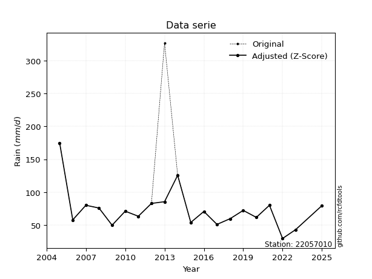</img>

</div>


> The initial value (value_initial) correspond to the initial obtained or null completed value, and value (value) is adjusted only when the initial value is outside the valid range (outlier) definite through the Z-Score value. If Z-Score is active, values out of range or outliers are replaced with the station mean value. A Z-Score (or standard score) measures how many standard deviations a data point is from the mean of a dataset, indicating its relative position; positive scores mean above the mean, negative mean below, and a score of zero is exactly at the mean, allowing for comparison of values from different distributions. It´s calculated using the formula $z=(x–μ)/σ$, where $x$ is the data point, $μ$ is the mean, and $σ$ is the standard deviation, helping identify outliers and understand probability.
>
> <sub>**Note**: In this study, "completing" (filling gaps in) and "extending" (forecasting or lengthening the historical record) rainfall data series are avoided for certain critical analyses because they introduce artificial bias and uncertainty, which can distort the statistics of rare events (extremes), alter day-to-day variability, and compromise the integrity and homogeneity of the original data. Some reasons against Completing/Extending rainfall data are: **Distortion of Extremes and Variability**: The primary issue is that most gap-filling or extension methods rely on averaging or regression with nearby stations, which inherently smooths the data. Rainfall is highly variable in space and time, with a large percentage of zero values and occasional large storms. Infilling methods often underestimate the highest values and overestimate the lowest (zero) values, which severely distorts analyses focused on flood frequency, drought severity, and intensity-duration-frequency (IDF) curves, **Loss of Data Homogeneity**: Infilled or extended data are synthetic estimates, not actual measurements. Combining these estimates with observed data can violate the assumption of data homogeneity, which requires that the data properties do not change over time. Inhomogeneity can lead to incorrect conclusions about long-term trends or changes in climate patterns, **Propagation of Errors**: Errors and biases from the original data (e.g., wind-induced undercatch, instrument errors, site changes) or the data used for imputation can propagate through the analysis, leading to unreliable hydrological models and inaccurate predictions, **Compromised Statistical Integrity**: For statistical analyses, especially those involving the frequency of events, using artificial data can introduce time bias or autocorrelation that doesn´t exist in reality, making it difficult to assess the true probability of events, **Difficulty in Validation**: It is difficult to accurately validate the quality of filled or extended data, especially for past periods where ground-truth measurements are unavailable. The reliability of imputation techniques heavily depends on the density of the surrounding station network and the complexity of the local topography.</sub>


### 4. Active continuous probability distributions from SciPy (80 of 104 available)

A Probability Density Function (PDF) describes the relative likelihood of a continuous random variable falling within a specific range, where the total area under its curve equals 1, and the area over any interval gives the actual probability for that range. Unlike discrete probabilities (like rolling a die), a PDF shows density, not direct probability for a single point (which is zero), with higher points indicating higher likelihood, often visualized as a bell curve for normal distributions.

A log of a probability density function (log-PDF) is simply the logarithm of the PDF´s value, denoted as $log(f(x))$, useful for converting multiplication of probabilities into addition, improving numerical stability with tiny numbers, and connecting to information theory concepts like entropy. Instead of dealing with very small probabilities (e.g., 0.000001), log-PDFs use negative numbers (e.g., $log(0.00001) ≈ -11.51$ that are easier for computers to handle, preventing underflow errors and simplifying complex calculations. In this study, each active probability distribution from SciPy is also evaluated in the $log$ form.

[scipy.stats](https://docs.scipy.org/doc/scipy/reference/stats.html) is a Python´s powerful submodule within the SciPy library for comprehensive statistical analysis, offering over 130 probability distributions (like Normal, Poisson, etc.), functions for descriptive stats (mean, variance), hypothesis testing (t-tests, chi-square), random variable generation, and statistical tests, making it essential for data science, modeling, and research. It provides tools to explore, model, and draw conclusions from data efficiently, working seamlessly with [NumPy](https://numpy.org/).

<div align="center">

|   id | p_dist           |   n_parameter | fit_method   | label                                                                       | active   | ref                                                                                                      |
|-----:|:-----------------|--------------:|:-------------|:----------------------------------------------------------------------------|:---------|:---------------------------------------------------------------------------------------------------------|
|    0 | alpha            |             3 | MLE          | Alpha                                                                       | True     | [:mortar_board:](https://docs.scipy.org/doc/scipy/reference/generated/scipy.stats.alpha.html)            |
|    1 | anglit           |             2 | MM           | Anglit                                                                      | True     | [:mortar_board:](https://docs.scipy.org/doc/scipy/reference/generated/scipy.stats.anglit.html)           |
|    2 | arcsine          |             2 | MM           | Arcsine                                                                     | True     | [:mortar_board:](https://docs.scipy.org/doc/scipy/reference/generated/scipy.stats.arcsine.html)          |
|    3 | argus            |             3 | MLE          | Argus                                                                       | True     | [:mortar_board:](https://docs.scipy.org/doc/scipy/reference/generated/scipy.stats.argus.html)            |
|    4 | beta             |             4 | MLE          | Beta                                                                        | True     | [:mortar_board:](https://docs.scipy.org/doc/scipy/reference/generated/scipy.stats.beta.html)             |
|    5 | betaprime        |             4 | MLE          | Beta prime                                                                  | True     | [:mortar_board:](https://docs.scipy.org/doc/scipy/reference/generated/scipy.stats.betaprime.html)        |
|    6 | bradford         |             3 | MLE          | Bradford                                                                    | True     | [:mortar_board:](https://docs.scipy.org/doc/scipy/reference/generated/scipy.stats.bradford.html)         |
|    7 | burr             |             4 | MLE          | Burr (Type III)                                                             | True     | [:mortar_board:](https://docs.scipy.org/doc/scipy/reference/generated/scipy.stats.burr.html)             |
|    8 | burr12           |             4 | MLE          | Burr (Type III) 12                                                          | True     | [:mortar_board:](https://docs.scipy.org/doc/scipy/reference/generated/scipy.stats.burr12.html)           |
|    9 | cosine           |             2 | MLE          | Cosine                                                                      | True     | [:mortar_board:](https://docs.scipy.org/doc/scipy/reference/generated/scipy.stats.cosine.html)           |
|   10 | crystalball      |             4 | MLE          | Crystalball                                                                 | True     | [:mortar_board:](https://docs.scipy.org/doc/scipy/reference/generated/scipy.stats.crystalball.html)      |
|   11 | dgamma           |             3 | MLE          | Double gamma                                                                | True     | [:mortar_board:](https://docs.scipy.org/doc/scipy/reference/generated/scipy.stats.dgamma.html)           |
|   12 | dweibull         |             3 | MLE          | Double Weibull                                                              | True     | [:mortar_board:](https://docs.scipy.org/doc/scipy/reference/generated/scipy.stats.dweibull.html)         |
|   13 | erlang           |             3 | MLE          | Erlang                                                                      | True     | [:mortar_board:](https://docs.scipy.org/doc/scipy/reference/generated/scipy.stats.erlang.html)           |
|   14 | exponnorm        |             3 | MLE          | Exponentially modified Normal                                               | True     | [:mortar_board:](https://docs.scipy.org/doc/scipy/reference/generated/scipy.stats.exponnorm.html)        |
|   15 | exponpow         |             3 | MLE          | Exponential power                                                           | True     | [:mortar_board:](https://docs.scipy.org/doc/scipy/reference/generated/scipy.stats.exponpow.html)         |
|   16 | exponweib        |             4 | MLE          | Exponentiated Weibull                                                       | True     | [:mortar_board:](https://docs.scipy.org/doc/scipy/reference/generated/scipy.stats.exponweib.html)        |
|   17 | f                |             4 | MLE          | F                                                                           | True     | [:mortar_board:](https://docs.scipy.org/doc/scipy/reference/generated/scipy.stats.f.html)                |
|   18 | fatiguelife      |             3 | MLE          | Fatigue-life (Birnbaum-Saunders)                                            | True     | [:mortar_board:](https://docs.scipy.org/doc/scipy/reference/generated/scipy.stats.fatiguelife.html)      |
|   19 | foldnorm         |             3 | MM           | Fold Normal                                                                 | True     | [:mortar_board:](https://docs.scipy.org/doc/scipy/reference/generated/scipy.stats.foldnorm.html)         |
|   20 | gamma            |             3 | MLE          | Gamma                                                                       | True     | [:mortar_board:](https://docs.scipy.org/doc/scipy/reference/generated/scipy.stats.gamma.html)            |
|   21 | gausshyper       |             6 | MLE          | Gauss hypergeometric                                                        | True     | [:mortar_board:](https://docs.scipy.org/doc/scipy/reference/generated/scipy.stats.gausshyper.html)       |
|   22 | genexpon         |             5 | MLE          | Generalized exponential                                                     | True     | [:mortar_board:](https://docs.scipy.org/doc/scipy/reference/generated/scipy.stats.genexpon.html)         |
|   23 | genextreme       |             3 | MLE          | Generalized exponential                                                     | True     | [:mortar_board:](https://docs.scipy.org/doc/scipy/reference/generated/scipy.stats.genextreme.html)       |
|   24 | gengamma         |             4 | MLE          | Generalized gamma                                                           | True     | [:mortar_board:](https://docs.scipy.org/doc/scipy/reference/generated/scipy.stats.gengamma.html)         |
|   25 | genhalflogistic  |             3 | MLE          | Generalized half-logistic                                                   | True     | [:mortar_board:](https://docs.scipy.org/doc/scipy/reference/generated/scipy.stats.genhalflogistic.html)  |
|   26 | genlogistic      |             3 | MLE          | Generalized logistic                                                        | True     | [:mortar_board:](https://docs.scipy.org/doc/scipy/reference/generated/scipy.stats.genlogistic.html)      |
|   27 | gennorm          |             3 | MLE          | Generalized Normal                                                          | True     | [:mortar_board:](https://docs.scipy.org/doc/scipy/reference/generated/scipy.stats.gennorm.html)          |
|   28 | genpareto        |             3 | MLE          | Generalized Pareto                                                          | True     | [:mortar_board:](https://docs.scipy.org/doc/scipy/reference/generated/scipy.stats.genpareto.html)        |
|   29 | gompertz         |             3 | MLE          | Gompertz (or truncated Gumbel)                                              | True     | [:mortar_board:](https://docs.scipy.org/doc/scipy/reference/generated/scipy.stats.gompertz.html)         |
|   30 | gumbel_l         |             2 | MM           | Gumbel Left Skew                                                            | True     | [:mortar_board:](https://docs.scipy.org/doc/scipy/reference/generated/scipy.stats.gumbel_l.html)         |
|   31 | gumbel_r         |             2 | MM           | Gumbel Right Skew                                                           | True     | [:mortar_board:](https://docs.scipy.org/doc/scipy/reference/generated/scipy.stats.gumbel_r.html)         |
|   32 | halfgennorm      |             3 | MLE          | Upper half of a generalized normal                                          | True     | [:mortar_board:](https://docs.scipy.org/doc/scipy/reference/generated/scipy.stats.halfgennorm.html)      |
|   33 | halflogistic     |             2 | MM           | Half-logistic                                                               | True     | [:mortar_board:](https://docs.scipy.org/doc/scipy/reference/generated/scipy.stats.halflogistic.html)     |
|   34 | halfnorm         |             2 | MM           | Half Normal                                                                 | True     | [:mortar_board:](https://docs.scipy.org/doc/scipy/reference/generated/scipy.stats.halfnorm.html)         |
|   35 | hypsecant        |             2 | MM           | hyperbolic secant                                                           | True     | [:mortar_board:](https://docs.scipy.org/doc/scipy/reference/generated/scipy.stats.hypsecant.html)        |
|   36 | invgamma         |             3 | MLE          | Inverted gamma                                                              | True     | [:mortar_board:](https://docs.scipy.org/doc/scipy/reference/generated/scipy.stats.invgamma.html)         |
|   37 | invgauss         |             3 | MLE          | Inverse Gaussian                                                            | True     | [:mortar_board:](https://docs.scipy.org/doc/scipy/reference/generated/scipy.stats.invgauss.html)         |
|   38 | invweibull       |             3 | MLE          | Inverted Weibull                                                            | True     | [:mortar_board:](https://docs.scipy.org/doc/scipy/reference/generated/scipy.stats.invweibull.html)       |
|   39 | johnsonsb        |             4 | MLE          | Johnson SB                                                                  | True     | [:mortar_board:](https://docs.scipy.org/doc/scipy/reference/generated/scipy.stats.johnsonsb.html)        |
|   40 | johnsonsu        |             4 | MLE          | Johnson Su                                                                  | True     | [:mortar_board:](https://docs.scipy.org/doc/scipy/reference/generated/scipy.stats.johnsonsu.html)        |
|   41 | kappa3           |             3 | MLE          | Kappa 3                                                                     | True     | [:mortar_board:](https://docs.scipy.org/doc/scipy/reference/generated/scipy.stats.kappa3.html)           |
|   42 | kappa4           |             4 | MLE          | Kappa 4                                                                     | True     | [:mortar_board:](https://docs.scipy.org/doc/scipy/reference/generated/scipy.stats.kappa4.html)           |
|   43 | ksone            |             3 | MLE          | Kolmogorov-Smirnov one-sided test statistic distribution                    | True     | [:mortar_board:](https://docs.scipy.org/doc/scipy/reference/generated/scipy.stats.ksone.html)            |
|   44 | kstwobign        |             2 | MLE          | Limiting distribution of scaled Kolmogorov-Smirnov two-sided test statistic | True     | [:mortar_board:](https://docs.scipy.org/doc/scipy/reference/generated/scipy.stats.kstwobign.html)        |
|   45 | laplace          |             2 | MM           | Laplace                                                                     | True     | [:mortar_board:](https://docs.scipy.org/doc/scipy/reference/generated/scipy.stats.laplace.html)          |
|   46 | levy_l           |             2 | MLE          | Left-skewed Levy                                                            | True     | [:mortar_board:](https://docs.scipy.org/doc/scipy/reference/generated/scipy.stats.levy_l.html)           |
|   47 | loggamma         |             3 | MLE          | Log gamma                                                                   | True     | [:mortar_board:](https://docs.scipy.org/doc/scipy/reference/generated/scipy.stats.loggamma.html)         |
|   48 | logistic         |             2 | MM           | Logistic (or Sech-squared)                                                  | True     | [:mortar_board:](https://docs.scipy.org/doc/scipy/reference/generated/scipy.stats.logistic.html)         |
|   49 | loglaplace       |             3 | MLE          | Log-Laplace                                                                 | True     | [:mortar_board:](https://docs.scipy.org/doc/scipy/reference/generated/scipy.stats.loglaplace.html)       |
|   50 | lomax            |             3 | MLE          | Lomax (Pareto of the second kind)                                           | True     | [:mortar_board:](https://docs.scipy.org/doc/scipy/reference/generated/scipy.stats.lomax.html)            |
|   51 | maxwell          |             2 | MM           | Maxwell                                                                     | True     | [:mortar_board:](https://docs.scipy.org/doc/scipy/reference/generated/scipy.stats.maxwell.html)          |
|   52 | mielke           |             4 | MLE          | Mielke Beta-Kappa / Dagum                                                   | True     | [:mortar_board:](https://docs.scipy.org/doc/scipy/reference/generated/scipy.stats.mielke.html)           |
|   53 | moyal            |             2 | MM           | Moyal                                                                       | True     | [:mortar_board:](https://docs.scipy.org/doc/scipy/reference/generated/scipy.stats.moyal.html)            |
|   54 | nakagami         |             3 | MLE          | Nakagami                                                                    | True     | [:mortar_board:](https://docs.scipy.org/doc/scipy/reference/generated/scipy.stats.nakagami.html)         |
|   55 | ncf              |             5 | MLE          | Non-central F distribution                                                  | True     | [:mortar_board:](https://docs.scipy.org/doc/scipy/reference/generated/scipy.stats.ncf.html)              |
|   56 | nct              |             4 | MLE          | Non-central Student’s t                                                     | True     | [:mortar_board:](https://docs.scipy.org/doc/scipy/reference/generated/scipy.stats.nct.html)              |
|   57 | norm             |             2 | MM           | Normal                                                                      | True     | [:mortar_board:](https://docs.scipy.org/doc/scipy/reference/generated/scipy.stats.norm.html)             |
|   58 | pearson3         |             3 | MM           | Pearson type III                                                            | True     | [:mortar_board:](https://docs.scipy.org/doc/scipy/reference/generated/scipy.stats.pearson3.html)         |
|   59 | powerlaw         |             3 | MLE          | Power-function                                                              | True     | [:mortar_board:](https://docs.scipy.org/doc/scipy/reference/generated/scipy.stats.powerlaw.html)         |
|   60 | rayleigh         |             2 | MM           | Rayleigh                                                                    | True     | [:mortar_board:](https://docs.scipy.org/doc/scipy/reference/generated/scipy.stats.rayleigh.html)         |
|   61 | rdist            |             3 | MLE          | R-distributed (symmetric beta)                                              | True     | [:mortar_board:](https://docs.scipy.org/doc/scipy/reference/generated/scipy.stats.rdist.html)            |
|   62 | rice             |             3 | MLE          | Rice                                                                        | True     | [:mortar_board:](https://docs.scipy.org/doc/scipy/reference/generated/scipy.stats.rice.html)             |
|   63 | semicircular     |             2 | MM           | Semicircular                                                                | True     | [:mortar_board:](https://docs.scipy.org/doc/scipy/reference/generated/scipy.stats.semicircular.html)     |
|   64 | skewnorm         |             3 | MLE          | Skew normal                                                                 | True     | [:mortar_board:](https://docs.scipy.org/doc/scipy/reference/generated/scipy.stats.skewnorm.html)         |
|   65 | t                |             3 | MLE          | Student’s t                                                                 | True     | [:mortar_board:](https://docs.scipy.org/doc/scipy/reference/generated/scipy.stats.t.html)                |
|   66 | trapezoid        |             4 | MLE          | Trapezoid                                                                   | True     | [:mortar_board:](https://docs.scipy.org/doc/scipy/reference/generated/scipy.stats.trapezoid.html)        |
|   67 | triang           |             3 | MLE          | Triangular                                                                  | True     | [:mortar_board:](https://docs.scipy.org/doc/scipy/reference/generated/scipy.stats.triang.html)           |
|   68 | truncexpon       |             3 | MLE          | Truncated exponential                                                       | True     | [:mortar_board:](https://docs.scipy.org/doc/scipy/reference/generated/scipy.stats.truncexpon.html)       |
|   69 | truncnorm        |             4 | MLE          | Truncated normal                                                            | True     | [:mortar_board:](https://docs.scipy.org/doc/scipy/reference/generated/scipy.stats.truncnorm.html)        |
|   70 | truncpareto      |             4 | MLE          | Upper truncated Pareto                                                      | True     | [:mortar_board:](https://docs.scipy.org/doc/scipy/reference/generated/scipy.stats.truncpareto.html)      |
|   71 | truncweibull_min |             5 | MLE          | Doubly truncated Weibull minimum                                            | True     | [:mortar_board:](https://docs.scipy.org/doc/scipy/reference/generated/scipy.stats.truncweibull_min.html) |
|   72 | tukeylambda      |             3 | MLE          | Tukey-Lamdba                                                                | True     | [:mortar_board:](https://docs.scipy.org/doc/scipy/reference/generated/scipy.stats.tukeylambda.html)      |
|   73 | uniform          |             2 | MLE          | Uniform                                                                     | True     | [:mortar_board:](https://docs.scipy.org/doc/scipy/reference/generated/scipy.stats.uniform.html)          |
|   74 | vonmises         |             3 | MLE          | Von Mises                                                                   | True     | [:mortar_board:](https://docs.scipy.org/doc/scipy/reference/generated/scipy.stats.vonmises.html)         |
|   75 | vonmises_line    |             3 | MLE          | Von Mises line                                                              | True     | [:mortar_board:](https://docs.scipy.org/doc/scipy/reference/generated/scipy.stats.vonmises_line.html)    |
|   76 | wald             |             2 | MM           | Wald                                                                        | True     | [:mortar_board:](https://docs.scipy.org/doc/scipy/reference/generated/scipy.stats.wald.html)             |
|   77 | weibull_max      |             3 | MLE          | Weibull maximum                                                             | True     | [:mortar_board:](https://docs.scipy.org/doc/scipy/reference/generated/scipy.stats.weibull_max.html)      |
|   78 | weibull_min      |             3 | MLE          | Weibull minimum                                                             | True     | [:mortar_board:](https://docs.scipy.org/doc/scipy/reference/generated/scipy.stats.weibull_min.html)      |
|   79 | wrapcauchy       |             3 | MLE          | Wrapped  Cauchy                                                             | True     | [:mortar_board:](https://docs.scipy.org/doc/scipy/reference/generated/scipy.stats.wrapcauchy.html)       |

</div>

> **n_parameter:** # arguments & localization & scale.
>
> **Fit methods:** (MLE) maximum likelihood, (MM) L-moments.
>
>**Inactive** (With the only purpose of prevent loops, zero divisions, infinite values, over high estimated values or horizontal trending for recurrence intervals estimations, the follow distributions were disabled.)**:** lognorm, norminvgauss, powernorm, powerlognorm, cauchy, halfcauchy, foldcauchy, skewcauchy, chi2, expon, fisk, genhyperbolic, geninvgauss, gibrat, kstwo, laplace_asymmetric, levy, levy_stable, ncx2, pareto, rel_breitwigner, recipinvgauss, studentized_range, loguniform, 


## B. Probability (PDF) vs. Empirical (EDF) distributions functions

A continuous probability distribution (CPD) describes probabilities for variables that can take any value within a range (like rain any time), unlike discrete variables with specific outcomes (like temperature). It uses a Probability Density Function (PDF), a curve where the total area under it equals 1, and the probability of the variable falling within an interval (a to b) is found by calculating the area under the curve between those points. A key feature is that the probability of hitting any single exact value is zero, so probabilities are always expressed for ranges, e.g., $P(a ≤ X ≤ b)$.

<div align="center">

Distributions parameters from station values
|     |   station | p_dist              |   n |              loc |          scale | shape                  | shape1                 | shape2              | shape3            |
|----:|----------:|:--------------------|----:|-----------------:|---------------:|:-----------------------|:-----------------------|:--------------------|:------------------|
|   0 |  22057010 | alpha               |  20 |    -47.0283      |  561.346       | 4.894058129309319      |                        |                     |                   |
|   1 |  22057010 | anglit              |  20 |     73.4515      |   88.6803      |                        |                        |                     |                   |
|   2 |  22057010 | arcsine             |  20 |     30.5811      |   85.7407      |                        |                        |                     |                   |
|   3 |  22057010 | argus               |  20 |    -18.9256      |  196.712       | 1.5272541481549908e-06 |                        |                     |                   |
|   4 |  22057010 | beta                |  20 |     20.7191      |    1.19543e+14 | 3.48494265598481       | 7882391643495.584      |                     |                   |
|   5 |  22057010 | betaprime           |  20 |     -0.122847    |   23.1171      | 30.855884699171        | 10.717460927787087     |                     |                   |
|   6 |  22057010 | bradford            |  20 |     29.6         |  145.4         | 0.3522509796924832     |                        |                     |                   |
|   7 |  22057010 | burr                |  20 |     -0.252682    |   66.3484      | 5.090021292284948      | 1.1031737719577452     |                     |                   |
|   8 |  22057010 | burr12              |  20 |     -0.341872    |   63.4698      | 5.894190013167348      | 0.7522619497581995     |                     |                   |
|   9 |  22057010 | cosine              |  20 |     83.91        |   33.1976      |                        |                        |                     |                   |
|  10 |  22057010 | crystalball         |  20 |     73.4515      |   30.3139      | 3967.849464852377      | 5909.050012708907      |                     |                   |
|  11 |  22057010 | dgamma              |  20 |     71.1         |   22.1646      | 0.9004826450679766     |                        |                     |                   |
|  12 |  22057010 | dweibull            |  20 |     71.1         |   19.1584      | 0.8697156658683726     |                        |                     |                   |
|  13 |  22057010 | erlang              |  20 |     20.0327      |   14.6162      | 3.654762088814529      |                        |                     |                   |
|  14 |  22057010 | exponnorm           |  20 |     49.4937      |   12.6965      | 1.8869663644987695     |                        |                     |                   |
|  15 |  22057010 | exponpow            |  20 |     29.6         |    1.1266      | 0.08933333743836558    |                        |                     |                   |
|  16 |  22057010 | exponweib           |  20 |     29.6         |    0.608632    | 3.00218750752905       | 0.17429252938312623    |                     |                   |
|  17 |  22057010 | f                   |  20 |     -9.05996     |   74.7365      | 366.1832256431517      | 21.71933365046278      |                     |                   |
|  18 |  22057010 | fatiguelife         |  20 |     29.5517      |    2.60749     | 4.233601956736763      |                        |                     |                   |
|  19 |  22057010 | foldnorm            |  20 |     30.339       |   53.3723      | 0.04642457784014997    |                        |                     |                   |
|  20 |  22057010 | gamma               |  20 |     20.0328      |   14.6162      | 3.654754900046637      |                        |                     |                   |
|  21 |  22057010 | genexpon            |  20 |     29.6         |    2.04588     | 0.04611725160040884    | 0.000564368331297729   | 0.8670596462557276  |                   |
|  22 |  22057010 | genextreme          |  20 |     60.2871      |   20.344       | -0.06679660403318467   |                        |                     |                   |
|  23 |  22057010 | gengamma            |  20 |     15.1917      |   13.2565      | 4.580963855157908      | 1.0347515046217892     |                     |                   |
|  24 |  22057010 | genhalflogistic     |  20 |     29.6         |   33.731       | 0.09575264060302785    |                        |                     |                   |
|  25 |  22057010 | genlogistic         |  20 |    -21.5992      |   20.4926      | 57.159735114508834     |                        |                     |                   |
|  26 |  22057010 | gennorm             |  20 |     71.1         |   10.5175      | 0.721637193851246      |                        |                     |                   |
|  27 |  22057010 | genpareto           |  20 |     29.6         |   55.2821      | -0.27726776329875624   |                        |                     |                   |
|  28 |  22057010 | gompertz            |  20 |     17.616       |    3.96322     | 1.1326290752490494e-16 |                        |                     |                   |
|  29 |  22057010 | gumbel_l            |  20 |     87.0944      |   23.6357      |                        |                        |                     |                   |
|  30 |  22057010 | gumbel_r            |  20 |     59.8086      |   23.6357      |                        |                        |                     |                   |
|  31 |  22057010 | halfgennorm         |  20 |     29.6         |    0.131775    | 0.2507923451984836     |                        |                     |                   |
|  32 |  22057010 | halflogistic        |  20 |     37.5225      |   25.9173      |                        |                        |                     |                   |
|  33 |  22057010 | halfnorm            |  20 |     33.3278      |   50.2876      |                        |                        |                     |                   |
|  34 |  22057010 | hypsecant           |  20 |     73.4515      |   19.2984      |                        |                        |                     |                   |
|  35 |  22057010 | invgamma            |  20 |    -11.2599      |  836.501       | 10.899583816345036     |                        |                     |                   |
|  36 |  22057010 | invgauss            |  20 |      2.73614     |  449.139       | 0.15744640962762074    |                        |                     |                   |
|  37 |  22057010 | invweibull          |  20 |   -244.318       |  304.605       | 14.972582885447787     |                        |                     |                   |
|  38 |  22057010 | johnsonsb           |  20 |      5.88182     | 9693.14        | 12.496303509844743     | 2.4776476665637093     |                     |                   |
|  39 |  22057010 | johnsonsu           |  20 |     56.8156      |   17.6191      | -0.6514689502059564    | 1.1203132398881257     |                     |                   |
|  40 |  22057010 | kappa3              |  20 |     29.6         |   47.2316      | 4.178312278781529      |                        |                     |                   |
|  41 |  22057010 | kappa4              |  20 |     14.0074      |   92.7046      | 1.1921885993909942     | 0.5061739110781007     |                     |                   |
|  42 |  22057010 | ksone               |  20 |     15.06        |  174.48        | 1.0                    |                        |                     |                   |
|  43 |  22057010 | kstwobign           |  20 |    -18.0502      |  106.606       |                        |                        |                     |                   |
|  44 |  22057010 | laplace             |  20 |     73.4515      |   21.4352      |                        |                        |                     |                   |
|  45 |  22057010 | levy_l              |  20 |    185.766       |   76.7284      |                        |                        |                     |                   |
|  46 |  22057010 | loggamma            |  20 | -10575.9         | 1400.05        | 2011.79098932841       |                        |                     |                   |
|  47 |  22057010 | logistic            |  20 |     73.4515      |   16.7129      |                        |                        |                     |                   |
|  48 |  22057010 | loglaplace          |  20 |     -0.168355    |   70.8684      | 3.838636214208429      |                        |                     |                   |
|  49 |  22057010 | lomax               |  20 |     29.6         | 2321.55        | 53.12381456686698      |                        |                     |                   |
|  50 |  22057010 | maxwell             |  20 |      1.62028     |   45.0135      |                        |                        |                     |                   |
|  51 |  22057010 | mielke              |  20 |     -0.458885    |   66.4835      | 5.647721312233019      | 5.099213014530974      |                     |                   |
|  52 |  22057010 | moyal               |  20 |     56.1161      |   13.6461      |                        |                        |                     |                   |
|  53 |  22057010 | nakagami            |  20 |     43.1         |   88.7451      | 0.1521195288646018     |                        |                     |                   |
|  54 |  22057010 | ncf                 |  20 |     -0.0193005   |    1.3179e-09  | 8.444263195835889e-11  | 5.592974343722217      | 3.5047277380426856  |                   |
|  55 |  22057010 | nct                 |  20 |     -0.0975118   |   13.1084      | 6.997056017179199      | 4.964890041343121      |                     |                   |
|  56 |  22057010 | norm                |  20 |     73.4515      |   30.3139      |                        |                        |                     |                   |
|  57 |  22057010 | pearson3            |  20 |     73.4515      |   30.3139      | 1.8667388806591445     |                        |                     |                   |
|  58 |  22057010 | powerlaw            |  20 |     29.6         |  145.4         | 0.3178242484765987     |                        |                     |                   |
|  59 |  22057010 | rayleigh            |  20 |     15.4592      |   46.2711      |                        |                        |                     |                   |
|  60 |  22057010 | rdist               |  20 |     16.2143      |   69.3157      | 1.2049691879428508     |                        |                     |                   |
|  61 |  22057010 | rice                |  20 |     22.5308      |   41.9038      | 0.00027481772843478266 |                        |                     |                   |
|  62 |  22057010 | semicircular        |  20 |     73.4515      |   60.6278      |                        |                        |                     |                   |
|  63 |  22057010 | skewnorm            |  20 |     29.6         |   53.3166      | 17963156.30739393      |                        |                     |                   |
|  64 |  22057010 | t                   |  20 |     63.5039      |   19.5604      | 2.724028715694949      |                        |                     |                   |
|  65 |  22057010 | trapezoid           |  20 |     15.06        |  174.48        | 0.9999999999999999     | 1.0                    |                     |                   |
|  66 |  22057010 | triang              |  20 |     22.6278      |  162.172       | 0.1749509733678209     |                        |                     |                   |
|  67 |  22057010 | truncexpon          |  20 |     18.7053      |  132.995       | 1.1751960041645035     |                        |                     |                   |
|  68 |  22057010 | truncnorm           |  20 |     73.4515      |   30.3139      | -587.8199990537847     | 2059.3682915874015     |                     |                   |
|  69 |  22057010 | truncpareto         |  20 |     29.6         |    8.17732e-08 | 0.05263158033791133    | 1778089172.940074      |                     |                   |
|  70 |  22057010 | truncweibull_min    |  20 |     21.6234      |  125.728       | 1.2892326971764274     | 2.8411205098216492e-08 | 1.2199040792552864  |                   |
|  71 |  22057010 | tukeylambda         |  20 |     68.1484      |    7.90588     | -0.36021529564280436   |                        |                     |                   |
|  72 |  22057010 | uniform             |  20 |     29.6         |  145.4         |                        |                        |                     |                   |
|  73 |  22057010 | vonmises            |  20 |     -0.949634    |    1           | 0.3012717591473383     |                        |                     |                   |
|  74 |  22057010 | vonmises_line       |  20 |     67.6873      |   18.466       | 1.613261902850408      |                        |                     |                   |
|  75 |  22057010 | wald                |  20 |     43.1376      |   30.3139      |                        |                        |                     |                   |
|  76 |  22057010 | weibull_max         |  20 |    175           |    1.6407      | 0.17489860221198167    |                        |                     |                   |
|  77 |  22057010 | weibull_min         |  20 |     42.7917      |   33.2663      | 1.151751277279367      |                        |                     |                   |
|  78 |  22057010 | wrapcauchy          |  20 |     29.6         |   23.1425      | 0.01218236031503004    |                        |                     |                   |
|  79 |  22057010 | logalpha            |  20 |     -4.16825     |  194.758       | 23.246604596011764     |                        |                     |                   |
|  80 |  22057010 | loganglit           |  20 |      4.22701     |    1.06461     |                        |                        |                     |                   |
|  81 |  22057010 | logarcsine          |  20 |      3.71233     |    1.02936     |                        |                        |                     |                   |
|  82 |  22057010 | logargus            |  20 |      3.16407     |    2.03223     | 1.0117792654664533e-05 |                        |                     |                   |
|  83 |  22057010 | logbeta             |  20 |      0.0892337   |   89.5152      | 123.75672143054032     | 2553.530733326792      |                     |                   |
|  84 |  22057010 | logbetaprime        |  20 |     -3.94633     |    7.56298     | 853.10088856421        | 790.1884091380753      |                     |                   |
|  85 |  22057010 | logbradford         |  20 |      3.38777     |    1.77703     | 1.0860260953970973     |                        |                     |                   |
|  86 |  22057010 | logburr             |  20 |      2.05109     |    2.26441     | 13.343181530486946     | 0.6643666439117062     |                     |                   |
|  87 |  22057010 | logburr12           |  20 |     -0.0537773   |    4.25451     | 22.793093105125685     | 0.9517445539800424     |                     |                   |
|  88 |  22057010 | logcosine           |  20 |      4.2509      |    0.356429    |                        |                        |                     |                   |
|  89 |  22057010 | logcrystalball      |  20 |      4.22701     |    0.363933    | 991.6881203334597      | 54.37330387527205      |                     |                   |
|  90 |  22057010 | logdgamma           |  20 |      4.20296     |    0.172723    | 1.544229935635519      |                        |                     |                   |
|  91 |  22057010 | logdweibull         |  20 |      4.21046     |    0.284294    | 1.190483931005962      |                        |                     |                   |
|  92 |  22057010 | logerlang           |  20 |     -0.0185381   |    0.0310647   | 136.66791792742669     |                        |                     |                   |
|  93 |  22057010 | logexponnorm        |  20 |      4.00274     |    0.285083    | 0.7866495572543117     |                        |                     |                   |
|  94 |  22057010 | logexponpow         |  20 |      3.30687     |    1.31479     | 1.7399456096737422     |                        |                     |                   |
|  95 |  22057010 | logexponweib        |  20 |     -0.961352    |    4.26145     | 12.608962257581048     | 5.515320050823812      |                     |                   |
|  96 |  22057010 | logf                |  20 |     -2.53269     |    6.744       | 3611.954199390841      | 861.6875078567147      |                     |                   |
|  97 |  22057010 | logfatiguelife      |  20 |     -1.79392     |    6.01        | 0.060291090843453965   |                        |                     |                   |
|  98 |  22057010 | logfoldnorm         |  20 |      3.68445     |    0.438932    | 1.0988221721986136     |                        |                     |                   |
|  99 |  22057010 | loggamma            |  20 |     -0.016721    |    0.0310817   | 136.53469162256363     |                        |                     |                   |
| 100 |  22057010 | loggausshyper       |  20 |     -1.86431     |    8.09471     | 22.93196859529661      | 16.555774009305253     | -33.168658768267264 | 4.834757008471975 |
| 101 |  22057010 | loggenexpon         |  20 |      3.38777     |    2.54264e+08 | 57917802.02108203      | 1230392789.703571      | 121108431.0831159   |                   |
| 102 |  22057010 | loggenextreme       |  20 |      4.08829     |    0.356416    | 0.20770258429913147    |                        |                     |                   |
| 103 |  22057010 | loggengamma         |  20 |      1.0578      |    0.438595    | 27.213116209354325     | 1.6670356970232936     |                     |                   |
| 104 |  22057010 | loggenhalflogistic  |  20 |      3.21884     |    2.06997     | 1.063729289991426      |                        |                     |                   |
| 105 |  22057010 | loggenlogistic      |  20 |      4.19243     |    0.196899    | 1.0977789667930742     |                        |                     |                   |
| 106 |  22057010 | loggennorm          |  20 |      4.26409     |    0.243138    | 0.9527986618074838     |                        |                     |                   |
| 107 |  22057010 | loggenpareto        |  20 |     -0.00910621  |   10.9472      | -2.1158605374981594    |                        |                     |                   |
| 108 |  22057010 | loggompertz         |  20 |      3.3718      |    0.498293    | 0.15390511895449244    |                        |                     |                   |
| 109 |  22057010 | loggumbel_l         |  20 |      4.3908      |    0.283758    |                        |                        |                     |                   |
| 110 |  22057010 | loggumbel_r         |  20 |      4.06322     |    0.283758    |                        |                        |                     |                   |
| 111 |  22057010 | loghalfgennorm      |  20 |      3.38777     |    1.51781     | 4.89696406915639       |                        |                     |                   |
| 112 |  22057010 | loghalflogistic     |  20 |      3.79571     |    0.311121    |                        |                        |                     |                   |
| 113 |  22057010 | loghalfnorm         |  20 |      3.74535     |    0.603677    |                        |                        |                     |                   |
| 114 |  22057010 | loghypsecant        |  20 |      4.22701     |    0.231687    |                        |                        |                     |                   |
| 115 |  22057010 | loginvgamma         |  20 |     -3.01675     | 2887.56        | 399.6441074271743      |                        |                     |                   |
| 116 |  22057010 | loginvgauss         |  20 |      1.06917     |  229.163       | 0.01376570617135733    |                        |                     |                   |
| 117 |  22057010 | loginvweibull       |  20 |     -3.305e+07   |    3.305e+07   | 91107898.85052067      |                        |                     |                   |
| 118 |  22057010 | logjohnsonsb        |  20 |     -0.930496    |   37.4606      | 22.53225381692654      | 12.263791750091322     |                     |                   |
| 119 |  22057010 | logjohnsonsu        |  20 |      4.22196     |    0.292752    | -0.0003457202164253863 | 1.149674873523896      |                     |                   |
| 120 |  22057010 | logkappa3           |  20 |      3.38776     |    1.77674     | 21867.240202085246     |                        |                     |                   |
| 121 |  22057010 | logkappa4           |  20 |      3.27989     |    2.00809     | 1.056878399959644      | 1.0628680913307846     |                     |                   |
| 122 |  22057010 | logksone            |  20 |      3.21007     |    2.13241     | 1.0                    |                        |                     |                   |
| 123 |  22057010 | logkstwobign        |  20 |      2.67506     |    1.79198     |                        |                        |                     |                   |
| 124 |  22057010 | loglaplace          |  20 |      4.22701     |    0.25734     |                        |                        |                     |                   |
| 125 |  22057010 | loglevy_l           |  20 |      5.25978     |    0.672077    |                        |                        |                     |                   |
| 126 |  22057010 | logloggamma         |  20 |    -93.2984      |   13.5375      | 1345.2622738216546     |                        |                     |                   |
| 127 |  22057010 | loglogistic         |  20 |      4.22701     |    0.200647    |                        |                        |                     |                   |
| 128 |  22057010 | logloglaplace       |  20 |     -0.0288776   |    4.29296     | 16.259816517296656     |                        |                     |                   |
| 129 |  22057010 | loglomax            |  20 |      3.38777     |    2.84643e+07 | 32322681.50222169      |                        |                     |                   |
| 130 |  22057010 | logmaxwell          |  20 |      3.36464     |    0.54041     |                        |                        |                     |                   |
| 131 |  22057010 | logmielke           |  20 |      2.05111     |    2.2644      | 8.864689730599661      | 13.343107942500383     |                     |                   |
| 132 |  22057010 | logmoyal            |  20 |      4.01889     |    0.163828    |                        |                        |                     |                   |
| 133 |  22057010 | lognakagami         |  20 |      3.73293     |    0.614385    | 0.7853616114979641     |                        |                     |                   |
| 134 |  22057010 | logncf              |  20 |     -1.4374      |    3.71278     | 886.5293201710062      | 948.8882401078695      | 463.15145817918733  |                   |
| 135 |  22057010 | lognct              |  20 |     -0.387242    |    0.0929155   | 88.1363200361331       | 49.206093230147125     |                     |                   |
| 136 |  22057010 | lognorm             |  20 |      4.22701     |    0.363933    |                        |                        |                     |                   |
| 137 |  22057010 | logpearson3         |  20 |      4.22701     |    0.363933    | 0.3184727297003478     |                        |                     |                   |
| 138 |  22057010 | logpowerlaw         |  20 |      3.38777     |    1.77701     | 0.39709633605630074    |                        |                     |                   |
| 139 |  22057010 | lograyleigh         |  20 |      3.53075     |    0.555531    |                        |                        |                     |                   |
| 140 |  22057010 | logrdist            |  20 |      4.25847     |    0.906313    | 1.2025955325062405     |                        |                     |                   |
| 141 |  22057010 | logrice             |  20 |      3.18773     |    0.383531    | 2.4986490733479263     |                        |                     |                   |
| 142 |  22057010 | logsemicircular     |  20 |      4.22701     |    0.727899    |                        |                        |                     |                   |
| 143 |  22057010 | logskewnorm         |  20 |      3.93584     |    0.466078    | 1.2793350030961181     |                        |                     |                   |
| 144 |  22057010 | logt                |  20 |      4.21872     |    0.236769    | 2.8416104138599634     |                        |                     |                   |
| 145 |  22057010 | logtrapezoid        |  20 |      3.21007     |    2.13241     | 1.0                    | 1.0                    |                     |                   |
| 146 |  22057010 | logtriang           |  20 |      3.25934     |    2.02024     | 0.49454638317932476    |                        |                     |                   |
| 147 |  22057010 | logtruncexpon       |  20 |      3.38777     |    2.15988     | 0.8227406360913523     |                        |                     |                   |
| 148 |  22057010 | logtruncnorm        |  20 |     -0.275421    |    1.71575     | 2.3472825042646353     | 3.171011060724319      |                     |                   |
| 149 |  22057010 | logtruncpareto      |  20 |     -1.34218e+08 |    1.34218e+08 | 34540716.098724574     | 1.0000000132397684     |                     |                   |
| 150 |  22057010 | logtruncweibull_min |  20 |      3.37616     |    2.15409     | 1.1640674814171919     | 0.0003629687678070757  | 0.830340052171626   |                   |
| 151 |  22057010 | logtukeylambda      |  20 |      4.28173     |    0.990573    | 1.1080829849091693     |                        |                     |                   |
| 152 |  22057010 | loguniform          |  20 |      3.38777     |    1.77701     |                        |                        |                     |                   |
| 153 |  22057010 | logvonmises         |  20 |     -2.05875     |    1           | 8.18852321140397       |                        |                     |                   |
| 154 |  22057010 | logvonmises_line    |  20 |      7.66658     |    1.23179e-29 | 1.3053444411223343     |                        |                     |                   |
| 155 |  22057010 | logwald             |  20 |      3.86311     |    0.363903    |                        |                        |                     |                   |
| 156 |  22057010 | logweibull_max      |  20 |      5.80424     |    1.71597     | 4.814790193237005      |                        |                     |                   |
| 157 |  22057010 | logweibull_min      |  20 |      3.11257     |    1.23833     | 3.2356883873484223     |                        |                     |                   |
| 158 |  22057010 | logwrapcauchy       |  20 |      3.38777     |    0.28282     | 0.5                    |                        |                     |                   |

</div>

> **loc** (Location parameter): This shifts the distribution along the x-axis. For many common distributions, like the normal (Gaussian) distribution, loc represents the mean $μ$. For others, like the uniform distribution, it might represent the minimum value, or for the beta distribution, the left end of the support interval.
>
> **scale** (Scale parameter): This determines the width or spread of the distribution. For the normal distribution, scale represents the standard deviation $σ$. For a uniform distribution, it defines the length of the interval (from $loc$ to $loc + scale$).
>
> **shape** (Shape parameters): Refers to parameters that define the specific form of a probability distribution, distinct from its location (loc) and scale (scale). These parameters are required arguments for most distribution functions. For example, a normal (Gaussian) distribution is fully defined by its location (mean) and scale (standard deviation), so it has no specific shape parameters beyond loc and scale. However, other distributions have intrinsic properties that need specification, as Gamma distribution that takes a shape parameter, often named $a$ or $alpha$.


### 0. Cumulative distribution values - CDF (160 evaluated)

Cumulative Distribution Function (CDF), denoted as $F$<sub>$X$</sub>$(x)$, is a function that gives the probability that a random variable $X$ will take a value less than or equal to a specific value, $x$ (i.e., $(P(X≥x)$. It essentially "accumulates" probabilities from a given point up to the far right (positive infinity), providing a complete picture of the distribution´s probabilities for both discrete (like rain) and continuous (like temperature) variables, helping to find probabilities over ranges or above certain values. Each station is evaluated separately ordering the $x$ values ascending, calculating the CDF and PDF values for the activated distributions and their logarithmic forms.

<div align="center">

CDF ordered by x ascending and calculating $log(f(x))$ separately
|   id |   Station |   date |      x |   count |   mean |     std |     zscore |   Value_initial |   station |   m |      alpha |   alpha_pdf |    anglit |   anglit_pdf |   arcsine |   arcsine_pdf |     argus |   argus_pdf |       beta |    beta_pdf |   betaprime |   betaprime_pdf |    bradford |   bradford_pdf |      burr |    burr_pdf |     burr12 |   burr12_pdf |    cosine |   cosine_pdf |   crystalball |   crystalball_pdf |    dgamma |   dgamma_pdf |   dweibull |   dweibull_pdf |     erlang |   erlang_pdf |   exponnorm |   exponnorm_pdf |   exponpow |   exponpow_pdf |   exponweib |   exponweib_pdf |          f |       f_pdf |   fatiguelife |   fatiguelife_pdf |   foldnorm |   foldnorm_pdf |      gamma |   gamma_pdf |   gausshyper |    genexpon |   genexpon_pdf |   genextreme |   genextreme_pdf |   gengamma |   gengamma_pdf |   genhalflogistic |   genhalflogistic_pdf |   genlogistic |   genlogistic_pdf |   gennorm |   gennorm_pdf |   genpareto |   genpareto_pdf |    gompertz |   gompertz_pdf |   gumbel_l |   gumbel_l_pdf |   gumbel_r |   gumbel_r_pdf |   halfgennorm |   halfgennorm_pdf |   halflogistic |   halflogistic_pdf |   halfnorm |   halfnorm_pdf |   hypsecant |   hypsecant_pdf |   invgamma |   invgamma_pdf |   invgauss |   invgauss_pdf |   invweibull |   invweibull_pdf |   johnsonsb |   johnsonsb_pdf |   johnsonsu |   johnsonsu_pdf |      kappa3 |   kappa3_pdf |      kappa4 |   kappa4_pdf |     ksone |   ksone_pdf |   kstwobign |   kstwobign_pdf |   laplace |   laplace_pdf |   levy_l |   levy_l_pdf |   loggamma |   loggamma_pdf |   logistic |   logistic_pdf |   loglaplace |   loglaplace_pdf |       lomax |   lomax_pdf |   maxwell |   maxwell_pdf |    mielke |   mielke_pdf |      moyal |   moyal_pdf |    nakagami |   nakagami_pdf |      ncf |    ncf_pdf |        nct |     nct_pdf |      norm |    norm_pdf |   pearson3 |   pearson3_pdf |    powerlaw |   powerlaw_pdf |   rayleigh |   rayleigh_pdf |    rdist |     rdist_pdf |      rice |    rice_pdf |   semicircular |   semicircular_pdf |   skewnorm |   skewnorm_pdf |         t |       t_pdf |   trapezoid |   trapezoid_pdf |    triang |   triang_pdf |   truncexpon |   truncexpon_pdf |   truncnorm |   truncnorm_pdf |   truncpareto |   truncpareto_pdf |   truncweibull_min |   truncweibull_min_pdf |   tukeylambda |   tukeylambda_pdf |   uniform |   uniform_pdf |   vonmises |   vonmises_pdf |   vonmises_line |   vonmises_line_pdf |      wald |    wald_pdf |   weibull_max |   weibull_max_pdf |   weibull_min |   weibull_min_pdf |   wrapcauchy |   wrapcauchy_pdf |   logalpha |   logalpha_pdf |   loganglit |   loganglit_pdf |   logarcsine |   logarcsine_pdf |   logargus |   logargus_pdf |    logbeta |   logbeta_pdf |   logbetaprime |   logbetaprime_pdf |   logbradford |   logbradford_pdf |    logburr |   logburr_pdf |   logburr12 |   logburr12_pdf |   logcosine |   logcosine_pdf |   logcrystalball |   logcrystalball_pdf |   logdgamma |   logdgamma_pdf |   logdweibull |   logdweibull_pdf |   logerlang |   logerlang_pdf |   logexponnorm |   logexponnorm_pdf |   logexponpow |   logexponpow_pdf |   logexponweib |   logexponweib_pdf |       logf |   logf_pdf |   logfatiguelife |   logfatiguelife_pdf |   logfoldnorm |   logfoldnorm_pdf |   loggausshyper |   loggausshyper_pdf |   loggenexpon |   loggenexpon_pdf |   loggenextreme |   loggenextreme_pdf |   loggengamma |   loggengamma_pdf |   loggenhalflogistic |   loggenhalflogistic_pdf |   loggenlogistic |   loggenlogistic_pdf |   loggennorm |   loggennorm_pdf |   loggenpareto |   loggenpareto_pdf |   loggompertz |   loggompertz_pdf |   loggumbel_l |   loggumbel_l_pdf |   loggumbel_r |   loggumbel_r_pdf |   loghalfgennorm |   loghalfgennorm_pdf |   loghalflogistic |   loghalflogistic_pdf |   loghalfnorm |   loghalfnorm_pdf |   loghypsecant |   loghypsecant_pdf |   loginvgamma |   loginvgamma_pdf |   loginvgauss |   loginvgauss_pdf |   loginvweibull |   loginvweibull_pdf |   logjohnsonsb |   logjohnsonsb_pdf |   logjohnsonsu |   logjohnsonsu_pdf |   logkappa3 |   logkappa3_pdf |   logkappa4 |   logkappa4_pdf |   logksone |   logksone_pdf |   logkstwobign |   logkstwobign_pdf |   loglevy_l |   loglevy_l_pdf |   logloggamma |   logloggamma_pdf |   loglogistic |   loglogistic_pdf |   logloglaplace |   logloglaplace_pdf |    loglomax |   loglomax_pdf |   logmaxwell |   logmaxwell_pdf |   logmielke |   logmielke_pdf |    logmoyal |   logmoyal_pdf |   lognakagami |   lognakagami_pdf |     logncf |   logncf_pdf |     lognct |   lognct_pdf |   lognorm |   lognorm_pdf |   logpearson3 |   logpearson3_pdf |   logpowerlaw |   logpowerlaw_pdf |   lograyleigh |   lograyleigh_pdf |   logrdist |   logrdist_pdf |    logrice |   logrice_pdf |   logsemicircular |   logsemicircular_pdf |   logskewnorm |   logskewnorm_pdf |      logt |   logt_pdf |   logtrapezoid |   logtrapezoid_pdf |   logtriang |   logtriang_pdf |   logtruncexpon |   logtruncexpon_pdf |   logtruncnorm |   logtruncnorm_pdf |   logtruncpareto |   logtruncpareto_pdf |   logtruncweibull_min |   logtruncweibull_min_pdf |   logtukeylambda |   logtukeylambda_pdf |   loguniform |   loguniform_pdf |   logvonmises |   logvonmises_pdf |   logvonmises_line |   logvonmises_line_pdf |   logwald |   logwald_pdf |   logweibull_max |   logweibull_max_pdf |   logweibull_min |   logweibull_min_pdf |   logwrapcauchy |   logwrapcauchy_pdf |
|-----:|----------:|-------:|-------:|--------:|-------:|--------:|-----------:|----------------:|----------:|----:|-----------:|------------:|----------:|-------------:|----------:|--------------:|----------:|------------:|-----------:|------------:|------------:|----------------:|------------:|---------------:|----------:|------------:|-----------:|-------------:|----------:|-------------:|--------------:|------------------:|----------:|-------------:|-----------:|---------------:|-----------:|-------------:|------------:|----------------:|-----------:|---------------:|------------:|----------------:|-----------:|------------:|--------------:|------------------:|-----------:|---------------:|-----------:|------------:|-------------:|------------:|---------------:|-------------:|-----------------:|-----------:|---------------:|------------------:|----------------------:|--------------:|------------------:|----------:|--------------:|------------:|----------------:|------------:|---------------:|-----------:|---------------:|-----------:|---------------:|--------------:|------------------:|---------------:|-------------------:|-----------:|---------------:|------------:|----------------:|-----------:|---------------:|-----------:|---------------:|-------------:|-----------------:|------------:|----------------:|------------:|----------------:|------------:|-------------:|------------:|-------------:|----------:|------------:|------------:|----------------:|----------:|--------------:|---------:|-------------:|-----------:|---------------:|-----------:|---------------:|-------------:|-----------------:|------------:|------------:|----------:|--------------:|----------:|-------------:|-----------:|------------:|------------:|---------------:|---------:|-----------:|-----------:|------------:|----------:|------------:|-----------:|---------------:|------------:|---------------:|-----------:|---------------:|---------:|--------------:|----------:|------------:|---------------:|-------------------:|-----------:|---------------:|----------:|------------:|------------:|----------------:|----------:|-------------:|-------------:|-----------------:|------------:|----------------:|--------------:|------------------:|-------------------:|-----------------------:|--------------:|------------------:|----------:|--------------:|-----------:|---------------:|----------------:|--------------------:|----------:|------------:|--------------:|------------------:|--------------:|------------------:|-------------:|-----------------:|-----------:|---------------:|------------:|----------------:|-------------:|-----------------:|-----------:|---------------:|-----------:|--------------:|---------------:|-------------------:|--------------:|------------------:|-----------:|--------------:|------------:|----------------:|------------:|----------------:|-----------------:|---------------------:|------------:|----------------:|--------------:|------------------:|------------:|----------------:|---------------:|-------------------:|--------------:|------------------:|---------------:|-------------------:|-----------:|-----------:|-----------------:|---------------------:|--------------:|------------------:|----------------:|--------------------:|--------------:|------------------:|----------------:|--------------------:|--------------:|------------------:|---------------------:|-------------------------:|-----------------:|---------------------:|-------------:|-----------------:|---------------:|-------------------:|--------------:|------------------:|--------------:|------------------:|--------------:|------------------:|-----------------:|---------------------:|------------------:|----------------------:|--------------:|------------------:|---------------:|-------------------:|--------------:|------------------:|--------------:|------------------:|----------------:|--------------------:|---------------:|-------------------:|---------------:|-------------------:|------------:|----------------:|------------:|----------------:|-----------:|---------------:|---------------:|-------------------:|------------:|----------------:|--------------:|------------------:|--------------:|------------------:|----------------:|--------------------:|------------:|---------------:|-------------:|-----------------:|------------:|----------------:|------------:|---------------:|--------------:|------------------:|-----------:|-------------:|-----------:|-------------:|----------:|--------------:|--------------:|------------------:|--------------:|------------------:|--------------:|------------------:|-----------:|---------------:|-----------:|--------------:|------------------:|----------------------:|--------------:|------------------:|----------:|-----------:|---------------:|-------------------:|------------:|----------------:|----------------:|--------------------:|---------------:|-------------------:|-----------------:|---------------------:|----------------------:|--------------------------:|-----------------:|---------------------:|-------------:|-----------------:|--------------:|------------------:|-------------------:|-----------------------:|----------:|--------------:|-----------------:|---------------------:|-----------------:|---------------------:|----------------:|--------------------:|
|    0 |  22057010 |   2022 |  29.6  |      20 |  85.53 | 64.7475 | -0.863817  |            29.6 |  22057010 |   1 | 0.00751807 | 0.00198398  | 0.0822672 |   0.0061969  |  0        |    0          | 0.0898757 |  0.00364583 | 0.00867586 | 0.00297109  |  0.00727765 |     0.00209553  | 6.80088e-08 |     0.00802806 | 0.0110723 | 0.00204752  | 0.00888482 |  0.00173094  | 0.0808114 |  0.00448198  |     0.0740072 |       0.00462239  | 0.0651334 |  0.00305057  |  0.0705252 |    0.00289486  | 0.00884645 |  0.00291665  |   0.0110398 |     0.00198404  |  0.0506256 |    1.27188e+12 | 3.54721e-08 |     5.21586e+06 | 0.00782565 | 0.00216027  |     0.0441667 |       1.71112     |   0        |    0           | 0.00884625 | 0.00291661  |   0.00882028 | 3.26189e-10 |    0.0225415   |   0.00742148 |      0.00198917  |  0.0103107 |    0.00275114  |        4.0807e-11 |           0.0148232   |     0.0109311 |       0.00231628  | 0.0626226 |   0.00261491  | 7.85436e-12 |     0.018089    | 2.2165e-15  |    5.87845e-16 |  0.0840693 |    0.003403    |  0.0276039 |    0.0041925   |      0        |       0.322266    |       0        |        0           |   0        |    0           |   0.0653896 |     0.00336456  | 0.00775907 |    0.00214501  | 0.00837163 |    0.00243935  |   0.00742206 |      0.00198925  |  0.00829765 |     0.00237025  |   0.0218242 |     0.0018014   | 3.82545e-12 |  0.0150363   | 4.14376e-14 |   3.69132    | 0.0833333 |  0.00573132 |    0.011668 |     0.0027793   | 0.0646401 |   0.00301561  | 0.516664 |   0.00140061 | 0.00705451 |      0.0626454 |  0.0676219 |    0.00377248  |    0.0191713 |        0.0744979 | 9.75559e-16 | 0.022883    | 0.0569559 |   0.00564545  | 0.0110834 |  0.0020467   | 0.00823992 | 0.00235525  | 0           |    0           | 0.425588 | 0.00711647 | 0.00914317 | 0.00206859  | 0.0740072 | 0.00462239  |   0        |    0           | 5.25173e-06 |    4.69817e+08 |  0.0456241 |    0.00630336  | 0.570146 |    0.00529355 | 0.0141294 | 0.00396905  |      0.0836448 |         0.00725103 |   0        |    0.014965    | 0.0953269 | 0.00467059  |  0.00694444 |     0.000955219 | 0.010565  |  0.00303061  |     0.113785 |       0.0100221  |   0.0740072 |     0.00462239  |      0        |  954878           |          0.0388406 |             0.00618839 |     0.0586117 |       0.00260861  | 0         |    0.00687758 |    5.32421 |       0.18913  |       0.0269709 |         0.0022804   | 0         | 0           |      0.111817 |       0.00029468  |    0          |       0           |  6.47946e-08 |       0.00704681 | 0.00572699 |      0.0556532 |    0        |        0        |     0        |         0        |  0.0181207 |       0.161512 | 0.00711527 |     0.0629685 |       0.014805 |          0.103465  |   1.63271e-06 |          0.831197 | 0.00934031 |     0.0618896 |  0.00751681 |       0.0493995 |  0.00964707 |       0.110824  |        0.0105549 |            0.0767652 |   0.0129229 |       0.0676158 |     0.0144639 |         0.0741555 |   0.0070528 |       0.0626312 |     0.00492493 |          0.0471397 |    0.00781777 |         0.168136  |     0.00682828 |          0.0592622 | 0.00671823 |  0.0607627 |       0.00691047 |            0.061841  |     0         |         0         |         1.76185 |             7.37752 |   3.23805e-12 |          0.227786 |      0.00553039 |           0.0572692 |    0.00757494 |         0.0660066 |            0.0426624 |                 0.264033 |        0.0110587 |            0.0606376 |    0.0185599 |        0.0676586 |       0.396547 |        0.160497    |    0.00499991 |         0.317329  |     0.0287436 |       0.0998264   |   2.02206e-05 |       0.000770236 |      5.93448e-11 |            0.718428  |          0        |             0         |     0         |         0         |      0.0170075 |          0.0733725 |    0.00663192 |         0.0603911 |    0.00492896 |         0.0532005 |      0.00206849 |           0.0352446 |     0.00693128 |          0.0620109 |      0.0209272 |           0.06543  | 7.96052e-06 |        0.56257  | 8.01759e-16 |        3.60878  |  0.0833333 |       0.468952 |     0.00258453 |          0.0529382 |    0.450946 |        0.106709 |     0.0121932 |         0.084048  |     0.0150288 |         0.0737759 |       0.0122097 |           0.0581056 | 1.03973e-08 |       1.13555  |  2.08527e-05 |       0.00270317 |  0.00934023 |       0.0618893 | 6.73937e-12 |    9.88589e-10 |    0          |         0         | 0.00674522 |    0.0609215 | 0.00412837 |    0.046162  | 0.0105549 |     0.0767653 |    0.00445676 |         0.0489023 |   6.37405e-07 |       5.69956e+08 |     0         |         0         |  0.0652224 |       1.10668  | 0.00685425 |     0.0770209 |          0        |              0        |    0.00632715 |         0.0568005 | 0.0213496 |  0.0620135 |     0.00694444 |          0.0781587 |  0.00817197 |        0.127258 |     1.65479e-06 |            0.825624 |      0         |           0        |      2.08971e-08 |             0.70119  |            0.00395524 |                  0.413864 |      7.10543e-15 |             0.980526 |     0        |         0.562743 |       1.0112  |         0.0752766 |                  0 |                      0 | 0         |     0         |       0.00552894 |            0.0572604 |       0.00767118 |            0.0898451 |        0        |            1.68823  |
|    1 |  22057010 |   2023 |  43.1  |      20 |  85.53 | 64.7475 | -0.655315  |            43.1 |  22057010 |   2 | 0.0910631  | 0.0113202   | 0.183851  |   0.00873617 |  0.249605 |    0.0105135  | 0.145361  |  0.00456341 | 0.112365   | 0.0121292   |  0.0957519  |     0.0117103   | 0.106644    |     0.00777382 | 0.081328  | 0.00945056  | 0.0736329  |  0.00914075  | 0.154385  |  0.0063997   |     0.158355  |       0.00797227  | 0.123009  |  0.0058332   |  0.124413  |    0.00537542  | 0.110518   |  0.0119791   |   0.0808476 |     0.00945126  |  0.916653  |    0.00239934  | 0.551675    |     0.00804122  | 0.0961248  | 0.0116101   |     0.668144  |       0.00860023  |   0.188768 |    0.0145134   | 0.110518   | 0.0119791   |   0.110497   | 0.264633    |    0.0167785   |   0.0920018  |      0.0114353   |  0.102842  |    0.0111822   |        0.201263   |           0.0147895   |     0.092409  |       0.0105186   | 0.112477  |   0.00508796  | 0.223425    |     0.0150677   | 7.01385e-14 |    1.77259e-14 |  0.14398   |    0.0056304   |  0.131632  |    0.0112929   |      0.398573 |       0.0132267   |       0.107189 |        0.0190705   |   0.154079 |    0.0155697   |   0.130235  |     0.00656176  | 0.0957597  |    0.0115918   | 0.102528   |    0.0118302   |   0.0920021  |      0.0114351   |  0.101018   |     0.0118151   |   0.0730652 |     0.0069621   | 0.202929    |  0.0150126   | 0.206977    |   0.0123333  | 0.160706  |  0.00573132 |    0.102818 |     0.0109276   | 0.121345  |   0.00566104  | 0.536662 |   0.00156719 | 0.0973102  |      0.511727  |  0.139909  |    0.00720007  |    0.0825612 |        0.320826  | 0.265103    | 0.0167194   | 0.162322  |   0.00984444  | 0.081316  |  0.00944927  | 0.107158   | 0.0128644   | 1.02051e-05 |    4.36961e+08 | 0.513294 | 0.00590371 | 0.0902266  | 0.0109197   | 0.158355  | 0.00797227  |   0.045948 |    0.0239454   | 0.469821    |    0.0110608   |  0.163411  |    0.0108004   | 0.643174 |    0.00556331 | 0.113501  | 0.0103846   |      0.195159  |         0.0090899  |   0.19989  |    0.0144929   | 0.190246  | 0.00996984  |  0.0258264  |     0.00184211  | 0.0910876 |  0.00889867  |     0.242443 |       0.00905472 |   0.158355  |     0.00797227  |      0.93556  |       0.00213655  |          0.134269  |             0.00765425 |     0.114067  |       0.00621805  | 0.0928473 |    0.00687758 |    7.51416 |       0.210167 |       0.0840996 |         0.00715989  | 0         | 0           |      0.116034 |       0.000331396 |    0.00454472 |       0.0169381   |  0.0949999   |       0.00701783 | 0.0955216  |      0.525338  |    0.117604 |        0.605177 |     0.143173 |         1.42249  |  0.127632  |       0.416069 | 0.097417   |     0.511248  |       0.122448 |          0.533225  |   0.281153    |          0.675969 | 0.0826944  |     0.418036  |  0.0742604  |       0.409689  |  0.126499   |       0.536727  |        0.101412  |            0.487183  |   0.0872667 |       0.425384  |     0.0901115 |         0.411302  |   0.0972965 |       0.511687  |     0.0871756  |          0.506209  |    0.158122   |         0.597124  |     0.0942375  |          0.504953  | 0.0965929  |  0.513878  |       0.0970017  |            0.512623  |     0.0786767 |         0.997157  |         6.9136  |            21.3438  |   0.212595    |          0.803757 |      0.0998915  |           0.542896  |    0.0994512  |         0.513902  |            0.153137  |                 0.327577 |        0.081343  |            0.407386  |    0.0739665 |        0.275126  |       0.460634 |        0.181918    |    0.167978   |         0.564041  |     0.103838  |       0.346247    |   0.0563967   |       0.571473    |      0.269899    |            0.717657  |          0        |             0         |     0.0240212 |         1.32111   |      0.0855959 |          0.365009  |    0.0966101  |         0.515365  |    0.0986393  |         0.552322  |      0.111487   |           0.674243  |     0.0971864  |          0.513362  |      0.0784808 |           0.309696 | 0.211393    |        0.56257  | 0.217879    |        0.552653 |  0.259541  |       0.468952 |     0.145674   |          0.76122   |    0.497272 |        0.14275  |     0.105798  |         0.489701  |     0.0903014 |         0.409411  |       0.0666027 |           0.285557  | 0.347329    |       0.741141 |  0.0910576   |       0.612572   |  0.0826942  |       0.418036  | 0.0292494   |    0.493092    |    0.00800665 |         0.410664  | 0.0966576  |    0.513719  | 0.0932804  |    0.544009  | 0.101412  |     0.487183  |    0.0938429  |         0.535711  |   0.539563    |       0.570218    |     0.0840391 |         0.690853  |  0.293882  |       0.45866  | 0.102528   |     0.510417  |          0.123997 |              0.674381 |    0.0933987  |         0.508602  | 0.0776832 |  0.311895  |     0.0673618  |          0.243425  |  0.125938   |        0.499576 |     0.284743    |            0.693792 |      0.0195535 |           1.67426  |      0.251133    |             0.636561 |            0.229303   |                  0.643883 |      0.216467    |             0.554213 |     0.21145  |         0.562743 |       1.09931 |         0.477868  |                  0 |                      0 | 0         |     0         |       0.0998912  |            0.542929  |       0.117355   |            0.547681  |        0.371888 |            0.417819 |
|    2 |  22057010 |   2009 |  49.8  |      20 |  85.53 | 64.7475 | -0.551836  |            49.8 |  22057010 |   3 | 0.183191   | 0.0158842   | 0.245764  |   0.00970991 |  0.31398  |    0.00890234 | 0.177384  |  0.0049924  | 0.204035   | 0.0149479   |  0.189183   |     0.0158479   | 0.158324    |     0.00765352 | 0.162298  | 0.0147047   | 0.154147   |  0.0149235   | 0.200234  |  0.00727264  |     0.217631  |       0.00970692  | 0.169271  |  0.00810975  |  0.167012  |    0.00747775  | 0.201521   |  0.0149053   |   0.161408  |     0.0145346   |  0.929201  |    0.00147815  | 0.595387    |     0.00535373  | 0.188787   | 0.0157324   |     0.716833  |       0.00620959  |   0.284317 |    0.0139749   | 0.20152    | 0.0149053   |   0.201511   | 0.368881    |    0.0144005   |   0.184569   |      0.0158766   |  0.189947  |    0.0145898   |        0.298941   |           0.0143196   |     0.177766  |       0.0147595   | 0.153482  |   0.00731516  | 0.319728    |     0.0136927   | 3.80822e-13 |    9.61175e-14 |  0.186501  |    0.00710431  |  0.217137  |    0.0140304   |      0.473074 |       0.00941816  |       0.232528 |        0.018249    |   0.256755 |    0.0150377   |   0.181798  |     0.00891648  | 0.188359   |    0.0157328   | 0.194666   |    0.0153552   |   0.184567   |      0.0158763   |  0.193814   |     0.015567    |   0.13862   |     0.0130603   | 0.303236    |  0.0149091   | 0.28526     |   0.0111036  | 0.199106  |  0.00573132 |    0.187344 |     0.0140574   | 0.165871  |   0.00773827  | 0.547475 |   0.00166227 | 0.191433   |      0.790753  |  0.195421  |    0.00940779  |    0.144752  |        0.562495  | 0.368865    | 0.0143176   | 0.233927  |   0.0114517   | 0.162284  |  0.0147052   | 0.207527   | 0.0166514   | 0.366937    |    0.0166496   | 0.551025 | 0.00536679 | 0.179766   | 0.0155533   | 0.217631  | 0.00970692  |   0.208175 |    0.0233231   | 0.534019    |    0.00840219  |  0.240734  |    0.0121782   | 0.681191 |    0.00579936 | 0.190828  | 0.0125663   |      0.2581    |         0.00966849 |   0.295215 |    0.0139286   | 0.269324  | 0.0136927   |  0.0396432  |     0.00228228  | 0.160465  |  0.011811    |     0.301607 |       0.00860986 |   0.217631  |     0.00970692  |      0.947061 |       0.00139793  |          0.186583  |             0.00793155 |     0.167301  |       0.00998755  | 0.138927  |    0.00687758 |    8.60065 |       0.203153 |       0.147868  |         0.0121808   | 0.0822826 | 0.0319768   |      0.118325 |       0.000352791 |    0.153232   |       0.0231459   |  0.141914    |       0.00698449 | 0.192642   |      0.817152  |    0.217979 |        0.775633 |     0.287216 |         0.788091 |  0.194122  |       0.502891 | 0.191422   |     0.789662  |       0.215744 |          0.755166  |   0.375477    |          0.630678 | 0.164607   |     0.733828  |  0.157272   |       0.759316  |  0.216331   |       0.701885  |        0.190374  |            0.746547  |   0.173013  |       0.790414  |     0.170403  |         0.722023  |   0.191414  |       0.790736  |     0.183606   |          0.830422  |    0.253268   |         0.715537  |     0.188056   |          0.79411   | 0.191297   |  0.796418  |       0.191367   |            0.793123  |     0.223866  |         1.01335   |        10.4732  |            27.8755  |   0.333803    |          0.859303 |      0.198373   |           0.814734  |    0.19351    |         0.787507  |            0.202661  |                 0.358648 |        0.162316  |            0.732252  |    0.126968  |        0.477544  |       0.487675 |        0.192665    |    0.257349   |         0.672813  |     0.166756  |       0.535696    |   0.17764     |       1.08177     |      0.373421    |            0.714643  |          0.178555 |             1.55586   |     0.212427  |         1.27458   |      0.157381  |          0.651945  |    0.191593   |         0.798644  |    0.199801   |         0.842688  |      0.229224   |           0.930816  |     0.191675   |          0.79409   |      0.141987  |           0.601846 | 0.29268     |        0.56257  | 0.297244    |        0.54647  |  0.327301  |       0.468952 |     0.268957   |          0.918829  |    0.519261 |        0.162296 |     0.194482  |         0.739877  |     0.169408  |         0.701276  |       0.122332  |           0.505246  | 0.446094    |       0.628989 |  0.20141     |       0.900395   |  0.164607   |       0.733827  | 0.160712    |    1.27715     |    0.12072    |         1.04483   | 0.191315   |    0.795946  | 0.194345   |    0.850495  | 0.190374  |     0.746547  |    0.192909   |         0.831902  |   0.613981    |       0.468647    |     0.205934  |         0.970694  |  0.357463  |       0.424825 | 0.194786   |     0.766888  |          0.230215 |              0.786141 |    0.188107   |         0.802416  | 0.142682  |  0.622122  |     0.107126   |          0.306977  |  0.208466   |        0.642749 |     0.381711    |            0.648897 |      0.238754  |           1.36831  |      0.341422    |             0.613326 |            0.322094   |                  0.638397 |      0.29612     |             0.548798 |     0.292762 |         0.562743 |       1.18758 |         0.747935  |                  0 |                      0 | 0.0114038 |     1.12399   |       0.19838    |            0.814796  |       0.212424   |            0.765021  |        0.420836 |            0.278501 |
|    3 |  22057010 |   2017 |  51    |      20 |  85.53 | 64.7475 | -0.533302  |            51   |  22057010 |   4 | 0.202618   | 0.0164821   | 0.257507  |   0.00986152 |  0.324549 |    0.00871576 | 0.18342   |  0.00506711 | 0.222171   | 0.0152706   |  0.208514   |     0.0163581   | 0.167495    |     0.00763237 | 0.180476  | 0.0155845   | 0.172654   |  0.0159133   | 0.20905   |  0.00741933  |     0.229458  |       0.0100036   | 0.1793    |  0.00861047  |  0.176267  |    0.00795194  | 0.219619   |  0.0152493   |   0.179347  |     0.0153551   |  0.930914  |    0.00137774  | 0.601623    |     0.00504542  | 0.207983   | 0.0162479   |     0.724108  |       0.00591959  |   0.301017 |    0.0138575   | 0.219619   | 0.0152493   |   0.219611   | 0.385927    |    0.0140115   |   0.203967   |      0.0164405   |  0.207732  |    0.0150429   |        0.316057   |           0.0142054   |     0.195844  |       0.0153617   | 0.162566  |   0.00783142  | 0.336016    |     0.013455    | 5.15529e-13 |    1.30107e-13 |  0.1952    |    0.0073944   |  0.234189  |    0.0143832   |      0.484087 |       0.0089454   |       0.254305 |        0.0180445   |   0.274729 |    0.0149163   |   0.19278   |     0.00938984  | 0.207558   |    0.0162518   | 0.213351   |    0.0157752   |   0.203965   |      0.0164402   |  0.212775   |     0.0160232   |   0.155089  |     0.0143935   | 0.321107    |  0.0148747   | 0.298473    |   0.0109199  | 0.205983  |  0.00573132 |    0.204455 |     0.0144534   | 0.175422  |   0.00818384  | 0.549481 |   0.0016803  | 0.210784   |      0.834388  |  0.206958  |    0.00982032  |    0.158785  |        0.617024  | 0.385811    | 0.0139261   | 0.247812  |   0.0116867   | 0.180463  |  0.0155852   | 0.227749   | 0.0170371   | 0.385781    |    0.0148414   | 0.55741  | 0.00527551 | 0.198817   | 0.0161851   | 0.229458  | 0.0100036   |   0.235841 |    0.02278     | 0.543904    |    0.00807785  |  0.255459  |    0.0123593   | 0.688181 |    0.00585163 | 0.206093  | 0.0128718   |      0.269754  |         0.00975393 |   0.311857 |    0.0138069   | 0.286163  | 0.0143692   |  0.0424292  |     0.00236111  | 0.174951  |  0.0123326   |     0.311892 |       0.00853253 |   0.229458  |     0.0100036   |      0.948688 |       0.00131554  |          0.196121  |             0.00796358 |     0.179813  |       0.0108782   | 0.14718   |    0.00687758 |    8.81469 |       0.150391 |       0.163124  |         0.0132536   | 0.122458  | 0.0346058   |      0.118751 |       0.000356886 |    0.18089    |       0.0229334   |  0.150291    |       0.00697748 | 0.212634   |      0.861753  |    0.236724 |        0.798548 |     0.305573 |         0.754977 |  0.206257  |       0.516369 | 0.210747   |     0.833237  |       0.234126 |          0.788589  |   0.390412    |          0.62379  | 0.182804   |     0.794885  |  0.176144   |       0.825972  |  0.23333    |       0.725768  |        0.208656  |            0.78892   |   0.192733  |       0.86662   |     0.188346  |         0.785683  |   0.210765  |       0.834377  |     0.203995   |          0.881903  |    0.270508   |         0.732406  |     0.207509   |          0.839649  | 0.210787   |  0.84042   |       0.210777   |            0.836912  |     0.248025  |         1.01584   |        11.1491  |            28.8932  |   0.35428     |          0.860393 |      0.218247   |           0.854176  |    0.212773   |         0.830232  |            0.211266  |                 0.364217 |        0.180492  |            0.794755  |    0.138876  |        0.523453  |       0.492286 |        0.194618    |    0.273579   |         0.690321  |     0.179956  |       0.573358    |   0.204147    |       1.14313     |      0.390426    |            0.713718  |          0.215331 |             1.53258   |     0.242607  |         1.26013   |      0.173622  |          0.71277   |    0.211137   |         0.842665  |    0.220375   |         0.885036  |      0.251712   |           0.957195  |     0.211108   |          0.837912  |      0.157124  |           0.670655 | 0.306075    |        0.56257  | 0.310247    |        0.545756 |  0.338467  |       0.468952 |     0.290974   |          0.929922  |    0.523169 |        0.165939 |     0.212586  |         0.780685  |     0.186766  |         0.756975  |       0.134934  |           0.553942  | 0.46087     |       0.61221  |  0.2233      |       0.93761    |  0.182804   |       0.794885  | 0.192109    |    1.35667     |    0.14631    |         1.10307   | 0.210794   |    0.839914  | 0.215139   |    0.895687  | 0.208656  |     0.78892   |    0.213248   |         0.876083  |   0.624989    |       0.456172    |     0.229422  |         1.00143   |  0.367531  |       0.420978 | 0.213533   |     0.807589  |          0.249094 |              0.799456 |    0.207764   |         0.848401  | 0.158343  |  0.694404  |     0.11456    |          0.31745   |  0.224052   |        0.666342 |     0.397077    |            0.641783 |      0.270788  |           1.32266  |      0.355981    |             0.609579 |            0.337272   |                  0.636433 |      0.309179    |             0.548156 |     0.306161 |         0.562743 |       1.20592 |         0.792962  |                  0 |                      0 | 0.0539642 |     2.33967   |       0.218255   |            0.854241  |       0.231034   |            0.797858  |        0.427297 |            0.264514 |
|    4 |  22057010 |   2015 |  54    |      20 |  85.53 | 64.7475 | -0.486969  |            54   |  22057010 |   5 | 0.253901   | 0.0176204   | 0.287624  |   0.0102087  |  0.350094 |    0.00833196 | 0.198898  |  0.0052509  | 0.268926   | 0.0158451   |  0.259113   |     0.0172938   | 0.190314    |     0.00757999 | 0.23026   | 0.0175366   | 0.223806   |  0.0181094   | 0.23184   |  0.00777064  |     0.260544  |       0.0107117   | 0.207184  |  0.0100183   |  0.202094  |    0.00931114  | 0.266388   |  0.0158752   |   0.22819   |     0.0171338   |  0.934725  |    0.00117299  | 0.615756    |     0.00440449  | 0.258279   | 0.0172039   |     0.740904  |       0.00530017  |   0.34212  |    0.0135385   | 0.266387   | 0.0158752   |   0.266381   | 0.426555    |    0.0130845   |   0.254991   |      0.017489    |  0.254295  |    0.015944    |        0.358202   |           0.0138828   |     0.243872  |       0.0165873   | 0.188234  |   0.00933569  | 0.375502    |     0.0128718   | 1.09912e-12 |    2.7736e-13  |  0.218508  |    0.00815197  |  0.27843   |    0.0150619   |      0.509352 |       0.00793473  |       0.307595 |        0.0174668   |   0.318986 |    0.0145809   |   0.222786  |     0.0106245   | 0.257879   |    0.0172161   | 0.26192    |    0.0165362   |   0.254989   |      0.0174888   |  0.262206   |     0.0168582   |   0.203341  |     0.0177537   | 0.365569    |  0.0147587   | 0.330582    |   0.0104931  | 0.223177  |  0.00573132 |    0.249038 |     0.0152144   | 0.201774  |   0.00941325  | 0.554591 |   0.00172678 | 0.261288   |      0.930417  |  0.237967  |    0.0108502   |    0.198276  |        0.770485  | 0.426175    | 0.0129942   | 0.283664  |   0.0121957   | 0.230249  |  0.0175375   | 0.279867   | 0.01762     | 0.425413    |    0.0118504   | 0.572902 | 0.00505378 | 0.249351   | 0.0174205   | 0.260544  | 0.0107117   |   0.301987 |    0.0212969   | 0.567062    |    0.00738632  |  0.293116  |    0.0127247   | 0.705951 |    0.00599878 | 0.24572   | 0.013518    |      0.299311  |         0.00994535 |   0.352792 |    0.0134772   | 0.331713  | 0.015968    |  0.0498082  |     0.0025582   | 0.211534  |  0.0120561   |     0.337203 |       0.00834221 |   0.260544  |     0.0107117   |      0.952369 |       0.00114585  |          0.22011   |             0.00802459 |     0.216148  |       0.0134194   | 0.167813  |    0.00687758 |    9.19827 |       0.154286 |       0.207061  |         0.0160566   | 0.227805  | 0.0345406   |      0.119837 |       0.000367503 |    0.248477   |       0.0220597   |  0.171196    |       0.00695886 | 0.264727   |      0.958187  |    0.283796 |        0.846956 |     0.346961 |         0.697544 |  0.236673  |       0.547633 | 0.261183   |     0.929202  |       0.281335 |          0.861307  |   0.425607    |          0.607855 | 0.232528   |     0.945315  |  0.227952   |       0.986031  |  0.276339   |       0.777823  |        0.256544  |            0.885117  |   0.247767  |       1.06069   |     0.237882  |         0.949858  |   0.26127   |       0.930422  |     0.25771    |          0.994563  |    0.313451   |         0.769324  |     0.258438   |          0.939841  | 0.261653   |  0.936912  |       0.261432   |            0.933134  |     0.306214  |         1.01959   |        12.8672  |            31.1848  |   0.403353    |          0.854847 |      0.26953    |           0.93723   |    0.262982   |         0.924318  |            0.232479  |                 0.378159 |        0.230272  |            0.946901  |    0.172366  |        0.653351  |       0.503549 |        0.199552    |    0.314208   |         0.730924  |     0.21547   |       0.670934    |   0.272796    |       1.24885     |      0.431142    |            0.710762  |          0.300996 |             1.46149   |     0.313486  |         1.21833   |      0.218832  |          0.871854  |    0.262129   |         0.939046  |    0.273599   |         0.97399   |      0.30778    |           0.999785  |     0.261823   |          0.934207  |      0.20076   |           0.862242 | 0.338231    |        0.56257  | 0.341398    |        0.544314 |  0.365272  |       0.468952 |     0.34455    |          0.94128   |    0.532916 |        0.175253 |     0.259903  |         0.873424  |     0.233923  |         0.893127  |       0.170334  |           0.689321  | 0.494751    |       0.573736 |  0.279103    |       1.01107    |  0.232527   |       0.945315  | 0.273269    |    1.46395     |    0.212562   |         1.20703   | 0.261629   |    0.936357  | 0.269154   |    0.990859  | 0.256544  |     0.885117  |    0.266103   |         0.970169  |   0.650281    |       0.429508    |     0.288364  |         1.05663   |  0.391363  |       0.413233 | 0.262346   |     0.898533  |          0.295595 |              0.826517 |    0.25921    |         0.949042  | 0.203532  |  0.891987  |     0.133424   |          0.34259   |  0.263757   |        0.722978 |     0.433279    |            0.625022 |      0.343371  |           1.21823  |      0.390569    |             0.600678 |            0.373494   |                  0.630813 |      0.340472    |             0.546843 |     0.338326 |         0.562743 |       1.25423 |         0.895969  |                  0 |                      0 | 0.214733  |     2.9034    |       0.269542   |            0.9373    |       0.278752   |            0.870133  |        0.441605 |            0.237522 |
|    5 |  22057010 |   2006 |  57.9  |      20 |  85.53 | 64.7475 | -0.426735  |            57.9 |  22057010 |   6 | 0.324287   | 0.0183338   | 0.328207  |   0.01059    |  0.381836 |    0.00796767 | 0.219832  |  0.00548311 | 0.331446   | 0.0161361   |  0.327815   |     0.0178123   | 0.219745    |     0.00751297 | 0.302458  | 0.0193265   | 0.298645   |  0.020075    | 0.262979  |  0.00819063  |     0.30397   |       0.0115377   | 0.250451  |  0.0122574   |  0.242585  |    0.01156     | 0.329142   |  0.0162238   |   0.298349  |     0.0186869   |  0.938896  |    0.000976333 | 0.631639    |     0.00377106  | 0.326696   | 0.0177575   |     0.760276  |       0.00466027  |   0.394031 |    0.013073    | 0.329142   | 0.0162238   |   0.329135   | 0.47538     |    0.0119705   |   0.324647   |      0.0180947   |  0.317976  |    0.0166216   |        0.411409   |           0.0133899   |     0.310662  |       0.0175425   | 0.229366  |   0.0118915   | 0.424261    |     0.0121373   | 2.94064e-12 |    7.4201e-13  |  0.252321  |    0.00919844  |  0.338205  |    0.0155125   |      0.538187 |       0.00689578  |       0.374052 |        0.0165929   |   0.374899 |    0.014081    |   0.267454  |     0.0122848   | 0.326361   |    0.0177782   | 0.327414   |    0.0169478   |   0.324644   |      0.0180945   |  0.329076   |     0.0173228   |   0.280095  |     0.0213674   | 0.42271     |  0.0145277   | 0.370512    |   0.00999269 | 0.24553   |  0.00573132 |    0.309558 |     0.0157376   | 0.242038  |   0.0112916   | 0.561448 |   0.00179041 | 0.329602   |      1.02376   |  0.282822  |    0.0121363   |    0.259989  |        1.0103    | 0.47464     | 0.011877    | 0.33224   |   0.0126814   | 0.30245   |  0.0193269   | 0.3489     | 0.0176595   | 0.466782    |    0.00956031  | 0.592071 | 0.00477924 | 0.319213   | 0.0182636   | 0.30397   | 0.0115377   |   0.381128 |    0.0192873   | 0.594426    |    0.00667572  |  0.343377  |    0.013016    | 0.729784 |    0.00623279 | 0.29968   | 0.0141064   |      0.338511  |         0.0101491  |   0.404437 |    0.0129987   | 0.397444  | 0.0176382   |  0.0602848  |     0.00281442  | 0.257852  |  0.0116966   |     0.369266 |       0.00810113 |   0.30397   |     0.0115377   |      0.956498 |       0.000980262 |          0.251503  |             0.00806826 |     0.275872  |       0.01729     | 0.194635  |    0.00687758 |    9.8998  |       0.127277 |       0.276787  |         0.0196489   | 0.353426  | 0.0295557   |      0.121299 |       0.000382177 |    0.331618   |       0.0205286   |  0.198285    |       0.00693273 | 0.334884   |      1.04817   |    0.344541 |        0.892756 |     0.393967 |         0.65444  |  0.276127  |       0.583512 | 0.329414   |     1.02263   |       0.34397  |          0.93123   |   0.467348    |          0.589483 | 0.304681   |     1.12047   |  0.303017   |       1.16053   |  0.332468   |       0.829702  |        0.321888  |            0.98504   |   0.329765  |       1.28149   |     0.311386  |         1.15695   |   0.329584  |       1.02379   |     0.331      |          1.10063   |    0.368454   |         0.806694  |     0.327542   |          1.03666   | 0.330413   |  1.0299    |       0.329932   |            1.02633   |     0.377283  |         1.01715   |        15.1283  |            33.5782  |   0.462326    |          0.834188 |      0.337655   |           1.01116   |    0.330807   |         1.01603   |            0.259476  |                 0.396356 |        0.302466  |            1.11896   |    0.224748  |        0.858842  |       0.517689 |        0.206091    |    0.366791   |         0.776254  |     0.266754  |       0.801766    |   0.362042    |       1.29629     |      0.480531    |            0.705358  |          0.399188 |             1.351     |     0.396312  |         1.1551    |      0.28679   |          1.07703   |    0.331024   |         1.03161   |    0.344453   |         1.052     |      0.378215   |           1.01373   |     0.3304     |          1.02746   |      0.270226  |           1.13457  | 0.377461    |        0.56257  | 0.379307    |        0.543017 |  0.397973  |       0.468952 |     0.409936   |          0.929865  |    0.545567 |        0.18783  |     0.324311  |         0.970152  |     0.301799  |         1.05018   |       0.225324  |           0.896305  | 0.533217    |       0.530056 |  0.351796    |       1.06755    |  0.304681   |       1.12047   | 0.375865    |    1.45696     |    0.299389   |         1.27279   | 0.33035    |    1.02936   | 0.341394   |    1.07439   | 0.321888  |     0.985041  |    0.336933   |         1.05522   |   0.679245    |       0.40201     |     0.363396  |         1.08907   |  0.419921  |       0.406245 | 0.328348   |     0.990251  |          0.354134 |              0.850903 |    0.328937   |         1.04506   | 0.275042  |  1.1608    |     0.158383   |          0.373261  |  0.316582   |        0.792075 |     0.476168    |            0.605165 |      0.424151  |           1.10027  |      0.432083    |             0.589994 |            0.417201   |                  0.622505 |      0.37856     |             0.545621 |     0.377568 |         0.562743 |       1.32062 |         1.00391   |                  0 |                      0 | 0.397032  |     2.27992   |       0.337672   |            1.01123   |       0.342052   |            0.94195   |        0.457308 |            0.214414 |
|    6 |  22057010 |   2018 |  59.7  |      20 |  85.53 | 64.7475 | -0.398934  |            59.7 |  22057010 |   7 | 0.357362   | 0.0183895   | 0.347406  |   0.0107385  |  0.396059 |    0.00783919 | 0.229796  |  0.00558758 | 0.360487   | 0.0161166   |  0.359897   |     0.0178113   | 0.23324     |     0.00748244 | 0.337712  | 0.0198068   | 0.335262   |  0.020564    | 0.277884  |  0.008369    |     0.325045  |       0.0118736   | 0.273602  |  0.0134898   |  0.264524  |    0.0128486   | 0.358361   |  0.0162259   |   0.332364  |     0.0190711   |  0.940587  |    0.000904111 | 0.638208    |     0.00353333  | 0.358695   | 0.0177736   |     0.768437  |       0.0044112   |   0.417354 |    0.0128405   | 0.35836    | 0.0162259   |   0.358352   | 0.496491    |    0.0114888   |   0.357255   |      0.0181102   |  0.348031  |    0.0167545   |        0.435286   |           0.0131371   |     0.342439  |       0.0177411   | 0.252079  |   0.0133845   | 0.44581     |     0.0118073   | 4.6312e-12  |    1.16857e-12 |  0.269328  |    0.00970053  |  0.366189  |    0.0155644   |      0.550232 |       0.00649475  |       0.403524 |        0.0161507   |   0.400019 |    0.013828    |   0.29025   |     0.0130408   | 0.3584     |    0.0177972   | 0.357931   |    0.0169417   |   0.357251   |      0.0181101   |  0.360277   |     0.0173241   |   0.319581  |     0.0224277   | 0.448735    |  0.0143841   | 0.388305    |   0.00977811 | 0.255846  |  0.00573132 |    0.337971 |     0.0158172   | 0.263241  |   0.0122808   | 0.564699 |   0.00182108 | 0.361428   |      1.05426   |  0.305168  |    0.0126872   |    0.292834  |        1.13793   | 0.495582    | 0.0113948   | 0.355213  |   0.0128367   | 0.337704  |  0.0198068   | 0.38052    | 0.0174535   | 0.4833      |    0.00881692  | 0.600564 | 0.00465767 | 0.352212   | 0.0183733   | 0.325045  | 0.0118736   |   0.415018 |    0.018371    | 0.60619     |    0.00640073  |  0.366872  |    0.0130826   | 0.741117 |    0.00636115 | 0.325239  | 0.0142833   |      0.356851  |         0.0102268  |   0.427622 |    0.0127605   | 0.429696  | 0.0181682   |  0.0654571  |     0.00293267  | 0.278756  |  0.0115307   |     0.383749 |       0.00799223 |   0.325045  |     0.0118736   |      0.958206 |       0.000918655 |          0.266034  |             0.00807658 |     0.308685  |       0.0191662   | 0.207015  |    0.00687758 |   10.1155  |       0.130892 |       0.313515  |         0.021132    | 0.40431   | 0.0269935   |      0.121993 |       0.000389309 |    0.367873   |       0.0197496   |  0.210752    |       0.00692014 | 0.367418   |      1.07594   |    0.372114 |        0.908067 |     0.413801 |         0.641856 |  0.294221  |       0.598409 | 0.361207   |     1.05323   |       0.372842 |          0.954048  |   0.485276    |          0.581763 | 0.340029   |     1.18727   |  0.339513   |       1.22167   |  0.358156   |       0.847958  |        0.352602  |            1.0205    |   0.370046  |       1.3437    |     0.348092  |         1.23899   |   0.361412  |       1.05429   |     0.365217   |          1.13313   |    0.393361   |         0.820107  |     0.359777   |          1.06791   | 0.362421   |  1.05992   |       0.361835   |            1.05662   |     0.408361  |         1.01272   |        16.17    |            34.4491  |   0.487668    |          0.820943 |      0.36896    |           1.03279   |    0.362391   |         1.04614   |            0.271739  |                 0.404792 |        0.337719  |            1.18245   |    0.252702  |        0.969679  |       0.524045 |        0.209164    |    0.390833   |         0.794101  |     0.29222   |       0.862089    |   0.401686    |       1.29114     |      0.502078    |            0.702203  |          0.439719 |             1.29636   |     0.431199  |         1.12365   |      0.321088  |          1.16251   |    0.36308    |         1.06136   |    0.377017   |         1.07404   |      0.409179   |           1.00796   |     0.362338   |          1.05777   |      0.306836  |           1.25634  | 0.394683    |        0.56257  | 0.395925    |        0.542591 |  0.41233   |       0.468952 |     0.438226   |          0.9176    |    0.551408 |        0.193823 |     0.354555  |         1.0047    |     0.334886  |         1.1101    |       0.25439   |           1.0044    | 0.549165    |       0.511946 |  0.384693    |       1.0804     |  0.340028   |       1.18727   | 0.419927    |    1.41871     |    0.338536   |         1.28276   | 0.362342   |    1.05942   | 0.374667   |    1.0979    | 0.352602  |     1.0205    |    0.369644   |         1.08036   |   0.691387    |       0.39134     |     0.396796  |         1.09177   |  0.432321  |       0.403928 | 0.359162   |     1.02176   |          0.38031  |              0.858812 |    0.361417   |         1.07548   | 0.312357  |  1.27561   |     0.170016   |          0.386726  |  0.341295   |        0.82241  |     0.494564    |            0.596647 |      0.457086  |           1.05161  |      0.450074    |             0.585364 |            0.436198   |                  0.61844  |      0.395258    |             0.545203 |     0.394796 |         0.562743 |       1.35196 |         1.04233   |                  0 |                      0 | 0.462373  |     1.99341   |       0.368979   |            1.03286   |       0.371278   |            0.966528  |        0.463754 |            0.206955 |
|    7 |  22057010 |   2020 |  61.7  |      20 |  85.53 | 64.7475 | -0.368045  |            61.7 |  22057010 |   8 | 0.394053   | 0.0182713   | 0.369031  |   0.0108827  |  0.411614 |    0.00772067 | 0.241085  |  0.00570158 | 0.392616   | 0.0159955   |  0.395389   |     0.0176556   | 0.248172    |     0.0074488  | 0.377636  | 0.0200696   | 0.376665   |  0.0207826   | 0.29481   |  0.00855485  |     0.349134  |       0.0122077   | 0.302104  |  0.0150498   |  0.291858  |    0.0145371   | 0.390729   |  0.0161249   |   0.370725  |     0.0192463   |  0.942323  |    0.000834166 | 0.645037    |     0.00330014  | 0.394131   | 0.0176365   |     0.777005  |       0.00416126  |   0.442767 |    0.0125703   | 0.390729   | 0.0161249   |   0.390717   | 0.518952    |    0.0109763   |   0.39335    |      0.0179573   |  0.381585  |    0.0167788   |        0.461265   |           0.0128393   |     0.378002  |       0.0177933   | 0.280761  |   0.015361    | 0.469064    |     0.0114471   | 7.67115e-12 |    1.93561e-12 |  0.289296  |    0.0102686   |  0.397287  |    0.0155161   |      0.562815 |       0.00609514  |       0.435315 |        0.0156363   |   0.427381 |    0.0135318   |   0.317145  |     0.0138466   | 0.393886   |    0.0176624   | 0.391703   |    0.0168091   |   0.393346   |      0.0179571   |  0.394811   |     0.017188    |   0.365145  |     0.0230347   | 0.477318    |  0.0141932   | 0.407631    |   0.00954972 | 0.267309  |  0.00573132 |    0.369605 |     0.0157991   | 0.288985  |   0.0134818   | 0.568376 |   0.00185616 | 0.396599   |      1.07898   |  0.331117  |    0.0132519   |    0.332837  |        1.29338   | 0.517855    | 0.0108824   | 0.381016  |   0.0129579   | 0.377628  |  0.020069    | 0.415087   | 0.0170931   | 0.50023     |    0.0081349   | 0.609747 | 0.00452632 | 0.388924   | 0.0183082   | 0.349134  | 0.0122077   |   0.450761 |    0.0173761   | 0.618712    |    0.00612591  |  0.393071  |    0.0131082   | 0.753997 |    0.00652251 | 0.353946  | 0.0144115   |      0.377381  |         0.0103013  |   0.452869 |    0.0124844   | 0.466439  | 0.0185328   |  0.0714539  |     0.00306406  | 0.301633  |  0.0113463   |     0.399614 |       0.00787294 |   0.349134  |     0.0122077   |      0.959982 |       0.000858506 |          0.28219   |             0.00807804 |     0.349037  |       0.0211553   | 0.22077   |    0.00687758 |   10.4617  |       0.209264 |       0.357236  |         0.0225403   | 0.455562  | 0.0242934   |      0.12278  |       0.000397518 |    0.406485   |       0.0188605   |  0.224579    |       0.00690588 | 0.403245   |      1.09701   |    0.402263 |        0.921191 |     0.434775 |         0.63168  |  0.314195  |       0.613818 | 0.396346   |     1.07809   |       0.404603 |          0.97265   |   0.504312    |          0.573677 | 0.380184   |     1.24767   |  0.380653   |       1.27249   |  0.386377   |       0.864296  |        0.386765  |            1.05174   |   0.414657  |       1.3496    |     0.390122  |         1.30709   |   0.396584  |       1.07903   |     0.402985   |          1.15724   |    0.420592   |         0.8323    |     0.395403   |          1.09284   | 0.397767   |  1.08393   |       0.397079   |            1.08105   |     0.441617  |         1.00522   |        17.3186  |            35.2421  |   0.514451    |          0.804223 |      0.40327    |           1.0483    |    0.397291   |         1.07071   |            0.285231  |                 0.414199 |        0.377643  |            1.23832   |    0.286852  |        1.10627   |       0.530994 |        0.212625    |    0.417293   |         0.811539  |     0.321711  |       0.927902    |   0.443931    |       1.27049     |      0.525153    |            0.698171  |          0.481427 |             1.23462   |     0.467637  |         1.08761   |      0.360783  |          1.24456   |    0.398469   |         1.08503   |    0.412679   |         1.08894   |      0.442193   |           0.994698  |     0.39762    |          1.08219   |      0.350271  |           1.37737  | 0.413221    |        0.56257  | 0.413798    |        0.542223 |  0.427783  |       0.468952 |     0.468188   |          0.900325  |    0.557906 |        0.200631 |     0.388186  |         1.03535   |     0.372399  |         1.16482   |       0.289586  |           1.13429   | 0.565723    |       0.493143 |  0.420412    |       1.08614    |  0.380184   |       1.24767   | 0.465769    |    1.36131     |    0.380823   |         1.28192   | 0.397673   |    1.08349   | 0.411132   |    1.11367   | 0.386765  |     1.05174   |    0.405568   |         1.09848   |   0.704104    |       0.380658    |     0.432719  |         1.08732   |  0.445597  |       0.401902 | 0.393295   |     1.0487    |          0.408724 |              0.8655   |    0.397273   |         1.09923   | 0.356259  |  1.38594   |     0.182998   |          0.40122   |  0.368933   |        0.855061 |     0.514075    |            0.587614 |      0.490903  |           1.00129  |      0.469281    |             0.580421 |            0.456501   |                  0.61382  |      0.413217    |             0.544828 |     0.41334  |         0.562743 |       1.38689 |         1.07615   |                  0 |                      0 | 0.523461  |     1.72092   |       0.403291   |            1.04837   |       0.40349    |            0.987617  |        0.470463 |            0.200465 |
|    8 |  22057010 |   2011 |  63.4  |      20 |  85.53 | 64.7475 | -0.341789  |            63.4 |  22057010 |   9 | 0.424932   | 0.0180384   | 0.387623  |   0.010988   |  0.424667 |    0.00763785 | 0.250859  |  0.0057967  | 0.419667   | 0.0158191   |  0.425209   |     0.0174111   | 0.26081     |     0.00742044 | 0.411786  | 0.0200733   | 0.411966   |  0.02071     | 0.30948   |  0.00870212  |     0.370103  |       0.0124564   | 0.328956  |  0.0165753   |  0.317989  |    0.0162557   | 0.418012   |  0.0159621   |   0.403425  |     0.0191954   |  0.943696  |    0.000781787 | 0.650494    |     0.00312346  | 0.423932   | 0.0174067   |     0.783912  |       0.00396777  |   0.463935 |    0.0123315   | 0.418012   | 0.0159621   |   0.417998   | 0.537254    |    0.0105587   |   0.423677   |      0.0177038   |  0.410058  |    0.0167047   |        0.482867   |           0.0125734   |     0.408195  |       0.0177086   | 0.308542  |   0.0173826   | 0.488267    |     0.0111463   | 1.17801e-11 |    2.97239e-12 |  0.307167  |    0.0107569   |  0.423571  |    0.0153946   |      0.572912 |       0.00578811  |       0.461513 |        0.015183    |   0.450163 |    0.0132686   |   0.341234  |     0.0144846   | 0.423731   |    0.0174339   | 0.420115   |    0.0166044   |   0.423673   |      0.0177037   |  0.423859   |     0.0169716   |   0.404399  |     0.0230762   | 0.501289    |  0.014003    | 0.423706    |   0.00936292 | 0.277052  |  0.00573132 |    0.396393 |     0.0157042   | 0.312837  |   0.0145946   | 0.571557 |   0.00188685 | 0.426126   |      1.09272   |  0.354019  |    0.0136834   |    0.369915  |        1.43746   | 0.535998    | 0.0104654   | 0.403102  |   0.0130187   | 0.411775  |  0.0200722   | 0.44382    | 0.0166979   | 0.513633    |    0.00764487  | 0.617349 | 0.0044177  | 0.4199     | 0.0181139   | 0.370103  | 0.0124564   |   0.479598 |    0.0165546   | 0.628943    |    0.00591401  |  0.415346  |    0.0130913   | 0.765215 |    0.00667812 | 0.378498  | 0.0144655   |      0.39494   |         0.0103551  |   0.473886 |    0.0122408   | 0.498063  | 0.0186403   |  0.0767577  |     0.00317574  | 0.320789  |  0.0111896   |     0.412913 |       0.00777294 |   0.370103  |     0.0124564   |      0.961402 |       0.000813116 |          0.29592   |             0.00807333 |     0.386293  |       0.0226304   | 0.232462  |    0.00687758 |   10.789   |       0.158108 |       0.396389  |         0.0234783   | 0.495039  | 0.0221808   |      0.123462 |       0.000404743 |    0.4379     |       0.0180971   |  0.236308    |       0.00689363 | 0.433216   |      1.10727   |    0.427417 |        0.929361 |     0.451857 |         0.625606 |  0.331046  |       0.626016 | 0.425851   |     1.09197   |       0.431193 |          0.983137  |   0.519816    |          0.567175 | 0.414644   |     1.28613   |  0.415654   |       1.30091   |  0.41002    |       0.875093  |        0.415634  |            1.07159   |   0.450422  |       1.26309   |     0.426065  |         1.33074   |   0.426112  |       1.09277   |     0.434607   |          1.16827   |    0.44333    |         0.840495  |     0.425304   |          1.10629   | 0.427419   |  1.09694   |       0.426658   |            1.09448   |     0.468828  |         0.996708  |        18.284   |            35.7731  |   0.536102    |          0.788712 |      0.431866   |           1.055     |    0.426594   |         1.0845    |            0.296598  |                 0.422225 |        0.411794  |            1.27271   |    0.31863   |        1.23464   |       0.536813 |        0.215608    |    0.439528   |         0.824332  |     0.347669  |       0.982098    |   0.478113    |       1.24333     |      0.544077    |            0.694293  |          0.514272 |             1.18206   |     0.496777  |         1.05639   |      0.395397  |          1.30036   |    0.428146   |         1.09773   |    0.442364   |         1.09429   |      0.469023   |           0.97889   |     0.42723    |          1.09561   |      0.388891  |           1.4614   | 0.428512    |        0.56257  | 0.428532    |        0.541987 |  0.440529  |       0.468952 |     0.492434   |          0.88334   |    0.563439 |        0.206544 |     0.416607  |         1.05504   |     0.404566  |         1.20058   |       0.322005  |           1.25307   | 0.578922    |       0.478155 |  0.449927    |       1.08475    |  0.414644   |       1.28613   | 0.502018    |    1.30494     |    0.415559   |         1.2729    | 0.427314   |    1.09656   | 0.441492   |    1.11918   | 0.415634  |     1.07159   |    0.435545   |         1.1063    |   0.714337    |       0.37241     |     0.46216   |         1.07826   |  0.456502  |       0.40058  | 0.422034   |     1.06508   |          0.432307 |              0.869622 |    0.427332   |         1.11151   | 0.394976  |  1.45993   |     0.194066   |          0.413174  |  0.39254    |        0.881993 |     0.529947    |            0.580266 |      0.517572  |           0.961324 |      0.485002    |             0.576376 |            0.473131   |                  0.609837 |      0.428022    |             0.544575 |     0.428635 |         0.562743 |       1.41644 |         1.09755   |                  0 |                      0 | 0.567526  |     1.52586   |       0.431889   |            1.05506   |       0.430519   |            1.00056   |        0.475851 |            0.196201 |
|    9 |  22057010 |   2016 |  70.7  |      20 |  85.53 | 64.7475 | -0.229044  |            70.7 |  22057010 |  10 | 0.550099   | 0.0160301   | 0.468993  |   0.0112548  |  0.479556 |    0.00744028 | 0.294614  |  0.00618537 | 0.530729   | 0.014472    |  0.546074   |     0.0155153   | 0.314542    |     0.00730109 | 0.553055  | 0.0181834   | 0.556053   |  0.0182938   | 0.374996  |  0.00921377  |     0.463839  |       0.0131063   | 0.486131  |  0.0309259   |  0.483014  |    0.036299    | 0.530241   |  0.0146404   |   0.538048  |     0.017302    |  0.948732  |    0.00061014  | 0.67099     |     0.0025303   | 0.544952   | 0.0155574   |     0.810263  |       0.00328731  |   0.549992 |    0.0112265   | 0.530241   | 0.0146404   |   0.530212   | 0.608255    |    0.0089386   |   0.546326   |      0.0156979   |  0.528589  |    0.015574    |        0.570189   |           0.0113253   |     0.533146  |       0.0162737   | 0.485369  |   0.0351449   | 0.56507     |     0.00991036  | 7.43184e-11 |    1.87521e-11 |  0.393323  |    0.0128278   |  0.532178  |    0.0142025   |      0.611076 |       0.00472924  |       0.564944 |        0.0131348   |   0.542621 |    0.0120378   |   0.45477   |     0.0163278   | 0.544954   |    0.0155844   | 0.536112   |    0.0150145   |   0.546321   |      0.0156979   |  0.542165   |     0.0152662   |   0.563106  |     0.0196742   | 0.599689    |  0.0128683   | 0.489297    |   0.00862221 | 0.31889   |  0.00573132 |    0.507729 |     0.0146463   | 0.439767  |   0.0205161   | 0.585838 |   0.00202848 | 0.545725   |      1.08566   |  0.458934  |    0.0148576   |    0.557496  |        1.71953   | 0.606337    | 0.00885146  | 0.497958  |   0.0128588   | 0.553033  |  0.0181813   | 0.557848   | 0.0144296   | 0.563451    |    0.00613216  | 0.647978 | 0.00398186 | 0.546034   | 0.0162018   | 0.463839  | 0.0131063   |   0.588375 |    0.0133342   | 0.669272    |    0.00517545  |  0.509651  |    0.0126516   | 0.817126 |    0.00764304 | 0.483509  | 0.0141686   |      0.471118  |         0.0104896  |   0.559215 |    0.0111184   | 0.630172  | 0.0170314   |  0.101691   |     0.00365532  | 0.400017  |  0.0105168   |     0.468126 |       0.00735779 |   0.463839  |     0.0131063   |      0.966749 |       0.000661847 |          0.354635  |             0.00799963 |     0.562334  |       0.0240241   | 0.282669  |    0.00687758 |   11.9288  |       0.121493 |       0.573338  |         0.0239972   | 0.629283  | 0.0151108   |      0.126537 |       0.000438638 |    0.558189   |       0.0148942   |  0.286439    |       0.00684119 | 0.553548   |      1.08431   |    0.52951  |        0.937674 |     0.519454 |         0.619621 |  0.401735  |       0.669845 | 0.545405   |     1.0856    |       0.538818 |          0.979932  |   0.580264    |          0.542519 | 0.558107   |     1.30967   |  0.55826    |       1.28042   |  0.506738   |       0.892954  |        0.534417  |            1.09211   |   0.552113  |       1.27374   |     0.556666  |         1.32286   |   0.545718  |       1.08573   |     0.561114   |          1.13265   |    0.535982   |         0.854589  |     0.546168   |          1.09449   | 0.547286   |  1.08623   |       0.546369   |            1.0859    |     0.574677  |         0.939506  |        22.2491  |            36.6415  |   0.618155    |          0.714236 |      0.546159   |           1.02887   |    0.545377   |         1.07927   |            0.344471  |                 0.457079 |        0.553078  |            1.28575   |    0.488807  |        1.95724   |       0.561015 |        0.228914    |    0.531464   |         0.857582  |     0.465935  |       1.18053     |   0.604968    |       1.07149     |      0.618661    |            0.672695  |          0.631354 |             0.966494  |     0.604651  |         0.921006  |      0.543058  |          1.36133   |    0.548028   |         1.08571   |    0.560357   |         1.05574   |      0.570846   |           0.882236  |     0.547057   |          1.08686   |      0.556687  |           1.53895  | 0.489822    |        0.56257  | 0.487571    |        0.541632 |  0.491636  |       0.468952 |     0.584223   |          0.797134  |    0.587361 |        0.23335  |     0.533665  |         1.07774   |     0.539089  |         1.23835   |       0.489424  |           1.85616   | 0.627937    |       0.422497 |  0.565775    |       1.0286     |  0.558107   |       1.30967   | 0.630255    |    1.04396     |    0.549709   |         1.1739    | 0.547156   |    1.08615   | 0.562042   |    1.07666   | 0.534417  |     1.09211   |    0.555289   |         1.07506   |   0.753295    |       0.343563    |     0.575958  |         0.999861  |  0.499989  |       0.398259 | 0.539431   |     1.07397   |          0.527486 |              0.873783 |    0.548465   |         1.09404   | 0.561013  |  1.51653   |     0.241706   |          0.461108  |  0.494545   |        0.989979 |     0.591616    |            0.551713 |      0.614145  |           0.814424 |      0.546944    |             0.560435 |            0.538669   |                  0.592581 |      0.487335    |             0.544043 |     0.489964 |         0.562743 |       1.53813 |         1.11778   |                  0 |                      0 | 0.700443  |     0.964852  |       0.546187   |            1.0289    |       0.540668   |            1.00908   |        0.496654 |            0.187747 |
|   10 |  22057010 |   2010 |  71.1  |      20 |  85.53 | 64.7475 | -0.222866  |            71.1 |  22057010 |  11 | 0.556483   | 0.0158873   | 0.473496  |   0.0112606  |  0.482532 |    0.00743614 | 0.297092  |  0.00620569 | 0.536499   | 0.0143773   |  0.552254   |     0.015384    | 0.317461    |     0.00729466 | 0.560295  | 0.0180125   | 0.56333    |  0.0180933   | 0.378686  |  0.00923584  |     0.469084  |       0.0131208   | 0.5       |  0.686455    |  0.5       |    1.9406      | 0.536078   |  0.0145457   |   0.544937  |     0.0171411   |  0.948974  |    0.00060264  | 0.671997    |     0.00250383  | 0.551149   | 0.0154278   |     0.811572  |       0.00325566  |   0.55447  |    0.0111629   | 0.536078   | 0.0145457   |   0.536049   | 0.611814    |    0.00885739  |   0.552577   |      0.0155589   |  0.5348    |    0.0154814   |        0.574705   |           0.011253    |     0.539632  |       0.0161567   | 0.5       |   0.0386277   | 0.569021    |     0.00984521  | 8.22108e-11 |    2.07435e-11 |  0.398476  |    0.0129359   |  0.537841  |    0.0141128   |      0.612958 |       0.00468094  |       0.570175 |        0.0130203   |   0.547422 |    0.0119665   |   0.46131   |     0.0163724   | 0.551162   |    0.0154546   | 0.542095   |    0.0149033   |   0.552573   |      0.0155589   |  0.548248   |     0.0151468   |   0.57092   |     0.0193924   | 0.604821    |  0.012791    | 0.492738    |   0.00858403 | 0.321183  |  0.00573132 |    0.513572 |     0.0145647   | 0.44805   |   0.0209026   | 0.586651 |   0.00203673 | 0.551842   |      1.08266   |  0.464883  |    0.0148847   |    0.567091  |        1.68225   | 0.609862    | 0.00877073  | 0.503096  |   0.0128315   | 0.560271  |  0.0180104   | 0.563592   | 0.0142903   | 0.565892    |    0.00606847  | 0.649566 | 0.00395936 | 0.552487   | 0.0160615   | 0.469084  | 0.0131208   |   0.593677 |    0.013173    | 0.671335    |    0.00514137  |  0.514704  |    0.0126119   | 0.820197 |    0.00771667 | 0.489169  | 0.0141297   |      0.475314  |         0.0104926  |   0.563649 |    0.0110539   | 0.636951  | 0.0168612   |  0.103158   |     0.0036816   | 0.404217  |  0.0104799   |     0.471065 |       0.00733569 |   0.469084  |     0.0131208   |      0.967012 |       0.000655133 |          0.357833  |             0.00799339 |     0.571905  |       0.0238238   | 0.28542   |    0.00687758 |   11.9761  |       0.115871 |       0.582909  |         0.0238525   | 0.635266  | 0.0148065   |      0.126713 |       0.000440643 |    0.564113   |       0.0147262   |  0.289175    |       0.00683839 | 0.559654   |      1.08048   |    0.534799 |        0.937033 |     0.522951 |         0.620076 |  0.40552   |       0.671876 | 0.551521   |     1.08263   |       0.54434  |          0.977828  |   0.583322    |          0.541301 | 0.565483   |     1.3048    |  0.565465   |       1.27374   |  0.511775   |       0.892748  |        0.540574  |            1.09052   |   0.559375  |       1.29951   |     0.564147  |         1.32837   |   0.551835  |       1.08272   |     0.56749    |          1.12756   |    0.540803   |         0.854436  |     0.552334   |          1.09112   | 0.553406   |  1.08302   |       0.552487   |            1.08281   |     0.579966  |         0.935515  |        22.4557  |            36.6277  |   0.622172    |          0.709962 |      0.551954   |           1.02538   |    0.551458   |         1.07642   |            0.347055  |                 0.459009 |        0.560318  |            1.28087   |    0.5       |        2.01224   |       0.562308 |        0.229669    |    0.536305   |         0.858386  |     0.47262   |       1.18917     |   0.610983    |       1.06084     |      0.622452    |            0.671275  |          0.636775 |             0.955445  |     0.609827  |         0.913679  |      0.550725  |          1.35647   |    0.554145   |         1.08244   |    0.566301   |         1.05135   |      0.575806   |           0.876169  |     0.553181   |          1.08376   |      0.565344  |           1.52988  | 0.492996    |        0.56257  | 0.490627    |        0.541638 |  0.494282  |       0.468952 |     0.588706   |          0.792103  |    0.588682 |        0.234889 |     0.539742  |         1.07637   |     0.546067  |         1.23539   |       0.500002  |           1.89377   | 0.630313    |       0.419799 |  0.571564    |       1.02374    |  0.565483   |       1.3048    | 0.636106    |    1.03017     |    0.556311   |         1.16652   | 0.553275   |    1.08296   | 0.568103   |    1.0719    | 0.540574  |     1.09052   |    0.561343   |         1.07091   |   0.75523     |       0.342228    |     0.581583  |         0.994247  |  0.502236  |       0.398265 | 0.545484   |     1.07193   |          0.532414 |              0.873464 |    0.554628   |         1.09037   | 0.569545  |  1.50788   |     0.244315   |          0.463589  |  0.500115   |        0.984512 |     0.594725    |            0.550274 |      0.61872   |           0.807374 |      0.550103    |             0.559622 |            0.542009   |                  0.59164  |      0.490404    |             0.544036 |     0.493139 |         0.562743 |       1.54444 |         1.11588   |                  0 |                      0 | 0.705826  |     0.943356  |       0.551982   |            1.02542   |       0.546357   |            1.00758   |        0.497713 |            0.187658 |
|   11 |  22057010 |   2019 |  72.3  |      20 |  85.53 | 64.7475 | -0.204332  |            72.3 |  22057010 |  12 | 0.575285   | 0.0154464   | 0.487017  |   0.0112727  |  0.491449 |    0.00742762 | 0.304575  |  0.00626602 | 0.553577   | 0.0140837   |  0.570474   |     0.0149796   | 0.326203    |     0.00727544 | 0.58159   | 0.0174722   | 0.58467    |  0.0174677   | 0.389807  |  0.00929814  |     0.484849  |       0.0131509   | 0.536669  |  0.0267402   |  0.542971  |    0.0297657   | 0.553358   |  0.0142514   |   0.565207  |     0.0166362   |  0.949685  |    0.000581067 | 0.674955    |     0.00242739  | 0.569424   | 0.0150279   |     0.815423  |       0.0031636   |   0.567751 |    0.0109705   | 0.553358   | 0.0142514   |   0.553326   | 0.622299    |    0.00861816  |   0.570993   |      0.0151313   |  0.553204  |    0.0151888   |        0.588078   |           0.0110343   |     0.558802  |       0.0157887   | 0.541124  |   0.0313492   | 0.580719    |     0.00965135  | 1.11282e-10 |    2.80788e-11 |  0.414191  |    0.013254    |  0.55461   |    0.0138324   |      0.61849  |       0.00454095  |       0.585593 |        0.0126765   |   0.561652 |    0.0117506   |   0.481018  |     0.0164648   | 0.569469   |    0.0150539   | 0.559775   |    0.0145597   |   0.570988   |      0.0151313   |  0.566204   |     0.0147779   |   0.593674  |     0.0185265   | 0.620027    |  0.0125499   | 0.502971    |   0.00847077 | 0.328061  |  0.00573132 |    0.530897 |     0.0143091   | 0.473849  |   0.0221061   | 0.58911  |   0.00206182 | 0.569879   |      1.0723    |  0.482782  |    0.0149407   |    0.594351  |        1.57632   | 0.620243    | 0.008533    | 0.51844   |   0.0127387   | 0.581563  |  0.0174702   | 0.580488   | 0.013869    | 0.573063    |    0.00588604  | 0.654278 | 0.00389269 | 0.571502   | 0.0156264   | 0.484849  | 0.0131509   |   0.609199 |    0.0126991   | 0.677445    |    0.00504235  |  0.529763  |    0.0124841   | 0.829599 |    0.00795717 | 0.506049  | 0.0140003   |      0.487909  |         0.0104986  |   0.576797 |    0.0108592   | 0.656861  | 0.0163138   |  0.107624   |     0.00376044  | 0.416726  |  0.0103693   |     0.479828 |       0.0072698  |   0.484849  |     0.0131509   |      0.967787 |       0.000635768 |          0.367414  |             0.00797345 |     0.600065  |       0.0230755   | 0.293673  |    0.00687758 |   12.1199  |       0.131995 |       0.611226  |         0.0233195   | 0.652506  | 0.0139371   |      0.127245 |       0.000446756 |    0.581485   |       0.0142287   |  0.297376    |       0.00683007 | 0.577634   |      1.06772   |    0.550462 |        0.934515 |     0.533343 |         0.621873 |  0.416815  |       0.677751 | 0.569558   |     1.07239   |       0.560647 |          0.970515  |   0.592351    |          0.537719 | 0.587179   |     1.28699   |  0.5866     |       1.25109   |  0.526707   |       0.891481  |        0.558777  |            1.08428   |   0.581566  |       1.34553   |     0.586403  |         1.32747   |   0.569873  |       1.07237   |     0.586225   |          1.11078   |    0.555096   |         0.853437  |     0.570503   |          1.07967   | 0.571443   |  1.07207   |       0.570524   |            1.07221   |     0.595521  |         0.923086  |        23.0682  |            36.5513  |   0.633947    |          0.697101 |      0.569022   |           1.01394   |    0.569394   |         1.06654   |            0.354786  |                 0.464815 |        0.581616  |            1.26342   |    0.532366  |        1.86106   |       0.566171 |        0.231952    |    0.550688   |         0.860172  |     0.492728  |       1.21332     |   0.62847     |       1.02871     |      0.633651    |            0.666865  |          0.652494 |             0.922877  |     0.624936  |         0.891826  |      0.573279  |          1.33763   |    0.572171   |         1.07131   |    0.58378    |         1.03709   |      0.590317   |           0.857747  |     0.571233   |          1.07311   |      0.590681  |           1.4961   | 0.502411    |        0.56257  | 0.499692    |        0.541672 |  0.502131  |       0.468952 |     0.601837   |          0.77695   |    0.592652 |        0.239552 |     0.557714  |         1.07084   |     0.566652  |         1.22383   |       0.530656  |           1.77076   | 0.637272    |       0.411896 |  0.588572    |       1.00834    |  0.587179   |       1.28699   | 0.653007    |    0.989569    |    0.575645   |         1.14357   | 0.571312   |    1.07207   | 0.585917   |    1.05647   | 0.558777  |     1.08428   |    0.579155   |         1.05728   |   0.760925    |       0.338347    |     0.59808   |         0.976845  |  0.508902  |       0.398356 | 0.563365   |     1.06446   |          0.547024 |              0.872206 |    0.572777   |         1.07803   | 0.594529  |  1.47611   |     0.252135   |          0.470951  |  0.516457   |        0.968286 |     0.603899    |            0.546027 |      0.63206   |           0.786766 |      0.55945     |             0.557217 |            0.551888   |                  0.588825 |      0.499509    |             0.544026 |     0.502557 |         0.562743 |       1.56305 |         1.10857   |                  0 |                      0 | 0.721102  |     0.882969  |       0.56905    |            1.01397   |       0.563176   |            1.00203   |        0.500852 |            0.187592 |
|   12 |  22057010 |   2008 |  75.9  |      20 |  85.53 | 64.7475 | -0.148732  |            75.9 |  22057010 |  13 | 0.628397   | 0.0140453   | 0.527596  |   0.0112593  |  0.51819  |    0.00743708 | 0.32745   |  0.00644108 | 0.602597   | 0.0131351   |  0.622119   |     0.0136993   | 0.352292    |     0.00721839 | 0.641316  | 0.0156749   | 0.643977   |  0.0154589   | 0.423569  |  0.00944947  |     0.532188  |       0.0131175   | 0.618533  |  0.0198021   |  0.629611  |    0.0201369   | 0.60297    |  0.0132949   |   0.622173  |     0.014987    |  0.95167   |    0.000523708 | 0.683314    |     0.00222195  | 0.621261   | 0.0137566   |     0.826347  |       0.00291079  |   0.606189 |    0.0103815   | 0.60297    | 0.0132949   |   0.60293    | 0.652084    |    0.00793853  |   0.62306    |      0.0137831   |  0.606149  |    0.0142001   |        0.626602   |           0.0103655   |     0.613484  |       0.0145649   | 0.634901  |   0.0218941   | 0.614436    |     0.00908394  | 2.76006e-10 |    6.9642e-11  |  0.463529  |    0.0141347   |  0.602777  |    0.0129097   |      0.634136 |       0.00416089  |       0.629377 |        0.0116502   |   0.602768 |    0.011088    |   0.540278  |     0.0163622   | 0.621394   |    0.0137795   | 0.610236   |    0.0134604   |   0.623056   |      0.0137831   |  0.617311   |     0.0136003   |   0.655598  |     0.0158812   | 0.663799    |  0.0117495   | 0.532868    |   0.00814155 | 0.348693  |  0.00573132 |    0.580916 |     0.013461    | 0.553973  |   0.0208082   | 0.596672 |   0.00214014 | 0.621042   |      1.03079   |  0.53656   |    0.0148785   |    0.664151  |        1.30508   | 0.649731    | 0.00785846  | 0.563674  |   0.0123694   | 0.641283  |  0.0156732   | 0.62812    | 0.0125933   | 0.59336     |    0.00540532  | 0.667941 | 0.00369998 | 0.625277   | 0.0142317   | 0.532188  | 0.0131175   |   0.652473 |    0.0113633   | 0.695099    |    0.00477148  |  0.573916  |    0.0120283   | 0.859855 |    0.00892695 | 0.555607  | 0.0135068   |      0.525703  |         0.0104919  |   0.614824 |    0.0102642   | 0.712284  | 0.0144294   |  0.121587   |     0.00399694  | 0.453458  |  0.0100375   |     0.505649 |       0.00707565 |   0.532188  |     0.0131175   |      0.969979 |       0.000583842 |          0.395997  |             0.00790343 |     0.67771   |       0.0198789   | 0.318432  |    0.00687758 |   12.7784  |       0.161289 |       0.69123   |         0.0209559   | 0.698466  | 0.0116777   |      0.128888 |       0.000466044 |    0.630103   |       0.0127974   |  0.321921    |       0.00680605 | 0.628414   |      1.01975   |    0.595599 |        0.921982 |     0.563761 |         0.631083 |  0.450139  |       0.693505 | 0.620734   |     1.03118   |       0.607131 |          0.940629  |   0.618233    |          0.527583 | 0.647972   |     1.20911   |  0.645404   |       1.16452   |  0.569836   |       0.882263  |        0.610794  |            1.05365   |   0.647075  |       1.32228   |     0.649223  |         1.24427   |   0.62104   |       1.03086   |     0.638777   |          1.04923   |    0.59641    |         0.845803  |     0.621943   |          1.03477   | 0.622555   |  1.02891   |       0.621666   |            1.03      |     0.63941   |         0.882176  |        24.8334  |            36.0284  |   0.66689     |          0.658469 |      0.617324   |           0.972061  |    0.620313   |         1.02653   |            0.377795  |                 0.482368 |        0.641351  |            1.18989   |    0.613937  |        1.51189   |       0.577611 |        0.238972    |    0.592515   |         0.860004  |     0.553126  |       1.2685      |   0.676133    |       0.93254     |      0.665713    |            0.652314  |          0.695082 |             0.830645  |     0.666717  |         0.827683  |      0.636326  |          1.24979   |    0.623234   |         1.02766   |    0.632993   |         0.986239  |      0.630644   |           0.801462  |     0.622415   |          1.03074   |      0.660091  |           1.35068  | 0.529748    |        0.56257  | 0.526018    |        0.541893 |  0.524918  |       0.468952 |     0.638494   |          0.731455  |    0.604637 |        0.253968 |     0.609136  |         1.04268   |     0.624897  |         1.16823   |       0.608874  |           1.4592    | 0.656745    |       0.389783 |  0.636344    |       0.956172   |  0.647972   |       1.20911   | 0.698297    |    0.875597    |    0.629451   |         1.06925   | 0.622427   |    1.02905   | 0.63598    |    1.00174   | 0.610794  |     1.05365   |    0.629379   |         1.00748   |   0.777104    |       0.32771     |     0.644215  |         0.920735  |  0.528277  |       0.399236 | 0.614351   |     1.03126   |          0.589269 |              0.8659   |    0.624077   |         1.03071   | 0.663191  |  1.34046   |     0.275539   |          0.492323  |  0.562364   |        0.921176 |     0.630135    |            0.533879 |      0.668884  |           0.729472 |      0.586358    |             0.550292 |            0.580298   |                  0.580471 |      0.525946    |             0.544097 |     0.529902 |         0.562743 |       1.61615 |         1.07358   |                  0 |                      0 | 0.760219  |     0.732781  |       0.617353   |            0.972077  |       0.611307   |            0.97668   |        0.509994 |            0.18906  |
|   13 |  22057010 |   2025 |  79.5  |      20 |  85.53 | 64.7475 | -0.093131  |            79.5 |  22057010 |  14 | 0.676357   | 0.0125982   | 0.567994  |   0.0111717  |  0.54506  |    0.00749996 | 0.35094   |  0.00660685 | 0.648072   | 0.0121213   |  0.669059   |     0.0123769   | 0.378176    |     0.00716223 | 0.694316  | 0.0137653   | 0.695937   |  0.0134169   | 0.457778  |  0.00954611  |     0.579075  |       0.012901    | 0.682416  |  0.0159216   |  0.693126  |    0.0155107   | 0.648995   |  0.0122664   |   0.673034  |     0.0132696   |  0.953466  |    0.000475434 | 0.690989    |     0.00204635  | 0.668415   | 0.0124373   |     0.836417  |       0.00268794  |   0.642482 |    0.00977962  | 0.648995   | 0.0122664   |   0.648947   | 0.679521    |    0.00731251  |   0.670192   |      0.0124012   |  0.655304  |    0.013094    |        0.662696   |           0.00968528  |     0.66354   |       0.0132334   | 0.703315  |   0.016506    | 0.646148    |     0.00853757  | 6.8456e-10  |    1.72728e-10 |  0.515772  |    0.0148573   |  0.647465  |    0.0119077   |      0.648509 |       0.00383157  |       0.6695   |        0.0106448   |   0.641466 |    0.0104092   |   0.59817   |     0.0157158   | 0.668624   |    0.0124566   | 0.656622   |    0.0123047   |   0.670188   |      0.0124013   |  0.664062   |     0.0123685   |   0.708211  |     0.0133897   | 0.704505    |  0.010851    | 0.561607    |   0.00782623 | 0.369326  |  0.00573132 |    0.627715 |     0.0125282   | 0.62293   |   0.0175912   | 0.604525 |   0.00222335 | 0.667615   |      0.977146  |  0.589502  |    0.0144792   |    0.719496  |        1.09001   | 0.676889    | 0.00723815  | 0.607354  |   0.0118783   | 0.694278  |  0.0137641   | 0.671189   | 0.0113414   | 0.612075    |    0.00500339  | 0.68093  | 0.00351782 | 0.673901   | 0.0127788   | 0.579075  | 0.012901    |   0.691164 |    0.0101518   | 0.71184     |    0.00453387  |  0.616254  |    0.0114784   | 0.894723 |    0.0106358  | 0.603133  | 0.0128759   |      0.563406  |         0.0104481  |   0.650685 |    0.00965759  | 0.760564  | 0.0123859   |  0.136402   |     0.00423345  | 0.488996  |  0.00970568  |     0.530779 |       0.00688669 |   0.579075  |     0.012901    |      0.971999 |       0.00053959  |          0.424302  |             0.0078197  |     0.74257   |       0.0161493   | 0.343191  |    0.00687758 |   13.2582  |       0.172002 |       0.761181  |         0.017821    | 0.737105  | 0.00985248  |      0.130603 |       0.000486885 |    0.673746   |       0.0114657   |  0.346382    |       0.00678383 | 0.674352   |      0.961002  |    0.637908 |        0.902875 |     0.593326 |         0.646033 |  0.482588  |       0.70661  | 0.66733    |     0.977788  |       0.649846 |          0.901228  |   0.642464    |          0.518267 | 0.7017     |     1.10588   |  0.697023   |       1.06065   |  0.61037    |       0.865936  |        0.658628  |            1.00835   |   0.705691  |       1.19839   |     0.704041  |         1.11771   |   0.667616  |       0.977212  |     0.68575    |          0.976043  |    0.635305   |         0.831733  |     0.668625   |          0.977943  | 0.669008   |  0.973902  |       0.668188   |            0.975795  |     0.679265  |         0.836962  |        26.4834  |            35.1163  |   0.696524    |          0.620362 |      0.66124    |           0.921833  |    0.666724   |         0.974423  |            0.400556  |                 0.500144 |        0.694358  |            1.09446   |    0.677701  |        1.24955   |       0.588851 |        0.246274    |    0.632211   |         0.851876  |     0.612629  |       1.29467     |   0.717202    |       0.840141    |      0.695569    |            0.635824  |          0.731616 |             0.746879  |     0.703647  |         0.766177  |      0.691615  |          1.13237   |    0.669619   |         0.972293  |    0.677354   |         0.926767  |      0.666491   |           0.745443  |     0.668967   |          0.976341  |      0.718648  |           1.17302  | 0.555818    |        0.56257  | 0.551138    |        0.542274 |  0.54665   |       0.468952 |     0.671358   |          0.686782  |    0.61675  |        0.269055 |     0.656524  |         1.00012   |     0.677289  |         1.08932   |       0.670671  |           1.21573   | 0.674341    |       0.369802 |  0.67933     |       0.897849   |  0.7017     |       1.10588   | 0.736494    |    0.774319    |    0.677193   |         0.990215  | 0.668889   |    0.974161  | 0.680965   |    0.938173  | 0.658628  |     1.00835   |    0.674728   |         0.94801   |   0.792071    |       0.318354    |     0.685519  |         0.861066  |  0.546814  |       0.40095  | 0.661119   |     0.984955  |          0.629184 |              0.856143 |    0.670524   |         0.971961  | 0.721503  |  1.17221   |     0.298826   |          0.512705  |  0.60401    |        0.87625  |     0.654612    |            0.522547 |      0.701488  |           0.678218 |      0.611707    |             0.543768 |            0.607009   |                  0.572283 |      0.551164    |             0.544302 |     0.55598  |         0.562743 |       1.66479 |         1.02277   |                  0 |                      0 | 0.791421  |     0.617902  |       0.66127    |            0.921837  |       0.655768   |            0.94034   |        0.518833 |            0.192828 |
|   14 |  22057010 |   2021 |  80.1  |      20 |  85.53 | 64.7475 | -0.0838642 |            80.1 |  22057010 |  15 | 0.683844   | 0.0123579   | 0.574691  |   0.0111499  |  0.549565 |    0.00751588 | 0.354912  |  0.00663354 | 0.655293   | 0.0119489   |  0.676419   |     0.0121568   | 0.382471    |     0.00715295 | 0.70248   | 0.0134474   | 0.703888   |  0.0130846   | 0.463509  |  0.00955681  |     0.5868    |       0.0128476   | 0.691808  |  0.0153903   |  0.702252  |    0.0149147   | 0.656303   |  0.012091    |   0.68091   |     0.0129865   |  0.953749  |    0.000468127 | 0.692208    |     0.00201954  | 0.675811   | 0.0122173   |     0.838019  |       0.00265333  |   0.648319 |    0.00967848  | 0.656303   | 0.012091    |   0.656253   | 0.683878    |    0.00721308  |   0.677564   |      0.0121723   |  0.663103  |    0.0129023   |        0.668473   |           0.00957147  |     0.671413  |       0.0130067   | 0.713006  |   0.0158049   | 0.651244    |     0.00844853  | 7.96453e-10 |    2.00961e-10 |  0.524716  |    0.0149578   |  0.654558  |    0.0117364   |      0.650793 |       0.00378093  |       0.675837 |        0.0104803   |   0.647678 |    0.0102951   |   0.607554  |     0.0155614   | 0.676032   |    0.0122359   | 0.663947   |    0.0121102   |   0.67756    |      0.0121724   |  0.671421   |     0.0121619   |   0.716127  |     0.0130013   | 0.710968    |  0.0106937   | 0.566287    |   0.00777488 | 0.372765  |  0.00573132 |    0.635184 |     0.0123675   | 0.633338  |   0.0171056   | 0.605863 |   0.00223772 | 0.674925   |      0.967324  |  0.59816   |    0.014382    |    0.727573  |        1.05863   | 0.681203    | 0.00713971  | 0.614453  |   0.011786    | 0.702441  |  0.0134464   | 0.677932   | 0.0111378   | 0.615059    |    0.00494259  | 0.683032 | 0.00348844 | 0.681495   | 0.0125366   | 0.5868    | 0.0128476   |   0.697197 |    0.00996157  | 0.714549    |    0.00449705  |  0.623111  |    0.0113789   | 0.901231 |    0.0110684  | 0.610824  | 0.0127594   |      0.569672  |         0.0104371  |   0.656449 |    0.0095558   | 0.767893  | 0.0120458   |  0.138954   |     0.00427287  | 0.494803  |  0.00965038  |     0.534902 |       0.00685569 |   0.5868    |     0.0128476   |      0.972321 |       0.000532844 |          0.428989  |             0.00780454 |     0.752077  |       0.0155405   | 0.347318  |    0.00687758 |   13.3697  |       0.19843  |       0.771706  |         0.0172603   | 0.742935  | 0.00958351  |      0.130896 |       0.000490523 |    0.680561   |       0.0112538   |  0.350451    |       0.00678034 | 0.681538   |      0.950472  |    0.644683 |        0.899126 |     0.598195 |         0.649107 |  0.487908  |       0.70855  | 0.674645   |     0.968002  |       0.656595 |          0.893938  |   0.646355    |          0.516786 | 0.709945   |     1.08718   |  0.70493    |       1.0425    |  0.616869   |       0.862611  |        0.666177  |            0.999662  |   0.714611  |       1.17425   |     0.712361  |         1.09553   |   0.674926  |       0.96739   |     0.69304    |          0.963125  |    0.641548   |         0.82881   |     0.675939   |          0.967633  | 0.676293   |  0.963885  |       0.675488   |            0.965892  |     0.685529  |         0.829108  |        26.7468  |            34.9312  |   0.701165    |          0.614105 |      0.668138   |           0.912886  |    0.674014   |         0.964851  |            0.404327  |                 0.50313  |        0.702523  |            1.07725   |    0.686954  |        1.21199   |       0.590708 |        0.247521    |    0.638608   |         0.849785  |     0.622369  |       1.29601     |   0.723463    |       0.825315    |      0.700339    |            0.632893  |          0.737182 |             0.73374   |     0.70937   |         0.756218  |      0.700051  |          1.11136   |    0.676892   |         0.962227  |    0.684283   |         0.916297  |      0.672062   |           0.736254  |     0.676271   |          0.966404  |      0.727354  |           1.1428   | 0.560047    |        0.56257  | 0.555215    |        0.542353 |  0.550176  |       0.468952 |     0.676494   |          0.679475  |    0.618783 |        0.271637 |     0.664013  |         0.991891  |     0.685424  |         1.07461   |       0.679678  |           1.18046   | 0.67711     |       0.366658 |  0.686043    |       0.887751   |  0.709945   |       1.08718   | 0.742257    |    0.758677    |    0.684588   |         0.976846  | 0.676176   |    0.964161  | 0.687977   |    0.927024  | 0.666177  |     0.999662  |    0.681816   |         0.937451  |   0.794459    |       0.316902    |     0.691955  |         0.850948  |  0.54983   |       0.401311 | 0.668492   |     0.97623   |          0.635614 |              0.854207 |    0.677793   |         0.961384  | 0.730207  |  1.14317   |     0.302693   |          0.516012  |  0.610571   |        0.86896  |     0.658534    |            0.520731 |      0.706557  |           0.670202 |      0.615791    |             0.542717 |            0.611306   |                  0.570937 |      0.555256    |             0.544348 |     0.560211 |         0.562743 |       1.67244 |         1.01308   |                  0 |                      0 | 0.796005  |     0.601418  |       0.668168   |            0.912888  |       0.662813   |            0.9334    |        0.520286 |            0.193667 |
|   15 |  22057010 |   2007 |  80.1  |      20 |  85.53 | 64.7475 | -0.0838642 |            80.1 |  22057010 |  16 | 0.683844   | 0.0123579   | 0.574691  |   0.0111499  |  0.549565 |    0.00751588 | 0.354912  |  0.00663354 | 0.655293   | 0.0119489   |  0.676419   |     0.0121568   | 0.382471    |     0.00715295 | 0.70248   | 0.0134474   | 0.703888   |  0.0130846   | 0.463509  |  0.00955681  |     0.5868    |       0.0128476   | 0.691808  |  0.0153903   |  0.702252  |    0.0149147   | 0.656303   |  0.012091    |   0.68091   |     0.0129865   |  0.953749  |    0.000468127 | 0.692208    |     0.00201954  | 0.675811   | 0.0122173   |     0.838019  |       0.00265333  |   0.648319 |    0.00967848  | 0.656303   | 0.012091    |   0.656253   | 0.683878    |    0.00721308  |   0.677564   |      0.0121723   |  0.663103  |    0.0129023   |        0.668473   |           0.00957147  |     0.671413  |       0.0130067   | 0.713006  |   0.0158049   | 0.651244    |     0.00844853  | 7.96453e-10 |    2.00961e-10 |  0.524716  |    0.0149578   |  0.654558  |    0.0117364   |      0.650793 |       0.00378093  |       0.675837 |        0.0104803   |   0.647678 |    0.0102951   |   0.607554  |     0.0155614   | 0.676032   |    0.0122359   | 0.663947   |    0.0121102   |   0.67756    |      0.0121724   |  0.671421   |     0.0121619   |   0.716127  |     0.0130013   | 0.710968    |  0.0106937   | 0.566287    |   0.00777488 | 0.372765  |  0.00573132 |    0.635184 |     0.0123675   | 0.633338  |   0.0171056   | 0.605863 |   0.00223772 | 0.674925   |      0.967324  |  0.59816   |    0.014382    |    0.727573  |        1.05863   | 0.681203    | 0.00713971  | 0.614453  |   0.011786    | 0.702441  |  0.0134464   | 0.677932   | 0.0111378   | 0.615059    |    0.00494259  | 0.683032 | 0.00348844 | 0.681495   | 0.0125366   | 0.5868    | 0.0128476   |   0.697197 |    0.00996157  | 0.714549    |    0.00449705  |  0.623111  |    0.0113789   | 0.901231 |    0.0110684  | 0.610824  | 0.0127594   |      0.569672  |         0.0104371  |   0.656449 |    0.0095558   | 0.767893  | 0.0120458   |  0.138954   |     0.00427287  | 0.494803  |  0.00965038  |     0.534902 |       0.00685569 |   0.5868    |     0.0128476   |      0.972321 |       0.000532844 |          0.428989  |             0.00780454 |     0.752077  |       0.0155405   | 0.347318  |    0.00687758 |   13.3697  |       0.19843  |       0.771706  |         0.0172603   | 0.742935  | 0.00958351  |      0.130896 |       0.000490523 |    0.680561   |       0.0112538   |  0.350451    |       0.00678034 | 0.681538   |      0.950472  |    0.644683 |        0.899126 |     0.598195 |         0.649107 |  0.487908  |       0.70855  | 0.674645   |     0.968002  |       0.656595 |          0.893938  |   0.646355    |          0.516786 | 0.709945   |     1.08718   |  0.70493    |       1.0425    |  0.616869   |       0.862611  |        0.666177  |            0.999662  |   0.714611  |       1.17425   |     0.712361  |         1.09553   |   0.674926  |       0.96739   |     0.69304    |          0.963125  |    0.641548   |         0.82881   |     0.675939   |          0.967633  | 0.676293   |  0.963885  |       0.675488   |            0.965892  |     0.685529  |         0.829108  |        26.7468  |            34.9312  |   0.701165    |          0.614105 |      0.668138   |           0.912886  |    0.674014   |         0.964851  |            0.404327  |                 0.50313  |        0.702523  |            1.07725   |    0.686954  |        1.21199   |       0.590708 |        0.247521    |    0.638608   |         0.849785  |     0.622369  |       1.29601     |   0.723463    |       0.825315    |      0.700339    |            0.632893  |          0.737182 |             0.73374   |     0.70937   |         0.756218  |      0.700051  |          1.11136   |    0.676892   |         0.962227  |    0.684283   |         0.916297  |      0.672062   |           0.736254  |     0.676271   |          0.966404  |      0.727354  |           1.1428   | 0.560047    |        0.56257  | 0.555215    |        0.542353 |  0.550176  |       0.468952 |     0.676494   |          0.679475  |    0.618783 |        0.271637 |     0.664013  |         0.991891  |     0.685424  |         1.07461   |       0.679678  |           1.18046   | 0.67711     |       0.366658 |  0.686043    |       0.887751   |  0.709945   |       1.08718   | 0.742257    |    0.758677    |    0.684588   |         0.976846  | 0.676176   |    0.964161  | 0.687977   |    0.927024  | 0.666177  |     0.999662  |    0.681816   |         0.937451  |   0.794459    |       0.316902    |     0.691955  |         0.850948  |  0.54983   |       0.401311 | 0.668492   |     0.97623   |          0.635614 |              0.854207 |    0.677793   |         0.961384  | 0.730207  |  1.14317   |     0.302693   |          0.516012  |  0.610571   |        0.86896  |     0.658534    |            0.520731 |      0.706557  |           0.670202 |      0.615791    |             0.542717 |            0.611306   |                  0.570937 |      0.555256    |             0.544348 |     0.560211 |         0.562743 |       1.67244 |         1.01308   |                  0 |                      0 | 0.796005  |     0.601418  |       0.668168   |            0.912888  |       0.662813   |            0.9334    |        0.520286 |            0.193667 |
|   16 |  22057010 |   2012 |  82.9  |      20 |  85.53 | 64.7475 | -0.0406193 |            82.9 |  22057010 |  17 | 0.716892   | 0.0112533   | 0.605741  |   0.0110214  |  0.570735 |    0.00761212 | 0.373656  |  0.00675439 | 0.687618   | 0.0111396   |  0.709032   |     0.011142    | 0.402439    |     0.00710998 | 0.738085  | 0.0119945   | 0.738409   |  0.0115902   | 0.490317  |  0.00958613  |     0.622361  |       0.0125364   | 0.731736  |  0.0132031   |  0.740555  |    0.0125454   | 0.689005   |  0.0112667   |   0.715455  |     0.0116993   |  0.955015  |    0.000436436 | 0.697696    |     0.0019025   | 0.708592   | 0.0112014   |     0.845231  |       0.00250027  |   0.674756 |    0.0092048   | 0.689005   | 0.0112667   |   0.68895    | 0.703443    |    0.00676666  |   0.710167   |      0.0111217   |  0.69796   |    0.0119919   |        0.694529   |           0.00904081  |     0.706347  |       0.0119466   | 0.753204  |   0.0130318   | 0.674326    |     0.00804059  | 1.61431e-09 |    4.07323e-10 |  0.567163  |    0.0153351   |  0.686294  |    0.0109307   |      0.661063 |       0.00355871  |       0.704122 |        0.00972732  |   0.675756 |    0.00976037  |   0.649967  |     0.0146971   | 0.70886    |    0.0112169   | 0.696586   |    0.011205    |   0.710164   |      0.0111218   |  0.704129   |     0.0112037   |   0.750113  |     0.0113073   | 0.739861    |  0.00993929  | 0.587725    |   0.00753935 | 0.388812  |  0.00573132 |    0.668751 |     0.0116062   | 0.678237  |   0.015011    | 0.612225 |   0.0023068  | 0.707347   |      0.919061  |  0.637687  |    0.0138242   |    0.761623  |        0.926312  | 0.700569    | 0.00669809  | 0.646815  |   0.0113208   | 0.738043  |  0.0119939   | 0.707814   | 0.0102139   | 0.628521    |    0.00467852  | 0.692611 | 0.00335498 | 0.71503    | 0.0114215   | 0.622361  | 0.0125364   |   0.72389  |    0.00911567  | 0.72691     |    0.00433451  |  0.654296  |    0.0108895   | 0.93638  |    0.0146436  | 0.645751  | 0.0121792   |      0.59881   |         0.0103722  |   0.682539 |    0.00907957  | 0.799439  | 0.0105012   |  0.151175   |     0.00445681  | 0.521463  |  0.0093923   |     0.553897 |       0.00671287 |   0.622361  |     0.0125364   |      0.973771 |       0.00050342  |          0.450739  |             0.00772968 |     0.79178   |       0.0128731   | 0.366575  |    0.00687758 |   13.8826  |       0.131347 |       0.816333  |         0.014617    | 0.768129  | 0.00844189  |      0.132294 |       0.000508164 |    0.710727   |       0.0103036   |  0.369414    |       0.00676496 | 0.713332   |      0.899435  |    0.675253 |        0.879721 |     0.620772 |         0.665817 |  0.512397  |       0.716715 | 0.707094   |     0.919883  |       0.686702 |          0.857811  |   0.663997    |          0.510126 | 0.745771   |     0.997153  |  0.739288   |       0.956819  |  0.646217   |       0.845082  |        0.699789  |            0.955679  |   0.752983  |       1.05825   |     0.748238  |         0.992589  |   0.707351  |       0.919122  |     0.725082   |          0.901316  |    0.669767   |         0.813154  |     0.708336   |          0.917301  | 0.708583   |  0.914835  |       0.707855   |            0.917303  |     0.713379  |         0.791575  |        27.9308  |            33.9583  |   0.721772    |          0.58536  |      0.698771   |           0.869633  |    0.706371   |         0.917701  |            0.421854  |                 0.517158 |        0.73813   |            0.994406  |    0.725839  |        1.05535   |       0.599313 |        0.25346     |    0.667606   |         0.837393  |     0.66686   |       1.29049     |   0.75067     |       0.758691    |      0.721843    |            0.618555  |          0.761383 |             0.675456  |     0.734574  |         0.710923  |      0.736537  |          1.01169   |    0.709122   |         0.912995  |    0.714915   |         0.866119  |      0.696636   |           0.694208  |     0.708653   |          0.91765   |      0.764246  |           1.0051   | 0.579377    |        0.56257  | 0.573857    |        0.542768 |  0.566289  |       0.468952 |     0.699266   |          0.646032  |    0.628325 |        0.283953 |     0.697394  |         0.950045  |     0.721126  |         1.00227   |       0.717637  |           1.03253   | 0.689465    |       0.352628 |  0.71573     |       0.839809   |  0.745771   |       0.997154  | 0.767134    |    0.690174    |    0.717085   |         0.914404  | 0.708477   |    0.915181  | 0.718924   |    0.873762  | 0.699789  |     0.955679  |    0.713164   |         0.886587  |   0.805236    |       0.310485    |     0.720384  |         0.803547  |  0.563651  |       0.403264 | 0.701301   |     0.932545  |          0.664795 |              0.844075 |    0.709956   |         0.91001   | 0.767185  |  1.00927   |     0.320683   |          0.531125  |  0.639856   |        0.835649 |     0.676285    |            0.512513 |      0.728968  |           0.634606 |      0.634357    |             0.537939 |            0.630817   |                  0.56473  |      0.573964    |             0.544606 |     0.579546 |         0.562743 |       1.70643 |         0.964384  |                  0 |                      0 | 0.815458  |     0.53262   |       0.698801   |            0.869627  |       0.694295   |            0.898263  |        0.527017 |            0.198365 |
|   17 |  22057010 |   2013 |  85.53 |      20 |  85.53 | 64.7475 |  3.73096   |           327.1 |  22057010 |  18 | 0.745165   | 0.0102547   | 0.634525  |   0.0108607  |  0.590913 |    0.00773843 | 0.391563  |  0.00686217 | 0.715916   | 0.0103815   |  0.737114   |     0.0102191   | 0.421086    |     0.00707008 | 0.767911  | 0.010701    | 0.767158   |  0.0102904   | 0.51553   |  0.00958264  |     0.65485   |       0.0121561   | 0.76415   |  0.0114934   |  0.771147  |    0.0107798   | 0.717617   |  0.010493    |   0.744711  |     0.0105611   |  0.956127  |    0.000409866 | 0.702567    |     0.00180337  | 0.736826   | 0.0102756   |     0.851631  |       0.00236806  |   0.698379 |    0.00875907  | 0.717617   | 0.010493    |   0.717559   | 0.720716    |    0.00637253  |   0.73816    |      0.0101725   |  0.728361  |    0.0111268   |        0.717655   |           0.0085456   |     0.736469  |       0.0109638   | 0.784701  |   0.0109967   | 0.694981    |     0.0076687   | 3.13463e-09 |    7.90929e-10 |  0.607789  |    0.0155313   |  0.714046  |    0.0101751   |      0.670169 |       0.00336908  |       0.728802 |        0.00904507  |   0.700764 |    0.00925726  |   0.687362  |     0.0137183   | 0.737132   |    0.0102882   | 0.724952   |    0.010369    |   0.738156   |      0.0101726   |  0.732432   |     0.0103237   |   0.77796   |     0.00989861  | 0.765047    |  0.00921124  | 0.607269    |   0.0073238  | 0.403886  |  0.00573132 |    0.698325 |     0.0108832   | 0.71539   |   0.0132777   | 0.61838  |   0.00237483 | 0.735312   |      0.871108  |  0.673202  |    0.0131635   |    0.788867  |        0.820444  | 0.717668    | 0.00630862  | 0.675964  |   0.0108387   | 0.767869  |  0.0107009   | 0.733584   | 0.0093905   | 0.640529    |    0.00445614  | 0.701276 | 0.00323487 | 0.74373    | 0.0104108   | 0.65485   | 0.0121561   |   0.746886 |    0.0083816   | 0.738123    |    0.00419441  |  0.682294  |    0.0103978   | 1        | 5016.36       | 0.677014  | 0.0115881   |      0.625986  |         0.01029    |   0.70583  |    0.00863219  | 0.825255  | 0.00914958  |  0.163124   |     0.00462959  | 0.545846  |  0.00914988  |     0.571379 |       0.00658142 |   0.65485   |     0.0121561   |      0.975062 |       0.000478533 |          0.470969  |             0.00765363 |     0.822703  |       0.0106995   | 0.384663  |    0.00687758 |   14.2162  |       0.159675 |       0.851589  |         0.0122199   | 0.789089  | 0.00751878  |      0.133653 |       0.000525806 |    0.736715   |       0.00946873  |  0.387189    |       0.00675201 | 0.740653   |      0.849652  |    0.702411 |        0.858901 |     0.641861 |         0.685414 |  0.534883  |       0.723101 | 0.735085   |     0.872031  |       0.712933 |          0.821427  |   0.679836    |          0.504219 | 0.775581   |     0.911452  |  0.767928   |       0.877139  |  0.672319   |       0.825932  |        0.72894   |            0.910313  |   0.784356  |       0.950961  |     0.777784  |         0.89985   |   0.735317  |       0.871163  |     0.752315   |          0.842237  |    0.694898   |         0.795641  |     0.736219   |          0.867751  | 0.736406   |  0.86633   |       0.735761   |            0.869122  |     0.737541  |         0.755383  |        28.9753  |            32.901   |   0.739644    |          0.559149 |      0.72528    |           0.827497  |    0.734308   |         0.870698  |            0.438212  |                 0.530482 |        0.767958  |            0.915277  |    0.756828  |        0.931799  |       0.607318 |        0.259233    |    0.69353    |         0.822025  |     0.706854  |       1.26768     |   0.773446    |       0.700237    |      0.74094     |            0.60414   |          0.781686 |             0.625107  |     0.75614   |         0.670222  |      0.76669   |          0.91923   |    0.736886   |         0.864383  |    0.741217   |         0.817875  |      0.717724   |           0.656219  |     0.736567   |          0.86931   |      0.793745  |           0.885107 | 0.596947    |        0.56257  | 0.590816    |        0.543232 |  0.580935  |       0.468952 |     0.718969   |          0.61572   |    0.637379 |        0.295931 |     0.7264    |         0.906603  |     0.751329  |         0.931157  |       0.748011  |           0.915035  | 0.700285    |       0.340341 |  0.741251    |       0.794212   |  0.775581   |       0.911453  | 0.787773    |    0.632217    |    0.74474    |         0.856379  | 0.736312   |    0.866726  | 0.745423   |    0.822801  | 0.72894   |     0.910313  |    0.740092   |         0.837351  |   0.814846    |       0.304943    |     0.744791  |         0.759236  |  0.576279  |       0.405491 | 0.729742   |     0.888049  |          0.690989 |              0.832985 |    0.7376     |         0.859784  | 0.796838  |  0.890449  |     0.337486   |          0.544861  |  0.665482   |        0.80537  |     0.692176    |            0.505155 |      0.748302  |           0.603682 |      0.65109     |             0.533633 |            0.648366   |                  0.559016 |      0.590978    |             0.544909 |     0.597122 |         0.562743 |       1.73579 |         0.91459   |                  0 |                      0 | 0.831225  |     0.478282  |       0.725309   |            0.827483  |       0.721792   |            0.861854  |        0.533296 |            0.20394  |
|   18 |  22057010 |   2014 | 125.7  |      20 |  85.53 | 64.7475 |  0.62041   |           125.7 |  22057010 |  19 | 0.949931   | 0.00194264  | 0.961989  |   0.00431261 |  1        |    0          | 0.688561  |  0.00760024 | 0.946791   | 0.00243466  |  0.948472   |     0.00209419  | 0.693574    |     0.00651198 | 0.959398  | 0.00157723  | 0.952877   |  0.00162915  | 0.851821  |  0.00626566  |     0.957608  |       0.00297976  | 0.964652  |  0.00164377  |  0.958397  |    0.00164774  | 0.949006   |  0.002392    |   0.952186  |     0.00199577  |  0.967504  |    0.000198925 | 0.755289    |     0.000973775 | 0.94906    | 0.00209096  |     0.918557  |       0.00115444  |   0.925705 |    0.00303696  | 0.949006   | 0.002392    |   0.948955   | 0.888318    |    0.00254829  |   0.94712    |      0.00208212  |  0.961391  |    0.00211304  |        0.930677   |           0.00272819  |     0.957742  |       0.00201714  | 0.963162  |   0.00145021  | 0.906734    |     0.00325689  | 7.90759e-05 |    1.99516e-05 |  0.99403   |    0.00129342  |  0.9403    |    0.00244892  |      0.766921 |       0.0017359   |       0.93555  |        0.0024066   |   0.933772 |    0.00293628  |   0.957594  |     0.0021909   | 0.949355   |    0.00208532  | 0.94823    |    0.00228794  |   0.94712    |      0.00208216  |  0.949738   |     0.00216837  |   0.952585  |     0.00155754  | 0.954499    |  0.00175622  | 0.84173     |   0.00445126 | 0.634113  |  0.00573132 |    0.947312 |     0.00266559  | 0.956311  |   0.00203819  | 0.741618 |   0.00396334 | 0.947986   |      0.268138  |  0.957962  |    0.00240956  |    0.95271   |        0.183763  | 0.884068    | 0.00254741  | 0.944914  |   0.00301555  | 0.959391  |  0.00157788  | 0.937738   | 0.00227667  | 0.774778    |    0.00254413  | 0.801671 | 0.00190199 | 0.951345   | 0.00195633  | 0.957608  | 0.00297976  |   0.934417 |    0.00222852  | 0.876682    |    0.00289938  |  0.941466  |    0.00301392  | 1        |    0          | 0.951725  | 0.00283638  |      0.969808  |         0.0053265  |   0.928524 |    0.00294856  | 0.971397  | 0.00103996  |  0.402099   |     0.0072686   | 0.839031  |  0.00544735  |     0.799562 |       0.00486569 |   0.957608  |     0.00297976  |      0.989345 |       0.000270683 |          0.74908   |             0.00611304 |     0.97215   |       0.000962111 | 0.660935  |    0.00687758 |   20.6981  |       0.183762 |       1         |         0.000973204 | 0.940715  | 0.00169709  |      0.163116 |       0.00104931  |    0.942886   |       0.00227133  |  0.657633    |       0.00678733 | 0.946523   |      0.261468  |    0.95434  |        0.392155 |     1        |         0        |  0.814848  |       0.691339 | 0.94807    |     0.268439  |       0.92913  |          0.312241  |   0.861312    |          0.441236 | 0.959691   |     0.183585  |  0.9526     |       0.201834  |  0.919144   |       0.417582  |        0.952301  |            0.272922  |   0.966494  |       0.170901  |     0.960833  |         0.190476  |   0.947997  |       0.26812   |     0.945862   |          0.23349   |    0.93004    |         0.378512  |     0.947145   |          0.26733   | 0.947466   |  0.266634  |       0.94777    |            0.267537  |     0.935633  |         0.287242  |        37.9918  |            13.0077  |   0.896652    |          0.272505 |      0.937748   |           0.299047  |    0.947857   |         0.270412  |            0.681971  |                 0.759876 |        0.959406  |            0.198162  |    0.942796  |        0.21183   |       0.727337 |        0.389456    |    0.935463   |         0.374875  |     0.991487  |       0.142989    |   0.935999    |       0.21817     |      0.925183    |            0.326365  |          0.931349 |             0.213082  |     0.928644  |         0.260059  |      0.953708  |          0.199102  |    0.947376   |         0.266103  |    0.941794   |         0.264794  |      0.891591   |           0.28203   |     0.948309   |          0.266287  |      0.9559    |           0.158049 | 0.813554    |        0.56257  | 0.802225    |        0.558563 |  0.761496  |       0.468952 |     0.890269   |          0.294936  |    0.790965 |        0.534579 |     0.951114  |         0.278564  |     0.953676  |         0.220179  |       0.934102  |           0.220347  | 0.806436    |       0.219802 |  0.939595    |       0.270931   |  0.959691   |       0.183584  | 0.933751    |    0.201725    |    0.947675   |         0.255396  | 0.947509   |    0.26677   | 0.944059   |    0.256373  | 0.952301  |     0.272922  |    0.944235   |         0.264338  |   0.921438    |       0.253021    |     0.936155  |         0.269588  |  0.744181  |       0.489234 | 0.949536   |     0.276342  |          0.960346 |              0.482897 |    0.946146   |         0.265637  | 0.957454  |  0.149346  |     0.579876   |          0.71421   |  0.903712   |        0.432088 |     0.870326    |            0.422674 |      0.92046   |           0.317336 |      0.846704    |             0.483292 |            0.84961    |                  0.485861 |      0.802388    |             0.555984 |     0.813795 |         0.562743 |       1.95428 |         0.257121  |                  0 |                      0 | 0.93776   |     0.149391  |       0.937763   |            0.299001  |       0.945124   |            0.299422  |        0.64842  |            0.490872 |
|   19 |  22057010 |   2005 | 175    |      20 |  85.53 | 64.7475 |  1.38183   |           175   |  22057010 |  20 | 0.991005   | 0.000276664 | 1         |   0          |  1        |    0          | 0.995281  |  0.00252172 | 0.995227   | 0.000245556 |  0.992408   |     0.000278769 | 1           |     0.00593682 | 0.992197  | 0.000224941 | 0.988975   |  0.000278105 | 0.998344  |  0.000374197 |     0.999596  |       4.81372e-05 | 0.996369  |  0.000166743 |  0.993553  |    0.000234794 | 0.99572    |  0.000226666 |   0.993892  |     0.000254933 |  0.974825  |    0.000111791 | 0.792648    |     0.000596219 | 0.992656   | 0.000272993 |     0.958409  |       0.000549074 |   0.993221 |    0.000382248 | 0.99572    | 0.000226666 |   0.99571    | 0.963738    |    0.000827393 |   0.991684   |      0.000295695 |  0.99797   |    0.000129643 |        0.992325   |           0.000385949 |     0.996112  |       0.000189361 | 0.993865  |   0.000208509 | 0.991016    |     0.000600229 | 1           |    1.06858e-08 |  1         |    2.16351e-18 |  0.992384  |    0.000321013 |      0.831149 |       0.000980041 |       0.99011  |        0.000379694 |   0.995156 |    0.000299927 |   0.996699  |     0.000171035 | 0.992745   |    0.000270612 | 0.99454    |    0.000254272 |   0.991684   |      0.000295693 |  0.993946   |     0.000255552 |   0.988198  |     0.000288654 | 0.991097    |  0.000249991 | 0.98457     |   0.00137799 | 0.916667  |  0.00573132 |    0.997164 |     0.000192691 | 0.99562   |   0.000204355 | 0.992407 |   0.00280353 | 0.992682   |      0.0488927 |  0.997708  |    0.000136824 |    0.986928  |        0.0507975 | 0.960329    | 0.000854276 | 0.998037  |   0.000157892 | 0.992201  |  0.000224961 | 0.989764   | 0.000375049 | 0.871663    |    0.00149765  | 0.872309 | 0.00106244 | 0.992168   | 0.000264691 | 0.999596  | 4.81372e-05 |   0.987865 |    0.000417587 | 1           |    0.00218586  |  0.997379  |    0.000195308 | 1        |    0          | 0.998666  | 0.000115836 |      1         |         0          |   0.993611 |    0.000363185 | 0.993077  | 0.000158782 |  0.840278   |     0.0105074   | 0.995574  |  0.000903281 |     1        |       0.00335858 |   0.999596  |     4.81372e-05 |      1        |       0.000175047 |          1         |             0.00411336 |     0.992656  |       0.000158022 | 1         |    0.00687758 |   28.5043  |       0.210298 |       1         |         0           | 0.983989  | 0.000399351 |      0.996089 |       2.40208e+10 |    0.992553   |       0.000317886 |  0.999941    |       0.00704681 | 0.991321   |      0.0526411 |    1        |        0        |     1        |         0        |  0.994602  |       0.254935 | 0.992751   |     0.0486838 |       0.986696 |          0.0757439 |   0.999994    |          0.398462 | 0.990632   |     0.0396748 |  0.988201   |       0.0485874 |  0.994973   |       0.0724343 |        0.995014  |            0.0396345 |   0.994034  |       0.0316528 |     0.992708  |         0.0384597 |   0.992685  |       0.0488761 |     0.987404   |          0.056065  |    0.994502   |         0.0582921 |     0.992339   |          0.0508767 | 0.992273   |  0.0501063 |       0.992517   |            0.0493972 |     0.988506  |         0.0685694 |        40.1426  |             2.01797 |   0.959331    |          0.121645 |      0.991406   |           0.0644255 |    0.992834   |         0.0487292 |            1         |                 8.72822  |        0.992191  |            0.039362  |    0.983018  |        0.061842  |       1        |        1.64458e+07 |    0.995784   |         0.0475732 |     1         |       1.22571e-05 |   0.979603    |       0.0711447   |      0.989218    |            0.0825013 |          0.975755 |             0.0769847 |     0.981293  |         0.0832891 |      0.988883  |          0.0479729 |    0.992184   |         0.0503624 |    0.98909    |         0.0604384 |      0.954956   |           0.121331  |     0.992694   |          0.0486262 |      0.984918  |           0.04431  | 0.999702    |        0.561745 | 0.996651    |        0.712702 |  0.916667  |       0.468952 |     0.957894   |          0.130581  |    0.992184 |        0.324889 |     0.994907  |         0.0407567 |     0.990749  |         0.0456778 |       0.977405  |           0.0707385 | 0.867064    |       0.150956 |  0.988782    |       0.0638125  |  0.990632   |       0.0396747 | 0.975844    |    0.0737022   |    0.991644   |         0.0518878 | 0.992309   |    0.0500037 | 0.989467   |    0.0575993 | 0.995014  |     0.0396345 |    0.990404   |         0.0563137 |   1           |       0.223463    |     0.986778  |         0.0700063 |  1         |  526324        | 0.994103   |     0.0443272 |          1        |              0        |    0.991632   |         0.0529146 | 0.984478  |  0.0409771 |     0.840278   |          0.859746  |  0.993612   |        0.111296 |     0.999998    |            0.362637 |      0.999918  |           0.175401 |      1           |             0.443842 |            1          |                  0.423616 |      0.992808    |             0.636581 |     1        |         0.562743 |       1.99454 |         0.0389584 |                  0 |                      0 | 0.970825  |     0.0640474 |       0.991409   |            0.0644044 |       0.994066   |            0.0479663 |        1        |            1.68823  |


</div>

An Empirical Distribution Function (EDF) is a step-function estimate of a true cumulative distribution function (CDF) based on observed sample data, representing the proportion of data points less than or equal to a given value. It is calculated by ordering your data and jumping up by $1/n$ (where $n$ is sample size) at each unique data point, allowing analysis without assuming an underlying population distribution, and it gets closer to the true CDF as the sample size grows. For the empirical probability calculations, the parameter $m$ correspond to the order number which means the position of the $x$ values in an ascending order list.

The Kolmogorov-Smirnov (K-S) test is a non-parametric statistical test used to determine if a sample data set comes from a specific theoretical distribution (one-sample) or if two different samples come from the same underlying distribution (two-sample), by comparing their cumulative distribution functions (CDFs). It calculates the maximum vertical difference (D statistic) between these functions, with a small p-value indicating a significant difference and rejection of the null hypothesis (that the data/samples match).


### 1. EDF California (1923)

California´s estimates the true probability distribution of water-related data (like rainfall, streamflow) using observed samples, crucial for risk assessment.

<div align="center">


$P=m/n$


</div>


**1.1. Empirical values**

<div align="center">

|                | 0                  | 1                  | 2                  | 3              | 4                  | 5                  | 6                  | 7                  | 8                  | 9              | 10                 | 11             | 12                | 13                | 14             | 15                | 16                | 17                 | 18                 | 19             |
|:---------------|:-------------------|:-------------------|:-------------------|:---------------|:-------------------|:-------------------|:-------------------|:-------------------|:-------------------|:---------------|:-------------------|:---------------|:------------------|:------------------|:---------------|:------------------|:------------------|:-------------------|:-------------------|:---------------|
| date           | 2022               | 2023               | 2009               | 2017           | 2015               | 2006               | 2018               | 2020               | 2011               | 2016           | 2010               | 2019           | 2008              | 2025              | 2021           | 2007              | 2012              | 2013               | 2014               | 2005           |
| x              | 29.6               | 43.1               | 49.8               | 51.0           | 54.0               | 57.9               | 59.7               | 61.7               | 63.4               | 70.7           | 71.1               | 72.3           | 75.9              | 79.5              | 80.1           | 80.1              | 82.9              | 85.53              | 125.7              | 175.0          |
| m              | 1                  | 2                  | 3                  | 4              | 5                  | 6                  | 7                  | 8                  | 9                  | 10             | 11                 | 12             | 13                | 14                | 15             | 16                | 17                | 18                 | 19                 | 20             |
| empirical_dist | edf_california     | edf_california     | edf_california     | edf_california | edf_california     | edf_california     | edf_california     | edf_california     | edf_california     | edf_california | edf_california     | edf_california | edf_california    | edf_california    | edf_california | edf_california    | edf_california    | edf_california     | edf_california     | edf_california |
| empirical      | 0.05               | 0.1                | 0.15               | 0.2            | 0.25               | 0.3                | 0.35               | 0.4                | 0.45               | 0.5            | 0.55               | 0.6            | 0.65              | 0.7               | 0.75           | 0.8               | 0.85              | 0.9                | 0.95               | 1.0            |
| empirical_tr   | 1.0526315789473684 | 1.1111111111111112 | 1.1764705882352942 | 1.25           | 1.3333333333333333 | 1.4285714285714286 | 1.5384615384615383 | 1.6666666666666667 | 1.8181818181818181 | 2.0            | 2.2222222222222223 | 2.5            | 2.857142857142857 | 3.333333333333333 | 4.0            | 5.000000000000001 | 6.666666666666666 | 10.000000000000002 | 19.999999999999982 | inf            |

</div>


**1.2. Kolmogorov-Smirnov fit test (sorted by Δ)**


<div align="center">

|                | 0                   | 1                   | 2                  | 3                   | 4                   | 5                   | 6                   | 7                   | 8                   | 9                   | 10                  | 11                  | 12                 | 13                  | 14                  | 15                  | 16                  | 17                  | 18                  | 19                  | 20                  | 21                  | 22                  | 23                  | 24                  | 25                 | 26                  | 27                 | 28                  | 29                  | 30                  | 31                 | 32                  | 33                  | 34                  | 35                  | 36                  | 37                  | 38                  | 39                  | 40                  | 41                  | 42                  | 43                 | 44                  | 45                  | 46                 | 47                  | 48                  | 49                  | 50                 | 51                  | 52                  | 53                 | 54                 | 55                 | 56                  | 57                 | 58                  | 59                 | 60                 | 61                 | 62                 | 63                  | 64                 | 65                  | 66                 | 67                  | 68                  | 69                  | 70                 | 71                 | 72                  | 73                  | 74                  | 75                  | 76                  | 77                  | 78                  | 79                 | 80                  | 81                  | 82                 | 83                  | 84                  | 85                  | 86                  | 87                  | 88                  | 89                 | 90                  | 91                 | 92                  | 93                  | 94                  | 95                  | 96                  | 97                  | 98                  | 99                  | 100                | 101                 | 102                | 103                | 104                 | 105                | 106                 | 107                 | 108                 | 109                 | 110                 | 111                 | 112                 | 113                 | 114                | 115                | 116                 | 117                 | 118                 | 119                | 120                 | 121                | 122                | 123                 | 124                 | 125                | 126                | 127                 | 128                 | 129                 | 130                | 131                | 132                | 133                | 134                 | 135                 | 136                 | 137                | 138                 | 139                | 140                 | 141                | 142                | 143                 | 144                | 145                | 146                | 147                | 148                | 149                | 150                | 151                | 152                | 153                | 154                | 155                | 156                | 157                | 158                |
|:---------------|:--------------------|:--------------------|:-------------------|:--------------------|:--------------------|:--------------------|:--------------------|:--------------------|:--------------------|:--------------------|:--------------------|:--------------------|:-------------------|:--------------------|:--------------------|:--------------------|:--------------------|:--------------------|:--------------------|:--------------------|:--------------------|:--------------------|:--------------------|:--------------------|:--------------------|:-------------------|:--------------------|:-------------------|:--------------------|:--------------------|:--------------------|:-------------------|:--------------------|:--------------------|:--------------------|:--------------------|:--------------------|:--------------------|:--------------------|:--------------------|:--------------------|:--------------------|:--------------------|:-------------------|:--------------------|:--------------------|:-------------------|:--------------------|:--------------------|:--------------------|:-------------------|:--------------------|:--------------------|:-------------------|:-------------------|:-------------------|:--------------------|:-------------------|:--------------------|:-------------------|:-------------------|:-------------------|:-------------------|:--------------------|:-------------------|:--------------------|:-------------------|:--------------------|:--------------------|:--------------------|:-------------------|:-------------------|:--------------------|:--------------------|:--------------------|:--------------------|:--------------------|:--------------------|:--------------------|:-------------------|:--------------------|:--------------------|:-------------------|:--------------------|:--------------------|:--------------------|:--------------------|:--------------------|:--------------------|:-------------------|:--------------------|:-------------------|:--------------------|:--------------------|:--------------------|:--------------------|:--------------------|:--------------------|:--------------------|:--------------------|:-------------------|:--------------------|:-------------------|:-------------------|:--------------------|:-------------------|:--------------------|:--------------------|:--------------------|:--------------------|:--------------------|:--------------------|:--------------------|:--------------------|:-------------------|:-------------------|:--------------------|:--------------------|:--------------------|:-------------------|:--------------------|:-------------------|:-------------------|:--------------------|:--------------------|:-------------------|:-------------------|:--------------------|:--------------------|:--------------------|:-------------------|:-------------------|:-------------------|:-------------------|:--------------------|:--------------------|:--------------------|:-------------------|:--------------------|:-------------------|:--------------------|:-------------------|:-------------------|:--------------------|:-------------------|:-------------------|:-------------------|:-------------------|:-------------------|:-------------------|:-------------------|:-------------------|:-------------------|:-------------------|:-------------------|:-------------------|:-------------------|:-------------------|:-------------------|
| station        | 22057010            | 22057010            | 22057010           | 22057010            | 22057010            | 22057010            | 22057010            | 22057010            | 22057010            | 22057010            | 22057010            | 22057010            | 22057010           | 22057010            | 22057010            | 22057010            | 22057010            | 22057010            | 22057010            | 22057010            | 22057010            | 22057010            | 22057010            | 22057010            | 22057010            | 22057010           | 22057010            | 22057010           | 22057010            | 22057010            | 22057010            | 22057010           | 22057010            | 22057010            | 22057010            | 22057010            | 22057010            | 22057010            | 22057010            | 22057010            | 22057010            | 22057010            | 22057010            | 22057010           | 22057010            | 22057010            | 22057010           | 22057010            | 22057010            | 22057010            | 22057010           | 22057010            | 22057010            | 22057010           | 22057010           | 22057010           | 22057010            | 22057010           | 22057010            | 22057010           | 22057010           | 22057010           | 22057010           | 22057010            | 22057010           | 22057010            | 22057010           | 22057010            | 22057010            | 22057010            | 22057010           | 22057010           | 22057010            | 22057010            | 22057010            | 22057010            | 22057010            | 22057010            | 22057010            | 22057010           | 22057010            | 22057010            | 22057010           | 22057010            | 22057010            | 22057010            | 22057010            | 22057010            | 22057010            | 22057010           | 22057010            | 22057010           | 22057010            | 22057010            | 22057010            | 22057010            | 22057010            | 22057010            | 22057010            | 22057010            | 22057010           | 22057010            | 22057010           | 22057010           | 22057010            | 22057010           | 22057010            | 22057010            | 22057010            | 22057010            | 22057010            | 22057010            | 22057010            | 22057010            | 22057010           | 22057010           | 22057010            | 22057010            | 22057010            | 22057010           | 22057010            | 22057010           | 22057010           | 22057010            | 22057010            | 22057010           | 22057010           | 22057010            | 22057010            | 22057010            | 22057010           | 22057010           | 22057010           | 22057010           | 22057010            | 22057010            | 22057010            | 22057010           | 22057010            | 22057010           | 22057010            | 22057010           | 22057010           | 22057010            | 22057010           | 22057010           | 22057010           | 22057010           | 22057010           | 22057010           | 22057010           | 22057010           | 22057010           | 22057010           | 22057010           | 22057010           | 22057010           | 22057010           | 22057010           |
| empirical_dist | edf_california      | edf_california      | edf_california     | edf_california      | edf_california      | edf_california      | edf_california      | edf_california      | edf_california      | edf_california      | edf_california      | edf_california      | edf_california     | edf_california      | edf_california      | edf_california      | edf_california      | edf_california      | edf_california      | edf_california      | edf_california      | edf_california      | edf_california      | edf_california      | edf_california      | edf_california     | edf_california      | edf_california     | edf_california      | edf_california      | edf_california      | edf_california     | edf_california      | edf_california      | edf_california      | edf_california      | edf_california      | edf_california      | edf_california      | edf_california      | edf_california      | edf_california      | edf_california      | edf_california     | edf_california      | edf_california      | edf_california     | edf_california      | edf_california      | edf_california      | edf_california     | edf_california      | edf_california      | edf_california     | edf_california     | edf_california     | edf_california      | edf_california     | edf_california      | edf_california     | edf_california     | edf_california     | edf_california     | edf_california      | edf_california     | edf_california      | edf_california     | edf_california      | edf_california      | edf_california      | edf_california     | edf_california     | edf_california      | edf_california      | edf_california      | edf_california      | edf_california      | edf_california      | edf_california      | edf_california     | edf_california      | edf_california      | edf_california     | edf_california      | edf_california      | edf_california      | edf_california      | edf_california      | edf_california      | edf_california     | edf_california      | edf_california     | edf_california      | edf_california      | edf_california      | edf_california      | edf_california      | edf_california      | edf_california      | edf_california      | edf_california     | edf_california      | edf_california     | edf_california     | edf_california      | edf_california     | edf_california      | edf_california      | edf_california      | edf_california      | edf_california      | edf_california      | edf_california      | edf_california      | edf_california     | edf_california     | edf_california      | edf_california      | edf_california      | edf_california     | edf_california      | edf_california     | edf_california     | edf_california      | edf_california      | edf_california     | edf_california     | edf_california      | edf_california      | edf_california      | edf_california     | edf_california     | edf_california     | edf_california     | edf_california      | edf_california      | edf_california      | edf_california     | edf_california      | edf_california     | edf_california      | edf_california     | edf_california     | edf_california      | edf_california     | edf_california     | edf_california     | edf_california     | edf_california     | edf_california     | edf_california     | edf_california     | edf_california     | edf_california     | edf_california     | edf_california     | edf_california     | edf_california     | edf_california     |
| p_dist         | vonmises_line       | tukeylambda         | logt               | logjohnsonsu        | loglaplace          | loglaplace          | logdgamma           | johnsonsu           | logdweibull         | logmielke           | logburr             | loggumbel_r         | wald               | t                   | logmoyal            | loghalflogistic     | dweibull            | loggenlogistic      | logburr12           | burr                | mielke              | burr12              | loghypsecant        | dgamma              | gennorm             | loggennorm         | loghalfnorm         | logexponnorm       | loglogistic         | logtruncnorm        | logloglaplace       | pearson3           | kappa3              | lognct              | alpha               | lograyleigh         | lognakagami         | exponnorm           | nct                 | logmaxwell          | loginvgauss         | logalpha            | logpearson3         | genextreme         | invweibull          | logskewnorm         | logfoldnorm        | invgamma            | betaprime           | loginvgamma         | f                  | weibull_min         | logjohnsonsb        | genlogistic        | logf               | logncf             | logexponweib        | logfatiguelife     | logerlang           | loggamma           | loggamma           | logbeta            | loggengamma        | moyal               | johnsonsb          | logrice             | lognorm            | logcrystalball      | halflogistic        | gengamma            | logloggamma        | logweibull_max     | loggenextreme       | invgauss            | logweibull_min      | logkstwobign        | loginvweibull       | genhalflogistic     | gamma               | erlang             | gausshyper          | loggenexpon         | beta               | laplace             | gumbel_r            | logbetaprime        | loggumbel_l         | skewnorm            | loganglit           | halfnorm           | logwald             | foldnorm           | kstwobign           | genpareto           | logexponpow         | loggompertz         | logsemicircular     | hypsecant           | rayleigh            | lomax               | genexpon           | rice                | loghalfgennorm     | maxwell            | logbradford         | logistic           | logcosine           | logtruncexpon       | logtriang           | truncnorm           | norm                | crystalball         | logtruncpareto      | logtruncweibull_min | logarcsine         | nakagami           | anglit              | semicircular        | gumbel_l            | kappa4             | loglomax            | loguniform         | logkappa3          | logtukeylambda      | arcsine             | logkappa4          | logksone           | halfgennorm         | logrdist            | truncexpon          | triang             | loggenpareto       | logargus           | powerlaw           | cosine              | loglevy_l           | ncf                 | truncweibull_min   | exponweib           | loggenhalflogistic | logpowerlaw         | levy_l             | bradford           | ksone               | argus              | wrapcauchy         | uniform            | rdist              | logtrapezoid       | fatiguelife        | trapezoid          | weibull_max        | exponpow           | truncpareto        | gompertz           | logvonmises_line   | logvonmises        | vonmises           | loggausshyper      |
| delta          | 0.07333820854670259 | 0.07729732866553862 | 0.1031623010829914 | 0.10625503376632295 | 0.11113287781220416 | 0.11113287781220416 | 0.11564441315280061 | 0.12203980593149477 | 0.12221592866612008 | 0.12441851707478402 | 0.12441862277381976 | 0.12655364752437082 | 0.1292827728415955 | 0.13017191657157934 | 0.13025534542044315 | 0.13135390129697544 | 0.13201130383935794 | 0.13204198103839015 | 0.13207182468004608 | 0.13208903177039566 | 0.13213138041191574 | 0.13284213202004003 | 0.13331029906423586 | 0.13585041733415137 | 0.14145776301116303 | 0.1431722545416637 | 0.14385963706811056 | 0.147684899051729  | 0.14867109615901608 | 0.15169802763616524 | 0.15198897388120647 | 0.1531139165183063 | 0.15323612642430376 | 0.15457740105652717 | 0.15483524454649733 | 0.15520934018295052 | 0.15526027688344335 | 0.15528945039432462 | 0.15627032231321902 | 0.15874922932378033 | 0.15878273437634238 | 0.15934710209404368 | 0.15990841243866416 | 0.1618401403000409 | 0.16184366380956827 | 0.16239952737367502 | 0.1624592867338711 | 0.16286822175548077 | 0.16288639389590365 | 0.16311376915365905 | 0.1631737563100354 | 0.16328472770970226 | 0.16343258299221863 | 0.1635312850817534 | 0.1635937513607285 | 0.1636883063920872 | 0.16378087327481117 | 0.1642390594337415 | 0.16468303836163067 | 0.164688427762687  | 0.164688427762687  | 0.1649146812062804 | 0.1656919925379704 | 0.16641610723671552 | 0.1675677589129979 | 0.17025791349204067 | 0.1710596991429919 | 0.17105982588244817 | 0.17119808397569325 | 0.17163866994330979 | 0.1736002853599956 | 0.1746905048762598 | 0.17472045655293766 | 0.17504847430291692 | 0.17820813354339182 | 0.18103129670177098 | 0.18227641428696184 | 0.18234543473364395 | 0.18238269519947414 | 0.182382745087173  | 0.18244121456675133 | 0.18380265295075424 | 0.184083711437233  | 0.18460953272268232 | 0.18595353565191663 | 0.18706727583138238 | 0.19314598908119918 | 0.19416996451711332 | 0.19758855644557183 | 0.1992360361316723 | 0.20044312520042273 | 0.2016212132806865 | 0.20167537351323617 | 0.20501884938370263 | 0.20510174790315172 | 0.20646979357792483 | 0.20901076618864267 | 0.21263838128457213 | 0.21770550516853227 | 0.21886546031041823 | 0.2188808666575193 | 0.22298647493382628 | 0.2234210454806749 | 0.224036462789167  | 0.22547724953967288 | 0.2267978440937618 | 0.22768072527497984 | 0.23171098827719835 | 0.23451783696962947 | 0.24515015024415676 | 0.24515015953957697 | 0.24515016596839656 | 0.24890984245300862 | 0.2516343945058582  | 0.2581394726104389 | 0.2594713885501325 | 0.26547544017497837 | 0.27401434090119936 | 0.29221074199397423 | 0.2927308498522846 | 0.29609363994859283 | 0.3028779425284456 | 0.3030528279457082 | 0.30902214441751286 | 0.30908680185268234 | 0.3091840662081169 | 0.3190649521070379 | 0.32307374685392176 | 0.32372078967560436 | 0.32862129567416976 | 0.3541544186088571 | 0.360634437531699  | 0.3651165515675183 | 0.3840192478035219 | 0.38446980498301364 | 0.40094642747546577 | 0.41329436786562523 | 0.4290310201379356 | 0.45167518620935465 | 0.4617878497826988 | 0.46398061857356276 | 0.4666636597025969 | 0.4789144108365063 | 0.49611416781292994 | 0.5084367973596101 | 0.5128113281338604 | 0.5153370013755159 | 0.5431744075367607 | 0.5625144701296019 | 0.5681444845126139 | 0.7368762345585579 | 0.7868840275661971 | 0.8166529780419582 | 0.8355595335247435 | 0.949920924086141  | 1.0                | 1.0381347734819193 | 27.50429987836547  | 39.14256655179694  |
| deltao         | 0.3096406529800002  | 0.3096406529800002  | 0.3096406529800002 | 0.3096406529800002  | 0.3096406529800002  | 0.3096406529800002  | 0.3096406529800002  | 0.3096406529800002  | 0.3096406529800002  | 0.3096406529800002  | 0.3096406529800002  | 0.3096406529800002  | 0.3096406529800002 | 0.3096406529800002  | 0.3096406529800002  | 0.3096406529800002  | 0.3096406529800002  | 0.3096406529800002  | 0.3096406529800002  | 0.3096406529800002  | 0.3096406529800002  | 0.3096406529800002  | 0.3096406529800002  | 0.3096406529800002  | 0.3096406529800002  | 0.3096406529800002 | 0.3096406529800002  | 0.3096406529800002 | 0.3096406529800002  | 0.3096406529800002  | 0.3096406529800002  | 0.3096406529800002 | 0.3096406529800002  | 0.3096406529800002  | 0.3096406529800002  | 0.3096406529800002  | 0.3096406529800002  | 0.3096406529800002  | 0.3096406529800002  | 0.3096406529800002  | 0.3096406529800002  | 0.3096406529800002  | 0.3096406529800002  | 0.3096406529800002 | 0.3096406529800002  | 0.3096406529800002  | 0.3096406529800002 | 0.3096406529800002  | 0.3096406529800002  | 0.3096406529800002  | 0.3096406529800002 | 0.3096406529800002  | 0.3096406529800002  | 0.3096406529800002 | 0.3096406529800002 | 0.3096406529800002 | 0.3096406529800002  | 0.3096406529800002 | 0.3096406529800002  | 0.3096406529800002 | 0.3096406529800002 | 0.3096406529800002 | 0.3096406529800002 | 0.3096406529800002  | 0.3096406529800002 | 0.3096406529800002  | 0.3096406529800002 | 0.3096406529800002  | 0.3096406529800002  | 0.3096406529800002  | 0.3096406529800002 | 0.3096406529800002 | 0.3096406529800002  | 0.3096406529800002  | 0.3096406529800002  | 0.3096406529800002  | 0.3096406529800002  | 0.3096406529800002  | 0.3096406529800002  | 0.3096406529800002 | 0.3096406529800002  | 0.3096406529800002  | 0.3096406529800002 | 0.3096406529800002  | 0.3096406529800002  | 0.3096406529800002  | 0.3096406529800002  | 0.3096406529800002  | 0.3096406529800002  | 0.3096406529800002 | 0.3096406529800002  | 0.3096406529800002 | 0.3096406529800002  | 0.3096406529800002  | 0.3096406529800002  | 0.3096406529800002  | 0.3096406529800002  | 0.3096406529800002  | 0.3096406529800002  | 0.3096406529800002  | 0.3096406529800002 | 0.3096406529800002  | 0.3096406529800002 | 0.3096406529800002 | 0.3096406529800002  | 0.3096406529800002 | 0.3096406529800002  | 0.3096406529800002  | 0.3096406529800002  | 0.3096406529800002  | 0.3096406529800002  | 0.3096406529800002  | 0.3096406529800002  | 0.3096406529800002  | 0.3096406529800002 | 0.3096406529800002 | 0.3096406529800002  | 0.3096406529800002  | 0.3096406529800002  | 0.3096406529800002 | 0.3096406529800002  | 0.3096406529800002 | 0.3096406529800002 | 0.3096406529800002  | 0.3096406529800002  | 0.3096406529800002 | 0.3096406529800002 | 0.3096406529800002  | 0.3096406529800002  | 0.3096406529800002  | 0.3096406529800002 | 0.3096406529800002 | 0.3096406529800002 | 0.3096406529800002 | 0.3096406529800002  | 0.3096406529800002  | 0.3096406529800002  | 0.3096406529800002 | 0.3096406529800002  | 0.3096406529800002 | 0.3096406529800002  | 0.3096406529800002 | 0.3096406529800002 | 0.3096406529800002  | 0.3096406529800002 | 0.3096406529800002 | 0.3096406529800002 | 0.3096406529800002 | 0.3096406529800002 | 0.3096406529800002 | 0.3096406529800002 | 0.3096406529800002 | 0.3096406529800002 | 0.3096406529800002 | 0.3096406529800002 | 0.3096406529800002 | 0.3096406529800002 | 0.3096406529800002 | 0.3096406529800002 |
| eval           | Δo > Δ              | Δo > Δ              | Δo > Δ             | Δo > Δ              | Δo > Δ              | Δo > Δ              | Δo > Δ              | Δo > Δ              | Δo > Δ              | Δo > Δ              | Δo > Δ              | Δo > Δ              | Δo > Δ             | Δo > Δ              | Δo > Δ              | Δo > Δ              | Δo > Δ              | Δo > Δ              | Δo > Δ              | Δo > Δ              | Δo > Δ              | Δo > Δ              | Δo > Δ              | Δo > Δ              | Δo > Δ              | Δo > Δ             | Δo > Δ              | Δo > Δ             | Δo > Δ              | Δo > Δ              | Δo > Δ              | Δo > Δ             | Δo > Δ              | Δo > Δ              | Δo > Δ              | Δo > Δ              | Δo > Δ              | Δo > Δ              | Δo > Δ              | Δo > Δ              | Δo > Δ              | Δo > Δ              | Δo > Δ              | Δo > Δ             | Δo > Δ              | Δo > Δ              | Δo > Δ             | Δo > Δ              | Δo > Δ              | Δo > Δ              | Δo > Δ             | Δo > Δ              | Δo > Δ              | Δo > Δ             | Δo > Δ             | Δo > Δ             | Δo > Δ              | Δo > Δ             | Δo > Δ              | Δo > Δ             | Δo > Δ             | Δo > Δ             | Δo > Δ             | Δo > Δ              | Δo > Δ             | Δo > Δ              | Δo > Δ             | Δo > Δ              | Δo > Δ              | Δo > Δ              | Δo > Δ             | Δo > Δ             | Δo > Δ              | Δo > Δ              | Δo > Δ              | Δo > Δ              | Δo > Δ              | Δo > Δ              | Δo > Δ              | Δo > Δ             | Δo > Δ              | Δo > Δ              | Δo > Δ             | Δo > Δ              | Δo > Δ              | Δo > Δ              | Δo > Δ              | Δo > Δ              | Δo > Δ              | Δo > Δ             | Δo > Δ              | Δo > Δ             | Δo > Δ              | Δo > Δ              | Δo > Δ              | Δo > Δ              | Δo > Δ              | Δo > Δ              | Δo > Δ              | Δo > Δ              | Δo > Δ             | Δo > Δ              | Δo > Δ             | Δo > Δ             | Δo > Δ              | Δo > Δ             | Δo > Δ              | Δo > Δ              | Δo > Δ              | Δo > Δ              | Δo > Δ              | Δo > Δ              | Δo > Δ              | Δo > Δ              | Δo > Δ             | Δo > Δ             | Δo > Δ              | Δo > Δ              | Δo > Δ              | Δo > Δ             | Δo > Δ              | Δo > Δ             | Δo > Δ             | Δo > Δ              | Δo > Δ              | Δo > Δ             | Δo <= Δ            | Δo <= Δ             | Δo <= Δ             | Δo <= Δ             | Δo <= Δ            | Δo <= Δ            | Δo <= Δ            | Δo <= Δ            | Δo <= Δ             | Δo <= Δ             | Δo <= Δ             | Δo <= Δ            | Δo <= Δ             | Δo <= Δ            | Δo <= Δ             | Δo <= Δ            | Δo <= Δ            | Δo <= Δ             | Δo <= Δ            | Δo <= Δ            | Δo <= Δ            | Δo <= Δ            | Δo <= Δ            | Δo <= Δ            | Δo <= Δ            | Δo <= Δ            | Δo <= Δ            | Δo <= Δ            | Δo <= Δ            | Δo <= Δ            | Δo <= Δ            | Δo <= Δ            | Δo <= Δ            |
| fit            | 1                   | 1                   | 1                  | 1                   | 1                   | 1                   | 1                   | 1                   | 1                   | 1                   | 1                   | 1                   | 1                  | 1                   | 1                   | 1                   | 1                   | 1                   | 1                   | 1                   | 1                   | 1                   | 1                   | 1                   | 1                   | 1                  | 1                   | 1                  | 1                   | 1                   | 1                   | 1                  | 1                   | 1                   | 1                   | 1                   | 1                   | 1                   | 1                   | 1                   | 1                   | 1                   | 1                   | 1                  | 1                   | 1                   | 1                  | 1                   | 1                   | 1                   | 1                  | 1                   | 1                   | 1                  | 1                  | 1                  | 1                   | 1                  | 1                   | 1                  | 1                  | 1                  | 1                  | 1                   | 1                  | 1                   | 1                  | 1                   | 1                   | 1                   | 1                  | 1                  | 1                   | 1                   | 1                   | 1                   | 1                   | 1                   | 1                   | 1                  | 1                   | 1                   | 1                  | 1                   | 1                   | 1                   | 1                   | 1                   | 1                   | 1                  | 1                   | 1                  | 1                   | 1                   | 1                   | 1                   | 1                   | 1                   | 1                   | 1                   | 1                  | 1                   | 1                  | 1                  | 1                   | 1                  | 1                   | 1                   | 1                   | 1                   | 1                   | 1                   | 1                   | 1                   | 1                  | 1                  | 1                   | 1                   | 1                   | 1                  | 1                   | 1                  | 1                  | 1                   | 1                   | 1                  | 0                  | 0                   | 0                   | 0                   | 0                  | 0                  | 0                  | 0                  | 0                   | 0                   | 0                   | 0                  | 0                   | 0                  | 0                   | 0                  | 0                  | 0                   | 0                  | 0                  | 0                  | 0                  | 0                  | 0                  | 0                  | 0                  | 0                  | 0                  | 0                  | 0                  | 0                  | 0                  | 0                  |
| n              | 20                  | 20                  | 20                 | 20                  | 20                  | 20                  | 20                  | 20                  | 20                  | 20                  | 20                  | 20                  | 20                 | 20                  | 20                  | 20                  | 20                  | 20                  | 20                  | 20                  | 20                  | 20                  | 20                  | 20                  | 20                  | 20                 | 20                  | 20                 | 20                  | 20                  | 20                  | 20                 | 20                  | 20                  | 20                  | 20                  | 20                  | 20                  | 20                  | 20                  | 20                  | 20                  | 20                  | 20                 | 20                  | 20                  | 20                 | 20                  | 20                  | 20                  | 20                 | 20                  | 20                  | 20                 | 20                 | 20                 | 20                  | 20                 | 20                  | 20                 | 20                 | 20                 | 20                 | 20                  | 20                 | 20                  | 20                 | 20                  | 20                  | 20                  | 20                 | 20                 | 20                  | 20                  | 20                  | 20                  | 20                  | 20                  | 20                  | 20                 | 20                  | 20                  | 20                 | 20                  | 20                  | 20                  | 20                  | 20                  | 20                  | 20                 | 20                  | 20                 | 20                  | 20                  | 20                  | 20                  | 20                  | 20                  | 20                  | 20                  | 20                 | 20                  | 20                 | 20                 | 20                  | 20                 | 20                  | 20                  | 20                  | 20                  | 20                  | 20                  | 20                  | 20                  | 20                 | 20                 | 20                  | 20                  | 20                  | 20                 | 20                  | 20                 | 20                 | 20                  | 20                  | 20                 | 20                 | 20                  | 20                  | 20                  | 20                 | 20                 | 20                 | 20                 | 20                  | 20                  | 20                  | 20                 | 20                  | 20                 | 20                  | 20                 | 20                 | 20                  | 20                 | 20                 | 20                 | 20                 | 20                 | 20                 | 20                 | 20                 | 20                 | 20                 | 20                 | 20                 | 20                 | 20                 | 20                 |
| best_fit       | 1                   | 0                   | 0                  | 0                   | 0                   | 0                   | 0                   | 0                   | 0                   | 0                   | 0                   | 0                   | 0                  | 0                   | 0                   | 0                   | 0                   | 0                   | 0                   | 0                   | 0                   | 0                   | 0                   | 0                   | 0                   | 0                  | 0                   | 0                  | 0                   | 0                   | 0                   | 0                  | 0                   | 0                   | 0                   | 0                   | 0                   | 0                   | 0                   | 0                   | 0                   | 0                   | 0                   | 0                  | 0                   | 0                   | 0                  | 0                   | 0                   | 0                   | 0                  | 0                   | 0                   | 0                  | 0                  | 0                  | 0                   | 0                  | 0                   | 0                  | 0                  | 0                  | 0                  | 0                   | 0                  | 0                   | 0                  | 0                   | 0                   | 0                   | 0                  | 0                  | 0                   | 0                   | 0                   | 0                   | 0                   | 0                   | 0                   | 0                  | 0                   | 0                   | 0                  | 0                   | 0                   | 0                   | 0                   | 0                   | 0                   | 0                  | 0                   | 0                  | 0                   | 0                   | 0                   | 0                   | 0                   | 0                   | 0                   | 0                   | 0                  | 0                   | 0                  | 0                  | 0                   | 0                  | 0                   | 0                   | 0                   | 0                   | 0                   | 0                   | 0                   | 0                   | 0                  | 0                  | 0                   | 0                   | 0                   | 0                  | 0                   | 0                  | 0                  | 0                   | 0                   | 0                  | 0                  | 0                   | 0                   | 0                   | 0                  | 0                  | 0                  | 0                  | 0                   | 0                   | 0                   | 0                  | 0                   | 0                  | 0                   | 0                  | 0                  | 0                   | 0                  | 0                  | 0                  | 0                  | 0                  | 0                  | 0                  | 0                  | 0                  | 0                  | 0                  | 0                  | 0                  | 0                  | 0                  |
| best_fit_sort  | 1                   | 2                   | 3                  | 4                   | 5                   | 6                   | 7                   | 8                   | 9                   | 10                  | 11                  | 12                  | 13                 | 14                  | 15                  | 16                  | 17                  | 18                  | 19                  | 20                  | 21                  | 22                  | 23                  | 24                  | 25                  | 26                 | 27                  | 28                 | 29                  | 30                  | 31                  | 32                 | 33                  | 34                  | 35                  | 36                  | 37                  | 38                  | 39                  | 40                  | 41                  | 42                  | 43                  | 44                 | 45                  | 46                  | 47                 | 48                  | 49                  | 50                  | 51                 | 52                  | 53                  | 54                 | 55                 | 56                 | 57                  | 58                 | 59                  | 60                 | 61                 | 62                 | 63                 | 64                  | 65                 | 66                  | 67                 | 68                  | 69                  | 70                  | 71                 | 72                 | 73                  | 74                  | 75                  | 76                  | 77                  | 78                  | 79                  | 80                 | 81                  | 82                  | 83                 | 84                  | 85                  | 86                  | 87                  | 88                  | 89                  | 90                 | 91                  | 92                 | 93                  | 94                  | 95                  | 96                  | 97                  | 98                  | 99                  | 100                 | 101                | 102                 | 103                | 104                | 105                 | 106                | 107                 | 108                 | 109                 | 110                 | 111                 | 112                 | 113                 | 114                 | 115                | 116                | 117                 | 118                 | 119                 | 120                | 121                 | 122                | 123                | 124                 | 125                 | 126                | 127                | 128                 | 129                 | 130                 | 131                | 132                | 133                | 134                | 135                 | 136                 | 137                 | 138                | 139                 | 140                | 141                 | 142                | 143                | 144                 | 145                | 146                | 147                | 148                | 149                | 150                | 151                | 152                | 153                | 154                | 155                | 156                | 157                | 158                | 159                |

</div>


**1.3. Best fit**

<div align="center">

|   id |   station | empirical_dist   | p_dist        |     delta |   deltao | eval   |   fit |   n |   best_fit |   best_fit_sort |
|-----:|----------:|:-----------------|:--------------|----------:|---------:|:-------|------:|----:|-----------:|----------------:|
|    0 |  22057010 | edf_california   | vonmises_line | 0.0733382 | 0.309641 | Δo > Δ |     1 |  20 |          1 |               1 |

</div>


<div align="center">

</img>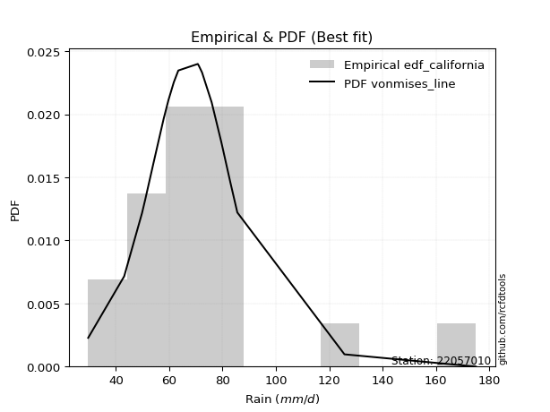</img>

</div>


### 2. EDF Hazen (1930)

Hazen method for plotting positions is a formula used to estimate the empirical cumulative probability distribution of flood events or other hydrological data. This formula often results in biased estimations, particularly when extrapolating to extreme events (high return periods).

<div align="center">


$P=(m-0.5)/n$


</div>


**2.1. Empirical values**

<div align="center">

|                | 0                  | 1                 | 2                  | 3                  | 4                  | 5                  | 6                  | 7         | 8                  | 9                  | 10                 | 11                | 12                 | 13                 | 14                 | 15                | 16                | 17        | 18                 | 19                 |
|:---------------|:-------------------|:------------------|:-------------------|:-------------------|:-------------------|:-------------------|:-------------------|:----------|:-------------------|:-------------------|:-------------------|:------------------|:-------------------|:-------------------|:-------------------|:------------------|:------------------|:----------|:-------------------|:-------------------|
| date           | 2022               | 2023              | 2009               | 2017               | 2015               | 2006               | 2018               | 2020      | 2011               | 2016               | 2010               | 2019              | 2008               | 2025               | 2021               | 2007              | 2012              | 2013      | 2014               | 2005               |
| x              | 29.6               | 43.1              | 49.8               | 51.0               | 54.0               | 57.9               | 59.7               | 61.7      | 63.4               | 70.7               | 71.1               | 72.3              | 75.9               | 79.5               | 80.1               | 80.1              | 82.9              | 85.53     | 125.7              | 175.0              |
| m              | 1                  | 2                 | 3                  | 4                  | 5                  | 6                  | 7                  | 8         | 9                  | 10                 | 11                 | 12                | 13                 | 14                 | 15                 | 16                | 17                | 18        | 19                 | 20                 |
| empirical_dist | edf_hazen          | edf_hazen         | edf_hazen          | edf_hazen          | edf_hazen          | edf_hazen          | edf_hazen          | edf_hazen | edf_hazen          | edf_hazen          | edf_hazen          | edf_hazen         | edf_hazen          | edf_hazen          | edf_hazen          | edf_hazen         | edf_hazen         | edf_hazen | edf_hazen          | edf_hazen          |
| empirical      | 0.025              | 0.075             | 0.125              | 0.175              | 0.225              | 0.275              | 0.325              | 0.375     | 0.425              | 0.475              | 0.525              | 0.575             | 0.625              | 0.675              | 0.725              | 0.775             | 0.825             | 0.875     | 0.925              | 0.975              |
| empirical_tr   | 1.0256410256410258 | 1.081081081081081 | 1.1428571428571428 | 1.2121212121212122 | 1.2903225806451613 | 1.3793103448275863 | 1.4814814814814814 | 1.6       | 1.7391304347826089 | 1.9047619047619047 | 2.1052631578947367 | 2.352941176470588 | 2.6666666666666665 | 3.0769230769230775 | 3.6363636363636362 | 4.444444444444445 | 5.714285714285713 | 8.0       | 13.333333333333341 | 39.999999999999964 |

</div>


**2.2. Kolmogorov-Smirnov fit test (sorted by Δ)**


<div align="center">

|                | 0                   | 1                   | 2                   | 3                   | 4                  | 5                   | 6                   | 7                   | 8                   | 9                  | 10                  | 11                  | 12                  | 13                  | 14                  | 15                  | 16                 | 17                  | 18                  | 19                 | 20                  | 21                  | 22                  | 23                  | 24                  | 25                  | 26                  | 27                 | 28                  | 29                 | 30                  | 31                 | 32                 | 33                 | 34                  | 35                  | 36                  | 37                  | 38                  | 39                 | 40                 | 41                  | 42                  | 43                  | 44                  | 45                  | 46                 | 47                  | 48                 | 49                  | 50                  | 51                  | 52                  | 53                  | 54                  | 55                  | 56                  | 57                 | 58                 | 59                  | 60                  | 61                  | 62                  | 63                  | 64                 | 65                  | 66                 | 67                  | 68                 | 69                 | 70                  | 71                  | 72                  | 73                  | 74                  | 75                  | 76                  | 77                  | 78                 | 79                 | 80                 | 81                 | 82                  | 83                  | 84                  | 85                 | 86                  | 87                  | 88                  | 89                  | 90                  | 91                 | 92                 | 93                  | 94                 | 95                  | 96                 | 97                  | 98                  | 99                  | 100                 | 101                 | 102                 | 103                 | 104                 | 105                 | 106                | 107                 | 108                 | 109                 | 110                 | 111                | 112                 | 113                | 114                | 115                 | 116                | 117                 | 118                | 119                 | 120                 | 121                | 122                 | 123                | 124                 | 125                 | 126                 | 127                 | 128                 | 129                | 130                | 131                | 132                | 133                 | 134                 | 135                 | 136                 | 137                | 138                | 139                | 140                | 141                | 142                | 143                | 144                | 145                 | 146                 | 147                | 148                | 149                | 150                | 151                | 152                | 153                | 154                | 155                | 156                | 157                | 158                |
|:---------------|:--------------------|:--------------------|:--------------------|:--------------------|:-------------------|:--------------------|:--------------------|:--------------------|:--------------------|:-------------------|:--------------------|:--------------------|:--------------------|:--------------------|:--------------------|:--------------------|:-------------------|:--------------------|:--------------------|:-------------------|:--------------------|:--------------------|:--------------------|:--------------------|:--------------------|:--------------------|:--------------------|:-------------------|:--------------------|:-------------------|:--------------------|:-------------------|:-------------------|:-------------------|:--------------------|:--------------------|:--------------------|:--------------------|:--------------------|:-------------------|:-------------------|:--------------------|:--------------------|:--------------------|:--------------------|:--------------------|:-------------------|:--------------------|:-------------------|:--------------------|:--------------------|:--------------------|:--------------------|:--------------------|:--------------------|:--------------------|:--------------------|:-------------------|:-------------------|:--------------------|:--------------------|:--------------------|:--------------------|:--------------------|:-------------------|:--------------------|:-------------------|:--------------------|:-------------------|:-------------------|:--------------------|:--------------------|:--------------------|:--------------------|:--------------------|:--------------------|:--------------------|:--------------------|:-------------------|:-------------------|:-------------------|:-------------------|:--------------------|:--------------------|:--------------------|:-------------------|:--------------------|:--------------------|:--------------------|:--------------------|:--------------------|:-------------------|:-------------------|:--------------------|:-------------------|:--------------------|:-------------------|:--------------------|:--------------------|:--------------------|:--------------------|:--------------------|:--------------------|:--------------------|:--------------------|:--------------------|:-------------------|:--------------------|:--------------------|:--------------------|:--------------------|:-------------------|:--------------------|:-------------------|:-------------------|:--------------------|:-------------------|:--------------------|:-------------------|:--------------------|:--------------------|:-------------------|:--------------------|:-------------------|:--------------------|:--------------------|:--------------------|:--------------------|:--------------------|:-------------------|:-------------------|:-------------------|:-------------------|:--------------------|:--------------------|:--------------------|:--------------------|:-------------------|:-------------------|:-------------------|:-------------------|:-------------------|:-------------------|:-------------------|:-------------------|:--------------------|:--------------------|:-------------------|:-------------------|:-------------------|:-------------------|:-------------------|:-------------------|:-------------------|:-------------------|:-------------------|:-------------------|:-------------------|:-------------------|
| station        | 22057010            | 22057010            | 22057010            | 22057010            | 22057010           | 22057010            | 22057010            | 22057010            | 22057010            | 22057010           | 22057010            | 22057010            | 22057010            | 22057010            | 22057010            | 22057010            | 22057010           | 22057010            | 22057010            | 22057010           | 22057010            | 22057010            | 22057010            | 22057010            | 22057010            | 22057010            | 22057010            | 22057010           | 22057010            | 22057010           | 22057010            | 22057010           | 22057010           | 22057010           | 22057010            | 22057010            | 22057010            | 22057010            | 22057010            | 22057010           | 22057010           | 22057010            | 22057010            | 22057010            | 22057010            | 22057010            | 22057010           | 22057010            | 22057010           | 22057010            | 22057010            | 22057010            | 22057010            | 22057010            | 22057010            | 22057010            | 22057010            | 22057010           | 22057010           | 22057010            | 22057010            | 22057010            | 22057010            | 22057010            | 22057010           | 22057010            | 22057010           | 22057010            | 22057010           | 22057010           | 22057010            | 22057010            | 22057010            | 22057010            | 22057010            | 22057010            | 22057010            | 22057010            | 22057010           | 22057010           | 22057010           | 22057010           | 22057010            | 22057010            | 22057010            | 22057010           | 22057010            | 22057010            | 22057010            | 22057010            | 22057010            | 22057010           | 22057010           | 22057010            | 22057010           | 22057010            | 22057010           | 22057010            | 22057010            | 22057010            | 22057010            | 22057010            | 22057010            | 22057010            | 22057010            | 22057010            | 22057010           | 22057010            | 22057010            | 22057010            | 22057010            | 22057010           | 22057010            | 22057010           | 22057010           | 22057010            | 22057010           | 22057010            | 22057010           | 22057010            | 22057010            | 22057010           | 22057010            | 22057010           | 22057010            | 22057010            | 22057010            | 22057010            | 22057010            | 22057010           | 22057010           | 22057010           | 22057010           | 22057010            | 22057010            | 22057010            | 22057010            | 22057010           | 22057010           | 22057010           | 22057010           | 22057010           | 22057010           | 22057010           | 22057010           | 22057010            | 22057010            | 22057010           | 22057010           | 22057010           | 22057010           | 22057010           | 22057010           | 22057010           | 22057010           | 22057010           | 22057010           | 22057010           | 22057010           |
| empirical_dist | edf_hazen           | edf_hazen           | edf_hazen           | edf_hazen           | edf_hazen          | edf_hazen           | edf_hazen           | edf_hazen           | edf_hazen           | edf_hazen          | edf_hazen           | edf_hazen           | edf_hazen           | edf_hazen           | edf_hazen           | edf_hazen           | edf_hazen          | edf_hazen           | edf_hazen           | edf_hazen          | edf_hazen           | edf_hazen           | edf_hazen           | edf_hazen           | edf_hazen           | edf_hazen           | edf_hazen           | edf_hazen          | edf_hazen           | edf_hazen          | edf_hazen           | edf_hazen          | edf_hazen          | edf_hazen          | edf_hazen           | edf_hazen           | edf_hazen           | edf_hazen           | edf_hazen           | edf_hazen          | edf_hazen          | edf_hazen           | edf_hazen           | edf_hazen           | edf_hazen           | edf_hazen           | edf_hazen          | edf_hazen           | edf_hazen          | edf_hazen           | edf_hazen           | edf_hazen           | edf_hazen           | edf_hazen           | edf_hazen           | edf_hazen           | edf_hazen           | edf_hazen          | edf_hazen          | edf_hazen           | edf_hazen           | edf_hazen           | edf_hazen           | edf_hazen           | edf_hazen          | edf_hazen           | edf_hazen          | edf_hazen           | edf_hazen          | edf_hazen          | edf_hazen           | edf_hazen           | edf_hazen           | edf_hazen           | edf_hazen           | edf_hazen           | edf_hazen           | edf_hazen           | edf_hazen          | edf_hazen          | edf_hazen          | edf_hazen          | edf_hazen           | edf_hazen           | edf_hazen           | edf_hazen          | edf_hazen           | edf_hazen           | edf_hazen           | edf_hazen           | edf_hazen           | edf_hazen          | edf_hazen          | edf_hazen           | edf_hazen          | edf_hazen           | edf_hazen          | edf_hazen           | edf_hazen           | edf_hazen           | edf_hazen           | edf_hazen           | edf_hazen           | edf_hazen           | edf_hazen           | edf_hazen           | edf_hazen          | edf_hazen           | edf_hazen           | edf_hazen           | edf_hazen           | edf_hazen          | edf_hazen           | edf_hazen          | edf_hazen          | edf_hazen           | edf_hazen          | edf_hazen           | edf_hazen          | edf_hazen           | edf_hazen           | edf_hazen          | edf_hazen           | edf_hazen          | edf_hazen           | edf_hazen           | edf_hazen           | edf_hazen           | edf_hazen           | edf_hazen          | edf_hazen          | edf_hazen          | edf_hazen          | edf_hazen           | edf_hazen           | edf_hazen           | edf_hazen           | edf_hazen          | edf_hazen          | edf_hazen          | edf_hazen          | edf_hazen          | edf_hazen          | edf_hazen          | edf_hazen          | edf_hazen           | edf_hazen           | edf_hazen          | edf_hazen          | edf_hazen          | edf_hazen          | edf_hazen          | edf_hazen          | edf_hazen          | edf_hazen          | edf_hazen          | edf_hazen          | edf_hazen          | edf_hazen          |
| p_dist         | logjohnsonsu        | logt                | loglaplace          | loglaplace          | tukeylambda        | logdgamma           | johnsonsu           | logdweibull         | vonmises_line       | logmielke          | logburr             | dweibull            | loggenlogistic      | logburr12           | burr                | mielke              | burr12             | loghypsecant        | dgamma              | gennorm            | loggennorm          | logexponnorm        | loglogistic         | logloglaplace       | pearson3            | lognct              | loghalfnorm         | alpha              | loggumbel_r         | lograyleigh        | lognakagami         | exponnorm          | nct                | logmaxwell         | loginvgauss         | logalpha            | logpearson3         | genextreme          | invweibull          | logskewnorm        | logfoldnorm        | invgamma            | betaprime           | loginvgamma         | f                   | weibull_min         | logjohnsonsb       | genlogistic         | logf               | logncf              | logexponweib        | logfatiguelife      | logerlang           | loggamma            | loggamma            | logbeta             | loggengamma         | moyal              | johnsonsb          | logrice             | lognorm             | logcrystalball      | halflogistic        | gengamma            | logloggamma        | logtruncnorm        | logweibull_max     | loggenextreme       | invgauss           | logweibull_min     | wald                | t                   | logmoyal            | logkstwobign        | loghalflogistic     | loginvweibull       | gamma               | erlang              | gausshyper         | beta               | laplace            | gumbel_r           | logbetaprime        | loggumbel_l         | skewnorm            | loganglit          | genhalflogistic     | halfnorm            | foldnorm            | kstwobign           | kappa3              | logexponpow        | loggompertz        | logsemicircular     | hypsecant          | rayleigh            | genpareto          | rice                | maxwell             | logistic            | logcosine           | loggenexpon         | logtriang           | truncnorm           | norm                | crystalball         | logtruncpareto     | logwald             | logtruncweibull_min | logarcsine          | anglit              | nakagami           | lomax               | genexpon           | loghalfgennorm     | semicircular        | logbradford        | logtruncexpon       | gumbel_l           | kappa4              | loguniform          | logkappa3          | logtukeylambda      | arcsine            | logkappa4           | logksone            | logrdist            | truncexpon          | loglomax            | triang             | logargus           | halfgennorm        | cosine             | loggenpareto        | truncweibull_min    | powerlaw            | loglevy_l           | loggenhalflogistic | ncf                | bradford           | ksone              | exponweib          | argus              | wrapcauchy         | logpowerlaw        | uniform             | levy_l              | logtrapezoid       | rdist              | fatiguelife        | trapezoid          | weibull_max        | exponpow           | truncpareto        | gompertz           | logvonmises_line   | logvonmises        | vonmises           | loggausshyper      |
| delta          | 0.08168712807665979 | 0.08601331126122813 | 0.08613287781220413 | 0.08613287781220413 | 0.0873340743989971 | 0.09064441315280058 | 0.09703980593149475 | 0.09721592866612006 | 0.09833820854670261 | 0.099418517074784  | 0.09941862277381974 | 0.10701130383935792 | 0.10704198103839013 | 0.10707182468004606 | 0.10708903177039564 | 0.10713138041191572 | 0.10784213202004   | 0.10831029906423584 | 0.11085041733415135 | 0.116457763011163  | 0.11817225454166369 | 0.12268489905172897 | 0.12367109615901606 | 0.12698897388120645 | 0.12811391651830628 | 0.12957740105652715 | 0.12965126634655288 | 0.1298352445464973 | 0.12996798574933288 | 0.1302093401829505 | 0.13026027688344333 | 0.1302894503943246 | 0.131270322313219  | 0.1337492293237803 | 0.13378273437634236 | 0.13434710209404366 | 0.13490841243866414 | 0.13684014030004088 | 0.13684366380956825 | 0.137399527373675  | 0.1374592867338711 | 0.13786822175548075 | 0.13788639389590363 | 0.13811376915365903 | 0.13817375631003537 | 0.13828472770970224 | 0.1384325829922186 | 0.13853128508175339 | 0.1385937513607285 | 0.13868830639208718 | 0.13878087327481115 | 0.13923905943374149 | 0.13968303836163065 | 0.13968842776268697 | 0.13968842776268697 | 0.13991468120628037 | 0.14069199253797038 | 0.1414161072367155 | 0.1425677589129979 | 0.14525791349204065 | 0.14605969914299188 | 0.14605982588244815 | 0.14619808397569323 | 0.14663866994330976 | 0.1486002853599956 | 0.14915065181176046 | 0.1496905048762598 | 0.14972045655293764 | 0.1500484743029169 | 0.1532081335433918 | 0.15428277284159553 | 0.15517191657157936 | 0.15525534542044317 | 0.15603129670177096 | 0.15635390129697546 | 0.15727641428696182 | 0.15738269519947412 | 0.15738274508717298 | 0.1574412145667513 | 0.159083711437233  | 0.1596095327226823 | 0.1609535356519166 | 0.16206727583138236 | 0.16814598908119915 | 0.17021518106943767 | 0.1725885564455718 | 0.17394069898096298 | 0.17423603613167227 | 0.17662121328068647 | 0.17667537351323614 | 0.17823612642430375 | 0.1801017479031517 | 0.1814697935779248 | 0.18401076618864265 | 0.1876383812845721 | 0.19270550516853224 | 0.1947275341071143 | 0.19798647493382626 | 0.19903646278916698 | 0.20179784409376178 | 0.20268072527497982 | 0.20880265295075423 | 0.20951783696962945 | 0.22015015024415674 | 0.22015015953957695 | 0.22015016596839654 | 0.2239098424530086 | 0.22544312520042276 | 0.2266343945058582  | 0.23313947261043888 | 0.24047544017497835 | 0.241936889886732  | 0.24386546031041823 | 0.2438808666575193 | 0.2484210454806749 | 0.24901434090119934 | 0.2504772495396729 | 0.25671098827719835 | 0.2672107419939742 | 0.26773084985228457 | 0.27787794252844555 | 0.2780528279457082 | 0.28402214441751283 | 0.2840868018526823 | 0.28418406620811687 | 0.29406495210703787 | 0.29872078967560434 | 0.30362129567416973 | 0.32109363994859286 | 0.3291544186088571 | 0.3401165515675183 | 0.3480737468539218 | 0.3594698049830136 | 0.38563443753169896 | 0.40403102013793557 | 0.40901924780352195 | 0.42594642747546574 | 0.4367878497826988 | 0.4382943678656252 | 0.4539144108365063 | 0.4711141678129299 | 0.4766751862093546 | 0.4834367973596101 | 0.4878113281338604 | 0.4889806185735628 | 0.49033700137551584 | 0.49166365970259684 | 0.5375144701296017 | 0.5681744075367607 | 0.5931444845126139 | 0.7118762345585579 | 0.7618840275661972 | 0.8416529780419583 | 0.8605595335247436 | 0.9249209240861411 | 0.975              | 1.0631347734819192 | 27.529299878365467 | 39.16756655179694  |
| deltao         | 0.3096406529800002  | 0.3096406529800002  | 0.3096406529800002  | 0.3096406529800002  | 0.3096406529800002 | 0.3096406529800002  | 0.3096406529800002  | 0.3096406529800002  | 0.3096406529800002  | 0.3096406529800002 | 0.3096406529800002  | 0.3096406529800002  | 0.3096406529800002  | 0.3096406529800002  | 0.3096406529800002  | 0.3096406529800002  | 0.3096406529800002 | 0.3096406529800002  | 0.3096406529800002  | 0.3096406529800002 | 0.3096406529800002  | 0.3096406529800002  | 0.3096406529800002  | 0.3096406529800002  | 0.3096406529800002  | 0.3096406529800002  | 0.3096406529800002  | 0.3096406529800002 | 0.3096406529800002  | 0.3096406529800002 | 0.3096406529800002  | 0.3096406529800002 | 0.3096406529800002 | 0.3096406529800002 | 0.3096406529800002  | 0.3096406529800002  | 0.3096406529800002  | 0.3096406529800002  | 0.3096406529800002  | 0.3096406529800002 | 0.3096406529800002 | 0.3096406529800002  | 0.3096406529800002  | 0.3096406529800002  | 0.3096406529800002  | 0.3096406529800002  | 0.3096406529800002 | 0.3096406529800002  | 0.3096406529800002 | 0.3096406529800002  | 0.3096406529800002  | 0.3096406529800002  | 0.3096406529800002  | 0.3096406529800002  | 0.3096406529800002  | 0.3096406529800002  | 0.3096406529800002  | 0.3096406529800002 | 0.3096406529800002 | 0.3096406529800002  | 0.3096406529800002  | 0.3096406529800002  | 0.3096406529800002  | 0.3096406529800002  | 0.3096406529800002 | 0.3096406529800002  | 0.3096406529800002 | 0.3096406529800002  | 0.3096406529800002 | 0.3096406529800002 | 0.3096406529800002  | 0.3096406529800002  | 0.3096406529800002  | 0.3096406529800002  | 0.3096406529800002  | 0.3096406529800002  | 0.3096406529800002  | 0.3096406529800002  | 0.3096406529800002 | 0.3096406529800002 | 0.3096406529800002 | 0.3096406529800002 | 0.3096406529800002  | 0.3096406529800002  | 0.3096406529800002  | 0.3096406529800002 | 0.3096406529800002  | 0.3096406529800002  | 0.3096406529800002  | 0.3096406529800002  | 0.3096406529800002  | 0.3096406529800002 | 0.3096406529800002 | 0.3096406529800002  | 0.3096406529800002 | 0.3096406529800002  | 0.3096406529800002 | 0.3096406529800002  | 0.3096406529800002  | 0.3096406529800002  | 0.3096406529800002  | 0.3096406529800002  | 0.3096406529800002  | 0.3096406529800002  | 0.3096406529800002  | 0.3096406529800002  | 0.3096406529800002 | 0.3096406529800002  | 0.3096406529800002  | 0.3096406529800002  | 0.3096406529800002  | 0.3096406529800002 | 0.3096406529800002  | 0.3096406529800002 | 0.3096406529800002 | 0.3096406529800002  | 0.3096406529800002 | 0.3096406529800002  | 0.3096406529800002 | 0.3096406529800002  | 0.3096406529800002  | 0.3096406529800002 | 0.3096406529800002  | 0.3096406529800002 | 0.3096406529800002  | 0.3096406529800002  | 0.3096406529800002  | 0.3096406529800002  | 0.3096406529800002  | 0.3096406529800002 | 0.3096406529800002 | 0.3096406529800002 | 0.3096406529800002 | 0.3096406529800002  | 0.3096406529800002  | 0.3096406529800002  | 0.3096406529800002  | 0.3096406529800002 | 0.3096406529800002 | 0.3096406529800002 | 0.3096406529800002 | 0.3096406529800002 | 0.3096406529800002 | 0.3096406529800002 | 0.3096406529800002 | 0.3096406529800002  | 0.3096406529800002  | 0.3096406529800002 | 0.3096406529800002 | 0.3096406529800002 | 0.3096406529800002 | 0.3096406529800002 | 0.3096406529800002 | 0.3096406529800002 | 0.3096406529800002 | 0.3096406529800002 | 0.3096406529800002 | 0.3096406529800002 | 0.3096406529800002 |
| eval           | Δo > Δ              | Δo > Δ              | Δo > Δ              | Δo > Δ              | Δo > Δ             | Δo > Δ              | Δo > Δ              | Δo > Δ              | Δo > Δ              | Δo > Δ             | Δo > Δ              | Δo > Δ              | Δo > Δ              | Δo > Δ              | Δo > Δ              | Δo > Δ              | Δo > Δ             | Δo > Δ              | Δo > Δ              | Δo > Δ             | Δo > Δ              | Δo > Δ              | Δo > Δ              | Δo > Δ              | Δo > Δ              | Δo > Δ              | Δo > Δ              | Δo > Δ             | Δo > Δ              | Δo > Δ             | Δo > Δ              | Δo > Δ             | Δo > Δ             | Δo > Δ             | Δo > Δ              | Δo > Δ              | Δo > Δ              | Δo > Δ              | Δo > Δ              | Δo > Δ             | Δo > Δ             | Δo > Δ              | Δo > Δ              | Δo > Δ              | Δo > Δ              | Δo > Δ              | Δo > Δ             | Δo > Δ              | Δo > Δ             | Δo > Δ              | Δo > Δ              | Δo > Δ              | Δo > Δ              | Δo > Δ              | Δo > Δ              | Δo > Δ              | Δo > Δ              | Δo > Δ             | Δo > Δ             | Δo > Δ              | Δo > Δ              | Δo > Δ              | Δo > Δ              | Δo > Δ              | Δo > Δ             | Δo > Δ              | Δo > Δ             | Δo > Δ              | Δo > Δ             | Δo > Δ             | Δo > Δ              | Δo > Δ              | Δo > Δ              | Δo > Δ              | Δo > Δ              | Δo > Δ              | Δo > Δ              | Δo > Δ              | Δo > Δ             | Δo > Δ             | Δo > Δ             | Δo > Δ             | Δo > Δ              | Δo > Δ              | Δo > Δ              | Δo > Δ             | Δo > Δ              | Δo > Δ              | Δo > Δ              | Δo > Δ              | Δo > Δ              | Δo > Δ             | Δo > Δ             | Δo > Δ              | Δo > Δ             | Δo > Δ              | Δo > Δ             | Δo > Δ              | Δo > Δ              | Δo > Δ              | Δo > Δ              | Δo > Δ              | Δo > Δ              | Δo > Δ              | Δo > Δ              | Δo > Δ              | Δo > Δ             | Δo > Δ              | Δo > Δ              | Δo > Δ              | Δo > Δ              | Δo > Δ             | Δo > Δ              | Δo > Δ             | Δo > Δ             | Δo > Δ              | Δo > Δ             | Δo > Δ              | Δo > Δ             | Δo > Δ              | Δo > Δ              | Δo > Δ             | Δo > Δ              | Δo > Δ             | Δo > Δ              | Δo > Δ              | Δo > Δ              | Δo > Δ              | Δo <= Δ             | Δo <= Δ            | Δo <= Δ            | Δo <= Δ            | Δo <= Δ            | Δo <= Δ             | Δo <= Δ             | Δo <= Δ             | Δo <= Δ             | Δo <= Δ            | Δo <= Δ            | Δo <= Δ            | Δo <= Δ            | Δo <= Δ            | Δo <= Δ            | Δo <= Δ            | Δo <= Δ            | Δo <= Δ             | Δo <= Δ             | Δo <= Δ            | Δo <= Δ            | Δo <= Δ            | Δo <= Δ            | Δo <= Δ            | Δo <= Δ            | Δo <= Δ            | Δo <= Δ            | Δo <= Δ            | Δo <= Δ            | Δo <= Δ            | Δo <= Δ            |
| fit            | 1                   | 1                   | 1                   | 1                   | 1                  | 1                   | 1                   | 1                   | 1                   | 1                  | 1                   | 1                   | 1                   | 1                   | 1                   | 1                   | 1                  | 1                   | 1                   | 1                  | 1                   | 1                   | 1                   | 1                   | 1                   | 1                   | 1                   | 1                  | 1                   | 1                  | 1                   | 1                  | 1                  | 1                  | 1                   | 1                   | 1                   | 1                   | 1                   | 1                  | 1                  | 1                   | 1                   | 1                   | 1                   | 1                   | 1                  | 1                   | 1                  | 1                   | 1                   | 1                   | 1                   | 1                   | 1                   | 1                   | 1                   | 1                  | 1                  | 1                   | 1                   | 1                   | 1                   | 1                   | 1                  | 1                   | 1                  | 1                   | 1                  | 1                  | 1                   | 1                   | 1                   | 1                   | 1                   | 1                   | 1                   | 1                   | 1                  | 1                  | 1                  | 1                  | 1                   | 1                   | 1                   | 1                  | 1                   | 1                   | 1                   | 1                   | 1                   | 1                  | 1                  | 1                   | 1                  | 1                   | 1                  | 1                   | 1                   | 1                   | 1                   | 1                   | 1                   | 1                   | 1                   | 1                   | 1                  | 1                   | 1                   | 1                   | 1                   | 1                  | 1                   | 1                  | 1                  | 1                   | 1                  | 1                   | 1                  | 1                   | 1                   | 1                  | 1                   | 1                  | 1                   | 1                   | 1                   | 1                   | 0                   | 0                  | 0                  | 0                  | 0                  | 0                   | 0                   | 0                   | 0                   | 0                  | 0                  | 0                  | 0                  | 0                  | 0                  | 0                  | 0                  | 0                   | 0                   | 0                  | 0                  | 0                  | 0                  | 0                  | 0                  | 0                  | 0                  | 0                  | 0                  | 0                  | 0                  |
| n              | 20                  | 20                  | 20                  | 20                  | 20                 | 20                  | 20                  | 20                  | 20                  | 20                 | 20                  | 20                  | 20                  | 20                  | 20                  | 20                  | 20                 | 20                  | 20                  | 20                 | 20                  | 20                  | 20                  | 20                  | 20                  | 20                  | 20                  | 20                 | 20                  | 20                 | 20                  | 20                 | 20                 | 20                 | 20                  | 20                  | 20                  | 20                  | 20                  | 20                 | 20                 | 20                  | 20                  | 20                  | 20                  | 20                  | 20                 | 20                  | 20                 | 20                  | 20                  | 20                  | 20                  | 20                  | 20                  | 20                  | 20                  | 20                 | 20                 | 20                  | 20                  | 20                  | 20                  | 20                  | 20                 | 20                  | 20                 | 20                  | 20                 | 20                 | 20                  | 20                  | 20                  | 20                  | 20                  | 20                  | 20                  | 20                  | 20                 | 20                 | 20                 | 20                 | 20                  | 20                  | 20                  | 20                 | 20                  | 20                  | 20                  | 20                  | 20                  | 20                 | 20                 | 20                  | 20                 | 20                  | 20                 | 20                  | 20                  | 20                  | 20                  | 20                  | 20                  | 20                  | 20                  | 20                  | 20                 | 20                  | 20                  | 20                  | 20                  | 20                 | 20                  | 20                 | 20                 | 20                  | 20                 | 20                  | 20                 | 20                  | 20                  | 20                 | 20                  | 20                 | 20                  | 20                  | 20                  | 20                  | 20                  | 20                 | 20                 | 20                 | 20                 | 20                  | 20                  | 20                  | 20                  | 20                 | 20                 | 20                 | 20                 | 20                 | 20                 | 20                 | 20                 | 20                  | 20                  | 20                 | 20                 | 20                 | 20                 | 20                 | 20                 | 20                 | 20                 | 20                 | 20                 | 20                 | 20                 |
| best_fit       | 1                   | 0                   | 0                   | 0                   | 0                  | 0                   | 0                   | 0                   | 0                   | 0                  | 0                   | 0                   | 0                   | 0                   | 0                   | 0                   | 0                  | 0                   | 0                   | 0                  | 0                   | 0                   | 0                   | 0                   | 0                   | 0                   | 0                   | 0                  | 0                   | 0                  | 0                   | 0                  | 0                  | 0                  | 0                   | 0                   | 0                   | 0                   | 0                   | 0                  | 0                  | 0                   | 0                   | 0                   | 0                   | 0                   | 0                  | 0                   | 0                  | 0                   | 0                   | 0                   | 0                   | 0                   | 0                   | 0                   | 0                   | 0                  | 0                  | 0                   | 0                   | 0                   | 0                   | 0                   | 0                  | 0                   | 0                  | 0                   | 0                  | 0                  | 0                   | 0                   | 0                   | 0                   | 0                   | 0                   | 0                   | 0                   | 0                  | 0                  | 0                  | 0                  | 0                   | 0                   | 0                   | 0                  | 0                   | 0                   | 0                   | 0                   | 0                   | 0                  | 0                  | 0                   | 0                  | 0                   | 0                  | 0                   | 0                   | 0                   | 0                   | 0                   | 0                   | 0                   | 0                   | 0                   | 0                  | 0                   | 0                   | 0                   | 0                   | 0                  | 0                   | 0                  | 0                  | 0                   | 0                  | 0                   | 0                  | 0                   | 0                   | 0                  | 0                   | 0                  | 0                   | 0                   | 0                   | 0                   | 0                   | 0                  | 0                  | 0                  | 0                  | 0                   | 0                   | 0                   | 0                   | 0                  | 0                  | 0                  | 0                  | 0                  | 0                  | 0                  | 0                  | 0                   | 0                   | 0                  | 0                  | 0                  | 0                  | 0                  | 0                  | 0                  | 0                  | 0                  | 0                  | 0                  | 0                  |
| best_fit_sort  | 1                   | 2                   | 3                   | 4                   | 5                  | 6                   | 7                   | 8                   | 9                   | 10                 | 11                  | 12                  | 13                  | 14                  | 15                  | 16                  | 17                 | 18                  | 19                  | 20                 | 21                  | 22                  | 23                  | 24                  | 25                  | 26                  | 27                  | 28                 | 29                  | 30                 | 31                  | 32                 | 33                 | 34                 | 35                  | 36                  | 37                  | 38                  | 39                  | 40                 | 41                 | 42                  | 43                  | 44                  | 45                  | 46                  | 47                 | 48                  | 49                 | 50                  | 51                  | 52                  | 53                  | 54                  | 55                  | 56                  | 57                  | 58                 | 59                 | 60                  | 61                  | 62                  | 63                  | 64                  | 65                 | 66                  | 67                 | 68                  | 69                 | 70                 | 71                  | 72                  | 73                  | 74                  | 75                  | 76                  | 77                  | 78                  | 79                 | 80                 | 81                 | 82                 | 83                  | 84                  | 85                  | 86                 | 87                  | 88                  | 89                  | 90                  | 91                  | 92                 | 93                 | 94                  | 95                 | 96                  | 97                 | 98                  | 99                  | 100                 | 101                 | 102                 | 103                 | 104                 | 105                 | 106                 | 107                | 108                 | 109                 | 110                 | 111                 | 112                | 113                 | 114                | 115                | 116                 | 117                | 118                 | 119                | 120                 | 121                 | 122                | 123                 | 124                | 125                 | 126                 | 127                 | 128                 | 129                 | 130                | 131                | 132                | 133                | 134                 | 135                 | 136                 | 137                 | 138                | 139                | 140                | 141                | 142                | 143                | 144                | 145                | 146                 | 147                 | 148                | 149                | 150                | 151                | 152                | 153                | 154                | 155                | 156                | 157                | 158                | 159                |

</div>


**2.3. Best fit**

<div align="center">

|   id |   station | empirical_dist   | p_dist       |     delta |   deltao | eval   |   fit |   n |   best_fit |   best_fit_sort |
|-----:|----------:|:-----------------|:-------------|----------:|---------:|:-------|------:|----:|-----------:|----------------:|
|    0 |  22057010 | edf_hazen        | logjohnsonsu | 0.0816871 | 0.309641 | Δo > Δ |     1 |  20 |          1 |               1 |

</div>


<div align="center">

</img></img>

</div>


### 3. EDF Weibull (1939)

Weibull plotting position formula is an empirical method used to estimate the non-exceedance probability or plotting position for a set of observed data, is often recommended or widely used in practice, particularly in flood frequency analysis.

<div align="center">


$P=m/(n+1)$


</div>


**3.1. Empirical values**

<div align="center">

|                | 0                    | 1                   | 2                   | 3                   | 4                   | 5                  | 6                  | 7                   | 8                   | 9                   | 10                 | 11                 | 12                 | 13                 | 14                 | 15                 | 16                 | 17                 | 18                 | 19                 |
|:---------------|:---------------------|:--------------------|:--------------------|:--------------------|:--------------------|:-------------------|:-------------------|:--------------------|:--------------------|:--------------------|:-------------------|:-------------------|:-------------------|:-------------------|:-------------------|:-------------------|:-------------------|:-------------------|:-------------------|:-------------------|
| date           | 2022                 | 2023                | 2009                | 2017                | 2015                | 2006               | 2018               | 2020                | 2011                | 2016                | 2010               | 2019               | 2008               | 2025               | 2021               | 2007               | 2012               | 2013               | 2014               | 2005               |
| x              | 29.6                 | 43.1                | 49.8                | 51.0                | 54.0                | 57.9               | 59.7               | 61.7                | 63.4                | 70.7                | 71.1               | 72.3               | 75.9               | 79.5               | 80.1               | 80.1               | 82.9               | 85.53              | 125.7              | 175.0              |
| m              | 1                    | 2                   | 3                   | 4                   | 5                   | 6                  | 7                  | 8                   | 9                   | 10                  | 11                 | 12                 | 13                 | 14                 | 15                 | 16                 | 17                 | 18                 | 19                 | 20                 |
| empirical_dist | edf_weibull          | edf_weibull         | edf_weibull         | edf_weibull         | edf_weibull         | edf_weibull        | edf_weibull        | edf_weibull         | edf_weibull         | edf_weibull         | edf_weibull        | edf_weibull        | edf_weibull        | edf_weibull        | edf_weibull        | edf_weibull        | edf_weibull        | edf_weibull        | edf_weibull        | edf_weibull        |
| empirical      | 0.047619047619047616 | 0.09523809523809523 | 0.14285714285714285 | 0.19047619047619047 | 0.23809523809523808 | 0.2857142857142857 | 0.3333333333333333 | 0.38095238095238093 | 0.42857142857142855 | 0.47619047619047616 | 0.5238095238095238 | 0.5714285714285714 | 0.6190476190476191 | 0.6666666666666666 | 0.7142857142857143 | 0.7619047619047619 | 0.8095238095238095 | 0.8571428571428571 | 0.9047619047619048 | 0.9523809523809523 |
| empirical_tr   | 1.05                 | 1.1052631578947367  | 1.1666666666666665  | 1.2352941176470589  | 1.3125              | 1.4                | 1.4999999999999998 | 1.6153846153846154  | 1.75                | 1.909090909090909   | 2.1                | 2.333333333333333  | 2.625              | 2.9999999999999996 | 3.5                | 4.199999999999999  | 5.25               | 6.999999999999997  | 10.5               | 20.999999999999975 |

</div>


**3.2. Kolmogorov-Smirnov fit test (sorted by Δ)**


<div align="center">

|                | 0                   | 1                   | 2                  | 3                   | 4                   | 5                   | 6                   | 7                   | 8                   | 9                   | 10                  | 11                  | 12                  | 13                  | 14                 | 15                  | 16                  | 17                  | 18                  | 19                  | 20                  | 21                  | 22                  | 23                  | 24                 | 25                  | 26                  | 27                  | 28                 | 29                 | 30                 | 31                  | 32                  | 33                  | 34                  | 35                  | 36                 | 37                  | 38                  | 39                  | 40                  | 41                  | 42                  | 43                  | 44                 | 45                  | 46                  | 47                  | 48                  | 49                  | 50                  | 51                  | 52                  | 53                  | 54                  | 55                  | 56                  | 57                  | 58                  | 59                  | 60                  | 61                 | 62                 | 63                  | 64                  | 65                  | 66                  | 67                 | 68                 | 69                  | 70                  | 71                  | 72                  | 73                  | 74                 | 75                  | 76                 | 77                 | 78                  | 79                  | 80                  | 81                  | 82                  | 83                  | 84                 | 85                  | 86                  | 87                  | 88                  | 89                  | 90                 | 91                 | 92                 | 93                  | 94                 | 95                  | 96                  | 97                  | 98                  | 99                  | 100                 | 101                 | 102                 | 103                 | 104                 | 105                 | 106                | 107                 | 108                 | 109                 | 110                 | 111                 | 112                 | 113                 | 114                 | 115                 | 116                 | 117                | 118                | 119                 | 120                 | 121                | 122                 | 123                | 124                 | 125                 | 126                 | 127                 | 128                | 129                | 130                | 131                 | 132                | 133                 | 134                 | 135                | 136                 | 137                | 138                | 139                | 140                | 141                | 142                | 143                 | 144                | 145                 | 146                 | 147                | 148                | 149                | 150                | 151                | 152                | 153                | 154                | 155                | 156                | 157                | 158                |
|:---------------|:--------------------|:--------------------|:-------------------|:--------------------|:--------------------|:--------------------|:--------------------|:--------------------|:--------------------|:--------------------|:--------------------|:--------------------|:--------------------|:--------------------|:-------------------|:--------------------|:--------------------|:--------------------|:--------------------|:--------------------|:--------------------|:--------------------|:--------------------|:--------------------|:-------------------|:--------------------|:--------------------|:--------------------|:-------------------|:-------------------|:-------------------|:--------------------|:--------------------|:--------------------|:--------------------|:--------------------|:-------------------|:--------------------|:--------------------|:--------------------|:--------------------|:--------------------|:--------------------|:--------------------|:-------------------|:--------------------|:--------------------|:--------------------|:--------------------|:--------------------|:--------------------|:--------------------|:--------------------|:--------------------|:--------------------|:--------------------|:--------------------|:--------------------|:--------------------|:--------------------|:--------------------|:-------------------|:-------------------|:--------------------|:--------------------|:--------------------|:--------------------|:-------------------|:-------------------|:--------------------|:--------------------|:--------------------|:--------------------|:--------------------|:-------------------|:--------------------|:-------------------|:-------------------|:--------------------|:--------------------|:--------------------|:--------------------|:--------------------|:--------------------|:-------------------|:--------------------|:--------------------|:--------------------|:--------------------|:--------------------|:-------------------|:-------------------|:-------------------|:--------------------|:-------------------|:--------------------|:--------------------|:--------------------|:--------------------|:--------------------|:--------------------|:--------------------|:--------------------|:--------------------|:--------------------|:--------------------|:-------------------|:--------------------|:--------------------|:--------------------|:--------------------|:--------------------|:--------------------|:--------------------|:--------------------|:--------------------|:--------------------|:-------------------|:-------------------|:--------------------|:--------------------|:-------------------|:--------------------|:-------------------|:--------------------|:--------------------|:--------------------|:--------------------|:-------------------|:-------------------|:-------------------|:--------------------|:-------------------|:--------------------|:--------------------|:-------------------|:--------------------|:-------------------|:-------------------|:-------------------|:-------------------|:-------------------|:-------------------|:--------------------|:-------------------|:--------------------|:--------------------|:-------------------|:-------------------|:-------------------|:-------------------|:-------------------|:-------------------|:-------------------|:-------------------|:-------------------|:-------------------|:-------------------|:-------------------|
| station        | 22057010            | 22057010            | 22057010           | 22057010            | 22057010            | 22057010            | 22057010            | 22057010            | 22057010            | 22057010            | 22057010            | 22057010            | 22057010            | 22057010            | 22057010           | 22057010            | 22057010            | 22057010            | 22057010            | 22057010            | 22057010            | 22057010            | 22057010            | 22057010            | 22057010           | 22057010            | 22057010            | 22057010            | 22057010           | 22057010           | 22057010           | 22057010            | 22057010            | 22057010            | 22057010            | 22057010            | 22057010           | 22057010            | 22057010            | 22057010            | 22057010            | 22057010            | 22057010            | 22057010            | 22057010           | 22057010            | 22057010            | 22057010            | 22057010            | 22057010            | 22057010            | 22057010            | 22057010            | 22057010            | 22057010            | 22057010            | 22057010            | 22057010            | 22057010            | 22057010            | 22057010            | 22057010           | 22057010           | 22057010            | 22057010            | 22057010            | 22057010            | 22057010           | 22057010           | 22057010            | 22057010            | 22057010            | 22057010            | 22057010            | 22057010           | 22057010            | 22057010           | 22057010           | 22057010            | 22057010            | 22057010            | 22057010            | 22057010            | 22057010            | 22057010           | 22057010            | 22057010            | 22057010            | 22057010            | 22057010            | 22057010           | 22057010           | 22057010           | 22057010            | 22057010           | 22057010            | 22057010            | 22057010            | 22057010            | 22057010            | 22057010            | 22057010            | 22057010            | 22057010            | 22057010            | 22057010            | 22057010           | 22057010            | 22057010            | 22057010            | 22057010            | 22057010            | 22057010            | 22057010            | 22057010            | 22057010            | 22057010            | 22057010           | 22057010           | 22057010            | 22057010            | 22057010           | 22057010            | 22057010           | 22057010            | 22057010            | 22057010            | 22057010            | 22057010           | 22057010           | 22057010           | 22057010            | 22057010           | 22057010            | 22057010            | 22057010           | 22057010            | 22057010           | 22057010           | 22057010           | 22057010           | 22057010           | 22057010           | 22057010            | 22057010           | 22057010            | 22057010            | 22057010           | 22057010           | 22057010           | 22057010           | 22057010           | 22057010           | 22057010           | 22057010           | 22057010           | 22057010           | 22057010           | 22057010           |
| empirical_dist | edf_weibull         | edf_weibull         | edf_weibull        | edf_weibull         | edf_weibull         | edf_weibull         | edf_weibull         | edf_weibull         | edf_weibull         | edf_weibull         | edf_weibull         | edf_weibull         | edf_weibull         | edf_weibull         | edf_weibull        | edf_weibull         | edf_weibull         | edf_weibull         | edf_weibull         | edf_weibull         | edf_weibull         | edf_weibull         | edf_weibull         | edf_weibull         | edf_weibull        | edf_weibull         | edf_weibull         | edf_weibull         | edf_weibull        | edf_weibull        | edf_weibull        | edf_weibull         | edf_weibull         | edf_weibull         | edf_weibull         | edf_weibull         | edf_weibull        | edf_weibull         | edf_weibull         | edf_weibull         | edf_weibull         | edf_weibull         | edf_weibull         | edf_weibull         | edf_weibull        | edf_weibull         | edf_weibull         | edf_weibull         | edf_weibull         | edf_weibull         | edf_weibull         | edf_weibull         | edf_weibull         | edf_weibull         | edf_weibull         | edf_weibull         | edf_weibull         | edf_weibull         | edf_weibull         | edf_weibull         | edf_weibull         | edf_weibull        | edf_weibull        | edf_weibull         | edf_weibull         | edf_weibull         | edf_weibull         | edf_weibull        | edf_weibull        | edf_weibull         | edf_weibull         | edf_weibull         | edf_weibull         | edf_weibull         | edf_weibull        | edf_weibull         | edf_weibull        | edf_weibull        | edf_weibull         | edf_weibull         | edf_weibull         | edf_weibull         | edf_weibull         | edf_weibull         | edf_weibull        | edf_weibull         | edf_weibull         | edf_weibull         | edf_weibull         | edf_weibull         | edf_weibull        | edf_weibull        | edf_weibull        | edf_weibull         | edf_weibull        | edf_weibull         | edf_weibull         | edf_weibull         | edf_weibull         | edf_weibull         | edf_weibull         | edf_weibull         | edf_weibull         | edf_weibull         | edf_weibull         | edf_weibull         | edf_weibull        | edf_weibull         | edf_weibull         | edf_weibull         | edf_weibull         | edf_weibull         | edf_weibull         | edf_weibull         | edf_weibull         | edf_weibull         | edf_weibull         | edf_weibull        | edf_weibull        | edf_weibull         | edf_weibull         | edf_weibull        | edf_weibull         | edf_weibull        | edf_weibull         | edf_weibull         | edf_weibull         | edf_weibull         | edf_weibull        | edf_weibull        | edf_weibull        | edf_weibull         | edf_weibull        | edf_weibull         | edf_weibull         | edf_weibull        | edf_weibull         | edf_weibull        | edf_weibull        | edf_weibull        | edf_weibull        | edf_weibull        | edf_weibull        | edf_weibull         | edf_weibull        | edf_weibull         | edf_weibull         | edf_weibull        | edf_weibull        | edf_weibull        | edf_weibull        | edf_weibull        | edf_weibull        | edf_weibull        | edf_weibull        | edf_weibull        | edf_weibull        | edf_weibull        | edf_weibull        |
| p_dist         | logdgamma           | logdweibull         | logjohnsonsu       | loglaplace          | loglaplace          | logmielke           | logburr             | logt                | tukeylambda         | johnsonsu           | loggenlogistic      | logburr12           | burr                | mielke              | burr12             | loghypsecant        | vonmises_line       | dgamma              | logexponnorm        | loglogistic         | logloglaplace       | loggennorm          | dweibull            | lognct              | alpha              | pearson3            | lograyleigh         | lognakagami         | exponnorm          | nct                | logmaxwell         | loginvgauss         | logalpha            | logpearson3         | genextreme          | invweibull          | logskewnorm        | logfoldnorm         | invgamma            | gennorm             | betaprime           | loginvgamma         | f                   | weibull_min         | logjohnsonsb       | genlogistic         | logf                | logncf              | logexponweib        | logfatiguelife      | logerlang           | loggamma            | loggamma            | logbeta             | loggengamma         | moyal               | johnsonsb           | logrice             | lognorm             | logcrystalball      | halflogistic        | loghalfnorm        | loggumbel_r        | gengamma            | logloggamma         | logweibull_max      | loggenextreme       | invgauss           | logweibull_min     | logkstwobign        | logtruncnorm        | loginvweibull       | gamma               | erlang              | gausshyper         | beta                | laplace            | gumbel_r           | logbetaprime        | loggumbel_l         | skewnorm            | wald                | t                   | logmoyal            | loganglit          | loghalflogistic     | genhalflogistic     | halfnorm            | foldnorm            | kstwobign           | kappa3             | logexponpow        | loggompertz        | logsemicircular     | hypsecant          | rayleigh            | genpareto           | rice                | maxwell             | logistic            | logcosine           | loggenexpon         | logtriang           | truncnorm           | norm                | crystalball         | logtruncpareto     | logtruncweibull_min | logarcsine          | anglit              | nakagami            | logwald             | lomax               | genexpon            | loghalfgennorm      | semicircular        | logbradford         | logtruncexpon      | gumbel_l           | kappa4              | loguniform          | logkappa3          | logtukeylambda      | arcsine            | logkappa4           | logksone            | logrdist            | truncexpon          | loglomax           | triang             | logargus           | halfgennorm         | cosine             | loggenpareto        | truncweibull_min    | powerlaw           | loglevy_l           | ncf                | loggenhalflogistic | bradford           | ksone              | exponweib          | argus              | levy_l              | wrapcauchy         | logpowerlaw         | uniform             | logtrapezoid       | rdist              | fatiguelife        | trapezoid          | weibull_max        | exponpow           | truncpareto        | gompertz           | logvonmises_line   | logvonmises        | vonmises           | loggausshyper      |
| delta          | 0.07592263747500927 | 0.08047560618483818 | 0.0804966518861836 | 0.08130538364045148 | 0.08130538364045148 | 0.08191672878120648 | 0.08191683383066872 | 0.08482283507075195 | 0.08614359820852091 | 0.08691600956511303 | 0.08918483818124723 | 0.08921468182290315 | 0.08923188891325273 | 0.08927423755477282 | 0.0899849891628971 | 0.09045315620709293 | 0.09714773235622642 | 0.09961560050580087 | 0.10482775619458606 | 0.10581395330187315 | 0.10913183102406354 | 0.10994149505674494 | 0.11058273241078648 | 0.11172025819938425 | 0.1119781016893544 | 0.11218496893673269 | 0.11235219732580759 | 0.11240313402630042 | 0.1124323075371817 | 0.1134131794560761 | 0.1158920864666374 | 0.11592559151919946 | 0.11648995923690075 | 0.11705126958152123 | 0.11898299744289798 | 0.11898652095242535 | 0.1195423845165321 | 0.11960214387672818 | 0.12001107889833784 | 0.12002919158259157 | 0.12002925103876072 | 0.12025662629651612 | 0.12031661345289246 | 0.12042758485255933 | 0.1205754401350757 | 0.12067414222461048 | 0.12073660850358559 | 0.12083116353494427 | 0.12092373041766824 | 0.12138191657659858 | 0.12182589550448775 | 0.12183128490554407 | 0.12183128490554407 | 0.12205753834913746 | 0.12283484968082747 | 0.12355896437957259 | 0.12471061605585498 | 0.12740077063489774 | 0.12820255628584898 | 0.12820268302530524 | 0.12834094111855032 | 0.1284607901560767 | 0.1287775095588567 | 0.12878152708616686 | 0.13074314250285268 | 0.13183336201911688 | 0.13186331369579474 | 0.132191331445774  | 0.1353509906862489 | 0.13817415384462806 | 0.13843636609747478 | 0.13941927142981891 | 0.13952555234233122 | 0.13952560223003008 | 0.1395840717096084 | 0.14122656858009008 | 0.1417523898655394 | 0.1430963927947737 | 0.14421013297423946 | 0.15028884622405625 | 0.15235803821229482 | 0.15309229665111934 | 0.15398144038110317 | 0.15406486922996698 | 0.1547314135884289 | 0.15516342510649928 | 0.15608355612382013 | 0.15637889327452936 | 0.15876407042354357 | 0.15881823065609324 | 0.1603789835671609 | 0.1622446050460088 | 0.1636126507207819 | 0.16615362333149974 | 0.1697812384274292 | 0.17484836231138934 | 0.17687039124997145 | 0.18012933207668336 | 0.18117931993202407 | 0.18394070123661888 | 0.18482358241783692 | 0.19094551009361138 | 0.19166069411248654 | 0.20229300738701383 | 0.20229301668243405 | 0.20229302311125363 | 0.2060526995958657 | 0.2087772516487153  | 0.21528232975329598 | 0.22261829731783545 | 0.22407974702958916 | 0.22425264900994657 | 0.22600831745327538 | 0.22602372380037644 | 0.23056390262353205 | 0.23115719804405643 | 0.23262010668253003 | 0.2388538454200555 | 0.2493535991368313 | 0.24987370699514166 | 0.26002079967130265 | 0.2601956850885653 | 0.26616500156036993 | 0.2662296589955394 | 0.26632692335097397 | 0.27620780924989496 | 0.28086364681846143 | 0.28576415281702683 | 0.30323649709145   | 0.3112972757517142 | 0.3222594087103754 | 0.33021660399677893 | 0.3416126621258707 | 0.36539634229360374 | 0.38617387728079267 | 0.3911621049463791 | 0.40332737985641814 | 0.41805627262753   | 0.4189307069255559 | 0.4360572679793634 | 0.453257024955787  | 0.4564370909712594 | 0.4655796545024672 | 0.46904461208354925 | 0.4699541852767175 | 0.47112347571641994 | 0.47247985851837293 | 0.519657327272459  | 0.5479363122986655 | 0.5739759073259099 | 0.694019091701415  | 0.7416459323281019 | 0.821414882803863  | 0.8403214382866483 | 0.9046828288480459 | 0.9523809523809523 | 1.061944297291443  | 27.551918925984516 | 39.19018559941599  |
| deltao         | 0.3096406529800002  | 0.3096406529800002  | 0.3096406529800002 | 0.3096406529800002  | 0.3096406529800002  | 0.3096406529800002  | 0.3096406529800002  | 0.3096406529800002  | 0.3096406529800002  | 0.3096406529800002  | 0.3096406529800002  | 0.3096406529800002  | 0.3096406529800002  | 0.3096406529800002  | 0.3096406529800002 | 0.3096406529800002  | 0.3096406529800002  | 0.3096406529800002  | 0.3096406529800002  | 0.3096406529800002  | 0.3096406529800002  | 0.3096406529800002  | 0.3096406529800002  | 0.3096406529800002  | 0.3096406529800002 | 0.3096406529800002  | 0.3096406529800002  | 0.3096406529800002  | 0.3096406529800002 | 0.3096406529800002 | 0.3096406529800002 | 0.3096406529800002  | 0.3096406529800002  | 0.3096406529800002  | 0.3096406529800002  | 0.3096406529800002  | 0.3096406529800002 | 0.3096406529800002  | 0.3096406529800002  | 0.3096406529800002  | 0.3096406529800002  | 0.3096406529800002  | 0.3096406529800002  | 0.3096406529800002  | 0.3096406529800002 | 0.3096406529800002  | 0.3096406529800002  | 0.3096406529800002  | 0.3096406529800002  | 0.3096406529800002  | 0.3096406529800002  | 0.3096406529800002  | 0.3096406529800002  | 0.3096406529800002  | 0.3096406529800002  | 0.3096406529800002  | 0.3096406529800002  | 0.3096406529800002  | 0.3096406529800002  | 0.3096406529800002  | 0.3096406529800002  | 0.3096406529800002 | 0.3096406529800002 | 0.3096406529800002  | 0.3096406529800002  | 0.3096406529800002  | 0.3096406529800002  | 0.3096406529800002 | 0.3096406529800002 | 0.3096406529800002  | 0.3096406529800002  | 0.3096406529800002  | 0.3096406529800002  | 0.3096406529800002  | 0.3096406529800002 | 0.3096406529800002  | 0.3096406529800002 | 0.3096406529800002 | 0.3096406529800002  | 0.3096406529800002  | 0.3096406529800002  | 0.3096406529800002  | 0.3096406529800002  | 0.3096406529800002  | 0.3096406529800002 | 0.3096406529800002  | 0.3096406529800002  | 0.3096406529800002  | 0.3096406529800002  | 0.3096406529800002  | 0.3096406529800002 | 0.3096406529800002 | 0.3096406529800002 | 0.3096406529800002  | 0.3096406529800002 | 0.3096406529800002  | 0.3096406529800002  | 0.3096406529800002  | 0.3096406529800002  | 0.3096406529800002  | 0.3096406529800002  | 0.3096406529800002  | 0.3096406529800002  | 0.3096406529800002  | 0.3096406529800002  | 0.3096406529800002  | 0.3096406529800002 | 0.3096406529800002  | 0.3096406529800002  | 0.3096406529800002  | 0.3096406529800002  | 0.3096406529800002  | 0.3096406529800002  | 0.3096406529800002  | 0.3096406529800002  | 0.3096406529800002  | 0.3096406529800002  | 0.3096406529800002 | 0.3096406529800002 | 0.3096406529800002  | 0.3096406529800002  | 0.3096406529800002 | 0.3096406529800002  | 0.3096406529800002 | 0.3096406529800002  | 0.3096406529800002  | 0.3096406529800002  | 0.3096406529800002  | 0.3096406529800002 | 0.3096406529800002 | 0.3096406529800002 | 0.3096406529800002  | 0.3096406529800002 | 0.3096406529800002  | 0.3096406529800002  | 0.3096406529800002 | 0.3096406529800002  | 0.3096406529800002 | 0.3096406529800002 | 0.3096406529800002 | 0.3096406529800002 | 0.3096406529800002 | 0.3096406529800002 | 0.3096406529800002  | 0.3096406529800002 | 0.3096406529800002  | 0.3096406529800002  | 0.3096406529800002 | 0.3096406529800002 | 0.3096406529800002 | 0.3096406529800002 | 0.3096406529800002 | 0.3096406529800002 | 0.3096406529800002 | 0.3096406529800002 | 0.3096406529800002 | 0.3096406529800002 | 0.3096406529800002 | 0.3096406529800002 |
| eval           | Δo > Δ              | Δo > Δ              | Δo > Δ             | Δo > Δ              | Δo > Δ              | Δo > Δ              | Δo > Δ              | Δo > Δ              | Δo > Δ              | Δo > Δ              | Δo > Δ              | Δo > Δ              | Δo > Δ              | Δo > Δ              | Δo > Δ             | Δo > Δ              | Δo > Δ              | Δo > Δ              | Δo > Δ              | Δo > Δ              | Δo > Δ              | Δo > Δ              | Δo > Δ              | Δo > Δ              | Δo > Δ             | Δo > Δ              | Δo > Δ              | Δo > Δ              | Δo > Δ             | Δo > Δ             | Δo > Δ             | Δo > Δ              | Δo > Δ              | Δo > Δ              | Δo > Δ              | Δo > Δ              | Δo > Δ             | Δo > Δ              | Δo > Δ              | Δo > Δ              | Δo > Δ              | Δo > Δ              | Δo > Δ              | Δo > Δ              | Δo > Δ             | Δo > Δ              | Δo > Δ              | Δo > Δ              | Δo > Δ              | Δo > Δ              | Δo > Δ              | Δo > Δ              | Δo > Δ              | Δo > Δ              | Δo > Δ              | Δo > Δ              | Δo > Δ              | Δo > Δ              | Δo > Δ              | Δo > Δ              | Δo > Δ              | Δo > Δ             | Δo > Δ             | Δo > Δ              | Δo > Δ              | Δo > Δ              | Δo > Δ              | Δo > Δ             | Δo > Δ             | Δo > Δ              | Δo > Δ              | Δo > Δ              | Δo > Δ              | Δo > Δ              | Δo > Δ             | Δo > Δ              | Δo > Δ             | Δo > Δ             | Δo > Δ              | Δo > Δ              | Δo > Δ              | Δo > Δ              | Δo > Δ              | Δo > Δ              | Δo > Δ             | Δo > Δ              | Δo > Δ              | Δo > Δ              | Δo > Δ              | Δo > Δ              | Δo > Δ             | Δo > Δ             | Δo > Δ             | Δo > Δ              | Δo > Δ             | Δo > Δ              | Δo > Δ              | Δo > Δ              | Δo > Δ              | Δo > Δ              | Δo > Δ              | Δo > Δ              | Δo > Δ              | Δo > Δ              | Δo > Δ              | Δo > Δ              | Δo > Δ             | Δo > Δ              | Δo > Δ              | Δo > Δ              | Δo > Δ              | Δo > Δ              | Δo > Δ              | Δo > Δ              | Δo > Δ              | Δo > Δ              | Δo > Δ              | Δo > Δ             | Δo > Δ             | Δo > Δ              | Δo > Δ              | Δo > Δ             | Δo > Δ              | Δo > Δ             | Δo > Δ              | Δo > Δ              | Δo > Δ              | Δo > Δ              | Δo > Δ             | Δo <= Δ            | Δo <= Δ            | Δo <= Δ             | Δo <= Δ            | Δo <= Δ             | Δo <= Δ             | Δo <= Δ            | Δo <= Δ             | Δo <= Δ            | Δo <= Δ            | Δo <= Δ            | Δo <= Δ            | Δo <= Δ            | Δo <= Δ            | Δo <= Δ             | Δo <= Δ            | Δo <= Δ             | Δo <= Δ             | Δo <= Δ            | Δo <= Δ            | Δo <= Δ            | Δo <= Δ            | Δo <= Δ            | Δo <= Δ            | Δo <= Δ            | Δo <= Δ            | Δo <= Δ            | Δo <= Δ            | Δo <= Δ            | Δo <= Δ            |
| fit            | 1                   | 1                   | 1                  | 1                   | 1                   | 1                   | 1                   | 1                   | 1                   | 1                   | 1                   | 1                   | 1                   | 1                   | 1                  | 1                   | 1                   | 1                   | 1                   | 1                   | 1                   | 1                   | 1                   | 1                   | 1                  | 1                   | 1                   | 1                   | 1                  | 1                  | 1                  | 1                   | 1                   | 1                   | 1                   | 1                   | 1                  | 1                   | 1                   | 1                   | 1                   | 1                   | 1                   | 1                   | 1                  | 1                   | 1                   | 1                   | 1                   | 1                   | 1                   | 1                   | 1                   | 1                   | 1                   | 1                   | 1                   | 1                   | 1                   | 1                   | 1                   | 1                  | 1                  | 1                   | 1                   | 1                   | 1                   | 1                  | 1                  | 1                   | 1                   | 1                   | 1                   | 1                   | 1                  | 1                   | 1                  | 1                  | 1                   | 1                   | 1                   | 1                   | 1                   | 1                   | 1                  | 1                   | 1                   | 1                   | 1                   | 1                   | 1                  | 1                  | 1                  | 1                   | 1                  | 1                   | 1                   | 1                   | 1                   | 1                   | 1                   | 1                   | 1                   | 1                   | 1                   | 1                   | 1                  | 1                   | 1                   | 1                   | 1                   | 1                   | 1                   | 1                   | 1                   | 1                   | 1                   | 1                  | 1                  | 1                   | 1                   | 1                  | 1                   | 1                  | 1                   | 1                   | 1                   | 1                   | 1                  | 0                  | 0                  | 0                   | 0                  | 0                   | 0                   | 0                  | 0                   | 0                  | 0                  | 0                  | 0                  | 0                  | 0                  | 0                   | 0                  | 0                   | 0                   | 0                  | 0                  | 0                  | 0                  | 0                  | 0                  | 0                  | 0                  | 0                  | 0                  | 0                  | 0                  |
| n              | 20                  | 20                  | 20                 | 20                  | 20                  | 20                  | 20                  | 20                  | 20                  | 20                  | 20                  | 20                  | 20                  | 20                  | 20                 | 20                  | 20                  | 20                  | 20                  | 20                  | 20                  | 20                  | 20                  | 20                  | 20                 | 20                  | 20                  | 20                  | 20                 | 20                 | 20                 | 20                  | 20                  | 20                  | 20                  | 20                  | 20                 | 20                  | 20                  | 20                  | 20                  | 20                  | 20                  | 20                  | 20                 | 20                  | 20                  | 20                  | 20                  | 20                  | 20                  | 20                  | 20                  | 20                  | 20                  | 20                  | 20                  | 20                  | 20                  | 20                  | 20                  | 20                 | 20                 | 20                  | 20                  | 20                  | 20                  | 20                 | 20                 | 20                  | 20                  | 20                  | 20                  | 20                  | 20                 | 20                  | 20                 | 20                 | 20                  | 20                  | 20                  | 20                  | 20                  | 20                  | 20                 | 20                  | 20                  | 20                  | 20                  | 20                  | 20                 | 20                 | 20                 | 20                  | 20                 | 20                  | 20                  | 20                  | 20                  | 20                  | 20                  | 20                  | 20                  | 20                  | 20                  | 20                  | 20                 | 20                  | 20                  | 20                  | 20                  | 20                  | 20                  | 20                  | 20                  | 20                  | 20                  | 20                 | 20                 | 20                  | 20                  | 20                 | 20                  | 20                 | 20                  | 20                  | 20                  | 20                  | 20                 | 20                 | 20                 | 20                  | 20                 | 20                  | 20                  | 20                 | 20                  | 20                 | 20                 | 20                 | 20                 | 20                 | 20                 | 20                  | 20                 | 20                  | 20                  | 20                 | 20                 | 20                 | 20                 | 20                 | 20                 | 20                 | 20                 | 20                 | 20                 | 20                 | 20                 |
| best_fit       | 1                   | 0                   | 0                  | 0                   | 0                   | 0                   | 0                   | 0                   | 0                   | 0                   | 0                   | 0                   | 0                   | 0                   | 0                  | 0                   | 0                   | 0                   | 0                   | 0                   | 0                   | 0                   | 0                   | 0                   | 0                  | 0                   | 0                   | 0                   | 0                  | 0                  | 0                  | 0                   | 0                   | 0                   | 0                   | 0                   | 0                  | 0                   | 0                   | 0                   | 0                   | 0                   | 0                   | 0                   | 0                  | 0                   | 0                   | 0                   | 0                   | 0                   | 0                   | 0                   | 0                   | 0                   | 0                   | 0                   | 0                   | 0                   | 0                   | 0                   | 0                   | 0                  | 0                  | 0                   | 0                   | 0                   | 0                   | 0                  | 0                  | 0                   | 0                   | 0                   | 0                   | 0                   | 0                  | 0                   | 0                  | 0                  | 0                   | 0                   | 0                   | 0                   | 0                   | 0                   | 0                  | 0                   | 0                   | 0                   | 0                   | 0                   | 0                  | 0                  | 0                  | 0                   | 0                  | 0                   | 0                   | 0                   | 0                   | 0                   | 0                   | 0                   | 0                   | 0                   | 0                   | 0                   | 0                  | 0                   | 0                   | 0                   | 0                   | 0                   | 0                   | 0                   | 0                   | 0                   | 0                   | 0                  | 0                  | 0                   | 0                   | 0                  | 0                   | 0                  | 0                   | 0                   | 0                   | 0                   | 0                  | 0                  | 0                  | 0                   | 0                  | 0                   | 0                   | 0                  | 0                   | 0                  | 0                  | 0                  | 0                  | 0                  | 0                  | 0                   | 0                  | 0                   | 0                   | 0                  | 0                  | 0                  | 0                  | 0                  | 0                  | 0                  | 0                  | 0                  | 0                  | 0                  | 0                  |
| best_fit_sort  | 1                   | 2                   | 3                  | 4                   | 5                   | 6                   | 7                   | 8                   | 9                   | 10                  | 11                  | 12                  | 13                  | 14                  | 15                 | 16                  | 17                  | 18                  | 19                  | 20                  | 21                  | 22                  | 23                  | 24                  | 25                 | 26                  | 27                  | 28                  | 29                 | 30                 | 31                 | 32                  | 33                  | 34                  | 35                  | 36                  | 37                 | 38                  | 39                  | 40                  | 41                  | 42                  | 43                  | 44                  | 45                 | 46                  | 47                  | 48                  | 49                  | 50                  | 51                  | 52                  | 53                  | 54                  | 55                  | 56                  | 57                  | 58                  | 59                  | 60                  | 61                  | 62                 | 63                 | 64                  | 65                  | 66                  | 67                  | 68                 | 69                 | 70                  | 71                  | 72                  | 73                  | 74                  | 75                 | 76                  | 77                 | 78                 | 79                  | 80                  | 81                  | 82                  | 83                  | 84                  | 85                 | 86                  | 87                  | 88                  | 89                  | 90                  | 91                 | 92                 | 93                 | 94                  | 95                 | 96                  | 97                  | 98                  | 99                  | 100                 | 101                 | 102                 | 103                 | 104                 | 105                 | 106                 | 107                | 108                 | 109                 | 110                 | 111                 | 112                 | 113                 | 114                 | 115                 | 116                 | 117                 | 118                | 119                | 120                 | 121                 | 122                | 123                 | 124                | 125                 | 126                 | 127                 | 128                 | 129                | 130                | 131                | 132                 | 133                | 134                 | 135                 | 136                | 137                 | 138                | 139                | 140                | 141                | 142                | 143                | 144                 | 145                | 146                 | 147                 | 148                | 149                | 150                | 151                | 152                | 153                | 154                | 155                | 156                | 157                | 158                | 159                |

</div>


**3.3. Best fit**

<div align="center">

|   id |   station | empirical_dist   | p_dist    |     delta |   deltao | eval   |   fit |   n |   best_fit |   best_fit_sort |
|-----:|----------:|:-----------------|:----------|----------:|---------:|:-------|------:|----:|-----------:|----------------:|
|    0 |  22057010 | edf_weibull      | logdgamma | 0.0759226 | 0.309641 | Δo > Δ |     1 |  20 |          1 |               1 |

</div>


<div align="center">

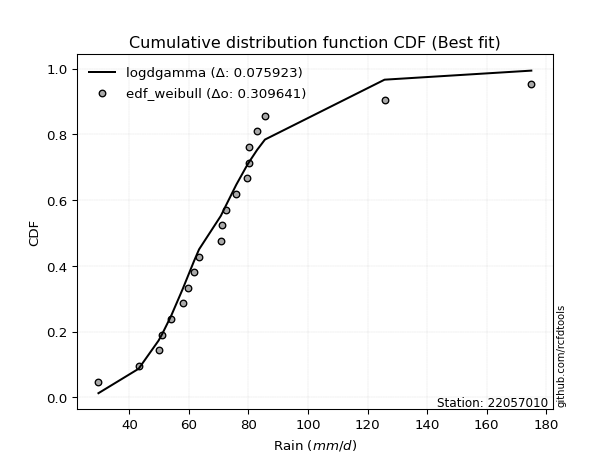</img>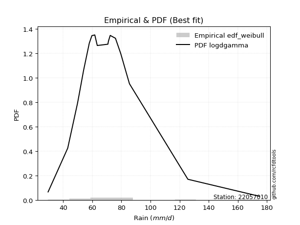</img>

</div>


### 4. EDF Beard (1943)

The Beard formula (or Beard´s plotting position formula) in hydrology is used to estimate the empirical non-exceedance probability _(P)_ of a flood event (or other extreme hydrological data point) within a given dataset.

<div align="center">


$P=(m-0.31)/(n+0.38)$


</div>


**4.1. Empirical values**

<div align="center">

|                | 0                    | 1                   | 2                   | 3                   | 4                   | 5                   | 6                   | 7                  | 8                  | 9                   | 10                 | 11                 | 12                 | 13                 | 14                 | 15                 | 16                 | 17                 | 18                 | 19                 |
|:---------------|:---------------------|:--------------------|:--------------------|:--------------------|:--------------------|:--------------------|:--------------------|:-------------------|:-------------------|:--------------------|:-------------------|:-------------------|:-------------------|:-------------------|:-------------------|:-------------------|:-------------------|:-------------------|:-------------------|:-------------------|
| date           | 2022                 | 2023                | 2009                | 2017                | 2015                | 2006                | 2018                | 2020               | 2011               | 2016                | 2010               | 2019               | 2008               | 2025               | 2021               | 2007               | 2012               | 2013               | 2014               | 2005               |
| x              | 29.6                 | 43.1                | 49.8                | 51.0                | 54.0                | 57.9                | 59.7                | 61.7               | 63.4               | 70.7                | 71.1               | 72.3               | 75.9               | 79.5               | 80.1               | 80.1               | 82.9               | 85.53              | 125.7              | 175.0              |
| m              | 1                    | 2                   | 3                   | 4                   | 5                   | 6                   | 7                   | 8                  | 9                  | 10                  | 11                 | 12                 | 13                 | 14                 | 15                 | 16                 | 17                 | 18                 | 19                 | 20                 |
| empirical_dist | edf_beard            | edf_beard           | edf_beard           | edf_beard           | edf_beard           | edf_beard           | edf_beard           | edf_beard          | edf_beard          | edf_beard           | edf_beard          | edf_beard          | edf_beard          | edf_beard          | edf_beard          | edf_beard          | edf_beard          | edf_beard          | edf_beard          | edf_beard          |
| empirical      | 0.033856722276741906 | 0.08292443572129539 | 0.13199214916584887 | 0.18105986261040236 | 0.23012757605495587 | 0.27919528949950934 | 0.32826300294406285 | 0.3773307163886163 | 0.4263984298331698 | 0.47546614327772324 | 0.5245338567222767 | 0.5736015701668302 | 0.6226692836113837 | 0.6717369970559373 | 0.7208047105004907 | 0.7698724239450442 | 0.8189401373895977 | 0.8680078508341512 | 0.9170755642787047 | 0.9661432777232583 |
| empirical_tr   | 1.0350431691213813   | 1.090422685928304   | 1.152063312605992   | 1.2210904733373276  | 1.2989165073295095  | 1.3873383253914227  | 1.4886778670562455  | 1.6059889676910957 | 1.7433704020530367 | 1.9064546304957901  | 2.1031991744066048 | 2.3452243958573074 | 2.6501950585175553 | 3.0463378176382667 | 3.581722319859402  | 4.345415778251599  | 5.523035230352305  | 7.576208178438667  | 12.059171597633155 | 29.536231884058108 |

</div>


**4.2. Kolmogorov-Smirnov fit test (sorted by Δ)**


<div align="center">

|                | 0                   | 1                  | 2                  | 3                  | 4                   | 5                   | 6                   | 7                   | 8                   | 9                   | 10                  | 11                  | 12                  | 13                  | 14                  | 15                  | 16                  | 17                  | 18                  | 19                  | 20                  | 21                  | 22                 | 23                  | 24                 | 25                  | 26                  | 27                  | 28                  | 29                  | 30                  | 31                  | 32                  | 33                  | 34                  | 35                  | 36                  | 37                 | 38                  | 39                  | 40                 | 41                  | 42                  | 43                  | 44                  | 45                  | 46                  | 47                 | 48                 | 49                 | 50                  | 51                 | 52                  | 53                 | 54                 | 55                  | 56                 | 57                 | 58                 | 59                  | 60                 | 61                  | 62                  | 63                  | 64                 | 65                 | 66                  | 67                  | 68                  | 69                  | 70                  | 71                  | 72                  | 73                 | 74                  | 75                 | 76                  | 77                  | 78                  | 79                 | 80                 | 81                  | 82                 | 83                  | 84                 | 85                  | 86                  | 87                  | 88                 | 89                  | 90                 | 91                  | 92                  | 93                  | 94                  | 95                  | 96                  | 97                  | 98                 | 99                 | 100                 | 101                 | 102                 | 103                 | 104                 | 105                 | 106                 | 107                 | 108                | 109                | 110                 | 111                 | 112                 | 113                 | 114                 | 115                 | 116                | 117                 | 118                 | 119                | 120                 | 121                | 122                 | 123                 | 124                | 125                | 126                 | 127                 | 128                 | 129                | 130                | 131                | 132                 | 133                | 134                | 135                 | 136                 | 137                | 138                 | 139                | 140                 | 141                 | 142                | 143                 | 144                | 145                 | 146                 | 147                | 148                | 149                | 150                | 151                | 152                | 153                | 154                | 155                | 156                | 157                | 158                |
|:---------------|:--------------------|:-------------------|:-------------------|:-------------------|:--------------------|:--------------------|:--------------------|:--------------------|:--------------------|:--------------------|:--------------------|:--------------------|:--------------------|:--------------------|:--------------------|:--------------------|:--------------------|:--------------------|:--------------------|:--------------------|:--------------------|:--------------------|:-------------------|:--------------------|:-------------------|:--------------------|:--------------------|:--------------------|:--------------------|:--------------------|:--------------------|:--------------------|:--------------------|:--------------------|:--------------------|:--------------------|:--------------------|:-------------------|:--------------------|:--------------------|:-------------------|:--------------------|:--------------------|:--------------------|:--------------------|:--------------------|:--------------------|:-------------------|:-------------------|:-------------------|:--------------------|:-------------------|:--------------------|:-------------------|:-------------------|:--------------------|:-------------------|:-------------------|:-------------------|:--------------------|:-------------------|:--------------------|:--------------------|:--------------------|:-------------------|:-------------------|:--------------------|:--------------------|:--------------------|:--------------------|:--------------------|:--------------------|:--------------------|:-------------------|:--------------------|:-------------------|:--------------------|:--------------------|:--------------------|:-------------------|:-------------------|:--------------------|:-------------------|:--------------------|:-------------------|:--------------------|:--------------------|:--------------------|:-------------------|:--------------------|:-------------------|:--------------------|:--------------------|:--------------------|:--------------------|:--------------------|:--------------------|:--------------------|:-------------------|:-------------------|:--------------------|:--------------------|:--------------------|:--------------------|:--------------------|:--------------------|:--------------------|:--------------------|:-------------------|:-------------------|:--------------------|:--------------------|:--------------------|:--------------------|:--------------------|:--------------------|:-------------------|:--------------------|:--------------------|:-------------------|:--------------------|:-------------------|:--------------------|:--------------------|:-------------------|:-------------------|:--------------------|:--------------------|:--------------------|:-------------------|:-------------------|:-------------------|:--------------------|:-------------------|:-------------------|:--------------------|:--------------------|:-------------------|:--------------------|:-------------------|:--------------------|:--------------------|:-------------------|:--------------------|:-------------------|:--------------------|:--------------------|:-------------------|:-------------------|:-------------------|:-------------------|:-------------------|:-------------------|:-------------------|:-------------------|:-------------------|:-------------------|:-------------------|:-------------------|
| station        | 22057010            | 22057010           | 22057010           | 22057010           | 22057010            | 22057010            | 22057010            | 22057010            | 22057010            | 22057010            | 22057010            | 22057010            | 22057010            | 22057010            | 22057010            | 22057010            | 22057010            | 22057010            | 22057010            | 22057010            | 22057010            | 22057010            | 22057010           | 22057010            | 22057010           | 22057010            | 22057010            | 22057010            | 22057010            | 22057010            | 22057010            | 22057010            | 22057010            | 22057010            | 22057010            | 22057010            | 22057010            | 22057010           | 22057010            | 22057010            | 22057010           | 22057010            | 22057010            | 22057010            | 22057010            | 22057010            | 22057010            | 22057010           | 22057010           | 22057010           | 22057010            | 22057010           | 22057010            | 22057010           | 22057010           | 22057010            | 22057010           | 22057010           | 22057010           | 22057010            | 22057010           | 22057010            | 22057010            | 22057010            | 22057010           | 22057010           | 22057010            | 22057010            | 22057010            | 22057010            | 22057010            | 22057010            | 22057010            | 22057010           | 22057010            | 22057010           | 22057010            | 22057010            | 22057010            | 22057010           | 22057010           | 22057010            | 22057010           | 22057010            | 22057010           | 22057010            | 22057010            | 22057010            | 22057010           | 22057010            | 22057010           | 22057010            | 22057010            | 22057010            | 22057010            | 22057010            | 22057010            | 22057010            | 22057010           | 22057010           | 22057010            | 22057010            | 22057010            | 22057010            | 22057010            | 22057010            | 22057010            | 22057010            | 22057010           | 22057010           | 22057010            | 22057010            | 22057010            | 22057010            | 22057010            | 22057010            | 22057010           | 22057010            | 22057010            | 22057010           | 22057010            | 22057010           | 22057010            | 22057010            | 22057010           | 22057010           | 22057010            | 22057010            | 22057010            | 22057010           | 22057010           | 22057010           | 22057010            | 22057010           | 22057010           | 22057010            | 22057010            | 22057010           | 22057010            | 22057010           | 22057010            | 22057010            | 22057010           | 22057010            | 22057010           | 22057010            | 22057010            | 22057010           | 22057010           | 22057010           | 22057010           | 22057010           | 22057010           | 22057010           | 22057010           | 22057010           | 22057010           | 22057010           | 22057010           |
| empirical_dist | edf_beard           | edf_beard          | edf_beard          | edf_beard          | edf_beard           | edf_beard           | edf_beard           | edf_beard           | edf_beard           | edf_beard           | edf_beard           | edf_beard           | edf_beard           | edf_beard           | edf_beard           | edf_beard           | edf_beard           | edf_beard           | edf_beard           | edf_beard           | edf_beard           | edf_beard           | edf_beard          | edf_beard           | edf_beard          | edf_beard           | edf_beard           | edf_beard           | edf_beard           | edf_beard           | edf_beard           | edf_beard           | edf_beard           | edf_beard           | edf_beard           | edf_beard           | edf_beard           | edf_beard          | edf_beard           | edf_beard           | edf_beard          | edf_beard           | edf_beard           | edf_beard           | edf_beard           | edf_beard           | edf_beard           | edf_beard          | edf_beard          | edf_beard          | edf_beard           | edf_beard          | edf_beard           | edf_beard          | edf_beard          | edf_beard           | edf_beard          | edf_beard          | edf_beard          | edf_beard           | edf_beard          | edf_beard           | edf_beard           | edf_beard           | edf_beard          | edf_beard          | edf_beard           | edf_beard           | edf_beard           | edf_beard           | edf_beard           | edf_beard           | edf_beard           | edf_beard          | edf_beard           | edf_beard          | edf_beard           | edf_beard           | edf_beard           | edf_beard          | edf_beard          | edf_beard           | edf_beard          | edf_beard           | edf_beard          | edf_beard           | edf_beard           | edf_beard           | edf_beard          | edf_beard           | edf_beard          | edf_beard           | edf_beard           | edf_beard           | edf_beard           | edf_beard           | edf_beard           | edf_beard           | edf_beard          | edf_beard          | edf_beard           | edf_beard           | edf_beard           | edf_beard           | edf_beard           | edf_beard           | edf_beard           | edf_beard           | edf_beard          | edf_beard          | edf_beard           | edf_beard           | edf_beard           | edf_beard           | edf_beard           | edf_beard           | edf_beard          | edf_beard           | edf_beard           | edf_beard          | edf_beard           | edf_beard          | edf_beard           | edf_beard           | edf_beard          | edf_beard          | edf_beard           | edf_beard           | edf_beard           | edf_beard          | edf_beard          | edf_beard          | edf_beard           | edf_beard          | edf_beard          | edf_beard           | edf_beard           | edf_beard          | edf_beard           | edf_beard          | edf_beard           | edf_beard           | edf_beard          | edf_beard           | edf_beard          | edf_beard           | edf_beard           | edf_beard          | edf_beard          | edf_beard          | edf_beard          | edf_beard          | edf_beard          | edf_beard          | edf_beard          | edf_beard          | edf_beard          | edf_beard          | edf_beard          |
| p_dist         | logjohnsonsu        | loglaplace         | loglaplace         | logdgamma          | logt                | tukeylambda         | johnsonsu           | logdweibull         | logmielke           | logburr             | vonmises_line       | loggenlogistic      | logburr12           | burr                | mielke              | burr12              | loghypsecant        | dgamma              | dweibull            | loggennorm          | logexponnorm        | loglogistic         | gennorm            | logloglaplace       | pearson3           | lognct              | alpha               | lograyleigh         | lognakagami         | exponnorm           | nct                 | logmaxwell          | loginvgauss         | logalpha            | logpearson3         | loghalfnorm         | loggumbel_r         | genextreme         | invweibull          | logskewnorm         | logfoldnorm        | invgamma            | betaprime           | loginvgamma         | f                   | weibull_min         | logjohnsonsb        | genlogistic        | logf               | logncf             | logexponweib        | logfatiguelife     | logerlang           | loggamma           | loggamma           | logbeta             | loggengamma        | moyal              | johnsonsb          | logrice             | lognorm            | logcrystalball      | halflogistic        | gengamma            | logloggamma        | logweibull_max     | loggenextreme       | invgauss            | logtruncnorm        | logweibull_min      | logkstwobign        | loginvweibull       | gamma               | erlang             | gausshyper          | beta               | laplace             | wald                | gumbel_r            | t                  | logmoyal           | logbetaprime        | loghalflogistic    | loggumbel_l         | skewnorm           | loganglit           | genhalflogistic     | halfnorm            | foldnorm           | kstwobign           | kappa3             | logexponpow         | loggompertz         | logsemicircular     | hypsecant           | rayleigh            | genpareto           | rice                | maxwell            | logistic           | logcosine           | loggenexpon         | logtriang           | truncnorm           | norm                | crystalball         | logtruncpareto      | logtruncweibull_min | logwald            | logarcsine         | anglit              | nakagami            | lomax               | genexpon            | loghalfgennorm      | semicircular        | logbradford        | logtruncexpon       | gumbel_l            | kappa4             | loguniform          | logkappa3          | logtukeylambda      | arcsine             | logkappa4          | logksone           | logrdist            | truncexpon          | loglomax            | triang             | logargus           | halfgennorm        | cosine              | loggenpareto       | truncweibull_min   | powerlaw            | loglevy_l           | loggenhalflogistic | ncf                 | bradford           | ksone               | exponweib           | argus              | wrapcauchy          | logpowerlaw        | levy_l              | uniform             | logtrapezoid       | rdist              | fatiguelife        | trapezoid          | weibull_max        | exponpow           | truncpareto        | gompertz           | logvonmises_line   | logvonmises        | vonmises           | loggausshyper      |
| delta          | 0.08122098479893652 | 0.0820297165532044 | 0.0820297165532044 | 0.0836522639869518 | 0.08554716798350487 | 0.08686793112127383 | 0.09004765676564597 | 0.09022377950027127 | 0.09242636790893521 | 0.09242647360797096 | 0.09787206526897935 | 0.10004983187254135 | 0.10007967551419727 | 0.10009688260454686 | 0.10013923124606694 | 0.10084998285419122 | 0.10131814989838706 | 0.10385826816830257 | 0.10840973367252771 | 0.11118010537581491 | 0.11569274988588019 | 0.11667894699316728 | 0.1178561928443328 | 0.11999682471535766 | 0.1211217673524575 | 0.12258525189067837 | 0.12284309538064853 | 0.12321719101710171 | 0.12326812771759454 | 0.12329730122847582 | 0.12427817314737022 | 0.12675708015793152 | 0.12679058521049358 | 0.12735495292819488 | 0.12791626327281536 | 0.12918512306882962 | 0.12950184247160962 | 0.1298479911341921 | 0.12985151464371947 | 0.13040737820782622 | 0.1304671375680223 | 0.13087607258963196 | 0.13089424473005484 | 0.13112161998781025 | 0.13118160714418658 | 0.13129257854385346 | 0.13144043382636983 | 0.1315391359159046 | 0.1316016021948797 | 0.1316961572262384 | 0.13178872410896236 | 0.1322469102678927 | 0.13269088919578187 | 0.1326962785968382 | 0.1326962785968382 | 0.13292253204043158 | 0.1336998433721216 | 0.1344239580708667 | 0.1355756097471491 | 0.13826576432619186 | 0.1390675499771431 | 0.13906767671659936 | 0.13920593480984444 | 0.13964652077746098 | 0.1416081361941468 | 0.142698355710411  | 0.14272830738708886 | 0.14305632513706812 | 0.14495536231225115 | 0.14621598437754302 | 0.14903914753592218 | 0.15028426512111304 | 0.15039054603362534 | 0.1503905959213242 | 0.15044906540090253 | 0.1520915622713842 | 0.15261738355683352 | 0.15381662956387226 | 0.15396138648606783 | 0.1547057732938561 | 0.1547892021427199 | 0.15507512666553358 | 0.1558877580192522 | 0.16115383991535037 | 0.1632230319035888 | 0.16559640727972302 | 0.16694854981511412 | 0.16724388696582349 | 0.1696290641148377 | 0.16968322434738736 | 0.1712439772584549 | 0.17310959873730292 | 0.17447764441207603 | 0.17701861702279387 | 0.18064623211872333 | 0.18571335600268346 | 0.18773538494126543 | 0.19099432576797748 | 0.1920443136233182 | 0.194805694927913  | 0.19568857610913104 | 0.20181050378490537 | 0.20252568780378066 | 0.21315800107830796 | 0.21315801037372817 | 0.21315801680254776 | 0.21691769328715982 | 0.21964224534000942 | 0.2249769819226995 | 0.2261473234445901 | 0.23348329100912957 | 0.23494474072088314 | 0.23687331114456936 | 0.23688871749167043 | 0.24142889631482603 | 0.24202219173535056 | 0.243485100373824  | 0.24971883911134948 | 0.26021859282812543 | 0.2607387006864358 | 0.27088579336259677 | 0.2710606787798594 | 0.27702999525166405 | 0.27709465268683353 | 0.2771919170422681 | 0.2870728029411891 | 0.29172864050975555 | 0.29662914650832095 | 0.31410149078274396 | 0.3221622694430083 | 0.3331244024016695 | 0.3410815976880729 | 0.35247765581716484 | 0.3777100018104036 | 0.3970388709720868 | 0.40202709863767305 | 0.41708970519872385 | 0.42979570061685   | 0.43036993214432984 | 0.4469222616706575 | 0.46412201864708114 | 0.46875075048805925 | 0.4764446481937613 | 0.48081917896801163 | 0.4819884694077139 | 0.48280693742585495 | 0.48334485220966705 | 0.5305223209637531 | 0.5602499718154653 | 0.5852200487913185 | 0.7048840853927091 | 0.7539595918449019 | 0.8337285423206628 | 0.8526350978034481 | 0.9169964883648458 | 0.9661432777232583 | 1.062668630204196  | 27.53815660064221  | 39.176423274073684 |
| deltao         | 0.3096406529800002  | 0.3096406529800002 | 0.3096406529800002 | 0.3096406529800002 | 0.3096406529800002  | 0.3096406529800002  | 0.3096406529800002  | 0.3096406529800002  | 0.3096406529800002  | 0.3096406529800002  | 0.3096406529800002  | 0.3096406529800002  | 0.3096406529800002  | 0.3096406529800002  | 0.3096406529800002  | 0.3096406529800002  | 0.3096406529800002  | 0.3096406529800002  | 0.3096406529800002  | 0.3096406529800002  | 0.3096406529800002  | 0.3096406529800002  | 0.3096406529800002 | 0.3096406529800002  | 0.3096406529800002 | 0.3096406529800002  | 0.3096406529800002  | 0.3096406529800002  | 0.3096406529800002  | 0.3096406529800002  | 0.3096406529800002  | 0.3096406529800002  | 0.3096406529800002  | 0.3096406529800002  | 0.3096406529800002  | 0.3096406529800002  | 0.3096406529800002  | 0.3096406529800002 | 0.3096406529800002  | 0.3096406529800002  | 0.3096406529800002 | 0.3096406529800002  | 0.3096406529800002  | 0.3096406529800002  | 0.3096406529800002  | 0.3096406529800002  | 0.3096406529800002  | 0.3096406529800002 | 0.3096406529800002 | 0.3096406529800002 | 0.3096406529800002  | 0.3096406529800002 | 0.3096406529800002  | 0.3096406529800002 | 0.3096406529800002 | 0.3096406529800002  | 0.3096406529800002 | 0.3096406529800002 | 0.3096406529800002 | 0.3096406529800002  | 0.3096406529800002 | 0.3096406529800002  | 0.3096406529800002  | 0.3096406529800002  | 0.3096406529800002 | 0.3096406529800002 | 0.3096406529800002  | 0.3096406529800002  | 0.3096406529800002  | 0.3096406529800002  | 0.3096406529800002  | 0.3096406529800002  | 0.3096406529800002  | 0.3096406529800002 | 0.3096406529800002  | 0.3096406529800002 | 0.3096406529800002  | 0.3096406529800002  | 0.3096406529800002  | 0.3096406529800002 | 0.3096406529800002 | 0.3096406529800002  | 0.3096406529800002 | 0.3096406529800002  | 0.3096406529800002 | 0.3096406529800002  | 0.3096406529800002  | 0.3096406529800002  | 0.3096406529800002 | 0.3096406529800002  | 0.3096406529800002 | 0.3096406529800002  | 0.3096406529800002  | 0.3096406529800002  | 0.3096406529800002  | 0.3096406529800002  | 0.3096406529800002  | 0.3096406529800002  | 0.3096406529800002 | 0.3096406529800002 | 0.3096406529800002  | 0.3096406529800002  | 0.3096406529800002  | 0.3096406529800002  | 0.3096406529800002  | 0.3096406529800002  | 0.3096406529800002  | 0.3096406529800002  | 0.3096406529800002 | 0.3096406529800002 | 0.3096406529800002  | 0.3096406529800002  | 0.3096406529800002  | 0.3096406529800002  | 0.3096406529800002  | 0.3096406529800002  | 0.3096406529800002 | 0.3096406529800002  | 0.3096406529800002  | 0.3096406529800002 | 0.3096406529800002  | 0.3096406529800002 | 0.3096406529800002  | 0.3096406529800002  | 0.3096406529800002 | 0.3096406529800002 | 0.3096406529800002  | 0.3096406529800002  | 0.3096406529800002  | 0.3096406529800002 | 0.3096406529800002 | 0.3096406529800002 | 0.3096406529800002  | 0.3096406529800002 | 0.3096406529800002 | 0.3096406529800002  | 0.3096406529800002  | 0.3096406529800002 | 0.3096406529800002  | 0.3096406529800002 | 0.3096406529800002  | 0.3096406529800002  | 0.3096406529800002 | 0.3096406529800002  | 0.3096406529800002 | 0.3096406529800002  | 0.3096406529800002  | 0.3096406529800002 | 0.3096406529800002 | 0.3096406529800002 | 0.3096406529800002 | 0.3096406529800002 | 0.3096406529800002 | 0.3096406529800002 | 0.3096406529800002 | 0.3096406529800002 | 0.3096406529800002 | 0.3096406529800002 | 0.3096406529800002 |
| eval           | Δo > Δ              | Δo > Δ             | Δo > Δ             | Δo > Δ             | Δo > Δ              | Δo > Δ              | Δo > Δ              | Δo > Δ              | Δo > Δ              | Δo > Δ              | Δo > Δ              | Δo > Δ              | Δo > Δ              | Δo > Δ              | Δo > Δ              | Δo > Δ              | Δo > Δ              | Δo > Δ              | Δo > Δ              | Δo > Δ              | Δo > Δ              | Δo > Δ              | Δo > Δ             | Δo > Δ              | Δo > Δ             | Δo > Δ              | Δo > Δ              | Δo > Δ              | Δo > Δ              | Δo > Δ              | Δo > Δ              | Δo > Δ              | Δo > Δ              | Δo > Δ              | Δo > Δ              | Δo > Δ              | Δo > Δ              | Δo > Δ             | Δo > Δ              | Δo > Δ              | Δo > Δ             | Δo > Δ              | Δo > Δ              | Δo > Δ              | Δo > Δ              | Δo > Δ              | Δo > Δ              | Δo > Δ             | Δo > Δ             | Δo > Δ             | Δo > Δ              | Δo > Δ             | Δo > Δ              | Δo > Δ             | Δo > Δ             | Δo > Δ              | Δo > Δ             | Δo > Δ             | Δo > Δ             | Δo > Δ              | Δo > Δ             | Δo > Δ              | Δo > Δ              | Δo > Δ              | Δo > Δ             | Δo > Δ             | Δo > Δ              | Δo > Δ              | Δo > Δ              | Δo > Δ              | Δo > Δ              | Δo > Δ              | Δo > Δ              | Δo > Δ             | Δo > Δ              | Δo > Δ             | Δo > Δ              | Δo > Δ              | Δo > Δ              | Δo > Δ             | Δo > Δ             | Δo > Δ              | Δo > Δ             | Δo > Δ              | Δo > Δ             | Δo > Δ              | Δo > Δ              | Δo > Δ              | Δo > Δ             | Δo > Δ              | Δo > Δ             | Δo > Δ              | Δo > Δ              | Δo > Δ              | Δo > Δ              | Δo > Δ              | Δo > Δ              | Δo > Δ              | Δo > Δ             | Δo > Δ             | Δo > Δ              | Δo > Δ              | Δo > Δ              | Δo > Δ              | Δo > Δ              | Δo > Δ              | Δo > Δ              | Δo > Δ              | Δo > Δ             | Δo > Δ             | Δo > Δ              | Δo > Δ              | Δo > Δ              | Δo > Δ              | Δo > Δ              | Δo > Δ              | Δo > Δ             | Δo > Δ              | Δo > Δ              | Δo > Δ             | Δo > Δ              | Δo > Δ             | Δo > Δ              | Δo > Δ              | Δo > Δ             | Δo > Δ             | Δo > Δ              | Δo > Δ              | Δo <= Δ             | Δo <= Δ            | Δo <= Δ            | Δo <= Δ            | Δo <= Δ             | Δo <= Δ            | Δo <= Δ            | Δo <= Δ             | Δo <= Δ             | Δo <= Δ            | Δo <= Δ             | Δo <= Δ            | Δo <= Δ             | Δo <= Δ             | Δo <= Δ            | Δo <= Δ             | Δo <= Δ            | Δo <= Δ             | Δo <= Δ             | Δo <= Δ            | Δo <= Δ            | Δo <= Δ            | Δo <= Δ            | Δo <= Δ            | Δo <= Δ            | Δo <= Δ            | Δo <= Δ            | Δo <= Δ            | Δo <= Δ            | Δo <= Δ            | Δo <= Δ            |
| fit            | 1                   | 1                  | 1                  | 1                  | 1                   | 1                   | 1                   | 1                   | 1                   | 1                   | 1                   | 1                   | 1                   | 1                   | 1                   | 1                   | 1                   | 1                   | 1                   | 1                   | 1                   | 1                   | 1                  | 1                   | 1                  | 1                   | 1                   | 1                   | 1                   | 1                   | 1                   | 1                   | 1                   | 1                   | 1                   | 1                   | 1                   | 1                  | 1                   | 1                   | 1                  | 1                   | 1                   | 1                   | 1                   | 1                   | 1                   | 1                  | 1                  | 1                  | 1                   | 1                  | 1                   | 1                  | 1                  | 1                   | 1                  | 1                  | 1                  | 1                   | 1                  | 1                   | 1                   | 1                   | 1                  | 1                  | 1                   | 1                   | 1                   | 1                   | 1                   | 1                   | 1                   | 1                  | 1                   | 1                  | 1                   | 1                   | 1                   | 1                  | 1                  | 1                   | 1                  | 1                   | 1                  | 1                   | 1                   | 1                   | 1                  | 1                   | 1                  | 1                   | 1                   | 1                   | 1                   | 1                   | 1                   | 1                   | 1                  | 1                  | 1                   | 1                   | 1                   | 1                   | 1                   | 1                   | 1                   | 1                   | 1                  | 1                  | 1                   | 1                   | 1                   | 1                   | 1                   | 1                   | 1                  | 1                   | 1                   | 1                  | 1                   | 1                  | 1                   | 1                   | 1                  | 1                  | 1                   | 1                   | 0                   | 0                  | 0                  | 0                  | 0                   | 0                  | 0                  | 0                   | 0                   | 0                  | 0                   | 0                  | 0                   | 0                   | 0                  | 0                   | 0                  | 0                   | 0                   | 0                  | 0                  | 0                  | 0                  | 0                  | 0                  | 0                  | 0                  | 0                  | 0                  | 0                  | 0                  |
| n              | 20                  | 20                 | 20                 | 20                 | 20                  | 20                  | 20                  | 20                  | 20                  | 20                  | 20                  | 20                  | 20                  | 20                  | 20                  | 20                  | 20                  | 20                  | 20                  | 20                  | 20                  | 20                  | 20                 | 20                  | 20                 | 20                  | 20                  | 20                  | 20                  | 20                  | 20                  | 20                  | 20                  | 20                  | 20                  | 20                  | 20                  | 20                 | 20                  | 20                  | 20                 | 20                  | 20                  | 20                  | 20                  | 20                  | 20                  | 20                 | 20                 | 20                 | 20                  | 20                 | 20                  | 20                 | 20                 | 20                  | 20                 | 20                 | 20                 | 20                  | 20                 | 20                  | 20                  | 20                  | 20                 | 20                 | 20                  | 20                  | 20                  | 20                  | 20                  | 20                  | 20                  | 20                 | 20                  | 20                 | 20                  | 20                  | 20                  | 20                 | 20                 | 20                  | 20                 | 20                  | 20                 | 20                  | 20                  | 20                  | 20                 | 20                  | 20                 | 20                  | 20                  | 20                  | 20                  | 20                  | 20                  | 20                  | 20                 | 20                 | 20                  | 20                  | 20                  | 20                  | 20                  | 20                  | 20                  | 20                  | 20                 | 20                 | 20                  | 20                  | 20                  | 20                  | 20                  | 20                  | 20                 | 20                  | 20                  | 20                 | 20                  | 20                 | 20                  | 20                  | 20                 | 20                 | 20                  | 20                  | 20                  | 20                 | 20                 | 20                 | 20                  | 20                 | 20                 | 20                  | 20                  | 20                 | 20                  | 20                 | 20                  | 20                  | 20                 | 20                  | 20                 | 20                  | 20                  | 20                 | 20                 | 20                 | 20                 | 20                 | 20                 | 20                 | 20                 | 20                 | 20                 | 20                 | 20                 |
| best_fit       | 1                   | 0                  | 0                  | 0                  | 0                   | 0                   | 0                   | 0                   | 0                   | 0                   | 0                   | 0                   | 0                   | 0                   | 0                   | 0                   | 0                   | 0                   | 0                   | 0                   | 0                   | 0                   | 0                  | 0                   | 0                  | 0                   | 0                   | 0                   | 0                   | 0                   | 0                   | 0                   | 0                   | 0                   | 0                   | 0                   | 0                   | 0                  | 0                   | 0                   | 0                  | 0                   | 0                   | 0                   | 0                   | 0                   | 0                   | 0                  | 0                  | 0                  | 0                   | 0                  | 0                   | 0                  | 0                  | 0                   | 0                  | 0                  | 0                  | 0                   | 0                  | 0                   | 0                   | 0                   | 0                  | 0                  | 0                   | 0                   | 0                   | 0                   | 0                   | 0                   | 0                   | 0                  | 0                   | 0                  | 0                   | 0                   | 0                   | 0                  | 0                  | 0                   | 0                  | 0                   | 0                  | 0                   | 0                   | 0                   | 0                  | 0                   | 0                  | 0                   | 0                   | 0                   | 0                   | 0                   | 0                   | 0                   | 0                  | 0                  | 0                   | 0                   | 0                   | 0                   | 0                   | 0                   | 0                   | 0                   | 0                  | 0                  | 0                   | 0                   | 0                   | 0                   | 0                   | 0                   | 0                  | 0                   | 0                   | 0                  | 0                   | 0                  | 0                   | 0                   | 0                  | 0                  | 0                   | 0                   | 0                   | 0                  | 0                  | 0                  | 0                   | 0                  | 0                  | 0                   | 0                   | 0                  | 0                   | 0                  | 0                   | 0                   | 0                  | 0                   | 0                  | 0                   | 0                   | 0                  | 0                  | 0                  | 0                  | 0                  | 0                  | 0                  | 0                  | 0                  | 0                  | 0                  | 0                  |
| best_fit_sort  | 1                   | 2                  | 3                  | 4                  | 5                   | 6                   | 7                   | 8                   | 9                   | 10                  | 11                  | 12                  | 13                  | 14                  | 15                  | 16                  | 17                  | 18                  | 19                  | 20                  | 21                  | 22                  | 23                 | 24                  | 25                 | 26                  | 27                  | 28                  | 29                  | 30                  | 31                  | 32                  | 33                  | 34                  | 35                  | 36                  | 37                  | 38                 | 39                  | 40                  | 41                 | 42                  | 43                  | 44                  | 45                  | 46                  | 47                  | 48                 | 49                 | 50                 | 51                  | 52                 | 53                  | 54                 | 55                 | 56                  | 57                 | 58                 | 59                 | 60                  | 61                 | 62                  | 63                  | 64                  | 65                 | 66                 | 67                  | 68                  | 69                  | 70                  | 71                  | 72                  | 73                  | 74                 | 75                  | 76                 | 77                  | 78                  | 79                  | 80                 | 81                 | 82                  | 83                 | 84                  | 85                 | 86                  | 87                  | 88                  | 89                 | 90                  | 91                 | 92                  | 93                  | 94                  | 95                  | 96                  | 97                  | 98                  | 99                 | 100                | 101                 | 102                 | 103                 | 104                 | 105                 | 106                 | 107                 | 108                 | 109                | 110                | 111                 | 112                 | 113                 | 114                 | 115                 | 116                 | 117                | 118                 | 119                 | 120                | 121                 | 122                | 123                 | 124                 | 125                | 126                | 127                 | 128                 | 129                 | 130                | 131                | 132                | 133                 | 134                | 135                | 136                 | 137                 | 138                | 139                 | 140                | 141                 | 142                 | 143                | 144                 | 145                | 146                 | 147                 | 148                | 149                | 150                | 151                | 152                | 153                | 154                | 155                | 156                | 157                | 158                | 159                |

</div>


**4.3. Best fit**

<div align="center">

|   id |   station | empirical_dist   | p_dist       |    delta |   deltao | eval   |   fit |   n |   best_fit |   best_fit_sort |
|-----:|----------:|:-----------------|:-------------|---------:|---------:|:-------|------:|----:|-----------:|----------------:|
|    0 |  22057010 | edf_beard        | logjohnsonsu | 0.081221 | 0.309641 | Δo > Δ |     1 |  20 |          1 |               1 |

</div>


<div align="center">

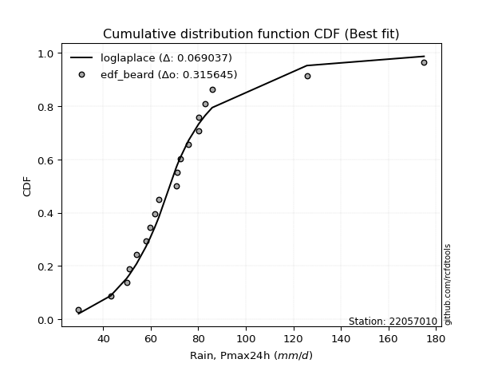</img></img>

</div>


### 5. EDF Chegodayev (1955)

The Chegodayev formula is an empirical plotting position formula used in hydrological frequency analysis to estimate the exceedance probability or return period of a specific event from a set of observed data. It is primarily used for plotting observed data points on probability paper to fit a theoretical distribution, particularly for analyzing extreme events like maximum flood flows or rainfall intensities. The constant _b_ value in the generalized plotting position formula is 0.3.

<div align="center">


$P=(m-b)/(n+1-2b)$


</div>


**5.1. Empirical values**

<div align="center">

|                | 0                   | 1                   | 2                   | 3                   | 4                  | 5                   | 6                   | 7                  | 8                  | 9                   | 10                 | 11                 | 12                 | 13                 | 14                 | 15                 | 16                 | 17                 | 18                 | 19                 |
|:---------------|:--------------------|:--------------------|:--------------------|:--------------------|:-------------------|:--------------------|:--------------------|:-------------------|:-------------------|:--------------------|:-------------------|:-------------------|:-------------------|:-------------------|:-------------------|:-------------------|:-------------------|:-------------------|:-------------------|:-------------------|
| date           | 2022                | 2023                | 2009                | 2017                | 2015               | 2006                | 2018                | 2020               | 2011               | 2016                | 2010               | 2019               | 2008               | 2025               | 2021               | 2007               | 2012               | 2013               | 2014               | 2005               |
| x              | 29.6                | 43.1                | 49.8                | 51.0                | 54.0               | 57.9                | 59.7                | 61.7               | 63.4               | 70.7                | 71.1               | 72.3               | 75.9               | 79.5               | 80.1               | 80.1               | 82.9               | 85.53              | 125.7              | 175.0              |
| m              | 1                   | 2                   | 3                   | 4                   | 5                  | 6                   | 7                   | 8                  | 9                  | 10                  | 11                 | 12                 | 13                 | 14                 | 15                 | 16                 | 17                 | 18                 | 19                 | 20                 |
| empirical_dist | edf_chegodayev      | edf_chegodayev      | edf_chegodayev      | edf_chegodayev      | edf_chegodayev     | edf_chegodayev      | edf_chegodayev      | edf_chegodayev     | edf_chegodayev     | edf_chegodayev      | edf_chegodayev     | edf_chegodayev     | edf_chegodayev     | edf_chegodayev     | edf_chegodayev     | edf_chegodayev     | edf_chegodayev     | edf_chegodayev     | edf_chegodayev     | edf_chegodayev     |
| empirical      | 0.03431372549019608 | 0.08333333333333334 | 0.13235294117647062 | 0.18137254901960786 | 0.2303921568627451 | 0.27941176470588236 | 0.32843137254901966 | 0.3774509803921569 | 0.4264705882352941 | 0.47549019607843135 | 0.5245098039215687 | 0.5735294117647058 | 0.6225490196078431 | 0.6715686274509804 | 0.7205882352941176 | 0.7696078431372549 | 0.8186274509803921 | 0.8676470588235294 | 0.9166666666666667 | 0.9656862745098039 |
| empirical_tr   | 1.0355329949238579  | 1.090909090909091   | 1.152542372881356   | 1.221556886227545   | 1.299363057324841  | 1.3877551020408163  | 1.4890510948905111  | 1.6062992125984252 | 1.7435897435897436 | 1.9065420560747663  | 2.1030927835051547 | 2.3448275862068964 | 2.6493506493506493 | 3.0447761194029854 | 3.5789473684210527 | 4.340425531914894  | 5.513513513513513  | 7.555555555555557  | 12.00000000000001  | 29.142857142857153 |

</div>


**5.2. Kolmogorov-Smirnov fit test (sorted by Δ)**


<div align="center">

|                | 0                   | 1                  | 2                  | 3                   | 4                   | 5                   | 6                   | 7                   | 8                   | 9                   | 10                  | 11                  | 12                 | 13                  | 14                  | 15                  | 16                  | 17                  | 18                  | 19                  | 20                 | 21                 | 22                  | 23                  | 24                  | 25                  | 26                  | 27                  | 28                  | 29                  | 30                  | 31                  | 32                 | 33                 | 34                  | 35                  | 36                 | 37                  | 38                 | 39                  | 40                  | 41                  | 42                  | 43                  | 44                 | 45                  | 46                  | 47                  | 48                  | 49                  | 50                  | 51                  | 52                 | 53                 | 54                 | 55                 | 56                  | 57                  | 58                  | 59                  | 60                  | 61                  | 62                  | 63                 | 64                  | 65                  | 66                  | 67                  | 68                  | 69                  | 70                 | 71                  | 72                  | 73                  | 74                  | 75                  | 76                  | 77                  | 78                  | 79                 | 80                 | 81                 | 82                 | 83                 | 84                  | 85                  | 86                  | 87                 | 88                 | 89                  | 90                  | 91                  | 92                  | 93                 | 94                  | 95                  | 96                  | 97                 | 98                  | 99                  | 100                 | 101                | 102                 | 103                 | 104                | 105                 | 106                 | 107                 | 108                 | 109                 | 110                | 111                | 112                | 113                 | 114                 | 115                 | 116                 | 117                 | 118                 | 119                | 120                | 121                | 122                 | 123                 | 124                | 125                | 126                | 127                 | 128                 | 129                | 130                 | 131                 | 132                 | 133                | 134                | 135                 | 136                | 137                 | 138                 | 139                 | 140                 | 141                 | 142                 | 143                 | 144                 | 145                | 146                | 147                | 148                | 149                | 150                | 151                | 152                | 153                | 154                | 155                | 156                | 157                | 158                |
|:---------------|:--------------------|:-------------------|:-------------------|:--------------------|:--------------------|:--------------------|:--------------------|:--------------------|:--------------------|:--------------------|:--------------------|:--------------------|:-------------------|:--------------------|:--------------------|:--------------------|:--------------------|:--------------------|:--------------------|:--------------------|:-------------------|:-------------------|:--------------------|:--------------------|:--------------------|:--------------------|:--------------------|:--------------------|:--------------------|:--------------------|:--------------------|:--------------------|:-------------------|:-------------------|:--------------------|:--------------------|:-------------------|:--------------------|:-------------------|:--------------------|:--------------------|:--------------------|:--------------------|:--------------------|:-------------------|:--------------------|:--------------------|:--------------------|:--------------------|:--------------------|:--------------------|:--------------------|:-------------------|:-------------------|:-------------------|:-------------------|:--------------------|:--------------------|:--------------------|:--------------------|:--------------------|:--------------------|:--------------------|:-------------------|:--------------------|:--------------------|:--------------------|:--------------------|:--------------------|:--------------------|:-------------------|:--------------------|:--------------------|:--------------------|:--------------------|:--------------------|:--------------------|:--------------------|:--------------------|:-------------------|:-------------------|:-------------------|:-------------------|:-------------------|:--------------------|:--------------------|:--------------------|:-------------------|:-------------------|:--------------------|:--------------------|:--------------------|:--------------------|:-------------------|:--------------------|:--------------------|:--------------------|:-------------------|:--------------------|:--------------------|:--------------------|:-------------------|:--------------------|:--------------------|:-------------------|:--------------------|:--------------------|:--------------------|:--------------------|:--------------------|:-------------------|:-------------------|:-------------------|:--------------------|:--------------------|:--------------------|:--------------------|:--------------------|:--------------------|:-------------------|:-------------------|:-------------------|:--------------------|:--------------------|:-------------------|:-------------------|:-------------------|:--------------------|:--------------------|:-------------------|:--------------------|:--------------------|:--------------------|:-------------------|:-------------------|:--------------------|:-------------------|:--------------------|:--------------------|:--------------------|:--------------------|:--------------------|:--------------------|:--------------------|:--------------------|:-------------------|:-------------------|:-------------------|:-------------------|:-------------------|:-------------------|:-------------------|:-------------------|:-------------------|:-------------------|:-------------------|:-------------------|:-------------------|:-------------------|
| station        | 22057010            | 22057010           | 22057010           | 22057010            | 22057010            | 22057010            | 22057010            | 22057010            | 22057010            | 22057010            | 22057010            | 22057010            | 22057010           | 22057010            | 22057010            | 22057010            | 22057010            | 22057010            | 22057010            | 22057010            | 22057010           | 22057010           | 22057010            | 22057010            | 22057010            | 22057010            | 22057010            | 22057010            | 22057010            | 22057010            | 22057010            | 22057010            | 22057010           | 22057010           | 22057010            | 22057010            | 22057010           | 22057010            | 22057010           | 22057010            | 22057010            | 22057010            | 22057010            | 22057010            | 22057010           | 22057010            | 22057010            | 22057010            | 22057010            | 22057010            | 22057010            | 22057010            | 22057010           | 22057010           | 22057010           | 22057010           | 22057010            | 22057010            | 22057010            | 22057010            | 22057010            | 22057010            | 22057010            | 22057010           | 22057010            | 22057010            | 22057010            | 22057010            | 22057010            | 22057010            | 22057010           | 22057010            | 22057010            | 22057010            | 22057010            | 22057010            | 22057010            | 22057010            | 22057010            | 22057010           | 22057010           | 22057010           | 22057010           | 22057010           | 22057010            | 22057010            | 22057010            | 22057010           | 22057010           | 22057010            | 22057010            | 22057010            | 22057010            | 22057010           | 22057010            | 22057010            | 22057010            | 22057010           | 22057010            | 22057010            | 22057010            | 22057010           | 22057010            | 22057010            | 22057010           | 22057010            | 22057010            | 22057010            | 22057010            | 22057010            | 22057010           | 22057010           | 22057010           | 22057010            | 22057010            | 22057010            | 22057010            | 22057010            | 22057010            | 22057010           | 22057010           | 22057010           | 22057010            | 22057010            | 22057010           | 22057010           | 22057010           | 22057010            | 22057010            | 22057010           | 22057010            | 22057010            | 22057010            | 22057010           | 22057010           | 22057010            | 22057010           | 22057010            | 22057010            | 22057010            | 22057010            | 22057010            | 22057010            | 22057010            | 22057010            | 22057010           | 22057010           | 22057010           | 22057010           | 22057010           | 22057010           | 22057010           | 22057010           | 22057010           | 22057010           | 22057010           | 22057010           | 22057010           | 22057010           |
| empirical_dist | edf_chegodayev      | edf_chegodayev     | edf_chegodayev     | edf_chegodayev      | edf_chegodayev      | edf_chegodayev      | edf_chegodayev      | edf_chegodayev      | edf_chegodayev      | edf_chegodayev      | edf_chegodayev      | edf_chegodayev      | edf_chegodayev     | edf_chegodayev      | edf_chegodayev      | edf_chegodayev      | edf_chegodayev      | edf_chegodayev      | edf_chegodayev      | edf_chegodayev      | edf_chegodayev     | edf_chegodayev     | edf_chegodayev      | edf_chegodayev      | edf_chegodayev      | edf_chegodayev      | edf_chegodayev      | edf_chegodayev      | edf_chegodayev      | edf_chegodayev      | edf_chegodayev      | edf_chegodayev      | edf_chegodayev     | edf_chegodayev     | edf_chegodayev      | edf_chegodayev      | edf_chegodayev     | edf_chegodayev      | edf_chegodayev     | edf_chegodayev      | edf_chegodayev      | edf_chegodayev      | edf_chegodayev      | edf_chegodayev      | edf_chegodayev     | edf_chegodayev      | edf_chegodayev      | edf_chegodayev      | edf_chegodayev      | edf_chegodayev      | edf_chegodayev      | edf_chegodayev      | edf_chegodayev     | edf_chegodayev     | edf_chegodayev     | edf_chegodayev     | edf_chegodayev      | edf_chegodayev      | edf_chegodayev      | edf_chegodayev      | edf_chegodayev      | edf_chegodayev      | edf_chegodayev      | edf_chegodayev     | edf_chegodayev      | edf_chegodayev      | edf_chegodayev      | edf_chegodayev      | edf_chegodayev      | edf_chegodayev      | edf_chegodayev     | edf_chegodayev      | edf_chegodayev      | edf_chegodayev      | edf_chegodayev      | edf_chegodayev      | edf_chegodayev      | edf_chegodayev      | edf_chegodayev      | edf_chegodayev     | edf_chegodayev     | edf_chegodayev     | edf_chegodayev     | edf_chegodayev     | edf_chegodayev      | edf_chegodayev      | edf_chegodayev      | edf_chegodayev     | edf_chegodayev     | edf_chegodayev      | edf_chegodayev      | edf_chegodayev      | edf_chegodayev      | edf_chegodayev     | edf_chegodayev      | edf_chegodayev      | edf_chegodayev      | edf_chegodayev     | edf_chegodayev      | edf_chegodayev      | edf_chegodayev      | edf_chegodayev     | edf_chegodayev      | edf_chegodayev      | edf_chegodayev     | edf_chegodayev      | edf_chegodayev      | edf_chegodayev      | edf_chegodayev      | edf_chegodayev      | edf_chegodayev     | edf_chegodayev     | edf_chegodayev     | edf_chegodayev      | edf_chegodayev      | edf_chegodayev      | edf_chegodayev      | edf_chegodayev      | edf_chegodayev      | edf_chegodayev     | edf_chegodayev     | edf_chegodayev     | edf_chegodayev      | edf_chegodayev      | edf_chegodayev     | edf_chegodayev     | edf_chegodayev     | edf_chegodayev      | edf_chegodayev      | edf_chegodayev     | edf_chegodayev      | edf_chegodayev      | edf_chegodayev      | edf_chegodayev     | edf_chegodayev     | edf_chegodayev      | edf_chegodayev     | edf_chegodayev      | edf_chegodayev      | edf_chegodayev      | edf_chegodayev      | edf_chegodayev      | edf_chegodayev      | edf_chegodayev      | edf_chegodayev      | edf_chegodayev     | edf_chegodayev     | edf_chegodayev     | edf_chegodayev     | edf_chegodayev     | edf_chegodayev     | edf_chegodayev     | edf_chegodayev     | edf_chegodayev     | edf_chegodayev     | edf_chegodayev     | edf_chegodayev     | edf_chegodayev     | edf_chegodayev     |
| p_dist         | logjohnsonsu        | loglaplace         | loglaplace         | logdgamma           | logt                | tukeylambda         | johnsonsu           | logdweibull         | logmielke           | logburr             | vonmises_line       | loggenlogistic      | logburr12          | burr                | mielke              | burr12              | loghypsecant        | dgamma              | dweibull            | loggennorm          | logexponnorm       | loglogistic        | gennorm             | logloglaplace       | pearson3            | lognct              | alpha               | lograyleigh         | lognakagami         | exponnorm           | nct                 | logmaxwell          | loginvgauss        | logalpha           | logpearson3         | loghalfnorm         | loggumbel_r        | genextreme          | invweibull         | logskewnorm         | logfoldnorm         | invgamma            | betaprime           | loginvgamma         | f                  | weibull_min         | logjohnsonsb        | genlogistic         | logf                | logncf              | logexponweib        | logfatiguelife      | logerlang          | loggamma           | loggamma           | logbeta            | loggengamma         | moyal               | johnsonsb           | logrice             | lognorm             | logcrystalball      | halflogistic        | gengamma           | logloggamma         | logweibull_max      | loggenextreme       | invgauss            | logtruncnorm        | logweibull_min      | logkstwobign       | loginvweibull       | gamma               | erlang              | gausshyper          | beta                | laplace             | gumbel_r            | wald                | t                  | logbetaprime       | logmoyal           | loghalflogistic    | loggumbel_l        | skewnorm            | loganglit           | genhalflogistic     | halfnorm           | foldnorm           | kstwobign           | kappa3              | logexponpow         | loggompertz         | logsemicircular    | hypsecant           | rayleigh            | genpareto           | rice               | maxwell             | logistic            | logcosine           | loggenexpon        | logtriang           | truncnorm           | norm               | crystalball         | logtruncpareto      | logtruncweibull_min | logwald             | logarcsine          | anglit             | nakagami           | lomax              | genexpon            | loghalfgennorm      | semicircular        | logbradford         | logtruncexpon       | gumbel_l            | kappa4             | loguniform         | logkappa3          | logtukeylambda      | arcsine             | logkappa4          | logksone           | logrdist           | truncexpon          | loglomax            | triang             | logargus            | halfgennorm         | cosine              | loggenpareto       | truncweibull_min   | powerlaw            | loglevy_l          | loggenhalflogistic  | ncf                 | bradford            | ksone               | exponweib           | argus               | wrapcauchy          | logpowerlaw         | levy_l             | uniform            | logtrapezoid       | rdist              | fatiguelife        | trapezoid          | weibull_max        | exponpow           | truncpareto        | gompertz           | logvonmises_line   | logvonmises        | vonmises           | loggausshyper      |
| delta          | 0.08119693199822842 | 0.0820056637524963 | 0.0820056637524963 | 0.08329147197633002 | 0.08552311518279676 | 0.08684387832056573 | 0.08968686475502419 | 0.08986298748964949 | 0.09206557589831343 | 0.09206568159734918 | 0.09784801246827124 | 0.09968903986191957 | 0.0997188835035755 | 0.09973609059392508 | 0.09977843923544516 | 0.10048919084356944 | 0.10095735788776528 | 0.10349747615768079 | 0.10848189207465203 | 0.11081931336519313 | 0.1153319578752584 | 0.1163181549825455 | 0.11792835124645712 | 0.11963603270473588 | 0.12076097534183572 | 0.12222445988005659 | 0.12248230337002675 | 0.12285639900647993 | 0.12290733570697276 | 0.12293650921785404 | 0.12391738113674844 | 0.12639628814730974 | 0.1264297931998718 | 0.1269941609175731 | 0.12755547126219358 | 0.12916107026812151 | 0.1294777896709015 | 0.12948719912357032 | 0.1294907226330977 | 0.13004658619720444 | 0.13010634555740053 | 0.13051528057901018 | 0.13053345271943306 | 0.13076082797718847 | 0.1308208151335648 | 0.13093178653323168 | 0.13107964181574805 | 0.13117834390528282 | 0.13124081018425793 | 0.13133536521561662 | 0.13142793209834058 | 0.13188611825727092 | 0.1323300971851601 | 0.1323354865862164 | 0.1323354865862164 | 0.1325617400298098 | 0.13333905136149982 | 0.13406316606024493 | 0.13521481773652733 | 0.13790497231557008 | 0.13870675796652132 | 0.13870688470597758 | 0.13884514279922266 | 0.1392857287668392 | 0.14124734418352503 | 0.14233756369978923 | 0.14236751537646708 | 0.14269553312644634 | 0.14473888710587812 | 0.14585519236692124 | 0.1486783555253004 | 0.14992347311049126 | 0.15002975402300356 | 0.15002980391070242 | 0.15008827339028075 | 0.15173077026076243 | 0.15225659154621174 | 0.15360059447544605 | 0.15379257676316416 | 0.154681720493148  | 0.1547143346549118 | 0.1547651493420118 | 0.1558637052185441 | 0.1607930479047286 | 0.16286223989296705 | 0.16523561526910124 | 0.16658775780449236 | 0.1668830949552017 | 0.1692682721042159 | 0.16932243233676558 | 0.17088318524783314 | 0.17274880672668114 | 0.17411685240145425 | 0.1766578250121721 | 0.18028544010810155 | 0.18535256399206168 | 0.18737459293064368 | 0.1906335337573557 | 0.19168352161269642 | 0.19444490291729122 | 0.19532778409850926 | 0.2014497117742836 | 0.20216489579315888 | 0.21279720906768618 | 0.2127972183631064 | 0.21279722479192598 | 0.21655690127653804 | 0.21928145332938764 | 0.22495292912199139 | 0.22578653143396832 | 0.2331224989985078 | 0.2345839487102614 | 0.2365125191339476 | 0.23652792548104867 | 0.24106810430420428 | 0.24166139972472878 | 0.24312430836320226 | 0.24935804710072773 | 0.25985780081750365 | 0.260377908675814  | 0.270525001351975  | 0.2706998867692376 | 0.27666920324104227 | 0.27673386067621175 | 0.2768311250316463 | 0.2867120109305673 | 0.2913678484991338 | 0.29626835449769917 | 0.31374069877212224 | 0.3218014774323865 | 0.33276361039104774 | 0.34072080567745117 | 0.35211686380654306 | 0.3773011041983656 | 0.396678078961465  | 0.40166630662705133 | 0.4166327019852697 | 0.42943490860622824 | 0.42996103453229184 | 0.44656146966003574 | 0.46376122663645936 | 0.46834185287602126 | 0.47608385618313953 | 0.48045838695738985 | 0.48162767739709217 | 0.4823499342124008 | 0.4829840601990453 | 0.5301615289531312 | 0.5598410742034273 | 0.5848111511792805 | 0.7045232933820873 | 0.7535506942328639 | 0.8333196447086249 | 0.8522262001914102 | 0.9165875907528078 | 0.9656862745098039 | 1.0626445774034878 | 27.538613603855666 | 39.17688027728713  |
| deltao         | 0.3096406529800002  | 0.3096406529800002 | 0.3096406529800002 | 0.3096406529800002  | 0.3096406529800002  | 0.3096406529800002  | 0.3096406529800002  | 0.3096406529800002  | 0.3096406529800002  | 0.3096406529800002  | 0.3096406529800002  | 0.3096406529800002  | 0.3096406529800002 | 0.3096406529800002  | 0.3096406529800002  | 0.3096406529800002  | 0.3096406529800002  | 0.3096406529800002  | 0.3096406529800002  | 0.3096406529800002  | 0.3096406529800002 | 0.3096406529800002 | 0.3096406529800002  | 0.3096406529800002  | 0.3096406529800002  | 0.3096406529800002  | 0.3096406529800002  | 0.3096406529800002  | 0.3096406529800002  | 0.3096406529800002  | 0.3096406529800002  | 0.3096406529800002  | 0.3096406529800002 | 0.3096406529800002 | 0.3096406529800002  | 0.3096406529800002  | 0.3096406529800002 | 0.3096406529800002  | 0.3096406529800002 | 0.3096406529800002  | 0.3096406529800002  | 0.3096406529800002  | 0.3096406529800002  | 0.3096406529800002  | 0.3096406529800002 | 0.3096406529800002  | 0.3096406529800002  | 0.3096406529800002  | 0.3096406529800002  | 0.3096406529800002  | 0.3096406529800002  | 0.3096406529800002  | 0.3096406529800002 | 0.3096406529800002 | 0.3096406529800002 | 0.3096406529800002 | 0.3096406529800002  | 0.3096406529800002  | 0.3096406529800002  | 0.3096406529800002  | 0.3096406529800002  | 0.3096406529800002  | 0.3096406529800002  | 0.3096406529800002 | 0.3096406529800002  | 0.3096406529800002  | 0.3096406529800002  | 0.3096406529800002  | 0.3096406529800002  | 0.3096406529800002  | 0.3096406529800002 | 0.3096406529800002  | 0.3096406529800002  | 0.3096406529800002  | 0.3096406529800002  | 0.3096406529800002  | 0.3096406529800002  | 0.3096406529800002  | 0.3096406529800002  | 0.3096406529800002 | 0.3096406529800002 | 0.3096406529800002 | 0.3096406529800002 | 0.3096406529800002 | 0.3096406529800002  | 0.3096406529800002  | 0.3096406529800002  | 0.3096406529800002 | 0.3096406529800002 | 0.3096406529800002  | 0.3096406529800002  | 0.3096406529800002  | 0.3096406529800002  | 0.3096406529800002 | 0.3096406529800002  | 0.3096406529800002  | 0.3096406529800002  | 0.3096406529800002 | 0.3096406529800002  | 0.3096406529800002  | 0.3096406529800002  | 0.3096406529800002 | 0.3096406529800002  | 0.3096406529800002  | 0.3096406529800002 | 0.3096406529800002  | 0.3096406529800002  | 0.3096406529800002  | 0.3096406529800002  | 0.3096406529800002  | 0.3096406529800002 | 0.3096406529800002 | 0.3096406529800002 | 0.3096406529800002  | 0.3096406529800002  | 0.3096406529800002  | 0.3096406529800002  | 0.3096406529800002  | 0.3096406529800002  | 0.3096406529800002 | 0.3096406529800002 | 0.3096406529800002 | 0.3096406529800002  | 0.3096406529800002  | 0.3096406529800002 | 0.3096406529800002 | 0.3096406529800002 | 0.3096406529800002  | 0.3096406529800002  | 0.3096406529800002 | 0.3096406529800002  | 0.3096406529800002  | 0.3096406529800002  | 0.3096406529800002 | 0.3096406529800002 | 0.3096406529800002  | 0.3096406529800002 | 0.3096406529800002  | 0.3096406529800002  | 0.3096406529800002  | 0.3096406529800002  | 0.3096406529800002  | 0.3096406529800002  | 0.3096406529800002  | 0.3096406529800002  | 0.3096406529800002 | 0.3096406529800002 | 0.3096406529800002 | 0.3096406529800002 | 0.3096406529800002 | 0.3096406529800002 | 0.3096406529800002 | 0.3096406529800002 | 0.3096406529800002 | 0.3096406529800002 | 0.3096406529800002 | 0.3096406529800002 | 0.3096406529800002 | 0.3096406529800002 |
| eval           | Δo > Δ              | Δo > Δ             | Δo > Δ             | Δo > Δ              | Δo > Δ              | Δo > Δ              | Δo > Δ              | Δo > Δ              | Δo > Δ              | Δo > Δ              | Δo > Δ              | Δo > Δ              | Δo > Δ             | Δo > Δ              | Δo > Δ              | Δo > Δ              | Δo > Δ              | Δo > Δ              | Δo > Δ              | Δo > Δ              | Δo > Δ             | Δo > Δ             | Δo > Δ              | Δo > Δ              | Δo > Δ              | Δo > Δ              | Δo > Δ              | Δo > Δ              | Δo > Δ              | Δo > Δ              | Δo > Δ              | Δo > Δ              | Δo > Δ             | Δo > Δ             | Δo > Δ              | Δo > Δ              | Δo > Δ             | Δo > Δ              | Δo > Δ             | Δo > Δ              | Δo > Δ              | Δo > Δ              | Δo > Δ              | Δo > Δ              | Δo > Δ             | Δo > Δ              | Δo > Δ              | Δo > Δ              | Δo > Δ              | Δo > Δ              | Δo > Δ              | Δo > Δ              | Δo > Δ             | Δo > Δ             | Δo > Δ             | Δo > Δ             | Δo > Δ              | Δo > Δ              | Δo > Δ              | Δo > Δ              | Δo > Δ              | Δo > Δ              | Δo > Δ              | Δo > Δ             | Δo > Δ              | Δo > Δ              | Δo > Δ              | Δo > Δ              | Δo > Δ              | Δo > Δ              | Δo > Δ             | Δo > Δ              | Δo > Δ              | Δo > Δ              | Δo > Δ              | Δo > Δ              | Δo > Δ              | Δo > Δ              | Δo > Δ              | Δo > Δ             | Δo > Δ             | Δo > Δ             | Δo > Δ             | Δo > Δ             | Δo > Δ              | Δo > Δ              | Δo > Δ              | Δo > Δ             | Δo > Δ             | Δo > Δ              | Δo > Δ              | Δo > Δ              | Δo > Δ              | Δo > Δ             | Δo > Δ              | Δo > Δ              | Δo > Δ              | Δo > Δ             | Δo > Δ              | Δo > Δ              | Δo > Δ              | Δo > Δ             | Δo > Δ              | Δo > Δ              | Δo > Δ             | Δo > Δ              | Δo > Δ              | Δo > Δ              | Δo > Δ              | Δo > Δ              | Δo > Δ             | Δo > Δ             | Δo > Δ             | Δo > Δ              | Δo > Δ              | Δo > Δ              | Δo > Δ              | Δo > Δ              | Δo > Δ              | Δo > Δ             | Δo > Δ             | Δo > Δ             | Δo > Δ              | Δo > Δ              | Δo > Δ             | Δo > Δ             | Δo > Δ             | Δo > Δ              | Δo <= Δ             | Δo <= Δ            | Δo <= Δ             | Δo <= Δ             | Δo <= Δ             | Δo <= Δ            | Δo <= Δ            | Δo <= Δ             | Δo <= Δ            | Δo <= Δ             | Δo <= Δ             | Δo <= Δ             | Δo <= Δ             | Δo <= Δ             | Δo <= Δ             | Δo <= Δ             | Δo <= Δ             | Δo <= Δ            | Δo <= Δ            | Δo <= Δ            | Δo <= Δ            | Δo <= Δ            | Δo <= Δ            | Δo <= Δ            | Δo <= Δ            | Δo <= Δ            | Δo <= Δ            | Δo <= Δ            | Δo <= Δ            | Δo <= Δ            | Δo <= Δ            |
| fit            | 1                   | 1                  | 1                  | 1                   | 1                   | 1                   | 1                   | 1                   | 1                   | 1                   | 1                   | 1                   | 1                  | 1                   | 1                   | 1                   | 1                   | 1                   | 1                   | 1                   | 1                  | 1                  | 1                   | 1                   | 1                   | 1                   | 1                   | 1                   | 1                   | 1                   | 1                   | 1                   | 1                  | 1                  | 1                   | 1                   | 1                  | 1                   | 1                  | 1                   | 1                   | 1                   | 1                   | 1                   | 1                  | 1                   | 1                   | 1                   | 1                   | 1                   | 1                   | 1                   | 1                  | 1                  | 1                  | 1                  | 1                   | 1                   | 1                   | 1                   | 1                   | 1                   | 1                   | 1                  | 1                   | 1                   | 1                   | 1                   | 1                   | 1                   | 1                  | 1                   | 1                   | 1                   | 1                   | 1                   | 1                   | 1                   | 1                   | 1                  | 1                  | 1                  | 1                  | 1                  | 1                   | 1                   | 1                   | 1                  | 1                  | 1                   | 1                   | 1                   | 1                   | 1                  | 1                   | 1                   | 1                   | 1                  | 1                   | 1                   | 1                   | 1                  | 1                   | 1                   | 1                  | 1                   | 1                   | 1                   | 1                   | 1                   | 1                  | 1                  | 1                  | 1                   | 1                   | 1                   | 1                   | 1                   | 1                   | 1                  | 1                  | 1                  | 1                   | 1                   | 1                  | 1                  | 1                  | 1                   | 0                   | 0                  | 0                   | 0                   | 0                   | 0                  | 0                  | 0                   | 0                  | 0                   | 0                   | 0                   | 0                   | 0                   | 0                   | 0                   | 0                   | 0                  | 0                  | 0                  | 0                  | 0                  | 0                  | 0                  | 0                  | 0                  | 0                  | 0                  | 0                  | 0                  | 0                  |
| n              | 20                  | 20                 | 20                 | 20                  | 20                  | 20                  | 20                  | 20                  | 20                  | 20                  | 20                  | 20                  | 20                 | 20                  | 20                  | 20                  | 20                  | 20                  | 20                  | 20                  | 20                 | 20                 | 20                  | 20                  | 20                  | 20                  | 20                  | 20                  | 20                  | 20                  | 20                  | 20                  | 20                 | 20                 | 20                  | 20                  | 20                 | 20                  | 20                 | 20                  | 20                  | 20                  | 20                  | 20                  | 20                 | 20                  | 20                  | 20                  | 20                  | 20                  | 20                  | 20                  | 20                 | 20                 | 20                 | 20                 | 20                  | 20                  | 20                  | 20                  | 20                  | 20                  | 20                  | 20                 | 20                  | 20                  | 20                  | 20                  | 20                  | 20                  | 20                 | 20                  | 20                  | 20                  | 20                  | 20                  | 20                  | 20                  | 20                  | 20                 | 20                 | 20                 | 20                 | 20                 | 20                  | 20                  | 20                  | 20                 | 20                 | 20                  | 20                  | 20                  | 20                  | 20                 | 20                  | 20                  | 20                  | 20                 | 20                  | 20                  | 20                  | 20                 | 20                  | 20                  | 20                 | 20                  | 20                  | 20                  | 20                  | 20                  | 20                 | 20                 | 20                 | 20                  | 20                  | 20                  | 20                  | 20                  | 20                  | 20                 | 20                 | 20                 | 20                  | 20                  | 20                 | 20                 | 20                 | 20                  | 20                  | 20                 | 20                  | 20                  | 20                  | 20                 | 20                 | 20                  | 20                 | 20                  | 20                  | 20                  | 20                  | 20                  | 20                  | 20                  | 20                  | 20                 | 20                 | 20                 | 20                 | 20                 | 20                 | 20                 | 20                 | 20                 | 20                 | 20                 | 20                 | 20                 | 20                 |
| best_fit       | 1                   | 0                  | 0                  | 0                   | 0                   | 0                   | 0                   | 0                   | 0                   | 0                   | 0                   | 0                   | 0                  | 0                   | 0                   | 0                   | 0                   | 0                   | 0                   | 0                   | 0                  | 0                  | 0                   | 0                   | 0                   | 0                   | 0                   | 0                   | 0                   | 0                   | 0                   | 0                   | 0                  | 0                  | 0                   | 0                   | 0                  | 0                   | 0                  | 0                   | 0                   | 0                   | 0                   | 0                   | 0                  | 0                   | 0                   | 0                   | 0                   | 0                   | 0                   | 0                   | 0                  | 0                  | 0                  | 0                  | 0                   | 0                   | 0                   | 0                   | 0                   | 0                   | 0                   | 0                  | 0                   | 0                   | 0                   | 0                   | 0                   | 0                   | 0                  | 0                   | 0                   | 0                   | 0                   | 0                   | 0                   | 0                   | 0                   | 0                  | 0                  | 0                  | 0                  | 0                  | 0                   | 0                   | 0                   | 0                  | 0                  | 0                   | 0                   | 0                   | 0                   | 0                  | 0                   | 0                   | 0                   | 0                  | 0                   | 0                   | 0                   | 0                  | 0                   | 0                   | 0                  | 0                   | 0                   | 0                   | 0                   | 0                   | 0                  | 0                  | 0                  | 0                   | 0                   | 0                   | 0                   | 0                   | 0                   | 0                  | 0                  | 0                  | 0                   | 0                   | 0                  | 0                  | 0                  | 0                   | 0                   | 0                  | 0                   | 0                   | 0                   | 0                  | 0                  | 0                   | 0                  | 0                   | 0                   | 0                   | 0                   | 0                   | 0                   | 0                   | 0                   | 0                  | 0                  | 0                  | 0                  | 0                  | 0                  | 0                  | 0                  | 0                  | 0                  | 0                  | 0                  | 0                  | 0                  |
| best_fit_sort  | 1                   | 2                  | 3                  | 4                   | 5                   | 6                   | 7                   | 8                   | 9                   | 10                  | 11                  | 12                  | 13                 | 14                  | 15                  | 16                  | 17                  | 18                  | 19                  | 20                  | 21                 | 22                 | 23                  | 24                  | 25                  | 26                  | 27                  | 28                  | 29                  | 30                  | 31                  | 32                  | 33                 | 34                 | 35                  | 36                  | 37                 | 38                  | 39                 | 40                  | 41                  | 42                  | 43                  | 44                  | 45                 | 46                  | 47                  | 48                  | 49                  | 50                  | 51                  | 52                  | 53                 | 54                 | 55                 | 56                 | 57                  | 58                  | 59                  | 60                  | 61                  | 62                  | 63                  | 64                 | 65                  | 66                  | 67                  | 68                  | 69                  | 70                  | 71                 | 72                  | 73                  | 74                  | 75                  | 76                  | 77                  | 78                  | 79                  | 80                 | 81                 | 82                 | 83                 | 84                 | 85                  | 86                  | 87                  | 88                 | 89                 | 90                  | 91                  | 92                  | 93                  | 94                 | 95                  | 96                  | 97                  | 98                 | 99                  | 100                 | 101                 | 102                | 103                 | 104                 | 105                | 106                 | 107                 | 108                 | 109                 | 110                 | 111                | 112                | 113                | 114                 | 115                 | 116                 | 117                 | 118                 | 119                 | 120                | 121                | 122                | 123                 | 124                 | 125                | 126                | 127                | 128                 | 129                 | 130                | 131                 | 132                 | 133                 | 134                | 135                | 136                 | 137                | 138                 | 139                 | 140                 | 141                 | 142                 | 143                 | 144                 | 145                 | 146                | 147                | 148                | 149                | 150                | 151                | 152                | 153                | 154                | 155                | 156                | 157                | 158                | 159                |

</div>


**5.3. Best fit**

<div align="center">

|   id |   station | empirical_dist   | p_dist       |     delta |   deltao | eval   |   fit |   n |   best_fit |   best_fit_sort |
|-----:|----------:|:-----------------|:-------------|----------:|---------:|:-------|------:|----:|-----------:|----------------:|
|    0 |  22057010 | edf_chegodayev   | logjohnsonsu | 0.0811969 | 0.309641 | Δo > Δ |     1 |  20 |          1 |               1 |

</div>


<div align="center">

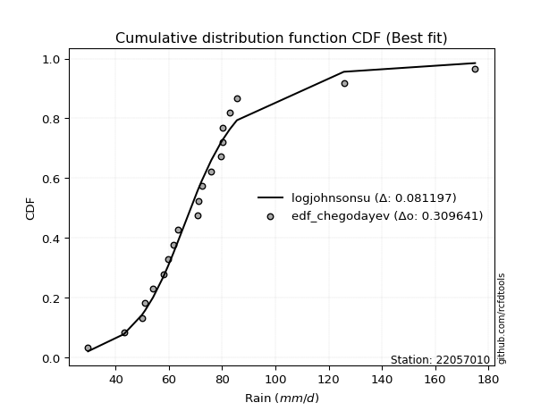</img>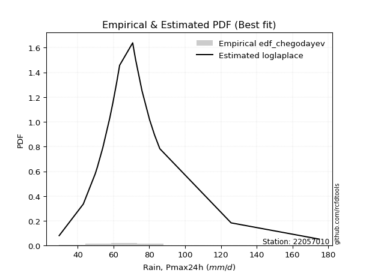</img>

</div>


### 6. EDF Blom (1958)

The Blom formula is a specific "plotting position" formula used in hydrology and statistical analysis to estimate the empirical cumulative probability (or non-exceedance probability) of a data series. It is particularly recommended for data that are approximately normally distributed. The constant _a_ is set to 0.375 (or 3/8).

<div align="center">


$P=(m-a)/(n+1-2a)$


</div>


**6.1. Empirical values**

<div align="center">

|                | 0                    | 1                   | 2                   | 3                   | 4                   | 5                  | 6                  | 7                  | 8                   | 9                   | 10                 | 11                 | 12                 | 13                 | 14                 | 15                 | 16                 | 17                 | 18                 | 19                 |
|:---------------|:---------------------|:--------------------|:--------------------|:--------------------|:--------------------|:-------------------|:-------------------|:-------------------|:--------------------|:--------------------|:-------------------|:-------------------|:-------------------|:-------------------|:-------------------|:-------------------|:-------------------|:-------------------|:-------------------|:-------------------|
| date           | 2022                 | 2023                | 2009                | 2017                | 2015                | 2006               | 2018               | 2020               | 2011                | 2016                | 2010               | 2019               | 2008               | 2025               | 2021               | 2007               | 2012               | 2013               | 2014               | 2005               |
| x              | 29.6                 | 43.1                | 49.8                | 51.0                | 54.0                | 57.9               | 59.7               | 61.7               | 63.4                | 70.7                | 71.1               | 72.3               | 75.9               | 79.5               | 80.1               | 80.1               | 82.9               | 85.53              | 125.7              | 175.0              |
| m              | 1                    | 2                   | 3                   | 4                   | 5                   | 6                  | 7                  | 8                  | 9                   | 10                  | 11                 | 12                 | 13                 | 14                 | 15                 | 16                 | 17                 | 18                 | 19                 | 20                 |
| empirical_dist | edf_blom             | edf_blom            | edf_blom            | edf_blom            | edf_blom            | edf_blom           | edf_blom           | edf_blom           | edf_blom            | edf_blom            | edf_blom           | edf_blom           | edf_blom           | edf_blom           | edf_blom           | edf_blom           | edf_blom           | edf_blom           | edf_blom           | edf_blom           |
| empirical      | 0.030864197530864196 | 0.08024691358024691 | 0.12962962962962962 | 0.17901234567901234 | 0.22839506172839505 | 0.2777777777777778 | 0.3271604938271605 | 0.3765432098765432 | 0.42592592592592593 | 0.47530864197530864 | 0.5246913580246914 | 0.5740740740740741 | 0.6234567901234568 | 0.6728395061728395 | 0.7222222222222222 | 0.7716049382716049 | 0.8209876543209876 | 0.8703703703703703 | 0.9197530864197531 | 0.9691358024691358 |
| empirical_tr   | 1.0318471337579618   | 1.087248322147651   | 1.148936170212766   | 1.218045112781955   | 1.296               | 1.3846153846153846 | 1.4862385321100917 | 1.603960396039604  | 1.7419354838709677  | 1.9058823529411766  | 2.103896103896104  | 2.3478260869565215 | 2.6557377049180326 | 3.0566037735849054 | 3.5999999999999996 | 4.378378378378378  | 5.586206896551723  | 7.714285714285713  | 12.461538461538458 | 32.39999999999997  |

</div>


**6.2. Kolmogorov-Smirnov fit test (sorted by Δ)**


<div align="center">

|                | 0                   | 1                  | 2                  | 3                   | 4                   | 5                   | 6                  | 7                  | 8                   | 9                   | 10                  | 11                  | 12                  | 13                  | 14                  | 15                  | 16                  | 17                 | 18                  | 19                  | 20                  | 21                  | 22                  | 23                 | 24                  | 25                 | 26                  | 27                  | 28                  | 29                  | 30                  | 31                  | 32                 | 33                  | 34                  | 35                 | 36                 | 37                  | 38                 | 39                  | 40                  | 41                 | 42                  | 43                  | 44                  | 45                 | 46                  | 47                  | 48                  | 49                  | 50                 | 51                  | 52                 | 53                  | 54                  | 55                  | 56                  | 57                  | 58                  | 59                 | 60                  | 61                 | 62                  | 63                 | 64                  | 65                  | 66                 | 67                  | 68                 | 69                  | 70                 | 71                  | 72                  | 73                  | 74                  | 75                  | 76                  | 77                 | 78                 | 79                  | 80                 | 81                  | 82                 | 83                 | 84                  | 85                  | 86                  | 87                  | 88                  | 89                 | 90                  | 91                  | 92                  | 93                 | 94                  | 95                 | 96                  | 97                 | 98                  | 99                  | 100                 | 101                | 102                | 103                | 104                | 105                | 106                 | 107                 | 108                | 109                 | 110                | 111                | 112                | 113                 | 114                 | 115                | 116                 | 117                 | 118                 | 119                | 120                | 121                 | 122                | 123                 | 124                | 125                | 126                | 127                | 128                | 129                 | 130                 | 131                 | 132                 | 133                 | 134                | 135                | 136                 | 137                 | 138                | 139                 | 140                 | 141                | 142                 | 143                 | 144                 | 145                | 146                 | 147                | 148                | 149                | 150                | 151                | 152                | 153                | 154                | 155                | 156                | 157                | 158                |
|:---------------|:--------------------|:-------------------|:-------------------|:--------------------|:--------------------|:--------------------|:-------------------|:-------------------|:--------------------|:--------------------|:--------------------|:--------------------|:--------------------|:--------------------|:--------------------|:--------------------|:--------------------|:-------------------|:--------------------|:--------------------|:--------------------|:--------------------|:--------------------|:-------------------|:--------------------|:-------------------|:--------------------|:--------------------|:--------------------|:--------------------|:--------------------|:--------------------|:-------------------|:--------------------|:--------------------|:-------------------|:-------------------|:--------------------|:-------------------|:--------------------|:--------------------|:-------------------|:--------------------|:--------------------|:--------------------|:-------------------|:--------------------|:--------------------|:--------------------|:--------------------|:-------------------|:--------------------|:-------------------|:--------------------|:--------------------|:--------------------|:--------------------|:--------------------|:--------------------|:-------------------|:--------------------|:-------------------|:--------------------|:-------------------|:--------------------|:--------------------|:-------------------|:--------------------|:-------------------|:--------------------|:-------------------|:--------------------|:--------------------|:--------------------|:--------------------|:--------------------|:--------------------|:-------------------|:-------------------|:--------------------|:-------------------|:--------------------|:-------------------|:-------------------|:--------------------|:--------------------|:--------------------|:--------------------|:--------------------|:-------------------|:--------------------|:--------------------|:--------------------|:-------------------|:--------------------|:-------------------|:--------------------|:-------------------|:--------------------|:--------------------|:--------------------|:-------------------|:-------------------|:-------------------|:-------------------|:-------------------|:--------------------|:--------------------|:-------------------|:--------------------|:-------------------|:-------------------|:-------------------|:--------------------|:--------------------|:-------------------|:--------------------|:--------------------|:--------------------|:-------------------|:-------------------|:--------------------|:-------------------|:--------------------|:-------------------|:-------------------|:-------------------|:-------------------|:-------------------|:--------------------|:--------------------|:--------------------|:--------------------|:--------------------|:-------------------|:-------------------|:--------------------|:--------------------|:-------------------|:--------------------|:--------------------|:-------------------|:--------------------|:--------------------|:--------------------|:-------------------|:--------------------|:-------------------|:-------------------|:-------------------|:-------------------|:-------------------|:-------------------|:-------------------|:-------------------|:-------------------|:-------------------|:-------------------|:-------------------|
| station        | 22057010            | 22057010           | 22057010           | 22057010            | 22057010            | 22057010            | 22057010           | 22057010           | 22057010            | 22057010            | 22057010            | 22057010            | 22057010            | 22057010            | 22057010            | 22057010            | 22057010            | 22057010           | 22057010            | 22057010            | 22057010            | 22057010            | 22057010            | 22057010           | 22057010            | 22057010           | 22057010            | 22057010            | 22057010            | 22057010            | 22057010            | 22057010            | 22057010           | 22057010            | 22057010            | 22057010           | 22057010           | 22057010            | 22057010           | 22057010            | 22057010            | 22057010           | 22057010            | 22057010            | 22057010            | 22057010           | 22057010            | 22057010            | 22057010            | 22057010            | 22057010           | 22057010            | 22057010           | 22057010            | 22057010            | 22057010            | 22057010            | 22057010            | 22057010            | 22057010           | 22057010            | 22057010           | 22057010            | 22057010           | 22057010            | 22057010            | 22057010           | 22057010            | 22057010           | 22057010            | 22057010           | 22057010            | 22057010            | 22057010            | 22057010            | 22057010            | 22057010            | 22057010           | 22057010           | 22057010            | 22057010           | 22057010            | 22057010           | 22057010           | 22057010            | 22057010            | 22057010            | 22057010            | 22057010            | 22057010           | 22057010            | 22057010            | 22057010            | 22057010           | 22057010            | 22057010           | 22057010            | 22057010           | 22057010            | 22057010            | 22057010            | 22057010           | 22057010           | 22057010           | 22057010           | 22057010           | 22057010            | 22057010            | 22057010           | 22057010            | 22057010           | 22057010           | 22057010           | 22057010            | 22057010            | 22057010           | 22057010            | 22057010            | 22057010            | 22057010           | 22057010           | 22057010            | 22057010           | 22057010            | 22057010           | 22057010           | 22057010           | 22057010           | 22057010           | 22057010            | 22057010            | 22057010            | 22057010            | 22057010            | 22057010           | 22057010           | 22057010            | 22057010            | 22057010           | 22057010            | 22057010            | 22057010           | 22057010            | 22057010            | 22057010            | 22057010           | 22057010            | 22057010           | 22057010           | 22057010           | 22057010           | 22057010           | 22057010           | 22057010           | 22057010           | 22057010           | 22057010           | 22057010           | 22057010           |
| empirical_dist | edf_blom            | edf_blom           | edf_blom           | edf_blom            | edf_blom            | edf_blom            | edf_blom           | edf_blom           | edf_blom            | edf_blom            | edf_blom            | edf_blom            | edf_blom            | edf_blom            | edf_blom            | edf_blom            | edf_blom            | edf_blom           | edf_blom            | edf_blom            | edf_blom            | edf_blom            | edf_blom            | edf_blom           | edf_blom            | edf_blom           | edf_blom            | edf_blom            | edf_blom            | edf_blom            | edf_blom            | edf_blom            | edf_blom           | edf_blom            | edf_blom            | edf_blom           | edf_blom           | edf_blom            | edf_blom           | edf_blom            | edf_blom            | edf_blom           | edf_blom            | edf_blom            | edf_blom            | edf_blom           | edf_blom            | edf_blom            | edf_blom            | edf_blom            | edf_blom           | edf_blom            | edf_blom           | edf_blom            | edf_blom            | edf_blom            | edf_blom            | edf_blom            | edf_blom            | edf_blom           | edf_blom            | edf_blom           | edf_blom            | edf_blom           | edf_blom            | edf_blom            | edf_blom           | edf_blom            | edf_blom           | edf_blom            | edf_blom           | edf_blom            | edf_blom            | edf_blom            | edf_blom            | edf_blom            | edf_blom            | edf_blom           | edf_blom           | edf_blom            | edf_blom           | edf_blom            | edf_blom           | edf_blom           | edf_blom            | edf_blom            | edf_blom            | edf_blom            | edf_blom            | edf_blom           | edf_blom            | edf_blom            | edf_blom            | edf_blom           | edf_blom            | edf_blom           | edf_blom            | edf_blom           | edf_blom            | edf_blom            | edf_blom            | edf_blom           | edf_blom           | edf_blom           | edf_blom           | edf_blom           | edf_blom            | edf_blom            | edf_blom           | edf_blom            | edf_blom           | edf_blom           | edf_blom           | edf_blom            | edf_blom            | edf_blom           | edf_blom            | edf_blom            | edf_blom            | edf_blom           | edf_blom           | edf_blom            | edf_blom           | edf_blom            | edf_blom           | edf_blom           | edf_blom           | edf_blom           | edf_blom           | edf_blom            | edf_blom            | edf_blom            | edf_blom            | edf_blom            | edf_blom           | edf_blom           | edf_blom            | edf_blom            | edf_blom           | edf_blom            | edf_blom            | edf_blom           | edf_blom            | edf_blom            | edf_blom            | edf_blom           | edf_blom            | edf_blom           | edf_blom           | edf_blom           | edf_blom           | edf_blom           | edf_blom           | edf_blom           | edf_blom           | edf_blom           | edf_blom           | edf_blom           | edf_blom           |
| p_dist         | logjohnsonsu        | loglaplace         | loglaplace         | logt                | logdgamma           | tukeylambda         | johnsonsu          | logdweibull        | logmielke           | logburr             | vonmises_line       | loggenlogistic      | logburr12           | burr                | mielke              | burr12              | loghypsecant        | dgamma             | dweibull            | loggennorm          | gennorm             | logexponnorm        | loglogistic         | logloglaplace      | pearson3            | lognct             | alpha               | lograyleigh         | lognakagami         | exponnorm           | nct                 | logmaxwell          | loginvgauss        | loghalfnorm         | loggumbel_r         | logalpha           | logpearson3        | genextreme          | invweibull         | logskewnorm         | logfoldnorm         | invgamma           | betaprime           | loginvgamma         | f                   | weibull_min        | logjohnsonsb        | genlogistic         | logf                | logncf              | logexponweib       | logfatiguelife      | logerlang          | loggamma            | loggamma            | logbeta             | loggengamma         | moyal               | johnsonsb           | logrice            | lognorm             | logcrystalball     | halflogistic        | gengamma           | logloggamma         | logweibull_max      | loggenextreme      | invgauss            | logtruncnorm       | logweibull_min      | logkstwobign       | loginvweibull       | gamma               | erlang              | gausshyper          | wald                | beta                | t                  | logmoyal           | laplace             | loghalflogistic    | gumbel_r            | logbetaprime       | loggumbel_l        | skewnorm            | loganglit           | genhalflogistic     | halfnorm            | foldnorm            | kstwobign          | kappa3              | logexponpow         | loggompertz         | logsemicircular    | hypsecant           | rayleigh           | genpareto           | rice               | maxwell             | logistic            | logcosine           | loggenexpon        | logtriang          | truncnorm          | norm               | crystalball        | logtruncpareto      | logtruncweibull_min | logwald            | logarcsine          | anglit             | nakagami           | lomax              | genexpon            | loghalfgennorm      | semicircular       | logbradford         | logtruncexpon       | gumbel_l            | kappa4             | loguniform         | logkappa3           | logtukeylambda     | arcsine             | logkappa4          | logksone           | logrdist           | truncexpon         | loglomax           | triang              | logargus            | halfgennorm         | cosine              | loggenpareto        | truncweibull_min   | powerlaw           | loglevy_l           | loggenhalflogistic  | ncf                | bradford            | ksone               | exponweib          | argus               | wrapcauchy          | logpowerlaw         | uniform            | levy_l              | logtrapezoid       | rdist              | fatiguelife        | trapezoid          | weibull_max        | exponpow           | truncpareto        | gompertz           | logvonmises_line   | logvonmises        | vonmises           | loggausshyper      |
| delta          | 0.08137848610135112 | 0.082187217855619  | 0.082187217855619  | 0.08570466928591947 | 0.08601478352317093 | 0.08702543242368843 | 0.0924101763018651 | 0.0925862990364904 | 0.09478888744515435 | 0.09478899314419009 | 0.09802956657139394 | 0.10241235140876048 | 0.10244219505041641 | 0.10245940214076599 | 0.10250175078228607 | 0.10321250239041035 | 0.10368066943460619 | 0.1062207877045217 | 0.10793722976528386 | 0.11354262491203404 | 0.11738368893708895 | 0.11805526942209932 | 0.11904146652938641 | 0.1223593442515768 | 0.12348428688867663 | 0.1249477714268975 | 0.12520561491686766 | 0.12557971055332084 | 0.12563064725381368 | 0.12565982076469495 | 0.12664069268358935 | 0.12911959969415066 | 0.1291531047467127 | 0.12934262437124422 | 0.12965934377402422 | 0.129717472464414  | 0.1302787828090345 | 0.13221051067041123 | 0.1322140341799386 | 0.13276989774404535 | 0.13282965710424144 | 0.1332385921258511 | 0.13325676426627397 | 0.13348413952402938 | 0.13354412668040572 | 0.1336550980800726 | 0.13380295336258896 | 0.13390165545212374 | 0.13396412173109884 | 0.13405867676245753 | 0.1341512436451815 | 0.13460942980411184 | 0.135053408732001  | 0.13505879813305732 | 0.13505879813305732 | 0.13528505157665072 | 0.13606236290834073 | 0.13678647760708584 | 0.13793812928336824 | 0.140628283862411  | 0.14143006951336223 | 0.1414301962528185 | 0.14156845434606358 | 0.1420090403136801 | 0.14397065573036594 | 0.14506087524663014 | 0.145090826923308  | 0.14541884467328725 | 0.1463728740339827 | 0.14857850391376215 | 0.1514016670721413 | 0.15264678465733217 | 0.15275306556984447 | 0.15275311545754333 | 0.15281158493712166 | 0.15397413086628686 | 0.15445408180760334 | 0.1548632745962707 | 0.1549467034451345 | 0.15497990309305265 | 0.1560452593216668 | 0.15632390602228696 | 0.1574376462017527 | 0.1635163594515695 | 0.16558555143980805 | 0.16795892681594216 | 0.16931106935133336 | 0.16960640650204262 | 0.17199158365105682 | 0.1720457438836065 | 0.17360649679467413 | 0.17547211827352205 | 0.17684016394829516 | 0.179381136559013  | 0.18300875165494246 | 0.1880758755389026 | 0.19009790447748467 | 0.1933568453041966 | 0.19440683315953733 | 0.19716821446413213 | 0.19805109564535017 | 0.2041730233211246 | 0.2048882073399998 | 0.2155205206145271 | 0.2155205299099473 | 0.2155205363387669 | 0.21928021282337895 | 0.22200476487622856 | 0.2251344832251141 | 0.22850984298080923 | 0.2358458105453487 | 0.2373072602571024 | 0.2392358306807886 | 0.23925123702788967 | 0.24379141585104527 | 0.2443847112715697 | 0.24584761991004325 | 0.25208135864756875 | 0.26258111236434456 | 0.2631012202226549 | 0.2732483128988159 | 0.27342319831607853 | 0.2793925147878832 | 0.27945717222305266 | 0.2795544365784872 | 0.2894353224774082 | 0.2940911600459747 | 0.2989916660445401 | 0.3164640103189632 | 0.32452478897922743 | 0.33548692193788865 | 0.34344411722429213 | 0.35484017535338397 | 0.38038752395145203 | 0.3994013905083059 | 0.4043896181738923 | 0.42008222994460154 | 0.43215822015306915 | 0.4330474542853783 | 0.44928478120687665 | 0.46648453818330027 | 0.4714282726291077 | 0.47880716772998044 | 0.48318169850423076 | 0.48435098894393314 | 0.4857073717458862 | 0.48579946217173264 | 0.5328848404999722 | 0.5629274939565138 | 0.5878975709323669 | 0.7072466049289282 | 0.7566371139859502 | 0.8364060644617113 | 0.8553126199444966 | 0.9196740105058941 | 0.9691358024691358 | 1.0628261315066108 | 27.535164075896333 | 39.17343074932781  |
| deltao         | 0.3096406529800002  | 0.3096406529800002 | 0.3096406529800002 | 0.3096406529800002  | 0.3096406529800002  | 0.3096406529800002  | 0.3096406529800002 | 0.3096406529800002 | 0.3096406529800002  | 0.3096406529800002  | 0.3096406529800002  | 0.3096406529800002  | 0.3096406529800002  | 0.3096406529800002  | 0.3096406529800002  | 0.3096406529800002  | 0.3096406529800002  | 0.3096406529800002 | 0.3096406529800002  | 0.3096406529800002  | 0.3096406529800002  | 0.3096406529800002  | 0.3096406529800002  | 0.3096406529800002 | 0.3096406529800002  | 0.3096406529800002 | 0.3096406529800002  | 0.3096406529800002  | 0.3096406529800002  | 0.3096406529800002  | 0.3096406529800002  | 0.3096406529800002  | 0.3096406529800002 | 0.3096406529800002  | 0.3096406529800002  | 0.3096406529800002 | 0.3096406529800002 | 0.3096406529800002  | 0.3096406529800002 | 0.3096406529800002  | 0.3096406529800002  | 0.3096406529800002 | 0.3096406529800002  | 0.3096406529800002  | 0.3096406529800002  | 0.3096406529800002 | 0.3096406529800002  | 0.3096406529800002  | 0.3096406529800002  | 0.3096406529800002  | 0.3096406529800002 | 0.3096406529800002  | 0.3096406529800002 | 0.3096406529800002  | 0.3096406529800002  | 0.3096406529800002  | 0.3096406529800002  | 0.3096406529800002  | 0.3096406529800002  | 0.3096406529800002 | 0.3096406529800002  | 0.3096406529800002 | 0.3096406529800002  | 0.3096406529800002 | 0.3096406529800002  | 0.3096406529800002  | 0.3096406529800002 | 0.3096406529800002  | 0.3096406529800002 | 0.3096406529800002  | 0.3096406529800002 | 0.3096406529800002  | 0.3096406529800002  | 0.3096406529800002  | 0.3096406529800002  | 0.3096406529800002  | 0.3096406529800002  | 0.3096406529800002 | 0.3096406529800002 | 0.3096406529800002  | 0.3096406529800002 | 0.3096406529800002  | 0.3096406529800002 | 0.3096406529800002 | 0.3096406529800002  | 0.3096406529800002  | 0.3096406529800002  | 0.3096406529800002  | 0.3096406529800002  | 0.3096406529800002 | 0.3096406529800002  | 0.3096406529800002  | 0.3096406529800002  | 0.3096406529800002 | 0.3096406529800002  | 0.3096406529800002 | 0.3096406529800002  | 0.3096406529800002 | 0.3096406529800002  | 0.3096406529800002  | 0.3096406529800002  | 0.3096406529800002 | 0.3096406529800002 | 0.3096406529800002 | 0.3096406529800002 | 0.3096406529800002 | 0.3096406529800002  | 0.3096406529800002  | 0.3096406529800002 | 0.3096406529800002  | 0.3096406529800002 | 0.3096406529800002 | 0.3096406529800002 | 0.3096406529800002  | 0.3096406529800002  | 0.3096406529800002 | 0.3096406529800002  | 0.3096406529800002  | 0.3096406529800002  | 0.3096406529800002 | 0.3096406529800002 | 0.3096406529800002  | 0.3096406529800002 | 0.3096406529800002  | 0.3096406529800002 | 0.3096406529800002 | 0.3096406529800002 | 0.3096406529800002 | 0.3096406529800002 | 0.3096406529800002  | 0.3096406529800002  | 0.3096406529800002  | 0.3096406529800002  | 0.3096406529800002  | 0.3096406529800002 | 0.3096406529800002 | 0.3096406529800002  | 0.3096406529800002  | 0.3096406529800002 | 0.3096406529800002  | 0.3096406529800002  | 0.3096406529800002 | 0.3096406529800002  | 0.3096406529800002  | 0.3096406529800002  | 0.3096406529800002 | 0.3096406529800002  | 0.3096406529800002 | 0.3096406529800002 | 0.3096406529800002 | 0.3096406529800002 | 0.3096406529800002 | 0.3096406529800002 | 0.3096406529800002 | 0.3096406529800002 | 0.3096406529800002 | 0.3096406529800002 | 0.3096406529800002 | 0.3096406529800002 |
| eval           | Δo > Δ              | Δo > Δ             | Δo > Δ             | Δo > Δ              | Δo > Δ              | Δo > Δ              | Δo > Δ             | Δo > Δ             | Δo > Δ              | Δo > Δ              | Δo > Δ              | Δo > Δ              | Δo > Δ              | Δo > Δ              | Δo > Δ              | Δo > Δ              | Δo > Δ              | Δo > Δ             | Δo > Δ              | Δo > Δ              | Δo > Δ              | Δo > Δ              | Δo > Δ              | Δo > Δ             | Δo > Δ              | Δo > Δ             | Δo > Δ              | Δo > Δ              | Δo > Δ              | Δo > Δ              | Δo > Δ              | Δo > Δ              | Δo > Δ             | Δo > Δ              | Δo > Δ              | Δo > Δ             | Δo > Δ             | Δo > Δ              | Δo > Δ             | Δo > Δ              | Δo > Δ              | Δo > Δ             | Δo > Δ              | Δo > Δ              | Δo > Δ              | Δo > Δ             | Δo > Δ              | Δo > Δ              | Δo > Δ              | Δo > Δ              | Δo > Δ             | Δo > Δ              | Δo > Δ             | Δo > Δ              | Δo > Δ              | Δo > Δ              | Δo > Δ              | Δo > Δ              | Δo > Δ              | Δo > Δ             | Δo > Δ              | Δo > Δ             | Δo > Δ              | Δo > Δ             | Δo > Δ              | Δo > Δ              | Δo > Δ             | Δo > Δ              | Δo > Δ             | Δo > Δ              | Δo > Δ             | Δo > Δ              | Δo > Δ              | Δo > Δ              | Δo > Δ              | Δo > Δ              | Δo > Δ              | Δo > Δ             | Δo > Δ             | Δo > Δ              | Δo > Δ             | Δo > Δ              | Δo > Δ             | Δo > Δ             | Δo > Δ              | Δo > Δ              | Δo > Δ              | Δo > Δ              | Δo > Δ              | Δo > Δ             | Δo > Δ              | Δo > Δ              | Δo > Δ              | Δo > Δ             | Δo > Δ              | Δo > Δ             | Δo > Δ              | Δo > Δ             | Δo > Δ              | Δo > Δ              | Δo > Δ              | Δo > Δ             | Δo > Δ             | Δo > Δ             | Δo > Δ             | Δo > Δ             | Δo > Δ              | Δo > Δ              | Δo > Δ             | Δo > Δ              | Δo > Δ             | Δo > Δ             | Δo > Δ             | Δo > Δ              | Δo > Δ              | Δo > Δ             | Δo > Δ              | Δo > Δ              | Δo > Δ              | Δo > Δ             | Δo > Δ             | Δo > Δ              | Δo > Δ             | Δo > Δ              | Δo > Δ             | Δo > Δ             | Δo > Δ             | Δo > Δ             | Δo <= Δ            | Δo <= Δ             | Δo <= Δ             | Δo <= Δ             | Δo <= Δ             | Δo <= Δ             | Δo <= Δ            | Δo <= Δ            | Δo <= Δ             | Δo <= Δ             | Δo <= Δ            | Δo <= Δ             | Δo <= Δ             | Δo <= Δ            | Δo <= Δ             | Δo <= Δ             | Δo <= Δ             | Δo <= Δ            | Δo <= Δ             | Δo <= Δ            | Δo <= Δ            | Δo <= Δ            | Δo <= Δ            | Δo <= Δ            | Δo <= Δ            | Δo <= Δ            | Δo <= Δ            | Δo <= Δ            | Δo <= Δ            | Δo <= Δ            | Δo <= Δ            |
| fit            | 1                   | 1                  | 1                  | 1                   | 1                   | 1                   | 1                  | 1                  | 1                   | 1                   | 1                   | 1                   | 1                   | 1                   | 1                   | 1                   | 1                   | 1                  | 1                   | 1                   | 1                   | 1                   | 1                   | 1                  | 1                   | 1                  | 1                   | 1                   | 1                   | 1                   | 1                   | 1                   | 1                  | 1                   | 1                   | 1                  | 1                  | 1                   | 1                  | 1                   | 1                   | 1                  | 1                   | 1                   | 1                   | 1                  | 1                   | 1                   | 1                   | 1                   | 1                  | 1                   | 1                  | 1                   | 1                   | 1                   | 1                   | 1                   | 1                   | 1                  | 1                   | 1                  | 1                   | 1                  | 1                   | 1                   | 1                  | 1                   | 1                  | 1                   | 1                  | 1                   | 1                   | 1                   | 1                   | 1                   | 1                   | 1                  | 1                  | 1                   | 1                  | 1                   | 1                  | 1                  | 1                   | 1                   | 1                   | 1                   | 1                   | 1                  | 1                   | 1                   | 1                   | 1                  | 1                   | 1                  | 1                   | 1                  | 1                   | 1                   | 1                   | 1                  | 1                  | 1                  | 1                  | 1                  | 1                   | 1                   | 1                  | 1                   | 1                  | 1                  | 1                  | 1                   | 1                   | 1                  | 1                   | 1                   | 1                   | 1                  | 1                  | 1                   | 1                  | 1                   | 1                  | 1                  | 1                  | 1                  | 0                  | 0                   | 0                   | 0                   | 0                   | 0                   | 0                  | 0                  | 0                   | 0                   | 0                  | 0                   | 0                   | 0                  | 0                   | 0                   | 0                   | 0                  | 0                   | 0                  | 0                  | 0                  | 0                  | 0                  | 0                  | 0                  | 0                  | 0                  | 0                  | 0                  | 0                  |
| n              | 20                  | 20                 | 20                 | 20                  | 20                  | 20                  | 20                 | 20                 | 20                  | 20                  | 20                  | 20                  | 20                  | 20                  | 20                  | 20                  | 20                  | 20                 | 20                  | 20                  | 20                  | 20                  | 20                  | 20                 | 20                  | 20                 | 20                  | 20                  | 20                  | 20                  | 20                  | 20                  | 20                 | 20                  | 20                  | 20                 | 20                 | 20                  | 20                 | 20                  | 20                  | 20                 | 20                  | 20                  | 20                  | 20                 | 20                  | 20                  | 20                  | 20                  | 20                 | 20                  | 20                 | 20                  | 20                  | 20                  | 20                  | 20                  | 20                  | 20                 | 20                  | 20                 | 20                  | 20                 | 20                  | 20                  | 20                 | 20                  | 20                 | 20                  | 20                 | 20                  | 20                  | 20                  | 20                  | 20                  | 20                  | 20                 | 20                 | 20                  | 20                 | 20                  | 20                 | 20                 | 20                  | 20                  | 20                  | 20                  | 20                  | 20                 | 20                  | 20                  | 20                  | 20                 | 20                  | 20                 | 20                  | 20                 | 20                  | 20                  | 20                  | 20                 | 20                 | 20                 | 20                 | 20                 | 20                  | 20                  | 20                 | 20                  | 20                 | 20                 | 20                 | 20                  | 20                  | 20                 | 20                  | 20                  | 20                  | 20                 | 20                 | 20                  | 20                 | 20                  | 20                 | 20                 | 20                 | 20                 | 20                 | 20                  | 20                  | 20                  | 20                  | 20                  | 20                 | 20                 | 20                  | 20                  | 20                 | 20                  | 20                  | 20                 | 20                  | 20                  | 20                  | 20                 | 20                  | 20                 | 20                 | 20                 | 20                 | 20                 | 20                 | 20                 | 20                 | 20                 | 20                 | 20                 | 20                 |
| best_fit       | 1                   | 0                  | 0                  | 0                   | 0                   | 0                   | 0                  | 0                  | 0                   | 0                   | 0                   | 0                   | 0                   | 0                   | 0                   | 0                   | 0                   | 0                  | 0                   | 0                   | 0                   | 0                   | 0                   | 0                  | 0                   | 0                  | 0                   | 0                   | 0                   | 0                   | 0                   | 0                   | 0                  | 0                   | 0                   | 0                  | 0                  | 0                   | 0                  | 0                   | 0                   | 0                  | 0                   | 0                   | 0                   | 0                  | 0                   | 0                   | 0                   | 0                   | 0                  | 0                   | 0                  | 0                   | 0                   | 0                   | 0                   | 0                   | 0                   | 0                  | 0                   | 0                  | 0                   | 0                  | 0                   | 0                   | 0                  | 0                   | 0                  | 0                   | 0                  | 0                   | 0                   | 0                   | 0                   | 0                   | 0                   | 0                  | 0                  | 0                   | 0                  | 0                   | 0                  | 0                  | 0                   | 0                   | 0                   | 0                   | 0                   | 0                  | 0                   | 0                   | 0                   | 0                  | 0                   | 0                  | 0                   | 0                  | 0                   | 0                   | 0                   | 0                  | 0                  | 0                  | 0                  | 0                  | 0                   | 0                   | 0                  | 0                   | 0                  | 0                  | 0                  | 0                   | 0                   | 0                  | 0                   | 0                   | 0                   | 0                  | 0                  | 0                   | 0                  | 0                   | 0                  | 0                  | 0                  | 0                  | 0                  | 0                   | 0                   | 0                   | 0                   | 0                   | 0                  | 0                  | 0                   | 0                   | 0                  | 0                   | 0                   | 0                  | 0                   | 0                   | 0                   | 0                  | 0                   | 0                  | 0                  | 0                  | 0                  | 0                  | 0                  | 0                  | 0                  | 0                  | 0                  | 0                  | 0                  |
| best_fit_sort  | 1                   | 2                  | 3                  | 4                   | 5                   | 6                   | 7                  | 8                  | 9                   | 10                  | 11                  | 12                  | 13                  | 14                  | 15                  | 16                  | 17                  | 18                 | 19                  | 20                  | 21                  | 22                  | 23                  | 24                 | 25                  | 26                 | 27                  | 28                  | 29                  | 30                  | 31                  | 32                  | 33                 | 34                  | 35                  | 36                 | 37                 | 38                  | 39                 | 40                  | 41                  | 42                 | 43                  | 44                  | 45                  | 46                 | 47                  | 48                  | 49                  | 50                  | 51                 | 52                  | 53                 | 54                  | 55                  | 56                  | 57                  | 58                  | 59                  | 60                 | 61                  | 62                 | 63                  | 64                 | 65                  | 66                  | 67                 | 68                  | 69                 | 70                  | 71                 | 72                  | 73                  | 74                  | 75                  | 76                  | 77                  | 78                 | 79                 | 80                  | 81                 | 82                  | 83                 | 84                 | 85                  | 86                  | 87                  | 88                  | 89                  | 90                 | 91                  | 92                  | 93                  | 94                 | 95                  | 96                 | 97                  | 98                 | 99                  | 100                 | 101                 | 102                | 103                | 104                | 105                | 106                | 107                 | 108                 | 109                | 110                 | 111                | 112                | 113                | 114                 | 115                 | 116                | 117                 | 118                 | 119                 | 120                | 121                | 122                 | 123                | 124                 | 125                | 126                | 127                | 128                | 129                | 130                 | 131                 | 132                 | 133                 | 134                 | 135                | 136                | 137                 | 138                 | 139                | 140                 | 141                 | 142                | 143                 | 144                 | 145                 | 146                | 147                 | 148                | 149                | 150                | 151                | 152                | 153                | 154                | 155                | 156                | 157                | 158                | 159                |

</div>


**6.3. Best fit**

<div align="center">

|   id |   station | empirical_dist   | p_dist       |     delta |   deltao | eval   |   fit |   n |   best_fit |   best_fit_sort |
|-----:|----------:|:-----------------|:-------------|----------:|---------:|:-------|------:|----:|-----------:|----------------:|
|    0 |  22057010 | edf_blom         | logjohnsonsu | 0.0813785 | 0.309641 | Δo > Δ |     1 |  20 |          1 |               1 |

</div>


<div align="center">

</img>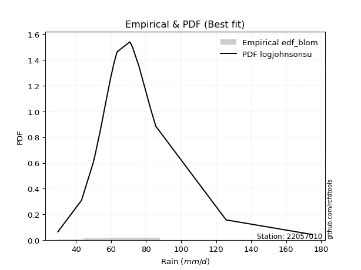</img>

</div>


### 7. EDF Tukey (1962)

In hydrology, the Tukey formula is used as a plotting position formula to estimate the empirical probability or frequency of a flood event (or other hydrological data). The formula parameter is given as _c=0.333_ (or 1/3).

<div align="center">


$P=(m-c)/(n+1-2c)$


</div>


**7.1. Empirical values**

<div align="center">

|                | 0                   | 1                   | 2                   | 3                   | 4                   | 5                  | 6                   | 7                  | 8                  | 9                   | 10                 | 11                 | 12                 | 13                 | 14                 | 15                 | 16                | 17                 | 18                 | 19                 |
|:---------------|:--------------------|:--------------------|:--------------------|:--------------------|:--------------------|:-------------------|:--------------------|:-------------------|:-------------------|:--------------------|:-------------------|:-------------------|:-------------------|:-------------------|:-------------------|:-------------------|:------------------|:-------------------|:-------------------|:-------------------|
| date           | 2022                | 2023                | 2009                | 2017                | 2015                | 2006               | 2018                | 2020               | 2011               | 2016                | 2010               | 2019               | 2008               | 2025               | 2021               | 2007               | 2012              | 2013               | 2014               | 2005               |
| x              | 29.6                | 43.1                | 49.8                | 51.0                | 54.0                | 57.9               | 59.7                | 61.7               | 63.4               | 70.7                | 71.1               | 72.3               | 75.9               | 79.5               | 80.1               | 80.1               | 82.9              | 85.53              | 125.7              | 175.0              |
| m              | 1                   | 2                   | 3                   | 4                   | 5                   | 6                  | 7                   | 8                  | 9                  | 10                  | 11                 | 12                 | 13                 | 14                 | 15                 | 16                 | 17                | 18                 | 19                 | 20                 |
| empirical_dist | edf_tukey           | edf_tukey           | edf_tukey           | edf_tukey           | edf_tukey           | edf_tukey          | edf_tukey           | edf_tukey          | edf_tukey          | edf_tukey           | edf_tukey          | edf_tukey          | edf_tukey          | edf_tukey          | edf_tukey          | edf_tukey          | edf_tukey         | edf_tukey          | edf_tukey          | edf_tukey          |
| empirical      | 0.03278688524590164 | 0.08196721311475409 | 0.13114754098360656 | 0.18032786885245902 | 0.22950819672131148 | 0.2786885245901639 | 0.32786885245901637 | 0.3770491803278688 | 0.4262295081967213 | 0.47540983606557374 | 0.5245901639344263 | 0.5737704918032787 | 0.6229508196721312 | 0.6721311475409836 | 0.7213114754098361 | 0.7704918032786885 | 0.819672131147541 | 0.8688524590163934 | 0.9180327868852459 | 0.9672131147540983 |
| empirical_tr   | 1.033898305084746   | 1.0892857142857142  | 1.150943396226415   | 1.22                | 1.297872340425532   | 1.3863636363636362 | 1.4878048780487803  | 1.6052631578947367 | 1.7428571428571429 | 1.90625             | 2.103448275862069  | 2.346153846153846  | 2.6521739130434785 | 3.05               | 3.588235294117647  | 4.357142857142857  | 5.545454545454546 | 7.624999999999998  | 12.200000000000003 | 30.499999999999964 |

</div>


**7.2. Kolmogorov-Smirnov fit test (sorted by Δ)**


<div align="center">

|                | 0                   | 1                  | 2                  | 3                   | 4                   | 5                   | 6                   | 7                   | 8                  | 9                   | 10                  | 11                  | 12                  | 13                  | 14                  | 15                  | 16                  | 17                  | 18                  | 19                 | 20                  | 21                  | 22                 | 23                  | 24                  | 25                  | 26                  | 27                 | 28                  | 29                  | 30                 | 31                 | 32                  | 33                  | 34                  | 35                  | 36                  | 37                 | 38                  | 39                 | 40                 | 41                  | 42                  | 43                  | 44                  | 45                  | 46                  | 47                 | 48                 | 49                 | 50                  | 51                 | 52                  | 53                  | 54                  | 55                  | 56                 | 57                 | 58                 | 59                  | 60                 | 61                  | 62                  | 63                  | 64                 | 65                 | 66                  | 67                 | 68                  | 69                 | 70                  | 71                  | 72                  | 73                 | 74                  | 75                 | 76                 | 77                  | 78                 | 79                  | 80                 | 81                  | 82                 | 83                  | 84                 | 85                 | 86                  | 87                  | 88                  | 89                  | 90                 | 91                 | 92                  | 93                  | 94                  | 95                  | 96                  | 97                  | 98                 | 99                 | 100                 | 101                 | 102                 | 103                 | 104                 | 105                 | 106                | 107                 | 108                | 109                | 110                 | 111                 | 112                 | 113                 | 114                 | 115                 | 116                | 117                | 118                | 119                | 120                 | 121                | 122                 | 123                | 124                | 125                | 126                 | 127                 | 128                 | 129                | 130                | 131                | 132                | 133                | 134                | 135                 | 136                 | 137                | 138                 | 139                | 140                | 141                 | 142                | 143                | 144                | 145                 | 146                 | 147                | 148                | 149                | 150                | 151                | 152                | 153                | 154                | 155                | 156                | 157                | 158                |
|:---------------|:--------------------|:-------------------|:-------------------|:--------------------|:--------------------|:--------------------|:--------------------|:--------------------|:-------------------|:--------------------|:--------------------|:--------------------|:--------------------|:--------------------|:--------------------|:--------------------|:--------------------|:--------------------|:--------------------|:-------------------|:--------------------|:--------------------|:-------------------|:--------------------|:--------------------|:--------------------|:--------------------|:-------------------|:--------------------|:--------------------|:-------------------|:-------------------|:--------------------|:--------------------|:--------------------|:--------------------|:--------------------|:-------------------|:--------------------|:-------------------|:-------------------|:--------------------|:--------------------|:--------------------|:--------------------|:--------------------|:--------------------|:-------------------|:-------------------|:-------------------|:--------------------|:-------------------|:--------------------|:--------------------|:--------------------|:--------------------|:-------------------|:-------------------|:-------------------|:--------------------|:-------------------|:--------------------|:--------------------|:--------------------|:-------------------|:-------------------|:--------------------|:-------------------|:--------------------|:-------------------|:--------------------|:--------------------|:--------------------|:-------------------|:--------------------|:-------------------|:-------------------|:--------------------|:-------------------|:--------------------|:-------------------|:--------------------|:-------------------|:--------------------|:-------------------|:-------------------|:--------------------|:--------------------|:--------------------|:--------------------|:-------------------|:-------------------|:--------------------|:--------------------|:--------------------|:--------------------|:--------------------|:--------------------|:-------------------|:-------------------|:--------------------|:--------------------|:--------------------|:--------------------|:--------------------|:--------------------|:-------------------|:--------------------|:-------------------|:-------------------|:--------------------|:--------------------|:--------------------|:--------------------|:--------------------|:--------------------|:-------------------|:-------------------|:-------------------|:-------------------|:--------------------|:-------------------|:--------------------|:-------------------|:-------------------|:-------------------|:--------------------|:--------------------|:--------------------|:-------------------|:-------------------|:-------------------|:-------------------|:-------------------|:-------------------|:--------------------|:--------------------|:-------------------|:--------------------|:-------------------|:-------------------|:--------------------|:-------------------|:-------------------|:-------------------|:--------------------|:--------------------|:-------------------|:-------------------|:-------------------|:-------------------|:-------------------|:-------------------|:-------------------|:-------------------|:-------------------|:-------------------|:-------------------|:-------------------|
| station        | 22057010            | 22057010           | 22057010           | 22057010            | 22057010            | 22057010            | 22057010            | 22057010            | 22057010           | 22057010            | 22057010            | 22057010            | 22057010            | 22057010            | 22057010            | 22057010            | 22057010            | 22057010            | 22057010            | 22057010           | 22057010            | 22057010            | 22057010           | 22057010            | 22057010            | 22057010            | 22057010            | 22057010           | 22057010            | 22057010            | 22057010           | 22057010           | 22057010            | 22057010            | 22057010            | 22057010            | 22057010            | 22057010           | 22057010            | 22057010           | 22057010           | 22057010            | 22057010            | 22057010            | 22057010            | 22057010            | 22057010            | 22057010           | 22057010           | 22057010           | 22057010            | 22057010           | 22057010            | 22057010            | 22057010            | 22057010            | 22057010           | 22057010           | 22057010           | 22057010            | 22057010           | 22057010            | 22057010            | 22057010            | 22057010           | 22057010           | 22057010            | 22057010           | 22057010            | 22057010           | 22057010            | 22057010            | 22057010            | 22057010           | 22057010            | 22057010           | 22057010           | 22057010            | 22057010           | 22057010            | 22057010           | 22057010            | 22057010           | 22057010            | 22057010           | 22057010           | 22057010            | 22057010            | 22057010            | 22057010            | 22057010           | 22057010           | 22057010            | 22057010            | 22057010            | 22057010            | 22057010            | 22057010            | 22057010           | 22057010           | 22057010            | 22057010            | 22057010            | 22057010            | 22057010            | 22057010            | 22057010           | 22057010            | 22057010           | 22057010           | 22057010            | 22057010            | 22057010            | 22057010            | 22057010            | 22057010            | 22057010           | 22057010           | 22057010           | 22057010           | 22057010            | 22057010           | 22057010            | 22057010           | 22057010           | 22057010           | 22057010            | 22057010            | 22057010            | 22057010           | 22057010           | 22057010           | 22057010           | 22057010           | 22057010           | 22057010            | 22057010            | 22057010           | 22057010            | 22057010           | 22057010           | 22057010            | 22057010           | 22057010           | 22057010           | 22057010            | 22057010            | 22057010           | 22057010           | 22057010           | 22057010           | 22057010           | 22057010           | 22057010           | 22057010           | 22057010           | 22057010           | 22057010           | 22057010           |
| empirical_dist | edf_tukey           | edf_tukey          | edf_tukey          | edf_tukey           | edf_tukey           | edf_tukey           | edf_tukey           | edf_tukey           | edf_tukey          | edf_tukey           | edf_tukey           | edf_tukey           | edf_tukey           | edf_tukey           | edf_tukey           | edf_tukey           | edf_tukey           | edf_tukey           | edf_tukey           | edf_tukey          | edf_tukey           | edf_tukey           | edf_tukey          | edf_tukey           | edf_tukey           | edf_tukey           | edf_tukey           | edf_tukey          | edf_tukey           | edf_tukey           | edf_tukey          | edf_tukey          | edf_tukey           | edf_tukey           | edf_tukey           | edf_tukey           | edf_tukey           | edf_tukey          | edf_tukey           | edf_tukey          | edf_tukey          | edf_tukey           | edf_tukey           | edf_tukey           | edf_tukey           | edf_tukey           | edf_tukey           | edf_tukey          | edf_tukey          | edf_tukey          | edf_tukey           | edf_tukey          | edf_tukey           | edf_tukey           | edf_tukey           | edf_tukey           | edf_tukey          | edf_tukey          | edf_tukey          | edf_tukey           | edf_tukey          | edf_tukey           | edf_tukey           | edf_tukey           | edf_tukey          | edf_tukey          | edf_tukey           | edf_tukey          | edf_tukey           | edf_tukey          | edf_tukey           | edf_tukey           | edf_tukey           | edf_tukey          | edf_tukey           | edf_tukey          | edf_tukey          | edf_tukey           | edf_tukey          | edf_tukey           | edf_tukey          | edf_tukey           | edf_tukey          | edf_tukey           | edf_tukey          | edf_tukey          | edf_tukey           | edf_tukey           | edf_tukey           | edf_tukey           | edf_tukey          | edf_tukey          | edf_tukey           | edf_tukey           | edf_tukey           | edf_tukey           | edf_tukey           | edf_tukey           | edf_tukey          | edf_tukey          | edf_tukey           | edf_tukey           | edf_tukey           | edf_tukey           | edf_tukey           | edf_tukey           | edf_tukey          | edf_tukey           | edf_tukey          | edf_tukey          | edf_tukey           | edf_tukey           | edf_tukey           | edf_tukey           | edf_tukey           | edf_tukey           | edf_tukey          | edf_tukey          | edf_tukey          | edf_tukey          | edf_tukey           | edf_tukey          | edf_tukey           | edf_tukey          | edf_tukey          | edf_tukey          | edf_tukey           | edf_tukey           | edf_tukey           | edf_tukey          | edf_tukey          | edf_tukey          | edf_tukey          | edf_tukey          | edf_tukey          | edf_tukey           | edf_tukey           | edf_tukey          | edf_tukey           | edf_tukey          | edf_tukey          | edf_tukey           | edf_tukey          | edf_tukey          | edf_tukey          | edf_tukey           | edf_tukey           | edf_tukey          | edf_tukey          | edf_tukey          | edf_tukey          | edf_tukey          | edf_tukey          | edf_tukey          | edf_tukey          | edf_tukey          | edf_tukey          | edf_tukey          | edf_tukey          |
| p_dist         | logjohnsonsu        | loglaplace         | loglaplace         | logdgamma           | logt                | tukeylambda         | johnsonsu           | logdweibull         | logmielke          | logburr             | vonmises_line       | loggenlogistic      | logburr12           | burr                | mielke              | burr12              | loghypsecant        | dgamma              | dweibull            | loggennorm         | logexponnorm        | loglogistic         | gennorm            | logloglaplace       | pearson3            | lognct              | alpha               | lograyleigh        | lognakagami         | exponnorm           | nct                | logmaxwell         | loginvgauss         | logalpha            | logpearson3         | loghalfnorm         | loggumbel_r         | genextreme         | invweibull          | logskewnorm        | logfoldnorm        | invgamma            | betaprime           | loginvgamma         | f                   | weibull_min         | logjohnsonsb        | genlogistic        | logf               | logncf             | logexponweib        | logfatiguelife     | logerlang           | loggamma            | loggamma            | logbeta             | loggengamma        | moyal              | johnsonsb          | logrice             | lognorm            | logcrystalball      | halflogistic        | gengamma            | logloggamma        | logweibull_max     | loggenextreme       | invgauss           | logtruncnorm        | logweibull_min     | logkstwobign        | loginvweibull       | gamma               | erlang             | gausshyper          | beta               | laplace            | wald                | t                  | gumbel_r            | logmoyal           | logbetaprime        | loghalflogistic    | loggumbel_l         | skewnorm           | loganglit          | genhalflogistic     | halfnorm            | foldnorm            | kstwobign           | kappa3             | logexponpow        | loggompertz         | logsemicircular     | hypsecant           | rayleigh            | genpareto           | rice                | maxwell            | logistic           | logcosine           | loggenexpon         | logtriang           | truncnorm           | norm                | crystalball         | logtruncpareto     | logtruncweibull_min | logwald            | logarcsine         | anglit              | nakagami            | lomax               | genexpon            | loghalfgennorm      | semicircular        | logbradford        | logtruncexpon      | gumbel_l           | kappa4             | loguniform          | logkappa3          | logtukeylambda      | arcsine            | logkappa4          | logksone           | logrdist            | truncexpon          | loglomax            | triang             | logargus           | halfgennorm        | cosine             | loggenpareto       | truncweibull_min   | powerlaw            | loglevy_l           | loggenhalflogistic | ncf                 | bradford           | ksone              | exponweib           | argus              | wrapcauchy         | logpowerlaw        | levy_l              | uniform             | logtrapezoid       | rdist              | fatiguelife        | trapezoid          | weibull_max        | exponpow           | truncpareto        | gompertz           | logvonmises_line   | logvonmises        | vonmises           | loggausshyper      |
| delta          | 0.08127729201108602 | 0.0820860237653539 | 0.0820860237653539 | 0.08449687216919399 | 0.08560347519565437 | 0.08692423833342333 | 0.09089226494788816 | 0.09106838768251346 | 0.0932709760911774 | 0.09327108179021315 | 0.09792837248112884 | 0.10089444005478354 | 0.10092428369643947 | 0.10094149078678905 | 0.10098383942830913 | 0.10169459103643341 | 0.10216275808062925 | 0.10470287635054476 | 0.10824081203607921 | 0.1120247135580571 | 0.11653735806812238 | 0.11752355517540947 | 0.1176872712078843 | 0.12084143289759985 | 0.12196637553469969 | 0.12342986007292056 | 0.12368770356289072 | 0.1240617991993439 | 0.12411273589983673 | 0.12414190941071801 | 0.1251227813296124 | 0.1276016883401737 | 0.12763519339273577 | 0.12819956111043707 | 0.12876087145505755 | 0.12924143028097912 | 0.12955814968375912 | 0.1306925993164343 | 0.13069612282596166 | 0.1312519863900684 | 0.1313117457502645 | 0.13172068077187415 | 0.13173885291229703 | 0.13196622817005244 | 0.13202621532642878 | 0.13213718672609565 | 0.13228504200861202 | 0.1323837440981468 | 0.1324462103771219 | 0.1325407654084806 | 0.13263333229120455 | 0.1330915184501349 | 0.13353549737802406 | 0.13354088677908038 | 0.13354088677908038 | 0.13376714022267377 | 0.1345444515543638 | 0.1352685662531089 | 0.1364202179293913 | 0.13911037250843405 | 0.1399121581593853 | 0.13991228489884155 | 0.14005054299208664 | 0.14049112895970317 | 0.142452744376389  | 0.1435429638926532 | 0.14357291556933105 | 0.1439009333193103 | 0.14546212722159657 | 0.1470605925597852 | 0.14988375571816437 | 0.15112887330335523 | 0.15123515421586753 | 0.1512352041035664 | 0.15129367358314472 | 0.1529361704536264 | 0.1534619917390757 | 0.15387293677602176 | 0.1547620805060056 | 0.15480599466831002 | 0.1548455093548694 | 0.15591973484777577 | 0.1559440652314017 | 0.16199844809759256 | 0.1640676400858311 | 0.1664410154619652 | 0.16779315799735642 | 0.16808849514806568 | 0.17047367229707988 | 0.17052783252962955 | 0.1720885854406972 | 0.1739542069195451 | 0.17532225259431822 | 0.17786322520503606 | 0.18149084030096552 | 0.18655796418492565 | 0.18857999312350773 | 0.19183893395021967 | 0.1928889218055604 | 0.1956503031101552 | 0.19653318429137323 | 0.20265511196714767 | 0.20337029598602285 | 0.21400260926055015 | 0.21400261855597036 | 0.21400262498478995 | 0.217762301469402  | 0.2204868535222516  | 0.225033289134849  | 0.2269919316268323 | 0.23432789919137176 | 0.23578934890312545 | 0.23771791932681166 | 0.23773332567391273 | 0.24227350449706833 | 0.24286679991759275 | 0.2443297085560663 | 0.2505634472935918 | 0.2610632010103676 | 0.261583308868678  | 0.27173040154483896 | 0.2719052869621016 | 0.27787460343390624 | 0.2779392608690757 | 0.2780365252245103 | 0.2879174111234313 | 0.29257324869199774 | 0.29747375469056314 | 0.31494609896498627 | 0.3230068776252505 | 0.3339690105839117 | 0.3419262058703152 | 0.353322263999407  | 0.3786672244169449 | 0.397883479154329  | 0.40287170681991535 | 0.41815954222956414 | 0.4306403087990922 | 0.43132715475087113 | 0.4477668698528997 | 0.4649666268293233 | 0.46970797309460055 | 0.4772892563760035 | 0.4816637871502538 | 0.4828330775899562 | 0.48387677445669525 | 0.48418946039190924 | 0.5313669291459953 | 0.5612071944220066 | 0.5861772713978598 | 0.7057286935749513 | 0.7549168144514431 | 0.8346857649272041 | 0.8535923204099894 | 0.917953710971387  | 0.9672131147540983 | 1.0627249374163457 | 27.53708676361137  | 39.175353437042844 |
| deltao         | 0.3096406529800002  | 0.3096406529800002 | 0.3096406529800002 | 0.3096406529800002  | 0.3096406529800002  | 0.3096406529800002  | 0.3096406529800002  | 0.3096406529800002  | 0.3096406529800002 | 0.3096406529800002  | 0.3096406529800002  | 0.3096406529800002  | 0.3096406529800002  | 0.3096406529800002  | 0.3096406529800002  | 0.3096406529800002  | 0.3096406529800002  | 0.3096406529800002  | 0.3096406529800002  | 0.3096406529800002 | 0.3096406529800002  | 0.3096406529800002  | 0.3096406529800002 | 0.3096406529800002  | 0.3096406529800002  | 0.3096406529800002  | 0.3096406529800002  | 0.3096406529800002 | 0.3096406529800002  | 0.3096406529800002  | 0.3096406529800002 | 0.3096406529800002 | 0.3096406529800002  | 0.3096406529800002  | 0.3096406529800002  | 0.3096406529800002  | 0.3096406529800002  | 0.3096406529800002 | 0.3096406529800002  | 0.3096406529800002 | 0.3096406529800002 | 0.3096406529800002  | 0.3096406529800002  | 0.3096406529800002  | 0.3096406529800002  | 0.3096406529800002  | 0.3096406529800002  | 0.3096406529800002 | 0.3096406529800002 | 0.3096406529800002 | 0.3096406529800002  | 0.3096406529800002 | 0.3096406529800002  | 0.3096406529800002  | 0.3096406529800002  | 0.3096406529800002  | 0.3096406529800002 | 0.3096406529800002 | 0.3096406529800002 | 0.3096406529800002  | 0.3096406529800002 | 0.3096406529800002  | 0.3096406529800002  | 0.3096406529800002  | 0.3096406529800002 | 0.3096406529800002 | 0.3096406529800002  | 0.3096406529800002 | 0.3096406529800002  | 0.3096406529800002 | 0.3096406529800002  | 0.3096406529800002  | 0.3096406529800002  | 0.3096406529800002 | 0.3096406529800002  | 0.3096406529800002 | 0.3096406529800002 | 0.3096406529800002  | 0.3096406529800002 | 0.3096406529800002  | 0.3096406529800002 | 0.3096406529800002  | 0.3096406529800002 | 0.3096406529800002  | 0.3096406529800002 | 0.3096406529800002 | 0.3096406529800002  | 0.3096406529800002  | 0.3096406529800002  | 0.3096406529800002  | 0.3096406529800002 | 0.3096406529800002 | 0.3096406529800002  | 0.3096406529800002  | 0.3096406529800002  | 0.3096406529800002  | 0.3096406529800002  | 0.3096406529800002  | 0.3096406529800002 | 0.3096406529800002 | 0.3096406529800002  | 0.3096406529800002  | 0.3096406529800002  | 0.3096406529800002  | 0.3096406529800002  | 0.3096406529800002  | 0.3096406529800002 | 0.3096406529800002  | 0.3096406529800002 | 0.3096406529800002 | 0.3096406529800002  | 0.3096406529800002  | 0.3096406529800002  | 0.3096406529800002  | 0.3096406529800002  | 0.3096406529800002  | 0.3096406529800002 | 0.3096406529800002 | 0.3096406529800002 | 0.3096406529800002 | 0.3096406529800002  | 0.3096406529800002 | 0.3096406529800002  | 0.3096406529800002 | 0.3096406529800002 | 0.3096406529800002 | 0.3096406529800002  | 0.3096406529800002  | 0.3096406529800002  | 0.3096406529800002 | 0.3096406529800002 | 0.3096406529800002 | 0.3096406529800002 | 0.3096406529800002 | 0.3096406529800002 | 0.3096406529800002  | 0.3096406529800002  | 0.3096406529800002 | 0.3096406529800002  | 0.3096406529800002 | 0.3096406529800002 | 0.3096406529800002  | 0.3096406529800002 | 0.3096406529800002 | 0.3096406529800002 | 0.3096406529800002  | 0.3096406529800002  | 0.3096406529800002 | 0.3096406529800002 | 0.3096406529800002 | 0.3096406529800002 | 0.3096406529800002 | 0.3096406529800002 | 0.3096406529800002 | 0.3096406529800002 | 0.3096406529800002 | 0.3096406529800002 | 0.3096406529800002 | 0.3096406529800002 |
| eval           | Δo > Δ              | Δo > Δ             | Δo > Δ             | Δo > Δ              | Δo > Δ              | Δo > Δ              | Δo > Δ              | Δo > Δ              | Δo > Δ             | Δo > Δ              | Δo > Δ              | Δo > Δ              | Δo > Δ              | Δo > Δ              | Δo > Δ              | Δo > Δ              | Δo > Δ              | Δo > Δ              | Δo > Δ              | Δo > Δ             | Δo > Δ              | Δo > Δ              | Δo > Δ             | Δo > Δ              | Δo > Δ              | Δo > Δ              | Δo > Δ              | Δo > Δ             | Δo > Δ              | Δo > Δ              | Δo > Δ             | Δo > Δ             | Δo > Δ              | Δo > Δ              | Δo > Δ              | Δo > Δ              | Δo > Δ              | Δo > Δ             | Δo > Δ              | Δo > Δ             | Δo > Δ             | Δo > Δ              | Δo > Δ              | Δo > Δ              | Δo > Δ              | Δo > Δ              | Δo > Δ              | Δo > Δ             | Δo > Δ             | Δo > Δ             | Δo > Δ              | Δo > Δ             | Δo > Δ              | Δo > Δ              | Δo > Δ              | Δo > Δ              | Δo > Δ             | Δo > Δ             | Δo > Δ             | Δo > Δ              | Δo > Δ             | Δo > Δ              | Δo > Δ              | Δo > Δ              | Δo > Δ             | Δo > Δ             | Δo > Δ              | Δo > Δ             | Δo > Δ              | Δo > Δ             | Δo > Δ              | Δo > Δ              | Δo > Δ              | Δo > Δ             | Δo > Δ              | Δo > Δ             | Δo > Δ             | Δo > Δ              | Δo > Δ             | Δo > Δ              | Δo > Δ             | Δo > Δ              | Δo > Δ             | Δo > Δ              | Δo > Δ             | Δo > Δ             | Δo > Δ              | Δo > Δ              | Δo > Δ              | Δo > Δ              | Δo > Δ             | Δo > Δ             | Δo > Δ              | Δo > Δ              | Δo > Δ              | Δo > Δ              | Δo > Δ              | Δo > Δ              | Δo > Δ             | Δo > Δ             | Δo > Δ              | Δo > Δ              | Δo > Δ              | Δo > Δ              | Δo > Δ              | Δo > Δ              | Δo > Δ             | Δo > Δ              | Δo > Δ             | Δo > Δ             | Δo > Δ              | Δo > Δ              | Δo > Δ              | Δo > Δ              | Δo > Δ              | Δo > Δ              | Δo > Δ             | Δo > Δ             | Δo > Δ             | Δo > Δ             | Δo > Δ              | Δo > Δ             | Δo > Δ              | Δo > Δ             | Δo > Δ             | Δo > Δ             | Δo > Δ              | Δo > Δ              | Δo <= Δ             | Δo <= Δ            | Δo <= Δ            | Δo <= Δ            | Δo <= Δ            | Δo <= Δ            | Δo <= Δ            | Δo <= Δ             | Δo <= Δ             | Δo <= Δ            | Δo <= Δ             | Δo <= Δ            | Δo <= Δ            | Δo <= Δ             | Δo <= Δ            | Δo <= Δ            | Δo <= Δ            | Δo <= Δ             | Δo <= Δ             | Δo <= Δ            | Δo <= Δ            | Δo <= Δ            | Δo <= Δ            | Δo <= Δ            | Δo <= Δ            | Δo <= Δ            | Δo <= Δ            | Δo <= Δ            | Δo <= Δ            | Δo <= Δ            | Δo <= Δ            |
| fit            | 1                   | 1                  | 1                  | 1                   | 1                   | 1                   | 1                   | 1                   | 1                  | 1                   | 1                   | 1                   | 1                   | 1                   | 1                   | 1                   | 1                   | 1                   | 1                   | 1                  | 1                   | 1                   | 1                  | 1                   | 1                   | 1                   | 1                   | 1                  | 1                   | 1                   | 1                  | 1                  | 1                   | 1                   | 1                   | 1                   | 1                   | 1                  | 1                   | 1                  | 1                  | 1                   | 1                   | 1                   | 1                   | 1                   | 1                   | 1                  | 1                  | 1                  | 1                   | 1                  | 1                   | 1                   | 1                   | 1                   | 1                  | 1                  | 1                  | 1                   | 1                  | 1                   | 1                   | 1                   | 1                  | 1                  | 1                   | 1                  | 1                   | 1                  | 1                   | 1                   | 1                   | 1                  | 1                   | 1                  | 1                  | 1                   | 1                  | 1                   | 1                  | 1                   | 1                  | 1                   | 1                  | 1                  | 1                   | 1                   | 1                   | 1                   | 1                  | 1                  | 1                   | 1                   | 1                   | 1                   | 1                   | 1                   | 1                  | 1                  | 1                   | 1                   | 1                   | 1                   | 1                   | 1                   | 1                  | 1                   | 1                  | 1                  | 1                   | 1                   | 1                   | 1                   | 1                   | 1                   | 1                  | 1                  | 1                  | 1                  | 1                   | 1                  | 1                   | 1                  | 1                  | 1                  | 1                   | 1                   | 0                   | 0                  | 0                  | 0                  | 0                  | 0                  | 0                  | 0                   | 0                   | 0                  | 0                   | 0                  | 0                  | 0                   | 0                  | 0                  | 0                  | 0                   | 0                   | 0                  | 0                  | 0                  | 0                  | 0                  | 0                  | 0                  | 0                  | 0                  | 0                  | 0                  | 0                  |
| n              | 20                  | 20                 | 20                 | 20                  | 20                  | 20                  | 20                  | 20                  | 20                 | 20                  | 20                  | 20                  | 20                  | 20                  | 20                  | 20                  | 20                  | 20                  | 20                  | 20                 | 20                  | 20                  | 20                 | 20                  | 20                  | 20                  | 20                  | 20                 | 20                  | 20                  | 20                 | 20                 | 20                  | 20                  | 20                  | 20                  | 20                  | 20                 | 20                  | 20                 | 20                 | 20                  | 20                  | 20                  | 20                  | 20                  | 20                  | 20                 | 20                 | 20                 | 20                  | 20                 | 20                  | 20                  | 20                  | 20                  | 20                 | 20                 | 20                 | 20                  | 20                 | 20                  | 20                  | 20                  | 20                 | 20                 | 20                  | 20                 | 20                  | 20                 | 20                  | 20                  | 20                  | 20                 | 20                  | 20                 | 20                 | 20                  | 20                 | 20                  | 20                 | 20                  | 20                 | 20                  | 20                 | 20                 | 20                  | 20                  | 20                  | 20                  | 20                 | 20                 | 20                  | 20                  | 20                  | 20                  | 20                  | 20                  | 20                 | 20                 | 20                  | 20                  | 20                  | 20                  | 20                  | 20                  | 20                 | 20                  | 20                 | 20                 | 20                  | 20                  | 20                  | 20                  | 20                  | 20                  | 20                 | 20                 | 20                 | 20                 | 20                  | 20                 | 20                  | 20                 | 20                 | 20                 | 20                  | 20                  | 20                  | 20                 | 20                 | 20                 | 20                 | 20                 | 20                 | 20                  | 20                  | 20                 | 20                  | 20                 | 20                 | 20                  | 20                 | 20                 | 20                 | 20                  | 20                  | 20                 | 20                 | 20                 | 20                 | 20                 | 20                 | 20                 | 20                 | 20                 | 20                 | 20                 | 20                 |
| best_fit       | 1                   | 0                  | 0                  | 0                   | 0                   | 0                   | 0                   | 0                   | 0                  | 0                   | 0                   | 0                   | 0                   | 0                   | 0                   | 0                   | 0                   | 0                   | 0                   | 0                  | 0                   | 0                   | 0                  | 0                   | 0                   | 0                   | 0                   | 0                  | 0                   | 0                   | 0                  | 0                  | 0                   | 0                   | 0                   | 0                   | 0                   | 0                  | 0                   | 0                  | 0                  | 0                   | 0                   | 0                   | 0                   | 0                   | 0                   | 0                  | 0                  | 0                  | 0                   | 0                  | 0                   | 0                   | 0                   | 0                   | 0                  | 0                  | 0                  | 0                   | 0                  | 0                   | 0                   | 0                   | 0                  | 0                  | 0                   | 0                  | 0                   | 0                  | 0                   | 0                   | 0                   | 0                  | 0                   | 0                  | 0                  | 0                   | 0                  | 0                   | 0                  | 0                   | 0                  | 0                   | 0                  | 0                  | 0                   | 0                   | 0                   | 0                   | 0                  | 0                  | 0                   | 0                   | 0                   | 0                   | 0                   | 0                   | 0                  | 0                  | 0                   | 0                   | 0                   | 0                   | 0                   | 0                   | 0                  | 0                   | 0                  | 0                  | 0                   | 0                   | 0                   | 0                   | 0                   | 0                   | 0                  | 0                  | 0                  | 0                  | 0                   | 0                  | 0                   | 0                  | 0                  | 0                  | 0                   | 0                   | 0                   | 0                  | 0                  | 0                  | 0                  | 0                  | 0                  | 0                   | 0                   | 0                  | 0                   | 0                  | 0                  | 0                   | 0                  | 0                  | 0                  | 0                   | 0                   | 0                  | 0                  | 0                  | 0                  | 0                  | 0                  | 0                  | 0                  | 0                  | 0                  | 0                  | 0                  |
| best_fit_sort  | 1                   | 2                  | 3                  | 4                   | 5                   | 6                   | 7                   | 8                   | 9                  | 10                  | 11                  | 12                  | 13                  | 14                  | 15                  | 16                  | 17                  | 18                  | 19                  | 20                 | 21                  | 22                  | 23                 | 24                  | 25                  | 26                  | 27                  | 28                 | 29                  | 30                  | 31                 | 32                 | 33                  | 34                  | 35                  | 36                  | 37                  | 38                 | 39                  | 40                 | 41                 | 42                  | 43                  | 44                  | 45                  | 46                  | 47                  | 48                 | 49                 | 50                 | 51                  | 52                 | 53                  | 54                  | 55                  | 56                  | 57                 | 58                 | 59                 | 60                  | 61                 | 62                  | 63                  | 64                  | 65                 | 66                 | 67                  | 68                 | 69                  | 70                 | 71                  | 72                  | 73                  | 74                 | 75                  | 76                 | 77                 | 78                  | 79                 | 80                  | 81                 | 82                  | 83                 | 84                  | 85                 | 86                 | 87                  | 88                  | 89                  | 90                  | 91                 | 92                 | 93                  | 94                  | 95                  | 96                  | 97                  | 98                  | 99                 | 100                | 101                 | 102                 | 103                 | 104                 | 105                 | 106                 | 107                | 108                 | 109                | 110                | 111                 | 112                 | 113                 | 114                 | 115                 | 116                 | 117                | 118                | 119                | 120                | 121                 | 122                | 123                 | 124                | 125                | 126                | 127                 | 128                 | 129                 | 130                | 131                | 132                | 133                | 134                | 135                | 136                 | 137                 | 138                | 139                 | 140                | 141                | 142                 | 143                | 144                | 145                | 146                 | 147                 | 148                | 149                | 150                | 151                | 152                | 153                | 154                | 155                | 156                | 157                | 158                | 159                |

</div>


**7.3. Best fit**

<div align="center">

|   id |   station | empirical_dist   | p_dist       |     delta |   deltao | eval   |   fit |   n |   best_fit |   best_fit_sort |
|-----:|----------:|:-----------------|:-------------|----------:|---------:|:-------|------:|----:|-----------:|----------------:|
|    0 |  22057010 | edf_tukey        | logjohnsonsu | 0.0812773 | 0.309641 | Δo > Δ |     1 |  20 |          1 |               1 |

</div>


<div align="center">

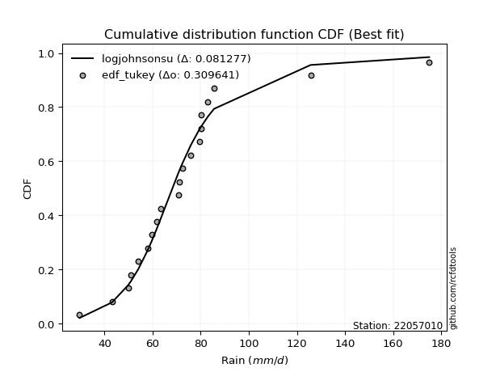</img>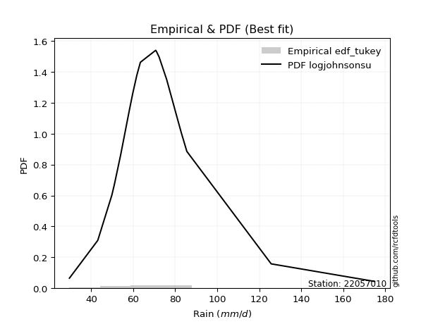</img>

</div>


### 8. EDF Gringorten (1963)

Gringorten plotting position formula is essential for estimating the probability and return periods of extreme events like floods and heavy rainfall. The constant _a=0.44_.

<div align="center">


$P=(m-a)/(n+1-2a)$


</div>


**8.1. Empirical values**

<div align="center">

|                | 0                    | 1                  | 2                  | 3                  | 4                   | 5                   | 6                   | 7                   | 8                  | 9                   | 10                 | 11                 | 12                 | 13                 | 14                 | 15                 | 16                 | 17                 | 18                 | 19                 |
|:---------------|:---------------------|:-------------------|:-------------------|:-------------------|:--------------------|:--------------------|:--------------------|:--------------------|:-------------------|:--------------------|:-------------------|:-------------------|:-------------------|:-------------------|:-------------------|:-------------------|:-------------------|:-------------------|:-------------------|:-------------------|
| date           | 2022                 | 2023               | 2009               | 2017               | 2015                | 2006                | 2018                | 2020                | 2011               | 2016                | 2010               | 2019               | 2008               | 2025               | 2021               | 2007               | 2012               | 2013               | 2014               | 2005               |
| x              | 29.6                 | 43.1               | 49.8               | 51.0               | 54.0                | 57.9                | 59.7                | 61.7                | 63.4               | 70.7                | 71.1               | 72.3               | 75.9               | 79.5               | 80.1               | 80.1               | 82.9               | 85.53              | 125.7              | 175.0              |
| m              | 1                    | 2                  | 3                  | 4                  | 5                   | 6                   | 7                   | 8                   | 9                  | 10                  | 11                 | 12                 | 13                 | 14                 | 15                 | 16                 | 17                 | 18                 | 19                 | 20                 |
| empirical_dist | edf_gringorten       | edf_gringorten     | edf_gringorten     | edf_gringorten     | edf_gringorten      | edf_gringorten      | edf_gringorten      | edf_gringorten      | edf_gringorten     | edf_gringorten      | edf_gringorten     | edf_gringorten     | edf_gringorten     | edf_gringorten     | edf_gringorten     | edf_gringorten     | edf_gringorten     | edf_gringorten     | edf_gringorten     | edf_gringorten     |
| empirical      | 0.027833001988071572 | 0.0775347912524851 | 0.1272365805168986 | 0.1769383697813121 | 0.22664015904572563 | 0.27634194831013914 | 0.32604373757455263 | 0.37574552683896617 | 0.4254473161033797 | 0.47514910536779326 | 0.5248508946322068 | 0.5745526838966203 | 0.6242544731610338 | 0.6739562624254473 | 0.7236580516898609 | 0.7733598409542743 | 0.8230616302186877 | 0.8727634194831013 | 0.9224652087475148 | 0.9721669980119283 |
| empirical_tr   | 1.0286298568507157   | 1.084051724137931  | 1.1457858769931661 | 1.2149758454106279 | 1.2930591259640103  | 1.3818681318681318  | 1.4837758112094395  | 1.6019108280254777  | 1.740484429065744  | 1.90530303030303    | 2.1046025104602513 | 2.350467289719626  | 2.6613756613756614 | 3.0670731707317067 | 3.618705035971223  | 4.412280701754386  | 5.651685393258422  | 7.859374999999996  | 12.89743589743588  | 35.92857142857125  |

</div>


**8.2. Kolmogorov-Smirnov fit test (sorted by Δ)**


<div align="center">

|                | 0                   | 1                   | 2                   | 3                   | 4                   | 5                  | 6                   | 7                   | 8                   | 9                   | 10                  | 11                  | 12                  | 13                  | 14                  | 15                  | 16                  | 17                  | 18                  | 19                  | 20                  | 21                  | 22                  | 23                  | 24                 | 25                  | 26                  | 27                  | 28                  | 29                  | 30                  | 31                 | 32                 | 33                  | 34                  | 35                  | 36                  | 37                 | 38                  | 39                  | 40                 | 41                  | 42                  | 43                  | 44                 | 45                  | 46                  | 47                 | 48                 | 49                 | 50                  | 51                 | 52                  | 53                 | 54                 | 55                 | 56                 | 57                  | 58                 | 59                  | 60                 | 61                  | 62                  | 63                  | 64                 | 65                 | 66                  | 67                  | 68                  | 69                  | 70                  | 71                  | 72                  | 73                  | 74                 | 75                  | 76                 | 77                  | 78                  | 79                 | 80                  | 81                  | 82                  | 83                  | 84                  | 85                  | 86                 | 87                 | 88                 | 89                  | 90                  | 91                  | 92                  | 93                  | 94                  | 95                  | 96                 | 97                  | 98                 | 99                 | 100                 | 101                 | 102                 | 103                 | 104                 | 105                 | 106                 | 107                 | 108                 | 109                | 110                 | 111                 | 112                 | 113                | 114                | 115                 | 116                 | 117                | 118                 | 119                | 120                | 121                | 122                 | 123                 | 124                | 125                | 126                 | 127                 | 128                | 129                | 130                | 131                | 132                 | 133                | 134                | 135                | 136                 | 137                | 138                 | 139                | 140                 | 141                 | 142                | 143                 | 144                | 145                 | 146                | 147                | 148                | 149                | 150                | 151                | 152                | 153                | 154                | 155                | 156                | 157                | 158                |
|:---------------|:--------------------|:--------------------|:--------------------|:--------------------|:--------------------|:-------------------|:--------------------|:--------------------|:--------------------|:--------------------|:--------------------|:--------------------|:--------------------|:--------------------|:--------------------|:--------------------|:--------------------|:--------------------|:--------------------|:--------------------|:--------------------|:--------------------|:--------------------|:--------------------|:-------------------|:--------------------|:--------------------|:--------------------|:--------------------|:--------------------|:--------------------|:-------------------|:-------------------|:--------------------|:--------------------|:--------------------|:--------------------|:-------------------|:--------------------|:--------------------|:-------------------|:--------------------|:--------------------|:--------------------|:-------------------|:--------------------|:--------------------|:-------------------|:-------------------|:-------------------|:--------------------|:-------------------|:--------------------|:-------------------|:-------------------|:-------------------|:-------------------|:--------------------|:-------------------|:--------------------|:-------------------|:--------------------|:--------------------|:--------------------|:-------------------|:-------------------|:--------------------|:--------------------|:--------------------|:--------------------|:--------------------|:--------------------|:--------------------|:--------------------|:-------------------|:--------------------|:-------------------|:--------------------|:--------------------|:-------------------|:--------------------|:--------------------|:--------------------|:--------------------|:--------------------|:--------------------|:-------------------|:-------------------|:-------------------|:--------------------|:--------------------|:--------------------|:--------------------|:--------------------|:--------------------|:--------------------|:-------------------|:--------------------|:-------------------|:-------------------|:--------------------|:--------------------|:--------------------|:--------------------|:--------------------|:--------------------|:--------------------|:--------------------|:--------------------|:-------------------|:--------------------|:--------------------|:--------------------|:-------------------|:-------------------|:--------------------|:--------------------|:-------------------|:--------------------|:-------------------|:-------------------|:-------------------|:--------------------|:--------------------|:-------------------|:-------------------|:--------------------|:--------------------|:-------------------|:-------------------|:-------------------|:-------------------|:--------------------|:-------------------|:-------------------|:-------------------|:--------------------|:-------------------|:--------------------|:-------------------|:--------------------|:--------------------|:-------------------|:--------------------|:-------------------|:--------------------|:-------------------|:-------------------|:-------------------|:-------------------|:-------------------|:-------------------|:-------------------|:-------------------|:-------------------|:-------------------|:-------------------|:-------------------|:-------------------|
| station        | 22057010            | 22057010            | 22057010            | 22057010            | 22057010            | 22057010           | 22057010            | 22057010            | 22057010            | 22057010            | 22057010            | 22057010            | 22057010            | 22057010            | 22057010            | 22057010            | 22057010            | 22057010            | 22057010            | 22057010            | 22057010            | 22057010            | 22057010            | 22057010            | 22057010           | 22057010            | 22057010            | 22057010            | 22057010            | 22057010            | 22057010            | 22057010           | 22057010           | 22057010            | 22057010            | 22057010            | 22057010            | 22057010           | 22057010            | 22057010            | 22057010           | 22057010            | 22057010            | 22057010            | 22057010           | 22057010            | 22057010            | 22057010           | 22057010           | 22057010           | 22057010            | 22057010           | 22057010            | 22057010           | 22057010           | 22057010           | 22057010           | 22057010            | 22057010           | 22057010            | 22057010           | 22057010            | 22057010            | 22057010            | 22057010           | 22057010           | 22057010            | 22057010            | 22057010            | 22057010            | 22057010            | 22057010            | 22057010            | 22057010            | 22057010           | 22057010            | 22057010           | 22057010            | 22057010            | 22057010           | 22057010            | 22057010            | 22057010            | 22057010            | 22057010            | 22057010            | 22057010           | 22057010           | 22057010           | 22057010            | 22057010            | 22057010            | 22057010            | 22057010            | 22057010            | 22057010            | 22057010           | 22057010            | 22057010           | 22057010           | 22057010            | 22057010            | 22057010            | 22057010            | 22057010            | 22057010            | 22057010            | 22057010            | 22057010            | 22057010           | 22057010            | 22057010            | 22057010            | 22057010           | 22057010           | 22057010            | 22057010            | 22057010           | 22057010            | 22057010           | 22057010           | 22057010           | 22057010            | 22057010            | 22057010           | 22057010           | 22057010            | 22057010            | 22057010           | 22057010           | 22057010           | 22057010           | 22057010            | 22057010           | 22057010           | 22057010           | 22057010            | 22057010           | 22057010            | 22057010           | 22057010            | 22057010            | 22057010           | 22057010            | 22057010           | 22057010            | 22057010           | 22057010           | 22057010           | 22057010           | 22057010           | 22057010           | 22057010           | 22057010           | 22057010           | 22057010           | 22057010           | 22057010           | 22057010           |
| empirical_dist | edf_gringorten      | edf_gringorten      | edf_gringorten      | edf_gringorten      | edf_gringorten      | edf_gringorten     | edf_gringorten      | edf_gringorten      | edf_gringorten      | edf_gringorten      | edf_gringorten      | edf_gringorten      | edf_gringorten      | edf_gringorten      | edf_gringorten      | edf_gringorten      | edf_gringorten      | edf_gringorten      | edf_gringorten      | edf_gringorten      | edf_gringorten      | edf_gringorten      | edf_gringorten      | edf_gringorten      | edf_gringorten     | edf_gringorten      | edf_gringorten      | edf_gringorten      | edf_gringorten      | edf_gringorten      | edf_gringorten      | edf_gringorten     | edf_gringorten     | edf_gringorten      | edf_gringorten      | edf_gringorten      | edf_gringorten      | edf_gringorten     | edf_gringorten      | edf_gringorten      | edf_gringorten     | edf_gringorten      | edf_gringorten      | edf_gringorten      | edf_gringorten     | edf_gringorten      | edf_gringorten      | edf_gringorten     | edf_gringorten     | edf_gringorten     | edf_gringorten      | edf_gringorten     | edf_gringorten      | edf_gringorten     | edf_gringorten     | edf_gringorten     | edf_gringorten     | edf_gringorten      | edf_gringorten     | edf_gringorten      | edf_gringorten     | edf_gringorten      | edf_gringorten      | edf_gringorten      | edf_gringorten     | edf_gringorten     | edf_gringorten      | edf_gringorten      | edf_gringorten      | edf_gringorten      | edf_gringorten      | edf_gringorten      | edf_gringorten      | edf_gringorten      | edf_gringorten     | edf_gringorten      | edf_gringorten     | edf_gringorten      | edf_gringorten      | edf_gringorten     | edf_gringorten      | edf_gringorten      | edf_gringorten      | edf_gringorten      | edf_gringorten      | edf_gringorten      | edf_gringorten     | edf_gringorten     | edf_gringorten     | edf_gringorten      | edf_gringorten      | edf_gringorten      | edf_gringorten      | edf_gringorten      | edf_gringorten      | edf_gringorten      | edf_gringorten     | edf_gringorten      | edf_gringorten     | edf_gringorten     | edf_gringorten      | edf_gringorten      | edf_gringorten      | edf_gringorten      | edf_gringorten      | edf_gringorten      | edf_gringorten      | edf_gringorten      | edf_gringorten      | edf_gringorten     | edf_gringorten      | edf_gringorten      | edf_gringorten      | edf_gringorten     | edf_gringorten     | edf_gringorten      | edf_gringorten      | edf_gringorten     | edf_gringorten      | edf_gringorten     | edf_gringorten     | edf_gringorten     | edf_gringorten      | edf_gringorten      | edf_gringorten     | edf_gringorten     | edf_gringorten      | edf_gringorten      | edf_gringorten     | edf_gringorten     | edf_gringorten     | edf_gringorten     | edf_gringorten      | edf_gringorten     | edf_gringorten     | edf_gringorten     | edf_gringorten      | edf_gringorten     | edf_gringorten      | edf_gringorten     | edf_gringorten      | edf_gringorten      | edf_gringorten     | edf_gringorten      | edf_gringorten     | edf_gringorten      | edf_gringorten     | edf_gringorten     | edf_gringorten     | edf_gringorten     | edf_gringorten     | edf_gringorten     | edf_gringorten     | edf_gringorten     | edf_gringorten     | edf_gringorten     | edf_gringorten     | edf_gringorten     | edf_gringorten     |
| p_dist         | logjohnsonsu        | loglaplace          | loglaplace          | logt                | tukeylambda         | logdgamma          | johnsonsu           | logdweibull         | logmielke           | logburr             | vonmises_line       | loggenlogistic      | logburr12           | burr                | mielke              | burr12              | loghypsecant        | dweibull            | dgamma              | loggennorm          | gennorm             | logexponnorm        | loglogistic         | logloglaplace       | pearson3           | lognct              | alpha               | lograyleigh         | lognakagami         | exponnorm           | nct                 | loghalfnorm        | loggumbel_r        | logmaxwell          | loginvgauss         | logalpha            | logpearson3         | genextreme         | invweibull          | logskewnorm         | logfoldnorm        | invgamma            | betaprime           | loginvgamma         | f                  | weibull_min         | logjohnsonsb        | genlogistic        | logf               | logncf             | logexponweib        | logfatiguelife     | logerlang           | loggamma           | loggamma           | logbeta            | loggengamma        | moyal               | johnsonsb          | logrice             | lognorm            | logcrystalball      | halflogistic        | gengamma            | logloggamma        | logweibull_max     | loggenextreme       | logtruncnorm        | invgauss            | logweibull_min      | logkstwobign        | wald                | t                   | loginvweibull       | logmoyal           | gamma               | erlang             | gausshyper          | loghalflogistic     | beta               | laplace             | gumbel_r            | logbetaprime        | loggumbel_l         | skewnorm            | loganglit           | genhalflogistic    | halfnorm           | foldnorm           | kstwobign           | kappa3              | logexponpow         | loggompertz         | logsemicircular     | hypsecant           | rayleigh            | genpareto          | rice                | maxwell            | logistic           | logcosine           | loggenexpon         | logtriang           | truncnorm           | norm                | crystalball         | logtruncpareto      | logtruncweibull_min | logwald             | logarcsine         | anglit              | nakagami            | lomax               | genexpon           | loghalfgennorm     | semicircular        | logbradford         | logtruncexpon      | gumbel_l            | kappa4             | loguniform         | logkappa3          | logtukeylambda      | arcsine             | logkappa4          | logksone           | logrdist            | truncexpon          | loglomax           | triang             | logargus           | halfgennorm        | cosine              | loggenpareto       | truncweibull_min   | powerlaw           | loglevy_l           | loggenhalflogistic | ncf                 | bradford           | ksone               | exponweib           | argus              | wrapcauchy          | logpowerlaw        | uniform             | levy_l             | logtrapezoid       | rdist              | fatiguelife        | trapezoid          | weibull_max        | exponpow           | truncpareto        | gompertz           | logvonmises_line   | logvonmises        | vonmises           | loggausshyper      |
| delta          | 0.08153802270886651 | 0.08389629729530546 | 0.08389629729530546 | 0.08586420589343485 | 0.08718496903120382 | 0.0884078326359019 | 0.09480322541459607 | 0.09497934814922138 | 0.09718193655788532 | 0.09718204225692106 | 0.09818910317890933 | 0.10480540052149145 | 0.10483524416314738 | 0.10485245125349696 | 0.10489479989501704 | 0.10560555150314133 | 0.10607371854733716 | 0.10745861994273764 | 0.10861383681725267 | 0.11593567402476501 | 0.11690507911454273 | 0.12044831853483029 | 0.12143451564211738 | 0.12475239336430777 | 0.1258773360014076 | 0.12734082053962847 | 0.12759866402959863 | 0.12797275966605182 | 0.12802369636654465 | 0.12805286987742592 | 0.12903374179632032 | 0.1295021609787596 | 0.1298188803815396 | 0.13151264880688163 | 0.13154615385944368 | 0.13211052157714498 | 0.13267183192176546 | 0.1346035597831422 | 0.13460708329266957 | 0.13516294685677632 | 0.1352227062169724 | 0.13563164123858207 | 0.13564981337900495 | 0.13587718863676035 | 0.1359371757931367 | 0.13604814719280356 | 0.13619600247531993 | 0.1362947045648547 | 0.1363571708438298 | 0.1364517258751885 | 0.13654429275791247 | 0.1370024789168428 | 0.13744645784473197 | 0.1374518472457883 | 0.1374518472457883 | 0.1376781006893817 | 0.1384554120210717 | 0.13917952671981682 | 0.1403311783960992 | 0.14302133297514197 | 0.1438231186260932 | 0.14382324536554947 | 0.14396150345879455 | 0.14440208942641108 | 0.1463637048430969 | 0.1474539243593611 | 0.14748387603603896 | 0.14780870350162134 | 0.14781189378601822 | 0.15097155302649312 | 0.15379471618487228 | 0.15413366747380225 | 0.15502281120378608 | 0.15503983377006314 | 0.1551062400526499 | 0.15514611468257544 | 0.1551461645702743 | 0.15520463404985263 | 0.15620479592918218 | 0.1568471309203343 | 0.15737295220578362 | 0.15871695513501793 | 0.15983069531448368 | 0.16590940856430048 | 0.16797860055253908 | 0.17035197592867313 | 0.1717041184640644 | 0.1719994556147736 | 0.1743846327637878 | 0.17443879299633747 | 0.17599954590740516 | 0.17786516738625302 | 0.17923321306102613 | 0.18177418567174397 | 0.18540180076767343 | 0.19046892465163356 | 0.1924909535902157 | 0.19574989441692758 | 0.1967998822722683 | 0.1995612635768631 | 0.20044414475808114 | 0.20656607243385564 | 0.20728125645273077 | 0.21791356972725806 | 0.21791357902267827 | 0.21791358545149786 | 0.22167326193610992 | 0.22439781398895953 | 0.22529401983262948 | 0.2309028920935402 | 0.23823885965807967 | 0.23970030936983341 | 0.24162887979351963 | 0.2416442861406207 | 0.2461844649637763 | 0.24677776038430066 | 0.24824066902277428 | 0.2544744077602997 | 0.26497416147707553 | 0.2654942693353859 | 0.2756413620115469 | 0.2758162474288095 | 0.28178556390061416 | 0.28185022133578364 | 0.2819474856912182 | 0.2918283715901392 | 0.29648420915870566 | 0.30138471515727105 | 0.3188570594316943 | 0.3269178380919584 | 0.3378799710506196 | 0.3458371663370232 | 0.35723322446611494 | 0.3830996462792139 | 0.4017944396210369 | 0.4067826672866234 | 0.42311342548739417 | 0.4345512692658001 | 0.43575957661314013 | 0.4516778303196076 | 0.46887758729603124 | 0.47414039495686955 | 0.4812002168427114 | 0.48557474761696173 | 0.4867440380566642 | 0.48810042085861716 | 0.4888306577145253 | 0.5352778896127031 | 0.5656396162842756 | 0.5906096932601288 | 0.7096396540416592 | 0.759349236313712  | 0.8391181867894731 | 0.8580247422722584 | 0.9223861328336559 | 0.9721669980119283 | 1.062985668114126  | 27.53213288035354  | 39.17039955378501  |
| deltao         | 0.3096406529800002  | 0.3096406529800002  | 0.3096406529800002  | 0.3096406529800002  | 0.3096406529800002  | 0.3096406529800002 | 0.3096406529800002  | 0.3096406529800002  | 0.3096406529800002  | 0.3096406529800002  | 0.3096406529800002  | 0.3096406529800002  | 0.3096406529800002  | 0.3096406529800002  | 0.3096406529800002  | 0.3096406529800002  | 0.3096406529800002  | 0.3096406529800002  | 0.3096406529800002  | 0.3096406529800002  | 0.3096406529800002  | 0.3096406529800002  | 0.3096406529800002  | 0.3096406529800002  | 0.3096406529800002 | 0.3096406529800002  | 0.3096406529800002  | 0.3096406529800002  | 0.3096406529800002  | 0.3096406529800002  | 0.3096406529800002  | 0.3096406529800002 | 0.3096406529800002 | 0.3096406529800002  | 0.3096406529800002  | 0.3096406529800002  | 0.3096406529800002  | 0.3096406529800002 | 0.3096406529800002  | 0.3096406529800002  | 0.3096406529800002 | 0.3096406529800002  | 0.3096406529800002  | 0.3096406529800002  | 0.3096406529800002 | 0.3096406529800002  | 0.3096406529800002  | 0.3096406529800002 | 0.3096406529800002 | 0.3096406529800002 | 0.3096406529800002  | 0.3096406529800002 | 0.3096406529800002  | 0.3096406529800002 | 0.3096406529800002 | 0.3096406529800002 | 0.3096406529800002 | 0.3096406529800002  | 0.3096406529800002 | 0.3096406529800002  | 0.3096406529800002 | 0.3096406529800002  | 0.3096406529800002  | 0.3096406529800002  | 0.3096406529800002 | 0.3096406529800002 | 0.3096406529800002  | 0.3096406529800002  | 0.3096406529800002  | 0.3096406529800002  | 0.3096406529800002  | 0.3096406529800002  | 0.3096406529800002  | 0.3096406529800002  | 0.3096406529800002 | 0.3096406529800002  | 0.3096406529800002 | 0.3096406529800002  | 0.3096406529800002  | 0.3096406529800002 | 0.3096406529800002  | 0.3096406529800002  | 0.3096406529800002  | 0.3096406529800002  | 0.3096406529800002  | 0.3096406529800002  | 0.3096406529800002 | 0.3096406529800002 | 0.3096406529800002 | 0.3096406529800002  | 0.3096406529800002  | 0.3096406529800002  | 0.3096406529800002  | 0.3096406529800002  | 0.3096406529800002  | 0.3096406529800002  | 0.3096406529800002 | 0.3096406529800002  | 0.3096406529800002 | 0.3096406529800002 | 0.3096406529800002  | 0.3096406529800002  | 0.3096406529800002  | 0.3096406529800002  | 0.3096406529800002  | 0.3096406529800002  | 0.3096406529800002  | 0.3096406529800002  | 0.3096406529800002  | 0.3096406529800002 | 0.3096406529800002  | 0.3096406529800002  | 0.3096406529800002  | 0.3096406529800002 | 0.3096406529800002 | 0.3096406529800002  | 0.3096406529800002  | 0.3096406529800002 | 0.3096406529800002  | 0.3096406529800002 | 0.3096406529800002 | 0.3096406529800002 | 0.3096406529800002  | 0.3096406529800002  | 0.3096406529800002 | 0.3096406529800002 | 0.3096406529800002  | 0.3096406529800002  | 0.3096406529800002 | 0.3096406529800002 | 0.3096406529800002 | 0.3096406529800002 | 0.3096406529800002  | 0.3096406529800002 | 0.3096406529800002 | 0.3096406529800002 | 0.3096406529800002  | 0.3096406529800002 | 0.3096406529800002  | 0.3096406529800002 | 0.3096406529800002  | 0.3096406529800002  | 0.3096406529800002 | 0.3096406529800002  | 0.3096406529800002 | 0.3096406529800002  | 0.3096406529800002 | 0.3096406529800002 | 0.3096406529800002 | 0.3096406529800002 | 0.3096406529800002 | 0.3096406529800002 | 0.3096406529800002 | 0.3096406529800002 | 0.3096406529800002 | 0.3096406529800002 | 0.3096406529800002 | 0.3096406529800002 | 0.3096406529800002 |
| eval           | Δo > Δ              | Δo > Δ              | Δo > Δ              | Δo > Δ              | Δo > Δ              | Δo > Δ             | Δo > Δ              | Δo > Δ              | Δo > Δ              | Δo > Δ              | Δo > Δ              | Δo > Δ              | Δo > Δ              | Δo > Δ              | Δo > Δ              | Δo > Δ              | Δo > Δ              | Δo > Δ              | Δo > Δ              | Δo > Δ              | Δo > Δ              | Δo > Δ              | Δo > Δ              | Δo > Δ              | Δo > Δ             | Δo > Δ              | Δo > Δ              | Δo > Δ              | Δo > Δ              | Δo > Δ              | Δo > Δ              | Δo > Δ             | Δo > Δ             | Δo > Δ              | Δo > Δ              | Δo > Δ              | Δo > Δ              | Δo > Δ             | Δo > Δ              | Δo > Δ              | Δo > Δ             | Δo > Δ              | Δo > Δ              | Δo > Δ              | Δo > Δ             | Δo > Δ              | Δo > Δ              | Δo > Δ             | Δo > Δ             | Δo > Δ             | Δo > Δ              | Δo > Δ             | Δo > Δ              | Δo > Δ             | Δo > Δ             | Δo > Δ             | Δo > Δ             | Δo > Δ              | Δo > Δ             | Δo > Δ              | Δo > Δ             | Δo > Δ              | Δo > Δ              | Δo > Δ              | Δo > Δ             | Δo > Δ             | Δo > Δ              | Δo > Δ              | Δo > Δ              | Δo > Δ              | Δo > Δ              | Δo > Δ              | Δo > Δ              | Δo > Δ              | Δo > Δ             | Δo > Δ              | Δo > Δ             | Δo > Δ              | Δo > Δ              | Δo > Δ             | Δo > Δ              | Δo > Δ              | Δo > Δ              | Δo > Δ              | Δo > Δ              | Δo > Δ              | Δo > Δ             | Δo > Δ             | Δo > Δ             | Δo > Δ              | Δo > Δ              | Δo > Δ              | Δo > Δ              | Δo > Δ              | Δo > Δ              | Δo > Δ              | Δo > Δ             | Δo > Δ              | Δo > Δ             | Δo > Δ             | Δo > Δ              | Δo > Δ              | Δo > Δ              | Δo > Δ              | Δo > Δ              | Δo > Δ              | Δo > Δ              | Δo > Δ              | Δo > Δ              | Δo > Δ             | Δo > Δ              | Δo > Δ              | Δo > Δ              | Δo > Δ             | Δo > Δ             | Δo > Δ              | Δo > Δ              | Δo > Δ             | Δo > Δ              | Δo > Δ             | Δo > Δ             | Δo > Δ             | Δo > Δ              | Δo > Δ              | Δo > Δ             | Δo > Δ             | Δo > Δ              | Δo > Δ              | Δo <= Δ            | Δo <= Δ            | Δo <= Δ            | Δo <= Δ            | Δo <= Δ             | Δo <= Δ            | Δo <= Δ            | Δo <= Δ            | Δo <= Δ             | Δo <= Δ            | Δo <= Δ             | Δo <= Δ            | Δo <= Δ             | Δo <= Δ             | Δo <= Δ            | Δo <= Δ             | Δo <= Δ            | Δo <= Δ             | Δo <= Δ            | Δo <= Δ            | Δo <= Δ            | Δo <= Δ            | Δo <= Δ            | Δo <= Δ            | Δo <= Δ            | Δo <= Δ            | Δo <= Δ            | Δo <= Δ            | Δo <= Δ            | Δo <= Δ            | Δo <= Δ            |
| fit            | 1                   | 1                   | 1                   | 1                   | 1                   | 1                  | 1                   | 1                   | 1                   | 1                   | 1                   | 1                   | 1                   | 1                   | 1                   | 1                   | 1                   | 1                   | 1                   | 1                   | 1                   | 1                   | 1                   | 1                   | 1                  | 1                   | 1                   | 1                   | 1                   | 1                   | 1                   | 1                  | 1                  | 1                   | 1                   | 1                   | 1                   | 1                  | 1                   | 1                   | 1                  | 1                   | 1                   | 1                   | 1                  | 1                   | 1                   | 1                  | 1                  | 1                  | 1                   | 1                  | 1                   | 1                  | 1                  | 1                  | 1                  | 1                   | 1                  | 1                   | 1                  | 1                   | 1                   | 1                   | 1                  | 1                  | 1                   | 1                   | 1                   | 1                   | 1                   | 1                   | 1                   | 1                   | 1                  | 1                   | 1                  | 1                   | 1                   | 1                  | 1                   | 1                   | 1                   | 1                   | 1                   | 1                   | 1                  | 1                  | 1                  | 1                   | 1                   | 1                   | 1                   | 1                   | 1                   | 1                   | 1                  | 1                   | 1                  | 1                  | 1                   | 1                   | 1                   | 1                   | 1                   | 1                   | 1                   | 1                   | 1                   | 1                  | 1                   | 1                   | 1                   | 1                  | 1                  | 1                   | 1                   | 1                  | 1                   | 1                  | 1                  | 1                  | 1                   | 1                   | 1                  | 1                  | 1                   | 1                   | 0                  | 0                  | 0                  | 0                  | 0                   | 0                  | 0                  | 0                  | 0                   | 0                  | 0                   | 0                  | 0                   | 0                   | 0                  | 0                   | 0                  | 0                   | 0                  | 0                  | 0                  | 0                  | 0                  | 0                  | 0                  | 0                  | 0                  | 0                  | 0                  | 0                  | 0                  |
| n              | 20                  | 20                  | 20                  | 20                  | 20                  | 20                 | 20                  | 20                  | 20                  | 20                  | 20                  | 20                  | 20                  | 20                  | 20                  | 20                  | 20                  | 20                  | 20                  | 20                  | 20                  | 20                  | 20                  | 20                  | 20                 | 20                  | 20                  | 20                  | 20                  | 20                  | 20                  | 20                 | 20                 | 20                  | 20                  | 20                  | 20                  | 20                 | 20                  | 20                  | 20                 | 20                  | 20                  | 20                  | 20                 | 20                  | 20                  | 20                 | 20                 | 20                 | 20                  | 20                 | 20                  | 20                 | 20                 | 20                 | 20                 | 20                  | 20                 | 20                  | 20                 | 20                  | 20                  | 20                  | 20                 | 20                 | 20                  | 20                  | 20                  | 20                  | 20                  | 20                  | 20                  | 20                  | 20                 | 20                  | 20                 | 20                  | 20                  | 20                 | 20                  | 20                  | 20                  | 20                  | 20                  | 20                  | 20                 | 20                 | 20                 | 20                  | 20                  | 20                  | 20                  | 20                  | 20                  | 20                  | 20                 | 20                  | 20                 | 20                 | 20                  | 20                  | 20                  | 20                  | 20                  | 20                  | 20                  | 20                  | 20                  | 20                 | 20                  | 20                  | 20                  | 20                 | 20                 | 20                  | 20                  | 20                 | 20                  | 20                 | 20                 | 20                 | 20                  | 20                  | 20                 | 20                 | 20                  | 20                  | 20                 | 20                 | 20                 | 20                 | 20                  | 20                 | 20                 | 20                 | 20                  | 20                 | 20                  | 20                 | 20                  | 20                  | 20                 | 20                  | 20                 | 20                  | 20                 | 20                 | 20                 | 20                 | 20                 | 20                 | 20                 | 20                 | 20                 | 20                 | 20                 | 20                 | 20                 |
| best_fit       | 1                   | 0                   | 0                   | 0                   | 0                   | 0                  | 0                   | 0                   | 0                   | 0                   | 0                   | 0                   | 0                   | 0                   | 0                   | 0                   | 0                   | 0                   | 0                   | 0                   | 0                   | 0                   | 0                   | 0                   | 0                  | 0                   | 0                   | 0                   | 0                   | 0                   | 0                   | 0                  | 0                  | 0                   | 0                   | 0                   | 0                   | 0                  | 0                   | 0                   | 0                  | 0                   | 0                   | 0                   | 0                  | 0                   | 0                   | 0                  | 0                  | 0                  | 0                   | 0                  | 0                   | 0                  | 0                  | 0                  | 0                  | 0                   | 0                  | 0                   | 0                  | 0                   | 0                   | 0                   | 0                  | 0                  | 0                   | 0                   | 0                   | 0                   | 0                   | 0                   | 0                   | 0                   | 0                  | 0                   | 0                  | 0                   | 0                   | 0                  | 0                   | 0                   | 0                   | 0                   | 0                   | 0                   | 0                  | 0                  | 0                  | 0                   | 0                   | 0                   | 0                   | 0                   | 0                   | 0                   | 0                  | 0                   | 0                  | 0                  | 0                   | 0                   | 0                   | 0                   | 0                   | 0                   | 0                   | 0                   | 0                   | 0                  | 0                   | 0                   | 0                   | 0                  | 0                  | 0                   | 0                   | 0                  | 0                   | 0                  | 0                  | 0                  | 0                   | 0                   | 0                  | 0                  | 0                   | 0                   | 0                  | 0                  | 0                  | 0                  | 0                   | 0                  | 0                  | 0                  | 0                   | 0                  | 0                   | 0                  | 0                   | 0                   | 0                  | 0                   | 0                  | 0                   | 0                  | 0                  | 0                  | 0                  | 0                  | 0                  | 0                  | 0                  | 0                  | 0                  | 0                  | 0                  | 0                  |
| best_fit_sort  | 1                   | 2                   | 3                   | 4                   | 5                   | 6                  | 7                   | 8                   | 9                   | 10                  | 11                  | 12                  | 13                  | 14                  | 15                  | 16                  | 17                  | 18                  | 19                  | 20                  | 21                  | 22                  | 23                  | 24                  | 25                 | 26                  | 27                  | 28                  | 29                  | 30                  | 31                  | 32                 | 33                 | 34                  | 35                  | 36                  | 37                  | 38                 | 39                  | 40                  | 41                 | 42                  | 43                  | 44                  | 45                 | 46                  | 47                  | 48                 | 49                 | 50                 | 51                  | 52                 | 53                  | 54                 | 55                 | 56                 | 57                 | 58                  | 59                 | 60                  | 61                 | 62                  | 63                  | 64                  | 65                 | 66                 | 67                  | 68                  | 69                  | 70                  | 71                  | 72                  | 73                  | 74                  | 75                 | 76                  | 77                 | 78                  | 79                  | 80                 | 81                  | 82                  | 83                  | 84                  | 85                  | 86                  | 87                 | 88                 | 89                 | 90                  | 91                  | 92                  | 93                  | 94                  | 95                  | 96                  | 97                 | 98                  | 99                 | 100                | 101                 | 102                 | 103                 | 104                 | 105                 | 106                 | 107                 | 108                 | 109                 | 110                | 111                 | 112                 | 113                 | 114                | 115                | 116                 | 117                 | 118                | 119                 | 120                | 121                | 122                | 123                 | 124                 | 125                | 126                | 127                 | 128                 | 129                | 130                | 131                | 132                | 133                 | 134                | 135                | 136                | 137                 | 138                | 139                 | 140                | 141                 | 142                 | 143                | 144                 | 145                | 146                 | 147                | 148                | 149                | 150                | 151                | 152                | 153                | 154                | 155                | 156                | 157                | 158                | 159                |

</div>


**8.3. Best fit**

<div align="center">

|   id |   station | empirical_dist   | p_dist       |    delta |   deltao | eval   |   fit |   n |   best_fit |   best_fit_sort |
|-----:|----------:|:-----------------|:-------------|---------:|---------:|:-------|------:|----:|-----------:|----------------:|
|    0 |  22057010 | edf_gringorten   | logjohnsonsu | 0.081538 | 0.309641 | Δo > Δ |     1 |  20 |          1 |               1 |

</div>


<div align="center">

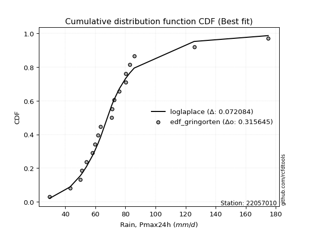</img></img>

</div>


### 9. EDF Filliben (1975)

The specific values of the constants (0.3175) (often denoted as $alpha$) and (0.365) are derived from a method proposed by James J. Filliben in a 1975 paper. This particular formula is the mean value of the $i$-th order statistic of the normal distribution and is considered a robust and effective plotting position formula for the normal probability plot correlation coefficient test for normality.

<div align="center">


$P=(m-0.3175)/(n+0.365)$


</div>


**9.1. Empirical values**

<div align="center">

|                | 0                   | 1                   | 2                  | 3                   | 4                   | 5                  | 6                   | 7                   | 8                   | 9                   | 10                 | 11                 | 12                 | 13                 | 14                | 15                 | 16                 | 17                 | 18                 | 19                 |
|:---------------|:--------------------|:--------------------|:-------------------|:--------------------|:--------------------|:-------------------|:--------------------|:--------------------|:--------------------|:--------------------|:-------------------|:-------------------|:-------------------|:-------------------|:------------------|:-------------------|:-------------------|:-------------------|:-------------------|:-------------------|
| date           | 2022                | 2023                | 2009               | 2017                | 2015                | 2006               | 2018                | 2020                | 2011                | 2016                | 2010               | 2019               | 2008               | 2025               | 2021              | 2007               | 2012               | 2013               | 2014               | 2005               |
| x              | 29.6                | 43.1                | 49.8               | 51.0                | 54.0                | 57.9               | 59.7                | 61.7                | 63.4                | 70.7                | 71.1               | 72.3               | 75.9               | 79.5               | 80.1              | 80.1               | 82.9               | 85.53              | 125.7              | 175.0              |
| m              | 1                   | 2                   | 3                  | 4                   | 5                   | 6                  | 7                   | 8                   | 9                   | 10                  | 11                 | 12                 | 13                 | 14                 | 15                | 16                 | 17                 | 18                 | 19                 | 20                 |
| empirical_dist | edf_filliben        | edf_filliben        | edf_filliben       | edf_filliben        | edf_filliben        | edf_filliben       | edf_filliben        | edf_filliben        | edf_filliben        | edf_filliben        | edf_filliben       | edf_filliben       | edf_filliben       | edf_filliben       | edf_filliben      | edf_filliben       | edf_filliben       | edf_filliben       | edf_filliben       | edf_filliben       |
| empirical      | 0.03351338080039283 | 0.08261723545298306 | 0.1317210901055733 | 0.18082494475816355 | 0.22992879941075375 | 0.279032654063344  | 0.32813650871593425 | 0.37724036336852446 | 0.42634421802111466 | 0.47544807267370487 | 0.5245519273262951 | 0.5736557819788853 | 0.6227596366314756 | 0.6718634912840659 | 0.720967345936656 | 0.7700712005892463 | 0.8191750552418366 | 0.8682789098944268 | 0.9173827645470171 | 0.9664866191996073 |
| empirical_tr   | 1.0346754731360346  | 1.090057540479058   | 1.1517036618125265 | 1.2207402967181178  | 1.2985812211063288  | 1.3870253703388389 | 1.4883975881600586  | 1.6057559629410605  | 1.7432056494757115  | 1.90638895389656    | 2.1032791117996386 | 2.345522602936942  | 2.6508298080052066 | 3.0475121586232703 | 3.583809942806863 | 4.349172450613988  | 5.5302104548540445 | 7.591798695246976  | 12.104011887072826 | 29.838827838827974 |

</div>


**9.2. Kolmogorov-Smirnov fit test (sorted by Δ)**


<div align="center">

|                | 0                  | 1                   | 2                   | 3                   | 4                   | 5                  | 6                   | 7                   | 8                  | 9                   | 10                  | 11                  | 12                  | 13                  | 14                  | 15                 | 16                  | 17                  | 18                  | 19                  | 20                  | 21                  | 22                  | 23                  | 24                  | 25                  | 26                 | 27                  | 28                  | 29                 | 30                 | 31                 | 32                  | 33                  | 34                  | 35                 | 36                 | 37                  | 38                  | 39                 | 40                 | 41                  | 42                  | 43                  | 44                  | 45                  | 46                 | 47                  | 48                 | 49                  | 50                  | 51                  | 52                  | 53                  | 54                  | 55                  | 56                  | 57                 | 58                 | 59                  | 60                  | 61                  | 62                  | 63                  | 64                  | 65                 | 66                  | 67                 | 68                 | 69                 | 70                  | 71                  | 72                  | 73                  | 74                 | 75                 | 76                 | 77                  | 78                 | 79                  | 80                  | 81                  | 82                  | 83                  | 84                  | 85                 | 86                  | 87                  | 88                  | 89                  | 90                  | 91                 | 92                 | 93                  | 94                 | 95                  | 96                  | 97                  | 98                  | 99                  | 100                 | 101                 | 102                 | 103                 | 104                 | 105                 | 106                | 107                 | 108                 | 109                 | 110                 | 111                | 112                | 113                 | 114                 | 115                 | 116                 | 117                 | 118                | 119                 | 120                 | 121                | 122                 | 123                | 124                 | 125                 | 126                 | 127                 | 128                 | 129                | 130                | 131                 | 132                | 133                | 134                 | 135                 | 136                | 137                | 138                 | 139                | 140                | 141                | 142                | 143                | 144                | 145                | 146                 | 147                | 148                | 149                | 150                | 151                | 152                | 153                | 154                | 155                | 156                | 157                | 158                |
|:---------------|:-------------------|:--------------------|:--------------------|:--------------------|:--------------------|:-------------------|:--------------------|:--------------------|:-------------------|:--------------------|:--------------------|:--------------------|:--------------------|:--------------------|:--------------------|:-------------------|:--------------------|:--------------------|:--------------------|:--------------------|:--------------------|:--------------------|:--------------------|:--------------------|:--------------------|:--------------------|:-------------------|:--------------------|:--------------------|:-------------------|:-------------------|:-------------------|:--------------------|:--------------------|:--------------------|:-------------------|:-------------------|:--------------------|:--------------------|:-------------------|:-------------------|:--------------------|:--------------------|:--------------------|:--------------------|:--------------------|:-------------------|:--------------------|:-------------------|:--------------------|:--------------------|:--------------------|:--------------------|:--------------------|:--------------------|:--------------------|:--------------------|:-------------------|:-------------------|:--------------------|:--------------------|:--------------------|:--------------------|:--------------------|:--------------------|:-------------------|:--------------------|:-------------------|:-------------------|:-------------------|:--------------------|:--------------------|:--------------------|:--------------------|:-------------------|:-------------------|:-------------------|:--------------------|:-------------------|:--------------------|:--------------------|:--------------------|:--------------------|:--------------------|:--------------------|:-------------------|:--------------------|:--------------------|:--------------------|:--------------------|:--------------------|:-------------------|:-------------------|:--------------------|:-------------------|:--------------------|:--------------------|:--------------------|:--------------------|:--------------------|:--------------------|:--------------------|:--------------------|:--------------------|:--------------------|:--------------------|:-------------------|:--------------------|:--------------------|:--------------------|:--------------------|:-------------------|:-------------------|:--------------------|:--------------------|:--------------------|:--------------------|:--------------------|:-------------------|:--------------------|:--------------------|:-------------------|:--------------------|:-------------------|:--------------------|:--------------------|:--------------------|:--------------------|:--------------------|:-------------------|:-------------------|:--------------------|:-------------------|:-------------------|:--------------------|:--------------------|:-------------------|:-------------------|:--------------------|:-------------------|:-------------------|:-------------------|:-------------------|:-------------------|:-------------------|:-------------------|:--------------------|:-------------------|:-------------------|:-------------------|:-------------------|:-------------------|:-------------------|:-------------------|:-------------------|:-------------------|:-------------------|:-------------------|:-------------------|
| station        | 22057010           | 22057010            | 22057010            | 22057010            | 22057010            | 22057010           | 22057010            | 22057010            | 22057010           | 22057010            | 22057010            | 22057010            | 22057010            | 22057010            | 22057010            | 22057010           | 22057010            | 22057010            | 22057010            | 22057010            | 22057010            | 22057010            | 22057010            | 22057010            | 22057010            | 22057010            | 22057010           | 22057010            | 22057010            | 22057010           | 22057010           | 22057010           | 22057010            | 22057010            | 22057010            | 22057010           | 22057010           | 22057010            | 22057010            | 22057010           | 22057010           | 22057010            | 22057010            | 22057010            | 22057010            | 22057010            | 22057010           | 22057010            | 22057010           | 22057010            | 22057010            | 22057010            | 22057010            | 22057010            | 22057010            | 22057010            | 22057010            | 22057010           | 22057010           | 22057010            | 22057010            | 22057010            | 22057010            | 22057010            | 22057010            | 22057010           | 22057010            | 22057010           | 22057010           | 22057010           | 22057010            | 22057010            | 22057010            | 22057010            | 22057010           | 22057010           | 22057010           | 22057010            | 22057010           | 22057010            | 22057010            | 22057010            | 22057010            | 22057010            | 22057010            | 22057010           | 22057010            | 22057010            | 22057010            | 22057010            | 22057010            | 22057010           | 22057010           | 22057010            | 22057010           | 22057010            | 22057010            | 22057010            | 22057010            | 22057010            | 22057010            | 22057010            | 22057010            | 22057010            | 22057010            | 22057010            | 22057010           | 22057010            | 22057010            | 22057010            | 22057010            | 22057010           | 22057010           | 22057010            | 22057010            | 22057010            | 22057010            | 22057010            | 22057010           | 22057010            | 22057010            | 22057010           | 22057010            | 22057010           | 22057010            | 22057010            | 22057010            | 22057010            | 22057010            | 22057010           | 22057010           | 22057010            | 22057010           | 22057010           | 22057010            | 22057010            | 22057010           | 22057010           | 22057010            | 22057010           | 22057010           | 22057010           | 22057010           | 22057010           | 22057010           | 22057010           | 22057010            | 22057010           | 22057010           | 22057010           | 22057010           | 22057010           | 22057010           | 22057010           | 22057010           | 22057010           | 22057010           | 22057010           | 22057010           |
| empirical_dist | edf_filliben       | edf_filliben        | edf_filliben        | edf_filliben        | edf_filliben        | edf_filliben       | edf_filliben        | edf_filliben        | edf_filliben       | edf_filliben        | edf_filliben        | edf_filliben        | edf_filliben        | edf_filliben        | edf_filliben        | edf_filliben       | edf_filliben        | edf_filliben        | edf_filliben        | edf_filliben        | edf_filliben        | edf_filliben        | edf_filliben        | edf_filliben        | edf_filliben        | edf_filliben        | edf_filliben       | edf_filliben        | edf_filliben        | edf_filliben       | edf_filliben       | edf_filliben       | edf_filliben        | edf_filliben        | edf_filliben        | edf_filliben       | edf_filliben       | edf_filliben        | edf_filliben        | edf_filliben       | edf_filliben       | edf_filliben        | edf_filliben        | edf_filliben        | edf_filliben        | edf_filliben        | edf_filliben       | edf_filliben        | edf_filliben       | edf_filliben        | edf_filliben        | edf_filliben        | edf_filliben        | edf_filliben        | edf_filliben        | edf_filliben        | edf_filliben        | edf_filliben       | edf_filliben       | edf_filliben        | edf_filliben        | edf_filliben        | edf_filliben        | edf_filliben        | edf_filliben        | edf_filliben       | edf_filliben        | edf_filliben       | edf_filliben       | edf_filliben       | edf_filliben        | edf_filliben        | edf_filliben        | edf_filliben        | edf_filliben       | edf_filliben       | edf_filliben       | edf_filliben        | edf_filliben       | edf_filliben        | edf_filliben        | edf_filliben        | edf_filliben        | edf_filliben        | edf_filliben        | edf_filliben       | edf_filliben        | edf_filliben        | edf_filliben        | edf_filliben        | edf_filliben        | edf_filliben       | edf_filliben       | edf_filliben        | edf_filliben       | edf_filliben        | edf_filliben        | edf_filliben        | edf_filliben        | edf_filliben        | edf_filliben        | edf_filliben        | edf_filliben        | edf_filliben        | edf_filliben        | edf_filliben        | edf_filliben       | edf_filliben        | edf_filliben        | edf_filliben        | edf_filliben        | edf_filliben       | edf_filliben       | edf_filliben        | edf_filliben        | edf_filliben        | edf_filliben        | edf_filliben        | edf_filliben       | edf_filliben        | edf_filliben        | edf_filliben       | edf_filliben        | edf_filliben       | edf_filliben        | edf_filliben        | edf_filliben        | edf_filliben        | edf_filliben        | edf_filliben       | edf_filliben       | edf_filliben        | edf_filliben       | edf_filliben       | edf_filliben        | edf_filliben        | edf_filliben       | edf_filliben       | edf_filliben        | edf_filliben       | edf_filliben       | edf_filliben       | edf_filliben       | edf_filliben       | edf_filliben       | edf_filliben       | edf_filliben        | edf_filliben       | edf_filliben       | edf_filliben       | edf_filliben       | edf_filliben       | edf_filliben       | edf_filliben       | edf_filliben       | edf_filliben       | edf_filliben       | edf_filliben       | edf_filliben       |
| p_dist         | logjohnsonsu       | loglaplace          | loglaplace          | logdgamma           | logt                | tukeylambda        | johnsonsu           | logdweibull         | logmielke          | logburr             | vonmises_line       | loggenlogistic      | logburr12           | burr                | mielke              | burr12             | loghypsecant        | dgamma              | dweibull            | loggennorm          | logexponnorm        | loglogistic         | gennorm             | logloglaplace       | pearson3            | lognct              | alpha              | lograyleigh         | lognakagami         | exponnorm          | nct                | logmaxwell         | loginvgauss         | logalpha            | logpearson3         | loghalfnorm        | loggumbel_r        | genextreme          | invweibull          | logskewnorm        | logfoldnorm        | invgamma            | betaprime           | loginvgamma         | f                   | weibull_min         | logjohnsonsb       | genlogistic         | logf               | logncf              | logexponweib        | logfatiguelife      | logerlang           | loggamma            | loggamma            | logbeta             | loggengamma         | moyal              | johnsonsb          | logrice             | lognorm             | logcrystalball      | halflogistic        | gengamma            | logloggamma         | logweibull_max     | loggenextreme       | invgauss           | logtruncnorm       | logweibull_min     | logkstwobign        | loginvweibull       | gamma               | erlang              | gausshyper         | beta               | laplace            | wald                | gumbel_r           | t                   | logmoyal            | logbetaprime        | loghalflogistic     | loggumbel_l         | skewnorm            | loganglit          | genhalflogistic     | halfnorm            | foldnorm            | kstwobign           | kappa3              | logexponpow        | loggompertz        | logsemicircular     | hypsecant          | rayleigh            | genpareto           | rice                | maxwell             | logistic            | logcosine           | loggenexpon         | logtriang           | truncnorm           | norm                | crystalball         | logtruncpareto     | logtruncweibull_min | logwald             | logarcsine          | anglit              | nakagami           | lomax              | genexpon            | loghalfgennorm      | semicircular        | logbradford         | logtruncexpon       | gumbel_l           | kappa4              | loguniform          | logkappa3          | logtukeylambda      | arcsine            | logkappa4           | logksone            | logrdist            | truncexpon          | loglomax            | triang             | logargus           | halfgennorm         | cosine             | loggenpareto       | truncweibull_min    | powerlaw            | loglevy_l          | loggenhalflogistic | ncf                 | bradford           | ksone              | exponweib          | argus              | wrapcauchy         | logpowerlaw        | levy_l             | uniform             | logtrapezoid       | rdist              | fatiguelife        | trapezoid          | weibull_max        | exponpow           | truncpareto        | gompertz           | logvonmises_line   | logvonmises        | vonmises           | loggausshyper      |
| delta          | 0.0812390554029549 | 0.08204778715722277 | 0.08204778715722277 | 0.08392332304722738 | 0.08556523858752324 | 0.0868860017252922 | 0.09031871582592155 | 0.09049483856054685 | 0.0926974269692108 | 0.09269753266824654 | 0.09789013587299772 | 0.10032089093281693 | 0.10035073457447286 | 0.10036794166482244 | 0.10041029030634252 | 0.1011210419144668 | 0.10158920895866264 | 0.10412932722857815 | 0.10835552186047259 | 0.11145116443609049 | 0.11596380894615577 | 0.11695000605344286 | 0.11780198103227768 | 0.12026788377563324 | 0.12139282641273308 | 0.12285631095095395 | 0.1231141544409241 | 0.12348825007737729 | 0.12353918677787012 | 0.1235683602887514 | 0.1245492322076458 | 0.1270281392182071 | 0.12706164427076916 | 0.12762601198847046 | 0.12818732233309094 | 0.129203193672848  | 0.129519913075628  | 0.13011905019446768 | 0.13012257370399505 | 0.1306784372681018 | 0.1307381966282979 | 0.13114713164990754 | 0.13116530379033042 | 0.13139267904808583 | 0.13145266620446217 | 0.13156363760412904 | 0.1317114928866454 | 0.13181019497618018 | 0.1318726612551553 | 0.13196721628651398 | 0.13205978316923794 | 0.13251796932816828 | 0.13296194825605745 | 0.13296733765711377 | 0.13296733765711377 | 0.13319359110070716 | 0.13397090243239718 | 0.1346950171311423 | 0.1358466688074247 | 0.13853682338646744 | 0.13933860903741868 | 0.13933873577687494 | 0.13947699387012003 | 0.13991757983773656 | 0.14187919525442239 | 0.1429694147706866 | 0.14299936644736444 | 0.1433273841973437 | 0.1451179977484165 | 0.1464870434378186 | 0.14931020659619776 | 0.15055532418138862 | 0.15066160509390092 | 0.15066165498159978 | 0.1507201244611781 | 0.1523626213316598 | 0.1528884426171091 | 0.15383470016789064 | 0.1542324455463434 | 0.15472384389787447 | 0.15480727274673828 | 0.15534618572580916 | 0.15590582862327057 | 0.16142489897562595 | 0.16349409096386436 | 0.1658674663399986 | 0.16721960887538967 | 0.16751494602609907 | 0.16990012317511327 | 0.16995428340766294 | 0.17151503631873044 | 0.1733806577975785 | 0.1747487034723516 | 0.17728967608306945 | 0.1809172911789989 | 0.18598441506295904 | 0.18800644400154098 | 0.19126538482825306 | 0.19231537268359378 | 0.19507675398818858 | 0.19595963516940662 | 0.20208156284518092 | 0.20279674686405624 | 0.21342906013858354 | 0.21342906943400375 | 0.21342907586282334 | 0.2171887523474354 | 0.219913304400285   | 0.22499505252671786 | 0.22641838250486568 | 0.23375435006940515 | 0.2352157997811587 | 0.2371443702048449 | 0.23715977655194598 | 0.24169995537510158 | 0.24229325079562614 | 0.24375615943409956 | 0.24998989817162504 | 0.260489651888401  | 0.26100975974671137 | 0.27115685242287235 | 0.271331737840135  | 0.27730105431193963 | 0.2773657117471091 | 0.27746297610254367 | 0.28734386200146467 | 0.29199969957003113 | 0.29690020556859653 | 0.31437254984301954 | 0.3224333285032839 | 0.3333954614619451 | 0.34135265674834847 | 0.3527487148774404 | 0.3780172020787159 | 0.39730993003236237 | 0.40229815769794863 | 0.4174330466750729 | 0.4300667596771256 | 0.43067713241264216 | 0.4471933207309331 | 0.4643930777073567 | 0.4690579507563716 | 0.4767157072540369 | 0.4810902380282872 | 0.4822595284679895 | 0.483150278902204  | 0.48361591126994263 | 0.5307933800240285 | 0.5605571720837776 | 0.5855272490596308 | 0.7051551444529847 | 0.7542667921132142 | 0.8340357425889752 | 0.8529422980717605 | 0.9173036886331581 | 0.9664866191996073 | 1.0626867008082144 | 27.537813259165862 | 39.17607993259733  |
| deltao         | 0.3096406529800002 | 0.3096406529800002  | 0.3096406529800002  | 0.3096406529800002  | 0.3096406529800002  | 0.3096406529800002 | 0.3096406529800002  | 0.3096406529800002  | 0.3096406529800002 | 0.3096406529800002  | 0.3096406529800002  | 0.3096406529800002  | 0.3096406529800002  | 0.3096406529800002  | 0.3096406529800002  | 0.3096406529800002 | 0.3096406529800002  | 0.3096406529800002  | 0.3096406529800002  | 0.3096406529800002  | 0.3096406529800002  | 0.3096406529800002  | 0.3096406529800002  | 0.3096406529800002  | 0.3096406529800002  | 0.3096406529800002  | 0.3096406529800002 | 0.3096406529800002  | 0.3096406529800002  | 0.3096406529800002 | 0.3096406529800002 | 0.3096406529800002 | 0.3096406529800002  | 0.3096406529800002  | 0.3096406529800002  | 0.3096406529800002 | 0.3096406529800002 | 0.3096406529800002  | 0.3096406529800002  | 0.3096406529800002 | 0.3096406529800002 | 0.3096406529800002  | 0.3096406529800002  | 0.3096406529800002  | 0.3096406529800002  | 0.3096406529800002  | 0.3096406529800002 | 0.3096406529800002  | 0.3096406529800002 | 0.3096406529800002  | 0.3096406529800002  | 0.3096406529800002  | 0.3096406529800002  | 0.3096406529800002  | 0.3096406529800002  | 0.3096406529800002  | 0.3096406529800002  | 0.3096406529800002 | 0.3096406529800002 | 0.3096406529800002  | 0.3096406529800002  | 0.3096406529800002  | 0.3096406529800002  | 0.3096406529800002  | 0.3096406529800002  | 0.3096406529800002 | 0.3096406529800002  | 0.3096406529800002 | 0.3096406529800002 | 0.3096406529800002 | 0.3096406529800002  | 0.3096406529800002  | 0.3096406529800002  | 0.3096406529800002  | 0.3096406529800002 | 0.3096406529800002 | 0.3096406529800002 | 0.3096406529800002  | 0.3096406529800002 | 0.3096406529800002  | 0.3096406529800002  | 0.3096406529800002  | 0.3096406529800002  | 0.3096406529800002  | 0.3096406529800002  | 0.3096406529800002 | 0.3096406529800002  | 0.3096406529800002  | 0.3096406529800002  | 0.3096406529800002  | 0.3096406529800002  | 0.3096406529800002 | 0.3096406529800002 | 0.3096406529800002  | 0.3096406529800002 | 0.3096406529800002  | 0.3096406529800002  | 0.3096406529800002  | 0.3096406529800002  | 0.3096406529800002  | 0.3096406529800002  | 0.3096406529800002  | 0.3096406529800002  | 0.3096406529800002  | 0.3096406529800002  | 0.3096406529800002  | 0.3096406529800002 | 0.3096406529800002  | 0.3096406529800002  | 0.3096406529800002  | 0.3096406529800002  | 0.3096406529800002 | 0.3096406529800002 | 0.3096406529800002  | 0.3096406529800002  | 0.3096406529800002  | 0.3096406529800002  | 0.3096406529800002  | 0.3096406529800002 | 0.3096406529800002  | 0.3096406529800002  | 0.3096406529800002 | 0.3096406529800002  | 0.3096406529800002 | 0.3096406529800002  | 0.3096406529800002  | 0.3096406529800002  | 0.3096406529800002  | 0.3096406529800002  | 0.3096406529800002 | 0.3096406529800002 | 0.3096406529800002  | 0.3096406529800002 | 0.3096406529800002 | 0.3096406529800002  | 0.3096406529800002  | 0.3096406529800002 | 0.3096406529800002 | 0.3096406529800002  | 0.3096406529800002 | 0.3096406529800002 | 0.3096406529800002 | 0.3096406529800002 | 0.3096406529800002 | 0.3096406529800002 | 0.3096406529800002 | 0.3096406529800002  | 0.3096406529800002 | 0.3096406529800002 | 0.3096406529800002 | 0.3096406529800002 | 0.3096406529800002 | 0.3096406529800002 | 0.3096406529800002 | 0.3096406529800002 | 0.3096406529800002 | 0.3096406529800002 | 0.3096406529800002 | 0.3096406529800002 |
| eval           | Δo > Δ             | Δo > Δ              | Δo > Δ              | Δo > Δ              | Δo > Δ              | Δo > Δ             | Δo > Δ              | Δo > Δ              | Δo > Δ             | Δo > Δ              | Δo > Δ              | Δo > Δ              | Δo > Δ              | Δo > Δ              | Δo > Δ              | Δo > Δ             | Δo > Δ              | Δo > Δ              | Δo > Δ              | Δo > Δ              | Δo > Δ              | Δo > Δ              | Δo > Δ              | Δo > Δ              | Δo > Δ              | Δo > Δ              | Δo > Δ             | Δo > Δ              | Δo > Δ              | Δo > Δ             | Δo > Δ             | Δo > Δ             | Δo > Δ              | Δo > Δ              | Δo > Δ              | Δo > Δ             | Δo > Δ             | Δo > Δ              | Δo > Δ              | Δo > Δ             | Δo > Δ             | Δo > Δ              | Δo > Δ              | Δo > Δ              | Δo > Δ              | Δo > Δ              | Δo > Δ             | Δo > Δ              | Δo > Δ             | Δo > Δ              | Δo > Δ              | Δo > Δ              | Δo > Δ              | Δo > Δ              | Δo > Δ              | Δo > Δ              | Δo > Δ              | Δo > Δ             | Δo > Δ             | Δo > Δ              | Δo > Δ              | Δo > Δ              | Δo > Δ              | Δo > Δ              | Δo > Δ              | Δo > Δ             | Δo > Δ              | Δo > Δ             | Δo > Δ             | Δo > Δ             | Δo > Δ              | Δo > Δ              | Δo > Δ              | Δo > Δ              | Δo > Δ             | Δo > Δ             | Δo > Δ             | Δo > Δ              | Δo > Δ             | Δo > Δ              | Δo > Δ              | Δo > Δ              | Δo > Δ              | Δo > Δ              | Δo > Δ              | Δo > Δ             | Δo > Δ              | Δo > Δ              | Δo > Δ              | Δo > Δ              | Δo > Δ              | Δo > Δ             | Δo > Δ             | Δo > Δ              | Δo > Δ             | Δo > Δ              | Δo > Δ              | Δo > Δ              | Δo > Δ              | Δo > Δ              | Δo > Δ              | Δo > Δ              | Δo > Δ              | Δo > Δ              | Δo > Δ              | Δo > Δ              | Δo > Δ             | Δo > Δ              | Δo > Δ              | Δo > Δ              | Δo > Δ              | Δo > Δ             | Δo > Δ             | Δo > Δ              | Δo > Δ              | Δo > Δ              | Δo > Δ              | Δo > Δ              | Δo > Δ             | Δo > Δ              | Δo > Δ              | Δo > Δ             | Δo > Δ              | Δo > Δ             | Δo > Δ              | Δo > Δ              | Δo > Δ              | Δo > Δ              | Δo <= Δ             | Δo <= Δ            | Δo <= Δ            | Δo <= Δ             | Δo <= Δ            | Δo <= Δ            | Δo <= Δ             | Δo <= Δ             | Δo <= Δ            | Δo <= Δ            | Δo <= Δ             | Δo <= Δ            | Δo <= Δ            | Δo <= Δ            | Δo <= Δ            | Δo <= Δ            | Δo <= Δ            | Δo <= Δ            | Δo <= Δ             | Δo <= Δ            | Δo <= Δ            | Δo <= Δ            | Δo <= Δ            | Δo <= Δ            | Δo <= Δ            | Δo <= Δ            | Δo <= Δ            | Δo <= Δ            | Δo <= Δ            | Δo <= Δ            | Δo <= Δ            |
| fit            | 1                  | 1                   | 1                   | 1                   | 1                   | 1                  | 1                   | 1                   | 1                  | 1                   | 1                   | 1                   | 1                   | 1                   | 1                   | 1                  | 1                   | 1                   | 1                   | 1                   | 1                   | 1                   | 1                   | 1                   | 1                   | 1                   | 1                  | 1                   | 1                   | 1                  | 1                  | 1                  | 1                   | 1                   | 1                   | 1                  | 1                  | 1                   | 1                   | 1                  | 1                  | 1                   | 1                   | 1                   | 1                   | 1                   | 1                  | 1                   | 1                  | 1                   | 1                   | 1                   | 1                   | 1                   | 1                   | 1                   | 1                   | 1                  | 1                  | 1                   | 1                   | 1                   | 1                   | 1                   | 1                   | 1                  | 1                   | 1                  | 1                  | 1                  | 1                   | 1                   | 1                   | 1                   | 1                  | 1                  | 1                  | 1                   | 1                  | 1                   | 1                   | 1                   | 1                   | 1                   | 1                   | 1                  | 1                   | 1                   | 1                   | 1                   | 1                   | 1                  | 1                  | 1                   | 1                  | 1                   | 1                   | 1                   | 1                   | 1                   | 1                   | 1                   | 1                   | 1                   | 1                   | 1                   | 1                  | 1                   | 1                   | 1                   | 1                   | 1                  | 1                  | 1                   | 1                   | 1                   | 1                   | 1                   | 1                  | 1                   | 1                   | 1                  | 1                   | 1                  | 1                   | 1                   | 1                   | 1                   | 0                   | 0                  | 0                  | 0                   | 0                  | 0                  | 0                   | 0                   | 0                  | 0                  | 0                   | 0                  | 0                  | 0                  | 0                  | 0                  | 0                  | 0                  | 0                   | 0                  | 0                  | 0                  | 0                  | 0                  | 0                  | 0                  | 0                  | 0                  | 0                  | 0                  | 0                  |
| n              | 20                 | 20                  | 20                  | 20                  | 20                  | 20                 | 20                  | 20                  | 20                 | 20                  | 20                  | 20                  | 20                  | 20                  | 20                  | 20                 | 20                  | 20                  | 20                  | 20                  | 20                  | 20                  | 20                  | 20                  | 20                  | 20                  | 20                 | 20                  | 20                  | 20                 | 20                 | 20                 | 20                  | 20                  | 20                  | 20                 | 20                 | 20                  | 20                  | 20                 | 20                 | 20                  | 20                  | 20                  | 20                  | 20                  | 20                 | 20                  | 20                 | 20                  | 20                  | 20                  | 20                  | 20                  | 20                  | 20                  | 20                  | 20                 | 20                 | 20                  | 20                  | 20                  | 20                  | 20                  | 20                  | 20                 | 20                  | 20                 | 20                 | 20                 | 20                  | 20                  | 20                  | 20                  | 20                 | 20                 | 20                 | 20                  | 20                 | 20                  | 20                  | 20                  | 20                  | 20                  | 20                  | 20                 | 20                  | 20                  | 20                  | 20                  | 20                  | 20                 | 20                 | 20                  | 20                 | 20                  | 20                  | 20                  | 20                  | 20                  | 20                  | 20                  | 20                  | 20                  | 20                  | 20                  | 20                 | 20                  | 20                  | 20                  | 20                  | 20                 | 20                 | 20                  | 20                  | 20                  | 20                  | 20                  | 20                 | 20                  | 20                  | 20                 | 20                  | 20                 | 20                  | 20                  | 20                  | 20                  | 20                  | 20                 | 20                 | 20                  | 20                 | 20                 | 20                  | 20                  | 20                 | 20                 | 20                  | 20                 | 20                 | 20                 | 20                 | 20                 | 20                 | 20                 | 20                  | 20                 | 20                 | 20                 | 20                 | 20                 | 20                 | 20                 | 20                 | 20                 | 20                 | 20                 | 20                 |
| best_fit       | 1                  | 0                   | 0                   | 0                   | 0                   | 0                  | 0                   | 0                   | 0                  | 0                   | 0                   | 0                   | 0                   | 0                   | 0                   | 0                  | 0                   | 0                   | 0                   | 0                   | 0                   | 0                   | 0                   | 0                   | 0                   | 0                   | 0                  | 0                   | 0                   | 0                  | 0                  | 0                  | 0                   | 0                   | 0                   | 0                  | 0                  | 0                   | 0                   | 0                  | 0                  | 0                   | 0                   | 0                   | 0                   | 0                   | 0                  | 0                   | 0                  | 0                   | 0                   | 0                   | 0                   | 0                   | 0                   | 0                   | 0                   | 0                  | 0                  | 0                   | 0                   | 0                   | 0                   | 0                   | 0                   | 0                  | 0                   | 0                  | 0                  | 0                  | 0                   | 0                   | 0                   | 0                   | 0                  | 0                  | 0                  | 0                   | 0                  | 0                   | 0                   | 0                   | 0                   | 0                   | 0                   | 0                  | 0                   | 0                   | 0                   | 0                   | 0                   | 0                  | 0                  | 0                   | 0                  | 0                   | 0                   | 0                   | 0                   | 0                   | 0                   | 0                   | 0                   | 0                   | 0                   | 0                   | 0                  | 0                   | 0                   | 0                   | 0                   | 0                  | 0                  | 0                   | 0                   | 0                   | 0                   | 0                   | 0                  | 0                   | 0                   | 0                  | 0                   | 0                  | 0                   | 0                   | 0                   | 0                   | 0                   | 0                  | 0                  | 0                   | 0                  | 0                  | 0                   | 0                   | 0                  | 0                  | 0                   | 0                  | 0                  | 0                  | 0                  | 0                  | 0                  | 0                  | 0                   | 0                  | 0                  | 0                  | 0                  | 0                  | 0                  | 0                  | 0                  | 0                  | 0                  | 0                  | 0                  |
| best_fit_sort  | 1                  | 2                   | 3                   | 4                   | 5                   | 6                  | 7                   | 8                   | 9                  | 10                  | 11                  | 12                  | 13                  | 14                  | 15                  | 16                 | 17                  | 18                  | 19                  | 20                  | 21                  | 22                  | 23                  | 24                  | 25                  | 26                  | 27                 | 28                  | 29                  | 30                 | 31                 | 32                 | 33                  | 34                  | 35                  | 36                 | 37                 | 38                  | 39                  | 40                 | 41                 | 42                  | 43                  | 44                  | 45                  | 46                  | 47                 | 48                  | 49                 | 50                  | 51                  | 52                  | 53                  | 54                  | 55                  | 56                  | 57                  | 58                 | 59                 | 60                  | 61                  | 62                  | 63                  | 64                  | 65                  | 66                 | 67                  | 68                 | 69                 | 70                 | 71                  | 72                  | 73                  | 74                  | 75                 | 76                 | 77                 | 78                  | 79                 | 80                  | 81                  | 82                  | 83                  | 84                  | 85                  | 86                 | 87                  | 88                  | 89                  | 90                  | 91                  | 92                 | 93                 | 94                  | 95                 | 96                  | 97                  | 98                  | 99                  | 100                 | 101                 | 102                 | 103                 | 104                 | 105                 | 106                 | 107                | 108                 | 109                 | 110                 | 111                 | 112                | 113                | 114                 | 115                 | 116                 | 117                 | 118                 | 119                | 120                 | 121                 | 122                | 123                 | 124                | 125                 | 126                 | 127                 | 128                 | 129                 | 130                | 131                | 132                 | 133                | 134                | 135                 | 136                 | 137                | 138                | 139                 | 140                | 141                | 142                | 143                | 144                | 145                | 146                | 147                 | 148                | 149                | 150                | 151                | 152                | 153                | 154                | 155                | 156                | 157                | 158                | 159                |

</div>


**9.3. Best fit**

<div align="center">

|   id |   station | empirical_dist   | p_dist       |     delta |   deltao | eval   |   fit |   n |   best_fit |   best_fit_sort |
|-----:|----------:|:-----------------|:-------------|----------:|---------:|:-------|------:|----:|-----------:|----------------:|
|    0 |  22057010 | edf_filliben     | logjohnsonsu | 0.0812391 | 0.309641 | Δo > Δ |     1 |  20 |          1 |               1 |

</div>


<div align="center">

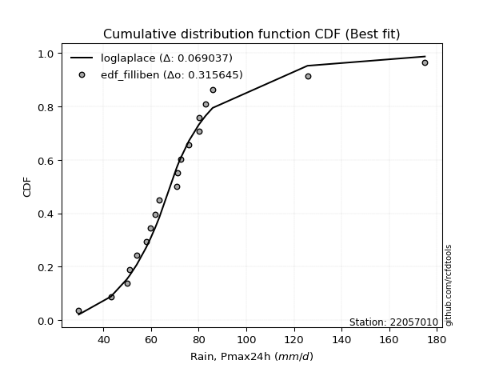</img></img>

</div>


### 10. EDF Jenkinson (1977)

The Jenkinson formula in hydrology is an empirical plotting position formula used to estimate the non-exceedance probability _(P)_ or return period _(T)_ of a given ordered observation within a sample. It is a widely used method in the frequency analysis of extreme events such as floods and rainfall, as it provides a distribution-free way to plot data. _a≈0.31_ and _b≈0.38_ are constants derived to approximate the median of the probability distribution for the given rank.

<div align="center">


$P=(m-a)/(n+b)$


</div>


**10.1. Empirical values**

<div align="center">

|                | 0                    | 1                   | 2                   | 3                   | 4                   | 5                   | 6                   | 7                  | 8                  | 9                   | 10                 | 11                 | 12                 | 13                 | 14                 | 15                 | 16                 | 17                 | 18                 | 19                 |
|:---------------|:---------------------|:--------------------|:--------------------|:--------------------|:--------------------|:--------------------|:--------------------|:-------------------|:-------------------|:--------------------|:-------------------|:-------------------|:-------------------|:-------------------|:-------------------|:-------------------|:-------------------|:-------------------|:-------------------|:-------------------|
| date           | 2022                 | 2023                | 2009                | 2017                | 2015                | 2006                | 2018                | 2020               | 2011               | 2016                | 2010               | 2019               | 2008               | 2025               | 2021               | 2007               | 2012               | 2013               | 2014               | 2005               |
| x              | 29.6                 | 43.1                | 49.8                | 51.0                | 54.0                | 57.9                | 59.7                | 61.7               | 63.4               | 70.7                | 71.1               | 72.3               | 75.9               | 79.5               | 80.1               | 80.1               | 82.9               | 85.53              | 125.7              | 175.0              |
| m              | 1                    | 2                   | 3                   | 4                   | 5                   | 6                   | 7                   | 8                  | 9                  | 10                  | 11                 | 12                 | 13                 | 14                 | 15                 | 16                 | 17                 | 18                 | 19                 | 20                 |
| empirical_dist | edf_jenkinson        | edf_jenkinson       | edf_jenkinson       | edf_jenkinson       | edf_jenkinson       | edf_jenkinson       | edf_jenkinson       | edf_jenkinson      | edf_jenkinson      | edf_jenkinson       | edf_jenkinson      | edf_jenkinson      | edf_jenkinson      | edf_jenkinson      | edf_jenkinson      | edf_jenkinson      | edf_jenkinson      | edf_jenkinson      | edf_jenkinson      | edf_jenkinson      |
| empirical      | 0.033856722276741906 | 0.08292443572129539 | 0.13199214916584887 | 0.18105986261040236 | 0.23012757605495587 | 0.27919528949950934 | 0.32826300294406285 | 0.3773307163886163 | 0.4263984298331698 | 0.47546614327772324 | 0.5245338567222767 | 0.5736015701668302 | 0.6226692836113837 | 0.6717369970559373 | 0.7208047105004907 | 0.7698724239450442 | 0.8189401373895977 | 0.8680078508341512 | 0.9170755642787047 | 0.9661432777232583 |
| empirical_tr   | 1.0350431691213813   | 1.090422685928304   | 1.152063312605992   | 1.2210904733373276  | 1.2989165073295095  | 1.3873383253914227  | 1.4886778670562455  | 1.6059889676910957 | 1.7433704020530367 | 1.9064546304957901  | 2.1031991744066048 | 2.3452243958573074 | 2.6501950585175553 | 3.0463378176382667 | 3.581722319859402  | 4.345415778251599  | 5.523035230352305  | 7.576208178438667  | 12.059171597633155 | 29.536231884058108 |

</div>


**10.2. Kolmogorov-Smirnov fit test (sorted by Δ)**


<div align="center">

|                | 0                   | 1                  | 2                  | 3                  | 4                   | 5                   | 6                   | 7                   | 8                   | 9                   | 10                  | 11                  | 12                  | 13                  | 14                  | 15                  | 16                  | 17                  | 18                  | 19                  | 20                  | 21                  | 22                 | 23                  | 24                 | 25                  | 26                  | 27                  | 28                  | 29                  | 30                  | 31                  | 32                  | 33                  | 34                  | 35                  | 36                  | 37                 | 38                  | 39                  | 40                 | 41                  | 42                  | 43                  | 44                  | 45                  | 46                  | 47                 | 48                 | 49                 | 50                  | 51                 | 52                  | 53                 | 54                 | 55                  | 56                 | 57                 | 58                 | 59                  | 60                 | 61                  | 62                  | 63                  | 64                 | 65                 | 66                  | 67                  | 68                  | 69                  | 70                  | 71                  | 72                  | 73                 | 74                  | 75                 | 76                  | 77                  | 78                  | 79                 | 80                 | 81                  | 82                 | 83                  | 84                 | 85                  | 86                  | 87                  | 88                 | 89                  | 90                 | 91                  | 92                  | 93                  | 94                  | 95                  | 96                  | 97                  | 98                 | 99                 | 100                 | 101                 | 102                 | 103                 | 104                 | 105                 | 106                 | 107                 | 108                | 109                | 110                 | 111                 | 112                 | 113                 | 114                 | 115                 | 116                | 117                 | 118                 | 119                | 120                 | 121                | 122                 | 123                 | 124                | 125                | 126                 | 127                 | 128                 | 129                | 130                | 131                | 132                 | 133                | 134                | 135                 | 136                 | 137                | 138                 | 139                | 140                 | 141                 | 142                | 143                 | 144                | 145                 | 146                 | 147                | 148                | 149                | 150                | 151                | 152                | 153                | 154                | 155                | 156                | 157                | 158                |
|:---------------|:--------------------|:-------------------|:-------------------|:-------------------|:--------------------|:--------------------|:--------------------|:--------------------|:--------------------|:--------------------|:--------------------|:--------------------|:--------------------|:--------------------|:--------------------|:--------------------|:--------------------|:--------------------|:--------------------|:--------------------|:--------------------|:--------------------|:-------------------|:--------------------|:-------------------|:--------------------|:--------------------|:--------------------|:--------------------|:--------------------|:--------------------|:--------------------|:--------------------|:--------------------|:--------------------|:--------------------|:--------------------|:-------------------|:--------------------|:--------------------|:-------------------|:--------------------|:--------------------|:--------------------|:--------------------|:--------------------|:--------------------|:-------------------|:-------------------|:-------------------|:--------------------|:-------------------|:--------------------|:-------------------|:-------------------|:--------------------|:-------------------|:-------------------|:-------------------|:--------------------|:-------------------|:--------------------|:--------------------|:--------------------|:-------------------|:-------------------|:--------------------|:--------------------|:--------------------|:--------------------|:--------------------|:--------------------|:--------------------|:-------------------|:--------------------|:-------------------|:--------------------|:--------------------|:--------------------|:-------------------|:-------------------|:--------------------|:-------------------|:--------------------|:-------------------|:--------------------|:--------------------|:--------------------|:-------------------|:--------------------|:-------------------|:--------------------|:--------------------|:--------------------|:--------------------|:--------------------|:--------------------|:--------------------|:-------------------|:-------------------|:--------------------|:--------------------|:--------------------|:--------------------|:--------------------|:--------------------|:--------------------|:--------------------|:-------------------|:-------------------|:--------------------|:--------------------|:--------------------|:--------------------|:--------------------|:--------------------|:-------------------|:--------------------|:--------------------|:-------------------|:--------------------|:-------------------|:--------------------|:--------------------|:-------------------|:-------------------|:--------------------|:--------------------|:--------------------|:-------------------|:-------------------|:-------------------|:--------------------|:-------------------|:-------------------|:--------------------|:--------------------|:-------------------|:--------------------|:-------------------|:--------------------|:--------------------|:-------------------|:--------------------|:-------------------|:--------------------|:--------------------|:-------------------|:-------------------|:-------------------|:-------------------|:-------------------|:-------------------|:-------------------|:-------------------|:-------------------|:-------------------|:-------------------|:-------------------|
| station        | 22057010            | 22057010           | 22057010           | 22057010           | 22057010            | 22057010            | 22057010            | 22057010            | 22057010            | 22057010            | 22057010            | 22057010            | 22057010            | 22057010            | 22057010            | 22057010            | 22057010            | 22057010            | 22057010            | 22057010            | 22057010            | 22057010            | 22057010           | 22057010            | 22057010           | 22057010            | 22057010            | 22057010            | 22057010            | 22057010            | 22057010            | 22057010            | 22057010            | 22057010            | 22057010            | 22057010            | 22057010            | 22057010           | 22057010            | 22057010            | 22057010           | 22057010            | 22057010            | 22057010            | 22057010            | 22057010            | 22057010            | 22057010           | 22057010           | 22057010           | 22057010            | 22057010           | 22057010            | 22057010           | 22057010           | 22057010            | 22057010           | 22057010           | 22057010           | 22057010            | 22057010           | 22057010            | 22057010            | 22057010            | 22057010           | 22057010           | 22057010            | 22057010            | 22057010            | 22057010            | 22057010            | 22057010            | 22057010            | 22057010           | 22057010            | 22057010           | 22057010            | 22057010            | 22057010            | 22057010           | 22057010           | 22057010            | 22057010           | 22057010            | 22057010           | 22057010            | 22057010            | 22057010            | 22057010           | 22057010            | 22057010           | 22057010            | 22057010            | 22057010            | 22057010            | 22057010            | 22057010            | 22057010            | 22057010           | 22057010           | 22057010            | 22057010            | 22057010            | 22057010            | 22057010            | 22057010            | 22057010            | 22057010            | 22057010           | 22057010           | 22057010            | 22057010            | 22057010            | 22057010            | 22057010            | 22057010            | 22057010           | 22057010            | 22057010            | 22057010           | 22057010            | 22057010           | 22057010            | 22057010            | 22057010           | 22057010           | 22057010            | 22057010            | 22057010            | 22057010           | 22057010           | 22057010           | 22057010            | 22057010           | 22057010           | 22057010            | 22057010            | 22057010           | 22057010            | 22057010           | 22057010            | 22057010            | 22057010           | 22057010            | 22057010           | 22057010            | 22057010            | 22057010           | 22057010           | 22057010           | 22057010           | 22057010           | 22057010           | 22057010           | 22057010           | 22057010           | 22057010           | 22057010           | 22057010           |
| empirical_dist | edf_jenkinson       | edf_jenkinson      | edf_jenkinson      | edf_jenkinson      | edf_jenkinson       | edf_jenkinson       | edf_jenkinson       | edf_jenkinson       | edf_jenkinson       | edf_jenkinson       | edf_jenkinson       | edf_jenkinson       | edf_jenkinson       | edf_jenkinson       | edf_jenkinson       | edf_jenkinson       | edf_jenkinson       | edf_jenkinson       | edf_jenkinson       | edf_jenkinson       | edf_jenkinson       | edf_jenkinson       | edf_jenkinson      | edf_jenkinson       | edf_jenkinson      | edf_jenkinson       | edf_jenkinson       | edf_jenkinson       | edf_jenkinson       | edf_jenkinson       | edf_jenkinson       | edf_jenkinson       | edf_jenkinson       | edf_jenkinson       | edf_jenkinson       | edf_jenkinson       | edf_jenkinson       | edf_jenkinson      | edf_jenkinson       | edf_jenkinson       | edf_jenkinson      | edf_jenkinson       | edf_jenkinson       | edf_jenkinson       | edf_jenkinson       | edf_jenkinson       | edf_jenkinson       | edf_jenkinson      | edf_jenkinson      | edf_jenkinson      | edf_jenkinson       | edf_jenkinson      | edf_jenkinson       | edf_jenkinson      | edf_jenkinson      | edf_jenkinson       | edf_jenkinson      | edf_jenkinson      | edf_jenkinson      | edf_jenkinson       | edf_jenkinson      | edf_jenkinson       | edf_jenkinson       | edf_jenkinson       | edf_jenkinson      | edf_jenkinson      | edf_jenkinson       | edf_jenkinson       | edf_jenkinson       | edf_jenkinson       | edf_jenkinson       | edf_jenkinson       | edf_jenkinson       | edf_jenkinson      | edf_jenkinson       | edf_jenkinson      | edf_jenkinson       | edf_jenkinson       | edf_jenkinson       | edf_jenkinson      | edf_jenkinson      | edf_jenkinson       | edf_jenkinson      | edf_jenkinson       | edf_jenkinson      | edf_jenkinson       | edf_jenkinson       | edf_jenkinson       | edf_jenkinson      | edf_jenkinson       | edf_jenkinson      | edf_jenkinson       | edf_jenkinson       | edf_jenkinson       | edf_jenkinson       | edf_jenkinson       | edf_jenkinson       | edf_jenkinson       | edf_jenkinson      | edf_jenkinson      | edf_jenkinson       | edf_jenkinson       | edf_jenkinson       | edf_jenkinson       | edf_jenkinson       | edf_jenkinson       | edf_jenkinson       | edf_jenkinson       | edf_jenkinson      | edf_jenkinson      | edf_jenkinson       | edf_jenkinson       | edf_jenkinson       | edf_jenkinson       | edf_jenkinson       | edf_jenkinson       | edf_jenkinson      | edf_jenkinson       | edf_jenkinson       | edf_jenkinson      | edf_jenkinson       | edf_jenkinson      | edf_jenkinson       | edf_jenkinson       | edf_jenkinson      | edf_jenkinson      | edf_jenkinson       | edf_jenkinson       | edf_jenkinson       | edf_jenkinson      | edf_jenkinson      | edf_jenkinson      | edf_jenkinson       | edf_jenkinson      | edf_jenkinson      | edf_jenkinson       | edf_jenkinson       | edf_jenkinson      | edf_jenkinson       | edf_jenkinson      | edf_jenkinson       | edf_jenkinson       | edf_jenkinson      | edf_jenkinson       | edf_jenkinson      | edf_jenkinson       | edf_jenkinson       | edf_jenkinson      | edf_jenkinson      | edf_jenkinson      | edf_jenkinson      | edf_jenkinson      | edf_jenkinson      | edf_jenkinson      | edf_jenkinson      | edf_jenkinson      | edf_jenkinson      | edf_jenkinson      | edf_jenkinson      |
| p_dist         | logjohnsonsu        | loglaplace         | loglaplace         | logdgamma          | logt                | tukeylambda         | johnsonsu           | logdweibull         | logmielke           | logburr             | vonmises_line       | loggenlogistic      | logburr12           | burr                | mielke              | burr12              | loghypsecant        | dgamma              | dweibull            | loggennorm          | logexponnorm        | loglogistic         | gennorm            | logloglaplace       | pearson3           | lognct              | alpha               | lograyleigh         | lognakagami         | exponnorm           | nct                 | logmaxwell          | loginvgauss         | logalpha            | logpearson3         | loghalfnorm         | loggumbel_r         | genextreme         | invweibull          | logskewnorm         | logfoldnorm        | invgamma            | betaprime           | loginvgamma         | f                   | weibull_min         | logjohnsonsb        | genlogistic        | logf               | logncf             | logexponweib        | logfatiguelife     | logerlang           | loggamma           | loggamma           | logbeta             | loggengamma        | moyal              | johnsonsb          | logrice             | lognorm            | logcrystalball      | halflogistic        | gengamma            | logloggamma        | logweibull_max     | loggenextreme       | invgauss            | logtruncnorm        | logweibull_min      | logkstwobign        | loginvweibull       | gamma               | erlang             | gausshyper          | beta               | laplace             | wald                | gumbel_r            | t                  | logmoyal           | logbetaprime        | loghalflogistic    | loggumbel_l         | skewnorm           | loganglit           | genhalflogistic     | halfnorm            | foldnorm           | kstwobign           | kappa3             | logexponpow         | loggompertz         | logsemicircular     | hypsecant           | rayleigh            | genpareto           | rice                | maxwell            | logistic           | logcosine           | loggenexpon         | logtriang           | truncnorm           | norm                | crystalball         | logtruncpareto      | logtruncweibull_min | logwald            | logarcsine         | anglit              | nakagami            | lomax               | genexpon            | loghalfgennorm      | semicircular        | logbradford        | logtruncexpon       | gumbel_l            | kappa4             | loguniform          | logkappa3          | logtukeylambda      | arcsine             | logkappa4          | logksone           | logrdist            | truncexpon          | loglomax            | triang             | logargus           | halfgennorm        | cosine              | loggenpareto       | truncweibull_min   | powerlaw            | loglevy_l           | loggenhalflogistic | ncf                 | bradford           | ksone               | exponweib           | argus              | wrapcauchy          | logpowerlaw        | levy_l              | uniform             | logtrapezoid       | rdist              | fatiguelife        | trapezoid          | weibull_max        | exponpow           | truncpareto        | gompertz           | logvonmises_line   | logvonmises        | vonmises           | loggausshyper      |
| delta          | 0.08122098479893652 | 0.0820297165532044 | 0.0820297165532044 | 0.0836522639869518 | 0.08554716798350487 | 0.08686793112127383 | 0.09004765676564597 | 0.09022377950027127 | 0.09242636790893521 | 0.09242647360797096 | 0.09787206526897935 | 0.10004983187254135 | 0.10007967551419727 | 0.10009688260454686 | 0.10013923124606694 | 0.10084998285419122 | 0.10131814989838706 | 0.10385826816830257 | 0.10840973367252771 | 0.11118010537581491 | 0.11569274988588019 | 0.11667894699316728 | 0.1178561928443328 | 0.11999682471535766 | 0.1211217673524575 | 0.12258525189067837 | 0.12284309538064853 | 0.12321719101710171 | 0.12326812771759454 | 0.12329730122847582 | 0.12427817314737022 | 0.12675708015793152 | 0.12679058521049358 | 0.12735495292819488 | 0.12791626327281536 | 0.12918512306882962 | 0.12950184247160962 | 0.1298479911341921 | 0.12985151464371947 | 0.13040737820782622 | 0.1304671375680223 | 0.13087607258963196 | 0.13089424473005484 | 0.13112161998781025 | 0.13118160714418658 | 0.13129257854385346 | 0.13144043382636983 | 0.1315391359159046 | 0.1316016021948797 | 0.1316961572262384 | 0.13178872410896236 | 0.1322469102678927 | 0.13269088919578187 | 0.1326962785968382 | 0.1326962785968382 | 0.13292253204043158 | 0.1336998433721216 | 0.1344239580708667 | 0.1355756097471491 | 0.13826576432619186 | 0.1390675499771431 | 0.13906767671659936 | 0.13920593480984444 | 0.13964652077746098 | 0.1416081361941468 | 0.142698355710411  | 0.14272830738708886 | 0.14305632513706812 | 0.14495536231225115 | 0.14621598437754302 | 0.14903914753592218 | 0.15028426512111304 | 0.15039054603362534 | 0.1503905959213242 | 0.15044906540090253 | 0.1520915622713842 | 0.15261738355683352 | 0.15381662956387226 | 0.15396138648606783 | 0.1547057732938561 | 0.1547892021427199 | 0.15507512666553358 | 0.1558877580192522 | 0.16115383991535037 | 0.1632230319035888 | 0.16559640727972302 | 0.16694854981511412 | 0.16724388696582349 | 0.1696290641148377 | 0.16968322434738736 | 0.1712439772584549 | 0.17310959873730292 | 0.17447764441207603 | 0.17701861702279387 | 0.18064623211872333 | 0.18571335600268346 | 0.18773538494126543 | 0.19099432576797748 | 0.1920443136233182 | 0.194805694927913  | 0.19568857610913104 | 0.20181050378490537 | 0.20252568780378066 | 0.21315800107830796 | 0.21315801037372817 | 0.21315801680254776 | 0.21691769328715982 | 0.21964224534000942 | 0.2249769819226995 | 0.2261473234445901 | 0.23348329100912957 | 0.23494474072088314 | 0.23687331114456936 | 0.23688871749167043 | 0.24142889631482603 | 0.24202219173535056 | 0.243485100373824  | 0.24971883911134948 | 0.26021859282812543 | 0.2607387006864358 | 0.27088579336259677 | 0.2710606787798594 | 0.27702999525166405 | 0.27709465268683353 | 0.2771919170422681 | 0.2870728029411891 | 0.29172864050975555 | 0.29662914650832095 | 0.31410149078274396 | 0.3221622694430083 | 0.3331244024016695 | 0.3410815976880729 | 0.35247765581716484 | 0.3777100018104036 | 0.3970388709720868 | 0.40202709863767305 | 0.41708970519872385 | 0.42979570061685   | 0.43036993214432984 | 0.4469222616706575 | 0.46412201864708114 | 0.46875075048805925 | 0.4764446481937613 | 0.48081917896801163 | 0.4819884694077139 | 0.48280693742585495 | 0.48334485220966705 | 0.5305223209637531 | 0.5602499718154653 | 0.5852200487913185 | 0.7048840853927091 | 0.7539595918449019 | 0.8337285423206628 | 0.8526350978034481 | 0.9169964883648458 | 0.9661432777232583 | 1.062668630204196  | 27.53815660064221  | 39.176423274073684 |
| deltao         | 0.3096406529800002  | 0.3096406529800002 | 0.3096406529800002 | 0.3096406529800002 | 0.3096406529800002  | 0.3096406529800002  | 0.3096406529800002  | 0.3096406529800002  | 0.3096406529800002  | 0.3096406529800002  | 0.3096406529800002  | 0.3096406529800002  | 0.3096406529800002  | 0.3096406529800002  | 0.3096406529800002  | 0.3096406529800002  | 0.3096406529800002  | 0.3096406529800002  | 0.3096406529800002  | 0.3096406529800002  | 0.3096406529800002  | 0.3096406529800002  | 0.3096406529800002 | 0.3096406529800002  | 0.3096406529800002 | 0.3096406529800002  | 0.3096406529800002  | 0.3096406529800002  | 0.3096406529800002  | 0.3096406529800002  | 0.3096406529800002  | 0.3096406529800002  | 0.3096406529800002  | 0.3096406529800002  | 0.3096406529800002  | 0.3096406529800002  | 0.3096406529800002  | 0.3096406529800002 | 0.3096406529800002  | 0.3096406529800002  | 0.3096406529800002 | 0.3096406529800002  | 0.3096406529800002  | 0.3096406529800002  | 0.3096406529800002  | 0.3096406529800002  | 0.3096406529800002  | 0.3096406529800002 | 0.3096406529800002 | 0.3096406529800002 | 0.3096406529800002  | 0.3096406529800002 | 0.3096406529800002  | 0.3096406529800002 | 0.3096406529800002 | 0.3096406529800002  | 0.3096406529800002 | 0.3096406529800002 | 0.3096406529800002 | 0.3096406529800002  | 0.3096406529800002 | 0.3096406529800002  | 0.3096406529800002  | 0.3096406529800002  | 0.3096406529800002 | 0.3096406529800002 | 0.3096406529800002  | 0.3096406529800002  | 0.3096406529800002  | 0.3096406529800002  | 0.3096406529800002  | 0.3096406529800002  | 0.3096406529800002  | 0.3096406529800002 | 0.3096406529800002  | 0.3096406529800002 | 0.3096406529800002  | 0.3096406529800002  | 0.3096406529800002  | 0.3096406529800002 | 0.3096406529800002 | 0.3096406529800002  | 0.3096406529800002 | 0.3096406529800002  | 0.3096406529800002 | 0.3096406529800002  | 0.3096406529800002  | 0.3096406529800002  | 0.3096406529800002 | 0.3096406529800002  | 0.3096406529800002 | 0.3096406529800002  | 0.3096406529800002  | 0.3096406529800002  | 0.3096406529800002  | 0.3096406529800002  | 0.3096406529800002  | 0.3096406529800002  | 0.3096406529800002 | 0.3096406529800002 | 0.3096406529800002  | 0.3096406529800002  | 0.3096406529800002  | 0.3096406529800002  | 0.3096406529800002  | 0.3096406529800002  | 0.3096406529800002  | 0.3096406529800002  | 0.3096406529800002 | 0.3096406529800002 | 0.3096406529800002  | 0.3096406529800002  | 0.3096406529800002  | 0.3096406529800002  | 0.3096406529800002  | 0.3096406529800002  | 0.3096406529800002 | 0.3096406529800002  | 0.3096406529800002  | 0.3096406529800002 | 0.3096406529800002  | 0.3096406529800002 | 0.3096406529800002  | 0.3096406529800002  | 0.3096406529800002 | 0.3096406529800002 | 0.3096406529800002  | 0.3096406529800002  | 0.3096406529800002  | 0.3096406529800002 | 0.3096406529800002 | 0.3096406529800002 | 0.3096406529800002  | 0.3096406529800002 | 0.3096406529800002 | 0.3096406529800002  | 0.3096406529800002  | 0.3096406529800002 | 0.3096406529800002  | 0.3096406529800002 | 0.3096406529800002  | 0.3096406529800002  | 0.3096406529800002 | 0.3096406529800002  | 0.3096406529800002 | 0.3096406529800002  | 0.3096406529800002  | 0.3096406529800002 | 0.3096406529800002 | 0.3096406529800002 | 0.3096406529800002 | 0.3096406529800002 | 0.3096406529800002 | 0.3096406529800002 | 0.3096406529800002 | 0.3096406529800002 | 0.3096406529800002 | 0.3096406529800002 | 0.3096406529800002 |
| eval           | Δo > Δ              | Δo > Δ             | Δo > Δ             | Δo > Δ             | Δo > Δ              | Δo > Δ              | Δo > Δ              | Δo > Δ              | Δo > Δ              | Δo > Δ              | Δo > Δ              | Δo > Δ              | Δo > Δ              | Δo > Δ              | Δo > Δ              | Δo > Δ              | Δo > Δ              | Δo > Δ              | Δo > Δ              | Δo > Δ              | Δo > Δ              | Δo > Δ              | Δo > Δ             | Δo > Δ              | Δo > Δ             | Δo > Δ              | Δo > Δ              | Δo > Δ              | Δo > Δ              | Δo > Δ              | Δo > Δ              | Δo > Δ              | Δo > Δ              | Δo > Δ              | Δo > Δ              | Δo > Δ              | Δo > Δ              | Δo > Δ             | Δo > Δ              | Δo > Δ              | Δo > Δ             | Δo > Δ              | Δo > Δ              | Δo > Δ              | Δo > Δ              | Δo > Δ              | Δo > Δ              | Δo > Δ             | Δo > Δ             | Δo > Δ             | Δo > Δ              | Δo > Δ             | Δo > Δ              | Δo > Δ             | Δo > Δ             | Δo > Δ              | Δo > Δ             | Δo > Δ             | Δo > Δ             | Δo > Δ              | Δo > Δ             | Δo > Δ              | Δo > Δ              | Δo > Δ              | Δo > Δ             | Δo > Δ             | Δo > Δ              | Δo > Δ              | Δo > Δ              | Δo > Δ              | Δo > Δ              | Δo > Δ              | Δo > Δ              | Δo > Δ             | Δo > Δ              | Δo > Δ             | Δo > Δ              | Δo > Δ              | Δo > Δ              | Δo > Δ             | Δo > Δ             | Δo > Δ              | Δo > Δ             | Δo > Δ              | Δo > Δ             | Δo > Δ              | Δo > Δ              | Δo > Δ              | Δo > Δ             | Δo > Δ              | Δo > Δ             | Δo > Δ              | Δo > Δ              | Δo > Δ              | Δo > Δ              | Δo > Δ              | Δo > Δ              | Δo > Δ              | Δo > Δ             | Δo > Δ             | Δo > Δ              | Δo > Δ              | Δo > Δ              | Δo > Δ              | Δo > Δ              | Δo > Δ              | Δo > Δ              | Δo > Δ              | Δo > Δ             | Δo > Δ             | Δo > Δ              | Δo > Δ              | Δo > Δ              | Δo > Δ              | Δo > Δ              | Δo > Δ              | Δo > Δ             | Δo > Δ              | Δo > Δ              | Δo > Δ             | Δo > Δ              | Δo > Δ             | Δo > Δ              | Δo > Δ              | Δo > Δ             | Δo > Δ             | Δo > Δ              | Δo > Δ              | Δo <= Δ             | Δo <= Δ            | Δo <= Δ            | Δo <= Δ            | Δo <= Δ             | Δo <= Δ            | Δo <= Δ            | Δo <= Δ             | Δo <= Δ             | Δo <= Δ            | Δo <= Δ             | Δo <= Δ            | Δo <= Δ             | Δo <= Δ             | Δo <= Δ            | Δo <= Δ             | Δo <= Δ            | Δo <= Δ             | Δo <= Δ             | Δo <= Δ            | Δo <= Δ            | Δo <= Δ            | Δo <= Δ            | Δo <= Δ            | Δo <= Δ            | Δo <= Δ            | Δo <= Δ            | Δo <= Δ            | Δo <= Δ            | Δo <= Δ            | Δo <= Δ            |
| fit            | 1                   | 1                  | 1                  | 1                  | 1                   | 1                   | 1                   | 1                   | 1                   | 1                   | 1                   | 1                   | 1                   | 1                   | 1                   | 1                   | 1                   | 1                   | 1                   | 1                   | 1                   | 1                   | 1                  | 1                   | 1                  | 1                   | 1                   | 1                   | 1                   | 1                   | 1                   | 1                   | 1                   | 1                   | 1                   | 1                   | 1                   | 1                  | 1                   | 1                   | 1                  | 1                   | 1                   | 1                   | 1                   | 1                   | 1                   | 1                  | 1                  | 1                  | 1                   | 1                  | 1                   | 1                  | 1                  | 1                   | 1                  | 1                  | 1                  | 1                   | 1                  | 1                   | 1                   | 1                   | 1                  | 1                  | 1                   | 1                   | 1                   | 1                   | 1                   | 1                   | 1                   | 1                  | 1                   | 1                  | 1                   | 1                   | 1                   | 1                  | 1                  | 1                   | 1                  | 1                   | 1                  | 1                   | 1                   | 1                   | 1                  | 1                   | 1                  | 1                   | 1                   | 1                   | 1                   | 1                   | 1                   | 1                   | 1                  | 1                  | 1                   | 1                   | 1                   | 1                   | 1                   | 1                   | 1                   | 1                   | 1                  | 1                  | 1                   | 1                   | 1                   | 1                   | 1                   | 1                   | 1                  | 1                   | 1                   | 1                  | 1                   | 1                  | 1                   | 1                   | 1                  | 1                  | 1                   | 1                   | 0                   | 0                  | 0                  | 0                  | 0                   | 0                  | 0                  | 0                   | 0                   | 0                  | 0                   | 0                  | 0                   | 0                   | 0                  | 0                   | 0                  | 0                   | 0                   | 0                  | 0                  | 0                  | 0                  | 0                  | 0                  | 0                  | 0                  | 0                  | 0                  | 0                  | 0                  |
| n              | 20                  | 20                 | 20                 | 20                 | 20                  | 20                  | 20                  | 20                  | 20                  | 20                  | 20                  | 20                  | 20                  | 20                  | 20                  | 20                  | 20                  | 20                  | 20                  | 20                  | 20                  | 20                  | 20                 | 20                  | 20                 | 20                  | 20                  | 20                  | 20                  | 20                  | 20                  | 20                  | 20                  | 20                  | 20                  | 20                  | 20                  | 20                 | 20                  | 20                  | 20                 | 20                  | 20                  | 20                  | 20                  | 20                  | 20                  | 20                 | 20                 | 20                 | 20                  | 20                 | 20                  | 20                 | 20                 | 20                  | 20                 | 20                 | 20                 | 20                  | 20                 | 20                  | 20                  | 20                  | 20                 | 20                 | 20                  | 20                  | 20                  | 20                  | 20                  | 20                  | 20                  | 20                 | 20                  | 20                 | 20                  | 20                  | 20                  | 20                 | 20                 | 20                  | 20                 | 20                  | 20                 | 20                  | 20                  | 20                  | 20                 | 20                  | 20                 | 20                  | 20                  | 20                  | 20                  | 20                  | 20                  | 20                  | 20                 | 20                 | 20                  | 20                  | 20                  | 20                  | 20                  | 20                  | 20                  | 20                  | 20                 | 20                 | 20                  | 20                  | 20                  | 20                  | 20                  | 20                  | 20                 | 20                  | 20                  | 20                 | 20                  | 20                 | 20                  | 20                  | 20                 | 20                 | 20                  | 20                  | 20                  | 20                 | 20                 | 20                 | 20                  | 20                 | 20                 | 20                  | 20                  | 20                 | 20                  | 20                 | 20                  | 20                  | 20                 | 20                  | 20                 | 20                  | 20                  | 20                 | 20                 | 20                 | 20                 | 20                 | 20                 | 20                 | 20                 | 20                 | 20                 | 20                 | 20                 |
| best_fit       | 1                   | 0                  | 0                  | 0                  | 0                   | 0                   | 0                   | 0                   | 0                   | 0                   | 0                   | 0                   | 0                   | 0                   | 0                   | 0                   | 0                   | 0                   | 0                   | 0                   | 0                   | 0                   | 0                  | 0                   | 0                  | 0                   | 0                   | 0                   | 0                   | 0                   | 0                   | 0                   | 0                   | 0                   | 0                   | 0                   | 0                   | 0                  | 0                   | 0                   | 0                  | 0                   | 0                   | 0                   | 0                   | 0                   | 0                   | 0                  | 0                  | 0                  | 0                   | 0                  | 0                   | 0                  | 0                  | 0                   | 0                  | 0                  | 0                  | 0                   | 0                  | 0                   | 0                   | 0                   | 0                  | 0                  | 0                   | 0                   | 0                   | 0                   | 0                   | 0                   | 0                   | 0                  | 0                   | 0                  | 0                   | 0                   | 0                   | 0                  | 0                  | 0                   | 0                  | 0                   | 0                  | 0                   | 0                   | 0                   | 0                  | 0                   | 0                  | 0                   | 0                   | 0                   | 0                   | 0                   | 0                   | 0                   | 0                  | 0                  | 0                   | 0                   | 0                   | 0                   | 0                   | 0                   | 0                   | 0                   | 0                  | 0                  | 0                   | 0                   | 0                   | 0                   | 0                   | 0                   | 0                  | 0                   | 0                   | 0                  | 0                   | 0                  | 0                   | 0                   | 0                  | 0                  | 0                   | 0                   | 0                   | 0                  | 0                  | 0                  | 0                   | 0                  | 0                  | 0                   | 0                   | 0                  | 0                   | 0                  | 0                   | 0                   | 0                  | 0                   | 0                  | 0                   | 0                   | 0                  | 0                  | 0                  | 0                  | 0                  | 0                  | 0                  | 0                  | 0                  | 0                  | 0                  | 0                  |
| best_fit_sort  | 1                   | 2                  | 3                  | 4                  | 5                   | 6                   | 7                   | 8                   | 9                   | 10                  | 11                  | 12                  | 13                  | 14                  | 15                  | 16                  | 17                  | 18                  | 19                  | 20                  | 21                  | 22                  | 23                 | 24                  | 25                 | 26                  | 27                  | 28                  | 29                  | 30                  | 31                  | 32                  | 33                  | 34                  | 35                  | 36                  | 37                  | 38                 | 39                  | 40                  | 41                 | 42                  | 43                  | 44                  | 45                  | 46                  | 47                  | 48                 | 49                 | 50                 | 51                  | 52                 | 53                  | 54                 | 55                 | 56                  | 57                 | 58                 | 59                 | 60                  | 61                 | 62                  | 63                  | 64                  | 65                 | 66                 | 67                  | 68                  | 69                  | 70                  | 71                  | 72                  | 73                  | 74                 | 75                  | 76                 | 77                  | 78                  | 79                  | 80                 | 81                 | 82                  | 83                 | 84                  | 85                 | 86                  | 87                  | 88                  | 89                 | 90                  | 91                 | 92                  | 93                  | 94                  | 95                  | 96                  | 97                  | 98                  | 99                 | 100                | 101                 | 102                 | 103                 | 104                 | 105                 | 106                 | 107                 | 108                 | 109                | 110                | 111                 | 112                 | 113                 | 114                 | 115                 | 116                 | 117                | 118                 | 119                 | 120                | 121                 | 122                | 123                 | 124                 | 125                | 126                | 127                 | 128                 | 129                 | 130                | 131                | 132                | 133                 | 134                | 135                | 136                 | 137                 | 138                | 139                 | 140                | 141                 | 142                 | 143                | 144                 | 145                | 146                 | 147                 | 148                | 149                | 150                | 151                | 152                | 153                | 154                | 155                | 156                | 157                | 158                | 159                |

</div>


**10.3. Best fit**

<div align="center">

|   id |   station | empirical_dist   | p_dist       |    delta |   deltao | eval   |   fit |   n |   best_fit |   best_fit_sort |
|-----:|----------:|:-----------------|:-------------|---------:|---------:|:-------|------:|----:|-----------:|----------------:|
|    0 |  22057010 | edf_jenkinson    | logjohnsonsu | 0.081221 | 0.309641 | Δo > Δ |     1 |  20 |          1 |               1 |

</div>


<div align="center">

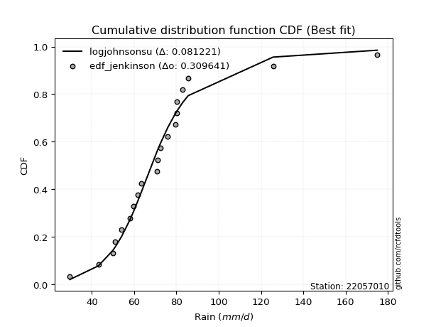</img></img>

</div>


### 11. EDF Cunnane (1978)

Cunnane´s work in statistical hydrology has focused on the performance and evaluation of different probability distributions (such as GEV, Gumbel, Lognormal) for flood frequency estimation. _b_ is a constant, typically set to 0.4.

<div align="center">


$P=(m-b)/(n+1-2b)$


</div>


**11.1. Empirical values**

<div align="center">

|                | 0                  | 1                   | 2                   | 3                   | 4                  | 5                  | 6                   | 7                   | 8                   | 9                  | 10                 | 11                 | 12                 | 13                 | 14                 | 15                 | 16                 | 17                 | 18                 | 19                 |
|:---------------|:-------------------|:--------------------|:--------------------|:--------------------|:-------------------|:-------------------|:--------------------|:--------------------|:--------------------|:-------------------|:-------------------|:-------------------|:-------------------|:-------------------|:-------------------|:-------------------|:-------------------|:-------------------|:-------------------|:-------------------|
| date           | 2022               | 2023                | 2009                | 2017                | 2015               | 2006               | 2018                | 2020                | 2011                | 2016               | 2010               | 2019               | 2008               | 2025               | 2021               | 2007               | 2012               | 2013               | 2014               | 2005               |
| x              | 29.6               | 43.1                | 49.8                | 51.0                | 54.0               | 57.9               | 59.7                | 61.7                | 63.4                | 70.7               | 71.1               | 72.3               | 75.9               | 79.5               | 80.1               | 80.1               | 82.9               | 85.53              | 125.7              | 175.0              |
| m              | 1                  | 2                   | 3                   | 4                   | 5                  | 6                  | 7                   | 8                   | 9                   | 10                 | 11                 | 12                 | 13                 | 14                 | 15                 | 16                 | 17                 | 18                 | 19                 | 20                 |
| empirical_dist | edf_cunnane        | edf_cunnane         | edf_cunnane         | edf_cunnane         | edf_cunnane        | edf_cunnane        | edf_cunnane         | edf_cunnane         | edf_cunnane         | edf_cunnane        | edf_cunnane        | edf_cunnane        | edf_cunnane        | edf_cunnane        | edf_cunnane        | edf_cunnane        | edf_cunnane        | edf_cunnane        | edf_cunnane        | edf_cunnane        |
| empirical      | 0.0297029702970297 | 0.07920792079207921 | 0.12871287128712872 | 0.17821782178217824 | 0.2277227722772277 | 0.2772277227722772 | 0.32673267326732675 | 0.37623762376237624 | 0.42574257425742573 | 0.4752475247524752 | 0.5247524752475248 | 0.5742574257425742 | 0.6237623762376238 | 0.6732673267326733 | 0.7227722772277227 | 0.7722772277227723 | 0.8217821782178218 | 0.8712871287128714 | 0.9207920792079209 | 0.9702970297029704 |
| empirical_tr   | 1.030612244897959  | 1.086021505376344   | 1.1477272727272727  | 1.216867469879518   | 1.294871794871795  | 1.3835616438356164 | 1.4852941176470589  | 1.6031746031746033  | 1.7413793103448274  | 1.9056603773584906 | 2.104166666666667  | 2.3488372093023253 | 2.6578947368421053 | 3.060606060606061  | 3.6071428571428568 | 4.391304347826087  | 5.611111111111113  | 7.769230769230775  | 12.625000000000025 | 33.666666666666764 |

</div>


**11.2. Kolmogorov-Smirnov fit test (sorted by Δ)**


<div align="center">

|                | 0                   | 1                   | 2                   | 3                   | 4                   | 5                   | 6                   | 7                   | 8                   | 9                   | 10                  | 11                  | 12                  | 13                  | 14                  | 15                 | 16                  | 17                  | 18                  | 19                  | 20                  | 21                  | 22                  | 23                  | 24                  | 25                  | 26                 | 27                 | 28                  | 29                 | 30                 | 31                  | 32                  | 33                 | 34                  | 35                  | 36                  | 37                  | 38                  | 39                 | 40                  | 41                  | 42                  | 43                  | 44                  | 45                  | 46                 | 47                  | 48                  | 49                  | 50                  | 51                  | 52                  | 53                  | 54                  | 55                  | 56                  | 57                 | 58                  | 59                  | 60                  | 61                  | 62                  | 63                  | 64                  | 65                  | 66                  | 67                 | 68                  | 69                 | 70                  | 71                 | 72                  | 73                  | 74                 | 75                  | 76                 | 77                  | 78                  | 79                 | 80                 | 81                 | 82                  | 83                  | 84                  | 85                 | 86                  | 87                  | 88                  | 89                  | 90                  | 91                 | 92                 | 93                  | 94                 | 95                  | 96                  | 97                  | 98                  | 99                  | 100                 | 101                 | 102                 | 103                 | 104                 | 105                 | 106                | 107                 | 108                | 109                 | 110                 | 111                | 112                | 113                 | 114                 | 115                 | 116                 | 117                 | 118                | 119                 | 120                 | 121                | 122                 | 123                | 124                 | 125                 | 126                 | 127                 | 128                 | 129                | 130                | 131                 | 132                | 133                 | 134                 | 135                 | 136                 | 137                | 138                | 139                | 140                | 141                | 142                | 143                | 144                 | 145                 | 146                 | 147                | 148                | 149                | 150                | 151                | 152                | 153                | 154                | 155                | 156                | 157                | 158                |
|:---------------|:--------------------|:--------------------|:--------------------|:--------------------|:--------------------|:--------------------|:--------------------|:--------------------|:--------------------|:--------------------|:--------------------|:--------------------|:--------------------|:--------------------|:--------------------|:-------------------|:--------------------|:--------------------|:--------------------|:--------------------|:--------------------|:--------------------|:--------------------|:--------------------|:--------------------|:--------------------|:-------------------|:-------------------|:--------------------|:-------------------|:-------------------|:--------------------|:--------------------|:-------------------|:--------------------|:--------------------|:--------------------|:--------------------|:--------------------|:-------------------|:--------------------|:--------------------|:--------------------|:--------------------|:--------------------|:--------------------|:-------------------|:--------------------|:--------------------|:--------------------|:--------------------|:--------------------|:--------------------|:--------------------|:--------------------|:--------------------|:--------------------|:-------------------|:--------------------|:--------------------|:--------------------|:--------------------|:--------------------|:--------------------|:--------------------|:--------------------|:--------------------|:-------------------|:--------------------|:-------------------|:--------------------|:-------------------|:--------------------|:--------------------|:-------------------|:--------------------|:-------------------|:--------------------|:--------------------|:-------------------|:-------------------|:-------------------|:--------------------|:--------------------|:--------------------|:-------------------|:--------------------|:--------------------|:--------------------|:--------------------|:--------------------|:-------------------|:-------------------|:--------------------|:-------------------|:--------------------|:--------------------|:--------------------|:--------------------|:--------------------|:--------------------|:--------------------|:--------------------|:--------------------|:--------------------|:--------------------|:-------------------|:--------------------|:-------------------|:--------------------|:--------------------|:-------------------|:-------------------|:--------------------|:--------------------|:--------------------|:--------------------|:--------------------|:-------------------|:--------------------|:--------------------|:-------------------|:--------------------|:-------------------|:--------------------|:--------------------|:--------------------|:--------------------|:--------------------|:-------------------|:-------------------|:--------------------|:-------------------|:--------------------|:--------------------|:--------------------|:--------------------|:-------------------|:-------------------|:-------------------|:-------------------|:-------------------|:-------------------|:-------------------|:--------------------|:--------------------|:--------------------|:-------------------|:-------------------|:-------------------|:-------------------|:-------------------|:-------------------|:-------------------|:-------------------|:-------------------|:-------------------|:-------------------|:-------------------|
| station        | 22057010            | 22057010            | 22057010            | 22057010            | 22057010            | 22057010            | 22057010            | 22057010            | 22057010            | 22057010            | 22057010            | 22057010            | 22057010            | 22057010            | 22057010            | 22057010           | 22057010            | 22057010            | 22057010            | 22057010            | 22057010            | 22057010            | 22057010            | 22057010            | 22057010            | 22057010            | 22057010           | 22057010           | 22057010            | 22057010           | 22057010           | 22057010            | 22057010            | 22057010           | 22057010            | 22057010            | 22057010            | 22057010            | 22057010            | 22057010           | 22057010            | 22057010            | 22057010            | 22057010            | 22057010            | 22057010            | 22057010           | 22057010            | 22057010            | 22057010            | 22057010            | 22057010            | 22057010            | 22057010            | 22057010            | 22057010            | 22057010            | 22057010           | 22057010            | 22057010            | 22057010            | 22057010            | 22057010            | 22057010            | 22057010            | 22057010            | 22057010            | 22057010           | 22057010            | 22057010           | 22057010            | 22057010           | 22057010            | 22057010            | 22057010           | 22057010            | 22057010           | 22057010            | 22057010            | 22057010           | 22057010           | 22057010           | 22057010            | 22057010            | 22057010            | 22057010           | 22057010            | 22057010            | 22057010            | 22057010            | 22057010            | 22057010           | 22057010           | 22057010            | 22057010           | 22057010            | 22057010            | 22057010            | 22057010            | 22057010            | 22057010            | 22057010            | 22057010            | 22057010            | 22057010            | 22057010            | 22057010           | 22057010            | 22057010           | 22057010            | 22057010            | 22057010           | 22057010           | 22057010            | 22057010            | 22057010            | 22057010            | 22057010            | 22057010           | 22057010            | 22057010            | 22057010           | 22057010            | 22057010           | 22057010            | 22057010            | 22057010            | 22057010            | 22057010            | 22057010           | 22057010           | 22057010            | 22057010           | 22057010            | 22057010            | 22057010            | 22057010            | 22057010           | 22057010           | 22057010           | 22057010           | 22057010           | 22057010           | 22057010           | 22057010            | 22057010            | 22057010            | 22057010           | 22057010           | 22057010           | 22057010           | 22057010           | 22057010           | 22057010           | 22057010           | 22057010           | 22057010           | 22057010           | 22057010           |
| empirical_dist | edf_cunnane         | edf_cunnane         | edf_cunnane         | edf_cunnane         | edf_cunnane         | edf_cunnane         | edf_cunnane         | edf_cunnane         | edf_cunnane         | edf_cunnane         | edf_cunnane         | edf_cunnane         | edf_cunnane         | edf_cunnane         | edf_cunnane         | edf_cunnane        | edf_cunnane         | edf_cunnane         | edf_cunnane         | edf_cunnane         | edf_cunnane         | edf_cunnane         | edf_cunnane         | edf_cunnane         | edf_cunnane         | edf_cunnane         | edf_cunnane        | edf_cunnane        | edf_cunnane         | edf_cunnane        | edf_cunnane        | edf_cunnane         | edf_cunnane         | edf_cunnane        | edf_cunnane         | edf_cunnane         | edf_cunnane         | edf_cunnane         | edf_cunnane         | edf_cunnane        | edf_cunnane         | edf_cunnane         | edf_cunnane         | edf_cunnane         | edf_cunnane         | edf_cunnane         | edf_cunnane        | edf_cunnane         | edf_cunnane         | edf_cunnane         | edf_cunnane         | edf_cunnane         | edf_cunnane         | edf_cunnane         | edf_cunnane         | edf_cunnane         | edf_cunnane         | edf_cunnane        | edf_cunnane         | edf_cunnane         | edf_cunnane         | edf_cunnane         | edf_cunnane         | edf_cunnane         | edf_cunnane         | edf_cunnane         | edf_cunnane         | edf_cunnane        | edf_cunnane         | edf_cunnane        | edf_cunnane         | edf_cunnane        | edf_cunnane         | edf_cunnane         | edf_cunnane        | edf_cunnane         | edf_cunnane        | edf_cunnane         | edf_cunnane         | edf_cunnane        | edf_cunnane        | edf_cunnane        | edf_cunnane         | edf_cunnane         | edf_cunnane         | edf_cunnane        | edf_cunnane         | edf_cunnane         | edf_cunnane         | edf_cunnane         | edf_cunnane         | edf_cunnane        | edf_cunnane        | edf_cunnane         | edf_cunnane        | edf_cunnane         | edf_cunnane         | edf_cunnane         | edf_cunnane         | edf_cunnane         | edf_cunnane         | edf_cunnane         | edf_cunnane         | edf_cunnane         | edf_cunnane         | edf_cunnane         | edf_cunnane        | edf_cunnane         | edf_cunnane        | edf_cunnane         | edf_cunnane         | edf_cunnane        | edf_cunnane        | edf_cunnane         | edf_cunnane         | edf_cunnane         | edf_cunnane         | edf_cunnane         | edf_cunnane        | edf_cunnane         | edf_cunnane         | edf_cunnane        | edf_cunnane         | edf_cunnane        | edf_cunnane         | edf_cunnane         | edf_cunnane         | edf_cunnane         | edf_cunnane         | edf_cunnane        | edf_cunnane        | edf_cunnane         | edf_cunnane        | edf_cunnane         | edf_cunnane         | edf_cunnane         | edf_cunnane         | edf_cunnane        | edf_cunnane        | edf_cunnane        | edf_cunnane        | edf_cunnane        | edf_cunnane        | edf_cunnane        | edf_cunnane         | edf_cunnane         | edf_cunnane         | edf_cunnane        | edf_cunnane        | edf_cunnane        | edf_cunnane        | edf_cunnane        | edf_cunnane        | edf_cunnane        | edf_cunnane        | edf_cunnane        | edf_cunnane        | edf_cunnane        | edf_cunnane        |
| p_dist         | logjohnsonsu        | loglaplace          | loglaplace          | logt                | logdgamma           | tukeylambda         | johnsonsu           | logdweibull         | logmielke           | logburr             | vonmises_line       | loggenlogistic      | logburr12           | burr                | mielke              | burr12             | loghypsecant        | dgamma              | dweibull            | loggennorm          | gennorm             | logexponnorm        | loglogistic         | logloglaplace       | pearson3            | lognct              | alpha              | lograyleigh        | lognakagami         | exponnorm          | nct                | loghalfnorm         | loggumbel_r         | logmaxwell         | loginvgauss         | logalpha            | logpearson3         | genextreme          | invweibull          | logskewnorm        | logfoldnorm         | invgamma            | betaprime           | loginvgamma         | f                   | weibull_min         | logjohnsonsb       | genlogistic         | logf                | logncf              | logexponweib        | logfatiguelife      | logerlang           | loggamma            | loggamma            | logbeta             | loggengamma         | moyal              | johnsonsb           | logrice             | lognorm             | logcrystalball      | halflogistic        | gengamma            | logloggamma         | logweibull_max      | loggenextreme       | invgauss           | logtruncnorm        | logweibull_min     | logkstwobign        | loginvweibull      | gamma               | erlang              | gausshyper         | wald                | t                  | logmoyal            | beta                | laplace            | loghalflogistic    | gumbel_r           | logbetaprime        | loggumbel_l         | skewnorm            | loganglit          | genhalflogistic     | halfnorm            | foldnorm            | kstwobign           | kappa3              | logexponpow        | loggompertz        | logsemicircular     | hypsecant          | rayleigh            | genpareto           | rice                | maxwell             | logistic            | logcosine           | loggenexpon         | logtriang           | truncnorm           | norm                | crystalball         | logtruncpareto     | logtruncweibull_min | logwald            | logarcsine          | anglit              | nakagami           | lomax              | genexpon            | loghalfgennorm      | semicircular        | logbradford         | logtruncexpon       | gumbel_l           | kappa4              | loguniform          | logkappa3          | logtukeylambda      | arcsine            | logkappa4           | logksone            | logrdist            | truncexpon          | loglomax            | triang             | logargus           | halfgennorm         | cosine             | loggenpareto        | truncweibull_min    | powerlaw            | loglevy_l           | loggenhalflogistic | ncf                | bradford           | ksone              | exponweib          | argus              | wrapcauchy         | logpowerlaw         | uniform             | levy_l              | logtrapezoid       | rdist              | fatiguelife        | trapezoid          | weibull_max        | exponpow           | truncpareto        | gompertz           | logvonmises_line   | logvonmises        | vonmises           | loggausshyper      |
| delta          | 0.08143960332418454 | 0.08242000652507553 | 0.08242000652507553 | 0.08576578650875288 | 0.08693154186567198 | 0.08708654964652185 | 0.09332693464436614 | 0.09350305737899145 | 0.09570564578765539 | 0.09570575148669114 | 0.09809068379422736 | 0.10332910975126153 | 0.10335895339291745 | 0.10337616048326703 | 0.10341850912478712 | 0.1041292607329114 | 0.10459742777710723 | 0.10713754604702275 | 0.10775387809678366 | 0.11445938325453509 | 0.11720033726858875 | 0.11897202776460036 | 0.11995822487188745 | 0.12327610259407784 | 0.12440104523117768 | 0.12586452976939855 | 0.1261223732593687 | 0.1264964688958219 | 0.12654740559631472 | 0.126576579107196  | 0.1275574510260904 | 0.12940374159407764 | 0.12972046099685763 | 0.1300363580366517 | 0.13006986308921376 | 0.13063423080691505 | 0.13119554115153553 | 0.13312726901291227 | 0.13313079252243964 | 0.1336866560865464 | 0.13374641544674248 | 0.13415535046835214 | 0.13417352260877502 | 0.13440089786653042 | 0.13446088502290676 | 0.13457185642257363 | 0.13471971170509   | 0.13481841379462478 | 0.13488088007359988 | 0.13497543510495857 | 0.13506800198768254 | 0.13552618814661288 | 0.13597016707450205 | 0.13597555647555837 | 0.13597555647555837 | 0.13620180991915176 | 0.13697912125084177 | 0.1377032359495869 | 0.13885488762586928 | 0.14154504220491204 | 0.14234682785586328 | 0.14234695459531954 | 0.14248521268856462 | 0.14292579865618116 | 0.14488741407286698 | 0.14597763358913118 | 0.14600758526580904 | 0.1463356030157883 | 0.14692292903948329 | 0.1494952622562632 | 0.15231842541464236 | 0.1535635429998332 | 0.15366982391234552 | 0.15366987380004438 | 0.1537283432796227 | 0.15403524808912028 | 0.1549243918191041 | 0.15500782066796792 | 0.15537084015010438 | 0.1558966614355537 | 0.1561063765445002 | 0.157240664364788  | 0.15835440454425376 | 0.16443311779407055 | 0.16650230978230895 | 0.1688756851584432 | 0.17022782769383427 | 0.17052316484454366 | 0.17290834199355787 | 0.17296250222610754 | 0.17452325513717504 | 0.1763888766160231 | 0.1777569222907962 | 0.18029789490151404 | 0.1839255099974435 | 0.18899263388140364 | 0.19101466281998558 | 0.19427360364669766 | 0.19532359150203837 | 0.19808497280663317 | 0.19896785398785122 | 0.20508978166362551 | 0.20580496568250084 | 0.21643727895702813 | 0.21643728825244835 | 0.21643729468126793 | 0.22019697116588   | 0.2229215232187296  | 0.2251956004479475 | 0.22942660132331028 | 0.23676256888784974 | 0.2382240185996033 | 0.2401525890232895 | 0.24016799537039057 | 0.24470817419354618 | 0.24530146961407073 | 0.24676437825254416 | 0.25299811699006963 | 0.2634978707068456 | 0.26401797856515596 | 0.27416507124131695 | 0.2743399566585796 | 0.28030927313038423 | 0.2803739305655537 | 0.28047119492098826 | 0.29035208081990926 | 0.29500791838847573 | 0.29990842438704113 | 0.31738076866146414 | 0.3254415473217285 | 0.3364036802803897 | 0.34436087556679307 | 0.355756933695885  | 0.38142651673961975 | 0.40031814885080697 | 0.40530637651639323 | 0.42124345717843603 | 0.4330749784955702 | 0.434086447073546  | 0.4502015395493777 | 0.4674012965258013 | 0.4724672654172754 | 0.4797239260724815 | 0.4840984568467318 | 0.48526774728643407 | 0.48662413008838723 | 0.48696068940556714 | 0.5338015988424731 | 0.5639664867446815 | 0.5889365637205347 | 0.7081633632714293 | 0.7576761067741181 | 0.837445057249879  | 0.8563516127326644 | 0.920713003294062  | 0.9702970297029704 | 1.062887248729444  | 27.5340028486625   | 39.17226952209397  |
| deltao         | 0.3096406529800002  | 0.3096406529800002  | 0.3096406529800002  | 0.3096406529800002  | 0.3096406529800002  | 0.3096406529800002  | 0.3096406529800002  | 0.3096406529800002  | 0.3096406529800002  | 0.3096406529800002  | 0.3096406529800002  | 0.3096406529800002  | 0.3096406529800002  | 0.3096406529800002  | 0.3096406529800002  | 0.3096406529800002 | 0.3096406529800002  | 0.3096406529800002  | 0.3096406529800002  | 0.3096406529800002  | 0.3096406529800002  | 0.3096406529800002  | 0.3096406529800002  | 0.3096406529800002  | 0.3096406529800002  | 0.3096406529800002  | 0.3096406529800002 | 0.3096406529800002 | 0.3096406529800002  | 0.3096406529800002 | 0.3096406529800002 | 0.3096406529800002  | 0.3096406529800002  | 0.3096406529800002 | 0.3096406529800002  | 0.3096406529800002  | 0.3096406529800002  | 0.3096406529800002  | 0.3096406529800002  | 0.3096406529800002 | 0.3096406529800002  | 0.3096406529800002  | 0.3096406529800002  | 0.3096406529800002  | 0.3096406529800002  | 0.3096406529800002  | 0.3096406529800002 | 0.3096406529800002  | 0.3096406529800002  | 0.3096406529800002  | 0.3096406529800002  | 0.3096406529800002  | 0.3096406529800002  | 0.3096406529800002  | 0.3096406529800002  | 0.3096406529800002  | 0.3096406529800002  | 0.3096406529800002 | 0.3096406529800002  | 0.3096406529800002  | 0.3096406529800002  | 0.3096406529800002  | 0.3096406529800002  | 0.3096406529800002  | 0.3096406529800002  | 0.3096406529800002  | 0.3096406529800002  | 0.3096406529800002 | 0.3096406529800002  | 0.3096406529800002 | 0.3096406529800002  | 0.3096406529800002 | 0.3096406529800002  | 0.3096406529800002  | 0.3096406529800002 | 0.3096406529800002  | 0.3096406529800002 | 0.3096406529800002  | 0.3096406529800002  | 0.3096406529800002 | 0.3096406529800002 | 0.3096406529800002 | 0.3096406529800002  | 0.3096406529800002  | 0.3096406529800002  | 0.3096406529800002 | 0.3096406529800002  | 0.3096406529800002  | 0.3096406529800002  | 0.3096406529800002  | 0.3096406529800002  | 0.3096406529800002 | 0.3096406529800002 | 0.3096406529800002  | 0.3096406529800002 | 0.3096406529800002  | 0.3096406529800002  | 0.3096406529800002  | 0.3096406529800002  | 0.3096406529800002  | 0.3096406529800002  | 0.3096406529800002  | 0.3096406529800002  | 0.3096406529800002  | 0.3096406529800002  | 0.3096406529800002  | 0.3096406529800002 | 0.3096406529800002  | 0.3096406529800002 | 0.3096406529800002  | 0.3096406529800002  | 0.3096406529800002 | 0.3096406529800002 | 0.3096406529800002  | 0.3096406529800002  | 0.3096406529800002  | 0.3096406529800002  | 0.3096406529800002  | 0.3096406529800002 | 0.3096406529800002  | 0.3096406529800002  | 0.3096406529800002 | 0.3096406529800002  | 0.3096406529800002 | 0.3096406529800002  | 0.3096406529800002  | 0.3096406529800002  | 0.3096406529800002  | 0.3096406529800002  | 0.3096406529800002 | 0.3096406529800002 | 0.3096406529800002  | 0.3096406529800002 | 0.3096406529800002  | 0.3096406529800002  | 0.3096406529800002  | 0.3096406529800002  | 0.3096406529800002 | 0.3096406529800002 | 0.3096406529800002 | 0.3096406529800002 | 0.3096406529800002 | 0.3096406529800002 | 0.3096406529800002 | 0.3096406529800002  | 0.3096406529800002  | 0.3096406529800002  | 0.3096406529800002 | 0.3096406529800002 | 0.3096406529800002 | 0.3096406529800002 | 0.3096406529800002 | 0.3096406529800002 | 0.3096406529800002 | 0.3096406529800002 | 0.3096406529800002 | 0.3096406529800002 | 0.3096406529800002 | 0.3096406529800002 |
| eval           | Δo > Δ              | Δo > Δ              | Δo > Δ              | Δo > Δ              | Δo > Δ              | Δo > Δ              | Δo > Δ              | Δo > Δ              | Δo > Δ              | Δo > Δ              | Δo > Δ              | Δo > Δ              | Δo > Δ              | Δo > Δ              | Δo > Δ              | Δo > Δ             | Δo > Δ              | Δo > Δ              | Δo > Δ              | Δo > Δ              | Δo > Δ              | Δo > Δ              | Δo > Δ              | Δo > Δ              | Δo > Δ              | Δo > Δ              | Δo > Δ             | Δo > Δ             | Δo > Δ              | Δo > Δ             | Δo > Δ             | Δo > Δ              | Δo > Δ              | Δo > Δ             | Δo > Δ              | Δo > Δ              | Δo > Δ              | Δo > Δ              | Δo > Δ              | Δo > Δ             | Δo > Δ              | Δo > Δ              | Δo > Δ              | Δo > Δ              | Δo > Δ              | Δo > Δ              | Δo > Δ             | Δo > Δ              | Δo > Δ              | Δo > Δ              | Δo > Δ              | Δo > Δ              | Δo > Δ              | Δo > Δ              | Δo > Δ              | Δo > Δ              | Δo > Δ              | Δo > Δ             | Δo > Δ              | Δo > Δ              | Δo > Δ              | Δo > Δ              | Δo > Δ              | Δo > Δ              | Δo > Δ              | Δo > Δ              | Δo > Δ              | Δo > Δ             | Δo > Δ              | Δo > Δ             | Δo > Δ              | Δo > Δ             | Δo > Δ              | Δo > Δ              | Δo > Δ             | Δo > Δ              | Δo > Δ             | Δo > Δ              | Δo > Δ              | Δo > Δ             | Δo > Δ             | Δo > Δ             | Δo > Δ              | Δo > Δ              | Δo > Δ              | Δo > Δ             | Δo > Δ              | Δo > Δ              | Δo > Δ              | Δo > Δ              | Δo > Δ              | Δo > Δ             | Δo > Δ             | Δo > Δ              | Δo > Δ             | Δo > Δ              | Δo > Δ              | Δo > Δ              | Δo > Δ              | Δo > Δ              | Δo > Δ              | Δo > Δ              | Δo > Δ              | Δo > Δ              | Δo > Δ              | Δo > Δ              | Δo > Δ             | Δo > Δ              | Δo > Δ             | Δo > Δ              | Δo > Δ              | Δo > Δ             | Δo > Δ             | Δo > Δ              | Δo > Δ              | Δo > Δ              | Δo > Δ              | Δo > Δ              | Δo > Δ             | Δo > Δ              | Δo > Δ              | Δo > Δ             | Δo > Δ              | Δo > Δ             | Δo > Δ              | Δo > Δ              | Δo > Δ              | Δo > Δ              | Δo <= Δ             | Δo <= Δ            | Δo <= Δ            | Δo <= Δ             | Δo <= Δ            | Δo <= Δ             | Δo <= Δ             | Δo <= Δ             | Δo <= Δ             | Δo <= Δ            | Δo <= Δ            | Δo <= Δ            | Δo <= Δ            | Δo <= Δ            | Δo <= Δ            | Δo <= Δ            | Δo <= Δ             | Δo <= Δ             | Δo <= Δ             | Δo <= Δ            | Δo <= Δ            | Δo <= Δ            | Δo <= Δ            | Δo <= Δ            | Δo <= Δ            | Δo <= Δ            | Δo <= Δ            | Δo <= Δ            | Δo <= Δ            | Δo <= Δ            | Δo <= Δ            |
| fit            | 1                   | 1                   | 1                   | 1                   | 1                   | 1                   | 1                   | 1                   | 1                   | 1                   | 1                   | 1                   | 1                   | 1                   | 1                   | 1                  | 1                   | 1                   | 1                   | 1                   | 1                   | 1                   | 1                   | 1                   | 1                   | 1                   | 1                  | 1                  | 1                   | 1                  | 1                  | 1                   | 1                   | 1                  | 1                   | 1                   | 1                   | 1                   | 1                   | 1                  | 1                   | 1                   | 1                   | 1                   | 1                   | 1                   | 1                  | 1                   | 1                   | 1                   | 1                   | 1                   | 1                   | 1                   | 1                   | 1                   | 1                   | 1                  | 1                   | 1                   | 1                   | 1                   | 1                   | 1                   | 1                   | 1                   | 1                   | 1                  | 1                   | 1                  | 1                   | 1                  | 1                   | 1                   | 1                  | 1                   | 1                  | 1                   | 1                   | 1                  | 1                  | 1                  | 1                   | 1                   | 1                   | 1                  | 1                   | 1                   | 1                   | 1                   | 1                   | 1                  | 1                  | 1                   | 1                  | 1                   | 1                   | 1                   | 1                   | 1                   | 1                   | 1                   | 1                   | 1                   | 1                   | 1                   | 1                  | 1                   | 1                  | 1                   | 1                   | 1                  | 1                  | 1                   | 1                   | 1                   | 1                   | 1                   | 1                  | 1                   | 1                   | 1                  | 1                   | 1                  | 1                   | 1                   | 1                   | 1                   | 0                   | 0                  | 0                  | 0                   | 0                  | 0                   | 0                   | 0                   | 0                   | 0                  | 0                  | 0                  | 0                  | 0                  | 0                  | 0                  | 0                   | 0                   | 0                   | 0                  | 0                  | 0                  | 0                  | 0                  | 0                  | 0                  | 0                  | 0                  | 0                  | 0                  | 0                  |
| n              | 20                  | 20                  | 20                  | 20                  | 20                  | 20                  | 20                  | 20                  | 20                  | 20                  | 20                  | 20                  | 20                  | 20                  | 20                  | 20                 | 20                  | 20                  | 20                  | 20                  | 20                  | 20                  | 20                  | 20                  | 20                  | 20                  | 20                 | 20                 | 20                  | 20                 | 20                 | 20                  | 20                  | 20                 | 20                  | 20                  | 20                  | 20                  | 20                  | 20                 | 20                  | 20                  | 20                  | 20                  | 20                  | 20                  | 20                 | 20                  | 20                  | 20                  | 20                  | 20                  | 20                  | 20                  | 20                  | 20                  | 20                  | 20                 | 20                  | 20                  | 20                  | 20                  | 20                  | 20                  | 20                  | 20                  | 20                  | 20                 | 20                  | 20                 | 20                  | 20                 | 20                  | 20                  | 20                 | 20                  | 20                 | 20                  | 20                  | 20                 | 20                 | 20                 | 20                  | 20                  | 20                  | 20                 | 20                  | 20                  | 20                  | 20                  | 20                  | 20                 | 20                 | 20                  | 20                 | 20                  | 20                  | 20                  | 20                  | 20                  | 20                  | 20                  | 20                  | 20                  | 20                  | 20                  | 20                 | 20                  | 20                 | 20                  | 20                  | 20                 | 20                 | 20                  | 20                  | 20                  | 20                  | 20                  | 20                 | 20                  | 20                  | 20                 | 20                  | 20                 | 20                  | 20                  | 20                  | 20                  | 20                  | 20                 | 20                 | 20                  | 20                 | 20                  | 20                  | 20                  | 20                  | 20                 | 20                 | 20                 | 20                 | 20                 | 20                 | 20                 | 20                  | 20                  | 20                  | 20                 | 20                 | 20                 | 20                 | 20                 | 20                 | 20                 | 20                 | 20                 | 20                 | 20                 | 20                 |
| best_fit       | 1                   | 0                   | 0                   | 0                   | 0                   | 0                   | 0                   | 0                   | 0                   | 0                   | 0                   | 0                   | 0                   | 0                   | 0                   | 0                  | 0                   | 0                   | 0                   | 0                   | 0                   | 0                   | 0                   | 0                   | 0                   | 0                   | 0                  | 0                  | 0                   | 0                  | 0                  | 0                   | 0                   | 0                  | 0                   | 0                   | 0                   | 0                   | 0                   | 0                  | 0                   | 0                   | 0                   | 0                   | 0                   | 0                   | 0                  | 0                   | 0                   | 0                   | 0                   | 0                   | 0                   | 0                   | 0                   | 0                   | 0                   | 0                  | 0                   | 0                   | 0                   | 0                   | 0                   | 0                   | 0                   | 0                   | 0                   | 0                  | 0                   | 0                  | 0                   | 0                  | 0                   | 0                   | 0                  | 0                   | 0                  | 0                   | 0                   | 0                  | 0                  | 0                  | 0                   | 0                   | 0                   | 0                  | 0                   | 0                   | 0                   | 0                   | 0                   | 0                  | 0                  | 0                   | 0                  | 0                   | 0                   | 0                   | 0                   | 0                   | 0                   | 0                   | 0                   | 0                   | 0                   | 0                   | 0                  | 0                   | 0                  | 0                   | 0                   | 0                  | 0                  | 0                   | 0                   | 0                   | 0                   | 0                   | 0                  | 0                   | 0                   | 0                  | 0                   | 0                  | 0                   | 0                   | 0                   | 0                   | 0                   | 0                  | 0                  | 0                   | 0                  | 0                   | 0                   | 0                   | 0                   | 0                  | 0                  | 0                  | 0                  | 0                  | 0                  | 0                  | 0                   | 0                   | 0                   | 0                  | 0                  | 0                  | 0                  | 0                  | 0                  | 0                  | 0                  | 0                  | 0                  | 0                  | 0                  |
| best_fit_sort  | 1                   | 2                   | 3                   | 4                   | 5                   | 6                   | 7                   | 8                   | 9                   | 10                  | 11                  | 12                  | 13                  | 14                  | 15                  | 16                 | 17                  | 18                  | 19                  | 20                  | 21                  | 22                  | 23                  | 24                  | 25                  | 26                  | 27                 | 28                 | 29                  | 30                 | 31                 | 32                  | 33                  | 34                 | 35                  | 36                  | 37                  | 38                  | 39                  | 40                 | 41                  | 42                  | 43                  | 44                  | 45                  | 46                  | 47                 | 48                  | 49                  | 50                  | 51                  | 52                  | 53                  | 54                  | 55                  | 56                  | 57                  | 58                 | 59                  | 60                  | 61                  | 62                  | 63                  | 64                  | 65                  | 66                  | 67                  | 68                 | 69                  | 70                 | 71                  | 72                 | 73                  | 74                  | 75                 | 76                  | 77                 | 78                  | 79                  | 80                 | 81                 | 82                 | 83                  | 84                  | 85                  | 86                 | 87                  | 88                  | 89                  | 90                  | 91                  | 92                 | 93                 | 94                  | 95                 | 96                  | 97                  | 98                  | 99                  | 100                 | 101                 | 102                 | 103                 | 104                 | 105                 | 106                 | 107                | 108                 | 109                | 110                 | 111                 | 112                | 113                | 114                 | 115                 | 116                 | 117                 | 118                 | 119                | 120                 | 121                 | 122                | 123                 | 124                | 125                 | 126                 | 127                 | 128                 | 129                 | 130                | 131                | 132                 | 133                | 134                 | 135                 | 136                 | 137                 | 138                | 139                | 140                | 141                | 142                | 143                | 144                | 145                 | 146                 | 147                 | 148                | 149                | 150                | 151                | 152                | 153                | 154                | 155                | 156                | 157                | 158                | 159                |

</div>


**11.3. Best fit**

<div align="center">

|   id |   station | empirical_dist   | p_dist       |     delta |   deltao | eval   |   fit |   n |   best_fit |   best_fit_sort |
|-----:|----------:|:-----------------|:-------------|----------:|---------:|:-------|------:|----:|-----------:|----------------:|
|    0 |  22057010 | edf_cunnane      | logjohnsonsu | 0.0814396 | 0.309641 | Δo > Δ |     1 |  20 |          1 |               1 |

</div>


<div align="center">

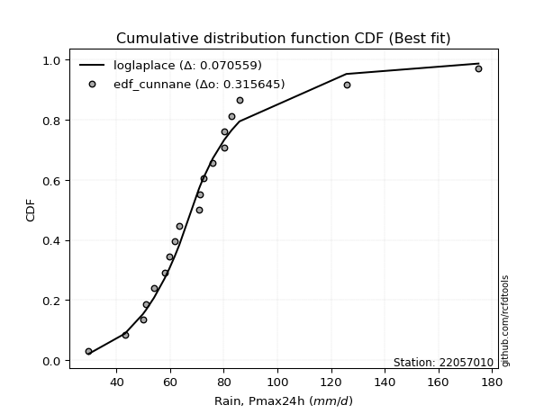</img></img>

</div>


### 12. EDF Adamowski (1981)

The Adamowski formula in hydrology refers to a specific plotting position formula used for estimating the non-parametric empirical distribution of hydrological events (like flood peaks) to calculate their return periods. This formula provides an alternative to traditional parametric methods (like the Gumbel or Log Pearson Type III distributions). 

<div align="center">


$P=(m-0.25)/(n+0.5)$


</div>


**12.1. Empirical values**

<div align="center">

|                | 0                    | 1                   | 2                   | 3                   | 4                   | 5                  | 6                   | 7                  | 8                  | 9                   | 10                 | 11                 | 12                 | 13                 | 14                 | 15                 | 16                 | 17                 | 18                 | 19                 |
|:---------------|:---------------------|:--------------------|:--------------------|:--------------------|:--------------------|:-------------------|:--------------------|:-------------------|:-------------------|:--------------------|:-------------------|:-------------------|:-------------------|:-------------------|:-------------------|:-------------------|:-------------------|:-------------------|:-------------------|:-------------------|
| date           | 2022                 | 2023                | 2009                | 2017                | 2015                | 2006               | 2018                | 2020               | 2011               | 2016                | 2010               | 2019               | 2008               | 2025               | 2021               | 2007               | 2012               | 2013               | 2014               | 2005               |
| x              | 29.6                 | 43.1                | 49.8                | 51.0                | 54.0                | 57.9               | 59.7                | 61.7               | 63.4               | 70.7                | 71.1               | 72.3               | 75.9               | 79.5               | 80.1               | 80.1               | 82.9               | 85.53              | 125.7              | 175.0              |
| m              | 1                    | 2                   | 3                   | 4                   | 5                   | 6                  | 7                   | 8                  | 9                  | 10                  | 11                 | 12                 | 13                 | 14                 | 15                 | 16                 | 17                 | 18                 | 19                 | 20                 |
| empirical_dist | edf_adamowski        | edf_adamowski       | edf_adamowski       | edf_adamowski       | edf_adamowski       | edf_adamowski      | edf_adamowski       | edf_adamowski      | edf_adamowski      | edf_adamowski       | edf_adamowski      | edf_adamowski      | edf_adamowski      | edf_adamowski      | edf_adamowski      | edf_adamowski      | edf_adamowski      | edf_adamowski      | edf_adamowski      | edf_adamowski      |
| empirical      | 0.036585365853658534 | 0.08536585365853659 | 0.13414634146341464 | 0.18292682926829268 | 0.23170731707317074 | 0.2804878048780488 | 0.32926829268292684 | 0.3780487804878049 | 0.4268292682926829 | 0.47560975609756095 | 0.524390243902439  | 0.573170731707317  | 0.6219512195121951 | 0.6707317073170732 | 0.7195121951219512 | 0.7682926829268293 | 0.8170731707317073 | 0.8658536585365854 | 0.9146341463414634 | 0.9634146341463414 |
| empirical_tr   | 1.0379746835443038   | 1.0933333333333333  | 1.1549295774647887  | 1.2238805970149254  | 1.3015873015873016  | 1.3898305084745763 | 1.490909090909091   | 1.607843137254902  | 1.7446808510638296 | 1.9069767441860463  | 2.1025641025641026 | 2.3428571428571425 | 2.6451612903225805 | 3.037037037037037  | 3.5652173913043477 | 4.315789473684211  | 5.466666666666665  | 7.454545454545454  | 11.714285714285719 | 27.33333333333331  |

</div>


**12.2. Kolmogorov-Smirnov fit test (sorted by Δ)**


<div align="center">

|                | 0                   | 1                   | 2                   | 3                   | 4                   | 5                   | 6                  | 7                   | 8                   | 9                  | 10                  | 11                  | 12                  | 13                 | 14                  | 15                  | 16                 | 17                  | 18                  | 19                  | 20                  | 21                  | 22                 | 23                  | 24                  | 25                  | 26                  | 27                  | 28                  | 29                  | 30                  | 31                  | 32                  | 33                  | 34                 | 35                  | 36                 | 37                  | 38                  | 39                 | 40                  | 41                  | 42                  | 43                 | 44                 | 45                  | 46                 | 47                  | 48                  | 49                  | 50                 | 51                  | 52                 | 53                  | 54                  | 55                  | 56                  | 57                  | 58                  | 59                 | 60                  | 61                 | 62                  | 63                  | 64                  | 65                  | 66                 | 67                  | 68                  | 69                  | 70                  | 71                  | 72                  | 73                  | 74                  | 75                  | 76                  | 77                  | 78                  | 79                  | 80                  | 81                 | 82                  | 83                 | 84                  | 85                  | 86                  | 87                  | 88                  | 89                 | 90                 | 91                  | 92                  | 93                 | 94                  | 95                 | 96                  | 97                  | 98                  | 99                  | 100                 | 101                | 102                | 103                | 104                | 105                | 106                 | 107                 | 108                 | 109                 | 110                | 111                 | 112                 | 113                 | 114                 | 115                | 116                 | 117                | 118                 | 119                | 120                | 121                 | 122                | 123                 | 124                | 125                | 126                | 127                | 128                | 129                 | 130                 | 131                 | 132                | 133                 | 134                 | 135                | 136                 | 137                 | 138                | 139                 | 140                | 141                | 142                 | 143                 | 144                 | 145                 | 146                | 147                | 148                | 149                | 150                | 151                | 152                | 153                | 154                | 155                | 156                | 157                | 158                |
|:---------------|:--------------------|:--------------------|:--------------------|:--------------------|:--------------------|:--------------------|:-------------------|:--------------------|:--------------------|:-------------------|:--------------------|:--------------------|:--------------------|:-------------------|:--------------------|:--------------------|:-------------------|:--------------------|:--------------------|:--------------------|:--------------------|:--------------------|:-------------------|:--------------------|:--------------------|:--------------------|:--------------------|:--------------------|:--------------------|:--------------------|:--------------------|:--------------------|:--------------------|:--------------------|:-------------------|:--------------------|:-------------------|:--------------------|:--------------------|:-------------------|:--------------------|:--------------------|:--------------------|:-------------------|:-------------------|:--------------------|:-------------------|:--------------------|:--------------------|:--------------------|:-------------------|:--------------------|:-------------------|:--------------------|:--------------------|:--------------------|:--------------------|:--------------------|:--------------------|:-------------------|:--------------------|:-------------------|:--------------------|:--------------------|:--------------------|:--------------------|:-------------------|:--------------------|:--------------------|:--------------------|:--------------------|:--------------------|:--------------------|:--------------------|:--------------------|:--------------------|:--------------------|:--------------------|:--------------------|:--------------------|:--------------------|:-------------------|:--------------------|:-------------------|:--------------------|:--------------------|:--------------------|:--------------------|:--------------------|:-------------------|:-------------------|:--------------------|:--------------------|:-------------------|:--------------------|:-------------------|:--------------------|:--------------------|:--------------------|:--------------------|:--------------------|:-------------------|:-------------------|:-------------------|:-------------------|:-------------------|:--------------------|:--------------------|:--------------------|:--------------------|:-------------------|:--------------------|:--------------------|:--------------------|:--------------------|:-------------------|:--------------------|:-------------------|:--------------------|:-------------------|:-------------------|:--------------------|:-------------------|:--------------------|:-------------------|:-------------------|:-------------------|:-------------------|:-------------------|:--------------------|:--------------------|:--------------------|:-------------------|:--------------------|:--------------------|:-------------------|:--------------------|:--------------------|:-------------------|:--------------------|:-------------------|:-------------------|:--------------------|:--------------------|:--------------------|:--------------------|:-------------------|:-------------------|:-------------------|:-------------------|:-------------------|:-------------------|:-------------------|:-------------------|:-------------------|:-------------------|:-------------------|:-------------------|:-------------------|
| station        | 22057010            | 22057010            | 22057010            | 22057010            | 22057010            | 22057010            | 22057010           | 22057010            | 22057010            | 22057010           | 22057010            | 22057010            | 22057010            | 22057010           | 22057010            | 22057010            | 22057010           | 22057010            | 22057010            | 22057010            | 22057010            | 22057010            | 22057010           | 22057010            | 22057010            | 22057010            | 22057010            | 22057010            | 22057010            | 22057010            | 22057010            | 22057010            | 22057010            | 22057010            | 22057010           | 22057010            | 22057010           | 22057010            | 22057010            | 22057010           | 22057010            | 22057010            | 22057010            | 22057010           | 22057010           | 22057010            | 22057010           | 22057010            | 22057010            | 22057010            | 22057010           | 22057010            | 22057010           | 22057010            | 22057010            | 22057010            | 22057010            | 22057010            | 22057010            | 22057010           | 22057010            | 22057010           | 22057010            | 22057010            | 22057010            | 22057010            | 22057010           | 22057010            | 22057010            | 22057010            | 22057010            | 22057010            | 22057010            | 22057010            | 22057010            | 22057010            | 22057010            | 22057010            | 22057010            | 22057010            | 22057010            | 22057010           | 22057010            | 22057010           | 22057010            | 22057010            | 22057010            | 22057010            | 22057010            | 22057010           | 22057010           | 22057010            | 22057010            | 22057010           | 22057010            | 22057010           | 22057010            | 22057010            | 22057010            | 22057010            | 22057010            | 22057010           | 22057010           | 22057010           | 22057010           | 22057010           | 22057010            | 22057010            | 22057010            | 22057010            | 22057010           | 22057010            | 22057010            | 22057010            | 22057010            | 22057010           | 22057010            | 22057010           | 22057010            | 22057010           | 22057010           | 22057010            | 22057010           | 22057010            | 22057010           | 22057010           | 22057010           | 22057010           | 22057010           | 22057010            | 22057010            | 22057010            | 22057010           | 22057010            | 22057010            | 22057010           | 22057010            | 22057010            | 22057010           | 22057010            | 22057010           | 22057010           | 22057010            | 22057010            | 22057010            | 22057010            | 22057010           | 22057010           | 22057010           | 22057010           | 22057010           | 22057010           | 22057010           | 22057010           | 22057010           | 22057010           | 22057010           | 22057010           | 22057010           |
| empirical_dist | edf_adamowski       | edf_adamowski       | edf_adamowski       | edf_adamowski       | edf_adamowski       | edf_adamowski       | edf_adamowski      | edf_adamowski       | edf_adamowski       | edf_adamowski      | edf_adamowski       | edf_adamowski       | edf_adamowski       | edf_adamowski      | edf_adamowski       | edf_adamowski       | edf_adamowski      | edf_adamowski       | edf_adamowski       | edf_adamowski       | edf_adamowski       | edf_adamowski       | edf_adamowski      | edf_adamowski       | edf_adamowski       | edf_adamowski       | edf_adamowski       | edf_adamowski       | edf_adamowski       | edf_adamowski       | edf_adamowski       | edf_adamowski       | edf_adamowski       | edf_adamowski       | edf_adamowski      | edf_adamowski       | edf_adamowski      | edf_adamowski       | edf_adamowski       | edf_adamowski      | edf_adamowski       | edf_adamowski       | edf_adamowski       | edf_adamowski      | edf_adamowski      | edf_adamowski       | edf_adamowski      | edf_adamowski       | edf_adamowski       | edf_adamowski       | edf_adamowski      | edf_adamowski       | edf_adamowski      | edf_adamowski       | edf_adamowski       | edf_adamowski       | edf_adamowski       | edf_adamowski       | edf_adamowski       | edf_adamowski      | edf_adamowski       | edf_adamowski      | edf_adamowski       | edf_adamowski       | edf_adamowski       | edf_adamowski       | edf_adamowski      | edf_adamowski       | edf_adamowski       | edf_adamowski       | edf_adamowski       | edf_adamowski       | edf_adamowski       | edf_adamowski       | edf_adamowski       | edf_adamowski       | edf_adamowski       | edf_adamowski       | edf_adamowski       | edf_adamowski       | edf_adamowski       | edf_adamowski      | edf_adamowski       | edf_adamowski      | edf_adamowski       | edf_adamowski       | edf_adamowski       | edf_adamowski       | edf_adamowski       | edf_adamowski      | edf_adamowski      | edf_adamowski       | edf_adamowski       | edf_adamowski      | edf_adamowski       | edf_adamowski      | edf_adamowski       | edf_adamowski       | edf_adamowski       | edf_adamowski       | edf_adamowski       | edf_adamowski      | edf_adamowski      | edf_adamowski      | edf_adamowski      | edf_adamowski      | edf_adamowski       | edf_adamowski       | edf_adamowski       | edf_adamowski       | edf_adamowski      | edf_adamowski       | edf_adamowski       | edf_adamowski       | edf_adamowski       | edf_adamowski      | edf_adamowski       | edf_adamowski      | edf_adamowski       | edf_adamowski      | edf_adamowski      | edf_adamowski       | edf_adamowski      | edf_adamowski       | edf_adamowski      | edf_adamowski      | edf_adamowski      | edf_adamowski      | edf_adamowski      | edf_adamowski       | edf_adamowski       | edf_adamowski       | edf_adamowski      | edf_adamowski       | edf_adamowski       | edf_adamowski      | edf_adamowski       | edf_adamowski       | edf_adamowski      | edf_adamowski       | edf_adamowski      | edf_adamowski      | edf_adamowski       | edf_adamowski       | edf_adamowski       | edf_adamowski       | edf_adamowski      | edf_adamowski      | edf_adamowski      | edf_adamowski      | edf_adamowski      | edf_adamowski      | edf_adamowski      | edf_adamowski      | edf_adamowski      | edf_adamowski      | edf_adamowski      | edf_adamowski      | edf_adamowski      |
| p_dist         | logjohnsonsu        | logdgamma           | loglaplace          | loglaplace          | logt                | tukeylambda         | johnsonsu          | logdweibull         | logmielke           | logburr            | vonmises_line       | loggenlogistic      | logburr12           | burr               | mielke              | burr12              | loghypsecant       | dgamma              | dweibull            | loggennorm          | logexponnorm        | loglogistic         | logloglaplace      | gennorm             | pearson3            | lognct              | alpha               | lograyleigh         | lognakagami         | exponnorm           | nct                 | logmaxwell          | loginvgauss         | logalpha            | logpearson3        | genextreme          | invweibull         | logskewnorm         | logfoldnorm         | invgamma           | betaprime           | loginvgamma         | f                   | loghalfnorm        | weibull_min        | logjohnsonsb        | loggumbel_r        | genlogistic         | logf                | logncf              | logexponweib       | logfatiguelife      | logerlang          | loggamma            | loggamma            | logbeta             | loggengamma         | moyal               | johnsonsb           | logrice            | lognorm             | logcrystalball     | halflogistic        | gengamma            | logloggamma         | logweibull_max      | loggenextreme      | invgauss            | logtruncnorm        | logweibull_min      | logkstwobign        | loginvweibull       | gamma               | erlang              | gausshyper          | beta                | laplace             | gumbel_r            | logbetaprime        | wald                | t                   | logmoyal           | loghalflogistic     | loggumbel_l        | skewnorm            | loganglit           | genhalflogistic     | halfnorm            | foldnorm            | kstwobign          | kappa3             | logexponpow         | loggompertz         | logsemicircular    | hypsecant           | rayleigh           | genpareto           | rice                | maxwell             | logistic            | logcosine           | loggenexpon        | logtriang          | truncnorm          | norm               | crystalball        | logtruncpareto      | logtruncweibull_min | logarcsine          | logwald             | anglit             | nakagami            | lomax               | genexpon            | loghalfgennorm      | semicircular       | logbradford         | logtruncexpon      | gumbel_l            | kappa4             | loguniform         | logkappa3           | logtukeylambda     | arcsine             | logkappa4          | logksone           | logrdist           | truncexpon         | loglomax           | triang              | logargus            | halfgennorm         | cosine             | loggenpareto        | truncweibull_min    | powerlaw           | loglevy_l           | loggenhalflogistic  | ncf                | bradford            | ksone              | exponweib          | argus               | wrapcauchy          | logpowerlaw         | levy_l              | uniform            | logtrapezoid       | rdist              | fatiguelife        | trapezoid          | weibull_max        | exponpow           | truncpareto        | gompertz           | logvonmises_line   | logvonmises        | vonmises           | loggausshyper      |
| delta          | 0.08107737197909881 | 0.08149807168938594 | 0.08188610373336669 | 0.08188610373336669 | 0.08540355516366716 | 0.08672431830143612 | 0.0878934644680801 | 0.08806958720270541 | 0.09027217561136935 | 0.0902722813104051 | 0.09772845244914163 | 0.09789563957497549 | 0.09792548321663141 | 0.097942690306981  | 0.09798503894850108 | 0.09869579055662536 | 0.0991639576008212 | 0.10170407587073671 | 0.10884057213204085 | 0.10902591307824905 | 0.11353855758831433 | 0.11452475469560142 | 0.1178426324177918 | 0.11828703130384594 | 0.11896757505489164 | 0.12043105959311251 | 0.12068890308308267 | 0.12106299871953585 | 0.12111393542002868 | 0.12114310893090996 | 0.12212398084980436 | 0.12460288786036566 | 0.12463639291292772 | 0.12520076063062902 | 0.1257620709752495 | 0.12769379883662624 | 0.1276973223461536 | 0.12825318591026036 | 0.12831294527045645 | 0.1287218802920661 | 0.12874005243248898 | 0.12896742769024439 | 0.12902741484662072 | 0.1290415102489919 | 0.1291383862462876 | 0.12928624152880397 | 0.1293582296517719 | 0.12938494361833874 | 0.12944740989731385 | 0.12954196492867254 | 0.1296345318113965 | 0.13009271797032684 | 0.130536696898216  | 0.13054208629927233 | 0.13054208629927233 | 0.13076833974286572 | 0.13154565107455574 | 0.13226976577330085 | 0.13342141744958325 | 0.136111572028626  | 0.13691335767957724 | 0.1369134844190335 | 0.13705174251227858 | 0.13749232847989512 | 0.13945394389658095 | 0.14054416341284515 | 0.140574115089523  | 0.14090213283950226 | 0.14366284693371167 | 0.14406179207997716 | 0.14688495523835632 | 0.14813007282354718 | 0.14823635373605948 | 0.14823640362375834 | 0.14829487310333667 | 0.14993736997381835 | 0.15046319125926766 | 0.15180719418850197 | 0.15292093436796772 | 0.15367301674403455 | 0.15456216047401838 | 0.1546455893228822 | 0.15574414519941449 | 0.1589996476177845 | 0.16106883960602303 | 0.16344221498215716 | 0.16479435751754834 | 0.16508969466825762 | 0.16747487181727183 | 0.1675290320498215 | 0.1690897849608891 | 0.17095540643973706 | 0.17232345211451017 | 0.174864424725228  | 0.17849203982115747 | 0.1835591637051176 | 0.18558119264369966 | 0.18884013347041162 | 0.18989012132575234 | 0.19265150263034714 | 0.19353438381156518 | 0.1996563114873396 | 0.2003714955062148 | 0.2110038087807421 | 0.2110038180761623 | 0.2110038245049819 | 0.21476350098959396 | 0.21748805304244356 | 0.22399313114702424 | 0.22483336910286178 | 0.2313290987115637 | 0.23279054842331737 | 0.23471911884700358 | 0.23473452519410465 | 0.23927470401726025 | 0.2398679994377847 | 0.24133090807625823 | 0.2475646468137837 | 0.25806440053055957 | 0.2585845083888699 | 0.2687316010650309 | 0.26890648648229354 | 0.2748758029540982 | 0.27494046038926767 | 0.2750377247447022 | 0.2849186106436232 | 0.2895744482121897 | 0.2944749542107551 | 0.3119472984851782 | 0.32000807714544244 | 0.33097021010410366 | 0.33892740539050714 | 0.350323463519599  | 0.37526858387316236 | 0.39488467867452093 | 0.3998729063401073 | 0.41436106162180725 | 0.42764150831928416 | 0.4279285142070886 | 0.44476806937309166 | 0.4619678263495153 | 0.466309332550818  | 0.47429045589619545 | 0.47866498667044577 | 0.47983427711014814 | 0.48007829384893835 | 0.4811906599121012 | 0.5283681286661872 | 0.5578085538782241 | 0.5827786308540773 | 0.7027298930951432 | 0.7515181739076606 | 0.8312871243834217 | 0.850193679866207  | 0.9145550704276045 | 0.9634146341463414 | 1.0625250173843583 | 27.540885244219126 | 39.1791519176506   |
| deltao         | 0.3096406529800002  | 0.3096406529800002  | 0.3096406529800002  | 0.3096406529800002  | 0.3096406529800002  | 0.3096406529800002  | 0.3096406529800002 | 0.3096406529800002  | 0.3096406529800002  | 0.3096406529800002 | 0.3096406529800002  | 0.3096406529800002  | 0.3096406529800002  | 0.3096406529800002 | 0.3096406529800002  | 0.3096406529800002  | 0.3096406529800002 | 0.3096406529800002  | 0.3096406529800002  | 0.3096406529800002  | 0.3096406529800002  | 0.3096406529800002  | 0.3096406529800002 | 0.3096406529800002  | 0.3096406529800002  | 0.3096406529800002  | 0.3096406529800002  | 0.3096406529800002  | 0.3096406529800002  | 0.3096406529800002  | 0.3096406529800002  | 0.3096406529800002  | 0.3096406529800002  | 0.3096406529800002  | 0.3096406529800002 | 0.3096406529800002  | 0.3096406529800002 | 0.3096406529800002  | 0.3096406529800002  | 0.3096406529800002 | 0.3096406529800002  | 0.3096406529800002  | 0.3096406529800002  | 0.3096406529800002 | 0.3096406529800002 | 0.3096406529800002  | 0.3096406529800002 | 0.3096406529800002  | 0.3096406529800002  | 0.3096406529800002  | 0.3096406529800002 | 0.3096406529800002  | 0.3096406529800002 | 0.3096406529800002  | 0.3096406529800002  | 0.3096406529800002  | 0.3096406529800002  | 0.3096406529800002  | 0.3096406529800002  | 0.3096406529800002 | 0.3096406529800002  | 0.3096406529800002 | 0.3096406529800002  | 0.3096406529800002  | 0.3096406529800002  | 0.3096406529800002  | 0.3096406529800002 | 0.3096406529800002  | 0.3096406529800002  | 0.3096406529800002  | 0.3096406529800002  | 0.3096406529800002  | 0.3096406529800002  | 0.3096406529800002  | 0.3096406529800002  | 0.3096406529800002  | 0.3096406529800002  | 0.3096406529800002  | 0.3096406529800002  | 0.3096406529800002  | 0.3096406529800002  | 0.3096406529800002 | 0.3096406529800002  | 0.3096406529800002 | 0.3096406529800002  | 0.3096406529800002  | 0.3096406529800002  | 0.3096406529800002  | 0.3096406529800002  | 0.3096406529800002 | 0.3096406529800002 | 0.3096406529800002  | 0.3096406529800002  | 0.3096406529800002 | 0.3096406529800002  | 0.3096406529800002 | 0.3096406529800002  | 0.3096406529800002  | 0.3096406529800002  | 0.3096406529800002  | 0.3096406529800002  | 0.3096406529800002 | 0.3096406529800002 | 0.3096406529800002 | 0.3096406529800002 | 0.3096406529800002 | 0.3096406529800002  | 0.3096406529800002  | 0.3096406529800002  | 0.3096406529800002  | 0.3096406529800002 | 0.3096406529800002  | 0.3096406529800002  | 0.3096406529800002  | 0.3096406529800002  | 0.3096406529800002 | 0.3096406529800002  | 0.3096406529800002 | 0.3096406529800002  | 0.3096406529800002 | 0.3096406529800002 | 0.3096406529800002  | 0.3096406529800002 | 0.3096406529800002  | 0.3096406529800002 | 0.3096406529800002 | 0.3096406529800002 | 0.3096406529800002 | 0.3096406529800002 | 0.3096406529800002  | 0.3096406529800002  | 0.3096406529800002  | 0.3096406529800002 | 0.3096406529800002  | 0.3096406529800002  | 0.3096406529800002 | 0.3096406529800002  | 0.3096406529800002  | 0.3096406529800002 | 0.3096406529800002  | 0.3096406529800002 | 0.3096406529800002 | 0.3096406529800002  | 0.3096406529800002  | 0.3096406529800002  | 0.3096406529800002  | 0.3096406529800002 | 0.3096406529800002 | 0.3096406529800002 | 0.3096406529800002 | 0.3096406529800002 | 0.3096406529800002 | 0.3096406529800002 | 0.3096406529800002 | 0.3096406529800002 | 0.3096406529800002 | 0.3096406529800002 | 0.3096406529800002 | 0.3096406529800002 |
| eval           | Δo > Δ              | Δo > Δ              | Δo > Δ              | Δo > Δ              | Δo > Δ              | Δo > Δ              | Δo > Δ             | Δo > Δ              | Δo > Δ              | Δo > Δ             | Δo > Δ              | Δo > Δ              | Δo > Δ              | Δo > Δ             | Δo > Δ              | Δo > Δ              | Δo > Δ             | Δo > Δ              | Δo > Δ              | Δo > Δ              | Δo > Δ              | Δo > Δ              | Δo > Δ             | Δo > Δ              | Δo > Δ              | Δo > Δ              | Δo > Δ              | Δo > Δ              | Δo > Δ              | Δo > Δ              | Δo > Δ              | Δo > Δ              | Δo > Δ              | Δo > Δ              | Δo > Δ             | Δo > Δ              | Δo > Δ             | Δo > Δ              | Δo > Δ              | Δo > Δ             | Δo > Δ              | Δo > Δ              | Δo > Δ              | Δo > Δ             | Δo > Δ             | Δo > Δ              | Δo > Δ             | Δo > Δ              | Δo > Δ              | Δo > Δ              | Δo > Δ             | Δo > Δ              | Δo > Δ             | Δo > Δ              | Δo > Δ              | Δo > Δ              | Δo > Δ              | Δo > Δ              | Δo > Δ              | Δo > Δ             | Δo > Δ              | Δo > Δ             | Δo > Δ              | Δo > Δ              | Δo > Δ              | Δo > Δ              | Δo > Δ             | Δo > Δ              | Δo > Δ              | Δo > Δ              | Δo > Δ              | Δo > Δ              | Δo > Δ              | Δo > Δ              | Δo > Δ              | Δo > Δ              | Δo > Δ              | Δo > Δ              | Δo > Δ              | Δo > Δ              | Δo > Δ              | Δo > Δ             | Δo > Δ              | Δo > Δ             | Δo > Δ              | Δo > Δ              | Δo > Δ              | Δo > Δ              | Δo > Δ              | Δo > Δ             | Δo > Δ             | Δo > Δ              | Δo > Δ              | Δo > Δ             | Δo > Δ              | Δo > Δ             | Δo > Δ              | Δo > Δ              | Δo > Δ              | Δo > Δ              | Δo > Δ              | Δo > Δ             | Δo > Δ             | Δo > Δ             | Δo > Δ             | Δo > Δ             | Δo > Δ              | Δo > Δ              | Δo > Δ              | Δo > Δ              | Δo > Δ             | Δo > Δ              | Δo > Δ              | Δo > Δ              | Δo > Δ              | Δo > Δ             | Δo > Δ              | Δo > Δ             | Δo > Δ              | Δo > Δ             | Δo > Δ             | Δo > Δ              | Δo > Δ             | Δo > Δ              | Δo > Δ             | Δo > Δ             | Δo > Δ             | Δo > Δ             | Δo <= Δ            | Δo <= Δ             | Δo <= Δ             | Δo <= Δ             | Δo <= Δ            | Δo <= Δ             | Δo <= Δ             | Δo <= Δ            | Δo <= Δ             | Δo <= Δ             | Δo <= Δ            | Δo <= Δ             | Δo <= Δ            | Δo <= Δ            | Δo <= Δ             | Δo <= Δ             | Δo <= Δ             | Δo <= Δ             | Δo <= Δ            | Δo <= Δ            | Δo <= Δ            | Δo <= Δ            | Δo <= Δ            | Δo <= Δ            | Δo <= Δ            | Δo <= Δ            | Δo <= Δ            | Δo <= Δ            | Δo <= Δ            | Δo <= Δ            | Δo <= Δ            |
| fit            | 1                   | 1                   | 1                   | 1                   | 1                   | 1                   | 1                  | 1                   | 1                   | 1                  | 1                   | 1                   | 1                   | 1                  | 1                   | 1                   | 1                  | 1                   | 1                   | 1                   | 1                   | 1                   | 1                  | 1                   | 1                   | 1                   | 1                   | 1                   | 1                   | 1                   | 1                   | 1                   | 1                   | 1                   | 1                  | 1                   | 1                  | 1                   | 1                   | 1                  | 1                   | 1                   | 1                   | 1                  | 1                  | 1                   | 1                  | 1                   | 1                   | 1                   | 1                  | 1                   | 1                  | 1                   | 1                   | 1                   | 1                   | 1                   | 1                   | 1                  | 1                   | 1                  | 1                   | 1                   | 1                   | 1                   | 1                  | 1                   | 1                   | 1                   | 1                   | 1                   | 1                   | 1                   | 1                   | 1                   | 1                   | 1                   | 1                   | 1                   | 1                   | 1                  | 1                   | 1                  | 1                   | 1                   | 1                   | 1                   | 1                   | 1                  | 1                  | 1                   | 1                   | 1                  | 1                   | 1                  | 1                   | 1                   | 1                   | 1                   | 1                   | 1                  | 1                  | 1                  | 1                  | 1                  | 1                   | 1                   | 1                   | 1                   | 1                  | 1                   | 1                   | 1                   | 1                   | 1                  | 1                   | 1                  | 1                   | 1                  | 1                  | 1                   | 1                  | 1                   | 1                  | 1                  | 1                  | 1                  | 0                  | 0                   | 0                   | 0                   | 0                  | 0                   | 0                   | 0                  | 0                   | 0                   | 0                  | 0                   | 0                  | 0                  | 0                   | 0                   | 0                   | 0                   | 0                  | 0                  | 0                  | 0                  | 0                  | 0                  | 0                  | 0                  | 0                  | 0                  | 0                  | 0                  | 0                  |
| n              | 20                  | 20                  | 20                  | 20                  | 20                  | 20                  | 20                 | 20                  | 20                  | 20                 | 20                  | 20                  | 20                  | 20                 | 20                  | 20                  | 20                 | 20                  | 20                  | 20                  | 20                  | 20                  | 20                 | 20                  | 20                  | 20                  | 20                  | 20                  | 20                  | 20                  | 20                  | 20                  | 20                  | 20                  | 20                 | 20                  | 20                 | 20                  | 20                  | 20                 | 20                  | 20                  | 20                  | 20                 | 20                 | 20                  | 20                 | 20                  | 20                  | 20                  | 20                 | 20                  | 20                 | 20                  | 20                  | 20                  | 20                  | 20                  | 20                  | 20                 | 20                  | 20                 | 20                  | 20                  | 20                  | 20                  | 20                 | 20                  | 20                  | 20                  | 20                  | 20                  | 20                  | 20                  | 20                  | 20                  | 20                  | 20                  | 20                  | 20                  | 20                  | 20                 | 20                  | 20                 | 20                  | 20                  | 20                  | 20                  | 20                  | 20                 | 20                 | 20                  | 20                  | 20                 | 20                  | 20                 | 20                  | 20                  | 20                  | 20                  | 20                  | 20                 | 20                 | 20                 | 20                 | 20                 | 20                  | 20                  | 20                  | 20                  | 20                 | 20                  | 20                  | 20                  | 20                  | 20                 | 20                  | 20                 | 20                  | 20                 | 20                 | 20                  | 20                 | 20                  | 20                 | 20                 | 20                 | 20                 | 20                 | 20                  | 20                  | 20                  | 20                 | 20                  | 20                  | 20                 | 20                  | 20                  | 20                 | 20                  | 20                 | 20                 | 20                  | 20                  | 20                  | 20                  | 20                 | 20                 | 20                 | 20                 | 20                 | 20                 | 20                 | 20                 | 20                 | 20                 | 20                 | 20                 | 20                 |
| best_fit       | 1                   | 0                   | 0                   | 0                   | 0                   | 0                   | 0                  | 0                   | 0                   | 0                  | 0                   | 0                   | 0                   | 0                  | 0                   | 0                   | 0                  | 0                   | 0                   | 0                   | 0                   | 0                   | 0                  | 0                   | 0                   | 0                   | 0                   | 0                   | 0                   | 0                   | 0                   | 0                   | 0                   | 0                   | 0                  | 0                   | 0                  | 0                   | 0                   | 0                  | 0                   | 0                   | 0                   | 0                  | 0                  | 0                   | 0                  | 0                   | 0                   | 0                   | 0                  | 0                   | 0                  | 0                   | 0                   | 0                   | 0                   | 0                   | 0                   | 0                  | 0                   | 0                  | 0                   | 0                   | 0                   | 0                   | 0                  | 0                   | 0                   | 0                   | 0                   | 0                   | 0                   | 0                   | 0                   | 0                   | 0                   | 0                   | 0                   | 0                   | 0                   | 0                  | 0                   | 0                  | 0                   | 0                   | 0                   | 0                   | 0                   | 0                  | 0                  | 0                   | 0                   | 0                  | 0                   | 0                  | 0                   | 0                   | 0                   | 0                   | 0                   | 0                  | 0                  | 0                  | 0                  | 0                  | 0                   | 0                   | 0                   | 0                   | 0                  | 0                   | 0                   | 0                   | 0                   | 0                  | 0                   | 0                  | 0                   | 0                  | 0                  | 0                   | 0                  | 0                   | 0                  | 0                  | 0                  | 0                  | 0                  | 0                   | 0                   | 0                   | 0                  | 0                   | 0                   | 0                  | 0                   | 0                   | 0                  | 0                   | 0                  | 0                  | 0                   | 0                   | 0                   | 0                   | 0                  | 0                  | 0                  | 0                  | 0                  | 0                  | 0                  | 0                  | 0                  | 0                  | 0                  | 0                  | 0                  |
| best_fit_sort  | 1                   | 2                   | 3                   | 4                   | 5                   | 6                   | 7                  | 8                   | 9                   | 10                 | 11                  | 12                  | 13                  | 14                 | 15                  | 16                  | 17                 | 18                  | 19                  | 20                  | 21                  | 22                  | 23                 | 24                  | 25                  | 26                  | 27                  | 28                  | 29                  | 30                  | 31                  | 32                  | 33                  | 34                  | 35                 | 36                  | 37                 | 38                  | 39                  | 40                 | 41                  | 42                  | 43                  | 44                 | 45                 | 46                  | 47                 | 48                  | 49                  | 50                  | 51                 | 52                  | 53                 | 54                  | 55                  | 56                  | 57                  | 58                  | 59                  | 60                 | 61                  | 62                 | 63                  | 64                  | 65                  | 66                  | 67                 | 68                  | 69                  | 70                  | 71                  | 72                  | 73                  | 74                  | 75                  | 76                  | 77                  | 78                  | 79                  | 80                  | 81                  | 82                 | 83                  | 84                 | 85                  | 86                  | 87                  | 88                  | 89                  | 90                 | 91                 | 92                  | 93                  | 94                 | 95                  | 96                 | 97                  | 98                  | 99                  | 100                 | 101                 | 102                | 103                | 104                | 105                | 106                | 107                 | 108                 | 109                 | 110                 | 111                | 112                 | 113                 | 114                 | 115                 | 116                | 117                 | 118                | 119                 | 120                | 121                | 122                 | 123                | 124                 | 125                | 126                | 127                | 128                | 129                | 130                 | 131                 | 132                 | 133                | 134                 | 135                 | 136                | 137                 | 138                 | 139                | 140                 | 141                | 142                | 143                 | 144                 | 145                 | 146                 | 147                | 148                | 149                | 150                | 151                | 152                | 153                | 154                | 155                | 156                | 157                | 158                | 159                |

</div>


**12.3. Best fit**

<div align="center">

|   id |   station | empirical_dist   | p_dist       |     delta |   deltao | eval   |   fit |   n |   best_fit |   best_fit_sort |
|-----:|----------:|:-----------------|:-------------|----------:|---------:|:-------|------:|----:|-----------:|----------------:|
|    0 |  22057010 | edf_adamowski    | logjohnsonsu | 0.0810774 | 0.309641 | Δo > Δ |     1 |  20 |          1 |               1 |

</div>


<div align="center">

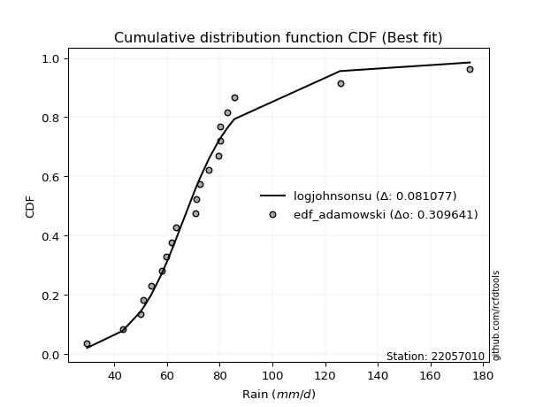</img></img>

</div>


## C. Best fit & Estimate extreme values for specific return periods - Tr

Best fit in probability distribution analysis means finding the theoretical distribution (like Normal, Poisson, Exponential, etc.) that most accurately mirrors your real-world data´s patterns (shape, center, spread) for better predictions, using methods like visual checks (Q-Q plots), goodness-of-fit tests (Kolmogorov-Smirnov, Chi-Squared), and information criteria (AIC) to score and select the simplest, most representative model.


### 1. Best fit (ordered by delta Δ)

:file_folder:Table: [bestfit_22057010.csv](table/bestfit_22057010.csv)

<div align="center">

|   id |   station | empirical_dist   | p_dist        |     delta |   deltao | eval   |   fit |   n |   best_fit |   best_fit_sort |
|-----:|----------:|:-----------------|:--------------|----------:|---------:|:-------|------:|----:|-----------:|----------------:|
|    0 |  22057010 | edf_california   | vonmises_line | 0.0733382 | 0.309641 | Δo > Δ |     1 |  20 |          1 |               1 |
|    1 |  22057010 | edf_weibull      | logdgamma     | 0.0759226 | 0.309641 | Δo > Δ |     1 |  20 |          1 |               2 |
|    2 |  22057010 | edf_adamowski    | logjohnsonsu  | 0.0810774 | 0.309641 | Δo > Δ |     1 |  20 |          1 |               3 |
|    3 |  22057010 | edf_chegodayev   | logjohnsonsu  | 0.0811969 | 0.309641 | Δo > Δ |     1 |  20 |          1 |               4 |
|    4 |  22057010 | edf_jenkinson    | logjohnsonsu  | 0.081221  | 0.309641 | Δo > Δ |     1 |  20 |          1 |               5 |
|    5 |  22057010 | edf_beard        | logjohnsonsu  | 0.081221  | 0.309641 | Δo > Δ |     1 |  20 |          1 |               6 |
|    6 |  22057010 | edf_filliben     | logjohnsonsu  | 0.0812391 | 0.309641 | Δo > Δ |     1 |  20 |          1 |               7 |
|    7 |  22057010 | edf_tukey        | logjohnsonsu  | 0.0812773 | 0.309641 | Δo > Δ |     1 |  20 |          1 |               8 |
|    8 |  22057010 | edf_blom         | logjohnsonsu  | 0.0813785 | 0.309641 | Δo > Δ |     1 |  20 |          1 |               9 |
|    9 |  22057010 | edf_cunnane      | logjohnsonsu  | 0.0814396 | 0.309641 | Δo > Δ |     1 |  20 |          1 |              10 |
|   10 |  22057010 | edf_gringorten   | logjohnsonsu  | 0.081538  | 0.309641 | Δo > Δ |     1 |  20 |          1 |              11 |
|   11 |  22057010 | edf_hazen        | logjohnsonsu  | 0.0816871 | 0.309641 | Δo > Δ |     1 |  20 |          1 |              12 |

</div>


### 2. Extreme values and % difference analysis

In hydrology, a return period (or recurrence interval $Tr$) is the statistical average time between extreme events like floods or droughts of a specific magnitude, indicating how rare an event is, with a 100-year flood, for example, having a 1% chance of occurring in any given year, not that it happens exactly every century. It is a key tool for infrastructure design (like bridges or dams) and risk assessment, calculated from historical data to determine the probability of future events, although it is important to remember it is statistical average, and events can cluster or be missed.

The extreme value porcentage difference is evaluated as $pdiff = 1 - (ETrBf / ETr) * 100$, where _ETrBf_ correspond to the bestfit extreme value for a specific recurrence interval and _ETr_ correspond to the extreme value for one of the most used PDFsused in hydrology.

> risk_rate: assuming the return period as the project useful life.

:file_folder:Table: [extreme_22057010.csv](table/extreme_22057010.csv), all PDFs.  
:file_folder:Table: [extremepdiff_22057010.csv](table/extremepdiff_22057010.csv), % difference between bestfit and most used PDFs in Hydrology.

<div align="center">

Extreme values table for only best fit PDFs
|   id |      tr |   prob_l |     prob_g |    alpha |   anglit |   arcsine |   argus |     beta |   betaprime |   bradford |     burr |   burr12 |   cosine |   crystalball |   dgamma |   dweibull |   erlang |   exponnorm |   exponpow |   exponweib |        f |   fatiguelife |   foldnorm |    gamma |   gausshyper |   genexpon |   genextreme |   gengamma |   genhalflogistic |   genlogistic |   gennorm |   genpareto |   gompertz |   gumbel_l |   gumbel_r |   halfgennorm |   halflogistic |   halfnorm |   hypsecant |   invgamma |   invgauss |   invweibull |   johnsonsb |   johnsonsu |   kappa3 |   kappa4 |   ksone |   kstwobign |   laplace |   levy_l |   loggamma |   logistic |   loglaplace |    lomax |   maxwell |   mielke |    moyal |   nakagami |       ncf |      nct |     norm |   pearson3 |   powerlaw |   rayleigh |   rdist |     rice |   semicircular |   skewnorm |        t |   trapezoid |   triang |   truncexpon |   truncnorm |   truncpareto |   truncweibull_min |   tukeylambda |   uniform |   vonmises |   vonmises_line |     wald |   weibull_max |   weibull_min |   wrapcauchy |   logalpha |   loganglit |   logarcsine |   logargus |   logbeta |   logbetaprime |   logbradford |   logburr |   logburr12 |   logcosine |   logcrystalball |   logdgamma |   logdweibull |   logerlang |   logexponnorm |   logexponpow |   logexponweib |     logf |   logfatiguelife |   logfoldnorm |   loggausshyper |   loggenexpon |   loggenextreme |   loggengamma |   loggenhalflogistic |   loggenlogistic |   loggennorm |   loggenpareto |   loggompertz |   loggumbel_l |   loggumbel_r |   loghalfgennorm |   loghalflogistic |   loghalfnorm |   loghypsecant |   loginvgamma |   loginvgauss |   loginvweibull |   logjohnsonsb |   logjohnsonsu |   logkappa3 |   logkappa4 |   logksone |   logkstwobign |   loglevy_l |   logloggamma |   loglogistic |   logloglaplace |   loglomax |   logmaxwell |   logmielke |   logmoyal |   lognakagami |   logncf |   lognct |   lognorm |   logpearson3 |   logpowerlaw |   lograyleigh |   logrdist |   logrice |   logsemicircular |   logskewnorm |     logt |   logtrapezoid |   logtriang |   logtruncexpon |   logtruncnorm |   logtruncpareto |   logtruncweibull_min |   logtukeylambda |   loguniform |   logvonmises |   logvonmises_line |   logwald |   logweibull_max |   logweibull_min |   logwrapcauchy |   station |   n |   risk_rate |
|-----:|--------:|---------:|-----------:|---------:|---------:|----------:|--------:|---------:|------------:|-----------:|---------:|---------:|---------:|--------------:|---------:|-----------:|---------:|------------:|-----------:|------------:|---------:|--------------:|-----------:|---------:|-------------:|-----------:|-------------:|-----------:|------------------:|--------------:|----------:|------------:|-----------:|-----------:|-----------:|--------------:|---------------:|-----------:|------------:|-----------:|-----------:|-------------:|------------:|------------:|---------:|---------:|--------:|------------:|----------:|---------:|-----------:|-----------:|-------------:|---------:|----------:|---------:|---------:|-----------:|----------:|---------:|---------:|-----------:|-----------:|-----------:|--------:|---------:|---------------:|-----------:|---------:|------------:|---------:|-------------:|------------:|--------------:|-------------------:|--------------:|----------:|-----------:|----------------:|---------:|--------------:|--------------:|-------------:|-----------:|------------:|-------------:|-----------:|----------:|---------------:|--------------:|----------:|------------:|------------:|-----------------:|------------:|--------------:|------------:|---------------:|--------------:|---------------:|---------:|-----------------:|--------------:|----------------:|--------------:|----------------:|--------------:|---------------------:|-----------------:|-------------:|---------------:|--------------:|--------------:|--------------:|-----------------:|------------------:|--------------:|---------------:|--------------:|--------------:|----------------:|---------------:|---------------:|------------:|------------:|-----------:|---------------:|------------:|--------------:|--------------:|----------------:|-----------:|-------------:|------------:|-----------:|--------------:|---------:|---------:|----------:|--------------:|--------------:|--------------:|-----------:|----------:|------------------:|--------------:|---------:|---------------:|------------:|----------------:|---------------:|-----------------:|----------------------:|-----------------:|-------------:|--------------:|-------------------:|----------:|-----------------:|-----------------:|----------------:|----------:|----:|------------:|
|    0 |    2    | 0.5      | 0.5        |  67.6711 |  73.4515 |   73.4515 | 100.736 |  68.6109 |     67.8142 |    96.8257 |  67.8676 |  67.7462 |  83.91   |       73.4515 |  71.1    |    71.1    |  68.6664 |     68.5512 |    29.6009 |     37.9692 |  67.8888 |       32.1592 |    66.3769 |  68.6664 |      68.3012 |    60.0065 |      67.8354 |    68.8873 |           64.7747 |       68.6971 |   71.1    |     64.4614 |    161.68  |    78.4316 |    68.4714 |       52.8473 |        65.9955 |    67.2463 |     73.4515 |    67.8933 |    68.344  |      67.8357 |     68.0056 |     67.6484 |  63.308  |  71.95   | 102.3   |     70.1741 |   73.4515 |  17.1085 |    67.8059 |    73.4515 |      68.512  |  60.0895 |   70.8589 |  67.8685 |  66.8637 |    61.6718 |   40.8832 |  67.9367 |  73.4515 |    64.6548 |    46.0212 |    69.9393 | 16.2143 |  71.8687 |        73.4515 |    65.5615 |  63.5039 |     138.436 |  80.6399 |      75.1041 |     73.4515 |       29.6002 |            89.3525 |       68.1484 |   102.3   |  -0.949634 |         67.6873 |  63.625  |       174.798 |       66.991  |      102.304 |    67.3325 |     68.5121 |      68.5121 |    81.4746 |   67.8252 |        67.9692 |       61.2387 |   67.6585 |     67.6025 |     70.1686 |          68.512  |     66.8837 |       67.3872 |     67.8066 |        67.0453 |       67.7836 |        67.8046 |  67.7134 |          67.7677 |       65.4267 |         22.4919 |       60.6076 |         67.6311 |       67.8097 |              95.5832 |          67.8668 |      71.1    |        53.0443 |       68.1429 |       72.7332 |       64.5359 |          59.5236 |           62.6465 |       63.594  |        68.512  |       67.6671 |       66.8342 |         65.4626 |        67.728  |        68.1729 |     29.5996 |     72.3411 |    71.9722 |        63.9472 |     43.9247 |       68.53   |       68.512  |         71.0999 |    54.4989 |      66.4124 |     67.6585 |    63.3021 |       67.8286 |  67.721  |  66.8089 |   68.512  |       67.2032 |       40.3646 |       65.6831 |    70.702  |   68.1618 |           68.512  |       67.6666 |  67.9463 |        111.935 |     71.0917 |         60.2476 |        62.267  |          65.0771 |               66.272  |          72.3653 |      71.9722 |      0.127614 |            2135.77 |   60.8888 |          67.6294 |          67.9164 |         71.9722 |  22057010 |  20 |    0.75     |
|    1 |    2.33 | 0.570815 | 0.429185   |  72.0116 |  79.7526 |   82.9105 | 110.22  |  73.5378 |     72.3228 |   107.194  |  71.6883 |  71.5162 |  91.3263 |       78.861  |  73.6736 |    73.308  |  73.5387 |     72.6386 |    29.6047 |     45.7025 |  72.3927 |       35.0092 |    72.58   |  73.5387 |      84.8625 |    66.6997 |      72.2883 |    73.4711 |           70.7553 |       73.0669 |   73.3042 |     71.2826 |    162.469 |    83.138  |    73.4839 |       63.0398 |        71.1492 |    73.0846 |     77.7807 |    72.3895 |    73.0642 |      72.2886 |     72.6131 |     71.0946 |  68.4912 |  80.6843 | 114.656 |     75.1548 |   76.7251 |  63.0062 |    72.3632 |    78.2177 |      71.2582 |  66.8609 |   76.479  |  71.6897 |  71.6087 |    71.92   |   53.5884 |  72.2561 |  78.861  |    69.4087 |    54.5118 |    75.6426 | 29.7265 |  77.0337 |        80.2096 |    71.7514 |  67.336  |     146.884 |  88.2976 |      85.4444 |     78.861  |       29.6008 |            98.9609 |       71.0543 |   112.597 |  -0.610987 |         70.595  |  67.1721 |       174.94  |       71.5581 |      112.847 |    71.8408 |     73.8958 |      76.7513 |    89.8617 |   72.3848 |        73.0636 |       69.4835 |   71.3916 |     71.3999 |     75.9843 |          73.1092 |     71.7213 |       71.4575 |     72.3636 |        71.3102 |       73.6455 |        72.3209 |  72.2577 |          72.3197 |       70.4105 |         23.1023 |       66.3053 |         72.4281 |       72.3965 |             107.265  |          71.6869 |      73.8827 |        73.7534 |       74.0105 |       76.9611 |       68.5387 |          65.9008 |           66.6446 |       68.211  |        72.1671 |       72.2086 |       71.4065 |         70.6976 |        72.2719 |        71.3552 |     29.5996 |     82.4367 |    83.7041 |        69.5314 |     65.6608 |       73.1922 |       72.5466 |         74.0395 |    62.3442 |      71.048  |     71.3916 |    67.0129 |       71.9961 |  72.2665 |  71.2803 |   73.1091 |       71.7337 |       45.6391 |       70.3382 |    84.3838 |   72.8087 |           74.3026 |       72.1687 |  71.1599 |        124.109 |     76.603  |         68.1062 |        67.1751 |          73.7939 |               74.6731 |          82.4221 |      81.6237 |      0.135966 |            2135.77 |   63.5375 |          72.426  |          72.8541 |        100.841  |  22057010 |  20 |    0.729209 |
|    2 |    5    | 0.8      | 0.2        |  91.4922 | 101.984  |  108.134  | 140.643 |  94.7741 |     92.4549 |   142.308  |  88.752  |  88.9843 | 118.052  |       98.9643 |  88.9305 |    88.4263 |  94.464  |     91.4073 |    30.3062 |    187.988  |  92.4469 |       67.6921 |    98.812  |  94.464  |     170.761  |   100.164  |      92.3828 |    92.7208 |           96.4372 |       92.0083 |   86.9853 |    101.372  |    165.019 |    98.3422 |    95.2607 |      147.582  |        94.4686 |    97.7739 |     95.1464 |    92.401  |    93.7512 |      92.3832 |     92.9094 |     87.8928 |  89.5714 | 116.899  | 154.644 |     96.3114 |   93.0923 | 139.048  |    92.6898 |    96.6205 |      86.7307 | 101.01   |   98.5994 |  88.7566 |  93.588  |   136.221  |  124.826  |  91.5637 |  98.9643 |    92.6171 |   101.652  |    98.4753 | 68.4014 |  97.7113 |       103.272  |    97.9279 |  82.9535 |     171.12  | 118.923  |     125.79   |     98.9643 |       29.8025 |           134.285  |       83.5531 |   145.92  |   0.638213 |         81.8202 |  87.0287 |       175     |       93.0778 |      146.461 |    92.236  |     96.5006 |     103.896  |   123.046  |   92.7081 |        96.1264 |      109.731  |   87.9569 |     88.908  |    101.238  |          93.0655 |     86.9932 |       87.7613 |     92.6886 |        90.8995 |       98.5445 |        92.624  |  92.6041 |          92.6549 |       93.5048 |         24.7835 |       96.2759 |         94.4081 |       92.8095 |             145.013  |          88.7469 |      90.0212 |       147.383  |       98.1952 |       92.373  |       89.0181 |          94.7488 |           88.1737 |       91.7428 |        88.896  |       92.5633 |       92.4522 |         98.7546 |        92.5536 |        86.1458 |     29.5996 |    125.2    |   136.456  |        99.2268 |    127.813  |       93.3874 |       90.4833 |         91.1909 |   122.131  |      92.6587 |     87.9569 |    87.2483 |       91.7183 |  92.6116 |  91.8768 |   93.0655 |       92.4186 |       81.5205 |       92.5218 |   139.963  |   93.1774 |           98.0066 |       92.5327 |  85.8366 |        166.895 |    103.26   |        107.084  |        93.788  |         114.256  |              113.723  |         125.161  |     122.656  |      0.172285 |            2135.77 |   80.6403 |          94.4043 |          94.3576 |        152.992  |  22057010 |  20 |    0.67232  |
|    3 |   10    | 0.9      | 0.1        | 108.361  | 114.568  |  114.224  | 155.313 | 111.533  |    109.493  |   158.408  | 104.005  | 105.477  | 134.199  |      112.3    | 103.478  |   104.213  | 110.916  |    108.023  |    37.8534 |    674.59   | 109.364  |      111.44   |   118.223  | 110.915  |     246.472  |   130.542  |     109.688  |   107.487  |          116.146  |      107.408  |  101.723  |    123.684  |    166.438 |   106.807  |   112.998  |      283.316  |       113.834  |   116.044  |    109.013  |   109.273  |   110.546  |     109.689  |    109.638  |    104.712  | 106.234  | 140.342  | 172.092 |    112.419  |  107.95   | 157.406  |   109.792  |   110.174  |     103.667  | 132.437  |  114.167  | 104.012  | 112.724  |   196.065  |  205.608  | 108.151  | 112.3    |   113.253  |   133.974  |   114.756  | 79.9883 | 112.455  |       115.106  |   117.298  |  96.4351 |     180.586 | 138.218  |     148.132  |    112.3    |       33.6886 |           152.951  |       95.6559 |   160.46  |   1.35288  |         90.2383 | 108.101  |       175     |      111.419  |      160.796 |   109.777  |    112.237  |     111.776  |   143.182  |  109.789  |       115.904  |      137.392  |  103.027  |    105.409  |    120.402  |         109.225  |    100.919  |      102.973  |    109.789  |       108.679  |      117.121  |       109.91   | 109.831  |         109.809  |      113.284  |         25.4169 |      127.275  |        113.182  |      109.915  |             160.756  |         103.998  |     108.182  |       168.201  |      115.833  |      102.254  |      110.143  |         117.138  |          111.25   |      114.241  |       104.999  |      109.823  |      110.964  |        129.653  |       109.639  |       101.529  |     29.5996 |    149.343  |   168.89   |       130.083  |    150.11   |      109.683  |      106.471  |        111.136  |   224.865  |     111.7    |    103.027  |   109.782  |      109.192  | 109.828  | 110.063  |  109.225  |      110.393  |      115.661  |      112.494  |   162.823  |  109.855  |          112.969  |      110.043  | 100.725  |        187.365 |    124.635  |        134.999  |       118.246  |         140.579  |              139.745  |         149.526  |     146.509  |      0.202045 |            2135.77 |  103.852  |         113.176  |         111.608  |        164.64   |  22057010 |  20 |    0.651322 |
|    4 |   15    | 0.933333 | 0.0666667  | 118.415  | 119.941  |  115.385  | 160.89  | 120.728  |    119.383  |   163.883  | 113.421  | 116.009  | 141.554  |      118.955  | 112.103  |   113.974  | 119.925  |    117.737  |    52.848  |   1290.58   | 119.166  |      140.011  |   128.325  | 119.925  |     287.923  |   148.312  |     119.842  |   115.47   |          126.69   |      116.09   |  111.107  |    134.881  |    167.081 |   110.641  |   123.005  |      394.417  |       124.794  |   125.551  |    116.927  |   119.046  |   119.944  |     119.842  |    119.138  |    115.699  | 116.057  | 150.804  | 177.908 |    120.971  |  116.641  | 162.952  |   119.657  |   117.558  |     115.068  | 151.012  |  122.154  | 113.427  | 123.83   |   228.855  |  262.306  | 117.946  | 118.955  |   125.218  |   146.628  |   123.144  | 82.6887 | 120.051  |       119.721  |   127.378  | 104.967  |     183.624 | 146.766  |     156.499  |    118.955  |       42.0992 |           159.849  |      103.863  |   165.307 |   1.62216  |         95.0055 | 121.633  |       175     |      121.797  |      165.541 |   120.057  |    119.716  |     113.345  |   151.674  |  119.633  |       127.446  |      148.639  |  112.606  |    116.02   |    130.295  |         118.31   |    109.637  |      112.453  |    119.653  |       119.741  |      126.815  |       119.941  | 119.814  |         119.722  |      124.711  |         25.6179 |      147.619  |        123.905  |      119.748  |             165.777  |         113.414  |     120.616  |       172.084  |      124.995  |      107.07   |      124.203  |         128.994  |          126.893  |      128.052  |       115.464  |      119.836  |      121.965  |        151.176  |       119.503  |       112.462  |     29.5996 |    158.094  |   181.331  |       150.193  |    157.582  |      118.821  |      116.341  |        125.265  |   321.361  |     122.941  |    112.606  |   125.441  |      119.488  | 119.801  | 120.918  |  118.31   |      120.984  |      131.812  |      124.414  |   168.655  |  119.29   |          119.404  |      120.277  | 111.339  |        194.451 |    135.468  |        146.696  |       131.101  |         151.02   |              150.276  |         158.445  |     155.449  |      0.219011 |            2135.77 |  122.169  |         123.899  |         121.191  |        168.136  |  22057010 |  20 |    0.644736 |
|    5 |   20    | 0.95     | 0.05       | 125.736  | 123.102  |  115.794  | 163.951 | 127.056  |    126.441  |   166.641  | 120.429  | 123.996  | 146.077  |      123.313  | 118.256  |   121.084  | 126.12   |    124.629  |    72.8473 |   1965.24   | 126.154  |      161.159  |   135.059  | 126.12   |     315.752  |   160.92   |     127.124  |   120.923  |          133.828  |      122.168  |  118.063  |    142.095  |    167.481 |   113.027  |   130.011  |      489.423  |       132.472  |   131.89   |    122.51   |   126.011  |   126.487  |     127.124  |    125.821  |    124.093  | 123.274  | 157.052  | 180.816 |    126.731  |  122.808  | 165.792  |   126.663  |   122.662  |     123.91   | 164.277  |  127.455  | 120.435  | 131.696  |   251.013  |  307.604  | 125.022  | 123.313  |   133.673  |   153.33   |   128.719  | 83.764  | 125.101  |       122.28   |   134.099  | 111.502  |     185.122 | 151.862  |     160.889  |    123.313  |       52.0223 |           163.455  |      110.363  |   167.73  |   1.76165  |         98.409  | 131.717  |       175     |      129.035  |      167.91  |   127.431  |    124.346  |     113.903  |   156.548  |  126.621  |       135.698  |      154.717  |  119.906  |    124.134  |    136.779  |         124.665  |    116.144  |      119.497  |    126.658  |       128.034  |      133.282  |       127.081  | 126.925  |         126.771  |      132.821  |         25.7166 |      163.189  |        131.409  |      126.718  |             168.221  |         120.423  |     130.358  |       173.408  |      131.106  |      110.182  |      135.103  |         136.966  |          139.145  |      138.176  |       123.468  |      126.972  |      129.919  |        168.339  |       126.512  |       121.419  |     29.5996 |    162.565  |   187.892  |       165.463  |    161.551  |      125.203  |      123.693  |        136.616  |   414.017  |     131.02   |    119.906  |   137.863  |      126.871  | 126.903  | 128.792  |  124.665  |      128.602  |      141.098  |      133.027  |   171.033  |  125.912  |          123.131  |      127.595  | 120.159  |        198.045 |    142.369  |        153.107  |       139.141  |         156.606  |              155.967  |         163.033  |     160.122  |      0.231004 |            2135.77 |  137.89   |         131.403  |         127.838  |        169.856  |  22057010 |  20 |    0.641514 |
|    6 |   25    | 0.96     | 0.04       | 131.552  | 125.244  |  115.984  | 165.925 | 131.872  |    131.957  |   168.303  | 126.085  | 130.522  | 149.249  |      126.522  | 123.043  |   126.693  | 130.831  |    129.975  |    96.1316 |   2669.39   | 131.611  |      177.959  |   140.07   | 130.831  |     336.369  |   170.7    |     132.832  |   125.052  |          139.19   |      126.85   |  123.617  |    147.308  |    167.766 |   114.725  |   135.408  |      573.14   |       138.388  |   136.606  |    126.83   |   131.451  |   131.505  |     132.832  |    130.988  |    130.973  | 129.071  | 161.317  | 182.561 |    131.046  |  127.591  | 167.575  |   132.119  |   126.566  |     131.234  | 174.616  |  131.39   | 126.09   | 137.792  |   267.591  |  345.992  | 130.606  | 126.522  |   140.214  |   157.474  |   132.862  | 84.3094 | 128.852  |       123.941  |   139.099  | 116.911  |     186.015 | 155.339  |     163.594  |    126.522  |       61.7212 |           165.672  |      115.851  |   169.184 |   1.84659  |        101.071  | 139.794  |       175     |      134.586  |      169.331 |   133.215  |    127.585  |     114.163  |   159.773  |  132.061  |       142.154  |      158.519  |  125.913  |    130.815  |    141.517  |         129.56   |    121.396  |      125.157  |    132.113  |       134.77   |      138.093  |       132.645  | 132.475  |         132.265  |      139.128  |         25.7753 |      175.972  |        137.168  |      132.136  |             169.66   |         126.08   |     138.488  |       174.005  |      135.655  |      112.451  |      144.146  |         142.932  |          149.386  |      146.225  |       130.041  |      132.545  |      136.192  |        182.877  |       131.972  |       129.2    |     29.5996 |    165.266  |   191.941  |       177.91   |    164.093  |      130.113  |      129.629  |        146.279  |   503.918  |     137.358  |    125.913  |   148.332  |      132.653  | 132.445  | 135.018  |  129.56   |      134.586  |      147.11   |      139.81   |   172.25   |  131.025  |          125.61   |      133.316  | 127.947  |        200.217 |    147.279  |        157.152  |       144.671  |         160.083  |              159.529  |         165.818  |     162.993  |      0.240322 |            2135.77 |  151.93   |         137.161  |         132.926  |        170.883  |  22057010 |  20 |    0.639603 |
|    7 |   50    | 0.98     | 0.02       | 150.606  | 130.517  |  116.237  | 170.401 | 146.408  |    149.427  |   171.641  | 145.076  | 152.883  | 157.555  |      135.709  | 137.976  |   144.571  | 145.038  |    146.581  |   234.418  |   6295.65   | 148.878  |      231.856  |   154.635  | 145.038  |     394.797  |   201.078  |     150.973  |   137.422  |          154.995  |      141.268  |  141.68   |    161.589  |    168.539 |   119.335  |   152.033  |      894.906  |       156.616  |   150.314  |    140.226  |   148.656  |   146.858  |     150.973  |    147.029  |    154.575  | 148.555  | 171.897  | 186.05  |    143.717  |  142.449  | 171.588  |   149.275  |   138.495  |     156.86   | 207.01   |  142.804  | 145.074  | 156.718  |   315.979  |  486.32   | 148.616  | 135.709  |   160.461  |   166.045  |   144.887  | 85.1431 | 139.742  |       127.734  |   153.633  | 136.094  |     187.786 | 163.968  |     169.175  |    135.709  |       96.9232 |           170.24   |      135.863  |   172.092 |   2.0185   |        109.242  | 166.166  |       175     |      151.523  |      172.17  |   151.642  |    135.923  |     114.511  |   167.335  |  149.154  |       162.616  |      166.496  |  146.901  |    154.13   |    154.717  |         144.667  |    138.97   |      143.947  |    149.267  |       157.711  |      152.058  |       150.135  | 149.998  |         149.569  |      158.906  |         25.8915 |      220.018  |        154.662  |      149.125  |             172.452  |         145.079  |     167.32   |       174.77   |      148.896  |      118.85   |      175.99   |         160.447  |          185.925  |      172.381  |       152.73   |      150.152  |      156.367  |        236.035  |       149.155  |       159.372  |    168.977  |    170.661  |   200.305  |       220.14   |    169.965  |      145.237  |      149.589  |        181.981  |   927.803  |     157.53   |    146.901  |   186.171  |      150.983  | 149.935  | 155.143  |  144.667  |      153.703  |      160.235  |      161.524  |   174.126  |  146.865  |          131.463  |      151.411  | 159.551  |        204.6   |    160.206  |        165.726  |       157.849  |         167.333  |              167.009  |         171.43   |     168.89   |      0.269564 |            2135.77 |  208.512  |         154.653  |         148.443  |        172.937  |  22057010 |  20 |    0.63583  |
|    8 |   75    | 0.986667 | 0.0133333  | 162.608  | 132.838  |  116.284  | 172.176 | 154.669  |    159.945  |   172.759  | 157.326  | 167.622  | 161.522  |      140.638  | 146.746  |   155.31   | 153.106  |    156.295  |   382.602  |   9850.39   | 159.261  |      264.312  |   162.564  | 153.106  |     425.026  |   218.848  |     161.916  |   144.395  |          163.705  |      149.647  |  152.774  |    168.755  |    168.93  |   121.666  |   161.697  |     1131.07   |       167.211  |   157.776  |    148.055  |   158.999  |   155.715  |     161.916  |    156.454  |    170.076  | 161.234  | 176.577  | 187.214 |    150.688  |  151.14   | 173.237  |   159.512  |   145.385  |     174.112  | 226.156  |  149.009  | 157.318  | 167.786  |   342.344  |  585.799  | 159.709  | 140.638  |   172.262  |   168.987  |   151.428  | 85.3326 | 145.666  |       129.249  |   161.545  | 149.379  |     188.373 | 167.791  |     171.088  |    140.638  |      116.323  |           171.805  |      150.042  |   173.061 |   2.07622  |        113.54   | 182.393  |       175     |      161.243  |      173.116 |   162.81   |    139.763  |     114.576  |   170.432  |  159.345  |       174.933  |      169.271  |  161.154  |    169.893  |    161.449  |         153.487  |    150.229  |      155.864  |    159.501  |       172.777  |      159.643  |       160.541  | 160.503  |         159.913  |      170.658  |         25.9299 |      249.162  |        164.574  |      159.225  |             173.346  |         157.336  |     187.036  |       174.902  |      156.118  |      122.223  |      197.638  |         170.095  |          211.143  |      188.536  |       167.78   |      160.718  |      168.72   |        273.77   |       159.417  |       182.588  |    170.992  |    172.434  |   203.172  |       247.508  |    172.438  |      154.045  |      162.488  |        207.687  |  1325.95   |     169.714  |    161.153  |   212.627  |      162.001  | 160.416  | 167.547  |  153.487  |      165.315  |      164.963  |      174.723  |   174.554  |  156.152  |          133.877  |      162.262  | 185.624  |        206.072 |    166.29   |        168.736  |       163.048  |         169.841  |              169.614  |         173.297  |     170.902  |      0.287018 |            2135.77 |  253.357  |         164.565  |         157.374  |        173.623  |  22057010 |  20 |    0.634587 |
|    9 |  100    | 0.99     | 0.01       | 171.587  | 134.218  |  116.301  | 173.167 | 160.442  |    167.566  |   173.318  | 166.594  | 178.912  | 164.008  |      143.972  | 152.98   |   163.04   | 158.739  |    163.188  |   529.288  |  13263.3    | 166.779  |      287.665  |   167.965  | 158.739  |     444.752  |   231.456  |     169.844  |   149.245  |          169.666  |      155.578  |  160.864  |    173.372  |    169.185 |   123.19   |   168.536  |     1322.35   |       174.711  |   162.86   |    153.608  |   166.488  |   161.957  |     169.843  |    163.178  |    181.893  | 170.913  | 179.362  | 187.795 |    155.464  |  157.306  | 174.202  |   166.885  |   150.249  |     187.49   | 239.829  |  153.236  | 166.58   | 175.638  |   360.286  |  665.571  | 167.867  | 143.972  |   180.62   |   170.474  |   155.885  | 85.4075 | 149.703  |       130.098  |   166.934  | 159.933  |     188.665 | 170.07   |     172.055  |    143.972  |      128.153  |           172.595  |      161.418  |   173.546 |   2.10513  |        116.148  | 194.225  |       175     |      168.066  |      173.589 |   170.933  |    142.098  |     114.598  |   172.185  |  166.681  |       183.852  |      170.681  |  172.329  |    182.198  |    165.816  |         159.756  |    158.7    |      164.769  |    166.873  |       184.31   |      164.8    |       168.013  | 168.093  |         167.373  |      179.096  |         25.9491 |      271.518  |        171.442  |      166.484  |             173.783  |         166.612  |     202.479  |       174.947  |      161.045  |      124.48   |      214.551  |         176.716  |          231.034  |      200.4    |       179.347  |      168.356  |      177.761  |        304.07   |       166.811  |       202.396  |    172.008  |    173.307  |   204.622  |       268.2    |    173.9    |      160.295  |      172.26   |        228.559  |  1708.25   |     178.548  |    172.329  |   233.646  |      169.965  | 167.987  | 176.665  |  159.756  |      173.771  |      167.398  |      184.327  |   174.723  |  162.768  |          135.248  |      170.093  | 209.188  |        206.81  |    170.027  |        170.271  |       165.835  |         171.112  |              170.938  |         174.224  |     171.918  |      0.299613 |            2135.77 |  292.023  |         171.433  |         163.663  |        173.966  |  22057010 |  20 |    0.633968 |
|   10 |  200    | 0.995    | 0.005      | 195.112  | 136.825  |  116.317  | 174.889 | 174.095  |    186.541  |   174.158  | 191.115  | 209.29   | 169.063  |      151.535  | 168.035  |   182.007  | 172.056  |    179.794  |  1069.27   |  25629.2    | 185.479  |      344.827  |   180.318  | 172.056  |     486.721  |   261.834  |     189.541  |   160.651  |          183.341  |      169.835  |  181.058  |    183.095  |    169.741 |   126.504  |   184.979  |     1872.03   |       192.74   |   174.487  |    166.985  |   185.109  |   176.891  |     189.54   |    179.543  |    213.368  | 196.936  | 184.624  | 188.668 |    166.466  |  172.164  | 176.028  |   185.077  |   161.918  |     224.102  | 273.08   |  162.905  | 191.082  | 194.556  |   401.224  |  894.856  | 188.625  | 151.535  |   200.713  |   172.725  |   166.083  | 85.4912 | 158.938  |       131.578  |   179.261  | 190.02   |     189.103 | 174.384  |     173.52   |    151.535  |      149.187  |           173.791  |      194.159  |   174.273 |   2.14853  |        120.664  | 223.696  |       175     |      184.284  |      174.299 |   191.259  |    146.615  |     114.62   |   175.276  |  184.768  |       206.018  |      172.824  |  203.599  |    216.333  |    175.064  |         174.939  |    180.916  |      187.889  |    185.062  |       215.322  |      176.558  |       186.333  | 186.902  |         185.809  |      199.817  |         25.9777 |      331.727  |        187.363  |      184.335  |             174.418  |         191.157  |     245.361  |       174.988  |      172.334  |      129.533  |      261.373  |         192.016  |          286.861  |      230.416  |       210.594  |      187.301  |      200.572  |        391.355  |       185.07   |       265.715  |    173.544  |    174.59   |   206.815  |       322.678  |    176.705  |      175.404  |      198.164  |        289.922  |  3145.2    |     200.527  |    203.599  |   293.221  |      189.689  | 186.74   | 199.827  |  174.939  |      194.957  |      171.142  |      208.334  |   174.913  |  178.848  |          137.672  |      189.45   | 293.221  |        207.919 |    177.332  |        172.612  |       170.28   |         173.042  |              172.952  |         175.599  |     173.452  |      0.330846 |            2135.77 |  415.973  |         187.352  |         178.703  |        174.482  |  22057010 |  20 |    0.633042 |
|   11 |  250    | 0.996    | 0.004      | 203.346  | 137.488  |  116.318  | 175.293 | 178.423  |    192.851  |   174.327  | 199.728  | 220.118  | 170.449  |      153.846  | 172.89   |   188.208  | 176.275  |    185.14   |  1311.96   |  31204.9    | 191.692  |      363.456  |   184.118  | 176.275  |     498.662  |   271.613  |     196.071  |   164.25   |          187.547  |      174.418  |  187.759  |    185.848  |    169.905 |   127.479  |   190.265  |     2077.84   |       198.537  |   178.064  |    171.292  |   191.294  |   181.673  |     196.069  |    184.87   |    224.46   | 206.226  | 185.962  | 188.842 |    169.87   |  176.947  | 176.503  |   191.074  |   165.664  |     237.348  | 283.877  |  165.882  | 199.687  | 200.646  |   413.784  |  981.55   | 195.67   | 153.846  |   207.17   |   173.178  |   169.222  | 85.5032 | 161.781  |       131.925  |   183.054  | 201.347  |     189.191 | 175.484  |     173.814  |    153.846  |      153.934  |           174.032  |      206.554  |   174.418 |   2.15722  |        121.643  | 233.446  |       175     |      189.444  |      174.441 |   198.048  |    147.788  |     114.623  |   176.008  |  190.727  |       213.372  |      173.257  |  215.191  |    228.872  |    177.688  |         179.861  |    188.654  |      195.865  |    191.057  |       226.373  |      180.164  |       192.329  | 193.128  |         191.897  |      206.616  |         25.9834 |      353.193  |        192.284  |      190.202  |             174.541  |         199.78   |     261.081  |       174.992  |      175.814  |      131.058  |      278.497  |         196.769  |          307.531  |      240.525  |       221.768  |      193.576  |      208.247  |        424.429  |       191.094  |       292.297  |    173.852  |    174.839  |   207.257  |       341.684  |    177.442  |      180.292  |      207.28   |        313.675  |  3828.16   |     207.823  |    215.191  |   315.463  |      196.208  | 192.946  | 207.67   |  179.861  |      202.038  |      171.905  |      216.336  |   174.94   |  184.075  |          138.246  |      195.837  | 332.65   |        208.141 |    179.244  |        173.086  |       171.211  |         173.432  |              173.359  |         175.871  |     173.761  |      0.341208 |            2135.77 |  467.623  |         192.273  |         183.52   |        174.586  |  22057010 |  20 |    0.632858 |
|   12 |  500    | 0.998    | 0.002      | 231.421  | 139.134  |  116.321  | 176.219 | 191.692  |    213.136  |   174.663  | 228.989  | 257.439  | 174.137  |      160.7    | 187.994  |   207.739  | 189.204  |    201.746  |  2336.79   |  55260.5    | 211.651  |      421.894  |   195.449  | 189.204  |     531.337  |   301.991  |     216.969  |   175.232  |          200.044  |      188.643  |  209.163  |    193.39   |    170.373 |   130.274  |   206.671  |     2815.93   |       216.527  |   188.728  |    184.669  |   211.162  |   196.469  |     216.967  |    201.626  |    262.136  | 238.357  | 189.274  | 189.191 |    180.073  |  191.805  | 177.731  |   210.183  |   177.282  |     283.695  | 317.706  |  174.765  | 228.915  | 219.563  |   451.122  | 1299.36   | 218.806  | 160.7    |   227.198  |   174.087  |   178.589  | 85.5215 | 170.263  |       132.724  |   194.361  | 242.805  |     189.365 | 178.212  |     174.406  |    160.7    |      164.034  |           174.515  |      252.057  |   174.709 |   2.17459  |        123.652  | 264.447  |       175     |      205.302  |      174.725 |   219.968  |    150.735  |     114.626  |   177.701  |  209.698  |       236.953  |      174.127  |  257.041  |    273.61   |    184.865  |         195.287  |    214.703  |      222.447  |    210.162  |       264.445  |      190.879  |       211.272  | 213.048  |         211.324  |      228.17   |         25.9948 |      427.136  |        206.89   |      208.837  |             174.781  |         229.081  |     316.867  |       174.998  |      186.204  |      135.53   |      339.128  |         211.074  |          381.664  |      273.376  |       260.402  |      213.67   |      233.199  |        545.963  |       210.299  |       403.399  |    174.471  |    175.327  |   208.142  |       405.609  |    179.361  |      195.581  |      238.305  |        403.413  |  7048.32   |     231.209  |    257.041  |   395.897  |      217.019  | 212.792  | 233.351  |  195.287  |      224.911  |      173.443  |      242.084  |   174.981  |  200.503  |          139.579  |      216.183  | 525.973  |        208.586 |    184.077  |        174.04   |       173.115  |         174.214  |              174.177  |         176.405  |     174.379  |      0.374518 |            2135.77 |  678.456  |         206.878  |         198.44   |        174.793  |  22057010 |  20 |    0.632489 |
|   13 |  750    | 0.998667 | 0.00133333 | 249.915  | 139.862  |  116.321  | 176.592 | 199.344  |    225.52   |   174.775  | 248.028  | 282.128  | 175.924  |      164.507  | 196.842  |   219.338  | 196.656  |    211.46   |  3161.24   |  75314.7    | 223.823  |      456.421  |   201.779  | 196.656  |     547.634  |   319.761  |     229.643  |   181.536  |          206.973  |      196.959  |  222.076  |    197.175  |    170.624 |   131.768  |   216.263  |     3322.42   |       227.044  |   194.686  |    192.494  |   223.275  |   205.091  |     229.64   |    211.588  |    286.579  | 259.726  | 190.736  | 189.307 |    185.805  |  200.496  | 178.313  |   221.719  |   184.07   |     314.896  | 337.7    |  179.733  | 247.93   | 230.629  |   471.906  | 1525.15   | 233.293  | 164.507  |   238.895  |   174.391  |   183.826  | 85.5257 | 175.006  |       133.045  |   200.677  | 272.263  |     189.424 | 179.421  |     174.604  |    164.507  |      167.589  |           174.676  |      284.438  |   174.806 |   2.18038  |        124.332  | 283.035  |       175     |      214.469  |      174.819 |   233.412  |    152.059  |     114.627  |   178.386  |  221.142  |       251.293  |      174.418  |  286.401  |    304.515  |    188.446  |         204.42   |    231.471  |      239.352  |    221.695  |       289.618  |      196.839  |       222.576  | 225.135  |         223.074  |      241.101  |         25.9986 |      475.988  |        214.938  |      220.044  |             174.858  |         248.151  |     355.045  |       174.999  |      192.02   |      137.983  |      380.515  |         219.157  |          433.024  |      293.644  |       286.051  |      225.873  |      248.625  |        632.549  |       221.903  |       496.602  |    174.678  |    175.484  |   208.438  |       446.632  |    180.278  |      204.613  |      258.537  |        469.745  | 10073      |     245.419  |    286.401  |   452.147  |      229.601  | 224.829  | 249.364  |  204.42   |      238.942  |      173.96   |      257.795  |   174.99   |  210.26   |          140.119  |      228.456  | 726.263  |        208.735 |    186.259  |        174.359  |       173.764  |         174.475  |              174.45   |         176.58   |     174.586  |      0.39489  |            2135.77 |  848.065  |         214.925  |         207.151  |        174.862  |  22057010 |  20 |    0.632366 |
|   14 | 1000    | 0.999    | 0.001      | 264.144  | 140.296  |  116.322  | 176.801 | 204.731  |    234.553  |   174.832  | 262.481  | 301.065  | 177.051  |      167.129  | 203.124  |   227.641  | 201.901  |    218.353  |  3863.89   |  92909.4    | 232.697  |      481.049  |   206.15   | 201.901  |     558.066  |   332.369  |     238.843  |   185.961  |          211.728  |      202.858  |  231.407  |    199.613  |    170.792 |   132.774  |   223.066  |     3717.86   |       234.505  |   198.8    |    198.045  |   232.106  |   211.198  |     238.84   |    218.734  |    305.069  | 276.179  | 191.606  | 189.366 |    189.776  |  206.663  | 178.679  |   230.074  |   188.884  |     339.093  | 351.979  |  183.166  | 262.362  | 238.481  |   486.229  | 1706.38   | 244.034  | 167.129  |   247.187  |   174.543  |   187.445  | 85.5273 | 178.284  |       133.226  |   205.04   | 295.931  |     189.453 | 180.142  |     174.703  |    167.128  |      169.404  |           174.757  |      310.454  |   174.855 |   2.18327  |        124.673  | 296.406  |       175     |      220.928  |      174.866 |   243.248  |    152.854  |     114.627  |   178.772  |  229.426  |       261.724  |      174.564  |  309.855  |    328.93   |    190.741  |         210.956  |    244.114  |      251.996  |    230.048  |       308.919  |      200.944  |       230.698  | 233.916  |         231.595  |      250.428  |         26.0005 |      513.412  |        220.419  |      228.142  |             174.895  |         262.63   |     384.969  |       175      |      196.041  |      139.659  |      412.9    |         224.78   |          473.593  |      308.512  |       305.766  |      234.743  |      259.964  |        702.171  |       230.311  |       580.872  |    174.782  |    175.56   |   208.587  |       477.462  |    180.857  |      211.067  |      273.918  |        524.541  | 12977.2    |     255.747  |    309.855  |   496.84   |      238.719  | 233.571  | 261.203  |  210.956  |      249.206  |      174.219  |      269.244  |   174.994  |  217.256  |          140.424  |      237.337  | 939.844  |        208.809 |    187.573  |        174.52   |       174.09   |         174.606  |              174.588  |         176.667  |     174.689  |      0.409789 |            2135.77 |  995.719  |         220.406  |         213.329  |        174.896  |  22057010 |  20 |    0.632305 |


</div>


<div align="center">

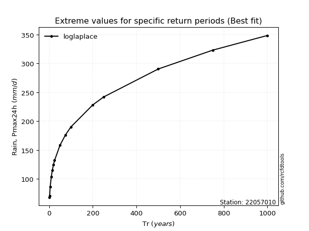</img>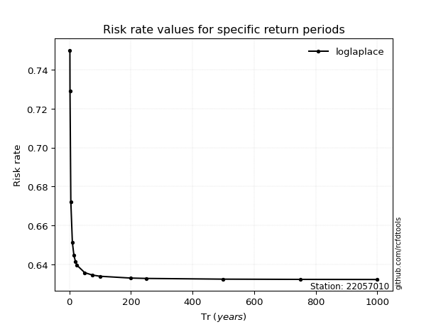</img>

</div>


<sub>**APP DISCLAIMER**: NO WARRANTY - This software is provided by [github.com/rcfdtools](https://github.com/rcfdtools) "as is", without any express or implied warranty, including warranties of merchantability, fitness for a particular purpose, or non-infringement. There is no guarantee that the software will be error-free or operate without interruption. LIMITATION OF LIABILITY - Neither the authors nor copyright holders will be liable for claims or damages arising from the software or its use. You are responsible for determining if the software is appropriate for your use and assume all associated risks, including errors, legal compliance, and data loss. NO PROFESSIONAL ADVICE - The software provides general information and does not offer professional advice. It should not replace consultation with professional advisors.</sub>