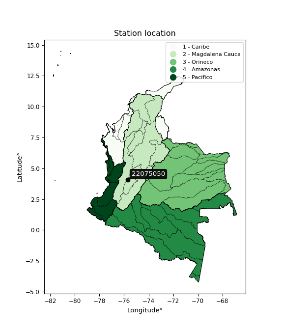

<div align="center">


</div>

# PMax24h Station (Rain, Pmax24h): 22075050

Maximum Precipitation in 24 hours (PMax24h) is the greatest amount of rainfall for a specific duration that is meteorologically possible for a given location, acting as a "worst-case" scenario for extreme storms, crucial for designing safety-critical infrastructure like bridges, river deviations, dams, spillways, and nuclear plants to prevent catastrophic failure. The PMax24h is related with the Probable Maximum Precipitation (PMP) and it is calculated by hydrologists using meteorological data to determine the upper limit of extreme rainfall, often leading to the Probable Maximum Flood (PMF) for flood control design, and is increasingly being studied for climate change impacts. Probable Maximum Precipitation (PMP) is the theoretical upper limit of rainfall, a deterministic estimate for extreme events, while probability distributions (like GEV, Gumbel) describe the likelihood and frequency of various precipitation amounts, including rare ones, showing how often events occur, with PMP representing the extreme end of these distributions, used for critical infrastructure design to ensure safety against the worst conceivable weather, unlike standard statistical forecasts which cover typical probabilities.

The most common probability distributions in hydrology, used for analyzing floods, rainfall, and streamflow, include the Normal, Log-Normal, Gumbel, Gamma (including Log-Pearson Type III), and Generalized Extreme Value (GEV) distributions, often chosen based on the data´s skewness and whether modeling extremes or general conditions, with Gumbel and GEV popular for extreme events like floods, while the Normal distribution serves as a baseline, though often requiring transformations for skewed hydrological data. These distributions help in designing water infrastructure, managing water resources, and forecasting hydrologic events.

> Hydrological data often isn´t perfectly normal (it´s skewed), so different distributions are needed for different applications, such as: **Flood Frequency Analysis**: Using Gumbel, GEV, or Log-Pearson Type III for predicting extreme flood magnitudes and their return periods, **Rainfall Analysis**: Normal for annual totals, but Log-Normal, Weibull, or GEV for intensity or extreme daily rainfall, **Streamflow Modeling**: Gamma and Log-Normal for maximum flows, GEV for minimum flows, and Kappa for daily flows.

<div align="center">

</img>

</div>


## A. General information


### 1. General running parameters

• app_version: _v20260225_. • runtime: _2026-02-27 14:50:08.749431_. • Python version: _3.14.0_. • SciPy version: _1.16.3_. • Pandas version: _2.3.3_. • NumPy version: _2.3.5_. • Stations dataset (station_dataset_file): _dataset/pmax24h_in/automatic_colombia_2003_2025.csv_. • Stations catalog (station_catalog_file): _dataset/CNE.xls_. • Minimum year to eval til year_max (date_min): _1900_. • Maximum year to eval since year_min (date_max): _2025_. • Creates, save and include plots into reports (create_plot): _False_. • Plot only fit distributions with Δo > Δ (plot_only_fit): _True_. • Plot only simple graphs avoiding multiple CDFs and multiple Extreme values plots (plot_only_simple): _False_. • Eval low extreme values, if False, evaluates high extreme values (low_extreme): _False_. • Eval every SciPy distribution as logarithmic (pdist_logarithmic_on): _True_. • Standard deviation normalized (ddof): _1.0_. • Return periods to eval in years (Tr): _[2, 2.33, 5, 10, 15, 20, 25, 50, 75, 100, 200, 250, 500, 750, 1000]_. • Minimum data sample per station, 0 means any (minimum_sample): _5_. • Z-Score maximum threshold to adjust a value, 0 means disable (zscore_max): _3.5_. • Z-Score minimum threshold to adjust a value, 0 means disable (zscore_min): _-2.5_. • Avoid zeros, e.g. rain = 0 (avoid_zeros): _True_. • Avoid null values (avoid_nans): _True_. 

:file_folder:Table: [dataset.csv](../../dataset/pmax24h_in/automatic_colombia_2003_2025.csv)

> Delta Degrees of Freedom (DDOF): is a parameter used in the formulas for calculating variance and standard deviation. When ddof=0, the divisor is $N$ (the total number of observations) and this is used when your data set is the entire population. When ddof=1, the divisor is $N-1$ and this is used when your data set is a sample drawn from a larger population. Using $N-1$ provides an unbiased estimate of the population variance (known as Bessel´s correction).


### 2. Station info and location

|   id |   CODIGO | NOMBRE                                 | CATEGORIA               | TECNOLOGIA                              | ESTADO           | FECHA_INSTALACION   |   FECHA_SUSPENSION |   ALTITUD |   LATITUD |   LONGITUD | DEPARTAMENTO   | MUNICIPIO    | AREA_OPERATIVA             | ENTIDAD                                                     | AREA_HIDROGRAFICA   | ZONA_HIDROGRAFICA   | SUBZONA_HIDROGRAFICA   |   CORRIENTE | Catalogo   |   Version |
|-----:|---------:|:---------------------------------------|:------------------------|:----------------------------------------|:-----------------|:--------------------|-------------------:|----------:|----------:|-----------:|:---------------|:-------------|:---------------------------|:------------------------------------------------------------|:--------------------|:--------------------|:-----------------------|------------:|:-----------|----------:|
|    0 | 22075050 | PARAMO DE YERBABUENA  - AUT [22075050] | Climatológica Principal | Automática con Telemetría, Convencional | En Mantenimiento | 30/09/2007          |                nan |      3394 |   4.07581 |   -75.7008 | Tolima         | Roncesvalles | Area Operativa 10 - Tolima | INSTITUTO DE HIDROLOGIA METEOROLOGIA Y ESTUDIOS AMBIENTALES | Magdalena Cauca     | Saldaña             | Rïo Cucuana            |         nan | CNE_IDEAM  |  20251226 |

<div align="center">

Dynamic map: [:earth_americas:Google](http://maps.google.com/maps?q=4.075805556,-75.70083333) [:earth_americas:OSM](https://www.openstreetmap.org/#map=18/4.075805556/-75.70083333&layers=P) [:earth_americas:Bing](https://www.bing.com/maps?cp=4.075805556~-75.70083333&lvl=18) [:earth_americas:Apple](https://maps.apple.com/frame?center=4.075805556%2C-75.70083333&span=0.003%2C0.006)

</div>


<div align="center">

```geojson
{
  "type": "Feature",
  "geometry": {
    "type": "Point", 
    "coordinates": [-75.70083333, 4.075805556]
  }, 
  "properties": {
    "Name": "22075050"
  }
}
```

</div>


### 3. Discrete values table and plot

<div align="center">

|               |          0 |          1 |           2 |           3 |          4 |           5 |            6 |            7 |          8 |           9 |          10 |          11 |
|:--------------|-----------:|-----------:|------------:|------------:|-----------:|------------:|-------------:|-------------:|-----------:|------------:|------------:|------------:|
| Date          | 2009       | 2010       | 2011        | 2012        | 2013       | 2014        | 2015         | 2016         | 2017       | 2018        | 2019        | 2025        |
| Value         |   14.6     |   35.7     |   34.6      |   25.3      |   36.9     |   32.4      |   29         |   28.8       |   30.2     |   23        |   25.1      |   33.5      |
| Value_initial |   14.6     |   35.7     |   34.6      |   25.3      |   36.9     |   32.4      |   29         |   28.8       |   30.2     |   23        |   25.1      |   33.5      |
| count         |   12       |   12       |   12        |   12        |   12       |   12        |   12         |   12         |   12       |   12        |   12        |   12        |
| mean          |   29.0917  |   29.0917  |   29.0917   |   29.0917   |   29.0917  |   29.0917   |   29.0917    |   29.0917    |   29.0917  |   29.0917   |   29.0917   |   29.0917   |
| std           |    6.35402 |    6.35402 |    6.35402  |    6.35402  |    6.35402 |    6.35402  |    6.35402   |    6.35402   |    6.35402 |    6.35402  |    6.35402  |    6.35402  |
| zscore        |   -2.28071 |    1.04002 |    0.866905 |   -0.596735 |    1.22888 |    0.520668 |   -0.0144266 |   -0.0459027 |    0.17443 |   -0.958711 |   -0.628211 |    0.693787 |


</div>


> The initial value (value_initial) correspond to the initial obtained or null completed value, and value (value) is adjusted only when the initial value is outside the valid range (outlier) definite through the Z-Score value. If Z-Score is active, values out of range or outliers are replaced with the station mean value. A Z-Score (or standard score) measures how many standard deviations a data point is from the mean of a dataset, indicating its relative position; positive scores mean above the mean, negative mean below, and a score of zero is exactly at the mean, allowing for comparison of values from different distributions. It´s calculated using the formula $z=(x–μ)/σ$, where $x$ is the data point, $μ$ is the mean, and $σ$ is the standard deviation, helping identify outliers and understand probability.
>
> <sub>**Note**: In this study, "completing" (filling gaps in) and "extending" (forecasting or lengthening the historical record) rainfall data series are avoided for certain critical analyses because they introduce artificial bias and uncertainty, which can distort the statistics of rare events (extremes), alter day-to-day variability, and compromise the integrity and homogeneity of the original data. Some reasons against Completing/Extending rainfall data are: **Distortion of Extremes and Variability**: The primary issue is that most gap-filling or extension methods rely on averaging or regression with nearby stations, which inherently smooths the data. Rainfall is highly variable in space and time, with a large percentage of zero values and occasional large storms. Infilling methods often underestimate the highest values and overestimate the lowest (zero) values, which severely distorts analyses focused on flood frequency, drought severity, and intensity-duration-frequency (IDF) curves, **Loss of Data Homogeneity**: Infilled or extended data are synthetic estimates, not actual measurements. Combining these estimates with observed data can violate the assumption of data homogeneity, which requires that the data properties do not change over time. Inhomogeneity can lead to incorrect conclusions about long-term trends or changes in climate patterns, **Propagation of Errors**: Errors and biases from the original data (e.g., wind-induced undercatch, instrument errors, site changes) or the data used for imputation can propagate through the analysis, leading to unreliable hydrological models and inaccurate predictions, **Compromised Statistical Integrity**: For statistical analyses, especially those involving the frequency of events, using artificial data can introduce time bias or autocorrelation that doesn´t exist in reality, making it difficult to assess the true probability of events, **Difficulty in Validation**: It is difficult to accurately validate the quality of filled or extended data, especially for past periods where ground-truth measurements are unavailable. The reliability of imputation techniques heavily depends on the density of the surrounding station network and the complexity of the local topography.</sub>


### 4. Active continuous probability distributions from SciPy (80 of 104 available)

A Probability Density Function (PDF) describes the relative likelihood of a continuous random variable falling within a specific range, where the total area under its curve equals 1, and the area over any interval gives the actual probability for that range. Unlike discrete probabilities (like rolling a die), a PDF shows density, not direct probability for a single point (which is zero), with higher points indicating higher likelihood, often visualized as a bell curve for normal distributions.

A log of a probability density function (log-PDF) is simply the logarithm of the PDF´s value, denoted as $log(f(x))$, useful for converting multiplication of probabilities into addition, improving numerical stability with tiny numbers, and connecting to information theory concepts like entropy. Instead of dealing with very small probabilities (e.g., 0.000001), log-PDFs use negative numbers (e.g., $log(0.00001) ≈ -11.51$ that are easier for computers to handle, preventing underflow errors and simplifying complex calculations. In this study, each active probability distribution from SciPy is also evaluated in the $log$ form.

[scipy.stats](https://docs.scipy.org/doc/scipy/reference/stats.html) is a Python´s powerful submodule within the SciPy library for comprehensive statistical analysis, offering over 130 probability distributions (like Normal, Poisson, etc.), functions for descriptive stats (mean, variance), hypothesis testing (t-tests, chi-square), random variable generation, and statistical tests, making it essential for data science, modeling, and research. It provides tools to explore, model, and draw conclusions from data efficiently, working seamlessly with [NumPy](https://numpy.org/).

<div align="center">

|   id | p_dist           |   n_parameter | fit_method   | label                                                                       | active   | ref                                                                                                      |
|-----:|:-----------------|--------------:|:-------------|:----------------------------------------------------------------------------|:---------|:---------------------------------------------------------------------------------------------------------|
|    0 | alpha            |             3 | MLE          | Alpha                                                                       | True     | [:mortar_board:](https://docs.scipy.org/doc/scipy/reference/generated/scipy.stats.alpha.html)            |
|    1 | anglit           |             2 | MM           | Anglit                                                                      | True     | [:mortar_board:](https://docs.scipy.org/doc/scipy/reference/generated/scipy.stats.anglit.html)           |
|    2 | arcsine          |             2 | MM           | Arcsine                                                                     | True     | [:mortar_board:](https://docs.scipy.org/doc/scipy/reference/generated/scipy.stats.arcsine.html)          |
|    3 | argus            |             3 | MLE          | Argus                                                                       | True     | [:mortar_board:](https://docs.scipy.org/doc/scipy/reference/generated/scipy.stats.argus.html)            |
|    4 | beta             |             4 | MLE          | Beta                                                                        | True     | [:mortar_board:](https://docs.scipy.org/doc/scipy/reference/generated/scipy.stats.beta.html)             |
|    5 | betaprime        |             4 | MLE          | Beta prime                                                                  | True     | [:mortar_board:](https://docs.scipy.org/doc/scipy/reference/generated/scipy.stats.betaprime.html)        |
|    6 | bradford         |             3 | MLE          | Bradford                                                                    | True     | [:mortar_board:](https://docs.scipy.org/doc/scipy/reference/generated/scipy.stats.bradford.html)         |
|    7 | burr             |             4 | MLE          | Burr (Type III)                                                             | True     | [:mortar_board:](https://docs.scipy.org/doc/scipy/reference/generated/scipy.stats.burr.html)             |
|    8 | burr12           |             4 | MLE          | Burr (Type III) 12                                                          | True     | [:mortar_board:](https://docs.scipy.org/doc/scipy/reference/generated/scipy.stats.burr12.html)           |
|    9 | cosine           |             2 | MLE          | Cosine                                                                      | True     | [:mortar_board:](https://docs.scipy.org/doc/scipy/reference/generated/scipy.stats.cosine.html)           |
|   10 | crystalball      |             4 | MLE          | Crystalball                                                                 | True     | [:mortar_board:](https://docs.scipy.org/doc/scipy/reference/generated/scipy.stats.crystalball.html)      |
|   11 | dgamma           |             3 | MLE          | Double gamma                                                                | True     | [:mortar_board:](https://docs.scipy.org/doc/scipy/reference/generated/scipy.stats.dgamma.html)           |
|   12 | dweibull         |             3 | MLE          | Double Weibull                                                              | True     | [:mortar_board:](https://docs.scipy.org/doc/scipy/reference/generated/scipy.stats.dweibull.html)         |
|   13 | erlang           |             3 | MLE          | Erlang                                                                      | True     | [:mortar_board:](https://docs.scipy.org/doc/scipy/reference/generated/scipy.stats.erlang.html)           |
|   14 | exponnorm        |             3 | MLE          | Exponentially modified Normal                                               | True     | [:mortar_board:](https://docs.scipy.org/doc/scipy/reference/generated/scipy.stats.exponnorm.html)        |
|   15 | exponpow         |             3 | MLE          | Exponential power                                                           | True     | [:mortar_board:](https://docs.scipy.org/doc/scipy/reference/generated/scipy.stats.exponpow.html)         |
|   16 | exponweib        |             4 | MLE          | Exponentiated Weibull                                                       | True     | [:mortar_board:](https://docs.scipy.org/doc/scipy/reference/generated/scipy.stats.exponweib.html)        |
|   17 | f                |             4 | MLE          | F                                                                           | True     | [:mortar_board:](https://docs.scipy.org/doc/scipy/reference/generated/scipy.stats.f.html)                |
|   18 | fatiguelife      |             3 | MLE          | Fatigue-life (Birnbaum-Saunders)                                            | True     | [:mortar_board:](https://docs.scipy.org/doc/scipy/reference/generated/scipy.stats.fatiguelife.html)      |
|   19 | foldnorm         |             3 | MM           | Fold Normal                                                                 | True     | [:mortar_board:](https://docs.scipy.org/doc/scipy/reference/generated/scipy.stats.foldnorm.html)         |
|   20 | gamma            |             3 | MLE          | Gamma                                                                       | True     | [:mortar_board:](https://docs.scipy.org/doc/scipy/reference/generated/scipy.stats.gamma.html)            |
|   21 | gausshyper       |             6 | MLE          | Gauss hypergeometric                                                        | True     | [:mortar_board:](https://docs.scipy.org/doc/scipy/reference/generated/scipy.stats.gausshyper.html)       |
|   22 | genexpon         |             5 | MLE          | Generalized exponential                                                     | True     | [:mortar_board:](https://docs.scipy.org/doc/scipy/reference/generated/scipy.stats.genexpon.html)         |
|   23 | genextreme       |             3 | MLE          | Generalized exponential                                                     | True     | [:mortar_board:](https://docs.scipy.org/doc/scipy/reference/generated/scipy.stats.genextreme.html)       |
|   24 | gengamma         |             4 | MLE          | Generalized gamma                                                           | True     | [:mortar_board:](https://docs.scipy.org/doc/scipy/reference/generated/scipy.stats.gengamma.html)         |
|   25 | genhalflogistic  |             3 | MLE          | Generalized half-logistic                                                   | True     | [:mortar_board:](https://docs.scipy.org/doc/scipy/reference/generated/scipy.stats.genhalflogistic.html)  |
|   26 | genlogistic      |             3 | MLE          | Generalized logistic                                                        | True     | [:mortar_board:](https://docs.scipy.org/doc/scipy/reference/generated/scipy.stats.genlogistic.html)      |
|   27 | gennorm          |             3 | MLE          | Generalized Normal                                                          | True     | [:mortar_board:](https://docs.scipy.org/doc/scipy/reference/generated/scipy.stats.gennorm.html)          |
|   28 | genpareto        |             3 | MLE          | Generalized Pareto                                                          | True     | [:mortar_board:](https://docs.scipy.org/doc/scipy/reference/generated/scipy.stats.genpareto.html)        |
|   29 | gompertz         |             3 | MLE          | Gompertz (or truncated Gumbel)                                              | True     | [:mortar_board:](https://docs.scipy.org/doc/scipy/reference/generated/scipy.stats.gompertz.html)         |
|   30 | gumbel_l         |             2 | MM           | Gumbel Left Skew                                                            | True     | [:mortar_board:](https://docs.scipy.org/doc/scipy/reference/generated/scipy.stats.gumbel_l.html)         |
|   31 | gumbel_r         |             2 | MM           | Gumbel Right Skew                                                           | True     | [:mortar_board:](https://docs.scipy.org/doc/scipy/reference/generated/scipy.stats.gumbel_r.html)         |
|   32 | halfgennorm      |             3 | MLE          | Upper half of a generalized normal                                          | True     | [:mortar_board:](https://docs.scipy.org/doc/scipy/reference/generated/scipy.stats.halfgennorm.html)      |
|   33 | halflogistic     |             2 | MM           | Half-logistic                                                               | True     | [:mortar_board:](https://docs.scipy.org/doc/scipy/reference/generated/scipy.stats.halflogistic.html)     |
|   34 | halfnorm         |             2 | MM           | Half Normal                                                                 | True     | [:mortar_board:](https://docs.scipy.org/doc/scipy/reference/generated/scipy.stats.halfnorm.html)         |
|   35 | hypsecant        |             2 | MM           | hyperbolic secant                                                           | True     | [:mortar_board:](https://docs.scipy.org/doc/scipy/reference/generated/scipy.stats.hypsecant.html)        |
|   36 | invgamma         |             3 | MLE          | Inverted gamma                                                              | True     | [:mortar_board:](https://docs.scipy.org/doc/scipy/reference/generated/scipy.stats.invgamma.html)         |
|   37 | invgauss         |             3 | MLE          | Inverse Gaussian                                                            | True     | [:mortar_board:](https://docs.scipy.org/doc/scipy/reference/generated/scipy.stats.invgauss.html)         |
|   38 | invweibull       |             3 | MLE          | Inverted Weibull                                                            | True     | [:mortar_board:](https://docs.scipy.org/doc/scipy/reference/generated/scipy.stats.invweibull.html)       |
|   39 | johnsonsb        |             4 | MLE          | Johnson SB                                                                  | True     | [:mortar_board:](https://docs.scipy.org/doc/scipy/reference/generated/scipy.stats.johnsonsb.html)        |
|   40 | johnsonsu        |             4 | MLE          | Johnson Su                                                                  | True     | [:mortar_board:](https://docs.scipy.org/doc/scipy/reference/generated/scipy.stats.johnsonsu.html)        |
|   41 | kappa3           |             3 | MLE          | Kappa 3                                                                     | True     | [:mortar_board:](https://docs.scipy.org/doc/scipy/reference/generated/scipy.stats.kappa3.html)           |
|   42 | kappa4           |             4 | MLE          | Kappa 4                                                                     | True     | [:mortar_board:](https://docs.scipy.org/doc/scipy/reference/generated/scipy.stats.kappa4.html)           |
|   43 | ksone            |             3 | MLE          | Kolmogorov-Smirnov one-sided test statistic distribution                    | True     | [:mortar_board:](https://docs.scipy.org/doc/scipy/reference/generated/scipy.stats.ksone.html)            |
|   44 | kstwobign        |             2 | MLE          | Limiting distribution of scaled Kolmogorov-Smirnov two-sided test statistic | True     | [:mortar_board:](https://docs.scipy.org/doc/scipy/reference/generated/scipy.stats.kstwobign.html)        |
|   45 | laplace          |             2 | MM           | Laplace                                                                     | True     | [:mortar_board:](https://docs.scipy.org/doc/scipy/reference/generated/scipy.stats.laplace.html)          |
|   46 | levy_l           |             2 | MLE          | Left-skewed Levy                                                            | True     | [:mortar_board:](https://docs.scipy.org/doc/scipy/reference/generated/scipy.stats.levy_l.html)           |
|   47 | loggamma         |             3 | MLE          | Log gamma                                                                   | True     | [:mortar_board:](https://docs.scipy.org/doc/scipy/reference/generated/scipy.stats.loggamma.html)         |
|   48 | logistic         |             2 | MM           | Logistic (or Sech-squared)                                                  | True     | [:mortar_board:](https://docs.scipy.org/doc/scipy/reference/generated/scipy.stats.logistic.html)         |
|   49 | loglaplace       |             3 | MLE          | Log-Laplace                                                                 | True     | [:mortar_board:](https://docs.scipy.org/doc/scipy/reference/generated/scipy.stats.loglaplace.html)       |
|   50 | lomax            |             3 | MLE          | Lomax (Pareto of the second kind)                                           | True     | [:mortar_board:](https://docs.scipy.org/doc/scipy/reference/generated/scipy.stats.lomax.html)            |
|   51 | maxwell          |             2 | MM           | Maxwell                                                                     | True     | [:mortar_board:](https://docs.scipy.org/doc/scipy/reference/generated/scipy.stats.maxwell.html)          |
|   52 | mielke           |             4 | MLE          | Mielke Beta-Kappa / Dagum                                                   | True     | [:mortar_board:](https://docs.scipy.org/doc/scipy/reference/generated/scipy.stats.mielke.html)           |
|   53 | moyal            |             2 | MM           | Moyal                                                                       | True     | [:mortar_board:](https://docs.scipy.org/doc/scipy/reference/generated/scipy.stats.moyal.html)            |
|   54 | nakagami         |             3 | MLE          | Nakagami                                                                    | True     | [:mortar_board:](https://docs.scipy.org/doc/scipy/reference/generated/scipy.stats.nakagami.html)         |
|   55 | ncf              |             5 | MLE          | Non-central F distribution                                                  | True     | [:mortar_board:](https://docs.scipy.org/doc/scipy/reference/generated/scipy.stats.ncf.html)              |
|   56 | nct              |             4 | MLE          | Non-central Student’s t                                                     | True     | [:mortar_board:](https://docs.scipy.org/doc/scipy/reference/generated/scipy.stats.nct.html)              |
|   57 | norm             |             2 | MM           | Normal                                                                      | True     | [:mortar_board:](https://docs.scipy.org/doc/scipy/reference/generated/scipy.stats.norm.html)             |
|   58 | pearson3         |             3 | MM           | Pearson type III                                                            | True     | [:mortar_board:](https://docs.scipy.org/doc/scipy/reference/generated/scipy.stats.pearson3.html)         |
|   59 | powerlaw         |             3 | MLE          | Power-function                                                              | True     | [:mortar_board:](https://docs.scipy.org/doc/scipy/reference/generated/scipy.stats.powerlaw.html)         |
|   60 | rayleigh         |             2 | MM           | Rayleigh                                                                    | True     | [:mortar_board:](https://docs.scipy.org/doc/scipy/reference/generated/scipy.stats.rayleigh.html)         |
|   61 | rdist            |             3 | MLE          | R-distributed (symmetric beta)                                              | True     | [:mortar_board:](https://docs.scipy.org/doc/scipy/reference/generated/scipy.stats.rdist.html)            |
|   62 | rice             |             3 | MLE          | Rice                                                                        | True     | [:mortar_board:](https://docs.scipy.org/doc/scipy/reference/generated/scipy.stats.rice.html)             |
|   63 | semicircular     |             2 | MM           | Semicircular                                                                | True     | [:mortar_board:](https://docs.scipy.org/doc/scipy/reference/generated/scipy.stats.semicircular.html)     |
|   64 | skewnorm         |             3 | MLE          | Skew normal                                                                 | True     | [:mortar_board:](https://docs.scipy.org/doc/scipy/reference/generated/scipy.stats.skewnorm.html)         |
|   65 | t                |             3 | MLE          | Student’s t                                                                 | True     | [:mortar_board:](https://docs.scipy.org/doc/scipy/reference/generated/scipy.stats.t.html)                |
|   66 | trapezoid        |             4 | MLE          | Trapezoid                                                                   | True     | [:mortar_board:](https://docs.scipy.org/doc/scipy/reference/generated/scipy.stats.trapezoid.html)        |
|   67 | triang           |             3 | MLE          | Triangular                                                                  | True     | [:mortar_board:](https://docs.scipy.org/doc/scipy/reference/generated/scipy.stats.triang.html)           |
|   68 | truncexpon       |             3 | MLE          | Truncated exponential                                                       | True     | [:mortar_board:](https://docs.scipy.org/doc/scipy/reference/generated/scipy.stats.truncexpon.html)       |
|   69 | truncnorm        |             4 | MLE          | Truncated normal                                                            | True     | [:mortar_board:](https://docs.scipy.org/doc/scipy/reference/generated/scipy.stats.truncnorm.html)        |
|   70 | truncpareto      |             4 | MLE          | Upper truncated Pareto                                                      | True     | [:mortar_board:](https://docs.scipy.org/doc/scipy/reference/generated/scipy.stats.truncpareto.html)      |
|   71 | truncweibull_min |             5 | MLE          | Doubly truncated Weibull minimum                                            | True     | [:mortar_board:](https://docs.scipy.org/doc/scipy/reference/generated/scipy.stats.truncweibull_min.html) |
|   72 | tukeylambda      |             3 | MLE          | Tukey-Lamdba                                                                | True     | [:mortar_board:](https://docs.scipy.org/doc/scipy/reference/generated/scipy.stats.tukeylambda.html)      |
|   73 | uniform          |             2 | MLE          | Uniform                                                                     | True     | [:mortar_board:](https://docs.scipy.org/doc/scipy/reference/generated/scipy.stats.uniform.html)          |
|   74 | vonmises         |             3 | MLE          | Von Mises                                                                   | True     | [:mortar_board:](https://docs.scipy.org/doc/scipy/reference/generated/scipy.stats.vonmises.html)         |
|   75 | vonmises_line    |             3 | MLE          | Von Mises line                                                              | True     | [:mortar_board:](https://docs.scipy.org/doc/scipy/reference/generated/scipy.stats.vonmises_line.html)    |
|   76 | wald             |             2 | MM           | Wald                                                                        | True     | [:mortar_board:](https://docs.scipy.org/doc/scipy/reference/generated/scipy.stats.wald.html)             |
|   77 | weibull_max      |             3 | MLE          | Weibull maximum                                                             | True     | [:mortar_board:](https://docs.scipy.org/doc/scipy/reference/generated/scipy.stats.weibull_max.html)      |
|   78 | weibull_min      |             3 | MLE          | Weibull minimum                                                             | True     | [:mortar_board:](https://docs.scipy.org/doc/scipy/reference/generated/scipy.stats.weibull_min.html)      |
|   79 | wrapcauchy       |             3 | MLE          | Wrapped  Cauchy                                                             | True     | [:mortar_board:](https://docs.scipy.org/doc/scipy/reference/generated/scipy.stats.wrapcauchy.html)       |

</div>

> **n_parameter:** # arguments & localization & scale.
>
> **Fit methods:** (MLE) maximum likelihood, (MM) L-moments.
>
>**Inactive** (With the only purpose of prevent loops, zero divisions, infinite values, over high estimated values or horizontal trending for recurrence intervals estimations, the follow distributions were disabled.)**:** lognorm, norminvgauss, powernorm, powerlognorm, cauchy, halfcauchy, foldcauchy, skewcauchy, chi2, expon, fisk, genhyperbolic, geninvgauss, gibrat, kstwo, laplace_asymmetric, levy, levy_stable, ncx2, pareto, rel_breitwigner, recipinvgauss, studentized_range, loguniform, 


## B. Probability (PDF) vs. Empirical (EDF) distributions functions

A continuous probability distribution (CPD) describes probabilities for variables that can take any value within a range (like rain any time), unlike discrete variables with specific outcomes (like temperature). It uses a Probability Density Function (PDF), a curve where the total area under it equals 1, and the probability of the variable falling within an interval (a to b) is found by calculating the area under the curve between those points. A key feature is that the probability of hitting any single exact value is zero, so probabilities are always expressed for ranges, e.g., $P(a ≤ X ≤ b)$.

<div align="center">

Distributions parameters from station values
|     |   station | p_dist              |   n |               loc |            scale | shape                  | shape1                | shape2                 | shape3             |
|----:|----------:|:--------------------|----:|------------------:|-----------------:|:-----------------------|:----------------------|:-----------------------|:-------------------|
|   0 |  22075050 | alpha               |  12 |    -121.241       |   3501.5         | 23.358317526403283     |                       |                        |                    |
|   1 |  22075050 | anglit              |  12 |      29.0917      |     17.7967      |                        |                       |                        |                    |
|   2 |  22075050 | arcsine             |  12 |      20.4883      |     17.2067      |                        |                       |                        |                    |
|   3 |  22075050 | argus               |  12 |       9.87376     |     27.5041      | 1.962136558235239      |                       |                        |                    |
|   4 |  22075050 | beta                |  12 |       2.93729     |     33.9627      | 3.8237514213327666     | 0.81655652235694      |                        |                    |
|   5 |  22075050 | betaprime           |  12 |    -354.913       |     29.0961      | 56394.19414799978      | 4273.359974405905     |                        |                    |
|   6 |  22075050 | bradford            |  12 |      14.6         |     22.3001      | 1.0116931392021895     |                       |                        |                    |
|   7 |  22075050 | burr                |  12 |      -3.24087     |     40.2702      | 871.8399708048098      | 0.004767317319053517  |                        |                    |
|   8 |  22075050 | burr12              |  12 |    -451.818       |    527.587       | 107.41505195142662     | 11055.550729537563    |                        |                    |
|   9 |  22075050 | cosine              |  12 |      28.0989      |      5.51628     |                        |                       |                        |                    |
|  10 |  22075050 | crystalball         |  12 |      29.0917      |      6.08351     | 2473.256265725304      | 4.8813331628735455    |                        |                    |
|  11 |  22075050 | dgamma              |  12 |      31.0184      |      2.72504     | 1.8084232946234922     |                       |                        |                    |
|  12 |  22075050 | dweibull            |  12 |      30.8022      |      5.34506     | 1.3217652271642026     |                       |                        |                    |
|  13 |  22075050 | erlang              |  12 |     -70.3318      |      0.400773    | 248.17164965366814     |                       |                        |                    |
|  14 |  22075050 | exponnorm           |  12 |      29.0877      |      6.0835      | 0.0006635661081245464  |                       |                        |                    |
|  15 |  22075050 | exponpow            |  12 |      14.6         |      1.5091      | 0.14495891998024776    |                       |                        |                    |
|  16 |  22075050 | exponweib           |  12 |      14.6         |      1.2532      | 1.2138295303772846     | 0.297342634467351     |                        |                    |
|  17 |  22075050 | f                   |  12 |   -1023.29        |   1052.37        | 85074.76134645799      | 195935.67259433836    |                        |                    |
|  18 |  22075050 | fatiguelife         |  12 |   -1075.36        |   1104.42        | 0.005504617647331541   |                       |                        |                    |
|  19 |  22075050 | foldnorm            |  12 |      28.5174      |      1.81616     | 2.9354000130394885e-07 |                       |                        |                    |
|  20 |  22075050 | gamma               |  12 |     -86.1091      |      0.34721     | 331.5547534396661      |                       |                        |                    |
|  21 |  22075050 | gausshyper          |  12 |      14.5031      |     22.3969      | 1.1254201946836782     | 0.78731626539437      | 1.0260391692178388     | 0.9699765058014063 |
|  22 |  22075050 | genexpon            |  12 |      14.6         |      1.83392     | 0.12654227274999796    | 7.899924212327041e-08 | 2.032138652126476      |                    |
|  23 |  22075050 | genextreme          |  12 |      28.7944      |      7.29017     | 0.8884425975185368     |                       |                        |                    |
|  24 |  22075050 | gengamma            |  12 |      14.6         |      1.32894     | 1.20380973149563       | 0.274085188690956     |                        |                    |
|  25 |  22075050 | genhalflogistic     |  12 |      13.1916      |     24.8547      | 1.0483491296024452     |                       |                        |                    |
|  26 |  22075050 | genlogistic         |  12 |      36.9001      |      5.35308e-06 | 6.853319931297256e-07  |                       |                        |                    |
|  27 |  22075050 | gennorm             |  12 |      29.2642      |      8.11058     | 1.8027002884301258     |                       |                        |                    |
|  28 |  22075050 | genpareto           |  12 |      -0.189952    |     70.0477      | -1.8885891706878155    |                       |                        |                    |
|  29 |  22075050 | gompertz            |  12 |      22.9999      |      3.28016     | 0.05269295482966586    |                       |                        |                    |
|  30 |  22075050 | gumbel_l            |  12 |      31.8296      |      4.74329     |                        |                       |                        |                    |
|  31 |  22075050 | gumbel_r            |  12 |      26.3538      |      4.74329     |                        |                       |                        |                    |
|  32 |  22075050 | halfgennorm         |  12 |      14.6         |      1.34689     | 0.4154706423997143     |                       |                        |                    |
|  33 |  22075050 | halflogistic        |  12 |      21.8813      |      5.20117     |                        |                       |                        |                    |
|  34 |  22075050 | halfnorm            |  12 |      21.0395      |     10.0919      |                        |                       |                        |                    |
|  35 |  22075050 | hypsecant           |  12 |      29.0917      |      3.87288     |                        |                       |                        |                    |
|  36 |  22075050 | invgamma            |  12 |     -90.2288      |  42790           | 359.8389916833313      |                       |                        |                    |
|  37 |  22075050 | invgauss            |  12 |     -20.1133      |   2501.41        | 0.019594663999585725   |                       |                        |                    |
|  38 |  22075050 | invweibull          |  12 |      -1.0435e+09  |      1.0435e+09  | 152537915.9278052      |                       |                        |                    |
|  39 |  22075050 | johnsonsb           |  12 |      14.572       |     22.328       | -0.23537806702131792   | 0.16351836753785404   |                        |                    |
|  40 |  22075050 | johnsonsu           |  12 |      40.4063      |      0.146894    | 8.757662083656857      | 1.7913382480271771    |                        |                    |
|  41 |  22075050 | kappa3              |  12 |      14.6         |     22.3         | 1491383.793305363      |                       |                        |                    |
|  42 |  22075050 | kappa4              |  12 |      13.7047      |     24.102       | 1.038605656350153      | 1.0338983085243796    |                        |                    |
|  43 |  22075050 | ksone               |  12 |      12.37        |     26.76        | 1.0                    |                       |                        |                    |
|  44 |  22075050 | kstwobign           |  12 |       0.313891    |     33.0354      |                        |                       |                        |                    |
|  45 |  22075050 | laplace             |  12 |      29.0917      |      4.30169     |                        |                       |                        |                    |
|  46 |  22075050 | levy_l              |  12 |      37.5077      |      3.30372     |                        |                       |                        |                    |
|  47 |  22075050 | loggamma            |  12 |      36.9004      |      1.84879e-05 | 2.37248448014224e-06   |                       |                        |                    |
|  48 |  22075050 | logistic            |  12 |      29.0917      |      3.35401     |                        |                       |                        |                    |
|  49 |  22075050 | loglaplace          |  12 |      -0.0807916   |     30.2808      | 5.6601351908660735     |                       |                        |                    |
|  50 |  22075050 | lomax               |  12 |      14.6         |      2.83279e+07 | 1958723.537909795      |                       |                        |                    |
|  51 |  22075050 | maxwell             |  12 |      14.6763      |      9.03351     |                        |                       |                        |                    |
|  52 |  22075050 | mielke              |  12 | -259779           | 259751           | 99939537.08722825      | 38385.5070459423      |                        |                    |
|  53 |  22075050 | moyal               |  12 |      25.6127      |      2.73854     |                        |                       |                        |                    |
|  54 |  22075050 | nakagami            |  12 |      23           |      8.20846     | 0.4433823432647925     |                       |                        |                    |
|  55 |  22075050 | ncf                 |  12 |       0.663863    |      4.39078e-05 | 0.00013304278348597205 | 227.89889562161102    | 85.56123410953961      |                    |
|  56 |  22075050 | nct                 |  12 |    -325.554       |      6.01356     | 62169.06125923287      | 58.973309802205335    |                        |                    |
|  57 |  22075050 | norm                |  12 |      29.0917      |      6.08351     |                        |                       |                        |                    |
|  58 |  22075050 | pearson3            |  12 |      29.0917      |      6.08349     | -0.8632976872462963    |                       |                        |                    |
|  59 |  22075050 | powerlaw            |  12 |      14.6         |     22.3         | 0.29031995024873897    |                       |                        |                    |
|  60 |  22075050 | rayleigh            |  12 |      17.4536      |      9.28585     |                        |                       |                        |                    |
|  61 |  22075050 | rdist               |  12 |      13.3786      |     11.9214      | 1.1087905282405481     |                       |                        |                    |
|  62 |  22075050 | rice                |  12 |      12.9988      |     12.1651      | 0.008073646801761506   |                       |                        |                    |
|  63 |  22075050 | semicircular        |  12 |      29.0917      |     12.167       |                        |                       |                        |                    |
|  64 |  22075050 | skewnorm            |  12 |      36.9         |      9.8982      | -19960826.882054538    |                       |                        |                    |
|  65 |  22075050 | t                   |  12 |      29.0408      |      5.78223     | 23.271458341627536     |                       |                        |                    |
|  66 |  22075050 | trapezoid           |  12 |      11.8849      |     25.8101      | 1.0                    | 1.0                   |                        |                    |
|  67 |  22075050 | triang              |  12 |      11.5412      |     25.3589      | 0.9999995461677196     |                       |                        |                    |
|  68 |  22075050 | truncexpon          |  12 |      14.6         |     30.543       | 0.7301187436006755     |                       |                        |                    |
|  69 |  22075050 | truncnorm           |  12 |      -1.43529     |      1.82716     | 13.130100450205326     | 20.98080762600405     |                        |                    |
|  70 |  22075050 | truncpareto         |  12 |      14.5999      |      9.30665e-05 | 0.09091613355584907    | 239614.626216258      |                        |                    |
|  71 |  22075050 | truncweibull_min    |  12 |      13.5568      |     34.3024      | 1.721372039106905      | 3.055715028298332e-12 | 0.6805132772695699     |                    |
|  72 |  22075050 | tukeylambda         |  12 |      29.4315      |      3.74973     | 0.06758725271014956    |                       |                        |                    |
|  73 |  22075050 | uniform             |  12 |      14.6         |     22.3         |                        |                       |                        |                    |
|  74 |  22075050 | vonmises            |  12 |      -2.02206     |      1           | 0.35472243831026845    |                       |                        |                    |
|  75 |  22075050 | vonmises_line       |  12 |      29.7872      |      4.83423     | 1.1216153912073903     |                       |                        |                    |
|  76 |  22075050 | wald                |  12 |      23.0081      |      6.08353     |                        |                       |                        |                    |
|  77 |  22075050 | weibull_max         |  12 |      36.9         |      1.39908     | 0.2659496509369705     |                       |                        |                    |
|  78 |  22075050 | weibull_min         |  12 |      -3.73464e+08 |      3.73464e+08 | 80558640.50694439      |                       |                        |                    |
|  79 |  22075050 | wrapcauchy          |  12 |      14.6         |      3.55065     | 0.03801696699962076    |                       |                        |                    |
|  80 |  22075050 | logalpha            |  12 |      -7.18133     |    429.429       | 40.850038067432706     |                       |                        |                    |
|  81 |  22075050 | loganglit           |  12 |       3.34355     |      0.718906    |                        |                       |                        |                    |
|  82 |  22075050 | logarcsine          |  12 |       2.99604     |      0.695015    |                        |                       |                        |                    |
|  83 |  22075050 | logargus            |  12 |       2.37777     |      1.24496     | 2.6498728666779234     |                       |                        |                    |
|  84 |  22075050 | logbeta             |  12 |       2.50393     |      1.10428     | 2.879661561519754      | 0.5915610700855449    |                        |                    |
|  85 |  22075050 | logbetaprime        |  12 |       1.26056     |  23397.9         | 54.034264852188755     | 606292.3158510758     |                        |                    |
|  86 |  22075050 | logbradford         |  12 |       2.68102     |      0.927196    | 1.0396462378836917     |                       |                        |                    |
|  87 |  22075050 | logburr             |  12 |    -837.006       |    840.619       | 571470.8356672623      | 0.005458251654429223  |                        |                    |
|  88 |  22075050 | logburr12           |  12 |    -159.098       |    164.361       | 991.834815680254       | 60951.86787648138     |                        |                    |
|  89 |  22075050 | logcosine           |  12 |       3.28246     |      0.23799     |                        |                       |                        |                    |
|  90 |  22075050 | logcrystalball      |  12 |       3.34355     |      0.245738    | 10.734145450665743     | 1.1453222187172243    |                        |                    |
|  91 |  22075050 | logdgamma           |  12 |       3.39049     |      0.144527    | 1.226309715878262      |                       |                        |                    |
|  92 |  22075050 | logdweibull         |  12 |       3.38953     |      0.183816    | 1.0944244714505045     |                       |                        |                    |
|  93 |  22075050 | logerlang           |  12 |      -0.477489    |      0.0178644   | 213.7712372854586      |                       |                        |                    |
|  94 |  22075050 | logexponnorm        |  12 |       3.34341     |      0.245737    | 0.0006017551796130604  |                       |                        |                    |
|  95 |  22075050 | logexponpow         |  12 |  -29021.7         |  29025.3         | 139780.82161499962     |                       |                        |                    |
|  96 |  22075050 | logexponweib        |  12 |      -3.19059e+07 |      3.19059e+07 | 56.774825711303606     | 28662500.16293988     |                        |                    |
|  97 |  22075050 | logf                |  12 |    -504.618       |    507.961       | 26317960.4574928       | 12606421.217589602    |                        |                    |
|  98 |  22075050 | logfatiguelife      |  12 |    -148.216       |    151.56        | 0.0016272421699455404  |                       |                        |                    |
|  99 |  22075050 | logfoldnorm         |  12 |       2.96886     |      0.27567     | 1.2620145510039602     |                       |                        |                    |
| 100 |  22075050 | loggamma            |  12 |      -0.925096    |      0.0160067   | 266.41908439873134     |                       |                        |                    |
| 101 |  22075050 | loggausshyper       |  12 |       2.58856     |      1.01966     | 1.053730539892707      | 0.5290817018557397    | 0.5780359171960084     | 2.0387142778194556 |
| 102 |  22075050 | loggenexpon         |  12 |       2.63064     |      0.00301389  | 0.00021403621271181677 | 2.0729165081906524    | 1.4656444015101389e-05 |                    |
| 103 |  22075050 | loggenextreme       |  12 |       3.35002     |      0.2728      | 1.0565750874759003     |                       |                        |                    |
| 104 |  22075050 | loggengamma         |  12 |      -5.55651e+06 |      5.55651e+06 | 0.2174207964046574     | 106729769.76167458    |                        |                    |
| 105 |  22075050 | loggenhalflogistic  |  12 |       2.68094     |      0.973853    | 1.05023829002152       |                       |                        |                    |
| 106 |  22075050 | loggenlogistic      |  12 |       3.60822     |      5.58793e-07 | 2.103221876732119e-06  |                       |                        |                    |
| 107 |  22075050 | loggennorm          |  12 |       3.3828      |      0.201241    | 1.1017216493766475     |                       |                        |                    |
| 108 |  22075050 | loggenpareto        |  12 |       0.00233323  |      4.22077     | -1.1705240461176136    |                       |                        |                    |
| 109 |  22075050 | loggompertz         |  12 |       2.67494     |      0.169679    | 0.010784180649311201   |                       |                        |                    |
| 110 |  22075050 | loggumbel_l         |  12 |       3.45415     |      0.1916      |                        |                       |                        |                    |
| 111 |  22075050 | loggumbel_r         |  12 |       3.23296     |      0.1916      |                        |                       |                        |                    |
| 112 |  22075050 | loghalfgennorm      |  12 |       2.68102     |      0.927258    | 123928.33293691213     |                       |                        |                    |
| 113 |  22075050 | loghalflogistic     |  12 |       3.05227     |      0.210111    |                        |                       |                        |                    |
| 114 |  22075050 | loghalfnorm         |  12 |       3.0183      |      0.407645    |                        |                       |                        |                    |
| 115 |  22075050 | loghypsecant        |  12 |       3.34355     |      0.156441    |                        |                       |                        |                    |
| 116 |  22075050 | loginvgamma         |  12 |      -2.59759     |   3072.97        | 518.0714035296155      |                       |                        |                    |
| 117 |  22075050 | loginvgauss         |  12 |       0.111408    |    473.968       | 0.006810760804846388   |                       |                        |                    |
| 118 |  22075050 | loginvweibull       |  12 |      -2.6901e+07  |      2.6901e+07  | 88068171.41572073      |                       |                        |                    |
| 119 |  22075050 | logjohnsonsb        |  12 |       2.68102     |      0.92719     | -0.18239421484643004   | 0.23203582829219915   |                        |                    |
| 120 |  22075050 | logjohnsonsu        |  12 |       3.6569      |      0.0015559   | 7.01055131087976       | 1.2310926656963543    |                        |                    |
| 121 |  22075050 | logkappa3           |  12 |       2.68101     |      0.927145    | 40440.74409998559      |                       |                        |                    |
| 122 |  22075050 | logkappa4           |  12 |       2.83271     |      0.983617    | 0.8557900859345742     | 1.2683548970315002    |                        |                    |
| 123 |  22075050 | logksone            |  12 |       2.5883      |      1.11263     | 1.0                    |                       |                        |                    |
| 124 |  22075050 | logkstwobign        |  12 |       2.04928     |      1.48842     |                        |                       |                        |                    |
| 125 |  22075050 | loglaplace          |  12 |       3.34355     |      0.173762    |                        |                       |                        |                    |
| 126 |  22075050 | loglevy_l           |  12 |       3.62638     |      0.0980093   |                        |                       |                        |                    |
| 127 |  22075050 | logloggamma         |  12 |       3.61        |      2.26253e-05 | 8.487968418318785e-05  |                       |                        |                    |
| 128 |  22075050 | loglogistic         |  12 |       3.34355     |      0.135481    |                        |                       |                        |                    |
| 129 |  22075050 | logloglaplace       |  12 |      -0.044085    |      3.41138     | 18.633794087075827     |                       |                        |                    |
| 130 |  22075050 | loglomax            |  12 |       2.68102     |     37.4417      | 56.57646021786863      |                       |                        |                    |
| 131 |  22075050 | logmaxwell          |  12 |       2.76127     |      0.364891    |                        |                       |                        |                    |
| 132 |  22075050 | logmielke           |  12 |      -2.84215e+07 |      2.84216e+07 | 106301280.9708266      | 7883223169.179182     |                        |                    |
| 133 |  22075050 | logmoyal            |  12 |       3.20302     |      0.11062     |                        |                       |                        |                    |
| 134 |  22075050 | lognakagami         |  12 |       3.11001     |      0.32092     | 0.8274254981676956     |                       |                        |                    |
| 135 |  22075050 | logncf              |  12 |      -3.38024     |      6.7186      | 646.1424964029729      | 539.5578875953474     | 2.834267280074404e-05  |                    |
| 136 |  22075050 | lognct              |  12 |      -6.58961     |      0.225557    | 4387.713737106435      | 44.029888676334565    |                        |                    |
| 137 |  22075050 | lognorm             |  12 |       3.34355     |      0.245736    |                        |                       |                        |                    |
| 138 |  22075050 | logpearson3         |  12 |       3.34355     |      0.245736    | -1.4407072528526896    |                       |                        |                    |
| 139 |  22075050 | logpowerlaw         |  12 |       2.68102     |      0.92719     | 0.3135402463519561     |                       |                        |                    |
| 140 |  22075050 | lograyleigh         |  12 |       2.87343     |      0.375106    |                        |                       |                        |                    |
| 141 |  22075050 | logrdist            |  12 |       3.6323      |      0.496804    | 1.0805152561494533     |                       |                        |                    |
| 142 |  22075050 | logrice             |  12 |     -96.6862      |      0.245684    | 407.1472393644448      |                       |                        |                    |
| 143 |  22075050 | logsemicircular     |  12 |       3.34355     |      0.491453    |                        |                       |                        |                    |
| 144 |  22075050 | logskewnorm         |  12 |       3.60821     |      0.361168    | -75718763.18113422     |                       |                        |                    |
| 145 |  22075050 | logt                |  12 |       3.39831     |      0.16228     | 3.119798567777841      |                       |                        |                    |
| 146 |  22075050 | logtrapezoid        |  12 |       2.6485      |      1.04257     | 1.0                    | 1.0                   |                        |                    |
| 147 |  22075050 | logtriang           |  12 |       2.5637      |      1.04451     | 0.9999996869729795     |                       |                        |                    |
| 148 |  22075050 | logtruncexpon       |  12 |       2.68102     |      1.32909     | 0.6976146681475299     |                       |                        |                    |
| 149 |  22075050 | logtruncnorm        |  12 |      -0.10246     |      1.21121     | 2.673312905476214      | 3.063606995876601     |                        |                    |
| 150 |  22075050 | logtruncpareto      |  12 |       2.68102     |      4.3419e-06  | 0.0909159737403301     | 213545.90602392555    |                        |                    |
| 151 |  22075050 | logtruncweibull_min |  12 |      -2.62039     |     11.0049      | 21.51252721462907      | 0.14712433813408526   | 0.5659822713788218     |                    |
| 152 |  22075050 | logtukeylambda      |  12 |       3.37185     |      0.311116    | 1.3162882623752674     |                       |                        |                    |
| 153 |  22075050 | loguniform          |  12 |       2.68102     |      0.92719     |                        |                       |                        |                    |
| 154 |  22075050 | logvonmises         |  12 |      -2.93605     |      1           | 17.220720898544187     |                       |                        |                    |
| 155 |  22075050 | logvonmises_line    |  12 |       6.91588     |      2.18941e-29 | 1.3053411979645047     |                       |                        |                    |
| 156 |  22075050 | logwald             |  12 |       3.09785     |      0.245707    |                        |                       |                        |                    |
| 157 |  22075050 | logweibull_max      |  12 |       3.60821     |      0.147643    | 0.3248880186575017     |                       |                        |                    |
| 158 |  22075050 | logweibull_min      |  12 |      -2.23795e+06 |      2.23795e+06 | 13689734.892548695     |                       |                        |                    |
| 159 |  22075050 | logwrapcauchy       |  12 |       2.68102     |      0.147567    | 0.2706129004070915     |                       |                        |                    |

</div>

> **loc** (Location parameter): This shifts the distribution along the x-axis. For many common distributions, like the normal (Gaussian) distribution, loc represents the mean $μ$. For others, like the uniform distribution, it might represent the minimum value, or for the beta distribution, the left end of the support interval.
>
> **scale** (Scale parameter): This determines the width or spread of the distribution. For the normal distribution, scale represents the standard deviation $σ$. For a uniform distribution, it defines the length of the interval (from $loc$ to $loc + scale$).
>
> **shape** (Shape parameters): Refers to parameters that define the specific form of a probability distribution, distinct from its location (loc) and scale (scale). These parameters are required arguments for most distribution functions. For example, a normal (Gaussian) distribution is fully defined by its location (mean) and scale (standard deviation), so it has no specific shape parameters beyond loc and scale. However, other distributions have intrinsic properties that need specification, as Gamma distribution that takes a shape parameter, often named $a$ or $alpha$.


### 0. Cumulative distribution values - CDF (160 evaluated)

Cumulative Distribution Function (CDF), denoted as $F$<sub>$X$</sub>$(x)$, is a function that gives the probability that a random variable $X$ will take a value less than or equal to a specific value, $x$ (i.e., $(P(X≥x)$. It essentially "accumulates" probabilities from a given point up to the far right (positive infinity), providing a complete picture of the distribution´s probabilities for both discrete (like rain) and continuous (like temperature) variables, helping to find probabilities over ranges or above certain values. Each station is evaluated separately ordering the $x$ values ascending, calculating the CDF and PDF values for the activated distributions and their logarithmic forms.

<div align="center">

CDF ordered by x ascending and calculating $log(f(x))$ separately
|   id |   Station |   date |    x |   count |    mean |     std |     zscore |   Value_initial |   station |   m |      alpha |   alpha_pdf |   anglit |   anglit_pdf |   arcsine |   arcsine_pdf |     argus |   argus_pdf |      beta |    beta_pdf |   betaprime |   betaprime_pdf |    bradford |   bradford_pdf |      burr |    burr_pdf |    burr12 |   burr12_pdf |     cosine |   cosine_pdf |   crystalball |   crystalball_pdf |     dgamma |   dgamma_pdf |   dweibull |   dweibull_pdf |     erlang |   erlang_pdf |   exponnorm |   exponnorm_pdf |   exponpow |   exponpow_pdf |   exponweib |   exponweib_pdf |          f |      f_pdf |   fatiguelife |   fatiguelife_pdf |   foldnorm |   foldnorm_pdf |      gamma |   gamma_pdf |   gausshyper |   gausshyper_pdf |    genexpon |   genexpon_pdf |   genextreme |   genextreme_pdf |    gengamma |   gengamma_pdf |   genhalflogistic |   genhalflogistic_pdf |   genlogistic |   genlogistic_pdf |    gennorm |   gennorm_pdf |   genpareto |   genpareto_pdf |    gompertz |   gompertz_pdf |   gumbel_l |   gumbel_l_pdf |    gumbel_r |   gumbel_r_pdf |   halfgennorm |   halfgennorm_pdf |   halflogistic |   halflogistic_pdf |   halfnorm |   halfnorm_pdf |   hypsecant |   hypsecant_pdf |   invgamma |   invgamma_pdf |   invgauss |   invgauss_pdf |   invweibull |   invweibull_pdf |   johnsonsb |   johnsonsb_pdf |   johnsonsu |   johnsonsu_pdf |      kappa3 |   kappa3_pdf |      kappa4 |   kappa4_pdf |     ksone |   ksone_pdf |   kstwobign |   kstwobign_pdf |   laplace |   laplace_pdf |   levy_l |   levy_l_pdf |   loggamma |   loggamma_pdf |   logistic |   logistic_pdf |   loglaplace |   loglaplace_pdf |       lomax |   lomax_pdf |   maxwell |   maxwell_pdf |   mielke |   mielke_pdf |       moyal |   moyal_pdf |    nakagami |   nakagami_pdf |        ncf |    ncf_pdf |        nct |    nct_pdf |       norm |   norm_pdf |   pearson3 |   pearson3_pdf |    powerlaw |   powerlaw_pdf |   rayleigh |   rayleigh_pdf |    rdist |      rdist_pdf |       rice |   rice_pdf |   semicircular |   semicircular_pdf |   skewnorm |   skewnorm_pdf |         t |      t_pdf |   trapezoid |   trapezoid_pdf |    triang |   triang_pdf |   truncexpon |   truncexpon_pdf |   truncnorm |   truncnorm_pdf |   truncpareto |   truncpareto_pdf |   truncweibull_min |   truncweibull_min_pdf |   tukeylambda |   tukeylambda_pdf |   uniform |   uniform_pdf |   vonmises |   vonmises_pdf |   vonmises_line |   vonmises_line_pdf |     wald |   wald_pdf |   weibull_max |   weibull_max_pdf |   weibull_min |   weibull_min_pdf |   wrapcauchy |   wrapcauchy_pdf |   logalpha |   logalpha_pdf |   loganglit |   loganglit_pdf |   logarcsine |   logarcsine_pdf |   logargus |   logargus_pdf |   logbeta |   logbeta_pdf |   logbetaprime |   logbetaprime_pdf |   logbradford |   logbradford_pdf |   logburr |   logburr_pdf |   logburr12 |   logburr12_pdf |   logcosine |   logcosine_pdf |   logcrystalball |   logcrystalball_pdf |   logdgamma |   logdgamma_pdf |   logdweibull |   logdweibull_pdf |   logerlang |   logerlang_pdf |   logexponnorm |   logexponnorm_pdf |   logexponpow |   logexponpow_pdf |   logexponweib |   logexponweib_pdf |       logf |   logf_pdf |   logfatiguelife |   logfatiguelife_pdf |   logfoldnorm |   logfoldnorm_pdf |   loggausshyper |   loggausshyper_pdf |   loggenexpon |   loggenexpon_pdf |   loggenextreme |   loggenextreme_pdf |   loggengamma |   loggengamma_pdf |   loggenhalflogistic |   loggenhalflogistic_pdf |   loggenlogistic |   loggenlogistic_pdf |   loggennorm |   loggennorm_pdf |   loggenpareto |   loggenpareto_pdf |   loggompertz |   loggompertz_pdf |   loggumbel_l |   loggumbel_l_pdf |   loggumbel_r |   loggumbel_r_pdf |   loghalfgennorm |   loghalfgennorm_pdf |   loghalflogistic |   loghalflogistic_pdf |   loghalfnorm |   loghalfnorm_pdf |   loghypsecant |   loghypsecant_pdf |   loginvgamma |   loginvgamma_pdf |   loginvgauss |   loginvgauss_pdf |   loginvweibull |   loginvweibull_pdf |   logjohnsonsb |   logjohnsonsb_pdf |   logjohnsonsu |   logjohnsonsu_pdf |   logkappa3 |   logkappa3_pdf |   logkappa4 |   logkappa4_pdf |   logksone |   logksone_pdf |   logkstwobign |   logkstwobign_pdf |   loglevy_l |   loglevy_l_pdf |   logloggamma |   logloggamma_pdf |   loglogistic |   loglogistic_pdf |   logloglaplace |   logloglaplace_pdf |    loglomax |   loglomax_pdf |   logmaxwell |   logmaxwell_pdf |   logmielke |   logmielke_pdf |    logmoyal |   logmoyal_pdf |   lognakagami |   lognakagami_pdf |   logncf |   logncf_pdf |     lognct |   lognct_pdf |   lognorm |   lognorm_pdf |   logpearson3 |   logpearson3_pdf |   logpowerlaw |   logpowerlaw_pdf |   lograyleigh |   lograyleigh_pdf |    logrdist |   logrdist_pdf |    logrice |   logrice_pdf |   logsemicircular |   logsemicircular_pdf |   logskewnorm |   logskewnorm_pdf |       logt |   logt_pdf |   logtrapezoid |   logtrapezoid_pdf |   logtriang |   logtriang_pdf |   logtruncexpon |   logtruncexpon_pdf |   logtruncnorm |   logtruncnorm_pdf |   logtruncpareto |   logtruncpareto_pdf |   logtruncweibull_min |   logtruncweibull_min_pdf |   logtukeylambda |   logtukeylambda_pdf |   loguniform |   loguniform_pdf |   logvonmises |   logvonmises_pdf |   logvonmises_line |   logvonmises_line_pdf |   logwald |   logwald_pdf |   logweibull_max |   logweibull_max_pdf |   logweibull_min |   logweibull_min_pdf |   logwrapcauchy |   logwrapcauchy_pdf |
|-----:|----------:|-------:|-----:|--------:|--------:|--------:|-----------:|----------------:|----------:|----:|-----------:|------------:|---------:|-------------:|----------:|--------------:|----------:|------------:|----------:|------------:|------------:|----------------:|------------:|---------------:|----------:|------------:|----------:|-------------:|-----------:|-------------:|--------------:|------------------:|-----------:|-------------:|-----------:|---------------:|-----------:|-------------:|------------:|----------------:|-----------:|---------------:|------------:|----------------:|-----------:|-----------:|--------------:|------------------:|-----------:|---------------:|-----------:|------------:|-------------:|-----------------:|------------:|---------------:|-------------:|-----------------:|------------:|---------------:|------------------:|----------------------:|--------------:|------------------:|-----------:|--------------:|------------:|----------------:|------------:|---------------:|-----------:|---------------:|------------:|---------------:|--------------:|------------------:|---------------:|-------------------:|-----------:|---------------:|------------:|----------------:|-----------:|---------------:|-----------:|---------------:|-------------:|-----------------:|------------:|----------------:|------------:|----------------:|------------:|-------------:|------------:|-------------:|----------:|------------:|------------:|----------------:|----------:|--------------:|---------:|-------------:|-----------:|---------------:|-----------:|---------------:|-------------:|-----------------:|------------:|------------:|----------:|--------------:|---------:|-------------:|------------:|------------:|------------:|---------------:|-----------:|-----------:|-----------:|-----------:|-----------:|-----------:|-----------:|---------------:|------------:|---------------:|-----------:|---------------:|---------:|---------------:|-----------:|-----------:|---------------:|-------------------:|-----------:|---------------:|----------:|-----------:|------------:|----------------:|----------:|-------------:|-------------:|-----------------:|------------:|----------------:|--------------:|------------------:|-------------------:|-----------------------:|--------------:|------------------:|----------:|--------------:|-----------:|---------------:|----------------:|--------------------:|---------:|-----------:|--------------:|------------------:|--------------:|------------------:|-------------:|-----------------:|-----------:|---------------:|------------:|----------------:|-------------:|-----------------:|-----------:|---------------:|----------:|--------------:|---------------:|-------------------:|--------------:|------------------:|----------:|--------------:|------------:|----------------:|------------:|----------------:|-----------------:|---------------------:|------------:|----------------:|--------------:|------------------:|------------:|----------------:|---------------:|-------------------:|--------------:|------------------:|---------------:|-------------------:|-----------:|-----------:|-----------------:|---------------------:|--------------:|------------------:|----------------:|--------------------:|--------------:|------------------:|----------------:|--------------------:|--------------:|------------------:|---------------------:|-------------------------:|-----------------:|---------------------:|-------------:|-----------------:|---------------:|-------------------:|--------------:|------------------:|--------------:|------------------:|--------------:|------------------:|-----------------:|---------------------:|------------------:|----------------------:|--------------:|------------------:|---------------:|-------------------:|--------------:|------------------:|--------------:|------------------:|----------------:|--------------------:|---------------:|-------------------:|---------------:|-------------------:|------------:|----------------:|------------:|----------------:|-----------:|---------------:|---------------:|-------------------:|------------:|----------------:|--------------:|------------------:|--------------:|------------------:|----------------:|--------------------:|------------:|---------------:|-------------:|-----------------:|------------:|----------------:|------------:|---------------:|--------------:|------------------:|---------:|-------------:|-----------:|-------------:|----------:|--------------:|--------------:|------------------:|--------------:|------------------:|--------------:|------------------:|------------:|---------------:|-----------:|--------------:|------------------:|----------------------:|--------------:|------------------:|-----------:|-----------:|---------------:|-------------------:|------------:|----------------:|----------------:|--------------------:|---------------:|-------------------:|-----------------:|---------------------:|----------------------:|--------------------------:|-----------------:|---------------------:|-------------:|-----------------:|--------------:|------------------:|-------------------:|-----------------------:|----------:|--------------:|-----------------:|---------------------:|-----------------:|---------------------:|----------------:|--------------------:|
|    0 |  22075050 |   2009 | 14.6 |      12 | 29.0917 | 6.35402 | -2.28071   |            14.6 |  22075050 |   1 | 0.00780049 |  0.00406797 | 0        |    0         |  0        |     0         | 0.0183653 |  0.00793509 | 0.0119193 |  0.00397978 |  0.00740258 |      0.00353044 | 1.03346e-06 |      0.0649052 | 0.0339197 | nan         | 0.0195242 |   0.00445219 | 0.00867354 |   0.00668276 |    0.00860658 |        0.00384195 | 0.00625136 |   0.00202915 | 0.00657715 |     0.00232385 | 0.00814298 |   0.00392007 |  0.00860625 |      0.00384183 | 0.00685295 |    5.59224e+11 | 4.37345e-06 |     8.88588e+08 | 0.00857901 | 0.00386026 |    0.00833206 |        0.00378635 |   0        |    0           | 0.00905285 |  0.00422648 |   0.00258477 |        0.0299857 | 8.17384e-08 |      0.0690009 |    0.0451969 |        0.0070329 | 1.12036e-05 |    2.08092e+09 |         0.0292004 |             0.0213692 |      0        |        0.00736871 | 0.00942968 |    0.00378244 |    0.236152 |       0.018137  | 0           |      0         |  0.0261056 |     0.00543122 | 6.67521e-06 |    1.67709e-05 |   2.05466e-11 |        0.247195   |       0        |          0         |   0        |      0         |   0.0150919 |      0.00389534 | 0.00694181 |     0.00365196 | 0.00790339 |     0.00454133 |    0.0059581 |       0.00446186 |   0.0920959 |      0.967404   |   0.0406809 |      0.00606418 | 7.84839e-07 |    0.0448426 | 4.34964e-16 |    0.16276   | 0.0833333 |   0.0373692 |  0.00790949 |      0.00675111 | 0.0172149 |     0.0040019 | 0.295877 |   0.00615351 | 0.00412036 |      0.0521072 |  0.0131164 |     0.00385935 |    0.0110424 |        0.0635491 | 9.81141e-09 |   0.0691448 |  0        |     0         |      nan |          nan | 8.11268e-14 | 8.40512e-13 | 0           |      0         | 0.00497289 | 0.00330314 | 0.00868994 | 0.00387425 | 0.00860659 | 0.00384195 |  0.0232131 |     0.00568214 | 2.11936e-05 |    3.46379e+09 |   0        |      0         | 0.535063 |      0.0287976 | 0.00862443 |  0.010726  |       0        |          0         |  0.0242632 |     0.00637097 | 0.0100056 | 0.00382501 |    0.011066 |      0.00815145 | 0.0145497 |   0.00951323 |  1.84361e-07 |        0.0631879 |    0        |     0           |      0        |     1445.7        |         0.00606916 |              0.0100023 |    0.00989284 |        0.00355572 |  0        |      0.044843 |    3.10379 |       0.124226 |     1.07886e-10 |          0.00800275 | 0        |  0         |      0.123897 |       0.00308566  |     0.0238455 |        0.00508181 |  1.62388e-08 |        0.0483671 | 0.00354947 |      0.0469903 |    0        |         0       |     0        |         0        |  0.0155037 |       0.111587 | 0.0022359 |   0.0370643   |      0.0045839 |          0.0611512 |   9.44382e-06 |          1.5731   | 0.0315245 |      0.117106 |  0.00916803 |        0.055949 |   0.0060376 |        0.122309 |       0.00350804 |            0.0428576 |  0.00603808 |       0.0401488 |    0.00627441 |         0.0424331 |  0.00381875 |       0.0494261 |     0.00350775 |          0.0428547 |     0.0161434 |         0.0777392 |     0.00567244 |          0.0673572 | 0.00353505 |  0.0431608 |       0.00351753 |            0.0429955 |      0        |          0        |       0.0635417 |         0.706726    |    0.00779303 |          0.237654 |       0.0349629 |            0.119683 |     0.0238794 |         0.0997259 |          4.03282e-05 |                 0.513468 |         0        |             0.114819 |   0.00775307 |        0.0491246 |       0.686609 |           0.288761 |   0.000393518 |          0.06585  |     0.0175284 |         0.0906781 |   1.81203e-08 |       1.68589e-06 |         0        |              1.07845 |          0        |              0        |      0        |          0        |     0.00921722 |          0.0589101 |     0.0032484 |         0.0440741 |    0.00315189 |         0.0454403 |      0.00394345 |           0.0714661 |    0.000141988 |         389.583    |      0.0381485 |           0.104596 | 1.17614e-05 |         1.0783  |  0.00726181 |        0.481172 |  0.0833333 |       0.898773 |     0.00626775 |           0.125967 |    0.252536 |        0.129014 |     0.0306523 |          0.114993 |    0.00746386 |         0.0546802 |      0.00760859 |           0.0520262 | 3.24181e-12 |       1.51106  |     0        |         0        |   0.0304935 |        0.114051 | 3.49839e-26 |    1.78722e-23 |     0         |          0        | 0.105283 |     0.365185 | 0.00364302 |    0.0447129 | 0.0035078 |     0.0428552 |     0.0206056 |          0.100201 |   1.57274e-05 |        1.1104e+10 |      0        |          0        | 0           |    0           | 0.00350166 |     0.0427971 |          0        |               0       |     0.0102524 |         0.0818694 | 0.00990082 |  0.0382524 |    0.000972755 |           0.059831 |   0.0126154 |        0.215065 |     2.24223e-07 |            1.49811  |    0           |            0       |         0        |        31145.2       |             0.0311994 |                  0.126603 |      0           |              0       |     0        |          1.07853 |       1.00355 |          0.041393 |                  0 |                      0 | 0         |      0        |         0.162586 |           0.103489   |        0.0091536 |            0.0557363 |     3.91864e-07 |            1.87883  |
|    1 |  22075050 |   2018 | 23   |      12 | 29.0917 | 6.35402 | -0.958711  |            23   |  22075050 |   2 | 0.17957    |  0.0440948  | 0.183825 |    0.0435295 |  0.249572 |     0.052394  | 0.163002  |  0.028793   | 0.100766  |  0.0200801  |  0.156405   |      0.04016    | 0.461918    |      0.0469958 | 0.168616  |   0.0267073 | 0.12552   |   0.0265337  | 0.225848   |   0.0462313  |    0.158331   |        0.0397215  | 0.0852344  |   0.0247983  | 0.0961593  |     0.0268564  | 0.16599    |   0.0411795  |  0.158328   |      0.0397211  | 0.926159   |    0.00589313  | 0.795334    |     0.0124923   | 0.159409   | 0.0399215  |    0.158813   |        0.0400473  |   0        |    0           | 0.171241   |  0.0416762  |   0.350582   |        0.0423178 | 0.439882    |      0.0386487 |    0.161293  |        0.0236597 | 0.748704    |    0.012459    |         0.249292  |             0.0321799 |      0        |        0.0215992  | 0.146888   |    0.037008   |    0.405288 |       0.0226545 | 9.99255e-07 |      0.0160645 |  0.143963  |     0.028053   | 0.131597    |    0.0562648   |   0.515632    |        0.0291048  |       0.107128 |          0.095029  |   0.154033 |      0.0775838 |   0.130215  |      0.0326923  | 0.169915   |     0.0430783  | 0.197773   |     0.0462885  |    0.223004  |       0.048916   |   0.375549  |      0.0118234  |   0.149763  |      0.0239689  | 0.376679    |    0.0448426 | 0.378958    |    0.0437986 | 0.397235  |   0.0373692 |  0.266787   |      0.0497697  | 0.121328  |     0.0282047 | 0.366782 |   0.0117102  | 0.219831   |      1.17037   |  0.139887  |     0.035873   |    0.150993  |        0.868968  | 0.440558    |   0.0386825 |  0.162293 |     0.0490503 |      nan |          nan | 0.107119    | 0.0640913   | 3.45966e-14 |      4.31769   | 0.181395   | 0.0457892  | 0.158958   | 0.0397723  | 0.158331   | 0.0397215  |  0.152646  |     0.0304692  | 0.753177    |    0.0260312   |   0.163378 |      0.0538145 | 0.815323 |      0.0458388 | 0.286756   |  0.0481998 |       0.195132 |          0.0452931 |  0.160231  |     0.0300718  | 0.153441  | 0.0391366  |    0.185458 |      0.0333705  | 0.204184  |   0.0356379  |  0.464046    |        0.0479947 |    0.960911 |     0.28768     |      0.955454 |        0.00567615 |         0.255397   |              0.0440741 |    0.136765   |        0.0353749  |  0.376682 |      0.044843 |    4.47567 |       0.21947  |     0.118994    |          0.0295958  | 0        |  0         |      0.158562 |       0.00558703  |     0.13736   |        0.0274943  |  0.384772    |        0.042397  | 0.219447   |      1.19289   |    0.226484 |         1.16442 |     0.295678 |         1.1436   |  0.159639  |       0.679959 | 0.104591  |   0.532634    |      0.235084  |          1.1628    |   0.577801    |          1.04208  | 0.17047   |      0.632913 |  0.138271   |        0.783999 |   0.309559  |        1.21398  |       0.198592   |            1.13443   |  0.117176   |       0.739198  |    0.120271   |         0.738298  |  0.217664   |       1.16903   |     0.198587   |          1.13442   |     0.14355   |         0.686284  |     0.231661   |          1.13206   | 0.199131   |  1.13534   |       0.198472   |            1.1315    |      0.224431 |          1.41936  |       0.391999  |         0.768435    |    0.369823   |          1.10756  |       0.169903  |            0.602965 |     0.159329  |         0.665319  |          0.310193    |                 0.910214 |         0        |             0.635196 |   0.125411   |        0.734475  |       0.823745 |           0.318537 |   0.141001    |          0.824031 |     0.172667  |         0.818474  |   0.189551    |       1.64531     |         0        |              1.07845 |          0.195488 |              2.28876  |      0.226266 |          1.87806  |     0.164611   |          1.00595   |     0.213702  |         1.16912   |    0.226443   |         1.20776   |      0.286424   |           1.17238   |    0.424056    |           0.392246 |      0.158432  |           0.570792 | 0.490068    |         1.0783  |  0.363633   |        0.97567  |  0.491801  |       0.898773 |     0.338739   |           1.13295  |    0.345003 |        0.328637 |     0.168625  |          0.632603 |    0.177163   |         1.07599   |      0.134744   |           0.789664  | 0.494698    |       0.754382 |     0.211282 |         1.3593   |   0.166887  |        0.624184 | 0.1748      |    1.94897     |     0.0137282 |          0.889042 | 0.354115 |     0.692477 | 0.202563   |    1.14006   | 0.198589  |     1.13443   |     0.170936  |          0.746615 |   0.799666    |        0.551689   |      0.216557 |          1.4592   | 1.08495e-09 |    1.06271e+07 | 0.198538   |     1.1345    |          0.238767 |               1.17357 |     0.190583  |         0.938068  | 0.100145   |  0.646447  |    0.218187    |           0.896063 |   0.299674  |        1.0482   |     0.576653    |            1.06424  |    2.57656e-07 |            3.47245 |         0.967357 |            0.104034  |             0.183056  |                  0.684168 |      1.20792e-13 |              3.21397 |     0.490161 |          1.07853 |       1.19214 |          1.11896  |                  0 |                      0 | 0.0271464 |      2.60802  |         0.232359 |           0.233071   |        0.13777   |            0.781832  |     0.494351    |            0.619518 |
|    2 |  22075050 |   2019 | 25.1 |      12 | 29.0917 | 6.35402 | -0.628211  |            25.1 |  22075050 |   3 | 0.284796   |  0.0554899  | 0.283155 |    0.0506308 |  0.346426 |     0.0417657 | 0.231635  |  0.0368296  | 0.150326  |  0.0274091  |  0.255022   |      0.0534176  | 0.557354    |      0.0439631 | 0.232201  |   0.0340535 | 0.193833  |   0.0391218  | 0.331153   |   0.0535442  |    0.255865   |        0.0528772  | 0.154155   |   0.0419263  | 0.168236   |     0.0424774  | 0.265759   |   0.0534034  |  0.255862   |      0.0528769  | 0.93678    |    0.00434865  | 0.818196    |     0.00951173  | 0.257266   | 0.0529661  |    0.257088   |        0.0532352  |   0        |    0           | 0.271853   |  0.053698   |   0.439265   |        0.0421697 | 0.515438    |      0.0334352 |    0.218815  |        0.0314493 | 0.771712    |    0.00966375  |         0.321012  |             0.0362536 |      0        |        0.0282618  | 0.239635   |    0.0513253  |    0.454691 |       0.0244694 | 0.046162    |      0.0290658 |  0.214956  |     0.040055   | 0.271838    |    0.074649    |   0.570694    |        0.0236434  |       0.299908 |          0.0874857 |   0.312576 |      0.0729143 |   0.218164  |      0.0520233  | 0.273833   |     0.0553266  | 0.305544   |     0.055572   |    0.331569  |       0.053505   |   0.399736  |      0.0113524  |   0.209789  |      0.0337074  | 0.470849    |    0.0448426 | 0.470774    |    0.0436651 | 0.47571   |   0.0373692 |  0.373319   |      0.0509552  | 0.197686  |     0.0459553 | 0.394151 |   0.014523   | 0.333704   |      1.41813   |  0.233238  |     0.0533206  |    0.249653  |        1.43675   | 0.516169    |   0.0334544 |  0.278327 |     0.0604353 |      nan |          nan | 0.272146    | 0.0875364   | 0.232927    |      0.0963967 | 0.28926    | 0.0561304  | 0.256536   | 0.0528633  | 0.255865   | 0.0528772  |  0.228385  |     0.0419586  | 0.803585    |    0.0222187   |   0.287542 |      0.0631792 | 0.953006 |      0.130582  | 0.390274   |  0.0498561 |       0.294952 |          0.0494274 |  0.233208  |     0.0396074  | 0.251128  | 0.0537017  |    0.262156 |      0.0396752  | 0.285882  |   0.042169   |  0.561448    |        0.0448057 |    1        |     3.13915e-08 |      0.965986 |        0.00444973 |         0.353029   |              0.0487107 |    0.227099   |        0.0507483  |  0.470852 |      0.044843 |    4.86555 |       0.133553 |     0.19793     |          0.0463321  | 0.21257  |  0.173904  |      0.17151  |       0.00681534  |     0.207389  |        0.0397376  |  0.472793    |        0.0415906 | 0.335598   |      1.44628   |    0.335265 |         1.31334 |     0.387103 |         0.976775 |  0.230718  |       0.963848 | 0.159707  |   0.738677    |      0.345794  |          1.35304   |   0.666019    |          0.978568 | 0.23579   |      0.875336 |  0.224189   |        1.20335  |   0.420707  |        1.31664  |       0.311676   |            1.43902   |  0.20169    |       1.23049   |    0.203629   |         1.20123   |  0.331496   |       1.41838   |     0.311671   |          1.43901   |     0.217585  |         1.0297    |     0.339596   |          1.3211    | 0.312242   |  1.43866   |       0.311208   |            1.43406   |      0.352205 |          1.49907  |       0.460993  |         0.814219    |    0.466369   |          1.09341  |       0.23205   |            0.832577 |     0.229466  |         0.957707  |          0.395288    |                 1.04243  |         0        |             0.882532 |   0.207858   |        1.18527   |       0.851981 |           0.328163 |   0.230196    |          1.23585  |     0.25849   |         1.15742   |   0.348516    |       1.91733     |         0        |              1.07845 |          0.385037 |              2.0269   |      0.384214 |          1.72573  |     0.275704   |          1.55012   |     0.327678  |         1.42104   |    0.342715   |         1.43273   |      0.390921   |           1.20205   |    0.45886     |           0.408876 |      0.219132  |           0.83794  | 0.584283    |         1.0783  |  0.452111   |        1.05129  |  0.57033   |       0.898773 |     0.437006   |           1.10548  |    0.377873 |        0.431532 |     0.234033  |          0.877984 |    0.290949   |         1.5227    |      0.223301   |           1.27365   | 0.556426    |       0.660702 |     0.340678 |         1.57209  |   0.231391  |        0.865439 | 0.360606    |    2.17087     |     0.154262  |          2.13789  | 0.415788 |     0.716232 | 0.315635   |    1.43246   | 0.311674  |     1.43902   |     0.248522  |          1.04158  |   0.844994    |        0.488957   |      0.352037 |          1.60922  | 0.179297    |    1.13974     | 0.311636   |     1.43925   |          0.345253 |               1.25572 |     0.286     |         1.25037   | 0.178024   |  1.17957   |    0.303502    |           1.05683  |   0.398256  |        1.20837  |     0.666649    |            0.99653  |    0.275712    |            2.85597 |         0.975605 |            0.0858747 |             0.253128  |                  0.931915 |      0.197489    |              2.09882 |     0.584396 |          1.07853 |       1.3045  |          1.43885  |                  0 |                      0 | 0.372675  |      3.52928  |         0.255198 |           0.293848   |        0.223507  |            1.20156   |     0.549219    |            0.649001 |
|    3 |  22075050 |   2012 | 25.3 |      12 | 29.0917 | 6.35402 | -0.596735  |            25.3 |  22075050 |   4 | 0.29598    |  0.0563457  | 0.293335 |    0.0511657 |  0.354723 |     0.0412171 | 0.239086  |  0.037678   | 0.155887  |  0.0282016  |  0.265818   |      0.0545337  | 0.56612     |      0.0436946 | 0.239088  |   0.0348178 | 0.201795  |   0.0405027  | 0.341915   |   0.054069   |    0.266554   |        0.054001   | 0.162735   |   0.0438825  | 0.176899   |     0.0441545  | 0.27654    |   0.0543967  |  0.26655    |      0.0540007  | 0.937638   |    0.0042363   | 0.820076    |     0.00929137  | 0.267971   | 0.0540737  |    0.267848   |        0.0543546  |   0        |    0           | 0.282691   |  0.0546689  |   0.447699   |        0.0421658 | 0.522079    |      0.032977  |    0.22519   |        0.0322966 | 0.773624    |    0.00945555  |         0.328306  |             0.0366839 |      0        |        0.0289948  | 0.250033   |    0.0526524  |    0.459605 |       0.024667  | 0.0521373   |      0.0306996 |  0.223096  |     0.0413468  | 0.286858    |    0.0755211   |   0.57538     |        0.0232106  |       0.317303 |          0.0864536 |   0.3271   |      0.072321  |   0.228777  |      0.0541156  | 0.284995   |     0.0562805  | 0.316721   |     0.0561913  |    0.342285  |       0.0536428  |   0.402006  |      0.0113495  |   0.216639  |      0.0347997  | 0.479817    |    0.0448426 | 0.479506    |    0.0436583 | 0.483184  |   0.0373692 |  0.383501   |      0.0508532  | 0.207094  |     0.0481424 | 0.397088 |   0.014849   | 0.345026   |      1.43457   |  0.244071  |     0.0550089  |    0.26132   |        1.5039    | 0.522814    |   0.0329949 |  0.29049  |     0.0611782 |      nan |          nan | 0.28971     | 0.0880587   | 0.252052    |      0.0948579 | 0.300558   | 0.056837   | 0.267221   | 0.0539797  | 0.266554   | 0.054001   |  0.236894  |     0.0431328  | 0.807999    |    0.0219232   |   0.300228 |      0.0636773 | 1        | 145993         | 0.400245   |  0.0498513 |       0.304867 |          0.0497178 |  0.241225  |     0.0405648  | 0.261997  | 0.0549795  |    0.270151 |      0.0402757  | 0.294378  |   0.042791   |  0.57038     |        0.0445133 |    1        |     6.36555e-09 |      0.966867 |        0.00435908 |         0.362809   |              0.0490915 |    0.237394   |        0.0521915  |  0.479821 |      0.044843 |    4.89144 |       0.125585 |     0.207374    |          0.0481128  | 0.246924 |  0.169354  |      0.172887 |       0.00695681  |     0.215469  |        0.0410665  |  0.481108    |        0.0415649 | 0.347143   |      1.46277   |    0.345728 |         1.32314 |     0.394822 |         0.968365 |  0.238491  |       0.994939 | 0.165656  |   0.760516    |      0.356578  |          1.36446   |   0.673764    |          0.973181 | 0.24284   |      0.901501 |  0.233913   |        1.24725  |   0.431178  |        1.3218   |       0.323186   |            1.46126   |  0.211674   |       1.28576   |    0.213367   |         1.25288   |  0.342819   |       1.43493   |     0.323181   |          1.46126   |     0.225907  |         1.06753   |     0.350127   |          1.33266   | 0.323749   |  1.46078   |       0.322678   |            1.45615   |      0.364122 |          1.50377  |       0.467476  |         0.819478    |    0.475032   |          1.08955  |       0.238756  |            0.857594 |     0.237194  |         0.989859  |          0.403615    |                 1.05596  |         0        |             0.909293 |   0.217467   |        1.23653   |       0.854589 |           0.329159 |   0.240172    |          1.27824  |     0.267809  |         1.1912    |   0.363746    |       1.91992     |         0        |              1.07845 |          0.401006 |              1.99703  |      0.397843 |          1.70863  |     0.288208   |          1.60068   |     0.339023  |         1.43765   |    0.35414    |         1.44636   |      0.400453   |           1.19977   |    0.462117    |           0.411783 |      0.225902  |           0.868488 | 0.592841    |         1.0783  |  0.460484   |        1.05872  |  0.577463  |       0.898773 |     0.445759   |           1.1      |    0.381345 |        0.443502 |     0.241106  |          0.904519 |    0.303181   |         1.55934   |      0.233629   |           1.32932   | 0.561639    |       0.652802 |     0.353196 |         1.58209  |   0.238362  |        0.891514 | 0.377778    |    2.15586     |     0.171489  |          2.20213  | 0.421477 |     0.717492 | 0.327087   |    1.45347   | 0.323184  |     1.46127   |     0.256909  |          1.07197  |   0.848855    |        0.4841     |      0.364826 |          1.61329  | 0.188179    |    1.09952     | 0.323147   |     1.46151   |          0.35524  |               1.26083 |     0.29604   |         1.27973   | 0.187626   |  1.24036   |    0.311948    |           1.07143  |   0.407904  |        1.22292  |     0.674535    |            0.990597 |    0.298175    |            2.805   |         0.976281 |            0.0845233 |             0.260628  |                  0.958226 |      0.214095    |              2.0861  |     0.592956 |          1.07853 |       1.31602 |          1.46264  |                  0 |                      0 | 0.400002  |      3.35777  |         0.257557 |           0.300761   |        0.233217  |            1.24556   |     0.554396    |            0.655552 |
|    4 |  22075050 |   2016 | 28.8 |      12 | 29.0917 | 6.35402 | -0.0459027 |            28.8 |  22075050 |   5 | 0.508531   |  0.0620361  | 0.483614 |    0.05616   |  0.489207 |     0.0370196 | 0.399938  |  0.0550149  | 0.28271   |  0.0454156  |  0.48121    |      0.0654675  | 0.711416    |      0.0394749 | 0.386688  |   0.0501611 | 0.389932  |   0.0673788  | 0.540403   |   0.057471   |    0.48088    |        0.0655023  | 0.37663    |   0.0737302  | 0.380507   |     0.0686035  | 0.487655   |   0.0632904  |  0.480876   |      0.0655024  | 0.949749   |    0.00283322  | 0.847199    |     0.00648742  | 0.481962   | 0.0652345  |    0.483021   |        0.0655776  |   0.123663 |    0.434038    | 0.494054   |  0.0631662  |   0.595737   |        0.0426214 | 0.624619    |      0.0259017 |    0.368162  |        0.0504968 | 0.801585    |    0.00678096  |         0.471671  |             0.045782  |      0        |        0.0453862  | 0.467885   |    0.0689296  |    0.553188 |       0.029208  | 0.225945    |      0.0728722 |  0.410202  |     0.0656503  | 0.550423    |    0.0692852   |   0.64544     |        0.0172784  |       0.581753 |          0.0635976 |   0.558097 |      0.0588246 |   0.476051  |      0.0819569  | 0.500275   |     0.0635535  | 0.521907   |     0.0583196  |    0.525842  |       0.0494065  |   0.443042  |      0.0125095  |   0.377713  |      0.0586528  | 0.636766    |    0.0448426 | 0.632293    |    0.0437001 | 0.613976  |   0.0373692 |  0.553157   |      0.0450214  | 0.467222  |     0.108614  | 0.462077 |   0.0233438  | 0.540044   |      1.51413   |  0.478274  |     0.0743968  |    0.54614   |        2.61197   | 0.625385    |   0.0259027 |  0.514591 |     0.0636001 |      nan |          nan | 0.576285    | 0.0696388   | 0.541631    |      0.070887  | 0.509884   | 0.0598174  | 0.481249   | 0.065362   | 0.480881   | 0.0655023  |  0.423931  |     0.0631878  | 0.877188    |    0.0179342   |   0.525989 |      0.062374  | 1        |      0         | 0.569815   |  0.0459305 |       0.48474  |          0.0523083 |  0.413168  |     0.0576724  | 0.483567  | 0.0681958  |    0.429505 |      0.0507836  | 0.463195  |   0.0536763  |  0.717582    |        0.0396938 |    1        |     6.83022e-22 |      0.979898 |        0.00320123 |         0.544381   |              0.05418   |    0.455979   |        0.069381   |  0.636771 |      0.044843 |    5.37201 |       0.206987 |     0.426126    |          0.0736785  | 0.648267 |  0.0705076 |      0.202861 |       0.0106252   |     0.403271  |        0.0664563  |  0.627576    |        0.0425799 | 0.545335   |      1.53166   |    0.523394 |         1.38948 |     0.515416 |         0.917055 |  0.406981  |       1.65596  | 0.291907  |   1.22918     |      0.538422  |          1.39254   |   0.794511    |          0.892927 | 0.39283   |      1.45809  |  0.444518   |        1.99381  |   0.603282  |        1.30198  |       0.527292   |            1.61964   |  0.441632   |       2.16055   |    0.437612   |         2.18967   |  0.537948   |       1.51525   |     0.527288   |          1.61966   |     0.411604  |         1.84516   |     0.528249   |          1.36864   | 0.527986   |  1.61738   |       0.526042   |            1.61399   |      0.559204 |          1.46882  |       0.580954  |         0.948126    |    0.60989    |          0.978177 |       0.38213   |            1.40384  |     0.406774  |         1.684     |          0.556797    |                 1.32542  |         0        |             1.48083  |   0.444611   |        2.35656   |       0.898478 |           0.349957 |   0.452174    |          1.97778  |     0.45827   |         1.73316   |   0.597942    |       1.6049      |         0        |              1.07845 |          0.625011 |              1.4501   |      0.598617 |          1.37641  |     0.534165   |          2.02299   |     0.534425  |         1.51607   |    0.547528   |         1.47857   |      0.549477   |           1.07715   |    0.52057     |           0.509091 |      0.379766  |           1.5805   | 0.732557    |         1.0783  |  0.606498   |        1.20414  |  0.693918  |       0.898773 |     0.580315   |           0.964921 |    0.456148 |        0.757179 |     0.392026  |          1.4707   |    0.531004   |         1.83818   |      0.481433   |           2.63505   | 0.638444    |       0.536594 |     0.559051 |         1.53137  |   0.386994  |        1.44742  | 0.623396    |    1.56977     |     0.485952  |          2.41174  | 0.514825 |     0.716745 | 0.528991   |    1.59534   | 0.527291  |     1.61966   |     0.43107   |          1.63204  |   0.907088    |        0.418646   |      0.569417 |          1.49016  | 0.306451    |    0.795987    | 0.527296   |     1.62      |          0.521788 |               1.29462 |     0.492583  |         1.74574   | 0.414834   |  2.19203   |    0.46622     |           1.30985  |   0.581747  |        1.46044  |     0.79683     |            0.898583 |    0.612452    |            2.07774 |         0.986021 |            0.0670991 |             0.417497  |                  1.50172  |      0.477031    |              2.00152 |     0.732702 |          1.07853 |       1.52175 |          1.6407   |                  0 |                      0 | 0.694068  |      1.46691  |         0.306275 |           0.475078   |        0.443805  |            1.99591   |     0.651333    |            0.883038 |
|    5 |  22075050 |   2015 | 29   |      12 | 29.0917 | 6.35402 | -0.0144266 |            29   |  22075050 |   6 | 0.520915   |  0.0618002  | 0.494849 |    0.0561872 |  0.496608 |     0.0370004 | 0.411053  |  0.0561392  | 0.291914  |  0.0466277  |  0.494307   |      0.0654896  | 0.719289    |      0.0392582 | 0.396819  |   0.051156  | 0.403556  |   0.068856   | 0.551883   |   0.0573196  |    0.493989   |        0.0655702  | 0.391363   |   0.0735104  | 0.394244   |     0.0687136  | 0.500309   |   0.0632356  |  0.493985   |      0.0655703  | 0.95031    |    0.00277608  | 0.848484    |     0.00637082  | 0.495015   | 0.0652854  |    0.496142   |        0.0656221  |   0.209558 |    0.424084    | 0.506681   |  0.0630911  |   0.604268   |        0.0426891 | 0.629764    |      0.0255467 |    0.378385  |        0.0517383 | 0.80293     |    0.0066685   |         0.48089   |             0.0464108 |      0        |        0.0465633  | 0.481698   |    0.0691834  |    0.559064 |       0.0295536 | 0.240828    |      0.0759644 |  0.423461  |     0.0669382  | 0.564161    |    0.0680823   |   0.648869    |        0.0170125  |       0.59433  |          0.0621756 |   0.569772 |      0.0579236 |   0.492467  |      0.0821664  | 0.51297    |     0.0633779  | 0.533536   |     0.057964   |    0.535671  |       0.0488798  |   0.445559  |      0.0126597  |   0.389601  |      0.0602334  | 0.645735    |    0.0448426 | 0.641035    |    0.0437122 | 0.62145   |   0.0373692 |  0.562113   |      0.0445279  | 0.489458  |     0.113783  | 0.466817 |   0.0240642  | 0.550502   |      1.50797   |  0.493168  |     0.0745236  |    0.563861  |        2.50998   | 0.630529    |   0.0255469 |  0.527269 |     0.063173  |      nan |          nan | 0.590038    | 0.0678842   | 0.555673    |      0.0695272 | 0.521814   | 0.0594711  | 0.494329   | 0.0654257  | 0.493989   | 0.0655702  |  0.436665  |     0.0641441  | 0.880757    |    0.017757    |   0.538408 |      0.0618105 | 1        |      0         | 0.57896    |  0.045523  |       0.495204 |          0.0523219 |  0.424798  |     0.0586219  | 0.497213  | 0.0682558  |    0.439722 |      0.0513841  | 0.473993  |   0.0542983  |  0.725494    |        0.0394347 |    1        |     1.10967e-22 |      0.980534 |        0.00315276 |         0.555237   |              0.0543855 |    0.469883   |        0.0696407  |  0.64574  |      0.044843 |    5.41415 |       0.214054 |     0.440926    |          0.074305   | 0.662022 |  0.0670802 |      0.205017 |       0.010937    |     0.4167    |        0.0678246  |  0.636105    |        0.0427147 | 0.555911   |      1.52446   |    0.533005 |         1.38797 |     0.521766 |         0.918126 |  0.418592  |       1.69978  | 0.300528  |   1.26243     |      0.548036  |          1.38583   |   0.800677    |          0.889011 | 0.403051  |      1.49601  |  0.458434   |        2.02766  |   0.61227   |        1.29546  |       0.538489   |            1.61588   |  0.45652    |       2.13649   |    0.452841   |         2.20861   |  0.548413   |       1.50911   |     0.538484   |          1.6159    |     0.424538  |         1.89286   |     0.5377     |          1.36265   | 0.538968   |  1.61357   |       0.537199   |            1.61032   |      0.569339 |          1.46011  |       0.58755   |         0.958307    |    0.616632   |          0.970115 |       0.391978  |            1.4422   |     0.41859   |         1.73076   |          0.56603     |                 1.343    |         0        |             1.51991  |   0.461166   |        2.4278    |       0.900905 |           0.351403 |   0.465967    |          2.00824  |     0.470347  |         1.75685   |   0.60895     |       1.57647     |         0        |              1.07845 |          0.634943 |              1.42032  |      0.608074 |          1.35674  |     0.548128   |          2.01149   |     0.544896  |         1.50976   |    0.557732   |         1.4704    |      0.556897   |           1.06724   |    0.524124    |           0.518174 |      0.390881  |           1.63204  | 0.740019    |         1.0783  |  0.614865   |        1.21377  |  0.700138  |       0.898773 |     0.586962   |           0.956021 |    0.46148  |        0.783852 |     0.402337  |          1.50938  |    0.543702   |         1.83117   |      0.5        |           2.73112   | 0.642138    |       0.531015 |     0.569605 |         1.51864  |   0.397141  |        1.48537  | 0.634131    |    1.53259     |     0.502558  |          2.38686  | 0.519781 |     0.715601 | 0.540018   |    1.59112   | 0.538488  |     1.6159    |     0.442473  |          1.6635   |   0.909975    |        0.415743   |      0.579679 |          1.47532  | 0.311932    |    0.788242    | 0.538495   |     1.61624   |          0.530745 |               1.29387 |     0.504743  |         1.76852   | 0.430096   |  2.21803   |    0.475329    |           1.32258  |   0.591898  |        1.47313  |     0.803032    |            0.893917 |    0.626714    |            2.04404 |         0.986483 |            0.0663613 |             0.428014  |                  1.53776  |      0.490881    |              2.00113 |     0.740166 |          1.07853 |       1.53309 |          1.63744  |                  0 |                      0 | 0.704013  |      1.40785  |         0.309612 |           0.489525   |        0.457736  |            2.03006   |     0.657514    |            0.903215 |
|    6 |  22075050 |   2017 | 30.2 |      12 | 29.0917 | 6.35402 |  0.17443   |            30.2 |  22075050 |   7 | 0.59372    |  0.0592199  | 0.562117 |    0.0557548 |  0.541121 |     0.0373092 | 0.482561  |  0.0630904  | 0.352513  |  0.0545724  |  0.572343   |      0.0641584  | 0.76564     |      0.0380067 | 0.46191   |   0.0574104 | 0.491059  |   0.0766006  | 0.619788   |   0.055636   |    0.572282   |        0.0644983  | 0.472203   |   0.0550391  | 0.472864   |     0.0579196  | 0.575433   |   0.0616069  |  0.572278   |      0.0644985  | 0.953451   |    0.00246819  | 0.855739    |     0.00573855  | 0.572914   | 0.0641334  |    0.574413   |        0.0644102  |   0.6458   |    0.286021    | 0.581563   |  0.0613511  |   0.655797   |        0.0432377 | 0.659185    |      0.0235166 |    0.445134  |        0.0596357 | 0.810555    |    0.00605656  |         0.538982  |             0.0505057 |      0        |        0.0542956  | 0.564408   |    0.0679289  |    0.5959   |       0.0319357 | 0.343286    |      0.0947385 |  0.507985  |     0.0735691  | 0.641166    |    0.06008     |   0.668381    |        0.0155405  |       0.663865 |          0.0537651 |   0.635968 |      0.0523662 |   0.589875  |      0.078935   | 0.587837   |     0.0610478  | 0.601423   |     0.0549408  |    0.592265  |       0.0453488  |   0.461409  |      0.0138456  |   0.467621  |      0.0697813  | 0.699546    |    0.0448426 | 0.693544    |    0.0438119 | 0.666293  |   0.0373692 |  0.613683   |      0.0413752  | 0.613567  |     0.0898327 | 0.498655 |   0.0292801  | 0.610624   |      1.45222   |  0.581869  |     0.0725392  |    0.65463   |        1.98761   | 0.659948    |   0.0235128 |  0.601088 |     0.0595804 |      nan |          nan | 0.665179    | 0.0574092   | 0.634205    |      0.061365  | 0.591511   | 0.0564307  | 0.572438   | 0.0643388  | 0.572282   | 0.0644983  |  0.516663  |     0.0688626  | 0.901463    |    0.0167765   |   0.610197 |      0.0576223 | 1        |      0         | 0.631987   |  0.0427737 |       0.557911 |          0.0521058 |  0.498475  |     0.0641049  | 0.578573  | 0.0668431  |    0.503544 |      0.0549868  | 0.54139   |   0.0580304  |  0.771898    |        0.0379154 |    1        |     1.58664e-27 |      0.984154 |        0.00288914 |         0.621162   |              0.0554386 |    0.553508   |        0.0691478  |  0.699552 |      0.044843 |    5.67093 |       0.197204 |     0.53109     |          0.0751081  | 0.731862 |  0.050307  |      0.219429 |       0.0132107   |     0.502574  |        0.0749272  |  0.687907    |        0.0436559 | 0.61657    |      1.46214   |    0.588953 |         1.36881 |     0.559229 |         0.932069 |  0.492939  |       1.97134  | 0.356035  |   1.48375     |      0.603216  |          1.33197   |   0.836268    |          0.866742 | 0.468509  |      1.73889  |  0.544114   |        2.18563  |   0.663869  |        1.24682  |       0.603194   |            1.56883   |  0.531119   |       2.08314   |    0.538509   |         2.21002   |  0.608584   |       1.45346   |     0.60319    |          1.56884   |     0.506915  |         2.16782   |     0.592032   |          1.31348   | 0.603454   |  1.5663    |       0.601695   |            1.56411   |      0.627299 |          1.39491  |       0.627773  |         1.0293      |    0.654962   |          0.91974  |       0.455366  |            1.69205  |     0.494566  |         2.02095   |          0.622696    |                 1.45472  |         0        |             1.77049  |   0.561526   |        2.32953   |       0.91534  |           0.360965 |   0.550461    |          2.14681  |     0.544024  |         1.86892   |   0.669372    |       1.40238     |         0        |              1.07845 |          0.689049 |              1.24985  |      0.660723 |          1.23985  |     0.627278   |          1.8742    |     0.605074  |         1.4532    |    0.616125   |         1.40514   |      0.598931   |           1.00511   |    0.546407    |           0.58536  |      0.463611  |           1.96376  | 0.78374     |         1.0783  |  0.66531    |        1.27646  |  0.73658   |       0.898773 |     0.62464    |           0.901994 |    0.496939 |        0.97693  |     0.468436  |          1.75736  |    0.616456   |         1.74517   |      0.598807   |           2.16567   | 0.663023    |       0.499494 |     0.629437 |         1.42849  |   0.462174  |        1.72861  | 0.691939    |    1.32107     |     0.595651  |          2.19238  | 0.548629 |     0.706774 | 0.603683   |    1.54263   | 0.603194  |     1.56884   |     0.513596  |          1.84276  |   0.926501    |        0.39968    |      0.637559 |          1.3766   | 0.343088    |    0.750576    | 0.603215   |     1.56915   |          0.583042 |               1.28425 |     0.579044  |         1.89407   | 0.521634   |  2.26669   |    0.530467    |           1.39718  |   0.653135  |        1.54746  |     0.83873     |            0.867058 |    0.705728    |            1.85609 |         0.98909  |            0.0623331 |             0.494891  |                  1.76608  |      0.57207     |              2.0056  |     0.783896 |          1.07853 |       1.59871 |          1.59187  |                  0 |                      0 | 0.754876  |      1.11508  |         0.331443 |           0.593468   |        0.54355   |            2.18981   |     0.696833    |            1.04246  |
|    7 |  22075050 |   2014 | 32.4 |      12 | 29.0917 | 6.35402 |  0.520668  |            32.4 |  22075050 |   8 | 0.71505    |  0.0503552  | 0.681643 |    0.0523511 |  0.62564  |     0.0400801 | 0.63549   |  0.0756957  | 0.49181   |  0.0730893  |  0.705665   |      0.0559489  | 0.846903    |      0.0359081 | 0.601958  |   0.0701986 | 0.66764   |   0.0812101  | 0.735994   |   0.0493688  |    0.706717   |        0.0565636  | 0.563043   |   0.0683511  | 0.591736   |     0.0684547  | 0.703216   |   0.0536272  |  0.706714   |      0.0565639  | 0.95837    |    0.00202605  | 0.867302    |     0.00481721  | 0.706492   | 0.0561783  |    0.708416   |        0.0562787  |   0.967469 |    0.0447057   | 0.708605   |  0.0532216  |   0.752788   |        0.0452052 | 0.707186    |      0.0202045 |    0.59375   |        0.0757364 | 0.822845    |    0.00515735  |         0.659855  |             0.0598392 |      0        |        0.0719592  | 0.704148   |    0.0578895  |    0.67269  |       0.0385131 | 0.582178    |      0.117875  |  0.676252  |     0.076976   | 0.756149    |    0.044559    |   0.700007    |        0.0132974  |       0.766251 |          0.0396891 |   0.739709 |      0.0419561 |   0.743832  |      0.0592318  | 0.713247   |     0.0521307  | 0.713484   |     0.0464393  |    0.684031  |       0.0379717  |   0.495905  |      0.0181547  |   0.638175  |      0.0838364  | 0.7982      |    0.0448426 | 0.790259    |    0.0441522 | 0.748505  |   0.0373692 |  0.697915   |      0.0351537  | 0.76828   |     0.0538672 | 0.578746 |   0.0454592  | 0.707395   |      1.28776   |  0.728372  |     0.0589878  |    0.76957   |        1.32612   | 0.707934    |   0.0201948 |  0.721812 |     0.0496119 |      nan |          nan | 0.772113    | 0.040457    | 0.753039    |      0.0468209 | 0.706606   | 0.0476733  | 0.706535   | 0.056425   | 0.706717   | 0.0565636  |  0.672173  |     0.0707555  | 0.93666     |    0.015277    |   0.726209 |      0.0474583 | 1        |      0         | 0.719644   |  0.0367532 |       0.670946 |          0.050352  |  0.649377  |     0.0726946  | 0.71657   | 0.0573143  |    0.631781 |      0.0615918  | 0.676583  |   0.0648726  |  0.852379    |        0.0352804 |    1        |     6.79168e-37 |      0.990065 |        0.00250187 |         0.744591   |              0.0566121 |    0.697257   |        0.0599762  |  0.798206 |      0.044843 |    5.98533 |       0.108548 |     0.686935    |          0.0642732  | 0.819283 |  0.0310644 |      0.255539 |       0.0206053   |     0.674499  |        0.078806   |  0.786187    |        0.0457233 | 0.713624   |      1.28604   |    0.682893 |         1.2946  |     0.626609 |         0.993542 |  0.648973  |       2.46241  | 0.478151  |   2.0379      |      0.692177  |          1.18943   |   0.895927    |          0.830657 | 0.608214  |      2.25722  |  0.700732   |        2.2026   |   0.747484  |        1.12386  |       0.708075   |            1.39728   |  0.675941   |       1.84777   |    0.681214   |         1.7717    |  0.705451   |       1.28933   |     0.708071   |          1.39729   |     0.672956  |         2.50251   |     0.680028   |          1.1808    | 0.708157   |  1.39487   |       0.70632    |            1.3949    |      0.719952 |          1.23073  |       0.706404  |         1.22978     |    0.716282   |          0.822748 |       0.59301   |            2.25509  |     0.654672  |         2.51309   |          0.732995    |                 1.69386  |         0        |             2.30694  |   0.70099    |        1.66055   |       0.941479 |           0.384425 |   0.703471    |          2.14323  |     0.678101  |         1.90438   |   0.757217    |       1.09909     |         0        |              1.07845 |          0.767195 |              0.979035 |      0.740718 |          1.0359   |     0.745252   |          1.46005   |     0.701891  |         1.2884    |    0.709293   |         1.23469   |      0.665509   |           0.887189  |    0.594178    |           0.804726 |      0.624403  |           2.613    | 0.859562    |         1.0783  |  0.759911   |        1.42577  |  0.799778  |       0.898773 |     0.684635   |           0.803897 |    0.583873 |        1.57248  |     0.609839  |          2.28783  |    0.729787   |         1.45553   |      0.724474   |           1.45762   | 0.696349    |       0.449269 |     0.723006 |         1.22514  |   0.601205  |        2.24861  | 0.773083    |    0.997546    |     0.734128  |          1.72903  | 0.597562 |     0.683365 | 0.706779   |    1.37379   | 0.708075  |     1.39729   |     0.652578  |          2.08929  |   0.953719    |        0.375129   |      0.727342 |          1.17185  | 0.394229    |    0.707976    | 0.708115   |     1.3975    |          0.672161 |               1.24585 |     0.71878   |         2.07049   | 0.672375   |  1.9477    |    0.633261    |           1.52657  |   0.766479  |        1.67636  |     0.898113    |            0.822378 |    0.825788    |            1.56602 |         0.993257 |            0.0563595 |             0.635123  |                  2.24038  |      0.714204    |              2.04478 |     0.859734 |          1.07853 |       1.70515 |          1.41769  |                  0 |                      0 | 0.820038  |      0.765257 |         0.383036 |           0.918237   |        0.700546  |            2.20876   |     0.781091    |            1.37123  |
|    8 |  22075050 |   2025 | 33.5 |      12 | 29.0917 | 6.35402 |  0.693787  |            33.5 |  22075050 |   9 | 0.767368   |  0.0446859  | 0.737696 |    0.0494346 |  0.671242 |     0.0430839 | 0.721627  |  0.0806084  | 0.578694  |  0.0853369  |  0.763928   |      0.0498255  | 0.885866    |      0.0349433 | 0.683022  |   0.0772673 | 0.754769  |   0.0762842  | 0.787933   |   0.044944   |    0.765662   |        0.050435   | 0.642728   |   0.0732932  | 0.666532   |     0.0661778  | 0.759148   |   0.0479367  |  0.76566    |      0.0504354  | 0.960499   |    0.00184929  | 0.872391    |     0.00444373  | 0.765039   | 0.050102   |    0.767019   |        0.0501053  |   0.993921 |    0.0101946   | 0.764063   |  0.0474845  |   0.803448   |        0.0470464 | 0.728588    |      0.0187277 |    0.681637  |        0.0840138 | 0.828311    |    0.00478985  |         0.728838  |             0.065761  |      0        |        0.0828414  | 0.764023   |    0.0508458  |    0.717836 |       0.0439425 | 0.711022    |      0.114009  |  0.758804  |     0.0723159  | 0.801185    |    0.0374409   |   0.714105    |        0.0123522  |       0.806498 |          0.033604  |   0.783059 |      0.0368916 |   0.802619  |      0.047761   | 0.7674     |     0.0462293  | 0.761816   |     0.0413901  |    0.723723  |       0.0342077  |   0.51809   |      0.0226098  |   0.731805  |      0.085454   | 0.847527    |    0.0448426 | 0.838977    |    0.0444452 | 0.789611  |   0.0373692 |  0.734858   |      0.0320229  | 0.820564  |     0.0417128 | 0.636087 |   0.0598503  | 0.748749   |      1.18768   |  0.788239  |     0.0497666  |    0.809852  |        1.0943    | 0.729325    |   0.0187158 |  0.773184 |     0.0437431 |      nan |          nan | 0.812722    | 0.033558    | 0.80077     |      0.0400349 | 0.756198   | 0.0424461  | 0.765343   | 0.0503263  | 0.765662   | 0.050435   |  0.748377  |     0.0672448  | 0.953109    |    0.0146406   |   0.77532  |      0.0418118 | 1        |      0         | 0.758282   |  0.0334844 |       0.725508 |          0.0487682 |  0.731225  |     0.0759911  | 0.775822  | 0.0502516  |    0.701348 |      0.0648943  | 0.749825  |   0.0682937  |  0.890497    |        0.0340324 |    1        |     8.15868e-42 |      0.992728 |        0.00234345 |         0.80702    |              0.0568587 |    0.759302   |        0.0526419  |  0.847534 |      0.044843 |    6.1101  |       0.126033 |     0.752681    |          0.0550455  | 0.84989  |  0.0248654 |      0.281853 |       0.0279193   |     0.759     |        0.0739729  |  0.837045    |        0.046729  | 0.754837   |      1.18111   |    0.725266 |         1.24183 |     0.660607 |         1.04637  |  0.734547  |       2.6532   | 0.552662  |   2.45085     |      0.730519  |          1.10612   |   0.92339     |          0.814555 | 0.688442  |      2.55487  |  0.772118   |        2.05563  |   0.783811  |        1.05088  |       0.752896   |            1.28515   |  0.733118   |       1.57775   |    0.73599    |         1.51224   |  0.746861   |       1.18951   |     0.752894   |          1.28516   |     0.756777  |         2.4914    |     0.718167   |          1.10262   | 0.752902   |  1.28299   |       0.751085   |            1.28411   |      0.759474 |          1.1353   |       0.750053  |         1.39766     |    0.742941   |          0.774026 |       0.673938  |            2.60388  |     0.741025  |         2.63553   |          0.791865    |                 1.83678  |         0        |             2.61584  |   0.751943   |        1.39793   |       0.954581 |           0.401404 |   0.772885    |          1.99849  |     0.740576  |         1.82693   |   0.791654    |       0.96532     |         0        |              1.07845 |          0.797944 |              0.864511 |      0.773718 |          0.94132  |     0.790391   |          1.24511   |     0.743273  |         1.18882   |    0.748898   |         1.13644   |      0.694168   |           0.829579  |    0.624252    |           1.01679  |      0.716206  |           2.86953  | 0.895563    |         1.0783  |  0.809187   |        1.53195  |  0.829786  |       0.898773 |     0.710688   |           0.756822 |    0.644428 |        2.09458  |     0.691213  |          2.59311  |    0.77556    |         1.2848    |      0.768892   |           1.21116   | 0.710978    |       0.427252 |     0.762108 |         1.11644  |   0.681168  |        2.54768  | 0.804169    |    0.867158    |     0.787846  |          1.48878  | 0.620142 |     0.66898  | 0.750869   |    1.26494   | 0.752897  |     1.28516   |     0.723387  |          2.14246  |   0.966068    |        0.364711   |      0.764723 |          1.06702  | 0.417639    |    0.694972    | 0.752943   |     1.28531   |          0.7133   |               1.21735 |     0.78897   |         2.13145   | 0.733117   |  1.68518   |    0.685254    |           1.588    |   0.823469  |        1.73757  |     0.925228    |            0.801977 |    0.875993    |            1.44292 |         0.995097 |            0.0538925 |             0.714276  |                  2.50587  |      0.783078    |              2.08407 |     0.895743 |          1.07853 |       1.75061 |          1.30266  |                  0 |                      0 | 0.843544  |      0.646854 |         0.418346 |           1.22528    |        0.772135  |            2.06153   |     0.829884    |            1.552    |
|    9 |  22075050 |   2011 | 34.6 |      12 | 29.0917 | 6.35402 |  0.866905  |            34.6 |  22075050 |  10 | 0.813247   |  0.0387103  | 0.790122 |    0.0457637 |  0.721171 |     0.0481646 | 0.811787  |  0.0826238  | 0.680888  |  0.101307   |  0.815028   |      0.0430103  | 0.923797    |      0.0340291 | 0.772119  |   0.0848074 | 0.833454  |   0.0659189  | 0.834637   |   0.0398813  |    0.817387   |        0.043524   | 0.719881   |   0.0658529  | 0.735442   |     0.0586095  | 0.808468   |   0.0416775  |  0.817385   |      0.0435244  | 0.962447   |    0.00169512  | 0.877095    |     0.00411517  | 0.81644    | 0.0432735  |    0.818375   |        0.0431892  |   0.999189 |    0.00161087  | 0.812869   |  0.0411976  |   0.856738   |        0.0501417 | 0.748426    |      0.0173588 |    0.778299  |        0.0914891 | 0.833398    |    0.00446489  |         0.805002  |             0.0729868 |      0        |        0.0953692  | 0.815835   |    0.0433264  |    0.770587 |       0.0528145 | 0.82744     |      0.0952035 |  0.833595  |     0.062914   | 0.8388      |    0.0310853   |   0.727217    |        0.0115027  |       0.840442 |          0.02823   |   0.820955 |      0.0320553 |   0.849348  |      0.0374632  | 0.814809   |     0.0399377  | 0.804489   |     0.036195   |    0.759331  |       0.0305597  |   0.547169  |      0.0313987  |   0.823549  |      0.0799189  | 0.896854    |    0.0448426 | 0.888096    |    0.0448965 | 0.830717  |   0.0373692 |  0.768394   |      0.0289686  | 0.861051  |     0.0323009 | 0.713544 |   0.0828642  | 0.78544    |      1.08264   |  0.837849  |     0.0405061  |    0.842115  |        0.908631  | 0.749149    |   0.017345  |  0.817999 |     0.0377418 |      nan |          nan | 0.846326    | 0.0277081   | 0.841294    |      0.0337338 | 0.799934   | 0.0370708  | 0.816968   | 0.0434521  | 0.817387   | 0.043524   |  0.818878  |     0.0603856  | 0.968892    |    0.0140644   |   0.818191 |      0.036153  | 1        |      0         | 0.793293   |  0.0301709 |       0.778042 |          0.0466541 |  0.816254  |     0.078462   | 0.826888  | 0.0425461  |    0.774548 |      0.0681967  | 0.826829  |   0.0717147  |  0.927267    |        0.0328286 |    1        |     6.82117e-47 |      0.995227 |        0.0022032  |         0.869603   |              0.0568964 |    0.8128     |        0.0445729  |  0.896861 |      0.044843 |    6.2776  |       0.182505 |     0.80782     |          0.0452222  | 0.874513 |  0.0201061 |      0.319391 |       0.0421511   |     0.835364  |        0.0640663  |  0.88893     |        0.0475691 | 0.79125    |      1.07214   |    0.764424 |         1.18057 |     0.695541 |         1.12092  |  0.822032  |       2.73809  | 0.640997  |   3.07072     |      0.764871  |          1.01966   |   0.949463    |          0.799557 | 0.776136  |      2.88019  |  0.834871   |        1.81362  |   0.816523  |        0.973084 |       0.792495   |            1.16457   |  0.780045   |       1.33109   |    0.781064   |         1.28218   |  0.783617   |       1.08477   |     0.792492   |          1.16458   |     0.834664  |         2.29512   |     0.752488   |          1.02121   | 0.792436   |  1.16274   |       0.790671   |            1.16485   |      0.794565 |          1.03609  |       0.799219  |         1.67405     |    0.767175   |          0.726103 |       0.764516  |            3.0189   |     0.825551  |         2.55265   |          0.853821    |                 2.00463  |         0        |             2.95408  |   0.79347    |        1.17817   |       0.967915 |           0.425912 |   0.833949    |          1.76762  |     0.797521  |         1.6878    |   0.82088     |       0.845637    |         0        |              1.07845 |          0.824211 |              0.763112 |      0.802688 |          0.85256  |     0.827417   |          1.04992   |     0.780014  |         1.08466   |    0.783996   |         1.03563   |      0.720073   |           0.774166  |    0.662726    |           1.4152   |      0.810859  |           2.94682  | 0.930401    |         1.0783  |  0.860957   |        1.68465  |  0.858824  |       0.898773 |     0.734408   |           0.711627 |    0.724184 |        2.90911  |     0.78028   |          2.92725  |    0.814338   |         1.11596   |      0.80474    |           1.01408   | 0.724451    |       0.40699  |     0.796437 |         1.00852  |   0.768659  |        2.87491  | 0.83034     |    0.755194    |     0.832239  |          1.26087  | 0.641507 |     0.653273 | 0.789877   |    1.1484    | 0.792495  |     1.16458   |     0.792524  |          2.12333  |   0.977697    |        0.35528    |      0.797542 |          0.964669 | 0.439936    |    0.685866    | 0.792545   |     1.16466   |          0.752093 |               1.18291 |     0.858571  |         2.17438   | 0.783214   |  1.41637   |    0.73752     |           1.64745  |   0.880563  |        1.79679  |     0.950826    |            0.782717 |    0.920799    |            1.33205 |         0.996802 |            0.0516948 |             0.799765  |                  2.79109  |      0.851328    |              2.14623 |     0.930588 |          1.07853 |       1.79072 |          1.1788   |                  0 |                      0 | 0.862876  |      0.552853 |         0.466005 |           1.79624    |        0.835062  |            1.81829   |     0.882738    |            1.71547  |
|   10 |  22075050 |   2010 | 35.7 |      12 | 29.0917 | 6.35402 |  1.04002   |            35.7 |  22075050 |  11 | 0.852544   |  0.0327693  | 0.83812  |    0.0413942 |  0.778803 |     0.0577812 | 0.901055  |  0.0780749  | 0.804497  |  0.125705   |  0.85848    |      0.0360001  | 0.960747    |      0.0331614 | 0.869777  |   0.0928353 | 0.898191  |   0.0512433  | 0.875511   |   0.0343816  |    0.86132    |        0.0363518  | 0.786265   |   0.0546135  | 0.794863   |     0.0493215  | 0.850783   |   0.0352645  |  0.861318   |      0.0363522  | 0.964235   |    0.00155972  | 0.881458    |     0.00382426  | 0.860151   | 0.0361998  |    0.861953   |        0.0360463  |   0.999923 |    0.000176373 | 0.854649   |  0.0347753  |   0.914881   |        0.056492  | 0.766814    |      0.01609   |    0.881875  |        0.0959832 | 0.838147    |    0.00417573  |         0.890214  |             0.0824787 |      0        |        0.109792   | 0.859365   |    0.0358661  |    0.837441 |       0.0717287 | 0.916093    |      0.0647366 |  0.895794  |     0.0496805  | 0.86988     |    0.0255647   |   0.739441    |        0.0107357  |       0.868863 |          0.0235598 |   0.853693 |      0.0275241 |   0.885676  |      0.0288884  | 0.855263   |     0.0336431  | 0.841479   |     0.031091   |    0.791027  |       0.0271067  |   0.592367  |      0.0559028  |   0.904067  |      0.0647652  | 0.946181    |    0.0448426 | 0.937874    |    0.0457032 | 0.871824  |   0.0373692 |  0.798634   |      0.0260365  | 0.892403  |     0.0250127 | 0.823588 |   0.119638   | 0.817673   |      0.97675   |  0.877641  |     0.0320176  |    0.868138  |        0.758866  | 0.767521    |   0.0160747 |  0.856271 |     0.0318893 |      nan |          nan | 0.874028    | 0.0228077   | 0.875194    |      0.028004  | 0.837793   | 0.0317996  | 0.860843   | 0.0363185  | 0.86132    | 0.0363518  |  0.880088  |     0.0504446  | 0.98407     |    0.01354     |   0.854932 |      0.0306977 | 1        |      0         | 0.824672   |  0.026894  |       0.827925 |          0.0439331 |  0.903505  |     0.0800188  | 0.869422  | 0.0348349  |    0.851381 |      0.0714992  | 0.907597  |   0.0751358  |  0.962736    |        0.0316673 |    1        |     3.96911e-52 |      0.997581 |        0.0020782  |         0.93212    |              0.0567388 |    0.857374   |        0.0365278  |  0.946188 |      0.044843 |    6.50505 |       0.219927 |     0.852397    |          0.0360014  | 0.894509 |  0.0164015 |      0.382893 |       0.0814642   |     0.898441  |        0.0501036  |  0.941598    |        0.0481398 | 0.823106   |      0.963281  |    0.800324 |         1.11213 |     0.73219  |         1.22861  |  0.906389  |       2.59864  | 0.753041  |   4.26188     |      0.79543   |          0.932862  |   0.974266    |          0.785546 | 0.871718  |      3.23477  |  0.886926   |        1.50272  |   0.845727  |        0.892372 |       0.827023   |            1.04126   |  0.818296   |       1.11793   |    0.818032   |         1.08443   |  0.815921   |       0.979199  |     0.827021   |          1.04127   |     0.900761  |         1.89369   |     0.78317    |          0.939192  | 0.826913   |  1.0398    |       0.825227   |            1.04276   |      0.825436 |          0.936314 |       0.859366  |         2.26679     |    0.78917    |          0.679478 |       0.866803  |            3.54709  |     0.900232  |         2.16053   |          0.91972     |                 2.21928  |         0        |             3.32339  |   0.827403   |        0.994905  |       0.981838 |           0.469314 |   0.884828    |          1.47435  |     0.847489  |         1.49687   |   0.845664    |       0.739881    |         0        |              1.07845 |          0.846674 |              0.673796 |      0.828068 |          0.769941 |     0.857568   |          0.880372  |     0.812328  |         0.979937  |    0.814846   |         0.935636  |      0.743475   |           0.721482  |    0.719967    |           2.45007  |      0.899741  |           2.64755  | 0.964149    |         1.0783  |  0.917399   |        1.95746  |  0.886952  |       0.898773 |     0.756003   |           0.668533 |    0.833379 |        4.13831  |     0.87749   |          3.29193  |    0.846765   |         0.957725  |      0.833915   |           0.855096  | 0.736894    |       0.388295 |     0.826365 |         0.904189 |   0.864113  |        3.23186  | 0.852444    |    0.659294    |     0.868402  |          1.05272  | 0.661694 |     0.636541 | 0.823968   |    1.02948   | 0.827024  |     1.04126   |     0.85746   |          2.00728  |   0.98868     |        0.346696   |      0.826196 |          0.866798 | 0.461302    |    0.679937    | 0.827075   |     1.04129   |          0.788502 |               1.14253 |     0.927065  |         2.19994   | 0.823614   |  1.16907   |    0.789981    |           1.70503  |   0.937696  |        1.85417  |     0.975037    |            0.764501 |    0.960904    |            1.23195 |         0.998388 |            0.049724  |             0.891821  |                  3.09662  |      0.920031    |              2.25755 |     0.964343 |          1.07853 |       1.82564 |          1.05222  |                  0 |                      0 | 0.878958  |      0.477105 |         0.540655 |           3.26735    |        0.887235  |            1.50544   |     0.938404    |            1.83224  |
|   11 |  22075050 |   2013 | 36.9 |      12 | 29.0917 | 6.35402 |  1.22888   |            36.9 |  22075050 |  12 | 0.888142   |  0.026645   | 0.884573 |    0.0359096 |  0.86208  |     0.0881213 | 0.982897  |  0.0518126  | 1         | 56.0637     |  0.897209   |      0.0286358  | 0.999998    |      0.032264  | 0.986442  |   0.0963109 | 0.948954  |   0.0333733  | 0.913036   |   0.0281397  |    0.900346   |        0.0287753  | 0.844292   |   0.0422834  | 0.847927   |     0.0392344  | 0.889004   |   0.0285108  |  0.900344   |      0.0287756  | 0.966027   |    0.0014299   | 0.885875    |     0.00354303  | 0.89906    | 0.0287313  |    0.900646   |        0.0285289  |   0.999996 |    1.03938e-05 | 0.892287   |  0.0280307  |   1          |       73.457     | 0.785345    |      0.0148114 |    0.993019  |        0.0783177 | 0.842986    |    0.00389476  |         1         |             0.424183  |      0.999984 |        0.128024   | 0.897771   |    0.0282723  |    1        |  458467         | 0.972565    |      0.0305171 |  0.945653  |     0.0333687  | 0.897412    |    0.0204787   |   0.751863    |        0.00998073 |       0.894456 |          0.0192215 |   0.883958 |      0.0229945 |   0.915719  |      0.0215083  | 0.891679   |     0.0271395  | 0.875595   |     0.0258403  |    0.821431  |       0.0236197  |   1         |      1.5358e+06 |   0.966523  |      0.0380249  | 0.999992    |    0.0448425 | 0.994058    |    0.0493752 | 0.916667  |   0.0373692 |  0.828045   |      0.0230145  | 0.918595  |     0.0189238 | 0.98028  |   0.101009   | 0.848099   |      0.863988  |  0.911174  |     0.024131   |    0.890985  |        0.627384  | 0.786032    |   0.0147948 |  0.890907 |     0.0259276 |      nan |          nan | 0.898664    | 0.0184021   | 0.9054      |      0.0224676 | 0.872663   | 0.0263915  | 0.899852   | 0.02878    | 0.900346   | 0.0287753  |  0.932815  |     0.037144   | 1           |    0.0130188   |   0.8884   |      0.0251687 | 1        |      0         | 0.854857   |  0.0234408 |       0.878459 |          0.040127  |  1         |     0.080609   | 0.906444  | 0.0270104  |    0.939341 |      0.075102   | 1         |   0.0788679  |  0.999999    |        0.0304472 |    1        |     5.10604e-58 |      1        |        0.0019565  |         1          |              0.05636   |    0.896256   |        0.0284374  |  1        |      0.044843 |    6.74842 |       0.174091 |     0.890292    |          0.027461   | 0.91222  |  0.0132492 |      0.999842 |       5.91002e+09 |     0.948327  |        0.0330243  |  0.999547    |        0.048367  | 0.853048   |      0.84835   |    0.83577  |         1.03069 |     0.775583 |         1.41343  |  0.98209   |       1.78095  | 1         |   2.66423e+06 |      0.82474   |          0.840292  |   1           |          0.771269 | 0.985139  |      3.42019  |  0.930501   |        1.12963  |   0.873761  |        0.802947 |       0.859261   |            0.908993  |  0.85195    |       0.923114  |    0.850808   |         0.902966  |  0.846434   |       0.866792  |     0.859259   |          0.909005  |     0.953573  |         1.27724   |     0.81277    |          0.851386  | 0.859109   |  0.90795   |       0.857534   |            0.911649  |      0.854632 |          0.829926 |       1         |         1.04941e+07 |    0.810824   |          0.630513 |       1         |           26.2093   |     0.959646  |         1.38315   |          1           |                11.9049   |         0.999976 |             3.76374  |   0.857488   |        0.82963   |       1        |          49.9922   |   0.92782     |          1.12277  |     0.892974  |         1.24827   |   0.868433    |       0.639384    |         0.999936 |              1.07822 |          0.867519 |              0.588764 |      0.852138 |          0.686934 |     0.884038   |          0.724968  |     0.842883  |         0.86864   |    0.844035   |         0.830455  |      0.766429   |           0.667461  |    0.999925    |        2067.99     |      0.972437  |           1.60273  | 0.999798    |         1.07799 |  1          |     2414.35     |  0.916667  |       0.898773 |     0.777367   |           0.624046 |    0.979794 |        3.4373   |     0.993361  |          3.72663  |    0.875825   |         0.802733  |      0.859802   |           0.715283  | 0.749418    |       0.369493 |     0.85447  |         0.796699 |   0.97556   |        3.06635  | 0.872737    |    0.570324    |     0.899835  |          0.85254  | 0.682427 |     0.617422 | 0.855895   |    0.902019  | 0.859262  |     0.908996  |     0.919812  |          1.73401  |   1           |        0.338162   |      0.853187 |          0.766686 | 0.483717    |    0.676517    | 0.859313   |     0.908966  |          0.825456 |               1.0915  |     1         |         2.20918   | 0.858349   |  0.938187  |    0.847357    |           1.76587  |   0.999998  |        1.91477  |     1           |            0.745719 |    0.999986    |            1.13354 |         1        |            0.047793  |             1         |                  3.45382  |      1           |              3.1992  |     1        |          1.07853 |       1.85819 |          0.916738 |                  0 |                      0 | 0.893592  |      0.410212 |         0.999981 |           1.4006e+10 |        0.930859  |            1.12993   |     1           |            1.87883  |


</div>

An Empirical Distribution Function (EDF) is a step-function estimate of a true cumulative distribution function (CDF) based on observed sample data, representing the proportion of data points less than or equal to a given value. It is calculated by ordering your data and jumping up by $1/n$ (where $n$ is sample size) at each unique data point, allowing analysis without assuming an underlying population distribution, and it gets closer to the true CDF as the sample size grows. For the empirical probability calculations, the parameter $m$ correspond to the order number which means the position of the $x$ values in an ascending order list.

The Kolmogorov-Smirnov (K-S) test is a non-parametric statistical test used to determine if a sample data set comes from a specific theoretical distribution (one-sample) or if two different samples come from the same underlying distribution (two-sample), by comparing their cumulative distribution functions (CDFs). It calculates the maximum vertical difference (D statistic) between these functions, with a small p-value indicating a significant difference and rejection of the null hypothesis (that the data/samples match).


### 1. EDF California (1923)

California´s estimates the true probability distribution of water-related data (like rainfall, streamflow) using observed samples, crucial for risk assessment.

<div align="center">


$P=m/n$


</div>


**1.1. Empirical values**

<div align="center">

|                | 0                   | 1                   | 2                  | 3                  | 4                  | 5              | 6                  | 7                  | 8              | 9                  | 10                 | 11             |
|:---------------|:--------------------|:--------------------|:-------------------|:-------------------|:-------------------|:---------------|:-------------------|:-------------------|:---------------|:-------------------|:-------------------|:---------------|
| date           | 2009                | 2018                | 2019               | 2012               | 2016               | 2015           | 2017               | 2014               | 2025           | 2011               | 2010               | 2013           |
| x              | 14.6                | 23.0                | 25.1               | 25.3               | 28.8               | 29.0           | 30.2               | 32.4               | 33.5           | 34.6               | 35.7               | 36.9           |
| m              | 1                   | 2                   | 3                  | 4                  | 5                  | 6              | 7                  | 8                  | 9              | 10                 | 11                 | 12             |
| empirical_dist | edf_california      | edf_california      | edf_california     | edf_california     | edf_california     | edf_california | edf_california     | edf_california     | edf_california | edf_california     | edf_california     | edf_california |
| empirical      | 0.08333333333333333 | 0.16666666666666666 | 0.25               | 0.3333333333333333 | 0.4166666666666667 | 0.5            | 0.5833333333333334 | 0.6666666666666666 | 0.75           | 0.8333333333333334 | 0.9166666666666666 | 1.0            |
| empirical_tr   | 1.090909090909091   | 1.2                 | 1.3333333333333333 | 1.4999999999999998 | 1.7142857142857144 | 2.0            | 2.4000000000000004 | 2.9999999999999996 | 4.0            | 6.000000000000002  | 11.999999999999995 | inf            |

</div>


**1.2. Kolmogorov-Smirnov fit test (sorted by Δ)**


<div align="center">

|                | 0                   | 1                   | 2                   | 3                   | 4                   | 5                   | 6                   | 7                   | 8                   | 9                   | 10                  | 11                  | 12                  | 13                  | 14                  | 15                  | 16                  | 17                  | 18                  | 19                  | 20                  | 21                  | 22                  | 23                  | 24                  | 25                  | 26                  | 27                  | 28                  | 29                  | 30                  | 31                  | 32                  | 33                  | 34                  | 35                  | 36                  | 37                  | 38                  | 39                  | 40                  | 41                  | 42                  | 43                  | 44                  | 45                  | 46                  | 47                  | 48                  | 49                  | 50                  | 51                  | 52                  | 53                  | 54                  | 55                  | 56                  | 57                  | 58                  | 59                  | 60                  | 61                  | 62                  | 63                  | 64                  | 65                  | 66                  | 67                  | 68                  | 69                  | 70                  | 71                  | 72                  | 73                  | 74                  | 75                  | 76                  | 77                  | 78                  | 79                  | 80                  | 81                  | 82                  | 83                  | 84                  | 85                  | 86                  | 87                  | 88                  | 89                  | 90                  | 91                  | 92                  | 93                  | 94                  | 95                  | 96                  | 97                  | 98                  | 99                  | 100                 | 101                 | 102                 | 103                 | 104                 | 105                 | 106                 | 107                 | 108                 | 109                 | 110                 | 111                 | 112                 | 113                 | 114                 | 115                 | 116                 | 117                 | 118                 | 119                 | 120                 | 121                 | 122                 | 123                 | 124                 | 125                 | 126                 | 127                 | 128                 | 129                 | 130                 | 131                 | 132                 | 133                 | 134                 | 135                 | 136                 | 137                 | 138                 | 139                 | 140                 | 141                 | 142                 | 143                 | 144                 | 145                 | 146                 | 147                 | 148                 | 149                 | 150                 | 151                 | 152                 | 153                 | 154                 | 155                 | 156                 | 157                 | 158                 | 159                 |
|:---------------|:--------------------|:--------------------|:--------------------|:--------------------|:--------------------|:--------------------|:--------------------|:--------------------|:--------------------|:--------------------|:--------------------|:--------------------|:--------------------|:--------------------|:--------------------|:--------------------|:--------------------|:--------------------|:--------------------|:--------------------|:--------------------|:--------------------|:--------------------|:--------------------|:--------------------|:--------------------|:--------------------|:--------------------|:--------------------|:--------------------|:--------------------|:--------------------|:--------------------|:--------------------|:--------------------|:--------------------|:--------------------|:--------------------|:--------------------|:--------------------|:--------------------|:--------------------|:--------------------|:--------------------|:--------------------|:--------------------|:--------------------|:--------------------|:--------------------|:--------------------|:--------------------|:--------------------|:--------------------|:--------------------|:--------------------|:--------------------|:--------------------|:--------------------|:--------------------|:--------------------|:--------------------|:--------------------|:--------------------|:--------------------|:--------------------|:--------------------|:--------------------|:--------------------|:--------------------|:--------------------|:--------------------|:--------------------|:--------------------|:--------------------|:--------------------|:--------------------|:--------------------|:--------------------|:--------------------|:--------------------|:--------------------|:--------------------|:--------------------|:--------------------|:--------------------|:--------------------|:--------------------|:--------------------|:--------------------|:--------------------|:--------------------|:--------------------|:--------------------|:--------------------|:--------------------|:--------------------|:--------------------|:--------------------|:--------------------|:--------------------|:--------------------|:--------------------|:--------------------|:--------------------|:--------------------|:--------------------|:--------------------|:--------------------|:--------------------|:--------------------|:--------------------|:--------------------|:--------------------|:--------------------|:--------------------|:--------------------|:--------------------|:--------------------|:--------------------|:--------------------|:--------------------|:--------------------|:--------------------|:--------------------|:--------------------|:--------------------|:--------------------|:--------------------|:--------------------|:--------------------|:--------------------|:--------------------|:--------------------|:--------------------|:--------------------|:--------------------|:--------------------|:--------------------|:--------------------|:--------------------|:--------------------|:--------------------|:--------------------|:--------------------|:--------------------|:--------------------|:--------------------|:--------------------|:--------------------|:--------------------|:--------------------|:--------------------|:--------------------|:--------------------|:--------------------|:--------------------|:--------------------|:--------------------|:--------------------|:--------------------|
| station        | 22075050            | 22075050            | 22075050            | 22075050            | 22075050            | 22075050            | 22075050            | 22075050            | 22075050            | 22075050            | 22075050            | 22075050            | 22075050            | 22075050            | 22075050            | 22075050            | 22075050            | 22075050            | 22075050            | 22075050            | 22075050            | 22075050            | 22075050            | 22075050            | 22075050            | 22075050            | 22075050            | 22075050            | 22075050            | 22075050            | 22075050            | 22075050            | 22075050            | 22075050            | 22075050            | 22075050            | 22075050            | 22075050            | 22075050            | 22075050            | 22075050            | 22075050            | 22075050            | 22075050            | 22075050            | 22075050            | 22075050            | 22075050            | 22075050            | 22075050            | 22075050            | 22075050            | 22075050            | 22075050            | 22075050            | 22075050            | 22075050            | 22075050            | 22075050            | 22075050            | 22075050            | 22075050            | 22075050            | 22075050            | 22075050            | 22075050            | 22075050            | 22075050            | 22075050            | 22075050            | 22075050            | 22075050            | 22075050            | 22075050            | 22075050            | 22075050            | 22075050            | 22075050            | 22075050            | 22075050            | 22075050            | 22075050            | 22075050            | 22075050            | 22075050            | 22075050            | 22075050            | 22075050            | 22075050            | 22075050            | 22075050            | 22075050            | 22075050            | 22075050            | 22075050            | 22075050            | 22075050            | 22075050            | 22075050            | 22075050            | 22075050            | 22075050            | 22075050            | 22075050            | 22075050            | 22075050            | 22075050            | 22075050            | 22075050            | 22075050            | 22075050            | 22075050            | 22075050            | 22075050            | 22075050            | 22075050            | 22075050            | 22075050            | 22075050            | 22075050            | 22075050            | 22075050            | 22075050            | 22075050            | 22075050            | 22075050            | 22075050            | 22075050            | 22075050            | 22075050            | 22075050            | 22075050            | 22075050            | 22075050            | 22075050            | 22075050            | 22075050            | 22075050            | 22075050            | 22075050            | 22075050            | 22075050            | 22075050            | 22075050            | 22075050            | 22075050            | 22075050            | 22075050            | 22075050            | 22075050            | 22075050            | 22075050            | 22075050            | 22075050            | 22075050            | 22075050            | 22075050            | 22075050            | 22075050            | 22075050            |
| empirical_dist | edf_california      | edf_california      | edf_california      | edf_california      | edf_california      | edf_california      | edf_california      | edf_california      | edf_california      | edf_california      | edf_california      | edf_california      | edf_california      | edf_california      | edf_california      | edf_california      | edf_california      | edf_california      | edf_california      | edf_california      | edf_california      | edf_california      | edf_california      | edf_california      | edf_california      | edf_california      | edf_california      | edf_california      | edf_california      | edf_california      | edf_california      | edf_california      | edf_california      | edf_california      | edf_california      | edf_california      | edf_california      | edf_california      | edf_california      | edf_california      | edf_california      | edf_california      | edf_california      | edf_california      | edf_california      | edf_california      | edf_california      | edf_california      | edf_california      | edf_california      | edf_california      | edf_california      | edf_california      | edf_california      | edf_california      | edf_california      | edf_california      | edf_california      | edf_california      | edf_california      | edf_california      | edf_california      | edf_california      | edf_california      | edf_california      | edf_california      | edf_california      | edf_california      | edf_california      | edf_california      | edf_california      | edf_california      | edf_california      | edf_california      | edf_california      | edf_california      | edf_california      | edf_california      | edf_california      | edf_california      | edf_california      | edf_california      | edf_california      | edf_california      | edf_california      | edf_california      | edf_california      | edf_california      | edf_california      | edf_california      | edf_california      | edf_california      | edf_california      | edf_california      | edf_california      | edf_california      | edf_california      | edf_california      | edf_california      | edf_california      | edf_california      | edf_california      | edf_california      | edf_california      | edf_california      | edf_california      | edf_california      | edf_california      | edf_california      | edf_california      | edf_california      | edf_california      | edf_california      | edf_california      | edf_california      | edf_california      | edf_california      | edf_california      | edf_california      | edf_california      | edf_california      | edf_california      | edf_california      | edf_california      | edf_california      | edf_california      | edf_california      | edf_california      | edf_california      | edf_california      | edf_california      | edf_california      | edf_california      | edf_california      | edf_california      | edf_california      | edf_california      | edf_california      | edf_california      | edf_california      | edf_california      | edf_california      | edf_california      | edf_california      | edf_california      | edf_california      | edf_california      | edf_california      | edf_california      | edf_california      | edf_california      | edf_california      | edf_california      | edf_california      | edf_california      | edf_california      | edf_california      | edf_california      | edf_california      | edf_california      |
| p_dist         | triang              | logskewnorm         | trapezoid           | logpearson3         | genhalflogistic     | logtruncweibull_min | logistic            | skewnorm            | loggompertz         | t                   | logargus            | loggengamma         | pearson3            | fatiguelife         | logburr12           | norm                | crystalball         | exponnorm           | logweibull_min      | nct                 | argus               | f                   | gennorm             | betaprime           | tukeylambda         | hypsecant           | loggumbel_l         | logexponpow         | gamma               | invgamma            | maxwell             | gumbel_l            | erlang              | rayleigh            | alpha               | logburr             | logloggamma         | anglit              | johnsonsu           | loghypsecant        | weibull_min         | logjohnsonsu        | logmielke           | burr                | semicircular        | cosine              | loglogistic         | invgauss            | vonmises_line       | laplace             | ncf                 | truncweibull_min    | loggenextreme       | loglaplace          | loglaplace          | burr12              | gumbel_r            | arcsine             | genextreme          | logloglaplace       | logrice             | lognorm             | logcrystalball      | logexponnorm        | logf                | halfnorm            | logfatiguelife      | loggennorm          | lognct              | loggenhalflogistic  | logfoldnorm         | logmaxwell          | logt                | logalpha            | logdgamma           | logdweibull         | loggamma            | loggamma            | logtrapezoid        | lograyleigh         | rice                | logerlang           | loginvgauss         | dweibull            | loginvgamma         | moyal               | lognakagami         | loganglit           | logtriang           | halflogistic        | logtukeylambda      | nakagami            | dgamma              | kstwobign           | logsemicircular     | logbetaprime        | loglevy_l           | invweibull          | loggumbel_r         | loghalfnorm         | logcosine           | logexponweib        | gausshyper          | logtruncnorm        | logkappa4           | logmoyal            | loghalflogistic     | levy_l              | loggenexpon         | kappa4              | kappa3              | uniform             | logkstwobign        | wrapcauchy          | logarcsine          | loggausshyper       | logbeta             | ksone               | beta                | wald                | loginvweibull       | genpareto           | logjohnsonsb        | genexpon            | lomax               | logwald             | gompertz            | bradford            | truncexpon          | logncf              | johnsonsb           | logksone            | logwrapcauchy       | loglomax            | foldnorm            | logkappa3           | loguniform          | halfgennorm         | logweibull_max      | logbradford         | logtruncexpon       | logrdist            | weibull_max         | gengamma            | powerlaw            | exponweib           | logpowerlaw         | loggenpareto        | rdist               | exponpow            | truncpareto         | truncnorm           | logtruncpareto      | loggenlogistic      | loghalfgennorm      | genlogistic         | logvonmises_line    | logvonmises         | vonmises            | mielke              |
| delta          | 0.06878360286426612 | 0.0759159366714604  | 0.0797892062269977  | 0.08018792025595523 | 0.0826249846740382  | 0.0884419154906535  | 0.08926189255798297 | 0.09210840683615157 | 0.09316115945625156 | 0.09355611017857923 | 0.09484255694858962 | 0.09613931743060194 | 0.09643941469724931 | 0.09935440759907777 | 0.09942043623828484 | 0.09965422385441669 | 0.09965422537559054 | 0.09965562516719839 | 0.1001164403810057  | 0.10014783568907437 | 0.10077243079473819 | 0.1009401460483157  | 0.10222853897421214 | 0.10279068915520218 | 0.1037439046312656  | 0.10455588963040069 | 0.1070257923921687  | 0.10742675966392704 | 0.10771313441968366 | 0.10832143907243841 | 0.10909301135901528 | 0.11023777285083014 | 0.11099600897220074 | 0.11159987535521587 | 0.11185816433082185 | 0.11482447854243477 | 0.11489690098440514 | 0.11542731436676323 | 0.1166942890762257  | 0.11749864952298733 | 0.11786435071930759 | 0.11972193259146746 | 0.12115949645357676 | 0.12142357618379063 | 0.12154135873942717 | 0.12373677208513373 | 0.12417482918441525 | 0.12440454144379176 | 0.125958852467914   | 0.12623952774632954 | 0.12733737910976983 | 0.12771384073020736 | 0.12796708012538582 | 0.12947372841142119 | 0.12947372841142119 | 0.13153801567776013 | 0.13375679773729615 | 0.13791970683721777 | 0.13819948643288454 | 0.1401981728273698  | 0.14068703506028846 | 0.14073839717589576 | 0.14073938023646626 | 0.1407408381975166  | 0.14089071828669375 | 0.14143022676059874 | 0.14246573470079515 | 0.14251203632807963 | 0.14410453174343774 | 0.14528772862739198 | 0.14536824003630022 | 0.14552954170629484 | 0.14570751095291196 | 0.14695226110620108 | 0.14805034156647556 | 0.14919196949054792 | 0.15190093424717765 | 0.15190093424717765 | 0.1526432378350746  | 0.1527506163469728  | 0.1531480539752444  | 0.15356608282064654 | 0.1559649641853027  | 0.15643445793309096 | 0.15711710954185754 | 0.15961842991497982 | 0.16184394835010663 | 0.16422959673539994 | 0.16508053819254437 | 0.16508612662267969 | 0.16666666666654587 | 0.16666666666663207 | 0.17059812492591483 | 0.17195541408712978 | 0.17454372131777607 | 0.1752600076343086  | 0.17833583742785372 | 0.17856890614506593 | 0.18127487618104804 | 0.18195033521658327 | 0.18661511903729538 | 0.18723017006848575 | 0.18926535955174245 | 0.19578530594221816 | 0.20211102773508394 | 0.20672945240751167 | 0.2083444099784127  | 0.21254416613330135 | 0.21636915340124852 | 0.22077379741516268 | 0.22084851854554488 | 0.22085201793721987 | 0.22263303008469648 | 0.2227929308145163  | 0.22441738913537623 | 0.22533241327119577 | 0.22729830164043624 | 0.23056801195814655 | 0.23082034622074998 | 0.2316002890625362  | 0.23357084260439265 | 0.238621011709478   | 0.2573897189959796  | 0.27321551330530536 | 0.2738915731429178  | 0.2774011956437173  | 0.2811960638952311  | 0.3073537993456432  | 0.31144828303708527 | 0.3175734279380349  | 0.3242998075918294  | 0.3251344351108212  | 0.3276843637110388  | 0.32803125608977035 | 0.3333333333333333  | 0.33428315460393976 | 0.3343961910423974  | 0.34896511745245895 | 0.37601126766068127 | 0.41601867409207316 | 0.4166494750517078  | 0.5162831492998816  | 0.5337739880154442  | 0.5820375751020083  | 0.5865101013309658  | 0.6286670979778616  | 0.6329996919156472  | 0.6570783243626812  | 0.7030057197276971  | 0.7594922255057855  | 0.788787215734581   | 0.7942446880964467  | 0.8006905731679366  | 0.9166666666666666  | 0.9166666666666666  | 0.9166666666666666  | 1.0                 | 1.1050799446275852  | 5.748415658138264   | nan                 |
| deltao         | 0.36218414519599995 | 0.36218414519599995 | 0.36218414519599995 | 0.36218414519599995 | 0.36218414519599995 | 0.36218414519599995 | 0.36218414519599995 | 0.36218414519599995 | 0.36218414519599995 | 0.36218414519599995 | 0.36218414519599995 | 0.36218414519599995 | 0.36218414519599995 | 0.36218414519599995 | 0.36218414519599995 | 0.36218414519599995 | 0.36218414519599995 | 0.36218414519599995 | 0.36218414519599995 | 0.36218414519599995 | 0.36218414519599995 | 0.36218414519599995 | 0.36218414519599995 | 0.36218414519599995 | 0.36218414519599995 | 0.36218414519599995 | 0.36218414519599995 | 0.36218414519599995 | 0.36218414519599995 | 0.36218414519599995 | 0.36218414519599995 | 0.36218414519599995 | 0.36218414519599995 | 0.36218414519599995 | 0.36218414519599995 | 0.36218414519599995 | 0.36218414519599995 | 0.36218414519599995 | 0.36218414519599995 | 0.36218414519599995 | 0.36218414519599995 | 0.36218414519599995 | 0.36218414519599995 | 0.36218414519599995 | 0.36218414519599995 | 0.36218414519599995 | 0.36218414519599995 | 0.36218414519599995 | 0.36218414519599995 | 0.36218414519599995 | 0.36218414519599995 | 0.36218414519599995 | 0.36218414519599995 | 0.36218414519599995 | 0.36218414519599995 | 0.36218414519599995 | 0.36218414519599995 | 0.36218414519599995 | 0.36218414519599995 | 0.36218414519599995 | 0.36218414519599995 | 0.36218414519599995 | 0.36218414519599995 | 0.36218414519599995 | 0.36218414519599995 | 0.36218414519599995 | 0.36218414519599995 | 0.36218414519599995 | 0.36218414519599995 | 0.36218414519599995 | 0.36218414519599995 | 0.36218414519599995 | 0.36218414519599995 | 0.36218414519599995 | 0.36218414519599995 | 0.36218414519599995 | 0.36218414519599995 | 0.36218414519599995 | 0.36218414519599995 | 0.36218414519599995 | 0.36218414519599995 | 0.36218414519599995 | 0.36218414519599995 | 0.36218414519599995 | 0.36218414519599995 | 0.36218414519599995 | 0.36218414519599995 | 0.36218414519599995 | 0.36218414519599995 | 0.36218414519599995 | 0.36218414519599995 | 0.36218414519599995 | 0.36218414519599995 | 0.36218414519599995 | 0.36218414519599995 | 0.36218414519599995 | 0.36218414519599995 | 0.36218414519599995 | 0.36218414519599995 | 0.36218414519599995 | 0.36218414519599995 | 0.36218414519599995 | 0.36218414519599995 | 0.36218414519599995 | 0.36218414519599995 | 0.36218414519599995 | 0.36218414519599995 | 0.36218414519599995 | 0.36218414519599995 | 0.36218414519599995 | 0.36218414519599995 | 0.36218414519599995 | 0.36218414519599995 | 0.36218414519599995 | 0.36218414519599995 | 0.36218414519599995 | 0.36218414519599995 | 0.36218414519599995 | 0.36218414519599995 | 0.36218414519599995 | 0.36218414519599995 | 0.36218414519599995 | 0.36218414519599995 | 0.36218414519599995 | 0.36218414519599995 | 0.36218414519599995 | 0.36218414519599995 | 0.36218414519599995 | 0.36218414519599995 | 0.36218414519599995 | 0.36218414519599995 | 0.36218414519599995 | 0.36218414519599995 | 0.36218414519599995 | 0.36218414519599995 | 0.36218414519599995 | 0.36218414519599995 | 0.36218414519599995 | 0.36218414519599995 | 0.36218414519599995 | 0.36218414519599995 | 0.36218414519599995 | 0.36218414519599995 | 0.36218414519599995 | 0.36218414519599995 | 0.36218414519599995 | 0.36218414519599995 | 0.36218414519599995 | 0.36218414519599995 | 0.36218414519599995 | 0.36218414519599995 | 0.36218414519599995 | 0.36218414519599995 | 0.36218414519599995 | 0.36218414519599995 | 0.36218414519599995 | 0.36218414519599995 | 0.36218414519599995 | 0.36218414519599995 | 0.36218414519599995 |
| eval           | Δo > Δ              | Δo > Δ              | Δo > Δ              | Δo > Δ              | Δo > Δ              | Δo > Δ              | Δo > Δ              | Δo > Δ              | Δo > Δ              | Δo > Δ              | Δo > Δ              | Δo > Δ              | Δo > Δ              | Δo > Δ              | Δo > Δ              | Δo > Δ              | Δo > Δ              | Δo > Δ              | Δo > Δ              | Δo > Δ              | Δo > Δ              | Δo > Δ              | Δo > Δ              | Δo > Δ              | Δo > Δ              | Δo > Δ              | Δo > Δ              | Δo > Δ              | Δo > Δ              | Δo > Δ              | Δo > Δ              | Δo > Δ              | Δo > Δ              | Δo > Δ              | Δo > Δ              | Δo > Δ              | Δo > Δ              | Δo > Δ              | Δo > Δ              | Δo > Δ              | Δo > Δ              | Δo > Δ              | Δo > Δ              | Δo > Δ              | Δo > Δ              | Δo > Δ              | Δo > Δ              | Δo > Δ              | Δo > Δ              | Δo > Δ              | Δo > Δ              | Δo > Δ              | Δo > Δ              | Δo > Δ              | Δo > Δ              | Δo > Δ              | Δo > Δ              | Δo > Δ              | Δo > Δ              | Δo > Δ              | Δo > Δ              | Δo > Δ              | Δo > Δ              | Δo > Δ              | Δo > Δ              | Δo > Δ              | Δo > Δ              | Δo > Δ              | Δo > Δ              | Δo > Δ              | Δo > Δ              | Δo > Δ              | Δo > Δ              | Δo > Δ              | Δo > Δ              | Δo > Δ              | Δo > Δ              | Δo > Δ              | Δo > Δ              | Δo > Δ              | Δo > Δ              | Δo > Δ              | Δo > Δ              | Δo > Δ              | Δo > Δ              | Δo > Δ              | Δo > Δ              | Δo > Δ              | Δo > Δ              | Δo > Δ              | Δo > Δ              | Δo > Δ              | Δo > Δ              | Δo > Δ              | Δo > Δ              | Δo > Δ              | Δo > Δ              | Δo > Δ              | Δo > Δ              | Δo > Δ              | Δo > Δ              | Δo > Δ              | Δo > Δ              | Δo > Δ              | Δo > Δ              | Δo > Δ              | Δo > Δ              | Δo > Δ              | Δo > Δ              | Δo > Δ              | Δo > Δ              | Δo > Δ              | Δo > Δ              | Δo > Δ              | Δo > Δ              | Δo > Δ              | Δo > Δ              | Δo > Δ              | Δo > Δ              | Δo > Δ              | Δo > Δ              | Δo > Δ              | Δo > Δ              | Δo > Δ              | Δo > Δ              | Δo > Δ              | Δo > Δ              | Δo > Δ              | Δo > Δ              | Δo > Δ              | Δo > Δ              | Δo > Δ              | Δo > Δ              | Δo > Δ              | Δo > Δ              | Δo > Δ              | Δo > Δ              | Δo > Δ              | Δo <= Δ             | Δo <= Δ             | Δo <= Δ             | Δo <= Δ             | Δo <= Δ             | Δo <= Δ             | Δo <= Δ             | Δo <= Δ             | Δo <= Δ             | Δo <= Δ             | Δo <= Δ             | Δo <= Δ             | Δo <= Δ             | Δo <= Δ             | Δo <= Δ             | Δo <= Δ             | Δo <= Δ             | Δo <= Δ             | Δo <= Δ             | Δo <= Δ             | Δo <= Δ             | Δo <= Δ             |
| fit            | 1                   | 1                   | 1                   | 1                   | 1                   | 1                   | 1                   | 1                   | 1                   | 1                   | 1                   | 1                   | 1                   | 1                   | 1                   | 1                   | 1                   | 1                   | 1                   | 1                   | 1                   | 1                   | 1                   | 1                   | 1                   | 1                   | 1                   | 1                   | 1                   | 1                   | 1                   | 1                   | 1                   | 1                   | 1                   | 1                   | 1                   | 1                   | 1                   | 1                   | 1                   | 1                   | 1                   | 1                   | 1                   | 1                   | 1                   | 1                   | 1                   | 1                   | 1                   | 1                   | 1                   | 1                   | 1                   | 1                   | 1                   | 1                   | 1                   | 1                   | 1                   | 1                   | 1                   | 1                   | 1                   | 1                   | 1                   | 1                   | 1                   | 1                   | 1                   | 1                   | 1                   | 1                   | 1                   | 1                   | 1                   | 1                   | 1                   | 1                   | 1                   | 1                   | 1                   | 1                   | 1                   | 1                   | 1                   | 1                   | 1                   | 1                   | 1                   | 1                   | 1                   | 1                   | 1                   | 1                   | 1                   | 1                   | 1                   | 1                   | 1                   | 1                   | 1                   | 1                   | 1                   | 1                   | 1                   | 1                   | 1                   | 1                   | 1                   | 1                   | 1                   | 1                   | 1                   | 1                   | 1                   | 1                   | 1                   | 1                   | 1                   | 1                   | 1                   | 1                   | 1                   | 1                   | 1                   | 1                   | 1                   | 1                   | 1                   | 1                   | 1                   | 1                   | 1                   | 1                   | 1                   | 1                   | 0                   | 0                   | 0                   | 0                   | 0                   | 0                   | 0                   | 0                   | 0                   | 0                   | 0                   | 0                   | 0                   | 0                   | 0                   | 0                   | 0                   | 0                   | 0                   | 0                   | 0                   | 0                   |
| n              | 12                  | 12                  | 12                  | 12                  | 12                  | 12                  | 12                  | 12                  | 12                  | 12                  | 12                  | 12                  | 12                  | 12                  | 12                  | 12                  | 12                  | 12                  | 12                  | 12                  | 12                  | 12                  | 12                  | 12                  | 12                  | 12                  | 12                  | 12                  | 12                  | 12                  | 12                  | 12                  | 12                  | 12                  | 12                  | 12                  | 12                  | 12                  | 12                  | 12                  | 12                  | 12                  | 12                  | 12                  | 12                  | 12                  | 12                  | 12                  | 12                  | 12                  | 12                  | 12                  | 12                  | 12                  | 12                  | 12                  | 12                  | 12                  | 12                  | 12                  | 12                  | 12                  | 12                  | 12                  | 12                  | 12                  | 12                  | 12                  | 12                  | 12                  | 12                  | 12                  | 12                  | 12                  | 12                  | 12                  | 12                  | 12                  | 12                  | 12                  | 12                  | 12                  | 12                  | 12                  | 12                  | 12                  | 12                  | 12                  | 12                  | 12                  | 12                  | 12                  | 12                  | 12                  | 12                  | 12                  | 12                  | 12                  | 12                  | 12                  | 12                  | 12                  | 12                  | 12                  | 12                  | 12                  | 12                  | 12                  | 12                  | 12                  | 12                  | 12                  | 12                  | 12                  | 12                  | 12                  | 12                  | 12                  | 12                  | 12                  | 12                  | 12                  | 12                  | 12                  | 12                  | 12                  | 12                  | 12                  | 12                  | 12                  | 12                  | 12                  | 12                  | 12                  | 12                  | 12                  | 12                  | 12                  | 12                  | 12                  | 12                  | 12                  | 12                  | 12                  | 12                  | 12                  | 12                  | 12                  | 12                  | 12                  | 12                  | 12                  | 12                  | 12                  | 12                  | 12                  | 12                  | 12                  | 12                  | 12                  |
| best_fit       | 1                   | 0                   | 0                   | 0                   | 0                   | 0                   | 0                   | 0                   | 0                   | 0                   | 0                   | 0                   | 0                   | 0                   | 0                   | 0                   | 0                   | 0                   | 0                   | 0                   | 0                   | 0                   | 0                   | 0                   | 0                   | 0                   | 0                   | 0                   | 0                   | 0                   | 0                   | 0                   | 0                   | 0                   | 0                   | 0                   | 0                   | 0                   | 0                   | 0                   | 0                   | 0                   | 0                   | 0                   | 0                   | 0                   | 0                   | 0                   | 0                   | 0                   | 0                   | 0                   | 0                   | 0                   | 0                   | 0                   | 0                   | 0                   | 0                   | 0                   | 0                   | 0                   | 0                   | 0                   | 0                   | 0                   | 0                   | 0                   | 0                   | 0                   | 0                   | 0                   | 0                   | 0                   | 0                   | 0                   | 0                   | 0                   | 0                   | 0                   | 0                   | 0                   | 0                   | 0                   | 0                   | 0                   | 0                   | 0                   | 0                   | 0                   | 0                   | 0                   | 0                   | 0                   | 0                   | 0                   | 0                   | 0                   | 0                   | 0                   | 0                   | 0                   | 0                   | 0                   | 0                   | 0                   | 0                   | 0                   | 0                   | 0                   | 0                   | 0                   | 0                   | 0                   | 0                   | 0                   | 0                   | 0                   | 0                   | 0                   | 0                   | 0                   | 0                   | 0                   | 0                   | 0                   | 0                   | 0                   | 0                   | 0                   | 0                   | 0                   | 0                   | 0                   | 0                   | 0                   | 0                   | 0                   | 0                   | 0                   | 0                   | 0                   | 0                   | 0                   | 0                   | 0                   | 0                   | 0                   | 0                   | 0                   | 0                   | 0                   | 0                   | 0                   | 0                   | 0                   | 0                   | 0                   | 0                   | 0                   |
| best_fit_sort  | 1                   | 2                   | 3                   | 4                   | 5                   | 6                   | 7                   | 8                   | 9                   | 10                  | 11                  | 12                  | 13                  | 14                  | 15                  | 16                  | 17                  | 18                  | 19                  | 20                  | 21                  | 22                  | 23                  | 24                  | 25                  | 26                  | 27                  | 28                  | 29                  | 30                  | 31                  | 32                  | 33                  | 34                  | 35                  | 36                  | 37                  | 38                  | 39                  | 40                  | 41                  | 42                  | 43                  | 44                  | 45                  | 46                  | 47                  | 48                  | 49                  | 50                  | 51                  | 52                  | 53                  | 54                  | 55                  | 56                  | 57                  | 58                  | 59                  | 60                  | 61                  | 62                  | 63                  | 64                  | 65                  | 66                  | 67                  | 68                  | 69                  | 70                  | 71                  | 72                  | 73                  | 74                  | 75                  | 76                  | 77                  | 78                  | 79                  | 80                  | 81                  | 82                  | 83                  | 84                  | 85                  | 86                  | 87                  | 88                  | 89                  | 90                  | 91                  | 92                  | 93                  | 94                  | 95                  | 96                  | 97                  | 98                  | 99                  | 100                 | 101                 | 102                 | 103                 | 104                 | 105                 | 106                 | 107                 | 108                 | 109                 | 110                 | 111                 | 112                 | 113                 | 114                 | 115                 | 116                 | 117                 | 118                 | 119                 | 120                 | 121                 | 122                 | 123                 | 124                 | 125                 | 126                 | 127                 | 128                 | 129                 | 130                 | 131                 | 132                 | 133                 | 134                 | 135                 | 136                 | 137                 | 138                 | 139                 | 140                 | 141                 | 142                 | 143                 | 144                 | 145                 | 146                 | 147                 | 148                 | 149                 | 150                 | 151                 | 152                 | 153                 | 154                 | 155                 | 156                 | 157                 | 158                 | 159                 | 160                 |

</div>


**1.3. Best fit**

<div align="center">

|   id |   station | empirical_dist   | p_dist   |     delta |   deltao | eval   |   fit |   n |   best_fit |   best_fit_sort |
|-----:|----------:|:-----------------|:---------|----------:|---------:|:-------|------:|----:|-----------:|----------------:|
|    0 |  22075050 | edf_california   | triang   | 0.0687836 | 0.362184 | Δo > Δ |     1 |  12 |          1 |               1 |

</div>


### 2. EDF Hazen (1930)

Hazen method for plotting positions is a formula used to estimate the empirical cumulative probability distribution of flood events or other hydrological data. This formula often results in biased estimations, particularly when extrapolating to extreme events (high return periods).

<div align="center">


$P=(m-0.5)/n$


</div>


**2.1. Empirical values**

<div align="center">

|                | 0                    | 1                  | 2                   | 3                  | 4         | 5                  | 6                  | 7                  | 8                  | 9                  | 10        | 11                 |
|:---------------|:---------------------|:-------------------|:--------------------|:-------------------|:----------|:-------------------|:-------------------|:-------------------|:-------------------|:-------------------|:----------|:-------------------|
| date           | 2009                 | 2018               | 2019                | 2012               | 2016      | 2015               | 2017               | 2014               | 2025               | 2011               | 2010      | 2013               |
| x              | 14.6                 | 23.0               | 25.1                | 25.3               | 28.8      | 29.0               | 30.2               | 32.4               | 33.5               | 34.6               | 35.7      | 36.9               |
| m              | 1                    | 2                  | 3                   | 4                  | 5         | 6                  | 7                  | 8                  | 9                  | 10                 | 11        | 12                 |
| empirical_dist | edf_hazen            | edf_hazen          | edf_hazen           | edf_hazen          | edf_hazen | edf_hazen          | edf_hazen          | edf_hazen          | edf_hazen          | edf_hazen          | edf_hazen | edf_hazen          |
| empirical      | 0.041666666666666664 | 0.125              | 0.20833333333333334 | 0.2916666666666667 | 0.375     | 0.4583333333333333 | 0.5416666666666666 | 0.625              | 0.7083333333333334 | 0.7916666666666666 | 0.875     | 0.9583333333333334 |
| empirical_tr   | 1.0434782608695652   | 1.1428571428571428 | 1.2631578947368423  | 1.411764705882353  | 1.6       | 1.8461538461538458 | 2.1818181818181817 | 2.6666666666666665 | 3.428571428571429  | 4.799999999999999  | 8.0       | 24.00000000000002  |

</div>


**2.2. Kolmogorov-Smirnov fit test (sorted by Δ)**


<div align="center">

|                | 0                   | 1                   | 2                    | 3                    | 4                    | 5                    | 6                   | 7                   | 8                   | 9                   | 10                  | 11                  | 12                  | 13                  | 14                  | 15                  | 16                  | 17                  | 18                  | 19                  | 20                  | 21                  | 22                  | 23                  | 24                  | 25                  | 26                  | 27                  | 28                  | 29                  | 30                  | 31                  | 32                  | 33                  | 34                  | 35                  | 36                  | 37                  | 38                  | 39                  | 40                  | 41                  | 42                  | 43                  | 44                  | 45                  | 46                  | 47                  | 48                  | 49                  | 50                  | 51                  | 52                  | 53                  | 54                  | 55                  | 56                  | 57                  | 58                  | 59                  | 60                  | 61                  | 62                  | 63                  | 64                  | 65                  | 66                  | 67                  | 68                  | 69                  | 70                  | 71                  | 72                  | 73                  | 74                  | 75                  | 76                  | 77                  | 78                  | 79                  | 80                  | 81                  | 82                  | 83                  | 84                  | 85                  | 86                  | 87                  | 88                  | 89                  | 90                  | 91                  | 92                  | 93                  | 94                  | 95                  | 96                  | 97                  | 98                  | 99                  | 100                 | 101                 | 102                 | 103                 | 104                 | 105                 | 106                 | 107                 | 108                 | 109                 | 110                 | 111                 | 112                 | 113                 | 114                 | 115                 | 116                 | 117                 | 118                 | 119                 | 120                 | 121                 | 122                 | 123                 | 124                 | 125                 | 126                 | 127                 | 128                 | 129                 | 130                 | 131                 | 132                 | 133                 | 134                 | 135                 | 136                 | 137                 | 138                 | 139                 | 140                 | 141                 | 142                 | 143                 | 144                 | 145                 | 146                 | 147                 | 148                 | 149                 | 150                 | 151                 | 152                 | 153                 | 154                 | 155                 | 156                 | 157                 | 158                 | 159                 |
|:---------------|:--------------------|:--------------------|:---------------------|:---------------------|:---------------------|:---------------------|:--------------------|:--------------------|:--------------------|:--------------------|:--------------------|:--------------------|:--------------------|:--------------------|:--------------------|:--------------------|:--------------------|:--------------------|:--------------------|:--------------------|:--------------------|:--------------------|:--------------------|:--------------------|:--------------------|:--------------------|:--------------------|:--------------------|:--------------------|:--------------------|:--------------------|:--------------------|:--------------------|:--------------------|:--------------------|:--------------------|:--------------------|:--------------------|:--------------------|:--------------------|:--------------------|:--------------------|:--------------------|:--------------------|:--------------------|:--------------------|:--------------------|:--------------------|:--------------------|:--------------------|:--------------------|:--------------------|:--------------------|:--------------------|:--------------------|:--------------------|:--------------------|:--------------------|:--------------------|:--------------------|:--------------------|:--------------------|:--------------------|:--------------------|:--------------------|:--------------------|:--------------------|:--------------------|:--------------------|:--------------------|:--------------------|:--------------------|:--------------------|:--------------------|:--------------------|:--------------------|:--------------------|:--------------------|:--------------------|:--------------------|:--------------------|:--------------------|:--------------------|:--------------------|:--------------------|:--------------------|:--------------------|:--------------------|:--------------------|:--------------------|:--------------------|:--------------------|:--------------------|:--------------------|:--------------------|:--------------------|:--------------------|:--------------------|:--------------------|:--------------------|:--------------------|:--------------------|:--------------------|:--------------------|:--------------------|:--------------------|:--------------------|:--------------------|:--------------------|:--------------------|:--------------------|:--------------------|:--------------------|:--------------------|:--------------------|:--------------------|:--------------------|:--------------------|:--------------------|:--------------------|:--------------------|:--------------------|:--------------------|:--------------------|:--------------------|:--------------------|:--------------------|:--------------------|:--------------------|:--------------------|:--------------------|:--------------------|:--------------------|:--------------------|:--------------------|:--------------------|:--------------------|:--------------------|:--------------------|:--------------------|:--------------------|:--------------------|:--------------------|:--------------------|:--------------------|:--------------------|:--------------------|:--------------------|:--------------------|:--------------------|:--------------------|:--------------------|:--------------------|:--------------------|:--------------------|:--------------------|:--------------------|:--------------------|:--------------------|:--------------------|
| station        | 22075050            | 22075050            | 22075050             | 22075050             | 22075050             | 22075050             | 22075050            | 22075050            | 22075050            | 22075050            | 22075050            | 22075050            | 22075050            | 22075050            | 22075050            | 22075050            | 22075050            | 22075050            | 22075050            | 22075050            | 22075050            | 22075050            | 22075050            | 22075050            | 22075050            | 22075050            | 22075050            | 22075050            | 22075050            | 22075050            | 22075050            | 22075050            | 22075050            | 22075050            | 22075050            | 22075050            | 22075050            | 22075050            | 22075050            | 22075050            | 22075050            | 22075050            | 22075050            | 22075050            | 22075050            | 22075050            | 22075050            | 22075050            | 22075050            | 22075050            | 22075050            | 22075050            | 22075050            | 22075050            | 22075050            | 22075050            | 22075050            | 22075050            | 22075050            | 22075050            | 22075050            | 22075050            | 22075050            | 22075050            | 22075050            | 22075050            | 22075050            | 22075050            | 22075050            | 22075050            | 22075050            | 22075050            | 22075050            | 22075050            | 22075050            | 22075050            | 22075050            | 22075050            | 22075050            | 22075050            | 22075050            | 22075050            | 22075050            | 22075050            | 22075050            | 22075050            | 22075050            | 22075050            | 22075050            | 22075050            | 22075050            | 22075050            | 22075050            | 22075050            | 22075050            | 22075050            | 22075050            | 22075050            | 22075050            | 22075050            | 22075050            | 22075050            | 22075050            | 22075050            | 22075050            | 22075050            | 22075050            | 22075050            | 22075050            | 22075050            | 22075050            | 22075050            | 22075050            | 22075050            | 22075050            | 22075050            | 22075050            | 22075050            | 22075050            | 22075050            | 22075050            | 22075050            | 22075050            | 22075050            | 22075050            | 22075050            | 22075050            | 22075050            | 22075050            | 22075050            | 22075050            | 22075050            | 22075050            | 22075050            | 22075050            | 22075050            | 22075050            | 22075050            | 22075050            | 22075050            | 22075050            | 22075050            | 22075050            | 22075050            | 22075050            | 22075050            | 22075050            | 22075050            | 22075050            | 22075050            | 22075050            | 22075050            | 22075050            | 22075050            | 22075050            | 22075050            | 22075050            | 22075050            | 22075050            | 22075050            |
| empirical_dist | edf_hazen           | edf_hazen           | edf_hazen            | edf_hazen            | edf_hazen            | edf_hazen            | edf_hazen           | edf_hazen           | edf_hazen           | edf_hazen           | edf_hazen           | edf_hazen           | edf_hazen           | edf_hazen           | edf_hazen           | edf_hazen           | edf_hazen           | edf_hazen           | edf_hazen           | edf_hazen           | edf_hazen           | edf_hazen           | edf_hazen           | edf_hazen           | edf_hazen           | edf_hazen           | edf_hazen           | edf_hazen           | edf_hazen           | edf_hazen           | edf_hazen           | edf_hazen           | edf_hazen           | edf_hazen           | edf_hazen           | edf_hazen           | edf_hazen           | edf_hazen           | edf_hazen           | edf_hazen           | edf_hazen           | edf_hazen           | edf_hazen           | edf_hazen           | edf_hazen           | edf_hazen           | edf_hazen           | edf_hazen           | edf_hazen           | edf_hazen           | edf_hazen           | edf_hazen           | edf_hazen           | edf_hazen           | edf_hazen           | edf_hazen           | edf_hazen           | edf_hazen           | edf_hazen           | edf_hazen           | edf_hazen           | edf_hazen           | edf_hazen           | edf_hazen           | edf_hazen           | edf_hazen           | edf_hazen           | edf_hazen           | edf_hazen           | edf_hazen           | edf_hazen           | edf_hazen           | edf_hazen           | edf_hazen           | edf_hazen           | edf_hazen           | edf_hazen           | edf_hazen           | edf_hazen           | edf_hazen           | edf_hazen           | edf_hazen           | edf_hazen           | edf_hazen           | edf_hazen           | edf_hazen           | edf_hazen           | edf_hazen           | edf_hazen           | edf_hazen           | edf_hazen           | edf_hazen           | edf_hazen           | edf_hazen           | edf_hazen           | edf_hazen           | edf_hazen           | edf_hazen           | edf_hazen           | edf_hazen           | edf_hazen           | edf_hazen           | edf_hazen           | edf_hazen           | edf_hazen           | edf_hazen           | edf_hazen           | edf_hazen           | edf_hazen           | edf_hazen           | edf_hazen           | edf_hazen           | edf_hazen           | edf_hazen           | edf_hazen           | edf_hazen           | edf_hazen           | edf_hazen           | edf_hazen           | edf_hazen           | edf_hazen           | edf_hazen           | edf_hazen           | edf_hazen           | edf_hazen           | edf_hazen           | edf_hazen           | edf_hazen           | edf_hazen           | edf_hazen           | edf_hazen           | edf_hazen           | edf_hazen           | edf_hazen           | edf_hazen           | edf_hazen           | edf_hazen           | edf_hazen           | edf_hazen           | edf_hazen           | edf_hazen           | edf_hazen           | edf_hazen           | edf_hazen           | edf_hazen           | edf_hazen           | edf_hazen           | edf_hazen           | edf_hazen           | edf_hazen           | edf_hazen           | edf_hazen           | edf_hazen           | edf_hazen           | edf_hazen           | edf_hazen           | edf_hazen           | edf_hazen           | edf_hazen           | edf_hazen           |
| p_dist         | skewnorm            | logargus            | loggengamma          | pearson3             | logpearson3          | logtruncweibull_min  | argus               | trapezoid           | logexponpow         | gumbel_l            | logburr             | logloggamma         | johnsonsu           | logweibull_min      | logburr12           | weibull_min         | logjohnsonsu        | loggompertz         | logmielke           | burr                | tukeylambda         | loggumbel_l         | vonmises_line       | loggenextreme       | triang              | burr12              | gennorm             | genextreme          | loggennorm          | logistic            | logt                | exponnorm           | crystalball         | norm                | betaprime           | nct                 | logdgamma           | logloglaplace       | f                   | logdweibull         | fatiguelife         | t                   | anglit              | semicircular        | logtrapezoid        | erlang              | dweibull            | logskewnorm         | hypsecant           | gamma               | lognakagami         | genhalflogistic     | logtukeylambda      | invgamma            | dgamma              | alpha               | ncf                 | arcsine             | maxwell             | laplace             | logsemicircular     | invgauss            | loganglit           | invweibull          | rayleigh            | logfatiguelife      | logexponnorm        | lognorm             | logcrystalball      | logrice             | logf                | logexponweib        | lognct              | loglogistic         | loghypsecant        | loginvgamma         | logerlang           | logbetaprime        | loggamma            | loggamma            | cosine              | nakagami            | truncweibull_min    | logalpha            | loglaplace          | loglaplace          | loginvgauss         | gumbel_r            | kstwobign           | logarcsine          | halfnorm            | logmaxwell          | logfoldnorm         | logbeta             | loggenhalflogistic  | beta                | loginvweibull       | lograyleigh         | rice                | moyal               | logtriang           | halflogistic        | loglevy_l           | loggumbel_r         | loghalfnorm         | logcosine           | logkstwobign        | gausshyper          | logtruncnorm        | gompertz            | logkappa4           | logmoyal            | loghalflogistic     | levy_l              | loggenexpon         | kappa4              | kappa3              | uniform             | wrapcauchy          | loggausshyper       | ksone               | wald                | logncf              | genpareto           | johnsonsb           | logjohnsonsb        | genexpon            | lomax               | logwald             | logweibull_max      | foldnorm            | bradford            | truncexpon          | logksone            | logwrapcauchy       | loglomax            | logkappa3           | loguniform          | halfgennorm         | logbradford         | logtruncexpon       | logrdist            | weibull_max         | gengamma            | powerlaw            | exponweib           | logpowerlaw         | loggenpareto        | rdist               | exponpow            | truncpareto         | truncnorm           | logtruncpareto      | loggenlogistic      | loghalfgennorm      | genlogistic         | logvonmises_line    | logvonmises         | vonmises            | mielke              |
| delta          | 0.05044174016948494 | 0.05317589028192299 | 0.054472650763935315 | 0.054772748030582685 | 0.056069609085513616 | 0.058056008009746224 | 0.05910576412807145 | 0.06045803686156673 | 0.0657600929972604  | 0.06857110618416351 | 0.07315781187576803 | 0.0732302343177384  | 0.07502762240955907 | 0.07554551121357322 | 0.07573170688072128 | 0.07619768405264096 | 0.07805526592480072 | 0.07847068786288713 | 0.07949282978691002 | 0.07975690951712389 | 0.08097942887270193 | 0.08327039038737971 | 0.08429218580124737 | 0.08630041345871908 | 0.08819543026928922 | 0.0898713490110935  | 0.09288451054831409 | 0.0965328197662178  | 0.100845369661413   | 0.10337231303983185 | 0.10404084428624533 | 0.10587640477170407 | 0.10588049032933572 | 0.10588051169378015 | 0.10620979026704713 | 0.10624941964215201 | 0.10638367489980893 | 0.10643340457943168 | 0.10696153192022334 | 0.10752530282388129 | 0.10802083984941563 | 0.10856665979413677 | 0.10861418726303051 | 0.10974039879007352 | 0.11097657116840798 | 0.11265491121991222 | 0.11476779126642433 | 0.11758260333812709 | 0.11883195583319284 | 0.1190538325381188  | 0.12017728168344    | 0.12429165134070486 | 0.12499999999987921 | 0.12527545030529097 | 0.1289314582592482  | 0.13353054809701226 | 0.13488393468950177 | 0.13809256661913935 | 0.13959095117332387 | 0.14327976436727285 | 0.14678818247119008 | 0.14690684957358602 | 0.14839399000779196 | 0.15084225915373206 | 0.15098915248793787 | 0.1510416124270998  | 0.1522875424683443  | 0.1522911499660582  | 0.15229236829673554 | 0.1522962256720617  | 0.15298626306649576 | 0.1532486507775035  | 0.15399127018700587 | 0.15600434908452088 | 0.15916531618965402 | 0.15942538384646732 | 0.1629475629114282  | 0.16342218956683063 | 0.16504415679412165 | 0.16504415679412165 | 0.1654034387518004  | 0.16663112050101136 | 0.16938050739687405 | 0.17033504982307024 | 0.17114039507808787 | 0.17114039507808787 | 0.17252760854442106 | 0.17542346440396284 | 0.1781574804983952  | 0.1827507224687096  | 0.18309689342726543 | 0.1840507685026721  | 0.18420365602491107 | 0.1856316349737695  | 0.18695439529405863 | 0.18915367955408324 | 0.19190417593772602 | 0.19441728301363947 | 0.19481472064191108 | 0.2012850965816465  | 0.20674720485921105 | 0.20675279328934637 | 0.22000250409452038 | 0.22294154284771472 | 0.22361700188324996 | 0.22828178570396207 | 0.2286731357172098  | 0.2309320262184091  | 0.23745197260888484 | 0.23952939722856448 | 0.2437776944017506  | 0.24839611907417836 | 0.2500110766450794  | 0.254210832799968   | 0.25803582006791514 | 0.2624404640818293  | 0.2625151852122115  | 0.2625186846038865  | 0.264459597481183   | 0.2669990799378624  | 0.2722346786248132  | 0.2732669557292029  | 0.27590676127136826 | 0.28028767837614466 | 0.2826331409251628  | 0.2990563856626463  | 0.314882179971972   | 0.3155582398095844  | 0.319067862310384   | 0.33434460099401464 | 0.3424687345344277  | 0.34902046601230985 | 0.3531149497037519  | 0.36680110177748787 | 0.3693510303777055  | 0.369697922756437   | 0.3759498212706064  | 0.376062857709064   | 0.3906317841191256  | 0.4576853407587398  | 0.4583161417183744  | 0.474616482633215   | 0.4921073213487775  | 0.6237042417686749  | 0.6281767679976324  | 0.6703337646445282  | 0.6746663585823138  | 0.6987449910293478  | 0.7446723863943637  | 0.8011588921724522  | 0.8304538824012476  | 0.8359113547631133  | 0.8423572398346032  | 0.875               | 0.875               | 0.875               | 0.9583333333333334  | 1.146746611294252   | 5.790082324804931   | nan                 |
| deltao         | 0.36218414519599995 | 0.36218414519599995 | 0.36218414519599995  | 0.36218414519599995  | 0.36218414519599995  | 0.36218414519599995  | 0.36218414519599995 | 0.36218414519599995 | 0.36218414519599995 | 0.36218414519599995 | 0.36218414519599995 | 0.36218414519599995 | 0.36218414519599995 | 0.36218414519599995 | 0.36218414519599995 | 0.36218414519599995 | 0.36218414519599995 | 0.36218414519599995 | 0.36218414519599995 | 0.36218414519599995 | 0.36218414519599995 | 0.36218414519599995 | 0.36218414519599995 | 0.36218414519599995 | 0.36218414519599995 | 0.36218414519599995 | 0.36218414519599995 | 0.36218414519599995 | 0.36218414519599995 | 0.36218414519599995 | 0.36218414519599995 | 0.36218414519599995 | 0.36218414519599995 | 0.36218414519599995 | 0.36218414519599995 | 0.36218414519599995 | 0.36218414519599995 | 0.36218414519599995 | 0.36218414519599995 | 0.36218414519599995 | 0.36218414519599995 | 0.36218414519599995 | 0.36218414519599995 | 0.36218414519599995 | 0.36218414519599995 | 0.36218414519599995 | 0.36218414519599995 | 0.36218414519599995 | 0.36218414519599995 | 0.36218414519599995 | 0.36218414519599995 | 0.36218414519599995 | 0.36218414519599995 | 0.36218414519599995 | 0.36218414519599995 | 0.36218414519599995 | 0.36218414519599995 | 0.36218414519599995 | 0.36218414519599995 | 0.36218414519599995 | 0.36218414519599995 | 0.36218414519599995 | 0.36218414519599995 | 0.36218414519599995 | 0.36218414519599995 | 0.36218414519599995 | 0.36218414519599995 | 0.36218414519599995 | 0.36218414519599995 | 0.36218414519599995 | 0.36218414519599995 | 0.36218414519599995 | 0.36218414519599995 | 0.36218414519599995 | 0.36218414519599995 | 0.36218414519599995 | 0.36218414519599995 | 0.36218414519599995 | 0.36218414519599995 | 0.36218414519599995 | 0.36218414519599995 | 0.36218414519599995 | 0.36218414519599995 | 0.36218414519599995 | 0.36218414519599995 | 0.36218414519599995 | 0.36218414519599995 | 0.36218414519599995 | 0.36218414519599995 | 0.36218414519599995 | 0.36218414519599995 | 0.36218414519599995 | 0.36218414519599995 | 0.36218414519599995 | 0.36218414519599995 | 0.36218414519599995 | 0.36218414519599995 | 0.36218414519599995 | 0.36218414519599995 | 0.36218414519599995 | 0.36218414519599995 | 0.36218414519599995 | 0.36218414519599995 | 0.36218414519599995 | 0.36218414519599995 | 0.36218414519599995 | 0.36218414519599995 | 0.36218414519599995 | 0.36218414519599995 | 0.36218414519599995 | 0.36218414519599995 | 0.36218414519599995 | 0.36218414519599995 | 0.36218414519599995 | 0.36218414519599995 | 0.36218414519599995 | 0.36218414519599995 | 0.36218414519599995 | 0.36218414519599995 | 0.36218414519599995 | 0.36218414519599995 | 0.36218414519599995 | 0.36218414519599995 | 0.36218414519599995 | 0.36218414519599995 | 0.36218414519599995 | 0.36218414519599995 | 0.36218414519599995 | 0.36218414519599995 | 0.36218414519599995 | 0.36218414519599995 | 0.36218414519599995 | 0.36218414519599995 | 0.36218414519599995 | 0.36218414519599995 | 0.36218414519599995 | 0.36218414519599995 | 0.36218414519599995 | 0.36218414519599995 | 0.36218414519599995 | 0.36218414519599995 | 0.36218414519599995 | 0.36218414519599995 | 0.36218414519599995 | 0.36218414519599995 | 0.36218414519599995 | 0.36218414519599995 | 0.36218414519599995 | 0.36218414519599995 | 0.36218414519599995 | 0.36218414519599995 | 0.36218414519599995 | 0.36218414519599995 | 0.36218414519599995 | 0.36218414519599995 | 0.36218414519599995 | 0.36218414519599995 | 0.36218414519599995 | 0.36218414519599995 | 0.36218414519599995 |
| eval           | Δo > Δ              | Δo > Δ              | Δo > Δ               | Δo > Δ               | Δo > Δ               | Δo > Δ               | Δo > Δ              | Δo > Δ              | Δo > Δ              | Δo > Δ              | Δo > Δ              | Δo > Δ              | Δo > Δ              | Δo > Δ              | Δo > Δ              | Δo > Δ              | Δo > Δ              | Δo > Δ              | Δo > Δ              | Δo > Δ              | Δo > Δ              | Δo > Δ              | Δo > Δ              | Δo > Δ              | Δo > Δ              | Δo > Δ              | Δo > Δ              | Δo > Δ              | Δo > Δ              | Δo > Δ              | Δo > Δ              | Δo > Δ              | Δo > Δ              | Δo > Δ              | Δo > Δ              | Δo > Δ              | Δo > Δ              | Δo > Δ              | Δo > Δ              | Δo > Δ              | Δo > Δ              | Δo > Δ              | Δo > Δ              | Δo > Δ              | Δo > Δ              | Δo > Δ              | Δo > Δ              | Δo > Δ              | Δo > Δ              | Δo > Δ              | Δo > Δ              | Δo > Δ              | Δo > Δ              | Δo > Δ              | Δo > Δ              | Δo > Δ              | Δo > Δ              | Δo > Δ              | Δo > Δ              | Δo > Δ              | Δo > Δ              | Δo > Δ              | Δo > Δ              | Δo > Δ              | Δo > Δ              | Δo > Δ              | Δo > Δ              | Δo > Δ              | Δo > Δ              | Δo > Δ              | Δo > Δ              | Δo > Δ              | Δo > Δ              | Δo > Δ              | Δo > Δ              | Δo > Δ              | Δo > Δ              | Δo > Δ              | Δo > Δ              | Δo > Δ              | Δo > Δ              | Δo > Δ              | Δo > Δ              | Δo > Δ              | Δo > Δ              | Δo > Δ              | Δo > Δ              | Δo > Δ              | Δo > Δ              | Δo > Δ              | Δo > Δ              | Δo > Δ              | Δo > Δ              | Δo > Δ              | Δo > Δ              | Δo > Δ              | Δo > Δ              | Δo > Δ              | Δo > Δ              | Δo > Δ              | Δo > Δ              | Δo > Δ              | Δo > Δ              | Δo > Δ              | Δo > Δ              | Δo > Δ              | Δo > Δ              | Δo > Δ              | Δo > Δ              | Δo > Δ              | Δo > Δ              | Δo > Δ              | Δo > Δ              | Δo > Δ              | Δo > Δ              | Δo > Δ              | Δo > Δ              | Δo > Δ              | Δo > Δ              | Δo > Δ              | Δo > Δ              | Δo > Δ              | Δo > Δ              | Δo > Δ              | Δo > Δ              | Δo > Δ              | Δo > Δ              | Δo > Δ              | Δo > Δ              | Δo > Δ              | Δo > Δ              | Δo > Δ              | Δo > Δ              | Δo <= Δ             | Δo <= Δ             | Δo <= Δ             | Δo <= Δ             | Δo <= Δ             | Δo <= Δ             | Δo <= Δ             | Δo <= Δ             | Δo <= Δ             | Δo <= Δ             | Δo <= Δ             | Δo <= Δ             | Δo <= Δ             | Δo <= Δ             | Δo <= Δ             | Δo <= Δ             | Δo <= Δ             | Δo <= Δ             | Δo <= Δ             | Δo <= Δ             | Δo <= Δ             | Δo <= Δ             | Δo <= Δ             | Δo <= Δ             | Δo <= Δ             | Δo <= Δ             | Δo <= Δ             |
| fit            | 1                   | 1                   | 1                    | 1                    | 1                    | 1                    | 1                   | 1                   | 1                   | 1                   | 1                   | 1                   | 1                   | 1                   | 1                   | 1                   | 1                   | 1                   | 1                   | 1                   | 1                   | 1                   | 1                   | 1                   | 1                   | 1                   | 1                   | 1                   | 1                   | 1                   | 1                   | 1                   | 1                   | 1                   | 1                   | 1                   | 1                   | 1                   | 1                   | 1                   | 1                   | 1                   | 1                   | 1                   | 1                   | 1                   | 1                   | 1                   | 1                   | 1                   | 1                   | 1                   | 1                   | 1                   | 1                   | 1                   | 1                   | 1                   | 1                   | 1                   | 1                   | 1                   | 1                   | 1                   | 1                   | 1                   | 1                   | 1                   | 1                   | 1                   | 1                   | 1                   | 1                   | 1                   | 1                   | 1                   | 1                   | 1                   | 1                   | 1                   | 1                   | 1                   | 1                   | 1                   | 1                   | 1                   | 1                   | 1                   | 1                   | 1                   | 1                   | 1                   | 1                   | 1                   | 1                   | 1                   | 1                   | 1                   | 1                   | 1                   | 1                   | 1                   | 1                   | 1                   | 1                   | 1                   | 1                   | 1                   | 1                   | 1                   | 1                   | 1                   | 1                   | 1                   | 1                   | 1                   | 1                   | 1                   | 1                   | 1                   | 1                   | 1                   | 1                   | 1                   | 1                   | 1                   | 1                   | 1                   | 1                   | 1                   | 1                   | 1                   | 1                   | 0                   | 0                   | 0                   | 0                   | 0                   | 0                   | 0                   | 0                   | 0                   | 0                   | 0                   | 0                   | 0                   | 0                   | 0                   | 0                   | 0                   | 0                   | 0                   | 0                   | 0                   | 0                   | 0                   | 0                   | 0                   | 0                   | 0                   |
| n              | 12                  | 12                  | 12                   | 12                   | 12                   | 12                   | 12                  | 12                  | 12                  | 12                  | 12                  | 12                  | 12                  | 12                  | 12                  | 12                  | 12                  | 12                  | 12                  | 12                  | 12                  | 12                  | 12                  | 12                  | 12                  | 12                  | 12                  | 12                  | 12                  | 12                  | 12                  | 12                  | 12                  | 12                  | 12                  | 12                  | 12                  | 12                  | 12                  | 12                  | 12                  | 12                  | 12                  | 12                  | 12                  | 12                  | 12                  | 12                  | 12                  | 12                  | 12                  | 12                  | 12                  | 12                  | 12                  | 12                  | 12                  | 12                  | 12                  | 12                  | 12                  | 12                  | 12                  | 12                  | 12                  | 12                  | 12                  | 12                  | 12                  | 12                  | 12                  | 12                  | 12                  | 12                  | 12                  | 12                  | 12                  | 12                  | 12                  | 12                  | 12                  | 12                  | 12                  | 12                  | 12                  | 12                  | 12                  | 12                  | 12                  | 12                  | 12                  | 12                  | 12                  | 12                  | 12                  | 12                  | 12                  | 12                  | 12                  | 12                  | 12                  | 12                  | 12                  | 12                  | 12                  | 12                  | 12                  | 12                  | 12                  | 12                  | 12                  | 12                  | 12                  | 12                  | 12                  | 12                  | 12                  | 12                  | 12                  | 12                  | 12                  | 12                  | 12                  | 12                  | 12                  | 12                  | 12                  | 12                  | 12                  | 12                  | 12                  | 12                  | 12                  | 12                  | 12                  | 12                  | 12                  | 12                  | 12                  | 12                  | 12                  | 12                  | 12                  | 12                  | 12                  | 12                  | 12                  | 12                  | 12                  | 12                  | 12                  | 12                  | 12                  | 12                  | 12                  | 12                  | 12                  | 12                  | 12                  | 12                  |
| best_fit       | 1                   | 0                   | 0                    | 0                    | 0                    | 0                    | 0                   | 0                   | 0                   | 0                   | 0                   | 0                   | 0                   | 0                   | 0                   | 0                   | 0                   | 0                   | 0                   | 0                   | 0                   | 0                   | 0                   | 0                   | 0                   | 0                   | 0                   | 0                   | 0                   | 0                   | 0                   | 0                   | 0                   | 0                   | 0                   | 0                   | 0                   | 0                   | 0                   | 0                   | 0                   | 0                   | 0                   | 0                   | 0                   | 0                   | 0                   | 0                   | 0                   | 0                   | 0                   | 0                   | 0                   | 0                   | 0                   | 0                   | 0                   | 0                   | 0                   | 0                   | 0                   | 0                   | 0                   | 0                   | 0                   | 0                   | 0                   | 0                   | 0                   | 0                   | 0                   | 0                   | 0                   | 0                   | 0                   | 0                   | 0                   | 0                   | 0                   | 0                   | 0                   | 0                   | 0                   | 0                   | 0                   | 0                   | 0                   | 0                   | 0                   | 0                   | 0                   | 0                   | 0                   | 0                   | 0                   | 0                   | 0                   | 0                   | 0                   | 0                   | 0                   | 0                   | 0                   | 0                   | 0                   | 0                   | 0                   | 0                   | 0                   | 0                   | 0                   | 0                   | 0                   | 0                   | 0                   | 0                   | 0                   | 0                   | 0                   | 0                   | 0                   | 0                   | 0                   | 0                   | 0                   | 0                   | 0                   | 0                   | 0                   | 0                   | 0                   | 0                   | 0                   | 0                   | 0                   | 0                   | 0                   | 0                   | 0                   | 0                   | 0                   | 0                   | 0                   | 0                   | 0                   | 0                   | 0                   | 0                   | 0                   | 0                   | 0                   | 0                   | 0                   | 0                   | 0                   | 0                   | 0                   | 0                   | 0                   | 0                   |
| best_fit_sort  | 1                   | 2                   | 3                    | 4                    | 5                    | 6                    | 7                   | 8                   | 9                   | 10                  | 11                  | 12                  | 13                  | 14                  | 15                  | 16                  | 17                  | 18                  | 19                  | 20                  | 21                  | 22                  | 23                  | 24                  | 25                  | 26                  | 27                  | 28                  | 29                  | 30                  | 31                  | 32                  | 33                  | 34                  | 35                  | 36                  | 37                  | 38                  | 39                  | 40                  | 41                  | 42                  | 43                  | 44                  | 45                  | 46                  | 47                  | 48                  | 49                  | 50                  | 51                  | 52                  | 53                  | 54                  | 55                  | 56                  | 57                  | 58                  | 59                  | 60                  | 61                  | 62                  | 63                  | 64                  | 65                  | 66                  | 67                  | 68                  | 69                  | 70                  | 71                  | 72                  | 73                  | 74                  | 75                  | 76                  | 77                  | 78                  | 79                  | 80                  | 81                  | 82                  | 83                  | 84                  | 85                  | 86                  | 87                  | 88                  | 89                  | 90                  | 91                  | 92                  | 93                  | 94                  | 95                  | 96                  | 97                  | 98                  | 99                  | 100                 | 101                 | 102                 | 103                 | 104                 | 105                 | 106                 | 107                 | 108                 | 109                 | 110                 | 111                 | 112                 | 113                 | 114                 | 115                 | 116                 | 117                 | 118                 | 119                 | 120                 | 121                 | 122                 | 123                 | 124                 | 125                 | 126                 | 127                 | 128                 | 129                 | 130                 | 131                 | 132                 | 133                 | 134                 | 135                 | 136                 | 137                 | 138                 | 139                 | 140                 | 141                 | 142                 | 143                 | 144                 | 145                 | 146                 | 147                 | 148                 | 149                 | 150                 | 151                 | 152                 | 153                 | 154                 | 155                 | 156                 | 157                 | 158                 | 159                 | 160                 |

</div>


**2.3. Best fit**

<div align="center">

|   id |   station | empirical_dist   | p_dist   |     delta |   deltao | eval   |   fit |   n |   best_fit |   best_fit_sort |
|-----:|----------:|:-----------------|:---------|----------:|---------:|:-------|------:|----:|-----------:|----------------:|
|    0 |  22075050 | edf_hazen        | skewnorm | 0.0504417 | 0.362184 | Δo > Δ |     1 |  12 |          1 |               1 |

</div>


### 3. EDF Weibull (1939)

Weibull plotting position formula is an empirical method used to estimate the non-exceedance probability or plotting position for a set of observed data, is often recommended or widely used in practice, particularly in flood frequency analysis.

<div align="center">


$P=m/(n+1)$


</div>


**3.1. Empirical values**

<div align="center">

|                | 0                   | 1                   | 2                   | 3                  | 4                   | 5                   | 6                  | 7                  | 8                  | 9                  | 10                 | 11                 |
|:---------------|:--------------------|:--------------------|:--------------------|:-------------------|:--------------------|:--------------------|:-------------------|:-------------------|:-------------------|:-------------------|:-------------------|:-------------------|
| date           | 2009                | 2018                | 2019                | 2012               | 2016                | 2015                | 2017               | 2014               | 2025               | 2011               | 2010               | 2013               |
| x              | 14.6                | 23.0                | 25.1                | 25.3               | 28.8                | 29.0                | 30.2               | 32.4               | 33.5               | 34.6               | 35.7               | 36.9               |
| m              | 1                   | 2                   | 3                   | 4                  | 5                   | 6                   | 7                  | 8                  | 9                  | 10                 | 11                 | 12                 |
| empirical_dist | edf_weibull         | edf_weibull         | edf_weibull         | edf_weibull        | edf_weibull         | edf_weibull         | edf_weibull        | edf_weibull        | edf_weibull        | edf_weibull        | edf_weibull        | edf_weibull        |
| empirical      | 0.07692307692307693 | 0.15384615384615385 | 0.23076923076923078 | 0.3076923076923077 | 0.38461538461538464 | 0.46153846153846156 | 0.5384615384615384 | 0.6153846153846154 | 0.6923076923076923 | 0.7692307692307693 | 0.8461538461538461 | 0.9230769230769231 |
| empirical_tr   | 1.0833333333333333  | 1.1818181818181819  | 1.3                 | 1.4444444444444444 | 1.625               | 1.8571428571428572  | 2.1666666666666665 | 2.6                | 3.25               | 4.333333333333334  | 6.5                | 13.000000000000009 |

</div>


**3.2. Kolmogorov-Smirnov fit test (sorted by Δ)**


<div align="center">

|                | 0                   | 1                   | 2                   | 3                   | 4                   | 5                   | 6                   | 7                   | 8                   | 9                   | 10                  | 11                  | 12                  | 13                  | 14                  | 15                  | 16                  | 17                  | 18                  | 19                  | 20                  | 21                  | 22                  | 23                  | 24                  | 25                  | 26                  | 27                  | 28                  | 29                  | 30                  | 31                  | 32                  | 33                  | 34                  | 35                  | 36                  | 37                  | 38                  | 39                  | 40                  | 41                  | 42                  | 43                  | 44                  | 45                  | 46                  | 47                  | 48                  | 49                  | 50                  | 51                  | 52                  | 53                  | 54                  | 55                  | 56                  | 57                  | 58                  | 59                  | 60                  | 61                  | 62                  | 63                  | 64                  | 65                  | 66                  | 67                  | 68                  | 69                  | 70                  | 71                  | 72                  | 73                  | 74                  | 75                  | 76                  | 77                  | 78                  | 79                  | 80                  | 81                  | 82                  | 83                  | 84                  | 85                  | 86                  | 87                  | 88                  | 89                  | 90                  | 91                  | 92                  | 93                  | 94                  | 95                  | 96                  | 97                  | 98                  | 99                  | 100                 | 101                 | 102                 | 103                 | 104                 | 105                 | 106                 | 107                 | 108                 | 109                 | 110                 | 111                 | 112                 | 113                 | 114                 | 115                 | 116                 | 117                 | 118                 | 119                 | 120                 | 121                 | 122                 | 123                 | 124                 | 125                 | 126                 | 127                 | 128                 | 129                 | 130                 | 131                 | 132                 | 133                 | 134                 | 135                 | 136                 | 137                 | 138                 | 139                 | 140                 | 141                 | 142                 | 143                 | 144                 | 145                 | 146                 | 147                 | 148                 | 149                 | 150                 | 151                 | 152                 | 153                 | 154                 | 155                 | 156                 | 157                 | 158                 | 159                 |
|:---------------|:--------------------|:--------------------|:--------------------|:--------------------|:--------------------|:--------------------|:--------------------|:--------------------|:--------------------|:--------------------|:--------------------|:--------------------|:--------------------|:--------------------|:--------------------|:--------------------|:--------------------|:--------------------|:--------------------|:--------------------|:--------------------|:--------------------|:--------------------|:--------------------|:--------------------|:--------------------|:--------------------|:--------------------|:--------------------|:--------------------|:--------------------|:--------------------|:--------------------|:--------------------|:--------------------|:--------------------|:--------------------|:--------------------|:--------------------|:--------------------|:--------------------|:--------------------|:--------------------|:--------------------|:--------------------|:--------------------|:--------------------|:--------------------|:--------------------|:--------------------|:--------------------|:--------------------|:--------------------|:--------------------|:--------------------|:--------------------|:--------------------|:--------------------|:--------------------|:--------------------|:--------------------|:--------------------|:--------------------|:--------------------|:--------------------|:--------------------|:--------------------|:--------------------|:--------------------|:--------------------|:--------------------|:--------------------|:--------------------|:--------------------|:--------------------|:--------------------|:--------------------|:--------------------|:--------------------|:--------------------|:--------------------|:--------------------|:--------------------|:--------------------|:--------------------|:--------------------|:--------------------|:--------------------|:--------------------|:--------------------|:--------------------|:--------------------|:--------------------|:--------------------|:--------------------|:--------------------|:--------------------|:--------------------|:--------------------|:--------------------|:--------------------|:--------------------|:--------------------|:--------------------|:--------------------|:--------------------|:--------------------|:--------------------|:--------------------|:--------------------|:--------------------|:--------------------|:--------------------|:--------------------|:--------------------|:--------------------|:--------------------|:--------------------|:--------------------|:--------------------|:--------------------|:--------------------|:--------------------|:--------------------|:--------------------|:--------------------|:--------------------|:--------------------|:--------------------|:--------------------|:--------------------|:--------------------|:--------------------|:--------------------|:--------------------|:--------------------|:--------------------|:--------------------|:--------------------|:--------------------|:--------------------|:--------------------|:--------------------|:--------------------|:--------------------|:--------------------|:--------------------|:--------------------|:--------------------|:--------------------|:--------------------|:--------------------|:--------------------|:--------------------|:--------------------|:--------------------|:--------------------|:--------------------|:--------------------|:--------------------|
| station        | 22075050            | 22075050            | 22075050            | 22075050            | 22075050            | 22075050            | 22075050            | 22075050            | 22075050            | 22075050            | 22075050            | 22075050            | 22075050            | 22075050            | 22075050            | 22075050            | 22075050            | 22075050            | 22075050            | 22075050            | 22075050            | 22075050            | 22075050            | 22075050            | 22075050            | 22075050            | 22075050            | 22075050            | 22075050            | 22075050            | 22075050            | 22075050            | 22075050            | 22075050            | 22075050            | 22075050            | 22075050            | 22075050            | 22075050            | 22075050            | 22075050            | 22075050            | 22075050            | 22075050            | 22075050            | 22075050            | 22075050            | 22075050            | 22075050            | 22075050            | 22075050            | 22075050            | 22075050            | 22075050            | 22075050            | 22075050            | 22075050            | 22075050            | 22075050            | 22075050            | 22075050            | 22075050            | 22075050            | 22075050            | 22075050            | 22075050            | 22075050            | 22075050            | 22075050            | 22075050            | 22075050            | 22075050            | 22075050            | 22075050            | 22075050            | 22075050            | 22075050            | 22075050            | 22075050            | 22075050            | 22075050            | 22075050            | 22075050            | 22075050            | 22075050            | 22075050            | 22075050            | 22075050            | 22075050            | 22075050            | 22075050            | 22075050            | 22075050            | 22075050            | 22075050            | 22075050            | 22075050            | 22075050            | 22075050            | 22075050            | 22075050            | 22075050            | 22075050            | 22075050            | 22075050            | 22075050            | 22075050            | 22075050            | 22075050            | 22075050            | 22075050            | 22075050            | 22075050            | 22075050            | 22075050            | 22075050            | 22075050            | 22075050            | 22075050            | 22075050            | 22075050            | 22075050            | 22075050            | 22075050            | 22075050            | 22075050            | 22075050            | 22075050            | 22075050            | 22075050            | 22075050            | 22075050            | 22075050            | 22075050            | 22075050            | 22075050            | 22075050            | 22075050            | 22075050            | 22075050            | 22075050            | 22075050            | 22075050            | 22075050            | 22075050            | 22075050            | 22075050            | 22075050            | 22075050            | 22075050            | 22075050            | 22075050            | 22075050            | 22075050            | 22075050            | 22075050            | 22075050            | 22075050            | 22075050            | 22075050            |
| empirical_dist | edf_weibull         | edf_weibull         | edf_weibull         | edf_weibull         | edf_weibull         | edf_weibull         | edf_weibull         | edf_weibull         | edf_weibull         | edf_weibull         | edf_weibull         | edf_weibull         | edf_weibull         | edf_weibull         | edf_weibull         | edf_weibull         | edf_weibull         | edf_weibull         | edf_weibull         | edf_weibull         | edf_weibull         | edf_weibull         | edf_weibull         | edf_weibull         | edf_weibull         | edf_weibull         | edf_weibull         | edf_weibull         | edf_weibull         | edf_weibull         | edf_weibull         | edf_weibull         | edf_weibull         | edf_weibull         | edf_weibull         | edf_weibull         | edf_weibull         | edf_weibull         | edf_weibull         | edf_weibull         | edf_weibull         | edf_weibull         | edf_weibull         | edf_weibull         | edf_weibull         | edf_weibull         | edf_weibull         | edf_weibull         | edf_weibull         | edf_weibull         | edf_weibull         | edf_weibull         | edf_weibull         | edf_weibull         | edf_weibull         | edf_weibull         | edf_weibull         | edf_weibull         | edf_weibull         | edf_weibull         | edf_weibull         | edf_weibull         | edf_weibull         | edf_weibull         | edf_weibull         | edf_weibull         | edf_weibull         | edf_weibull         | edf_weibull         | edf_weibull         | edf_weibull         | edf_weibull         | edf_weibull         | edf_weibull         | edf_weibull         | edf_weibull         | edf_weibull         | edf_weibull         | edf_weibull         | edf_weibull         | edf_weibull         | edf_weibull         | edf_weibull         | edf_weibull         | edf_weibull         | edf_weibull         | edf_weibull         | edf_weibull         | edf_weibull         | edf_weibull         | edf_weibull         | edf_weibull         | edf_weibull         | edf_weibull         | edf_weibull         | edf_weibull         | edf_weibull         | edf_weibull         | edf_weibull         | edf_weibull         | edf_weibull         | edf_weibull         | edf_weibull         | edf_weibull         | edf_weibull         | edf_weibull         | edf_weibull         | edf_weibull         | edf_weibull         | edf_weibull         | edf_weibull         | edf_weibull         | edf_weibull         | edf_weibull         | edf_weibull         | edf_weibull         | edf_weibull         | edf_weibull         | edf_weibull         | edf_weibull         | edf_weibull         | edf_weibull         | edf_weibull         | edf_weibull         | edf_weibull         | edf_weibull         | edf_weibull         | edf_weibull         | edf_weibull         | edf_weibull         | edf_weibull         | edf_weibull         | edf_weibull         | edf_weibull         | edf_weibull         | edf_weibull         | edf_weibull         | edf_weibull         | edf_weibull         | edf_weibull         | edf_weibull         | edf_weibull         | edf_weibull         | edf_weibull         | edf_weibull         | edf_weibull         | edf_weibull         | edf_weibull         | edf_weibull         | edf_weibull         | edf_weibull         | edf_weibull         | edf_weibull         | edf_weibull         | edf_weibull         | edf_weibull         | edf_weibull         | edf_weibull         | edf_weibull         | edf_weibull         |
| p_dist         | logpearson3         | trapezoid           | argus               | logargus            | logburr             | logloggamma         | loggengamma         | pearson3            | loggumbel_l         | logmielke           | burr                | skewnorm            | logtruncweibull_min | triang              | logtrapezoid        | logexponpow         | logjohnsonsu        | tukeylambda         | loggenextreme       | gumbel_l            | logweibull_min      | logburr12           | loggompertz         | gennorm             | loggennorm          | johnsonsu           | weibull_min         | genextreme          | logdweibull         | genhalflogistic     | logdgamma           | exponnorm           | crystalball         | norm                | betaprime           | nct                 | f                   | fatiguelife         | anglit              | semicircular        | vonmises_line       | t                   | erlang              | burr12              | logskewnorm         | logloglaplace       | gamma               | logistic            | arcsine             | invgamma            | logt                | alpha               | ncf                 | hypsecant           | maxwell             | dweibull            | logsemicircular     | invgauss            | loganglit           | lognakagami         | invweibull          | rayleigh            | logfatiguelife      | logexponnorm        | lognorm             | logcrystalball      | logrice             | logf                | logexponweib        | lognct              | dgamma              | loglogistic         | loghypsecant        | loginvgamma         | laplace             | logerlang           | logbetaprime        | logtukeylambda      | loggamma            | loggamma            | cosine              | logarcsine          | nakagami            | truncweibull_min    | logalpha            | loglaplace          | loglaplace          | loginvgauss         | loginvweibull       | gumbel_r            | kstwobign           | loggenhalflogistic  | halfnorm            | logmaxwell          | logfoldnorm         | logbeta             | lograyleigh         | rice                | beta                | loglevy_l           | moyal               | logtriang           | halflogistic        | logkstwobign        | gausshyper          | loggumbel_r         | loghalfnorm         | logcosine           | levy_l              | logkappa4           | logtruncnorm        | loggenexpon         | loggausshyper       | logmoyal            | loghalflogistic     | logncf              | wrapcauchy          | ksone               | kappa4              | genpareto           | kappa3              | uniform             | johnsonsb           | gompertz            | wald                | logjohnsonsb        | genexpon            | lomax               | logweibull_max      | logwald             | bradford            | truncexpon          | logksone            | logwrapcauchy       | loglomax            | foldnorm            | logkappa3           | loguniform          | halfgennorm         | logbradford         | logtruncexpon       | logrdist            | weibull_max         | gengamma            | powerlaw            | exponweib           | logpowerlaw         | loggenpareto        | rdist               | exponpow            | truncpareto         | truncnorm           | logtruncpareto      | loggenlogistic      | loghalfgennorm      | genlogistic         | logvonmises_line    | logvonmises         | vonmises            | mielke              |
| delta          | 0.05631750483648255 | 0.06585708678727288 | 0.06860640511535376 | 0.06920153130756401 | 0.06995268367063984 | 0.07028422124131684 | 0.07049829178957634 | 0.07079838905622371 | 0.07365500577199507 | 0.07628770158178183 | 0.07655178131199569 | 0.07692287327624459 | 0.07692307692307687 | 0.07858004565390458 | 0.08160505029070203 | 0.08178573402290143 | 0.08178992075649094 | 0.08187189665240657 | 0.08309528525359089 | 0.08459674720980453 | 0.0851608958289578  | 0.08534709149610586 | 0.08808607247827172 | 0.08876311935616799 | 0.09022517372309796 | 0.0910532634352001  | 0.09222332507828199 | 0.09332769156108961 | 0.09432559219430142 | 0.095445497494551   | 0.09601814918524149 | 0.09626102015631943 | 0.09626510571395108 | 0.09626512707839552 | 0.0965944056516625  | 0.09663403502676737 | 0.0973461473048387  | 0.09840545523403099 | 0.09899880264764588 | 0.10012501417468889 | 0.10031782682688839 | 0.10118533194344881 | 0.10303952660452759 | 0.10589699003673453 | 0.10796721872274245 | 0.1090894439234339  | 0.10943844792273416 | 0.11298769765521643 | 0.11565666918324191 | 0.11566006568990633 | 0.12006648531188635 | 0.12391516348162762 | 0.12526855007411714 | 0.12844734044857742 | 0.12997556655793924 | 0.13079343229206536 | 0.13717279785580544 | 0.13729146495820138 | 0.13877860539240733 | 0.14011797111712607 | 0.14122687453834742 | 0.14137376787255324 | 0.14142622781171516 | 0.14267215785295967 | 0.14267576535067356 | 0.1426769836813509  | 0.14268084105667705 | 0.14337087845111113 | 0.14363326616211886 | 0.14437588557162123 | 0.14495709928488923 | 0.14638896446913624 | 0.14954993157426938 | 0.14980999923108268 | 0.15289514898265744 | 0.15333217829604356 | 0.153806804951446   | 0.15384615384603306 | 0.15542877217873702 | 0.15542877217873702 | 0.15578805413641578 | 0.15633416480449575 | 0.15701573588562673 | 0.1597651227814894  | 0.1607196652076856  | 0.16152501046270323 | 0.16152501046270323 | 0.16291222392903643 | 0.1648612204733469  | 0.1658080797885782  | 0.16854209588301056 | 0.1721816775444142  | 0.1734815088118808  | 0.17443538388728747 | 0.17458827140952643 | 0.1824265067686413  | 0.18480189839825484 | 0.18519933602652644 | 0.18594855134895505 | 0.19115635024836652 | 0.19166971196626187 | 0.19713182024382642 | 0.19713740867396173 | 0.20623723828131235 | 0.21112122709383213 | 0.2133261582323301  | 0.21400161726786532 | 0.21866640108857743 | 0.21895442254355774 | 0.22188295235492822 | 0.2278365879935002  | 0.23559992263201773 | 0.23815292609170857 | 0.23878073445879372 | 0.24039569202969474 | 0.24065035101495802 | 0.24296044838202474 | 0.24494078417845244 | 0.24767799347231262 | 0.2514415245299908  | 0.25215090676019186 | 0.25215591583304603 | 0.25378698707900893 | 0.2555550382542055  | 0.26365157111381826 | 0.27021023181649245 | 0.28603602612581813 | 0.28671208596343056 | 0.3054984471478608  | 0.30945247769499934 | 0.3268007466843796  | 0.33296613378562395 | 0.33956092843276714 | 0.34050487653155165 | 0.3408517689102831  | 0.3520841191498123  | 0.353513923834709   | 0.3536269602731666  | 0.3617856302729717  | 0.4352494433228424  | 0.435880244282477   | 0.43936007237680474 | 0.46326116750262364 | 0.594858087922521   | 0.5993306141514786  | 0.6414876107983744  | 0.64582020473616    | 0.669898837183194   | 0.7222364889584663  | 0.7723127383262983  | 0.8016077285550938  | 0.8070652009169594  | 0.8135110859884493  | 0.8461538461538461  | 0.8461538461538461  | 0.8461538461538461  | 0.9230769230769231  | 1.1371312266788673  | 5.825338735061341   | nan                 |
| deltao         | 0.36218414519599995 | 0.36218414519599995 | 0.36218414519599995 | 0.36218414519599995 | 0.36218414519599995 | 0.36218414519599995 | 0.36218414519599995 | 0.36218414519599995 | 0.36218414519599995 | 0.36218414519599995 | 0.36218414519599995 | 0.36218414519599995 | 0.36218414519599995 | 0.36218414519599995 | 0.36218414519599995 | 0.36218414519599995 | 0.36218414519599995 | 0.36218414519599995 | 0.36218414519599995 | 0.36218414519599995 | 0.36218414519599995 | 0.36218414519599995 | 0.36218414519599995 | 0.36218414519599995 | 0.36218414519599995 | 0.36218414519599995 | 0.36218414519599995 | 0.36218414519599995 | 0.36218414519599995 | 0.36218414519599995 | 0.36218414519599995 | 0.36218414519599995 | 0.36218414519599995 | 0.36218414519599995 | 0.36218414519599995 | 0.36218414519599995 | 0.36218414519599995 | 0.36218414519599995 | 0.36218414519599995 | 0.36218414519599995 | 0.36218414519599995 | 0.36218414519599995 | 0.36218414519599995 | 0.36218414519599995 | 0.36218414519599995 | 0.36218414519599995 | 0.36218414519599995 | 0.36218414519599995 | 0.36218414519599995 | 0.36218414519599995 | 0.36218414519599995 | 0.36218414519599995 | 0.36218414519599995 | 0.36218414519599995 | 0.36218414519599995 | 0.36218414519599995 | 0.36218414519599995 | 0.36218414519599995 | 0.36218414519599995 | 0.36218414519599995 | 0.36218414519599995 | 0.36218414519599995 | 0.36218414519599995 | 0.36218414519599995 | 0.36218414519599995 | 0.36218414519599995 | 0.36218414519599995 | 0.36218414519599995 | 0.36218414519599995 | 0.36218414519599995 | 0.36218414519599995 | 0.36218414519599995 | 0.36218414519599995 | 0.36218414519599995 | 0.36218414519599995 | 0.36218414519599995 | 0.36218414519599995 | 0.36218414519599995 | 0.36218414519599995 | 0.36218414519599995 | 0.36218414519599995 | 0.36218414519599995 | 0.36218414519599995 | 0.36218414519599995 | 0.36218414519599995 | 0.36218414519599995 | 0.36218414519599995 | 0.36218414519599995 | 0.36218414519599995 | 0.36218414519599995 | 0.36218414519599995 | 0.36218414519599995 | 0.36218414519599995 | 0.36218414519599995 | 0.36218414519599995 | 0.36218414519599995 | 0.36218414519599995 | 0.36218414519599995 | 0.36218414519599995 | 0.36218414519599995 | 0.36218414519599995 | 0.36218414519599995 | 0.36218414519599995 | 0.36218414519599995 | 0.36218414519599995 | 0.36218414519599995 | 0.36218414519599995 | 0.36218414519599995 | 0.36218414519599995 | 0.36218414519599995 | 0.36218414519599995 | 0.36218414519599995 | 0.36218414519599995 | 0.36218414519599995 | 0.36218414519599995 | 0.36218414519599995 | 0.36218414519599995 | 0.36218414519599995 | 0.36218414519599995 | 0.36218414519599995 | 0.36218414519599995 | 0.36218414519599995 | 0.36218414519599995 | 0.36218414519599995 | 0.36218414519599995 | 0.36218414519599995 | 0.36218414519599995 | 0.36218414519599995 | 0.36218414519599995 | 0.36218414519599995 | 0.36218414519599995 | 0.36218414519599995 | 0.36218414519599995 | 0.36218414519599995 | 0.36218414519599995 | 0.36218414519599995 | 0.36218414519599995 | 0.36218414519599995 | 0.36218414519599995 | 0.36218414519599995 | 0.36218414519599995 | 0.36218414519599995 | 0.36218414519599995 | 0.36218414519599995 | 0.36218414519599995 | 0.36218414519599995 | 0.36218414519599995 | 0.36218414519599995 | 0.36218414519599995 | 0.36218414519599995 | 0.36218414519599995 | 0.36218414519599995 | 0.36218414519599995 | 0.36218414519599995 | 0.36218414519599995 | 0.36218414519599995 | 0.36218414519599995 | 0.36218414519599995 | 0.36218414519599995 | 0.36218414519599995 |
| eval           | Δo > Δ              | Δo > Δ              | Δo > Δ              | Δo > Δ              | Δo > Δ              | Δo > Δ              | Δo > Δ              | Δo > Δ              | Δo > Δ              | Δo > Δ              | Δo > Δ              | Δo > Δ              | Δo > Δ              | Δo > Δ              | Δo > Δ              | Δo > Δ              | Δo > Δ              | Δo > Δ              | Δo > Δ              | Δo > Δ              | Δo > Δ              | Δo > Δ              | Δo > Δ              | Δo > Δ              | Δo > Δ              | Δo > Δ              | Δo > Δ              | Δo > Δ              | Δo > Δ              | Δo > Δ              | Δo > Δ              | Δo > Δ              | Δo > Δ              | Δo > Δ              | Δo > Δ              | Δo > Δ              | Δo > Δ              | Δo > Δ              | Δo > Δ              | Δo > Δ              | Δo > Δ              | Δo > Δ              | Δo > Δ              | Δo > Δ              | Δo > Δ              | Δo > Δ              | Δo > Δ              | Δo > Δ              | Δo > Δ              | Δo > Δ              | Δo > Δ              | Δo > Δ              | Δo > Δ              | Δo > Δ              | Δo > Δ              | Δo > Δ              | Δo > Δ              | Δo > Δ              | Δo > Δ              | Δo > Δ              | Δo > Δ              | Δo > Δ              | Δo > Δ              | Δo > Δ              | Δo > Δ              | Δo > Δ              | Δo > Δ              | Δo > Δ              | Δo > Δ              | Δo > Δ              | Δo > Δ              | Δo > Δ              | Δo > Δ              | Δo > Δ              | Δo > Δ              | Δo > Δ              | Δo > Δ              | Δo > Δ              | Δo > Δ              | Δo > Δ              | Δo > Δ              | Δo > Δ              | Δo > Δ              | Δo > Δ              | Δo > Δ              | Δo > Δ              | Δo > Δ              | Δo > Δ              | Δo > Δ              | Δo > Δ              | Δo > Δ              | Δo > Δ              | Δo > Δ              | Δo > Δ              | Δo > Δ              | Δo > Δ              | Δo > Δ              | Δo > Δ              | Δo > Δ              | Δo > Δ              | Δo > Δ              | Δo > Δ              | Δo > Δ              | Δo > Δ              | Δo > Δ              | Δo > Δ              | Δo > Δ              | Δo > Δ              | Δo > Δ              | Δo > Δ              | Δo > Δ              | Δo > Δ              | Δo > Δ              | Δo > Δ              | Δo > Δ              | Δo > Δ              | Δo > Δ              | Δo > Δ              | Δo > Δ              | Δo > Δ              | Δo > Δ              | Δo > Δ              | Δo > Δ              | Δo > Δ              | Δo > Δ              | Δo > Δ              | Δo > Δ              | Δo > Δ              | Δo > Δ              | Δo > Δ              | Δo > Δ              | Δo > Δ              | Δo > Δ              | Δo > Δ              | Δo > Δ              | Δo > Δ              | Δo > Δ              | Δo > Δ              | Δo > Δ              | Δo <= Δ             | Δo <= Δ             | Δo <= Δ             | Δo <= Δ             | Δo <= Δ             | Δo <= Δ             | Δo <= Δ             | Δo <= Δ             | Δo <= Δ             | Δo <= Δ             | Δo <= Δ             | Δo <= Δ             | Δo <= Δ             | Δo <= Δ             | Δo <= Δ             | Δo <= Δ             | Δo <= Δ             | Δo <= Δ             | Δo <= Δ             | Δo <= Δ             | Δo <= Δ             |
| fit            | 1                   | 1                   | 1                   | 1                   | 1                   | 1                   | 1                   | 1                   | 1                   | 1                   | 1                   | 1                   | 1                   | 1                   | 1                   | 1                   | 1                   | 1                   | 1                   | 1                   | 1                   | 1                   | 1                   | 1                   | 1                   | 1                   | 1                   | 1                   | 1                   | 1                   | 1                   | 1                   | 1                   | 1                   | 1                   | 1                   | 1                   | 1                   | 1                   | 1                   | 1                   | 1                   | 1                   | 1                   | 1                   | 1                   | 1                   | 1                   | 1                   | 1                   | 1                   | 1                   | 1                   | 1                   | 1                   | 1                   | 1                   | 1                   | 1                   | 1                   | 1                   | 1                   | 1                   | 1                   | 1                   | 1                   | 1                   | 1                   | 1                   | 1                   | 1                   | 1                   | 1                   | 1                   | 1                   | 1                   | 1                   | 1                   | 1                   | 1                   | 1                   | 1                   | 1                   | 1                   | 1                   | 1                   | 1                   | 1                   | 1                   | 1                   | 1                   | 1                   | 1                   | 1                   | 1                   | 1                   | 1                   | 1                   | 1                   | 1                   | 1                   | 1                   | 1                   | 1                   | 1                   | 1                   | 1                   | 1                   | 1                   | 1                   | 1                   | 1                   | 1                   | 1                   | 1                   | 1                   | 1                   | 1                   | 1                   | 1                   | 1                   | 1                   | 1                   | 1                   | 1                   | 1                   | 1                   | 1                   | 1                   | 1                   | 1                   | 1                   | 1                   | 1                   | 1                   | 1                   | 1                   | 1                   | 1                   | 0                   | 0                   | 0                   | 0                   | 0                   | 0                   | 0                   | 0                   | 0                   | 0                   | 0                   | 0                   | 0                   | 0                   | 0                   | 0                   | 0                   | 0                   | 0                   | 0                   | 0                   |
| n              | 12                  | 12                  | 12                  | 12                  | 12                  | 12                  | 12                  | 12                  | 12                  | 12                  | 12                  | 12                  | 12                  | 12                  | 12                  | 12                  | 12                  | 12                  | 12                  | 12                  | 12                  | 12                  | 12                  | 12                  | 12                  | 12                  | 12                  | 12                  | 12                  | 12                  | 12                  | 12                  | 12                  | 12                  | 12                  | 12                  | 12                  | 12                  | 12                  | 12                  | 12                  | 12                  | 12                  | 12                  | 12                  | 12                  | 12                  | 12                  | 12                  | 12                  | 12                  | 12                  | 12                  | 12                  | 12                  | 12                  | 12                  | 12                  | 12                  | 12                  | 12                  | 12                  | 12                  | 12                  | 12                  | 12                  | 12                  | 12                  | 12                  | 12                  | 12                  | 12                  | 12                  | 12                  | 12                  | 12                  | 12                  | 12                  | 12                  | 12                  | 12                  | 12                  | 12                  | 12                  | 12                  | 12                  | 12                  | 12                  | 12                  | 12                  | 12                  | 12                  | 12                  | 12                  | 12                  | 12                  | 12                  | 12                  | 12                  | 12                  | 12                  | 12                  | 12                  | 12                  | 12                  | 12                  | 12                  | 12                  | 12                  | 12                  | 12                  | 12                  | 12                  | 12                  | 12                  | 12                  | 12                  | 12                  | 12                  | 12                  | 12                  | 12                  | 12                  | 12                  | 12                  | 12                  | 12                  | 12                  | 12                  | 12                  | 12                  | 12                  | 12                  | 12                  | 12                  | 12                  | 12                  | 12                  | 12                  | 12                  | 12                  | 12                  | 12                  | 12                  | 12                  | 12                  | 12                  | 12                  | 12                  | 12                  | 12                  | 12                  | 12                  | 12                  | 12                  | 12                  | 12                  | 12                  | 12                  | 12                  |
| best_fit       | 1                   | 0                   | 0                   | 0                   | 0                   | 0                   | 0                   | 0                   | 0                   | 0                   | 0                   | 0                   | 0                   | 0                   | 0                   | 0                   | 0                   | 0                   | 0                   | 0                   | 0                   | 0                   | 0                   | 0                   | 0                   | 0                   | 0                   | 0                   | 0                   | 0                   | 0                   | 0                   | 0                   | 0                   | 0                   | 0                   | 0                   | 0                   | 0                   | 0                   | 0                   | 0                   | 0                   | 0                   | 0                   | 0                   | 0                   | 0                   | 0                   | 0                   | 0                   | 0                   | 0                   | 0                   | 0                   | 0                   | 0                   | 0                   | 0                   | 0                   | 0                   | 0                   | 0                   | 0                   | 0                   | 0                   | 0                   | 0                   | 0                   | 0                   | 0                   | 0                   | 0                   | 0                   | 0                   | 0                   | 0                   | 0                   | 0                   | 0                   | 0                   | 0                   | 0                   | 0                   | 0                   | 0                   | 0                   | 0                   | 0                   | 0                   | 0                   | 0                   | 0                   | 0                   | 0                   | 0                   | 0                   | 0                   | 0                   | 0                   | 0                   | 0                   | 0                   | 0                   | 0                   | 0                   | 0                   | 0                   | 0                   | 0                   | 0                   | 0                   | 0                   | 0                   | 0                   | 0                   | 0                   | 0                   | 0                   | 0                   | 0                   | 0                   | 0                   | 0                   | 0                   | 0                   | 0                   | 0                   | 0                   | 0                   | 0                   | 0                   | 0                   | 0                   | 0                   | 0                   | 0                   | 0                   | 0                   | 0                   | 0                   | 0                   | 0                   | 0                   | 0                   | 0                   | 0                   | 0                   | 0                   | 0                   | 0                   | 0                   | 0                   | 0                   | 0                   | 0                   | 0                   | 0                   | 0                   | 0                   |
| best_fit_sort  | 1                   | 2                   | 3                   | 4                   | 5                   | 6                   | 7                   | 8                   | 9                   | 10                  | 11                  | 12                  | 13                  | 14                  | 15                  | 16                  | 17                  | 18                  | 19                  | 20                  | 21                  | 22                  | 23                  | 24                  | 25                  | 26                  | 27                  | 28                  | 29                  | 30                  | 31                  | 32                  | 33                  | 34                  | 35                  | 36                  | 37                  | 38                  | 39                  | 40                  | 41                  | 42                  | 43                  | 44                  | 45                  | 46                  | 47                  | 48                  | 49                  | 50                  | 51                  | 52                  | 53                  | 54                  | 55                  | 56                  | 57                  | 58                  | 59                  | 60                  | 61                  | 62                  | 63                  | 64                  | 65                  | 66                  | 67                  | 68                  | 69                  | 70                  | 71                  | 72                  | 73                  | 74                  | 75                  | 76                  | 77                  | 78                  | 79                  | 80                  | 81                  | 82                  | 83                  | 84                  | 85                  | 86                  | 87                  | 88                  | 89                  | 90                  | 91                  | 92                  | 93                  | 94                  | 95                  | 96                  | 97                  | 98                  | 99                  | 100                 | 101                 | 102                 | 103                 | 104                 | 105                 | 106                 | 107                 | 108                 | 109                 | 110                 | 111                 | 112                 | 113                 | 114                 | 115                 | 116                 | 117                 | 118                 | 119                 | 120                 | 121                 | 122                 | 123                 | 124                 | 125                 | 126                 | 127                 | 128                 | 129                 | 130                 | 131                 | 132                 | 133                 | 134                 | 135                 | 136                 | 137                 | 138                 | 139                 | 140                 | 141                 | 142                 | 143                 | 144                 | 145                 | 146                 | 147                 | 148                 | 149                 | 150                 | 151                 | 152                 | 153                 | 154                 | 155                 | 156                 | 157                 | 158                 | 159                 | 160                 |

</div>


**3.3. Best fit**

<div align="center">

|   id |   station | empirical_dist   | p_dist      |     delta |   deltao | eval   |   fit |   n |   best_fit |   best_fit_sort |
|-----:|----------:|:-----------------|:------------|----------:|---------:|:-------|------:|----:|-----------:|----------------:|
|    0 |  22075050 | edf_weibull      | logpearson3 | 0.0563175 | 0.362184 | Δo > Δ |     1 |  12 |          1 |               1 |

</div>


### 4. EDF Beard (1943)

The Beard formula (or Beard´s plotting position formula) in hydrology is used to estimate the empirical non-exceedance probability _(P)_ of a flood event (or other extreme hydrological data point) within a given dataset.

<div align="center">


$P=(m-0.31)/(n+0.38)$


</div>


**4.1. Empirical values**

<div align="center">

|                | 0                    | 1                   | 2                   | 3                  | 4                  | 5                  | 6                  | 7                  | 8                  | 9                  | 10                 | 11                 |
|:---------------|:---------------------|:--------------------|:--------------------|:-------------------|:-------------------|:-------------------|:-------------------|:-------------------|:-------------------|:-------------------|:-------------------|:-------------------|
| date           | 2009                 | 2018                | 2019                | 2012               | 2016               | 2015               | 2017               | 2014               | 2025               | 2011               | 2010               | 2013               |
| x              | 14.6                 | 23.0                | 25.1                | 25.3               | 28.8               | 29.0               | 30.2               | 32.4               | 33.5               | 34.6               | 35.7               | 36.9               |
| m              | 1                    | 2                   | 3                   | 4                  | 5                  | 6                  | 7                  | 8                  | 9                  | 10                 | 11                 | 12                 |
| empirical_dist | edf_beard            | edf_beard           | edf_beard           | edf_beard          | edf_beard          | edf_beard          | edf_beard          | edf_beard          | edf_beard          | edf_beard          | edf_beard          | edf_beard          |
| empirical      | 0.055735056542810975 | 0.13651050080775443 | 0.21728594507269788 | 0.2980613893376413 | 0.3788368336025848 | 0.4596122778675283 | 0.5403877221324718 | 0.6211631663974152 | 0.7019386106623585 | 0.7827140549273021 | 0.8634894991922455 | 0.9442649434571889 |
| empirical_tr   | 1.0590248075278015   | 1.1580916744621141  | 1.2776057791537667  | 1.424626006904488  | 1.6098829648894668 | 1.850523168908819  | 2.1757469244288226 | 2.6396588486140726 | 3.3550135501355    | 4.6022304832713745 | 7.325443786982245  | 17.942028985507218 |

</div>


**4.2. Kolmogorov-Smirnov fit test (sorted by Δ)**


<div align="center">

|                | 0                   | 1                   | 2                   | 3                   | 4                   | 5                   | 6                    | 7                    | 8                   | 9                   | 10                  | 11                  | 12                  | 13                  | 14                  | 15                  | 16                  | 17                  | 18                  | 19                  | 20                  | 21                  | 22                  | 23                  | 24                  | 25                  | 26                  | 27                  | 28                  | 29                  | 30                  | 31                  | 32                  | 33                  | 34                  | 35                  | 36                  | 37                  | 38                  | 39                  | 40                  | 41                  | 42                  | 43                  | 44                  | 45                  | 46                  | 47                  | 48                  | 49                  | 50                  | 51                  | 52                  | 53                  | 54                  | 55                  | 56                  | 57                  | 58                  | 59                  | 60                  | 61                  | 62                  | 63                  | 64                  | 65                  | 66                  | 67                  | 68                  | 69                  | 70                  | 71                  | 72                  | 73                  | 74                  | 75                  | 76                  | 77                  | 78                  | 79                  | 80                  | 81                  | 82                  | 83                  | 84                  | 85                  | 86                  | 87                  | 88                  | 89                  | 90                  | 91                  | 92                  | 93                  | 94                  | 95                  | 96                  | 97                  | 98                  | 99                  | 100                 | 101                 | 102                 | 103                 | 104                 | 105                 | 106                 | 107                 | 108                 | 109                 | 110                 | 111                 | 112                 | 113                 | 114                 | 115                 | 116                 | 117                 | 118                 | 119                 | 120                 | 121                 | 122                 | 123                 | 124                 | 125                 | 126                 | 127                 | 128                 | 129                 | 130                 | 131                 | 132                 | 133                 | 134                 | 135                 | 136                 | 137                 | 138                 | 139                 | 140                 | 141                 | 142                 | 143                 | 144                 | 145                 | 146                 | 147                 | 148                 | 149                 | 150                 | 151                 | 152                 | 153                 | 154                 | 155                 | 156                 | 157                 | 158                 | 159                 |
|:---------------|:--------------------|:--------------------|:--------------------|:--------------------|:--------------------|:--------------------|:---------------------|:---------------------|:--------------------|:--------------------|:--------------------|:--------------------|:--------------------|:--------------------|:--------------------|:--------------------|:--------------------|:--------------------|:--------------------|:--------------------|:--------------------|:--------------------|:--------------------|:--------------------|:--------------------|:--------------------|:--------------------|:--------------------|:--------------------|:--------------------|:--------------------|:--------------------|:--------------------|:--------------------|:--------------------|:--------------------|:--------------------|:--------------------|:--------------------|:--------------------|:--------------------|:--------------------|:--------------------|:--------------------|:--------------------|:--------------------|:--------------------|:--------------------|:--------------------|:--------------------|:--------------------|:--------------------|:--------------------|:--------------------|:--------------------|:--------------------|:--------------------|:--------------------|:--------------------|:--------------------|:--------------------|:--------------------|:--------------------|:--------------------|:--------------------|:--------------------|:--------------------|:--------------------|:--------------------|:--------------------|:--------------------|:--------------------|:--------------------|:--------------------|:--------------------|:--------------------|:--------------------|:--------------------|:--------------------|:--------------------|:--------------------|:--------------------|:--------------------|:--------------------|:--------------------|:--------------------|:--------------------|:--------------------|:--------------------|:--------------------|:--------------------|:--------------------|:--------------------|:--------------------|:--------------------|:--------------------|:--------------------|:--------------------|:--------------------|:--------------------|:--------------------|:--------------------|:--------------------|:--------------------|:--------------------|:--------------------|:--------------------|:--------------------|:--------------------|:--------------------|:--------------------|:--------------------|:--------------------|:--------------------|:--------------------|:--------------------|:--------------------|:--------------------|:--------------------|:--------------------|:--------------------|:--------------------|:--------------------|:--------------------|:--------------------|:--------------------|:--------------------|:--------------------|:--------------------|:--------------------|:--------------------|:--------------------|:--------------------|:--------------------|:--------------------|:--------------------|:--------------------|:--------------------|:--------------------|:--------------------|:--------------------|:--------------------|:--------------------|:--------------------|:--------------------|:--------------------|:--------------------|:--------------------|:--------------------|:--------------------|:--------------------|:--------------------|:--------------------|:--------------------|:--------------------|:--------------------|:--------------------|:--------------------|:--------------------|:--------------------|
| station        | 22075050            | 22075050            | 22075050            | 22075050            | 22075050            | 22075050            | 22075050             | 22075050             | 22075050            | 22075050            | 22075050            | 22075050            | 22075050            | 22075050            | 22075050            | 22075050            | 22075050            | 22075050            | 22075050            | 22075050            | 22075050            | 22075050            | 22075050            | 22075050            | 22075050            | 22075050            | 22075050            | 22075050            | 22075050            | 22075050            | 22075050            | 22075050            | 22075050            | 22075050            | 22075050            | 22075050            | 22075050            | 22075050            | 22075050            | 22075050            | 22075050            | 22075050            | 22075050            | 22075050            | 22075050            | 22075050            | 22075050            | 22075050            | 22075050            | 22075050            | 22075050            | 22075050            | 22075050            | 22075050            | 22075050            | 22075050            | 22075050            | 22075050            | 22075050            | 22075050            | 22075050            | 22075050            | 22075050            | 22075050            | 22075050            | 22075050            | 22075050            | 22075050            | 22075050            | 22075050            | 22075050            | 22075050            | 22075050            | 22075050            | 22075050            | 22075050            | 22075050            | 22075050            | 22075050            | 22075050            | 22075050            | 22075050            | 22075050            | 22075050            | 22075050            | 22075050            | 22075050            | 22075050            | 22075050            | 22075050            | 22075050            | 22075050            | 22075050            | 22075050            | 22075050            | 22075050            | 22075050            | 22075050            | 22075050            | 22075050            | 22075050            | 22075050            | 22075050            | 22075050            | 22075050            | 22075050            | 22075050            | 22075050            | 22075050            | 22075050            | 22075050            | 22075050            | 22075050            | 22075050            | 22075050            | 22075050            | 22075050            | 22075050            | 22075050            | 22075050            | 22075050            | 22075050            | 22075050            | 22075050            | 22075050            | 22075050            | 22075050            | 22075050            | 22075050            | 22075050            | 22075050            | 22075050            | 22075050            | 22075050            | 22075050            | 22075050            | 22075050            | 22075050            | 22075050            | 22075050            | 22075050            | 22075050            | 22075050            | 22075050            | 22075050            | 22075050            | 22075050            | 22075050            | 22075050            | 22075050            | 22075050            | 22075050            | 22075050            | 22075050            | 22075050            | 22075050            | 22075050            | 22075050            | 22075050            | 22075050            |
| empirical_dist | edf_beard           | edf_beard           | edf_beard           | edf_beard           | edf_beard           | edf_beard           | edf_beard            | edf_beard            | edf_beard           | edf_beard           | edf_beard           | edf_beard           | edf_beard           | edf_beard           | edf_beard           | edf_beard           | edf_beard           | edf_beard           | edf_beard           | edf_beard           | edf_beard           | edf_beard           | edf_beard           | edf_beard           | edf_beard           | edf_beard           | edf_beard           | edf_beard           | edf_beard           | edf_beard           | edf_beard           | edf_beard           | edf_beard           | edf_beard           | edf_beard           | edf_beard           | edf_beard           | edf_beard           | edf_beard           | edf_beard           | edf_beard           | edf_beard           | edf_beard           | edf_beard           | edf_beard           | edf_beard           | edf_beard           | edf_beard           | edf_beard           | edf_beard           | edf_beard           | edf_beard           | edf_beard           | edf_beard           | edf_beard           | edf_beard           | edf_beard           | edf_beard           | edf_beard           | edf_beard           | edf_beard           | edf_beard           | edf_beard           | edf_beard           | edf_beard           | edf_beard           | edf_beard           | edf_beard           | edf_beard           | edf_beard           | edf_beard           | edf_beard           | edf_beard           | edf_beard           | edf_beard           | edf_beard           | edf_beard           | edf_beard           | edf_beard           | edf_beard           | edf_beard           | edf_beard           | edf_beard           | edf_beard           | edf_beard           | edf_beard           | edf_beard           | edf_beard           | edf_beard           | edf_beard           | edf_beard           | edf_beard           | edf_beard           | edf_beard           | edf_beard           | edf_beard           | edf_beard           | edf_beard           | edf_beard           | edf_beard           | edf_beard           | edf_beard           | edf_beard           | edf_beard           | edf_beard           | edf_beard           | edf_beard           | edf_beard           | edf_beard           | edf_beard           | edf_beard           | edf_beard           | edf_beard           | edf_beard           | edf_beard           | edf_beard           | edf_beard           | edf_beard           | edf_beard           | edf_beard           | edf_beard           | edf_beard           | edf_beard           | edf_beard           | edf_beard           | edf_beard           | edf_beard           | edf_beard           | edf_beard           | edf_beard           | edf_beard           | edf_beard           | edf_beard           | edf_beard           | edf_beard           | edf_beard           | edf_beard           | edf_beard           | edf_beard           | edf_beard           | edf_beard           | edf_beard           | edf_beard           | edf_beard           | edf_beard           | edf_beard           | edf_beard           | edf_beard           | edf_beard           | edf_beard           | edf_beard           | edf_beard           | edf_beard           | edf_beard           | edf_beard           | edf_beard           | edf_beard           | edf_beard           | edf_beard           | edf_beard           |
| p_dist         | trapezoid           | logpearson3         | logtruncweibull_min | skewnorm            | argus               | logargus            | loggengamma          | pearson3             | logburr             | logloggamma         | logexponpow         | gumbel_l            | logjohnsonsu        | tukeylambda         | logmielke           | burr                | logweibull_min      | loggumbel_l         | logburr12           | johnsonsu           | loggompertz         | weibull_min         | triang              | loggenextreme       | loggennorm          | gennorm             | vonmises_line       | logdgamma           | logdweibull         | genextreme          | burr12              | logtrapezoid        | exponnorm           | crystalball         | norm                | betaprime           | nct                 | f                   | logloglaplace       | fatiguelife         | t                   | anglit              | semicircular        | logistic            | erlang              | logt                | genhalflogistic     | logskewnorm         | gamma               | dweibull            | invgamma            | hypsecant           | lognakagami         | arcsine             | alpha               | ncf                 | dgamma              | maxwell             | logtukeylambda      | logsemicircular     | invgauss            | loganglit           | invweibull          | laplace             | rayleigh            | logfatiguelife      | logexponnorm        | lognorm             | logcrystalball      | logrice             | logf                | logexponweib        | lognct              | loglogistic         | loghypsecant        | loginvgamma         | logerlang           | logbetaprime        | loggamma            | loggamma            | cosine              | nakagami            | truncweibull_min    | logalpha            | loglaplace          | loglaplace          | loginvgauss         | logarcsine          | gumbel_r            | kstwobign           | loginvweibull       | loggenhalflogistic  | halfnorm            | logmaxwell          | logfoldnorm         | logbeta             | beta                | lograyleigh         | rice                | moyal               | logtriang           | halflogistic        | loglevy_l           | loggumbel_r         | logkstwobign        | loghalfnorm         | gausshyper          | logcosine           | logtruncnorm        | logkappa4           | levy_l              | logmoyal            | gompertz            | loghalflogistic     | loggenexpon         | kappa4              | loggausshyper       | wrapcauchy          | kappa3              | uniform             | ksone               | logncf              | genpareto           | wald                | johnsonsb           | logjohnsonsb        | genexpon            | lomax               | logwald             | logweibull_max      | bradford            | truncexpon          | foldnorm            | logksone            | logwrapcauchy       | loglomax            | logkappa3           | loguniform          | halfgennorm         | logbradford         | logtruncexpon       | logrdist            | weibull_max         | gengamma            | powerlaw            | exponweib           | logpowerlaw         | loggenpareto        | rdist               | exponpow            | truncpareto         | truncnorm           | logtruncpareto      | loggenlogistic      | loghalfgennorm      | genlogistic         | logvonmises_line    | logvonmises         | vonmises            | mielke              |
| delta          | 0.05066802517645419 | 0.05223277548292882 | 0.05573505654281108 | 0.05683646284045957 | 0.05897548676068737 | 0.05957061295289762 | 0.060867373434909944 | 0.061167470701557314 | 0.07187886734157317 | 0.07195128978354354 | 0.07215481566823503 | 0.07496582885513814 | 0.07677632139060586 | 0.07714259527011713 | 0.07821388525271517 | 0.07847796498292903 | 0.07938234481615802 | 0.07943355678479491 | 0.07956854048330608 | 0.0814223450805337  | 0.08230752146547193 | 0.08259240672361559 | 0.08435859666670442 | 0.08502146892452422 | 0.08677697978526855 | 0.08904767694572929 | 0.090686908472222   | 0.09231528502366448 | 0.09345691294773684 | 0.09525387523202294 | 0.09626607168206813 | 0.09690818129226353 | 0.10203957116911927 | 0.10204365672675092 | 0.10204367809119536 | 0.10237295666446233 | 0.10241258603956721 | 0.10312469831763854 | 0.10331089291063411 | 0.10418400624683083 | 0.10472982619155197 | 0.10477735366044572 | 0.10590356518748872 | 0.10720914664241665 | 0.10881807761732742 | 0.11043556695721995 | 0.11278115053295043 | 0.11374576973554229 | 0.115216998935534   | 0.12116251393739896 | 0.12143861670270617 | 0.12266878943577764 | 0.12657200435441462 | 0.1291399548797748  | 0.12969371449442746 | 0.13104710108691697 | 0.13532618093022283 | 0.13575411757073907 | 0.13651050080763363 | 0.14295134886860528 | 0.14307001597100122 | 0.14455715640520717 | 0.14700542555114726 | 0.14711659796985765 | 0.14715231888535307 | 0.147204778824515   | 0.1484507088657595  | 0.1484543163634734  | 0.14845553469415074 | 0.1484593920694769  | 0.14914942946391097 | 0.1494118171749187  | 0.15015443658442107 | 0.15216751548193608 | 0.15532848258706922 | 0.15558855024388252 | 0.1591107293088434  | 0.15958535596424583 | 0.16120732319153686 | 0.16120732319153686 | 0.16156660514921561 | 0.16279428689842657 | 0.16554367379428925 | 0.16649821622048544 | 0.16730356147550307 | 0.16730356147550307 | 0.16869077494183626 | 0.16981745050102864 | 0.17158663080137804 | 0.1743206468958104  | 0.17783578606158157 | 0.1780017835546941  | 0.17926005982468063 | 0.1802139349000873  | 0.18036682242232627 | 0.18435269043957464 | 0.18787473501988838 | 0.19058044941105468 | 0.19097788703932628 | 0.1974482629790617  | 0.20291037125662625 | 0.20291595968676157 | 0.20849200328676595 | 0.21910470924512992 | 0.21972052397784525 | 0.21978016828066516 | 0.22197941447904457 | 0.22444495210137727 | 0.23361513900630004 | 0.23482508266238605 | 0.2401424429238237  | 0.24455928547159356 | 0.2459241198995391  | 0.24617424304249458 | 0.24908320832855063 | 0.2534878523424648  | 0.25548857913010803 | 0.2555069857418184  | 0.2579294577729917  | 0.25793446684584587 | 0.2607241778170588  | 0.2618383713952238  | 0.26877717756839026 | 0.2694301221266181  | 0.2711226401174083  | 0.28754588485489185 | 0.3033716791642176  | 0.30404773900183    | 0.3152310287077992  | 0.32283410018626013 | 0.34006785427294534 | 0.3441623379643874  | 0.3463055681370125  | 0.3552906009697334  | 0.35784052956995105 | 0.3581874219486826  | 0.3669972095312419  | 0.3671102459696995  | 0.3791212833113712  | 0.4487327290193753  | 0.4493635299790099  | 0.46054809275707054 | 0.480596820541023   | 0.6121937409609205  | 0.616666267189878   | 0.6588232638367738  | 0.6631558577745594  | 0.6872344902215934  | 0.7357197746549993  | 0.7896483913646978  | 0.8189433815934932  | 0.8244008539553589  | 0.8308467390268488  | 0.8634894991922455  | 0.8634894991922455  | 0.8634894991922455  | 0.9442649434571889  | 1.142909777691667   | 5.804150714681075   | nan                 |
| deltao         | 0.36218414519599995 | 0.36218414519599995 | 0.36218414519599995 | 0.36218414519599995 | 0.36218414519599995 | 0.36218414519599995 | 0.36218414519599995  | 0.36218414519599995  | 0.36218414519599995 | 0.36218414519599995 | 0.36218414519599995 | 0.36218414519599995 | 0.36218414519599995 | 0.36218414519599995 | 0.36218414519599995 | 0.36218414519599995 | 0.36218414519599995 | 0.36218414519599995 | 0.36218414519599995 | 0.36218414519599995 | 0.36218414519599995 | 0.36218414519599995 | 0.36218414519599995 | 0.36218414519599995 | 0.36218414519599995 | 0.36218414519599995 | 0.36218414519599995 | 0.36218414519599995 | 0.36218414519599995 | 0.36218414519599995 | 0.36218414519599995 | 0.36218414519599995 | 0.36218414519599995 | 0.36218414519599995 | 0.36218414519599995 | 0.36218414519599995 | 0.36218414519599995 | 0.36218414519599995 | 0.36218414519599995 | 0.36218414519599995 | 0.36218414519599995 | 0.36218414519599995 | 0.36218414519599995 | 0.36218414519599995 | 0.36218414519599995 | 0.36218414519599995 | 0.36218414519599995 | 0.36218414519599995 | 0.36218414519599995 | 0.36218414519599995 | 0.36218414519599995 | 0.36218414519599995 | 0.36218414519599995 | 0.36218414519599995 | 0.36218414519599995 | 0.36218414519599995 | 0.36218414519599995 | 0.36218414519599995 | 0.36218414519599995 | 0.36218414519599995 | 0.36218414519599995 | 0.36218414519599995 | 0.36218414519599995 | 0.36218414519599995 | 0.36218414519599995 | 0.36218414519599995 | 0.36218414519599995 | 0.36218414519599995 | 0.36218414519599995 | 0.36218414519599995 | 0.36218414519599995 | 0.36218414519599995 | 0.36218414519599995 | 0.36218414519599995 | 0.36218414519599995 | 0.36218414519599995 | 0.36218414519599995 | 0.36218414519599995 | 0.36218414519599995 | 0.36218414519599995 | 0.36218414519599995 | 0.36218414519599995 | 0.36218414519599995 | 0.36218414519599995 | 0.36218414519599995 | 0.36218414519599995 | 0.36218414519599995 | 0.36218414519599995 | 0.36218414519599995 | 0.36218414519599995 | 0.36218414519599995 | 0.36218414519599995 | 0.36218414519599995 | 0.36218414519599995 | 0.36218414519599995 | 0.36218414519599995 | 0.36218414519599995 | 0.36218414519599995 | 0.36218414519599995 | 0.36218414519599995 | 0.36218414519599995 | 0.36218414519599995 | 0.36218414519599995 | 0.36218414519599995 | 0.36218414519599995 | 0.36218414519599995 | 0.36218414519599995 | 0.36218414519599995 | 0.36218414519599995 | 0.36218414519599995 | 0.36218414519599995 | 0.36218414519599995 | 0.36218414519599995 | 0.36218414519599995 | 0.36218414519599995 | 0.36218414519599995 | 0.36218414519599995 | 0.36218414519599995 | 0.36218414519599995 | 0.36218414519599995 | 0.36218414519599995 | 0.36218414519599995 | 0.36218414519599995 | 0.36218414519599995 | 0.36218414519599995 | 0.36218414519599995 | 0.36218414519599995 | 0.36218414519599995 | 0.36218414519599995 | 0.36218414519599995 | 0.36218414519599995 | 0.36218414519599995 | 0.36218414519599995 | 0.36218414519599995 | 0.36218414519599995 | 0.36218414519599995 | 0.36218414519599995 | 0.36218414519599995 | 0.36218414519599995 | 0.36218414519599995 | 0.36218414519599995 | 0.36218414519599995 | 0.36218414519599995 | 0.36218414519599995 | 0.36218414519599995 | 0.36218414519599995 | 0.36218414519599995 | 0.36218414519599995 | 0.36218414519599995 | 0.36218414519599995 | 0.36218414519599995 | 0.36218414519599995 | 0.36218414519599995 | 0.36218414519599995 | 0.36218414519599995 | 0.36218414519599995 | 0.36218414519599995 | 0.36218414519599995 | 0.36218414519599995 | 0.36218414519599995 |
| eval           | Δo > Δ              | Δo > Δ              | Δo > Δ              | Δo > Δ              | Δo > Δ              | Δo > Δ              | Δo > Δ               | Δo > Δ               | Δo > Δ              | Δo > Δ              | Δo > Δ              | Δo > Δ              | Δo > Δ              | Δo > Δ              | Δo > Δ              | Δo > Δ              | Δo > Δ              | Δo > Δ              | Δo > Δ              | Δo > Δ              | Δo > Δ              | Δo > Δ              | Δo > Δ              | Δo > Δ              | Δo > Δ              | Δo > Δ              | Δo > Δ              | Δo > Δ              | Δo > Δ              | Δo > Δ              | Δo > Δ              | Δo > Δ              | Δo > Δ              | Δo > Δ              | Δo > Δ              | Δo > Δ              | Δo > Δ              | Δo > Δ              | Δo > Δ              | Δo > Δ              | Δo > Δ              | Δo > Δ              | Δo > Δ              | Δo > Δ              | Δo > Δ              | Δo > Δ              | Δo > Δ              | Δo > Δ              | Δo > Δ              | Δo > Δ              | Δo > Δ              | Δo > Δ              | Δo > Δ              | Δo > Δ              | Δo > Δ              | Δo > Δ              | Δo > Δ              | Δo > Δ              | Δo > Δ              | Δo > Δ              | Δo > Δ              | Δo > Δ              | Δo > Δ              | Δo > Δ              | Δo > Δ              | Δo > Δ              | Δo > Δ              | Δo > Δ              | Δo > Δ              | Δo > Δ              | Δo > Δ              | Δo > Δ              | Δo > Δ              | Δo > Δ              | Δo > Δ              | Δo > Δ              | Δo > Δ              | Δo > Δ              | Δo > Δ              | Δo > Δ              | Δo > Δ              | Δo > Δ              | Δo > Δ              | Δo > Δ              | Δo > Δ              | Δo > Δ              | Δo > Δ              | Δo > Δ              | Δo > Δ              | Δo > Δ              | Δo > Δ              | Δo > Δ              | Δo > Δ              | Δo > Δ              | Δo > Δ              | Δo > Δ              | Δo > Δ              | Δo > Δ              | Δo > Δ              | Δo > Δ              | Δo > Δ              | Δo > Δ              | Δo > Δ              | Δo > Δ              | Δo > Δ              | Δo > Δ              | Δo > Δ              | Δo > Δ              | Δo > Δ              | Δo > Δ              | Δo > Δ              | Δo > Δ              | Δo > Δ              | Δo > Δ              | Δo > Δ              | Δo > Δ              | Δo > Δ              | Δo > Δ              | Δo > Δ              | Δo > Δ              | Δo > Δ              | Δo > Δ              | Δo > Δ              | Δo > Δ              | Δo > Δ              | Δo > Δ              | Δo > Δ              | Δo > Δ              | Δo > Δ              | Δo > Δ              | Δo > Δ              | Δo > Δ              | Δo > Δ              | Δo > Δ              | Δo > Δ              | Δo > Δ              | Δo <= Δ             | Δo <= Δ             | Δo <= Δ             | Δo <= Δ             | Δo <= Δ             | Δo <= Δ             | Δo <= Δ             | Δo <= Δ             | Δo <= Δ             | Δo <= Δ             | Δo <= Δ             | Δo <= Δ             | Δo <= Δ             | Δo <= Δ             | Δo <= Δ             | Δo <= Δ             | Δo <= Δ             | Δo <= Δ             | Δo <= Δ             | Δo <= Δ             | Δo <= Δ             | Δo <= Δ             | Δo <= Δ             | Δo <= Δ             |
| fit            | 1                   | 1                   | 1                   | 1                   | 1                   | 1                   | 1                    | 1                    | 1                   | 1                   | 1                   | 1                   | 1                   | 1                   | 1                   | 1                   | 1                   | 1                   | 1                   | 1                   | 1                   | 1                   | 1                   | 1                   | 1                   | 1                   | 1                   | 1                   | 1                   | 1                   | 1                   | 1                   | 1                   | 1                   | 1                   | 1                   | 1                   | 1                   | 1                   | 1                   | 1                   | 1                   | 1                   | 1                   | 1                   | 1                   | 1                   | 1                   | 1                   | 1                   | 1                   | 1                   | 1                   | 1                   | 1                   | 1                   | 1                   | 1                   | 1                   | 1                   | 1                   | 1                   | 1                   | 1                   | 1                   | 1                   | 1                   | 1                   | 1                   | 1                   | 1                   | 1                   | 1                   | 1                   | 1                   | 1                   | 1                   | 1                   | 1                   | 1                   | 1                   | 1                   | 1                   | 1                   | 1                   | 1                   | 1                   | 1                   | 1                   | 1                   | 1                   | 1                   | 1                   | 1                   | 1                   | 1                   | 1                   | 1                   | 1                   | 1                   | 1                   | 1                   | 1                   | 1                   | 1                   | 1                   | 1                   | 1                   | 1                   | 1                   | 1                   | 1                   | 1                   | 1                   | 1                   | 1                   | 1                   | 1                   | 1                   | 1                   | 1                   | 1                   | 1                   | 1                   | 1                   | 1                   | 1                   | 1                   | 1                   | 1                   | 1                   | 1                   | 1                   | 1                   | 1                   | 1                   | 0                   | 0                   | 0                   | 0                   | 0                   | 0                   | 0                   | 0                   | 0                   | 0                   | 0                   | 0                   | 0                   | 0                   | 0                   | 0                   | 0                   | 0                   | 0                   | 0                   | 0                   | 0                   | 0                   | 0                   |
| n              | 12                  | 12                  | 12                  | 12                  | 12                  | 12                  | 12                   | 12                   | 12                  | 12                  | 12                  | 12                  | 12                  | 12                  | 12                  | 12                  | 12                  | 12                  | 12                  | 12                  | 12                  | 12                  | 12                  | 12                  | 12                  | 12                  | 12                  | 12                  | 12                  | 12                  | 12                  | 12                  | 12                  | 12                  | 12                  | 12                  | 12                  | 12                  | 12                  | 12                  | 12                  | 12                  | 12                  | 12                  | 12                  | 12                  | 12                  | 12                  | 12                  | 12                  | 12                  | 12                  | 12                  | 12                  | 12                  | 12                  | 12                  | 12                  | 12                  | 12                  | 12                  | 12                  | 12                  | 12                  | 12                  | 12                  | 12                  | 12                  | 12                  | 12                  | 12                  | 12                  | 12                  | 12                  | 12                  | 12                  | 12                  | 12                  | 12                  | 12                  | 12                  | 12                  | 12                  | 12                  | 12                  | 12                  | 12                  | 12                  | 12                  | 12                  | 12                  | 12                  | 12                  | 12                  | 12                  | 12                  | 12                  | 12                  | 12                  | 12                  | 12                  | 12                  | 12                  | 12                  | 12                  | 12                  | 12                  | 12                  | 12                  | 12                  | 12                  | 12                  | 12                  | 12                  | 12                  | 12                  | 12                  | 12                  | 12                  | 12                  | 12                  | 12                  | 12                  | 12                  | 12                  | 12                  | 12                  | 12                  | 12                  | 12                  | 12                  | 12                  | 12                  | 12                  | 12                  | 12                  | 12                  | 12                  | 12                  | 12                  | 12                  | 12                  | 12                  | 12                  | 12                  | 12                  | 12                  | 12                  | 12                  | 12                  | 12                  | 12                  | 12                  | 12                  | 12                  | 12                  | 12                  | 12                  | 12                  | 12                  |
| best_fit       | 1                   | 0                   | 0                   | 0                   | 0                   | 0                   | 0                    | 0                    | 0                   | 0                   | 0                   | 0                   | 0                   | 0                   | 0                   | 0                   | 0                   | 0                   | 0                   | 0                   | 0                   | 0                   | 0                   | 0                   | 0                   | 0                   | 0                   | 0                   | 0                   | 0                   | 0                   | 0                   | 0                   | 0                   | 0                   | 0                   | 0                   | 0                   | 0                   | 0                   | 0                   | 0                   | 0                   | 0                   | 0                   | 0                   | 0                   | 0                   | 0                   | 0                   | 0                   | 0                   | 0                   | 0                   | 0                   | 0                   | 0                   | 0                   | 0                   | 0                   | 0                   | 0                   | 0                   | 0                   | 0                   | 0                   | 0                   | 0                   | 0                   | 0                   | 0                   | 0                   | 0                   | 0                   | 0                   | 0                   | 0                   | 0                   | 0                   | 0                   | 0                   | 0                   | 0                   | 0                   | 0                   | 0                   | 0                   | 0                   | 0                   | 0                   | 0                   | 0                   | 0                   | 0                   | 0                   | 0                   | 0                   | 0                   | 0                   | 0                   | 0                   | 0                   | 0                   | 0                   | 0                   | 0                   | 0                   | 0                   | 0                   | 0                   | 0                   | 0                   | 0                   | 0                   | 0                   | 0                   | 0                   | 0                   | 0                   | 0                   | 0                   | 0                   | 0                   | 0                   | 0                   | 0                   | 0                   | 0                   | 0                   | 0                   | 0                   | 0                   | 0                   | 0                   | 0                   | 0                   | 0                   | 0                   | 0                   | 0                   | 0                   | 0                   | 0                   | 0                   | 0                   | 0                   | 0                   | 0                   | 0                   | 0                   | 0                   | 0                   | 0                   | 0                   | 0                   | 0                   | 0                   | 0                   | 0                   | 0                   |
| best_fit_sort  | 1                   | 2                   | 3                   | 4                   | 5                   | 6                   | 7                    | 8                    | 9                   | 10                  | 11                  | 12                  | 13                  | 14                  | 15                  | 16                  | 17                  | 18                  | 19                  | 20                  | 21                  | 22                  | 23                  | 24                  | 25                  | 26                  | 27                  | 28                  | 29                  | 30                  | 31                  | 32                  | 33                  | 34                  | 35                  | 36                  | 37                  | 38                  | 39                  | 40                  | 41                  | 42                  | 43                  | 44                  | 45                  | 46                  | 47                  | 48                  | 49                  | 50                  | 51                  | 52                  | 53                  | 54                  | 55                  | 56                  | 57                  | 58                  | 59                  | 60                  | 61                  | 62                  | 63                  | 64                  | 65                  | 66                  | 67                  | 68                  | 69                  | 70                  | 71                  | 72                  | 73                  | 74                  | 75                  | 76                  | 77                  | 78                  | 79                  | 80                  | 81                  | 82                  | 83                  | 84                  | 85                  | 86                  | 87                  | 88                  | 89                  | 90                  | 91                  | 92                  | 93                  | 94                  | 95                  | 96                  | 97                  | 98                  | 99                  | 100                 | 101                 | 102                 | 103                 | 104                 | 105                 | 106                 | 107                 | 108                 | 109                 | 110                 | 111                 | 112                 | 113                 | 114                 | 115                 | 116                 | 117                 | 118                 | 119                 | 120                 | 121                 | 122                 | 123                 | 124                 | 125                 | 126                 | 127                 | 128                 | 129                 | 130                 | 131                 | 132                 | 133                 | 134                 | 135                 | 136                 | 137                 | 138                 | 139                 | 140                 | 141                 | 142                 | 143                 | 144                 | 145                 | 146                 | 147                 | 148                 | 149                 | 150                 | 151                 | 152                 | 153                 | 154                 | 155                 | 156                 | 157                 | 158                 | 159                 | 160                 |

</div>


**4.3. Best fit**

<div align="center">

|   id |   station | empirical_dist   | p_dist    |    delta |   deltao | eval   |   fit |   n |   best_fit |   best_fit_sort |
|-----:|----------:|:-----------------|:----------|---------:|---------:|:-------|------:|----:|-----------:|----------------:|
|    0 |  22075050 | edf_beard        | trapezoid | 0.050668 | 0.362184 | Δo > Δ |     1 |  12 |          1 |               1 |

</div>


### 5. EDF Chegodayev (1955)

The Chegodayev formula is an empirical plotting position formula used in hydrological frequency analysis to estimate the exceedance probability or return period of a specific event from a set of observed data. It is primarily used for plotting observed data points on probability paper to fit a theoretical distribution, particularly for analyzing extreme events like maximum flood flows or rainfall intensities. The constant _b_ value in the generalized plotting position formula is 0.3.

<div align="center">


$P=(m-b)/(n+1-2b)$


</div>


**5.1. Empirical values**

<div align="center">

|                | 0                  | 1                   | 2                   | 3                   | 4                  | 5                  | 6                  | 7                  | 8                  | 9                 | 10                 | 11                 |
|:---------------|:-------------------|:--------------------|:--------------------|:--------------------|:-------------------|:-------------------|:-------------------|:-------------------|:-------------------|:------------------|:-------------------|:-------------------|
| date           | 2009               | 2018                | 2019                | 2012                | 2016               | 2015               | 2017               | 2014               | 2025               | 2011              | 2010               | 2013               |
| x              | 14.6               | 23.0                | 25.1                | 25.3                | 28.8               | 29.0               | 30.2               | 32.4               | 33.5               | 34.6              | 35.7               | 36.9               |
| m              | 1                  | 2                   | 3                   | 4                   | 5                  | 6                  | 7                  | 8                  | 9                  | 10                | 11                 | 12                 |
| empirical_dist | edf_chegodayev     | edf_chegodayev      | edf_chegodayev      | edf_chegodayev      | edf_chegodayev     | edf_chegodayev     | edf_chegodayev     | edf_chegodayev     | edf_chegodayev     | edf_chegodayev    | edf_chegodayev     | edf_chegodayev     |
| empirical      | 0.0564516129032258 | 0.13709677419354838 | 0.21774193548387097 | 0.29838709677419356 | 0.3790322580645161 | 0.4596774193548387 | 0.5403225806451613 | 0.6209677419354839 | 0.7016129032258064 | 0.782258064516129 | 0.8629032258064515 | 0.9435483870967741 |
| empirical_tr   | 1.0598290598290598 | 1.158878504672897   | 1.2783505154639176  | 1.425287356321839   | 1.6103896103896105 | 1.8507462686567164 | 2.1754385964912277 | 2.6382978723404253 | 3.3513513513513504 | 4.592592592592592 | 7.294117647058818  | 17.714285714285694 |

</div>


**5.2. Kolmogorov-Smirnov fit test (sorted by Δ)**


<div align="center">

|                | 0                    | 1                   | 2                   | 3                    | 4                    | 5                    | 6                   | 7                   | 8                   | 9                   | 10                  | 11                  | 12                  | 13                  | 14                  | 15                  | 16                  | 17                  | 18                  | 19                  | 20                  | 21                  | 22                  | 23                  | 24                  | 25                  | 26                  | 27                  | 28                  | 29                  | 30                  | 31                  | 32                  | 33                  | 34                  | 35                  | 36                  | 37                  | 38                  | 39                  | 40                  | 41                  | 42                  | 43                  | 44                  | 45                  | 46                  | 47                  | 48                  | 49                  | 50                  | 51                  | 52                  | 53                  | 54                  | 55                  | 56                  | 57                  | 58                  | 59                  | 60                  | 61                  | 62                  | 63                  | 64                  | 65                  | 66                  | 67                  | 68                  | 69                  | 70                  | 71                  | 72                  | 73                  | 74                  | 75                  | 76                  | 77                  | 78                  | 79                  | 80                  | 81                  | 82                  | 83                  | 84                  | 85                  | 86                  | 87                  | 88                  | 89                  | 90                  | 91                  | 92                  | 93                  | 94                  | 95                  | 96                  | 97                  | 98                  | 99                  | 100                 | 101                 | 102                 | 103                 | 104                 | 105                 | 106                 | 107                 | 108                 | 109                 | 110                 | 111                 | 112                 | 113                 | 114                 | 115                 | 116                 | 117                 | 118                 | 119                 | 120                 | 121                 | 122                 | 123                 | 124                 | 125                 | 126                 | 127                 | 128                 | 129                 | 130                 | 131                 | 132                 | 133                 | 134                 | 135                 | 136                 | 137                 | 138                 | 139                 | 140                 | 141                 | 142                 | 143                 | 144                 | 145                 | 146                 | 147                 | 148                 | 149                 | 150                 | 151                 | 152                 | 153                 | 154                 | 155                 | 156                 | 157                 | 158                 | 159                 |
|:---------------|:---------------------|:--------------------|:--------------------|:---------------------|:---------------------|:---------------------|:--------------------|:--------------------|:--------------------|:--------------------|:--------------------|:--------------------|:--------------------|:--------------------|:--------------------|:--------------------|:--------------------|:--------------------|:--------------------|:--------------------|:--------------------|:--------------------|:--------------------|:--------------------|:--------------------|:--------------------|:--------------------|:--------------------|:--------------------|:--------------------|:--------------------|:--------------------|:--------------------|:--------------------|:--------------------|:--------------------|:--------------------|:--------------------|:--------------------|:--------------------|:--------------------|:--------------------|:--------------------|:--------------------|:--------------------|:--------------------|:--------------------|:--------------------|:--------------------|:--------------------|:--------------------|:--------------------|:--------------------|:--------------------|:--------------------|:--------------------|:--------------------|:--------------------|:--------------------|:--------------------|:--------------------|:--------------------|:--------------------|:--------------------|:--------------------|:--------------------|:--------------------|:--------------------|:--------------------|:--------------------|:--------------------|:--------------------|:--------------------|:--------------------|:--------------------|:--------------------|:--------------------|:--------------------|:--------------------|:--------------------|:--------------------|:--------------------|:--------------------|:--------------------|:--------------------|:--------------------|:--------------------|:--------------------|:--------------------|:--------------------|:--------------------|:--------------------|:--------------------|:--------------------|:--------------------|:--------------------|:--------------------|:--------------------|:--------------------|:--------------------|:--------------------|:--------------------|:--------------------|:--------------------|:--------------------|:--------------------|:--------------------|:--------------------|:--------------------|:--------------------|:--------------------|:--------------------|:--------------------|:--------------------|:--------------------|:--------------------|:--------------------|:--------------------|:--------------------|:--------------------|:--------------------|:--------------------|:--------------------|:--------------------|:--------------------|:--------------------|:--------------------|:--------------------|:--------------------|:--------------------|:--------------------|:--------------------|:--------------------|:--------------------|:--------------------|:--------------------|:--------------------|:--------------------|:--------------------|:--------------------|:--------------------|:--------------------|:--------------------|:--------------------|:--------------------|:--------------------|:--------------------|:--------------------|:--------------------|:--------------------|:--------------------|:--------------------|:--------------------|:--------------------|:--------------------|:--------------------|:--------------------|:--------------------|:--------------------|:--------------------|
| station        | 22075050             | 22075050            | 22075050            | 22075050             | 22075050             | 22075050             | 22075050            | 22075050            | 22075050            | 22075050            | 22075050            | 22075050            | 22075050            | 22075050            | 22075050            | 22075050            | 22075050            | 22075050            | 22075050            | 22075050            | 22075050            | 22075050            | 22075050            | 22075050            | 22075050            | 22075050            | 22075050            | 22075050            | 22075050            | 22075050            | 22075050            | 22075050            | 22075050            | 22075050            | 22075050            | 22075050            | 22075050            | 22075050            | 22075050            | 22075050            | 22075050            | 22075050            | 22075050            | 22075050            | 22075050            | 22075050            | 22075050            | 22075050            | 22075050            | 22075050            | 22075050            | 22075050            | 22075050            | 22075050            | 22075050            | 22075050            | 22075050            | 22075050            | 22075050            | 22075050            | 22075050            | 22075050            | 22075050            | 22075050            | 22075050            | 22075050            | 22075050            | 22075050            | 22075050            | 22075050            | 22075050            | 22075050            | 22075050            | 22075050            | 22075050            | 22075050            | 22075050            | 22075050            | 22075050            | 22075050            | 22075050            | 22075050            | 22075050            | 22075050            | 22075050            | 22075050            | 22075050            | 22075050            | 22075050            | 22075050            | 22075050            | 22075050            | 22075050            | 22075050            | 22075050            | 22075050            | 22075050            | 22075050            | 22075050            | 22075050            | 22075050            | 22075050            | 22075050            | 22075050            | 22075050            | 22075050            | 22075050            | 22075050            | 22075050            | 22075050            | 22075050            | 22075050            | 22075050            | 22075050            | 22075050            | 22075050            | 22075050            | 22075050            | 22075050            | 22075050            | 22075050            | 22075050            | 22075050            | 22075050            | 22075050            | 22075050            | 22075050            | 22075050            | 22075050            | 22075050            | 22075050            | 22075050            | 22075050            | 22075050            | 22075050            | 22075050            | 22075050            | 22075050            | 22075050            | 22075050            | 22075050            | 22075050            | 22075050            | 22075050            | 22075050            | 22075050            | 22075050            | 22075050            | 22075050            | 22075050            | 22075050            | 22075050            | 22075050            | 22075050            | 22075050            | 22075050            | 22075050            | 22075050            | 22075050            | 22075050            |
| empirical_dist | edf_chegodayev       | edf_chegodayev      | edf_chegodayev      | edf_chegodayev       | edf_chegodayev       | edf_chegodayev       | edf_chegodayev      | edf_chegodayev      | edf_chegodayev      | edf_chegodayev      | edf_chegodayev      | edf_chegodayev      | edf_chegodayev      | edf_chegodayev      | edf_chegodayev      | edf_chegodayev      | edf_chegodayev      | edf_chegodayev      | edf_chegodayev      | edf_chegodayev      | edf_chegodayev      | edf_chegodayev      | edf_chegodayev      | edf_chegodayev      | edf_chegodayev      | edf_chegodayev      | edf_chegodayev      | edf_chegodayev      | edf_chegodayev      | edf_chegodayev      | edf_chegodayev      | edf_chegodayev      | edf_chegodayev      | edf_chegodayev      | edf_chegodayev      | edf_chegodayev      | edf_chegodayev      | edf_chegodayev      | edf_chegodayev      | edf_chegodayev      | edf_chegodayev      | edf_chegodayev      | edf_chegodayev      | edf_chegodayev      | edf_chegodayev      | edf_chegodayev      | edf_chegodayev      | edf_chegodayev      | edf_chegodayev      | edf_chegodayev      | edf_chegodayev      | edf_chegodayev      | edf_chegodayev      | edf_chegodayev      | edf_chegodayev      | edf_chegodayev      | edf_chegodayev      | edf_chegodayev      | edf_chegodayev      | edf_chegodayev      | edf_chegodayev      | edf_chegodayev      | edf_chegodayev      | edf_chegodayev      | edf_chegodayev      | edf_chegodayev      | edf_chegodayev      | edf_chegodayev      | edf_chegodayev      | edf_chegodayev      | edf_chegodayev      | edf_chegodayev      | edf_chegodayev      | edf_chegodayev      | edf_chegodayev      | edf_chegodayev      | edf_chegodayev      | edf_chegodayev      | edf_chegodayev      | edf_chegodayev      | edf_chegodayev      | edf_chegodayev      | edf_chegodayev      | edf_chegodayev      | edf_chegodayev      | edf_chegodayev      | edf_chegodayev      | edf_chegodayev      | edf_chegodayev      | edf_chegodayev      | edf_chegodayev      | edf_chegodayev      | edf_chegodayev      | edf_chegodayev      | edf_chegodayev      | edf_chegodayev      | edf_chegodayev      | edf_chegodayev      | edf_chegodayev      | edf_chegodayev      | edf_chegodayev      | edf_chegodayev      | edf_chegodayev      | edf_chegodayev      | edf_chegodayev      | edf_chegodayev      | edf_chegodayev      | edf_chegodayev      | edf_chegodayev      | edf_chegodayev      | edf_chegodayev      | edf_chegodayev      | edf_chegodayev      | edf_chegodayev      | edf_chegodayev      | edf_chegodayev      | edf_chegodayev      | edf_chegodayev      | edf_chegodayev      | edf_chegodayev      | edf_chegodayev      | edf_chegodayev      | edf_chegodayev      | edf_chegodayev      | edf_chegodayev      | edf_chegodayev      | edf_chegodayev      | edf_chegodayev      | edf_chegodayev      | edf_chegodayev      | edf_chegodayev      | edf_chegodayev      | edf_chegodayev      | edf_chegodayev      | edf_chegodayev      | edf_chegodayev      | edf_chegodayev      | edf_chegodayev      | edf_chegodayev      | edf_chegodayev      | edf_chegodayev      | edf_chegodayev      | edf_chegodayev      | edf_chegodayev      | edf_chegodayev      | edf_chegodayev      | edf_chegodayev      | edf_chegodayev      | edf_chegodayev      | edf_chegodayev      | edf_chegodayev      | edf_chegodayev      | edf_chegodayev      | edf_chegodayev      | edf_chegodayev      | edf_chegodayev      | edf_chegodayev      | edf_chegodayev      | edf_chegodayev      | edf_chegodayev      |
| p_dist         | trapezoid            | logpearson3         | logtruncweibull_min | skewnorm             | argus                | logargus             | loggengamma         | pearson3            | logburr             | logloggamma         | logexponpow         | gumbel_l            | logjohnsonsu        | tukeylambda         | logmielke           | burr                | loggumbel_l         | logweibull_min      | logburr12           | johnsonsu           | loggompertz         | weibull_min         | triang              | loggenextreme       | loggennorm          | gennorm             | vonmises_line       | logdgamma           | logdweibull         | genextreme          | logtrapezoid        | burr12              | exponnorm           | crystalball         | norm                | betaprime           | nct                 | f                   | logloglaplace       | fatiguelife         | t                   | anglit              | semicircular        | logistic            | erlang              | logt                | genhalflogistic     | logskewnorm         | gamma               | invgamma            | dweibull            | hypsecant           | lognakagami         | arcsine             | alpha               | ncf                 | maxwell             | dgamma              | logtukeylambda      | logsemicircular     | invgauss            | loganglit           | invweibull          | rayleigh            | logfatiguelife      | laplace             | logexponnorm        | lognorm             | logcrystalball      | logrice             | logf                | logexponweib        | lognct              | loglogistic         | loghypsecant        | loginvgamma         | logerlang           | logbetaprime        | loggamma            | loggamma            | cosine              | nakagami            | truncweibull_min    | logalpha            | loglaplace          | loglaplace          | loginvgauss         | logarcsine          | gumbel_r            | kstwobign           | loginvweibull       | loggenhalflogistic  | halfnorm            | logmaxwell          | logfoldnorm         | logbeta             | beta                | lograyleigh         | rice                | moyal               | logtriang           | halflogistic        | loglevy_l           | loggumbel_r         | logkstwobign        | loghalfnorm         | gausshyper          | logcosine           | logtruncnorm        | logkappa4           | levy_l              | logmoyal            | loghalflogistic     | gompertz            | loggenexpon         | kappa4              | loggausshyper       | wrapcauchy          | kappa3              | uniform             | ksone               | logncf              | genpareto           | wald                | johnsonsb           | logjohnsonsb        | genexpon            | lomax               | logwald             | logweibull_max      | bradford            | truncexpon          | foldnorm            | logksone            | logwrapcauchy       | loglomax            | logkappa3           | loguniform          | halfgennorm         | logbradford         | logtruncexpon       | logrdist            | weibull_max         | gengamma            | powerlaw            | exponweib           | logpowerlaw         | loggenpareto        | rdist               | exponpow            | truncpareto         | truncnorm           | logtruncpareto      | loggenlogistic      | loghalfgennorm      | genlogistic         | logvonmises_line    | logvonmises         | vonmises            | mielke              |
| delta          | 0.050472600714522864 | 0.05203735102099749 | 0.05645161290322587 | 0.057162170277011815 | 0.059301194197239615 | 0.059896320389449864 | 0.06119308087146219 | 0.06149317813810956 | 0.07181372585426266 | 0.07188614829623302 | 0.07248052310478728 | 0.07529153629169039 | 0.07671117990329535 | 0.0769471708081858  | 0.07814874376540465 | 0.07841282349561851 | 0.07923813232286359 | 0.07957776927808935 | 0.07976396494523741 | 0.08174805251708595 | 0.08250294592740326 | 0.08291811416016784 | 0.0841631722047731  | 0.08495632743721371 | 0.08606042342485376 | 0.08885225248379797 | 0.09101261590877424 | 0.0915987286632497  | 0.09274035658732205 | 0.09518873374471243 | 0.09619162493184874 | 0.09659177911862038 | 0.10184414670718794 | 0.1018482322648196  | 0.10184825362926403 | 0.10217753220253101 | 0.10221716157763588 | 0.10292927385570722 | 0.10350631737256544 | 0.1039885817848995  | 0.10453440172962064 | 0.10458192919851439 | 0.1057081407255574  | 0.10740457110434798 | 0.1086226531553961  | 0.1107612743937722  | 0.11219487714715648 | 0.11355034527361096 | 0.11502157447360267 | 0.12124319224077484 | 0.12148822137395121 | 0.12286421389770896 | 0.12689771179096687 | 0.12868396446860172 | 0.12949829003249613 | 0.13085167662498565 | 0.13555869310880775 | 0.13565188836677508 | 0.13709677419342758 | 0.14275592440667395 | 0.1428745915090699  | 0.14436173194327584 | 0.14681000108921594 | 0.14695689442342175 | 0.14700935436258367 | 0.14731202243178898 | 0.14825528440382818 | 0.14825889190154207 | 0.1482601102322194  | 0.14826396760754557 | 0.14895400500197964 | 0.14921639271298737 | 0.14995901212248974 | 0.15197209102000475 | 0.1551330581251379  | 0.1553931257819512  | 0.15891530484691208 | 0.1593899315023145  | 0.16101189872960553 | 0.16101189872960553 | 0.1613711806872843  | 0.16259886243649524 | 0.16534824933235792 | 0.1663027917585541  | 0.16710813701357174 | 0.16710813701357174 | 0.16849535047990494 | 0.16936146008985556 | 0.1713912063394467  | 0.17412522243387907 | 0.17711922970116678 | 0.17776480409528272 | 0.1790646353627493  | 0.18001851043815598 | 0.18017139796039494 | 0.18428754895226412 | 0.18780959353257787 | 0.19038502494912335 | 0.19078246257739495 | 0.19725283851713038 | 0.20271494679469493 | 0.20272053522483025 | 0.207905729900972   | 0.2189092847831986  | 0.21926453356667217 | 0.21958474381873383 | 0.22152342406787148 | 0.22424952763944594 | 0.23341971454436872 | 0.23436909225121297 | 0.23942588656340885 | 0.24436386100966223 | 0.24597881858056325 | 0.24624982733609135 | 0.24862721791737755 | 0.25326112002318113 | 0.25490230574431405 | 0.25505099533064535 | 0.2577340333110604  | 0.25773904238391454 | 0.26013790443126483 | 0.261121815034809   | 0.2681909041825963  | 0.2692346976646868  | 0.2705363667316143  | 0.28695961146909793 | 0.3027854057784236  | 0.30346146561603604 | 0.31503560424586785 | 0.32224782680046615 | 0.3396118638617722  | 0.3437063475532143  | 0.34650099259894385 | 0.3547043275839395  | 0.3572542561841571  | 0.3576011485628886  | 0.36654121912006876 | 0.3666542555585264  | 0.3785350099255772  | 0.44827673860820216 | 0.4489075395678368  | 0.45983153639665575 | 0.480010547155229   | 0.6116074675751265  | 0.6160799938040841  | 0.6582369904509798  | 0.6625695843887655  | 0.6866482168357995  | 0.7352637842438261  | 0.7890621179789038  | 0.8183571082076992  | 0.8238145805695649  | 0.8302604656410548  | 0.8629032258064515  | 0.8629032258064515  | 0.8629032258064515  | 0.9435483870967741  | 1.142714353229736   | 5.80486727104149    | nan                 |
| deltao         | 0.36218414519599995  | 0.36218414519599995 | 0.36218414519599995 | 0.36218414519599995  | 0.36218414519599995  | 0.36218414519599995  | 0.36218414519599995 | 0.36218414519599995 | 0.36218414519599995 | 0.36218414519599995 | 0.36218414519599995 | 0.36218414519599995 | 0.36218414519599995 | 0.36218414519599995 | 0.36218414519599995 | 0.36218414519599995 | 0.36218414519599995 | 0.36218414519599995 | 0.36218414519599995 | 0.36218414519599995 | 0.36218414519599995 | 0.36218414519599995 | 0.36218414519599995 | 0.36218414519599995 | 0.36218414519599995 | 0.36218414519599995 | 0.36218414519599995 | 0.36218414519599995 | 0.36218414519599995 | 0.36218414519599995 | 0.36218414519599995 | 0.36218414519599995 | 0.36218414519599995 | 0.36218414519599995 | 0.36218414519599995 | 0.36218414519599995 | 0.36218414519599995 | 0.36218414519599995 | 0.36218414519599995 | 0.36218414519599995 | 0.36218414519599995 | 0.36218414519599995 | 0.36218414519599995 | 0.36218414519599995 | 0.36218414519599995 | 0.36218414519599995 | 0.36218414519599995 | 0.36218414519599995 | 0.36218414519599995 | 0.36218414519599995 | 0.36218414519599995 | 0.36218414519599995 | 0.36218414519599995 | 0.36218414519599995 | 0.36218414519599995 | 0.36218414519599995 | 0.36218414519599995 | 0.36218414519599995 | 0.36218414519599995 | 0.36218414519599995 | 0.36218414519599995 | 0.36218414519599995 | 0.36218414519599995 | 0.36218414519599995 | 0.36218414519599995 | 0.36218414519599995 | 0.36218414519599995 | 0.36218414519599995 | 0.36218414519599995 | 0.36218414519599995 | 0.36218414519599995 | 0.36218414519599995 | 0.36218414519599995 | 0.36218414519599995 | 0.36218414519599995 | 0.36218414519599995 | 0.36218414519599995 | 0.36218414519599995 | 0.36218414519599995 | 0.36218414519599995 | 0.36218414519599995 | 0.36218414519599995 | 0.36218414519599995 | 0.36218414519599995 | 0.36218414519599995 | 0.36218414519599995 | 0.36218414519599995 | 0.36218414519599995 | 0.36218414519599995 | 0.36218414519599995 | 0.36218414519599995 | 0.36218414519599995 | 0.36218414519599995 | 0.36218414519599995 | 0.36218414519599995 | 0.36218414519599995 | 0.36218414519599995 | 0.36218414519599995 | 0.36218414519599995 | 0.36218414519599995 | 0.36218414519599995 | 0.36218414519599995 | 0.36218414519599995 | 0.36218414519599995 | 0.36218414519599995 | 0.36218414519599995 | 0.36218414519599995 | 0.36218414519599995 | 0.36218414519599995 | 0.36218414519599995 | 0.36218414519599995 | 0.36218414519599995 | 0.36218414519599995 | 0.36218414519599995 | 0.36218414519599995 | 0.36218414519599995 | 0.36218414519599995 | 0.36218414519599995 | 0.36218414519599995 | 0.36218414519599995 | 0.36218414519599995 | 0.36218414519599995 | 0.36218414519599995 | 0.36218414519599995 | 0.36218414519599995 | 0.36218414519599995 | 0.36218414519599995 | 0.36218414519599995 | 0.36218414519599995 | 0.36218414519599995 | 0.36218414519599995 | 0.36218414519599995 | 0.36218414519599995 | 0.36218414519599995 | 0.36218414519599995 | 0.36218414519599995 | 0.36218414519599995 | 0.36218414519599995 | 0.36218414519599995 | 0.36218414519599995 | 0.36218414519599995 | 0.36218414519599995 | 0.36218414519599995 | 0.36218414519599995 | 0.36218414519599995 | 0.36218414519599995 | 0.36218414519599995 | 0.36218414519599995 | 0.36218414519599995 | 0.36218414519599995 | 0.36218414519599995 | 0.36218414519599995 | 0.36218414519599995 | 0.36218414519599995 | 0.36218414519599995 | 0.36218414519599995 | 0.36218414519599995 | 0.36218414519599995 | 0.36218414519599995 | 0.36218414519599995 |
| eval           | Δo > Δ               | Δo > Δ              | Δo > Δ              | Δo > Δ               | Δo > Δ               | Δo > Δ               | Δo > Δ              | Δo > Δ              | Δo > Δ              | Δo > Δ              | Δo > Δ              | Δo > Δ              | Δo > Δ              | Δo > Δ              | Δo > Δ              | Δo > Δ              | Δo > Δ              | Δo > Δ              | Δo > Δ              | Δo > Δ              | Δo > Δ              | Δo > Δ              | Δo > Δ              | Δo > Δ              | Δo > Δ              | Δo > Δ              | Δo > Δ              | Δo > Δ              | Δo > Δ              | Δo > Δ              | Δo > Δ              | Δo > Δ              | Δo > Δ              | Δo > Δ              | Δo > Δ              | Δo > Δ              | Δo > Δ              | Δo > Δ              | Δo > Δ              | Δo > Δ              | Δo > Δ              | Δo > Δ              | Δo > Δ              | Δo > Δ              | Δo > Δ              | Δo > Δ              | Δo > Δ              | Δo > Δ              | Δo > Δ              | Δo > Δ              | Δo > Δ              | Δo > Δ              | Δo > Δ              | Δo > Δ              | Δo > Δ              | Δo > Δ              | Δo > Δ              | Δo > Δ              | Δo > Δ              | Δo > Δ              | Δo > Δ              | Δo > Δ              | Δo > Δ              | Δo > Δ              | Δo > Δ              | Δo > Δ              | Δo > Δ              | Δo > Δ              | Δo > Δ              | Δo > Δ              | Δo > Δ              | Δo > Δ              | Δo > Δ              | Δo > Δ              | Δo > Δ              | Δo > Δ              | Δo > Δ              | Δo > Δ              | Δo > Δ              | Δo > Δ              | Δo > Δ              | Δo > Δ              | Δo > Δ              | Δo > Δ              | Δo > Δ              | Δo > Δ              | Δo > Δ              | Δo > Δ              | Δo > Δ              | Δo > Δ              | Δo > Δ              | Δo > Δ              | Δo > Δ              | Δo > Δ              | Δo > Δ              | Δo > Δ              | Δo > Δ              | Δo > Δ              | Δo > Δ              | Δo > Δ              | Δo > Δ              | Δo > Δ              | Δo > Δ              | Δo > Δ              | Δo > Δ              | Δo > Δ              | Δo > Δ              | Δo > Δ              | Δo > Δ              | Δo > Δ              | Δo > Δ              | Δo > Δ              | Δo > Δ              | Δo > Δ              | Δo > Δ              | Δo > Δ              | Δo > Δ              | Δo > Δ              | Δo > Δ              | Δo > Δ              | Δo > Δ              | Δo > Δ              | Δo > Δ              | Δo > Δ              | Δo > Δ              | Δo > Δ              | Δo > Δ              | Δo > Δ              | Δo > Δ              | Δo > Δ              | Δo > Δ              | Δo > Δ              | Δo > Δ              | Δo > Δ              | Δo > Δ              | Δo > Δ              | Δo <= Δ             | Δo <= Δ             | Δo <= Δ             | Δo <= Δ             | Δo <= Δ             | Δo <= Δ             | Δo <= Δ             | Δo <= Δ             | Δo <= Δ             | Δo <= Δ             | Δo <= Δ             | Δo <= Δ             | Δo <= Δ             | Δo <= Δ             | Δo <= Δ             | Δo <= Δ             | Δo <= Δ             | Δo <= Δ             | Δo <= Δ             | Δo <= Δ             | Δo <= Δ             | Δo <= Δ             | Δo <= Δ             | Δo <= Δ             |
| fit            | 1                    | 1                   | 1                   | 1                    | 1                    | 1                    | 1                   | 1                   | 1                   | 1                   | 1                   | 1                   | 1                   | 1                   | 1                   | 1                   | 1                   | 1                   | 1                   | 1                   | 1                   | 1                   | 1                   | 1                   | 1                   | 1                   | 1                   | 1                   | 1                   | 1                   | 1                   | 1                   | 1                   | 1                   | 1                   | 1                   | 1                   | 1                   | 1                   | 1                   | 1                   | 1                   | 1                   | 1                   | 1                   | 1                   | 1                   | 1                   | 1                   | 1                   | 1                   | 1                   | 1                   | 1                   | 1                   | 1                   | 1                   | 1                   | 1                   | 1                   | 1                   | 1                   | 1                   | 1                   | 1                   | 1                   | 1                   | 1                   | 1                   | 1                   | 1                   | 1                   | 1                   | 1                   | 1                   | 1                   | 1                   | 1                   | 1                   | 1                   | 1                   | 1                   | 1                   | 1                   | 1                   | 1                   | 1                   | 1                   | 1                   | 1                   | 1                   | 1                   | 1                   | 1                   | 1                   | 1                   | 1                   | 1                   | 1                   | 1                   | 1                   | 1                   | 1                   | 1                   | 1                   | 1                   | 1                   | 1                   | 1                   | 1                   | 1                   | 1                   | 1                   | 1                   | 1                   | 1                   | 1                   | 1                   | 1                   | 1                   | 1                   | 1                   | 1                   | 1                   | 1                   | 1                   | 1                   | 1                   | 1                   | 1                   | 1                   | 1                   | 1                   | 1                   | 1                   | 1                   | 0                   | 0                   | 0                   | 0                   | 0                   | 0                   | 0                   | 0                   | 0                   | 0                   | 0                   | 0                   | 0                   | 0                   | 0                   | 0                   | 0                   | 0                   | 0                   | 0                   | 0                   | 0                   | 0                   | 0                   |
| n              | 12                   | 12                  | 12                  | 12                   | 12                   | 12                   | 12                  | 12                  | 12                  | 12                  | 12                  | 12                  | 12                  | 12                  | 12                  | 12                  | 12                  | 12                  | 12                  | 12                  | 12                  | 12                  | 12                  | 12                  | 12                  | 12                  | 12                  | 12                  | 12                  | 12                  | 12                  | 12                  | 12                  | 12                  | 12                  | 12                  | 12                  | 12                  | 12                  | 12                  | 12                  | 12                  | 12                  | 12                  | 12                  | 12                  | 12                  | 12                  | 12                  | 12                  | 12                  | 12                  | 12                  | 12                  | 12                  | 12                  | 12                  | 12                  | 12                  | 12                  | 12                  | 12                  | 12                  | 12                  | 12                  | 12                  | 12                  | 12                  | 12                  | 12                  | 12                  | 12                  | 12                  | 12                  | 12                  | 12                  | 12                  | 12                  | 12                  | 12                  | 12                  | 12                  | 12                  | 12                  | 12                  | 12                  | 12                  | 12                  | 12                  | 12                  | 12                  | 12                  | 12                  | 12                  | 12                  | 12                  | 12                  | 12                  | 12                  | 12                  | 12                  | 12                  | 12                  | 12                  | 12                  | 12                  | 12                  | 12                  | 12                  | 12                  | 12                  | 12                  | 12                  | 12                  | 12                  | 12                  | 12                  | 12                  | 12                  | 12                  | 12                  | 12                  | 12                  | 12                  | 12                  | 12                  | 12                  | 12                  | 12                  | 12                  | 12                  | 12                  | 12                  | 12                  | 12                  | 12                  | 12                  | 12                  | 12                  | 12                  | 12                  | 12                  | 12                  | 12                  | 12                  | 12                  | 12                  | 12                  | 12                  | 12                  | 12                  | 12                  | 12                  | 12                  | 12                  | 12                  | 12                  | 12                  | 12                  | 12                  |
| best_fit       | 1                    | 0                   | 0                   | 0                    | 0                    | 0                    | 0                   | 0                   | 0                   | 0                   | 0                   | 0                   | 0                   | 0                   | 0                   | 0                   | 0                   | 0                   | 0                   | 0                   | 0                   | 0                   | 0                   | 0                   | 0                   | 0                   | 0                   | 0                   | 0                   | 0                   | 0                   | 0                   | 0                   | 0                   | 0                   | 0                   | 0                   | 0                   | 0                   | 0                   | 0                   | 0                   | 0                   | 0                   | 0                   | 0                   | 0                   | 0                   | 0                   | 0                   | 0                   | 0                   | 0                   | 0                   | 0                   | 0                   | 0                   | 0                   | 0                   | 0                   | 0                   | 0                   | 0                   | 0                   | 0                   | 0                   | 0                   | 0                   | 0                   | 0                   | 0                   | 0                   | 0                   | 0                   | 0                   | 0                   | 0                   | 0                   | 0                   | 0                   | 0                   | 0                   | 0                   | 0                   | 0                   | 0                   | 0                   | 0                   | 0                   | 0                   | 0                   | 0                   | 0                   | 0                   | 0                   | 0                   | 0                   | 0                   | 0                   | 0                   | 0                   | 0                   | 0                   | 0                   | 0                   | 0                   | 0                   | 0                   | 0                   | 0                   | 0                   | 0                   | 0                   | 0                   | 0                   | 0                   | 0                   | 0                   | 0                   | 0                   | 0                   | 0                   | 0                   | 0                   | 0                   | 0                   | 0                   | 0                   | 0                   | 0                   | 0                   | 0                   | 0                   | 0                   | 0                   | 0                   | 0                   | 0                   | 0                   | 0                   | 0                   | 0                   | 0                   | 0                   | 0                   | 0                   | 0                   | 0                   | 0                   | 0                   | 0                   | 0                   | 0                   | 0                   | 0                   | 0                   | 0                   | 0                   | 0                   | 0                   |
| best_fit_sort  | 1                    | 2                   | 3                   | 4                    | 5                    | 6                    | 7                   | 8                   | 9                   | 10                  | 11                  | 12                  | 13                  | 14                  | 15                  | 16                  | 17                  | 18                  | 19                  | 20                  | 21                  | 22                  | 23                  | 24                  | 25                  | 26                  | 27                  | 28                  | 29                  | 30                  | 31                  | 32                  | 33                  | 34                  | 35                  | 36                  | 37                  | 38                  | 39                  | 40                  | 41                  | 42                  | 43                  | 44                  | 45                  | 46                  | 47                  | 48                  | 49                  | 50                  | 51                  | 52                  | 53                  | 54                  | 55                  | 56                  | 57                  | 58                  | 59                  | 60                  | 61                  | 62                  | 63                  | 64                  | 65                  | 66                  | 67                  | 68                  | 69                  | 70                  | 71                  | 72                  | 73                  | 74                  | 75                  | 76                  | 77                  | 78                  | 79                  | 80                  | 81                  | 82                  | 83                  | 84                  | 85                  | 86                  | 87                  | 88                  | 89                  | 90                  | 91                  | 92                  | 93                  | 94                  | 95                  | 96                  | 97                  | 98                  | 99                  | 100                 | 101                 | 102                 | 103                 | 104                 | 105                 | 106                 | 107                 | 108                 | 109                 | 110                 | 111                 | 112                 | 113                 | 114                 | 115                 | 116                 | 117                 | 118                 | 119                 | 120                 | 121                 | 122                 | 123                 | 124                 | 125                 | 126                 | 127                 | 128                 | 129                 | 130                 | 131                 | 132                 | 133                 | 134                 | 135                 | 136                 | 137                 | 138                 | 139                 | 140                 | 141                 | 142                 | 143                 | 144                 | 145                 | 146                 | 147                 | 148                 | 149                 | 150                 | 151                 | 152                 | 153                 | 154                 | 155                 | 156                 | 157                 | 158                 | 159                 | 160                 |

</div>


**5.3. Best fit**

<div align="center">

|   id |   station | empirical_dist   | p_dist    |     delta |   deltao | eval   |   fit |   n |   best_fit |   best_fit_sort |
|-----:|----------:|:-----------------|:----------|----------:|---------:|:-------|------:|----:|-----------:|----------------:|
|    0 |  22075050 | edf_chegodayev   | trapezoid | 0.0504726 | 0.362184 | Δo > Δ |     1 |  12 |          1 |               1 |

</div>


### 6. EDF Blom (1958)

The Blom formula is a specific "plotting position" formula used in hydrology and statistical analysis to estimate the empirical cumulative probability (or non-exceedance probability) of a data series. It is particularly recommended for data that are approximately normally distributed. The constant _a_ is set to 0.375 (or 3/8).

<div align="center">


$P=(m-a)/(n+1-2a)$


</div>


**6.1. Empirical values**

<div align="center">

|                | 0                   | 1                  | 2                   | 3                   | 4                   | 5                   | 6                  | 7                  | 8                  | 9                  | 10                 | 11                 |
|:---------------|:--------------------|:-------------------|:--------------------|:--------------------|:--------------------|:--------------------|:-------------------|:-------------------|:-------------------|:-------------------|:-------------------|:-------------------|
| date           | 2009                | 2018               | 2019                | 2012                | 2016                | 2015                | 2017               | 2014               | 2025               | 2011               | 2010               | 2013               |
| x              | 14.6                | 23.0               | 25.1                | 25.3                | 28.8                | 29.0                | 30.2               | 32.4               | 33.5               | 34.6               | 35.7               | 36.9               |
| m              | 1                   | 2                  | 3                   | 4                   | 5                   | 6                   | 7                  | 8                  | 9                  | 10                 | 11                 | 12                 |
| empirical_dist | edf_blom            | edf_blom           | edf_blom            | edf_blom            | edf_blom            | edf_blom            | edf_blom           | edf_blom           | edf_blom           | edf_blom           | edf_blom           | edf_blom           |
| empirical      | 0.05102040816326531 | 0.1326530612244898 | 0.21428571428571427 | 0.29591836734693877 | 0.37755102040816324 | 0.45918367346938777 | 0.5408163265306123 | 0.6224489795918368 | 0.7040816326530612 | 0.7857142857142857 | 0.8673469387755102 | 0.9489795918367347 |
| empirical_tr   | 1.053763440860215   | 1.1529411764705884 | 1.2727272727272727  | 1.4202898550724639  | 1.6065573770491803  | 1.8490566037735847  | 2.177777777777778  | 2.6486486486486487 | 3.3793103448275863 | 4.666666666666666  | 7.5384615384615365 | 19.60000000000002  |

</div>


**6.2. Kolmogorov-Smirnov fit test (sorted by Δ)**


<div align="center">

|                | 0                   | 1                   | 2                    | 3                    | 4                    | 5                   | 6                   | 7                   | 8                   | 9                   | 10                  | 11                  | 12                  | 13                  | 14                  | 15                  | 16                  | 17                  | 18                  | 19                  | 20                  | 21                  | 22                  | 23                  | 24                  | 25                  | 26                  | 27                  | 28                  | 29                  | 30                  | 31                  | 32                  | 33                  | 34                  | 35                  | 36                  | 37                  | 38                  | 39                  | 40                  | 41                  | 42                  | 43                  | 44                  | 45                  | 46                  | 47                  | 48                  | 49                  | 50                  | 51                  | 52                  | 53                  | 54                  | 55                  | 56                  | 57                  | 58                  | 59                  | 60                  | 61                  | 62                  | 63                  | 64                  | 65                  | 66                  | 67                  | 68                  | 69                  | 70                  | 71                  | 72                  | 73                  | 74                  | 75                  | 76                  | 77                  | 78                  | 79                  | 80                  | 81                  | 82                  | 83                  | 84                  | 85                  | 86                  | 87                  | 88                  | 89                  | 90                  | 91                  | 92                  | 93                  | 94                  | 95                  | 96                  | 97                  | 98                  | 99                  | 100                 | 101                 | 102                 | 103                 | 104                 | 105                 | 106                 | 107                 | 108                 | 109                 | 110                 | 111                 | 112                 | 113                 | 114                 | 115                 | 116                 | 117                 | 118                 | 119                 | 120                 | 121                 | 122                 | 123                 | 124                 | 125                 | 126                 | 127                 | 128                 | 129                 | 130                 | 131                 | 132                 | 133                 | 134                 | 135                 | 136                 | 137                 | 138                 | 139                 | 140                 | 141                 | 142                 | 143                 | 144                 | 145                 | 146                 | 147                 | 148                 | 149                 | 150                 | 151                 | 152                 | 153                 | 154                 | 155                 | 156                 | 157                 | 158                 | 159                 |
|:---------------|:--------------------|:--------------------|:---------------------|:---------------------|:---------------------|:--------------------|:--------------------|:--------------------|:--------------------|:--------------------|:--------------------|:--------------------|:--------------------|:--------------------|:--------------------|:--------------------|:--------------------|:--------------------|:--------------------|:--------------------|:--------------------|:--------------------|:--------------------|:--------------------|:--------------------|:--------------------|:--------------------|:--------------------|:--------------------|:--------------------|:--------------------|:--------------------|:--------------------|:--------------------|:--------------------|:--------------------|:--------------------|:--------------------|:--------------------|:--------------------|:--------------------|:--------------------|:--------------------|:--------------------|:--------------------|:--------------------|:--------------------|:--------------------|:--------------------|:--------------------|:--------------------|:--------------------|:--------------------|:--------------------|:--------------------|:--------------------|:--------------------|:--------------------|:--------------------|:--------------------|:--------------------|:--------------------|:--------------------|:--------------------|:--------------------|:--------------------|:--------------------|:--------------------|:--------------------|:--------------------|:--------------------|:--------------------|:--------------------|:--------------------|:--------------------|:--------------------|:--------------------|:--------------------|:--------------------|:--------------------|:--------------------|:--------------------|:--------------------|:--------------------|:--------------------|:--------------------|:--------------------|:--------------------|:--------------------|:--------------------|:--------------------|:--------------------|:--------------------|:--------------------|:--------------------|:--------------------|:--------------------|:--------------------|:--------------------|:--------------------|:--------------------|:--------------------|:--------------------|:--------------------|:--------------------|:--------------------|:--------------------|:--------------------|:--------------------|:--------------------|:--------------------|:--------------------|:--------------------|:--------------------|:--------------------|:--------------------|:--------------------|:--------------------|:--------------------|:--------------------|:--------------------|:--------------------|:--------------------|:--------------------|:--------------------|:--------------------|:--------------------|:--------------------|:--------------------|:--------------------|:--------------------|:--------------------|:--------------------|:--------------------|:--------------------|:--------------------|:--------------------|:--------------------|:--------------------|:--------------------|:--------------------|:--------------------|:--------------------|:--------------------|:--------------------|:--------------------|:--------------------|:--------------------|:--------------------|:--------------------|:--------------------|:--------------------|:--------------------|:--------------------|:--------------------|:--------------------|:--------------------|:--------------------|:--------------------|:--------------------|
| station        | 22075050            | 22075050            | 22075050             | 22075050             | 22075050             | 22075050            | 22075050            | 22075050            | 22075050            | 22075050            | 22075050            | 22075050            | 22075050            | 22075050            | 22075050            | 22075050            | 22075050            | 22075050            | 22075050            | 22075050            | 22075050            | 22075050            | 22075050            | 22075050            | 22075050            | 22075050            | 22075050            | 22075050            | 22075050            | 22075050            | 22075050            | 22075050            | 22075050            | 22075050            | 22075050            | 22075050            | 22075050            | 22075050            | 22075050            | 22075050            | 22075050            | 22075050            | 22075050            | 22075050            | 22075050            | 22075050            | 22075050            | 22075050            | 22075050            | 22075050            | 22075050            | 22075050            | 22075050            | 22075050            | 22075050            | 22075050            | 22075050            | 22075050            | 22075050            | 22075050            | 22075050            | 22075050            | 22075050            | 22075050            | 22075050            | 22075050            | 22075050            | 22075050            | 22075050            | 22075050            | 22075050            | 22075050            | 22075050            | 22075050            | 22075050            | 22075050            | 22075050            | 22075050            | 22075050            | 22075050            | 22075050            | 22075050            | 22075050            | 22075050            | 22075050            | 22075050            | 22075050            | 22075050            | 22075050            | 22075050            | 22075050            | 22075050            | 22075050            | 22075050            | 22075050            | 22075050            | 22075050            | 22075050            | 22075050            | 22075050            | 22075050            | 22075050            | 22075050            | 22075050            | 22075050            | 22075050            | 22075050            | 22075050            | 22075050            | 22075050            | 22075050            | 22075050            | 22075050            | 22075050            | 22075050            | 22075050            | 22075050            | 22075050            | 22075050            | 22075050            | 22075050            | 22075050            | 22075050            | 22075050            | 22075050            | 22075050            | 22075050            | 22075050            | 22075050            | 22075050            | 22075050            | 22075050            | 22075050            | 22075050            | 22075050            | 22075050            | 22075050            | 22075050            | 22075050            | 22075050            | 22075050            | 22075050            | 22075050            | 22075050            | 22075050            | 22075050            | 22075050            | 22075050            | 22075050            | 22075050            | 22075050            | 22075050            | 22075050            | 22075050            | 22075050            | 22075050            | 22075050            | 22075050            | 22075050            | 22075050            |
| empirical_dist | edf_blom            | edf_blom            | edf_blom             | edf_blom             | edf_blom             | edf_blom            | edf_blom            | edf_blom            | edf_blom            | edf_blom            | edf_blom            | edf_blom            | edf_blom            | edf_blom            | edf_blom            | edf_blom            | edf_blom            | edf_blom            | edf_blom            | edf_blom            | edf_blom            | edf_blom            | edf_blom            | edf_blom            | edf_blom            | edf_blom            | edf_blom            | edf_blom            | edf_blom            | edf_blom            | edf_blom            | edf_blom            | edf_blom            | edf_blom            | edf_blom            | edf_blom            | edf_blom            | edf_blom            | edf_blom            | edf_blom            | edf_blom            | edf_blom            | edf_blom            | edf_blom            | edf_blom            | edf_blom            | edf_blom            | edf_blom            | edf_blom            | edf_blom            | edf_blom            | edf_blom            | edf_blom            | edf_blom            | edf_blom            | edf_blom            | edf_blom            | edf_blom            | edf_blom            | edf_blom            | edf_blom            | edf_blom            | edf_blom            | edf_blom            | edf_blom            | edf_blom            | edf_blom            | edf_blom            | edf_blom            | edf_blom            | edf_blom            | edf_blom            | edf_blom            | edf_blom            | edf_blom            | edf_blom            | edf_blom            | edf_blom            | edf_blom            | edf_blom            | edf_blom            | edf_blom            | edf_blom            | edf_blom            | edf_blom            | edf_blom            | edf_blom            | edf_blom            | edf_blom            | edf_blom            | edf_blom            | edf_blom            | edf_blom            | edf_blom            | edf_blom            | edf_blom            | edf_blom            | edf_blom            | edf_blom            | edf_blom            | edf_blom            | edf_blom            | edf_blom            | edf_blom            | edf_blom            | edf_blom            | edf_blom            | edf_blom            | edf_blom            | edf_blom            | edf_blom            | edf_blom            | edf_blom            | edf_blom            | edf_blom            | edf_blom            | edf_blom            | edf_blom            | edf_blom            | edf_blom            | edf_blom            | edf_blom            | edf_blom            | edf_blom            | edf_blom            | edf_blom            | edf_blom            | edf_blom            | edf_blom            | edf_blom            | edf_blom            | edf_blom            | edf_blom            | edf_blom            | edf_blom            | edf_blom            | edf_blom            | edf_blom            | edf_blom            | edf_blom            | edf_blom            | edf_blom            | edf_blom            | edf_blom            | edf_blom            | edf_blom            | edf_blom            | edf_blom            | edf_blom            | edf_blom            | edf_blom            | edf_blom            | edf_blom            | edf_blom            | edf_blom            | edf_blom            | edf_blom            | edf_blom            | edf_blom            | edf_blom            |
| p_dist         | logtruncweibull_min | trapezoid           | logpearson3          | skewnorm             | logargus             | argus               | loggengamma         | pearson3            | logexponpow         | logburr             | logloggamma         | gumbel_l            | logjohnsonsu        | logweibull_min      | logburr12           | tukeylambda         | logmielke           | burr                | johnsonsu           | weibull_min         | loggumbel_l         | loggompertz         | loggenextreme       | triang              | vonmises_line       | gennorm             | loggennorm          | burr12              | genextreme          | logdgamma           | logdweibull         | logtrapezoid        | exponnorm           | crystalball         | norm                | betaprime           | nct                 | logloglaplace       | f                   | fatiguelife         | logistic            | t                   | anglit              | semicircular        | logt                | erlang              | logskewnorm         | gamma               | genhalflogistic     | dweibull            | hypsecant           | invgamma            | lognakagami         | alpha               | arcsine             | ncf                 | logtukeylambda      | dgamma              | maxwell             | logsemicircular     | invgauss            | laplace             | loganglit           | invweibull          | rayleigh            | logfatiguelife      | logexponnorm        | lognorm             | logcrystalball      | logrice             | logf                | logexponweib        | lognct              | loglogistic         | loghypsecant        | loginvgamma         | logerlang           | logbetaprime        | loggamma            | loggamma            | cosine              | nakagami            | truncweibull_min    | logalpha            | loglaplace          | loglaplace          | loginvgauss         | gumbel_r            | logarcsine          | kstwobign           | halfnorm            | loggenhalflogistic  | logmaxwell          | logfoldnorm         | loginvweibull       | logbeta             | beta                | lograyleigh         | rice                | moyal               | logtriang           | halflogistic        | loglevy_l           | loggumbel_r         | loghalfnorm         | logkstwobign        | gausshyper          | logcosine           | logtruncnorm        | logkappa4           | gompertz            | levy_l              | logmoyal            | loghalflogistic     | loggenexpon         | kappa4              | wrapcauchy          | kappa3              | uniform             | loggausshyper       | ksone               | logncf              | wald                | genpareto           | johnsonsb           | logjohnsonsb        | genexpon            | lomax               | logwald             | logweibull_max      | bradford            | foldnorm            | truncexpon          | logksone            | logwrapcauchy       | loglomax            | logkappa3           | loguniform          | halfgennorm         | logbradford         | logtruncexpon       | logrdist            | weibull_max         | gengamma            | powerlaw            | exponweib           | logpowerlaw         | loggenpareto        | rdist               | exponpow            | truncpareto         | truncnorm           | logtruncpareto      | loggenlogistic      | loghalfgennorm      | genlogistic         | logvonmises_line    | logvonmises         | vonmises            | mielke              |
| delta          | 0.05102040816326525 | 0.05280497563707692 | 0.053518588677350376 | 0.054693440849757025 | 0.057427590962195074 | 0.05825542399201711 | 0.0587243514442074  | 0.05902444871085477 | 0.07001179367753249 | 0.07230747173971369 | 0.07237989418168406 | 0.0728228068644356  | 0.07720492578874638 | 0.07809653162173646 | 0.07828272728888452 | 0.07842840846453869 | 0.07864248965085568 | 0.07890656938106955 | 0.07927932308983116 | 0.08044938473291305 | 0.08071936997921647 | 0.08102170827105037 | 0.08545007332266474 | 0.08564440986112598 | 0.08854388648151945 | 0.09033349014015085 | 0.09149162816481438 | 0.09412304969136559 | 0.09568247963016346 | 0.09702993340321031 | 0.09817156132728266 | 0.10162282967180936 | 0.10332538436354083 | 0.10332946992117248 | 0.10332949128561691 | 0.10365876985888389 | 0.10369839923398877 | 0.10388238417126844 | 0.1044105115120601  | 0.10546981944125239 | 0.1059233334479951  | 0.10601563938597353 | 0.10606316685486727 | 0.10718937838191028 | 0.10829254496651741 | 0.11010389081174898 | 0.11503158292996385 | 0.11650281212995556 | 0.11663859011621505 | 0.11901949194669642 | 0.12138297624135608 | 0.12272442989712773 | 0.12442898236371208 | 0.13097952768884902 | 0.13214018566675842 | 0.13233291428133853 | 0.132653061224369   | 0.1331831589395203  | 0.13703993076516063 | 0.14423716206302684 | 0.14435582916542278 | 0.1458307847754361  | 0.14584296959962872 | 0.14829123874556882 | 0.14843813207977463 | 0.14849059201893655 | 0.14973652206018107 | 0.14974012955789495 | 0.1497413478885723  | 0.14974520526389845 | 0.15043524265833252 | 0.15069763036934025 | 0.15144024977884263 | 0.15345332867635764 | 0.15661429578149078 | 0.15687436343830408 | 0.16039654250326496 | 0.1608711691586674  | 0.16249313638595841 | 0.16249313638595841 | 0.16285241834363717 | 0.16408010009284812 | 0.1668294869887108  | 0.167784029414907   | 0.16858937466992463 | 0.16858937466992463 | 0.16997658813625782 | 0.1728724439957996  | 0.17339698097211098 | 0.17560646009023195 | 0.1805458730191022  | 0.1810020143416777  | 0.18149974809450886 | 0.18165263561674783 | 0.1825504344411274  | 0.18478129483771516 | 0.1883033394180289  | 0.19186626260547623 | 0.19226370023374784 | 0.19873407617348327 | 0.2041961844510478  | 0.20420177288118313 | 0.21234944287003057 | 0.22039052243955148 | 0.22106598147508671 | 0.22272075476482886 | 0.22497964526602818 | 0.22573076529579883 | 0.2349009522007216  | 0.23782531344936966 | 0.24378109790883656 | 0.24485709130336936 | 0.24584509866601512 | 0.24746005623691614 | 0.2520834391155342  | 0.2564880831294484  | 0.25850721652880204 | 0.25921527096741326 | 0.2592202800402674  | 0.2593460187133726  | 0.2645816174003234  | 0.26655301977476964 | 0.27071593532103966 | 0.2726346171516548  | 0.27498007970067295 | 0.29140332443815653 | 0.30722911874748215 | 0.3079051785850946  | 0.31651684190222074 | 0.3266915397695248  | 0.3430680850599289  | 0.34501975494259096 | 0.34716256875137097 | 0.3591480405529981  | 0.3616979691532157  | 0.36204486153194715 | 0.36999744031822546 | 0.37011047675668307 | 0.38297872289463575 | 0.45173295980635886 | 0.4523637607659935  | 0.46526274113661636 | 0.48445426012428766 | 0.6160511805441851  | 0.6205237067731426  | 0.6626807034200384  | 0.667013297357824   | 0.691091929804858   | 0.7387200054419828  | 0.7935058309479623  | 0.8228008211767578  | 0.8282582935386235  | 0.8347041786101134  | 0.8673469387755102  | 0.8673469387755102  | 0.8673469387755102  | 0.9489795918367347  | 1.1441955908860888  | 5.79943606630153    | nan                 |
| deltao         | 0.36218414519599995 | 0.36218414519599995 | 0.36218414519599995  | 0.36218414519599995  | 0.36218414519599995  | 0.36218414519599995 | 0.36218414519599995 | 0.36218414519599995 | 0.36218414519599995 | 0.36218414519599995 | 0.36218414519599995 | 0.36218414519599995 | 0.36218414519599995 | 0.36218414519599995 | 0.36218414519599995 | 0.36218414519599995 | 0.36218414519599995 | 0.36218414519599995 | 0.36218414519599995 | 0.36218414519599995 | 0.36218414519599995 | 0.36218414519599995 | 0.36218414519599995 | 0.36218414519599995 | 0.36218414519599995 | 0.36218414519599995 | 0.36218414519599995 | 0.36218414519599995 | 0.36218414519599995 | 0.36218414519599995 | 0.36218414519599995 | 0.36218414519599995 | 0.36218414519599995 | 0.36218414519599995 | 0.36218414519599995 | 0.36218414519599995 | 0.36218414519599995 | 0.36218414519599995 | 0.36218414519599995 | 0.36218414519599995 | 0.36218414519599995 | 0.36218414519599995 | 0.36218414519599995 | 0.36218414519599995 | 0.36218414519599995 | 0.36218414519599995 | 0.36218414519599995 | 0.36218414519599995 | 0.36218414519599995 | 0.36218414519599995 | 0.36218414519599995 | 0.36218414519599995 | 0.36218414519599995 | 0.36218414519599995 | 0.36218414519599995 | 0.36218414519599995 | 0.36218414519599995 | 0.36218414519599995 | 0.36218414519599995 | 0.36218414519599995 | 0.36218414519599995 | 0.36218414519599995 | 0.36218414519599995 | 0.36218414519599995 | 0.36218414519599995 | 0.36218414519599995 | 0.36218414519599995 | 0.36218414519599995 | 0.36218414519599995 | 0.36218414519599995 | 0.36218414519599995 | 0.36218414519599995 | 0.36218414519599995 | 0.36218414519599995 | 0.36218414519599995 | 0.36218414519599995 | 0.36218414519599995 | 0.36218414519599995 | 0.36218414519599995 | 0.36218414519599995 | 0.36218414519599995 | 0.36218414519599995 | 0.36218414519599995 | 0.36218414519599995 | 0.36218414519599995 | 0.36218414519599995 | 0.36218414519599995 | 0.36218414519599995 | 0.36218414519599995 | 0.36218414519599995 | 0.36218414519599995 | 0.36218414519599995 | 0.36218414519599995 | 0.36218414519599995 | 0.36218414519599995 | 0.36218414519599995 | 0.36218414519599995 | 0.36218414519599995 | 0.36218414519599995 | 0.36218414519599995 | 0.36218414519599995 | 0.36218414519599995 | 0.36218414519599995 | 0.36218414519599995 | 0.36218414519599995 | 0.36218414519599995 | 0.36218414519599995 | 0.36218414519599995 | 0.36218414519599995 | 0.36218414519599995 | 0.36218414519599995 | 0.36218414519599995 | 0.36218414519599995 | 0.36218414519599995 | 0.36218414519599995 | 0.36218414519599995 | 0.36218414519599995 | 0.36218414519599995 | 0.36218414519599995 | 0.36218414519599995 | 0.36218414519599995 | 0.36218414519599995 | 0.36218414519599995 | 0.36218414519599995 | 0.36218414519599995 | 0.36218414519599995 | 0.36218414519599995 | 0.36218414519599995 | 0.36218414519599995 | 0.36218414519599995 | 0.36218414519599995 | 0.36218414519599995 | 0.36218414519599995 | 0.36218414519599995 | 0.36218414519599995 | 0.36218414519599995 | 0.36218414519599995 | 0.36218414519599995 | 0.36218414519599995 | 0.36218414519599995 | 0.36218414519599995 | 0.36218414519599995 | 0.36218414519599995 | 0.36218414519599995 | 0.36218414519599995 | 0.36218414519599995 | 0.36218414519599995 | 0.36218414519599995 | 0.36218414519599995 | 0.36218414519599995 | 0.36218414519599995 | 0.36218414519599995 | 0.36218414519599995 | 0.36218414519599995 | 0.36218414519599995 | 0.36218414519599995 | 0.36218414519599995 | 0.36218414519599995 | 0.36218414519599995 | 0.36218414519599995 |
| eval           | Δo > Δ              | Δo > Δ              | Δo > Δ               | Δo > Δ               | Δo > Δ               | Δo > Δ              | Δo > Δ              | Δo > Δ              | Δo > Δ              | Δo > Δ              | Δo > Δ              | Δo > Δ              | Δo > Δ              | Δo > Δ              | Δo > Δ              | Δo > Δ              | Δo > Δ              | Δo > Δ              | Δo > Δ              | Δo > Δ              | Δo > Δ              | Δo > Δ              | Δo > Δ              | Δo > Δ              | Δo > Δ              | Δo > Δ              | Δo > Δ              | Δo > Δ              | Δo > Δ              | Δo > Δ              | Δo > Δ              | Δo > Δ              | Δo > Δ              | Δo > Δ              | Δo > Δ              | Δo > Δ              | Δo > Δ              | Δo > Δ              | Δo > Δ              | Δo > Δ              | Δo > Δ              | Δo > Δ              | Δo > Δ              | Δo > Δ              | Δo > Δ              | Δo > Δ              | Δo > Δ              | Δo > Δ              | Δo > Δ              | Δo > Δ              | Δo > Δ              | Δo > Δ              | Δo > Δ              | Δo > Δ              | Δo > Δ              | Δo > Δ              | Δo > Δ              | Δo > Δ              | Δo > Δ              | Δo > Δ              | Δo > Δ              | Δo > Δ              | Δo > Δ              | Δo > Δ              | Δo > Δ              | Δo > Δ              | Δo > Δ              | Δo > Δ              | Δo > Δ              | Δo > Δ              | Δo > Δ              | Δo > Δ              | Δo > Δ              | Δo > Δ              | Δo > Δ              | Δo > Δ              | Δo > Δ              | Δo > Δ              | Δo > Δ              | Δo > Δ              | Δo > Δ              | Δo > Δ              | Δo > Δ              | Δo > Δ              | Δo > Δ              | Δo > Δ              | Δo > Δ              | Δo > Δ              | Δo > Δ              | Δo > Δ              | Δo > Δ              | Δo > Δ              | Δo > Δ              | Δo > Δ              | Δo > Δ              | Δo > Δ              | Δo > Δ              | Δo > Δ              | Δo > Δ              | Δo > Δ              | Δo > Δ              | Δo > Δ              | Δo > Δ              | Δo > Δ              | Δo > Δ              | Δo > Δ              | Δo > Δ              | Δo > Δ              | Δo > Δ              | Δo > Δ              | Δo > Δ              | Δo > Δ              | Δo > Δ              | Δo > Δ              | Δo > Δ              | Δo > Δ              | Δo > Δ              | Δo > Δ              | Δo > Δ              | Δo > Δ              | Δo > Δ              | Δo > Δ              | Δo > Δ              | Δo > Δ              | Δo > Δ              | Δo > Δ              | Δo > Δ              | Δo > Δ              | Δo > Δ              | Δo > Δ              | Δo > Δ              | Δo > Δ              | Δo > Δ              | Δo > Δ              | Δo > Δ              | Δo > Δ              | Δo <= Δ             | Δo <= Δ             | Δo <= Δ             | Δo <= Δ             | Δo <= Δ             | Δo <= Δ             | Δo <= Δ             | Δo <= Δ             | Δo <= Δ             | Δo <= Δ             | Δo <= Δ             | Δo <= Δ             | Δo <= Δ             | Δo <= Δ             | Δo <= Δ             | Δo <= Δ             | Δo <= Δ             | Δo <= Δ             | Δo <= Δ             | Δo <= Δ             | Δo <= Δ             | Δo <= Δ             | Δo <= Δ             | Δo <= Δ             |
| fit            | 1                   | 1                   | 1                    | 1                    | 1                    | 1                   | 1                   | 1                   | 1                   | 1                   | 1                   | 1                   | 1                   | 1                   | 1                   | 1                   | 1                   | 1                   | 1                   | 1                   | 1                   | 1                   | 1                   | 1                   | 1                   | 1                   | 1                   | 1                   | 1                   | 1                   | 1                   | 1                   | 1                   | 1                   | 1                   | 1                   | 1                   | 1                   | 1                   | 1                   | 1                   | 1                   | 1                   | 1                   | 1                   | 1                   | 1                   | 1                   | 1                   | 1                   | 1                   | 1                   | 1                   | 1                   | 1                   | 1                   | 1                   | 1                   | 1                   | 1                   | 1                   | 1                   | 1                   | 1                   | 1                   | 1                   | 1                   | 1                   | 1                   | 1                   | 1                   | 1                   | 1                   | 1                   | 1                   | 1                   | 1                   | 1                   | 1                   | 1                   | 1                   | 1                   | 1                   | 1                   | 1                   | 1                   | 1                   | 1                   | 1                   | 1                   | 1                   | 1                   | 1                   | 1                   | 1                   | 1                   | 1                   | 1                   | 1                   | 1                   | 1                   | 1                   | 1                   | 1                   | 1                   | 1                   | 1                   | 1                   | 1                   | 1                   | 1                   | 1                   | 1                   | 1                   | 1                   | 1                   | 1                   | 1                   | 1                   | 1                   | 1                   | 1                   | 1                   | 1                   | 1                   | 1                   | 1                   | 1                   | 1                   | 1                   | 1                   | 1                   | 1                   | 1                   | 1                   | 1                   | 0                   | 0                   | 0                   | 0                   | 0                   | 0                   | 0                   | 0                   | 0                   | 0                   | 0                   | 0                   | 0                   | 0                   | 0                   | 0                   | 0                   | 0                   | 0                   | 0                   | 0                   | 0                   | 0                   | 0                   |
| n              | 12                  | 12                  | 12                   | 12                   | 12                   | 12                  | 12                  | 12                  | 12                  | 12                  | 12                  | 12                  | 12                  | 12                  | 12                  | 12                  | 12                  | 12                  | 12                  | 12                  | 12                  | 12                  | 12                  | 12                  | 12                  | 12                  | 12                  | 12                  | 12                  | 12                  | 12                  | 12                  | 12                  | 12                  | 12                  | 12                  | 12                  | 12                  | 12                  | 12                  | 12                  | 12                  | 12                  | 12                  | 12                  | 12                  | 12                  | 12                  | 12                  | 12                  | 12                  | 12                  | 12                  | 12                  | 12                  | 12                  | 12                  | 12                  | 12                  | 12                  | 12                  | 12                  | 12                  | 12                  | 12                  | 12                  | 12                  | 12                  | 12                  | 12                  | 12                  | 12                  | 12                  | 12                  | 12                  | 12                  | 12                  | 12                  | 12                  | 12                  | 12                  | 12                  | 12                  | 12                  | 12                  | 12                  | 12                  | 12                  | 12                  | 12                  | 12                  | 12                  | 12                  | 12                  | 12                  | 12                  | 12                  | 12                  | 12                  | 12                  | 12                  | 12                  | 12                  | 12                  | 12                  | 12                  | 12                  | 12                  | 12                  | 12                  | 12                  | 12                  | 12                  | 12                  | 12                  | 12                  | 12                  | 12                  | 12                  | 12                  | 12                  | 12                  | 12                  | 12                  | 12                  | 12                  | 12                  | 12                  | 12                  | 12                  | 12                  | 12                  | 12                  | 12                  | 12                  | 12                  | 12                  | 12                  | 12                  | 12                  | 12                  | 12                  | 12                  | 12                  | 12                  | 12                  | 12                  | 12                  | 12                  | 12                  | 12                  | 12                  | 12                  | 12                  | 12                  | 12                  | 12                  | 12                  | 12                  | 12                  |
| best_fit       | 1                   | 0                   | 0                    | 0                    | 0                    | 0                   | 0                   | 0                   | 0                   | 0                   | 0                   | 0                   | 0                   | 0                   | 0                   | 0                   | 0                   | 0                   | 0                   | 0                   | 0                   | 0                   | 0                   | 0                   | 0                   | 0                   | 0                   | 0                   | 0                   | 0                   | 0                   | 0                   | 0                   | 0                   | 0                   | 0                   | 0                   | 0                   | 0                   | 0                   | 0                   | 0                   | 0                   | 0                   | 0                   | 0                   | 0                   | 0                   | 0                   | 0                   | 0                   | 0                   | 0                   | 0                   | 0                   | 0                   | 0                   | 0                   | 0                   | 0                   | 0                   | 0                   | 0                   | 0                   | 0                   | 0                   | 0                   | 0                   | 0                   | 0                   | 0                   | 0                   | 0                   | 0                   | 0                   | 0                   | 0                   | 0                   | 0                   | 0                   | 0                   | 0                   | 0                   | 0                   | 0                   | 0                   | 0                   | 0                   | 0                   | 0                   | 0                   | 0                   | 0                   | 0                   | 0                   | 0                   | 0                   | 0                   | 0                   | 0                   | 0                   | 0                   | 0                   | 0                   | 0                   | 0                   | 0                   | 0                   | 0                   | 0                   | 0                   | 0                   | 0                   | 0                   | 0                   | 0                   | 0                   | 0                   | 0                   | 0                   | 0                   | 0                   | 0                   | 0                   | 0                   | 0                   | 0                   | 0                   | 0                   | 0                   | 0                   | 0                   | 0                   | 0                   | 0                   | 0                   | 0                   | 0                   | 0                   | 0                   | 0                   | 0                   | 0                   | 0                   | 0                   | 0                   | 0                   | 0                   | 0                   | 0                   | 0                   | 0                   | 0                   | 0                   | 0                   | 0                   | 0                   | 0                   | 0                   | 0                   |
| best_fit_sort  | 1                   | 2                   | 3                    | 4                    | 5                    | 6                   | 7                   | 8                   | 9                   | 10                  | 11                  | 12                  | 13                  | 14                  | 15                  | 16                  | 17                  | 18                  | 19                  | 20                  | 21                  | 22                  | 23                  | 24                  | 25                  | 26                  | 27                  | 28                  | 29                  | 30                  | 31                  | 32                  | 33                  | 34                  | 35                  | 36                  | 37                  | 38                  | 39                  | 40                  | 41                  | 42                  | 43                  | 44                  | 45                  | 46                  | 47                  | 48                  | 49                  | 50                  | 51                  | 52                  | 53                  | 54                  | 55                  | 56                  | 57                  | 58                  | 59                  | 60                  | 61                  | 62                  | 63                  | 64                  | 65                  | 66                  | 67                  | 68                  | 69                  | 70                  | 71                  | 72                  | 73                  | 74                  | 75                  | 76                  | 77                  | 78                  | 79                  | 80                  | 81                  | 82                  | 83                  | 84                  | 85                  | 86                  | 87                  | 88                  | 89                  | 90                  | 91                  | 92                  | 93                  | 94                  | 95                  | 96                  | 97                  | 98                  | 99                  | 100                 | 101                 | 102                 | 103                 | 104                 | 105                 | 106                 | 107                 | 108                 | 109                 | 110                 | 111                 | 112                 | 113                 | 114                 | 115                 | 116                 | 117                 | 118                 | 119                 | 120                 | 121                 | 122                 | 123                 | 124                 | 125                 | 126                 | 127                 | 128                 | 129                 | 130                 | 131                 | 132                 | 133                 | 134                 | 135                 | 136                 | 137                 | 138                 | 139                 | 140                 | 141                 | 142                 | 143                 | 144                 | 145                 | 146                 | 147                 | 148                 | 149                 | 150                 | 151                 | 152                 | 153                 | 154                 | 155                 | 156                 | 157                 | 158                 | 159                 | 160                 |

</div>


**6.3. Best fit**

<div align="center">

|   id |   station | empirical_dist   | p_dist              |     delta |   deltao | eval   |   fit |   n |   best_fit |   best_fit_sort |
|-----:|----------:|:-----------------|:--------------------|----------:|---------:|:-------|------:|----:|-----------:|----------------:|
|    0 |  22075050 | edf_blom         | logtruncweibull_min | 0.0510204 | 0.362184 | Δo > Δ |     1 |  12 |          1 |               1 |

</div>


### 7. EDF Tukey (1962)

In hydrology, the Tukey formula is used as a plotting position formula to estimate the empirical probability or frequency of a flood event (or other hydrological data). The formula parameter is given as _c=0.333_ (or 1/3).

<div align="center">


$P=(m-c)/(n+1-2c)$


</div>


**7.1. Empirical values**

<div align="center">

|                | 0                   | 1                   | 2                   | 3                  | 4                  | 5                  | 6                  | 7                  | 8                  | 9                  | 10                 | 11                 |
|:---------------|:--------------------|:--------------------|:--------------------|:-------------------|:-------------------|:-------------------|:-------------------|:-------------------|:-------------------|:-------------------|:-------------------|:-------------------|
| date           | 2009                | 2018                | 2019                | 2012               | 2016               | 2015               | 2017               | 2014               | 2025               | 2011               | 2010               | 2013               |
| x              | 14.6                | 23.0                | 25.1                | 25.3               | 28.8               | 29.0               | 30.2               | 32.4               | 33.5               | 34.6               | 35.7               | 36.9               |
| m              | 1                   | 2                   | 3                   | 4                  | 5                  | 6                  | 7                  | 8                  | 9                  | 10                 | 11                 | 12                 |
| empirical_dist | edf_tukey           | edf_tukey           | edf_tukey           | edf_tukey          | edf_tukey          | edf_tukey          | edf_tukey          | edf_tukey          | edf_tukey          | edf_tukey          | edf_tukey          | edf_tukey          |
| empirical      | 0.05405405405405406 | 0.13513513513513514 | 0.21621621621621623 | 0.2972972972972973 | 0.3783783783783784 | 0.4594594594594595 | 0.5405405405405406 | 0.6216216216216216 | 0.7027027027027027 | 0.7837837837837838 | 0.8648648648648649 | 0.9459459459459459 |
| empirical_tr   | 1.0571428571428572  | 1.15625             | 1.2758620689655173  | 1.4230769230769231 | 1.608695652173913  | 1.8499999999999999 | 2.1764705882352944 | 2.642857142857143  | 3.363636363636364  | 4.625              | 7.400000000000003  | 18.5               |

</div>


**7.2. Kolmogorov-Smirnov fit test (sorted by Δ)**


<div align="center">

|                | 0                   | 1                   | 2                   | 3                   | 4                   | 5                   | 6                    | 7                    | 8                   | 9                   | 10                  | 11                  | 12                  | 13                  | 14                  | 15                  | 16                  | 17                  | 18                  | 19                  | 20                  | 21                  | 22                  | 23                  | 24                  | 25                  | 26                  | 27                  | 28                  | 29                  | 30                  | 31                  | 32                  | 33                  | 34                  | 35                  | 36                  | 37                  | 38                  | 39                  | 40                  | 41                  | 42                  | 43                  | 44                  | 45                  | 46                  | 47                  | 48                  | 49                  | 50                  | 51                  | 52                  | 53                  | 54                  | 55                  | 56                  | 57                  | 58                  | 59                  | 60                  | 61                  | 62                  | 63                  | 64                  | 65                  | 66                  | 67                  | 68                  | 69                  | 70                  | 71                  | 72                  | 73                  | 74                  | 75                  | 76                  | 77                  | 78                  | 79                  | 80                  | 81                  | 82                  | 83                  | 84                  | 85                  | 86                  | 87                  | 88                  | 89                  | 90                  | 91                  | 92                  | 93                  | 94                  | 95                  | 96                  | 97                  | 98                  | 99                  | 100                 | 101                 | 102                 | 103                 | 104                 | 105                 | 106                 | 107                 | 108                 | 109                 | 110                 | 111                 | 112                 | 113                 | 114                 | 115                 | 116                 | 117                 | 118                 | 119                 | 120                 | 121                 | 122                 | 123                 | 124                 | 125                 | 126                 | 127                 | 128                 | 129                 | 130                 | 131                 | 132                 | 133                 | 134                 | 135                 | 136                 | 137                 | 138                 | 139                 | 140                 | 141                 | 142                 | 143                 | 144                 | 145                 | 146                 | 147                 | 148                 | 149                 | 150                 | 151                 | 152                 | 153                 | 154                 | 155                 | 156                 | 157                 | 158                 | 159                 |
|:---------------|:--------------------|:--------------------|:--------------------|:--------------------|:--------------------|:--------------------|:---------------------|:---------------------|:--------------------|:--------------------|:--------------------|:--------------------|:--------------------|:--------------------|:--------------------|:--------------------|:--------------------|:--------------------|:--------------------|:--------------------|:--------------------|:--------------------|:--------------------|:--------------------|:--------------------|:--------------------|:--------------------|:--------------------|:--------------------|:--------------------|:--------------------|:--------------------|:--------------------|:--------------------|:--------------------|:--------------------|:--------------------|:--------------------|:--------------------|:--------------------|:--------------------|:--------------------|:--------------------|:--------------------|:--------------------|:--------------------|:--------------------|:--------------------|:--------------------|:--------------------|:--------------------|:--------------------|:--------------------|:--------------------|:--------------------|:--------------------|:--------------------|:--------------------|:--------------------|:--------------------|:--------------------|:--------------------|:--------------------|:--------------------|:--------------------|:--------------------|:--------------------|:--------------------|:--------------------|:--------------------|:--------------------|:--------------------|:--------------------|:--------------------|:--------------------|:--------------------|:--------------------|:--------------------|:--------------------|:--------------------|:--------------------|:--------------------|:--------------------|:--------------------|:--------------------|:--------------------|:--------------------|:--------------------|:--------------------|:--------------------|:--------------------|:--------------------|:--------------------|:--------------------|:--------------------|:--------------------|:--------------------|:--------------------|:--------------------|:--------------------|:--------------------|:--------------------|:--------------------|:--------------------|:--------------------|:--------------------|:--------------------|:--------------------|:--------------------|:--------------------|:--------------------|:--------------------|:--------------------|:--------------------|:--------------------|:--------------------|:--------------------|:--------------------|:--------------------|:--------------------|:--------------------|:--------------------|:--------------------|:--------------------|:--------------------|:--------------------|:--------------------|:--------------------|:--------------------|:--------------------|:--------------------|:--------------------|:--------------------|:--------------------|:--------------------|:--------------------|:--------------------|:--------------------|:--------------------|:--------------------|:--------------------|:--------------------|:--------------------|:--------------------|:--------------------|:--------------------|:--------------------|:--------------------|:--------------------|:--------------------|:--------------------|:--------------------|:--------------------|:--------------------|:--------------------|:--------------------|:--------------------|:--------------------|:--------------------|:--------------------|
| station        | 22075050            | 22075050            | 22075050            | 22075050            | 22075050            | 22075050            | 22075050             | 22075050             | 22075050            | 22075050            | 22075050            | 22075050            | 22075050            | 22075050            | 22075050            | 22075050            | 22075050            | 22075050            | 22075050            | 22075050            | 22075050            | 22075050            | 22075050            | 22075050            | 22075050            | 22075050            | 22075050            | 22075050            | 22075050            | 22075050            | 22075050            | 22075050            | 22075050            | 22075050            | 22075050            | 22075050            | 22075050            | 22075050            | 22075050            | 22075050            | 22075050            | 22075050            | 22075050            | 22075050            | 22075050            | 22075050            | 22075050            | 22075050            | 22075050            | 22075050            | 22075050            | 22075050            | 22075050            | 22075050            | 22075050            | 22075050            | 22075050            | 22075050            | 22075050            | 22075050            | 22075050            | 22075050            | 22075050            | 22075050            | 22075050            | 22075050            | 22075050            | 22075050            | 22075050            | 22075050            | 22075050            | 22075050            | 22075050            | 22075050            | 22075050            | 22075050            | 22075050            | 22075050            | 22075050            | 22075050            | 22075050            | 22075050            | 22075050            | 22075050            | 22075050            | 22075050            | 22075050            | 22075050            | 22075050            | 22075050            | 22075050            | 22075050            | 22075050            | 22075050            | 22075050            | 22075050            | 22075050            | 22075050            | 22075050            | 22075050            | 22075050            | 22075050            | 22075050            | 22075050            | 22075050            | 22075050            | 22075050            | 22075050            | 22075050            | 22075050            | 22075050            | 22075050            | 22075050            | 22075050            | 22075050            | 22075050            | 22075050            | 22075050            | 22075050            | 22075050            | 22075050            | 22075050            | 22075050            | 22075050            | 22075050            | 22075050            | 22075050            | 22075050            | 22075050            | 22075050            | 22075050            | 22075050            | 22075050            | 22075050            | 22075050            | 22075050            | 22075050            | 22075050            | 22075050            | 22075050            | 22075050            | 22075050            | 22075050            | 22075050            | 22075050            | 22075050            | 22075050            | 22075050            | 22075050            | 22075050            | 22075050            | 22075050            | 22075050            | 22075050            | 22075050            | 22075050            | 22075050            | 22075050            | 22075050            | 22075050            |
| empirical_dist | edf_tukey           | edf_tukey           | edf_tukey           | edf_tukey           | edf_tukey           | edf_tukey           | edf_tukey            | edf_tukey            | edf_tukey           | edf_tukey           | edf_tukey           | edf_tukey           | edf_tukey           | edf_tukey           | edf_tukey           | edf_tukey           | edf_tukey           | edf_tukey           | edf_tukey           | edf_tukey           | edf_tukey           | edf_tukey           | edf_tukey           | edf_tukey           | edf_tukey           | edf_tukey           | edf_tukey           | edf_tukey           | edf_tukey           | edf_tukey           | edf_tukey           | edf_tukey           | edf_tukey           | edf_tukey           | edf_tukey           | edf_tukey           | edf_tukey           | edf_tukey           | edf_tukey           | edf_tukey           | edf_tukey           | edf_tukey           | edf_tukey           | edf_tukey           | edf_tukey           | edf_tukey           | edf_tukey           | edf_tukey           | edf_tukey           | edf_tukey           | edf_tukey           | edf_tukey           | edf_tukey           | edf_tukey           | edf_tukey           | edf_tukey           | edf_tukey           | edf_tukey           | edf_tukey           | edf_tukey           | edf_tukey           | edf_tukey           | edf_tukey           | edf_tukey           | edf_tukey           | edf_tukey           | edf_tukey           | edf_tukey           | edf_tukey           | edf_tukey           | edf_tukey           | edf_tukey           | edf_tukey           | edf_tukey           | edf_tukey           | edf_tukey           | edf_tukey           | edf_tukey           | edf_tukey           | edf_tukey           | edf_tukey           | edf_tukey           | edf_tukey           | edf_tukey           | edf_tukey           | edf_tukey           | edf_tukey           | edf_tukey           | edf_tukey           | edf_tukey           | edf_tukey           | edf_tukey           | edf_tukey           | edf_tukey           | edf_tukey           | edf_tukey           | edf_tukey           | edf_tukey           | edf_tukey           | edf_tukey           | edf_tukey           | edf_tukey           | edf_tukey           | edf_tukey           | edf_tukey           | edf_tukey           | edf_tukey           | edf_tukey           | edf_tukey           | edf_tukey           | edf_tukey           | edf_tukey           | edf_tukey           | edf_tukey           | edf_tukey           | edf_tukey           | edf_tukey           | edf_tukey           | edf_tukey           | edf_tukey           | edf_tukey           | edf_tukey           | edf_tukey           | edf_tukey           | edf_tukey           | edf_tukey           | edf_tukey           | edf_tukey           | edf_tukey           | edf_tukey           | edf_tukey           | edf_tukey           | edf_tukey           | edf_tukey           | edf_tukey           | edf_tukey           | edf_tukey           | edf_tukey           | edf_tukey           | edf_tukey           | edf_tukey           | edf_tukey           | edf_tukey           | edf_tukey           | edf_tukey           | edf_tukey           | edf_tukey           | edf_tukey           | edf_tukey           | edf_tukey           | edf_tukey           | edf_tukey           | edf_tukey           | edf_tukey           | edf_tukey           | edf_tukey           | edf_tukey           | edf_tukey           | edf_tukey           | edf_tukey           |
| p_dist         | trapezoid           | logpearson3         | logtruncweibull_min | skewnorm            | argus               | logargus            | loggengamma          | pearson3             | logexponpow         | logburr             | logloggamma         | gumbel_l            | logjohnsonsu        | tukeylambda         | logmielke           | burr                | logweibull_min      | logburr12           | loggumbel_l         | johnsonsu           | weibull_min         | loggompertz         | triang              | loggenextreme       | loggennorm          | gennorm             | vonmises_line       | logdgamma           | logdweibull         | genextreme          | burr12              | logtrapezoid        | exponnorm           | crystalball         | norm                | betaprime           | nct                 | logloglaplace       | f                   | fatiguelife         | t                   | anglit              | semicircular        | logistic            | erlang              | logt                | genhalflogistic     | logskewnorm         | gamma               | dweibull            | invgamma            | hypsecant           | lognakagami         | alpha               | arcsine             | ncf                 | dgamma              | logtukeylambda      | maxwell             | logsemicircular     | invgauss            | loganglit           | laplace             | invweibull          | rayleigh            | logfatiguelife      | logexponnorm        | lognorm             | logcrystalball      | logrice             | logf                | logexponweib        | lognct              | loglogistic         | loghypsecant        | loginvgamma         | logerlang           | logbetaprime        | loggamma            | loggamma            | cosine              | nakagami            | truncweibull_min    | logalpha            | loglaplace          | loglaplace          | loginvgauss         | logarcsine          | gumbel_r            | kstwobign           | loggenhalflogistic  | loginvweibull       | halfnorm            | logmaxwell          | logfoldnorm         | logbeta             | beta                | lograyleigh         | rice                | moyal               | logtriang           | halflogistic        | loglevy_l           | loggumbel_r         | loghalfnorm         | logkstwobign        | gausshyper          | logcosine           | logtruncnorm        | logkappa4           | levy_l              | logmoyal            | gompertz            | loghalflogistic     | loggenexpon         | kappa4              | wrapcauchy          | loggausshyper       | kappa3              | uniform             | ksone               | logncf              | wald                | genpareto           | johnsonsb           | logjohnsonsb        | genexpon            | lomax               | logwald             | logweibull_max      | bradford            | truncexpon          | foldnorm            | logksone            | logwrapcauchy       | loglomax            | logkappa3           | loguniform          | halfgennorm         | logbradford         | logtruncexpon       | logrdist            | weibull_max         | gengamma            | powerlaw            | exponweib           | logpowerlaw         | loggenpareto        | rdist               | exponpow            | truncpareto         | truncnorm           | logtruncpareto      | loggenlogistic      | loghalfgennorm      | genlogistic         | logvonmises_line    | logvonmises         | vonmises            | mielke              |
| delta          | 0.05112648040066059 | 0.05269123070713522 | 0.05405405405405406 | 0.05607237080011557 | 0.05821139472034337 | 0.05880652091255362 | 0.060103281394565944 | 0.060403378661213314 | 0.07139072362789103 | 0.07203168574964197 | 0.07210410819161234 | 0.07420173681479414 | 0.07692913979867466 | 0.07760105049432353 | 0.07836670366078397 | 0.07863078339099783 | 0.07892388959195162 | 0.07911008525909968 | 0.07989201200900131 | 0.0806582530401897  | 0.08182831468327159 | 0.08184906624126553 | 0.08481705189091082 | 0.08517428733259302 | 0.08845798227402557 | 0.08950613216993569 | 0.089922816431878   | 0.0939962875124215  | 0.09513791543649386 | 0.09540669364009174 | 0.09550197964172413 | 0.09858918378102055 | 0.10249802639332567 | 0.10250211195095732 | 0.10250213331540176 | 0.10283141188866873 | 0.10287104126377361 | 0.10305502620105328 | 0.10358315354184494 | 0.10464246147103723 | 0.10518828141575837 | 0.10523580888465212 | 0.10636202041169512 | 0.10675069141821025 | 0.10927653284153382 | 0.10967147491687596 | 0.11415651620556971 | 0.11420422495974869 | 0.1156754541597404  | 0.12039842189705496 | 0.12189707192691257 | 0.12221033421157124 | 0.12580791231407062 | 0.13015216971863386 | 0.13020968373625647 | 0.13150555631112337 | 0.13456208888987883 | 0.13513513513501435 | 0.13621257279494547 | 0.14340980409281168 | 0.14352847119520762 | 0.14501561162941357 | 0.14665814274565125 | 0.14746388077535366 | 0.14761077410955947 | 0.1476632340487214  | 0.1489091640899659  | 0.1489127715876798  | 0.14891398991835714 | 0.1489178472936833  | 0.14960788468811737 | 0.1498702723991251  | 0.15061289180862747 | 0.15262597070614248 | 0.15578693781127562 | 0.15604700546808892 | 0.1595691845330498  | 0.16004381118845223 | 0.16166577841574326 | 0.16166577841574326 | 0.16202506037342201 | 0.16325274212263297 | 0.16600212901849565 | 0.16695667144469184 | 0.16776201669970947 | 0.16776201669970947 | 0.16914923016604266 | 0.1708871793575103  | 0.17204508602558444 | 0.1747791021200168  | 0.17907151241117575 | 0.1795167885503386  | 0.17971851504888703 | 0.1806723901242937  | 0.18082527764653267 | 0.18450550884764344 | 0.18802755342795718 | 0.19103890463526108 | 0.19143634226353268 | 0.1979067182032681  | 0.20336882648083265 | 0.20337441491096797 | 0.20986736895938524 | 0.21956316446933632 | 0.22023862350487156 | 0.2207902528343269  | 0.22304914333552622 | 0.22490340732558367 | 0.23407359423050644 | 0.2358948115188677  | 0.2418234454125806  | 0.24501774069579996 | 0.2451600278591951  | 0.24663269826670098 | 0.2501529371850323  | 0.25455758119894645 | 0.25657671459830006 | 0.2568639448027273  | 0.2583879129971981  | 0.25839292207005227 | 0.26209954348967807 | 0.26351937388398083 | 0.2698885773508245  | 0.2701525432410095  | 0.2724980057900277  | 0.28892125052751116 | 0.30474704483683684 | 0.3054231046744493  | 0.3156894839320056  | 0.32420946585887955 | 0.341137583129427   | 0.34523206682086904 | 0.3458471129128061  | 0.3566659666423527  | 0.35921589524257036 | 0.35956278762130184 | 0.36806693838772353 | 0.36817997482618114 | 0.38049664898399044 | 0.44980245787585693 | 0.45043325883549157 | 0.46222909524582756 | 0.4819721862136424  | 0.6135691066335398  | 0.6180416328624974  | 0.6601986295093931  | 0.6645312234471787  | 0.6886098558942126  | 0.7367895035114809  | 0.7910237570373171  | 0.8203187472661124  | 0.8257762196279781  | 0.832222104699468   | 0.8648648648648649  | 0.8648648648648649  | 0.8648648648648649  | 0.9459459459459459  | 1.1433682329158734  | 5.802469712192319   | nan                 |
| deltao         | 0.36218414519599995 | 0.36218414519599995 | 0.36218414519599995 | 0.36218414519599995 | 0.36218414519599995 | 0.36218414519599995 | 0.36218414519599995  | 0.36218414519599995  | 0.36218414519599995 | 0.36218414519599995 | 0.36218414519599995 | 0.36218414519599995 | 0.36218414519599995 | 0.36218414519599995 | 0.36218414519599995 | 0.36218414519599995 | 0.36218414519599995 | 0.36218414519599995 | 0.36218414519599995 | 0.36218414519599995 | 0.36218414519599995 | 0.36218414519599995 | 0.36218414519599995 | 0.36218414519599995 | 0.36218414519599995 | 0.36218414519599995 | 0.36218414519599995 | 0.36218414519599995 | 0.36218414519599995 | 0.36218414519599995 | 0.36218414519599995 | 0.36218414519599995 | 0.36218414519599995 | 0.36218414519599995 | 0.36218414519599995 | 0.36218414519599995 | 0.36218414519599995 | 0.36218414519599995 | 0.36218414519599995 | 0.36218414519599995 | 0.36218414519599995 | 0.36218414519599995 | 0.36218414519599995 | 0.36218414519599995 | 0.36218414519599995 | 0.36218414519599995 | 0.36218414519599995 | 0.36218414519599995 | 0.36218414519599995 | 0.36218414519599995 | 0.36218414519599995 | 0.36218414519599995 | 0.36218414519599995 | 0.36218414519599995 | 0.36218414519599995 | 0.36218414519599995 | 0.36218414519599995 | 0.36218414519599995 | 0.36218414519599995 | 0.36218414519599995 | 0.36218414519599995 | 0.36218414519599995 | 0.36218414519599995 | 0.36218414519599995 | 0.36218414519599995 | 0.36218414519599995 | 0.36218414519599995 | 0.36218414519599995 | 0.36218414519599995 | 0.36218414519599995 | 0.36218414519599995 | 0.36218414519599995 | 0.36218414519599995 | 0.36218414519599995 | 0.36218414519599995 | 0.36218414519599995 | 0.36218414519599995 | 0.36218414519599995 | 0.36218414519599995 | 0.36218414519599995 | 0.36218414519599995 | 0.36218414519599995 | 0.36218414519599995 | 0.36218414519599995 | 0.36218414519599995 | 0.36218414519599995 | 0.36218414519599995 | 0.36218414519599995 | 0.36218414519599995 | 0.36218414519599995 | 0.36218414519599995 | 0.36218414519599995 | 0.36218414519599995 | 0.36218414519599995 | 0.36218414519599995 | 0.36218414519599995 | 0.36218414519599995 | 0.36218414519599995 | 0.36218414519599995 | 0.36218414519599995 | 0.36218414519599995 | 0.36218414519599995 | 0.36218414519599995 | 0.36218414519599995 | 0.36218414519599995 | 0.36218414519599995 | 0.36218414519599995 | 0.36218414519599995 | 0.36218414519599995 | 0.36218414519599995 | 0.36218414519599995 | 0.36218414519599995 | 0.36218414519599995 | 0.36218414519599995 | 0.36218414519599995 | 0.36218414519599995 | 0.36218414519599995 | 0.36218414519599995 | 0.36218414519599995 | 0.36218414519599995 | 0.36218414519599995 | 0.36218414519599995 | 0.36218414519599995 | 0.36218414519599995 | 0.36218414519599995 | 0.36218414519599995 | 0.36218414519599995 | 0.36218414519599995 | 0.36218414519599995 | 0.36218414519599995 | 0.36218414519599995 | 0.36218414519599995 | 0.36218414519599995 | 0.36218414519599995 | 0.36218414519599995 | 0.36218414519599995 | 0.36218414519599995 | 0.36218414519599995 | 0.36218414519599995 | 0.36218414519599995 | 0.36218414519599995 | 0.36218414519599995 | 0.36218414519599995 | 0.36218414519599995 | 0.36218414519599995 | 0.36218414519599995 | 0.36218414519599995 | 0.36218414519599995 | 0.36218414519599995 | 0.36218414519599995 | 0.36218414519599995 | 0.36218414519599995 | 0.36218414519599995 | 0.36218414519599995 | 0.36218414519599995 | 0.36218414519599995 | 0.36218414519599995 | 0.36218414519599995 | 0.36218414519599995 | 0.36218414519599995 |
| eval           | Δo > Δ              | Δo > Δ              | Δo > Δ              | Δo > Δ              | Δo > Δ              | Δo > Δ              | Δo > Δ               | Δo > Δ               | Δo > Δ              | Δo > Δ              | Δo > Δ              | Δo > Δ              | Δo > Δ              | Δo > Δ              | Δo > Δ              | Δo > Δ              | Δo > Δ              | Δo > Δ              | Δo > Δ              | Δo > Δ              | Δo > Δ              | Δo > Δ              | Δo > Δ              | Δo > Δ              | Δo > Δ              | Δo > Δ              | Δo > Δ              | Δo > Δ              | Δo > Δ              | Δo > Δ              | Δo > Δ              | Δo > Δ              | Δo > Δ              | Δo > Δ              | Δo > Δ              | Δo > Δ              | Δo > Δ              | Δo > Δ              | Δo > Δ              | Δo > Δ              | Δo > Δ              | Δo > Δ              | Δo > Δ              | Δo > Δ              | Δo > Δ              | Δo > Δ              | Δo > Δ              | Δo > Δ              | Δo > Δ              | Δo > Δ              | Δo > Δ              | Δo > Δ              | Δo > Δ              | Δo > Δ              | Δo > Δ              | Δo > Δ              | Δo > Δ              | Δo > Δ              | Δo > Δ              | Δo > Δ              | Δo > Δ              | Δo > Δ              | Δo > Δ              | Δo > Δ              | Δo > Δ              | Δo > Δ              | Δo > Δ              | Δo > Δ              | Δo > Δ              | Δo > Δ              | Δo > Δ              | Δo > Δ              | Δo > Δ              | Δo > Δ              | Δo > Δ              | Δo > Δ              | Δo > Δ              | Δo > Δ              | Δo > Δ              | Δo > Δ              | Δo > Δ              | Δo > Δ              | Δo > Δ              | Δo > Δ              | Δo > Δ              | Δo > Δ              | Δo > Δ              | Δo > Δ              | Δo > Δ              | Δo > Δ              | Δo > Δ              | Δo > Δ              | Δo > Δ              | Δo > Δ              | Δo > Δ              | Δo > Δ              | Δo > Δ              | Δo > Δ              | Δo > Δ              | Δo > Δ              | Δo > Δ              | Δo > Δ              | Δo > Δ              | Δo > Δ              | Δo > Δ              | Δo > Δ              | Δo > Δ              | Δo > Δ              | Δo > Δ              | Δo > Δ              | Δo > Δ              | Δo > Δ              | Δo > Δ              | Δo > Δ              | Δo > Δ              | Δo > Δ              | Δo > Δ              | Δo > Δ              | Δo > Δ              | Δo > Δ              | Δo > Δ              | Δo > Δ              | Δo > Δ              | Δo > Δ              | Δo > Δ              | Δo > Δ              | Δo > Δ              | Δo > Δ              | Δo > Δ              | Δo > Δ              | Δo > Δ              | Δo > Δ              | Δo > Δ              | Δo > Δ              | Δo > Δ              | Δo > Δ              | Δo <= Δ             | Δo <= Δ             | Δo <= Δ             | Δo <= Δ             | Δo <= Δ             | Δo <= Δ             | Δo <= Δ             | Δo <= Δ             | Δo <= Δ             | Δo <= Δ             | Δo <= Δ             | Δo <= Δ             | Δo <= Δ             | Δo <= Δ             | Δo <= Δ             | Δo <= Δ             | Δo <= Δ             | Δo <= Δ             | Δo <= Δ             | Δo <= Δ             | Δo <= Δ             | Δo <= Δ             | Δo <= Δ             | Δo <= Δ             |
| fit            | 1                   | 1                   | 1                   | 1                   | 1                   | 1                   | 1                    | 1                    | 1                   | 1                   | 1                   | 1                   | 1                   | 1                   | 1                   | 1                   | 1                   | 1                   | 1                   | 1                   | 1                   | 1                   | 1                   | 1                   | 1                   | 1                   | 1                   | 1                   | 1                   | 1                   | 1                   | 1                   | 1                   | 1                   | 1                   | 1                   | 1                   | 1                   | 1                   | 1                   | 1                   | 1                   | 1                   | 1                   | 1                   | 1                   | 1                   | 1                   | 1                   | 1                   | 1                   | 1                   | 1                   | 1                   | 1                   | 1                   | 1                   | 1                   | 1                   | 1                   | 1                   | 1                   | 1                   | 1                   | 1                   | 1                   | 1                   | 1                   | 1                   | 1                   | 1                   | 1                   | 1                   | 1                   | 1                   | 1                   | 1                   | 1                   | 1                   | 1                   | 1                   | 1                   | 1                   | 1                   | 1                   | 1                   | 1                   | 1                   | 1                   | 1                   | 1                   | 1                   | 1                   | 1                   | 1                   | 1                   | 1                   | 1                   | 1                   | 1                   | 1                   | 1                   | 1                   | 1                   | 1                   | 1                   | 1                   | 1                   | 1                   | 1                   | 1                   | 1                   | 1                   | 1                   | 1                   | 1                   | 1                   | 1                   | 1                   | 1                   | 1                   | 1                   | 1                   | 1                   | 1                   | 1                   | 1                   | 1                   | 1                   | 1                   | 1                   | 1                   | 1                   | 1                   | 1                   | 1                   | 0                   | 0                   | 0                   | 0                   | 0                   | 0                   | 0                   | 0                   | 0                   | 0                   | 0                   | 0                   | 0                   | 0                   | 0                   | 0                   | 0                   | 0                   | 0                   | 0                   | 0                   | 0                   | 0                   | 0                   |
| n              | 12                  | 12                  | 12                  | 12                  | 12                  | 12                  | 12                   | 12                   | 12                  | 12                  | 12                  | 12                  | 12                  | 12                  | 12                  | 12                  | 12                  | 12                  | 12                  | 12                  | 12                  | 12                  | 12                  | 12                  | 12                  | 12                  | 12                  | 12                  | 12                  | 12                  | 12                  | 12                  | 12                  | 12                  | 12                  | 12                  | 12                  | 12                  | 12                  | 12                  | 12                  | 12                  | 12                  | 12                  | 12                  | 12                  | 12                  | 12                  | 12                  | 12                  | 12                  | 12                  | 12                  | 12                  | 12                  | 12                  | 12                  | 12                  | 12                  | 12                  | 12                  | 12                  | 12                  | 12                  | 12                  | 12                  | 12                  | 12                  | 12                  | 12                  | 12                  | 12                  | 12                  | 12                  | 12                  | 12                  | 12                  | 12                  | 12                  | 12                  | 12                  | 12                  | 12                  | 12                  | 12                  | 12                  | 12                  | 12                  | 12                  | 12                  | 12                  | 12                  | 12                  | 12                  | 12                  | 12                  | 12                  | 12                  | 12                  | 12                  | 12                  | 12                  | 12                  | 12                  | 12                  | 12                  | 12                  | 12                  | 12                  | 12                  | 12                  | 12                  | 12                  | 12                  | 12                  | 12                  | 12                  | 12                  | 12                  | 12                  | 12                  | 12                  | 12                  | 12                  | 12                  | 12                  | 12                  | 12                  | 12                  | 12                  | 12                  | 12                  | 12                  | 12                  | 12                  | 12                  | 12                  | 12                  | 12                  | 12                  | 12                  | 12                  | 12                  | 12                  | 12                  | 12                  | 12                  | 12                  | 12                  | 12                  | 12                  | 12                  | 12                  | 12                  | 12                  | 12                  | 12                  | 12                  | 12                  | 12                  |
| best_fit       | 1                   | 0                   | 0                   | 0                   | 0                   | 0                   | 0                    | 0                    | 0                   | 0                   | 0                   | 0                   | 0                   | 0                   | 0                   | 0                   | 0                   | 0                   | 0                   | 0                   | 0                   | 0                   | 0                   | 0                   | 0                   | 0                   | 0                   | 0                   | 0                   | 0                   | 0                   | 0                   | 0                   | 0                   | 0                   | 0                   | 0                   | 0                   | 0                   | 0                   | 0                   | 0                   | 0                   | 0                   | 0                   | 0                   | 0                   | 0                   | 0                   | 0                   | 0                   | 0                   | 0                   | 0                   | 0                   | 0                   | 0                   | 0                   | 0                   | 0                   | 0                   | 0                   | 0                   | 0                   | 0                   | 0                   | 0                   | 0                   | 0                   | 0                   | 0                   | 0                   | 0                   | 0                   | 0                   | 0                   | 0                   | 0                   | 0                   | 0                   | 0                   | 0                   | 0                   | 0                   | 0                   | 0                   | 0                   | 0                   | 0                   | 0                   | 0                   | 0                   | 0                   | 0                   | 0                   | 0                   | 0                   | 0                   | 0                   | 0                   | 0                   | 0                   | 0                   | 0                   | 0                   | 0                   | 0                   | 0                   | 0                   | 0                   | 0                   | 0                   | 0                   | 0                   | 0                   | 0                   | 0                   | 0                   | 0                   | 0                   | 0                   | 0                   | 0                   | 0                   | 0                   | 0                   | 0                   | 0                   | 0                   | 0                   | 0                   | 0                   | 0                   | 0                   | 0                   | 0                   | 0                   | 0                   | 0                   | 0                   | 0                   | 0                   | 0                   | 0                   | 0                   | 0                   | 0                   | 0                   | 0                   | 0                   | 0                   | 0                   | 0                   | 0                   | 0                   | 0                   | 0                   | 0                   | 0                   | 0                   |
| best_fit_sort  | 1                   | 2                   | 3                   | 4                   | 5                   | 6                   | 7                    | 8                    | 9                   | 10                  | 11                  | 12                  | 13                  | 14                  | 15                  | 16                  | 17                  | 18                  | 19                  | 20                  | 21                  | 22                  | 23                  | 24                  | 25                  | 26                  | 27                  | 28                  | 29                  | 30                  | 31                  | 32                  | 33                  | 34                  | 35                  | 36                  | 37                  | 38                  | 39                  | 40                  | 41                  | 42                  | 43                  | 44                  | 45                  | 46                  | 47                  | 48                  | 49                  | 50                  | 51                  | 52                  | 53                  | 54                  | 55                  | 56                  | 57                  | 58                  | 59                  | 60                  | 61                  | 62                  | 63                  | 64                  | 65                  | 66                  | 67                  | 68                  | 69                  | 70                  | 71                  | 72                  | 73                  | 74                  | 75                  | 76                  | 77                  | 78                  | 79                  | 80                  | 81                  | 82                  | 83                  | 84                  | 85                  | 86                  | 87                  | 88                  | 89                  | 90                  | 91                  | 92                  | 93                  | 94                  | 95                  | 96                  | 97                  | 98                  | 99                  | 100                 | 101                 | 102                 | 103                 | 104                 | 105                 | 106                 | 107                 | 108                 | 109                 | 110                 | 111                 | 112                 | 113                 | 114                 | 115                 | 116                 | 117                 | 118                 | 119                 | 120                 | 121                 | 122                 | 123                 | 124                 | 125                 | 126                 | 127                 | 128                 | 129                 | 130                 | 131                 | 132                 | 133                 | 134                 | 135                 | 136                 | 137                 | 138                 | 139                 | 140                 | 141                 | 142                 | 143                 | 144                 | 145                 | 146                 | 147                 | 148                 | 149                 | 150                 | 151                 | 152                 | 153                 | 154                 | 155                 | 156                 | 157                 | 158                 | 159                 | 160                 |

</div>


**7.3. Best fit**

<div align="center">

|   id |   station | empirical_dist   | p_dist    |     delta |   deltao | eval   |   fit |   n |   best_fit |   best_fit_sort |
|-----:|----------:|:-----------------|:----------|----------:|---------:|:-------|------:|----:|-----------:|----------------:|
|    0 |  22075050 | edf_tukey        | trapezoid | 0.0511265 | 0.362184 | Δo > Δ |     1 |  12 |          1 |               1 |

</div>


### 8. EDF Gringorten (1963)

Gringorten plotting position formula is essential for estimating the probability and return periods of extreme events like floods and heavy rainfall. The constant _a=0.44_.

<div align="center">


$P=(m-a)/(n+1-2a)$


</div>


**8.1. Empirical values**

<div align="center">

|                | 0                   | 1                   | 2                   | 3                   | 4                   | 5                   | 6                  | 7                  | 8                  | 9                  | 10                 | 11                 |
|:---------------|:--------------------|:--------------------|:--------------------|:--------------------|:--------------------|:--------------------|:-------------------|:-------------------|:-------------------|:-------------------|:-------------------|:-------------------|
| date           | 2009                | 2018                | 2019                | 2012                | 2016                | 2015                | 2017               | 2014               | 2025               | 2011               | 2010               | 2013               |
| x              | 14.6                | 23.0                | 25.1                | 25.3                | 28.8                | 29.0                | 30.2               | 32.4               | 33.5               | 34.6               | 35.7               | 36.9               |
| m              | 1                   | 2                   | 3                   | 4                   | 5                   | 6                   | 7                  | 8                  | 9                  | 10                 | 11                 | 12                 |
| empirical_dist | edf_gringorten      | edf_gringorten      | edf_gringorten      | edf_gringorten      | edf_gringorten      | edf_gringorten      | edf_gringorten     | edf_gringorten     | edf_gringorten     | edf_gringorten     | edf_gringorten     | edf_gringorten     |
| empirical      | 0.04620462046204621 | 0.12871287128712872 | 0.21122112211221125 | 0.29372937293729373 | 0.37623762376237624 | 0.45874587458745875 | 0.5412541254125413 | 0.6237623762376238 | 0.7062706270627064 | 0.7887788778877889 | 0.8712871287128714 | 0.9537953795379539 |
| empirical_tr   | 1.0484429065743945  | 1.1477272727272727  | 1.2677824267782427  | 1.4158878504672898  | 1.6031746031746033  | 1.8475609756097562  | 2.179856115107914  | 2.6578947368421053 | 3.4044943820224733 | 4.734375000000003  | 7.769230769230775  | 21.642857142857192 |

</div>


**8.2. Kolmogorov-Smirnov fit test (sorted by Δ)**


<div align="center">

|                | 0                    | 1                   | 2                   | 3                    | 4                   | 5                   | 6                   | 7                   | 8                   | 9                   | 10                  | 11                  | 12                  | 13                  | 14                  | 15                  | 16                  | 17                  | 18                  | 19                  | 20                  | 21                  | 22                  | 23                  | 24                  | 25                  | 26                  | 27                  | 28                  | 29                  | 30                  | 31                  | 32                  | 33                  | 34                  | 35                  | 36                  | 37                  | 38                  | 39                  | 40                  | 41                  | 42                  | 43                  | 44                  | 45                  | 46                  | 47                  | 48                  | 49                  | 50                  | 51                  | 52                  | 53                  | 54                  | 55                  | 56                  | 57                  | 58                  | 59                  | 60                  | 61                  | 62                  | 63                  | 64                  | 65                  | 66                  | 67                  | 68                  | 69                  | 70                  | 71                  | 72                  | 73                  | 74                  | 75                  | 76                  | 77                  | 78                  | 79                  | 80                  | 81                  | 82                  | 83                  | 84                  | 85                  | 86                  | 87                  | 88                  | 89                  | 90                  | 91                  | 92                  | 93                  | 94                  | 95                  | 96                  | 97                  | 98                  | 99                  | 100                 | 101                 | 102                 | 103                 | 104                 | 105                 | 106                 | 107                 | 108                 | 109                 | 110                 | 111                 | 112                 | 113                 | 114                 | 115                 | 116                 | 117                 | 118                 | 119                 | 120                 | 121                 | 122                 | 123                 | 124                 | 125                 | 126                 | 127                 | 128                 | 129                 | 130                 | 131                 | 132                 | 133                 | 134                 | 135                 | 136                 | 137                 | 138                 | 139                 | 140                 | 141                 | 142                 | 143                 | 144                 | 145                 | 146                 | 147                 | 148                 | 149                 | 150                 | 151                 | 152                 | 153                 | 154                 | 155                 | 156                 | 157                 | 158                 | 159                 |
|:---------------|:---------------------|:--------------------|:--------------------|:---------------------|:--------------------|:--------------------|:--------------------|:--------------------|:--------------------|:--------------------|:--------------------|:--------------------|:--------------------|:--------------------|:--------------------|:--------------------|:--------------------|:--------------------|:--------------------|:--------------------|:--------------------|:--------------------|:--------------------|:--------------------|:--------------------|:--------------------|:--------------------|:--------------------|:--------------------|:--------------------|:--------------------|:--------------------|:--------------------|:--------------------|:--------------------|:--------------------|:--------------------|:--------------------|:--------------------|:--------------------|:--------------------|:--------------------|:--------------------|:--------------------|:--------------------|:--------------------|:--------------------|:--------------------|:--------------------|:--------------------|:--------------------|:--------------------|:--------------------|:--------------------|:--------------------|:--------------------|:--------------------|:--------------------|:--------------------|:--------------------|:--------------------|:--------------------|:--------------------|:--------------------|:--------------------|:--------------------|:--------------------|:--------------------|:--------------------|:--------------------|:--------------------|:--------------------|:--------------------|:--------------------|:--------------------|:--------------------|:--------------------|:--------------------|:--------------------|:--------------------|:--------------------|:--------------------|:--------------------|:--------------------|:--------------------|:--------------------|:--------------------|:--------------------|:--------------------|:--------------------|:--------------------|:--------------------|:--------------------|:--------------------|:--------------------|:--------------------|:--------------------|:--------------------|:--------------------|:--------------------|:--------------------|:--------------------|:--------------------|:--------------------|:--------------------|:--------------------|:--------------------|:--------------------|:--------------------|:--------------------|:--------------------|:--------------------|:--------------------|:--------------------|:--------------------|:--------------------|:--------------------|:--------------------|:--------------------|:--------------------|:--------------------|:--------------------|:--------------------|:--------------------|:--------------------|:--------------------|:--------------------|:--------------------|:--------------------|:--------------------|:--------------------|:--------------------|:--------------------|:--------------------|:--------------------|:--------------------|:--------------------|:--------------------|:--------------------|:--------------------|:--------------------|:--------------------|:--------------------|:--------------------|:--------------------|:--------------------|:--------------------|:--------------------|:--------------------|:--------------------|:--------------------|:--------------------|:--------------------|:--------------------|:--------------------|:--------------------|:--------------------|:--------------------|:--------------------|:--------------------|
| station        | 22075050             | 22075050            | 22075050            | 22075050             | 22075050            | 22075050            | 22075050            | 22075050            | 22075050            | 22075050            | 22075050            | 22075050            | 22075050            | 22075050            | 22075050            | 22075050            | 22075050            | 22075050            | 22075050            | 22075050            | 22075050            | 22075050            | 22075050            | 22075050            | 22075050            | 22075050            | 22075050            | 22075050            | 22075050            | 22075050            | 22075050            | 22075050            | 22075050            | 22075050            | 22075050            | 22075050            | 22075050            | 22075050            | 22075050            | 22075050            | 22075050            | 22075050            | 22075050            | 22075050            | 22075050            | 22075050            | 22075050            | 22075050            | 22075050            | 22075050            | 22075050            | 22075050            | 22075050            | 22075050            | 22075050            | 22075050            | 22075050            | 22075050            | 22075050            | 22075050            | 22075050            | 22075050            | 22075050            | 22075050            | 22075050            | 22075050            | 22075050            | 22075050            | 22075050            | 22075050            | 22075050            | 22075050            | 22075050            | 22075050            | 22075050            | 22075050            | 22075050            | 22075050            | 22075050            | 22075050            | 22075050            | 22075050            | 22075050            | 22075050            | 22075050            | 22075050            | 22075050            | 22075050            | 22075050            | 22075050            | 22075050            | 22075050            | 22075050            | 22075050            | 22075050            | 22075050            | 22075050            | 22075050            | 22075050            | 22075050            | 22075050            | 22075050            | 22075050            | 22075050            | 22075050            | 22075050            | 22075050            | 22075050            | 22075050            | 22075050            | 22075050            | 22075050            | 22075050            | 22075050            | 22075050            | 22075050            | 22075050            | 22075050            | 22075050            | 22075050            | 22075050            | 22075050            | 22075050            | 22075050            | 22075050            | 22075050            | 22075050            | 22075050            | 22075050            | 22075050            | 22075050            | 22075050            | 22075050            | 22075050            | 22075050            | 22075050            | 22075050            | 22075050            | 22075050            | 22075050            | 22075050            | 22075050            | 22075050            | 22075050            | 22075050            | 22075050            | 22075050            | 22075050            | 22075050            | 22075050            | 22075050            | 22075050            | 22075050            | 22075050            | 22075050            | 22075050            | 22075050            | 22075050            | 22075050            | 22075050            |
| empirical_dist | edf_gringorten       | edf_gringorten      | edf_gringorten      | edf_gringorten       | edf_gringorten      | edf_gringorten      | edf_gringorten      | edf_gringorten      | edf_gringorten      | edf_gringorten      | edf_gringorten      | edf_gringorten      | edf_gringorten      | edf_gringorten      | edf_gringorten      | edf_gringorten      | edf_gringorten      | edf_gringorten      | edf_gringorten      | edf_gringorten      | edf_gringorten      | edf_gringorten      | edf_gringorten      | edf_gringorten      | edf_gringorten      | edf_gringorten      | edf_gringorten      | edf_gringorten      | edf_gringorten      | edf_gringorten      | edf_gringorten      | edf_gringorten      | edf_gringorten      | edf_gringorten      | edf_gringorten      | edf_gringorten      | edf_gringorten      | edf_gringorten      | edf_gringorten      | edf_gringorten      | edf_gringorten      | edf_gringorten      | edf_gringorten      | edf_gringorten      | edf_gringorten      | edf_gringorten      | edf_gringorten      | edf_gringorten      | edf_gringorten      | edf_gringorten      | edf_gringorten      | edf_gringorten      | edf_gringorten      | edf_gringorten      | edf_gringorten      | edf_gringorten      | edf_gringorten      | edf_gringorten      | edf_gringorten      | edf_gringorten      | edf_gringorten      | edf_gringorten      | edf_gringorten      | edf_gringorten      | edf_gringorten      | edf_gringorten      | edf_gringorten      | edf_gringorten      | edf_gringorten      | edf_gringorten      | edf_gringorten      | edf_gringorten      | edf_gringorten      | edf_gringorten      | edf_gringorten      | edf_gringorten      | edf_gringorten      | edf_gringorten      | edf_gringorten      | edf_gringorten      | edf_gringorten      | edf_gringorten      | edf_gringorten      | edf_gringorten      | edf_gringorten      | edf_gringorten      | edf_gringorten      | edf_gringorten      | edf_gringorten      | edf_gringorten      | edf_gringorten      | edf_gringorten      | edf_gringorten      | edf_gringorten      | edf_gringorten      | edf_gringorten      | edf_gringorten      | edf_gringorten      | edf_gringorten      | edf_gringorten      | edf_gringorten      | edf_gringorten      | edf_gringorten      | edf_gringorten      | edf_gringorten      | edf_gringorten      | edf_gringorten      | edf_gringorten      | edf_gringorten      | edf_gringorten      | edf_gringorten      | edf_gringorten      | edf_gringorten      | edf_gringorten      | edf_gringorten      | edf_gringorten      | edf_gringorten      | edf_gringorten      | edf_gringorten      | edf_gringorten      | edf_gringorten      | edf_gringorten      | edf_gringorten      | edf_gringorten      | edf_gringorten      | edf_gringorten      | edf_gringorten      | edf_gringorten      | edf_gringorten      | edf_gringorten      | edf_gringorten      | edf_gringorten      | edf_gringorten      | edf_gringorten      | edf_gringorten      | edf_gringorten      | edf_gringorten      | edf_gringorten      | edf_gringorten      | edf_gringorten      | edf_gringorten      | edf_gringorten      | edf_gringorten      | edf_gringorten      | edf_gringorten      | edf_gringorten      | edf_gringorten      | edf_gringorten      | edf_gringorten      | edf_gringorten      | edf_gringorten      | edf_gringorten      | edf_gringorten      | edf_gringorten      | edf_gringorten      | edf_gringorten      | edf_gringorten      | edf_gringorten      | edf_gringorten      | edf_gringorten      |
| p_dist         | skewnorm             | logtruncweibull_min | logpearson3         | logargus             | loggengamma         | trapezoid           | pearson3            | argus               | logexponpow         | gumbel_l            | logburr             | logloggamma         | logweibull_min      | logburr12           | johnsonsu           | logjohnsonsu        | weibull_min         | logmielke           | burr                | loggompertz         | tukeylambda         | loggumbel_l         | loggenextreme       | vonmises_line       | triang              | gennorm             | burr12              | genextreme          | loggennorm          | logdgamma           | logdweibull         | logistic            | exponnorm           | crystalball         | norm                | betaprime           | nct                 | logloglaplace       | f                   | logt                | logtrapezoid        | fatiguelife         | t                   | anglit              | semicircular        | erlang              | logskewnorm         | dweibull            | gamma               | hypsecant           | genhalflogistic     | lognakagami         | invgamma            | logtukeylambda      | dgamma              | alpha               | ncf                 | arcsine             | maxwell             | laplace             | logsemicircular     | invgauss            | loganglit           | invweibull          | rayleigh            | logfatiguelife      | logexponnorm        | lognorm             | logcrystalball      | logrice             | logf                | logexponweib        | lognct              | loglogistic         | loghypsecant        | loginvgamma         | logerlang           | logbetaprime        | loggamma            | loggamma            | cosine              | nakagami            | truncweibull_min    | logalpha            | loglaplace          | loglaplace          | loginvgauss         | gumbel_r            | kstwobign           | logarcsine          | halfnorm            | logmaxwell          | logfoldnorm         | loggenhalflogistic  | logbeta             | loginvweibull       | beta                | lograyleigh         | rice                | moyal               | logtriang           | halflogistic        | loglevy_l           | loggumbel_r         | loghalfnorm         | logkstwobign        | logcosine           | gausshyper          | logtruncnorm        | logkappa4           | gompertz            | logmoyal            | loghalflogistic     | levy_l              | loggenexpon         | kappa4              | kappa3              | uniform             | wrapcauchy          | loggausshyper       | ksone               | logncf              | wald                | genpareto           | johnsonsb           | logjohnsonsb        | genexpon            | lomax               | logwald             | logweibull_max      | foldnorm            | bradford            | truncexpon          | logksone            | logwrapcauchy       | loglomax            | logkappa3           | loguniform          | halfgennorm         | logbradford         | logtruncexpon       | logrdist            | weibull_max         | gengamma            | powerlaw            | exponweib           | logpowerlaw         | loggenpareto        | rdist               | exponpow            | truncpareto         | truncnorm           | logtruncpareto      | loggenlogistic      | loghalfgennorm      | genlogistic         | logvonmises_line    | logvonmises         | vonmises            | mielke              |
| delta          | 0.052504446440111985 | 0.05434313672261751 | 0.05483198532313738 | 0.055238596552550034 | 0.05653535703456236 | 0.05674516557443801 | 0.05683545430120973 | 0.05869322287394607 | 0.06782279926788745 | 0.07063381245479056 | 0.07274527062164265 | 0.07281769306361302 | 0.07678313497594946 | 0.07696933064309752 | 0.07709032868018612 | 0.07764272467067534 | 0.07826039032326801 | 0.07908028853278465 | 0.07934436826299851 | 0.07970831162526337 | 0.07974180511032569 | 0.08203276662500347 | 0.08588787220459371 | 0.08635489207187441 | 0.08695780650691298 | 0.09164688678593785 | 0.09193405528172055 | 0.09612027851209243 | 0.09630741586603353 | 0.10184572110442947 | 0.10298734902850182 | 0.10460993680220809 | 0.10463878100932783 | 0.10464286656695948 | 0.10464288793140392 | 0.1049721665046709  | 0.10501179587977577 | 0.10519578081705544 | 0.1057239081578471  | 0.10610355055687237 | 0.10643861737302851 | 0.10678321608703939 | 0.10732903603176053 | 0.10737656350065428 | 0.10850277502769728 | 0.11141728745753599 | 0.11634497957575085 | 0.11683049753705138 | 0.11781620877574256 | 0.12006957959556908 | 0.12057878005357614 | 0.12223998795406704 | 0.12403782654291473 | 0.12871287128700792 | 0.13099416452987525 | 0.13229292433463602 | 0.13364631092712553 | 0.13520477784026144 | 0.13835332741094764 | 0.1445173881296491  | 0.14555055870881384 | 0.14566922581120978 | 0.14715636624541573 | 0.14960463539135582 | 0.14975152872556163 | 0.14980398866472355 | 0.15104991870596807 | 0.15105352620368195 | 0.1510547445343593  | 0.15105860190968545 | 0.15174863930411953 | 0.15201102701512725 | 0.15275364642462963 | 0.15476672532214464 | 0.15792769242727778 | 0.15818776008409108 | 0.16170993914905196 | 0.1621845658044544  | 0.16380653303174542 | 0.16380653303174542 | 0.16416581498942417 | 0.16539349673863513 | 0.1681428836344978  | 0.169097426060694   | 0.16990277131571163 | 0.16990277131571163 | 0.17128998478204482 | 0.1741858406415866  | 0.17691985673601895 | 0.17821276867333014 | 0.1818592696648892  | 0.18281314474029586 | 0.18296603226253483 | 0.18406660651518073 | 0.18521909371964412 | 0.18736622214234655 | 0.18874113829995787 | 0.19317965925126324 | 0.19357709687953484 | 0.20004747281927027 | 0.20550958109683481 | 0.20551516952697013 | 0.21628963280739166 | 0.22170391908533849 | 0.22237937812087372 | 0.22578534693833188 | 0.22704416194158583 | 0.2280442374395312  | 0.2362143488465086  | 0.24088990562287269 | 0.24159210349919152 | 0.24715849531180212 | 0.24877345288270314 | 0.24967287900458845 | 0.2551480312890373  | 0.25955267530295145 | 0.26052866761320026 | 0.2605336766860544  | 0.261571808702305   | 0.2632862086507337  | 0.2685218073376845  | 0.2713688074759888  | 0.27202933196682666 | 0.27657480708901594 | 0.2789202696380342  | 0.2953435143755176  | 0.31116930868484327 | 0.3118453685224557  | 0.31783023854800774 | 0.33063172970688604 | 0.34370635829680396 | 0.346132677233432   | 0.35022716092487405 | 0.36308823049035915 | 0.3656381590905768  | 0.36598505146930826 | 0.37306203249172853 | 0.37317506893018615 | 0.38691891283199686 | 0.45479755197986194 | 0.4554283529394966  | 0.4700785288378355  | 0.4883944500616489  | 0.6199913704815462  | 0.6244638967105037  | 0.6666208933573995  | 0.6709534872951851  | 0.6950321197422191  | 0.7417845976154859  | 0.7974460208853235  | 0.8267410111141189  | 0.8321984834759846  | 0.8386443685474745  | 0.8712871287128714  | 0.8712871287128714  | 0.8712871287128714  | 0.9537953795379539  | 1.1455089875318758  | 5.794620278600311   | nan                 |
| deltao         | 0.36218414519599995  | 0.36218414519599995 | 0.36218414519599995 | 0.36218414519599995  | 0.36218414519599995 | 0.36218414519599995 | 0.36218414519599995 | 0.36218414519599995 | 0.36218414519599995 | 0.36218414519599995 | 0.36218414519599995 | 0.36218414519599995 | 0.36218414519599995 | 0.36218414519599995 | 0.36218414519599995 | 0.36218414519599995 | 0.36218414519599995 | 0.36218414519599995 | 0.36218414519599995 | 0.36218414519599995 | 0.36218414519599995 | 0.36218414519599995 | 0.36218414519599995 | 0.36218414519599995 | 0.36218414519599995 | 0.36218414519599995 | 0.36218414519599995 | 0.36218414519599995 | 0.36218414519599995 | 0.36218414519599995 | 0.36218414519599995 | 0.36218414519599995 | 0.36218414519599995 | 0.36218414519599995 | 0.36218414519599995 | 0.36218414519599995 | 0.36218414519599995 | 0.36218414519599995 | 0.36218414519599995 | 0.36218414519599995 | 0.36218414519599995 | 0.36218414519599995 | 0.36218414519599995 | 0.36218414519599995 | 0.36218414519599995 | 0.36218414519599995 | 0.36218414519599995 | 0.36218414519599995 | 0.36218414519599995 | 0.36218414519599995 | 0.36218414519599995 | 0.36218414519599995 | 0.36218414519599995 | 0.36218414519599995 | 0.36218414519599995 | 0.36218414519599995 | 0.36218414519599995 | 0.36218414519599995 | 0.36218414519599995 | 0.36218414519599995 | 0.36218414519599995 | 0.36218414519599995 | 0.36218414519599995 | 0.36218414519599995 | 0.36218414519599995 | 0.36218414519599995 | 0.36218414519599995 | 0.36218414519599995 | 0.36218414519599995 | 0.36218414519599995 | 0.36218414519599995 | 0.36218414519599995 | 0.36218414519599995 | 0.36218414519599995 | 0.36218414519599995 | 0.36218414519599995 | 0.36218414519599995 | 0.36218414519599995 | 0.36218414519599995 | 0.36218414519599995 | 0.36218414519599995 | 0.36218414519599995 | 0.36218414519599995 | 0.36218414519599995 | 0.36218414519599995 | 0.36218414519599995 | 0.36218414519599995 | 0.36218414519599995 | 0.36218414519599995 | 0.36218414519599995 | 0.36218414519599995 | 0.36218414519599995 | 0.36218414519599995 | 0.36218414519599995 | 0.36218414519599995 | 0.36218414519599995 | 0.36218414519599995 | 0.36218414519599995 | 0.36218414519599995 | 0.36218414519599995 | 0.36218414519599995 | 0.36218414519599995 | 0.36218414519599995 | 0.36218414519599995 | 0.36218414519599995 | 0.36218414519599995 | 0.36218414519599995 | 0.36218414519599995 | 0.36218414519599995 | 0.36218414519599995 | 0.36218414519599995 | 0.36218414519599995 | 0.36218414519599995 | 0.36218414519599995 | 0.36218414519599995 | 0.36218414519599995 | 0.36218414519599995 | 0.36218414519599995 | 0.36218414519599995 | 0.36218414519599995 | 0.36218414519599995 | 0.36218414519599995 | 0.36218414519599995 | 0.36218414519599995 | 0.36218414519599995 | 0.36218414519599995 | 0.36218414519599995 | 0.36218414519599995 | 0.36218414519599995 | 0.36218414519599995 | 0.36218414519599995 | 0.36218414519599995 | 0.36218414519599995 | 0.36218414519599995 | 0.36218414519599995 | 0.36218414519599995 | 0.36218414519599995 | 0.36218414519599995 | 0.36218414519599995 | 0.36218414519599995 | 0.36218414519599995 | 0.36218414519599995 | 0.36218414519599995 | 0.36218414519599995 | 0.36218414519599995 | 0.36218414519599995 | 0.36218414519599995 | 0.36218414519599995 | 0.36218414519599995 | 0.36218414519599995 | 0.36218414519599995 | 0.36218414519599995 | 0.36218414519599995 | 0.36218414519599995 | 0.36218414519599995 | 0.36218414519599995 | 0.36218414519599995 | 0.36218414519599995 | 0.36218414519599995 | 0.36218414519599995 |
| eval           | Δo > Δ               | Δo > Δ              | Δo > Δ              | Δo > Δ               | Δo > Δ              | Δo > Δ              | Δo > Δ              | Δo > Δ              | Δo > Δ              | Δo > Δ              | Δo > Δ              | Δo > Δ              | Δo > Δ              | Δo > Δ              | Δo > Δ              | Δo > Δ              | Δo > Δ              | Δo > Δ              | Δo > Δ              | Δo > Δ              | Δo > Δ              | Δo > Δ              | Δo > Δ              | Δo > Δ              | Δo > Δ              | Δo > Δ              | Δo > Δ              | Δo > Δ              | Δo > Δ              | Δo > Δ              | Δo > Δ              | Δo > Δ              | Δo > Δ              | Δo > Δ              | Δo > Δ              | Δo > Δ              | Δo > Δ              | Δo > Δ              | Δo > Δ              | Δo > Δ              | Δo > Δ              | Δo > Δ              | Δo > Δ              | Δo > Δ              | Δo > Δ              | Δo > Δ              | Δo > Δ              | Δo > Δ              | Δo > Δ              | Δo > Δ              | Δo > Δ              | Δo > Δ              | Δo > Δ              | Δo > Δ              | Δo > Δ              | Δo > Δ              | Δo > Δ              | Δo > Δ              | Δo > Δ              | Δo > Δ              | Δo > Δ              | Δo > Δ              | Δo > Δ              | Δo > Δ              | Δo > Δ              | Δo > Δ              | Δo > Δ              | Δo > Δ              | Δo > Δ              | Δo > Δ              | Δo > Δ              | Δo > Δ              | Δo > Δ              | Δo > Δ              | Δo > Δ              | Δo > Δ              | Δo > Δ              | Δo > Δ              | Δo > Δ              | Δo > Δ              | Δo > Δ              | Δo > Δ              | Δo > Δ              | Δo > Δ              | Δo > Δ              | Δo > Δ              | Δo > Δ              | Δo > Δ              | Δo > Δ              | Δo > Δ              | Δo > Δ              | Δo > Δ              | Δo > Δ              | Δo > Δ              | Δo > Δ              | Δo > Δ              | Δo > Δ              | Δo > Δ              | Δo > Δ              | Δo > Δ              | Δo > Δ              | Δo > Δ              | Δo > Δ              | Δo > Δ              | Δo > Δ              | Δo > Δ              | Δo > Δ              | Δo > Δ              | Δo > Δ              | Δo > Δ              | Δo > Δ              | Δo > Δ              | Δo > Δ              | Δo > Δ              | Δo > Δ              | Δo > Δ              | Δo > Δ              | Δo > Δ              | Δo > Δ              | Δo > Δ              | Δo > Δ              | Δo > Δ              | Δo > Δ              | Δo > Δ              | Δo > Δ              | Δo > Δ              | Δo > Δ              | Δo > Δ              | Δo > Δ              | Δo > Δ              | Δo > Δ              | Δo > Δ              | Δo > Δ              | Δo <= Δ             | Δo <= Δ             | Δo <= Δ             | Δo <= Δ             | Δo <= Δ             | Δo <= Δ             | Δo <= Δ             | Δo <= Δ             | Δo <= Δ             | Δo <= Δ             | Δo <= Δ             | Δo <= Δ             | Δo <= Δ             | Δo <= Δ             | Δo <= Δ             | Δo <= Δ             | Δo <= Δ             | Δo <= Δ             | Δo <= Δ             | Δo <= Δ             | Δo <= Δ             | Δo <= Δ             | Δo <= Δ             | Δo <= Δ             | Δo <= Δ             | Δo <= Δ             | Δo <= Δ             |
| fit            | 1                    | 1                   | 1                   | 1                    | 1                   | 1                   | 1                   | 1                   | 1                   | 1                   | 1                   | 1                   | 1                   | 1                   | 1                   | 1                   | 1                   | 1                   | 1                   | 1                   | 1                   | 1                   | 1                   | 1                   | 1                   | 1                   | 1                   | 1                   | 1                   | 1                   | 1                   | 1                   | 1                   | 1                   | 1                   | 1                   | 1                   | 1                   | 1                   | 1                   | 1                   | 1                   | 1                   | 1                   | 1                   | 1                   | 1                   | 1                   | 1                   | 1                   | 1                   | 1                   | 1                   | 1                   | 1                   | 1                   | 1                   | 1                   | 1                   | 1                   | 1                   | 1                   | 1                   | 1                   | 1                   | 1                   | 1                   | 1                   | 1                   | 1                   | 1                   | 1                   | 1                   | 1                   | 1                   | 1                   | 1                   | 1                   | 1                   | 1                   | 1                   | 1                   | 1                   | 1                   | 1                   | 1                   | 1                   | 1                   | 1                   | 1                   | 1                   | 1                   | 1                   | 1                   | 1                   | 1                   | 1                   | 1                   | 1                   | 1                   | 1                   | 1                   | 1                   | 1                   | 1                   | 1                   | 1                   | 1                   | 1                   | 1                   | 1                   | 1                   | 1                   | 1                   | 1                   | 1                   | 1                   | 1                   | 1                   | 1                   | 1                   | 1                   | 1                   | 1                   | 1                   | 1                   | 1                   | 1                   | 1                   | 1                   | 1                   | 1                   | 1                   | 0                   | 0                   | 0                   | 0                   | 0                   | 0                   | 0                   | 0                   | 0                   | 0                   | 0                   | 0                   | 0                   | 0                   | 0                   | 0                   | 0                   | 0                   | 0                   | 0                   | 0                   | 0                   | 0                   | 0                   | 0                   | 0                   | 0                   |
| n              | 12                   | 12                  | 12                  | 12                   | 12                  | 12                  | 12                  | 12                  | 12                  | 12                  | 12                  | 12                  | 12                  | 12                  | 12                  | 12                  | 12                  | 12                  | 12                  | 12                  | 12                  | 12                  | 12                  | 12                  | 12                  | 12                  | 12                  | 12                  | 12                  | 12                  | 12                  | 12                  | 12                  | 12                  | 12                  | 12                  | 12                  | 12                  | 12                  | 12                  | 12                  | 12                  | 12                  | 12                  | 12                  | 12                  | 12                  | 12                  | 12                  | 12                  | 12                  | 12                  | 12                  | 12                  | 12                  | 12                  | 12                  | 12                  | 12                  | 12                  | 12                  | 12                  | 12                  | 12                  | 12                  | 12                  | 12                  | 12                  | 12                  | 12                  | 12                  | 12                  | 12                  | 12                  | 12                  | 12                  | 12                  | 12                  | 12                  | 12                  | 12                  | 12                  | 12                  | 12                  | 12                  | 12                  | 12                  | 12                  | 12                  | 12                  | 12                  | 12                  | 12                  | 12                  | 12                  | 12                  | 12                  | 12                  | 12                  | 12                  | 12                  | 12                  | 12                  | 12                  | 12                  | 12                  | 12                  | 12                  | 12                  | 12                  | 12                  | 12                  | 12                  | 12                  | 12                  | 12                  | 12                  | 12                  | 12                  | 12                  | 12                  | 12                  | 12                  | 12                  | 12                  | 12                  | 12                  | 12                  | 12                  | 12                  | 12                  | 12                  | 12                  | 12                  | 12                  | 12                  | 12                  | 12                  | 12                  | 12                  | 12                  | 12                  | 12                  | 12                  | 12                  | 12                  | 12                  | 12                  | 12                  | 12                  | 12                  | 12                  | 12                  | 12                  | 12                  | 12                  | 12                  | 12                  | 12                  | 12                  |
| best_fit       | 1                    | 0                   | 0                   | 0                    | 0                   | 0                   | 0                   | 0                   | 0                   | 0                   | 0                   | 0                   | 0                   | 0                   | 0                   | 0                   | 0                   | 0                   | 0                   | 0                   | 0                   | 0                   | 0                   | 0                   | 0                   | 0                   | 0                   | 0                   | 0                   | 0                   | 0                   | 0                   | 0                   | 0                   | 0                   | 0                   | 0                   | 0                   | 0                   | 0                   | 0                   | 0                   | 0                   | 0                   | 0                   | 0                   | 0                   | 0                   | 0                   | 0                   | 0                   | 0                   | 0                   | 0                   | 0                   | 0                   | 0                   | 0                   | 0                   | 0                   | 0                   | 0                   | 0                   | 0                   | 0                   | 0                   | 0                   | 0                   | 0                   | 0                   | 0                   | 0                   | 0                   | 0                   | 0                   | 0                   | 0                   | 0                   | 0                   | 0                   | 0                   | 0                   | 0                   | 0                   | 0                   | 0                   | 0                   | 0                   | 0                   | 0                   | 0                   | 0                   | 0                   | 0                   | 0                   | 0                   | 0                   | 0                   | 0                   | 0                   | 0                   | 0                   | 0                   | 0                   | 0                   | 0                   | 0                   | 0                   | 0                   | 0                   | 0                   | 0                   | 0                   | 0                   | 0                   | 0                   | 0                   | 0                   | 0                   | 0                   | 0                   | 0                   | 0                   | 0                   | 0                   | 0                   | 0                   | 0                   | 0                   | 0                   | 0                   | 0                   | 0                   | 0                   | 0                   | 0                   | 0                   | 0                   | 0                   | 0                   | 0                   | 0                   | 0                   | 0                   | 0                   | 0                   | 0                   | 0                   | 0                   | 0                   | 0                   | 0                   | 0                   | 0                   | 0                   | 0                   | 0                   | 0                   | 0                   | 0                   |
| best_fit_sort  | 1                    | 2                   | 3                   | 4                    | 5                   | 6                   | 7                   | 8                   | 9                   | 10                  | 11                  | 12                  | 13                  | 14                  | 15                  | 16                  | 17                  | 18                  | 19                  | 20                  | 21                  | 22                  | 23                  | 24                  | 25                  | 26                  | 27                  | 28                  | 29                  | 30                  | 31                  | 32                  | 33                  | 34                  | 35                  | 36                  | 37                  | 38                  | 39                  | 40                  | 41                  | 42                  | 43                  | 44                  | 45                  | 46                  | 47                  | 48                  | 49                  | 50                  | 51                  | 52                  | 53                  | 54                  | 55                  | 56                  | 57                  | 58                  | 59                  | 60                  | 61                  | 62                  | 63                  | 64                  | 65                  | 66                  | 67                  | 68                  | 69                  | 70                  | 71                  | 72                  | 73                  | 74                  | 75                  | 76                  | 77                  | 78                  | 79                  | 80                  | 81                  | 82                  | 83                  | 84                  | 85                  | 86                  | 87                  | 88                  | 89                  | 90                  | 91                  | 92                  | 93                  | 94                  | 95                  | 96                  | 97                  | 98                  | 99                  | 100                 | 101                 | 102                 | 103                 | 104                 | 105                 | 106                 | 107                 | 108                 | 109                 | 110                 | 111                 | 112                 | 113                 | 114                 | 115                 | 116                 | 117                 | 118                 | 119                 | 120                 | 121                 | 122                 | 123                 | 124                 | 125                 | 126                 | 127                 | 128                 | 129                 | 130                 | 131                 | 132                 | 133                 | 134                 | 135                 | 136                 | 137                 | 138                 | 139                 | 140                 | 141                 | 142                 | 143                 | 144                 | 145                 | 146                 | 147                 | 148                 | 149                 | 150                 | 151                 | 152                 | 153                 | 154                 | 155                 | 156                 | 157                 | 158                 | 159                 | 160                 |

</div>


**8.3. Best fit**

<div align="center">

|   id |   station | empirical_dist   | p_dist   |     delta |   deltao | eval   |   fit |   n |   best_fit |   best_fit_sort |
|-----:|----------:|:-----------------|:---------|----------:|---------:|:-------|------:|----:|-----------:|----------------:|
|    0 |  22075050 | edf_gringorten   | skewnorm | 0.0525044 | 0.362184 | Δo > Δ |     1 |  12 |          1 |               1 |

</div>


### 9. EDF Filliben (1975)

The specific values of the constants (0.3175) (often denoted as $alpha$) and (0.365) are derived from a method proposed by James J. Filliben in a 1975 paper. This particular formula is the mean value of the $i$-th order statistic of the normal distribution and is considered a robust and effective plotting position formula for the normal probability plot correlation coefficient test for normality.

<div align="center">


$P=(m-0.3175)/(n+0.365)$


</div>


**9.1. Empirical values**

<div align="center">

|                | 0                   | 1                   | 2                   | 3                   | 4                  | 5                  | 6                  | 7                  | 8                  | 9                  | 10                 | 11                 |
|:---------------|:--------------------|:--------------------|:--------------------|:--------------------|:-------------------|:-------------------|:-------------------|:-------------------|:-------------------|:-------------------|:-------------------|:-------------------|
| date           | 2009                | 2018                | 2019                | 2012                | 2016               | 2015               | 2017               | 2014               | 2025               | 2011               | 2010               | 2013               |
| x              | 14.6                | 23.0                | 25.1                | 25.3                | 28.8               | 29.0               | 30.2               | 32.4               | 33.5               | 34.6               | 35.7               | 36.9               |
| m              | 1                   | 2                   | 3                   | 4                   | 5                  | 6                  | 7                  | 8                  | 9                  | 10                 | 11                 | 12                 |
| empirical_dist | edf_filliben        | edf_filliben        | edf_filliben        | edf_filliben        | edf_filliben       | edf_filliben       | edf_filliben       | edf_filliben       | edf_filliben       | edf_filliben       | edf_filliben       | edf_filliben       |
| empirical      | 0.05519611807521229 | 0.13606955115244643 | 0.21694298422968056 | 0.29781641730691466 | 0.3786898503841488 | 0.4595632834613829 | 0.540436716538617  | 0.6213101496158512 | 0.7021835826930852 | 0.7830570157703194 | 0.8639304488475535 | 0.9448038819247876 |
| empirical_tr   | 1.0584207147442757  | 1.1575005850690383  | 1.2770462174025305  | 1.4241289951050964  | 1.609502115196876  | 1.8503554059109617 | 2.1759788825340958 | 2.6406833956219966 | 3.357773251866937  | 4.6095060577819185 | 7.349182763744426  | 18.117216117216078 |

</div>


**9.2. Kolmogorov-Smirnov fit test (sorted by Δ)**


<div align="center">

|                | 0                   | 1                   | 2                   | 3                    | 4                    | 5                    | 6                   | 7                   | 8                   | 9                   | 10                  | 11                  | 12                  | 13                  | 14                  | 15                  | 16                  | 17                  | 18                  | 19                  | 20                  | 21                  | 22                  | 23                  | 24                  | 25                  | 26                  | 27                  | 28                  | 29                  | 30                  | 31                  | 32                  | 33                  | 34                  | 35                  | 36                  | 37                  | 38                  | 39                  | 40                  | 41                  | 42                  | 43                  | 44                  | 45                  | 46                  | 47                  | 48                  | 49                  | 50                  | 51                  | 52                  | 53                  | 54                  | 55                  | 56                  | 57                  | 58                  | 59                  | 60                  | 61                  | 62                  | 63                  | 64                  | 65                  | 66                  | 67                  | 68                  | 69                  | 70                  | 71                  | 72                  | 73                  | 74                  | 75                  | 76                  | 77                  | 78                  | 79                  | 80                  | 81                  | 82                  | 83                  | 84                  | 85                  | 86                  | 87                  | 88                  | 89                  | 90                  | 91                  | 92                  | 93                  | 94                  | 95                  | 96                  | 97                  | 98                  | 99                  | 100                 | 101                 | 102                 | 103                 | 104                 | 105                 | 106                 | 107                 | 108                 | 109                 | 110                 | 111                 | 112                 | 113                 | 114                 | 115                 | 116                 | 117                 | 118                 | 119                 | 120                 | 121                 | 122                 | 123                 | 124                 | 125                 | 126                 | 127                 | 128                 | 129                 | 130                 | 131                 | 132                 | 133                 | 134                 | 135                 | 136                 | 137                 | 138                 | 139                 | 140                 | 141                 | 142                 | 143                 | 144                 | 145                 | 146                 | 147                 | 148                 | 149                 | 150                 | 151                 | 152                 | 153                 | 154                 | 155                 | 156                 | 157                 | 158                 | 159                 |
|:---------------|:--------------------|:--------------------|:--------------------|:---------------------|:---------------------|:---------------------|:--------------------|:--------------------|:--------------------|:--------------------|:--------------------|:--------------------|:--------------------|:--------------------|:--------------------|:--------------------|:--------------------|:--------------------|:--------------------|:--------------------|:--------------------|:--------------------|:--------------------|:--------------------|:--------------------|:--------------------|:--------------------|:--------------------|:--------------------|:--------------------|:--------------------|:--------------------|:--------------------|:--------------------|:--------------------|:--------------------|:--------------------|:--------------------|:--------------------|:--------------------|:--------------------|:--------------------|:--------------------|:--------------------|:--------------------|:--------------------|:--------------------|:--------------------|:--------------------|:--------------------|:--------------------|:--------------------|:--------------------|:--------------------|:--------------------|:--------------------|:--------------------|:--------------------|:--------------------|:--------------------|:--------------------|:--------------------|:--------------------|:--------------------|:--------------------|:--------------------|:--------------------|:--------------------|:--------------------|:--------------------|:--------------------|:--------------------|:--------------------|:--------------------|:--------------------|:--------------------|:--------------------|:--------------------|:--------------------|:--------------------|:--------------------|:--------------------|:--------------------|:--------------------|:--------------------|:--------------------|:--------------------|:--------------------|:--------------------|:--------------------|:--------------------|:--------------------|:--------------------|:--------------------|:--------------------|:--------------------|:--------------------|:--------------------|:--------------------|:--------------------|:--------------------|:--------------------|:--------------------|:--------------------|:--------------------|:--------------------|:--------------------|:--------------------|:--------------------|:--------------------|:--------------------|:--------------------|:--------------------|:--------------------|:--------------------|:--------------------|:--------------------|:--------------------|:--------------------|:--------------------|:--------------------|:--------------------|:--------------------|:--------------------|:--------------------|:--------------------|:--------------------|:--------------------|:--------------------|:--------------------|:--------------------|:--------------------|:--------------------|:--------------------|:--------------------|:--------------------|:--------------------|:--------------------|:--------------------|:--------------------|:--------------------|:--------------------|:--------------------|:--------------------|:--------------------|:--------------------|:--------------------|:--------------------|:--------------------|:--------------------|:--------------------|:--------------------|:--------------------|:--------------------|:--------------------|:--------------------|:--------------------|:--------------------|:--------------------|:--------------------|
| station        | 22075050            | 22075050            | 22075050            | 22075050             | 22075050             | 22075050             | 22075050            | 22075050            | 22075050            | 22075050            | 22075050            | 22075050            | 22075050            | 22075050            | 22075050            | 22075050            | 22075050            | 22075050            | 22075050            | 22075050            | 22075050            | 22075050            | 22075050            | 22075050            | 22075050            | 22075050            | 22075050            | 22075050            | 22075050            | 22075050            | 22075050            | 22075050            | 22075050            | 22075050            | 22075050            | 22075050            | 22075050            | 22075050            | 22075050            | 22075050            | 22075050            | 22075050            | 22075050            | 22075050            | 22075050            | 22075050            | 22075050            | 22075050            | 22075050            | 22075050            | 22075050            | 22075050            | 22075050            | 22075050            | 22075050            | 22075050            | 22075050            | 22075050            | 22075050            | 22075050            | 22075050            | 22075050            | 22075050            | 22075050            | 22075050            | 22075050            | 22075050            | 22075050            | 22075050            | 22075050            | 22075050            | 22075050            | 22075050            | 22075050            | 22075050            | 22075050            | 22075050            | 22075050            | 22075050            | 22075050            | 22075050            | 22075050            | 22075050            | 22075050            | 22075050            | 22075050            | 22075050            | 22075050            | 22075050            | 22075050            | 22075050            | 22075050            | 22075050            | 22075050            | 22075050            | 22075050            | 22075050            | 22075050            | 22075050            | 22075050            | 22075050            | 22075050            | 22075050            | 22075050            | 22075050            | 22075050            | 22075050            | 22075050            | 22075050            | 22075050            | 22075050            | 22075050            | 22075050            | 22075050            | 22075050            | 22075050            | 22075050            | 22075050            | 22075050            | 22075050            | 22075050            | 22075050            | 22075050            | 22075050            | 22075050            | 22075050            | 22075050            | 22075050            | 22075050            | 22075050            | 22075050            | 22075050            | 22075050            | 22075050            | 22075050            | 22075050            | 22075050            | 22075050            | 22075050            | 22075050            | 22075050            | 22075050            | 22075050            | 22075050            | 22075050            | 22075050            | 22075050            | 22075050            | 22075050            | 22075050            | 22075050            | 22075050            | 22075050            | 22075050            | 22075050            | 22075050            | 22075050            | 22075050            | 22075050            | 22075050            |
| empirical_dist | edf_filliben        | edf_filliben        | edf_filliben        | edf_filliben         | edf_filliben         | edf_filliben         | edf_filliben        | edf_filliben        | edf_filliben        | edf_filliben        | edf_filliben        | edf_filliben        | edf_filliben        | edf_filliben        | edf_filliben        | edf_filliben        | edf_filliben        | edf_filliben        | edf_filliben        | edf_filliben        | edf_filliben        | edf_filliben        | edf_filliben        | edf_filliben        | edf_filliben        | edf_filliben        | edf_filliben        | edf_filliben        | edf_filliben        | edf_filliben        | edf_filliben        | edf_filliben        | edf_filliben        | edf_filliben        | edf_filliben        | edf_filliben        | edf_filliben        | edf_filliben        | edf_filliben        | edf_filliben        | edf_filliben        | edf_filliben        | edf_filliben        | edf_filliben        | edf_filliben        | edf_filliben        | edf_filliben        | edf_filliben        | edf_filliben        | edf_filliben        | edf_filliben        | edf_filliben        | edf_filliben        | edf_filliben        | edf_filliben        | edf_filliben        | edf_filliben        | edf_filliben        | edf_filliben        | edf_filliben        | edf_filliben        | edf_filliben        | edf_filliben        | edf_filliben        | edf_filliben        | edf_filliben        | edf_filliben        | edf_filliben        | edf_filliben        | edf_filliben        | edf_filliben        | edf_filliben        | edf_filliben        | edf_filliben        | edf_filliben        | edf_filliben        | edf_filliben        | edf_filliben        | edf_filliben        | edf_filliben        | edf_filliben        | edf_filliben        | edf_filliben        | edf_filliben        | edf_filliben        | edf_filliben        | edf_filliben        | edf_filliben        | edf_filliben        | edf_filliben        | edf_filliben        | edf_filliben        | edf_filliben        | edf_filliben        | edf_filliben        | edf_filliben        | edf_filliben        | edf_filliben        | edf_filliben        | edf_filliben        | edf_filliben        | edf_filliben        | edf_filliben        | edf_filliben        | edf_filliben        | edf_filliben        | edf_filliben        | edf_filliben        | edf_filliben        | edf_filliben        | edf_filliben        | edf_filliben        | edf_filliben        | edf_filliben        | edf_filliben        | edf_filliben        | edf_filliben        | edf_filliben        | edf_filliben        | edf_filliben        | edf_filliben        | edf_filliben        | edf_filliben        | edf_filliben        | edf_filliben        | edf_filliben        | edf_filliben        | edf_filliben        | edf_filliben        | edf_filliben        | edf_filliben        | edf_filliben        | edf_filliben        | edf_filliben        | edf_filliben        | edf_filliben        | edf_filliben        | edf_filliben        | edf_filliben        | edf_filliben        | edf_filliben        | edf_filliben        | edf_filliben        | edf_filliben        | edf_filliben        | edf_filliben        | edf_filliben        | edf_filliben        | edf_filliben        | edf_filliben        | edf_filliben        | edf_filliben        | edf_filliben        | edf_filliben        | edf_filliben        | edf_filliben        | edf_filliben        | edf_filliben        | edf_filliben        | edf_filliben        |
| p_dist         | trapezoid           | logpearson3         | logtruncweibull_min | skewnorm             | argus                | logargus             | loggengamma         | pearson3            | logexponpow         | logburr             | logloggamma         | gumbel_l            | logjohnsonsu        | tukeylambda         | logmielke           | burr                | logweibull_min      | logburr12           | loggumbel_l         | johnsonsu           | loggompertz         | weibull_min         | triang              | loggenextreme       | loggennorm          | gennorm             | vonmises_line       | logdgamma           | logdweibull         | genextreme          | burr12              | logtrapezoid        | exponnorm           | crystalball         | norm                | betaprime           | nct                 | logloglaplace       | f                   | fatiguelife         | t                   | anglit              | semicircular        | logistic            | erlang              | logt                | genhalflogistic     | logskewnorm         | gamma               | dweibull            | invgamma            | hypsecant           | lognakagami         | arcsine             | alpha               | ncf                 | dgamma              | maxwell             | logtukeylambda      | logsemicircular     | invgauss            | loganglit           | laplace             | invweibull          | rayleigh            | logfatiguelife      | logexponnorm        | lognorm             | logcrystalball      | logrice             | logf                | logexponweib        | lognct              | loglogistic         | loghypsecant        | loginvgamma         | logerlang           | logbetaprime        | loggamma            | loggamma            | cosine              | nakagami            | truncweibull_min    | logalpha            | loglaplace          | loglaplace          | loginvgauss         | logarcsine          | gumbel_r            | kstwobign           | loggenhalflogistic  | loginvweibull       | halfnorm            | logmaxwell          | logfoldnorm         | logbeta             | beta                | lograyleigh         | rice                | moyal               | logtriang           | halflogistic        | loglevy_l           | loggumbel_r         | loghalfnorm         | logkstwobign        | gausshyper          | logcosine           | logtruncnorm        | logkappa4           | levy_l              | logmoyal            | gompertz            | loghalflogistic     | loggenexpon         | kappa4              | wrapcauchy          | loggausshyper       | kappa3              | uniform             | ksone               | logncf              | genpareto           | wald                | johnsonsb           | logjohnsonsb        | genexpon            | lomax               | logwald             | logweibull_max      | bradford            | truncexpon          | foldnorm            | logksone            | logwrapcauchy       | loglomax            | logkappa3           | loguniform          | halfgennorm         | logbradford         | logtruncexpon       | logrdist            | weibull_max         | gengamma            | powerlaw            | exponweib           | logpowerlaw         | loggenpareto        | rdist               | exponpow            | truncpareto         | truncnorm           | logtruncpareto      | loggenlogistic      | loghalfgennorm      | genlogistic         | logvonmises_line    | logvonmises         | vonmises            | mielke              |
| delta          | 0.05081500839489017 | 0.0523797587013648  | 0.05519611807521241 | 0.056591490809732914 | 0.058730514729960714 | 0.059325640922170964 | 0.06062240140418329 | 0.06092249867083066 | 0.07190984363750838 | 0.07192786174771842 | 0.07200028418968879 | 0.07472085682441149 | 0.07682531579675111 | 0.07728957848855311 | 0.07826287965886042 | 0.07852695938907428 | 0.07923536159772204 | 0.0794215572648701  | 0.07958054000323089 | 0.08117737304980704 | 0.08216053824703595 | 0.08234743469288894 | 0.0845055798851404  | 0.08507046333066948 | 0.08731591825286722 | 0.08919466016416527 | 0.09044193644149534 | 0.09285422349126315 | 0.09399585141533551 | 0.0953028696381682  | 0.09602109965134148 | 0.0974471197598622  | 0.10218655438755525 | 0.1021906399451869  | 0.10219066130963134 | 0.10251993988289831 | 0.10255956925800319 | 0.10316390969219813 | 0.10327168153607452 | 0.10433098946526681 | 0.10487680940998795 | 0.1049243368788817  | 0.1060505484059247  | 0.10706216342398067 | 0.1089650608357634  | 0.1101905949264933  | 0.11322210018825843 | 0.11389275295397827 | 0.11536398215396998 | 0.12091754190667231 | 0.12158559992114215 | 0.12252180621734166 | 0.12632703232368797 | 0.12948291572279214 | 0.12984069771286344 | 0.13119408430535295 | 0.13508120889949618 | 0.13590110078917506 | 0.13606955115232564 | 0.14309833208704126 | 0.1432169991894372  | 0.14470413962364315 | 0.14696961475142167 | 0.14715240876958324 | 0.14729930210378905 | 0.14735176204295097 | 0.1485976920841955  | 0.14860129958190937 | 0.14860251791258672 | 0.14860637528791287 | 0.14929641268234695 | 0.14955880039335467 | 0.15030141980285705 | 0.15231449870037206 | 0.1554754658055052  | 0.1557355334623185  | 0.15925771252727938 | 0.15973233918268182 | 0.16135430640997284 | 0.16135430640997284 | 0.1617135883676516  | 0.16294127011686255 | 0.16569065701272523 | 0.16664519943892142 | 0.16745054469393905 | 0.16745054469393905 | 0.16883775816027224 | 0.17016041134404597 | 0.17173361401981402 | 0.17446763011424637 | 0.17834474439771142 | 0.17837472452918024 | 0.1794070430431166  | 0.18036091811852328 | 0.18051380564076225 | 0.1844016848457199  | 0.18792372942603364 | 0.19072743262949066 | 0.19112487025776226 | 0.1975952461974977  | 0.20305735447506224 | 0.20306294290519755 | 0.20893295294207395 | 0.2192516924635659  | 0.21992715149910114 | 0.22006348482086258 | 0.2223223753220619  | 0.22459193531981325 | 0.23376212222473602 | 0.23516804350540338 | 0.24068138139142237 | 0.24470626869002954 | 0.24567914786881245 | 0.24632122626093056 | 0.24942616917156796 | 0.2538308131854821  | 0.25584994658483573 | 0.25592952878541597 | 0.2580764409914277  | 0.25808145006428185 | 0.26116512747236675 | 0.2623773098628225  | 0.2692181272236982  | 0.2695771053450541  | 0.27156358977271633 | 0.2879868345101999  | 0.30381262881952553 | 0.30448868865713796 | 0.31537801192623516 | 0.3232750498415682  | 0.34041081511596266 | 0.3445052988074047  | 0.34615858491857654 | 0.35573155062504147 | 0.3582814792252591  | 0.3586283716039905  | 0.3673401703742592  | 0.3674532068127168  | 0.3795622329666791  | 0.4490756898623926  | 0.44970649082202724 | 0.4610870312246692  | 0.48103777019633104 | 0.6126346906162284  | 0.617107216845186   | 0.6592642134920818  | 0.6635968074298674  | 0.6876754398769014  | 0.7360627354980165  | 0.7900893410200057  | 0.8193843312488012  | 0.8248418036106668  | 0.8312876886821567  | 0.8639304488475535  | 0.8639304488475535  | 0.8639304488475535  | 0.9448038819247876  | 1.143056760910103   | 5.803611776213477   | nan                 |
| deltao         | 0.36218414519599995 | 0.36218414519599995 | 0.36218414519599995 | 0.36218414519599995  | 0.36218414519599995  | 0.36218414519599995  | 0.36218414519599995 | 0.36218414519599995 | 0.36218414519599995 | 0.36218414519599995 | 0.36218414519599995 | 0.36218414519599995 | 0.36218414519599995 | 0.36218414519599995 | 0.36218414519599995 | 0.36218414519599995 | 0.36218414519599995 | 0.36218414519599995 | 0.36218414519599995 | 0.36218414519599995 | 0.36218414519599995 | 0.36218414519599995 | 0.36218414519599995 | 0.36218414519599995 | 0.36218414519599995 | 0.36218414519599995 | 0.36218414519599995 | 0.36218414519599995 | 0.36218414519599995 | 0.36218414519599995 | 0.36218414519599995 | 0.36218414519599995 | 0.36218414519599995 | 0.36218414519599995 | 0.36218414519599995 | 0.36218414519599995 | 0.36218414519599995 | 0.36218414519599995 | 0.36218414519599995 | 0.36218414519599995 | 0.36218414519599995 | 0.36218414519599995 | 0.36218414519599995 | 0.36218414519599995 | 0.36218414519599995 | 0.36218414519599995 | 0.36218414519599995 | 0.36218414519599995 | 0.36218414519599995 | 0.36218414519599995 | 0.36218414519599995 | 0.36218414519599995 | 0.36218414519599995 | 0.36218414519599995 | 0.36218414519599995 | 0.36218414519599995 | 0.36218414519599995 | 0.36218414519599995 | 0.36218414519599995 | 0.36218414519599995 | 0.36218414519599995 | 0.36218414519599995 | 0.36218414519599995 | 0.36218414519599995 | 0.36218414519599995 | 0.36218414519599995 | 0.36218414519599995 | 0.36218414519599995 | 0.36218414519599995 | 0.36218414519599995 | 0.36218414519599995 | 0.36218414519599995 | 0.36218414519599995 | 0.36218414519599995 | 0.36218414519599995 | 0.36218414519599995 | 0.36218414519599995 | 0.36218414519599995 | 0.36218414519599995 | 0.36218414519599995 | 0.36218414519599995 | 0.36218414519599995 | 0.36218414519599995 | 0.36218414519599995 | 0.36218414519599995 | 0.36218414519599995 | 0.36218414519599995 | 0.36218414519599995 | 0.36218414519599995 | 0.36218414519599995 | 0.36218414519599995 | 0.36218414519599995 | 0.36218414519599995 | 0.36218414519599995 | 0.36218414519599995 | 0.36218414519599995 | 0.36218414519599995 | 0.36218414519599995 | 0.36218414519599995 | 0.36218414519599995 | 0.36218414519599995 | 0.36218414519599995 | 0.36218414519599995 | 0.36218414519599995 | 0.36218414519599995 | 0.36218414519599995 | 0.36218414519599995 | 0.36218414519599995 | 0.36218414519599995 | 0.36218414519599995 | 0.36218414519599995 | 0.36218414519599995 | 0.36218414519599995 | 0.36218414519599995 | 0.36218414519599995 | 0.36218414519599995 | 0.36218414519599995 | 0.36218414519599995 | 0.36218414519599995 | 0.36218414519599995 | 0.36218414519599995 | 0.36218414519599995 | 0.36218414519599995 | 0.36218414519599995 | 0.36218414519599995 | 0.36218414519599995 | 0.36218414519599995 | 0.36218414519599995 | 0.36218414519599995 | 0.36218414519599995 | 0.36218414519599995 | 0.36218414519599995 | 0.36218414519599995 | 0.36218414519599995 | 0.36218414519599995 | 0.36218414519599995 | 0.36218414519599995 | 0.36218414519599995 | 0.36218414519599995 | 0.36218414519599995 | 0.36218414519599995 | 0.36218414519599995 | 0.36218414519599995 | 0.36218414519599995 | 0.36218414519599995 | 0.36218414519599995 | 0.36218414519599995 | 0.36218414519599995 | 0.36218414519599995 | 0.36218414519599995 | 0.36218414519599995 | 0.36218414519599995 | 0.36218414519599995 | 0.36218414519599995 | 0.36218414519599995 | 0.36218414519599995 | 0.36218414519599995 | 0.36218414519599995 | 0.36218414519599995 | 0.36218414519599995 |
| eval           | Δo > Δ              | Δo > Δ              | Δo > Δ              | Δo > Δ               | Δo > Δ               | Δo > Δ               | Δo > Δ              | Δo > Δ              | Δo > Δ              | Δo > Δ              | Δo > Δ              | Δo > Δ              | Δo > Δ              | Δo > Δ              | Δo > Δ              | Δo > Δ              | Δo > Δ              | Δo > Δ              | Δo > Δ              | Δo > Δ              | Δo > Δ              | Δo > Δ              | Δo > Δ              | Δo > Δ              | Δo > Δ              | Δo > Δ              | Δo > Δ              | Δo > Δ              | Δo > Δ              | Δo > Δ              | Δo > Δ              | Δo > Δ              | Δo > Δ              | Δo > Δ              | Δo > Δ              | Δo > Δ              | Δo > Δ              | Δo > Δ              | Δo > Δ              | Δo > Δ              | Δo > Δ              | Δo > Δ              | Δo > Δ              | Δo > Δ              | Δo > Δ              | Δo > Δ              | Δo > Δ              | Δo > Δ              | Δo > Δ              | Δo > Δ              | Δo > Δ              | Δo > Δ              | Δo > Δ              | Δo > Δ              | Δo > Δ              | Δo > Δ              | Δo > Δ              | Δo > Δ              | Δo > Δ              | Δo > Δ              | Δo > Δ              | Δo > Δ              | Δo > Δ              | Δo > Δ              | Δo > Δ              | Δo > Δ              | Δo > Δ              | Δo > Δ              | Δo > Δ              | Δo > Δ              | Δo > Δ              | Δo > Δ              | Δo > Δ              | Δo > Δ              | Δo > Δ              | Δo > Δ              | Δo > Δ              | Δo > Δ              | Δo > Δ              | Δo > Δ              | Δo > Δ              | Δo > Δ              | Δo > Δ              | Δo > Δ              | Δo > Δ              | Δo > Δ              | Δo > Δ              | Δo > Δ              | Δo > Δ              | Δo > Δ              | Δo > Δ              | Δo > Δ              | Δo > Δ              | Δo > Δ              | Δo > Δ              | Δo > Δ              | Δo > Δ              | Δo > Δ              | Δo > Δ              | Δo > Δ              | Δo > Δ              | Δo > Δ              | Δo > Δ              | Δo > Δ              | Δo > Δ              | Δo > Δ              | Δo > Δ              | Δo > Δ              | Δo > Δ              | Δo > Δ              | Δo > Δ              | Δo > Δ              | Δo > Δ              | Δo > Δ              | Δo > Δ              | Δo > Δ              | Δo > Δ              | Δo > Δ              | Δo > Δ              | Δo > Δ              | Δo > Δ              | Δo > Δ              | Δo > Δ              | Δo > Δ              | Δo > Δ              | Δo > Δ              | Δo > Δ              | Δo > Δ              | Δo > Δ              | Δo > Δ              | Δo > Δ              | Δo > Δ              | Δo > Δ              | Δo > Δ              | Δo > Δ              | Δo > Δ              | Δo <= Δ             | Δo <= Δ             | Δo <= Δ             | Δo <= Δ             | Δo <= Δ             | Δo <= Δ             | Δo <= Δ             | Δo <= Δ             | Δo <= Δ             | Δo <= Δ             | Δo <= Δ             | Δo <= Δ             | Δo <= Δ             | Δo <= Δ             | Δo <= Δ             | Δo <= Δ             | Δo <= Δ             | Δo <= Δ             | Δo <= Δ             | Δo <= Δ             | Δo <= Δ             | Δo <= Δ             | Δo <= Δ             | Δo <= Δ             |
| fit            | 1                   | 1                   | 1                   | 1                    | 1                    | 1                    | 1                   | 1                   | 1                   | 1                   | 1                   | 1                   | 1                   | 1                   | 1                   | 1                   | 1                   | 1                   | 1                   | 1                   | 1                   | 1                   | 1                   | 1                   | 1                   | 1                   | 1                   | 1                   | 1                   | 1                   | 1                   | 1                   | 1                   | 1                   | 1                   | 1                   | 1                   | 1                   | 1                   | 1                   | 1                   | 1                   | 1                   | 1                   | 1                   | 1                   | 1                   | 1                   | 1                   | 1                   | 1                   | 1                   | 1                   | 1                   | 1                   | 1                   | 1                   | 1                   | 1                   | 1                   | 1                   | 1                   | 1                   | 1                   | 1                   | 1                   | 1                   | 1                   | 1                   | 1                   | 1                   | 1                   | 1                   | 1                   | 1                   | 1                   | 1                   | 1                   | 1                   | 1                   | 1                   | 1                   | 1                   | 1                   | 1                   | 1                   | 1                   | 1                   | 1                   | 1                   | 1                   | 1                   | 1                   | 1                   | 1                   | 1                   | 1                   | 1                   | 1                   | 1                   | 1                   | 1                   | 1                   | 1                   | 1                   | 1                   | 1                   | 1                   | 1                   | 1                   | 1                   | 1                   | 1                   | 1                   | 1                   | 1                   | 1                   | 1                   | 1                   | 1                   | 1                   | 1                   | 1                   | 1                   | 1                   | 1                   | 1                   | 1                   | 1                   | 1                   | 1                   | 1                   | 1                   | 1                   | 1                   | 1                   | 0                   | 0                   | 0                   | 0                   | 0                   | 0                   | 0                   | 0                   | 0                   | 0                   | 0                   | 0                   | 0                   | 0                   | 0                   | 0                   | 0                   | 0                   | 0                   | 0                   | 0                   | 0                   | 0                   | 0                   |
| n              | 12                  | 12                  | 12                  | 12                   | 12                   | 12                   | 12                  | 12                  | 12                  | 12                  | 12                  | 12                  | 12                  | 12                  | 12                  | 12                  | 12                  | 12                  | 12                  | 12                  | 12                  | 12                  | 12                  | 12                  | 12                  | 12                  | 12                  | 12                  | 12                  | 12                  | 12                  | 12                  | 12                  | 12                  | 12                  | 12                  | 12                  | 12                  | 12                  | 12                  | 12                  | 12                  | 12                  | 12                  | 12                  | 12                  | 12                  | 12                  | 12                  | 12                  | 12                  | 12                  | 12                  | 12                  | 12                  | 12                  | 12                  | 12                  | 12                  | 12                  | 12                  | 12                  | 12                  | 12                  | 12                  | 12                  | 12                  | 12                  | 12                  | 12                  | 12                  | 12                  | 12                  | 12                  | 12                  | 12                  | 12                  | 12                  | 12                  | 12                  | 12                  | 12                  | 12                  | 12                  | 12                  | 12                  | 12                  | 12                  | 12                  | 12                  | 12                  | 12                  | 12                  | 12                  | 12                  | 12                  | 12                  | 12                  | 12                  | 12                  | 12                  | 12                  | 12                  | 12                  | 12                  | 12                  | 12                  | 12                  | 12                  | 12                  | 12                  | 12                  | 12                  | 12                  | 12                  | 12                  | 12                  | 12                  | 12                  | 12                  | 12                  | 12                  | 12                  | 12                  | 12                  | 12                  | 12                  | 12                  | 12                  | 12                  | 12                  | 12                  | 12                  | 12                  | 12                  | 12                  | 12                  | 12                  | 12                  | 12                  | 12                  | 12                  | 12                  | 12                  | 12                  | 12                  | 12                  | 12                  | 12                  | 12                  | 12                  | 12                  | 12                  | 12                  | 12                  | 12                  | 12                  | 12                  | 12                  | 12                  |
| best_fit       | 1                   | 0                   | 0                   | 0                    | 0                    | 0                    | 0                   | 0                   | 0                   | 0                   | 0                   | 0                   | 0                   | 0                   | 0                   | 0                   | 0                   | 0                   | 0                   | 0                   | 0                   | 0                   | 0                   | 0                   | 0                   | 0                   | 0                   | 0                   | 0                   | 0                   | 0                   | 0                   | 0                   | 0                   | 0                   | 0                   | 0                   | 0                   | 0                   | 0                   | 0                   | 0                   | 0                   | 0                   | 0                   | 0                   | 0                   | 0                   | 0                   | 0                   | 0                   | 0                   | 0                   | 0                   | 0                   | 0                   | 0                   | 0                   | 0                   | 0                   | 0                   | 0                   | 0                   | 0                   | 0                   | 0                   | 0                   | 0                   | 0                   | 0                   | 0                   | 0                   | 0                   | 0                   | 0                   | 0                   | 0                   | 0                   | 0                   | 0                   | 0                   | 0                   | 0                   | 0                   | 0                   | 0                   | 0                   | 0                   | 0                   | 0                   | 0                   | 0                   | 0                   | 0                   | 0                   | 0                   | 0                   | 0                   | 0                   | 0                   | 0                   | 0                   | 0                   | 0                   | 0                   | 0                   | 0                   | 0                   | 0                   | 0                   | 0                   | 0                   | 0                   | 0                   | 0                   | 0                   | 0                   | 0                   | 0                   | 0                   | 0                   | 0                   | 0                   | 0                   | 0                   | 0                   | 0                   | 0                   | 0                   | 0                   | 0                   | 0                   | 0                   | 0                   | 0                   | 0                   | 0                   | 0                   | 0                   | 0                   | 0                   | 0                   | 0                   | 0                   | 0                   | 0                   | 0                   | 0                   | 0                   | 0                   | 0                   | 0                   | 0                   | 0                   | 0                   | 0                   | 0                   | 0                   | 0                   | 0                   |
| best_fit_sort  | 1                   | 2                   | 3                   | 4                    | 5                    | 6                    | 7                   | 8                   | 9                   | 10                  | 11                  | 12                  | 13                  | 14                  | 15                  | 16                  | 17                  | 18                  | 19                  | 20                  | 21                  | 22                  | 23                  | 24                  | 25                  | 26                  | 27                  | 28                  | 29                  | 30                  | 31                  | 32                  | 33                  | 34                  | 35                  | 36                  | 37                  | 38                  | 39                  | 40                  | 41                  | 42                  | 43                  | 44                  | 45                  | 46                  | 47                  | 48                  | 49                  | 50                  | 51                  | 52                  | 53                  | 54                  | 55                  | 56                  | 57                  | 58                  | 59                  | 60                  | 61                  | 62                  | 63                  | 64                  | 65                  | 66                  | 67                  | 68                  | 69                  | 70                  | 71                  | 72                  | 73                  | 74                  | 75                  | 76                  | 77                  | 78                  | 79                  | 80                  | 81                  | 82                  | 83                  | 84                  | 85                  | 86                  | 87                  | 88                  | 89                  | 90                  | 91                  | 92                  | 93                  | 94                  | 95                  | 96                  | 97                  | 98                  | 99                  | 100                 | 101                 | 102                 | 103                 | 104                 | 105                 | 106                 | 107                 | 108                 | 109                 | 110                 | 111                 | 112                 | 113                 | 114                 | 115                 | 116                 | 117                 | 118                 | 119                 | 120                 | 121                 | 122                 | 123                 | 124                 | 125                 | 126                 | 127                 | 128                 | 129                 | 130                 | 131                 | 132                 | 133                 | 134                 | 135                 | 136                 | 137                 | 138                 | 139                 | 140                 | 141                 | 142                 | 143                 | 144                 | 145                 | 146                 | 147                 | 148                 | 149                 | 150                 | 151                 | 152                 | 153                 | 154                 | 155                 | 156                 | 157                 | 158                 | 159                 | 160                 |

</div>


**9.3. Best fit**

<div align="center">

|   id |   station | empirical_dist   | p_dist    |    delta |   deltao | eval   |   fit |   n |   best_fit |   best_fit_sort |
|-----:|----------:|:-----------------|:----------|---------:|---------:|:-------|------:|----:|-----------:|----------------:|
|    0 |  22075050 | edf_filliben     | trapezoid | 0.050815 | 0.362184 | Δo > Δ |     1 |  12 |          1 |               1 |

</div>


### 10. EDF Jenkinson (1977)

The Jenkinson formula in hydrology is an empirical plotting position formula used to estimate the non-exceedance probability _(P)_ or return period _(T)_ of a given ordered observation within a sample. It is a widely used method in the frequency analysis of extreme events such as floods and rainfall, as it provides a distribution-free way to plot data. _a≈0.31_ and _b≈0.38_ are constants derived to approximate the median of the probability distribution for the given rank.

<div align="center">


$P=(m-a)/(n+b)$


</div>


**10.1. Empirical values**

<div align="center">

|                | 0                    | 1                   | 2                   | 3                  | 4                  | 5                  | 6                  | 7                  | 8                  | 9                  | 10                 | 11                 |
|:---------------|:---------------------|:--------------------|:--------------------|:-------------------|:-------------------|:-------------------|:-------------------|:-------------------|:-------------------|:-------------------|:-------------------|:-------------------|
| date           | 2009                 | 2018                | 2019                | 2012               | 2016               | 2015               | 2017               | 2014               | 2025               | 2011               | 2010               | 2013               |
| x              | 14.6                 | 23.0                | 25.1                | 25.3               | 28.8               | 29.0               | 30.2               | 32.4               | 33.5               | 34.6               | 35.7               | 36.9               |
| m              | 1                    | 2                   | 3                   | 4                  | 5                  | 6                  | 7                  | 8                  | 9                  | 10                 | 11                 | 12                 |
| empirical_dist | edf_jenkinson        | edf_jenkinson       | edf_jenkinson       | edf_jenkinson      | edf_jenkinson      | edf_jenkinson      | edf_jenkinson      | edf_jenkinson      | edf_jenkinson      | edf_jenkinson      | edf_jenkinson      | edf_jenkinson      |
| empirical      | 0.055735056542810975 | 0.13651050080775443 | 0.21728594507269788 | 0.2980613893376413 | 0.3788368336025848 | 0.4596122778675283 | 0.5403877221324718 | 0.6211631663974152 | 0.7019386106623585 | 0.7827140549273021 | 0.8634894991922455 | 0.9442649434571889 |
| empirical_tr   | 1.0590248075278015   | 1.1580916744621141  | 1.2776057791537667  | 1.424626006904488  | 1.6098829648894668 | 1.850523168908819  | 2.1757469244288226 | 2.6396588486140726 | 3.3550135501355    | 4.6022304832713745 | 7.325443786982245  | 17.942028985507218 |

</div>


**10.2. Kolmogorov-Smirnov fit test (sorted by Δ)**


<div align="center">

|                | 0                   | 1                   | 2                   | 3                   | 4                   | 5                   | 6                    | 7                    | 8                   | 9                   | 10                  | 11                  | 12                  | 13                  | 14                  | 15                  | 16                  | 17                  | 18                  | 19                  | 20                  | 21                  | 22                  | 23                  | 24                  | 25                  | 26                  | 27                  | 28                  | 29                  | 30                  | 31                  | 32                  | 33                  | 34                  | 35                  | 36                  | 37                  | 38                  | 39                  | 40                  | 41                  | 42                  | 43                  | 44                  | 45                  | 46                  | 47                  | 48                  | 49                  | 50                  | 51                  | 52                  | 53                  | 54                  | 55                  | 56                  | 57                  | 58                  | 59                  | 60                  | 61                  | 62                  | 63                  | 64                  | 65                  | 66                  | 67                  | 68                  | 69                  | 70                  | 71                  | 72                  | 73                  | 74                  | 75                  | 76                  | 77                  | 78                  | 79                  | 80                  | 81                  | 82                  | 83                  | 84                  | 85                  | 86                  | 87                  | 88                  | 89                  | 90                  | 91                  | 92                  | 93                  | 94                  | 95                  | 96                  | 97                  | 98                  | 99                  | 100                 | 101                 | 102                 | 103                 | 104                 | 105                 | 106                 | 107                 | 108                 | 109                 | 110                 | 111                 | 112                 | 113                 | 114                 | 115                 | 116                 | 117                 | 118                 | 119                 | 120                 | 121                 | 122                 | 123                 | 124                 | 125                 | 126                 | 127                 | 128                 | 129                 | 130                 | 131                 | 132                 | 133                 | 134                 | 135                 | 136                 | 137                 | 138                 | 139                 | 140                 | 141                 | 142                 | 143                 | 144                 | 145                 | 146                 | 147                 | 148                 | 149                 | 150                 | 151                 | 152                 | 153                 | 154                 | 155                 | 156                 | 157                 | 158                 | 159                 |
|:---------------|:--------------------|:--------------------|:--------------------|:--------------------|:--------------------|:--------------------|:---------------------|:---------------------|:--------------------|:--------------------|:--------------------|:--------------------|:--------------------|:--------------------|:--------------------|:--------------------|:--------------------|:--------------------|:--------------------|:--------------------|:--------------------|:--------------------|:--------------------|:--------------------|:--------------------|:--------------------|:--------------------|:--------------------|:--------------------|:--------------------|:--------------------|:--------------------|:--------------------|:--------------------|:--------------------|:--------------------|:--------------------|:--------------------|:--------------------|:--------------------|:--------------------|:--------------------|:--------------------|:--------------------|:--------------------|:--------------------|:--------------------|:--------------------|:--------------------|:--------------------|:--------------------|:--------------------|:--------------------|:--------------------|:--------------------|:--------------------|:--------------------|:--------------------|:--------------------|:--------------------|:--------------------|:--------------------|:--------------------|:--------------------|:--------------------|:--------------------|:--------------------|:--------------------|:--------------------|:--------------------|:--------------------|:--------------------|:--------------------|:--------------------|:--------------------|:--------------------|:--------------------|:--------------------|:--------------------|:--------------------|:--------------------|:--------------------|:--------------------|:--------------------|:--------------------|:--------------------|:--------------------|:--------------------|:--------------------|:--------------------|:--------------------|:--------------------|:--------------------|:--------------------|:--------------------|:--------------------|:--------------------|:--------------------|:--------------------|:--------------------|:--------------------|:--------------------|:--------------------|:--------------------|:--------------------|:--------------------|:--------------------|:--------------------|:--------------------|:--------------------|:--------------------|:--------------------|:--------------------|:--------------------|:--------------------|:--------------------|:--------------------|:--------------------|:--------------------|:--------------------|:--------------------|:--------------------|:--------------------|:--------------------|:--------------------|:--------------------|:--------------------|:--------------------|:--------------------|:--------------------|:--------------------|:--------------------|:--------------------|:--------------------|:--------------------|:--------------------|:--------------------|:--------------------|:--------------------|:--------------------|:--------------------|:--------------------|:--------------------|:--------------------|:--------------------|:--------------------|:--------------------|:--------------------|:--------------------|:--------------------|:--------------------|:--------------------|:--------------------|:--------------------|:--------------------|:--------------------|:--------------------|:--------------------|:--------------------|:--------------------|
| station        | 22075050            | 22075050            | 22075050            | 22075050            | 22075050            | 22075050            | 22075050             | 22075050             | 22075050            | 22075050            | 22075050            | 22075050            | 22075050            | 22075050            | 22075050            | 22075050            | 22075050            | 22075050            | 22075050            | 22075050            | 22075050            | 22075050            | 22075050            | 22075050            | 22075050            | 22075050            | 22075050            | 22075050            | 22075050            | 22075050            | 22075050            | 22075050            | 22075050            | 22075050            | 22075050            | 22075050            | 22075050            | 22075050            | 22075050            | 22075050            | 22075050            | 22075050            | 22075050            | 22075050            | 22075050            | 22075050            | 22075050            | 22075050            | 22075050            | 22075050            | 22075050            | 22075050            | 22075050            | 22075050            | 22075050            | 22075050            | 22075050            | 22075050            | 22075050            | 22075050            | 22075050            | 22075050            | 22075050            | 22075050            | 22075050            | 22075050            | 22075050            | 22075050            | 22075050            | 22075050            | 22075050            | 22075050            | 22075050            | 22075050            | 22075050            | 22075050            | 22075050            | 22075050            | 22075050            | 22075050            | 22075050            | 22075050            | 22075050            | 22075050            | 22075050            | 22075050            | 22075050            | 22075050            | 22075050            | 22075050            | 22075050            | 22075050            | 22075050            | 22075050            | 22075050            | 22075050            | 22075050            | 22075050            | 22075050            | 22075050            | 22075050            | 22075050            | 22075050            | 22075050            | 22075050            | 22075050            | 22075050            | 22075050            | 22075050            | 22075050            | 22075050            | 22075050            | 22075050            | 22075050            | 22075050            | 22075050            | 22075050            | 22075050            | 22075050            | 22075050            | 22075050            | 22075050            | 22075050            | 22075050            | 22075050            | 22075050            | 22075050            | 22075050            | 22075050            | 22075050            | 22075050            | 22075050            | 22075050            | 22075050            | 22075050            | 22075050            | 22075050            | 22075050            | 22075050            | 22075050            | 22075050            | 22075050            | 22075050            | 22075050            | 22075050            | 22075050            | 22075050            | 22075050            | 22075050            | 22075050            | 22075050            | 22075050            | 22075050            | 22075050            | 22075050            | 22075050            | 22075050            | 22075050            | 22075050            | 22075050            |
| empirical_dist | edf_jenkinson       | edf_jenkinson       | edf_jenkinson       | edf_jenkinson       | edf_jenkinson       | edf_jenkinson       | edf_jenkinson        | edf_jenkinson        | edf_jenkinson       | edf_jenkinson       | edf_jenkinson       | edf_jenkinson       | edf_jenkinson       | edf_jenkinson       | edf_jenkinson       | edf_jenkinson       | edf_jenkinson       | edf_jenkinson       | edf_jenkinson       | edf_jenkinson       | edf_jenkinson       | edf_jenkinson       | edf_jenkinson       | edf_jenkinson       | edf_jenkinson       | edf_jenkinson       | edf_jenkinson       | edf_jenkinson       | edf_jenkinson       | edf_jenkinson       | edf_jenkinson       | edf_jenkinson       | edf_jenkinson       | edf_jenkinson       | edf_jenkinson       | edf_jenkinson       | edf_jenkinson       | edf_jenkinson       | edf_jenkinson       | edf_jenkinson       | edf_jenkinson       | edf_jenkinson       | edf_jenkinson       | edf_jenkinson       | edf_jenkinson       | edf_jenkinson       | edf_jenkinson       | edf_jenkinson       | edf_jenkinson       | edf_jenkinson       | edf_jenkinson       | edf_jenkinson       | edf_jenkinson       | edf_jenkinson       | edf_jenkinson       | edf_jenkinson       | edf_jenkinson       | edf_jenkinson       | edf_jenkinson       | edf_jenkinson       | edf_jenkinson       | edf_jenkinson       | edf_jenkinson       | edf_jenkinson       | edf_jenkinson       | edf_jenkinson       | edf_jenkinson       | edf_jenkinson       | edf_jenkinson       | edf_jenkinson       | edf_jenkinson       | edf_jenkinson       | edf_jenkinson       | edf_jenkinson       | edf_jenkinson       | edf_jenkinson       | edf_jenkinson       | edf_jenkinson       | edf_jenkinson       | edf_jenkinson       | edf_jenkinson       | edf_jenkinson       | edf_jenkinson       | edf_jenkinson       | edf_jenkinson       | edf_jenkinson       | edf_jenkinson       | edf_jenkinson       | edf_jenkinson       | edf_jenkinson       | edf_jenkinson       | edf_jenkinson       | edf_jenkinson       | edf_jenkinson       | edf_jenkinson       | edf_jenkinson       | edf_jenkinson       | edf_jenkinson       | edf_jenkinson       | edf_jenkinson       | edf_jenkinson       | edf_jenkinson       | edf_jenkinson       | edf_jenkinson       | edf_jenkinson       | edf_jenkinson       | edf_jenkinson       | edf_jenkinson       | edf_jenkinson       | edf_jenkinson       | edf_jenkinson       | edf_jenkinson       | edf_jenkinson       | edf_jenkinson       | edf_jenkinson       | edf_jenkinson       | edf_jenkinson       | edf_jenkinson       | edf_jenkinson       | edf_jenkinson       | edf_jenkinson       | edf_jenkinson       | edf_jenkinson       | edf_jenkinson       | edf_jenkinson       | edf_jenkinson       | edf_jenkinson       | edf_jenkinson       | edf_jenkinson       | edf_jenkinson       | edf_jenkinson       | edf_jenkinson       | edf_jenkinson       | edf_jenkinson       | edf_jenkinson       | edf_jenkinson       | edf_jenkinson       | edf_jenkinson       | edf_jenkinson       | edf_jenkinson       | edf_jenkinson       | edf_jenkinson       | edf_jenkinson       | edf_jenkinson       | edf_jenkinson       | edf_jenkinson       | edf_jenkinson       | edf_jenkinson       | edf_jenkinson       | edf_jenkinson       | edf_jenkinson       | edf_jenkinson       | edf_jenkinson       | edf_jenkinson       | edf_jenkinson       | edf_jenkinson       | edf_jenkinson       | edf_jenkinson       | edf_jenkinson       | edf_jenkinson       |
| p_dist         | trapezoid           | logpearson3         | logtruncweibull_min | skewnorm            | argus               | logargus            | loggengamma          | pearson3             | logburr             | logloggamma         | logexponpow         | gumbel_l            | logjohnsonsu        | tukeylambda         | logmielke           | burr                | logweibull_min      | loggumbel_l         | logburr12           | johnsonsu           | loggompertz         | weibull_min         | triang              | loggenextreme       | loggennorm          | gennorm             | vonmises_line       | logdgamma           | logdweibull         | genextreme          | burr12              | logtrapezoid        | exponnorm           | crystalball         | norm                | betaprime           | nct                 | f                   | logloglaplace       | fatiguelife         | t                   | anglit              | semicircular        | logistic            | erlang              | logt                | genhalflogistic     | logskewnorm         | gamma               | dweibull            | invgamma            | hypsecant           | lognakagami         | arcsine             | alpha               | ncf                 | dgamma              | maxwell             | logtukeylambda      | logsemicircular     | invgauss            | loganglit           | invweibull          | laplace             | rayleigh            | logfatiguelife      | logexponnorm        | lognorm             | logcrystalball      | logrice             | logf                | logexponweib        | lognct              | loglogistic         | loghypsecant        | loginvgamma         | logerlang           | logbetaprime        | loggamma            | loggamma            | cosine              | nakagami            | truncweibull_min    | logalpha            | loglaplace          | loglaplace          | loginvgauss         | logarcsine          | gumbel_r            | kstwobign           | loginvweibull       | loggenhalflogistic  | halfnorm            | logmaxwell          | logfoldnorm         | logbeta             | beta                | lograyleigh         | rice                | moyal               | logtriang           | halflogistic        | loglevy_l           | loggumbel_r         | logkstwobign        | loghalfnorm         | gausshyper          | logcosine           | logtruncnorm        | logkappa4           | levy_l              | logmoyal            | gompertz            | loghalflogistic     | loggenexpon         | kappa4              | loggausshyper       | wrapcauchy          | kappa3              | uniform             | ksone               | logncf              | genpareto           | wald                | johnsonsb           | logjohnsonsb        | genexpon            | lomax               | logwald             | logweibull_max      | bradford            | truncexpon          | foldnorm            | logksone            | logwrapcauchy       | loglomax            | logkappa3           | loguniform          | halfgennorm         | logbradford         | logtruncexpon       | logrdist            | weibull_max         | gengamma            | powerlaw            | exponweib           | logpowerlaw         | loggenpareto        | rdist               | exponpow            | truncpareto         | truncnorm           | logtruncpareto      | loggenlogistic      | loghalfgennorm      | genlogistic         | logvonmises_line    | logvonmises         | vonmises            | mielke              |
| delta          | 0.05066802517645419 | 0.05223277548292882 | 0.05573505654281108 | 0.05683646284045957 | 0.05897548676068737 | 0.05957061295289762 | 0.060867373434909944 | 0.061167470701557314 | 0.07187886734157317 | 0.07195128978354354 | 0.07215481566823503 | 0.07496582885513814 | 0.07677632139060586 | 0.07714259527011713 | 0.07821388525271517 | 0.07847796498292903 | 0.07938234481615802 | 0.07943355678479491 | 0.07956854048330608 | 0.0814223450805337  | 0.08230752146547193 | 0.08259240672361559 | 0.08435859666670442 | 0.08502146892452422 | 0.08677697978526855 | 0.08904767694572929 | 0.090686908472222   | 0.09231528502366448 | 0.09345691294773684 | 0.09525387523202294 | 0.09626607168206813 | 0.09690818129226353 | 0.10203957116911927 | 0.10204365672675092 | 0.10204367809119536 | 0.10237295666446233 | 0.10241258603956721 | 0.10312469831763854 | 0.10331089291063411 | 0.10418400624683083 | 0.10472982619155197 | 0.10477735366044572 | 0.10590356518748872 | 0.10720914664241665 | 0.10881807761732742 | 0.11043556695721995 | 0.11278115053295043 | 0.11374576973554229 | 0.115216998935534   | 0.12116251393739896 | 0.12143861670270617 | 0.12266878943577764 | 0.12657200435441462 | 0.1291399548797748  | 0.12969371449442746 | 0.13104710108691697 | 0.13532618093022283 | 0.13575411757073907 | 0.13651050080763363 | 0.14295134886860528 | 0.14307001597100122 | 0.14455715640520717 | 0.14700542555114726 | 0.14711659796985765 | 0.14715231888535307 | 0.147204778824515   | 0.1484507088657595  | 0.1484543163634734  | 0.14845553469415074 | 0.1484593920694769  | 0.14914942946391097 | 0.1494118171749187  | 0.15015443658442107 | 0.15216751548193608 | 0.15532848258706922 | 0.15558855024388252 | 0.1591107293088434  | 0.15958535596424583 | 0.16120732319153686 | 0.16120732319153686 | 0.16156660514921561 | 0.16279428689842657 | 0.16554367379428925 | 0.16649821622048544 | 0.16730356147550307 | 0.16730356147550307 | 0.16869077494183626 | 0.16981745050102864 | 0.17158663080137804 | 0.1743206468958104  | 0.17783578606158157 | 0.1780017835546941  | 0.17926005982468063 | 0.1802139349000873  | 0.18036682242232627 | 0.18435269043957464 | 0.18787473501988838 | 0.19058044941105468 | 0.19097788703932628 | 0.1974482629790617  | 0.20291037125662625 | 0.20291595968676157 | 0.20849200328676595 | 0.21910470924512992 | 0.21972052397784525 | 0.21978016828066516 | 0.22197941447904457 | 0.22444495210137727 | 0.23361513900630004 | 0.23482508266238605 | 0.2401424429238237  | 0.24455928547159356 | 0.2459241198995391  | 0.24617424304249458 | 0.24908320832855063 | 0.2534878523424648  | 0.25548857913010803 | 0.2555069857418184  | 0.2579294577729917  | 0.25793446684584587 | 0.2607241778170588  | 0.2618383713952238  | 0.26877717756839026 | 0.2694301221266181  | 0.2711226401174083  | 0.28754588485489185 | 0.3033716791642176  | 0.30404773900183    | 0.3152310287077992  | 0.32283410018626013 | 0.34006785427294534 | 0.3441623379643874  | 0.3463055681370125  | 0.3552906009697334  | 0.35784052956995105 | 0.3581874219486826  | 0.3669972095312419  | 0.3671102459696995  | 0.3791212833113712  | 0.4487327290193753  | 0.4493635299790099  | 0.46054809275707054 | 0.480596820541023   | 0.6121937409609205  | 0.616666267189878   | 0.6588232638367738  | 0.6631558577745594  | 0.6872344902215934  | 0.7357197746549993  | 0.7896483913646978  | 0.8189433815934932  | 0.8244008539553589  | 0.8308467390268488  | 0.8634894991922455  | 0.8634894991922455  | 0.8634894991922455  | 0.9442649434571889  | 1.142909777691667   | 5.804150714681075   | nan                 |
| deltao         | 0.36218414519599995 | 0.36218414519599995 | 0.36218414519599995 | 0.36218414519599995 | 0.36218414519599995 | 0.36218414519599995 | 0.36218414519599995  | 0.36218414519599995  | 0.36218414519599995 | 0.36218414519599995 | 0.36218414519599995 | 0.36218414519599995 | 0.36218414519599995 | 0.36218414519599995 | 0.36218414519599995 | 0.36218414519599995 | 0.36218414519599995 | 0.36218414519599995 | 0.36218414519599995 | 0.36218414519599995 | 0.36218414519599995 | 0.36218414519599995 | 0.36218414519599995 | 0.36218414519599995 | 0.36218414519599995 | 0.36218414519599995 | 0.36218414519599995 | 0.36218414519599995 | 0.36218414519599995 | 0.36218414519599995 | 0.36218414519599995 | 0.36218414519599995 | 0.36218414519599995 | 0.36218414519599995 | 0.36218414519599995 | 0.36218414519599995 | 0.36218414519599995 | 0.36218414519599995 | 0.36218414519599995 | 0.36218414519599995 | 0.36218414519599995 | 0.36218414519599995 | 0.36218414519599995 | 0.36218414519599995 | 0.36218414519599995 | 0.36218414519599995 | 0.36218414519599995 | 0.36218414519599995 | 0.36218414519599995 | 0.36218414519599995 | 0.36218414519599995 | 0.36218414519599995 | 0.36218414519599995 | 0.36218414519599995 | 0.36218414519599995 | 0.36218414519599995 | 0.36218414519599995 | 0.36218414519599995 | 0.36218414519599995 | 0.36218414519599995 | 0.36218414519599995 | 0.36218414519599995 | 0.36218414519599995 | 0.36218414519599995 | 0.36218414519599995 | 0.36218414519599995 | 0.36218414519599995 | 0.36218414519599995 | 0.36218414519599995 | 0.36218414519599995 | 0.36218414519599995 | 0.36218414519599995 | 0.36218414519599995 | 0.36218414519599995 | 0.36218414519599995 | 0.36218414519599995 | 0.36218414519599995 | 0.36218414519599995 | 0.36218414519599995 | 0.36218414519599995 | 0.36218414519599995 | 0.36218414519599995 | 0.36218414519599995 | 0.36218414519599995 | 0.36218414519599995 | 0.36218414519599995 | 0.36218414519599995 | 0.36218414519599995 | 0.36218414519599995 | 0.36218414519599995 | 0.36218414519599995 | 0.36218414519599995 | 0.36218414519599995 | 0.36218414519599995 | 0.36218414519599995 | 0.36218414519599995 | 0.36218414519599995 | 0.36218414519599995 | 0.36218414519599995 | 0.36218414519599995 | 0.36218414519599995 | 0.36218414519599995 | 0.36218414519599995 | 0.36218414519599995 | 0.36218414519599995 | 0.36218414519599995 | 0.36218414519599995 | 0.36218414519599995 | 0.36218414519599995 | 0.36218414519599995 | 0.36218414519599995 | 0.36218414519599995 | 0.36218414519599995 | 0.36218414519599995 | 0.36218414519599995 | 0.36218414519599995 | 0.36218414519599995 | 0.36218414519599995 | 0.36218414519599995 | 0.36218414519599995 | 0.36218414519599995 | 0.36218414519599995 | 0.36218414519599995 | 0.36218414519599995 | 0.36218414519599995 | 0.36218414519599995 | 0.36218414519599995 | 0.36218414519599995 | 0.36218414519599995 | 0.36218414519599995 | 0.36218414519599995 | 0.36218414519599995 | 0.36218414519599995 | 0.36218414519599995 | 0.36218414519599995 | 0.36218414519599995 | 0.36218414519599995 | 0.36218414519599995 | 0.36218414519599995 | 0.36218414519599995 | 0.36218414519599995 | 0.36218414519599995 | 0.36218414519599995 | 0.36218414519599995 | 0.36218414519599995 | 0.36218414519599995 | 0.36218414519599995 | 0.36218414519599995 | 0.36218414519599995 | 0.36218414519599995 | 0.36218414519599995 | 0.36218414519599995 | 0.36218414519599995 | 0.36218414519599995 | 0.36218414519599995 | 0.36218414519599995 | 0.36218414519599995 | 0.36218414519599995 | 0.36218414519599995 | 0.36218414519599995 |
| eval           | Δo > Δ              | Δo > Δ              | Δo > Δ              | Δo > Δ              | Δo > Δ              | Δo > Δ              | Δo > Δ               | Δo > Δ               | Δo > Δ              | Δo > Δ              | Δo > Δ              | Δo > Δ              | Δo > Δ              | Δo > Δ              | Δo > Δ              | Δo > Δ              | Δo > Δ              | Δo > Δ              | Δo > Δ              | Δo > Δ              | Δo > Δ              | Δo > Δ              | Δo > Δ              | Δo > Δ              | Δo > Δ              | Δo > Δ              | Δo > Δ              | Δo > Δ              | Δo > Δ              | Δo > Δ              | Δo > Δ              | Δo > Δ              | Δo > Δ              | Δo > Δ              | Δo > Δ              | Δo > Δ              | Δo > Δ              | Δo > Δ              | Δo > Δ              | Δo > Δ              | Δo > Δ              | Δo > Δ              | Δo > Δ              | Δo > Δ              | Δo > Δ              | Δo > Δ              | Δo > Δ              | Δo > Δ              | Δo > Δ              | Δo > Δ              | Δo > Δ              | Δo > Δ              | Δo > Δ              | Δo > Δ              | Δo > Δ              | Δo > Δ              | Δo > Δ              | Δo > Δ              | Δo > Δ              | Δo > Δ              | Δo > Δ              | Δo > Δ              | Δo > Δ              | Δo > Δ              | Δo > Δ              | Δo > Δ              | Δo > Δ              | Δo > Δ              | Δo > Δ              | Δo > Δ              | Δo > Δ              | Δo > Δ              | Δo > Δ              | Δo > Δ              | Δo > Δ              | Δo > Δ              | Δo > Δ              | Δo > Δ              | Δo > Δ              | Δo > Δ              | Δo > Δ              | Δo > Δ              | Δo > Δ              | Δo > Δ              | Δo > Δ              | Δo > Δ              | Δo > Δ              | Δo > Δ              | Δo > Δ              | Δo > Δ              | Δo > Δ              | Δo > Δ              | Δo > Δ              | Δo > Δ              | Δo > Δ              | Δo > Δ              | Δo > Δ              | Δo > Δ              | Δo > Δ              | Δo > Δ              | Δo > Δ              | Δo > Δ              | Δo > Δ              | Δo > Δ              | Δo > Δ              | Δo > Δ              | Δo > Δ              | Δo > Δ              | Δo > Δ              | Δo > Δ              | Δo > Δ              | Δo > Δ              | Δo > Δ              | Δo > Δ              | Δo > Δ              | Δo > Δ              | Δo > Δ              | Δo > Δ              | Δo > Δ              | Δo > Δ              | Δo > Δ              | Δo > Δ              | Δo > Δ              | Δo > Δ              | Δo > Δ              | Δo > Δ              | Δo > Δ              | Δo > Δ              | Δo > Δ              | Δo > Δ              | Δo > Δ              | Δo > Δ              | Δo > Δ              | Δo > Δ              | Δo > Δ              | Δo > Δ              | Δo <= Δ             | Δo <= Δ             | Δo <= Δ             | Δo <= Δ             | Δo <= Δ             | Δo <= Δ             | Δo <= Δ             | Δo <= Δ             | Δo <= Δ             | Δo <= Δ             | Δo <= Δ             | Δo <= Δ             | Δo <= Δ             | Δo <= Δ             | Δo <= Δ             | Δo <= Δ             | Δo <= Δ             | Δo <= Δ             | Δo <= Δ             | Δo <= Δ             | Δo <= Δ             | Δo <= Δ             | Δo <= Δ             | Δo <= Δ             |
| fit            | 1                   | 1                   | 1                   | 1                   | 1                   | 1                   | 1                    | 1                    | 1                   | 1                   | 1                   | 1                   | 1                   | 1                   | 1                   | 1                   | 1                   | 1                   | 1                   | 1                   | 1                   | 1                   | 1                   | 1                   | 1                   | 1                   | 1                   | 1                   | 1                   | 1                   | 1                   | 1                   | 1                   | 1                   | 1                   | 1                   | 1                   | 1                   | 1                   | 1                   | 1                   | 1                   | 1                   | 1                   | 1                   | 1                   | 1                   | 1                   | 1                   | 1                   | 1                   | 1                   | 1                   | 1                   | 1                   | 1                   | 1                   | 1                   | 1                   | 1                   | 1                   | 1                   | 1                   | 1                   | 1                   | 1                   | 1                   | 1                   | 1                   | 1                   | 1                   | 1                   | 1                   | 1                   | 1                   | 1                   | 1                   | 1                   | 1                   | 1                   | 1                   | 1                   | 1                   | 1                   | 1                   | 1                   | 1                   | 1                   | 1                   | 1                   | 1                   | 1                   | 1                   | 1                   | 1                   | 1                   | 1                   | 1                   | 1                   | 1                   | 1                   | 1                   | 1                   | 1                   | 1                   | 1                   | 1                   | 1                   | 1                   | 1                   | 1                   | 1                   | 1                   | 1                   | 1                   | 1                   | 1                   | 1                   | 1                   | 1                   | 1                   | 1                   | 1                   | 1                   | 1                   | 1                   | 1                   | 1                   | 1                   | 1                   | 1                   | 1                   | 1                   | 1                   | 1                   | 1                   | 0                   | 0                   | 0                   | 0                   | 0                   | 0                   | 0                   | 0                   | 0                   | 0                   | 0                   | 0                   | 0                   | 0                   | 0                   | 0                   | 0                   | 0                   | 0                   | 0                   | 0                   | 0                   | 0                   | 0                   |
| n              | 12                  | 12                  | 12                  | 12                  | 12                  | 12                  | 12                   | 12                   | 12                  | 12                  | 12                  | 12                  | 12                  | 12                  | 12                  | 12                  | 12                  | 12                  | 12                  | 12                  | 12                  | 12                  | 12                  | 12                  | 12                  | 12                  | 12                  | 12                  | 12                  | 12                  | 12                  | 12                  | 12                  | 12                  | 12                  | 12                  | 12                  | 12                  | 12                  | 12                  | 12                  | 12                  | 12                  | 12                  | 12                  | 12                  | 12                  | 12                  | 12                  | 12                  | 12                  | 12                  | 12                  | 12                  | 12                  | 12                  | 12                  | 12                  | 12                  | 12                  | 12                  | 12                  | 12                  | 12                  | 12                  | 12                  | 12                  | 12                  | 12                  | 12                  | 12                  | 12                  | 12                  | 12                  | 12                  | 12                  | 12                  | 12                  | 12                  | 12                  | 12                  | 12                  | 12                  | 12                  | 12                  | 12                  | 12                  | 12                  | 12                  | 12                  | 12                  | 12                  | 12                  | 12                  | 12                  | 12                  | 12                  | 12                  | 12                  | 12                  | 12                  | 12                  | 12                  | 12                  | 12                  | 12                  | 12                  | 12                  | 12                  | 12                  | 12                  | 12                  | 12                  | 12                  | 12                  | 12                  | 12                  | 12                  | 12                  | 12                  | 12                  | 12                  | 12                  | 12                  | 12                  | 12                  | 12                  | 12                  | 12                  | 12                  | 12                  | 12                  | 12                  | 12                  | 12                  | 12                  | 12                  | 12                  | 12                  | 12                  | 12                  | 12                  | 12                  | 12                  | 12                  | 12                  | 12                  | 12                  | 12                  | 12                  | 12                  | 12                  | 12                  | 12                  | 12                  | 12                  | 12                  | 12                  | 12                  | 12                  |
| best_fit       | 1                   | 0                   | 0                   | 0                   | 0                   | 0                   | 0                    | 0                    | 0                   | 0                   | 0                   | 0                   | 0                   | 0                   | 0                   | 0                   | 0                   | 0                   | 0                   | 0                   | 0                   | 0                   | 0                   | 0                   | 0                   | 0                   | 0                   | 0                   | 0                   | 0                   | 0                   | 0                   | 0                   | 0                   | 0                   | 0                   | 0                   | 0                   | 0                   | 0                   | 0                   | 0                   | 0                   | 0                   | 0                   | 0                   | 0                   | 0                   | 0                   | 0                   | 0                   | 0                   | 0                   | 0                   | 0                   | 0                   | 0                   | 0                   | 0                   | 0                   | 0                   | 0                   | 0                   | 0                   | 0                   | 0                   | 0                   | 0                   | 0                   | 0                   | 0                   | 0                   | 0                   | 0                   | 0                   | 0                   | 0                   | 0                   | 0                   | 0                   | 0                   | 0                   | 0                   | 0                   | 0                   | 0                   | 0                   | 0                   | 0                   | 0                   | 0                   | 0                   | 0                   | 0                   | 0                   | 0                   | 0                   | 0                   | 0                   | 0                   | 0                   | 0                   | 0                   | 0                   | 0                   | 0                   | 0                   | 0                   | 0                   | 0                   | 0                   | 0                   | 0                   | 0                   | 0                   | 0                   | 0                   | 0                   | 0                   | 0                   | 0                   | 0                   | 0                   | 0                   | 0                   | 0                   | 0                   | 0                   | 0                   | 0                   | 0                   | 0                   | 0                   | 0                   | 0                   | 0                   | 0                   | 0                   | 0                   | 0                   | 0                   | 0                   | 0                   | 0                   | 0                   | 0                   | 0                   | 0                   | 0                   | 0                   | 0                   | 0                   | 0                   | 0                   | 0                   | 0                   | 0                   | 0                   | 0                   | 0                   |
| best_fit_sort  | 1                   | 2                   | 3                   | 4                   | 5                   | 6                   | 7                    | 8                    | 9                   | 10                  | 11                  | 12                  | 13                  | 14                  | 15                  | 16                  | 17                  | 18                  | 19                  | 20                  | 21                  | 22                  | 23                  | 24                  | 25                  | 26                  | 27                  | 28                  | 29                  | 30                  | 31                  | 32                  | 33                  | 34                  | 35                  | 36                  | 37                  | 38                  | 39                  | 40                  | 41                  | 42                  | 43                  | 44                  | 45                  | 46                  | 47                  | 48                  | 49                  | 50                  | 51                  | 52                  | 53                  | 54                  | 55                  | 56                  | 57                  | 58                  | 59                  | 60                  | 61                  | 62                  | 63                  | 64                  | 65                  | 66                  | 67                  | 68                  | 69                  | 70                  | 71                  | 72                  | 73                  | 74                  | 75                  | 76                  | 77                  | 78                  | 79                  | 80                  | 81                  | 82                  | 83                  | 84                  | 85                  | 86                  | 87                  | 88                  | 89                  | 90                  | 91                  | 92                  | 93                  | 94                  | 95                  | 96                  | 97                  | 98                  | 99                  | 100                 | 101                 | 102                 | 103                 | 104                 | 105                 | 106                 | 107                 | 108                 | 109                 | 110                 | 111                 | 112                 | 113                 | 114                 | 115                 | 116                 | 117                 | 118                 | 119                 | 120                 | 121                 | 122                 | 123                 | 124                 | 125                 | 126                 | 127                 | 128                 | 129                 | 130                 | 131                 | 132                 | 133                 | 134                 | 135                 | 136                 | 137                 | 138                 | 139                 | 140                 | 141                 | 142                 | 143                 | 144                 | 145                 | 146                 | 147                 | 148                 | 149                 | 150                 | 151                 | 152                 | 153                 | 154                 | 155                 | 156                 | 157                 | 158                 | 159                 | 160                 |

</div>


**10.3. Best fit**

<div align="center">

|   id |   station | empirical_dist   | p_dist    |    delta |   deltao | eval   |   fit |   n |   best_fit |   best_fit_sort |
|-----:|----------:|:-----------------|:----------|---------:|---------:|:-------|------:|----:|-----------:|----------------:|
|    0 |  22075050 | edf_jenkinson    | trapezoid | 0.050668 | 0.362184 | Δo > Δ |     1 |  12 |          1 |               1 |

</div>


### 11. EDF Cunnane (1978)

Cunnane´s work in statistical hydrology has focused on the performance and evaluation of different probability distributions (such as GEV, Gumbel, Lognormal) for flood frequency estimation. _b_ is a constant, typically set to 0.4.

<div align="center">


$P=(m-b)/(n+1-2b)$


</div>


**11.1. Empirical values**

<div align="center">

|                | 0                   | 1                   | 2                   | 3                  | 4                  | 5                   | 6                  | 7                  | 8                  | 9                  | 10                 | 11                 |
|:---------------|:--------------------|:--------------------|:--------------------|:-------------------|:-------------------|:--------------------|:-------------------|:-------------------|:-------------------|:-------------------|:-------------------|:-------------------|
| date           | 2009                | 2018                | 2019                | 2012               | 2016               | 2015                | 2017               | 2014               | 2025               | 2011               | 2010               | 2013               |
| x              | 14.6                | 23.0                | 25.1                | 25.3               | 28.8               | 29.0                | 30.2               | 32.4               | 33.5               | 34.6               | 35.7               | 36.9               |
| m              | 1                   | 2                   | 3                   | 4                  | 5                  | 6                   | 7                  | 8                  | 9                  | 10                 | 11                 | 12                 |
| empirical_dist | edf_cunnane         | edf_cunnane         | edf_cunnane         | edf_cunnane        | edf_cunnane        | edf_cunnane         | edf_cunnane        | edf_cunnane        | edf_cunnane        | edf_cunnane        | edf_cunnane        | edf_cunnane        |
| empirical      | 0.04918032786885246 | 0.13114754098360656 | 0.21311475409836067 | 0.2950819672131148 | 0.3770491803278688 | 0.45901639344262296 | 0.5409836065573771 | 0.6229508196721312 | 0.7049180327868853 | 0.7868852459016393 | 0.8688524590163935 | 0.9508196721311476 |
| empirical_tr   | 1.0517241379310345  | 1.150943396226415   | 1.2708333333333333  | 1.418604651162791  | 1.6052631578947367 | 1.8484848484848486  | 2.178571428571429  | 2.6521739130434785 | 3.388888888888889  | 4.692307692307692  | 7.625000000000004  | 20.333333333333357 |

</div>


**11.2. Kolmogorov-Smirnov fit test (sorted by Δ)**


<div align="center">

|                | 0                   | 1                   | 2                   | 3                   | 4                   | 5                    | 6                    | 7                   | 8                   | 9                   | 10                  | 11                  | 12                  | 13                  | 14                  | 15                  | 16                  | 17                  | 18                  | 19                  | 20                  | 21                  | 22                  | 23                  | 24                  | 25                  | 26                  | 27                  | 28                  | 29                  | 30                  | 31                  | 32                  | 33                  | 34                  | 35                  | 36                  | 37                  | 38                  | 39                  | 40                  | 41                  | 42                  | 43                  | 44                  | 45                  | 46                  | 47                  | 48                  | 49                  | 50                  | 51                  | 52                  | 53                  | 54                  | 55                  | 56                  | 57                  | 58                  | 59                  | 60                  | 61                  | 62                  | 63                  | 64                  | 65                  | 66                  | 67                  | 68                  | 69                  | 70                  | 71                  | 72                  | 73                  | 74                  | 75                  | 76                  | 77                  | 78                  | 79                  | 80                  | 81                  | 82                  | 83                  | 84                  | 85                  | 86                  | 87                  | 88                  | 89                  | 90                  | 91                  | 92                  | 93                  | 94                  | 95                  | 96                  | 97                  | 98                  | 99                  | 100                 | 101                 | 102                 | 103                 | 104                 | 105                 | 106                 | 107                 | 108                 | 109                 | 110                 | 111                 | 112                 | 113                 | 114                 | 115                 | 116                 | 117                 | 118                 | 119                 | 120                 | 121                 | 122                 | 123                 | 124                 | 125                 | 126                 | 127                 | 128                 | 129                 | 130                 | 131                 | 132                 | 133                 | 134                 | 135                 | 136                 | 137                 | 138                 | 139                 | 140                 | 141                 | 142                 | 143                 | 144                 | 145                 | 146                 | 147                 | 148                 | 149                 | 150                 | 151                 | 152                 | 153                 | 154                 | 155                 | 156                 | 157                 | 158                 | 159                 |
|:---------------|:--------------------|:--------------------|:--------------------|:--------------------|:--------------------|:---------------------|:---------------------|:--------------------|:--------------------|:--------------------|:--------------------|:--------------------|:--------------------|:--------------------|:--------------------|:--------------------|:--------------------|:--------------------|:--------------------|:--------------------|:--------------------|:--------------------|:--------------------|:--------------------|:--------------------|:--------------------|:--------------------|:--------------------|:--------------------|:--------------------|:--------------------|:--------------------|:--------------------|:--------------------|:--------------------|:--------------------|:--------------------|:--------------------|:--------------------|:--------------------|:--------------------|:--------------------|:--------------------|:--------------------|:--------------------|:--------------------|:--------------------|:--------------------|:--------------------|:--------------------|:--------------------|:--------------------|:--------------------|:--------------------|:--------------------|:--------------------|:--------------------|:--------------------|:--------------------|:--------------------|:--------------------|:--------------------|:--------------------|:--------------------|:--------------------|:--------------------|:--------------------|:--------------------|:--------------------|:--------------------|:--------------------|:--------------------|:--------------------|:--------------------|:--------------------|:--------------------|:--------------------|:--------------------|:--------------------|:--------------------|:--------------------|:--------------------|:--------------------|:--------------------|:--------------------|:--------------------|:--------------------|:--------------------|:--------------------|:--------------------|:--------------------|:--------------------|:--------------------|:--------------------|:--------------------|:--------------------|:--------------------|:--------------------|:--------------------|:--------------------|:--------------------|:--------------------|:--------------------|:--------------------|:--------------------|:--------------------|:--------------------|:--------------------|:--------------------|:--------------------|:--------------------|:--------------------|:--------------------|:--------------------|:--------------------|:--------------------|:--------------------|:--------------------|:--------------------|:--------------------|:--------------------|:--------------------|:--------------------|:--------------------|:--------------------|:--------------------|:--------------------|:--------------------|:--------------------|:--------------------|:--------------------|:--------------------|:--------------------|:--------------------|:--------------------|:--------------------|:--------------------|:--------------------|:--------------------|:--------------------|:--------------------|:--------------------|:--------------------|:--------------------|:--------------------|:--------------------|:--------------------|:--------------------|:--------------------|:--------------------|:--------------------|:--------------------|:--------------------|:--------------------|:--------------------|:--------------------|:--------------------|:--------------------|:--------------------|:--------------------|
| station        | 22075050            | 22075050            | 22075050            | 22075050            | 22075050            | 22075050             | 22075050             | 22075050            | 22075050            | 22075050            | 22075050            | 22075050            | 22075050            | 22075050            | 22075050            | 22075050            | 22075050            | 22075050            | 22075050            | 22075050            | 22075050            | 22075050            | 22075050            | 22075050            | 22075050            | 22075050            | 22075050            | 22075050            | 22075050            | 22075050            | 22075050            | 22075050            | 22075050            | 22075050            | 22075050            | 22075050            | 22075050            | 22075050            | 22075050            | 22075050            | 22075050            | 22075050            | 22075050            | 22075050            | 22075050            | 22075050            | 22075050            | 22075050            | 22075050            | 22075050            | 22075050            | 22075050            | 22075050            | 22075050            | 22075050            | 22075050            | 22075050            | 22075050            | 22075050            | 22075050            | 22075050            | 22075050            | 22075050            | 22075050            | 22075050            | 22075050            | 22075050            | 22075050            | 22075050            | 22075050            | 22075050            | 22075050            | 22075050            | 22075050            | 22075050            | 22075050            | 22075050            | 22075050            | 22075050            | 22075050            | 22075050            | 22075050            | 22075050            | 22075050            | 22075050            | 22075050            | 22075050            | 22075050            | 22075050            | 22075050            | 22075050            | 22075050            | 22075050            | 22075050            | 22075050            | 22075050            | 22075050            | 22075050            | 22075050            | 22075050            | 22075050            | 22075050            | 22075050            | 22075050            | 22075050            | 22075050            | 22075050            | 22075050            | 22075050            | 22075050            | 22075050            | 22075050            | 22075050            | 22075050            | 22075050            | 22075050            | 22075050            | 22075050            | 22075050            | 22075050            | 22075050            | 22075050            | 22075050            | 22075050            | 22075050            | 22075050            | 22075050            | 22075050            | 22075050            | 22075050            | 22075050            | 22075050            | 22075050            | 22075050            | 22075050            | 22075050            | 22075050            | 22075050            | 22075050            | 22075050            | 22075050            | 22075050            | 22075050            | 22075050            | 22075050            | 22075050            | 22075050            | 22075050            | 22075050            | 22075050            | 22075050            | 22075050            | 22075050            | 22075050            | 22075050            | 22075050            | 22075050            | 22075050            | 22075050            | 22075050            |
| empirical_dist | edf_cunnane         | edf_cunnane         | edf_cunnane         | edf_cunnane         | edf_cunnane         | edf_cunnane          | edf_cunnane          | edf_cunnane         | edf_cunnane         | edf_cunnane         | edf_cunnane         | edf_cunnane         | edf_cunnane         | edf_cunnane         | edf_cunnane         | edf_cunnane         | edf_cunnane         | edf_cunnane         | edf_cunnane         | edf_cunnane         | edf_cunnane         | edf_cunnane         | edf_cunnane         | edf_cunnane         | edf_cunnane         | edf_cunnane         | edf_cunnane         | edf_cunnane         | edf_cunnane         | edf_cunnane         | edf_cunnane         | edf_cunnane         | edf_cunnane         | edf_cunnane         | edf_cunnane         | edf_cunnane         | edf_cunnane         | edf_cunnane         | edf_cunnane         | edf_cunnane         | edf_cunnane         | edf_cunnane         | edf_cunnane         | edf_cunnane         | edf_cunnane         | edf_cunnane         | edf_cunnane         | edf_cunnane         | edf_cunnane         | edf_cunnane         | edf_cunnane         | edf_cunnane         | edf_cunnane         | edf_cunnane         | edf_cunnane         | edf_cunnane         | edf_cunnane         | edf_cunnane         | edf_cunnane         | edf_cunnane         | edf_cunnane         | edf_cunnane         | edf_cunnane         | edf_cunnane         | edf_cunnane         | edf_cunnane         | edf_cunnane         | edf_cunnane         | edf_cunnane         | edf_cunnane         | edf_cunnane         | edf_cunnane         | edf_cunnane         | edf_cunnane         | edf_cunnane         | edf_cunnane         | edf_cunnane         | edf_cunnane         | edf_cunnane         | edf_cunnane         | edf_cunnane         | edf_cunnane         | edf_cunnane         | edf_cunnane         | edf_cunnane         | edf_cunnane         | edf_cunnane         | edf_cunnane         | edf_cunnane         | edf_cunnane         | edf_cunnane         | edf_cunnane         | edf_cunnane         | edf_cunnane         | edf_cunnane         | edf_cunnane         | edf_cunnane         | edf_cunnane         | edf_cunnane         | edf_cunnane         | edf_cunnane         | edf_cunnane         | edf_cunnane         | edf_cunnane         | edf_cunnane         | edf_cunnane         | edf_cunnane         | edf_cunnane         | edf_cunnane         | edf_cunnane         | edf_cunnane         | edf_cunnane         | edf_cunnane         | edf_cunnane         | edf_cunnane         | edf_cunnane         | edf_cunnane         | edf_cunnane         | edf_cunnane         | edf_cunnane         | edf_cunnane         | edf_cunnane         | edf_cunnane         | edf_cunnane         | edf_cunnane         | edf_cunnane         | edf_cunnane         | edf_cunnane         | edf_cunnane         | edf_cunnane         | edf_cunnane         | edf_cunnane         | edf_cunnane         | edf_cunnane         | edf_cunnane         | edf_cunnane         | edf_cunnane         | edf_cunnane         | edf_cunnane         | edf_cunnane         | edf_cunnane         | edf_cunnane         | edf_cunnane         | edf_cunnane         | edf_cunnane         | edf_cunnane         | edf_cunnane         | edf_cunnane         | edf_cunnane         | edf_cunnane         | edf_cunnane         | edf_cunnane         | edf_cunnane         | edf_cunnane         | edf_cunnane         | edf_cunnane         | edf_cunnane         | edf_cunnane         | edf_cunnane         | edf_cunnane         |
| p_dist         | logtruncweibull_min | skewnorm            | logpearson3         | trapezoid           | logargus            | loggengamma          | pearson3             | argus               | logexponpow         | gumbel_l            | logburr             | logloggamma         | logjohnsonsu        | logweibull_min      | logburr12           | johnsonsu           | logmielke           | tukeylambda         | burr                | weibull_min         | loggompertz         | loggumbel_l         | loggenextreme       | triang              | vonmises_line       | gennorm             | burr12              | loggennorm          | genextreme          | logdgamma           | logdweibull         | logtrapezoid        | exponnorm           | crystalball         | norm                | betaprime           | nct                 | logloglaplace       | f                   | logistic            | fatiguelife         | t                   | anglit              | logt                | semicircular        | erlang              | logskewnorm         | gamma               | genhalflogistic     | dweibull            | hypsecant           | invgamma            | lognakagami         | logtukeylambda      | alpha               | dgamma              | ncf                 | arcsine             | maxwell             | logsemicircular     | invgauss            | laplace             | loganglit           | invweibull          | rayleigh            | logfatiguelife      | logexponnorm        | lognorm             | logcrystalball      | logrice             | logf                | logexponweib        | lognct              | loglogistic         | loghypsecant        | loginvgamma         | logerlang           | logbetaprime        | loggamma            | loggamma            | cosine              | nakagami            | truncweibull_min    | logalpha            | loglaplace          | loglaplace          | loginvgauss         | gumbel_r            | logarcsine          | kstwobign           | halfnorm            | logmaxwell          | logfoldnorm         | loggenhalflogistic  | loginvweibull       | logbeta             | beta                | lograyleigh         | rice                | moyal               | logtriang           | halflogistic        | loglevy_l           | loggumbel_r         | loghalfnorm         | logkstwobign        | gausshyper          | logcosine           | logtruncnorm        | logkappa4           | gompertz            | logmoyal            | levy_l              | loghalflogistic     | loggenexpon         | kappa4              | wrapcauchy          | kappa3              | uniform             | loggausshyper       | ksone               | logncf              | wald                | genpareto           | johnsonsb           | logjohnsonsb        | genexpon            | lomax               | logwald             | logweibull_max      | bradford            | foldnorm            | truncexpon          | logksone            | logwrapcauchy       | loglomax            | logkappa3           | loguniform          | halfgennorm         | logbradford         | logtruncexpon       | logrdist            | weibull_max         | gengamma            | powerlaw            | exponweib           | logpowerlaw         | loggenpareto        | rdist               | exponpow            | truncpareto         | truncnorm           | logtruncpareto      | loggenlogistic      | loghalfgennorm      | genlogistic         | logvonmises_line    | logvonmises         | vonmises            | mielke              |
| delta          | 0.05190846702613966 | 0.05385704071593306 | 0.05402042875764479 | 0.05431049587796016 | 0.05659119082837111 | 0.057887951310383434 | 0.058188048577030804 | 0.05842270401878191 | 0.06917539354370852 | 0.07198640673061163 | 0.0724747517664785  | 0.07254717420844886 | 0.07737220581551119 | 0.07759469154144205 | 0.07778088720859011 | 0.07844292295600719 | 0.07880976967762049 | 0.0789302485448331  | 0.07907384940783435 | 0.07961298459908908 | 0.08051986819075596 | 0.08122121005951088 | 0.08561735334942955 | 0.0861462499414204  | 0.08770748634769548 | 0.09083533022044527 | 0.09328664955754162 | 0.09333170845922723 | 0.09584975965692827 | 0.09887001369762316 | 0.10001164162169551 | 0.1034629099662222  | 0.10382722444383524 | 0.10383131000146689 | 0.10383133136591133 | 0.1041606099391783  | 0.10420023931428318 | 0.10438422425156285 | 0.10491235159235451 | 0.10542149336770068 | 0.1059716595215468  | 0.10651747946626794 | 0.10656500693516169 | 0.10745614483269345 | 0.1076912184622047  | 0.1106057308920434  | 0.11553342301025826 | 0.11700465221024997 | 0.11814411035709829 | 0.11818309181287245 | 0.12088113616106166 | 0.12322626997742214 | 0.12359258222988811 | 0.13114754098348577 | 0.13148136776914343 | 0.13234675880569632 | 0.13283475436163295 | 0.13331114585411202 | 0.13754177084545505 | 0.14473900214332125 | 0.1448576692457172  | 0.14532894469514168 | 0.14634480967992314 | 0.14879307882586323 | 0.14893997216006905 | 0.14899243209923096 | 0.15023836214047548 | 0.15024196963818937 | 0.1502431879688667  | 0.15024704534419286 | 0.15093708273862694 | 0.15119947044963467 | 0.15194208985913704 | 0.15395516875665205 | 0.1571161358617852  | 0.1573762035185985  | 0.16089838258355937 | 0.1613730092389618  | 0.16299497646625283 | 0.16299497646625283 | 0.1633542584239316  | 0.16458194017314254 | 0.16733132706900522 | 0.1682858694952014  | 0.16909121475021904 | 0.16909121475021904 | 0.17047842821655224 | 0.173374284076094   | 0.17523706126652383 | 0.17610830017052637 | 0.1810477130993966  | 0.18200158817480327 | 0.18215447569704224 | 0.1821729745290313  | 0.18439051473554025 | 0.18494857486447996 | 0.1884706194447937  | 0.19236810268577065 | 0.19276554031404225 | 0.19923591625377768 | 0.20469802453134223 | 0.20470361296147754 | 0.21385496311091381 | 0.2208923625198459  | 0.22156782155538113 | 0.22389171495218246 | 0.22615060545338178 | 0.22623260537609324 | 0.23540279228101602 | 0.23899627363672327 | 0.2429446977750126  | 0.24634693874630953 | 0.2466971715977822  | 0.24796189631721055 | 0.25325439930288784 | 0.257659043316802   | 0.2596781767161556  | 0.25971711104770767 | 0.25972212012056184 | 0.26085153895425583 | 0.2660871376412066  | 0.2683931000691825  | 0.27121777540133407 | 0.27414013739253806 | 0.2764855999415563  | 0.29290884467903977 | 0.3087346389883654  | 0.3094106988259778  | 0.31701868198251515 | 0.32819706001040816 | 0.34423904524728255 | 0.34451791486229655 | 0.3483335289387246  | 0.36065356079388133 | 0.36320348939409897 | 0.3635503817728304  | 0.3711684005055791  | 0.3712814369440367  | 0.384484243135519   | 0.4529039199937125  | 0.4535347209533471  | 0.4671028214310292  | 0.485959780365171   | 0.6175567007850683  | 0.6220292270140259  | 0.6641862236609216  | 0.6685188175987072  | 0.6925974500457412  | 0.7398909656293364  | 0.7950113511888456  | 0.824306341417641   | 0.8297638137795067  | 0.8362096988509966  | 0.8688524590163935  | 0.8688524590163935  | 0.8688524590163935  | 0.9508196721311476  | 1.144697430966383   | 5.797595986007117   | nan                 |
| deltao         | 0.36218414519599995 | 0.36218414519599995 | 0.36218414519599995 | 0.36218414519599995 | 0.36218414519599995 | 0.36218414519599995  | 0.36218414519599995  | 0.36218414519599995 | 0.36218414519599995 | 0.36218414519599995 | 0.36218414519599995 | 0.36218414519599995 | 0.36218414519599995 | 0.36218414519599995 | 0.36218414519599995 | 0.36218414519599995 | 0.36218414519599995 | 0.36218414519599995 | 0.36218414519599995 | 0.36218414519599995 | 0.36218414519599995 | 0.36218414519599995 | 0.36218414519599995 | 0.36218414519599995 | 0.36218414519599995 | 0.36218414519599995 | 0.36218414519599995 | 0.36218414519599995 | 0.36218414519599995 | 0.36218414519599995 | 0.36218414519599995 | 0.36218414519599995 | 0.36218414519599995 | 0.36218414519599995 | 0.36218414519599995 | 0.36218414519599995 | 0.36218414519599995 | 0.36218414519599995 | 0.36218414519599995 | 0.36218414519599995 | 0.36218414519599995 | 0.36218414519599995 | 0.36218414519599995 | 0.36218414519599995 | 0.36218414519599995 | 0.36218414519599995 | 0.36218414519599995 | 0.36218414519599995 | 0.36218414519599995 | 0.36218414519599995 | 0.36218414519599995 | 0.36218414519599995 | 0.36218414519599995 | 0.36218414519599995 | 0.36218414519599995 | 0.36218414519599995 | 0.36218414519599995 | 0.36218414519599995 | 0.36218414519599995 | 0.36218414519599995 | 0.36218414519599995 | 0.36218414519599995 | 0.36218414519599995 | 0.36218414519599995 | 0.36218414519599995 | 0.36218414519599995 | 0.36218414519599995 | 0.36218414519599995 | 0.36218414519599995 | 0.36218414519599995 | 0.36218414519599995 | 0.36218414519599995 | 0.36218414519599995 | 0.36218414519599995 | 0.36218414519599995 | 0.36218414519599995 | 0.36218414519599995 | 0.36218414519599995 | 0.36218414519599995 | 0.36218414519599995 | 0.36218414519599995 | 0.36218414519599995 | 0.36218414519599995 | 0.36218414519599995 | 0.36218414519599995 | 0.36218414519599995 | 0.36218414519599995 | 0.36218414519599995 | 0.36218414519599995 | 0.36218414519599995 | 0.36218414519599995 | 0.36218414519599995 | 0.36218414519599995 | 0.36218414519599995 | 0.36218414519599995 | 0.36218414519599995 | 0.36218414519599995 | 0.36218414519599995 | 0.36218414519599995 | 0.36218414519599995 | 0.36218414519599995 | 0.36218414519599995 | 0.36218414519599995 | 0.36218414519599995 | 0.36218414519599995 | 0.36218414519599995 | 0.36218414519599995 | 0.36218414519599995 | 0.36218414519599995 | 0.36218414519599995 | 0.36218414519599995 | 0.36218414519599995 | 0.36218414519599995 | 0.36218414519599995 | 0.36218414519599995 | 0.36218414519599995 | 0.36218414519599995 | 0.36218414519599995 | 0.36218414519599995 | 0.36218414519599995 | 0.36218414519599995 | 0.36218414519599995 | 0.36218414519599995 | 0.36218414519599995 | 0.36218414519599995 | 0.36218414519599995 | 0.36218414519599995 | 0.36218414519599995 | 0.36218414519599995 | 0.36218414519599995 | 0.36218414519599995 | 0.36218414519599995 | 0.36218414519599995 | 0.36218414519599995 | 0.36218414519599995 | 0.36218414519599995 | 0.36218414519599995 | 0.36218414519599995 | 0.36218414519599995 | 0.36218414519599995 | 0.36218414519599995 | 0.36218414519599995 | 0.36218414519599995 | 0.36218414519599995 | 0.36218414519599995 | 0.36218414519599995 | 0.36218414519599995 | 0.36218414519599995 | 0.36218414519599995 | 0.36218414519599995 | 0.36218414519599995 | 0.36218414519599995 | 0.36218414519599995 | 0.36218414519599995 | 0.36218414519599995 | 0.36218414519599995 | 0.36218414519599995 | 0.36218414519599995 | 0.36218414519599995 | 0.36218414519599995 |
| eval           | Δo > Δ              | Δo > Δ              | Δo > Δ              | Δo > Δ              | Δo > Δ              | Δo > Δ               | Δo > Δ               | Δo > Δ              | Δo > Δ              | Δo > Δ              | Δo > Δ              | Δo > Δ              | Δo > Δ              | Δo > Δ              | Δo > Δ              | Δo > Δ              | Δo > Δ              | Δo > Δ              | Δo > Δ              | Δo > Δ              | Δo > Δ              | Δo > Δ              | Δo > Δ              | Δo > Δ              | Δo > Δ              | Δo > Δ              | Δo > Δ              | Δo > Δ              | Δo > Δ              | Δo > Δ              | Δo > Δ              | Δo > Δ              | Δo > Δ              | Δo > Δ              | Δo > Δ              | Δo > Δ              | Δo > Δ              | Δo > Δ              | Δo > Δ              | Δo > Δ              | Δo > Δ              | Δo > Δ              | Δo > Δ              | Δo > Δ              | Δo > Δ              | Δo > Δ              | Δo > Δ              | Δo > Δ              | Δo > Δ              | Δo > Δ              | Δo > Δ              | Δo > Δ              | Δo > Δ              | Δo > Δ              | Δo > Δ              | Δo > Δ              | Δo > Δ              | Δo > Δ              | Δo > Δ              | Δo > Δ              | Δo > Δ              | Δo > Δ              | Δo > Δ              | Δo > Δ              | Δo > Δ              | Δo > Δ              | Δo > Δ              | Δo > Δ              | Δo > Δ              | Δo > Δ              | Δo > Δ              | Δo > Δ              | Δo > Δ              | Δo > Δ              | Δo > Δ              | Δo > Δ              | Δo > Δ              | Δo > Δ              | Δo > Δ              | Δo > Δ              | Δo > Δ              | Δo > Δ              | Δo > Δ              | Δo > Δ              | Δo > Δ              | Δo > Δ              | Δo > Δ              | Δo > Δ              | Δo > Δ              | Δo > Δ              | Δo > Δ              | Δo > Δ              | Δo > Δ              | Δo > Δ              | Δo > Δ              | Δo > Δ              | Δo > Δ              | Δo > Δ              | Δo > Δ              | Δo > Δ              | Δo > Δ              | Δo > Δ              | Δo > Δ              | Δo > Δ              | Δo > Δ              | Δo > Δ              | Δo > Δ              | Δo > Δ              | Δo > Δ              | Δo > Δ              | Δo > Δ              | Δo > Δ              | Δo > Δ              | Δo > Δ              | Δo > Δ              | Δo > Δ              | Δo > Δ              | Δo > Δ              | Δo > Δ              | Δo > Δ              | Δo > Δ              | Δo > Δ              | Δo > Δ              | Δo > Δ              | Δo > Δ              | Δo > Δ              | Δo > Δ              | Δo > Δ              | Δo > Δ              | Δo > Δ              | Δo > Δ              | Δo > Δ              | Δo > Δ              | Δo > Δ              | Δo <= Δ             | Δo <= Δ             | Δo <= Δ             | Δo <= Δ             | Δo <= Δ             | Δo <= Δ             | Δo <= Δ             | Δo <= Δ             | Δo <= Δ             | Δo <= Δ             | Δo <= Δ             | Δo <= Δ             | Δo <= Δ             | Δo <= Δ             | Δo <= Δ             | Δo <= Δ             | Δo <= Δ             | Δo <= Δ             | Δo <= Δ             | Δo <= Δ             | Δo <= Δ             | Δo <= Δ             | Δo <= Δ             | Δo <= Δ             | Δo <= Δ             | Δo <= Δ             |
| fit            | 1                   | 1                   | 1                   | 1                   | 1                   | 1                    | 1                    | 1                   | 1                   | 1                   | 1                   | 1                   | 1                   | 1                   | 1                   | 1                   | 1                   | 1                   | 1                   | 1                   | 1                   | 1                   | 1                   | 1                   | 1                   | 1                   | 1                   | 1                   | 1                   | 1                   | 1                   | 1                   | 1                   | 1                   | 1                   | 1                   | 1                   | 1                   | 1                   | 1                   | 1                   | 1                   | 1                   | 1                   | 1                   | 1                   | 1                   | 1                   | 1                   | 1                   | 1                   | 1                   | 1                   | 1                   | 1                   | 1                   | 1                   | 1                   | 1                   | 1                   | 1                   | 1                   | 1                   | 1                   | 1                   | 1                   | 1                   | 1                   | 1                   | 1                   | 1                   | 1                   | 1                   | 1                   | 1                   | 1                   | 1                   | 1                   | 1                   | 1                   | 1                   | 1                   | 1                   | 1                   | 1                   | 1                   | 1                   | 1                   | 1                   | 1                   | 1                   | 1                   | 1                   | 1                   | 1                   | 1                   | 1                   | 1                   | 1                   | 1                   | 1                   | 1                   | 1                   | 1                   | 1                   | 1                   | 1                   | 1                   | 1                   | 1                   | 1                   | 1                   | 1                   | 1                   | 1                   | 1                   | 1                   | 1                   | 1                   | 1                   | 1                   | 1                   | 1                   | 1                   | 1                   | 1                   | 1                   | 1                   | 1                   | 1                   | 1                   | 1                   | 1                   | 1                   | 0                   | 0                   | 0                   | 0                   | 0                   | 0                   | 0                   | 0                   | 0                   | 0                   | 0                   | 0                   | 0                   | 0                   | 0                   | 0                   | 0                   | 0                   | 0                   | 0                   | 0                   | 0                   | 0                   | 0                   | 0                   | 0                   |
| n              | 12                  | 12                  | 12                  | 12                  | 12                  | 12                   | 12                   | 12                  | 12                  | 12                  | 12                  | 12                  | 12                  | 12                  | 12                  | 12                  | 12                  | 12                  | 12                  | 12                  | 12                  | 12                  | 12                  | 12                  | 12                  | 12                  | 12                  | 12                  | 12                  | 12                  | 12                  | 12                  | 12                  | 12                  | 12                  | 12                  | 12                  | 12                  | 12                  | 12                  | 12                  | 12                  | 12                  | 12                  | 12                  | 12                  | 12                  | 12                  | 12                  | 12                  | 12                  | 12                  | 12                  | 12                  | 12                  | 12                  | 12                  | 12                  | 12                  | 12                  | 12                  | 12                  | 12                  | 12                  | 12                  | 12                  | 12                  | 12                  | 12                  | 12                  | 12                  | 12                  | 12                  | 12                  | 12                  | 12                  | 12                  | 12                  | 12                  | 12                  | 12                  | 12                  | 12                  | 12                  | 12                  | 12                  | 12                  | 12                  | 12                  | 12                  | 12                  | 12                  | 12                  | 12                  | 12                  | 12                  | 12                  | 12                  | 12                  | 12                  | 12                  | 12                  | 12                  | 12                  | 12                  | 12                  | 12                  | 12                  | 12                  | 12                  | 12                  | 12                  | 12                  | 12                  | 12                  | 12                  | 12                  | 12                  | 12                  | 12                  | 12                  | 12                  | 12                  | 12                  | 12                  | 12                  | 12                  | 12                  | 12                  | 12                  | 12                  | 12                  | 12                  | 12                  | 12                  | 12                  | 12                  | 12                  | 12                  | 12                  | 12                  | 12                  | 12                  | 12                  | 12                  | 12                  | 12                  | 12                  | 12                  | 12                  | 12                  | 12                  | 12                  | 12                  | 12                  | 12                  | 12                  | 12                  | 12                  | 12                  |
| best_fit       | 1                   | 0                   | 0                   | 0                   | 0                   | 0                    | 0                    | 0                   | 0                   | 0                   | 0                   | 0                   | 0                   | 0                   | 0                   | 0                   | 0                   | 0                   | 0                   | 0                   | 0                   | 0                   | 0                   | 0                   | 0                   | 0                   | 0                   | 0                   | 0                   | 0                   | 0                   | 0                   | 0                   | 0                   | 0                   | 0                   | 0                   | 0                   | 0                   | 0                   | 0                   | 0                   | 0                   | 0                   | 0                   | 0                   | 0                   | 0                   | 0                   | 0                   | 0                   | 0                   | 0                   | 0                   | 0                   | 0                   | 0                   | 0                   | 0                   | 0                   | 0                   | 0                   | 0                   | 0                   | 0                   | 0                   | 0                   | 0                   | 0                   | 0                   | 0                   | 0                   | 0                   | 0                   | 0                   | 0                   | 0                   | 0                   | 0                   | 0                   | 0                   | 0                   | 0                   | 0                   | 0                   | 0                   | 0                   | 0                   | 0                   | 0                   | 0                   | 0                   | 0                   | 0                   | 0                   | 0                   | 0                   | 0                   | 0                   | 0                   | 0                   | 0                   | 0                   | 0                   | 0                   | 0                   | 0                   | 0                   | 0                   | 0                   | 0                   | 0                   | 0                   | 0                   | 0                   | 0                   | 0                   | 0                   | 0                   | 0                   | 0                   | 0                   | 0                   | 0                   | 0                   | 0                   | 0                   | 0                   | 0                   | 0                   | 0                   | 0                   | 0                   | 0                   | 0                   | 0                   | 0                   | 0                   | 0                   | 0                   | 0                   | 0                   | 0                   | 0                   | 0                   | 0                   | 0                   | 0                   | 0                   | 0                   | 0                   | 0                   | 0                   | 0                   | 0                   | 0                   | 0                   | 0                   | 0                   | 0                   |
| best_fit_sort  | 1                   | 2                   | 3                   | 4                   | 5                   | 6                    | 7                    | 8                   | 9                   | 10                  | 11                  | 12                  | 13                  | 14                  | 15                  | 16                  | 17                  | 18                  | 19                  | 20                  | 21                  | 22                  | 23                  | 24                  | 25                  | 26                  | 27                  | 28                  | 29                  | 30                  | 31                  | 32                  | 33                  | 34                  | 35                  | 36                  | 37                  | 38                  | 39                  | 40                  | 41                  | 42                  | 43                  | 44                  | 45                  | 46                  | 47                  | 48                  | 49                  | 50                  | 51                  | 52                  | 53                  | 54                  | 55                  | 56                  | 57                  | 58                  | 59                  | 60                  | 61                  | 62                  | 63                  | 64                  | 65                  | 66                  | 67                  | 68                  | 69                  | 70                  | 71                  | 72                  | 73                  | 74                  | 75                  | 76                  | 77                  | 78                  | 79                  | 80                  | 81                  | 82                  | 83                  | 84                  | 85                  | 86                  | 87                  | 88                  | 89                  | 90                  | 91                  | 92                  | 93                  | 94                  | 95                  | 96                  | 97                  | 98                  | 99                  | 100                 | 101                 | 102                 | 103                 | 104                 | 105                 | 106                 | 107                 | 108                 | 109                 | 110                 | 111                 | 112                 | 113                 | 114                 | 115                 | 116                 | 117                 | 118                 | 119                 | 120                 | 121                 | 122                 | 123                 | 124                 | 125                 | 126                 | 127                 | 128                 | 129                 | 130                 | 131                 | 132                 | 133                 | 134                 | 135                 | 136                 | 137                 | 138                 | 139                 | 140                 | 141                 | 142                 | 143                 | 144                 | 145                 | 146                 | 147                 | 148                 | 149                 | 150                 | 151                 | 152                 | 153                 | 154                 | 155                 | 156                 | 157                 | 158                 | 159                 | 160                 |

</div>


**11.3. Best fit**

<div align="center">

|   id |   station | empirical_dist   | p_dist              |     delta |   deltao | eval   |   fit |   n |   best_fit |   best_fit_sort |
|-----:|----------:|:-----------------|:--------------------|----------:|---------:|:-------|------:|----:|-----------:|----------------:|
|    0 |  22075050 | edf_cunnane      | logtruncweibull_min | 0.0519085 | 0.362184 | Δo > Δ |     1 |  12 |          1 |               1 |

</div>


### 12. EDF Adamowski (1981)

The Adamowski formula in hydrology refers to a specific plotting position formula used for estimating the non-parametric empirical distribution of hydrological events (like flood peaks) to calculate their return periods. This formula provides an alternative to traditional parametric methods (like the Gumbel or Log Pearson Type III distributions). 

<div align="center">


$P=(m-0.25)/(n+0.5)$


</div>


**12.1. Empirical values**

<div align="center">

|                | 0                  | 1                  | 2                 | 3                  | 4                  | 5                  | 6                 | 7                  | 8                 | 9                 | 10                | 11                 |
|:---------------|:-------------------|:-------------------|:------------------|:-------------------|:-------------------|:-------------------|:------------------|:-------------------|:------------------|:------------------|:------------------|:-------------------|
| date           | 2009               | 2018               | 2019              | 2012               | 2016               | 2015               | 2017              | 2014               | 2025              | 2011              | 2010              | 2013               |
| x              | 14.6               | 23.0               | 25.1              | 25.3               | 28.8               | 29.0               | 30.2              | 32.4               | 33.5              | 34.6              | 35.7              | 36.9               |
| m              | 1                  | 2                  | 3                 | 4                  | 5                  | 6                  | 7                 | 8                  | 9                 | 10                | 11                | 12                 |
| empirical_dist | edf_adamowski      | edf_adamowski      | edf_adamowski     | edf_adamowski      | edf_adamowski      | edf_adamowski      | edf_adamowski     | edf_adamowski      | edf_adamowski     | edf_adamowski     | edf_adamowski     | edf_adamowski      |
| empirical      | 0.06               | 0.14               | 0.22              | 0.3                | 0.38               | 0.46               | 0.54              | 0.62               | 0.7               | 0.78              | 0.86              | 0.94               |
| empirical_tr   | 1.0638297872340425 | 1.1627906976744187 | 1.282051282051282 | 1.4285714285714286 | 1.6129032258064517 | 1.8518518518518516 | 2.173913043478261 | 2.6315789473684212 | 3.333333333333333 | 4.545454545454546 | 7.142857142857142 | 16.666666666666654 |

</div>


**12.2. Kolmogorov-Smirnov fit test (sorted by Δ)**


<div align="center">

|                | 0                    | 1                   | 2                   | 3                   | 4                   | 5                   | 6                   | 7                   | 8                   | 9                   | 10                  | 11                  | 12                  | 13                  | 14                  | 15                  | 16                  | 17                  | 18                  | 19                  | 20                  | 21                  | 22                  | 23                  | 24                  | 25                  | 26                  | 27                  | 28                  | 29                  | 30                  | 31                  | 32                  | 33                  | 34                  | 35                  | 36                  | 37                  | 38                  | 39                  | 40                  | 41                  | 42                  | 43                  | 44                  | 45                  | 46                  | 47                  | 48                  | 49                  | 50                  | 51                  | 52                  | 53                  | 54                  | 55                  | 56                  | 57                  | 58                  | 59                  | 60                  | 61                  | 62                  | 63                  | 64                  | 65                  | 66                  | 67                  | 68                  | 69                  | 70                  | 71                  | 72                  | 73                  | 74                  | 75                  | 76                  | 77                  | 78                  | 79                  | 80                  | 81                  | 82                  | 83                  | 84                  | 85                  | 86                  | 87                  | 88                  | 89                  | 90                  | 91                  | 92                  | 93                  | 94                  | 95                  | 96                  | 97                  | 98                  | 99                  | 100                 | 101                 | 102                 | 103                 | 104                 | 105                 | 106                 | 107                 | 108                 | 109                 | 110                 | 111                 | 112                 | 113                 | 114                 | 115                 | 116                 | 117                 | 118                 | 119                 | 120                 | 121                 | 122                 | 123                 | 124                 | 125                 | 126                 | 127                 | 128                 | 129                 | 130                 | 131                 | 132                 | 133                 | 134                 | 135                 | 136                 | 137                 | 138                 | 139                 | 140                 | 141                 | 142                 | 143                 | 144                 | 145                 | 146                 | 147                 | 148                 | 149                 | 150                 | 151                 | 152                 | 153                 | 154                 | 155                 | 156                 | 157                 | 158                 | 159                 |
|:---------------|:---------------------|:--------------------|:--------------------|:--------------------|:--------------------|:--------------------|:--------------------|:--------------------|:--------------------|:--------------------|:--------------------|:--------------------|:--------------------|:--------------------|:--------------------|:--------------------|:--------------------|:--------------------|:--------------------|:--------------------|:--------------------|:--------------------|:--------------------|:--------------------|:--------------------|:--------------------|:--------------------|:--------------------|:--------------------|:--------------------|:--------------------|:--------------------|:--------------------|:--------------------|:--------------------|:--------------------|:--------------------|:--------------------|:--------------------|:--------------------|:--------------------|:--------------------|:--------------------|:--------------------|:--------------------|:--------------------|:--------------------|:--------------------|:--------------------|:--------------------|:--------------------|:--------------------|:--------------------|:--------------------|:--------------------|:--------------------|:--------------------|:--------------------|:--------------------|:--------------------|:--------------------|:--------------------|:--------------------|:--------------------|:--------------------|:--------------------|:--------------------|:--------------------|:--------------------|:--------------------|:--------------------|:--------------------|:--------------------|:--------------------|:--------------------|:--------------------|:--------------------|:--------------------|:--------------------|:--------------------|:--------------------|:--------------------|:--------------------|:--------------------|:--------------------|:--------------------|:--------------------|:--------------------|:--------------------|:--------------------|:--------------------|:--------------------|:--------------------|:--------------------|:--------------------|:--------------------|:--------------------|:--------------------|:--------------------|:--------------------|:--------------------|:--------------------|:--------------------|:--------------------|:--------------------|:--------------------|:--------------------|:--------------------|:--------------------|:--------------------|:--------------------|:--------------------|:--------------------|:--------------------|:--------------------|:--------------------|:--------------------|:--------------------|:--------------------|:--------------------|:--------------------|:--------------------|:--------------------|:--------------------|:--------------------|:--------------------|:--------------------|:--------------------|:--------------------|:--------------------|:--------------------|:--------------------|:--------------------|:--------------------|:--------------------|:--------------------|:--------------------|:--------------------|:--------------------|:--------------------|:--------------------|:--------------------|:--------------------|:--------------------|:--------------------|:--------------------|:--------------------|:--------------------|:--------------------|:--------------------|:--------------------|:--------------------|:--------------------|:--------------------|:--------------------|:--------------------|:--------------------|:--------------------|:--------------------|:--------------------|
| station        | 22075050             | 22075050            | 22075050            | 22075050            | 22075050            | 22075050            | 22075050            | 22075050            | 22075050            | 22075050            | 22075050            | 22075050            | 22075050            | 22075050            | 22075050            | 22075050            | 22075050            | 22075050            | 22075050            | 22075050            | 22075050            | 22075050            | 22075050            | 22075050            | 22075050            | 22075050            | 22075050            | 22075050            | 22075050            | 22075050            | 22075050            | 22075050            | 22075050            | 22075050            | 22075050            | 22075050            | 22075050            | 22075050            | 22075050            | 22075050            | 22075050            | 22075050            | 22075050            | 22075050            | 22075050            | 22075050            | 22075050            | 22075050            | 22075050            | 22075050            | 22075050            | 22075050            | 22075050            | 22075050            | 22075050            | 22075050            | 22075050            | 22075050            | 22075050            | 22075050            | 22075050            | 22075050            | 22075050            | 22075050            | 22075050            | 22075050            | 22075050            | 22075050            | 22075050            | 22075050            | 22075050            | 22075050            | 22075050            | 22075050            | 22075050            | 22075050            | 22075050            | 22075050            | 22075050            | 22075050            | 22075050            | 22075050            | 22075050            | 22075050            | 22075050            | 22075050            | 22075050            | 22075050            | 22075050            | 22075050            | 22075050            | 22075050            | 22075050            | 22075050            | 22075050            | 22075050            | 22075050            | 22075050            | 22075050            | 22075050            | 22075050            | 22075050            | 22075050            | 22075050            | 22075050            | 22075050            | 22075050            | 22075050            | 22075050            | 22075050            | 22075050            | 22075050            | 22075050            | 22075050            | 22075050            | 22075050            | 22075050            | 22075050            | 22075050            | 22075050            | 22075050            | 22075050            | 22075050            | 22075050            | 22075050            | 22075050            | 22075050            | 22075050            | 22075050            | 22075050            | 22075050            | 22075050            | 22075050            | 22075050            | 22075050            | 22075050            | 22075050            | 22075050            | 22075050            | 22075050            | 22075050            | 22075050            | 22075050            | 22075050            | 22075050            | 22075050            | 22075050            | 22075050            | 22075050            | 22075050            | 22075050            | 22075050            | 22075050            | 22075050            | 22075050            | 22075050            | 22075050            | 22075050            | 22075050            | 22075050            |
| empirical_dist | edf_adamowski        | edf_adamowski       | edf_adamowski       | edf_adamowski       | edf_adamowski       | edf_adamowski       | edf_adamowski       | edf_adamowski       | edf_adamowski       | edf_adamowski       | edf_adamowski       | edf_adamowski       | edf_adamowski       | edf_adamowski       | edf_adamowski       | edf_adamowski       | edf_adamowski       | edf_adamowski       | edf_adamowski       | edf_adamowski       | edf_adamowski       | edf_adamowski       | edf_adamowski       | edf_adamowski       | edf_adamowski       | edf_adamowski       | edf_adamowski       | edf_adamowski       | edf_adamowski       | edf_adamowski       | edf_adamowski       | edf_adamowski       | edf_adamowski       | edf_adamowski       | edf_adamowski       | edf_adamowski       | edf_adamowski       | edf_adamowski       | edf_adamowski       | edf_adamowski       | edf_adamowski       | edf_adamowski       | edf_adamowski       | edf_adamowski       | edf_adamowski       | edf_adamowski       | edf_adamowski       | edf_adamowski       | edf_adamowski       | edf_adamowski       | edf_adamowski       | edf_adamowski       | edf_adamowski       | edf_adamowski       | edf_adamowski       | edf_adamowski       | edf_adamowski       | edf_adamowski       | edf_adamowski       | edf_adamowski       | edf_adamowski       | edf_adamowski       | edf_adamowski       | edf_adamowski       | edf_adamowski       | edf_adamowski       | edf_adamowski       | edf_adamowski       | edf_adamowski       | edf_adamowski       | edf_adamowski       | edf_adamowski       | edf_adamowski       | edf_adamowski       | edf_adamowski       | edf_adamowski       | edf_adamowski       | edf_adamowski       | edf_adamowski       | edf_adamowski       | edf_adamowski       | edf_adamowski       | edf_adamowski       | edf_adamowski       | edf_adamowski       | edf_adamowski       | edf_adamowski       | edf_adamowski       | edf_adamowski       | edf_adamowski       | edf_adamowski       | edf_adamowski       | edf_adamowski       | edf_adamowski       | edf_adamowski       | edf_adamowski       | edf_adamowski       | edf_adamowski       | edf_adamowski       | edf_adamowski       | edf_adamowski       | edf_adamowski       | edf_adamowski       | edf_adamowski       | edf_adamowski       | edf_adamowski       | edf_adamowski       | edf_adamowski       | edf_adamowski       | edf_adamowski       | edf_adamowski       | edf_adamowski       | edf_adamowski       | edf_adamowski       | edf_adamowski       | edf_adamowski       | edf_adamowski       | edf_adamowski       | edf_adamowski       | edf_adamowski       | edf_adamowski       | edf_adamowski       | edf_adamowski       | edf_adamowski       | edf_adamowski       | edf_adamowski       | edf_adamowski       | edf_adamowski       | edf_adamowski       | edf_adamowski       | edf_adamowski       | edf_adamowski       | edf_adamowski       | edf_adamowski       | edf_adamowski       | edf_adamowski       | edf_adamowski       | edf_adamowski       | edf_adamowski       | edf_adamowski       | edf_adamowski       | edf_adamowski       | edf_adamowski       | edf_adamowski       | edf_adamowski       | edf_adamowski       | edf_adamowski       | edf_adamowski       | edf_adamowski       | edf_adamowski       | edf_adamowski       | edf_adamowski       | edf_adamowski       | edf_adamowski       | edf_adamowski       | edf_adamowski       | edf_adamowski       | edf_adamowski       | edf_adamowski       | edf_adamowski       |
| p_dist         | trapezoid            | logpearson3         | skewnorm            | logtruncweibull_min | argus               | logargus            | loggengamma         | pearson3            | logburr             | logloggamma         | logexponpow         | logjohnsonsu        | gumbel_l            | tukeylambda         | logmielke           | burr                | loggumbel_l         | logweibull_min      | logburr12           | loggennorm          | triang              | johnsonsu           | loggompertz         | weibull_min         | loggenextreme       | gennorm             | logdgamma           | logdweibull         | vonmises_line       | logtrapezoid        | genextreme          | burr12              | exponnorm           | crystalball         | norm                | betaprime           | nct                 | f                   | fatiguelife         | t                   | anglit              | logloglaplace       | semicircular        | erlang              | logistic            | genhalflogistic     | logt                | logskewnorm         | gamma               | invgamma            | dweibull            | hypsecant           | arcsine             | lognakagami         | alpha               | ncf                 | maxwell             | dgamma              | logtukeylambda      | logsemicircular     | invgauss            | loganglit           | invweibull          | rayleigh            | logfatiguelife      | logexponnorm        | lognorm             | logcrystalball      | logrice             | logf                | logexponweib        | laplace             | lognct              | loglogistic         | loghypsecant        | loginvgamma         | logerlang           | logbetaprime        | loggamma            | loggamma            | cosine              | nakagami            | truncweibull_min    | logalpha            | loglaplace          | loglaplace          | logarcsine          | loginvgauss         | gumbel_r            | kstwobign           | loginvweibull       | loggenhalflogistic  | halfnorm            | logmaxwell          | logfoldnorm         | logbeta             | beta                | lograyleigh         | rice                | moyal               | logtriang           | halflogistic        | loglevy_l           | logkstwobign        | loggumbel_r         | loghalfnorm         | gausshyper          | logcosine           | logkappa4           | logtruncnorm        | levy_l              | logmoyal            | loghalflogistic     | loggenexpon         | gompertz            | loggausshyper       | kappa4              | wrapcauchy          | kappa3              | uniform             | ksone               | logncf              | genpareto           | johnsonsb           | wald                | logjohnsonsb        | genexpon            | lomax               | logwald             | logweibull_max      | bradford            | truncexpon          | foldnorm            | logksone            | logwrapcauchy       | loglomax            | logkappa3           | loguniform          | halfgennorm         | logbradford         | logtruncexpon       | logrdist            | weibull_max         | gengamma            | powerlaw            | exponweib           | logpowerlaw         | loggenpareto        | rdist               | exponpow            | truncpareto         | truncnorm           | logtruncpareto      | loggenlogistic      | loghalfgennorm      | genlogistic         | logvonmises_line    | logvonmises         | vonmises            | mielke              |
| delta          | 0.049504858779038985 | 0.05106960908551361 | 0.05999979635316777 | 0.06000000000000005 | 0.06091409742304604 | 0.06150922361525629 | 0.06280598409726862 | 0.06310608136391599 | 0.07149114520910144 | 0.0715635676510718  | 0.07409342633059371 | 0.07638859925813413 | 0.07690443951749681 | 0.077256512037022   | 0.07782616312024343 | 0.07809024285045729 | 0.0782703903873797  | 0.08054551121357323 | 0.08073170688072129 | 0.08253286603079024 | 0.08319543026928922 | 0.08336095574289237 | 0.08347068786288714 | 0.08453101738597427 | 0.08463374679205249 | 0.08788451054831409 | 0.08832584149293377 | 0.08919196949054786 | 0.09262551913458067 | 0.09264323783507455 | 0.09486615309955121 | 0.09820468234442681 | 0.10087640477170406 | 0.10088049032933571 | 0.10088051169378015 | 0.10120979026704713 | 0.101249419642152   | 0.10196153192022334 | 0.10302083984941562 | 0.10356665979413676 | 0.10361418726303051 | 0.10447405930804932 | 0.10474039879007352 | 0.10765491121991222 | 0.10837231303983186 | 0.10929165134070484 | 0.11237417761957863 | 0.11258260333812709 | 0.1140538325381188  | 0.12027545030529097 | 0.12310112459975764 | 0.12383195583319284 | 0.1264258999524727  | 0.1285106150167733  | 0.12853054809701225 | 0.12988393468950177 | 0.13459095117332387 | 0.1372647915925815  | 0.13999999999987922 | 0.14178818247119007 | 0.141906849573586   | 0.14339399000779196 | 0.14584225915373206 | 0.14598915248793787 | 0.1460416124270998  | 0.1472875424683443  | 0.1472911499660582  | 0.14729236829673553 | 0.1472962256720617  | 0.14798626306649576 | 0.1482486507775035  | 0.14827976436727286 | 0.14899127018700586 | 0.15100434908452087 | 0.154165316189654   | 0.1544253838464673  | 0.1579475629114282  | 0.15842218956683063 | 0.16004415679412165 | 0.16004415679412165 | 0.1604034387518004  | 0.16163112050101136 | 0.16438050739687404 | 0.16533504982307023 | 0.16614039507808787 | 0.16614039507808787 | 0.16710339557372653 | 0.16752760854442106 | 0.17042346440396283 | 0.1731574804983952  | 0.1735708426043926  | 0.17679706215979885 | 0.17809689342726542 | 0.1790507685026721  | 0.17920365602491106 | 0.1839649683071029  | 0.18748701288741665 | 0.18941728301363947 | 0.18981472064191107 | 0.1962850965816465  | 0.20174720485921105 | 0.20175279328934637 | 0.20500250409452037 | 0.21700646905054313 | 0.21794154284771472 | 0.21861700188324995 | 0.21926535955174245 | 0.22328178570396207 | 0.23211102773508394 | 0.23245197260888484 | 0.23587749946663467 | 0.24339611907417835 | 0.24501107664507937 | 0.24636915340124851 | 0.24786273056189778 | 0.2519990799378624  | 0.25229337808769725 | 0.25279293081451626 | 0.2567662913755765  | 0.25677130044843066 | 0.2572346786248132  | 0.25757342793803484 | 0.26528767837614464 | 0.26763314092516277 | 0.2682669557292029  | 0.2840563856626463  | 0.299882179971972   | 0.3005582398095844  | 0.31406786231038397 | 0.3193446009940146  | 0.33735379934564325 | 0.3414482830370853  | 0.3474687345344277  | 0.35180110177748786 | 0.3543510303777055  | 0.35469792275643697 | 0.3642831546039398  | 0.3643961910423974  | 0.37563178411912557 | 0.4460186740920732  | 0.4466494750517078  | 0.45628314929988156 | 0.4771073213487775  | 0.6087042417686749  | 0.6131767679976324  | 0.6553337646445282  | 0.6596663585823138  | 0.6837449910293478  | 0.7330057197276971  | 0.7861588921724522  | 0.8154538824012476  | 0.8209113547631133  | 0.8273572398346032  | 0.86                | 0.86                | 0.86                | 0.94                | 1.141746611294252   | 5.808415658138264   | nan                 |
| deltao         | 0.36218414519599995  | 0.36218414519599995 | 0.36218414519599995 | 0.36218414519599995 | 0.36218414519599995 | 0.36218414519599995 | 0.36218414519599995 | 0.36218414519599995 | 0.36218414519599995 | 0.36218414519599995 | 0.36218414519599995 | 0.36218414519599995 | 0.36218414519599995 | 0.36218414519599995 | 0.36218414519599995 | 0.36218414519599995 | 0.36218414519599995 | 0.36218414519599995 | 0.36218414519599995 | 0.36218414519599995 | 0.36218414519599995 | 0.36218414519599995 | 0.36218414519599995 | 0.36218414519599995 | 0.36218414519599995 | 0.36218414519599995 | 0.36218414519599995 | 0.36218414519599995 | 0.36218414519599995 | 0.36218414519599995 | 0.36218414519599995 | 0.36218414519599995 | 0.36218414519599995 | 0.36218414519599995 | 0.36218414519599995 | 0.36218414519599995 | 0.36218414519599995 | 0.36218414519599995 | 0.36218414519599995 | 0.36218414519599995 | 0.36218414519599995 | 0.36218414519599995 | 0.36218414519599995 | 0.36218414519599995 | 0.36218414519599995 | 0.36218414519599995 | 0.36218414519599995 | 0.36218414519599995 | 0.36218414519599995 | 0.36218414519599995 | 0.36218414519599995 | 0.36218414519599995 | 0.36218414519599995 | 0.36218414519599995 | 0.36218414519599995 | 0.36218414519599995 | 0.36218414519599995 | 0.36218414519599995 | 0.36218414519599995 | 0.36218414519599995 | 0.36218414519599995 | 0.36218414519599995 | 0.36218414519599995 | 0.36218414519599995 | 0.36218414519599995 | 0.36218414519599995 | 0.36218414519599995 | 0.36218414519599995 | 0.36218414519599995 | 0.36218414519599995 | 0.36218414519599995 | 0.36218414519599995 | 0.36218414519599995 | 0.36218414519599995 | 0.36218414519599995 | 0.36218414519599995 | 0.36218414519599995 | 0.36218414519599995 | 0.36218414519599995 | 0.36218414519599995 | 0.36218414519599995 | 0.36218414519599995 | 0.36218414519599995 | 0.36218414519599995 | 0.36218414519599995 | 0.36218414519599995 | 0.36218414519599995 | 0.36218414519599995 | 0.36218414519599995 | 0.36218414519599995 | 0.36218414519599995 | 0.36218414519599995 | 0.36218414519599995 | 0.36218414519599995 | 0.36218414519599995 | 0.36218414519599995 | 0.36218414519599995 | 0.36218414519599995 | 0.36218414519599995 | 0.36218414519599995 | 0.36218414519599995 | 0.36218414519599995 | 0.36218414519599995 | 0.36218414519599995 | 0.36218414519599995 | 0.36218414519599995 | 0.36218414519599995 | 0.36218414519599995 | 0.36218414519599995 | 0.36218414519599995 | 0.36218414519599995 | 0.36218414519599995 | 0.36218414519599995 | 0.36218414519599995 | 0.36218414519599995 | 0.36218414519599995 | 0.36218414519599995 | 0.36218414519599995 | 0.36218414519599995 | 0.36218414519599995 | 0.36218414519599995 | 0.36218414519599995 | 0.36218414519599995 | 0.36218414519599995 | 0.36218414519599995 | 0.36218414519599995 | 0.36218414519599995 | 0.36218414519599995 | 0.36218414519599995 | 0.36218414519599995 | 0.36218414519599995 | 0.36218414519599995 | 0.36218414519599995 | 0.36218414519599995 | 0.36218414519599995 | 0.36218414519599995 | 0.36218414519599995 | 0.36218414519599995 | 0.36218414519599995 | 0.36218414519599995 | 0.36218414519599995 | 0.36218414519599995 | 0.36218414519599995 | 0.36218414519599995 | 0.36218414519599995 | 0.36218414519599995 | 0.36218414519599995 | 0.36218414519599995 | 0.36218414519599995 | 0.36218414519599995 | 0.36218414519599995 | 0.36218414519599995 | 0.36218414519599995 | 0.36218414519599995 | 0.36218414519599995 | 0.36218414519599995 | 0.36218414519599995 | 0.36218414519599995 | 0.36218414519599995 | 0.36218414519599995 |
| eval           | Δo > Δ               | Δo > Δ              | Δo > Δ              | Δo > Δ              | Δo > Δ              | Δo > Δ              | Δo > Δ              | Δo > Δ              | Δo > Δ              | Δo > Δ              | Δo > Δ              | Δo > Δ              | Δo > Δ              | Δo > Δ              | Δo > Δ              | Δo > Δ              | Δo > Δ              | Δo > Δ              | Δo > Δ              | Δo > Δ              | Δo > Δ              | Δo > Δ              | Δo > Δ              | Δo > Δ              | Δo > Δ              | Δo > Δ              | Δo > Δ              | Δo > Δ              | Δo > Δ              | Δo > Δ              | Δo > Δ              | Δo > Δ              | Δo > Δ              | Δo > Δ              | Δo > Δ              | Δo > Δ              | Δo > Δ              | Δo > Δ              | Δo > Δ              | Δo > Δ              | Δo > Δ              | Δo > Δ              | Δo > Δ              | Δo > Δ              | Δo > Δ              | Δo > Δ              | Δo > Δ              | Δo > Δ              | Δo > Δ              | Δo > Δ              | Δo > Δ              | Δo > Δ              | Δo > Δ              | Δo > Δ              | Δo > Δ              | Δo > Δ              | Δo > Δ              | Δo > Δ              | Δo > Δ              | Δo > Δ              | Δo > Δ              | Δo > Δ              | Δo > Δ              | Δo > Δ              | Δo > Δ              | Δo > Δ              | Δo > Δ              | Δo > Δ              | Δo > Δ              | Δo > Δ              | Δo > Δ              | Δo > Δ              | Δo > Δ              | Δo > Δ              | Δo > Δ              | Δo > Δ              | Δo > Δ              | Δo > Δ              | Δo > Δ              | Δo > Δ              | Δo > Δ              | Δo > Δ              | Δo > Δ              | Δo > Δ              | Δo > Δ              | Δo > Δ              | Δo > Δ              | Δo > Δ              | Δo > Δ              | Δo > Δ              | Δo > Δ              | Δo > Δ              | Δo > Δ              | Δo > Δ              | Δo > Δ              | Δo > Δ              | Δo > Δ              | Δo > Δ              | Δo > Δ              | Δo > Δ              | Δo > Δ              | Δo > Δ              | Δo > Δ              | Δo > Δ              | Δo > Δ              | Δo > Δ              | Δo > Δ              | Δo > Δ              | Δo > Δ              | Δo > Δ              | Δo > Δ              | Δo > Δ              | Δo > Δ              | Δo > Δ              | Δo > Δ              | Δo > Δ              | Δo > Δ              | Δo > Δ              | Δo > Δ              | Δo > Δ              | Δo > Δ              | Δo > Δ              | Δo > Δ              | Δo > Δ              | Δo > Δ              | Δo > Δ              | Δo > Δ              | Δo > Δ              | Δo > Δ              | Δo > Δ              | Δo > Δ              | Δo > Δ              | Δo > Δ              | Δo > Δ              | Δo > Δ              | Δo > Δ              | Δo <= Δ             | Δo <= Δ             | Δo <= Δ             | Δo <= Δ             | Δo <= Δ             | Δo <= Δ             | Δo <= Δ             | Δo <= Δ             | Δo <= Δ             | Δo <= Δ             | Δo <= Δ             | Δo <= Δ             | Δo <= Δ             | Δo <= Δ             | Δo <= Δ             | Δo <= Δ             | Δo <= Δ             | Δo <= Δ             | Δo <= Δ             | Δo <= Δ             | Δo <= Δ             | Δo <= Δ             | Δo <= Δ             | Δo <= Δ             |
| fit            | 1                    | 1                   | 1                   | 1                   | 1                   | 1                   | 1                   | 1                   | 1                   | 1                   | 1                   | 1                   | 1                   | 1                   | 1                   | 1                   | 1                   | 1                   | 1                   | 1                   | 1                   | 1                   | 1                   | 1                   | 1                   | 1                   | 1                   | 1                   | 1                   | 1                   | 1                   | 1                   | 1                   | 1                   | 1                   | 1                   | 1                   | 1                   | 1                   | 1                   | 1                   | 1                   | 1                   | 1                   | 1                   | 1                   | 1                   | 1                   | 1                   | 1                   | 1                   | 1                   | 1                   | 1                   | 1                   | 1                   | 1                   | 1                   | 1                   | 1                   | 1                   | 1                   | 1                   | 1                   | 1                   | 1                   | 1                   | 1                   | 1                   | 1                   | 1                   | 1                   | 1                   | 1                   | 1                   | 1                   | 1                   | 1                   | 1                   | 1                   | 1                   | 1                   | 1                   | 1                   | 1                   | 1                   | 1                   | 1                   | 1                   | 1                   | 1                   | 1                   | 1                   | 1                   | 1                   | 1                   | 1                   | 1                   | 1                   | 1                   | 1                   | 1                   | 1                   | 1                   | 1                   | 1                   | 1                   | 1                   | 1                   | 1                   | 1                   | 1                   | 1                   | 1                   | 1                   | 1                   | 1                   | 1                   | 1                   | 1                   | 1                   | 1                   | 1                   | 1                   | 1                   | 1                   | 1                   | 1                   | 1                   | 1                   | 1                   | 1                   | 1                   | 1                   | 1                   | 1                   | 0                   | 0                   | 0                   | 0                   | 0                   | 0                   | 0                   | 0                   | 0                   | 0                   | 0                   | 0                   | 0                   | 0                   | 0                   | 0                   | 0                   | 0                   | 0                   | 0                   | 0                   | 0                   | 0                   | 0                   |
| n              | 12                   | 12                  | 12                  | 12                  | 12                  | 12                  | 12                  | 12                  | 12                  | 12                  | 12                  | 12                  | 12                  | 12                  | 12                  | 12                  | 12                  | 12                  | 12                  | 12                  | 12                  | 12                  | 12                  | 12                  | 12                  | 12                  | 12                  | 12                  | 12                  | 12                  | 12                  | 12                  | 12                  | 12                  | 12                  | 12                  | 12                  | 12                  | 12                  | 12                  | 12                  | 12                  | 12                  | 12                  | 12                  | 12                  | 12                  | 12                  | 12                  | 12                  | 12                  | 12                  | 12                  | 12                  | 12                  | 12                  | 12                  | 12                  | 12                  | 12                  | 12                  | 12                  | 12                  | 12                  | 12                  | 12                  | 12                  | 12                  | 12                  | 12                  | 12                  | 12                  | 12                  | 12                  | 12                  | 12                  | 12                  | 12                  | 12                  | 12                  | 12                  | 12                  | 12                  | 12                  | 12                  | 12                  | 12                  | 12                  | 12                  | 12                  | 12                  | 12                  | 12                  | 12                  | 12                  | 12                  | 12                  | 12                  | 12                  | 12                  | 12                  | 12                  | 12                  | 12                  | 12                  | 12                  | 12                  | 12                  | 12                  | 12                  | 12                  | 12                  | 12                  | 12                  | 12                  | 12                  | 12                  | 12                  | 12                  | 12                  | 12                  | 12                  | 12                  | 12                  | 12                  | 12                  | 12                  | 12                  | 12                  | 12                  | 12                  | 12                  | 12                  | 12                  | 12                  | 12                  | 12                  | 12                  | 12                  | 12                  | 12                  | 12                  | 12                  | 12                  | 12                  | 12                  | 12                  | 12                  | 12                  | 12                  | 12                  | 12                  | 12                  | 12                  | 12                  | 12                  | 12                  | 12                  | 12                  | 12                  |
| best_fit       | 1                    | 0                   | 0                   | 0                   | 0                   | 0                   | 0                   | 0                   | 0                   | 0                   | 0                   | 0                   | 0                   | 0                   | 0                   | 0                   | 0                   | 0                   | 0                   | 0                   | 0                   | 0                   | 0                   | 0                   | 0                   | 0                   | 0                   | 0                   | 0                   | 0                   | 0                   | 0                   | 0                   | 0                   | 0                   | 0                   | 0                   | 0                   | 0                   | 0                   | 0                   | 0                   | 0                   | 0                   | 0                   | 0                   | 0                   | 0                   | 0                   | 0                   | 0                   | 0                   | 0                   | 0                   | 0                   | 0                   | 0                   | 0                   | 0                   | 0                   | 0                   | 0                   | 0                   | 0                   | 0                   | 0                   | 0                   | 0                   | 0                   | 0                   | 0                   | 0                   | 0                   | 0                   | 0                   | 0                   | 0                   | 0                   | 0                   | 0                   | 0                   | 0                   | 0                   | 0                   | 0                   | 0                   | 0                   | 0                   | 0                   | 0                   | 0                   | 0                   | 0                   | 0                   | 0                   | 0                   | 0                   | 0                   | 0                   | 0                   | 0                   | 0                   | 0                   | 0                   | 0                   | 0                   | 0                   | 0                   | 0                   | 0                   | 0                   | 0                   | 0                   | 0                   | 0                   | 0                   | 0                   | 0                   | 0                   | 0                   | 0                   | 0                   | 0                   | 0                   | 0                   | 0                   | 0                   | 0                   | 0                   | 0                   | 0                   | 0                   | 0                   | 0                   | 0                   | 0                   | 0                   | 0                   | 0                   | 0                   | 0                   | 0                   | 0                   | 0                   | 0                   | 0                   | 0                   | 0                   | 0                   | 0                   | 0                   | 0                   | 0                   | 0                   | 0                   | 0                   | 0                   | 0                   | 0                   | 0                   |
| best_fit_sort  | 1                    | 2                   | 3                   | 4                   | 5                   | 6                   | 7                   | 8                   | 9                   | 10                  | 11                  | 12                  | 13                  | 14                  | 15                  | 16                  | 17                  | 18                  | 19                  | 20                  | 21                  | 22                  | 23                  | 24                  | 25                  | 26                  | 27                  | 28                  | 29                  | 30                  | 31                  | 32                  | 33                  | 34                  | 35                  | 36                  | 37                  | 38                  | 39                  | 40                  | 41                  | 42                  | 43                  | 44                  | 45                  | 46                  | 47                  | 48                  | 49                  | 50                  | 51                  | 52                  | 53                  | 54                  | 55                  | 56                  | 57                  | 58                  | 59                  | 60                  | 61                  | 62                  | 63                  | 64                  | 65                  | 66                  | 67                  | 68                  | 69                  | 70                  | 71                  | 72                  | 73                  | 74                  | 75                  | 76                  | 77                  | 78                  | 79                  | 80                  | 81                  | 82                  | 83                  | 84                  | 85                  | 86                  | 87                  | 88                  | 89                  | 90                  | 91                  | 92                  | 93                  | 94                  | 95                  | 96                  | 97                  | 98                  | 99                  | 100                 | 101                 | 102                 | 103                 | 104                 | 105                 | 106                 | 107                 | 108                 | 109                 | 110                 | 111                 | 112                 | 113                 | 114                 | 115                 | 116                 | 117                 | 118                 | 119                 | 120                 | 121                 | 122                 | 123                 | 124                 | 125                 | 126                 | 127                 | 128                 | 129                 | 130                 | 131                 | 132                 | 133                 | 134                 | 135                 | 136                 | 137                 | 138                 | 139                 | 140                 | 141                 | 142                 | 143                 | 144                 | 145                 | 146                 | 147                 | 148                 | 149                 | 150                 | 151                 | 152                 | 153                 | 154                 | 155                 | 156                 | 157                 | 158                 | 159                 | 160                 |

</div>


**12.3. Best fit**

<div align="center">

|   id |   station | empirical_dist   | p_dist    |     delta |   deltao | eval   |   fit |   n |   best_fit |   best_fit_sort |
|-----:|----------:|:-----------------|:----------|----------:|---------:|:-------|------:|----:|-----------:|----------------:|
|    0 |  22075050 | edf_adamowski    | trapezoid | 0.0495049 | 0.362184 | Δo > Δ |     1 |  12 |          1 |               1 |

</div>


## C. Best fit & Estimate extreme values for specific return periods - Tr

Best fit in probability distribution analysis means finding the theoretical distribution (like Normal, Poisson, Exponential, etc.) that most accurately mirrors your real-world data´s patterns (shape, center, spread) for better predictions, using methods like visual checks (Q-Q plots), goodness-of-fit tests (Kolmogorov-Smirnov, Chi-Squared), and information criteria (AIC) to score and select the simplest, most representative model.


### 1. Best fit (ordered by delta Δ)

:file_folder:Table: [bestfit_22075050.csv](table/bestfit_22075050.csv)

<div align="center">

|   id |   station | empirical_dist   | p_dist              |     delta |   deltao | eval   |   fit |   n |   best_fit |   best_fit_sort |
|-----:|----------:|:-----------------|:--------------------|----------:|---------:|:-------|------:|----:|-----------:|----------------:|
|    0 |  22075050 | edf_adamowski    | trapezoid           | 0.0495049 | 0.362184 | Δo > Δ |     1 |  12 |          1 |               1 |
|    1 |  22075050 | edf_hazen        | skewnorm            | 0.0504417 | 0.362184 | Δo > Δ |     1 |  12 |          1 |               2 |
|    2 |  22075050 | edf_chegodayev   | trapezoid           | 0.0504726 | 0.362184 | Δo > Δ |     1 |  12 |          1 |               3 |
|    3 |  22075050 | edf_jenkinson    | trapezoid           | 0.050668  | 0.362184 | Δo > Δ |     1 |  12 |          1 |               4 |
|    4 |  22075050 | edf_beard        | trapezoid           | 0.050668  | 0.362184 | Δo > Δ |     1 |  12 |          1 |               5 |
|    5 |  22075050 | edf_filliben     | trapezoid           | 0.050815  | 0.362184 | Δo > Δ |     1 |  12 |          1 |               6 |
|    6 |  22075050 | edf_blom         | logtruncweibull_min | 0.0510204 | 0.362184 | Δo > Δ |     1 |  12 |          1 |               7 |
|    7 |  22075050 | edf_tukey        | trapezoid           | 0.0511265 | 0.362184 | Δo > Δ |     1 |  12 |          1 |               8 |
|    8 |  22075050 | edf_cunnane      | logtruncweibull_min | 0.0519085 | 0.362184 | Δo > Δ |     1 |  12 |          1 |               9 |
|    9 |  22075050 | edf_gringorten   | skewnorm            | 0.0525044 | 0.362184 | Δo > Δ |     1 |  12 |          1 |              10 |
|   10 |  22075050 | edf_weibull      | logpearson3         | 0.0563175 | 0.362184 | Δo > Δ |     1 |  12 |          1 |              11 |
|   11 |  22075050 | edf_california   | triang              | 0.0687836 | 0.362184 | Δo > Δ |     1 |  12 |          1 |              12 |

</div>


### 2. Extreme values and % difference analysis

In hydrology, a return period (or recurrence interval $Tr$) is the statistical average time between extreme events like floods or droughts of a specific magnitude, indicating how rare an event is, with a 100-year flood, for example, having a 1% chance of occurring in any given year, not that it happens exactly every century. It is a key tool for infrastructure design (like bridges or dams) and risk assessment, calculated from historical data to determine the probability of future events, although it is important to remember it is statistical average, and events can cluster or be missed.

The extreme value porcentage difference is evaluated as $pdiff = 1 - (ETrBf / ETr) * 100$, where _ETrBf_ correspond to the bestfit extreme value for a specific recurrence interval and _ETr_ correspond to the extreme value for one of the most used PDFsused in hydrology.

> risk_rate: assuming the return period as the project useful life.

:file_folder:Table: [extreme_22075050.csv](table/extreme_22075050.csv), all PDFs.  
:file_folder:Table: [extremepdiff_22075050.csv](table/extremepdiff_22075050.csv), % difference between bestfit and most used PDFs in Hydrology.

<div align="center">

Extreme values table for only best fit PDFs
|   id |      tr |   prob_l |     prob_g |   alpha |   anglit |   arcsine |   argus |    beta |   betaprime |   bradford |    burr |   burr12 |   cosine |   crystalball |   dgamma |   dweibull |   erlang |   exponnorm |   exponpow |   exponweib |       f |   fatiguelife |   foldnorm |   gamma |   gausshyper |   genexpon |   genextreme |   gengamma |   genhalflogistic |   genlogistic |   gennorm |   genpareto |   gompertz |   gumbel_l |   gumbel_r |   halfgennorm |   halflogistic |   halfnorm |   hypsecant |   invgamma |   invgauss |   invweibull |   johnsonsb |   johnsonsu |   kappa3 |   kappa4 |   ksone |   kstwobign |   laplace |   levy_l |   loggamma |   logistic |   loglaplace |    lomax |   maxwell |   mielke |   moyal |   nakagami |     ncf |     nct |    norm |   pearson3 |   powerlaw |   rayleigh |   rdist |    rice |   semicircular |   skewnorm |       t |   trapezoid |   triang |   truncexpon |   truncnorm |   truncpareto |   truncweibull_min |   tukeylambda |   uniform |   vonmises |   vonmises_line |    wald |   weibull_max |   weibull_min |   wrapcauchy |   logalpha |   loganglit |   logarcsine |   logargus |   logbeta |   logbetaprime |   logbradford |   logburr |   logburr12 |   logcosine |   logcrystalball |   logdgamma |   logdweibull |   logerlang |   logexponnorm |   logexponpow |   logexponweib |    logf |   logfatiguelife |   logfoldnorm |   loggausshyper |   loggenexpon |   loggenextreme |   loggengamma |   loggenhalflogistic |   loggenlogistic |   loggennorm |   loggenpareto |   loggompertz |   loggumbel_l |   loggumbel_r |   loghalfgennorm |   loghalflogistic |   loghalfnorm |   loghypsecant |   loginvgamma |   loginvgauss |   loginvweibull |   logjohnsonsb |   logjohnsonsu |   logkappa3 |   logkappa4 |   logksone |   logkstwobign |   loglevy_l |   logloggamma |   loglogistic |   logloglaplace |   loglomax |   logmaxwell |   logmielke |   logmoyal |   lognakagami |   logncf |   lognct |   lognorm |   logpearson3 |   logpowerlaw |   lograyleigh |   logrdist |   logrice |   logsemicircular |   logskewnorm |     logt |   logtrapezoid |   logtriang |   logtruncexpon |   logtruncnorm |   logtruncpareto |   logtruncweibull_min |   logtukeylambda |   loguniform |   logvonmises |   logvonmises_line |   logwald |   logweibull_max |   logweibull_min |   logwrapcauchy |   station |   n |   risk_rate |
|-----:|--------:|---------:|-----------:|--------:|---------:|----------:|--------:|--------:|------------:|-----------:|--------:|---------:|---------:|--------------:|---------:|-----------:|---------:|------------:|-----------:|------------:|--------:|--------------:|-----------:|--------:|-------------:|-----------:|-------------:|-----------:|------------------:|--------------:|----------:|------------:|-----------:|-----------:|-----------:|--------------:|---------------:|-----------:|------------:|-----------:|-----------:|-------------:|------------:|------------:|---------:|---------:|--------:|------------:|----------:|---------:|-----------:|-----------:|-------------:|---------:|----------:|---------:|--------:|-----------:|--------:|--------:|--------:|-----------:|-----------:|-----------:|--------:|--------:|---------------:|-----------:|--------:|------------:|---------:|-------------:|------------:|--------------:|-------------------:|--------------:|----------:|-----------:|----------------:|--------:|--------------:|--------------:|-------------:|-----------:|------------:|-------------:|-----------:|----------:|---------------:|--------------:|----------:|------------:|------------:|-----------------:|------------:|--------------:|------------:|---------------:|--------------:|---------------:|--------:|-----------------:|--------------:|----------------:|--------------:|----------------:|--------------:|---------------------:|-----------------:|-------------:|---------------:|--------------:|--------------:|--------------:|-----------------:|------------------:|--------------:|---------------:|--------------:|--------------:|----------------:|---------------:|---------------:|------------:|------------:|-----------:|---------------:|------------:|--------------:|--------------:|----------------:|-----------:|-------------:|------------:|-----------:|--------------:|---------:|---------:|----------:|--------------:|--------------:|--------------:|-----------:|----------:|------------------:|--------------:|---------:|---------------:|------------:|----------------:|---------------:|-----------------:|----------------------:|-----------------:|-------------:|--------------:|-------------------:|----------:|-----------------:|-----------------:|----------------:|----------:|----:|------------:|
|    0 |    2    | 0.5      | 0.5        | 28.6626 |  29.0917 |   29.0917 | 30.4729 | 32.5112 |     29.0869 |    23.8212 | 30.8436 |  30.3163 |  28.0989 |       29.0917 |  31.0184 |    30.8022 |  28.9951 |     29.0917 |    14.6181 |     15.2758 | 29.0764 |       29.0588 |    29.7424 | 28.8942 |      26.5401 |    24.6455 |      31.0749 |    15.4746 |           29.406  |           inf |   29.2642 |     26.8831 |    31.6924 |    30.0911 |    28.0922 |       22.4778 |        27.5954 |    27.8464 |     29.0917 |    28.7957 |    28.4262 |      28.2836 |     32.6213 |     30.6526 |     14.6 |  25.7695 | 25.75   |     27.6531 |   29.0917 |  30.2458 |    28.0523 |    29.0917 |      28.3195 |  24.6246 |   28.5714 |  28.2217 | 27.7696 |    28.2284 | 28.6351 | 29.0867 | 29.0917 |    29.9567 |    16.6484 |    28.3868 | 13.3786 | 27.3223 |        29.0917 |    30.2238 | 29.0408 |     30.1354 |  29.4726 |      23.7585 |     22.6512 |       14.6086 |            27.9739 |       29.4315 |   25.75   |  -2.02206  |         29.7872 | 27.1196 |       36.5474 |       30.1656 |      25.7547 |    27.9659 |     28.3195 |      28.3195 |    30.3077 |   32.7399 |        28.022  |       21.3888 |   30.734  |     29.5874 |     26.6413 |          28.3195 |     29.6806 |       29.6519 |     28.0913 |        28.3196 |       30.1034 |        28.2147 | 28.3119 |          28.3397 |       27.6772 |         26.3066 |       25.89   |         30.9669 |       30.2809 |              27.5422 |         inf      |      29.4531 |        7.43549 |       29.4873 |       29.4862 |       27.199  |          14.5999 |           26.6584 |       26.9303 |        28.3195 |       28.1566 |       27.8976 |         27.541  |        27.6047 |        30.7427 |     14.5998 |     26.2459 |    23.2108 |        26.6038 |     30.2939 |       30.7295 |       28.3195 |         29      |    23.1631 |      27.7306 |     30.8419 |    26.8468 |       28.969  |  28.2116 |  28.2824 |   28.3195 |       29.9761 |       16.162  |       27.5246 |    37.7996 |   28.3195 |           28.3195 |       28.9221 |  29.9136 |        29.5391 |     27.1746 |         21.442  |        27.3694 |          14.6057 |               30.2871 |          29.1325 |      23.2108 |     0.0530749 |            1008.16 |   26.1515 |          35.1783 |          29.5963 |         23.2108 |  22075050 |  12 |    0.75     |
|    1 |    2.33 | 0.570815 | 0.429185   | 29.8167 |  30.3562 |   30.9899 | 31.5177 | 33.4071 |     30.1762 |    25.4076 | 31.9474 |  31.2109 |  29.3312 |       30.1773 |  32.5124 |    32.0919 |  30.1252 |     30.1773 |    14.6516 |     15.83   | 30.1673 |       30.1442 |    29.9532 | 30.0254 |      28.2141 |    26.8588 |      32.0924 |    16.2729 |           30.8162 |           inf |   30.2945 |     29.3929 |    32.3035 |    31.0356 |    29.0982 |       25.1051 |        28.6296 |    29.018  |     29.9605 |    29.9229 |    29.6509 |      29.7344 |     35.2538 |     31.5776 |     14.6 |  27.3922 | 27.645  |     29.1965 |   29.7486 |  32.222  |    29.3952 |    30.0482 |      29.0811 |  26.8333 |   29.6992 |  29.6573 | 28.7218 |    29.2202 | 29.8368 | 30.1748 | 30.1773 |    30.975  |    17.8327 |    29.5314 | 15.8335 | 28.8218 |        30.4479 |    31.2892 | 30.0842 |     31.3851 |  30.7004 |      25.3098 |     22.6723 |       14.6197 |            29.2857 |       30.4512 |   27.3292 |  -1.69811  |         30.7329 | 27.8315 |       36.7411 |       31.0887 |      27.4548 |    29.286  |     29.8037 |      30.5764 |    31.3399 |   33.7435 |        29.4838 |       22.8467 |   31.8507 |     30.5685 |     28.0961 |          29.589  |     30.7648 |       30.6471 |     29.436  |        29.5891 |       31.0678 |        29.7202 | 29.5831 |          29.615  |       29.0294 |         28.4912 |       27.6961 |         32.076  |       31.2889 |              29.1032 |         inf      |      30.3217 |        9.66487 |       30.4863 |       30.6329 |       28.327  |          14.5999 |           27.7958 |       28.2354 |        29.331  |       29.5054 |       29.2602 |         29.3842 |        31.3922 |        31.7171 |     14.5998 |     27.9451 |    25.1136 |        28.5196 |     32.1231 |       31.8339 |       29.4351 |         29.8257 |    25.6621 |      29.0231 |     31.9538 |    27.8996 |       29.8645 |  31.1693 |  29.5698 |   29.589  |       31.1213 |       17.0491 |       28.8271 |    41.9456 |   29.5888 |           29.9142 |       30.0686 |  30.8686 |        31.0684 |     28.5842 |         22.8744 |        28.2416 |          14.613  |               31.4365 |          30.1811 |      24.7859 |     0.0554251 |            1008.16 |   26.9143 |          35.9934 |          30.5756 |         25.9302 |  22075050 |  12 |    0.729209 |
|    2 |    5    | 0.8      | 0.2        | 34.2657 |  34.8178 |   36.0519 | 34.4573 | 35.6641 |     34.2592 |    31.115  | 34.9243 |  34.1124 |  33.7721 |       34.2117 |  35.9579 |    35.8051 |  34.3996 |     34.2117 |    15.7317 |     23.3838 | 34.2301 |       34.1872 |    30.8449 | 34.2942 |      33.4266 |    37.9249 |      34.8354 |    28.5685 |           34.5312 |           inf |   34.2445 |     35.125  |    34.321  |    34.0868 |    33.4684 |       42.5429 |        33.3095 |    33.9728 |     33.4455 |    34.2386 |    34.477  |      36.0374 |     36.8693 |     34.3097 |     14.6 |  32.6205 | 33.778  |     35.7526 |   33.0333 |  35.4961 |    35.0787 |    33.7413 |      33.2072 |  37.8764 |   34.1385 |  35.8938 | 33.1327 |    33.4808 | 34.6018 | 34.2201 | 34.2117 |    34.2932 |    24.9395 |    34.1135 | 22.6562 | 34.8248 |        35.0762 |    34.3923 | 33.9982 |     34.9702 |  34.2228 |      30.9503 |     22.7772 |       15.0832 |            33.3765 |       34.3194 |   32.44   |  -0.486632 |         34.4299 | 31.8164 |       36.895  |       34.0709 |      32.7012 |    34.8874 |     35.6896 |      37.5132 |    34.3225 |   36.0648 |        35.8766 |       28.9779 |   34.8835 |     33.9677 |     34.0294 |          34.8262 |     35.1456 |       35.1361 |     35.1395 |        34.8262 |       34.0948 |        36.3629 | 34.8283 |          34.882  |       34.7835 |         34.6161 |       36.284  |         34.9978 |       34.2594 |              33.6479 |         inf      |      34.7952 |       21.3302  |       33.9678 |       34.651  |       33.7961 |          14.5999 |           33.5801 |       34.4916 |        33.7648 |       35.2629 |       35.1524 |         38.9348 |        36.4927 |        34.4729 |     14.5998 |     33.2982 |    32.408  |        38.3202 |     35.3998 |       34.831  |       34.1707 |         34.4407 |    43.0097 |      34.7232 |     34.9717 |    33.3409 |       33.7802 |  45.7658 |  34.9109 |   34.8262 |       34.7223 |       23.0139 |       34.6886 |    55.857  |   34.8246 |           36.0634 |       33.6735 |  35.0277 |        35.9097 |     33.0473 |         28.9019 |        31.8811 |          14.9116 |               34.6029 |          33.7723 |      30.6543 |     0.0651312 |            1008.16 |   31.6141 |          36.8462 |          33.9661 |         32.8383 |  22075050 |  12 |    0.67232  |
|    3 |   10    | 0.9      | 0.1        | 37.3645 |  37.3431 |   37.274  | 35.6865 | 36.3884 |     36.9984 |    33.9065 | 36.0213 |  35.7355 |  36.4551 |       36.888  |  38.4838 |    38.4637 |  37.3008 |     36.888  |    19.7487 |     41.445  | 36.9328 |       36.8774 |    31.5047 | 37.1828 |      35.4313 |    47.9703 |      35.8887 |    60.9861 |           35.8178 |           inf |   36.9795 |     36.4206 |    35.4643 |    35.7856 |    37.0279 |       64.4862 |        37.1958 |    37.6392 |     36.2283 |    37.2161 |    37.9275 |      41.171  |     36.8979 |     35.6377 |     14.6 |  34.8647 | 36.454  |     40.7442 |   36.015  |  36.2866 |    39.5464 |    36.4612 |      37.4576 |  47.901  |   37.2626 |  40.9734 | 36.9731 |    36.665  | 38.038  | 36.9051 | 36.888  |    36.1124 |    30.1129 |    37.3807 | 24.5246 | 39.1051 |        37.451  |    35.6562 | 36.6676 |     36.3706 |  35.5987 |      33.7805 |     22.872  |       17.3805 |            35.1345 |       37.0336 |   34.67   |   0.236074 |         37.2688 | 36.0454 |       36.8997 |       35.7312 |      34.8324 |    39.3093 |     39.5225 |      39.4113 |    35.6128 |   36.6436 |        41.1272 |       32.5595 |   36.0085 |     36.0226 |     38.2055 |          38.8022 |     39.273  |       39.3882 |     39.6361 |        38.8022 |       35.6857 |        41.8776 | 38.8124 |          38.8869 |       39.2579 |         36.263  |       43.9939 |         36.0267 |       35.6962 |              35.379  |         inf      |      39.196  |       28.9253  |       36.0837 |       37.1122 |       39.0221 |          14.5999 |           39.2885 |       39.9974 |        37.7819 |       39.8452 |       39.9235 |         48.9653 |        36.8379 |        35.7035 |     14.5998 |     35.3751 |    36.222  |        47.9844 |     36.2397 |       35.9419 |       38.1389 |         39.4503 |    69.1502 |      39.3934 |     36.0906 |    38.9358 |       36.9072 |  59.7801 |  38.9975 |   38.8021 |       36.4943 |       28.3206 |       39.5827 |    60.2748 |   38.7995 |           39.6942 |       35.2627 |  38.914  |        37.9995 |     34.9742 |         32.4745 |        34.074  |          16.4457 |               35.794  |          35.3817 |      33.6325 |     0.0725406 |            1008.16 |   37.5024 |          36.8947 |          36.0141 |         34.9455 |  22075050 |  12 |    0.651322 |
|    4 |   15    | 0.933333 | 0.0666667  | 38.9575 |  38.4214 |   37.507  | 36.1265 | 36.5915 |     38.3747 |    34.8812 | 36.3664 |  36.4723 |  37.6773 |       38.2235 |  39.8732 |    39.8833 |  38.7682 |     38.2236 |    24.347  |     59.3727 | 38.2838 |       38.2223 |    31.8481 | 38.6413 |      36.0175 |    53.8466 |      36.2371 |    94.8359 |           36.2053 |           inf |   38.3754 |     36.6771 |    35.9853 |    36.555  |    39.0362 |       80.0287 |        39.3952 |    39.5472 |     37.8165 |    38.7373 |    39.7269 |      44.0674 |     36.8995 |     36.188  |     14.6 |  35.6005 | 37.346  |     43.3942 |   37.7592 |  36.5254 |    42.0174 |    37.9431 |      40.1919 |  53.765  |   38.8655 |  43.8392 | 39.2019 |    38.326  | 39.8399 | 38.2454 | 38.2235 |    36.914  |    32.1832 |    39.0641 | 24.925  | 41.3105 |        38.3771 |    36.072  | 38.0348 |     36.8199 |  36.0401 |      34.7854 |     22.9274 |       19.9324 |            35.7214 |       38.4528 |   35.4133 |   0.516347 |         38.8458 | 38.761  |       36.8999 |       36.4832 |      35.5282 |    41.763  |     41.2822 |      39.784  |    36.082  |   36.771  |        44.1134 |       33.9129 |   36.3631 |     36.9938 |     40.274  |          40.953  |     41.8448 |       42.0212 |     42.1279 |        40.953  |       36.3778 |        45.0245 | 40.9683 |          41.0554 |       41.7051 |         36.602  |       48.5869 |         36.3393 |       36.2982 |              35.9171 |         inf      |      41.9554 |       31.713   |       37.0862 |       38.2837 |       42.3195 |          14.5999 |           42.939  |       43.2019 |        40.2851 |       42.4011 |       42.6138 |         55.7255 |        36.8759 |        36.1829 |     14.5998 |     35.9834 |    37.5907 |        54.0694 |     36.4974 |       36.292  |       40.4916 |         42.8136 |    91.5389 |      42.0284 |     36.444  |    42.6037 |       38.6336 |  68.5677 |  41.2192 |   40.9529 |       37.197  |       30.725  |       42.368  |    61.2388 |   40.9497 |           41.2071 |       35.8018 |  41.5077 |        38.6955 |     35.616  |         33.8416 |        34.931  |          18.3086 |               36.1714 |          35.9095 |      34.6882 |     0.076573  |            1008.16 |   41.8498 |          36.8985 |          36.9818 |         35.6011 |  22075050 |  12 |    0.644736 |
|    5 |   20    | 0.95     | 0.05       | 40.0182 |  39.0558 |   37.5891 | 36.3621 | 36.684  |     39.2793 |    35.3771 | 36.5354 |  36.9315 |  38.4289 |       39.0982 |  40.8342 |    40.8481 |  39.7364 |     39.0982 |    28.8889 |     76.267  | 39.1693 |       39.1039 |    32.077  | 39.6026 |      36.286  |    58.0158 |      36.4137 |   127.606  |           36.3908 |           inf |   39.2998 |     36.7705 |    36.3105 |    37.0339 |    40.4423 |       92.2796 |        40.9361 |    40.8193 |     38.9369 |    39.7466 |    40.934  |      46.0953 |     36.8998 |     36.5136 |     14.6 |  35.9645 | 37.792  |     45.1792 |   38.9967 |  36.6477 |    43.7311 |    38.9674 |      42.2521 |  57.9256 |   39.9293 |  45.8458 | 40.7803 |    39.4341 | 41.0525 | 39.1233 | 39.0982 |    37.4024 |    33.2885 |    40.183  | 25.0764 | 42.7763 |        38.8908 |    36.2793 | 38.946  |     37.0415 |  36.2579 |      35.3005 |     22.9665 |       22.0965 |            36.0153 |       39.4085 |   35.785  |   0.663031 |         39.9064 | 40.7847 |       36.9    |       36.9512 |      35.8744 |    43.4683 |     42.3537 |      39.9162 |    36.3349 |   36.8208 |        46.218  |       34.6232 |   36.537  |     37.6117 |     41.6014 |          42.4257 |     43.7523 |       43.9649 |     43.8579 |        42.4257 |       36.7991 |        47.2419 | 42.4448 |          42.5411 |       43.3903 |         36.7266 |       51.9025 |         36.4892 |       36.6589 |              36.1773 |         inf      |      44.0048 |       33.1167  |       37.7245 |       39.0314 |       44.7927 |          14.5999 |           45.6968 |       45.4798 |        42.1501 |       44.1827 |       44.501  |         61.007  |        36.887  |        36.4564 |     14.5998 |     36.2622 |    38.2942 |        58.5978 |     36.63   |       36.4636 |       42.202  |         45.4219 |   111.831  |      43.8738 |     36.619  |    45.4086 |       39.8265 |  75.1179 |  42.7449 |   42.4256 |       37.5955 |       32.0817 |       44.3269 |    61.601  |   42.4219 |           42.0711 |       36.0737 |  43.5675 |        39.0435 |     35.9369 |         34.5635 |        35.3888 |          20.0402 |               36.3567 |          36.1689 |      35.2284 |     0.0793461 |            1008.16 |   45.4141 |          36.8994 |          37.5972 |         35.9257 |  22075050 |  12 |    0.641514 |
|    6 |   25    | 0.96     | 0.04       | 40.8081 |  39.4857 |   37.6272 | 36.5119 | 36.7361 |     39.947  |    35.6775 | 36.6358 |  37.2586 |  38.956  |       39.742  |  41.5685 |    41.5763 |  40.4527 |     39.742  |    33.2331 |     92.1079 | 39.8216 |       39.7534 |    32.2473 | 40.3134 |      36.4369 |    61.2497 |      36.5214 |   158.884  |           36.4991 |           inf |   39.9853 |     36.8151 |    36.5422 |    37.3746 |    41.5254 |      102.487  |        42.1233 |    41.7658 |     39.804  |    40.4964 |    41.8372 |      47.6574 |     36.8999 |     36.7371 |     14.6 |  36.181  | 38.0596 |     46.5163 |   39.9566 |  36.7244 |    45.0436 |    39.7509 |      43.9225 |  61.1528 |   40.7191 |  47.3914 | 42.0038 |    40.2589 | 41.962  | 39.7696 | 39.742  |    37.7441 |    33.9749 |    41.0143 | 25.1504 | 43.8654 |        39.224  |    36.4036 | 39.6257 |     37.1736 |  36.3877 |      35.6137 |     22.9969 |       23.8442 |            36.1919 |       40.1259 |   36.008  |   0.752747 |         40.6733 | 42.4056 |       36.9    |       37.2843 |      36.0817 |    44.7763 |     43.0956 |      39.9776 |    36.4962 |   36.8457 |        47.8483 |       35.0607 |   36.6403 |     38.0577 |     42.5582 |          43.5435 |     45.2828 |       45.5188 |     45.184  |        43.5436 |       37.0943 |        48.9573 | 43.5657 |          43.6692 |       44.6744 |         36.7861 |       54.5119 |         36.5769 |       36.9095 |              36.3302 |         inf      |      45.6496 |       33.9505  |       38.1856 |       39.5724 |       46.7959 |          14.5999 |           47.9418 |       47.2522 |        43.6526 |       45.5522 |       45.958  |         65.4139 |        36.8918 |        36.6395 |     14.5998 |     36.4188 |    38.7227 |        62.2364 |     36.7135 |       36.5655 |       43.5591 |         47.584  |   130.713  |      45.296  |     36.7253 |    47.7091 |       40.737  |  80.3952 |  43.9054 |   43.5434 |       37.8592 |       32.951  |       45.8407 |    61.7765 |   43.5394 |           42.6412 |       36.2376 |  45.3228 |        39.2523 |     36.1295 |         35.0097 |        35.6739 |          21.5511 |               36.4668 |          36.3223 |      35.5565 |     0.0814584 |            1008.16 |   48.4867 |          36.8997 |          38.0414 |         36.12   |  22075050 |  12 |    0.639603 |
|    7 |   50    | 0.98     | 0.02       | 43.1133 |  40.5439 |   37.6781 | 36.8453 | 36.8302 |     41.8669 |    36.2845 | 36.8347 |  38.1475 |  40.3361 |       41.5857 |  43.802  |    43.746  |  42.5209 |     41.5857 |    51.859  |    159.251  | 41.6913 |       41.6152 |    32.7424 | 42.3634 |      36.7075 |    71.2952 |      36.7438 |   295.42   |           36.7082 |           inf |   41.9702 |     36.8771 |    37.1725 |    38.2997 |    44.8618 |      138.168  |        45.7813 |    44.5168 |     42.4923 |    42.6753 |    44.4938 |      52.4693 |     36.9    |     37.3087 |     14.6 |  36.6082 | 38.5948 |     50.4427 |   42.9383 |  36.8972 |    49.0575 |    42.1449 |      49.5444 |  71.1774 |   43.0096 |  52.1527 | 45.802  |    42.6567 | 44.6478 | 41.6208 | 41.5857 |    38.6417 |    35.401  |    43.4275 | 25.2571 | 47.0269 |        39.9853 |    36.6519 | 41.6197 |     37.4356 |  36.6451 |      36.2501 |     23.0909 |       28.8318 |            36.5456 |       42.2458 |   36.454  |   0.93505  |         42.5872 | 47.698  |       36.9    |       38.1884 |      36.4958 |    48.7875 |     44.9778 |      40.0598 |    36.8574 |   36.8832 |        52.9311 |       35.9621 |   36.8458 |     39.2953 |     45.1693 |          46.9102 |     50.345  |       50.6247 |     49.2448 |        46.9102 |       37.8762 |        54.2805 | 46.9422 |          47.0691 |       48.5662 |         36.8692 |       62.8551 |         36.746  |       37.5658 |              36.6266 |         inf      |      51.089  |       35.5593  |       39.4664 |       41.0791 |       53.5474 |          14.5999 |           55.5764 |       52.8059 |        48.6598 |       49.7671 |       50.4757 |         81.0928 |        36.8978 |        37.0883 |     14.5998 |     36.6999 |    39.594  |        74.2801 |     36.9022 |       36.767  |       47.9818 |         55.1773 |   213.058  |      49.6867 |     36.9554 |    55.6201 |       43.5005 |  97.9908 |  47.4126 |   46.9101 |       38.4865 |       34.8256 |       50.5344 |    62.026  |   46.905  |           43.9727 |       36.5674 |  51.9421 |        39.6701 |     36.5147 |         35.9331 |        36.2689 |          26.4904 |               36.6849 |          36.6216 |      36.222  |     0.0878624 |            1008.16 |   60.0418 |          36.9    |          39.2738 |         36.5089 |  22075050 |  12 |    0.63583  |
|    8 |   75    | 0.986667 | 0.0133333  | 44.3774 |  41.0096 |   37.6875 | 36.9753 | 36.8575 |     42.902  |    36.4887 | 36.9023 |  38.5976 |  40.9952 |       42.5749 |  45.0825 |    44.9616 |  43.641  |     42.575  |    66.7103 |    213.267  | 42.6957 |       42.6155 |    33.0119 | 43.4724 |      36.7849 |    77.1714 |      36.8218 |   408.428  |           36.7751 |           inf |   43.0479 |     36.8893 |    37.4919 |    38.7675 |    46.8011 |      161.863  |        47.9077 |    46.0144 |     44.0633 |    43.8643 |    45.9627 |      55.2662 |     36.9    |     37.5778 |     14.6 |  36.748  | 38.7732 |     52.603  |   44.6825 |  36.9682 |    51.3781 |    43.5276 |      53.1609 |  77.0414 |   44.2549 |  54.9202 | 48.023  |    43.962  | 46.1399 | 42.6143 | 42.5749 |    39.0761 |    35.8924 |    44.7404 | 25.2793 | 48.7469 |        40.2894 |    36.7346 | 42.7226 |     37.5224 |  36.7304 |      36.4652 |     23.1457 |       31.0966 |            36.6636 |       43.4225 |   36.6027 |   0.996406 |         43.3435 | 50.9546 |       36.9    |       38.6456 |      36.6337 |    51.1143 |     45.8319 |      40.0751 |    36.9988 |   36.8915 |        55.9354 |       36.2706 |   36.9166 |     39.9365 |     46.4722 |          48.8227 |     53.5405 |       53.8222 |     51.5962 |        48.8227 |       38.2606 |        57.3997 | 48.8608 |          49.002  |       50.7926 |         36.8857 |       67.9196 |         36.7999 |       37.8855 |              36.7218 |         inf      |      54.519  |       36.0601  |       40.1306 |       41.8627 |       57.9107 |          14.5999 |           60.5614 |       56.0988 |        51.8478 |       52.2221 |       53.1297 |         91.8796 |        36.8989 |        37.289  |     36.4534 |     36.7803 |    39.8888 |        81.8735 |     36.98   |       36.8335 |       50.7379 |         60.325  |   284.331  |      52.25   |     37.0502 |    60.8409 |       45.0822 | 109.207  |  49.413  |   48.8226 |       38.7524 |       35.4937 |       53.2868 |    62.0767 |   48.8169 |           44.5162 |       36.678  |  56.9217 |        39.8093 |     36.6431 |         36.2504 |        36.4752 |          29.0806 |               36.7569 |          36.718  |      36.4466 |     0.0915317 |            1008.16 |   68.4822 |          36.9    |          39.9121 |         36.639  |  22075050 |  12 |    0.634587 |
|    9 |  100    | 0.99     | 0.01       | 45.2435 |  41.2865 |   37.6908 | 37.0473 | 36.8702 |     43.6041 |    36.5912 | 36.9381 |  38.8923 |  41.4084 |       43.244  |  45.9819 |    45.8039 |  44.4028 |     43.2441 |    79.1552 |    259.242  | 43.3756 |       43.2925 |    33.1955 | 44.2261 |      36.8201 |    81.3407 |      36.8622 |   506.189  |           36.8078 |           inf |   43.7815 |     36.8938 |    37.701  |    39.0734 |    48.1736 |      179.956  |        49.4127 |    47.0346 |     45.1777 |    44.6765 |    46.9737 |      57.2457 |     36.9    |     37.7465 |     14.6 |  36.817  | 38.8624 |     54.0831 |   45.92   |  37.0098 |    53.0183 |    44.5038 |      55.8859 |  81.202  |   45.1031 |  56.8789 | 49.5988 |    44.8511 | 47.1699 | 43.2863 | 43.244  |    39.352  |    36.1412 |    45.6348 | 25.2877 | 49.9187 |        40.4597 |    36.7759 | 43.4831 |     37.5657 |  36.7729 |      36.5733 |     23.1845 |       32.3741 |            36.7227 |       44.233  |   36.677  |   1.02715  |         43.74   | 53.329  |       36.9    |       38.9446 |      36.7026 |    52.7624 |     46.3475 |      40.0804 |    37.0774 |   36.8948 |        58.0873 |       36.4263 |   36.9547 |     40.3616 |     47.3079 |          50.1603 |     55.9211 |       56.1923 |     53.2597 |        50.1603 |       38.508  |        59.6181 | 50.2028 |          50.3544 |       52.3561 |         36.8917 |       71.6021 |         36.8263 |       38.0906 |              36.7684 |         inf      |      57.0719 |       36.2982  |       40.5712 |       42.3833 |       61.2121 |          14.5999 |           64.3576 |       58.4588 |        54.2351 |       53.9653 |       55.0239 |        100.37   |        36.8993 |        37.4111 |     36.5662 |     36.8169 |    40.037  |        87.5195 |     37.0256 |       36.8667 |       52.7786 |         64.3424 |   349.374  |      54.0712 |     37.108  |    64.8394 |       46.1927 | 117.616  |  50.8154 |   50.1601 |       38.9074 |       35.8363 |       55.2472 |    62.0954 |   50.1539 |           44.8235 |       36.7333 |  61.1314 |        39.879  |     36.7074 |         36.4109 |        36.5799 |          30.6489 |               36.7928 |          36.7653 |      36.5594 |     0.0941127 |            1008.16 |   75.3749 |          36.9    |          40.3352 |         36.7041 |  22075050 |  12 |    0.633968 |
|   10 |  200    | 0.995    | 0.005      | 47.242  |  41.8097 |   37.694  | 37.1715 | 36.8872 |     45.2026 |    36.7454 | 37.0006 |  39.5334 |  42.2483 |       44.7618 |  48.1234 |    47.7744 |  46.1431 |     44.7618 |   115.997  |    399.842  | 44.919  |       44.8298 |    33.6154 | 45.9463 |      36.8669 |    91.3861 |      36.9257 |   811.697  |           36.8555 |           inf |   45.4591 |     36.8983 |    38.1561 |    39.7385 |    51.4734 |      227.983  |        53.0309 |    49.3678 |     47.8624 |    46.5433 |    49.3201 |      62.0047 |     36.9    |     38.0928 |     14.6 |  36.919  | 38.9962 |     57.4922 |   48.9017 |  37.0884 |    56.9637 |    46.8455 |      63.039  |  91.2266 |   47.0437 |  61.588  | 53.3953 |    46.8844 | 49.5699 | 44.811  | 44.7618 |    39.9266 |    36.5183 |    47.6813 | 25.2965 | 52.5998 |        40.7566 |    36.838  | 45.2566 |     37.6304 |  36.8365 |      36.7362 |     23.2779 |       34.4972 |            36.8113 |       46.1119 |   36.7885 |   1.07332  |         44.3515 | 59.2435 |       36.9    |       39.5946 |      36.806  |    56.7388 |     47.3375 |      40.0856 |    37.2131 |   36.8984 |        63.3591 |       36.662  |   37.0233 |     41.3013 |     49.0537 |          53.3317 |     62.0734 |       62.273  |     57.2664 |        53.3316 |       39.035  |        64.9854 | 53.3855 |          53.5631 |       56.0834 |         36.8978 |       80.7983 |         36.8646 |       38.5262 |              36.8366 |         inf      |      63.6582 |       36.6314  |       41.5458 |       43.5373 |       69.9397 |          36.7315 |           74.4866 |       64.2365 |        60.4474 |       58.1857 |       59.6418 |        124.134  |        36.8998 |        37.6518 |     36.7362 |     36.8655 |    40.2604 |       102.05   |     37.1121 |       36.9162 |       58.0147 |         75.468  |   576.412  |      58.4802 |     37.2286 |    75.5859 |       48.8375 | 139.541  |  54.1518 |   53.3315 |       39.1935 |       36.3614 |       60.0087 |    62.1147 |   53.3242 |           45.3643 |       36.8166 |  74.5131 |        39.9834 |     36.8037 |         36.654  |        36.7389 |          33.4401 |               36.8465 |          36.8345 |      36.7293 |     0.100285  |            1008.16 |   95.7127 |          36.9    |          41.2704 |         36.8019 |  22075050 |  12 |    0.633042 |
|   11 |  250    | 0.996    | 0.004      | 47.8624 |  41.9429 |   37.6944 | 37.2004 | 36.8903 |     45.6927 |    36.7763 | 37.0166 |  39.7222 |  42.4786 |       45.2256 |  48.8063 |    48.393  |  46.6784 |     45.2256 |   129.992  |    455.085  | 45.3911 |       45.3    |    33.7446 | 46.4749 |      36.875  |    94.6201 |      36.9391 |   933.833  |           36.8648 |           inf |   45.9753 |     36.8989 |    38.2901 |    39.9342 |    52.5342 |      244.793  |        54.1941 |    50.0857 |     48.7267 |    47.1205 |    50.052  |      63.5347 |     36.9    |     38.1894 |     14.6 |  36.9391 | 39.023  |     58.5472 |   49.8616 |  37.1089 |    58.2351 |    47.5973 |      65.5313 |  94.4538 |   47.641  |  63.1019 | 54.6175 |    47.5098 | 50.3214 | 45.277  | 45.2256 |    40.0886 |    36.5943 |    48.3113 | 25.2976 | 53.4251 |        40.8263 |    36.8504 | 45.8131 |     37.6434 |  36.8492 |      36.7689 |     23.3078 |       34.9542 |            36.829  |       46.6962 |   36.8108 |   1.08256  |         44.4755 | 61.2001 |       36.9    |       39.7859 |      36.8267 |    58.0238 |     47.5928 |      40.0862 |    37.2448 |   36.8989 |        65.0861 |       36.7094 |   37.0412 |     41.582  |     49.5434 |          54.3403 |     64.1874 |       64.3484 |     58.5589 |        54.3402 |       39.1872 |        66.7207 | 54.3979 |          54.5842 |       57.2746 |         36.8985 |       83.8605 |         36.8721 |       38.6519 |              36.8498 |         inf      |      65.9173 |       36.693   |       41.8371 |       43.8828 |       73.0018 |          36.7656 |           78.0703 |       66.1263 |        62.5949 |       59.5536 |       61.1481 |        132.91   |        36.8998 |        37.7164 |     36.7703 |     36.874  |    40.3052 |       107.018  |     37.1346 |       36.9261 |       59.8035 |         79.5454 |   678.113  |      59.9085 |     37.2639 |    79.4111 |       49.6816 | 147.135  |  55.2161 |   54.34   |       39.2649 |       36.468  |       61.5554 |    62.1172 |   54.3324 |           45.4921 |       36.8332 |  80.1381 |        40.0043 |     36.823  |         36.703  |        36.771  |          34.0727 |               36.8572 |          36.8481 |      36.7634 |     0.102264  |            1008.16 |  103.584  |          36.9    |          41.5496 |         36.8215 |  22075050 |  12 |    0.632858 |
|   12 |  500    | 0.998    | 0.002      | 49.7292 |  42.273  |   37.6949 | 37.2666 | 36.8958 |     47.1507 |    36.8381 | 37.0594 |  40.2638 |  43.0914 |       46.601  |  50.9109 |    50.2721 |  48.2753 |     46.601  |   180.318  |    662.005  | 46.792  |       46.6955 |    34.1297 | 48.0509 |      36.8896 |   104.666  |      36.9671 |  1399.11   |           36.883  |           inf |   47.5155 |     36.8997 |    38.6746 |    40.4951 |    55.8267 |      301.267  |        57.8045 |    52.2259 |     51.4112 |    48.8516 |    52.2641 |      68.2833 |     36.9    |     38.4529 |     14.6 |  36.9786 | 39.0765 |     61.7089 |   52.8433 |  37.1617 |    62.198  |    49.9288 |      73.919  | 104.478  |   49.4236 |  67.8008 | 58.414  |    49.3742 | 52.6009 | 46.6592 | 46.601  |    40.5334 |    36.7468 |    50.1909 | 25.2993 | 55.8876 |        40.9866 |    36.8752 | 47.5074 |     37.6692 |  36.8746 |      36.8344 |     23.4007 |       35.9029 |            36.8645 |       48.4521 |   36.8554 |   1.10104  |         44.7246 | 67.4217 |       36.9    |       40.3341 |      36.868  |    62.0407 |     48.2318 |      40.087  |    37.3173 |   36.8997 |        70.5563 |       36.8045 |   37.0899 |     42.3973 |     50.8707 |          57.4448 |     71.2038 |       71.1894 |     62.5927 |        57.4448 |       39.6165 |        72.1359 | 57.5146 |          57.7287 |       60.9578 |         36.8996 |       93.7058 |         36.8866 |       39.0064 |              36.8758 |         inf      |      73.4    |       36.8079  |       42.6835 |       44.8884 |       83.3862 |          36.8338 |           90.3289 |       72.0973 |        69.7643 |       63.843  |       65.8998 |        164.302  |        36.8999 |        37.8867 |     36.8385 |     36.8892 |    40.395  |       123.402  |     37.1929 |       36.9459 |       65.7096 |         94.0529 |  1127.96   |      64.3812 |     37.3677 |    92.5724 |       52.2877 | 172.534  |  58.5017 |   57.4446 |       39.4388 |       36.6829 |       66.4112 |    62.1207 |   57.4358 |           45.7877 |       36.8666 | 103.93   |        40.0461 |     36.8615 |         36.8013 |        36.8355 |          35.4235 |               36.8786 |          36.8746 |      36.8316 |     0.108411  |            1008.16 |  133.174  |          36.9    |          42.3607 |         36.8607 |  22075050 |  12 |    0.632489 |
|   13 |  750    | 0.998667 | 0.00133333 | 50.7842 |  42.4192 |   37.695  | 37.2931 | 36.8975 |     47.9637 |    36.8588 | 37.0816 |  40.5535 |  43.3883 |       47.3651 |  52.132  |    51.3444 |  49.1686 |     47.3651 |   214.651  |    810.389  | 47.571  |       47.4715 |    34.3449 | 48.9316 |      36.8938 |   110.542  |      36.9771 |  1738.78   |           36.8889 |           inf |   48.3769 |     36.8999 |    38.8802 |    40.7949 |    57.7515 |      337.325  |        59.9151 |    53.4215 |     52.9815 |    49.8257 |    53.52   |      71.0594 |     36.9    |     38.5856 |     14.6 |  36.9916 | 39.0943 |     63.4851 |   54.5875 |  37.1868 |    64.5307 |    51.291  |      79.3148 | 110.342  |   50.4206 |  70.5478 | 60.6347 |    50.4154 | 53.9009 | 47.4272 | 47.3651 |    40.7585 |    36.7978 |    51.242  | 25.2997 | 57.2646 |        41.0512 |    36.8835 | 48.4793 |     37.6778 |  36.8831 |      36.8563 |     23.4548 |       36.2297 |            36.8763 |       49.4399 |   36.8703 |   1.10721  |         44.8078 | 71.1519 |       36.9    |       40.6271 |      36.8818 |    64.4134 |     48.5174 |      40.0872 |    37.3464 |   36.8998 |        73.837  |       36.8363 |   37.1156 |     42.8396 |     51.5266 |          59.2454 |     75.6454 |       75.4846 |     64.9703 |        59.2454 |       39.8416 |        75.3211 | 59.3227 |          59.5537 |       63.1053 |         36.8998 |       99.7077 |         36.8913 |       39.1925 |              36.8842 |          36.8872 |      78.1246 |       36.8427  |       43.1429 |       45.4353 |       90.1283 |          36.8566 |           98.3684 |       75.6647 |        74.3329 |       66.3854 |       68.7363 |        185.984  |        36.9    |        37.9689 |     36.8613 |     36.8935 |    40.4249 |       133.683  |     37.2206 |       36.9524 |       69.4265 |        104.041  |  1523.45   |      67.0268 |     37.4258 |   101.261  |       53.8038 | 188.754  |  60.4139 |   59.2452 |       39.5144 |       36.755  |       69.2917 |    62.1215 |   59.2358 |           45.9073 |       36.8777 | 124.39   |        40.0601 |     36.8743 |         36.8341 |        36.8571 |          35.901  |               36.8857 |          36.8833 |      36.8544 |     0.112015  |            1008.16 |  154.829  |          36.9    |          42.8007 |         36.8738 |  22075050 |  12 |    0.632366 |
|   14 | 1000    | 0.999    | 0.001      | 51.5181 |  42.5063 |   37.695  | 37.308  | 36.8982 |     48.5246 |    36.8691 | 37.0966 |  40.7486 |  43.5756 |       47.8911 |  52.9944 |    52.0944 |  49.7861 |     47.8912 |   241.231  |    929.145  | 48.1076 |       48.0061 |    34.4935 | 49.5402 |      36.8957 |   114.711  |      36.9822 |  2013.55   |           36.8918 |           inf |   48.9723 |     36.8999 |    39.0186 |    40.9967 |    59.1169 |      364.281  |        61.4123 |    54.2472 |     54.0957 |    50.5017 |    54.3961 |      73.0286 |     36.9    |     38.6717 |     14.6 |  36.998  | 39.1032 |     64.7156 |   55.825  |  37.2026 |    66.1941 |    52.257  |      83.3804 | 114.503  |   51.1097 |  72.4964 | 62.2104 |    51.1344 | 54.8103 | 47.956  | 47.8911 |    40.9048 |    36.8233 |    51.9684 | 25.2998 | 58.2162 |        41.0875 |    36.8876 | 49.1622 |     37.6821 |  36.8873 |      36.8672 |     23.4932 |       36.3952 |            36.8823 |       50.1241 |   36.8777 |   1.11029  |         44.8494 | 73.8352 |       36.9    |       40.8243 |      36.8887 |    66.1091 |     48.6884 |      40.0872 |    37.3627 |   36.8999 |        76.2035 |       36.8522 |   37.133  |     43.1398 |     51.9447 |          60.5179 |     78.9584 |       78.6718 |     66.6672 |        60.5178 |       39.9915 |        77.5888 | 60.6006 |          60.8439 |       64.6277 |         36.8999 |      104.079  |         36.8936 |       39.3166 |              36.8883 |          36.8904 |      81.6425 |       36.8591  |       43.455  |       45.8072 |       95.2386 |          36.868  |          104.501  |       78.2309 |        77.7547 |       68.2063 |       70.7767 |        203.077  |        36.9    |        38.021  |     36.8727 |     36.8955 |    40.4399 |       141.304  |     37.238  |       36.9557 |       72.1891 |        111.914  |  1888.04   |      68.9187 |     37.4664 |   107.915  |       54.877  | 200.915  |  61.768  |   60.5176 |       39.559  |       36.7912 |       71.3549 |    62.1217 |   60.5077 |           45.9746 |       36.8833 | 143.358  |        40.067  |     36.8808 |         36.8506 |        36.868  |          36.1452 |               36.8893 |          36.8875 |      36.8658 |     0.11458   |            1008.16 |  172.552  |          36.9    |          43.0994 |         36.8804 |  22075050 |  12 |    0.632305 |


</div>


<sub>**APP DISCLAIMER**: NO WARRANTY - This software is provided by [github.com/rcfdtools](https://github.com/rcfdtools) "as is", without any express or implied warranty, including warranties of merchantability, fitness for a particular purpose, or non-infringement. There is no guarantee that the software will be error-free or operate without interruption. LIMITATION OF LIABILITY - Neither the authors nor copyright holders will be liable for claims or damages arising from the software or its use. You are responsible for determining if the software is appropriate for your use and assume all associated risks, including errors, legal compliance, and data loss. NO PROFESSIONAL ADVICE - The software provides general information and does not offer professional advice. It should not replace consultation with professional advisors.</sub>